# Sharp Asymptotic Theory of Maximum Likelihood Estimation for Gaussian Processes with an RBF Kernel

Ameer Qaqish∗ and Didong Li† Department of Biostatistics, University of North Carolina at Chapel Hill

## Abstract

Gaussian processes (GPs) are widely used across machine learning, spatial statistics, timeseries analysis, optimization, Bayesian statistics, and scientific applications. A central component of a GP model is its kernel, which is typically specified through a parametric family. Among the most widely used choices is the radial basis function (RBF), also known as the squared exponential or Gaussian kernel, owing to its simple form, smoothness, and flexibility. In practice, the kernel parameters are routinely estimated by the maximum likelihood estimators (MLEs), as implemented by standard GP software. Despite this widespread use, the asymptotic behavior of the MLEs remains poorly understood under fixed-domain asymptotics, even for the RBF kernel. The main dificulty arises from the increasingly strong dependence among densely sampled observations and the nonlinear dependence of the covariance matrix on the kernel parameters. In this paper, we address this gap by providing, to the best of our knowledge, the first complete asymptotic characterization of the joint MLE of the spatial variance, lengthscale, and nugget variance under fixed-domain asymptotics. We establish consistency, derive convergence rates for all three parameters, prove joint asymptotic normality, and show that these rates are minimax optimal.

Keywords: Gaussian process; RBF kernel; maximum likelihood; fixed-domain asymptotics; minimax optimal.

## Contents

## 1 Introduction

2 Background and related work 5   
2.1 Background . . . 5   
2.2 Related work on RBF parameter inference . 6   
3 Theory 7   
3.1 Problem setup, assumptions, and notations 7   
3.2 MLE asymptotics . 8   
3.3 Minimax optimality 10   
3.4 Some useful corollaries 11   
3.4.1 Log scale 11   
3.4.2 Confidence intervals 12   
3.4.3 Random observation locations 13   
3.5 Proof outline and key ideas 14   
4 Simulation 16   
4.1 Simulation setup 16   
4.2 Simulation results 17   
5 Discussion and future work 21   
A Lemmas 24   
A.1 Gaussian afinity and elementary bounds . 24   
A.2 A maximal inequality for continuous processes 25   
A.3 Auxiliary lemmas . 26   
B Proofs of the main results 30   
B.1 Proof of Theorem 3.1 . . 30   
B.2 Proof of the uniformity in θ in Theorem 3.2 32   
B.3 Proof of Theorem 3.3 . . 33   
B.4 Proofs of the Corollaries in Section 3.4 34   
B.4.1 Proof of Theorem 3.4 34   
B.4.2 Proof of Theorem 3.5 35   
B.4.3 Proof of Theorem 3.6 36   
C Proofs of the lemmas in Appendix A 38   
C.1 Proof of Theorem A.1 38   
C.2 Proof of Theorem A.2 39   
C.3 Proof of Theorem A.3 39   
C.4 Proof of Theorem A.4 39   
C.5 Proof of Theorem A.5 40   
C.6 Proof of Theorem A.6 40   
C.7 Proof of Theorem A.7 41   
C.8 Proof of Theorem A.8 41   
C.9 Proof of Theorem A.9 45   
C.10 Proof of Theorem A.10 50   
C.11 Proof of Theorem A.11 53   
C.12 Proof of Theorem A.12 . 53   
C.13 Proof of Theorem A.13 . 54   
C.14 Proof of Theorem A.14 . 55   
C.15 Proof of Theorem A.16 . 57   
C.16 Proof of Theorem A.17 58   
D Additional simulation details 59   
D.1 Exact evaluation of the likelihood . 59   
D.2 Data generation . 60   
D.3 Computation of the MLE 61   
D.4 Computation of the Fisher information . 61   
D.5 Monte Carlo summaries 61   
D.6 Additional normality diagnostics 62   
D.7 Finite-sample behavior of the nugget 62   
D.8 Finite-sample behavior of the spatial parameters 62   
D.9 Validation against dense computations 64   
D.10 Monte Carlo implementation and software 64   
D.11 Results on the original scale 64

## 1 Introduction

Gaussian processes (GPs) are a fundamental class of probabilistic models with broad applications across statistics, machine learning, and the sciences. In machine learning, GPs provide flexible nonparametric models for regression, classification, and nonlinear dimension-reduction methods [Rasmussen and Williams, 2006]. In spatial statistics and time-series analysis, GPs provide a natura framework for modeling spatial [Banerjee et al., 2025] and temporal dependence [Roberts et al., 2013]. They are also widely used as surrogate models in Bayesian optimization [Garnett, 2023], and, more generally, as flexible prior distributions over unknown functions in Bayesian inference [Ghosal and van der Vaart, 2017]. Applications have further extended to biomedical problems, such as spatial transcriptomics [Svensson et al., 2018, Weber et al., 2023].

A key component of a GP is its covariance function, also known as the kernel function, which determines the dependence and smoothness of the underlying random function [Rasmussen and Williams, 2006]. Among the most commonly used choices is the radial basis function (RBF) kernel, also known as the squared exponential or Gaussian kernel. Its popularity stems from its simple form and its smoothness. In this paper, we consider the RBF kernel

$$
K _ { \sigma ^ { 2 } , l } ( \boldsymbol { x } , \boldsymbol { x } ^ { \prime } ) : = \sigma ^ { 2 } \exp \left( - \frac { \| \boldsymbol { x } - \boldsymbol { x } ^ { \prime } \| ^ { 2 } } { 2 l ^ { 2 } } \right) ,\tag{1.1}
$$

where $\sigma ^ { 2 }$ is the spatial variance, which controls the magnitude of spatial variation, and l is the lengthscale, which determines the scale over which the process remains correlated. We observe the GP at n locations with additive, independent Gaussian measurement errors of variance $\tau ^ { 2 }$ , known as the nugget; the precise observation model is given in Section 2.1. In practice, the parameter $\theta = ( \sigma ^ { 2 } , l , \tau ^ { 2 } )$ is routinely estimated by maximizing the Gaussian likelihood, leading to the maximum likelihood estimator (MLE). This is the standard approach implemented in widely used GP software, including GPML [Rasmussen and Nickisch, 2010] and scikit-learn [Pedregosa et al., 2011] in Python and DiceKriging [Roustant et al., 2012] and GPfit [MacDonald et al., 2015] in R.

However, the theoretical understanding of the MLEs is considerably less developed than their widespread practical use would suggest [Stein, 1999]. Throughout this paper, we focus on fixeddomain asymptotics, where observations become increasingly dense within a fixed bounded domain as the sample size increases. Several recent results address related aspects of this problem. Qaqish and Li [2025] established the identifiability of all parameters of the RBF kernel, showing that consistent estimation of these parameters is at least possible in principle. Identifiability alone, however, does not establish the consistency or asymptotic distribution of any particular estimator. Moving from identifiability to estimation, Loh and Lam [2000] established consistency of sieve MLEs for smooth Gaussian random fields, including the RBF case, under regular-grid sampling and a restricted parameterization. More recently, Loh [2026] constructed consistent estimators of RBF parameters from noiseless scattered observations using local diferences. These estimators, however, are not MLEs. Xu and Stein [2017] studied likelihood estimation for a smooth Gaussian random field model when the observations are generated from a deterministic function rather than from the assumed GP. From a diferent perspective, Karvonen and Oates [2023] showed that lengthscale MLE can be ill-posed in noiseless GP regression. Despite these developments, a general asymptotic theory for the joint MLE of the RBF spatial variance, lengthscale, and nugget variance remains unavailable.

Consequently, even for the RBF kernel, a basic statistical question remains unresolved: what is the asymptotic behavior of the MLE that practitioners actually compute? In particular, it is not even known in general whether the joint MLE of $\theta = ( \sigma ^ { 2 } , l , \tau ^ { 2 } )$ is consistent, at what rates its three components converge, or whether it admits an asymptotically normal distribution. The dificulty is fundamentally diferent from standard likelihood problems based on independent or weakly dependent observations. As the sampling locations become increasingly dense, the observations arise from a single realization of the underlying GP and become strongly dependent. At the same time, the covariance matrix is a nonlinear function of the kernel parameters, and its dimension and dependence structure both change with n. Standard likelihood arguments based on sums of approximately independent contributions therefore do not apply directly.

In this paper, we resolve this problem for the RBF kernel. We establish consistency of the joint MLE of θ. We further derive the convergence rates of all three parameters, characterize the Fisher information, and establish joint asymptotic normality. In particular, we show that the MLEs of the spatial variance $\sigma ^ { 2 }$ , lengthscale $l ,$ and nugget variance $\tau ^ { 2 }$ converge at rates

$$
\left( { \frac { \log n } { \log \log n } } \right) ^ { - p / 2 } , \quad \left( { \frac { \log n } { \log \log n } } \right) ^ { - ( p + 2 ) / 2 } , \quad n ^ { - 1 / 2 } ,
$$

respectively, where $p$ is the dimension of the input domain. We further establish matching minimax lower bounds and show that the MLE attains these bounds uniformly over the parameter space. Thus, the above three convergence rates are minimax optimal. The theory accommodates irregular observation locations under a polynomial coverage condition and does not require a regular grid or a minimum separation condition. Numerical experiments complement the theoretical results and examine the convergence rates empirically.

Beyond the specific asymptotic results, a key methodological contribution of this work is a general strategy for statistical inference with strongly dependent observations. The central idea is to construct a function of the observations that is a lower triangular linear transformation of i.i.d. standard normals, while controlling the approximation error and showing that it vanishes suficiently fast. This converts a dificult dependent-data problem into one that can be analyzed using tools closer to those for independent observations. In the RBF setting studied here, the analyticity of the kernel allows us to construct such a transformation through a growing collection of Taylor coeficients, whose approximation errors decay rapidly with the sample size. The resulting representation makes the information carried by diferent kernel parameters explicit and provides the key mechanism for establishing consistency, convergence rates, and asymptotic normality of the MLEs. More broadly, this dependence-to-independence transformation provides a potentially useful strategy for asymptotic inference in other strongly dependent models whenever an appropriate latent representation can be recovered with suficiently small error.

The remainder of the paper is organized as follows. Section 2 reviews background on fixeddomain GP inference and related work on kernel parameter inference. Section 3 presents the main theoretical results for the joint MLEs. Section 4 reports simulation studies supporting the rates. Section 5 discusses implications, limitations, and directions for future work. All proofs and additional experimental details are provided in the Appendix.

## 2 Background and related work

## 2.1 Background

Definition 1 (GP). Let $\mathcal { X } \subset \mathbb { R } ^ { p }$ be an input domain. A stochastic process $\{ F ( x ) : x \in { \mathcal { X } } \}$ is a GP, denoted by $F \sim \mathrm { G P } ( m , K )$ , if, for every finite collection $x _ { 1 } , \ldots , x _ { n } \in { \mathcal { X } }$ , the random vector

$$
\left( F ( x _ { 1 } ) , \ldots , F ( x _ { n } ) \right) ^ { \top } \sim N ( \mu , \Sigma ) ,
$$

where $\mu = [ m ( x _ { 1 } ) , \cdots , m ( x _ { n } ) ] ^ { \intercal }$ and $\Sigma _ { i j } = K ( x _ { i } , x _ { j } )$ . m is called the mean function while K is called the covariance function or kernel function, which together uniquely determine the GP.

Throughout this paper, we assume that the mean function m is known to be zero and focus on inference for the kernel parameters of RBF as defined in (1.1). We observe noisy outcomes

$$
Y _ { n , i } = F ( x _ { n , i } ) + \varepsilon _ { n , i } , \qquad i = 1 , \dots , n ,\tag{2.1}
$$

at deterministic locations $x _ { n , 1 } , \ldots , x _ { n , n } \in { \mathcal { X } }$ , where $\varepsilon _ { n , i } \overset { \mathrm { i i d } } { \sim } N ( 0 , \tau ^ { 2 } )$ and the errors are independent of F. We first develop the theory for deterministic designs satisfying a weak coverage condition; random designs, including independent sampling from densities bounded away from zero on a region of $\mathcal { X }$ , are treated in Theorem 3.6. For the deterministic-design formulation, the covariance matrix of the observations is

$$
C _ { n } ( \theta ) = \sigma ^ { 2 } R _ { n } ( l ) + \tau ^ { 2 } I _ { n } , \qquad \theta = ( \sigma ^ { 2 } , l , \tau ^ { 2 } ) ,
$$

where

$$
[ R _ { n } ( l ) ] _ { i j } = \exp \left( - \frac { \| x _ { n , i } - x _ { n , j } \| ^ { 2 } } { 2 l ^ { 2 } } \right) .
$$

Thus,

$$
Y _ { n } = ( Y _ { n , 1 } , \dots , Y _ { n , n } ) ^ { \top } \sim N _ { n } ( 0 , C _ { n } ( \theta ) ) .
$$

We study fixed-domain asymptotics: the domain $\mathcal { X } \subset \mathbb { R } ^ { p }$ remains fixed and bounded while the number of observation locations increases. This regime difers from increasing-domain asymptotics, in which the observation region itself expands with n [Stein, 1999]. Under fixed-domain asymptotics, increasingly many observations correspond to a single realization of F over the same bounded region, resulting in strong dependence among nearby observations. Whether kernel parameters can be consistently estimated in this regime depends critically on the kernel family, which motivates the identifiability and estimation literature reviewed next.

## 2.2 Related work on RBF parameter inference

Parameter estimation under fixed-domain asymptotics difers substantially across kernel families. A fundamental issue is whether diferent kernel parameters induce equivalent or orthogonal Gaussian measures. Parameters that can be distinguished in this sense are commonly referred to as microergodic parameters [Stein, 1999]. For the RBF kernel, Qaqish and Li [2025] showed that all RBF parameters are identifiable. This result, however, concerns the distinguishability of the induced Gaussian measures and does not establish the behavior of a particular estimator.

Several works have studied RBF parameter inference. Loh and Lam [2000] considered an RBF GP observed on a regular lattice and derived an explicit likelihood using the special structure of the resulting correlation matrix. They established strong consistency of sieve MLEs for the kernel parameters. This was an important early consistency result for likelihood-based estimation of smooth kernels but its scope is substantially diferent from the problem considered here. In particular, the analysis relies on a highly structured regular design and on a sieve likelihood construction tailored to that setting. In contrast, the MLE routinely used in GP software is obtained by directly maximizing the Gaussian likelihood over a prescribed parameter space, and observations in applications are rarely restricted to a regular lattice. Our goal is to characterize this exact MLE under substantially more general observation designs.

More recently, Loh [2026] constructed consistent estimators of the spatial variance and lengthscale of the RBF kernel from noiseless observations at scattered, space-filling locations. The result substantially relaxes the regular-grid requirement and establishes directly that these parameters can be consistently recovered. However, the estimators are specifically constructed for the theoretical analysis and are not obtained by maximizing the Gaussian likelihood. Moreover, the observations are noiseless, corresponding to $\tau ^ { 2 } = 0$ in our notation. Measurement error is present in real data applications, and introducing an unknown nugget changes both the likelihood and the asymptotic problem. Thus, while Loh [2026] establishes the existence of consistent estimators, it does not determine whether the routinely used MLE is consistent or characterize its asymptotic behavior.

Xu and Stein [2017] studied a diferent question motivated by computer experiments. There, the observations are values of a deterministic function $f ,$ while an RBF GP is used as a statistical model for interpolation. Consequently, there is no true covariance parameter $\theta _ { 0 }$ generating the observations, and consistency toward a true RBF parameter is not the relevant question. For regularly spaced observations on [0, 1] with the lengthscale fixed, they showed that the MLE of the spatial variance converges to zero when $f$ is constant and diverges to infinity when $f$ is linear; they also derived asymptotic orders for related polynomial examples. Their results therefore characterize the behavior of likelihood estimation under this deterministic-function formulation rather than estimation of the kernel parameters of a correctly specified RBF GP. Indeed, Xu and Stein [2017] explicitly noted that establishing estimation theory when the GP model is correctly specified remained a substantially diferent and dificult problem.

Finally, Karvonen and Oates [2023] studied the well-posedness of MLE-based GP regression rather than consistency of covariance parameter estimators. They showed that, in the noiseless setting, estimating the lengthscale by maximum likelihood can make the resulting predictive distribution non-Lipschitz with respect to perturbations of the observed data. In particular, for certain data configurations the likelihood drives the estimated lengthscale to infinity. This notion of ill-posedness does not contradict the consistency result established in this paper. Their result concerns sensitivity of the fitted predictor to perturbations of a fixed noiseless data set, whereas our results concern the probabilistic behavior of the MLE when the data are generated from an RBF GP with noise as n increases. The nugget is particularly important: it keeps the covariance matrices uniformly nonsingular and excludes the noiseless setting in which their negative result occurs.

Taken together, the existing literature establishes identifiability of the RBF parameters, consistency of specially constructed estimators, consistency of sieve MLEs under highly structured designs, and both positive and negative results for MLEs in other formulations. None of these results characterizes the joint MLE of $\theta = ( \sigma ^ { 2 } , l , \tau ^ { 2 } )$ under the observation model in (2.1). In particular, consistency, convergence rates, and asymptotic normality of this MLE remain unresolved. These are the questions addressed in Section 3.

## 3 Theory

This section states the model and assumptions in Section 3.1, establishes the asymptotic behavior in Section 3.2 and minimax optimality of the MLE in Section 3.3, with a few useful corollaries in Section 3.4, and gives a sketch of the proof in Section 3.5. Complete proofs are deferred to the Appendices A, B, and C.

## 3.1 Problem setup, assumptions, and notations

Recall from Section 2.1 that

$$
Y _ { n } \sim N _ { n } ( 0 , C _ { n } ( \theta ) ) , \qquad C _ { n } ( \theta ) = \sigma ^ { 2 } R _ { n } ( l ) + \tau ^ { 2 } I _ { n } , \qquad \theta = ( \sigma ^ { 2 } , l , \tau ^ { 2 } ) .
$$

For notational simplicity, in the theoretical analysis we write

$$
( s , l , t ) = ( \sigma ^ { 2 } , l , \tau ^ { 2 } ) ,
$$

so that $\theta = ( s , l , t ) \in \Theta \subset ( 0 , \infty ) ^ { 3 }$ and $C _ { n } ( \theta ) = s R _ { n } ( l ) + t I _ { n }$ . We also write $K _ { \theta } = K _ { s , l }$ for the RBF kernel (1.1), which does not depend on t. Let $\theta _ { 0 } = ( s _ { 0 } , l _ { 0 } , t _ { 0 } )$ denote the true parameter. We estimate θ by maximizing the Gaussian likelihood over Θ. Ignoring an additive constant, the log likelihood is

$$
l _ { n } ( \theta ) = - \frac { 1 } { 2 } \log \operatorname * { d e t } C _ { n } ( \theta ) - \frac { 1 } { 2 } Y _ { n } ^ { \top } C _ { n } ( \theta ) ^ { - 1 } Y _ { n } ,\tag{3.1}
$$

and the MLE is

$$
\widehat { \theta } _ { n } \in \mathop { \mathrm { a r g } } _ { \theta \in \Theta } \operatorname* { m a x } _ { l _ { n } } ( \theta ) .
$$

We now state the two assumptions of our theoretical analysis.

Assumption 1 (Positive compact parameter set). The parameter space is

$$
\Theta = [ s _ { - } , s _ { + } ] \times [ l _ { - } , l _ { + } ] \times [ t _ { - } , t _ { + } ] \in ( 0 , \infty ) ^ { 3 } ,
$$

$\mathrm { i . e . , \Theta }$ is compactly contained in $( 0 , \infty ) ^ { 3 }$ , and assume that $\theta _ { 0 } \in \mathrm { i n t } ( \Theta )$

For a fixed closed cube $Q \subset { \mathcal { X } }$ , define its fill distance by

$$
h _ { n } ( Q ) = \operatorname* { s u p } _ { x \in Q } \operatorname* { m i n } _ { 1 \leq i \leq n } \| x - x _ { n , i } \| .
$$

Assumption 2 (Polynomial coverage). There exist a fixed closed cube $Q \subset { \mathcal { X } }$ with positive side length and constants $C _ { h } < \infty$ and $\kappa > 0$ such that, for all suficiently large n,

$$
h _ { n } ( Q ) \leq C _ { h } n ^ { - \kappa } .\tag{3.2}
$$

Assumption 2 requires the observation locations to become suficiently dense on at least one fixed region of the domain, but imposes no minimum spacing condition. In particular, irregular, clustered, and repeated observation locations are allowed. Necessarily $\kappa \leq 1 / p ,$ , since n balls of radius $h _ { n } ( Q )$ must cover a set of positive p-dimensional volume.

We finally introduce the Fisher information and the normalization used in our asymptotic results. Let subscripts on $C _ { n }$ denote parameter derivatives. At $\theta _ { 0 }$ , define the Fisher information matrix

$$
[ \mathcal { T } _ { n } ( \theta _ { 0 } ) ] _ { a b } = \frac { 1 } { 2 } \mathrm { t r } \left( C _ { n , 0 } ^ { - 1 } C _ { n , a } ( \theta _ { 0 } ) C _ { n , 0 } ^ { - 1 } C _ { n , b } ( \theta _ { 0 } ) \right) , \quad a , b \in \{ s , l , t \} ,\tag{3.3}
$$

where $C _ { n , 0 } = C _ { n } ( \theta _ { 0 } )$ . For $n \geq 1 6$ , let

$$
b _ { n } = \frac { \log n } { \log \log n } , D _ { n } = \mathrm { d i a g } ( b _ { n } ^ { p / 2 } , b _ { n } ^ { p / 2 + 1 } , \sqrt { n } ) , J _ { n } = D _ { n } ^ { - 1 } \mathcal { T } _ { n } ( \theta _ { 0 } ) D _ { n } ^ { - 1 } , \epsilon _ { n } = b _ { n } ^ { - p / 2 } .
$$

Thus, $J _ { n }$ is the normalized Fisher information, with the normalization $D _ { n }$ corresponding to the convergence rates of the three kernel parameters that will be established below.

Throughout this article, constants denoted by $c , C$ may change between displays and can depend on the fixed parameter rectangle, dimension, bounded domain, cube, and coverage constants, but not on n. For symmetric matrices, ⪯ is the Loewner order. The symbols $\left\| \cdot \right\| _ { \mathrm { o p } }$ and $\lVert \cdot \rVert _ { \mathrm { F } }$ denote operator and Frobenius norms. For a multiindex ${ \boldsymbol { \alpha } } \in  { \mathbb { N } } _ { 0 } ^ { p }$ , write $\begin{array} { r } { | \alpha | = \sum _ { j } \alpha _ { j } , \mathbf { \dot { \alpha } } \alpha ! = \prod _ { j } \alpha _ { j } ! } \end{array}$ , and $\begin{array} { r } { x ^ { \alpha } = \prod _ { j } x _ { j } ^ { \alpha _ { j } } } \end{array}$

## 3.2 MLE asymptotics

Our main result is the following.

Theorem 3.1 (MLE asymptotics). Under Assumptions 1 and 2, the following assertions hold.

(i) Fisher information. The normalized Fisher information is uniformly nondegenerate:

$$
c I _ { 3 } \preceq J _ { n } \preceq C I _ { 3 }\tag{3.4}
$$

for all suficiently large n. Its spatial block $J _ { n , \mathrm { s p } }$ satisfies $c I _ { 2 } \preceq J _ { n , \mathrm { s p } } \preceq C I _ { 2 }$ , and

$$
J _ { n } = \left( { \begin{array} { c c } { J _ { n , \mathrm { s p } } } & { o ( 1 ) } \\ { o ( 1 ) } & { ( 2 t _ { 0 } ^ { 2 } ) ^ { - 1 } + o ( 1 ) } \end{array} } \right) .\tag{3.5}
$$

(ii) Consistency and convergence rates. The MLE $\widehat { \theta } _ { n }$ admits the expansion

$$
D _ { n } ( \widehat { \theta } _ { n } - \theta _ { 0 } ) = J _ { n } ^ { - 1 } D _ { n } ^ { - 1 } \nabla l _ { n } ( \theta _ { 0 } ) + o _ { \mathbb { P } } ( 1 ) .\tag{3.6}
$$

In particular, $\widehat { \theta } _ { n }$ is consistent with rates

$$
\widehat { s } _ { n } - s _ { 0 } = O _ { \mathbb { P } } ( b _ { n } ^ { - p / 2 } ) , \quad \widehat { l } _ { n } - l _ { 0 } = O _ { \mathbb { P } } ( b _ { n } ^ { - ( p + 2 ) / 2 } ) , \quad \widehat { t } _ { n } - t _ { 0 } = O _ { \mathbb { P } } ( n ^ { - 1 / 2 } ) .\tag{3.7}
$$

(iii) Asymptotic normality. Let $M _ { n }$ be any $3 \times 3$ matrices with $M _ { n } ^ { \top } M _ { n } = \mathbb { Z } _ { n } ( \theta _ { 0 } )$ . Then

$$
M _ { n } ( { \widehat { \theta } } _ { n } - \theta _ { 0 } ) \implies N _ { 3 } ( 0 , I _ { 3 } ) .\tag{3.8}
$$

Moreover,

$$
{ \sqrt { n } } ( { \widehat { t } } _ { n } - t _ { 0 } ) \Longrightarrow N ( 0 , 2 t _ { 0 } ^ { 2 } ) .\tag{3.9}
$$

(iv) Exponential tail bounds. Write $\widehat { h } _ { n } = D _ { n } ( \widehat { \theta } _ { n } - \theta _ { 0 } ) = ( \widehat { h } _ { n , \mathrm { s p } } , \widehat { h } _ { n , t } )$ , where $ { \widehat { h } } _ { n ,  { \mathrm { s p } } } \in  { \mathbb { R } } ^ { 2 }$ collects the two spatial coordinates s and l. There are constants $c , C > 0$ and $n _ { 0 }$ such that, for all $n \geq n _ { 0 }$ and all $H \geq 0$

$$
\begin{array} { r } { \mathbb { P } _ { \theta _ { 0 } , n } \{ \left\| \widehat { h } _ { n , \mathrm { s p } } \right\| \geq H \} \leq C \exp \{ - c \operatorname* { m i n } ( H ^ { 2 } , b _ { n } ^ { p / 2 } H ) \} , \qquad \mathbb { P } _ { \theta _ { 0 } , n } \{ | \widehat { h } _ { n , t } | \geq H \} \leq C e ^ { - c H ^ { 2 } } . } \end{array}\tag{3.10}
$$

(v) Moment convergence. The normalized MLE has uniformly bounded exponential moments: for every $\lambda > 0$ there is $n _ { \lambda }$ such that

$$
\operatorname* { s u p } _ { n \geq n _ { \lambda } } \mathbb { E } _ { \theta _ { 0 } , n } \exp \{ \lambda \left\| D _ { n } ( \widehat { \theta } _ { n } - \theta _ { 0 } ) \right\| \} < \infty .\tag{3.11}
$$

Consequently, let $Z \sim N _ { 3 } ( 0 , I _ { 3 } )$ , and let $f : \mathbb { R } ^ { 3 }  \mathbb { R }$ be continuous with $| f ( x ) | \leq C e ^ { \lambda \| x \| }$ for some constants $C , \lambda > 0$ . Then, for every choice of $M _ { n }$ in (iii),

$$
\mathbb { E } _ { \theta _ { 0 } , n } f \big ( D _ { n } ( \widehat { \theta } _ { n } - \theta _ { 0 } ) \big ) - \mathbb { E } f \big ( J _ { n } ^ { - 1 / 2 } Z \big )  0 , \qquad \mathbb { E } _ { \theta _ { 0 } , n } f \big ( M _ { n } ( \widehat { \theta } _ { n } - \theta _ { 0 } ) \big )  \mathbb { E } f ( Z ) .\tag{3.12}
$$

In particular, all moments converge, and

$$
D _ { n } \mathbb { E } _ { \theta _ { 0 } , n } ( \widehat { \theta } _ { n } - \theta _ { 0 } )  0 , \qquad D _ { n } \mathbb { E } _ { \theta _ { 0 } , n } \big [ ( \widehat { \theta } _ { n } - \theta _ { 0 } ) ( \widehat { \theta } _ { n } - \theta _ { 0 } ) ^ { \top } \big ] D _ { n } - J _ { n } ^ { - 1 }  0 .\tag{3.13}
$$

Theorem 3.1 provides a complete asymptotic characterization of the MLE. All three kernel parameters are consistently estimated, but at substantially diferent rates. The nugget variance t has the standard parametric rate $n ^ { - 1 / 2 }$ , whereas the spatial variance s and lengthscale l converge at the slower logarithmic rates. We show in Section 3.3 that these rates are minimax optimal.

The MLE is also jointly asymptotically normal after normalization by the Fisher information.

An important feature of Theorem 3.1 is that it does not require the normalized Fisher information $J _ { n }$ to converge. If, for a particular design sequence, $J _ { n , \mathrm { s p } }  J _ { \mathrm { s p } }$ , then it also implies

$$
D _ { n } ( \widehat { \theta } _ { n } - \theta _ { 0 } ) \Longrightarrow N _ { 3 } \left( 0 , \left( \begin{array} { c c } { { J _ { \mathrm { s p } } ^ { - 1 } } } & { { 0 } } \\ { { 0 } } & { { 2 t _ { 0 } ^ { 2 } } } \end{array} \right) \right) .
$$

Thus, when $J _ { n }$ converges, the MLE admits a conventional asymptotic normal distribution under the deterministic normalization $D _ { n }$ . When it does not, the Fisher-normalized result in part (iii) continues to provide a valid asymptotic normal approximation for the actual observation design.

Beyond convergence in probability and distribution, parts (iv) and (v) provide exponential tail bounds and moment convergence for the normalized MLE. In particular, the moment convergence allows the stochastic rates in part (ii) to be translated into corresponding MSE rates, which are used in Section 3.3 to establish minimax optimality.

Remark 3.2 (Uniformity in $\theta _ { 0 } )$ . Inspection of the proofs shows that parts (i) and (iv) also hold uniformly in $\theta _ { 0 } \in \Theta$ . Parts (ii), (iii), and the limits in part (v) hold uniformly over $\theta _ { 0 }$ in compact subsets K of int(Θ). For example, writing $\mathcal { L } _ { \theta _ { 0 } }$ for the law under $\theta _ { 0 }$ and $d _ { \mathrm { B I } }$ L for the bounded Lipschitz distance,

$$
\operatorname* { s u p } _ { \theta _ { 0 } \in K } d _ { \mathrm { B L } } \{ \mathcal { L } _ { \theta _ { 0 } } \big ( M _ { n } ( \widehat { \theta } _ { n } - \theta _ { 0 } ) \big ) , N _ { 3 } ( 0 , I _ { 3 } ) \} \to 0 .
$$

A sketch of the proofs of these uniform claims is given in Appendix B.2.

Uniformity is what makes these asymptotic statements usable for inference when $\theta _ { 0 }$ is unknown. It ensures that Wald confidence intervals based on ${ \mathcal { T } } _ { n } ( \theta _ { 0 } ) ^ { - 1 } ~ ( \mathrm { o r } ~ { \mathcal { T } } _ { n } ( { \hat { \theta } } _ { n } ) ^ { - 1 }$ , as will be shown later) attain their nominal coverage asymptotically, uniformly over $\theta _ { 0 } \in K$ , rather than only at each fixed parameter value.

## 3.3 Minimax optimality

The convergence rates in Theorem 3.1 are logarithmic for the spatial variance s and lengthscale l. In fact, the logarithmic rates also arise for the specially constructed estimators of Loh [2026] for noiseless observations, whose established rates are slower than those obtained here for the MLE. A natural question is therefore whether the rates in Theorem 3.1 can be improved by using a diferent estimator. The following result shows that they cannot: the rates in Theorem 3.1 are minimax optimal for all three parameters, and the MLE attains these optimal rates.

Theorem 3.3 (Minimax optimality). Assume Assumption 1. Let $d _ { n , j } = D _ { n , j j }$ for $j \in \{ s , l , t \}$ . For each $j \in \{ s , l , t \}$ , there exist constants $a > 0$ and $c _ { 0 } > 0$ such that, for every fixed $\theta _ { 0 } \in \mathrm { i n t } ( \Theta )$ ,

$$
\theta _ { 1 , n } ^ { ( j ) } = \theta _ { 0 } + a d _ { n , j } ^ { - 1 } e _ { j } \in \Theta
$$

for all suficiently large n, and

$$
\operatorname* { i n f } _ { \widetilde { \theta } _ { n , j } } \operatorname* { m a x } _ { \theta \in \{ \theta _ { 0 } , \theta _ { 1 , n } ^ { ( j ) } \} } \mathbb { P } _ { \theta , n } \left\{ | \widetilde { \theta } _ { n , j } - \theta _ { j } | \geq \frac { a } { 2 d _ { n , j } } \right\} \geq c _ { 0 } .\tag{3.14}
$$

The other two parameters are identical under the two alternatives, so this lower bound continues to

hold even when they are known. Consequently,

$$
\operatorname* { i n f } _ { \widetilde { \theta } _ { n , j } } \operatorname* { s u p } _ { \theta \in \Theta } \mathbb { E } _ { \theta , n } ( \widetilde { \theta } _ { n , j } - \theta _ { j } ) ^ { 2 } \geq c d _ { n , j } ^ { - 2 } .\tag{3.15}
$$

If Assumption 2 also holds, then the MLE satisfies

$$
\operatorname* { s u p } _ { \theta \in \Theta } \mathbb { E } _ { \theta , n } ( \widehat { \theta } _ { n , j } - \theta _ { j } ) ^ { 2 } \leq C d _ { n , j } ^ { - 2 } .\tag{3.16}
$$

Therefore, for each parameter $j \in \{ s , l , t \}$ ,

$$
\operatorname* { i n f } _ { \widetilde { \theta } _ { n , j } } \operatorname* { s u p } _ { \theta \in \Theta } \mathbb { E } _ { \theta , n } ( \widetilde { \theta } _ { n , j } - \theta _ { j } ) ^ { 2 } \asymp d _ { n , j } ^ { - 2 } ,\tag{3.17}
$$

and the MLE attains the minimax rate. Equivalently, the minimax root MSE rates for $( s , l , t )$ are

$$
b _ { n } ^ { - p / 2 } , \qquad b _ { n } ^ { - ( p + 2 ) / 2 } , \qquad n ^ { - 1 / 2 } ,
$$

respectively.

## 3.4 Some useful corollaries

The preceding results characterize the asymptotic behavior and prove minimax optimality of the MLE. We next give three corollaries that connect this theory more directly to statistical practice. They show that the theory carries over to the commonly used log parametrization (Theorem 3.4), justify confidence intervals based on estimated Fisher information rather than the Fisher information at the unknown true parameter (Theorem 3.5), and extend the deterministic-design theory to random designs (Theorem 3.6). All proofs are given in Appendix B.4.

## 3.4.1 Log scale

As all three parameters are positive, GP implementations commonly optimize them on the log scale, which automatically enforces positivity. Our computations and simulations in Section 4 therefore use $\lambda = \log \theta = ( \log s , \log l , \log t )$ , coordinatewise. By equivariance, the MLE of λ is $\widehat { \lambda } _ { n } = \log \widehat { \theta } _ { n }$ Let $\Lambda _ { 0 } = \mathrm { d i a g } ( s _ { 0 } , l _ { 0 } , t _ { 0 } )$ . Since $\partial _ { \log \theta _ { j } } = \theta _ { j } \partial _ { \theta _ { j } }$ , the score and the Fisher information for λ at $\lambda _ { 0 }$ are $\Lambda _ { 0 } \nabla l _ { n } ( \theta _ { 0 } )$ and

$$
\begin{array} { r } { \mathcal { Z } _ { n } ^ { \mathrm { l o g } } ( \theta _ { 0 } ) = \Lambda _ { 0 } \mathcal { Z } _ { n } ( \theta _ { 0 } ) \Lambda _ { 0 } = D _ { n } J _ { n } ^ { \mathrm { l o g } } D _ { n } , \qquad J _ { n } ^ { \mathrm { l o g } } = \Lambda _ { 0 } J _ { n } \Lambda _ { 0 } , } \end{array}
$$

because the diagonal matrices $\Lambda _ { 0 }$ and $D _ { n }$ commute.

Corollary 3.4 (Log scale). Under Assumptions 1 and 2, all assertions of Theorem 3.1 and Theorem 3.3 hold for $\widehat { \lambda } _ { n }$ , with $\widehat { \theta } _ { n } - \theta _ { 0 }$ replaced by $\widehat { \lambda } _ { n } - \lambda _ { 0 } , \mathcal { T } _ { n } ( \theta _ { 0 } )$ by ${ \mathcal { T } } _ { n } ^ { \log } ( \theta _ { 0 } ) , J _ { n }$ by $J _ { n } ^ { \mathrm { l o g } }$ , and $\nabla l _ { n } ( \theta _ { 0 } )$ by $\Lambda _ { 0 } \nabla l _ { n } ( \theta _ { 0 } )$ , after adjusting the constants c and C. In particular, $M _ { n } ( \widehat { \lambda } _ { n } - \lambda _ { 0 } ) \Rightarrow N _ { 3 } ( 0 , I _ { 3 } )$ whenever $M _ { n } ^ { \top } M _ { n } = \mathcal { T } _ { n } ^ { \mathrm { l o g } } ( \theta _ { 0 } )$ ,

$$
{ \sqrt { n } } \left( \log { \widehat { t } } _ { n } - \log t _ { 0 } \right) \Longrightarrow N ( 0 , 2 ) ,
$$

and

$$
\begin{array} { r } { \mathbb { E } ( \log \widehat { s } _ { n } - \log s _ { 0 } ) ^ { 2 } \asymp b _ { n } ^ { - p } , \qquad \mathbb { E } ( \log \widehat { l } _ { n } - \log l _ { 0 } ) ^ { 2 } \asymp b _ { n } ^ { - ( p + 2 ) } , \qquad n \mathbb { E } ( \log \widehat { t } _ { n } - \log t _ { 0 } ) ^ { 2 } \longrightarrow 2 . } \end{array}
$$

The uniformity statements of Theorem 3.2 also carry over.

Thus, working on the log scale does not change the convergence rates or the first-order asymptotic theory. It has additional advantages of respecting positivity and yielding a parameter-free limiting variance for the nugget, and, as the simulations in Section 4 illustrate, can provide a better normal approximation at moderate sample sizes.

## 3.4.2 Confidence intervals

Asymptotic normality is useful for practical statistical inference only when the asymptotic covariance matrix can be estimated from the data. In particular, to report standard errors or confidence intervals for the kernel parameters, the Fisher information at the unknown true parameter $\theta _ { 0 }$ needs to be replaced by an estimated quantity. The next corollary shows that both the expected and observed information evaluated at the MLE $\widehat { \theta } _ { n }$ are valid replacements.

Corollary 3.5 (Estimated information and confidence intervals). Under Assumptions 1 and 2, let $\widehat { \cal Z } _ { n }$ denote either the plug-in Fisher information $\mathcal { T } _ { n } ( \widehat { \theta } _ { n } )$ or the observed information $- \nabla ^ { 2 } l _ { n } ( \widehat { \theta } _ { n } )$ Then the following assertions hold.

(i) Consistency of the estimated Fisher information.

$$
\begin{array} { r } { D _ { n } ^ { - 1 } \widehat { \mathcal { T } } _ { n } D _ { n } ^ { - 1 } - J _ { n } = O _ { \mathbb { P } } ( \epsilon _ { n } ) . } \end{array}\tag{3.18}
$$

In particular, $\widehat { \cal T } _ { n }$ is positive definite with probability tending to one, and for each $j \in \{ s , l , t \}$

$$
\frac { [ \widehat { \mathbb { Z } } _ { n } ^ { - 1 } ] _ { j j } } { [ \mathbb { Z } _ { n } ( \theta _ { 0 } ) ^ { - 1 } ] _ { j j } } = 1 + O _ { \mathbb { P } } ( \epsilon _ { n } ) .
$$

(ii) Coordinatewise intervals. For each $j \in \{ s , l , t \}$

$$
\frac { \widehat { \theta } _ { n , j } - \theta _ { 0 , j } } { [ \widehat { T } _ { n } ^ { - 1 } ] _ { j j } ^ { 1 / 2 } } \Longrightarrow N ( 0 , 1 ) .
$$

Consequently, for every $\alpha \in ( 0 , 1 )$ , letting $z _ { 1 - \alpha / 2 }$ denote the $( 1 - \alpha / 2 )$ quantile of the standard normal distribution, the Wald interval $\widehat { \theta } _ { n , j } \pm z _ { 1 - \alpha / 2 } [ \widehat { \mathcal { T } } _ { n } ^ { - 1 } ] _ { j j } ^ { 1 / 2 }$ contains $\theta _ { 0 , j }$ with probability tending to $1 - \alpha$

(iii) Joint inference. Let ${ \widehat { L } } _ { n }$ be the lower-triangular Cholesky factor of $\widehat { \cal Z } _ { n }$ . Then

$$
\widehat { L } _ { n } ^ { \top } ( \widehat { \theta } _ { n } - \theta _ { 0 } ) \Longrightarrow N _ { 3 } ( 0 , I _ { 3 } ) , \qquad ( \widehat { \theta } _ { n } - \theta _ { 0 } ) ^ { \top } \widehat { \mathcal { Z } } _ { n } ( \widehat { \theta } _ { n } - \theta _ { 0 } ) \Longrightarrow \chi _ { 3 } ^ { 2 } .
$$

Hence the ellipsoid $\{ \theta : ( \widehat { \theta } _ { n } - \theta ) ^ { \top } \widehat { \mathcal { T } } _ { n } ( \widehat { \theta } _ { n } - \theta ) \leq \chi _ { 3 , 1 - \alpha } ^ { 2 } \}$ is an asymptotic $1 - \alpha$ confidence region for $\theta _ { 0 }$

(iv) Log scale. Let $\widehat { \Lambda } _ { n } = \mathrm { d i a g } ( \widehat { \theta } _ { n } )$ and $\widehat { \cal T } _ { n } ^ { \mathrm { l o g } } = \widehat { \Lambda } _ { n } \widehat { \cal T } _ { n } \widehat { \Lambda } _ { n }$ . Then (i)–(iii) hold for $\widehat { \lambda } _ { n } - \lambda _ { 0 }$ , with $\widehat { \cal Z } _ { n }$ replaced by $\widehat { \cal T } _ { n } ^ { \mathrm { l o g } }$ and $J _ { n }$ by $J _ { n } ^ { \mathrm { l o g } }$ . In particular, the interval

$$
\begin{array} { r l } {  { \Big [ \widehat { \theta } _ { n , j } \exp \big \{ - z _ { 1 - \alpha / 2 } [ ( \widehat { \mathcal { Z } } _ { n } ^ { \mathrm { l o g } } ) ^ { - 1 } ] _ { j j } ^ { 1 / 2 } \big \} , } \ \widehat { \theta } _ { n , j } \exp \big \{ z _ { 1 - \alpha / 2 } [ ( \widehat { \mathcal { Z } } _ { n } ^ { \mathrm { l o g } } ) ^ { - 1 } ] _ { j j } ^ { 1 / 2 } \big \} \Big ] } \quad  & { { } } \end{array}
$$

contains $\theta _ { 0 , j }$ with probability tending to $1 - \alpha$ . When $\widehat { \cal Z } _ { n }$ is the observed information, $\widehat { \cal T } _ { n } ^ { \mathrm { l o g } }$ coincides with the observed information $- \nabla _ { \lambda } ^ { 2 } l _ { n }$ at $\widehat { \lambda } _ { n }$ whenever ${ \widehat { \theta } } _ { n } \in { \mathrm { i n t } } ( \Theta )$ , an event of probability tending to one.

On the event that $\widehat { \cal Z } _ { n }$ is not positive definite, the intervals and regions in (ii)–(iv) may be defined arbitrarily.

The estimated standard errors thus have relative error $O _ { \mathbb { P } } ( \epsilon _ { n } ) = O _ { \mathbb { P } } ( b _ { n } ^ { - p / 2 } )$ . At moderate n, the estimated standard errors of the spatial parameters therefore carry nonnegligible uncertainty, which is a further reason to form intervals on the log scale and exponentiate them; this also keeps them positive. For ${ \widehat { \cal T } } _ { n } = { \cal T } _ { n } ( { \widehat { \theta } } _ { n } )$ , the proof gives the explicit bound $\left\| \bar { D } _ { n } ^ { - 1 } \mathcal { T } _ { n } ( \widehat { \theta } _ { n } ) D _ { n } ^ { - 1 } - J _ { n } \right\| _ { \mathrm { o p } } \leq C \epsilon _ { n } \left\| D _ { n } ( \widehat { \theta } _ { n } - \theta _ { 0 } ) \right\|$ for every $\theta _ { 0 } \in \Theta$ . Combined with Theorem 3.2, the coverage statements hold uniformly over $\theta _ { 0 }$ in compact subsets of int(Θ).

## 3.4.3 Random observation locations

So far, all results are formulated for deterministic observation locations, which allows the likelihood analysis to condition on the design. In many applications, however, the locations themselves are naturally modeled as random. The next corollary shows that the deterministic-design formulation is not a substantive restriction: a broad class of random designs satisfies the required coverage condition (Assumption 2) almost surely, so the preceding results continue to hold.

Corollary 3.6 (Independent random sampling). Let $X _ { 1 } , X _ { 2 } , . . .$ . be independent and identically distributed locations in a fixed bounded set X, independent of the process and the errors. Suppose their distribution has a Lebesgue density f satisfying $f ( x ) \geq f _ { - } > 0$ for almost every x in a fixed cube $Q \subset { \mathcal { X } }$ . Write $\mathbf { X } = ( X _ { 1 } , X _ { 2 } , \ldots )$ for the design sequence. The quantities ${ \mathcal { T } } _ { n } ( \theta _ { 0 } ) , J _ { n }$ , and $M _ { n }$ in Theorem 3.1 are evaluated at the realized locations, and are therefore random.

(a) Conditionally on the design. For almost every realization of $\mathbf { X } ,$ Assumption 2 holds, and Theorems 3.1 and 3.3 and Theorems 3.4 and 3.5 hold conditionally on X. The constants c and C in these results do not depend on X; only the thresholds $n _ { 0 }$ and $n _ { \lambda }$ may.

(b) Unconditionally. Under the joint law of the design, the process, and the errors, the following assertions hold.

(i) Theorem 3.1(i) holds almost surely for all suficiently large n.

(ii) Theorem 3.1(ii) and (iii) hold.

(iii) Theorem 3.1(iv) holds with an additional term $C e ^ { - c n ^ { 3 / 4 } }$ on the right-hand side of each tail bound.

(iv) In Theorem 3.1(v), the exponential moment bound holds, and $\mathbb { E } g ( M _ { n } ( \widehat { \theta } _ { n } - \theta _ { 0 } ) )  \mathbb { E } g ( Z )$ for every test function g as in Theorem 3.1(v). In particular, $D _ { n } \mathbb { E } ( \widehat { \theta } _ { n } - \theta _ { 0 } ) \to 0$ and $\begin{array} { r } { \mathbb { E } [ M _ { n } ( \widehat { \theta } _ { n } - \theta _ { 0 } ) ( \widehat { \theta } _ { n } - \theta _ { 0 } ) ^ { \top } M _ { n } ^ { \top } ]  I _ { 3 } } \end{array}$

(v) Theorem 3.3 holds, so the MLE attains the minimax rate.

(vi) Theorem 3.5 holds, and (i)–(v) above hold on the log scale.

The remaining statements of Theorem $3 . 1 ( \mathrm { v } )$ compare the MLE with the design-dependent matrix $J _ { n }$ , through $\mathbb { E } g ( J _ { n } ^ { - 1 / 2 } Z )$ and $J _ { n } ^ { - 1 }$ . They hold conditionally on the design by part (a). Unconditional versions would require integrability of $J _ { n } ^ { - 1 }$ over the design, which we do not pursue: near-degenerate designs, in which all locations are close together, have small but positive probability and make $J _ { n }$ nearly singular. Part $( \mathrm { b } ) ( \mathrm { i v } )$ gives the standardized analogues instead. A continuous density that is bounded away from zero on a neighborhood of $Q$ satisfies the assumptions of the corollary. Thus, the corollary covers standard random designs whose sampling density is suficiently well behaved on some region of the domain X.

## 3.5 Proof outline and key ideas

The proof of Theorem 3.1 requires overcoming dificulties that make standard likelihood asymptotics inapplicable. Under fixed-domain asymptotics, the observations become increasingly strongly dependent, so the likelihood cannot easily be decomposed into a growing number of approximately independent contributions. Our main strategy is to exploit the analytic structure of the RBF kernel to recover, from the observations, a growing collection of latent Gaussian components whose conditional variance structure makes their information about the kernel parameters tractable. This leads to a global separation bound for the observation laws at the precise scales of the optimal convergence rates. After this global step is established, consistency is obtained via the method of Ibragimov and Has’minskii [1981], and then a Taylor expansion of the local log likelihood is used to derive the asymptotic expansion and distribution of the MLE.

The power series of the field. Writing $\left\| x - y \right\| ^ { 2 } = \left\| x \right\| ^ { 2 } + \left\| y \right\| ^ { 2 } - 2 \langle x , y \rangle$ and expanding $e ^ { \langle x , y \rangle / l ^ { 2 } }$ by the multinomial theorem gives

$$
K _ { \theta } ( x , y ) = s \sum _ { \alpha \in \mathbb { N } _ { 0 } ^ { p } } \phi _ { \alpha , l } ( x ) \phi _ { \alpha , l } ( y ) , \qquad \phi _ { \alpha , l } ( x ) = e ^ { - \| x \| ^ { 2 } / ( 2 l ^ { 2 } ) } \frac { x ^ { \alpha } } { l ^ { | \alpha | } \sqrt { \alpha ! } } .
$$

Hence F can be realized as the entire random function

$$
F ( x ) = \sqrt { s } e ^ { - \| x \| ^ { 2 } / ( 2 l ^ { 2 } ) } \sum _ { \alpha \in \mathbb { N } _ { 0 } ^ { p } } \xi _ { \alpha } \frac { x ^ { \alpha } } { l ^ { | \alpha | } \sqrt { \alpha ! } } , \qquad \xi _ { \alpha } \mathrm { ~ i n d e p e n d e n t ~ } N ( 0 , 1 ) .
$$

Its normalized Taylor coeficients at a fixed point, $\zeta _ { \alpha } = \sqrt { \alpha ! } \left[ x ^ { \alpha } \right] F ( x )$ , are linear in the $\xi _ { \gamma }$ . Multiplication by $e ^ { - \| x \| ^ { 2 } / ( 2 l ^ { 2 } ) }$ raises degrees in steps of two, so $\zeta _ { \alpha }$ depends only on $\xi _ { \alpha }$ and on variables $\xi _ { \gamma }$ of strictly lower degree. In degree order, the map from the $\xi \mathrm { s }$ to the $\zeta \mathrm { { s } }$ is therefore lower triangular with diagonal entries $\sqrt { s } l ^ { - \vert \alpha \vert }$ . Consequently, given all normalized coeficients of lower degree, $\zeta _ { \alpha }$ is normal with variance $s l ^ { - 2 | \alpha | }$ . On the log scale, this conditional variance is log $s - 2 | \alpha | \log l .$ , which is linear in the degree with intercept log s and slope −2 log l.

This triangular representation is the key structural feature of the proof: it reveals that the highly dependent Gaussian field is a relatively simple function of a sequence of Gaussian variables with simple conditional variance structure. If these normalized coeficients were directly observed, the diferent information scales for s and l would already be visible from this linear dependence on the degree. The dificulty is that the coeficients are latent, and not all of them can be recovered accurately from the n noisy observations at the irregular locations.

Estimating the normalized coeficients. The normalized coeficients are not observed, but they can be estimated by a fixed linear statistic of the data. Recovering a growing number of them with suficiently small error is a central technical step, particularly because we assume only polynomial coverage and allow irregular, clustered, and repeated observation locations (Assumption 2). We fit a polynomial of total degree $K _ { n } \asymp b _ { n } =$ log n/ log log n to the data by a discrete weighted least squares regression onto a Legendre basis for $L ^ { 2 } ( Q )$ , and then read of its normalized Taylor coeficients. We show that all normalized coeficients through degree $m _ { n } \asymp b _ { n }$ are recovered with error $n ^ { - c }$ , uniformly in $\theta$ (Theorem A.9). There are on the order of $b _ { n } ^ { p }$ such coeficients. The estimator ${ \widehat { \zeta } } ^ { ( m _ { n } ) } = H _ { n } Y _ { n }$ of the exact normalized coeficients $\zeta ^ { ( m _ { n } ) } = ( \zeta _ { \alpha } ) _ { | \alpha | \leq m _ { n } }$ does not depend on θ. The fact that $H _ { n }$ is independent of $\theta$ is essential: if one can distinguish parameters using the observed $\hat { \zeta } ^ { ( m _ { n } ) } = H _ { n } Y _ { n }$ as we will show, then one can distinguish between parameters using the full data $Y _ { n }$

From coeficient recovery to global likelihood separation. For laws $P$ and $Q ,$ the afinity $\textstyle \mathrm { A f f } ( P , Q ) = \int { \sqrt { d P d Q } }$ is the Bhattacharyya coeficient, and $- \log \mathrm { A f f } ( P , Q )$ is the Bhattacharyya distance [Bhattacharyya, 1943]. The lower triangular representation of $\zeta ^ { ( m _ { n } ) }$ allows us to derive an explicit lower bound on the Bhattacharyya distance between its laws under $\theta$ and $\theta _ { 0 }$ . The uniform recovery result then transfers this bound from the latent coeficients $\zeta ^ { ( m _ { n } ) }$ to their estimators $\widehat { \zeta } ^ { ( m _ { n } ) }$ Finally, because ${ \widehat { \zeta } } ^ { ( m _ { n } ) } = H _ { n } Y _ { n }$ is a parameter-independent statistic of the observations, the data processing inequality transfers the bound to the observation laws themselves. This yields a global separation bound in terms of $( \log s - \log s _ { 0 } ) ^ { 2 }$ and $( \log l - \log l _ { 0 } ) ^ { 2 }$

For the nugget, the factorial decay in the Taylor series also makes the kernel matrix numerically of rank $O ( b _ { n } ^ { p } )$ along a common subspace, uniformly in θ (Theorem A.8). The data component $W _ { n }$ orthogonal to that subspace is essentially white noise with variance t, and contributes a Bhattacharyya distance of order $n ( \log t - \log t _ { 0 } ) ^ { 2 }$

The proof therefore separates two fundamentally diferent sources of information: only $O ( b _ { n } ^ { p } )$ efective signal directions carry information about the spatial parameters, whereas the remaining directions provide essentially n independent pieces of information about the nugget. This distinction is what ultimately produces the logarithmic rates for $( s , l )$ and the parametric $n ^ { - 1 / 2 }$ rate for t.

Putting the signal and nugget Bhattacharyya distance bounds together yields that in rescaled coordinates $h = D _ { n } ( \theta - \theta _ { 0 } )$ , for all $\theta \in \Theta$ ，

$$
- \log \mathrm { A f f } ( P _ { \theta , n } , P _ { \theta _ { 0 } , n } ) \geq c \{ \operatorname* { m i n } ( \| h _ { \mathrm { s p } } \| ^ { 2 } , b _ { n } ^ { p / 2 } \| h _ { \mathrm { s p } } \| ) + h _ { t } ^ { 2 } \} - o ( 1 ) .
$$

In the case of i.i.d. data, such a lower bound comes very easily, but in this case, it is one of the hardest parts of the proof. Crucially, the bound holds uniformly over the entire parameter space, that is, the bound is uniform in $\theta _ { 0 }$

From global separation to the limit theorem. The global separation bound first controls the global maximizer of the likelihood. A chaining argument based on Ibragimov and Has’minskii [1981] converts this separation into the exponential tail bounds for $\widehat { h } _ { n } = D _ { n } ( \widehat { \theta } _ { n } - \theta _ { 0 } )$ in Theorem $3 . 1 ( \mathrm { i v } )$ thereby establishing consistency at the rates (3.7) before any local likelihood approximation is invoked. This localization is essential: without first ruling out distant likelihood maximizers, a quadratic expansion around $\theta _ { 0 }$ alone cannot establish the behavior of the global MLE.

Once the MLE has been localized, we establish a uniform quadratic expansion of the log likelihood on the relevant rescaled neighborhoods (Theorem A.14). The normalized score is a vector of Gaussian quadratic forms whose individual spectral contributions vanish, allowing a Lyapunov central limit theorem argument to establish asymptotic normality of the normalized score, despite the strong dependence of the original observations. Together, these three ingredients—global separation and localization, a uniform local quadratic approximation, and a central limit theorem for the normalized score—yield (3.6) and the joint asymptotic normality in Theorem 3.1(iii).

## 4 Simulation

We examine how closely the asymptotic theory in Theorem 3.1 describes the MLE at finite sample sizes. Because the convergence rates for $\sigma ^ { 2 }$ and l are logarithmic, we consider sample sizes spanning several orders of magnitude.

## 4.1 Simulation setup

Model and designs. We simulate from (2.1) with the RBF kernel on the unit cube $\mathcal { X } = [ 0 , 1 ] ^ { p }$ for $p \in \{ 1 , 2 , 3 \}$ , with true parameter

$$
\theta _ { 0 } = ( \sigma _ { 0 } ^ { 2 } , l _ { 0 } , \tau _ { 0 } ^ { 2 } ) = ( 1 , \ 0 . 2 5 , \ 0 . 0 1 ) .
$$

This gives a signal-to-noise ratio $\sigma _ { 0 } ^ { 2 } / \tau _ { 0 } ^ { 2 } = 1 0 0$ , and the lengthscale is one quarter of the side length of the domain. The locations form a regular midpoint grid with G points per axis,

$$
x \in \{ ( i - \textstyle { \frac { 1 } { 2 } } ) / G : \ i = 1 , \ldots , G \} ^ { p } ,
$$

so that $n = G ^ { p }$ . This design satisfies Assumption 2 with $\kappa = 1 / p$ . For each $p ,$ we use nine sample sizes ranging from approximately $1 0 ^ { 2 }$ to $1 0 ^ { 6 }$ :

$$
\begin{array} { r l r l } & { G \in \{ 1 0 ^ { 2 } , 3 \cdot 1 0 ^ { 2 } , 1 0 ^ { 3 } , \ldots , 3 \cdot 1 0 ^ { 5 } , 1 0 ^ { 6 } \} , } & & { \qquad p = 1 , } \\ & { G \in \{ 1 0 , 1 8 , 3 2 , 5 6 , 1 0 0 , 1 7 8 , 3 1 6 , 5 6 2 , 1 0 0 0 \} , } & & { \qquad p = 2 , } \\ & { G \in \{ 5 , 7 , 1 0 , 1 4 , 2 2 , 3 2 , 4 6 , 6 8 , 1 0 0 \} , } & & { \qquad p = 3 . } \end{array}
$$

For every $( p , n )$ , we generate 1000 independent data sets, each with a new realization of the field $F$ and measurement errors.

Likelihood evaluation and MLE. Both data generation and likelihood evaluation exploit the power-series representation of the RBF kernel and, for $p \geq 2$ , the Kronecker structure of the regular grid. This avoids forming the full $n \times n$ covariance matrix and makes likelihood optimization feasible for sample sizes up to $n = 1 0 ^ { 6 }$ . The $\mathrm { M L E } \ \widehat { \theta } _ { n }$ is computed over

$$
\Theta = [ 1 0 ^ { - 2 } , 1 0 ^ { 2 } ] \times [ 0 . 0 5 , 2 ] \times [ 1 0 ^ { - 4 } , 1 ] ,
$$

which contains $\theta _ { 0 }$ well inside its interior. Of the $2 . 7 \times 1 0 ^ { 4 }$ estimates, only two lie on the boundary of Θ: one estimate of l for $p = 1$ and $n = 1 0 ^ { 2 }$ , and one estimate of $\tau ^ { 2 }$ for $p = 3$ and $n = 1 2 5$ . Details of

the likelihood computation, optimization, and numerical validation are provided in Appendix D.1.

Error summaries. For each parameter $\theta _ { j } \in \{ \sigma ^ { 2 } , l , \tau ^ { 2 } \} , j = 1 , 2 , 3$ , we report three quantities as functions of n.

(a) The root MSE (RMSE),

$$
\mathrm { R M S E } _ { j } = \left\{ \frac { 1 } { R } \sum _ { r = 1 } ^ { R } ( \widehat { \theta } _ { j } ^ { ( r ) } - \theta _ { 0 j } ) ^ { 2 } \right\} ^ { 1 / 2 } , \qquad R = 1 0 0 0 .
$$

By Theorem 3.1(v), ${ \mathrm { R M S E } } _ { j }$ has the same order as the corresponding entry of $D _ { n } ^ { - 1 }$

(b) The robust standard deviation $\mathrm { I Q R } _ { j } / 1 . 3 4 9$ , where $\mathrm { I Q R } _ { j }$ is the interquartile range of the replicate errors $\widehat { \theta } _ { j } ^ { ( r ) } - \theta _ { 0 j }$ . The factor 1.349 is the interquartile range of a standard normal distribution, so $\mathrm { I Q R / 1 . 3 4 9 }$ equals the standard deviation under normality. Unlike the RMSE, this quantity is insensitive to a small number of extreme estimates.

(c) The asymptotic standard deviation $[ { \mathcal { T } } _ { n } ( \theta _ { 0 } ) ^ { - 1 } ] _ { j j } ^ { 1 / 2 }$ , where $\mathcal { T } _ { n } ( \theta _ { 0 } )$ is the Fisher information in (3.3). By Theorem $3 . 1 ( \mathrm { i i i } ) { - } ( \mathrm { v } )$ , the MLE is approximately normal with this standard deviation, whose order is $b _ { n } ^ { - p / 2 } , b _ { n } ^ { \stackrel { \cdot } { - } ( \stackrel { \cdot } { p } + \stackrel { \cdot } { 2 } ) / 2 }$ , and $\sqrt { 2 } \tau _ { 0 } ^ { 2 } n ^ { - 1 / 2 }$ for $\sigma ^ { 2 } , l ,$ and $\tau ^ { 2 }$ , respectively. This quantity is computed exactly for the actual grid design at each n.

Bootstrap 95% intervals for the first two quantities are obtained by resampling the replicates.

Log parametrization. We report the results on the log scale. As shown in Theorem 3.4, the log transformation preserves the convergence rates and yields the parameter-free nugget limit

$$
{ \sqrt { n } } ( \log { \widehat { \tau } } ^ { 2 } - \log \tau _ { 0 } ^ { 2 } ) \Longrightarrow N ( 0 , 2 ) .
$$

Results on the original scale are reported in Appendix D.11 and lead to the same conclusions about the convergence rates.

## 4.2 Simulation results

Graphical summaries. Figures 1 to 3 show the results for $p = 1 , 2 , 3$ . The top row compares the Monte Carlo RMSE and robust standard deviation with the asymptotic standard deviation and the theoretical rates in Theorem 3.1(ii). The bottom row shows normal Q–Q plots of the standardized errors at three representative sample sizes, providing a direct assessment of the asymptotic normality in Theorem 3.1(iii).

The rates agree with the theory. In all three dimensions and for all three parameters, the Monte Carlo errors decrease at rates consistent with Theorem 3.1 and closely track the exact asymptotic standard deviations. For $p = 3 .$ , the RMSEs of log ${ \widehat { \sigma } } ^ { 2 }$ and log $\widehat { l }$ are within 7% of their asymptotic standard deviations at every n from 125 to $1 0 ^ { 6 }$ . For $p = 2$ , they are within 10% at every n and within $6 \%$ for $n \geq 1 0 ^ { 3 }$ . For $p = 1$ , the RMSEs are somewhat larger but approach the asymptotic standard deviations as n increases.

p = 1: fixed-domain MLE of the RBF kernel parameters (log scale) $( \sigma _ { 0 } ^ { 2 } = 1 , \ \ell _ { 0 } = 0 . 2 5 , \ \tau _ { 0 } ^ { 2 } = 0 . 0 1 ;$ 1000 replicates per n)

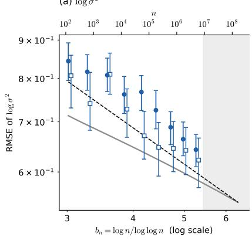

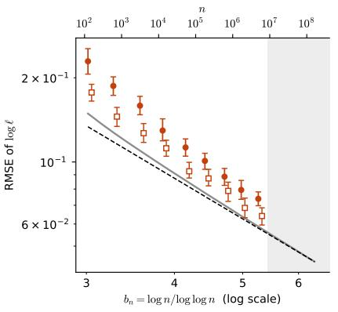  
RMSE (fitted slope = −0.49) IQR/1.349 (fitted slope = −0.49) Asymptotic SD (fitted slope = −0.35) h i l ¡p=2 ( l −0 )  
RMSE (fitted slope = −2.05) 亞 IQR/1.349 (fitted slope = −1.81) Asymptotic SD (fitted slope = −1.66) Theoretical rate b ¡(p + 2)=2 (slope = −1.5)

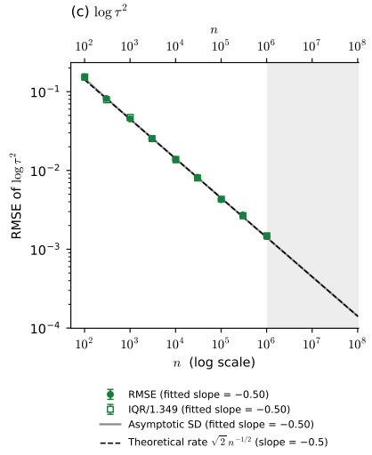

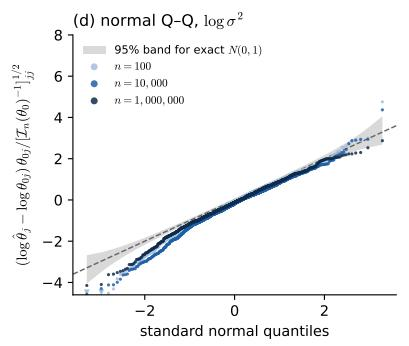

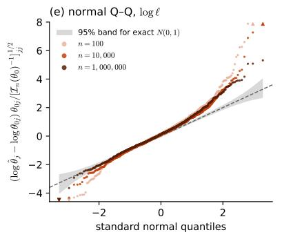

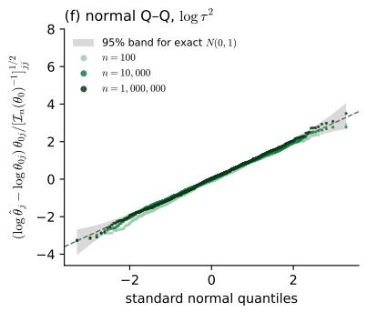  
Figure 1: Simulation results for $p = 1$ on the log scale, with $\theta _ { 0 } = \left( 1 , 0 . 2 5 , 0 . 0 1 \right)$ and 1000 replicates per n. Top: RMSE (filled circles), robust standard deviation IQR/1.349 (open squares), both with bootstrap 95% intervals, and the exact asymptotic standard deviation $[ \mathcal { I } _ { n } ( \theta _ { 0 } ) ^ { - 1 } ] _ { j j } ^ { 1 / 2 } / \theta _ { 0 j }$ (grey line). The grey region indicates sample sizes beyond the Monte Carlo range, where repeated MLE computation is computationally infeasible but the Fisher-information can still be evaluated. Dashed lines show the theoretical rates in Theorem 3.1(ii). Bottom: normal $\mathrm { Q - Q }$ plots of the standardized errors, with a 95% band for exact normality; triangles mark points outside the frame.

Table 1 compares slopes fitted to the simulated errors with those of the exact asymptotic standard deviation over the same range of $n ,$ as well as with the limiting exponents in Theorem 3.1. For $p = 2 , 3$ , the simulated RMSE slopes agree with those of the asymptotic standard deviation to within 0.1. The finite-sample slopes need not yet equal their limiting values because $b _ { n } = \log n /$ log log n grows extremely slowly; this issue is examined further in Appendix D.8.

The contrast between the spatial parameters and the nugget is substantial. From $n = 1 0 ^ { 2 }$ to $n = 1 0 ^ { 6 }$ , the RMSE of log ${ \widehat { \sigma } } ^ { 2 }$ decreases only by factors of 1.2, 1.5, and 2.1 for $p = 1 , 2 , 3$ , respectively, whereas the RMSE of log $\widehat { \tau } ^ { 2 }$ decreases by factors between 36 and 350. This is the slow logarithmic behavior predicted by the theory.

The errors are close to normal. For $p = 2$ and $p = 3$ , the standardized errors of log ${ \widehat { \sigma } } ^ { 2 }$ and log $\widehat { l }$ lie essentially within the 95% band for exact normality at the displayed sample sizes. The RMSE and robust standard deviation are also very similar, providing further evidence for the $p = 2 \colon$ fixed-domain MLE of the RBF kernel parameters (log scale) $( \sigma _ { 0 } ^ { 2 } = 1 , \ \ell _ { 0 } = 0 . 2 5 , \ \tau _ { 0 } ^ { 2 } = 0 . 0 1 ;$ 1000 replicates per n)

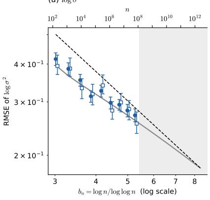  
RMSE (fitted slope = −0.75) IQR/1.349 (fitted slope = −0.72) Asymptotic SD (fitted slope = −0.74) Theoretical rate b ¡p=2 (slope = −1)

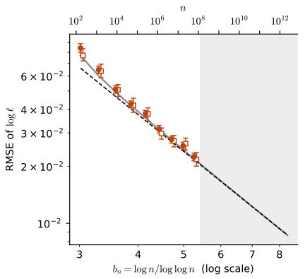

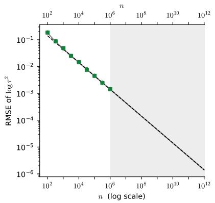  
RMSE (fitted slope = −2.32) IQR/1.349 (fitted slope = −2.24) Asymptotic SD (fitted slope = −2.22) Theoretical rate b ¡(p + 2)=2 (slope = −2)  
RMSE (fitted slope = −0.52) IQR/1.349 (fitted slope = −0.53) Asymptotic SD (fitted slope = −0.52) Theoretical rate p2 n¡1=2 (slope = −0.5)

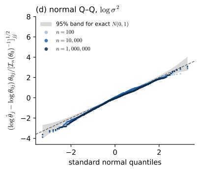

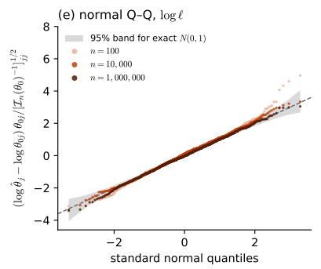

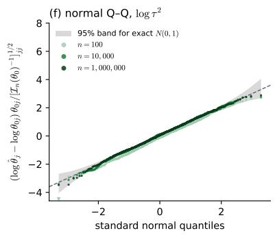  
Figure 2: Simulation results for $p = 2 .$ , with the layout and graphical elements as in Figure 1.

Table 1: Least-squares slopes of log(error) against log $b _ { n }$ for log $\sigma ^ { 2 }$ and log l, and against log n for log $\tau ^ { 2 }$ , over the nine simulated sample sizes $( 1 0 ^ { 2 } \lesssim n \leq 1 0 ^ { 6 } )$ . The last column gives the theoretical rate shown in Theorem 3.1.
<table><tr><td colspan="2">RMSE</td><td>IQR/1.349</td><td>Asymptotic SD</td><td>Theory</td></tr><tr><td rowspan="3"> $\log \sigma ^ { 2 }$ </td><td> $p = 1$  -0.49</td><td>-0.49</td><td>-0.35</td><td>-0.5</td></tr><tr><td> $p = 2$  -0.75</td><td>-0.72</td><td>-0.74</td><td>-1</td></tr><tr><td> $p = 3$  -1.34</td><td>-1.48</td><td>-1.32</td><td>-1.5</td></tr><tr><td rowspan="3">logl</td><td> $p = 1$  -2.05</td><td>-1.81</td><td>-1.66</td><td>-1.5</td></tr><tr><td> $p = 2$  -2.32</td><td>-2.24</td><td>-2.22</td><td>-2</td></tr><tr><td> $p = 3$  -3.11</td><td>-3.11</td><td>-3.09</td><td>-2.5</td></tr><tr><td rowspan="3"> $\log \tau ^ { 2 }$ </td><td> $p = 1$  -0.50</td><td>-0.50</td><td>-0.50</td><td>-0.5</td></tr><tr><td> $p = 2$  -0.52</td><td>-0.53</td><td>-0.52</td><td>-0.5</td></tr><tr><td> $p = 3$  -0.60</td><td>-0.58</td><td>-0.58</td><td>-0.5</td></tr></table>

Fisher-normalized limit in (3.8). The nugget errors show similarly good agreement except at the smallest sample size for $p = 3 .$ . Convergence to normality is slower for $p = 1$ , particularly for the lengthscale, where a heavier right tail remains visible even at the largest simulated sample sizes.

$p = 3 \colon$ fixed-domain MLE of the RBF kernel parameters (log scale) $( \sigma _ { 0 } ^ { 2 } = 1 , \ \ell _ { 0 } = 0 . 2 5 , \ \tau _ { 0 } ^ { 2 } = 0 . 0 1 ;$ 1000 replicates per n)

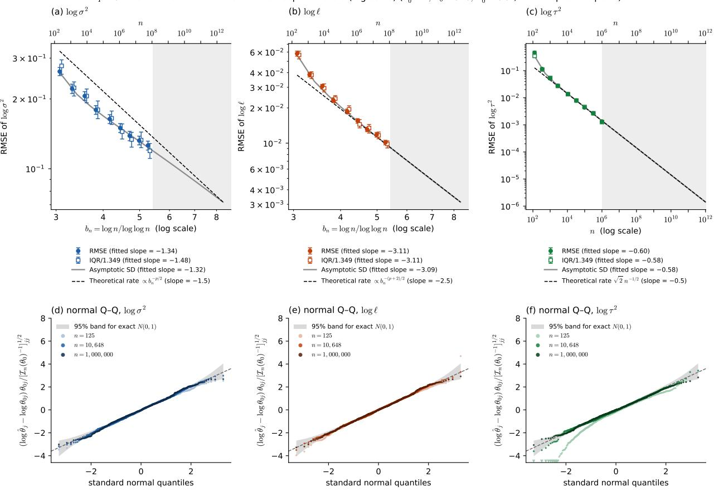  
Figure 3: Simulation results for $p = 3 .$ , with the layout and graphical elements as in Figure 1.

Additional normality diagnostics are reported in Appendix D.6.

The nugget is the easiest parameter. The nugget variance is estimated at the parametric rate. In every dimension, $\sqrt { n } \mathrm { R M S E } ( \log \widehat { \tau } ^ { 2 } )$ is within $6 \%$ of its limit $\sqrt { 2 }$ for all $n \geq 3 \times 1 0 ^ { 3 }$ . On the original scale, for example,

$$
\sqrt { n } \mathrm { R M S E } ( \widehat { \tau } ^ { 2 } ) = 0 . 0 1 4 3
$$

at $n = 1 0 ^ { 6 }$ for $p = 2$ , compared with the theoretical limit $\sqrt { 2 } \tau _ { 0 } ^ { 2 } = 0 . 0 1 4 1 4$ . The approximation is less accurate at the smallest sample sizes, especially for $p = 3 .$ . This behavior is consistent with the low-rank structure underlying Theorem 3.1: most directions eventually contain essentially only nugget noise, allowing $\tau ^ { 2 }$ to be estimated at the usual parametric rate. A more detailed finite-sample explanation is given in Appendix D.7.

Convergence rates of the spatial parameters are slow. For the spatial parameters $\sigma ^ { 2 }$ and l, the efective amount of information grows with the number of recoverable Taylor coeficients, whose maximal degree is of order $b _ { n } = \log n / \log \log n$ . This quantity grows very slowly: over $1 0 ^ { 2 } \leq n \leq 1 0 ^ { 6 }$ , it increases only from approximately 3.0 to 5.3. Consequently, the finite-sample slopes in Table 1 need not closely match the limiting exponents even when the MLE already tracks the Fisher-information benchmark well. Indeed, the exact asymptotic standard deviation itself exhibits the same finite-sample deviations from the limiting slopes. Further analysis of these efects is provided in Appendix D.8.

The diferent spatial rates are nevertheless already clearly visible. Since $D _ { n }$ contains an additional factor $b _ { n }$ for $l ,$ the lengthscale is estimated more accurately than the spatial variance by a factor of order $b _ { n }$ , in agreement with the simulations.

Higher dimensions help. The rates $b _ { n } ^ { - p / 2 }$ and $b _ { n } ^ { - ( p + 2 ) / 2 }$ imply that estimation of $\sigma ^ { 2 }$ and l becomes easier as the dimension $p$ increases. This may initially appear counterintuitive, since all observations still come from a single realization of the field. The explanation is that a higherdimensional RBF field contains more recoverable Taylor coeficients. The number of coeficients of degree at most m is

$$
N _ { p } ( m ) = { \binom { m + p } { p } } ,
$$

which is asymptotically of order $m , m ^ { 2 } / 2$ , and $m ^ { 3 } / 6$ for $p = 1 , 2 , 3$ , respectively. Thus a single realization contains more independent information about the spatial kernel parameters as $p$ increases. This is reflected both in the smaller estimation errors and in the improved normal approximation from $p = 1$ to $p = 3$ . In contrast, the nugget information is of order n in every dimension.

## 5 Discussion and future work

In this article, we establish an asymptotic theory for MLEs of RBF kernel parameters under fixeddomain asymptotics. We prove consistency of the joint MLE of the spatial variance, lengthscale, and nugget variance, derive their convergence rates, establish joint asymptotic normality, and show that all three rates are minimax optimal. To the best of our knowledge, these results provide the first complete asymptotic characterization of the joint MLE for the RBF kernel in this setting. The results provide theoretical justification for the MLE routinely used in $\mathrm { G P }$ software. At the same time, they reveal an important limitation: while the nugget variance converges at the standard parametric rate $n ^ { - 1 / 2 }$ , the spatial variance and lengthscale converge only at logarithmic rates. Since these rates are sharp, the slow convergence is not merely an artifact of the MLE or our analysis. In practice, substantial uncertainty in the estimated spatial variance and lengthscale may therefore remain even with a large number of densely sampled observations, and these estimates should be interpreted with caution when they are used for inference or downstream tasks. There are, however, some limitations of our study that motivate important directions for future work.

First, our results concern the exact MLE, whose computation requires $O ( n ^ { 3 } )$ operations and becomes prohibitive for large n. A large literature has developed scalable GP approximations, including inducing-point, variational inference, nearest-neighbor, and Vecchia-type methods, which replace the exact likelihood with computationally tractable approximations [Liu et al., 2020]. Indeed, our simulation studies also rely on scalable numerical approximations because repeated exact likelihood optimization becomes computationally prohibitive at the sample sizes needed to examine the asymptotic behavior. Thus, an important next question is how these approximations afect kerne parameter inference. In particular, it remains to determine which scalable approximations yield consistent estimators, whether they preserve the convergence rates and asymptotic distributions of the exact MLE, and how the approximation accuracy or computational complexity must scale with n to retain these statistical properties. Conversely, aggressive approximations may lose information about the kernel parameters and lead to slower rates or even inconsistency. Developing a statistical theory connecting computational approximation to kernel parameter inference would therefore provide useful guidance for scalable GP methodology.

A second limitation is that our analysis is specific to the RBF kernel. A key ingredient of our proof is its analytic structure, which allows a growing collection of normalized Taylor coeficients to be recovered from the observations with suficiently small error. This argument does not extend directly to kernels with finite smoothness, most notably the widely used Matérn family. Establishing analogous results for such kernels will therefore require diferent mathematical tools. More generally, understanding how kernel smoothness determines the amount of recoverable information and the resulting behavior of likelihood-based kernel parameter estimation is an important direction for future work.

## References

Sudipto Banerjee, Alan E. Gelfand, and Bradley P. Carlin. Hierarchical Modeling and Analysis for Spatial Data. Chapman and Hall/CRC, Boca Raton, FL, third edition, 2025.

A. Bhattacharyya. On a measure of divergence between two statistical populations defined by their probability distributions. Bulletin of the Calcutta Mathematical Society, 35:99–109, 1943.

DLMF. NIST Digital Library of Mathematical Functions. https://dlmf.nist.gov/, 2026. Release 1.2.8 of 2026-09-15.

Roman Garnett. Bayesian Optimization. Cambridge University Press, Cambridge, 2023.

Subhashis Ghosal and Aad van der Vaart. Fundamentals of Nonparametric Bayesian Inference, volume 44 of Cambridge Series in Statistical and Probabilistic Mathematics. Cambridge University Press, Cambridge, 2017.

I. A. Ibragimov and R. Z. Has’minskii. Statistical Estimation: Asymptotic Theory, volume 16 of Applications of Mathematics. Springer, New York, 1981.

Toni Karvonen and Chris J. Oates. Maximum likelihood estimation in Gaussian process regression is ill-posed. Journal of Machine Learning Research, 24(120):1–47, 2023.

Haitao Liu, Yew-Soon Ong, Xiaobo Shen, and Jianfei Cai. When Gaussian process meets big data: A review of scalable GPs. IEEE Transactions on Neural Networks and Learning Systems, 31(11): 4405–4423, 2020.

Wei-Liem Loh. Consistent estimation for a Gaussian random field with squared exponential covariance using scattered data under fixed-domain asymptotics. Electronic Journal of Statistics, 20(2):4045–4082, 2026.

Wei-Liem Loh and Tao-Kai Lam. Estimating structured correlation matrices in smooth Gaussian random field models. The Annals of Statistics, 28(3):880–904, 2000.

Blake MacDonald, Pritam Ranjan, and Hugh Chipman. GPfit: An R package for fitting a Gaussian process model to deterministic simulator outputs. Journal of Statistical Software, 64(12):1–23, 2015.

Fabian Pedregosa, Gaël Varoquaux, Alexandre Gramfort, Vincent Michel, Bertrand Thirion, Olivier Grisel, Mathieu Blondel, Peter Prettenhofer, Ron Weiss, Vincent Dubourg, et al. Scikit-learn: Machine learning in Python. Journal of Machine Learning Research, 12:2825–2830, 2011.

Ameer Qaqish and Didong Li. Identifiability for Gaussian processes with holomorphic kernels. In International Conference on Learning Representations, 2025.

Carl Edward Rasmussen and Hannes Nickisch. Gaussian processes for machine learning (GPML) toolbox. Journal of Machine Learning Research, 11:3011–3015, 2010.

Carl Edward Rasmussen and Christopher K. I. Williams. Gaussian Processes for Machine Learning. MIT Press, Cambridge, MA, 2006.

Daniel Revuz and Marc Yor. Continuous Martingales and Brownian Motion, volume 293 of Grundlehren der mathematischen Wissenschaften. Springer, Berlin, third edition, 1999.

Stephen Roberts, Michael Osborne, Mark Ebden, Steven Reece, Neale Gibson, and Suzanne Aigrain. Gaussian processes for time-series modelling. Philosophical Transactions of the Royal Society A: Mathematical, Physical and Engineering Sciences, 371(1984):20110550, 2013.

Olivier Roustant, David Ginsbourger, and Yves Deville. DiceKriging, DiceOptim: Two R packages for the analysis of computer experiments by kriging-based metamodeling and optimization. Journal of Statistical Software, 51(1):1–55, 2012.

Michael L. Stein. Interpolation of Spatial Data: Some Theory for Kriging. Springer Series in Statistics. Springer, New York, 1999.

Valentine Svensson, Sarah A. Teichmann, and Oliver Stegle. SpatialDE: identification of spatially variable genes. Nature Methods, 15(5):343–346, 2018.

Michel Talagrand. Upper and Lower Bounds for Stochastic Processes: Decomposition Theorems, volume 60 of Ergebnisse der Mathematik und ihrer Grenzgebiete. 3. Folge. Springer, Cham, second edition, 2021.

Lukas M. Weber, Arkajyoti Saha, Abhirup Datta, Kasper D. Hansen, and Stephanie C. Hicks. nnSVG for the scalable identification of spatially variable genes using nearest-neighbor Gaussian processes. Nature Communications, 14(1):4059, 2023.

Wanting Xu and Michael L. Stein. Maximum likelihood estimation for a smooth Gaussian random field model. SIAM/ASA Journal on Uncertainty Quantification, 5(1):138–175, 2017.

## Appendix

In Appendix A, we state key lemmas to prove the main theorems, together with auxiliary lemmas to prove the key lemmas. In Appendix B, we prove the main theorems and their corollaries using the lemmas in Appendix A. In Appendix C, we prove all lemmas in Appendix A. Finally, in Appendix D, we present additional experimental details for simulations in Section 4.

## A Lemmas

This appendix first records elementary Gaussian facts and a maximal inequality for continuous processes, and then states the auxiliary lemmas used in the proofs of Theorems 3.1 and 3.3 and their corollaries. The lemma proofs appear in Appendix C. All design matrices and linear statistics introduced below are deterministic functions of the locations.

## A.1 Gaussian afinity and elementary bounds

For probability laws $P , Q ,$ , define

$$
\mathrm { A f f } ( P , Q ) = \int \sqrt { d P d Q } , \qquad \mathrm { T V } ( P , Q ) = \operatorname * { s u p } _ { A } | P ( A ) - Q ( A ) | .
$$

The afinity is also called the Bhattacharyya coeficient, and $- \log \mathrm { A f f } ( P , Q )$ is the Bhattacharyya distance. For positive definite $d \times d$ covariance matrices $A , B$ , abbreviate $\mathrm { A f f } ( A , B ) =$ $\mathrm { A f f } ( N _ { d } ( 0 , A ) , N _ { d } ( 0 , B ) )$ . Direct Gaussian integration gives

$$
\operatorname { A f f } ( A , B ) = { \frac { \operatorname* { d e t } ( A ) ^ { 1 / 4 } \operatorname* { d e t } ( B ) ^ { 1 / 4 } } { \operatorname* { d e t } ( ( A + B ) / 2 ) ^ { 1 / 2 } } } .\tag{A.1}
$$

Applying the same statistic to both laws cannot decrease their afinity.

Lemma A.1 (Monotonicity of afinity). Let $P , Q$ be probability laws on a measurable space $( \mathcal { V } , \mathcal { F } )$ and let $T : \mathcal { V } \to \mathcal { V } ^ { \prime }$ be a measurable map into another measurable space. Then

$$
\mathrm { A f f } ( P \circ T ^ { - 1 } , Q \circ T ^ { - 1 } ) \geq \mathrm { A f f } ( P , Q ) .
$$

In particular, if $Y \sim N _ { d } ( 0 , A )$ under one law and $Y \sim N _ { d } ( 0 , B )$ under the other, and H is a fixed $r \times d$ matrix of rank $r ,$ then $\mathrm { A f f } ( H A H ^ { \top } , H B H ^ { \top } ) \geq \mathrm { A f f } ( A , B )$

In the applications, T is a linear statistic of the data that does not depend on the parameter. Both uses are in the proof of Theorem A.10: the coeficient statistic of Theorem $\mathrm { A . 9 }$ , and the noise block $W _ { n }$

The next two lemmas are elementary. Theorem A.2 controls all moments of the scores and is used in Theorem A.11; Theorem A.3 is used in the proof of Theorem A.10 to show that a fixed fraction of polynomial degrees is separated.

Lemma A.2 (Moments of Gaussian quadratic forms). Let $X \sim N _ { d } ( 0 , I _ { d } )$ and let B be a symmetric $d \times d$ matrix. For every $q \geq 1$ there is $C _ { q } .$ , depending only on $q ,$ such that $\mathbb { E } | X ^ { \top } B X - \mathrm { t r } B | ^ { q } \leq$ $C _ { q } \| B \| _ { \mathrm { F } } ^ { q }$

Lemma A.3 (A Paley–Zygmund-type bound). Let X be a random variable with $| X | \leq M$ almost surely and $\mathbb { E } X ^ { 2 } \ge \sigma ^ { 2 } > 0$ . Then, for every $\lambda \in [ 0 , 1 )$ ,

$$
\mathbb { P } ( | X | \geq \lambda \sigma ) \geq ( 1 - \lambda ^ { 2 } ) \frac { \sigma ^ { 2 } } { M ^ { 2 } } .
$$

In particular, if $X = f ( \iota )$ for an index ι uniformly distributed on a finite set ${ \mathcal { A } } ,$ then at least $( 1 - \lambda ^ { 2 } ) \sigma ^ { 2 } | \mathcal { A } | / M ^ { 2 }$ elements $\iota \in { \mathcal { A } }$ satisfy $| f ( \iota ) | \geq \lambda \sigma$

## A.2 A maximal inequality for continuous processes

The exponential tail bounds rest on the following chaining inequality, a variant of the shell argument of Ibragimov and Has’minskii [1981, Theorem I.5.1]. Theorems A.4 and A.5 are the building blocks, Theorem A.6 is the general bound, and Theorem $\mathrm { A . 7 }$ is the form used in Theorem A.12. Throughout, $m \geq 1 , \Vert \cdot \Vert _ { L ^ { m } }$ refers to a fixed probability measure, | · | is the Euclidean norm, and a supremum over the empty set is zero.

Lemma A.4 (Kolmogorov continuity criterion). Let $k \in \mathbb { N } , m \geq 1$ , and $\alpha > k$ . If a real process $( \xi ( x ) ) _ { x \in [ 0 , 1 ] ^ { k } }$ satisfies $\Vert \xi ( x ) - \xi ( y ) \Vert _ { L ^ { m } } \leq L | x - y | ^ { \alpha / m }$ for all $x , y ,$ then it has a continuous modification, again denoted $\xi ,$ such that

$$
\Big \| \operatorname* { s u p } _ { \substack { x , y \in [ 0 , 1 ] ^ { k } , | x - y | \leq h } } | \xi ( x ) - \xi ( y ) | \Big \| _ { L ^ { m } } \leq C _ { k , m , \alpha } L h ^ { ( \alpha - k ) / m } , \qquad h \in ( 0 , 1 ] .
$$

Lemma A.5 (Supremum over a compact convex set). Let $k \in \mathbb N$ and $m > k$ . Let $\Gamma \subseteq \mathbb { R } ^ { k }$ be a nonempty compact convex set of diameter at most $\delta > 0$ , and let $( \xi ( u ) ) _ { u \in \Gamma }$ be a real process with continuous paths such that $\begin{array} { r } { \operatorname* { s u p } _ { u \in \Gamma } \| \xi ( u ) \| _ { L ^ { m } } \leq M } \end{array}$ and $\Vert \xi ( u ) - \xi ( v ) \Vert _ { L ^ { m } } \leq L | u - v |$ for $u , v \in \Gamma$ Then

$$
\mathbb { E } \operatorname* { s u p } _ { u \in \Gamma } | \xi ( u ) | ^ { m } \leq C _ { k , m } \big \{ M ^ { m } + ( L \delta ) ^ { k } M ^ { m - k } \big \} .
$$

Proposition A.6 (Maximal inequality over a cover). Let $k \in \mathbb { N } , m > k , U \subseteq \mathbb { R } ^ { k }$ , and let $( \xi ( u ) ) _ { u \in U }$ be a real process with continuous paths. Let $( \Gamma _ { j } ) _ { j \in \mathcal { I } }$ be a countable family of nonempty compact convex subsets of $U$ of diameters at most $\delta _ { j }$ . Suppose that $\mathrm { s u p } _ { u \in \Gamma _ { j } } \| \xi ( u ) \| _ { L ^ { m } } \leq M _ { j }$ and $\Vert \xi ( u ) - \xi ( v ) \Vert _ { L ^ { m } } \leq L _ { j } | u - v |$ for $u , v \in \Gamma _ { j }$ . Then

$$
\mathbb { E } \operatorname* { s u p } _ { u \in \bigcup _ { j } \Gamma _ { j } } | \xi ( u ) | ^ { m } \leq C _ { k , m } \sum _ { j \in \mathcal { I } } \big \{ M _ { j } ^ { m } + ( L _ { j } \delta _ { j } ) ^ { k } M _ { j } ^ { m - k } \big \} .
$$

Only Lipschitz control inside each piece is required, so neither product structure nor convexity of U itself is needed. Taking the pieces to be annular shells gives bounds of Ibragimov–Has’minski type. For the Bernstein-type envelopes arising here, unit cubes are more convenient.

Corollary A.7 (Bernstein-type envelopes). Let $k = k _ { 1 } + k _ { 2 }$ with $k _ { 1 } , k _ { 2 } \in \mathbb { N }$ , let $m > k$ , and let $U \subseteq \mathbb { R } ^ { k _ { 1 } } \times \mathbb { R } ^ { k _ { 2 } }$ be a product of compact intervals. For $\gamma \in [ 1 , \infty ]$ and $r \geq 0$ put $\psi _ { \gamma } ( r ) = \operatorname* { m i n } ( r ^ { 2 } , \gamma r )$ 2 so that $\psi _ { \infty } ( r ) = r ^ { 2 }$ . Let $( \xi ( u ) ) _ { u \in U }$ have continuous paths, and suppose that, for constants $A \geq 0$

$a > 0 , B \geq 0$ , and $\gamma _ { 1 } , \gamma _ { 2 } \in [ 1 , \infty ]$

$$
\| \xi ( u ) \| _ { L ^ { m } } ^ { m } \leq A \exp [ - a \{ \psi _ { \gamma _ { 1 } } ( | u _ { 1 } | ) + \psi _ { \gamma _ { 2 } } ( | u _ { 2 } | ) \} ] , \qquad \quad u \in U ,\tag{A.2}
$$

$$
\Vert \xi ( u ) - \xi ( v ) \Vert _ { L ^ { m } } \leq B | u - v | ,
$$

$$
u , v \in U .\tag{A.3}
$$

Put $a ^ { \prime \prime } = a ( m - k ) / ( 3 2 m )$ . Then, for all $H _ { 1 } , H _ { 2 } \geq 0$

$$
\mathbb { E } \operatorname* { s u p } _ { | u _ { 1 } | \geq H _ { 1 } , | u _ { 2 } | \geq H _ { 2 } } | \xi ( u ) | ^ { m } \leq C \big ( A + B ^ { k } A ^ { 1 - k / m } \big ) \exp \big [ - a ^ { \prime \prime } \{ \psi _ { \gamma _ { 1 } } ( H _ { 1 } ) + \psi _ { \gamma _ { 2 } } ( H _ { 2 } ) \} \big ] ,\tag{A.4}
$$

where C depends only on $k _ { 1 } , k _ { 2 } , m ,$ and $^ { a , }$ and not on $\gamma _ { 1 } , \gamma _ { 2 }$ , or U.

## A.3 Auxiliary lemmas

The auxiliary lemmas follow the stages of the proof outline in Section 3.5.

• Theorem A.8 splits the likelihood into a low-dimensional signal block and a noise block, and supplies the covariance derivative bounds used throughout.

• Theorems A.9 and A.10 give global identifiability. Theorem A.9 recovers normalized Taylor coeficients of the field from the data, and Theorem A.10 turns their triangular covariance structure into an afinity bound between the observation laws.

• Theorem A.11, Theorem A.6, and Theorem A.7 convert that afinity bound into the exponential tail bound of Theorem A.12, which is Theorem 3.1(iv).

• Theorems A.13, A.14 and A.16 give the information bounds, the local quadratic expansion, and the score central limit theorem, which together prove parts (i)–(iii) of Theorem 3.1. Part (v) follows from parts (iii) and (iv).

• Theorem A.17 is used only for Theorem 3.6.

The RBF kernel is numerically of low rank on a bounded set. Its Taylor coeficients decay factorially, so only polynomial features of degree $O ( b _ { n } )$ are visible at the noise level. The next lemma makes this precise with a single projection that works for all parameters simultaneously.

Lemma A.8 (Common projection and covariance derivatives). Assume Assumption 1 and bounded observation locations. For any fixed $A > 0$ , there is a parameter-independent orthogonal projection $P _ { n }$ of rank $r _ { n } = O ( b _ { n } ^ { p } )$ such that, with $S _ { n } ( \theta ) = s R _ { n } ( l )$ ，

$$
\operatorname* { s u p } _ { \theta \in \Theta } \big \| \partial _ { \theta } ^ { \gamma } ( S _ { n } - P _ { n } S _ { n } P _ { n } ) \big \| _ { \mathrm { o p } } \leq n ^ { - A } , \qquad | \gamma | \leq 3 .\tag{A.5}
$$

For $\widetilde { C } _ { n } = t I _ { n } + P _ { n } S _ { n } P _ { n }$ and its log likelihood,

$$
\operatorname* { s u p } _ { \theta \in \Theta } | \partial _ { \theta } ^ { \gamma } ( l _ { n } - \widetilde { l } _ { n } ) | = O _ { \mathbb { P } } ( n ^ { 4 - A } ) , \qquad | \gamma | \le 3 .\tag{A.6}
$$

For a spatial derivative with a derivatives in s and c in $l , 1 \leq a + c \leq 3$ , a nonzero derivative

has $a \leq 1$ and satisfies

$$
\operatorname* { s u p } _ { \theta } \left\| C _ { n } ^ { - 1 / 2 } \partial _ { s } ^ { a } \partial _ { l } ^ { c } C _ { n } C _ { n } ^ { - 1 / 2 } \right\| _ { \mathrm { o p } } \leq C b _ { n } ^ { c } ,\tag{A.7}
$$

$$
\operatorname* { s u p } _ { \theta } \left\| C _ { n } ^ { - 1 / 2 } \partial _ { s } ^ { a } \partial _ { l } ^ { c } C _ { n } C _ { n } ^ { - 1 / 2 } \right\| _ { \mathrm { F } } \leq C b _ { n } ^ { p / 2 + c } .\tag{A.8}
$$

The same bounds hold after compression. Precisely, let U be any $n \times r$ matrix with orthonormal columns, $1 \leq r \leq n _ { \cdot }$ , that does not depend on θ, and let $A _ { \theta } = U ^ { \top } C _ { n } ( \theta ) U$ be the compressed covariance. Then (A.7) and (A.8) hold with $C _ { n }$ replaced by $A _ { \theta }$ , that is, for the compressed derivatives $\partial _ { s } ^ { a } \partial _ { l } ^ { c } A _ { \theta } = U ^ { \top } ( \partial _ { s } ^ { a } \partial _ { l } ^ { c } C _ { n } ) U$ whitened by $A _ { \theta } ^ { - 1 / 2 }$ , with constants that do not depend on $U .$ In the coordinates $\theta = \theta _ { 0 } + D _ { n } ^ { - 1 } h$ , normalized spatial derivatives of total order $k \leq 3$ , whitened either by $C _ { n }$ or by a compression $A _ { \theta } .$ , have respective bounds $C \epsilon _ { n } ^ { k }$ in operator norm and $C \epsilon _ { n } ^ { k - 1 }$ in Frobenius norm. The first normalized nugget derivative has operator norm $O ( n ^ { - 1 / 2 } )$ and Frobenius norm O(1), and all covariance derivatives of order at least two involving t vanish.

In coordinates adapted to this projection, the reduced likelihood separates into a signal block of dimension $r _ { n }$ and a noise block of dimension $d _ { n } = n - r _ { n }$ that depends only on the nugget. Fix a projection from Theorem A.8 with $A = 2 0$ . Choose orthonormal matrices $U _ { n } , V _ { n }$ spanning its range and orthogonal complement, and write

$$
Z _ { n } = U _ { n } ^ { \top } Y _ { n } , \quad W _ { n } = V _ { n } ^ { \top } Y _ { n } , \quad d _ { n } = n - r _ { n } , \quad A _ { \theta } = t I _ { r _ { n } } + s U _ { n } ^ { \top } R _ { n } ( l ) U _ { n } .\tag{A.9}
$$

The reduced negative twice log likelihood decomposes as

$$
\begin{array} { c } { { - 2 \widetilde { l } _ { n } ( \theta ) = F _ { n } ( t ) + G _ { n } ( s , l , t ) , } } \\ { { F _ { n } ( t ) = d _ { n } \log { t } + \left\| { W _ { n } } \right\| ^ { 2 } / t , } } \\ { { G _ { n } ( s , l , t ) = \log { | A _ { \theta } | } + Z _ { n } ^ { \top } A _ { \theta } ^ { - 1 } Z _ { n } . } } \end{array}
$$

The spatial parameters are identified through the Taylor coeficients of the field at a fixed point. For the next lemma, apply a fixed rigid motion to the spatial coordinates so that $Q = [ 0 , L ] ^ { p }$ for some $L > 0$ . This preserves the covariance model. The field F has a version that is an entire function on $\mathbb { R } ^ { p }$ (see the proof of Theorem A.9). Its normalized Taylor coeficients at the origin are

$$
\zeta _ { \alpha } = \sqrt { \alpha ! } [ x ^ { \alpha } ] F ( x ) , \qquad \alpha \in  { \mathbb { N } } _ { 0 } ^ { p } .\tag{A.10}
$$

Let $\zeta ^ { ( m ) } = ( \zeta _ { \alpha } : | \alpha | \leq m )$ 2 $q _ { m } = { \binom { m + p } { p } }$ , and $\Sigma _ { m , \theta } = \mathrm { C o v } _ { \theta } ( \zeta ^ { ( m ) } )$

These coeficients have a triangular structure. By (C.19) in the proof of Theorem A.9, $\zeta ^ { ( m ) } =$ $\sqrt { s } \mathcal { T } _ { m , \theta } \xi ^ { ( m ) }$ with independent standard normal $\xi _ { \alpha }$ and a matrix $\mathcal { T } _ { m , \theta }$ that is lower triangular in degree order with diagonal entries $l ^ { - | \alpha | }$ . Given the coeficients of lower degree, $\zeta _ { \alpha }$ therefore has variance $s l ^ { - 2 | \alpha | }$ . The next lemma shows that a fixed linear statistic recovers these coeficients through degree $m _ { n } \asymp b _ { n } .$ , with polynomially small error uniformly in θ. The regression is fitted to a higher degree $K _ { n } \approx 2 m _ { n }$ : extracting a coeficient of degree m from the fitted polynomial amplifies errors by a factor $e ^ { m \log m }$ , which the truncation error $e ^ { - K \log K }$ of the fit must overcome.

Lemma A.9 (Recovery of normalized Taylor coeficients). Under Assumptions 1 and 2, set

$$
\beta = \kappa p , \qquad K _ { n } = \left\lfloor \frac { \beta } { 2 } b _ { n } \right\rfloor , \qquad m _ { n } = \left\lfloor \frac { \beta } { 4 } b _ { n } \right\rfloor .
$$

There is a parameter-independent linear statistic ${ \widehat { \zeta } } ^ { ( m _ { n } ) } = H _ { n } Y _ { n }$ such that

$$
\operatorname* { s u p } _ { \theta \in \Theta } \operatorname* { m a x } _ { \alpha | \leq m _ { n } } \mathbb { E } _ { \theta } ( \widehat { \zeta } _ { \alpha } - \zeta _ { \alpha } ) ^ { 2 } \leq n ^ { - \beta / 4 + o ( 1 ) } .\tag{A.11}
$$

The exact coeficient covariance satisfies

$$
e ^ { - C m } I _ { q _ { m } } \preceq \Sigma _ { m , \theta } \preceq e ^ { C m } I _ { q _ { m } } , \qquad m \geq 1 ,\tag{A.12}
$$

uniformly in θ. Writing $\widehat { \Sigma } _ { n , \theta } = \mathrm { C o v } _ { \theta } ( H _ { n } Y _ { n } )$ , we have

$$
\begin{array} { r } { \displaystyle \operatorname* { s u p } _ { \theta \in \Theta } \left\| \Sigma _ { m _ { n } , \theta } ^ { - 1 / 2 } ( \widehat \Sigma _ { n , \theta } - \Sigma _ { m _ { n } , \theta } ) \Sigma _ { m _ { n } , \theta } ^ { - 1 / 2 } \right\| _ { \mathrm { o p } } \leq n ^ { - \beta / 8 + o ( 1 ) } . } \end{array}\tag{A.13}
$$

Consequently,

$$
\operatorname* { s u p } _ { \theta , \theta ^ { \prime } \in \Theta } \left| \log \mathrm { A f f } ( \widehat { \Sigma } _ { n , \theta } , \widehat { \Sigma } _ { n , \theta ^ { \prime } } ) - \log \mathrm { A f f } ( \Sigma _ { m _ { n } , \theta } , \Sigma _ { m _ { n } , \theta ^ { \prime } } ) \right| = o ( 1 ) .\tag{A.14}
$$

The logarithm of the conditional variance $s l ^ { - 2 | \alpha | }$ is log $s - 2 | \alpha | \log l .$ , which is linear in the degree. Separating $( s , l )$ from $( s _ { 0 } , l _ { 0 } )$ therefore amounts to a regression of log-variances on degrees spread over $[ 0 , m _ { n } ]$ . With about $b _ { n } ^ { p }$ coeficients, this explains the information scales $b _ { n } ^ { p }$ for the intercept s and $b _ { n } ^ { p + 2 }$ for the slope l. The next lemma turns this heuristic into a global bound on the afinity between observation laws, and adds the noise block to separate the nugget.

Lemma A.10 (Afinity separation). Under Assumptions 1 and 2, there are $c > 0$ and a deterministic sequence $e _ { n } \to 0$ such that, for all $\theta = ( s , l , t ) \in \Theta$

$$
\mathrm { A f f } ( P _ { \theta , n } , P _ { \theta _ { 0 } , n } ) \leq \exp \left[ e _ { n } - c b _ { n } ^ { p } \operatorname* { m i n } \left\{ \Lambda _ { n } ( \theta ) ^ { 2 } , \Lambda _ { n } ( \theta ) \right\} \right] ,\tag{A.15}
$$

where $\Lambda _ { n } ( \theta ) \geq 0$ is defined by $\Lambda _ { n } ( \theta ) ^ { 2 } = \log ^ { 2 } ( s / s _ { 0 } ) + b _ { n } ^ { 2 } \log ^ { 2 } ( l / l _ { 0 } )$ . Moreover, write $h = D _ { n } ( \theta - \theta _ { 0 } ) =$ $( h _ { \mathrm { s p } } , h _ { t } )$ , where $h _ { \mathrm { s p } } \in \mathbb { R } ^ { 2 }$ collects the two spatial coordinates. After decreasing c and enlarging $e _ { n } .$ for all $\theta \in \Theta$

$$
\mathrm { A f f } ( P _ { \theta , n } , P _ { \theta _ { 0 } , n } ) \leq \exp \left[ e _ { n } - c \{ \operatorname* { m i n } ( \| h _ { \mathrm { s p } } \| ^ { 2 } , b _ { n } ^ { p / 2 } \| h _ { \mathrm { s p } } \| ) + h _ { t } ^ { 2 } \} \right] .\tag{A.16}
$$

The constant c and the sequence $e _ { n }$ do not depend on $\theta _ { 0 } \in \Theta$ , and they depend on the design only through $\mathcal { X } , \ : Q , \ : C _ { h }$ , and κ. Both bounds hold at every suficiently large n at which (3.2) is satisfied.

To control the global maximizer, the likelihood ratio $Z _ { n } ( h )$ enters only through the process $\xi _ { n } = Z _ { n } ^ { 1 / ( 2 m ) }$ . The exponent $1 / ( 2 m )$ makes $\mathbb { E } \xi _ { n } ( h ) ^ { m }$ exactly the afinity, and a change of measure bounds the $L ^ { m }$ Lipschitz constant of $\xi _ { n }$ uniformly over the whole parameter box. This holds even where covariances at diferent parameters are not comparable.

Lemma A.11 (Likelihood-ratio process). Assume Assumption 1 and bounded observation locations, and fix $m \geq 1$ . On the box $U _ { n } = D _ { n } ( \Theta - \theta _ { 0 } )$ define

$$
Z _ { n } ( h ) = \mathrm { e x p } \{ l _ { n } ( \theta _ { 0 } + D _ { n } ^ { - 1 } h ) - l _ { n } ( \theta _ { 0 } ) \} , \qquad \xi _ { n } ( h ) = Z _ { n } ( h ) ^ { 1 / ( 2 m ) } .
$$

Then $\xi _ { n }$ has continuous paths,

$$
\mathbb { E } _ { \theta _ { 0 } , n } \xi _ { n } ( h ) ^ { m } = \mathrm { A f f } ( P _ { \theta _ { 0 } + D _ { n } ^ { - 1 } h , n } , P _ { \theta _ { 0 } , n } ) , \qquad h \in U _ { n } ,\tag{A.17}
$$

and there is a constant $C _ { L }$ , depending only on m, p, Θ, and X , such that for all n and all $u , v \in U _ { n }$

$$
\begin{array} { r } { \left. \xi _ { n } ( u ) - \xi _ { n } ( v ) \right. _ { L ^ { m } ( \mathbb { P } _ { \theta _ { 0 } , n } ) } \leq C _ { L } \left. u - v \right. . } \end{array}\tag{A.18}
$$

Combining Theorems A.10 and A.11 with Theorem A.7 gives the tail bound. The key observation is that $\xi _ { n } ( \widehat { h } _ { n } ) \ge \xi _ { n } ( 0 ) = 1$ , because $\widehat { \theta } _ { n }$ maximizes the likelihood. Hence a large deviation of $\widehat { h } _ { n }$ forces a large supremum of $\xi _ { n }$ far from the origin.

Lemma A.12 (Exponential tails of the global maximizer). Under Assumptions 1 and 2, write $\widehat { h } _ { n } = D _ { n } ( \widehat { \theta } _ { n } - \theta _ { 0 } ) = ( \widehat { h } _ { n , \mathrm { s p } } , \widehat { h } _ { n , t } )$ . There are constants $c , C > 0$ and $n _ { 0 }$ such that (3.10) holds for all $n \geq n _ { 0 }$ and $H \geq 0$ . The constants do not depend on $\theta _ { 0 } \in \Theta$ , and they depend on the design only through $\mathcal { X } , Q , C _ { h }$ , and κ. For $n \geq n _ { 0 }$ , the bounds hold at every n at which (3.2) is satisfied. Interiority of $\theta _ { 0 }$ is not used.

The upper information bounds follow from the derivative bounds of Theorem A.8. The lower bound on $J _ { n , \mathrm { s p } }$ avoids diferentiating the coeficient recovery error. Instead, it compares a local quadratic expansion of the afinity at distance one, in rescaled coordinates, with the separation bound of Theorem A.10.

Lemma A.13 (Information bounds). Under Assumption 1 and bounded observation locations,

$$
\operatorname* { s u p } _ { \theta \in \Theta } \mathcal { T } _ { s s , n } ( \theta ) \leq C b _ { n } ^ { p } , \qquad \operatorname* { s u p } _ { \theta \in \Theta } \mathcal { T } _ { l l , n } ( \theta ) \leq C b _ { n } ^ { p + 2 } , \qquad \operatorname* { s u p } _ { \theta \in \Theta } \mathcal { T } _ { t t , n } ( \theta ) \leq C n .
$$

If Assumption 2 also holds, then (3.4) and (3.5) hold.

The remaining stage is local. Because Theorem 3.1(iv) already gives tightness, the main proof needs the quadratic expansion only on balls of fixed radius. The next lemma gives it on balls of every radius $o ( b _ { n } ^ { p / 6 } )$ , and Theorem A.15 shows that this radius cannot be enlarged.

Lemma A.14 (Uniform local quadratic expansion). Under Assumption 1 and bounded observation locations, set $\Delta _ { n } = D _ { n } ^ { - 1 } \nabla l _ { n } ( \theta _ { 0 } )$ and $L _ { n } ( h ) = l _ { n } ( \theta _ { 0 } + D _ { n } ^ { - 1 } h )$ . Then $\mathbb { E } \Delta _ { n } = 0 , \mathrm { C o v } ( \Delta _ { n } ) = J _ { n }$ , and

$$
\nabla _ { h } ^ { 2 } L _ { n } ( 0 ) = - J _ { n } + O _ { \mathbb { P } } ( \epsilon _ { n } ) .\tag{A.19}
$$

Let $H _ { n } \geq 1$ be any sequence with $\epsilon _ { n } H _ { n } \to 0$ . Then

$$
\operatorname* { s u p } _ { \| h \| \leq H _ { n } } \operatorname* { m a x } _ { a , b , c } | \partial _ { h _ { a } h _ { b } h _ { c } } ^ { 3 } L _ { n } ( h ) | = O _ { \mathbb { P } } ( \epsilon _ { n } ) .\tag{A.20}
$$

For all suficiently large $n ,$ , the ball $\{ \| h \| \leq H _ { n } \}$ lies in the rescaled parameter space $D _ { n } ( \Theta - \theta _ { 0 } )$ , and

$$
\operatorname* { s u p } _ { \| h \| \leq H _ { n } } \left| L _ { n } ( h ) - L _ { n } ( 0 ) - h ^ { \top } \Delta _ { n } + { \frac { 1 } { 2 } } h ^ { \top } J _ { n } h \right| = O _ { \mathbb { P } } ( \epsilon _ { n } H _ { n } ^ { 3 } ) .\tag{A.21}
$$

In particular, $\mathrm { i f } \ \epsilon _ { n } H _ { n } ^ { 3 } \to 0$ , that is, $H _ { n } = o ( b _ { n } ^ { p / 6 } )$ , then

$$
\operatorname* { s u p } _ { \| h \| \leq H _ { n } } \Big | L _ { n } ( h ) - L _ { n } ( 0 ) - h ^ { \top } \Delta _ { n } + \frac { 1 } { 2 } h ^ { \top } J _ { n } h \Big | = o _ { \mathbb { P } } ( 1 ) .\tag{A.22}
$$

This applies, in particular, to every fixed radius.

Remark A.15 (The radius $b _ { n } ^ { p / 6 }$ is sharp). The condition $\epsilon _ { n } H _ { n } ^ { 3 } \to 0$ cannot be weakened. Under Assumptions 1 and 2, there is $c > 0$ such that, for every fixed $\kappa > 0$ , the point $h _ { n } = \kappa \epsilon _ { n } ^ { - 1 / 3 } e _ { s }$ in the variance direction satisfies

$$
\mathbb { P } \Big \{ L _ { n } ( h _ { n } ) - L _ { n } ( 0 ) - h _ { n } ^ { \top } \Delta _ { n } + \frac { 1 } { 2 } h _ { n } ^ { \top } J _ { n } h _ { n } \geq c \kappa ^ { 3 } \Big \}  1 .
$$

Hence (A.22) fails for every sequence $H _ { n }$ with lim $\operatorname* { i n f } _ { n } \epsilon _ { n } H _ { n } ^ { 3 } > 0$ . The reason is that the third derivative of the log likelihood in the variance direction is of exact order $\epsilon _ { n } ,$ as for the variance of $N \asymp b _ { n } ^ { p }$ independent normal observations.

The score is a vector of centered Gaussian quadratic forms. Each normalized whitened derivative has operator norm $O ( \epsilon _ { n } )$ but Frobenius norm of order one, so the quadratic forms are sums of many small independent contributions, and a Lyapunov argument gives the normal limit.

Lemma A.16 (Fisher-normalized score central limit theorem). Assume Assumptions 1 and $2 ,$ and let $M _ { n }$ be $3 \times 3$ matrices with $M _ { n } ^ { \top } M _ { n } = \mathbb { Z } _ { n } ( \theta _ { 0 } )$ . Then

$$
M _ { n } ^ { - \top } \nabla l _ { n } ( \theta _ { 0 } ) \implies N _ { 3 } ( 0 , I _ { 3 } ) .\tag{A.23}
$$

The same quadratic-form argument applies to bounded sequences of linear combinations of $\Delta _ { n }$ whose variances converge to a positive limit.

The last lemma is used only for Theorem 3.6. Independent sampling with a density bounded below on Q satisfies Assumption 2 almost surely, with polynomially small failure probability at each n.

Lemma A.17 (Coverage for independent sampling). Under the sampling assumptions of Theorem 3.6, almost surely,

$$
h _ { n } ( Q ) = O ( ( \log n / n ) ^ { 1 / p } ) .\tag{A.24}
$$

More precisely, for every $q \ > \ 0$ there are constants $A _ { q } , C _ { q } ~ < ~ \infty$ such that $\mathbb { P } \{ h _ { n } ( Q ) \ >$ $A _ { q } ( \log n / n ) ^ { 1 / p } \} \ \leq \ C _ { q } n ^ { - q }$ for all $n \ \geq \ 2$ . Thus Assumption 2 holds almost surely for every fixed $0 < \kappa < 1 / p$

## B Proofs of the main results

## B.1 Proof of Theorem 3.1

Proof. Theorem A.13 proves part (i), and Theorem A.12 proves part (iv). Write $\widehat { h } _ { n } = D _ { n } ( \widehat { \theta } _ { n } - \theta _ { 0 } )$ 2 recall $L _ { n } ( h ) = l _ { n } ( \theta _ { 0 } + D _ { n } ^ { - 1 } h )$ from Theorem A.14, and set

$$
Q _ { n } ( h ) = h ^ { \top } \Delta _ { n } - \frac { 1 } { 2 } h ^ { \top } J _ { n } h , \qquad h _ { n } ^ { * } = J _ { n } ^ { - 1 } \Delta _ { n } , \qquad R _ { n , K } = \operatorname * { s u p } _ { \| h \| \leq K } \big | L _ { n } ( h ) - L _ { n } ( 0 ) - Q _ { n } ( h ) \big | .
$$

Part (ii). For every fixed K, (A.22) applies with the fixed radius $H _ { n } \ = \ \operatorname* { m a x } ( K , 1 )$ , so $R _ { n , K } = o _ { \mathbb { P } } ( 1 )$ ; that is, $L _ { n } ( h ) - L _ { n } ( 0 ) = Q _ { n } ( h ) + o _ { \mathbb { P } } ( 1 )$ uniformly on $\{ \| h \| \leq K \}$ . The function $Q _ { n }$ is quadratic, with $\nabla Q _ { n } ( h _ { n } ^ { * } ) = \Delta _ { n } - J _ { n } h _ { n } ^ { * } = 0$ and $\nabla ^ { 2 } Q _ { n } = - J _ { n }$ , so its Taylor expansion about $h _ { n } ^ { * }$ is exact:

$$
Q _ { n } ( h ) = Q _ { n } ( h _ { n } ^ { * } ) - \frac { 1 } { 2 } ( h - h _ { n } ^ { * } ) ^ { \top } J _ { n } ( h - h _ { n } ^ { * } ) , \qquad h \in \mathbb { R } ^ { 3 } .\tag{B.1}
$$

In particular, $Q _ { n } ( h ) \leq Q _ { n } ( h _ { n } ^ { * } )$ for all $h$

Fix $\varepsilon > 0$ . The score satisfies $\mathbb { E } \left\| \Delta _ { n } \right\| ^ { 2 } = \operatorname { t r } J _ { n } \leq C ,$ so $h _ { n } ^ { * } = O _ { \mathbb { P } } ( 1 )$ by part (i), and $\widehat { h } _ { n } = O _ { \mathbb { P } } ( 1 )$ by part (iv). Choose K such that the event $E _ { n } = \left\{ \left. { \widehat { h } } _ { n } \right. \leq K , \ \left. h _ { n } ^ { * } \right. \leq K \right\}$ has $\mathbb { P } ( E _ { n } ^ { c } ) \leq \varepsilon$ for all large n. Because $\theta _ { 0 }$ is interior, the ball $\{ \| h \| \leq K \}$ lies in $\ddot { D } _ { n } ( \Theta - \theta _ { 0 } )$ for large n. Hence, on $E _ { n }$ , the point $\theta _ { 0 } + D _ { n } ^ { - 1 } h _ { n } ^ { * }$ belongs to $\Theta ,$ and global optimality gives $L _ { n } ( \widehat { h } _ { n } ) \geq L _ { n } ( h _ { n } ^ { * } )$ . Using the expansion at $h _ { n } ^ { * }$ , this inequality, the expansion at $\widehat { h } _ { n }$ , and $Q _ { n } \leq Q _ { n } ( h _ { n } ^ { * } )$ , we obtain on $E _ { n }$

$$
Q _ { n } ( h _ { n } ^ { * } ) - R _ { n , K } \leq L _ { n } ( h _ { n } ^ { * } ) - L _ { n } ( 0 ) \leq L _ { n } ( \widehat { h } _ { n } ) - L _ { n } ( 0 ) \leq Q _ { n } ( \widehat { h } _ { n } ) + R _ { n , K } \leq Q _ { n } ( h _ { n } ^ { * } ) + R _ { n , K } .
$$

Thus the maximized log likelihood ratio is approximated by the maximum of the quadratic:

$$
| L _ { n } ( \widehat { h } _ { n } ) - L _ { n } ( 0 ) - Q _ { n } ( h _ { n } ^ { * } ) | \leq R _ { n , K } \qquad \mathrm { o n } ~ E _ { n } .\tag{B.2}
$$

By (B.1) at $h = \widehat { h } _ { n }$ , (B.2), and the expansion at $\widehat { h } _ { n } .$ , on $E _ { n }$

$$
\begin{array} { r l } & { \frac { 1 } { 2 } ( \widehat { h } _ { n } - h _ { n } ^ { * } ) ^ { \top } J _ { n } ( \widehat { h } _ { n } - h _ { n } ^ { * } ) = Q _ { n } ( h _ { n } ^ { * } ) - Q _ { n } ( \widehat { h } _ { n } ) } \\ & { \qquad \leq | L _ { n } ( \widehat { h } _ { n } ) - L _ { n } ( 0 ) - Q _ { n } ( h _ { n } ^ { * } ) | + | L _ { n } ( \widehat { h } _ { n } ) - L _ { n } ( 0 ) - Q _ { n } ( \widehat { h } _ { n } ) | \leq 2 R _ { n , K } . } \end{array}
$$

Since $J _ { n } \succeq c I _ { 3 }$ by part (i), for every $\eta > 0$

$$
\begin{array} { r } { \mathbb { P } \{ \left\| \widehat { h } _ { n } - h _ { n } ^ { * } \right\| > \eta \} \le \mathbb { P } ( E _ { n } ^ { c } ) + \mathbb { P } \{ R _ { n , K } \ge c \eta ^ { 2 } / 4 \} \le \varepsilon + o ( 1 ) . } \end{array}
$$

As ε is arbitrary, ${ \widehat { h } } _ { n } - h _ { n } ^ { * } = o _ { \mathbb { P } } ( 1 )$ , which is (3.6). The three rates and consistency follow.

Part (iii). Let $T _ { n } = D _ { n } J _ { n } ^ { 1 / 2 }$ , so that $\mathcal { T } _ { n } ( \theta _ { 0 } ) = D _ { n } J _ { n } D _ { n } = T _ { n } T _ { n } ^ { \top }$ . Then

$$
T _ { n } ^ { \top } ( \widehat { \theta } _ { n } - \theta _ { 0 } ) = J _ { n } ^ { 1 / 2 } \widehat { h } _ { n } , \qquad T _ { n } ^ { - 1 } \nabla l _ { n } ( \theta _ { 0 } ) = J _ { n } ^ { - 1 / 2 } D _ { n } ^ { - 1 } \nabla l _ { n } ( \theta _ { 0 } ) = J _ { n } ^ { - 1 / 2 } \Delta _ { n } = J _ { n } ^ { 1 / 2 } h _ { n } ^ { * } .
$$

and therefore

$$
T _ { n } ^ { \top } ( \widehat { \theta } _ { n } - \theta _ { 0 } ) - T _ { n } ^ { - 1 } \nabla l _ { n } ( \theta _ { 0 } ) = J _ { n } ^ { 1 / 2 } ( \widehat { h } _ { n } - h _ { n } ^ { * } ) ,\tag{B.3}
$$

whose norm is at most $\| J _ { n } \| _ { \mathrm { o p } } ^ { 1 / 2 } \left\| \widehat { h } _ { n } - h _ { n } ^ { * } \right\| = o _ { \mathbb { P } } ( 1 )$ by parts (i) and (ii). Now let $M _ { n } ^ { \top } M _ { n } = \mathbb { Z } _ { n } ( \theta _ { 0 } )$ The matrix $O _ { n } = M _ { n } T _ { n } ^ { - \top }$ is orthogonal, because $O _ { n } O _ { n } ^ { \top } = M _ { n } \mathbb { Z } _ { n } ( \theta _ { 0 } ) ^ { - 1 } M _ { n } ^ { \top } = I _ { 3 }$ . Hence $M _ { n } = O _ { n } T _ { n } ^ { \top }$ and $M _ { n } ^ { - \top } = O _ { n } T _ { n } ^ { - 1 }$ , and (B.3) gives

$$
M _ { n } ( \widehat { \theta } _ { n } - \theta _ { 0 } ) = M _ { n } ^ { - \top } \nabla l _ { n } ( \theta _ { 0 } ) + O _ { n } J _ { n } ^ { 1 / 2 } ( \widehat { h } _ { n } - h _ { n } ^ { * } ) = M _ { n } ^ { - \top } \nabla l _ { n } ( \theta _ { 0 } ) + o _ { \mathbb { P } } ( 1 ) .
$$

Theorem A.16 and Slutsky’s lemma prove (3.8).

For the nugget, write $\Delta _ { n , t }$ for the third score coordinate. The block structure in (3.5) and (3.6) give

$$
\sqrt { n } ( \widehat { t } _ { n } - t _ { 0 } ) = 2 t _ { 0 } ^ { 2 } \Delta _ { n , t } + o _ { \mathbb { P } } ( 1 ) .
$$

Its score variance tends to $( 2 t _ { 0 } ^ { 2 } ) ^ { - 1 }$ , and the final assertion of Theorem A.16 gives $\Delta _ { n , t } \Rightarrow N ( 0 , ( 2 t _ { 0 } ^ { 2 } ) ^ { - 1 } )$ .   
This proves (3.9).

Part (v). Let $\mu > 0$ . For $n \geq n _ { 0 }$ , part (iv) and $e ^ { - c \operatorname* { m i n } ( x , y ) } \leq e ^ { - c x } + e ^ { - c y }$ give

$$
\mathbb { E } e ^ { \mu  \widehat { h } _ { n , \mathrm { s p } }  } = 1 + \int _ { 0 } ^ { \infty } \mu e ^ { \mu H } \mathbb { P } \{  \widehat { h } _ { n , \mathrm { s p } }   > H \} d H \leq 1 + C \int _ { 0 } ^ { \infty } \mu e ^ { \mu H } \big ( e ^ { - c H ^ { 2 } } + e ^ { - c h _ { n } ^ { p / 2 } H } \big ) d H \}
$$

which is bounded uniformly in n once $c b _ { n } ^ { p / 2 } \geq 2 \mu$ . Similarly, $\begin{array} { r } { \mathbb { E } e ^ { \mu \vert \widehat { h } _ { n , t } \vert } \leq 1 + C \int _ { 0 } ^ { \infty } \mu e ^ { \mu H - c H ^ { 2 } } d H } \end{array}$ Since $\left\| \widehat { h } _ { n } \right\| \leq \left\| \widehat { h } _ { n , \mathrm { s p } } \right\| + | \widehat { h } _ { n , t } |$ , the Cauchy–Schwarz inequality with $\mu = 2 \lambda$ proves (3.11).

Let f be as in part (v). By part (iii) with $M _ { n } = T _ { n } ^ { \top } , Y _ { n } = J _ { n } ^ { 1 / 2 } \widehat { h } _ { n } \Rightarrow Z$ . The family $\{ f ( \widehat { h } _ { n } ) \}$ is uniformly integrable, because $f ( \widehat { h } _ { n } ) ^ { 2 } \leq C ^ { 2 } e ^ { 2 \lambda \left| \left| \widehat { h } _ { n } \right| \right| }$ has bounded expectation by (3.11). Suppose that the first convergence in (3.12) fails. Then there are $\delta > 0$ and a subsequence along which $| \mathbb { E } f ( \widehat { h } _ { n } ) - \mathbb { E } f ( J _ { n } ^ { - 1 / 2 } Z ) | \geq \delta$ . By part (i), a further subsequence has $J _ { n } \to J _ { * }$ with $c I _ { 3 } \preceq J _ { * } \preceq C I _ { 3 }$ . Along it, $\widehat { h } _ { n } = J _ { n } ^ { - 1 / 2 } Y _ { n } \Rightarrow J _ { * } ^ { - 1 / 2 } Z$ by Slutsky’s lemma, so uniform integrability gives E $f ( \widehat { h } _ { n } ) \to \mathbb { E } f ( J _ { * } ^ { - 1 / 2 } Z )$ . Also $\mathbb { E } f ( J _ { n } ^ { - 1 / 2 } Z ) \to \mathbb { E } f ( J _ { * } ^ { - 1 / 2 } Z )$ by dominated convergence, since $| f ( J _ { n } ^ { - 1 / 2 } Z ) | \leq C e ^ { \lambda c ^ { - 1 / 2 } \| Z \| }$ . This contradicts the choice of δ. For the second convergence, the proof of part (iii) gives $M _ { n } ( \widehat { \theta } _ { n } - \theta _ { 0 } ) = O _ { n } Y _ { n }$ with $O _ { n }$ orthogonal, so $\left\| M _ { n } ( \widehat { \theta } _ { n } - \theta _ { 0 } ) \right\| = \| \bar { Y _ { n } } \| \leq C ^ { 1 / 2 } \left\| \widehat { h } _ { n } \right\|$ By (3.11), $f ( M _ { n } ( { \widehat { \theta } } _ { n } - \theta _ { 0 } ) )$ is uniformly integrable, and (3.8) gives $\mathbb { E } f ( M _ { n } ( { \widehat { \theta } } _ { n } - \theta _ { 0 } ) ) \to \mathbb { E } f ( Z )$

Finally, polynomials satisfy the growth condition. Applying the first convergence in (3.12) to the coordinates $x _ { a }$ and to the products $x _ { a } x _ { b }$ , and using $\mathbb { E } J _ { n } ^ { - 1 / 2 } Z = 0$ and $\mathbb { E } J _ { n } ^ { - 1 / 2 } Z Z ^ { \top } J _ { n } ^ { - 1 / 2 } = { \bar { J } } _ { n } ^ { - 1 }$ proves (3.13). □

## B.2 Proof of the uniformity in $\theta _ { 0 }$ in Theorem 3.2

We indicate why the statements in Theorem 3.2 hold. The arguments are those of the preceding proofs, and we only point out where uniformity enters.

Part (i). The upper bounds in Theorem A.13 are suprema over Θ. The lower bound compares a second-order expansion of the afinity on the unit sphere $\{ \| h \| = 1 \}$ with (A.16). The remainders in that expansion are controlled by the derivative bounds of Theorem A.8, which hold uniformly over Θ, and the constants in (A.16) do not depend on $\theta _ { 0 }$ . For $\theta _ { 0 }$ near the boundary, the points $\theta _ { 0 } + D _ { n } ^ { - 1 } h$ may leave Θ. Applying the same lemmas on a slightly larger rectangle $\Theta ^ { \prime } \supset \Theta$ , whose constants are again uniform, removes this dificulty. Finally, $J _ { n , t t } \to ( 2 t _ { 0 } ^ { 2 } ) ^ { - 1 }$ and the vanishing of the cross-information hold uniformly in $t _ { 0 } \in [ t _ { - } , t _ { + } ]$

Parts (ii), (iii), and (v). Let $K \subset { \mathrm { i n t } } ( \Theta )$ be compact. Since $\| D _ { n } ^ { - 1 } \| _ { \mathrm { o p } } \to 0$ , for every fixed radius H the ball $\{ \| h \| \leq H \}$ lies in $D _ { n } ( \Theta - \theta _ { 0 } )$ for all $\theta _ { 0 } \in K$ once n is large. The remainders in Theorem A.14 are controlled by bounds whose laws do not depend on $\theta _ { 0 }$ . The Hessian fluctuation is a centered Gaussian quadratic form with Frobenius norm $O ( \epsilon _ { n } )$ , and the third-derivative bound uses $Z _ { n } ^ { \top } A _ { \theta _ { 0 } } ^ { - 1 } Z _ { n }$ , which is exactly $\chi _ { r _ { n } } ^ { 2 }$ under $\theta _ { 0 }$ . In Theorem A.16, the Lyapunov ratio is at most $C \epsilon _ { n } ^ { 2 }$ uniformly in $\theta _ { 0 }$ . Along any sequence $\theta _ { 0 , n } \in K$ , the Lindeberg–Feller theorem for triangular arrays therefore gives the normal limit of each fixed linear combination of the normalized score, and the Cramér–Wold device gives the joint limit. The tail bounds of Theorem A.12 are also uniform. Running the argument of Appendix B.1 along an arbitrary sequence $\theta _ { 0 , n } \in K$ therefore yields the conclusions of parts (ii), (iii), and (v) along that sequence, which is equivalent to uniformity over K.

Near the boundary the argument breaks down. It uses global optimality in the form $l _ { n } (  { \widehat { \theta } } _ { n } ) \geq$ $l _ { n } ( \theta _ { 0 } + D _ { n } ^ { - 1 } h _ { n } ^ { * } )$ , which requires the unconstrained maximizer $h _ { n } ^ { * }$ of the quadratic approximation to be feasible, that is, $\theta _ { 0 } + D _ { n } ^ { - 1 } h _ { n } ^ { * } \in \Theta$ . If $\theta _ { 0 }$ lies within distance of order $d _ { n , j } ^ { - 1 }$ of the boundary in some coordinate $j ,$ this fails with probability bounded away from zero. The constrained maximizer $\widehat { h } _ { n }$ then approximates the maximizer of the quadratic over the feasible set, whose limit law is not normal.

## B.3 Proof of Theorem 3.3

Proof. Consider a path varying only coordinate j. Diferentiating its Gaussian density $p _ { u }$ under the integral and using Cauchy–Schwarz gives

$$
\begin{array} { r } { \| \partial _ { u } p _ { u } \| _ { L ^ { 1 } } = \mathbb { E } _ { u } | \partial _ { u } \log p _ { u } | \leq \sqrt { \mathcal { T } _ { j j , n } ( u ) } . } \end{array}
$$

Consequently,

$$
\mathrm { T V } ( P _ { u _ { 1 } , n } , P _ { u _ { 0 } , n } ) \leq \frac { 1 } { 2 } \int _ { u _ { 0 } } ^ { u _ { 1 } } \sqrt { \mathcal { T } _ { j j , n } ( u ) } d u .\tag{B.4}
$$

The uniform upper bounds in Theorem A.13 are $\mathcal { T } _ { j j , n } \le C d _ { n , j } ^ { 2 }$ . Choose $a > 0$ small enough that the right side of (B.4) is at most $1 / 4$ when $u _ { 1 } - u _ { 0 } = a / d _ { n , j }$ . Both alternatives lie in Θ eventually.

We now reduce estimation to testing between the two alternatives (Le Cam’s two-point method). Write $u _ { 0 } = \theta _ { 0 , j } , u _ { 1 } = u _ { 0 } + a / d _ { n , j } , P _ { 0 } = P _ { u _ { 0 } , n }$ and $P _ { 1 } = P _ { u _ { 1 } , n }$ , and let $\delta = ( u _ { 1 } - u _ { 0 } ) / 2 = a / ( 2 d _ { n , j } )$ be half the separation. Let $\widetilde { \theta } _ { n , j }$ be any estimator of the jth coordinate, that is, any measurable function of the data vector $Y _ { n }$ . It defines a test of $P _ { 0 }$ against $P _ { 1 }$ : decide for whichever of the two candidate values $u _ { 0 } , u _ { 1 }$ is closer to the estimate,

$$
\psi = \mathbf { 1 } \big \{ | \widetilde { \theta } _ { n , j } - u _ { 1 } | < | \widetilde { \theta } _ { n , j } - u _ { 0 } | \big \} ,
$$

so that $\psi = 1$ means “decide $u _ { 1 } ^ { \mathrm { ~ ~ } \mathfrak { Y } }$ and $\psi = 0$ means “decide $u _ { 0 } ^ { \mathrm { ~ ~ } \mathfrak { Y } }$ . Equivalently, $\psi = 1$ exactly when $\widetilde { \theta } _ { n , j }$ exceeds the midpoint $( u _ { 0 } + u _ { 1 } ) / 2$

A wrong decision forces a large estimation error. If $\psi = 1$ , then $| \widetilde { \theta } _ { n , j } - u _ { 0 } | > | \widetilde { \theta } _ { n , j } - u _ { 1 } |$ , and the triangle inequality $| \widetilde { \theta } _ { n , j } - u _ { 0 } | + | \widetilde { \theta } _ { n , j } - u _ { 1 } | \geq u _ { 1 } - u _ { 0 }$ gives $| \widetilde { \theta } _ { n , j } - u _ { 0 } | > \delta$ . Likewise, if $\psi = 0$ , then $| \widetilde { \theta } _ { n , j } - u _ { 1 } | \geq \delta$ . Hence

$$
\begin{array} { r } { P _ { 0 } \{ | \widetilde { \theta } _ { n , j } - u _ { 0 } | \ge \delta \} \ge P _ { 0 } ( \psi = 1 ) , \qquad P _ { 1 } \{ | \widetilde { \theta } _ { n , j } - u _ { 1 } | \ge \delta \} \ge P _ { 1 } ( \psi = 0 ) . } \end{array}
$$

The total variation distance bounds how well any test can separate the two laws. For the event $E = \{ \psi = 1 \}$ },

$$
P _ { 0 } ( \psi = 1 ) + P _ { 1 } ( \psi = 0 ) = 1 - \{ P _ { 1 } ( E ) - P _ { 0 } ( E ) \} \geq 1 - \mathrm { T V } ( P _ { 0 } , P _ { 1 } ) \geq \frac { 3 } { 4 } .
$$

Combining the last two displays, the two estimation error probabilities sum to at least $3 / 4 .$ , so the larger of them is at least $3 / 8$ . This proves (3.14) with $c _ { 0 } = 3 / 8 .$ , since the estimator was arbitrary.

Finally, by Markov’s inequality, $\mathbb { E } _ { \theta , n } ( \widetilde { \theta } _ { n , j } - \theta _ { j } ) ^ { 2 } \ge \delta ^ { 2 } \mathbb { P } _ { \theta , n } \{ | \widetilde { \theta } _ { n , j } - \theta _ { j } | \ge \delta \}$ . Taking the larger of the two alternatives and using (3.14) gives $\begin{array} { r } { \operatorname* { s u p } _ { \theta \in \Theta } \mathbb { E } _ { \theta , n } ( \widetilde { \theta } _ { n , j } - \theta _ { j } ) ^ { 2 } \ge \frac { 3 } { 8 } \cdot \frac { a ^ { 2 } } { 4 d _ { n , i } ^ { 2 } } } \end{array}$ , which is (3.15).

For the upper bound, recall from Theorem A.12 that the constants in the tail bound (3.10) do not depend on $\theta _ { 0 } \in \Theta$ , and that interiority of $\theta _ { 0 }$ is not needed. Integrating the tail bound as in the

proof of Theorem 3.1(v) therefore gives, for $n \geq n _ { 0 }$ 2

$$
\operatorname* { s u p } _ { \theta \in \Theta } \mathbb { E } _ { \theta , n } \{ d _ { n , j } ^ { 2 } ( \widehat { \theta } _ { n , j } - \theta _ { j } ) ^ { 2 } \} \leq C ,
$$

with C independent of n and θ. Since Θ is bounded, the finitely many $n < n _ { 0 }$ are covered by enlarging C. This proves (3.16). Combining this with (3.15) gives (3.17). Since

$$
( d _ { n , s } ^ { - 1 } , d _ { n , l } ^ { - 1 } , d _ { n , t } ^ { - 1 } ) = ( b _ { n } ^ { - p / 2 } , b _ { n } ^ { - ( p + 2 ) / 2 } , n ^ { - 1 / 2 } ) ,
$$

the stated minimax root MSE rates follow.

## B.4 Proofs of the Corollaries in Section 3.4

## B.4.1 Proof of Theorem 3.4

Proof. Let $\theta _ { - } = \operatorname* { m i n } ( s _ { - } , l _ { - } , t _ { - } )$ and $\theta _ { + } = \operatorname* { m a x } ( s _ { + } , l _ { + } , t _ { + } )$ , and write $\widehat { h } _ { n } = D _ { n } ( \widehat { \theta } _ { n } - \theta _ { 0 } )$

Information. The diagonal entries of $\Lambda _ { 0 }$ lie in $[ \theta _ { - } , \theta _ { + } ]$ . Hence $c \theta _ { - } ^ { 2 } I _ { 3 } \preceq J _ { n } ^ { \log } = \Lambda _ { 0 } J _ { n } \Lambda _ { 0 } \preceq C \theta _ { + } ^ { 2 } I _ { 3 } ,$ and $J _ { n } ^ { \mathrm { l o g } }$ inherits the block structure (3.5), with $J _ { n , t t } ^ { \mathrm { l o g } } = t _ { 0 } ^ { 2 } J _ { n , t t } \to 1 / 2$ . This is part (i) of Theorem 3.1 on the log scale.

Expansion and rates. A second-order Taylor expansion of log, coordinatewise on $[ \theta _ { - } , \theta _ { + } ]$ 2 gives

$$
D _ { n } ( \widehat { \lambda } _ { n } - \lambda _ { 0 } ) = \Lambda _ { 0 } ^ { - 1 } \widehat { h } _ { n } + R _ { n } , \qquad \| R _ { n } \| \leq \frac { \| D _ { n } ^ { - 1 } \| _ { \mathrm { o p } } \left\| \widehat { h } _ { n } \right\| ^ { 2 } } { 2 \theta _ { - } ^ { 2 } } .\tag{B.5}
$$

Since $\| D _ { n } ^ { - 1 } \| _ { \mathrm { o p } } = \epsilon _ { n }$ for large n, (3.11) gives $R _ { n } = O _ { \mathbb { P } } ( \epsilon _ { n } )$ , together with all moments. By (3.6),

$$
\Lambda _ { 0 } ^ { - 1 } \widehat { h } _ { n } = \Lambda _ { 0 } ^ { - 1 } J _ { n } ^ { - 1 } D _ { n } ^ { - 1 } \nabla l _ { n } ( \theta _ { 0 } ) + o _ { \mathbb { P } } ( 1 ) = ( J _ { n } ^ { \mathrm { l o g } } ) ^ { - 1 } D _ { n } ^ { - 1 } \{ \Lambda _ { 0 } \nabla l _ { n } ( \theta _ { 0 } ) \} + o _ { \mathbb { P } } ( 1 ) ,
$$

which is part (ii) on the log scale. The rates follow. C

Normal limits. Let $M _ { n } ^ { \top } M _ { n } = \mathcal { T } _ { n } ^ { \mathrm { l o g } } ( \theta _ { 0 } )$ . Then $\left. M _ { n } D _ { n } ^ { - 1 } \right. _ { \mathrm { o p } } ^ { 2 } = \left. J _ { n } ^ { \mathrm { l o g } } \right. _ { \mathrm { o p } } \leq C$ , and

$$
M _ { n } D _ { n } ^ { - 1 } ( J _ { n } ^ { \log } ) ^ { - 1 } D _ { n } ^ { - 1 } = M _ { n }  { \mathcal { Z } } _ { n } ^ { \log } ( \theta _ { 0 } ) ^ { - 1 } = M _ { n } ^ { - \top } .
$$

Hence, by the previous step,

$$
M _ { n } ( \widehat \lambda _ { n } - \lambda _ { 0 } ) = M _ { n } ^ { - \top } \Lambda _ { 0 } \nabla l _ { n } ( \theta _ { 0 } ) + o _ { \mathbb { P } } ( 1 ) = \widetilde { M } _ { n } ^ { - \top } \nabla l _ { n } ( \theta _ { 0 } ) + o _ { \mathbb { P } } ( 1 ) , \qquad \widetilde { M } _ { n } = M _ { n } \Lambda _ { 0 } ^ { - 1 } .
$$

Since $\widetilde { M } _ { n } ^ { \top } \widetilde { M } _ { n } = \Lambda _ { 0 } ^ { - 1 } \mathcal { Z } _ { n } ^ { \log } ( \theta _ { 0 } ) \Lambda _ { 0 } ^ { - 1 } = \mathcal { T } _ { n } ( \theta _ { 0 } )$ , Theorem A.16 gives $M _ { n } ( \widehat { \lambda } _ { n } - \lambda _ { 0 } ) \Rightarrow N _ { 3 } ( 0 , I _ { 3 } )$ . For the nugget, the third coordinate of (B.5) reads $\sqrt { n } ( \log \widehat { t } _ { n } - \log t _ { 0 } ) = t _ { 0 } ^ { - 1 } \sqrt { n } ( \widehat { t } _ { n } - t _ { 0 } ) + R _ { n , t }$ with $R _ { n , t } = O _ { \mathbb { P } } ( n ^ { - 1 / 2 } )$ , and (3.9) gives the $N ( 0 , 2 )$ limit.

Tails and moments. Since $| \log x - \log y | \leq | x - y | / \theta _ { - }$ on $[ \theta _ { - } , \theta _ { + } ]$ , each coordinate satisfies $| d _ { n , j } ( \widehat { \lambda } _ { n , j } - \lambda _ { 0 , j } ) | \leq | \widehat { h } _ { n , j } | / \theta _ { - }$ . Hence (3.10) holds for $D _ { n } ( \widehat { \lambda } _ { n } - \lambda _ { 0 } )$ with H replaced by $\theta _ { - } H$ , and (3.11) holds with the constant in the exponent divided by $\theta _ { - } .$ . For the limits in part $( \mathrm { v } ) , R _ { n }  0$ in probability in (B.5). Along any subsequence with $J _ { n }  J _ { * } , \Lambda _ { 0 } ^ { - 1 } \widehat { h } _ { n } \Rightarrow \Lambda _ { 0 } ^ { - 1 } J _ { * } ^ { - 1 / 2 } Z$ , which has law $N _ { 3 } \{ 0 , ( \Lambda _ { 0 } J _ { * } \Lambda _ { 0 } ) ^ { - 1 } \}$ . The subsequence argument in the proof of Theorem $3 . 1 ( \mathrm { v } )$ therefore applies with $J _ { n }$ replaced by $J _ { n } ^ { \mathrm { l o g } }$ . In particular, $D _ { n } \mathbb { E } [ ( \widehat { \lambda } _ { n } - \lambda _ { 0 } ) ( \widehat { \lambda } _ { n } - \lambda _ { 0 } ) ^ { \top } ] D _ { n } = ( J _ { n } ^ { \mathrm { l o g } } ) ^ { - 1 } + o ( 1 )$ . Since $c I _ { 3 } \preceq J _ { n } \preceq C I _ { 3 }$ , the diagonal entries of $( J _ { n } ^ { \mathrm { l o g } } ) ^ { - 1 } = \Lambda _ { 0 } ^ { - 1 } J _ { n } ^ { - 1 } \Lambda _ { 0 } ^ { - 1 }$ lie between $( C \theta _ { + } ^ { 2 } ) ^ { - 1 }$ and $( c \theta _ { - } ^ { 2 } ) ^ { - 1 }$ which gives the stated MSE orders for log s and log l. For the nugget, the block structure (3.5) and the Schur complement formula give $[ J _ { n } ^ { - 1 } ] _ { t t } \to 2 t _ { 0 } ^ { 2 }$ , hence $[ ( J _ { n } ^ { \mathrm { l o g } } ) ^ { - 1 } ] _ { t t } = t _ { 0 } ^ { - 2 } [ J _ { n } ^ { - 1 } ] _ { t t } \to 2$

Uniformity. The additional constants above depend only on $\theta _ { - }$ and $\theta _ { + }$ , so the uniformity statements of Theorem 3.2 carry over. □

## B.4.2 Proof of Theorem 3.5

Proof. Write $\widehat { h } _ { n } = D _ { n } \big ( \widehat { \theta } _ { n } - \theta _ { 0 } \big )$ and $\widehat { J } _ { n } = D _ { n } ^ { - 1 } \widehat { \mathcal { T } } _ { n } D _ { n } ^ { - 1 }$ . By Theorem $3 . 1 ( \mathrm { i v } ) , \widehat { h } _ { n } = O _ { \mathbb { P } } ( 1 )$

Part (i) for the plug-in Fisher information. For $\theta \in \Theta$ , put $J _ { n } ( \theta ) = D _ { n } ^ { - 1 } \mathcal { T } _ { n } ( \theta ) D _ { n } ^ { - 1 }$ , so that $J _ { n } ( \theta _ { 0 } ) = J _ { n }$ . With

$$
B _ { a } ( \theta ) = d _ { n , a } ^ { - 1 } C _ { n } ( \theta ) ^ { - 1 / 2 } C _ { n , a } ( \theta ) C _ { n } ( \theta ) ^ { - 1 / 2 } , \qquad B _ { a b } ( \theta ) = d _ { n , a } ^ { - 1 } d _ { n , b } ^ { - 1 } C _ { n } ( \theta ) ^ { - 1 / 2 } C _ { n , a b } ( \theta ) C _ { n } ( \theta ) ^ { - 1 / 2 } ,
$$

we have $\begin{array} { r } { [ J _ { n } ( \theta ) ] _ { a b } = \frac { 1 } { 2 } \operatorname { t r } \{ B _ { a } ( \theta ) B _ { b } ( \theta ) \} } \end{array}$ . Diferentiating ${ \mathcal { T } } _ { n } ( \theta )$ , using $\partial _ { c } C _ { n } ^ { - 1 } = - C _ { n } ^ { - 1 } C _ { n , c } C _ { n } ^ { - 1 }$ , and normalizing gives, in the coordinates $h = D _ { n } ( \theta - \theta _ { 0 } )$ 0),

$$
\partial _ { h _ { c } } [ J _ { n } ( \theta ) ] _ { a b } = \frac { 1 } { 2 } \mathrm { t r } \{ - B _ { c } B _ { a } B _ { b } - B _ { a } B _ { c } B _ { b } + B _ { a c } B _ { b } + B _ { a } B _ { b c } \} ,
$$

with all matrices evaluated at θ. By Theorem $\mathrm { A } . 8 ,$ , uniformly over $\theta \in \Theta , \| B _ { a } ( \theta ) \| _ { \mathrm { o p } } \leq C \epsilon _ { n }$ and $\Vert B _ { a } ( \theta ) \Vert _ { \mathrm { F } } \leq C$ for $a \in \{ s , l , t \}$ , where for the nugget $\| B _ { t } \| _ { \mathrm { o p } } = O ( n ^ { - 1 / 2 } ) \le C \epsilon _ { n }$ . Moreover, $\lVert B _ { a c } ( \theta ) \rVert _ { \mathrm { F } } \leq C \epsilon _ { n } .$ , and $B _ { a c } = 0$ when a or c is t. Since $| \operatorname { t r } ( \hat { X } Y Z ) | \ \leq \ \| X \| _ { \mathrm { o p } } \| Y \| _ { \mathrm { F } } \| Z \| _ { \mathrm { F } }$ and $| \operatorname { t r } ( X Y ) | \leq \| X \| _ { \mathrm { F } } \| Y \| _ { \mathrm { F } }$ , every entry of $\nabla _ { h } J _ { n } ( \theta )$ is bounded by $C \epsilon _ { n } .$ , uniformly over Θ. As Θ is convex, the mean value theorem along the segment from $\theta _ { 0 }$ to $\theta$ gives

$$
\begin{array} { r } { \| J _ { n } ( \theta ) - J _ { n } \| _ { \mathrm { o p } } \leq C \epsilon _ { n } \| D _ { n } ( \theta - \theta _ { 0 } ) \| , \qquad \theta \in \Theta . } \end{array}\tag{B.6}
$$

Taking $\theta = \widehat { \theta } _ { n }$ proves (3.18) for ${ \widehat { \cal T } } _ { n } = { \cal T } _ { n } ( { \widehat { \theta } } _ { n } )$ . This step uses neither interiority of $\theta _ { 0 }$ nor any local expansion, and it holds for every $\theta _ { 0 } \in \Theta$

Part (i) for the observed information. Let $L _ { n }$ be as in Theorem A.14. Then

$$
D _ { n } ^ { - 1 } \{ - \nabla ^ { 2 } l _ { n } ( \widehat { \theta } _ { n } ) \} D _ { n } ^ { - 1 } = - \nabla _ { h } ^ { 2 } L _ { n } ( \widehat { h } _ { n } ) .
$$

Fix $K \geq 1$ . On the event $\left\{ \left\| { \widehat { h } } _ { n } \right\| \leq K \right\}$ , the mean value theorem and (A.20) with $H _ { n } = K$ give

$$
\left\| \nabla _ { h } ^ { 2 } L _ { n } ( \widehat { h } _ { n } ) - \nabla _ { h } ^ { 2 } L _ { n } ( 0 ) \right\| _ { \mathrm { o p } } \leq C K \operatorname* { s u p } _ { \| h \| \leq K } \operatorname* { m a x } _ { a , b , c } | \partial _ { h _ { a } h _ { b } h _ { c } } ^ { 3 } L _ { n } ( h ) | = O _ { \mathbb { P } } ( \epsilon _ { n } ) ,
$$

and (A.19) gives $- \nabla _ { h } ^ { 2 } L _ { n } ( 0 ) = J _ { n } + O _ { \mathbb { P } } ( \epsilon _ { n } )$ . Since $\mathbb { P } \{ \left\| { \widehat { h } } _ { n } \right\| > K \}$ is arbitrarily small for large K, (3.18) follows for the observed information.

Consequences of (3.18). Since $c I _ { 3 } \preceq J _ { n } \preceq C I _ { 3 }$ , with probability tending to one $\begin{array} { r } { \frac { c } { 2 } I _ { 3 } \preceq \widehat { J } _ { n } \preceq } \end{array}$ $2 C I _ { 3 }$ , so that $\widehat { \mathcal { I } } _ { n } = D _ { n } \widehat { J } _ { n } D _ { n }$ is positive definite. On this event,

$$
\left\| \widehat { J } _ { n } ^ { - 1 } - J _ { n } ^ { - 1 } \right\| _ { \mathrm { o p } } \leq \left\| \widehat { J } _ { n } ^ { - 1 } \right\| _ { \mathrm { o p } } \left\| \widehat { J } _ { n } - J _ { n } \right\| _ { \mathrm { o p } } \left\| J _ { n } ^ { - 1 } \right\| _ { \mathrm { o p } } = O _ { \mathbb { P } } ( \epsilon _ { n } ) .
$$

Since $[ \widehat { \mathcal { Z } } _ { n } ^ { - 1 } ] _ { j j } = d _ { n , j } ^ { - 2 } [ \widehat { J } _ { n } ^ { - 1 } ] _ { j j } , [ \mathcal { Z } _ { n } ( \theta _ { 0 } ) ^ { - 1 } ] _ { j j } = d _ { n , j } ^ { - 2 } [ J _ { n } ^ { - 1 } ] _ { j j }$ , and $[ J _ { n } ^ { - 1 } ] _ { j j } \geq C ^ { - 1 }$ , the ratio statement in (i) follows.

Part (ii). Let $\Delta _ { n } = D _ { n } ^ { - 1 } \nabla l _ { n } ( \theta _ { 0 } )$ . By (3.6), $\widehat { h } _ { n , j } = e _ { j } ^ { \top } J _ { n } ^ { - 1 } \Delta _ { n } + o _ { \mathbb { P } } ( 1 )$ . The variable $V _ { n } =$ $e _ { j } ^ { \top } J _ { n } ^ { - 1 } \Delta _ { n } / [ J _ { n } ^ { - 1 } ] _ { j j } ^ { 1 / 2 }$ has variance one, since Cov $\left( \Delta _ { n } \right) = J _ { n } ,$ and it is a linear combination of $\Delta _ { n }$ with coeficient vector $J _ { n } ^ { - 1 } e _ { j } / [ J _ { n } ^ { - 1 } ] _ { j j } ^ { 1 / 2 }$ of norm at most $C ^ { 1 / 2 } / c$ . By the final assertion of Theorem A.16, $\begin{array} { r } { V _ { n } \Rightarrow N ( 0 , 1 ) . \mathrm { ~ A s ~ } [ J _ { n } ^ { - 1 } ] _ { j j } \geq C ^ { - 1 } } \end{array}$ , also $\widehat { h } _ { n , j } / [ J _ { n } ^ { - 1 } ] _ { j j } ^ { 1 / 2 } = V _ { n } + o _ { \mathbb { P } } ( 1 )$ . Finally,

$$
\frac { \widehat { \theta } _ { n , j } - \theta _ { 0 , j } } { [ \widehat { Z } _ { n } ^ { - 1 } ] _ { j j } ^ { 1 / 2 } } = \frac { \widehat { h } _ { n , j } } { [ J _ { n } ^ { - 1 } ] _ { j j } ^ { 1 / 2 } } \left( \frac { [ J _ { n } ^ { - 1 } ] _ { j j } } { [ \widehat { J } _ { n } ^ { - 1 } ] _ { j j } } \right) ^ { 1 / 2 } ,
$$

and the last factor is $1 + O _ { \mathbb { P } } ( \epsilon _ { n } )$ by part (i). Slutsky’s lemma gives the normal limit. The interval contains $\theta _ { 0 , j }$ exactly when the absolute value of this ratio is at most $z _ { 1 - \alpha / 2 }$ , which gives the coverage statement.

Part (iii). For a positive definite matrix A, write chol(A) for its lower-triangular Cholesky factor with positive diagonal. Because $D _ { n }$ is diagonal with positive entries, $D _ { n } \operatorname { c h o l } ( { \widehat { J } } _ { n } )$ is lower triangular with positive diagonal and $\{ D _ { n } \operatorname { c h o l } ( { \widehat { J } } _ { n } ) \} \{ D _ { n } \operatorname { c h o l } ( { \widehat { J } } _ { n } ) \} ^ { \top } = { \widehat { \mathcal { T } } } _ { n }$ . By uniqueness of the Cholesky factor, $\widehat { L } _ { n } = D _ { n } \mathrm { c h o l } ( \widehat { J } _ { n } )$ . The map chol is smooth on positive definite matrices, hence Lipschitz on the compact convex set $\{ A : { \frac { c } { 2 } } I _ { 3 } \preceq A \preceq 2 C I _ { 3 } \}$ , so $\mathrm { c h o l } ( { \widehat { J } } _ { n } ) - \mathrm { c h o l } ( J _ { n } ) = O _ { \mathbb { P } } ( \epsilon _ { n } )$ Therefore

$$
\begin{array} { r l } & { \widehat { L } _ { n } ^ { \top } ( \widehat { \theta } _ { n } - \theta _ { 0 } ) = \operatorname { c h o l } ( \widehat { J } _ { n } ) ^ { \top } \widehat { h } _ { n } = \operatorname { c h o l } ( J _ { n } ) ^ { \top } \widehat { h } _ { n } + O _ { \mathbb { P } } ( \epsilon _ { n } ) } \\ & { \qquad = M _ { n } ( \widehat { \theta } _ { n } - \theta _ { 0 } ) + O _ { \mathbb { P } } ( \epsilon _ { n } ) , \qquad M _ { n } = \operatorname { c h o l } ( J _ { n } ) ^ { \top } D _ { n } . } \end{array}
$$

Since $M _ { n } ^ { \top } M _ { n } = D _ { n } \operatorname { c h o l } ( J _ { n } ) \operatorname { c h o l } ( J _ { n } ) ^ { \top } D _ { n } = \mathbb { Z } _ { n } ( \theta _ { 0 } )$ , Theorem 3.1(iii) gives the first limit. The second follows from $( \widehat { \theta } _ { n } - \theta _ { 0 } ) ^ { \top } \widehat { \mathcal { T } } _ { n } ( \widehat { \theta } _ { n } - \theta _ { 0 } ) = \left. \widehat { L } _ { n } ^ { \top } ( \widehat { \theta } _ { n } - \theta _ { 0 } ) \right. ^ { 2 }$ and the continuous mapping theorem, and the ellipsoid statement is a restatement of it.

Part (iv). Since $\widehat { \Lambda } _ { n } - \Lambda _ { 0 } = \mathrm { d i a g } ( \widehat { \theta } _ { n } - \theta _ { 0 } ) , \left\| \widehat { \Lambda } _ { n } - \Lambda _ { 0 } \right\| _ { \mathrm { o p } } \leq \left\| D _ { n } ^ { - 1 } \right\| _ { \mathrm { o p } } \left\| \widehat { h } _ { n } \right\| = O _ { \mathbb { P } } ( \epsilon _ { n } )$ . Because diagonal matrices commute,

$$
D _ { n } ^ { - 1 } \widehat { \mathcal { Z } } _ { n } ^ { \mathrm { l o g } } D _ { n } ^ { - 1 } = \widehat { \Lambda } _ { n } \widehat { J } _ { n } \widehat { \Lambda } _ { n } = \Lambda _ { 0 } J _ { n } \Lambda _ { 0 } + O _ { \mathbb { P } } ( \epsilon _ { n } ) = J _ { n } ^ { \mathrm { l o g } } + O _ { \mathbb { P } } ( \epsilon _ { n } ) ,
$$

which is part (i) on the log scale. By Theorem 3.4, $D _ { n } ( \widehat { \lambda } _ { n } - \lambda _ { 0 } ) = ( J _ { n } ^ { \mathrm { l o g } } ) ^ { - 1 } D _ { n } ^ { - 1 } \{ \Lambda _ { 0 } \nabla l _ { n } ( \theta _ { 0 } ) \} + o _ { \mathbb { P } } ( 1 )$ and the normal limit of Theorem 3.1(iii) holds on the log scale. The proofs of parts (ii) and (iii) therefore apply verbatim, with $\widehat { h } _ { n }$ replaced by $D _ { n } ( \widehat { \lambda } _ { n } - \lambda _ { 0 } ) , J _ { n }$ by $J _ { n } ^ { \mathrm { l o g } } , \Delta _ { n }$ by $\Lambda _ { 0 } \Delta _ { n }$ , and $\mathcal { T } _ { n } ( \theta _ { 0 } )$ by $\mathcal { T } _ { n } ^ { \mathrm { l o g } } ( \theta _ { 0 } )$ . The displayed interval is the image under exp of the log-scale Wald interval for $\lambda _ { 0 , j }$ Finally, the chain rule gives

$$
- \nabla _ { \lambda } ^ { 2 } l _ { n } = \Lambda \{ - \nabla _ { \theta } ^ { 2 } l _ { n } \} \Lambda - \mathrm { d i a g } ( \theta \circ \nabla _ { \theta } l _ { n } ) , \qquad \Lambda = \mathrm { d i a g } ( \theta ) ,
$$

where ◦ denotes the entrywise product. At an interior maximizer the gradient vanishes. Since $\theta _ { 0 } \in \mathrm { i n t } ( \Theta )$ and $\widehat { \theta } _ { n }$ is consistent, ${ \widehat { \theta } } _ { n } \in { \mathrm { i n t } } ( \Theta )$ with probability tending to one. □

## B.4.3 Proof of Theorem 3.6

Proof. Write $\widehat { h } _ { n } = D _ { n } ( \widehat { \theta } _ { n } - \theta _ { 0 } )$

A coverage event with stretched-exponential failure probability. Let $Q$ have side length $L .$ For $n \geq 1$ , let $k _ { n } = \lfloor n ^ { 1 / ( 4 p ) } \rfloor$ , and partition $Q$ into $k _ { n } ^ { p }$ closed subcubes of side length $L / k _ { n }$ . Let $H _ { n }$ be the event that every subcube contains at least one of $X _ { 1 } , \ldots , X _ { n }$ . As in the proof of Theorem A.17, each subcube has sampling probability at least $f _ { - } L ^ { p } / k _ { n } ^ { p }$ , so a union bound gives

$$
\begin{array} { r } { \mathbb { P } ( H _ { n } ^ { c } ) \le k _ { n } ^ { p } \exp \Bigl ( - \frac { n f _ { - } L ^ { p } } { k _ { n } ^ { p } } \Bigr ) \le n ^ { 1 / 4 } \exp \bigl ( - f _ { - } L ^ { p } n ^ { 3 / 4 } \bigr ) , } \end{array}\tag{B.7}
$$

because $k _ { n } ^ { p } \leq n ^ { 1 / 4 }$ . On $H _ { n }$ , every point of Q lies within the diameter $\sqrt { p } L / k _ { n }$ of an observation. Since $\lfloor y \rfloor \ge y / 2$ for $y \geq 1$ , this gives $h _ { n } ( Q ) \leq 2 { \sqrt { p } } L n ^ { - 1 / ( 4 p ) }$ . Hence, on $H _ { n } , \ ( 3 . 2 )$ holds at n with $\kappa = 1 / ( 4 p )$ and $C _ { h } \ = \ 2 \sqrt { p } L$ Fix these constants from now on. The constants in Theorems A.8 to A.10 and A.12 depend on the design only through $\mathcal { X } , \mathrm { ~ } Q , \mathrm { ~ } C _ { h }$ , and $\kappa ,$ and the bounds of Theorem A.12 hold at every $n \geq n _ { 0 }$ at which (3.2) is satisfied. Therefore every bound of Theorem 3.1(iv) and (v) holds on $H _ { n }$ for $n \geq n _ { 0 }$ , with constants that do not depend on the design. By (B.7), $\textstyle \sum _ { n } \mathbb { P } ( H _ { n } ^ { c } ) < \infty$ , so by the first Borel–Cantelli lemma, almost surely $H _ { n }$ occurs for all suficiently large n.

Two bounds hold for every design in the bounded set X. The upper information bounds of Theorem A.13 require only bounded locations, so $\| J _ { n } \| _ { \mathrm { o p } } \leq C$ . The rescaled parameter set $D _ { n } ( \Theta - \theta _ { 0 } )$ has diameter at most $C _ { \mathrm { \sqrt { \it n } } }$ , so $\left\| { \widehat { h } } _ { n } \right\| \leq C { \sqrt { n } }$

Part $( a )$ . The design is independent of the process and the errors, so conditionally on X the observations follow the model (2.1) with deterministic locations. For almost every realization of $\mathbf { X }$ $H _ { n }$ occurs for all large $n ,$ so Assumption 2 holds with the constants fixed above. All results proved for deterministic designs therefore apply conditionally on $\mathbf { X } ,$ with design-independent constants and design-dependent thresholds.

Part $( b ) ( i )$ . This is part (a) applied to Theorem 3.1(i), since $J _ { n }$ is a function of X alone.

Part $( b ) ( i i ) ,$ , and the convergence statements in $( b ) ( v i )$ . Let $V _ { n }$ be any statistic in these statements whose limit law does not depend on the design, and let V have that limit law. This covers the standardized errors in Theorem 3.1(iii) and Theorems 3.4 and 3.5 and the quadratic forms with $\chi _ { 3 } ^ { 2 }$ limits. For bounded continuous φ, part (a) gives $\mathbb { E } [ \varphi ( V _ { n } ) \mid \mathbf { X } ]  \mathbb { E } \varphi ( V )$ almost surely, and dominated convergence gives $\mathbb { E } \varphi ( V _ { n } ) \to \mathbb { E } \varphi ( V )$ . Coverage probabilities are treated in the same way. For statements of the form $R _ { n } = o _ { \mathbb { P } } ( 1 )$ , such as the expansion in Theorem 3.1(ii), part (a) gives $\mathbb { P } ( \| R _ { n } \| > \eta \mid \mathbf { X } ) \to 0$ almost surely for every $\eta > 0$ , and dominated convergence gives $\mathbb { P } ( \Vert R _ { n } \Vert > \eta ) \to 0$ . For statements of the form $R _ { n } = O _ { \mathbb { P } } ( r _ { n } )$ , such as the rates in Theorem 3.1(ii) and Theorem 3.5(i), let $q _ { n , M } ( \mathbf { X } ) = \mathbb { P } ( \| R _ { n } \| > M r _ { n } \mid \mathbf { X } )$ . Part (a) gives lim ${ \scriptstyle 1 } M \to \infty$ lim $\operatorname* { s u p } _ { n } q _ { n , M } ( \mathbf { X } ) = 0$ almost surely. Since $0 \leq q _ { n , M } \leq 1$ , the reverse Fatou lemma gives

$$
\operatorname* { l i m } _ { M \to \infty } \operatorname* { l i m } _ { n } \operatorname* { s u p } \mathbb { E } q _ { n , M } ( \mathbf { X } ) \leq \operatorname* { l i m } _ { M \to \infty } \mathbb { E } \Big \{ \operatorname* { l i m } _ { n } \operatorname* { s u p } q _ { n , M } ( \mathbf { X } ) \Big \} = 0 .
$$

Part (b)(iii). For $n \geq n _ { 0 }$ , by (B.7),

$$
\begin{array} { r } { \mathbb { P } \{ \left\| \widehat { h } _ { n , \mathrm { s p } } \right\| \geq H \} \leq \mathbb { E } \big [ \mathbb { P } \{ \left\| \widehat { h } _ { n , \mathrm { s p } } \right\| \geq H \mid \mathbf { X } \} \mathbf { 1 } _ { H n } \big ] + \mathbb { P } ( H _ { n } ^ { c } ) \leq C \exp \{ - c \operatorname* { m i n } ( H ^ { 2 } , b _ { n } ^ { p / 2 } H ) \} + C e ^ { - c n ^ { 3 / 4 } } , } \end{array}
$$

and the same argument applies to the nugget coordinate.

Part $( b ) ( i v )$ . For $n \geq n _ { \lambda }$ , the exponential moment bound of Theorem $3 . 1 ( \mathrm { v } )$ on $H _ { n } .$ , together

with $\left\| { \widehat { h } } _ { n } \right\| \leq C { \sqrt { n } }$ , gives

$$
\mathbb { E } \exp \{ \lambda \left\| \hat { h } _ { n } \right\| \} \leq \mathbb { E } \big [ \mathbb { E } \{ \exp ( \lambda \left\| \hat { h } _ { n } \right\| ) \mid \mathbf { X } \} \mathbf { 1 } _ { H _ { n } } \big ] + e ^ { \lambda C \sqrt { n } } \mathbb { P } ( H _ { n } ^ { c } ) \leq C _ { \lambda } + e ^ { \lambda C \sqrt { n } } n ^ { 1 / 4 } e ^ { - f - L ^ { p } n ^ { 3 / 4 } } ,
$$

which is bounded in n. Now let g be continuous with $| g ( x ) | \leq C e ^ { \lambda \| x \| }$ . Since $\left\| M _ { n } ( { \widehat { \theta } } _ { n } - \theta _ { 0 } ) \right\| =$ $\left\| J _ { n } ^ { 1 / 2 } \widehat { h } _ { n } \right\| \leq C \left\| \widehat { h } _ { n } \right\| \leq C \sqrt { n } ,$

$$
 { \mathbb E } \big [ | g ( M _ { n } ( \widehat { \theta } _ { n } - \theta _ { 0 } ) ) | \mathbf { 1 } _ { H _ { n } ^ { c } } \big ] \le C e ^ { \lambda C \sqrt { n } }  { \mathbb P } ( H _ { n } ^ { c } ) \to 0 .
$$

On $H _ { n }$ , Theorem $3 . 1 ( \mathrm { v } )$ bounds $\mathbb { E } [ \exp \{ \lambda C \left\| \widehat { h } _ { n } \right\| \} \mid \mathbf { X } ]$ uniformly in the design, so $\mathbb { E } [ g ( M _ { n } ( \widehat { \theta } _ { n } - \theta _ { 0 } ) ) \ |$ $\mathbf { X } ] \mathbf { 1 } _ { H _ { n } }$ is uniformly bounded. It converges to $\begin{array} { r } { \mathbb { E } _ { g ( Z ) } ^ { " } } \end{array}$ almost surely, by part (a) and because ${ \bf 1 } _ { H _ { n } } \to 1$ almost surely. Dominated convergence over the design gives $\mathbb { E } g ( M _ { n } ( \widehat { \theta } _ { n } - \theta _ { 0 } ) )  \mathbb { E } g ( Z )$ . Taking $g ( x ) = x _ { a } x _ { b }$ gives the second-moment statement. For the bias, part (a) gives $\mathbb { E } [ \widehat { h } _ { n } \mid \mathbf { X } ]  0$ almost surely; on $H _ { n }$ this conditional mean is bounded uniformly in the design by the exponential moment bound, and $\left\| \mathbb { E } [ \widehat { h } _ { n } \mathbf { 1 } _ { H _ { n } ^ { c } } ] \right\| \leq C \sqrt { n } \mathbb { P } ( H _ { n } ^ { c } ) \to 0$ . Dominated convergence gives $D _ { n } \mathbb { E } ( \widehat { \theta } _ { n } - \theta _ { 0 } ) = \mathbb { E } \widehat { h } _ { n } \to 0$

Part $( b ) \ddot { ( v ) }$ . The proof of the lower bounds in Theorem 3.3 uses only bounded locations. For every realized design, it shows that any estimator satisfies $\mathbb { P } _ { \theta _ { 0 } } \{ | \widetilde { \theta } _ { n , j } - \theta _ { 0 , j } | \ge \delta \mid \mathbf { X } \} + \mathbb { P } _ { \theta _ { 1 , n } ^ { ( j ) } } \{ | \widetilde { \theta } _ { n , j } - \theta _ { 1 , n , j } ^ { ( j ) } | \ge$ $\delta \mid \mathbf { X } \} \geq 3 / 4$ , with $\delta = a / ( 2 d _ { n , j } )$ . Taking expectations over the design, the two unconditional error probabilities also sum to at least $3 / 4$ , so the larger is at least $3 / 8$ . This gives the lower bounds in Theorem 3.3, as in its proof. For the upper bound, the constants of Theorem A.12 also do not depend on $\theta _ { 0 } \in \Theta$ . Hence, for $n \geq n _ { 0 }$ and every $\theta \in \Theta$ ，

$$
\begin{array} { r } { \mathbb { E } _ { \theta } \{ d _ { n , j } ^ { 2 } ( \widehat { \theta } _ { n , j } - \theta _ { j } ) ^ { 2 } \} \le \mathbb { E } _ { \theta } \big [ \mathbb { E } _ { \theta } \{ d _ { n , j } ^ { 2 } ( \widehat { \theta } _ { n , j } - \theta _ { j } ) ^ { 2 } \mid \mathbf { X } \} \mathbf { 1 } _ { H n } \big ] + C d _ { n , j } ^ { 2 } \mathbb { P } ( H _ { n } ^ { c } ) \le C , } \end{array}
$$

because Θ is bounded, $d _ { n , j } ^ { 2 } \leq n$ , and $n \mathbb { P } ( H _ { n } ^ { c } )  0 \mathrm { ~ b y ~ ( B . 7 ) }$ . The finitely many $n < n _ { 0 }$ are covered by enlarging C.

Part $( b ) ( v i )$ . The convergence in distribution, convergence in probability, and coverage statements of Theorems 3.4 and 3.5 were treated above. For the plug-in Fisher information in Theorem $3 . 5 ( \mathrm { i } )$ , the Lipschitz bound for $J _ { n } ( \theta )$ in the proof of Theorem 3.5 (Appendix B.4.2) gives $\left\| D _ { n } ^ { - 1 } \mathcal { T } _ { n } ( \widehat { \theta } _ { n } ) D _ { n } ^ { - 1 } - \mathcal { T } _ { n } \right\| _ { \mathrm { o p } } \leq C \epsilon _ { n } \left\| \widehat { h } _ { n } \right\|$ for every bounded design, and $\widehat { h } _ { n } = O _ { \mathbb { P } } ( 1 )$ unconditionally by part ${ \mathrm { ( b ) } } ( { \mathrm { i i } } )$ . For the observed information, Theorem 3.5(i) holds conditionally by part (a), and the $O _ { \mathbb { P } }$ argument above gives the unconditional version. Finally, the proofs of $( \mathrm { b } ) ( \mathrm { i } ) { - } ( \mathrm { v } )$ apply verbatim on the log scale with $\widehat { h } _ { n }$ replaced by $D _ { n } ( \widehat { \lambda } _ { n } - \lambda _ { 0 } )$ , because $| d _ { n , j } ( \widehat { \lambda } _ { n , j } - \lambda _ { 0 , j } ) | \leq | \widehat { h } _ { n , j } | / \theta _ { - }$ , where $\theta _ { - } = \operatorname* { m i n } ( s _ { - } , l _ { - } , t _ { - } )$ , and because the log-scale versions of the conditional statements hold by part (a). □

## C Proofs of the lemmas in Appendix A

## C.1 Proof of Theorem A.1

Proof. Let $\rho = ( P { + } Q ) / 2$ , a probability law dominating P and $Q ,$ and let $p = d P / d \rho$ and $q = d Q / d \rho$ The afinity does not depend on the dominating measure, so $\operatorname { A f f } ( P , Q ) = \mathbb { E } _ { \rho \sqrt { p q } }$ . Put $\rho _ { T } = \rho \circ T ^ { - 1 }$

which dominates $P \circ T ^ { - 1 }$ and $Q \circ T ^ { - 1 }$ . For $F \in { \mathcal { F } } ^ { \prime }$ ，

$$
P \{ T ^ { - 1 } ( F ) \} = \mathbb { E } _ { \rho } { \bigl [ } p \mathbf { 1 } \{ T \in F \} { \bigr ] } = \mathbb { E } _ { \rho } [ \mathbb { E } _ { \rho } ( p \mid T ) \mathbf { 1 } \{ T \in F \} ] ,
$$

so the density of $P \circ T ^ { - 1 }$ with respect to $\rho _ { T }$ , evaluated at $T ,$ is $\mathbb { E } _ { \rho } ( p \mid T )$ , ρ-almost surely. The same holds for $Q .$ . Hence

$$
\operatorname { A f f } ( P \circ T ^ { - 1 } , Q \circ T ^ { - 1 } ) = \mathbb { E } _ { \rho } { \sqrt { \mathbb { E } _ { \rho } ( p \mid T ) \mathbb { E } _ { \rho } ( q \mid T ) } } .
$$

The conditional Cauchy–Schwarz inequality gives $\mathbb { E } _ { \rho } ( \sqrt { p q } \mid T ) \le \sqrt { \mathbb { E } _ { \rho } ( p \mid T ) \mathbb { E } _ { \rho } ( q \mid T ) }$ almost surely. Taking expectations yields $\mathrm { A f f } ( P , Q ) = \mathbb { E } _ { \rho } \sqrt { p q } \leq \mathrm { A f f } ( P \circ T ^ { - 1 } , \dot { Q ^ { \circ } } T ^ { - 1 } )$ . The Gaussian statement is the case $T ( y ) = H y$ , since HY is ${ N _ { r } ( 0 , H A H ^ { \top } ) }$ or ${ N _ { r } } ( 0 , H B H ^ { \top } )$ , and these covariances are positive definite because H has full row rank. □

## C.2 Proof of Theorem A.2

Proof. If $B = 0$ there is nothing to prove. Diagonalizing $B ,$ the variable $Q = X ^ { \top } B X - \operatorname { t r } B$ has the law of $\begin{array} { r } { \sum _ { j } \lambda _ { j } ( \eta _ { j } ^ { 2 } - 1 ) } \end{array}$ for independent standard normal $\eta _ { j }$ , where $\begin{array} { r } { \sum _ { j } \lambda _ { j } ^ { 2 } = \| \boldsymbol { B } \| _ { \mathrm { F } } ^ { 2 } } \end{array}$ . For $| v | \leq 1 / 2$

$$
- { \frac { 1 } { 2 } } \log ( 1 - v ) - { \frac { v } { 2 } } = \sum _ { r > 2 } { \frac { v ^ { r } } { 2 r } } \leq { \frac { v ^ { 2 } } { 4 ( 1 - | v | ) } } \leq { \frac { v ^ { 2 } } { 2 } } .
$$

Hence, for $| s | \leq 1 / ( 4 \| B \| _ { \mathrm { F } } )$ , so that $| 2 s \lambda _ { j } | \le 1 / 2$ for every $j ,$

$$
\log \mathbb { E } e ^ { s Q } = \sum _ { j } \left\{ - \frac { 1 } { 2 } \log ( 1 - 2 s \lambda _ { j } ) - s \lambda _ { j } \right\} \leq 2 s ^ { 2 } \left\| B \right\| _ { \mathrm { F } } ^ { 2 } \leq \frac { 1 } { 8 } .
$$

Applying this with $s = \pm 1 / ( 4 \left. B \right. _ { \mathrm { F } } )$ gives $\mathbb { E } \exp \{ | Q | / ( 4 \left. B \right. _ { \mathrm { F } } ) \} \le 2 e ^ { 1 / 8 }$ . Since $x ^ { q } \leq C _ { q } e ^ { x }$ for $x \ge 0 .$ it follows that $\mathbb { E } | Q | ^ { q } \leq 2 e ^ { 1 / 8 } C _ { q } ( 4 \| B \| _ { \mathrm { F } } ) ^ { q }$ □

## C.3 Proof of Theorem A.3

Proof. Splitting the second moment according to whether $| X | < \lambda \sigma$ 2

$$
\sigma ^ { 2 } \leq \mathbb { E } X ^ { 2 } = \mathbb { E } \big [ X ^ { 2 } \mathbf { 1 } \{ | X | < \lambda \sigma \} \big ] + \mathbb { E } \big [ X ^ { 2 } \mathbf { 1 } \{ | X | \geq \lambda \sigma \} \big ] \leq \lambda ^ { 2 } \sigma ^ { 2 } + M ^ { 2 } \mathbb { P } ( | X | \geq \lambda \sigma ) .
$$

Rearranging gives the first claim. For the second, $\mathbb { P } ( | f ( \iota ) | \geq \lambda \sigma )$ is the number of $\iota \in { \mathcal { A } }$ with $| f ( \iota ) | \geq \lambda \sigma$ , divided by $| { \cal { A } } |$ □

## C.4 Proof of Theorem A.4

Proof. Inequality (1.10) of Talagrand [2021] shows that there is a countable dense set $G \subseteq [ 0 , 1 ] ^ { k }$ such that, for all $j \in  { \mathbb { N } } _ { 0 }$ 2

$$
\Big \| _ { { x , y \in G , | x - y | \le 2 ^ { - j } } } | \xi ( x ) - \xi ( y ) | \Big \| _ { L ^ { m } } \le C _ { k , m , \alpha } L 2 ^ { - j ( \alpha - k ) / m } .
$$

Letting $j \to \infty$ shows that $\xi | _ { G }$ is almost surely uniformly continuous. Its continuous extension to $[ 0 , 1 ] ^ { k }$ is a modification of $\xi ,$ because $\xi$ is continuous in $L ^ { m }$ . For $h \in ( 0 , 1 )$ , choose $j \in  { \mathbb { N } } _ { 0 }$ with $2 ^ { - j - 1 } \leq h < 2 ^ { - j }$ $\operatorname { I f } \ | x - y | \leq h$ and $x _ { r }  x , y _ { r }  y$ along $G ,$ , then $| x _ { r } - y _ { r } | < 2 ^ { - j }$ eventually, so the supremum over $| x - y | \le h$ is at most the supremum over G at scale $2 ^ { - j }$ . Since $2 ^ { - j } \leq 2 h$ , this proves the claim for $h < 1$ . The case $h = 1$ follows from $h = 1 / 2$ by the triangle inequality through midpoints. □

The classical Kolmogorov–Chentsov theorem [Revuz and Yor, 1999, Theorem I.2.1] gives the same conclusion with $h ^ { ( \alpha - k ) / m }$ replaced by $h ^ { \gamma }$ for any $\gamma < ( \alpha - k ) / m$ . This weaker form would sufice below, after replacing $m - k$ by a smaller positive number in Theorem A.5.

## C.5 Proof of Theorem A.5

Proof. If $M = 0$ , then $\xi = 0$ almost surely on a countable dense subset of Γ, and hence everywhere by continuity. Assume $M > 0$ . Fix $a \in \Gamma$ , let $\pi$ be the metric projection of $\mathbb { R } ^ { k }$ onto Γ, which is 1-Lipschitz, and put $\eta ( x ) = \xi ( \pi ( a - \delta { \bf 1 } + 2 \delta x ) )$ for $x \in [ 0 , 1 ] ^ { k }$ , where $\mathbf { 1 } = ( 1 , \ldots , 1 )$ . Since $\Gamma \subseteq a + [ - \delta , \delta ] ^ { k }$ and $\pi$ is the identity on Γ $, \operatorname* { s u p } _ { [ 0 , 1 ] ^ { k } } | \eta | = \operatorname* { s u p } _ { \Gamma } | \xi |$ . Moreover, $\eta$ has continuous paths, $\begin{array} { r } { \operatorname* { s u p } _ { x } \| \eta ( x ) \| _ { L ^ { m } } \leq M } \end{array}$ , and $\Vert \eta ( x ) - \eta ( y ) \Vert _ { L ^ { m } } \leq 2 \delta L \vert x - y \vert$ . By Theorem $\mathrm { A . 4 }$ with $\alpha = m > k$ , applied to $\eta ,$ whose continuous modification is indistinguishable from $\eta ,$

$$
\Big \| \operatorname* { s u p } _ { | x - y | \leq h } | \eta ( x ) - \eta ( y ) | \Big \| _ { L ^ { m } } \leq C \delta L h ^ { 1 - k / m } , \qquad h \in ( 0 , 1 ] .
$$

Let $h \in ( 0 , 1 ]$ and cover $[ 0 , 1 ] ^ { k }$ by at most $\lceil 1 / h \rceil ^ { k } \leq ( 2 / h ) ^ { k }$ closed cubes B of side $h ,$ choosing a point $x _ { B }$ in each. Every $x \in [ 0 , 1 ] ^ { k }$ lies within $\sqrt { k } h$ of some $x _ { B }$ , so

$$
\operatorname* { s u p } _ { x } | \eta ( x ) | \leq \operatorname* { m a x } _ { B } | \eta ( x _ { B } ) | + \operatorname* { s u p } _ { | x - y | \leq { \sqrt { k } } h } | \eta ( x ) - \eta ( y ) | .
$$

Since $\begin{array} { r } { \Vert \mathrm { m a x } _ { B } \left. X _ { B } \right. \Vert _ { L ^ { m } } \leq ( \sum _ { B } \Vert X _ { B } \Vert _ { L ^ { m } } ^ { m } ) ^ { 1 / m } } \end{array}$ , the first term has $L ^ { m }$ norm at most $( 2 / h ) ^ { k / m } M$ Dividing the segment from $x$ to y into $\lceil \sqrt { k } \rceil$ pieces of length at most $h ,$ , the second term has $L ^ { m }$ norm at most $C \delta L h ^ { 1 - k / m }$ . Thus

$$
\left\| \operatorname* { s u p } _ { \Gamma } | \xi | \right\| _ { L ^ { m } } \leq C \{ M h ^ { - k / m } + \delta L h ^ { 1 - k / m } \} , \qquad 0 < h \leq 1 .
$$

If $M \geq \delta L$ , take $h = 1$ to obtain the bound 2CM. Otherwise take $h \ : = \ : M / ( \delta L )$ to obtain $2 C M ^ { 1 - k / m } ( \delta L ) ^ { k / m }$ . Raising to the power m proves the claim. □

## C.6 Proof of Theorem A.6

Proof. Each su $\mathrm { p } _ { \Gamma _ { i } } \left| \boldsymbol { \xi } \right|$ is measurable, being a supremum over a countable dense subset of $\Gamma _ { j }$ . Since $\begin{array} { r } { \operatorname* { s u p } _ { u \in \bigcup _ { i } \Gamma _ { j } } | \xi ( u ) | ^ { \bar { m } } \leq \sum _ { j } \operatorname* { s u p } _ { u \in \Gamma _ { j } } | \xi ( u ) | ^ { m } } \end{array}$ , monotone convergence and Theorem A.5 prove the claim.

## C.7 Proof of Theorem A.7

Proof. We use two elementary properties of $\psi = \psi _ { \gamma }$ . First, $\psi$ is nondecreasing, and $\psi ( r / 2 ) \geq \psi ( r ) / 4$ Hence, for $c \geq 0$

$$
\psi ( ( r - c ) _ { + } ) \geq \psi ( r ) / 4 - c ^ { 2 } , \qquad r \geq 0 :\tag{C.1}
$$

if $r \geq$ 2c this follows from $( r - c ) _ { + } \geq r / 2$ , and if $r <$ 2c the right side is negative. Second, $\psi _ { \gamma } \geq \psi _ { 1 }$ because $\gamma \geq 1$

Let $A _ { H } = \left\{ u \in U : | u _ { 1 } | \geq H _ { 1 } , | u _ { 2 } | \geq H _ { 2 } \right\}$ , which we may assume nonempty. For $z = ( z _ { 1 } , z _ { 2 } ) \in$ $\mathbb { Z } ^ { k _ { 1 } } \times \mathbb { Z } ^ { k _ { 2 } }$ put $\Gamma _ { z } = U \cap ( z + [ 0 , 1 ] ^ { k } )$ , and let Z be the set of z with $\Gamma _ { z } \cap A _ { H } \neq \emptyset$ . Each $\Gamma _ { z }$ with $z \in { \mathcal { Z } }$ is a nonempty product of compact intervals, hence compact and convex, of diameter at most $\sqrt { k }$ and these sets cover $A _ { H }$ . If $u \in \Gamma _ { z } .$ , then $| u _ { i } - z _ { i } | \leq \sqrt { k _ { i } } .$ , so $| u _ { i } | \geq \tau _ { i } ( z _ { i } ) : = ( | z _ { i } | - \sqrt { k _ { i } } ) _ { + }$ . If moreover $z \in { \mathcal { Z } }$ , then $| z _ { i } | \geq H _ { i } - \sqrt { k _ { i } }$ . Let $\begin{array} { r } { E _ { z } = \exp [ - a \sum _ { i } \psi _ { \gamma _ { i } } ( \tau _ { i } ( z _ { i } ) ) ] \leq 1 } \end{array}$ . By (A.2), supΓ $\Vert \xi \Vert _ { L ^ { m } } ^ { m } \leq A E _ { z }$ and $E _ { z } \leq E _ { z } ^ { 1 - k / m }$ . Theorem $\mathrm { A . 6 } ,$ , applied with $L _ { z } = B$ and $\delta _ { z } = \sqrt { k }$ , gives

$$
\mathbb { E } \operatorname* { s u p } _ { A _ { H } } | \xi | ^ { m } \leq C \sum _ { z \in \mathcal { Z } } \{ A E _ { z } + B ^ { k } A ^ { 1 - k / m } E _ { z } ^ { 1 - k / m } \} \leq C \big ( A + B ^ { k } A ^ { 1 - k / m } \big ) \prod _ { i = 1 } ^ { 2 } S _ { i } ,
$$

where, with $a ^ { \prime } = a ( m - k ) / m$

$$
S _ { i } = \sum _ { \substack { z _ { i } \in \mathbb { Z } ^ { k _ { i } } : | z _ { i } | \geq H _ { i } - \sqrt { k _ { i } } } } \exp \left[ - a ^ { \prime } \psi _ { \gamma _ { i } } ( \tau _ { i } ( z _ { i } ) ) \right] .
$$

Fix i and suppress it from the notation, writing $k ^ { \prime } = k _ { i }$ and $\psi = \psi _ { \gamma _ { i } }$ . The number of $z \in \mathbb { Z } ^ { k ^ { \prime } }$ with $j \leq | z | < j + 1$ 1 is at most $C ( 1 + j ) ^ { k ^ { \prime } - 1 }$ , and for such z, (C.1) gives $\psi ( \tau ( z ) ) \geq \psi ( j ) / 4 - k ^ { \prime }$ . Only integers $j \geq J : = ( H - \sqrt { k ^ { \prime } } - 1 ) _ { + }$ occur. Since $\psi$ is nondecreasing and $\psi \geq \psi _ { 1 }$ ，

$$
S _ { i } \leq C e ^ { a ^ { \prime } k ^ { \prime } } \sum _ { j \geq J } ( 1 + j ) ^ { k ^ { \prime } - 1 } e ^ { - a ^ { \prime } \psi ( j ) / 4 } \leq C e ^ { a ^ { \prime } k ^ { \prime } } e ^ { - a ^ { \prime } \psi ( J ) / 8 } \sum _ { j \geq 0 } ( 1 + j ) ^ { k ^ { \prime } - 1 } e ^ { - a ^ { \prime } \operatorname* { m i n } ( j ^ { 2 } , j ) / 8 } \leq C e ^ { - a ^ { \prime } \psi ( J ) / 8 } .
$$

By (C.1) again, $\psi ( J ) \geq \psi ( H ) / 4 - ( \sqrt { k ^ { \prime } } + 1 ) ^ { 2 }$ , so $S _ { i } \le C \exp \{ - a ^ { \prime } \psi _ { \gamma _ { i } } ( H _ { i } ) / 3 2 \}$ . Since $a ^ { \prime \prime } = a ^ { \prime } / 3 2$ this proves (A.4). No constant depends on $\gamma _ { i }$ or on $U .$ □

## C.8 Proof of Theorem A.8

Proof. A common projection. Since $\mathcal { X }$ is bounded and $l \ge l _ { - } > 0$ , the quantity $u _ { l } ( x , y ) =$ $\| x - y \| ^ { 2 } / ( 2 l ^ { 2 } )$ is uniformly bounded. Set

$$
T _ { M , l } ( x , y ) = \sum _ { j = 0 } ^ { M } \frac { ( - 1 ) ^ { j } } { j ! } u _ { l } ( x , y ) ^ { j } .
$$

For each fixed $k \leq 3 .$ , diferentiating $l ^ { - 2 j }$ introduces a polynomial factor of degree $k$ in $j ,$ with bounded additional powers of $l ^ { - 1 }$ . Therefore, for a fixed $B < \infty$

$$
\operatorname* { s u p } _ { x , y \in \mathcal { X } , l \in [ l _ { - } , l _ { + } ] } \big | \partial _ { l } ^ { k } ( R _ { l } ( x , y ) - T _ { M , l } ( x , y ) ) \big | \le C _ { k } \sum _ { j > M } \frac { ( j + 1 ) ^ { k } B ^ { j } } { j ! } \le e ^ { - M \log M + C _ { k } M } .\tag{C.2}
$$

The last inequality is the case $\gamma = 1$ of the following factorial tail bound. Since $e ^ { j } \geq j ^ { j } / j !$ , Stirling’s lower bound

$$
\log j ! \geq j \log j - j , \qquad j \geq 1 ,\tag{C.3}
$$

holds, together with the trivial upper bound log $j ! \leq j \log j$ . Fix $k \geq 0 , B > 0$ , and $\gamma \in ( 0 , 1 ]$ , and put $a _ { j } = ( j + 1 ) ^ { k } B ^ { j } / ( j ! ) ^ { \gamma }$ . Then

$$
\sum _ { j > M } a _ { j } \le e ^ { - \gamma M \log M + C M } , \qquad M \ge 1 ,\tag{C.4}
$$

where C depends only on $k , B ,$ , and γ. Indeed, $a _ { j + 1 } / a _ { j } = \{ ( j + 2 ) / ( j + 1 ) \} ^ { k } B ( j + 1 ) ^ { - \gamma } \leq 2 ^ { k } B ( j + 1 ) ^ { - \gamma }$ which is at most $1 / 2$ once $j + 1 \ge ( 2 ^ { k + 1 } B ) ^ { 1 / \gamma }$ . For M beyond this threshold, the tail is at most $2 a _ { M + 1 } . \mathrm { ~ B y ~ } ( \mathrm { C . 3 } ) , \log ( M + 1 ) ! \geq ( M + 1 ) \log ( M + 1 ) - ( M + 1 ) \geq M \log M - M - 1 ,$ so

$$
\log ( 2 a _ { M + 1 } ) \leq \log 2 + k \log ( M + 2 ) + ( M + 1 ) \log ^ { + } B - \gamma ( M \log M - M - 1 ) \leq - \gamma M \log M + C M .
$$

For the finitely many smaller M, the tail is at most $\textstyle \sum _ { j } a _ { j } < \infty$ , which is absorbed by enlarging C. Let $P _ { n }$ project onto evaluations of polynomials of total degree at most 2M. Each column and row of the matrix $T _ { M , l }$ lies in that space, as do its first three lengthscale derivatives. Thus $P _ { n } ( \partial _ { l } ^ { k } T _ { M , l } ) P _ { n } = \partial _ { l } ^ { k } T _ { M , l }$ and

$$
\begin{array} { r } { \left\| \partial _ { l } ^ { k } R _ { n } - P _ { n } ( \partial _ { l } ^ { k } R _ { n } ) P _ { n } \right\| _ { \mathrm { o p } } \leq 2 n e ^ { - M \log M + C _ { k } M } . } \end{array}
$$

Choose $M = \left\lceil c _ { A } b _ { n } \right\rceil$ with a fixed $c _ { A } > A + 1$ . Then log $M = ( 1 + o ( 1 ) )$ log log n, so M log $M =$ $\left( c _ { A } + o ( 1 ) \right)$ log $n ,$ while $C _ { k } M = o ( \log n )$ . Hence the last bound is $n ^ { 1 - c _ { A } + o ( 1 ) } \leq n ^ { - A }$ for large n. The rank is at most $\binom { 2 M + p } { p } = O ( b _ { n } ^ { p } )$ . Derivatives in s cause only constant factors; derivatives of $S _ { n }$ in t vanish. This proves (A.5).

Both exact and reduced covariance matrices are bounded below by $t _ { - } I _ { n }$ . Put $\Omega _ { n } = C _ { n } -$ ${ \widetilde { C } } _ { n } = S _ { n } - P _ { n } S _ { n } P _ { n }$ , so that $\| \Omega _ { n } \| _ { \mathrm { o p } } \leq n ^ { - A }$ uniformly over Θ by (A.5). The resolvent identity $C _ { n } ^ { - 1 } - \widetilde { C } _ { n } ^ { - 1 } = - C _ { n } ^ { - 1 } \Omega _ { n } \widetilde { C } _ { n } ^ { - 1 }$ gives

$$
\left\| C _ { n } ^ { - 1 } - \widetilde { C } _ { n } ^ { - 1 } \right\| _ { \mathrm { o p } } \leq t _ { - } ^ { - 2 } n ^ { - A } .
$$

Every raw covariance derivative through order three has operator norm $O ( n )$ uniformly over Θ. Formulas for likelihood derivatives through order three contain finitely many traces and quadratic forms with at most three covariance derivative factors. Replacing factors one at a time, using (A.5), bounds each diference by $C n ^ { 4 - A } ( 1 + \left\| Y _ { n } \right\| ^ { 2 } / n )$ . For the zeroth-order term,

$$
l _ { n } ( \theta ) - \widetilde { l } _ { n } ( \theta ) = - \frac 1 2 \{ \log \operatorname * { d e t } C _ { n } - \log \operatorname * { d e t } \widetilde { C } _ { n } \} - \frac 1 2 Y _ { n } ^ { \top } \big ( C _ { n } ^ { - 1 } - \widetilde { C } _ { n } ^ { - 1 } \big ) Y _ { n } .
$$

The quadratic part is at most $t _ { - } ^ { - 2 } n ^ { - A } \left\| Y _ { n } \right\| ^ { 2 }$ . For the log determinant, let $\begin{array} { r } { C _ { n } ( r ) = \widetilde { C } _ { n } + r \Omega _ { n } = } \end{array}$ $( 1 - r ) \widetilde { C } _ { n } + r C _ { n }$ for $r \in [ 0 , 1 ]$ . As a convex combination of two matrices bounded below by $t _ { - } I _ { n } .$ each $C _ { n } ( r )$ satisfies $C _ { n } ( r ) \succeq t _ { - } I _ { n }$ . Jacobi’s formula gives $\frac { d } { d r }$ log det $C _ { n } ( \boldsymbol { r } ) = \mathrm { t r } \{ C _ { n } ( \boldsymbol { r } ) ^ { - 1 } \Omega _ { n } \}$ , and

$| \operatorname { t r } ( A B ) | \leq n \left\| A \right\| _ { \mathrm { o p } } \| B \| _ { \mathrm { o p } }$ for $n \times n$ matrices. Hence

$$
\big | \log \operatorname* { d e t } C _ { n } - \log \operatorname* { d e t } \widetilde { C } _ { n } \big | \le \int _ { 0 } ^ { 1 } \big | \mathrm { t r } \{ C _ { n } ( r ) ^ { - 1 } \Omega _ { n } \} \big | d r \le t _ { - } ^ { - 1 } n ^ { 1 - A } .
$$

Thus all diferences in $\left( \mathrm { A . 6 } \right)$ are at most $C n ^ { 4 - A } ( 1 + \left\| Y _ { n } \right\| ^ { 2 } / n )$ uniformly over Θ. Since $\mathbb { E } _ { \theta _ { 0 } } \left. Y _ { n } \right. ^ { 2 } =$ tr $C _ { n } ( \theta _ { 0 } ) = n ( s _ { 0 } + t _ { 0 } )$ , (A.6) follows.

Feature diferentiation. Define

$$
\phi _ { \alpha , l } ( x ) = e ^ { - \| x \| ^ { 2 } / ( 2 l ^ { 2 } ) } \frac { x ^ { \alpha } } { l ^ { | \alpha | } \sqrt { \alpha ! } } , \qquad R _ { l } ( x , y ) = \sum _ { \alpha \in \mathbb { N } _ { 0 } ^ { p } } \phi _ { \alpha , l } ( x ) \phi _ { \alpha , l } ( y ) .
$$

This feature expansion of the kernel is derived in (C.9) in the proof of Theorem A.9. The series and its fixed-order lengthscale derivatives converge absolutely and uniformly on bounded sets. Direct diferentiation gives

$$
\partial _ { l } \phi _ { \alpha , l } = l ^ { - 1 } \left[ - | \alpha | \phi _ { \alpha , l } + \sum _ { j = 1 } ^ { p } \sqrt { ( \alpha _ { j } + 1 ) ( \alpha _ { j } + 2 ) } \phi _ { \alpha + 2 e _ { j } , l } \right] .\tag{C.5}
$$

For $M \geq 0$ , let $I _ { M } = \{ \alpha \in \mathbb { N } _ { 0 } ^ { p } : | \alpha | \leq M \}$ , which has $q _ { M } = \binom { M + p } { p }$ elements, and let $B _ { M } ( l ) \in \mathbb { R } ^ { n \times q _ { M } }$ be the observation matrix of the features of degree at most $M \mathbf { \cdot }$

$$
[ B _ { M } ( l ) ] _ { i \alpha } = \phi _ { \alpha , l } ( x _ { n , i } ) , \qquad 1 \leq i \leq n , \ \alpha \in I _ { M } .
$$

Thus the column of $B _ { M } ( l )$ indexed by α is the feature $\phi _ { \alpha , l }$ evaluated at the n sampling points, and

$$
[ B _ { M } ( l ) B _ { M } ( l ) ^ { \top } ] _ { i j } = \sum _ { \alpha \in I _ { M } } \phi _ { \alpha , l } ( x _ { n , i } ) \phi _ { \alpha , l } ( x _ { n , j } )
$$

is the degree-M truncation of $R _ { n } ( l )$ . For $M \leq M ^ { \prime }$ , let $E _ { M , M ^ { \prime } } \in \mathbb { R } ^ { q _ { M ^ { \prime } } \times q _ { M } }$ be the coordinate embedding, $E _ { M , M ^ { \prime } } e _ { \alpha } = e _ { \alpha }$ for $\alpha \in I _ { M }$ . It has orthonormal columns, so $\left. E _ { M , M ^ { \prime } } \right. _ { \mathrm { o p } } = 1$ , and $B _ { M } = B _ { M ^ { \prime } } E _ { M , M ^ { \prime } }$ because the columns of $B _ { M }$ are among those of $B _ { M ^ { \prime } }$

Applying (C.5) column by column gives $\partial _ { l } B _ { M } ( l ) = B _ { M + 2 } ( l ) V _ { M } ( l )$ , where $V _ { M } ( l ) \in \mathbb { R } ^ { q _ { M + 2 } \times q _ { M } }$ has columns

$$
V _ { M } ( l ) e _ { \alpha } = l ^ { - 1 } \Bigl [ - | \alpha | e _ { \alpha } + \sum _ { j = 1 } ^ { p } \sqrt { ( \alpha _ { j } + 1 ) ( \alpha _ { j } + 2 ) } e _ { \alpha + 2 e _ { j } } \Bigr ] , \qquad \alpha \in I _ { M } .
$$

In particular, $V _ { M } ( l ) = l ^ { - 1 } V _ { M } ^ { \circ }$ with $V _ { M } ^ { \circ }$ independent of l. Since $\sqrt { ( \alpha _ { j } + 1 ) ( \alpha _ { j } + 2 ) } \le | { \alpha } | + 2 \le M + 2 ,$ every column has norm at most $( p + 1 ) ( M + 2 ) / l$ . A bound on column norms does not by itself bound an operator norm, but it does once the matrix is split into pieces with orthogonal columns. Write

$$
l V _ { M } ( l ) = - E _ { M , M + 2 } N _ { M } + \sum _ { j = 1 } ^ { p } W _ { M , j } , \qquad N _ { M } e _ { \alpha } = | \alpha | e _ { \alpha } , \quad W _ { M , j } e _ { \alpha } = \sqrt { ( \alpha _ { j } + 1 ) ( \alpha _ { j } + 2 ) } e _ { \alpha + 2 e _ { j } } .
$$

In each of these $p + 1$ matrices, distinct columns are multiples of distinct coordinate vectors, because the maps $\alpha \mapsto$ α and $\alpha \mapsto \alpha + 2 e _ { j }$ are injective. The columns are therefore orthogonal. For a matrix W with orthogonal columns, $\begin{array} { r } { \left\| W x \right\| ^ { 2 } = \sum _ { \alpha } x _ { \alpha } ^ { 2 } \left\| W e _ { \alpha } \right\| ^ { 2 } } \end{array}$ , so its operator norm equals its largest column norm, here at most $M + 2$ . Hence

$$
\begin{array} { r } { \| V _ { M } ( l ) \| _ { \mathrm { o p } } \leq l _ { - } ^ { - 1 } ( p + 1 ) ( M + 2 ) \leq C ( M + 1 ) . } \end{array}\tag{C.6}
$$

Equivalently, each row of $V _ { M } ( l )$ also has at most $p + 1$ nonzero entries, so the Schur test applies. We now show that, for $k \leq 3$

$$
\partial _ { l } ^ { k } \{ B _ { M } ( l ) B _ { M } ( l ) ^ { \top } \} = B _ { M + 2 k } ( l ) H _ { M , k } ( l ) B _ { M + 2 k } ( l ) ^ { \top } , \qquad \| H _ { M , k } ( l ) \| _ { \mathrm { o p } } \leq C _ { k } ( M + 1 ) ^ { k } ,\tag{C.7}
$$

where $H _ { M , k } ( l ) = l ^ { - k } H _ { M , k } ^ { \circ }$ is a symmetric $q _ { M + 2 k } \times q _ { M + 2 k }$ matrix and $H _ { M , k } ^ { \circ }$ does not depend on l. For $k = 0 .$ , take $H _ { M , 0 } = I _ { q _ { M } }$ . Suppose that (C.7) holds for some k, and abbreviate $M _ { k } = M + 2 k$ and $E = E _ { M _ { k } , M _ { k } + 2 }$ . Since $B _ { M _ { k } } = B _ { M _ { k } + 2 } E$ and $\partial _ { l } B _ { M _ { k } } = B _ { M _ { k } + 2 } V _ { M _ { k } }$ , the product rule gives

$$
\partial _ { l } ^ { k + 1 } \{ B _ { M } B _ { M } ^ { \top } \} = B _ { M _ { k } + 2 } \{ V _ { M _ { k } } H _ { M , k } E ^ { \top } + E ( \partial _ { l } H _ { M , k } ) E ^ { \top } + E H _ { M , k } V _ { M _ { k } } ^ { \top } \} B _ { M _ { k } + 2 } ^ { \top } .
$$

The matrix in braces is $H _ { M , k + 1 }$ . It is symmetric, and it has the form $l ^ { - ( k + 1 ) } H _ { M , k + 1 } ^ { \circ }$ because $V _ { M _ { k } } = l ^ { - 1 } V _ { M _ { k } } ^ { \circ }$ and $\partial _ { l } H _ { M , k } = - k l ^ { - 1 } H _ { M , k }$ . Since $\| E \| _ { \mathrm { o p } } = 1$ , by (C.6),

$$
\left\| \boldsymbol H _ { M , k + 1 } \right\| _ { \mathrm { o p } } \leq \{ 2 C ( M + 2 k + 1 ) + k l _ { - } ^ { - 1 } \} \left\| \boldsymbol H _ { M , k } \right\| _ { \mathrm { o p } } \leq C _ { k + 1 } ( M + 1 ) ^ { k + 1 } .
$$

This is how all smaller feature spaces are embedded in the common space through degree $M + 2 k$ the embeddings E carry every intermediate term into $\mathbb { R } ^ { q _ { M + 2 k } }$ , so that the single feature matrix $B _ { M + 2 k }$ appears on both sides.

Positive feature truncation gives $s B _ { M + 2 k } B _ { M + 2 k } ^ { \top } \preceq C _ { n }$ and therefore

$$
\begin{array} { r } { \left\| \sqrt { s } C _ { n } ^ { - 1 / 2 } B _ { M + 2 k } \right\| _ { \mathrm { o p } } \leq 1 . } \end{array}\tag{C.8}
$$

The whitened truncated derivative consequently has operator norm $O ( M ^ { k } )$ and rank $O ( M ^ { p } )$ , so its Frobenius norm is $O ( M ^ { p / 2 + k } )$ .

To control the derivative tail, collect terms with $| \alpha | = j$ . Absolute summation of the monomials bounds these terms by $B ^ { j } / j !$ on the fixed bounded set, and a kth lengthscale derivative adds at most $C _ { k } ( j + 1 ) ^ { k }$ . Hence (C.4) with $\gamma = 1$ gives the tail bound in (C.2). For M a suficiently large multiple of $b _ { n }$ , its operator norm is an arbitrarily small power of $n ^ { - 1 }$ , and its Frobenius norm is at most $\sqrt { n }$ times that bound. Whitening multiplies these errors by at most $t _ { - } ^ { - 1 }$ . This proves $\mathrm { ( A . 7 ) }$ and (A.8) for lengthscale derivatives. One s-derivative removes the factor $s ;$ two s-derivatives give zero.

For a compression $A _ { \theta } = U ^ { \top } C _ { n } U$ , the derivatives are $U ^ { \top } ( \partial _ { l } ^ { k } C _ { n } ) U$ , so by (C.7) the truncated part becomes $s ( U ^ { \top } B _ { M + 2 k } ) H _ { M , k } ( U ^ { \top } B _ { M + 2 k } ) ^ { \top }$ . Since $s B _ { M + 2 k } B _ { M + 2 k } ^ { \top } \preceq C _ { n }$ , also $s U ^ { \top } B _ { M + 2 k } B _ { M + 2 k } ^ { \top } U \preceq$ $U ^ { \top } C _ { n } U = A _ { \theta }$ , which gives the analogue $\left\| \sqrt { s } A _ { \theta } ^ { - 1 / 2 } U ^ { \top } B _ { M + 2 k } \right\| _ { \mathrm { o p } } \leq 1$ of (C.8). The rank is still at most $q _ { M + 2 k }$ . The compressed tail $U ^ { \top } \{ \partial _ { l } ^ { k } ( R _ { n } - B _ { M } B _ { M } ^ { \top } ) \} U$ has operator norm at most that of the uncompressed tail and Frobenius norm at most ${ \sqrt { r } } \leq { \sqrt { n } }$ times it, and $A _ { \theta } \succeq t _ { - } I _ { r }$ . Hence every estimate above holds verbatim for $A _ { \theta }$ , with the same constants.

Finally,

$$
\partial _ { h _ { s } } ^ { a } \partial _ { h _ { l } } ^ { c } = b _ { n } ^ { - ( a + c ) p / 2 - c } \partial _ { s } ^ { a } \partial _ { l } ^ { c } .
$$

Combining this identity with the preceding estimates gives $O ( \epsilon _ { n } ^ { a + c } )$ in operator norm and $O ( \epsilon _ { n } ^ { a + c - 1 } )$ in Frobenius norm. Since $C _ { n , t } = I _ { n }$ , its normalized relative derivative is $n ^ { - 1 / 2 } C _ { n } ^ { - 1 }$ , which has operator norm at most $t _ { - } ^ { - 1 } n ^ { - 1 / 2 }$ and Frobenius norm at most $t _ { - } ^ { - 1 }$ . All higher covariance derivatives involving t vanish. □

## C.9 Proof of Theorem A.9

Proof. Kernel expansion. For $x , y \in \mathbb { R } ^ { p } , \| x - y \| ^ { 2 } = \| x \| ^ { 2 } + \| y \| ^ { 2 } - 2 \langle x , y \rangle$ . By the multinomial theorem, $\begin{array} { r } { \langle x , y \rangle ^ { j } = \sum _ { | \alpha | = j } \frac { j ! } { \alpha ! } x ^ { \alpha } y ^ { \alpha } } \end{array}$ , and therefore

$$
\exp \Bigl ( \frac { \langle x , y \rangle } { l ^ { 2 } } \Bigr ) = \sum _ { j = 0 } ^ { \infty } \frac { \langle x , y \rangle ^ { j } } { l ^ { 2 j } j ! } = \sum _ { j = 0 } ^ { \infty } \sum _ { \vert \alpha \vert = j } \frac { x ^ { \alpha } y ^ { \alpha } } { l ^ { 2 j } \alpha ! } = \sum _ { \alpha \in \mathbb { N } _ { 0 } ^ { p } } \frac { x ^ { \alpha } y ^ { \alpha } } { l ^ { 2 \vert \alpha \vert } \alpha ! } .
$$

The rearrangement is justified because the same series with every term replaced by its absolute value sums to exp $( \textstyle \sum _ { i } | x _ { i } y _ { i } | / l ^ { 2 } ) < \infty$ . Hence

$$
K _ { \theta } ( x , y ) = s e ^ { - \| x \| ^ { 2 } / ( 2 l ^ { 2 } ) } e ^ { - \| y \| ^ { 2 } / ( 2 l ^ { 2 } ) } e ^ { \langle x , y \rangle / l ^ { 2 } } = s \sum _ { \alpha \in \mathbb { N } _ { 0 } ^ { p } } \phi _ { \alpha , l } ( x ) \phi _ { \alpha , l } ( y ) ,\tag{C.9}
$$

where

$$
\phi _ { \alpha , l } ( \boldsymbol { x } ) = e ^ { - \| \boldsymbol { x } \| ^ { 2 } / ( 2 l ^ { 2 } ) } \frac { \boldsymbol { x } ^ { \alpha } } { l ^ { | \alpha | } \sqrt { \alpha ! } } .
$$

In particular, $\begin{array} { r } { \sum _ { \alpha } \phi _ { \alpha , l } ( x ) ^ { 2 } = K _ { \theta } ( x , x ) / s = 1 } \end{array}$

An analytic representation. Let $\xi _ { \alpha } , \alpha \in  { \mathbb { N } } _ { 0 } ^ { p }$ , be independent standard normal variables, and define

$$
F ( x ) = \sqrt { s } \sum _ { \alpha \in \mathbb { N } _ { 0 } ^ { p } } \xi _ { \alpha } \phi _ { \alpha , l } ( x ) = \sqrt { s } e ^ { - \| x \| ^ { 2 } / ( 2 l ^ { 2 } ) } \sum _ { \alpha \in \mathbb { N } _ { 0 } ^ { p } } \xi _ { \alpha } \frac { x ^ { \alpha } } { l ^ { | \alpha | } \sqrt { \alpha ! } } .\tag{C.10}
$$

For $\rho > 0$ and $x \in [ - \rho , \rho ] ^ { p } , | \phi _ { \alpha , l } ( x ) | \leq ( \rho / l _ { - } ) ^ { | \alpha | } / \sqrt { \alpha ! }$ , so

$$
\mathbb { E } \sum _ { \alpha } | \xi _ { \alpha } | \operatorname* { s u p } _ { x \in [ - \rho , \rho ] ^ { p } } | \phi _ { \alpha , l } ( x ) | \leq \sum _ { \alpha } \frac { ( \rho / l _ { - } ) ^ { | \alpha | } } { \sqrt { \alpha ! } } = \Big ( \sum _ { a = 0 } ^ { \infty } \frac { ( \rho / l _ { - } ) ^ { a } } { \sqrt { a ! } } \Big ) ^ { p } < \infty .
$$

Hence, almost surely, the series in (C.10) converges absolutely and uniformly on every box, and the power series in it defines an entire function. For fixed $x , y ,$ the partial sums also converge in $L ^ { 2 }$ because $\begin{array} { r } { \sum _ { \alpha } \phi _ { \alpha , l } ( x ) ^ { 2 } = 1 } \end{array}$ , and independence of the $\xi _ { \alpha }$ together with (C.9) gives

$$
\mathrm { C o v } \{ F ( x ) , F ( y ) \} = s \sum _ { \alpha } \phi _ { \alpha , l } ( x ) \phi _ { \alpha , l } ( y ) = K _ { \theta } ( x , y ) .
$$

Thus (C.10) is an analytic version of the centered Gaussian process with covariance (1.1).

Taylor coeficients and their tails. Let

$$
H ( x ) = e ^ { \| x \| ^ { 2 } / ( 2 l ^ { 2 } ) } F ( x ) = \sqrt s \sum _ { \gamma \in \mathbb { N } _ { 0 } ^ { p } } \xi _ { \gamma } \frac { x ^ { \gamma } } { l ^ { | \gamma | } \sqrt { \gamma ! } } , \qquad a _ { l } = - \frac 1 { 2 l ^ { 2 } } ,
$$

so that $F ( x ) = e ^ { a _ { l } \| x \| ^ { 2 } } H ( x )$ . Since $\begin{array} { r } { e ^ { a _ { l } \| x \| ^ { 2 } } = \prod _ { j } e ^ { a _ { l } x _ { j } ^ { 2 } } = \sum _ { r \in \mathbb { N } _ { 0 } ^ { p } } a _ { l } ^ { | r | } x ^ { 2 r } / r ! } \end{array}$ , the Cauchy product of these absolutely convergent series gives

$$
F ( x ) = \sqrt { s } \sum _ { r \in \mathbb { N } _ { 0 } ^ { p } } \sum _ { \gamma \in \mathbb { N } _ { 0 } ^ { p } } \frac { a _ { l } ^ { \vert r \vert } } { r ! l ^ { \vert \gamma \vert } \sqrt { \gamma ! } } \xi _ { \gamma } x ^ { 2 r + \gamma } .
$$

Collecting the terms with $2 r + \gamma = \alpha$ , the Taylor coeficients $f _ { \alpha } = [ x ^ { \alpha } ] F ( x )$ are

$$
f _ { \alpha } = \sqrt s \sum _ { 2 r \le \alpha } \frac { a _ { l } ^ { | r | } } { r ! l ^ { | \alpha | - 2 | r | } \sqrt { ( \alpha - 2 r ) ! } } \xi _ { \alpha - 2 r } .\tag{C.11}
$$

The summands involve distinct independent normal variables. For each coordinate, the terms in

$$
\sum _ { r = 0 } ^ { \lfloor q / 2 \rfloor } \frac { q ! } { r ! r ! ( q - 2 r ) ! } | a _ { l } | ^ { 2 r } ( l ^ { - 2 } ) ^ { q - 2 r }
$$

form a subset of the nonnegative terms in the multinomial expansion of $( 2 | a _ { l } | + l ^ { - 2 } ) ^ { q } = ( 2 l ^ { - 2 } ) ^ { q }$ Therefore

$$
\alpha ! \operatorname { V a r } _ { \theta } ( f _ { \alpha } ) \leq s ( 2 l ^ { - 2 } ) ^ { | \alpha | } , \qquad \| f _ { \alpha } \| _ { L ^ { 2 } ( P _ { \theta } ) } \leq \frac { C ^ { | \alpha | + 1 } } { \sqrt { \alpha ! } } .
$$

Let $\begin{array} { r } { T _ { K } F ( x ) = \sum _ { | \alpha | \le K } f _ { \alpha } x ^ { \alpha } } \end{array}$ , and write $\begin{array} { r } { | x | ^ { \alpha } = \prod _ { i } | x _ { i } | ^ { \alpha _ { i } } } \end{array}$ . The number of ${ \boldsymbol { \alpha } } \in  { \mathbb { N } } _ { 0 } ^ { p }$ with $| { \boldsymbol { \alpha } } | = j$ is $\binom { j + p - 1 } { p - 1 }$ . Hence the Cauchy–Schwarz inequality over these indices and the multinomial theorem give

$$
\begin{array} { l } { \displaystyle \left( \sum _ { | \alpha | = j } \frac { | x | ^ { \alpha } } { \sqrt { \alpha ! } } \right) ^ { 2 } \leq \left( \begin{array} { c } { j + p - 1 } \\ { p - 1 } \end{array} \right) \sum _ { | \alpha | = j } \frac { x ^ { 2 \alpha } } { \alpha ! } = \left( \begin{array} { c } { j + p - 1 } \\ { p - 1 } \end{array} \right) \frac { 1 } { j ! } \sum _ { | \alpha | = j } \frac { j ! } { \alpha ! } \prod _ { i = 1 } ^ { p } ( x _ { i } ^ { 2 } ) ^ { \alpha _ { i } } } \\ { = \left( \begin{array} { c } { j + p - 1 } \\ { p - 1 } \end{array} \right) \frac { \| x \| ^ { 2 j } } { j ! } . } \end{array}\tag{C.12}
$$

Since $\begin{array} { r } { | F ( x ) - T _ { K } F ( x ) | \leq \sum _ { j > K } \sum _ { | \alpha | = j } | f _ { \alpha } | | x | ^ { \alpha } } \end{array}$ , Minkowski’s inequality, the bound on $\| f _ { \alpha } \| _ { L ^ { 2 } ( P _ { \theta } ) }$ (C.12), and $( \ O ^ { j + p - 1 } ) \leq ( j + 1 ) ^ { p - 1 }$ give, for x in a fixed bounded set,

$$
\| F ( x ) - T _ { K } F ( x ) \| _ { L ^ { 2 } ( P _ { \theta } ) } \leq C \sum _ { j > K } { \frac { ( j + 1 ) ^ { ( p - 1 ) / 2 } ( C \| x \| ) ^ { j } } { ( j ! ) ^ { 1 / 2 } } } .
$$

By (C.4) with $\gamma = 1 / 2$ , which rests on Stirling’s bound log $j ! \geq j \log j - j$ , the right side is at most $e ^ { - ( K \log K ) / 2 + C K }$ . Squaring yields

$$
\operatorname* { s u p } _ { \theta \in \Theta } \operatorname* { s u p } _ { x \in \mathcal { X } } \mathbb { E } _ { \theta } | F ( x ) - T _ { K } F ( x ) | ^ { 2 } \leq e ^ { - K \log K + C K } .\tag{C.13}
$$

Weights and polynomial Gram matrix. Partition $Q$ into nearest-observation cells $V _ { n , i } .$ , with a fixed tie-breaking rule. Define $w _ { n , i } = | V _ { n , i } | / | Q |$ . Then

$$
\sum _ { i } w _ { n , i } = 1 , \qquad 0 \leq w _ { n , i } \leq C h _ { n } ( Q ) ^ { p } \leq C n ^ { - \beta } .\tag{C.14}
$$

Indeed, $V _ { n , i } \subseteq B ( x _ { n , i } , h _ { n } ( Q ) )$ . Zero weights and repeated locations are allowed.

Use the product Legendre basis on $[ 0 , L ] ^ { p }$ , restricted to total degree at most $K$ , and normalized for uniform probability measure on $Q .$ . Write its elements as $\psi _ { \nu } , | \nu | \leq K$ , and set

$$
\Phi _ { i , \nu } = \psi _ { \nu } ( x _ { n , i } ) , W = \mathrm { d i a g } ( w _ { n , 1 } , \ldots , w _ { n , n } ) , M _ { K } = \Phi ^ { \top } W \Phi .
$$

The shifted Legendre polynomials have the explicit form

$$
P _ { j } ( 2 x - 1 ) = \sum _ { a = 0 } ^ { j } ( - 1 ) ^ { j - a } { \binom { j } { a } } { \binom { j + a } { a } } x ^ { a } .\tag{C.15}
$$

This follows from Rodrigues’ formula $\begin{array} { r } { P _ { j } ( t ) = ( 2 ^ { j } j ! ) ^ { - 1 } \frac { d ^ { j } } { d t ^ { j } } ( t ^ { 2 } - 1 ) ^ { j } } \end{array}$ [DLMF, §18.5]. With $t = 2 x - 1$ we have $t ^ { 2 } - 1 = 4 ( x ^ { 2 } - x )$ and $\begin{array} { r } { \frac { d } { d t } = \frac { 1 } { 2 } \frac { d } { d x } } \end{array}$ , so

$$
P _ { j } ( 2 x - 1 ) = { \frac { 1 } { j ! } } { \frac { d ^ { j } } { d x ^ { j } } } \left\{ x ^ { j } ( x - 1 ) ^ { j } \right\} = { \frac { 1 } { j ! } } \sum _ { a = 0 } ^ { j } { \binom { j } { a } } ( - 1 ) ^ { j - a } { \frac { d ^ { j } } { d x ^ { j } } } x ^ { j + a } = \sum _ { a = 0 } ^ { j } ( - 1 ) ^ { j - a } { \binom { j } { a } } { \frac { ( j + a ) ! } { j ! a ! } } x ^ { a } ,
$$

which is (C.15). This identity implies bounds $e ^ { C K } K ^ { C }$ for these basis polynomials and their first derivatives on any fixed enlarged box. The same bounds hold for products of two basis polynomials, after changing $C .$ Comparing the integral over each $V _ { n , i }$ with its value at $\scriptstyle x _ { n , i }$ gives

$$
| [ M _ { K } - I ] _ { \mu \nu } | \leq h _ { n } ( Q ) \operatorname* { s u p } | \nabla ( \psi _ { \mu } \psi _ { \nu } ) | .
$$

The supremum is taken on a fixed box containing all relevant line segments. This remains valid when the assigned node is outside $Q .$ . The number of basis elements is polynomial in $K _ { i }$ , and hence

$$
\begin{array} { r } { \| M _ { K } - I \| _ { \mathrm { o p } } \leq h _ { n } ( Q ) e ^ { C K } K ^ { C } . } \end{array}\tag{C.16}
$$

For $K = K _ { n }$ , this is $n ^ { - \kappa + o ( 1 ) }$ , so ${ M } _ { K _ { n } }$ and its inverse are uniformly bounded for all suficiently large n.

Weighted regression and coeficient extraction. Fit the polynomial with Legendre coeficient vector

$$
\widehat { c } = M _ { K _ { n } } ^ { - 1 } \Phi ^ { \top } W Y _ { n } .
$$

The basis has $q _ { K } = { \binom { K + p } { p } }$ elements. For $| \alpha | \le K$ , let $L _ { \alpha , K } \in \mathbb { R } ^ { 1 \times q _ { K } }$ be the row vector that maps the Legendre coeficient vector of a polynomial to its normalized monomial coeficient of index α:

$$
L _ { \alpha , K } c = \sqrt { \alpha ! } [ x ^ { \alpha } ] \sum _ { | \nu | \leq K } c _ { \nu } \psi _ { \nu } ( x ) , \qquad c \in \mathbb { R } ^ { q _ { K } } .
$$

By (C.15), individual unnormalized Legendre coeficients are at most $8 ^ { j }$ on [0, 1]. Rescaling to $[ 0 , L ]$

taking products, and allowing polynomial dimension factors gives

$$
\| L _ { \alpha , K } \| ^ { 2 } \leq e ^ { m \log m + C K } , \qquad | \alpha | \leq m \leq K .\tag{C.17}
$$

Here α! $\leq | \alpha | ! \leq$ m! $\leq e ^ { m \log m }$ was used, by the trivial upper counterpart of (C.3). Define $\widehat { \zeta } _ { \alpha } = L _ { \alpha , K _ { n } } \widehat { c }$ for $| { \boldsymbol { \alpha } } | \leq m _ { n }$ . This is a fixed linear function of $Y _ { n }$

Write $Y _ { n } = F _ { n } + \bar { \varepsilon } .$ , where $F _ { n } = ( F ( x _ { n , 1 } ) , \dots , F ( x _ { n , n } ) ) ^ { \top }$ and $\bar { \varepsilon } = ( \varepsilon _ { n , 1 } , \ldots , \varepsilon _ { n , n } ) ^ { \top }$ . Weighted regression reproduces $T _ { K } F$ exactly. If $r _ { i } = F ( x _ { n , i } ) - T _ { K } F ( x _ { n , i } )$ , the residual coeficient error obeys

$$
\begin{array} { r } { | L _ { \alpha , K } M _ { K } ^ { - 1 } \Phi ^ { \top } W r | ^ { 2 } \leq ( L _ { \alpha , K } M _ { K } ^ { - 1 } L _ { \alpha , K } ^ { \top } ) r ^ { \top } W r . } \end{array}
$$

For the noise error, $\operatorname { C o v } _ { \boldsymbol { \theta } } ( \bar { \varepsilon } ) = t I _ { n }$ and $W ^ { 2 } \preceq ( \operatorname* { m a x } _ { i } w _ { n , i } ) W$ imply

$$
\begin{array} { r } { \mathrm { V a r } _ { \theta } \big ( L _ { \alpha , K } M _ { K } ^ { - 1 } \Phi ^ { \top } W \bar { \varepsilon } \big ) \leq t _ { + } \operatorname* { m a x } _ { i } w _ { n , i } L _ { \alpha , K } M _ { K } ^ { - 1 } L _ { \alpha , K } ^ { \top } . } \end{array}
$$

The field residual and noise are independent. Using (C.13), (C.14), (C.16), and (C.17), we obtain

$$
\operatorname* { s u p } _ { \theta } \mathbb { E } _ { \theta } ( \widehat { \zeta } _ { \alpha } - \zeta _ { \alpha } ) ^ { 2 } \leq e ^ { m _ { n } \log m _ { n } + C K _ { n } } \{ n ^ { - \beta } + e ^ { - K _ { n } \log K _ { n } + C K _ { n } } \} .\tag{C.18}
$$

Since log $m _ { n }$ and log $K _ { n }$ are both $( 1 + o ( 1 ) )$ ) log log n, we have $m _ { n }$ log $m _ { n } = ( \beta / 4 + o ( 1 ) )$ ) log n and $K _ { n }$ log $K _ { n } = ( \beta / 2 + o ( 1 ) )$ log $n ,$ while $C K _ { n } = o ( \log n )$ . Hence the two contributions in (C.18) are respectively $n ^ { - 3 \beta / 4 + o ( 1 ) }$ and $n ^ { - \beta / 4 + o ( 1 ) }$ . This proves (A.11).

Conditioning of the exact coeficient covariance. Let $e _ { \alpha }$ denote the coordinate vector indexed by α in the space $| \alpha | \le m$ . Define

$$
D _ { m , l } e _ { \alpha } = l ^ { - | \alpha | } e _ { \alpha }
$$

and a truncated raising matrix

$$
Q _ { m } e _ { \alpha } = \sum _ { { 1 \leq j \leq p \atop | \alpha | + 2 \leq m } } \sqrt { ( \alpha _ { j } + 1 ) ( \alpha _ { j } + 2 ) } e _ { \alpha + 2 e _ { j } } .
$$

Since $Q _ { m }$ raises the total degree by two, $Q _ { m } ^ { r } = 0 \mathrm { f o r } 2 r > m$ . As for $V _ { M }$ in the proof of Theorem $\mathrm { A } . 8 .$ $Q _ { m }$ splits into $p$ matrices with orthogonal columns of norm at most $m ,$ so $\| Q _ { m } \| _ { \mathrm { o p } } \leq p m$

We now derive (C.19) below in four steps. For a function f given by a power series $f ( x ) =$ $\textstyle \sum _ { \alpha } ( [ x ^ { \alpha } ] f ) x ^ { \alpha }$ that converges absolutely on $\mathbb { R } ^ { p }$ , its normalized coeficients are

$$
[ N f ] _ { \alpha } = \sqrt { \alpha ! } [ x ^ { \alpha } ] f , \qquad \mathrm { s o ~ t h a t } \qquad f ( x ) = \sum _ { \alpha \in \mathbb { N } _ { 0 } ^ { p } } [ N f ] _ { \alpha } \frac { x ^ { \alpha } } { \sqrt { \alpha ! } } .
$$

Write $\mathcal { N } _ { m } f = ( [ N f ] _ { \alpha } : | \alpha | \leq m ) \in \mathbb { R } ^ { q _ { m } }$ . By $( \mathrm { A . 1 0 } ) , \zeta ^ { ( m ) } = \mathcal { N } _ { m } F .$

Step 1: multiplication by $\| { \boldsymbol { x } } \| ^ { 2 }$ . Since $\begin{array} { r } { \| x \| ^ { 2 } f ( x ) = \sum _ { i = 1 } ^ { p } \sum _ { \alpha } ( [ x ^ { \alpha } ] f ) x ^ { \alpha + 2 e _ { j } } } \end{array}$ , for every $\beta _ { i }$

$$
[ x ^ { \beta } ] ( \left\| x \right\| ^ { 2 } f ) = \sum _ { j : \beta _ { j } \geq 2 } [ x ^ { \beta - 2 e _ { j } } ] f .
$$

Multiply by $\sqrt { \beta ! }$ and write $\alpha = \beta - 2 e _ { j }$ . Then $\beta ! / \alpha ! = ( \alpha _ { j } + 1 ) ( \alpha _ { j } + 2 )$ , so

$$
[ N ( \| x \| ^ { 2 } f ) ] _ { \beta } = \sum _ { j : \beta _ { j } \geq 2 } \sqrt { ( \alpha _ { j } + 1 ) ( \alpha _ { j } + 2 ) } [ N f ] _ { \beta - 2 e _ { j } } .
$$

For $| \beta | \leq m ,$ , the right side involves only indices of degree at most $m - 2 ,$ and it is exactly the βth entry of $Q _ { m } { \mathcal { N } } _ { m } f$ . Hence $\mathcal { N } _ { m } ( \left. x \right. ^ { 2 } f ) = Q _ { m } \mathcal { N } _ { m } f$

Step 2: multiplication by $e ^ { a \| x \| ^ { 2 } }$ . By induction, $\mathcal { N } _ { m } ( \Vert x \Vert ^ { 2 r } f ) = Q _ { m } ^ { r } \mathcal { N } _ { m } f$ for every $r \geq 0$ . For $\begin{array} { r } { a \in \mathbb { R } , e ^ { a \| x \| ^ { 2 } } f = \sum _ { r > 0 } a ^ { r } \left\| x \right\| ^ { 2 r } f / r ! } \end{array}$ , and all these power series converge absolutely, so coeficients may be extracted term by term. Since $Q _ { m } ^ { r } = 0$ for $2 r > m$

$$
\mathcal { N } _ { m } ( e ^ { a \| x \| ^ { 2 } } f ) = \sum _ { r \leq m / 2 } \frac { a ^ { r } } { r ! } Q _ { m } ^ { r } \mathcal { N } _ { m } f = e ^ { a Q _ { m } } \mathcal { N } _ { m } f .
$$

Step 3: the coeficients of H. By the definition of $H , [ x ^ { \gamma } ] H = \sqrt { s } \xi _ { \gamma } / ( l ^ { | \gamma | } \sqrt { \gamma ! } )$ , so $[ { \cal N H } ] _ { \gamma } =$ $\sqrt { s } l ^ { - | \gamma | } \xi _ { \gamma }$ , that is, $\mathcal { N } _ { m } H = \sqrt { s } D _ { m , l } \xi ^ { ( m ) }$

Step 4: the coeficients of F. Since $F = e ^ { a _ { l } \left\| x \right\| ^ { 2 } } H$ with $a _ { l } = - 1 / ( 2 l ^ { 2 } )$ , Steps 2 and 3 give

$$
\zeta ^ { ( m ) } = \mathcal { N } _ { m } F = e ^ { a _ { l } Q _ { m } } \mathcal { N } _ { m } H = \sqrt { s } e ^ { - Q _ { m } / ( 2 l ^ { 2 } ) } D _ { m , l } \xi ^ { ( m ) } .\tag{C.19}
$$

Entrywise, this is (C.11) multiplied by $\sqrt { \alpha ! }$ . The transform and its inverse have operator norms at most $e ^ { C m } \colon \Bigl \| e ^ { \pm Q _ { m } / ( 2 l ^ { 2 } ) } \Bigr \| _ { \mathrm { o p } } ^ { \prime } \le e ^ { \bar { p _ { m } } / ( 2 l _ { - } ^ { 2 } ) } \le e ^ { C m }$ and $\left. D _ { m , l } ^ { \pm 1 } \right. _ { \mathrm { o p } } \leq e ^ { C m }$ . Constants can be absorbed into the exponent for $m \geq 1$ . This proves $\mathrm { ( A . 1 2 ) }$

Relative covariance error and afinity. Let $\delta _ { n } = { \hat { \zeta } } ^ { ( m _ { n } ) } - \zeta ^ { ( m _ { n } ) }$ , a centered random vector. Since $q _ { m _ { n } } \leq ( m _ { n } + 1 ) ^ { p } = n ^ { o ( 1 ) }$ and $e ^ { C m _ { n } } = n ^ { o ( 1 ) } , ( \mathrm { A . 1 1 } )$ and (A.12) give

$$
\operatorname* { s u p } _ { \theta } \mathbb { E } _ { \theta } \left\| \delta _ { n } \right\| ^ { 2 } = \operatorname* { s u p } _ { \theta } \sum _ { | \alpha | \leq m _ { n } } \mathbb { E } _ { \theta } ( \widehat { \zeta } _ { \alpha } - \zeta _ { \alpha } ) ^ { 2 } \leq n ^ { - \beta / 4 + o ( 1 ) } ,
$$

$$
\operatorname* { s u p } _ { \theta } \mathbb { E } _ { \theta } \left\| \zeta ^ { ( m _ { n } ) } \right\| ^ { 2 } = \operatorname* { s u p } _ { \theta } \mathrm { t r } \Sigma _ { m _ { n } , \theta } \leq q _ { m _ { n } } e ^ { C m _ { n } } = n ^ { o ( 1 ) } .
$$

Since $\widehat { \zeta } ^ { ( m _ { n } ) } = \zeta ^ { ( m _ { n } ) } + \delta _ { n }$

$$
\begin{array} { r } { \widehat { \Sigma } _ { n , \theta } - \Sigma _ { m _ { n } , \theta } = \mathbb { E } _ { \theta } [ \zeta ^ { ( m _ { n } ) } \delta _ { n } ^ { \top } ] + \mathbb { E } _ { \theta } [ \delta _ { n } \zeta ^ { ( m _ { n } ) \top } ] + \mathbb { E } _ { \theta } [ \delta _ { n } \delta _ { n } ^ { \top } ] . } \end{array}
$$

For unit vectors $u , v ,$ the Cauchy–Schwarz inequality gives

$$
\begin{array} { r } { | u ^ { \top } \mathbb { E } _ { \theta } [ \zeta ^ { ( m _ { n } ) } \delta _ { n } ^ { \top } ] v | \le \big \{ \mathbb { E } _ { \theta } ( u ^ { \top } \zeta ^ { ( m _ { n } ) } ) ^ { 2 } \mathbb { E } _ { \theta } ( v ^ { \top } \delta _ { n } ) ^ { 2 } \big \} ^ { 1 / 2 } \le \big \{ \mathbb { E } _ { \theta } \left\| \zeta ^ { ( m _ { n } ) } \right\| ^ { 2 } \mathbb { E } _ { \theta } \| \delta _ { n } \| ^ { 2 } \big \} ^ { 1 / 2 } , } \end{array}
$$

and similarly for the transposed term, while $\left\| \mathbb { E } _ { \theta } [ \delta _ { n } \delta _ { n } ^ { \top } ] \right\| _ { \mathrm { o p } } = \operatorname* { s u p } _ { \| u \| = 1 } \mathbb { E } _ { \theta } ( u ^ { \top } \delta _ { n } ) ^ { 2 } \leq \mathbb { E } _ { \theta } \left\| \delta _ { n } \right\| ^ { 2 }$ . Therefore

$$
\begin{array} { r l } & { \left\| \widehat { \sum } _ { n , \theta } - \Sigma _ { m _ { n } , \theta } \right\| _ { \mathrm { o p } } \leq \mathbb { E } _ { \theta } \left\| \delta _ { n } \right\| ^ { 2 } + 2 \sqrt { \mathbb { E } _ { \theta } \left\| \delta _ { n } \right\| ^ { 2 } \mathbb { E } _ { \theta } \left\| \zeta ^ { ( m _ { n } ) } \right\| ^ { 2 } } } \\ & { \qquad \leq n ^ { - \beta / 4 + o ( 1 ) } + n ^ { - \beta / 8 + o ( 1 ) } = n ^ { - \beta / 8 + o ( 1 ) } . } \end{array}
$$

Finally, $\left. \Sigma ^ { - 1 / 2 } A \Sigma ^ { - 1 / 2 } \right. _ { \mathrm { o p } } \leq \left. \Sigma ^ { - 1 } \right. _ { \mathrm { o p } } \left. A \right. _ { \mathrm { o p } }$ and $\begin{array} { r } { \left. \Sigma _ { m _ { n } , \theta } ^ { - 1 } \right. _ { \mathrm { o p } } \leq e ^ { C m _ { n } } = n ^ { o ( 1 ) } } \end{array}$ by (A.12), which proves (A.13).

Let $\eta _ { n } = n ^ { - \beta / 8 + o ( 1 ) }$ be a common bound in that equation. For large $n .$

$$
\begin{array} { r } { ( 1 - \eta _ { n } ) \Sigma _ { m _ { n } , \theta } \preceq \widehat { \Sigma } _ { n , \theta } \preceq ( 1 + \eta _ { n } ) \Sigma _ { m _ { n } , \theta } . } \end{array}
$$

The same inequalities hold for sums of two such covariance matrices. Using (A.1) and the corresponding log determinant bounds, the absolute diference of log afinities is at most $C q _ { m _ { n } } \eta _ { n } = o ( 1 )$ This proves (A.14). The comparison is multiplicative for afinity, which will be essential when the afinity itself is exponentially small. □

## C.10 Proof of Theorem A.10

Proof. Triangular structure. Order the indices $\alpha \in I _ { m } = \{ | \alpha | \leq m \}$ by total degree, with an arbitrary order within each degree. Write $\alpha ( 1 ) , \ldots , \alpha ( q )$ for the ordered indices, where $q = q _ { m }$ write $\zeta _ { k }$ and $\xi _ { k }$ for the coordinates of $\zeta ^ { ( m ) }$ and $\xi ^ { ( m ) }$ with index $\alpha ( k )$ , and put $\zeta _ { < k } = \left( \zeta _ { 1 } , \ldots , \zeta _ { k - 1 } \right)$ and $\xi _ { < k } = ( \xi _ { 1 } , \dots , \xi _ { k - 1 } )$ . By (C.19), $\zeta ^ { ( m ) } = \sqrt { s } \mathcal { T } _ { \theta } \xi ^ { ( m ) }$ with $\mathcal { T } _ { \theta } = e ^ { - Q _ { m } / ( 2 l ^ { 2 } ) } D _ { m , l }$ . Since $Q _ { m }$ raises total degree by two, every nonzero entry of $Q _ { m } ^ { r } , r \geq 1$ , lies in a row of strictly higher degree than its column. Hence $\begin{array} { r } { e ^ { - Q _ { m } / ( 2 l ^ { 2 } ) } = \sum _ { r \leq m / 2 } ( - 2 l ^ { 2 } ) ^ { - r } Q _ { m } ^ { r } / r ! } \end{array}$ is unit lower triangular in this order, and $\mathcal { T } _ { \theta }$ is lower triangular with diagonal entries ${ l ^ { - } | \alpha ( k ) | }$

$$
\zeta _ { k } = \sqrt { s } l ^ { - | \alpha ( k ) | } \xi _ { k } + \sqrt { s } \sum _ { i < k } ( { \mathcal T } _ { \theta } ) _ { k i } \xi _ { i } , \qquad k = 1 , \dots , q .
$$

The leading $( k - 1 ) \times ( k - 1 )$ block of $\mathcal { T } _ { \theta }$ is invertible, so $\zeta _ { < k }$ and $\xi _ { < k }$ are invertible linear functions of each other, and $\xi _ { k }$ is independent of $\xi _ { < k }$ . Therefore, under $P _ { \theta }$ , the conditional law of $\zeta _ { k }$ given $\zeta _ { < k }$ is $N ( \mu _ { \theta , k } ( \zeta _ { < k } ) , \omega _ { \theta , k } )$ , where $\mu _ { \boldsymbol { \theta } , k }$ is a linear function of $\zeta _ { < k }$ and

$$
\omega _ { \theta , k } = \mathrm { V a r } _ { \theta } ( \zeta _ { k } \mid \zeta _ { < k } ) = s l ^ { - 2 | \alpha ( k ) | } .\tag{C.20}
$$

The conditional variance does not depend on $\zeta _ { < k }$

Univariate afinity. For normal densities with means $\mu , \mu ^ { \prime }$ and variances $\omega , \omega ^ { \prime }$ , the exponent of the product of the two square roots satisfies

$$
\cdot \frac { ( x - \mu ) ^ { 2 } } { 4 \omega } - \frac { ( x - \mu ^ { \prime } ) ^ { 2 } } { 4 \omega ^ { \prime } } = - \frac { ( x - \bar { \mu } ) ^ { 2 } } { 2 w } - \frac { ( \mu - \mu ^ { \prime } ) ^ { 2 } } { 4 ( \omega + \omega ^ { \prime } ) } , \qquad w = \frac { 2 \omega \omega ^ { \prime } } { \omega + \omega ^ { \prime } } ,
$$

for a suitable ${ \bar { \mu } } .$ . Integrating in x gives

$$
\mathrm { A f } \{ N ( \mu , \omega ) , N ( \mu ^ { \prime } , \omega ^ { \prime } ) \} = \frac { \sqrt { 2 \pi w } } { \sqrt { 2 \pi } \left( \omega \omega ^ { \prime } \right) ^ { 1 / 4 } } \exp \Bigl \{ - \frac { ( \mu - \mu ^ { \prime } ) ^ { 2 } } { 4 ( \omega + \omega ^ { \prime } ) } \Bigr \} = \left( \frac { 2 \sqrt { \omega \omega ^ { \prime } } } { \omega + \omega ^ { \prime } } \right) ^ { 1 / 2 } \exp \left\{ - \frac { ( \mu - \mu ^ { \prime } ) ^ { 2 } } { 4 ( \omega + \omega ^ { \prime } ) } \right\} .
$$

Since $( \omega + \omega ^ { \prime } ) / ( 2 \sqrt { \omega \omega ^ { \prime } } ) = \textstyle { \frac { 1 } { 2 } } ( \sqrt { \omega / \omega ^ { \prime } } + \sqrt { \omega ^ { \prime } / \omega } ) = \cosh \{ \textstyle { \frac { 1 } { 2 } } \log ( \omega / \omega ^ { \prime } ) \}$ , it follows that

$$
\operatorname { A f f } \{ N ( \mu , \omega ) , N ( \mu ^ { \prime } , \omega ^ { \prime } ) \} \leq \cosh \Bigl \{ \frac { 1 } { 2 } \log \frac { \omega } { \omega ^ { \prime } } \Bigr \} ^ { - 1 / 2 } \qquad \mathrm { f o r ~ a l l ~ } \mu , \mu ^ { \prime } .\tag{C.21}
$$

Successive integration. Let $\pi _ { \theta }$ denote the density of $\zeta ^ { ( m ) }$ under $P _ { \theta } .$ , and $\pi _ { \theta } { \big ( } \zeta _ { k } \mid \zeta _ { < k } { \big ) }$ its conditional densities, so that $\begin{array} { r } { \pi _ { \theta } ( \zeta ) = \prod _ { k = 1 } ^ { q } \pi _ { \theta } ( \zeta _ { k } \mid \zeta _ { < k } ) } \end{array}$ . For $0 \leq k \leq q$ put

$$
\mathcal { A } _ { k } = \int _ { \mathbb { R } ^ { k } } \prod _ { i = 1 } ^ { k } \sqrt { \pi _ { \theta } ( \zeta _ { i } \mid \zeta _ { < i } ) \pi _ { \theta _ { 0 } } ( \zeta _ { i } \mid \zeta _ { < i } ) } d \zeta _ { 1 } \cdot \cdot \cdot d \zeta _ { k } ,
$$

so that $\mathcal { A } _ { 0 } = 1$ and $\mathcal { A } _ { q } = \mathrm { A f f } ( \Sigma _ { m , \theta } , \Sigma _ { m , \theta _ { 0 } } )$ . The integrand is nonnegative, so by Tonelli’s theorem we may integrate over $\zeta _ { k }$ first, with $\zeta _ { < k }$ fixed. By (C.21),

$$
\int _ { \mathbb { R } } \sqrt { \pi _ { \theta } ( \zeta _ { k } \mid \zeta _ { < k } ) \pi _ { \theta _ { 0 } } ( \zeta _ { k } \mid \zeta _ { < k } ) } d \zeta _ { k } \leq \rho _ { k } : = \cosh \Bigl \{ \frac { 1 } { 2 } \log \frac { \omega _ { \theta , k } } { \omega _ { \theta _ { 0 } , k } } \Bigr \} ^ { - 1 / 2 } .
$$

This bound is the same for every value of $\zeta _ { < k } .$ because the conditional variances (C.20) do not depend on $\zeta _ { < k }$ . The conditional means, which do depend on $\zeta _ { < k }$ and on the parameter, enter only through the exponential factor of the univariate afinity, which is at most one. Hence $\begin{array} { r } { \mathcal A _ { k } \leq \rho _ { k } \mathcal A _ { k - 1 } } \end{array}$ and by induction $\begin{array} { r } { \mathrm { A f f } \big ( \Sigma _ { m , \theta } , \Sigma _ { m , \theta _ { 0 } } \big ) \leq \prod _ { k = 1 } ^ { q } \rho _ { k } } \end{array}$ . Finally, with $u = \log ( s / s _ { 0 } )$ and $v = \log ( l / l _ { 0 } )$ , (C.20) gives log $( \omega _ { \theta , k } / \omega _ { \theta _ { 0 } , k } ) = u - 2 | \alpha ( k ) | v$ . Therefore

$$
\mathrm { A f f } ( \Sigma _ { m , \theta } , \Sigma _ { m , \theta _ { 0 } } ) \leq \prod _ { k = 1 } ^ { q } \cosh \bigl ( u / 2 - | \alpha ( k ) | v \bigr ) ^ { - 1 / 2 } = \exp \left\{ - \frac { 1 } { 2 } \sum _ { | \alpha | \leq m } \log \cosh ( u / 2 - | \alpha | v ) \right\} .\tag{C.22}
$$

A fixed fraction of separated degrees. To bound the sum, select a multiindex α uniformly from $I _ { m } ,$ let $J = | \alpha |$ , and put $Z = J / m$ for $m \geq 1$ . The number of indices of degree $j$ is $\binom { j + p - 1 } { p - 1 }$ Binomial summation gives

$$
\mathbb { E } Z = { \frac { p } { p + 1 } } , \qquad \mathbb { E } Z ^ { 2 } = { \frac { p } { p + 2 } } + { \frac { p } { ( p + 1 ) ( p + 2 ) m } } .
$$

The matrix $\mathbb { M } = \left( \begin{array} { c c } { 1 } & { - \mathbb { E } Z } \\ { - \mathbb { E } Z } & { \mathbb { E } Z ^ { 2 } } \end{array} \right)$ has det $\begin{array} { r } { \mathbb { M } = \operatorname { V a r } Z \geq \frac { p } { p + 2 } - \frac { p ^ { 2 } } { ( p + 1 ) ^ { 2 } } = \frac { p } { ( p + 2 ) ( p + 1 ) ^ { 2 } } } \end{array}$ and tr $\mathbb { M } \leq 2$ , so

$$
\lambda _ { \operatorname* { m i n } } ( \mathbb { M } ) \geq \frac { \operatorname* { d e t } \mathbb { M } } { { \mathrm { t r } } \mathbb { M } } \geq c _ { p } : = \frac { p } { 2 ( p + 2 ) ( p + 1 ) ^ { 2 } } .
$$

Put $a = u / 2 , b = m v$ , and $L _ { 0 } = { \sqrt { a ^ { 2 } + b ^ { 2 } } }$ , so that $a - b Z = u / 2 - | \alpha | v$ . Then

$$
\begin{array} { r } { \mathbb { E } ( a - b Z ) ^ { 2 } = a ^ { 2 } - 2 a b \mathbb { E } Z + b ^ { 2 } \mathbb { E } Z ^ { 2 } = ( a , b ) \mathbb { M } ( a , b ) ^ { \top } \geq c _ { p } L _ { 0 } ^ { 2 } , } \end{array}
$$

and, since $0 \leq Z \leq 1 , | a - b Z | \leq | a | + | b | \leq \sqrt { 2 } L _ { 0 }$ . If $L _ { 0 } = 0 .$ , then $u = v = 0$ and (C.23) below is trivial. Otherwise, Theorem A.3 with $X = a - b Z , \sigma ^ { 2 } = c _ { p } L _ { 0 } ^ { 2 } , M = \sqrt { 2 } L _ { 0 }$ , and $\lambda = 1 / \sqrt { 2 }$ shows that the set

$$
\mathcal { G } = \big \{ \alpha \in I _ { m } : | u / 2 - | \alpha | v | \geq c _ { 0 } L _ { 0 } \big \} , \qquad c _ { 0 } = ( c _ { p } / 2 ) ^ { 1 / 2 } ,
$$

contains at least $( c _ { p } / 4 ) q _ { m } \geq ( c _ { p } / 4 ) m ^ { p } / p !$ indices.

Lower bound for the sum. For all real $z ,$

$$
\log \cosh ( 1 ) \operatorname* { m i n } ( z ^ { 2 } , | z | ) \leq \log \cosh z \leq \operatorname* { m i n } ( z ^ { 2 } / 2 , | z | ) .
$$

The upper bound is elementary. For the lower bound, the function $g ( z ) = 2$ log cosh $z - z$ tanh z satisfies $g ( 0 ) = 0$ and $\begin{array} { r } { g ^ { \prime } ( z ) = \operatorname { s e c h } ^ { 2 } z ( \frac { 1 } { 2 } } \end{array}$ sinh $2 z - z ) \geq 0$ for $z \geq 0$ , so (log cosh $z ) / z ^ { 2 }$ is nonincreasing on $( 0 , \infty )$ ; this gives the bound for $| z | \le 1$ . For $| z | \geq 1$ , it follows from convexity of log cosh and log cosh $0 = 0$ . For $\alpha \in { \mathcal { G } }$ , since log cosh is increasing in |z| and $c _ { 0 } \leq 1$

$$
\log \cosh ( u / 2 - | { \boldsymbol { \alpha } } | v ) \geq \log \cosh ( c _ { 0 } L _ { 0 } ) \geq \log \cosh ( 1 ) c _ { 0 } ^ { 2 } \operatorname* { m i n } ( L _ { 0 } ^ { 2 } , L _ { 0 } ) .
$$

Since $L _ { 0 } ^ { 2 } \ge ( u ^ { 2 } + m ^ { 2 } v ^ { 2 } ) / 4$ , we have min $\begin{array} { r } { ( L _ { 0 } ^ { 2 } , L _ { 0 } ) \ge \frac { 1 } { 4 } \operatorname* { m i n } \{ u ^ { 2 } + m ^ { 2 } v ^ { 2 } , ( u ^ { 2 } + m ^ { 2 } v ^ { 2 } ) ^ { 1 / 2 } \} } \end{array}$ . Discarding the nonnegative terms with α $\not \in { \mathcal { G } }$ and using $| \mathcal { G } | \geq ( c _ { p } / 4 ) m ^ { p } / p !$ gives

$$
\sum _ { | \alpha | \leq m } \log \cosh ( u / 2 - | \alpha | v ) \geq c m ^ { p } \operatorname* { m i n } \{ u ^ { 2 } + m ^ { 2 } v ^ { 2 } , ( u ^ { 2 } + m ^ { 2 } v ^ { 2 } ) ^ { 1 / 2 } \} .\tag{C.23}
$$

By Theorem A.1, the afinity of the observation laws is at most the afinity of the laws of the parameter-independent linear statistic $H _ { n } Y _ { n } . \mathrm { ~ B y ~ }$ Theorem $\mathrm { A . 9 } .$ , the latter log afinity difers from that of the exact coeficient vector by $o ( 1 )$ , uniformly over the parameters. Combining this fact with (C.22), (C.23), and $m _ { n } \asymp b _ { n }$ proves (A.15). The coeficient law has no nugget parameter, and its recovery bound is uniform in $t ;$ this proves the claimed uniformity in the nugget as well.

We now prove (A.16). On the rectangle, the mean value theorem gives $| \log ( s / s _ { 0 } ) | \geq | s - s _ { 0 } | / s _ { + }$ and $| \log ( l / l _ { 0 } ) | \geq | l - l _ { 0 } | / l _ { + }$ . Hence, with $c _ { 1 } = \operatorname* { m i n } \{ 1 , s _ { + } ^ { - 2 } , l _ { + } ^ { - 2 } \}$ ，

$$
\Lambda _ { n } ( \theta ) ^ { 2 } \geq c _ { 1 } \{ ( s - s _ { 0 } ) ^ { 2 } + b _ { n } ^ { 2 } ( l - l _ { 0 } ) ^ { 2 } \} = c _ { 1 } b _ { n } ^ { - p } \left\| h _ { \mathrm { s p } } \right\| ^ { 2 } .
$$

Since $x \mapsto \operatorname* { m i n } ( x ^ { 2 } , x )$ is increasing on $[ 0 , \infty )$ ),

$$
\begin{array} { r } { b _ { n } ^ { p } \operatorname* { m i n } \{ \Lambda _ { n } ( \theta ) ^ { 2 } , \Lambda _ { n } ( \theta ) \} \geq \operatorname* { m i n } \{ c _ { 1 } \| h _ { \mathrm { s p } } \| ^ { 2 } , c _ { 1 } ^ { 1 / 2 } b _ { n } ^ { p / 2 } \| h _ { \mathrm { s p } } \| \} \geq c _ { 1 } \operatorname* { m i n } \big ( \| h _ { \mathrm { s p } } \| ^ { 2 } , b _ { n } ^ { p / 2 } \| h _ { \mathrm { s p } } \| \big ) , } \end{array}
$$

and (A.15) gives $\begin{array} { r } { \mathrm { A f f } ( P _ { \theta , n } , P _ { \theta _ { 0 } , n } ) \leq \exp \{ e _ { n } - c c _ { 1 } \operatorname* { m i n } ( \| h _ { \mathrm { s p } } \| ^ { 2 } , b _ { n } ^ { p / 2 } \| h _ { \mathrm { s p } } \| ) \} . } \end{array}$

For the nugget, use the noise block $W _ { n } = V _ { n } ^ { \top } Y _ { n }$ of $\left( \mathrm { A . 9 } \right)$ . Since $P _ { n } V _ { n } = 0$ $\operatorname { C o v } _ { \boldsymbol { \theta } } ( W _ { n } ) =$ $t I _ { d _ { n } } + E _ { \theta }$ with $E _ { \theta } = V _ { n } ^ { \top } S _ { n } ( \theta ) V _ { n } = V _ { n } ^ { \top } \{ S _ { n } ( \theta ) - P _ { n } S _ { n } ( \theta ) P _ { n } \} V _ { n } . \mathrm { B y ~ ( A . 5 ) } , 0 \preceq E _ { \theta } \preceq n ^ { - 2 0 } I _ { d _ { n } }$ for all $\theta \in \Theta$ . Therefore the eigenvalues $\lambda _ { 1 } , \ldots , \lambda _ { d _ { n } }$ of $\operatorname { C o v } _ { \theta _ { 0 } } ( W _ { n } ) ^ { - 1 / 2 } \operatorname { C o v } _ { \theta } ( W _ { n } ) \operatorname { C o v } _ { \theta _ { 0 } } ( W _ { n } ) ^ { - 1 / 2 }$ satisfy | log $\lambda _ { k } - \log ( t / t _ { 0 } ) | \le n ^ { - 2 0 } / t _ { - }$ . By (A.1),

$$
- \log \operatorname { A f f } \{ \operatorname { C o v } _ { \theta } ( W _ { n } ) , \operatorname { C o v } _ { \theta _ { 0 } } ( W _ { n } ) \} = { \frac { 1 } { 2 } } \sum _ { k = 1 } ^ { d _ { n } } \log \cosh { \Bigl ( } { \frac { 1 } { 2 } } \log \lambda _ { k } { \Bigr ) } .
$$

The function $y \mapsto$ log cosh $( y / 2 )$ is $\scriptstyle { \frac { 1 } { 2 } } - \operatorname { L i p s c h i t z }$ , and since its second derivative is ${ \scriptstyle { \frac { 1 } { 4 } } } \operatorname { s e c h } ^ { 2 } ( y / 2 )$ , it is at least $c _ { 2 } y ^ { 2 }$ for $| y | \leq \log ( t _ { + } / t _ { - } )$ , where $c _ { 2 } = { \textstyle { \frac { 1 } { 8 } } } \operatorname { s e c h } ^ { 2 } \{ { \textstyle { \frac { 1 } { 2 } } } \log ( t _ { + } / t _ { - } ) \}$ . Using $| \log ( t / t _ { 0 } ) | \geq | t - t _ { 0 } | / t _ { + }$ ， $d _ { n } \leq n ,$ and $d _ { n } \geq n / 2$ for large n,

$$
- \log \mathrm { A f f } \{ \mathrm { C o v } _ { \theta } ( W _ { n } ) , \mathrm { C o v } _ { \theta _ { 0 } } ( W _ { n } ) \} \geq \frac { c _ { 2 } } { 4 t _ { + } ^ { 2 } } n ( t - t _ { 0 } ) ^ { 2 } - \frac { n ^ { - 1 9 } } { t _ { - } } = \frac { c _ { 2 } } { 4 t _ { + } ^ { 2 } } h _ { t } ^ { 2 } - \frac { n ^ { - 1 9 } } { t _ { - } } .
$$

The statistic $W _ { n } = V _ { n } ^ { \top } Y _ { n }$ is linear and parameter independent, so Theorem A.1 shows that the afinity of the observation laws is at most this afinity. Since min $( e ^ { - x } , e ^ { - y } ) \leq e ^ { - ( x + y ) / 2 }$ , the spatial and nugget bounds together prove (A.16), with c replaced by $\scriptstyle \frac { 1 } { 2 } \operatorname* { m i n } \{ c c _ { 1 } , c _ { 2 } / ( 4 t _ { + } ^ { 2 } ) \}$ and $e _ { n }$ by max $( e _ { n } , n ^ { - 1 9 } / t _ { - } )$ . The design enters only through Theorems A.8 and A.9. Their constants depend on $\mathcal { X } , \ : Q , \ : C _ { h }$ , and κ, and their proofs use (3.2) only at the current n. No constant depends on $\theta _ { 0 } { \mathrm { : } }$ the bounds of Theorem A.9 hold uniformly over pairs $\theta , \theta ^ { \prime } \in \Theta$ , and the remaining constants depend only on p and the endpoints of Θ. □

## C.11 Proof of Theorem A.11

Proof. The matrix $C _ { n } ( \theta )$ is a smooth positive definite function of θ on a neighborhood of Θ, so $l _ { n }$ is continuously diferentiable there and $\xi _ { n }$ has continuous paths. Write $\theta _ { h } = \theta _ { 0 } + D _ { n } ^ { - 1 } h$ and $\nabla _ { h } l _ { n } ( h ) = D _ { n } ^ { - 1 } ( \nabla l _ { n } ) ( \theta _ { h } )$ . Since $Z _ { n } ( h )$ is the density of $P _ { \theta _ { h } , n }$ with respect to $P _ { \theta _ { 0 } , n }$

$$
\mathbb { E } _ { \theta _ { 0 } , n } \xi _ { n } ( h ) ^ { m } = \mathbb { E } _ { \theta _ { 0 } , n } Z _ { n } ( h ) ^ { 1 / 2 } = \int \sqrt { d P _ { \theta _ { h } , n } d P _ { \theta _ { 0 } , n } } ,
$$

which is (A.17).

For (A.18), let $u , v \in U _ { n }$ and $w _ { r } = v + r ( u - v )$ for $r \in [ 0 , 1 ]$ ; these points lie in the box $U _ { n }$ Since $\begin{array} { r } { \frac { d } { d r } \xi _ { n } ( w _ { r } ) = ( 2 m ) ^ { - 1 } \xi _ { n } ( w _ { r } ) \nabla _ { h } l _ { n } ( w _ { r } ) ^ { \top } ( u - v ) } \end{array}$ , Minkowski’s integral inequality gives

$$
\| \xi _ { n } ( u ) - \xi _ { n } ( v ) \| _ { L ^ { m } } \leq \frac { \| u - v \| } { 2 m } \operatorname* { s u p } _ { w \in U _ { n } } \big ( \mathbb { E } _ { \theta _ { 0 } , n } [ Z _ { n } ( w ) ^ { 1 / 2 } \| \nabla _ { h } l _ { n } ( w ) \| ^ { m } ] \big ) ^ { 1 / m } .
$$

Fix w and abbreviate $\theta = \theta _ { w }$ . Changing measure and applying the Cauchy–Schwarz inequality under $P _ { \theta , n }$

$$
\begin{array} { r l } & { \mathbb { E } _ { \theta _ { 0 } , n } \big [ Z _ { n } ( w ) ^ { 1 / 2 } \| \nabla _ { h } l _ { n } ( w ) \| ^ { m } \big ] = \mathbb { E } _ { \theta , n } \big [ Z _ { n } ( w ) ^ { - 1 / 2 } \| \nabla _ { h } l _ { n } ( w ) \| ^ { m } \big ] } \\ & { \qquad \leq \big ( \mathbb { E } _ { \theta , n } Z _ { n } ( w ) ^ { - 1 } \big ) ^ { 1 / 2 } \big ( \mathbb { E } _ { \theta , n } \| \nabla _ { h } l _ { n } ( w ) \| ^ { 2 m } \big ) ^ { 1 / 2 } , } \end{array}
$$

and $\mathbb { E } _ { \theta , n } Z _ { n } ( w ) ^ { - 1 } ~ = ~ \mathbb { E } _ { \theta _ { 0 } , n } \mathbb { 1 } ~ = ~ 1$ . Under $P _ { \theta , n } , \ X \ = \ C _ { n } ( \theta ) ^ { - 1 / 2 } Y _ { n } \ \sim \ N _ { n } ( 0 , I _ { n } )$ , and the coordinates of $\nabla _ { h } l _ { n } ( w )$ are $\scriptstyle { \frac { 1 } { 2 } } \{ X ^ { \top } B _ { a } ( \theta ) X \ - \ \operatorname { t r } B _ { a } ( \theta ) \}$ for $\begin{array} { r l r } { a } & { { } \in } & { \{ s , l , t \} } \end{array}$ , where $\begin{array} { r l } { B _ { a } ( \theta ) } & { { } = } \end{array}$ $D _ { n , a a } ^ { - 1 } C _ { n } ( \theta ) ^ { - 1 / 2 } C _ { n , a } ( \theta ) C _ { n } ( \theta ) ^ { - 1 / 2 }$ . Dividing (A.8) by $D _ { n , a a }$ gives $\Vert B _ { a } ( \theta ) \Vert _ { \mathrm { F } } ~ \leq ~ C$ for $a \ \in \ \{ s , l \}$ uniformly over $\theta \in \Theta$ and $n ,$ and $\| B _ { t } ( \theta ) \| _ { \mathrm { F } } = n ^ { - 1 / 2 } \left\| C _ { n } ( \theta ) ^ { - 1 } \right\| _ { \mathrm { F } } \leq t _ { - } ^ { - 1 }$ . Theorem A.2 therefore gives $\mathbb { E } _ { \theta , n } \left\| \nabla _ { h } l _ { n } ( w ) \right\| ^ { 2 m } \leq C$ , uniformly in w and $n ,$ which proves (A.18). □

## C.12 Proof of Theorem A.12

Proof. Take $m = 4 .$ , so that $m > k = 3$ , and let $\xi _ { n }$ be the process of Theorem A.11 on the box $U _ { n } = D _ { n } ( \Theta - \theta _ { 0 } )$ . Write $u = ( u _ { 1 } , u _ { 2 } )$ , where $u _ { 1 } \in \mathbb { R } ^ { 2 }$ holds the spatial coordinates and $u _ { 2 } \in \mathbb { R }$ the nugget coordinate. Let n be large enough that $b _ { n } \geq 1$ . By (A.17) and (A.16), the envelope (A.2) holds with $A = \exp ( \operatorname* { s u p } _ { n } e _ { n } )$ , with a equal to the constant c of (A.16), and with $\gamma _ { 1 } = b _ { n } ^ { p / 2 }$ and $\gamma _ { 2 } = \infty$ . By (A.18), (A.3) holds with $B = C _ { L }$ . These constants do not depend on n.

Since $\widehat { \theta } _ { n }$ maximizes $l _ { n }$ over $\Theta , \xi _ { n } ( \widehat { h } _ { n } ) \ge \xi _ { n } ( 0 ) = 1$ . Hence Markov’s inequality and Theorem A.7 with $( H _ { 1 } , H _ { 2 } ) = ( H , 0 )$ give

$$
\begin{array} { r l } & { \mathbb { P } \{ \left| \left| \widehat { h } _ { n , \mathrm { s p } } \right| \right| \geq H \} \leq \mathbb { P } \Big \{ \underset { u \in U _ { n } , | u _ { 1 } | \geq H } { \operatorname* { s u p } } \xi _ { n } ( u ) \geq 1 \Big \} \leq \mathbb { E } \underset { u \in U _ { n } , | u _ { 1 } | \geq H } { \operatorname* { s u p } } \xi _ { n } ( u ) ^ { m } } \\ & { \qquad \leq C \exp \{ - a ^ { \prime \prime } \operatorname* { m i n } ( H ^ { 2 } , b _ { n } ^ { p / 2 } H ) \} , } \end{array}
$$

with $a ^ { \prime \prime } = a / 1 2 8$ , since $\psi _ { \gamma _ { 2 } } ( 0 ) = 0$ . With $( H _ { 1 } , H _ { 2 } ) = ( 0 , H )$ , the same argument gives $\mathbb { P } \{ | \widehat { h } _ { n , t } | \geq$ $H \} \leq C \exp ( - a ^ { \prime \prime } H ^ { 2 } )$ . This proves (3.10). The constants A, a, B, and $\gamma _ { 1 }$ do not depend on $\theta _ { 0 }$ , and neither do the constants of Theorem A.7, which do not depend on the box $U _ { n }$ . The design enters only through (A.16) and Theorem A.11. This gives the stated dependence of the constants. □

## C.13 Proof of Theorem A.13

Proof. The spatial upper bounds follow from (3.3) and the first derivative Frobenius bounds in Theorem A.8. The nugget upper bound follows from $C _ { n } ^ { - 1 } \preceq t _ { - } ^ { - 1 } I _ { n }$

Spatial lower bound. Write $D _ { n , \mathrm { s p } } = \mathrm { d i a g } ( b _ { n } ^ { p / 2 } , b _ { n } ^ { p / 2 + 1 } )$ . For $\| h \| \leq 1$ in $\mathbb { R } ^ { 2 } .$ , set $\theta _ { h } \ =$ $( ( s _ { 0 } , l _ { 0 } ) + D _ { n , \mathrm { s p } } ^ { - 1 } h , t _ { 0 } )$ and

$$
\begin{array} { r } { E _ { n } ( h ) = C _ { n , 0 } ^ { - 1 / 2 } \{ C _ { n } ( \theta _ { h } ) - C _ { n , 0 } \} C _ { n , 0 } ^ { - 1 / 2 } . } \end{array}
$$

For $a \in \{ s , l \}$ , let $B _ { n , a } = D _ { n , a a } ^ { - 1 } C _ { n , 0 } ^ { - 1 / 2 } C _ { n , a } ( \theta _ { 0 } ) C _ { n , 0 } ^ { - 1 / 2 }$ be the normalized whitened first derivatives at $\theta _ { 0 }$

Covariance comparability. Fix h with $\| h \| \leq 1$ , put $C ( u ) = C _ { n } ( \theta _ { u h } )$ for $u \in [ 0 , 1 ]$ , and fix $x \in \mathbb { R } ^ { n } \setminus \{ 0 \}$ . The function $f ( u ) = x ^ { \top } C ( u ) x$ is positive, and

$$
f ^ { \prime } ( u ) = \sum _ { a \in \{ s , l \} } h _ { a } D _ { n , a a } ^ { - 1 } x ^ { \top } C _ { n , a } ( \theta _ { u h } ) x = \sum _ { a \in \{ s , l \} } h _ { a } y ^ { \top } \widetilde { B } _ { a } ( u ) y ,
$$

where $y = C ( u ) ^ { 1 / 2 } x$ and $\widetilde { B } _ { a } ( u ) = D _ { n , a a } ^ { - 1 } C ( u ) ^ { - 1 / 2 } C _ { n , a } ( \theta _ { u h } ) C ( u ) ^ { - 1 / 2 }$ . Here the whitening is at the same parameter as the derivative, so dividing $\mathrm { ( A . 7 ) }$ by $D _ { n , a a } \mathrm { \ g i v e s \ } \left\| \widetilde { B } _ { a } ( u ) \right\| _ { \mathrm { o p } } \leq C \epsilon _ { n }$ , uniformly in u and h. Since $| h _ { s } | + | h _ { l } | \le \sqrt { 2 }$ and $\left\| y \right\| ^ { 2 } = f ( u )$ 2

$$
| f ^ { \prime } ( u ) | \leq \sqrt { 2 } C \epsilon _ { n } f ( u ) , \qquad \mathrm { t h a t ~ i s , } \qquad \left| \frac { d } { d u } \log f ( u ) \right| \leq \sqrt { 2 } C \epsilon _ { n } .
$$

Integrating over [0, u] gives $e ^ { - \sqrt { 2 } C \epsilon _ { n } } f ( 0 ) \leq f ( u ) \leq e ^ { \sqrt { 2 } C \epsilon _ { n } } f ( 0 )$ . Since x was arbitrary, after renaming the constant,

$$
e ^ { - C \epsilon _ { n } } C _ { n , 0 } \preceq C _ { n } ( \theta _ { u h } ) \preceq e ^ { C \epsilon _ { n } } C _ { n , 0 } , \qquad u \in [ 0 , 1 ] , ~ \| h \| \leq 1 .\tag{C.24}
$$

Change of whitening. Let $K ( u ) = C _ { n , 0 } ^ { - 1 / 2 } C ( u ) ^ { 1 / 2 }$ . Then $\Vert K ( u ) \Vert _ { \mathrm { o p } } ^ { 2 } = \left. C _ { n , 0 } ^ { - 1 / 2 } C ( u ) C _ { n , 0 } ^ { - 1 / 2 } \right. _ { \mathrm { o p } } ,$ which is at most $e ^ { C \epsilon _ { n } }$ by (C.24). For any $n \times n$ matrix A,

$$
C _ { n , 0 } ^ { - 1 / 2 } A C _ { n , 0 } ^ { - 1 / 2 } = K ( u ) \{ C ( u ) ^ { - 1 / 2 } A C ( u ) ^ { - 1 / 2 } \} K ( u ) ^ { \top } ,
$$

so

$$
\begin{array} { r } { \left\| \boldsymbol { C } _ { n , 0 } ^ { - 1 / 2 } \boldsymbol { A } \boldsymbol { C } _ { n , 0 } ^ { - 1 / 2 } \right\| _ { \mathrm { F } } \leq e ^ { C \epsilon _ { n } } \left\| \boldsymbol { C } ( u ) ^ { - 1 / 2 } \boldsymbol { A } C ( u ) ^ { - 1 / 2 } \right\| _ { \mathrm { F } } . } \end{array}\tag{C.25}
$$

Taylor expansion. Taylor’s formula with integral remainder, applied to $u \mapsto C ( u )$ , gives $E _ { n } ( h ) = h _ { s } B _ { n , s } + h _ { l } B _ { n , l } + R _ { n } ( h )$ with

$$
R _ { n } ( h ) = \int _ { 0 } ^ { 1 } ( 1 - u ) C _ { n , 0 } ^ { - 1 / 2 } C ^ { \prime \prime } ( u ) C _ { n , 0 } ^ { - 1 / 2 } d u , \qquad C ^ { \prime \prime } ( u ) = \sum _ { a , b \in \{ s , l \} } h _ { a } h _ { b } D _ { n , a a } ^ { - 1 } D _ { n , b b } ^ { - 1 } C _ { n , a b } ( \theta _ { u h } ) .
$$

By Theorem A.8, the normalized second derivatives whitened at $\theta _ { u h }$ have Frobenius norm $O ( \epsilon _ { n } )$ , so $\begin{array} { r } { \left\| C ( u ) ^ { - 1 / 2 } C ^ { \prime \prime } ( u ) C ( u ) ^ { - 1 / 2 } \right\| _ { \mathrm { F } } = O ( \epsilon _ { n } ) } \end{array}$ . By (C.25), the same holds after whitening at $C _ { n , 0 }$ , and therefore

$$
E _ { n } ( h ) = h _ { s } B _ { n , s } + h _ { l } B _ { n , l } + R _ { n } ( h ) , \quad \operatorname* { s u p } _ { \| h \| \leq 1 } \| R _ { n } ( h ) \| _ { \mathrm { F } } = O ( \epsilon _ { n } ) .\tag{C.26}
$$

Moreover, $\Vert B _ { n , a } \Vert _ { \mathrm { F } } \leq C$ by Theorem A.8, so $\| E _ { n } ( h ) \| _ { \mathrm { F } } = O ( 1 )$ , and (C.24) with $u = 1$ places every eigenvalue of $E _ { n } ( h )$ in $[ e ^ { - C \epsilon _ { n } } - 1 , e ^ { C \epsilon _ { n } } - 1 ] , \mathrm { s o } \| E _ { n } ( h ) \| _ { \mathrm { o p } } = O ( \epsilon _ { n } )$ , uniformly on $\| h \| \leq 1$

For any symmetric E with small operator norm,

$$
{ \frac { 1 } { 2 } } \log \operatorname* { d e t } ( I + E / 2 ) - { \frac { 1 } { 4 } } \log \operatorname* { d e t } ( I + E ) = { \frac { 1 } { 1 6 } } \operatorname { t r } ( E ^ { 2 } ) + O ( \| E \| _ { \mathrm { o p } } \| E \| _ { \mathrm { F } } ^ { 2 } ) .
$$

By (A.1) and (C.26),

$$
- \log \mathrm { A f f } ( P _ { \theta _ { h } , n } , P _ { \theta _ { 0 } , n } ) = \frac { 1 } { 8 } h ^ { \top } J _ { n , \mathrm { s p } } h + o ( 1 )\tag{C.27}
$$

uniformly on $\| h \| \leq 1$

For $\| h \| = 1$ , the point $\theta _ { h }$ has rescaled coordinates $( h , 0 )$ , with spatial part h and nugget part 0. Hence (A.16) gives, once $b _ { n } \geq 1$ ，

$$
- \log \mathrm { A f f } ( P _ { \theta _ { h } , n } , P _ { \theta _ { 0 } , n } ) \geq c \operatorname* { m i n } ( 1 , b _ { n } ^ { p / 2 } ) - e _ { n } = c - e _ { n } .
$$

Comparing with (C.27), we obtain $\begin{array} { r } { \frac { 1 } { 8 } h ^ { \top } J _ { n , \mathrm { s p } } h \geq c - o ( 1 ) } \end{array}$ uniformly on the unit circle, so $J _ { n , \mathrm { s p } } \succeq 4 c I _ { 2 }$ for all suficiently large n. This argument uses a finite local shift and does not diferentiate the coeficient recovery error.

Nugget block and cross information. By Theorem A.8, the positive signal covariance $S _ { n } ( \theta _ { 0 } )$ has at most $r _ { n } = O ( b _ { n } ^ { p } )$ eigenvalues exceeding $n ^ { - 2 0 }$ . Therefore

$$
\frac { \mathcal { I } _ { t t , n } ( \theta _ { 0 } ) } { n } = \frac { 1 } { 2 n } \mathrm { t r } ( C _ { n , 0 } ^ { - 2 } ) \longrightarrow \frac { 1 } { 2 t _ { 0 } ^ { 2 } } .
$$

For $a = s , l ,$ approximate the normalized whitened derivative $B _ { n , a }$ by a matrix $B _ { n , a } ^ { ( r ) }$ of rank at most $r _ { n } ,$ using the same projection. Its Frobenius norm is bounded and the discarded part is negligible in all traces below. The normalized nugget derivative is $B _ { n , t } = C _ { n , 0 } ^ { - 1 } / \sqrt { n } .$ , so

$$
| J _ { n , a t } | \leq \frac { 1 } { 2 } \left\| B _ { n , t } \right\| _ { \mathrm { o p } } \left\| B _ { n , a } ^ { ( r ) } \right\| _ { * } + o ( 1 ) \leq C \sqrt { \frac { r _ { n } } { n } } + o ( 1 ) = o ( 1 ) ,
$$

where ∥·∥ is the sum of singular values and $\left\| B ^ { ( r ) } \right\| _ { * } \leq \sqrt { r _ { n } } \left\| B ^ { ( r ) } \right\| _ { \mathrm { F } }$ . The spatial lower bound and the nugget limit establish (3.4) and (3.5). □

## C.14 Proof of Theorem A.14

Proof. Let $X _ { n } = C _ { n , 0 } ^ { - 1 / 2 } Y _ { n } \sim N _ { n } ( 0 , I _ { n } )$ . Define, for a, $b \in \{ s , l , t \}$ ,

$$
B _ { a } = \frac { C _ { n , 0 } ^ { - 1 / 2 } C _ { n , a } ( \theta _ { 0 } ) C _ { n , 0 } ^ { - 1 / 2 } } { D _ { n , a a } } , \quad B _ { a b } = \frac { C _ { n , 0 } ^ { - 1 / 2 } C _ { n , a b } ( \theta _ { 0 } ) C _ { n , 0 } ^ { - 1 / 2 } } { D _ { n , a a } D _ { n , b b } } .
$$

The Gaussian score is

$$
\Delta _ { n , a } = \frac { 1 } { 2 } \{ X _ { n } ^ { \top } B _ { a } X _ { n } - \operatorname { t r } B _ { a } \} .
$$

It has mean zero and covariance $\begin{array} { r } { J _ { n , a b } = \frac { 1 } { 2 } \operatorname { t r } ( B _ { a } B _ { b } ) } \end{array}$

Directly diferentiating the likelihood gives

$$
[ \nabla _ { h } ^ { 2 } L _ { n } ( 0 ) + J _ { n } ] _ { a b } = \frac { 1 } { 2 } \{ X _ { n } ^ { \top } M _ { a b } X _ { n } - \mathrm { t r } M _ { a b } \} , \quad M _ { a b } = B _ { a b } - B _ { a } B _ { b } - B _ { b } B _ { a } .\tag{C.28}
$$

Theorem A.8 gives $\left\| B _ { a } \right\| _ { \mathrm { o p } } \leq C \epsilon _ { n } , \left\| B _ { a } \right\| _ { \mathrm { F } } \leq C$ , and $\| B _ { a b } \| _ { \mathrm { F } } \le C \epsilon _ { n } ;$ ; the nugget’s operator bound is smaller, and second derivatives involving it are zero. Thus $\| M _ { a b } \| _ { \mathrm { F } } \le C \epsilon _ { n }$ . For a symmetric matrix $M , \operatorname { V a r } ( X _ { n } ^ { \top } M X _ { n } ) = 2 \left\| M \right\| _ { \mathrm { F } } ^ { 2 }$ . Equation (C.28) proves (A.19).

Uniform third derivatives in the signal block. Use the fixed subspace and covariance $A _ { \theta }$ from (A.9). Compression preserves the relative derivative bounds in Theorem A.8. In particular, every nonzero covariance derivative of total order $k \leq 3$ in h has relative operator norm at most $C \epsilon _ { n } ^ { k }$ A first nugget derivative is bounded by $C n ^ { - 1 / 2 } \leq C \epsilon _ { n }$ , and higher covariance derivatives involving the nugget vanish.

For $\| h \| \leq H _ { n }$ , integration of the first relative derivative bound along the segment from 0 to $h .$ exactly as in the proof of (C.24), gives

$$
e ^ { - C \epsilon _ { n } H _ { n } } A _ { \theta _ { 0 } } \preceq A _ { \theta _ { 0 } + D _ { n } ^ { - 1 } h } \preceq e ^ { C \epsilon _ { n } H _ { n } } A _ { \theta _ { 0 } } .
$$

Since $\epsilon _ { n } H _ { n }  0$ and $Z _ { n } ^ { \top } A _ { \theta _ { 0 } } ^ { - 1 } Z _ { n } \sim \chi _ { r _ { n } } ^ { 2 }$

$$
\operatorname* { s u p } _ { \| h \| \leq H _ { n } } Z _ { n } ^ { \top } A _ { \theta _ { 0 } + D _ { n } ^ { - 1 } h } ^ { - 1 } Z _ { n } = O _ { \mathbb { P } } ( r _ { n } ) .
$$

This bounds the entire neighborhood using the same random quadratic form.

Every third derivative of $- \frac 1 2$ log det $A _ { \theta } - { \textstyle \frac { 1 } { 2 } } Z _ { n } ^ { \top } A _ { \theta } ^ { - 1 } Z _ { n }$ is a finite sum of traces or quadratic forms formed from products of whitened covariance derivatives of total order three. Each product has operator norm at most $C \epsilon _ { n } ^ { 3 }$ . The traces are bounded by $C r _ { n } \epsilon _ { n } ^ { 3 }$ , and the quadratic forms by $C \epsilon _ { n } ^ { 3 } Z _ { n } ^ { \top } A _ { \theta } ^ { - 1 } Z _ { n }$ . Therefore,

$$
\operatorname* { s u p } _ { \| h \| \leq H _ { n } } \operatorname* { m a x } _ { a , b , c } | \partial _ { h _ { a } h _ { b } h _ { c } } ^ { 3 } \widetilde L _ { n , \mathrm { s i g n a l } } ( h ) | \leq C \epsilon _ { n } ^ { 3 } \left( r _ { n } + \operatorname* { s u p } _ { \| h \| \leq H _ { n } } Z _ { n } ^ { \top } A _ { \theta } ^ { - 1 } Z _ { n } \right) = O _ { \mathbb { P } } ( \epsilon _ { n } ) ,
$$

because $r _ { n } = O ( b _ { n } ^ { p } ) = O ( \epsilon _ { n } ^ { - 2 } )$

In the complementary block, the log likelihood is $- { \textstyle \frac { 1 } { 2 } } d _ { n } \log t - \left\| { \cal W } _ { n } \right\| ^ { 2 } / ( 2 t )$ . Only derivatives in $h _ { t }$ are nonzero. Its third derivative is bounded by $C n ^ { - 3 / 2 } ( d _ { n } + \Vert W _ { n } \Vert ^ { 2 } ) = O _ { \mathbb { P } } ( n ^ { - 1 / 2 } )$ uniformly on the local ball. The exact likelihood derivative difers by $O _ { \mathbb { P } } ( n ^ { - 1 6 } )$ from this reduced likelihood derivative, by (A.6); normalization only decreases that error. This proves (A.20).

The interior assumption and $H _ { n } \left\| D _ { n } ^ { - 1 } \right\| _ { \mathrm { o p } } = \epsilon _ { n } H _ { n } \to 0$ ensure admissibility of the whole ball. Since $\nabla _ { h } L _ { n } ( 0 ) = \Delta _ { n }$ , Taylor’s formula gives, for $\| h \| \leq H _ { n }$

$$
L _ { n } ( h ) - L _ { n } ( 0 ) - h ^ { \top } \Delta _ { n } + \frac { 1 } { 2 } h ^ { \top } J _ { n } h = \frac { 1 } { 2 } h ^ { \top } \{ \nabla _ { h } ^ { 2 } L _ { n } ( 0 ) + J _ { n } \} h + \frac { 1 } { 6 } \sum _ { a , b , c } \partial _ { h _ { a } h _ { b } h _ { c } } ^ { 3 } L _ { n } ( \bar { h } ) h _ { a } h _ { b } h _ { c }
$$

for some h¯ on the segment from 0 to h. By (A.19), (A.20), and $\textstyle \sum _ { a } | h _ { a } | \leq { \sqrt { 3 } } \left\| h \right\|$ , the right side is $O _ { \mathbb { P } } ( \epsilon _ { n } H _ { n } ^ { 2 } + \epsilon _ { n } H _ { n } ^ { 3 } ) = O _ { \mathbb { P } } ( \epsilon _ { n } H _ { n } ^ { 3 } )$ uniformly on the ball, because $H _ { n } \geq 1$ . This proves (A.21), and (A.22) follows.

Sharpness (Theorem A.15). Along the variance direction $h \ = \ u e _ { s }$ , the covariance is $C ( \sigma ) = \sigma R _ { n } ( l _ { 0 } ) + t _ { 0 } I _ { n }$ with $\sigma = { s _ { 0 } + b _ { n } ^ { - p / 2 } u } .$ so $\partial _ { \sigma } C = R _ { n } ( l _ { 0 } )$ and $\partial _ { \sigma } ^ { 2 } C = 0$ . Diferentiating l = 12 log det $\begin{array} { r } { C - \frac { 1 } { 2 } Y _ { n } ^ { \top } C ^ { - 1 } Y _ { n } } \end{array}$ gives

$$
\partial _ { \sigma } ^ { 3 } l = - \operatorname { t r } \{ ( C ^ { - 1 } R _ { n } ) ^ { 3 } \} + 3 Y _ { n } ^ { \top } C ^ { - 1 } ( R _ { n } C ^ { - 1 } ) ^ { 3 } Y _ { n } , \quad \partial _ { \sigma } ^ { 4 } l = 3 \operatorname { t r } \{ ( C ^ { - 1 } R _ { n } ) ^ { 4 } \} - 1 2 Y _ { n } ^ { \top } C ^ { - 1 } ( R _ { n } C ^ { - 1 } ) ^ { 4 } Y _ { n } ,
$$

with $R _ { n } = R _ { n } ( l _ { 0 } )$ . At $u = 0$ , in terms of $X _ { n } = C _ { n , 0 } ^ { - 1 / 2 } Y _ { n }$ and the normalized derivative $B _ { s } ,$ $\partial _ { h _ { s } } ^ { 3 } L _ { n } ( 0 ) = - \operatorname { t r } ( B _ { s } ^ { 3 } ) + 3 X _ { n } ^ { \top } B _ { s } ^ { 3 } X _ { n }$ . Its mean is $2 \operatorname { t r } ( B _ { s } ^ { 3 } )$ , and its standard deviation is $3 \sqrt { 2 } \left\| B _ { s } ^ { 3 } \right\| _ { \mathrm { F } } \leq$ $C \| B _ { s } \| _ { \mathrm { o p } } ^ { 2 } \| B _ { s } \| _ { \mathrm { F } } \leq C \epsilon _ { n } ^ { 2 }$ by Theorem A.8. The matrix $B _ { s }$ is positive semidefinite. By the Cauchy– Schwarz inequality over its eigenvalues, $( \operatorname { t r } B _ { s } ^ { 2 } ) ^ { 2 } \leq \operatorname { t r } ( B _ { s } ) \operatorname { t r } ( B _ { s } ^ { 3 } )$ . Here tr $B _ { s } ^ { 2 } = 2 J _ { n , s s } \geq 2 c$ by Theorem A.13. Moreover, $B _ { s } = b _ { n } ^ { - p / 2 } R _ { n } ( s _ { 0 } R _ { n } + t _ { 0 } I _ { n } ) ^ { - 1 }$ has eigenvalues $b _ { n } ^ { - p / 2 } \mu / ( s _ { 0 } \mu + t _ { 0 } )$ , where $\mu$ ranges over the eigenvalues of $R _ { n } . \mathrm { \ B y \ ( A . 5 ) }$ and Weyl’s inequality, at most $r _ { n }$ of these µ exceed $n ^ { - 2 0 } / s _ { 0 }$ , so tr $B _ { s } \le b _ { n } ^ { - p / 2 } ( r _ { n } / s _ { 0 } + n ^ { - 1 9 } / ( s _ { 0 } t _ { 0 } ) ) \le C \epsilon _ { n } ^ { - 1 }$ . Hence $\mathrm { t r } ( B _ { s } ^ { 3 } ) \ge c \epsilon _ { n }$ , and $\partial _ { h _ { s } } ^ { 3 } L _ { n } ( 0 ) \geq c \epsilon _ { n }$ with probability tending to one, after decreasing c.

For the fourth derivative, all matrices involved commute with $R _ { n }$ . In an eigenbasis of $R _ { n } .$ , with $Y _ { n }$ having independent coordinates of variances $s _ { 0 } \mu _ { i } + t _ { 0 }$ , each eigenvalue of $C ^ { - 1 } R _ { n }$ is at most $C \operatorname* { m i n } ( 1 , \mu _ { i } )$ for $| \sigma - s _ { 0 } | \le s _ { 0 } / 2$ . Therefore $\mathrm { s u p } _ { | \sigma - s _ { 0 } | \leq s _ { 0 } / 2 } | \partial _ { \sigma } ^ { 4 } l |$ is bounded by a constant times $\begin{array} { r } { \sum _ { i } \operatorname* { m i n } ( 1 , \mu _ { i } ^ { 4 } ) ( 1 + \chi _ { i } ^ { 2 } ) } \end{array}$ with $\chi _ { i }$ independent standard normal, which is $O _ { \mathbb { P } } ( r _ { n } )$ by the eigenvalue count above. After normalization, the fourth derivative in $h _ { s }$ is $O _ { \mathbb { P } } ( b _ { n } ^ { - 2 p } r _ { n } ) = O _ { \mathbb { P } } ( \epsilon _ { n } ^ { 2 } )$ uniformly on $| u | \leq \kappa \epsilon _ { n } ^ { - 1 / 3 }$

Now let $u = \kappa \epsilon _ { n } ^ { - 1 / 3 }$ , so that $\sigma - s _ { 0 } = \kappa \epsilon _ { n } ^ { 2 / 3 }  0$ . Taylor’s formula in $u ,$ together with (A.19), gives

$$
L _ { n } ( u e _ { s } ) - L _ { n } ( 0 ) - u \Delta _ { n , s } + \frac { 1 } { 2 } J _ { n , s s } u ^ { 2 } = O _ { \mathbb { P } } ( \epsilon _ { n } u ^ { 2 } ) + \frac { 1 } { 6 } \partial _ { h _ { s } } ^ { 3 } L _ { n } ( 0 ) u ^ { 3 } + O _ { \mathbb { P } } ( \epsilon _ { n } ^ { 2 } u ^ { 4 } ) .
$$

The first and last terms are $O _ { \mathbb { P } } ( \kappa ^ { 2 } \epsilon _ { n } ^ { 1 / 3 } )$ and $O _ { \mathbb { P } } ( \kappa ^ { 4 } \epsilon _ { n } ^ { 2 / 3 } )$ , and the middle term is at least $c \kappa ^ { 3 } / 6$ with probability tending to one. This proves Theorem A.15. □

## C.15 Proof of Theorem A.16

Proof. Use $X _ { n }$ and $B _ { a }$ from the preceding proof. For a fixed $v \in \mathbb { R } ^ { 3 }$ , write

$$
\boldsymbol { v } ^ { \top } \boldsymbol { M } _ { n } ^ { - \top } \nabla l _ { n } ( \theta _ { 0 } ) = \frac { 1 } { 2 } \{ \boldsymbol { X } _ { n } ^ { \top } \boldsymbol { B } _ { n } ( \boldsymbol { v } ) \boldsymbol { X } _ { n } - \mathrm { t r } \boldsymbol { B } _ { n } ( \boldsymbol { v } ) \} ,
$$

where

$$
B _ { n } ( v ) = \sum _ { a } [ D _ { n } M _ { n } ^ { - 1 } v ] _ { a } B _ { a } .
$$

Since $M _ { n } ^ { - 1 } M _ { n } ^ { - \top } = ( M _ { n } ^ { \top } M _ { n } ) ^ { - 1 } = \mathcal { Z } _ { n } ( \theta _ { 0 } ) ^ { - 1 } \mathrm { ~ a n d ~ } \mathcal { Z } _ { n } ( \theta _ { 0 } ) = D _ { n } J _ { n } D _ { n } ,$

$$
( D _ { n } M _ { n } ^ { - 1 } ) ( D _ { n } M _ { n } ^ { - 1 } ) ^ { \top } = D _ { n } \bar { Z } _ { n } ( \theta _ { 0 } ) ^ { - 1 } D _ { n } = J _ { n } ^ { - 1 } , \qquad \left\| D _ { n } M _ { n } ^ { - 1 } \right\| _ { \mathrm { o p } } ^ { 2 } = \left\| J _ { n } ^ { - 1 } \right\| _ { \mathrm { o p } } \leq C
$$

by Theorem $\mathrm { A . 1 3 } _ { }$ , so the coeficient vector is bounded. Hence $\| B _ { n } ( v ) \| _ { \mathrm { o p } } \leq C _ { v } \epsilon _ { n } \to 0$ . The variance is exactly $\begin{array} { r } { \frac { 1 } { 2 } \operatorname { t r } ( B _ { n } ( v ) ^ { 2 } ) = v ^ { \top } M _ { n } ^ { - \top } \mathcal { Z } _ { n } ( \theta _ { 0 } ) M _ { n } ^ { - 1 } v = \| v \| ^ { 2 } . } \end{array}$

For v $\overline { { { \bf \nabla } } } \ne 0 ,$ diagonalize the symmetric matrix $B _ { n } ( v )$ , with eigenvalues $\lambda _ { j , n }$ . The quadratic form is distributed as $\begin{array} { r } { \frac { 1 } { 2 } \sum _ { j } \lambda _ { j , n } ( \xi _ { j } ^ { 2 } - 1 ) } \end{array}$ for independent standard normal variables. Its Lyapunov ratio of order four is bounded by a constant times

$$
\frac { \sum _ { j } \lambda _ { j , n } ^ { 4 } } { ( \sum _ { j } \lambda _ { j , n } ^ { 2 } ) ^ { 2 } } \leq \frac { \operatorname* { m a x } _ { j } \lambda _ { j , n } ^ { 2 } } { \sum _ { j } \lambda _ { j , n } ^ { 2 } } \longrightarrow 0 .
$$

The univariate central limit theorem and the Cramér–Wold device give (A.23). The same calculation applies to any bounded sequence of coeficient vectors for $\Delta _ { n }$ whose variances converge to a positive limit. □

## C.16 Proof of Theorem A.17

Proof. Let $Q$ have side length L, and let $A \geq 1$ be a fixed constant. For $n \geq 3$ , put

$$
k _ { n } = \left\lfloor \left( { \frac { n } { A \log n } } \right) ^ { 1 / p } \right\rfloor ,
$$

and suppose $k _ { n } \geq 1$ . Partition $Q$ into $k _ { n } ^ { p }$ closed subcubes $Q _ { 1 } , \ldots , Q _ { k _ { n } ^ { p } }$ of side length $L / k _ { n } .$ , which overlap only on their boundaries. Each has volume $L ^ { p } / k _ { n } ^ { p }$ , so its sampling probability satisfies

$$
\pi _ { j } = \mathbb { P } ( X _ { 1 } \in Q _ { j } ) = \int _ { Q _ { j } } f ( x ) d x \geq { \frac { f _ { - } L ^ { p } } { k _ { n } ^ { p } } } .
$$

Since $X _ { 1 } , \ldots , X _ { n }$ are independent and $1 - x \leq e ^ { - x }$ 2

$$
\mathbb { P } ( \mathrm { n o ~ } X _ { i } \mathrm { ~ l i e s ~ i n ~ } Q _ { j } ) = ( 1 - \pi _ { j } ) ^ { n } \le \Big ( 1 - \frac { f _ { - } L ^ { p } } { k _ { n } ^ { p } } \Big ) ^ { n } \le \exp \Big ( { - \frac { n f _ { - } L ^ { p } } { k _ { n } ^ { p } } } \Big ) .
$$

A union bound over the $k _ { n } ^ { p }$ subcubes gives

$$
\mathbb { P } ( \mathrm { s o m e } \ Q _ { j } \ \mathrm { i s \ e m p t y } ) \le k _ { n } ^ { p } \exp \Bigl ( - \frac { n f _ { - } L ^ { p } } { k _ { n } ^ { p } } \Bigr ) .
$$

By the definition of $k _ { n } , k _ { n } ^ { p } \leq n / ( A \log n )$ . Hence $k _ { n } ^ { p } \leq n$ , because A log $n \geq 1$ , and $n / k _ { n } ^ { p } \geq A \log n$ 2 so that $\exp ( - n f _ { - } L ^ { p } / k _ { n } ^ { p } ) \leq \exp ( - f _ { - } L ^ { p } A \log n ) = n ^ { - f _ { - } L ^ { p } A }$ . Therefore

$$
\mathbb { P } ( \mathrm { s o m e } Q _ { j } { \mathrm { ~ i s ~ e m p t y } } ) \leq n \exp ( - f _ { - } L ^ { p } A \log n ) = n ^ { 1 - f _ { - } L ^ { p } A } .
$$

Given $q > 0$ , choose $A \geq \operatorname* { m a x } \{ 1 , ( q + 1 ) / ( f _ { - } L ^ { p } ) \}$ , so that this probability is at most $n ^ { - q }$ . When every subcube contains an observation, every $x \in Q$ lies in some $Q _ { j }$ together with an observation, so it is within the diameter $\sqrt { p } L / k _ { n }$ of that observation. Since $\lfloor y \rfloor \ge y / 2$ for $y \geq 1$ ，

$$
h _ { n } ( Q ) \leq { \frac { { \sqrt { p } } L } { k _ { n } } } \leq 2 { \sqrt { p } } L { \Big ( } { \frac { A \log n } { n } } { \Big ) } ^ { 1 / p }
$$

on this event, for all $n \geq 3$ with $k _ { n } \geq 1$ . This proves the probability bound with $A _ { q } = 2 \sqrt { p } L A ^ { 1 / p }$ after enlarging $C _ { q }$ to cover the finitely many n with $n < 3$ or $k _ { n } = 0 .$ . With $q = 2$ , the first Borel– Cantelli lemma proves (A.24). Since $( \log n / n ) ^ { 1 / p } = o ( n ^ { - \kappa } )$ for $\kappa < 1 / p _ { ; }$ , the coverage conclusion follows. □

## D Additional simulation details

This appendix provides additional computational details and finite-sample results for the simulations in Section 4.

## D.1 Exact evaluation of the likelihood

The sample sizes considered in Section 4 are too large for direct $O ( n ^ { 3 } )$ evaluation of the Gaussian likelihood. We therefore exploit the analytic structure of the RBF kernel and, for $p \geq 2$ , the Kronecker structure of the regular grid. These calculations evaluate the same Gaussian likelihood in (3.1), up to numerical truncation at machine precision.

Feature representation. On [0, 1], let $u = ( x - \textstyle { \frac { 1 } { 2 } } ) / l$ . We use the expansion

$$
\exp \left\{ - \frac { ( x - x ^ { \prime } ) ^ { 2 } } { 2 l ^ { 2 } } \right\} = \sum _ { k = 0 } ^ { \infty } \phi _ { k } ( x ) \phi _ { k } ( x ^ { \prime } ) , \qquad \phi _ { k } ( x ) = e ^ { - u ^ { 2 } / 2 } \frac { u ^ { k } } { \sqrt { k ! } } .
$$

We truncate the expansion after

$$
M ( l ) = \left\lceil \bar { u } + 1 0 \sqrt { \bar { u } } + 2 5 \right\rceil , \qquad \bar { u } = ( 2 l ) ^ { - 2 } .
$$

Over the parameter range $l \geq 0 . 0 5$ , the reconstructed kernel and its lengthscale derivative agree with direct evaluation to approximately $1 0 ^ { - 1 3 }$ in maximum norm. The features are evaluated recursively using $\phi _ { k } = \phi _ { k - 1 } u / \sqrt { k }$ to avoid numerical over- and underflow.

Let $\Phi$ denote the $n \times M$ feature matrix. Then

$$
R _ { n } ( l ) \approx \Phi \Phi ^ { \top } ,
$$

with the approximation at machine precision under the truncation above.

Spectral form of the likelihood. For fixed $l ,$ let

$$
R _ { n } ( l ) = U \Lambda U ^ { \top } , \qquad \Lambda = \mathrm { d i a g } ( \lambda _ { 1 } , \ldots , \lambda _ { r } ) ,
$$

where eigenvalues smaller than $1 0 ^ { - 1 2 } \lambda _ { \operatorname* { m a x } }$ are discarded. Writing $z = U ^ { \top } Y$ , the Gaussian likelihood can be evaluated as

$$
- 2 l _ { n } ( \theta ) = \sum _ { k = 1 } ^ { r } \left\{ \log ( \sigma ^ { 2 } \lambda _ { k } + \tau ^ { 2 } ) + \frac { z _ { k } ^ { 2 } } { \sigma ^ { 2 } \lambda _ { k } + \tau ^ { 2 } } \right\} + ( n - r ) \log \tau ^ { 2 } + \frac { \| Y \| ^ { 2 } - \| z \| ^ { 2 } } { \tau ^ { 2 } } ,
$$

up to an additive constant. The quantities Λ and z are obtained from the much smaller Gram matrix $\Phi ^ { \top } \Phi$ and the vector $\Phi ^ { \top } Y$

Linear-cost Gram matrix. The feature products satisfy

$$
\phi _ { j } ( x ) \phi _ { k } ( x ) = e ^ { - u ^ { 2 } } \frac { u ^ { j + k } } { \sqrt { j ! k ! } } ,
$$

so $\Phi ^ { \top } \Phi$ is a scaled Hankel matrix:

$$
[ \Phi ^ { \top } \Phi ] _ { j k } = h _ { j + k } { \binom { j + k } { j } } ^ { 1 / 2 } , \qquad h _ { m } = \sum _ { i = 1 } ^ { n } e ^ { - u _ { i } ^ { 2 } } \frac { u _ { i } ^ { m } } { \sqrt { m ! } } .
$$

Thus, forming the Gram matrix requires $O ( n M )$ rather than $O ( n M ^ { 2 } )$ operations. The midpoint $\mathrm { g r i d }$ is symmetric around $1 / 2 { \mathrm { . } }$ , so the odd moments vanish. This symmetry further reduces the computation without changing the likelihood.

Kronecker structure for $p \geq 2 .$ . For the regular grid used in the simulations,

$$
R _ { n } ( l ) = R _ { G } ( l ) ^ { \otimes p } .
$$

Consequently, its eigenvalues are products of the one-dimensional eigenvalues,

$$
\lambda _ { k _ { 1 } } \cdots \lambda _ { k _ { p } } ,
$$

and projections of the observations are obtained by multiplying the data array by the one-dimensional eigenvector matrix along each axis. Thus, only one-dimensional quantities involving $G = n ^ { 1 / p }$ grid points need to be explicitly constructed.

## D.2 Data generation

For $p = 1$ , data are generated as

$$
\begin{array} { r } { Y = \sigma _ { 0 } \Phi \xi + \tau _ { 0 } \varepsilon , } \end{array}
$$

where $\xi \sim N _ { M } ( 0 , I _ { M } )$ and $\varepsilon \sim N _ { n } ( 0 , I _ { n } )$ are independent and Φ is evaluated at $l _ { 0 }$ . Therefore,

$$
\operatorname { C o v } ( Y ) = \sigma _ { 0 } ^ { 2 } \Phi \Phi ^ { \top } + \tau _ { 0 } ^ { 2 } I _ { n } = C _ { n } ( \theta _ { 0 } )
$$

up to the machine-precision truncation described above.

For $p \geq 2$ , the feature matrix is replaced by its Kronecker product and $\xi$ by an array of independent standard normal variables. This generates a new independent realization of both the GP and measurement errors for each Monte Carlo replicate.

## D.3 Computation of the MLE

The MLE is computed over

$$
\Theta = [ 1 0 ^ { - 2 } , 1 0 ^ { 2 } ] \times [ 0 . 0 5 , 2 ] \times [ 1 0 ^ { - 4 } , 1 ]
$$

for $( \sigma ^ { 2 } , l , \tau ^ { 2 } )$

For a fixed l, we optimize over $( \log \sigma ^ { 2 } , \log \tau ^ { 2 } )$ using L-BFGS-B with analytic gradients, relative function tolerance $1 0 ^ { - 1 5 }$ , and gradient tolerance $1 0 ^ { - 1 0 }$ . The profile likelihood is first evaluated at 25 log-equispaced values of l in [0.05, 2]. We then refine the best candidate by a bounded one-dimensional Brent search in log l, with tolerance $1 0 ^ { - 7 }$ . If the original grid value gives a larger likelihood than the refined value, the grid value is retained.

Among the $2 . 7 \times 1 0 ^ { 4 }$ fitted data sets, only two estimates occur on the boundary of $\Theta \colon$ one estimate of l for $p = 1 , n = 1 0 ^ { 2 }$ , and one estimate of $\tau ^ { 2 }$ at its lower bound for $p = 3 , n = 1 2 5$

For several $p = 1$ data sets producing extreme values of ${ \widehat { \sigma } } ^ { 2 }$ , we additionally evaluated the profile likelihood over a fine grid of 400 lengthscales. In each case, the profile likelihood had a single maximum coinciding with the computed MLE. Thus, these extreme estimates arise from the likelihood itself rather than numerical optimization failure.

## D.4 Computation of the Fisher information

For each $n ,$ the Fisher information ${ \mathcal { T } } _ { n } ( \theta _ { 0 } )$ in (3.3) is computed directly from the observation design. Let V be an orthonormal basis for the span of Φ and $\partial _ { l } \Phi$ at $l _ { 0 }$ . Both $R _ { n }$ and ${ \dot { R } } _ { n }$ vanish, up to the machine-precision truncation, on the orthogonal complement of this space, where $C _ { n }$ acts as $\tau _ { 0 } ^ { 2 } I$

The traces in (3.3) therefore reduce to calculations involving $V ^ { \top } R _ { n } V$ and $V ^ { \top } \dot { R } _ { n } V$ , together with the contribution

$$
\frac { n - \dim ( V ) } { 2 \tau _ { 0 } ^ { 4 } }
$$

to the nugget information. For $p \geq 2$ , the Kronecker structure again reduces these calculations to one-dimensional quantities.

Because the resulting computation depends on n primarily through one-dimensional Gram matrices, we can evaluate the Fisher-information benchmark beyond the range used for Monte Carlo simulation. We evaluate it up to $n = 1 0 ^ { 8 }$ for $p = 1$ and $n = 1 0 ^ { 1 2 }$ for $p = 2 , 3$ . These extended calculations are used below to examine how slowly the finite-sample information approaches the limiting rates in Theorem 3.1.

## D.5 Monte Carlo summaries

For each parameter, the main text reports the RMSE, the robust standard deviation IQR/1.349, and the asymptotic standard deviation obtained from the Fisher information.

For a normal random variable with variance $v ,$

$$
{ \mathrm { I Q R } } = 2 \Phi ^ { - 1 } ( 0 . 7 5 ) { \sqrt { v } } \approx 1 . 3 4 9 { \sqrt { v } } .
$$

Thus, $\mathrm { I Q R / 1 . 3 4 9 }$ estimates the standard deviation under normality. Unlike the RMSE, it depends only on the central half of the sampling distribution and is therefore less sensitive to a small number

of extreme estimates. Agreement between the RMSE and robust standard deviation provides an additional indication that the estimation error is approximately normal.

Bootstrap 95% intervals for the RMSE and robust standard deviation are computed using 2000 bootstrap resamples of the 1000 Monte Carlo replicates.

## D.6 Additional normality diagnostics

The Q–Q plots in Figures 1 to 3 provide the primary graphical assessment of asymptotic normality.   
Additional numerical diagnostics lead to the same conclusion.

For $p = 3$ and $n = 1 0 ^ { 6 }$ , the standardized errors of log ${ \widehat { \sigma } } ^ { 2 }$ and log $\widehat { l }$ have skewness −0.05 and 0.00, respectively, and their Kolmogorov–Smirnov distances from $N ( 0 , 1 )$ are below 0.02. Consistent with these diagnostics, the RMSE and robust standard deviation are nearly identical.

Convergence is slower for $p = 1$ . The ratio of the RMSE to the Fisher-information standard deviation remains above one over the simulated range. For log ${ \widehat { \sigma } } ^ { 2 }$ , the excess decreases from 18% at $n = 1 0 ^ { 2 }$ to $1 0 \%$ at $n = 1 0 ^ { 6 }$ ; for $\log { \widehat { l } } ,$ it decreases from $5 4 \%$ to 26%. The robust standard deviation is closer to the Fisher-information benchmark, with deviations between $4 \%$ and 20%. Because these ratios continue to decrease with $n ,$ the Monte Carlo slopes for $p = 1$ over the simulated range are steeper than the corresponding slopes of the Fisher-information standard deviation.

## D.7 Finite-sample behavior of the nugget

The particularly rapid convergence of the nugget estimator can be understood from the efective rank of the RBF kernel matrix. By Theorem A.8, the signal component has numerical rank $O ( b _ { n } ^ { p } )$ . The remaining directions are approximately pure noise with variance $\tau ^ { 2 }$ . Since $b _ { n } ^ { p }$ grows much more slowly than n, most directions eventually contribute almost exclusively to estimation of the nugget.

This explains the limit

$$
\sqrt { n } ( \widehat { \tau } ^ { 2 } - \tau _ { 0 } ^ { 2 } ) \longrightarrow N ( 0 , 2 \tau _ { 0 } ^ { 4 } )
$$

asymptotically, the nugget behaves approximately like a variance estimated from n independent $N ( 0 , \tau _ { 0 } ^ { 2 } )$ observations.

The same interpretation explains the deviations at the smallest sample sizes. The approximation becomes accurate only when n is large relative to the number of signal directions. For example, for $p = 3$ and $n = 1 2 5$ , 96 of the 125 eigen-directions of $R _ { n } ( l _ { 0 } )$ have signal variance $\sigma _ { 0 } ^ { 2 } \lambda _ { k }$ exceeding the noise variance $\tau _ { 0 } ^ { 2 }$ . Thus, relatively few directions behave as nearly pure noise, and the nugget estimator is farther from its asymptotic regime.

## D.8 Finite-sample behavior of the spatial parameters

The limiting rates for $\sigma ^ { 2 }$ and l are powers of

$$
b _ { n } = { \frac { \log n } { \log \log n } } ,
$$

which grows extremely slowly. Over the entire simulated range $1 0 ^ { 2 } \le n \le { 1 0 ^ { 6 } } , { b _ { n } }$ increases only from approximately 3.0 to 5.3. As a result, finite-sample slopes need not be close to their limiting exponents even when the Monte Carlo errors already closely track the Fisher-information benchmark.

Lower-order terms in the efective dimension. The proof suggests approximately

$$
N _ { p } ( m ) = { \binom { m + p } { p } }
$$

recoverable Taylor coeficients through degree $m \asymp b _ { n } .$ . The limiting rate for $\sigma ^ { 2 }$ uses

$$
N _ { p } ( m ) \sim \frac { m ^ { p } } { p ! } ,
$$

but the lower-order terms are substantial when m is only around 3–5. For example,

$$
\frac { d \log N _ { 2 } ( m ) } { d \log m } = 1 . 5 5
$$

at $m = 5 .$ , rather than its limiting value 2. Since the variance of ${ \widehat { \sigma } } ^ { 2 }$ is of order $N _ { p } ( m ) ^ { - 1 }$ , this produces a shallower finite-sample slope than the limiting value $- p / 2$

The exact Fisher-information calculations show this efect directly. Near $n = 1 0 ^ { 6 }$ , the local slopes of the asymptotic standard deviation against $b _ { n } { \mathrm { ~ a r e ~ } } - 0 . 3 7 , - 0 . 7 4$ , and −1.13 for $\sigma ^ { 2 }$ when $p = 1 , 2 , 3$ , compared with the limiting values $- 0 . 5 , - 1$ , and −1.5. The convergence is extremely slow: the corresponding slopes reach only −0.39 at $n = 1 0 ^ { 8 }$ for $p = 1$ and −0.81 and −1.22 at $n = 1 0 ^ { 1 2 }$ for $p = 2 , 3$ . For $p = 2 , 3$ , the Monte Carlo slopes in Table 1 closely reproduce these finite-n Fisher-information slopes.

The behavior of the lengthscale is somewhat diferent because its information is weighted toward the highest recoverable degrees. Near $n = 1 0 ^ { 6 }$ , the local Fisher-information slopes are $- 1 . 5 9 , - 2 . 0 6$ and $- 2 . 5 8$ for $p = 1 , 2 , 3$ , already close to the limiting values $- ( p + 2 ) / 2$ . At smaller sample sizes they are steeper; for example, the local slopes between $n = 1 0 ^ { 2 }$ and $1 0 ^ { 3 }$ are approximately −2.57 for $p = 2$ and $- 4 . 4 6$ for $p = 3$ . This explains why slopes fitted over the entire simulated range can be steeper than the limiting exponent.

The Fisher information is the relevant finite-sample benchmark. Theorem 3.1 determines the orders of the Fisher information but does not require $J _ { n }$ to converge. Consequently, the limiting powers of $b _ { n }$ describe the eventual rate but need not provide an accurate finite-n approximation. The design-specific quantity

$$
[ \mathcal { T } _ { n } ( \theta _ { 0 } ) ^ { - 1 } ] _ { j j } ^ { 1 / 2 }
$$

is therefore the appropriate benchmark for the Monte Carlo errors at a given n. The close agreement between this quantity and the simulated errors for $p = 2 , 3$ shows that the MLE is already well described by the Fisher approximation even though the Fisher information itself has not yet reached its limiting power law.

The one-dimensional case. The normal approximation is slower for $p = 1$ because the efective number of signal directions remains small. Over $1 0 ^ { 2 } \leq n \leq 1 0 ^ { 6 }$ , only approximately 7–11 eigendirections have signal variance exceeding the noise variance. Thus, ${ \widehat { \sigma } } ^ { 2 }$ behaves roughly like a variance estimator based on a small number of independent Gaussian components, leading to visible skewness on the original scale.

The log transformation removes much of this skewness. The remaining tail behavior is associated with the strong positive dependence between ${ \widehat { \sigma } } ^ { 2 }$ and $\widehat { l }$ along the likelihood ridge. As noted in Appendix D.3, direct evaluation of the profile likelihood for the extreme cases confirms that these estimates are genuine likelihood maximizers rather than numerical optimization failures.

Correspondingly, at $n = 1 0 ^ { 6 }$ the asymptotic standard deviations of log ${ \widehat { \sigma } } ^ { 2 }$ are 0.59, 0.26, and 0.12, and those of log bl are 0.059, 0.022, and 0.010, for $p = 1 , 2 , 3$ , respectively. The larger number of informative directions in higher dimensions also helps explain why the normal approximation improves from $p = 1$ to $p = 3$

## D.9 Validation against dense computations

For designs small enough to permit direct $O ( n ^ { 3 } )$ linear algebra, we compared the fast implementation with dense Cholesky-based calculations. The comparisons used n between 300 and 4000 for $p = 1$ $G = 2 0$ for $p = 2$ , and $G = 6$ for $p = 3$

The log likelihoods evaluated at a range of parameter values agreed to within $1 0 ^ { - 6 }$ . The MLEs agreed with those obtained by direct Nelder–Mead optimization of the dense likelihood to six significant digits. The Fisher information matrices agreed to relative error approximately $1 0 ^ { - 1 3 }$ Finally, the empirical covariance matrices computed from up to $2 \times 1 0 ^ { 4 }$ independently generated data sets agreed with $C _ { n } ( \theta _ { 0 } )$ within Monte Carlo error.

These checks confirm that the feature and Kronecker calculations used in the simulations reproduce the exact Gaussian likelihood and Fisher information to numerical precision.

## D.10 Monte Carlo implementation and software

Each Monte Carlo replicate uses an independent random seed generated from

## numpy.random.SeedSequence((20261003, p)).

Consequently, the results do not depend on the number of parallel workers, and individual sample sizes can be recomputed independently.

Computations used Python 3.13 with NumPy 2.4 and SciPy 1.18 on an 8-core laptop. The total computation time was approximately 5 hours: about 4.5 hours for $p = 1$ , dominated by the cases $n \geq 3 \times 1 0 ^ { 5 }$ , approximately 15 minutes for $p = 2$ , and approximately 10 minutes for $p = 3$ . For $p \geq 2$ , a single MLE fit at $n = 1 0 ^ { 6 }$ requires approximately 0.1–2 seconds.

## D.11 Results on the original scale

Figures A1 to A3 repeat the simulation results in Figures 1 to 3 for $( \sigma ^ { 2 } , l , \tau ^ { 2 } )$ on the original parameter scale. The reference rates are unchanged, and the asymptotic standard deviation is $\left[ \mathcal { I } _ { n } ( \theta _ { 0 } ) ^ { - 1 } \right] _ { j j } ^ { 1 / 2 }$ rather than its log-scale counterpart $[ \mathcal { T } _ { n } ( \theta _ { 0 } ) ^ { - 1 } ] _ { j j } ^ { 1 / 2 } / \theta _ { 0 j }$

The conclusions concerning the convergence rates are unchanged. The main visible diference is greater right skewness of ${ \widehat { \sigma } } ^ { 2 }$ , particularly for $p = 1$ , and also of $\widehat { l }$ in the one-dimensional case. This skewness increases the RMSE relative to the robust standard deviation and is substantially reduced by the log transformation, consistent with the discussion in Section 4.

$p = 1 \colon$ fixed-domain MLE of the RBF kernel parameters $( \sigma _ { 0 } ^ { 2 } = 1 , \ \ell _ { 0 } = 0 . 2 5 , \ \tau _ { 0 } ^ { 2 } = 0 . 0 1 ;$ 1000 replicates per n)  
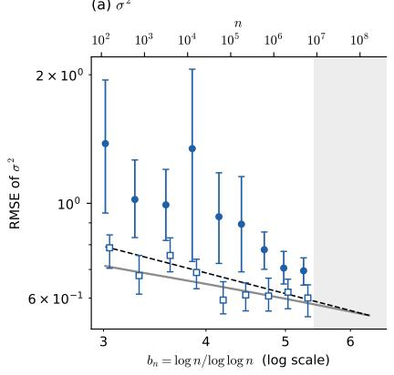  
(b) \`  
RMSE (fitted slope = −1.12) IQR/1.349 (fitted slope = −0.47) Asymptotic SD (fitted slope = −0.35) Theoretical rate b ¡p=2 (slope = −0.5)

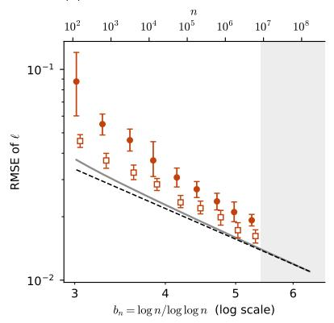

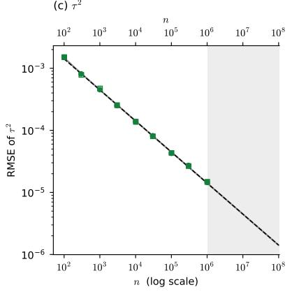  
H RMSE (fitted slope = −2.57)fi − Asymptotic SD (fitted slope = −1.66) Theoretical rate b ¡(p + 2)=2 (slope = −1.5)  
H RMSE (fitted slope = −0.50) IQR/1.349 (fitted slope = −0.50) Asymptotic SD (fitted slope = −0.50) Theoretical rate $\sqrt { 2 } \tau _ { 0 } ^ { 2 } n ^ { - 1 / 2 } \ ( { \mathsf { s l o p e } } = - 0 . 5 )$

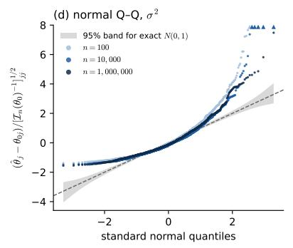

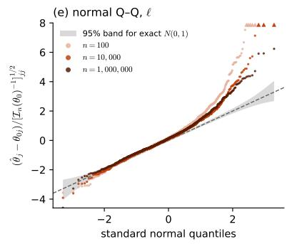

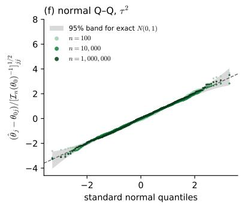  
Figure A1: Simulation results for $p = 1$ on the original parameter scale, with the layout and graphical elements as in Figure 1.

p = 2: fixed-domain MLE of the RBF kernel parameters (¾2 = 1; \`0 = 0:25; ¿2 = 0:01; 1000 replicates per n)  
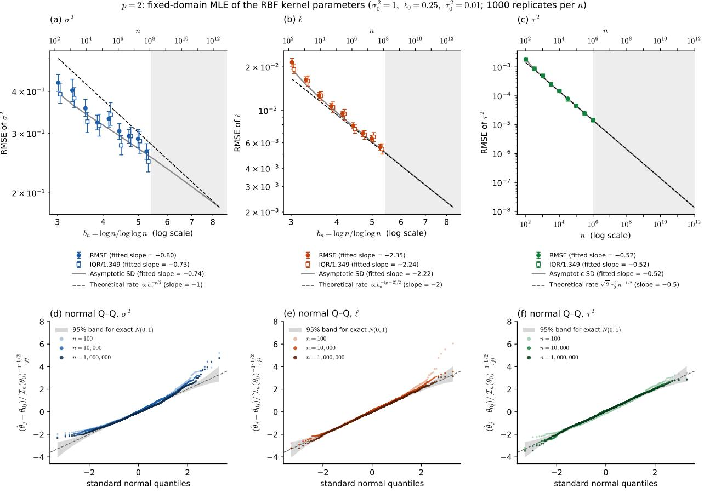  
Figure A2: Simulation results for $p = 2$ on the original parameter scale, with the layout and graphical elements as in Figure 1.

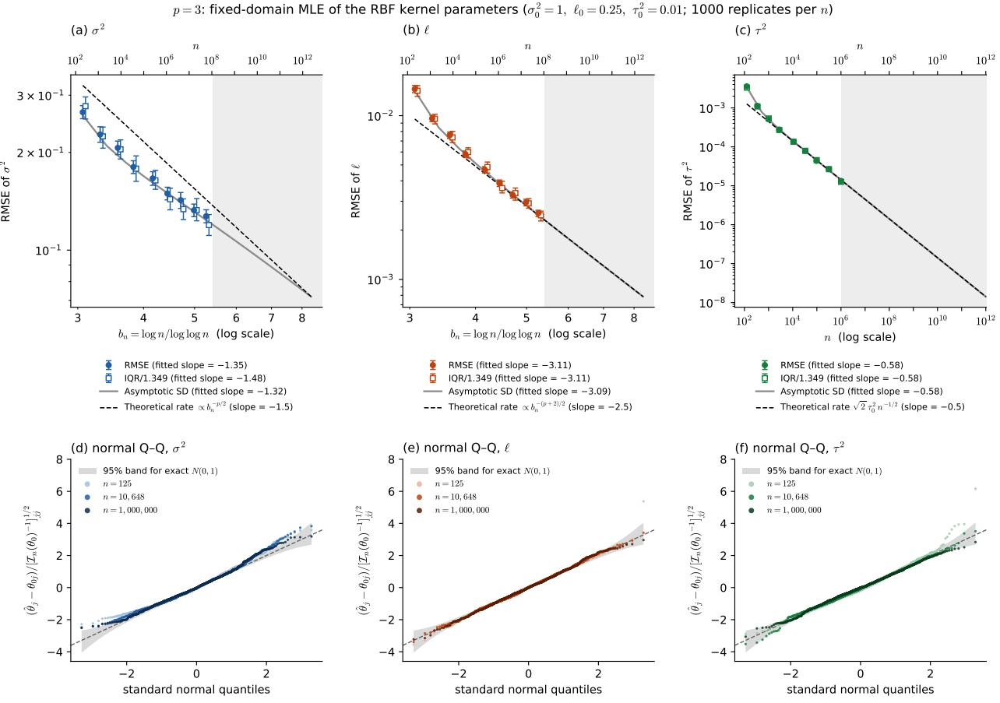  
Figure A3: Simulation results for $p = 3$ on the original parameter scale, with the layout and graphical elements as in Figure 1.