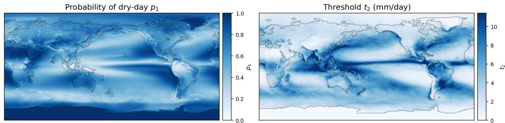
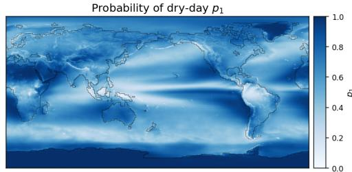
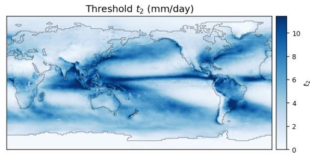
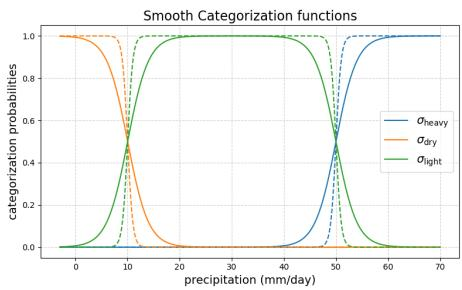
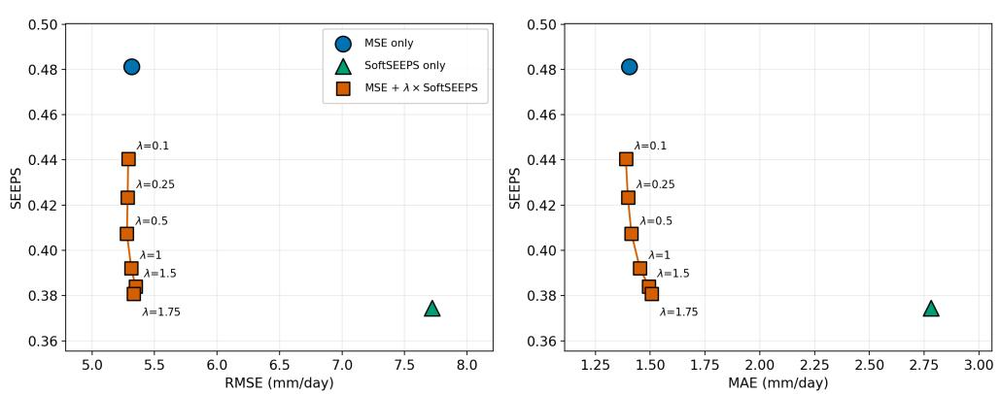
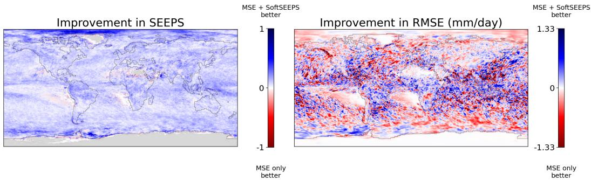
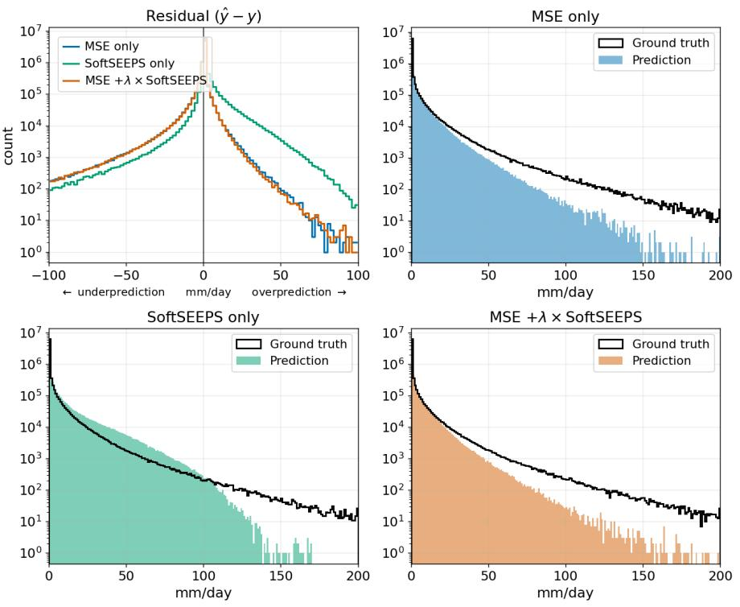

# SoftSEEPS improves ML-based precipitation forecasting

Jost Arndt∗   
Fraunhofer Heinrich Hertz Institute Berlin, Germany   
jost.arndt@hhi.fraunhofer.de

Noelia Otero Fraunhofer Heinrich Hertz Institute Berlin, Germany

Wojciech Samek Fraunhofer Heinrich Hertz Institute Technische Universität Berlin BIFOLD Berlin, Germany

Utku Isil∗ Fraunhofer Heinrich Hertz Institute Berlin, Germany

Rodrigo Almeida Fraunhofer Heinrich Hertz Institute Berlin, Germany

Jackie Ma Fraunhofer Heinrich Hertz Institute Berlin, Germany

## Abstract

In this paper we have developed a differentiable approximation of the well-known SEEPS score, which we name SoftSEEPS. This allows the training of a Machine Learning model to forecast precipitation directly. We test SoftSEEPS on the IMERG dataset (0.1◦ resolution) by training a decoder for precipitation on the latent space of a pre-trained low-resolution forecasting model. Combining SoftSEEPS and RMSE in a joint objective is possible with marginal trade-offs in either metric.

## 1 Introduction

Heavy precipitation is intensifying with climate change [21], and early-warning and disaster-response systems that rely on precipitation forecasts care primarily about getting the dry/light/heavy category right, not intensity, making the training/evaluation metric itself a climate-impact question. Machinelearning (ML)-based weather forecasting has recently surpassed traditional numerical models on several benchmark scores [1, 4, 12, 11, 17, 18]. However, forecasting precipitation, remains challenging: unlike pressure or temperature [17, 18], its distribution is regionally variable, intermittent, and strongly skewed [20, 22, 5]. Standard error metrics such as root mean squared error (RMSE) poorly reflect forecast quality for precipitation at high spatial resolutions, which are needed for better climate adaptation and disaster response. Therefore, the stable equitable error in probability space (SEEPS) [19, 15, 18] instead is often used for evaluation. It scores forecasts categorically into dry, light precipitation, or heavy precipitation using climatological thresholds estimated separately at each location. Miscategorization gets penalized by a climatology-dependent weight. This categorization is a piecewise-constant assignment, so SEEPS provides no gradient signal, thus ML forecasting models can only be evaluated against it, but not directly optimized for it.

Even though it is argued that RMSE should not be used for training [9], none of the papers in Rasp et al. [17] have developed a differentiable approximation of the SEEPS score [1, 12, 2, 23, 16, 4]. We close this gap with a differentiable, sigmoid-relaxed approximation of SEEPS that can be used directly as a training loss and call it SoftSEEPS. Prior differentiable relaxations of categorical operations, such as the Gumbel-softmax and concrete distributions [10, 14] have shown good success across different ML domains and motivate our sigmoid-based relaxation.

## 2 Methods

## 2.1 SoftSEEPS

The original SEEPS score classifies both the forecast and the ground truth into the categories $d r y ,$ light precipitation, and heavy precipitation, using localized historical climatological thresholds $t _ { 1 } , t _ { 2 }$ While $t _ { 1 } = 0$ .25mm is constant, $t _ { 2 }$ is set as the threshold dividing two-thirds of the mass(given that it rains) for day of year, since typical precipitation varies strongly with region and season (e.g. rainforest vs. desert, summer vs. winter). The joint category pairs of forecast/observed are recorded in a $3 \times 3$ contingency table and scored with a location and day-of-year-dependent penalty matrix S that weights the table entrywise before summing, i.e. a Frobenius inner product. The penalty matrix S has, for a specified location and day-of-year, the form

$$
S = \frac { 1 } { 2 } \left( \begin{array} { c c c } { { 0 } } & { { \frac { 1 } { 1 - p _ { 1 } } } } & { { \frac { 1 } { p _ { 3 } } + \frac { 1 } { 1 - p _ { 1 } } } } \\ { { \frac { 1 } { p _ { 1 } } } } & { { 0 } } & { { \frac { 1 } { p _ { 3 } } } } \\ { { \frac { 1 } { p _ { 1 } } + \frac { 1 } { 1 - p _ { 3 } } } } & { { \frac { 1 } { 1 - p _ { 3 } } } } & { { 0 } } \end{array} \right) ,
$$

where rows index the forecast category and columns the observed category, both ordered dry, light, heavy. $p _ { 1 }$ is the dry-day probability for a given location and day-of-year, and $p _ { 3 }$ the heavyprecipitation probability. By construction $p _ { 3 } = ( 1 - p _ { 1 } ) / 3$ , since the wet-day mass is split 2:1 between the light and heavy categories. The annual means of both the $p _ { 1 }$ probability and $t _ { 1 }$ thresholds can be found in Fig 1. The exact content of S is derived and justified in [19]. A perfect forecast scores 0; SEEPS is equitable, so an unskilled (e.g. climatological) forecast has an expected score of 1, giving a natural skill reference point.

  
Figure 1: Geographic distribution of the annual-mean "dry precipitation"-probability $p _ { 1 }$ and threshold values between light and heavy precipitation $t _ { 2 }$

To enable gradient-based optimization based on SEEPS, we approximate the hard categorical indicators with a differentiable "soft classification" function based on sigmoid-relaxed category probabilities, we define the classificatin function

$$
c ( x , \tau ) : = \left[ \begin{array} { l } { p _ { \mathrm { d r y } } ( x , \tau ) } \\ { p _ { \mathrm { l i g h t } } ( x , \tau ) } \\ { p _ { \mathrm { h e a v y } } ( x , \tau ) } \end{array} \right] ,
$$

where $\begin{array} { r } { p _ { \mathrm { d r y } } ( x , \tau ) = \sigma \bigl ( \frac { t _ { 1 } - x } { \tau } \bigr ) , p _ { \mathrm { h e a v y } } ( x , \tau ) = \sigma \bigl ( \frac { x - t _ { 2 } } { \tau } \bigr ) } \end{array}$ , with $\sigma ( \cdot )$ being the sigmoid function, $\tau > 0$ a smoothing parameter, x the forecast precipitation in physical units (mm/day). $p _ { \mathrm { l i g h t } } ( x , \tau ) : =$ $1 - p _ { \mathrm { d r y } } ( x , \tau ) - p _ { \mathrm { h e a v y } } ( x , \tau )$ so the vector sums to 1. These soft categorization functions are shown in Fig. $2 . \ c ( x , \tau )$ is differentiable in x and converges to the original hard classification for $\tau  0$ Higher smoothings trade off approximation accuracy for better-conditioned gradients, which is what makes c $( x , \tau )$ usable as a training signal. Combining $c ( x , \tau )$ with the location- and day-of-year-wise penalty matrix S, lets us define the SoftSEEPS score between a prediction x and ground truth y as

$$
s ( x , y , \tau ) : = c ( x , \tau ) ^ { T } S c ( y , \tau ) .
$$

This is a fully differentiable sigmoid relaxation of the categorical assignment, governed by a smoothing parameter, in the same spirit as other differentiable relaxations of categorical operations used in ML [10, 14]. We succesfully have tested that SoftSEEPS converges to reference discrete-SEEPS implementation from the scores library [13]. Rather than fixing τ , we anneal it automatically during training with a plateau scheduler that tracks validation discrete SEEPS and lowers τ once it plateaus. While we use SoftSEEPS for training, all reported validation-SEEPS are the discrete scores.

  
Figure 2: Smooth categorization functions $c ( x , \tau )$ : dashed lines use a smoothing parameter $\tau = 0 . 5 .$ solid lines $\tau = 2$

## 2.2 Model: High-resolution Precipitation Decoder

To study SoftSEEPS in a high-resolution forecasting setting, we use $1 . 5 ^ { \circ }$ resolution ERA5 [7] as input and GPM IMERG [8] Final daily precipitation (V07B, mm/day, $0 . 1 ^ { \circ }$ resolution) as the training target, shifted by 24 hours as a forecasting-task. We train only a convolutional precipitation decoder (IMERGDecoder) that maps the latent space of a publicly available, frozen ArchesWeather-M [3] backbone to the precipitation target. The model predicts next-day (24-hour accumulated) IMERG precipitation: the backbone latent is decoded to IMERG resolution without any explicit precipitation input. The 54.3 M decoder parameters are the sole trainable parameters. This setup lets us combine a well-performing yet inexpensive weather forecasting model with a limited training-compute budget.

IMERGDecoder is a convolutional upsampling network that maps a backbone latent of size 384 × 60 × 120 to IMERG resolution $( 1 \times 1 8 0 0 \times 3 6 0 0 )$ through three bilinear-upsampling stages $( \times 2$ $\times 3 , \times 5 )$ . Thus, although the backbone operates on a substantially coarser spatial grid, the decoder produces precipitation directly on the $0 . 1 ^ { \overset { \cdot } { \circ } }$ resolution IMERG grid. Each stage applies four residual blocks before upsampling, using 512 channels in the first two stages and 384 in the third.

Baselines. Direct comparison to existing learned downscaling methods is challenging, as prior work at $0 . 1 ^ { \circ }$ typically focuses on regional or patch-based settings [6]. We therefore use persistence (the previous day’s IMERG) and climatology (the locationwise, day-of-year-wise mean IMERG over the training set) as reference baselines. Additionally, we compare against bicubic interpolation of same-day ERA5 total precipitation to 0.1◦.

## 3 Experiments

For training we use the years 1998–2018, validation 2019, and testing 2020. To test the impact of SoftSEEPS as optimization objective we compare three settings: MSE with log normalized data only (mean $[ ( \log ( 1 { + } \hat { y } ) - \log ( \overset { . } { 1 } { + } y ) ) ^ { 2 } ] )$ , SoftSEEPS-only; and the linear combination of both, which we simply denote as MSE $+ \lambda \times$ SoftSEEPS with different $\lambda \in \{ 0 . 1 , 0 . 2 5 , 0 . 5 , 1 , 1 . 5 , 1 . 7 5 \}$ . We then train the model for 25,000 steps using the AdamW optimizer on a single A100 GPU, lasting approximately 5 hours wall-clock time.

## 4 Results

Training the proposed IMERGDecoder SoftSEEPS gives converging training error. Validating on a proper SEEPS implementation shows that the learned objective is meaningful for SEEPS as well. Further, by sweeping through multiple values for λ, we can see that optimization on a linear combination of SoftSEEPS and log normalized RMSE is possible with only marginal trade-offs, as shown in Fig. 3.

0.1°IMERG downscaling: RMSE/MAE vs. SEEPS  
  
Figure 3: 0.1◦ IMERG test-set RMSE (left) and MAE (right) vs. SEEPS. Circle/triangle: MSEonly and SoftSEEPS-only (Table 1). Squares: the combined loss MSE +λ×SoftSEEPS swept over λ ∈ {0.1, 0.25, 0.5, 1.0, 1.5, 1.75}.

A natural expectation is that SoftSEEPS can only trade off against RMSE. Fig. 3 shows that the λ sweep instead appears to trace out a Pareto-optimal frontier between RMSE and SEEPS: SEEPS drops by as much as 18.51% at no resolvable cost in RMSE.

Beyond this aggregate trade-off, we also study where on the globe adding SoftSEEPS to the loss helps or hurts. Fig. 4 shows that evaluation in SEEPS improves spatially uniformly, while evaluation in RMSE both improves and degrades performance in a spatially varying pattern. We see this as an indicator that the inclusion of climatological information in the training objective is successful and helps the models. Furthermore, the decoder trained on the original metric already exceeds the baselines, which can be seen in the Appendix in Table 1.

  
Figure 4: Locationwise improvement from adding SoftSEEPS to the training loss, for SEEPS (left) and RMSE (right), computed as difference between the evaluation metrics. Blue indicates adding SoftSEEPS is better at that location and in that metric; red indicates MSE only is better.

## 5 Conclusion

We have demonstrated, that the utilization of our SoftSEEPS improves precipitation forecasting on discrete SEEPS score, which is a commonly respected metric in weather forecasting. We have further demonstrated that training a linear combination of SoftSEEPS and MSE is possible with overall a marginal trade-off. Practically, this lets precipitation models be trained directly for the dry/light/heavy distinctions that early-warning and disaster-response systems already act on. Future works should train larger weather models for precipitation on SoftSEEPS. Ultimately, scaling these methods provides a clear pathway to climate impact, enhancing weather forecasting to better mitigate and adapt to the severe precipitation events driven by climate change.

## References

[1] K. Bi, L. Xie, H. Zhang, X. Chen, X. Gu, and Q. Tian. Accurate medium-range global weather forecasting with 3d neural networks. Nature, 619(7970):533–538, July 2023. ISSN 1476-4687. doi: 10.1038/s41586-023-06185-3. URL http://dx.doi.org/10.1038/ s41586-023-06185-3.

[2] L. Chen, X. Zhong, F. Zhang, Y. Cheng, Y. Xu, Y. Qi, and H. Li. Fuxi: A cascade machine learning forecasting system for 15-day global weather forecast. npj climate and atmospheric science, 6(1):190, 2023.

[3] G. Couairon, C. Lessig, A. A. Charantonis, and C. Monteleoni. Archesweather: An efficient ai weather forecasting model at 1.5◦ resolution. 05 2024. doi: 10.48550/arXiv.2405.14527.

[4] H. Du, L. Kim, J. Creus-Costa, J. Michaels, A. Shetty, T. Hutchinson, C. Riedel, and J. Dean. Weathermesh-3: Fast and accurate operational global weather forecasting. arXiv preprint arXiv:2503.22235, 2025.

[5] I. Ebert-Uphoff and K. Hilburn. The outlook for AI weather prediction. Nature, 619(7970): 473–474, July 2023.

[6] P. Harder, L. Schmidt, F. Pelletier, N. Ludwig, M. Chantry, C. Lessig, A. Hernandez-Garcia, and D. Rolnick. Benchmarking the geographic generalization of deep learning models for precipitation downscaling. Scientific Reports, 16(1):3733, 2026.

[7] H. Hersbach, B. Bell, P. Berrisford, S. Hirahara, A. Horányi, J. Muñoz-Sabater, J. Nicolas, C. Peubey, R. Radu, D. Schepers, A. Simmons, C. Soci, S. Abdalla, X. Abellan, G. Balsamo, P. Bechtold, G. Biavati, J. Bidlot, M. Bonavita, G. De Chiara, P. Dahlgren, D. Dee, M. Diamantakis, R. Dragani, J. Flemming, R. Forbes, M. Fuentes, A. Geer, L. Haimberger, S. Healy, R. J. Hogan, E. Hólm, M. Janisková, S. Keeley, P. Laloyaux, P. Lopez, C. Lupu, G. Radnoti, P. de Rosnay, I. Rozum, F. Vamborg, S. Villaume, and J.-N. Thépaut. The era5 global reanalysis. Quarterly Journal ofthe Royal Meteorological Society, 146(730):1999–2049, 2020. doi: https://doi.org/10.1002/qj.3803. URL https://rmets.onlinelibrary.wiley.com/doi/ abs/10.1002/qj.3803.

[8] G. J. Huffman, D. T. Bolvin, E. J. Nelkin, and J. Tan. Integrated multi-satellite retrievals for gpm (imerg) technical documentation. Nasa/Gsfc Code, 612(47):2019, 2015.

[9] K. M. R. Hunt. Stop using root-mean-square error as a precipitation target! Artificial Intelligence for the Earth Systems, page e250083, 2026. doi: 10.1175/AIES-D-25-0083.1. URL https://journals.ametsoc.org/view/journals/aies/aop/AIES-D-25-0083. 1/AIES-D-25-0083.1.xml.

[10] E. Jang, S. Gu, and B. Poole. Categorical reparameterization with gumbel-softmax. In International Conference on Learning Representations (ICLR), 2017.

[11] T. Kurth, S. Subramanian, P. Harrington, J. Pathak, M. Mardani, D. Hall, A. Miele, K. Kashinath, and A. Anandkumar. Fourcastnet: Accelerating global high-resolution weather forecasting using adaptive fourier neural operators. In Proceedings ofthe Platformfor Advanced Scientific Computing Conference, PASC ’23, New York, NY, USA, 2023. Association for Computing Machinery. ISBN 9798400701900. doi: 10.1145/3592979.3593412. URL https://doi.org/ 10.1145/3592979.3593412.

[12] R. Lam, A. Sanchez-Gonzalez, M. Willson, P. Wirnsberger, M. Fortunato, F. Alet, S. Ravuri, T. Ewalds, Z. Eaton-Rosen, W. Hu, A. Merose, S. Hoyer, G. Holland, O. Vinyals, J. Stott, A. Pritzel, S. Mohamed, and P. Battaglia. Learning skillful medium-range global weather forecasting. Science, 382(6677):1416–1421, 2023. doi: 10.1126/science.adi2336. URL https://www.science.org/doi/abs/10.1126/science.adi2336.

[13] T. Leeuwenburg, N. Loveday, E. E. Ebert, H. Cook, M. Khanarmuei, R. J. Taggart, N. Ramanathan, M. Carroll, S. Chong, A. Griffiths, and J. Sharples. scores: A Python package for verifying and evaluating models and predictions with xarray. Journal ofOpen Source Software, 9(99):6889, July 2024. doi: 10.21105/joss.06889. URL https://joss.theoj.org/papers/ 10.21105/joss.06889.

[14] C. J. Maddison, A. Mnih, and Y. W. Teh. The concrete distribution: A continuous relaxation of discrete random variables. In International Conference on Learning Representations (ICLR), 2017.

[15] R. North, M. Trueman, M. Mittermaier, and M. J. Rodwell. An assessment of the seeps and sedi metrics for the verification of 6h forecast precipitation accumulations. Meteorological Applications, 20(2):164–175, 2013. doi: https://doi.org/10.1002/met.1405. URL https: //rmets.onlinelibrary.wiley.com/doi/abs/10.1002/met.1405.

[16] I. Price, A. Sanchez-Gonzalez, F. Alet, T. R. Andersson, A. El-Kadi, D. Masters, T. Ewalds, J. Stott, S. Mohamed, P. Battaglia, et al. Gencast: Diffusion-based ensemble forecasting for medium-range weather. arXiv preprint arXiv:2312.15796, 2023.

[17] S. Rasp, P. D. Dueben, S. Scher, J. A. Weyn, S. Mouatadid, and N. Thuerey. Weatherbench: A benchmark dataset for data-driven weather forecasting, 2020. URL http://arxiv.org/abs/ 2002.00469. cite arxiv:2002.00469Comment: Github repository: https://github.com/pangeodata/WeatherBench; Data download: https://mediatum.ub.tum.de/1524895.

[18] S. Rasp, S. Hoyer, A. Merose, I. Langmore, P. Battaglia, T. Russell, A. Sanchez-Gonzalez, V. Yang, R. Carver, S. Agrawal, M. Chantry, Z. Ben Bouallegue, P. Dueben, C. Bromberg, J. Sisk, L. Barrington, A. Bell, and F. Sha. WeatherBench 2: A benchmark for the next generation of data-driven global weather models. J. Adv. Model. Earth Syst., 16(6), June 2024.

[19] M. J. Rodwell, D. S. Richardson, T. D. Hewson, and T. Haiden. A new equitable score suitable for verifying precipitation in numerical weather prediction. Quarterly Journal of the Royal Meteorological Society, 136(650):1344–1363, 2010. doi: https://doi.org/10.1002/qj.656. URL https://rmets.onlinelibrary.wiley.com/doi/abs/10.1002/qj.656.

[20] C. Schroeder de Witt, C. Tong, V. Zantedeschi, D. De Martini, A. Kalaitzis, M. Chantry, D. Watson-Parris, and P. Bilinski. Rainbench: Towards data-driven global precipitation forecasting from satellite imagery. Proceedings ofthe AAAI Conference on Artificial Intelligence, 35(17):14902âC“14910, May 2021. ISSN 2159-5399. doi: 10.1609/aaai.v35i17.17749. URL http://dx.doi.org/10.1609/aaai.v35i17.17749.

[21] S. Seneviratne, X. Zhang, M. Adnan, W. Badi, C. Dereczynski, A. Di Luca, S. Ghosh, I. Iskandar, J. Kossin, S. Lewis, F. Otto, I. Pinto, M. Satoh, S. Vicente-Serrano, M. Wehner, and B. Zhou. Weather and climate extreme events in a changing climate. In V. Masson-Delmotte, P. Zhai, A. Pirani, S. Connors, C. Péan, S. Berger, N. Caud, Y. Chen, L. Goldfarb, M. Gomis, M. Huang, K. Leitzell, E. Lonnoy, J. Matthews, T. Maycock, T. Waterfield, O. Yelekçi, R. Yu, and B. Zhou, editors, Climate Change 2021: The Physical Science Basis. Contribution of Working Group I to the Sixth Assessment Report of the Intergovernmental Panel on Climate Change, pages 1513–1766. Cambridge University Press, Cambridge, UK and New York, NY, USA, 2021. doi: 10.1017/9781009157896.013.

[22] J. Sun, M. Xue, J. W. Wilson, I. Zawadzki, S. P. Ballard, J. Onvlee-Hooimeyer, P. Joe, D. M. Barker, P.-W. Li, B. Golding, M. Xu, and J. Pinto. Use of NWP for nowcasting convective precipitation: Recent progress and challenges. Bull. Am. Meteorol. Soc., 95(3):409–426, Mar. 2014.

[23] X. Zhong, L. Chen, X. Fan, W. Qian, J. Liu, and H. Li. Fuxi-2.0: Advancing machine learning weather forecasting model for practical applications. arXiv preprint arXiv:2409.07188, 2024.

## 6 Appendix

Table 1: Next-day precipitation forecasting at 0.1◦ (IMERG, test year 2020).
<table><tr><td>Setting</td><td>RMSE↓(mm/day)</td><td>MAE↓(mm/day)</td><td>SEEPS ↓</td></tr><tr><td>Baselines</td><td></td><td></td><td></td></tr><tr><td>Persistence</td><td>9.288</td><td>2.927</td><td>0.819</td></tr><tr><td>Climatology</td><td>7.492</td><td>2.853</td><td>1.098</td></tr><tr><td>ERA5 interpolation</td><td>5.689</td><td>1.951</td><td>0.612</td></tr><tr><td>Arches+Decoder</td><td></td><td></td><td></td></tr><tr><td>MSE</td><td>5.316</td><td>1.404</td><td>0.481</td></tr><tr><td>SoftSEEPS only</td><td>7.720</td><td>2.781</td><td>0.375</td></tr><tr><td> $\mathbf { M S E } + 1 . 7 5 { \times } S o f t S E E P S$ </td><td>5.334</td><td>1.507</td><td>0.381</td></tr></table>

Figure 5: Test-set residual $( \hat { y } - y ,$ top left, three objectives overlaid) and predicted vs. ground-truth precipitation distribution (remaining panels, one per objective), all log-scale.