# Sparse Planning in Visual World Models via Cost Gradients

Yingchen Xu University College London yingchen.xu.21@ucl.ac.uk

Edward Grefenstette University College London e.grefenstette@ucl.ac.uk

## Abstract

Token-based world models enable fine-grained latent planning, but repeatedly processing large spatial token grids makes action search expensive. We introduce COSTGRAD, a training-free, goal-conditioned selector that ranks spatial tokens by the gradient norm of the planning cost with respect to each input token. By deriving importance from the downstream control objective, COSTGRAD targets tokens that matter for planning rather than merely for prediction. On AdaLN-conditioned predictors at 50% sparsity, COSTGRAD matches or exceeds full-token planning on three of four continuous-control benchmarks, while giving a measured 2.6× wallclock speedup per environment planning step. Combining token sparsity with reduced CEM search increases this to a ∼ 5× total speedup while still exceeding the full-token baseline. We also identify an architecture-dependent failure mode: in a matched AdaLN-vs-concat comparison, concat maintains comparable full-token performance but pure COSTGRAD loses its advantage over random selection. This difference tracks action-pathway drift: gradient-selected removal produces less drift than random removal on AdaLN, but more on concat. These results highlight selector–architecture compatibility as a design axis for sparse world-model planning. Project page and demos: ycxuyingchen.github.io/costgrad/.

## 1 Introduction

Token-based world models [Zhou et al., 2025, Terver et al., 2025] predict future spatial feature grids produced by a frozen vision encoder. At inference time, planning runs the cross-entropy method (CEM) [Rubinstein, 1999] inside the learned model, rolling out many candidate action sequences against an encoded goal. This is expensive: at 16 × 16 tokens, horizon 6, and standard CEM widths, one planning step performs ∼ 10<sup>7</sup> token-level forward computations. Much of this compute is often spent on weakly task-relevant tokens: in control tasks, the agent, object, obstacle, and goal occupy only a small part of the frame, while most patches describe background. Sparse Imagination [Chun et al., 2025] demonstrates efficient world-model planning through sparse training and random token selection. We ask how a fixed pretrained predictor can select tokens relevant to the current goal without sacrificing planning success.

A natural approach is to reuse the predictor’s own signals, such as attention weights or prediction error. But prediction is not planning: improving dynamics prediction does not necessarily improve downstream control, an objective mismatch documented in model-based reinforcement learning [Lambert et al., 2020]. Attention can be underdetermined by prediction loss, and prediction error highlights visual unpredictability rather than control relevance: the object most important for control may be easy to predict because its motion follows directly from the action. This motivates using the planning objective itself as the source of token importance.

We instantiate this idea with COSTGRAD: given an encoded observation and goal, we compute the gradient of the planning cost with respect to each input token, and rank tokens by gradient norm.

Subsequent action search uses only the selected tokens. COSTGRAD requires one extra forward and backward pass per planning step, operates on a fixed pretrained predictor without retraining, and conditions selection on the current goal. On AdaLN-conditioned predictors at 50% sparsity, COSTGRAD matches or exceeds full-token planning success on three of four environments and gives a measured 2.6× wall-clock speedup per environment planning step.

The more surprising finding is that COSTGRAD depends on how actions enter the predictor. We compare two otherwise matched predictors: AdaLN [Peebles and Xie, 2023] injects actions by modulating each visual token with action-dependent parameters, while concat appends the action to each token before self-attention. Pure COSTGRAD succeeds on AdaLN but loses its advantage on matched-concat, despite comparable full-token planning. This difference tracks action-pathway drift: gradient-selected token removal produces less drift than random removal on AdaLN, but more on concat. Sparse planning therefore depends on both choosing relevant tokens and on a predictor architecture that remains stable when restricted to those tokens. More generally, the planner is part of the model’s operating distribution: token selection changes not just what the model sees, but how the planner uses the model.

Contributions. (i) We introduce COSTGRAD, a training-free, goal-conditioned token selector for sparse visual world-model planning. At 50% sparsity, COSTGRAD matches or exceeds full-token planning on three of four benchmarks, gives a measured 2.6× wall-clock speedup per environment planning step, and can combine token sparsity with reduced CEM iterations for $\mathbf { a } \sim 5 \times$ total speedup while still exceeding the full-token baseline (§3.1). (ii) We identify a selector–architecture compatibility failure mode. In a matched AdaLN-vs-concat comparison, COSTGRAD beats random selection on AdaLN but loses its advantage on concat. Gradient-selected removal reduces actionpathway drift relative to random removal on AdaLN but increases it on concat. Anchor-mixing experiments further show that concat can require more coverage-preserving sparse supports, suggesting that sparse planning depends on matching the selector to the predictor architecture (§3.3).

## 2 Setup and Method

## 2.1 Token-based world model planning

We build on the DINO-WM framework [Zhou et al., 2025] using the open-source JEPA-WMs codebase [Terver et al., 2025]. A frozen DINOv2 ViT-S/14 encoder [Oquab et al., 2024] maps each $2 2 4 \times 2 2 4$ image to a 16 × 16 grid of 384-dimensional tokens, $\boldsymbol { z } \in \dot { \mathbb { R } } ^ { P \times D }$ with $P = 2 5 6$ . Our main results use an AdaLN-Zero-conditioned predictor [Peebles and Xie, 2023]: a 6-block transformer with 16 attention heads and GELU activation that maps the encoded context and an action to the next-step token grid. It is trained on trajectory data from Terver et al. [2025] and kept fixed during planning; the block equations are given in Appendix D.

Planning uses CEM [Rubinstein, 1999] in latent space: at each environment step, CEM samples 300 action sequences over horizon $H { = } 6 .$ , ranks them by cost to the encoded goal, and refits the sampling distribution to the top elites for 30 iterations (JEPA-WMs defaults). Each candidate is rolled out autoregressively, calling the predictor $H { = } 6$ times on the full P=256-token grid, so one planning step performs 300 $\times 3 0 ^ { - } \times 6 \stackrel { - } { \times } 2 5 6 \approx 1 . 4 \times 1 0 ^ { 7 }$ token-level forward computations.

## 2.2 COSTGRAD: select tokens, then plan

COSTGRAD scores tokens using the planning objective rather than the predictor’s training objective. Figure 1 illustrates how a single selection probe defines the token subset reused throughout action search.

Select tokens. Given a context encoding z and goal encoding $z _ { g } ,$ we run a one-step prediction on all $P$ tokens under a probe action $\mathbf { \delta } _ { \mathbf { a } _ { 0 } }$ (zero by default) and compute

$$
\begin{array} { r } { \mathcal { L } _ { \mathrm { p l a n } } ( \mathbf { a } _ { 0 } ; z , z _ { g } ) = \big \| \mathrm { p r e d i c t o r } ( z , \mathbf { a } _ { 0 } ) - z _ { g } \big \| _ { 2 } ^ { 2 } . } \end{array}\tag{1}
$$

A single backward pass gives the per-token score

$$
s _ { j } = \left\| \nabla _ { z _ { j } } \mathcal { L } _ { \mathrm { p l a n } } \right\| _ { 2 } , \qquad j = 1 , \dotsc , P .\tag{2}
$$

We retain the K tokens with the largest scores, defining the selected set $s$

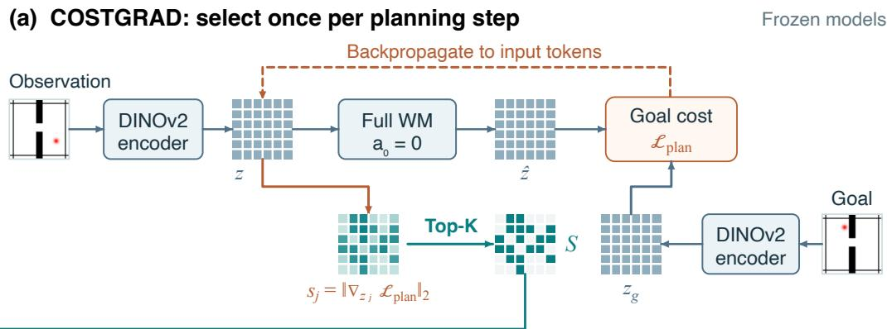

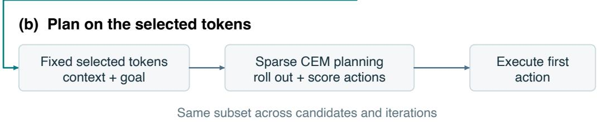  
Figure 1: COSTGRAD: select once, then plan on the selected tokens. (a) A full-token, zero-action probe supplies planning-cost gradients to select top-K positions S for context and goal. (b) CEM searches for actions using only S, then executes the first action. The subset stays fixed throughout action search and is reselected at the next observation; model weights remain frozen. Token grids are schematic; proprioception is omitted.

The gradient norm measures local planning-cost sensitivity to each input token, including its influence on predictions elsewhere. Thus, a token can receive a high score by providing context for predicting goal-relevant regions, even when its own predicted feature is close to the goal.

Plan on the selected tokens. CEM rolls out each candidate action sequence autoregressively for the full horizon H using only S and evaluates the final goal-distance cost at the same kept positions. The subset remains fixed across all candidates and CEM iterations; we reselect tokens at the next observation. The one-step probe is used only for selection, while CEM samples and optimizes its own actions (Algorithm 1). We retain CEM to match the JEPA-WMs evaluation protocol and isolate the effect of token selection.

Implementation. Retained tokens keep their original positional indices, shared across context frames and the goal. Gradients score the latest observed frame; rollout uses up to two context frames. The probe uses only visual squared error and zero normalized action/proprioceptive inputs. CEM combines final-step mean squared visual and proprioceptive-feature errors with weights 1 and 0.1, respectively (objective and normalization in Appendix B).

Why the planning objective? Prediction error measures what the model gets wrong, whereas planning-cost gradients measure how its inputs affect the goal-reaching objective. Even a perfectly predicted next state can remain far from the goal, so prediction accuracy alone does not identify which tokens matter for planning. Appendix M develops this objective distinction and the localsensitivity interpretation.

Computational cost. COSTGRAD is training-free and goal-conditioned: selection depends on the current goal while predictor weights remain fixed. Its overhead is one full-token forward and backward pass per planning step, amortized over all CEM rollouts. Attention compute scales quadratically in token count while MLP scales linearly, so halving tokens reduces attention flops by 4× and MLP flops by 2×.

```latex
Algorithm 1 COSTGRAD sparse planning step
1: Input: encoded context z, goal $z _ { g } ,$ keep ratio $K / P$
2: // Step 1: select tokens once using a probe action a<sub>0</sub>
3: Set probe action $\mathbf { \delta } \mathbf { \alpha } \mathbf { 0 } \gets \mathbf { 0 }$ // zero-action by default; Appendix Efor alternatives
4: zˆ  predictor $( z , \pmb { a } _ { 0 } )$ // full-token forward, retain graph
5: $\mathcal { L }  \| \hat { \boldsymbol { z } } - \boldsymbol { z } _ { g } \| _ { 2 } ^ { 2 }$
6: $s _ { j } \gets \| \nabla _ { z _ { j } } \mathcal { L } \| _ { 2 }$ for all tokens j // single backward pass
7: ${ \mathcal { S } } \gets \mathrm { t o p } { - } K ( s _ { j } )$ // sparse token set,fixedfor the rest ofthis planning step
8: // Step 2: run CEM as usual on the sparse token set; CEM samples its own actions
9: return $\mathrm { C E M } ( z _ { S } , z _ { g , S } ;$ horizon H, 30 iters, 300 candidates)
```

## 2.3 Baselines

We compare COSTGRAD with Full and four token-reduction baselines, sharing the trained predictor and CEM settings within each environment. Full retains all $P = 2 5 6$ tokens; all token-reduction methods use $K \stackrel { - } { = } P / 2 = 1 2 8$

PREDATTN ranks spatial keys by received attention in the predictor’s last block under a full-grid, zero-action probe: sum over all queries and average uniformly over heads and context frames, with causal masking and conditioning-token keys excluded.

PREDGRAD ranks tokens by prediction-loss gradient norms, using earlier observed frames as input and the latest observed encoding as z<sub>target</sub>, without privileged future information. It uses a zeroaction probe; the observed target need not match that action. Appendix B specifies the loss and temporal alignment.

Random samples K positions uniformly without replacement, once per planning step, and fixes them throughout CEM.

ToMe [Bolya et al., 2023] merges observation tokens by cosine-based bipartite matching, averaging each group at its surviving position. The mapping is shared across context frames; rollout predicts at the surviving positions and compares against unmerged goal features there (Appendix B).

## 3 Results

We evaluate planning performance and speed (§3.1), the task relevance and stability of selected tokens (§3.2), and the dependence of sparse planning on predictor architecture (§3.3).

We evaluate on four continuous-control benchmarks from the DINO-WM and JEPA-WMs suites — PointMaze (MZ), Wall, PushT (PT), and MetaWorld (MW) — detailed in Appendix A.

## 3.1 Sparse planning performance and speed on AdaLN-Zero

Table 1 reports planning success at K=128 tokens. COSTGRAD preserves full-token performance on PointMaze (−2.0 pp, within noise) and exceeds Full on Wall (+7.3 pp), PushT (+2.8 pp), and MetaWorld (+6.9 pp), giving an average gain of +3.8 pp while using half the tokens. Predictionderived selectors are substantially weaker: the closest baseline, PREDATTN, trails COSTGRAD by 12.1 pp on average and by more than 20 pp on Wall and MetaWorld. Random selection is far worse (−19.2 pp on average), showing that the gain on AdaLN-Zero is not a generic sparsification effect; §3.3 examines what changes when the predictor’s action-conditioning pathway is replaced.

On released JEPA-WMs checkpoints, COSTGRAD also preserves full-token performance across all four environments without retraining, using half the tokens and outperforming Random by 11.3– 46.3 pp (Appendix L, Table 8).

Table 1: Main results at 50% tokens. Planning success rate (%) across four continuous-control environments. Mean ± std over 3 evaluation seeds (96 episodes each). Full uses all 256 tokens; all other methods keep 128 tokens. Bold: best non-Full method per environment. COSTGRAD preserves or exceeds Full on three of four environments while giving a measured 2.6× wall-clock speedup per environment planning step.
<table><tr><td>Method (50%)</td><td>PointMaze (MZ)</td><td>Wall</td><td>PushT (PT)</td><td>MetaWorld (MW)</td><td> $\operatorname { A v g }$ </td></tr><tr><td>Full (100%)</td><td> $8 8 . 2 \pm 8 . 7$ </td><td> $8 4 . 7 \pm 2 . 6$ </td><td> $6 2 . 4 \pm 4 . 4$ </td><td> $5 8 . 7 \pm 1 . 8$ </td><td>73.5</td></tr><tr><td>COSTGRAD</td><td> $8 6 . 2 \pm 6 . 1$ </td><td> ${ \bf 9 2 . 0 \pm 1 . 8 }$ </td><td> ${ \bf 6 5 . 2 \pm 6 . 5 }$ </td><td> ${ \bf 6 5 . 6 \pm 4 . 7 }$ </td><td>77.3</td></tr><tr><td>PREDATTN</td><td> ${ \bf 8 6 . 7 \pm 9 . 7 }$ </td><td> $6 7 . 3 \pm 1 . 7$ </td><td> $6 2 . 0 \pm 8 . 0$ </td><td> $4 4 . 8 \pm 6 . 1$ </td><td>65.2</td></tr><tr><td>PREDGRAD</td><td> $7 6 . 8 \pm 9 . 2$ </td><td> $6 7 . 2 \pm 3 . 3$ </td><td> $4 1 . 3 \pm 5 . 9$ </td><td> $5 1 . 4 \pm 3 . 5$ </td><td>59.2</td></tr><tr><td>ToMe</td><td> $7 4 . 4 \pm 9 . 1$ </td><td> $8 4 . 4 \pm 2 . 6$ </td><td> $5 1 . 4 \pm 5 . 9$ </td><td> $3 9 . 1 \pm 4 . 1$ </td><td>62.3</td></tr><tr><td>Random</td><td> $7 7 . 0 \pm 9 . 4$ </td><td> $6 7 . 0 \pm 3 . 6 $ </td><td> $4 1 . 3 \pm 5 . 9$ </td><td> $4 6 . 9 \pm 3 . 1$ </td><td>58.1</td></tr></table>

Sparsity sweep. Figure 2 varies the keep ratio from 10% to 100%. COSTGRAD remains near Full at 25% tokens on Wall, PushT, and MetaWorld, and approaches Full at 50% on PointMaze. Below roughly 25%, all sparse methods degrade sharply, indicating that the selected subset must still contain enough state information for rollout. The gap to PREDATTN and Random widens as the token budget shrinks: planning-gradient selection becomes more important in the high-sparsity regime.

COSTGRAD dominates the measured speed–success frontier. Retaining 50% of the tokens with the standard CEM budget gives the 2.6× speedup reported in Table 1. The extra forward and backward pass adds 27.5 ms on a single H100, amortized over the subsequent CEM iterations.

Token selection and CEM budget are complementary compute axes: predictor cost per CEM iteration scales with the number of kept tokens K, and total planning-step time scales linearly with the number of CEM iterations. Combining 50% tokens with 15 CEM iterations reaches 92.0% success at ∼ 17 s per planning step — a 5.2× total speedup over Full (84.7% at 88.6 s) at higher mean success (Appendix G). At the same 15-iteration budget, Full achieves $8 4 . 4 \pm 1 . 0 \%$ success, whereas COSTGRAD achieves 92.0 ± 5.1% while using half the tokens (Appendix G).

Across the measured token budgets and CEM settings (Figure 3), COSTGRAD configurations trace the entire non-dominated frontier; Full, PREDATTN, and Random are dominated. For example, COSTGRAD at K=192 reaches 92.7% success at 60.4 s per step (+8.0 pp and 1.47× faster than Full), while the PREDATTN and Random sweep curves trail COSTGRAD by large margins. Success enters a high-performance plateau around $K \geq 6 4$ across the measured COSTGRAD configurations, with the best points near ∼ 92%.

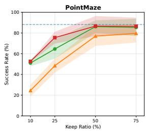

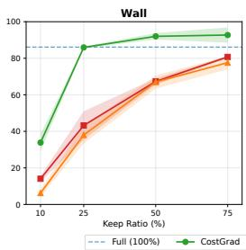

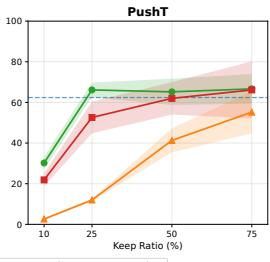

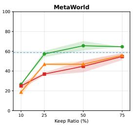  
Figure 2: Sparsity sweeps on four environments. Planning success (%) vs. keep ratio for COST-GRAD, PREDATTN, and Random; horizontal dashed line is Full (100%). Shaded bands: ±1 std across 3 evaluation seeds at keep ratios 10/25/75 (96 episodes per cell per seed); the 50% point uses Table 1’s 3-eval-seed mean. COSTGRAD approaches or exceeds Full at 25% tokens on three of four environments (Wall, PushT, MetaWorld); the gap to prediction-derived baselines (PREDATTN, Random) widens as sparsity increases. All sparse methods degrade sharply below ∼ 25%.

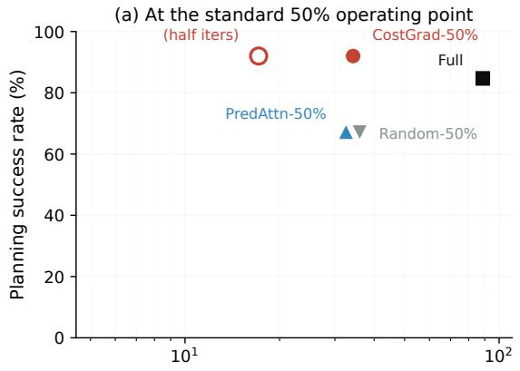  
Wall-clock per planning call (s)

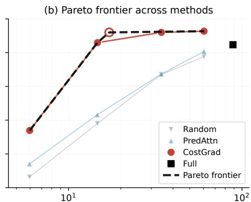  
Wall-clock per planning call (s)  
Figure 3: Wall speed–success trade-off on AdaLN-Zero. (a) Five canonical operating points at the standard K=128 sparse setting. COSTGRAD-50% with 15 CEM iterations achieves the same mean success as standard COSTGRAD-50% while reducing planning time to ∼ 17 s, a 5.2× speedup over Full. (b) Pareto frontier across methods at 30 CEM iterations, plus the COSTGRAD K=128, 15-iteration point. Among measured points, the non-dominated frontier is traced by COSTGRAD configurations; Full, PREDATTN, and Random are dominated. Timing details and the full (K, iters) marker convention are in Appendix K and Appendix H.

Why can sparsity exceed Full? Sparse planning also changes the effective planning cost: Full includes background and weakly task-relevant tokens that may add noise to the objective. Restricting rollout and goal comparison to high-sensitivity tokens can sharpen the cost landscape around controllable objects and goal-relevant regions, provided the subset retains enough state for prediction. This interpretation is consistent with the cost-function ablation on Wall: COSTGRAD’s gain over Full triples when the cost is more degenerate — +22.9 pp under L<sub>1</sub> versus +7.3 pp under L<sub>2</sub> (Appendix F).

## 3.2 Task relevance and stability of planning-gradient selection

§3.1 showed that planning-gradient selection outperforms attention- and prediction-error-based selection by large margins on AdaLN-Zero (Table 1). We first examine what COSTGRAD selects and how those selections align with task relevance, then test their stability across trained predictors and probe actions.

Goal-conditioned selection. Figure 4 visualizes COSTGRAD selections across environments. The kept tokens concentrate on task-relevant regions — maze corridors, the agent and wall, the pusher and block, the robot arm and object — while dropping much of the background. Decoded one-step predictions from the same sparse token sets remain qualitatively faithful (Appendix C, Figure 5).

Prediction difficulty is not task relevance. Prediction error selects visually hard-to-predict tokens, whereas planning needs tokens whose state affects the goal-reaching cost. This distinction is clearest on PushT: the pusher and T-block are task-critical but move predictably under the action, so they receive low prediction error while still receiving high COSTGRAD score. A quadrant analysis confirms that PushT uniquely contains many “easy-but-critical” tokens — low prediction error but high planning gradient — at ∼ 2× chance density, while the other three environments are depleted (Appendix J). Prediction-derived selection can therefore downweight precisely the objects that matter for control.

Selection stability. Prediction-derived attention is unstable across equivalent predictors. Three Wall AdaLN-Zero predictors trained with different seeds reach indistinguishable validation loss, but their top-128 attention selections overlap at only IoU $0 . 4 4 \pm 0 . 0 2$ and PREDATTN planning success varies by 50 pp across seeds. COSTGRAD selections on the same predictors overlap at IoU > 0.82 and yield planning success within evaluation noise. Planning-derived gradients therefore provide a more reliable selection signal than learned attention.

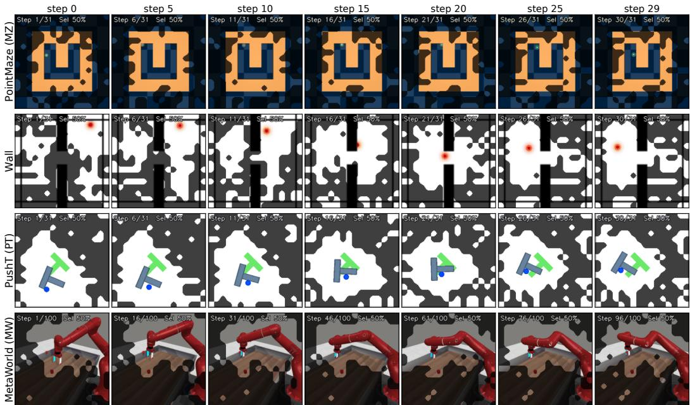  
Figure 4: COSTGRAD selection across environments. Per-row: selection overlay at seven timesteps through one episode (bright = kept, dim = dropped, 50% kept throughout). COSTGRAD adapts to each environment’s task structure: maze corridors on PointMaze, agent and wall on Wall, T-block and pusher on PushT, arm and object on MetaWorld. Decoded one-step predictions from the same sparse token sets are in Appendix C.

Probe-action robustness. CEM plans with action distributions far from $\mathbf { { a } } _ { 0 } = \mathbf { { 0 } } .$ , so a fixed probe action could in principle give unstable rankings. COSTGRAD rankings remain stable across 10 tested probe actions: $\rho = 0 . 9 1 8$ on AdaLN-Zero and 0.958 on matched-concat (Appendix I). On AdaLN-Zero, replacing the default zero-action probe with Gaussian-noise or CEM-mean probes changes Wall planning success by at most ±5 pp (Appendix E). Stable token rankings do not guarantee reliable predictions after token removal; we next examine how sparse planning depends on the predictor’s architecture (§3.3).

## 3.3 Sparse planning depends on selector–architecture compatibility

We evaluate selector–architecture compatibility on Wall and PointMaze, using three independently trained concat checkpoints per environment. The concat predictors share the encoder, training data, depth, heads, attention head dimension, MLP width, optimizer, and schedule with AdaLN-Zero. AdaLN supplies action-dependent scales, shifts, and gates at every block, with modulation parameters independent of the retained token set. Concat appends action features to each token at the input, before self-attention.

Across both environments, COSTGRAD has no consistent advantage over Random on concat: the paired success-rate gaps are $- 0 . 1 \pm 4 . 9 \mathrm { p p }$ on Wall and $+ 2 . 0 \pm 4 . { \bar { 5 } }$ pp on PointMaze (Appendix I, Table 5). This contrasts with the gains over Random on AdaLN-Zero (Table 1).

Table 2 contrasts full and sparse planning on Wall. Full-token success is comparable between concat and AdaLN-Zero (85.1% vs. 84.7%). Under sparsification, COSTGRAD beats Random by 25.0 pp and Full by 7.3 pp on AdaLN-Zero, whereas it falls 5.1 pp below Full on concat. We next examine how token removal changes the action-dependent predictions used by CEM.

Table 2: Full and sparse planning on Wall. AdaLN results are from Table 1; concat reports mean ± std across three training checkpoints, with 96 episodes per method per checkpoint. $\mathrm { C G - F u l l } > 0 \colon$ sparsification is profitable; < 0: net harmful.
<table><tr><td>Predictor</td><td>Full</td><td> $\mathrm { C O S T G R A D }$ </td><td>Random</td><td>CG-Rand</td><td>CG-Full</td></tr><tr><td>AdaLN-Zero</td><td> $8 4 . 7 \pm 2 . 6$ </td><td> $9 2 . 0 \pm 1 . 8$ </td><td> $6 7 . 0 \pm 3 . 6$ </td><td>+25.0</td><td>+7.3</td></tr><tr><td>Concat (matched)</td><td> $8 5 . 1 \pm 5 . 2$ </td><td> $8 0 . 0 \pm 2 . 9$ </td><td> $8 0 . 2 \pm { 3 . 8 }$ </td><td>-0.1</td><td> $- 5 . 1$ </td></tr></table>

Table 3: Multi-seed action-pathway diagnostic on Wall. Mean ± sample standard deviation across three training seeds per architecture; $K { = } 1 2 8 .$ , 20 observations × 5 action probes per checkpoint. Selected/Random ratios below one indicate less drift than Random. $\alpha { = } 0 . 8$ uses 80% random anchors.
<table><tr><td>Predictor</td><td>Selection</td><td>KL random</td><td>KL selected</td><td>Sel. / random</td></tr><tr><td>AdaLN-Zero</td><td>COSTGRAD</td><td> $0 . 2 6 5 \pm 0 . 0 0 5$ </td><td> $0 . 0 7 7 \pm 0 . 0 0 9$ </td><td> $( 0 . 2 9 \pm 0 . 0 3 ) \times$ </td></tr><tr><td>AdaLN-Zero</td><td> $\alpha { = } 0 . 8$ </td><td> $0 . 2 6 5 \pm 0 . 0 0 5$ </td><td> $0 . 1 1 6 \pm 0 . 0 0 9$ </td><td> $( 0 . 4 4 \pm 0 . 0 2 ) \times$ </td></tr><tr><td>Concat (matched)</td><td>COSTGRAD</td><td> $0 . 2 8 7 \pm 0 . 0 1 7$ </td><td> $0 . 3 8 0 \pm 0 . 0 3 0$ </td><td> $( 1 . 3 3 \pm 0 . 1 7 ) \times$ </td></tr><tr><td>Concat (matched)</td><td> $\alpha { = } 0 . 8$ </td><td> $0 . 2 8 7 \pm 0 . 0 1 7$ </td><td> $0 . 2 9 8 \pm 0 . 0 1 6$ </td><td> $( 1 . 0 4 \pm 0 . 1 1 ) \times$ </td></tr></table>

Action-pathway drift. CEM ranks candidate actions by their predicted outcomes. Sparse Imagination [Chun et al., 2025] identifies a related failure: fixed token subsets can create blind spots that make candidate actions indistinguishable. We therefore examine whether token removal changes the spatial distribution of action effects across retained positions. Let $f _ { i } ( \mathscr { U } , \mathscr { a } )$ denote the predictor’s next-step visual output at position i using token set U and action a. Holding context and proprioception fixed, define the action effect by

$$
\delta _ { i } ^ { \mathcal { U } } = f _ { i } ( \mathcal { U } , \pmb { a } ) - f _ { i } ( \mathcal { U } , \mathbf { 0 } ) .\tag{3}
$$

For the full set $\mathcal { P } = \{ 1 , \ldots , P \}$ and kept set $s ,$ normalize squared action effects over the same kept positions $i \in S ;$

$$
p _ { i } = \frac { \lVert \delta _ { i } ^ { S } \rVert _ { 2 } ^ { 2 } } { \sum _ { j \in { \cal S } } \lVert \delta _ { j } ^ { S } \rVert _ { 2 } ^ { 2 } } , \qquad q _ { i } = \frac { \lVert \delta _ { i } ^ { \mathcal { P } } \rVert _ { 2 } ^ { 2 } } { \sum _ { j \in { \cal S } } \lVert \delta _ { j } ^ { \mathcal { P } } \rVert _ { 2 } ^ { 2 } } .\tag{4}
$$

We measure drift as $\begin{array} { r } { D _ { \mathrm { K L } } ( p \Vert q ) = \sum _ { i \in \mathcal { S } } p _ { i } \log ( p _ { i } / q _ { i } ) } \end{array}$ . Using the same retained positions isolates redistribution from the absence of dropped outputs; normalization focuses on relative spatial magnitudes, discarding overall scale and vector direction. Random selection at the same token budget provides a reference for generic sparsification. The diagnostic does not itself bound planning error or establish that candidate-action rankings are preserved. See Appendix D for details.

Table 3 reports drift across three independently trained Wall checkpoints per architecture: COST-GRAD yields $( 0 . 2 9 \pm 0 . 0 3 ) \times$ Random on AdaLN-Zero and $( 1 . 3 3 \bar { \pm } 0 . 1 \bar { 7 } ) \times$ on matched-concat, with the same direction in every checkpoint.

Coverage through random anchors. To examine whether the concentration of selected tokens matters, we replace part of the gradient-selected subset with random anchors while keeping K fixed. Mixing 20% top-COSTGRAD tokens with 80% random anchors (α=0.8) brings concat drift to $( 1 . 0 4 \pm 0 . 1 1 ) \times$ Random, while AdaLN remains below Random at $( 0 . 4 4 \pm 0 . 0 \bar { 2 } ) \times$ (Table 3). The smaller concat drift motivates broader coverage, but planning recovery is checkpoint-dependent (Appendix I); anchor mixing is therefore a diagnostic intervention, not a generally better selector.

Mechanistic interpretation. Our hypothesis is that AdaLN’s repeated local conditioning reduces dependence of the action response on removed context, whereas concat relies on learned transformations of the action features supplied at the input; neither architecture guarantees this stability. Reversing the ranking does not resolve the failure: keeping the bottom-gradient tokens collapses planning on both predictors (Appendix I). Appendix M separates visual cost restriction from changes caused by sparse dynamics. For sparse planning, token relevance and the predictor’s response to token removal must be evaluated together.

## 4 Related Work

World models and sparse planning. Token-based visual world models such as DINO-WM [Zhou et al., 2025] and JEPA-WMs [Terver et al., 2025] preserve a spatial grid of visual features for planning. This spatial structure is useful for goal-conditioned control, but it makes CEM rollouts expensive because every candidate action sequence is evaluated over many tokens. V-JEPA 2-AC [Assran et al., 2025] also uses an action-conditioned latent world model for image-goal robot planning. Among compact-latent approaches, DreamerV3 [Hafner et al., 2023] learns a policy from imagined trajectories, while TD-MPC2 [Hansen et al., 2024] and LeWorldModel [Maes et al., 2026] optimize actions in lower-dimensional latent spaces. COSTGRAD addresses the complementary setting: given a token-based world model, it reduces the number of spatial tokens used during planning without retraining the model.

Sparse Imagination [Chun et al., 2025] combines randomized grouped attention during training with random token selection during planning. It also analyzes spatial blind spots from importance-based selection that make candidate actions difficult to distinguish. COSTGRAD instead uses planning-cost gradients to select a goal-conditioned subset in a fixed pretrained predictor and studies its interaction with action conditioning. The approaches are complementary: sparse training improves tolerance to missing tokens, while planning-gradient selection identifies which tokens matter for the current goal.

Contemporaneous Scope-WM [Li et al., 2026] distills prediction-loss sensitivity into an actionconditioned selector and trains sparse dynamics with lightweight background updates. Its selector– background-update interaction provides complementary evidence for matching selection to sparse dynamics. COSTGRAD instead selects directly from the current goal’s planning-cost gradients without retraining the predictor.

Token selection and importance estimation. Token-reduction methods for ViTs include token merging [Bolya et al., 2023], learned token pruning [Rao et al., 2021], class-token-driven reorganization [Liang et al., 2022], and patch dropout during training [Liu et al., 2023]. These methods were primarily developed for single-pass perception, where the reduced token set supports one forward computation. EfficientVLA [Yang et al., 2025] extends training-free token reduction to robot policies, combining task-aware attention scores with feature diversity. Sparse visual planning is different: the selected tokens must support many action-conditioned rollouts inside CEM.

Gradient saliency has a long history, from input-gradient visualizations [Simonyan et al., 2014] to axiomatic attribution methods such as Integrated Gradients [Sundararajan et al., 2017] and classdiscriminative localization methods such as GradCAM [Selvaraju et al., 2017]. Sensitivity also guides computation reduction: Taylor-based pruning [Molchanov et al., 2017] approximates the loss change caused by removing convolutional filters, and ZOO-Prune [Kim et al., 2026] estimates projected-feature sensitivity for training-free visual-token pruning. COSTGRAD uses downstream planning-cost gradients to choose the token subset for repeated action-conditioned rollouts in a fixed predictor. Its contribution couples this goal-conditioned selection rule with an analysis of whether the selected subset preserves the predictor’s action response (§3.3).

Decision relevance and predictor compatibility. Objective mismatch [Lambert et al., 2020], value-aware model learning [Farahmand et al., 2017], and value equivalence [Grimm et al., 2020] distinguish predictive fidelity from usefulness for downstream decisions. COSTGRAD applies this principle to inference-time token selection in a fixed predictor: the planning objective determines which representation supports action search, without changing model training.

Underspecification [D’Amour et al., 2022] describes how models with similar in-distribution metrics can differ under downstream use. The attention-as-explanation debate [Jain and Wallace, 2019, Wiegreffe and Pinter, 2019] likewise highlights the need to evaluate attention’s usefulness in context, rather than assume universal reliability or unreliability. Our Wall seed study (§3) demonstrates an operational consequence: predictors with matched validation loss yield unstable attention-based selections and planning outcomes, while planning-gradient selection is more stable in the same setting.

Feature-wise linear modulation (FiLM) [Perez et al., 2018] is a standard way to condition neural representations; adaptive normalization variants such as AdaLN-Zero [Peebles and Xie, 2023] apply this idea inside transformer blocks. DiT [Peebles and Xie, 2023] compares adaptive normalization with cross-attention and in-context conditioning through appended tokens. Our matched AdaLNvs-channel-concat comparison (§3.3) adds stability under token removal as a criterion for actionconditioning design. In our experiments, AdaLN supports pure planning-gradient sparsification, whereas concat makes concentrated subsets unstable and can require coverage-preserving selectors.

## 5 Discussion and Limitations

When does sparse planning work? Our results identify two coupled design considerations for sparse planning: relevance to the control objective and compatibility with the predictor. COST-GRAD derives token importance from the current goal, since importance for prediction need not coincide with importance for control. In our matched comparison, COSTGRAD reduces measured action-effect drift relative to Random on AdaLN but increases it on concat, tracking its loss of planning advantage (§3.3). Token-selection performance should therefore be assessed jointly with the predictor at the intended token budget.

Limitations and open questions. Our evaluation covers four simulated environments, one encoder family (DINOv2 ViT-S/14) and one planner (CEM). Physical-system evaluation with perception noise, calibration errors, and model mismatch remains future work. Our selector–architecture finding is supported for the tested AdaLN and channel-wise concat predictors; its generality beyond this comparison remains untested. Future work should evaluate FiLM, cross-attention, and prefixstyle conditioning to test whether action-pathway drift predicts sparse-planning performance across conditioning mechanisms, and explore sparse training to improve robustness to gradient-selected subsets. The strength of COSTGRAD is also environment-dependent: attention-based selection is competitive on PointMaze and PushT, while the gap is much larger on Wall and MetaWorld. All experiments use fixed pretrained predictors and inference-time selection; online adaptation and learned selectors remain future work. Selection uses a one-step probe, while CEM evaluates longer action sequences. Whether longer-horizon probes improve selection enough to justify their cost remains open.

Design implication. A planner is part of a world model’s operating distribution. Token restriction can change the model’s response to candidate actions, even when the retained tokens appear relevant to the task. World models intended for sparse planning should be evaluated under the token subsets and action searches used at deployment, because full-token prediction quality alone does not establish their suitability for sparse control.

## References

Mido Assran, Adrien Bardes, David Fan, Quentin Garrido, Russell Howes, Mojtaba Komeili, Matthew Muckley, Ammar Rizvi, Claire Roberts, Koustuv Sinha, et al. V-JEPA 2: Self-supervised video models enable understanding, prediction and planning. arXiv preprint arXiv:2506.09985, 2025.

Daniel Bolya, Cheng-Yang Fu, Xiaoliang Dai, Peizhao Zhang, Christoph Feichtenhofer, and Judy Hoffman. Token merging: Your ViT but faster. In International Conference on Learning Representations (ICLR), 2023.

Cheng Chi, Zhenjia Xu, Siyuan Feng, Eric Cousineau, Yilun Du, Benjamin Burchfiel, Russ Tedrake, and Shuran Song. Diffusion policy: Visuomotor policy learning via action diffusion. In Robotics: Science and Systems (RSS), 2023.

Junha Chun, Youngjoon Jeong, and Taesup Kim. Sparse imagination for efficient visual world model planning. arXiv preprint arXiv:2506.01392, 2025.

Alexander D’Amour, Katherine Heller, Dan Moldovan, Ben Adlam, Babak Alipanahi, Alex Beutel, Christina Chen, Jonathan Deaton, Jacob Eisenstein, Matthew D Hoffman, et al. Underspecification presents challenges for credibility in modern machine learning. Journal of Machine Learning Research, 23(226):1–61, 2022.

Amir-massoud Farahmand, Andre Barreto, and Daniel Nikovski. Value-aware loss function for model-based reinforcement learning. In International Conference on Artificial Intelligence and Statistics (AISTATS), 2017.

Justin Fu, Aviral Kumar, Ofir Nachum, George Tucker, and Sergey Levine. D4RL: Datasets for deep data-driven reinforcement learning. arXiv preprint arXiv:2004.07219, 2020.

Christopher Grimm, André Barreto, Satinder Singh, and David Silver. The value equivalence principle for model-based reinforcement learning. In Advances in Neural Information Processing Systems (NeurIPS), 2020.

Danijar Hafner, Jurgis Pasukonis, Jimmy Ba, and Timothy Lillicrap. Mastering diverse domains through world models. arXiv preprint arXiv:2301.04104, 2023.

Nicklas Hansen, Hao Su, and Xiaolong Wang. TD-MPC2: Scalable, robust world models for continuous control. International Conference on Learning Representations (ICLR), 2024.

Sarthak Jain and Byron C. Wallace. Attention is not explanation. In NAACL-HLT, 2019.

Youngeun Kim, Youjia Zhang, Huiling Liu, Aecheon Jung, Sunwoo Lee, and Sungeun Hong. ZOO-Prune: Training-free token pruning via zeroth-order gradient estimation in vision-language models. In Proceedings of the IEEE/CVF Conference on Computer Vision and Pattern Recognition (CVPR), pages 39572–39582, 2026.

Nathan Lambert, Brandon Amos, Omry Yadan, and Roberto Calandra. Objective mismatch in model-based reinforcement learning. In Learningfor Dynamics and Control (L4DC), 2020.

Chunzheng Li, Zesheng Jia, Hongda Zhang, Jiaying Tang, Yuntian Wang, Siao Liu, and Jin Wang. Scope-WM: Scoped computation for efficient visual world models. arXiv preprint arXiv:2609.33218, 2026.

Youwei Liang, Chongjian Ge, Zhan Tong, Yibing Song, Jue Wang, and Pengtao Xie. Not all patches are what you need: Expediting vision transformers via token reorganizations. In International Conference on Learning Representations (ICLR), 2022.

Yue Liu, Christos Matsoukas, Fredrik Strand, Hossein Azizpour, and Kevin Smith. PatchDropout: Economizing vision transformers using patch dropout. In IEEE/CVF Winter Conference on Applications ofComputer Vision (WACV), 2023.

Lucas Maes, Quentin Le Lidec, Damien Scieur, Yann LeCun, and Randall Balestriero. LeWorld-Model: Stable end-to-end joint-embedding predictive architecture from pixels. arXiv preprint arXiv:2603.19312, 2026.

Pavlo Molchanov, Stephen Tyree, Tero Karras, Timo Aila, and Jan Kautz. Pruning convolutional neural networks for resource efficient inference. In International Conference on Learning Representations (ICLR), 2017.

Maxime Oquab, Timothée Darcet, Théo Moutakanni, Huy Vo, Marc Szafraniec, Vasil Khalidov, Pierre Fernandez, Daniel Haziza, Francisco Massa, Alaaeldin El-Nouby, et al. DINOv2: Learning robust visual features without supervision. In Transactions on Machine Learning Research (TMLR), 2024.

William Peebles and Saining Xie. Scalable diffusion models with transformers. In International Conference on Computer Vision (ICCV), 2023.

Ethan Perez, Florian Strub, Harm de Vries, Vincent Dumoulin, and Aaron Courville. FiLM: Visual reasoning with a general conditioning layer. In AAAI Conference on Artificial Intelligence (AAAI), 2018.

Yongming Rao, Wenliang Zhao, Benlin Liu, Jiwen Lu, Jie Zhou, and Cho-Jui Hsieh. DynamicViT: Efficient vision transformers with dynamic token sparsification. In Advances in Neural Information Processing Systems (NeurIPS), 2021.

Reuven Rubinstein. The cross-entropy method for combinatorial and continuous optimization. Methodology and Computing in Applied Probability, 1(2):127–190, 1999.

Ramprasaath R Selvaraju, Michael Cogswell, Abhishek Das, Ramakrishna Vedantam, Devi Parikh, and Dhruv Batra. Grad-CAM: Visual explanations from deep networks via gradient-based localization. In ICCV, 2017.

Karen Simonyan, Andrea Vedaldi, and Andrew Zisserman. Deep inside convolutional networks: Visualising image classification models and saliency maps. arXiv preprint arXiv:1312.6034, 2014.

Mukund Sundararajan, Ankur Taly, and Qiqi Yan. Axiomatic attribution for deep networks. In International Conference on Machine Learning (ICML), 2017.

Basile Terver, Tsung-Yen Yang, Jean Ponce, Adrien Bardes, and Yann LeCun. What drives success in physical planning with joint-embedding predictive world models? arXiv preprint arXiv:2512.24497, 2025.

Sarah Wiegreffe and Yuval Pinter. Attention is not not explanation. In EMNLP-IJCNLP, 2019.

Yantai Yang, Yuhao Wang, Zichen Wen, Luo Zhongwei, Chang Zou, Zhipeng Zhang, Chuan Wen, and Linfeng Zhang. EfficientVLA: Training-free acceleration and compression for visionlanguage-action models. In Advances in Neural Information Processing Systems, volume 38, 2025.

Tianhe Yu, Deirdre Quillen, Zhanpeng He, Ryan Julian, Avnish Narayan, Hayden Shively, Adithya Bellathur, Karol Hausman, Chelsea Finn, and Sergey Levine. Meta-world: A benchmark and evaluation for multi-task and meta reinforcement learning. In Conference on Robot Learning (CoRL), 2020.

Sergey Zagoruyko and Nikos Komodakis. Paying more attention to attention: Improving the performance of convolutional neural networks via attention transfer. In International Conference on Learning Representations (ICLR), 2017. URL https://arxiv.org/abs/1612.03928.

Gaoyue Zhou, Hengkai Pan, Yann LeCun, and Lerrel Pinto. DINO-WM: World models on pretrained visual features enable zero-shot planning. In Proceedings of the 42nd International Conference on Machine Learning (ICML), volume 267 of Proceedings of Machine Learning Research, pages 79115–79135. PMLR, 2025.

## A Environments

We evaluate on four continuous-control benchmarks following Terver et al. [2025]. All four are visual planning tasks where the agent is given an initial frame and a goal frame and must produce an action sequence that drives the environment to the goal.

PointMaze (MZ). A 2D point navigates a U-Maze configuration drawn from Terver et al. [2025]’s suite (the underlying maze layout follows the D4RL maze suite, Fu et al., 2020). Action space: 2- dimensional continuous (x, y motor controls). Visual: a 224 × 224 rendering of the agent and maze walls. Episode horizon: 30 environment steps; success = reaching within 0.5 of the goal location.

Wall. A 2D agent navigates around a vertical wall with a single horizontal gap to reach a goal on the other side. Action space: 2-dimensional continuous; frame-skip 5, so each predictor step receives a 10-dim concatenated action. Visual: 224 × 224 rendering with the agent as a small red dot, the wall as a black bar, and the gap as the wall’s discontinuity. Episode horizon: 30; success = $L _ { 2 }$ distance to goal < 4.5.

PushT (PT). A 2D pusher pushes a T-shaped block to a target pose, following the PushT environment used by Chi et al. [2023]. Action space: 2-dimensional continuous (pusher target position). Visual: $2 2 4 \times 2 2 4$ rendering with a small blue pusher dot, a blue T-block, and a green target T over a plain light-gray background. Episode horizon: 30; success $= L _ { 2 }$ error in the concatenated pusher/block positions $< 2 0$ and block-angle error $< \pi / 9$

MetaWorld (MW). A 3D 7-DoF arm performs the Reach task from MetaWorld’s training suite [Yu et al., 2020]. Action space: 4-dimensional continuous (three Cartesian end-effector increments and one gripper command). Visual: $2 2 4 \times 2 2 4$ third-person view; proprio: 4-dimensional vector (end-effector position and gripper opening). Episode horizon: 100 environment steps; success per the MetaWorld task definition (end-effector–target distance $\leq 0 . 0 5 )$

## B Implementation and hyperparameters

Encoder. Frozen DINOv2 ViT-S/14 [Oquab et al., 2024]; we do not fine-tune any encoder weights. Input image 224 × 224; patch size 14; produces ${ \textrm { a } } 1 6 \times 1 6 = 2 5 6$ grid of 384-dimensional tokens per frame.

Predictor. Six-block transformer with 400-dimensional internal embedding and 16 heads. RoPE positional encoding; GELU activation in the FFN, SiLU in the AdaLN modulation MLP; per-block AdaLN modulation parameters $\left( \gamma _ { 1 } , \beta _ { 1 } , g _ { 1 } , \gamma _ { 2 } , \beta _ { 2 } , g _ { 2 } \right)$ derived from the action via a single linear layer. Action embedding dimension 400 (matching internal embedding); action tokens: 1. Total predictor parameters: ≈ 17.6M.

Concatenation predictor (matched-concat). Same depth (6 blocks), heads (16), attention head dimension (25), MLP hidden dimension (1600), GELU activation, RoPE positional encoding, training data, and optimizer as the AdaLN predictor. Action conditioning is replaced: a 10-dimensional frame-skip action vector is channel-wise concatenated to each visual token before the q/k/v projections (DINO-WM-style). The only architectural difference is the action pathway.

Planner. Cross-Entropy Method (CEM, Rubinstein, 1999): horizon H=6, 300 candidate sequences per iteration, 30 iterations, 10 elites for refit. Cost: $\mathrm { L _ { 2 } }$ between predicted final-step encoding and goal encoding (cosine and $\mathrm { L _ { 1 } }$ alternatives in Appendix F). α = 0.1 proprio weight when applicable.

Pretraining. Our retrained predictors are trained for 20 epochs with AdamW, learning rate $5 \times$ $1 0 ^ { - 4 }$ , and batch size 8 per GPU, following the reference JEPA-WMs hyperparameters. Unless otherwise stated, main results use our retrained checkpoints; COSTGRAD itself is training-free and can also be applied directly to released checkpoints.

Objective and normalization. For retained positions S, $K = | S |$ , the default final-step CEM cost is

$$
J _ { S } ( A ) = \frac { 1 } { K D } \sum _ { j \in \cal S } \| \hat { z } _ { H , j } ( A ) - z _ { g , j } \| _ { 2 } ^ { 2 } + \frac { \alpha } { d _ { p } } \| \hat { p } _ { H } ( A ) - p _ { g } \| _ { 2 } ^ { 2 } , \qquad \alpha = 0 . 1 ,
$$

where p is the flattened proprioceptive representation and $d _ { p }$ its number of entries; the second term is omitted when proprioception is absent. Full uses all $P$ positions. Both terms average over their own feature entries, so reducing $K$ does not implicitly reduce the visual term’s weight. The selection probe uses only the full-grid visual sum of squared errors; replacing this sum by a mean would uniformly rescale its gradients without changing their ranking. RGB inputs are scaled to [0, 1] and standardized with ImageNet channel statistics before DINOv2 encoding; its output features receive no additional feature normalization. Proprioceptive inputs are standardized using dataset means and standard deviations before encoding, and actions use the training-normalized coordinates. Probebased selectors use zero action and proprioceptive inputs in these coordinates; CEM rollout uses the observed proprioceptive input.

Attention aggregation. Let $A ^ { ( h ) }$ be the last block’s attention matrix for head $h ,$ after the scaled query–key softmax with block-causal masking, and let $k ( t , j )$ index spatial position $j$ in context frame t. With M heads and $T$ context frames, PREDATTN uses

$$
s _ { j } ^ { \mathrm { a t t n } } = \frac { 1 } { M T } \sum _ { h = 1 } ^ { M } \sum _ { t = 1 } ^ { T } \sum _ { q } A _ { q , k ( t , j ) } ^ { ( h ) } .
$$

The query sum includes all queries; only spatial keys are ranked. Heads and frames receive equal weight, with no entropy weighting.

Prediction-gradient target. For an observed context with $T \geq 2 .$ , PREDGRAD computes

$$
\begin{array} { r } { \mathcal { L } _ { \mathrm { p r e d } } = \| f ( z _ { 1 : T - 1 } , \mathbf { 0 } ) _ { \mathrm { l a s t } } - \mathrm { s t o p g r a d } ( z _ { T } ) \| _ { 2 } ^ { 2 } , \qquad s _ { j } ^ { \mathrm { p r e d } } = \| \nabla _ { z _ { T - 1 , j } } \mathcal { L } _ { \mathrm { p r e d } } \| _ { 2 } . } \end{array}
$$

Here $f$ returns visual predictions and the subscript selects its last temporal output. The target is a detached encoding from observed history, not an outcome obtained by executing the probe action; the historical action that produced it is not substituted for the zero probe. Top-K spatial indices from this retrospective residual are applied to the current observation and goal.

Token-merging adaptation. ToMe partitions the current grid into checkerboard source and destination sets, matches each source to its most cosine-similar destination, and merges the $P - K$ highest-similarity source–destination pairs. Each group is replaced by the equal-weight average of its original features at the destination’s original positional index. The mapping is computed once per planning step and applied to every observed context frame; subsequent rollout predicts only the surviving positions without rematching. The visual cost compares these predictions with the unmerged goal features at the same positions, averaging uniformly over surviving tokens without merge-size weights.

## C Decoded one-step predictions from COSTGRAD-50% sparse tokens

Figure 5 shows the predictor’s decoded next-step predictions from the COSTGRAD-selected 50% token subsets visualized in Figure 4. On all four environments, the prediction quality at 50% tokens is qualitatively faithful: agent and goal positions are recovered on PointMaze and Wall, the T-block and pusher poses are recovered on PushT, and the arm/object configuration is recovered on Meta-World. Visual artifacts from missing tokens are concentrated in background regions COSTGRAD chose to drop.

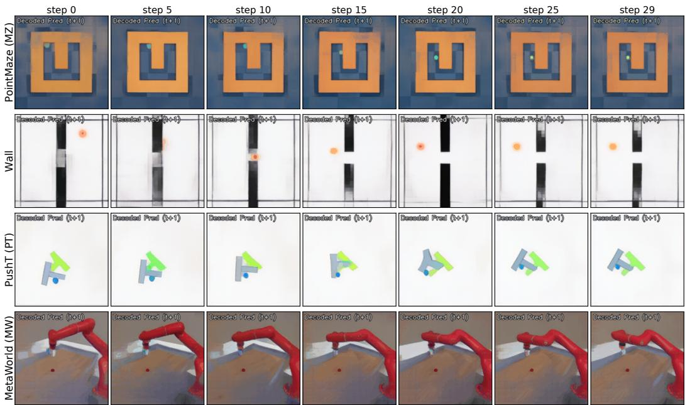  
Figure 5: Decoded one-step predictions from COSTGRAD-50% sparse tokens. Per-row: the predictor’s decoded t+1 output at seven timesteps through one episode, when only the top-128 COSTGRAD-scored tokens are kept (corresponding to the selection overlays in Figure 4).

## D Action conditioning and token-removal sensitivity

We summarize the conditioning mechanisms and define the drift diagnostic used in §3.3. Let $z _ { i }$ denote a block’s input token, a the action input, and S the retained spatial indices. The schematic block updates below omit temporal indexing and proprioceptive channels.

AdaLN-Zero block (predictor used in §2.1):

$$
\begin{array} { r } { h _ { i } = z _ { i } + g _ { 1 } ( \pmb { a } ) \odot \mathrm { A t t n } _ { i } \big ( \{ ( 1 + \gamma _ { 1 } ( \pmb { a } ) ) \odot \mathrm { L N } ( z _ { j } ) + \beta _ { 1 } ( \pmb { a } ) : j \in \mathcal { S } \} \big ) , } \end{array}\tag{5}
$$

$$
T _ { i } ^ { ( \ell + 1 ) , \mathrm { A d a L N - Z e r o } } = h _ { i } + g _ { 2 } ( \pm ) \odot \mathrm { M L P } \big ( ( 1 + \gamma _ { 2 } ( a ) ) \odot \mathrm { L N } ( h _ { i } ) + \beta _ { 2 } ( a ) \big ) .\tag{6}
$$

The action enters at six per-token modulation parameters $\left( \gamma _ { 1 } , \beta _ { 1 } , g _ { 1 } , \gamma _ { 2 } , \beta _ { 2 } , g _ { 2 } \right)$ , all functions of a alone, broadcast per-token. The gates ${ \bf { \mathit { g } } } _ { 1 } , { \bf { \mathit { g } } } _ { 2 }$ are zero-initialized, so each block starts as the identity (the $\mathrm { \bf { \ddot { Z } } e r o } ^ { \bf { \vec { \theta } } , \vec { \theta } }$ in AdaLN-Zero). The action-dependent modulation is broadcast across tokens; this structure, rather than the zero initialization, is what §3.3 returns to when comparing AdaLN against concat conditioning.

Concat block (DINO-WM style; channel-wise feature concatenation): with $z _ { i } ^ { \mathrm { a u g } } : = [ z _ { i } ; \pi ( \mathbf { a } ) ] \in$ $\mathbb { R } ^ { D + D _ { a } }$ <sup>a</sup> ,

$$
h _ { i } = z _ { i } ^ { \mathrm { a u g } } + \mathrm { A t t n } _ { i } \big ( \{ \mathrm { L N } ( z _ { j } ^ { \mathrm { a u g } } ) : j \in \mathcal { S } \} \big ) ,\tag{7}
$$

$$
T _ { i } ^ { ( \ell + 1 ) , \mathrm { c o n c a t } } = h _ { i } + \mathrm { M L P } ( \mathrm { L N } ( h _ { i } ) ) .\tag{8}
$$

The action enters once, channel-wise per token, before the q/k/v projections.

Dependence on the retained tokens. AdaLN’s modulation parameters depend on the action alone, but its modulated tokens still enter self-attention. In both architectures, removing tokens changes attention normalization and aggregated values, so action effects at the block output can change. The conditioning mechanisms therefore motivate an empirical comparison of sensitivity to token removal; subset-independent modulation parameters alone do not establish output invariance.

Output-level action-pathway drift. Let $f _ { i } ( \mathscr { U } , \pmb { a } )$ be the predictor’s next-step visual output at position i using token set U. With context and proprioception fixed, define

$$
\delta _ { i } ^ { \mathcal { U } } = f _ { i } ( \mathcal { U } , \pmb { a } ) - f _ { i } ( \mathcal { U } , \mathbf { 0 } ) .\tag{9}
$$

Table 4: Wall planning success vs. choice of CEM cost function. The selector uses an L probe throughout; its largest gain is under the $\mathrm { L _ { 1 } }$ CEM cost, where full-token planning performs worst.
<table><tr><td>Cost</td><td>Full</td><td>COSTGRAD (50%)</td><td> $\Delta$ </td></tr><tr><td> $\mathrm { L _ { 2 } }$ </td><td>84.7</td><td>92.0</td><td>+7.3</td></tr><tr><td>Cosine</td><td>82.3</td><td>87.5</td><td>+5.2</td></tr><tr><td>L1</td><td>47.9</td><td>70.8</td><td>+22.9</td></tr></table>

For $\mathcal { P } = \{ 1 , \ldots , P \}$ and $i \in S$ , normalize the squared action effects of both predictors over the same retained positions:

$$
p _ { i } = \frac { \lVert \delta _ { i } ^ { S } \rVert _ { 2 } ^ { 2 } } { \sum _ { j \in { \cal S } } \lVert \delta _ { j } ^ { S } \rVert _ { 2 } ^ { 2 } } , \qquad q _ { i } = \frac { \lVert \delta _ { i } ^ { \mathcal { P } } \rVert _ { 2 } ^ { 2 } } { \sum _ { j \in { \cal S } } \lVert \delta _ { j } ^ { \mathcal { P } } \rVert _ { 2 } ^ { 2 } } .\tag{10}
$$

We report $\begin{array} { r } { D _ { \mathrm { K L } } ( p \| q ) = \sum _ { i \in \mathcal { S } } p _ { i } \log ( p _ { i } / q _ { i } ) } \end{array}$ , with $1 0 ^ { - 1 0 }$ numerical stabilization in the implementation. This measures changes in the spatial distribution of squared action-effect magnitudes; it does not measure their vector directions or a common change in magnitude.

Diagnostic design. Subtracting the zero-action output removes action-independent offsets, so the comparison concerns the response to an action rather than raw prediction agreement. We compare finite action responses of the same predictor under full and sparse inputs. Summing squared responses over feature channels produces a nonnegative spatial map, analogous to the squared-activation maps used in attention transfer [Zagoruyko and Komodakis, 2017]. We normalize over the same retained positions to compare relative spatial allocation without counting missing positions or a uniform rescaling as drift. Our sum normalization and KL divergence differ from attention transfer’s normalized-map distance: $D _ { \mathrm { K L } } ( p \Vert q )$ penalizes sparse-response mass where the full predictor assigns little relative mass. This is an output-response diagnostic, not a direct measurement of internal computational pathways or a guarantee of action-ranking preservation.

Empirical architecture interaction. Across three Wall training seeds per architecture, Table 3 reports a COSTGRAD-selected/Random drift ratio of $0 . 2 9 \pm 0 . 0 3$ for AdaLN-Zero and 1.33 ± 0.17 for matched-concat, with the direction holding for every checkpoint. The proposed conditioningbased explanation is discussed in §3.3.

## E Probe action sensitivity (COSTGRAD and PREDATTN)

Both COSTGRAD and PREDATTN require a probe action sequence to compute their importance scores. Both use a zero-action probe by default, corresponding to the mean action in normalized training space and providing a neutral starting point before action search. For COSTGRAD, replacing zero with small Gaussian noise changes planning success by at most 5 pp across the four environments. A CEM-mean probe was additionally tested on Wall, also within 5 pp; we have not tested CEM-mean on every environment. The probe-stability of COSTGRAD’s selection extends to the per-token level: rank Spearman across 10 probe actions is $\rho > 0 . 9$ on both AdaLN-Zero and the matched-concat predictor (Wall, seed 1; Appendix I).

## F Cost function robustness

COSTGRAD’s benefit is robust across the choice of planning cost function; in fact the benefit is largest when the cost is poorest. Table 4 reports Wall planning success with three cost functions: $\mathrm { L _ { 2 } }$ (default), cosine similarity, and $\mathrm { L _ { 1 } }$ . This ablation varies the CEM planning cost while retaining the $\mathrm { L _ { 2 } }$ selection probe for COSTGRAD in every row.

Cross-cost selection IoU. In a separate diagnostic, we vary the selection-probe objective itself: top-128 Jaccard IoU between L and cosine selections is $0 . 9 1 { \dot { 7 } } ; { }$ between $\mathrm { L _ { 2 } }$ and $\mathrm { L _ { 1 } }$ it is 0.841. The three probe objectives therefore select substantially overlapping token sets in this diagnostic.

## G Matched compute baseline

A natural concern: COSTGRAD saves predictor compute by using fewer tokens, but the saved compute could alternatively be spent on more CEM iterations or candidates. We test this directly on Wall: COSTGRAD at 50% tokens with half the CEM iterations (15 instead of 30) achieves $9 2 . \mathrm { \dot { 0 } \pm 5 . 1 \% }$ planning success across 3 eval seeds (per-seed: 89.58, 88.54, 97.92) at $\sim 5 \times$ overall wall-clock speedup (2.6× from token sparsity $\times ~ 2 \times$ from halving CEM iterations; Appendix K). The mean matches the standard COSTGRAD-50% rate $( 9 2 . 0 \pm \bar { 1 . 8 \% }$ , Table 1) and exceeds the 84.7% Full baseline by +7.3 pp. Eval-seed variance is wider here than for standard COSTGRAD-50% $( \sigma = 5 . 1$ $\mathbf { v s } . \sigma = 1 . 8 )$ , but the worst-case seed (88.54%) still beats Full.

Full at half CEM iters as a matched-compute reference. The natural reviewer comparison is whether halving Full’s CEM iterations would achieve a similar speedup–success trade-off without any token selection. Three eval seeds at Full $\left( K { = } 2 5 6 \right)$ with 15 iterations on Wall give $8 4 . 3 8 , \bar { 8 } 3 . 3 3 , 8 5 . 4 2 = 8 4 . 4 \pm 1 . 0 \%$ , within eval-seed noise of the standard $8 4 . 7 \pm 2 . 6 \%$ for 2× wall-clock speedup $( 8 8 . 6 \to 4 4 . 3 \mathrm { ~ s ~ }$ ; predictor compute scales linearly with iter count and COST-GRAD adds no overhead in this case since it is not used). COSTGRAD-50%-with-half-iters beats Full-with-half-iters by +7.6 pp (92.0 vs. 84.4) at the same iteration budget and a further 2.6× periter cost reduction. Token selection and increased search are therefore complementary: they address different sources of inefficiency.

## H COSTGRAD operating curve

Figure 6 shows every measured COSTGRAD operating point on AdaLN-Zero, sweeping both token budget $K \in \{ 2 6 , 6 4 , 1 2 8 , 1 9 2 \}$ and CEM iteration count iters $\in \{ 1 0 , 1 5 , 2 0 , 3 0 \}$ . Color encodes the token budget K cluster; marker shape encodes iter count $( \diamond \mathrm { = } 1 0$ , open $\mathrm { O = } 1 5 , \mathrm { \ i } = 2 0$ , filled •=30). Thin lines connect points within each K cluster, in increasing iter order.

Two qualitative features support the practical claim that COSTGRAD “saturates” at the standard 50% operating point. First, planning success is roughly flat across $K \in \{ 6 4 , 1 2 8 , 1 9 2 \}$ at iters= 30 (85.9%, 92.0%, 92.7%), so the marginal benefit of doubling tokens beyond K=64 is small. Second, within each K cluster, halving iterations $( 3 0  1 5 )$ does not consistently reduce success — measurements at iters∈ {10, 15, 20} scatter around the iters= 30 mean rather than tracking it monotonically. Reducing CEM iterations therefore acts mostly as a horizontal slide along the time axis at roughly fixed success, until iterations get very low.

## I Additional diagnostic checks

Sparse planning retains K=128 of 256 tokens. Table 5 gives the per-training-seed concat results on Wall and PointMaze summarized in §3.3; the remaining checks use Wall. Appendix D defines the action-pathway diagnostic, and Table 3 reports its multi-seed results.

Probe-action stability. Across 30 observations and 45 pairs of 10 probe actions per observation, per-token rank Spearman is $0 . 9 1 8 \pm 0 . 0 5 8$ on AdaLN-Zero and $0 . 9 5 8 \pm 0 . 0 3 9$ on matched-concat (one checkpoint per architecture; mean ± standard deviation over all 1,350 pairwise correlations). The probes comprise zero, four positive unit-axis directions, and five Gaussian samples with $\sigma { = } 0 . 5$ Both predictors maintain stable rankings under these probes despite their different responses to token removal.

Inverted-COSTGRAD sanity check. Keeping the bottom-K tokens by gradient norm yields 0/60 successful episodes on AdaLN-Zero (the run was stopped after 60 of 96 planned episodes) and 1/96 (1.04%) on matched-concat. Reversing the ranking therefore collapses planning on both predictors; it does not recover COSTGRAD’s advantage over Random on concat.

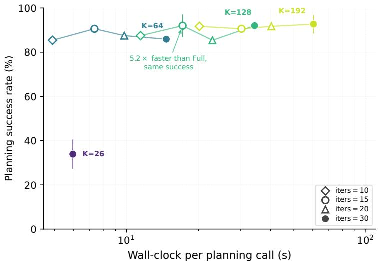  
Figure 6: COSTGRAD operating curve on Wall AdaLN-Zero. Every measured (K, iters) COST-GRAD cell. Color encodes K cluster (sequential viridis: purple $K { = } 2 6 ,$ teal $K { = } 6 4 .$ , green $K { = } 1 2 8 .$ yellow $K { = } 1 9 2 )$ ; marker shape encodes iter count $\displaystyle { ( \diamond = 1 0 } ^ { } ,$ open $\mathrm { O = 1 5 , \triangle = 2 0 }$ , filled •=30). Thin lines connect points within each K cluster (sorted by iter count). K labels at the iters= 30 marker of each cluster. The headline operating point $\left( K { = } 1 2 8 \right.$ with iters= 15, ∼17 s, $9 2 . 0 \pm 5 . 1 \%$ gives a 5.2× wall-clock speedup over Full at higher mean success.

Table 5: Concat planning across environments and training seeds. Paired COSTGRAD–Random success-rate gaps (pp), with $K { = } 1 2 8$ of 256 tokens and 96 episodes per method per checkpoint. $\mathrm { M e a n } \pm \mathrm { s t d }$ is across the three training seeds.
<table><tr><td>Environment</td><td>Seed 1</td><td>Seed 2</td><td>Seed 3</td><td> $\mathrm { M e a n } \pm \mathrm { s t d }$ </td></tr><tr><td>Wall</td><td>+2.1</td><td>+3.2</td><td>-5.7</td><td> $- 0 . 1 \pm 4 . 9$ </td></tr><tr><td>PointMaze</td><td>+4.1</td><td>-3.2</td><td>+5.2</td><td> $+ 2 . 0 \pm 4 . 5$ </td></tr></table>

Anchor mixing. The selector keeps (1−α)K top-COSTGRAD tokens and fills the remaining αK slots uniformly at random from the unselected tokens. At $\alpha { = } 0 . 8$ , planning improves over Random on two of three matched-concat training checkpoints. On the first checkpoint, success is $9 4 . 1 \pm 2 . 4 \%$ versus Random’s $7 9 . 5 \pm 2 . 1 \%$ (three evaluation seeds). On the other two checkpoints, the respective anchor/Random results are $8 9 . 6 / 7 6 . 0 \%$ and 76.0/83.3% (one evaluation seed each); all evaluations use 96 episodes per seed. Together with Table 3, these results show that restoring drift toward the Random baseline does not guarantee a planning gain. We therefore use anchor mixing as a diagnostic of selector–architecture compatibility; its planning benefit is checkpoint-dependent.

## J Quadrant analysis methodology

For each environment we compute, on 30 observations, the per-token prediction error $\begin{array} { r l } { e _ { j } } & { { } = } \end{array}$ $\lVert \mathrm { p r e d } _ { j } - \mathrm { t a r g e t } _ { j } \rVert ^ { 2 }$ and the COSTGRAD score $s _ { j }$ . For each observation, the easy-but-critical intersection contains tokens in the bottom 25% of prediction error and the top 25% of COSTGRAD score. The reverse intersection contains tokens in the top 25% of prediction error and the bottom 25% of COSTGRAD score; these two intersections do not partition all 256 tokens. Under independence, the expected count in each intersection is $0 . 2 5 \times \bar { 0 . 2 5 } \times 2 5 6 = 1 6$ . The easy-but-critical intersection measures disagreement between prediction error and planning sensitivity: tokens with low prediction error but high planning-cost gradient.

PushT has almost twice the independence-reference count of easy-but-critical tokens; Wall, MZ, and MW have fewer than expected. This supports the interpretation that predictable motion can still matter for control: on PushT, the pusher and T-block can have low prediction error while receiving high planning-gradient scores. Depletion in the other environments describes this particular intersection, rather than establishing agreement between the complete token rankings. The reverse intersection is below the independence reference in every environment (0.91× on PushT; 0.20–0.87× elsewhere), so it does not show the same enrichment.

Table 6: Easy-but-critical token counts per environment (30 obs each, P=256): bottom-quartile prediction error intersected with top-quartile COSTGRAD score. Counts are mean ± std; the independence reference is 16. PushT is the only environment with enrichment above this reference; the other three are depleted.
<table><tr><td>Environment</td><td>Easy + critical (count)</td><td>Multiple of expected</td></tr><tr><td>PushT (PT)</td><td> ${ \bf 3 1 . 9 \pm 4 . 3 }$ </td><td>1.99×</td></tr><tr><td>PointMaze (MZ)</td><td> $1 0 . 7 \pm 2 . 8$ </td><td>0.67×</td></tr><tr><td>Wall</td><td> $8 . 5 \pm 4 . 3$ </td><td>0.53×</td></tr><tr><td>MetaWorld (MW)</td><td> $3 . 2 \pm 2 . 2$ </td><td>0.20×</td></tr></table>

Table 7: Timing breakdown for one CEM planning step (300 candidates × 30 iterations $\times H = 6 )$ COSTGRAD’s extra forward+backward is a one-time cost amortized over 30 CEM iterations, while the per-iteration cost drops by 2.61× from the predictor-compute reduction. The reported total includes predictor rollout time and COSTGRAD overhead; the shared 7.64 ms encoder cost is shown separately and is negligible at this scale. Net wall-clock speedup at K = 128 vs. $K = 2 5 6 { \mathrm { i s } } 2 . 6 0 \times$
<table><tr><td>Component</td><td>K=256 (Full)</td><td>K=128 (COSTGRAD)</td></tr><tr><td>Encode context + goal (ms)</td><td>7.64</td><td>7.64</td></tr><tr><td>COSTGRAD forward + backward (ms)</td><td></td><td>27.53</td></tr><tr><td>Predictor forward at batch 300 (ms)</td><td>492.25</td><td>188.90</td></tr><tr><td>Per CEM iter  $( \times H { = } 6 ,$  ms)</td><td>2953.51</td><td>1133.42</td></tr><tr><td>Total predictor over CEM step (×30 iters, s)</td><td>88.61</td><td>34.00</td></tr><tr><td>Planning call total, excl. shared encoder (s)</td><td>88.61</td><td>34.04</td></tr></table>

## K Timing breakdown

We measure per-component latency on the AdaLN-Zero predictor using the Wall checkpoint and a single H100 GPU, mean ± std over 5 warm-cache trials with 3 warmups discarded.

The 2.60× wall-clock speedup exceeds the naive 2× that linear scaling in token count would predict. The reason is that predictor compute mixes attention $( O ( N ^ { 2 } )$ in token count) and MLPs $( O ( N ) )$ at $N = 1 2 8$ versus $N = 2 5 6 .$ , attention flops drop by 4× while MLP flops drop by $2 \times .$ , and the weighted combination on this architecture lands at $\sim 2 . 6 \times$ . The COSTGRAD forward+backward overhead (27.53 ms) amortizes to ∼ 1 ms per CEM iteration over 30 iterations, an order of magnitude smaller than the per-iteration savings (∼ 1820 ms), so the overhead is operationally invisible.

## L Public-checkpoint control

We evaluate COSTGRAD on released JEPA-WMs checkpoints [Terver et al., 2025] without retraining (Table 8).

Table 8: Planning success (%) on released checkpoints without retraining. Mean ± standard deviation over three evaluation seeds, with 96 episodes per seed. Full uses all 256 tokens; COSTGRAD and Random keep 128 (50%).
<table><tr><td>Environment</td><td>Full</td><td>COSTGRAD (50%)</td><td>Random (50%)</td></tr><tr><td>PointMaze</td><td> $8 7 . 7 \pm 7 . 7$ </td><td> $8 6 . 3 \pm 1 1 . 9$ </td><td> $7 0 . 7 \pm 1 5 . 1$ </td></tr><tr><td>Wall</td><td> $8 7 . 0 \pm 2 . 8$ </td><td> $8 7 . 0 \pm 2 . 2$ </td><td> $7 5 . 7 \pm 4 . 6$ </td></tr><tr><td>PushT</td><td> $6 6 . 3 \pm 2 . 6$ </td><td> $6 7 . 3 \pm 3 . 4$ </td><td> $2 1 . 0 \pm 9 . 0$ </td></tr><tr><td>MetaWorld (Reach)</td><td> $5 8 . 3 \pm 1 0 . 0$ </td><td> $6 3 . 2 \pm 5 . 2$ </td><td> $2 0 . 8 \pm 9 . 0$ </td></tr></table>

## M An analytical perspective on token selection

The arguments below concern the visual squared-distance cost; the evaluated planner also includes weighted proprioceptive error.

Local relevance. At a fixed probe, write $f = f ( \boldsymbol { z } , \boldsymbol { a } _ { 0 } )$ and $G _ { j } = \partial f / \partial z _ { j }$ . With fixed prediction target ${ z } _ { \mathrm { n e x t } }$ and goal $z _ { g }$ , squared losses give

$$
\nabla _ { z _ { j } } L _ { \mathrm { p l a n } } = 2 G _ { j } ^ { \top } ( f - z _ { g } ) , \qquad \nabla _ { z _ { j } } L _ { \mathrm { p r e d } } = 2 G _ { j } ^ { \top } ( f - z _ { \mathrm { n e x t } } ) .\tag{11}
$$

Exact prediction makes the second gradient zero without requiring the first to vanish. For the fixed full-token computation, let $g _ { j } = \nabla _ { z _ { i } } L _ { \mathrm { p l a n } }$ and let S contain the K retained tokens. Perturb only discarded tokens, independently within $\| \Delta z _ { j } \| _ { 2 } \leq \eta$ . Then

$$
\operatorname* { m a x } _ { \{ \| \Delta z _ { j } \| _ { 2 } \leq \eta \colon j \notin S \} } \left| \sum _ { j \notin S } { g _ { j } ^ { \top } \Delta z _ { j } } \right| = \eta \sum _ { j \notin S } \| g _ { j } \| _ { 2 } .\tag{12}
$$

Cauchy–Schwarz gives the upper bound; aligned perturbations attain it. Keeping the K largest norms minimizes this linearized criterion. Physical token removal also changes attention and subsequent rollouts, which this local perturbation model does not represent.

Exact cost decomposition. Fix an observation, goal, horizon H, and token set S shared across action candidates. Let $\Phi _ { \mathcal { P } } ( A )$ and $\Phi _ { S } ( A )$ denote the full and sparse terminal predictions for action sequence $A ,$ , with $\mathcal { P } = \{ 1 , \ldots , P \}$ . For this visual component, sums and means induce the same ranking because the token count is fixed across candidates. Define

$$
\begin{array} { r l r } { { J ( A ) = \displaystyle \sum _ { i \in \mathcal { P } } \| \Phi _ { \mathcal { P } , i } ( A ) - z _ { g , i } \| _ { 2 } ^ { 2 } , } } & { { } } & { { } } \\ { { J _ { S } ^ { \mathrm { o r a c l e } } ( A ) = \displaystyle \sum _ { i \in \mathcal { S } } \| \Phi _ { \mathcal { P } , i } ( A ) - z _ { g , i } \| _ { 2 } ^ { 2 } , } } & { { } } & { { J _ { S } ( A ) = \displaystyle \sum _ { i \in \mathcal { S } } \| \Phi _ { \mathcal { S } , i } ( A ) - z _ { g , i } \| _ { 2 } ^ { 2 } . } } \end{array}\tag{13}
$$

The oracle cost retains the selected positions but uses full-token dynamics. Set $D s = J - J _ { S } ^ { \mathrm { o r a c l e } }$ (discarded cost) and $E _ { S } = J _ { S } - J _ { S } ^ { \mathrm { o r a c l e } }$ (change from sparse dynamics). Exactly,

$$
J _ { S } ( A ) - J ( A ) = E _ { S } ( A ) - D _ { S } ( A ) .\tag{14}
$$

Sparse planning therefore changes both which positions enter the cost and the predictions at retained positions. Only action-dependent variation in $E _ { S } - D _ { S }$ can change candidate rankings; an actionindependent offset preserves them.