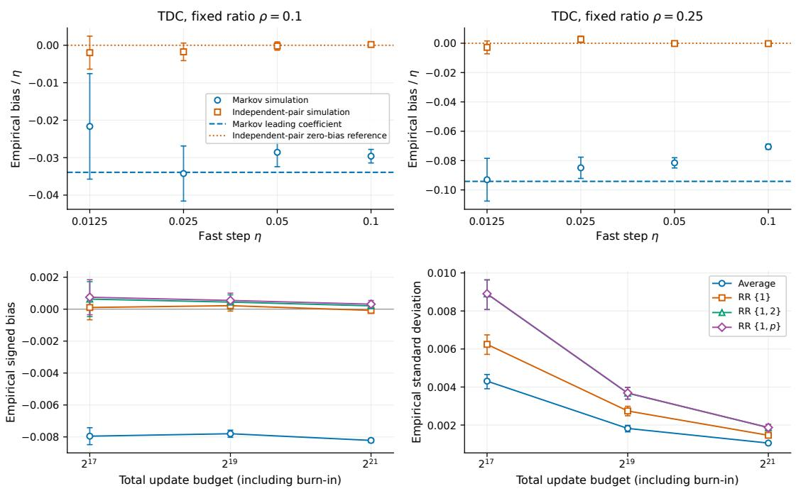
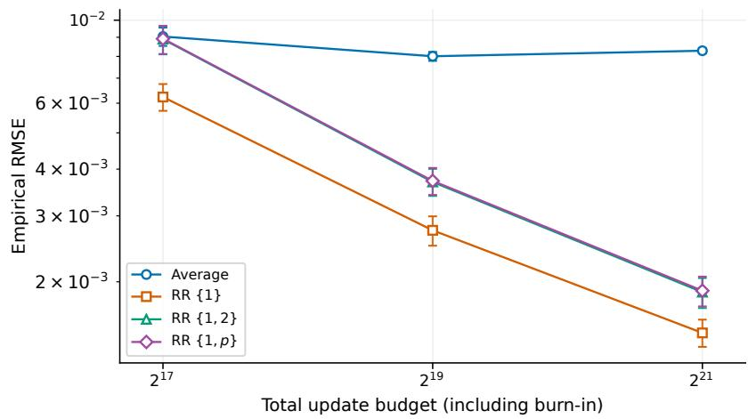
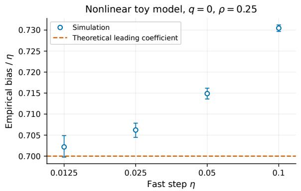
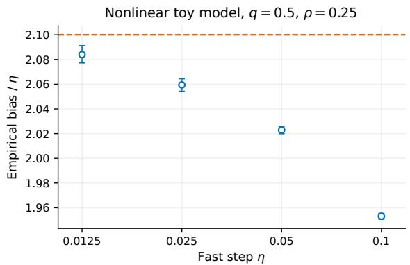
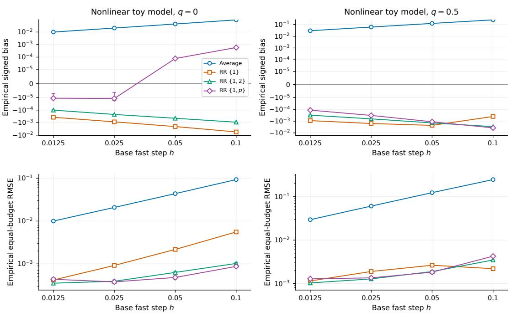

# Stationary Bias and Extrapolation in Nonlinear Two-Timescale Stochastic Approximation

A.Ch. Madhusudanarao Department of Computer Science and Automation Indian Institute of Science, Bengaluru, India madhusudanar@iisc.ac.in

Rahul Singh Laboratoire de Recherche de l’EPITA, Paris, France rahulsingh0188@gmail.com

## Abstract

Constant-step stochastic approximation generally has a nonzero stationary mean error that persists under time averaging. This paper studies that error for nonlinear two-timescale recursions driven by an exogenous finite-state Markov chain. Under stated smoothness assumptions and conditions on the stationary distribution, we derive a first-order bias expansion whose error bound remains uniform as the slow step size becomes much smaller than the fast step size. Fast-manifold coordinates keep the associated covariance equation regular in this limit. For fast step η and slow step ε, the expansion reveals a mixed contribution $\varepsilon ^ { 2 } / \eta$ alongside terms linear in each step size. This dependence matters for bias reduction: along power-law step-size paths, the bias exponents need not be integers, so Richardson– Romberg extrapolation requires weights matched to the path. An exactly solvable nonlinear Markov example verifies the coeficients. We verify localization for temporal-diference learning and compare finite-run extrapolation at equal update budgets. For finite runs, we bound the initialization error of tail averages on both timescales under an additional coupling assumption. In the special case of additive independent noise, signed third-moment cancellation yields a sharper remainder.

## 1 Introduction

Stochastic approximation (SA) studies iterative algorithms that update their variables using noisy observations. Constant-step SA generally approaches an invariant distribution whose mean difers from the equilibrium of the averaged dynamics. This diference is the stationary bias. Averaging the iterates $z _ { k }$ to give $\begin{array} { r } { \bar { z } _ { N } = N ^ { - 1 } \sum _ { k = 1 } ^ { N } z _ { k } } \end{array}$ reduces fluctuations but retains this stationary bias since under stationarity $\mathbb { E } \bar { z } _ { N } = \mathbb { E } z _ { 1 }$

In two-timescale SA, two coupled sets of variables are updated with diferent step sizes. Write the fast step as η, the slow step as ε, and their ratio as $\rho = \varepsilon / \eta$ . Our goal is to determine how these two rates jointly afect the stationary bias. The connection to covariance comes from nonlinearity: a Taylor expansion of the averaged update around equilibrium contains quadratic terms whose expectations involve products of coordinate fluctuations. Consequently, the leading curvature contribution to the mean bias depends on the stationary covariance. Correlations between the current iterate and the observation can produce an additional bias contribution, which our analysis also accounts for.

To determine this covariance, we expand the stationary balance of second moments near equilibrium. At leading order, contraction under the linearized dynamics balances the fluctuations supplied by the noise. This balance takes the form of a Lyapunov equation, a linear matrix equation for the leading covariance coeficient. For temporally correlated observations, its noise covariance includes correlations across time. Solving and controlling this equation is therefore an intermediate step in computing the nonlinear mean bias.

The dificulty is obtaining covariance estimates that remain useful as $\rho \downarrow 0$ . On the fast clock, where k iterations correspond to time $t = k \eta .$ the slow drift is scaled by $\rho .$ A scalar slow mode $\dot { v } = - a \rho v , a > 0$ , for example, decays as $e ^ { - a \rho t }$ . Thus the slow spectral ${ \mathit { g a p } } ,$ the smallest exponential decay rate among the slow linearized modes, tends to zero with $\rho .$ Bounds for the Lyapunov equation accumulate perturbations over this decay time and can introduce a factor $1 / \rho ,$ as illustrated by $\begin{array} { r } { \int _ { 0 } ^ { \infty } e ^ { - 2 a \rho t } d t = ( 2 a \rho ) ^ { - 1 } } \end{array}$ . However, the noise and remainder terms in the slow covariance equation also carry small powers of $\rho .$ . Retaining these factors prevents an artificial loss of uniformity and allows the covariance estimate to support a uniform bias expansion.

We study nonlinear recursions driven by an exogenous finite-state Markov chain: the next input depends on the input history only through its current state, and its transition law is unafected by the algorithm. We obtain a first-order stationary bias expansion uniform in small positive $\rho ,$ meaning that the remainder constant does not diverge as $\rho \downarrow 0 .$ Coordinates relative to the fast equilibrium manifold, the local family of equilibria of the fast averaged dynamics as the slow variable varies, regularize the covariance equation by exposing the scales of its fast and slow blocks. Writing $m _ { \eta , \rho }$ for the stationary mean displacement from equilibrium, we obtain

$$
m _ { \eta , \rho } = \eta b _ { 0 } + \varepsilon b _ { 1 } + \frac { \varepsilon ^ { 2 } } { \eta } b _ { 2 } + O \left( \eta ^ { 3 / 2 } + \frac { \varepsilon ^ { 3 } } { \eta ^ { 2 } } \right) .
$$

Here $b _ { 0 } , b _ { 1 } , b _ { 2 }$ are coeficient vectors determined by the update rule and noise law, independent of the step sizes.

The mixed term matters for Richardson–Romberg extrapolation, which forms a weighted combination of estimates at diferent step sizes to cancel leading bias terms. Along the power-law path $\varepsilon = \eta ^ { p } , p > 1$ , its exponent is $2 p - 1$ , alongside 1 and $p .$ We derive weights adapted to these powers and verify nonzero mixed bias in an exactly solvable nonlinear Markov model. We also bound the initialization error of tail averages, formed after discarding an initial segment of the trajectory, under an additional coupling assumption. This assumption controls the diference between a trajectory from a prescribed initial state and a stationary trajectory constructed on the same probability space. Stationary existence and localization, expressed through moment bounds around the equilibrium, are explicit hypotheses; local stability alone does not establish them.

We study fixed-policy value estimation using temporal-diference learning with gradient correction (TDC) [20]. We verify stationary localization through uniform block contraction and compare finite-run bias, variance, and mean-square error for ordinary averaging and extrapolation at equal update budgets.

Related work. The ordinary diferential equation (ODE) framework for SA is developed in [3, 14]. Decreasing-step two-timescale theory includes [2, 18]; finite-time results treat linear recursions [4], including Markov inputs [13] and nonlinear systems [6], with Markov central limit theory and applications to TDC and related gradient-TD methods in [10]. Invariant-distribution and weak-error analyses, which study errors in expectations of observables, appear for constantstep stochastic gradient methods in [5, 7]. Bias expansions and Richardson–Romberg correction for Markov SA are studied by Huo et al. [11], while Allmeier and Gast [1] compute first-order bias using Lyapunov equations. For nonlinear SA, Huo et al. [12] distinguish bias contributions from memory, nonlinearity, and their interaction. The closest two-timescale work, Kwon et al. [15], studies stationary laws, bias, variance, averaging, and extrapolation for linear recursions. Our work addresses nonlinear curvature and derives a covariance expansion uniform as the step-size ratio vanishes. Extrapolation methods are also developed in [8, 17, 19].

Notation. Norms are Euclidean or induced matrix norms; ⊤ denotes transpose. A matrix is Hurwitz if all its eigenvalues have negative real parts. Constants in uniform bounds are independent of $0 < \eta \leq \eta _ { 0 }$ and $0 < \rho \le \rho _ { 0 }$ , with suficiently small fixed upper bounds. Unless indicated otherwise, expectations are stationary.

## 2 Model and Assumptions

## 2.1 Recursion and Coordinates

Consider

$$
x _ { k + 1 } = x _ { k } + \eta H ( Y _ { k } , x _ { k } , \theta _ { k } ) ,\tag{1}
$$

$$
\theta _ { k + 1 } = \theta _ { k } + \varepsilon F ( Y _ { k } , x _ { k } , \theta _ { k } ) ,\tag{2}
$$

where $x _ { k } \in \mathbb { R } ^ { d _ { x } } , \theta _ { k } \in \mathbb { R } ^ { d _ { \theta } } , \eta > 0$ , and $\varepsilon = \eta \rho$ with $0 < \rho < 1$ . Thus $x _ { k }$ uses the larger step size and $\theta _ { k }$ the smaller one. The uniform results below concern suficiently small positive $\eta$ and $\rho .$ The exogenous input $( Y _ { k } )$ is a Markov chain on a finite state space Y, with transition matrix $P , \mathrm { i . e . , } \mathbb { P } ( Y _ { k + 1 } = y ^ { \prime } \mid \mathcal { F } _ { k } ) = P ( Y _ { k } , y ^ { \prime } )$ , where $\mathcal { F } _ { k }$ is the sigma-field generated by the inputs and iterates through time k. Its invariant distribution is $\mu .$

For a function a on Y, write

$$
P a ( y ) = \sum _ { y ^ { \prime } } P ( y , y ^ { \prime } ) a ( y ^ { \prime } ) , \qquad \mu a = \sum _ { y } \mu ( y ) a ( y ) .
$$

Set $z = ( x ^ { \top } , \theta ^ { \top } ) ^ { \top }$ and $G ( y , z ) = ( H ( y , x , \theta ) ^ { \top } , F ( y , x , \theta ) ^ { \top } ) ^ { \top }$ . The averaged update field is

$$
\bar { G } ( z ) = \mu G ( \cdot , z ) = \binom { \bar { H } ( x , \theta ) } { \bar { F } ( x , \theta ) } ,
$$

where the average is taken over the input while holding z fixed. The joint recursion is therefore

$$
\begin{array} { c } { { D _ { \rho } = \mathrm { d i a g } ( I _ { d _ { x } } , \rho I _ { d _ { \theta } } ) , } } \\ { { z _ { k + 1 } = z _ { k } + \eta D _ { \rho } G ( Y _ { k } , z _ { k } ) . } } \end{array}\tag{3}
$$

Fix an equilibrium $z ^ { \star } = ( ( x ^ { \star } ) ^ { \top } , ( \theta ^ { \star } ) ^ { \top } ) ^ { \top }$ of the averaged field, so $\bar { G } ( z ^ { \star } ) = 0$ . For each $\theta$ near $\theta ^ { \star }$ , let $\lambda ( \theta )$ denote the corresponding local equilibrium of the fast averaged dynamics:

$$
\bar { H } ( \lambda ( \theta ) , \theta ) = 0 , \qquad \lambda ( \theta ^ { \star } ) = x ^ { \star } .
$$

The local uniqueness and $C ^ { 2 }$ regularity of this branch are specified in Assumption A1. The reduced slow drift is

$$
g ( \theta ) = \bar { F } ( \lambda ( \theta ) , \theta ) , \qquad g ( \theta ^ { \star } ) = 0 .
$$

It describes the slow update when the fast variable is at the equilibrium associated with the current slow variable.

Define the Jacobian blocks, all evaluated at $z ^ { \star }$ , by

$$
\begin{array} { l l } { { A = \partial _ { x } \bar { H } ( z ^ { \star } ) , } } & { { B = \partial _ { \theta } \bar { H } ( z ^ { \star } ) , } } \\ { { { } } } & { { { } } } \\ { { C = \partial _ { x } \bar { F } ( z ^ { \star } ) , } } & { { D = \partial _ { \theta } \bar { F } ( z ^ { \star } ) . } } \end{array}
$$

The local stability assumption (Assumption A2) makes A invertible. Diferentiating the fast equilibrium identity $\bar { H } ( \lambda ( \theta ) , \theta ) = 0$ gives $A D \lambda ( \theta ^ { \star } ) + B = 0$ , and the chain rule then gives

$$
\begin{array} { c } { { J = D \bar { G } ( z ^ { \star } ) = \left( \begin{array} { c c } { { A } } & { { B } } \\ { { C } } & { { D } } \end{array} \right) , } } \\ { { \Lambda = D \lambda ( \theta ^ { \star } ) = - A ^ { - 1 } B , } } \\ { { S = D g ( \theta ^ { \star } ) = D + C \Lambda = D - C A ^ { - 1 } B . } } \end{array}\tag{4}
$$

Thus Λ describes the first-order movement of the fast equilibrium as $\theta$ changes, while $S$ is the Jacobian of the reduced slow drift.

To separate fast tracking from slow displacement, define locally

$$
\widehat { u } = x - \lambda ( \theta ) , \qquad v = \theta - \theta ^ { \star } .\tag{5}
$$

Here $\widehat { u }$ is the exact tracking error: it measures how far the fast variable is from the equilibrium associated with the current value of θ. Replacing that equilibrium by its tangent approximation $x ^ { \star } + \Lambda v$ gives the tangent tracking error $u = x - x ^ { \star } - \Lambda v$ . Equivalently,

$$
\begin{array} { r } { \binom { u } { v } = T ( z - z ^ { \star } ) , \qquad T = \binom { I _ { d _ { x } } } { 0 } \quad \frac { - \Lambda } { I _ { d _ { \theta } } } \Big ) . } \end{array}\tag{6}
$$

The two tracking errors satisfy the exact identity

$$
\begin{array} { c } { { \widehat { u } = u - r _ { \lambda } ( v ) , } } \\ { { r _ { \lambda } ( v ) = \lambda ( \theta ^ { \star } + v ) - x ^ { \star } - \Lambda v . } } \end{array}
$$

Since λ is $C ^ { 2 }$ near $\theta ^ { \star }$ , its second derivative is bounded on a suficiently small closed ball around $\theta ^ { \star }$ . Taylor’s theorem therefore gives, for some $r > 0$ and $M < \infty$

$$
\| r _ { \lambda } ( v ) \| \leq { \frac { M } { 2 } } \| v \| ^ { 2 } \qquad ( \| v \| \leq r ) ,
$$

where M bounds $\| D ^ { 2 } \lambda \|$ on that ball, so that the remainder is locally quadratic.

The tangent coordinates also simplify the coupling in the equilibrium linearization. Using $A \Lambda + B = 0$ , the linearized averaged recursion becomes

$$
\begin{array} { r l } & { u _ { k + 1 } - u _ { k } = \eta \big [ ( A - \rho \Lambda C ) u _ { k } - \rho \Lambda S v _ { k } \big ] , } \\ & { v _ { k + 1 } - v _ { k } = \eta \rho ( C u _ { k } + S v _ { k } ) . } \end{array}
$$

The identity $A \Lambda + B = 0$ cancels the order-one efect of slow displacement on the fast linearized drift. After factoring out the common step size $\eta _ { \mathrm { ; } }$ the remaining cross coeficients are $- \rho \Lambda S$ and $\rho C$ , both of order $\rho .$

## 2.2 Standing Assumptions

Write $e _ { k } = z _ { k } - z ^ { \star }$ for the error process. For a stationary draw $( Y , z ) \sim \pi _ { \eta , \rho }$ from a joint invariant law, define

$$
e = z - z ^ { \star } , \quad m _ { \eta , \rho } = \mathbb { E } e , \quad \Gamma _ { \eta , \rho } = \operatorname { C o v } ( e ) .\tag{7}
$$

Thus $e$ is a stationary random vector, while $m _ { \eta , \rho }$ and $\Gamma _ { \eta , \rho }$ are its deterministic mean and covariance. All moments below are taken under $\pi _ { \eta , \rho }$

Assumption A1 (Local smoothness). The averaged field $\bar { G }$ is $C ^ { 3 }$ near $z ^ { \star }$ . Near $\theta ^ { \star }$ , the fast equilibrium λ(θ) is locally unique and $C ^ { 2 }$ , with $\lambda ( \theta ^ { \star } ) = x ^ { \star }$

Assumption A2 (Local stability). The matrices A and S in (4) are Hurwitz.

Assumption A3 (Mixing Markov input). For some n0 $\geq 1 , \beta > 0$ , and probability measure ν on $\mathsf { Y } , P ^ { n _ { 0 } } ( y , E ) \ge \beta \nu ( E )$ for every $y \in \mathsf { Y }$ and every subset $E \subseteq \mathsf { Y }$

Assumption A4 (Stationary fourth-moment localization). There exist $\eta _ { 0 } , \rho _ { 0 } , C > 0$ such that, for every $0 < \eta \leq \eta _ { 0 }$ and $0 < \rho \le \rho _ { 0 }$ , the joint process $( Y _ { k } , z _ { k } )$ admits an invariant law $\pi _ { \eta , \rho }$ satisfying

$$
\begin{array} { r } { \mathbb { E } _ { \pi _ { \eta , \rho } } \| z - z ^ { \star } \| ^ { 4 } \leq C \eta ^ { 2 } . } \end{array}\tag{8}
$$

The constant C is independent of $\eta$ and $\rho .$

All stationary results refer to this selected family of invariant laws. Stationary existence and this moment bound do not follow from local Hurwitz stability alone. Proposition 4 gives suficient conditions, and Appendix H.9 verifies localization for the nonlinear Markov example.

Assumption A5 (Update regularity). Each $G ( y , \cdot )$ is globally $C ^ { 2 }$ , with

$$
\operatorname* { s u p } _ { y , z } ( \| D _ { z } G ( y , z ) \| + \| D _ { z } ^ { 2 } G ( y , z ) \| ) \leq K .\tag{9}
$$

These conditions allow updates growing linearly in z. Together with local $C ^ { 3 }$ smoothness and (8), they imply the expected Taylor estimates in Lemma 4. The stationary covariance and mean-bias expansions require no separate slow-coordinate moment or cross-covariance assumption. The stronger block and coordinate conditions in Assumption $\mathrm { A } 7$ are used only when invoking the supplementary blockwise fluctuation statements. The stationary iterates need not have bounded support.

## 3 Geometry, Noise, and Covariance

## 3.1 The Two Relaxation Clocks

On the fast timescale, where one iteration corresponds to time η, the averaged ODE is $\dot { z } = D _ { \rho } \bar { G } ( z )$ Its linearization at $z ^ { \star }$ , expressed in the tangent coordinates $w = T ( z - z ^ { \star } )$ , is $\dot { w } = L _ { \rho } w$ , where

$$
L _ { \rho } = T D _ { \rho } J T ^ { - 1 } = \binom { A - \rho \Lambda C } { \rho C } \quad \begin{array} { c } { - \rho \Lambda S } \\ { \rho S } \end{array} ) .\tag{10}
$$

Thus $e ^ { t L _ { \rho } }$ propagates an initial linearized perturbation over time $t ;$ its subscripts below indicate the output and input coordinate groups. The following bounds separate the fast and slow decay rates and control their interaction, providing the linear estimates needed for uniform covariance analysis.

Proposition 1 (Two-clock semigroup bounds). Under Assumptions $\ A { 1 - A { \ 2 } } ,$ , there exist $C _ { * } , c , \eta _ { 0 } , \rho _ { 0 } >$ 0 such that for $0 < \rho \le \rho _ { 0 }$ and $t \geq 0$

$$
\begin{array} { r l r } & { } & { \| [ e ^ { t L _ { \rho } } ] _ { u u } \| \le C _ { * } ( e ^ { - c t } + \rho e ^ { - c \rho t } ) , } \\ & { } & { \| [ e ^ { t L _ { \rho } } ] _ { u v } \| + \| [ e ^ { t L _ { \rho } } ] _ { v u } \| \le C _ { * } \rho ( e ^ { - c t } + e ^ { - c \rho t } ) , } \\ & { } & { \| [ e ^ { t L _ { \rho } } ] _ { v v } \| \le C _ { * } e ^ { - c \rho t } . \quad \quad } \end{array}\tag{11}
$$

For $0 < \eta \leq \eta _ { 0 }$ and integers $k \geq 0$ , the same inequalities hold with $e ^ { t L _ { \rho } }$ replaced by $( I + \eta L _ { \rho } ) ^ { k }$ 9 and with $e ^ { - c t }$ and $e ^ { - c \rho t }$ replaced by $e ^ { - c \eta k }$ and $e ^ { - c \varepsilon k }$ , respectively, where $\varepsilon = \eta \rho$

Here $( I + \eta L _ { \rho } ) ^ { k }$ propagates the linearized averaged recursion $w _ { k + 1 } = ( I + \eta L _ { \rho } ) w _ { k }$ through k iterations, corresponding to fast time $t = \eta k$ and slow time $\rho t = \varepsilon k$ . The proof of both bounds is given in Appendix B.

## 3.2 Poisson Representation

We identify the efective covariance of the Markov noise, accounting for correlations across time. This supplies the noise term in the Lyapunov equation (14), whose solution determines the leading-order stationary covariance. The latter is used below to quantify how nonlinear drift converts fluctuations into stationary bias. To obtain the noise covariance, we use the Poisson equation introduced next.

For fixed z, let $\tilde { G } ( y , z ) = G ( y , z ) - \bar { G } ( z )$ . We consider the Poisson equation for the Markov transition operator $P _ { \mathrm { : } }$ with a zero-mean normalization:

$$
\mathcal { U } - P \mathcal { U } = \widetilde { G } , \qquad \mu \mathcal { U } = 0 .\tag{12}
$$

Under Assumption A3, geometric mixing of the Markov input $Y _ { k }$ gives the solution $\mathcal { U } ( \cdot , z ) =$ $\textstyle \sum _ { j \geq 0 } P ^ { j } { \tilde { G } } ( \cdot , z )$ [9, Section 5].

$$
\begin{array} { r } { \mathrm { ~ : ~ } \xi _ { k } = G ( Y _ { k } , z ^ { \star } ) \mathrm { ~ a n d ~ } \zeta _ { k + 1 } ( z ) = \mathcal { U } ( Y _ { k + 1 } , z ) - ( P \mathcal { U } ) ( Y _ { k } , z ) . } \end{array}
$$

Lemma 1 (Long-run covariance). Under Assumption $A \mathcal { 3 } , \ \zeta _ { k + 1 } ( z )$ is a martingale diference for fixed z, meaning $\mathbb { E } [ \zeta _ { k + 1 } ( z ) \mid \mathcal { F } _ { k } ] = 0$ . For the stationary input chain $Y _ { 0 } \sim \mu$ , write $K _ { h } = \mathbb { E } [ \xi _ { 0 } \xi _ { h } ^ { \top } ]$ Then

$$
\begin{array} { r l } & { Q = \underset { m  \infty } { \operatorname* { l i m } } m ^ { - 1 } \mathbb { E } [ ( \underset { k = 0 } { \overset { m - 1 } { \sum } } \xi _ { k } ) ( \underset { k = 0 } { \overset { m - 1 } { \sum } } \xi _ { k } ) ^ { \top } ] } \\ & { = K _ { 0 } + \underset { h \geq 1 } { \sum } ( K _ { h } + K _ { h } ^ { \top } ) = \mathbb { E } [ \zeta _ { 1 } ( z ^ { \star } ) \zeta _ { 1 } ( z ^ { \star } ) ^ { \top } ] . } \end{array}\tag{13}
$$

The sum in (13) accumulates the equilibrium noise over m steps. To compute its covariance per step, we use the Poisson equation to write

$$
\sum _ { k = 0 } ^ { m - 1 } \xi _ { k } = \sum _ { k = 0 } ^ { m - 1 } \zeta _ { k + 1 } ( z ^ { \star } ) + \mathcal { U } ( Y _ { 0 } , z ^ { \star } ) - \mathcal { U } ( Y _ { m } , z ^ { \star } ) .
$$

The first term is a martingale sum. The remaining diference depends only on the initial and final noise states and is bounded uniformly in m, since Y is finite. Its covariance and cross terms vanish after division by $m _ { : }$ yielding the last equality in (13); see Appendix C.2.

## 3.3 Covariance of Stationary Iterates

We now approximate $\Gamma _ { \eta , \rho } = \mathrm { C o v } ( z - z ^ { \star } )$ under the stationary law $\pi _ { \eta , \rho }$ . This covariance measures fluctuations around the stationary mean and enters the bias expansion in Section 4.

Write $J _ { \rho } = D _ { \rho } J$ , which is Hurwitz for suficiently small $\rho$ by Proposition 1. Define $\Sigma _ { \rho }$ as the unique solution of the Lyapunov equation

$$
\begin{array} { r } { J _ { \rho } \Sigma _ { \rho } + \Sigma _ { \rho } J _ { \rho } ^ { \top } + D _ { \rho } Q D _ { \rho } = 0 . } \end{array}\tag{14}
$$

Appendix Lemma 5 derives this equation from the linearized recursion. The next proposition shows that $\eta \Sigma _ { \rho }$ approximates $\Gamma _ { \eta , \rho } ,$ the covariance of the joint iterates $z _ { k } = ( x _ { k } ^ { \top } , \theta _ { k } ^ { \top } ) ^ { \top }$ generated by (3) under the stationary law $\pi _ { \eta , \rho } .$

Proposition 2 (Uniform covariance approximation). Under Assumptions A1–A5, for all suficiently small positive $\eta , \rho _ { \mathrm { . } }$

$$
\Gamma _ { \eta , \rho } = \eta \Sigma _ { \rho } + R _ { \eta , \rho } ^ { \Gamma } , \qquad | | R _ { \eta , \rho } ^ { \Gamma } | | \leq C \eta ^ { 3 / 2 } .\tag{15}
$$

The constant C is independent of η and $\rho ,$ so the bound remains valid as $\rho \downarrow 0$

Proof idea. The complete proof of Proposition 2 is given in Appendix D.2. Apply the Poisson correction (90) and then the tangent transformation (6); the leading noise then has zero conditional mean. Stationarity then gives a covariance balance, with remainder terms controlled by the moment and regularity assumptions. Crucially, the remainder in the slow covariance equation carries a factor $\rho ,$ ofsetting its $O ( 1 / \rho )$ relaxation time. Solving this balance and removing the correction gives the stated bound; see Appendix D.2. □

## 4 Stationary Mean Bias

We derive the stationary mean bias from the balance $\mathbb { E } G ( Y _ { k } , z _ { k } ) = 0$ . Theorem 1 combines the covariance approximation of Proposition 2, a second-order Taylor expansion of $\bar { G } ( z )$ about $z ^ { \star } .$ and a Poisson-corrector identity to obtain $m _ { \eta , \rho } = \eta b ( \rho ) + O ( \eta ^ { 3 / 2 } )$ . The coeficient separates

curvature and direct Markov contributions. Lemma 2 supplies the auxiliary bound $\| m _ { \eta , \rho } \| = { \cal { O } } ( \eta )$ used in the theorem’s proof. Both bounds are uniform as $\rho \downarrow 0$

Define the curvature map and direct Markov response by

$$
\begin{array} { r } { \mathcal { C } ( M ) _ { i } = \frac { 1 } { 2 } \operatorname { T r } ( D ^ { 2 } \bar { G } _ { i } ( z ^ { \star } ) M ) , } \end{array}
$$

$$
r _ { \rho } = \sum _ { y , y ^ { \prime } } \mu ( y ) P ( y , y ^ { \prime } ) D _ { z } \mathcal { U } ( y ^ { \prime } , z ^ { \star } ) D _ { \rho } G ( y , z ^ { \star } ) .\tag{16}
$$

Theorem 1 (Fixed-ratio bias). If Assumptions $A 1 - A 5$ hold,

$$
\begin{array} { c } { { m _ { \eta , \rho } = \eta b ( \rho ) + { \cal O } ( \eta ^ { 3 / 2 } ) , } } \\ { { b ( \rho ) = - J ^ { - 1 } \{ { \mathcal C } ( \Sigma _ { \rho } ) + r _ { \rho } \} , } } \end{array}\tag{17}
$$

with a remainder uniform for $0 < \rho \le \rho _ { 0 }$

Lemma 2 (A priori mean bound). Under the same assumptions, $\| m _ { \eta , \rho } \| \leq C \eta$ uniformly.

The proof is given in Appendix D.3; Appendix D.4 supplies the detailed identities and remainder bounds.

## 5 Bias Expansion as the Step-Size Ratio Vanishes.

Section 4 leaves the ratio dependence implicit in $b ( \rho )$ . As $\rho \downarrow 0 .$ , the slow relaxation rate vanishes on the fast clock, making the covariance equation singular at $\rho = 0$ . We rescale the covariance blocks to obtain regular limiting equations and expand $b ( \rho )$ . Theorem 2 identifies contributions proportional to $\eta , \varepsilon ,$ and $\varepsilon ^ { 2 } / \eta$ , with an ${ \cal O } ( \eta ^ { 3 / 2 } + \varepsilon ^ { 3 } / \eta ^ { 2 } )$ remainder whose implied constant is independent of $\eta$ and $\rho .$ This expansion also guides bias reduction using runs at diferent step sizes. For example, at fixed ratio, halving both steps halves the leading bias, so twice the finer-step average minus the coarser-step average cancels that leading stationary bias. Section 6 adapts this cancellation to runs in which the step-size ratio also changes.

Theorem 2 (Singular expansion). Under Assumptions $A 1 - A 5 ,$ , uniformly for small positive $\eta , \rho _ { ; }$

$$
m _ { \eta , \rho } = \eta b _ { 0 } + \varepsilon b _ { 1 } + \frac { \varepsilon ^ { 2 } } { \eta } b _ { 2 } + O \left( \eta ^ { 3 / 2 } + \frac { \varepsilon ^ { 3 } } { \eta ^ { 2 } } \right) .\tag{18}
$$

Proof sketch. In tangent coordinates, write

$$
T \Sigma _ { \rho } T ^ { \top } = \left( \begin{array} { c c } { U ( \rho ) } & { \rho R ( \rho ) } \\ { \rho R ( \rho ) ^ { \top } } & { \rho V ( \rho ) } \end{array} \right) .
$$

Rescaling the cross and slow covariance equations gives a linear system with polynomial coeficients in $\rho .$ At $\rho = 0 ,$ , it is triangular and invertible by Hurwitz stability of A and S. Its solution is therefore analytic near zero. Expanding $\Sigma _ { \rho }$ through order $\rho ^ { 2 }$ , using the afine dependence of $r _ { \rho }$ on $\rho ,$ and substituting into Theorem 1 gives the result. The detailed proof and coeficient formulas are in Appendix E.1. □

In tangent coordinates, the leading fast covariance, fast–slow cross-covariance, and slow covariance are $\eta U ( \rho ) = O ( \eta ) , \eta \rho R ( \rho ) = O ( \varepsilon )$ , and $\eta \rho V ( \rho ) = { \cal { O } } ( \varepsilon )$ , respectively. The absolute ${ \cal O } ( \eta ^ { 3 / 2 } )$ covariance remainder can obscure the $O ( \varepsilon )$ terms when $\rho \lesssim \sqrt { \eta }$ . The sharper $O ( \varepsilon )$ bounds for the actual slow covariance and fast–slow cross-covariance are additional conditions collected in Assumption $\mathrm { A } 7 .$ They are not needed for Proposition 2 or Theorems 1–2. Proposition 4 gives suficient conditions under which these stronger bounds hold.

## 6 Extrapolation Along Step-Size Paths

Time averaging reduces random fluctuations but does not remove stationary bias. We reduce this bias by combining averages from several runs at diferent pairs of fast and slow step sizes. For each run, we choose a fast step η and set the slow step to $\varepsilon = \eta ^ { p }$ , with the same fixed $p > 1$ across runs. Thus, reducing η also determines how $\varepsilon$ decreases. This relation between the two step sizes defines the step-size path. The expansion in Section 5 describes how the bias changes along this path, allowing us to choose weights so that the leading stationary bias terms cancel. Proposition 3 gives a three-run combination that cancels the contributions proportional to the fast and slow steps. We also describe how to cancel further terms and bound the remaining bias.

Before choosing extrapolation weights, we identify the bias powers along the chosen step-size path and compare them with the remainder. For $\varepsilon = \eta ^ { p } , p > 1$ , Theorem 2 gives

$$
m ( \eta ) = \eta b _ { 0 } + \eta ^ { p } b _ { 1 } + \eta ^ { 2 p - 1 } b _ { 2 } + O ( \eta ^ { 3 / 2 } + \eta ^ { 3 p - 2 } ) .\tag{19}
$$

A nonzero bias term can be distinguished from the remainder when it decays more slowly as $\eta \downarrow 0$ . Since $3 p - 2 > 2 p - 1 > p > 1$ , comparison with the ${ \cal O } ( \eta ^ { 3 / 2 } )$ remainder determines which displayed terms satisfy this condition: $\eta ^ { p } b _ { 1 }$ does so for $1 < p < 3 / 2$ , and $\eta ^ { 2 p - 1 } b _ { 2 }$ for $1 < p < 5 / 4$ . Under the additional additive-i.i.d. conditions of Theorem 4, the sharper $O ( \eta ^ { 2 } )$ remainder extends the latter range to $1 < p < 3 / 2$

At fixed $\rho ,$ let $M _ { \rho } ( h )$ denote the stationary mean at steps $( \eta , \varepsilon ) = ( h , \rho h )$ . Halving both steps halves the leading bias, so twice the finer-step mean minus the coarser-step mean cancels this contribution:

$$
2 M _ { \rho } ( h / 2 ) - M _ { \rho } ( h ) = z ^ { \star } + O ( h ^ { 3 / 2 } ) .\tag{20}
$$

Along $\varepsilon = \eta ^ { p }$ , reducing the fast step must preserve this relation: the corresponding pairs are $( \eta _ { j } , \varepsilon _ { j } ) = ( 2 ^ { - j } h , ( 2 ^ { - j } h ) ^ { p } )$ . The bias terms proportional to h and $h ^ { p }$ now decrease by diferent factors between successive runs. Proposition 3 gives weights for combining the three stationary means at $j = 0 , 1 , 2$ so that both terms cancel, and bounds the remaining bias.

Proposition 3 (Three-level path extrapolation). Let $M ( h )$ be the stationary mean at $( h , h ^ { p } )$ under Theorem 2. Set $q _ { 1 } = 2 ^ { - 1 } , q _ { p } = 2 ^ { - p }$ , and

$$
( w _ { 0 } , w _ { 1 } , w _ { 2 } ) = \frac { ( q _ { 1 } q _ { p } , - q _ { 1 } - q _ { p } , 1 ) } { ( 1 - q _ { 1 } ) ( 1 - q _ { p } ) } .\tag{21}
$$

Then

$$
\sum _ { j = 0 } ^ { 2 } w _ { j } M ( 2 ^ { - j } h ) = z ^ { \star } + { \cal O } \Bigl ( h ^ { \operatorname* { m i n } \{ 2 p - 1 , 3 / 2 \} } \Bigr ) .
$$

If the stationary weak remainder is $O ( h ^ { 2 } )$ , replace $3 / 2$ by 2.

Proof. The weights satisfy $\begin{array} { r } { \sum _ { j } w _ { j } = 1 , \sum _ { j } w _ { j } 2 ^ { - j } = 0 } \end{array}$ , and $\begin{array} { r } { \sum _ { j } w _ { j } 2 ^ { - j p } = 0 } \end{array}$ . Apply these identities to (19). □

Appendix E gives weights for canceling additional bias terms and explains the limits imposed by the available remainder bounds. Extrapolation can increase sampling variance, so reducing bias does not necessarily improve accuracy at fixed computational cost.

An exactly solvable nonlinear Markov example in Appendix H verifies that the mixed bias term can be nonzero and illustrates these extrapolation rules using exact stationary means.

## 7 Finite-Time Consequences

A stationary coupling decomposes the error into initialization, centered fluctuation, and stationary mean. Under Assumptions A1–A5 and the additional block localization in Assumption $\mathrm { A } 7 .$

$$
\mathbb { E } \Vert u \Vert ^ { 2 } = O ( \eta ) , \qquad \mathbb { E } \Vert v \Vert ^ { 2 } = O ( \varepsilon + \eta ^ { 2 } ) .\tag{22}
$$

The $\eta ^ { 2 }$ term is squared bias and can dominate the slow variance on thin paths.

Assumption A6 (Two-clock coupling). A coupling with a stationary version satisfies

$$
\begin{array} { r } { \mathbb { E } \| z _ { k } - z _ { k } ^ { \mathrm { s t } } \| \leq C \{ 1 + V ( z _ { 0 } ) \} ( e ^ { - c \eta k } + e ^ { - c \varepsilon k } ) , } \end{array}\tag{23}
$$

where $V \geq 0$ has uniformly bounded invariant expectation. Any meeting-time contribution from diferent input initializations is included in this bound.

This additional condition does not follow from local linear stability.

Theorem 3 (Tail-average bias and initialization). For $\begin{array} { r } { \bar { z } _ { K , N } = L ^ { - 1 } \sum _ { k = K } ^ { N - 1 } z _ { k } , L = N - K > 0 } \end{array}$ under Assumption A6,

$$
\| \mathsf { T } _ { K , N } \| \leq C \{ 1 + V ( z _ { 0 } ) \} \big [ e ^ { - c \eta K } \operatorname* { m i n } \{ 1 , ( \eta L ) ^ { - 1 } \} + e ^ { - c \varepsilon K } \operatorname* { m i n } \{ 1 , ( \varepsilon L ) ^ { - 1 } \} \big ] ,\tag{24}
$$

where $\mathsf { T } _ { K , N } = \mathbb { E } \bar { z } _ { K , N } - \mathbb { E } z ^ { \mathrm { { s t } } }$ . If Assumptions A $1 { - } A 5$ also hold, then

$$
\mathbb { E } \bar { z } _ { K , N } - z ^ { \star } = \eta b ( \rho ) + O ( \eta ^ { 3 / 2 } ) + \mathsf T _ { K , N } .\tag{25}
$$

Proof. Average (23) and use, for $h = \eta , \varepsilon$

$$
\begin{array} { l } { { { \cal L } ^ { - 1 } \displaystyle \sum _ { k = K } ^ { N - 1 } e ^ { - c h k } = e ^ { - c h K } \displaystyle \frac { 1 - e ^ { - c h L } } { L ( 1 - e ^ { - c h } ) } } \ ~ } \\ { { \leq C e ^ { - c h K } \operatorname* { m i n } \{ 1 , ( h L ) ^ { - 1 } \} . } } \end{array}
$$

Then apply Theorem 1.

Stationary initialization makes $\mathsf { T } _ { K , N } = 0$ . For finite-run extrapolation, weighted initialization errors must lie below the retained remainder. Appendix I derives conditional blockwise meansquare bounds under additional stationary moment and coordinate $L ^ { 2 }$ coupling assumptions.

## 8 Application: temporal-diference learning

We study fixed-policy value estimation using temporal-diference learning with gradient correction (TDC) [16, 20]. We compare stationary-bias predictions with simulations and evaluate extrapolation at equal update budgets.

## 8.1 Setup and Recursion

Let $S _ { k }$ be the state at time k under a fixed policy, $R _ { k + 1 }$ the reward on the transition to $S _ { k + 1 }$ and $\gamma \in ( 0 , 1 )$ the discount factor. For a fixed scalar feature $\phi ( s )$ , we approximate the discounted value function by $V _ { \theta } ( s ) = \phi ( s ) \theta$ , with parameter $\theta \in \mathbb { R }$ . Write $\phi _ { k } = \phi ( S _ { k } )$ and define

$$
\delta _ { k } = R _ { k + 1 } + \gamma \phi _ { k + 1 } \theta _ { k } - \phi _ { k } \theta _ { k } .
$$

TDC uses a fast auxiliary variable $w _ { k }$ and a slow value parameter $\theta _ { k } \ [ 2 0 ]$

$$
\begin{array} { r l } & { w _ { k + 1 } = w _ { k } + \eta ( \delta _ { k } - \phi _ { k } w _ { k } ) \phi _ { k } , } \\ & { \theta _ { k + 1 } = \theta _ { k } + \varepsilon \big [ \delta _ { k } \phi _ { k } - \gamma \phi _ { k + 1 } \phi _ { k } w _ { k } \big ] . } \end{array}
$$

  
Figure 1: Empirical bias and variability of TDC estimates of $\theta ^ { \star } .$ . Top: empirical bias divided by $\eta$ at fixed ratios $\rho = 0 . 1$ and $\rho = 0 . 2 5$ , for Markov sampling and independent transition-pair sampling. Dashed lines show the theoretical leading coeficient $b _ { 0 } ^ { \theta } + \rho b _ { 1 } ^ { \theta }$ ; the dotted line marks the zero stationary bias of the independent-pair control. Bottom: empirical signed bias and standard deviation at equal total update budgets, including burn-in, along $\varepsilon = \eta ^ { p }$ with $p = 6 / 5$ and base step $h = 0 . 0 5$ . All estimates use 256 independent replications. Error bars are pointwise 95% intervals: Student-t intervals for bias and replication-bootstrap intervals for standard deviation. Solid segments connect empirical points. RR labels specify the cancelled powers.

Both updates use the current parameters and the same observed transition.

We use a Markov reward process with state space ${ \mathsf S } = \{ 0 , 1 , 2 , 3 , 4 \}$ , representing positions along a five-site chain. From an interior state $s \in \{ 1 , 2 , 3 \}$ , the process stays at s with probability $1 / 2$ and moves to each neighboring state with probability $1 / 4$ . At either boundary, an attempted outward move becomes a self-loop: the process stays with probability $3 / 4$ and moves to its only neighbor with probability $1 / 4 .$ The reward is $R _ { k + 1 } = 1 \{ S _ { k + 1 } = 4 \}$ , so a transition earns reward one exactly when its destination is the rightmost state. The process continues after receiving this reward; state 4 is not terminal. We set $\phi ( s ) = 1 + 0 . 0 5 s$ and $\gamma = 0 . 2$ . Our estimation target is the TD equilibrium $\theta ^ { \star } \approx 0 . 2 4 4 3 1 6 4 2 8 4$ , derived in Appendix J.1. The updates are afine, so their curvature contribution vanishes; this example tests the direct Markov contribution to stationary bias.

## 8.2 Empirical Bias Estimation and Extrapolation

Our experiments have two goals: to compare the bias estimated from simulated trajectories with the theoretical bias expansion, and to assess whether extrapolation improves estimation accuracy at equal total update budgets.

Estimating bias from simulated trajectories. Fix the step sizes $\eta$ and $\varepsilon = \eta \rho$ . We generate $R = 2 5 6$ independent replications of the TDC recursion. In replication $^ { r , }$ we discard the first K

updates and average the next L slow iterates:

$$
\widehat { \theta } ^ { ( r ) } = \frac { 1 } { L } \sum _ { \ell = 1 } ^ { L } \theta _ { K + \ell } ^ { ( r ) } .
$$

The empirical bias is

$$
\widehat { B } _ { \eta , \rho } ^ { \theta } = \frac { 1 } { R } \sum _ { r = 1 } ^ { R } ( \widehat { \theta } ^ { ( r ) } - \theta ^ { \star } ) .\tag{26}
$$

The target $\theta ^ { \star }$ is the equilibrium of the averaged TD problem, given in (224). Thus, the empirical bias is calculated directly from simulated iterates and the known target. For finite K and L, this estimates the bias of the post-burn average. We interpret it as an estimate of stationary bias when the remaining initialization efect is negligible.

Comparison with the theoretical prediction. Theorem 1, specialized to this afine TDC recursion in Appendix J.1, gives, for suficiently small positive η and $\rho _ { ; }$

$$
B _ { \eta , \rho } ^ { \theta } : = \mathbb { E } _ { \pi _ { \eta , \rho } } [ \theta ] - \theta ^ { \star } = \eta \big ( b _ { 0 } ^ { \theta } + \rho b _ { 1 } ^ { \theta } \big ) + O \big ( \eta ^ { 3 / 2 } \big ) .
$$

Consequently, at a fixed ratio $\rho ,$ the normalized empirical bias $\widehat { B } _ { \eta , \rho } ^ { \theta } / \eta$ can be compared with the leading coeficient $b _ { 0 } ^ { \theta } + \rho b _ { 1 } ^ { \theta }$ . The top panels of Figure 1 show this comparison at $\rho \in \{ 0 . 1 , 0 . 2 5 \}$ The points and their confidence intervals are obtained from simulations; the dashed horizontal lines mark $b _ { 0 } ^ { \theta } + \rho b _ { 1 } ^ { \theta }$ , the predicted limit of the normalized stationary bias $B _ { \eta , \rho } ^ { \theta } / \eta$ as $\eta  0$ at fixed $\rho .$

As a control, we independently sample transition pairs from the same stationary transition distribution. This preserves the averaged TD problem and its target $\theta ^ { \star }$ while removing serial dependence. The stationary bias of this independent-pair recursion is zero. Comparing its empirical bias with that of the Markov recursion therefore examines the efect of temporal dependence.

Extrapolation at equal update budgets. We compare ordinary averaging with extrapolated estimates along the step-size path

$$
\eta _ { j } = h 2 ^ { - j } , \qquad \varepsilon _ { j } = \eta _ { j } ^ { p } , \qquad h = 0 . 0 5 , \quad p = 6 / 5 .
$$

Within each replication, let ${ \widehat { \theta } } _ { j }$ denote the post-burn average at level j. Ordinary averaging uses level 0. The two-level rule RR {1} uses

$$
\widehat { \theta } _ { \mathrm { R R } \{ 1 \} } = 2 \widehat { \theta } _ { 1 } - \widehat { \theta } _ { 0 } .
$$

The three-level rules RR {1, 2} and RR {1, p} use weights that sum to one and cancel the indicated powers of h.

We use total update budgets $B \in \{ 2 ^ { 1 7 } , 2 ^ { 1 9 } , 2 ^ { 2 1 } \}$ . A method with m levels allocates $N =$ $\lfloor B / m \rfloor$ updates to each level, including burn-in. Within a replication, the levels share the same input sequence. Each replication produces one estimate for each method. We compute empirical bias, standard deviation, and RMSE across these independent replication-level estimates. The bottom panels of Figure 1 show empirical bias and standard deviation. RMSE measures their combined contribution to estimation error.

Appendix J.1 verifies the assumptions and derives the theoretical bias coeficients. Appendix J.2 specifies the simulation lengths, burn-in, and uncertainty calculations. The nonlinear mixed bias term is illustrated separately in Appendix H.

## 9 Conclusion

For nonlinear two-timescale stochastic approximation, we derive a stationary-bias expansion with terms $\eta b _ { 0 } + \varepsilon b _ { 1 } + ( \varepsilon ^ { 2 } / \eta ) b _ { 2 }$ and uniform remainder control as the step-size ratio vanishes. Along paths $\varepsilon = \eta ^ { p }$ , these contributions have powers 1, p, and $2 p - 1$ , motivating Richardson–Romberg extrapolation rules adapted to the chosen path. The TDC experiments illustrate the practical trade-of: cancelling additional bias terms can increase sampling variability, so higher-order cancellation need not improve accuracy at equal update budgets. Sharper Markov remainder bounds and optimal allocation across extrapolation levels remain open questions.

## AI Use Statement

ChatGPT/Codex assisted with paper review, and simulation code.

## References

[1] Sebastian Allmeier and Nicolas Gast. Computing the bias of constant-step stochastic approximation with Markovian noise. Advances in Neural Information Processing Systems, 37:137873–137902, 2024.

[2] Vivek S. Borkar. Stochastic approximation with two time scales. Systems & Control Letters, 29(5):291–294, 1997.

[3] Vivek S. Borkar. Stochastic Approximation: A Dynamical Systems Viewpoint, volume 48 of Texts and Readings in Mathematics. Hindustan Book Agency, 2008. doi: 10.1007/978-93-8 6279-38-5.

[4] Gal Dalal, Gugan Thoppe, Balázs Szőrényi, and Shie Mannor. Finite sample analysis of two-timescale stochastic approximation with applications to reinforcement learning. In Proceedings of the 31st Conference on Learning Theory, volume 75 of Proceedings of Machine Learning Research, pages 1199–1233. PMLR, 2018. URL https://proceedings.mlr.pres s/v75/dalal18a.html.

[5] Aymeric Dieuleveut, Alain Durmus, and Francis Bach. Bridging the gap between constant step size SGD and Markov chains. The Annals of Statistics, 48(3):1348–1382, 2020. doi: 10.1214/19-AOS1850.

[6] Thinh T Doan. Nonlinear two-time-scale stochastic approximation: Convergence and finite-time performance. IEEE Transactions on Automatic Control, 68(8):4695–4705, 2023. doi: 10.1109/TAC.2022.3210147.

[7] Yuanyuan Feng, Tingran Gao, Lei Li, Jian-Guo Liu, and Yulong Lu. Uniform-in-time weak error analysis for stochastic gradient descent algorithms via difusion approximation. Communications in Mathematical Sciences, 18(1):163–188, 2020. doi: 10.4310/CMS.2020.v 18.n1.a7.

[8] Noufel Frikha and Lorick Huang. A multi-step richardson–romberg extrapolation method for stochastic approximation. Stochastic Processes and their Applications, 125(11):4066–4101, 2015.

[9] Peter W. Glynn and Alex Infanger. Solution representations for Poisson’s equation, martingale structure, and the Markov chain central limit theorem. Stochastic Systems, 14(1): 47–68, 2024. doi: 10.1287/stsy.2022.0001.

[10] Jie Hu, Vishwaraj Doshi, and Do Young Eun. Central limit theorem for two-timescale stochastic approximation with Markovian noise: Theory and applications. In Proceedings of the 27th International Conference on Artificial Intelligence and Statistics, volume 238 of Proceedings of Machine Learning Research, pages 1477–1485. PMLR, 2024. URL https: //proceedings.mlr.press/v238/hu24b.html.

[11] Dongyan Huo, Yudong Chen, and Qiaomin Xie. Bias and extrapolation in Markovian linear stochastic approximation with constant step sizes. Mathematics of Operations Research, 2026. doi: 10.1287/moor.2024.0471.

[12] Dongyan Lucy Huo, Yixuan Zhang, Yudong Chen, and Qiaomin Xie. The collusion of memory and nonlinearity in stochastic approximation with constant stepsize. Advances in Neural Information Processing Systems, 37:21699–21762, 2024.

[13] Maxim Kaledin, Eric Moulines, Alexey Naumov, Vladislav Tadic, and Hoi-To Wai. Finite time analysis of linear two-timescale stochastic approximation with Markovian noise. In Conference on Learning Theory, pages 2144–2203. PMLR, 2020.

[14] Harold J Kushner and G George Yin. Stochastic approximation and recursive algorithms and applications. Springer, 2003.

[15] Jeongyeol Kwon, Luke Dotson, Yudong Chen, and Qiaomin Xie. Two-timescale linear stochastic approximation: Constant stepsizes go a long way. In Proceedings of the 28th International Conference on Artificial Intelligence and Statistics, volume 258 of Proceedings of Machine Learning Research, pages 3781–3789. PMLR, 2025. URL https://proceeding s.mlr.press/v258/kwon25a.html.

[16] Vagul Mahadevan, Claire Chen, Shuze Daniel Liu, and Shangtong Zhang. Convergence of two-timescale Markovian stochastic approximations with applications in reinforcement learning. In Proceedings of the 43rd International Conference on Machine Learning, volume 306 of Proceedings of Machine Learning Research, pages 85598–85668. PMLR, 2026. URL https://proceedings.mlr.press/v306/mahadevan26a.html.

[17] Paul Mangold, Alain Oliviero Durmus, Aymeric Dieuleveut, Sergey Samsonov, and Eric Moulines. Refined analysis of constant step size federated averaging and federated Richardson–Romberg extrapolation. In Proceedings of the 28th International Conference on Artificial Intelligence and Statistics, volume 258 of Proceedings of Machine Learning Research, pages 5023–5031. PMLR, 2025. URL https://proceedings.mlr.press/v258 /mangold25a.html.

[18] Abdelkader Mokkadem and Mariane Pelletier. Convergence rate and averaging of nonlinear two-time-scale stochastic approximation algorithms. The Annals of Applied Probability, 16 (3):1671–1702, 2006. doi: 10.1214/105051606000000448.

[19] Marina Sheshukova, Denis Belomestny, Alain Durmus, Eric Moulines, Alexey Naumov, and Sergey Samsonov. Nonasymptotic analysis of stochastic gradient descent with the Richardson–Romberg extrapolation. In The Thirteenth International Conference on Learning Representations, 2025. URL https://proceedings.iclr.cc/paper\_files/paper/2025 /hash/51606e27dcd5cb07c0b0de3a44b30113-Abstract-Conference.html.

[20] Richard S. Sutton, Hamid Reza Maei, Doina Precup, Shalabh Bhatnagar, David Silver, Csaba Szepesvári, and Eric Wiewiora. Fast gradient-descent methods for temporal-diference learning with linear function approximation. In Proceedings of the 26th Annual International Conference on Machine Learning, pages 993–1000. ACM, 2009. doi: 10.1145/1553374.1553 501. URL https://icml.cc/Conferences/2009/papers/546.pdf.

## Supplementary Derivations for Stationary Bias and Extrapolation in Nonlinear Two-Timescale Stochastic Approximation

## Contents

1 Introduction 1   
2 Model and Assumptions 3   
2.1 Recursion and Coordinates 3   
2.2 Standing Assumptions 4   
3 Geometry, Noise, and Covariance 5   
3.1 The Two Relaxation Clocks 5   
3.2 Poisson Representation . . 5   
3.3 Covariance of Stationary Iterates 6   
4 Stationary Mean Bias 6   
5 Bias Expansion as the Step-Size Ratio Vanishes. 7   
6 Extrapolation Along Step-Size Paths 8   
7 Finite-Time Consequences 9   
8 Application: temporal-diference learning 9   
8.1 Setup and Recursion . 9   
8.2 Empirical Bias Estimation and Extrapolation 10   
9 Conclusion 12   
A Notation, assumptions, and proof roadmap 16   
A.1 The Algorithm and Its Two Clocks . 16   
A.2 Averaged Dynamics and the Fast Equilibrium Manifold . 17   
A.3 Coordinates Relative to the Fast Equilibrium Manifold . 18   
A.4 Compact Notation 19   
A.5 Standing Assumptions 19   
A.6 Quantities of Interest and Step-Size Regimes 19   
B ODE geometry of two timescales 20   
B.1 Exact Fast-Manifold Dynamics 20   
B.2 Linearization at the Equilibrium 22   
B.3 Two-Clock Semigroup Bounds . 23   
C Poisson tools and Taylor estimates 25   
C.1 Long-Run Covariance of the Markov Noise . 25   
C.2 Martingale Decomposition via the Poisson Equation 26   
C.3 Taylor Estimates for the Averaged Drift and Poisson Corrector 28   
D Uniform stationary covariance and mean bias 32   
D.1 Linear Covariance Balance and Its Small-Step Limit 33   
D.2 Proof of Proposition 2: Uniform Covariance Approximation 34   
D.3 Proof of Lemma 2 and Theorem 1 37   
D.4 Stationary Mean Bias 38   
E The singular ratio limit and path-aware extrapolation 39   
E.1 Proof of Theorem 2 . 40   
E.2 Overview of the Coeficient Expansion 41   
E.3 Rescaled Covariance Equations 42   
E.4 Derivation of the Covariance Expansion 43   
E.5 Bias Coeficients 45   
E.6 Visibility along $\varepsilon = \eta ^ { p }$ 46   
E.7 Richardson–Romberg Extrapolation along Step-Size Paths . 47   
F Additive Independent Noise 48   
G Proof of localization under uniform block contraction 51   
H A nonlinear Markov example with an exact bias formula 56   
H.1 Model and Markov Input 56   
H.2 Stationary Representations 57   
H.3 Exact Second Moments 57   
H.4 Stationary Mean 58   
H.5 Fixed-Ratio Bias 58   
H.6 Singular Expansion and Coeficient Recovery 58   
H.7 Extrapolation along Power-law Paths . 59   
H.8 Agreement with the General Bias Formula 59   
H.9 Stationary Localization and Coupling Verification . 60   
I From the stationary calculation to finite time 62   
I.1 Stationary Block Scales . 63   
I.2 Initialization and Blockwise Mean-Square Bounds . 63   
J Application details and additional simulations 64   
J.1 Application: Linear Temporal-Diference Learning with Correction 64   
J.2 Simulation Protocol 66   
J.3 Results . 67   
K Additional related work 67

## A Notation, assumptions, and proof roadmap

We first recall the notation and the assumptions from the main paper. The general proofs come next, followed by the additive-noise refinement, a suficient localization condition, the worked example, finite-time consequences, and the temporal-diference learning application and additional experiments.

<table><tr><td>Location</td><td>Purpose</td></tr><tr><td>Appendix B</td><td>Fast-manifold geometry and the two-clock semigroup bounds.</td></tr><tr><td>Appendix C</td><td>Poisson representation, long-run noise covariance, and Taylor esti- mates.</td></tr><tr><td>Appendix D</td><td>Proofs of the uniform covariance approximation and stationary mean bias.</td></tr><tr><td>Appendix E</td><td>Singular covariance coefficients and extrapolation along step-size</td></tr><tr><td>Appendix F</td><td>paths. The sharper remainder under additive independent noise.</td></tr><tr><td>Appendix G</td><td>A sufficient condition for stationary localization.</td></tr><tr><td>Appendix H</td><td>Exact formulas and localization and coupling verification for the Markov example.</td></tr><tr><td>Appendix I</td><td>Additional block localization and conditional mean-square bounds.</td></tr><tr><td>Appendix J</td><td>Temporal-difference learning model, assumption verification, and Monte Carlo protocol for TDC and the exact nonlinear example.</td></tr></table>

Appendix K gives additional related work. Constants in uniform estimates are independent of suficiently small positive η and $\rho ,$ as in the main paper.

## A.1 The Algorithm and Its Two Clocks

The fast variable is $x _ { k } \in \mathbb { R } ^ { d _ { x } }$ and the slow variable is $\boldsymbol { \theta _ { k } } \in \mathbb { R } ^ { d _ { \theta } }$ . They evolve according to

$$
x _ { k + 1 } = x _ { k } + \eta H ( Y _ { k } , x _ { k } , \theta _ { k } ) ,\tag{27}
$$

$$
\theta _ { k + 1 } = \theta _ { k } + \varepsilon F ( Y _ { k } , x _ { k } , \theta _ { k } ) .\tag{28}
$$

Here $\eta > 0$ is the fast step size, $\varepsilon > 0$ is the slow step size, H and F are the two update fields, and $Y _ { k }$ is the random input. The state space is Euclidean; no projection is applied after either update. A stationary analysis therefore needs a global stability condition (Assumption A4).

The random input is an exogenous Markov chain on a finite state space Y with P as its transition matrix. We assume that this chain has a unique stationary distribution $\mu$ and mixes geometrically.

The ratio

$$
\rho = \frac { \varepsilon } { \eta }\tag{29}
$$

measures how much the slow variable moves during one unit of fast algorithmic time. We work with $0 < \rho \le \rho _ { 0 }$ , where $\rho _ { 0 }$ is a suficiently small fixed constant. Equivalently, $\varepsilon = \eta \rho$

The limit $\eta  0$ controls the size of the stationary fluctuations; the limit $\rho \to 0$ separates the two clocks:

$$
{ \Big | } \operatorname { f a s t } \operatorname { t i m e } \ t _ { k } = k \eta , \qquad \operatorname { s l o w } \operatorname { t i m e } \ s _ { k } = k \varepsilon = \rho t _ { k } . { \Big | }\tag{30}
$$

We distinguish two limiting regimes. In the fixed-ratio regime, $\eta  0$ while $\rho = \varepsilon / \eta$ remains fixed and positive, so $\varepsilon = \rho \eta  0$ . In the singular-ratio regime, both $\eta  0$ and $\rho \to 0$ , so $\varepsilon = o ( \eta )$ and the two clocks become increasingly separated. A result established separately

for each fixed $\rho$ need not hold uniformly in the singular-ratio regime, because its bounds may deteriorate as $\rho \to 0$ . The uniform remainder bounds proved below ensure that our stationary expansion also applies in the singular-ratio regime.

## A.2 Averaged Dynamics and the Fast Equilibrium Manifold

This subsection introduces the averaged dynamics and the fast equilibrium manifold, and gives a high-level interpretation of their fast–slow structure. The qualitative discussion of relaxation and tracking motivates the coordinates introduced in the next subsection. The local ODE geometry and quantitative two-clock semigroup bounds are developed in Appendix B.

The stationary distribution $\mu$ of the exogenous chain defines the averaged update fields

$$
\bar { H } ( x , \theta ) = \sum _ { y \in \mathsf { Y } } \mu ( y ) H ( y , x , \theta ) ,\tag{31}
$$

$$
\boldsymbol { \bar { F } } ( \boldsymbol { x } , \theta ) = \sum _ { y \in \mathsf { Y } } \mu ( y ) \boldsymbol { F } ( y , \boldsymbol { x } , \theta ) .\tag{32}
$$

These fields describe the deterministic motion obtained after averaging the rapid random fluctuations of $Y _ { k }$

On the fast time scale $t = k \eta$ , the formal averaged ODE is

$$
\frac { d x } { d t } = \hat { H } ( x , \theta ) ,\tag{33}
$$

$$
\frac { d \theta } { d t } = \rho \bar { F } ( x , \theta ) .\tag{34}
$$

When $\rho$ is small, θ barely changes while the fast ODE relaxes. This suggests freezing θ and studying

$$
\frac { d x } { d t } = \hat { H } ( x , \theta ) .\tag{35}
$$

Assume that, for every θ in the region of interest, this frozen ODE has a locally unique asymptotically stable equilibrium. Denote it by $\lambda ( \theta )$ , so

$$
\bar { H } ( \lambda ( \theta ) , \theta ) = 0 .\tag{36}
$$

The graph $x = \lambda ( \theta )$ is the fast equilibrium manifold. After the fast transient has died away, the pair $( x , \theta )$ should remain close to this graph while θ evolves.

Substituting $x = \lambda ( \theta )$ into the averaged slow update gives the reduced slow field

$$
g ( \theta ) = \bar { F } ( \lambda ( \theta ) , \theta ) .\tag{37}
$$

On slow time $s = k \varepsilon$ , the reduced ODE is

$$
\frac { d \theta } { d s } = g ( \theta ) .\tag{38}
$$

Let $\theta ^ { \star }$ be its stable equilibrium, so that $g ( \theta ^ { \star } ) = 0$ . The corresponding equilibrium of the full averaged system is

$$
\begin{array} { r } { x ^ { \star } = \lambda ( \theta ^ { \star } ) , \qquad z ^ { \star } = \binom { x ^ { \star } } { \theta ^ { \star } } . } \end{array}\tag{39}
$$

For vector-valued variables, local stability is expressed through the Jacobians

$$
A = D _ { x } \bar { H } ( x ^ { \star } , \theta ^ { \star } ) , \qquad S = D _ { \theta } g ( \theta ^ { \star } ) .\tag{40}
$$

We assume that both A and S are Hurwitz: every eigenvalue has strictly negative real part. For initial conditions suficiently close to the relevant equilibrium, this gives bounds of the form $C e ^ { - c t }$ times the initial displacement for the frozen fast ODE, and $C e ^ { - c s }$ times the initial displacement for the reduced slow ODE, with suitable constants $C , c > 0$ . Thus both deterministic systems approach their equilibria at an exponential rate, measured on their respective time scales $t = k \eta$ and $s = k \varepsilon$ . We call this exponential approach toward equilibrium exponential relaxation, and use relaxation as shorthand below. Local Hurwitz stability does not ensure an invariant law for the unprojected stochastic recursion; global localization is imposed in Assumption A4.

## A.3 Coordinates Relative to the Fast Equilibrium Manifold

The raw error $x - x ^ { \star }$ combines two efects: displacement away from the fast manifold and movement of the manifold caused by $\theta - \theta ^ { \star }$ . It is more informative to introduce

$$
\widehat { u } = x - \lambda ( \theta ) , \qquad v = \theta - \theta ^ { \star } .\tag{41}
$$

These coordinates are initially defined where the local map λ is available. The variable ub measures displacement from the moving fast equilibrium, while v measures slow displacement. Their use throughout the stationary law requires the extension specified in Assumption $\mathrm { A } 7$

One update shows why this coordinate is useful. Let $x ^ { + } = x + \eta H ( Y , x , \theta )$ and $\theta ^ { + } =$ $\theta + \varepsilon F ( Y , x , \theta )$ . When the segment $[ \theta , \theta ^ { + } ]$ lies in the domain of the chosen $C ^ { 2 }$ map λ, we have

$$
\begin{array} { l } { { \widehat { u } ^ { + } = x ^ { + } - \lambda ( \theta ^ { + } ) } } \\ { { \quad = \widehat { u } + \eta H ( Y , x , \theta ) - \{ \lambda ( \theta + \varepsilon F ( Y , x , \theta ) ) - \lambda ( \theta ) \} . } } \end{array}\tag{42}
$$

For $\lambda : \mathbb { R } ^ { d _ { \theta } }  \mathbb { R } ^ { d _ { x } }$ , the Jacobian with respect to θ has dimensions

$$
D _ { \theta } \lambda ( \theta ) \in \mathbb { R } ^ { d _ { x } \times d _ { \theta } } , \qquad D _ { \theta } \lambda ( \theta ) F ( Y , x , \theta ) \in \mathbb { R } ^ { d _ { x } } .
$$

If λ has a locally Lipschitz derivative (in particular, if $\lambda \in C ^ { 2 } )$ , Taylor expansion gives

$$
\lambda ( \theta + \varepsilon F ) - \lambda ( \theta ) = \varepsilon D _ { \theta } \lambda ( \theta ) F + O ( \varepsilon ^ { 2 } \| F \| ^ { 2 } ) .
$$

Using $\varepsilon = \eta \rho$ yields

$$
\boldsymbol { \widehat { u } } ^ { + } = \boldsymbol { \widehat { u } } + \eta \big [ H ( Y , x , \theta ) - \rho D _ { \theta } \lambda ( \theta ) F ( Y , x , \theta ) \big ] + O ( \varepsilon ^ { 2 } \| F ( Y , x , \theta ) \| ^ { 2 } ) .\tag{43}
$$

The factor $\rho = \varepsilon / \eta$ is now visible in front of the slow forcing of the fast-manifold error. This factor must be retained. A generic bound for the stacked recursion can replace the two relaxation rates by the slow spectral gap, producing a spurious factor $1 / \rho .$ In the coordinate $( \widehat { u } , v )$ , slow forcing has size $\rho$ and acts over a relaxation time of order $1 / \rho$ on the fast clock; the two factors compensate.

Near $z ^ { \star }$ , reserve u for the linear approximation of the nonlinear tracking error:

$$
u = ( x - x ^ { \star } ) - D _ { \theta } \lambda ( \theta ^ { \star } ) ( \theta - \theta ^ { \star } ) \qquad \mathrm { ~ a n d ~ h e n c e ~ } \qquad { \widehat { u } } = u + O ( \| \theta - \theta ^ { \star } \| ^ { 2 } ) .\tag{44}
$$

To show that the diference between ub and its linear approximation u is ${ \cal O } ( \| \theta - \theta ^ { \star } \| ^ { 2 } )$ , let $\delta x = x - x ^ { \star } , v = \theta - \theta ^ { \star }$ , and $\Lambda = D _ { \theta } \lambda ( \theta ^ { \star } )$ . Since $x ^ { \star } = \lambda ( \theta ^ { \star } )$ , the $C ^ { 2 }$ Taylor formula is

$$
\lambda ( \theta ^ { \star } + v ) = x ^ { \star } + \Lambda v + r _ { \lambda } ( v ) , \qquad r _ { \lambda } ( v ) = \int _ { 0 } ^ { 1 } ( 1 - s ) D _ { \theta } ^ { 2 } \lambda ( \theta ^ { \star } + s v ) [ v , v ] d s .
$$

A bound $\| D _ { \theta } ^ { 2 } \lambda \| \leq M$ along the segment gives $\| r _ { \lambda } ( v ) \| \le ( M / 2 ) \| v \| ^ { 2 }$ . Therefore

$$
\widehat { u } = x - \lambda ( \theta ) = \delta x - \Lambda v - r _ { \lambda } ( v ) = u - r _ { \lambda } ( v ) .
$$

This proves equation (44) in vector norm; the minus sign is absorbed by the big-O notation. Diferentiability alone would give only ${ \widehat { u } } = u + o ( \| v \| )$ . The nonlinear version is useful for localization and transient estimates; the linearized version is convenient when computing covariance and bias coeficients.

## A.4 Compact Notation

Define the stacked state and update

$$
z = { \binom { x } { \theta } } , \qquad G ( y , z ) = { \binom { H ( y , x , \theta ) } { F ( y , x , \theta ) } } ,\tag{45}
$$

and define the block scaling matrix

$$
D _ { \rho } = \left( \begin{array} { c c } { { I _ { d _ { x } } } } & { { 0 } } \\ { { 0 } } & { { \rho I _ { d _ { \theta } } } } \end{array} \right) .\tag{46}
$$

Here $I _ { d _ { x } }$ and $I _ { d _ { \theta } }$ are identity matrices of dimensions $d _ { x }$ and $d _ { \theta }$ . The recursions in equations (27) and (28) are then exactly equivalent to

$$
z _ { k + 1 } = z _ { k } + \eta D _ { \rho } G ( Y _ { k } , z _ { k } ) .\tag{47}
$$

The lower block has the smaller step $\eta \rho = \varepsilon$

## A.5 Standing Assumptions

The core stationary assumptions are stated in Section 2.2; the additional coupling and block conditions are stated separately.

Assumptions A1 and A2. Local smoothness and Hurwitz stability specify the deterministic geometry and the fixed tangent transformation.

Assumption A3. The exogenous finite-state chain satisfies the stated Doeblin condition.

Assumption A4. A selected family of joint invariant laws satisfies $\mathbb { E } \Vert z - z ^ { \star } \Vert ^ { 4 } \leq C \eta ^ { 2 }$ , uniformly in the step sizes.

Assumption A5. The update fields have globally bounded first and second derivatives. Lemma 4 derives the expected Taylor and Poisson-corrector bounds from these conditions.

Assumption A6. The $L ^ { 1 }$ coupling controls initialization of expected tail averages. The blockwise mean-square statements additionally require the coordinate $L ^ { 2 }$ coupling bounds and the uniform stationary $V _ { 2 }$ moment displayed in Appendix I.

Assumption A7. The stronger raw and centered block moments, tangent cross-covariance bound, and stationary extension and remainder conditions for λ support supplementary blockwise fluctuation statements. They are not assumptions of the core covariance and bias expansions.

The local deterministic and Markov assumptions determine the coeficients; fourth-moment localization and update regularity justify the stationary expansions. Additional block conditions and coupling are invoked only for the conclusions that use them.

## A.6 Quantities of Interest and Step-Size Regimes

Suppose that for suficiently small $( \eta , \rho )$ the joint chain $( Y _ { k } , z _ { k } )$ admits an invariant law, denoted by $\pi _ { \eta , \rho }$ . The stationary mean displacement from the averaged equilibrium is

$$
m _ { \eta , \rho } = \mathbb { E } _ { \pi _ { \eta , \rho } } [ z ] - z ^ { \star } .\tag{48}
$$

The centered stationary covariance is

$$
\Gamma _ { \eta , \rho } = \mathbb { E } _ { \pi _ { \eta , \rho } } \left[ ( z - \mathbb { E } _ { \pi _ { \eta , \rho } } z ) ( z - \mathbb { E } _ { \pi _ { \eta , \rho } } z ) ^ { \top } \right] .\tag{49}
$$

The superscript ⊤ denotes matrix transpose. The corresponding mean-square distance decomposes as

$$
\mathbb { E } _ { \pi _ { \eta , \rho } } \| z - z ^ { \star } \| ^ { 2 } = \mathrm { t r } ( \Gamma _ { \eta , \rho } ) + \| m _ { \eta , \rho } \| ^ { 2 } ,\tag{50}
$$

where tr is the matrix trace and $\| \cdot \|$ is the Euclidean norm. Finite-time concentration, stationary covariance, and stationary bias expansions thus address distinct properties of the recursion.

For a trajectory started from an arbitrary initial condition, let $K \geq 0$ be the burn-in length and let $N > K$ . We average the iterates $z _ { K } , \dots , z _ { N - 1 }$ , so the averaging window contains $L = N - K$ iterates. The tail average is

$$
\bar { z } _ { K , N } = \frac { 1 } { L } \sum _ { k = K } ^ { N - 1 } z _ { k } .\tag{51}
$$

Let $\nu$ denote the initial law of the joint chain. Adding and subtracting the invariant mean $\mathrm { g i }$ ves the exact decomposition

$$
\begin{array} { l } { { \displaystyle { \mathbb E } _ { \nu } [ \bar { z } _ { K , N } ] - z ^ { \star } = m _ { \eta , \rho } + \mathsf { T } _ { K , N } ( \nu ) } , \ ~ } \\ { \displaystyle { \mathsf T } _ { K , N } ( \nu ) : = \frac { 1 } { L } \sum _ { k = K } ^ { N - 1 } ( { \mathbb E } _ { \nu } [ z _ { k } ] - { \mathbb E } _ { \pi _ { \eta , \rho } } [ z ] ) . } \end{array}
$$

The first term is the persistent stationary displacement. Under stationary initialization, ${ \mathsf { T } } _ { K , N } =$ 0 for every $K , N ;$ averaging reduces sampling variability but leaves the mean displacement unchanged. The second term is the initialization transient. To bound the initialization transient ${ \mathsf T } _ { K , N } ( \nu )$ , we need an estimate of how quickly the expected iterates approach the stationary mean. Theorem 3 bounds this contribution under the two-clock coupling assumption.

The ratio $\rho$ determines the form of the persistent displacement. Fixed-ratio analysis holds $\rho \in ( 0 , \rho _ { 0 } ]$ fixed and lets $\eta \downarrow 0$ with $\varepsilon = \rho \eta$ , giving a representation

$$
m _ { \eta , \rho } = \eta b ( \rho ) + R _ { \eta , \rho } .
$$

Singular-ratio analysis also lets $\rho \downarrow 0$ . At $\rho = 0$ the slow block of $D _ { \rho }$ vanishes, the slow equation freezes, and its spectral gap collapses. A remainder bound at each fixed $\rho$ need not be uniform in this limit.

Appendix E develops the ratio expansion and explains how its powers determine the extrapolation weights.

## B ODE geometry of two timescales

This section explains how coordinates relative to the fast equilibrium manifold separate fast tracking from slow evolution. As $\rho \to 0$ , slow relaxation takes increasingly long on the fast clock. We therefore keep the two relaxation rates and the factors of $\rho$ in the coupling terms explicit.

We first derive the exact coordinate dynamics for both the averaged ODE and the discrete recursion (Subsection B.1). We then linearize at the equilibrium to identify the fast and reduced slow Jacobian blocks (Subsection B.2). This linear structure leads to bounds that retain both relaxation rates, with constants independent of suficiently small positive $\rho$ (Subsection B.3). These deterministic calculations provide tools for the stationary covariance and bias proofs developed later; stationary existence and localization require additional assumptions.

## B.1 Exact Fast-Manifold Dynamics

We use the clocks (30), the fast equilibrium graph (36), the reduced field (37), and the fastmanifold coordinates (u, v b ) of (41), and derive the dynamics in these coordinates.

To distinguish the exact coordinate ub from its tangent approximation $u ,$ use a neutral dummy variable $w \in \mathbb { R } ^ { d _ { x } }$ and define

$$
h ( w , v ) = \bar { H } \big ( \lambda ( \theta ^ { \star } + v ) + w , \theta ^ { \star } + v \big ) ,\tag{52}
$$

$$
\begin{array} { r } { f ( w , v ) = \bar { F } \big ( \lambda ( \theta ^ { \star } + v ) + w , \theta ^ { \star } + v \big ) , } \end{array}\tag{53}
$$

$$
\ell ( v ) = D _ { \theta } \lambda ( \theta ^ { \star } + v ) \in \mathbb { R } ^ { d _ { x } \times d _ { \theta } } .\tag{54}
$$

Here $\ell ( v )$ is the Jacobian of λ with respect to θ (equivalently, with respect to v); it is not a time derivative. At the actual state $w = { \widehat { u } }$ , since $x = \lambda ( \theta ^ { \star } + v ) + \widehat { u }$ . The chain rule applied to the fast-clock ODE equations (33) and (34) gives the exact fast-clock equations

$$
\dot { \widehat { u } } = h ( \widehat { u } , v ) - \rho \ell ( v ) f ( \widehat { u } , v ) , \qquad \dot { v } = \rho f ( \widehat { u } , v ) .\tag{55}
$$

The fast-manifold identity (36) becomes

$$
h ( 0 , v ) = 0 \quad { \mathrm { f o r ~ e v e r y ~ a d m i s s i b l e ~ } } v .\tag{56}
$$

Thus a tangential displacement v cannot create an order-one forcing in the normal equation while $\widehat { u } = 0$ . The only such forcing visible in (55) carries the explicit factor $\rho .$ A one-timescale norm bound for the stacked system obscures these factors.

There is an exact discrete counterpart. Abbreviate

$$
H _ { k } = H ( Y _ { k } , x _ { k } , \theta _ { k } ) , \qquad F _ { k } = F ( Y _ { k } , x _ { k } , \theta _ { k } ) .\tag{57}
$$

Set $\Delta _ { k } = \theta _ { k + 1 } - \theta _ { k } = \eta \rho F _ { k }$ . Whenever the segment $[ \theta _ { k } , \theta _ { k + 1 } ]$ lies in the domain of the chosen $C ^ { 2 }$ extension of λ, applying the fundamental theorem of calculus twice gives

$$
\begin{array} { l } { \displaystyle \lambda ( \theta _ { k } + \Delta _ { k } ) - \lambda ( \theta _ { k } ) = \int _ { 0 } ^ { 1 } { \cal D } _ { \theta } \lambda ( \theta _ { k } + s \Delta _ { k } ) \Delta _ { k } d s } \\ { \displaystyle \quad \quad = { \cal D } _ { \theta } \lambda ( \theta _ { k } ) \Delta _ { k } + \int _ { 0 } ^ { 1 } \int _ { 0 } ^ { s } { \cal D } _ { \theta } ^ { 2 } \lambda ( \theta _ { k } + t \Delta _ { k } ) [ \Delta _ { k } , \Delta _ { k } ] d t d s } \\ { \displaystyle \quad \quad = { \cal D } _ { \theta } \lambda ( \theta _ { k } ) \Delta _ { k } + \int _ { 0 } ^ { 1 } ( 1 - s ) { \cal D } _ { \theta } ^ { 2 } \lambda ( \theta _ { k } + s \Delta _ { k } ) [ \Delta _ { k } , \Delta _ { k } ] d s . } \end{array}
$$

The last equality interchanges the order of integration. Subtracting this identity from $x _ { k + 1 } - x _ { k } =$ $\eta H _ { k }$ gives

$$
\begin{array} { r l r } {  { \widehat { u } _ { k + 1 } - \widehat { u } _ { k } = \eta H _ { k } - \eta \rho D _ { \theta } \lambda ( \theta _ { k } ) F _ { k } } } \\ & { } & { \quad - \eta ^ { 2 } \rho ^ { 2 } \int _ { 0 } ^ { 1 } ( 1 - s ) D _ { \theta } ^ { 2 } \lambda ( \theta _ { k } + s \eta \rho F _ { k } ) [ F _ { k } , F _ { k } ] d s , } \end{array}\tag{58}
$$

$$
v _ { k + 1 } - v _ { k } = \eta \rho F _ { k } .\tag{59}
$$

Here $D _ { \theta } ^ { 2 } \lambda ( \theta ) [ a , b ] \in \mathbb { R } ^ { d _ { x } }$ is a vector-valued bilinear second derivative. The factor $1 / 2$ is already contained in $\begin{array} { r } { \int _ { 0 } ^ { 1 } ( 1 - s ) d s = 1 / 2 } \end{array}$ . No derivative of $F _ { k }$ enters: $F _ { k }$ is held fixed as the direction of the one-step increment. This identity involves no asymptotic approximation.

Because $\widehat { u } _ { k } = x _ { k } - \lambda ( \theta _ { k } )$ , updating $\theta _ { k }$ also changes the reference fast equilibrium $\lambda ( \theta _ { k } )$ . The first-order contribution of this change to the tracking error is $- \eta \rho D _ { \theta } \lambda ( \theta _ { k } ) F _ { k }$ , which has prefactor $\eta \rho$ . The curvature remainder in (58) accounts for the nonlinear part of this change and has prefactor $\eta ^ { 2 } \rho ^ { 2 }$ . After division by η to express increments per unit of fast time, these prefactors become $\rho$ and $\eta \rho ^ { 2 }$ , respectively. The curvature remainder therefore contains an additional step-size factor as well as two powers of $\rho .$ If the remaining coeficient factors are uniformly controlled, integration against a slow kernel gives the scaling estimates

$$
\int _ { 0 } ^ { \infty } e ^ { - c \rho t } \rho d t = { \frac { 1 } { c } } , \qquad \int _ { 0 } ^ { \infty } e ^ { - c \rho t } \eta \rho ^ { 2 } d t = { \frac { \eta \rho } { c } } .
$$

The preceding integrals illustrate how a factor $\rho$ in a forcing term ofsets the factor $1 / \rho$ arising from slow relaxation. The stationary covariance proof verifies this cancellation directly in the fixed tangent coordinates $( u , v )$ . When the covariance equation is partitioned according to these coordinates, its $( \boldsymbol { v } , \boldsymbol { v } )$ block corresponds to covariances between components of the slow variable $v = \theta - \theta ^ { \star }$ . We call this the slow–slow block.

The remainder in this block is ${ \cal O } ( \rho \eta ^ { 3 / 2 } )$ , as shown in (104). The inverse estimate in Lemma 6 weights this remainder by $1 / \rho .$ . The factor $\rho$ in the remainder therefore cancels this weight, giving an ${ \cal O } ( \eta ^ { 3 / 2 } )$ contribution to the covariance error, uniformly in suficiently small positive $\rho .$

## B.2 Linearization at the Equilibrium

Recall the four Jacobian blocks at $z ^ { \star }$ introduced in Subsection 2.1:

$$
A = D _ { x } \bar { H } ( z ^ { \star } ) , \quad B = D _ { \theta } \bar { H } ( z ^ { \star } ) , \quad C = D _ { x } \bar { F } ( z ^ { \star } ) , \quad D = D _ { \theta } \bar { F } ( z ^ { \star } ) .\tag{60}
$$

Diferentiating (36) at $\theta ^ { \star }$ gives

$$
A \Lambda + B = 0 , \qquad \Lambda = D \lambda ( \theta ^ { \star } ) = - A ^ { - 1 } B .\tag{61}
$$

The inverse $A ^ { - 1 }$ is available when the frozen fast equilibrium is locally exponentially stable. The reduced field was defined in equation (37) by $g ( \theta ) = \bar { F } ( \lambda ( \theta ) , \theta )$ . Its chain rule is

$$
D _ { \theta } g ( \theta ^ { \star } ) = D _ { x } \bar { F } ( x ^ { \star } , \theta ^ { \star } ) D _ { \theta } \lambda ( \theta ^ { \star } ) + D _ { \theta } \bar { F } ( x ^ { \star } , \theta ^ { \star } ) .
$$

Substituting the Jacobian blocks gives

$$
\begin{array} { r } { S = D g ( { \boldsymbol { \theta } } ^ { \star } ) = C \Lambda + D = D - C A ^ { - 1 } B . } \end{array}\tag{62}
$$

For the local calculation, use the tangent coordinates $( u , v )$ of (44). Write $\delta x = x - x ^ { \star }$ and $\delta \theta = \theta - \theta ^ { \star }$ . Retaining the first-order terms of the fast-clock ODE at $z ^ { \star }$ gives the first-variation system

$$
\frac { d } { d t } \left( \begin{array} { c } { \delta x } \\ { \delta \theta } \end{array} \right) = \left( \begin{array} { c c } { A } & { B } \\ { \rho C } & { \rho D } \end{array} \right) \left( \begin{array} { c } { \delta x } \\ { \delta \theta } \end{array} \right) ,\tag{63}
$$

For finite deviations with $r = \| ( \delta x , \delta \theta ) \|$ , the omitted remainders are $O ( r ^ { 2 } )$ in the first row and $\rho O ( r ^ { 2 } )$ in the second. Now substitute $\delta x = u + \Lambda v$ . The lower row gives

$$
\dot { v } = \rho C ( u + \Lambda v ) + \rho D v = \rho C u + \rho ( C \Lambda + D ) v = \rho C u + \rho S v .
$$

Because Λ is fixed in this tangent-coordinate calculation, $\dot { u } = \dot { \delta x } - \Lambda \dot { v }$ . Thus

$$
\begin{array} { r l } & { \dot { u } = A ( u + \Lambda v ) + B v - \Lambda \{ \rho C ( u + \Lambda v ) + \rho D v \} } \\ & { \quad = ( A - \rho \Lambda C ) u + \{ A \Lambda + B - \rho \Lambda ( C \Lambda + D ) \} v } \\ & { \quad = ( A - \rho \Lambda C ) u - \rho \Lambda S v . } \end{array}
$$

The identities $A \Lambda + B = 0$ and $C \Lambda + D = S$ therefore give

$$
\frac { d } { d t } \left( \begin{array} { c } { u } \\ { v } \end{array} \right) = L _ { \rho } \left( \begin{array} { c } { u } \\ { v } \end{array} \right) , \qquad L _ { \rho } = \left( \begin{array} { c c } { A - \rho \Lambda C } & { - \rho \Lambda S } \\ { \rho C } & { \rho S } \end{array} \right) .\tag{64}
$$

Every of-diagonal interaction in these coordinates has a factor $\rho . { \mathrm { ~ A t ~ } } \rho = 0$ , the u-block is the stable matrix A and the v-block is frozen. For small positive $\rho ,$ the diagonal slow block $\rho S$ is Hurwitz, and the complete slow equation is $\dot { v } = \rho S v + \rho C u$ . The term $\rho C u$ describes the coupling from the fast deviation to the slow variable.

## B.3 Two-Clock Semigroup Bounds

We now quantify relaxation in the linearized system: $e ^ { t L _ { \rho } }$ maps the initial deviation $( u ( 0 ) , v ( 0 ) )$ to $( u ( t ) , v ( t ) )$ . The proof separates fast and slow invariant subspaces to obtain bounds that retain both relaxation rates and the factors $\rho$ in their interactions, uniformly for small positive $\rho ,$ for both the ODE and its Euler discretization.

Proposition 1 (Two-clock semigroup bounds; restatement). Under Assumptions A1 and $\mathrm { A 2 }$ , there exist constants $C _ { * } , c , \rho _ { 0 } > 0$ , independent of $\rho ,$ such that for $0 < \rho \le \rho _ { 0 }$ and $t \geq 0$ 2

$$
\begin{array} { r l r } & { } & { \| [ e ^ { t L _ { \rho } } ] _ { u u } \| \le C _ { * } ( e ^ { - c t } + \rho e ^ { - c \rho t } ) , } \\ & { } & { \| [ e ^ { t L _ { \rho } } ] _ { u v } \| + \| [ e ^ { t L _ { \rho } } ] _ { v u } \| \le C _ { * } \rho ( e ^ { - c t } + e ^ { - c \rho t } ) , } \\ & { } & { \| [ e ^ { t L _ { \rho } } ] _ { v v } \| \le C _ { * } e ^ { - c \rho t } . \quad \quad } \end{array}\tag{65}
$$

The same bounds hold for $( I + \eta L _ { \rho } ) ^ { k }$ , with $t = \eta k$ , uniformly for suficiently small η and integers $k \geq 0$

The block subscripts specify the output and input coordinates, in that order. Thus $[ e ^ { t L _ { \rho } } ] _ { u v }$ gives the contribution to $u ( t )$ from the initial slow deviation $v ( 0 )$ , while $[ e ^ { t L _ { \rho } } ] _ { v u }$ gives the contribution to $v ( t )$ from the initial fast deviation $u ( 0 )$ . The factors $e ^ { - c t }$ and $e ^ { - c \rho t }$ describe fast and slow relaxation, respectively.

Proof. Write the blocks of $L _ { \rho }$ as

$$
L _ { \rho } = \left( \begin{array} { c c } { A _ { \rho } } & { \mathcal { B } _ { \rho } } \\ { C _ { \rho } } & { D _ { \rho } ^ { \prime } } \end{array} \right) , \quad A _ { \rho } = A - \rho \Lambda C , \quad \mathcal { B } _ { \rho } = - \rho \Lambda S , \quad C _ { \rho } = \rho C , \quad D _ { \rho } ^ { \prime } = \rho S .
$$

We seek invariant subspaces of the form $u = X _ { \rho } v$ and $v = R _ { \rho } u \colon$ a solution starting in either subspace remains there. These describe the perturbed slow and fast subspaces, respectively. Their invariance equations are

$$
\begin{array} { r } { A _ { \rho } X _ { \rho } + B _ { \rho } - X _ { \rho } ( C _ { \rho } X _ { \rho } + D _ { \rho } ^ { \prime } ) = 0 , } \\ { C _ { \rho } + D _ { \rho } ^ { \prime } R _ { \rho } - R _ { \rho } ( A _ { \rho } + B _ { \rho } R _ { \rho } ) = 0 . } \end{array}
$$

At $\rho = 0$ , the derivatives in X and R are respectively $X \mapsto A X$ and $R \mapsto - R A$ , both invertible. The implicit-function theorem therefore gives $X _ { \rho } , R _ { \rho } = O ( \rho )$ . The matrix

$$
Q _ { \rho } = \left( \begin{array} { c c } { { I } } & { { X _ { \rho } } } \\ { { R _ { \rho } } } & { { I } } \end{array} \right)
$$

is uniformly invertible for small $\rho ,$ and

$$
Q _ { \rho } ^ { - 1 } L _ { \rho } Q _ { \rho } = \mathrm { d i a g } ( A _ { f } ( \rho ) , \rho S _ { s } ( \rho ) ) , \quad A _ { f } = A _ { \rho } + B _ { \rho } R _ { \rho } = A + O ( \rho ) , \quad S _ { s } = S + C X _ { \rho } = S + O ( \rho ) .
$$

Fixed quadratic Lyapunov functions for the Hurwitz matrices A and $S$ remain strict Lyapunov functions for these perturbations. Consequently,

$$
\| e ^ { t A _ { f } } \| \le C e ^ { - c t } , \qquad \| e ^ { \rho t S _ { s } } \| \le C e ^ { - c \rho t } ,
$$

with constants independent of $\rho .$ . Finally, writing $Q _ { \rho } = I + E _ { \rho }$ , where $E _ { \rho }$ has only of-diagonal blocks of size $O ( \rho )$ , the Neumann series $Q _ { \rho } ^ { - 1 } = I { - } E _ { \rho } { + } E _ { \rho } ^ { 2 } { - } \cdot \cdot \cdot$ · shows that its diagonal corrections are $O ( \rho ^ { 2 } )$ and its of-diagonal blocks are $O ( \rho )$ . Multiplication in $e ^ { t { \cal L } _ { \rho } } = Q _ { \rho } \mathrm { d i a g } ( e ^ { t A _ { f } } , e ^ { \rho t S _ { s } } ) Q _ { \rho } ^ { - 1 }$ then preserves the two clocks and the small cross factors. Multiplying the block matrices proves (65); in fact, the upper-left slow contribution and lower-right fast contribution are both $O ( \rho ^ { 2 } )$

For completeness, the same Lyapunov functions give, uniformly for small $\eta ,$ contraction factors 1 − cη and $1 - c \eta \rho$ for the squared Lyapunov norms of $I + \eta A _ { f }$ and $I + \eta \rho S _ { s }$ , respectively. Indeed, if $P _ { f }$ is the fixed fast Lyapunov matrix, then

$$
( I + \eta A _ { f } ) ^ { \top } P _ { f } ( I + \eta A _ { f } ) - P _ { f } = \eta ( A _ { f } ^ { \top } P _ { f } + P _ { f } A _ { f } ) + \eta ^ { 2 } A _ { f } ^ { \top } P _ { f } A _ { f } \preceq - c \eta P _ { f } ,
$$

after decreasing η0; the slow argument is identical with $\eta$ replaced by $\eta \rho$ . Thus the same block bounds hold for $( I + \eta L _ { \rho } ) ^ { k }$ , with $t = \eta k$ □

The upper equation of equation (64) is

$$
\dot { u } = ( A - \rho \Lambda C ) u - \rho \Lambda S v .
$$

To isolate the upper-right channel, consider a one-way scalar model with coupling $\beta$ and stable rates $- a , - s$ . Prescribe the uncoupled slow response $v ( t ) = e ^ { - \rho s t } v _ { 0 }$ and solve

$$
\dot { u } = - a u + \rho \beta v , \qquad a , s > 0 .\tag{66}
$$

Then

$$
\begin{array} { l } { \displaystyle { u ( t ) = e ^ { - a t } u _ { 0 } + \rho \beta v _ { 0 } \int _ { 0 } ^ { t } e ^ { - a ( t - r ) } e ^ { - \rho s r } d r } } \\ { \displaystyle { \ } = e ^ { - a t } u _ { 0 } + \rho \beta v _ { 0 } \frac { e ^ { - \rho s t } - e ^ { - a t } } { a - \rho s } . } \end{array}\tag{67}
$$

For small $\rho ,$ the denominator is bounded away from zero and the slow tail in u has amplitude $O ( \rho )$ . The reverse channel is illustrated by a scalar coupling $\gamma$ in $\dot { v } = - \rho s v + \rho \gamma u$ . Prescribing the uncoupled fast response $u ( t ) = e ^ { - a t } u _ { 0 }$ gives

$$
\dot { v } + \rho s v = \rho \gamma u _ { 0 } e ^ { - a t } , \qquad \frac { d } { d t } \{ e ^ { \rho s t } v ( t ) \} = \rho \gamma u _ { 0 } e ^ { ( \rho s - a ) t } .
$$

Integrating from zero to t, for $a \neq \rho s$

$$
e ^ { \rho s t } v ( t ) - v _ { 0 } = \rho \gamma u _ { 0 } \frac { e ^ { ( \rho s - a ) t } - 1 } { \rho s - a } .
$$

Multiplication by $e ^ { - \rho s t }$ yields

$$
v ( t ) = e ^ { - \rho s t } v _ { 0 } + \rho \gamma u _ { 0 } \frac { e ^ { - \rho s t } - e ^ { - a t } } { a - \rho s } ,\tag{68}
$$

which again has cross amplitude $O ( \rho )$ for suficiently small $\rho .$ At the exceptional resonant value $a = \rho s$ , the continuous limiting formula is

$$
v ( t ) = e ^ { - a t } \{ v _ { 0 } + \rho \gamma u _ { 0 } t \} .
$$

The same denominator caveat applies to equation (67); at resonance its convolution is $t e ^ { - a t }$ One may choose $\rho _ { 0 } < a / s$ to avoid resonance throughout the small-ratio range. These one-way formulas illustrate the two cross bounds in equation (65).

The slow exponential integrates to $O ( 1 / \rho )$ on the fast clock:

$$
\int _ { 0 } ^ { \infty } e ^ { - c \rho t } d t = { \frac { 1 } { c \rho } } .\tag{69}
$$

If a forcing term has size $O ( \rho )$ with a constant independent of $\rho ,$ integration against this slow exponential gives an $O ( 1 )$ bound. Discarding the factor $\rho$ before integration can therefore introduce an unnecessary factor $1 / \rho$ in the estimate.

Returning to iteration number k, t = kη changes the two exponentials into

$$
e ^ { - c \eta k } \quad \mathrm { a n d } \quad e ^ { - c \rho \eta k } = e ^ { - c \varepsilon k } .\tag{70}
$$

These linear bounds identify the fast and slow relaxation rates relevant to initialization efects. Quantitative initialization bounds for the nonlinear stochastic recursion are developed in $\mathrm { A p - }$ pendix I under the two-clock coupling conditions. Stationary bias calculations start from an invariant law and do not require an initialization estimate.

## C Poisson tools and Taylor estimates

We first compute the long-run covariance $Q$ of the noise $\xi _ { k } = G ( Y _ { k } , z ^ { \star } )$ , obtained by holding the algorithmic state at the equilibrium $z ^ { \star }$ while the Markov chain continues to evolve (Subsection C.1). Because successive Markov inputs are correlated, the accumulated noise fluctuations depend on correlations across time, which $Q$ records. This matrix supplies the noise term in the Lyapunov equation for the leading stationary covariance of the iterates. That covariance enters the quadratic Taylor terms of the averaged drift and therefore determines the curvature contribution to the stationary mean bias.

Next, for a fixed algorithmic state z, we use the Poisson equation to decompose the centered Markov update into a martingale diference and a telescoping correction, whose sum reduces to initial and final terms (Subsection C.2). We then derive Taylor estimates for the nonlinear remainder terms and for changes in the Poisson solution as the algorithmic state evolves (Subsection C.3). Appendix D uses these tools to establish the stationary covariance and mean-bias expansions.

## C.1 Long-Run Covariance of the Markov Noise

Recall the compact recursion

$$
z _ { k + 1 } = z _ { k } + \eta D _ { \rho } G ( Y _ { k } , z _ { k } ) ,
$$

where $z = ( x , \theta ) , D _ { \rho } = \mathrm { d i a g } ( I , \rho I )$ , and $\rho = \varepsilon / \eta$ . Average the update over the stationary law $\mu$ of the exogenous Markov chain:

$$
\bar { G } ( z ) = \sum _ { y } \mu ( y ) G ( y , z ) , \qquad \mathrm { d e f i n e } \qquad \tilde { G } ( y , z ) = G ( y , z ) - \bar { G } ( z ) .\tag{71}
$$

At the averaged equilibrium $z ^ { \star }$ , we have $\bar { G } ( z ^ { \star } ) = 0$ . The update noise frozen at that point is therefore

$$
\xi _ { k } = { \cal G } ( Y _ { k } , z ^ { \star } ) = \widetilde { G } ( Y _ { k } , z ^ { \star } ) .\tag{72}
$$

For each fixed $z , { \widetilde { G } } ( \cdot , z )$ is centered under $\mu .$

In Sections C.1 and C.2, expectations refer to the stationary Markov path: $Y _ { 0 } \sim \mu ,$ , followed by transitions with kernel $P .$ In particular, $\mathbb { E } \xi _ { k } = 0$ . This convention specifies the noise covariance without requiring stationary initialization of the algorithm.

With Markov data the variance of a long sum contains all cross-time covariances, so the relevant matrix is

$$
Q = \operatorname* { l i m } _ { m \to \infty } \frac { 1 } { m } \mathbb { E } \left[ \left( \sum _ { k = 0 } ^ { m - 1 } \xi _ { k } \right) \left( \sum _ { k = 0 } ^ { m - 1 } \xi _ { k } \right) ^ { \top } \right] .\tag{73}
$$

Thus $Q$ is the covariance accumulated per step. Write $\begin{array} { r } { S _ { m } = \sum _ { k = 0 } ^ { m - 1 } \xi _ { k } } \end{array}$ and $K _ { h } = \mathbb { E } [ \xi _ { 0 } \xi _ { h } ^ { \top } ]$ . Since the sum is centered,

$$
\operatorname { C o v } ( S _ { m } ) = \operatorname { \mathbb { E } } [ S _ { m } S _ { m } ^ { \top } ] = \sum _ { i = 0 } ^ { m - 1 } \sum _ { j = 0 } ^ { m - 1 } \operatorname { \mathbb { E } } [ \xi _ { i } \xi _ { j } ^ { \top } ] .
$$

Stationarity makes each diagonal term equal to $K _ { 0 }$ . For a positive lag $h ,$ the m − h pairs with $j = i + h$ each contribute $K _ { h }$ , whereas the $m - h$ reversed pairs each contribute $K _ { h } ^ { \top }$ . Thus the exact finite-sum identity is

$$
\frac { 1 } { m } \mathbb { E } [ S _ { m } S _ { m } ^ { \top } ] = K _ { 0 } + \sum _ { h = 1 } ^ { m - 1 } \left( 1 - \frac { h } { m } \right) ( K _ { h } + K _ { h } ^ { \top } ) .
$$

Suppose $\begin{array} { r } { \sum _ { h > 1 } \left\| K _ { h } \right\| < \infty } \end{array}$ . For every fixed $h ,$ the factor ${ \bf 1 } _ { \{ h < m \} } ( 1 - h / m )$ tends to one and lies in [0, 1]. The norm of the corresponding summand is bounded by $2 \Vert K _ { h } \Vert$ , a summable

sequence. The dominated convergence theorem for series, applied entrywise with summable dominating sequence $2 \Vert K _ { h } \Vert$ , therefore gives

$$
Q = K _ { 0 } + \sum _ { h = 1 } ^ { \infty } ( K _ { h } + K _ { h } ^ { \top } ) .\tag{74}
$$

The summability condition follows from Assumption A3. Indeed, on the finite state space the centered function $\xi ( y ) = G ( y , z ^ { \star } )$ is bounded. Geometric mixing $\mathrm { g i }$ ves constants $C < \infty$ and $r \in ( 0 , 1 )$ such that

$$
\operatorname* { s u p } _ { y } \| ( P ^ { h } \xi ) ( y ) \| \leq C r ^ { h } \operatorname* { m a x } _ { y } \| \xi ( y ) \| .
$$

Conditioning on $Y _ { 0 }$ then $\mathrm { g i }$ ves

$$
K _ { h } = \sum _ { y } \mu ( y ) \xi ( y ) ( P ^ { h } \xi ) ( y ) ^ { \top } , \qquad \| K _ { h } \| \le C r ^ { h } { \bigl ( } \operatorname* { m a x } _ { y } \| \xi ( y ) \| { \bigr ) } ^ { 2 } .
$$

Consequently, (74) holds here. Stationarity alone would not sufice: for the stationary alternating chain $Y _ { k + 1 } = - Y _ { k }$ , with equally likely initial signs and $\xi _ { k } = Y _ { k }$ , the partial sums are bounded and $Q = 0$ , but $K _ { h } = ( - 1 ) ^ { h }$ makes the displayed infinite series divergent. That periodic chain is excluded by geometric mixing.

$\mathrm { B y }$ contrast, $\begin{array} { r } { \mathbb { E } [ m ^ { - 1 } \sum _ { k < m } \xi _ { k } \xi _ { k } ^ { \top } ] = K _ { 0 } } \end{array}$ omits every of-diagonal term, so Q generally difers from the one-step covariance.

## C.2 Martingale Decomposition via the Poisson Equation

For a function a of the Markov state, define

$$
( P a ) ( y ) = \sum _ { y ^ { \prime } } P ( y , y ^ { \prime } ) a ( y ^ { \prime } ) .
$$

This is the conditional mean of $a ( Y _ { k + 1 } )$ given $Y _ { k } = y$

For each fixed value of z consider the following equation

$$
\mathcal { U } ( y , z ) - ( P \mathcal { U } ) ( y , z ) = \widetilde G ( y , z ) , \qquad \sum _ { y } \mu ( y ) \mathcal { U } ( y , z ) = 0 .\tag{75}
$$

This is the Poisson equation. The second condition chooses one solution by forcing its stationary mean to be zero. For a finite-state geometrically ergodic chain, the solution is

$$
\mathcal { U } ( \cdot , z ) = \sum _ { j = 0 } ^ { \infty } P ^ { j } \widetilde { G } ( \cdot , z ) .\tag{76}
$$

Define the one-step innovation

$$
\zeta _ { k + 1 } ( z ) = \mathcal { U } ( Y _ { k + 1 } , z ) - ( P \mathcal { U } ) ( Y _ { k } , z ) .\tag{77}
$$

Let $\mathcal { F } _ { k }$ contain the iterate and the complete Markov history up to time k. Exogeneity means that, given $Y _ { k }$ , the next Markov state does not depend on the rest of $\mathcal { F } _ { k }$ . Therefore

$$
\mathbb { E } [ \zeta _ { k + 1 } ( z ) \mid \mathcal { F } _ { k } ] = 0 .\tag{78}
$$

Indeed, conditional on $Y _ { k }$ , the expected value of $\mathcal { U } ( Y _ { k + 1 } , z )$ is exactly $( P \mathcal { U } ) ( Y _ { k } , z )$

The Poisson equation can now be rearranged as

$$
\widetilde { G } ( Y _ { k } , z ) = \mathcal { U } ( Y _ { k } , z ) - \mathcal { U } ( Y _ { k + 1 } , z ) + \zeta _ { k + 1 } ( z ) .\tag{79}
$$

Summing this identity makes the first two terms cancel across time:

$$
\sum _ { k = 0 } ^ { m - 1 } \widetilde { G } ( Y _ { k } , z ) = \mathcal { U } ( Y _ { 0 } , z ) - \mathcal { U } ( Y _ { m } , z ) + \sum _ { k = 0 } ^ { m - 1 } \zeta _ { k + 1 } ( z ) .\tag{80}
$$

The endpoint diference remains bounded in mean square. The martingale sum has root-meansquare size $O ( \sqrt { m } )$ . Fix $z = z ^ { \star }$ and write

$$
\begin{array} { c } { { M _ { m } = \displaystyle \sum _ { k = 0 } ^ { m - 1 } \zeta _ { k + 1 } ( z ^ { \star } ) , \qquad B _ { m } = \mathcal { U } ( Y _ { 0 } , z ^ { \star } ) - \mathcal { U } ( Y _ { m } , z ^ { \star } ) , } } \\ { { Q _ { \zeta } = \mathbb { E } [ \zeta _ { 1 } ( z ^ { \star } ) \zeta _ { 1 } ( z ^ { \star } ) ^ { \top } ] . } } \end{array}
$$

Thus $S _ { m } = M _ { m } + B _ { m }$ . For $i < j$ , the vector $\zeta _ { i } ( z ^ { \star } )$ is measurable with respect to $\mathcal { F } _ { j - 1 }$ , so

$$
\begin{array} { r } { \mathbb { E } [ \zeta _ { i } ( z ^ { \star } ) \zeta _ { j } ( z ^ { \star } ) ^ { \top } ] = \mathbb { E } \Big [ \zeta _ { i } ( z ^ { \star } ) \mathbb { E } [ \zeta _ { j } ( z ^ { \star } ) ^ { \top } \mid \mathcal { F } _ { j - 1 } ] \Big ] = 0 . } \end{array}
$$

The expectation with the indices reversed is also zero:

$$
\begin{array} { r } { \mathbb { E } [ \zeta _ { j } ( \boldsymbol { z } ^ { \star } ) \zeta _ { i } ( \boldsymbol { z } ^ { \star } ) ^ { \top } ] = \left( \mathbb { E } [ \zeta _ { i } ( \boldsymbol { z } ^ { \star } ) \zeta _ { j } ( \boldsymbol { z } ^ { \star } ) ^ { \top } ] \right) ^ { \top } = 0 . } \end{array}
$$

Since the Markov input chain is stationary $( Y _ { 0 } \sim \mu )$ , the pair $( Y _ { k } , Y _ { k + 1 } )$ has the same distribution for every k. At the fixed state $z ^ { \star }$ , each innovation is the same function of this pair. Consequently,

$$
\begin{array} { r } { \mathbb { E } [ \zeta _ { k + 1 } ( z ^ { \star } ) \zeta _ { k + 1 } ( z ^ { \star } ) ^ { \top } ] = Q _ { \zeta } \qquad \mathrm { ~ f o r ~ e v e r y ~ } k \geq 0 . } \end{array}
$$

Expanding the square therefore yields

$$
\begin{array} { c } { { \mathbb { E } [ M _ { m } M _ { m } ^ { \top } ] = m Q _ { \zeta } , \qquad \mathbb { E } \| M _ { m } \| ^ { 2 } = m \operatorname { t r } Q _ { \zeta } , } } \\ { { \| M _ { m } \| _ { L ^ { 2 } } = \sqrt { m \operatorname { t r } Q _ { \zeta } } , } } \end{array}
$$

where $\| X \| _ { L ^ { 2 } } = ( \mathbb { E } \| X \| ^ { 2 } ) ^ { 1 / 2 }$ . This proves the $O ( { \sqrt { m } } )$ assertion in $L ^ { 2 }$ . Since $\mathbb { E } ( a ^ { \top } M _ { m } ) ^ { 2 } =$ m $a ^ { \top } Q _ { \zeta } a$ , the scale is nondegenerate in a direction a if and only if $a ^ { \top } Q _ { \zeta } a > 0$

The correction $B _ { m }$ consists of the values of the Poisson solution at the initial and final Markov states, $Y _ { 0 }$ and $Y _ { m }$ . We now show that its contribution to the normalized covariance m $^ { - 1 } \mathbb { E } [ S _ { m } S _ { m } ^ { \top } ]$ including its cross terms with $M _ { m }$ , tends to zero as $m  \infty$ . Put $C _ { U } = 2 \| \mathcal { U } ( Y _ { 0 } , z ^ { \star } ) \| _ { L ^ { 2 } } < \infty$ Stationarity and the triangle inequality give $\| B _ { m } \| _ { L ^ { 2 } } \leq C _ { U }$ , uniformly in m. Keeping every cross term gives

$$
\frac { 1 } { m } \mathbb { E } [ S _ { m } S _ { m } ^ { \top } ] - Q _ { \zeta } = \frac { 1 } { m } \mathbb { E } [ M _ { m } B _ { m } ^ { \top } + B _ { m } M _ { m } ^ { \top } + B _ { m } B _ { m } ^ { \top } ] .
$$

The inequality $\| x y ^ { \top } \| \leq \| x \| \| y \|$ and Cauchy–Schwarz give

$$
\left\| \frac { 1 } { m } \mathbb { E } [ S _ { m } S _ { m } ^ { \top } ] - Q _ { \zeta } \right\| \leq \frac { 2 C _ { U } \sqrt { \mathrm { t r } Q _ { \zeta } } } { \sqrt { m } } + \frac { C _ { U } ^ { 2 } } { m } \longrightarrow 0 .
$$

We have proved the following.

Lemma 3 (Poisson representation). Under Assumption A3, the innovations (77) are martingale diferences, and the long-run covariance (73) satisfies

$$
Q = \mathbb { E } [ \zeta _ { 1 } ( z ^ { \star } ) \zeta _ { 1 } ( z ^ { \star } ) ^ { \top } ] .\tag{81}
$$

Example: A Symmetric Two-State Chain. Let $Y _ { k } \in \{ - 1 , 1 \}$ be a stationary symmetric two-state Markov chain, with

$$
\mathbb { E } [ Y _ { k + 1 } \mid Y _ { k } ] = q Y _ { k } , \qquad - 1 < q < 1 .\tag{82}
$$

For an integer $h \geq 0$ , the Markov property and the tower property of conditional expectation $\mathrm { g i }$ ve

$$
\operatorname { \mathbb { E } } [ Y _ { k + h + 1 } \mid Y _ { k } ] = \operatorname { \mathbb { E } } [ \operatorname { \mathbb { E } } [ Y _ { k + h + 1 } \mid { \mathcal { F } } _ { k + h } ] \mid Y _ { k } ] = q \operatorname { \mathbb { E } } [ Y _ { k + h } \mid Y _ { k } ] .
$$

Starting at $h = 0$ , induction yields $\mathbb { E } [ Y _ { k + h } \mid Y _ { k } ] = q ^ { h } Y _ { k }$ , hence

$$
\operatorname { \mathbb { E } } [ Y _ { k } Y _ { k + h } ] = \operatorname { \mathbb { E } } \{ Y _ { k } \operatorname { \mathbb { E } } [ Y _ { k + h } \mid Y _ { k } ] \} = q ^ { h } \operatorname { \mathbb { E } } Y _ { k } ^ { 2 } = q ^ { h } .
$$

Since $\mathbb { E } Y _ { k } = 0$ , this is also the autocovariance. For negative integer lags, stationarity gives $q ^ { | h | }$ Fix $\omega \in \mathbb { R } ^ { d } , d = d _ { x } + d _ { \theta }$ , and take $\widetilde { G } ( y , z ^ { \star } ) = \omega y$ . The frozen noise is $\xi _ { k } = \omega Y _ { k }$ , and the Poisson solution is Poisson solution is

$$
\mathcal { U } ( y , z ^ { \star } ) = \frac { \omega y } { 1 - q } ,\tag{83}
$$

because $( P \mathcal { U } ) ( y , z ^ { \star } ) = q \omega y / ( 1 - q )$ . Hence

$$
\zeta _ { k + 1 } ( z ^ { \star } ) = \frac { \omega ( Y _ { k + 1 } - q Y _ { k } ) } { 1 - q } .\tag{84}
$$

Since $Y _ { k } ^ { 2 } = 1$ and $\mathbb { E } [ Y _ { k } Y _ { k + 1 } ] = q$ , its covariance is

$$
\mathbb { E } [ \zeta _ { k + 1 } ( z ^ { \star } ) \zeta _ { k + 1 } ( z ^ { \star } ) ^ { \top } ] = \frac { 1 - 2 q ^ { 2 } + q ^ { 2 } } { ( 1 - q ) ^ { 2 } } \omega \omega ^ { \top } = \frac { 1 + q } { 1 - q } \omega \omega ^ { \top } .\tag{85}
$$

The autocovariance sum gives the same answer:

$$
Q = \left( 1 + 2 \sum _ { h = 1 } ^ { \infty } q ^ { h } \right) \omega \omega ^ { \top } = \frac { 1 + q } { 1 - q } \omega \omega ^ { \top } .\tag{86}
$$

Here $K _ { 0 } = \omega \omega ^ { \top }$ for every q, whereas Q depends strongly on $q .$

## C.3 Taylor Estimates for the Averaged Drift and Poisson Corrector

The stationary covariance and mean calculations require control of two expansions: the averaged drift around the equilibrium, and the Poisson corrector across one algorithmic update. We also need to control the error from evaluating the corrector’s response coeficient at the equilibrium.

Write

$$
e _ { k } = z _ { k } - z ^ { \star } , \qquad \Delta z _ { k } = z _ { k + 1 } - z _ { k } = \eta D _ { \rho } G ( Y _ { k } , z _ { k } ) ,
$$

and let $\mathcal { U }$ be the normalized solution of (12).

For the averaged drift, $R _ { \bar { G } , k } ^ { ( 2 ) }$ is the error left after retaining the linear Taylor term, while $R _ { \bar { G } , k } ^ { ( 3 ) }$ is the error left after also retaining the quadratic term. Since $\bar { G } ( z ^ { \star } ) = 0$ and $J = { \cal D } \bar { G } ( z ^ { \star } )$ , define

$$
\begin{array} { l } { { R _ { \bar { G } , k } ^ { ( 2 ) } = \bar { G } ( z _ { k } ) - J e _ { k } , } } \\ { { R _ { \bar { G } , k } ^ { ( 3 ) } = \bar { G } ( z _ { k } ) - J e _ { k } - \frac { 1 } { 2 } D ^ { 2 } \bar { G } ( z ^ { \star } ) [ e _ { k } , e _ { k } ] . } } \end{array}
$$

Here $D ^ { 2 } \bar { G } ( z ^ { \star } ) [ e _ { k } , e _ { k } ]$ denotes the vector obtained by applying the Hessian of each component of $\bar { G }$ to $( e _ { k } , e _ { k } )$ . Near the equilibrium, these remainders satisfy

$$
\| R _ { \bar { G } , k } ^ { ( 2 ) } \| = O ( \| e _ { k } \| ^ { 2 } ) , \qquad \| R _ { \bar { G } , k } ^ { ( 3 ) } \| = O ( \| e _ { k } \| ^ { 3 } ) .
$$

Thus the superscripts indicate the local remainder orders.

For the Poisson corrector, we expand $\mathcal { U } ( Y _ { k + 1 } , \cdot )$ from $z _ { k }$ to $z _ { k + 1 }$ , holding the Markov argument $Y _ { k + 1 }$ fixed. The error in its linear Taylor approximation is

$$
\begin{array} { r l } & { R _ { \mathcal { U } , k } = \mathcal { U } ( Y _ { k + 1 } , z _ { k + 1 } ) - \mathcal { U } ( Y _ { k + 1 } , z _ { k } ) } \\ & { \quad \quad - D _ { z } \mathcal { U } ( Y _ { k + 1 } , z _ { k } ) \Delta z _ { k } . } \end{array}
$$

This remainder is quadratic in the one-step displacement $\Delta z _ { k }$ under the bounded secondderivative condition.

The linear corrector increment contains the response coeficient

$$
{ \cal D } _ { z } \mathcal { U } ( Y _ { k + 1 } , z _ { k } ) { \cal D } _ { \rho } G ( Y _ { k } , z _ { k } ) .
$$

To compute its leading contribution, we evaluate both factors at $z ^ { \star }$ . Define the resulting coeficient error by

$$
\begin{array} { r l } & { \Delta _ { \mathcal { U } , k } = D _ { z } \mathcal { U } ( Y _ { k + 1 } , z _ { k } ) D _ { \rho } G ( Y _ { k } , z _ { k } ) } \\ & { \qquad - D _ { z } \mathcal { U } ( Y _ { k + 1 } , z ^ { \star } ) D _ { \rho } G ( Y _ { k } , z ^ { \star } ) . } \end{array}
$$

The Markov arguments retain their original values; only the iterate argument is replaced by the equilibrium. Consequently, the corrector increment has the exact decomposition

$$
\begin{array} { r l } & { \mathcal { U } ( Y _ { k + 1 } , z _ { k + 1 } ) - \mathcal { U } ( Y _ { k + 1 } , z _ { k } ) } \\ & { \qquad = \eta D _ { z } \mathcal { U } ( Y _ { k + 1 } , z ^ { \star } ) D _ { \rho } G ( Y _ { k } , z ^ { \star } ) + \eta \Delta _ { \mathcal { U } , k } + R _ { \mathcal { U } , k } . } \end{array}
$$

This identity separates the equilibrium response, the error from freezing its coeficient, and the Taylor remainder over one step.

The following lemma derives the expectation bounds below from the regularity and stationary localization assumptions. Expectations are taken along a stationary trajectory of the joint process $( Y _ { k } , z _ { k } )$ , and the constant C is independent of suficiently small positive η and $\rho \colon$

$$
\mathbb { E } \Vert R _ { \bar { G } , k } ^ { ( 2 ) } \Vert \leq C \eta ,
$$

$$
\begin{array} { r } { \mathbb { E } \| R _ { \mathcal { U } , k } \| \le C \eta ^ { 2 } , } \end{array}
$$

$$
\mathbb { E } \Vert R _ { \bar { G } , k } ^ { ( 3 ) } \Vert \leq C \eta ^ { 3 / 2 } ,
$$

$$
\mathbb { E } \int _ { 0 } ^ { 1 } \| D _ { z } \mathcal { U } ( Y _ { k + 1 } , z _ { k } + s \Delta z _ { k } ) \| \| D _ { \rho } G ( Y _ { k } , z _ { k } ) \| d s \leq C .
$$

$$
\begin{array} { r } { \mathbb { E } \| \Delta _ { \mathcal { U } , k } \| \le C \sqrt { \eta } , } \end{array}\tag{87}
$$

$$
\mathbb { E } \| e \| ^ { j } \leq C \eta ^ { j / 2 } , \qquad j = 2 , 3 .\tag{88}
$$

Lemma 4 (Taylor estimates from fourth-moment localization). Suppose that the state space of the exogenous chain is finite and its transition kernel satisfies Assumption A3. Suppose that $G ( y , \cdot ) \in C ^ { 2 } ( \mathbb { R } ^ { d _ { x } + d _ { \theta } } )$ has uniformly bounded first and second derivatives, that G¯ is $C ^ { 3 }$ on a neighborhood $o f z ^ { \star }$ , and that a stationary law satisfies $\mathbb { E } \| e _ { k } \| ^ { 4 } \leq C \eta ^ { 2 }$ uniformly for $0 < \rho \leq \rho _ { 0 } \leq 1$ Then every estimate in (87) and (88) follows with a constant independent of η and ρ. The coordinate-change estimates (215) also follow if the chosen extension of λ has bounded second derivative on the segments joining $\theta ^ { \star }$ to the stationary values of θ.

Proof. All norms below are Euclidean norms or the induced multilinear norms. For $1 \le p \le 4$ ， Hölder’s inequality gives

$$
\begin{array} { r } { \mathbb { E } \| e _ { k } \| ^ { p } \leq ( \mathbb { E } \| e _ { k } \| ^ { 4 } ) ^ { p / 4 } \leq C \eta ^ { p / 2 } . } \end{array}
$$

The operator $I - P$ is not invertible on the full space of functions. It is invertible on the subspace of µ-centered functions under Assumption A3. The normalization $\mu \mathcal { U } = 0$ in (12) selects precisely this inverse. Here are the details.

Centering and the mixing bound. For a function a on ${ \mathsf { Y } } ,$ define

$$
( \Pi a ) ( y ) : = \mu a , \qquad \| a \| _ { \infty } : = \operatorname* { m a x } _ { y \in \mathsf { Y } } \| a ( y ) \| .
$$

Thus Π projects onto the constant functions, and ker Π is the centered subspace. Invariance of $\mu$ gives

$$
\Pi ^ { 2 } = \Pi , \qquad P \Pi = \Pi P = \Pi .
$$

We may decrease the minorization constant, if necessary, so that $0 < \beta < 1$ . The Doeblin condition then gives the decomposition

$$
P ^ { n _ { 0 } } ( y , \cdot ) = \beta \nu ( \cdot ) + ( 1 - \beta ) R ( y , \cdot )
$$

for a Markov kernel R. For probability measures $\alpha , \alpha ^ { \prime }$ on ${ \mathsf { Y } } ,$ we use the total variation distance

$$
\| \alpha - \alpha ^ { \prime } \| _ { \mathrm { T V } } : = \operatorname* { s u p } _ { E \subseteq \mathsf { Y } } | \alpha ( E ) - \alpha ^ { \prime } ( E ) | = { \frac { 1 } { 2 } } \sum _ { y \in \mathsf { Y } } | \alpha ( y ) - \alpha ^ { \prime } ( y ) | .
$$

The common $\beta \nu$ term cancels when comparing two probability distributions, and a Markov kernel does not increase total variation distance. Therefore

$$
\| \alpha P ^ { n _ { 0 } } - \alpha ^ { \prime } P ^ { n _ { 0 } } \| _ { \mathrm { T V } } \leq ( 1 - \beta ) \| \alpha - \alpha ^ { \prime } \| _ { \mathrm { T V } } .
$$

Iterating this inequality, using $\mu P = \mu ,$ , and treating the remaining fewer than $n _ { 0 }$ steps by nonexpansiveness yields

$$
\| P ^ { n } ( y , \cdot ) - \mu \| _ { \mathrm { T V } } \leq ( 1 - \beta ) ^ { \lfloor n / n _ { 0 } \rfloor } .
$$

Consequently, for scalar, vector, or derivative-tensor-valued $^ { a , }$

$$
\begin{array} { r } { \| ( P ^ { n } - \Pi ) a \| _ { \infty } \leq 2 ( 1 - \beta ) ^ { \lfloor n / n _ { 0 } \rfloor } \| a \| _ { \infty } . } \end{array}
$$

For vector or tensor values this follows by the triangle inequality applied to the finite signed sum over ${ \mathsf Y } .$

The bounded Poisson solution operator. Define the fixed linear operator

$$
\mathcal { R } _ { P } : = \sum _ { n = 0 } ^ { \infty } ( P ^ { n } - \Pi ) .
$$

The preceding bound gives convergence in operator norm and the explicit estimate

$$
\| \mathcal { R } _ { P } \| _ { \infty \to \infty } \leq 2 \sum _ { n = 0 } ^ { \infty } ( 1 - \beta ) ^ { \lfloor n / n _ { 0 } \rfloor } = \frac { 2 n _ { 0 } } { \beta } = : C _ { P } .
$$

For the partial sum through $N _ { ; }$ , telescoping gives

$$
( I - P ) \sum _ { n = 0 } ^ { N } ( P ^ { n } - \Pi ) = I - P ^ { N + 1 } .
$$

Taking the limit, and using the centering identities, gives

$$
( I - P ) \mathcal { R } _ { P } = \mathcal { R } _ { P } ( I - P ) = I - \Pi , \qquad \Pi \mathcal { R } _ { P } = \mathcal { R } _ { P } \Pi = 0 .
$$

Hence, for every centered h, $u = \mathcal { R } _ { P } h$ satisfies $( I - P ) u = h$ and $\mu u = 0$ . It is unique: if $( I - P ) v = 0$ and $\mu v = 0$ , then $v = P ^ { n } v$ for every $n _ { \mathrm { : } }$ , while the mixing bound forces $\| P ^ { n } v \| _ { \infty } \to 0$ Equivalently,

$$
\mathcal { R } _ { P } = ( I - P + \Pi ) ^ { - 1 } - \Pi .
$$

Indeed, the preceding identities show that $\Pi + \mathcal { R } _ { P }$ is the two-sided inverse of $I - P + \Pi$ . In particular, on a centered right-hand side, $\mathcal { R } _ { P } h = ( I - P + \Pi ) ^ { - 1 } h$

Derivatives of the Poisson corrector. We now diferentiate the Poisson corrector $\boldsymbol { \mathcal { U } } ( \boldsymbol { y } , z )$ with respect to $z ,$ keeping y fixed. Our goal is to derive uniform bounds on its first and second derivatives from the corresponding derivative bounds on the update field G. The equation in (12) is

$$
( I - P ) \mathcal { U } ( \cdot , z ) = \widetilde { G } ( \cdot , z ) , \qquad \widetilde { G } ( \cdot , z ) = ( I - \Pi ) G ( \cdot , z ) , \qquad \mu \mathcal { U } ( \cdot , z ) = 0 .
$$

Thus

$$
\mathcal { U } ( \cdot , z ) = \mathcal { R } _ { P } \widetilde { G } ( \cdot , z ) .
$$

Both $P$ and $\mu$ are independent of $z ,$ so $\mathcal { R } _ { P }$ is a fixed finite-dimensional matrix. Diferentiating its finite matrix-vector product requires no interchange of an infinite series with a derivative. For $j = 1 , 2$

$$
D _ { z } ^ { j } \mathcal { U } ( \cdot , z ) = \mathcal { R } _ { P } \big ( D _ { z } ^ { j } G ( \cdot , z ) - \mu D _ { z } ^ { j } G ( \cdot , z ) \big ) .
$$

The operator acts on the Markov-state index of these derivative tensors. Assumption A5 gives $\begin{array} { r } { \operatorname* { s u p } _ { y , z } \| D _ { z } ^ { j } G ( y , z ) \| \le K } \end{array}$ , and hence

$$
\operatorname* { s u p } _ { z } \| D _ { z } ^ { j } G ( \cdot , z ) - \mu D _ { z } ^ { j } G ( \cdot , z ) \| _ { \infty } \leq 2 K , \qquad \operatorname* { s u p } _ { y , z } \| D _ { z } ^ { j } \mathcal { U } ( y , z ) \| \leq 2 C _ { P } K .
$$

This is the precise meaning of commuting with diferentiation.

Growth bounds for the update field and Poisson corrector. We show that the update field $G ( y , z )$ and the Poisson corrector $\boldsymbol { \mathcal { U } } ( \boldsymbol { y } , z )$ grow at most linearly with the distance $\| z - z ^ { \star } \|$ , uniformly in the Markov state y. These growth bounds also control the one-step increment $\Delta z _ { k } = \eta D _ { \rho } G ( Y _ { k } , z _ { k } )$ . Set $M _ { G } : = \operatorname* { m a x } _ { y } \| G ( y , z ^ { \star } ) \| < \infty$ . Since $\bar { G } ( z ^ { \star } ) = 0$ , we have $\widetilde { G } ( \cdot , z ^ { \star } ) = G ( \cdot , z ^ { \star } )$ and therefore max $_ y \| \mathcal { U } ( y , z ^ { \star } ) \| \le C _ { P } M _ { G }$ . Writing $e = z - z ^ { \star }$ , the fundamental theorem of calculus along the segment $z ^ { \star } + s e , 0 \leq s \leq 1$ , gives

$$
\begin{array} { r l } & { \| G ( y , z ) \| \le M _ { G } + K \| e \| , } \\ & { \| \mathcal { U } ( y , z ) \| \le C _ { P } M _ { G } + 2 C _ { P } K \| e \| . } \end{array}
$$

Adding these inequalities proves

$$
\begin{array} { r } { \| G ( y , z ) \| + \| \mathcal { U } ( y , z ) \| \le C ( 1 + \| z - z ^ { \star } \| ) . } \end{array}
$$

Finally, $\| D _ { \rho } \| \leq 1$ for $0 < \rho \leq 1$ , so the exact update satisfies

$$
\| \Delta z _ { k } \| = \eta \| D _ { \rho } G ( Y _ { k } , z _ { k } ) \| \leq \eta \big ( M _ { G } + K \| e _ { k } \| \big ) \leq C \eta ( 1 + \| e _ { k } \| \big ) .
$$

These pointwise bounds hold with constants independent of $\eta$ and $\rho .$ We now combine them with the stationary fourth-moment bound to derive the expectation estimates stated above.

Assumption A5 bounds the second derivatives of $G ( y , z )$ uniformly over all $y$ and $z .$ . The averaged field $\bar { G }$ inherits this bound, so Taylor’s theorem gives

$$
\| R _ { \bar { G } , k } ^ { ( 2 ) } \| \leq C \| e _ { k } \| ^ { 2 } .
$$

Choose $\delta > 0$ such that the closed ball of radius $\delta$ about $z ^ { \star }$ lies inside the $C ^ { 3 }$ neighborhood. $\mathrm { O n }$ this ball, $\| R _ { \bar { G } , k } ^ { ( 3 ) } \| \leq C \| e _ { k } \| ^ { 3 }$ ; outside it, the global Hessian bound still gives $\| R _ { \bar { G } , k } ^ { ( 3 ) } \| \leq C \| e _ { k } \| ^ { 2 }$ Consequently,

$$
\mathbb { E } \| R _ { \bar { G } , k } ^ { ( 3 ) } \| \le C \mathbb { E } \| e _ { k } \| ^ { 3 } + C \delta ^ { - 2 } \mathbb { E } \| e _ { k } \| ^ { 4 } \le C \eta ^ { 3 / 2 } .
$$

For each realized value of $Y _ { k + 1 }$ , Taylor’s formula along the segment from $z _ { k }$ to $z _ { k } + \Delta z _ { k }$ gives the exact remainder

$$
R _ { \mathcal { U } , k } = \int _ { 0 } ^ { 1 } ( 1 - s ) D _ { z } ^ { 2 } \mathcal { U } ( Y _ { k + 1 } , z _ { k } + s \Delta z _ { k } ) [ \Delta z _ { k } , \Delta z _ { k } ] d s .
$$

Since the second derivative of $\boldsymbol { \mathcal { U } }$ is uniformly bounded,

$$
\| R _ { \mathcal { U } , k } \| \leq C \| \Delta z _ { k } \| ^ { 2 }
$$

for every realization. Consequently, the preceding linear-growth estimate and the fourth-moment assumption imply

$$
\begin{array} { r l } & { \mathbb { E } \| \Delta z _ { k } \| ^ { 2 } \leq C \eta ^ { 2 } \mathbb { E } ( 1 + \| e _ { k } \| ) ^ { 2 } } \\ & { \qquad \leq C \eta ^ { 2 } ( 1 + \mathbb { E } \| e _ { k } \| ^ { 2 } ) \leq C \eta ^ { 2 } ( 1 + \eta ) \leq C \eta ^ { 2 } . } \end{array}
$$

The last inequality uses suficiently small $\eta ,$ and all constants are uniform in $\rho .$ Because the Taylor bound holds for every realization, dependence between $Y _ { k + 1 }$ and the iterates does not require an independence argument.

For the frozen-coeficient error, add and subtract $D _ { z } \mathcal { U } ( Y _ { k + 1 } , z _ { k } ) D _ { \rho } G ( Y _ { k } , z ^ { \star } )$ . The bounded first derivative of $G ,$ the bounded first and second derivatives of $u ,$ and the bounded values $G ( y , z ^ { \star } )$ imply

$$
\begin{array} { r } { \| \Delta _ { \mathcal { U } , k } \| \le C \| e _ { k } \| , \qquad \mathbb { E } \| \Delta _ { \mathcal { U } , k } \| \le C \sqrt { \eta } . } \end{array}
$$

For every $s \in [ 0 , 1 ]$ , the bounded first derivative of $u ,$ , the linear growth of $G ,$ and $\| D _ { \rho } \| \leq 1$ give

$$
\begin{array} { r l } & { \| D _ { z } \mathcal { U } ( Y _ { k + 1 } , z _ { k } + s \Delta z _ { k } ) \| \| D _ { \rho } G ( Y _ { k } , z _ { k } ) \| } \\ & { \qquad \leq C ( 1 + \| e _ { k } \| ) . } \end{array}
$$

The derivative bound applies throughout the update segment, so no bounded-support assumption on that segment is needed. Integrating over an interval of length one and taking expectations yields

$$
\begin{array} { r l r } {  { \mathbb E \int _ { 0 } ^ { 1 } \| D _ { z } \mathcal { U } ( Y _ { k + 1 } , z _ { k } + s \Delta z _ { k } ) \| \| D _ { \rho } G ( Y _ { k } , z _ { k } ) \| d s } } \\ & { } & { \leq C ( 1 + \mathbb E \| e _ { k } \| ) \leq C . } \end{array}
$$

By Hölder’s inequality and the stationary fourth-moment bound (8),

$$
\mathbb { E } \Vert e _ { k } \Vert \leq \left( \mathbb { E } \Vert e _ { k } \Vert ^ { 4 } \right) ^ { 1 / 4 } \leq C \sqrt { \eta } .
$$

Finally, suppose that the second derivative of the chosen extension of λ is uniformly bounded along the segments joining $\theta ^ { \star }$ to stationary values of $\theta ,$ as specified in the last part of the lemma. Taylor’s theorem gives

$$
\| r _ { \lambda } ( v _ { k } ) \| \leq C \| v _ { k } \| ^ { 2 } .
$$

Since $v _ { k }$ is a block of $e _ { k }$ , Hölder’s inequality and the fourth-moment bound give

$$
\begin{array} { r l } & { \mathbb { E } \| r _ { \lambda } ( v _ { k } ) \| \le C \mathbb { E } \| v _ { k } \| ^ { 2 } \le C \big ( \mathbb { E } \| e _ { k } \| ^ { 4 } \big ) ^ { 1 / 2 } \le C \eta , } \\ & { \mathbb { E } \| r _ { \lambda } ( v _ { k } ) \| ^ { 2 } \le C \mathbb { E } \| v _ { k } \| ^ { 4 } \le C \mathbb { E } \| e _ { k } \| ^ { 4 } \le C \eta ^ { 2 } . } \end{array}
$$

## D Uniform stationary covariance and mean bias

This section derives the stationary covariance and mean-bias expansions for the nonlinear recursion. Subsection D.1 studies the linearized, Poisson-corrected recursion and identifies the leading covariance coeficient through a Lyapunov equation. Subsection D.2 then proves that this coeficient approximates the stationary covariance of the original nonlinear recursion, with an error bound that remains uniform as $\rho \downarrow 0$ , establishing Proposition 2. Finally, Subsection D.4 first establishes the a priori ${ \cal { O } } ( \eta )$ mean bound, then combines the covariance approximation with the stationary drift balance and Poisson-corrector identity to obtain the mean-bias expansion in Theorem 1.

## D.1 Linear Covariance Balance and Its Small-Step Limit

Our goal is to identify the leading stationary covariance coeficient from the linear approximation near equilibrium. We first apply a Poisson correction to express the Markov noise as a martingale innovation plus a remainder. Linearizing the drift and evaluating the innovation at equilibrium then gives a recursion whose stationary covariance balances linear contraction against noise input. The innovation has zero conditional mean, so its cross terms with the current state vanish in this balance. Rescaling the covariance by η and taking $\eta \downarrow 0$ at fixed $\rho > 0$ yields a Lyapunov equation for the leading coeficient. Subsection D.2 proves that the stationary covariance of the nonlinear recursion is $\eta \Sigma _ { \rho } + O ( \eta ^ { 3 / 2 } )$ , with an error constant independent of $\rho$ for suficiently small positive η and $\rho .$

Let

$$
J = D \bar { G } ( z ^ { \star } ) = \left( \begin{array} { c c } { { A } } & { { B } } \\ { { C } } & { { D } } \end{array} \right) , \qquad J _ { \rho } = D _ { \rho } J = \left( \begin{array} { c c } { { A } } & { { B } } \\ { { \rho C } } & { { \rho D } } \end{array} \right) .\tag{89}
$$

Recall that $e _ { k } = z _ { k } - z ^ { \star }$ . Using the Poisson decomposition, we define the corrected error

$$
\widehat { e } _ { k } = e _ { k } + \eta D _ { \rho } \mathcal { U } ( Y _ { k } , z _ { k } ) .\tag{90}
$$

Substitute the decomposition (79) into the recursion and use the definition of $\widehat { e } _ { k + 1 }$ . Before making any approximation, this gives

$$
\begin{array} { r l } & { \widehat { e } _ { k + 1 } = \widehat { e } _ { k } + \eta D _ { \rho } \bar { G } ( z _ { k } ) + \eta D _ { \rho } \zeta _ { k + 1 } ( z _ { k } ) } \\ & { \phantom { \frac { 1 } { 2 } } + \eta D _ { \rho } \{ \mathcal { U } ( Y _ { k + 1 } , z _ { k + 1 } ) - \mathcal { U } ( Y _ { k + 1 } , z _ { k } ) \} . } \end{array}\tag{91}
$$

By the recursion (3) and the growth bound in (96),

$$
\| z _ { k + 1 } - z _ { k } \| \leq C \eta ( 1 + \| e _ { k } \| ) .
$$

The fourth-moment localization (8) therefore gives $\| z _ { k + 1 } - z _ { k } \| _ { L ^ { 2 } } \leq C \eta$ . Using the Lipschitz bound for $\mathcal { U }$ in (96), we obtain

$$
\begin{array} { r } { \big \| \eta D _ { \rho } \{ \mathcal { U } ( Y _ { k + 1 } , z _ { k + 1 } ) - \mathcal { U } ( Y _ { k + 1 } , z _ { k } ) \} \big \| _ { L ^ { 2 } } \leq C \eta \| z _ { k + 1 } - z _ { k } \| _ { L ^ { 2 } } \leq C \eta ^ { 2 } . } \end{array}
$$

Thus the last line of (91) is $O _ { L ^ { 2 } } ( \eta ^ { 2 } )$ , uniformly in suficiently small positive $\eta$ and $\rho .$ Linearize $\bar { G } _ { ; }$ , replace $e _ { k }$ by $\widehat { e } _ { k }$ at leading order, and freeze the innovation at $z ^ { \star }$ . The leading recursion is then

$$
\widehat { e } _ { k + 1 } = ( I + \eta J _ { \rho } ) \widehat { e } _ { k } + \eta D _ { \rho } \zeta _ { k + 1 } ( z ^ { \star } ) .\tag{92}
$$

This equation defines the auxiliary linear recursion studied in Lemma 5. For fixed suficiently small $\rho > 0$ , the lemma shows that its stationary covariance, divided by $\eta ,$ converges as $\eta \downarrow 0$ to $\Sigma _ { \rho } ,$ the unique solution of the associated Lyapunov equation. This identifies the leading covariance coeficient for the linear model.

In forming this model, we have omitted the nonlinear drift remainder, the drift correction arising from replacing $e _ { k }$ by $\widehat { e } _ { k }$ , the change of the Poisson corrector over one update, and the variation of the innovation away from equilibrium. Subsection D.2 controls these contributions to establish the covariance approximation for the original nonlinear recursion uniformly as $\rho \downarrow 0$

Lemma 5 (Small-step covariance of the linear recursion). Fix a suficiently small $\rho > 0$ such that $J _ { \rho }$ is Hurwitz. For suficiently small $\eta > 0$ , let $\widehat { \Gamma } _ { \eta , \rho } ^ { \mathrm { l i n } }$ be the stationary covariance of the linear recursion (92). Then

$$
\operatorname* { l i m } _ { \eta \downarrow 0 } \frac { \widehat \Gamma _ { \eta , \rho } ^ { \mathrm { l i n } } } { \eta } = \Sigma _ { \rho } ,
$$

where $\Sigma _ { \rho }$ is the unique solution of

$$
\begin{array} { r } { J _ { \rho } \Sigma _ { \rho } + \Sigma _ { \rho } J _ { \rho } ^ { \top } + D _ { \rho } Q D _ { \rho } = 0 . } \end{array}\tag{93}
$$

Proof. Write ${ \cal A } _ { \eta , \rho } = I + \eta J _ { \rho }$ and $\mathcal { Q } _ { \rho } = D _ { \rho } Q D _ { \rho }$ . Since $J _ { \rho }$ is Hurwitz, $A _ { \eta , \rho }$ is stable for all suficiently small η. The frozen innovations are bounded because the Markov state space is finite. With the Markov chain in stationarity, stability therefore gives a stationary solution determined by past innovations and having finite covariance. By Lemma 1, the covariance of $\zeta _ { k + 1 } ( z ^ { \star } )$ is Q. The current state of the linear recursion is measurable with respect to the past, while $\zeta _ { k + 1 } ( z ^ { \star } )$ has conditional mean zero. Thus their cross-covariance is zero, and stationarity gives the exact balance

$$
\begin{array} { r } { \widehat { \Gamma } _ { \eta , \rho } ^ { \mathrm { l i n } } = A _ { \eta , \rho } \widehat { \Gamma } _ { \eta , \rho } ^ { \mathrm { l i n } } A _ { \eta , \rho } ^ { \top } + \eta ^ { 2 } \mathcal { Q } _ { \rho } . } \end{array}
$$

Set $\Sigma _ { \eta , \rho } = \widehat { \Gamma } _ { \eta , \rho } ^ { \mathrm { l i n } } / \eta$ . Expanding the balance and dividing by $\eta ^ { 2 }$ yields

$$
\begin{array} { r } { J _ { \rho } \Sigma _ { \eta , \rho } + \Sigma _ { \eta , \rho } J _ { \rho } ^ { \top } + \eta J _ { \rho } \Sigma _ { \eta , \rho } J _ { \rho } ^ { \top } + \mathcal { Q } _ { \rho } = 0 . } \end{array}
$$

Define the linear map $\begin{array} { r } { \mathcal { L } _ { \rho } ( X ) = J _ { \rho } X + X J _ { \rho } ^ { \top } } \end{array}$ . It is invertible: if $\mathcal { L } _ { \rho } ( X ) = 0$ , then $e ^ { t J _ { \rho } } X e ^ { t J _ { \rho } ^ { \top } }$ is constant in t and tends to zero as $t  \infty$ , so $X = 0$ . Since this is a linear map on a finite-dimensional space, injectivity implies invertibility. Consequently, for suficiently small η, the map

$$
X \longmapsto { \mathcal { L } } _ { \rho } ( X ) + \eta J _ { \rho } X J _ { \rho } ^ { \top }
$$

is also invertible, and its inverse converges to $ { \mathcal { L } } _ { \rho } ^ { - 1 }$ . Hence $\Sigma _ { \eta , \rho }$ converges to the unique solution of (93). □

## D.2 Proof of Proposition 2: Uniform Covariance Approximation

Under the assumptions of Proposition 2, we prove the following estimate for the stationary covariance $\Gamma _ { \eta , \rho }$ of the process generated by the nonlinear recursion (3):

$$
\Gamma _ { \eta , \rho } = \eta \Sigma _ { \rho } + \mathcal { R } _ { \eta , \rho } ^ { \Gamma } , \qquad \vert \vert \mathcal { R } _ { \eta , \rho } ^ { \Gamma } \vert \vert \leq C \eta ^ { 3 / 2 } .\tag{94}
$$

All constants below are independent of $0 < \eta \leq \eta _ { 0 }$ and $0 < \rho \leq \rho _ { 0 } \leq 1$ . The sharper slow and cross-moment bounds are not needed for this absolute covariance approximation.

The covariance error will satisfy a Lyapunov equation whose right-hand side is the remainder in the stationary covariance balance. The next lemma bounds the solution in terms of the blocks of this remainder. The slow block enters the bound with a factor $1 / \rho$ . In the proof of Proposition 2, this factor is compensated by the ${ \cal O } ( \rho \eta ^ { 3 / 2 } )$ bound on the slow remainder, yielding a covariance error uniform as $\rho \downarrow 0$

Lemma 6 (Lyapunov inverse with scaled slow forcing). Let

$$
L _ { \rho } = \left( \begin{array} { c c } { { A - \rho \Lambda C } } & { { - \rho \Lambda S } } \\ { { \rho C } } & { { \rho S } } \end{array} \right) ,
$$

where A and S are Hurwitz. For any symmetric matrix $F ^ { \mathrm { f o r c e } }$ , write

$$
\begin{array} { r } { F ^ { \mathrm { f o r c e } } = \left( \begin{array} { c c } { F _ { u u } ^ { \mathrm { f o r c e } } } & { F _ { u v } ^ { \mathrm { f o r c e } } } \\ { ( F _ { u v } ^ { \mathrm { f o r c e } } ) ^ { \top } } & { F _ { v v } ^ { \mathrm { f o r c e } } } \end{array} \right) , } \end{array}
$$

using the same $( u , v )$ block partition as $L _ { \rho }$

After reducing $\rho _ { 0 } > 0$ if necessary, the symmetric solution X of

$$
L _ { \rho } X + X L _ { \rho } ^ { \top } = - F ^ { \mathrm { f o r c e } }
$$

satisfies

$$
\| X \| \leq C _ { * } \left( \| F _ { u u } ^ { \mathrm { f o r c e } } \| + \| F _ { u v } ^ { \mathrm { f o r c e } } \| + \rho ^ { - 1 } \| F _ { v v } ^ { \mathrm { f o r c e } } \| \right) , \qquad 0 < \rho \leq \rho _ { 0 } .\tag{95}
$$

Proof. Write

$$
X = { \binom { U } { R ^ { \top } } } \quad R \bigg )
$$

and divide the vv block equation by $\rho .$ The resulting linear map acting on $( U , R , V )$ has coeficients continuous at $\rho = 0$ . At that point it is

$$
( U , R , V ) \longmapsto \left( A U + U A ^ { \top } , A R , C R + R ^ { \top } C ^ { \top } + S V + V S ^ { \top } \right) .
$$

This map is block triangular. Its diagonal operators are the Lyapunov map associated with $A ,$ left multiplication by A, and the Lyapunov map associated with S. Each is invertible because A, S are Hurwitz.

Continuity of inversion in finite dimensions therefore gives a uniformly bounded inverse for suficiently small $\rho .$ Its right-hand side is $- ( F _ { u u } ^ { \mathrm { f o r c e } } , F _ { u v } ^ { \mathrm { f o r c e } } , F _ { v v } ^ { \mathrm { f o r c e } } / \rho )$ , proving (95). Stability of $L _ { \rho }$ also gives uniqueness for positive small $\rho .$ □

Proof of Proposition 2. All expectations are taken under the joint invariant law. Throughout the proof, $\| X \| _ { 2 } = ( \mathbb { E } \| X \| ^ { 2 } ) ^ { 1 / 2 }$ for a random vector $X$ , and $C$ denotes a constant independent of suficiently small $\eta$ and $\rho .$

We first obtain an exact recursion whose leading noise is a martingale innovation. We then derive its stationary covariance balance and estimate the remainder in that balance. The decisive estimate is that the slow–slow remainder carries a factor $\rho \colon$ this compensates for the factor $1 / \rho$ in Lemma 6. Finally, we transfer the result back to the original coordinates.

Step 1: Express the recursion in corrected tangent coordinates. The tangent transformation exposes the factors of $\rho$ in the slow dynamics, while the Poisson correction isolates noise with zero conditional mean. Define

$$
T = \left( \begin{array} { c c } { { I } } & { { - \Lambda } } \\ { { 0 } } & { { I } } \end{array} \right) , \qquad B _ { \rho } = T D _ { \rho } = \left( \begin{array} { c c } { { I } } & { { - \rho \Lambda } } \\ { { 0 } } & { { \rho I } } \end{array} \right) , \qquad L _ { \rho } = T D _ { \rho } J T ^ { - 1 } .
$$

For the fixed finite-state Doeblin kernel, the Poisson inverse is bounded on the space of µ-centered functions. Applying this inverse to the first and second derivatives of $\tilde { G } = G - \bar { G }$ shows that the Poisson corrector U has bounded first and second derivatives, uniformly in the Markov state and $z .$ Its values at $z ^ { \star }$ are bounded because the state space is finite. Together with the derivative bounds on $G$ , this gives

$$
\begin{array} { r l } & { \| G ( y , z ) \| + \| \mathcal { U } ( y , z ) \| \le C ( 1 + \| z - z ^ { \star } \| ) , } \\ & { \quad \| \mathcal { U } ( y , z ^ { \prime } ) - \mathcal { U } ( y , z ) \| \le C \| z ^ { \prime } - z \| , } \\ & { \| \zeta _ { k + 1 } ( z ) - \zeta _ { k + 1 } ( z ^ { \star } ) \| \le C \| z - z ^ { \star } \| . } \end{array}\tag{96}
$$

For the adapted iterate, the innovation satisfies $\mathbb { E } [ \zeta _ { k + 1 } ( z _ { k } ) \mid \mathcal { F } _ { k } ] = 0 ;$ this uses no independence between $Y _ { k }$ and $z _ { k }$ .

Set

$$
w _ { k } = T e _ { k } , \qquad \widehat w _ { k } = w _ { k } + \eta B _ { \rho } \mathcal { U } ( Y _ { k } , z _ { k } ) , \qquad R _ { \bar { G } , k } ^ { ( 2 ) } = \bar { G } ( z _ { k } ) - J e _ { k } .
$$

Applying $T$ to the exact Poisson-corrected recursion (91) gives

$$
\begin{array} { r } { \widehat { w } _ { k + 1 } = \widehat { w } _ { k } + \eta \{ a _ { k } + n _ { k + 1 } + \mathfrak { r } _ { k + 1 } \} , \qquad a _ { k } = L _ { \rho } \widehat { w } _ { k } , \qquad n _ { k + 1 } = B _ { \rho } \zeta _ { k + 1 } ( z _ { k } ) , } \end{array}\tag{97}
$$

where

$$
\begin{array} { r l } & { \mathfrak { r } _ { k + 1 } = B _ { \rho } R _ { \bar { G } , k } ^ { ( 2 ) } - \eta L _ { \rho } B _ { \rho } \mathcal { U } ( Y _ { k } , z _ { k } ) } \\ & { \quad \quad \quad + B _ { \rho } \{ \mathcal { U } ( Y _ { k + 1 } , z _ { k + 1 } ) - \mathcal { U } ( Y _ { k + 1 } , z _ { k } ) \} . } \end{array}\tag{98}
$$

The three terms account for the nonlinear drift, the correction to the linear drift, and the change of the Poisson corrector over one update. In particular, ${ \mathfrak { r } } _ { k + 1 }$ can depend on $Y _ { k + 1 }$ and need not be $\mathcal { F } _ { k } .$ -measurable.

Step 2: Derive the stationary covariance balance. The corrected process is stationary because $\widehat { w } _ { k }$ is a fixed function of the stationary pair $( Y _ { k } , z _ { k } )$ . Let

$$
q _ { k } = \widehat { w } _ { k } - \mathbb { E } \widehat { w } _ { k } , \qquad \widehat { P } = \mathbb { E } [ q _ { k } q _ { k } ^ { \top } ] .
$$

Stationarity makes the mean increment in (97) zero. Moreover, $q _ { k }$ and $a _ { k }$ are $\mathcal { F } _ { k }$ -measurable, whereas $n _ { k + 1 }$ has conditional mean zero. Hence

$$
\mathbb { E } [ q _ { k } \boldsymbol { n } _ { k + 1 } ^ { \top } ] = 0 , \qquad \mathbb { E } [ a _ { k } \boldsymbol { n } _ { k + 1 } ^ { \top } ] = 0 .
$$

To identify the leading noise covariance, recall that the Y -marginal of the joint invariant law is $\mu .$ Thus $\left( { { Y _ { k } } , { Y _ { k + 1 } } } \right)$ has law $\mu ( d y ) P ( y , d y ^ { \prime } )$ , and

$$
\mathbb { E } [ \zeta _ { k + 1 } ( z ^ { \star } ) \zeta _ { k + 1 } ( z ^ { \star } ) ^ { \top } ] = Q .
$$

Define the error from evaluating the innovation at $z _ { k }$ instead of $z ^ { \star }$ by

$$
\Delta Q _ { \eta , \rho } = \mathbb { E } [ \zeta _ { k + 1 } ( z _ { k } ) \zeta _ { k + 1 } ( z _ { k } ) ^ { \top } ] - Q .
$$

Expanding $\mathbb { E } [ q _ { k + 1 } q _ { k + 1 } ^ { \top } - q _ { k } q _ { k } ^ { \top } ] = 0$ and dividing by η now yields the exact equation

$$
\begin{array} { r } { L _ { \rho } \widehat { P } + \widehat { P } L _ { \rho } ^ { \top } + \eta B _ { \rho } Q B _ { \rho } ^ { \top } + \mathcal { R } _ { \eta , \rho } = 0 , } \end{array}\tag{99}
$$

where, suppressing time indices on $a , n , \mathfrak { r }$

$$
\begin{array} { r l } & { \mathcal { R } _ { \eta , \rho } = \mathbb { E } [ q _ { k } \mathfrak { r } ^ { \top } + \mathfrak { r } q _ { k } ^ { \top } ] + \eta B _ { \rho } \Delta Q _ { \eta , \rho } B _ { \rho } ^ { \top } } \\ & { \qquad + \eta \mathbb { E } [ ( a + \mathfrak { r } ) ( a + \mathfrak { r } ) ^ { \top } + n \mathfrak { r } ^ { \top } + \mathfrak { r } n ^ { \top } ] . } \end{array}\tag{100}
$$

The three groups are the state–remainder cross terms, the error in the innovation covariance, and the remaining products of increments. The terms $n \mathfrak { r } ^ { \top }$ and $\mathfrak { r } n ^ { \top }$ must be retained because the remainder need not be predictable. It remains to bound these three groups with their slow-coordinate factors intact.

Step 3: Bound the remainder and retain its slow factor. The raw fourth-moment assumption gives

$$
\| e _ { k } \| _ { 2 } \leq C \sqrt { \eta } , \qquad \| \| e _ { k } \| ^ { 2 } \| _ { 2 } \leq C \eta .\tag{101}
$$

Bounded second derivatives of $\bar { G }$ and $\bar { G } ( z ^ { \star } ) = 0$ imply $\| R _ { \bar { G } , k } ^ { ( 2 ) } \| \leq C \| e _ { k } \| ^ { 2 }$ . Also, the update and (96) give

$$
\begin{array} { r } { \| \mathcal { U } ( Y _ { k + 1 } , z _ { k + 1 } ) - \mathcal { U } ( Y _ { k + 1 } , z _ { k } ) \| \leq C \eta ( 1 + \| e _ { k } \| ) . } \end{array}
$$

The upper block rows of $B _ { \rho } , \ L _ { \rho }$ , and $L _ { \rho } B _ { \rho }$ are uniformly bounded, and their lower block rows are $O ( \rho )$ . Applying these facts to $( 9 7 )$ and (98) yields

$$
\begin{array} { r l } { \| \widehat { w } _ { k } \| _ { 2 } \leq C \sqrt { \eta } , } & { } \\ { \| \mathfrak { r } _ { k + 1 } ^ { u } \| _ { 2 } \leq C \eta , } & { \| \mathfrak { r } _ { k + 1 } ^ { v } \| _ { 2 } \leq C \rho \eta , } \\ { \| a _ { k } ^ { u } \| _ { 2 } \leq C \sqrt { \eta } , } & { \| a _ { k } ^ { v } \| _ { 2 } \leq C \rho \sqrt { \eta } , } \\ { \| n _ { k + 1 } ^ { u } \| _ { 2 } \leq C , } & { \| n _ { k + 1 } ^ { v } \| _ { 2 } \leq C \rho . } \end{array}\tag{102}
$$

In particular, $\| q _ { k } ^ { u } \| _ { 2 } , \| q _ { k } ^ { v } \| _ { 2 } \leq C \sqrt { \eta }$ . For the innovation covariance, the Lipschitz bound in (96) and boundedness of the frozen innovation give

$$
\| \Delta Q _ { \eta , \rho } \| \leq C \mathbb { E } ( \| e _ { k } \| + \| e _ { k } \| ^ { 2 } ) \leq C \sqrt { \eta } .\tag{103}
$$

We can now estimate each group in (100) using $\| \mathbb { E } [ X Y ^ { \top } ] \| \leq \| X \| _ { 2 } \| Y \| _ { 2 }$ . The first group has uu and uv blocks of order $\eta ^ { 3 / 2 }$ . Its vv block is of order $\rho \eta ^ { \mathrm { 3 / 2 } }$ because each product contains ${ \mathfrak { r } } ^ { v }$ . The second group has blocks of orders $\eta ^ { 3 / 2 } , \rho \eta ^ { 3 / 2 }$ , and $\rho ^ { 2 } \eta ^ { 3 / 2 }$ , respectively. The last group has blocks of orders $\eta ^ { 2 } , \rho \eta ^ { 2 }$ , and $\rho ^ { 2 } \eta ^ { 2 }$ . Consequently, for $\eta , \rho \leq 1$

$$
\begin{array} { r } { \| ( \mathcal { R } _ { \eta , \rho } ) _ { u u } \| + \| ( \mathcal { R } _ { \eta , \rho } ) _ { u v } \| \leq C \eta ^ { 3 / 2 } , } \\ { \| ( \mathcal { R } _ { \eta , \rho } ) _ { v v } \| \leq C \rho \eta ^ { 3 / 2 } . } \end{array}\tag{104}
$$

The slow factor comes from the update coeficients. Only the total raw-error moments in (101) were used; no sharper slow-coordinate or cross-moment bound is needed.

Step 4: Solve the covariance equation and return to the original variables. The leading covariance in tangent coordinates, $\widetilde { \Sigma } _ { \rho } = T \Sigma _ { \rho } T ^ { \top }$ , satisfies

$$
\begin{array} { r } { L _ { \rho } \tilde { \Sigma } _ { \rho } + \tilde { \Sigma } _ { \rho } L _ { \rho } ^ { \top } + B _ { \rho } Q B _ { \rho } ^ { \top } = 0 . } \end{array}
$$

Subtracting η times this equation from (99) shows that $\widehat { P } - \eta \widetilde { \Sigma } _ { \rho }$ solves a Lyapunov equation with forcing $\mathcal { R } _ { \eta , \rho }$ . Lemma 6 and (104) therefore give

$$
\begin{array} { r l } & { \| \widehat { P } - \eta \widetilde { \Sigma } _ { \rho } \| \leq C _ { * } \big ( \| ( \mathcal { R } _ { \eta , \rho } ) _ { u u } \| + \| ( \mathcal { R } _ { \eta , \rho } ) _ { u v } \| + \rho ^ { - 1 } \| ( \mathcal { R } _ { \eta , \rho } ) _ { v v } \| \big ) } \\ & { \qquad \leq C \eta ^ { 3 / 2 } . } \end{array}\tag{105}
$$

This is where the retained factor $\rho$ gives a bound uniform as $\rho \downarrow 0$

Finally, the Poisson correction changes the covariance by at most the same order. Indeed, write

$$
h _ { k } = B _ { \rho } \mathcal { U } ( Y _ { k } , z _ { k } ) , \qquad \widehat { w } _ { k } = w _ { k } + \eta h _ { k } .
$$

The preceding bounds give $\| w _ { k } \| _ { 2 } \leq C \sqrt { \eta }$ and $\| h _ { k } \| _ { 2 } \leq C$ . Expanding the centered covariances yields

$$
\begin{array} { r l r } {  { \| \operatorname { C o v } ( \widehat { w } _ { k } ) - \operatorname { C o v } ( w _ { k } ) \| } } \\ & { } & { \leq 2 \eta \| w _ { k } \| _ { 2 } \| h _ { k } \| _ { 2 } + \eta ^ { 2 } \| h _ { k } \| _ { 2 } ^ { 2 } \leq C \eta ^ { 3 / 2 } . } \end{array}
$$

Since $\mathrm { C o v } ( w _ { k } ) = T \Gamma _ { \eta , \rho } T ^ { \top }$ and $T , T ^ { - 1 }$ are fixed, combining this estimate with (105) gives

$$
\| \Gamma _ { \eta , \rho } - \eta \Sigma _ { \rho } \| \leq C \eta ^ { 3 / 2 } .
$$

This proves (94) and Proposition 2. The argument uses neither a stationary mean-bias expansion nor an assumed covariance approximation. □

Theorem 4 sharpens the remainder to $O ( \eta ^ { 2 } )$ under its additional additive-i.i.d. hypotheses. An absolute ${ \cal O } ( \eta ^ { 3 / 2 } )$ covariance remainder does not establish the sharper $O ( \varepsilon )$ slow and crosscovariance bounds on all step-size paths. Those bounds are separate conditions in Assumption A7 for the supplementary fluctuation statements.

## D.3 Proof of Lemma 2 and Theorem 1

Proof of the lemma and theorem. Stationarity and invertibility of $D _ { \rho }$ imply $\mathbb { E } G ( Y _ { k } , z _ { k } ) = 0$ Exogeneity and the Poisson equation give the exact moving-corrector identity

$$
\begin{array} { r } { \mathbb { E } \widetilde { G } ( Y _ { k } , z _ { k } ) = \mathbb { E } [ \mathcal { U } ( Y _ { k + 1 } , z _ { k + 1 } ) - \mathcal { U } ( Y _ { k + 1 } , z _ { k } ) ] . } \end{array}
$$

The derivative and moment bounds first bound this expression by $C \eta$ . The first-order drift expansion then gives $J m _ { \eta , \rho } = { \cal { O } } ( \eta )$ , proving the lemma because det J = det A det $S \ne 0$ . This inverts the fixed matrix J, avoiding the $1 / \rho$ loss from $J _ { \rho } ^ { - 1 }$

Taylor expansion of the corrector, followed by freezing its coeficient at $z ^ { \star }$ , gives

$$
\mathbb { E } \tilde { G } ( Y _ { k } , z _ { k } ) = \eta r _ { \rho } + O ( \eta ^ { 3 / 2 } ) .
$$

By Proposition 2 and the mean bound,

$$
\mathbb { E } \bar { G } ( z _ { k } ) = J m _ { \eta , \rho } + \eta \mathcal { C } ( \Sigma _ { \rho } ) + O ( \eta ^ { 3 / 2 } ) .\tag{106}
$$

The mean-square contribution is $O ( \eta ^ { 2 } )$ . Combining the two expressions with the zero expected drift proves the theorem. Appendix D.4 supplies the full identities and remainder bounds.

## D.4 Stationary Mean Bias

We now use the covariance approximation from Proposition 2 to determine the stationary mean displacement $m _ { \eta , \rho } ,$ proving Theorem 1. The proof starts from the fact that the expected update vanishes under the invariant law. The Poisson equation relates this stationary balance to the dependence between the iterate and the Markov input. A first-order Taylor expansion then gives the preliminary bound $m _ { \eta , \rho } = { \cal { O } } ( \eta )$ . With this bound in hand, we expand the averaged drift to second order, so that its expectation is expressed through the mean displacement and the stationary covariance. Substituting the covariance approximation and combining the result with the Poisson identity yields the bias expansion, including both the curvature contribution and the contribution from Markov dependence.

Recall from Appendix D that $e _ { k } = z _ { k } - z ^ { \star }$ . Expectations without a subscript are under the joint invariant law $\pi _ { \eta , \rho }$ of $( Y _ { k } , z _ { k } )$ . Set

$$
m _ { \eta , \rho } = \mathbb { E } e _ { k } , \qquad \Gamma _ { \eta , \rho } = \operatorname { C o v } ( e _ { k } ) .
$$

The Y -marginal of $\pi _ { \eta , \rho }$ is $\mu ;$ denote its z-marginal, obtained by integrating out $Y _ { k } ,$ by $\pi _ { \eta , \rho } ^ { z } .$ Recall that G¯ and $\widetilde { G }$ are defined in (71). Although $\widetilde { G } ( \cdot , z )$ has zero µ-mean for each fixed $z ,$ $\mathbb { E } \widetilde { G } ( Y _ { k } , z _ { k } )$ need not vanish under the joint invariant law because $Y _ { k }$ and $z _ { k }$ may be dependent. Equivalently, $\bar { G } ( z _ { k } )$ is generally not $\mathbb { E } [ G ( Y _ { k } , z _ { k } ) \mid z _ { k } ]$ . The Jacobian $J = { \cal D } \bar { G } ( z ^ { \star } )$ , defined in (89), is nonsingular because det J = det A det $S \neq 0$

Theorem 1 (Fixed-ratio bias; restatement). Under Assumptions A1 to A5, for $0 < \rho \le \rho _ { 0 }$

$$
\boxed { m _ { \eta , \rho } = \eta b ( \rho ) + O ( \eta ^ { 3 / 2 } ) , \qquad b ( \rho ) = - J ^ { - 1 } \{ { \mathcal C } ( \Sigma _ { \rho } ) + r _ { \rho } \} . }\tag{107}
$$

with a remainder uniform in $\rho .$

## Proof of Theorem 1.

Proof. For $M \in \mathbb { R } ^ { ( d _ { x } + d _ { \theta } ) \times ( d _ { x } + d _ { \theta } ) }$ , define

$$
\mathcal C ( M ) _ { i } = \frac 1 2 \mathrm { T r } \Big ( D ^ { 2 } \bar { G } _ { i } ( z ^ { \star } ) M \Big ) , \qquad i = 1 , \dots , d _ { x } + d _ { \theta } .
$$

Define the direct Markov response by

$$
r _ { \rho } = \sum _ { y , y ^ { \prime } \in \mathsf { Y } } \mu ( y ) P ( y , y ^ { \prime } ) D _ { z } \mathcal { U } ( y ^ { \prime } , z ^ { \star } ) D _ { \rho } G ( y , z ^ { \star } ) .\tag{108}
$$

The weights $\mu ( \boldsymbol { y } ) P ( \boldsymbol { y } , \boldsymbol { y } ^ { \prime } )$ give the stationary one-step transition law, and U is the Poisson corrector from (75).

Stationarity of $z _ { k + 1 } = z _ { k } + \eta D _ { \rho } G ( Y _ { k } , z _ { k } )$ , and invertibility of $D _ { \rho }$ for $\rho > 0$ , give

$$
\mathbb { E } G ( Y _ { k } , z _ { k } ) = 0 , \qquad \mathbb { E } \bar { G } ( z _ { k } ) = - \mathbb { E } \tilde { G } ( Y _ { k } , z _ { k } ) .\tag{109}
$$

The Poisson equation, exogeneity, and stationarity yield

$$
\begin{array} { r l } & { \mathbb { E } \widetilde { G } ( Y _ { k } , z _ { k } ) = \mathbb { E } \{ \mathcal { U } ( Y _ { k } , z _ { k } ) - \mathcal { U } ( Y _ { k + 1 } , z _ { k } ) \} } \\ & { \quad \quad \quad = \mathbb { E } \{ \mathcal { U } ( Y _ { k + 1 } , z _ { k + 1 } ) - \mathcal { U } ( Y _ { k + 1 } , z _ { k } ) \} . } \end{array}\tag{110}
$$

Taylor expansion across the update $z _ { k + 1 } - z _ { k }$ , followed by the remainder bounds in (87), gives

$$
\mathbb { E } \tilde { G } ( Y _ { k } , z _ { k } ) = \eta r _ { \rho } + O ( \eta ^ { 3 / 2 } ) .\tag{111}
$$

Consequently, (109) implies

$$
\mathbb { E } \bar { G } ( z _ { k } ) = - \eta r _ { \rho } + O ( \eta ^ { 3 / 2 } ) .\tag{112}
$$

The localization moment bounds give $\mathbb { E } \Vert e _ { k } \Vert ^ { 2 } = O ( \eta )$ . The moving-corrector identity and the mean-value bound in (87) give $\mathbb { E } \widetilde { G } ( Y _ { k } , z _ { k } ) = O ( \eta )$ . Also, E∥ $R _ { \bar { G } , k } ^ { ( 2 ) } \| = O ( \eta )$ . Taking expectations in

$$
\bar { G } ( z _ { k } ) = J e _ { k } + R _ { \bar { G } , k } ^ { ( 2 ) }
$$

and using (109) therefore yields

$$
J m _ { \eta , \rho } = - \mathbb { E } \widetilde { G } ( Y _ { k } , z _ { k } ) - \mathbb { E } R _ { \bar { G } , k } ^ { ( 2 ) } = O ( \eta ) .
$$

Since J is nonsingular, $m _ { \eta , \rho } = { \cal { O } } ( \eta )$

By Proposition 2,

$$
\Gamma _ { \eta , \rho } = \eta \Sigma _ { \rho } + O ( \eta ^ { 3 / 2 } ) ,\tag{113}
$$

where $\Sigma _ { \rho }$ solves (93). Taylor expansion of the averaged drift gives

$$
\begin{array} { r } { \bar { G } ( z _ { k } ) = J e _ { k } + \frac { 1 } { 2 } D ^ { 2 } \bar { G } ( z ^ { \star } ) [ e _ { k } , e _ { k } ] + R _ { \bar { G } , k } ^ { ( 3 ) } . } \end{array}
$$

Using $\mathbb { E } [ e _ { k } e _ { k } ^ { \top } ] = \Gamma _ { \eta , \rho } + m _ { \eta , \rho } m _ { \eta , \rho } ^ { \top } ,$ the covariance expansion, $m _ { \eta , \rho } = { \cal { O } } ( \eta )$ , and the third-order remainder bound yields

$$
\mathbb { E } \bar { G } ( z _ { k } ) = J m _ { \eta , \rho } + \eta \mathcal { C } ( \Sigma _ { \rho } ) + O ( \eta ^ { 3 / 2 } ) .\tag{114}
$$

Equating (112) and (114), then multiplying by $J ^ { - 1 }$ , proves the stated expansion.

All remainder bounds above are uniform for $0 < \rho \le \rho _ { 0 } \le 1$ : the Taylor estimates and Proposition 2 are uniform, $\| D _ { \rho } \| \leq 1$ , and both the Poisson solution operator and $J ^ { - 1 }$ are independent of $\rho .$ The inverse of $D _ { \rho }$ is used only to deduce the exact identity $\mathbb { E } G ( Y _ { k } , z _ { k } ) = 0$ , so it introduces no factor $1 / \rho$ into the error estimates. □

## E The singular ratio limit and path-aware extrapolation

Appendix D.4 established the stationary mean expansion

$$
m _ { \eta , \rho } = \eta b ( \rho ) + { \cal O } ( \eta ^ { 3 / 2 } ) ,
$$

with a remainder uniform for $0 < \rho \le \rho _ { 0 }$ . We now expand $b ( \rho )$ as $\rho \downarrow 0$ to obtain the expansion stated in Theorem 2. The coeficient vectors $b _ { 0 } , b _ { 1 } , b _ { 2 }$ , defined in (125)–(127), multiply $\eta , \varepsilon ,$ and $\varepsilon ^ { 2 } / \eta$ , respectively, and are independent of the step sizes. To derive these coeficients, we expand the covariance coeficient $\Sigma _ { \rho }$ and the Markov response $r _ { \rho }$ . For the covariance calculation, we use the tangent coordinates

$$
u = x - x ^ { \star } - \Lambda ( \theta - \theta ^ { \star } ) , \qquad v = \theta - \theta ^ { \star } ,
$$

where u is the fast tracking error and v is the slow displacement. In these coordinates, the leading covariance coeficient is $\widetilde { \Sigma } _ { \rho } = T \Sigma _ { \rho } T ^ { \top }$ . We partition it as

$$
\widetilde { \Sigma } _ { \rho } = \left( \begin{array} { l l } { \widetilde { \Sigma } _ { \rho } ^ { u u } } & { \widetilde { \Sigma } _ { \rho } ^ { u v } } \\ { ( \widetilde { \Sigma } _ { \rho } ^ { u v } ) ^ { \top } } & { \widetilde { \Sigma } _ { \rho } ^ { v v } } \end{array} \right) .
$$

The uu block describes fluctuations within the fast coordinates, the vv block describes fluctuations within the slow coordinates, and the uv block describes their cross-covariance.

For $\rho > 0$ , define the rescaled matrices

$$
U ( \rho ) = \widetilde { \Sigma } _ { \rho } ^ { u u } , \qquad R ( \rho ) = \rho ^ { - 1 } \widetilde { \Sigma } _ { \rho } ^ { u v } , \qquad V ( \rho ) = \rho ^ { - 1 } \widetilde { \Sigma } _ { \rho } ^ { v v } .
$$

Thus we leave the fast block unchanged and divide the cross and slow blocks by $\rho ,$ writing

$$
\widetilde { \Sigma } _ { \rho } = \left( \begin{array} { c c } { U ( \rho ) } & { \rho R ( \rho ) } \\ { \rho R ( \rho ) ^ { \top } } & { \rho V ( \rho ) } \end{array} \right) .
$$

Substituting this representation into the transformed Lyapunov equation, we divide its uv equation by $\rho$ and its vv equation by $\rho ^ { 2 }$ . The resulting equations remain informative at $\rho = 0$ and determine finite limits for $U ( \rho ) , R ( \rho )$ , and $V ( \rho )$ . This allows us to compute the covariance expansion needed for $b _ { 0 } , b _ { 1 } , b _ { 2 }$

## E.1 Proof of Theorem 2

Proof. Let $B _ { \rho } = T D _ { \rho }$ and $\widetilde { \Sigma } _ { \rho } = T \Sigma _ { \rho } T ^ { \top }$ . The transformed Lyapunov equation is

$$
L _ { \rho } \widetilde \Sigma _ { \rho } + \widetilde \Sigma _ { \rho } L _ { \rho } ^ { \top } + B _ { \rho } Q B _ { \rho } ^ { \top } = 0 .\tag{115}
$$

Partition $Q$ according to $( x , \theta )$ and seek

$$
\widetilde { \Sigma } _ { \rho } = \left( \begin{array} { l l } { U ( \rho ) } & { \rho R ( \rho ) } \\ { \rho R ( \rho ) ^ { \top } } & { \rho V ( \rho ) } \end{array} \right) .\tag{116}
$$

After dividing the cross and slow equations by $\rho$ and $\rho ^ { 2 }$ , respectively, one obtains the regular system

$$
\begin{array} { r l } & { 0 = ( A - \rho \Lambda C ) U + U ( A - \rho \Lambda C ) ^ { \top } } \\ & { \phantom { = } - \rho ^ { 2 } \Lambda S R ^ { \top } - \rho ^ { 2 } R S ^ { \top } \Lambda ^ { \top } } \\ & { \phantom { = } + Q _ { x x } - \rho ( \Lambda Q _ { \theta x } + Q _ { x \theta } \Lambda ^ { \top } ) + \rho ^ { 2 } \Lambda Q _ { \theta \theta } \Lambda ^ { \top } , } \end{array}\tag{117}
$$

$$
0 = ( A - \rho \Lambda C ) R - \rho \Lambda S V + U C ^ { \top }
$$

$$
+ \rho R S ^ { \top } + Q _ { x \theta } - \rho \Lambda Q _ { \theta \theta } ,\tag{118}
$$

$$
0 = C R + S V + R ^ { \top } C ^ { \top } + V S ^ { \top } + Q _ { \theta \theta } .\tag{119}
$$

At zero the system is triangular:

$$
A U _ { 0 } + U _ { 0 } A ^ { \top } + Q _ { x x } = 0 ,\tag{120}
$$

$$
A R _ { 0 } + U _ { 0 } C ^ { \top } + Q _ { x \theta } = 0 ,\tag{121}
$$

$$
S V _ { 0 } + V _ { 0 } S ^ { \top } + C R _ { 0 } + R _ { 0 } ^ { \top } C ^ { \top } + Q _ { \theta \theta } = 0 .\tag{122}
$$

Hurwitz stability makes this finite-dimensional linear system invertible. Its coeficients are polynomial in $\rho ,$ so its inverse and solution are analytic near zero. Successive coeficient matching therefore gives

$$
\Sigma _ { \rho } = \Sigma _ { 0 } + \rho \Sigma _ { 1 } + \rho ^ { 2 } \Sigma _ { 2 } + O ( \rho ^ { 3 } ) , \quad \Sigma _ { 0 } = \mathrm { d i a g } ( U _ { 0 } , 0 ) .\tag{123}
$$

The corrector response is afine:

$$
\begin{array} { r } { r _ { \rho } = r _ { 0 } + \rho r _ { 1 } , \quad r _ { 0 } = \mathbb { E } [ D _ { x } \mathcal { U } ( Y _ { 1 } , z ^ { \star } ) \xi _ { 0 } ^ { x } ] , } \\ { r _ { 1 } = \mathbb { E } [ D _ { \theta } \mathcal { U } ( Y _ { 1 } , z ^ { \star } ) \xi _ { 0 } ^ { \theta } ] . \quad \quad } \end{array}\tag{124}
$$

Consequently,

$$
\begin{array} { r } { b _ { 0 } = - J ^ { - 1 } \{ \mathcal { C } ( \Sigma _ { 0 } ) + r _ { 0 } \} , } \end{array}\tag{125}
$$

$$
\begin{array} { r } { b _ { 1 } = - J ^ { - 1 } \{ \mathcal { C } ( \Sigma _ { 1 } ) + r _ { 1 } \} , } \end{array}\tag{126}
$$

$$
b _ { 2 } = - J ^ { - 1 } { \mathcal { C } } ( \Sigma _ { 2 } ) .\tag{127}
$$

Insert these expressions into Theorem 1 and use $\eta \rho = \varepsilon$ . Appendix E details the coeficient equations. □

## E.2 Overview of the Coeficient Expansion

The starting point is the bias coeficient obtained in Appendix D.4:

$$
\begin{array} { r } { b ( \rho ) = - J ^ { - 1 } \{ \mathcal { C } ( \Sigma _ { \rho } ) + r _ { \rho } \} . } \end{array}
$$

Here $J = { \cal D } \bar { G } ( z ^ { \star } )$ and the curvature map C are independent of $\rho .$ Thus, to expand $b ( \rho )$ , we need to determine how the leading covariance coeficient $\Sigma _ { \rho }$ and the Markov response $r _ { \rho }$ depend on the step-size ratio.

The dependence of $r _ { \rho }$ is explicit. Its defining expression (108) contains $D _ { \rho } = \mathrm { d i a g } ( I , \rho I )$ linearly, so

$$
r _ { \rho } = r _ { 0 } + \rho r _ { 1 } ,
$$

where $r _ { 0 }$ and $r _ { 1 }$ are defined in (124). This identity is exact; there are no higher-order powers of $\rho$ in the direct Markov response.

The covariance coeficient requires a separate calculation. As shown below, the rescaled covariance equations (134)–(136) form a finite-dimensional linear system that is invertible at $\rho = 0$ . Its coeficients depend polynomially on $\rho ,$ so its solution admits a Taylor expansion near zero. Returning from the rescaled tangent coordinates to the original coordinates gives

$$
\Sigma _ { \rho } = \Sigma _ { 0 } + \rho \Sigma _ { 1 } + \rho ^ { 2 } \Sigma _ { 2 } + O ( \rho ^ { 3 } ) .
$$

The matrices $\Sigma _ { 0 } , \Sigma _ { 1 } , \Sigma _ { 2 }$ are independent of the step sizes. The following subsections derive the equations that determine them.

Substituting these expansions into the formula for $b ( \rho )$ and using the linearity of C gives

$$
b ( \rho ) = b _ { 0 } + \rho b _ { 1 } + \rho ^ { 2 } b _ { 2 } + O ( \rho ^ { 3 } ) ,
$$

with

$$
\begin{array} { l } { b _ { 0 } = - J ^ { - 1 } \{ \mathcal { C } ( \Sigma _ { 0 } ) + r _ { 0 } \} , } \\ { b _ { 1 } = - J ^ { - 1 } \{ \mathcal { C } ( \Sigma _ { 1 } ) + r _ { 1 } \} , } \\ { b _ { 2 } = - J ^ { - 1 } \mathcal { C } ( \Sigma _ { 2 } ) . } \end{array}
$$

These are the coeficient vectors defined in (125)–(127). The first two coeficients contain both covariance and direct Markov-response terms. The quadratic coeficient $b _ { 2 }$ contains only the covariance contribution because $r _ { \rho }$ has no quadratic term.

To express the result in the original step sizes, multiply by η and use $\rho = \varepsilon / \eta$ . The identities $\eta \rho = \varepsilon$ and $\eta \rho ^ { 2 } = \varepsilon ^ { 2 } / \eta$ yield

$$
\eta b ( \rho ) = \eta b _ { 0 } + \varepsilon b _ { 1 } + \frac { \varepsilon ^ { 2 } } { \eta } b _ { 2 } + O \biggl ( \frac { \varepsilon ^ { 3 } } { \eta ^ { 2 } } \biggr ) .\tag{128}
$$

Theorem 1 has already established $m _ { \eta , \rho } = \eta b ( \rho ) + O ( \eta ^ { 3 / 2 } )$ with a remainder uniform in $\rho .$ Combining the two expansions therefore gives

$$
\begin{array} { c } { { m _ { \eta , \rho } = \eta b _ { 0 } + \varepsilon b _ { 1 } + \displaystyle \frac { \varepsilon ^ { 2 } } { \eta } b _ { 2 } } } \\ { { + { \cal O } \biggl ( \eta ^ { 3 / 2 } + \displaystyle \frac { \varepsilon ^ { 3 } } { \eta ^ { 2 } } \biggr ) , } } \end{array}
$$

which is the expansion in Theorem 2. The two remainder terms have diferent origins: ${ \cal O } ( \eta ^ { 3 / 2 } )$ comes from the stationary mean approximation in Theorem 1, whereas $O ( \varepsilon ^ { 3 } / \eta ^ { 2 } )$ comes from truncating the expansion of $b ( \rho )$ after its quadratic term.

## E.3 Rescaled Covariance Equations

At $\rho = 0$ both slow drift and slow noise vanish. We therefore pass to fast-manifold coordinates and divide out the known powers of $\rho$ before taking the limit. With $J , \Lambda$ , and $S$ as in (89), (61), and (62), define

$$
T = { \binom { I } { 0 } } \quad { \binom { - \Lambda } { I } } , \qquad { \binom { u } { v } } = T { \binom { x - x ^ { \star } } { \theta - \theta ^ { \star } } } .\tag{129}
$$

so that $( u , v )$ are the tangent coordinates (44).

Let $D _ { \rho } = \mathrm { d i a g } ( I , \rho I )$ . In the new coordinates, the linear drift and noise scaling are

$$
L _ { \rho } = T D _ { \rho } J T ^ { - 1 } = \left( \begin{array} { c c } { A - \rho \Lambda C } & { - \rho \Lambda S } \\ { \rho C } & { \rho S } \end{array} \right) ,\tag{130}
$$

$$
B _ { \rho } = T D _ { \rho } = \left( \begin{array} { c c } { { I } } & { { - \rho \Lambda } } \\ { { 0 } } & { { \rho I } } \end{array} \right) .\tag{131}
$$

The leading covariance coeficient from Appendix D becomes $\widetilde { \Sigma } _ { \rho } = T \Sigma _ { \rho } T ^ { \top }$ and solves

$$
L _ { \rho } \widetilde \Sigma _ { \rho } + \widetilde \Sigma _ { \rho } L _ { \rho } ^ { \top } + B _ { \rho } Q B _ { \rho } ^ { \top } = 0 .\tag{132}
$$

Partition the long-run noise covariance as

$$
Q = \left( \begin{array} { l l } { Q _ { x x } } & { Q _ { x \theta } } \\ { Q _ { \theta x } } & { Q _ { \theta \theta } } \end{array} \right) .
$$

The uu, uv, and vv blocks of $B _ { \rho } Q B _ { \rho } ^ { \top }$ are respectively $O ( 1 ) , O ( \rho )$ , and $O ( \rho ^ { 2 } )$ . Together with the diferent fast and slow relaxation rates, these noise scales motivate the following rescaling of the covariance coeficient. For each $\rho > 0$ , write

$$
\widetilde { \Sigma } _ { \rho } = \left( \begin{array} { l l } { U ( \rho ) } & { \rho R ( \rho ) } \\ { \rho R ( \rho ) ^ { \top } } & { \rho V ( \rho ) } \end{array} \right) .\tag{133}
$$

For positive $\rho ,$ this is an exact change of variables. The assertion that $U ( \rho ) , R ( \rho )$ , and $V ( \rho )$ remain bounded as $\rho \downarrow 0$ is justified by the invertibility argument in Appendix E.4.

Substitute this representation into (132). Leave the uu equation unchanged, divide the uv equation by $\rho ,$ and divide the vv equation by $\rho ^ { 2 }$ . For $\rho > 0$ , these operations give the equivalent system:

$$
0 = ( A - \rho \Lambda C ) U + U ( A - \rho \Lambda C ) ^ { \top } - \rho ^ { 2 } \Lambda S R ^ { \top } - \rho ^ { 2 } R S ^ { \top } \Lambda ^ { \top }
$$

$$
+ Q _ { x x } - \rho ( \Lambda Q _ { \theta x } + Q _ { x \theta } \Lambda ^ { \top } ) + \rho ^ { 2 } \Lambda Q _ { \theta \theta } \Lambda ^ { \top } ,\tag{134}
$$

$$
0 = ( A - \rho \Lambda C ) R - \rho \Lambda S V + U C ^ { \top } + \rho R S ^ { \top } + Q _ { x \theta } - \rho \Lambda Q _ { \theta \theta } ,\tag{135}
$$

$$
0 = C R + S V + R ^ { \top } C ^ { \top } + V S ^ { \top } + Q _ { \theta \theta } .\tag{136}
$$

We can now set $\rho = 0$ . The resulting equations form a triangular chain: solve first for the fast covariance $U _ { 0 }$ , then the cross-covariance $R _ { 0 }$ , and finally the slow covariance $V _ { 0 }$ :

$$
A U _ { 0 } + U _ { 0 } A ^ { \top } + Q _ { x x } = 0 ,\tag{137}
$$

$$
A R _ { 0 } + U _ { 0 } C ^ { \top } + Q _ { x \theta } = 0 ,\tag{138}
$$

$$
S V _ { 0 } + V _ { 0 } S ^ { \top } + C R _ { 0 } + R _ { 0 } ^ { \top } C ^ { \top } + Q _ { \theta \theta } = 0 .\tag{139}
$$

Stability of $A$ and $S$ gives uniqueness at every step.

Eliminating $R _ { 0 }$ makes the slow-noise interpretation explicit. The middle equation gives $R _ { 0 } = - A ^ { - 1 } ( U _ { 0 } C ^ { \top } + Q _ { x \theta } )$ . Substituting this into the last equation gives

$$
S V _ { 0 } + V _ { 0 } S ^ { \top } + Q _ { \mathrm { r e d } } = 0 ,
$$

with

$$
Q _ { \mathrm { r e d } } = \left( - C A ^ { - 1 } I \right) Q \left( - C A ^ { - 1 } I \right) ^ { \top } .\tag{140}
$$

The slow system receives both direct noise and fast noise transmitted by the equilibrium response $- C A ^ { - 1 }$

Multiplication by η gives the leading covariance contributions:

$$
[ \eta \widetilde { \Sigma } _ { \rho } ] _ { u u } = O ( \eta ) , \qquad [ \eta \widetilde { \Sigma } _ { \rho } ] _ { u v } = O ( \varepsilon ) , \qquad [ \eta \widetilde { \Sigma } _ { \rho } ] _ { v v } = O ( \varepsilon ) .\tag{141}
$$

These are orders for the leading covariance approximation. Proposition 2 bounds the diference between the actual covariance and this approximation by ${ \cal O } ( \eta ^ { 3 / 2 } )$ . Consequently, under Assumptions A1–A5, it gives

$$
\| \operatorname { C o v } ( v ) \| + \| \operatorname { C o v } ( u , v ) \| = O ( \varepsilon + \eta ^ { 3 / 2 } ) .
$$

When $\rho \lesssim \sqrt { \eta }$ , the approximation error can be comparable to or larger than the leading $O ( \varepsilon )$ terms. The stronger bounds

$$
\| \operatorname { C o v } ( v ) \| = O ( \varepsilon ) , \qquad \| \operatorname { C o v } ( u , v ) \| = O ( \varepsilon ) ,
$$

uniformly over all suficiently small positive $\eta$ and $\rho ,$ are additional conditions collected in Assumption A7.

Extrapolation needs terms through $\rho ^ { 2 }$

$$
U = U _ { 0 } + \rho U _ { 1 } + \rho ^ { 2 } U _ { 2 } + O ( \rho ^ { 3 } ) , \qquad R = R _ { 0 } + \rho R _ { 1 } + O ( \rho ^ { 2 } ) , \qquad V = V _ { 0 } + \rho V _ { 1 } + O ( \rho ^ { 2 } ) .
$$

Diferentiate (134)–(136) to obtain the coeficients by successive Lyapunov or Sylvester solves. Transforming back gives

$$
\Sigma _ { \rho } = \Sigma _ { 0 } + \rho \Sigma _ { 1 } + \rho ^ { 2 } \Sigma _ { 2 } + O ( \rho ^ { 3 } ) .\tag{142}
$$

The coeficients follow from $\Sigma _ { \rho } = T ^ { - 1 } \widetilde \Sigma _ { \rho } T ^ { - \top }$ ; in particular, $\Sigma _ { 0 } = \mathrm { d i a g } ( U _ { 0 } , 0 )$

## E.4 Derivation of the Covariance Expansion

We now justify the expansion $\Sigma _ { \rho } = \Sigma _ { 0 } + \rho \Sigma _ { 1 } + \rho ^ { 2 } \Sigma _ { 2 } + O ( \rho ^ { 3 } )$ and derive equations for its coeficients. The argument first establishes that the rescaled covariance equations have a solution analytic in $\rho$ near zero. We then compute its coeficients and transform back to the original coordinates.

Existence of the Expansion. Let $\mathbb { S } ^ { m }$ denote the space of real symmetric $m \times m$ matrices, and set

$$
\mathcal { X } = \mathbb { S } ^ { d _ { \boldsymbol { x } } } \times \mathbb { R } ^ { d _ { \boldsymbol { x } } \times d _ { \boldsymbol { \theta } } } \times \mathbb { S } ^ { d _ { \boldsymbol { \theta } } } .
$$

The rescaled equations (134)–(136) can be written as

$$
\mathcal { A } ( \rho ) ( U , R , V ) + \mathcal { F } ( \rho ) = 0 .
$$

Here $\mathcal { A } ( \rho ) : \mathcal { X } \to \mathcal { X }$ contains all terms linear in $U , R , V$ , while $\mathcal { F } ( \rho )$ consists of the terms involving the blocks of Q. In fixed bases, both have polynomial entries in $\rho .$

To prove invertibility at zero, consider the homogeneous system $\mathcal { A } ( 0 ) ( U , R , V ) = 0 :$

$$
\begin{array} { r } { A U + U A ^ { \top } = 0 , } \\ { A R + U C ^ { \top } = 0 , } \\ { S V + V S ^ { \top } + C R + R ^ { \top } C ^ { \top } = 0 . } \end{array}
$$

Since A is Hurwitz, its Lyapunov equation in the first line has only the solution $U = 0 .$ . The second line then gives $R = 0$ because A is invertible. Finally, Hurwitz stability of S gives $V = 0$ from the third line. Thus $\mathcal { A } ( 0 )$ has trivial kernel. It maps the finite-dimensional space X into itself and is therefore invertible.

Its determinant remains nonzero on a neighborhood of zero. Because its entries are polynomial in $\rho ,$ the inverse $\mathcal { A } ( \rho ) ^ { - 1 }$ is analytic on that neighborhood. Consequently, the solution is analytic and is given by

$$
( U ( \rho ) , R ( \rho ) , V ( \rho ) ) = - \mathcal { A } ( \rho ) ^ { - 1 } \mathcal { F } ( \rho ) .
$$

For suficiently small positive $\rho ,$ assemble these matrices as

$$
\widetilde { \Sigma } _ { \rho } = \left( \begin{array} { l l } { U ( \rho ) } & { \rho R ( \rho ) } \\ { \rho R ( \rho ) ^ { \top } } & { \rho V ( \rho ) } \end{array} \right) .
$$

The equivalence of the rescaled equations and (132) shows that this matrix solves the transformed Lyapunov equation. Proposition 1 ensures that $L _ { \rho }$ is Hurwitz for suficiently small positive $\rho ,$ so that equation has a unique solution. Hence the assembled matrix is precisely $T \Sigma _ { \rho } T ^ { \top }$ . This establishes the expansion for the leading covariance coeficient.

Calculation of the Coeficients To obtain the assembled covariance through order $\rho ^ { 2 }$ , we need U through order $\rho ^ { 2 }$ and R, V through order $\rho ,$ since the latter two blocks already carry a factor $\rho .$ Write

$$
\begin{array} { l } { { U ( \rho ) = U _ { 0 } + \rho U _ { 1 } + \rho ^ { 2 } U _ { 2 } + O ( \rho ^ { 3 } ) , } } \\ { { R ( \rho ) = R _ { 0 } + \rho R _ { 1 } + O ( \rho ^ { 2 } ) , } } \\ { { V ( \rho ) = V _ { 0 } + \rho V _ { 1 } + O ( \rho ^ { 2 } ) . } } \end{array}
$$

These are power-series coeficients; in particular, $U _ { 2 } = U ^ { \prime \prime } ( 0 ) / 2$ . First compute $U _ { 0 } , R _ { 0 } , V _ { 0 }$ from the successive equations (137)–(139).

Next, match the coeficients of $\rho$ in the three rescaled equations. This gives, in the order $U _ { 1 } , R _ { 1 } , V _ { 1 }$

$$
A U _ { 1 } + U _ { 1 } A ^ { \top } = \Lambda C U _ { 0 } + U _ { 0 } C ^ { \top } \Lambda ^ { \top } + \Lambda Q _ { \theta x } + Q _ { x \theta } \Lambda ^ { \top } ,\tag{143}
$$

$$
A R _ { 1 } = \Lambda C R _ { 0 } + \Lambda S V _ { 0 } - U _ { 1 } C ^ { \top } - R _ { 0 } S ^ { \top } + \Lambda Q _ { \theta \theta } ,\tag{144}
$$

$$
S V _ { 1 } + V _ { 1 } S ^ { \top } = - C R _ { 1 } - R _ { 1 } ^ { \top } C ^ { \top } .\tag{145}
$$

Matching the coeficient of $\rho ^ { 2 }$ in (134) then gives

$$
\begin{array} { r l } & { A U _ { 2 } + U _ { 2 } A ^ { \top } = \Lambda C U _ { 1 } + U _ { 1 } C ^ { \top } \Lambda ^ { \top } } \\ & { \qquad + \Lambda S R _ { 0 } ^ { \top } + R _ { 0 } S ^ { \top } \Lambda ^ { \top } - \Lambda Q _ { \theta \theta } \Lambda ^ { \top } . } \end{array}\tag{146}
$$

Each right-hand side contains only known matrices at the time it is used. The equations for $U _ { 1 } , V _ { 1 } , U _ { 2 }$ have unique solutions because the corresponding Lyapunov operators are invertible; the equation for $R _ { 1 }$ is uniquely solved by multiplication by $A ^ { - 1 }$

Return to the Original Coordinates. Define

$$
\widetilde { \Sigma } _ { 0 } = \left( { U } _ { 0 } 0 \right) , \qquad \widetilde { \Sigma } _ { 1 } = \left( { U } _ { 1 } ^ { \phantom { \dagger } } { \begin{array} { l l } { { R } _ { 0 } } \\ { { R } _ { 0 } ^ { \intercal } } \end{array} } \right) , \qquad \widetilde { \Sigma } _ { 2 } = \left( { U } _ { 2 } ^ { \phantom { \dagger } }  &  { R } _ { 1 } \right) .
$$

The assembled expansion is

$$
\widetilde \Sigma _ { \rho } = \widetilde \Sigma _ { 0 } + \rho \widetilde \Sigma _ { 1 } + \rho ^ { 2 } \widetilde \Sigma _ { 2 } + O ( \rho ^ { 3 } ) .
$$

Using $T$ from (129), set

$$
\Sigma _ { j } = T ^ { - 1 } \widetilde { \Sigma } _ { j } ( T ^ { - 1 } ) ^ { \top } , \qquad j = 0 , 1 , 2 .
$$

Since $T$ is independent of $\rho ,$ transforming back yields

$$
\Sigma _ { \rho } = \Sigma _ { 0 } + \rho \Sigma _ { 1 } + \rho ^ { 2 } \Sigma _ { 2 } + O ( \rho ^ { 3 } ) , \qquad \Sigma _ { 0 } = \mathrm { d i a g } ( U _ { 0 } , 0 ) .
$$

After choosing $\rho _ { 0 }$ so that $[ 0 , \rho _ { 0 } ]$ lies inside the analyticity neighborhood, the derivatives needed for these Taylor remainders are uniformly bounded. Thus the final remainder is bounded by $C \rho ^ { 3 }$ for $0 \leq \rho \leq \rho _ { 0 }$ , where the value at zero denotes the analytic extension. Substitution into (125)–(127) then gives the three bias coeficients.

## E.5 Bias Coeficients

The preceding subsection determines the covariance coeficients $\Sigma _ { 0 } , \Sigma _ { 1 } , \Sigma _ { 2 }$ . We now use them to compute the bias coeficients $b _ { 0 } , b _ { 1 }$ , b and establish the stationary mean expansion in the two step sizes. The starting point is the formula from Theorem 1:

$$
\begin{array} { r } { b ( \rho ) = - J ^ { - 1 } \{ \mathcal { C } ( \Sigma _ { \rho } ) + r _ { \rho } \} . } \end{array}
$$

First consider the direct Markov response $r _ { \rho }$ . Let $( Y _ { 0 } , Y _ { 1 } )$ have the stationary one-step distribution $\mathbb { P } ( Y _ { 0 } = y , Y _ { 1 } = y ^ { \prime } ) = \mu ( y ) P ( y , y ^ { \prime } )$ , and write

$$
\xi _ { 0 } = { \cal G } ( Y _ { 0 } , z ^ { \star } ) = { \binom { \xi _ { 0 } ^ { x } } { \xi _ { 0 } ^ { \theta } } } .
$$

By (108),

$$
r _ { \rho } = \mathbb { E } [ D _ { z } \mathcal { U } ( Y _ { 1 } , z ^ { \star } ) D _ { \rho } \xi _ { 0 } ] .
$$

The matrix $D _ { \rho }$ leaves the fast component unchanged and multiplies the slow component by $\rho .$ Since the other quantities in this expectation do not depend on $\rho _ { ; }$ we obtain the exact decomposition

$$
\begin{array} { r l } & { r _ { \rho } = r _ { 0 } + \rho r _ { 1 } , } \\ & { r _ { 0 } = \mathbb { E } [ D _ { x } \mathcal { U } ( Y _ { 1 } , z ^ { \star } ) \xi _ { 0 } ^ { x } ] , } \\ & { r _ { 1 } = \mathbb { E } [ D _ { \theta } \mathcal { U } ( Y _ { 1 } , z ^ { \star } ) \xi _ { 0 } ^ { \theta } ] . } \end{array}\tag{147}
$$

Here $D _ { x } { \mathcal { U } }$ and $D _ { \theta } { \mathcal { U } }$ are derivatives of the full vector-valued corrector with respect to the fast and slow variables, respectively.

Next, insert this decomposition and the covariance expansion (142) into the formula for $b ( \rho )$ Because C is linear and $J ^ { - 1 }$ is fixed,

$$
b ( \rho ) = b _ { 0 } + \rho b _ { 1 } + \rho ^ { 2 } b _ { 2 } + O ( \rho ^ { 3 } ) ,\tag{148}
$$

where

$$
\begin{array} { r } { b _ { 0 } = - J ^ { - 1 } \{ \mathcal { C } ( \Sigma _ { 0 } ) + r _ { 0 } \} , } \end{array}\tag{149}
$$

$$
\begin{array} { r } { b _ { 1 } = - J ^ { - 1 } \{ \mathcal { C } ( \Sigma _ { 1 } ) + r _ { 1 } \} , } \end{array}\tag{150}
$$

$$
b _ { 2 } = - J ^ { - 1 } { \mathcal { C } } ( \Sigma _ { 2 } ) .\tag{151}
$$

These vectors are independent of both step sizes. There is no quadratic term in $r _ { \rho } ,$ so $b _ { 2 }$ has no direct Markov-response term. It can nevertheless depend on temporal correlations through the covariance coeficient $\Sigma _ { 2 }$

To pass from the coeficient expansion to the stationary mean, we combine two uniform bounds. Theorem 1 gives

$$
\| m _ { \eta , \rho } - \eta b ( \rho ) \| \le C _ { 1 } \eta ^ { 3 / 2 } ,
$$

while (148) gives

$$
\| b ( \rho ) - b _ { 0 } - \rho b _ { 1 } - \rho ^ { 2 } b _ { 2 } \| \leq C _ { 2 } \rho ^ { 3 } .
$$

The constants are independent of suficiently small positive $\eta , \rho .$ Multiplying the second bound by $\eta$ and adding the first yields

$$
\begin{array} { r } { \left\| m _ { \eta , \rho } - \eta b _ { 0 } - \eta \rho b _ { 1 } - \eta \rho ^ { 2 } b _ { 2 } \right\| \leq C _ { 1 } \eta ^ { 3 / 2 } + C _ { 2 } \eta \rho ^ { 3 } . } \end{array}
$$

Using $\eta \rho = \varepsilon , \eta \rho ^ { 2 } = \varepsilon ^ { 2 } / \eta$ , and $\eta \rho ^ { 3 } = \varepsilon ^ { 3 } / \eta ^ { 2 }$ proves Theorem 2, restated below.

Theorem 2 (Singular expansion; restatement). Under Assumptions A1 to $\mathrm { A 5 } .$ there exist $\eta _ { 0 } , \rho _ { 0 } > 0$ such that, for $0 < \eta \leq \eta _ { 0 }$ and $0 < \rho \le \rho _ { 0 }$ , with $\varepsilon = \eta \rho$

$$
\begin{array} { c } { { m _ { \eta , \rho } = \eta b _ { 0 } + \varepsilon b _ { 1 } + \displaystyle \frac { \varepsilon ^ { 2 } } { \eta } b _ { 2 } } } \\ { { + { \cal O } \biggl ( \eta ^ { 3 / 2 } + \displaystyle \frac { \varepsilon ^ { 3 } } { \eta ^ { 2 } } \biggr ) \ : , } } \end{array}\tag{152}
$$

where the implied constant is independent of $\eta$ and $\rho .$

The factor $\varepsilon ^ { 2 } / \eta$ comes from the quadratic term $\eta \rho ^ { 2 }$ in the ratio expansion. Although it contains a negative power of η when written in the two step sizes, it satisfies

$$
0 < \frac { \varepsilon ^ { 2 } } { \eta } = \eta \rho ^ { 2 } \le \eta \rho _ { 0 } ^ { 2 } .
$$

Thus the mixed contribution tends to zero uniformly as $\eta \downarrow 0$ in the stated parameter range. Along paths with $\rho \downarrow 0$

$$
\frac { \varepsilon ^ { 2 } / \eta } { \varepsilon } = \rho \longrightarrow 0 ,
$$

so its step-size factor is $o ( \varepsilon )$ . Whether this contribution can be distinguished from the remainder is considered in the next subsection.

## E.6 Visibility along $\varepsilon = \eta ^ { p }$

The expansion in the preceding subsection displays three bias terms, but some may be smaller than the approximation error. We now compare their sizes along a prescribed relation between the two step sizes. This identifies which terms can be distinguished from the proved remainder and determines the powers relevant to extrapolation in the next subsection.

Fix $p > 1$ and choose the step-size path

$$
\varepsilon = \eta ^ { p } .\tag{153}
$$

Then $\rho = \varepsilon / \eta = \eta ^ { p - 1 } \downarrow 0$ as $\eta \downarrow 0$ . Define $m ( \eta ) : = m _ { \eta , \eta ^ { p - 1 } }$ . Substitution into (152) gives

$$
\begin{array} { c } { { m ( \eta ) = \eta b _ { 0 } + \eta ^ { p } b _ { 1 } + \eta ^ { 2 p - 1 } b _ { 2 } } } \\ { { + O ( \eta ^ { 3 / 2 } + \eta ^ { 3 p - 2 } ) . } } \end{array}\tag{154}
$$

Both contributions to the remainder must be retained: ${ \cal O } ( \eta ^ { 3 / 2 } )$ comes from the stationary mean approximation, and $ { \mathcal { O } } ( \eta ^ { 3 p - 2 } )$ comes from truncating the ratio expansion.

A nonzero bias term is resolved by this expansion when, after subtracting the preceding terms, the remaining error is of smaller order than that term. For positive powers of $\eta ,$ a smaller exponent means slower decay as $\eta \downarrow 0$ . Since

$$
1 < p < 2 p - 1 < 3 p - 2 ,
$$

the error $O ( \eta ^ { 3 p - 2 } )$ from omitting higher-order terms in the expansion of $b ( \rho )$ is of smaller order than every displayed bias term. The comparison with $\eta ^ { 3 / 2 }$ therefore determines which terms are resolved. For nonzero corresponding coeficients, ηb is resolved for every $p > 1$ , while

$$
\begin{array} { r l } { \eta ^ { p } b _ { 1 } : } & { { } \quad 1 < p < \displaystyle \frac { 3 } { 2 } , } \\ { \eta ^ { 2 p - 1 } b _ { 2 } : } & { { } \quad 1 < p < \displaystyle \frac { 5 } { 4 } . } \end{array}
$$

For example, subtracting the first two contributions and dividing by the mixed-term scale gives

$$
\frac { m ( \eta ) - \eta b _ { 0 } - \eta ^ { p } b _ { 1 } } { \eta ^ { 2 p - 1 } } = b _ { 2 } + O \Bigl ( \eta ^ { 5 / 2 - 2 p } + \eta ^ { p - 1 } \Bigr ) .
$$

Both error terms tend to zero when $1 < p < 5 / 4 . \mathrm { \ A t } \ p = 5 / 4$ , the first error bound is only $O ( 1 )$ so the stated expansion does not guarantee convergence of this normalized expression to $b _ { 2 }$

Under the additional assumptions of Theorem 4, the stationary mean remainder improves to $O ( \eta ^ { 2 } )$ . The path expansion then has remainder $O ( \eta ^ { 2 } + \eta ^ { 3 p - 2 } )$ . The same comparison extends the range for a nonzero $b _ { 1 }$ term to $1 < p < 2$ and for a nonzero $b _ { 2 }$ term to $1 < p < 3 / 2$ . These endpoints are strict: when a term and the allowed remainder have the same order, the bound alone does not separate them.

More generally, a term $\rho ^ { j }$ in the analytic expansion of $b ( \rho )$ contributes $\eta \rho ^ { j } = \eta ^ { 1 + j ( p - 1 ) }$ to $\eta b ( \rho )$ . Thus the ratio expansion generates the exponents

$$
\gamma _ { j } = 1 + j ( p - 1 ) , \qquad j = 0 , 1 , 2 , \ldots : \qquad 1 , ~ p , ~ 2 p - 1 , ~ 3 p - 2 , \ldots .\tag{155}
$$

This sequence describes the powers in $\eta b ( \rho )$ ; expanding it further does not reduce the stationary approximation error. If a higher-order stationary expansion establishes additional terms, such as a term proportional to $\eta ^ { 2 }$ , their exponents must also be included when choosing extrapolation weights. Contributions with the same exponent are combined into a single coeficient along the path.

## E.7 Richardson–Romberg Extrapolation along Step-Size Paths

The preceding subsection identifies the bias powers along a chosen step-size path. We now combine stationary means at several step sizes so that selected bias terms cancel while the equilibrium $z ^ { \star }$ is preserved. We begin with a fixed step-size ratio, then consider the path $\varepsilon = h ^ { p }$ and finally describe the weights for cancelling an arbitrary finite set of bias powers.

First fix $\rho$ and let $M ( h )$ denote the stationary mean at fast step h and slow step $\rho h$ . Theorem 1 gives $M ( h ) = z ^ { \star } + h b ( \rho ) + O ( h ^ { 3 / 2 } )$ . Halving both step sizes preserves $\rho ,$ so the same coeficient $b ( \rho )$ appears at the finer level. The weights −1 and 2 preserve the equilibrium and cancel the term linear in $h$ , giving

$$
2 M ( h / 2 ) - M ( h ) = z ^ { \star } + O ( h ^ { 3 / 2 } ) .\tag{156}
$$

Now fix $p > 1$ and use $M ( h )$ for the stationary mean at fast step $h$ and slow step $h ^ { p }$ Refinement must preserve this relation, so the step-size pairs are $( h _ { j } , \varepsilon _ { j } ) = ( 2 ^ { - j } h , h _ { j } ^ { p } )$ . The preceding two-level rule cancels the term proportional to $h$ but generally leaves the term proportional to $h ^ { p }$ . To cancel both powers while preserving $z ^ { \star }$ , combine three levels with weights satisfying

$$
\sum _ { j = 0 } ^ { 2 } w _ { j } = 1 , \qquad \sum _ { j = 0 } ^ { 2 } w _ { j } 2 ^ { - j } = 0 , \qquad \sum _ { j = 0 } ^ { 2 } w _ { j } 2 ^ { - j p } = 0 .\tag{157}
$$

The first constraint preserves the common equilibrium. The second and third cancel the h and $h ^ { p }$ terms, whose coeficients at level $j$ are multiplied by $2 ^ { - j }$ and $2 ^ { - j p }$ , respectively. Put $q _ { 1 } = 2 ^ { - 1 }$ and $q _ { p } = 2 ^ { - p }$ . Solving these three linear equations gives

$$
\left| w _ { 0 } = \frac { q _ { 1 } q _ { p } } { ( 1 - q _ { 1 } ) ( 1 - q _ { p } ) } , \qquad w _ { 1 } = - \frac { q _ { 1 } + q _ { p } } { ( 1 - q _ { 1 } ) ( 1 - q _ { p } ) } , \qquad w _ { 2 } = \frac { 1 } { ( 1 - q _ { 1 } ) ( 1 - q _ { p } ) } . \qquad \right| \to \left| 0 \right. .\tag{158}
$$

Applying these weights to (154) removes its first two bias terms. The remaining stationary bias is $\tilde { O } ( h ^ { \mathrm { m i n } \{ 2 p - 1 , 3 / 2 \bar { \} } } )$ . The exponent reflects the surviving mixed term and the stationary approximation error. The additional error of order $h ^ { 3 p - 2 }$ is absorbed into this bound because $3 p - 2 > 2 p - 1$ for $p > 1$ . When the sharper uniform weak remainder is available, as under the additional assumptions of Theorem $^ { 4 , }$ replace $3 / 2$ by 2.

More generally, suppose we wish to cancel the distinct positive bias powers $\gamma _ { 1 } , \dots , \gamma _ { M }$ . Using $M + 1$ levels of the same geometric refinement, the weights must satisfy

$$
\sum _ { j = 0 } ^ { M } w _ { j } = 1 , \qquad \sum _ { j = 0 } ^ { M } w _ { j } 2 ^ { - j \gamma _ { \ell } } = 0 , \quad \ell = 1 , \ldots , M .\tag{159}
$$

As before, the first equation preserves the equilibrium, and each remaining equation cancels one selected power. These conditions can equivalently be expressed through the polynomial

$$
W ( t ) = \sum _ { j = 0 } ^ { M } w _ { j } t ^ { j } = \prod _ { \ell = 1 } ^ { M } \frac { t - 2 ^ { - \gamma _ { \ell } } } { 1 - 2 ^ { - \gamma _ { \ell } } } .
$$

Each numerator factor gives $W ( 2 ^ { - \gamma _ { \ell } } ) = 0$ , while the denominator normalizes the product so that $W ( 1 ) = 1$ . Expanding this polynomial in powers of t gives the weights $w _ { 0 } , \ldots , w _ { M }$

For example, adding $\gamma _ { 3 } = 2 p - 1$ to the powers 1 and $p$ gives a four-level rule that also cancels the term containing $b _ { 2 }$ . The resulting bias order remains limited by the remainder established for the stationary expansion; the weight equations alone do not justify a sharper remainder. For finite runs, initialization error must also be controlled at the retained remainder scale to preserve the stated bias order.

## F Additive Independent Noise

For additive i.i.d. noise, we can sharpen the covariance and mean remainders to $O ( \eta ^ { 2 } )$ . The key step is an $O ( \eta ^ { 2 } )$ bound on centered third moments, obtained from cancellations in their stationary balance equation. We use this bound first to refine the covariance and then to obtain the mean expansion. The theorem below states the required smoothness and moment assumptions explicitly, including localization around the selected equilibrium $z ^ { \star }$

Theorem 4 $( O ( \eta ^ { 2 } )$ remainder under additive i.i.d. noise). Consider

$$
z _ { k + 1 } = z _ { k } + \eta D _ { \rho } \{ \bar { G } ( z _ { k } ) + \zeta _ { k + 1 } \} ,\tag{160}
$$

where the innovations are identically distributed, independent of one another and of the past, centered, and have a finite sixth moment. Assume that $\bar { G } ( z ^ { \star } ) = 0$ , that the matrices A and S in (4) are Hurwitz, and that $\bar { G } \in C ^ { 4 } ( \mathbb { R } ^ { d _ { x } + d _ { \theta } } )$ has bounded derivatives of orders one through four. For every suficiently small positive $\eta , \rho ,$ suppose that a stationary law exists and satisfies

$$
\begin{array} { r } { \mathbb { E } \| z - z ^ { \star } \| ^ { 2 j } \leq C _ { j } \eta ^ { j } , \qquad j = 1 , 2 , 3 , } \end{array}\tag{161}
$$

with constants independent of the two step sizes. Let $Q _ { \zeta } = \mathbb { E } [ \zeta _ { 1 } \zeta _ { 1 } ^ { \top } ]$ , and let $\Sigma _ { \rho }$ solve (14) with $Q = Q _ { \zeta }$ . Then, uniformly for $0 < \rho \le \rho _ { 0 }$ ，

$$
\mathrm { C o v } ( z - z ^ { \star } ) = \eta \Sigma _ { \rho } + { \cal O } ( \eta ^ { 2 } ) ,\tag{162}
$$

$$
m : = \mathbb { E } ( z - z ^ { \star } ) = - \eta J ^ { - 1 } \mathcal { C } ( \Sigma _ { \rho } ) + O ( \eta ^ { 2 } ) .\tag{163}
$$

Proof. We first bound the mean and center the recursion. We then establish an inverse estimate that is uniform as $\rho \downarrow 0$ and use it to control the third moments and the covariance, in that order. The mean expansion follows from a final Taylor expansion of the stationary drift equation. All constants below are independent of suficiently small positive $\eta$ and $\rho .$

Step 1: Mean Control and Centering. Stationary increment balance, together with the centered innovations and the invertibility of $D _ { \rho }$ for $\rho > 0$ , gives $\begin{array} { r } { \mathbb { E } \bar { G } ( z ) = 0 } \end{array}$ . Taylor expansion at $z ^ { \star }$ and (161) give

$$
0 = J m + O ( \mathbb { E } \| z - z ^ { \star } \| ^ { 2 } ) = J m + O ( \eta ) .
$$

Since J is fixed and invertible, $m = { \cal { O } } ( \eta )$ uniformly in $\rho .$ This preliminary bound does not use the bias expansion to be proved. Put $q = T ( z - z ^ { \star } - m )$ , where T is defined in (6), and set $B _ { \rho } = T D _ { \rho }$ . Define the nonlinear remainder by

$$
r _ { m } ( q ) = B _ { \rho } \bar { G } ( z ^ { \star } + m + T ^ { - 1 } q ) - L _ { \rho } q .
$$

The centered recursion is then exactly

$$
q _ { k + 1 } = q _ { k } + \eta \{ L _ { \rho } q _ { k } + r _ { m } ( q _ { k } ) + B _ { \rho } \zeta _ { k + 1 } \} ,\tag{164}
$$

with $\mathbb { E } q = 0$ and $\mathbb { E } r _ { m } ( q ) = 0$ . The localization bounds and $m = { \cal { O } } ( \eta )$ imply the centered moment bounds below; Taylor expansion at $z ^ { \star } +$ m gives the remainder estimates:

$$
\begin{array} { r l } & { \mathbb { E } \| q \| ^ { 2 j } \leq C _ { j } \eta ^ { j } , \qquad j = 1 , 2 , 3 , } \\ & { \| r _ { m } ^ { u } ( q ) \| \leq C ( \| q \| ^ { 2 } + \eta \| q \| + \eta ) , } \\ & { \| r _ { m } ^ { v } ( q ) \| \leq C \rho ( \| q \| ^ { 2 } + \eta \| q \| + \eta ) . } \end{array}\tag{165}
$$

(166)

Indeed, the linearization at $z ^ { \star } + m$ difers from J by ${ \cal { O } } ( \eta )$ . Subtracting the expectation of the quadratic remainder introduces a constant of order η. The factor $\rho$ in the second estimate comes from the lower block row of $B _ { \rho }$ . We will also use a linear-growth bound for the full centered drift $d ( q ) = L _ { \rho } q + r _ { m } ( q )$ . Global Lipschitz continuity gives

$$
\begin{array} { r } { \| d ^ { u } ( q ) \| \leq C ( \| q \| + \sqrt { \eta } ) , \qquad \| d ^ { v } ( q ) \| \leq C \rho ( \| q \| + \sqrt { \eta } ) , \qquad \mathbb { E } d ( q ) = 0 . } \end{array}
$$

Step 2: A Uniform Inverse for the Moment Equations. Both the covariance and third-moment equations involve the following operator, with $s = 2$ and $s = 3$ , respectively:

$$
\mathcal { M } _ { s , \rho } = \sum _ { a = 1 } ^ { s } I ^ { \otimes ( a - 1 ) } \otimes L _ { \rho } \otimes I ^ { \otimes ( s - a ) } .
$$

Its inverse need not be uniformly bounded on arbitrary tensors. The estimate we need retains the factor $\rho$ in the block whose indices are all slow coordinates. Specifically, if a tensor R satisfies

$$
\| R \| \leq a _ { \eta } , \qquad \| R _ { v \cdots v } \| \leq \rho a _ { \eta } ,
$$

then

$$
\| \mathcal { K } _ { s , \rho } ^ { - 1 } R \| \leq C _ { s } a _ { \eta } .\tag{167}
$$

Here $R _ { v \cdots v }$ denotes the block in which every tensor index is a slow coordinate. To prove the estimate, use the change of basis from the proof of Proposition 1:

$$
Q _ { \rho } ^ { - 1 } L _ { \rho } Q _ { \rho } = \mathrm { d i a g } ( A _ { f } ( \rho ) , \rho S _ { s } ( \rho ) ) , \qquad Q _ { \rho } = I + O ( \rho ) ,
$$

where $A _ { f } ( \rho )$ and $S _ { s } ( \rho )$ are uniformly Hurwitz. The all-slow block of the transformed forcing $( Q _ { \rho } ^ { - 1 } ) ^ { \otimes s } \dot { R }$ is still $O ( \rho a _ { \eta } )$ . Indeed, any contribution from a block containing a fast index includes at least one fast-to-slow entry of $Q _ { \rho } ^ { - 1 }$ , which is $O ( \rho )$

In the transformed operator, a tensor block with at least one fast index has a uniformly bounded inverse: the integral of its product semigroup contains a uniformly decaying fast factor. The all-slow inverse is $O ( 1 / \rho )$ , but its forcing is $O ( \rho a _ { \eta } )$ . Thus every solution block is $O ( a _ { \eta } )$ Transforming back proves (167).

Step 3: The Centered Third-Moment Bound. We now derive the bound on signed third moments that sharpens the covariance remainder. Expanding the stationary third-moment identity using (164) and dividing by η gives an equation of the form

$$
\begin{array} { r } { 0 = \mathcal { H } _ { 3 , \rho } \mathbb { E } ( q ^ { \otimes 3 } ) + R _ { 3 } . } \end{array}
$$

We identify $R _ { 3 }$ explicitly to show where independence and centering are used. Write $q = q _ { k }$ 2 $q ^ { \prime } = q _ { k + 1 } , d = d ( q ) , n = B _ { \rho } \zeta _ { k + 1 }$ , and $h = d + n$ , so that $q ^ { \prime } = q + \eta h$ . For fixed indices $i , j , \ell ,$ let $\textstyle \sum _ { \mathrm { c y c } }$ denote the sum over $( i , j , \ell ) , ( j , \ell , i )$ , and $( \ell , i , j )$ , retaining all three placements even when indices coincide. Expanding the product and using stationarity gives the exact identity

$$
0 = \sum _ { \mathrm { c y c } } \mathbb { E } [ h _ { i } q _ { j } q _ { \ell } ] + \eta \sum _ { \mathrm { c y c } } \mathbb { E } [ h _ { i } h _ { j } q _ { \ell } ] + \eta ^ { 2 } \mathbb { E } [ h _ { i } h _ { j } h _ { \ell } ] .
$$

The innovation n is centered and independent of $q ,$ , and hence of $d ( q )$ , so every term containing exactly one innovation vanishes. Writing $V _ { i j } = \mathbb { E } [ n _ { i } n _ { j } ]$ , the terms containing exactly two innovations also vanish:

$$
\begin{array} { r } { { \mathbb E } [ n _ { i } n _ { j } q _ { \ell } ] = V _ { i j } { \mathbb E } q _ { \ell } = 0 , \qquad { \mathbb E } [ n _ { i } n _ { j } d _ { \ell } ] = V _ { i j } { \mathbb E } d _ { \ell } = 0 . } \end{array}
$$

These cancellations use both $\mathbb { E } q = 0$ and $\mathbb { E } d = 0$ . The term containing three innovations remains;   
no symmetry of the innovation distribution is required.

Set $M _ { i j \ell } = \mathbb { E } [ q _ { i } q _ { j } q _ { \ell } ]$ and $r = r _ { m } ( q )$ . Substituting $d = L _ { \rho } q + r$ in the first-order term identifies $\mathcal { H } _ { 3 , \rho } M$ , leaving

$$
\begin{array} { r l r } {  { ( R _ { 3 } ) _ { i j \ell } = \sum _ { \mathrm { \ell { c y c } } } \mathbb { E } [ r _ { i } q _ { j } q _ { \ell } ] + \eta \sum _ { \mathrm { \ell { c y c } } } \mathbb { E } [ d _ { i } d _ { j } q _ { \ell } ] } } \\ & { } & { + \eta ^ { 2 } \mathbb { E } [ d _ { i } d _ { j } d _ { \ell } ] + \eta ^ { 2 } \mathbb { E } [ n _ { i } n _ { j } n _ { \ell } ] . } \end{array}
$$

The remainder estimate in (166) bounds the first group by

$$
C \{ \mathbb { E } \Vert q \Vert ^ { 4 } + \eta \mathbb { E } \Vert q \Vert ^ { 3 } + \eta \mathbb { E } \Vert q \Vert ^ { 2 } \} = O ( \eta ^ { 2 } ) .
$$

The linear-growth bound on d and the centered moment bounds give orders $\eta ^ { 5 / 2 }$ and $\eta ^ { 7 / 2 }$ for the second and third groups, respectively. The finite third moment of the innovations gives $O ( \eta ^ { 2 } )$ for the fourth group.

To apply Step 2, we also need the all-slow block. Each term in the first group then contains a factor $\rho$ from $r ^ { v }$ . The remaining three groups contain at least $\rho ^ { 2 } , \rho ^ { 3 }$ , and $\rho ^ { \bar { 3 } }$ , respectively, from their slow drift or innovation coordinates. Thus $\| R _ { 3 } \| \le C \eta ^ { 2 }$ and $\| ( R _ { 3 } ) _ { v v v } \| \le C \rho \eta ^ { 2 }$ . By (167),

$$
\operatorname* { m a x } _ { i , j , \ell } | \mathbb { E } ( q _ { i } q _ { j } q _ { \ell } ) | \leq C \eta ^ { 2 } .\tag{168}
$$

Step 4: Covariance Refinement. We next use the signed third-moment bound in the stationary covariance equation. Let $P _ { c } = \mathbb { E } ( q q ^ { \top } )$ . Independence and centering of the innovations give the exact balance

$$
\begin{array} { r l } & { 0 = L _ { \rho } P _ { c } + P _ { c } L _ { \rho } ^ { \top } + \eta B _ { \rho } Q _ { \zeta } B _ { \rho } ^ { \top } } \\ & { \qquad + \mathbb { E } \{ q r _ { m } ( q ) ^ { \top } + r _ { m } ( q ) q ^ { \top } \} + \eta \mathbb { E } \{ d ( q ) d ( q ) ^ { \top } \} . } \end{array}\tag{169}
$$

Expand $r _ { m }$ through its quadratic term at the stationary mean $z ^ { \star } + m$ . In the cross terms with $q ,$ the change in the linear coeficient contributes $O ( \eta ) \mathbb { E } \| q \| ^ { 2 } = O ( \eta ^ { 2 } )$ . The quadratic term contracts with the signed third moments in (168) and is therefore $O ( \eta ^ { 2 } )$ . The cubic remainder contributes $O ( \mathbb { E } \| q \| ^ { 4 } ) = O ( \eta ^ { 2 } )$ . All constants subtracted when centering these terms disappear because $\mathbb { E } q = 0$ . Finally, the discretization term satisfies $\eta \mathbb { E } \| d ( q ) \| ^ { 2 } = O ( \eta ^ { 2 } )$ .

Let $R _ { 2 }$ denote the sum of the nonlinear cross terms and the discretization term in this balance. Its slow–slow block retains a factor $\rho$ in each nonlinear term and $\rho ^ { 2 }$ in the discretization term. Consequently,

$$
\| R _ { 2 } \| \le C \eta ^ { 2 } , \qquad \| ( R _ { 2 } ) _ { v v } \| \le C \rho \eta ^ { 2 } .
$$

Subtract the Lyapunov equation for $\eta \widetilde { \Sigma } _ { \rho } = \eta T \Sigma _ { \rho } T ^ { \top }$ and apply (167) with $s = 2$ . This yields

$$
P _ { c } = \eta \widetilde { \Sigma } _ { \rho } + { \cal O } ( \eta ^ { 2 } ) .\tag{170}
$$

Transforming back with the fixed matrix $T$ proves (162). Since $m = { \cal { O } } ( \eta )$ , adding $m m ^ { \top }$ also $\mathrm { g i }$ ves the raw second moment needed for the mean expansion:

$$
{ \mathbb E } \{ ( z - z ^ { \star } ) ( z - z ^ { \star } ) ^ { \top } \} = T ^ { - 1 } P _ { c } T ^ { - \top } + m m ^ { \top } = \eta \Sigma _ { \rho } + O ( \eta ^ { 2 } ) .\tag{171}
$$

Step 5: Mean Expansion. It remains to substitute the moment estimates into $\bar { \mathbb { E } } \bar { G } ( z ) = 0$ Expand $\bar { G }$ through degree three at $z ^ { \star }$ . Every raw signed third moment is $O ( \eta ^ { 2 } )$ : using $z - z ^ { \star } = T ^ { - 1 } q + m$ , it is a linear combination of the centered third moments in (168), products of m with entries of $P _ { c }$ , and products of three entries of $m$ . The fourth-order remainder is bounded by $C \mathbb { E } \| z - z ^ { \star } \| ^ { 4 } = O ( \eta ^ { 2 } )$ , since the fourth derivatives are bounded. Using (171) for the quadratic term therefore gives

$$
0 = J m + \eta \mathcal { C } ( \Sigma _ { \rho } ) + O ( \eta ^ { 2 } ) .
$$

Multiplication by the fixed matrix $J ^ { - 1 }$ proves (163), with the required uniform remainder.

## G Proof of localization under uniform block contraction

Proposition 4 (A suficient localization condition). Suppose Assumption A3 holds, each $G ( y , \cdot )$ is globally $C ^ { 2 }$ with (9), and there exist $a , d > 0 , b , c \geq 0 , b c < a d$ , such that, uniformly in the noise state y and all arguments,

$$
\begin{array} { r l } & { \langle x - x ^ { \prime } , H ( y , x , \theta ) - H ( y , x ^ { \prime } , \theta ) \rangle \leq - a \| x - x ^ { \prime } \| ^ { 2 } , } \\ & { \langle \theta - \theta ^ { \prime } , F ( y , x , \theta ) - F ( y , x , \theta ^ { \prime } ) \rangle \leq - d \| \theta - \theta ^ { \prime } \| ^ { 2 } , } \\ & { \quad \quad \quad \quad \| H ( y , x , \theta ) - H ( y , x , \theta ^ { \prime } ) \| \leq b \| \theta - \theta ^ { \prime } \| , } \\ & { \quad \quad \quad \quad \| F ( y , x , \theta ) - F ( y , x ^ { \prime } , \theta ) \| \leq c \| x - x ^ { \prime } \| . } \end{array}\tag{172}
$$

Then G¯ has a unique equilibrium and a globally defined $C ^ { 2 }$ fast equilibrium map. For suficiently small positive $\eta , \rho _ { ; }$ , the joint recursion has a unique invariant law satisfying Assumptions $A \llangle$ and $A 7 ,$ with $\| \mathbb { E } z - z ^ { \star } \| \le C \eta$ uniformly.

These conditions verify localization; the remaining assumptions of the bias theorems remain in force.

Proof of Proposition $\it 4 .$ All coordinate norms are Euclidean, and matrix norms are the corresponding operator norms. Constants may depend on the updates, dimensions, and fixed Markov kernel, but not on suficiently small positive $\eta , \rho .$ We write $\varepsilon = \rho \eta$ and take $\eta _ { 0 } , \rho _ { 0 } \leq 1$

1. Averaged Equilibrium and Deterministic Comparison. Averaging preserves $( 1 7 2 )$ For each fixed $\theta ,$ global Lipschitz continuity and strong dissipativity make $x \mapsto x + h \bar { H } ( x , \theta )$ a contraction for suficiently small $h > 0$ . Its unique fixed point defines $\lambda ( \theta )$ . For $x = \lambda ( \theta )$ $x ^ { \prime } = \lambda ( \theta ^ { \prime } )$ , δx $= x - x ^ { \prime }$ , and $\delta \theta = \theta - \theta ^ { \prime }$ , the equilibrium identities and the averaged block bounds give

$$
\begin{array} { l } { 0 = \langle \delta x , \bar { H } ( x , \theta ) - \bar { H } ( x ^ { \prime } , \theta ^ { \prime } ) \rangle } \\ { \leq - a \| \delta x \| ^ { 2 } + b \| \delta x \| \| \delta \theta \| . } \end{array}
$$

Consequently,

$$
\lVert \lambda ( \theta ) - \lambda ( \theta ^ { \prime } ) \rVert \leq \frac { b } { a } \lVert \theta - \theta ^ { \prime } \rVert .
$$

Strong dissipativity also makes $D _ { x } \bar { H }$ everywhere nonsingular. The implicit function theorem and uniqueness of the fast equilibrium therefore give a globally defined $C ^ { 2 }$ map λ.

For the reduced drift $g ( \theta ) = \bar { F } ( \lambda ( \theta ) , \theta )$ , the same block bounds yield

$$
\begin{array} { l } { \displaystyle \langle \delta \theta , g ( \theta ) - g ( \theta ^ { \prime } ) \rangle \leq - d \| \delta \theta \| ^ { 2 } + c \| \delta \theta \| \| \lambda ( \theta ) - \lambda ( \theta ^ { \prime } ) \| } \\ { \displaystyle \leq - \left( d - \frac { c b } { a } \right) \| \delta \theta \| ^ { 2 } . } \end{array}
$$

Thus $g$ is strongly dissipative with constant $\kappa _ { g } = d - c b / a > 0$ . If $L _ { \theta }$ bounds $\| D _ { \theta } \bar { F } \|$ , then

$$
\| g ( \theta ) - g ( \theta ^ { \prime } ) \| \leq \left( L _ { \theta } + { \frac { c b } { a } } \right) \| \theta - \theta ^ { \prime } \| .
$$

Writing $L _ { g } = L _ { \theta } + c b / a$ , we obtain

$$
\begin{array} { r } { \| { \boldsymbol { \theta } } + h g ( { \boldsymbol { \theta } } ) - { \boldsymbol { \theta } } ^ { \prime } - h g ( { \boldsymbol { \theta } } ^ { \prime } ) \| ^ { 2 } \leq ( 1 - 2 \kappa _ { g } h + L _ { g } ^ { 2 } h ^ { 2 } ) \| \delta { \boldsymbol { \theta } } \| ^ { 2 } . } \end{array}
$$

For suficiently small $h > 0$ , this is a contraction. Banach’s fixed-point theorem $\mathrm { g i }$ ves a unique zero $\theta ^ { \star }$ of $^ { g , }$ and $z ^ { \star } = ( \lambda ( \theta ^ { \star } ) , \theta ^ { \star } )$ is the unique equilibrium of $\bar { G }$

We next compare two trajectories driven by the same input. Choose $a _ { 0 } \in ( 0 , a )$ and $d _ { 0 } \in ( 0 , d )$ with bc $< a _ { 0 } d _ { 0 }$ . If necessary, enlarge $b , c$ slightly so that they are positive and still satisfy this inequality. Let $L$ be a uniform bound for the derivatives of both update fields, and write $\Delta x = x - x ^ { \prime }$ and $\Delta \theta = \theta - \theta ^ { \prime }$ . For a common noise state $y ,$ set $\Delta H _ { x } = H ( y , x , \theta ) - H ( y , x ^ { \prime } , \theta )$ Then

$$
\| \Delta x + \eta \Delta H _ { x } \| ^ { 2 } \leq ( 1 - 2 a \eta + L ^ { 2 } \eta ^ { 2 } ) \| \Delta x \| ^ { 2 } \leq ( 1 - a _ { 0 } \eta ) ^ { 2 } \| \Delta x \| ^ { 2 }
$$

for suficiently small $\eta .$ . Taking square roots and applying the cross-Lipschitz bound gives

$$
\| \Delta x _ { k + 1 } \| \leq ( 1 - a _ { 0 } \eta ) \| \Delta x _ { k } \| + b \eta \| \Delta \theta _ { k } \| .
$$

The analogous calculation for the slow update gives

$$
\| \Delta \theta _ { k + 1 } \| \leq c \varepsilon \| \Delta x _ { k } \| + ( 1 - d _ { 0 } \varepsilon ) \| \Delta \theta _ { k } \| .
$$

Since $\varepsilon \le \eta$ , a single suficiently small $\eta _ { 0 }$ , independent of $\rho ,$ ensures both bounds and nonnegative diagonal coeficients. Hence

$$
\left( \big \| \Delta x _ { k + 1 } \big \| \right) \leq M \left( \big \| \Delta x _ { k } \big \| \right) , \qquad M = \left( \begin{array} { c c } { 1 - a _ { 0 } \eta } & { b \eta } \\ { c \varepsilon } & { 1 - d _ { 0 } \varepsilon } \end{array} \right) .\tag{173}
$$

The comparison is componentwise, and $M$ is nonnegative. Choose t with $c / d _ { 0 } < t < a _ { 0 } / b$ and define

$$
\| ( x , \theta ) \| _ { t } = \operatorname* { m a x } \{ \| x \| , \| \theta \| / t \} .
$$

The corresponding weighted row sums of M are $1 - ( a _ { 0 } - b t ) \eta$ and $1 - ( d _ { 0 } - c / t ) \varepsilon$ . Thus every update map has Lipschitz constant at most $1 - \gamma \varepsilon$ , where $\gamma = \operatorname* { m i n } \{ a _ { 0 } - b t , d _ { 0 } - c / t \} > 0$ is independent of the steps.

## 2. A Common Invariant Set and the Stationary Law. Let

$$
B _ { H } = \operatorname* { m a x } _ { \boldsymbol { \xi } } \| H ( \boldsymbol { \xi } , 0 , 0 ) \| , \qquad B _ { F } = \operatorname* { m a x } _ { \boldsymbol { \xi } } \| F ( \boldsymbol { \xi } , 0 , 0 ) \| ,
$$

and choose R large enough that

$$
( a _ { 0 } - b t ) R \geq B _ { H } , \qquad ( d _ { 0 } t - c ) R \geq B _ { F } .
$$

The comparison above shows that the convex compact set

$$
K = \left\{ ( x , \theta ) : \| x \| \leq R , \ \| \theta \| \leq t R \right\}
$$

is invariant under every noise-state update, uniformly in both step sizes. Starting at zero at time −N along a two-sided stationary noise sequence and letting $N  \infty$ gives a limit $Z _ { k } = ( X _ { k } , \Theta _ { k } ) \in K$ . Contraction ensures convergence; the limit is measurable with respect to $\sigma ( Y _ { i } : i \leq k - 1 )$ and is stationary jointly with $Y _ { k }$

Any invariant law must be supported on K. Comparison with a trajectory started in K gives

$$
\mathrm { d i s t } _ { t } ( z _ { k } , K ) \leq ( 1 - \gamma \varepsilon ) ^ { k } \mathrm { d i s t } _ { t } ( z _ { 0 } , K ) .
$$

Under an invariant law, the left-hand side has the same distribution for every $k ,$ while the right-hand side tends to zero almost surely. The Doeblin condition allows two copies of the noise to couple in finite time almost surely. Their iterates contract thereafter, which proves uniqueness of the joint invariant law.

3. Influence of a Past Input. To obtain separate fast and slow moment bounds, we estimate the efect of changing one past input. Write

$$
M = I - \eta K _ { \rho } , \qquad K _ { \rho } = \left( \begin{array} { l l } { { a _ { 0 } } } & { { - b } } \\ { { - \rho c } } & { { \rho d _ { 0 } } } \end{array} \right) .
$$

Its eigenvalues are

$$
\ell _ { \pm } = \frac { a _ { 0 } + \rho d _ { 0 } \pm \sqrt { ( a _ { 0 } - \rho d _ { 0 } ) ^ { 2 } + 4 \rho b c } } { 2 } .
$$

For suficiently small $\rho _ { 0 }$ , uniformly over $0 < \rho \le \rho _ { 0 }$

$$
\ell _ { + } \asymp 1 , \quad \ell _ { - } \asymp \rho , \quad \ell _ { + } - \ell _ { - } \geq a _ { 0 } / 2 , \quad \ell _ { + } - a _ { 0 } = O ( \rho ) .
$$

Decrease $\eta _ { 0 }$ so that $1 - \eta \ell _ { \pm } \in [ 0 , 1 ]$ . The spectral formula

$$
M ^ { k } = ( 1 - \eta \ell _ { + } ) ^ { k } { \frac { K _ { \rho } - \ell _ { - } I } { \ell _ { + } - \ell _ { - } } } + ( 1 - \eta \ell _ { - } ) ^ { k } { \frac { \ell _ { + } I - K _ { \rho } } { \ell _ { + } - \ell _ { - } } }
$$

then gives the entrywise bound

$$
0 \leq M ^ { k } \leq C \left( \begin{array} { c c } { e ^ { - \kappa \eta k } + \rho e ^ { - \kappa \varepsilon k } } & { e ^ { - \kappa \varepsilon k } } \\ { \rho e ^ { - \kappa \varepsilon k } } & { e ^ { - \kappa \varepsilon k } } \end{array} \right)\tag{174}
$$

for some fixed $\kappa > 0$

Since the update fields are bounded on $K$ , changing one noise input changes the next iterate by at most $C ( \eta , \varepsilon )$ componentwise. Applying (174) for the subsequent k updates bounds its efects on $X _ { 0 }$ and $\Theta _ { 0 }$ by, respectively,

$$
A _ { k } = C \big ( \eta e ^ { - \kappa \eta k } + \varepsilon e ^ { - \kappa \varepsilon k } \big ) , \qquad B _ { k } = C \varepsilon e ^ { - \kappa \varepsilon k } .\tag{175}
$$

These bounds hold for arbitrary input sequences because every update preserves K. Telescoping therefore bounds the efect of several input changes by the sum of their individual bounds.

4. Centered Moments under Markov Dependence. We combine the influence bounds with a coupling of the Markov inputs. The Doeblin condition allows chains started in any two states to be coupled so that

$$
\begin{array} { r } { \mathbb { P } ( Y _ { \ell } \neq Y _ { \ell } ^ { \prime } ) \le C _ { P } q ^ { \ell } , \qquad \ell \ge 0 , } \end{array}\tag{176}
$$

for fixed $q \in ( 0 , 1 )$ and $C _ { P } < \infty$ . Couple the endpoints of successive blocks of length $n _ { 0 }$ using the common minorizing measure, and use identical transitions after coupling. Sampling intermediate paths conditionally on their endpoints gives (176) at all integer times.

Set $\mathcal { F } _ { j } = \sigma ( Y _ { i } : i \leq j ) , j \leq - 1$ , and define

$$
D _ { j } ^ { X } = \mathbb { E } [ X _ { 0 } \mid { \mathcal { F } } _ { j } ] - \mathbb { E } [ X _ { 0 } \mid { \mathcal { F } } _ { j - 1 } ] , \qquad D _ { j } ^ { \Theta } = \mathbb { E } [ \Theta _ { 0 } \mid { \mathcal { F } } _ { j } ] - \mathbb { E } [ \Theta _ { 0 } \mid { \mathcal { F } } _ { j - 1 } ] .
$$

Conditionally on $\mathcal { F } _ { j - 1 } , \ Z _ { j }$ is fixed. Comparing two possible values of $Y _ { j }$ by coupling their future chains and telescoping the resulting input changes gives, for $j = - k - 1$

$$
\| D _ { - k - 1 } ^ { X } \| \leq C _ { { \cal P } } \sum _ { \ell = 0 } ^ { k } q ^ { \ell } A _ { k - \ell } , \qquad \| D _ { - k - 1 } ^ { \Theta } \| \leq C _ { { \cal P } } \sum _ { \ell = 0 } ^ { k } q ^ { \ell } B _ { k - \ell } .
$$

Decrease $\eta _ { 0 }$ so that $q e ^ { \kappa \eta _ { 0 } } < 1$ . The convolutions are then bounded by constant multiples of $A _ { k }$ and $B _ { k }$ , uniformly in both steps. Enlarging the constant in (175), we obtain

$$
\| D _ { - k - 1 } ^ { X } \| \leq A _ { k } , \qquad \| D _ { - k - 1 } ^ { \Theta } \| \leq B _ { k } .
$$

Geometric summation gives

$$
\sum _ { k \geq 0 } A _ { k } ^ { 2 } \leq C \eta , \qquad \sum _ { k \geq 0 } B _ { k } ^ { 2 } \leq C \varepsilon , \qquad \sum _ { k \geq 0 } A _ { k } B _ { k } \leq C \varepsilon .\tag{177}
$$

The remote past tail of the stationary Doeblin chain is trivial. Reverse martingale convergence and the measurability of $Z _ { 0 }$ with respect to $\mathcal { F } _ { - 1 }$ therefore give the $L ^ { 2 }$ expansions

$$
X _ { 0 } - \mathbb { E } X _ { 0 } = \sum _ { j = - \infty } ^ { - 1 } D _ { j } ^ { X } , \qquad \Theta _ { 0 } - \mathbb { E } \Theta _ { 0 } = \sum _ { j = - \infty } ^ { - 1 } D _ { j } ^ { \Theta } .
$$

For each scalar coordinate, conditional Hoefding’s inequality applied to finite partial sums gives a sub-Gaussian moment generating function with variance proxy bounded by $\textstyle \sum A _ { k } ^ { 2 }$ or $\sum B _ { k } ^ { 2 }$ Passing to the limit and integrating the tail bound yields, for each fixed integer $j \geq 1$ ，

$$
\begin{array} { r } { \mathbb { E } \| X _ { 0 } - \mathbb { E } X _ { 0 } \| ^ { 2 j } \leq C _ { j } \eta ^ { j } , \qquad \mathbb { E } \| \Theta _ { 0 } - \mathbb { E } \Theta _ { 0 } \| ^ { 2 j } \leq C _ { j } \varepsilon ^ { j } . } \end{array}\tag{178}
$$

The passage to Euclidean norms changes only dimension-dependent constants. Orthogonality of martingale increments at distinct times also gives

$$
\| \operatorname { C o v } ( X _ { 0 } , \Theta _ { 0 } ) \| \leq \sum _ { k \geq 0 } \mathbb { E } \big [ \| D _ { - k - 1 } ^ { X } \| \| D _ { - k - 1 } ^ { \Theta } \| \big ] \leq C \varepsilon .\tag{179}
$$

5. Location of the Stationary Mean. We now locate the stationary mean relative to $z ^ { \star }$ using stationarity and the Poisson equation. Let $\bar { z } = \mathbb { E } Z _ { 0 }$ and $\begin{array} { r } { \widetilde G ( \xi , z ) = G ( \xi , z ) - \bar { G } ( z ) } \end{array}$ . The equation

$$
( I - P ) \mathcal { V } ( \cdot , z ) = \widetilde G ( \cdot , z ) , \qquad \sum _ { \xi } \mu ( \xi ) \mathcal { V } ( \xi , z ) = 0
$$

has a solution with bounded first z-derivative on $K ,$ , since the inverse of $I - P$ on the µ-centered subspace is a fixed finite-dimensional operator. Exogeneity and joint stationarity give

$$
\begin{array} { r l } & { \mathbb { E } \widetilde { G } ( Y _ { 0 } , Z _ { 0 } ) = \mathbb { E } \{ \mathcal { V } ( Y _ { 0 } , Z _ { 0 } ) - \mathcal { V } ( Y _ { 1 } , Z _ { 0 } ) \} } \\ & { \quad \quad \quad = \mathbb { E } \{ \mathcal { V } ( Y _ { 1 } , Z _ { 1 } ) - \mathcal { V } ( Y _ { 1 } , Z _ { 0 } ) \} = O ( \eta ) . } \end{array}
$$

The last bound uses convexity of K and $\lVert Z _ { 1 } - Z _ { 0 } \rVert \leq C \eta$ on K. Stationary increment balance gives $\mathbb { E } G ( Y _ { 0 } , Z _ { 0 } ) = 0$ . Taylor expansion at z¯, bounded second derivatives, and (178) yield

$$
\begin{array} { r } { \| \mathbb { E } \bar { G } ( Z _ { 0 } ) - \bar { G } ( \bar { z } ) \| \le C \mathbb { E } \| Z _ { 0 } - \bar { z } \| ^ { 2 } \le C \eta . } \end{array}
$$

Consequently, $\| \bar { G } ( \bar { z } ) \| \le C \eta$

For any $w = ( x , \theta )$ , set $r = \| x - x ^ { \star } \|$ and $s = \lVert \theta - \theta ^ { \star } \rVert$ . The averaged block bounds give

$$
a r \leq b s + \| \bar { H } ( w ) \| , \qquad d s \leq c r + \| \bar { F } ( w ) \| .
$$

Since $a d - b c > 0$ , these inequalities imply

$$
\| w - z ^ { \star } \| \leq C \| \bar { G } ( w ) \| .
$$

Applying this with $w = \bar { z }$ proves

$$
\| \mathbb { E } Z _ { 0 } - z ^ { \star } \| \le C \eta .\tag{180}
$$

6. Localization in the Exact and Tangent Coordinates. Combining (178) and (180), for $j = 1 , 2 , 3$

$$
\begin{array} { r l } & { \mathbb { E } \| X _ { 0 } - x ^ { \star } \| ^ { 2 j } \leq C _ { j } \eta ^ { j } , } \\ & { \mathbb { E } \| \Theta _ { 0 } - \theta ^ { \star } \| ^ { 2 j } \leq C _ { j } ( \varepsilon ^ { j } + \eta ^ { 2 j } ) . } \end{array}
$$

For $\widehat { u } = X _ { 0 } - \lambda ( \Theta _ { 0 } )$ and $v = \Theta _ { 0 } - \theta ^ { \star }$ , the Lipschitz bound on $\lambda \ { \mathrm { g i r } }$ ves

$$
\lVert \widehat { \boldsymbol { u } } \rVert \leq \lVert X _ { 0 } - x ^ { \star } \rVert + ( b / a ) \lVert \Theta _ { 0 } - \theta ^ { \star } \rVert .
$$

Thus $\mathbb { E } \Vert \widehat { u } \Vert ^ { 2 j } \leq C _ { j } \eta ^ { j }$ . The inequality

$$
\mathbb { E } \Vert W - \mathbb { E } W \Vert ^ { p } \leq 2 ^ { p } \mathbb { E } \Vert W \Vert ^ { p } , \qquad p \geq 1 ,
$$

gives the centered fast tracking bounds. The centered slow bounds are already contained in (178).

In tangent coordinates, $u = X _ { 0 } - x ^ { \star } - \Lambda v$ , with $\Lambda = D \lambda ( \theta ^ { \star } )$ . Hence

$$
\begin{array} { c } { \operatorname { C o v } ( u , v ) = \operatorname { C o v } ( X _ { 0 } , \Theta _ { 0 } ) - \Lambda \operatorname { C o v } ( \Theta _ { 0 } , \Theta _ { 0 } ) , } \\ { \| \operatorname { C o v } ( u , v ) \| \leq C \varepsilon , } \end{array}
$$

by (179) and the centered slow second-moment bound. The raw fourth moments and $\varepsilon \le \eta \le 1$ also give

$$
\begin{array} { r } { \mathbb { E } \| Z _ { 0 } - z ^ { \star } \| ^ { 4 } \leq C \eta ^ { 2 } , } \end{array}
$$

which verifies Assumption A4.

To control the coordinate remainder, diferentiate $\bar { H } ( \lambda ( \theta ) , \theta ) = 0$ twice. For $h _ { 1 } , h _ { 2 } \in \mathbb { R } ^ { d _ { \theta } }$

$$
\begin{array} { r } { D ^ { 2 } \lambda ( \theta ) [ h _ { 1 } , h _ { 2 } ] = - [ D _ { x } \bar { H } ( \lambda ( \theta ) , \theta ) ] ^ { - 1 } \qquad } \\ { \times D ^ { 2 } \bar { H } ( \lambda ( \theta ) , \theta ) [ ( D \lambda ( \theta ) h _ { 1 } , h _ { 1 } ) , ( D \lambda ( \theta ) h _ { 2 } , h _ { 2 } ) ] . } \end{array}
$$

Strong dissipativity gives $\| [ D _ { x } \bar { H } ( \lambda ( \theta ) , \theta ) ] ^ { - 1 } \| \leq a ^ { - 1 }$ , and $\| D \lambda ( \theta ) \| \le b / a$ . Together with (9), these bounds make $D ^ { 2 } \lambda$ globally bounded. Therefore $\| r _ { \lambda } ( v ) \| \le C \| v \| ^ { 2 }$ , and the raw fourthmoment bound yields

$$
\begin{array} { r } { \mathbb { E } \| r _ { \lambda } ( v ) \| \le C \eta , \qquad \mathbb { E } \| r _ { \lambda } ( v ) \| ^ { 2 } \le C \eta ^ { 2 } . } \end{array}
$$

The global $C ^ { 2 }$ map supplies the required extension, completing the verification of Assumption $\mathrm { A } 7 .$

## H A nonlinear Markov example with an exact bias formula

A shared two-state Markov input drives fast and slow linear filters, and a nonlinear readout converts their variance and cross-covariance into stationary bias. The exact mean contains a nonzero $\varepsilon ^ { 2 } / \eta$ term and allows a direct comparison of the extrapolation rules in Section 6.

## H.1 Model and Markov Input

Let $\xi _ { k } \in \{ - 1 , + 1 \}$ be a stationary symmetric Markov chain with transition matrix, in the state order $( - 1 , + 1 )$ 2

$$
P _ { q } = \left( ( 1 + q ) / 2 \quad ( 1 - q ) / 2 \right) , \qquad - 1 < q < 1 .\tag{181}
$$

The invariant distribution is uniform, and $\mathbb { E } ( \xi _ { k + 1 } \mid \xi _ { k } ) = q \xi _ { k }$ . Consequently,

$$
\mathbb { E } \xi _ { k } = 0 , \qquad \mathbb { E } ( \xi _ { k } \xi _ { k + h } ) = q ^ { | h | } .\tag{182}
$$

The case $q = 0$ gives independent symmetric signs. The scalar long-run covariance is

$$
c _ { q } = \sum _ { h \in \mathbb { Z } } \mathbb { E } ( \xi _ { 0 } \xi _ { h } ) = 1 + 2 \sum _ { h = 1 } ^ { \infty } q ^ { h } = { \frac { 1 + q } { 1 - q } } .\tag{183}
$$

Consider

$$
X _ { k + 1 } = ( 1 - \eta ) X _ { k } + \eta \xi _ { k + 1 } ,\tag{184}
$$

$$
{ { Y } _ { k + 1 } } = ( 1 - \varepsilon ) { { Y } _ { k } } + \varepsilon { { \xi } _ { k + 1 } } ,\tag{185}
$$

$$
Z _ { k + 1 } = Z _ { k } + \varepsilon \{ - Z _ { k } + \phi ( X _ { k } , Y _ { k } ) \} .\tag{186}
$$

The fast coordinate is $X ,$ and the slow coordinates are $( Y , Z )$ . The filters X and $Y$ share the same input. We take $0 < \varepsilon \le \eta \le 1$ and choose a smooth cutof $\chi : \mathbb { R } \to [ 0 , 1 ]$ equal to one on [−1, 1] and zero outside (−2, 2). Define

$$
\phi ( x , y ) = \chi ( x ) \chi ( y ) ( x ^ { 2 } + x y ) .\tag{187}
$$

Thus $\phi$ and all its derivatives are globally bounded. The stationary filters lie in $[ - 1 , 1 ] ^ { 2 }$ , as shown below, so the cutof leaves their readout equal to $X ^ { 2 } + X Y$

The averaged drift is

$$
\bar { G } ( x , y , z ) = ( - x , - y , - z + \phi ( x , y ) ) ^ { \top } .
$$

Its unique equilibrium is the origin. The fast equilibrium map is $\lambda \equiv 0$ , and the reduced slow drift is $( - y , - z ) ^ { \top }$

## H.2 Stationary Representations

Set

$$
a = 1 - \eta , \qquad d = 1 - \varepsilon .\tag{188}
$$

Backward iteration gives the unique stationary causal filters

$$
X _ { k } = \eta \sum _ { i = 0 } ^ { \infty } a ^ { i } \xi _ { k - i } , \qquad Y _ { k } = \varepsilon \sum _ { j = 0 } ^ { \infty } d ^ { j } \xi _ { k - j } .\tag{189}
$$

Their weights are nonnegative and sum to one, so $| X _ { k } | , | Y _ { k } | \leq 1$ almost surely. Their means are zero by (182). The stationary slow readout is

$$
Z _ { k } = \varepsilon \sum _ { j \geq 0 } d ^ { j } \phi ( X _ { k - 1 - j } , Y _ { k - 1 - j } ) .
$$

Since $| \phi ( x , y ) | \leq 2 \mathrm { o n } [ - 1 , 1 ] ^ { 2 }$ , this also gives $| Z _ { k } | \le 2$

## H.3 Exact Second Moments

Define the correlations with the current driver by

$$
r _ { X } = \mathbb { E } ( X _ { k } \xi _ { k } ) , \qquad r _ { Y } = \mathbb { E } ( Y _ { k } \xi _ { k } ) .\tag{190}
$$

The Markov property gives $\mathbb { E } ( X _ { k - 1 } \xi _ { k } ) = q r _ { X }$ and $\mathbb { E } ( Y _ { k - 1 } \xi _ { k } ) = q r _ { Y }$ . Hence $r _ { X } = a q r _ { X } + \eta$ and $r _ { Y } = d q r _ { Y } + \varepsilon ,$ so

$$
r _ { X } = \frac { \eta } { 1 - a q } , \qquad r = \frac { \varepsilon } { 1 - d q } .\tag{191}
$$

Squaring the fast recursion and taking stationary expectations yields

$$
( 1 - a ^ { 2 } ) \mathbb { E } X ^ { 2 } = 2 a \eta q r _ { X } + \eta ^ { 2 } .
$$

Substituting (191) gives

$$
\boxed { \mathbb { E } X ^ { 2 } = \frac { \eta ^ { 2 } } { 1 - a ^ { 2 } } \frac { 1 + a q } { 1 - a q } . }\tag{192}
$$

The same calculation for the slow filter gives

$$
\boxed { \mathbb { E } Y ^ { 2 } = \frac { \varepsilon ^ { 2 } } { 1 - d ^ { 2 } } \frac { 1 + d q } { 1 - d q } . }\tag{193}
$$

Multiplying the two filter recursions and taking expectations gives

$$
\begin{array} { r } { ( 1 - a d ) \mathbb { E } ( X Y ) = a \varepsilon q r _ { X } + d \eta q r _ { Y } + \eta \varepsilon } \\ { = \eta \varepsilon \frac { 1 - a d q ^ { 2 } } { ( 1 - a q ) ( 1 - d q ) } . } \end{array}
$$

Therefore

$$
\boxed { \mathbb { E } ( X Y ) = \frac { \eta \varepsilon ( 1 - a d q ^ { 2 } ) } { ( 1 - a d ) ( 1 - a q ) ( 1 - d q ) } . }\tag{194}
$$

For independent observations, $q = 0$ , this reduces to

$$
\operatorname { \mathbb { E } } ( X Y ) = \frac { \eta \varepsilon } { \eta + \varepsilon - \eta \varepsilon } .
$$

## H.4 Stationary Mean

Stationarity of (186) gives $\mathbb { E } Z = \mathbb { E } \phi ( X , Y )$ . Since the cutof is inactive on the stationary support,

$$
\begin{array} { r } { \boxed { \mathbb { E } Z = \mathbb { E } X ^ { 2 } + \mathbb { E } ( X Y ) . } } \end{array}\tag{195}
$$

The full mean displacement is $( 0 , 0 , \mathbb { E } Z )$ . The two quadratic terms contribute the fast variance and the fast–slow cross-covariance, respectively.

## H.5 Fixed-Ratio Bias

Set $\varepsilon = \rho \eta$ and first let $\eta  0$ at fixed $\rho .$ The exact fast variance is

$$
\mathbb { E } X ^ { 2 } = \frac { \eta } { 2 - \eta } \frac { 1 + q - q \eta } { 1 - q + q \eta } .\tag{196}
$$

Taylor expansion at $\eta = 0$ gives

$$
\mathbb { E } X ^ { 2 } = \frac { c _ { q } } { 2 } \eta + O ( \eta ^ { 2 } ) .\tag{197}
$$

Similarly, substituting $a = 1 - \eta$ and $d = 1 - \rho \eta$ into (194) gives

$$
\mathbb { E } ( X Y ) = \rho \eta \frac { 1 - q ^ { 2 } + q ^ { 2 } ( 1 + \rho ) \eta - q ^ { 2 } \rho \eta ^ { 2 } } { ( 1 + \rho - \rho \eta ) ( 1 - q + q \eta ) ( 1 - q + q \rho \eta ) } .\tag{198}
$$

For fixed $q \in ( - 1 , 1 )$ , the rational factor is smooth near $( \eta , \rho ) = ( 0 , 0 )$ , so

$$
\mathbb { E } ( X Y ) = c _ { q } \eta \frac { \rho } { 1 + \rho } + O ( \eta ^ { 2 } \rho ) .
$$

Combining the two moments yields

$$
\mathbb { E } Z = c _ { q } \eta \left\{ \frac { 1 } { 2 } + \frac { \rho } { 1 + \rho } \right\} + O ( \eta ^ { 2 } ) ,\tag{199}
$$

uniformly for suficiently small positive $\rho .$ Thus the leading fixed-ratio coeficient is

$$
b _ { Z } ( \rho ) = c _ { q } \left\{ \frac { 1 } { 2 } + \frac { \rho } { 1 + \rho } \right\} .\tag{200}
$$

## H.6 Singular Expansion and Coeficient Recovery

Using

$$
\frac { \rho } { 1 + \rho } = \rho - \rho ^ { 2 } + \frac { \rho ^ { 3 } } { 1 + \rho }\tag{201}
$$

in (199) gives

$$
\mathbb { E } Z = \frac { c _ { q } } { 2 } \eta + c _ { q } \eta \rho - c _ { q } \eta \rho ^ { 2 } + O ( \eta \rho ^ { 3 } + \eta ^ { 2 } ) .\tag{202}
$$

Returning to the two step sizes,

$$
\boxed { \mathbb { E } Z = \frac { c _ { q } } { 2 } \eta + c _ { q } \varepsilon - c _ { q } \frac { \varepsilon ^ { 2 } } { \eta } + O \bigg ( \eta ^ { 2 } + \frac { \varepsilon ^ { 3 } } { \eta ^ { 2 } } \bigg ) . }\tag{203}
$$

The vector coeficients are therefore

$$
b _ { 0 } = \left( \begin{array} { c } { { 0 } } \\ { { 0 } } \\ { { c _ { q } / 2 } } \end{array} \right) , \qquad b _ { 1 } = \left( \begin{array} { c } { { 0 } } \\ { { 0 } } \\ { { c _ { q } } } \end{array} \right) , \qquad b _ { 2 } = \left( \begin{array} { c } { { 0 } } \\ { { 0 } } \\ { { - c _ { q } } } \end{array} \right) .\tag{204}
$$

In particular, the mixed coeficient is nonzero for every fixed $q \in ( - 1 , 1 )$

Write $b _ { i } ^ { Z }$ for the third component of $b _ { i }$ . The coeficients can also be recovered algebraically through

$$
\widehat { b } _ { 0 } = \frac { \mathbb { E } Z } { \eta } = b _ { 0 } ^ { Z } + O ( \rho + \eta ) ,
$$

$$
\widehat { b } _ { 1 } = \frac { \mathbb { E } Z - \eta b _ { 0 } ^ { Z } } { \varepsilon } = b _ { 1 } ^ { Z } + O \left( \rho + \frac { \eta } { \rho } \right) ,
$$

$$
\widehat { b } _ { 2 } = \frac { \mathbb { E } Z - \eta b _ { 0 } ^ { Z } - \varepsilon b _ { 1 } ^ { Z } } { \varepsilon ^ { 2 } / \eta } = b _ { 2 } ^ { Z } + O \left( \rho + \frac { \eta } { \rho ^ { 2 } } \right) .\tag{205}
$$

Along $\rho = \eta ^ { p - 1 }$ , these bounds guarantee convergence of all three quantities for $1 < p < 3 / 2$ . The upper threshold is sharp when the regular $\eta ^ { 2 }$ coeficient is nonzero.

## H.7 Extrapolation along Power-law Paths

For fixed $p > 1$ , setting $\varepsilon = \eta ^ { p }$ in (203) gives

$$
\mathbb { E } Z = \frac { c _ { q } } { 2 } \eta + c _ { q } \eta ^ { p } - c _ { q } \eta ^ { 2 p - 1 } + O ( \eta ^ { 3 p - 2 } + \eta ^ { 2 } ) .\tag{206}
$$

For $1 < p < 3 / 2$ , the mixed term precedes the regular quadratic remainder. More generally, analyticity of the exact formula in $( \eta , \rho )$ gives path powers $k + j ( p - 1 )$ , with $k \geq 1$ and $j \geq 0$ Contributions with the same exponent must be combined.

Applying the extrapolation weights from Appendix E to the expansion above gives the following cancellation properties. For $1 < p < 3 / 2$ , cancelling the integer powers {1, 2} leaves the $\eta ^ { p }$ term, whereas cancelling $\{ 1 , p \}$ leaves bias of order $\eta ^ { 2 p - 1 }$ . Cancelling $\{ 1 , p , 2 p - 1 \}$ } gives the bound ${ \cal O } ( \eta ^ { \mathrm { m i n } \{ 3 p - 2 , 2 \} } ,$ ). This last exponent is attained when the corresponding combined coeficient is nonzero; additional cancellation can give a faster rate.

## H.8 Agreement with the General Bias Formula

To apply (107), reindex the driver as $s _ { k } = \xi _ { k + 1 }$ . The update then has the form $G ( s _ { k } , z _ { k } )$ , where, for $z = ( x , y , z _ { 3 } )$ ,

$$
G ( s , z ) = \left( { - x + s \atop - z _ { 3 } + \phi ( x , y ) } \right) , \qquad { \bar { G } } ( z ) = \left( { - x \atop - y } \right) .
$$

At the origin,

$$
J = - I _ { 3 } , \qquad D _ { \rho } = \mathrm { d i a g } ( 1 , \rho , \rho ) .\tag{207}
$$

Let $\ell = ( 1 , 1 , 0 ) ^ { \top }$ . The centered update is $\ell s ,$ and $P _ { q } s = q s$ , so the centered Poisson solution is

$$
\mathcal { U } ( s , z ) = \frac { \ell s } { 1 - q } .\tag{208}
$$

It is independent of $z ,$ hence

$$
r _ { \rho } = 0 .\tag{209}
$$

The temporal dependence enters through the long-run covariance

$$
Q = c _ { q } \ell \ell ^ { \top } = c _ { q } \left( \begin{array} { l l l } { { 1 } } & { { 1 } } & { { 0 } } \\ { { 1 } } & { { 1 } } & { { 0 } } \\ { { 0 } } & { { 0 } } & { { 0 } } \end{array} \right) .\tag{210}
$$

The nonzero entries of the Lyapunov solution satisfy

$$
\begin{array} { r } { - 2 ( \Sigma _ { \rho } ) _ { 1 1 } + c _ { q } = 0 , } \\ { - ( 1 + \rho ) ( \Sigma _ { \rho } ) _ { 1 2 } + \rho c _ { q } = 0 , } \\ { - 2 \rho ( \Sigma _ { \rho } ) _ { 2 2 } + \rho ^ { 2 } c _ { q } = 0 . } \end{array}
$$

Thus

$$
\Sigma _ { \rho } = c _ { q } \left( \begin{array} { c c c } { 1 / 2 } & { \rho / ( 1 + \rho ) } & { 0 } \\ { \rho / ( 1 + \rho ) } & { \rho / 2 } & { 0 } \\ { 0 } & { 0 } & { 0 } \end{array} \right) .\tag{211}
$$

The only nonzero Hessian of the averaged drift at the origin is

$$
D ^ { 2 } \bar { G } _ { 3 } ( 0 ) = \left( \begin{array} { c c c } { { 2 } } & { { 1 } } & { { 0 } } \\ { { 1 } } & { { 0 } } & { { 0 } } \\ { { 0 } } & { { 0 } } & { { 0 } } \end{array} \right) .
$$

Its contraction with the covariance gives

$$
\mathcal C ( \Sigma _ { \rho } ) = c _ { q } \left( \begin{array} { c } { 0 } \\ { 0 } \\  \frac { 1 } { 2 } + \displaystyle \frac { \rho } { 1 + \rho } \ d \right) . \end{array}\tag{212}
$$

Since $- J ^ { - 1 } = I _ { 3 }$ and $r _ { \rho } = 0$ , the general formula reproduces (200). If the filters instead use independent centered drivers, their cross-covariance vanishes and the leading bias comes only from the fast variance.

The mixing and coupling estimates are uniform when q ranges over a compact subset of $( - 1 , 1 )$ . Mixing slows as q approaches either endpoint: $q \uparrow 1$ also makes $c _ { q }$ diverge, while $q \downarrow - 1$ approaches periodic alternation. The exact rational mean formulas remain regular at $q = - 1$ although the uniform mixing conditions used in the general theory no longer hold there.

## H.9 Stationary Localization and Coupling Verification

For this model, ${ \widehat { u } } = X , v = ( Y , Z )$ , and $\lambda \equiv 0$ . We verify the fourth-moment condition in Assumption A4 and the additional block conditions in Assumption A7:

$$
\begin{array} { r l } { { \mathbb { E } } _ { \pi _ { \eta , \rho } } \| \widehat { u } \| ^ { 2 j } \leq C \eta ^ { j } , \qquad } & { { \mathbb { E } } _ { \pi _ { \eta , \rho } } \| v \| ^ { 2 j } \leq C \varepsilon ^ { j } + C \eta ^ { 2 j } , } \\ { { \mathbb { E } } _ { \pi _ { \eta , \rho } } \| \widehat { u } - { \mathbb { E } } \widehat { u } \| ^ { 2 j } \leq C \eta ^ { j } , \qquad } & { { \mathbb { E } } _ { \pi _ { \eta , \rho } } \| v - { \mathbb { E } } v \| ^ { 2 j } \leq C \varepsilon ^ { j } , \qquad j = 1 , 2 , 3 , } \end{array}\tag{213}
$$

Fix $- 1 < q < 1$ and $0 < \varepsilon \leq \eta \leq \eta _ { 0 } \leq 1$ . Constants may depend on $q ,$ but not on the step sizes.

Independent-Input Representation and Sensitivity. Put $r = | q |$ and choose $\sigma \in \{ - 1 , 1 \}$ with $q = r \sigma$ , taking $\sigma = 1$ when $q = 0$ . Let $W _ { k } = ( B _ { k } , \omega _ { k } )$ , $k \in \mathbb { Z }$ , be independent pairs, with $B _ { k } \sim$ Bernoulli(r) and $\omega _ { k }$ an independent symmetric sign. The recursion

$$
\xi _ { k } = B _ { k } \sigma \xi _ { k - 1 } + ( 1 - B _ { k } ) \omega _ { k }
$$

defines a stationary causal chain: almost surely, a reset $B _ { k } = 0$ occurs at a finite time in the past. Its invariant distribution is uniform and its conditional mean is $q \xi _ { k - 1 }$ , so its transition matrix is $P _ { q } .$ . The stationary representations above give $| X _ { k } | , | Y _ { k } | \leq 1$ and $| Z _ { k } | \le 2$

Replace $W _ { 0 }$ by an independent copy, keep all other inputs fixed, and denote the resulting processes by primes. The drivers agree after their first common reset at a positive time. For

$p \in \{ 2 , 4 , 6 \}$ , set $g _ { 0 } = 1$ and $g _ { j } = r ^ { j / p }$ for $j \geq 1$ . Then $\| \xi _ { j } - \xi _ { j } ^ { \prime } \| _ { L ^ { p } } \leq 2 g _ { j }$ . Write $\delta _ { j , p } ^ { A } = \| A _ { j } - A _ { j } ^ { \prime } \| _ { L ^ { p } }$ and let ∗ denote convolution on the nonnegative integers. With

$$
a _ { j } = \eta ( 1 - \eta ) ^ { j } , \qquad d _ { j } = \varepsilon ( 1 - \varepsilon ) ^ { j } ,
$$

the filter representations and Minkowski’s inequality give

$$
\delta _ { \cdot , p } ^ { X } \leq 2 a \ast g , \qquad \delta _ { \cdot , p } ^ { Y } \leq 2 d \ast g .
$$

On the invariant square, $\phi ( x , y ) = x ^ { 2 } + x y$ and

$$
| \phi ( x , y ) - \phi ( x ^ { \prime } , y ^ { \prime } ) | \leq 3 | x - x ^ { \prime } | + | y - y ^ { \prime } | .
$$

Thus $\delta ^ { \phi } \leq 3 \delta ^ { X } + \delta ^ { Y }$ and $\delta ^ { Z } \leq S ( d * \delta ^ { \phi } )$ , where $( S h ) _ { 0 } = 0$ and $( S h ) _ { j } = h _ { j - 1 }$ for $j \geq 1$ . This shift accounts for the use of $( X _ { k } , Y _ { k } )$ in the update of $Z _ { k + 1 }$ and preserves every sequence norm used below. Since

$$
\| a \| _ { \ell ^ { 1 } } = \| d \| _ { \ell ^ { 1 } } = 1 , \quad \| a \| _ { \ell ^ { 2 } } ^ { 2 } = \frac { \eta } { 2 - \eta } , \quad \| d \| _ { \ell ^ { 2 } } ^ { 2 } = \frac { \varepsilon } { 2 - \varepsilon } , \quad \| g \| _ { \ell ^ { 1 } } = \frac { 1 } { 1 - r ^ { 1 / p } } ,
$$

Young’s convolution inequality yields

$$
\| \delta _ { \cdot , p } ^ { X } \| _ { \ell ^ { 2 } } \leq C _ { p } \sqrt { \eta } , \qquad \| \delta _ { \cdot , p } ^ { Y } \| _ { \ell ^ { 2 } } \leq C _ { p } \sqrt { \varepsilon } , \qquad \| \delta _ { \cdot , p } ^ { \phi } \| _ { \ell ^ { 1 } } \leq C _ { p } , \qquad \| \delta _ { \cdot , p } ^ { Z } \| _ { \ell ^ { 2 } } \leq C _ { p } \sqrt { \varepsilon } .
$$

Stationary Moments and Cross-Covariance. Let $\mathcal { H } _ { i } = \sigma ( W _ { j } : j \leq i )$ and $\mathcal { P } _ { i } A _ { 0 } = \mathbb { E } ( A _ { 0 } \mid$ $\mathscr { H } _ { i } ) - \mathbb { E } ( A _ { 0 } \ | \ \mathscr { H } _ { i - 1 } )$ . Each stationary coordinate is bounded and causal, and the independent-input tail sigma-field is trivial. Consequently,

$$
A _ { 0 } - \mathbb { E } A _ { 0 } = \sum _ { i \leq 0 } \mathcal { P } _ { i } A _ { 0 } \quad \mathrm { i n ~ } L ^ { p } .
$$

Replacing $W _ { i }$ by an independent copy and using conditional Jensen’s inequality gives $\| \mathcal { P } _ { - j } A _ { 0 } \| _ { L ^ { p } } \leq$ $\delta _ { j , p } ^ { A }$ . Orthogonality for $p \ = \ 2$ , and the martingale square-function inequality followed by Minkowski’s inequality for $p = 4 , 6$ , imply

$$
\| A _ { 0 } - \mathbb { E } A _ { 0 } \| _ { L ^ { p } } \leq C _ { p } \left( \sum _ { j \geq 0 } \| \mathcal { P } _ { - j } A _ { 0 } \| _ { L ^ { p } } ^ { 2 } \right) ^ { 1 / 2 } \leq C _ { p } \| \delta _ { \cdot , p } ^ { A } \| _ { \ell ^ { 2 } } .
$$

The centered pth moments are therefore $O ( \eta ^ { p / 2 } )$ for X and $O ( \varepsilon ^ { p / 2 } )$ for $Y , Z .$ Moreover, $\mathbb { E } X =$ $\mathbb { E } Y = 0$ and

$$
\mathbb { E } Z = \mathbb { E } X ^ { 2 } + \mathbb { E } ( X Y ) = O ( \eta ) ,
$$

by stationarity, Cauchy–Schwarz, and $\varepsilon \ \leq \ \eta$ . Combining these estimates with $\mathbb { E } | A | ^ { p } \ \leq$ $2 ^ { p - 1 } \{ \mathbb { E } | A - \mathbb { E } A | ^ { p } + | \mathbb { E } A | ^ { p } \}$ proves (213).

The sensitivity bounds also give

$$
\begin{array} { r } { \| \delta _ { \cdot , 2 } ^ { X } \| _ { \ell ^ { 1 } } \leq C , \qquad \| \delta _ { \cdot , 2 } ^ { Y } \| _ { \ell ^ { \infty } } \leq 2 \| d \| _ { \ell ^ { \infty } } \| g \| _ { \ell ^ { 1 } } \leq C \varepsilon , \qquad \| \delta _ { \cdot , 2 } ^ { Z } \| _ { \ell ^ { \infty } } \leq \| d \| _ { \ell ^ { \infty } } \| \delta _ { \cdot , 2 } ^ { \phi } \| _ { \ell ^ { 1 } } \leq C \varepsilon . } \end{array}
$$

Orthogonality of projections at distinct times therefore yields, for $A = Y , Z$

$$
| \operatorname { C o v } ( X , A ) | \leq \sum _ { j \geq 0 } \delta _ { j , 2 } ^ { X } \delta _ { j , 2 } ^ { A } \leq \| \delta _ { \cdot , 2 } ^ { X } \| _ { \ell ^ { 1 } } \| \delta _ { \cdot , 2 } ^ { A } \| _ { \ell ^ { \infty } } \leq C \varepsilon .
$$

Since $\lambda = 0$ globally, $u = \widehat { u } = X$ and $r _ { \lambda } = 0$ . This verifies the remaining covariance, extension, and coordinate-remainder conditions in Assumption A7. The raw fourth moments give

$$
\mathbb { E } \| ( X , Y , Z ) \| ^ { 4 } = O ( \eta ^ { 2 } ) ,
$$

verifying Assumption A4. The cutof makes all derivatives of $\phi$ bounded, and the other drift terms are linear. Hence the updates satisfy the global derivative bounds, and Proposition 2 applies to this example.

Coupling from a Prescribed Initial State. The cutof makes $\phi$ globally Lipschitz; let $L _ { \phi }$ be a Lipschitz constant. Couple a trajectory from any deterministic $( X _ { 0 } , Y _ { 0 } , Z _ { 0 } )$ and initial observed sign $s _ { 0 } = \xi _ { 1 }$ to the stationary trajectory. Use common reset variables $( B _ { i } , \omega _ { i } )$ from time $i = 2$ onward. The initial observed signs may difer, but the drivers agree after their first common reset. Thus

$$
\| \xi _ { i } - \xi _ { i } ^ { \mathrm { s t } } \| _ { L ^ { 2 } } \leq 2 r ^ { ( i - 1 ) / 2 } , \qquad i \geq 1 ,
$$

with the bound at $i = 1$ equal to 2, including when $r = 0$ . Put $D _ { X , k } = \| X _ { k } - X _ { k } ^ { \mathrm { s t } } \| _ { L ^ { 2 } }$ and define $D _ { Y , k } , D _ { Z , k }$ similarly. The filter equations give

$$
D _ { X , k } \leq ( 1 - \eta ) ^ { k } D _ { X , 0 } + 2 \eta \sum _ { i = 1 } ^ { k } ( 1 - \eta ) ^ { k - i } r ^ { ( i - 1 ) / 2 } ,
$$

$$
D _ { Y , k } \leq ( 1 - \varepsilon ) ^ { k } D _ { Y , 0 } + 2 \varepsilon \sum _ { i = 1 } ^ { k } ( 1 - \varepsilon ) ^ { k - i } r ^ { ( i - 1 ) / 2 } .
$$

Choose $\eta _ { 0 }$ so that $1 - \eta _ { 0 } > \sqrt { r }$ . Geometric summation gives

$$
D _ { X , k } \leq C e ^ { - \eta k } ( D _ { X , 0 } + \eta ) , \qquad D _ { Y , k } \leq C e ^ { - \varepsilon k } ( D _ { Y , 0 } + \varepsilon ) .
$$

The Lipschitz bound also gives

$$
D _ { Z , k } \leq ( 1 - \varepsilon ) ^ { k } D _ { Z , 0 } + \varepsilon L _ { \phi } \sum _ { j = 0 } ^ { k - 1 } ( 1 - \varepsilon ) ^ { k - 1 - j } ( D _ { X , j } + D _ { Y , j } ) .
$$

For $0 < \rho \le \rho _ { 0 } < 1$ , the fast-to-slow convolution is bounded by $C \rho ( e ^ { - c \eta k } + e ^ { - c \varepsilon k } )$ . The slow-toslow convolution is bounded by $C e ^ { - c \varepsilon k }$ after decreasing $c > 0$ to absorb the factor kε. Writing $F _ { k } = e ^ { - c \eta k }$ and $S _ { k } = e ^ { - c \varepsilon k }$ , we obtain

$$
\begin{array} { r } { D _ { X , k } \leq C F _ { k } A _ { u } , \qquad } \\ { D _ { Y , k } + D _ { Z , k } \leq C \{ \rho ( F _ { k } + S _ { k } ) A _ { u } + S _ { k } A _ { v } \} , \qquad } \\ { A _ { u } = D _ { X , 0 } + \eta , \qquad A _ { v } = D _ { Y , 0 } + D _ { Z , 0 } + \varepsilon . } \end{array}
$$

The bounded stationary coordinates ensure $A _ { u } ^ { 2 } + A _ { v } ^ { 2 } \le C ( 1 + \| ( X _ { 0 } , Y _ { 0 } , Z _ { 0 } ) \| ^ { 2 } )$ . Because $\lambda = 0$ globally, these imply the exact-coordinate block $L ^ { 2 }$ coupling bounds with $V _ { 2 } ( z ) = \| z \| ^ { 2 }$ . Cauchy– Schwarz gives Assumption A6 with $V ( z ) = \| z \|$ ; both size functions have uniformly bounded stationary expectations.

## I From the stationary calculation to finite time

The stationary block scales and mean-square bounds below use Assumptions $_ \mathrm { A 1 - A 5 }$ together with the additional localization condition stated next. Constants are independent of $0 < \eta \leq \eta _ { 0 }$ and $0 < \rho \le \rho _ { 0 } \le 1$ , with $\varepsilon = \eta \rho$ . Stationary expectations are taken under the selected joint invariant law $\pi _ { \eta , \rho } .$

Assumption A7 (Additional block localization). For the selected invariant laws in Assumption A4, the local map λ has a $C ^ { 2 }$ extension to a neighborhood containing the stationary slow states. In the resulting exact coordinates ${ \widehat { u } } = x - \lambda ( \theta )$ and $v = \theta - \theta ^ { \star }$ , suppose that, for $j = 1 , 2 , 3$

$$
\begin{array} { c c c } { { \mathbb { E } \| \widehat { u } \| ^ { 2 j } \leq C \eta ^ { j } , } } & { { } } & { { \mathbb { E } \| v \| ^ { 2 j } \leq C ( \varepsilon ^ { j } + \eta ^ { 2 j } ) , } } \\ { { \mathbb { E } \| \widehat { u } - \mathbb { E } \widehat { u } \| ^ { 2 j } \leq C \eta ^ { j } , } } & { { } } & { { \mathbb { E } \| v - \mathbb { E } v \| ^ { 2 j } \leq C \varepsilon ^ { j } . } } \end{array}\tag{214}
$$

In tangent coordinates, $\| \operatorname { C o v } ( u , v ) \| \leq C \varepsilon$ . The coordinate remainder $r _ { \lambda } ( v ) = \lambda ( \theta ^ { \star } + v ) - x ^ { \star }$ −Λv satisfies

$$
\begin{array} { r } { \mathbb { E } \| r _ { \lambda } ( v ) \| \le C \eta , \qquad \mathbb { E } \| r _ { \lambda } ( v ) \| ^ { 2 } \le C \eta ^ { 2 } . } \end{array}\tag{215}
$$

All constants are independent of suficiently small positive $\eta , \rho .$

Appendices G and H.9 verify this assumption under their respective conditions. The main covariance and bias expansions do not require it.

## I.1 Stationary Block Scales

The exact and tangent tracking errors satisfy $\boldsymbol { u } = \widehat { \boldsymbol { u } } + \boldsymbol { r } _ { \lambda } ( \boldsymbol { v } )$ . By (214) and (215),

$$
\begin{array} { r } { \mathbb { E } \| u - \mathbb { E } u \| ^ { 2 } \leq 2 \mathbb { E } \| \widehat { u } - \mathbb { E } \widehat { u } \| ^ { 2 } + 2 \mathbb { E } \| r _ { \lambda } - \mathbb { E } r _ { \lambda } \| ^ { 2 } = O ( \eta ) . } \end{array}
$$

The reverse comparison follows from $\widehat { u } = u - r _ { \lambda } ( v )$ , and the slow coordinate is unchanged. Thus

$$
\mathbb { E } \left. u - \mathbb { E } u \right. ^ { 2 } = O ( \eta ) ,
$$

$$
\mathbb { E } \left\| v - \mathbb { E } v \right\| ^ { 2 } = O ( \varepsilon ) ,\tag{216}
$$

$$
\| \mathbb { E } ( u , v ) \| = O ( \eta ) .\tag{217}
$$

For the mean estimate, Lemma 2 gives $\mathbb { E } ( z - z ^ { \star } ) = O ( \eta )$ , and $( u , v ) = T ( z - z ^ { \star } )$ with fixed $T .$ The expected-remainder bound also gives $\mathbb { E } \widehat { u } = O ( \eta )$ . If $D ^ { 2 } \lambda$ is bounded on the segments from $\theta ^ { \star }$ to stationary slow states, Taylor’s formula gives $\| r _ { \lambda } ( v ) \| \le C \| v \| ^ { 2 }$ ; the second and fourth moments in (214) then imply (215).

Using $\mathbb { E } \Vert W \Vert ^ { 2 } = \mathbb { E } \Vert W - \mathbb { E } W \Vert ^ { 2 } + \Vert \mathbb { E } W \Vert ^ { 2 }$ , we obtain

$$
\mathbb { E } \left. u \right. ^ { 2 } = O ( \eta ) ,
$$

$$
\mathbb { E } \left\| v \right\| ^ { 2 } = O ( \varepsilon + \eta ^ { 2 } ) .\tag{218}
$$

The same fast bound holds for $\widehat { u } .$ The slow $\eta ^ { 2 }$ term comes from squared bias and may dominate the variance when $\varepsilon \ll \eta ^ { 2 }$

## I.2 Initialization and Blockwise Mean-Square Bounds

Let $z _ { k } ^ { \mathrm { s t } }$ be a stationary version coupled to a trajectory from a prescribed state $z _ { \mathrm { 0 } }$ . Assumption A6 requires

$$
\mathbb { E } \left\| z _ { k } - z _ { k } ^ { \mathrm { s t } } \right\| \leq C \{ 1 + V ( z _ { 0 } ) \} \left( e ^ { - c \eta k } + e ^ { - c \varepsilon k } \right) ,\tag{219}
$$

where $V \geq 0$ and $\begin{array} { r } { \operatorname* { s u p } _ { \eta , \rho } \mathbb E _ { \pi _ { \eta , \rho } } V ( z ) < \infty } \end{array}$ . Expectations include the stationary starting state and any coupling of diferently initialized Markov inputs. Theorem 3 gives the corresponding tail-average initialization bound.

For blockwise mean-square control, assume that the chosen extension of λ is defined at the slow states of both coupled trajectories. Require, in addition, the following exact-coordinate $L ^ { 2 }$ bounds, with $F _ { k } = e ^ { - c \eta k }$ and $S _ { k } = e ^ { - c \varepsilon k }$

$$
\begin{array} { r l r } & { \| \widehat { \boldsymbol { u } } _ { k } - \widehat { \boldsymbol { u } } _ { k } ^ { \mathrm { s t } } \| _ { L ^ { 2 } } \leq C \{ ( F _ { k } + \rho S _ { k } ) A _ { u } + \rho ( F _ { k } + S _ { k } ) A _ { v } \} , } & \\ & { \| \boldsymbol { v } _ { k } - \boldsymbol { v } _ { k } ^ { \mathrm { s t } } \| _ { L ^ { 2 } } \leq C \{ \rho ( F _ { k } + S _ { k } ) A _ { u } + ( S _ { k } + \rho F _ { k } ) A _ { v } \} , } & \\ & { \quad \quad A _ { u } ^ { 2 } + A _ { v } ^ { 2 } \leq C \{ 1 + V _ { 2 } ( z _ { 0 } ) \} . } & \end{array}
$$

Here $A _ { u } , A _ { v } \geq 0$ bound the corresponding $L ^ { 2 }$ initial discrepancies, $V _ { 2 } \geq 0$ , and $\begin{array} { r } { \operatorname* { s u p } _ { \eta , \rho } \mathbb { E } _ { \pi _ { \eta , \rho } } V _ { 2 } ( z ) < } \end{array}$ $\infty$ . These bounds must include any contribution from diferent initial input states; they do not follow from the $L ^ { 1 }$ condition (219). Appendix H.9 verifies them for the nonlinear Markov example.

Squaring the block bounds, using $( a + b ) ^ { 2 } \leq 2 a ^ { 2 } + 2 b ^ { 2 }$ , and adjusting the positive decay constant give

$$
\mathbb { E } \| \widehat { u } _ { k } - \widehat { u } _ { k } ^ { \mathrm { s t } } \| ^ { 2 } \leq C \{ 1 + V _ { 2 } ( z _ { 0 } ) \} ( e ^ { - c \eta k } + \rho ^ { 2 } e ^ { - c \varepsilon k } ) ,
$$

$$
\begin{array} { r } { \mathbb { E } \| v _ { k } - v _ { k } ^ { \mathrm { s t } } \| ^ { 2 } \leq C \{ 1 + V _ { 2 } ( z _ { 0 } ) \} ( \rho ^ { 2 } e ^ { - c \eta k } + e ^ { - c \varepsilon k } ) . } \end{array}
$$

Combining these estimates with (218) and $\| a + b \| ^ { 2 } \leq 2 \| a \| ^ { 2 } + 2 \| b \| ^ { 2 }$ yields

$$
\begin{array} { r } { \mathbb { E } \left\| \widehat { u } _ { k } \right\| ^ { 2 } \leq C \eta + C \{ 1 + V _ { 2 } ( z _ { 0 } ) \} \left( e ^ { - c \eta k } + \rho ^ { 2 } e ^ { - c \varepsilon k } \right) , } \end{array}\tag{220}
$$

$$
\begin{array} { r } { \mathbb { E } \left\| v _ { k } \right\| ^ { 2 } \leq C ( \varepsilon + \eta ^ { 2 } ) + C \{ 1 + V _ { 2 } ( z _ { 0 } ) \} \left( \rho ^ { 2 } e ^ { - c \eta k } + e ^ { - c \varepsilon k } \right) . } \end{array}\tag{221}
$$

## J Application details and additional simulations

## J.1 Application: Linear Temporal-Diference Learning with Correction

We use temporal-diference learning with correction (TDC) to approximate the discounted value function of a fixed Markov reward process. The state space is {0, 1, 2, 3, 4}. From an interior state, the process stays put with probability $1 / 2$ and moves to either neighbor with probability $1 / 4 ;$ at a boundary, the missing outward move is replaced by a self-loop. The invariant distribution is uniform. Set

$$
\gamma = 0 . 2 , \qquad \phi ( s ) = 1 + 0 . 0 5 s , \qquad R _ { k + 1 } = { \bf 1 } \{ S _ { k + 1 } = 4 \} , \qquad V _ { \theta } ( s ) = \phi ( s ) \theta .
$$

For the temporal-diference error

$$
\delta _ { k } = R _ { k + 1 } + \gamma \phi ( S _ { k + 1 } ) \theta _ { k } - \phi ( S _ { k } ) \theta _ { k } ,
$$

the fast auxiliary variable w and the slow value parameter θ follow

$$
\begin{array} { r l } & { w _ { k + 1 } = w _ { k } + \eta \left[ \delta _ { k } - \phi ( S _ { k } ) w _ { k } \right] \phi ( S _ { k } ) , } \\ & { \theta _ { k + 1 } = \theta _ { k } + \varepsilon \left[ \delta _ { k } \phi ( S _ { k } ) - \gamma \phi ( S _ { k + 1 } ) \phi ( S _ { k } ) w _ { k } \right] , \qquad \varepsilon = \eta \rho . } \end{array}\tag{222}
$$

Both updates use the old parameters $( w _ { k } , \theta _ { k } )$ and the same observed transition $Y _ { k } = ( S _ { k } , S _ { k + 1 } )$

Averaged Objective and Equilibrium. For a transition $y = ( s , s ^ { \prime } )$ , define

$$
C _ { y } = \phi ( s ) ^ { 2 } , \quad A _ { y } = \phi ( s ) \{ \phi ( s ) - \gamma \phi ( s ^ { \prime } ) \} , \quad D _ { y } = \gamma \phi ( s ) \phi ( s ^ { \prime } ) , \quad b _ { y } = \phi ( s ) { \bf 1 } \{ s ^ { \prime } = 4 \} .
$$

Thus $A _ { y } = C _ { y } - D _ { y }$ and, in the coordinate order $z = ( w , \theta )$

$$
G ( y , z ) = J _ { y } z + b _ { y } { \binom { 1 } { 1 } } , \qquad J _ { y } = { \binom { - C _ { y } } { - D _ { y } } } \ { - A _ { y } } \nonumber ) .\tag{223}
$$

Let $\nu ( s , s ^ { \prime } ) = P ( s , s ^ { \prime } ) / 5$ on the 13 admissible transitions, and use bars for ν-averages. Direct summation gives

$$
\bar { C } = 1 . 2 1 5 , \qquad \bar { A } = 0 . 9 7 2 1 , \qquad \bar { b } = 0 . 2 3 7 5 .
$$

The fast equilibrium is $\lambda ( \theta ) = ( \bar { b } - \bar { A } \theta ) / \bar { C }$ . Substituting it into the averaged slow update gives

$$
g ( \theta ) = \frac { \bar { A } } { \bar { C } } ( \bar { b } - \bar { A } \theta ) = - \mathcal { L } ^ { \prime } ( \theta ) , \qquad \mathcal { L } ( \theta ) = \frac { ( \bar { b } - \bar { A } \theta ) ^ { 2 } } { 2 \bar { C } } .
$$

Here $\mathcal { L }$ is one half of the mean-squared projected Bellman error for this scalar feature. Its unique minimizer and the joint equilibrium are

$$
\theta ^ { \star } = \frac { \bar { b } } { \bar { A } } \approx 0 . 2 4 4 3 1 6 4 2 8 4 , \qquad z ^ { \star } = ( 0 , \theta ^ { \star } ) .\tag{224}
$$

The fast and reduced slow Jacobians are − $\bar { C } < 0$ and $S = - \bar { A } ^ { 2 } / \bar { C } < 0$

Verification of the Assumptions. The transition-pair driver is exogenous, with kernel

$$
K ( ( i , j ) , ( u , v ) ) = \mathbf { 1 } \{ u = j \} P ( j , v ) .
$$

Although this kernel has zeros, it satisfies a finite-step Doeblin condition. Indeed, $P ^ { 4 } ( j , u ) \geq$ 1/256 for every pair of states, so

$$
K ^ { 5 } ( ( i , j ) , ( u , v ) ) = P ^ { 4 } ( j , u ) P ( u , v ) \geq \frac { 5 } { 2 5 6 } \nu ( u , v ) .
$$

The updates are afine with globally bounded derivatives. Since $1 \leq \phi ( s ) \leq 1 . 2$ , the global block-contraction constants in Proposition 4 can be chosen as

$$
a = 1 , \qquad b = 1 . 2 , \qquad c = 0 . 2 8 8 , \qquad d = 0 . 7 6 , \qquad b c = 0 . 3 4 5 6 < a d = 0 . 7 6 .
$$

These follow from $C _ { y } \geq 1 , 0 < A _ { y } \leq 1 . 2$ $D _ { y } \leq 0 . 2 8 8$ , and $A _ { y } \geq 0 . 7 6$ . Together with the global afine fast equilibrium and the two negative averaged Jacobians, Proposition 4 verifies Assumptions A1–A5, including existence, uniqueness, and uniform fourth-moment localization of the stationary law for suficiently small steps.

For the IID control, transitions are drawn independently from the same distribution ν. This preserves the averaged objective and equilibrium, while removing serial dependence; these IID pairs are not required to form a contiguous state trajectory.

Theoretical Bias Coeficients. The Poisson equation for the finite-state kernel K determines the centered corrector $\boldsymbol { \mathcal { U } } ( \boldsymbol { y } , z )$ . Because G is afine, $D ^ { 2 } \bar { G } = 0$ , and the leading bias contains only the direct Markov response:

$$
r _ { \rho } = \sum _ { y , y ^ { \prime } } \nu ( y ) K ( y , y ^ { \prime } ) D _ { z } \mathcal { U } ( y ^ { \prime } , z ^ { \star } ) D _ { \rho } G ( y , z ^ { \star } ) , \qquad b ( \rho ) = - J ^ { - 1 } r _ { \rho } = b _ { 0 } + \rho b _ { 1 } .
$$

For this instance, $b _ { 0 } ^ { \theta } \approx 0 . 0 0 6 2 4 9 2 1$ and $b _ { 1 } ^ { \theta } \approx - 0 . 4 0 1 6 6 5 5 0$

Consequently $b _ { 2 } = 0$ for this application. This example tests the direct contribution of Markov dependence to stationary bias. The nonlinear curvature contribution is illustrated by the exact model in Appendix H. In the IID control, stationarity and independence give $\bar { G } ( \mathbb { E } z ) = 0$ ; therefore the stationary mean equals $z ^ { \star }$ exactly throughout the verified small-step regime.

Optional Analytic Characterization of Stationary Bias. The afine structure also permits a separate analytic characterization of the stationary mean. This characterization is not needed to compute the empirical bias in (26).

Write $z _ { k } = ( w _ { k } , \theta _ { k } ) ^ { \top }$ and define

$$
\xi _ { y } = G ( y , z ^ { \star } ) , \qquad M _ { y } = I _ { 2 } + \eta D _ { \rho } J _ { y } , \qquad D _ { \rho } = \mathrm { d i a g } ( 1 , \rho ) .
$$

The error recursion is

$$
z _ { k + 1 } - z ^ { \star } = M _ { Y _ { k } } ( z _ { k } - z ^ { \star } ) + \eta D _ { \rho } \xi _ { Y _ { k } } .
$$

For each of the 13 admissible transitions $y .$ let

$$
h _ { y } = \mathbb { E } _ { \pi _ { \eta , \rho } } [ ( z _ { k } - z ^ { \star } ) \mathbf { 1 } \{ Y _ { k } = y \} ] .
$$

Stationarity and the transition-pair kernel K give

$$
h _ { y ^ { \prime } } = \sum _ { y } K ( y , y ^ { \prime } ) \left\{ M _ { y } h _ { y } + \eta \nu ( y ) D _ { \rho } \xi _ { y } \right\} .\tag{225}
$$

These are 26 scalar linear equations. Their solution determines the stationary bias through

$$
B _ { \eta , \rho } ^ { \theta } = { \left( 0 \quad 1 \right) } \sum _ { y } h _ { y } .
$$

This identity retains the full dependence on the step sizes. It provides an additional theoretical characterization for the afine example; the empirical estimates are obtained from simulated trajectories.

## J.2 Simulation Protocol

We simulate the TDC model in (222) and the nonlinear model in Appendix H. All data are synthetic. The TDC target is $\theta ^ { \star }$ in (224); the nonlinear model has target $Z ^ { \star } = 0$ . These targets are specified by the averaged problems.

Each setting uses $R = 2 5 6$ independent replications. Within a replication, extrapolation levels share the same input sequence. For a given method, let $\widehat { \vartheta } ^ { ( r ) }$ denote its estimate in replication r: either a post-burn time average or a weighted combination of such averages. With target $\vartheta ^ { \star }$ define

$$
\overline { { \widehat { \vartheta } } } = \frac { 1 } { R } \sum _ { r = 1 } ^ { R } \widehat { \vartheta } ^ { ( r ) } .
$$

We compute the empirical bias, sample standard deviation, and RMSE as

$$
\widehat { b } = \overline { { \widehat { \vartheta } } } - \vartheta ^ { \star } ,
$$

$$
\widehat s ^ { 2 } = \frac { 1 } { R - 1 } \sum _ { r = 1 } ^ { R } \bigl ( \widehat { \vartheta } ^ { ( r ) } - \overline { { \widehat \vartheta } } \bigr ) ^ { 2 } ,
$$

$$
\widehat { \mathrm { R M S E } } = \left\{ \frac { 1 } { R } \sum _ { r = 1 } ^ { R } ( \widehat { \vartheta } ^ { ( r ) } - \vartheta ^ { \star } ) ^ { 2 } \right\} ^ { 1 / 2 } .
$$

All three quantities are computed from the simulated replication-level estimates.

For TDC, an approximate pointwise 95% confidence interval for the bias of the finite-run estimator is

$$
{ \widehat { b } } \ \pm \ { t _ { R - 1 , 0 . 9 7 5 } } { \frac { \widehat { s } } { \sqrt { R } } } ,
$$

where $t _ { R - 1 , 0 . 9 7 5 }$ is the corresponding Student-t quantile. For normalized bias, both the estimate and the interval endpoints are divided by η.

Standard-deviation and RMSE intervals, and the nonlinear model’s bias intervals, use the percentile bootstrap with 2,000 resamples of entire replications. RMSE ratios use paired resampling of methods. All intervals are pointwise 95% intervals. Dependent iterations within a trajectory are not treated as independent observations.

For a finite burn-in, empirical bias includes any remaining initialization efect. The confidence intervals quantify Monte Carlo uncertainty; they do not account for this systematic transient error. Stationary-bias interpretation therefore also requires adequate burn-in.

Extrapolation Rules and Update Budgets. The base fast step is $h ,$ and level $j$ uses $\eta _ { j } = h 2 ^ { - j }$ and $\varepsilon _ { j } = \eta _ { j } ^ { p }$ , with $p = 6 / 5$ . The methods are ordinary averaging and extrapolation targeting $\mathcal { G } = \{ \overset { \cdot } { 1 } \} , \{ 1 , 2 \}$ , or $\{ 1 , p \}$ . For $m = 1 + | \mathcal { G } |$ levels, the weights solve

$$
\sum _ { j = 0 } ^ { m - 1 } w _ { j } = 1 , \qquad \sum _ { j = 0 } ^ { m - 1 } w _ { j } 2 ^ { - j \gamma } = 0 \quad ( \gamma \in \mathcal { G } ) .
$$

We apply the weights to post-burn tail averages, rather than to individual terminal iterates. A recursion update advances one complete state at one level. With total budget $B ,$ each of m levels receives $N = \lfloor B / m \rfloor$ updates, including its burn-in; at most $m - 1$ updates are unused. Shared random inputs do not reduce this accounting. Equal update counts are not a claim of equal wall-clock cost.

Exact-model Runs. We use $q \in \{ 0 , 0 . 5 \}$ and $h \in \{ 0 . 1 , 0 . 0 5 , 0 . 0 2 5 , 0 . 0 1 2 5 \}$ , starting the iterates at zero and the sign chain in its uniform invariant distribution. Level $j$ discards $K _ { j } = \lceil 2 0 / \varepsilon _ { j } \rceil$ updates. The fixed-ratio study sets $\rho = 0 . 2 5$ and uses 240,000 updates per replication. The path-bias study uses 2,400,000 updates per level, whereas the separate equal-budget comparison fixes $B = 2 4 0 , 0 0 0$ total updates per method. The longer path-bias runs were chosen after a pilot showed that the smallest corrected bias was close to Monte Carlo uncertainty; the step sizes, coeficients, and seeds were unchanged. These long runs are not used as the equal-budget comparison.

TDC Runs. We initialize $w _ { 0 } = \theta _ { 0 } = 0$ and draw $S _ { 0 }$ uniformly. The fixed-ratio study uses $\rho \in \{ 0 . 1 , 0 . 2 5 \}$ and $\eta \in \{ 0 . 1 , 0 . 0 5 , 0 . 0 2 5 , 0 . 0 1 2 5 \}$ , with 256 independent replications for each Markov and IID transition-pair setting. Each replication retains $2 ^ { 2 0 }$ updates after discarding $K = \lceil 8 0 / \varepsilon \rceil$ updates. The IID control draws independent pairs from $\nu ;$ it does not replace the Markov trajectory by overlapping pairs of IID states.

The TDC budget study uses $\eta _ { j } = h 2 ^ { - j }$ and $\varepsilon _ { j } = \eta _ { j } ^ { p }$ , with $p = 6 / 5 , h = 0 . 0 5$ , and total update budgets $B \in \{ 2 ^ { 1 7 } , 2 ^ { 1 9 } , 2 ^ { 2 1 } \}$ . We compare ordinary averaging with the extrapolation rules targeting $\mathcal { G } = \{ 1 \} , \{ 1 , 2 \}$ , and $\{ 1 , p \}$ defined above. For m levels, every level runs for $N = \lfloor B / m \rfloor$ updates and discards the common burn-in $K = \lceil 8 0 / \operatorname* { m i n } _ { j } \varepsilon _ { j } \rceil$ . All levels share a Markov trajectory and average the same post-burn iteration indices. The total cost is $m N$ including all $m K$ discarded updates. The error target is $\theta ^ { \star }$ in (224). Bias intervals use the replication-level Student-t construction; RMSE intervals and ratios use 2,000 bootstrap resamples, paired across methods for ratios.

As a simulation-based burn-in diagnostic, we compare $K = 6 4 { , } 0 0 0$ and $K = 1 2 8 { , } 0 0 0$ at $\rho = 0 . 1$ and $\eta = 0 . 0 1 2 5$ , keeping the retained length and replication seeds fixed. We compute the change in the estimated mean and a paired confidence interval across replications. Changing the burn-in also changes the retained stochastic window, so this comparison is a sensitivity diagnostic rather than an exact measurement of initialization error.

## J.3 Results

All reported bias estimates are computed from simulated post-burn averages across 256 independent replications, subtracting the corresponding equilibrium target. The simulations do not use a stationary linear-system solution or an exact stationary-bias formula. The protocol and uncertainty calculations are described in Appendix J.2.

Temporal-Diference Learning. Figure 1 reports the empirical normalized bias under Markov and independent-pair sampling, together with the bias and standard deviation of the equal-budget estimators. Figure 2 reports the corresponding RMSE relative to $\theta ^ { \star }$ . This comparison accounts jointly for residual bias and sampling variability when the total number of updates, including burn-in across all extrapolation levels, is fixed.

Nonlinear Toy Example. We simulate the model of Appendix H, whose equilibrium target is $Z ^ { \star } = 0$ . Figure 3 compares empirical normalized bias with the theoretical leading coeficient at a fixed step-size ratio. Figure 4 separates the long-run bias study from the comparison of RMSE at equal total update budgets. The latter comparison includes the sampling variability introduced by combining estimates from several levels.

## K Additional related work

Classical two-timescale stochastic approximation with decreasing steps uses singular ODEs, averaging, and weak convergence [2, 18]. Finite-sample and limit results cover linear Markov recursions, nonlinear convergence rates, lock-in, and controlled-Markov central limit theory [4, 6, 10, 13]. Their primary target is convergence as the steps vanish over time, rather than

  
Error bars: pointwise 95% Monte Carlo intervals. Solid segments connect empirical points as guides to the eye.

Figure 2: TDC estimation error at equal total update budgets. Points show empirical RMSE relative to $\theta ^ { \star }$ for ordinary averaging and three extrapolation rules. The step sizes are $\eta _ { j } = h 2 ^ { - j }$ and $\varepsilon _ { j } = \eta _ { j } ^ { p }$ , with $h = 0 . 0 5$ and $p = 6 / 5$ . Each budget includes burn-in and all updates across levels. Error bars are pointwise 95% bootstrap intervals based on 256 independent replications and 2,000 bootstrap resamples. Solid segments connect empirical points. RR labels specify the cancelled powers.

the stationary mean displacement produced by two fixed steps. Kaledin et al. [13] give finitetime mean-square bounds for linear Markov recursions with constant, piecewise-constant, and diminishing step sizes. Our distinction is the nonlinear stationary mean-bias coeficient expansion, rather than constant-step analysis alone.

The closest constant-step comparison is the linear TTSA analysis of Kwon et al. [15], which treats stationarity, finite-time behavior, mean and covariance, and joint extrapolation. Linear tracking error can already contain a scale such as $\varepsilon ^ { 2 } / \eta$ . We address the nonlinear question of how stationary covariance moves the invariant mean. Expanding the covariance response in $\rho$ produces the $\varepsilon ^ { 2 } / \eta$ correction, and curvature converts it into mean bias. Fast–slow cross-covariance is one source, but not the only possible source.

Linear recursions with centered additive noise often have invariant mean exactly at the ODE equilibrium. A quadratic readout provides a simple mechanism for converting singular covariance into visible mean bias.

  
Error bars: pointwise 95% Monte Carlo intervals.  
Figure 3: Empirical bias of the nonlinear toy model at $\rho = \varepsilon / \eta = 0 . 2 5$ , for $q = 0$ and $q = 0 . 5$ Points show estimated bias relative to $Z ^ { \star } = 0 .$ , divided by $\eta .$ Dashed lines show the theoretical leading coeficient $c _ { q } ( 1 / 2 + \rho / ( 1 + \rho ) )$ , where $c _ { q } = ( 1 + q ) / ( 1 - q )$ . Error bars are pointwise 95% bootstrap intervals based on 256 independent replications and 2,000 bootstrap resamples. Each replication uses 240,000 updates, including burn-in.

  
Error bars: pointwise 95% Monte Carlo intervals. Solid segments connect empirical points as guides to the eye. Top: symmetric-log bias axis, linear for |bias| ≤ 10⁻⁵. Bottom: total budget B = 240,000, including burn-in.

Figure 4: Empirical extrapolation results for the nonlinear toy model along $\varepsilon = \eta ^ { 6 / 5 }$ . Columns correspond to $q = 0$ and $q = 0 . 5$ Top: estimated signed bias from runs using 2,400,000 updates per level, including burn-in. The vertical scale is logarithmic away from zero and linear for $| \mathrm { b i a s } | \le 1 0 ^ { - 5 }$ . Bottom: empirical RMSE at a total budget of 240,000 updates per method, including burn-in across all levels. The top and bottom rows therefore represent distinct experiments with diferent averaging lengths. All error bars are pointwise 95% bootstrap intervals based on 256 independent replications and 2,000 bootstrap resamples. Solid segments connect empirical points. RR labels specify the cancelled powers, with $p = 6 / 5$