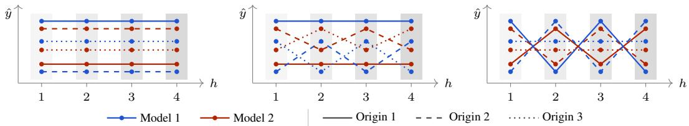
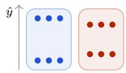
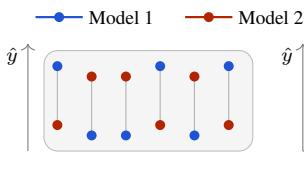
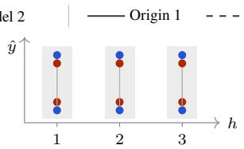
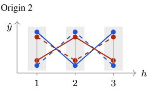
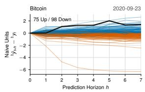
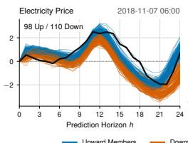
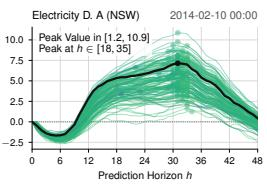
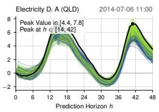
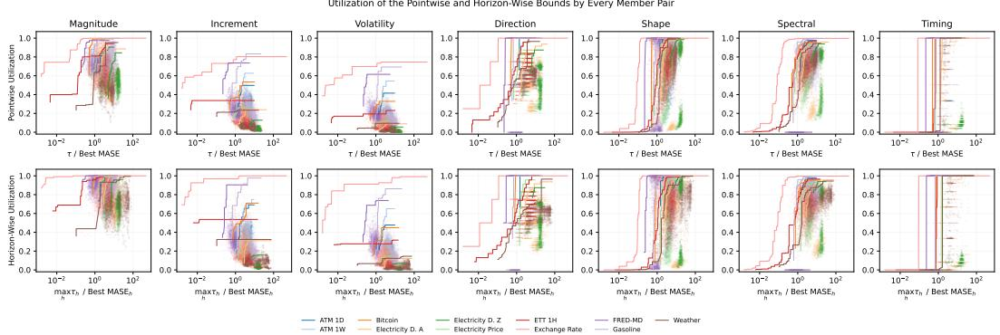

# TEMPORAL PREDICTIVE MULTIPLICITY:EQUALLY ACCURATE TIME SERIES MODELS YIELDDIFFERENT FORECAST TRAJECTORIES

Emanuele Albini \*   
J.P. Morgan AI Research   
Imperial College London   
London, UK   
emanuele.albini@jpmorgan.com   
Saumitra Mishra   
J.P. Morgan AI Research   
London, UK   
saumitra.mishra@jpmorgan.com

Francesca Toni Imperial College London London, UK ft@imperial.ac.uk

Francesco Leofante   
Imperial College London   
London, UK   
f.leofante@imperial.ac.uk

## ABSTRACT

Models with near-identical predictive performance can yield substantially different predictions, a phenomenon known as predictive multiplicity. Prior work has mostly studied this at the level of individual scalar outputs. In time-series forecasting, however, predictions across horizons jointly define a trajectory, and horizonwise comparisons can hide important differences in predictive behavior.

To address this problem, we introduce temporal predictive multiplicity, a framework that characterizes disagreement over complete forecast trajectories among models with near-identical predictive performance. We show that constraining predictive performance alone can still admit a broad range of different trajectories. We further show that constraining multiplicity at individual horizons partially reduces, but does not eliminate, trajectory-level multiplicity.

Experiments with 19 neural forecasting architectures on 11 datasets confirm that near-optimal models can exhibit substantial variability in the forecast trajectories they produce, and trajectory-level disagreement is largely unrelated to horizonwise disagreement. Our framework, therefore, exposes a gap in existing multiplicity studies: models with indistinguishable predictive performance imply fundamentally different temporal trajectories, with consequential downstream effects.

## 1 INTRODUCTION

In machine learning, multiple models can often achieve nearly indistinguishable predictive perfor mance while producing different predictions. This phenomenon, known as the Rashomon Effect (Breiman, 2001), gives rise to predictive multiplicity: the fact that models with comparable performance can make different predictions for the same instance. A growing literature has studied the existence and consequences of competing models within the Rashomon set, the collection of mod els whose predictive performance is close to optimal (Fisher et al., 2019; Semenova et al., 2022), showing that model choice can affect individual predictions (Marx et al., 2020), feature attributions (Dong & Rudin, 2020), and downstream decisions (Du et al., 2025), even when aggregate performance remains essentially unchanged.

Time-series forecasting is a particularly natural setting in which to study this phenomenon. Despite the proliferation of deep forecasting architectures (Lim & Zohren, 2021; Benidis et al., 2022), no model class consistently dominates: simple linear models remain competitive with more complex neural architectures (Zeng et al., 2023; Toner & Darlow, 2024), while model rankings shift considerably with hyper-parameter choices and evaluation protocols (Brigato et al., 2026). Forecasting practitioners therefore routinely train a heterogeneous pool of models with near-identical aggregate performance, yet must select a single model for deployment. In the absence of a principled framework that characterizes how these models differ temporally, this choice is effectively arbitrary.

  
Figure 1: Examples of forecast trajectories that are indistinguishable under current multiplicity frameworks. At every horizon, the disagreement among forecasts is identical across the three panels. Yet, the panels exhibit markedly different patterns of temporal disagreement at the trajectory level.

Current multiplicity frameworks offer little guidance for selecting among competing forecasting models. Existing work has largely focused on individual predictive multiplicity, in which models produce a single scalar prediction for each instance, and multiple outputs are treated as independent. Forecasts, however, are temporal objects that require a different treatment: they are sequences of predictions over multiple time points whose joint behavior defines a forecast trajectory, as illustrated in Figure 1. Ignoring this structure would render markedly different trajectories indistinguishable.

Motivated by these observations, we introduce a new theoretical framework for predictive multiplicity in time-series forecasting. At its core, our framework organizes multiplicity into a three-level hierarchy: pointwise, horizon-wise, and temporal, making explicit which aspects of forecast structure each level can capture. We then use this hierarchy to reveal two fundamental limitations of conventional notions of multiplicity. First, near-optimal predictive performance provides weak control over forecast trajectories: constraining aggregate performance alone allows models to differ substantially over an entire trajectory, with this freedom increasing at longer horizons. Second, even when disagreement is tightly controlled at individual horizons, at pointwise and horizon-wise levels, substantial temporal differences can remain, including the direction of predicted changes, the timing of events, and the shape and frequency structure of forecast trajectories.

We complement these theoretical results with experiments on 19 neural forecasting architectures across 11 public datasets. We find that near-optimal models frequently produce substantially different forecast trajectories, including predictions of changes in opposite directions. Moreover, trajectory-level disagreement is largely unrelated to disagreement measured at individual horizons, confirming that temporal multiplicity cannot be recovered from conventional pointwise or horizonwise diagnostics. Finally, through a case study, we show that these differences can translate into materially different downstream decisions. Taken together, these results show that model choice is consequential; our framework makes the underlying temporal differences explicit and measur able, giving practitioners a principled basis for auditing near-optimal candidates along applicationrelevant dimensions and for justifying the model they ultimately deploy.

## 2 RELATED WORK

Model Multiplicity in Machine Learning. That many models may explain the same data approximately equally well was articulated by Breiman as the Rashomon Effect (Breiman, 2001), and has resurfaced in modern machine learning through studies of underspecification and training instability (Madhyastha & Jain, 2019; D’Amour et al., 2022; Teney et al., 2022). Models within a Rashomon set have been shown to differ in variable importance and feature attributions (Fisher et al., 2019; Dong & Rudin, 2020; Donnelly et al., 2023; Laberge et al., 2023) and, at the prediction level, to assign conflicting predictions to the same instance, a phenomenon formalized by Marx et al. (2020) as predictive multiplicity. A growing literature distinguishes predictive multiplicity from its procedural, explanatory, and dataset-induced forms (Black et al., 2022; Heljakka et al., 2023; Ganesh et al., 2025), investigates its root causes (Parikh, 2026), weighs its opportunities and risks (Rudin et al., 2024; Hsu et al., 2026) and reconcile its implications for downstream decisions (Du et al., 2025). All of these works treat each instance as an independent prediction problem: their notions of multiplicity live at the pointwise level of our hierarchy, and are provably blind to the complex structure of time series, as we will later show.

Model Equivalence and Multiplicity in Forecasting. Forecasting research has long recognized that several models may be statistically indistinguishable in predictive ability: the Model Confidence Set of Hansen et al. (2011) retains the models whose differences cannot be statistically established, Fosten & Gutknecht (2021) let this set vary with the horizon through horizon confidence sets, while Quaedvlieg (2021) and Monschang et al. (2026) select models with one joint constraint on all horizons. Such statistical tests compare models through their losses, either globally, per horizon, or jointly, and thus determine which models are performance-equivalent; they do not, however, characterize how the forecasts of equivalent models differ, which is precisely the gap that this paper addresses. Recent work has begun to bring a Rashomon-set perspective to forecasting. This includes studies of predictive and procedural multiplicity in recovery-rate forecasting (Hibbeln et al., 2026), functional differences among volatility forecasters with tied loss (Cortesi et al., 2026), and variation in feature reliance among time-series forecasting models (Berry et al., 2024). Closest to our setting, Kale et al. (2026) introduce horizon-constrained Rashomon sets to track predictive multiplicity across forecast horizons in chaotic dynamical systems. All these works sit at the horizon-wise level of our hierarchy, which again cannot fully characterize trajectory-level multiplicity.

## 3 A HIERARCHY OF PREDICTIVE MULTIPLICITY NOTIONS

This section develops our hierarchy of predictive multiplicity notions for forecasting. We begin by introducing the forecasting setup and notation. We then define three kinds of multiplicity: pointwise, horizon-wise, and temporal, which differ in whether they compare isolated predictions, horizonspecific collections of predictions, or complete forecast trajectories. Finally, we show that these levels are not merely alternative aggregations of the same disagreement: each retains a different amount of information about the forecasts.

Setup and Notation. Consider a class of models ${ \mathcal F } .$ . Given a model $f \in { \mathcal { F } }$ , let $\mathcal { L } ( f )$ be the loss of f evaluated over a collection of origins $\tau$ . For a tolerance $\epsilon \geq 0$ , the corresponding Rashomon set is (Fisher et al., 2019):

$$
\begin{array} { r } { \mathcal { R } _ { \epsilon } = \{ f \in \mathcal { F } : \mathcal { L } ( f ) \leq \mathcal { L } ^ { \star } + \epsilon \} \qquad \mathrm { ~ w h e r e ~ } \quad \mathcal { L } ^ { \star } = \mathcal { L } ( f ^ { \star } ) , \quad f ^ { \star } \in \underset { f \in \mathcal { F } } { \arg \operatorname* { m i n } } \mathcal { L } ( f ) . } \end{array}\tag{1}
$$

Given a model $f \in \mathcal { R } _ { \epsilon }$ , let $\widehat { \mathbf { Y } } ^ { f } \in \mathbb { R } ^ { T \times H }$ be its forecast matrix, $\pmb { Y } \in \mathbb { R } ^ { T \times H }$ the target matrix, and $\pmb { { \cal E } } ^ { f } = \pmb { { \cal Y } } - \hat { { \cal Y } } ^ { f }$ its error matrix, with rows indexed by origins $t \in \tau$ and columns by forecast horizons $h \in \{ 1 , \ldots , H \}$ . We consider three temporal trajectories extracted from these matrices:

• the forecast trajectory $\widehat { \pmb { y } } _ { t } ^ { f } = ( \widehat { y } _ { t + 1 } ^ { f } , \dots , \widehat { y } _ { t + H } ^ { f } ) ^ { \top }$ , the t-th row of ${ \widehat { Y } } ^ { f } { \mathrm { : } }$ forecasts across horizons;

• the revision trajectory $\widehat { \mathbf { r } } _ { t } ^ { f }$ , the t-th anti-diagonal of ${ \widehat { Y } } ^ { f } ;$ : successive forecasts of the same target;

• the error trajectory $e _ { t } ^ { f } = { \pmb y } _ { t } - \widehat { \pmb y } _ { t } ^ { f }$ , the t-th row of $E ^ { f }$ : forecast errors across horizons.

Forecast and revision trajectories also arise in the forecast-stability literature, where their fluctuations underlie the definitions of horizontal and vertical (in)stability, respectively (Van Belle et al., 2023; Godahewa et al., 2025). That literature regularizes such fluctuations within the forecasts of a single model; here, instead, we use the same geometry to characterize disagreement among the members of the Rashomon set: distinct models with equivalent loss.

A Hierarchy of Predictive Multiplicity in Forecasting. Having established the forecasting setup, we now introduce the three levels of our hierarchy. The pointwise level treats every prediction in isolation, while the horizon-wise level assesses disagreement separately at each forecast horizon. We then introduce temporal predictive multiplicity, a trajectory-level notion that compares how competing models behave jointly across horizons. The first two levels generalize existing multiplicity measures to forecasting and compare scalar predictions through their absolute difference $( \mathrm { e . g . }$ Watson-Daniels et al., 2023; Hibbeln et al., 2026); temporal multiplicity instead compares complete trajectories using distances designed to capture distinct aspects of their temporal behavior.

  
(a) Loss one error bag per model

(b) Pointwise Multiplicity per-cell connections among models  
  
(c) Horizon-Wise Multiplicity per-horizon bands

  
(d) Temporal Multiplicity whole trajectories  
Figure 2: Pictorial representation of the structure that each of the loss and the three levels of the multiplicity hierarchy is aware of on a running example.

Definition 3.1 (Pointwise Predictive Multiplicity). Let $\tau \geq 0$ . The pointwise prediction range $\nu ,$ pointwise prediction diameter ω, pointwise ambiguity $\alpha _ { \tau } ,$ , and pointwise discrepancy $\varsigma _ { T }$ of $\mathcal { R } _ { \epsilon }$ are:

$$
\begin{array} { r l r } & { \nu = \underset { 1 \leq h \leq M } { \mathbb { E } } \left[ \underset { f , g \in \mathcal { R } _ { \epsilon } } { \operatorname* { m a x } } \left. \hat { y } _ { t + h } ^ { f } - \hat { y } _ { t + h } ^ { g } \right. \right] } & { \omega = \underset { f , g \in \mathcal { R } _ { \epsilon } } { \operatorname* { m a x } } \underset { 1 \leq h \leq M } { \mathbb { E } } \left[ \left. \hat { y } _ { t + h } ^ { f } - \hat { y } _ { t + h } ^ { g } \right. \right] } \\ & { \alpha _ { \tau } = \underset { 1 \leq h \leq M } { \mathbb { E } } \left[ 1 \Big \{ \underset { f , g \in \mathcal { R } _ { \epsilon } } { \operatorname* { m a x } } \left. \hat { y } _ { t + h } ^ { f } - \hat { y } _ { t + h } ^ { g } \right. > \tau \Big \} \right] } & { \varsigma _ { \tau } = \underset { f , g \in \mathcal { R } _ { \epsilon } } { \operatorname* { m a x } } \underset { 1 \leq h \leq M } { \mathbb { E } } \left[ 1 \left\{ \left. \hat { y } _ { t + h } ^ { f } - \hat { y } _ { t + h } ^ { g } \right. > \tau \right\} \right] } & \end{array}
$$

The range and ambiguity average the per-instance maximal disagreement, while the diameter and discrepancy ask how far a single pair of models drifts apart on average, hence $\omega \leq \nu$ and $\varsigma \leq \alpha$

Intuitively, pointwise ambiguity $( \alpha _ { \tau } )$ and discrepancy (ςτ) generalize Marx et al. (2020) and Watson-Daniels et al. (2023) by maximizing over all pairs of competing models, not against $f ^ { \star }$ , to capture all the multiplicity in $\mathcal { R } _ { \epsilon } .$ , and by treating the $( t , h )$ cells as instances. The prediction range (ν) averages the width of the viable prediction range of Watson-Daniels et al. (2023) over the forecast matrix; the prediction diameter (ω) is a novel metric that we propose as its complement.

Following a similar pattern, we formalize the per-horizon notion of multiplicity of Kale et al. (2026).

Definition 3.2 (Horizon-Wise Predictive Multiplicity). Let $\tau \geq 0 .$ . For each horizon $h \in$ $\{ 1 , \ldots , H \}$ , the horizon-wise prediction range $\nu ^ { ( h ) }$ , prediction diameter $\boldsymbol { \omega } ^ { ( h ) }$ , ambiguity $\alpha _ { \tau } ^ { ( h ) }$ , and discrepancy $\varsigma _ { \tau } ^ { ( h ) }$ of $\mathcal { R } _ { \epsilon } ,$ producing profiles indexed by $h ,$ , are defined as follows:

$$
\begin{array} { r l r } & { \nu ^ { ( h ) } = \underset { t \in \mathcal { T } } { \mathbb { E } } \left[ \underset { f , g \in \mathcal { R } _ { \epsilon } } { \operatorname* { m a x } } \left| \hat { y } _ { t + h } ^ { f } - \hat { y } _ { t + h } ^ { g } \right| \right] } & { \omega ^ { ( h ) } = \underset { f , g \in \mathcal { R } _ { \epsilon } } { \operatorname* { m a x } } \underset { t \in \mathcal { T } } { \mathbb { E } } \left[ \left| \hat { y } _ { t + h } ^ { f } - \hat { y } _ { t + h } ^ { g } \right| \right] } \\ & { \alpha _ { \tau } ^ { ( h ) } = \underset { t \in \mathcal { T } } { \mathbb { E } } \left[ \mathbb { I } \left\{ \underset { f , g \in \mathcal { R } _ { \epsilon } } { \operatorname* { m a x } } \left| \hat { y } _ { t + h } ^ { f } - \hat { y } _ { t + h } ^ { g } \right| > \tau \right\} \right] } & { \varsigma _ { \tau } ^ { ( h ) } = \underset { f , g \in \mathcal { R } _ { \epsilon } } { \operatorname* { m a x } } \underset { t \in \mathcal { T } } { \mathbb { E } } \left[ \mathbb { I } \left\{ \left| \hat { y } _ { t + h } ^ { f } - \hat { y } _ { t + h } ^ { g } \right| > \tau \right\} \right] } \end{array}
$$

We now introduce temporal predictive multiplicity. Unlike the pointwise and horizon-wise levels, it compares complete forecast trajectories and can therefore capture how competing models disagree across forecast horizons or across successive revisions.

Definition 3.3 (Temporal Predictive Multiplicity). Let $\tau \geq 0 .$ , let $\boldsymbol { v } _ { t } ^ { f }$ denote any of the trajectories we defined earlier (forecast $\widehat { \pmb { y } } _ { t } ^ { f }$ , revision $\widehat { \mathbf { } r } _ { t } ^ { f }$ , or error $e _ { t } ^ { f } )$ and let d $\colon \mathbb { R } ^ { H } \times \mathbb { R } ^ { H } \to [ 0 , \infty )$ be a trajectory distance function. The temporal trajectory range $\nu _ { d }$ , trajectory diameter $\omega _ { d } ,$ ambiguity $\alpha _ { d , \tau }$ , and discrepancy $\varsigma _ { d , \tau }$ of $\mathcal { R } _ { e }$ ϵ for such a trajectory are defined as:

$$
\begin{array} { r l r } & { } & { \nu _ { d } = \underset { t \in \mathcal { T } } { \mathbb { E } } \left[ \underset { f , g \in \mathcal { R } _ { \epsilon } } { \operatorname* { m a x } } \ d \big ( v _ { t } ^ { f } , v _ { t } ^ { g } \big ) \right] \quad \quad \quad \omega _ { d } = \underset { f , g \in \mathcal { R } _ { \epsilon } } { \operatorname* { m a x } } \underset { t \in \mathcal { T } } { \mathbb { E } } \left[ d \big ( v _ { t } ^ { f } , v _ { t } ^ { g } \big ) \right] } \\ & { } & { \alpha _ { d , \tau } = \underset { t \in \mathcal { T } } { \mathbb { E } } \left[ \mathbb { 1 } \Big \{ \underset { f , g \in \mathcal { R } _ { \epsilon } } { \operatorname* { m a x } } \ d \big ( v _ { t } ^ { f } , v _ { t } ^ { g } \big ) > \tau \Big \} \right] \quad \varsigma _ { d , \tau } = \underset { f , g \in \mathcal { R } _ { \epsilon } } { \operatorname* { m a x } } \underset { t \in \mathcal { T } } { \mathbb { E } } \left[ \mathbb { 1 } \Big \{ d \big ( v _ { t } ^ { f } , v _ { t } ^ { g } \big ) > \tau \Big \} \right] } \end{array}
$$

The choice of d determines which aspect of temporal disagreement is assessed. Models may differ in the magnitude, direction, volatility, shape, spectral structure, or timing of their trajectories. No single distance captures all of these forms of disagreement without conflating them. We therefore leave d unspecified in the general definition and provide concrete instantiations in Section 5.

Information Awareness Across Multiplicity Levels. The temporal statistics defined above summarize disagreement over complete trajectories. We next show that the three levels retain different information about the forecast matrix. We formalize this distinction through their sensitivity to rearrangements of forecast data, demonstrating that pointwise and horizon-wise statistics are blind to aspects of disagreement that depend on how predictions are coupled across horizons.

Definition 3.4 (Multiplicity-, Horizon-, and Trajectory-Aware Statistics). A statistic is any function of the target matrix $\mathbf { Y }$ and the forecast matrices $\{ \widehat { Y } ^ { f } \} _ { f \in \mathcal { R } _ { \epsilon } }$ . A statistic is:

• multiplicity-aware if not invariant under per-model cell permutations $E ^ { f } \mapsto \pi ^ { f } ( E ^ { f } )$ , with $\pi ^ { f }$ a permutation of the cells $\mathcal { T } \times \{ 1 , \ldots , \hat { H } \}$ that may depend on $f ;$

• horizon-aware if not invariant under cell permutations, per-model cell permutations with a common $\pi ^ { f } \equiv \pi ;$

• trajectory-aware if not invariant under row permutations, cell permutations $\pi ( t , h ) ~ =$ $( \pi _ { h } ( t ) , \dot { h } )$ that preserve horizons and re-index the origins within each horizon.

These statistics are nested, since row permutations are cell permutations, and cell permutations are per-model cell permutations. As illustrated in Figure $^ { 2 , }$ the loss retains none of this structure; pointwise statistics retain model alignment but treat all TH cells as an unordered collection; and horizon-wise statistics additionally distinguish horizons, but not the ordering of origins within them. Only temporal statistics retain full trajectory structure. For example, swapping origins at one horizon flattens the trajectories in the final panel of Figure 2 without changing any lower-level statistic, despite changing whether models agree on the direction of change. The proof is in Appendix C.

## 4 HOW LOOSELY IS TEMPORAL MULTIPLICITY CONSTRAINED?

Knowing what each level captures, we now quantify how loosely information below the temporal level constrains temporal multiplicity. We consider losses of the following common form:

$$
\mathcal { L } ( f ) = \frac { 1 } { T H } \sum _ { t \in \mathcal { T } } \sum _ { h = 1 } ^ { H } \ell \big ( e _ { t , h } ^ { f } \big ) ,\tag{2}
$$

for some continuous $\ell : \mathbb { R } \to [ 0 , \infty )$ with $\ell ( 0 ) = 0$ that is nondecreasing in |e| and unbounded $( \ell ( e ) \to \infty { \mathrm { ~ a s ~ } } | e | \to \infty )$ , with inverse $\ell ^ { - 1 } ( \dot { L } ) =$ max $\{ e \ge 0 : \ell ( e ) \le L \}$ This covers most standard losses, including MSE $( \ell ( e ) = e ^ { 2 } )$ , MAE $( \ell ( e ) = | e | )$ , as well as MASE-type losses.

We begin by quantifying how loosely the performance constraint defining the Rashomon set constrains temporal multiplicity. The bound below is tight for sufficiently rich model classes: we call $\mathcal { F } s h e l l - r i c \bar { h }$ (at level ϵ) if for every $\pmb { { \cal E } } \in \mathbb { R } ^ { T \times H }$ with $\begin{array} { r } { \dot { \mathcal { L } } ^ { \star } \le \mathcal { L } ( E ) \le \dot { \mathcal { L } } ^ { \star } + \epsilon } \end{array}$ there exists $f \in { \mathcal { F } }$ with $E ^ { f } = E$ . This is a mild condition, far weaker than universal approximation (Hornik, 1991): F need only realize error patterns with loss near $\mathcal { L } ^ { \star }$ . It is readily satisfied by sufficiently overparameterized networks, which can interpolate arbitrary values at finitely many inputs (Zhang et al., 2017).

Theorem 4.1 (Multiplicity Bounds Under Rashomon Set Membership). For all $f , g \in \mathcal { R } _ { \epsilon }$ :

$$
\left| \hat { y } _ { t + h } ^ { f } - \hat { y } _ { t + h } ^ { g } \right| \le 2 \ell ^ { - 1 } \bigl ( T H \left( \mathcal { L } ^ { \star } + \epsilon \right) \bigr ) \qquad \forall t \in \mathcal { T } , h \in \{ 1 , \ldots , H \} .
$$

IfF is also shell-rich, the bound is attained, i.e., $\begin{array} { r } { \operatorname* { n a x } _ { f , g \in \mathcal { R } _ { \epsilon } } \left| \hat { y } _ { t + h } ^ { f } - \hat { y } _ { t + h } ^ { g } \right| = 2 \ell ^ { - 1 } \big ( T H \left( \mathcal { L } ^ { \star } + \epsilon \right) \big ) . } \end{array}$

Theorem 4.1 shows that Rashomon set membership imposes a single scalar budget on the $T H \cdot$ dimensional error matrix, without constraining where errors fall within such a matrix. It thus uncovers a failure mode of performance-based model selection in temporal settings: beyond leaving open how errors distribute across instances (Marx et al., 2020), the loss is blind to how they distribute across horizons within each instance, i.e., to the shape of every forecast trajectory. Moreover, this freedom scales with the horizon: for $\ell ( e ) = | e | ^ { p }$ , the theorem’s pointwise bound grows as $H ^ { 1 / p } \left( \sqrt { H } \right.$ under MSE and linearly under MAE). Longer horizons therefore weaken the control that Rashomon membership provides over individual forecasts, limiting what membership alone guarantees about the resulting trajectories.

At the opposite extreme of our hierarchy lies horizon-wise multiplicity. We now quantify how constraining at this level affects temporal multiplicity by imposing the strongest requirement afforded by its definition, vanishing horizon-wise ambiguity: $\alpha _ { \tau _ { h } } ^ { ( \bar { h } ) } = \bar { 0 }$ for every horizon $h ,$ at tolerances $\pmb { \tau } = ( \tau _ { 1 } , \dots , \tau _ { H } )$ . This implies $\nu ^ { ( h ) } , \omega ^ { ( h ) } \leq \tau _ { h }$ and $\varsigma _ { \tau _ { h } } ^ { ( h ) } = 0$ . When $\tau _ { h } \equiv \tau$ , this condition also recovers the pointwise case, $\alpha _ { \tau } = 0$

Theorem 4.2 (Multiplicity Bound Under Horizon-Wise Control). Fix tolerances $\tau = ( \tau _ { 1 } , \dots , \tau _ { H } )$ Then, every pair $f , g \in { \mathcal { F } }$ with $\alpha _ { \tau _ { h } } ^ { ( h ) } ( \{ f , g \} ) = 0 .$ for all h satisfies:

$$
\left| \hat { y } _ { t + h } ^ { f } - \hat { y } _ { t + h } ^ { g } \right| \le \tau _ { h } \qquad \forall t \in \mathcal { T } , h \in \{ 1 , \dots , H \} .
$$

$H ,$ moreover, $\mathcal { F }$ is shell-rich, the bound is attained by pairs in $\mathcal { R } _ { \epsilon }$ ϵ whenever it is loss-feasible, $i . e . ,$ whenever the loss budget ofTheorem 4.1 does not bindfirst: $\begin{array} { r } { \sum _ { h } \ell ( \tau _ { h } / 2 ) \le T H (  { \mathcal { L } } ^ { \star } + \epsilon ) } \end{array}$

Indeed, horizon-wise multiplicity imposes a stronger constraint on predictions, bounding the absolute difference between models at each horizon by $\tau _ { h }$ . Yet, except in the degenerate case where $\tau _ { h } = 0$ for every horizon and all models in the Rashomon set produce identical forecasts for every sample, this constraint leaves many temporal properties of the trajectories unrestricted. For example, it provides no control over differences in their direction, spectral behavior, or shape.

## 5 INSTANTIATIONS OF TEMPORAL MULTIPLICITY

Definition 3.3 deliberately leaves the choice of trajectory distance function unspecified. We now instantiate this general definition with a family of interpretable distances, each designed to capture a distinct aspect of temporal disagreement. As there is no unique trajectory distance appropriate for all forecasting applications, we select distances that are complementary along two criteria: each has a clear interpretation in terms of a recognizable aspect of temporal behavior, and together they distinguish differences in level, local dynamics, and global trajectory structure.

We begin with a magnitude distance, which aggregates the pointwise gaps between two trajectories $\mathbf { \boldsymbol { u } } , \mathbf { \boldsymbol { v } } \in \mathbb { R } ^ { H }$ and therefore retains the least temporal structure. It is consequently the temporal distance most closely related to pointwise and horizon-wise multiplicity.

• Magnitude: $\begin{array} { r } { d _ { \mathrm { m a g n i t u d e } } ( \pmb { u } , \pmb { v } ) = \frac { 1 } { \sqrt { H } } \| \pmb { u } - \pmb { v } \| _ { 2 } } \end{array}$ , the root-mean-square pointwise gap.

The next three distances operate on trajectory increments and compare patterns of change independently of the trajectories’ absolute levels.

• Increment: $\begin{array} { r } { d _ { \mathrm { i n c r e m e n t } } ( { \pmb u } , { \pmb v } ) = \frac { 1 } { \sqrt { H - 1 } } \| \Delta { \pmb u } - \Delta { \pmb v } \| _ { 2 } , \mathrm { w i t h } \Delta { \pmb u } = ( \Delta u _ { 1 } , \dots , \Delta u _ { H - 1 } ) } \end{array}$

• Volatility: $\begin{array} { r } { d _ { \mathrm { v o l a t i l i t y } } ( \pmb { u } , \pmb { v } ) = \frac { 1 } { H - 1 } \big | \sum _ { h } | \Delta \pmb { u } _ { h } | - \sum _ { h } | \Delta \pmb { v } _ { h } | \big | } \end{array}$ , the gap between the mean absolute increments.

• Direction: ddirection $\begin{array} { r } { ( \pmb { u } , \pmb { v } ) = \frac { 1 } { H - 1 } \big | \{ h : \mathrm { s i g n } ( \Delta u _ { h } ) \neq \mathrm { s i g n } ( \Delta v _ { h } ) \} \big | } \end{array}$ , the fraction of increments of opposite sign.

These final three distances are scale-free, comparing the form of trajectories rather than their absolute values.1

• Shape: $d _ { \mathrm { s h a p e } } ( \boldsymbol { u } , \boldsymbol { v } ) = \frac { 1 } { 2 } \big ( 1 - \rho ( \boldsymbol { u } , \boldsymbol { v } ) \big ) \in [ 0 , 1 ]$ using the Pearson correlation.

• Spectral: $\begin{array} { r } { d _ { \mathrm { s p e c t r a l } } ( \pmb { u } , \pmb { v } ) = \frac { 1 } { \sqrt { 2 } } \big \| \left| F ( \pmb { u } ) \right| - \left| F ( \pmb { v } ) \right| \big \| _ { 2 } \in [ 0 , 1 ] } \end{array}$ , the magnitude spectrum gap.

• Timing: $d _ { \mathrm { t i m i n g } } ( \pmb { u } , \pmb { v } ) = | \tau ^ { \star } | / ( H - 2 ) \in [ 0 , 1 ]$ with $\begin{array} { r } { \tau ^ { \star } = \arg \operatorname* { m a x } _ { | \tau | \leq H - 2 } \rho _ { \tau } ( \boldsymbol { u } , \boldsymbol { v } ) } \end{array}$ , the best-alignment lag as a fraction of the largest admissible lag.

Each distance can be applied to forecast, revision, or error trajectories. On forecast trajectories $\widehat { \pmb { y } } _ { t } ^ { f }$ it measures disagreement about the future path of the target; on revision trajectories $\widehat { \mathbf { } r } _ { t } ^ { f }$ , it measures differences in how models update forecasts of a common target as new observations become available; on error trajectories $e _ { t } ^ { f }$ , it measures differences in the temporal structure of model errors.

The instantiations above also make the general results of Section 4 operational: substituting each distance into our theoretical framework yields metric-specific bounds on temporal disagreement. We defer these bounds, their proofs, and an empirical assessment of their tightness to Appendix D, and turn next to experiments that characterize temporal multiplicity among trained forecasting models.

Table 1: Pointwise, horizon-wise, and temporal predictive multiplicity in empirical Rashomon sets. Each cell reports the trajectory range / diameter $( \nu _ { d } / \omega _ { d } )$ , maximized across forecast, revision, and error trajectories. For multi-target datasets, multiplicity statistics are maximized and MASE is averaged across targets. Magnitude, increment, and volatility are reported in seasonal-naive units; direction, timing, shape, and spectral distances are scale-free and reported as percentages.
<table><tr><td>Dataset</td><td>dmagnitude</td><td>dincrement</td><td> $d _ { \mathrm { v o l a t i l i t y } }$ </td><td> $d _ { \mathrm { d i r e c t i o n } }$ </td><td> $d _ { \mathrm { s h a p e } }$ </td><td> $d _ { \mathrm { { s p e c t r a l } } }$ </td><td> $d _ { \mathrm { t i m i n g } }$ </td><td> $\mid \nu ^ { ( 1 ) } / \omega ^ { ( 1 ) }$ </td><td> $\nu ^ { ( H ) } / \omega ^ { ( H ) }$ </td><td> $\nu / \omega$ </td><td>|MASE*</td></tr><tr><td>ATM 1D</td><td>1.38 / 0.66</td><td>1.55 / 0.81</td><td>0.87 / 0.35</td><td>100% / 59%</td><td>96% / 54%</td><td>85% / 36%</td><td>100% / 54%</td><td>1.79 / 0.59</td><td>1.94 / 0.62</td><td>1.85 / 0.55</td><td>1.05</td></tr><tr><td>ATM 1W</td><td>1.46 / 0.67</td><td>1.38 / 0.65</td><td>0.94 / 0.49</td><td>100% / 55%</td><td>99% / 56%</td><td>85% / 32%</td><td>100% / 58%</td><td>1.75 / 0.71</td><td>1.67 / 0.61</td><td>1.68 / 0.59</td><td>0.93</td></tr><tr><td>Bitcoin</td><td>7.00 / 2.99</td><td>3.66 / 2.08</td><td>2.01 / 0.88</td><td>100% / 62%</td><td>99% / 61%</td><td>82% / 42%</td><td>100% / 69%</td><td>5.16/2.35</td><td>9.41 / 3.34</td><td>7.10/2.63</td><td>2.67</td></tr><tr><td>Electricity D. A</td><td>1.56 / 0.62</td><td>0.47 / 0.33</td><td>0.21 / 0.15</td><td>79% / 49%</td><td>83% / 39%</td><td>82% / 43%</td><td>98% / 33%</td><td>1.59 / 0.46</td><td>2.19 / 0.58</td><td>1.93 / 0.53</td><td>0.46</td></tr><tr><td>Electricity D. Z</td><td>0.80 / 0.30</td><td>0.20 / 0.15</td><td>0.07 / 0.05</td><td>69% / 50%</td><td>79% / 44%</td><td>77% / 49%</td><td>99% / 40%</td><td>0.62 / 0.22</td><td>1.17 / 0.32</td><td>0.97 / 0.24</td><td>0.24</td></tr><tr><td>Electricity Price</td><td>0.95 / 0.45</td><td>0.40 / 0.29</td><td>0.18 / 0.11</td><td>81% / 46%</td><td>72% / 35%</td><td>76% / 38%</td><td>96% / 30%</td><td>0.98 / 0.34</td><td>1.29 / 0.48</td><td>1.24 / 0.37</td><td>0.82</td></tr><tr><td>ETT 1H</td><td>1.42 / 0.56</td><td>0.50 / 0.33</td><td>0.23 / 0.14</td><td>83% / 47%</td><td>77% /33%</td><td>79% / 37%</td><td>95% / 31%</td><td>1.13 / 0.44</td><td>1.97 / 0.60</td><td>1.66 / 0.47</td><td>0.48</td></tr><tr><td>Exchange Rate</td><td>5.31 / 1.78</td><td>5.25 / 2.31</td><td>3.05 / 1.32</td><td>100% / 100%</td><td>100% / 100%</td><td>97% / 87%</td><td>100% / 100%</td><td>4.09 / 1.59</td><td>6.26 / 2.02</td><td>5.35 / 1.36</td><td>2.36</td></tr><tr><td>FRED-MD</td><td>0.16 / 0.12</td><td>0.13 / 0.09</td><td>0.09 / 0.05</td><td>51% / 35%</td><td>49% / 36%</td><td>0% / 0%</td><td>61% / 45%</td><td>0.11 / 0.08</td><td>0.21 / 0.13</td><td>0.16/0.11</td><td>0.14</td></tr><tr><td>Gasoline</td><td>2.74 / 1.33</td><td>2.13 / 1.00</td><td>1.23 / 0.56</td><td>100% / 72%</td><td>100% / 66%</td><td>94% / 46%</td><td>100% / 79%</td><td>3.03 / 1.32</td><td>3.29 / 1.29</td><td>3.10 / 1.22</td><td>0.74</td></tr><tr><td>Weather</td><td>2.41 / 1.25</td><td>0.72 / 0.51</td><td>0.39 / 0.27</td><td>66% / 52%</td><td>88% / 50%</td><td>77% / 47%</td><td>99% / 48%</td><td>2.73 / 1.39</td><td>3.12 / 1.10</td><td>2.96 / 1.06</td><td>0.95</td></tr><tr><td>Mean</td><td>2.29 / 0.98</td><td>1.49 / 0.78</td><td>0.84 / 0.40</td><td>84% / 57%</td><td>86% / 52%</td><td>76% / 41%</td><td>95% / 53%</td><td>2.09 / 0.86</td><td>2.96 / 1.01</td><td>2.55 / 0.83 | 0.99</td><td></td></tr></table>

## 6 EXPERIMENTS

We evaluate temporal predictive multiplicity in trained forecasting models guided by three questions:

Q1: How much do near-optimal models differ across the temporal aspects captured by our trajectory distances?

Q2: Can pointwise or horizon-wise disagreement serve as a proxy for such differences?

Q3: Can temporal multiplicity alter the conclusions or decisions drawn from a forecast?

Across the experiments, we find that near-optimal models frequently produce markedly different trajectories, that these differences are largely invisible to conventional multiplicity measures, and that they can have consequential downstream implications.

Experimental Setup. We consider 11 datasets from diverse domains. For each dataset, we train models spanning 19 neural forecasting architectures, including transformer, MLP/mixer-based, and recurrent families, over 10 random seeds and several hyper-parameter configurations. The empirical Rashomon set Rb contains all models within $\epsilon = 5 \%$ of the best validation MASE. We compute all multiplicity statistics from rolling-origin test forecasts of its members. Full details of the datasets, models, training procedure, and evaluation protocol appear in Appendix A.

Q1. How large is temporal multiplicity? We first quantify the extent to which near-optimal models differ in the temporal aspects captured by our trajectory distances. For each distance, we compute the trajectory range and diameter of the empirical Rashomon set. Table 1 reports the results.2

Temporal multiplicity is substantial across all temporal aspects. At a typical origin, some pair of near-optimal models moves in opposite directions on 84% of trajectory increments, reaching 100% on Gasoline; even a fixed pair does so on 57% of increments.A shape range of 86% corresponds to a Pearson correlation of approximately −0.7 between the most divergent trajectories, with one trajectory tending to rise at the time steps where the other falls. The timing range reaches 95%, indicating that the most divergent trajectories often require a shift of about half the forecasting horizon to align, and the spectral range of 76% lies well above the midpoint of its scale. Thus, models with indistinguishable validation performance can imply sharply different trajectories.

The pointwise and horizon-wise results are also consistent with prior work: pointwise multiplicity increases with the forecast horizon (Marx et al., 2020; Watson-Daniels et al., 2023; Kale et al., 2026). However, the temporal results are not simply a rescaling of the pointwise ones. The two measures rank datasets differently; for example, Weather has the fourth-largest pointwise range but the second-smallest directional disagreement. We examine this distinction in the next experiment.

Q2. Can conventional frameworks capture temporal multiplicity? The preceding theoretical results suggest that temporal multiplicity is not simply a rescaling of pointwise or horizon-wise multiplicity. We test this directly at the level of individual model pairs and forecast origins. For each pair of models in the empirical Rashomon set and each test forecast origin, we compute the Spearman correlation between their mean pointwise gap and their trajectory distance. We consider both a pointwise reading and a horizon-normalized reading, which scales gaps by the best validation MASE at each horizon:

Table 2: Spearman rank correlation, over all (model pair, origin) samples of the empirical Rashomon set, between the pair’s mean pointwise gap $\bar { \delta } _ { t } ^ { f g }$ and its trajectory distance $d ( v _ { t } ^ { f } , v _ { t } ^ { g } )$ on the same forecast origin, read as in Equation 3 with $\mathcal { L } _ { h } ^ { \star } \equiv 1$ (Pointwise) or as is (Horizon-Wise). Each row reports the minimum / maximum over the three trajectories and, for multi-target datasets, its targets.
<table><tr><td rowspan="2">Dataset</td><td colspan="5">Pointwise</td><td colspan="5">Horizon-Wise</td></tr><tr><td>dmagnitude dincrement dvolatility</td><td>ddirection</td><td> $d _ { \mathrm { s h a p e } }$ </td><td>dspectral</td><td>dtiming</td><td>|dmagnitude dincrement</td><td>dvolatility</td><td>ddirection  $\underline { d } _ { \mathrm { s h a p e } }$ </td><td>dspectral</td><td> $\underline { { d _ { \mathrm { t i m i n g } } } }$ </td></tr><tr><td>ATM 1D</td><td>0.98 / 0.98 0.58 / 0.75 0.35 / 0.37</td><td>0.15 / 0.28</td><td>0.24 / 0.61</td><td>0.05 / 0.42</td><td>0.07 / 0.24</td><td>|0.98 / 0.98 0.58 / 0.75</td><td>0.35 / 0.37 0.15 / 0.28</td><td>0.24 / 0.61</td><td>0.05 / 0.42</td><td>0.07 / 0.24</td></tr><tr><td>ATM 1W</td><td>0.99 / 0.99 0.56 / 0.70 0.39 / 0.47</td><td>0.13 / 0.18</td><td>0.17 / 0.40</td><td>0.04 / 0.24</td><td>0.14 / 0.20 0.99 / 0.99</td><td>0.56 / 0.70 0.39 / 0.47</td><td>0.13 / 0.18</td><td>0.17 / 0.40</td><td>0.04 / 0.24</td><td>0.14 / 0.20</td></tr><tr><td>Bitcoin</td><td>0.99 / 1.00 0.61 / 0.69 0.43 / 0.49</td><td>-0.02 /0.19</td><td>-0.01 / 0.32</td><td>-0.05 / 0.26</td><td>0.02 / 0.14</td><td>0.96 / 0.98 0.60 / 0.67 0.41 / 0.48</td><td>-0.03 / 0.17</td><td>-0.03 / 0.30</td><td>-0.05 / 0.25</td><td>-0.01 / 0.13</td></tr><tr><td>Electricity D. A</td><td>0.99 / 0.99 0.46 / 0.66 0.16 / 0.36</td><td>-0.03 / 0.26</td><td>-0.00 / 0.64</td><td>-0.08 / 0.49</td><td>0.05 / 0.36</td><td>0.96 / 0.97 0.47 / 0.65 0.16 / 0.36</td><td>-0.03 / 0.26</td><td>-0.03 / 0.63</td><td>-0.10 / 0.48</td><td>0.04 / 0.35</td></tr><tr><td>Electricity D. Z</td><td>0.99 / 0.99 0.23 / 0.52 0.09 / 0.28</td><td>-0.08 / 0.23</td><td>0.07 / 0.52</td><td>-0.05 / 0.38</td><td>0.10/0.37</td><td>0.98 / 0.99 0.24 / 0.52 0.09 / 0.28</td><td>-0.07 / 0.23</td><td>0.07 / 0.51</td><td>-0.06 / 0.38</td><td>0.10/0.37</td></tr><tr><td>Electricity Price</td><td>0.99 / 0.99 0.59 / 0.64 0.20 / 0.31</td><td>-0.02 / 0.06</td><td>0.17 / 0.35</td><td>0.08 / 0.23</td><td>0.10/ 0.14</td><td>0.98 / 0.98 0.59 / 0.64</td><td>0.20 / 0.31 -0.02 / 0.06</td><td>0.15 / 0.34</td><td>0.07 / 0.22</td><td>0.10 / 0.14</td></tr><tr><td>ETT 1H</td><td>0.99 / 0.99 0.56 / 0.68 0.30 / 0.39</td><td>0.32 / 0.36</td><td>0.43 / 0.51</td><td>0.31 / 0.39</td><td>0.17 / 0.29</td><td>0.98 / 0.98 0.58 / 0.69</td><td>0.31 / 0.40 0.33 / 0.38</td><td>0.41 / 0.50</td><td>0.30 / 0.39</td><td>0.17 / 0.29</td></tr><tr><td>Exchange Rate</td><td>0.99 / 0.99 0.50 / 0.83 0.29 / 0.51</td><td>0.09 / 0.22</td><td>0.14 / 0.47</td><td>0.01 / 0.28</td><td>0.06 / 0.22</td><td>0.96 / 0.98 0.49 / 0.82</td><td>0.29 / 0.51 0.09 / 0.21</td><td>0.14 / 0.45</td><td>0.01 / 0.27</td><td>0.06 / 0.20</td></tr><tr><td>FRED-MD</td><td>0.98 / 1.00 0.61 / 0.69 0.45 / 0.64</td><td>0.03 / 0.40</td><td>0.05 / 0.42</td><td>-0.11 /0.04</td><td>0.02 / 0.40</td><td>0.97 / 0.99 0.59 / 0.67 0.44 / 0.62</td><td>0.03 / 0.39</td><td>0.04 / 0.42</td><td>-0.10 / 0.04</td><td>0.03 / 0.39</td></tr><tr><td>Gasoline</td><td>0.99 / 0.99 0.56 / 0.61 0.35 / 0.45</td><td>0.09 / 0.22</td><td>0.12 / 0.43</td><td>-0.01 / 0.29</td><td>0.10/ 0.23</td><td>0.99 / 0.99 0.56 / 0.61 0.35 / 0.45</td><td>0.09 / 0.22</td><td>0.12/0.43</td><td>-0.01 / 0.29</td><td>0.10/ 0.23</td></tr><tr><td>Weather</td><td>1.00 / 1.00 0.69 / 0.72 0.51 / 0.52</td><td>0.35 / 0.43</td><td>0.34 / 0.52</td><td>0.24 / 0.43</td><td>0.27 / 0.35</td><td>0.99 / 0.99 0.70 / 0.73 0.52 / 0.54</td><td>0.37 / 0.44</td><td>0.34 / 0.52</td><td>0.24 / 0.43</td><td>0.27 / 0.35</td></tr><tr><td>Mean</td><td>0.99 / 0.99 0.54 / 0.68 0.32 / 0.44</td><td>0.09 / 0.26</td><td>0.16 / 0.47</td><td>0.04 / 0.31</td><td>0.10 / 0.27</td><td>0.98 / 0.98 0.54 / 0.68</td><td>0.32 / 0.44 0.09 / 0.26</td><td>0.15 / 0.46</td><td>0.04 / 0.31</td><td>0.10 / 0.26</td></tr></table>

$$
r _ { d } = \varrho \bigg ( \big [ \bar { \partial } _ { t } ^ { f g } \big ] _ { \{ f , g \} \in \binom { \mathcal { R } _ { c } } { 2 } } , \ \big [ d ( v _ { t } ^ { f } , v _ { t } ^ { g } ) \big ] _ { \{ f , g \} \in \binom { \mathcal { R } _ { c } } { 2 } } \bigg ) , \qquad \bar { \delta } _ { t } ^ { f g } = \frac { 1 } { H } \sum _ { h = 1 } ^ { H } \frac { \big | \mathbb { \hat { y } } _ { t + h } ^ { f } - \mathbb { \hat { y } } _ { \hat { y } _ { t + h } ^ { g } } ^ { g } \big | } { \mathcal { L } _ { h } ^ { \star } } ,\tag{3}
$$

where $\binom { \widehat { \mathcal { R } } _ { \epsilon } } { 2 }$ is the set of unordered pairs of distinct models in $\textstyle \widehat { \mathcal { R } } _ { \epsilon } , { \mathfrak { q } } _ { \hat { y } _ { t + h } ^ { f } }$ and $\hat { \boldsymbol y } _ { t + h } ^ { g }$ are the forecasts in naive units, $\begin{array} { r } { \mathcal { L } _ { h } ^ { \star } = \operatorname* { m i n } _ { f \in \widehat { \mathcal { R } } _ { \epsilon } } \mathcal { L } _ { h } ( f ) } \end{array}$ is the best validation MASE at horizon $h ,$ and $\varrho$ denotes Spearman rank correlation. The horizon-normalized reading places gaps from different horizons on a common scale; the unweighted pointwise reading is obtained by setting $\mathcal { L } _ { h } ^ { \star } \equiv 1$ . Table 2 reports the weakest and strongest correlations across trajectories and, for multi-target datasets, targets.

The results are aligned with our theory. Correlation is nearly perfect for magnitude, which directly aggregates pointwise gaps, and decreases for increment and volatility distances. In contrast, disagreement in direction, shape, spectral behavior, and timing has little or no association with pointwise or horizon-wise disagreement. On the least correlated trajectory, average correlations for these aspects range from 0.04 to 0.16, while even the strongest correlations do not exceed 0.47. Thus, knowing how far apart two near-optimal forecasts are at individual horizons provides little information about whether they agree on the direction, shape, spectrum, or timing of the trajectory.

Q3. Does temporal multiplicity affect downstream decisions? We finally examine whether trajectory-level disagreement can lead to different downstream decisions. Such decisions often depend on properties of an entire forecast trajectory, rather than on individual forecast cells. As an illustrative case study, we consider disagreement in the value and timing of trajectory extrema and in the direction of trajectory increments. For a forecast trajectory, define its maximum $v _ { t } ^ { f , M }$ , the location of its maximum $\ell _ { t } ^ { f , M }$ , and its increments $\Delta _ { t , h } ^ { f }$ as:

$$
v _ { t } ^ { f , M } = \operatorname* { m a x } _ { 1 \leq h \leq H } \mathfrak { k } _ { \hat { y } _ { t + h } ^ { f } } , \qquad \ell _ { t } ^ { f , M } = \frac { 1 } { H } \operatorname* { a r g m a x } _ { 1 \leq h \leq H } \mathfrak { k } _ { \hat { y } _ { t + h } ^ { f } } , \qquad \Delta _ { t , h } ^ { f } = \mathfrak { k } _ { \hat { y } _ { t + h } ^ { f } } - \mathfrak { k } _ { \hat { y } _ { t + h - 1 } ^ { f } } .\tag{4}
$$

We define $v _ { t } ^ { f , m }$ and $\ell _ { t } ^ { f , m }$ analogously for the minimum and its location. For each origin, disagreement about an extremum is measured by its range across members of $\widehat { \mathcal { R } } _ { \epsilon }$ , in both value and location:

$$
\mathrm { r a n g e } _ { t } ( v ) = \frac { \operatorname* { m a x } _ { f \in \widehat { \mathcal { R } } _ { \epsilon } } v _ { t } ^ { f } - \operatorname* { m i n } _ { f \in \widehat { \mathcal { R } } _ { \epsilon } } v _ { t } ^ { f } } { \mathcal { L } ( f ^ { \star } ) } , \qquad \mathrm { r a n g e } _ { t } ( \ell ) = \operatorname* { m a x } _ { f \in \widehat { \mathcal { R } } _ { \epsilon } } \ell _ { t } ^ { f } - \operatorname* { m i n } _ { f \in \widehat { \mathcal { R } } _ { \epsilon } } \ell _ { t } ^ { f } .\tag{5}
$$

The value range is expressed in multiples of the best validation MASE, while the location range is expressed as a fraction of the horizon. For directional disagreement, we consider the minority share of models moving against the majority direction, the share of contested cells on which at least one model predicts an increase and another a decrease, and the range of increment angles $\theta _ { t , h } ^ { f } = \arctan \Delta _ { t , h } ^ { f }$ across models. Table 3 reports these quantities for each dataset.

The consequences are substantial. On average, the most and least optimistic near-optimal models place the forecast peak 3.00 error budgets apart and disagree about its timing by 57% of the horizon;

Table 3: Disagreement across empirical Rashomon-set members about the value and location of forecast minima and maxima, and about the direction of forecast increments. Value ranges are expressed in multiples of the best validation MASE; locations are fractions of the forecast horizon; and increment-angle ranges are in degrees (up to $1 8 0 ^ { \circ }$ , opposite steep moves). Ranges are reported as mean (maximum) across origins, or across forecast cells for increment angles; directional shares are averaged across cells. We report the maximum for multi-target datasets.
<table><tr><td rowspan="2">Dataset</td><td colspan="2">Extremes Value</td><td colspan="2">Extremes Location</td><td colspan="3">Increment Direction</td></tr><tr><td> $\mathrm { r a n g e } ( { \pmb v } ^ { M } )$ </td><td> $\mathrm { r a n g e } ( { \pmb v } ^ { m } )$ </td><td> $\mathrm { r a n g e } ( \ell ^ { M } )$ </td><td> $\mathrm { r a n g e } ( \ell ^ { m } )$ </td><td></td><td>Contested Cells Minority Share range(θ)</td><td></td></tr><tr><td>ATM 1D</td><td>1.91 (6.22)</td><td>1.43 (5.40)</td><td>18.7% (85.7%)</td><td>48.3% (85.7%)</td><td>51.0%</td><td>9.2%</td><td>55.8 (159)</td></tr><tr><td>ATM 1W</td><td>1.83 (6.82)</td><td>1.56 (8.17)</td><td>68.3% (75.0%)</td><td>70.7% (75.0%)</td><td>89.8%</td><td>21.8%</td><td>69.2 (153)</td></tr><tr><td>Bitcoin</td><td>2.83 (7.35)</td><td>2.48 (9.21)</td><td>84.7% (85.7%)</td><td>85.2% (85.7%)</td><td>100%</td><td>28.7%</td><td>101 (164)</td></tr><tr><td>Electricity D. A</td><td>5.44 (39.4)</td><td>3.13 (17.1)</td><td>43.9% (97.9%)</td><td>28.2% (97.9%)</td><td>60.9%</td><td>10.3%</td><td>34.6 (143)</td></tr><tr><td>Electricity D. Z</td><td>4.18 (20.9)</td><td>2.19 (7.52)</td><td>30.3% (99.0%)</td><td>17.7% (99.0%)</td><td>70.1%</td><td>13.3%</td><td>17.2 (89.3)</td></tr><tr><td>Electricity Price</td><td>1.45 (4.13)</td><td>1.53 (4.59)</td><td>45.3% (95.8%)</td><td>30.8% (95.8%)</td><td>66.0%</td><td>10.0%</td><td>34.4 (110)</td></tr><tr><td>ETT 1H</td><td>3.33 (8.40)</td><td>3.24 (8.07)</td><td>76.6% (95.8%)</td><td>85.1% (95.8%)</td><td>100%</td><td>23.2%</td><td>46.2 (105)</td></tr><tr><td>Exchange Rate</td><td>2.72 (482)</td><td>2.28 (64.5)</td><td>80.0% (80.0%)</td><td>80.0% (80.0%)</td><td>100%</td><td>41.3%</td><td>118 (177)</td></tr><tr><td>FRED-MD</td><td>1.30 (3.12)</td><td>1.01 (4.82)</td><td>27.7% (66.7%)</td><td>27.4% (66.7%)</td><td>47.0%</td><td>8.2%</td><td>5.50 (19.0)</td></tr><tr><td>Gasoline</td><td>3.91 (17.2)</td><td>4.26 (21.0)</td><td>74.4% (75.0%)</td><td>74.0% (75.0%)</td><td>92.7%</td><td>21.9%</td><td>83.6 (160)</td></tr><tr><td>Weather</td><td>4.09 (15.0)</td><td>2.11 (12.0)</td><td>79.7% (99.3%)</td><td>69.6% (99.3%)</td><td>100%</td><td>33.4%</td><td>60.3 (157)</td></tr><tr><td>Mean</td><td>3.00 (55.5)</td><td>2.29 (14.8)</td><td>57.2% (86.9%)</td><td>56.1% (86.9%)</td><td>79.8%</td><td>20.1%</td><td>56.8 (131)</td></tr></table>

  
Figure 3: Examples of temporal multiplicity within empirical Rashomon sets. Each panel shows member forecast trajectories at one origin, as deviations from the realized level at that origin, together with the realized trajectory (black). Left: Bitcoin and Spanish electricity-price forecasts, colored by net direction over the horizon (blue: up; orange: down). Right: Australian electricitydemand forecasts, colored by the timing of their maximum (dots); annotations report disagreement in peak value and timing.

at the worst origin, they locate it at opposite ends of the horizon on every dataset. Moreover, at least one model predicts an increase while another predicts a decrease on 80% of forecast cells. At a typical cell, 20% of models oppose the majority direction and the members’ increment angles span $\dot { 5 } \bar { 7 } ^ { \circ }$ on average, i.e., steep rises against steep falls. Thus, performance-indistinguishable models can support different downstream decisions. Horizon-wise statistics reveal disagreement at individual steps, but not whether models agree on the direction of changes or on which peak is largest.

Figure 3 illustrates these differences. For Bitcoin, 75 of 173 near-optimal models predict that the price will rise over the following week, while 98 predict a fall. For Spanish day-ahead electricity prices, all 208 models predict the same intraday shape, yet 98 forecast a higher price after 24 hours and 110 a lower one. The demand examples show analogous disagreement about peaks: in New South Wales, predicted peak increases range from 1.2 to 10.9 naive units; in Queensland, 165 of 332 models place the peak on the same evening and 167 on the following morning. Comparable predictive performance therefore leaves unresolved both the magnitude and timing of peak demand.

## 7 CONCLUSIONS

We introduced a framework for characterizing predictive multiplicity in time-series forecasting at the level of complete trajectories. By distinguishing pointwise, horizon-wise, and temporal disagreement, we revealed differences in direction, shape, timing, and other temporal features that conventional multiplicity metrics cannot capture. Using this framework, we showed that near-optimal performance, and even tight horizon-wise agreement, provide limited control over the trajectories competing models may produce. Experiments across forecasting architectures and datasets confirmed that these differences arise in practice and can affect downstream decisions. Our framework therefore provides practitioners with a means to assess temporal differences among models that standard accuracy measures deem interchangeable.

Several directions follow. First, time-series attributions and counterfactuals are themselves temporal objects (Tonekaboni et al., 2020; Ates et al., 2021); applying our framework to them could reveal a temporal dimension of explanatory multiplicity (Dong & Rudin, 2020; Laberge et al., 2023). Second, extending the framework to quantile and probabilistic forecasts would enable the study of distributional disagreement. For time-series foundation models (Woo et al., 2024; Ansari et al., 2025), competing forecasts may also result from different contexts, prompts, or covariates, raising the question of whether Rashomon sets should encompass such conditioning choices, as a temporal counterpart to prompt multiplicity in language models (Sclar et al., 2023; Ganesh et al., 2026). Finally, combining deterministic Rashomon-set thresholds with model confidence sets (Hansen et al., 2011) could account for uncertainty in model performance when estimating temporal multiplicity.

## ACKNOWLEDGEMENTS

Toni was partially funded by J.P. Morgan and by the Royal Academy of Engineering under the Research Chairs and Senior Research Fellowships scheme. Toni was partially funded by the European Research Council (ERC) under the European Union’s Horizon 2020 Research and Innovation Programme (Grant Agreement No. 101020934).

## DISCLAIMER

This paper was prepared for informational purposes by the Artificial Intelligence Research group of JPMorgan Chase & Co. and its affiliates (”JP Morgan”) and is not a product of the Research Department of JP Morgan. JP Morgan makes no representation and warranty whatsoever and disclaims all liability, for the completeness, accuracy or reliability of the information contained herein. This document is not intended as investment research or investment advice, or a recommendation, offer or solicitation for the purchase or sale of any security, financial instrument, financial product or service, or to be used in any way for evaluating the merits of participating in any transaction, and shall not constitute a solicitation under any jurisdiction or to any person, if such solicitation under such jurisdiction or to such person would be unlawful.

Any views or opinions expressed herein are solely those of the authors listed.

© 2026 JP Morgan Chase & Co. All rights reserved.

## REFERENCES

AEMO. Aggregated price and demand data from the Australian Energy Market Operator.

Taha Aksu, Gerald Woo, Juncheng Liu, Xu Liu, Chenghao Liu, Silvio Savarese, Caiming Xiong, and Doyen Sahoo. GIFT-Eval: A Benchmark For General Time Series Forecasting Model Evaluation. In NeurIPS TSALM Workshop, 2024.

Alexander Alexandrov, Konstantinos Benidis, Michael Bohlke-Schneider, Valentin Flunkert, Jan Gasthaus, Tim Januschowski, Danielle C. Maddix, Syama Rangapuram, David Salinas, Jasper Schulz, Lorenzo Stella, Ali Caner Turkmen, and Yuyang Wang. GluonTS: Probabilistic and¨ Neural Time Series Modeling in Python. Journal of Machine Learning Research, 21(116):1–6, 2020.

Abdul Fatir Ansari, Oleksandr Shchur, Jaris Kuken, Andreas Auer, Boran Han, Pedro Mercado,¨ Syama Sundar Rangapuram, Huibin Shen, Lorenzo Stella, Xiyuan Zhang, Mononito Goswami, Shubham Kapoor, Danielle C. Maddix, Pablo Guerron, Tony Hu, Junming Yin, Nick Erickson, Prateek Mutalik Desai, Hao Wang, Huzefa Rangwala, George Karypis, Yuyang Wang, and Michael Bohlke-Schneider. Chronos-2: From Univariate to Universal Forecasting, 2025.

Emre Ates, Burak Aksar, Vitus J. Leung, and Ayse K. Coskun. Counterfactual Explanations for Multivariate Time Series. In 2021 International Conference on Applied Artificial Intelligence (ICAPAI), pp. 1–8, 2021.

Shaojie Bai, J. Zico Kolter, and Vladlen Koltun. An Empirical Evaluation of Generic Convolutional and Recurrent Networks for Sequence Modeling, 2018.

Maximilian Beck, Korbinian Poppel, Markus Spanring, Andreas Auer, Oleksandra Prudnikova,¨ Michael Kopp, Gunter Klambauer, Johannes Brandstetter, and Sepp Hochreiter. xLSTM: Ex-¨ tended Long Short-Term Memory. In Advances in Neural Information Processing Systems, volume 37, pp. 107547–107603, 2024.

Konstantinos Benidis, Syama Sundar Rangapuram, Valentin Flunkert, Yuyang Wang, Danielle Maddix, Caner Turkmen, Jan Gasthaus, Michael Bohlke-Schneider, David Salinas, Lorenzo Stella, Franc¸ois-Xavier Aubet, Laurent Callot, and Tim Januschowski. Deep Learning for Time Series Forecasting: Tutorial and Literature Survey. ACM Computing Surveys, 55(6):121:1–121:36, 2022.

Sean Berry, Mucahit Cevik, and Ozan Ozyegen. Interpreting time series forecasting models using model classreliance. Proceedings of the Canadian Conference on Artificial Intelligence, 2024.

Emily Black, Manish Raghavan, and Solon Barocas. Model Multiplicity: Opportunities, Concerns, and Solutions. In 2022 ACM Conference on Fairness Accountability and Transparency, pp. 850– 863, 2022.

Leo Breiman. Statistical Modeling: The Two Cultures. Statistical Science, 16(3):199–215, 2001.

Lorenzo Brigato, Rafael Morand, Knut Joar Strømmen, Maria Panagiotou, Markus Schmidt, and Stavroula Mougiakakou. There are no Champions in Long-Term Time Series Forecasting. TMLR, 2026.

Andries E. Brouwer and Willem H. Haemers. Spectra ofGraphs. Universitext. 2012.

Cristian Challu, Kin G. Olivares, Boris N. Oreshkin, Federico Garza Ramirez, Max Mergenthaler Canseco, and Artur Dubrawski. NHITS: Neural Hierarchical Interpolation for Time Series Forecasting. Proceedings ofthe AAAI Conference on Artificial Intelligence, 37(6):6989–6997, 2023.

Shiyu Chang, Yang Zhang, Wei Han, Mo Yu, Xiaoxiao Guo, Wei Tan, Xiaodong Cui, Michael Witbrock, Mark A Hasegawa-Johnson, and Thomas S Huang. Dilated Recurrent Neural Networks. In Advances in Neural Information Processing Systems, volume 30, 2017.

Si-An Chen, Chun-Liang Li, Nate Yoder, Sercan O. Arik, and Tomas Pfister. TSMixer: An All-MLP Architecture for Time Series Forecasting. TMLR, 2023/09, 2023.

Xinyang Chen, Huidong Jin, Yu Huang, and Zaiwen Feng. XLinear: A Lightweight and Accurate MLP-Based Model for Long-Term Time Series Forecasting with Exogenous Inputs. Proceedings ofthe AAAI Conference on Artificial Intelligence, 40(24):20325–20335, 2026.

Kyunghyun Cho, Bart van Merrienboer, Caglar Gulcehre, Dzmitry Bahdanau, Fethi Bougares, Holger Schwenk, and Yoshua Bengio. Learning Phrase Representations using RNN Encoder-Decoder for Statistical Machine Translation. In EMNLP, 2014.

Federico Vittorio Cortesi, Giuseppe Iannone, Giulia Crippa, Tomaso Poggio, and Pierfrancesco Beneventano. Same Error, Different Function: The Optimizer as an Implicit Prior in Financial Time Series, 2026.

Sven F. Crone. 2008 Time Series Forecasting Competition for Computational Intelligence (NN5), 2008.

Alexander D’Amour, Katherine Heller, Dan Moldovan, Ben Adlam, Babak Alipanahi, Alex Beutel, Christina Chen, Jonathan Deaton, Jacob Eisenstein, Matthew D. Hoffman, Farhad Hormozdiari, Neil Houlsby, Shaobo Hou, Ghassen Jerfel, Alan Karthikesalingam, Mario Lucic, Yian Ma, Cory McLean, Diana Mincu, Akinori Mitani, Andrea Montanari, Zachary Nado, Vivek Natarajan, Christopher Nielson, Thomas F. Osborne, Rajiv Raman, Kim Ramasamy, Rory Sayres, Jessica Schrouff, Martin Seneviratne, Shannon Sequeira, Harini Suresh, Victor Veitch, Max Vladymyrov, Xuezhi Wang, Kellie Webster, Steve Yadlowsky, Taedong Yun, Xiaohua Zhai, and D. Sculley. Underspecification Presents Challenges for Credibility in Modern Machine Learning. Journal of Machine Learning Research, 23(226):1–61, 2022.

Abhimanyu Das, Weihao Kong, Andrew Leach, Shaan K. Mathur, Rajat Sen, and Rose Yu. Longterm Forecasting with TiDE: Time-series Dense Encoder. Transactions on Machine Learning Research, 2023.

Jiayun Dong and Cynthia Rudin. Exploring the cloud of variable importance for the set of all good models. Nature Machine Intelligence, 2(12):810–824, 2020.

Jon Donnelly, Srikar Katta, Cynthia Rudin, and Edward P Browne. The Rashomon Importance Distribution: Getting RID of Unstable, Single Model-based Variable Importance. In Advances in Neural Information Processing Systems (NeurIPS 2023), 2023.

Ally Yalei Du, Dung Daniel Ngo, and Zhiwei Steven Wu. Reconciling Model Multiplicity for Downstream Decision Making. In International Conference on Learning Representations (ICLR 2025), 2025.

U.S. EIA. Weekly U.S. Product Supplied of Finished Motor Gasoline (Thousand Barrels per Day).

Aaron Fisher, Cynthia Rudin, and Francesca Dominici. All Models are Wrong, but Many are Useful: Learning a Variable’s Importance by Studying an Entire Class of Prediction Models Simultaneously. Journal ofMachine Learning Research, 2019.

Jack Fosten and Daniel Gutknecht. Horizon confidence sets. Empirical Economics, 61(2):667–692, 2021.

Prakhar Ganesh, Afaf Taik, and Golnoosh Farnadi. Systemizing Multiplicity: The Curious Case of Arbitrariness in Machine Learning. In Proceedings of the AAAI/ACM Conference on AI, Ethics, and Society (AIES 2025), 2025.

Prakhar Ganesh, Reza Shokri, and Golnoosh Farnadi. Rethinking Hallucinations: Correctness, Consistency, and Prompt Multiplicity. In Proceedings of the 19th Conference of the European Chapter of the Association for Computational Linguistics (Volume 1: Long Papers), pp. 6959– 6978, 2026.

Rakshitha Godahewa, Christoph Bergmeir, Geoffrey I. Webb, Rob J. Hyndman, and Pablo Montero-Manso. Monash Time Series Forecasting Archive. In NeurIPS, 2021.

Rakshitha Godahewa, Christoph Bergmeir, Zeynep Erkin Baz, Chengjun Zhu, Zhangdi Song, Salvador Garc´ıa, and Dario Benavides. On forecast stability. International Journal of Forecasting, 41(4):1539–1558, 2025.

Lu Han, Xu-Yang Chen, Han-Jia Ye, and De-Chuan Zhan. SOFTS: Efficient Multivariate Time Series Forecasting with Series-Core Fusion. In NeurIPS, 2024.

Peter R. Hansen, Asger Lunde, and James M. Nason. The Model Confidence Set. Econometrica, 79 (2):453–497, 2011.

Ari Heljakka, Martin Trapp, Juho Kannala, and Arno Solin. Disentangling Model Multiplicity in Deep Learning, 2023.

Julien Herzen, Francesco Lassig, Samuele Giuliano Piazzetta, Thomas Neuer, L¨ eo Tafti, Guillaume´ Raille, Tomas Van Pottelbergh, Marek Pasieka, Andrzej Skrodzki, Nicolas Huguenin, Maxime Dumonal, Jan Koscisz, Dennis Bader, Fr´ ed´ erick Gusset, Mounir Benheddi, Camila Williamson,´ Michal Kosinski, Matej Petrik, and Gael Grosch. Darts: User-Friendly Modern Machine Learning¨ for Time Series. Journal ofMachine Learning Research, 2022.

Martin T. Hibbeln, Raphael M. Kopp, and Noah Urban. Predictive multiplicity, procedural multiplicity, and heterogeneous machine learning ensembles in recovery rate forecasting. Journal of Financial Stability, 83:101510, 2026.

Kurt Hornik. Approximation capabilities of multilayer feedforward networks. Neural Networks, 4 (2):251–257, 1991.

Ethan Hsu, Harry Chen, Chudi Zhong, and Lesia Semenova. The Double-Edged Nature of the Rashomon Set for Trustworthy Machine Learning. In ICML, 2026.

Rob J. Hyndman and Anne B. Koehler. Another look at measures of forecast accuracy. International Journal ofForecasting, 22(4):679–688, 2006.

Nicolas Jhana. Hourly energy demand generation and weather, 2019.

Gauri Kale, Rahul Vishwakarma, Holly Diamond, Ava Hedayatipour, and Amin Rezaei. Horizon-Constrained Rashomon Sets for Chaotic Forecasting. AIP Advances, 16(4):045208, 2026.

Olaf Kolle. Documentation of the Weather Station on Top of the Roof of the Institute Building of the Max-Planck-Institute for Biogeochemistry, 2025.

Gabriel Laberge, Yann Pequignot, Alexandre Mathieu, Foutse Khomh, and Mario Marchand. Partial Order in Chaos: Consensus on Feature Attributions in the Rashomon Set. Journal of Machine Learning Research, 24(364):1–50, 2023.

Guokun Lai, Wei-Cheng Chang, Yiming Yang, and Hanxiao Liu. Modeling Long- and Short-Term Temporal Patterns with Deep Neural Networks. In The 41st International ACM SIGIR Conference on Research & Development in Information Retrieval, SIGIR ’18, pp. 95–104, 2018.

Bryan Lim and Stefan Zohren. Time Series Forecasting With Deep Learning: A Survey. Philosophical Transactions of the Royal Society A: Mathematical, Physical and Engineering Sciences, 379 (2194):20200209, 2021.

Bryan Lim, Sercan O. Arık, Nicolas Loeff, and Tomas Pfister. Temporal Fusion Transformers for¨ interpretable multi-horizon time series forecasting. International Journal of Forecasting, 37(4): 1748–1764, 2021.

Yong Liu, Tengge Hu, Haoran Zhang, Haixu Wu, Shiyu Wang, Lintao Ma, and Mingsheng Long. iTransformer: Inverted Transformers Are Effective for Time Series Forecasting. In ICLR, 2024.

Pranava Madhyastha and Rishabh Jain. On Model Stability as a Function of Random Seed. In Proceedings of the 23rd Conference on Computational Natural Language Learning (CoNLL), 2019.

Spyros Makridakis, Evangelos Spiliotis, and Vassilios Assimakopoulos. M5 accuracy competition: Results, findings, and conclusions. International Journal ofForecasting, 38(4):1346–1364, 2022.

Charles Marx, Flavio Calmon, and Berk Ustun. Predictive Multiplicity in Classification. In Proceedings of the 37th International Conference on Machine Learning, pp. 6765–6774, 2020.

Michael W. McCracken and Serena Ng. FRED-MD: A Monthly Database for Macroeconomic Research. Journal ofBusiness & Economic Statistics, 34(4):574–589, 2016.

Verena Monschang, Mark Trede, and Bernd Wilfling. Multi-Horizon Uniform Superior Predictive Ability Revisited. Journal ofBusiness & Economic Statistics, 44(3):897–903, 2026.

Yuqi Nie, Nam H. Nguyen, Phanwadee Sinthong, and Jayant Kalagnanam. A Time Series is Worth 64 Words: Long-term Forecasting with Transformers. In The Eleventh International Conference on Learning Representations, 2022.

Kin G. Olivares, Cristian Challu, Azul Garza, Max Mergenthaler Canseco, and Artur Dubrawski. NeuralForecast: User friendly state-of-the-art neural forecasting models, 2022.

Kin G. Olivares, Cristian Challu, Grzegorz Marcjasz, Rafał Weron, and Artur Dubrawski. Neural basis expansion analysis with exogenous variables: Forecasting electricity prices with NBEATSx. International Journal ofForecasting, 39(2):884–900, 2023.

Harsh Parikh. Why are there many equally good models? An Anatomy of the Rashomon Effect, 2026.

Rogier Quaedvlieg. Multi-Horizon Forecast Comparison. Journal of Business & Economic Statistics, 39(1):40–53, 2021.

Cynthia Rudin, Chudi Zhong, Lesia Semenova, Margo Seltzer, Ronald Parr, Jiachang Liu, Srikar Katta, Jon Donnelly, Harry Chen, and Zachery Boner. Amazing Things Come From Having Many Good Models. In Proceedings of the 41st International Conference on Machine Learning (ICML 2024), 2024.

Melanie Sclar, Yejin Choi, Yulia Tsvetkov, and Alane Suhr. Quantifying Language Models’ Sensitivity to Spurious Features in Prompt Design or: How I learned to start worrying about prompt formatting. In The Twelfth International Conference on Learning Representations, 2023.

Lesia Semenova, Cynthia Rudin, and Ronald Parr. On the Existence of Simpler Machine Learning Models. In 2022 ACM Conference on Fairness, Accountability, and Transparency, pp. 1827– 1858, 2022.

Olivier Sprangers, Sebastian Schelter, and Maarten de Rijke. Parameter-efficient deep probabilistic forecasting. International Journal ofForecasting, 39(1):332–345, 2023.

Stadt-Zurich. Viertelstundenwerte des Stromverbrauchs in den Netzebenen 5 und 7 in der Stadt¨ Zurich.¨

Damien Teney, Maxime Peyrard, and Ehsan Abbasnejad. Predicting Is Not Understanding: Recognizing and Addressing Underspecification in Machine Learning. In Computer Vision – ECCV 2022, volume 13683, pp. 458–476. 2022.

Sana Tonekaboni, Shalmali Joshi, Kieran Campbell, David K Duvenaud, and Anna Goldenberg. What went wrong and when? Instance-wise feature importance for time-series black-box models. In Advances in Neural Information Processing Systems, volume 33, pp. 799–809, 2020.

William Toner and Luke Nicholas Darlow. An Analysis of Linear Time Series Forecasting Models. In Proceedings of the 41st International Conference on Machine Learning, pp. 48404–48427, 2024.

Jente Van Belle, Ruben Crevits, and Wouter Verbeke. Improving forecast stability using deep learning. International Journal ofForecasting, 39(3):1333–1350, 2023.

Shiyu Wang, Haixu Wu, Xiaoming Shi, Tengge Hu, Huakun Luo, Lintao Ma, James Y Zhang, and Jun Zhou. TimeMixer: Decomposable Multiscale Mixing for Time Series Forecasting. In ICLR, 2024a.

Yuxuan Wang, Haixu Wu, Jiaxiang Dong, Guo Qin, Haoran Zhang, Yong Liu, Yunzhong Qiu, Jianmin Wang, and Mingsheng Long. TimeXer: Empowering Transformers for Time Series Forecasting with Exogenous Variables. In NeurIPS, 2024b.

Jamelle Watson-Daniels, David C. Parkes, and Berk Ustun. Predictive Multiplicity in Probabilistic Classification. In Proceedings ofthe AAAI Conference on Artificial Intelligence, 2023.

Gerald Woo, Chenghao Liu, Akshat Kumar, Caiming Xiong, Silvio Savarese, and Doyen Sahoo. Unified Training of Universal Time Series Forecasting Transformers. In ICML, 2024.

Haixu Wu, Jiehui Xu, Jianmin Wang, and Mingsheng Long. Autoformer: Decomposition Transformers with Auto-Correlation for Long-Term Series Forecasting. In Advances in Neural Information Processing Systems, 2021.

Haixu Wu, Tengge Hu, Yong Liu, Hang Zhou, Jianmin Wang, and Mingsheng Long. TimesNet: Temporal 2D-Variation Modeling for General Time Series Analysis. In The Eleventh International Conference on Learning Representations, 2022.

Ailing Zeng, Muxi Chen, Lei Zhang, and Qiang Xu. Are transformers effective for time series forecasting? In Proceedings of the Thirty-Seventh AAAI Conference on Artificial Intelligence and Thirty-Fifth Conference on Innovative Applications of Artificial Intelligence and Thirteenth Symposium on Educational Advances in Artificial Intelligence, volume 37 of AAAI’23/IAAI’23/EAAI’23, pp. 11121–11128, 2023.

Chiyuan Zhang, Samy Bengio, Moritz Hardt, Benjamin Recht, and Oriol Vinyals. Understanding deep learning requires rethinking generalization. In International Conference on Learning Representations, 2017.

Haoyi Zhou, Shanghang Zhang, Jieqi Peng, Shuai Zhang, Jianxin Li, Hui Xiong, and Wancai Zhang. Informer: Beyond Efficient Transformer for Long Sequence Time-Series Forecasting. Proceedings of the AAAI Conference on Artificial Intelligence, 35(12):11106–11115, 2021.

## A EXPERIMENTAL SETUP

We provide in this appendix the details of our experimental setup.

## A.1 DATASETS

Table 4: Provenance of the datasets used in our experiments.
<table><tr><td>Dataset</td><td>Domain</td><td>Source</td><td>License</td><td>Distribution Channel</td></tr><tr><td>UK ATM Withdrawals - Daily</td><td>finance</td><td>Crone (2008); Godahewa et al. (2021)</td><td>CC BY 4.0</td><td>GluonTS (Alexandrov et al., 2020)</td></tr><tr><td>UK ATM Withdrawals - Weekly</td><td>finance</td><td>Crone (2008); Godahewa et al. (2021)</td><td>CC BY 4.0</td><td>GluonTS (Alexandrov et al., 2020)</td></tr><tr><td>Bitcoin Price</td><td>finance</td><td>Godahewa et al. (2021)</td><td>CC BY 4.0</td><td>GIFT-Eval (Aksu et al., 2024)</td></tr><tr><td>Australian Electricity Demand</td><td>energy</td><td>AEMO; Godahewa et al. (2021)</td><td>CC BY 4.0</td><td>GluonTS (Alexandrov et al., 2020)</td></tr><tr><td>Zurich Electricity Consumption</td><td>energy</td><td>Stadt-Zürich</td><td>CCO Public Domain</td><td>Darts (Herzen et al., 2022)</td></tr><tr><td>Hourly Energy Pricing - Spain</td><td>energy</td><td>Jhana (2019)</td><td>CC0 Public Domain</td><td>Darts (Herzen et al., 2022)</td></tr><tr><td>Electricity Transformer Temperature 1</td><td>industry</td><td>Zhou et al. (2021)</td><td>CC BY-ND 4.0</td><td>Darts (Herzen et al., 2022)</td></tr><tr><td>Currency Exchange Rates (USD)</td><td>finance</td><td>Lai et al. (2018)</td><td></td><td>GluonTS (Alexandrov et al., 2020)</td></tr><tr><td>FRED-MD (US Macroeconomic Data)</td><td>economy</td><td>McCracken &amp; Ng (2016)</td><td>CCO Public Domain</td><td>GluonTS (Alexandrov et al., 2020)</td></tr><tr><td>US Finished Motor Gasoline Supplied</td><td>energy</td><td>EIA</td><td>CCO Public Domain</td><td>Darts (Herzen et al., 2022)</td></tr><tr><td>Jena Weather</td><td>nature</td><td>Kolle (2025); Wu et al. (2021)</td><td>CC BY 4.0</td><td>Darts (Herzen et al., 2022)</td></tr></table>

Table 5: Properties of the datasets used in our experiments.
<table><tr><td>Dataset</td><td>Frequency</td><td>Variables</td><td>Targets</td><td>Timestamps (T)</td><td>Input Size†</td><td>Horizon</td><td>Seasonality</td><td>Poolable</td></tr><tr><td>UK ATM Withdrawals - Daily</td><td>D</td><td>108</td><td>108</td><td>791</td><td>28 (4W) / 56 (8W)</td><td>7(1W)</td><td>7 (1W)</td><td>Yes</td></tr><tr><td>UK ATM Withdrawals - Weekly</td><td>W</td><td>108</td><td>108</td><td>113</td><td>16 (16W) / 26 (26W)</td><td>4 (4W)</td><td>52 (52W)</td><td>Only</td></tr><tr><td>Bitcoin Price</td><td>D</td><td>18</td><td>1</td><td>2629</td><td>28 (4W) / 56 (8W)</td><td>7 (1W)</td><td></td><td>No</td></tr><tr><td>Australian Electricity Demand</td><td>30min</td><td>5</td><td></td><td>230736</td><td>336 (1W)</td><td>48 (1D)</td><td>48 (1D), 336 (1W), 17,520 (52W)</td><td>Yes</td></tr><tr><td>Zurich Electricity Consumption</td><td>15min</td><td>10</td><td>52</td><td>268705</td><td>672 (1W)</td><td>96 (1D)</td><td>96 (1D), 672 (1W), 35,040 (52W)</td><td>No</td></tr><tr><td>Hourly Energy Pricing - Spain</td><td>h</td><td>20</td><td>1</td><td>35064</td><td>168 (1W)</td><td>24 (1D)</td><td>24 (1D), 168 (1W), 8,760 (52W)</td><td>No</td></tr><tr><td>Electricity Transformer Temperature 1</td><td>h</td><td>7</td><td>1</td><td>17420</td><td>168 (1W) / 192 (1.1W)</td><td>24 (1D)</td><td>24 (1D), 168 (1W)</td><td>No</td></tr><tr><td>Currency Exchange Rates (USD)</td><td>B</td><td>8</td><td>8</td><td>6221</td><td>20 (4W) / 40 (8W)</td><td>5 (1W)</td><td></td><td>Yes</td></tr><tr><td>FRED-MD (US Macroeconomic Data)</td><td>ME</td><td>107</td><td>3</td><td>728</td><td>12 (1Y) / 24 (2Y)</td><td>3 (3M)</td><td>12 (1Y)</td><td>No</td></tr><tr><td>US Finished Motor Gasoline Supplied</td><td>W-FRI</td><td>1</td><td>1</td><td>1578</td><td>16 (16W) / 32 (32W)</td><td>4 (4W)</td><td>52 (52W)</td><td></td></tr><tr><td>Jena Weather</td><td>10min</td><td>21</td><td>1</td><td>52704</td><td>1,008 (1W)</td><td>144 (1D)</td><td>144 (1D)</td><td>No</td></tr></table>

∗Which representations a dataset’s targets admit: No, the targets are heterogeneous, so pooling is not meaningful; Yes, they are homogeneous, so a pooled model is available alongside the per-target and joint ones; Only, pooling is the one feasible representation, as for mixed panels of many unrelated series. A dash (–) marks a genuinely univariate dataset: a single series, with nothing to pool. †Every input size the sweep spans, in sweep order, where a dataset is swept at more than one; the runs of one dataset differ in nothing else.

We use 11 publicly available forecasting datasets spanning finance, economics, energy, industry, and nature domains. Table 4 reports their provenance; Table 5 reports their properties; Table 6 reports the train/validation/test splits.

Table 6: Train/validation/test splits of the datasets used in our experiments.
<table><tr><td rowspan="2">Dataset</td><td colspan="2">Length</td><td colspan="3">Samples</td><td colspan="3">Samples*</td><td colspan="2">Forecasts</td></tr><tr><td>TRAIN</td><td>VAL &amp; TEST</td><td>TRAIN</td><td>TRAIN†</td><td>VAL &amp; TEST</td><td>TRAIN</td><td>TRAIN†</td><td>VAL &amp; TEST</td><td>TRAIN</td><td>VAL &amp; TEST</td></tr><tr><td>UK ATM Withdrawals - Daily</td><td>553</td><td>119</td><td>526 / 498</td><td>531 / 503</td><td>113</td><td>56808 / 53784</td><td>57348 / 54324</td><td>12204</td><td>56808 / 53784</td><td>12204</td></tr><tr><td>UK ATM Withdrawals - Weekly</td><td>79</td><td>17</td><td></td><td></td><td></td><td>6912 / 5832</td><td>7128 / 6048</td><td>1512</td><td>6912 / 5832</td><td>1512</td></tr><tr><td>Bitcoin Price</td><td>1841</td><td>394</td><td>1814 / 1786</td><td>1819 / 1791</td><td>388</td><td></td><td></td><td></td><td>1814 / 1786</td><td>388</td></tr><tr><td>Australian Electricity Demand</td><td>161516</td><td>34610</td><td>161181</td><td>161227</td><td>34563</td><td>805905</td><td>806135</td><td>172815</td><td>805905</td><td>172815</td></tr><tr><td>Zurich Electricity Consumption</td><td>188093</td><td>40306</td><td>187422</td><td>187516</td><td>40211</td><td></td><td></td><td></td><td>374844</td><td>80422</td></tr><tr><td>Hourly Energy Pricing - Spain</td><td>24544</td><td>5260</td><td>24377</td><td>24399</td><td>5237</td><td></td><td></td><td></td><td>24377</td><td>5237</td></tr><tr><td>Electricity Transformer Temperature 1</td><td>12194</td><td>2613</td><td>12027 / 12003</td><td>12049 / 12025</td><td>2590</td><td></td><td></td><td></td><td>12027 / 12003</td><td>2590</td></tr><tr><td>Currency Exchange Rates (USD)</td><td>4355 510</td><td>933 109</td><td>4336 /4316</td><td>4339 / 4319</td><td>929 107</td><td>34688 / 34528 34712 / 34552 7432</td><td></td><td></td><td>34688 / 34528</td><td>7432</td></tr><tr><td>FRED-MD (US Macroeconomic Data)</td><td>1104</td><td>237</td><td>499 / 487</td><td>500 / 488</td><td>234</td><td></td><td></td><td></td><td>1497 / 1461 1089 / 1073</td><td>321 234</td></tr><tr><td>US Finished Motor Gasoline Supplied Jena Weather</td><td>36892</td><td>7906</td><td>1089 / 1073 35885</td><td>1091 / 1075 36027</td><td>7763</td><td></td><td></td><td></td><td>35885</td><td>7763</td></tr></table>

∗Samples of the pooled representation, windows × targets; the unmarked samples are those of the per-target and joint representations, one per rolling-origin window. A count is empty where its representation is infeasible: the pooled one where the dataset is not poolable, the unmarked one where pooling is its one feasible representation. †Training samples of the recurrent architectures, which unfold training windows of the input size plus 2 steps rather than the input size plus the horizon; every other count is shared by all architectures. A cell listing several counts holds one per input size the sweep spans, in the order of the properties table’s input sizes.

Pre-processing. Placeholder codes (sentinel values, fabricated calendar days such as the 31st of a 30-day month) are converted to missing values before any other step. Three datasets whose series are strictly positive and span orders of magnitude (the currency exchange rates, the Bitcoin indicators, and the FRED-MD macroeconomic levels) are modeled in natural-log space, as is standard for those series in such domains; the nine FRED-MD series that take non-positive values (interest-rate spreads and non-borrowed reserves) are kept in raw levels.

Missing Values Handling. Missing values are handled without future leakage: leading gaps are trimmed, interior gaps are forward-filled, and an availability mask records which positions were originally missing. The mask follows the data through the whole pipeline: imputed target positions do not contribute to the training loss, to the seasonal-naive scale of MASE and RMSSE, or to any evaluation metric.

Standardization. Every architecture standardizes each input window by its own mean and standard deviation and inverts the transformation on its outputs, so all models see the same raw series. Refer to the model training section for more details on normalization.

Exogenous Variables. Non-target variables are offered to models as historical exogenous inputs whenever the architecture allows it (see Appendix A.2).

Seasonality. When a dataset declares one or more seasonal periods s, 4 Fourier terms of those periods are passed to the model as future-known exogenous features whenever the architecture allows it:

$$
\sin \left( { \frac { 2 \pi t } { s } } \right) , \quad \cos \left( { \frac { 2 \pi t } { s } } \right) , \quad \sin \left( { \frac { 4 \pi t } { s } } \right) , \quad \cos \left( { \frac { 4 \pi t } { s } } \right)
$$

Dataset Splits. Each dataset is split chronologically into a training, a validation, and a test portion, the validation portion immediately preceding the test tail and both holding out, by default, 15% of the calendar (see Table 6 for more details). Within each held-out portion the forecasts are rollingorigin forecasts at a dense stride of one timestamp, every origin producing one H-step trajectory, so that the multiplicity statistics of Section 3 are computed over every origin of the test portion.

## A.2 MODEL TRAINING

Hardware Setup. To train and evaluate our models we used a Ray cluster of machines with one NVIDIA RTX PRO 6000 Blackwell Server Edition GPU, an 8-core CPU running at 3.2 GHz, and 128 GB of RAM. To run our experiments on the trained models we instead used a CPU-only machine with 64 cores, running at 3.7 GHz, and 256 GB of RAM.

Model Architectures. To generate the empirical Rashomon set we train models spanning the main families of neural forecasting architectures: Transformer-based, MLP/mixer-based, convolutional, recurrent, and near-linear models. Table 7 lists the 19 architectures used in our experiments together with the references of the original proposals. We use NeuralForecast (Olivares et al., 2022) to train all such model architectures.

Fixed Hyper-Parameters. The following hyper-parameters are fixed on all trained models:

• Loss: MSE (mean squared error).

• Optimizer: Adam with no decay schedule.

• Regularization: every dropout rate set to zero.

• Input scaling: per-window standard scaling of the inputs.

• Precision: train-time operations in bfloat16 mixed precision whenever possible (parameters and optimizer state stay in fp32); every evaluation—for every model and every checkpoint—is run in fp32 so that no precision confound enters the comparison of models.

Hyper-Parameters Swept to Generate the Full Set of Models. For every dataset the full set of trained models is the Cartesian product of the following hyper-parameters:

• Model Architectures: the 19 architectures of Table 7

Table 7: Neural forecasting architectures used to generate the empirical Rashomon set, grouped by model family.
<table><tr><td>Family</td><td>Model</td><td>Reference</td></tr><tr><td>Transformer</td><td>PatchTST iTransformer TimeXer TFT</td><td>Nie et al. (2022) Liu et al. (2024) Wang et al. (2024b) Lim et al. (2021)</td></tr><tr><td>MLP / Mixer</td><td>NHITS NBEATSx TiDE TimeMixer TSMixer TSMixerx</td><td>Challu et al. (2023) Olivares et al. (2023) Das et al. (2023) Wang et al. (2024a) Chen et al. (2023) Chen et al. (2023)</td></tr><tr><td>Convolutional</td><td>SOFTS TimesNet BiTCN TCN</td><td>Han et al. (2024) Wu et al. (2022) Sprangers et al. (2023) Bai et al. (2018)</td></tr><tr><td>Recurrent</td><td>xLSTM GRU DilatedRNN</td><td>Beck et al. (2024) Cho et al. (2014) Chang et al. (2017)</td></tr><tr><td>Near-linear</td><td>DLinear xLinear</td><td>Zeng et al. (2023) Chen et al. (2026)</td></tr></table>

• Random Seeds: ten random seeds (0 to 9).

• Learning Rate: $1 0 ^ { - 3 }$ and $3 \cdot 1 0 ^ { - 4 }$

• Batch Size: 32 and 64

• Input Size: four and eight times the forecast horizon, where the dataset admits both. Table 5 reports the corresponding input sizes, while Table 6 lists the training samples each input size yields.

• Target: Univariate and Multivariate ∗†

• Exogenous Variables: Disabled and Enabled

• Pooled Targets: Unpooled and Pooled targets ∗ (as supported by each dataset, see Table 5)

∗ Note that the combinations an architecture cannot realize (e.g. a purely univariate architecture in the multivariate representation) are pruned per (architecture, dataset) pair.

† Also note that when multi-target datasets are trained in univariate mode the training fans out into one model per target, which share one run’s compute budget as described below.

Finally, note that dataset–architecture combinations that exceeded the RAM or VRAM capacity of the hardware described above were excluded.

All other hyper-parameters that are not mentioned in these two paragraphs are left at their default value in NeuralForecast 3.1.9 (Olivares et al., 2022).

Randomness Control. The random seed drives every source of randomness in a run: parameter initialization, the sampling of training origins, and any stochastic kernel. Deterministic kernels are requested wherever PyTorch offers them.

Compute Budget. The step budget of every (architecture, dataset, representation) cell is determined by the following rules.

• Wall-time budget: a short profiling run measures the isolated training throughput (steps per second) on a dedicated NVIDIA RTX PRO 6000 Blackwell Server Edition GPU, and the step budget is the number of steps that spends 900 seconds (15 minutes) at that throughput.

• Epoch cap: the step budget is capped at 250 expected-coverage epochs, an epoch being the number of steps after which every training origin has been sampled once in expectation, i.e., $\lceil N _ { \mathrm { o r i g i n s } } / N _ { \mathrm { b a t c h } } \rceil$

• Per-target fan-out: the step budget is divided by the number of per-target models a run fans out into, so that a per-target univariate run spends the same total compute as a joint or pooled run on the same dataset.

We estimate that training and evaluating our models required 3,000 GPU-hours, with an additional 300 hours of CPU-only compute used to run experiments.

Checkpoints. Along every run we save periodic snapshots of the weights, and the end-of-training weights as a final checkpoint. The snapshot interval is 1000 optimizer steps, shortened for slow models to at most 60 seconds of isolated wall-time and to at most one expected-coverage epoch, whichever is smallest.

Checkpoint Selection. Every checkpoint, including the final one, is scored with the above rollingorigin protocol. We keep the single checkpoint with the lowest validation MASE (Hyndman & Koehler, 2006), aggregated over the whole horizon and over every validation origin.

Table 8: Validation and test performance of the full set of trained models of each dataset: minimum and mean across all models of the horizon-averaged MAE, RMSE, MASE, and RMSSE, on the validation portion (left) and on the test portion (right).
<table><tr><td rowspan=1 colspan=19>Dataset                      VAL                                   TESTMAE    RMSE   MASE   RMSSE  MAE    RMSE   MASE   RMSSEModelsMinMean MinMeanMin MeanMin MeanMin MeanMinMeanMin MeanMin Mean</td></tr><tr><td rowspan=1 colspan=9>ATM 1D               2080 4.234.686.887.561.051.16</td><td rowspan=1 colspan=2>1.091.20</td><td rowspan=1 colspan=6>3.16 3.454.955.230.73 0.80</td><td rowspan=1 colspan=2>0.71 0.76</td></tr><tr><td rowspan=1 colspan=7>ATM 1W              1520 15.418.022.325.9</td><td rowspan=1 colspan=1>0.93</td><td rowspan=1 colspan=1>1.11</td><td rowspan=1 colspan=2>1.051.26</td><td rowspan=1 colspan=2>12.913.9</td><td rowspan=1 colspan=2>18.219.5</td><td rowspan=1 colspan=1>0.75</td><td rowspan=1 colspan=1>50.81</td><td rowspan=1 colspan=1>0.80</td><td rowspan=1 colspan=1>0.86</td></tr><tr><td rowspan=1 colspan=3>Bitcoin                2800</td><td rowspan=1 colspan=4>0.060.070.080.10</td><td rowspan=1 colspan=1>2.67</td><td rowspan=1 colspan=1>3.26</td><td rowspan=1 colspan=2>2.583.03</td><td rowspan=1 colspan=2>0.050.06</td><td rowspan=1 colspan=2>0.070.09</td><td rowspan=1 colspan=1>2.35</td><td rowspan=1 colspan=1>53.01</td><td rowspan=1 colspan=1>2.16</td><td rowspan=1 colspan=1>2.76</td></tr><tr><td rowspan=1 colspan=3>Electricity D. A (NSW)    2160</td><td rowspan=1 colspan=2>171206</td><td rowspan=1 colspan=2>274323</td><td rowspan=1 colspan=1>0.38</td><td rowspan=1 colspan=1>0.45</td><td rowspan=1 colspan=2>0.41 0.48</td><td rowspan=1 colspan=2>171206</td><td rowspan=1 colspan=2>274320</td><td rowspan=1 colspan=1>0.38</td><td rowspan=1 colspan=1>0.46</td><td rowspan=1 colspan=1>0.41</td><td rowspan=1 colspan=1>0.48</td></tr><tr><td rowspan=1 colspan=3>Electricity D. A (QLD)    2160</td><td rowspan=1 colspan=2>100118</td><td rowspan=1 colspan=2>153176</td><td rowspan=1 colspan=1>0.41</td><td rowspan=1 colspan=1>0.48</td><td rowspan=1 colspan=2>0.40 0.46</td><td rowspan=1 colspan=2>114141</td><td rowspan=1 colspan=2>174205</td><td rowspan=1 colspan=1>0.470</td><td rowspan=1 colspan=1>.58</td><td rowspan=1 colspan=1>0.460</td><td rowspan=1 colspan=1>.54</td></tr><tr><td rowspan=1 colspan=2>Electricity D. A (SA)</td><td rowspan=1 colspan=1>2160</td><td rowspan=1 colspan=2>61.873.0</td><td rowspan=1 colspan=1>103</td><td rowspan=1 colspan=1>116</td><td rowspan=1 colspan=1>0.52</td><td rowspan=1 colspan=1>0.62</td><td rowspan=1 colspan=2>0.550.63</td><td rowspan=1 colspan=1>74.7</td><td rowspan=1 colspan=1>87.2</td><td rowspan=1 colspan=1>121</td><td rowspan=1 colspan=1>136</td><td rowspan=1 colspan=1>0.63</td><td rowspan=1 colspan=1>0.73</td><td rowspan=1 colspan=1>0.65</td><td rowspan=1 colspan=1>0.73</td></tr><tr><td rowspan=1 colspan=2>Electricity D. A (TAS)</td><td rowspan=1 colspan=1>2160</td><td rowspan=1 colspan=2>22.624.7</td><td rowspan=1 colspan=1>31.4</td><td rowspan=1 colspan=1>34.2</td><td rowspan=1 colspan=1>0.53</td><td rowspan=1 colspan=1>0.58</td><td rowspan=1 colspan=2>0.500.54</td><td rowspan=1 colspan=1>23.5</td><td rowspan=1 colspan=1>25.7</td><td rowspan=1 colspan=1>32.5</td><td rowspan=1 colspan=1>35.2</td><td rowspan=1 colspan=1>0.56</td><td rowspan=1 colspan=1>0.62</td><td rowspan=1 colspan=1>0.53</td><td rowspan=1 colspan=1>0.57</td></tr><tr><td rowspan=1 colspan=2>Electricity D. A (VIC)</td><td rowspan=1 colspan=4>2160 151179 246</td><td rowspan=1 colspan=2>285 0.43</td><td rowspan=1 colspan=1>0.52</td><td rowspan=1 colspan=2>0.460.53</td><td rowspan=1 colspan=1>166</td><td rowspan=1 colspan=1>200</td><td rowspan=1 colspan=1>275</td><td rowspan=1 colspan=1>321</td><td rowspan=1 colspan=1>0.48</td><td rowspan=1 colspan=1>0.57</td><td rowspan=1 colspan=1>0.510</td><td rowspan=1 colspan=1>.60</td></tr><tr><td rowspan=1 colspan=2>Electricity D. Z (Value_NE5)</td><td rowspan=1 colspan=1>1680</td><td rowspan=1 colspan=2>524864</td><td rowspan=1 colspan=1>745</td><td rowspan=1 colspan=1>1195</td><td rowspan=1 colspan=1>0.21</td><td rowspan=1 colspan=1>0.35</td><td rowspan=1 colspan=2>0.180.28</td><td rowspan=1 colspan=1>543</td><td rowspan=1 colspan=1>888</td><td rowspan=1 colspan=1>819</td><td rowspan=1 colspan=1>1244</td><td rowspan=1 colspan=1>0.23</td><td rowspan=1 colspan=1>0.37</td><td rowspan=1 colspan=1>0.20</td><td rowspan=1 colspan=1>0.31</td></tr><tr><td rowspan=1 colspan=3>Electricity D. Z (Value_NE7)1680</td><td rowspan=1 colspan=1>1019</td><td rowspan=1 colspan=1>1823</td><td rowspan=1 colspan=1>1485</td><td rowspan=1 colspan=1>2481</td><td rowspan=1 colspan=1>0.27</td><td rowspan=1 colspan=1>0.49</td><td rowspan=1 colspan=2>0.230.39</td><td rowspan=1 colspan=1>934</td><td rowspan=1 colspan=1>1734</td><td rowspan=1 colspan=1>1421</td><td rowspan=1 colspan=1>2400</td><td rowspan=1 colspan=1>0.26</td><td rowspan=1 colspan=1>0.48</td><td rowspan=1 colspan=1>0.23</td><td rowspan=1 colspan=1>0.39</td></tr><tr><td rowspan=1 colspan=2>Electricity Price</td><td rowspan=1 colspan=1>1400</td><td rowspan=1 colspan=1>4.88</td><td rowspan=1 colspan=1>5.65</td><td rowspan=1 colspan=1>6.88</td><td rowspan=1 colspan=1>7.90</td><td rowspan=1 colspan=1>0.82</td><td rowspan=1 colspan=1>0.95</td><td rowspan=1 colspan=2>0.81 0.93</td><td rowspan=1 colspan=1>2.65</td><td rowspan=1 colspan=1>3.12</td><td rowspan=1 colspan=1>3.63</td><td rowspan=1 colspan=1>4.17</td><td rowspan=1 colspan=1>0.430</td><td rowspan=1 colspan=1>.51</td><td rowspan=1 colspan=1>0.42</td><td rowspan=1 colspan=1>0.48</td></tr><tr><td rowspan=1 colspan=2>ETT 1H</td><td rowspan=1 colspan=1>2800</td><td rowspan=1 colspan=1>1.14</td><td rowspan=1 colspan=1>1.27</td><td rowspan=1 colspan=1>1.50</td><td rowspan=1 colspan=1>1.64</td><td rowspan=1 colspan=1>0.48</td><td rowspan=1 colspan=1>0.53</td><td rowspan=1 colspan=2>0.46 0.50</td><td rowspan=1 colspan=1>1.27</td><td rowspan=1 colspan=1>1.46</td><td rowspan=1 colspan=1>1.75</td><td rowspan=1 colspan=1>1.96</td><td rowspan=1 colspan=1>0.57</td><td rowspan=1 colspan=1>0.65</td><td rowspan=1 colspan=1>0.57</td><td rowspan=1 colspan=1>0.64</td></tr><tr><td rowspan=1 colspan=2>Exchange Rate (AUD)</td><td rowspan=1 colspan=1>4320</td><td rowspan=1 colspan=1>0.01</td><td rowspan=1 colspan=1>0.01</td><td rowspan=1 colspan=1>0.02</td><td rowspan=1 colspan=1>0.02</td><td rowspan=1 colspan=1>2.78</td><td rowspan=1 colspan=1>3.35</td><td rowspan=1 colspan=2>2.86 3.40</td><td rowspan=1 colspan=1>0.01</td><td rowspan=1 colspan=1>0.01</td><td rowspan=1 colspan=1>0.01</td><td rowspan=1 colspan=1>0.01</td><td rowspan=1 colspan=1>1.66</td><td rowspan=1 colspan=1>2.03</td><td rowspan=1 colspan=1>1.501</td><td rowspan=1 colspan=1>.84</td></tr><tr><td rowspan=1 colspan=1>Exchange R</td><td rowspan=1 colspan=1>ate (CAD)</td><td rowspan=1 colspan=1>4320</td><td rowspan=1 colspan=1>0.01</td><td rowspan=1 colspan=1>0.01</td><td rowspan=1 colspan=1>0.01</td><td rowspan=1 colspan=1>0.02</td><td rowspan=1 colspan=1>3.61</td><td rowspan=1 colspan=1>4.35</td><td rowspan=1 colspan=1>2.893</td><td rowspan=1 colspan=1>.47</td><td rowspan=1 colspan=1>0.01</td><td rowspan=1 colspan=1>0.01</td><td rowspan=1 colspan=1>0.01</td><td rowspan=1 colspan=1>0.01</td><td rowspan=1 colspan=1>1.702</td><td rowspan=1 colspan=1>.04</td><td rowspan=1 colspan=1>1.39</td><td rowspan=1 colspan=1>1.74</td></tr><tr><td rowspan=1 colspan=1>Exchange R</td><td rowspan=1 colspan=1>ate (CHF)</td><td rowspan=1 colspan=1>4320</td><td rowspan=1 colspan=1>0.01</td><td rowspan=1 colspan=1>0.01</td><td rowspan=1 colspan=1>0.01</td><td rowspan=1 colspan=1>0.01</td><td rowspan=1 colspan=1>1.56</td><td rowspan=1 colspan=1>1.90</td><td rowspan=1 colspan=1>1.51</td><td rowspan=1 colspan=1>1.82</td><td rowspan=1 colspan=1>0.01</td><td rowspan=1 colspan=1>0.01</td><td rowspan=1 colspan=1>0.01</td><td rowspan=1 colspan=1>0.01</td><td rowspan=1 colspan=1>1.51</td><td rowspan=1 colspan=1>1.89</td><td rowspan=1 colspan=1>1.55</td><td rowspan=1 colspan=1>1.91</td></tr><tr><td rowspan=1 colspan=1>Exchange R</td><td rowspan=1 colspan=1>ate (CNY)</td><td rowspan=1 colspan=1>4320</td><td rowspan=1 colspan=1>0.00</td><td rowspan=1 colspan=1>0.00</td><td rowspan=1 colspan=1>0.00</td><td rowspan=1 colspan=1>0.00</td><td rowspan=1 colspan=1>1.83</td><td rowspan=1 colspan=1>3.77</td><td rowspan=1 colspan=1>0.21</td><td rowspan=1 colspan=1>0.43</td><td rowspan=1 colspan=1>0.00</td><td rowspan=1 colspan=1>0.00</td><td rowspan=1 colspan=1>0.00</td><td rowspan=1 colspan=1>0.00</td><td rowspan=1 colspan=1>2.52</td><td rowspan=1 colspan=1>4.75</td><td rowspan=1 colspan=1>0.280</td><td rowspan=1 colspan=1>.60</td></tr><tr><td rowspan=1 colspan=1>Exchange R</td><td rowspan=1 colspan=1>ate (GBP)</td><td rowspan=1 colspan=1>4320</td><td rowspan=1 colspan=1>0.01</td><td rowspan=1 colspan=1>0.01</td><td rowspan=1 colspan=1>0.01</td><td rowspan=1 colspan=1>0.02</td><td rowspan=1 colspan=1>2.21</td><td rowspan=1 colspan=1>2.65</td><td rowspan=1 colspan=1>2.162</td><td rowspan=1 colspan=1>.56</td><td rowspan=1 colspan=1>0.01</td><td rowspan=1 colspan=1>0.01</td><td rowspan=1 colspan=1>0.01</td><td rowspan=1 colspan=1>0.01</td><td rowspan=1 colspan=1>1.31</td><td rowspan=1 colspan=1>1.59</td><td rowspan=1 colspan=1>1.13</td><td rowspan=1 colspan=1>1.40</td></tr><tr><td rowspan=1 colspan=1>Exchange R</td><td rowspan=1 colspan=1>ate (JPY)</td><td rowspan=1 colspan=1>4320</td><td rowspan=1 colspan=1>0.01</td><td rowspan=1 colspan=1>0.01</td><td rowspan=1 colspan=1>0.01</td><td rowspan=1 colspan=1>0.02</td><td rowspan=1 colspan=1>1.90</td><td rowspan=1 colspan=1>2.28</td><td rowspan=1 colspan=1>1.78</td><td rowspan=1 colspan=1>2.08</td><td rowspan=1 colspan=1>0.01</td><td rowspan=1 colspan=1>0.01</td><td rowspan=1 colspan=1>0.01</td><td rowspan=1 colspan=1>0.01</td><td rowspan=1 colspan=1>1.22</td><td rowspan=1 colspan=1>1.51</td><td rowspan=1 colspan=1>1.11</td><td rowspan=1 colspan=1>1.36</td></tr><tr><td rowspan=1 colspan=1>Exchange R</td><td rowspan=1 colspan=1>ate (NZD)</td><td rowspan=1 colspan=2>4320 0.01</td><td rowspan=1 colspan=1>0.02</td><td rowspan=1 colspan=1>0.02</td><td rowspan=1 colspan=1>0.02</td><td rowspan=1 colspan=1>2.98</td><td rowspan=1 colspan=1>3.59</td><td rowspan=1 colspan=1>2.90</td><td rowspan=1 colspan=1>3.43</td><td rowspan=1 colspan=1>0.01</td><td rowspan=1 colspan=1>0.01</td><td rowspan=1 colspan=1>0.01</td><td rowspan=1 colspan=1>0.01</td><td rowspan=1 colspan=1>1.75</td><td rowspan=1 colspan=1>2.14</td><td rowspan=1 colspan=1>1.55</td><td rowspan=1 colspan=1>1.89</td></tr><tr><td rowspan=1 colspan=1>Exchange R</td><td rowspan=1 colspan=1>ate (SGD)</td><td rowspan=1 colspan=2>4320 0.00</td><td rowspan=1 colspan=1>0.01</td><td rowspan=1 colspan=1>0.01</td><td rowspan=1 colspan=1>0.01</td><td rowspan=1 colspan=1>1.99</td><td rowspan=1 colspan=1>2.43</td><td rowspan=1 colspan=1>1.62</td><td rowspan=1 colspan=1>1.98</td><td rowspan=1 colspan=1>0.00</td><td rowspan=1 colspan=1>0.00</td><td rowspan=1 colspan=1>0.01</td><td rowspan=1 colspan=1>0.01</td><td rowspan=1 colspan=1>1.77</td><td rowspan=1 colspan=1>2.13</td><td rowspan=1 colspan=1>1.34</td><td rowspan=1 colspan=1>1.65</td></tr><tr><td rowspan=1 colspan=1>FRED-MD (</td><td rowspan=1 colspan=1>CPIAUCSL)</td><td rowspan=1 colspan=1>3240</td><td rowspan=1 colspan=1>0.00</td><td rowspan=1 colspan=1>0.01</td><td rowspan=1 colspan=1>0.01</td><td rowspan=1 colspan=1>0.01</td><td rowspan=1 colspan=1>0.09</td><td rowspan=1 colspan=1>0.13</td><td rowspan=1 colspan=1>0.12</td><td rowspan=1 colspan=1>0.16</td><td rowspan=1 colspan=1>0.00</td><td rowspan=1 colspan=1>0.00</td><td rowspan=1 colspan=1>0.00</td><td rowspan=1 colspan=1>0.00</td><td rowspan=1 colspan=1>0.06</td><td rowspan=1 colspan=1>0.08</td><td rowspan=1 colspan=1>0.060</td><td rowspan=1 colspan=1>.09</td></tr><tr><td rowspan=1 colspan=2>FRED-MD (INDPRO)</td><td rowspan=1 colspan=1>3240</td><td rowspan=1 colspan=1>0.01</td><td rowspan=1 colspan=1>0.01</td><td rowspan=1 colspan=1>0.01</td><td rowspan=1 colspan=1>0.02</td><td rowspan=1 colspan=1>0.14</td><td rowspan=1 colspan=1>0.21</td><td rowspan=1 colspan=1>0.17</td><td rowspan=1 colspan=1>0.27</td><td rowspan=1 colspan=1>0.00</td><td rowspan=1 colspan=1>0.01</td><td rowspan=1 colspan=1>0.01</td><td rowspan=1 colspan=1>0.01</td><td rowspan=1 colspan=1>0.10</td><td rowspan=1 colspan=1>0.15</td><td rowspan=1 colspan=1>0.11</td><td rowspan=1 colspan=1>0.16</td></tr><tr><td rowspan=1 colspan=2>FRED-MD (UNRATE)</td><td rowspan=1 colspan=1>3240</td><td rowspan=1 colspan=1>0.02</td><td rowspan=1 colspan=1>0.03</td><td rowspan=1 colspan=1>0.03</td><td rowspan=1 colspan=1>0.04</td><td rowspan=1 colspan=1>0.19</td><td rowspan=1 colspan=1>0.28</td><td rowspan=1 colspan=1>0.18</td><td rowspan=1 colspan=1>0.28</td><td rowspan=1 colspan=1>0.02</td><td rowspan=1 colspan=1>0.03</td><td rowspan=1 colspan=1>0.03</td><td rowspan=1 colspan=1>0.04</td><td rowspan=1 colspan=1>0.170</td><td rowspan=1 colspan=1>.22</td><td rowspan=1 colspan=1>0.150</td><td rowspan=1 colspan=1>.22</td></tr><tr><td rowspan=1 colspan=2>Gasoline</td><td rowspan=1 colspan=2>1520 207</td><td rowspan=1 colspan=1>224</td><td rowspan=1 colspan=3>262286 0.74</td><td rowspan=1 colspan=1>0.80</td><td rowspan=1 colspan=1>0.73</td><td rowspan=1 colspan=1>0.80</td><td rowspan=1 colspan=1>330</td><td rowspan=1 colspan=1>400</td><td rowspan=1 colspan=1>538</td><td rowspan=1 colspan=2>700 1.15</td><td rowspan=1 colspan=1>1.39</td><td rowspan=1 colspan=1>1.481</td><td rowspan=1 colspan=1>.93</td></tr><tr><td rowspan=1 colspan=5>Weather               1240 8.229.14</td><td rowspan=1 colspan=3>12.013.30.95</td><td rowspan=1 colspan=1>1.06</td><td rowspan=1 colspan=2>0.880.98</td><td rowspan=1 colspan=1>8.93</td><td rowspan=1 colspan=1>10.4</td><td rowspan=1 colspan=1>12.3</td><td rowspan=1 colspan=5>14.3 1.021.19 0.891.03</td></tr></table>

Model Performance. Table 8 reports, for each dataset, the minimum and the mean of the validation and of the test performance across the whole set of trained models, under the four error metrics MAE, RMSE, MASE, and RMSSE (Hyndman & Koehler, 2006; Makridakis et al., 2022), each averaged over the whole horizon and over every origin of the portion.

## A.3 RASHOMON SET

Selection Rule. The empirical Rashomon set $\widehat { \mathcal { R } } _ { \epsilon }$ of a dataset is selected once again using the validation MASE as our L(f).

Table 9: Empirical Rashomon sets: forecast horizon H, the size of the full set of trained models $| \widehat { \mathcal F } |$ Rashomon set size $| \widehat { \mathcal { R } } _ { \epsilon } | ,$ the Rashomon ratio, and the best and worst validation score of the set’s members on the selection metric (MASE, in bold) and on the other reported metrics.
<table><tr><td>Dataset</td><td colspan="4"></td><td colspan="2">MASE</td><td colspan="2">MAE</td><td colspan="2">RMSE</td><td colspan="2">RMSSE</td></tr><tr><td></td><td>H</td><td>|方|</td><td>|R€|</td><td>Ratio</td><td>Best</td><td>Worst</td><td>Best</td><td>Worst</td><td>Best</td><td>Worst</td><td>Best Worst</td><td></td></tr><tr><td>ATM 1D</td><td>7</td><td>2080</td><td>88</td><td>0.04</td><td>1.05</td><td>1.10</td><td>4.23</td><td>4.44</td><td>6.88</td><td>7.51</td><td>1.09</td><td>1.19</td></tr><tr><td>ATM 1W</td><td>4</td><td>1520</td><td>81</td><td>0.05</td><td>0.93</td><td>0.98</td><td>15.4</td><td>16.2</td><td>22.3</td><td>24.5</td><td>1.05</td><td>1.16</td></tr><tr><td>Bitcoin</td><td>7</td><td>2800</td><td>173</td><td>0.06</td><td>2.67</td><td>2.81</td><td>0.06</td><td>0.06</td><td>0.08</td><td>0.09</td><td>2.58</td><td>2.81</td></tr><tr><td>Electricity D. A (NSW)</td><td>48</td><td>2160</td><td>135</td><td>0.06</td><td>0.38</td><td>0.40</td><td>171</td><td>179</td><td>274</td><td>298</td><td>0.41</td><td>0.44</td></tr><tr><td>Electricity D. A (QLD)</td><td>48</td><td>2160</td><td>332</td><td>0.15</td><td>0.41</td><td>0.43</td><td>100</td><td>105</td><td>153</td><td>168</td><td>0.40</td><td>0.44</td></tr><tr><td>Electricity D. A (SA)</td><td>48</td><td>2160</td><td>164</td><td>0.08</td><td>0.52</td><td>0.55</td><td>61.8</td><td>64.8</td><td>103</td><td>110</td><td>0.55</td><td>0.59</td></tr><tr><td>Electricity D. A (TAS)</td><td>48</td><td>2160</td><td>876</td><td>0.41</td><td>0.53</td><td>0.56</td><td>22.6</td><td>23.7</td><td>31.4</td><td>33.4</td><td>0.50</td><td>0.53</td></tr><tr><td>Electricity D. A (VIC)</td><td>48</td><td>2160</td><td>259</td><td>0.12</td><td>0.43</td><td>0.46</td><td>151</td><td>158</td><td>246</td><td>270</td><td>0.46</td><td>0.50</td></tr><tr><td>Electricity D. Z (Value_NE5)</td><td>96</td><td>1680</td><td>107</td><td>0.06</td><td>0.21</td><td>0.22</td><td>524</td><td>550</td><td>745</td><td>827</td><td>0.18</td><td>0.20</td></tr><tr><td>Electricity D. Z (Value_NE7)</td><td>96</td><td>1680</td><td>109</td><td>0.06</td><td>0.27</td><td>0.29</td><td>1019</td><td>1070</td><td>1485</td><td>1603</td><td>0.23</td><td>0.25</td></tr><tr><td>Electricity Price</td><td>24</td><td>1400</td><td>208</td><td>0.15</td><td>0.82</td><td>0.86</td><td>4.88</td><td>5.12</td><td>6.88</td><td>7.27</td><td>0.81</td><td>0.86</td></tr><tr><td>ETT 1H</td><td>24</td><td>2800</td><td>748</td><td>0.27</td><td>0.48</td><td>0.51</td><td>1.14</td><td>1.20</td><td>1.50</td><td>1.59</td><td>0.46</td><td>0.49</td></tr><tr><td>Exchange Rate (AUD)</td><td>5</td><td>4320</td><td>1435</td><td>0.33</td><td>2.78</td><td>2.92</td><td>0.01</td><td>0.01</td><td>0.02</td><td>0.02</td><td>2.86</td><td>3.10</td></tr><tr><td>Exchange Rate (CAD)</td><td>5</td><td>4320</td><td>1339</td><td>0.31</td><td>3.61</td><td>3.79</td><td>0.01</td><td>0.01</td><td>0.01</td><td>0.02</td><td>2.89</td><td>3.10</td></tr><tr><td>Exchange Rate (CHF)</td><td>5</td><td>4320</td><td>1326</td><td>0.31</td><td>1.56</td><td>1.64</td><td>0.01</td><td>0.01</td><td>0.01</td><td>0.01</td><td>1.51</td><td>1.60</td></tr><tr><td>Exchange Rate (CNY)</td><td>5</td><td>4320</td><td>100</td><td>0.02</td><td>1.83</td><td>1.92</td><td>0.00</td><td>0.00</td><td>0.00</td><td>0.00</td><td>0.21</td><td>0.23</td></tr><tr><td>Exchange Rate (GBP)</td><td>5</td><td>4320</td><td>1201</td><td>0.28</td><td>2.21</td><td>2.33</td><td>0.01</td><td>0.01</td><td>0.01</td><td>0.01</td><td>2.16</td><td>2.32</td></tr><tr><td>Exchange Rate (JPY)</td><td>5</td><td>4320</td><td>1334</td><td>0.31</td><td>1.90</td><td>2.00</td><td>0.01</td><td>0.01</td><td>0.01</td><td>0.01</td><td>1.78</td><td>1.90</td></tr><tr><td>Exchange Rate (NZD)</td><td>5</td><td>4320</td><td>1238</td><td>0.29</td><td>2.98</td><td>3.13</td><td>0.01</td><td>0.01</td><td>0.02</td><td>0.02</td><td>2.90</td><td>3.10</td></tr><tr><td>Exchange Rate (SGD)</td><td>5</td><td>4320</td><td>1208</td><td>0.28</td><td>1.99</td><td>2.09</td><td>0.00</td><td>0.00</td><td>0.01</td><td>0.01</td><td>1.62</td><td>1.83</td></tr><tr><td>FRED-MD (CPÍAUCSL)</td><td>3</td><td>3240</td><td>128</td><td>0.04</td><td>0.09</td><td>0.09</td><td>0.00</td><td>0.00</td><td>0.01</td><td>0.01</td><td>0.12</td><td>0.13</td></tr><tr><td>FRED-MD (INDPRO)</td><td>3</td><td>3240</td><td>13</td><td>0.00</td><td>0.14</td><td>0.15</td><td>0.01</td><td>0.01</td><td>0.01</td><td>0.01</td><td>0.17</td><td>0.19</td></tr><tr><td>FRED-MD (UNRATE)</td><td>3</td><td>3240</td><td>1</td><td>0.00</td><td>0.19</td><td>0.19</td><td>0.02</td><td>0.02</td><td>0.03</td><td>0.03</td><td>0.18</td><td>0.18</td></tr><tr><td>Gasoline</td><td>4</td><td>1520</td><td>436</td><td>0.29</td><td>0.74</td><td>0.77</td><td>207</td><td>218</td><td>262</td><td>284</td><td>0.73</td><td>0.79</td></tr><tr><td>Weather</td><td>144</td><td>1240</td><td>153</td><td>0.12</td><td>0.95</td><td>1.00</td><td>8.22</td><td>8.63</td><td>12.0</td><td>13.0</td><td>0.88</td><td>0.96</td></tr><tr><td>Mean</td><td>一</td><td>一</td><td>一</td><td>0.14</td><td></td><td>0.99 1.03</td><td></td><td></td><td></td><td>一</td><td></td><td>0.95 1.03</td></tr></table>

Since the best achievable MASE differs from dataset to dataset, a common absolute tolerance would admit sets of very different quality across datasets; we therefore choose ϵ as a fixed fraction of the best validation score, so that the results remain comparable across datasets: $\epsilon = 5 \% \cdot \mathcal { L } ( f ^ { \star } )$ , i.e., every model within 5% of the best validation MASE is a member. For a dataset with several targets that admit per-target modeling, one set is selected and measured per target.

Every multiplicity statistic is then computed on the members’ test forecasts, so that the selection and the reported disagreement never share data.

Table 9 reports, for every dataset, several metrics on its Rashomon set including the size $| \widehat { \mathcal { R } } _ { \epsilon } | .$ , its Rashomon ratio, and the best and the worst validation score among the members of the set, on four metrics: MASE, MAE, RMSE, and RMSSE. The best MASE among the models of the Rashomon set is by construction the best of the full set of trained models, $\mathcal { L } ( f ^ { \star } )$ .

## A.4 TEMPORAL MULTIPLICITY

Trajectory Scaling. Since the series differ from dataset to dataset (and, within a dataset, from series to series) in unit and in scale, a distance between two forecasts, or a threshold τ on such a distance, expressed in raw units would not be comparable across them; we therefore read every magnitude-like quantity in scale-free units, so that the results remain comparable across series and datasets.

Unless stated otherwise, before any multiplicity statistic is computed, each prediction and each trajectory is divided by its series’ in-sample seasonal-naive mean absolute error—the MASE denominator (Hyndman & Koehler, 2006). The thresholds τ are also expressed in the same unit.

We note that $( d _ { \mathrm { d i r e c t i o n } } , d _ { \mathrm { s h a p e } } , d _ { \mathrm { s p e c t r a l } } , d _ { \mathrm { t i m i n g } } )$ are invariant to positive per-series rescaling and are unaffected. For the other trajectory distance functions we note that scaling is a fixed positive constant per series, applied identically to every model and to the realized values: as such, every result of the paper holds verbatim in the rescaled space, while the statistics gain a unit-free, crossdataset interpretation.

Numerical Implementation: Shape Distance. $\rho ( { \pmb u } , { \pmb v } )$ is the Pearson correlation between the entries of u and v, so that $d _ { \mathrm { s h a p e } } = { \textstyle \frac { 1 } { 2 } } ( 1 - \rho )$ ranges from 0 (proportional trajectories) to 1 (antiproportional ones). The Pearson correlation is undefined at constant trajectories and unstable near them. Calling uflat if $\mathrm { s d } ( \pmb { u } ) \le \zeta$ for a small threshold $\zeta \geq 0$ , with sd the population standard deviation of its entries, we adopt the convention $\rho ( { \pmb u } , { \pmb v } ) = 1$ if both trajectories are flat and $\rho ( { \pmb u } , { \pmb v } ) = 0$ if exactly one is; the same threshold governs the direction, spectral, and timing trajectory distance functions, as detailed below, and the increments. We use $\zeta \doteq 1 0 ^ { - 8 }$ (in naive units) in our experiments, so that a trajectory is flat only when it is constant up to floating-point noise.

Numerical Implementation: Direction Distance. The sign of an increment is read with the flatness threshold $\zeta$ above: an increment is flat, sign $\left( \Delta u _ { h } \right) = 0$ , when it does not clear ζ in absolute value, $| \Delta u _ { h } | \le \zeta .$ , and it goes up or down, sign $( \Delta u _ { h } ) = \pm 1$ , otherwise. A flat increment thus counts as a third direction: two flat increments agree, whereas a flat increment against an upward or a downward one counts as a disagreement, exactly as an upward move against a downward one does. Two flat trajectories are therefore at distance 0 and a flat trajectory against a strictly monotone one at distance 1, mirroring the convention adopted for $\rho$ above; the direction shares read the increments with the same rule.

Numerical Implementation: Spectral Distance. The trajectories are first standardized, $\check { \pmb { u } } = ( { \pmb { u } } -$ $\bar { u } \mathbf { 1 } ) / \lVert \mathbf { { u } } - \bar { u } \mathbf { 1 } \rVert _ { 2 }$ with $\begin{array} { r } { \bar { u } \ = \ \frac { 1 } { H } \bar { \sum } _ { h } u _ { h } } \end{array}$ , and $F$ is applied to uˇ and vˇ; � denotes the normalized discrete Fourier transform, $\begin{array} { r } { \overrightarrow { ( F u ) _ { k } } = \frac { 1 } { \sqrt { H } } \sum _ { h = 1 } ^ { H } u _ { h } e ^ { - 2 \pi i k ( h - 1 ) / H } } \end{array}$ , so that $\| \boldsymbol { F } \pmb { u } \| _ { 2 } = \| \pmb { u } \| _ { 2 }$ . The standardization is undefined at flat trajectories; with the flatness threshold $\zeta$ above, we set $\check { \pmb { u } } = \bf { 0 }$ whenever $\operatorname { s d } ( { \boldsymbol { \mathbf { \mathit { u } } } } ) \leq \zeta .$ . Two unit-norm magnitude spectra are at most $\sqrt { 2 }$ apart, so $d _ { \mathrm { s p e c t r a l } } \in [ 0 , 1 ]$ and the maximum 1 is attained exactly when the two spectra have disjoint supports.

Numerical Implementation: Timing Distance. For a lag $\tau \geq 0$ , the overlapping segments of u and v are $( u _ { 1 + \tau } , \dots , u _ { H } )$ and $( v _ { 1 } , \ldots , v _ { H - \tau } )$ , of length $H - \tau$ . Their means are denoted by $\bar { u } _ { \tau }$ and $\bar { v } _ { \tau } .$ , while u¯ and v¯ denote the means of the full trajectories. Negative lags are handled by swapping the roles of u and v. The lag-τ Pearson correlation $\rho _ { \tau } ( { \boldsymbol { \boldsymbol { u } } } , { \boldsymbol { v } } )$ is computed on the overlapping segments. Following the shape-distance convention, a segment is flat if its population standard deviation is at most $\zeta ,$ , computed over that segment’s own length. We set $\rho _ { \tau } = 1$ if both segments are flat and $\rho _ { \tau } = 0 \mathrm { i f }$ exactly one is flat.

Pearson correlation measures agreement within the overlap alone, so a short overlap can achieve a high correlation even when the full trajectories align poorly. We limit this effect in two ways. First, we require the overlap to contain at least two points and cover at least half of the horizon, restricting admissible lags to $| \tau | \le L$ , where

$$
L = H - \operatorname* { m a x } \{ 2 , \lceil H / 2 \rceil \} .
$$

Second, we normalize the centered cross-product over the overlap by the norms of the two full centered trajectories. For $\tau \geq 0$ , the resulting score is

$$
\widetilde { \rho } _ { \tau } ( \boldsymbol { u } , \boldsymbol { v } ) = \frac { \sum _ { k = 1 } ^ { H - \tau } ( u _ { k + \tau } - \bar { u } _ { \tau } ) ( v _ { k } - \bar { v } _ { \tau } ) } { \sqrt { \sum _ { i = 1 } ^ { H } ( u _ { i } - \bar { u } ) ^ { 2 } } \sqrt { \sum _ { i = 1 } ^ { H } ( v _ { i } - \bar { v } ) ^ { 2 } } } .
$$

The denominator is fixed across lags, so an overlap containing little of the full trajectories’ variation receives a smaller score in magnitude, even if its Pearson correlation is high. At zero lag, $\tilde { \rho } _ { 0 } = \rho _ { 0 }$ If either full trajectory is flat, we use $\rho _ { \tau }$ instead.

The best-alignment lag is $\begin{array} { r } { \tau ^ { \star } = \arg \operatorname* { m a x } _ { | \tau | < L } \tilde { \rho } _ { \tau } ( \pmb { u } , \pmb { v } ) } \end{array}$ . We define the timing distance as $d _ { \mathrm { t i m i n g } } ( { \pmb u } , { \pmb v } ) = | { \tau } ^ { \star } | / L$ , setting it to zero when $L = 0$ . The distance therefore lies in $[ 0 , 1 ]$ , and the thresholds $\tau _ { 0 } = 0 . 2 5$ and $\tau _ { 1 } = 0 . 5$ correspond to one quarter and one half of the largest admissible lag, respectively.

This implementation differs from the definition in Section 5 by capping the lag at L rather than H−2, maximizing $\tilde { \rho } _ { \tau }$ rather than $\rho _ { \tau }$ , and normalizing the selected lag by $\bar { L } .$ . The theoretical statements in Appendix D apply to the definition in Section 5; the modifications above concern the numerical implementation used in the experiments.

Error Trajectories. Consistent with the evaluation protocol of Appendix A.1, a forecast cell whose ground truth was imputed at load has no observed error, so the error trajectories drop every forecast origin carrying at least one such cell, whereas the forecast and revision trajectories keep it (a prediction is a prediction whatever it is scored against).

Extremes. The location of the maximum and of the minimum of a forecast trajectory, $\ell _ { t } ^ { f , M }$ and $\ell _ { t } ^ { f , m }$ in Equation 4, is the first step at which the extreme is reached whenever several steps attain it.

Increments. The first increment is $\Delta _ { t , 1 } ^ { f } = \mathsf { \Omega } ^ { \mathsf { { q } } } \hat { y } _ { t + 1 } ^ { f } - \mathsf { \Omega } ^ { \mathsf { { q } } } y _ { t }$ , i.e., its first term is the realized level at the origin, that is, $\natural _ { \hat { y } _ { t } ^ { f } } = \natural _ { y _ { t } }$ in Equation 4.

## B ADDITIONAL EXPERIMENTAL RESULTS

This appendix presents additional experimental results omitted from the main text due to space constraints. Note that while the main text presents results aggregated at the dataset level, this section reports the results from Section 6 at a finer grain: separately for each target in multi-target datasets.

Appendix B.1 reports all pointwise and horizon-wise multiplicity metrics separately for each target.   
Similarly, Appendix B.2 reports all temporal multiplicity statistics separately for each target.

Appendix B.3 examines the relationship between pointwise or horizon-wise disagreement and temporal disagreement. It reports the Spearman rank correlations separately for each target, together with their minimum and maximum across the three trajectory types, showing how the relationships summarized in the main text vary across targets and temporal aspects.

## B.1 POINTWISE AND HORIZON-WISE PREDICTIVE MULTIPLICITY

In this subsection we provide more details on the pointwise and horizon-wise multiplicity results, reported per target. In particular, Table 10 reports range, diameter, ambiguity, and discrepancy, with horizon-wise statistics shown at the first and last horizons. For ambiguity and discrepancy, we report results at two thresholds relative to the best validation MASE: $\tau _ { 0 } = 0 . 2 5 \cdot \mathcal { L } ( f ^ { \star } )$ and $\tau _ { 1 } = \bar { 0 } . 5 \cdot \mathcal { L } ( f ^ { \star } )$

Table 10: Pointwise and horizon-wise predictive multiplicity statistics. Ambiguity α and discrepancy ς are measured at thresholds $\tau _ { 0 } = \bar { 0 } . 2 5 \cdot \mathcal { L } ( f ^ { \star } )$ and $\tau _ { 1 } \stackrel { \cdot } { = } 0 . 5 \cdot \mathcal { L } ( f ^ { \star } )$ . Horizon-wise statistics (range, diameter, ambiguity, and discrepancy) are reported at the first and the last horizon only.
<table><tr><td rowspan="2">Dataset</td><td colspan="6">Pointwise</td><td colspan="10">Horizon-Wise</td></tr><tr><td>ω ν</td><td></td><td>α(τ0) S(τ0)</td><td>α(τ1)</td><td>S(τ1)</td><td></td><td>ν(1) ν(H)</td><td>ω(1)</td><td>ω(H)</td><td>α(1)(τ0)</td><td>α(H)(τ0)</td><td>S(1)(τ0)</td><td>S(H)(τ0)</td><td>α(1)(τ1)</td><td> $\alpha ^ { ( H ) } ( \tau _ { 1 } )$ </td><td>s(1)(τ1)  $\varsigma ^ { ( H ) } ( \tau _ { 1 } )$ </td></tr><tr><td>ATM 1D</td><td>1.85</td><td>0.55 1.00</td><td>0.67</td><td>1.00</td><td>0.41</td><td>1.79</td><td>1.94 0.59</td><td>0.62</td><td>1.00</td><td>1.00</td><td>0.70</td><td>0.76</td><td>1.00</td><td>1.00</td><td>0.44</td><td>0.49</td></tr><tr><td>ATM 1W</td><td>1.68</td><td>0.59 0.99</td><td>0.72</td><td>0.98</td><td>0.48</td><td>1.75</td><td>1.67 0.71</td><td>0.61</td><td>0.99</td><td>0.99</td><td>0.76</td><td>0.75</td><td>0.98</td><td>0.98</td><td>0.55</td><td>0.51</td></tr><tr><td>Bitcoin</td><td>7.10</td><td>2.63 1.00</td><td>0.79</td><td>0.98</td><td>0.62</td><td>5.16 9.41</td><td>2.35</td><td>3.34</td><td>1.00</td><td>1.00</td><td>0.77</td><td>0.85</td><td>0.93</td><td>1.00</td><td>0.59</td><td>0.69</td></tr><tr><td>Electricity D. A (NSW)</td><td>1.38</td><td>0.35 1.00</td><td>0.78</td><td>1.00</td><td>0.58</td><td>0.76</td><td>1.64 0.24</td><td>0.42</td><td>1.00</td><td>1.00</td><td>0.76</td><td>0.83</td><td>1.00</td><td>1.00</td><td>0.53</td><td>0.67</td></tr><tr><td>Electricity D. A (QLD)</td><td>1.93</td><td>0.48 1.00</td><td>0.85</td><td>1.00</td><td>0.70</td><td>1.37</td><td>2.19 0.45</td><td>0.56</td><td>1.00</td><td>1.00</td><td>0.85</td><td>0.87</td><td>1.00</td><td>1.00</td><td>0.70</td><td>0.75</td></tr><tr><td>Electricity D. A (SA)</td><td>1.92</td><td>0.53 1.00</td><td>0.82</td><td>1.00</td><td>0.65</td><td>1.26</td><td>2.17 0.41</td><td>0.58</td><td>1.00</td><td>1.00</td><td>0.81</td><td>0.84</td><td>1.00</td><td>1.00</td><td>0.61</td><td>0.67</td></tr><tr><td>Electricity D. A (TAS)</td><td>1.90</td><td>0.44 1.00</td><td>0.79</td><td>1.00</td><td>0.60</td><td>1.59</td><td>2.04 0.46</td><td>0.48</td><td>1.00</td><td>1.00</td><td>0.83</td><td>0.83</td><td>1.00</td><td>1.00</td><td>0.65</td><td>0.66</td></tr><tr><td>Electricity D. A (VIC)</td><td>1.71 0.46</td><td>1.00</td><td>0.81</td><td>1.00</td><td>0.63</td><td>1.01</td><td>2.00 0.34</td><td>0.52</td><td>1.00</td><td>1.00</td><td>0.78</td><td>0.83</td><td>1.00</td><td>1.00</td><td>0.58</td><td>0.67</td></tr><tr><td>Electricity D. Z (Value_NE5)</td><td>0.64 0.17</td><td>1.00</td><td>0.76</td><td>1.00</td><td>0.55</td><td>0.47</td><td>0.78 0.14</td><td>0.20</td><td>1.00</td><td>1.00</td><td>0.78</td><td>0.81</td><td>1.00</td><td>1.00</td><td>0.56</td><td>0.63</td></tr><tr><td>Electricity D. Z (Value_NE7)</td><td>0.97 0.24</td><td>1.00</td><td>0.80</td><td>1.00</td><td>0.61</td><td>0.62</td><td>1.17 0.22</td><td>0.32</td><td>1.00</td><td>1.00</td><td>0.82</td><td>0.85</td><td>1.00</td><td>1.00</td><td>0.64</td><td>0.71</td></tr><tr><td>Electricity Price</td><td>1.24 0.37</td><td>1.00</td><td>0.63</td><td>1.00</td><td>0.35</td><td>0.98</td><td>1.29 0.34</td><td>0.48</td><td>1.00</td><td>1.00</td><td>0.63</td><td>0.72</td><td>1.00</td><td>1.00</td><td>0.32</td><td>0.47</td></tr><tr><td>ETT 1H</td><td>1.66 0.47</td><td>1.00</td><td>0.81</td><td>1.00</td><td>0.64</td><td>1.13</td><td>1.97 0.44</td><td>0.60</td><td>1.00</td><td>1.00</td><td>0.83</td><td>0.87</td><td>1.00</td><td>1.00</td><td>0.64</td><td>0.73</td></tr><tr><td>Exchange Rate (AUD)</td><td>5.35 1.19</td><td>1.00</td><td>0.57</td><td>0.99</td><td>0.29</td><td>4.09</td><td>6.26 1.23</td><td>1.74</td><td>1.00</td><td>1.00</td><td>0.68</td><td>0.86</td><td>0.99</td><td>1.00</td><td>0.35</td><td>0.54</td></tr><tr><td>Exchange Rate (CAD)</td><td>5.08 1.18</td><td>1.00</td><td>0.60</td><td>0.99</td><td>0.22</td><td>4.07</td><td>5.90 1.20</td><td>1.86</td><td>1.00</td><td>1.00</td><td>0.57</td><td>0.88</td><td>0.96</td><td>1.00</td><td>0.23</td><td>0.50</td></tr><tr><td>Exchange Rate (CHF)</td><td>3.67</td><td>0.94 1.00</td><td>0.79</td><td>1.00</td><td>0.48</td><td>3.07</td><td>4.37 1.05</td><td>1.34</td><td>1.00</td><td>1.00</td><td>0.92</td><td>0.98</td><td>1.00</td><td>1.00</td><td>0.55</td><td>0.71</td></tr><tr><td>Exchange Rate (CNY)</td><td>4.47</td><td>1.29 0.99</td><td>0.77</td><td>0.97</td><td>0.52</td><td>3.78</td><td>5.00 1.59</td><td>1.97</td><td>0.99</td><td>1.00</td><td>0.96</td><td>0.95</td><td>0.97</td><td>0.97</td><td>0.74</td><td>0.76</td></tr><tr><td>Exchange Rate (GBP)</td><td>3.58</td><td>1.02 1.00</td><td>0.72</td><td>1.00</td><td>0.37</td><td>3.09</td><td>4.18 1.06</td><td>1.43</td><td>1.00</td><td>1.00</td><td>0.78</td><td>0.91</td><td>1.00</td><td>1.00</td><td>0.41</td><td>0.54</td></tr><tr><td>Exchange Rate (JPY)</td><td>3.19 0.81</td><td>1.00</td><td>0.64</td><td>1.00</td><td>0.29</td><td>2.57</td><td>3.89 0.90</td><td>1.14</td><td>1.00</td><td>1.00</td><td>0.77</td><td>0.86</td><td>1.00</td><td>1.00</td><td>0.37</td><td>0.51</td></tr><tr><td>Exchange Rate (NZD)</td><td>4.85 4.22</td><td>1.36 1.00</td><td>0.73</td><td>1.00</td><td>0.34</td><td>4.03</td><td>5.84 1.43</td><td>2.02</td><td>1.00</td><td>1.00</td><td>0.79</td><td>0.97</td><td>1.00</td><td>1.00</td><td>0.42</td><td>0.65</td></tr><tr><td>Exchange Rate (SGD)</td><td>0.09</td><td>1.12 1.00</td><td>0.67 0.82</td><td>0.99</td><td>0.42</td><td>3.38</td><td>5.08 1.03</td><td>1.50</td><td>1.00</td><td>1.00</td><td>0.78</td><td>0.94</td><td>0.98</td><td>1.00</td><td>0.43</td><td>0.66</td></tr><tr><td>FRED-MD (CPIAUCSL)</td><td>0.04 0.16 0.11</td><td>1.00 0.99</td><td>0.80</td><td>0.93</td><td>0.33</td><td>0.06</td><td>0.12 0.04</td><td>0.05</td><td>1.00</td><td>1.00 1.00</td><td>0.73 0.84</td><td>1.00 0.91</td><td>0.82 0.79</td><td>1.00</td><td>0.36</td><td>0.69 0.68</td></tr><tr><td>FRED-MD (INDPRO)</td><td>0.00 0.00</td><td>0.00</td><td>0.00</td><td>0.88</td><td>0.58 0.00</td><td>0.11 0.21</td><td>0.08</td><td>0.13 0.00</td><td>0.98 0.00</td><td>0.00</td><td>0.00</td><td>0.00</td><td>0.00</td><td>0.94 0.00</td><td>0.55 0.00</td><td>0.00</td></tr><tr><td>FRED-MD (UNRATÉ)</td><td>3.10 1.22</td><td>1.00</td><td>0.89</td><td>0.00</td><td>0.74</td><td>0.00 0.00 3.29</td><td>0.00 1.32</td><td>1.29</td><td>1.00</td><td>1.00</td><td>0.91</td><td>0.94</td><td>1.00</td><td>1.00</td><td>0.75</td><td>0.78</td></tr><tr><td>Gasoline Weather</td><td>2.96 1.06</td><td>1.00</td><td>0.81</td><td>1.00 1.00</td><td>0.64</td><td>3.03 2.73 3.12</td><td>1.39</td><td>1.10</td><td>1.00</td><td>1.00</td><td>0.88</td><td>0.85</td><td>1.00</td><td>1.00</td><td>0.76</td><td>0.68</td></tr><tr><td>Mean</td><td>2.41 0.79 0.97</td><td></td><td>0.74</td><td>0.96</td><td>0.52</td><td>1.99 2.80</td><td></td><td>0.81 0.95</td></table>

## Two observations are worth noting:

1. Pointwise multiplicity is pervasive: on most of the datasets the pointwise ambiguity is almost one at both thresholds, i.e., at almost every (t, h) cell some pair of near-optimal models disagrees by more than half of the best MASE, and a single pair does so on close to half of the cells on average; the exceptions are datasets whose small and accurate sets fail to contain enough models to register large multiplicity.

2. The horizon-wise statistics grow with the horizon on most datasets, in line with the findings of Kale et al. (2026). However, there are a few exceptions, such as ATM 1W. These exceptions may reflect differences in the underlying dynamics: Kale et al. (2026) study chaotic systems, whereas not all forecasting tasks considered here necessarily exhibit chaotic behavior.

## B.2 TEMPORAL PREDICTIVE MULTIPLICITY

In this appendix we provide more details on the temporal multiplicity results. We report the temporal multiplicity statistics per target. In particular, Table 11 provides the equivalent per-target results for range and diameter in Table 1. We also report the same results for ambiguity and discrepancy in Table 12 using a threshold $\tau _ { 1 } = 0 . 5 \cdot \mathcal { L } ( f ^ { \star } )$ .

Table 11: Temporal multiplicity of the empirical Rashomon Sets. Each cell reports the range and diameter $( \nu _ { d } / \omega _ { d } )$ , maximized over the three trajectories (forecast, revision, and error). dmagnitude, $d _ { \mathrm { i n c r e m e n t } }$ and $d _ { \mathrm { v o l a t i l i t y } }$ are in seasonal-naive units while $d _ { \mathrm { d i r e c t i o n } } , d _ { \mathrm { t i m i n g } } , d _ { \mathrm { s h a p e } } ,$ and $d _ { \mathrm { s p e c t r a l } }$ are scale-free on [0, 1] and reported as percentages to allow comparisons across different datasets.
<table><tr><td>Dataset</td><td>dmagnitude</td><td>dincrement</td><td>dvolatility</td><td>ddirection</td><td> $d _ { \mathrm { s h a p e } }$ </td><td> $d _ { \mathrm { s p e c t r a l } }$ </td><td>dtiming</td></tr><tr><td>ATM 1D</td><td>1.38 / 0.66</td><td>1.55 / 0.81</td><td>0.87 / 0.35</td><td>99.7% / 58.9%</td><td>95.9% / 54.1%</td><td>85.1% / 36.0%</td><td>99.9% / 54.1%</td></tr><tr><td>ATM 1W</td><td>1.46 / 0.67</td><td>1.38 / 0.65</td><td>0.94 / 0.49</td><td>99.9% / 55.3%</td><td>99.4% / 56.0%</td><td>85.4% / 31.6%</td><td>100% / 57.6%</td></tr><tr><td>Bitcoin</td><td>7.00 / 2.99</td><td>3.66 / 2.08</td><td>2.01 / 0.88</td><td>99.9% / 61.7%</td><td>99.4% / 61.1%</td><td>81.5% / 41.6%</td><td>100% / 68.9%</td></tr><tr><td>Electricity D. A (NSW)</td><td>1.17 / 0.42</td><td>0.32 / 0.23</td><td>0.14 / 0.09</td><td>75.4% / 48.5%</td><td>81.1% / 39.2%</td><td>78.9% / 42.9%</td><td>97.9% / 32.7%</td></tr><tr><td>Electricity D. A (QLD)</td><td>1.55 / 0.57</td><td>0.41 / 0.28</td><td>0.19 / 0.13</td><td>76.6% / 48.9%</td><td>83.3% / 38.6%</td><td>81.7% / 43.3%</td><td>98.3% / 33.1%</td></tr><tr><td>Electricity D. A (SA)</td><td>1.56 / 0.62</td><td>0.47 / 0.33</td><td>0.21 / 0.15</td><td>73.4% / 47.4%</td><td>75.1% / 33.9%</td><td>76.8% / 41.8%</td><td>94.9% / 29.0%</td></tr><tr><td>Electricity D. A (TAS)</td><td>1.41 / 0.52</td><td>0.42 / 0.27</td><td>0.19 / 0.11</td><td>78.6% / 49.4%</td><td>79.8% / 33.8%</td><td>81.6% / 40.4%</td><td>97.9% / 28.5%</td></tr><tr><td>Electricity D. A (VIC)</td><td>1.45 / 0.56</td><td>0.40 / 0.26</td><td>0.17 / 0.10</td><td>76.6% / 48.8%</td><td>80.5% / 37.1%</td><td>80.1% / 42.4%</td><td>97.8% / 32.4%</td></tr><tr><td>Electricity D. Z (Value_NE5)</td><td>0.54 / 0.20</td><td>0.12 / 0.08</td><td>0.04 / 0.02</td><td>65.9% / 48.1%</td><td>76.7% / 36.8%</td><td>75.9% / 41.8%</td><td>97.8% / 31.6%</td></tr><tr><td>Electricity D. Z (Value_NE7)</td><td>0.80 / 0.30</td><td>0.20 / 0.15</td><td>0.07 / 0.05</td><td>68.8% / 50.0%</td><td>79.4% / 44.3%</td><td>77.3% / 49.1%</td><td>99.0% / 40.0%</td></tr><tr><td>Electricity Price</td><td>0.95 / 0.45</td><td>0.40 / 0.29</td><td>0.18 / 0.11</td><td>80.6% / 45.8%</td><td>72.3% / 35.0%</td><td>76.5% / 38.2%</td><td>95.5% / 30.2%</td></tr><tr><td>ETT 1H</td><td>1.42 / 0.56</td><td>0.50 / 0.33</td><td>0.23 / 0.14</td><td>83.4% / 46.5%</td><td>76.6% / 32.8%</td><td>78.7% / 36.6%</td><td>95.5% / 31.2%</td></tr><tr><td>Exchange Rate (AUD)</td><td>5.31 / 1.78</td><td>5.25 / 2.25</td><td>3.05 / 1.32</td><td>100% / 100%</td><td>100% / 99.6%</td><td>97.2% / 70.9%</td><td>100% / 100%</td></tr><tr><td>Exchange Rate (CAD)</td><td>4.79 / 1.41</td><td>4.46 / 1.75</td><td>2.61 / 1.22</td><td>100% / 100%</td><td>100% / 98.5%</td><td>97.0% / 79.5%</td><td>100% / 100%</td></tr><tr><td>Exchange Rate (CHF)</td><td>3.32 / 1.04</td><td>2.84 / 1.20</td><td>1.60 / 0.76</td><td>100% / 100%</td><td>100% / 97.2%</td><td>97.0% / 76.0%</td><td>100% / 100%</td></tr><tr><td>Exchange Rate (CNY)</td><td>3.85 / 1.70</td><td>4.84 / 2.31</td><td>2.83 / 1.05</td><td>100% / 100%</td><td>99.7% / 97.5%</td><td>89.9% / 75.3%</td><td>100% / 100%</td></tr><tr><td>Exchange Rate (GBP)</td><td>3.26 / 1.14</td><td>3.10 / 1.43</td><td>1.79 / 0.67</td><td>100% / 100%</td><td>100% / 97.2%</td><td>96.7% / 71.9%</td><td>100% / 100%</td></tr><tr><td>Exchange Rate (JPY)</td><td>2.93 / 0.95</td><td>2.38 / 1.00</td><td>1.36 / 0.61</td><td>100% / 100%</td><td>100% / 99.6%</td><td>96.9% / 76.7%</td><td>100% / 100%</td></tr><tr><td>Exchange Rate (NZD)</td><td>4.50 / 1.51</td><td>3.40 / 1.55</td><td>2.02 / 0.87</td><td>100% / 100%</td><td>100% / 98.5%</td><td>96.8% / 86.7%</td><td>100% / 100%</td></tr><tr><td>Exchange Rate (SGD)</td><td>3.90 / 1.23</td><td>3.18 / 1.20</td><td>1.83 / 0.56</td><td>100% / 100%</td><td>100% / 99.6%</td><td>96.3% / 58.4%</td><td>100% / 100%</td></tr><tr><td>FRED-MD (CPIAUCSL)</td><td>0.09 / 0.04</td><td>0.06 / 0.03</td><td>0.05 / 0.03</td><td>51.4% / 27.1%</td><td>49.4% / 24.4%</td><td>0.0% / 0.0%</td><td>61.0% / 23.8%</td></tr><tr><td>FRED-MD (INDPRO)</td><td>0.16 / 0.12</td><td>0.13 / 0.09</td><td>0.09 / 0.05</td><td>46.7% / 34.6%</td><td>45.7% / 35.6%</td><td>0.0% / 0.0%</td><td>57.9% / 44.9%</td></tr><tr><td>FRED-MD (UNRATE)</td><td>0.00 / 0.00</td><td>0.00 / 0.00</td><td>0.00 / 0.00</td><td>0.0% / 0.0%</td><td>0.0% / 0.0%</td><td>0.0% / 0.0%</td><td>0.0% / 0.0%</td></tr><tr><td>Gasoline</td><td>2.74 / 1.33</td><td>2.13 / 1.00</td><td>1.23 / 0.56</td><td>100% / 71.6%</td><td>100% / 65.6%</td><td>94.3% / 45.8%</td><td>100% / 78.6%</td></tr><tr><td>Weather</td><td>2.41 / 1.25</td><td>0.72 / 0.51</td><td>0.39 / 0.27</td><td>66.0% / 51.9%</td><td>88.0% / 49.5%</td><td>76.6% / 46.9%</td><td>99.4% / 48.3%</td></tr><tr><td>Mean</td><td>2.14 / 0.92</td><td>1.33 / 0.70</td><td>0.75 / 0.35</td><td>82.3% / 55.4%</td><td>83.7% / 50.0%</td><td>75.5% / 39.9%</td><td>93.2% / 50.8%</td></tr></table>

## B.3 TEMPORAL MULTIPLICITY IS UNCORRELATED WITH OTHER NOTIONS OF MULTIPLICITY

In this appendix we report the correlation results of Table 2 per target. Table 13 reports the same Spearman rank correlations of Equation 3, for both the pointwise and the horizon-wise reading, but with one row per target rather than aggregated over the targets of each multi-target dataset. The picture is the same as in the main text: the correlation is close to one for magnitude, decreases for increment and volatility, and is weak or absent for direction, shape, spectral behavior, and timing on every target.

Table 12: Temporal multiplicity of the empirical Rashomon Sets. Each cell reports the ambiguity and discrepancy $( \alpha _ { d } / \varsigma _ { d } )$ with threshold $\bar { \tau _ { 1 } } = 0 . 5 \cdot \mathcal { L } ( f ^ { \star } )$ , maximized over the three trajectories (forecast, revision, and error).
<table><tr><td>Dataset</td><td> $d _ { \mathrm { m a g n i t u d e } }$ </td><td>dincrement</td><td> $d _ { \mathrm { v o l a t i l i t y } }$ </td><td> $d _ { \mathrm { d i r e c t i o n } }$ </td><td> $d _ { \mathrm { s h a p e } }$ </td><td> $d _ { \mathrm { s p e c t r a l } }$ </td><td> $d _ { \mathrm { t i m i n g } }$ </td></tr><tr><td>ATM 1D</td><td>100% / 62%</td><td>100% / 76%</td><td>90% / 16%</td><td>100% / 53%</td><td>100% / 58%</td><td>100% / 23%</td><td>100% / 56%</td></tr><tr><td>ATM 1W</td><td>98% / 63%</td><td>98% / 61%</td><td>90% / 44%</td><td>100% / 58%</td><td>100% / 58%</td><td>100% / 23%</td><td>100% / 41%</td></tr><tr><td>Bitcoin</td><td>99% / 75%</td><td>96% / 70%</td><td>73% / 24%</td><td>100% / 62%</td><td>100% / 65%</td><td>100% / 34%</td><td>100% / 79%</td></tr><tr><td>Electricity D. A (NSW)</td><td>100% / 95%</td><td>98% / 67%</td><td>13% / 2%</td><td>100% / 42%</td><td>95% / 27%</td><td>99% / 30%</td><td>98% / 29%</td></tr><tr><td>Electricity D. A (QLD)</td><td>100% / 99%</td><td>100% / 77%</td><td>31% / 10%</td><td>100% / 44%</td><td>96% / 29%</td><td>99% / 32%</td><td>98% / 30%</td></tr><tr><td>Electricity D. A (SA)</td><td>100% / 94%</td><td>99% / 71%</td><td>20% / 7%</td><td>100% / 37%</td><td>88% / 22%</td><td>97% / 28%</td><td>95% / 25%</td></tr><tr><td>Electricity D. A (TAS)</td><td>100% / 96%</td><td>92% / 48%</td><td>10% / 1%</td><td>100% / 47%</td><td>92% / 21%</td><td>99% / 25%</td><td>98% / 25%</td></tr><tr><td>Electricity D. A (VIC)</td><td>100% / 97%</td><td>98% / 51%</td><td>19% / 6%</td><td>100% / 43%</td><td>94% / 27%</td><td>99% / 30%</td><td>98% / 28%</td></tr><tr><td>Electricity D. Z (Value_NE5)</td><td>100% / 90%</td><td>41% / 12%</td><td>3% / 1%</td><td>100% / 36%</td><td>93% / 24%</td><td>99% / 25%</td><td>98% / 29%</td></tr><tr><td>Electricity D. Z (Value_NE7)</td><td>100% / 99%</td><td>95% / 75%</td><td>4% / 1%</td><td>100% / 50%</td><td>97% / 39%</td><td>99% / 48%</td><td>99% / 39%</td></tr><tr><td>Electricity Price</td><td>100% / 50%</td><td>40% / 13%</td><td>0% / 0%</td><td>100% / 34%</td><td>88% / 21%</td><td>98% / 18%</td><td>96% / 27%</td></tr><tr><td>ETT 1H</td><td>100% / 98%</td><td>99% / 83%</td><td>37% / 8%</td><td>100% / 38%</td><td>89% / 22%</td><td>96% / 18%</td><td>96% / 28%</td></tr><tr><td>Exchange Rate (AUD)</td><td>99% / 34%</td><td>96% / 45%</td><td>75% / 8%</td><td>100% / 100%</td><td>100% / 100%</td><td>100% / 100%</td><td>100% / 100%</td></tr><tr><td>Exchange Rate (CAD)</td><td>98% / 27%</td><td>95% / 29%</td><td>55% / 8%</td><td>100% / 100%</td><td>100% / 100%</td><td>100% / 100%</td><td>100% / 100%</td></tr><tr><td>Exchange Rate (CHF)</td><td>100% / 60%</td><td>100% / 75%</td><td>95% / 35%</td><td>100% / 100%</td><td>100% / 100%</td><td>100% / 100%</td><td>100% / 100%</td></tr><tr><td>Exchange Rate (CNY)</td><td>97% / 76%</td><td>98% / 88%</td><td>92% / 47%</td><td>100% / 100%</td><td>100% / 100%</td><td>100% / 100%</td><td>100% / 100%</td></tr><tr><td>Exchange Rate (GBP)</td><td>100% / 40%</td><td>99% / 46%</td><td>74% / 12%</td><td>100% / 100%</td><td>100% / 100%</td><td>100% / 100%</td><td>100% / 100%</td></tr><tr><td>Exchange Rate (JPY)</td><td>100% / 34%</td><td>100% / 46%</td><td>78% / 11%</td><td>100% / 100%</td><td>100% / 100%</td><td>100% / 99%</td><td>100% / 100%</td></tr><tr><td>Exchange Rate (NZD)</td><td>100% / 38%</td><td>100% / 46%</td><td>69% / 10%</td><td>100% / 100%</td><td>100% / 100%</td><td>100% / 100%</td><td>100% / 100%</td></tr><tr><td>Exchange Rate (SGD)</td><td>98% / 51%</td><td>98% / 50%</td><td>84% / 12%</td><td>100% / 100%</td><td>100% / 100%</td><td>100% / 78%</td><td>100% / 100%</td></tr><tr><td>FRED-MD (CPIAUCSL)</td><td>99% / 42%</td><td>85% / 21%</td><td>61% / 19%</td><td>28% / 10%</td><td>46% / 21%</td><td>0% / 0%</td><td>61% / 24%</td></tr><tr><td>FRED-MD (INDPRO)</td><td>92% / 66%</td><td>92% / 54%</td><td>55% / 23%</td><td>33% / 18%</td><td>37% / 29%</td><td>0% / 0%</td><td>58% / 45%</td></tr><tr><td>FRED-MD (UNRATE)</td><td>0% / 0%</td><td>0% / 0%</td><td>0% / 0%</td><td>0% / 0%</td><td>0% / 0%</td><td>0% / 0%</td><td>0% / 0%</td></tr><tr><td>Gasoline</td><td>100% / 92%</td><td>100% / 90%</td><td>100% / 61%</td><td>100% / 79%</td><td>100% / 74%</td><td>100% / 49%</td><td>100% / 70%</td></tr><tr><td>Weather</td><td>100% / 89%</td><td>70% / 50%</td><td>27% / 9%</td><td>100% / 66%</td><td>98% / 51%</td><td>99% / 41%</td><td>100% / 49%</td></tr><tr><td>Mean</td><td>96% / 73%</td><td>84% / 57%</td><td>51% / 18%</td><td>93% / 53%</td><td>90% / 47%</td><td>90% / 34%</td><td>93% / 49%</td></tr></table>

Table 13: Spearman rank correlation, over all (pair, origin) samples of the empirical Rashomon set, between the pair’s mean pointwise gap and its trajectory distance d on the same forecast origin, read as in Equation 3 with $\mathcal { L } _ { h } ^ { \star } \equiv 1$ (Pointwise) or as is (Horizon-Wise). Each row reports the minimum / maximum over the three trajectories.
<table><tr><td rowspan="2">Dataset</td><td colspan="7">Pointwise</td><td colspan="7">Horizon-Wise</td></tr><tr><td>dmagnitude</td><td>dincrement</td><td>dyolatility</td><td>ddirection</td><td>dshape</td><td>dspectral</td><td>dtiming</td><td>|dmagnitude</td><td>dincrement</td><td>dyolatility</td><td>ddirection</td><td>dshape</td><td>dspectral</td><td>dtiming</td></tr><tr><td>ATM 1D</td><td>0.98 / 0.98</td><td>0.58 / 0.75</td><td>0.35 / 0.37</td><td>0.15 / 0.28</td><td>0.24 / 0.61</td><td>0.05 / 0.42</td><td>0.07 / 0.24</td><td>|0.98 / 0.98</td><td>0.58 / 0.75</td><td>0.35 / 0.37</td><td>0.15 / 0.28</td><td>0.24 / 0.61</td><td>0.05 / 0.42</td><td>0.07 / 0.24</td></tr><tr><td>ATM 1W</td><td>0.99 / 0.99</td><td>0.56 / 0.70</td><td>0.39 / 0.47</td><td>0.13 / 0.18</td><td>0.17 / 0.40</td><td>0.04 / 0.24</td><td>0.14/0.20</td><td>0.99 / 0.99</td><td>0.56 / 0.70</td><td>0.39 / 0.47</td><td>0.13 / 0.18</td><td>0.17 / 0.40</td><td>0.04 / 0.24</td><td>0.14/0.20</td></tr><tr><td>Bitcoin</td><td>0.99 / 1.00</td><td>0.61 / 0.69</td><td>0.43 / 0.49</td><td>-0.02 / 0.19</td><td>-0.01 / 0.32</td><td>-0.05 / 0.26</td><td>0.02 / 0.14</td><td>0.96 / 0.98</td><td>0.60 / 0.67</td><td>0.41 / 0.48</td><td>-0.03 / 0.17</td><td>-0.03 / 0.30</td><td>-0.05 / 0.25</td><td>-0.01 /0.13</td></tr><tr><td>Electricity D. A (NSW)</td><td>0.99 / 0.99</td><td>0.51 / 0.66</td><td>0.16 / 0.36</td><td>-0.01 / 0.16</td><td>0.04 / 0.63</td><td>-0.08 / 0.46</td><td>0.08 / 0.33</td><td>0.97 / 0.97</td><td>0.52 / 0.65</td><td>0.16 /0.36</td><td>-0.01 / 0.16</td><td>0.03 / 0.61</td><td>-0.09 / 0.45</td><td>0.07 / 0.32</td></tr><tr><td>Electricity D. A (QLD)</td><td>0.99 / 0.99</td><td>0.53 / 0.60</td><td>0.19 /0.33</td><td>-0.01 / 0.23</td><td>0.04 / 0.63</td><td>-0.05 / 0.44</td><td>0.08 / 0.36</td><td>0.97/0.97</td><td>0.54 / 0.59</td><td>0.19 / 0.33</td><td>-0.01 / 0.23</td><td>0.03 / 0.63</td><td>-0.06 / 0.44</td><td>0.07 / 0.35</td></tr><tr><td>Electricity D. A (SA)</td><td>0.99 / 0.99</td><td>0.46 / 0.61</td><td>0.16 /0.29</td><td>-0.03 / 0.26</td><td>-0.00 / 0.61</td><td>-0.08 / 0.45</td><td>0.05 / 0.34</td><td>0.97/ 0.97</td><td>0.47 / 0.58</td><td>0.16 /0.30</td><td>-0.03 / 0.26</td><td>-0.03 / 0.59</td><td>-0.10 / 0.43</td><td>0.04 /0.33</td></tr><tr><td>Electricity D. A (TAS)</td><td>0.99 / 0.99</td><td>0.55 / 0.55</td><td>0.23 / 0.30</td><td>0.02 / 0.21</td><td>0.11 / 0.43</td><td>0.04 / 0.35</td><td>0.11 / 0.24</td><td>0.96/0.97</td><td>0.54 / 0.55</td><td>0.23 / 0.29</td><td>0.02 / 0.21</td><td>0.09 / 0.42</td><td>0.02 / 0.34</td><td>0.10/0.24</td></tr><tr><td>Electricity D. A (VIC)</td><td>0.99 / 0.99</td><td>0.53 / 0.66</td><td>0.21 / 0.31</td><td>-0.02 /0.19</td><td>0.04 / 0.64</td><td>-0.07 / 0.49</td><td>0.08 / 0.33</td><td>0.96 / 0.97</td><td>0.55 / 0.64</td><td>0.21 /0.31</td><td>-0.01 / 0.18</td><td>0.02 / 0.62</td><td>-0.08 / 0.48</td><td>0.07 / 0.32</td></tr><tr><td>Electricity D. Z (Value_NE5)</td><td>0.99 / 0.99</td><td>0.33 / 0.51</td><td>0.19 / 0.28</td><td>-0.08 / 0.23</td><td>0.08 / 0.40</td><td>-0.05 / 0.26</td><td>0.12 /0.28</td><td>0.98 / 0.99</td><td>0.33 / 0.51</td><td>0.19 / 0.28</td><td>-0.07 / 0.23</td><td>0.08 / 0.39</td><td>-0.06 / 0.26</td><td>0.11 / 0.28</td></tr><tr><td>Electricity D. Z (Value_NE7)</td><td>0.99 / 0.99</td><td>0.23 / 0.52</td><td>0.09 / 0.24</td><td>-0.01 / 0.18</td><td>0.07 / 0.52</td><td>-0.03 / 0.38</td><td>0.10/0.37</td><td>0.98 / 0.98</td><td>0.24 / 0.52</td><td>0.09 / 0.24</td><td>-0.00/ 0.18</td><td>0.07 / 0.51</td><td>-0.03 / 0.38</td><td>0.10/0.37</td></tr><tr><td>Electricity Price</td><td>0.99 / 0.99</td><td>0.59 / 0.64</td><td>0.20 / 0.31</td><td>-0.02 / 0.06</td><td>0.17 / 0.35</td><td>0.08 / 0.23</td><td>0.10/0.14</td><td>0.98 / 0.98</td><td>0.59 / 0.64</td><td>0.20 /0.31</td><td>-0.02 / 0.06</td><td>0.15 / 0.34</td><td>0.07 / 0.22</td><td>0.10/0.14</td></tr><tr><td>ETT 1H</td><td>0.99 / 0.99</td><td>0.56 / 0.68</td><td>0.30 / 0.39</td><td>0.32 / 0.36</td><td>0.43 / 0.51</td><td>0.31 / 0.39</td><td>0.17/ 0.29</td><td>0.98 / 0.98</td><td>0.58 / 0.69</td><td>0.31 / 0.40</td><td>0.33 / 0.38</td><td>0.41 / 0.50</td><td>0.30 / 0.39</td><td>0.17/ 0.29</td></tr><tr><td>Exchange Rate (AUD)</td><td>0.99 / 0.99</td><td>0.57 / 0.74</td><td>0.36 / 0.45</td><td>0.09 / 0.21</td><td>0.14 /0.39</td><td>0.02 / 0.24</td><td>0.09 / 0.15</td><td>0.97 / 0.98</td><td>0.57 / 0.73</td><td>0.36 / 0.45</td><td>0.09 / 0.21</td><td>0.14/0.37</td><td>0.02 / 0.23</td><td>0.09 / 0.14</td></tr><tr><td>Exchange Rate (CAD)</td><td>0.99 / 0.99</td><td>0.56 / 0.71</td><td>0.34 / 0.43</td><td>0.10/0.17</td><td>0.16 / 0.38</td><td>0.01 / 0.24</td><td>0.07 / 0.12</td><td>0.97 / 0.98</td><td>0.55 / 0.70</td><td>0.34 / 0.43</td><td>0.09 / 0.17</td><td>0.14 /0.36</td><td>0.01 / 0.22</td><td>0.07 / 0.11</td></tr><tr><td>Exchange Rate (CHF)</td><td>0.99 / 0.99</td><td>0.55 / 0.70</td><td>0.34 / 0.43</td><td>0.10/0.18</td><td>0.17 / 0.39</td><td>0.02 / 0.24</td><td>0.10/ 0.15</td><td>0.97 / 0.98</td><td>0.55 / 0.69</td><td>0.34 / 0.43</td><td>0.10 /0.17</td><td>0.16/0.37</td><td>0.02 / 0.23</td><td>0.10/0.15</td></tr><tr><td>Exchange Rate (CNY)</td><td>0.99 / 0.99</td><td>0.72 / 0.83</td><td>0.45 / 0.51</td><td>0.10/0.20</td><td>0.15 / 0.39</td><td>0.01 / 0.26</td><td>0.11 / 0.22</td><td>0.97 / 0.98</td><td>0.71 / 0.82</td><td>0.44 /0.51</td><td>0.10 /0.19</td><td>0.14 /0.38</td><td>0.01 / 0.25</td><td>0.10 /0.20</td></tr><tr><td>Exchange Rate (GBP)</td><td>0.99 / 0.99 0.99 / 0.99</td><td>0.52 / 0.69 0.50 / 0.67</td><td>0.32 /0.41</td><td>0.13 / 0.21</td><td>0.22 / 0.47</td><td>0.02 / 0.28</td><td>0.11/0.18</td><td>0.96 / 0.98</td><td>0.51 / 0.68</td><td>0.32 / 0.40</td><td>0.13 / 0.21</td><td>0.20 / 0.45</td><td>0.02 / 0.27</td><td>0.11 / 0.16</td></tr><tr><td>Exchange Rate (JPY)</td><td></td><td>0.53 / 0.68</td><td>0.29 / 0.38 0.32 / 0.40</td><td>0.11 /0.22</td><td>0.17 / 0.38</td><td>0.01 / 0.23 0.01 / 0.23</td><td>0.12/0.17</td><td>0.96 / 0.98</td><td>0.49 / 0.66</td><td>0.29 / 0.38</td><td>0.10/ 0.21</td><td>0.16/ 0.35</td><td>0.02 / 0.22</td><td>0.12/0.16</td></tr><tr><td>Exchange Rate (NZD)</td><td>0.99 / 0.99 0.99 / 0.99</td><td>0.58 / 0.74</td><td>0.38 / 0.47</td><td>0.11 / 0.19</td><td>0.18 / 0.38</td><td></td><td>0.09 / 0.15</td><td>0.97 / 0.98</td><td>0.52 / 0.67</td><td>0.32 / 0.40</td><td>0.11 / 0.18</td><td>0.17 / 0.36</td><td>0.01 / 0.22</td><td>0.09 / 0.14</td></tr><tr><td>Exchange Rate (SGD)</td><td>0.99 / 0.99</td><td>0.63 / 0.63</td><td>0.47 / 0.64</td><td>0.10/0.13 0.04 / 0.19</td><td>0.19 /0.32 0.05 / 0.28</td><td>0.04 / 0.19 -0.03 / 0.04</td><td>0.06 / 0.16 0.03 / 0.16</td><td>0.97 / 0.98 0.97 / 0.97</td><td>0.58 / 0.73</td><td>0.37 / 0.47</td><td>0.10 /0.12</td><td>0.18 / 0.30</td><td>0.04/0.19</td><td>0.06 / 0.15</td></tr><tr><td>FRED-MD (CPIAUCSL)</td><td>0.99 / 1.00</td><td>0.69 / 0.69</td><td>0.45 / 0.49</td><td>0.20 / 0.40</td><td>0.35 / 0.42</td><td>0.00 / 0.04</td><td>0.13 / 0.40</td><td>0.98 / 0.99</td><td>0.59 / 0.60 0.66 / 0.67</td><td>0.44 / 0.60</td><td>0.03 / 0.18 0.19 / 0.39</td><td>0.04 / 0.26</td><td>-0.04 / 0.04</td><td>0.03 / 0.15</td></tr><tr><td>FRED-MD (INDPRO)</td><td>0.98 / 0.99</td><td>0.61 / 0.67</td><td>0.51 / 0.64</td><td>0.03 / 0.23</td><td>0.22 / 0.38</td><td>-0.11 / -0.01</td><td>0.02/ 0.16</td><td>0.97 /0.99</td><td>0.61 / 0.67</td><td>0.44 / 0.48 0.51 / 0.62</td><td>0.04 / 0.24</td><td>0.34 / 0.42 0.23 / 0.38</td><td>0.00 / 0.04</td><td>0.12/0.39</td></tr><tr><td>FRED-MD (UNRATE)</td><td>0.99 / 0.99</td><td>0.56 / 0.61</td><td>0.35 / 0.45</td><td>0.09 / 0.22</td><td>0.12 / 0.43</td><td>-0.01 / 0.29</td><td>0.10/ 0.23</td><td>0.99 / 0.99</td><td>0.56 / 0.61</td><td>0.35 / 0.45</td><td>0.09 / 0.22</td><td>0.12 / 0.43</td><td>-0.10 / 0.00</td><td>0.03 / 0.17</td></tr><tr><td>Gasoline Weather</td><td>1.00 / 1.00</td><td>0.69 / 0.72</td><td>0.51 / 0.52</td><td>0.35 / 0.43</td><td>0.34 / 0.52</td><td>0.24 / 0.43</td><td>0.27 / 0.35</td><td>0.99 / 0.99</td><td>0.70 /0.73</td><td>0.52 / 0.54</td><td>0.37 / 0.44</td><td>0.34 / 0.52</td><td>-0.01 / 0.29</td><td>0.10 /0.23</td></tr><tr><td>Mean</td><td>0.99 / 0.99</td><td>0.54 / 0.68</td><td>0.32 / 0.44</td><td>0.09 / 0.26</td><td>0.16 / 0.47</td><td>0.04 / 0.31</td><td>0.10 / 0.27</td><td>|0.98 / 0.98</td><td>0.54 / 0.68</td><td>0.32 / 0.44</td><td>0.09 / 0.26</td><td>0.15 / 0.46</td><td>0.24 / 0.43 0.04 / 0.31</td><td>0.27/0.35 0.10 / 0.26</td></tr></table>

Table 14: Classification of the loss and of the multiplicity statistics of the hierarchy.
<table><tr><td>Statistic</td><td>Multiplicity-Aware not invariant to per-model cell permutations</td><td>Horizon-Aware not invariant to cell permutations</td><td>Trajectory-Aware not invariant to row permutations</td></tr><tr><td>Loss L</td><td>×</td><td>X</td><td>X</td></tr><tr><td>Pointwise Multiplicity</td><td>√</td><td>X</td><td>X</td></tr><tr><td>Horizon-wise Multiplicity</td><td>√</td><td>√</td><td>X</td></tr><tr><td>Temporal Multiplicity</td><td>√</td><td>√</td><td>√</td></tr></table>

## C PREDICTIVE MULTIPLICITY HIERARCHY CHARACTERIZATION

This appendix provides the deferred proofs and develops the theoretical results underlying our hierarchy of predictive multiplicity. In particular, it establishes the distinction between the information retained by its three levels: pointwise and horizon-wise statistics are invariant to rearrangements that preserve comparisons within each horizon, whereas temporal statistics can detect the resulting changes in trajectory structure. Table 14 provides a summary of the theoretical results.

We begin by establishing what the loss and the pointwise and horizon-wise multiplicity statistics cannot detect. The key observation is that predictions can be rearranged across origins within each horizon, changing the trajectories they form while preserving identical pointwise and horizon-wise multiplicity statistics. The following proposition formalizes this limitation through the invariance notions of Definition 3.4, showing why agreement at these levels does not fully characterize temporal disagreement.

Proposition C.1 (Classification of Loss, and Pointwise and Horizon-Wise Multiplicity Statistics). The loss L is not multiplicity-aware; for every tolerance τ, the horizon-wise statistics of Definition 3.2 are not trajectory-aware, and the pointwise statistics of Definition 3.1 are neither horizonaware nor trajectory-aware.

Proof. (i) The loss (Equation 2) of each model is the entrywise sum over its own error matrix, which is invariant to any permutation of that matrix’s cells; hence L is invariant to per-model cell permutations, i.e., it is not multiplicity-aware, nor, a fortiori, horizon- or trajectory-aware.

(ii) Each pointwise statistic (Definition 3.1) is built from TH per-cell quantities $( | \hat { y } _ { t + h } ^ { f } ~ -$ $\hat { y } _ { t + h } ^ { g } | \big ) _ { f , g \in \mathcal { R } _ { \epsilon } }$ , each of which depends only on the forecasts at the single pair (t, h): the prediction range and ambiguity are symmetric functions of these quantities, while the prediction diameter and discrepancy are maxima over pairs $( f , g )$ of symmetric functions of them. A cell permutation moves each such pair as a unit and therefore merely permutes these T H quantities, under which a symmetric function—and hence a maximum of symmetric functions—is invariant; hence no pointwise statistic is horizon-aware, nor, a fortiori, trajectory-aware, since every row permutation is a cell permutation.

(iii) The horizon-wise statistics (Definition 3.2) are, for each $h ,$ symmetric functions of the same per-cell quantities restricted to horizon h; a row permutation permutes these quantities within each horizon, so no horizon-wise statistic is trajectory-aware. □

Before proving that the temporal statistics proposed in the main text are trajectory-aware in the sense of Definition 3.4, we establish a useful reduction that the proof will later use: for a pair of models f and $^ { g , }$ the four statistics at each level of multiplicity reduce to two, as range coincides with diameter and ambiguity with discrepancy.

Remark C.2 (Multiplicity Statistics of a Pair of Models). Let d be symmetric and vanish on the diagonal, $\mathbf { i . e . , } d ( \pmb { u } , \pmb { v } ) = d ( \pmb { v } , \pmb { u } )$ and $d ( { \pmb u } , { \pmb u } ) = 0$ for all $\mathbf { \chi } _ { u , v } \in \mathbb { R } ^ { H }$ . Then, for every pair $f , g \in { \mathcal { F } }$ every $\tau \geq 0$ , every horizon $h \in \{ 1 , \ldots , H \}$ , and every trajectory ${ \mathbf { } } v _ { t }$ , we have:

$$
\nu ( \{ f , g \} ) = \omega ( \{ f , g \} ) = \underset { 1 \leq h \leq H } { \mathbb { E } } \left[ \left| \hat { y } _ { t + h } ^ { f } - \hat { y } _ { t + h } ^ { g } \right| \right]
$$

$$
\alpha _ { \tau } ( \{ f , g \} ) = \varsigma _ { \tau } ( \{ f , g \} ) = \underset { 1 \leq h \leq H } { \mathbb { E } } \left[ \mathbb { 1 } \left\{ \left| \hat { y } _ { t + h } ^ { f } - \hat { y } _ { t + h } ^ { g } \right| > \tau \right\} \right]
$$

$$
\nu ^ { ( h ) } ( \{ f , g \} ) = \omega ^ { ( h ) } ( \{ f , g \} ) = \underset { t \in \mathcal { T } } { \mathbb { E } } \left[ \left| \hat { y } _ { t + h } ^ { f } - \hat { y } _ { t + h } ^ { g } \right| \right]
$$

$$
\alpha _ { \tau } ^ { ( h ) } ( \{ f , g \} ) = \varsigma _ { \tau } ^ { ( h ) } ( \{ f , g \} ) = \underset { t \in \mathcal { T } } { \mathbb { E } } \left[ \mathbb { 1 } \left\{ \left| \hat { y } _ { t + h } ^ { f } - \hat { y } _ { t + h } ^ { g } \right| > \tau \right\} \right]
$$

$$
\nu _ { d } ( \{ f , g \} ) = \omega _ { d } ( \{ f , g \} ) = \underset { t \in \mathcal { T } } { \mathbb { E } } \left[ d \bigl ( \boldsymbol { v } _ { t } ^ { f } , \boldsymbol { v } _ { t } ^ { g } \bigr ) \right]
$$

$$
\alpha _ { d , \tau } ( \{ f , g \} ) = \varsigma _ { d , \tau } ( \{ f , g \} ) = \underset { t \in \mathcal { T } } { \mathbb { E } } \left[ \mathbb { 1 } \left\{ d \big ( \boldsymbol { v } _ { t } ^ { f } , \boldsymbol { v } _ { t } ^ { g } \big ) > \tau \right\} \right] .
$$

Proof. On a two-element set, every maximum over $f ^ { \prime } , g ^ { \prime } \in \{ f , g \}$ ranges over the two zero distances between a model and itself and the two copies of the pair’s distance. The same conclusion therefore holds whether the maximum is taken inside the expectation (range, ambiguity) or outside it (diameter, discrepancy). The hypotheses of the remark hold for every trajectory distance function d of Section 5, each of which is symmetric and vanishes at identical trajectories. They also hold trivially for the absolute difference used at the pointwise and horizon-wise levels. □

For a pair of models, multiplicity is therefore summarized by the expected distance between their predictions and the rate at which that distance exceeds τ. Consequently, the inequalities $\omega \leq \nu$ and $\varsigma \leq \alpha$ noted after Definition 3.1 can be strict only for sets of three or more models.

With that in mind, we now prove that the statistics induced by the trajectory distances of Section 5 are trajectory-aware and hence, by the nesting of Definition 3.4, also horizon- and multiplicity-aware.

Proposition C.3 (Temporal Multiplicity Statistics Are Trajectory-Aware). The seven distances in Section 5 give trajectory-aware range and diameter for forecast, revision, and error trajectories. Their ambiguity and discrepancy are also trajectory-aware, with the following restrictions on the tolerance:

• for magnitude, increment, and volatility, any $\tau \geq 0 ;$

• for direction, shape, spectral, and timing, any $0 \leq \tau < 1$

For the latterfour distances, ambiguity and discrepancy are always zero when $\tau \geq 1$

Specifically, for each statistic at the stated tolerances, we can choose a horizon length and two ensembles that differ only by a row permutation, yet have different temporal multiplicity. Their pointwise and horizon-wise multiplicity remain unchanged.

Proof. A row permutation exchanges origins within a horizon, using the same exchange for every model. It preserves the comparisons between models at that horizon, but can change which values belong to the same trajectory. We will show that this can change each of the temporal statistics.

It is enough to use two models, $f$ and $g ,$ and two trajectories per model. By Remark C.2, their range and diameter both equal the average distance between the models’ trajectories. Their ambiguity and discrepancy both equal the fraction of trajectories for which this distance exceeds τ. We therefore only need examples where a row permutation changes this average or this fraction.

We begin with error trajectories, so each example consists of two error matrices with two rows. Whenever we exchange entries within a column, we do so in both matrices. We then explain how to use the same examples for forecasts and revisions, and how to include both models in a Rashomon set.

1. Magnitude, increment, and volatility. Consider a model whose errors are constant along each trajectory, and compare it with a model whose errors are all zero:

$$
{ \pmb E } ^ { f } = \left( \begin{array} { c c } { { 1 } } & { { 1 } } \\ { { 0 } } & { { 0 } } \end{array} \right) , \qquad { \pmb E } ^ { g } = \left( \begin{array} { c c } { { 0 } } & { { 0 } } \\ { { 0 } } & { { 0 } } \end{array} \right) .
$$

Exchange the entries in the second column. The first matrix becomes

$$
\left( \begin{array} { c c } { { 1 } } & { { 0 } } \\ { { 0 } } & { { 1 } } \end{array} \right) ,
$$

while the second stays zero. Before the exchange, the two magnitude distances are 1 and $0 ;$ afterward, both are $1 / \sqrt { 2 }$ . Their average therefore changes from $1 / 2$ to $1 / { \sqrt { 2 } }$ , changing both range and diameter.

The same exchange also changes increment and volatility distances. Initially, all trajectories are constant, so both distances are zero at both origins. Afterward, each trajectory of $f$ changes by 1 in absolute value, while those of $g$ remain constant. Both distances are now 1 at both origins, so their range and diameter change from 0 to 1.

To handle ambiguity and discrepancy at any given $\tau \geq 0 .$ , replace every 1 in this example by a number $a ~ > ~ \sqrt { 2 } \tau$ . The magnitude distances are then $( a , 0 )$ before the exchange and $( a / \sqrt { 2 } , a / \sqrt { 2 } )$ afterward: the fraction exceeding τ changes from $1 / 2$ to 1. For increment and volatility, this fraction changes from 0 to 1.

2. Direction and shape. This time, start with two models whose trajectories are constant but at opposite levels:

$$
{ \pmb E } ^ { f } = \left( \begin{array} { c c } { { 1 } } & { { 1 } } \\ { { - 1 } } & { { - 1 } } \end{array} \right) , \qquad { \pmb E } ^ { g } = \left( \begin{array} { c c } { { - 1 } } & { { - 1 } } \\ { { 1 } } & { { 1 } } \end{array} \right) .
$$

At each origin, both models have zero increments, so their direction distance is zero. Their shape distance is also zero by the convention for two constant trajectories in Appendix $\mathrm { A . 4 }$

Exchange the entries in the second column. At each origin, the two models now have opposite trajectories, $( 1 , - 1 )$ and (−1, 1). One decreases while the other increases, and their correlation $\mathrm { i s } - 1$ . Thus both direction and shape distances change from 0 to 1 at both origins. Their range and diameter change from 0 to 1, as do their ambiguity and discrepancy for every $0 \leq \tau < 1$

3. Spectral. We need four horizons for this example:

$$
\begin{array} { l l l } { { { \cal E } ^ { f } = \left( \begin{array} { c c c c } { { 1 } } & { { - 1 } } & { { 1 } } & { { - 1 } } \\ { { 1 } } & { { - 1 } } & { { 1 } } & { { - 1 } } \end{array} \right) , \quad } } & { { { \cal E } ^ { g } = \left( \begin{array} { c c c c } { { 1 } } & { { 0 } } & { { - 1 } } & { { 0 } } \\ { { - 1 } } & { { 0 } } & { { 1 } } & { { 0 } } \end{array} \right) . } } \end{array}
$$

The two models initially vary at different frequencies. More explicitly, after standardizing each trajectory, their Fourier magnitude spectra are

$$
( 0 , 0 , 1 , 0 ) \quad \mathrm { f o r } \ f , \qquad ( 0 , 1 / \sqrt { 2 } , 0 , 1 / \sqrt { 2 } ) \quad \mathrm { f o r } \ g .
$$

These spectra have no nonzero entries in common, so their spectral distance is 1 at both origins.

Now exchange the two entries within column 3 and within column 4. The trajectories of $f$ stay unchanged, while those of $\dot { \mathbf { \eta } } _ { g }$ become $( 1 , 0 , 1 , 0 )$ and $( - 1 , 0 , - 1 , 0 )$ . Subtracting their means gives $^ { \frac { 1 } { 2 } ( 1 , - 1 , 1 , - 1 ) }$ and its negative. After standardization, both therefore have the same magnitude spectrum as the trajectories of $f .$ . The spectral distance changes from 1 to 0 at both origins. Hence range and diameter change from 1 to 0, as do ambiguity and discrepancy for every $0 \leq \tau < 1$

4. Timing. The timing distance in Section 5 measures the shift that gives the largest Pearson correlation. When several shifts give the same correlation, we choose the one with the smallest absolute value. Take three horizons and let

$$
\begin{array}{c} \begin{array}{c} { \pmb { E } } ^ { f } = { \binom { 1 } { 1 } } \quad 0 \quad - 1  \\ { 1 \quad 0 \quad - 1 } \end{array} , \qquad { \pmb { E } } ^ { g } = { \binom { 1 } { - 1 } } \quad 0 \quad { \pmb { - } } 1 \end{array} \mathrm { ) } .
$$

The possible shifts are −1, 0, and 1. At the first origin, both trajectories decrease linearly, so their correlation is 1 at every shift. At the second origin, one decreases linearly and the other increases linearly, so their correlation is −1 at every shift. In both cases, shifting gives no improvement over zero, and the tie-breaking rule selects zero. Both timing distances are therefore zero.

Exchange the entries in the third column. The trajectories of $f$ stay unchanged, while those of g become $( 1 , 0 , 1 )$ and $( - 1 , 0 , - 1 )$ ). Without a shift, each has correlation 0 with the corresponding trajectory of $f . \mathrm { ~ A ~ }$ one-step shift, however, can match two decreasing segments or two increasing segments, giving correlation 1. Thus the best shift now has absolute value 1 at both origins. Since $\bar { H _ { \mathrm { - } } } 2 = 1$ , both timing distances are 1. Their range and diameter change from 0 to 1, as do their ambiguity and discrepancy for every $0 \leq \tau < 1$

These examples also work for forecast trajectories. Choose all targets to be zero, so every forecast is the negative of its error. Negating both trajectories leaves each of the seven distances unchanged. The changes in the statistics are therefore exactly the same.

For revisions, the only difference is where we place the trajectories in the matrix: along antidiagonals instead of rows. Take $T = H + 1$ origins, which gives exactly two complete revision trajectories. Place the first row of each example on the first complete anti-diagonal and the second row on the next, setting the remaining cells to zero. The k-th entries of these two trajectories occupy cells

$$
( k , H + 1 - k ) \qquad \mathrm { a n d } \qquad ( k + 1 , H + 1 - k ) .
$$

They lie in the same column. We can therefore exchange them by swapping origins k and $k + 1$ within that column, for both models. This reproduces every exchange used above through a row permutation. With zero targets, the resulting revision trajectories are again the negatives of the error sequences, so all the distance calculations still apply.

Finally, the examples satisfy the Rashomon-set requirement. For each construction, including any choice of a in the first example, take a model class containing just f and $^ { g , }$ and choose

$$
\epsilon \geq { \big | } { \mathcal { L } } ( f ) - { \mathcal { L } } ( g ) { \big | } .
$$

The Rashomon set then contains both models. Each exchange preserves each model’s loss, so the same tolerance includes both models after the exchange as well. By Proposition C.1, it also preserves all pointwise and horizon-wise multiplicity statistics. The temporal statistics change as shown above, proving the claim for forecast, revision, and error trajectories. □

Table 15: Summary of the bounds proved in Appendices D.1 and D.2: how Rashomon set membership and additional pointwise or horizon-wise multiplicity constraints bound disagreement between forecast, revision, and error trajectories at each origin. The first column is reported for the MAE. † For forecast trajectories, the bounds are attained under conditions that rule out degenerate cases.  
§ For revision trajectories, the bounds hold when the trajectories are traversed in reverse order.
<table><tr><td>Temporal Statistic</td><td> $\mathcal { R } _ { \epsilon } \mathrm { \ } \mathbf { o n l y }$ </td><td>+ pointwise  $ { \alpha } _ { \tau } = 0$ </td><td>+ horizon-wise  $\pmb { \alpha } _ { \tau _ { h } } ^ { ( h ) } = \mathbf { 0 }$ </td></tr><tr><td>Pointwise  $| \hat { y } ^ { f } - \hat { y } ^ { g } |$ </td><td> $2 T H ( \mathcal { L } ^ { \star } + \epsilon )$ </td><td>T</td><td> $\tau _ { h }$ </td></tr><tr><td>Magnitude  $d _ { \mathrm { m a g n i t u d e } }$ </td><td> $2 \sqrt { H } T ( \mathcal { L } ^ { \star } + \epsilon )$ </td><td>T</td><td> $\sqrt { \frac { 1 } { H } \sum _ { h } \tau _ { h } ^ { 2 } }$ </td></tr><tr><td>Increment  $d _ { \mathrm { i n c r e m e n t } } ^ { \ S }$ </td><td> $\begin{array} { r } { \frac { 2 \sqrt { 2 } } { \sqrt { H - 1 } } T H ( \mathcal { L } ^ { \star } + \epsilon ) } \end{array}$ </td><td> $2 \tau$ </td><td> $\begin{array} { r } { \sqrt { \frac { 1 } { H - 1 } \sum _ { h < H } ( \tau _ { h } + \tau _ { h + 1 } ) ^ { 2 } } } \end{array}$ </td></tr><tr><td>Volatility  $d _ { \mathrm { v o l a t i l i t y } } ^ { \dagger \ S }$ </td><td> $\begin{array} { r } { \frac { 2 } { H - 1 } T H ( \mathcal { L } ^ { \star } + \epsilon ) } \end{array}$ </td><td> $2 \tau$ </td><td> $\begin{array} { r } { \frac { 1 } { H - 1 } \sum _ { h < H } \bigl ( \tau _ { h } + \tau _ { h + 1 } \bigr ) } \end{array}$ </td></tr><tr><td>Direction  $d _ { \mathrm { d i r e c t i o n } } ^ { \dagger }$ </td><td>free</td><td>free</td><td>free</td></tr><tr><td>Shape  $d _ { \mathrm { s h a p e } } ^ { \dagger }$ </td><td>free</td><td>free</td><td>free</td></tr><tr><td>Spectral  $d _ { \mathrm { s p e c t r a l } } ^ { \dagger }$ </td><td>free</td><td>free</td><td>free</td></tr><tr><td>Timing  $d _ { \mathrm { t i m i n g } } ^ { \dagger }$ </td><td>free</td><td>free</td><td>free</td></tr></table>

## D TEMPORAL MULTIPLICITY BOUNDS CHARACTERIZATION

This appendix provides the deferred proofs for the temporal multiplicity bounds, characterizes how these bounds constrain forecast trajectories, and tests how closely trained models approach them. It is organized in three parts.

Appendix D.1 studies what Rashomon set membership alone implies for temporal multiplicity. It first proves Theorem 4.1, which bounds the gap between any two models’ forecasts at a single cell. It then translates this pointwise bound into bounds on the trajectory distances of Section 5: magnitude, increment, and volatility disagreement are bounded, whereas direction, shape, spectral, and timing disagreement can remain maximal.

Appendix D.2 studies what changes when, in addition, pointwise or horizon-wise ambiguity is required to vanish. It first proves Theorem 4.2, which tightens the per-cell gap to the chosen tolerances. It then derives the corresponding trajectory-distance bounds, showing that the stronger control bounds magnitude, increment, and volatility disagreement more tightly, yet still leaves direction, shape, spectral, and timing disagreement unconstrained under the stated assumptions.

Appendix D.3 evaluates these bounds empirically. For each trajectory distance, it measures the largest disagreement among trained models in the empirical Rashomon set and reports what fraction of the corresponding theoretical bound it attains.

Table 15 summarizes the theoretical results of the first two parts, comparing the bounds under Rashomon membership alone, specialized to MAE, with those under additional pointwise or horizon-wise control.

## D.1 THE PERFORMANCE CONSTRAINT OF THE RASHOMON SET MEMBERSHIP: EXACT CHARACTERIZATION AND BOUNDS FOR EACH TEMPORAL ASPECT

We first restate and prove Theorem 4.1, which bounds pointwise disagreement under the performance constraint defining the Rashomon set. We then derive bounds and attaining constructions for the seven trajectory distances introduced in Section 5, identifying how much disagreement can remain between models that are members of the Rashomon set. We conclude by explaining how these results extend to error and revision trajectories.

The MAE results are summarized in the Rashomon-membership column of Table 15.

Theorem 4.1 (Multiplicity Bounds Under Rashomon Set Membership). For all $f , g \in \mathcal { R } _ { \epsilon } .$

$$
\left| \hat { y } _ { t + h } ^ { f } - \hat { y } _ { t + h } ^ { g } \right| \le 2 \ell ^ { - 1 } \bigl ( T H \left( \mathcal { L } ^ { \star } + \epsilon \right) \bigr ) \qquad \forall t \in \mathcal { T } , h \in \{ 1 , \ldots , H \} .
$$

IfF is also shell-rich, the bound is attained, $i . e . ,$ , ma $\mathfrak { c } _ { f , g \in \mathcal { R } _ { \epsilon } } \left| \hat { y } _ { t + h } ^ { f } - \hat { y } _ { t + h } ^ { g } \right| = 2 \ell ^ { - 1 } \big ( T H \left( \mathcal { L } ^ { \star } + \epsilon \right) \big )$

Proof. Fix an origin $t \in \mathcal T$ and a horizon $h \in \{ 1 , \ldots , H \}$ , and write

$$
B : = T H ( \mathcal { L } ^ { \star } + \epsilon ) , \qquad u : = \ell ^ { - 1 } ( B ) .
$$

Here, B is each model’s total loss budget, and u is the largest error magnitude that this budget allows at a single entry.

For any $f \in \mathcal { R } _ { \epsilon }$ ϵ, nonnegativity of the pointwise losses gives

$$
\ell ( e _ { t , h } ^ { f } ) \leq \sum _ { t ^ { \prime } \in \mathcal { T } } \sum _ { h ^ { \prime } = 1 } ^ { H } \ell ( e _ { t ^ { \prime } , h ^ { \prime } } ^ { f } ) = T H \mathcal { L } ( f ) \leq B .
$$

Since ℓ depends only on the error magnitude, the definition of u implies

$$
| e _ { t , h } ^ { f } | \leq u = \ell ^ { - 1 } \bigl ( T H ( \mathcal { L } ^ { \star } + \epsilon ) \bigr ) .
$$

Every Rashomon forecast therefore lies within distance u of the same target. Since this target cancels when subtracting two forecasts,

$$
\hat { y } _ { t + h } ^ { f } - \hat { y } _ { t + h } ^ { g } = e _ { t , h } ^ { g } - e _ { t , h } ^ { f } ,
$$

and hence

$$
\left| \hat { y } _ { t + h } ^ { f } - \hat { y } _ { t + h } ^ { g } \right| \leq | e _ { t , h } ^ { g } | + | e _ { t , h } ^ { f } | \leq 2 u .
$$

To show attainment under shell-richness, we concentrate each model’s entire budget at the chosen entry, with opposite error signs. First,

$$
\ell ( u ) = B :
$$

otherwise, continuity would allow a slightly larger error with loss still below B, contradicting the definition of u.

Define

$$
[ E ^ { \pm } ] _ { t ^ { \prime } , h ^ { \prime } } = { \left\{ \begin{array} { l l } { \pm u , } & { ( t ^ { \prime } , h ^ { \prime } ) = ( t , h ) , } \\ { 0 , } & { { \mathrm { o t h e r w i s e } } . } \end{array} \right. }
$$

Because $\ell ( 0 ) = 0$ and $\ell ( - u ) = \ell ( u )$ , both matrices have loss

$$
\mathcal { L } ( E ^ { \pm } ) = \frac { \ell ( u ) } { T H } = \mathcal { L } ^ { \star } + \epsilon .
$$

They therefore lie in the admissible loss shell

$$
\mathcal { B } _ { \epsilon } : = \left\{ E \in \mathbb { R } ^ { T \times H } : \mathcal { L } ^ { \star } \leq \mathcal { L } ( E ) \leq \mathcal { L } ^ { \star } + \epsilon \right\} .
$$

Shell-richness guarantees models $f ^ { + } , f ^ { - } \in \mathcal { R } _ { \epsilon }$ realizing these matrices. Their forecasts at the chosen entry are $y _ { t + h } - u$ and $y _ { t + h } + u ,$ , hence

$$
\operatorname* { m a x } _ { f , g \in \mathcal { R } _ { \epsilon } } \left| \hat { y } _ { t + h } ^ { f } - \hat { y } _ { t + h } ^ { g } \right| = 2 u = 2 \ell ^ { - 1 } \big ( T H ( \mathcal { L } ^ { \star } + \epsilon ) \big ) .
$$

Thus, two models with identical loss attain the bound by assigning opposite errors to a single entry while matching the targets everywhere else. □

Theorem 4.1 tells us how far apart two models in the Rashomon set can be at a single forecast horizon. Under shell-richness, its upper bound can be reached. We now ask how much these models can disagree over an entire trajectory, using the distances in Section 5.

The following corollaries quantify how much forecast trajectories can differ despite identical aggregate loss. Each construction gives a lower bound on the largest disagreement within the Rashomon set; when a matching upper bound is available, it identifies the exact maximum.

Fix an origin $t \in \mathcal T$ , and write

$$
B : = T H ( \mathcal { L } ^ { \star } + \epsilon ) , \qquad u : = \ell ^ { - 1 } ( B ) , \qquad \varrho : = \ell ^ { - 1 } ( B / H ) .
$$

Here, B is each model’s total loss budget. An error of magnitude u uses this budget at a single entry, whereas H errors of magnitude ϱ spread it equally across one trajectory:

$$
\ell ( u ) = H \ell ( \varrho ) = B .
$$

These equalities follow from continuity and the definition of $\ell ^ { - 1 }$ , as in the preceding proof.

Every Rashomon model satisfies the row budget

$$
\sum _ { h = 1 } ^ { H } \ell ( e _ { t , h } ^ { f } ) \leq B .
$$

In all constructions below, errors outside origin t are zero and the row loss equals $B .$ . The resulting matrices therefore have average loss ${ \mathcal { L } } ^ { \star } + \epsilon ,$ , so shell-richness realizes them as models in $\mathcal { R } _ { \epsilon }$ . This establishes both membership and equality of aggregate loss without repeating the argument for each construction.

Let $\pmb { b } ^ { ( j ) } \in \mathbb { R } ^ { H }$ denote the vector with a 1 at entry j and zeros elsewhere. For any pair of models, their forecast gap is

$$
\pmb { w } : = \widehat { \pmb { y } } _ { t } ^ { f } - \widehat { \pmb { y } } _ { t } ^ { g } = { \pmb { e } } _ { t } ^ { g } - { \pmb { e } } _ { t } ^ { f } .
$$

Thus, distances that depend only on this gap, including magnitude and increment, do not depend on the target trajectory.

We begin with magnitude, which measures the root-mean-square gap between forecasts. Its maximum depends on how a model can distribute its loss budget to obtain the largest Euclidean error norm. Two allocations are relevant: concentrating the budget at one horizon, or spreading it equally across all horizons. Which allocation attains the maximum depends on $\phi ( s ) : = \ell ( \bar { \sqrt { s } } )$ , the loss associated with a squared error of size s:

• when ϕ is concave, concentrating the budget at one horizon attains the maximum;

• when ϕ is convex, spreading it equally attains the maximum.

The following corollary establishes this distinction. For power losses $\ell ( e ) ~ = ~ | e | ^ { p }$ , these cases correspond to $0 ~ < ~ p ~ \le ~ 2$ and $p \geq 2$ , respectively; at $p = 2$ , both allocations attain the same maximum.

Corollary D.1 (Magnitude Multiplicity Bound Under Rashomon Set Membership). Let $\phi ( s ) : = { }$ $\ell ( \sqrt { s } ) f o r s \geq 0 . I f \bar { \mathcal { F } }$ is shell-rich, then

$$
\operatorname* { m a x } _ { f , g \in { \mathcal R } _ { \epsilon } } d _ { \mathrm { m a g n i t u d e } } ( \widehat { \pmb y } _ { t } ^ { f } , \widehat { \pmb y } _ { t } ^ { g } ) = \left\{ \begin{array} { l l } { 2 u / \sqrt { H } , } & { i f \phi i s c o n c a \nu e , \ } \\ { 2 \varrho , } & { i f \phi i s c o n \nu e x . } \end{array} \right.
$$

For MAE, the maximum is $2 \sqrt { H } T ( \mathcal { L } ^ { \star } + \epsilon ) ; f o r M S E ,$ , it is $2 \sqrt { T ( \mathcal { L } ^ { \star } + \epsilon ) }$ . Both maxima are attained by models with opposite error rows and identical pointwise absolute errors.

Proof. The triangle inequality gives

$$
d _ { \mathrm { m a g n i t u d e } } \big ( \widehat { \pmb { y } } _ { t } ^ { f } , \widehat { \pmb { y } } _ { t } ^ { g } \big ) = \frac { \| e _ { t } ^ { g } - { \pmb { e } } _ { t } ^ { f } \| _ { 2 } } { \sqrt { H } } \leq \frac { \| { \pmb { e } } _ { t } ^ { f } \| _ { 2 } + \| { \pmb { e } } _ { t } ^ { g } \| _ { 2 } } { \sqrt { H } } .
$$

We therefore need the largest Euclidean norm that one error row can have within the budget. Write $s _ { h } = e _ { h } ^ { 2 }$ , so that $\begin{array} { r } { \sum _ { h } \phi ( s _ { h } ) \leq B } \end{array}$

If ϕ is concave, $\phi ( 0 ) = 0$ implies subadditivity, and hence

$$
\ell ( \| e \| _ { 2 } ) = \phi \Big ( \sum _ { h } s _ { h } \Big ) \leq \sum _ { h } \phi ( s _ { h } ) \leq B .
$$

Thus $\| e \| _ { 2 } \leq u$ , giving the upper bound $2 u / \sqrt { H }$ . It is attained by concentrating the budget at one entry:

$$
\begin{array} { r } { e _ { t } ^ { f } = u \pmb { b } ^ { ( j ) } , \qquad e _ { t } ^ { g } = - u \pmb { b } ^ { ( j ) } . } \end{array}
$$

Their gap has Euclidean norm 2u.

If ϕ is convex, Jensen’s inequality instead gives

$$
\ell \Big ( \frac { \| e \| _ { 2 } } { \sqrt { H } } \Big ) = \phi \Big ( \frac { 1 } { H } \sum _ { h } s _ { h } \Big ) \leq \frac { 1 } { H } \sum _ { h } \phi ( s _ { h } ) \leq B / H .
$$

Thus $\| e \| _ { 2 } \leq \sqrt { H } \varrho ,$ , giving the upper bound 2ϱ. It is attained by spreading the budget equally:

$$
\begin{array} { r } { e _ { t } ^ { f } = \varrho { \bf 1 } , \qquad e _ { t } ^ { g } = - \varrho { \bf 1 } . } \end{array}
$$

Their gap has magnitude 2ϱ at every entry.

Finally, MAE has $\phi ( s ) = \sqrt { s }$ and $u = B$ , whereas MSE has $\phi ( s ) = s$ and $\varrho = \sqrt { B / H }$ , giving the stated expressions. □

We next consider increment distance, which measures disagreement in how forecasts change from one horizon to the next. Here, the arrangement of the errors matters as well as their size: an error concentrated at a horizon other than the first or last creates two abrupt changes, while alternating errors create changes throughout the trajectory. The following corollary uses these patterns to obtain lower bounds for general losses and identifies the exact maxima for MAE and MSE.

Corollary D.2 (Increment Multiplicity Bound Under Rashomon Set Membership). Let $\phi ( s ) : = { }$ $\ell ( \sqrt { s } ) . \ l { \dot { f } } { \mathcal { F } }$ is shell-rich and $H \geq 3 ,$ , then

$$
\operatorname* { m a x } _ { f , g \in \mathcal { R } _ { \epsilon } } d _ { \mathrm { i n c r e m e n t } } ( \widehat { \pmb { y } } _ { t } ^ { f } , \widehat { \pmb { y } } _ { t } ^ { g } ) \geq \left\{ \begin{array} { l l } { 2 \sqrt { 2 } u / \sqrt { H - 1 } , } & { i f \phi i s c o n c a \nu e , } \\ { 4 \varrho , } & { i f \phi i s c o n \nu e x . } \end{array} \right.
$$

For MAE, the exact maximum is

$$
\frac { 2 \sqrt { 2 } T H ( \mathcal { L } ^ { \star } + \epsilon ) } { \sqrt { H - 1 } } .
$$

For MSE, it is

$$
4 \cos \Big ( \frac { \pi } { 2 H } \Big ) \sqrt { \frac { T H ( \mathcal { L } ^ { \star } + \epsilon ) } { H - 1 } } .
$$

The displayed lower bounds and exact maxima are attained by pairs with opposite error rows and identical pointwise absolute errors.

Proof. Increment distance measures how quickly the forecast gap changes:

$$
d _ { \mathrm { i n c r e m e n t } } \left( \widehat { \pmb { y } } _ { t } ^ { f } , \widehat { \pmb { y } } _ { t } ^ { g } \right) = \frac { \| \Delta ( \pmb { e } _ { t } ^ { g } - \pmb { e } _ { t } ^ { f } ) \| _ { 2 } } { \sqrt { H - 1 } } .
$$

For the first lower bound, take opposite errors concentrated at an interior entry:

$$
e _ { t } ^ { f } = u \pmb { b } ^ { ( j ) } = - \pmb { e } _ { t } ^ { g } , \qquad 1 < j < H .
$$

The gap changes by 2u when entering this entry and by 2u when leaving it. Its two nonzero increments therefore give

$$
d _ { \mathrm { i n c r e m e n t } } = { \frac { \sqrt { ( 2 u ) ^ { 2 } + ( 2 u ) ^ { 2 } } } { \sqrt { H - 1 } } } = { \frac { 2 \sqrt { 2 } u } { \sqrt { H - 1 } } } .
$$

For the second lower bound, take opposite alternating errors,

$$
e _ { t , h } ^ { f } = ( - 1 ) ^ { h } \varrho = - e _ { t , h } ^ { g } .
$$

Every increment of their gap has magnitude 4ϱ, so $d _ { \mathrm { i n c r e m e n t } } = 4 \varrho .$ . Both constructions use the full budget.

To establish the exact MAE maximum, observe that $\| e \| _ { 1 } \le B = u$ and

$$
\| \Delta e \| _ { 2 } = \Big \| \sum _ { h } e _ { h } \Delta { \pmb b } ^ { ( h ) } \Big \| _ { 2 } \leq \sum _ { h } | e _ { h } | \| \Delta { \pmb b } ^ { ( h ) } \| _ { 2 } \leq \sqrt { 2 } \| e \| _ { 1 } .
$$

The last inequality holds because a single entry affects at most two increments. Applying this bound to both models gives $2 \sqrt { 2 } u / \sqrt { H - 1 }$ , attained by the interior-entry construction.

For MSE, the budget is $\| e \| _ { 2 } \leq \sqrt { B }$ . The largest singular value of the increment operator is

$$
\sigma _ { \mathrm { m a x } } ( \Delta ) = 2 \cos { \Bigl ( \frac { \pi } { 2 H } \Bigr ) } ,
$$

as follows from the eigenvalues of the path Laplacian $\Delta ^ { \top } \Delta$ (Brouwer & Haemers, 2012, Section 1.4.4). Consequently,

$$
d _ { \mathrm { i n c r e m e n t } } \leq \frac { 2 \sigma _ { \mathrm { m a x } } ( \Delta ) \sqrt { B } } { \sqrt { H - 1 } } .
$$

Equality is obtained by placing opposite error rows along a unit right singular vector for $\sigma _ { \mathrm { m a x } } ( \Delta )$

$$
e _ { t } ^ { f } = \sqrt { B } v = - e _ { t } ^ { g } , \qquad v _ { h } = \sqrt { \frac { 2 } { H } } ( - 1 ) ^ { h - 1 } \sin \Big ( \frac { ( 2 h - 1 ) \pi } { 2 H } \Big ) .
$$

Both rows have squared norm $B ,$ and their gap is amplified by $\Delta$ by exactly $\sigma _ { \mathrm { m a x } } ( \Delta )$ . This proves the stated MSE maximum. □

Magnitude and increment distances depend only on the difference between the two forecast trajectories, from which the common target cancels. The remaining distances compare properties of the trajectories that are not determined by this difference alone. Their values can therefore depend on the target trajectory as well as on the errors.

For volatility and direction, this dependence is visible in the forecast increments:

$$
\Delta \hat { y } _ { h } ^ { f } = \Delta y _ { h } - \Delta e _ { t , h } ^ { f } , \qquad \Delta y _ { h } : = y _ { t + h + 1 } - y _ { t + h } .
$$

The target’s own changes can reinforce or offset the changes in the errors, affecting both the magnitude and the sign of the predicted increments.

To isolate the disagreement produced by the errors, the volatility, shape, spectral, and timing results below assume a constant target $\mathbf { \Psi } _ { \mathbf { { y } } _ { t } } = c \mathbf { 1 } \mathbf { \Psi }$ . Under this assumption, each forecast trajectory is simply its error trajectory reflected and shifted by $c .$ The direction result allows a nonconstant target, provided its increments are small enough for the constructed errors to reverse the predicted directions.

Volatility distance compares how much the two forecasts fluctuate, measured by their mean absolute increments. To produce a large disagreement, we pair a flat forecast with one that fluctuates strongly. The following corollary bounds this disagreement and constructs pairs that attain the stated bounds.

Corollary D.3 (Volatility Multiplicity Bound Under Rashomon Set Membership). $I f { \mathcal { F } }$ is shell-rich, $\mathbf { \Psi } _ { \mathbf { { y } } _ { t } } = c \mathbf { 1 } \mathbf { \Psi }$ , and $H \geq 3$ , then

$$
\operatorname* { m a x } _ { f , g \in \mathcal { R } _ { \epsilon } } d _ { \mathrm { v o l a t i l i t y } } \left( \widehat { y } _ { t } ^ { f } , \widehat { y } _ { t } ^ { g } \right) \left\{ \begin{array} { l l } { = 2 u / ( H - 1 ) , } & { i f \ell i s c o n c a \nu e o n \left[ 0 , \infty \right) , } \\ { \geq 2 \varrho , } & { i f \ell i s c o n \nu e x o n \left[ 0 , \infty \right) . } \end{array} \right.
$$

For MAE, the maximum is $2 T H ( \mathcal { L } ^ { \star } + \epsilon ) / ( H - 1 )$ . For MSE, it is

$$
\frac { \sqrt { H ( 4 H - 6 ) } } { H - 1 } \sqrt { T ( \mathcal { L } ^ { \star } + \epsilon ) } .
$$

Each displayed bound is attained by a pair with identical aggregate loss, one of which forecasts a flat trajectory.

Proof. For a constant target, forecast increments equal error increments up to sign. Thus

$$
d _ { \mathrm { v o l a t i l i t y } } \left( \widehat { \pmb { y } } _ { t } ^ { f } , \widehat { \pmb { y } } _ { t } ^ { g } \right) = \frac { \lvert \lvert \Delta \pmb { e } _ { t } ^ { f } \rvert \rvert _ { 1 } - \lvert \lvert \Delta \pmb { e } _ { t } ^ { g } \rvert \rvert _ { 1 } \rvert } { H - 1 } .
$$

Because both norms are nonnegative, their difference is at most the larger one. We therefore seek the largest possible total variation $\| \Delta e \| _ { 1 }$ 1 of a single error row.

If ℓ is concave, subadditivity and the row budget give

$$
\ell ( \| e \| _ { 1 } ) \leq \sum _ { h } \ell ( | e _ { h } | ) \leq B , \qquad \| e \| _ { 1 } \leq u .
$$

Since each error contributes to at most two increments,

$$
\| \Delta e \| _ { 1 } \leq 2 \| e \| _ { 1 } \leq 2 u .
$$

This gives the upper bound $2 u / ( H - 1 )$

To attain it, take the flat error row $e _ { t } ^ { f } = \varrho \mathbf { 1 }$ and the concentrated row $e _ { t } ^ { g } = u \pmb { b } ^ { ( j ) }$ , with $1 < j <$ $H .$ . Both use the full budget. The first forecast is flat, whereas the second has two increments of magnitude $u ,$ giving distance $2 u / ( H - 1 )$ . This also proves the MAE formula.

For the convex-case lower bound, keep $e _ { t } ^ { f } = \varrho \mathbf { 1 }$ and take $e _ { t , h } ^ { g } = ( - 1 ) ^ { h } \varrho .$ Every increment of the second forecast has magnitude $2 \varrho ,$ giving distance $2 \varrho$

For the exact MSE maximum, retain the endpoint contributions in the variation bound:

$$
\| \Delta e \| _ { 1 } \leq | e _ { 1 } | + 2 \sum _ { h = 2 } ^ { H - 1 } | e _ { h } | + | e _ { H } | \leq \sqrt { 4 H - 6 } \| e \| _ { 2 } \leq \sqrt { ( 4 H - 6 ) B } .
$$

The middle step is Cauchy–Schwarz with weights $\pmb { a } = ( 1 , 2 , \ldots , 2 , 1 )$ . All inequalities are attained by an alternating row whose magnitudes follow these weights:

$$
e _ { t , h } ^ { g } = ( - 1 ) ^ { h } a _ { h } \sqrt { \frac { B } { 4 H - 6 } } .
$$

Indeed, $\| e _ { t } ^ { g } \| _ { 2 } ^ { 2 } = B$ , and opposite signs at consecutive entries make every increment equal the sum of its endpoint magnitudes. Pairing this row with $\boldsymbol { e } _ { t } ^ { f } = \varrho \mathbf { 1 }$ yields

$$
d _ { \mathrm { v o l a t i l i t y } } = { \frac { \sqrt { ( 4 H - 6 ) B } } { H - 1 } } ,
$$

which is the stated MSE maximum.

Direction distance asks whether the two forecasts rise or fall together at each step, regardless of the size of those changes. The following corollary shows that models with identical pointwise absolute errors can predict opposite directions at every step, provided the target’s own changes are small enough for the errors to reverse the predicted directions.

Corollary D.4 (Direction Multiplicity Bound Under Rashomon Set Membership). $H \mathcal { F }$ is shell-rich, $H \geq 2 ,$ and

$$
| \Delta y _ { h } | < 2 \varrho \qquad f o r a l l h = 1 , \ldots , H - 1 ,
$$

then

$$
\operatorname* { m a x } _ { f , g \in \mathcal { R } _ { \epsilon } } d _ { \mathrm { d i r e c t i o n } } \left( \widehat { \pmb { y } } _ { t } ^ { f } , \widehat { \pmb { y } } _ { t } ^ { g } \right) = 1 .
$$

The condition holds for a constant target whenever $\varrho > 0 .$ . The threshold 2ϱ is $2 T ( \mathcal { L } ^ { \star } + \epsilon )$ for MAE and $2 \sqrt { T ( \mathcal { L } ^ { \star } + \epsilon ) } f o r M S E$

The maximum is attained by models with opposite error rows and identical pointwise absolute errors.

Proof. Take opposite alternating errors,

$$
e _ { t , h } ^ { f } = ( - 1 ) ^ { h } \varrho = - e _ { t , h } ^ { g } .
$$

Their forecast increments are

$$
\Delta \hat { y } _ { h } ^ { f } = \Delta y _ { h } + 2 ( - 1 ) ^ { h } \varrho , \qquad \Delta \hat { y } _ { h } ^ { g } = \Delta y _ { h } - 2 ( - 1 ) ^ { h } \varrho .
$$

The error contribution dominates the target increment because $| \Delta y _ { h } | < 2 \varrho$ . The two predicted increments therefore have opposite signs at every step. Their direction distance is 1, the largest possible value. □

Shape distance compares the overall patterns of the trajectories after removing their levels and scales. For a constant target, opposite error trajectories produce forecasts with exactly opposite shapes. The following corollary shows that this yields the largest possible shape disagreement while preserving absolute errors at every horizon.

Corollary D.5 (Shape Multiplicity Bound Under Rashomon Set Membership). $I f { \mathcal { F } }$ is shell-rich, ${ \pmb y } _ { t } = c { \bf 1 } , H \ge 2$ , and $B > 0$ , then

$$
\operatorname* { m a x } _ { f , g \in \mathcal { R } _ { \epsilon } } d _ { \mathrm { s h a p e } } \big ( \widehat { \pmb { y } } _ { t } ^ { f } , \widehat { \pmb { y } } _ { t } ^ { g } \big ) = 1 .
$$

Every admissible pair with opposite, nonconstant error rows attains this maximum.

Proof. With a constant target, centering a forecast removes the target and leaves the negative centered error. Thus, opposite nonconstant error rows produce opposite nonzero centered forecasts, whose Pearson correlation $\mathrm { i s } - 1$

Such a pair exists: take

$$
\boldsymbol { e } _ { t } ^ { f } = u \boldsymbol { b } ^ { ( j ) } = - \boldsymbol { e } _ { t } ^ { g } .
$$

Since $B > 0$ , we have $u > 0$ , and these rows are nonconstant for $H \geq 2$ . Both use the full budget, and

$$
d _ { \mathrm { s h a p e } } = { \frac { 1 - \rho } { 2 } } = { \frac { 1 - ( - 1 ) } { 2 } } = 1 .
$$

This attains the largest possible shape distance.

Spectral distance compares how the variation in each trajectory is distributed across frequencies. The following construction assigns different frequencies to the two forecasts and adjusts their amplitudes to give both models the same loss. For a constant target, their spectral disagreement reaches its largest possible value.

Corollary D.6 (Spectral Multiplicity Bound Under Rashomon Set Membership). $H \mathcal { F }$ is shell-rich, ${ \pmb y } _ { t } = c { \bf 1 } , H \ge 4 ,$ , and $B > 0 ,$ , then

$$
\operatorname* { m a x } _ { f , g \in \mathcal { R } _ { \epsilon } } d _ { \mathrm { s p e c t r a l } } \big ( \widehat { \pmb { y } } _ { t } ^ { f } , \widehat { \pmb { y } } _ { t } ^ { g } \big ) = 1 .
$$

The maximum is attained by models with identical aggregate loss whose error rows contain different single frequencies.

Proof. For two nonconstant trajectories, their standardized magnitude spectra a and b are nonnegative unit vectors. Hence

$$
d _ { \mathrm { s p e c t r a l } } ^ { 2 } = \frac { 1 } { 2 } \| \pmb { a } - \pmb { b } \| _ { 2 } ^ { 2 } = 1 - \langle \pmb { a } , \pmb { b } \rangle \leq 1 ,
$$

with equality when the spectra have disjoint supports. The flat-trajectory convention also preserves this upper bound.

To attain it, choose two distinct frequencies from $\{ 1 , \ldots , \lfloor H / 2 \rfloor \}$ , which is possible because $H \geq 4 .$ For each chosen frequency k, define

$$
c _ { h } ^ { ( k ) } = \cos ( 2 \pi k h / H ) , \qquad e _ { t } ^ { f _ { k } } = a _ { k } c ^ { ( k ) } ,
$$

where $a _ { k } > 0$ is chosen so that

$$
\sum _ { h = 1 } ^ { H } \ell ( a _ { k } c _ { h } ^ { ( k ) } ) = B .
$$

Such an amplitude exists because this sum is continuous, starts at zero, and grows without bound.

Each cosine row has mean zero. Since the target is constant, centering and normalizing its forecast gives $- { \pmb { c } } ^ { ( k ) } / \| { \pmb { c } } ^ { ( k ) } \| _ { 2 }$ . Its Fourier transform is supported on $\{ k , H - k \}$ . Distinct frequencies in the chosen range have disjoint supports, so their magnitude spectra are orthogonal and their spectral distance is 1. □

Timing distance measures the shift needed to best align the two forecast trajectories. The following corollary constructs equally accurate forecasts from shifted portions of the same cosine wave. Their best alignment requires the largest admissible lag, showing that equal aggregate loss can coexist with maximal timing disagreement.

Corollary D.7 (Timing Multiplicity Bound Under Rashomon Set Membership). $I f { \mathcal { F } }$ is shell-rich, ${ \pmb y } _ { t } = c { \bf 1 } , H \ge 3 ,$ and $B > 0$ , then

$$
\operatorname* { m a x } _ { f , g \in \mathcal { R } _ { \epsilon } } d _ { \mathrm { t i m i n g } } ( \widehat { \pmb { y } } _ { t } ^ { f } , \widehat { \pmb { y } } _ { t } ^ { g } ) = 1 .
$$

The maximum is attained by models with identical aggregate loss whose forecast trajectories are samples ofthe same cosine wave shifted by H − 2 steps.

Proof. The timing distance is at most 1 because admissible lags satisfy $| \tau | \leq H - 2 .$ . We construct a pair whose best alignment occurs at $\tau = H - 2$

Let $\theta : = \pi / H$ and define

$$
u _ { h } = \cos ( \theta h ) , \qquad v _ { h } = \cos \big ( \theta ( h + H - 2 ) \big ) = - \cos \big ( \theta ( h - 2 ) \big ) .
$$

These rows have the same absolute entries up to permutation:

$$
v _ { 1 } = u _ { H - 1 } , \qquad v _ { 2 } = u _ { H } , \qquad v _ { h } = - u _ { h - 2 } \quad ( h \geq 3 ) .
$$

Choose $a > 0$ so that the error row −au uses budget $B ;$ continuity and unboundedness guarantee its existence. Evenness of ℓ implies that −av has the same loss. Shell-richness therefore provides forecasts

$$
\widehat { \pmb { y } } _ { t } ^ { f } = c { \bf 1 } + a { \pmb u } , \qquad \widehat { \pmb { y } } _ { t } ^ { g } = c { \bf 1 } + a { \pmb v } .
$$

Their lagged correlations equal those of u and $^ { v , }$ since Pearson correlation is unchanged by an offset and positive scale.

At lag $H - 2$ , the overlapping segments are

$$
( u _ { H - 1 } , u _ { H } ) = ( v _ { 1 } , v _ { 2 } ) .
$$

They are nonconstant, so their correlation is 1.

It remains to exclude a better or equally good alignment at any other lag. The row u is strictly decreasing, whereas

$$
v _ { 1 } = v _ { 3 } > v _ { 2 } ,
$$

and v is strictly increasing from its second entry onward.

For $0 \leq \tau \leq H - 3$ , the overlap includes the first three entries of v. Their decrease followed by an increase prevents them from being a positive affine transformation of the strictly decreasing segment of u. Their correlation is therefore strictly less than 1.

For $\tau < 0 .$ , the overlap pairs a strictly decreasing segment of u with a strictly increasing segment of v, so its correlation is negative.

Thus the unique maximizing lag is $\tau ^ { \star } = H - 2$ , and

$$
d _ { \mathrm { t i m i n g } } = { \frac { | \tau ^ { \star } | } { H - 2 } } = 1 .
$$

Together, Corollaries D.1–D.7 show that models with identical aggregate loss can disagree about forecast magnitude, increments, volatility, direction, shape, frequency content, and timing.

We close with three remarks explaining how these results relate to revision and error trajectories. Remark D.8 (Error Multiplicity). Forecast and error trajectories have the same cross-model gaps up to sign:

$$
\begin{array} { r } { e _ { t } ^ { f } - e _ { t } ^ { g } = - \big ( \widehat { \pmb y } _ { t } ^ { f } - \widehat { \pmb y } _ { t } ^ { g } \big ) . } \end{array}
$$

Consequently, symmetric distances that depend only on these gaps, including magnitude and increment, give identical multiplicity values for forecasts and errors. Pointwise and horizon-wise multiplicity statistics also coincide.

For the other distances, the two trajectories can differ: forecast trajectories describe disagreement about the future, whereas error trajectories describe disagreement in the patterns of the models mistakes.

Remark D.9 (Error Multiplicity for Each Temporal Aspect). The bounds and constructions above also apply to error trajectories, without requiring a constant target or small target increments. To see why, recall that for a constant target,

$$
\widehat { \pmb { y } } _ { t } ^ { f } = c { \bf 1 } - e _ { t } ^ { f } .
$$

Thus, forecasts are obtained by reflecting and shifting the error trajectories. Applying this transformation to both trajectories leaves every distance considered here unchanged.

The constructions therefore already produce the stated disagreement between error trajectories. Under shell-richness, the same error patterns can be realized for any target whenever they lie in the admissible loss shell. Only the restrictions on the target disappear; the assumptions on the loss, model class, horizon length, and budget are retained.

Remark D.10 (Revision Multiplicity). The bounds and constructions above also apply to any complete revision trajectory. A revision trajectory collects H forecasts of the same target, issued at successive origins. We can therefore place the constructed errors along its anti-diagonal instead of a row without changing their total loss; shell-richness guarantees models realizing these patterns.

Because every entry forecasts the same target, the constant-target assumption holds automatically. The direction condition also holds whenever $\varrho > 0$ . All remaining assumptions on the loss, model class, horizon length, and budget remain in force.

## D.2 THE HORIZON-WISE MULTIPLICITY CONSTRAINT: EXACT CHARACTERIZATION AND BOUNDS FOR EACH TEMPORAL ASPECT

We first restate and prove Theorem 4.2. We then show how its pointwise bounds control magnitude, increment, and volatility distances. In contrast, direction, shape, spectral behavior, and timing disagreement can remain maximal even under arbitrarily small positive tolerances, subject to the stated conditions on the target trajectory. These results are summarized in Table 15 at the start of this appendix.

We now ask what controlling disagreement at every horizon guarantees about entire trajectories. Vanishing horizon-wise ambiguity means that

$$
\alpha _ { \tau _ { h } } ^ { ( h ) } ( \{ f , g \} ) = 0 \quad \Longleftrightarrow \quad | \hat { y } _ { t + h } ^ { f } - \hat { y } _ { t + h } ^ { g } | \le \tau _ { h } \quad \mathrm { f o r e v e r y ~ } t \in \mathcal T .
$$

Thus, $\tau _ { h }$ limits the forecast gap at horizon $h .$ Taking $\tau _ { h } \equiv \tau$ recovers the pointwise constraint. The resulting trajectory bounds are summarized in Table 15.

Write $B : = T H ( \mathcal { L } ^ { \star } + \epsilon )$ for the total loss budget. For the attainment results below, assume $T \geq 2 .$ so that errors can also be assigned outside the origin being studied.

A small distinction matters when constructing models: shell-richness guarantees realization only when their average losses lie in $[ { \mathcal { L } } ^ { \star } , { \mathcal { L } } ^ { \star } + \epsilon ] . \mathrm { ~  ~ A ~ }$ construction below the upper limit may still fall below $\mathcal { L } ^ { \star }$ . When two constructed error rows have the same total loss $S \le \bar { B }$ , we can resolve this by assigning an identical additional error to both models at another origin, contributing

$$
\operatorname* { m a x } \{ T H \mathcal { L } ^ { \star } - S , 0 \}
$$

to each total loss. Such an error exists by continuity and unboundedness of ℓ. Both models then lie in the admissible loss shell, while their forecast gaps remain unchanged.

We first restate and prove the multiplicity bound under horizon-wise control.

Theorem 4.2 (Multiplicity Bound Under Horizon-Wise Control). Fix tolerances $\tau = ( \tau _ { 1 } , \dots , \tau _ { H } )$ Then, every pair $f , g \in { \mathcal { F } }$ with $\alpha _ { \tau _ { h } } ^ { ( h ) } ( \{ f , g \} ) = 0 .$ for all h satisfies:

$$
\left| \hat { y } _ { t + h } ^ { f } - \hat { y } _ { t + h } ^ { g } \right| \le \tau _ { h } \qquad \forall t \in \mathcal { T } , h \in \{ 1 , \dots , H \} .
$$

If, moreover, $\mathcal { F }$ is shell-rich, the bound is attained by pairs in $\mathcal { R } _ { \epsilon }$ ϵ whenever it is loss-feasible, $i . e . ,$ whenever the loss budget ofTheorem 4.1 does not bindfirst: $\begin{array} { r } { \sum _ { h } \ell ( \tau _ { h } / 2 ) \le T H (  { \mathcal { L } } ^ { \star } + \epsilon ) } \end{array}$

Proof. The upper bound follows directly from the definition of vanishing horizon-wise ambiguity. To attain all the tolerances at a chosen origin $t ,$ take

$$
e _ { t , h } ^ { f } = - \tau _ { h } / 2 , \qquad e _ { t , h } ^ { g } = \tau _ { h } / 2 .
$$

Their forecast gap is exactly $\tau _ { h }$ at every horizon, and each row has total loss

$$
S = \sum _ { h = 1 } ^ { H } \ell ( \tau _ { h } / 2 ) \leq B .
$$

Adding identical errors at another origin if necessary, as described above, places both matrices in the admissible shell without introducing further disagreement. Shell-richness then provides the required models. □

Magnitude, increment, and volatility distances admit upper bounds directly in terms of the tolerances. Magnitude depends on the sizes of the forecast gaps; increment also depends on how those gaps change between successive horizons. Volatility compares the amount of fluctuation in the two forecasts, whose difference is likewise controlled by changes in their gap.

Throughout the following results, maxima run over pairs $f , g \in { \mathcal { R } } .$ ϵ satisfying $| \hat { y } _ { t ^ { \prime } + h } ^ { f } - \hat { y } _ { t ^ { \prime } + h } ^ { g } | \leq \tau _ { h }$ at every origin $t ^ { \prime }$ and horizon $h .$

Corollary D.11 (Magnitude, Increment, and Volatility Multiplicity Bounds Under Horizon-Wise Control). Fix an origin t, let $H \geq 2 ,$ , and assume $\tau _ { h } \geq 0 . ~ I f \mathcal { F }$ is shell-rich and

$$
\sum _ { h = 1 } ^ { H } \ell ( \tau _ { h } / 2 ) \leq B ,
$$

then

$$
\operatorname* { m a x } d _ { \mathrm { m a g n i t u d e } } \bigl ( \widehat { \pmb { y } } _ { t } ^ { f } , \widehat { \pmb { y } } _ { t } ^ { g } \bigr ) = \sqrt { \frac { 1 } { H } \sum _ { h = 1 } ^ { H } \tau _ { h } ^ { 2 } } ,
$$

$$
\operatorname* { m a x } d _ { \mathrm { i n c r e m e n t } } \left( \widehat { \pmb { y } } _ { t } ^ { f } , \widehat { \pmb { y } } _ { t } ^ { g } \right) = \sqrt { \frac { 1 } { H - 1 } \sum _ { h = 1 } ^ { H - 1 } ( \tau _ { h } + \tau _ { h + 1 } ) ^ { 2 } } .
$$

If additionally ${ \bf { y } } _ { t } = c { \bf { 1 } }$ and $\begin{array} { r } { \sum _ { h } \ell ( \tau _ { h } ) \le B , } \end{array}$ , then

$$
\operatorname* { m a x } d _ { \mathrm { v o l a t i l i t y } } \left( \widehat { \pmb { y } } _ { t } ^ { f } , \widehat { \pmb { y } } _ { t } ^ { g } \right) = \frac { 1 } { H - 1 } \sum _ { h = 1 } ^ { H - 1 } ( \tau _ { h } + \tau _ { h + 1 } ) .
$$

The magnitude and increment maxima are attained by models with identical pointwise absolute errors. The volatility maximum is attained by models with identical aggregate loss, one of which forecasts aflat trajectory at origin t.

Proof. Write ${ \pmb w } = \widehat { \pmb y } _ { t } ^ { f } - \widehat { \pmb y } _ { t } ^ { g }$ for the forecast gap. Since $| w _ { h } | \leq \tau _ { h }$ , we have

$$
d _ { \mathrm { m a g n i t u d e } } = \frac { \| \pmb { w } \| _ { 2 } } { \sqrt { H } } \leq \sqrt { \frac { 1 } { H } \sum _ { h } \tau _ { h } ^ { 2 } } .
$$

Each change in the gap is bounded by the two adjacent tolerances:

$$
\begin{array} { r } { | \Delta w _ { h } | \leq | w _ { h + 1 } | + | w _ { h } | \leq \tau _ { h } + \tau _ { h + 1 } . } \end{array}
$$

This gives the increment bound,

$$
d _ { \mathrm { i n c r e m e n t } } = \frac { \| \Delta \boldsymbol { w } \| _ { 2 } } { \sqrt { H - 1 } } \leq \sqrt { \frac { 1 } { H - 1 } \sum _ { h = 1 } ^ { H - 1 } ( \tau _ { h } + \tau _ { h + 1 } ) ^ { 2 } } .
$$

For volatility, the reverse triangle inequality gives

$$
d _ { \mathrm { v o l a t i l i t y } } = \frac { \lvert \lVert \Delta \widehat { \pmb { y } } _ { t } ^ { f } \rVert _ { 1 } - \lvert \lvert \Delta \widehat { \pmb { y } } _ { t } ^ { g } \rvert \rvert _ { 1 } \rvert } { H - 1 } \le \frac { \lvert \lvert \Delta \pmb { w } \rvert \rvert _ { 1 } } { H - 1 } \le \frac { 1 } { H - 1 } \sum _ { h = 1 } ^ { H - 1 } ( \tau _ { h } + \tau _ { h + 1 } ) .
$$

To attain the magnitude bound, use the opposite errors $e _ { t , h } ^ { f } = - \tau _ { h } / 2 = - e _ { t , h } ^ { g }$ from the preceding proof. Their gap has magnitude $\tau _ { h }$ at every horizon.

To attain the increment bound, alternate the signs:

$$
e _ { t , h } ^ { f } = ( - 1 ) ^ { h } \tau _ { h } / 2 = - e _ { t , h } ^ { g } .
$$

Consecutive gaps now have opposite signs, so $| \Delta w _ { h } | = \tau _ { h } + \tau _ { h + 1 }$ . Both constructions have equal row losses within the budget and can be placed in the admissible shell by adding identical errors at another origin.

For volatility, we need one flat forecast and one alternating forecast. Let $z _ { h } = ( - 1 ) ^ { h } \tau _ { h }$ , choose another origin $s \neq t ,$ and assign

$$
\begin{array} { l l } { { e _ { t } ^ { f } = a { \bf 1 } + z , \qquad } } & { { e _ { t } ^ { g } = a { \bf 1 } , } } \\ { { e _ { s } ^ { f } = a { \bf 1 } , \qquad } } & { { e _ { s } ^ { g } = a { \bf 1 } + z , } } \end{array}
$$

with errors zero elsewhere. Swapping the rows at origin s gives the models identical total loss:

$$
C ( \boldsymbol { a } ) = \sum _ { h = 1 } ^ { H } \ell ( \boldsymbol { a } + \boldsymbol { z } _ { h } ) + H \ell ( \boldsymbol { a } ) .
$$

At $a = 0$ , this equals $\begin{array} { r } { \sum _ { h } \ell ( \tau _ { h } ) \le B } \end{array}$ . If it is below $T H L ^ { \star }$ , continuity and unboundedness allow us to choose $a > 0$ so that ${ \dot { C } } ( { \dot { a } } ) = T H { \mathcal { L } } ^ { \star }$ . Otherwise, take $a = 0$ . Both matrices then lie in the admissible shell.

The gaps at origins t and s have magnitude $\tau _ { h } .$ , so all horizon-wise constraints hold. At origin t, the forecast of $g$ is flat, while every increment of the forecast of f has magnitude $\tau _ { h } + \tau _ { h + 1 }$ . Their volatility distance therefore attains the upper bound. □

The preceding bounds shrink as the tolerances decrease. For a constant target, direction, shape, spectral, and timing disagreement can instead remain maximal even when all tolerances are arbitrarily small but positive. The reason is that their constructions can be reduced in amplitude while preserving the signs or normalized patterns that these distances compare. The direction result also allows a nonconstant target, provided its changes are sufficiently small.

Corollary D.12 (Direction, Shape, Spectral and Timing Multiplicity Structural Freedom Under Horizon-Wise Control). Fix an origin t, let $H \ \geq \ 2 ,$ , and assume $\dot { \mathcal { F } }$ is shell-rich, $B > 0 ,$ , and $\tau _ { h } > 0 f o r$ every horizon. Define

$$
\varrho : = \ell ^ { - 1 } ( B / H ) , \qquad \kappa _ { h } : = \operatorname* { m i n } \{ \tau _ { h } , 2 \varrho \} , \qquad \kappa : = \operatorname* { m i n } _ { h } \kappa _ { h } .
$$

Here, $\kappa _ { h }$ limits the constructedforecast gap using both the horizon-wise tolerance and the available loss budget. Then

$$
\begin{array} { r l r l } & { \operatorname* { m a x } \ d _ { \mathrm { d i r e c t i o n } } \displaystyle \big ( \widehat { \pmb { y } } _ { t } ^ { f } , \widehat { \pmb { y } } _ { t } ^ { g } \big ) = 1 \quad } & & { \ i f | \Delta y _ { h } | < \displaystyle \frac { \kappa _ { h } + \kappa _ { h + 1 } } { 2 } f o r e v e r y h , } \\ & { \quad \operatorname* { m a x } \ d _ { \mathrm { s h a p e } } \big ( \widehat { \pmb { y } } _ { t } ^ { f } , \widehat { \pmb { y } } _ { t } ^ { g } \big ) = 1 \quad } & & { i f y _ { t } = c { \pmb { 1 } } , } \\ & { \operatorname* { m a x } \ d _ { \mathrm { s p e c t r a l } } \big ( \widehat { \pmb { y } } _ { t } ^ { f } , \widehat { \pmb { y } } _ { t } ^ { g } \big ) = 1 \quad } & & { i f y _ { t } = c { \pmb { 1 } } \ a n d H \geq 4 , } \\ & { \operatorname* { m a x } \ d _ { \mathrm { t i m i n g } } \big ( \widehat { \pmb { y } } _ { t } ^ { f } , \widehat { \pmb { y } } _ { t } ^ { g } \big ) = 1 \quad } & & { i f y _ { t } = c { \pmb { 1 } } \ a n d H \geq 3 . } \end{array}
$$

All maxima are attained by models with identical aggregate loss. The direction and shape constructions also preserve pointwise absolute errors.

Proof. All four distances are at most 1, so it suffices to construct admissible pairs attaining this value.

In each construction, the error magnitude at horizon h is at most $\kappa _ { h } / 2$ for both models. Their gap is therefore at most $\kappa _ { h } \leq \tau _ { h }$ , and each row satisfies the loss budget:

$$
\sum _ { h = 1 } ^ { H } \ell ( e _ { t , h } ) \leq H \ell ( \varrho ) = B .
$$

We choose the two rows to have equal loss, allowing identical errors at another origin to place both models in the admissible shell if necessary.

Direction. Take opposite alternating errors,

$$
e _ { t , h } ^ { f } = ( - 1 ) ^ { h } \kappa _ { h } / 2 = - e _ { t , h } ^ { g } .
$$

Their forecast increments are

$$
\Delta \hat { y } _ { h } ^ { f } = \Delta y _ { h } + ( - 1 ) ^ { h } \frac { \kappa _ { h } + \kappa _ { h + 1 } } { 2 } , \qquad \Delta \hat { y } _ { h } ^ { g } = \Delta y _ { h } - ( - 1 ) ^ { h } \frac { \kappa _ { h } + \kappa _ { h + 1 } } { 2 } .
$$

Under the stated condition, the error contribution exceeds the magnitude of the target increment.   
The forecasts therefore move in opposite directions at every step, giving distance 1.

Shape. For a constant target, the same construction gives opposite, nonconstant centered forecast trajectories. Their correlation is −1, so their shape distance is 1.

Spectral. Choose two distinct frequencies $j , k \in \{ 1 , \dots , \lfloor H / 2 \rfloor \}$ and let

$$
c _ { h } ^ { ( r ) } = \cos ( 2 \pi r h / H ) , \qquad e _ { t } ^ { f } = a _ { j } c ^ { ( j ) } , \qquad e _ { t } ^ { g } = a _ { k } c ^ { ( k ) } .
$$

Choose positive amplitudes $a _ { j } , a _ { k } \le \kappa / 2$ giving both rows total loss $\ell ( \kappa / 2 )$ . This is possible by continuity because each cosine row contains an entry equal to 1. If $\ell ( \kappa / 2 ) = 0$ , simply take both amplitudes equal to $\kappa / 2$

As in Corollary $_ { \mathrm { D . 6 , } }$ centering removes the constant target and normalization removes the amplitudes. The resulting magnitude spectra have disjoint supports, giving spectral distance 1.

Timing. Use the shifted cosine patterns from Corollary D.7:

$$
u _ { h } = \cos ( \pi h / H ) , \qquad v _ { h } = \cos { \big ( \pi ( h + H - 2 ) / H \big ) } ,
$$

and take

$$
e _ { t } ^ { f } = - ( \kappa / 2 ) \pmb { u } , \qquad e _ { t } ^ { g } = - ( \kappa / 2 ) \pmb { v } .
$$

Their entries have magnitude at most $\kappa / 2 .$ , and their absolute entries are permutations of one another, so the rows have equal loss. For a constant target, the resulting forecasts have the same lagged correlations as u and v. Their best alignment occurs at lag $H - 2 .$ , as established in Corollary $_ { \mathrm { D . 7 , } }$ giving timing distance 1. □

Thus, horizon-wise agreement controls the sizes of forecast gaps and the resulting magnitude, increment, and volatility disagreement. Under the stated target conditions, it can nevertheless leave direction, shape, spectral, and timing disagreement maximal.

Remark D.13 (Revision and Error Trajectories). The results also apply to complete revision trajectories. As forecasts of a fixed target are updated, their horizons decrease from H to 1, so the corresponding tolerances are $\left( \tau _ { H } , \dots , \tau _ { 1 } \right)$ . Reversing this order leaves the bounds unchanged, and the constructions transfer to the relevant anti-diagonal without changing their loss. Since every entry forecasts the same target, the constant-target condition holds automatically.

For error trajectories, the horizon-wise constraints are unchanged because

$$
| e _ { t , h } ^ { f } - e _ { t , h } ^ { g } | = | \hat { y } _ { t + h } ^ { f } - \hat { y } _ { t + h } ^ { g } | .
$$

The same error patterns therefore attain the stated bounds directly, without assumptions on the target trajectory. The constant-target and small-target-increment conditions are needed only to obtain the corresponding disagreement between forecasts.

In both cases, the remaining assumptions on shell-richness, horizon length, tolerances, and the loss budget still apply.

## D.3 HOW CLOSE DOES THE EMPIRICAL RASHOMON SET COME TO THE THEORETICAL BOUNDS?

We test whether trained models in the empirical Rashomon set $\widehat { \mathcal { R } } _ { \epsilon }$ ϵ attain the theoretical temporal disagreement allowed by Rashomon membership alone and by vanishing pointwise or horizon-wise ambiguity (Table 15). Since these bounds concern individual origins, we compute the largest disagreement at any origin, rather than the origin-averaged multiplicity statistics we measured in Section 6. The question is whether the extreme disagreement permitted by the theory occurs among near-optimal trained models, and which distances remain far from their theoretical maxima.

Rashomon Membership Alone. For MASE, the loss budget is $T H ( \mathcal { L } ^ { \star } + \epsilon )$ , where $T$ is the number of validation origins, H the horizon, ${ \mathcal { L } } ^ { \star } = { \mathcal { L } } ( f ^ { \star } )$ is the best validation MASE, and $\epsilon =$ 5% · L⋆ (Appendix A.3). For each trajectory distance $d ,$ we define the worst-origin range and its utilization of the membership bound $U _ { d }$ as:

$$
\bar { \nu } _ { d } = \operatorname* { m a x } _ { t \in \mathcal { T } } \operatorname* { m a x } _ { f , g \in \widehat { \mathcal { R } } _ { \epsilon } } d \bigl ( { \pmb v } _ { t } ^ { f } , { \pmb v } _ { t } ^ { g } \bigr ) , \qquad \frac { \bar { \nu } _ { d } } { U _ { d } } .\tag{6}
$$

The corresponding bounds (Theorem 4.1 and Appendix D.1) are:

$$
U _ { d } = \left\{ \begin{array} { l l } { 2 T \sqrt { H } \left( \mathcal { L } ^ { \star } + \epsilon \right) , } & { d = d _ { \mathrm { m a g n i t u d e } } , } \\ { \frac { 2 \sqrt { 2 } T H } { \sqrt { H - 1 } } \left( \mathcal { L } ^ { \star } + \epsilon \right) , } & { d = d _ { \mathrm { i n c r e m e n t } } , } \\ { \frac { 2 T H } { H - 1 } \left( \mathcal { L } ^ { \star } + \epsilon \right) , } & { d = d _ { \mathrm { v o l a t i l i t y } } , } \\ { 1 , } & { d \in \{ d _ { \mathrm { d i r e c t i o n } } , d _ { \mathrm { s h a p e } } , d _ { \mathrm { s p e c t r a l } } , d _ { \mathrm { t i m i n g } } \} . } \end{array} \right.
$$

For the four scale-free distances, the bound 1 is reported as 100%. The worst-origin range selects the most separated pair at the most adverse origin and is at least the origin-averaged trajectory range $\nu _ { d }$ of Table 1. Utilization expresses this observed distance as a fraction of the theoretical bound. These maxima measure whether large disagreement occurs, rather than how typical it is across pairs or origins.

Table 16 shows that the scale-free bounds are readily attained: direction, shape, and timing reach 100% on every dataset, while spectral distance reaches 99.7%. Scale-free distances compare signs or normalized patterns, so attaining their range does not require large errors: reducing the amplitude of a disagreement need not reduce its distance. Indeed, this confirms empirically what the theoretical findings of Corollaries D.4 to D.7 predicted.

Magnitude, increment, and volatility use at most 6.8% of their bounds. This is expected: the bounds for these distance functions grow with $T ;$ however, the attaining constructions would concentrate an entire model’s error budget in a single forecast cell, an extreme pattern unlikely to result from training using gradient descent. As such, a finite set of trained models need not contain such constructions, even when the model class can represent them.

Although the observed distances reach only a small fraction of their theoretical bounds, they remain large in absolute terms: between 16.9 and 21.4 multiples of the naive error scale on average, with most datasets attaining values well above 3 multiples of the naive error scale. Rashomon membership alone therefore leaves extremely large temporal multiplicity at some individual forecast origins, even without the extreme error patterns needed to attain the bounds.

Vanishing Pointwise and Horizon-Wise Ambiguity. We evaluate each pair $f , g \in \widehat { \mathcal { R } } _ { \epsilon }$ at the smallest tolerances for which its ambiguity vanishes: the largest absolute forecast gap over all test cells (pointwise), or separately at each horizon (horizon-wise):

$$
\tau ^ { f g } = \operatorname* { m a x } _ { t \in \mathcal T } \operatorname* { m a x } _ { 1 \le h \le H } \big | \mathfrak { h } _ { t + h } ^ { f } - \mathfrak { h } _ { t + h } ^ { g } \big | , \qquad \tau _ { h } ^ { f g } = \operatorname* { m a x } _ { t \in \mathcal T } \big | \mathfrak { h } _ { t + h } ^ { f } - \mathfrak { h } _ { t + h } \big | .\tag{7}
$$

By construction, $\alpha _ { \tau ^ { f g } } ( \{ f , g \} ) ~ = ~ 0$ and $\alpha _ { \tau _ { h } ^ { f g } } ^ { ( h ) } ( \{ f , g \} ) ~ = ~ 0$ for every h. Writing $\begin{array} { r l } { - f g } & { { } = } \end{array}$ $( \tau _ { 1 } ^ { f g } , \dots , \tau _ { H } ^ { f g } )$ , let $U _ { d } ( \tau )$ and $U _ { d } ( \tau )$ denote the pointwise and horizon-wise bounds in Table 15

Table 16: Worst-origin range and utilization of the Rashomon-membership bound (Equation 6). Magnitude, increment, and volatility are in naive units, with utilization in parentheses; scale-free distances are percentages of their bound 1. Values are maxima over trajectories, averaged over targets where applicable; the last row averages over datasets.
<table><tr><td rowspan="2">Dataset</td><td colspan="7"> $\mathcal { R } _ { \epsilon }$  only</td></tr><tr><td>dmagnitude</td><td>dincrement</td><td>dvolatility</td><td>ddirection</td><td> $d _ { \mathrm { s h a p e } }$ </td><td> $d _ { \mathrm { s p e c t r a l } }$ </td><td> $d _ { \mathrm { t i m i n g } }$ </td></tr><tr><td>ATM 1D</td><td>6.54 (0.0%)</td><td>6.20 (0.0%)</td><td>3.52 (0.0%)</td><td>100%</td><td>100%</td><td>97.6%</td><td>100%</td></tr><tr><td>ATM 1W</td><td>6.66 (0.1%)</td><td>5.47 (0.1%)</td><td>3.62 (0.1%)</td><td>100%</td><td>100%</td><td>99.4%</td><td>100%</td></tr><tr><td>Bitcoin</td><td>19.7 (0.3%)</td><td>11.1 (0.1%)</td><td>7.39 (0.3%)</td><td>100%</td><td>100%</td><td>95.4%</td><td>100%</td></tr><tr><td>Electricity D. A</td><td>7.86 (0.0%)</td><td>1.66 (0.0%)</td><td>0.75 (0.0%)</td><td>90.2%</td><td>98.8%</td><td>95.0%</td><td>100%</td></tr><tr><td>Electricity D. Z</td><td>3.73 (0.0%)</td><td>0.72 (0.0%)</td><td>0.31 (0.0%)</td><td>83.2%</td><td>98.4%</td><td>93.2%</td><td>100%</td></tr><tr><td>Electricity Price</td><td>2.74 (0.0%)</td><td>0.85 (0.0%)</td><td>0.50 (0.0%)</td><td>95.7%</td><td>96.5%</td><td>92.4%</td><td>100%</td></tr><tr><td>ETT 1H</td><td>3.29 (0.0%)</td><td>1.21 (0.0%)</td><td>0.79 (0.0%)</td><td>100%</td><td>99.1%</td><td>96.5%</td><td>100%</td></tr><tr><td>Exchange Rate</td><td>162 (1.5%)</td><td>236 (1.3%)</td><td>163 (2.5%)</td><td>100%</td><td>100%</td><td>99.5%</td><td>100%</td></tr><tr><td>FRED-MD</td><td>0.36 (0.8%)</td><td>0.22 (0.3%)</td><td>0.17 (0.4%)</td><td>100%</td><td>100%</td><td>0.0%</td><td>100%</td></tr><tr><td>Gasoline</td><td>12.2 (1.7%)</td><td>7.88 (0.7%)</td><td>4.90 (1.0%)</td><td>100%</td><td>100%</td><td>99.7%</td><td>100%</td></tr><tr><td>Weather</td><td>10.6 (0.0%)</td><td>2.26 (0.0%)</td><td>1.31 (0.0%)</td><td>96.5%</td><td>99.8%</td><td>94.4%</td><td>100%</td></tr><tr><td>Mean</td><td>21.4 (0.4%)</td><td>24.8 (0.2%)</td><td>16.9 (0.4%)</td><td>96.9%</td><td>99.3%</td><td>87.6%</td><td>100%</td></tr></table>

(Theorem 4.2, Corollary D.11, and Appendix D.2), namely:

$$
U _ { d } ( \tau ) = \left\{ \begin{array} { l l } { \tau , } & { d = d _ { \mathrm { m a g n i t u d e } } , } \\ { 2 \tau , } & { d = d _ { \mathrm { i n c r e m e n t } } , } \\ { 2 \tau , } & { d = d _ { \mathrm { v o l a t i l i t y } } , } \\ { 1 , } & { d \in \{ d _ { \mathrm { d i r e c t i o n } } , d _ { \mathrm { s h a p e } } , d _ { \mathrm { s p e c t r a l } } , d _ { \mathrm { t i m i n g } } \} , } \end{array} \right.
$$

$$
U _ { d } ( \tau ) = \left\{ \begin{array} { l l } { \displaystyle { { \sqrt { \displaystyle { \frac { 1 } { H } } \sum _ { h = 1 } ^ { H } \tau _ { h } ^ { 2 } } } } , } & { d = d _ { \mathrm { m a g n i t u d e } } , } \\ { \displaystyle { { \sqrt { \displaystyle { \frac { 1 } { H - 1 } \sum _ { h = 1 } ^ { H - 1 } ( \tau _ { h } + \tau _ { h + 1 } ) ^ { 2 } } } } } , } & { d = d _ { \mathrm { i n c r e m e n t } } , } \\ { \displaystyle { \frac { 1 } { H - 1 } \sum _ { h = 1 } ^ { H - 1 } ( \tau _ { h } + \tau _ { h + 1 } ) } , } & { d = d _ { \mathrm { v o l a t i l i t y } } , } \\ { 1 , } & { d \in \{ d _ { \mathrm { d i r c c t i o n } } , d _ { \mathrm { s h a p e } } , d _ { \mathrm { s p e c t r a l } } , d _ { \mathrm { t i m i n g } } \} . } \end{array} \right.
$$

This evaluates the tightness of the bounds at the tolerances each pair actually satisfies; it does not establish attainment at a single, prespecified tolerance shared by all pairs. The pair’s utilization is its largest distance at any origin divided by the corresponding bound:

$$
u _ { d } ^ { f g } = \frac { \operatorname* { m a x } _ { t \in \mathcal { T } } d \big ( v _ { t } ^ { f } , v _ { t } ^ { g } \big ) } { U _ { d } \big ( \tau ^ { f g } \big ) } , \qquad u _ { d , \tau } ^ { f g } = \frac { \operatorname* { m a x } _ { t \in \mathcal { T } } d \big ( v _ { t } ^ { f } , v _ { t } ^ { g } \big ) } { U _ { d } \big ( \tau ^ { f g } \big ) } .\tag{8}
$$

For the scale-free distances, whose bound is 1, we restrict the maximum to origins with $| \Delta ^ { \natural } y _ { h } | <$ $( \tau _ { h } ^ { f g } + \tau _ { h + 1 } ^ { f g } ) / 2$ at every step: the target-flatness criterion for direction in Corollary D.12. For shape, spectral, and timing distances, the corollary proves attainment for constant targets; the filter alone does not guarantee attainment. For revision trajectories, the tolerance vector follows the reversed horizon order.

Table 17 reports the maximum utilization over pairs. Figure 4 plots all pairs and each dataset’s running maximum against normalized tolerance.

Three observations are worth noting.

Most Distances Attain or Approach Their Bounds. Magnitude reaches 99.8% under pointwise control and 100% under horizon-wise control; direction, shape, and timing reach 100%, and spectral distance reaches 99.7%. Increment and volatility remain further below: their dataset-averaged maxima are 65.4% and 53.5% pointwise, rising to 82.5% and 67.9% horizon-wise.

The gap is smallest for Exchange Rate, where increment and volatility reach 99.8% and 95.5% of their horizon-wise bounds, showing that trained models can approach the theoretical maxima. A possible explanation is the limited predictability of exchange rates: if their dynamics are approximately those of a random walk, the loss may provide less guidance toward a common forecast structure, leaving more varied models with similar performance. More generally, as with the Rashomonmembership bounds, the remaining gaps may reflect the finite collection of models explored and the implicit restrictions imposed by training, rather than limitations on the disagreement that the full model class can express.

Substantial Gaps Remain for Increment and Volatility on Most Datasets. The difference fol lows from the configurations needed for equality. Magnitude only requires the absolute gap to reach its tolerance at every horizon of one origin; a persistent offset can therefore approach the bound. Increment requires the gap to alternate between $+ \tau _ { h }$ and $- \tau _ { h + 1 }$ at every consecutive horizon: the forecasts must cross at every step with maximal amplitude. Volatility additionally requires these changes to produce the largest possible difference in total variation; one attaining construction pair a flat forecast with a full-amplitude zigzag. These extreme configurations are unlikely for trained forecasters. Smooth, persistent gaps can be large in magnitude while changing little across horizons, leaving increment and volatility well below their bounds.

Horizon-Wise Control Gives Higher Utilization. Horizon-wise control gives higher utilization because each horizon receives its own tolerance, avoiding the slack introduced by applying the largest gap anywhere to every horizon.

Table 17: Maximum pointwise / horizon-wise utilization over pairs (Equation 8), each evaluated at its smallest admissible tolerances (Equation 7). Scale-free distances use only origins satisfying the target-flatness filter. Aggregation over trajectories, targets, and datasets follows Table 16.
<table><tr><td>Dataset</td><td> $d _ { \mathrm { m a g n i t u d e } }$ </td><td> $d _ { \mathrm { i n c r e m e n t } }$ </td><td> $d _ { \mathrm { v o l a t i l i t y } }$ </td><td> $d _ { \mathrm { d i r e c t i o n } }$ </td><td> $d _ { \mathrm { s h a p e } }$ </td><td> $d _ { \mathrm { s p e c t r a l } }$ </td><td> $d _ { \mathrm { t i m i n g } }$ </td></tr><tr><td>ATM 1D</td><td>90.4% / 100%</td><td>49.8% / 69.2%</td><td>41.5% / 47.7%</td><td>100% / 100%</td><td>100% / 100%</td><td>97.6% / 97.6%</td><td>100% / 100%</td></tr><tr><td>ATM 1W</td><td>99.6% / 100%</td><td>62.7% / 74.8%</td><td>54.4% / 65.1%</td><td>100% / 100%</td><td>100% / 100%</td><td>99.4% / 99.4%</td><td>100% / 100%</td></tr><tr><td>Bitcoin</td><td>99.3% / 100%</td><td>53.4% / 71.0%</td><td>32.8% / 44.8%</td><td>100% / 100%</td><td>100% / 100%</td><td>95.4% / 95.4%</td><td>100% / 100%</td></tr><tr><td>Electricity D. A</td><td>85.5% / 99.1%</td><td>18.1% / 23.5%</td><td>7.7% / 9.9%</td><td>90.2% / 90.2%</td><td>98.8% / 98.8%</td><td>95.0% / 95.0%</td><td>100% / 100%</td></tr><tr><td>Electricity D. Z</td><td>81.5% / 95.4%</td><td>11.5% / 14.0%</td><td>4.8% / 6.5%</td><td>83.2% / 83.2%</td><td>98.4% / 98.4%</td><td>93.2% / 93.2%</td><td>100% / 100%</td></tr><tr><td>Electricity Price</td><td>84.7% / 99.1%</td><td>26.3% / 31.9%</td><td>11.8% / 14.5%</td><td>95.7% / 95.7%</td><td>96.5% / 96.5%</td><td>92.4% / 92.4%</td><td>100% / 100%</td></tr><tr><td>ETT 1H</td><td>94.1% / 100%</td><td>33.7% / 53.6%</td><td>23.1% / 31.7%</td><td>100% / 100%</td><td>99.1% / 99.1%</td><td>96.5% / 96.5%</td><td>100% / 100%</td></tr><tr><td>Exchange Rate</td><td>99.7% / 100%</td><td>76.7% / 97.7%</td><td>67.7% / 92.4%</td><td>100% / 100%</td><td>100% / 100%</td><td>99.3% / 99.3%</td><td>100% / 100%</td></tr><tr><td>FRED-MD</td><td>95.0% / 100%</td><td>67.0% / 80.5%</td><td>49.6% / 62.4%</td><td>100% / 100%</td><td>100% / 100%</td><td>0.0% / 0.0%</td><td>100% / 100%</td></tr><tr><td>Gasoline</td><td>99.8% / 100%</td><td>83.3% / 97.7%</td><td>69.3% / 86.3%</td><td>100% / 100%</td><td>100% / 100%</td><td>99.7% / 99.7%</td><td>100% / 100%</td></tr><tr><td>Weather</td><td>95.4% / 99.4%</td><td>23.4% / 32.4%</td><td>9.4% / 14.5%</td><td>96.5% / 96.5%</td><td>99.8% / 99.8%</td><td>94.4% / 94.4%</td><td>100% / 100%</td></tr><tr><td>Mean</td><td>93.2% / 99.4%</td><td>46.0% / 58.8%</td><td>33.8% / 43.3%</td><td>96.9% / 96.9%</td><td>99.3% / 99.3%</td><td>87.5% / 87.5%</td><td>100% / 100%</td></tr></table>

  
Figure 4: Pairwise bound utilization against normalized tolerance: $\tau ^ { f g } / \mathcal { L } ^ { \star }$ for pointwise control (top), and maxh $( \tau _ { h } ^ { f g } / \mathcal { L } _ { h } ^ { \star } )$ for horizon-wise control (bottom). Each marker represents one pair; lines show each dataset’s running maximum.