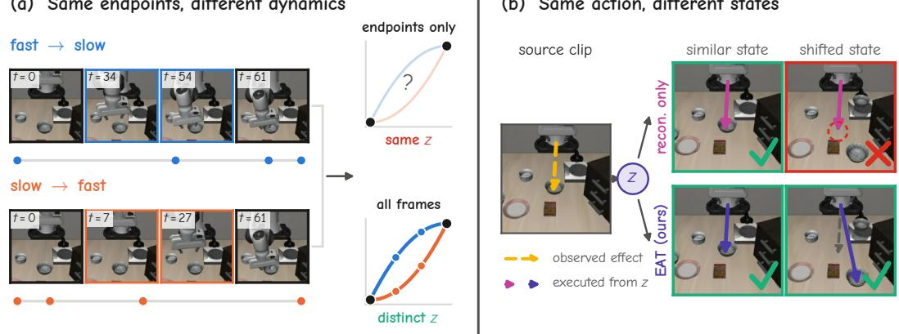
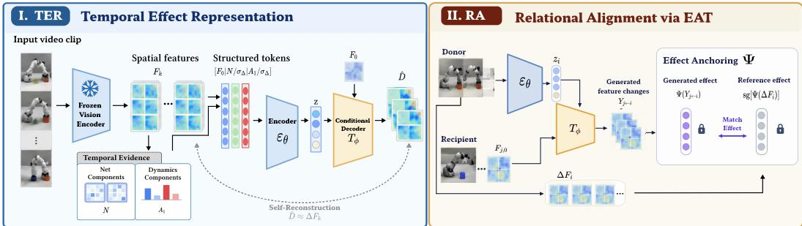
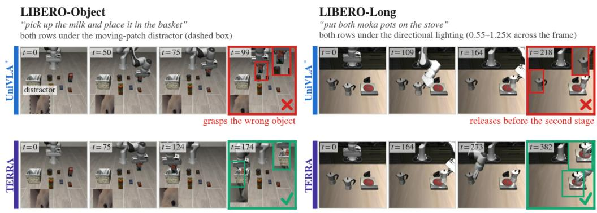
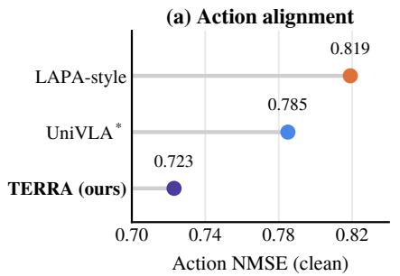
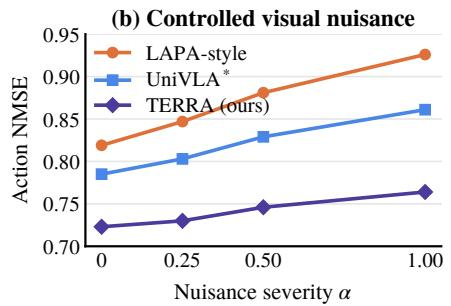
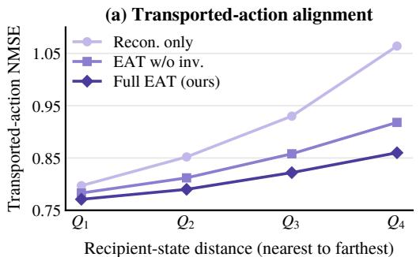
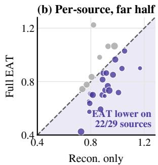

# TERRA: LEARNING TRANSPORTABLE LATENT AC-TIONS THROUGH TEMPORAL EFFECT REPRESENTA-TION AND RELATIONAL ALIGNMENT

Tianxingjian Ding1 Mubarak Shah1,† Yu Tian1,†

1Institute of Artificial Intelligence, University of Central Florida

## ABSTRACT

Latent actions supervise robot policies with action-like codes inferred from visual transitions, and their usefulness hinges on two questions: what a code keeps from a transition, and whether it still means the same thing when reused in a different initial state. The first is a tension in time: an endpoint difference discards how motion unfolds, while the full sequence admits nuisance variation. The second is left open by reconstruction, which only ever observes a latent together with the state it came from. We argue that both questions can be answered in the same place. TERRA (Temporal Effect Representation and Relational Alignment) describes a transition by a compact temporal effect, its net feature change together with a loworder within-window dynamics component, and learns a continuous latent from this effect. The same effect space then serves as the reference for reuse: Effect-Anchored Transport (EAT) decodes a latent in other initial states and anchors the resulting effect to the one observed at its source, so that the latent is shaped by what it does across contexts rather than only by the transition it came from. With frozen linear readers, TERRA predicts actions more accurately than UniVLA and a LAPA-style baseline, degrades more slowly under visual distractors, and keeps transported transitions faithful to the donor action as the recipient context moves farther away; a same-budget control shows that these gains come largely from EAT. At matched pretraining scale, the complete system reaches 93.4% average success on LIBERO, compared with 91.8% for UniVLA.

## 1 INTRODUCTION

Latent actions provide an intermediate supervision signal between visual transitions and robot control. A latent-action model assigns an action-like representation to an observed transition, which can then supervise a policy conditioned on the current observation and instruction. Recent work has explored discrete task-centric latents (Ye et al., 2025; Bu et al., 2025), continuous latent motion from frame-pair feature differences (Yang et al., 2026), and structured continuous action spaces (Li et al., 2026). Despite this progress, a basic question remains unresolved: what should a latent action preservefrom a visual transition, and how should it behave when reused?

A first challenge is selective temporal information preservation. Strong compression can remove distinctions that matter for control, whereas increasing latent capacity can also admit actionirrelevant appearance and exogenous variation (Yang et al., 2026; Lee et al., 2026). This tension is particularly important in time. Continuous latent-motion models operate on a frame pair, so their input reduces to the endpoint difference: it records how much the scene changed, not how the change unfolded within the window. Two executions that reach the same state at different speeds therefore receive the same latent (Fig. 1a), although they correspond to different actions. Conversely, retaining the entire temporal sequence exposes the representation to substantially more visual variation.

A second challenge is cross-context effect consistency. Standard reconstruction objectives observe only matched state–transition pairs and can therefore encode context-specific variation into the latent (Lee et al., 2026). Policy supervision is most useful when similar effects receive compatible latents across episodes, so it matters how a latent behaves when applied in a different initial state;

  
Figure 1: Two questions for a latent action. (a) What to keep. Two executions share their first and last frames (t=0, t=61) but move at different rhythms (fast-then-slow vs. slow-then-fast, dots mark frame times). A latent built from the endpoint difference alone assigns them the same code; adding a within-window dynamics component keeps them distinct. (b) How to behave. The latent z of a source clip (yellow: its observed effect, the gripper lowering onto the bowl) is decoded from two other initial states. Arrows show the effect each model decodes. Trained by reconstruction only, the effect follows the source in a similar state but drifts once the bowl moves; with EAT it stays consistent with the source effect in both, so the same latent transfers across states.

(a) Same endpoints, different dynamics

(b) Same action, different states

we refer to this reuse as transport. A latent that fits its source transition can still decode to a different effect once the scene changes (Fig. 1b).

We address both challenges with one principle: the compact effect space that decides what a latent should keep also provides the reference for how it should behave in a new context. We instantiate this principle with TERRA (Temporal Effect Representation and Relational Alignment), which first summarizes a short transition by its temporal evidence, a net component that captures accumulated feature change and a dynamics component that captures its low-order within-window trend, and compresses this evidence into a continuous latent. It then applies Effect-Anchored Transport (EAT): the latent is decoded in recipient states from the same data source, and the direction of the resulting effect is anchored to the one observed at the donor. Relative-effect consistency, transitiondistribution matching, and nuisance invariance regularize this refinement. Figure 2 summarizes the framework.

Adding the dynamics component to the endpoint difference lowers action NMSE and makes the within-window action trend linearly recoverable. EAT lowers action NMSE further and keeps transported transitions faithful to the donor action as recipient distance grows, which the same amount of additional reconstruction does not achieve. The complete system reaches 93.4% average LIBERO success against 91.8% for UniVLA at matched pretraining scale.

Our contributions are:

• A temporal-effect representation that extends frame-pair latent motion with a low-order within-window dynamics component, retaining how change unfolds without encoding the full sequence.

• Effect-Anchored Transport, which uses the same effect space to supervise how a latent behaves when decoded in other initial states, constraining what the latent does rather than what it is.

• Controlled evaluations showing that each component contributes to action alignment, nuisance robustness, and transport stability, and a matched-scale system comparison showing higher LIBERO success than UniVLA.

## 2 RELATED WORK

Latent action representations. Latent action models infer action-like representations from visual transitions and use them as intermediate supervision for robot learning. Early work learned inversedynamics labels from unlabeled video (Baker et al., 2022) and discrete latent actions for controllable generation and policies (Bruce et al., 2024; Schmidt & Jiang, 2024); LAPA and UniVLA scale this recipe to vision-language-action pretraining with quantized codes (Ye et al., 2025; Bu et al., 2025), and Moto, IGOR, AdaWorld, and villa-X refine what such codes capture (Chen et al., 2025c; 2024; Gao et al., 2025; Chen et al., 2025b). More recent work explores continuous representations to preserve richer motion structure: CoMo learns continuous latent motion from frame-pair feature differences (Yang et al., 2026), and RotVLA introduces structured continuous latents with temporal composition for VLA learning (Li et al., 2026). Zhang et al. (Zhang et al., 2025) analyze what these models actually encode. These works establish both discrete and continuous latent actions as viable interfaces between visual transitions and downstream control.

Cross-context grounding and latent consistency. A separate line of work studies how latent actions remain meaningful beyond the transition from which they are inferred. Olaf-World orients latent actions using temporal feature differences from a frozen video encoder for controllable video world models (Jiang et al., 2026), while cycle-based approaches regularize latent identity through generated transitions (Chen et al., 2025a). LAOM shows that action-correlated distractors degrade latent actions learned by reconstruction and measures latent quality by linear probing (Nikulin et al., 2025); recent analyses further examine nuisance sensitivity, action recoverability, and the relationship between latent-quality proxies and downstream control (Lee et al., 2026; Bu et al., 2026).

Continuous VLA prediction. Continuous action prediction is increasingly common in visionlanguage-action models. OpenVLA-OFT replaces autoregressive action-token decoding with continuous action heads (Kim et al., 2025a), while $\pi _ { 0 }$ uses a flow-matching action expert (Black et al., 2025). RotVLA jointly models continuous latent and physical actions (Li et al., 2026), and LAFP studies latent-policy learning with flow matching (Lyu et al., 2026).

These prior works have studied temporal latent construction, cross-context consistency, and continuous policy prediction largely as separate problems. TERRA uses one effect space for both: temporal evidence defines what the latent keeps, and Effect-Anchored Transport uses the same evidence to supervise how it behaves in other states.

## 3 TERRA: TEMPORAL EFFECT REPRESENTATION AND RELATIONAL ALIGNMENT

TERRA learns transportable continuous latent actions through two complementary components: Temporal Effect Representation (TER) and Relational Alignment (RA). TER constructs a compact latent from the temporal evidence of an observed transition, while RA refines how this latent behaves when applied in a different initial state, through Effect-Anchored Transport (EAT).

We call a latent transportable within a data source if, when applied in a different initial state, the resulting transition preserves the direction of its source temporal effects. We refer to this cross-context reuse as transport. Both components use frozen visual features without robot action labels. After refinement, the latent tokenizer is frozen and used to provide latent-action targets for downstream policy training.

## 3.1 TEMPORAL EFFECT REPRESENTATION (TER)

Temporal evidence. For a transition $x _ { i } ~ = ~ ( o _ { i , 0 } , . . . , o _ { i , K } )$ , we extract frozen DINOv2 features (Oquab et al., 2023) and spatially pool them into $F _ { i , k } \in \mathbb { R } ^ { S \times C }$ , where S denotes the number of spatial cells and C the feature dimension. Let $\Delta F _ { i , k } = F _ { i , k + 1 } - F _ { i , k }$ . We omit the transition index i when unambiguous.

Rather than retaining either only the endpoint difference or the full increment sequence, TERRA summarizes a transition by two low-order temporal components, which we call its temporal evidence. For any increment sequence $Y = ( Y _ { 0 } , \ldots , Y _ { K - 1 } )$ , we define the net component N and the dynamics component $A _ { 1 }$ as

$$
N ( Y ) = \sum _ { k = 0 } ^ { K - 1 } Y _ { k } , \qquad A _ { 1 } ( Y ) = \sum _ { k = 0 } ^ { K - 1 } b _ { 1 } ( k ) Y _ { k } , \qquad \langle b _ { 1 } , { \bf 1 } \rangle = 0 .\tag{1}
$$

TERRA: Temporal Efect Representation and Relational Alignment  
  
Figure 2: Overview of TERRA. Temporal Effect Representation compresses the initial-state feature $F _ { 0 }$ and the temporal evidence (net component N and dynamics component $A _ { 1 } )$ into a continuous latent z. Effect-Anchored Transport decodes a donor latent in recipient states and anchors the resulting effect to the donor’s observed effect. See Sec. 3 for details.

The net component corresponds to the constant temporal mode and captures accumulated change; for observed transitions, $\bar { N } ( \Delta F ) = F _ { K } - F _ { 0 }$ by telescoping. The dynamics component uses the lowest-frequency nonconstant DCT-II mode $b _ { 1 }$ and captures coarse within-window variation. Together they retain the two lowest-order temporal components of the increment sequence. The temporal evidence is the measured form of the temporal effect that TERRA represents; Section 3.2 reuses the same two components to supervise transport.

We collect the temporal evidence into the effect vector

$$
\xi ( Y ) = \sec \left[ N ( Y ) , A _ { 1 } ( Y ) \right] .\tag{2}
$$

Structured tokens and encoding. Feature increments are normalized by a single global scale $\sigma _ { \Delta } .$ defined as the root-mean-square magnitude of raw DINOv2 feature increments estimated once before training and then kept fixed.

We concatenate the initial-state feature and the normalized temporal evidence along the token dimension into the structured tokens

$$
\begin{array} { r } { \left[ F _ { 0 } \mid N ( \Delta F ) / \sigma _ { \Delta } \mid A _ { 1 } ( \Delta F ) / \sigma _ { \Delta } \right] . } \end{array}
$$

A transformer with spatial and evidence-type embeddings aggregates the three token groups through four learned queries. Their outputs form

$$
z = E _ { \theta } ( x ) \in \mathbb { R } ^ { 4 \times 6 4 } ,
$$

with no quantization or predefined spatial or temporal roles for the latent slots. We refer to $E _ { \theta }$ as the latent tokenizer.

Self-reconstruction. The conditional decoder $T _ { \phi }$ maps the initial-state feature and the latent to a normalized prediction of the increment sequence,

$$
\begin{array} { r } { \hat { D } = T _ { \phi } ( F _ { 0 } , z ) \in \mathbb { R } ^ { K \times S \times C } . } \end{array}\tag{3}
$$

The tokenizer and decoder are jointly trained so that $\hat { D } \approx \Delta F / \sigma _ { \Delta }$

$$
\mathcal { L } _ { \mathrm { s e l f } } = \mathbb { E } _ { x } \left[ \frac { 1 } { K S C } \left. \hat { D } - \frac { \Delta F } { \sigma _ { \Delta } } \right. _ { F } ^ { 2 } \right] ,\tag{4}
$$

where $\Delta F$ stacks all K increments. Predicting the increment sequence requires the decoder to model how change is distributed within the window rather than only its endpoint. The tokenizer itself, however, receives only the temporal evidence N and $A _ { \mathrm { 1 } } ;$ higher-order temporal detail is not available to it as input.

## 3.2 RELATIONAL ALIGNMENT (RA) VIA EFFECT-ANCHORED TRANSPORT

The representation above is learned only from matched state–transition pairs. Such reconstruction does not determine how the same latent should behave when applied in a different initial state. By the definition above, the desired behavior is that the transported transition preserve the donor’s temporal-effect direction; EAT enforces this behavior directly.

We sample donor transitions and recipient initial states from the same data source, limiting large embodiment and observation-domain shifts. EAT combines four complementary objectives: effect anchoring, relative-effect consistency, transition-distribution matching, and nuisance invariance.

Transport. Let $x _ { i }$ be a donor transition and $F _ { j , 0 }$ a recipient initial state from another episode of the same source. We encode the donor and decode its latent in the recipient state,

$$
z _ { i } = E _ { \theta } ( x _ { i } ) , \qquad \hat { D } _ { j  i } = T _ { \phi } ( F _ { j , 0 } , z _ { i } ) , \qquad Y _ { j  i } = \sigma _ { \Delta } \hat { D } _ { j  i } .\tag{5}
$$

Here $Y _ { j  i }$ is the generated feature-increment sequence induced by donor latent $z _ { i }$ in recipient state $F _ { j , 0 } ,$ expressed in feature-increment units so that the temporal evidence of Eq. 1 can be evaluated on it. The tokenizer sees only the donor transition, and the decoder receives no recipient future frames. EAT introduces no additional trainable transport network: $T _ { \phi }$ is the same conditional decoder used for self-reconstruction.

Effect anchoring. We compare effects through a fixed effect descriptor

$$
\Psi ( Y ) = \mathrm { s t d } \big ( R ^ { \top } \xi ( Y ) \big ) ,\tag{6}
$$

where R is a fixed Gaussian random projection and std standardizes each coordinate with mean and variance estimated once from real transitions (Appendix A.2). Ψ has no learnable parameters, so the temporal evidence used to construct the representation is the same quantity used to evaluate its behavior after transport. The observed donor transition provides the reference:

$$
\mathcal { L } _ { \mathrm { e f f e c t } } = \mathbb { E } _ { i , j } [ 1 - \cos ( \Psi ( Y _ { j  i } ) , \operatorname { s g } [ \Psi ( \Delta F _ { i } ) ] ) ] ,\tag{7}
$$

where sg denotes stop-gradient. This objective aligns the direction of the transported effect with that of the observed donor transition while leaving its magnitude free to depend on context. The generated branch remains differentiable, so $\mathcal { L } _ { \mathrm { e f f e c t } }$ updates both $T _ { \phi }$ and the online tokenizer $E _ { \theta }$

Relative-effect consistency. Effect anchoring constrains individual transported effects. We additionally encourage relationships between different latent effects to remain stable across recipient contexts. For this objective, we maintain an exponential-moving-average target tokenizer $E _ { \bar { \theta } }$ that tracks $E _ { \theta }$ but receives no gradients. Detached target latents from recent same-source samples provide the donor latents for relative-effect consistency. Let $\bar { z } _ { i }$ and $\bar { z } _ { i ^ { \prime } }$ denote two such donor latents. For recipient states $F _ { j , 0 }$ and $F _ { j ^ { \prime } , 0 }$ , define

$$
e _ { s } ^ { q } = \Psi \left( \sigma _ { \Delta } T _ { \phi } ( F _ { s , 0 } , \bar { z } _ { q } ) \right) , \qquad q \in \{ i , i ^ { \prime } \} , \quad s \in \{ j , j ^ { \prime } \} ,\tag{8}
$$

and

$$
r _ { s } ^ { i , i ^ { \prime } } = e _ { s } ^ { i } - e _ { s } ^ { i ^ { \prime } } .
$$

We optimize

$$
\mathcal { L } _ { \mathrm { r e l } } = \mathbb { E } _ { i , i ^ { \prime } , j , j ^ { \prime } } \left[ 1 - \cos \left( r _ { j } ^ { i , i ^ { \prime } } , r _ { j ^ { \prime } } ^ { i , i ^ { \prime } } \right) \right] .\tag{9}
$$

Effect anchoring constrains the direction of each transported effect, whereas relative-effect consistency stabilizes how different latent effects compare across recipient contexts. Together, they reduce context dependence in the effect space measured by Ψ without requiring the full generated transition to be state-independent.

Because the donor latents used by $\mathcal { L } _ { \mathrm { r e l } }$ are detached EMA-target representations, this term directly regularizes the shared decoder rather than backpropagating through the donor tokenizer. The online tokenizer is refined directly through $\mathcal { L } _ { \mathrm { s e l f } } , \mathcal { L } _ { \mathrm { e f f e c t } }$ , and ${ \mathcal { L } } _ { \mathrm { i n v } }$

Algorithm 1 Effect-Anchored Transport (EAT) refinement   
Require: dataset ${ \mathcal { D } } ,$ , online tokenizer $E _ { \theta }$ , decoder $T _ { \phi }$ , EMA tokenizer $E _ { \bar { \theta } } { \mathrm { . } }$ , same-source queues   
$\{ Q _ { d } \}$   
1: for each refinement step do   
2: $\bar { \theta }  \beta _ { \mathrm { E M A } } \bar { \theta } + ( 1 - \dot { ^ { } } \beta _ { \mathrm { E M A } } ) \theta$   
3: sample source $d ,$ donor $x _ { i } ,$ recipient $F _ { j , 0 } \sim \mathcal { D } _ { d }$   
4: $z _ { i } \gets E _ { \theta } ( x _ { i } )$   
5: $\hat { D } _ { j  i }  T _ { \phi } ( F _ { j , 0 } , z _ { i } ) ; \ Y _ { j  i }  \sigma _ { \Delta } \hat { D } _ { j  i }$   
6: $\mathcal { L } _ { \mathrm { e f f e c t } }  1 - \cos ( \Psi ( Y _ { j  i } ) , \mathrm { s g } [ \Psi ( \Delta \bar { F } _ { i } ) ] )$   
7: $\bar { z } _ { i }  \mathrm { s g } [ E _ { \bar { \theta } } ( x _ { i } ) ] ;$ enqueue $\bar { z } _ { i }$ into $Q _ { d }$   
8: sample $\bar { z } _ { a } , \bar { z } _ { b } \sim Q _ { d }$ and $F _ { u , 0 } , F _ { v , 0 } \sim \mathcal { D } _ { d }$   
9: $e _ { s } ^ { q } \dot {  } \Psi ( \sigma _ { \Delta } T _ { \phi } ( F _ { s , 0 } , \bar { z } _ { q } ) ) , q \in \{ a , b \} , s \in \{ u , v \}$   
10: $\mathcal { L } _ { \mathrm { r e l } }  1 - \cos ( e _ { u } ^ { a } - e _ { u } ^ { b } , e _ { v } ^ { a } - e _ { v } ^ { b } )$   
11: compute $\mathcal { L } _ { \mathrm { s e l f } } , \bar { \mathcal { L } } _ { \mathrm { d i s t } } , \bar { \mathcal { L } } _ { \mathrm { i n v } }$   
12: update $( \theta , \phi )$ with $\mathcal { L } _ { \mathrm { E A T } }$   
13: end for   
14: return $E _ { \theta }$

Transition-distribution matching. The temporal evidence does not constrain every component of the generated transition. We therefore use maximum mean discrepancy (MMD) (Gretton et al., 2012) to match the empirical distributions of projected real and generated feature increments, denoted ${ \mathcal { L } } _ { \mathrm { d i s t } }$ This term operates in transition space rather than latent space and does not assign a ground-truth counterfactual transition to an individual recipient. Its exact form is given in $\mathsf { A p - }$ pendix A.2.

Nuisance invariance. To suppress visual variation that should not determine the latent action, we use a BYOL-style objective (Grill et al., 2020): the online tokenizer receives a temporally consistent nuisance-perturbed view of a transition, while the EMA target tokenizer receives the corresponding clean view. The perturbation family consists of mild spatial cropping together with brightness and contrast variation, shared across all frames in the clip. We minimize the cosine discrepancy between the online and EMA-target latent representations, denoted ${ \mathcal { L } } _ { \mathrm { i n v } }$

Importantly, these augmentations are used only for ${ \mathcal { L } } _ { \mathrm { i n v } }$ . The effect descriptor Ψ and both effectbased objectives are computed from unaugmented transitions. Thus, the spatial perturbation used for latent invariance does not alter the image-grid coordinates on which effect anchoring is defined. Exact augmentation and target-network details are provided in Appendix A.2.

Joint optimization. We retain self-reconstruction on matched transitions throughout EAT refinement and optimize

$$
{ \mathcal { L } } _ { \mathrm { E A T } } = { \mathcal { L } } _ { \mathrm { s e l f } } + \lambda _ { e } { \mathcal { L } } _ { \mathrm { e f f e c t } } + \lambda _ { r } { \mathcal { L } } _ { \mathrm { r e l } } + \lambda _ { d } { \mathcal { L } } _ { \mathrm { d i s t } } + \lambda _ { i } { \mathcal { L } } _ { \mathrm { i n v } } .\tag{10}
$$

The loss weights and auxiliary-objective details are given in Appendix A.2.

After refinement, we freeze the online tokenizer $E _ { \theta }$ and use it to generate latent-action targets for downstream policy training. Neither $T _ { \phi }$ , the EMA target tokenizer, nor Ψ is required at policy inference time.

Scope. The descriptor Ψ is built from per-cell effects on the pooled feature grid, and same-source sampling does not guarantee exact geometric correspondence between donor and recipient states. We therefore interpret EAT as a source-restricted visual-effect regularizer rather than supervision for a ground-truth counterfactual physical action.

## 4 EXPERIMENTS

## 4.1 EXPERIMENTAL SETUP

Pretraining and baselines. We train latent-action models on an Open X-Embodiment mixture (Open X-Embodiment Collaboration, 2024) containing 29 sources and approximately 8.19M clips. All representation comparisons use the same frozen DINOv2 feature cache. For the system comparison, TERRA and UniVLA are retrained at the same latent-action pretraining data scale and evaluated on LIBERO (Liu et al., 2023). For representation analysis we additionally include a LAPA-style discrete VQ baseline in the same DINO feature space.

<table><tr><td>Method</td><td>Spatial</td><td>Object</td><td>Goal</td><td>Long</td><td>Avg.</td></tr><tr><td>LAPA†</td><td>73.8</td><td>74.6</td><td>58.8</td><td>55.4</td><td>65.7</td></tr><tr><td>Diffusion Policy†</td><td>78.3</td><td>92.5</td><td>68.3</td><td>50.5</td><td>72.4</td></tr><tr><td>Octo†</td><td>78.9</td><td>85.7</td><td>84.6</td><td>51.1</td><td>75.1</td></tr><tr><td>OpenVLA†</td><td>84.7</td><td>88.4</td><td>79.2</td><td>53.7</td><td>76.5</td></tr><tr><td>UniVLA*</td><td>92.3</td><td>92.6</td><td>93.4</td><td>88.7</td><td>91.8</td></tr><tr><td>TERRA (ours)</td><td>94.1</td><td>95.2</td><td>93.8</td><td>90.6</td><td>93.4</td></tr></table>

Table 1: Closed-loop LIBERO success rate (%).Top: one perturbed rollout each from LIBERO-Object and LIBERO-Long (Appendix B.2). TERRA and UniVLA∗ are retrained at the same latentaction pretraining data scale from the same OpenVLA-7B backbone and evaluated with the same rollout budget. †Published results under their original protocols.

Policy protocol. Both systems start from OpenVLA-7B (Kim et al., 2025b), undergo latent-VLM pretraining on the same 10% subset of the pretraining mixture, and are then fine-tuned on LIBERO. TERRA uses its continuous query/readout and flow-based policy interface, and UniVLA its native discrete latent-token interface, so the comparison is between complete latent-action systems at matched pretraining scale. Each LIBERO suite contains 10 tasks and is evaluated with 50 rollouts per task.

Representation and robustness evaluation. Every tokenizer is frozen and probed with linear readers (Alain & Bengio, 2017) fit on real held-out transitions only, following the linear actiondecoding action spaces are never mixed; source-level NMSEs are macro-averaged. Readers predict five targets from the K-step action sequence a: the 12-step chunk (action), the window sum N(a) (net), the first step (first), the profile A1(a) of Eq. 1 (profile), and the per-step sequence (seq.). For nuisance robustness, the trajectory and labels are fixed while a moving visual distractor is scaled by α ∈ {0, 0.25, 0.5, 1.0}; nuisance drop is the relative loss of net-action explained variance (1 − NMSE) at α = 1. Donor–recipient distance is the cosine distance between spatially averaged frozen-DINO initial-state features, ranked within each source into equal-count quartiles.

## 4.2 CLOSED-LOOP MANIPULATION

We first evaluate the complete system in closed-loop manipulation. Table 1 reports published systems for context and highlights the retrained TERRA–UniVLA comparison.

At matched latent-action pretraining scale, TERRA reaches 93.4% average LIBERO success against 91.8% for retrained UniVLA, with higher success on all four suites; the largest gains are on Object (+2.6) and Long (+1.9), the suites with the most object and horizon variation. Both systems share the VLM backbone, the latent-VLM pretraining mixture, and the LIBERO fine-tuning data; they differ in the latent-action model and the policy interface built on it. Sections 4.3 and 4.4 examine the latent representation directly. The rollouts in Table 1 illustrate two characteristic UniVLA∗ failures under visual perturbation, distractor confusion on Object and premature release on Long, which mirror the nuisance-robustness and within-window-structure results of Section 4.3.

  
Figure 3: Action alignment and nuisance robustness. (a) Action NMSE on clean transitions for TERRA, UniVLA∗, and a LAPA-style discrete baseline adapted to the common DINO feature space. (b) The same reader under a moving visual distractor of severity $\alpha ;$ the robot trajectory and action labels are unchanged.

## 4.3 TEMPORAL EFFECT REPRESENTATION

Action alignment and nuisance robustness. Figure 3 and Table 2 evaluate every tokenizer with the same frozen linear readers. On clean transitions, TERRA obtains the lowest 12-step action NMSE (.723), against .785 for UniVLA∗ and .819 for the LAPA-style baseline, and the ordering persists as the distractor severity grows: from $\alpha = 0 \mathrm { t o } \alpha = 1$ , NMSE rises by .041 for TERRA, .076 for UniVLA∗, and .107 for the LAPA-style baseline. Against UniVLA∗, TERRA reads the net action, the first step, and the per-step sequence more accurately and loses less under the distractor (17.9% vs. 23.0%); UniVLA∗ reads the action profile slightly better (.875 vs. .909). Profile NMSE stays above .87 for every latent, so the within-window trend is only weakly linearly decodable from any of them.

What the dynamics component adds. The two 65k rows of Table 2 isolate the temporal evidence: two tokenizers with the same architecture and schedule, one receiving the net component only, i.e. the frame-pair feature difference of continuous latent-motion models (Yang et al., 2026), the other additionally receiving $A _ { 1 }$ . With the net component alone, the action profile is not linearly recoverable (.983): the endpoint difference records how much the scene changed, not how the change was distributed over the window. Adding $A _ { 1 }$ lowers profile NMSE to .909, action NMSE from .817 to .807, first-step NMSE from .790 to .767, and the nuisance drop from 33.6% to 22.4%, while netaction NMSE moves from .703 to .734: the latent trades a small amount of endpoint precision for within-window structure, and the added temporal evidence lowers rather than raises sensitivity to the distractor.

Table 2: Frozen-reader ablation (NMSE, lower is better). ${ \mathrm { U n i V L A } } ^ { * }$ is the retrained baseline of Table 1. The two 65k tokenizers share the architecture and the self-reconstruction schedule and differ only in whether $A _ { 1 }$ is provided; the three +15k rows continue from the $[ F _ { 0 } ~ \vert ~ { \cal N } ~ \vert ~ { \cal A } _ { 1 } ]$ checkpoint under equal budget. Action predicts the 12-step chunk; Net, First, Profile, Seq. predict the net action, the first step, $A _ { 1 } ( a )$ , and the per-step sequence; Drop is the relative loss of net-action explained variance at $\alpha = 1$ . 95% intervals are bootstrap over the 29 sources (Appendix C.1). Best per column underlined.
<table><tr><td>Tokenizer</td><td>Action</td><td>Net</td><td>First</td><td>Profile</td><td> ${ \mathrm { S e q . } }$ </td><td>Drop</td></tr><tr><td>UniVLA*</td><td>.785</td><td>.763</td><td>.778</td><td>.875</td><td>.785</td><td>23.0%</td></tr><tr><td> $[ F _ { 0 } \mid N ] , 6 5 \mathrm { k }$ </td><td>.817</td><td>.703</td><td>.790</td><td>.983</td><td>.800</td><td>33.6%</td></tr><tr><td> $\left[ F _ { 0 } \mid N ^ { ' } | A _ { 1 } \right]$  , 65k</td><td>.807</td><td>.734</td><td>.767</td><td>.909</td><td>.807</td><td>22.4%</td></tr><tr><td>+15k reconstruction</td><td>.784</td><td>.732</td><td>.760</td><td>.909</td><td>.807</td><td>22.6%</td></tr><tr><td>+15k EAT w/o invariance</td><td>.764</td><td>.700</td><td>.733</td><td>.915</td><td>.784</td><td>19.7%</td></tr><tr><td>+15k full EAT (TERRA)</td><td>.723</td><td>.671</td><td>.717</td><td>.909</td><td>.764</td><td>17.9%</td></tr></table>

  
Figure 4: Cross-context refinement with EAT. (a) Donor-action NMSE of transported transitions $Y _ { j  i }$ scored by a reader that is fit only on real transitions and never sees generated ones, so a low value means the transported transition still carries the donor’s action. Donor–recipient pairs are grouped by initial-state distance (within-source frozen-DINO cosine quartiles, $Q _ { 1 }$ nearest, $Q _ { 4 }$ farthest). (b) The same NMSE per pretraining source, averaged over the two farthest quartiles, for reconstruction-only vs. full EAT; each point is one of the 29 sources; points below the diagonal favor EAT (22 of 29), and gray points mark the sources where EAT is worse.

## 4.4 CROSS-CONTEXT REFINEMENT WITH EAT

Same-budget refinement. The +15k rows of Table 2 hold the optimization budget fixed. From the shared 65k checkpoint, 15k further reconstruction-only updates leave the temporal readouts where they were and lower 12-step action NMSE only from .807 to .784, whereas the same 15k updates with EAT lower net-action NMSE to .671, first-step NMSE to .717, sequence NMSE to .764, and action NMSE to .723, and reduce the nuisance drop to 17.9%; nuisance invariance accounts for roughly half of each gain. Profile NMSE is unchanged (.909), consistent with EAT acting on how the latent behaves across states rather than on the temporal evidence it encodes, and the net-action readout ends below the endpoint-only tokenizer (.671 vs. .703): the endpoint precision traded for $A _ { 1 }$ is returned by EAT, not by additional reconstruction.

Transport. To evaluate transport, we fit a linear reader that predicts the recorded action chunk from a real feature-increment sequence, one per data source, and freeze it. We then feed it transported transitions $Y _ { j  i }$ and score the prediction against the donor’s action with the same NMSE as Sec. 4.3. The reader never sees generated transitions, so a low NMSE means the transported transition still carries the donor’s action the way a real transition would (details in Appendix B.4).

EAT makes transport substantially more stable as the recipient context moves away from the donor. From the nearest to the farthest quartile, donor-action NMSE rises by .267 under reconstructiononly training, by .136 with EAT without nuisance invariance, and by .087 with full EAT, a three-fold reduction in distance sensitivity (Fig. 4a). The advantage grows with recipient distance, which is exactly the regime EAT targets, and it holds source by source: over the two farthest quartiles, full EAT lowers NMSE on 22 of 29 sources (Fig. 4b). The largest degradation is on roboturk (.822 to 1.224). Recipient-state sensitivity and further transport diagnostics are reported in Appendix C.2.

## 5 DISCUSSION AND LIMITATIONS

Our transport objective and metric are defined within a data source, where embodiment and camera geometry are shared; anchoring effects across embodiments would require a correspondence-aware descriptor. The effect space keeps only two low-order temporal components on a coarse spatial grid, which favors robustness over fine temporal detail. The transport metric measures whether donor action semantics survive decoding in another state, not whether the decoded transition matches a unique counterfactual future. Finally, closed-loop results are reported on LIBERO at reduced pretraining scale; larger-scale pretraining and real-robot deployment remain future work.

## 6 CONCLUSION

We introduced TERRA, which uses one compact effect space both to define what a latent action keeps and to supervise how it behaves in new contexts. Temporal Effect Representation adds a within-window dynamics component to the endpoint difference, and Effect-Anchored Transport anchors the effect of a latent decoded in other states to the one observed at its source. The resulting latents align more closely with actions, degrade more slowly under visual distractors, and preserve donor actions under transport, and the complete system improves LIBERO success over UniVLA at matched pretraining scale.

## AI USE STATEMENT

In this work, we used generative AI tools for drafting, code assistance, experiment orchestration, and language editing. All AI-assisted code and experimental changes were reviewed and tested by the authors, and all quantitative claims were checked against experiment logs and saved artifacts. We take responsibility for the final content of this work, including text, claims, and artifacts produced with the aid of generative AI.

## REFERENCES

Guillaume Alain and Yoshua Bengio. Understanding intermediate layers using linear classifier probes. In International Conference on Learning Representations, Workshop Track, 2017.

Bowen Baker, Ilge Akkaya, Peter Zhokhov, Joost Huizinga, Jie Tang, Adrien Ecoffet, Brandon Houghton, Raul Sampedro, and Jeff Clune. Video PreTraining (VPT): Learning to act by watching unlabeled online videos. In Advances in Neural Information Processing Systems, 2022.

Kevin Black, Noah Brown, Danny Driess, Adnan Esmail, Michael Equi, Chelsea Finn, Niccolo Fusai, Lachy Groom, Karol Hausman, Brian Ichter, Szymon Jakubczak, Tim Jones, Liyiming Ke, Sergey Levine, Adrian Li-Bell, Mohith Mothukuri, Suraj Nair, Karl Pertsch, Lucy Xiaoyang Shi, James Tanner, Quan Vuong, Anna Walling, Haohuan Wang, and Ury Zhilinsky. π : A visionlanguage-action flow model for general robot control. In Robotics: Science and Systems, 2025. URL https://arxiv.org/abs/2410.24164.

Jake Bruce, Michael Dennis, Ashley Edwards, Jack Parker-Holder, Yuge Shi, Edward Hughes, Matthew Lai, Aditi Mavalankar, Richie Steigerwald, Chris Apps, Yusuf Aytar, Sarah Bechtle, Feryal Behbahani, Stephanie Chan, Nicolas Heess, Lucy Gonzalez, Simon Osindero, Sherjil Ozair, Scott Reed, Jingwei Zhang, Konrad Zolna, Jeff Clune, Nando de Freitas, Satinder Singh, and Tim Rocktaschel. Genie: Generative interactive environments. In¨ International Conference on Machine Learning, 2024. URL https://arxiv.org/abs/2402.15391.

Qingwen Bu, Yanting Yang, Jisong Cai, Shenyuan Gao, Guanghui Ren, Maoqing Yao, Ping Luo, and Hongyang Li. UniVLA: Learning to act anywhere with task-centric latent actions. In Robotics: Science and Systems, 2025.

Xizhou Bu, Qingda Hu, Lei Zhou, Lingfeng Zhang, Yingbo Tang, Zihao Liu, Xinyi Tao, Zhiqiang Ma, Qingqiu Huang, Chufeng Tang, Hongbo Wang, Jing Zhang, Jiayi Ma, Hangjun Ye, Wei Li, and Xiaoshuai Hao. What matters for latent actions in robot learning. arXiv preprint arXiv:2608.19613, 2026. URL https://arxiv.org/abs/2608.19613.

Guangyan Chen, Meiling Wang, Qi Shao, Zichen Zhou, Weixin Mao, Te Cui, Minzhao Zhu, Yinan Deng, Luojie Yang, Zhanqi Zhang, Yi Yang, Hua Chen, and Yufeng Yue. See once, then act: Vision-language-action model with task learning from one-shot video demonstrations. arXiv preprint arXiv:2512.07582, 2025a. URL https://arxiv.org/abs/2512.07582.

Xiaoyu Chen, Junliang Guo, Tianyu He, Chuheng Zhang, Pushi Zhang, Derek Cathera Yang, Li Zhao, and Jiang Bian. IGOR: Image-GOal representations are the atomic control units for foundation models in embodied AI. arXiv preprint arXiv:2411.00785, 2024.

Xiaoyu Chen, Hangxing Wei, Pushi Zhang, Chuheng Zhang, Kaixin Wang, Yanjiang Guo, Rushuai Yang, Yucen Wang, Xinquan Xiao, Li Zhao, Jianyu Chen, and Jiang Bian. villa-X: Enhancing latent action modeling in vision-language-action models. arXiv preprint arXiv:2507.23682, 2025b.

Yi Chen, Yuying Ge, Weiliang Tang, Yizhuo Li, Yixiao Ge, Mingyu Ding, Ying Shan, and Xihui Liu. Moto: Latent motion token as the bridging language for learning robot manipulation from videos. In Proceedings ofthe IEEE/CVF International Conference on Computer Vision, 2025c.

Senyu Fei, Siyin Wang, Junhao Shi, Zihao Dai, Jikun Cai, Pengfang Qian, Li Ji, Xinzhe He, Shiduo Zhang, Zhaoye Fei, Jinlan Fu, Jingjing Gong, and Xipeng Qiu. LIBERO-Plus: In-depth robustness analysis of vision-language-action models. arXiv preprint arXiv:2510.13626, 2025.

Shenyuan Gao, Siyuan Zhou, Yilun Du, Jun Zhang, and Chuang Gan. AdaWorld: Learning adaptable world models with latent actions. In International Conference on Machine Learning, 2025.

Arthur Gretton, Karsten M. Borgwardt, Malte J. Rasch, Bernhard Scholkopf, and Alexander Smola.¨ A kernel two-sample test. Journal of Machine Learning Research, 13(25):723–773, 2012. URL https://jmlr.org/papers/v13/gretton12a.html.

Jean-Bastien Grill, Florian Strub, Florent Altche, Corentin Tallec, Pierre Richemond, Elena´ Buchatskaya, Carl Doersch, Bernardo Avila Pires, Zhaohan Guo, Mohammad Gheshlaghi Azar, Bilal Piot, Koray Kavukcuoglu, Remi Munos, and Michal Valko. Bootstrap your own latent: A´ new approach to self-supervised learning. In Advances in Neural Information Processing Systems, volume 33, pp. 21271–21284, 2020. URL https://papers.nips.cc/paper/2020/ hash/f3ada80d5c4ee70142b17b8192b2958e-Abstract.html.

Yuxin Jiang, Yuchao Gu, Ivor W. Tsang, and Mike Zheng Shou. Olaf-world: Orienting latent actions for video world modeling. In International Conference on Machine Learning, 2026.

William B. Johnson and Joram Lindenstrauss. Extensions of Lipschitz mappings into a Hilbert space. In Conference in Modern Analysis and Probability, volume 26 of Contemporary Mathematics, pp. 189–206. American Mathematical Society, 1984.

Moo Jin Kim, Chelsea Finn, and Percy Liang. Fine-tuning vision-language-action models: Optimizing speed and success. In Robotics: Science and Systems, 2025a.

Moo Jin Kim, Karl Pertsch, Siddharth Karamcheti, Ted Xiao, Ashwin Balakrishna, Suraj Nair, Rafael Rafailov, Ethan P. Foster, Pannag R. Sanketi, Quan Vuong, Thomas Kollar, Benjamin Burchfiel, Russ Tedrake, Dorsa Sadigh, Sergey Levine, Percy Liang, and Chelsea Finn. Open-VLA: An open-source vision-language-action model. In Proceedings of the 8th Conference on Robot Learning, volume 270 of Proceedings of Machine Learning Research, pp. 2679–2713. PMLR, 2025b. URL https://proceedings.mlr.press/v270/kim25c.html.

Jung Min Lee, Taehyun Cho, Li Zhao, and Jungwoo Lee. Why latent actions fail, and how to prevent it. arXiv preprint arXiv:2605.20223, 2026.

Qiwei Li, Xicheng Gong, Xinghang Li, Peiyan Li, Quanyun Zhou, Hangjun Ye, Jiahuan Zhou, and Yadong Mu. RotVLA: Rotational latent action for vision-language-action model. arXiv preprint arXiv:2605.13403, 2026. URL https://arxiv.org/abs/2605.13403.

Bo Liu, Yifeng Zhu, Chongkai Gao, Yihao Feng, Qiang Liu, Yuke Zhu, and Peter Stone. LIBERO: Benchmarking knowledge transfer for lifelong robot learning. In Advances in Neural Information Processing Systems (Datasets and Benchmarks Track), 2023.

Jiexi Lyu, Xizhou Bu, Qingqiu Huang, Chufeng Tang, Xiaoshuai Hao, Hongbo Wang, and Wei Li. LAFP: Preserving latent action structure in latent policy learning via flow matching. arXiv preprint arXiv:2606.10517, 2026. URL https://arxiv.org/abs/2606.10517.

Alexander Nikulin, Ilya Zisman, Denis Tarasov, Nikita Lyubaykin, Andrei Polubarov, Igor Kiselev, and Vladislav Kurenkov. Latent action learning requires supervision in the presence of distractors. In International Conference on Machine Learning, 2025. URL https://arxiv.org/abs/ 2502.00379.

Open X-Embodiment Collaboration. Open X-Embodiment: Robotic learning datasets and RT-X models. In IEEE International Conference on Robotics and Automation, 2024.

Maxime Oquab, Timothee Darcet, Th´ eo Moutakanni, Huy Vo, Marc Szafraniec, Vasil Khalidov,´ Pierre Fernandez, Daniel Haziza, Francisco Massa, Alaaeldin El-Nouby, Mahmoud Assran, Nicolas Ballas, Wojciech Galuba, Russell Howes, Po-Yao Huang, Shang-Wen Li, Ishan Misra, Michael Rabbat, Vasu Sharma, Gabriel Synnaeve, Hu Xu, Herve J´ egou, Julien Mairal, Patrick Labatut,´ Armand Joulin, and Piotr Bojanowski. DINOv2: Learning robust visual features without supervision. arXiv preprint arXiv:2304.07193, 2023.

Olivier Roy and Martin Vetterli. The effective rank: A measure of effective dimensionality. In European Signal Processing Conference (EUSIPCO), pp. 606–610, 2007.

Dominik Schmidt and Minqi Jiang. Learning to act without actions. In International Conference on Learning Representations, 2024. URL https://arxiv.org/abs/2312.10812.

Jiange Yang, Yansong Shi, Haoyi Zhu, Mingyu Liu, Kaijing Ma, Yating Wang, Gangshan Wu, Tong He, and Limin Wang. CoMo: Learning continuous latent motion from internet videos for scalable robot learning. In Proceedings of the IEEE/CVF Conference on Computer Vision and Pattern Recognition, 2026. URL https://arxiv.org/abs/2505.17006.

Seonghyeon Ye, Joel Jang, Byeongguk Jeon, Sejune Joo, Jianwei Yang, Baolin Peng, Ajay Mandlekar, Reuben Tan, Yu-Wei Chao, Bill Yuchen Lin, Lars Liden, Kimin Lee, Jianfeng Gao, Luke Zettlemoyer, Dieter Fox, and Minjoon Seo. Latent action pretraining from videos. In International Conference on Learning Representations, 2025.

Chuheng Zhang, Tim Pearce, Pushi Zhang, Kaixin Wang, Xiaoyu Chen, Wei Shen, Li Zhao, and Jiang Bian. What do latent action models actually learn? In Advances in Neural Information Processing Systems, 2025.

## A METHOD DETAILS

## A.1 TEMPORAL EFFECT REPRESENTATION

Structured tokens. The main tokenizer uses five observations, giving $K = 4$ adjacent feature increments. Frozen DINOv2 features have $C \ = \ 7 6 8$ channels and are pooled to a $4 \times 4$ grid $( S = 1 6 )$ . The structured tokens therefore contain 48 tokens: 16 each from $F _ { 0 } ,$ , the net component $N ( \Delta F )$ , and the dynamics component $A _ { 1 } ( \Delta F )$ , distinguished by spatial-position and evidencetype embeddings. A six-layer Transformer aggregates them through four learned latent queries whose outputs are projected to 64 dimensions, giving $z \in \mathbb { R } ^ { 4 \times 6 4 }$ . The tokenizer queries are distinct from the readout queries used during downstream VLA training and share no parameters with them.

Temporal-evidence basis. For $K = 4 ,$ the first nonconstant DCT-II direction used by the dynamics component has relative coefficients

$$
b _ { 1 } \propto ( 0 . 9 2 4 , 0 . 3 8 3 , - 0 . 3 8 3 , - 0 . 9 2 4 ) .
$$

The same coefficient convention is used when constructing the structured tokens and when evaluating the effect descriptor.

Feature-increment normalization. All feature increments are normalized by one fixed global scalar $\sigma _ { \Delta }$ , the root-mean-square magnitude of raw DINOv2 feature increments, estimated once from real training transitions and reused throughout training and evaluation. The decoder predicts normalized increments,

$$
\begin{array} { r } { \hat { D } = T _ { \phi } ( F _ { 0 } , z ) \approx \Delta F / \sigma _ { \Delta } , } \end{array}
$$

and transported transitions are converted back to feature units as $Y = \sigma _ { \Delta } \hat { D }$ before the temporal evidence is evaluated on them.

## A.2 EFFECT-ANCHORED TRANSPORT

Effect descriptor. The effect vector $\xi ( Y ) = \sec [ N ( Y ) , A _ { 1 } ( Y ) ]$ has $2 S C = 2 \times 1 6 \times 7 6 8 =$ 24,576 dimensions. The descriptor first applies a fixed Gaussian random projection $R \in \mathbb { R } ^ { 2 4 5 7 6 \times 5 1 2 }$ with entries drawn i.i.d. from $\dot { \mathcal { N } } ( 0 , 1 / 5 1 \dot { 2 } )$ (one draw at initialization with a fixed seed; no gradient), and then standardizes each of the $d = 5 1 2$ output coordinates:

$$
\Psi ( Y ) = \frac { R ^ { \top } \xi ( Y ) - \mu } { \sqrt { \sigma ^ { 2 } } + \epsilon } , \qquad \epsilon = 1 0 ^ { - 5 } ,
$$

where $\mu , \sigma ^ { 2 } \in \mathbb { R } ^ { 5 1 2 }$ are the per-coordinate mean and variance of $R ^ { \top } \xi ( \Delta F )$ over real training transitions, estimated once before EAT refinement and then frozen. The standardization is per coordinate (diagonal), not a full whitening: it equalizes the scale of the projected coordinates and does not decorrelate them. The same transform is applied to real and generated transitions, and Ψ has no learnable parameters.

Because $\xi$ is defined cell by cell on the pooled feature grid and R is a distance-preserving Johnson– Lindenstrauss projection (Johnson & Lindenstrauss, 1984), matching Ψ constrains the per-cell image-space effect of the transported transition up to the projection distortion and the diagonal rescaling; it does not imply equality of a state-independent physical action.

EMA target tokenizer and donor queue. EAT maintains an exponential-moving-average target tokenizer $E _ { \bar { \theta } }$ , initialized from the online tokenizer and updated at the beginning of each refinement iteration by

$$
\bar { \theta }  \beta _ { \mathrm { E M A } } \bar { \theta } + ( 1 - \beta _ { \mathrm { E M A } } ) \theta , \qquad \beta _ { \mathrm { E M A } } = 0 . 9 9 .
$$

Relative-effect consistency uses detached target latents $\bar { z } = \mathrm { s g } [ E _ { \bar { \theta } } ( x ) ]$ stored in a per-source FIFO queue $Q _ { d }$ holding the most recent 16 minibatches (approximately 1024 latents at batch size 64). Because the sampled donor latents are detached, $\mathcal { L } _ { \mathrm { r e l } }$ regularizes the shared decoder directly and reaches the online tokenizer only indirectly through the jointly optimized decoder.

Transition-distribution matching. Let $y _ { p } = \chi ( Y _ { j  i } ) , p = 1 , . . . , m$ , denote projected generated increments in a minibatch and $r _ { q } = \chi ( \Delta \bar { F _ { i } } ) , q = 1 , \dots , n ,$ projected real increments, where $\chi$ is a fixed preprocessing and projection applied identically to both. We use the unbiased squared MMD

$$
\mathcal { L } _ { \mathrm { d i s t } } = \frac { 1 } { m ( m - 1 ) } \sum _ { p \neq q } \kappa ( y _ { p } , y _ { q } ) + \frac { 1 } { n ( n - 1 ) } \sum _ { p \neq q } \kappa ( r _ { p } , r _ { q } ) - \frac { 2 } { m n } \sum _ { p , q } \kappa ( y _ { p } , r _ { q } ) ,
$$

where κ is a mixture of RBF kernels. This term matches transition marginals and does not provide a target counterfactual trajectory for an individual recipient.

Nuisance invariance. The online tokenizer receives a temporally consistent perturbed view while the EMA tokenizer receives the corresponding clean clip. The perturbation consists of a square random crop retaining 90% of the image area (resized back to the input resolution), brightness scaling sampled from U(0.8, 1.2), and contrast scaling sampled from U(0.8, 1.2). One augmentation sample is shared by all frames in a clip; no flips, rotations, hue/saturation changes, or per-frame noise are applied. For a $2 2 4 \times 2 2 4$ input, the crop permits at most about 5% translation along either axis, roughly 0.2 of one cell of the $4 \times 4 ~ \mathrm { g r i d }$ . The augmented view is used only by $\mathcal { L } _ { \mathrm { { i n v } } } ;$ Ψ and both effect-based objectives are evaluated on unaugmented transitions.

Loss weights and schedule. The reported refinement objective uses

$$
\lambda _ { e } = 1 , \qquad \lambda _ { r } = 0 . 5 , \qquad \lambda _ { d } = 1 , \qquad \lambda _ { i } = 1 .
$$

The representation is first trained for 65k updates with self-reconstruction only and then refined for 15k updates with the full EAT objective while self-reconstruction is retained. After refinement, only the online tokenizer is retained for generating downstream latent-action targets.

Compute. All training uses NVIDIA H100 GPUs. Tokenizer training runs on one GPU: the 65k self-reconstruction stage takes about 7.8 h and the 15k EAT stage about 1.5 h. Latent-VLM pretraining takes about 18 h, and LIBERO fine-tuning takes 5.4–5.6 h per suite on four GPUs; both are identical for TERRA and UniVLA∗.

## B EXPERIMENTAL PROTOCOL

## B.1 BASELINES

LAPA-style discrete baseline. The representation experiments use a LAPA-style discrete VQ baseline, not the released LAPA tokenizer. We adapt the LAPA-style bottleneck/reconstruction formulation to the same frozen DINO feature space used by TERRA and UniVLA and evaluate its discrete codes with the same frozen linear-reader protocol. The baseline uses NSVQ quantization with a codebook of 8 entries and 4 codes per transition (12 bits), batch size 64, and is trained for 65k updates on the same data, matching the TERRA self-reconstruction stage; its codes are one-hot concatenated before the linear reader.

Retrained UniVLA. UniVLA is retrained at the same latent-action pretraining data scale as TERRA. Its tokenizer follows the official recipe, which inherits the released “Stage-1” taskirrelevant prior; see the provenance note below.

## B.2 DOWNSTREAM VLA PROTOCOL AND PROVENANCE

The closed-loop comparison includes latent-VLM pretraining before LIBERO fine-tuning. TERRA and retrained UniVLA both start from OpenVLA-7B and use the same 10% subset of the latentaction pretraining mixture for this stage. All closed-loop numbers use a single fine-tuning seed, 10 tasks per suite, and 50 rollouts per task.

TERRA uses a continuous policy interface: four learned readout embeddings are placed after the image and instruction, and their hidden states condition a flow-matching expert that jointly predicts the continuous latent target and a 12-step, 7-DoF action chunk. UniVLA uses its native discrete latenttoken interface. Table 1 therefore compares complete latent-action systems at matched pretraining scale rather than fixing the policy interface.

At inference, TERRA uses only the current observation and language instruction. Future frames, the TERRA tokenizer, the EMA tokenizer, the conditional decoder, and the effect descriptor are not executed online.

Provenance of the retrained UniVLA row. The retrained UniVLA row in Table 1 is not the published UniVLA model. Published UniVLA uses its original larger-scale pretraining protocol, whereas the 91.8% row uses the reduced 10% latent-VLM pretraining mixture described above. The retrained recipe also inherits the small released “Stage-1” task-irrelevant prior required by the official recipe. We therefore report it as a matched-scale system baseline rather than a strict sameprovenance-from-random comparison.

Closed-loop perturbation. The rollouts shown above Table 1 are evaluated under the LIBERO-Plus perturbations (Fei et al., 2025) at level L3 (lighting, background texture, and object layout with distractor objects), plus the moving distractor of Appendix B.3, on the 10 tasks of LIBERO-Object and LIBERO-Long with 50 rollouts per task (500 episodes per suite and condition). Perturbed rollouts are used for the qualitative comparison only; the success rates in Table 1 are unperturbed.

## B.3 ACTION READERS AND CONTROLLED NUISANCE

All representation comparisons freeze the tokenizer. Because the 29 OXE sources use heterogeneous action spaces, we fit a separate linear action reader within each source d and macro-average the source-level normalized mean-squared error

$$
\mathrm { N M S E } _ { d } = \frac { \sum _ { i } \| a _ { i } - \hat { a } _ { i } \| _ { 2 } ^ { 2 } } { \sum _ { i } \| a _ { i } - \bar { a } _ { d } \| _ { 2 } ^ { 2 } } ,
$$

where $\bar { a } _ { d }$ is the mean action of source d. Readers are ridge regressors. Held-out transitions are split by episode, two thirds for fitting and one third for scoring; the ridge coefficient is selected from $\{ \mathrm { \bar { 1 } 0 ^ { - 1 } , 1 , 1 0 , 1 0 ^ { 2 } , 1 0 ^ { 3 } , 1 0 ^ { 4 } } \}$ on a 20% episode-level validation split of the fitting portion. The same split and protocol are used for all tokenizers and all five targets of Sec. 4.1.

For nuisance robustness, the underlying robot trajectory and action labels are held fixed while a moving visual distractor is scaled by $\alpha \in \{ 0 , 0 . 2 5 , 0 . 5 , 1 . 0 \}$ . The distractor is a 64 × 64 naturalvideo patch pasted opaquely onto the 224 × 224 frame; it moves along the frame border (inset 32 px) at 4–8 px per frame, with its trajectory and speed determined by the episode id. The severity α scales the distractor magnitude: $\alpha = 0$ is the clean frame and $\alpha = 1$ the fully pasted patch. The same distractor realization is reused across severity levels; only its magnitude changes.

## B.4 TRANSPORTED-ACTION EVALUATION AND CONTEXT SENSITIVITY

Transported-action reader. To evaluate transport without training on generated samples, we use a transported-action reader $g _ { \mathrm { a c t } } : \mathbb { R } ^ { K \times S \times C } \overset { \texttt { . } } {  } \mathbb { R } ^ { 1 2 \times 7 }$ , a linear map from a feature-increment sequence to the 12-step action chunk used in Sec. 4.3. One reader is fit per data source by ridge

Table 3: 95% bootstrap intervals for the readouts of Table 2, obtained by resampling the 29 sources 2,000 times. Intervals reflect variation across sources, not across training seeds (tokenizer training uses one seed).
<table><tr><td colspan="2">Tokenizer</td><td> $\mathrm { N e t }$ </td><td>First</td><td>Profile</td><td> ${ \mathrm { S e q . } }$ </td><td>Drop (%)</td></tr><tr><td></td><td>[F0 | N], 65k</td><td>.703 [.644, .762]</td><td>.790 [.712, .864]</td><td>.983 [.964, 1.000]</td><td>.800 [.730, .866]</td><td>33.6 [24.2, 46.9]</td></tr><tr><td></td><td> $[ \tilde { F _ { 0 } } \ \lvert \ N \rvert \ A _ { 1 } ] , 6 5 \mathbf { k }$ </td><td>.734 [.653, .813]</td><td>.767 [.700, .834]</td><td>.909 [.875, .942]</td><td>.807[.741, .866]</td><td>22.4 [13.7, 33.2]</td></tr><tr><td></td><td>+15k reconstruction</td><td>.732 [.650, .815]</td><td>.760 [.692, .828]</td><td>.909 [.874, .943]</td><td>.807 [.740, .869]</td><td>22.6 [14.5, 33.4]</td></tr><tr><td></td><td>+15k EAT w/o invariance</td><td>.700 [.615, .781]</td><td>.733 [.663, .806]</td><td>.915 [.879, .951]</td><td>.784 [.715, .848]</td><td>19.7 [12.6, 27.4]</td></tr><tr><td>+15k full EAT</td><td></td><td>.671 [.584, .759]</td><td>.717 [.647, .790]</td><td>.909 [.878, .940]</td><td>.764 [.693, .831]</td><td>17.9 [11.1, 24.9]</td></tr><tr><td colspan="2">UniVLA*</td><td>.763 [.703, .819]</td><td>.778 [.729, .824]</td><td>.875 [.836, .911]</td><td>.784 [.729, .833]</td><td>23.0 [12.5, 34.1]</td></tr></table>

Table 4: Cross-context transport diagnostics. Context sensitivity is CtxSens from Appendix B.4; latent effective rank is $\begin{array} { r } { \exp ( - { \bf \bar { \Psi } } \sum _ { i } p _ { i } \log { p _ { i } } ) } \end{array}$ with $p _ { i } = \sigma _ { i } / \sum _ { j } \sigma _ { j }$ over the singular values $\sigma _ { i }$ of the centered $4 \times 6 4 = 2 5 6$ -dimensional latent matrix on held-out transitions (Roy & Vetterli, 2007).
<table><tr><td>Diagnostic</td><td>65k start</td><td>EAT w/o invariance</td><td>Full EAT</td></tr><tr><td>Context sensitivity</td><td></td><td>.465</td><td>.487</td></tr><tr><td>Latent effective rank</td><td>210.9</td><td>一</td><td>165.7</td></tr></table>

regression on real held-out pairs $( \Delta F _ { i } / \sigma _ { \Delta } , a _ { i } )$ and then frozen. For a transported transition we score

$$
\hat { a } _ { i } = g _ { \mathrm { a c t } } ( Y _ { j  i } / \sigma _ { \Delta } )
$$

against the recorded donor action $a _ { i }$ with the source-wise NMSE of Sec. 4.1. Because $g _ { \mathrm { a c t } }$ never sees generated transitions and reads the increment sequence directly rather than $\Psi ( Y )$ , a low NMSE means the transported transition carries the donor’s action in the same form a real transition would.

Recipient distance. Recipient distance is computed independently of any learned tokenizer. Let

$$
c _ { i } = \mathrm { n o r m } \left( \frac { 1 } { S } \sum _ { s = 1 } ^ { S } F _ { i , 0 } ^ { ( s ) } \right) , \qquad d _ { \mathrm { c t x } } ( i , j ) = 1 - c _ { i } ^ { \top } c _ { j } ,
$$

i.e. the cosine distance between spatially averaged frozen DINO initial-state features. Distances are ranked within each data source and divided into equal-count quartiles; $Q _ { 1 }$ contains the nearest 25% of donor–recipient pairs and $Q _ { 4 }$ the farthest 25%.

Context sensitivity. To monitor whether the decoder ignores the recipient state, we report

$$
\mathrm { C t x S e n s } = \frac { \| \Psi ( T _ { \phi } ( F _ { j , 0 } , z ) ) - \Psi ( T _ { \phi } ( F _ { \ell , 0 } , z ) ) \| _ { 2 } } { \| \Psi ( T _ { \phi } ( F _ { j , 0 } , z ) ) \| _ { 2 } + \epsilon } ,
$$

averaged over same-source recipient pairs (j, ℓ). A value near zero would indicate little recipient dependence in the descriptor space.

## C ADDITIONAL RESULTS

## C.1 BOOTSTRAP INTERVALS FOR TABLE 2

The same-budget comparison isolates EAT refinement from additional reconstruction training and isolates the nuisance-invariance term; it does not individually isolate $\mathcal { L } _ { \mathrm { e f f e c t } } , \mathcal { L } _ { \mathrm { r e l } }$ , and ${ \mathcal { L } } _ { \mathrm { d i s t } }$

## C.2 TRANSPORT DIAGNOSTICS

The nonzero context-sensitivity values show that changing the recipient state materially changes the transported descriptor. The full model’s value of .487 argues against a state-independent donor replay as the sole explanation for its lower transported-action NMSE.

Table 5: Per-source transported-action NMSE over the two farthest recipient quartiles (data of Fig. 4b). n is the number of held-out test clips per source. Full EAT is lower on 22 of 29 sources; the mean over sources is .893 (reconstruction only) vs. .806 (full EAT).
<table><tr><td>Source</td><td>n</td><td>Recon.</td><td>EAT</td><td>Source</td><td>n</td><td>Recon.</td><td>EAT</td></tr><tr><td>austin_buds</td><td>84</td><td>.905</td><td>.693</td><td>fractal20220817_data</td><td>120</td><td>.875</td><td>.593</td></tr><tr><td>austin_sailor</td><td>114</td><td>1.009</td><td>.718</td><td>furniture_bench</td><td>123</td><td>.808</td><td>.835</td></tr><tr><td>austin_sirius</td><td>144</td><td>.790</td><td>.644</td><td>iamlab_cmu_pickup_insert</td><td>109</td><td>.931</td><td>1.065</td></tr><tr><td>bc_z</td><td>128</td><td>.929</td><td>.767</td><td>jaco-play</td><td>124</td><td>.801</td><td>.708</td></tr><tr><td>berkeley_autolab_ur5</td><td>140</td><td>.729</td><td>.425</td><td>kuka</td><td>126</td><td>.917</td><td>.865</td></tr><tr><td>berkeley_cable_routing</td><td>126</td><td>.968</td><td>.851</td><td>language_table</td><td>116</td><td>.895</td><td>.863</td></tr><tr><td>berkeley_fanuc_manipulation</td><td>120</td><td>.888</td><td>.699</td><td>nyu_franka_play</td><td>130</td><td>.817</td><td>.701</td></tr><tr><td>berkeley-gnm_cory_hall</td><td>80</td><td>1.170</td><td>.900</td><td>roboturk</td><td>105</td><td>.822</td><td>1.224</td></tr><tr><td>berkeley-gnm_recon</td><td>128</td><td>.985</td><td>.966</td><td>stanford_hydra</td><td>113</td><td>.794</td><td>.637</td></tr><tr><td>berkeley-gnm_sac_son</td><td>109</td><td>1.055</td><td>1.030</td><td>taco-play</td><td>123</td><td>.890</td><td>.815</td></tr><tr><td>bridge_big</td><td>128</td><td>.739</td><td>.744</td><td>toto</td><td>108</td><td>1.035</td><td>.898</td></tr><tr><td>cmu_stretch</td><td>126</td><td>.910</td><td>.736</td><td>ucsd_kitchen</td><td>88</td><td>.791</td><td>.574</td></tr><tr><td>dlr_edan_shared_control</td><td>95</td><td>.868</td><td>.982</td><td>utaustin_mutex</td><td>122</td><td>.770</td><td>.777</td></tr><tr><td>dobbe</td><td>141</td><td>.979</td><td>1.067</td><td>viola</td><td>142</td><td>.940</td><td>.733</td></tr><tr><td>fmb</td><td>115</td><td>.897</td><td>.869</td><td></td><td></td><td></td><td></td></tr></table>

Table 6: Spatial evidence resolution under matched 256-D compression (net-action NMSE, lower is better). Nuisance drop is defined in Sec. 4.1.
<table><tr><td>Grid</td><td>Cells</td><td>Clean</td><td>Distractor</td><td>Nuisance drop</td></tr><tr><td>16 × 16</td><td>256</td><td>.675</td><td>.977</td><td>93.0%</td></tr><tr><td>8 × 8</td><td>64</td><td>.658</td><td>.860</td><td>59.0%</td></tr><tr><td>4×4</td><td>16</td><td>.642</td><td>.799</td><td>44.0%</td></tr><tr><td>2 × 2</td><td>4</td><td>.650</td><td>.810</td><td>45.7%</td></tr></table>

## C.3 SPATIAL EVIDENCE RESOLUTION

We evaluate spatial evidence resolution under a fixed representation budget. Frozen DINO patch features are pooled to different grids, the same (N, A ) temporal evidence is constructed, and every representation is PCA-compressed to 256 dimensions before applying the same linear reader. No tokenizer is retrained for this sweep.

Under this matched compression/readout protocol, robustness improves strongly as resolution is reduced to 4 × 4 and then largely plateaus. Because finer grids undergo stronger PCA compression, this result does not imply that a learned full-patch tokenizer is intrinsically worse; it shows that additional spatial capacity admits nuisance faster than it improves linear action readout under a fixed readout budget.