# THINK BEFORE YOU PAINT: RECURSIVE LATENT REASONING FOR DIFFUSION MODELS

Paweł Skiers´1,2 Małgorzata Grzanka1 Wojciech Masarczyk2 Jan-Willem van de Meent3 Kamil Deja1,2

1Warsaw University of Technology 2IDEAS Research Institute 3University of Amsterdam pawel.skiers.dokt@pw.edu.pl

## ABSTRACT

Diffusion models generate realistic images but often fail on visual reasoning tasks, such as filling in a Sudoku or drawing the path through a maze. When a discrete symbolic representation is available, recursive methods such as the Tiny Recursive Model (TRM) solve even hard instances of these puzzles. We ask how such reasoning can be carried over to pixels, where no symbolic representation is available. We propose Painter–Thinker (PaTh): a small recursive network (the Thinker) reasons over a grid of learned tokens that encode the noisy image and the conditioning, refines a latent state within every denoising step, and steers a frozen diffusion model (the Painter) through ControlNet adapters. The Thinker is trained with the standard reconstruction loss alone, without symbolic targets, a solver or a verifier. PaTh solves 92.5% of hard MNIST Sudoku puzzles (prior best 75%) and 71.2% of extreme ones (prior best 4.1%), with 10M parameters against 82M for a standard diffusion model. It also improves on mazes, Queens, and CLEVR scenes with specified spatial relations, and its advantage grows with problem size. Diagnostic experiments show that PaTh recovers from injected mistakes that the diffusion model cannot repair, especially when many cells are wrong. Together, these results show that reasoning mechanisms developed for symbolic data can be integrated into pixel-space diffusion without symbolic supervision, opening a path toward generating data under increasingly complex constraints.

## 1 INTRODUCTION

Diffusion models (DM) are highly effective at modeling continuous data distributions (Ho et al., 2020), and under the right representation they can satisfy hard constraints: discrete DMs solve Sudoku when the puzzle is given symbolically (Ye et al., 2025), and equivariant diffusion generates valid molecules (Hoogeboom et al., 2022). In both cases the representation does much of the work, since the rules apply to units the model already manipulates: cells, atoms, or bonds, where a violation is fixed by changing one of them. Success is far less consistent once the same rules must hold over a continuous signal that merely depicts those units: denoising models produce traffic scenes in which vehicles collide or spawn inside buildings (Chauhan & Gilpin, 2025), velocity fields that are not divergence-free (Li et al., 2026), and puzzles whose cells are individually legible but jointly invalid.

In this work, we study this failure and ask whether diffusion models can learn to follow logical rules directly from pixels? To separate constraint satisfaction from representational difficulty, we turn to visual puzzles such as a Sudoku rendered as a grid of MNIST digits (Wewer et al., 2025), a maze drawn as an image, an N-queens board (Zhou et al., 2026), and compositional CLEVR scene generation (Johnson et al., 2017). These setups are visually simple, and the rules are exactly verifiable. Vanilla diffusion models however, solve only 8.3% of hard MNIST Sudoku instances despite producing sharp and diverse MNIST digits, and simply adding model capacity does not improve reasoning performance.

Resolving such rules requires serial computation (Merrill & Sabharwal, 2024; Li et al., 2024). Recursive reasoners supply this computation by repeatedly refining a latent state: the Tiny Recursive Model (TRM) and the Hierarchical Reasoning Model (HRM) solve hard symbolic puzzles this way (Jolicoeur-Martineau, 2025; Wang et al., 2025), and recent work shows that the same recurrence, carried along a flow over tokens, reaches 97.9% on Sudoku-Extreme (Suleymanzade et al., 2026). Carrying this over to pixels is not trivial, because in pixel space the reasoner is never told which symbols the image depicts. Simply replacing the denoiser’s architecture with a recursive reasoner yields only a marginal improvement (Tab. 1), as it asks a single network to both reason about which sample satisfies the rule and render that sample in pixels.

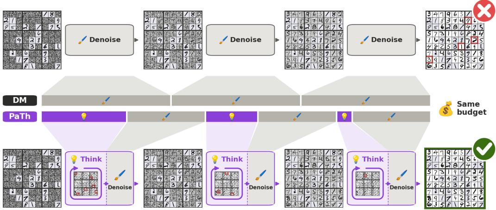  
Figure 1: Diffusion models are not limited by scale but by where they spend compute. Top: a standard diffusion model (DM) spends its entire inference budget on denoising ( ) and commits to errors early, leaving an invalid sudoku (✗). Bottom: PaTh (Painter–Thinker) pairs a smaller denoiser, the Painter, with a recursive Thinker ( , loop) that refines a draft of the solution before each denoising step, with most thinking at high noise, and solves the puzzle (✓). Both models have the same total inference budget. On MNIST Sudoku EXTREME, PaTh solves 71.2% of puzzles versus 2.9% for the vanilla DM (Sec. 4).

We therefore separate the two functions. In what we call a Painter-Thinker architecture (PaTh), a diffusion model (the Painter) learns the data distribution and is then held fixed, while a small recursive reasoner (the Thinker) reasons over a grid of learned tokens that encode the noisy sample and the conditioning, refines a latent state within each denoising step, and steers the Painter through ControlNet adapters. As these refinement steps are decoupled from image generation, the Thinker can explore and revise candidate solutions before anything is committed to the sample. Both modules are trained with a reconstruction loss alone, without a solver, a verifier, or symbolic targets.

In a series of experiments across diverse benchmarks, we show that adding a Thinker buys more than adding parameters. PaTh improves on the previous best of Kang et al. (2026) by over 67 p.p. on MNIST Sudoku EXTREME and surpasses diffusion models with 700× its capacity on AMAZE (Zhou et al., 2026). The trend continues as tasks grow harder: on complex 3D reasoning, the Painter must grow to cover a richer data distribution while the Thinker that steers it stays comparatively small, with a 20M-parameter Thinker directing a 100M-parameter Painter.

We perform a series of mechanistic diagnostics to establish that adding the Thinker improves reasoning. Corrupting a partially generated sample shows that the diffusion model repairs violations already visible in the sample, but fails to indicate what to trust when too much of the sample is wrong, whereas PaTh recovers across both regimes. Probing the Thinker’s latent state shows candidates that violate more constraints than their predecessors before a solution is committed to the image. Our contributions are as follows.

• We show that coupling a TRM-style recursive reasoner to a frozen diffusion model via ControlNet adapters effectively adds capacity for visual reasoning.

• We demonstrate consistent improvements over standard diffusion models, diffusion methods that adapt the sampling process, and large image-editing models on four families of rule-governed data, with margins that widen as instances grow harder.

• We diagnose the mechanism behind these gains: PaTh’s latent state supports iterative refinement before committing to the output, which allows it to recover from mistakes.

## 2 RELATED WORK

Rule-governed generation with diffusion. Several methods make diffusion models satisfy rule in pixel space by changing how the trajectory is sampled. Models trained in pixel space can approximate solutions to hard geometric problems (Goren et al., 2026), and such interventions become necessary on rule-governed data. One option is to restructure the trajectory itself: SRM (Wewer et al., 2025) decomposes an image into variables with individual noise schedules and denoises them in an order predicted from the model’s own uncertainty. Other methods supply the reasoning from outside the model by optimising a learned energy landscape at inference (Du et al., 2024), importing it from a pretrained VLM (Mi et al., 2025), or delegating a plan to a multimodal LLM before generation (Yang et al., 2024). Benchmarks for such problems have been assembled by Wewer et al. (2025); Zhou et al. (2026). While SRM shares our diagnosis that compute is misallocated along the trajectory, it redistributes steps that still bear commitments. Relatedly, Wang et al. (2026) argue that reasoning in video models emerges along the denoising steps rather than across frames, with early steps exploring multiple candidates. Our results in 4.2 are consistent with this observation.

Inference-time compute and guidance. A second way to improve a sample is to spend more compute searching for it at sampling time: search over initial noise against a verifier (Ma et al., 2025), sequential Monte Carlo steering (Singhal et al., 2025), evolutionary search (He et al., 2025), tree search over denoising trajectories (Yoon et al., 2025), and resampling schemes that revisit their parts (Lugmayr et al., 2022; Xu et al., 2023). Closest to our setting, IPR (Kang et al., 2026) re-noises and regenerates subsets of a completed sample without a verifier. A parallel line steers sampling towards a constraint through gradients of a classifier, a differentiable objective, or a composed energy (Dhariwal & Nichol, 2021; Ho & Salimans, 2022; Chung et al., 2023; Yu et al., 2023; Bansal et al., 2023; Liu et al., 2022). Both families revise in data space, requiring either an external verifier or a differentiable constraint. PaTh has neither, and revises before anything enters the sample.

Discrete diffusion for reasoning. Diffusion does reason well when the data is symbolic. Discrete DMs (Austin et al., 2021; Sahoo et al., 2024) and the masked language models built on them (Nie et al., 2025; Ye et al., 2024; 2025) apply denoising to tokens, where reasoning has been studied directly. The discrete setting affords what continuous one does not: a masked token is explicitly undecided, so a partial state does not have to be a complete sample. In continuous diffusion, every $\mathbf { x } _ { t }$ is a full sample with no way to mark part of it as pending, which is the gap we fill.

Intermediate computation and recursive reasoners. Decoupling the state used for intermediate computation and the the output comes from language models and recursive reasoners. In particular, chain-of-thought extends the serial depth available to a fixed-depth model, and this is what allows it to solve inherently serial problems (Merrill & Sabharwal, 2024; Li et al., 2024); the intermediate tokens need not even be meaningful for the benefit to appear (Pfau et al., 2024), and the same computation can be carried out in a continuous latent space instead (Hao et al., 2024). Recursive reasoners realise this through weight-tied depth (Dehghani et al., 2018; Bai et al., 2019), with HRM (Wang et al., 2025) and TRM (Jolicoeur-Martineau, 2025) reaching strong results on puzzles at a few million parameters. Concurrent work couples such recurrence with flows over tokenised puzzles, through self-conditioning (Helbling et al., 2026) or a latent state carried along the flow (Suleymanzade et al., 2026), and finds that a flow without recurrence falls well short, consistent with our diagnosis. PaTh differs from all of these in targeting exactly checkable rules in pixel space.

## 3 METHOD

## 3.1 PRELIMINARIES

A diffusion model generates a sample by traversing a sequence of states $\mathbf { x } _ { T } , \ldots , \mathbf { x } _ { 0 }$ , at each step predicting and removing noise so that $\mathbf { x } _ { t - 1 }$ is a less noisy version of the same sample (Ho et al., 2020). Every state on this trajectory is a partially denoised sample. We use the $\mathbf { x } _ { \mathrm { 0 } }$ -parameterisation throughout: the network predicts the clean sample directly, $\hat { \mathbf { x } } _ { 0 } = f _ { \theta } ( \mathbf { x } _ { t } , t , \mathbf { c } )$ , conditioned on an embedded input $\mathbf { c } ,$ and is trained with a reconstruction loss alone,

$$
\begin{array} { r } { \mathcal { L } ( \theta ) = \mathbb { E } _ { \mathbf { x } _ { 0 } , t , \epsilon } \big \| \mathbf { x } _ { 0 } - f _ { \theta } ( \mathbf { x } _ { t } , t , \mathbf { c } ) \big \| ^ { 2 } . } \end{array}\tag{1}
$$

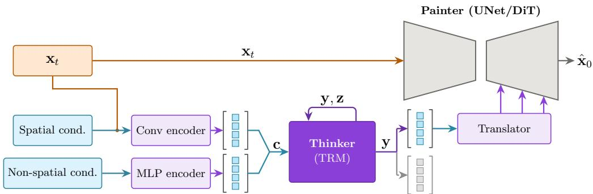  
Figure 2: PaTh architecture. Spatial conditioning is concatenated with $\mathbf { x } _ { t }$ and encoded convolutionally; non-spatial conditioning is embedded by an MLP. Together they form the Thinker’s input $\mathbf { c } ,$ over which the Thinker recurses on $( \mathbf { y } , \mathbf { z } )$ within a single denoising step. Only the spatial tokens of y are decoded and passed to the Painter through ControlNet adapters; the non-spatial tokens (gray squares) shape the recursion but are not read out. The Painter is trained separately and held fixed.

A recursive reasoner maintains a current answer y and a latent reasoning state $\mathbf { z } ,$ and refines both against a fixed embedded input c. Computation is organised in three nested levels. Outermost are $N _ { \mathrm { s u p } }$ deep supervision steps; each carries a detached $( \mathbf { y } , \mathbf { z } )$ into the next. Within a supervision step the answer is updated H times, of which the first $H - 1$ run without gradients. Each answer update is preceded by L updates of the latent, using the same network for both; the two roles are distinguished only by whether c is supplied. The effective depth of a single forward pass is therefore $N _ { \mathrm { s u p } } \cdot \mathbf { \check { H } } \cdot ( L + \mathbf { \check { 1 } } )$ applications of net, at the parameter cost of one. Only y is read out through an output head. The latent z is never decoded and does not correspond to a solution at all (Jolicoeur Martineau, 2025, Fig. 6), so it is free to hold whatever supports the next update of $\mathbf { y }$

## 3.2 PAINTER AND THINKER

PaTh (visualized in Fig. 2) places a recursive reasoner inside a single denoising step. Given $\mathbf { x } _ { t }$ and the conditioning, the Thinker refines a latent candidate over $N _ { \mathrm { s u p } }$ supervision steps and returns a signal which conditions the Painter’s prediction of $\mathbf { x } _ { t - 1 }$

Encoding. Spatial conditioning, such as the incomplete puzzle, is concatenated channel-wise with ${ \bf x } _ { t } ,$ passed through a small convolutional network and mean-pooled to a fixed number of tokens. Non-spatial conditioning, such as the object and relation vectors of CLEVR, is embedded by an MLP and appended. The result is the Thinker’s input c, with y and z initialised as in TRM.

Decoding and coupling. After the final supervision step, the spatial tokens of y are upsampled by a small transposed convolutional network and passed through a convolutional head; any non-spatial tokens inform the Thinker but are discarded here. The head’s outputs enter the Painter through ControlNet adapters (Zhang et al., 2023), which add them to each skip connection of the UNet, after which the Painter performs its usual denoising step. We also train a halting head to predict the expected improvement from an additional supervision step, following the adaptive-computation formulation of TRM. We use it to reduce the training time.

Two trajectories. PaTh thus carries two sequences of states, and they differ in kind. The states xt are partial samples, each committed to the output. The states z are not: they are refined within a step, read out only through y, and reset before the next step begins. Nothing requires an intermediate z to correspond to a plausible image, or even to a better candidate than its predecessor, which is what allows the Thinker to abandon a partial solution. Counting layers, the reasoning performed within one denoising step has an effective depth of $n _ { \mathrm { l a y e r s } } ( L + 1 ) H N _ { \mathrm { s u p } } ,$ , or 672 in our configuration, against the single-network evaluation a diffusion model performs at that step.

Efficient inference. Such depth is not needed at every step. As sampling proceeds, $\mathbf { x } _ { t }$ becomes cleaner and more of the solution is already visible, leaving less to be reasoned about (Pan et al., 2025; Wewer et al., 2025).We exploit this observation to reduce the compute needed during training (see Figures 19, 20. Nor does the Thinker’s state need to be rebuilt at each step: it retains what has already been worked out, and the conditioning remains fixed throughout sampling. We therefore define an efficient variant of PaTh that carries the Thinker’s state across consecutive denoising steps, concentrates recursion in the early part of the trajectory, and then stops calling the Thinker halfway through, reusing its last output for the remaining steps. We evaluate this variant in Sec. 4.3.

Design choices. For the Painter, we use a UNet denoiser, but we show that PaTh adapts to DiT in App. F. The Thinker is a recursive reasoner with self-attention layers. We couple the two models via ControlNet adapters, but test concatenation of Thinker’s output to $\mathbf { x } _ { t }$ as an alternative in App. I. We train the Painter and Thinker separately, as joint training takes longer and produces less diverse samples (see App. H). We train PaTh with x -parameterisation as opposed to eps, following (San gare et al., 2026), which finds that it is preferable when using ControlNets. In App. E, we show that PaTh is stable across different numbers of tokens the Thinker processes. Parameter counts and training budgets are in Tab. 5, while hyperparameters in App. C.

## 4 EXPERIMENTS

Datasets. We use three datasets (details and examples in App. A). MNIST Sudoku (Wewer et al., 2025): filling in an incomplete Sudoku rendered with MNIST digits. In HARD, 0–26 random clues usually allow many solutions; in EXTREME (Jolicoeur-Martineau, 2025), about 18 clues fix a unique solution that requires multi-step deduction. AMAZE (Zhou et al., 2026): drawing maze paths and solving Queens boards of increasing size. CLEVR (Johnson et al., 2017): scenes of 3–10 objects generated from a sparse set of pairwise spatial relations. The model must compose these relations transitively to place every object.

## 4.1 MAIN RESULTS

MNIST Sudoku. Tab. 1 reports results on both variants of   
the MNIST Sudoku dataset (hard and extreme). PaTh attains   
92.5% puzzle accuracy on HARD and 71.2% on EXTREME,   
exceeding every baseline by a wide margin. The gap is largest   
on EXTREME, where each puzzle admits a single solution and   
one misplaced digit renders the grid invalid. Notably, almost   
all of the capacity in PaTh is devoted to reasoning rather than to   
rendering. The Painter has 1.5M parameters and the Thinker   
8M, against 81M for the DM baseline (Tab. 5). Rendering   
MNIST digits is easy, and the difficulty resides in the rules,   
so separating the two permits capacity to be allocated where it   
is needed. SRM and IPR presuppose a decomposition of the   
image into variables aligned with the 81 Sudoku cells, which   
encode the structure of the puzzle. The Thinker requires no   
such alignment and performs comparably across patch resolut ions that bear no relation to the cell grid (App. E). grid (App. E).

<table><tr><td>Model</td><td>Hard</td><td>Extreme</td></tr><tr><td>DM</td><td>0.083</td><td>0.029</td></tr><tr><td>TRM</td><td></td><td>0.083</td></tr><tr><td>SRM</td><td>0.516</td><td>0.032</td></tr><tr><td>IPR</td><td>0.750</td><td>0.041</td></tr><tr><td>PaTh</td><td>0.925</td><td>0.712</td></tr></table>

Table 1: Puzzle accuracy on MNIST Sudoku. While HARD puzzles usually admit many solutions EXTREME has exactly one. PaTh significantly outperforms other methods on both setups.

AMAZE benchmark. Tab. 2 compares PaTh with proprietary and open-source image editing models and a DM trained identically on the same data. PaTh solves 75.1% of mazes exactly (EXACT@1), against 43.4% for the strongest editing model, a fine-tuned 14B Bagel, and 19.0% for the DM. On Queens, it solves every board, against 90.9% for the DM and 13.7% for fine-tuned Bagel. Fine-tuned Bagel attains slightly higher PASS and COVERAGE on mazes. While it typically draws the correct path in full, it leaves faint traces of other paths, which keep most of its generations from being exactly correct (App. P). This is consistent with our account: a model whose only state is the image must record every path it tries in the image, whereas PaTh explores in its latent state and leaves the output clean.

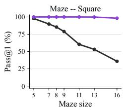

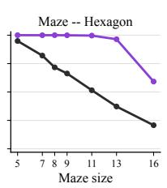

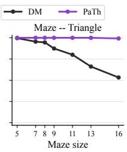

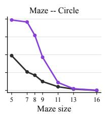

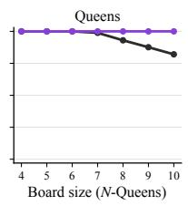  
Figure 3: On Amaze benchmark, PaTh has an increasing advantage over standard DM as the complexity of the puzzles increases - x-axis: puzzle size, y-axis: pass@1; for both datasets

<table><tr><td rowspan="2">Model</td><td rowspan="2">Params</td><td colspan="6">Continuous (Maze) Task</td><td colspan="6">Discrete (Queen) Task</td></tr><tr><td>Violation↓ Coverage↑ Pass@1↑ Pass@5↑ Exact@1↑ Exact@5↑</td><td></td><td></td><td></td><td></td><td></td><td>Violation↓ Coverage↑ Pass@1↑ Pass@5↑ Exact@1↑ Exact@5↑</td><td></td><td></td><td></td><td></td><td></td></tr><tr><td colspan="10">proprietary models</td><td colspan="3"></td></tr><tr><td>GPT-image-1</td><td>N/A</td><td>62.88</td><td>58.97</td><td>5.40 6.06</td><td>一</td><td>一</td><td>62.91</td><td>37.09</td><td>0.00</td><td>2.28</td><td></td><td></td><td></td></tr><tr><td>NanoBanana-Pro Seedream-4.5</td><td>N/A N/A</td><td>47.76</td><td>64.21 25.67</td><td>4.82</td><td>9.28</td><td>一</td><td></td><td>32.56</td><td>67.43</td><td>30.35</td><td>35.58</td><td></td><td></td></tr><tr><td></td><td></td><td>16.90</td><td></td><td>2.14</td><td colspan="2">3.21</td><td></td><td>76.86</td><td>23.14</td><td>2.86</td><td>2.86</td><td>一</td><td>1</td></tr><tr><td colspan="10">open-source models (w/o chain-of-thought reasoning)</td><td colspan="3"></td></tr><tr><td>Flux-Kontext-Dev</td><td>12B</td><td>23.84</td><td>30.24</td><td>0.36</td><td>3.57</td><td>0.00 0.00</td><td></td><td>78.63</td><td>21.37</td><td>0.92</td><td>2.34</td><td>0.00</td><td>0.00</td></tr><tr><td>Qwen-Image-Edit Bagel</td><td>20B</td><td>19.37</td><td>28.51</td><td>1.43</td><td>2.14 0.18</td><td>0.36</td><td></td><td>69.52</td><td>30.47</td><td>2.86</td><td>4.00</td><td>0.16</td><td>0.24 0.00</td></tr><tr><td>Janus-Pro</td><td>14B</td><td>28.91</td><td>27.15</td><td>0.00</td><td>1.00</td><td>0.00 0.00 0.00</td><td></td><td>61.57</td><td>38.43 15.76</td><td>0.00</td><td>0.00</td><td>0.00</td><td>0.00</td></tr><tr><td>Bagel (FT)</td><td>7B 14B</td><td>5.41</td><td>1.85 99.99</td><td>0.00 87.17</td><td>0.00 87.21</td><td>0.00 52.75</td><td></td><td>84.24</td><td>99.68</td><td>0.00 78.71</td><td>0.57 78.67</td><td>0.00 13.71</td><td>37.71</td></tr><tr><td>Janus-Pro (FT)</td><td>7B</td><td>12.82 41.02</td><td>48.67</td><td>18.03</td><td>17.85</td><td>43.39</td><td></td><td>21.18 74.73</td><td>13.23</td><td>0.72</td><td>1.04</td><td>0.00</td><td>0.29</td></tr><tr><td></td><td></td><td></td><td></td><td></td><td></td><td>0.04 0.36</td><td></td><td></td><td></td><td></td><td></td><td></td><td></td></tr><tr><td colspan="10">ours (diffusion models)</td><td colspan="3"></td></tr><tr><td>DM PaTh (ours)</td><td>62.7M</td><td>23.15</td><td>77.32</td><td>57.78</td><td>57.73</td><td>18.96</td><td>22.75</td><td>2.84</td><td>97.02</td><td>94.50</td><td>94.71</td><td>90.86</td><td>96.00</td></tr><tr><td></td><td>10.3M</td><td>8.64</td><td>92.30</td><td>85.30</td><td>85.28</td><td>75.14</td><td>79.25</td><td>0.00</td><td>100.00</td><td>100.00</td><td>100.00</td><td>100.00</td><td>100.00</td></tr></table>

Table 2: Results on the AMAZE benchmark’s Maze and Queens tasks. PaTh is able to outperform both standard DMs trained on the same data and the image editing models evaluated on the benchmark, including their fine-tuned (FT) versions and proprietary systems.

Fig. 3 resolves the comparison against that diffusion baseline by instance size. On hexagon mazes, both models solve the smallest instances, but the baseline falls below 50% after size 11, whereas PaTh remains above 50% even at the biggest size. The pattern repeats on square and triangle mazes, and on Queens, PaTh is unaffected across the full range of board sizes while the baseline degrades steadily. Larger instances require longer chains of dependent inferences, which the denoising trajectory has no means of accumulating, so the widening gap is the behaviour our account predicts. A related failure is reported for editing models on AMAZE, which produce valid path fragments near the start and goal but cannot join them at larger scales (Zhou et al., 2026). Circular mazes are the exception, as both models degrade sharply and PaTh retains an advantage only up to size 11.

Constrained scene composition. We finally extend PaTh beyond puzzles. To that end, we use CLEVR as a proof of concept in a domain where rendering is genuinely demanding, so the Painter is a LDM of 101.9M parameters paired with a 19.7M Thinker (Tab. 5). As presented in Tab. 3, both standard DM and PaTh are able to generate high-quality samples as denoted by high Precision and Recall, with comparable correspondence to their attributes. However, our approach outperforms the baseline in spatial accuracy, which rises from 62.3% to 89.4%. This advantage persists even with the larger

Table 3: Constrained scene composition on CLEVR (%). PaTh substantially improves relational consistency while maintaining object and attribute metrics.
<table><tr><td>Method</td><td>Recall</td><td>Prec.</td><td>Attr.</td><td>Spatial</td></tr><tr><td>DM (101M)</td><td>96.5</td><td>97.5</td><td>54.6</td><td>62.3</td></tr><tr><td>DM (124M)</td><td>96.5</td><td>97.5</td><td>56.1</td><td>64.3</td></tr><tr><td>DM (236M)</td><td>96.9</td><td>97.5</td><td>56.3</td><td>68.8</td></tr><tr><td>PaTh</td><td>95.9</td><td>97.5</td><td>53.8</td><td>89.4</td></tr></table>

238M DM, which reaches 68.8%, showing that the gain is not simply a consequence of a bigger parameter count. The Thinker improves what the model gets right about the relations between objects and leaves the objects themselves untouched, which is the division the method anticipates: only the relational constraint demands intermediate computation. The advantage also grows with scene complexity (Fig. 4), from a near tie on three-object scenes to 85.2% against 62.0% at ten objects, mirroring the behaviour observed on AMAZE.

## 4.2 DIAGNOSING THE MECHANISM

The results presented in the previous section establish that PaTh outperforms DMs in complex rulebased scenarios. We now isolate the source of this difference.

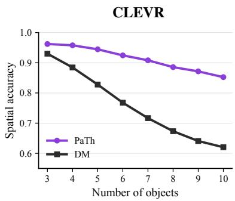  
Figure 4: Spatial accuracy on CLEVR by scene size. The DM (238M) falls rapidly, while PaTh retains high accuracy.

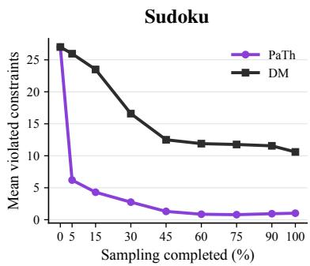  
Figure 5: Sudoku constraints violated by the predicted clean sample $\hat { \mathbf { x } } _ { 0 }$ during sampling. Both start near 27; DM plateaus at 10.6, while PaTh falls below 1.5.

Constraint violations during sampling. We first ask whether the standard diffusion model learns the underlying rules at all, using the sudoku dataset. To measure this, we classify each digit cell of the predicted clean sample $\hat { \mathbf { x } } _ { 0 }$ at every denoising step and count the constraints it violates, averaged over 384 samples (Fig. 5). Both trajectories begin near 27 violations, and both decrease, so neither model is indifferent to the rule. They diverge in how far they get: the diffusion model plateaus at around 10.6 violations, never approaching a valid grid, whereas PaTh reaches fewer than 1.5. PaTh moreover achieves most of this reduction within the first 5% of sampling, falling to 6.3 violations before the image has taken definite form, a concentration we return to in Sec. 4.3.

Recovering from injected mistakes. To compare how the two models handle errors, we corrupt a valid solution, re-noise it to a chosen point of the trajectory, and let each model denoise it. On Sudoku we change digits of an EXTREME solution, and count a sample as recovered if it returns to that solution, which is unique. On CLEVR we swap the positions of pairs of objects, and count a sample as recovered if every object is placed correctly.

In Fig. 8, we present the results of this comparison. Past roughly half the trajectory, both models deteriorate towards zero. Before that point, the diffusion model is effective only within a narrow band – at 50% of sampling on Sudoku and at the very start on CLEVR – recovering over 70% of single Sudoku mistakes at its peak and 27% swaps at 5 object scenes, but failing significantly at other stages of sampling. It also degrades sharply as mistakes accumulate (Sudoku) or scene complexity increases (CLEVR). In contrast, PaTh shows neither pattern, maintaining high recovery rates even when a vast majority of cells are wrong early in the process. It declines mainly with the timestep of corruption, and is even eventually overtaken by the diffusion model at the 70% mark on the Sudoku dataset.

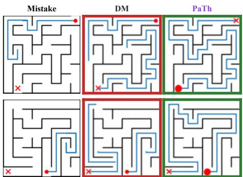  
Figure 6: Qualitative comparison on mazes. When the path is directed into a dead-end, only PaTh is able to correctly revise it.

Both models are limited by how much of the trajectory remains, since errors introduced late cannot be substantially changed. We hypothesise that the diffusion model is limited further. Having no state apart from the sample, it can correct a mistake only if the mistake is directly available: the sample must show both what is wrong and what should replace it. Early in sampling, the context needed for this is not yet formed; late in sampling, the relevant content is already committed. This also explains why recovery degrades with heavier Sudoku corruption: when too many digits are wrong, the sample provides less reliable context for distinguishing correct from incorrect entries. Likewise, more complex CLEVR scenes require longer chains of spatial relations to determine where an object belongs, making the required correction less directly available in the sample.

To test this account, we vary the direct availability of mistakes while holding the timestep fixed on Sudoku and mazes. For Sudoku, directly available mistakes duplicate a digit already present in their row, column, or block, making the conflict explicit from the conditioning alone; indirectly available mistakes produce no such duplication but remain wrong because the EXTREME puzzle has a unique solution. For mazes, directly available mistakes remove part of the correct trajectory, whereas indirect mistakes divert the trajectory into a dead end, requiring the model to identify the wrong turn. Thus, only indirect mistakes must be worked out rather than directly identified, predicting a large gap between the two for DM but a much smaller gap for PaTh. Figure 7 confirms this prediction. Early in sampling, DM retains indirect mistakes 15-20+ points more often than direct ones, whereas PaTh shows only a 3.2-point difference on Sudoku and zero or even negative difference on mazes. On Sudoku, the gap for DM closes only around the 50% sampling mark, when the violation becomes visually apparent. We take this as evidence that the diffusion model struggles most with mistakes that must be inferred rather than seen, whereas PaTh handles both kinds similarly.

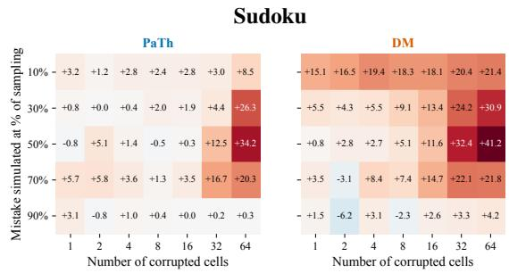

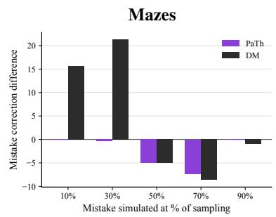

Figure 7: Difference in retention rate between indirectly and directly available mistakes on EX-TREME MNIST Sudoku (left) and Mazes (right). The diffusion model retains the indirect mistake far more often early in sampling, while PaTh treats the two types of errors comparably.  
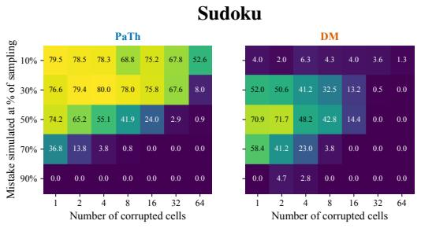

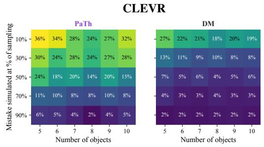  
Figure 8: Recovery rate after corrupting a valid solution and re-noising it to a given point of the trajectory, on EXTREME MNIST Sudoku (left) and constrained scenes (right). The diffusion model recovers only within a narrow band, at the start of sampling on CLEVR and at 50% on Sudoku, and degrades sharply as mistakes accumulate. PaTh recovers throughout the region where change remains possible, declining only as less trajectory is left.

Probing the Thinker’s latent state. Finally, we propose to mechanistically validate what governs the decisions made by Thinker. To answer this question, we train a probe to decode the Thinker’s current prediction from its internal state, allowing the state to be read as a candidate solution at every recursion (see App. K for details). Over 384 samples, we decode every state and count the constraints its prediction violates, giving a trajectory of violation counts within each denoising step. We say the model rethinks at a step when this trajectory rises above its starting value, and report the rethink rate, the fraction of samples in which this occurs, together with the rethink magnitude, the mean size of the largest such rise. The probe reveals a clear pattern of revision during the early stages of sampling (Fig. 9). In up to a fifth of samples, then, the Thinker passes through candidates substantially worse than the one it began the step with, and does so precisely where most of the rule is resolved. This suggests that the latent trajectory is not merely refining an already-correct hypothesis: it sometimes explores less promising candidates before recovering and improving upon them. Fig. 11 illustrates this behaviour on an individual puzzle, where successive recursions introduce additional violations before converging to a valid solution.

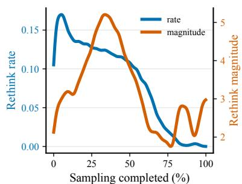  
Figure 9: Rethink rate (fraction of samples) and magnitude (violations) during sampling.

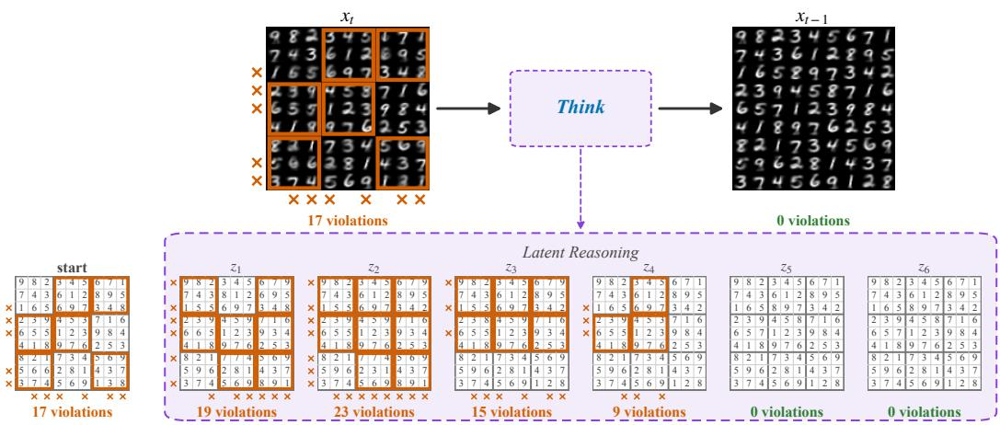  
Figure 11: Latent reasoning within one denoising step, each recursion’s state $\mathbf { z } _ { i }$ decoded by a linear probe with violated constraints in orange. The Thinker introduces violations absent from $\mathbf { x } _ { t }$ and then resolves them, reaching a valid grid before anything is committed to $\mathbf { x } _ { t - 1 }$

## 4.3 INFERENCE COMPUTE

To evaluate if the reported improvement might simply reflect a larger budget, we compare three ways of spending it: additional recursions in the Thinker, additional denoising steps, and additional parameters in the diffusion model. Fig. 10 plots puzzle accuracy against inference FLOPs for each. Diffusion models of 20M, 80M and 200M parameters stay below 5% accuracy over the entire range, whether the additional FLOPs go to more denoising steps or more parameters. PaTh rises from near zero to over 60% over the same range, starting at around $1 0 ^ { 1 2 }$ FLOPs. Crucially, the leftmost point of the PaTh curve is the trained model evaluated with a single recursion $( N _ { \mathrm { s u p } } = H = L = 1 )$ , showing that the added module does not help by itself, and the gain comes from the recursion it performs.

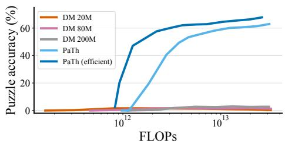  
Figure 10: Puzzle accuracy on Sudoku EX-TREME against inference FLOPs. DM stay below 5% at every budget, whether the compute is spent on denoising steps or parameters, while PaTh exceeds 60%.

Carrying the Thinker’s state across denoising steps rather than rebuilding it, concentrating the recursion budget early, and omitting reasoning altogether once half the trajectory has elapsed each helps, and each is consistent with the diagnosis above: the state accumulates knowledge worth preserving, and most of the rule is resolved in the first few steps. Together they give the efficient variant of Fig. 10, which reaches 47% accuracy at $1 0 ^ { 1 2 }$ FLOPs, where the standard configuration reaches approximately zero. We report these ablations in App. N.

## 5 CONCLUSION

Diffusion models that satisfy rules readily over symbols struggle when the same rules must hold in pixels, where every intermediate state is a partial image rather than a place to work out a solution. We show that a TRM-style recursive reasoner, run within each denoising step and coupled to a frozen diffusion model, is an effective way to add this reasoning capacity. Trained with a reconstruction loss alone, PaTh improves over diffusion baselines across four families of rule-governed data, most on the hardest instances, at a fraction of the parameters. Our diagnostics suggest that the gain comes from the latent state and the recursion of the added module.

## REFERENCES

Jacob Austin, Daniel D Johnson, Jonathan Ho, Daniel Tarlow, and Rianne Van Den Berg. Structured denoising diffusion models in discrete state-spaces. Advances in neural information processing systems, 34:17981–17993, 2021.

Shaojie Bai, J Zico Kolter, and Vladlen Koltun. Deep equilibrium models. Advances in neural information processing systems, 32, 2019.

Arpit Bansal, Hong-Min Chu, Avi Schwarzschild, Soumyadip Sengupta, Micah Goldblum, Jonas Geiping, and Tom Goldstein. Universal Guidance for Diffusion Models . In 2023 IEEE/CVF Conference on Computer Vision and Pattern Recognition Workshops (CVPRW), pp. 843–852, Los Alamitos, CA, USA, June 2023. IEEE Computer Society. doi: 10.1109/CVPRW59228.2023. 00091. URL https://doi.ieeecomputersociety.org/10.1109/CVPRW59228. 2023.00091.

Kargi Chauhan and Leilani H Gilpin. Vfsi: Validity first spatial intelligence for constraint-guided traffic diffusion. arXiv preprint arXiv:2509.23971, 2025.

Hyungjin Chung, Jeongsol Kim, Michael Thompson Mccann, Marc Louis Klasky, and Jong Chul Ye. Diffusion posterior sampling for general noisy inverse problems. In The Eleventh International Conference on Learning Representations, 2023. URL https://openreview.net/ forum?id=OnD9zGAGT0k.

Mostafa Dehghani, Stephan Gouws, Oriol Vinyals, Jakob Uszkoreit, and Łukasz Kaiser. Universal transformers. arXiv preprint arXiv:1807.03819, 2018.

Prafulla Dhariwal and Alexander Nichol. Diffusion models beat gans on image synthesis. Advances in neural information processing systems, 34:8780–8794, 2021.

Yilun Du, Jiayuan Mao, and Joshua B. Tenenbaum. Learning iterative reasoning through energy diffusion. In International Conference on Machine Learning (ICML), 2024.

Nir Goren, Shai Yehezkel, Omer Dahary, Andrey Voynov, Or Patashnik, and Daniel Cohen-Or. Visual diffusion models are geometric solvers. In Proceedings of the IEEE/CVF Conference on Computer Vision and Pattern Recognition, pp. 43187–43196, 2026.

Shibo Hao, Sainbayar Sukhbaatar, DiJia Su, Xian Li, Zhiting Hu, Jason Weston, and Yuandong Tian. Training large language models to reason in a continuous latent space. arXiv preprint arXiv:2412.06769, 2024.

Haoran He, Jiajun Liang, Xintao Wang, Pengfei Wan, Di Zhang, Kun Gai, and Ling Pan. Scaling image and video generation via test-time evolutionary search. arXiv preprint arXiv:2505.17618, 2025.

Alec Helbling, Andrey Bryutkin, Mauro Martino, Duen Horng Chau, Nima Dehmamy, and Hendrik Strobelt. Flow reasoning models: Turning flows into efficient recurrent reasoners, 2026. URL https://arxiv.org/abs/2606.29150.

Jonathan Ho and Tim Salimans. Classifier-free diffusion guidance. arXiv preprint arXiv:2207.12598, 2022.

Jonathan Ho, Ajay Jain, and Pieter Abbeel. Denoising diffusion probabilistic models. Advances in neural information processing systems, 33:6840–6851, 2020.

Emiel Hoogeboom, Vıctor Garcia Satorras, Clement Vignac, and Max Welling. Equivariant diffu-´ sion for molecule generation in 3d. In International conference on machine learning, pp. 8867– 8887. PMLR, 2022.

Justin Johnson, Bharath Hariharan, Laurens Van Der Maaten, Li Fei-Fei, C Lawrence Zitnick, and Ross Girshick. Clevr: A diagnostic dataset for compositional language and elementary visual reasoning. In Proceedings of the IEEE conference on computer vision and pattern recognition, pp. 2901–2910, 2017.

Alexia Jolicoeur-Martineau. Less is more: Recursive reasoning with tiny networks. arXiv preprint arXiv:2510.04871, 2025.

Taegu Kang, Jaesik Yoon, and Sungjin Ahn. Inference-time scaling in diffusion models through iterative partial refinement. arXiv preprint arXiv:2605.19317, 2026.

Tianyi Li, Michele Buzzicotti, Fabio Bonaccorso, and Luca Biferale. Physics-constrained diffusion model for synthesis of 3d turbulent data. arXiv preprint arXiv:2603.12834, 2026.

Zhiyuan Li, Hong Liu, Denny Zhou, and Tengyu Ma. Chain of thought empowers transformers to solve inherently serial problems. In International Conference on Learning Representations, volume 2024, pp. 11911–11943, 2024.

Nan Liu, Shuang Li, Yilun Du, Antonio Torralba, and Joshua B Tenenbaum. Compositional visual generation with composable diffusion models. In European conference on computer vision, pp. 423–439. Springer, 2022.

Shilong Liu, Zhaoyang Zeng, Tianhe Ren, Feng Li, Hao Zhang, Jie Yang, Qing Jiang, Chunyuan Li, Jianwei Yang, Hang Su, et al. Grounding dino: Marrying dino with grounded pre-training for open-set object detection. In European conference on computer vision, pp. 38–55. Springer, 2024.

Andreas Lugmayr, Martin Danelljan, Andres Romero, Fisher Yu, Radu Timofte, and Luc Van Gool. Repaint: Inpainting using denoising diffusion probabilistic models. In 2022 IEEE/CVF conference on computer vision and pattern recognition (CVPR), pp. 11451–11461. IEEE, 2022.

Nanye Ma, Shangyuan Tong, Haolin Jia, Hexiang Hu, Yu-Chuan Su, Mingda Zhang, Xuan Yang, Yandong Li, Tommi Jaakkola, Xuhui Jia, and Saining Xie. Scaling inference time compute for diffusion models. In Proceedings of the IEEE/CVF Conference on Computer Vision and Pattern Recognition (CVPR), pp. 2523–2534, June 2025.

William Merrill and Ashish Sabharwal. The expressive power of transformers with chain of thought. In International Conference on Learning Representations, volume 2024, pp. 7690–7706, 2024.

Zhenxing Mi, Kuan-Chieh Wang, Guocheng Qian, Hanrong Ye, Runtao Liu, Sergey Tulyakov, Kfir Aberman, and Dan Xu. I think, therefore i diffuse: Enabling multimodal in-context reasoning in diffusion models. In Aarti Singh, Maryam Fazel, Daniel Hsu, Simon Lacoste-Julien, Felix Berkenkamp, Tegan Maharaj, Kiri Wagstaff, and Jerry Zhu (eds.), Proceedings of the 42nd International Conference on Machine Learning, volume 267 of Proceedings of Machine Learning Research, pp. 44017–44036. PMLR, 13–19 Jul 2025. URL https://proceedings.mlr. press/v267/mi25a.html.

Shen Nie, Fengqi Zhu, Zebin You, Xiaolu Zhang, Jingyang Ou, Jun Hu, Jun Zhou, Yankai Lin, Ji-Rong Wen, and Chongxuan LI. Large language diffusion models. In D. Belgrave, C. Zhang, H. Lin, R. Pascanu, P. Koniusz, M. Ghassemi, and N. Chen (eds.), Advances in Neural Information Processing Systems, volume 38, Main Conference, pp. 50608–50646. Curran Associates, Inc., 2025. doi: 10.52202/ 085713-1689. URL https://proceedings.neurips.cc/paper\_files/paper/ 2025/file/48b383b24230e0e6e649d9c98dae4d8c-Paper-Conference.pdf.

Zizheng Pan, Bohan Zhuang, De-An Huang, Weili Nie, Zhiding Yu, Chaowei Xiao, Jianfei Cai, et al. T-stitch: Accelerating sampling in pre-trained diffusion models with trajectory stitching. In International Conference on Learning Representations, volume 2025, pp. 6103–6137, 2025.

Jacob Pfau, William Merrill, and Samuel R Bowman. Let’s think dot by dot: Hidden computation in transformer language models. arXiv preprint arXiv:2404.15758, 2024.

Subham S Sahoo, Marianne Arriola, Yair Schiff, Aaron Gokaslan, Edgar Marroquin, Justin T Chiu, Alexander Rush, and Volodymyr Kuleshov. Simple and effective masked diffusion language models. Advances in Neural Information Processing Systems, 37:130136–130184, 2024.

Amadou S Sangare, Adrien Maglo, Mohamed Chaouch, and Bertrand Luvison. Improving controllable generation: Faster training and better performance via x 0-supervision. arXiv preprint arXiv:2604.05761, 2026.

Raghav Singhal, Zachary Horvitz, Ryan Teehan, Mengye Ren, Zhou Yu, Kathleen Mckeown, and Rajesh Ranganath. A general framework for inference-time scaling and steering of diffusion models. In Aarti Singh, Maryam Fazel, Daniel Hsu, Simon Lacoste-Julien, Felix Berkenkamp, Tegan Maharaj, Kiri Wagstaff, and Jerry Zhu (eds.), Proceedings of the 42nd International Conference on Machine Learning, volume 267 of Proceedings of Machine Learning Research, pp. 55810–55827. PMLR, 13–19 Jul 2025. URL https://proceedings.mlr.press/ v267/singhal25b.html.

Ayhan Suleymanzade, Chanhyuk Lee, Floor Eijkelboom, Nicholas M. Boffi, ˙Ismail ˙Ilkan Ceylan, and Jinwoo Kim. Thinking with looped flows, 2026. URL https://arxiv.org/abs/ 2609.11801.

Guan Wang, Jin Li, Yuhao Sun, Xing Chen, Changling Liu, Yue Wu, Meng Lu, Sen Song, and Yasin Abbasi Yadkori. Hierarchical reasoning model, 2025. URL https://arxiv.org/ abs/2506.21734.

Ruisi Wang, Zhongang Cai, Fanyi Pu, Junxiang Xu, Wanqi Yin, Maijunxian Wang, Ran Ji, Chenyang Gu, Bo Li, Ziqi Huang, et al. Demystifying video reasoning. arXiv preprint arXiv:2603.16870, 2026.

Christopher Wewer, Bartlomiej Pogodzinski, Bernt Schiele, and Jan Eric Lenssen. Spatial reasoning with denoising models. In International Conference on Machine Learning (ICML), 2025.

Yilun Xu, Mingyang Deng, Xiang Cheng, Yonglong Tian, Ziming Liu, and Tommi Jaakkola. Restart sampling for improving generative processes. Advances in Neural Information Processing Systems, 36:76806–76838, 2023.

Ling Yang, Zhaochen Yu, Chenlin Meng, Minkai Xu, Stefano Ermon, and Bin Cui. Mastering textto-image diffusion: Recaptioning, planning, and generating with multimodal llms. In Forty-first International Conference on Machine Learning, 2024.

Jiacheng Ye, Shansan Gong, Liheng Chen, Lin Zheng, Jiahui Gao, Han Shi, Chuan Wu, Xin Jiang, Zhenguo Li, Wei Bi, et al. Diffusion of thought: Chain-of-thought reasoning in diffusion language models. Advances in Neural Information Processing Systems, 37:105345–105374, 2024.

Jiacheng Ye, Jiahui Gao, Shansan Gong, Lin Zheng, Xin Jiang, Zhenguo Li, and Lingpeng Kong. Beyond autoregression: Discrete diffusion for complex reasoning and planning. In International Conference on Learning Representations, volume 2025, pp. 77875–77898, 2025.

Jaesik Yoon, Hyeonseo Cho, Doojin Baek, Yoshua Bengio, and Sungjin Ahn. Monte carlo tree diffusion for system 2 planning. In International Conference on Machine Learning, 2025.

Jiwen Yu, Yinhuai Wang, Chen Zhao, Bernard Ghanem, and Jian Zhang. Freedom: Trainingfree energy-guided conditional diffusion model. In 2023 IEEE/CVF International Conference on Computer Vision (ICCV), pp. 23117–23127. IEEE, 2023.

Xiaohua Zhai, Basil Mustafa, Alexander Kolesnikov, and Lucas Beyer. Sigmoid loss for language image pre-training. In 2023 IEEE/CVF International Conference on Computer Vision (ICCV), pp. 11941–11952. IEEE, 2023.

Lvmin Zhang, Anyi Rao, and Maneesh Agrawala. Adding conditional control to text-to-image diffusion models. In 2023 IEEE/CVF International Conference on Computer Vision (ICCV), pp. 3813–3824. IEEE, 2023.

Zhimu Zhou, Yanpeng Zhao, Qiuyu Liao, Bo Zhao, and Xiaojian Ma. Probing visual planning in image editing models, 2026. URL https://arxiv.org/abs/2604.22868.

## A DATASETS

MNIST Sudoku. Each sample is a 9×9 grid of MNIST digits (252×252 pixels), valid when each row, column, and 3 × 3 subgrid contains digits 1–9 exactly once. By default, we train at 144 × 144 resolution verifying full-resolution performance in App. O. Given an incomplete grid, the model must fill the missing cells. We consider HARD, where 0–26 cells are randomly revealed and multiple solutions are typically possible (Wewer et al., 2025), and EXTREME, using puzzles from TRM with roughly 18 clues and a unique solution requiring non-trivial reasoning. We report puzzle accuracy.

AMAZE benchmark. We use both AMAZE tasks (Zhou et al., 2026). For mazes, the model must draw the path from start to goal while preserving the maze; for Queens, it must place one queen per row, column, and coloured region with no adjacent queens. Mazes range from 5×5 to 16×16 across four geometries, and Queens boards from 5 × 5 to 10 × 10. We report COVERAGE, VIOLATION, PASS = max(0, COVERAGE − VIOLATION), and EXACT = 1{COVERAGE=100∧VIOLATION=0} using @1 and @5 for PASS and EXACT.

Constrained scene composition. Based on CLEVR (Johnson et al., 2017), scenes contain 3–10 objects at 256 × 256 resolution. The model receives admissible locations, object identities, and sparse pairwise relations (left of, right of, behind, infront) and must compose them transitively. We report spatial accuracy, precision, recall, and attribute binding; see App. B for definitions. Additional datasets are evaluated in App. D.

## A.1 DATASETS - VISUAL EXAMPLES

We show conditioning and ground-truth solution pairs for each dataset: MNIST Sudoku (Fig. 12), mazes across the four grid geometries (Fig. 13), Queens boards (Fig. 14), and constrained scene composition on CLEVR (Fig. 15).

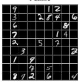

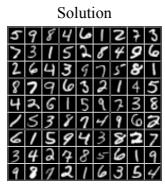

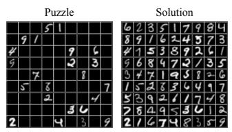  
Figure 12: MNIST Sudoku puzzle examples.

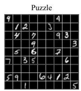

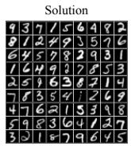

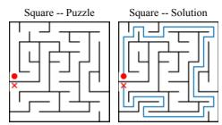

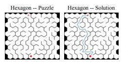

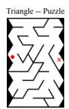

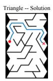  
Figure 13: Mazes puzzle examples for all shapes.

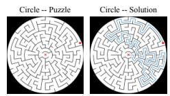

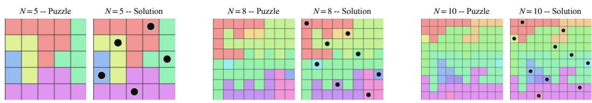  
Figure 14: N-Queens puzzle examples for different sizes.

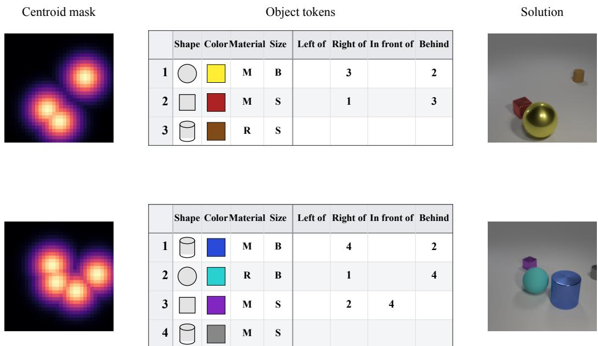  
Figure 15: Constrained scene generation puzzle examples. Object tokens visualized for readability.

## B SCENE COMPOSITION EVALUATION METHOD

We evaluate generated images against their conditioning scene graph (a list of ground-truth objects and pairwise spatial relations) with an off-the-shelf open-vocabulary detect-and-attribute pipeline, applied identically to every model.

Calibration. CLEVR relations are defined in 3-D world coordinates, while detections live in image pixels. Using 150 scenes from the official CLEVR validation set (disjoint from any evaluated samples), we fit a homography from pixel-space box centers to ground-plane (x, y) coordinates, derive a small/large size threshold from the two known object widths, and estimate unit “left” and “front” direction vectors by averaging the 3-D displacement between objects in all annotated left/front relations. A relation between two detected objects is later verified by checking the sign of the dot product between their projected displacement and the corresponding direction vector.

Detection. Each image is queried with Grounding DINO Liu et al. (2024) using a text prompt listing every ground-truth object as a "{size} {color} {material} {shape}" phrase, plus the three bare shape names as a fallback. Detections are filtered with NMS (IoU 0.65) and a simple center-distance de-duplication step to remove near-duplicate boxes.

Attribute classification. For each detected box, we classify color, material, and shape jointly by embedding two crops (a padded full-box crop and a center crop) with SigLIP Zhai et al. (2023) and taking the arg-max similarity against text embeddings for all (color, material, shape) combinations, averaged across the two crops. Size is assigned from the homography-projected box width against the calibrated threshold.

Matching and hallucinations. Ground-truth and detected objects are matched via the Hungarian algorithm under a cost equal to the number of mismatched attributes (color, shape, material, size). A pair is accepted as a match only if at most 2 of 4 attributes disagree; detections left unmatched are counted as hallucinations. Duplicate ground-truth objects sharing identical attributes are disambiguated by trying all permutations of their matched positions and keeping the one that satisfies the most ground-truth relations, so attribute ties do not spuriously penalize relational accuracy.

Metrics. Let $t _ { \mathrm { r e q } } / t _ { \mathrm { p r e d } }$ be the number of requested/detected objects, v the number of accepted matches, and $t _ { \mathrm { r e l } } / c _ { \mathrm { r e l } }$ the number of checkable/satisfied ground-truth relations (both endpoints matched). We report:

• Precision = v/tpred and $\mathbf { R e c a l l } = v / t _ { \mathrm { r e q } }$ — conditioning adherence;

• Color/Shape/Material/Size Acc. — per-attribute agreement rate among matched objects;

• Attribute binding — fraction of matched objects correct on all four attributes;

• Relational $\mathbf { A c c . } = c _ { \mathrm { r e l } } / t _ { \mathrm { r e l } }$ — fraction of spatial relations satisfied.

Counts are accumulated over the whole evaluation set before ratios are taken. Results on the trainingdata samples are reported in Table 4.

<table><tr><td colspan="2">General adherence</td><td colspan="5">Attribute matching</td><td rowspan="2">Spatial relations accuracy</td></tr><tr><td>recall</td><td>precision</td><td>color</td><td>shape</td><td>material</td><td>size</td><td>all</td></tr><tr><td>99.9</td><td>99.8</td><td>95.2</td><td>96.9</td><td>96.4</td><td>100</td><td>89.5</td><td>97.2</td></tr></table>

Table 4: Performance of the evaluation method on CLEVR ground truth training data.

## C IMPLEMENTATION DETAILS

Tab. 6 lists all hyperparameters. The Painter is a UNet denoiser predicting x0 over 100 training timesteps, sampled in 20 steps with classifier-free guidance at scale 2.0, and maintained as an EMA with rate 0.999. On CLEVR it operates in the latent space of a pretrained SDXL VAE with cross-attention blocks; elsewhere it works directly in pixel space. The Thinker follows Jolicoeur-Martineau (2025) with two self-attention layers, hidden size 512, eight heads and rotary position encodings, run with $H = 3 , L = 6$ and $N _ { \mathrm { s u p } } = 1 6$ . The Painter is trained first and then frozen, after which the Thinker and the condition encoder are trained under the reconstruction loss alone. The parameter counts for all models and for each dataset are provided in Tab. 5.

<table><tr><td>Dataset</td><td>Painter</td><td>Thinker</td><td>PaTh</td><td>DM</td></tr><tr><td>MNIST Sudoku</td><td>1.5M</td><td>8.3M</td><td>10.3M</td><td>81.6M</td></tr><tr><td>Mazes</td><td>1.5M</td><td>8.3M</td><td>10.3M</td><td>62.7M</td></tr><tr><td>Queens</td><td>1.5M</td><td>8.3M</td><td>10.3M</td><td>62.7M</td></tr><tr><td>Constrained scenes</td><td>101.9M</td><td>19.7M</td><td>121.6M</td><td>236.0M</td></tr></table>

Table 5: Parameter counts by dataset. PaTh is the sum of its Painter, Thinker, conditioning encoders, and ControlNet adapters; DM is the diffusion baseline

## D ADDITIONAL RESULTS - GEOSOLVERS DATASETS

We additionally evaluate on the three tasks of Goren et al. (2026), in which a diffusion model trained in pixel space approximates solutions to the Simple Polygon, Steiner Tree and Inscribed Square problems. Following their protocol, we train only on the smallest instances and evaluate across all sizes.

PaTh improves substantially on Simple Polygon (Tab. 7), raising validity from 0.620 to 0.869 and the optimality rate from 0.062 to 0.264 on the largest instances. On Steiner Tree (Tab. 8) and Inscribed Square (Tab. 9) the two models are comparable, with PaTh slightly ahead on solution ratio and slightly behind on validity. We attribute this to the nature of the tasks rather than to headroom: Simple Polygon is a discrete constraint satisfaction problem, where a configuration is valid or not, whereas the other two are continuous optimisation problems whose solutions are approximate by construction. The Thinker searches over candidates that can be rejected, which is what the former requires and the latter does not.

<table><tr><td>Parameter</td><td>MNIST Sudoku</td><td>CLEVR</td><td>Mazes</td><td>N-Queens</td></tr><tr><td>Painter</td><td></td><td>stabilityai/sdxl-vae</td><td></td><td></td></tr><tr><td>VAE Block types Block out channels Cross att dim Layers per block Painter training cfg Painter Optimizer</td><td>Block2D ×3 32, 64, 64 2 0</td><td>CrossAttBlock ×3 128, 256, 512 512 2 0.9</td><td>Block2D ×3 32, 64, 64 2 0</td><td>Block2D ×3 32, 64, 64 2 0</td></tr><tr><td>Optim type Learning rate (lr) lr min ratio Warmup steps Weight decay Training steps</td><td>AdamW 3e-5 0.1 1000 0 100000</td><td>AdamW 3e-5 0.1 1000 0 80000</td><td>AdamW 1e-4 1 2000 0.1 40000</td><td>AdamW 1e-4 1 2000 0.1 40000</td></tr><tr><td>Condition Encoder Type Enc channels Hidden channels Output dim</td><td>conv 128 128, 256, 256 512</td><td>conv+mlp 55 512 512</td><td>conv 128 512</td><td>conv 128 128,256,256128,256,256 512</td></tr><tr><td>Diffusion Num train timesteps Prediction type Num sampling timesteps Sampling cfg</td><td>100 x0 20 2.0</td><td>100 x0 20 2.0</td><td>100 x0 20 2.0</td><td>100 x0 20 2.0</td></tr><tr><td>EMA Rate Thinker Expansion factor</td><td>0.999</td><td>0.999</td><td>0.999</td><td>0.999</td></tr><tr><td>Hidden size Num layers Att num heads Pos encoding Sequence length Out shape H cycles L cycles N sup Thinker Optimizer</td><td>4 512 2 8 rope 81 11 3 6 16</td><td>4 512 2 8 rope 266 10 3 6 16</td><td>4 512 2 8 rope 144 11 3 6 16</td><td>4 512 2 8 rope 144 11 3 6 16</td></tr><tr><td>Optim type Learning rate (lr) lr min ratio Warmup steps Weight decay Betas 0.9,0.95</td><td>AdamAtan2 1e-4 1 2000 0.3</td><td>AdamAtan2 1e-4 1 2000 0.3</td><td>AdamAtan2 1e-4 1 2000 0.3</td><td>AdamAtan2 1e-4 1 2000 0.3</td></tr></table>

Table 6: Hyperparameters across Components and Tasks

<table><tr><td rowspan="2">Model</td><td colspan="3">7-12</td><td colspan="3">13-15</td></tr><tr><td>valid</td><td>ratio</td><td>opt rate</td><td>valid</td><td>ratio</td><td>opt rate</td></tr><tr><td>PaTh</td><td>0.985</td><td>0.998</td><td>0.783</td><td>0.869</td><td>1.000</td><td>0.264</td></tr><tr><td>visual geosolvers</td><td>0.953</td><td>0.988</td><td>0.574</td><td>0.620</td><td>0.962</td><td>0.062</td></tr></table>

Table 7: Simple Polygon, by number of vertices. valid is the fraction of outputs forming a simple polygon, ratio their quality relative to the reference, and opt rate the fraction attaining the optimum.

<table><tr><td rowspan="2">Model</td><td colspan="2">10-20</td><td colspan="2">21-30</td><td colspan="2">31-40</td><td colspan="2">41-50</td></tr><tr><td>valid</td><td>ratio</td><td>valid</td><td>ratio</td><td>valid</td><td>ratio</td><td>valid</td><td>ratio</td></tr><tr><td>PaTh</td><td>0.997</td><td>1.0008</td><td>0.983</td><td>1.0018</td><td>0.796</td><td>1.0040</td><td>0.340</td><td>1.0081</td></tr><tr><td>visual geosolvers</td><td>0.996</td><td>1.0008</td><td>0.986</td><td>1.0018</td><td>0.834</td><td>1.0044</td><td>0.334</td><td>1.0092</td></tr></table>

Table 8: Steiner Tree, by number of terminals. Lower ratio is better. The two models are comparable throughout; neither solves the largest instances.

<table><tr><td>Model</td><td>Squareness</td><td>Alignment</td></tr><tr><td>PaTh</td><td>0.874</td><td>-0.84</td></tr><tr><td>visual geosolvers</td><td>0.891</td><td>-0.90</td></tr></table>

Table 9: Inscribed Square. Neither model has a consistent advantage.

## E STABILITY OF THE METHOD

PaTh is stable across seeds. Three runs on EXTREME MNIST Sudoku give puzzle accuracies of 71.2, 70.8 and 69.8, a mean of $7 0 . 6 \pm 0 . 7$

It is also insensitive to the Thinker’s token grid (Tab. 10). Grids of $1 0 \times 1 0$ and $1 2 \times 1 2$ neither align with the $9 \times 9$ Sudoku cells nor divide into them, yet reach 66.8 and 69.3 against 71.2 for the aligned $9 \times 9$ . The method therefore requires no correspondence between the Thinker’s resolution and the structure of the task.

<table><tr><td>TRM num tokens</td><td>8x8</td><td>9x9</td><td>10x10</td><td>12x12</td></tr><tr><td>puzzle acc</td><td>59.8</td><td>71.2</td><td>66.8</td><td>69.3</td></tr></table>

Table 10: Puzzle accuracy on EXTREME MNIST Sudoku for different Thinker token grids. Only $9 \times 9$ aligns with the Sudoku cells.

## F ADOPTION TO DIT

PaTh does not depend on the Painter being a UNet. A DiT has no skip connections to inject into, so in place of the ControlNet adapters we project the Thinker’s output linearly and add it token-wise to the hidden states after each transformer block. The remainder of the setup is unchanged.

Tab. 11 reports the result. The DiT variant reaches 0.542 puzzle accuracy against 0.029 for the corresponding diffusion baseline, so the mechanism transfers, though it falls short of the 0.712 obtained with a UNet Painter. Since the Thinker is identical in both cases, we attribute the gap to the coupling, which we did not tune further.

<table><tr><td>Painter architecture</td><td>Puzzle accuracy</td></tr><tr><td>UNet</td><td>0.712</td></tr><tr><td>DiT</td><td>0.542</td></tr><tr><td>DM</td><td>0.029</td></tr></table>

Table 11: Puzzle accuracy on EXTREME MNIST Sudoku with different Painter architectures. DM is a diffusion model without a Thinker.

## G HALTING HEAD IMPACT

The halting head reduces the cost of Thinker training by avoiding recursive supervision steps that are predicted to provide no further improvement. On MNIST Sudoku, training the Thinker without halting takes 72h, whereas the halting variant takes only 26h, reducing the total two-stage training cost from 85h to 39h when combined with the 13h Painter training stage.

The reduction does not come from a higher throughput. The iteration rate is essentially unchanged, from 0.85 iterations/s without halting to 0.81 iterations/s with halting. Instead, the halting head reduces the number of recursive supervision steps performed during training by terminating recursion once an additional step is predicted to yield no further improvement. The resulting savings therefore come from avoiding unnecessary computation rather than making individual iterations cheaper.

<table><tr><td>Configuration</td><td>iter/s</td><td>Training time</td></tr><tr><td>Separate, Painter Separate, Thinker Separate, total</td><td>5.8 0.85 一</td><td>13h 72h 85h</td></tr><tr><td>Separate, Thinker with halting Separate, total with halting</td><td>0.81 一</td><td>26h 39h</td></tr></table>

Table 12: Training cost on MNIST Sudoku. Total training times sum the Painter and Thinker stages; iteration rates are not defined for the combined two-stage configurations.

## H JOINT VS SEPARATE TRAINING

We compare joint training of the Painter and Thinker with our two-stage procedure in which the Painter is trained first and then frozen while the Thinker is trained. As shown in Tab. 13, separate training requires 85h compared with 113h for joint training, while also achieving slightly higher puzzle accuracy on MNIST Sudoku: 71.2% versus 69.9%.

The qualitative difference is also visible in Fig. 16. The separately trained model produces a more diverse set of MNIST digits, whereas joint training produces samples with less variation. This difference suggests that keeping the Painter fixed allows the Thinker to adapt its conditioning signal to a stable image-generation model without jointly changing the underlying digit distribution.

To quantify this, we split the generated $9 \times 9$ grids of two test puzzles into their cells and label each cell by the digit it depicts. For each digit class we compute the mean pairwise $\ell _ { 2 }$ distance between samples, with each sample flattened and scaled to unit norm. We then average this value over the nine classes. The separate model is more diverse in all nine classes (0.855 vs. 0.721, Tab. 13).

<table><tr><td>Training configuration</td><td>Training time</td><td>Puzzle accuracy</td><td>Digit diversity ↑</td></tr><tr><td>Joint</td><td>113h</td><td>69.9%</td><td>0.721</td></tr><tr><td>Separate</td><td>85h</td><td>71.2%</td><td>0.855</td></tr></table>

Table 13: Comparison of joint and separate Painter–Thinker training on MNIST Sudoku. Separate training is less costly, slightly more accurate and produces more diverse digits in this setting. Digit diversity is the within-class mean pairwise $\ell _ { 2 }$ distance between unit-normalized samples, averaged over digit classes.

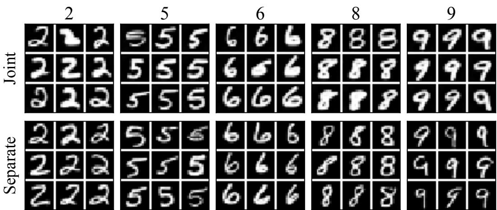  
Figure 16: Examples generated by jointly and separately trained PaTh models. Separately trained models exhibit greater diversity in the generated MNIST digits.

## I CONTROLNET ALTERNATIVE

We also evaluate a simpler alternative to the ControlNet coupling in which the Thinker’s output is concatenated channel-wise with the diffusion state $\mathbf { x } _ { t } .$ We first train the diffusion model on full solved MNIST Sudoku grids, with the puzzle conditioning concatenated directly to $\mathbf { x } _ { t }$ . During subsequent Thinker training, the Thinker’s output is used as the conditioning signal and is likewise concatenated with $\mathbf { x } _ { t }$ before being passed to the diffusion model.

On MNIST Sudoku EXTREME, this concatenation-based variant reaches 37.5% puzzle accuracy, compared with 71.2% for the ControlNet-based model. The concatenation approach therefore retains a substantial benefit over diffusion baselines, but performs considerably worse than ControlNet. These results indicate that the interface between the Thinker and Painter is important: injecting the Thinker’s representation through the Painter’s ControlNet adapters is substantially more effective than treating it as an additional input channel.

## J RECOVERING MISTAKES: FULL METRICS

The main text reports the recovered-and-valid rate, which requires the corrupted cells to be restored and the rest of the grid to remain correct. Here we report the recovery rate without the second requirement, counting only whether the corrupted cells themselves return to the ground truth, together with the kept rate, the fraction of corruptions left unchanged. The two do not sum to one, since a corrupted cell may be altered to a third value. Results are separated by whether a corruption is locally visible, duplicating a digit in its own row, column or block, or globally visible, creating no such duplication while still departing from the unique solution.

Comparing the two recovery criteria is informative. At 30% of sampling with 32 locally visible corruptions, the diffusion model restores 58.8% of the corrupted cells but produces a valid grid in

only 7.0% of instances: it repairs what it was given and disturbs the rest. PaTh restores 97.7% and keeps 74.7% of grids valid.
<table><tr><td></td><td colspan="7">PaTh</td><td colspan="7">DM</td></tr><tr><td>% sampling</td><td>n=1</td><td>n=2</td><td>n=4</td><td>n=8</td><td>n=16</td><td>n=32</td><td>n=64</td><td>n=1</td><td>n=2</td><td>n=4</td><td>n=8</td><td>n=16</td><td>n=32</td><td>n=64</td></tr><tr><td>10</td><td>94.5</td><td>96.5</td><td>96.1</td><td>94.3</td><td>94.5</td><td>94.2</td><td>86.8</td><td>49.2</td><td>50.0</td><td>49.6</td><td>52.2</td><td>50.5</td><td>49.0</td><td>44.7</td></tr><tr><td>30</td><td>96.9</td><td>96.1</td><td>96.5</td><td>98.1</td><td>96.0</td><td>97.7</td><td>64.8</td><td>85.9</td><td>88.3</td><td>86.9</td><td>85.0</td><td>77.6</td><td>58.8</td><td>42.4</td></tr><tr><td>50</td><td>89.1</td><td>95.3</td><td>91.2</td><td>90.1</td><td>90.4</td><td>90.6</td><td>45.9</td><td>97.7</td><td>96.9</td><td>96.5</td><td>95.8</td><td>92.0</td><td>74.2</td><td>36.8</td></tr><tr><td>70</td><td>42.2</td><td>46.5</td><td>43.9</td><td>40.9</td><td>39.2</td><td>35.4</td><td>15.9</td><td>77.3</td><td>72.7</td><td>77.9</td><td>70.6</td><td>57.7</td><td>32.3</td><td>12.1</td></tr><tr><td>90</td><td>0.0</td><td>0.4</td><td>0.4</td><td>0.3</td><td>0.3</td><td>0.3</td><td>0.3</td><td>10.9</td><td>7.0</td><td>8.2</td><td>6.9</td><td>6.3</td><td>3.6</td><td>1.9</td></tr></table>

Table 14: Recovery rate (%) for locally visible corruptions on EXTREME MNIST Sudoku, by percentage of sampling completed when the mistakes are injected and number n of corrupted cells. This does not require the rest of the grid to remain correct.

<table><tr><td></td><td colspan="7">PaTh</td><td colspan="7">DM</td></tr><tr><td>% sampling</td><td>n=1</td><td>n=2</td><td>n=4</td><td>n=8</td><td>n=16</td><td>n=32</td><td>n=64</td><td>n=1</td><td>n=2</td><td>n=4</td><td>n=8</td><td>n=16</td><td>n=32</td><td>n=64</td></tr><tr><td>10</td><td>94.5</td><td>95.2</td><td>93.3</td><td>93.7</td><td>92.4</td><td>91.5</td><td>76.7</td><td>48.4</td><td>51.2</td><td>55.9</td><td>50.6</td><td>49.1</td><td>45.9</td><td>40.9</td></tr><tr><td>30</td><td>97.7</td><td>96.8</td><td>96.0</td><td>95.1</td><td>95.0</td><td>90.8</td><td>40.7</td><td>89.0</td><td>90.5</td><td>82.2</td><td>80.9</td><td>67.2</td><td>42.8</td><td>30.6</td></tr><tr><td>50</td><td>92.2</td><td>87.1</td><td>90.0</td><td>90.5</td><td>90.7</td><td>69.4</td><td>26.5</td><td>95.3</td><td>95.3</td><td>93.7</td><td>90.3</td><td>78.9</td><td>39.6</td><td>19.9</td></tr><tr><td>70</td><td>43.2</td><td>41.3</td><td>37.2</td><td>42.5</td><td>36.0</td><td>20.2</td><td>8.8</td><td>76.8</td><td>74.1</td><td>70.1</td><td>61.4</td><td>43.0</td><td>17.8</td><td>8.0</td></tr><tr><td>90</td><td>0.0</td><td>0.0</td><td>0.2</td><td>0.3</td><td>0.6</td><td>0.2</td><td>0.3</td><td>7.1</td><td>12.7</td><td>5.7</td><td>7.1</td><td>4.7</td><td>2.2</td><td>1.1</td></tr></table>

Table 15: Recovery rate (%) for globally visible corruptions.

<table><tr><td></td><td colspan="7">PaTh</td><td colspan="7">DM</td></tr><tr><td>% sampling</td><td>n=1</td><td>n=2</td><td>n=4</td><td>n=8</td><td>n=16</td><td>n=32</td><td>n=64</td><td>n=1</td><td>n=2</td><td>n=4</td><td>n=8</td><td>n=16</td><td>n=32</td><td>n=64</td></tr><tr><td>10</td><td>0.8</td><td>0.0</td><td>0.0</td><td>0.2</td><td>0.1</td><td>0.1</td><td>0.2</td><td>0.0</td><td>0.0</td><td>0.2</td><td>0.2</td><td>0.3</td><td>0.2</td><td>0.3</td></tr><tr><td>30</td><td>0.0</td><td>0.4</td><td>0.2</td><td>0.1</td><td>0.0</td><td>0.2</td><td>0.3</td><td>0.0</td><td>0.0</td><td>1.4</td><td>0.0</td><td>0.4</td><td>0.5</td><td>0.5</td></tr><tr><td>50</td><td>4.7</td><td>1.6</td><td>3.3</td><td>4.2</td><td>4.3</td><td>4.0</td><td>6.6</td><td>1.6</td><td>0.0</td><td>1.2</td><td>0.9</td><td>1.0</td><td>1.5</td><td>2.7</td></tr><tr><td>70</td><td>37.5</td><td>40.6</td><td>42.8</td><td>42.7</td><td>45.9</td><td>48.8</td><td>52.2</td><td>14.1</td><td>22.7</td><td>15.0</td><td>20.9</td><td>28.4</td><td>38.1</td><td>45.4</td></tr><tr><td>90</td><td>94.5</td><td>98.8</td><td>97.7</td><td>97.5</td><td>97.4</td><td>97.6</td><td>97.5</td><td>86.7</td><td>88.3</td><td>87.1</td><td>89.4</td><td>88.4</td><td>90.3</td><td>90.2</td></tr></table>

Table 16: Kept rate (%) for locally visible corruptions.

<table><tr><td></td><td colspan="7">PaTh</td><td colspan="7">DM</td></tr><tr><td>% sampling</td><td>n=1</td><td>n=2</td><td>n=4</td><td>n=8</td><td>n=16</td><td>n=32</td><td>n=64</td><td>n=1</td><td>n=2</td><td>n=4</td><td>n=8</td><td>n=16</td><td>n=32</td><td>n=64</td></tr><tr><td>10</td><td>3.9</td><td>1.2</td><td>2.8</td><td>2.6</td><td>3.0</td><td>3.1</td><td>8.7</td><td>15.1</td><td>16.5</td><td>19.6</td><td>18.5</td><td>18.4</td><td>20.6</td><td>21.7</td></tr><tr><td>30</td><td>0.8</td><td>0.4</td><td>0.6</td><td>2.1</td><td>2.0</td><td>4.5</td><td>26.6</td><td>5.5</td><td>4.3</td><td>6.9</td><td>9.1</td><td>13.8</td><td>24.7</td><td>31.4</td></tr><tr><td>50</td><td>3.9</td><td>6.6</td><td>4.7</td><td>3.7</td><td>4.6</td><td>16.5</td><td>40.7</td><td>2.4</td><td>2.8</td><td>3.9</td><td>6.0</td><td>12.6</td><td>33.9</td><td>43.9</td></tr><tr><td>70</td><td>43.2</td><td>46.5</td><td>46.3</td><td>44.0</td><td>49.4</td><td>65.5</td><td>72.5</td><td>17.6</td><td>19.6</td><td>23.4</td><td>28.3</td><td>43.1</td><td>60.2</td><td>67.2</td></tr><tr><td>90</td><td>97.7</td><td>98.0</td><td>98.6</td><td>97.8</td><td>97.4</td><td>97.7</td><td>97.8</td><td>88.2</td><td>82.1</td><td>90.2</td><td>87.1</td><td>91.0</td><td>93.6</td><td>94.4</td></tr></table>

Table 17: Kept rate (%) for globally visible corruptions. The difference between this table and Tab. 16 is plotted in Fig. 7.

For constrained scenes, a corruption exchanges the positions of n disjoint pairs of objects in a sevenobject scene. We report the fraction of scenes in which every swapped object is correctly placed, the per-object recovery rate, and the per-object rate at which an object remains in its swapped position.

<table><tr><td rowspan="2">% sampling</td><td colspan="3">PaTh</td><td colspan="3">DM</td></tr><tr><td>n=1</td><td>n=2</td><td>n=3</td><td> $n { = } 1$ </td><td>n=2</td><td> $n { = } 3$ </td></tr><tr><td>10</td><td>53.2</td><td>55.7</td><td>53.0</td><td>40.7</td><td>41.4</td><td>41.1</td></tr><tr><td>30</td><td>51.2</td><td>52.1</td><td>51.2</td><td>25.5</td><td>26.4</td><td>26.3</td></tr><tr><td>50</td><td>39.8</td><td>41.4</td><td>39.7</td><td>14.2</td><td>14.7</td><td>15.5</td></tr><tr><td>70</td><td>21.0</td><td>24.6</td><td>23.4</td><td>9.2</td><td>9.8</td><td>9.1</td></tr><tr><td>90</td><td>13.0</td><td>12.2</td><td>12.6</td><td>6.0</td><td>7.6</td><td>6.8</td></tr></table>

Table 18: Per-object recovery rate (%) on constrained scenes.

<table><tr><td rowspan="2">% sampling</td><td colspan="3">PaTh</td><td colspan="3">DM</td></tr><tr><td>n=1</td><td> $n { = } 2$ </td><td> $n { = } 3$ </td><td> $n { = } 1$ </td><td> $n { = } 2$ </td><td> $n { = } 3$ </td></tr><tr><td>10</td><td>43.8</td><td>39.4</td><td>41.7</td><td>53.2</td><td>55.5</td><td>56.0</td></tr><tr><td>30</td><td>44.0</td><td>41.7</td><td>43.5</td><td>71.0</td><td>70.1</td><td>70.8</td></tr><tr><td>50</td><td>54.2</td><td>52.2</td><td>53.6</td><td>82.5</td><td>81.6</td><td>80.7</td></tr><tr><td>70</td><td>74.0</td><td>71.1</td><td>71.6</td><td>87.7</td><td>87.5</td><td>87.5</td></tr><tr><td>90</td><td>80.0</td><td>82.5</td><td>82.3</td><td>92.0</td><td>88.9</td><td>89.4</td></tr></table>

Table 19: Per-object kept rate (%) on constrained scenes.

## K THINKER PROBE TRAINING DETAILS

To inspect what the model knows at an intermediate point in its reasoning, without going through the Painter, which blurs early noisy states and would confound the reading, we train a small linear probe pθ mapping a single per-cell y vector to a nine-way digit distribution.

Training. We sample puzzles, recording y at every recursion of every denoising step. The label for all of these, regardless of when they were captured, is a standard MNIST classifier’s cell-by-cell reading of that trajectory’s own final image. pθ is trained with cross-entropy against this label.

Reading the latent. The probe is defined on y, since z does not itself decode to a solution (Jolicoeur-Martineau, 2025, Fig. 6). To read a latent state z , we therefore apply the Thinker’s answer update $\mathbf { y }  \mathrm { n e t } ( \mathbf { y } , \mathbf { z } _ { i } )$ and probe the result, which reports the prediction the latent would produce were the model to commit at that point.

Validation. Tab. 20 reports probe accuracy by denoising step t and number of completed supervision steps, read out continuously within each denoising step. From t=5 onwards accuracy exceeds 95% and is essentially unchanged by further reasoning, so the probe recovers the committed digit well before the image is rendered. Accuracy is lower at both extremes. At t=0 the state has not yet converged, though it improves with reasoning depth, from 66.2% to 89.1%. At t=19 the sample is nearly clean and the Thinker has little left to do, so y is no longer driven towards the solution; this is consistent with Fig. 20, where reasoning in the final steps can be omitted without loss. Our analyses use the intermediate range.

<table><tr><td>t\ nsup</td><td>1</td><td>4</td><td>8</td><td>12</td><td>16</td></tr><tr><td>0</td><td>66.2</td><td>81.9</td><td>86.4</td><td>87.9</td><td>89.1</td></tr><tr><td>5</td><td>96.2</td><td>95.7</td><td>95.8</td><td>95.9</td><td>96.0</td></tr><tr><td>10</td><td>98.3</td><td>98.2</td><td>98.2</td><td>98.2</td><td>98.4</td></tr><tr><td>15</td><td>98.8</td><td>98.8</td><td>98.8</td><td>98.7</td><td>98.8</td></tr><tr><td>19</td><td>55.3</td><td>62.3</td><td>62.1</td><td>62.3</td><td>62.1</td></tr></table>

Table 20: Probe accuracy (%) by denoising step t and completed supervision steps, without resetting the recursive state between columns.

## L LIMITATIONS

PaTh requires the Thinker’s tokens to be spatially aligned with the conditioning. The conditioning is pooled into a fixed token grid, so each token covers a fixed region of the image, and the Thinker can attach a constraint to a location only if that correspondence holds across instances.

To test this we render the Sudoku solution on a larger black canvas under a random translation, or a random translation and scaling (Tab. 21). When the conditioning remains an untransformed puzzle grid, the correspondence between conditioning tokens and target cells is destroyed, and both puzzle accuracy and cell accuracy collapse to chance, at 11.1% for nine digits. Raising the token count from 81 to 144 does not help. Applying the same transform to the conditioning restores the correspondence and recovers partial performance, at 3.4% puzzle accuracy and 44.3% cell accuracy, so the failure is one of alignment rather than of task difficulty.

Constrained scenes show the same requirement (Tab. 22). Relation tokens alone give 51.2% spatial accuracy and 7.8% attribute binding. Revealing a fully denoised tenth of the target image does not help, nor does supplying a learned embedding of a reference crop for each attribute combination, added to the corresponding object token, which improves attribute binding to 21.2% but leaves spatial accuracy unchanged. Only the centroid mask, which localises each object in the image, raises both. PaTh therefore depends on conditioning that carries spatial structure, and does not recover that structure from an unanchored symbolic specification.

<table><tr><td>Conditioning</td><td>Puzzles</td><td>TRM num tokens</td><td>Puzzle acc.</td><td>Cell acc.</td></tr><tr><td>puzzle</td><td>translated+scaled</td><td>81</td><td>0.0</td><td>11.1</td></tr><tr><td>puzzle</td><td>translated</td><td>81</td><td>0.0</td><td>11.1</td></tr><tr><td>puzzle</td><td>translated</td><td>144</td><td>0.0</td><td>11.1</td></tr><tr><td>aligned puzzle</td><td>translated+scaled</td><td>81</td><td>3.4</td><td>44.3</td></tr></table>

Table 21: MNIST Sudoku with the solution rendered on a larger canvas under a random translation, or translation and scaling. Aligned applies the same transform to the conditioning. Cell accuracy of 11.1% is chance.

<table><tr><td>Conditioning</td><td>Attr. binding (%)</td><td>Spatial acc. (%)</td></tr><tr><td>tokens</td><td>7.8</td><td>51.2</td></tr><tr><td>tokens + part of solution</td><td>8.3</td><td>50.4</td></tr><tr><td>tokens + visual attributions</td><td>21.2</td><td>51.6</td></tr><tr><td>tokens + centroids</td><td>53.8</td><td>89.4</td></tr><tr><td>centroids with attributes</td><td>54.8</td><td>91.2</td></tr></table>

Table 22: Constrained scene composition under different conditioning. Only conditioning that localises objects in the image improves spatial accuracy. The final row, in which the mask carries one channel per attribute and so states exactly where each object belongs, is a sanity check rather than a proposed setting.

## M SRM ON EXTREME

SRM (Wewer et al., 2025) denoises the grid one cell at a time, in an order predicted from the model’s own uncertainty. Each cell is committed to as it is generated, and nothing in the sampler can revisit that commitment once made. On HARD this is largely harmless, since most puzzles admit many solutions and an early choice can usually be completed into one of them. On EXTREME it is fatal, as a single solution exists and any departure from it cannot be repaired.

To show that this is what happens, we track two quantities as cells are placed: the fraction of samples still consistent with the unique solution, and the number of Sudoku constraints violated on the board so far (Fig. 17). The two diverge immediately. Violations stay near zero throughout the early placements, so nothing on the board indicates that anything has gone wrong, yet consistency with the solution falls below 50% after the first cell alone. SRM’s early commitments are locally unimpeachable and globally wrong, and because the model can only see the board it is building, it has no way to detect the difference. This is the same distinction between locally and globally visible violations that Sec. 4.2 examines directly.

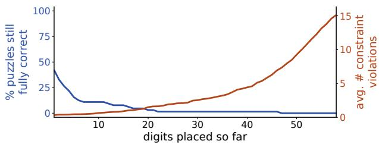  
Figure 17: As cells are denoised one by one, the fraction of samples still consistent with the unique solution (blue) falls below 50% after the first cell, while the number of rules violated on the board (orange) stays near zero. SRM’s commitments conflict with nothing already present and are therefore invisible to it, yet most have already ruled out the only valid completion.

## N EFFICIENT ALLOCATION OF THE RECURSION BUDGET

Three refinements reduce the compute PaTh needs without loss of accuracy. Together they produce the efficient variant of Fig. 10.

The reasoning state persists across denoising steps. If the Thinker accumulates knowledge about the puzzle, its state should remain useful from one denoising step to the next rather than needing to be rebuilt. We test this by varying how often the state is reset (Fig. 18). Resetting at every step costs a great deal at small budgets, giving 32.8% accuracy at a single recursion against 56.1% when the state is carried for twenty, and the gap closes only once the budget is large enough to rebuild the state from scratch each time, with all settings converging near 70% at sixteen recursions. What the Thinker computes is thus worth preserving, which is what a reasoning state should be.

Reasoning is only needed early. The Thinker performs the same computation at every denoising step, though the diagnosis of Sec. 4.2 suggests this is wasteful, since most of the rule is resolved in the first few steps. We first redistribute a fixed recursion budget across the trajectory, concentrating it at different points (Fig. 19). Allocating early helps and allocating late hurts, by up to 11.3 points when the budget is centred at 70% of sampling. We then remove reasoning entirely after a chosen step, reusing the Thinker’s last output for the remainder (Fig. 20). Reasoning for only the first half of the trajectory matches reasoning throughout, and reasoning for the first 50% slightly exceeds it, at 72.5% against 71.2%, at half the cost.

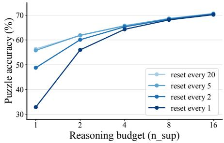  
Figure 18: Puzzle accuracy against reasoning budget $n _ { \mathrm { s u p } }$ for different reset intervals. The Thinker’s state carries across denoising steps , improving accuracy by 23 points at low budgets.

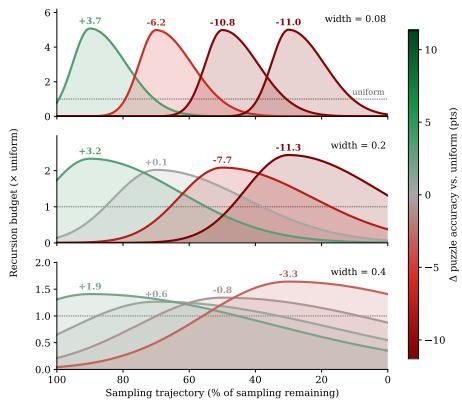  
Figure 19: Change in puzzle accuracy when a fixed recursion budget is concentrated at different points of the trajectory (columns) with different spread (rows), relative to uniform allocation. Allocating early helps and allocating late costs up to 11.3 points.

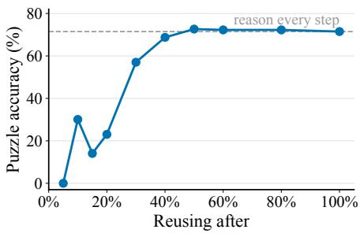  
Figure 20: Puzzle accuracy when the Thinker stops reasoning after a given fraction of sampling and its last output is reused thereafter. Reasoning for the first half suffices, slightly exceeding reasoning at every step (72.5% against 71.2%) at half the cost.

## O FULL RESOLUTION MNIST SUDOKU RESULTS

In Tab. 23 we present the results of PaTh on full-resolution MNIST Sudoku datasets. The performance on HARD is nearly identical, and while marginally worse on EXTREME, it is still significantly better than all the competing methods.

<table><tr><td>Resolution</td><td>HARD</td><td>EXTREME</td></tr><tr><td>144x144</td><td>0.925</td><td>0.712</td></tr><tr><td>252x252 (full-resolution)</td><td>0.926</td><td>0.682</td></tr></table>

Table 23: Puzzle accuracy comparison of PaTh on different resolutions of MNIST Sudoku.

## P EXPLORATION TRACES IN FINE-TUNED BAGEL

On mazes, fine-tuned Bagel reaches near-complete COVERAGE (99.99%) yet a VIOLATION of 12.8%, and only 43.4% of its samples are exactly correct. Fig. 21 shows why. In most samples, the correct path is drawn in full, but it is surrounded by semi-transparent traces of other paths. We interpret these as paths the model considered and rejected but could not fully erase, since the image is the only state it has. PaTh evaluates candidates in the Thinker’s latent state, and its samples show no such traces.

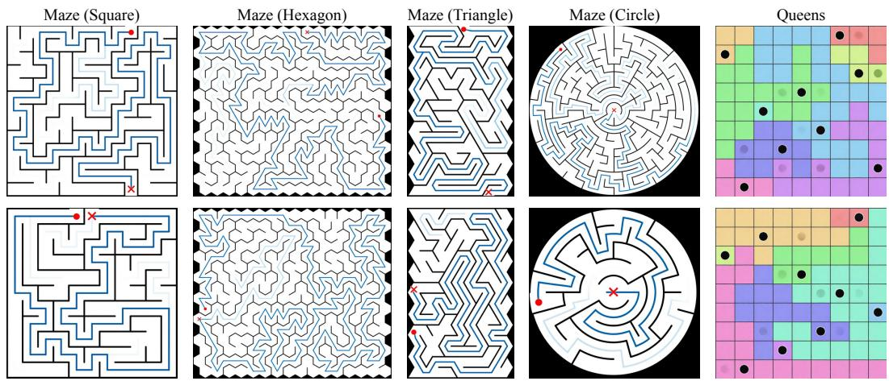  
Figure 21: Examples of solutions to mazes and queens puzzles generated by Bagel.