# TR-PTQ: High-Accuracy Integer-Only Transformer Post Training Quantization via Taylor Region Reformulation

Eliyahu Levy 1 Adam Teman 1 Yoni Pugachov 1

## Abstract

Post-training quantization (PTQ) enables efficient deployment, yet transformer architectures remain challenging to quantize due to nonlinear layers. While existing methods attribute accuracy loss to insufficient numerical precision, often necessitating floating-point fallbacks, we demonstrate that degradation is actually driven by specific structural error sources. We find that learned scale parameters in normalization layers and compounded approximations in GELU are the primary error contributors, whereas SoftMax remains inherently robust to aggressive quantization. To address these bottlenecks, we introduce TR-PTQ, a unified integer-only formulation using shared Taylor Region (TR) exponential and logarithm primitives. This approach allows computationally expensive operations, including division and square roots, to be performed entirely in the log-domain via standard integer arithmetic. Combined with a calibration-free, outlier-aware optimization for LayerNorm parameters, our method eliminates the need for floating-point hardware units for nonlinearities, achieving less than 1.5% absolute accuracy degradation across vision and language benchmarks.

## 1. Introduction

Post-training quantization (PTQ) enables efficient model deployment by bypassing the costs of retraining and extensive calibration. Despite these benefits, transformer architectures present significant challenges to quantization due to their heavy reliance on nonlinear layers. Prevailing approaches typically attribute the resulting accuracy loss to insufficient numerical precision. Consequently, existing methods often resort to complex calibration procedures, specialized observers, or mixed-precision execution with floating-point fallbacks.

In this work, we challenge the assumption that nonlinear layers fundamentally require high-precision arithmetic. We demonstrate that accuracy degradation under aggressive pertensor PTQ is driven not by a general lack of precision, but by specific, identifiable structural error sources. By isolating these sources, we show that many nonlinear components can tolerate aggressive quantization when handled appropriately, while others fail due to specific parameter interactions rather than inherent numerical sensitivity.

We first identify that in normalization layers, such as layer normalization (LayerNorm), quantization error is dominated by the learned scale parameters (γ) rather than by input activations. The heavy-tailed distributions of these parameters interact poorly with standard min-max and histogram-based observers, often inducing larger accuracy degradation than errors introduced by mean or root-mean-square (RMS) estimation. For nonlinear activation functions, such as Gaussian Error Linear Unit (GELU), we identify an approximationon-approximation effect where surrogate implementations compounded with quantization lead to amplified errors.

In contrast, we find that SoftMax is inherently robust under aggressive quantization. By rounding intermediate activations prior to exponentiation, SoftMax can be accurately implemented using a compact lookup table with as few as eight entries, significantly smaller than the commonly used 256-entry designs. This robustness results from logarithmic scaling and normalization, which preserve relative relationships while suppressing absolute magnitude errors. This renders inaccuracies in low-probability elements largely inconsequential.

Building on these insights, we propose a unified, integeronly optimization framework for PTQ of transformer nonlinear layers. By restructuring nonlinear computations and their associated parameters into low-precision formulations, our method eliminates the need for calibration data for nonlinearities, specialized observers, or floating-point arithmetic units.

Our specific contributions include the following:

• We demonstrate that accuracy degradation in posttraining quantization of transformer nonlinearities is driven by a small set of structural error sources rather than by insufficient numerical precision. This finding challenges the prevailing assumption that nonlinear layers fundamentally require high-precision floating-point arithmetic.

• We introduce a unified, integer-only formulation for transformer nonlinear operations built around shared Taylor Region exponential and logarithm primitives. This enables hardware-efficient implementations of SoftMax, GELU, and LayerNorm without floatingpoint fallback.

• We identify and address two under-emphasized bottlenecks in PTQ: (i) compounded approximation effects in nonlinear activations such as GELU, and (ii) the dominance of learned scale parameters (γ) in normalization layers. We propose a simple, calibration-free outlier-aware optimization to effectively mitigate these errors.

• We validate the proposed approach on vision and language transformers, demonstrating consistent performance under aggressive quantization while significantly simplifying the PTQ pipeline.

## 2. Background and Related Work

## 2.1. Quantization of Nonlinear Layers in Transformers

While a large body of prior work focuses on quantizing linear layers in transformers through pruning and post-training quantization (Frantar et al., 2022; Xiao et al., 2023; Zhang et al., 2024), these approaches typically leave nonlinear components such as SoftMax, GELU, and normalization layers in floating point. Consequently, they are largely orthogonal to this work.

Early efforts to quantize nonlinear layers primarily targeted SoftMax. Softermax (Stevens et al., 2021) proposed a lowlevel implementation based on replacing the exponential base from e to 2, enabling more efficient low-precision computation. I-BERT (Kim et al., 2021) later introduced fully integer-only transformers by employing second-order polynomial approximations for nonlinear functions. This strategy was extended to vision transformers by I-ViT (Li & Gu, 2023), which mitigates inter-channel activation variance through power-of-two base conversions.

FQ-ViT (Lin et al., 2021) adopts a PTQ approach to avoid the high training cost incurred by I-BERT and I-ViT. It reuses the I-BERT SoftMax implementation while introducing a power-of-two factor (PTF) to mitigate accuracy degradation in LayerNorm. Subsequent work extended integer-only quantization to additional nonlinear components. Zhang et al. (Zhang et al., 2023) proposed a rangeconstrained quantization scheme for GELU, while Sun et al. (Sun et al., 2025) introduced a segmented GELU approximation and decomposed the affine parameters γ and $\beta$ to enable a fully quantized LayerNorm computation.

Although the aforementioned works succeed in approximating nonlinear layers, they typically rely on computationally expensive components, such as dividers, square-root units, or high-precision arithmetic. In contrast, other works such as (Wang et al., 2023; Kim & Rhee, 2025; Park & Rhee, 2025; Sun et al., 2025) propose solutions free of dividers and multipliers, trading off accuracy for lower implementation costs. These involve methods like E2Softmax and the Approximate Log-based Division (ALDivision) scheme, which replaces both the exponential and the division in Soft-Max with only shift, addition, and multiplexer operations. This approach approximates $e _ { Q } ^ { X }$ in a manner similar to (Li & Gu, 2023) and performs the division entirely in the logdomain. QUARK (Zhao et al., 2025) reformulates nonlinear computations entirely in the log domain by applying secondorder polynomials. It further introduces reorder-based group quantization to mitigate the inter-channel activation heterogeneity arising from nonlinear layers such as LayerNorm and GELU.

A parallel line of work emphasizes hardware-efficient nonlinear computation. Approaches such as SOLE (Wang et al., 2023) and related designs (Kim & Rhee, 2025; Park & Rhee, 2025) replace exponentiation and division with shift-andadd operations using approximate log-domain formulations. This enables multiplier- and divider-free implementations. QUARK (Zhao et al., 2025) also leverages log-domain reformulation but adds complexity through reorder-based group quantization.

Despite these advances, many existing methods either rely on per-channel or group-wise quantization, which incurs increased hardware and control-path complexity, or they retain nonlinear layers in floating point. This leaves open the question of whether per-tensor quantization can be effectively applied to nonlinear operations without sacrificing accuracy.

## 3. Integer-only Taylor Region Approximation for Nonlinear Functions

In this section, we present unified, integer-only approximations for the exponential (exp) and natural logarithm (ln) functions using a Taylor-based integer representation. These nonlinear functions serve as central components in essential deep-learning operations, such as SoftMax and GELU. Consequently, these approximations form the fundamental building blocks for the complete operators described in the

subsequent section.

The proposed Taylor Region exp (TR-exp) and ln (TR-ln) approximations operate entirely in the integer domain using shift and multiply operations. This design is highly efficient for quantized hardware accelerators and low-power processing units. Both functions are expressed in terms of a base evaluation point, or anchor $a _ { i }$ (derived from the leading bits of the input), and a small offset calculated based on the residual distance $( \Delta )$ of the input from the evaluation point. The evaluation leverages truncated Taylor series and power-of-two shifts instead of complex division logic. This shared structure simplifies the reuse of arithmetic logic and lookup tables across both nonlinearities. Following the introduction of the methods for calculating exp and ln, we will demonstrate the full integer-only computations for SoftMax, GELU, and LayerNorm.

## 3.1. Taylor Region-Based Approximation of the Exponential Function (TR-exp)

The proposed approximation of the exponential function (TR-exp) relies on bounding the input domain, quantizing the values, and utilizing a small lookup table (LUT) with pre-calculated evaluation points to pin a low-order Taylor series approximation.

The first step requires bounding the inputs to ensure they are non-positive. This is achieved by subtracting the maximum value $x _ { \mathrm { m a x } }$ from the original inputs x, yielding ${ \hat { x } } = x -$ $x _ { \mathrm { m a x } } \le 0 .$ . This effectively bounds the output within the range $\exp ( \hat { x } ) \in ( 0 , 1 ]$

To address quantization, we interpret the binary layout of the quantized input values as three distinct fields: a 1-bit $s i g n ,$ an l-bit evaluation point (evp), and a k-bit fraction (frac). For a b-bit quantization scheme where $b = l + k ,$ , the structure is defined as follows1:

$$
\underbrace { \left[ s i g n \atop 1 - \mathrm { b i t } \right]}  \underbrace { e \nu p } _ { l - \mathrm { b i t s } } \underbrace { f r a c } _ { k - \mathrm { b i t s } } .\tag{1}
$$

We then quantize the inputs to $2 ^ { b }$ discrete levels by scaling by $2 ^ { k }$ while clamping the lower bound. Since the exponent of inputs with very large negative magnitudes approaches zero, we define:

$$
{ \hat { x } } _ { q } = { \left\{ \begin{array} { l l } { \left\lfloor { \hat { x } } \cdot 2 ^ { k } \right\rfloor } & { { \mathrm { i f ~ } } { \hat { x } } > - 2 ^ { b } , } \\ { - 2 ^ { b } } & { { \mathrm { i f ~ } } { \hat { x } } \leq - 2 ^ { b } } \end{array} \right. } .\tag{2}
$$

Next, we use the $e \nu p$ field to extract evaluation points for the exponent calculation. This is performed by pre-calculating

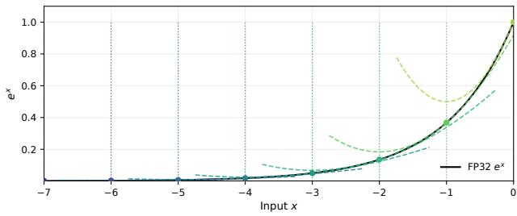  
Figure 1. Taylor Regions for $e ^ { x }$ . Vertical dotted lines denote anchor points; dashed curves show local Taylor approximations centered at each anchor.

$2 ^ { l }$ exponents exp $( a _ { i } )$ , where $a _ { i } \in \{ 0 , \ldots , 2 ^ { l } \}$ is the anchor. These values are stored in a small LUT and represent the nearest integer to which the Taylor series is pinned. The proposed format allocates l +1 bits: a single sign bit and l index bits that address the LUT. The motivation for this approach is illustrated in Figure 1, which plots the exp function with the Taylor approximation around the anchor points.

All tabulated values correspond to strictly negative exponents; therefore, the LUT contains exactly $2 ^ { l }$ entries. The value associated with zero input, $\exp ( 0 ) = 1$ , is handled as a designated non-LUT case encoded directly by the sign bit. This eliminates the need to reserve a LUT location for the zero exponent while preserving a uniform indexing structure for all negative inputs.

Recall that the n-th order Taylor approximation of the exponential function around an anchor point a is given by:

$$
\exp ( x ) \approx e ^ { a } \sum _ { i = 0 } ^ { n } { \frac { ( x - a ) ^ { i } } { i ! } } ,\tag{3}
$$

where x is the input and a denotes the chosen evaluation point. For $n = 2$ , the exponential of a quantized and rangelimited input $\hat { x } _ { q }$ can be approximated as:

$$
\exp ( \hat { x } _ { q } ) \approx \mathrm { L U T } [ e \nu p ] \left( 1 + \Delta + \frac { \Delta ^ { 2 } } { 2 } \right) ,\tag{4}
$$

where LUT[evp] stores the precomputed anchor value corresponding to the index evp, and $\Delta = \hat { x } _ { q } - ( e \nu p \ll k )$ represents the local offset from the anchor. However, all factors in (4) must be scaled to b-bit precision using the scaling factor $2 ^ { k }$ . The corrected integer-only expression is:

$$
\exp \left( \hat { x } _ { q } \right) \approx \mathrm { L U T } [ e \nu p ] \left( 1 \ll k + \Delta + \left( \Delta ^ { 2 } \gg ( k + 1 ) \right) \right) \underset { \epsilon \searrow 1 } { \gg } k .\tag{5}
$$

Here, the quadratic term is rescaled by right-shifting by k, and the division-by-two is achieved with an additional bitshift $( \mathrm { i . e . , } \gg ( k + 1 ) )$ . The result is rescaled by right-shifting the final product by k.

An additional benefit of this approach is that $\Delta$ only requires k bits, since the l MSBs of $\hat { x } _ { q }$ are equal in each segment evp and therefore cancel out during subtraction. Consequently, the calculation of $\Delta$ demands low bit precision and can be calculated once, then efficiently pipelined for the calculation of each additional order of the Taylor series. This structure also allows precision to be tuned based on accuracy requirements, as shown in Section 5.

## 3.2. Shift-based Taylor Region Natural Logarithm Approximation (TR-ln)

The previous subsection introduced our Taylor Regionbased approximation for the exponential function (TR-exp), a core operator in deep-learning workloads such as Soft-Max. Building on this, we observe that by employing a lightweight implementation of the natural logarithm (the complementary function of the exponential), we can perform additional nonlinear operations directly in the logdomain with negligible accuracy degradation. This advantage becomes particularly pronounced when the exp operator requires higher precision. In this subsection, we present a low-cost logarithm approximation suitable for integration into computations such as SoftMax and LayerNorm.

Exploiting the sub-linear behavior of the natural logarithm over a bounded interval, we replace the full ln(·) computation with a first-order (linear) approximation. To further reduce approximation error, the input domain is divided into piecewise-linear segments [a, b]. The segment boundaries can be selected efficiently in hardware by using the position of the leading 1-bit of x together with the position of the next most significant bit. These bits determine the interval $2 ^ { \lfloor \log _ { 2 } x \rfloor }$ in which the value resides, effectively selecting the appropriate linear region. As the segments widen, the function slope decreases, thereby ensuring numerical stability.

Under this construction, the logarithm of the quantized input $x _ { q }$ is approximated as:

$$
\ln x _ { q } = m ( x _ { q } - x _ { q 0 } ) + \ln 2 ^ { a } ,\tag{6}
$$

where a denotes the position of the leading-one bit, $x _ { q 0 }$ is the corresponding power-of-two anchor point determined by that leading bit, and the slope m is selected according to the chosen segment. The slope can be expressed as:

$$
m = { \frac { \ln 2 ^ { a + 1 } - \ln 2 ^ { a } } { 2 ^ { a + 1 } - 2 ^ { a } } } = { \frac { \ln 2 } { 2 ^ { a } } }\tag{7}
$$

Under these definitions and substitutions, (6) becomes:

$$
\begin{array} { c } { { \ln x _ { q } = 2 ^ { - a } \cdot \ln 2 ( x - 2 ^ { a } ) + a \ln 2 } } \\ { { { } } } \\ { { = \ln 2 ( 2 ^ { - a } x - 1 ) + a \ln 2 } } \\ { { { } } } \\ { { { } = \ln 2 ( 2 ^ { - a } x + a - 1 ) . } } \end{array}\tag{8}
$$

Note that ln 2 can be approximated numerically as ln $2 \approx$ $0 . 5 + 0 . 1 2 5 + 0 . 0 6 2 5$ . Since these coefficients are powers

of two, the associated multiplications can be realized using shift-and-add operations rather than full multipliers. Thus, defining $k = 2 ^ { - a } x + ( a - 1 )$ , we obtain:

$$
k \cdot \ln 2 \approx ( 0 . 5 + 0 . 1 2 5 + 0 . 0 6 2 5 ) k ,\tag{9}
$$

and therefore:

$$
\ln x _ { q } \approx ( k \gg 1 ) + ( k \gg 3 ) + ( k \gg 4 ) .\tag{10}
$$

## 4. Hardware-Efficient TR Calculation of Nonlinear Deep Learning Operators

In this section, we introduce a unified, hardware-efficient methodology for approximating nonlinear functions based on the Taylor Region approach developed in Section 3. We first demonstrate the approach on SoftMax and then extend it to GELU and LayerNorm, enabling a fully quantized inference pipeline for vision and language tasks. These proposed computations reduce the cost of operations such as division, square root, and exponentiation into simple additions, shifts, and integer multiplications. This dramatically improves efficiency on resource-constrained hardware by removing the need for floating-point arithmetic units, dividers, and other complex hardware blocks.

## 4.1. Taylor Region SoftMax Approximation (TR-SoftMax)

Given an input vector $x = [ x _ { 1 } , x _ { 2 } , \ldots , x _ { n } ]$ of length $n ,$ the SoftMax operator maps each element to a probability $p _ { i } \in [ 0 , 1 ]$ such that $\textstyle \sum _ { i = 1 } ^ { n } p _ { i } = 1$ . Formally:

$$
\operatorname { S o f t M a x } ( x _ { i } ) = { \frac { \exp ( x _ { i } ) } { \sum _ { j = 1 } ^ { n } \exp ( x _ { j } ) } } .\tag{11}
$$

To ensure that the exponentials do not overflow in a quantized representation, the first step is to subtract the maximum input value from all inputs, ${ \hat { x } } = x - x _ { \operatorname* { m a x } } .$ , as described in Section 3.1. This simple modification guarantees numerical stability while leaving the output distribution unchanged. Following bounding and scaling, (11) can be rewritten as:

$$
\mathrm { S o f t M a x } ( \hat { x } _ { q , i } ) = \frac { \exp ( \hat { x } _ { q , i } ) } { \sum _ { j = 1 } ^ { n } \exp ( \hat { x } _ { q , j } ) } ,\tag{12}
$$

where $\hat { x } _ { q , i }$ are the quantized and bounded input values.

To compute the denominator $\begin{array} { r } { S \triangleq \sum _ { j = 1 } ^ { n } \exp ( \hat { x } _ { q , j } ) } \end{array}$ , we exploit the fact that at least one input satisfies $x _ { j } = x$ max, implying $\hat { x } _ { q , j } = 0$ and $\exp ( \hat { x } _ { q , j } ) = 1$ . Consequently, $S \geq 1$ and ln $S \geq 0 .$ . This allows us to evaluate the reciprocal $S ^ { - 1 }$ using the TR-ln and TR-exp operators:

$$
S ^ { - 1 } = \exp ( - \ln S ) ,\tag{13}
$$

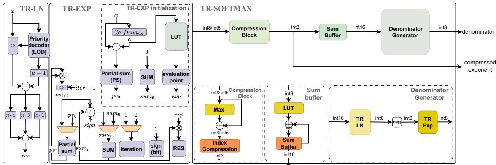  
Figure 2. Block-level overview of TR-ln, TR-exp, and TR-SoftMax. The same exp and log primitives are reused across attention, normalization, and activation functions to enable a unified and hardware-efficient implementation.

where the exponent − ln S is non-negative, as required by the TR-exp approximation.

To obtain the final SoftMax value, we multiply $S ^ { - 1 }$ by $\exp ( \hat { x } _ { q , i } )$ and apply a right shift by k bits for rescaling. The complete TR-SoftMax computation is therefore:

$$
\mathrm { T R - S o f t M a x } [ \hat { x } _ { q , i } ] = s _ { f } \cdot \mathrm { T R - e x p } [ \hat { x } _ { q , i } ] \gg k ,\tag{14}
$$

where the normalization factor $s _ { f }$ is computed once per vector:

$$
s _ { f } = \mathrm { T R - } \exp \left( - \mathrm { \mathrm { ~ T R } } \mathrm { - } \ln \left[ \sum _ { j = 1 } ^ { n } \mathrm { T R } \mathrm { - } \exp ( \hat { x } _ { q , j } ) \right] \right) .\tag{15}
$$

All operations involving additions, shifts, multiplications, and LUT lookups are implemented at b-bit precision. This enables an efficient, fully integer arithmetic realization. Figure 2 illustrates the implementation of TR-exp, TR-ln, and TR-SoftMax.

## 4.2. Taylor Region GELU Approximation (TR-GELU)

Another primary nonlinear function used in various deep learning models is the Gaussian Error Linear Unit (GELU) (Hendrycks & Gimpel, 2016). GELU combines linear and nonlinear behaviors smoothly, often yielding better convergence than ReLU in both NLP and vision models. It is defined as:

$$
{ \mathrm { G E L U } } ( x ) = x \Phi ( x ) = x { \frac { 1 } { 2 } } { \Big ( } 1 + \operatorname { e r f } { \left( { \frac { x } { \sqrt { 2 } } } \right) } { \Big ) } ,\tag{16}
$$

where $\Phi ( x )$ is the Gaussian cumulative distribution function (CDF) and erf(·) is the error function.

Direct evaluation of $\mathrm { e r f } ( \cdot )$ is prohibitively expensive in dedicated hardware. A common workaround replaces $\Phi ( x )$ with

a scaled sigmoid:

$$
\mathrm { G E L U } ( x ) \approx x \sigma ( \alpha x ) , \quad \sigma ( z ) = \frac { 1 } { 1 + e ^ { - z } } ,\tag{17}
$$

where $\alpha \approx 1 . 7 0 2$ is chosen to best fit the exact GELU curve in a least-squares sense (Hendrycks & Gimpel, 2016). This reduces complexity to a single multiply and a lookupfriendly logistic approximation.

An alternative exploits the “SoftMax-style” identity (Li & Gu, 2023):

$$
\sigma ( x ) = \frac { 1 } { 1 + e ^ { - x } } = \frac { e ^ { 0 } } { e ^ { 0 } + e ^ { - x } } = \frac { e ^ { - x _ { \mathrm { m a x } } } } { e ^ { - x _ { \mathrm { m a x } } } + e ^ { x - x _ { \mathrm { m a x } } } } ,\tag{18}
$$

where $x _ { \mathrm { m a x } } = \operatorname* { m a x } ( 0 , x )$ ensures that the exponentials are applied to non-positive numbers for numerical stability.

The GELU approximation in (17) and (18) allows the use of the same $\mathrm { T R - e x p }$ and TR-ln operators employed earlier for TR-SoftMax. However, this sigmoid-based form is only reliable when the model was trained with the same approximation. For production models trained with the exact GELU in (16), substituting (17) at inference introduces a noticeable accuracy degradation.

To address this limitation, we replace the global scaling factor α with a region-dependent parameterization. The scaling factors $\left\{ \alpha _ { i } \right\}$ are computed offline by explicitly minimizing the mean-square error between the approximate and exact GELU functions over their corresponding intervals. In our implementation, we use ten uniformly spaced segments covering the range [−5, 5].

Due to the odd symmetry of the GELU function, $\mathrm { G E L U } ( - x ) = - \mathrm { G E L U } ( x )$ , the optimal scaling factors for negative inputs are obtained by mirroring the positive regions. As a result, only half of the scaling coefficients need to be stored in practice. This reduces the LUT to four entries without loss of accuracy, further minimizing memory overhead.

## 4.3. Taylor Region Layer Normalization Approximation (TR-Norm)

The final nonlinear operation required for a fully-quantized vision transformer (ViT) is LayerNorm. Introduced by Ba et al. (Ba et al., 2016), LayerNorm rescales each feature vector according to:

$$
\begin{array} { l } { { \mathrm { L a y e r N o r m } ( x _ { i } ) = \gamma \displaystyle \frac { x _ { j } - \mu } { \sqrt { \sigma ^ { 2 } + \epsilon } } + \beta , } } \\ { { \mu = \displaystyle \frac { 1 } { n } \sum _ { j = 1 } ^ { n } x _ { j } , ~ \sigma ^ { 2 } = \displaystyle \frac { 1 } { n } \sum _ { i = 1 } ^ { n } ( x _ { j } - \mu ) ^ { 2 } , } } \end{array}\tag{19}
$$

where n is the vector size, and $\gamma$ and $\beta$ are trainable parameters. Because $\mu$ and $\sigma ^ { 2 }$ span a wide range, low-bit quantization is fragile. Consequently, most accelerators maintain a high-precision path via standalone dividers (Kim et al., 2021; Lin et al., 2021; Li & Gu, 2023) or 32-bit “fake-FP32” blocks (Zhang et al., 2024). Iterative square-root $( \sqrt { \cdot } )$ schemes, such as Newton-Raphson (Crandall & Pomerance, 2001), reduce the latency to only a few iterations, but still invoke a divider every cycle.

Log-Domain Reformulation. Similar to the approach for TR-SoftMax, we reduce the hardware requirements of the division and square-root by employing TR-exp and TR-ln:

$$
\begin{array} { l } { { \displaystyle { \frac { 1 } { \sqrt { \sigma ^ { 2 } + \epsilon } } = \exp \left[ \mathrm { l n } ( \sigma ^ { 2 } + \epsilon ) ^ { - { \frac { 1 } { 2 } } } \right] } \ ~ } } \\ { { \displaystyle ~ \approx \mathrm { T R } \mathrm { - e x p } \left[ - { \frac { 1 } { 2 } } \mathrm { T R } \mathrm { - } \mathrm { l n } ( \sigma ^ { 2 } + \epsilon ) \right] } . } \end{array}\tag{20}
$$

A difficulty emerges when $\sigma ^ { 2 } + \epsilon < 1$ , as the input to the logarithm becomes negative, resulting in reduced numerical fidelity in low-bit quantized formats. Addressing this region requires a computation mechanism whose precision can be selectively increased. To accommodate this, the exp LUT is expanded to include positive entries. Although this modification doubles the table size, it preserves the architectural structure and introduces only negligible hardware overhead. Figure 3 provides the schemes for TR-GELU and TR-Norm.

Outlier-Aware Scale Optimization. As shown in Figure 4, a significant source of accuracy degradation in low-precision LayerNorm arises from quantization of the scale parameter γ, whose distribution is highly skewed and outlierdominated. In some configurations, this effect leads to severe accuracy loss, while in others it manifests as consistent two-digit percentage degradation. Direct min–max quantization therefore induces excessively wide dynamic ranges, collapsing most values into a small number of quantization levels. While prior work such as Quark (Zhao et al.,

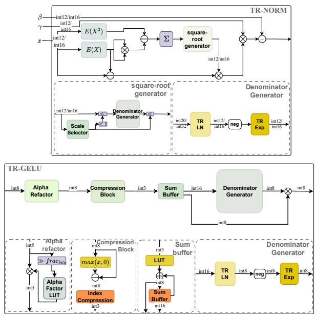  
Figure 3. Block-level overview of the proposed TR-Norm (top) and TR-GELU (bottom) operators, illustrating their integration within the low-precision nonlinear processing pipeline.

2025) mitigates this issue via group-wise quantization, we adopt a complementary approach that optimizes a global scaling factor for γ using a lightweight line search. Specifically, we employ a variance-normalized RMSE objective inspired by EasyQuant (Wu et al., 2020) to balance sensitivity to extreme outliers with accurate representation of typical values. The RMSE term penalizes large deviations caused by high-magnitude $\gamma$ entries, while normalization by the tensor variance prevents degenerate solutions in which most elements collapse to a narrow dynamic range, yielding a stable and well-conditioned scale under aggressive quantization.

## 5. Experiments and Evaluation

## 5.1. Implementation Details

We implemented a fully-quantized, hardware-efficient ViT model, TR-PTQ, utilizing the TR-exp, TR-ln, TR-SoftMax, TR-GELU, and TR-Norm primitives proposed in Sections 3 and 4. TR-PTQ is evaluated on widely adopted ViT architectures, including DeiT (Touvron et al., 2021) and Swin Transformer (Liu et al., 2021), using the ImageNet-1k dataset (Deng et al., 2009). To ensure a comprehensive analysis across varying model capacities, we test three configurations: tiny (T), small (S), and base (B). For post-training calibration, we sample 100 images from the training set and report accuracy on the full 50,000-image validation set.

Table 1. Comparison of Top-1 accuracy (%) across different ViT models and quantization methods.
<table><tr><td>METHOD</td><td>DEIT-T</td><td>DEIT-S</td><td>DEIT-B</td><td>SWIN-T</td><td>SWIN-S</td><td>SWIN-B</td></tr><tr><td>FULL FP32 (BASELINE)</td><td>72.21</td><td>79.85</td><td>81.85</td><td>81.35</td><td>83.20</td><td>83.60</td></tr><tr><td>FQ-VIT (LIN ET AL., 2021)</td><td>71.61</td><td>79.17</td><td>81.20</td><td>80.51</td><td>82.71</td><td>82.97</td></tr><tr><td>ZHANG (ZHANG ET AL., 2023)</td><td>71.08</td><td>78.49</td><td>80.74</td><td>80.03</td><td>82.29</td><td>82.67</td></tr><tr><td>SOLE (INT8)</td><td>71.07</td><td>78.89</td><td>81.12</td><td>80.14</td><td>82.60</td><td>82.79</td></tr><tr><td>QUARK (ZHAO ET AL., 2025)</td><td>71.29</td><td>79.40</td><td>81.52</td><td>81.06</td><td>82.81</td><td>85.03†</td></tr><tr><td>TR-PTQ (OURS)</td><td>71.39</td><td>79.27</td><td>81.40</td><td>80.70</td><td>82.80</td><td>83.18</td></tr></table>

†QUARK reports 85.27% accuracy on Swin-B when evaluated against its own FP32 baseline.

All experiments were conducted on NVIDIA T4 GPUs. Our implementation utilizes Hugging Face libraries with streaming dataset support. While this may introduce minor latency, it significantly lowers the barrier for conducting large-scale experiments.

## 5.2. Quantization Configuration

Per-tensor uniform quantization was applied across all major components. Linear projections and matrix multiplications are quantized to 8-bit precision for both inputs and weights.

The SoftMax (TR-SoftMax) and GELU (TR-GELU) computations, which require the evaluation of exponential and logarithmic functions, are implemented using 8-bit integer arithmetic. The specific precision requirements associated with the exponent across various layers are analyzed in the ablation studies (Section 6).

Layer normalization (TR-Norm) is realized using 12-bit arithmetic. This increased precision is necessary to maintain numerical stability during the computation of the mean, variance, and affine parameters (γ and β). Although TR-Norm operates at a higher bit-width than other functional units, it eliminates the need for floating-point hardware while ensuring robust behavior across diverse model architectures.

## 5.3. Error˙Analysis

The first-order TR-Exp approximation exhibits bounded absolute error below 0.1 over the evaluated range, as shown in Figure 4. Since the exponential is subsequently normalized $( \mathrm { e . g . , 1 / \sum e x p ( \cdot ) } )$ , this error is further attenuated in practice, resulting in accurate log-domain division and inverse square-root operators (see Appendix A.3). The TR-Ln approximation shows larger error (up to 0.2) only for very small inputs $( x \approx 1 0 ^ { - 2 } )$ , while remaining accurate for larger values. Notably, the proposed formulation replaces conventional double-width division with simple shift and multiplication operations, enabling both division and inverse square root using only two same-width multiplications.

## 5.4. Accuracy Evaluation

TR-PTQ is benchmarked against the full-precision (FP32) baseline and recent state-of-the-art PTQ methods, including FQ-ViT (Lin et al., 2021), SOLE (Wang et al., 2023), QUARK (Zhao et al., 2025), and the method proposed by Zhang et al. (Zhang et al., 2023), which integrates I-BERT’s integer GELU with a constrained quantization scheme.

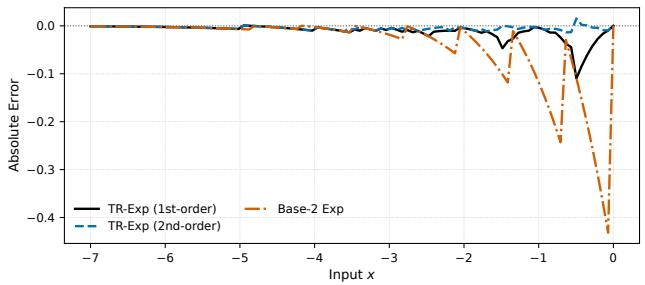

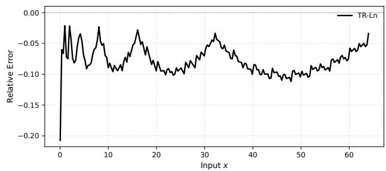  
Figure 4. Approximation error of the proposed TR nonlinear operators (top: TR-exp, bottom: TR-ln) under 8-bit integer arithmetic.

Table 1 summarizes the Top-1 accuracy on ImageNet. Our method is among the top performer across all configurations. Compared to the FP32 baseline, the accuracy degradation remains less than 1% for the majority of models, a notable achievement given the aggressive integer-only quantization applied to all nonlinear layers.

## 6. Ablation Study

To understand the effect of various design decisions on TR-PTQ, we conduct ablation studies across three axes: (1) SoftMax approximation, (2) GELU quantization, and (3) LayerNorm precision.

## 6.1. SoftMax Robustness

Replacing the full-precision SoftMax operation with the proposed 8-bit TR-SoftMax approximation results in less than 1% accuracy degradation on vision tasks and modest relative degradation across GLUE benchmarks. The maximum relative drop remains below 4%, with most tasks exhibiting less than 3% degradation that causes by the linear layers.

Despite the widespread perception that exponential functions are highly sensitive to approximation, we find that the SoftMax operation is surprisingly robust to quantization noise. This robustness stems from two key factors. First, the normalization step rescales each exponential relative to the sum, thereby attenuating the impact of individual approximation errors. Second, the attention mechanism primarily relies on preserving the ordering and relative magnitude of dominant logits rather than exact probability values; contributions from strongly negative logits $( \mathbf { e } . \mathbf { g } . , e ^ { - 8 } \approx 3 \times 1 0 ^ { - 4 } )$ are negligible and can be coarsely approximated without affecting the output.

Table 2. Model Accuracy Across Different Bit-Precisions
<table><tr><td>METHOD</td><td>DEIT-T</td><td>DEIT-S</td><td>DEIT-B</td><td>SWIN-T</td><td>SWIN-S</td><td>SWIN-B</td></tr><tr><td>FP32 (BASELINE)</td><td>72.21</td><td>79.85</td><td>81.85</td><td>81.35</td><td>83.20</td><td>83.60</td></tr><tr><td>4-BIT (ROUNDING)</td><td>68.11</td><td>77.21</td><td>80.53</td><td>79.23</td><td>80.81</td><td>81.28</td></tr><tr><td>6-BIT (ROUNDING)</td><td>70.64</td><td>78.61</td><td>81.29</td><td>80.28</td><td>82.67</td><td>82.97</td></tr><tr><td>8-BIT (ROUNDING)</td><td>70.84</td><td>78.50</td><td>81.21</td><td>80.34</td><td>82.73</td><td>82.98</td></tr><tr><td>8-BIT (1ST ORDER)</td><td>71.39</td><td>79.27</td><td>81.40</td><td>80.70</td><td>82.80</td><td>83.18</td></tr></table>

To further stress the design, we evaluate increasingly aggressive exponential approximations. Using a zero-order approximation in Q4.4 format (comprising 1-bit sign, 3-bit integer, and 4-bit fractional components) has minimal impact on accuracy. This suggests that the attention mechanism is largely invariant to the exact precision of the exponential tail, provided the relative order of magnitudes is preserved.In contrast, the max-subtraction stage $( \hat { x } = x - x _ { m a x } )$ is significantly more sensitive to quantization noise. As shown in Table 2, reducing the precision of this stage to 4–6 bits leads to larger degradation, particularly in compact architectures like DeiT-T. This sensitivity arises because max-subtraction acts as a global shift; errors in $x _ { m a x }$ propagate to every element in the SoftMax input, potentially shifting the distribution into regions where the Taylor approximation is less accurate or where the exponential values saturate near zero. These results indicate that performance degradation is primarily driven by max-subtraction, rather than by inaccuracies in the exponential approximation itself.

## 6.2. GELU Optimization

Our design choice to adopt the proposed compression was inspired by the structural similarity between the attention mechanism and the feed-forward (MLP) layers, both of which function as key-value memory systems. Based on our finding that attention does not require high-precision representations, we hypothesized that a similar compression strategy would apply to MLP layers.

We push this idea further by evaluating GELU under an aggressive mixed-precision configuration: activation inputs and outputs use 8 bits, while the exponential used in the sigmoid approximation is computed using only 4-bit precision (denoted as 8/4/8). This setting represents the lowest-precision exponential approximation considered in our study.

Results indicate that smaller models are particularly sensitive. For example, on DeiT with this precision and a global scaling factor $\alpha = 1 . 7 0 2 .$ , the accuracy degradation is approximately 1.15%. In this regime, GELU becomes the dominant source of error. However, the proposed regionbased scaling recovers nearly all of this residual loss, demonstrating that fine-grained control of the activation function is necessary to fully exploit aggressive quantization, as shown in Table 3.

Table 3. Impact of GELU implementation on model accuracy. Only the GELU nonlinearity is quantized; all other operations remain in floating point.
<table><tr><td>CONFIGURATION</td><td>ACCURACY (%)</td></tr><tr><td>FP32 BASELINE (ALL LAYERS)</td><td>72.21</td></tr><tr><td>INTEGER GELU (α = 1.702)</td><td>71.07</td></tr><tr><td>INTEGER GELU (SEGMENTED αi)</td><td>72.13</td></tr></table>

Table 4. Performance comparison (%) across GLUE tasks under different quantization configurations.
<table><tr><td>CONFIG</td><td>CoLA</td><td>QNLI</td><td>RTE</td><td>MNLI</td><td>QQP</td><td>SST-2</td><td>MRPC</td></tr><tr><td>FP32 BASE</td><td>53.38</td><td>91.54</td><td>72.56</td><td>84.57</td><td>90.91</td><td>92.89</td><td>89.81</td></tr><tr><td>ALL QUANT</td><td>51.27</td><td>88.30</td><td>70.76</td><td>81.94</td><td>90.07</td><td>92.78</td><td>88.43</td></tr><tr><td>PIECEWISE</td><td>54.80</td><td>88.30</td><td>70.76</td><td>82.75</td><td>90.79</td><td>92.88</td><td>89.84</td></tr><tr><td>EXCL LINEAR</td><td>55.91</td><td>90.99</td><td>71.48</td><td>83.48</td><td>90.79</td><td>93.23</td><td>90.97</td></tr><tr><td>NORM (No OPT)</td><td>2.95</td><td>65.17</td><td>55.23</td><td>53.48</td><td>70.55</td><td>86.01</td><td>38.75</td></tr><tr><td>NORM (OURS)</td><td>53.18</td><td>91.05</td><td>71.48</td><td>83.65</td><td>90.82</td><td>92.63</td><td>90.01</td></tr></table>

## 6.3. Layer Normalization Analysis

Across the operational range, the proposed log-domain Taylor approximation remains stable and accurate, with precision controlled by a small number of TR-exp iterations (at most two in all evaluated configurations), yielding a favorable accuracy-cost trade-off. Although worst-case degradation under full quantization is observed in Table 4, ablation analysis indicates that it is primarily driven by the linear layers. In contrast, per-tensor quantization of nonlinear operators introduces only marginal degradation, while the dominant source of error in LayerNorm arises from the scale parameter γ, motivating our γ-specific treatment.

## 7. Conclusions

We demonstrate that key nonlinear components in transformers can be implemented efficiently at low bit precision using per-tensor quantization while preserving high accuracy. Our analysis reveals that accuracy degradation is driven by a small number of sensitive operations, motivating targeted optimizations that recover most of the lost performance without increasing hardware complexity. These results emphasize the importance of selectively allocating precision to enable efficient low-precision inference.

## References

Ba, J. L., Kiros, J. R., and Hinton, G. E. Layer normalization. arXiv preprint arXiv:1607.06450, 2016.

Crandall, R. and Pomerance, C. Prime Numbers: A computational perspective, 2001.

Deng, J., Dong, W., Socher, R., Li, L.-J., Li, K., and Fei-Fei, L. ImageNet: A large-scale hierarchical image database. In 2009 IEEE conference on computer vision and pattern recognition, pp. 248–255. IEEE, 2009.

Frantar, E., Ashkboos, S., Hoefler, T., and Alistarh, D. Gptq: Accurate post-training quantization for generative pretrained transformers. arXiv preprint arXiv:2210.17323, 2022.

Hendrycks, D. and Gimpel, K. Bridging nonlinearities and stochastic regularizers with gaussian error linear units. CoRR, abs/1606.08415, 2016. URL http://arxiv. org/abs/1606.08415.

Kim, S. and Rhee, C. E. ARNorm: Hardware-Efficient Normalization for Lightweight Edge Models. In 2025 International Technical Conference on Circuits/Systems, Computers, and Communications (ITC-CSCC), pp. 1–3, 2025. doi: 10.1109/ITC-CSCC66376.2025.11137703.

Kim, S., Gholami, A., Yao, Z., Mahoney, M. W., and Keutzer, K. I-BERT: integer-only BERT quantization. CoRR, abs/2101.01321, 2021. URL https://arxiv. org/abs/2101.01321.

Li, Z. and Gu, Q. I-ViT: Integer-only quantization for efficient vision transformer inference. In Proceedings ofthe IEEE/CVF International Conference on Computer Vision, pp. 17065–17075, 2023.

Lin, Y., Zhang, T., Sun, P., Li, Z., and Zhou, S. FQ-ViT: Post-training quantization for fully quantized vision transformer. arXiv preprint arXiv:2111.13824, 2021.

Liu, Z., Lin, Y., Cao, Y., Hu, H., Wei, Y., Zhang, Z., Lin, S., and Guo, B. Swin transformer: Hierarchical vision transformer using shifted windows. In Proceedings of the IEEE/CVF international conference on computer vision, pp. 10012–10022, 2021.

Park, J. and Rhee, C. E. High-Precision Softmax Division without Multipliers or Look-Up Tables. In 2025 International Technical Conference on Circuits/Systems, Computers, and Communications (ITC-CSCC), pp. 1–3, 2025. doi: 10.1109/ITC-CSCC66376.2025.11137704.

Stevens, J. R., Venkatesan, R., Dai, S., Khailany, B., and Raghunathan, A. Softermax: Hardware/Software Co-Design of an Efficient Softmax for Transformers. In

2021 58th ACM/IEEE Design Automation Conference (DAC), pp. 469–474, 2021. doi: 10.1109/DAC18074. 2021.9586134.

Sun, T., Ma, T., Liu, J., Li, Z., Li, Q., Wang, Y., Liu, H., and Liu, S. Integer Quantization of Nonlinear Operations towards Hardware-Friendly ViTs. In 2025 32nd IEEE International Conference on Electronics, Circuits and Systems (ICECS), pp. 1–4, 2025. doi: 10.1109/ICECS66544. 2025.11270824.

Touvron, H., Cord, M., Douze, M., Massa, F., Sablayrolles, A., and Jegou, H. Training Data-Efficient Image Trans-´ formers & Distillation Through Attention. In Proceedings ofthe IEEE Conference on Computer Vision and Pattern Recognition (CVPR), pp. 10347–10357, 2021.

Wang, W., Zhou, S., Sun, W., Sun, P., and Liu, Y. SOLE: Hardware-Software Co-design of Softmax and LayerNorm for Efficient Transformer Inference. In 2023 IEEE/ACM International Conference on Computer Aided Design (ICCAD), pp. 1–9, 2023. doi: 10.1109/ ICCAD57390.2023.10323725.

Wu, D., Tang, Q., Zhao, Y., Zhang, M., Fu, Y., and Zhang, D. Easyquant: Post-training quantization via scale optimization, 2020. URL https://arxiv.org/abs/ 2006.16669.

Xiao, G., Lin, J., Seznec, M., Wu, H., Demouth, J., and Han, S. SmoothQuant: Accurate and efficient post-training quantization for large language models. In Krause, A., Brunskill, E., Cho, K., Engelhardt, B., Sabato, S., and Scarlett, J. (eds.), Proceedings of the 40th International Conference on Machine Learning, volume 202 of Proceedings of Machine Learning Research, pp. 38087–38099. PMLR, 23–29 Jul 2023. URL https://proceedings.mlr.press/ v202/xiao23c.html.

Zhang, J., Liu, H., Zhang, Y., Li, M., and Zhan, Z. Faster Transformer-DS: Multiscale Vehicle Detection of Remote-Sensing Images Based on Transformer and Distance-Scale Loss. IEEE Journal of Selected Topics in Applied Earth Observations and Remote Sensing, 17: 1961–1975, 2024. doi: 10.1109/JSTARS.2023.3335283.

Zhang, Z., He, B., and Zhang, Z. Practical edge kernels for integer-only vision transformers under post-training quantization. Proceedings ofMachine Learning and Systems, 5:35–47, 2023.

Zhao, Z., Li, H., Liu, F., Lu, Y., Wang, Z., Yang, T., Jiang, L., and Guan, H. QUARK: Quantization-Enabled Circuit Sharing for Transformer Acceleration by Exploiting Common Patterns in Nonlinear Operations. In

2025 IEEE/ACM International Conference On Computer Aided Design (ICCAD), pp. 1–9, 2025. doi: 10.1109/ICCAD66269.2025.11240736.

# Appendix for: TR-PTQ: High-Accuracy Integer-Only Transformer Post Training Quantization via Taylor Region Reformulation

## A. Algorithmic and Hardware Details

## A.1. Hardware-Efficient Taylor Implementation

The primary motivation of the Taylor-Region (TR) formulation is to reduce transcendental functions to operations that map efficiently onto fixed-point hardware. By aligning the $Q _ { I . K }$ representation with the Taylor expansion centers, the proposed design avoids high-latency arithmetic units and enables compact, deterministic implementations.

Rounding-based Taylor centering. To minimize approximation error, we center the Taylor expansion at the nearest integer value a = round(x) rather than at $a = \left\lfloor x \right\rfloor$ . In a $Q _ { I . K }$ fixed-point representation, this rounding is implemented by inspecting the most significant fractional bit $x [ k - 1 ]$ . Specifically,

$$
a = { \left\{ \begin{array} { l l } { \lfloor x \rfloor + 1 , } & { { \mathrm { i f ~ } } x [ k - 1 ] = 1 , } \\ { \lfloor x \rfloor , } & { { \mathrm { o t h e r w i s e . } } } \end{array} \right. }
$$

This choice ensures that the residua $\Delta x = x - a$ lies within [−0.5, 0.5], reducing the maximum approximation error by a factor of two relative to floor-based centering.

Addition-free first-order evaluation. The first-order Taylor term $( 1 + x - a )$ is computed without a full-width adder by exploiting the structure of the fractional field $f = x [ k - 1 : 0 ]$ . Depending on the rounding outcome, the expression simplifies to:

$$
1 + x - a = { \left\{ \begin{array} { l l } { \{ 1 , f \} , } & { { \mathrm { i f } } \ a = \lfloor x \rfloor , } \\ { \{ 0 , f \} , } & { { \mathrm { i f } } \ a = \lfloor x \rfloor + 1 . } \end{array} \right. }
$$

In hardware, this replaces a b-bit addition with a single multiplexer controlled by $x [ = k - 1 ]$ , significantly reducing area and power consumption.

Logic-based quadratic approximation. Under rounding-based centering, the residual satisfies $| \Delta x | \le 0 . 5$ , and the quadratic term $\Delta x ^ { 2 } / 2$ is bounded within [0, 0.125]. For a $Q _ { 4 . 4 }$ configuration, a 4-bit signed residual maps to a 2-bit output. Exploiting this narrow range, the second-order term is implemented using combinational logic synthesized via Boolean minimization, rather than a general-purpose multiplier.

By realizing the quadratic correction as a fixed 4-to-2 bit Boolean function, the evaluation can be performed in paralle with the first-order term. As a result, the exponential exp(x) is reduced to: (i) a small lookup table (e.g., 16 entries) for the anchor $e ^ { a }$ , (ii) a multiplexer for the first-order linear term, and (iii) combinational logic for the second-order curvature. This structure enables single-cycle evaluation of nonlinear operators such as SoftMax and GELU, while maintaining a low hardware footprint.

Fixed-point representation and Taylor-region mapping. We use signed two’s-complement fixed-point numbers in the $Q _ { I . K }$ convention, where I counts integer bits including the sign bit and K counts fractional bits (total width $I { + } K )$ . For SoftMax, we apply standard numerical stabilization via max-subtraction, $x ^ { \prime } = x - x _ { \operatorname* { m a x } }$ with $x _ { \mathrm { m a x } } = \operatorname* { m a x } ( x )$ , which enforces $x ^ { \prime } \leq 0$ . Hence, although $Q _ { 4 . 4 }$ nominally spans [−8, 7.9375], only the non-positive half is exercised in practice, $\mathrm { i . e . , } x ^ { \prime } \in [ - 8 , 0 ]$ . Equivalently, the integer field contains one sign bit and three magnitude integer bits. In the Taylor-Region (TR) formulation, the integer component selects the region (evaluation point), while the fractional component is the local residual used by higher-order terms. Our primary configurations are $Q _ { 4 . 4 } ( 8 – \mathrm { b i t } ) , Q _ { 4 . 2 } ( 6 – \mathrm { b i t } )$ , and $Q _ { 4 . 0 } \ ( 4 { \cdot } \mathrm { b i t } )$ .

## A.2. Preprocessing and numerical stabilization.

Given an input vector x, we compute the per-configuration maximum $x _ { \mathrm { m a x } } = \operatorname* { m a x } ( x )$ and form the stabilized vector $x ^ { \prime } = x - x _ { \mathrm { m a x } }$ so that all entries are non-positive. Importantly, the max-reduction and subtraction are performed in the target bit-precision (8-bit, 6-bit, or 4-bit, respectively), using the corresponding $Q _ { I . K }$ format. The stabilized values $x ^ { \prime }$ are then used as inputs to the exponential evaluation.

Zero-order exponential via a compact LUT. To stress-test robustness, we evaluate a zero-order approximation in which the fractional bits are discarded (i.e., we keep only the integer component of $x ^ { \prime } )$ . The exponential is then computed using a $2 ^ { I }$ -entry lookup table indexed by the integer value (e.g., 16 entries for $I = 4 ) { \mathrm { : } }$

$$
\operatorname { L U T } [ a ] = { \mathrm { r o u n d } } \left( e ^ { a } \cdot \left( 2 ^ { b - 1 } - 1 \right) \right) ,
$$

where b is the output bit-width. Values with $a < - 6$ are clamped to zero to avoid underflow. This provides a lightweight alternative to implementing a full 8-bit exponential table (256 entries), while keeping the evaluation hardware-efficient.

Accuracy vs. bit precision. Table 2 reports Top-1 accuracy across DeiT and Swin models. Relative to FP32, 4-bit rounding exhibits the largest degradation, with a drop of 1.32–4.10 points (median 2.35). In contrast, 6-bit and 8-bit rounding reduce the loss to 0.53–1.57 (median 0.85) and 0.47–1.37 (median 0.83) points, respectively. 1st order configuration further improves accuracy, limiting the drop to 0.40–0.82 points (median 0.52).

## A.3. TR-Norm and TR-Div

Numerical behavior of TR-Div and TR-Norm. The evaluation of TR-Div remains numerically stable under the considered Transformer workloads. Since the denominator is constrained to be $\geq 1$ - either through the addition of a stabilization constant ϵ or by properties of the attention score normalization-the corresponding logarithm is non-negative. As a result, division in the log domain yields values bounded by unity, which in turn constrains the subsequent exponential evaluation to a limited dynamic range. This bounded regime is well suited to low-order Taylor approximations; empirically, a second-order polynomial provides the best accuracy-complexity trade-off.

Figure A.1 compares TR-Div against a shift-based division method (Wang et al., 2023). The results indicate that TR-Div exhibits lower numerical error across the evaluated ranges, which we attribute to the avoidance of coarse quantization effects introduced by bit-shift operations.

In contrast, TR-Norm is more sensitive to quantization due to its broader dynamic range. Unlike TR-Div, the logarithmic inputs encountered in normalization layers may take both positive and negative values, requiring a wider representation to preserve accuracy. We therefore adopt a 12-bit configuration as a balance between numerical fidelity and implementation cost. Importantly, the second-order Taylor term $( x - a ) ^ { 2 } / 2$ depends only on the fractional residual, enabling its computation with a 12-bit multiplier. The anchor-point exponential $e ^ { a }$ is pre-computed and absorbed into the layer-specific scaling factor during calibration, reducing the inference-time computation to a single 12-bit multiplication.

Since the multiplier constitutes the primary arithmetic bottleneck, this fusion enables both division and square-root operations to be implemented within a single computation cycle. The 12-bit intermediate precision is used only for internal accumulation to prevent error propagation, while the final output is re-quantized to 8-bit before being forwarded to subsequent layers.

## B. Statistical Analysis of Affine Parameters

## B.1. Gamma-like distribution of learned scales

A key challenge in the quantization of normalization layers arises from the distribution of the learned affine parameters γ. Unlike weights in convolutional or linear layers, which often follow near-Gaussian statistics, the scale parameters in Transformer normalization layers are strictly positive and frequently heavy-tailed. As a result, a small number of large values can dominate the dynamic range.

Fig. B.1 illustrates the effect of these outliers under naive min-max quantization. In several layers, the dynamic range is dictated by a few extreme values, causing the majority of $\gamma$ parameters to collapse into the same quantization bin. This behavior significantly degrades the effective expressivity of the normalization layer.

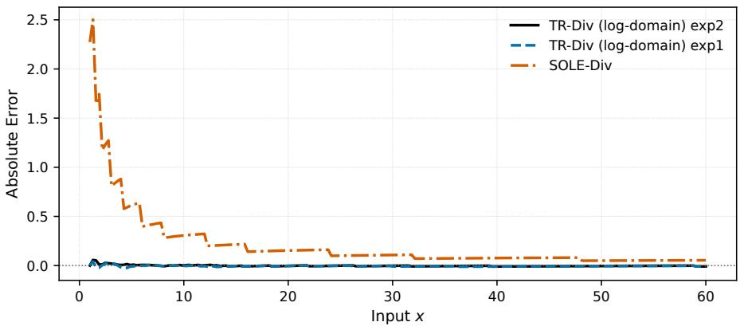  
Figure A.1. Comparison of division noise between the proposed method and a low-cost comparable solution (SOLE). The plot reports the absolute error with respect to a high-precision reference across the evaluated input range.

Table B.1. Vision model performance (Top-1 Acc. %) under 4-bit weight and 12-bit activation quantization.
<table><tr><td>Model</td><td>DeiT-T</td><td>DeiT-S</td><td>DeiT-B</td><td>Swin-T</td><td>Swin-S</td><td>Swin-B</td></tr><tr><td>Acc. (%)</td><td>70.71</td><td>78.67</td><td>81.03</td><td>78.48</td><td>82.60</td><td>82.79</td></tr></table>

Table B.2. GLUE benchmark results under 4-bit weight and 12-bit activation quantization.
<table><tr><td>Task</td><td>CoLA</td><td>SST-2</td><td>QQP</td><td>MNLI</td><td>QNLI</td><td>RTE</td></tr><tr><td>Metric</td><td>50.73</td><td>92.66</td><td>89.71</td><td>83.03</td><td>88.14</td><td>71.84</td></tr></table>

## B.2. Distribution-preserving scale optimization

Variance-normalized line search. Learned affine parameters (γ) often exhibit heavy-tailed distributions in which largemagnitude values are not noise, but play a functional role in model expressivity. Standard clipping or percentile-based schemes are therefore suboptimal, as they may artificially compress the distribution and force pre-activations into a rigid unit-variance regime.

To preserve the original distributional characteristics, we perform an offline line search for an optimal scaling factor $s \in [ 0 . 5 , 2 . 0 ]$ during calibration. For each affine layer, we select s by minimizing a variance-normalized RMSE objective:

$$
\mathcal { L } ( s ) = \frac { \mathrm { R M S E } ( \gamma , \mathrm { d e q u a n t } ( \mathrm { q u a n t } ( \gamma \cdot s ) ) ) } { \mathrm { V a r } ( \gamma ) } .
$$

Normalizing the reconstruction error by the original parameter variance penalizes scales that would collapse the distribution. This objective favors quantized representations that retain the fluctuation structure of the FP32 baseline, thereby preserving the relative importance of high-magnitude channels.

Empirical search range. Across all evaluated models, the optimal scale consistently lies within the [0.5, 2.0] interval. Restricting the search to this range allows the TR-PTQ pipeline to adapt to the distinct statistical profiles of different architectures (e.g., higher variance in DeiT versus more localized scales in Swin) without per-layer heuristics or trainingaware fine-tuning.

Mitigating gamma-induced degradation. To assess the sensitivity of the affine parameters, we conduct an ablation in which γ is quantized to 4-bit precision while all other parameters remain in floating point. Under naive min-max quantization, the heavy-tailed distribution of $\cdot _ { \gamma }$ leads to severe resolution loss for most channels, resulting in a dramatic degradation in model accuracy.

Applying the proposed distribution-preserving line search restores functional behavior. As reported in Tables B.2 and

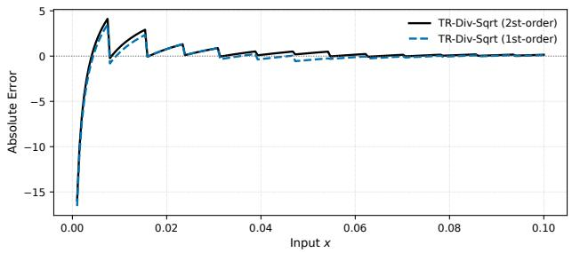  
(a) [0.001, 0.1], 8-bit

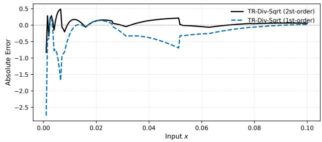  
(b) [0.001, 0.1], 12-bit

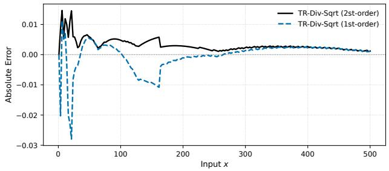  
(c) [1, 500]

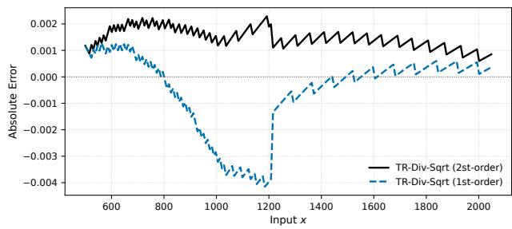  
(d) [500, 2048]  
Figure A.2. Division noise comparison between the proposed method and a low-cost comparable solution (SOLE) across different input ranges and bit-precisions. Noise is measured as absolute error with respect to a high-precision reference.

B.1, the optimized models recover to within 1–2% of their FP32 baselines. For example, Swin-T recovers to 78.48% Top-1 accuracy. This result indicates that scale optimization is not merely a refinement step, but a prerequisite for stable low-precision quantization of normalization layers in integer-only Transformer models.

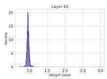

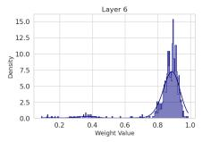

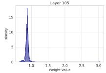

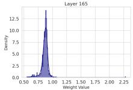

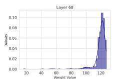

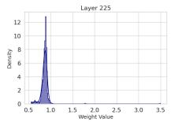

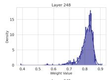

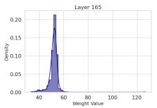

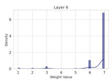

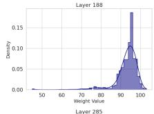

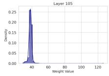

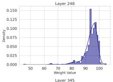

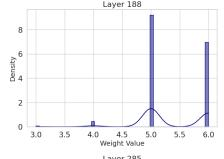

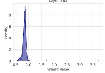

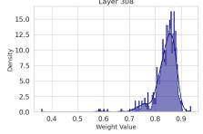  
(a) Original γ matrices before min–max quantization (FP).

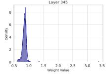

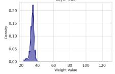

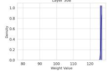  
(b) After min–max quantization (12-bit), showing degraded scaling.

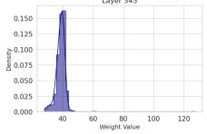

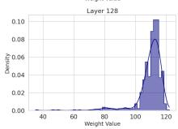

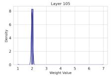

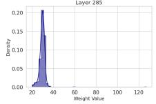

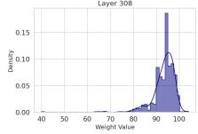  
(c) After relaxation, prior to min–max quantization (12-bit).

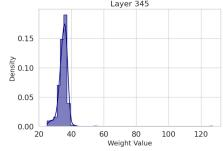

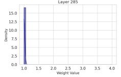

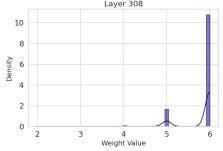  
(d) After relaxation, prior to min–max quantization (4-bit).

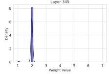

Figure B.1. Effect of relaxation on LayerNorm γ parameters under min-max quantization. The top row shows the original γ matrices before quantization and the corresponding 12-bit min-max quantized result, where scale distortion is observed. The bottom row illustrates the same matrices after relaxation, prior to quantization: the relaxed parameters remain closer to the original, and even under a 4-bit representation exhibit improved stability compared to the unrelaxed 12-bit case.