# Temporally Interpretable Differentiable Decision Trees

Eisuke Hirota 1 2 Aarav Sane 1 Rohan Paleja 1

## Abstract

Interpretability offers a solution to safe autonomy by providing transparency into an agent’s underlying decision-making model. Within sequentialdecision making tasks, differentiable decision trees (DDTs) are one approach to such interpretability, maintaining automatic-differentiable policies while providing humans with a discrete tree-based visualization. Nonetheless, current implementations of DDTs are not well-suited for sequential-decision making domains, as there exists an inherent mismatch between a tree’s singletimestep behavior and a human’s multi-timestep planning. Our work thus introduces time as a new dimension of interpretability, coined as temporal interpretability, and demonstrates how temporal abstractions via action chunking improve it. We achieve this by first introducing two novel policy gradient algorithms that incorporate action chunking. Additionally, to maintain parameter-efficient trees, we develop an information-theoretic tree restructuring algorithm that modifies the tree during training. Across four simulation environments, we find that warm-starting action chunked DDTs from a distilled action chunked policy is the most effective way to obtain temporally interpretable trees: they match neural network policies in three of the four domains while using up to 80% fewer parameters. Our code is available at https: //github.com/ei5uke/temp-interp.

## 1. Introduction

Societal applications such as healthcare, autonomous transportation, and criminal justice must promote interpretability and cannot afford delegating final decision-making to blackbox models. By handing over the wheel, we risk causing life-changing instances like medical black-boxes returning with severely incorrect diagnoses (Zech et al., 2018), autonomous vehicles driving with extraordinary risk and user burden (Chen et al., 2022), and criminal defendants receiving unjustifiably long sentences determined by opaque models (Stevenson & Slobogin, 2018). Human input must be taken into account before real-world deployment of these models, e.g., debugging model behavior via the opinions of engineers, researchers, or domain-specific professionals, or determining the legality of integrating such models within current litigation. Interpretable AI provides a solution to such, promoting interpretable models and thus enabling a human to parse through the decision-making flow; accordingly, interpretable AI creates opportunities for easy debugging and legal analysis. To accomplish this, interpretable AI often leverages tree-based methods, relying on its logic-based design and sparse parameter space to enable a human to easily comprehend the agent’s behavior (Quinlan, 1987).

Particularly for sequential-decision making domains, recent work in differentiable decision trees (DDTs) has improved their usage in interpretable reinforcement learning (RL) (Silva et al., 2019; Paleja et al., 2022; 2024). DDTs maintain the sparsity and interpretability of traditional decision trees but enable automatic-differentiability for feasible RL. Such models are often trained directly with approximate gradients (Paleja et al., 2022), achieving performance comparable to that of NNs. While DDTs have enabled improved performance of trees in sequential-decision making domains, this does not directly guarantee that the model is easily interpretable. Firstly, the logic-based tree structure within DDTs is only comprehendible if the tree is sparse: a massive flow diagram requires extensive and potentially confusing review of the entire decision pipeline (Hu et al., 2019). Secondly, the single-timestep action space does not provide a descriptive explanation of the agent’s plans. Humans leverage logic to determine a sequence of actions or a plan, thus implying that current DDTs do not provide outputs that are easily interpretable at a plan-level, i.e., temporally interpretable.

We thus study time as a new dimension of interpretability and how models can be temporally interpretable (see Figure 1(a)). Toward temporal interpretability, we leverage action chunked RL (Li et al., 2025b) as a key building block. Advancements in action chunking have promoted its usage in behavior cloning, offline RL, and most recently, online RL. Thus, we leverage action chunking to extend traditional policy gradient methods and apply it to DDTs to achieve superior interpretability in sequential decisionmaking paradigms. Our key insight is the following:

action chunked tree policies can return theirfuture actions, depicting short-term plans. This knowledge can increase user confidence in an agent’s behavior or improve insight for an engineer / researcher to verify robustness and debug performance issues.

We thus develop DDTs that have high temporal interpretability and aim to alleviate the increase in parameter count. To accomplish this, we develop policy gradient algorithms with action chunking to train temporally interpretable DDTs and dynamically restructure the tree during training to create compact, parameter-efficient trees.

Our main contributions are as follows:

• We introduce two novel policy gradient methods with action chunking, developing agents that can accurately showcase their short-term plan to the user at each timestep, thus increasing behavior transparency.

• We introduce Information-Theoretic Tree Restructuring (ITTR), an algorithm that deepens / prunes the tree based on policy complexity during training. Our algorithm remedies the increase in parameter count due to action chunking, reducing tree size by up to 50%.

• We demonstrate the effectiveness of our approach across four domains through extensive simulation experiments, robustness verification analysis, and deepening / pruning analysis. Warm-starting our action chunked DDTs from a distilled action chunked policy yields our best temporally interpretable trees, performing competitively against state-of-the-art baselines while using up to 80% fewer parameters.

## 2. Related Works

In this section, we discuss relevant work in the literature on interpretable AI and action chunking.

## 2.1. Interpretable AI

Interpretable AI comprises techniques with global model transparency (Chen et al., 2022; Atakishiyev et al., 2024; Zeng et al., 2019; Doshi-Velez & Kim, 2017; Du et al., 2019). A human should be able to interpret the contents of the model; they must comprehend the parameters, the logic flow, and subsequently, the agent’s behavior. As such, interpretability is often achieved through leveraging models with clear logical structures like decision trees (Olaru & Wehenkel, 2003; Breiman et al., 2017) with mind to their size (Silva & Gombolay, 2021) or rule lists (Weiss & Indurkhya, 1995; Angelino et al., 2018), given that humans can confidently and easily understand their behavior. On the other hand, high-dimensional parameterizations like neural networks (NNs) have significantly more computations and nonlinearity, making it difficult for a human to trace the logic flow, and also leverage embedding spaces that have no clear meaning to a human overseer. Aiming to combat these obstacles, there exists some work that directly condition neural networks to be more interpretable, hoping to combine the strong generalization power of neural networks with the easy comprehension found in interpretable AI methods (Krakovna & Doshi-Velez, 2016; Wu et al., 2021; 2018; Ross & Doshi-Velez, 2018). These approaches generally achieve this by enforcing structural constraints to simplify the model’s logic or applying gradient regularization so that the model learns intelligible features.

Interpretable AI is related to but distinct from explainable AI (xAI). Generally, while interpretable AI focuses on transparent models, xAI prioritizes models that can explain its thought process (Linardatos et al., 2020; Arrieta et al., 2020; Adadi & Berrada, 2018). This may include direct methods like prompt engineering LLMs to explain their thought process (Cambria et al., 2024) to more indirect methods like saliency maps to highlight significant pixels in images (Borys et al., 2023). Crucially, while these xAI methods provide a glimpse into the model’s thought process, they do not fully resolve the mystery within black-box parameterizations, leading to a false sense of security regarding such explanations. Hence, research in interpretable AI is essential and aims to develop near-white box methods with similar performance to deep learning approaches. As such, to avoid the pitfalls of xAI, we focus on generating interpretable models that can provide a clear logical trace for their actions without relying on post-hoc explanations.

Our work differs from prior work by introducing time as a new dimension of interpretability. While model transparency is important in pre-deployment to determine a model’s viability, online temporal comprehension is useful to understand model behavior during deployment, especially in sequential-decision-making domains, e.g., robotics control. With temporal interpretability, engineers / researchers can debug an agent’s decision-making behavior before deployment, and users can take better-informed online decisions, like intervening mid-trajectory.

## 2.2. Action Chunking

Action chunking is in essence a temporal extension of policies (Li et al., 2025b). Traditionally, a policy $\pi ( \boldsymbol { a } _ { t } | \boldsymbol { s } _ { t } )$ outputs one action given the current state. Action chunked policies extend the action space by a time horizon H, thus the updated policy follows: $\pi ( a _ { t : t + H } | s )$ . Since the policy outputs H actions, there exist different paradigms regarding how often to query the policy. The simplest approach would be to query the policy every H timesteps, solely relying on each outputted action chunk (i.e., open-loop). An approach commonly leveraged for deploying vision-language-action models (VLAs) on robots is Temporal Ensemble, where the policy is queried every timestep and the current action is chosen using the weighted average of the k lastly outputted action chunks (Black et al., 2025), albeit such forced temporal consistency may be disadvantageous in highly stochastic environments. Action chunking is effective in capturing non-Markovian behaviors found within offline datasets, hence its common use in training VLAs (Zhao et al., 2023). Lastly, action chunking has been extended to RL, in both offline (Li et al., 2025b;a) and online paradigms (Hahn & Choi, 2025).

Our work thus aims to extend policy gradient algorithms through leveraging action chunking. Particularly, we study how action chunking enables agents to depict their shortterm plans to users and whether techniques like temporal ensemble provide performance and interpretability benefits.

## 3. Preliminaries

## 3.1. Problem Formulation

We define our problem as a Markov Decision Process (MDP), a 6-tuple $\langle S , A , P , R , \gamma , p _ { 0 } \rangle$ where S is the state space, A is the action space, $P : S \times A \to S$ is the transition probability, $R : S \times A $ R is the reward function, $\gamma \in [ 0 , 1 ]$ is the discount factor, and $p _ { 0 } : S  [ 0 , 1 ]$ is the initial state distribution. We use RL to learn the optimal policy $\begin{array} { r } { \pi ^ { * } ( \mathrm { a } _ { t } | \mathrm { s } _ { t } ) = \mathrm { a r g m a x } _ { \pi } \mathbb { E } _ { \tau \sim \pi } [ \sum _ { t = 0 } ^ { T } \gamma ^ { t } R ( \mathrm { s } _ { t } , \mathrm { a } _ { t } ) ] } \end{array}$ that maximizes the expected return from the MDP, where $\tau = \langle \mathrm { s } _ { 0 } , \mathrm { a } _ { 0 } , . . . , \mathrm { s } _ { T } , \mathrm { a } _ { T } \rangle$ is the agent’s episodic trajectory.

## 3.2. Differentiable Decision Trees

DDTs are similar to traditional decision trees but maintain differentiability, enabling learning via backpropagation (Suarez & Lutsko, 1999; Silva et al., 2019; Paleja et al., 2022). This is achieved through leveraging fuzzy logic in place of previously binary decision points. Particularly, DDTs perform a sigmoid function during a decision point i:

$$
y _ { i } = \frac { 1 } { 1 + \exp ( - \alpha ( w _ { i } ^ { T } x - b _ { i } ) } ,\tag{1}
$$

where $w _ { i }$ are the weights of the decision node, x is the feature vector of the current state, $b _ { i }$ is the splitting criterion, α is the sigmoid’s steepness hyperparameter, and $y _ { i }$ is the probability of the node i outputting TRUE.

This architecture itself is not interpretable, however, due to probabilistic splitting. Hence, DDTs are generally converted to DTs using crispification. This process works by only allowing the parameter with the largest magnitude absolute weight in each weight vector to determine the splitting, changing Equation 1 to: $y _ { i } = \mathbb { 1 } ( w _ { i } ^ { k } x ^ { k } - b _ { i } > 0 )$ , where k is the index of the parameter with the most absolute weight.

For our experiments, we use the ICCT variant due to its increased performance and interpretability (Paleja et al., 2022). Generally, trees lose quality during the crispification process as comparisons within each node lose important features. The ICCT variant solves this problem through directly optimizing over the crisp tree using the straightthrough trick (Bengio et al., 2013), creating interpretable trees that can be trained directly and parsed through.

## 3.3. Policy Gradient

Policy gradient methods work by directly adjusting the parameters of a policy instead of querying argmaxed actions from a Q-value function to act as a proxy of a policy (Sutton et al., 1998). Given a policy π parameterized by θ, policy gradient works by minimizing the following:

$$
J ( \theta ) = \mathbb { E } _ { \theta } \left[ \log \pi ( \mathrm { a } _ { t } | \mathrm { s } _ { t } ) \hat { A } _ { t } \right] ,\tag{2}
$$

where $\hat { A } _ { t }$ is the approximated advantage function, typically following something akin to:

$$
\hat { A } _ { t } = r _ { t } + \gamma V _ { \phi } ( \mathrm { s } _ { t + 1 } ) - V _ { \phi } ( \mathrm { s } _ { t } ) .\tag{3}
$$

Here, $r _ { t }$ is the reward signal at time $t , \gamma$ is the discount factor, and $V _ { \phi } ( \mathrm { s } )$ is the value function parameterized by ϕ, often learned via minimizing its distance to the true value $V _ { t } ^ { * }$ calculated via the recursive Bellman optimality equation.

Adding action chunking to policy gradient algorithms was introduced recently and is straightforward (Hahn & Choi, 2025). The goal is to temporally extend the policy to output action chunks, $\mathsf { a } _ { t : t + H } = \left\{ \mathsf { a } _ { t } , \mathsf { a } _ { t + 1 } , \ldots , \mathsf { a } _ { t + H - 1 } \right\}$ , while the value function is left alone since it does not take any actions. The policy gradient equations are then updated (in blue):

$$
J ( \theta ) = \mathbb { E } _ { \theta } \left[ \log \pi ( \mathrm { a } _ { t : t + H } | \mathrm { s } _ { t } ) \hat { A } _ { t + H } \right] ,\tag{4}
$$

$$
\hat { A } _ { t + H } = \sum _ { t ^ { \prime } = t } ^ { t + H - 1 } \gamma ^ { t ^ { \prime } - t } r _ { t ^ { \prime } } + \gamma ^ { H } V _ { \phi } ( s _ { t + H } ) - V _ { \phi } ( s _ { t } ) ,\tag{5}
$$

where H is the action chunking horizon. For clarity, we provide the reader with a derivation of this policy gradient in Appendix B.

Unfortunately, such a policy provides little benefit in terms of temporal interpretability because this policy is trained to be queried every H timesteps. Hence, the user only sees an action chunk every H timesteps rather than continuously, leading to situations where information for timesteps $\geq t + H + 1$ are missing during timesteps $t : t + H$ . While such policy can still be deployed, querying at every timestep instead of H timesteps, this will likely decrease agent performance and lead to unstable trajectories as the agent is only trained to account for transitions $P ( \mathrm { s } _ { k H } , \mathrm { a } _ { k H } )$

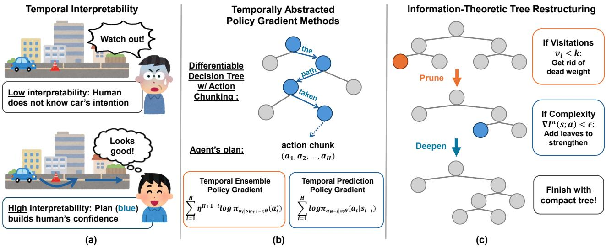  
Figure 1. Overview figure. (a) Temporal Interpretability. We provide an example depicting how humans increase in confidence when provided with an agent’s short-term plan and temporal decision-making (an autonomous vehicle’s plan is visualized with blue arrows). (b) Temporally Abstracted Policy Gradients. We introduce two novel policy gradient methods that enable action chunked DDTs to be temporally interpretable. (c) Information-Theoretic Tree Restructuring. Introducing action chunking to trees increases parameter count, hence we dynamically deepen or prune leaves to ensure the model only contains sub-branches we need most.

## 4. Method

We introduce temporal interpretability to our DDTs through training them with novel policy gradient methods with action chunking and dynamically deepening / pruning them online. From a high-level, the idea is to enable DDTs to output their short-horizon plan to the user while compacting trees through deepening / pruning. We first introduce the policy gradient methods with action chunking (Figure 1(b)).

## 4.1. Temporal Ensemble Policy Gradient

While the previously updated objective function enables the development of a policy with action chunking, it does not necessarily improve interpretability. Given the policy is only queried after every H timesteps, the user will only see a projected plan every H timesteps. If that projected plan provided little information or the user missed it, then the action chunk did not give a meaningful interpretation of the agent’s behavior to the user, thus lacking the essential interpretability safety-critical autonomous systems require.

To give the user a plan, querying the agent at every timestep enables observing an action chunk at every timestep. A viable strategy is to thus develop such a policy and leverage temporal ensemble to aggregate the current action. Herein, the user will always be provided the agent’s short-term plan and have increased confidence of whether to intervene or not. We coin this approach as Temporal Ensemble Policy Gradient. The implementation is detailed in Algorithm 1

and explained below.

For training such agents with temporal ensemble, we must define how such a policy works. We define our chunking policy $\pi _ { \boldsymbol { \theta } } \big ( \mathrm { a } _ { t : t + H } \big | \mathrm { s } _ { t } \big )$ which outputs an action chunk with horizon H upon inputting the current state. This chunking policy is queried at every timestep, and we use a history of the last H chunks to perform temporal ensemble and determine the current action. Given a history of chunks $\rho =$ $\{ \mathrm { a } _ { t - H + 1 } ^ { \dagger } , . . . , \mathrm { a } _ { t } ^ { \dagger } \}$ , where $\mathrm { a } _ { k } ^ { \dagger }$ is the action chunk sampled at timestep k, temporal ensemble is performed by firstly selecting the actions that each chunk assigns to timestep t:

$$
\mathbf { a } ^ { \star } = \{ \mathbf { a } _ { t - H + 1 , H } ^ { \dagger } , \mathbf { a } _ { t - H + 2 , H - 1 } ^ { \dagger } , \dots , \mathbf { a } _ { t , 1 } ^ { \dagger } \} ,\tag{6}
$$

where $\mathrm { a } _ { t , H } ^ { \dagger }$ represents the $H ^ { t h }$ element in chunk ${ \bf a } _ { t } ^ { \dagger }$ . We then proceed to take the exponential moving average (EMA) over the actions in the history where $\mathrm { a } _ { i } ^ { \star }$ corresponds to each element in $\mathrm { a } ^ { \star }$ and $\eta \in ( 0 , 1 ]$ is a coefficient term for EMA:

$$
\mathrm { a } _ { t } = \frac { \sum _ { i = 1 } ^ { H } \eta ^ { H + 1 - i } \mathrm { a } _ { i } ^ { \star } } { \sum _ { j = 1 } ^ { H } \eta ^ { H + 1 - j } } ,\tag{7}
$$

The policy gradient objective function is updated to:

$$
\mathbb { E } _ { \theta } \left[ \underbrace { \sum _ { i = 1 } ^ { H } w _ { i } \log \pi _ { \mathrm { a } _ { i } | s _ { t - H + i } ; \theta } ( \mathrm { a } _ { i } ^ { \star } ) } _ { \mathrm { t e m p o r a l ~ e n s e m b l e } } \hat { A } t \right] , \quad w _ { i } = \frac { \eta ^ { H + 1 - i } } { \sum _ { j = 1 } ^ { H } \eta ^ { H + 1 - j } }\tag{8}
$$

Algorithm 1 Temporal Ensemble Policy Gradient   
Input: $\theta , \phi , { \mathcal { D } } \gets \emptyset , \eta$   
for each iteration do   
ρ ← emptied queue with max length H   
for each environment step do   
$\mathrm { a } _ { t : t + H } \sim \pi _ { \theta } \big ( \mathrm { a } _ { t : t + H } \vert \mathrm { s } _ { t } \big )$   
$\mathbf { i f } \left| \rho \right| = H$ then   
ρ.pop(0)   
end if   
$\rho \gets \rho \cup \mathrm { a } _ { t : t + H }$   
Query $\rho$ to get $\mathrm { a } ^ { \star }$ (Equation 6)   
Perform EMA with $\eta$ to compute $\mathrm { a } _ { t }$ (Equation 7)   
$\begin{array} { r } { \ell _ { \theta } ( \mathbf { a } ^ { \star } ) = \sum _ { i = 1 } ^ { H } w _ { i } \log \pi _ { \mathbf { a } _ { i } | s _ { t - H + i } ; \theta } \bar { ( \mathbf { a } _ { i } ^ { \star } ) } } \end{array}$   
$\mathcal { D }  \mathcal { D } \cup ( s _ { t - H + 1 : t } , \mathbf { a } ^ { \star } , r _ { t } , V _ { t } , \ell _ { \theta } ( \mathbf { a } ^ { \star } ) )$   
end for   
for each gradient step do   
$\mathrm { s } _ { t - H + 1 : t } , \mathrm { a } ^ { \star } , V _ { t } , \ell _ { \theta } ( \mathrm { a } ^ { \star } ) , R _ { t } \gets \mathcal { D } . \mathrm { p o p } ( )$   
Compute ${ \hat { A } } _ { t }$ from $V _ { t }$ and $R _ { t }$   
Update value parameters ϕ with MSE   
Update policy parameters $\theta$ (Equation 8)   
end for   
end for   
Output: $\theta , \phi$

Since the aggregated action combines actions sampled from H different chunks, we aggregate their log probabilities with the same normalized EMA weights, evaluating each $\mathrm { a } _ { i } ^ { \star }$ under the chunk distribution of the state $s _ { t - H + i }$ that produced it. Note that this weighted sum is not the exact log-likelihood of ${ \mathrm { a } } _ { t } ,$ , so Equation 8 is a surrogate objective, i.e., a biased estimator of the policy gradient for $\eta < 1$ . For $\eta = 1$ it reduces, up to scale, to an unbiased estimator given unbiased advantage estimates, since each $\mathrm { a } _ { i } ^ { \star }$ only affects the environment from timestep t onward. Subsequently, Temporal Ensemble Policy Gradient incorporates temporal ensemble over action chunks into policy gradient, introducing temporal interpretability and giving users insight into the future actions.

## 4.2. Temporal Prediction Policy Gradient

Temporal ensemble policy gradient provides higher temporal consistency within environments, albeit with two noticeable flaws. Firstly, enforced temporal consistency may lead to worse performance in highly stochastic environments, due to the non-Markovian nature of the objective function. Secondly, the user does not gain much temporal interpretability from the action chunk if the EMA coefficient is low. This is because any actions the agent plans to use for later will have minuscule weight when leveraging a small EMA coefficient, having very little impact and thus not providing a significant description to the user at the current timestep. Such low EMA coefficients may also cause the policy to output gibberish or noise for the future action chunks.

Algorithm 2 Temporal Prediction Policy Gradient   
Input: $\theta , \phi , { \mathcal { D } } \gets \emptyset , \lambda$   
for each iteration do   
for each environment step do   
$\mathrm { a } _ { t : t + H } , \log \pi ( \mathrm { a } _ { t : t + H } | \mathrm { s } _ { t } ) \sim \pi _ { \theta } ( \mathrm { a } _ { t : t + H } | \mathrm { s } _ { t } )$   
$\mathcal { D } \gets \mathcal { D } \cup \{ ( \mathrm { s } _ { t } , \mathrm { a } _ { t : t + H } , r _ { t } , V _ { t } , \log \pi _ { \theta } ( \mathrm { a } _ { t : t + H } | \mathrm { s } _ { t } ) \}$   
end for   
for each gradient step do   
$\mathrm { s } _ { t - H + 1 } , \mathrm { a } _ { t } , V _ { t } ,$ , log πθ(at:t+H|st), Rt ← D.pop()   
Compute ${ \hat { A } } _ { t }$ from $V _ { t }$ and $R _ { t }$   
Update value parameters ϕ with MSE   
Update policy parameters $\theta$ (Equation 11)   
end for   
end for   
Output: $\theta , \phi$

An improved strategy is to instead condition the action chunk to predict the agent’s future actions, i.e., the action chunk consists of the action at the current timestep, plus future predicted actions. This strategy, we call temporal prediction, focuses on improved temporal interpretability and adaptability to stochastic environments, in exchange for not enforcing temporal consistency like temporal ensemble. We build upon autonomous vehicle domains in which a user interface often depicts the vehicle’s local plan to the user (Atakishiyev et al., 2024; Waymo, 2025). We write this Temporal Prediction Policy Gradient in Algorithm 2.

The chunks $\left\{ \mathrm { a } _ { t } , \mathrm { a } _ { t + 1 } , \dots , \mathrm { a } _ { t + H } \right\}$ from our chunking policy $\pi _ { \boldsymbol { \theta } } \big ( \mathrm { a } _ { t : t + H } \big | \mathrm { s } _ { t } \big )$ are now used as follows: $\mathbf { a } _ { t }$ is directly used for the current timestep t, and the subsequent actions $\mathrm { a } _ { t + i }$ are only shown to the user and not applied for agentic control. Herein, the policy is trained on two objectives, one for high performance and another for showing accurately predicted future actions. The first objective is virtually equivalent to traditional policy gradient, but uses the marginal log probability of the first action $\mathrm { a } _ { t }$ only:

$$
L _ { 1 } ( \theta ) = \log \pi _ { \mathrm { a _ { 1 } } | \mathrm { s } ; \theta } ( \mathrm { a } _ { t } | \mathrm { s } _ { t } ) \hat { A } _ { t } .\tag{9}
$$

This conditions the policy’s first action $\mathrm { a } _ { t }$ to successfully tackle the actual RL task. The remainder of the chunk is then conditioned to accurately predict the policy’s future actions. This is achievable through conditioning each subsequent marginal log probability to match the action at timestep t but with a state observed in a previous timestep:

$$
L _ { 2 } ( \theta ) = \underbrace { \sum _ { i = 1 } ^ { H - 1 } \log \pi _ { \mathrm { a } _ { i + 1 } | \mathrm { s } ; \theta } ( \mathrm { a } _ { t } | \mathrm { s } _ { t - i } ) } _ { \mathrm { t e m p o r a l p r e d i c t i o n o b j e c t i v e } } .\tag{10}
$$

We only include past states $\mathrm { S } _ { t - i }$ from the same episode as $\mathrm { s } _ { t } .$ . Since the subsequent parts of the chunk output action

$\mathbf { a } _ { t }$ given a prior state $\mathrm { S } _ { t - i } ,$ this is equivalent to the policy predicting a future action $\mathrm { a } _ { t + i }$ given the current state $\mathrm { s } _ { t } .$ All in all, the complete objective is given:

$$
L ( \theta ) = L _ { 1 } ( \theta ) + \lambda L _ { 2 } ( \theta ) ,\tag{11}
$$

where λ is a scaling coefficient. This combined loss function aims to steer policies to be reactive and comprehend what actions to perform next. Accordingly, Temporal Prediction Policy Gradient leverages action chunks to depict predicted future actions, further improving temporal interpretability and providing users with accurate short-term plans.

## 4.3. Information-Theoretic Tree Restructuring

The addition of action chunking has increased the policy’s parameter space significantly. To remedy this, we introduce Information-Theoretic Tree Restructuring (ITTR), an algorithm that adds / cuts leaves from the DDT during training (shown in Figure 1(c)). Our algorithm extends the pruning design from (Paleja et al., 2024) and incorporates information theory from (Lai & Gershman, 2021; Lai et al., 2025). We explain the process below and refer the reader to Appendix E for Algorithm 3. By the best of our knowledge, we are the first to introduce an algorithm that both deepens and prunes a DDT online, during training.

Primarily, we aim to restructure our tree such that we can maintain or gain performance with fewer parameters. This requires deepening to improve performance and pruning to cut dead weight. We first deepen a tree when the rewards are low and the parameterization is stuck. Specifically, we model this by computing whether the average gradient of the policy complexities $I ^ { \pi } ( \mathrm { s } ; \mathrm { a } )$ is less than some epsilon ϵ, where I is mutual information (see Equation 12). Fulfilling such means that the tree has not learned a “highly injective” state-action mapping, implying that the policy uses similar actions for vastly different states. This, in conjunction with a low reward, suggests adding leaves to improve performance.

$$
\frac { 1 } { N } \sum \nabla I ^ { \pi } ( \mathbf { s } ; \mathbf { a } ) < \epsilon .\tag{12}
$$

We can then add leaves by splitting a highly-used, but lowlyvaried leaf into two leaves, found by solving Equation 13. Here, $p ( l )$ is the probability of reaching leaf l and $\mu _ { l }$ is the output of leaf l. Intuitively, solving this optimization problem finds the leaf responsible for causing low policy complexity. This implies that we can split this leaf into two, introducing a new comparator node to experiment with different decision splits and increasing model capacity.

$$
l ^ { * } = \arg \operatorname* { m a x } _ { l } \mathbb { E } _ { \mathrm { s } _ { t } , \mathrm { a } _ { t } , \hat { A } _ { t } \sim D } \left[ p ( l | \mathrm { s } ) * \underbrace { 1 / \mathrm { V a r } \left[ \left( \mathrm { a } _ { t } - \mu _ { l } \right) \hat { A } _ { t } \right] } _ { \mathrm { l o w ~ a c t i o n ~ u n c e r t a i n t y } } \right] .\tag{13}
$$

For pruning, we simply keep track of the number of leaf visitations, $v = \{ v _ { 1 } , \ldots , v _ { l } \}$ , and only prune leaves with visitations less than some constant: $v _ { i } < k .$ . Note that upon pruning a leaf, we also replace the leaf’s parent decision node with the leaf’s sibling sub-tree. Subsequently, ITTR enables our trees to efficiently expand or reduce its representations in practice, providing trees with just enough parameters to successfully perform on a task.

## 5. Experiments and Results

In this section, we describe the simulation experiments we run and the results we achieve.

## 5.1. Simulation Environments and Mutual Information

We validate our approach in four environments. The environments are: Leurent’s LANE KEEPING (LK) environment (Leurent et al., 2018); Gymnasium’s INVERTED PEN-DULUM V5 (IP), LUNAR LANDER V3 (LL), and LUNAR LANDER V3 HARD (LL-H) (Towers et al., 2024). All environments have default parameters except LL-H where we add multiple modifications intended to increase stochasticity and force rapid adaptations from the agent: (1) the wind parameter is set to 20, (2) the turbulence parameter is set to 2.0, and (3) we add Gaussian noise $\mathcal { N } ( 0 , 5 \mathrm { e } { - 3 } )$ to the agent’s action at every timestep. The environments are considered “solved” with episodic returns of: 100 for LK, 1000 for IP, 200 for LH, and 100 for LL-H. Since all of these environments have continuous observation and action spaces, calculating entropy and mutual information for ITTR is intractable in nature. Instead, we estimate mutual information using InfoNCELoss (equation 11 of the appendix in (Oord et al., 2018)) and apply this value to Equation 12.

## 5.2. Algorithms and Baselines

For analysis, we compare fifteen methods:

• MLP: A sparse MLP w/o any temporal interpretability.

• MLP-ENSEMBLE: MLP with Temporal Ensemble.

• MLP-PREDICTION: MLP with Temporal Prediction.

• MLP-BIG: A big MLP w/o any temporal interpretability.

• MLP-BIG-ENSEMBLE: MLP-BIG with Temporal Ensemble.

• MLP-BIG-PREDICTION: MLP-BIG with Temporal Prediction.

• CART: The state-action pairs from MLP-BIG are then distilled into a DT with linear models at its leaves using CART (Loh, 2011).

• CART-ENSEMBLE: CART with MLP-BIG-ENSEMBLE and Temporal Ensemble.

• CART-PREDICTION: CART with MLP-BIG-PREDICTION and Temporal Prediction.

• DDT: A DDT without any temporal interpretability.

• DDT-ENSEMBLE: DDT with Temporal Ensemble.

• DDT-PREDICTION: DDT with Temporal Prediction.

• WARM: The DT from CART is converted into a DDT with the same crisp splits and leaf models, and then trained with RL and ITTR as for DDT.

• WARM-ENSEMBLE: WARM with Temporal Ensemble.

• WARM-PREDICTION: WARM with Temporal Prediction.

We use sparse MLPs with hidden layers [16, 16] to match the size of trees without compromising performance. We specifically use ICCT-Complete, a variant of ICCT with linear sub-controllers leveraging all features at leaves (Paleja et al., 2022). Additionally, we use Robust Policy Optimization (RPO) for our policy gradient variant due to its recorded high performance across many simulation environments (Rahman & Xue, 2022; Huang et al., 2022). For the action chunk horizon length, we set H = 10 aiming to provide more information to the user. We set $\eta \ : = \ : 0 . 7 5$ for our Temporal Ensemble methods, chosen as a middle ground of performance and interpretability (more info in Appendix G). Note that our proposed methods work for any DDT and policy gradient variant.

## 5.3. Evaluation Results

Table 1 depicts the main results comparing all algorithms across three random seeds, where the DDT models have undergone ITTR. Within each cell of the table, we report the episodic reward (top) and the number of parameters (bottom). We observe that all models and algorithms generally perform competitively, achieving successes in all problems.

We first make three observations. First, action chunking for temporal interpretability does not diminish the performance of neural network policies. Both Temporal Ensemble and Temporal Prediction only add action chunks for temporal interpretability, without significantly modifying the standard policy behavior. It is of note, however, that the parameter count explodes as expected.

Second, training action chunked DDTs from scratch is difficult. DDT-PREDICTION performs on par with other methods, however, may be seed-sensitive in LK and LL-H. Additionally, DDT-ENSEMBLE drops notably to 160.8 ± 13.1 in LL-H, which matches our expectations in §4.2 where the enforced temporal consistency may prove to be detrimental in highly stochastic domains. Moreover, action chunking substantially increases the number of parameters: in LL-H, the ∼75 parameters of DDT grow to {440–506} for the action chunked DDTs, despite ITTR pruning them from four leaves. This gives clear justification for the necessity of strong tree restructuring algorithms, as without them, action chunked trees may converge with a tremendous amount of parameters.

Third, warm-starting resolves this. WARM-ENSEMBLE and

WARM-PREDICTION achieve the best or statistically indistinguishable returns among all action chunked trees in every domain, with low variance across seeds. They match the neural network policies in all environments while using {51–79%} fewer parameters than the MLPs with the same chunking, and reach 258.4 ± 1.9 and 246.2 ± 3.3 in LL-H, where WARM-ENSEMBLE even outperforms DDT without action chunking (247.5 ± 3.5). The remaining gap to the neural networks in LL-H (12–27 reward) likely stems from the linear sub-controllers of ICCT-complete; we suggest future work on non-linear sub-controllers that preserve interpretability. Nonetheless, we see notable improvements in DDT performance with the introduction of action chunking into policy gradient methods.

## 5.4. Deepening / Pruning Analysis

We also keep track of the number of leaves in DDT-ENSEMBLE and DDT-PREDICTION throughout training; Figure 2 shows our results. Note that we initialize the DDTs with two leaves for LK, IP, and LL, while we use four leaves for LL-H to account for the domain’s increase in difficulty.

We observe that the number of leaves fluctuates differently across the domains and runs. We observe that in IP, the trees stay constant at two leaves due to the task’s easy nature. Interestingly, for LK and LL, we see a general initial increase in leaf count to only later decrease back down. This behavior appears akin to the information bottleneck (Shwartz-Ziv & Tishby, 2017): our trees first deepen in order to have better representations and solutions, and later prunes to compress the structure and remove any insignificant information. A similar phenomena appears to exist in LL-H, albeit more varied likely due to the stochastic nature of the problem. The models may find it harder to find a compressed tree that can account for such high stochasticity.

These trends highlight the effectiveness of ITTR and how it enables effective tree learning. ITTR promotes compact trees with high interpretability in a transparent model.

## 5.5. Temporal Robustness Verification

With access to the future predicted actions via the proposed policy gradients, we can now perform robustness verification (Chen et al., 2019) on the agent’s short-term plans online. We can accomplish such using a closed-form model to run virtual rollouts, checking whether the action chunk predicts that the agent will exhibit unwanted termination.

We give an example in the LL-H environment in Figure 3 and Table 2. Firstly, an engineer / researcher can leverage a confusion matrix (Table 2) to assess the performance of a policy’s predictions and analyze its underlying decisionmaking. In our example, we notice that this model has an accuracy of 67.7% (65/96), and is generally conservative in the remainder of guesses (29 out of 31 guesses predict a crash). For sporadic domains like LL-H or autonomous vehicles where an agent can suddenly enter life-threatening situations, ensuring the creation of such conservative policies is crucial. The engineer may want to then simply discover ways to improve the overall accuracy, and a visualization (Figure 3) depicting a path taken by the agent enables the engineer to debug the logic flow with ease. This path displays that the agent reaches leaf 1 when the agent’s angular velocity is high $x _ { 5 } \geq 1 0 .$ 14 and the agent’s x-position is towards the right $( x _ { 0 } \ge 1 . 0 4 ) $ ; the engineer can verify these conditions depending on a stakeholder’s requirements. Lastly, the outputted action chunks help the engineer pinpoint exactly what node the tree collapses in. This tree predicts crashes ∼7 timesteps before they occur. With this in mind, the engineer can look into what happens during the final ∼7 timesteps in each virtual rollout, verifying the viability of the agent’s decision-making in these last moments. Overall, this temporal robustness verification further incentivizes real-world deployment of temporally interpretable models, as we can prevent dangerous behavior and deploy pipelines to steer agent behavior towards safe, cautionary actions.

Table 1. Performance comparison of all algorithms in the four simulation domains, across three runs in an evaluation environment separate from the training environment. We report two values in each cell: the top value depicts the episodic return (mean±s.e.) and the bottom value depicts the number of parameters (constant values for MLPs and mean±s.e. for DDTs). For CART, we count a feature index and a threshold per decision node and the weights and bias of each leaf’s linear model.
<table><tr><td rowspan="2">Algorithms</td><td colspan="4">Environments</td></tr><tr><td>LK</td><td>IP</td><td>LL</td><td>LL-H</td></tr><tr><td rowspan="2">MLP</td><td>185.3 ± 2.9</td><td>1000.0 ± 0.0</td><td>293.8 ± 2.3</td><td>272.1 ± 7.2</td></tr><tr><td>497</td><td>369</td><td>450</td><td>450</td></tr><tr><td rowspan="2">MLP-ENSEMBLE</td><td></td><td></td><td>296.0 ± 3.2</td><td></td></tr><tr><td> $^ { 1 9 0 . 2 \pm 2 . 0 } _ { 6 5 0 }$ </td><td> $^ { 1 0 0 0 . 0 \pm 0 . 0 } _ { 5 2 2 }$ </td><td>756</td><td> $^ { 2 7 0 } _ { 7 5 6 } ^ { \pm 3 . 2 }$ </td></tr><tr><td rowspan="2">MLP-PREDICTION</td><td>193.3 ± 0.9</td><td></td><td></td><td></td></tr><tr><td>650</td><td> $^ { 1 0 0 0 . 0 \pm 0 . 0 } _ { 5 2 2 }$ </td><td> $^ { 2 9 4 . 6 \pm 1 . 6 } _ { 7 5 6 }$ </td><td> $^ { 2 7 3 . 2 \pm 5 . 6 } _ { 7 5 6 }$ </td></tr><tr><td rowspan="2">MLP-BIG</td><td>191.4 ± 1.6</td><td>1000.0 ± 0.0</td><td></td><td>269.6 ± 4.0</td></tr><tr><td>5057</td><td>4545</td><td> $^ { 2 9 2 . 4 \pm 3 . 8 } _ { 4 8 6 6 }$ </td><td>4866</td></tr><tr><td rowspan="2">MLP-BIG-ENSEMBLE</td><td></td><td></td><td></td><td></td></tr><tr><td> $^ { 1 8 9 . 2 \pm 3 . 8 } _ { 5 6 4 2 }$ </td><td> $^ { 1 0 0 0 . 0 \pm 0 . 0 } _ { 5 1 3 0 }$ </td><td> $^ { 2 9 3 . 3 \pm 2 7 0 } _ { 6 0 3 6 }$ </td><td> $\begin{array} { r } { \overline { { 2 7 4 . 3 \pm 3 . 2 } } } \\ { 6 0 3 6 } \end{array}$ </td></tr><tr><td rowspan="2">MLP-BIG-PREDICTION</td><td></td><td></td><td></td><td></td></tr><tr><td> $^ { 1 9 3 . 7 \pm 0 . 2 } _ { 5 6 4 2 }$ </td><td> $^ { 1 0 0 0 . 0 \pm 0 . 0 } _ { 5 1 3 0 }$ </td><td> $\frac { 2 9 6 . 1 \pm 1 . 8 } { 6 0 3 6 }$ </td><td> $6 0 3 6$ </td></tr><tr><td rowspan="2">CART</td><td> $\overline { { 1 9 1 . 3 \pm 1 . 5 } }$ </td><td></td><td> $2 7 5 . 3 \pm 3 . 5$ </td><td> $\overline { { 1 2 5 . 1 \pm 8 . 7 } }$ </td></tr><tr><td> $2 8 . 0 \pm 0 . 0$ </td><td> $^ { 1 0 0 0 . 0 \pm 0 . 0 } _ { 1 2 . 0 \pm 0 . 0 }$ </td><td> $3 8 . 0 \pm 0 . 0$ </td><td> $7 8 . 0 \pm 0 . 0$ </td></tr><tr><td rowspan="2">CART-ENSEMBLE</td><td></td><td></td><td> $1 4 9 . 1 \pm 3 5 . 3$ </td><td></td></tr><tr><td> $^ { 1 6 7 . 5 \pm 1 4 . 2 } _ { 2 6 2 . 0 \pm 0 . 0 }$ </td><td> $^ { 7 8 7 . 0 \pm 1 7 3 . 9 } _ { 1 0 2 . 0 \pm 0 . 0 }$ </td><td> $3 6 2 . 0 \pm 0 . 0$ </td><td> $^ { 1 2 9 . 4 \pm 1 8 . 6 } _ { 7 2 6 . 0 \pm 0 . 0 }$ </td></tr><tr><td rowspan="2">CART-PREDICTION</td><td></td><td></td><td></td><td></td></tr><tr><td> $2 6 2 . 6 \pm 0 . 1$ </td><td> $^ { 1 0 0 0 . 0 \pm 0 . 0 } _ { 1 0 2 . 0 \pm 0 . 0 }$ </td><td> $3 6 2 . 0 \pm 1 . 5$ </td><td> $_ { 7 2 6 . 0 \pm 0 . 0 } ^ { 1 7 5 . 9 \pm 8 . 5 }$ </td></tr><tr><td rowspan="2">DDT</td><td></td><td></td><td></td><td></td></tr><tr><td> $\begin{array} { r } { 1 9 3 . 7 \pm 1 . 2 } \\ { 5 5 . 7 \pm 9 . 5 } \end{array}$ </td><td> $^ { 1 0 0 0 . 0 \pm 0 . 0 } _ { 2 0 . 0 \pm 0 . 0 }$ </td><td> $\begin{array} { c } { { 2 8 7 . 8 \pm 0 . 9 } } \\ { { 5 0 . 0 \pm 0 . 0 } } \end{array}$ </td><td>247.5 ± 3.5  $7 5 . 3 \pm 2 0 . 7$ </td></tr><tr><td rowspan="2">DDT-ENSEMBLE</td><td> $\overline { { 1 7 8 . 7 \pm 1 1 . 5 } }$ </td><td></td><td></td><td></td></tr><tr><td> $2 7 8 . 0 \pm 0 . 0$ </td><td> $\stackrel { 1 0 0 0 . 0 \pm 0 . 0 } { 1 1 0 . 0 \pm 0 . 0 }$ </td><td> $\overline { { 2 5 9 . 3 \pm 5 . 5 } }$ </td><td> $_ { 4 4 0 . 0 \pm 5 3 . 9 } ^ { 1 6 0 . 8 \pm 1 3 . 1 }$ </td></tr><tr><td rowspan="2">DDT-PREDICTION</td><td></td><td></td><td></td><td></td></tr><tr><td> $_ { 3 2 8 . 7 \pm 4 1 . 4 } ^ { 1 6 2 . 2 \pm 1 3 . 8 }$ </td><td> $^ { 1 0 0 0 . 0 \pm 0 . 0 } _ { 1 1 0 . 0 \pm 0 . 0 }$ </td><td> $_ { 3 7 4 . 0 \pm 0 . 0 } ^ { 2 9 7 . 0 \pm 2 . 5 }$ </td><td> $2 2 9 . 2 \pm 9 . 1$   $5 0 6 . 0 \pm 5 3 . 9$ </td></tr><tr><td rowspan="2">WARM</td><td> $\overline { { 1 9 5 . 4 \pm 1 . 0 } }$ </td><td></td><td> $2 9 8 . 2 \pm 0 . 8$ </td><td></td></tr><tr><td> $4 4 . 0 \pm 0 . 0$ </td><td> $\stackrel { 1 0 0 0 . 0 \pm 0 . 0 } { 2 0 . 0 \pm 0 . 0 }$ </td><td> $5 0 . 0 \pm 0 . 0$ </td><td> $2 5 8 . 7 \pm 3 . 3$   $1 7 1 . 3 \pm 2 1 . 7$ </td></tr><tr><td rowspan="2">WARM-ENSEMBLE</td><td> $1 9 5 . 2 \pm 0 . 5$ </td><td> $1 0 0 0 . 0 \pm 0 . 0$ </td><td></td><td> $2 5 8 . 4 \pm 1 . 9$ </td></tr><tr><td> $2 7 8 . 0 \pm 0 . 0$ </td><td> $1 1 0 . 0 \pm 0 . 0$ </td><td> $3 7 4 . 7 \pm 5 . 7$ </td><td> $5 0 6 . 0 \pm 5 3 . 9$ </td></tr><tr><td rowspan="2">WARM-PREDICTION</td><td> $1 9 5 . 5 \pm 0 . 5$ </td><td> $1 0 0 0 . 0 \pm 0 . 0$ </td><td> $2 9 4 . 3 \pm 1 . 1$ </td><td> $2 4 6 . 2 \pm 3 . 3$ </td></tr><tr><td> $2 7 8 . 0 \pm 0 . 0$ </td><td> $1 1 0 . 0 \pm 0 . 0$ </td><td> $3 7 4 . 0 \pm 0 . 0$ </td><td> $5 7 3 . 3 \pm 9 4 . 3$ </td></tr></table>

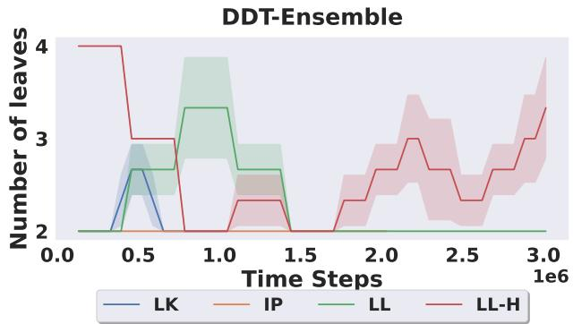

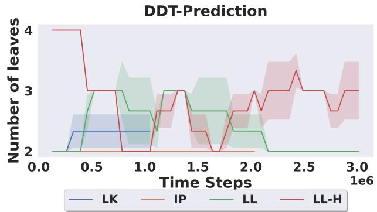  
(a) The trend in the number of leaves for the DDT-ENSEMBLE algorithm throughout training.  
(b) The trend in the number of leaves for the DDT-PREDICTION algorithm throughout training.  
Figure 2. Figures depicting the trend in the number of leaves within DDTs when using our deepening / pruning algorithm for each simulation environment. Each curve showcases the mean and s.e. for a specific environment across three seeds, depicted in the dark curve and shaded regions respectively. Note that we run IP and LK for less timesteps, hence leading to the curves cutting off earlier.

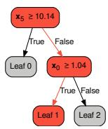

<table><tr><td colspan="3">Predicted</td></tr><tr><td>True</td><td>Success</td><td>Crash</td></tr><tr><td>Success</td><td>50</td><td>29</td></tr><tr><td>Crash</td><td>2</td><td>15</td></tr></table>

Figure 3. A real tree’s path (marked in red).  
Table 2. Confusion matrix of agent evaluation in 100 test runs (96 times completed, 4 times the agent did not predict any termination state).

## 6. Conclusion

In this work, we introduce time as a new dimension of interpretability, i.e., temporal interpretability. We present the Temporal Ensemble and Temporal Prediction policy gradient algorithms, enabling temporal abstraction within DDTs through outputting action chunks. We then ensure compact, efficient trees via an information-theoretic tree restructuring algorithm (ITTR). Warm-starting our action chunked DDTs from a distilled action chunked policy proves most effective: these trees match neural network policies in the LK, IP, and LL environments and come close in LL-H, while using up to 80% fewer parameters. The inclusion of such temporal interpretability provides more incentive to realize trees and other white box methods in the real world.

Future Work Firstly, there exists work in state chunks, $s _ { t : t + H }$ . It would be interesting to extend our method such that the value function is state chunked, $V _ { \phi } { \left( s _ { t : t + H } \right) }$ , and investigate in what domains this model would be applicable towards, albeit the non-Markovian features of Temporal Ensemble and Temporal Prediction policy gradient will likely increase training difficulty. Additionally, further research in the parameter choices of ITTR and other creative usages of information theory would be useful to create a general tree restructuring algorithm that achieves high performance across a wide range of domains. Future work can also consider the addition of various RL techniques for the proposed policy gradient methods, e.g., the usage of a scaling coefficient in Temporal Prediction, akin to the advantage mixing coefficient leveraged in (Fu et al., 2022). Lastly, training action-chunked trees from scratch remains challenging in highly stochastic domains, and closing this gap without warm-starting is an interesting direction.

## 7. Acknowledgments

We would like to graciously thank illustrator Takashi Mifune (pseudonym Irasutoya) for providing gratis clip art that we have used in our overview figure.

## 8. Impact Statement

This work introduces time as a new dimension of interpretability and promotes the usage of white-box models that are temporally interpretable. Such properties are particularly relevant in sequential-decision making domains where clear comprehension of a model’s underlying behavior is necessary for trust, viability, and responsibility.

## References

Adadi, A. and Berrada, M. Peeking inside the black-box: a survey on explainable artificial intelligence (xai). IEEE access, 6:52138–52160, 2018.

Angelino, E., Larus-Stone, N., Alabi, D., Seltzer, M., and Rudin, C. Learning certifiably optimal rule lists for categorical data. Journal ofMachine Learning Research, 18 (234):1–78, 2018.

Arrieta, A. B., D´ıaz-Rodr´ıguez, N., Del Ser, J., Bennetot, A., Tabik, S., Barbado, A., Garc´ıa, S., Gil-Lopez, S.,´ Molina, D., Benjamins, R., et al. Explainable artificial intelligence (xai): Concepts, taxonomies, opportunities and challenges toward responsible ai. Information fusion, 58:82–115, 2020.

Atakishiyev, S., Salameh, M., Yao, H., and Goebel, R. Explainable artificial intelligence for autonomous driving: A comprehensive overview and field guide for future research directions. IEEE Access, 2024.

Bengio, Y., Leonard, N., and Courville, A. Estimating or ´ propagating gradients through stochastic neurons for conditional computation. arXiv preprint arXiv:1308.3432, 2013.

Black, K., Galliker, M. Y., and Levine, S. Real-time execution of action chunking flow policies. In The Thirty-ninth Annual Conference on Neural Information Processing Systems, 2025. URL https://openreview.net/ forum?id=UkR2zO5uww.

Borys, K., Schmitt, Y. A., Nauta, M., Seifert, C., Kramer,¨ N., Friedrich, C. M., and Nensa, F. Explainable ai in medical imaging: An overview for clinical practitioners– beyond saliency-based xai approaches. European journal ofradiology, 162:110786, 2023.

Breiman, L., Friedman, J., Olshen, R. A., and Stone, C. J. Classification and regression trees. Chapman and Hall/CRC, 2017.

Cambria, E., Malandri, L., Mercorio, F., Nobani, N., and Seveso, A. Xai meets llms: A survey of the relation between explainable ai and large language models. arXiv preprint arXiv:2407.15248, 2024.

Chen, H., Zhang, H., Si, S., Li, Y., Boning, D., and Hsieh, C.-J. Robustness verification of tree-based models. Advances in Neural Information Processing Systems, 32, 2019.

Chen, J., Li, S. E., and Tomizuka, M. Interpretable endto-end urban autonomous driving with latent deep reinforcement learning. IEEE Transactions on Intelligent Transportation Systems, 23(6):5068–5078, 2022. doi: 10.1109/TITS.2020.3046646.

Doshi-Velez, F. and Kim, B. Towards a rigorous science of interpretable machine learning. arXiv preprint arXiv:1702.08608, 2017.

Du, M., Liu, N., and Hu, X. Techniques for interpretable machine learning. Communications ofthe ACM, 63(1): 68–77, 2019.

Fu, Z., Cheng, X., and Pathak, D. Deep whole-body control: Learning a unified policy for manipulation and locomotion. In Conference on Robot Learning (CoRL), 2022.

Hahn, S. and Choi, J. Action chunking proximal policy optimization for universal dexterous grasping. 2025.

Hu, X., Rudin, C., and Seltzer, M. Optimal sparse decision trees. Advances in neural information processing systems, 32, 2019.

Huang, S., Dossa, R. F. J., Ye, C., Braga, J., Chakraborty, D., Mehta, K., and Araujo, J. G. Cleanrl: High-quality single-´ file implementations of deep reinforcement learning algorithms. Journal of Machine Learning Research, 23(274): 1–18, 2022. URL http://jmlr.org/papers/ v23/21-1342.html.

Krakovna, V. and Doshi-Velez, F. Increasing the interpretability of recurrent neural networks using hidden markov models. arXiv preprint arXiv:1606.05320, 2016.

Lai, L. and Gershman, S. J. Policy compression: An information bottleneck in action selection. In Psychology of learning and motivation, volume 74, pp. 195–232. Elsevier, 2021.

Lai, L., Huang, A. Z., and Gershman, S. J. Action chunking as conditional policy compression. Cognition, 264: 106201, 2025.

Leurent, E. et al. An environment for autonomous driving decision-making. 2018.

Li, Q., Park, S., and Levine, S. Decoupled q-chunking. arXiv preprint arXiv:2512.10926, 2025a.

Li, Q., Zhou, Z., and Levine, S. Reinforcement learning with action chunking. arXiv preprint arXiv:2507.07969, 2025b.

Linardatos, P., Papastefanopoulos, V., and Kotsiantis, S. Explainable ai: A review of machine learning interpretability methods. Entropy, 23(1):18, 2020.

Loh, W.-Y. Classification and regression trees. Wiley interdisciplinary reviews: data mining and knowledge discovery, 1(1):14–23, 2011.

Olaru, C. and Wehenkel, L. A complete fuzzy decision tree technique. Fuzzy sets and systems, 138(2):221–254, 2003.

Oord, A. v. d., Li, Y., and Vinyals, O. Representation learning with contrastive predictive coding. arXiv preprint arXiv:1807.03748, 2018.

Paleja, R., Niu, Y., Silva, A., Ritchie, C., Choi, S., and Gombolay, M. Learning interpretable, highperforming policies for autonomous driving. arXiv preprint arXiv:2202.02352, 2022.

Paleja, R., Munje, M., Chang, K., Jensen, R., and Gombolay, M. Designs for enabling collaboration in human-machine teaming via interactive and explainable systems. Advances in Neural Information Processing Systems, 37: 64942–64969, 2024.

Quinlan, J. R. Simplifying decision trees. International journal ofman-machine studies, 27(3):221–234, 1987.

Rahman, M. M. and Xue, Y. Robust policy optimization in deep reinforcement learning. arXiv preprint arXiv:2212.07536, 2022.

Rahman, M. M., Wachs, J. P., and Xue, Y. Robust policy gradient optimization through action parameter perturbation in reinforcement learning. In Proceedings of the Aligning Reinforcement Learning Experimentalists and Theorists Workshop (ARLET@NeurIPS 2025) at the Thirty-Ninth Annual Conference on Neural Information Processing Systems (NeurIPS 2025), 2025. Peer-reviewed, non-archival workshop paper.

Ross, A. and Doshi-Velez, F. Improving the adversarial robustness and interpretability of deep neural networks by regularizing their input gradients. In Proceedings of the AAAI conference on artificial intelligence, volume 32, 2018.

Shwartz-Ziv, R. and Tishby, N. Opening the black box of deep neural networks via information. arXiv preprint arXiv:1703.00810, 2017.

Silva, A. and Gombolay, M. Encoding human domain knowledge to warm start reinforcement learning. In Proceedings ofthe AAAI conference on artificial intelligence, volume 35, pp. 5042–5050, 2021.

Silva, A., Killian, T., Rodriguez, I. D. J., Son, S.-H., and Gombolay, M. Optimization methods for interpretable differentiable decision trees in reinforcement learning. arXiv preprint arXiv:1903.09338, 2019.

Stevenson, M. T. and Slobogin, C. Algorithmic risk assessments and the double-edged sword of youth. Behavioral sciences & the law, 36(5):638–656, 2018.

Suarez, A. and Lutsko, J. Globally optimal fuzzy decision trees for classification and regression. IEEE Transactions on Pattern Analysis and Machine Intelligence, 21(12): 1297–1311, 1999. doi: 10.1109/34.817409.

Sutton, R. S., Barto, A. G., et al. Reinforcement learning: An introduction, volume 1. MIT press Cambridge, 1998.

Towers, M., Kwiatkowski, A., Terry, J., Balis, J. U., Cola, G. D., Deleu, T., Goulao, M., Kallinteris, A., Krimmel,˜ M., KG, A., Perez-Vicente, R., Pierre, A., Schulhoff,´ S., Tai, J. J., Tan, H., and Younis, O. G. Gymnasium: A standard interface for reinforcement learning environments, 2024. URL https://arxiv.org/abs/ 2407.17032.

Waymo. - YouTube — youtube.com. https: //www.youtube.com/watch?v=nAuna\_qzf6k, 2025. [Accessed 18-12-2025].

Weiss, S. M. and Indurkhya, N. Rule-based machine learning methods for functional prediction. Journal ofArtificial Intelligence Research, 3:383–403, 1995.

Wu, M., Hughes, M., Parbhoo, S., Zazzi, M., Roth, V., and Doshi-Velez, F. Beyond sparsity: Tree regularization of deep models for interpretability. In Proceedings of the AAAI conference on artificial intelligence, volume 32, 2018.

Wu, M., Parbhoo, S., Hughes, M. C., Roth, V., and Doshi-Velez, F. Optimizing for interpretability in deep neural networks with tree regularization. Journal of Artificial Intelligence Research, 72:1–37, 2021.

Zech, J. R., Badgeley, M. A., Liu, M., Costa, A. B., Titano, J. J., and Oermann, E. K. Variable generalization performance of a deep learning model to detect pneumonia in chest radiographs: a cross-sectional study. PLoS medicine, 15(11):e1002683, 2018.

Zeng, W., Luo, W., Suo, S., Sadat, A., Yang, B., Casas, S., and Urtasun, R. End-to-end interpretable neural motion planner. In Proceedings of the IEEE/CVF conference on

computer vision and pattern recognition, pp. 8660–8669, 2019.

Zhao, T. Z., Kumar, V., Levine, S., and Finn, C. Learning fine-grained bimanual manipulation with low-cost hardware. arXiv preprint arXiv:2304.13705, 2023.

## A. Outline of Appendices

We format the appendix as follows: we provide a derivation of Policy Gradient with Action Chunking in section B; further explanation of Temporal Ensemble Policy Gradient in section C; depict a visualization of the trees modified by ITTR in section D; the ITTR algorithm design in section E; further explanation of the impact of ITTR in section F; report additional ablations in section $\mathrm { G } ;$ and denote miscellaneous details in section H.

## B. Derivation of: Policy Gradient with Action Chunking

We present the reader with a high-level derivation of Policy Gradient with Action Chunking:

$$
\begin{array} { r l r l } & { \nabla _ { \phi } f _ { \phi , \phi , \phi , \phi , \phi , \phi , \phi , \phi , \phi , \phi , \phi , \phi , \phi , \phi , \phi , \phi \ } } \\ & { = \gamma _ { \phi } f _ { \phi , \phi , \phi , \phi , \phi , \phi , \phi , \phi , \phi , \phi , \phi , \phi , \phi , \phi , \phi , \phi , \phi , \phi \ } } \\ & { \quad - \int _ { \phi } f _ { \phi , \phi , \phi , \phi , \phi , \phi , \phi , \phi , \phi , \phi , \phi , \phi , \phi , \phi , \phi , \phi , \phi , \phi , \phi , \phi \ } } \\ & { \quad - \int _ { \phi } f _ { \phi , \phi , \phi , \phi , \phi , \phi , \phi , \phi , \phi , \phi , \phi , \phi , \phi , \phi , \phi , \phi , \phi , \phi , \phi , \phi \ } } \\ & { \quad - \int _ { \phi , \phi , \phi , \phi , \phi , \phi , \phi , \phi , \phi , \phi , \phi , \phi , \phi , \phi , \phi , \phi , \phi , \phi , \phi , \phi \ \ } } \\ & { \quad - \frac { 1 } { \phi } \int _ { \phi , \phi , \phi , \phi , \phi , \phi , \phi , \phi , \phi , \phi , \phi , \phi , \phi , \phi , \phi , \phi , \phi , \phi , \phi \ \ } } \\ & { \quad - \frac { 1 } { \phi } \int _ { \phi , \phi , \phi , \phi , \phi , \phi , \phi , \phi , \phi , \phi , \phi , \phi , \phi , \phi , \phi , \phi , \phi , \phi , \phi , \phi , \phi \ \ } \ \ \times \ \ \ \ \ \ \ \ \ \ \ \ \ \ \ \ \ \ \ \ \ \ \ \ \ \ \rho \exp \left( \frac { \phi } { \phi } \int _ { \phi , \phi , \phi , \phi , \phi , \phi , \phi , \phi , \phi , \phi , \phi } \right) } \\ &  \quad \ \times \ \left\{ \left[ \phi \int _ { \phi , \phi , \phi , \phi , \phi , \phi , \phi , \phi , \phi , \phi } \right] \right\} \end{array}
$$

However, simply using total return $R ( \tau )$ will likely cause training instability due to actions being scaled by reward signals in previous, unrelated timesteps. To overcome this, policy gradient methods generally scale the grad-log-prob ∇ log π by the rewards-to-go, $\begin{array} { r } { \sum _ { t ^ { \prime } = t } ^ { k H } R \left( s _ { t ^ { \prime } } , a _ { t ^ { \prime } } , s _ { t ^ { \prime } + 1 } \right) } \end{array}$ , instead of the total return $R ( \tau )$ , but this also succumbs to the same time issue. Given the nature of our action chunking, instead of scaling action probabilities by the returns at each timestep, we would rather scale action probabilities by the returns at each time chunk. This is akin to taking the advantage at timestep $t + H \colon$

$$
\nabla _ { \theta } J ( \pi _ { \theta } ) = \underset { \tau \sim \pi _ { \theta } } { \mathbb { E } } \left[ \sum _ { t = 0 } ^ { k H } \nabla _ { \theta } \log \pi _ { \theta } ( a _ { t : t + H } | s _ { t } ) \hat { A } _ { t + H } \right] .
$$

Since this advantage takes place H steps after the current timestep, the advantage is modified accordingly:

$$
\hat { A } _ { t + H } = \sum _ { t ^ { \prime } = t } ^ { t + H - 1 } \gamma ^ { t ^ { \prime } - t } r _ { t ^ { \prime } } + \gamma ^ { H } V _ { \phi } ( s _ { t + H } ) - V _ { \phi } ( s _ { t } ) ,
$$

Here, the environment returns H reward signals between timestep t and $t + H$ , hence why the discount factor $\gamma$ is exponentiated as compared to equation 3.

## C. Further explanation: Temporal Ensemble Policy Gradient

The main difference in Equation 8 compared to traditional policy gradient is the usage of a temporal ensemble log probability:

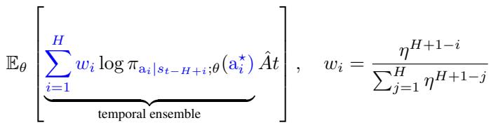

Standard practices in policy gradient use a multivariate Gaussian $\mathcal { N } ( \boldsymbol { \mu } , \boldsymbol { \Sigma } )$ to depict the policy distribution, thus enabling easy sampling and computation of the log probability. We follow the same practice and use this distribution to sample action chunks $a _ { t : t + H }$ instead of single actions $a _ { t } .$ . Since each random variable within this distribution is independent of each other, we can still compute the log probability of a single action using the multivariate Gaussian PDF: $P ( a _ { i } ) = \mathcal { N } ( a _ { i } ; \mu _ { i } , \sigma _ { i } ^ { 2 } )$ where $i \in \{ 1 , \ldots , H \}$ is the action’s index within the chunk. Upon collecting the log probability of each action within a temporal ensemble, we apply the linear combination of the log probabilities into the objective function, each evaluated under the chunk distribution of the state that produced it.

For ensembles early on in the episode, there will not exist enough chunks to take a complete ensemble over. For such situations, we just take the ensemble over however many chunks exist in the current history and renormalize the EMA weights over these chunks. When storing this data in the rollout buffer, we store zero vectors to ensure the buffer has no issues regarding ragged arrays. Furthermore, we employ zero masks of ensembles that include zero vectors, which also mark chunks from a previous episode.

## D. Visualization

Figure 4 depicts a visualization of a tree in the LL-H domain, at the start and end of training where the tree underwent deepening / pruning. Particularly, these visualizations show a crisp tree, where each comparator node only chooses one feature to compare against a threshold instead of taking a linear combination of all features (Paleja et al., 2022). Furthermore, we do not depict the contents of each leaf, as there will be significant visual clutter when depicting the parameters necessary for action chunking.

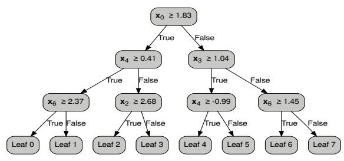  
(a) A tree at the beginning of training, before restructuring.

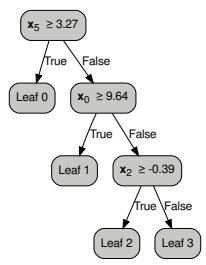  
(b) The saved tree with the best evaluation performance, after undergoing restructuring.  
Figure 4. Visualization of a tree at the beginning and end of a run of the LL-H domain. Each node depicts a comparison between the most significant feature in the state against a threshold.

We observe in Figure 4a that the tree starts with many redundant nodes, ${ \mathrm { e . g . , } } x _ { 4 } \geq 0 . 4 1$ and $x _ { 4 } \geq - 0 . 9 9$ , which leads to multiple paths potentially covering the same behaviors. With the pruning, we see in Figure 4b that each node has unique comparisons and does not waste logic decisions. Furthermore, the specific features chosen in the logic decision make sense with respect to the LL-H domain: $x _ { 5 }$ is the angular velocity, $x _ { 0 }$ is the x-position, and $x _ { 2 }$ is the x-velocity; these are the most significant features in achieving success in LL-H.

## E. Information-Theoretic Tree Restructuring

Here we write out the full algorithm design behind the Information-Theoretic Tree Restructuring algorithm (ITTR).

Algorithm 3 Information-Theoretic Tree Restructuring   
Input: Tree T, $D = \{ ( \mathrm { s } _ { t } , \mathrm { a } _ { t } , \hat { A } _ { t } ) \} _ { t = 0 } ^ { N } , \epsilon$   
if n steps have passed since last deepen / prune,   
currently more than m global steps have passed,   
and at least E policy complexity estimates were collected then   
$T ^ { * } \gets T$   
$\mathbf { i f } ~ { \frac { 1 } { N } } \sum \nabla I ^ { \pi } ( \mathbf { s } ; \mathbf { a } ) < \epsilon ~ ( \mathbf { e q } .$ . 12) and rewards are low then   
// deepen   
$\begin{array} { r } { l ^ { * } = \operatorname * { a r g m a x } _ { l } \mathbb { E } \left[ p ( l ) * 1 / \mathrm { V a r } \left[ \left( \mathrm { a } - \mu _ { l } \right) \hat { A } \right] \right] ( \mathrm { e q . ~ } 1 3 ) } \end{array}$   
$w _ { \mathrm { n e w } } \sim \mathcal N ( \mu _ { w } , \dot { \Sigma } _ { w } )$   
$b _ { \mathrm { n e w } } \sim \mathcal { N } ( \mu _ { b } , \Sigma _ { b } )$   
$\alpha _ { \mathrm { n e w } } \sim \mathcal N ( \mu _ { \alpha } , \Sigma _ { \alpha } )$   
Remove $l ^ { * }$ from $T ^ { * }$   
Create a new node with $w , b ,$ α and add to $T ^ { * }$   
Make copies of $l ^ { * } \colon l _ { 1 }$ and $l _ { 2 } ,$ , and add to $T ^ { * }$   
else i $\exists v _ { i } < k$ and the tree has more than two leaves then   
// prune   
$l ^ { * } =$ argmin $\{ v _ { 1 } , \ldots , v _ { l } \}$   
Remove $l ^ { * }$ from $T ^ { * }$   
Remove the parent node of ${ \mathit { l } } ^ { * }$ from $T ^ { * }$   
Move $l ^ { * } \bar { s }$ sibling leaf up in $T ^ { * }$   
end if   
$T \gets T ^ { * }$   
end if

Note that we consider rewards to be low when the mean return in the current rollout buffer is below 0 (−0.3 for LK) and, specifically for LL-H, when fewer than half of the returns are positive. Returns are computed from the normalized rewards. For LL-H, we check the pruning condition before the deepening condition to incentivize pruning more often. Lastly, for warm-started trees in LL-H, we disable deepening, since the distilled tree already provides the structure, and check for pruning every n = 1e6 steps with $k = 4 e 6 .$

## F. Further explanation: Number of parameters after deepening / pruning

Table 3 depicts the number of parameters used in the action chunked DDTs that are only relevant to the tree flow logic, i.e., no leaf parameters. We observe that the number of parameters drastically decreases, occurring because the majority of parameters are situated in the leaves used for action chunking. Subsequently, parameters relevant to the logic flow within DDT methods only make up to, at most, a tenth of the number of parameters in the MLP methods, enabling significantly more interpretability and easier debugging.

Table 3. Number of parameters used only for the logic flow of DDTs across the four domains and three runs (mean±s.e.).
<table><tr><td>Algorithm</td><td>LK</td><td>IP</td><td>LL</td><td>LL-H</td></tr><tr><td>DDT-ENSEMBLE NOLEAVES</td><td> $\overline { { 1 8 \pm 0 . 0 } }$ </td><td> $\overline { { 1 0 \pm 0 . 0 } }$ </td><td> $\overline { { 1 4 \pm 0 . 0 } }$ </td><td> $\overline { { 2 0 . 0 \pm 4 . 9 } }$ </td></tr><tr><td>DDT-PRED NOLEAVES</td><td> $2 5 . 3 \pm 6 . 0$ </td><td> $1 0 \pm 0 . 0$ </td><td> $1 4 \pm 0 . 0$ </td><td> $2 6 . 0 \pm 4 . 9$ </td></tr><tr><td>WARM-ENSEMBLE NOLEAVES</td><td> $1 8 \pm 0 . 0$ </td><td> $1 0 \pm 0 . 0$ </td><td> $1 4 \pm 0 . 0$ </td><td> $2 6 . 0 \pm 4 . 9$ </td></tr><tr><td>WARM-PRED NOLEAVES</td><td> $1 8 \pm 0 . 0$ </td><td> $1 0 \pm 0 . 0$ </td><td> $1 4 \pm 0 . 0$ </td><td> $3 3 . 3 \pm 9 . 4$ </td></tr></table>

## G. Ablations

We perform ablations over the EMA coefficient parameter. Intuitively, a higher coefficient gives each action within an ensemble the same weight, promoting smoother actions but potentially causing worsened performance. We achieve this through running five sweeps using the values η ∈ {0.5, 0.625, 0.75, 0.875, 1.0}.

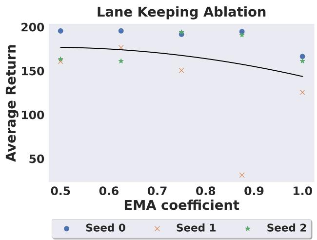

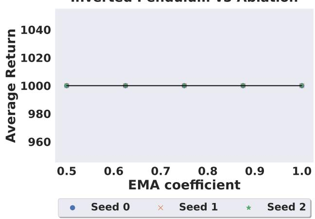  
(b) The trend in the performance against the EMA coefficient for the DDT-ENSEMBLE algorithm in the INVERTED PENDULUM domain.

(a) The trend in the performance against the EMA coefficient for the DDT-ENSEMBLE algorithm in the LANE KEEPING domain. Lunar Lander v3 Ablation  
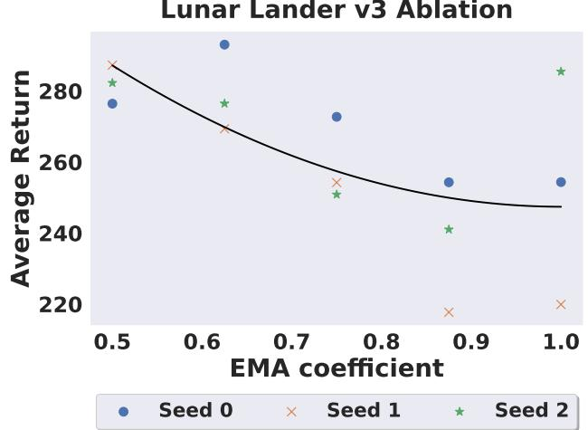  
(c) The trend in the performance against the EMA coefficient for the DDT-ENSEMBLE algorithm in the LUNAR LANDER V3 domain.

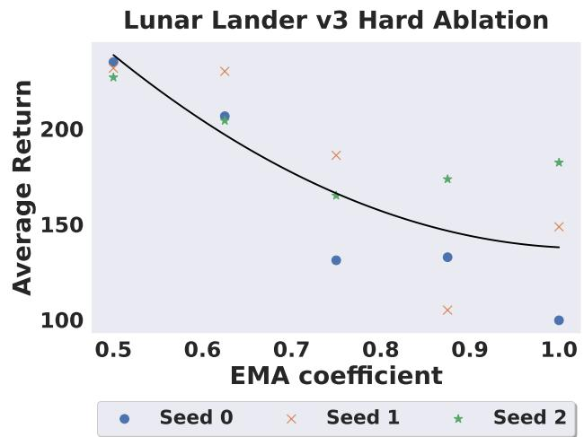  
(d) The trend in the performance against the EMA coefficient for the DDT-ENSEMBLE algorithm in the LUNAR LANDER HARD domain.  
Figure 5. Figures depicting the trend in the performance against the EMA coefficient in each simulation environment. The black curve depicts the regression over the results across all seeds.

Figure 5 depicts our results. In all domains except IP, performance decreases as the EMA coefficient increases, as expected according to our hypothesis. The decrease is especially apparent in the LL-H environment where the return drops from 231.2 ± 1.9 at $\eta = 0 . 5$ to $1 4 3 . 6 \pm 1 9 . 6$ at $\eta = 1 . 0$ , likely due to the enforced smoothness of the actions performing poorly under LL-H’s highly stochastic nature. Note that a lower EMA coefficient, in turn, gives the actions planned for later timesteps less weight, so while they contribute less to the aggregated action, they also are less temporally interpretable. The EMA coefficient therefore trades off performance against how strongly the agent commits to its shown plan. Interestingly, the unbiased variant $( \eta = 1 . 0 , \ S 4 . 1 )$ does not perform best, suggesting that the limiting factor is the enforced consistency rather than the bias of the estimator.

## H. Miscellaneous

## H.1. Hyperparameters

Here we report the hyperparameters used in all the experiments.

Table 4. Shared hyperparameters used for all environments.
<table><tr><td>Parameter</td><td>Value</td></tr><tr><td>RPO</td><td></td></tr><tr><td>Actor learning rate</td><td>5e-4</td></tr><tr><td>Critic learning rate</td><td>5e-4</td></tr><tr><td>PPO clip rate</td><td>0.2</td></tr><tr><td>RPO uniform bonus (Rahman et al., 2025)</td><td>0.5</td></tr><tr><td>MLP</td><td></td></tr><tr><td>Hidden layers</td><td>[16, 16]</td></tr><tr><td>TEMPORAL ENSEMBLE</td><td></td></tr><tr><td>EMA coefficient η</td><td>0.75</td></tr></table>

Table 5. Unique hyperparameters used for each environment for ITTR.
<table><tr><td rowspan="3">Parameter</td><td colspan="4">Domain</td></tr><tr><td>LK</td><td>IP</td><td>LL</td><td>LL-H</td></tr><tr><td>DDT</td><td></td><td></td><td></td><td></td></tr><tr><td>Starting # of leaves</td><td>2</td><td>2</td><td>2</td><td>4</td></tr><tr><td>Maximum # of CART leaves</td><td>2</td><td>2</td><td>2</td><td>4</td></tr><tr><td>INFORMATION-THEORETIC TREE RESTRUCTURING</td><td></td><td></td><td></td><td></td></tr><tr><td>Minimum steps since last restructure n</td><td>200</td><td>600</td><td>1000</td><td>1000</td></tr><tr><td>Minimum global steps passed m</td><td>2000</td><td>6000</td><td>10000</td><td>10000</td></tr><tr><td>Minimum average policy complexity gradient €</td><td>5e-2</td><td>2e-1</td><td>5e-2</td><td>5e-3</td></tr><tr><td>Number of visitations k</td><td>100000</td><td>100000</td><td>100000</td><td>100000</td></tr><tr><td>Minimum number of policy complexity estimates E</td><td>2</td><td>3</td><td>4</td><td>4</td></tr><tr><td>TEMPORAL PREDICTION</td><td></td><td></td><td></td><td></td></tr><tr><td>Scaling coefficient λ</td><td>1.0</td><td>1.0</td><td>1.0</td><td>0.005</td></tr></table>