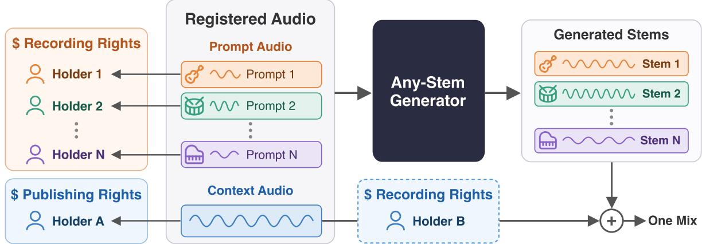
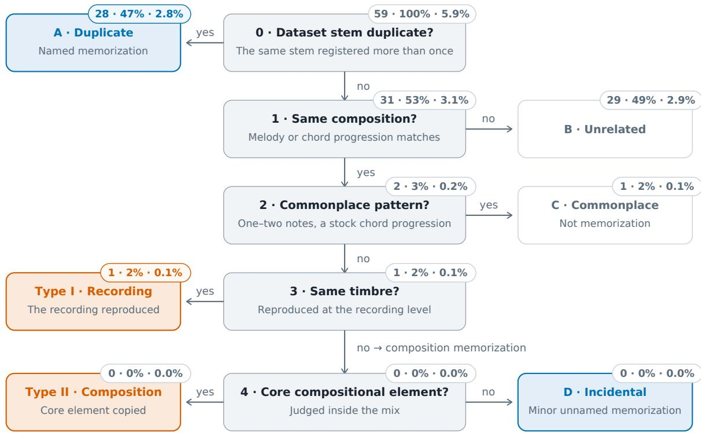
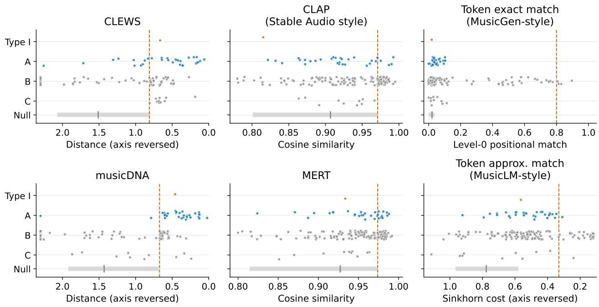
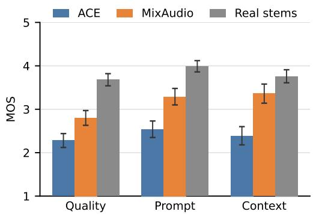

# Tracing Inputs, Verifying Outputs: Validating Attribution in Music Generation

Taejun Kim 1 Wonil Kim 1 Jongmin Jung 1 Hyeongseok Wi 1 Sangeun Kum 1 Keunhyoung Luke Kim 1 Taehyoung Kim 1 Dongjoo Moon 1 Seungsoon Park 1 Taewan Kim 1 Virginie Berger 1 Juhan Nam 2 Jongpil Lee 1

## Abstract

How can we verify whose music contributed to an AI-generated output? This paper demonstrates how input-based attribution can provide verifiable evidence of which audio sources were used in a generation and whether they shaped the output. To do so, we condition the generation solely on audio without any text input, then trace the inputs behind each output, and establish their musical effect. In prompt adherence tests and controlled input swaps, the stems generated by our generator, MixAudio, follow the prompt audio in timbre and the context audio in harmony. Yet these outputs may still reproduce training data not supplied as inputs. We therefore audit memorization with our musical version identification model, musicDNA, and find few reproductions outside the input records. On human-judged cases within the flagged pool, it achieves higher precision and recall than the other tested memorization detectors. The two evaluations suggest that input records and output analysis provide complementary evidence for attribution, on which rights-holder reporting and compensation can draw as the AI music economy takes shape. Audio examples are available at https://neutune.github.io/attr20 27demo/.

## 1. Introduction

In music generation, models use patterns learned from existing music to fulfill users’ requests for particular structures or playing styles. This process has led to copyright disputes, including the recent GEMA v. Suno (2026) case. In a judgment not yet final, the court of first instance held that protected works memorized by the model and reproduced in its outputs infringed copyright. Beyond the issue of reproduction, the case raises a fundamental question for attribution: what actually counts as an existing work’s contribution to a generated output?

In this paper, we define attribution for a generated output as identifying which audio sources were used as inputs and verifying whether their musical characteristics shaped it. Once the evidence supports these claims and its scope is clear, it can ground recognition of the identified source’s contribution and inform rights-holder reporting and compensation.

Attribution is difficult because it requires separate evidence for two claims: a particular track was used in generation, and its musical characteristics shaped the output. Resemblance in rhythm, harmony, or playing style cannot confirm the track’s use as an input, since these characteristics may also occur in other tracks in the training data. In turn, confirmed input use does not establish that the track’s musical characteristics shaped the output.

We resolve the first uncertainty by conditioning generation on audio with known provenance and recording each input (Kim et al., 2025; Morreale et al., 2025). This identifies which audio sources were used without inferring their use from the output. We then evaluate whether those inputs shaped the generated music, grounding attribution in both the record and evidence of musical effect.

Even when conditioning is faithful, a generated output may still reproduce a training track that was not supplied as input (Roh et al., 2025). The input record cannot account for the relationship between that track and the output, so we compare generated outputs with the training data separately.

To implement and evaluate this approach, we present MixAudio and musicDNA. MixAudio, the generator, produces music from audio with known provenance and records which inputs are used by stem and track section. musicDNA, a version identification model, compares generated stems with training data to find potential reproductions of works not supplied as inputs.

Conditioning tests show that MixAudio’s generated stems reflect the intended musical characteristics of their stemspecific inputs and the accompanying music. An musicDNA-based audit detected rare reproductions outside the input records. In a separate comparison on the stems flagged by any retriever, it identified confirmed reproductions more reliably than the other methods tested. These findings support our approach to music attribution, which combines input records and output analysis as complementary evidence.

## 2. Background and Related Work

## 2.1. Approaches to Attribution

Prior research offers three approaches to attribution. Each uses different evidence to assess music use and whether its characteristics shaped the generated output. We distinguish the claims each approach can support.

Training data attribution (TDA) uses influence estimates to support claims about a training work’s contribution to an output (Koh & Liang, 2017; Park et al., 2023; Hammoudeh & Lowd, 2024). In music generation, it has been used to attribute outputs to training tracks (Choi et al., 2025) and proposed as a basis for royalties (Deng et al., 2025). The estimates are not yet reliable enough for that role (Mlodozeniec et al., 2025), because they approximate what removing a work from training would change, and that quantity can be verified only by retraining, which is rarely feasible at scale. Han et al. (2026) find that the same training tracks can rank at the top across different outputs, so a score can reflect the scoring method rather than the specific output. Compensation schemes built on such scores are therefore sensitive to estimation noise (Zhang et al., 2026). Nonetheless, disclosing which works were used in training could support transparency and accountability, allowing compensation for that use to be considered separately.

Output-based attribution searches for training works that resemble a generated output (Somepalli et al., 2023; Wang et al., 2023). Barnett et al. (2024) retrieve similar training clips using audio embeddings and show that their similarity rankings largely agree with human listening judgments. Batlle-Roca et al. (2024) use multiple audio similarity measures to detect fragments of training music reproduced in generated audio. These methods provide evidence of resemblance or reproduction in the output. Although they cannot by themselves establish how a particular training work influenced the output (Han et al., 2026; Deng et al., 2025), the approach remains useful for identifying reproduced works in outputs from any generation system (Somepalli et al., 2023; Wang et al., 2024).

Input-based attribution records which music was used in a particular generation. Morreale et al. (2025) propose attribution-by-design, making the provenance of conditioning music part of the generation process. Applying this principle, Kim et al. (2025) designed a music AI agent architecture that records component-level input use during generation for attribution. These records provide auditable evidence that rights-holder reporting and compensation can draw on. This paper evaluates the step that work left open: whether those recorded inputs actually shape the output as intended.

## 2.2. Audio Conditioning and Faithfulness

The evaluation requires defining which musical characteristics each input is intended to influence. Prior studies illustrate uses of audio conditioning. Rouard et al. (2024), Nistal et al. (2024), and Yuan et al. (2026) use a short audio reference to condition the style of generated music. Parker et al. (2024), Nistal et al. (2024), and Karchkhadze et al. (2026) generate new stems conditioned on existing stems. MixAudio draws on these studies. A short reference recording, used as an audio prompt for each stem, is intended to guide timbre and playing style, while a mix of existing stems provides harmonic and rhythmic context.

Yet similarity alone cannot show whether an input shaped the output, since prompts from other tracks may be similarly close. We therefore compare each generated stem with its own prompt and prompts from other tracks. We also change the prompt or context while holding the other conditions fixed to test how each affects the output (Section 4.2).

## 2.3. Memorization Audits

Conditioning tests address the effect of recorded inputs. Reproductions of other training works require a separate comparison with the training data.

Detecting reproduction depends on what kind of match is sought between an output and a training work. Six music generation systems that report memorization audits use different methods, including audio-token matches, general audio-embedding similarity, and representations designed to identify a work across different performances (Dhariwal et al., 2020; Agostinelli et al., 2023; Copet et al., 2023; Evans et al., 2024; 2025; Yuan et al., 2026) (Appendix C.1). Because these methods detect different forms of reproduction, a finding of no detected reproduction must be interpreted in light of what each method can detect.

We compare generated stems with training data using several methods, including musicDNA, to find candidate reproductions and verify them by listening (Section 4.3). We then compare the methods’ detection performance on humanconfirmed cases to assess the reliability of the memorization audits (Section 4.4).

  
Figure 1. Attribution by conditioning provenance. A single pass generates any subset of a track’s stems, conditioned exclusively on registered audio, with no text input: one prompt recording per stem and an optional shared context. The two rights panels on the left are the rights involved at generation. The dashed box is added when the context is mixed into the released master.

## 2.4. Stem-Level Input Records

Different stems in a track may be generated from different reference recordings. Examining only the full mix makes it difficult to tell which input was used for each stem or which characteristics appeared in the result. To connect each reference recording with its effect on the output, its use must be recorded and the result evaluated at the stem level. MSDM and Multi-Track MusicLDM model relationships among stems (Mariani et al., 2024; Karchkhadze et al., 2026), while Stemphonic allows flexible control over the number and configuration of generated stems (Wu et al., 2026).

Producing separate stem outputs does not itself record which music was supplied as input. MixAudio uses reference audio for each stem and, when provided, musical context shared across stems. It records reference use by stem and shared context by track section, linking each input to the output it conditions. Section 3 details MixAudio’s architecture for stem-level generation and input-use recording.

## 3. The Generator

Conditioning inputs. Figure 1 shows the interface of the model. The generator produces individual stems rather than a mixture, and is conditioned only on registered audio. The model is designed for two uses, (1) new-song generation and (2) remix generation. (1) The user supplies prompt audio only and the model generates a song from scratch, as most music generators do from a text prompt. (2) The user modifies an existing track by adding, replacing, or removing stems, and the model generates the stems that are added or replaced. Here the model also receives a context, a mix of the track’s existing stems, or of those the user chooses to keep; the generated stems are parts laid on top of it, meant to be played back together with it. In both uses at least one prompt is always given, whereas the context is given only in (2). For attribution and rights accounting, the system associates prompt use with the recording-side contribution of the reference performance, and context use with the composition-side contribution that shapes the harmony and tempo of the generated stem. This design choice rests on the observed behavior of the model, evaluated in Section 4.2, not on copyright law. The context recording itself does enter the system, but replacing the context leaves the timbre of the generated stem with the prompt (0.92 to 0.89 in Table 2b), so we find little trace of a recording-side contribution in the generated stems. When the context is mixed into the final master together with the generated stems, the record also names the context’s recording rights holder.

Any-stem generation. The model works on discrete tokens. A neural audio codec with residual vector quantization turns every prompt, context, and target stem into a sequence of tokens, one per quantizer level and time step. The generator predicts the tokens of the target stems; the token-matching tests of Section 4.4 operate on these tokens. The unit of generation is a section of a track: the context is the section’s existing mix, the targets are the section’s new stems, and a track is assembled section by section. The generator operates on a single input sequence that carries the prompts and the target stems to be generated; requesting more stems simply appends more prompt–target pairs to the sequence. The context audio, when given, is prepended to this sequence; the context and the target stems share the same positional encoding, which keeps the generated stems temporally aligned with the context. The section’s musical key and beat positions are provided as additional inputs. A stem-level positional encoding ties the i-th prompt to the i-th target, so the model knows which prompt belongs to which generated stem.

Table 1. Prompt adherence. Similarity between generated stems and prompts. Matched: each stem against the prompt it was generated from. Random: the same generations scored against another track’s prompt. ∆ = Matched − Random. Bold: larger ∆ per source.
<table><tr><td rowspan="2">Source</td><td rowspan="2">System</td><td colspan="3">MERT (Style)</td><td colspan="3">MFCC (Timbre)</td></tr><tr><td>Matched</td><td>Random</td><td>∆</td><td>Matched</td><td>Random</td><td>Δ</td></tr><tr><td>Training</td><td>MixAudio</td><td>0.550</td><td>0.014</td><td>0.535</td><td>0.914</td><td>0.554</td><td>0.360</td></tr><tr><td rowspan="2">Validation</td><td>ACE</td><td>0.549</td><td>0.121</td><td>0.428</td><td>0.838</td><td>0.602</td><td>0.236</td></tr><tr><td>MixAudio</td><td>0.516</td><td>0.000</td><td>0.516</td><td>0.911</td><td>0.550</td><td>0.361</td></tr><tr><td>MoisesDB</td><td>ACE MixAudio</td><td>0.534 0.582</td><td>0.123 0.124</td><td>0.411 0.457</td><td>0.831</td><td>0.602</td><td>0.229</td></tr><tr><td rowspan="2"></td><td>ACE</td><td>0.652</td><td>0.264</td><td>0.388</td><td>0.920 0.912</td><td>0.599 0.674</td><td>0.321 0.237</td></tr><tr><td></td><td></td><td></td><td></td><td></td><td></td><td></td></tr><tr><td rowspan="2">MUSDB18</td><td>MixAudio ACE</td><td>0.599</td><td>0.183</td><td>0.416</td><td>0.942</td><td>0.667</td><td>0.276</td></tr><tr><td></td><td>0.624</td><td>0.313</td><td>0.311</td><td>0.942</td><td>0.756</td><td>0.186</td></tr></table>

Table 2. Conditioning swaps. Each value is the similarity between a generated stem and the prompt or context marked in its row. Base: the base generation. Swap: the regeneration after the swap; the other conditioning input is held fixed. Averaged over the four datase sources.
<table><tr><td rowspan="2">Hypothesis</td><td rowspan="2">Metric</td><td colspan="2">MixAudio</td><td colspan="2">ACE</td></tr><tr><td>Base</td><td>Swap</td><td>Base</td><td>Swap</td></tr><tr><td>(a) Prompt replaced</td><td></td><td></td><td></td><td></td><td></td></tr><tr><td>Timbre moves to the substituted prompt</td><td>MFCC</td><td>0.63</td><td>0.89</td><td>0.69</td><td>0.85</td></tr><tr><td>Timbre leaves the original prompt</td><td>MFCC</td><td>0.92</td><td>0.64</td><td>0.88</td><td>0.70</td></tr><tr><td>Harmony stays with the original context</td><td>Chroma</td><td>0.20</td><td>0.22</td><td>0.10</td><td>0.06</td></tr><tr><td>(b) Context replaced</td><td></td><td></td><td></td><td></td><td></td></tr><tr><td>Harmony moves to the substituted context</td><td>Chroma</td><td>0.00</td><td>0.21</td><td>0.00</td><td>0.06</td></tr><tr><td>Harmony leaves the original context</td><td>Chroma</td><td>0.21</td><td>0.02</td><td>0.10</td><td>0.06</td></tr><tr><td>Timbre stays with the original prompt</td><td>MFCC</td><td>0.92</td><td>0.89</td><td>0.88</td><td>0.87</td></tr></table>

Scale anchors (unrelated pair · matched reference): MFCC 0.66 · 0.92; Chroma 0.02 · 0.20.

## 4. Evaluation

We ask two things of the attribution record. Each generated stem should follow the inputs named in the record, and generated stems should rarely reproduce training stems whose rights holders are not named in the record. Section 4.2 tests the first with conditioning experiments. Section 4.3 tests the second with a memorization audit, and Section 4.4 uses the listeners’ judgments to test memorization detectors. Every similarity score in this section is read against a measured baseline, the level a system reaches when it does not follow its input.

## 4.1. Setup

Conditioning sources. Prompts, contexts, beat positions, and keys come from four sources: the training and validation splits of the in-house multi-track dataset the model was trained on, and two external stem datasets, MoisesDB (Pereira et al., 2023) and MUSDB18 (Rafii et al., 2019). The in-house dataset is licensed for both model training and service use. The validation split is unseen but in-domain; the two external sets are unseen and out-ofdomain. Vocal stems are never targets or prompts, so no lyrics condition a generated stem, though they can appear

in a context mix.

Baseline. We compare with ACE-Step v1.5 in Lego mode (Gong et al., 2026), ACE below. It is the only system we know of that takes both an audio prompt and a context audio, conditions on the prompt audio itself, and generates at the stem level; other systems that accept both inputs first convert the prompt to text. Table 5 in Appendix A lists the systems we reviewed. We use its 2B checkpoint, the same size as MixAudio, because the 4B checkpoint produced only artifact-laden output in Lego mode. Lego adds one stem per call, so multi-stem instances are generated stem by stem, each new stem mixed into the context before the next is requested.

Instances. An instance is one section of a track. Some of its stems are mixed into the context, and the system generates the rest. For each stem to be generated, the prompt is an excerpt of that stem’s own recording, so every generated stem has a real counterpart. The generated stems are the ones the track actually has, so their number varies from instance to instance, and about a quarter of the instances have no context at all. There are 6,810 instances and 15,034 target stems in total; the split rule, the excerpt rule, and the section length are given in Appendix A. Both systems generate the same instances from the same prompts and contexts, and generated stems that come out silent are dropped from every comparison.

  
Figure 2. How listeners judge a flagged stem, read top to bottom. Orange: Type I and II, the material unnamed memorizations; blue: named (A) or minor unnamed (D) memorization. Badges: n · % of the band · % of the 994 queries, shown for the musicDNA band over both splits (59 stems).

## 4.2. Conditioning Faithfulness

The first requirement is that a generated stem follows its inputs: timbre and playing style from the prompt, and harmony from the context. We test this in two ways. Prompt adherence asks whether a generated stem resembles its own prompt more than another track’s, and conditioning swaps ask whether replacing one input moves only the property it controls.

Prompt adherence. Table 1 scores each generated stem against its own prompt (Matched) and against another track’s prompt (Random). Style similarity is the cosine between MERT embeddings (Li et al., 2024), and timbre similarity is the cosine between MFCC vectors (Appendix B.1). Adherence is usually reported as the Matched score alone (Gong et al., 2025; Yuan et al., 2026), and by that measure ACE looks better on style for most sources. But ACE’s Random scores are high as well: its outputs resemble one another, so an unrelated prompt also scores high. The margin ∆ = Matched − Random removes this generic resemblance, and MixAudio has the larger margin on every source and both metrics.

Conditioning swaps. Table 2 asks what moves when one input is replaced. We swap the prompt for another track’s prompt (a), or the context for another track’s context (b), and regenerate the stem. The context is swapped together with its key and beat inputs. The test asks whether the two inputs can be controlled independently, which needs both of them present, so only instances that have a context enter it. Each row compares the new stem with one reference: the original or the substituted prompt, or the original or the substituted context. Timbre is compared by MFCC similarity and harmony by bar-averaged chroma correlation (Appendix B.1). Two anchors under the table set the scale: the similarity between unrelated clips, and the similarity between a stem and its own input.

Both systems follow the prompt’s timbre. In (a), similarity to the new prompt rises to the matched level (MixAudio 0.63 to 0.89, ACE 0.69 to 0.85) and similarity to the old prompt falls (0.92 to 0.64, 0.88 to 0.70). Harmony is where the two systems part. In (b), MixAudio’s chroma correlation to the new context rises from 0.00 to 0.21, the matched level, and its correlation to the old context falls from 0.21 to 0.02, the unrelated level. Its timbre stays with the prompt (0.92 and 0.89). ACE’s correlation to the context stays between 0.00 and 0.10 in every condition, base generations included, so a swap has nothing to move. Pitch-shifting or time-scaling an input instead of swapping it gives the same picture (Appendix B.2).

Table 3. Listener judgments on the flagged stems, per retriever and split, in the categories of Figure 2. Percentages are shares of each column’s flagged stems.
<table><tr><td></td><td colspan="4">Validation (unseen)</td><td colspan="4">Training (registered)</td></tr><tr><td>Case</td><td>musicDNA CLEWS</td><td></td><td></td><td></td><td>CLAP MERT musicDNA CLEWS</td><td></td><td>CLAP MERT</td><td></td></tr><tr><td>Flagged</td><td>25</td><td>25</td><td>25</td><td>25</td><td>34</td><td>35</td><td>31</td><td>24</td></tr><tr><td>Type I· Recording</td><td>0</td><td>0</td><td>0</td><td>0</td><td>1(3%)</td><td>1(3%)</td><td>0</td><td>0</td></tr><tr><td>Type II· Composition</td><td>0</td><td>0</td><td>0</td><td>0</td><td>0</td><td>0</td><td>0</td><td>0</td></tr><tr><td>A·Duplicate</td><td>9(36%)</td><td>7(28%)</td><td>1(4%) 3(12%)</td><td></td><td>19(56%)</td><td>14(40%)</td><td></td><td>0 7(29%)</td></tr><tr><td>B·Unrelated</td><td>16(64%)</td><td>12(48%) 24(96%) 22(88%)</td><td></td><td></td><td>13(38%)</td><td>16(46%) 31(100%) 17(71%)</td><td></td><td></td></tr><tr><td>C·Commonplace</td><td>0</td><td>6(24%)</td><td>0</td><td>0</td><td>1(3%)</td><td>4(11%)</td><td>0</td><td>0</td></tr><tr><td>D·Incidental</td><td>0</td><td>0</td><td>0</td><td>0</td><td>0</td><td>0</td><td>0</td><td>0</td></tr></table>

Summary. Both mappings of Section 3 hold. A generated stem resembles its own prompt rather than prompts in general, and the swaps separate the two inputs: replacing the prompt moves timbre and leaves harmony in place, and replacing the context moves harmony and leaves timbre in place. Each property therefore traces to one named input, which lets the record distinguish recording-side and composition-side contributions for rights accounting. ACE follows the prompt but not the context, so a record built on its outputs would support only the recording side. Generation quality is also higher than ACE’s, in FAD on all three sources and in listener ratings (Appendix D).

## 4.3. Memorization Audit

Even when a generated stem follows its inputs, it can still reproduce a training stem it was never given as input. The record names only the prompt, the context, and their rights holders, so a reproduced training stem has no entry in it. The reproduction is unnamed when the record does not name that stem’s rights holders either. The second requirement of Section 4 is that such unnamed reproductions are rare. We test it by searching the training set with each generated stem and having listeners judge the closest matches. Whether a match counts against the record depends on two terms, memorization and named, which we define first.

Terms. A generated stem is a memorization when it reproduces, in recording or in composition, a training stem other than its own conditioning inputs. A memorization is named when the record already names the rights holders of the reproduced stem, and unnamed when it does not. Only an unnamed memorization counts against the record.

Figure 2 shows the six categories a listener can assign. A duplicate (A) is a case where the generated stem, the retrieved training stem, and the full stem the prompt was cut from all sound the same, because the retrieved stem is a second registration of the prompt’s own recording. The match could then come from the prompt as well as from memory, and listening cannot tell the two apart, so we count duplicates as memorizations, and as named ones. In every duplicate case the two registrations trace to the same rights holder. Most pairs arose when stems first delivered through an intermediary were delivered again under a direct contract with their producer, and the rest are repeat registrations within one catalog, so the rights holder named in the record is the same either way. Type I is a reproduced recording: the generated stem matches the training stem in composition and in timbre. Type II is a composition reproduced in a different timbre, where the copied element carries the piece. Both are unnamed, and we treat both as material. D is also a composition reproduced in a different timbre, but the copied element is incidental to the piece. It is unnamed, and we treat it as minor. B and C are not memorizations. In B the two stems share no melody or chord progression, and in C they share only commonplace elements, such as a stock chord progression.

Retrieval. The queries are the generated stems of melodycarrying instruments (guitars, keys, brass, and their relatives); bass and drum stems are not audited. There are two splits of 497 queries each. Validation queries are generated from the conditioning of validation tracks, which the model never saw. Training queries reuse the exact conditioning a training track had during training (prompt, context, beat, and key), the setting most likely to draw memorization out. Four retrievers search the training set with each query and score it by its nearest training stem: musicDNA, our version identification model, and CLEWS, a musical version matching model (Serrà et al., 2025), both of which compare compositions, and CLAP (Wu et al., 2023) and MERT, which are general-purpose audio embeddings. For a training query, the stems of its own conditioning track are left out of the search, since a generation that retrieves its own conditioning source is following its conditioning, and the record already covers that. Each retriever’s threshold is the 25th-highest score among its 497 validation queries, so it flags the top 5% of the validation split, and the same threshold is applied to the training split (Appendix C.2).

  
Figure 3. Detection performance of memorization metrics. One dot per human-judged stem, scored by all six detectors. Rows follow the categories of Figure 2, in the same colors: colored dots are confirmed memorizations (Type I, A), grey dots are not (B, C). More similar is to the right, and the dashed line is each detector’s detection threshold. The Null row (grey band) marks chance-level similarity: the 5–95% range of scores for unseen validation stems. Vertical jitter within a row carries no meaning.

Listening. Three listeners, authors of this paper, place every flagged stem in one of the six categories (Appendix C.3). They hear three stems, each alone and again inside its context: the generated stem, the retrieved training stem, and the full-length stem the prompt was cut from. Each stem is heard as a whole section, the unit of generation (Section 3). Listeners cannot see which retriever flagged a stem. The three judgments are merged by majority vote (Appendix C.3). Whether a copied element is core (Type II) or incidental (D) is judged inside the mix, against the piece as a whole.

Results. Table 3 counts the judgments per retriever and split. Unnamed memorization is rare: one case, in the training split, a reproduction of a recording (Type I) flagged by both musicDNA and CLEWS, and none in the validation split. No Type II or D case appears. The other 31 of the 32 confirmed memorizations are duplicates. Duplicate registration is a lapse in dataset curation rather than a property of the model, but it serves the audit: each duplicate case is a generated stem that closely matches a training recording, so duplicates supply most of the confirmed matches on which

Section 4.4 tests the detectors. CLAP and MERT miss most of them.

Recurrence of the Type I case. To see how readily the Type I case produces unnamed memorization, we regenerated it with different seeds. The case is regenerated eight times with its original conditioning, and a regeneration counts as a recurrence when its musicDNA distance to the retrieved stem stays under the flagging threshold. It recurs in all 8 seeds, presumably because that very conditioning was used in training. The context is what draws the memorized stem out. With the context removed, it does not recur (0 of 8). Just as lyrics, a highly specific condition, drew training songs out of deployed models (Roh et al., 2025), the context audio is specific enough to do the same.

Within the scope of this audit, we found few reproductions of training stems outside the attribution record.

## 4.4. Evaluating Memorization Detectors

Because listeners judged every flagged stem, the audit leaves behind what previous audits lacked: a set of confirmed memorizations on which a detector can be scored (Section 2.3). We score six detectors on it, the four retrievers and the two token tests of previous audits. Only the two composition-level retrievers find the confirmed memorizations. The general-purpose audio embeddings and the token tests miss nearly all of them.

Setup. The judged pool is the 171 generated stems that any retriever flagged; it holds 32 confirmed memorizations (1 Type I and 31 duplicates) and 139 stems that are not memorizations. Recall is measured against the confirmed memorizations in this pool, so a memorization that no retriever flagged is not counted. musicDNA and CLEWS are two of the four retrievers that formed the pool, and the two token tests did not contribute to it. Four detectors are the retrievers, with the flags of the audit. The other two are the token tests of previous audits, run on our model’s tokens. The MusicGen-style test flags a pair when at least 80% of their level-0 token positions match exactly, level-0 being the first and coarsest quantizer level. The MusicLM-style test flags a pair when the transport cost between their token histograms is lower than the cost of all but 0.01% of unseen validation stems.

Results. Figure 3 places every judged stem on each detector’s scale. CLAP and MERT are driven by timbre: 96 to 100% of CLAP’s flags and 71 to 88% of MERT’s are unrelated stems (B), and CLAP finds one of the 32 confirmed memorizations. The token tests fail in both directions. The MusicGen criterion flags four stems, all unrelated, and the MusicLM-style test recovers 1 confirmed memorization while flagging 33 unrelated stems. The composition-level retrievers do better, musicDNA best. Of the 32 confirmed memorizations, musicDNA flags 29 and CLEWS 22, a recall of 0.91 against 0.69. Of the stems each flags, 29 of musicDNA’s 59 are confirmed and 22 of CLEWS’s 60, a precision of 0.49 against 0.37.

## 5. Discussion and Limitations

No text conditioning. The model is conditioned on audio alone, so it cannot serve as a text-to-music system, the dominant interface today. However, text can still enter indirectly, by retrieving a registered prompt or context recording through vector search. Audio is also the more precise control. Text maps one-to-many to music, so text-conditioned outputs tend toward the average of what fits a description, whereas a prompt recording fixes timbre and playing style as concretely as the recording chosen. Whether audio-only conditioning costs quality relative to text conditioning is not tested here. Against the closest available baseline, which also takes an audio prompt, generation quality is higher (Appendix D).

Scope of the memorization audit. The audit finds that generations rarely reproduce training stems the attribution record does not name. This holds for this model on this catalog, not for the architecture in general. Memorization depends on the model and its training data, so a different catalog needs its own audit. The audit also hears only flagged stems. A memorization that every retriever scores below its threshold goes unexamined, so the counts of Table 3 are lower bounds. The audit covers only melody-carrying instruments, not bass or drum stems. The present catalog never uses vocal stems as targets or prompts, so no lyrics condition a generated stem (Section 4.1). Lyrics are an unusually precise condition, and lyric prompts alone have drawn training songs out of deployed models (Roh et al., 2025). We expect vocal targets and lyric prompts to produce composition-level (Type II) cases that did not arise here. Because no Type II case arose, the detector comparison in Section 4.4 does not test composition-level copying in a different timbre. The reference labels of that comparison were set by three listeners who are authors of this paper.

## 6. Conclusion

Attribution in music generation should identify which music was used and how its musical characteristics shaped the output. The reliability of this evidence is central to determining how rights holders are compensated. We examine what different approaches to attribution can establish, then empirically validate input-based attribution.

We evaluate two requirements for the attribution record by examining whether recorded inputs shape outputs as intended and whether outputs reproduce training tracks absent from the records. MixAudio’s outputs reflected the intended musical characteristics of their inputs, and an musicDNA-based audit found that reproductions outside the input records were rare. On human-judged cases within the flagged pool, musicDNA achieved higher precision and recall than the other methods tested. These complementary findings provide an evidentiary basis which rights-holder reporting and compensation can draw on.

## Impact Statement

This paper presents work whose goal is to advance the field of machine learning. The attribution framework we propose can help direct revenue from generated music to its rightful rights holders. As our results show, however, it is not perfect. Its records should not be taken on trust, and decisions of consequence should always involve human review. Beyond this, there are many potential societal consequences of our work, none of which we feel must be specifically highlighted here.

## Acknowledgements

This work was supported by the Korea Creative Content Agency (KOCCA) and the Artificial Intelligence Industry

Cluster Agency (AICA).

## References

Agostinelli, A., Denk, T. I., Borsos, Z., Engel, J., Verzetti, M., Caillon, A., Huang, Q., Jansen, A., Roberts, A., Tagliasacchi, M., et al. MusicLM: Generating music from text. arXiv preprint arXiv:2301.11325, 2023.

Barnett, J., García, H. F., and Pardo, B. Exploring musical roots: Applying audio embeddings to empower influence attribution for a generative music model. In The 25th International Society for Music Information Retrieval Conference (ISMIR), pp. 360–368, 2024.

Batlle-Roca, R., Liao, W., Serra, X., Mitsufuji, Y., and Gómez, E. Towards assessing data replication in music generation with music similarity metrics on raw audio. In The 25th International Societyfor Music Information Retrieval Conference (ISMIR), pp. 1004–1011, 2024.

Choi, W., Koo, J., Cheuk, K. W., Serrà, J., Ramírez, M. A. M., Ikemiya, Y., Murata, N., Takida, Y., Liao, W., and Mitsufuji, Y. Large-scale training data attribution for music generative models via unlearning. arXiv preprint arXiv:2506.18312, 2025.

Copet, J., Kreuk, F., Gat, I., Remez, T., Kant, D., Synnaeve, G., Adi, Y., and Défossez, A. Simple and controllable music generation. In Advances in Neural Information Processing Systems 36 (NeurIPS 2023), pp. 47704–47720, 2023.

Deng, J., Jiang, X., Zhang, S., Zhang, S., Lakkaraju, H., Gao, R., Donahue, C., and Ma, J. W. Computational copyright: Towards a royalty model for music generative AI. arXiv preprint arXiv:2312.06646, 2025.

Dhariwal, P., Jun, H., Payne, C., Kim, J. W., Radford, A., and Sutskever, I. Jukebox: A generative model for music. arXiv preprint arXiv:2005.00341, 2020.

Evans, Z., Parker, J. D., Carr, C., Zukowski, Z., Taylor, J., and Pons, J. Long-form music generation with latent diffusion. In The 25th International Society for Music Information Retrieval Conference (ISMIR), pp. 429–437, 2024.

Evans, Z., Parker, J. D., Carr, C., Zukowski, Z., Taylor, J., and Pons, J. Stable Audio Open. In ICASSP 2025 - 2025 IEEE International Conference on Acoustics, Speech and Signal Processing (ICASSP), pp. 1–5. IEEE, 2025.

GEMA v. Suno. LG München I, Endurteil vom 31.07.2026, Az. 42 O 763/25. Judgment of the Regional Court Munich I (first instance, not final), July 2026. URL https: //www.gesetze-bayern.de/Content/Docum

ent/Y-300-Z-BECKRS-B-2026-N-17961. Six musical works held memorized in and reproduced by Suno’s models v3.5 and v4.

Gong, J., Zhao, S., Wang, S., Xu, S., and Guo, J. ACE-Step: A step towards music generation foundation model. arXiv preprint arXiv:2506.00045, 2025.

Gong, J., Song, Y., Zhao, W., Wang, S., Xu, S., Guo, J., and Yang, X. ACE-Step 1.5: Pushing the boundaries of open-source music generation. arXiv preprint arXiv:2602.00744, 2026.

Hammoudeh, Z. and Lowd, D. Training data influence analysis and estimation: a survey. Machine Learning, 113(5):2351–2403, 2024.

Han, C., Panahi, A., and Tatar, K. ARIA: A diagnostic framework for music training data attribution. arXiv preprint arXiv:2605.16181, 2026.

Karchkhadze, T., Izadi, M. R., Chen, K., Assayag, G., and Dubnov, S. Multi-track MusicLDM: Towards versatile music generation with latent diffusion model. In ArtsIT, Interactivity and Game Creation: 13th EAI International Conference, ArtsIT 2024, Proceedings, Part II, pp. 76–91. Springer, 2026.

Kilgour, K., Zuluaga, M., Roblek, D., and Sharifi, M. Fréchet audio distance: A reference-free metric for evaluating music enhancement algorithms. In Interspeech 2019, pp. 2350–2354. ISCA, 2019.

Kim, T. and Nam, J. All-in-one metrical and functional structure analysis with neighborhood attentions on demixed audio. In 2023 IEEE Workshop on Applications of Signal Processing to Audio and Acoustics (WASPAA), pp. 1–5. IEEE, 2023.

Kim, W., Wi, H., Park, S., Kim, T., Keum, S., Kim, K., Kim, T., Jung, J., Kim, T., Guerrero, G., et al. From generation to attribution: Music AI agent architectures for the post-streaming era. In NeurIPS 2025 Workshop on AIfor Music, 2025.

Koh, P. W. and Liang, P. Understanding black-box predictions via influence functions. In Proceedings of the 34th International Conference on Machine Learning (ICML), pp. 1885–1894. PMLR, 2017.

Li, Y., Yuan, R., Zhang, G., Ma, Y., Chen, X., Yin, H., Xiao, C., Lin, C., Ragni, A., Benetos, E., et al. MERT: Acoustic music understanding model with large-scale self-supervised training. In The Twelfth International Conference on Learning Representations (ICLR), 2024.

Mariani, G., Tallini, I., Postolache, E., Mancusi, M., Cosmo, L., and Rodolà, E. Multi-source diffusion models for

simultaneous music generation and separation. In The Twelfth International Conference on Learning Representations (ICLR), 2024.

Mlodozeniec, B. K., Eschenhagen, R., Bae, J., Immer, A., Krueger, D., and Turner, R. E. Influence functions for scalable data attribution in diffusion models. In The Thirteenth International Conference on Learning Representations (ICLR), 2025.

Morreale, F., Hutiri, W., Serrà, J., Xiang, A., and Mitsufuji, Y. Attribution-by-design: Ensuring inference-time provenance in generative music systems. arXiv preprint arXiv:2510.08062, 2025.

Nistal, J., Pasini, M., Aouameur, C., Grachten, M., and Lattner, S. Diff-A-Riff: Musical accompaniment co-creation via latent diffusion models. In The 25th International Society for Music Information Retrieval Conference (IS-MIR), pp. 272–280, 2024.

Park, S. M., Georgiev, K., Ilyas, A., Leclerc, G., and Madry, A. TRAK: Attributing model behavior at scale. In Proceedings of the 40th International Conference on Machine Learning (ICML), pp. 27074–27113. PMLR, 2023.

Parker, J. D., Spijkervet, J., Kosta, K., Yesiler, F., Kuznetsov, B., Wang, J.-C., Avent, M., Chen, J., and Le, D. Stem-Gen: A music generation model that listens. In ICASSP 2024 - 2024 IEEE International Conference on Acoustics, Speech and Signal Processing (ICASSP), pp. 1116–1120. IEEE, 2024.

Pereira, I., Araújo, F., Korzeniowski, F., and Vogl, R. MoisesDB: A dataset for source separation beyond 4-stems. In The 24th International Societyfor Music Information Retrieval Conference (ISMIR), pp. 619–626, 2023.

Rafii, Z., Liutkus, A., Stöter, F.-R., Mimilakis, S. I., and Bittner, R. MUSDB18-HQ: An uncompressed version of MUSDB18. Zenodo, 2019.

Roh, J., Novack, Z., Peng, Y., Mireshghallah, N., Berg-Kirkpatrick, T., and Houmansadr, A. Bob’s confetti: Phonetic memorization attacks in music and video generation. arXiv preprint arXiv:2507.17937, 2025.

Rouard, S., Adi, Y., Copet, J., Roebel, A., and Défossez, A. Audio conditioning for music generation via discrete bottleneck features. In The 25th International Society for Music Information Retrieval Conference (ISMIR), pp. 146–153, 2024.

Serrà, J., Araz, R. O., Bogdanov, D., and Mitsufuji, Y. Supervised contrastive learning from weakly-labeled audio segments for musical version matching. In Proceedings of the 42nd International Conference on Machine Learning (ICML), pp. 53923–53939. PMLR, 2025.

Somepalli, G., Singla, V., Goldblum, M., Geiping, J., and Goldstein, T. Diffusion art or digital forgery? Investigating data replication in diffusion models. In 2023 IEEE/CVF Conference on Computer Vision and Pattern Recognition (CVPR), pp. 6048–6058. IEEE, 2023.

Wang, S., Efros, A. A., Zhu, J., and Zhang, R. Evaluating data attribution for text-to-image models. In 2023 IEEE/CVF International Conference on Computer Vision (ICCV), pp. 7158–7169. IEEE, 2023.

Wang, W., Sun, Y., Tan, Z., and Yang, Y. Image copy detection for diffusion models. In Advances in Neural Information Processing Systems 38 (NeurIPS 2024), pp. 14417–14456, 2024.

Wu, S., Zhu, G., Caceres, J., Huang, C. A., and Bryan, N. J. Stemphonic: All-at-once flexible multi-stem music generation. In ICASSP 2026 - 2026 IEEE International Conference on Acoustics, Speech and Signal Processing (ICASSP), pp. 15067–15071. IEEE, 2026.

Wu, Y., Chen, K., Zhang, T., Hui, Y., Berg-Kirkpatrick, T., and Dubnov, S. Large-scale contrastive language-audio pretraining with feature fusion and keyword-to-caption augmentation. In ICASSP 2023 - 2023 IEEE International Conference on Acoustics, Speech and Signal Processing (ICASSP), pp. 1–5. IEEE, 2023.

Yuan, R., Lin, H., Guo, S., Zhang, G., Pan, J., Zang, Y., Liu, H., Liang, Y., Ma, W., Du, X., et al. YuE: Scaling open foundation models for long-form music generation. In The Fourteenth International Conference on Learning Representations (ICLR), 2026.

Zhang, L., Jiang, X., Deng, J., Li, B., Ma, J. W., and Donahue, C. What’s a credit worth? A market framework for attribution-aware compensation in generative music. arXiv preprint arXiv:2607.00641, 2026.

## A. Evaluation Setup Details

Table 4. Evaluation set composition. One instance per section; target stems are the stems each system generates; contextless instances have no context mix. Hours: total section audio.
<table><tr><td>Source</td><td>Tracks</td><td>Sections</td><td>Instances</td><td>Target stems</td><td>Contextless</td><td>Hours</td></tr><tr><td>Train</td><td>1922</td><td>2073</td><td>2073</td><td>5030</td><td>515</td><td>7.1</td></tr><tr><td>Val</td><td>168</td><td>2086</td><td>2086</td><td>4960</td><td>518</td><td>6.9</td></tr><tr><td>MoisesDB</td><td>112</td><td>1058</td><td>1058</td><td>2266</td><td>282</td><td>5.6</td></tr><tr><td>MUSDB18</td><td>150</td><td>1593</td><td>1593</td><td>2778</td><td>458</td><td>8.3</td></tr></table>

Sections. An instance is one section of a track. In-house tracks carry section boundaries in their metadata; the external tracks are segmented with All-In-One (Kim & Nam, 2023), and each section is snapped to its first and last downbeat. Sections shorter than 2 s or longer than 40 s are excluded, as in training. The validation split is used in full. The training split is a sample of about the same size, stratified to match the validation split’s distribution over dataset source, genre, and number of active stems. The two external catalogs are used in full.

Context, targets, and prompts. Within a section, the stems are divided at random into context and targets. Each section is first assigned a context size, no context, one or two stems, or three or more, with probabilities of 0.15, 0.45, and 0.40, and the context stems are then drawn at random, and the remaining stems are the targets. A section with too few stems falls back to a smaller context size, so the realized contextless share exceeds 0.15 (Table 4). The prompt for each target is a 1–2 s excerpt of that stem’s own recording in the same section.

Beat and key. For in-house tracks, beat positions and key come from the metadata. For the external tracks, beats and downbeats are measured by All-In-One and no key is given.

Generation. Each instance is generated once with a fixed seed. A generated stem is kept when at least 15% of its 100 ms frames exceed −60 dBFS, and dropped from every comparison otherwise, for both systems. ACE generates the target stems one at a time, rhythm stems first, then bass, then the rest, mixing each generated stem into the context before requesting the next; we found this order to give the best results.

Candidate baselines. Table 5 lists the systems we considered as baselines. A baseline must take a per-stem audio prompt and a context, condition on the prompt audio itself, generate individual stems, and be runnable, which only ACE-Step v1.5 in Lego mode does.

Table 5. Candidate baselines. Research systems with released weights (top) and commercial services (bottom). What each system takes as the prompt for the generated part and whether it takes existing audio as a context and produces stems (✓ yes, – no).
<table><tr><td>System</td><td>Prompt</td><td>Context</td><td>Stems</td><td>Why not a baseline</td></tr><tr><td>ACE-Step 1.5, Lego (Gong et al., 2026)</td><td>audio, per stem √</td><td></td><td>√</td><td>baseline</td></tr><tr><td>MTMusicLDM (Karchkhadze et al., 2026) text</td><td></td><td></td><td>√</td><td>no audio prompt</td></tr><tr><td>MSDM (Mariani et al., 2024)</td><td></td><td></td><td></td><td>inpainting 4 fixed no audio prompt</td></tr><tr><td>YuE (Yuan et al., 2026)</td><td>audio</td><td></td><td></td><td>2 fixed no context</td></tr><tr><td>MusicGen-Melody (Copet et al., 2023)</td><td>chroma</td><td></td><td></td><td>no context</td></tr><tr><td>Stable Audio Open (Evans et al., 2025)</td><td>audio-to-audio</td><td></td><td></td><td>no context</td></tr><tr><td>ACE Studio, Add a Layer</td><td>type, text</td><td>√</td><td></td><td>no audio prompt</td></tr><tr><td>Google Flow Music</td><td>audio→text</td><td>song</td><td></td><td>audio as text</td></tr><tr><td>Eleven Music</td><td>text, lyrics</td><td>song</td><td></td><td>no audio prompt</td></tr><tr><td>Deezer Remix Lab</td><td>presets</td><td>song</td><td></td><td>3 fixed genre presets</td></tr><tr><td>Hook Music</td><td>presets</td><td>section</td><td></td><td>preset remix</td></tr></table>

## B. Conditioning Faithfulness Details

## B.1. Measures

This section describes how the values of Tables 1 and 2 are computed.

Table 1: prompt adherence. Each value compares one generated stem with one prompt excerpt. Matched uses the stem’s own prompt; Random uses the prompt excerpt of a random stem from another track of the same conditioning source; ∆ is their difference. For style, each clip is resampled to 24 kHz and passed through MERT-v1-330M (Li et al., 2024) in chunks of at most 5 s; the hidden states of the last transformer layer are averaged over time, giving one 1,024-dimensional vector per chunk, and a stem’s chunk vectors are averaged into one vector. Raw MERT cosines are high between any two music clips, so we subtract the mean vector of a fixed corpus of 1,471 random training segments from every vector before taking the cosine; unrelated clips then score near zero, and the Random column reads as a zero point. For timbre, each clip is loudness-normalized to −14 LUFS and converted to 20 MFCCs per 25 ms frame, the energy coefficient dropped, which are averaged over the clip into one vector; timbre similarity is the cosine between two such vectors, without centering.

Table 2: conditioning swaps. Timbre rows use the MFCC similarity of Table 1. Harmony rows use chroma correlation, the Pearson correlation between 12-bin constant-Q chromagrams averaged per bar on the beat grid given to the model. For MFCC, the unrelated pair is a generated stem against another track’s prompt, and the matched reference is a generated stem against its own prompt. For chroma, the unrelated pair is a generated stem against another track’s context, and the matched reference is the real stem against its own context.

## B.2. Tempo and Pitch Transformations

Table 6. Tempo and pitch transformations. One conditioning input is time-scaled or pitch-shifted by a known amount and the stem regenerated, while the other conditioning input is held fixed. Oracle is the value perfect following would yield.
<table><tr><td>Hypothesis</td><td>Metric</td><td>Oracle</td><td>MixAudio</td><td>ACE</td></tr><tr><td>(a) Prompt time-scaled (×0.9 / 1.1)</td><td></td><td></td><td></td><td></td></tr><tr><td>Output tempo unchanged</td><td>Tempo accuracy</td><td>100%</td><td>95%</td><td>91%</td></tr><tr><td>Harmony stays with the context</td><td>Chroma ∆</td><td>≈0</td><td>-0.003</td><td>+0.003</td></tr><tr><td>Timbre unchanged</td><td>MFCC ∆</td><td>≈0</td><td>-0.005</td><td>-0.005</td></tr><tr><td>(b) Prompt pitch-shifted (±2 st)</td><td></td><td></td><td></td><td></td></tr><tr><td>Harmony stays with the context</td><td>Chroma ∆</td><td>≈0</td><td>-0.005</td><td>-0.025</td></tr><tr><td>Timbre unchanged</td><td>MFCC ∆</td><td>≈0</td><td>-0.006</td><td>-0.006</td></tr><tr><td>(c) Context time-scaled (×0.9 / 1.1)</td><td></td><td></td><td></td><td></td></tr><tr><td>Output tempo follows</td><td>Tempo accuracy</td><td>≈ 90%</td><td>83%</td><td>58%</td></tr><tr><td>Timbre stays with the prompt</td><td>MFCC ∆</td><td>≈0</td><td>-0.005</td><td>-0.008</td></tr><tr><td>(d) Context transposed (±2 st)</td><td></td><td></td><td></td><td></td></tr><tr><td>Output follows the transposition</td><td>Chroma accuracy</td><td>≈86%</td><td>76%</td><td>33%</td></tr><tr><td>Timbre stays with the prompt</td><td>MFCC ∆</td><td>≈0</td><td>-0.001</td><td>+0.002</td></tr></table>

Transformations and hypotheses. Table 6 keeps the prompt and context and, instead of swapping them, applies a simple transformation, a pitch shift or a time-scale modification, to one of them. As in Table 2, only instances that have a context enter this test. A moderate transformation of the prompt leaves its timbre essentially intact, so it should not affect the generation (a, b), whereas a transformation of the context changes its tempo or key, so the generation must change with it (c, d). In (a) the prompt is time-scaled by ×0.9/1.1. The output’s tempo should not change, and neither should the chroma correlation between the generation and the context or the timbre similarity to the prompt. In (b) the prompt is pitch-shifted by ±2 st, and the harmony correlation to the context and the timbre similarity to the prompt should again remain unchanged. In (c) the context is time-scaled, and the output’s tempo should now follow the applied factor, while timbre similarity to the prompt must not move. In (d) the context is transposed by ±2 st, and the output should follow the transposition, as measured by chroma accuracy. Perfectly transposed audio scores 86% on this measure, its ceiling (the Oracle column of the table), and untransposed generations score 14% (MixAudio) and 22% (ACE), the floor.

MFCC and chroma ∆. Rows (a)–(c) compare the regeneration with the base generation of the same instance. MFCC ∆ is the timbre similarity of Table 1 between the regenerated stem and the original prompt, minus the same similarity for the base generation. Chroma ∆ is the chroma correlation of Table 2 with the original context, regeneration minus base, computed on the sum of the generated stems at the beat level.

Tempo accuracy. Tempo accuracy tests, unit by unit, which tempo the regeneration took. Both tempi are estimated with librosa’s tempo estimator on the summed generated drum stems, and an estimate that is off by an octave is folded back. The regeneration’s tempo is then compared with two candidates. The first is the base generation’s tempo, which the output keeps if it ignores the transformation. The second is the tempo the output would have if it followed the transformation, the base tempo time-scaled by the same factor. The unit is assigned to the nearer candidate on a log scale. In (a) the tempo should stay, so tempo accuracy is the share of units assigned to the first candidate. In (c) it should follow, so it is the share assigned to the second. The oracle value for (c) is the base generation itself time-scaled by the same factor and scored the same way.

Chroma accuracy. Row (d) is computed on tonal stems only, drums and percussion excluded, generated once with the original context and once with the context pitch-shifted by +2 and by −2 semitones, the key input shifted accordingly. The generation’s chroma is correlated as in Table 2 with the real stem and with the real stem pitch-shifted by the same amount, and the case counts as followed when the shifted version correlates more. The ceiling is the base generation itsel pitch-shifted by the same amount and scored the same way, and the floor is the untransposed base generation.

Results. Under the prompt transformations (a, b), tempo, harmony, and timbre stay nearly unchanged for both systems. The output keeps the base generation’s tempo in 95% of units for MixAudio and in 91% for ACE, and the chroma and timbre changes stay within 0.03. Under context time-scaling (c), the two part ways. MixAudio moves to the new tempo in 83% of units, close to the 90% ceiling, while ACE does so in 58%, near the 50% that a tempo unrelated to the factor would score. The transposition (d) separates them as well. MixAudio follows it with 76% chroma accuracy, close to the 86% ceiling, while ACE reaches 33%, close to its 22% floor. ACE’s unchanged harmony correlations in (a, b) may look like stability, but read together with Table 2 and (d), they reflect the absence of following. ACE’s harmony does not follow the context in the first place, so a prompt transformation has nothing to disturb.

## C. Memorization Audit

## C.1. Audit Protocols in Prior Work

Table 7. Memorization audits in prior music generation papers. Search: whether a generation is compared against the training set, or only against the source of its own continuation (✓ yes, – no).
<table><tr><td>System</td><td>Search Detector</td><td></td><td>Decision criterion</td><td>Listening</td></tr><tr><td>Jukebox (Dhariwal et al., 2020)</td><td></td><td>Listening</td><td>Listener judgment</td><td></td></tr><tr><td>MusicLM (Agostinelli et al., 2023)</td><td></td><td>Token match</td><td>Calibrated threshold</td><td></td></tr><tr><td>MusicGen (Copet et al., 2023)</td><td></td><td>Token match</td><td>Fixed 80% match</td><td></td></tr><tr><td>Stable Audio 2 (Evans et al., 2024)</td><td></td><td></td><td>CLAP retrieval Manual threshold</td><td></td></tr><tr><td>Stable Audio Open (Evans et al., 2025)</td><td></td><td></td><td>CLAP retrieval Manual threshold</td><td></td></tr><tr><td>YuE (Yuan et al., 2026)</td><td></td><td>ByteCover2</td><td>Distributions only</td><td></td></tr></table>

Table 7 summarizes the six memorization audits discussed in Section 2.3. MusicLM’s calibrated threshold is set on pairs known not to match. Apart from Jukebox, which relies on listening, and YuE, which uses a cover-song identification model their detectors are bound to the sound of the recording: token sequences encode the rendered audio, so a match requires near-verbatim reuse, and similarity in general-purpose audio embeddings such as CLAP is dominated by timbre.

## C.2. Retrieval and Flagging

Each retriever embeds every training stem and every generated stem in windows and scores a generated stem against each training stem. musicDNA and CLEWS (Serrà et al., 2025) use 20 s windows at a 5 s hop, mixed to mono at 16 kHz, with a stem shorter than 20 s repeat-padded to one window; the score is the smallest squared Euclidean distance between any window of the generated stem and any window of the training stem, so lower is more similar. CLEWS uses the public checkpoint trained on SHS100K. CLAP and MERT use the windows of Table 1; the score is the largest centered cosine between any window of the generated stem and any window of the training stem, so higher is more similar. A generated stem’s score is that of its nearest training stem.

The search covers every stem of the training split, of every instrument, not only the melody-carrying stems the queries are drawn from. For a training query, the exclusion of its own track is applied to the ranked results by track identifier, so the score comes from the nearest stem of another track; validation queries need no exclusion, since their tracks are not in the training set. The thresholds are 0.672 for musicDNA and 0.812 for CLEWS (distances) and 0.971 for CLAP and 0.974 for MERT (cosines); on the training queries they flag 34, 35, 31, and 24 stems. The Null band of Figure 3 is the 5th to 95th percentile of the same 497 validation scores.

## C.3. Listening Protocol

Listeners and matches. Three listeners judged every flagged stem, following the questions of Figure 2 and the listening procedure of Section 4.3. The three listeners are authors of this paper. The unit of listening is one match, a flagged stem with one retrieved training stem, heard together with the full stem the prompt was cut from. A stem that different retrievers matched to different training stems appears in more than one match, so the 171 flagged stems give 213 matches. Each match showed only the audio, the instrument family, and a number. Each listener heard the matches in a different random order.

Merging. Each match’s category is the majority vote of the three listeners. On five of the 213 matches all three differed, and these were settled by joint listening. The listeners gave the same category on 178 of the 213 matches (84%, Fleiss $\kappa = 0 . 7 5 )$ and agreed on whether a match is a memorization on 191 (90%, $\kappa = 0 . 8 2 )$ . The one Type I case was unanimous.

Borderline cases. Three questions of Figure 2 raised borderline cases. For same composition (question 1), the listeners set timbre aside and compared the two stems as note sequences. This was hardest for synthesizer sounds, where a filter sweep or resonance can read as a note, and for lines that were nearly identical but differed in a syncopated note or in the voicing of a chord. For commonplace (question 2), the criterion was whether reusing the shared material in one’s own music would raise a plagiarism concern; since a single stem is judged rather than a whole piece, this test is stricter than it would be on a mix. For duplicate (question 0), the retrieved stem had to sound like the same recording as the prompt’s full stem, in timbre and in nearly every note; one or two differing notes were tolerated as a variant registration of the same stem, but a stem tha matched except for a final chord played as an arpeggio was judged not a duplicate.

## D. Generation Quality

Table 8. FAD and listener ratings of generated stems, and listener ratings of the real stems of the same cases. FAD: lower is better. Ratings: mean opinion scores from the listening test (1–5) with 95% confidence intervals, higher is better. Quality, Prompt, and Context are sound quality, match to the prompt audio, and fit with the context.
<table><tr><td rowspan="2">System</td><td rowspan="2">Source</td><td rowspan="2"> $\mathrm { F A D } ( \times 1 0 ^ { - 3 } ) \downarrow$ </td><td colspan="3">Human ratings (MOS 1–5)↑</td></tr><tr><td>Quality</td><td>Prompt</td><td>Context</td></tr><tr><td rowspan="4">MixAudio</td><td>Validation</td><td>0.596</td><td> $2 . 8 1 \pm 0 . 2 9$ </td><td> $3 . 3 6 \pm 0 . 3 2$ </td><td> $3 . 4 5 \pm 0 . 3 9$ </td></tr><tr><td>MoisesDB</td><td>0.997</td><td> $2 . 7 7 \pm 0 . 3 3$ </td><td> $3 . 3 4 \pm 0 . 3 3$ </td><td> $3 . 4 3 \pm 0 . 4 2$ </td></tr><tr><td>MUSDB18</td><td>1.010</td><td> $2 . 8 0 \pm 0 . 2 7$ </td><td> $3 . 1 8 \pm 0 . 3 1$ </td><td> $3 . 2 0 \pm 0 . 3 0$ </td></tr><tr><td>All</td><td>0.868</td><td> $2 . 8 0 \pm 0 . 1 7$ </td><td> $3 . 2 9 \pm 0 . 1 9$ </td><td> $3 . 3 6 \pm 0 . 2 2$ </td></tr><tr><td rowspan="4">ACE</td><td>Validation</td><td>0.935</td><td> $2 . 3 6 \pm 0 . 2 5$ </td><td> $2 . 7 3 \pm 0 . 3 4$ </td><td> $2 . 5 6 \pm 0 . 4 4$ </td></tr><tr><td>MoisesDB</td><td>1.570</td><td> $2 . 4 6 \pm 0 . 2 8$ </td><td> $2 . 6 2 \pm 0 . 3 3$ </td><td> $2 . 3 2 \pm 0 . 3 4$ </td></tr><tr><td>MUSDB18</td><td>1.571</td><td> $2 . 0 2 \pm 0 . 2 6$ </td><td> $2 . 2 6 \pm 0 . 3 0$ </td><td> $2 . 2 9 \pm 0 . 3 0$ </td></tr><tr><td>All</td><td>1.359</td><td> $2 . 2 8 \pm 0 . 1 6$ </td><td> $2 . 5 4 \pm 0 . 1 9$ </td><td> $2 . 3 9 \pm 0 . 2 1$ </td></tr><tr><td rowspan="4">Real stems</td><td>Validation</td><td></td><td> $3 . 6 5 \pm 0 . 2 5$ </td><td> $4 . 0 2 \pm 0 . 1 9$ </td><td> $3 . 9 6 \pm 0 . 2 7$ </td></tr><tr><td>MoisesDB</td><td>一一</td><td> $3 . 7 6 \pm 0 . 2 8$ </td><td> $4 . 0 3 \pm 0 . 2 5$ </td><td> $3 . 8 1 \pm 0 . 2 3$ </td></tr><tr><td>MUSDB18</td><td></td><td> $3 . 6 5 \pm 0 . 2 0$ </td><td> $3 . 9 2 \pm 0 . 2 1$ </td><td> $3 . 5 1 \pm 0 . 2 7$ </td></tr><tr><td>All</td><td></td><td> $3 . 6 8 \pm 0 . 1 4$ </td><td> $3 . 9 9 \pm 0 . 1 3$ </td><td> $3 . 7 6 \pm 0 . 1 5$ </td></tr></table>

  
Figure 4. Listener ratings. Mean opinion scores over all 48 cases, the All rows of Table 8, with their 95% confidence intervals.

## D.1. Objective Evaluation

An attribution record matters only if the generated stems are worth using, so we measure generation quality with Fréchet Audio Distance (FAD) (Kilgour et al., 2019) on CLAP-Music embeddings (Wu et al., 2023). FAD compares the embedding distribution of the generated stems with that of real stems held out from the catalog. For FAD only, each source is split by track: the generated stems of the evaluation tracks are scored against the real stems of the reference tracks. The validation split is divided at random into 100 evaluation and 68 reference tracks (40% reference); MoisesDB, which has no official split, into 70 and 42 (38%); and MUSDB18 along its official split, the 100 train tracks for evaluation and the 50 test tracks as reference (33%). FAD is computed on individual stems rather than on mixes, and the All row averages the three sources. Table 8 reports both systems on the three unseen conditioning sources: MixAudio is lower on every source, including the two external catalogs.

## D.2. Subjective Evaluation

Cases. The test uses 48 cases, 16 from each of the validation, MoisesDB, and MUSDB18 sources. A case consists of a prompt excerpt, a context of one to five stems, the real stem that both systems regenerate, and, for each system, one generated stem, each heard alone and mixed with the context. Instances are drawn at random within each source, and the rated stem is chosen to balance instrument families. Both systems receive the same conditioning inputs, and playback is limited to the first 20 s of the section.

Listeners. Seventeen listeners took part, recruited from music programs at several universities: 11 master’s students, 5 undergraduates, and 1 doctoral student, majoring in composition, songwriting, vocal or instrumental performance, or musicology. Listeners were paid for their time.

Procedure. Each listener rated one practice case and then 16 cases, assigned so that ratings were spread evenly across cases, each receiving 5.7 ratings on average (4 to 9). A case presents the prompt excerpt, the context, and three candidates, the real stem and the stem generated by each system, unlabeled and in random order. Each candidate can be played alone and mixed with the context. Listeners rate each candidate from 1 to 5 on sound quality (alone), match to the prompt in instrument, timbre, and playing style (alone), and fit with the context in harmony, timing, and groove (mixed). A session took 30 to 40 minutes.

Results. Table 8 reports the mean opinion score per system and source, each case first averaged over its listeners, with a 95% confidence interval from a bootstrap over cases. MixAudio is rated above ACE on all three axes, and over all cases the intervals do not overlap on any axis. In Figure 4, the gap between MixAudio and the real stems is smallest on context, and the gap between MixAudio and ACE is largest there. Following the context is thus where MixAudio comes closest to the real stems and gains most over ACE.