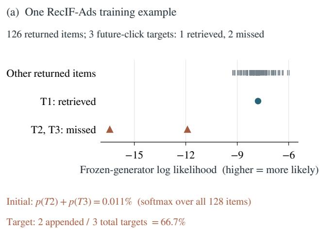
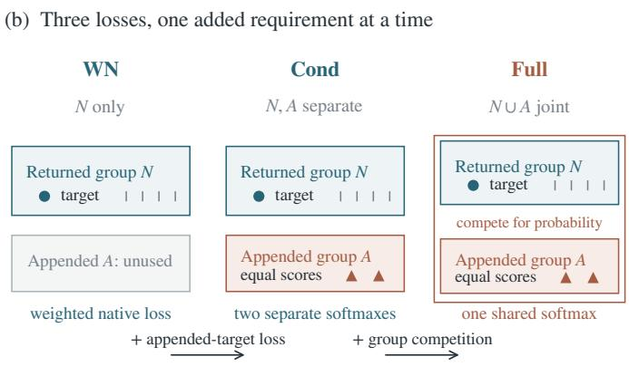
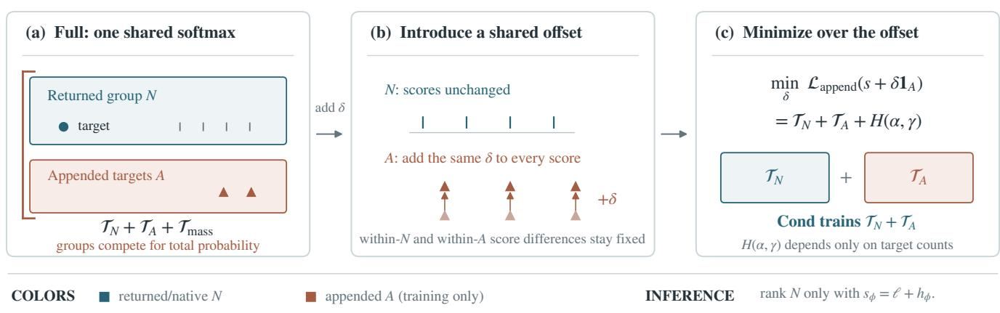
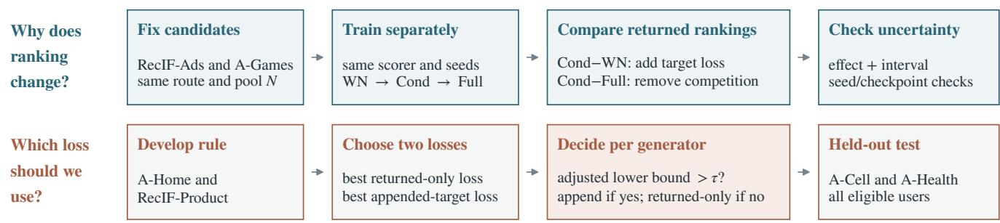
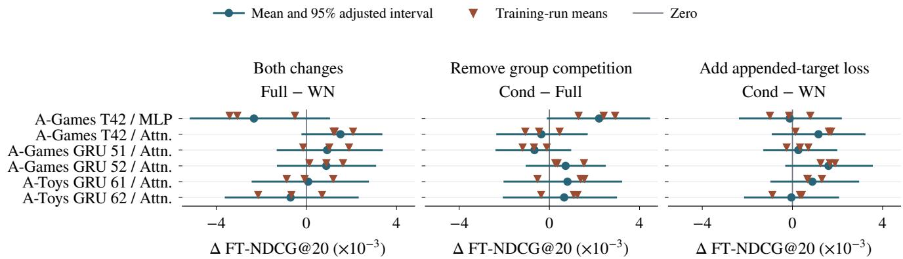

# Training with Missed Targets in Generative Recommendation: Separating Supervision from Probability Competition

Xuesi Wang∗†   
wxsthu@icloud.com   
Independent Researcher   
Shanghai, China

Yangbin Shi∗ 11921182@zju.edu.cn Zhejiang University Hangzhou, China

Xiaolin Zheng xlzheng@zju.edu.cn Zhejiang University Hangzhou, China

## Abstract

Generative recommenders return a limited candidate set and may omit observed targets before reranking. A training strategy appends these missed targets to reranker training lists, although inference still ranks only original candidates. This operation simultaneously changes retrieved-target weight, adds supervision over appended targets, and makes the two groups compete for probability. An append/no-append comparison therefore cannot explain changes in returned-item rankings. We construct three matched losses that hold retrieved-target weight fixed while introducing appended target supervision and group competition separately. The intermediate loss trains within both groups but normalizes them separately, preventing training-only targets from competing with inference candidates. Experiments with a released OneRec model and locally trained Amazon generators show that this competition can harm returned-item ranking. In four prespecified Amazon Video Games comparisons, removing it improved full-target normalized discounted cumulative gain (FT-NDCG) by 7.8–22.2%; 95% intervals over users and three of four intervals over training runs excluded zero. A conservative development-set rule selected appended-target training for two of three generators in one held-out category and rejected it for all three in another, avoiding a 1.7% loss. Candidate completion should therefore be evaluated for each generator rather than applied automatically.

## CCS Concepts

• Information systems → Recommender systems.

## Keywords

generative recommendation, training-only candidate completion, fixed-pool reranking, listwise learning

## 1 Introduction

Large Web recommenders separate candidate generation from ranking because a changing catalog cannot be scored exhaustively within a serving-time budget [5]. Generative recommenders retrieve items by producing semantic identifiers (semantic IDs), short token sequences assigned to catalog items [10, 19]. They may replace a conventional cascade [31] or provide a quota-limited chan nel blended with other retrieval routes [33]; a reranker or verifier can refine that channel’s slate [34, 38]. Once the generator and its candidate route are held fixed, an omitted item cannot reach its reranker. This creates a Web recommendation mismatch: feedback spans a changing catalog, whereas each serving route exposes only a bounded slate.

One way to use labels missed by the generator is candidate completion: keep every retrieved item, append the missed observed targets to the reranker’s training list, and train on the enlarged list. The appended targets may come from another retrieval route or from an ofline answer set. They are absent again at inference, when the reranker receives only the generator’s original candidates. The practical question is whether learning against these training-only items improves or harms the ranking of items that can actually be served.

Figure 1(a) shows the mismatch in one example from the public RecIF-Bench Ads recommendation dataset (RecIF-Ads) [40]. Its answer set contains three future-click targets. The generator returns 126 items containing the first target and misses the other two, which are appended only for training. Although the appended pair initially holds 0.011% of the model probability, the uniform completed-list loss asks it to receive 66.7%. This creates strong competition with returned items that does not exist at inference.

Figure 1(b) compares three losses. Weighted-native (WN) ranks retrieved targets against the other returned items, then weights this ranking loss by the fraction of all observed targets that the generator retrieved. Conditional training (Cond) adds a separately normalized loss over appended targets, without competition between the groups. Full append training (Full) puts both groups in one softmax, adding competition to the same two within-group tasks. We derive Cond by allowing all appended scores to move together and choosing the shared shift that minimizes Full. This removes only the requirement that the two groups compete for total probability. Comparing Cond with WN tests the appended-target loss; comparing Cond with Full tests removal of group competition. All three use the same training users and inference pool. With one appended target, its within-group probability is 1 and its loss is zero, so Cond reduces to WN; 63.5–100% of our training groups contain at least two appended targets.

Earlier work shows that candidate distributions afect ranking cascades [18] and that adding gold references can harm machinetranslation rerankers [2]. Neither result explains what happens when observed targets are appended only to a recommender’s training lists. This operation lowers the target weight assigned to retrieved items, adds supervision over the appended targets, and makes the two groups compete for probability. We match the retrieved-target weight across all three losses, then use the WN→Cond→Full path to introduce appended-target supervision and group competition separately. Table 1 distinguishes this controlled comparison from nearby methods.

  
Figure 1: Candidate completion and three training losses. (a) One RecIF-Ads answer set contains three future-click targets. T1 appears among 126 returned items, while T2 and T3 are appended only for training. Together, T2 and T3 initially receive 0.011% of the softmax probability over all 128 training items; uniform supervision assigns them 2/(1 + 2) = 66.7% of target weight. (b) WN retains only weighted ranking within the returned group; Cond adds a separately normalized appended-target task; Full uses one normalization over both groups and thereby adds cross-group competition. Thus WN→Cond and Cond→Full each add one training requirement.

We train WN, Cond, and Full with the same candidates, representations, scorer architecture, optimizer, and inference pool. Comparing their returned rankings attributes a change to appended-target supervision or to group competition. Evaluation includes all eligible users, including those for whom the generator retrieved no target. We then address the practical choice directly: development users determine whether to keep returned-only training or adopt appended-target training, and diferent users from held-out categories evaluate that choice.

Our contributions are threefold. First, we show that candidate completion changes retrieved-target weight, adds supervision over missed targets, and creates probability competition with returned items. Second, three otherwise identical losses measure the efects of supervision and competition separately. Third, we give a practical rule for each generator: adopt appended-target training only when its adjusted development lower bound is positive. Experiments with released OneRec and local Amazon generators show that probability competition can be harmful. In the primary Amazon Video Games study, removing it improved all four point estimates by 7.8–22.2%; held-out categories show that appended-target training helps some generators but should be rejected for others.

## 2 Related Work

Generative recommendation and downstream reranking. Generative recommenders retrieve items by generating semantic IDs from a user’s history [19]; a recent survey reviews this design space [6]. Most work improves retrieval through semantic ID design, joint generation and ranking, sequence reranking, or reward-guided decoding [7, 10, 12, 21, 24, 25, 27, 35]. Other systems use a generator within a larger pipeline: it may replace an earlier cascade [31], supply some candidates to downstream ranking [33], or verify a frozen retriever’s top-� items [38]. Related studies explain retrieval failures through item age, semantic ID quality, decoding dificulty, or early beam-search pruning [17, 26, 29, 37].

We study what happens after retrieval. Joint-prefix alignment changes generator supervision and inference-time completion [26]. We leave the generator and its returned candidates unchanged, then train the reranker with observed targets that the generator missed. Our question is whether those training-only targets improve or harm the ranking of candidates that can still be served.

Learning with a fixed candidate pool. Several areas study candidate distributions at other points in the pipeline. Cascade methods coordinate multiple ranking stages [8, 18]. Selection-bias and of-policy methods use logged exposure to estimate relevance or retrieval-policy value [1, 15, 16, 30]. Sampled-softmax methods correct the negative samples used to approximate catalog-level training [32]. Automated and calibration-aware rerankers choose strategies or balance relevance with preference calibration [9, 11]. We keep the generator, serving candidates, and scorer architecture the same; only the use of missed observed targets during reranker training changes.

Machine-translation reranking provides a closely related finding: adding gold references to training candidates can create harmful comparisons [2]. We study the same train/test candidate mismatch in recommendation and separate the changes mixed by a simple append-versus-no-append comparison.

Separating the efects of training-only targets. ListNet provides the listwise probability model used by our losses [3]. We adapt profile minimization [14] to remove competition between returned and training-only items while preserving ranking within each group. Decoupled knowledge distillation (DKD) also separates learning within groups from competition between them, but its groups are target and non-target classes [39]. Our two groups difer in when they exist: returned items are ranked at inference, whereas appended items appear only during training. Multitask gradient methods [4, 36] balance task updates, while learning using privileged information (LUPI) [23, 28] uses training-only features. Neither compares otherwise identical losses with and without probability competition from training-only items. Table 1 summarizes these diferences.

Table 1: How the proposed comparison difers from nearby approaches. We keep the generator, inference pool, and scorer architecture fixed while changing one part of reranker supervision at a time.
<table><tr><td>Approach</td><td>Difference from our study</td></tr><tr><td>Profile likelihood [14]</td><td>minimizes over a shared offset; does not compare these reranker losses</td></tr><tr><td>DKD [39]</td><td>splits target/non-target knowledge; we split returned and training-only items</td></tr><tr><td>Cascade optimization and calibrated reranking [8, 18, 20]</td><td>coordinates stages or calibrates sublists; our generator remains fixed</td></tr><tr><td>LUPI [23, 28]</td><td>uses training-only features, not training-only comparison items</td></tr><tr><td>Candidate-free verifier [38]</td><td>learns token likelihood without completed-list supervision</td></tr><tr><td>Ours</td><td>compares three losses with the same generator, inference pool, and scorer architecture</td></tr></table>

For loss selection, we also include pairwise-ranking baselines within the returned pool or between appended targets and returned nontargets [22]. Appendix A.2 extends the derivation to targets with diferent weights.

## 3 Method

Our goal is to determine which change introduced by appended targets alters the ranking of the returned candidates. We first define the returned and appended item sets. We then split the completed list loss into three terms and construct three training losses that add those terms one at a time.

## 3.1 Returned and Missed Targets

Let � denote a user’s interaction history and � the set of observed target items associated with it. The targets may be collected within a session or a fixed future window. For the ranking loss, membership in $Y _ { x }$ is a binary target indicator; it records the observed event and does not necessarily indicate favorable sentiment.

A generative recommender retrieves an item by generating its semantic ID rather than scoring every catalog item. If item � has semantic ID $t ( i ) = \left( t _ { 1 } , \ldots , t _ { L _ { i } } \right)$ , the fixed generator assigns it log likelihood

$$
\ell ( i \mid x ) = \sum _ { j = 1 } ^ { L _ { i } } \log p _ { \theta } ( t _ { j } \mid x , t _ { 1 } , \dots , t _ { j - 1 } ) .
$$

The decoding temperature is fixed within each dataset. Let I be the items representable by the generator. Decoding returns the returned candidate set $N ( x )$ . Some observed targets may be representable but absent from this set; we denote them by

$$
A ( x ) = ( Y _ { x } \cap J ) \setminus N ( x ) .
$$

Candidate completion appends these missed targets during training, forming $C ( x ) = N ( x ) \cup A ( x )$ without removing any returned item. At inference, the reranker still receives only $N ( x )$ ; evaluation labels never alter this pool.

The reranker adds a learned residual to the fixed generator score:

$$
s _ { \phi } ( i \mid x ) = \ell ( i \mid x ) + h _ { \phi } ( x , i ) .
$$

Here $h _ { \phi }$ is a scalar correction computed from fixed user and item representations and candidate features. The attention variant also uses $N ( x )$ as context. Its zero-initialized output layer recovers the generator ranking before training. We train only $\phi$ and resolve ties by complete item IDs.

For any candidate set � containing at least one target, training uses uniform multi-target listwise cross-entropy:

$$
\mathcal { L } ( s , C , Y ) = - \frac { 1 } { | Y \cap C | } \sum _ { i \in Y \cap C } \log \frac { e ^ { s _ { i } } } { \sum _ { j \in C } e ^ { s _ { j } } } ,\tag{1}
$$

where $s _ { i } ~ = ~ s _ { \phi } ( i ~ \vert ~ x )$ and $Y = Y _ { x } ;$ we omit � below. The target distribution has total mass one and divides it equally among the observed targets. Appendix A.2 gives the corresponding result for supplied nonnegative target weights.

## 3.2 What Candidate Completion Changes

Consider a training list with $r = | N \cap Y | > 0$ retrieved targets and $k = \left| A \right| > 0$ appended targets. Their shares of the target distribution are $\alpha = r / ( r + k )$ and $\gamma = k / ( r + k )$ . Define the score normalizers $\begin{array} { r } { Z _ { N } = \sum _ { i \in N } e ^ { s _ { i } } } \end{array}$ and $\textstyle Z _ { A } = \sum _ { i \in A } e ^ { s _ { i } }$ , and normalize scores separately within each group: $p _ { N } ( i ) = e ^ { s _ { i } } / Z _ { N }$ and $p _ { A } ( i ) = e ^ { s _ { i } } / Z _ { A }$ . This gives two within-group losses,

$$
\mathcal { L } _ { N } = - \frac { 1 } { r } \sum _ { i \in N \cap Y } \log p _ { N } ( i ) , \qquad \mathcal { L } _ { A } = - \frac { 1 } { k } \sum _ { i \in A } \log p _ { A } ( i ) .
$$

The first ranks retrieved targets against the other returned items.   
The second encourages equal scores among the appended targets.

Proposition 1 (Three-part decomposition). The loss on the completed list separates into three terms:

$$
\begin{array} { r l r } {  { \mathcal { L } _ { \mathrm { a p p e n d } } = \mathcal { T } _ { N } + \mathcal { T } _ { A } + \mathcal { T } _ { \mathrm { m a s s } } , } } \\ & { \mathcal { T } _ { N } = \alpha \mathcal { L } _ { N } , \qquad \mathcal { T } _ { A } = \gamma \mathcal { L } _ { A } , } \\ & { \mathcal { T } _ { \mathrm { m a s s } } = - \alpha \log \frac { Z _ { N } } { Z _ { N } + Z _ { A } } - \gamma \log \frac { Z _ { A } } { Z _ { N } + Z _ { A } } . } \end{array}\tag{2}
$$

Derivation. For a retrieved item, $e ^ { s _ { i } } / ( Z _ { N } + Z _ { A } ) = [ Z _ { N } / ( Z _ { N } +$ $Z _ { A } ) ] p _ { N } ( i )$ ; the same identity holds for an appended item. Splitting the target sum in Equation 1 gives the two conditional losses with weights � and $\gamma ,$ followed by the two group-probability terms in Equation 2.

Interpretation. The completed-list loss $\mathcal { L } _ { \mathrm { a p p e n d } }$ is Full. Relative to unweighted training on �, Full makes three changes. First, $\mathcal { T } _ { N }$ multiplies the returned-item loss by �. Second, $\mathcal { T } _ { A }$ trains the scorer to rank within the appended group. Third, $\mathcal { T } _ { \mathrm { m a s s } }$ makes the returned and appended groups compete for total probability in the target ratio $( \alpha , \gamma )$ . We refer to this third term as the group-competition term. When $k = 1 , \mathcal { T } _ { A }$ is zero because the appended group contains only one item. In Figure $1 ( \mathrm { a } ) , r = 1$ and $k = 2 ,$ , so $\mathcal { T } _ { \mathrm { m a s s } }$ asks the appended group to receive $2 / 3$ of the target probability although it initially receives only 0.011%. We next remove this competition while retaining both within-group losses.

## 3.3 Conditional Training

We obtain Cond from Full by removing only the competition between the two groups. For each training list, temporarily add the same scalar � to every appended score. This changes the total probability assigned to $A$ without changing any ranking within � or $A .$ The ofset replaces $Z _ { A }$ by $e ^ { \delta } Z _ { A }$ while leaving $\ p _ { A } , \ { \mathcal { L } } _ { A } ,$ and all returned-item quantities unchanged. Diferentiating Full with respect to $\delta$ gives

$$
\frac { e ^ { \delta } Z _ { A } } { Z _ { N } + e ^ { \delta } Z _ { A } } - \gamma ,
$$

which is zero at

$$
\delta ^ { * } = \log ( k / r ) + \log Z _ { N } - \log Z _ { A } .
$$

For the example in Figure 1(a), $\delta ^ { * } \approx 9 . 8$ moves the appended-group mass to its $2 / 3$ target while preserving both within-group rankings. Figure 2 illustrates this construction.

Proposition 2 (Removing group competition). For finite scores and $r , k > 0$ , the second derivative with respect to � is the positive Bernoulli variance of the predicted appended-group mass. Hence $\delta ^ { * }$ is the minimum and

$$
\operatorname* { m i n } _ { \delta } \mathcal { L } _ { \mathrm { a p p e n d } } ( s + \delta \mathbf { 1 } _ { A } ) = \mathcal { T } _ { N } + \mathcal { T } _ { A } + H ( \alpha , \gamma ) ,
$$

where $^ { 1 } A$ indicates the appended group and $H ( \alpha , \gamma ) = - \alpha$ log $\alpha -$ � log�. The entropy term depends only on target counts, so it has no gradient with respect to the scorer. We can therefore train Cond directly as $\mathcal { T } _ { N } + \mathcal { T } _ { A } ;$ the temporary ofset is neither computed nor stored in the implementation. Inference still applies $s _ { \phi } = \ell + h _ { \phi }$ only to �.

Cond is unchanged if the same constant is added to all scores in either group. Its gradient is $\nabla _ { \phi } \big ( \mathcal { T } _ { N } + \mathcal { T } _ { A } \big )$ wherever the scores are diferentiable: training updates the scorer through the two withingroup losses, without a group-competition gradient. A fixed ofset in Full cannot remove that gradient throughout training, because the optimal ofset changes with the scores.

Two special cases determine which lists enter training. If $k = 0 ,$ the generator missed no target and the loss is $\mathcal { L } _ { N } . \mathrm { H } r = 0 .$ , the returned list contains no target whose ranking can be compared across the three losses; minimizing over $\delta$ approaches $\mathcal { L } _ { A }$ as $\delta $ +∞. We therefore train the three losses on lists with $r , k \ > \ 0$ Evaluation still includes every eligible user, including those with $r = 0 . \mathrm { I f } k = 1 , \mathcal { T } _ { A } = 0$ and Cond reduces to $\mathcal { T } _ { N }$ . Appendix A.2 extends the construction to several candidate sources by using one temporary ofset per source.

## 3.4 Three Training Losses

We train a separate reranker with each of three losses. Moving from one loss to the next adds exactly one requirement:

$$
\begin{array} { r l r } & { \mathcal { L } _ { \mathrm { W N } } = \mathcal { T } _ { N } = \alpha \mathcal { L } _ { N } , } & { \mathcal { L } _ { \mathrm { C o n d } } = \mathcal { T } _ { N } + \mathcal { T } _ { A } , } \\ & { \mathcal { L } _ { \mathrm { F u l l } } = \mathcal { T } _ { N } + \mathcal { T } _ { A } + \mathcal { T } _ { \mathrm { m a s s } } . } \end{array}
$$

WN uses only the returned-item loss, weighted exactly as it is in Full. Cond also learns to rank the appended targets, but keeps their probability separate from the returned group. Full then makes the two

groups compete for probability. Candidates, training lists, scorer inputs, initialization, and optimization are unchanged. Table 2 shows the comparison for each question.

Table 2: How the three trained rerankers answer separate questions. $V _ { W } , V _ { C } ,$ , and $V _ { F }$ are their ranking scores on the returned candidates; the first score is minus the second.
<table><tr><td>Score difference Only change</td><td></td><td>Question answered</td></tr><tr><td> $V _ { C } - V _ { W }$ </td><td> $\operatorname { a d d } { \mathcal { T } } _ { A }$ </td><td>Does appended-target training help?</td></tr><tr><td> $V _ { C } - V _ { F }$ </td><td>remove  $\mathcal { T } _ { \mathrm { m a s s } }$ </td><td>Does competition hurt?</td></tr><tr><td> ${ \cal V } _ { F } - { \cal V } _ { W }$ </td><td>add both terms</td><td>What is their combined effect?</td></tr></table>

Why all three losses are needed. Let $V _ { W } , V _ { C } , V _ { F }$ denote the returned-candidate ranking scores after training with WN, Cond, and Full. Comparing Full directly with WN gives

$$
V _ { F } - V _ { W } = ( V _ { C } - V _ { W } ) - ( V _ { C } - V _ { F } ) .
$$

Full versus WN combines two changes, so a better Full score does not identify which change helped; one may help while the other hurts. Cond separates them. $V _ { C } - V _ { W }$ adds only the appended-target loss, while ${ V _ { C } - V _ { F } }$ removes only group competition.

## 3.5 Why the Efect Reaches Inference

Although appended targets disappear at inference, group competi tion can still change the returned ranking. The same scorer produces both groups’ scores during training, so $\mathcal { T } _ { \mathrm { m a s s } }$ updates parameters that later rank returned candidates. Let $\pi _ { A } = Z _ { A } / ( Z _ { N } + Z _ { A } )$ and $\begin{array} { r } { \mu _ { B } = \sum _ { i \in B } p _ { B } ( i ) \nabla _ { \phi } s _ { i } } \end{array}$ for $B \in \{ N , A \}$ . Since $\nabla _ { \phi }$ log $Z _ { B } = \mu _ { B }$ ,

$$
\nabla _ { \phi } \mathcal { T } _ { \mathrm { m a s s } } = ( \pi _ { A } - \gamma ) ( \mu _ { A } - \mu _ { N } ) .\tag{3}
$$

In Equation 3, the first factor is the gap between the appended group’s predicted probability and its target share. The second is the diference between the two groups’ average score gradients. Their product updates the same scorer parameters later used to rank returned candidates. Group competition can therefore change inference rankings even though no appended item is served.

## 4 Experiments

## 4.1 Research Questions

We ask three research questions (RQs). RQ1: How does probability competition between returned and appended items afect the ranking of returned candidates? RQ2: When that competition is removed, does supervision from appended targets improve the returned ranking? RQ3: Can development data choose between returned-only and appended-target training for a new category?

Figure 3 connects each question to a test. RecIF-Ads, using a released OneRec checkpoint, separates the efect of appended-target supervision from that of group competition. A comparison fixed before the Amazon Video Games (A-Games) final labels were opened provides a second test of competition. We also shift every appended score by the same amount. This preserves rankings inside each group but changes how probability is divided between them; a response from Full but not Cond directly identifies competition as the cause. Amazon Digital Music (A-Music) and Toys and Games (A-Toys) test whether the conclusions depend on one generator or reranker.

  
Figure 2: Removing competition between the two groups. Blue denotes the returned group � and orange the appended group �. (a) Full normalizes both groups together. (b) A temporary ofset � changes the appended group’s total probability without changing rankings within either group. (c) Minimizing Full over � leaves $\mathcal { T } _ { N } + \mathcal { T } _ { A }$ plus a count-dependent constant $H ( \alpha , \gamma )$ . This gives Cond. Inference ranks only �; the ofset is not stored.

The remaining experiments address the training decision rather than another isolated loss term. Amazon Home and Kitchen (A-Home) and the RecIF-Bench Product split (RecIF-Product) establish a conservative rule: for each generator, switch from the best returned-only loss to the best appended-target loss only when the adjusted lower end of the development gain is positive. We fix this rule before training on Amazon Cell Phones and Accessories (A-Cell) and Amazon Health and Personal Care (A-Health). New generators and previously unseen users in those categories then show whether the rule chooses well. Table 3 states the role of every dataset.

## 4.2 Data and Candidate Generators

Across all datasets, observed targets missed by the fixed generator are appended only during training; evaluation ranks the generator’s original candidates. Comparing WN, Cond, and Full requires a training list with at least one retrieved and one missed target $( r , k > 0 ) ;$ , and the appended-target loss is nonzero only when at least two targets were missed $\left( k \geq 2 \right)$ . All losses in a comparison use the same eligible lists. Evaluation retains every user, including those for whom the generator retrieved no target (� = 0). Table 3 reports how often a target is reachable. Throughout the experiments, returned-only means any loss trained without appended targets; the capitalized Native denotes the specific unweighted $\mathcal { L } _ { N }$ baseline.

The two local generator architectures are Transformers and gated recurrent units (GRUs). A generator label includes its architecture and training seed; for example, “Transformer (seed 42)” denotes one trained generator and its resulting candidate pools.

The six Amazon studies use public review histories [13]. After retaining a user’s first review of each item, the last three distinct items form the future target set and at least two earlier items form the history. This construction yields many users with both retrieved and missed targets. A robustness check keeps only targets rated at least four, distinguishing favorable feedback from interaction alone.

RecIF-Bench temporally separates each user’s history from a released set of future clicks [40]. We use its Ads and Product splits. Each row defines one training group, and its deduplicated future clicks form $Y _ { x } .$ . RecIF-Ads contains 3,740 reranker-training groups with a reachable target; the 3,189 groups with $r , k > 0$ enter the three-loss fits. Its groups contain 1–10 targets (median 3, mean 3.75), with $r = 1 - 7$ and $k = 0 { - } 9$ . RecIF-Product requires $r > 0 , k \geq 2$ for fitting; its 2,224 groups contain 3–10 targets (median 8), with � = 1–5 and � = 2–9. Figure 1(a) illustrates candidate completion for one RecIF-Ads training group.

Hash-based user splits prevent the same user from entering generator training, reranker training, development, and final evaluation. For A-Music and A-Games, we fixed data construction and training before obtaining the data. A-Games also removes 485 A-Music users, and its predictions and checkpoint choices were complete before final targets were opened. A-Home excludes users from the earlier Amazon categories, while RecIF-Product keeps final users out of training and development. Appendix A.3 gives the exact split rules.

Generator models. The two RecIF splits use released OneRec checkpoints: OneRec-1.7B-Pro for RecIF-Ads and OneRec-1.7B for RecIF-Product. For RecIF-Ads, we project the fixed states to 128 dimensions and decode at temperature 1.2. The local Transformers and GRUs use training-only collaborative embeddings, residual quantization, beam width 64, and temperature 1. Validation negative log-likelihood (NLL) selects a checkpoint. Each generator seed rebuilds candidate pools, representations, and eligible training groups, so each dataset–generator pair is analyzed separately. Appendix A.3 gives architectures and training settings.

## 4.3 Isolating Supervision and Competition

To answer RQ1–RQ2, we train separate WN, Cond, and Full rerankers and evaluate them on the same returned candidates. They share the candidates, training lists, features, initialization, minibatch order, and optimizer. Cond minus WN therefore measures what changes when the appended-target loss is added. Cond minus Full measures what changes when group competition is removed but both within-group losses remain. We also compare WN with WN+Mass, which adds competition to WN without adding the appended-target loss. If both comparisons favor re moving competition, the result does not depend on whether the appended-target loss is present.

  
Figure 3: Experiments for the three research questions. Top: RQ1 compares Cond with Full, and RQ2 compares Cond with WN, after separately training all three losses with identical settings. Bottom: RQ3 selects the best returned-only and appended-target losses on development users, switches only when the adjusted lower bound of the gain is above zero, and evaluates the chosen loss on held-out A-Cell and A-Health users.

Table 3: Datasets, candidate generators, and the question each addresses. The second column counts training lists containing both a returned and a missed target. The third shows how often at least two targets are appended, so their within-group loss is nonzero. The fourth shows how often the final returned candidates contain any target; ranges span generators.
<table><tr><td>Dataset / candidate generator</td><td>Training lists with both returned and missed targets</td><td>At least two appended targets</td><td>Final users with a returned target</td><td>Question addressed</td></tr><tr><td colspan="5">Tests of the main claims</td></tr><tr><td>RecIF-Ads / OneRec-1.7B-Pro</td><td>3,189</td><td>81.6%</td><td>44.9%</td><td>separate supervision from competition</td></tr><tr><td>A-Games / Transformer (seed 42)</td><td>914</td><td>75.5%</td><td>36.3%</td><td>test competition on held-out labels</td></tr><tr><td>A-Home / GRUs (seeds 91-93) RecIF-Product / OneRec-1.7B</td><td>461-543</td><td>91.9-93.6%</td><td>9.6-10.3%</td><td>determine when to switch losses</td></tr><tr><td>A-Cell / GRUs (seeds 111–113)</td><td>2,224</td><td>100.0%</td><td>30.3%</td><td>check whether training improves the initial ranking</td></tr><tr><td>A-Health / GRUs (seeds 121–123)</td><td>394-400</td><td>94.7-95.9% 96.7-97.0%</td><td>30.1-30.7% 19.9-20.8%</td><td>evaluate the fixed switching rule</td></tr><tr><td></td><td>666-702</td><td></td><td></td><td>evaluate the fixed switching rule</td></tr><tr><td colspan="5">Tests across other models and data A-Music / Transformer (seed 42)</td></tr><tr><td></td><td>524</td><td>63.5%</td><td>58.1%</td><td>test a second data source</td></tr><tr><td>A-Games / Transformer (seed 42), GRUs (seeds 51–52)</td><td>914-956</td><td>74.0-75.9%</td><td>36.3-38.6%</td><td>vary the generator and reranker</td></tr><tr><td>A-Toys / GRUs (seeds 61–62)</td><td>163-170</td><td>86.7-92.2%</td><td>13.6%</td><td>test another category</td></tr></table>

We test both a multilayer perceptron (MLP) with hidden widths 256 and 128 and a two-block attention reranker with width 128 and four attention heads. A training run means one independently initialized and trained reranker; it is not an attention head. Both rerankers use the same unchanged query and item representations and scalar features. The attention model attends only to returned candidates, so adding training-only targets cannot change its input context. Appendix A.1 specifies the inputs and architectures.

All rerankers use AdamW, batch size 64, weight decay 10−4, and gradient clipping at norm 1. The primary A-Games test uses three independent runs, 60 epochs, learning rate 10−4, and checkpoints chosen on development users. RecIF-Ads first uses three runs and then seven new runs for WN, Cond, Full, and a Full variant initialized with the correct appended-group probability. Training for 240 epochs and selecting checkpoints in five folds test whether the conclusion depends on stopping at epoch 60. Appendix A.4 gives the schedules and defines the average efect over training.

Other generators and rerankers. Six further comparisons combine MLP and attention rerankers, Transformer and GRU generators, and the A-Games and A-Toys datasets. Within each comparison, every loss receives the same hyperparameter search; the mean development score over three training runs chooses the schedule for continued training. Appendix A.4 lists the seeds, search ranges, and stopping rules.

Testing probability competition. RecIF-Ads and two Amazon comparisons test whether Full responds to the probability divided between returned and appended items. For each training list, we add the same constant to every appended score so that the appended group starts with its target probability �; the Amazon comparisons also test half this shift. This operation does not change rankings inside either group and leaves Cond unchanged. Candidates, features, attention context, training budget, and inference are identical, so a change in Full comes from probability competition during training.

## 4.4 Choosing Whether to Append Targets

RQ3 asks whether development results can determine whether appended-target training should be used for a new category. For each generator, we first select the best returned-only loss: Native and WN, or an expanded set that also includes the native pairwise loss (NP). We separately select among Cond, Full, and a discriminative appended-target loss (Disc). Disc trains appended targets to outrank returned nontargets without putting the two groups in one softmax. Appendix A.5 defines Disc and NP formally.

For each generator, we train every loss for the same budget. Mean development full-target normalized discounted cumulative gain at 20 (FT-NDCG@20) chooses one returned-only loss and one appended-target loss. A-Home and RecIF-Product are the only datasets used to set the rule. Before training on A-Cell and A-Health, we specify the data construction, available losses, and switching threshold. Eight training runs choose the two losses on develop ment users. We adopt the appended-target loss only if the lower confidence bound of its gain remains above zero after correcting for three generator comparisons; otherwise we keep the returned-only loss. Five new runs evaluate that choice on 5,398 A-Cell and 13,622 A-Health final users. Each category uses three newly trained GRU generators. Adjusting all 18 possible loss-pair comparisons leaves every choice unchanged (Appendix A.3).

## 4.5 Metrics and Uncertainty

FT-NDCG@20 is our primary end-to-end metric. The reranker orders only returned candidates, but the ideal-ranking denominator contains the user’s complete eligible target set. A missed target therefore remains in the denominator, and a user with no reachable target receives zero. Candidate-conditional NDCG instead removes unreachable targets from its denominator, so its values are not nu merically comparable with FT-NDCG@20. Recall@20 and mean reciprocal rank at 20 (MRR@20) provide secondary checks. Appendix A.1 also reports results restricted to users with a reachable target.

We set the FT-NDCG improvement threshold to � = 0 before held-out evaluation. The lower bound uses variation across reranker training runs on the same development users; separate final users evaluate the chosen loss. An application may instead require a positive minimum useful gain. Appendix A.3 reports results for several thresholds. If the untrained initialization scores best on development users, as on RecIF-Product, we retain it.

For A-Games, one interval resamples the 9,121 final users while holding the three trained rerankers fixed; a second interval measures variation across those training runs.

RecIF-Ads intervals resample its evaluation users. For A-Cell and A-Health, we first average each user’s predictions over three generators and five new training runs. The main intervals resample users; an additional analysis also resamples generators and training runs. Every loss comparison includes all final users. Appendix A.3 gives the exact splits, seeds, search ranges, jointly tested comparisons, and resampling algorithms.

## 5 Results

The results answer the questions in causal order. We first isolate the harm from group competition, then measure the benefit of appended-target supervision, and finally test whether development results avoid harmful switches on new categories.

## 5.1 Group Competition Can Hurt

With the same 60-epoch budget, Cond ranked returned RecIF-Ads candidates better than Full in all seven new training runs. WN, Cond, and Full averaged 0.031527, 0.033405, and 0.025982 FT-NDCG. Cond exceeded Full by 0.007423 [0.004978, 0.009744] at epoch 60, and its average advantage throughout training was +0.01241 [+0.01031, +0.01451]. These intervals capture variation across training runs for the same evaluation users.

The diference depends on when training stops. When development folds chose the checkpoint, the interval crossed zero (Table 4). After 240 epochs, Cond−Full was −0.00064 and +0.00270 at learning rates $3 \times 1 0 ^ { - 4 }$ and $1 0 ^ { - 4 }$ ; choosing the best among 25 recorded checkpoints gave +0.00120 and +0.00108. The advantage is consistent at epoch 60 but is not guaranteed under a diferent training duration or checkpoint rule.

Giving Full the correct appended-group probability at initialization raised its FT-NDCG by 0.009233 [0.006838, 0.011643], with the same direction in all seven runs. Cond and WN were unchanged. This direct response to group probability supports probability competition as the source of Full’s change.

Confirmation on Amazon Video Games. We chose the A-Games generator, comparisons, learning rate, and training runs before opening the final labels. Removing competition improved FT-NDCG for both rerankers, with or without the appended-target loss, over 9,121 separate users (Table 6). Relative gains were 22.23% and 12.84% for the MLP and 7.83% and 13.16% for attention. All four user intervals and three of four training-run intervals excluded zero, and every run favored removing competition.

Direct test of probability competition. The derivation predicts that shifting every appended score by the same amount leaves Cond unchanged. Across 12 runs, Cond’s training path and learned parameters were identical to numerical precision. Full changed: for the A-Games attention reranker, the shift moved Cond−Full from −0.000358 to +0.004049, a change of+0.004407 [0.001591, 0.007177]. Full therefore responds to the probability divided between the two groups, whereas Cond does not.

## 5.2 Appended-Target Supervision Can Help

Cond difers from WN only by the separately normalized loss over appended targets. After 60 epochs, Cond−WN was +0.001877 [0.000343, 0.003455] across the seven new RecIF-Ads runs, and every run had the same sign. When development folds chose the checkpoint, the estimate was −0.000887 [−0.002209, +0.001211] (Table 4). Appended-target supervision helped at epoch 60, but its benefit was uncertain after checkpoint selection.

## 5.3 Development Results Prevent a Harmful Switch

Table 5 summarizes the choices. On A-Cell, development users chose Disc for two generators and WN for the third. The resulting FT-NDCG change was +.000319 [−.000077, +.000720]; an interval that also resamples generators and training runs was [−.000431, +.001309]. On A-Health, development users kept a returned-only loss for every generator. Always forcing the best appended-target loss would have reduced FT-NDCG by 0.000644 [0.000412, 0.000881], or 1.7%. The rule therefore allowed appendedtarget training on A-Cell and avoided a clear loss on A-Health, although the A-Cell gain remained uncertain.

Table 4: RecIF-Ads FT-NDCG changes $( 1 0 ^ { - 3 } )$ . Each row is the first loss minus the second; positive values favor the first. Columns report the fixed epoch-60 result, the average efect across epochs 0–60, and the result after development folds select the checkpoint. Brackets are 95% intervals over runs and users.
<table><tr><td>Training-loss change</td><td>Initial 3 runs epoch 60</td><td>New 7 runs epoch 60</td><td>New 7 runs</td><td>New 7 runs average, epochs 0-60development-selected checkpoint</td></tr><tr><td>All completion changes (Full – WN)</td><td> $- 6 . 9 7 \ \left[ - 1 0 . 2 2 , - 3 . 6 7 \right]$ </td><td> $- 5 . 5 5 \left[ - 8 . 0 7 , - 2 . 9 9 \right]$ </td><td> $- 1 1 . 8 0 \ \left[ - 1 3 . 7 3 , - 9 . 9 2 \right]$ </td><td> $- 1 . 9 2 \ \left[ - 4 . 0 2 , + 0 . 9 7 \right]$ </td></tr><tr><td>Remove group competition (Cond – Full)</td><td> $+ 8 . 6 3 \ [ + 6 . 2 0 , + 1 1 . 2 7 ]$ </td><td> $+ 7 . 4 2 \ [ + 4 . 9 8 , + 9 . 7 4 ]$ </td><td> $+ 1 2 . 4 1 \ \left[ + 1 0 . 3 1 , + 1 4 . 5 1 \right]$ </td><td> $+ 1 . 0 3 \ [ - 1 . 2 4 , + 3 . 3 6 ]$ </td></tr><tr><td>Add appended-target loss (Cond – WN)</td><td> $+ 1 . 6 6 \ \left[ - 0 . 5 0 , + 4 . 0 7 \right]$ </td><td> $+ 1 . 8 8 \ [ + 0 . 3 4 , + 3 . 4 5 ]$ </td><td> $+ 0 . 6 0 \ \left[ - 0 . 2 0 , + 1 . 4 4 \right]$ </td><td> $- 0 . 8 9 \ \left[ - 2 . 2 1 , + 1 . 2 1 \right]$ </td></tr></table>

Table 5: Choosing whether to use appended-target training $( 1 0 ^ { - 3 }$ FT-NDCG). Each question states the subtraction; a positive change favors its first option. We switch from returned-only training only when the adjusted lower bound of the development gain is positive.
<table><tr><td>Dataset</td><td>Question and comparison</td><td>Change [95% interval]</td><td>Conclusion</td></tr><tr><td colspan="4">Choosing the switching rule</td></tr><tr><td>RecIF-Ads</td><td>After checkpoint selection, does Cond beat WN?</td><td>-0.89 [-2.21, +1.21]</td><td>No; keep WN</td></tr><tr><td>A-Games</td><td>On new users and runs, does Full beat WN?</td><td>+1.75 [+0.48, +3.02]</td><td>Yes; retain appended-target training as an option</td></tr><tr><td>A-Home RecIF-Product</td><td>Does chosen appended training beat returned-only training?</td><td>+0.21 [+0.12, +0.29]</td><td>Yes; switch only when the adjusted lower bound is positive</td></tr><tr><td></td><td>Does the chosen trained loss beat the untrained scorer?</td><td>0.00 [0,0]</td><td>No; keep the untrained scorer</td></tr><tr><td colspan="4">Applying the rule to new categories</td></tr><tr><td>A-Cell</td><td>Does the rule&#x27;s choice beat returned-only training?</td><td>+0.32 [−0.08, +0.72]</td><td>It switched 2 of 3 generators; the overall gain is uncertain</td></tr><tr><td>A-Health</td><td>Does the rule&#x27;s choice beat returned-only training?</td><td>0.00 [0,0]</td><td>It kept returned-only training for all 3 generators</td></tr><tr><td>A-Health</td><td>Does always appending beat returned-only training?</td><td> $- 0 . 6 4 \left[ - 0 . 8 8 , - 0 . 4 1 \right]$ </td><td>No: the rule avoided a 1.7% loss</td></tr><tr><td>A-Health</td><td>Does the lower-bound rule beat choosing the highest mean?</td><td> $+ 0 . 0 4 \left[ - 0 . 0 8 , + 0 . 1 7 \right]$ </td><td>No clear difference</td></tr></table>

Table 6: A-Games FT-NDCG gain from removing competition (10−3). Cond minus Full retains the appended-target loss; WN minus WN+Mass omits it. The 95% intervals resample users and runs separately.
<table><tr><td>Reranker</td><td>Loss comparison</td><td>Gain</td><td>Users only</td><td>Runs only</td></tr><tr><td>MLP</td><td>Cond minus Full</td><td>9.177</td><td>[6.709,11.651]</td><td>[8.202,10.152]</td></tr><tr><td>MLP</td><td>WN minus WN+Mass</td><td>5.834</td><td>[4.284,7.386]</td><td>[3.462,8.206]</td></tr><tr><td></td><td>Attention Cond minus Full</td><td>3.234</td><td>[1.848,4.651]</td><td>[1.275,5.192]</td></tr><tr><td></td><td>Attention WN minus WN+Mass</td><td>5.470</td><td></td><td>[3.886,7.111] [-0.824,11.764]</td></tr></table>

## 6 Discussion

Appended targets afect inference through the scorer parameters shared with returned candidates. Full also trains the scorer to divide probability between returned and appended items, although only returned items appear at inference. We tested this competition by adding the same constant to every appended score in each training list. This changed Full’s returned-item rankings but left Cond un changed, showing that probability competition during training can alter the rankings used at inference.

Separating the two efects changes how candidate completion should be interpreted. Removing competition consistently helped in the primary A-Games study and after the same 60-epoch RecIF Ads budget. The appended-target ranking task also helped after 60 epochs, but its estimated benefit weakened when development data chose the checkpoint. Thus, a poor result from appending targets does not imply that the extra labels are useless: their supervision may help while probability competition harms the same scorer.

Comparisons must also use the same training budget. A-Home further shows that the conclusion depends on which interactions are treated as targets.

This distinction also leads to a practical recommendation. For each generator, train every candidate loss on the same candidate pool. On development users, select the best reranker trained without appended targets and the best reranker trained with them, then compare the two. A favorable isolated efect is insuficient because the deployed loss combines several efects. A-Cell and A-Health required diferent choices, showing why candidate completion should be decided for each generator rather than treated as a universal default.

## 7 Conclusion

Appending a missed target is not a neutral way to add supervision. It changes the weight on retrieved targets, adds a new ranking task, and makes training-only targets compete with candidates that will actually be ranked at inference. Our three-loss comparison separates these changes under the same scorer. It shows that group competition, rather than the extra supervision itself, can be the main source of degradation: removing competition improved all four prespecified A-Games comparisons by 7.8–22.2%. Appendedtarget supervision helped RecIF-Ads after 60 epochs, although the estimated benefit became uncertain when development data selected the checkpoint.

For each generator, train returned-only and appended-target rerankers for the same inference pool and compare them on development users. Use appended-target training only when the adjusted lower confidence bound exceeds a chosen threshold. On held-out categories, this rule avoided a 1.7% A-Health loss while allowing appended-target training for two A-Cell generators. Candidate completion should therefore be tested for each generator rather than applied automatically.

## Acknowledgments

This work was supported by the National Natural Science Foundation of China (Grant No. 62672438).

## References

[1] Artem Betlei. 2026. Of-Policy Evaluation for Semantic ID Recommenders: Does the Model’s Own Code Hierarchy Help? arXiv:2608.28905 https://arxiv.org/abs/ 2608.28905

[2] Sumanta Bhattacharyya, Amirmohammad Rooshenas, Subhajit Naskar, Simeng Sun, Mohit Iyyer, and Andrew McCallum. 2021. Energy-Based Reranking: Im proving Neural Machine Translation Using Energy-Based Models. In Proceedings ofthe 59th Annual Meeting ofthe Association for Computational Linguistics and the 11th International Joint Conference on Natural Language Processing (Volume 1: Long Papers). Association for Computational Linguistics, Online, 4528–4537. doi:10.18653/v1/2021.acl-long.349

[3] Zhe Cao, Tao Qin, Tie-Yan Liu, Ming-Feng Tsai, and Hang Li. 2007. Learning to Rank: From Pairwise Approach to Listwise Approach. In Proceedings ofthe 24th International Conference on Machine Learning. Association for Computing Machinery, New York, NY, USA, 129–136. doi:10.1145/1273496.1273513

[4] Zhao Chen, Vijay Badrinarayanan, Chen-Yu Lee, and Andrew Rabinovich. 2018. GradNorm: Gradient Normalization for Adaptive Loss Balancing in Deep Multi task Networks. In Proceedings ofthe 35th International Conference on Machine Learning (Proceedings of Machine Learning Research, Vol. 80). PMLR, Stockholm, Sweden, 794–803. https://proceedings.mlr.press/v80/chen18a.html

[5] Paul Covington, Jay Adams, and Emre Sargin. 2016. Deep Neural Networks for YouTube Recommendations. In Proceedings of the 10th ACM Conference on Recommender Systems. Association for Computing Machinery, New York, NY, USA, 191–198. doi:10.1145/2959100.2959190

[6] Yashar Deldjoo, Zhankui He, Julian McAuley, Anton Korikov, Scott Sanner, Arnau Ramisa, René Vidal, Maheswaran Sathiamoorthy, Atoosa Kasrizadeh, Silvia Milano, and Francesco Ricci. 2026. Recommendation with Generative Models. Foundations and Trends in Information Retrieval 20, 1–2 (2026), 1–176. doi:10.1108/FTINR-06-2025-0109

[7] Chao Feng, Li Ma, Xiancheng Gao, Chenghao Zhang, Yuanhao Pu, and Xi ang Li. 2026. PSG: Pair-Space Generation for Eficient Generative Reranking. arXiv:2607.26427 https://arxiv.org/abs/2607.26427

[8] Luke Gallagher, Ruey-Cheng Chen, Roi Blanco, and J. Shane Culpepper. 2019. Joint Optimization of Cascade Ranking Models. In Proceedings ofthe Twelfth ACM International Conference on Web Search and Data Mining. Association for Computing Machinery, 15–23. doi:10.1145/3289600.3290986

[9] Jingtong Gao, Bo Chen, Xiangyu Zhao, Weiwen Liu, Xiangyang Li, Yichao Wang, Wanyu Wang, Huifeng Guo, and Ruiming Tang. 2025. LLM4Rerank: LLM-based Auto-Reranking Framework for Recommendations. In Proceedings ofthe ACM on Web Conference 2025. Association for Computing Machinery, New York, NY, USA, 228–239. doi:10.1145/3696410.3714922

[10] Wenyue Hua, Shuyuan Xu, Yingqiang Ge, and Yongfeng Zhang. 2023. How to Index Item IDs for Recommendation Foundation Models. In Proceedings of the Annual International ACM SIGIR Conference on Research and Development in Information Retrieval in the Asia Pacific Region. Association for Computing Machinery, New York, NY, USA, 195–204. doi:10.1145/3624918.3625339

[11] Hyunsik Jeon, Se-eun Yoon, and Julian McAuley. 2024. Calibration-Disentangled Learning and Relevance-Prioritized Reranking for Calibrated Sequential Recommendation. In Proceedings ofthe 33rdACMInternational Conference on Information and Knowledge Management. Association for Computing Machinery, New York, NY, USA, 973–982. doi:10.1145/3627673.3679728

[12] Zhijie Lin, Zhuofeng Li, Chenglei Dai, Wentian Bao, Shuai Lin, Enyun Yu, Haoxiang Zhang, and Liang Zhao. 2025. GReF: A Unified Generative Framework for Eficient Reranking via Ordered Multi-token Prediction. In Proceedings of the 34th ACM International Conference on Information and Knowledge Management. Association for Computing Machinery, New York, NY, USA, 5879–5887. doi:10.1145/3746252.3761540

[13] Julian McAuley, Christopher Targett, Qinfeng Shi, and Anton van den Hengel. 2015. Image-Based Recommendations on Styles and Substitutes. In Proceedings ofthe 38th International ACM SIGIR Conference on Research and Development in Information Retrieval. Association for Computing Machinery, New York, NY, USA, 43–52. doi:10.1145/2766462.2767755

[14] Susan A. Murphy and Aad W. van der Vaart. 2000. On Profile Likelihood. J. Amer. Statist. Assoc. 95, 450 (2000), 449–465. doi:10.1080/01621459.2000.10474219

[15] Zohreh Ovaisi, Ragib Ahsan, Yifan Zhang, Kathryn Vasilaky, and Elena Zheleva. 2020. Correcting for Selection Bias in Learning-to-rank Systems. In Proceedings

of The Web Conference 2020. Association for Computing Machinery, New York, NY, USA, 1863–1873. doi:10.1145/3366423.3380255

[16] Zohreh Ovaisi, Kathryn Vasilaky, and Elena Zheleva. 2021. Propensity-Independent Bias Recovery in Ofline Learning-to-Rank Systems. In Proceedings of the 44th International ACM SIGIR Conference on Research and Development in Information Retrieval. Association for Computing Machinery, 1763–1767. doi:10.1145/3404835.3463097

[17] Jie Peng, Yanping Zheng, Zhewei Zhe, Bin Tong, Guan Wang, and Bo Zheng. 2026. Can Generative Recommendation Reach Cold Items? A Temporal Perspective on Semantic-ID Generation. arXiv:2607.21101. https://arxiv.org/abs/2607.21101

[18] Jiarui Qin, Jiachen Zhu, Bo Chen, Zhirong Liu, Weiwen Liu, Ruiming Tang, Rui Zhang, Yong Yu, and Weinan Zhang. 2022. RankFlow: Joint Optimization of Multi-Stage Cascade Ranking Systems as Flows. In Proceedings ofthe 45th International ACM SIGIR Conference on Research and Development in Information Retrieval. Association for Computing Machinery, New York, NY, USA, 814–824. doi:10.1145/3477495.3532050

[19] Shashank Rajput, Nikhil Mehta, Anima Singh, Raghunandan Hulikal Keshavan, Trung Vu, Lukasz Heldt, Lichan Hong, Yi Tay, Vinh Q. Tran, Jonah Samost, Maciej Kula, Ed H. Chi, and Maheswaran Sathiamoorthy. 2023. Recommender Systems with Generative Retrieval. In Advances in Neural Information Processing Systems, Vol. 36. Curran Associates, Inc., Red Hook, NY, USA, 10299–10315. doi:10.52202/075280-0452

[20] Ruiyang Ren, Yuhao Wang, Kun Zhou, Wayne Xin Zhao, Wenjie Wang, Jing Liu, Ji-Rong Wen, and Tat-Seng Chua. 2025. Self-Calibrated Listwise Reranking with Large Language Models. In Proceedings of the ACM on Web Conference 2025. Association for Computing Machinery, New York, NY, USA, 3692–3701. doi:10.1145/3696410.3714658

[21] Yuxin Ren, Qiya Yang, Yichun Wu, Wei Xu, Yalong Wang, and Zhiqiang Zhang. 2024. Non-autoregressive Generative Models for Reranking Recommendation. In Proceedings of the 30th ACM SIGKDD Conference on Knowledge Discovery and Data Mining. Association for Computing Machinery, New York, NY, USA, 5625–5634. doi:10.1145/3637528.3671645

[22] Stefen Rendle, Christoph Freudenthaler, Zeno Gantner, and Lars Schmidt-Thieme. 2009. BPR: Bayesian Personalized Ranking from Implicit Feedback. In Proceedings of the Twenty-Fifth Conference on Uncertainty in Artificial Intelligence. AUAI Press, Corvallis, OR, USA, 452–461. https://arxiv.org/abs/1205.2618

[23] Viktoriia Sharmanska, Novi Quadrianto, and Christoph H. Lampert. 2013. Learning to Rank Using Privileged Information. In 2013 IEEE International Conference on Computer Vision. 825–832. doi:10.1109/ICCV.2013.107

[24] Anima Singh, Trung Vu, Nikhil Mehta, Raghunandan Keshavan, Maheswaran Sathiamoorthy, Yilin Zheng, Lichan Hong, Lukasz Heldt, Li Wei, Devansh Tandon, Ed Chi, and Xinyang Yi. 2024. Better Generalization with Semantic IDs: A Case Study in Ranking for Recommendations. In Proceedings ofthe 18th ACM Conference on Recommender Systems. Association for Computing Machinery, New York, NY, USA, 1039–1044. doi:10.1145/3640457.3688190

[25] Chaotian Song, Jingyao Zhang, Chenghao Chen, Zisen Sang, Dehai Zhao, Guodong Cao, Boxi Wu, Deng Cai, and Jia Jia. 2026. DeGRe: Dense-supervised Generative Reranking for Recommendation. In Proceedings ofthe 32nd ACM SIGKDD Conference on Knowledge Discovery and Data Mining V.2. Association for Computing Machinery, New York, NY, USA, 7957–7966. doi:10.1145/3770855. 3818363

[26] Hongliang Sun, Lianjie Li, Bolin Zhang, Dianbo Sui, Dianhui Chu, and Zhiying Tu. 2026. History-Conditioned Joint-Prefix Alignment for Generative Recom mendation. arXiv:2608.29179 [cs.IR] https://arxiv.org/abs/2608.29179

[27] Jiawei Sun, Jun Yang, Ziyue Guo, Dongyue Xu, Jianan Yan, Lifang Deng, and Xiaoyi Zeng. 2026. UniSGR: Unified Framework for Semantic ID Generation and Ranking. arXiv:2607.04068 https://arxiv.org/abs/2607.04068

[28] Vladimir Vapnik and Akshay Vashist. 2009. A New Learning Paradigm: Learning Using Privileged Information. Neural Networks 22, 5–6 (2009), 544–557. doi:10. 1016/j.neunet.2009.06.042

[29] Junting Wang, Xinrui He, Yunzhe Li, and Hari Sundaram. 2026. Understanding Semantic IDs: From Item Representation to Item Selection in Generative Recom mendation. arXiv preprint arXiv:2607.24995. https://arxiv.org/abs/2607.24995

[30] Peiyao Wang, Zhan Shi, Amina Shabbeer, and Ben London. 2025. Of-Policy Evaluation of Candidate Generators in Two-Stage Recommender Systems. In Proceedings ofthe Nineteenth ACM Conference on Recommender Systems. Association for Computing Machinery, 350–359. doi:10.1145/3705328.3748057

[31] Ziliang Wang, Gaoyun Lin, Xuesi Wang, Shaoqiang Liang, Yili Huang, Weijie Bian, Li Zhang, Mingchen Cai, Jian Dong, and Guanxing Zhang. 2026. UniRec: Bridging the Expressive Gap between Generative and Discriminative Recommendation via Chain-of-Attribute. arXiv:2604.12234v4. https: //arxiv.org/abs/2604.12234v4

[32] Jiancan Wu, Xiang Wang, Xingyu Gao, Jiawei Chen, Hongcheng Fu, and Tianyu Qiu. 2024. On the Efectiveness of Sampled Softmax Loss for Item Recommendation. ACM Transactions on Information Systems 42, 4 (2024), 1–26. doi:10.1145/3637061

[33] Hui Yang, Daiwei He, Kevin Jiang, Taejin Park, Kungang Li, Jiajun Luo, Yuying Chen, Xinyi Zhang, Sihan Wang, Haoyu He, Yu Liu, Lakshmi Manoharan, David

Xue, Shubham Barhate, Runze Su, Duna Zhan, Ling Leng, Siping Ji, Jinfeng Zhuang, Alice Wu, Leo Lu, Han Sun, and Zhifang Liu. 2026. Fine-Tuned LLM as a Complementary Predictor Improving Ads System. arXiv:2605.27856. https: //arxiv.org/abs/2605.27856

[34] Liu Yang, Fabian Paischer, Kaveh Hassani, Jiacheng Li, Shuai Shao, Zhang Gabriel Li, Yun He, Xue Feng, Nima Noorshams, Sem Park, Bo Long, Robert D. Nowak, Xiaoli Gao, and Hamid Eghbalzadeh. 2025. Unifying Generative and Dense Retrieval for Sequential Recommendation. Transactions on Machine Learning Research. https://openreview.net/forum?id=jxdnFIsjCb

[35] Ruochen Yang, Yusheng Huang, Youfeng Zheng, Shuang Wen, Liangliang Chen, Pengbo Xu, Xiaoyu Zhang, Shijun Wang, Shuang Yang, Zhaojie Liu, Lantao Hu, Wenwu Ou, Jiawei Sheng, and Tingwen Liu. 2026. Reward Guided Decoding for Generative Recommendation. arXiv:2607.25344 https://arxiv.org/abs/2607.25344

[36] Tianhe Yu, Saurabh Kumar, Abhishek Gupta, Sergey Levine, Karol Hausman, and Chelsea Finn. 2020. Gradient Surgery for Multi-Task Learning. In Advances in Neural Information Processing Systems, H. Larochelle, M. Ranzato, R. Hadsell, M.F. Balcan, and H. Lin (Eds.), Vol. 33. Curran Associates, Inc., Red Hook, NY, USA, 5824–5836. https://proceedings.neurips.cc/paper\_files/paper/2020/file/ 3fe78a8acf5fda99de95303940a2420c-Paper.pdf

[37] Xin Yu, Stephen Li, Sina Aghaei, Zifan Zhu, Jiamu Bai, Guanjie Huang, Bo Peng, Yiyao Liu, and Lingzhou Xue. 2026. Dificulty-Aware Semantic-ID Optimization for Generative Recommendation. arXiv:2608.20611. https://arxiv.org/abs/2608. 20611

[38] Benyu Zhang, Qiang Zhang, Rui Li, Qunshu Zhang, Devansh Tandon, and Neeraj Bhatia. 2026. Recommendation Retrievers Need Verifiers: Universal Generative Reranking for Sequential Recommendations. arXiv:2609.12270 [cs.IR] https: //arxiv.org/abs/2609.12270

[39] Borui Zhao, Quan Cui, Renjie Song, Yiyu Qiu, and Jiajun Liang. 2022. Decoupled Knowledge Distillation. In Proceedings ofthe IEEE/CVF Conference on Computer Vision and Pattern Recognition. IEEE Computer Society, Los Alamitos, CA, USA, 11953–11962. doi:10.1109/CVPR52688.2022.01165

[40] Guorui Zhou, Honghui Bao, Jiaming Huang, Jiaxin Deng, Jinghao Zhang, Junda She, Kuo Cai, Lejian Ren, Lu Ren, Qiang Luo, Qianqian Wang, Qigen Hu, Rongzhou Zhang, Ruiming Tang, Shiyao Wang, Wuchao Li, Xiangyu Wu, Xinchen Luo, Xingmei Wang, Yifei Hu, Yunfan Wu, Zhanyu Liu, Zhiyang Zhang, Zixing Zhang, Bo Chen, Bin Wen, Chaoyi Ma, Chengru Song, Chenglong Chu, Defu Lian, Fan Yang, Feng Jiang, Hongtao Cheng, Huanjie Wang, Kun Gai, Pengfei Zheng, Qiang Wang, Rui Huang, Siyang Mao, Tingting Gao, Wei Yuan, Yan Wang, Yang Zhou, Yi Su, Zexuan Cheng, Zhixin Ling, and Ziming Li. 2026. OpenOneRec Technical Report. arXiv:2512.24762v2. https://arxiv.org/abs/2512.24762v2

## A Reproducibility and Additional Results

This appendix provides the details needed to reproduce the data splits, losses, model choices, and final evaluation. Table 8 checks whether the conclusions change when targets are restricted to favorably rated items or when uncertainty includes both users and training runs.

Code, data, and ethics. The arXiv ancillary archive contains the code, environments, split manifests, and commands needed to reproduce our results, with links to the public datasets and OneRec checkpoints. We use only public secondary data, exclude review text and demographic attributes, and release no raw user data.

## A.1 Metrics and Scorer Implementation

Let $\pi _ { x } ( j )$ be the item at rank �. We compute

$$
\mathrm { F T - N D C G @ 2 0 } ( x ) = \frac { \sum _ { j = 1 } ^ { 2 0 } 1 \{ \pi _ { x } ( j ) \in Y _ { x } \} / \log _ { 2 } ( j + 1 ) } { \sum _ { j = 1 } ^ { \operatorname* { m i n } ( 2 0 , | Y _ { x } | ) } 1 / \log _ { 2 } ( j + 1 ) } .\tag{4}
$$

Equation 4 uses the complete eligible target set in its denominator. The candidate oracle ranks available targets first. Users with no reachable target remain in every all-user mean, and Table 3 reports the percentage with a reachable target.

Recall@20 is the fraction of $Y _ { x }$ in the top 20; MRR@20 is the reciprocal rank of its first item, or zero if absent. Both retain targets outside the returned pool. After 60 epochs on the seven new RecIF-Ads seeds, Cond−WN changed Recall/MRR by +0.00166/+0.00425, Cond−Full by +0.00880/+0.01348, and Full−WN by −0.00713/−0.00923, matching FT-NDCG.

The scorer root-mean-square normalizes query and item states with a $1 0 ^ { - 6 }$ floor, then concatenates them with their product, absolute diference, and seven scalars into 519 dimensions. Slots 1/3 hold standardized log likelihood/training frequency; slots 2/4–6 are reserved zeros and slot 7 marks validity. Source membership is not a feature. Attention uses returned-candidate keys and values; output layers start at zero.

## A.2 Multiple Candidate Sources

Let disjoint groups $S _ { 1 } , \ldots , S _ { G }$ contain positive target counts $m _ { g } { \mathrm { ; } }$ let $\gamma _ { g } = m _ { g } / \sum _ { h } m _ { h }$ and define $\begin{array} { r } { Z _ { g } = \sum _ { i \in S _ { q } } e ^ { s _ { i } } , P _ { g } = Z _ { g } / \sum _ { h } Z _ { h } } \end{array}$ , and the within-source loss $\mathcal { L } _ { g } .$ . The same substitution used in Proposition 1 gives

$$
\mathcal { L } = \sum _ { g = 1 } ^ { G } \gamma _ { g } \mathcal { L } _ { g } - \sum _ { g = 1 } ^ { G } \gamma _ { g } \log P _ { g } .
$$

Add an ofset $\delta _ { g }$ to every score in $S _ { g } ,$ fixing one because a common shift is redundant. The second term is cross-entropy from � to the source softmax, with gradient $P _ { g } - \gamma _ { g }$ . Hence every finite minimum has $P _ { g } = \gamma _ { g }$ and value $H ( \gamma ) ;$ ; minimizing over all ofsets leaves $\begin{array} { r } { \sum _ { g } \gamma _ { g } \mathcal { L } _ { g } + \dot { H } ( \gamma ) } \end{array}$ . Cond is the $G = 2$ case.

Soft targets. For normalized nonnegative target weights $q _ { i } ,$ , let $\textstyle \rho _ { B } = \sum _ { i \in B } q _ { i }$ and $\begin{array} { r } { \mathcal { L } _ { B } ^ { q } = - \sum _ { i \in B } ( q _ { i } / \rho _ { B } ) \log ( e ^ { s _ { i } } / Z _ { B } ) } \end{array}$ ). With positive source masses,

$$
\begin{array} { c } { \delta _ { q } ^ { * } = \log ( \rho _ { A } / \rho _ { N } ) + \log Z _ { N } - \log Z _ { A } , } \\ { \displaystyle \operatorname* { m i n } _ { \delta } \mathcal { L } _ { q } ( s + \delta \mathbf { 1 } _ { A } ) = \rho _ { N } \mathcal { L } _ { N } ^ { q } + \rho _ { A } \mathcal { L } _ { A } ^ { q } + H ( \rho _ { N } , \rho _ { A } ) . } \end{array}
$$

Zero source mass uses the corresponding infinite-ofset limit and omits the empty conditional term. Thus the same decomposition applies to any supplied nonnegative target distribution.

## A.3 Generators and Data Construction

Local Transformers use 128-dimensional states, four encoder and decoder layers, four heads, feedforward width 1,024, and dropout .1; AdamW uses rate $1 0 ^ { - 4 }$ , decay .01, batch 512, and gradient norm 1. GRUs use two 128-dimensional encoder and decoder layers, dropout .1, and initial rate .001. Validation NLL selects epochs 12–80 (also 10–11 for A-Home); after eight epochs without .001 relative improvement, every two stale epochs halve the rate to a $\phantom { + } 1 . 2 5 \times 1 0 ^ { - 5 }$ floor.

Training-prefix term-frequency–inverse-document-frequency (TF–IDF) embeddings reduced by singular value decomposition are 128-dimensional. Three 64-center residual-quantization levels plus a collision sufix define identifiers. Histories contain at most 20 items; beam-64 decoding forms �, and teacher forcing scores identifiers. Amazon tasks use the 2014 5-core archives [13]; first reviews define targets, text is omitted, out-of-catalog events are removed before grouping, and final inputs omit targets.

The A-Games split excludes 485 A-Music users. For user �, SHA-256(source-mass-v2-games:+�) mod 100 assigns 0–19/20– 34/35–44/45–99 to generator/fitting/development/final roles. The plan and predictions were fixed before final-target access. User intervals resample users while holding the three trained rerankers fixed; training-run intervals use $t _ { 2 } ~ = ~ 8 . 8 6 0 2$ . A further check resamples both.

  
Figure 4: Efect directions vary across six Amazon generator–reranker combinations, and most 95% familywise-adjusted intervals include zero. T42 denotes the Transformer trained with seed $^ { 4 2 ; }$ numeric labels denote GRU seeds. The legend identifies overall means and intervals, individual training-run means, and zero. All panels share their axes.

Table 7: FT-NDCG scores $( 1 0 ^ { - 3 } )$ . Each comparison is first loss minus second. “Dev-selected” means that development users choose the model; Reachable gives the number and percentage of final users with a returned target. The two score columns show first/second.
<table><tr><td>Dataset</td><td>Comparison</td><td>Model</td><td>Reachable</td><td>All: scores</td><td>All: ∆</td><td>Reachable: scores</td><td>Reachable: ∆ [95% CI]</td></tr><tr><td>RecIF-Ads</td><td>Cond vs Full</td><td>Epoch 60</td><td>2504/5579 (44.9%)</td><td>33.40/25.98</td><td>+7.42</td><td>74.43/57.89</td><td> $+ 1 6 . 5 4 \ \left[ + 1 1 . 3 8 , + 2 1 . 5 6 \right]$ </td></tr><tr><td>A-Home</td><td>Cond vs Full</td><td>Dev-selected</td><td>1943–2086/20323 (9.6-10.3%)</td><td>11.57/11.44</td><td>+0.13</td><td>118.01/116.77</td><td>+1.24 [-3.36,+6.85]</td></tr><tr><td>A-Cell</td><td>Selected vs returned-only</td><td>Dev-selected</td><td>2327/5398 (43.1% union)</td><td>48.75/48.44</td><td>+0.32</td><td>113.10/112.36</td><td>+0.74 [-0.18,+1.66]</td></tr><tr><td>A-Health</td><td>Selected vs returned-only</td><td>Dev-selected</td><td>3824/13622 (28.1% union)</td><td>38.04/38.04</td><td>0.00</td><td>135.49/135.49</td><td>0.00 [0,0]</td></tr></table>

Table 8: A-Home results when targets are all interactions or only ratings of at least four $( 1 0 ^ { - 3 }$ FT-NDCG). Cond minus Full measures the efect of removing group competition; Cond minus WN measures appended-target supervision. “Chosen appended minus returned-only” compares the two losses selected on development users. The 95% intervals resample users alone, then users, three generators, and five runs.
<table><tr><td>Target definition</td><td>Loss comparison</td><td>Effect</td><td>Users only</td><td>Users + runs</td></tr><tr><td rowspan="2">All interactions</td><td>Cond – Full</td><td>+0.128</td><td>[−0.02, +0.28][-0.34, +0.72]</td><td></td></tr><tr><td>Chosen appended – returned-only</td><td>+0.072</td><td>[-0.09, +0.23][−0.58, +0.70]</td><td></td></tr><tr><td rowspan="2">Only ratings ≥ 4</td><td>Cond – Full</td><td>-0.119</td><td>[-0.27, +0.03][-0.85, +0.77]</td><td></td></tr><tr><td>Cond - WN</td><td></td><td></td><td>-0.232[−0.40, -0.07][−0.83, +0.23]</td></tr></table>

All Amazon assignments use SHA256(� + �) mod 100. A-Music uses salt source-mass-v1: and ranges 0–49/50–69/70–79/80–99. A-Games, A-Toys, and A-Home use salts source-mass-v2-games:, source-mass-v3-toys:, and source-mass-v4-confirmation: with the A-Games ranges. Reranker selection uses seeds 42–44 and A-Home final evaluation 101–105. Figure 4 summarizes the six settings.

Table 7 reports scores for all users and separately for users with a reachable target.

The 1,770,644,480-parameter OneRec-1.7B-Pro checkpoint represents a query by its last prompt state and an item by the mean of its three semantic ID token states. A fixed Gaussian matrix (seed 271828, 1/ 128 scaling) projects 2,048 dimensions to 128; full-prefix forward passes verify both state extraction and the temperature-1.2 path scores.

Let ℎ(�) map the first eight big-endian SHA-256 bytes to [0, 1). Salt sidecar-openonerec-pro-ads-prospective-v1 and ranges $[ 0 , . 3 ) / [ . 3 , . 5 ) / [ . 5 , 1 )$ assign reranker-training/evaluation/unusedtest users (8,304/5,579 in the first two groups, with no overlap). Evaluation users form five hash-sorted round-robin folds. All 3,740 reachable training users (3,189 with $r , k > 0 )$ and item-frequency features come only from the reranker-training group. Retrieved targets keep the maximum-likelihood path; additions use the smallest released product identifier. Re-inversion covers all 5,477 native and 11,453 added user–target pairs.

The first three runs established the comparison; seven new runs then used the same losses, epoch-60 endpoint, and evaluation users. Each of 5,000 draws from NumPy’s PCG64 random-number generator (seed 20260916) resamples users within folds and the seven new runs. For every loss and run, the other four folds select the checkpoint and the held fold evaluates it before diferences are averaged. The separate 240-epoch study uses all ten runs at rates $3 \times 1 0 ^ { - 4 }$ and $1 0 ^ { - 4 }$

RecIF-Product uses the released OneRec-1.7B checkpoint and data revision cc4d0b5b7294ecf75e40be1c77fa6b7d284bb84b. Hash ranges [0, .3)/[.3, .5)/[.5, 1) under salt sidecar-openonerecnative-v1 assign 8,243 reranker-training, 5,668 development, and 13,999 final users. Seeds 42–44 screen rates $1 0 ^ { - 4 } , 3 \times \bar { 1 } 0 ^ { - 4 } , 1 0 ^ { - 3 }$ for at most 60 epochs (patience 8); mean development FT-NDCG fixes loss-specific rates/checkpoints before final seeds 101–105, preferring lower rates and earlier epochs on ties. The 2,224 training groups satisfy $r > 0 , k \ge 2 ;$ all 9,758 final users with no reachable target remain. The three jointly tested loss comparisons use 20,000 PCG64-seed-20260926 draws and 98.3333% percentiles.

The A-Home analysis holds out each of runs 101–105 and 301– 303. The other seven choose among Cond, Full, and Disc, but replace the generator-specific returned-only loss only when a one-sided Student-� lower bound, adjusted over three generators, is above zero. The paired-user interval averages the 24 decisions over 20,000 draws (PCG64 seed 20260918).

A-Cell uses salt source-mass-v5-cell-confirmation, generators 111–113, development runs 501–508, final runs 601–605, and 5,398 final users; users in earlier Amazon categories are excluded. A-Health uses salt source-mass-v6-health-confirmation, generators 121–123, development/final runs 701–708/801–805, and 13,622 final users. Unlike A-Cell, it does not filter user identifiers against earlier category experiments. Its four data roles remain disjoint, and no history, feature, or parameter transfers across categories. Both studies assign disjoint 20/15/10/55% data roles, use a two-layer width-128 GRU with beam 64, and train attention rerankers for 480 epochs.

The fixed loss settings are WN cosine/.03, NP constant/.001, Cond/Full constant/.03, and Disc cosine/.1. A-Home selected NP for two generators and WN for one; it never selected the unweighted Native loss. The confirmation candidates therefore retain WN and NP rather than reopening the returned-only search. Mean development FT-NDCG over eight runs selects one returned-only loss and one appended-target loss. We switch to the latter only when the corrected lower confidence bound for their paired diference is positive; five new runs evaluate both losses. Rankings are fixed before final-target access. The development bound covers variation across runs for fixed development users. Primary final intervals use 20,000 paired-user draws; intervals that also resample generators and runs are reported as additional uncertainty checks.

For each category, we correct the three lower confidence bounds that compare the selected returned-only and appendedtarget losses, one comparison per generator. As a stricter check, we adjust all $3 \times 3 \times 2 = 1 8$ possible loss-pair comparisons $\begin{array} { r l r } { ( t _ { 7 } } & { { } = } & { 3 . 9 4 6 7 ) } \end{array}$ . The adjusted lower bounds for the selected pairs $\mathrm { a r e \ + . 0 0 0 4 1 1 , - . 0 0 1 8 1 3 , + . 0 0 1 2 7 8 }$ on A-Cell and −.000713, −.000438, −.001317 on A-Health, so the switch-or-retain decisions remain unchanged. Choosing solely by the highest mean development score gives the same decisions on A-Cell. On A-Health, that simpler approach selects Full only for generator 122 and yields −0.000042 [−0.000167, +0.000082] versus the selected returned-only loss; retaining a loss unless its corrected lower bound is positive changes this result by +0.000042 [−0.000082, +0.000167].

A post hoc check used margins 0, .00025, .0005, and .001; these selected 4, 2, 1, and 1 switches to appended-target training. Their mean efects across settings are +.000389, +.000273, +.000345, and +.000345; their worst-setting efects are −.000361, −.000361, 0, and 0. Because this check was designed after outcomes were available, it shows how results vary with the threshold rather than confirming a new rule.

No evaluation interaction contributes to feature statistics.

Primary training configurations. RecIF-Ads uses a residual MLP, seeds 3101–3110, 60 epochs at $3 \times 1 0 ^ { - 4 }$ , and cross-validation over initialization and epochs $5 , 1 0 , . . . , 6 0$ . A-Games uses MLP and attention rerankers, seeds 42–44, and 60 epochs at $1 0 ^ { - 4 }$ including initialization. RecIF-Product uses a residual MLP, development/final seeds $4 2 - 4 4 / 1 0 1 - 1 0 5$ , three rates from $1 0 ^ { - 4 } ~ \mathrm { t o } ~ 1 0 ^ { - 3 }$ , and patience eight.

## A.4 Optimization and Inference

The constant-rate grid is $\{ 3 { \times } 1 0 ^ { - 5 } , 1 0 ^ { - 4 } , 3 { \times } 1 0 ^ { - 4 } , 1 0 ^ { - 3 } , 3 { \times } 1 0 ^ { - 3 } , 1 0 ^ { - 2 } \}$ if the largest rate wins, the grid extends to .03, .1, .3. Cosine uses 24 warmup epochs, 480 total epochs, a 1% floor, and the winning rate plus its neighbors. Ties prefer earlier checkpoints, then lower rates. Means over three development runs select among Native/WN, Native/WN/NP, or Cond/Full/Disc. For the user-and-run-averaged diference $d _ { j }$ at $0 = t _ { 0 } < \cdots < t _ { m } = T$ , AULC is $\begin{array} { r } { T ^ { - 1 } \sum _ { j = 0 } ^ { m - 1 } ( t _ { j + 1 } - } \end{array}$ $t _ { j } ) ( d _ { j } + d _ { j + 1 } ) / 2$

Full−WN and Cond−Full have diferent signs in two of six additional settings, showing that the combined comparison can hide the efect ofgroup competition. Among ten intervals that resample both runs and users from five new runs, only A-Games Transformer (seed 42) Cond−WN excludes zero: +0.001572 [+0.000137, +0.003305]. Paired-user intervals also exclude zero for its Full−WN comparison and A-Toys GRU (seed 61) Cond−Full, when the trained rerankers are held fixed. Training losses were not reselected; Full’s selected rate is interior in all six settings.

All model choices precede final evaluation. We adjust intervals jointly within three prespecified sets: 30 primary comparisons, 8 score-shift comparisons, and 10 comparisons from new training runs. Each uses 20,000 draws; intervals that include both users and training variation resample both users and the observed runs. OneRec repeats checkpoint choice inside 5,000 user-and-run draws; other local intervals use the saved predictions without choosing models again.

## A.5 Discriminative Control

Let $N ^ { - } = N \backslash Y ,$ , with the pairwise term below defined as zero when $k | N ^ { - } | = 0$ . The discriminative control is

$$
\mathcal { L } _ { \mathrm { D i s c } } = \mathcal { T } _ { N } + \frac { \gamma } { k | N ^ { - } | } \sum _ { i \in A , j \in N ^ { - } } \log ( 1 + e ^ { s _ { j } - s _ { i } } ) .\tag{5}
$$

Equation 5 ranks appended targets above returned nontargets with total weight �, giving each target $\gamma / k = 1 / ( r + k ) . \mathrm { A t } r = 0$ we set $\mathcal { T } _ { N } = 0 , s o \ k = 1$ remains trainable when $| N ^ { - } | > 0$ . Inference still ranks �. The returned-item pairwise baseline applies the same loss $\mathfrak { t o } i \in N \cap Y , j \in N ^ { - }$ and requires $r > 0 , \left| N ^ { - } \right| > 0$