# Twist Flow for Inverse Problems

Shiqin Zeng Zijun Deng Felix J. Herrmann

Georgia Institute of Technology

## Abstract

In Bayesian inverse problems, posterior sampling requires generating samples that are consistent with given observations while capturing the range of plausible solutions. Direct conditional generative models introduce latent noise to model this ambiguity, but paired inverse problem training can still encourage an almost deterministic map from the observation to the target. As a result, generated samples may be observation-consistent while under-representing posterior variability, especially when the posterior is multimodal, leading to undercoverage, mode distortion, or artificial transitions between distinct feasible solutions. We propose joint twist-flow, an augmented flow-matching formulation that learns a continuous transport from the augmented source state $( z _ { x } , y )$ to the augmented terminal state $( x , z _ { y } )$ . Here x is the target variable, y is the observation, $z _ { x }$ is the Gaussian reference coordinate for posterior sampling, and $z _ { y }$ is a Gaussian likelihood-side coordinate associated with the observation branch. Under a Gaussian observation model, $z _ { y }$ is motivated by the normalized observation residual associated with observation compatibility. Its role is not to replace uncertainty in $x ,$ but to couple generated samples of x to observation consistency, helping reduce likelihood-inconsistent variation while preserving variability in weakly constrained directions. We validate the method on low-dimensional inverse problems with reference posterior samples, where joint twist-flow better preserves multimodal posterior support than a direct conditional-flow baseline. We further evaluate the method on image restoration and seismic subsurface velocity-model inversion, showing increased posterior variability while maintaining observation consistency.

## 1 Introduction

Generative models have become a central tool for learning and sampling from high-dimensional distributions, with major developments including generative adversarial networks (GANs) [1], variational autoencoders (VAEs) [2], normalizing flows [3, 4], and difusion and score-based generative models [5, 6]. In inverse problems, however, the goal is not to sample from the marginal data distribution alone. Given an observation $y ,$ one seeks samples of an unknown target x from the posterior distribution $p ( x \mid y )$ [7]. This task is dificult because the observation operator is often many-to-one, so a fixed observation can be compatible with multiple plausible targets. Observation consistency is necessary but not suficient. A useful posterior sampler should also represent the uncertainty that remains unresolved by the observation.

Conditional generative models address this ambiguity by introducing latent variables. A common parameterization learns a direct conditional map from Gaussian latent noise and the observation to the target. In principle, this allows the model to generate diferent feasible solutions for the same observation. However, in paired inverse-problem training, each observation $y _ { i }$ is often matched with only one target $x _ { i }$ . The training objective may therefore be satisfied by relying mostly on the observation and using the latent noise only weakly. As a result, the sampler may remain consistent with the observation but produce too little posterior variation. When several distinct solutions are compatible with the same observation, the sampler may miss some solutions, distort others, or create unrealistic transitions between them.

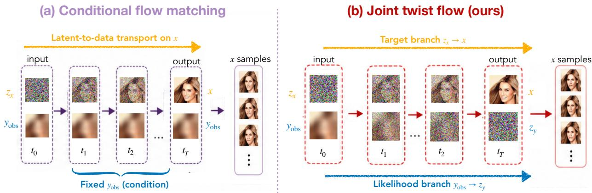  
Figure 1: Overview of conditional flow matching and joint twist-flow. (a) Conditional flow matching samples x from a one-way conditional map with fixed observation $y _ { \mathrm { o b s } }$ , which may underrepresent posterior ambiguity. (b) Joint twist-flow learns an augmented transport $( z _ { x } , y _ { \mathrm { o b s } } ) \mapsto ( x , z _ { y } )$ , where x is the posterior sample and $z _ { y }$ is a Gaussian likelihood-side coordinate for the observation branch. This augmented transport is designed to preserve broader posterior variability under observation consistency.

We introduce joint twist-flow as shown in Figure 1, an augmented flow-matching formulation for posterior sampling in inverse problems. Rather than learning a direct map from latent noise and the observation to x, joint twist-flow learns a continuous augmented transport

$$
S _ { \theta } ( z _ { x } , y ) = ( x , z _ { y } ) ,
$$

where $z _ { x } \sim \mathcal { N } ( 0 , I )$ drives posterior sampling and $z _ { y }$ is an auxiliary terminal coordinate associated with the observation. This added coordinate gives the transport an observation-side degree of freedom, reducing the tendency to fit paired training data through a nearly deterministic dependence of x on y. For a fixed observation $y ,$ the learned flow maps independent draws of $z _ { x } \sim \mathcal { N } ( 0 , I )$ to an ensemble of target samples x. The variability across this ensemble represents the posterior uncertainty left unresolved by the observation.

This paper makes three contributions. First, we propose joint twist-flow, an augmented parameterization $( z _ { x } , y ) \mapsto ( x , z _ { y } )$ for fixed-observation posterior sampling. Second, we develop a flow-matching objective on the augmented state and interpret $z _ { y }$ as a likelihood-side coordinate associated with observation consistency. Third, we evaluate whether joint twist-flow preserves posterior variation while maintaining observation consistency. Low-dimensional experiments with reference posterior samples validate our method by showing that joint twist-flow reduces latent underuse and better preserves posterior support. We then evaluate the same formulation on high-dimensional image restoration and seismic velocity-model inversion, assessing whether generated samples remain consistent with the fixed observation while capturing a range of plausible solutions.

## 2 Related work

Learned-prior methods for inverse problems Generative methods for inverse problems combine learned priors or learned generative dynamics with observation consistency. Plug-and-play (PnP) methods use learned denoisers as implicit priors within iterative reconstruction algorithms [8], and regularization-by-denoising (RED) uses denoisers to define explicit regularizers for inverse problems [9]. Difusion and score-based inverse methods use pretrained generative dynamics to guide reconstruction from observed data. Denoising Difusion Restoration Models (DDRM) restore images from degraded measurements using denoising difusion priors [10]. Difusion Posterior Sampling (DPS) combines difusion sampling with observation consistency for posterior-guided reconstruction [11], while score-based inverse solvers couple learned score dynamics with the forward observation operator at inference time [12]. These methods demonstrate the strength of learned priors for observation-consistent reconstruction, often by combining a learned prior with data-consistency or observation-guidance updates at inference time. In contrast, joint twist-flow learns an amortized posterior sampler as an augmented flow-based transport for fixed-observation inference.

Flow-based posterior sampler parameterizations Normalizing flows parameterize invertible maps between simple reference distributions and complex data distributions, enabling reversible sampling and likelihood-based training through change of variables [3, 4]. Inverse problems have also been addressed with invertible neural networks, which use reversible architectures to represent ambiguous inverse mappings and posterior uncertainty [13]. Continuous normalizing flows extend normalizing flows to continuous time by representing the transformation from latent variables to data variables as the solution of an ODE [14, 15]. Flow matching and rectified flow provide velocity-field objectives for such continuous-time generative dynamics by learning vector fields that transport samples between reference and data distributions along prescribed probability paths [16, 17]. Stochastic interpolants provide a broader framework connecting flow and difusion constructions through bridge processes and associated velocity fields [18]. Our method builds on this continuoustime transport viewpoint, but applies it to the augmented inverse-problem state $( z _ { x } , y ) \mapsto ( x , z _ { y } )$ rather than to a direct conditional map from latent noise to the unknown variable alone.

Randomized least squares and transport for Bayesian inverse problems Classical Bayesian inverse problems often involve a Gaussian likelihood, in which the normalized observation residual has standard Gaussian scale. Optimization-based sampling methods exploit this structure. Weakconstraint formulations introduce auxiliary variables to relax hard reduced formulations and make posterior representations easier to characterize numerically [19]. Randomize-then-optimize (RTO) methods connect posterior sampling with maps from Gaussian reference variables to optimizationbased posterior proposals [20]. Prior-transformation methods emphasize the usefulness of standardized Gaussian coordinates before applying transport-based sampling schemes [21]. Joint twist-flow is closest in spirit to this residual-coordinate view: $z _ { x }$ acts as a reference coordinate for the unknown branch, while $z _ { y }$ acts as a likelihood-side residual coordinate paired with the observation branch. Unlike RTO-style methods, however, joint twist-flow learns this relation by flow matching instead of solving a new randomized optimization problem for every sample.

Joint conditional generation Recent work has emphasized that posterior and likelihood conditionals can be viewed as diferent conditionals of a shared joint distribution over unknown variables and observations. All-in-one simulation-based inference methods learn models capable of sampling multiple conditionals of this joint distribution [22], and related invertible generative models support forward and inverse problems within one shared transport [23]. Our work adopts this shared-joint view of conditional generation, but realizes it through a continuous-time flow-matching transport on the augmented state $( z _ { x } , y ) \mapsto ( x , z _ { y } )$ . Here $z _ { x }$ drives posterior sampling under the fixed observation, while $z _ { y }$ is the terminal coordinate paired with the observation branch. Rather than serving as additional observed information or replacing uncertainty in $x , z _ { y }$ provides a likelihood-side residual coordinate that makes the transport full-dimensional and keeps generated targets coupled to their conditioning observations.

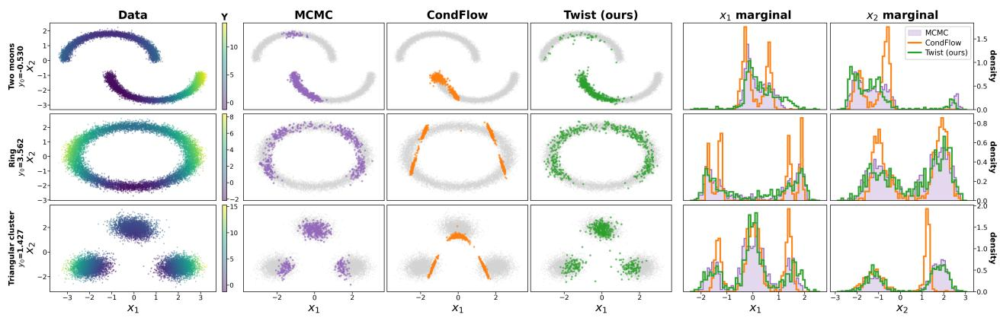  
Figure 2: Toy posterior comparison for three inverse problems. Each row corresponds to one structured prior and one fixed observation $y _ { 0 }$ . The first column shows samples from the prior in x-space, with color indicating the scalar observation value $y$ generated by the forward model. The next three columns compare the MCMC posterior reference, conditional-flow samples, and joint twist-flow samples for the fixed $y _ { 0 } ;$ gray points indicate the prior support for context. The last two columns compare the one-dimensional posterior marginals of $x _ { 1 }$ and $x _ { 2 }$

## 3 Method

## 3.1 Problem setup

We consider paired data $( x , y ) \sim p _ { \mathrm { d a t a } } ( x , y )$ , where $x \in \mathbb { R } ^ { d _ { x } }$ is the unknown target variable and $\boldsymbol { y } \in \mathbb { R } ^ { d _ { y } }$ is the observation. The pairs are generated by a physical or prescribed forward relation

$$
y = \mathcal { A } ( x ) + \varepsilon ,\tag{1}
$$

with the noiseless case corresponding to $\varepsilon = 0$ . The paired data provide samples of the forward target–observation relation, but the inverse map is generally ambiguous: a fixed observation y may correspond to multiple plausible targets x.

Posterior sampling therefore requires a conditional generator that can preserve variability in x while remaining compatible with the fixed observation. Under a Gaussian observation model, this compatibility is measured by the whitened residual

$$
r _ { y } ( x , y ) = \Gamma _ { y } ^ { - 1 / 2 } \big ( y - \mathcal { A } ( x ) \big ) ,\tag{2}
$$

which motivates representing the observation-side relation on a Gaussian scale.

## 3.2 Joint twist-flow

The setup above creates a parameterization challenge. A direct conditional flow samples from an x-valued map

$$
\begin{array} { r } { x = G _ { \theta } ( z _ { x } ; y ) , \qquad z _ { x } \sim \mathcal { N } ( 0 , I _ { d _ { x } } ) , } \end{array}\tag{3}
$$

where $y$ is used only as a conditioning input. Since the terminal state contains only $x ,$ the same output branch must represent both posterior variability and observation compatibility. In paired

inverse-problem training, this one-sided parameterization can favor a narrow reconstruction and underrepresent the conditional variability of x.

Joint twist-flow addresses this by making the observation part of the transported state. We learn an augmented transport

$$
S _ { \theta } : ( z _ { x } , y ) \mapsto ( x , z _ { y } ) , \qquad z _ { x } \sim \mathcal { N } ( 0 , I _ { d _ { x } } ) , \quad z _ { y } \sim \mathcal { N } ( 0 , \sigma _ { y } ^ { 2 } I _ { d _ { y } } ) .\tag{4}
$$

The source state contains a Gaussian sampling coordinate and the fixed observation, while the terminal state contains the generated target and a Gaussian likelihood-side coordinate.

We introduce $z _ { y }$ as a prescribed Gaussian terminal coordinate for the observation branch. Motivated by the residual view of observation compatibility, $z _ { y }$ is sampled independently from $\mathcal { N } ( 0 , \sigma _ { y } ^ { 2 } I _ { d _ { y } } )$ during training and paired with the target variable x at the terminal state. This gives the likelihood-side branch a controlled Gaussian scale, while the learned transport couples the observation branch with posterior sampling. Thus, we define $s _ { 0 } = ( z _ { x } , y ) , s _ { 1 } = ( x , z _ { y } )$ , and set $\pi _ { t } ( \cdot \ | \ s _ { 0 } , s _ { 1 } )$ be a probability path connecting $s _ { 0 }$ and $s _ { 1 }$ , and let $u _ { t } ( s _ { t } \ | \ s _ { 0 } , s _ { 1 } )$ denote the corresponding target velocity. We train a joint velocity field $u _ { \theta } ( s _ { t } , t )$ by the regression objective

$$
\begin{array} { r } { \mathcal { L } _ { \mathrm { t w i s t } } ( \theta ) = \mathbb { E } \underset { \underset { t \sim \mathcal { N } ( 0 , I _ { d _ { x } } ) , \textit { z } _ { y } \sim \mathcal { N } ( 0 , \sigma _ { y } ^ { 2 } I _ { d _ { y } } ) } { \sum _ { \boldsymbol { x } \sim \mathcal { N } ( 0 , I _ { d _ { x } } ) , \textit { z } _ { y } \sim \mathcal { N } ( 0 , \sigma _ { y } ^ { 2 } I _ { d _ { y } } ) } } } { \mathrm { [ } \mu \mathrm { ( } 0 , 1 \mathrm { ) } , s _ { t } \sim \pi _ { t } ( \cdot \vert s _ { 0 } , s _ { 1 } ) \mathrm { ) } } \left[ \left. u _ { \boldsymbol { \theta } } ( s _ { t } , t ) - u _ { t } ( s _ { t } \mid s _ { 0 } , s _ { 1 } ) \right. _ { 2 } ^ { 2 } \right] . } \end{array}\tag{5}
$$

After training, the transport can be written as

$$
S _ { \theta } ( z _ { x } , y ) = ( x _ { \theta } ( z _ { x } ; y ) , z _ { y , \theta } ( z _ { x } ; y ) ) .\tag{6}
$$

For a fixed observation $y , x _ { \theta } ( z _ { x } ; y )$ is the generated posterior sample, while $z _ { y , \theta } ( z _ { x } ; y )$ is the associated learned likelihood-side coordinate. Posterior sampling uses the x-marginal; $z _ { y , \theta }$ is generated jointly as part of the augmented transport.

The parameter $\sigma _ { y }$ controls the prescribed Gaussian scale of the likelihood-side terminal coordinate. For confidence level $q \in ( 0 , 1 )$ , define

$$
\mathcal { B } _ { q } ( \sigma _ { y } ) = \left\{ z \in \mathbb { R } ^ { d _ { y } } : \lVert z \rVert _ { 2 } ^ { 2 } \leq \sigma _ { y } ^ { 2 } \chi _ { d _ { y } } ^ { 2 } ( q ) \right\} ,\tag{7}
$$

where $\chi _ { d _ { \boldsymbol { u } } } ^ { 2 } ( \boldsymbol { q } )$ is the q-quantile of a chi-square distribution. This ball gives an interpretable Gaussian scale for the likelihood-side coordinate generated by the learned transport. It expresses the likelihoodaware role of the augmented coordinate: generated samples may explore variability in $x ,$ while their jointly generated likelihood-side coordinate remains organized around the prescribed Gaussian scale.

For posterior sampling, the pretrained map $S _ { \theta } ( \cdot , y )$ induces a joint terminal distribution $p _ { \theta } ( x , z _ { y }$ y). Equivalently, the posterior sampler is the x-marginal of this augmented distribution,

$$
p _ { \theta } ( x \mid y ) = \int p _ { \theta } ( x , z _ { y } \mid y ) d z _ { y } .\tag{8}
$$

Thus, the likelihood-side coordinate is amortized through the learned transport: during training, the prescribed Gaussian variable $z _ { y }$ defines the terminal coordinate paired with x, while posterior sampling requires only $z _ { x }$ and the fixed observation $y .$ . The conditional sampler is learned from paired target–observation data. When these pairs are sampled from a Bayesian joint model $p ( x ) p ( y \mid x )$ the data conditional corresponds to the posterior $p ( x \mid y )$ . In this sense, joint twist-flow learns a posterior sampler through the x-marginal of the augmented transport. The intended efect of the likelihood-side coordinate is to improve the conditional transport parameterization so that the x-marginal can retain posterior variability while remaining tied to the learned target–observation relation; the experiments test this through posterior-reference comparisons and observation-space consistency diagnostics.

Table 1: Quantitative comparison against the MCMC posterior reference on the toy inverse problems. The coeficients $( c _ { 1 } , c _ { 2 } )$ used in the nonlinear observation model are listed below each setting.
<table><tr><td>Setting</td><td>Method</td><td> $W _ { 1 } ( x _ { 1 } )$ </td><td> $W _ { 1 } ( x _ { 2 } )$ </td><td> $\mathrm { K S } ( x _ { 1 } )$ </td><td> $\mathrm { K S } ( x _ { 2 } )$ </td></tr><tr><td>Two moons  $c _ { 1 } = 1 . 0 , ~ c _ { 2 } = 0 . 5$ </td><td>Conditional Flow</td><td> $0 . 2 8 2 \pm 0 . 2 4 6$ </td><td> $0 . 6 6 3 \pm 0 . 3 2 7$ </td><td> $0 . 2 6 9 \pm 0 . 1 2 7$ </td><td> $0 . 3 1 1 \pm 0 . 0 9 4$ </td></tr><tr><td>Ring</td><td>Joint Twist Flow (ours)</td><td> $\mathbf { 0 . 1 3 2 \pm 0 . 0 3 0 }$ </td><td> $\mathbf { 0 . 1 5 1 \pm 0 . 0 7 2 }$ </td><td> $\mathbf { 0 . 1 2 1 \pm 0 . 0 1 4 }$ </td><td> $\mathbf { 0 . 0 7 4 \pm 0 . 0 1 6 }$ </td></tr><tr><td> $c _ { 1 } = 1 . 2 , ~ c _ { 2 } = 0 . 8$ </td><td>Conditional Flow</td><td> $0 . 1 8 1 \pm 0 . 0 1 9$ </td><td> $0 . 1 8 8 \pm 0 . 0 4 1$ </td><td> $0 . 1 3 3 \pm 0 . 0 2 2$ </td><td> $0 . 1 6 1 \pm 0 . 0 8 5$ </td></tr><tr><td></td><td>Joint Twist Flow (ours)</td><td> $\mathbf { 0 . 0 9 8 \pm 0 . 0 1 9 }$ </td><td> $\mathbf { 0 . 1 3 3 \pm 0 . 0 1 2 }$ </td><td> $\mathbf { 0 . 0 5 6 \pm 0 . 0 0 7 }$ </td><td> $\mathbf { 0 . 1 0 1 \pm 0 . 0 2 5 }$ </td></tr><tr><td>Triangular cluster</td><td>Conditional Flow</td><td> $0 . 2 2 0 \pm 0 . 1 0 4$ </td><td> $0 . 2 7 1 \pm 0 . 2 3 8$ </td><td> $0 . 1 4 7 \pm 0 . 0 5 1$ </td><td> $0 . 2 3 1 \pm 0 . 2 1 9$ </td></tr><tr><td> $c _ { 1 } = 1 . 5 , ~ c _ { 2 } = 1 . 1$ </td><td>Joint Twist Flow (ours)</td><td> $\mathbf { 0 . 1 4 2 \pm 0 . 0 2 0 }$ </td><td> $\mathbf { 0 . 1 2 9 \pm 0 . 0 7 2 }$ </td><td> $\mathbf { 0 . 0 9 1 } \pm \mathbf { 0 . 0 2 5 }$ </td><td> $\mathbf { 0 . 0 5 9 \pm 0 . 0 1 5 }$ </td></tr></table>

## 4 Experiments

## 4.1 Toy inverse problems: posterior support preservation

We first evaluate joint twist-flow on controlled two-dimensional inverse problems with reference posterior samples. The toy problems are designed to expose a specific failure mode of direct conditional sampling: samples may be associated with the correct observation while covering only part of the posterior support or placing mass in low-density regions between feasible solutions.

We use three structured priors over $x = ( x _ { 1 } , x _ { 2 } ) \in \mathbb { R } ^ { 2 }$ : two\_moons, ring, and triangular cluster. These priors create curved, closed, and separated supports. For each prior, observations are generated by

$$
y = c _ { 1 } x _ { 1 } ^ { 2 } + c _ { 2 } x _ { 2 } + \varepsilon , \qquad \varepsilon \sim \mathcal { N } ( 0 , \sigma ^ { 2 } ) .
$$

The coeficients $( c _ { 1 } , c _ { 2 } )$ used for each setting are reported in Table 1. The first column of Figure 2 visualizes this construction: point locations show samples of x, while color indicates the corresponding scalar observation value $y .$ The scalar nonlinear observation is many-to-one, so a fixed value $y _ { 0 }$ can be compatible with multiple prior-supported regions. From a Bayesian perspective, the likelihood selects the regions of the prior that are compatible with y0, producing multimodal or disconnected posterior support. We compare joint twist-flow with a direct conditional-flow baseline. For each fixed observation $y _ { 0 }$ , both models generate posterior samples, which are compared against Markov chain Monte Carlo (MCMC) reference samples. Details of data generation and MCMC sampling are provided in Appendix A.2.1 and Appendix A.2.2.

Table 1 and Figure 2 show that joint twist-flow better matches the MCMC posterior reference. The table quantifies marginal posterior mismatch: joint twist-flow reduces both Wasserstein and Kolmogorov–Smirnov discrepancies for $x _ { 1 }$ and $x _ { 2 }$ in all three settings. These improvements agree with the marginal plots in Figure 2, where the twist-flow marginals more closely follow the MCMC reference than the conditional-flow marginals. The visual comparisons reveal the failure modes more directly. In two\_moons, the conditional-flow baseline covers only a small portion of the curved posterior support, leading to missing branches and mismatched marginals. Joint twist-flow recovers a broader portion of the curved feasible regions. In ring, the conditional-flow samples collapse to narrow arcs instead of following the closed posterior support, which appears as sharp peaks and gaps in the marginals. Joint twist-flow better preserves the ring-shaped support and produces marginals closer to the MCMC reference. In triangular cluster, the conditional-flow baseline produces elongated structures near or between separated clusters, indicating of-support mass and distorted modes. Joint twist-flow keeps samples concentrated near the three feasible posterior regions and better matches the reference marginals.

Ground truth xref

FIOW FIOwW

Twist  
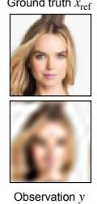

Sample 1  
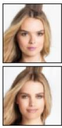

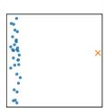  
CondFlow

Sample 2  
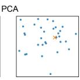

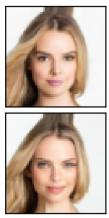

Sample 3  
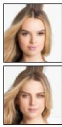

Sample mean  
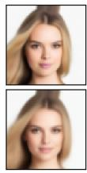

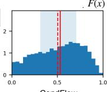  
CondFlow  
F(x) coverage

Sample STD  
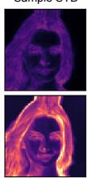

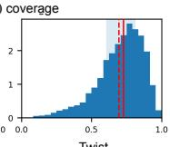  
Twist

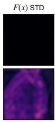

u STD  
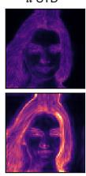

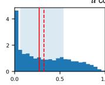  
CondFlow

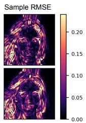

u coverage  
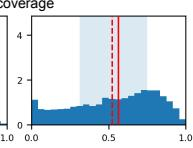  
Twist

(a) Low-frequency image restoration under a Fourier low-pass observation. Joint twist-flow produces a broader sample ensemble than CondFlow, with variability primarily in unresolved high-frequency components while the observed low-frequency structure remains stable.

Ground truth xref  
Sample 1  
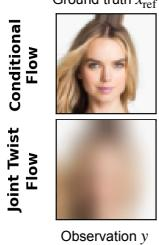

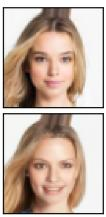

Sample 2  
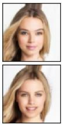

Sample 3  
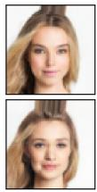

Sample mean  
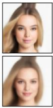

Sample STD  
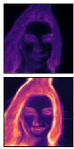  
PCA

F(x) STD  
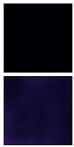

u STD  
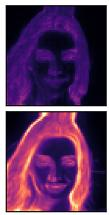  
Sample RMSE

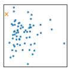  
CondFlow

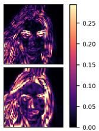

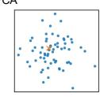  
Twist

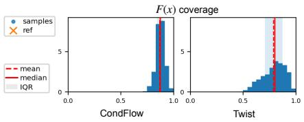

u coverage  
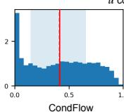

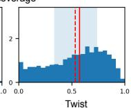

(b) Blur-downsampling image restoration. Joint twist-flow generates more diverse high-resolution reconstructions than CondFlow, with uncertainty concentrated in fine-scale details not determined by the low-resolution observation.

Ground truth xref  
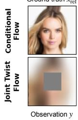

Sample 1  
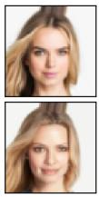

Sample 2  
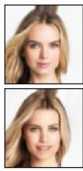  
PCA

Sample 3  
Sample mean  
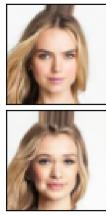

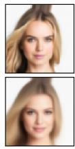

Sample STD  
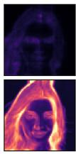

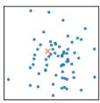  
F(x) STD

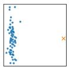

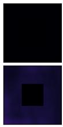  
u STD  
CondFlow  
Twist

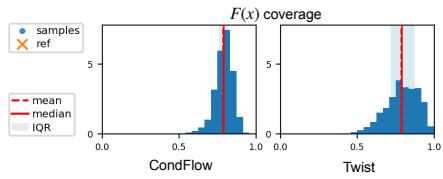

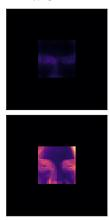

Sample RMSE  
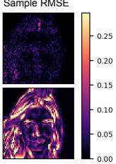

u coverage  
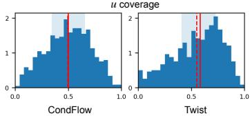

(c) Blur-masking image restoration. Joint twist-flow concentrates posterior variability in the missing or weakly constrained region while keeping the observed region consistent with the fixed observation.

Figure 3: Image restoration under three observation operators.

Together, these results show that the toy problems expose the intended posterior-support failure mode of direct conditional sampling. Joint twist-flow reduces latent underuse and improves support preservation under paired training, rather than only producing samples that are associated with the fixed observation.

## 4.2 Image restoration: observation-aware posterior variability

We next evaluate joint twist-flow on image restoration tasks. For each test case, we have a clean reference image $x _ { \mathrm { r e f } }$ and generate the observation as $y = F ( x _ { \mathrm { r e f } } )$ , but we do not have reference samples from the true posterior $p ( x \mid y )$ . Since the degradation operators are many-to-one, $x _ { \mathrm { r e f } }$ is only one plausible solution compatible with y. We therefore evaluate whether generated samples remain observation-consistent while expressing variability in components not determined by the observation.

We use CelebA[24] images as clean targets x. Images are center-cropped, resized to $6 4 \times 6 4$ and normalized to [−1, 1]. Observations are generated by operators $y = F ( x )$ : Fourier low-pass filtering, blur-downsampling, and blur-masking. We use u to denote the task-specific component weakly constrained by the observation: high-frequency residual $x - F _ { \mathrm { L F } } ( x )$ for low-frequency filtering, fine-scale detail $x - F _ { \mathrm { B D } } ( x )$ for blur-downsampling, and missing-region content $( 1 - M ) x$ for blur-masking. Thus, the three operators preserve diferent parts of the image and leave diferent components ambiguous.

Figures 3a, 3b, and 3c compare CondFlow and joint twist-flow using the same layout. We show posterior samples, sample mean, sample standard deviation, RMSE maps relative to the paired reference, principal component analysis (PCA) projections, and coverage diagnostics for both $F ( x )$ and u. The sample standard deviation and PCA plots characterize the overall spread of the generated ensemble. The $F ( x )$ standard-deviation maps, together with the coverage of the observed component, indicate whether this spread remains consistent with the fixed observation. The corresponding maps and coverage diagnostics for u show whether variability appears in the component weakly constrained by the observation.

Across all three tasks, CondFlow forms narrow PCA clusters and has low sample standard deviation, indicating under-dispersed conditional samples. Its $F ( x )$ standard deviation is also small, but its u standard deviation is small as well, showing that little diversity is expressed in the component not determined by the observation. In low-frequency filtering and blur-downsampling, this narrow ensemble still shows visible RMSE relative to the paired reference, consistent with a reconstruction that averages unresolved high-frequency or fine-scale details. In blur-masking, CondFlow is similarly under-dispersed, but the visible high-resolution context strongly constrains the missing region, so the narrow reconstruction remains close to the paired reference and yields lower RMSE.

Joint twist-flow shows a diferent pattern. It produces larger sample standard deviation and broader PCA clouds, indicating a wider generated ensemble. Its $F ( x )$ standard-deviation maps remain small relative to the image-space spread, and the $I _ { y }$ values in Table 2 remain high, showing that generated samples remain consistent with the fixed observation. At the same time, the u standard-deviation maps are larger and the $I _ { r }$ values improve, indicating that the increased variability appears in the component weakly constrained by the observation. Because $x _ { \mathrm { r e f } }$ is only one plausible solution, larger sample-to-reference RMSE should not be interpreted as worse posterior sampling by itself. Instead, together with high $I _ { y }$ and increased variability in $u ,$ it indicates that twist-flow explores multiple observation-compatible solutions rather than collapsing to the paired reference. Quantitatively, Table 2 shows the same trend over three test cases: joint twist-flow consistently increases sample spread and $I _ { r }$ while maintaining high $I _ { y } .$ . In blur-downsampling, image-space pairwise RMSE increases from 0.069 to 0.202, and $I _ { r }$ improves from 0.710 to 0.881; the low-frequency and blur-masking tasks follow the same pattern. Together with the PCA, standard-deviation, and coverage diagnostics, these results support the intended behavior of the augmented transport: joint twist-flow increases posterior variability while organizing it around compatibility with the fixed observation.

Table 2: Observation-aware posterior variability on CelebA restoration tasks. Each task uses observations of the form $y = F ( x )$ , while u denotes the task-specific weakly constrained component. Here F denotes the Fourier transform, $P _ { \Omega }$ is a centered low-frequency Fourier mask, B is the blur operator, D and U denote downsampling and upsampling, M is the observed-region mask, and c is the constant fill value in the masked region. Metrics are averaged over three test cases. $D _ { x }$ is image-space pairwise RMSE across samples, $S _ { x }$ is mean sample standard deviation, and $D _ { r }$ is pairwise RMSE in u. $I _ { y }$ and $I _ { r }$ are empirical 90% interval inclusion rates in the observed component and in u, respectively.
<table><tr><td>Task</td><td> ${ \mathrm { O b s e r v a t i o n ~ } } y = F ( x )$ </td><td>Weak component Model u</td><td> $D _ { x } \uparrow S _ { x } \uparrow D _ { r } \uparrow I _ { y } \uparrow I _ { r } \uparrow$ </td></tr><tr><td>Low-frequency</td><td> $\begin{array} { r } { y = F _ { \mathrm { L F } } ( x ) = \mathcal { F } ^ { - 1 } ( P _ { \Omega } \mathcal { F } x ) } \end{array}$ </td><td> $u = x - F _ { \mathrm { L F } } ( x )$ </td><td>CondFlow 0.062 0.036 0.062 0.821 0.594 Twist 0.156 0.093 0.1260.977 0.848</td></tr><tr><td>Blur-downsampling</td><td> $y = F _ { \mathrm { B D } } ( x ) = U ( D ( B ( x ) ) )$ </td><td> $u = x - F _ { \mathrm { B D } } ( x )$ </td><td>CondFlow 0.069 0.041 0.069 1.000 0.710 Twist 0.2020.1210.1930.9960.881</td></tr><tr><td>Blur-masking</td><td> $y = F _ { \mathrm { M } } ( x ) = M B ( x ) + ( 1 - M ) c$ </td><td> $u = ( 1 - M ) x$ </td><td>CondFlow 0.036 0.022 0.036 1.000 0.845 Twist 0.2120.127 0.1650.9980.889</td></tr></table>

## 4.3 Seismic inverse problem

We further evaluate joint twist-flow on an image-domain seismic inverse problem. The target variable x is a two-dimensional subsurface velocity model sampled on a $2 5 6 \times 5 1 2$ grid with 12.5 m spacing, corresponding to a section of approximately 3.2 km in depth and 6.4 km in the horizontal direction. In a full seismic experiment, observed shot records $d _ { \mathrm { o b s } }$ are generated by wave propagation through the subsurface, $d _ { \mathrm { o b s } } = \mathcal { F } ( x ) + \epsilon$ , where $\mathcal { F }$ denotes the acoustic wave-equation modeling operator and ϵ represents noise and modeling error. Rather than conditioning the generative model directly on the raw shot records, we use a reverse-time migration (RTM) image as the observation y. RTM maps recorded wavefields back to the subsurface using a fixed background velocity model and produces an image-domain summary of reflector information [25, 26]. This setting remains strongly ill posed from a geophysical perspective. The RTM image is band-limited, acquisition-dependent, and sensitive to the background model used during imaging [27]. It highlights reflector structure but does not uniquely determine the full velocity model, especially in deeper regions, thin-layered zones, and areas where illumination is limited. The experiment therefore tests whether the model can produce an RTM-conditioned ensemble of velocity models rather than a single overconfident reconstruction. Seismic data are simulated using Devito [28] and JUDI.jl [29], with simulation details provided in Appendix A.3.

Figure 4 compares the conditional-flow baseline and joint twist-flow under the same fixed RTM observation. Both methods recover the dominant layered structure and the deep high-velocity region in the posterior mean. The main diference lies in the posterior spread. CondFlow produces a narrow ensemble with low standard deviation over most of the model, indicating an overconfident reconstruction. Joint twist-flow produces larger and more structured uncertainty, concentrated around reflector interfaces, thin layers, structural transitions, and deeper regions where the RTM image provides weaker constraints. The RMSE maps show larger sample-to-reference deviations for twist-flow, but these deviations align with the same uncertain geological regions rather than appearing as unstructured noise. The bottom row of Figure 4 provides an observation-space check. Generated velocity samples are forward modeled under the same acquisition geometry, and the resulting shot-record bands are compared with the ground-truth shot record. Joint twist-flow yields a wider shot-record band that better covers the ground-truth trace in this example, while the receiver-wise coverage profile remains high across the acquisition aperture. This indicates that the larger model-space variability does not simply discard the seismic observation; it produces a broader set of velocity models that remain compatible with the observed data.

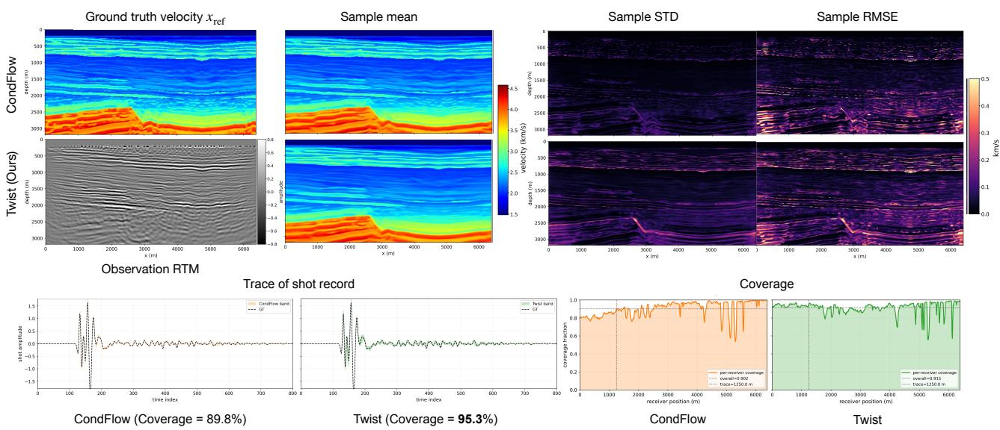  
Figure 4: Seismic posterior sampling under a fixed RTM observation. The top rows show the groundtruth velocity and RTM image, posterior means, standard-deviation maps, and RMSE maps for CondFlow and joint twist-flow. Joint twist-flow preserves the main velocity structure while assigning larger uncertainty to reflector interfaces, structural transitions, and deeper weakly constrained regions. The bottom row forward models generated velocity samples under the same acquisition; shot-record bands and receiver-wise coverage profiles provide an observation-space consistency check.

Table 3 summarizes reference metrics over 64 posterior samples. CondFlow gives lower persample error and higher per-sample SSIM, consistent with a narrow reconstruction-like ensemble clustered near the paired reference. Joint twist-flow has larger per-sample error and lower per-sample SSIM, reflecting a broader posterior ensemble rather than collapse to the single paired reference. Importantly, the posterior-mean RMSE and SSIM remain close to those of CondFlow, indicating that the additional variability mainly increases ensemble spread rather than shifting the mean reconstruction. Together with the shot-record consistency check, this suggests that joint twistflow produces a broader observation-compatible posterior ensemble around a comparable velocity reconstruction.

Table 3: Seismic reference metrics over 64 posterior samples
<table><tr><td></td><td colspan="2">Per-sample</td><td colspan="2">Posterior mean</td></tr><tr><td>Metric</td><td>CondFlow</td><td>Twist</td><td>CondFlow</td><td>Twist</td></tr><tr><td>RMSE</td><td> $0 . 1 0 1 \pm 0 . 0 0 1$ </td><td> $0 . 1 1 8 \pm 0 . 0 0 5$ </td><td>0.0919</td><td>0.0921</td></tr><tr><td>MAE</td><td> $0 . 0 5 6 5 \pm 0 . 0 0 0 6$ </td><td> $0 . 0 6 8 0 \pm 0 . 0 0 2 7$ </td><td>0.0512</td><td>0.0564</td></tr><tr><td>SSIM</td><td> $0 . 8 3 4 \pm 0 . 0 0 3$ </td><td> $0 . 7 7 7 \pm 0 . 0 1 1$ </td><td>0.857</td><td>0.841</td></tr></table>

## 5 Conclusions

We proposed joint twist-flow, an augmented flow-matching framework for posterior sampling in inverse problems. The central idea is to learn a continuous transport on the augmented state $( z _ { x } , y ) \mapsto ( x , z _ { y } )$ rather than an x-valued conditional decoder. In this formulation, $z _ { x }$ drives posterior sampling under a fixed observation, while $z _ { y }$ provides a likelihood-side residual coordinate paired with the observation branch. The auxiliary coordinate does not replace uncertainty in x; posterio uncertainty remains measured by the variability of generated x-samples. The experiments support three related conclusions. First, in controlled toy inverse problems, joint twist-flow reduces latent underuse, mode dropping, and support distortion relative to a direct conditional-flow baseline. Second, in image restoration, the augmented transport produces observation-aware posterior variability: uncertainty increases in weakly constrained components while remaining suppressed in components that determine the observation. Third, the seismic experiment shows that the same formulation can be applied to a high-dimensional scientific inverse problem where a single observation may be compatible with multiple plausible subsurface structures. A promising direction for future work is to improve calibration diagnostics for amortized posterior samplers, and explore adaptive choices of the observation-side scale $\sigma _ { y } .$ . Another direction is to use the reverse direction of the learned augmented transport more explicitly for likelihood-side diagnostics and forward uncertainty propagation.

## References

[1] Ian Goodfellow, Jean Pouget-Abadie, Mehdi Mirza, Bing Xu, David Warde-Farley, Sherjil Ozair, Aaron Courville, and Yoshua Bengio. Generative adversarial nets. In NeurIPS, 2014.

[2] Diederik P. Kingma and Max Welling. Auto-encoding variational bayes. In International Conference on Learning Representations, 2014.

[3] Laurent Dinh, Jascha Sohl-Dickstein, and Samy Bengio. Density estimation using real nvp. In International Conference on Learning Representations, 2017.

[4] Durk P Kingma and Prafulla Dhariwal. Glow: Generative flow with invertible 1x1 convolutions. In S. Bengio, H. Wallach, H. Larochelle, K. Grauman, N. Cesa-Bianchi, and R. Garnett, editors, Advances in Neural Information Processing Systems, volume 31. Curran Associates, Inc., 2018.

[5] Jonathan Ho, Ajay Jain, and Pieter Abbeel. Denoising difusion probabilistic models. In NeurIPS, 2020.

[6] Yang Song, Jascha Sohl-Dickstein, Diederik P. Kingma, Abhishek Kumar, Stefano Ermon, and Ben Poole. Score-based generative modeling through stochastic diferential equations. In International Conference on Learning Representations, 2021.

[7] Andrew M. Stuart. Inverse problems: A bayesian perspective. Acta Numerica, 19:451–559, 2010. doi: 10.1017/S0962492910000061.

[8] Singanallur V. Venkatakrishnan, Charles A. Bouman, and Brendt Wohlberg. Plug-and-play priors for model based reconstruction. In 2013 IEEE Global Conference on Signal and Information Processing (GlobalSIP), pages 945–948. IEEE, 2013. doi: 10.1109/GlobalSIP.2013.6737048.

[9] Yaniv Romano, Michael Elad, and Peyman Milanfar. The little engine that could: Regularization by denoising (RED). SIAM Journal on Imaging Sciences, 10(4):1804–1844, 2017. doi: 10.1137/16M1102884.

[10] Bahjat Kawar, Michael Elad, Stefano Ermon, and Jiaming Song. Denoising difusion restoration models. Advances in neural information processing systems, 35:23593–23606, 2022.

[11] Hyungjin Chung, Jeongsol Kim, Michael Thompson McCann, Marc Louis Klasky, and Jong Chul Ye. Difusion posterior sampling for general noisy inverse problems. In International Conference on Learning Representations, 2023.

[12] Yang Song, Liyue Shen, Lei Xing, and Stefano Ermon. Solving inverse problems in medical imaging with score-based generative models. In International Conference on Learning Representations, 2022.

[13] Lynton Ardizzone, Jakob Kruse, Carsten Rother, and Ullrich Köthe. Analyzing inverse problems with invertible neural networks. In International Conference on Learning Representations, 2019. URL https://openreview.net/forum?id=rJed6j0cKX.

[14] Ricky T. Q. Chen, Yulia Rubanova, Jesse Bettencourt, and David K. Duvenaud. Neural ordinary diferential equations. In Advances in Neural Information Processing Systems, volume 31, pages 6571– 6583, 2018.

[15] Will Grathwohl, Ricky T. Q. Chen, Jesse Bettencourt, Ilya Sutskever, and David Duvenaud. FFJORD: Free-form continuous dynamics for scalable reversible generative models. In International Conference on Learning Representations, 2019.

[16] Yaron Lipman, Ricky T. Q. Chen, Heli Ben-Hamu, Maximilian Nickel, and Matthew Le. Flow matching for generative modeling. In International Conference on Learning Representations, 2023.

[17] Xingchao Liu, Chengyue Gong, and Qiang Liu. Flow straight and fast: Learning to generate and transfer data with rectified flow. In International Conference on Learning Representations, 2023.

[18] Michael Albergo, Nicholas M Bofi, and Eric Vanden-Eijnden. Stochastic interpolants: A unifying framework for flows and difusions. Journal of Machine Learning Research, 26(209):1–80, 2025.

[19] Zhilong Fang, Curt Da Silva, Rachel Kuske, and Felix J. Herrmann. Uncertainty quantification for inverse problems with weak partial-diferential-equation constraints. Geophysics, 83(6):R629–R647, 2018. doi: 10.1190/geo2017-0824.1.

[20] Johnathan M. Bardsley, Tiangang Cui, Youssef M. Marzouk, and Zheng Wang. Scalable optimizationbased sampling on function space. SIAM Journal on Scientific Computing, 42(2):A1317–A1347, 2020. doi: 10.1137/19M1245220.

[21] Zheng Wang, Johnathan M. Bardsley, Antti Solonen, Tiangang Cui, and Youssef M. Marzouk. Bayesian inverse problems with $l _ { 1 }$ priors: A randomize-then-optimize approach. SIAM Journal on Scientific Computing, 39(5):S140–S166, 2017. doi: 10.1137/16M1080938.

[22] Manuel Gloeckler, Michael Deistler, Christian Dietrich Weilbach, Frank Wood, and Jakob H. Macke. All-in-one simulation-based inference. In Proceedings of the 41st International Conference on Machine Learning, volume 235 of Proceedings of Machine Learning Research, pages 15735–15766. PMLR, 2024.

[23] Christoph Brune, Marcello Carioni, Tristan van Leeuwen, and Lasse Veenstra. An invertible generative model for forward and inverse problems, 2025. arXiv:2509.03910v2.

[24] Ziwei Liu, Ping Luo, Xiaogang Wang, and Xiaoou Tang. Deep learning face attributes in the wild. In Proceedings of the IEEE International Conference on Computer Vision (ICCV), pages 3730–3738, 2015. doi: 10.1109/ICCV.2015.425.

[25] Edip Baysal, Dan D. Koslof, and John W. C. Sherwood. Reverse time migration. Geophysics, 48(11): 1514–1524, 1983. doi: 10.1190/1.1441434.

[26] John Etgen, Samuel H. Gray, and Yu Zhang. An overview of depth imaging in exploration geophysics. Geophysics, 74(6):WCA5–WCA17, 2009. doi: 10.1190/1.3223188.

[27] Hua-Wei Zhou, Hao Hu, Zhihui Zou, Yukai Wo, and Oong Youn. Reverse time migration: A prospect of seismic imaging methodology. Earth-Science Reviews, 179:207–227, 2018. doi: 10.1016/j.earscirev.2018. 02.008.

[28] Mathias Louboutin, Michael Lange, Fabio Luporini, Navjot Kukreja, Philipp A. Witte, Felix J. Herrmann, Paulius Velesko, and Gerard J. Gorman. Devito (v3.1.0): An embedded domain-specific language for finite diferences and geophysical exploration. Geoscientific Model Development, 12(3):1165–1187, 2019. doi: 10.5194/gmd-12-1165-2019.

[29] Philipp A. Witte, Mathias Louboutin, Navjot Kukreja, Fabio Luporini, Michael Lange, Gerard J. Gorman, and Felix J. Herrmann. A large-scale framework for symbolic implementations of seismic inversion algorithms in julia. Geophysics, 84(3):F57–F71, 2019. doi: 10.1190/geo2018-0174.1.

[30] Gareth O. Roberts and Richard L. Tweedie. Exponential convergence of langevin distributions and their discrete approximations. Bernoulli, 2(4):341–363, 1996. doi: 10.2307/3318418.

[31] C. E. Jones, J. A. Edgar, J. I. Selvage, and H. Crook. Building complex synthetic models to evaluate acquisition geometries and velocity inversion technologies. In 74th EAGE Conference and Exhibition Incorporating EUROPEC 2012, pages cp–293. European Association of Geoscientists & Engineers, 2012. doi: 10.3997/2214-4609.20148575.

## A Supplementary materials

## A.1 Topological Obstruction in Conditional Inverse Transport

In this appendix, we formalize a topological obstruction for direct conditional transport in inverse problems, and explain why the proposed joint twist transport can reduce the parameterization pressure that gives rise to this obstruction. Our goal is not to claim that the augmented map removes the topological dificulty in the projected x-space, but to motivate why coupling the target branch with a likelihood-side coordinate can make the learned conditional transport less prone to empirical failure modes such as mode dropping, spurious bridges, or of-support mass.

## A.1.1 Setup

We consider the inverse observation model

$$
x \sim p _ { X } ( x ) , \qquad y = h ( x ) + \varepsilon ,\tag{9}
$$

where $x \in \mathcal { X } \subset \mathbb { R } ^ { d _ { x } } , y \in \mathcal { Y } \subset \mathbb { R } ^ { d _ { y } } , h : \mathcal { X } \to \mathcal { Y }$ is a continuous forward operator, and ε is observational noise with density $p _ { \varepsilon }$

The induced joint density is

$$
p ( x , y ) = p _ { X } ( x ) p _ { \varepsilon } ( y - h ( x ) ) ,\tag{10}
$$

and the posterior satisfies

$$
p ( x \mid y ) \propto p _ { X } ( x ) p _ { \varepsilon } ( y - h ( x ) ) .\tag{11}
$$

For isotropic Gaussian noise, $\varepsilon \sim \mathcal { N } ( 0 , \sigma ^ { 2 } I )$ , this becomes

$$
p ( x \mid y ) \propto p _ { X } ( x ) \exp \left( - { \frac { \| y - h ( x ) \| ^ { 2 } } { 2 \sigma ^ { 2 } } } \right) .\tag{12}
$$

We compare the following two parameterizations.

Direct conditional transport.

$$
G : \mathbb { R } ^ { d _ { z } } \times \mathbb { R } ^ { d _ { y } }  \mathbb { R } ^ { d _ { x } } , \qquad x = G ( z , y ) .
$$

joint twist transport.

$$
T : \mathbb R ^ { d _ { z } } \times \mathbb R ^ { d _ { y } }  \mathbb R ^ { d _ { x } } \times \mathbb R ^ { d _ { z y } } , \qquad ( x , z _ { y } ) = T ( z _ { x } , y ) .
$$

Our main interest is the geometry of the posterior support for a fixed observation $y = y _ { 0 }$

Definition A.1 (Posterior superlevel set). For a fixed $y _ { 0 } \in \mathcal { V }$ and threshold $\lambda > 0$ , define the posterior λ-superlevel set by

$$
L _ { y _ { 0 } , \lambda } : = \left\{ x \in \mathcal { X } : p ( x \mid y _ { 0 } ) \geq \lambda \right\} .
$$

Definition A.2 (Latent superlevel set and its image). Let $p _ { Z }$ denote the latent density, and for $\lambda _ { Z } > 0$ define

$$
L _ { \lambda _ { Z } } ^ { Z } : = \left\{ z \in \mathbb { R } ^ { d _ { z } } : p _ { Z } ( z ) \geq \lambda _ { Z } \right\} .
$$

For a fixed $y _ { 0 }$ , define the fiber map

$$
G _ { y _ { 0 } } ( z ) : = G ( z , y _ { 0 } ) ,
$$

and the image of the latent high-density region

$$
\mathcal { G } _ { y _ { 0 } , \lambda _ { Z } } : = G _ { y _ { 0 } } ( L _ { \lambda _ { Z } } ^ { Z } ) .
$$

Definition A.3 (Spurious bridge). A connected set $B \subset \mathcal { G } _ { y _ { 0 } , \lambda _ { Z } }$ is called a spurious bridge if

1. B intersects neighborhoods of two distinct posterior branches, and

2. B is not contained in the true posterior superlevel set $L _ { y _ { 0 } , \lambda }$ , except possibly near its endpoints.

Assumption A.4 (Non-injective forward map yields multiple explanations). There exist $y _ { 0 } \in \mathcal { V }$ and two nonempty compact sets $A _ { 1 } , A _ { 2 } \subset { \mathcal { X } }$ such that

1. $A _ { 1 } \cap A _ { 2 } = \emptyset ,$

2. dist $( A _ { 1 } , A _ { 2 } ) > 0$

3. $h ( x ) = y _ { 0 }$ for all $x \in A _ { 1 } \cup A _ { 2 }$

4. pX(x) is strictly positive on neighborhoods of both $A _ { 1 }$ and $A _ { 2 }$ .

This assumption encodes posterior multimodality induced by the inverse problem. It formalizes the case where a single observation admits multiple, well-separated explanations in $x ,$ , which is the regime of interest in this work.

Assumption A.5 (Response gap away from the true branches). There exist disjoint open neighborhoods $U _ { 1 } \supset A _ { 1 }$ and $U _ { 2 } \supset A _ { 2 }$ , and a constant $\eta > 0$ , such that

$$
\| h ( x ) - y _ { 0 } \| \geq \eta , \qquad \forall x \in \mathcal { X } \setminus ( U _ { 1 } \cup U _ { 2 } ) .\tag{13}
$$

This assumption ensures that the ambiguity is localized near the true explanatory branches: outside these neighborhoods, the forward response remains uniformly separated from y0. Under small observational noise, this yields a posterior whose high-density region is disconnected rather than merely difuse.

Assumption A.6 (Continuity of the conditional fiber map). For the fixed observation y0, the map

$$
G _ { y _ { 0 } } : \mathbb { R } ^ { d _ { z } }  \mathbb { R } ^ { d _ { x } }
$$

is continuous. This is the natural regime for direct conditional generators parameterized by neural networks, flow matching, or ODE-based transports, where $x = G ( z , y _ { 0 } )$ depends continuously on the latent variable.

Assumption A.7 (Connected latent high-density region). For some $\lambda _ { Z } > 0$ , the latent superlevel set $L _ { \lambda _ { Z } } ^ { Z }$ is connected. This assumption is standard for unimodal base distributions, such as a Gaussian, and captures the common design in which posterior variability is generated from a single connected latent source.

Assumptions A.4–A.5 describe the geometry induced by the inverse problem, while Assumptions A.6–A.7 describe the structural constraints of a direct conditional parameterization. Under these assumptions, the posterior high-density set is disconnected, while the image of a connected latent high-density region under a continuous direct conditional map remains connected. This is what forces support distortion in direct conditional flows.

## A.1.2 Multimodal posterior geometry

Lemma A.8 (Disconnected posterior branches under a non-injective inverse problem). Under Assumptions $A . 4 \ – A . 5 ,$ , there exists $\sigma _ { 0 } > 0$ such that for all $0 < \sigma \le \sigma _ { 0 }$ , there exists $\lambda > 0$ for which the posterior superlevel set $L _ { y _ { 0 } , \lambda }$ has at least two distinct connected components, one contained in a neighborhood of $A _ { 1 }$ and the other contained in a neighborhood of $A _ { 2 }$

Proof. By Assumption A.4, we have $h ( x ) = y _ { 0 }$ for every $x \in A _ { 1 } \cup A _ { 2 }$ . Therefore, for such x, the likelihood term $p _ { \varepsilon } ( y _ { 0 } - h ( x ) )$ is maximized. Since $p _ { X }$ is strictly positive on neighborhoods of $A _ { 1 }$ and $A _ { 2 }$ , the posterior density

$$
p ( x \mid y _ { 0 } ) \propto p _ { X } ( x ) p _ { \varepsilon } ( y _ { 0 } - h ( x ) )
$$

is strictly positive and comparatively large on neighborhoods of both sets.

On the other hand, by Assumption $\mathrm { A . 5 } ,$ for every $x \in \mathcal { X } \setminus ( U _ { 1 } \cup U _ { 2 } )$ we have $\| h ( x ) - y _ { 0 } \| \ge \eta$ . In the Gaussian-noise case, this yields

$$
p ( x \mid y _ { 0 } ) \leq C \exp \left( - { \frac { \eta ^ { 2 } } { 2 \sigma ^ { 2 } } } \right) \qquad \forall x \in { \mathcal { X } } \setminus ( U _ { 1 } \cup U _ { 2 } ) ,\tag{14}
$$

for some constant $C > 0$ depending on an upper bound of the prior density. As $\sigma  0$ , the right-hand side tends to zero.

Hence, for suficiently small σ, one can choose $\lambda > 0$ such that

1. $p ( x \mid y _ { 0 } ) \ge \lambda$ on neighborhoods of $A _ { 1 }$ and $A _ { 2 }$

2. $p ( x \mid y _ { 0 } ) < \lambda$ on $\mathcal { X } \setminus ( U _ { 1 } \cup U _ { 2 } )$

Therefore, $L _ { y _ { 0 } , \lambda }$ contains at least two disconnected high-density branches, one near $A _ { 1 }$ and one near $A _ { 2 }$ □

## A.1.3 Topological obstruction for direct conditional transport

Theorem A.9 (Connected latent fibers cannot match a disconnected posterior component structure). Under Assumptions $A . 4 ^ { - } A . 7 ,$ let $\lambda > 0$ be chosen as in Lemma A.8. Then the image

$$
\mathcal { G } _ { y _ { 0 } , \lambda _ { Z } } = G _ { y _ { 0 } } ( L _ { \lambda _ { Z } } ^ { Z } )
$$

is connected, and therefore cannot match the connected-component structure of the true posterior superlevel set $L _ { y _ { 0 } , \lambda }$ whenever $L _ { y _ { 0 } , \lambda }$ has at least two connected components.

Proof. By Assumption $\mathrm { A . 7 } ,$ the latent high-density set $L _ { \lambda _ { Z } } ^ { Z }$ is connected. By Assumption $\mathrm { A . 6 } .$ , the fiber map $G _ { y _ { 0 } }$ is continuous. Since the continuous image of a connected set is connected,

$$
\mathcal { G } _ { y _ { 0 } , \lambda _ { Z } } = G _ { y _ { 0 } } ( L _ { \lambda _ { Z } } ^ { Z } )
$$

must be connected.

By Lemma A.8, the true posterior superlevel set $L _ { y _ { 0 } , \lambda }$ has at least two connected components. Hence $\mathcal { G } _ { y _ { 0 } , \lambda _ { Z } }$ cannot reproduce the connected-component structure of $L _ { y _ { 0 } , \lambda }$ □

Corollary A.10 (Three unavoidable failure modes of direct conditional transport). Under the assumptions of Theorem A.9, if the direct conditional model attempts to represent multiple true posterior branches simultaneously, then at least one of the following must occur:

1. mode dropping: one or more true posterior branches are not represented;

2. spurious bridge: the model creates an artificial connected path between distinct true branches through a low-density region;

3. of-support spurious mass: the model assigns nontrivial mass to regions outside the true posterior high-density set.

Proof. By Theorem A.9, the image $\mathcal { G } _ { y _ { 0 } , \lambda _ { Z } }$ is connected, whereas the true posterior superlevel set $L _ { y _ { 0 } , \lambda }$ contains at least two disconnected components. If the model intersects multiple true branches while remaining connected, it must connect them through some path. Such a path cannot lie entirely inside $\begin{array} { r } { L _ { y _ { 0 } , \lambda } ; } \end{array}$ otherwise $L _ { y _ { 0 } , \lambda }$ itself would be connected, contradicting Lemma A.8. Therefore, the connecting path must pass through regions of low true posterior density, producing either a spurious bridge or of-support spurious mass. If the model avoids such a connection, then it necessarily fails to represent at least one branch, yielding mode dropping. □

## A.1.4 How joint twist transport changes the parameterization pressure

The obstruction above is specific to a direct conditional parameterization, where for fixed $y _ { 0 }$ the conditional variation is represented through an x-valued fiber map

$$
G _ { y _ { 0 } } : z _ { x } \mapsto x .
$$

A joint/twist parameterization instead learns an augmented transport between coupled variables,

$$
T ( z _ { x } , y ) = ( x , z _ { y } ) ,
$$

rather than an x-valued conditional decoder alone. This does not eliminate the topological dificulty after projecting onto the x-coordinates. Instead, it changes the parameterization by learning a coupled terminal state in which each generated target is paired with a likelihood-side coordinate. The intended efect is to reduce the empirical pressure to encode all observation compatibility and posterior variation solely through the x-coordinates.

The auxiliary variable $z _ { y }$ does not add information about x beyond the observation y. Rather, it provides the terminal observation-branch coordinate in the joint output space. For fixed $y _ { 0 }$ , consider the restricted map

$$
{ \widetilde { G } } _ { y _ { 0 } } : z _ { x } \mapsto ( x , z _ { y } ) .
$$

Its local linearization has Jacobian

$$
D \widetilde { G } _ { y _ { 0 } } ( z _ { x } ) = \left( { J _ { x } ( z _ { x } ) \atop J _ { z _ { y } } ( z _ { x } ) } \right) .
$$

Hence, the local map contains both the sensitivity of the generated target and the sensitivity of the terminal observation branch. This should not be read as moving posterior uncertainty away from $x ;$ rather, it shows that the twist map learns a coupled augmented representation in which generated targets are paired with an observation-side residual coordinate.

This is natural in inverse problems where $( x , y )$ are paired through a forward relation such as

$$
y = h ( x ) + \varepsilon .
$$

In such settings, $x$ and y share structured information through the joint data distribution. A joint twist transport therefore exploits this paired geometry directly, rather than forcing all posterior structure for fixed $y _ { 0 }$ to be realized through a single connected latent fiber in x-space.

Assumption A.11 (Joint map regularity). There exists a continuously diferentiable map

$$
T : \mathbb { R } ^ { d _ { z _ { x } } } \times \mathcal { y }  \mathcal { X } \times \mathbb { R } ^ { d _ { z _ { y } } } , \qquad T ( z _ { x } , y ) = ( x , z _ { y } ) ,
$$

that is locally invertible on the region of interest.

Assumption A.12 (Residual conditional variability is locally represented in augmented coordinates). For a fixed observation y0, let

$$
\widetilde { G } _ { y _ { 0 } } : z _ { x } \mapsto ( x , z _ { y } )
$$

denote the restricted latent-to-output map, and assume that $\widetilde { G } _ { y _ { 0 } }$ is locally diferentiable. We assume that there exists a nonempty subset

$$
\mathcal { S } _ { y _ { 0 } } \subset \mathcal { Z } _ { x }
$$

such that for each $z _ { x } \in S _ { y _ { 0 } }$ , there exists a direction $\delta z _ { x } \neq 0$ satisfying

$$
\begin{array} { r } { \| J _ { x } ( z _ { x } ) \delta z _ { x } \| \leq \varepsilon _ { x } , \qquad \| J _ { z _ { y } } ( z _ { x } ) \delta z _ { x } \| \geq \varepsilon _ { y } , } \end{array}
$$

for some small $\varepsilon _ { x } \geq 0$ and some $\varepsilon _ { y } > 0$ . Therefore, along certain local latent directions, the terminal observation branch changes nontrivially even when the local change in the generated target is small.

Assumption A.11 is natural for flow-based or ODE-based transports: if T is realized as the endpoint map of a suficiently regular flow, then local invertibility follows from standard ODE theory together with the inverse function theorem.

Assumption A.12 is motivated by the residual view of inverse problems. Under a Gaussian observation model, the normalized residual $( y - F ( x ) ) / \sigma _ { \mathrm { o b s } }$ has Gaussian scale, so a posterior sample can be associated with both a prior/reference coordinate and a likelihood-residual coordinate. The role of $z _ { y }$ is not to introduce new information about x and not to absorb posterior uncertainty away from x. Instead, $z _ { y }$ provides the terminal observation-branch coordinate of the augmented transport. Assumption A.12 states that this branch has nontrivial local sensitivity, which is a structurally plausible condition for a coupled transport between $( z _ { x } , y )$ and $( x , z _ { y } )$

Remark A.13 (Joint transport reduces the fiber-wise parameterization pressure). Under Assumptions A.11–A.12, the joint twist transport provides a less restrictive augmented parameterization than an x-valued conditional decoder. This does not remove the topological dificulty in the projected x-space: after projection, the generated x-samples are still evaluated through their conditional distribution under the fixed observation. However, the augmented state allows the learned transport to couple generated targets with a likelihood-side coordinate, which can reduce the empirical tendency to represent all conditional variation through the x-coordinates alone.

Proof sketch. For a direct conditional model, fixing y0 yields a single map

$$
G _ { y _ { 0 } } : z _ { x } \mapsto x ,
$$

so the conditional geometry in x-space must be realized entirely through the image of one latent fiber. This is precisely the setting of Theorem A.9: if the latent high-density region is connected and the map is continuous, then its image remains connected, which creates dificulty when the true posterior high-density set is disconnected.

By contrast, a joint twist map

$$
T ( z _ { x } , y ) = ( x , z _ { y } )
$$

acts between augmented spaces and preserves a coupled source–target structure. For fixed $y _ { 0 }$ , the relevant restricted map is

$$
{ \widetilde { G } } _ { y _ { 0 } } : z _ { x } \mapsto ( x , z _ { y } ) .
$$

Thus, the learned map is a full augmented transport rather than an x-valued decoder. In a local linearization,

$$
D \widetilde G _ { y _ { 0 } } ( z _ { x } ) = \left( { J _ { x } ( z _ { x } ) \atop J _ { z _ { y } } ( z _ { x } ) } \right) ,
$$

the terminal observation branch can vary together with the generated target. Therefore, the model is not reduced to a single x-valued decoder in the same restrictive sense as a direct conditional map. While this does not remove the dificulty of representing a multi-branch posterior, it weakens the fiber-wise pressure that in the direct conditional setting tends to create spurious bridges or to discard branches. □

Remark A.14 (Compatibility with flow matching). The joint twist parameterization is naturally compatible with flow matching [16]. Let

$$
s _ { 0 } = ( z _ { x } , y ) , \qquad s _ { 1 } = ( x , z _ { y } ) .
$$

Consider a continuous probability path

$$
\{ \pi _ { t } ^ { \mathrm { j o i n t } } ( \cdot \mid s _ { 0 } , s _ { 1 } ) \} _ { t \in [ 0 , 1 ] }
$$

on $\mathbb { R } ^ { d _ { x } + d _ { z _ { y } } }$ connecting $s _ { 0 }$ and $s _ { 1 }$ , and let

$$
s _ { t } \sim \pi _ { t } ^ { \mathrm { j o i n t } } ( \cdot \mid s _ { 0 } , s _ { 1 } ) , \qquad u _ { t } ^ { \mathrm { j o i n t } } ( s _ { t } \mid s _ { 0 } , s _ { 1 } ) \in \mathbb { R } ^ { d _ { x } + d _ { z _ { y } } }
$$

denote the corresponding target velocity field along this path. Flow matching then trains a neural velocity field to regress

$$
u _ { t } ^ { \mathrm { j o i n t } } ( s _ { t } \mid s _ { 0 } , s _ { 1 } )
$$

under the induced path distribution. Thus, provided the joint data distribution admits a suficiently regular transport representation, a continuous flow-matching model can in principle learn the corresponding joint map.

## A.1.5 A least-squares residual interpretation of twist flow

The discussion above explains why the auxiliary coordinate $z _ { y }$ is useful for defining a full augmented transport. We now give a complementary optimization interpretation: the learned twist flow can be viewed as inducing a family of augmented least-squares consistency problems. This interpretation is not meant to claim that each flow-matching step is identical to a classical least-squares gradient step. Rather, it states that once the joint transport has been learned, its endpoint can be characterized as the minimizer of a learned augmented residual.

## 1. Flow matching learns a joint transport. Let

$$
s _ { 0 } = ( z _ { x } , y ) , \qquad s _ { 1 } = ( x , z _ { y } ) .\tag{15}
$$

A flow-matching model learns a time-dependent velocity field $v _ { \theta } ( s , t )$ whose ODE

$$
\frac { d s _ { t } } { d t } = v _ { \theta } ( s _ { t } , t ) , \qquad t \in [ 0 , 1 ] ,\tag{16}
$$

defines an endpoint map

$$
T _ { \theta } : s _ { 0 } \mapsto s _ { 1 } ^ { \theta } .\tag{17}
$$

In the twist parameterization, this endpoint map has the form

$$
T _ { \theta } : ( z _ { x } , y ) \mapsto ( x , z _ { y } ) .\tag{18}
$$

Thus, flow matching is used to learn a transport between the augmented source variables $( z _ { x } , y )$ and the augmented target variables $( x , z _ { y } )$ , rather than a one-way conditional decoder from $( z _ { x } , y )$ to x alone.

2. The same map induces inverse and forward solvers. For a fixed observation $y _ { 0 }$ , the forward integration of the learned ODE gives an inverse sampler

$$
( { \hat { x } } , { \hat { z } } _ { y } ) = T _ { \theta } ( z _ { x } , y _ { 0 } ) , \qquad { \hat { x } } _ { \theta } ( y _ { 0 } , z _ { x } ) = \pi _ { x } T _ { \theta } ( z _ { x } , y _ { 0 } ) .\tag{19}
$$

If the learned ODE is suficiently regular, its endpoint map is locally invertible, and the reverse map satisfies

$$
T _ { \theta } ^ { - 1 } : ( x , z _ { y } ) \mapsto ( z _ { x } , y ) .\tag{20}
$$

Therefore, the same learned transport also induces a forward predictor

$$
\hat { y } _ { \theta } ( x , z _ { y } ) : = \pi _ { y } T _ { \theta } ^ { - 1 } ( x , z _ { y } ) .\tag{21}
$$

This is the sense in which the augmented transport also defines a reverse direction, although the main use in this work is fixed-observation posterior sampling.

3. The role of $z _ { y }$ in a learned observation residual. The auxiliary coordinate $z _ { y }$ should not be interpreted as additional information about x or as a replacement for posterior uncertainty in x. Its role is to complete the augmented variable $( x , z _ { y } )$ and to provide the terminal coordinate paired with the observation branch. Through the inverse map, $z _ { y }$ participates in the learned observation prediction

$$
\hat { y } _ { \theta } ( x , z _ { y } ) = { \pi } _ { y } { \cal T } _ { \theta } ^ { - 1 } ( x , z _ { y } ) ,\tag{22}
$$

and therefore defines the learned observation residual

$$
r _ { y } ^ { \theta } ( x , z _ { y } ; y _ { 0 } ) : = \hat { y } _ { \theta } ( x , z _ { y } ) - y _ { 0 } = \pi _ { y } T _ { \theta } ^ { - 1 } ( x , z _ { y } ) - y _ { 0 } .\tag{23}
$$

For deterministic observation operators, such as masked Fourier measurements $y = F ( x ) = P _ { \Omega } \mathcal { F } x ,$ this residual should reduce to the physical consistency condition $F ( x ) \approx y _ { 0 }$ in the ideal case. In such settings, $z _ { y }$ does not represent physical measurement uncertainty; the missing-frequency or null-space variability of $x \mid y _ { 0 }$ is instead indexed by $z _ { x }$ . The role of $z _ { y }$ is primarily to make the joint transport full-dimensional and to define the observation-side consistency residual.

4. Endpoint samples minimize an induced least-squares energy. For fixed $( z _ { x } , y _ { 0 } )$ , define the learned augmented consistency energy

$$
\begin{array} { l } { { \displaystyle \mathcal { E } _ { \theta } ( x , z _ { y } ; z _ { x } , y _ { 0 } ) = \frac { 1 } { 2 \sigma _ { y } ^ { 2 } } \left\| \pi _ { y } T _ { \theta } ^ { - 1 } ( x , z _ { y } ) - y _ { 0 } \right\| ^ { 2 } } } \\ { { \displaystyle \qquad + \frac { 1 } { 2 \sigma _ { z } ^ { 2 } } \left\| \pi _ { z _ { x } } T _ { \theta } ^ { - 1 } ( x , z _ { y } ) - z _ { x } \right\| ^ { 2 } } . } \end{array}\tag{24}
$$

The first term is a learned observation-consistency residual, while the second term enforces consistency with the latent coordinate that indexes posterior variability. Since both terms are nonnegative, and since

$$
T _ { \theta } ^ { - 1 } \bigl ( T _ { \theta } ( z _ { x } , y _ { 0 } ) \bigr ) = ( z _ { x } , y _ { 0 } ) ,\tag{25}
$$

we have

$$
\mathcal { E } _ { \theta } ( T _ { \theta } ( z _ { x } , y _ { 0 } ) ; z _ { x } , y _ { 0 } ) = 0 .\tag{26}
$$

Therefore, under local invertibility of $T _ { \theta }$

$$
T _ { \theta } ( z _ { x } , y _ { 0 } ) = \arg \operatorname* { m i n } _ { x , z _ { y } } \mathcal { E } _ { \theta } ( x , z _ { y } ; z _ { x } , y _ { 0 } ) .\tag{27}
$$

This gives the desired least-squares interpretation: each posterior sample is not obtained by explicitly solving a hand-crafted least-squares problem, but it is the endpoint of a learned transport whose inverse defines an augmented least-squares residual minimized at that endpoint.

5. Relation to least-squares updates. Equation (27) characterizes the endpoint of the learned flow. It does not imply that the velocity field is exactly the Euclidean gradient of the energy in (24). A safer interpretation is that the learned velocity provides an implicit, preconditioned update direction for this consistency geometry. If $\boldsymbol { w } = ( x , z _ { y } )$ , one may view the reverse-side dynamics locally as

$$
\frac { d w _ { t } } { d t } \approx - M _ { t } ( w _ { t } ) \nabla _ { w } \mathcal { E } _ { \theta , t } ( w _ { t } ; z _ { x } , y _ { 0 } ) ,\tag{28}
$$

where $M _ { t } ( w _ { t } )$ is a learned metric or preconditioner and $\mathcal { E } _ { \theta , t }$ denotes a time-dependent implicit consistency energy. Thus, the twist velocity is not necessarily an ordinary least-squares gradient, but it can be interpreted as a learned preconditioned least-squares update direction. In this sense, the connection between $z _ { y }$ and y inside the twist map provides a learned observation-consistency constraint, while $z _ { x }$ selects diferent posterior-consistent solutions.

## A.2 Toy inverse-problem details

This appendix provides the data-generation details and reference posterior construction for the low-dimensional toy experiments in Section 4.1. The purpose of these experiments is to isolate posterior support preservation in a controlled setting where the prior and likelihood are analytically specified.

## A.2.1 Data generation and analytical priors

We use three two-dimensional prior distributions over $x = ( x _ { 1 } , x _ { 2 } ) \in \mathbb { R } ^ { 2 } { \mathrm { : } }$ : two\_moons, ring, and triangles. These priors are chosen because they induce posterior supports with diferent structures: curved disconnected branches, closed annular support, and separated cluster-like modes.

Triangular mixture. For the triangles setting, the prior is a three-component Gaussian mixture,

$$
p _ { X } ( x ) = \sum _ { k = 1 } ^ { 3 } \pi _ { k } { \mathcal { N } } ( x ; \mu _ { k } , \Sigma _ { k } ) ,\tag{29}
$$

with equal mixture weights and component means arranged in a triangular configuration. This produces a disconnected multimodal prior with three dominant modes.

Ring distribution. For the ring setting, the prior is defined in polar coordinates by a radial Gaussian law together with a uniform angular variable:

$$
p _ { X } ( { x } ) = \frac { 1 } { 2 \pi } \cdot \frac { 1 } { r } \mathcal { N } ( r ; \mu _ { r } , \sigma _ { r } ^ { 2 } ) , \qquad r = \| { x } \| .\tag{30}
$$

This induces a continuous density concentrated around an annulus, providing a prior with nontrivial global support structure.

Two-moons distribution. For the two\_moons setting, the prior is defined through a latent branch variable $b \in \{ 0 , 1 \}$ and a curve parameter $t \in [ 0 , \pi ]$

$$
p _ { X } ( x ) = \frac { 1 } { 2 } \sum _ { b \in \{ 0 , 1 \} } \int _ { 0 } ^ { \pi } \mathcal { N } \big ( x ; m _ { b } ( t ) , \sigma _ { x } ^ { 2 } I \big ) \frac { d t } { \pi } .\tag{31}
$$

Here $m _ { 0 } ( t )$ and $m _ { 1 } ( t )$ parameterize the two moon-shaped arcs. Thus the prior is a continuous density concentrated near two curved branches rather than a finite Gaussian mixture.

Observation model. Across all toy settings, observations are generated from the scalar nonlinear forward model

$$
y = h ( x ) + \varepsilon , \qquad h ( x ) = c _ { 1 } x _ { 1 } ^ { 2 } + c _ { 2 } x _ { 2 } , \qquad \varepsilon \sim \mathcal { N } ( 0 , \sigma ^ { 2 } ) .\tag{32}
$$

The coeficients $( c _ { 1 } , c _ { 2 } )$ and noise level σ are setting-specific, but the same observation family is used across settings. This design keeps the inverse problem comparable while changing the conditional posterior support through the prior over x.

For each setting, we first sample x from the prior and then sample y from the observation model. During evaluation, fixed observations $y _ { 0 }$ are selected from the empirical observation distribution. The learned models are then evaluated by generating samples from $p _ { \theta } ( x \mid y _ { 0 } )$ and comparing them to reference posterior samples for the same $y _ { 0 }$

## A.2.2 Reference posterior sampling with MCMC

For each fixed observation $y _ { 0 }$ , the posterior density is available up to a normalizing constant:

$$
p ( x \mid y _ { 0 } ) \propto p _ { X } ( x ) \exp \left( - \frac { \left( y _ { 0 } - c _ { 1 } x _ { 1 } ^ { 2 } - c _ { 2 } x _ { 2 } \right) ^ { 2 } } { 2 \sigma ^ { 2 } } \right) .\tag{33}
$$

Because both the prior $p _ { X } ( x )$ and the observation model are specified analytically, log $p ( x \mid y _ { 0 } )$ and its gradient can be evaluated directly in the toy setting.

We use Markov chain Monte Carlo as a reference posterior sampler targeting (33). In particular, we use the Metropolis-adjusted Langevin algorithm (MALA) [30], which proposes gradient-informed moves using the analytical posterior score and then applies a Metropolis correction. Under standard regularity conditions, the chain has invariant distribution $p ( x \mid y _ { 0 } )$ , and therefore provides a principled posterior reference for these low-dimensional examples.

The MCMC samples are used only for evaluation. They are not introduced as a competing learned generative model. After burn-in and thinning, the retained samples are used to compute the marginal Wasserstein distances, KS statistics, mean error, covariance error, and posterior overlays reported in the main text.

Scope. This analytical-prior and MCMC-reference construction is specific to the low-dimensional toy experiments. In the high-dimensional image and scientific inverse problems, exact posterior access is unavailable, so evaluation instead relies on indirect diagnostics such as observation consistency, sample diversity, and uncertainty structure. The toy setting is therefore used as a controlled validation of posterior support preservation.

## A.3 Seismic data simulation and RTM construction

This appendix provides the data-generation, RTM construction, and evaluation details for the seismic inverse problem experiments in Section 4.3. In these experiments, the target variable x is a subsurface velocity model, while the conditioning observation $y$ is an image-domain reverse-time migration (RTM) image derived from simulated seismic shot records. Thus, the generative model is conditioned on an imaging product, rather than directly on the raw seismic data.

## A.3.1 Reverse-time migration

For each velocity model $x ,$ we first simulate seismic shot records using acoustic wave-equation modeling and then apply RTM to obtain the image-domain observation y. Let $q$ denote the source wavelet. Following the JUDI.jl operator notation, the acoustic modeling operator can be written as

$$
d _ { \mathrm { o b s } } = P _ { r } F ( x ) P _ { s } ^ { \top } q + \epsilon ,
$$

where $d _ { \mathrm { o b s } }$ denotes the observed shot records, $F ( x )$ denotes acoustic wave-equation propagation in the subsurface velocity $x , P _ { s } ^ { \top }$ injects the source wavelet into the computational domain, $P _ { r }$ samples the wavefield at receiver locations, and ϵ denotes acquisition noise.

The noisy shot records are migrated using RTM with a fixed smooth background model $x _ { 0 }$ . In operator form, the RTM image is computed by applying the adjoint of the Born modeling operator around $x _ { 0 }$ to the recorded data,

$$
\begin{array} { r } { y = J ( x _ { 0 } , q ) ^ { \top } d _ { \mathrm { o b s } } , } \end{array}
$$

where $J ( x _ { 0 } , q )$ denotes the linearized Born modeling operator, or Jacobian, defined by the smoothed background model $x _ { 0 }$ and source wavelet $q .$ For the linearized modeling, we instead apply the adjoint Born operator to the data residual,

$$
y = J ( x _ { 0 } , q ) ^ { \top } ( d _ { \mathrm { o b s } } - d _ { 0 } ) , \qquad d _ { 0 } = P _ { r } F ( x _ { 0 } ) P _ { s } ^ { \top } q ,
$$

where $d _ { 0 }$ is the predicted data generated in the smooth background model. The resulting RTM image y serves as the conditioning observation for the generative model.

## A.3.2 Data simulation details

We construct the seismic dataset using 800 two-dimensional slices from the three-dimensional Compass dataset for training [31]. Each slice covers a physical domain of 6.4 km × 3.2 km and is discretized on a $5 1 2 \times 2 5 6$ grid. Each slice is treated as a subsurface velocity model x. The surface is assumed to be absorbing. We use a 15 Hz Ricker wavelet as the source signature $q .$ The seismic acquisition setup consists of 512 receivers and 64 sources. To simulate acquisition noise, we add uncorrelated band-limited Gaussian noise with a signal-to-noise ratio of 12 dB to the shot records. For the migration, we use the fixed background model $x _ { 0 }$ obtained by first averaging the 800 velocity slices and then applying a Gaussian filter with a 10-sample bandwidth for all the velocity models.

## A.4 Additional reproducibility details

We provide additional implementation details to support reproducibility of the main experimental results. All learning-based experiments compare the proposed joint twist-flow model with a direct conditional-flow baseline using the same training pairs, preprocessing, optimizer, architecture width, and evaluation protocol whenever possible.

Software. The neural models are implemented in $\mathrm { P y }$ Torch. ODE integration uses torchdiffeq. Numerical metrics and post-processing use NumPy, SciPy, scikit-image, scikit-learn, and Matplotlib. The software environment uses Python 3.10.18, PyTorch 2.5.1 with CUDA 12.4, torchvision 0.20.1, and torchdiffeq 0.2.5. The seismic wave-equation simulations and RTM-image generation use Devito and JUDI.jl. All random-number generators are seeded before data generation, training, and posterior sampling.

Image model architecture. For the CelebA image-restoration experiments, both CondFlow and joint twist-flow use the same U-Net backbone. The backbone uses

$$
\mathrm { m o d e l \mathrm { _ - c h a n n e l s } = 1 2 8 , ~ \ c h a n n e l \mathrm { _ - m u l t } = [ 1 , 2 , 3 , 4 ] , ~ \ n u m \mathrm { _ - b l o c k s } = 2 , }
$$

with positional time embeddings and embedding dimension 128. CondFlow takes $( x _ { t } , y )$ as input, with 6 input channels and 3 output channels. Joint twist-flow takes $( x _ { t } , y _ { t } )$ as input, with 6 input channels and 6 output channels, corresponding to the velocity of the augmented state $( x _ { t } , y _ { t } )$ . The same architecture width and depth are used for both methods.

Image training. All image models are trained with AdamW using learning rate $1 0 ^ { - 4 }$ , batch size 32, and 300 epochs. The learning rate follows a cosine annealing schedule with $T _ { \mathrm { m a x } } = 1 0 0$ and minimum learning rate $1 0 ^ { - 6 }$ . The flow-matching time variable is sampled as $t \sim \mathcal { U } [ 0 , 1 ]$ . For each training pair $( x , y )$ , we draw $z _ { x } \sim \mathcal { N } ( 0 , I )$ . For joint twist-flow, we also draw $z _ { y } \sim \mathcal { N } ( 0 , I )$ corresponding to $\sigma _ { y } = 1$ , and define the linear interpolation

$$
x _ { t } = ( 1 - t ) z _ { x } + t x , y _ { t } = ( 1 - t ) y + t z _ { y } .
$$

The target velocity is

$$
\begin{array} { r } { u _ { t } ^ { \mathrm { t w i s t } } = ( x - z _ { x } , ~ z _ { y } - y ) . } \end{array}
$$

For CondFlow, we use

$$
x _ { t } = ( 1 - t ) z _ { x } + t x , \qquad u _ { t } ^ { \mathrm { c o n d } } = x - z _ { x } ,
$$

with the fixed observation y concatenated as a conditioning input. Both models minimize the mean-squared error between the predicted and target velocities.

ODE sampling. At test time, posterior samples are generated by integrating the learned ODE over $t \in [ 0 , 1 ]$ . For the image experiments, we use Euler integration with 100 time steps for both CondFlow and joint twist-flow. For a fixed observation, CondFlow starts from $z _ { x }$ , while joint twist-flow starts from $( z _ { x } , y )$ . The final x-component is used as the generated posterior sample. Checkpoints are saved every 50 epochs.

## A.5 Image-restoration details

For the image-restoration experiments, we use CelebA images as clean targets. Images are centercropped to $1 7 8 \times 1 7 8$ , resized to $6 4 \times 6 4$ , and normalized to [−1, 1]. We construct a shared split from the sorted image list: 90% of the images are used for training and the remaining 10% for validation. A shared manifest of 20 held-out validation images is saved and reused across observation operators, so that diferent restoration tasks use the same clean test images but task-specific observations.

We evaluate three observation operators. For low-frequency restoration, we apply a centered Fourier low-pass mask with keep ratio 0.18. For blur-downsampling, we apply Gaussian blur with kernel size 21 and standard deviation 10.0, downsample to $1 6 \times 1 6$ , and bilinearly upsample back to $6 4 \times 6 4$ . For blur-masking, we use a center mask of size $2 4 \times 2 4$ , fill the masked region with 0, and pre-blur the image before masking using the same Gaussian blur setting.

## A.6 Compute resources

The experiments were run on an institutional SLURM GPU cluster using NVIDIA A100 GPUs. A typical training job requested one GPU, one CPU core, 40GB memory, and a wall-time limit of 200 hours:

$$
\mathrm { - p a r t i t i o n - g p u , ~ \ - g r e s - g p u : 1 , } \quad \mathrm { - c p u s - p e r - t a s k = 1 , } \quad \mathrm { - m e m - 4 0 G , } \quad \mathrm { - t i m e - 2 0 0 : 0 0 : 0 0 . }
$$

The wall-time value is the requested upper limit rather than the exact runtime of every job. The reported image experiments train one CondFlow model and one joint twist-flow model for each observation operator. The seismic experiments use the same GPU training setup, with additional Devito/JUDI wave-equation simulation and forward-modeling post-processing for the observationspace consistency checks. Additional preliminary runs were used for hyperparameter selection and figure generation but used the same model families and datasets as the reported experiments.

## A.7 Broader impacts

This work develops posterior-sampling methods for inverse problems. A potential positive impact is improved uncertainty characterization in scientific and engineering applications, where a single deterministic reconstruction can hide ambiguity caused by incomplete or degraded observations. In seismic imaging and subsurface monitoring, posterior ensembles may help identify regions where the available observations weakly constrain the model.

The main risk is that generated samples may be over-interpreted as calibrated posterior truth. Although our experiments evaluate posterior spread and observation-space consistency, they do not establish perfect calibration in all high-dimensional settings. Therefore, the method should not be used as the sole basis for high-stakes scientific, environmental, or engineering decisions without additional calibration checks, domain validation, and application-specific uncertainty diagnostics.

## A.8 Existing assets and licenses

We use existing datasets and open-source software packages. Table 4 summarizes their role and license or terms of use. We do not redistribute CelebA images or derived image datasets; users should obtain CelebA from its original source and follow its terms of use.

Table 4: Existing assets used in this work.
<table><tr><td>Asset</td><td>Use in this paper</td><td>License or terms of use</td></tr><tr><td>CelebA</td><td>Image-restoration experiments.</td><td>Non-commercial research use only; images are not redistributed.</td></tr><tr><td>Devito</td><td>Acoustic wave-equation simulation.</td><td>MIT License.</td></tr><tr><td>JUDI.jl</td><td>Seismic modeling and RTM-related sim- MIT License. ulation workflow.</td><td></td></tr><tr><td>PyTorch torchdiffeq</td><td>Neural-network training and inference. BSD-style open-source license. ODE integration for continuous-time MIT License.</td><td></td></tr><tr><td>learn, Matplotlib</td><td>sampling. NumPy, SciPy, scikit- Numerical computation, metrics, and plotting.</td><td>Open-source scientific Python pack- ages under permissive licenses.</td></tr></table>