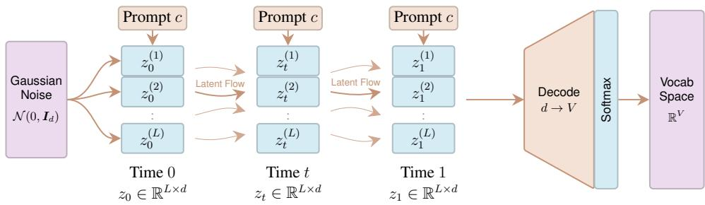
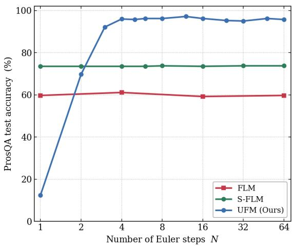
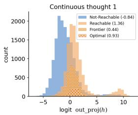
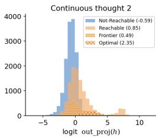
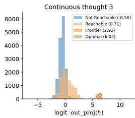
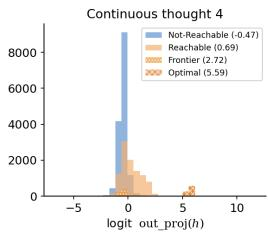
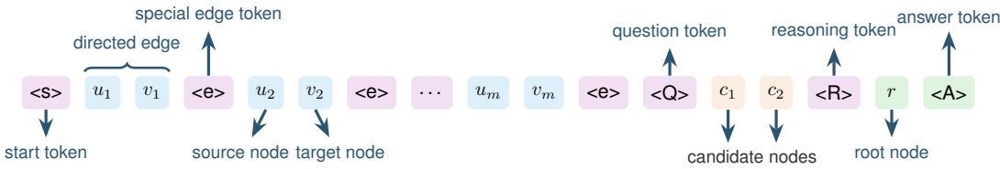
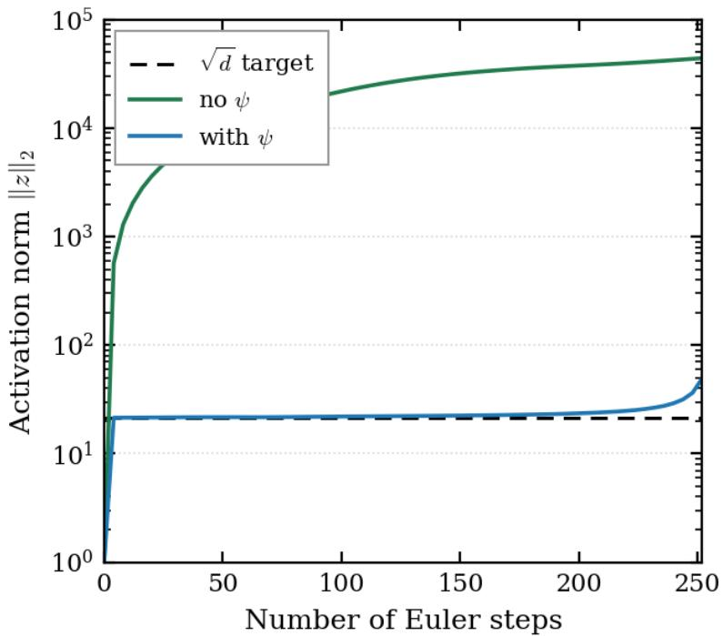

# UNROLLED FLOW MODELS FOR REASONING

Faissal Izermine1,2, Hanru Bai1,3, Oscar Davis4, T. Konstantin Rusch1,2,5,6∗

1Max Planck Institute for Intelligent Systems, 2ELLIS Institute Tübingen, 3ETH Zurich,

4University of Oxford, 5Tübingen AI Center, 6Liquid AI

## ABSTRACT

Flow matching enables language generation in few steps, but whether additional integration steps improve reasoning remains unclear. We prove that a flow parameterized by a two-layer Transformer can solve graph reachability, with the required number of integration steps increasing with the target’s distance from the root. Yet, standard flow language models can fail to benefit from additional steps on reasoning tasks. We attribute this limitation to objectives that supervise each time point independently, without explicitly training successive steps to build on one another. To address this, we instead train through the model’s own latent rollout over a randomly sampled subinterval of [0, 1], decoding only at the endpoint. On ProsQA, this raises accuracy to 97% and enables performance to improve with additional integration steps. For the longer rollouts required by reasoning tasks such as Sudoku and Maze, retracting the latent state onto a sphere stabilizes the dynamics and yields substantial gains over baselines with more than three times as many parameters. Sampling multiple rollouts further improves performance when paired with a parameter-free selection score, although reliable selection remains challenging for longer answers. Together, these results establish a theoretical basis for reasoning with flows and show how rollout training, stable latent dynamics, and rollout selection help realize this capacity in practice. The implementation can be found here.

## 1 INTRODUCTION

Autoregressive language models can spend more computation at inference by generating a longer chain of thought (Wei et al., 2022) or, more broadly, by scaling test-time compute (Snell et al., 2024). Flow matching (Lipman et al., 2023; Liu et al., 2023; Albergo et al., 2025) offers a different way to produce discrete answers (Eijkelboom et al., 2024). Instead of predicting one token after another, flow models start from noise and repeatedly update a continuous state that is decoded into a token sequence. The number of updates can be chosen at inference time. This makes flow models an appealing candidate for adaptive test-time computation.

Additional integration steps do not inherently guarantee deeper reasoning. In generation tasks, a small number of steps is often enough, and recent work has pushed flow language models toward one- or few-step sampling by learning flow maps that make direct jumps along a trajectory (Lee et al., 2026; Roos et al., 2026; Davis et al., 2026; Yoo et al., 2026). For reasoning, additional steps are useful only if later updates can build on information produced by earlier ones.

Prior work in latent and recursive reasoning motivates this work. Coconut shows that autoregressive language models can update a continuous latent state instead of emitting every intermediate thought as text (Hao et al., 2026). On graph reachability, Zhu et al. (2025) show that repeated latent updates can maintain a superposition of reachable vertices and expand it one hop at a time. Recursive reasoners similarly solve structured tasks by applying a small, weight-tied network repeatedly to an internal state (Wang et al., 2025; Jolicoeur-Martineau, 2025). An Euler rollout of a flow has the same basic form: one network is applied again and again to a latent state. We investigate how these repeated applications cooperate.

To show what integration steps can compute, we construct explicit weights for a two-layer Transformer that defines a flow solving the graph reachability problem. Its Euler rollout reaches vertices one hop per step, so the number of steps needed to separate the candidates depends on the distance from the root to the answer. However, this existence result does not establish that training recovers the construction (Section 3.1).

Standard training of flow models does not directly assess whether an update produces a state that later updates can leverage. To address this limitation, we propose Unrolled Flow Model (UFM), which trains through its own latent rollout using a single prediction loss at the final state. To reduce memory usage for long rollouts, we backpropagate this loss through only the last few steps (Section 4). We stabilize these rollouts using sphere retraction to control latent-state growth (Section 5). On ProsQA and Sudoku-Hard, UFM improves with additional steps, whereas evaluated flow baselines show little gain. Multiple rollouts further improve reliability, although selecting among them remains challenging for tasks with long answers, such as maze solving.

Our contributions are: (i) We give a constructive result showing how flow integration can implement graph search with the number of steps determined by the instance. (ii) We introduce training through a terminal rollout loss and show that it makes flow steps useful for reasoning in our experiments, while connecting the resulting dynamics to a superposition-based mechanism. (iii) We use sphere retraction to stabilize long rollouts and demonstrate stronger scaling with additional steps than substantially larger flow baselines on structured reasoning tasks.

## 2 BACKGROUND

## 2.1 CONDITIONAL FLOW MATCHING

Setup. Given a prompt $c ,$ the model generates an answer with $L$ positions. A flow transforms noise at $t = 0$ into an answer representation at $t = 1$ , using N Euler steps on a grid $0 = t _ { 0 } < \cdots < t _ { N } = 1$

Flow matching. Flow matching (Lipman et al., 2023; Liu et al., 2023; Albergo et al., 2025) defines a path between noise ${ \pmb x } _ { 0 } \sim p _ { 0 } = { \mathcal { N } } ( 0 , I )$ and data $\pmb { x } _ { 1 } \sim p _ { 1 }$ . We use the linear interpolant

$$
I _ { t } : = ( 1 - t ) x _ { 0 } + t x _ { 1 } , \qquad { \widehat { \pmb x } } _ { \theta } ( { \pmb x } , t ) \approx \mathbb { E } \big [ { \pmb x } _ { 1 } \mid I _ { t } = { \pmb x } \big ] .\tag{1}
$$

The denoiser ${ \widehat { \pmb x } } _ { \theta }$ predicts the clean endpoint from a point on this path. Since ${ \pmb x } _ { 1 } - { \pmb x } _ { 0 } = ( { \pmb x } _ { 1 } -$ $I _ { t } ) / ( 1 - t )$ , its corresponding velocity field is

$$
{ \pmb v } _ { \theta } ( { \pmb x } , t ) = \frac { \widehat { { \pmb x } } _ { \theta } ( { \pmb x } , t ) - { \pmb x } } { 1 - t } .\tag{2}
$$

Integrating $\dot { \boldsymbol { z } } _ { t } = \boldsymbol { v } _ { \boldsymbol { \theta } } ( \boldsymbol { z } _ { t } , t )$ from $t = 0 \mathrm { ~ t o ~ } t = 1$ transports noise toward the data distribution. In practice, we approximate this integration with Euler steps:

$$
z _ { t _ { k + 1 } } = z _ { t _ { k } } + \left( t _ { k + 1 } - t _ { k } \right) v _ { \theta } ( z _ { t _ { k } } , t _ { k } ) .\tag{3}
$$

Conditioning and training. The prompt tokens are concatenated with L answer slots and processed by a bidirectional Diffusion Transformer (DiT) (Vaswani et al., 2017; Peebles & Xie, 2023). The DiT receives the flow time t as a conditioning input, while the prompt remains clean throughout the rollout; only the answer slots evolve. The conditional denoiser is trained using:

$$
\begin{array} { r } { \mathcal { L } _ { \mathrm { F M } } ( \theta ) = \mathbb { E } _ { ( c , \mathbf { x } _ { 1 } ) , \mathbf { x } _ { 0 } , t \sim \mathcal { U } [ 0 , 1 ] } \Big [ \ell \big ( \widehat { \mathbf { x } } _ { \theta } ( I _ { t } , t , c ) , \mathbf { x } _ { 1 } \big ) \Big ] . } \end{array}\tag{4}
$$

Here, ℓ is the per-example loss. Thus, each training example supervises a denoising prediction at one sampled time; the model is never evaluated on a state produced by its own preceding update. We return to this distinction in Section 3.2.

## 2.2 FLOW LANGUAGE MODELS

Flow Language Models (FLMs) apply this formulation to discrete tokens. FLM (Lee et al., 2026) represents the clean answer as a stack of one-hot vectors, $\pmb { x } _ { 1 } \in \{ 0 , 1 \} ^ { L \times V }$ . Its denoiser therefore predicts a distribution over the vocabulary at every answer position:

$$
\widehat { \pmb { x } } _ { \theta } ( { \pmb x } , t , c ) = \left( p ^ { i } ( { \cdot } \mid I _ { t } = { \pmb x } , c ) \right) _ { 1 \leq i \leq L } .\tag{5}
$$

The model is trained with cross-entropy, and the evolving state $\boldsymbol { z } _ { t } \in \mathbb { R } ^ { L \times V }$ is moved toward this predicted distribution at each Euler step. In our experiments, FLM refers to the multi-step flow model, rather than the distilled one-step flow-map variant introduced in the same work.

S-FLM. S-FLM (Deschenaux & Gulcehre, 2026) instead represents tokens with learned unit-norm embeddings on the hypersphere. It follows a geodesic path from noise toward these embeddings, rather than evolving a vocabulary-sized state as in FLM. Its denoiser still produces a distribution over the vocabulary; each sampling step follows a posterior-weighted average of geodesic directions toward the token embeddings. Both methods train a cross-entropy denoiser at one sampled point on their respective noise paths. S-FLM additionally uses a truncated, adaptive noise schedule. ELF (Hu et al., 2026) also defines the flow in a continuous token-embedding space.

FLM and S-FLM are our flow baselines. UFM also evolves a continuous latent state, but it predicts a latent target and applies the vocabulary decoder only once, at the endpoint. Its rollout is trained jointly with a terminal loss, as described in Section 4.

## 3 INTEGRATION STEPS AND REASONING DEPTH

## 3.1 A TWO-LAYER FLOW FOR GRAPH REACHABILITY

We define the graph-reachability task and the flow construction used in the existence result. The theorem below shows that the construction solves the task; its Euler discretization will later show how many integration steps are needed. Notation is collected in Table 2.

Graph and prompt. Let $\mathcal { G } = ( \nu , \mathcal { E } )$ be a directed graph with $n = | \mathcal { V } | \le n _ { \mathrm { m a x } }$ vertices and $m = | \mathcal { E } |$ edges. Let $r \in \mathcal { V }$ be a designated starting vertex, called the root, and let $c _ { 1 } , c _ { 2 }$ be two candidate destinations. Exactly one candidate, denoted $c _ { i ^ { \star } }$ , is reachable from r; we write $c _ { 3 - i ^ { \star } }$ for the other candidate.

We write dist $( r , v )$ for the length of a shortest directed path from r to v, and $\mathcal { V } _ { k } : = \{ v \in \mathcal { V }$ dist $( r , v ) \leq k \}$ for the vertices reachable within k hops. The sequence $\mathcal { V } _ { 0 } \subseteq \mathcal { V } _ { 1 } \subseteq \cdots$ stops growing at the eccentricity of the root, $D : = \operatorname* { m a x } \{ \mathrm { d i s t } ( r , v )$ : v is reachable from $r \}$ . Thus, dist $( r , c _ { i ^ { \star } } ) \leq D$

We also write $\mathrm { W } _ { k } ( r , v )$ for the number of directed walks of length k from r to v.

Following Zhu et al. (2025), the prompt lists the directed edges and then asks which candidate is reachable (Figure 4 in the appendix):

$$
c = ( \langle \mathbf { s } \rangle , u _ { 1 } , v _ { 1 } , \langle \mathbf { e } \rangle , \ldots , u _ { m } , v _ { m } , \langle \mathbf { e } \rangle , \langle \mathbf { Q } \rangle , c _ { 1 } , c _ { 2 } , \langle \mathbf { R } \rangle , r , \langle \mathbf { A } \rangle ) .
$$

The flow state ${ \boldsymbol { z } } _ { t }$ evolves at the position marked by $\langle \mathrm { A } \rangle$ , where the final answer is decoded.

Representation. Let V be the vocabulary size and $d _ { \mathrm { t e } }$ the embedding dimension. Each token v has an embedding $\phi _ { v } \in \mathbb { R } ^ { d _ { \mathrm { t e } } }$ . As in Zhu et al. (2025), we assume orthonormal token embeddings,

$$
\Phi ^ { \top } \Phi = I , \qquad \Phi = [ \phi _ { 1 } , \ldots , \phi _ { V } ] , \qquad d _ { \mathrm { t e } } \geq V .
$$

This lets $\langle \phi _ { v } , z _ { t } \rangle$ recover the coefficient of vertex v in the state. This assumption applies solely to the construction; the trained models use standard embeddings.

The first layer stores each edge’s source and target embeddings in separate buffers at its $\langle \mathrm { e } \rangle$ position, and the two candidate embeddings in buffers at $\left. \mathrm { A } \right.$ . It initializes the answer state as $z _ { 0 } = \phi _ { \langle \mathrm { A } \rangle } + \phi _ { \ i }$ (Theorems 6 and 8).

Constructed velocity field. The second layer is a softmax-free linear-attention head (Theorem $9 )$ It reads the content slot of $\langle \mathrm { A } \rangle$ as its query and the cached source and target edge embeddings as its keys and values. Using these cached edge endpoints, it applies $\begin{array} { r } { A _ { \mathcal { G } } = \breve { \sum } _ { ( u _ { j }  v _ { j } ) \in \mathcal { E } } \phi _ { v _ { j } } \phi _ { u _ { j } } ^ { \top } } \end{array}$ , the adjacency operator of $\mathcal { G }$ in embedding coordinates. With a fixed gain $\lambda > 0$ , the head induces

$$
\dot { z } _ { t } = \lambda A _ { \mathcal { G } } z _ { t } , \qquad z _ { 0 } = \phi _ { \left. \mathrm { A } \right. } + \phi _ { r } .\tag{6}
$$

  
Figure 1: UFM computes in latent space and decodes once. At inference, a DiT repeatedly updates a noisy latent answer state from t = 0 to t = 1. A linear vocabulary decoder is applied only to the final state.

We use a linear head where Zhu et al. (2025) use softmax attention because it makes the velocity linear in the state, so the flow has a closed form. At time $t = 1$ , the construction compares $\langle \phi _ { c _ { 1 } } , z _ { 1 } \rangle$ and $\langle \phi _ { c _ { 2 } } , z _ { 1 } \rangle$ and returns the candidate with the larger score. This is a candidate-restricted readout. The experiments use the stricter full-vocabulary decoder; we discuss that difference in Theorem 11.

Exact flow The constructed velocity field has a closed-form solution. This gives the existence result: the flow separates the reachable candidate from the unreachable one on every instance.

Theorem 1 (Existence). Fix a vocabulary of size V, $n _ { \mathrm { m a x } } ,$ , and $\lambda > 0 .$ There exists a two  
layer Transformer, consisting of a prompt-caching layer followed by a linear-attention layer,   
whose weights are independent ofthe graph, root, and candidate pair. Its answer state satisfies   
Equation (6) for every directed graph with $| \mathcal { V } | \leq n _ { \operatorname* { m a x } } ,$ , every root r, and every candidate pair with   
exactly one reachable candidate c ⋆. At time $t = 1$   
λk   
⟨ϕv, z1⟩ = X Wk(r, v), v ∈ V.   
k!   
k≥0   
This coefficient is positive exactly when v is reachablefrom r. The candidate-restricted readout   
therefore returns $c _ { i ^ { \star } }$ , with the margin bound   
λk   
δ := min ≤ ⟨ϕc ⋆ , z1⟩ − ⟨ϕc ⋆ , z1⟩.   
0≤k≤nmax−1 k!

Why the exact flow solves reachability. Since $A _ { \mathcal { G } } \phi _ { \langle \mathrm { A } \rangle } = \mathbf { 0 }$ , the solution is $z _ { t } = \phi _ { \langle \mathrm { A } \rangle } + e ^ { \lambda t A _ { \mathcal { G } } } \phi _ { r }$ Orthonormality makes $A _ { \mathcal { G } } ^ { k } \phi _ { \prime }$ count length-k walks (Theorem 10), giving the theorem’s nonnegative coefficient series. An unreachable vertex has no such walks; a reachable vertex has a shortest path of length $k ^ { \star } \le n _ { \operatorname* { m a x } } - 1$ , contributing at least ${ \lambda ^ { k ^ { \star } } } / { k ^ { \star } ! } \geq \delta$ at t = 1. The network realization is established in Theorems 8 and 9.

Unlike the Euler rollout considered next, the exact flow assigns positive mass to every reachable vertex at any $t > 0$ . Reaching vertices one hop per step is therefore a property of the discretization, not of the flow itself.

Corollary 2 (Euler steps match graph distance). For any Euler grid $0 = t _ { 0 } < \cdots < t _ { N } = 1$ with positive step sizes,

$$
z _ { t _ { N } } = \phi _ { \langle \mathrm { A } \rangle } + \prod _ { i = 0 } ^ { N - 1 } \left( I + \lambda \Delta t _ { i } A _ { \mathcal { G } } \right) \phi _ { r } .
$$

Hence, for every vertex $v ,$

$$
\langle \phi _ { v } , z _ { t _ { N } } \rangle > 0 \quad \Longleftrightarrow \quad v \in \mathcal V _ { N } .
$$

Thus, the candidate-restricted readout is correct when $N \geq \mathrm { d i s t } ( r , c _ { i ^ { \star } } )$ . Taking $N \geq D = \csc ( r )$ sufficesfor every valid candidate pair with this root.

Expanding the product in Theorem 2 gives positive coefficients for $A _ { \mathcal { G } } ^ { 0 } , \ldots , A _ { \mathcal { G } } ^ { N }$ . The state therefore contains contributions from walks of length at most N, and its vertex support is exactly $\gamma _ { N }$ . Step sizes change the weights on these walks and the number of steps determines how far information can propagate: a target farther from the root requires more Euler steps, using the same weights.

Remark 3 (Noisy initialization). For $z _ { 0 } = \phi _ { \langle \mathrm { A } \rangle } + \phi _ { r } + \sigma \xi ,$ with $\xi \sim \mathcal { N } ( 0 , I )$ , the exact time-1 flow returns the correct candidate with probability at least

$$
1 - \exp \left( - \frac { \delta ^ { 2 } } { 4 \sigma ^ { 2 } e ^ { 2 \lambda \sqrt { m } } } \right) .
$$

The bound weakens with noise and graph size; see Section A.9.

The construction uses orthonormal embeddings, a softmax-free propagation head, a prompt cache, and a time-independent velocity field. It does not show that gradient descent recovers this solution. Trained UFM uses learned embeddings and reapplies its DiT at every step; Section 4.1 examines whether its dynamics show a related mechanism.

## 3.2 INTEGRATION STEPS ALONE DO NOT PRODUCE REASONING

We test whether increasing the number of integration steps at inference improves reasoning accuracy in standard flow models.

Setup. As in Zhu et al. (2025), we use ProsQA (Hao et al., 2026), a directed graphreachability task with two candidate answers. The models have two layers and approximately 15.7M parameters. The plotted UFM is trained with $N _ { \mathrm { t r a i n } } = 5$ steps and gradients through all five updates. UFM and S-FLM have approximately matched training budgets measured by the total number of model evaluations across examples; configurations are given in Section D.

Figure 2 shows test accuracy as the number of Euler steps N increases at inference. Both baseline curves are nearly flat: more integration steps add little accuracy. We revisit the same baselines on the harder Sudoku and Maze benchmarks in Section 5.3. On Sudoku-Hard, the 28.6M baselines change by only about one point from $N = 8$ to N = 128 (Table 6). Consequently, standard flow models require more than additional forward passes to improve reasoning.

This behavior is consistent with the standard flow objective in Equation (4). FLM and S-FLM train the denoiser to recover the answer from a ground-truth interpolant at a

  
Figure 2: Rollout training makes additional steps useful. ProsQA test accuracy versus the number of Euler steps at inference. FLM and S-FLM remain nearly flat, while a single UFM trained with $N _ { \mathrm { t r a i n } } = 5$ improves from 12% at $N = 1$ to approximately 97% with longer rollouts. Decoding uses the full vocabulary.

sampled time. The model is therefore not trained on the states created by its own preceding updates, and the objective does not assess whether one update leaves a useful state for the next. UFM instead trains a sequence of updates against one terminal answer loss.

S-FLM already evolves an embedding-space state; yet, its accuracy changes little with additional steps. Our construction motivates keeping the computation in latent space and decoding only at the endpoint; Section 4 trains these updates jointly through the rollout.

Algorithm 1 Base UFM training on one batch. Task-specific variants are described in the text.   
Require: Batch $( c , y )$ , parameters $\theta ,$ rollout length $N _ { \mathrm { t r a i n } }$ , backpropagation length $1 \leq N _ { \mathrm { b a c k } } \leq$   
$N _ { \mathrm { t r a i n } }$   
1: Sample noise $\xi \sim \mathcal { N } ( 0 , I )$ in the latent answer space   
2: Sample a task-specific grid $0 \leq t _ { 0 } < t _ { 1 } < \cdot \cdot \cdot < \bar { t } _ { N _ { \mathrm { t r a i n } } } = 1$   
3: $z _ { t _ { 0 } } \gets ( 1 - t _ { 0 } ) \pmb { \xi } + t _ { 0 }$ Embed(y)   
4: for $k = 0$ to $\dot { N } _ { \mathrm { t r a i n } } - 1$ do   
5: $\Delta t _ { k } \gets t _ { k + 1 } - t _ { k }$   
6: $\widehat { \pmb x } _ { \theta } ^ { ( k ) }  \widehat { \pmb x } _ { \theta } ( \pmb z _ { t _ { k } } , t _ { k } , c )$   
7: ${ \pmb v } _ { \theta } ^ { ( k ) }  ( \widehat { \pmb x } _ { \theta } ^ { ( k ) } - z _ { t _ { k } } ) / ( 1 - t _ { k } )$   
8: $z _ { t _ { k + 1 } } \gets z _ { t _ { k } } + \Delta t _ { k } v _ { \theta } ^ { ( k ) }$   
9: if $k < N _ { \mathrm { t r a i n } } - N _ { \mathrm { b a c k } }$ then   
10: $\boldsymbol { z } _ { t _ { k + 1 } } \gets \mathrm { s g } ( \boldsymbol { z } _ { t _ { k + 1 } } )$ {stop gradients through early updates}   
11: end if   
12: end for   
13: yˆ ← softmax $( z _ { t _ { N _ { \mathrm { t r a i n } } } } W _ { \mathrm { d e c } } ^ { \top } )$ {decode once}   
14: $\mathcal { L } \gets \mathrm { C E } ( \hat { \pmb { y } } , \pmb { y } )$   
15: return $\mathcal { L } , \nabla _ { \theta } \mathcal { L }$

## 4 UNROLLED FLOW MODEL

We want early updates to produce states that later updates can use to reach the answer. We therefore train an Unrolled Flow Model (UFM) through its own rollout with a loss on the final answer. UFM keeps the answer state in a continuous latent space and decodes only once, at the endpoint.

Latent rollout. $\boldsymbol { z } _ { t } ~ \in ~ \mathbb { R } ^ { L \times d }$ , where d is the hidden width. A DiT predicts a latent target, $\widehat { \pmb { x } } _ { \theta } ( \pmb { z } _ { t } , t , c ) \in \mathbb { R } ^ { L \times d }$ , and defines the velocity as in Equation (2).

Unlike FLM and S-FLM, intermediate states are not decoded into distributions over the vocabulary. The vocabulary decoder is applied only to the final state,

$$
\begin{array} { r } { \pmb { \hat { y } } = \mathrm { s o f t m a x } \big ( \ b { z } _ { t _ { N } } \pmb { W } _ { \mathrm { d e c } } ^ { \top } \big ) , \qquad \pmb { W } _ { \mathrm { d e c } } \in \mathbb { R } ^ { V \times d } . } \end{array}
$$

We use softmax on ProsQA and replace it with StableMax (Prieto et al., 2025) on the longer Sudoku and Maze tasks. Details are in Section C.

Terminal rollout loss. We apply the loss only at the endpoint, so backpropagation trains successive updates through their combined effect on the final answer.

During training, the rollout starts from a partially noised answer at a sampled time $t _ { 0 } , z _ { t _ { 0 } } =$ $( 1 - t _ { 0 } ) \pmb { \xi } + t _ { 0 }$ Embed(y) with $\xi \sim \mathcal { N } ( 0 , I )$ , and is integrated over a sampled subinterval ending at $t _ { N } = 1$

$$
\mathcal { L } _ { \mathrm { U F M } } ( \boldsymbol { \theta } ) = \mathbb { E } _ { ( c , y ) , \xi , t _ { 0 } } \left[ \mathrm { C E } \big ( \mathrm { s o f t m a x } ( z _ { t _ { N } } W _ { \mathrm { d e c } } ^ { \top } ) , y \big ) \right] .\tag{7}
$$

No intermediate state receives a vocabulary loss. At inference, we set $t _ { 0 } = 0$ , start from noise, and integrate the full interval [0, 1]. The complete long-rollout training and inference procedures, including sphere retraction and truncated backpropagation, are given in Section C.

## 4.1 WHAT THE INTERMEDIATE STATES CARRY

Following Section 3.1, we inspect the logit $\langle z _ { t } , w _ { v } \rangle$ of each vertex v, where $\mathbf { \Delta } _ { w _ { v } }$ is its output embedding. In Figure 3, non-reachable vertices remain near zero at every step, while several reachable vertices receive positive logits. At the first step, no single reachable vertex is clearly selected. The reachable group sits above the not-reachable one and drifts further right as t grows, and within it the optimal node separates the most.

  
Figure 3: Intermediate states separate reachable vertices. We plot the logit $\langle z _ { t } , w _ { v } \rangle$ of vertex $v ,$ where $\pmb { w } _ { v }$ is row v of the final decoder $W _ { \mathrm { d e c } }$ . Logits are centered separately for each problem by their mean over vertices. UFM trained with $N _ { \mathrm { t r a i n } } = 5$ is evaluated at $t = 0 . 2 , 0 . 4 , 0 . 6 , 0 . 8 ,$ , on the 217 ProsQA test problems with dist $( r , c _ { i ^ { \star } } ) = 4 ,$ , averaged over four seeds. Vertices are grouped as not reachable, reachable, frontier (dist $( r , v ) = k )$ , and optimal (the vertex at hop k on a shortest root-to-answer path).

While it does not establish that the trained model implements the construction, this qualitatively resembles Theorem 2, whose Euler states have support on all vertices reachable within k hops after k steps.

## 5 SCALING TO LONG ROLLOUTS

We evaluate UFM on Sudoku-Hard, Sudoku-Extreme, and Maze-Hard. These tasks require longer answer sequences and longer rollouts than ProsQA.

## 5.1 BENCHMARKS AND EVALUATION PROTOCOL

Sudoku-Hard. We use the split of Deschenaux & Gulcehre (2026): 48k training puzzles and 2k reporting puzzles, each with 30 givens. UFM checkpoints are selected on an additional 2k validation split, disjoint from both sets. Our best FLM and S-FLM checkpoints are selected on the reporting set.

Sudoku-Extreme. Following Wang et al. (2025); Jolicoeur-Martineau (2025), training uses 1k base puzzles with 1000 augmentations each. We evaluate on the full test set of 422,786 puzzles. Checkpoint selection uses 2k additional puzzles from the original training pool, disjoint from the selected 1k base training puzzles and the test set. Each answer contains 81 positions.

Maze-Hard. We use the $3 0 \times 3 0$ benchmark of Wang et al. (2025); Jolicoeur-Martineau (2025), with 1000 training and 1000 test mazes whose shortest paths exceed 110 cells. The model predicts a 900-cell grid, of which roughly 110 cells lie on the solution path. UFM and both flow baselines select checkpoints on the test set; no separate validation split is used.

## 5.2 TRAINING LONG ROLLOUTS

Sphere retraction. On long Sudoku rollouts, the latent norm can grow sharply (Section B). This changes the scale of the inputs to later updates and can destabilize the rollout. We control this growth on Sudoku and Maze with a position-wise sphere retraction,

$$
\psi ( z ) = { \sqrt { d } } { \frac { z } { \| z \| _ { 2 } } } .
$$

Let $z _ { t _ { k } }$ denote the state read by the DiT and $y _ { t _ { k } } = \psi ( z _ { t _ { k } } )$ its retracted version. The update is

$$
z _ { t _ { k + 1 } } = y _ { t _ { k } } + \frac { \Delta t _ { k } } { 1 - t _ { k } } \big ( \widehat { x } _ { \theta } ( z _ { t _ { k } } , t _ { k } , c ) - y _ { t _ { k } } \big ) , \qquad y _ { t _ { k + 1 } } = \psi ( z _ { t _ { k + 1 } } ) , \mathrm { ~ f o r ~ } 1 \leq k < N .
$$

This is a projected Euler-type update: after the first step, its base is retracted, while the DiT continues to read the raw state. We use this retraction on Sudoku and Maze only. In a separate Sudoku ablation, training without it lowers accuracy; details are in Section B.

Table 1: Accuracy (%) on Sudoku-Hard. FLM and S-FLM are our runs of the authors’ released code. Train is training-only wall-clock time on one NVIDIA A100. All methods use the same training data.
<table><tr><td>Method</td><td>Params</td><td>Train (h)</td><td>Sudoku-Hard</td></tr><tr><td>FLM (Lee et al., 2026)ª</td><td>28.6M</td><td>1.6</td><td>51.9</td></tr><tr><td>S-FLM (Deschenaux &amp; Gulcehre, 2026)ª</td><td>28.6M</td><td>1.7</td><td>50.9b</td></tr><tr><td>UFM (ours)</td><td>8.4M</td><td>1.1</td><td> ${ \bf 8 6 . 9 \pm 0 . 9 }$ </td></tr></table>

aSelected on the 2k reporting puzzles; UFM is selected on a separate 2k validation split. The UFM result is the mean and standard deviation over five independent noise seeds at $N _ { \mathrm { e v a l } } = 1 2 8$ on a uniform grid. bWith ancestral noise removal at $N _ { \mathrm { e v a l } } \stackrel { \textstyle \mathbf { \bar { \mathbf { \Lambda } } } } { = } 1 2 8 ;$ with the default greedy final step, S-FLM peaks at 50.2% at $N = 6 4$ (Table 6).

Truncated Backpropagation For the long tasks, we reduce activation memory by backpropagating only through the final $N _ { \mathrm { b a c k } } = 6 ~ \mathrm { o f } ~ N _ { \mathrm { t r a i n } } = 2 4$ updates, as in Jolicoeur-Martineau (2025); Clark et al. (2024). The first 18 updates are computed without recording gradients and produce the state refined by the final six. We choose $N _ { \mathrm { b a c k } } = 6$ to fit the available memory.

Each training example uses a newly sampled increasing time grid ending at $t = 1$ , exposing the model to varying step sizes. The complete long-rollout procedures are given in Section C.

## 5.3 COMPARISON WITH FLOW BASELINES

We compare all methods at $N _ { \mathrm { e v a l } } = 1 2 8$ on Sudoku-Hard (Deschenaux & Gulcehre, 2026). FLM and S-FLM use the authors’ released code and the best tested checkpoints and final-step settings at this budget (Section D.4).

On Sudoku-Hard, UFM reaches $8 6 . 9 \pm 0 . 9 \%$ , compared with 51.9% for FLM and 50.9% for S-FLM, using 8.4M rather than 28.6M parameters.

The gap widens on the harder tasks. On Sudoku-Extreme, UFM reaches $7 4 . 4 \pm 0 . 0 \%$ with a uniform $N _ { \mathrm { e v a l } } = 1 2 8$ grid, averaged over five noise seeds. FLM and S-FLM reach 10.7% and 9.4%, respectively. On Maze-Hard, UFM reaches $8 9 . 3 \pm 0 . 5 \%$ , compared with 40.4% for FLM and 49.9% for S-FLM (Table 4). Published recursive-reasoner results and FRM are included for context in Tables 4 and 5.

## 5.4 SELECTING AMONG ROLLOUTS

Inference begins from Gaussian noise, so different rollouts can produce different answers. We therefore draw $K = 1 0 0$ rollouts and select one with a parameter-free score. Margin averages the gap between the two largest raw logits over output positions. It is an output-space analogue of δ in Theorem 1.

On mazes, scores average over 900 cells, although only roughly 110 describe the solution path. This makes selection harder, and selected accuracy remains below Pass@100. Detailed diagnostics are in Section D.1.

## 6 RELATED WORK

Recursive and looped reasoning. Recursive reasoners repeatedly apply a small, weight-tied network to a latent state. HRM (Wang et al., 2025) uses slow and fast recurrent modules, while TRM (Jolicoeur-Martineau, 2025) uses a single recurrent block and an answer state. Subsequent work improves stability and scaling (Movahedi et al., 2026; Fein-Ashley & Rashidinejad, 2026; Gao et al., 2025). EqR and GRAM explore both depth, through more iterations, and breadth, through multiple trajectories (Huang et al., 2026; Baek et al., 2026). PTRM also studies sampling and selection (Sghaier et al., 2026).

Latent chain of thought. Coconut (Hao et al., 2026) feeds a language model’s hidden state back as its next input embedding and introduces ProsQA. Zhu et al. (2025) show that a two-layer Transformer with continuous thoughts can solve graph reachability by maintaining a superposition of reachable vertices and expanding it over several steps. Their result provides the starting point for our construction in Section 3.1. UFM updates one latent answer state in place and uses answer-only supervision throughout training. Coconut appends continuous thoughts and uses a curriculum that gradually replaces language reasoning steps.

Differentiating through generation. Backpropagating a terminal objective through a generative sampler is established in diffusion reward fine-tuning. DRaFT (Clark et al., 2024) backpropagates differentiable rewards through a diffusion sampler and introduces DRaFT-K, which truncates gradients to the final K sampling steps. UFM uses the same general optimization mechanism, but is trained from scratch with endpoint cross-entropy on reasoning tasks rather than fine-tuned against an external reward. Our $N _ { \mathrm { b a c k } }$ plays the role of a truncated sampler-backpropagation horizon.

Flow models for reasoning. Flow Reasoning Models (FRM) (Helbling et al., 2026) add recurrent self-conditioning to a flow model. Their Fixed-Point Forcing procedure uses a carry produced by the model’s own rollout, while stopping gradients through that carry. They also report that increasing the number of sampling steps of a standard FLM does not improve Sudoku performance, consistent with our ProsQA observation in Section 3.2. FRM reports a peak accuracy of 99.5% on a fixed 1000- puzzle subset of the Sudoku-Extreme test set, included for context in Table 4. Its maze evaluation uses Maze-Unique rather than Maze-Hard.

Looped Flows (Suleymanzade et al., 2026), concurrent with this work, follows the TRM preprocessing and evaluation protocol on Sudoku-Extreme and Maze-Hard. It trains recurrent flow updates with local denoising losses and stops gradients between updates. UFM instead applies one terminal loss and backpropagates through the final $N _ { \mathrm { b a c k } }$ updates of the rollout.

## 7 LIMITATIONS

Our experiments use relatively small models, from 8M to 16M parameters, on synthetic structured reasoning tasks. Training through a rollout requires memory for the backpropagated suffix, which limited model size in this work. Extending UFM to larger models and less structured languagereasoning tasks will require more memory-efficient ways to train consecutive updates jointly.

The construction in Section 3.1 is an existence result. It relies on orthonormal embeddings and a linear propagation head, and does not show that gradient descent recovers this velocity field. The trained models share only a qualitative pattern with the construction, examined in Section 4.1.

Finally, a rollout begins from Gaussian noise, so a correct answer may appear among several trajectories without being selected by a single rollout. Our parameter-free selection rule recovers most of the Pass@100 gap on Sudoku-Extreme, but is less reliable for the much longer Maze-Hard outputs and could benefit from a learned correctness or halting head, as used in HRM and TRM (Wang et al., 2025; Jolicoeur-Martineau, 2025). Although UFM substantially improves over standard flow baselines, it remains behind the strongest reported recursive reasoners on Sudoku-Extreme.

## 8 CONCLUSION

We show how flow models can use additional integration steps to improve reasoning. On graph reachability, a two-layer construction propagates information along the graph, and its Euler discretization requires at least as many steps as the distance from the root to the answer. Standard flow language models do not use their steps in this way: their accuracy remains largely flat as the number of sampling steps increases. UFM changes this by training through the model’s own latent rollout with a single loss at its endpoint. Accuracy then grows with the number of steps on ProsQA. For longer Sudoku and Maze rollouts, sphere retraction stabilizes the updates and allows an 8.4M-parameter model to outperform 28.6M standard-flow baselines. Multiple rollouts further improve reliability, although selecting among them is less effective for long answers.

Applying this approach to larger language models will require more memory-efficient rollout training and stronger selection mechanisms. Our results show that training through the rollout can make additional flow steps useful for reasoning.

## ACKNOWLEDGEMENTS

This work was supported in part by the Hector Foundation, by the Max Planck ETH Center for Learning Systems, and by EPSRC Turing AI World-Leading Research Fellowship No. EP/X040062/1 and EPSRC AI Hub on Mathematical Foundations of Intelligence: An "Erlangen Programme" for AI No. EP/Y028872/1.

## REFERENCES

Michael Albergo, Nicholas M. Boffi, and Eric Vanden-Eijnden. Stochastic interpolants: A unifying framework for flows and diffusions. Journal ofMachine Learning Research, 26(209):1–80, 2025. URL http://jmlr.org/papers/v26/23-1605.html.

Junyeob Baek, Mingyu Jo, Minsu Kim, Mengye Ren, Yoshua Bengio, and Sungjin Ahn. Generative recursive reasoning, 2026. URL https://arxiv.org/abs/2605.19376.

Kevin Clark, Paul Vicol, Kevin Swersky, and David J. Fleet. Directly fine-tuning diffusion models on differentiable rewards. In The Twelfth International Conference on Learning Representations, 2024. URL https://openreview.net/forum?id=1vmSEVL19f.

Oscar Davis, Anastasiia Filippova, Pierre Ablin, Victor Turrisi, Amitis Shidani, Marco Cuturi, and Louis Béthune. Scaling categorical flow maps, 2026. URL https://arxiv.org/abs/2605. 07820.

Justin Deschenaux and Caglar Gulcehre. Language modeling with hyperspherical flows, 2026. URL https://arxiv.org/abs/2605.11125.

Floor Eijkelboom, Grigory Bartosh, Christian A. Naesseth, Max Welling, and Jan-Willem van de Meent. Variational flow matching for graph generation. In A. Globerson, L. Mackey, D. Belgrave, A. Fan, U. Paquet, J. Tomczak, and C. Zhang (eds.), Advances in Neural Information Processing Systems, volume 37, pp. 11735–11764. Curran Associates, Inc., 2024. doi: 10.52202/ 079017-0374. URL https://proceedings.neurips.cc/paper\_files/paper/ 2024/file/15b780350b302a1bf9a3bd273f5c15a4-Paper-Conference.pdf.

Jacob Fein-Ashley and Paria Rashidinejad. Solve the loop: Attractor models for language and reasoning, 2026. URL https://arxiv.org/abs/2605.12466.

Zitian Gao, Lynx Chen, Yihao Xiao, He Xing, Ran Tao, Haoming Luo, Joey Zhou, and Bryan Dai. Universal reasoning model, 2025. URL https://arxiv.org/abs/2512.14693.

Shibo Hao, Sainbayar Sukhbaatar, DiJia Su, Xian Li, Zhiting Hu, Jason Weston, and Yuandong Tian. Training large language models to reason in a continuous latent space, 2026. URL https: //arxiv.org/abs/2412.06769.

Alec Helbling, Andrey Bryutkin, Mauro Martino, Duen Horng Chau, Nima Dehmamy, and Hendrik Strobelt. Flow reasoning models: Turning flows into efficient recurrent reasoners, 2026. URL https://arxiv.org/abs/2606.29150.

Keya Hu, Linlu Qiu, Yiyang Lu, Hanhong Zhao, Tianhong Li, Yoon Kim, Jacob Andreas, and Kaiming He. ELF: Embedded language flows, 2026. URL https://arxiv.org/abs/2605.10938.

Benhao Huang, Zhengyang Geng, and Zico Kolter. Equilibrium reasoners: Learning attractors enables scalable reasoning, 2026. URL https://arxiv.org/abs/2605.21488.

Alexia Jolicoeur-Martineau. Less is more: Recursive reasoning with tiny networks, 2025. URL https://arxiv.org/abs/2510.04871.

Angelos Katharopoulos, Apoorv Vyas, Nikolaos Pappas, and François Fleuret. Transformers are RNNs: Fast autoregressive transformers with linear attention. In Proceedings of the 37th International Conference on Machine Learning, volume 119 of Proceedings ofMachine Learning Research, pp. 5156–5165. PMLR, 2020. URL https://proceedings.mlr.press/v119/ katharopoulos20a.html.

Chanhyuk Lee, Jaehoon Yoo, Manan Agarwal, Sheel Shah, Jerry Huang, Aditi Raghunathan, Seunghoon Hong, Nicholas M. Boffi, and Jinwoo Kim. Flow map language models: One-step language modeling via continuous denoising, 2026. URL https://arxiv.org/abs/2602. 16813.

Yaron Lipman, Ricky T. Q. Chen, Heli Ben-Hamu, Maximilian Nickel, and Matthew Le. Flow matching for generative modeling. In The Eleventh International Conference on Learning Representations, 2023. URL https://openreview.net/forum?id=PqvMRDCJT9t.

Xingchao Liu, Chengyue Gong, and Qiang Liu. Flow straight and fast: Learning to generate and transfer data with rectified flow. In The Eleventh International Conference on Learning Representations, 2023. URL https://openreview.net/forum?id=XVjTT1nw5z.

Sajad Movahedi, Vera Milovanovic, Shlomo Libo Feigin, Alexander Theus, Thomas Hofmann,´ Valentina Boeva, T. Konstantin Rusch, and Antonio Orvieto. Fixed-point reasoners: Stable and adaptive deep looped transformers, 2026. URL https://arxiv.org/abs/2606.18206.

William Peebles and Saining Xie. Scalable diffusion models with transformers. In 2023 IEEE/CVF International Conference on Computer Vision (ICCV), pp. 4172–4182, 2023. doi: 10.1109/ ICCV51070.2023.00387.

Lucas Prieto, Melih Barsbey, Pedro A. M. Mediano, and Tolga Birdal. Grokking at the edge of numerical stability, 2025. URL https://arxiv.org/abs/2501.04697.

Daan Roos, Oscar Davis, Floor Eijkelboom, Michael Bronstein, Max Welling, ˙Ismail ˙Ilkan Ceylan, Luca Ambrogioni, and Jan-Willem van de Meent. Categorical flow maps, 2026. URL https: //arxiv.org/abs/2602.12233.

Amin Sghaier, Ali Parviz, and Alexia Jolicoeur-Martineau. Probabilistic tiny recursive model, 2026. URL https://arxiv.org/abs/2605.19943.

Charlie Snell, Jaehoon Lee, Kelvin Xu, and Aviral Kumar. Scaling LLM test-time compute optimally can be more effective than scaling model parameters, 2024. URL https://arxiv.org/abs/ 2408.03314.

Ayhan Suleymanzade, Chanhyuk Lee, Floor Eijkelboom, Nicholas M. Boffi, ˙Ismail ˙Ilkan Ceylan, and Jinwoo Kim. Thinking with looped flows, 2026. URL https://arxiv.org/abs/2609. 11801.

Ashish Vaswani, Noam Shazeer, Niki Parmar, Jakob Uszkoreit, Llion Jones, Aidan N. Gomez, Lukasz Kaiser, and Illia Polosukhin. Attention is all you need. In Advances in Neural Information Processing Systems, 2017. URL https://arxiv.org/pdf/1706.03762.pdf.

Guan Wang, Jin Li, Yuhao Sun, Xing Chen, Changling Liu, Yue Wu, Meng Lu, Sen Song, and Yasin Abbasi Yadkori. Hierarchical reasoning model, 2025. URL https://arxiv.org/ abs/2506.21734.

Jason Wei, Xuezhi Wang, Dale Schuurmans, Maarten Bosma, Brian Ichter, Fei Xia, Ed H. Chi, Quoc V Le, and Denny Zhou. Chain of thought prompting elicits reasoning in large language models. In Alice H. Oh, Alekh Agarwal, Danielle Belgrave, and Kyunghyun Cho (eds.), Advances in Neural Information Processing Systems, 2022. URL https://openreview.net/forum? id=\_VjQlMeSB\_J.

Jaehoon Yoo, Wonjung Kim, Floor Eijkelboom, Chanhyuk Lee, Nicholas M. Boffi, Seunghoon Hong, and Jinwoo Kim. Self-conditioned flow map language models via fixed-point flows, 2026. URL https://arxiv.org/abs/2607.00714.

Hanlin Zhu, Shibo Hao, Zhiting Hu, Jiantao Jiao, Stuart Russell, and Yuandong Tian. Reasoning by superposition: A theoretical perspective on chain of continuous thought, 2025. URL https: //arxiv.org/abs/2505.12514.

## APPENDIX OVERVIEW

The appendix provides theoretical proofs, training and sampling algorithms, and additional experimental details and results.

• Appendix A gives the graph-reachability construction and proofs, including Euler discretiza tion, noisy initialization, and full-vocabulary readout.

• Appendix B describes sphere retraction and reports the retraction ablation and norm diagnostic.

• Appendix C provides the training and inference algorithms for long rollouts.

• Appendix D gives the experimental settings, evaluation procedures, and additional results.

## A GRAPH REACHABILITY: CONSTRUCTION AND PROOFS

We give the construction and proofs supporting Section 3.1. We describe the prompt representation and attention layers, then establish the exact-flow solution, its Euler discretization, and the noisyinitialization bound.

## A.1 NOTATION AND ASSUMPTIONS

Notation is collected in Table 2. Fix a maximum graph size $n _ { \mathrm { m a x } } \ge 2$ and a vocabulary containing the vertex labels and the special tokens. These special tokens are distinct from all vertex labels. Graphs are directed, may contain cycles, and have distinct edges, so $m \leq n _ { \operatorname* { m a x } } ^ { 2 }$

Each token has an embedding $\phi _ { v } ~ \in ~ \mathbb { R } ^ { d _ { \mathrm { t e } } }$ . As in Zhu et al. (2025), the construction assumes $\Phi ^ { \top } \Phi = I ,$ , which requires $d _ { \mathrm { t e } } \geq V$ . These assumptions apply to the construction; the trained models use learned embeddings.

We set dist $( r , v ) = \infty$ for unreachable vertices. The walk count includes zero-length walks: $\mathrm { W } _ { 0 } ( u , v ) = 1$ when $u = v$ and 0 otherwise. The evolving state ${ \boldsymbol { z } } _ { t }$ is the content slot of $\langle \mathrm { A } \rangle$ ; the prompt information remains in the cache.

Table 2: Notation for Section 3.1 and this appendix. The last column gives the symbol of Zhu et al. (2025) where one exists; we rename their $t _ { j }$ and $\tilde { u } _ { v }$ to free t for flow time and $u , v$ for vertices.
<table><tr><td>Symbol</td><td>Meaning</td><td>Zhu et al.</td></tr><tr><td> $\mathcal { G } = ( \nu , \mathcal { E } )$ </td><td>directed graph,  $n = | \mathcal { V } | \leq n _ { \operatorname* { m a x } } , m = | \mathcal { E } | \geq 0$  distinct edges</td><td>same</td></tr><tr><td> $( u _ { j }  v _ { j } )$ </td><td>source and target of edge j</td><td> $( s _ { j } , t _ { j } )$ </td></tr><tr><td> $r ; c _ { 1 } , c _ { 2 } ; c _ { i ^ { \star } } , c _ { 3 - i ^ { \star } }$ </td><td>root; candidates; reachable, unreachable candidate</td><td>same</td></tr><tr><td> $\operatorname { d i s t } ( \cdot , \cdot ) ; D = \csc ( r )$   $\nu _ { k }$ </td><td>graph distance; eccentricity of the root vertices within k hops of r</td><td> $\nu _ { c }$ </td></tr><tr><td> $\mathrm W _ { k } ( u , v )$ </td><td>number of directed walks of length k from u to v</td><td></td></tr><tr><td> $T = 3 m + 7 ; T _ { \mathrm { m a x } } = 3 n _ { \mathrm { m a x } } ^ { 2 } + 7$ </td><td>prompt length; its bound</td><td></td></tr><tr><td> $\langle \mathrm { s } \rangle , \langle \mathrm { e } \rangle , \langle \mathrm { Q } \rangle , \langle \mathrm { R } \rangle , \langle \mathrm { A } \rangle$ </td><td>special tokens</td><td>same</td></tr><tr><td> $\phi _ { v } \in \mathbb { R } ^ { d _ { \mathrm { t e } } } , \Phi$ </td><td>token embedding,  $\Phi ^ { \top } \Phi = I$ </td><td> $\tilde { u } _ { v }$ </td></tr><tr><td> $\mathrm { c t , b _ { 1 } , b _ { 2 } , b _ { 3 } , b _ { 4 } , p e }$ </td><td>residual-stream slots</td><td>content, buffers, pos</td></tr><tr><td> $\bar { p } _ { a } ; \varepsilon _ { \mathrm { p e } }$ </td><td>sinusoidal encoding of position a; separation gap</td><td>same;</td></tr><tr><td> $\mathrm { P o s } ( \cdot )$ </td><td>position in the prompt</td><td>same</td></tr><tr><td> $\operatorname { C h } ( \dot { \boldsymbol { x } } , \ell ) ; \kappa , \beta$ </td><td>attention chooser (token x, offset l); its gains</td><td></td></tr><tr><td> $\varepsilon _ { \mathrm { t h } }$ </td><td>threshold</td><td></td></tr><tr><td> $z _ { t } \in \mathbb { R } ^ { d _ { \mathrm { t e } } }$ </td><td>content slot of  $\langle \mathrm { A } \rangle$  at flow time t</td><td></td></tr><tr><td> $A _ { \mathcal { G } } ; \lambda$ </td><td>propagation operator; value gain</td><td></td></tr><tr><td> $\Gamma _ { u , v } ; \delta$ </td><td> $\begin{array} { r } { \sum _ { k } \lambda ^ { k } \mathrm { W } _ { k } ( u , v ) / k ! ; } \end{array}$  readout margin</td><td></td></tr><tr><td>N</td><td>number of Éuler steps</td><td>C (thoughts)</td></tr><tr><td> $\pmb { \xi } \sim \mathcal { N } ( 0 , \pmb { I } ) ; \sigma$ </td><td></td><td></td></tr><tr><td></td><td>initialization noise; its scale</td><td></td></tr><tr><td>M0</td><td>readout gain on the candidates</td><td></td></tr></table>

  
Figure 4: Visualization of the prompt token sequence.

## A.2 PROMPT FORMAT

## A.3 OVERVIEW

Relation to Zhu et al. (2025). The first layer follows their construction: five attention choosers (Theorem 6) cache the information needed later, and a threshold MLP removes attention leakage. We adapt their construction as follows. (i) As in their paper, we state the construction with causal attention; Theorem 7 shows that the same weights work with the bidirectional attention of our models. (ii) The last three heads read from $\langle \mathrm { A } \rangle$ : two cache the candidates there, and the fifth writes the root r into the content slot of $\langle \mathrm { A } \rangle$ , which sets the initial state of the flow. (iii) Their second layer, which expands the frontier by one hop per continuous thought with softmax attention and a threshold MLP, is replaced by a single linear attention head whose output defines the velocity field.

What is evaluated along the flow. Layer 1 is applied once to the prompt: it fills the buffers and sets the initial state $z _ { \mathrm { 0 } }$ at $\langle \mathrm { A } \rangle$ . At every time t, the velocity is the output of the propagation head with the current state $\scriptstyle { z _ { t } }$ as query. Neither the chooser heads nor the threshold MLP act on $z _ { t } ,$ , and the construction uses no normalization layers, so the velocity is linear in the state.

## A.4 TRANSFORMER PRELIMINARIES

Prompt length. With ⟨A⟩ appended, the prompt has length $T = 3 m + 7 .$ . Since the edges are distinct, $m \leq n _ { \operatorname* { m a x } } ^ { 2 } ,$ so $T \overset { \cdot } { \leq } T _ { \mathrm { m a x } } : = 3 n _ { \mathrm { m a x } } ^ { 2 } \overset { \cdot } { + } 7$ . All gains below are chosen from $T _ { \mathrm { m a x } } .$ , so they do not depend on the graph.

Residual stream. We split the residual stream of width $d = 5 d _ { \mathrm { t e } } + d _ { \mathrm { p e } }$ into six slots: a content slot ct and four buffers $\mathrm { b _ { 1 } , b _ { 2 } , b _ { 3 } , b _ { 4 } }$ , all of width $d _ { \mathrm { t e } }$ , and a positional slot pe of width $d _ { \mathrm { p e } }$ . Token embeddings live in the content slot and are orthonormal (Section A.1): $\Phi ^ { \top } \Phi = I$ , where $\Phi =$ $[ \phi _ { 1 } , \ldots , \phi _ { V } ]$ and $V = | \mathbb { V } |$

In full-stream expressions, token embeddings are zero-padded outside the content slot. We keep positional encodings separate as ${ \mathbf { } } p _ { i } ;$ the displayed cached states omit this positional block.

Attention. One head of parameters $( { \cal W } _ { Q } , { \cal W } _ { K } , { \cal W } _ { V } , { \cal W } _ { O } )$ ) computes the query $q _ { i } = W _ { Q } ( \pmb { h } _ { i } + \pmb { p } _ { i } )$ ， the keys $k _ { j } = W _ { K } ( \pmb { h } _ { j } + \pmb { p } _ { j } )$ , and the attention scores

$$
s _ { i , j } = \frac { \exp \langle q _ { i } , k _ { j } \rangle } { \sum _ { j ^ { \prime } } \exp \langle q _ { i } , k _ { j ^ { \prime } } \rangle } ,
$$

where $j ^ { \prime }$ ranges over $j ^ { \prime } \le i$ with causal masking and over all of [T] in the bidirectional case (Theorem 7).

Definition 4 (Sinusoidal Positional Encoding). Fix an even positional dimension $d _ { \mathrm { p e } } \geq 2 ,$ , set $M = T _ { \mathrm { m a x } } + 4 ,$ , and let $\omega = M ^ { - 2 / d _ { \mathrm { p e } } }$ . The positional encoding $\bar { p } _ { i } \in \mathbb { R } ^ { d _ { \mathrm { p e } } }$ has entries:

$$
\begin{array} { r } { \bar { p } _ { i , 2 k - 1 } = \cos ( i \omega ^ { k } ) , \qquad \bar { p } _ { i , 2 k } = \sin ( i \omega ^ { k } ) , \qquad k \in [ d _ { \mathrm { p e } } / 2 ] , } \end{array}
$$

and $\mathbf { \nabla } p _ { i }$ is the vector living in the positional slot with $\mathrm { p e } ( { \pmb p } _ { i } ) = \bar { \pmb p } _ { i }$

Lemma 5 (Separation, Zhu et al. 2025). With the choices in Theorem 4, $\langle \bar { p } _ { i } , \bar { p } _ { i } \rangle = d _ { \mathrm { p e } } / 2$ for all i, and there exists $\varepsilon _ { \mathrm { { p e } } } > 0$ , depending only on $T _ { \mathrm { m a x } } ,$ , such that $\langle \bar { p } _ { i } , \bar { p } _ { j } \rangle \leq d _ { \mathrm { p e } } / 2 - \varepsilon _ { \mathrm { p e } } \hat { f o r } a l l i \neq j$ in

$[ T _ { \mathrm { m a x } } + 4 ]$ . Hence, for $\ell \leq 4$ and $\ell < i \leq T , \langle \bar { p } _ { i } , \bar { p } _ { j + \ell } \rangle$ is maximized over $j \in [ T ]$ at the unique index $j = i - \ell ,$ with a gap of at least $\varepsilon _ { \mathrm { p e } } .$

Lemma 6 (Attention chooser, Zhu et al. 2025). Consider a token $x \in \mathbb { V } ,$ , an offset $\ell \in \{ 1 , 2 , 3 , 4 \}$ and $\varepsilon \in ( 0 , 1 )$ . Under Theorem 4, there exist $W _ { Q } , W _ { K }$ for a causal head, with gains depending only on $T _ { \mathrm { m a x } }$ and ε, such thatfor any $T \leq T _ { \mathrm { m a x } }$ and any input sequence satisfying:

(H1) $\begin{array} { r } { \pmb { h } _ { i } = \sum _ { v \in \mathbb { V } } \alpha _ { i , v } \phi _ { v } } \end{array}$ with $\alpha _ { i , v } \geq 0$ and $\textstyle \sum _ { v } \alpha _ { i , v } ^ { 2 } = 1$ , for all i;

(H2) $\langle \phi _ { x } , h _ { i } \rangle \in \{ 0 , 1 \}$ for all i, so each state is either equal to $\phi _ { x }$ or orthogonal to it;

(H3) $\left. \phi _ { x } , h _ { i } \right. = 0 f o r i \leq \ell ,$ so none of the first ℓ positions holds x.

We have, for all $i \in [ T ]$

$$
s _ { i , i - \ell } > 1 - \varepsilon \ i f \langle \phi _ { x } , h _ { i } \rangle = 1 , \qquad s _ { i , 1 } > 1 - \varepsilon \ o t h e r w i s e .
$$

We write $\operatorname { C h } ( x , \ell )$ for such a head.

The idea is the following. Since the encoding is sinusoidal, $\bar { p } _ { j + \ell } = R _ { \ell } \bar { p } _ { j }$ for a fixed rotation $R _ { \ell } , { \mathrm { s o } }$ a linear key can contain both $\bar { \pmb { p } } _ { j + \ell }$ and ${ \bar { p } } _ { j } .$ Taking $q _ { i } \propto \left( \bar { p } _ { i } , \kappa \langle \phi _ { \bar { x } } , h _ { i } \rangle \bar { p } _ { 1 } \right)$ and $k _ { j } \propto \left( R _ { \ell } \bar { p } _ { j } , \bar { p } _ { j } \right)$ in two orthogonal subspaces, with $\begin{array} { r } { \phi _ { \bar { x } } = \sum _ { v \ne x } \phi _ { v } , \mathrm { g i v e s } } \end{array}$

$$
\left. { q _ { i } , k _ { j } } \right. = \beta \Big ( \left. { \bar { p } _ { i } , \bar { p } _ { j + \ell } } \right. + \kappa \left. { \phi _ { \bar { x } } , h _ { i } } \right. \left. { \bar { p } _ { 1 } , \bar { p } _ { j } } \right. \Big ) .
$$

If position i holds x, then $\langle \phi _ { \bar { x } } , h _ { i } \rangle = 0$ and Theorem 5 puts the unique maximum at $j = i - \ell$ (and $i > \ell$ by (H3), $\mathrm { ~ \normalfont ~ { ~ 3 ~ 2 ~ 1 ~ - ~ } ~ } \ell \geq 1 )$ . Otherwise $\langle \phi _ { \bar { x } } , h _ { i } \rangle \geq 1 \mathrm { b y } ( \mathrm { H } 1 ) \ – ( \mathrm { H } 2 )$ , and for κ large the second term, uniquely maximized a $\mathrm { ~ t ~ } j = 1$ , dominates. A large β turns both gaps into attention weights above $1 - \varepsilon$ . We refer to Zhu et al. (2025) for the complete proof.

Our five heads use $x \in \{ \langle \mathrm { e } \rangle , \langle \mathrm { A } \rangle \}$ and offsets $\ell \in \{ 1 , 2 , 3 , 4 \}$ . Each input position carries one token embedding, so (H1)–(H2) hold. Edge tokens occur at positions $3 j + 1 \ge \bar { 4 }$ , while the answer token occurs at position 3m $+ 7 \geq 7$ . Since the edge heads use offsets at most two and the answer heads use offsets at most four, (H3) also holds.

Remark 7 (Bidirectional attention). In a bidirectional head, the softmax runs over all $j \in [ T ]$ instead of $j \leq i ,$ , and the score is unchanged:

$$
\left. { q _ { i } , k _ { j } } \right. = \beta \Big ( \left. { \bar { p } _ { i } , \bar { p } _ { j + \ell } } \right. + \kappa \left. { \phi _ { \bar { x } } , h _ { i } } \right. \left. { \bar { p } _ { 1 } , \bar { p } _ { j } } \right. \Big ) .
$$

For a head that does notfire, $\langle \phi _ { \bar { x } } , h _ { i } \rangle \geq 1 b y ( H I ) – ( H 2 )$ , and by Theorem $5 , \langle \bar { p } _ { 1 } , \bar { p } _ { j } \rangle$ is uniquely maximized at $j = 1$ over all of $[ T ]$ , not only over $j \le i ; f o r \kappa$ large, the head attends to $\langle \mathrm { s } \rangle$ . For a head that fires, $\langle \phi _ { \bar { x } } , h _ { i } \rangle = \dot { 0 }$ and the score is $\beta \langle { \bar { p } } _ { i } , { \bar { p } } _ { j + \ell } \rangle ;$ since $j + \ell \le T + 4 \le T _ { \mathrm { m a x } } + 4 f o r$ every $j \in [ \dot { T } ]$ , Theorem 5 gives the unique maximum at $j = i - \ell$ with the same $g a p \varepsilon _ { \mathrm { p e } } .$ The softmax runs over at most $T _ { \mathrm { m a x } }$ positions in both cases, so the gains β, κ ofTheorem 6 are unchanged, and Theorem 8 holds. The propagation head is unaffected, since $\langle \mathrm { A } \rangle$ is the last position

## A.5 LAYER 1: CACHING

Lemma 8 (Static memory and answer initialization). Append $\langle \mathrm { A } \rangle$ immediately after the root. One pass ofthefive chooser heads

$$
\begin{array} { r } { \mathrm { C h } ( \langle \mathrm { e } \rangle , 2 ) , \quad \mathrm { C h } ( \langle \mathrm { e } \rangle , 1 ) , \quad \mathrm { C h } ( \langle \mathrm { A } \rangle , 4 ) , \quad \mathrm { C h } ( \langle \mathrm { A } \rangle , 3 ) , \quad \mathrm { C h } ( \langle \mathrm { A } \rangle , 1 ) , } \end{array}
$$

followed by a threshold MLP, stores the source and target ofeach edge at its edge token, stores $\phi _ { c _ { 1 } }$ and $\phi _ { c _ { 2 } }$ in separate buffers at $\langle \mathrm { A } \rangle$ , and copies $\phi _ { \prime }$ into the content slot $o f \left. \mathrm { A } \right.$ . The relevant states are

$$
\begin{array} { r } { h _ { \langle \mathbf { e } \rangle , j } = \left[ \begin{array} { c } { \phi _ { \langle \mathbf { e } \rangle } } \\ { \phi _ { u _ { j } } } \\ { \phi _ { v _ { j } } } \\ { \mathbf { 0 } } \\ { \mathbf { 0 } } \end{array} \right] , \qquad h _ { \langle \mathbf { A } \rangle } = \left[ \begin{array} { c } { \phi _ { \langle \mathbf { A } \rangle } + \phi _ { r } } \\ { \mathbf { 0 } } \\ { \phi _ { c _ { 1 } } } \\ { \phi _ { c _ { 2 } } } \end{array} \right] , \qquad s o t h a t \qquad z _ { 0 } = \phi _ { \langle \mathbf { A } \rangle } + \phi _ { r } . } \end{array}\tag{8}
$$

The key and value of the propagation head (Theorem 9) read $\mathrm { b _ { 1 } }$ and b2 $o f h _ { \langle \mathrm { e } \rangle , j }$ , and $\mathrm { b _ { 1 } }$ is zero at every non-edge position.

Non-firing heads assign more than $1 - \varepsilon$ attention to $\langle \mathrm { s } \rangle$ , whose value is zero. We choose $\varepsilon _ { \mathrm { t h } } =$ $1 / ( 2 \sqrt { n _ { \mathrm { m a x } } } )$ and $\varepsilon = \varepsilon _ { \mathrm { t h } } / 2$ . The threshold and chooser gains can therefore be fixed using only $n _ { \mathrm { m a x } } .$

Proof. Each of the five heads is an attention chooser, so each one puts at least $1 - \varepsilon$ of its attention on the position it is aimed at. We check that the offsets land correctly. With $\langle \mathrm { A } \rangle$ appended after the root, the positions are $\mathrm { P o s } ( \langle \mathrm { s } \rangle ) = 1 , \mathrm { P o s } ( u _ { j } ) = 3 j - 1 , \mathrm { P o s } ( v _ { j } ) \stackrel {  } { = } 3 j , \mathrm { P o s } ( \langle \mathrm { e } \rangle , \stackrel { \cdot } { j } ) = 3 j + 1$ $\mathrm { P o s } ( \langle \mathrm { Q } \rangle ) = \dot { 3 } m + 2 , \mathrm { P o s } ( c _ { 1 } ) \stackrel { \sim } { = } 3 m + 3 , \mathrm { P o s } ( \acute { c } _ { 2 } ) ^ { \prime } = 3 \dot { m } + 4 , \mathrm { P o s } ( \langle \mathrm { R } \rangle ) = \dot { 3 } m + 5 , \dot { \mathrm { P o s } } ( \acute { r } ) = \dot { 3 } m + 6 \dot { 6 } + 5 , \dot { \mathrm { P o s } } ( \acute { c } _ { 1 } ) = 0 ,$ and $\operatorname { P o s } ( \langle { \mathrm { A } } \rangle ) = 3 m + 7 . \operatorname { S o } { \mathrm { C h } ( \langle { \mathrm { e } } \rangle , 2 ) }$ and $\dot { \mathrm { C h } ( \langle \mathrm { e } \rangle , 1 ) }$ read $u _ { j }$ and $v _ { j } ; \mathrm { C h } ( \langle \mathrm { A } \rangle , 4 )$ and $\mathrm { C h } ( \langle \mathrm { A } \rangle , 3 )$ read $c _ { 1 }$ and c ; and $\mathrm { C h } ( \langle \mathrm { A } \rangle , 1 )$ reads r.

As in Zhu et al. (2025), all heads use the value matrix, $\pmb { W } _ { V } = \big [ \pmb { I } _ { d _ { \mathrm { t e } } } - \pmb { \phi } _ { \langle \mathrm { s } \rangle } \pmb { \phi } _ { \langle \mathrm { s } \rangle } ^ { \top } \ \pmb { 0 } \big ]$ , which will send $\phi _ { \langle \mathrm { s \rangle } }$ to zero.

Heads 1–4 write into buffers 1–4, respectively, and head 5 writes into the content slot. A non-firing head assigns more than $1 - \varepsilon$ attention to ⟨s⟩, whose value is zero. Each remaining output coefficient is therefore smaller than ε and is removed by the threshold MLP.

As in Zhu et al. (2025), a threshold MLP with threshold $\varepsilon _ { \mathrm { t h } }$ , applied to each coefficient of the content slot and the buffers in the embedding basis, maps coefficients at most $\varepsilon _ { \mathrm { t h } }$ to 0 and coefficients at least $1 - \varepsilon _ { \mathrm { t h } } \ t _ { \mathrm { 0 } } \ 1$

Each head puts attention above $1 - \varepsilon$ on its target and leaks less than ε elsewhere, so with $\varepsilon < \varepsilon _ { \mathrm { t h } }$ every coefficient becomes exactly 0 or 1, and $\varepsilon _ { \mathrm { t h } }$ does not depend on the graph.

Only head 1 writes into buffer 1, and it fires only at edge tokens, so after thresholding buffer 1 is zero at every other position. Since buffer 1 is the key of the propagation head, only edge tokens contribute to its output.

Buffer 2 is written only by head 2, which fires at edge tokens, and buffers 3 and 4 only by heads 3 and 4, which fire at $\langle \mathrm { A } \rangle$ . Hence at $\mathrm { P o s } ( \langle \mathrm { A } \rangle )$ ) buffers 1 and 2 are empty, buffers 3 and 4 hold $\phi _ { c _ { 1 } }$ and $\phi _ { c _ { 2 } }$ , and the content slot holds $\phi _ { \langle \mathrm { A } \rangle }$ together with the root written by head 5, so $z _ { 0 } = \phi _ { \langle \mathrm { A } \rangle } + \phi _ { r }$ , as claimed.

## A.6 LAYER 2: LINEAR PROPAGATION

Definition 9 (Linear propagation head). The second layer is a single unnormalized linear-attention head (Katharopoulos et al., 2020), with

$$
\begin{array} { r } { W _ { Q } = [ I _ { d _ { \mathrm { t e } } } , \ 0 ] , W _ { K } = [ \mathbf { 0 } _ { d _ { \mathrm { t e } } } , \ I _ { d _ { \mathrm { t e } } } \ \mathbf { 0 } ] , W _ { V } = \lambda [ \mathbf { 0 } _ { d _ { \mathrm { t e } } } \ \mathbf { 0 } _ { d _ { \mathrm { t e } } } \ I _ { d _ { \mathrm { t e } } } \ \mathbf { 0 } ] , W _ { O } = [ I _ { d _ { \mathrm { t e } } } \ \mathbf { 0 } ] ^ { \top } , } \end{array}
$$

in a way that it reads the content slot as a query, the buffer 1 as key and the buffer 2 as a value with a gain $\lambda ,$ and writes back on the content slot. There is no softmax and no normalizing denominator:

$$
o _ { i } = W _ { O } \sum _ { j \le i } \langle W _ { Q } h _ { i } , W _ { K } h _ { j } \rangle W _ { V } h _ { j } .
$$

(the sum runs over all j in the bidirectional case; at $\langle \mathrm { A } \rangle$ , the last position, the two coincide)

Define

$$
A _ { \mathcal { G } } : = \sum _ { ( u _ { j }  v _ { j } ) \in \mathcal { E } } \phi _ { v _ { j } } \phi _ { u _ { j } } ^ { \top } .\tag{9}
$$

$\mathtt { B y }$ Theorem 8, the buffer 1 is non-zero only at the edge tokens, where it contains $\phi _ { u _ { j } }$ and the buffer 2 contains $\phi _ { v _ { i } }$ . Hence, with a query z at $\langle \mathrm { A } \rangle$ , the head returns $\lambda A _ { \mathcal { G } } \mu$ . Moreover, the terms of the sum $\phi _ { v _ { j } } \phi _ { u _ { j } } ^ { \top }$ are orthonormal in the Frobenius sense for distinct edges, thus

$$
\lVert \boldsymbol { A } _ { \mathcal { G } } \rVert _ { 2 } \leq \lVert \boldsymbol { A } _ { \mathcal { G } } \rVert _ { F } = \sqrt { m } .
$$

## A.7 PROOF OF THEOREM 1

Because $\phi _ { \langle \mathrm { A } \rangle }$ is orthogonal to every vertex embedding,

$$
{ \cal A } _ { \mathcal { G } } \phi _ { \langle \mathrm { A } \rangle } = \mathbf { 0 } ,\tag{10}
$$

so under

$$
\dot { z } _ { t } = \lambda A _ { \mathcal { G } } z _ { t } , \qquad z _ { 0 } = \phi _ { \langle \mathrm { A } \rangle } + \phi _ { r } , \qquad t \in [ 0 , 1 ] ,\tag{11}
$$

the answer-token identity remains fixed.

Writing

$$
z _ { t } = \phi _ { \langle \mathrm { A } \rangle } + a _ { t }\tag{12}
$$

is only a mathematical decomposition of the single residual state, not a separate architectural block. Its vertex component satisfies

$$
\dot { a } _ { t } = \lambda A _ { \mathcal { G } } a _ { t } , \qquad a _ { 0 } = \phi _ { r } .\tag{13}
$$

Lemma 10 (Reachability from the matrix exponential). Let $\mathrm { W } _ { k } ( r , v )$ be the number of directed walks oflength k from r to v. Then $a _ { t } = e ^ { \lambda t A \stackrel { . } { g } } \phi _ { \ i }$ r and, for every $v \in \mathcal V$

$$
( i ) \ \langle \phi _ { v } , z _ { t } \rangle = \langle \phi _ { v } , a _ { t } \rangle = \sum _ { k \geq 0 } \frac { ( \lambda t ) ^ { k } } { k ! } \mathrm { W } _ { k } ( r , v ) \geq 0 ;
$$

(ii) for $t > 0 ,$ , this coordinate is positive iff v is reachable from r, and is exactly 0 otherwise;

(iii) if v is reachable, then $\langle \phi _ { v } , z _ { 1 } \rangle \ge \delta : = \operatorname* { m i n } _ { 0 \le k \le n _ { \operatorname* { m a x } } - 1 } \frac { \lambda ^ { k } } { k ! } > 0 .$

Proof. Orthonormality gives $\begin{array} { r } { A _ { \mathcal { G } } \phi _ { x } = \sum _ { j : u _ { j } = x } \phi _ { v _ { j } } } \end{array}$ , hence by induction $\begin{array} { r } { A _ { \mathcal { G } } ^ { k } \phi _ { u } = \sum _ { v } \mathrm { W } _ { k } ( u , v ) \phi _ { \imath } } \end{array}$ for every vertex u. Expanding the exponential proves (i). All terms are nonnegative, proving (ii). For reachable $v ,$ a shortest path has length k∗ = dist(r, v) ≤ nmax − 1 and $\mathrm { W } _ { k ^ { * } } \bar { ( } r , v ) \bar { \geq } 1$ , so its single series term proves (iii). The equality $\langle \phi _ { v } , z _ { t } \rangle = \langle \phi _ { v } , a _ { t } \rangle$ follows from $\phi _ { v } \perp \phi _ { \langle \mathrm { A } \rangle }$ □

ProofofTheorem 1. By Theorem 8, layer 1 sets $z _ { 0 } = \phi _ { \langle \mathrm { A } \rangle } + \phi _ { \prime }$ . By Theorem 9, the velocity at $\langle \mathrm { A } \rangle$ is $\lambda A _ { \mathcal { G } } z _ { t }$ , whose time-1 flow is $z _ { 1 } = \phi _ { \langle \mathrm { A } \rangle } + e ^ { \lambda A _ { \mathcal { G } } } \phi _ { \prime }$ since $A _ { \mathcal { G } } \phi _ { \langle \mathrm { A } \rangle } = \mathbf { 0 }$ . Theorem 10(i)–(ii) give the coefficients and their signs; the reachable candidate has coefficient at least δ by (iii) and the unreachable one exactly 0 by (ii), which gives the arg max and the margin. The weights depend only on $n _ { \mathrm { { m a x } } } .$ , the fixed vocabulary, and λ, as required. □

## A.8 EULER DISCRETIZATION

ProofofTheorem 2. Since $A _ { \mathcal { G } } \phi _ { \langle \mathrm { A } \rangle } = \mathbf { 0 }$ , Euler integration gives

$$
z _ { t _ { N } } = \phi _ { \langle \mathrm { A } \rangle } + \prod _ { i = 0 } ^ { N - 1 } ( I + \lambda \Delta t _ { i } A _ { \mathcal { G } } ) \phi _ { r } , \qquad \Delta t _ { i } = t _ { i + 1 } - t _ { i } > 0 .
$$

Expanding the product gives $\textstyle \sum _ { j = 0 } ^ { N } a _ { j } A _ { \mathcal { G } } ^ { j }$ , where $a _ { 0 } = 1$ and every $a _ { j } > 0 { : }$ each coefficient is a sum of products of positive step sizes and powers of λ. By Theorem 10,

$$
\langle \phi _ { v } , z _ { t _ { N } } \rangle = \sum _ { j = 0 } ^ { N } a _ { j } \mathrm { W } _ { j } ( r , v ) .
$$

This coefficient is positive exactly when a walk of length at most N connects r to v, equivalently when dis $( r , v ) \leq N$ . The reachable candidate therefore has a strictly larger score once $\bar { N } \geq \mathrm { d i s t } ( \bar { r } , c _ { i ^ { \star } } )$

If $N < \mathrm { d i s t } ( r , c _ { i ^ { \star } } )$ , both candidate scores are zero, so the readout does not yet separate them.

## A.9 NOISY INITIALIZATION

ProofofTheorem 3. For the exact flow with $z _ { 0 } = \phi _ { \langle \mathrm { A } \rangle } + \phi _ { r } + \sigma \pmb { \xi }$ , where $\sigma > 0$ and $\xi \sim \mathcal { N } ( 0 , I )$

$$
z _ { t } = \phi _ { \langle \mathrm { A } \rangle } + e ^ { \lambda t A _ { \mathcal { G } } } \phi _ { r } + \sigma e ^ { \lambda t A _ { \mathcal { G } } } \xi .
$$

Let $g _ { v } = \langle \phi _ { v } , \xi \rangle$ , which are i.i.d. $\mathcal { N } ( 0 , 1 )$ by orthonormality, and $\begin{array} { r } { \Gamma _ { v , w } = \sum _ { k } \lambda ^ { k } \mathrm { W } _ { k } ( v , w ) / k ! \geq 0 } \end{array}$ By Theorem 10, for every vertex w,

$$
\langle \phi _ { w } , z _ { 1 } \rangle = \Gamma _ { r , w } + \sigma N _ { w } , \qquad N _ { w } = \sum _ { v } g _ { v } \Gamma _ { v , w } \sim \mathcal { N } ( 0 , \rho _ { w } ^ { 2 } ) ,
$$

with $ 1 ~ \leq ~ \rho _ { w } ~ \leq ~ e ^ { \lambda \sqrt { m } }$ Since every $\mathrm { W } _ { k } ( v , w ) \ \geq \ 0 .$ , the covariance of $N _ { c _ { 1 } }$ and $N _ { c _ { 2 } }$ is $\begin{array} { r } { \sum _ { v } \Gamma _ { v , c _ { 1 } } \Gamma _ { v , c _ { 2 } } \ \ge \ 0 } \end{array}$ , so Var $\displaystyle \cdot ( N _ { c _ { 3 - i } { \star } } - N _ { c _ { i } { \star } } ) \leq \rho _ { c _ { 1 } } ^ { 2 } + \rho _ { c _ { 2 } } ^ { 2 } \leq 2 e ^ { 2 \lambda \sqrt { m } }$ . The readout fails only if $\sigma ( N _ { c _ { 3 - i ^ { \star } } } - N _ { c _ { i ^ { \star } } } ) \geq \Gamma _ { r , c _ { i ^ { \star } } }$ , and $\Gamma _ { r , c _ { i } \star } \geq \delta$ by Theorem 10(iii). The tail bound $\operatorname* { P r } [ Z \geq u ] \leq e ^ { - u ^ { 2 } / 2 }$ for $Z \sim { \mathcal { N } } ( 0 , 1 )$ and $u \geq 0$ gives

$$
\operatorname* { P r } \biggl [ \arg \operatorname* { m a x } _ { v \in \{ c _ { 1 } , c _ { 2 } \} } \langle \phi _ { v } , z _ { 1 } \rangle = c _ { i } \star \biggr ] \geq 1 - \exp \biggl ( - \frac { \delta ^ { 2 } } { 4 \sigma ^ { 2 } e ^ { 2 \lambda \sqrt { m } } } \biggr ) .
$$

The component of ξ orthogonal to the vertex span is frozen and invisible to the readout, and $\mathbb { E } [ z _ { t } ] = \dot { \phi } _ { \langle \mathrm { A } \rangle } + e ^ { \lambda t \tilde { A } _ { \mathcal { G } } } \phi _ { r }$ □

## A.10 READOUT OVER THE FULL VOCABULARY

Remark 11 (Full-vocabulary readout). Under the noiseless initialization ofTheorem 1, a reachable vertex other than $c _ { i ^ { \star } }$ ⋆ can have a larger coefficient because the coefficients count walks. We use the candidate embeddings stored in buffers 3 and 4 to define

$$
S _ { v } = \langle \phi _ { v } , z _ { 1 } \rangle + M _ { 0 } \big ( \langle \phi _ { v } , \phi _ { c _ { 1 } } \rangle + \langle \phi _ { v } , \phi _ { c _ { 2 } } \rangle \big ) . \qquad v \in \mathbb { V } .
$$

By orthonormality, the added term is $M _ { 0 }$ on the two candidates and zero elsewhere. Every vertex coefficient is at most $e ^ { \lambda n _ { \mathrm { m a x } } }$ ; the answer-token coefficient is one, and all other special-token coefficients are zero. Thus, choosing $M _ { 0 } = 2 e ^ { \lambda n _ { \mathrm { m a x } } }$ gives $S _ { c _ { i } \star } \geq M _ { 0 } + \delta , S _ { { c _ { 3 - i } } \star } = \mathrm { { \bar { M } } _ { 0 } } ,$ , and $S _ { v } < M _ { 0 }$ for every other token.

Thefull-vocabulary readout therefore returns $c _ { i ^ { \star } }$ with margin at least δ. This is afixed linear decoder on the content slot and candidate buffers, with $M _ { 0 }$ depending only on $n _ { \mathrm { m a x } }$ and λ. The velocityfield is unchanged.

## B SPHERE RETRACTION

## B.1 LOCAL GEOMETRIC EFFECT

For a nonzero position vector, define $\psi ( z ) = R z / \| z \| _ { 2 }$ , with $R = { \sqrt { d } } .$ . The following statement describes the local effect of this retraction.

Proposition 12 (Local effect of sphere retraction). Let v(z, t) be continuously differentiable near the sphere $\| z \| _ { 2 } = R$ over afixed interval $[ 0 , T ]$ , with $T < 1$ . For z on the sphere and sufficiently small $\Delta t ,$

$$
\psi \big ( z + \Delta t v ( z , t ) \big ) = z + \Delta t P _ { \hat { z } } v ( z , t ) + { \mathcal O } ( \Delta t ^ { 2 } ) , \qquad P _ { \hat { z } } = I - { \hat { z } } \hat { z } ^ { \top } , \quad \hat { z } = z / R .
$$

The associated velocity is tangent to the sphere.

Proof. For nonzero z,

$$
D \psi ( z ) = { \frac { R } { \| z \| _ { 2 } } } \left( I - { \frac { z z ^ { \top } } { \| z \| _ { 2 } ^ { 2 } } } \right) .
$$

Taylor expansion at a point with $\| z \| _ { 2 } = R$ gives the stated formula. Since $\langle z , P _ { \hat { z } } v \rangle = 0$ , the resulting continuous-time dynamics preserve the norm. □

  
Figure 5: Raw latent norms in separately trained Sudoku-Extreme models with and without retraction. The dashed line marks $\sqrt { 4 4 8 }$ , the norm of the retracted update base. The raw state itself need not remain on this sphere.

Relation to the implemented update. The algorithms in Section C evaluate the denoiser at the raw state and use its retracted version as the update base. If their difference is ${ \mathcal { O } } ( h )$ , where h is the largest grid spacing, local Lipschitz continuity of the denoiser makes the prediction difference ${ \mathcal { O } } ( h )$ On an interval bounded away from t = 1, this changes an update by $\hat { \mathcal { O } } ( \Delta t _ { k } h )$ . The proposition therefore describes the leading-order interior dynamics under these conditions. It does not establish convergence through the endpoint t = 1.

## B.2 RETRACTION ABLATION AND NORM DIAGNOSTIC

We trained two Sudoku-Extreme models with and without $\psi _ { : }$ , using the same time-conditioned, constant-learning-rate recipe. At $N _ { \mathrm { e v a l } } = 6 4$ , their best recorded test accuracies were 67% with retraction and 55% without it. Both models were trained separately. The ablation uses a different recipe from the cosine-schedule runs in the main comparison.

In the norm diagnostic (Figure 5), evaluated over a 252-step rollout, the model trained without retraction reaches a latent norm roughly 44,000 times its initial scale. Retraction limits this growth, but does not hold the raw state at a fixed norm. The fixed radius applies to the retracted update base.

The construction in Section 3.1 also allows the latent norm to grow during propagation, while its final candidate decision is unchanged by positive rescaling.

## C LONG-ROLLOUT TRAINING AND INFERENCE

This appendix gives the full procedure used for the long Sudoku and Maze rollouts. Sphere retraction is applied independently to each answer position:

$$
\psi ( z ^ { ( i ) } ) = \sqrt { d } \frac { z ^ { ( i ) } } { \| z ^ { ( i ) } \| _ { 2 } } , \qquad i = 1 , \ldots , L .
$$

Algorithm 2 Long-rollout UFM training on one batch with sphere retraction   
Require: Batch $( c , y )$ , parameters $\theta ,$ rollout length $N _ { \mathrm { t r a i n } } .$ , backpropagation length $1 \leq N _ { \mathrm { b a c k } } \leq$   
$N _ { \mathrm { t r a i n } } .$ , time-grid distribution $q ,$ noise scale $\sigma ,$ and retraction $\psi$   
1: Sample noise $\xi \sim \mathcal { N } ( 0 , I )$ in the latent answer space   
2: Sample $0 \leq t _ { 0 } < t _ { 1 } < \cdot \cdot \cdot < t _ { N _ { \mathrm { t r a i n } } } = 1$ from $q$   
3: $z _ { t _ { 0 } } \gets ( 1 - t _ { 0 } ) \sigma \pmb { \xi } + t _ { 0 }$ Embed(y)   
4: for $k = 0$ to $\dot { N } _ { \mathrm { t r a i n } } - 1$ do   
5: Evaluate this update without gradient tracking when $k < N _ { \mathrm { t r a i n } } - N _ { \mathrm { b a c k } }$   
6: $\Delta t _ { k } \gets t _ { k + 1 } - t _ { k }$   
7: $\widehat { \pmb x } _ { \theta } ^ { ( k ) }  \widehat { \pmb x } _ { \theta } ( \pmb z _ { t _ { k } } , t _ { k } , c )$   
8: if $t _ { k + 1 } = 1$ then   
9: $z _ { t _ { k + 1 } } \gets \widehat { \pmb x } _ { \theta } ^ { ( k ) }$ {final endpoint prediction}   
10: else   
11: $y _ { t _ { k } } \gets z _ { t _ { k } }$   
12: if $\ddot { k } > 0$ then   
13: $y _ { t _ { k } } \gets \psi ( z _ { t _ { k } } )$   
14: end if   
15: ${ \pmb v } _ { \theta } ^ { ( k ) }  ( \widehat { \pmb x } _ { \theta } ^ { ( k ) } - y _ { t _ { k } } ) / ( 1 - t _ { k } )$   
16: $z _ { t _ { k + 1 } } \gets y _ { t _ { k } } + \Delta t _ { k } v _ { \theta } ^ { ( k ) }$   
17: end if   
18: if $k < N _ { \mathrm { t r a i n } } - N _ { \mathrm { b a c k } }$ then   
19: $z _ { t _ { k + 1 } } \gets \mathrm { s g } ( z _ { t _ { k + 1 } } )$   
20: end if   
21: end for   
22: yˆ ← StableMaxRMSNorm $\cdot ( z _ { t _ { N _ { \mathrm { t r a i n } } } } ) W _ { \mathrm { d e c } } ^ { \top } )$ {decode once}   
23: $\mathcal { L } \gets \mathrm { C E } ( \hat { \pmb { y } } , \pmb { y } )$ {with the specified label smoothing}   
24: return ${ \mathcal { L } } , \nabla _ { \theta } { \mathcal { L } }$

Algorithm 3 UFM inference with sphere retraction   
Require: Prompt c, EMA parameters $\overline { { \theta ^ { \mathrm { E M A } } } }$ , evaluation grid $0 = t _ { 0 } < \cdots < t _ { N _ { \mathrm { e v a l } } } = 1$ , noise scale   
σ, and retraction ψ   
1: Use $\theta ^ { \mathrm { E M A } }$ for the denoiser and decoder   
2: Sample $\xi \sim \mathcal { N } ( 0 , I )$ in the latent answer space   
3: $z _ { t _ { 0 } } \gets \sigma \xi$   
4: for $k = 0$ to $N _ { \mathrm { e v a l } } - 1$ do   
5: $\Delta t _ { k } \gets t _ { k + 1 } - t _ { k }$   
6: $\widehat { \pmb x } _ { \theta } ^ { ( k ) }  \widehat { \pmb x } _ { \theta } ( \pmb z _ { t _ { k } } , t _ { k } , c )$   
7: if $t _ { k + 1 } = 1$ then   
8: $z _ { t _ { k + 1 } } \gets \widehat { x } _ { \theta } ^ { ( k ) }$ {final endpoint prediction}   
9: else   
10: $y _ { t _ { k } } \gets z _ { t _ { k } }$   
11: $\mathbf i \mathbf f k > 0$ then   
12: $y _ { t _ { k } } \gets \psi ( z _ { t _ { k } } )$   
13: end if   
14: ${ v _ { \theta } ^ { ( k ) } } \gets ( \widehat { \mathbf { x } } _ { \theta } ^ { ( k ) } - y _ { t _ { k } } ) / ( 1 - t _ { k } )$   
15: $z _ { t _ { k + 1 } } \gets y _ { t _ { k } } + \Delta t _ { k } v _ { \theta } ^ { ( k ) }$   
16: end if   
17: end for   
18: $\hat { \pmb { y } }  \mathrm { S t a b l e M a x } \big ( \mathrm { R M S N o r m } ( \pmb { z } _ { t _ { N _ { \mathrm { e v a l } } } } ) \pmb { W } _ { \mathrm { d e c } } ^ { \top } \big )$   
19: return The highest-probability token at each position

The denoiser reads the raw state. After the first step, retraction is applied only to the update base.   
Noise scales and label smoothing are given in Table 7.

Table 3: UFM single-rollout accuracy with $N _ { \mathrm { e v a l } } = 1 2 8$ and a uniform time grid. Results are percentages, reported as mean ± standard deviation over five noise seeds.
<table><tr><td>Benchmark</td><td>Test examples</td><td>Pass@1 (%)</td></tr><tr><td>Sudoku-Extreme</td><td>422,786</td><td> $7 4 . 4 \pm 0 . 0$ </td></tr><tr><td>Sudoku-Hard</td><td>2,000</td><td> $8 6 . 9 \pm 0 . 9$ </td></tr><tr><td>Maze-Hard</td><td>1,000</td><td> $8 9 . 3 \pm 0 . 5$ </td></tr></table>

## D EXPERIMENTAL DETAILS

This appendix describes the data splits, training settings, and evaluation procedures used in our experiments.

Reporting convention. For the single-rollout results in Table 3, each noise seed gives one independently initialized rollout per test example, using a fixed checkpoint. We report the mean and standard deviation of exact-match accuracy over five noise seeds. Values are rounded to one decimal place, so a displayed standard deviation of 0.0 may be nonzero before rounding. The reported checkpoints have the DiT’s time input disabled.

## D.1 SELECTING AMONG ROLLOUTS

We evaluate K = 100 rollouts per problem on a 2000-puzzle subset of the Sudoku-Extreme test set and on all 1000 Maze-Hard test mazes. On the Sudoku subset, Pass@1 is 74.2%, Pass@100 is 98.65%, and margin-based selection reaches 98.6%. On Maze-Hard, margin-based selection reaches 92.0%, compared with 95.0% Pass@100.

We select among the K rollouts using the mean gap between the largest and second-largest raw logits,

$$
\widehat { \delta } = \frac { 1 } { L } \sum _ { i = 1 } ^ { L } ( \ell _ { i } ^ { ( 1 ) } - \ell _ { i } ^ { ( 2 ) } ) .
$$

Here, $\ell _ { i } ^ { ( 1 ) }$ and $\ell _ { i } ^ { ( 2 ) }$ are the two largest logits at position i, before probability normalization. This parameter-free score is an output-space analogue of the separation margin in Theorem 1.

Selection is less effective on Maze-Hard. A Sudoku answer has 81 positions, whereas a Maze answer contains 900 cells describing the maze layout and solution path. Averaging scores over cells shared by different candidate answers can dilute differences in their paths.

On a probe of 300 Maze boards with 50 rollouts each at $N _ { \mathrm { e v a l } } { = } 1 2 8 .$ , a subset of the boards in the evaluation above, 18 boards are recoverable, meaning that the first rollout is wrong but at least one of the 50 is correct; the remaining 282 boards are either already solved by the first rollout or solved by none of the 50. On these 18 boards, correct and incorrect rollouts differ in mean margin by 0.07, for mean margins around 200 in logit units, and the chooser picks a correct rollout on 9 of 18, against 38% for a uniformly random pick among the distinct answers.

These diagnostics suggest that the mean logit margin is less reliable for selecting long maze answers and a learned scorer, such as the latent reward model of GRAM (Baek et al., 2026), or the halting mechanism used in Jolicoeur-Martineau (2025); Wang et al. (2025) is a natural replacement.

## D.2 PROSQA

FLM and UFM use a DiT backbone; S-FLM keeps the architecture of Deschenaux & Gulcehre (2026), which was designed for that method. All models have two layers and approximately 15.7M parameters and are trained on the same data. As in Zhu et al. (2025), we use the ProsQA questions whose answer is at most four hops from the root: 14,785 training, 257 validation, and 419 test questions, out of the 17,886 / 300 / 500 released. UFM is trained with $N _ { \mathrm { t r a i n } } = 5$ steps, so each example costs it 5 forward and backward passes. To approximately match the number of forward and backward passes, FLM and S-FLM see 5× more training examples: 43,500 optimizer steps at batch size 512 (≈22.3M examples), against 34,500 steps at batch size 128 for UFM (≈4.4M examples). UFM uses a smaller batch to fit the rollout in memory. Gradients flow through all five updates, but the gradient passed back through the latent state is scaled by 0.7 at each update; the forward value is unchanged.

Table 4: Test accuracy (%) on Sudoku-Extreme and Maze-Hard with a single inference trajectory (Pass@1). Recursive-reasoner numbers are as reported in the respective papers; we did not rerun them. FLM and S-FLM are our runs of the authors’ released code with the default greedy final step, at their best checkpoint and inference setting. UFM uses $N _ { \mathrm { e v a l } } = 1 2 8$ on a uniform grid; its results are means and standard deviations over five noise seeds, evaluated on 422,786 Sudoku-Extreme puzzles and 1000 Maze-Hard mazes. FRM’s entry is its reported peak on a fixed 1000-puzzle Sudoku-Extreme test subset. Its maze evaluation uses Maze-Unique, so no Maze-Hard result is listed.
<table><tr><td>Model</td><td>Params</td><td>Sudoku-Extreme</td><td>Maze-Hard</td></tr><tr><td>Recursive reasoners</td><td></td><td></td><td></td></tr><tr><td>Attractor Model (Fein-Ashley &amp; Rashidinejad, 2026)</td><td>7M</td><td>54.3%</td><td>46.7%</td></tr><tr><td>HRM (Wang et al., 2025)</td><td>27M</td><td>55.0%</td><td>74.5%</td></tr><tr><td>URM (Gao et al., 2025)</td><td>14M</td><td>77.6%</td><td></td></tr><tr><td>TRMª (Jolicoeur-Martineau, 2025)</td><td>5M/7M</td><td>84.1%</td><td>85.3%</td></tr><tr><td>Attractor  $\mathbf { M o d e l } ^ { b }$  (Fein-Ashley &amp; Rashidinejad, 2026)</td><td>27M</td><td>91.4%</td><td>93.1%</td></tr><tr><td>EqR  $( D { = } 6 4 ) ^ { c }$  (Huang et al., 2026)</td><td>5M</td><td>93.0%</td><td></td></tr><tr><td>FPRM (Movahedi et al., 2026)</td><td>7M</td><td>94.2%</td><td>87.0%</td></tr><tr><td>Flow models</td><td></td><td></td><td></td></tr><tr><td>FLM (Lee et al., 2026)</td><td>28.6M†</td><td>10.7%</td><td>40.4%</td></tr><tr><td>S-FLM (Deschenaux &amp; Gulcehre, 2026)</td><td>28.6M†</td><td>9.4%</td><td>49.9%</td></tr><tr><td>UFM (ours)</td><td>8.4M</td><td> $7 4 . 4 \pm 0 . 0 \%$ </td><td> $8 9 . 3 \pm 0 . 5 \%$ </td></tr><tr><td>FRM (Helbling et al., 2026)</td><td>7M</td><td>99.5%*</td><td></td></tr></table>

aTRM-MLP (5M) on Sudoku, reproduced value from Huang et al. (2026); the original paper reports 87.4%. TRM-Att (7M) on Maze-Hard as reported. bNot reproduced by Movahedi et al. (2026), who obtain 71.4% on Sudoku. $^ c D { = } 6 4$ outer iterations at test time, 4× the training budget; at D=16 the result is 86.4%. †At 8M, both baselines failed to train stably, reaching 1.5% on Sudoku-Extreme and then declining. ∗FRM reports this peak on a fixed 1000-puzzle subset of the Sudoku-Extreme test set, not the full 422,786-puzzle test set used for our Pass@1 evaluation.

Table 5: Test accuracy (%) on Sudoku-Extreme and Maze-Hard with multiple inference rollouts. Rollouts is the number of trajectories drawn at inference, followed by selection or voting. Recursivereasoner numbers are as reported in the respective papers. UFM uses $N _ { \mathrm { e v a l } } { = } 1 2 8$ Euler steps and K=100 rollouts with the chooser of Section 5.4. UFM is evaluated on a 2000-puzzle Sudoku-Extreme test subset and all 1000 Maze-Hard test mazes (Section D.1).
<table><tr><td>Model</td><td>Params</td><td>Rollouts</td><td>Sudoku-Extreme</td><td>Maze-Hard</td></tr><tr><td>Recursive reasoners</td><td></td><td></td><td></td><td></td></tr><tr><td>GRAMª (Baek et al., 2026)</td><td>10M</td><td>20</td><td>97.0%</td><td></td></tr><tr><td>PTRMb (Sghaier et al., 2026)</td><td>5M/7M</td><td>100</td><td>98.75%</td><td>86.73%</td></tr><tr><td>EqR  $( D { = } 6 4 ) ^ { c , d }$  (Huang et al., 2026)</td><td>5M</td><td>128</td><td>99.8%</td><td></td></tr><tr><td>Flow models</td><td></td><td></td><td></td><td></td></tr><tr><td>UFM (ours)</td><td>8.4M</td><td>100</td><td>98.6%</td><td>92.0%</td></tr></table>

a20 parallel trajectories selected by a learned latent reward model. bInference-only on a TRM checkpoint; best-Q@100 on Sudoku, majority vote on Maze; Pass@100 is 99.06% / 95.63%. $^ { c } D { = } 6 4$ outer iterations at test time, 4× the training budget. dEqR reports 93.0% on Maze-Unique, a filtered variant, not Maze-Hard.

## D.3 COMPARISON WITH RECURSIVE REASONERS

We also place UFM in context against published recursive reasoners. These rows are reported from the respective papers rather than reruns, so they provide a reference point rather than a controlled pairwise comparison.

## D.4 BASELINE REPLICATION ON SUDOKU-HARD

We use the best tested checkpoint of each baseline at 30k training steps, corresponding to 1.6 hours for FLM and 1.7 hours for S-FLM. For S-FLM, we used the truncated schedule in the authors’ released code (the 43.2% setting in Table 1 of Deschenaux & Gulcehre (2026)), not the adaptive-schedule variant.

The released split has no validation set, so each baseline checkpoint is selected on the same 2k puzzles on which it is reported, which favors the baselines. The UFM checkpoint is instead selected on a separate 2k validation split (best exact match at N=64); this is the final checkpoint (19.7k steps, 1.1 h). The updated evaluation reaches $8 6 . 9 \pm 0 . 9 \%$ at $N = 1 2 8$ over five noise seeds. Table 6 reports accuracy as a function of the number of sampling steps, with the default greedy final step. With ancestral noise removal at N=128, S-FLM reaches 50.9%, the number in Table 1; FLM has no such option. Training times exclude evaluation.

Table 6: Accuracy (%) on the hard Sudoku split of Deschenaux & Gulcehre (2026) as a function of the number of sampling steps N, with the default greedy final step and without ancestral noise removal. FLM and S-FLM are our runs of the authors’ released code (28.6M parameters) with the cosine schedule of their code base, at their best checkpoint (30k steps), selected on these same puzzles, which favors the baselines. With ancestral noise removal at N=128, S-FLM reaches 50.9% (Table 1); with the released constant schedule it reaches 36.8%, and its authors report 43.2% with the truncated linear noise schedule and 45.0% with the additional adaptive schedule. UFM (8.4M parameters) is trained with 24-step rollouts and selected on a separate validation split. Training is training-only wall-clock time on one A100. The UFM row reports an earlier single-run step-count sweep. The updated five-noise-seed result at $N = 1 2 8$ is $8 6 . 9 \pm 0 . 9 \%$ (Table 3). The second UFM row uses the same setup with a longer training budget of 22 hours. We report it separately from the main comparison in Table 1.
<table><tr><td>Model</td><td>Train (h)</td><td>N=8</td><td>16</td><td>32</td><td>64</td><td>128</td></tr><tr><td>FLM S-FLM</td><td>1.6h</td><td>51.2</td><td>51.8</td><td>51.8</td><td>51.6</td><td>51.9</td></tr><tr><td></td><td>1.7h</td><td>48.9</td><td>49.5</td><td>50.0</td><td>50.2</td><td>50.1</td></tr><tr><td>UFM (ours)</td><td>1.1h</td><td>2.8</td><td>65.1</td><td>80.2</td><td>84.4</td><td>86.1</td></tr><tr><td>UFM (ours)</td><td>22h</td><td>64.1</td><td>97.0</td><td>99.4</td><td>99.8</td><td>99.8</td></tr></table>

## D.5 HYPERPARAMETERS

UFM on Sudoku and Maze. All three benchmarks use a two-layer DiT with hidden width 448, eight attention heads, and 8.4M parameters. The backbone uses pre-norm RMSNorm, SwiGLU with expansion factor four, adaLN-Zero, two-dimensional rotary position embeddings, and 16 puzzle prefix tokens. The implementation supports sinusoidal time conditioning with frequency dimension 256. The reported checkpoints disable this input; flow time still enters through the update coefficients.

We use AdamW with $\beta = ( 0 . 9 , 0 . 9 5 )$ , gradient clipping at 1.0, dropout 0.1, and an exponential moving average of the weights with decay 0.999. After warmup, the learning rate follows a cosine schedule from $1 0 ^ { - 4 } ~ \mathrm { t o } ~ 1 0 ^ { - 5 }$ . We retain weights and accumulation in FP32 and use BF16 matrix multiplications. Settings that differ across benchmarks are listed in Table 7.

Training grid and terminal loss. We train with $N _ { \mathrm { t r a i n } } = 2 4$ updates and backpropagate through the final $N _ { \mathrm { b a c k } } = 6 ;$ the preceding updates run without gradient tracking. For each example, we sample $t _ { 0 } \sim \mathcal { U } [ 0 , t _ { 0 , \operatorname* { m a x } } ]$ and initialize the state from the noise–answer interpolant. The upper bound $t _ { \mathrm { 0 , m a x } }$ decreases from 0.6 to 0.2 over the first 30% of training. We sample and sort 23 further times in (t0, 1) independently for each example.

The final network call returns the predicted endpoint directly, equivalent to taking the last Euler update to t = 1. The decoder applies RMS normalization followed by an untied linear vocabulary projection. We compute one StableMax cross-entropy loss at this endpoint, with the label smoothing shown in Table 7.

Table 7: Benchmark-specific UFM training settings. The noise scale σ is the standard deviation of each latent noise coordinate. The Sudoku-Hard column describes the run used for the main comparison.
<table><tr><td>Setting</td><td>Sudoku-Extreme</td><td>Maze-Hard</td><td>Sudoku-Hard</td></tr><tr><td>Global batch size</td><td>768</td><td>128</td><td>256</td></tr><tr><td>Noise scale σ</td><td>1/√448</td><td>1</td><td>1/√448</td></tr><tr><td>Label smoothing</td><td>0.1</td><td>0</td><td>0.1</td></tr><tr><td>Weight decay</td><td>0.75</td><td>1.0</td><td>0.75</td></tr><tr><td>Warmup steps</td><td>2,000</td><td>2,000</td><td>500</td></tr><tr><td>Training budget (steps)</td><td>130k</td><td>125k</td><td>19.7k</td></tr></table>

## D.6 COMPUTING RESOURCES

UFM training uses one NVIDIA A100 on Sudoku-Extreme and Sudoku-Hard, and two A100s on Maze-Hard. Training time excludes evaluation and is estimated from the median steady-state iteration rate in the logs.

On Sudoku-Hard, UFM takes 1.14 hours for 19.7k optimization steps. FLM and S-FLM take 1.07 and 1.12 hours, respectively, for 20k steps. Their selected 30k-step checkpoints require 1.61 and 1.68 hours of training. These estimates give the rounded training times reported in the main comparison.