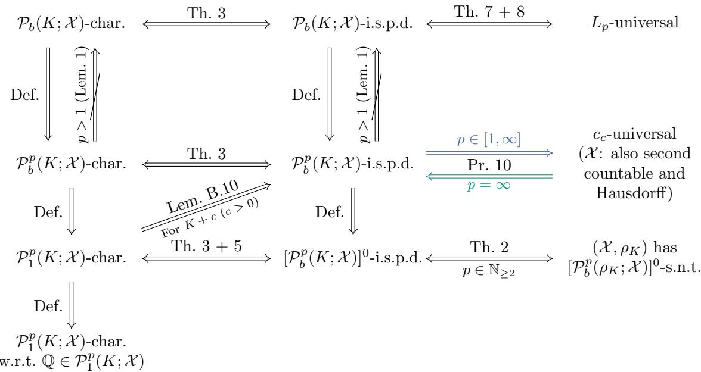
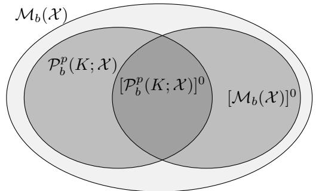
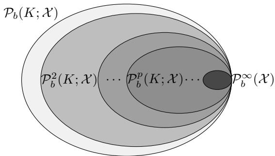
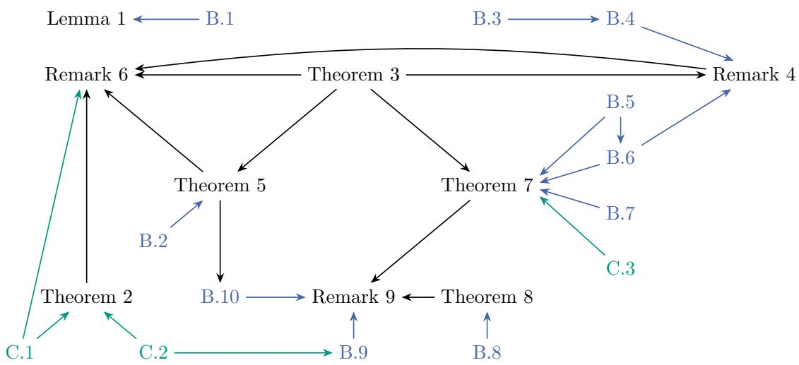

# Unbounded Characteristic and Universal Kernels

Jose Cribeiro-Ramallo Karlsruhe Institute of Technology

Florian Kalinke Karlsruhe Institute of Technology

Zolt´an Szab´o London School of Economics

## Abstract

Kernel methods are among the most powerful tools in machine learning and statistics, with a large number of successful applications. Their immense success stems from the flexible function class associated to each kernel—its reproducing kernel Hilbert space (RKHS)—which facilitates statistical analysis, as well as from their computational tractability and applicability to many domains. Multiple notions (such as characteristic, $L _ { p } .$ -universal, and integrally strictly positive definite) capture the expressivity of kernels and their RKHSs and play a key role in understanding the statistical properties of kernel methods; these concepts and their relations are well-understood for bounded kernels. Even though unbounded kernels have received significant attention over the past decade (for instance, in the construction of kernel-based discrepancy and dependence measures such as the maximum mean discrepancy, the Hilbert-Schmidt independence criterion, and the kernel Stein discrepancy), surprisingly little is known about the relations of these notions in the unbounded case. In the present paper we tackle this severe bottleneck, establishing their relations under mild assumptions.

## 1 INTRODUCTION

Kernel methods (Steinwart and Christmann, 2008; Saitoh and Sawano, 2016; Paulsen and Raghupathi, 2016) are among the most flexible and powerful tools in machine learning and statistics, demonstrating superior performance in a wide variety of applications. These range from classification and regression with support vector machines (SVMs; Vapnik et al. 1997)

and non-linear principal component analysis (PCA; Sch¨olkopf et al. 1998), to more recent advancements in the representation of probability measures (Berlinet and Thomas-Agnan, 2004) leading to state-of-the-art advancements in non-parametric statistics (Schrab, 2025). The key idea of kernel methods is to map the data into a (possibly infinite-dimensional) feature space, a reproducing kernel Hilbert space (RKHS; Aronszajn 1950); their RKHSs are the source of their flexibility and power, rendering the study of their expressivity fundamentally important.

There exist diferent notions to capture the expressivity of an RKHS, usually involving properties of its associated kernel function (since the RKHS-kernel association is one-to-one). For example, an RKHS that can represent probability measures without any loss of information is said to have a characteristic kernel (Fukumizu et al., 2008; Sriperumbudur et al., 2010), while one capable of approximating functions on diferent function classes (classically the space of continuous bounded functions, or more broadly the p-integrable functions; Steinwart 2001; Carmeli et al. 2010) is said to have a universal kernel. Further, when the kernel is bounded, these properties are known to be related to (i) each other, (ii) integrally strictly positive definite (i.s.p.d.) kernels (Sriperumbudur et al., 2011), and (iii) to semimetric spaces of strong negative type (s.n.t.; Lyons 2013; Sejdinovic et al. 2013b). These notions often help to determine the validity of kernel based information theoretical measures (ITMs), meant as kernel discrepancy and dependence measures.

Indeed, most kernel ITMs rely on the kernel mean embedding (Berlinet and Thomas-Agnan, 2004; Smola et al., 2007), a lossless (under a characteristic kernel) map of Borel probability measures into an RKHS. The RKHS distance between two mean embeddings results in the so-called maximum mean discrepancy (MMD; Gretton et al. 2012), known to be equivalent (Sejdi novic et al., 2013b) to energy distance (Baringhaus and Franz, 2004; Sz´ekely and Rizzo, 2004, 2005)—also known as N-distance (Zinger et al., 1992; Klebanov, 2005). When the kernel is bounded, MMD is a metric on the space of Borel probability measures provided that the kernel is characteristic, and it further metrizes the weak convergence of probability measures when the kernel is universal to an appropriate function class (Simon-Gabriel et al., 2023, Theorem 9). If MMD is applied to a product space—with a product kernel— one gets the Hilbert-Schmidt independence criterion (HSIC). HSIC was originally designed for $M = 2$ components (Gretton et al., 2005a,b), and later extended to $M \geq 2$ (Quadrianto et al., 2009; Sejdinovic et al., 2013a; Pfister et al., 2018). When the product kernel is bounded, HSIC is a valid independence measure for $M = 2$ if the kernel components are all characteristic (Lyons, 2013); requiring universality sufices for $M > 2$ (Szab´o and Sriperumbudur, 2018).

Recently, new kernel-based ITMs requiring unbounded kernels have grown in popularity. In particular, when applying MMD to a target and a sampling distribution, and selecting the kernel such that the mean embedding of the target vanishes (via a Stein operator; Stein 1972; Chen 2021; Anastasiou et al. 2023), one obtains the kernel Stein discrepancy (KSD; Chwialkowski et al. 2016; Liu et al. 2016); the kernel employed in the KSD (known as the Stein kernel) is practically never bounded (Kalinke et al. 2025, Example 1; Hagrass et al. 2026, Remark 4). To guarantee that KSD is a valid goodness-of-fit measure, the mean embedding of the target $\mathbb { P } _ { 0 }$ has to be diferent than the mean embedding of any other probability measure (a weaker condition than regular characteristic-ness known as $\mathbb { P } _ { 0 ^ { - } }$ separating or characteristic with regard to $\mathbb { P } _ { 0 } ;$ Barp et al. 2024; Cribeiro-Ramallo et al. 2026b); suficient conditions for this specific property are known on $\mathbb { R } ^ { d }$ (Chwialkowski et al., 2016; Barp et al., 2024). Recently, Modeste and Dombry (2024) studied suficient conditions for a specific class of unbounded kernels on $\mathbb { R } ^ { d }$ to be characteristic; yet, in general, the relations of the characteristic, universality, i.s.p.d., and s.n.t. properties associated to unbounded kernels on topological domains are open. Our primary focus is to fill in this severe gap.

In particular, we make the following contributions.

(i) Building on existing notions of expressivity of RKHSs (and filling them in where required: Fs.n.t. and $L _ { p } .$ -universality of unbounded kernels), we establish their relations on general domains and for unbounded kernels, summarized in Table 1 and Figure 2.

(ii) Our results imply, for example, that (a) the i.s.p.d. and the characteristic properties are equivalent for sub-groups of finite signed measures [Remark 4(a)], (b) no Stein kernel can be $L _ { p ^ { - } }$ universal for any $p \in [ 1 , \infty )$ [Remark 9(b)] and (c) the exponential kernel is $L _ { p }$ -universal for all $p \in [ 1 , \infty )$ in $\mathbb { R } ^ { d }$ [Remark $9 ( \mathrm { c } ) ]$

(iii) Carmeli et al. (2010, Corollary 4) showed the equivalence among $L _ { p } .$ -universality for all values of $p \in \mathsf { \Gamma } [ 1 , \infty )$ for c0-kernels on locally compact second-countable spaces. A surprising phenomenon revealed by our results is that this behavior persists even when the kernel is unbounded (under mild conditions).

For performing the analysis, we introduce and study a union of sets of finite signed measures that are absolutely continuous w.r.t. kernel-dependent sets of p-integrable measures, in turn satisfying $1 - 1 / p -$ integrability conditions.

The paper is structured as follows. Section 2 introduces the notations and definitions used through the paper, followed by our results in Section 3, with proofs in the supplement (we locate each proof in the respective statement).

## 2 NOTATIONS

In this section we introduce the following notations: N, $\mathbb { Z } _ { + } , [ d ] , \mathbb { N } _ { \geq d } , \times _ { i = 1 } ^ { d } \mathcal { X } _ { i } , \mathcal { X } ^ { d } , p ^ { \prime } , \langle \cdot , \cdot \rangle , \| \cdot \| _ { 2 } , \mathcal { B } _ { \mathcal { X } } , \overline { { A } } , \mathcal { C } ( \mathcal { X } )$ 2 $\mathcal L _ { p } ( \boldsymbol { \mathcal X } , \nu ) , \quad \| \cdot \| _ { L _ { p } } , L _ { p } ( \boldsymbol { \mathcal X } , \nu ) , \langle \cdot , \cdot \rangle _ { E ^ { * } , E } , S ^ { * } , \mathcal M _ { b } ( \boldsymbol { \mathcal X } )$ 2 $\mathcal { M } _ { 1 } ^ { + } ( \mathcal { X } ) , [ \mathcal { F } ] ^ { 0 } , \delta _ { x } , \frac { \mathrm { d } \mathbb { P } } { \mathrm { d } \mathbb { Q } } , \mathbb { F } ^ { + } , \mathbb { F } ^ { - } , [ \mathbb { F } | , \mathbb { E } _ { \mathbb { P } } , K , K ( \cdot , x ) , \mathcal { H } _ { K }$ $\| \cdot \| _ { \mathcal { H } _ { K } } , \mathcal { P } _ { b } ^ { p } ( K ; \mathcal { X } ) , \mathsf { \tilde { \mathcal { P } } } _ { 1 } ^ { p } ( K ; \mathcal { X } ) , \mathcal { P } _ { b } ( K ; \mathcal { X } ) , \mathcal { P } _ { 1 } ( K ; \mathcal { X } )$ $\mu _ { K } ( \cdot ) , \mathrm { i d } , S _ { K } , \mathrm { A b s } _ { p ^ { \prime } } ( \mathbb { P } ) , \mathcal { A } ^ { p } ( K ; \mathcal { X } ) , \mathcal { A } ( K ; \mathcal { X } ) , \rho ,$ $\mathcal { P } _ { b } ^ { p } ( \rho ; \mathcal { X } ) , \mathcal { P } _ { 1 } ^ { p } ( \rho ; \mathcal { X } ) , \mathcal { P } _ { b } ( \rho ; \mathcal { X } ) , \mathcal { P } _ { 1 } ( \rho ; \mathcal { X } ) , \rho _ { K } , K _ { \rho } , \phi , \beta _ { \phi } .$ Along the way, we also define the notions of (in order of definition) F-characteristic, F-i.s.p.d., $L _ { p } .$ -universality of unbounded kernels, and F-s.n.t.; their specialization to classical notions is summarized in Figure 1 for the convenience of the reader.

General: Let $\mathbb { N } ~ = ~ \{ 0 , 1 , 2 , \dots \}$ denote the set of natural numbers. For a positive integer $d \in \mathbb { Z } _ { + } ~ =$ $\{ 1 , 2 , \dots \}$ , let $[ d ] = \{ 1 , 2 , \dots , d \}$ , and $\mathbb { N } _ { \geq d } = \{ d , d +$ $1 , d { + } 2 , \ldots \}$ . For a sequence of sets $( \mathcal { X } _ { i } ) _ { i = 1 } ^ { d } ,$ we denote their Cartesian product by $\times _ { i = 1 } ^ { d } \mathcal { X } _ { i } ;$ when $\mathcal { X } _ { i } = \mathcal { X }$ for all $i \in [ d ]$ , we write $\chi ^ { d }$ . For a $p \in [ 1 , \infty ]$ , its conjugate exponent $p ^ { \prime } \in [ 1 , \infty ]$ is defined as $\begin{array} { r } { \frac { 1 } { p } + \frac { 1 } { p ^ { \prime } } = 1 } \end{array}$ , with the convention $\begin{array} { r } { \frac { 1 } { \infty } : = 0 } \end{array}$ . The inner product of vectors $\begin{array} { r } { \mathbf { a } , \mathbf { b } \in \mathbb { R } ^ { d } \mathrm { ~ i s ~ } \langle \mathbf { a } , \mathbf { b } \rangle = \sum _ { i \in [ d ] } a _ { i } b _ { i } } \end{array}$ ; the Euclidean norm of $\mathbf { a } ~ \in ~ \mathbb { R } ^ { d } ~ \mathrm { i s } ~ \| \mathbf { a } \| _ { 2 } ~ = ~ \sqrt { \langle \mathbf { a } , \mathbf { a } \rangle }$ Throughout the paper, unless stated otherwise, let $( \mathcal { X } , \tau _ { \mathcal { X } } )$ be a topological space endowed with the Borel σ-algebra $B _ { \mathcal { X } } : = B ( \mathcal { X } , \tau _ { \mathcal { X } } )$ . For a set $A \subseteq { \mathcal { X } }$ its closure A is defined as the smallest (meant w.r.t. the containing relation) closed subset of X containing A. A set $A \subseteq { \mathcal { X } }$ is called dense in X if ${ \overline { { A } } } = { \mathcal { X } }$ . The space of continuous real-valued functions on X is denoted by C(X ). For a measure space $( \mathcal { X } , B _ { \mathcal { X } } , \nu )$ with a finite non-negative measure ν and $p \in [ 1 , \infty ) , \mathcal { L } _ { p } ( \boldsymbol { \mathcal { X } } , \nu ) : = \mathcal { L } _ { p } ( \boldsymbol { \mathcal { X } } , \boldsymbol { \mathcal { B } } _ { \boldsymbol { \mathcal { X } } } , \nu )$ is the space of p-integrable real-valued functions on X ; in other words, those measurable functions $f : \mathcal { X } \to \mathbb { R }$ for which

Table 1: Summary of our main results.
<table><tr><td>Statement</td><td>Content</td><td>Constraint</td></tr><tr><td>Theorem 2</td><td> $( \mathcal { X } , \rho _ { K } ) \mathrm { ~ h a s ~ } \mathcal { F } \mathrm { - s . n . t . } \Leftrightarrow K \mathrm { ~ i s ~ } \mathcal { F } \mathrm { - i . s . p . d . }$ </td><td> $\mathcal F \subseteq [ \mathcal P _ { b } ^ { 2 } ( K ; \mathcal X ) ] ^ { 0 }$ </td></tr><tr><td>Theorem 3 K</td><td> $\mathrm { : ~ i s ~ } \mathcal { F } \mathrm { - c h a r a c t e r i s t i c } \Rightarrow K \mathrm { ~ i s ~ } \mathcal { F } \mathrm { - i . s . p . d . }$ </td><td> $0 \in \mathcal { F } \overset { \cdot } { \subseteq } \mathcal { P } _ { b } ( K ; \mathcal { X } )$ </td></tr><tr><td></td><td>Theorem 3 K is F-characteristic ← K is F-i.s.p.d.</td><td> $( { \mathcal { F } } , + ) \subseteq { \mathcal { P } } _ { b } ( K ; { \mathcal { X } } )$  is a group</td></tr><tr><td>Theorem 5 K is</td><td> $\mathcal { P } _ { 1 } ^ { p } ( K ; \mathcal { X } )$  -characteristic  $\Leftrightarrow K$  is  $[ \mathcal { P } _ { b } ^ { p } ( K ; \mathcal { X } ) ] ^ { 0 } .$  -characteristic</td><td> $p \in [ 1 , \infty )$  separable</td></tr><tr><td>Theorem 7 K is Lp-universal</td><td> $\Leftrightarrow K$  is  $\begin{array} { r } { \mathcal { A } ^ { p } ( K ; \mathcal { X } ) \ – \mathrm { i . s . p . d . } } \end{array}$ </td><td> $p \in [ 1 , \infty ) , \mathcal { H } _ { K } \colon$ </td></tr><tr><td>Theorem 8</td><td> $\mathcal { A } ^ { p } ( K ; \mathcal { X } ) = \mathcal { P } _ { b } ( K ; \mathcal { X } )$ </td><td> $p \in [ 1 , \infty )$ </td></tr></table>

F=M+(X), K bounded   
F-char. / characteristic   
(Fukumizu et al., 2008)   
F=M (X), K bounded   
F-i.s.p.d. / i.s.p.d.   
(Sriperumbudur et al., 2010)   
Pp(K;X)=M+(X) Lp-universal   
L -universal   
(Carmeli et al., 2010) (bounded K)   
F=[P2(ρ;X)]0   
F-s.n.t. / s.n.t.   
(Sejdinovic et al., 2013b)   
F=P1(K;X), F=P0 characteristic   
(F, F)-char.   
(Cribeiro-Ramallo et al., 2026b) w.r.t. P0  
Figure 1: Relations between the definitions used with classical notions in the literature. The items are ordered by the year of the introduction of the concepts on the r.h.s.

$$
\Vert f \Vert _ { L _ { p } } : = \Vert f \Vert _ { L _ { p } ( \mathcal { X } , \mathcal { B } _ { \mathcal { X } } , \nu ) } : = \left[ \int _ { \mathcal { X } } | f ( x ) | ^ { p } \mathrm { d } \nu ( x ) \right] ^ { 1 / p } < \infty .
$$

We say that $f , f ^ { \prime } \in \mathcal { L } _ { p } ( \mathcal { X } , \nu )$ are equivalent, written as $f \sim f ^ { \prime } , \mathrm { i f } \parallel f - f ^ { \prime } \parallel _ { L _ { n } } = 0$ , in other words, $f \sim f ^ { \prime }$ if and only if (if) $f ( x ) \stackrel { \cdot } { = } f ^ { \prime } ( x )$ for ν-almost all $x \in \mathcal { X }$ (ν-almost everywhere; ν-a.e.). We define the set

$$
L _ { p } ( \mathcal { X } , \nu ) : = L _ { p } ( \mathcal { X } , \mathcal { B } _ { \mathcal { X } } , \nu ) : = \{ [ f ] _ { \sim } : \ f \in \mathcal { L } _ { p } ( \mathcal { X } , \nu ) \} ,
$$

where $[ f ] _ { \sim } = \{ f ^ { \prime } \in \mathcal { L } _ { p } ( \mathcal { X } , \nu ) : \ f ^ { \prime } \sim f \}$ is the equivalence class of f. Further, for a finite non-negative measure ν the space of (ν-)essentially bounded functions $L _ { \infty } ( \boldsymbol { \mathcal { X } } , \boldsymbol { \nu } ) : = L _ { \infty } ( \boldsymbol { \mathcal { X } } , \boldsymbol { \mathcal { B } } _ { \boldsymbol { \mathcal { X } } } , \boldsymbol { \nu } )$ consists of those measurable functions $f : \mathcal { X } \to \mathbb { R }$ for which

$$
\begin{array} { r l } & { \| f \| _ { L _ { \infty } } : = \| f \| _ { L _ { \infty } ( \mathcal { X } , \mathcal { B } _ { \mathcal { X } } , \nu ) } } \\ & { \qquad : = \operatorname* { i n f } \big \{ a > 0 : \ \nu \big ( \{ x \in \mathcal { X } : | f ( x ) | > a \} \big ) = 0 \big \} } \end{array}
$$

is finite. For $p \in [ 1 , \infty ] , L _ { p } ( \mathcal { X } , \nu )$ enriched with the norm $\left\| [ f ] _ { \sim } \right\| _ { L _ { p } } : = \left\| f \right\| _ { L _ { p } }$ is a Banach space [Steinwart and Christmann 2008, (A.33)]. Consider two Banach spaces E and F. A map $S : E  F$ for which $S ( \alpha x ) = \alpha S x$ and $S ( x + y ) = S x + S y$ holds for all $\alpha \in \mathbb { R }$ and $x , y \in E$ is called a linear operator; when the image of the closed unit ball on E via S is bounded, we call S bounded. The dual spaces $E ^ { * }$ and $F ^ { * }$ are the spaces of bounded linear functionals on E and F, respectively. The evaluation of a dual element $x ^ { * } \in E ^ { * }$ at a point $x \in E$ is written as $\langle x ^ { * } , x \rangle _ { E ^ { * } , E } : = x ^ { * } ( x )$ . Given a bounded linear operator $S : E  F .$ , its adjoint operator $S ^ { * } : F ^ { * } \to E ^ { * }$ is defined as $\langle S ^ { * } y ^ { * } , x \rangle _ { E ^ { * } , E } = \langle y ^ { * } , S x \rangle _ { F ^ { * } , F }$ for all $x \in E$ and $y ^ { \ast } \in F ^ { \ast }$

Probability: The space of finite signed (resp. probability) measures on $( \mathcal { X } , { B _ { \mathcal { X } } } )$ is denoted by $\mathcal { M } _ { b } ( \mathcal { X } )$ [resp. $\mathcal { M } _ { 1 } ^ { + } ( \mathcal { X } ) ]$ . For any $\mathcal { F } \subseteq \mathcal { M } _ { b } ( \mathcal { X } )$ , we denote by $[ \mathcal { F } ] ^ { 0 ^ { \dag } }$ the set of $\mathbb { F } \in { \mathcal { F } }$ for which $\mathbb { F } ( \mathcal { X } ) = 0$ . For a point $x \in \mathcal { X }$ , the Dirac measure $\delta _ { x } \in \mathcal { M } _ { 1 } ^ { + } ( \mathcal { X } )$ is defined as

$$
\delta _ { x } ( A ) = { \left\{ \begin{array} { l l } { 1 } & { { \mathrm { ~ i f ~ } } x \in A , } \\ { 0 } & { { \mathrm { ~ i f ~ } } x \notin A , } \end{array} \right. } \quad { \mathrm { ~ f o r ~ } } A \in B _ { \mathcal { X } } .
$$

For $\mathbb { P } \in \mathcal { M } _ { 1 } ^ { + } ( \mathcal { X } )$ , its support is defined as the smallest closed set whose complement has null P-measure: a closed set $C \in B _ { \mathcal { X } }$ is the support of P if $( \mathrm { i } ) \mathbb { P } ( \mathcal { X } \backslash C ) =$ 0 and (ii) for any closed set $\begin{array} { l l l } { C _ { 1 } } & { \subseteq } & { { \mathcal { X } } } \end{array}$ for which $\mathbb { P } ( \mathcal { X } \setminus C _ { 1 } ) = 0 , C \subseteq C _ { 1 }$ holds.1 Let $\mathbb { P } , \mathbb { Q } \in \mathcal { M } _ { 1 } ^ { + } ( \mathcal { X } )$ 2 and let P be absolutely continuous w.r.t. $\mathbb { Q } \ ( \mathbb { P } \ll \mathbb { Q } )$ we denote the corresponding Radon-Nikodym derivative by $\textstyle { \frac { \mathrm { d } \mathbb { P } } { \mathrm { d } \mathbb { Q } } }$ . Note that the Radon-Nikodym derivative is unique $\mathbb { Q } \mathrm { - a . e . }$ . (Dudley, 2004, Theorem 5.5.4) and can be extended to the case of $\mathbb { P } \in \mathcal { M } _ { b } ( \mathcal { X } )$ and Q being a finite non-negative measure (Dudley, 2004, Corollary 5.6.2). Denote by $\mathbb { F } ^ { + }$ and $\mathbb { F } ^ { - }$ the non-negative measures of the Jordan decomposition of $\mathbb { F } \in \mathcal { M } _ { b } ( \mathcal { X } )$ and let $\| \nabla \| = \mathbb { F } ^ { + } + \mathbb { F } ^ { - }$ denote the total variation of F.

Let H be a Hilbert space. The Bochner integral of a measurable function $f : \mathcal { X } \to \mathcal { H }$ w.r.t. $\mathbb { F } \in \mathcal { M } _ { b } ( \mathcal { X } )$ is defined as

$$
\int _ { \mathcal { X } } f ( x ) \mathrm { d } \mathbb { F } ( x ) = \int _ { \mathcal { X } } f ( x ) \mathrm { d } \mathbb { F } ^ { + } ( x ) - \int _ { \mathcal { X } } f ( x ) \mathrm { d } \mathbb { F } ^ { - } ( x ) ;
$$

it exists if $\begin{array} { r } { \int _ { \mathcal { X } } \| f ( x ) \| _ { \mathcal { X } } \mathrm { d } | \mathbb { F } | ( x ) < \infty } \end{array}$ (Diestel and Uhl, 1977, Chapter II.2, Theorem $2 )$ . Let $X \sim$ $\mathbb { P } \in \mathcal { M } _ { 1 } ^ { + } ( \mathcal { H } )$ . The expectation of X is $\begin{array} { r l } { \mathbb { E } _ { \mathbb { P } } [ X ] } & { { } = } \end{array}$ $\textstyle \int _ { \mathcal { H } } { x } \mathrm { d } \mathbb { P } ( { x } )$ ; the integral is meant in Bochner’s sense.

Reproducing kernel Hilbert space: A function $K : \mathcal { X } ^ { 2 }  \mathbb { R }$ is called a kernel if there exists a Hilbert space H and a feature map $\Phi : \mathcal { X }  \mathcal { H }$ such that $K ( x , x ^ { \prime } ) = \langle \Phi ( x ) , \Phi ( x ^ { \prime } ) \rangle _ { \mathcal { H } }$ for all $x , x ^ { \prime } \in { \mathcal { X } }$ . A Hilbert space $\mathcal { H } _ { K }$ of $\mathcal { X } $ R functions is called reproducing kernel Hilbert space (RKHS) associated to a kernel $K : \mathcal { X } ^ { 2 } \to \mathbb { R } \mathrm { ~ i f ~ } K ( \cdot , x ) \in \dot { \mathcal { H } _ { K } }$ and $\langle K ( \cdot , x ) , f \rangle _ { \mathcal { H } _ { K } } =$ $f ( x )$ for all $x \in \mathcal { X }$ and $f \in \mathcal { H } _ { K }$ , where the latter rela tion is referred to as the reproducing property; $K ( \cdot , x )$ denotes the function $x ^ { \prime } \mapsto K ( x ^ { \prime } , x ) \ ( x \in \mathcal { X } )$ and it is called the canonical feature map (of $K ) ; K$ is called the reproducing kernel of $\mathcal { H } _ { K }$ . A kernel is equivalent to a reproducing kernel, and the correspondence of kernels and RKHSs is one-to-one. The norm in $\mathcal { H } _ { K }$ is denoted by $\| f \| _ { \mathcal { H } _ { K } } = \sqrt { \langle f , f \rangle _ { \mathcal { H } _ { K } } \mathrm { ~ } ( f \in \mathcal { H } _ { K } ) }$ . We assume that all kernels in this manuscript are Borel-measurable. Let $K : \mathcal { X } ^ { 2 } $ R be a kernel. For $p \in [ 1 , \infty )$ , let the set of finite signed measures with finite p-th moments $\operatorname { w . r . t . } K ( \cdot , x )$ be

$$
\begin{array} { l } { \mathcal { P } _ { b } ^ { p } ( K ; \mathcal { X } ) = } \\ { = \Bigg \{ \mathbb { F } \in \mathcal { M } _ { b } ( \mathcal { X } ) : \int _ { \mathcal { X } } \overbrace { \| K ( \cdot , x ) \| _ { \mathcal { H } _ { K } } ^ { p } } ^ { = K ^ { \frac { p } { 2 } } ( x , x ) } \mathrm { d } | \mathbb { F } | ( x ) < \infty \Bigg \} , } \end{array}
$$

and the subset of probability measures $\mathcal { P } _ { 1 } ^ { p } ( K ; \mathcal { X } ) =$ $\mathcal { P } _ { b } ^ { p } ( K ; \mathcal { X } ) \cap \mathcal { M } _ { 1 } ^ { + } ( \mathcal { X } ) ;$ ; we omit the exponent for both sets when $p = 1$ . Note that ${ \mathrm { ( i ) ~ } } \mathbb { F } \in { \mathcal { P } } _ { h } ^ { p } ( K ; \mathcal { X } ) \ \Longrightarrow$ $| \mathbb { F } | \in \mathcal { P } _ { b } ^ { p } ( K ; \mathcal { X } )$ [as $\mathbb { F } \in \mathcal { M } _ { b } ( \mathcal { X } ) \implies | \mathbb { F } | \in \mathcal { M } _ { b } ( \mathcal { X } ) ]$ and (ii) $\mathcal { P } _ { b } ^ { q } ( K ; \mathcal { X } ) \subseteq \mathcal { P } _ { b } ^ { p } ( K ; \mathcal { X } )$ for any $q \ \geq \ p \ \geq \ 1$ as the |F|-integrability of $\| K ( \cdot , x ) \| _ { \mathcal { H } _ { K } } ^ { q }$ implies the |F|- integrability of $\| K ( \cdot , x ) \| _ { \mathcal { H } _ { K } } ^ { p }$ when F is finite. The mean embedding w.r.t. K is defined as

$$
\mu _ { K } : { \mathcal { P } } _ { b } ( K ; { \mathcal { X } } ) \to { \mathcal { H } } _ { K } , \quad \mathbb { F } \mapsto \int _ { { \mathcal { X } } } K ( \cdot , x ) \mathrm { d } \mathbb { F } ( x ) .
$$

We say that K is integrally strictly positive definite $\mathrm { ( i . s . p . d . ) }$ to $\mathcal { F } \subseteq \mathcal { P } _ { b } ( K ; \mathcal { X } )$ (or simply, ${ \mathcal { F } } { \mathrm { - i . s . p . d . } } )$ (Szab´o and Sriperumbudur 2018, Definition 1; Simon-Gabriel and Sch¨olkopf 2018, Definition $5 ;$ Steinwart and Ziegel 2021, Definition 2.1) if

$$
\| \mu _ { K } ( \mathbb { F } ) \| _ { \mathcal { H } _ { K } } ^ { 2 } = \int _ { \mathcal { X } } \int _ { \mathcal { X } } K ( x , x ^ { \prime } ) \mathrm { d } \mathbb { F } ( x ) \mathrm { d } \mathbb { F } ( x ^ { \prime } ) > 0 ,\tag{1}
$$

for any $\mathbb { F } \in { \mathcal { F } } \setminus \{ 0 \}$ . K is called characteristic to $\mathcal { F } \subseteq \mathcal { P } _ { b } ( K ; \mathcal { X } )$ (or simply F-characteristic) (Sejdinovic et al. 2013b, page 2270; Simon-Gabriel and Sch¨olkopf 2018, Definition 5) if $\mu _ { K }$ is injective on ${ \mathcal { F } } ,$ in other words when $\mu _ { K } ( \mathbb { F } ) = \mu _ { K } ( \mathbb { F } ^ { \prime } )$ if $\mathbb { F } = \mathbb { F } ^ { \prime }$ for all $\mathbb { F } , \mathbb { F } ^ { \prime } \in$ $\mathcal { F } . ^ { 2 } ~ K$ is referred to as characteristic to $\mathcal { F } \subseteq \mathcal { P } _ { b } ( K ; \mathcal { X } )$ w.r.t. F [or simply $( \mathcal { F } , \mathbb { F } )$ -characteristic; Barp et al. 2024, page 7] when $\mu _ { K } ( \mathbb { F } ) = \mu _ { K } ( \mathbb { F } ^ { \prime } )$ if $\mathbb { F } = \mathbb { F } ^ { \prime }$ for any $\mathbb { F } ^ { \prime } \in \ \mathcal { F } . ^ { 3 }$ For a $p ~ \in ~ [ 1 , \infty ) , \ \operatorname { \mathbb { P } } ~ \in ~ \mathcal { P } _ { 1 } ^ { p } ( K ; \mathcal { X } )$ and $\mathcal { H } _ { K }$ separable4, consider the inclusion operator $\mathrm { i d } : \mathcal { H } _ { K } \to L _ { p } ( \mathcal { X } , \mathbb { P } ) , h \mapsto [ h ] _ { \sim }$ . It is known (Steinwart and Christmann, 2008, Theorem 4.26) that id is continuous and $\begin{array} { r } { \| \mathrm { i d } \| \le \left[ \int _ { \mathcal { X } } K ^ { p / 2 } ( x , x ) \mathrm { d } \mathbb { P } ( x ) \right] ^ { 1 / p } } \end{array}$ , where the norm on the l.h.s. is the operator norm. Furthermore, the adjoint of this inclusion is the operator $S _ { K } : L _ { p ^ { \prime } } ( \mathcal { X } , \mathbb { P } )  \mathcal { H } _ { K }$ defined as

$$
( S _ { K } g ) ( x ) = \int _ { \mathcal { X } } K ( x , y ) g ( y ) \mathrm { d } \mathbb { P } ( y ) ,
$$

where $g \in L _ { p ^ { \prime } } ( \mathcal { X } , \mathbb { P } )$ and $x \in \mathcal { X }$ . We say that the kernel K is Lp-universal if $\mathcal { H } _ { K }$ is dense in $L _ { p } ( \mathcal { X } , \mathbb { P } )$ for all $\mathbb { P } \in \mathcal { P } _ { 1 } ^ { p } \dot { ( K ; \mathcal { X } ) } . ^ { 5 }$ For $p \in [ 1 , \infty )$ and $\mathbb { P } \in \overset { \cdot } { \mathcal { P } _ { 1 } ^ { p } } ( K ; \mathcal { X } )$ ， we denote the set of finite signed measures absolutely continuous w.r.t. $\mathbb { P }$ and with $L _ { p ^ { \prime } }$ -integrable Radon-Nikodym derivative as

$$
\mathrm { A b s } _ { p ^ { \prime } } ( \mathbb { P } ) = \left\{ \mathbb { F } \in \mathcal { M } _ { b } ( \mathcal { X } ) : \mathbb { F } \ll \mathbb { P } , \frac { \mathrm { d } \mathbb { F } } { \mathrm { d } \mathbb { P } } \in L _ { p ^ { \prime } } ( \mathcal { X } , \mathbb { P } ) \right\} ;
$$

the union of all $\mathrm { A b s } _ { p ^ { \prime } } ( \mathbb { P } )$ with $\mathbb { P } \in \mathcal { P } _ { 1 } ^ { p } ( K ; \mathcal { X } )$ is denoted as

$$
\begin{array} { r } { \mathcal A ^ { p } ( K ; \mathcal X ) = \cup _ { \mathbb P \in \mathcal P _ { 1 } ^ { p } ( K ; \mathcal X ) } \mathrm { A b s } _ { p ^ { \prime } } ( \mathbb P ) ; } \end{array}
$$

we omit the exponent when $p = 1$

(Semi)-metric space: Let X be a non-empty set and let $\rho : \mathcal { X } ^ { 2 }  [ 0 , \infty )$ be a map such that (i) $\rho ( x , y ) = 0$ if $x \ : = \ : y$ and (ii) $\rho ( x , y ) = \rho ( y , x )$ for all $x , y \in { \mathcal { X } }$ Then, $( \mathcal { X } , \rho )$ is said to be a semimetric space and ρ is called a semimetric on X. If $\rho$ further fulfills (iii) $\rho ( x , y ) \le \rho ( x , z ) + \rho ( z , y )$ for all $x , y , z \in { \mathcal { X } } ,$ , we call $( \mathcal { X } , \rho )$ a metric space and ρ a metric on X. Unless otherwise specified, throughout the manuscript, $( \mathcal { X } , \rho )$ stands for a semimetric space. Let $p \in [ 1 , \infty )$ , and define $\mathcal { P } _ { b } ^ { p } ( \boldsymbol { \rho } ; \mathcal { X } ) = \{ \mathbb { F } \in \mathcal { M } _ { b } ( \mathcal { X } ) \ :$ there exists $x _ { 0 } ~ \in$ X s.t. $\begin{array} { r } { \int _ { \mathcal { X } } \rho ^ { p / 2 } ( x , x _ { 0 } ) ~ \mathrm { d } \vert \mathbb { F } \vert ( x ) < \infty \} ^ { 6 } } \end{array}$ and $\mathcal { P } _ { 1 } ^ { p } ( \rho ; \mathcal { X } ) =$ $\mathcal { P } _ { b } ^ { p } ( \rho ; \mathcal { X } ) \mathrm { \ddot { \cap } } \mathcal { M } _ { 1 } ^ { + } ( \mathcal { X } )$ ; we omit the exponent when $p = 1$ We say that $( \mathcal { X } , \rho )$ has negative type (n.t.) if for all $n \in \mathbb { Z } _ { + }$ such that $n \geq 2 , \{ x _ { i } \} _ { i = 1 } ^ { n } \subseteq \mathcal { X } .$ and $\{ \alpha _ { i } \} _ { i = 1 } ^ { n } \subset$ R s.t. $\textstyle \sum _ { i = 1 } ^ { n } \alpha _ { i } = 0 $ , we have $\begin{array} { r } { \sum _ { i , j \in [ n ] } \alpha _ { i } \alpha _ { j } \rho ( x _ { i } , x _ { j } ) \le } \end{array}$ 0. Further, we say that $( \mathcal { X } , \rho )$ has strong negative type (s.n.t.) to $\mathcal { F } \subseteq \mathcal { P } _ { b } ^ { 2 } ( \rho ; \mathcal { X } )$ (or simply F-s.n.t.) if $( \mathcal { X } , \rho )$ has n.t. and

$$
\int _ { \mathcal { X } } \int _ { \mathcal { X } } \rho ( x , y ) \ \mathrm { d } \mathbb { F } ( x ) \mathrm { d } \mathbb { F } ( y ) < 0 ,\tag{2}
$$

for all $\mathbb { F } \in \mathcal { F } \setminus \{ 0 \} . ^ { 7 }$ We say that $\rho$ has been induced by a kernel $K : \mathcal { X } ^ { 2 } $ R if for all $x , y \in { \mathcal { X } } ,$ , one has

$$
\rho ( x , y ) = K ( x , x ) + K ( y , y ) - 2 K ( x , y )
$$

(Sejdinovic et al., 2013b, Corollary 16); in this case we write $\rho _ { K } : = \rho . ^ { 8 }$ Further, we say that a kernel $K : \mathcal { X } ^ { 2 }  \overline { { { \ O } } }  \overline { { { \ O } } }$ R is induced by the semimetric ρ of negative type (Sejdinovic et al., 2013b, Definition 13) if there exists some $x _ { 0 } \in \mathcal { X }$ such that for all $x , x ^ { \prime } \in { \mathcal { X } }$ , one has

$$
K ( x , x ^ { \prime } ) = { \frac { 1 } { 2 } } [ \rho ( x , x _ { 0 } ) + \rho ( x ^ { \prime } , x _ { 0 } ) - \rho ( x , x ^ { \prime } ) ] ;
$$

in this case we write $K _ { \rho } \ : = \ K$ . Note that for $p \in$ $\mathbb { Z } _ { + }$ one has that $\mathcal { P } _ { b } ^ { p } ( K ; \mathcal { X } ) = \mathcal { P } _ { b } ^ { p } ( \rho ; \mathcal { X } )$ when K has been induced by $\rho ,$ and vice versa (Sejdinovic et al., 2013b, Propositions 14 and 20). If a semimetric space $( \mathcal { X } , \rho )$ has n.t., then $( \mathcal { X } , \rho ^ { 1 / 2 } )$ is a metric space of n.t. (Sejdinovic et al., 2013b, page 2266). Let H be a Hilbert space of functions; we call an injective map $\phi : ( \mathcal { X } , \rho ^ { \bar { 1 } / 2 } ) \to \mathcal { H }$ to be an isometric embedding of $( \mathcal { X } , \rho ^ { 1 / 2 } )$ into H if $\rho ( x , y ) = \| \phi ( x ) - \phi ( y ) \| _ { \mathcal { H } } ^ { 2 }$ for all $x , y \in { \mathcal { X } } ;$ when $( \mathcal { X } , \rho )$ has n.t. such a ϕ always exists (Sejdinovic et al., 2013b, Proposition 3). For any isometric embedding ϕ, consider the map

$$
\beta _ { \phi } : \mathbb { F } \in \mathcal { P } _ { b } ( \rho ; \mathcal { X } ) \mapsto \int _ { \mathcal { X } } \phi ( x ) \mathrm { d } \mathbb { F } ( x ) \in \mathcal { H } ,\tag{3}
$$

where $\beta _ { \phi } ( \mathbb { F } )$ is known as the barycenter of F w.r.t. $\phi . ^ { 9 }$ Note that when K is non-degenerate, the canonical feature map $x \mapsto K ( \cdot , x )$ is an isometric embedding of $( \mathcal { X } , \rho _ { K } ^ { 1 / 2 } )$ into the RKHS $\mathcal { H } _ { K }$ (Sejdinovic et al., 2013b, page 2277).

6Note that $\mathcal { P } _ { b } ^ { q } ( \rho ; \mathcal { X } ) \subseteq \mathcal { P } _ { b } ^ { p } ( \rho ; \mathcal { X } )$ for any $q \geq p ,$ as the |F|-integrability of $\rho ^ { q } ( x , x _ { 0 } )$ for some $x _ { 0 } \in \mathcal { X }$ implies the |F|-integrability of $\rho ^ { p } ( x , x _ { 0 } )$ when F is finite.

7When $\mathcal F = [ \mathcal P _ { b } ^ { 2 } ( \rho ; \mathcal\chi ) ] ^ { 0 }$ we recover the classical notion of s.n.t. space (Sejdinovic et al., 2013b, Definition 28).

$^ 8 \rho _ { K }$ is a valid semimetric if K is non-degenerate, in other words if the map $x \mapsto K ( \cdot , x )$ is injective (Sejdinovic et al., 2013b, Proposition 14); in this case $\rho _ { K }$ is even of negative type (Sejdinovic et al., 2013b, Corollary 16).

9Note that the r.h.s. of (3) always exists for $\begin{array} { r l r } { \mathbb { F } } & { { } \in } & { \mathcal { P } _ { b } ( \rho , \mathcal { X } ) } \end{array}$ Indeed the Bochner integral exists if $\begin{array} { r } { \int _ { \mathcal { X } } \| \dot { \phi ( x ) } \| _ { \mathcal { H } } \dot { \mathrm { d } } | \mathbb { F } | ( x ) ~ < ~ \infty . } \end{array}$ Taking $x _ { 0 } \in \mathcal { X }$ s.t. $\begin{array} { r } { \int _ { \mathcal { X } } \rho ^ { 1 / 2 } ( x , x _ { 0 } ) \mathrm { d } | \mathbb { F } | ( x ) \quad < \quad \infty } \end{array}$ [guaranteed to exist as $\begin{array} { r l r } { \ddot { \mathbb F } } & { { } \in } & { \mathcal { P } _ { b } ( \rho ; \mathcal { X } ) ] } \end{array}$ we have that $\begin{array} { r l } { \int _ { \mathcal { X } } \| \phi ( x ) \| _ { \mathcal { H } } \mathrm { d } | \mathbb { F } | ( x ) } & { { } = } \end{array}$

## 3 RESULTS

This section is dedicated to our results on the interaction of F-characteristic, $\mathcal { F } \mathrm { - i . s . p . d . , \ \mathcal { F } \mathrm { - s . n . t } }$ . properties, and $L _ { p } { \mathrm { - u n i v e r s a l i t y } }$ for general kernels (allowing unbounded ones) and various measure families F; see Figure 3 for a visual summary of the relations with the most relevant F families in this article. Before delving into the details of these results, it is instrumental to discuss how the sets $\mathcal { P } _ { b } ^ { p } ( K ; \mathcal { X } )$ and $\mathcal { P } _ { 1 } ^ { p } ( K ; \mathcal { X } )$ [with $p \in [ 1 , \infty ) ]$ which the previous expressivity concepts heavily rely on—(i) arise naturally when dealing with mean embedding-based ITMs, and (ii) behave fundamentally diferently for bounded and unbounded kernels, making their analysis intricate.

Indeed, the sets $\mathcal { P } _ { 1 } ^ { p } ( K ; \mathcal { X } )$ are the natural domains of kernel statistics: having finite p-th moment is tied to the existence of diferent kernel-based ITMs like MMD, HSIC, and KSD, as we elaborate in the following. We define the maximum mean discrepancy $\mathrm { M M D } _ { K }$ as the mapping

$$
( \mathbb { P } , \mathbb { Q } ) \mapsto \| \mu _ { K } ( \mathbb { P } ) - \mu _ { K } ( \mathbb { Q } ) \| _ { \mathcal { H } _ { K } } .
$$

In order for $\mathrm { M M D } _ { K }$ to be well-defined on $( \mathbb { P } , \mathbb { Q } ) \in$ $\left[ \mathcal { M } _ { 1 } ^ { + } ( \mathcal { X } ) \right] ^ { 2 }$ , the mean embedding of both probability measures must exist, in other words, one needs that $\mathbb { P } , \mathbb { Q } \in \mathcal { P } _ { 1 } ( K ; \mathcal { X } )$

As another example, for $M \geq 2$ , HSIC is defined as the mapping

$$
\begin{array} { r } { \mathbb { P } \mapsto \left\| \mu _ { K } ( \mathbb { P } ) - \mu _ { K } ( \otimes _ { m = 1 } ^ { M } \mathbb { P } | _ { m } ) \right\| _ { \mathcal { H } _ { K } } , } \end{array}
$$

where $\begin{array} { r c l } { \mathbb { P } } & { \in } & { \mathcal { M } _ { 1 } ^ { + } ( \times _ { m = 1 } ^ { M } \mathcal { X } _ { m } ) , \quad \{ \mathbb { P } | _ { m } \} _ { m = 1 } ^ { M } } \end{array}$ are the marginals of $\mathbb { P } , \ \otimes _ { m = 1 } ^ { M } \mathbb { P } | _ { m }$ is the product measure of these marginals, and $\dot { K } = \otimes _ { m = 1 } ^ { M } K _ { m }$ is the product kernel $\begin{array} { r } { [ ( \otimes _ { m = 1 } ^ { M } K _ { m } ) ( x , y ) : = \prod _ { m = 1 } ^ { M } K _ { m } ( x _ { m } , y _ { m } ) ; ~ x ~ = } \end{array}$ $( x _ { m } ) _ { m = 1 } ^ { M } , y = ( y _ { m } ) _ { m = 1 } ^ { M } \in \times _ { m = 1 } ^ { M } \mathcal { X } _ { m } ]$ . Therefore, HSIC is well-defined if $\mathbb { P } , \mathbb { \otimes } _ { m = 1 } ^ { M } \mathbb { P } | _ { m } \ \in \ \mathcal { P } _ { 1 } ( K ; \times _ { m = 1 } ^ { M } \mathcal { X } _ { m } ) ;$ when $M = 2 , \mathbb { P } | _ { 1 } \in \mathcal { P } _ { 1 } ^ { 2 } ( K _ { 1 } ; \mathcal { X } _ { 1 } )$ and $\mathbb { P } | _ { 2 } \in \mathcal { P } _ { 1 } ^ { 2 } ( K _ { 2 } ; \mathcal { X } _ { 2 } )$ is a suficient condition for HSIC to be well-defined (Sejdinovic et al., 2013b, page 2271). A similar higherorder suficient condition can be derived for $M \geq 2$

$$
\begin{array} { r } { \int _ { \mathcal { X } } \| \phi ( x ) + \phi ( x _ { 0 } ) - \phi ( x _ { 0 } ) \| _ { \mathcal { H } } \mathrm { d } | \mathbb { F } | ( x ) } \end{array}\tag{a}
$$

≤

$$
\begin{array} { r } { \int _ { \mathcal { X } } \| \phi ( x ) - \phi ( x _ { 0 } ) \| _ { \mathcal { H } } \mathrm { d } | \mathbb { F } | ( x ) ~ + ~ \int _ { \mathcal { X } } \| \phi ( x _ { 0 } ) \| _ { \mathcal { H } } \mathrm { d } | \mathbb { F } | ( x ) } \end{array}\tag{b}
$$

$\begin{array} { r } { \int _ { \mathcal { X } } \rho ^ { 1 / 2 } ( x , x _ { 0 } ) \mathrm { d } | \mathbb { F } | ( x ) + \| \phi ( x _ { 0 } ) \| _ { \mathcal { H } } \left| \mathbb { F } | ( \mathcal { X } ) \right. \overset { \overset { \mathrm { ~ ( c ) ~ } } { } } { < } \infty . } \end{array}$ where (a) comes from the triangular inequality combined with the monotonicity and linearity of integration, (b) holds as ϕ is an isometric embedding, while (c) is by the choice of x0 and as F (and hence |F|) is a finite measure.

  
Figure 2: Implications of our results for a continuous kernel K on a separable topological space X. Def. indicates that it follows from the definition. Char., Lem., Pr., and Th. stand for characteristic, lemma, proposition, and theorem, respectively.

Indeed, in this case

$$
\begin{array} { r l } & { \displaystyle \int _ { \times \frac { M } { m = 1 } , \chi _ { m } } \| K ( \cdot , x ) \| _ { \mathcal { H } _ { K } } \mathrm { d } \mathbb { P } ( x ) } \\ & { \quad \quad \stackrel { ( \underline { { \mathrm { a } } } ) } { = } \displaystyle \int _ { \times \frac { M } { m = 1 } , \chi _ { m } } \sqrt { K ( x , x ) } \mathrm { d } \mathbb { P } ( x ) } \\ & { \displaystyle \stackrel { ( \underline { { \mathrm { b } } } ) } { = } \displaystyle \int _ { \times \frac { M } { m = 1 } , \chi _ { m } } \prod _ { m = 1 } ^ { M } K \frac { 1 } { m } ( x _ { m } , x _ { m } ) \mathrm { d } \mathbb { P } ( x ) } \\ & { \displaystyle \stackrel { ( \underline { { \mathrm { c } } } ) } { \leq } \displaystyle \prod _ { m = 1 } ^ { M } \left[ \int _ { \chi _ { m } } K \frac { \mathcal { M } } { m } ( x _ { m } , x _ { m } ) \mathrm { d } \mathbb { P } | _ { m } ( x _ { m } ) \right] ^ { 1 / M } , } \end{array}\tag{4}
$$

where (a) follows from the fact that in a Hilbert space the norm is induced by its inner product and the reproducing property, (b) comes from the definition of product kernel and (c) holds by the generalized H¨older’s inequality (recalled in Lemma C.4, taking $r \gets 1$ and $p _ { m } \gets M$ for all $m \in [ M ] )$ . Therefore, $\mathbb { P } | _ { m } \in \mathcal { P } _ { 1 } ^ { M } ( K _ { m } ; \mathcal { X } _ { m } ) \subseteq \mathcal { P } _ { 1 } ( K _ { m } ; \mathcal { X } _ { m } )$ for all $m \in [ M ]$ implies that ${ \otimes _ { m = 1 } ^ { M } \mathbb { P } | _ { m } \in \mathcal { P } _ { 1 } ( K ; \times _ { m = 1 } ^ { M } \mathcal { X } _ { m } ) }$ , and hence (4) shows that $\mathbb { P } \in \mathcal { P } _ { 1 } ( K ; \mathcal { X } )$

As the last example, we consider a kernel $K _ { \mathbb { P } _ { 0 } }$ such that $\mathbb { E } _ { \mathbb { P } _ { 0 } } \big [ K _ { \mathbb { P } _ { 0 } } ( \cdot , X ) \big ] = 0$ $\mathrm { K S D } _ { K _ { \mathbb { P } _ { 0 } } }$ is defined as the mapping

$$
\mathbb { P } \mapsto \left. \mu _ { K _ { \mathbb { P } _ { 0 } } } ( \mathbb { P } ) \right. _ { \mathcal { H } _ { K _ { \mathbb { P } _ { 0 } } } } ,
$$

where $\mathbb { P } \in \mathcal { M } _ { 1 } ^ { + } ( \mathcal { X } )$ , and as before, it is well-defined as long as $\mu _ { K _ { \mathbb { P } _ { 0 } } } ( \mathbb { P } )$ exists, in other words, if $\mathbb { P } \in$ $\mathcal { P } _ { 1 } ( K _ { \mathbb { P } _ { 0 } } ; \mathcal { X } )$ . Imposing instead the stricter condition of $\mathbb { P } \in \mathcal { P } _ { 1 } ^ { 2 } ( K _ { \mathbb { P } _ { 0 } } ; \mathcal { X } )$ allows, for example, to obtain sharper minimax lower bounds for U-statistic-based KSD estimators (Gogolashvili, 2026).

Having illustrated the need for understanding the sets $\mathcal { P } _ { 1 } ^ { p } ( K ; \mathcal { X } ) ~ \subsetneq ~ \mathcal { P } _ { b } ^ { p } ( K ; \mathcal { X } ) ~ [ p ~ \in ~ [ 1 , \infty ) ]$ , our first result [summarized in Figure 3(b)] sheds light on a sharp contrast in the behavior of bounded and unbounded kernels: for bounded kernels the mapping $p \mapsto \mathcal { P } _ { b } ^ { p } ( K ; \mathcal { X } )$ is constant, while for unbounded kernels it is strictly non-increasing w.r.t. set inclusion, in other words $\mathcal P _ { b } ^ { q } ( K ; \mathcal X ) \subsetneq \mathcal P _ { b } ^ { p } ( K ; \mathcal X )$ for $q > p .$

Lemma 1 (Relationship between the $\mathcal { P } _ { 1 } ^ { p } ( K ; \mathcal { X } )$ and $\mathcal { P } _ { b } ^ { p } ( K ; \mathcal { X } )$ sets; see Appendix A.1). Let $( \mathcal { X } , \tau _ { \mathcal { X } } )$ be a topological space with a kernel $K : \mathcal { X } ^ { 2 }  \mathbb { R }$ , and $1 \leq$ $p < q < \infty$

i) If K is bounded, then $\mathcal { P } _ { 1 } ^ { q } ( K ; \mathcal { X } ) = \mathcal { P } _ { 1 } ^ { p } ( K ; \mathcal { X } ) =$ $\mathcal { M } _ { 1 } ^ { + } ( \mathcal { X } )$ and $\mathcal { P } _ { b } ^ { q } ( K ; \mathcal { X } ) = \mathcal { P } _ { b } ^ { p } ( K ; \mathcal { X } ) = \mathcal { M } _ { b } ( \mathcal { X } )$

ii) if K is unbounded, then $\mathcal P _ { 1 } ^ { q } ( K ; \mathcal X ) \subsetneq \mathcal P _ { 1 } ^ { p } ( K ; \mathcal X )$ and $\mathcal P _ { b } ^ { q } ( K ; \mathcal X ) \subsetneq \mathcal P _ { b } ^ { p } ( K ; \mathcal X )$

We proceed by presenting our main results on the relations of the F-characteristic, ${ \mathcal { F } } { \mathrm { - i . s . p . d } }$ . and $\mathrm { \mathcal { F }  – s . n . t }$ properties (Section 3.1), and $L _ { p } .$ -universality (Section 3.2), with a summary of the results in Table 1 and an illustration of the key implications in Figure 2.

  
(a) $\mathcal { P } _ { b } ^ { p } ( K ; \mathcal { X } )$ and $[ \mathcal { P } _ { b } ^ { p } ( K ; \mathcal { X } ) ] ^ { 0 }$

  
(b) $\mathcal { P } _ { b } ^ { p } ( K ; \mathcal { X } )$ and $\mathcal { P } _ { b } ^ { q } ( K ; \mathcal { X } )$ , with $q \geq p .$  
Figure 3: Relationships of the diferent sets relevant to our results. The set $\mathcal { P } _ { b } ^ { \infty } ( K ; \mathcal { X } )$ is defined in (6) and discussed afterwards.

## 3.1 Characteristic, I.s.p.d., and S.n.t. Properties

Our first theorem equates a kernel being i.s.p.d. with the induced metric space having s.n.t. to the same set, which we will use later to provide a slight extension of a result by Sejdinovic et al. (2013b) from $\mathcal F = [ \mathcal P _ { b } ^ { 2 } ( K ; \mathcal X ) ] ^ { 0 }$ to any $\mathcal { F } \subseteq [ \mathcal { P } _ { b } ^ { 2 } ( K ; \mathcal { X } ) ] ^ { 0 }$ [see Remark 6(b)].

Theorem 2 (F-s.n.t. vs F-i.s.p.d.; see Appendix A.2). Let $( \mathcal { X } , \rho _ { K } )$ be a semimetric space8 associated to a kernel $K : \mathcal { X } ^ { 2 }  \mathbb { R }$ and $\mathcal F \subseteq [ \mathcal P _ { b } ^ { 2 } ( K ; \mathcal X ) ] ^ { 0 }$ . Then, $( \mathcal { X } , \rho _ { K } )$ has ${ \mathcal { F } } { \mathrm { - } } s . n . t .$ if K is ${ \mathcal { F } } { \cdot } i . s . p . d .$

Our next result clarifies the relationship between a kernel being F-characteristic and F-i.s.p.d. for $\mathcal { F } \subseteq$ $\mathcal { P } _ { b } ^ { p } ( K ; \mathcal { X } )$

Theorem 3 (F-i.s.p.d. vs F-characteristic; see Appendix A.3). Let $( \mathcal { X } , \tau _ { \mathcal { X } } )$ be a topological space, K : $\mathcal { X } ^ { 2 } ~  ~ \mathbb { R }$ a kernel, and ${ \mathcal F } \subseteq { \mathcal P } _ { b } ( K ; \mathcal X )$ such that $( i ) \mathrm { ~ 0 ~ \in ~ \mathcal { F } ~ }$ . Then, K being F-characteristic implies that K is ${ \mathcal { F } } { \cdot } i . s . p . d .$ . If F is closed w.r.t. (ii) negation $( \mathbb { F } ~ \in ~ \mathcal { F } ~ \Longrightarrow ~ - \mathbb { F } ~ \in ~ \mathcal { F } )$ and (iii) addition $( \mathbb { F } _ { 1 } , \mathbb { F } _ { 2 } \in { \mathcal { F } \implies \mathbb { F } _ { 1 } + \mathbb { F } _ { 2 } \in { \mathcal { F } ) } }$ , the converse holds.

We note the following.

## Remark 4.

(a) Group structure of F: F-s satisfying conditions $( i ) - ( i i i )$ in Theorem 3 form subgroups of $( \mathcal { M } _ { b } ( \dot { \mathcal { X } } ) , + )$ ; examples include $\mathcal { P } _ { b } ^ { p } ( K ; \mathcal { X } )$ $[ \mathcal { P } _ { b } ^ { p } ( K ; \mathcal { X } ) ] ^ { 0 }$ , and $\mathrm { A b s } _ { p ^ { \prime } } ( \mathbb { P } )$ (by Corollary B.6).

(b) Relationship to existing results: Theorem 3 generalizes a known result by Simon-Gabriel and Sch¨olkopf (2018, Theorem 6(ii)–(iii)) from F being a Banach space to F being a group with addition.

(c) Suficient condition for s.n.t.: For $p \in$ [2, ∞), a space $( \mathcal { X } , \rho )$ with n.t. has $[ \mathcal { P } _ { b } ^ { p } ( \rho ; \mathcal { X } ) ] ^ { 0 } .$

s.n.t. $i f \ \beta _ { \phi }$ is injective on $\mathcal { P } _ { 1 } ^ { p } ( \rho ; \mathcal { X } )$ (see Lemma $B . 4 ) . ^ { 1 0 }$ For $p = 2$ , one gets back the statement by Lyons (2013, Proposition 3.1).

Our next result shows that for a kernel being characteristic to $\mathcal { P } _ { 1 } ^ { p } ( K ; \mathcal { X } )$ and to $[ \mathcal { P } _ { b } ^ { p } ( K ; \mathcal { X } ) ] ^ { 0 }$ are equivalent. Theorem $\begin{array} { r l r l } { { \mathbf { 5 } } } & { { } } & { ( \mathcal { P } _ { 1 } ^ { p } ( K ; \mathcal { X } ) } \end{array}$ -characteristic vs $[ \mathcal { P } _ { b } ^ { p } ( K ; \mathcal { X } ) ] ^ { 0 } .$ -characteristic; see Appendix $\mathrm { A . 4 } )$ . Let $( \mathcal { X } , \tau _ { \mathcal { X } } )$ be a topological space, $K : \mathcal { X } ^ { 2 }  \mathbb { R }$ a kernel, and $p \in [ 1 , \infty )$ . Then, K is $\mathcal { P } _ { 1 } ^ { p } ( K ; \mathcal { X } )$ -characteristic if K is $[ \mathcal { \bar { P } } _ { b } ^ { p } ( K ; \mathcal { X } ) ] ^ { 0 }$ -characteristic.

We elaborate on this result in the following remark.

(a) Relationship to existing results: Together with Theorem 3 [with the choice $\mathcal { F } = [ \mathcal { P } _ { b } ^ { p } ( K ; \mathcal { X } ) ] ^ { 0 }$ see also Remark $4 ( a ) ] ,$ Theorem 5 shows that a kernel K is $\mathcal { P } _ { 1 } ^ { p } ( K ; \mathcal { X } )$ -characteristic if it is $\begin{array} { r } { [ \mathcal { P } _ { b } ^ { p } ( K ; \mathcal { X } ) ] ^ { 0 }  – i . s . p . d . } \end{array}$ This generalizes a known result by Sriperumbudur et al. (2010, Lemma 8) and Simon-Gabriel and Sch¨olkopf(2018, Theorem $8 ( i ) - ( i i ) )$ from bounded to unbounded kernels with finite p-th moment.

(b) Characteristic kernels induce $s . n . t .$ spaces and vice-versa: Let $p \in \mathbb { N } _ { \geq 2 }$ Note that Theorem 5 with Theorem 2–3 (choosing $\begin{array} { r l } { \mathcal { F } } & { { } = } \end{array}$ $\mathcal { P } _ { b } ^ { p } ( K ; \mathcal { X } ) ] ^ { 0 } )$ and Proposition C.1 imply that K is $\mathcal { P } _ { 1 } ^ { p } ( K ; \mathcal { X } )$ -characteristic if its induced semimetric space has $[ { \mathcal P } _ { b } ^ { p } ( \rho _ { K } ; \mathcal { X } ) ] ^ { 0 } ~ = ~ [ { \mathcal P } _ { b } ^ { p } ( K ; \mathcal { X } ) ] ^ { 0 } .$ s.n.t. In the specific case of $p \ = \ 2$ , this result reduces to that by Sejdinovic et al. (2013b, Proposition 29). Conversely, Theorems 2–3 (with substitutions $\begin{array} { r } { \mathcal { F }  [ \mathcal { P } _ { b } ^ { p } ( \rho ; \mathcal { X } ) ] ^ { 0 } = [ \mathcal { P } _ { b } ^ { p } ( K _ { \rho } ; \mathcal { X } ) ] ^ { 0 } , } \end{array}$

$K \gets K _ { \rho } )$ with Theorem 5 and Proposition C.1 also imply that a $[ \mathcal { P } _ { b } ^ { p } ( \rho ; \mathcal { X } ) ] ^ { 0 } { - s . n . t } .$ space induces a $\mathcal { P } _ { 1 } ^ { p } ( K _ { \rho } ; \mathcal { X } )$ -characteristic kernel.11

(c) Example of a $\mathcal { P } _ { 1 } ^ { 2 } ( K ; \mathcal { X } )$ -characteristic kernel: Any separable Hilbert space H is known to have $[ \mathcal { P } _ { b } ^ { 2 } ( \lVert \cdot _ { 1 } - \cdot _ { 2 } \rVert _ { \mathcal { H } } ; \mathcal { H } ) ] ^ { 0 } - s . n . t .$ (Lyons, 2013, Theorem 3.16), and hence by the last implication in the previous bullet (choosing $p = 2 ) , K _ { \parallel \cdot \parallel _ { \mathcal { H } } }$ is implied to be $\mathcal { P } _ { 1 } ^ { 2 } ( \lVert \cdot _ { 1 } - \cdot _ { 2 } \rVert _ { \mathcal { H } } ; \mathcal { H } ) = \mathcal { P } _ { 1 } ^ { 2 } ( K _ { \lVert \cdot \rVert _ { \mathcal { H } } } ; \tilde { \mathcal { H } } ) .$ characteristic (the equality comes from Proposition C.1 while choosing $p = 2 )$ .

## 3.2 $L _ { p } .$ -universality

Our next theorem relates the $L _ { p } .$ -universality of a kernel K to it being $\mathcal { A } ^ { p } ( K ; \mathcal { X } ) \mathrm { - i . s . \bar { p } . c }$ d.

Theorem 7 (Necessary and suficient conditions for $L _ { p } .$ -universality; see Appendix A.5). Let $( \mathcal { X } , \tau _ { \mathcal { X } } )$ be a topological space, $p \in [ 1 , \infty )$ , and HK a separable $R K H S ^ { \psi }$ on X with kernel $K : \mathcal { X } ^ { 2 }  \mathbb { R }$ . Then, K is Lp-universal if K is $\mathcal { A } ^ { p } ( K ; \mathcal { X } ) - i . s . p . d .$

We comment on this result after showing a surprising phenomenon: $\mathcal { A } ^ { p } ( K ; \mathcal { X } ) = \mathcal { P } _ { b } ( K ; \mathcal { X } )$ under mild conditions, even when K is unbounded, as captured in the following theorem.

Theorem 8 $( \mathcal { A } ^ { p } ( K ; \mathcal { X } )$ equals $\mathcal { P } _ { b } ( K ; \mathcal { X } )$ ; see $\mathrm { A p - }$ pendix A.6). Let $( \mathcal { X } , \tau _ { \mathcal { X } } )$ be a topological space, $\mathcal { H } _ { K }$ an RKHS with kernel $K : \mathcal { X } ^ { 2 }  \mathbb { R }$ , and $p \in [ 1 , \infty )$ Then, $\mathcal { A } ^ { p } ( K ; \mathcal { X } ) = \mathcal { P } _ { b } ( K ; \mathcal { X } )$

With both results stated, we make the following notes.   
Remark 9.

(a) Equivalence of $L _ { p }$ -universality and relationship to existing results: Theorems $\gamma _ { - }$ 8 imply that an $L _ { p }$ -universal kernel is also $L _ { q } .$ universal, for any $p , q \in [ 1 , \infty )$ This surprising result shows that the equivalence among $L _ { p }$ -universalities is not exclusive to real-valued c0-kernels on locally compact second-countable spaces, as implied by Carmeli et al. (2010, Theorem 1).

(b) Example of a non-Lp-universal kernel: An interesting consequence of Theorems 7–8 is that K cannot be Lp-universal if it is not $\mathcal { P } _ { b } ( K ; \mathcal { X } )$ i.s.p.d. In particular, this implies that a Stein kernel $K _ { \mathbb { P } _ { 0 } }$ on X (Hagrass et al., 2026; Cribeiro-Ramallo et al., 2026a), for the target P0, cannot be $L _ { p }$ -universal (for any $\begin{array} { r l r } { p } & { { } \ge } & { 1 ) } \end{array}$ since

$$
\begin{array} { r } { \left\| \mu _ { K _ { \mathbb { P } _ { 0 } } } ( \mathbb { P } _ { 0 } ) \right\| _ { \mathcal { H } _ { K _ { \mathbb { P } _ { 0 } } } } : = 0 \ a n d \ \mathbb { P } _ { 0 } \in \mathcal { P } _ { b } ( K _ { \mathbb { P } _ { 0 } } ; \mathcal { X } ) \setminus \{ 0 \} . } \end{array}
$$

(c) Example of an $L _ { p }$ -universal unbounded kernel: The exponential kernel $K ( \mathbf { x } , \mathbf { y } ) : = e ^ { a \left. \mathbf { x } , \mathbf { y } \right. }$ $( a ~ > ~ 0 )$ on $\mathbb { R } ^ { d } \times \mathbb { R } ^ { d }$ is $\mathcal { P } _ { b } ( K ; \mathbb { R } ^ { d } ) \ – i . s . p . d .$ by Lemma $B . 9 .$ Hence, by combining Theorem $\gamma$ and Theorem 8, it is $L _ { p } .$ -universal for every $p \in$ $[ 1 , \infty )$ . Using that in compact Hausdorf spaces $\dot { c } _ { c } – u n i v e r s a l i t y ^ { 1 2 }$ is equivalent to $L _ { p } { \mathrm { - } } u n i v e r s a l i t y$ (Sriperumbudur et al., 2011, Figure 1.2), this result is known to hold on any compact subset of Rd (Steinwart, 2001, Example 1); our results imply its $L _ { p }$ -universality on the non-compact space $\mathbb { R } ^ { d }$

(d) Class of $L _ { p } .$ -universal unbounded kernels: By Lemma B.10 (taking $p = 1 , \mathcal { X } = \mathbb { R } ^ { d } )$ , if K is $\mathcal { P } _ { 1 } ( K ; \mathbb { R } ^ { d } )$ -characteristic, then the shifted kernel $K _ { c } = K + c \ ( c > 0 )$ is $\mathcal { P } _ { b } ( K _ { c } ; \mathbb { R } ^ { d } ) \ – i . s . p . d . ;$ hence, it is also $L _ { p } .$ -universal by Theorems 7–8. For instance, kernels taking the form

$$
\begin{array} { r l r } {  { K ( \mathbf { x } , \mathbf { y } ) = \int _ { \mathbb { R } ^ { d } } ( 1 - e ^ { i \langle \mathbf { s } , \mathbf { x } \rangle } ) ( 1 - e ^ { - i \langle \mathbf { s } , \mathbf { y } \rangle } ) \mathrm { d } \Lambda ( \mathbf { s } ) } } \\ & { } & { + \mathbf { x } ^ { \top } \Sigma \mathbf { y } , ~ ( } \end{array}\tag{5}
$$

where $i = \sqrt { - 1 }$ , Σ is a positive definite matrix and Λ is a non-negative Borel measure are known (Modeste and Dombry, 2024, Proposition 9) to be $\mathcal { P } _ { 1 } ( K ; \mathbb { R } ^ { d } )$ -characteristic under mild conditions; an example (Modeste and Dombry, 2024, Example 4) of a $\mathcal { P } _ { 1 } ( K ; \mathbb { R } ^ { d } )$ -characteristic kernel of the shape (5) is the fractional Brownian one:

$$
K ( \mathbf { x } , \mathbf { y } ) = \left\| \mathbf { x } \right\| _ { 2 } ^ { \alpha } + \left\| \mathbf { y } \right\| _ { 2 } ^ { \alpha } - \left\| \mathbf { x } - \mathbf { y } \right\| _ { 2 } ^ { \alpha }
$$

with $\alpha ~ \in ~ ( 0 , 2 )$ Hence, the shifted fractional Brownian kernel $K _ { c } ( \mathbf { x } , \mathbf { y } ) = K ( \mathbf { x } , \mathbf { y } ) + c$ (with $c > 0 )$ is $L _ { p }$ -universal for any $p \in [ 1 , \infty )$

Note that the case of $p = \infty$ is not handled by Theorem 7. To this end, we introduce the set

$$
\begin{array} { r l } & { \mathcal { P } _ { b } ^ { \infty } ( \mathcal { X } ) : = \mathcal { P } _ { b } ^ { \infty } ( K ; \mathcal { X } ) } \\ & { \quad : = \{ { \mathbb { F } } \in \mathcal { M } _ { b } ( \mathcal { X } ) : { \mathbb { F } } \mathrm { ~ h a s ~ c o m p a c t ~ s u p p o r t } \} , ( 6 ) } \end{array}
$$

and observe that $\mathcal { P } _ { b } ^ { \infty } ( \mathcal { X } ) \subsetneq \mathcal { P } _ { b } ^ { p } ( K ; \mathcal { X } )$ for any $p \in$ $\lbrack 1 , \infty )$ as long as X is not compact and K is continuous. Then, we have the following implication coming from (Simon-Gabriel and Sch¨olkopf, 2018, Table 1).

Proposition 10 (Equivalence to $c _ { c ^ { - } }$ universality). Let $( \mathcal { X } , \tau _ { \mathcal { X } } )$ be a second-countable Hausdorf space and $\mathcal { H } _ { K }$ an RKHS with a continuous kernel $K : \mathcal { X } ^ { 2 } \ \to \ \mathbb { R }$ Then, K is $\mathcal { P } _ { b } ^ { \infty } ( \mathcal { X } )  – i . s . p .$ d. if K is cc-universal.12

## Acknowledgments

FK is funded by the KiKIT (The Pilot Program for Core-Informatics at the KIT) of the Helmholtz Association.

## References

Andreas Anastasiou, Alessandro Barp, Fran¸cois-Xavier Briol, Bruno Ebner, Robert E. Gaunt, Fatemeh Ghaderinezhad, Jackson Gorham, Arthur Gretton, Christophe Ley, Qiang Liu, Lester Mackey, Chris J. Oates, Gesine Reinert, and Yvik Swan. Stein’s method meets computational statistics: a review of some recent developments. Statistical Science, 38(1):120–139, 2023.

Nachman Aronszajn. Theory of reproducing kernels. Transactions of the American Mathematical Society, 68:337–404, 1950.

Ludwig Baringhaus and C. Franz. On a new multivariate two-sample test. Journal of Multivariate Analysis, 88:190–206, 2004.

Alessandro Barp, Carl-Johann Simon-Gabriel, Mark Girolami, and Lester Mackey. Targeted separation and convergence with kernel discrepancies. Journal of Machine Learning Research, 25(378):1–50, 2024.

Richard F. Bass. Real Analysis for Graduate Students: Measure and Integration Theory. 2024.

Alain Berlinet and Christine Thomas-Agnan. Reproducing Kernel Hilbert Spaces in Probability and Statistics. Kluwer, 2004.

Claudio Carmeli, Ernesto De Vito, Alessandro Toigo, and Veronica Umanit´a. Vector valued reproducing kernel Hilbert spaces and universality. Analysis and Applications, 8:19–61, 2010.

Louis H. Y. Chen. Stein’s method of normal approximation: Some recollections and reflections. Annals of Statistics, 49(4):1850–1863, 2021.

Kacper Chwialkowski, Heiko Strathmann, and Arthur Gretton. A kernel test of goodness of fit. In International Conference on Machine Learning (ICML), pages 2606–2615, 2016.

Jose Cribeiro-Ramallo, Agnideep Aich, Florian Kalinke, Ashit Baran Aich, and Zolt´an Szab´o. The minimax lower bound of kernel Stein discrepancy estimation. In International Conference on Artificial Intelligence and Statistics (AISTATS), pages 901– 909, 2026a.

Jose Cribeiro-Ramallo, Florian Kalinke, and Zolt´an Szab´o. Minimax lower bounds of kernel discrepancy estimation: MMD, HSIC, KSD. Technical report, 2026b. (https://arxiv.org/abs/2607.24235).

Joseph Diestel and John Jerry Uhl. Vector Measures. American Mathematical Society. Providence, 1977.

Richard Dudley. Real Analysis and Probability. Cambridge University Press, 2004.

Gerald B. Folland. Real Analysis – Modern Techniques and Their Applications. John Wiley & Sons, 1999.

Kenji Fukumizu, Arthur Gretton, Xiaohai Sun, and Bernhard Sch¨olkopf. Kernel measures of conditional dependence. In Advances in Neural Information Processing Systems (NeurIPS), pages 498–496, 2008.

Davit Gogolashvili. Minimax estimation of kernel Stein discrepancy: Trace versus Hilbert-Schmidt scales. Technical report, 2026. (https://arxiv. org/abs/2607.03367).

Arthur Gretton, Olivier Bousquet, Alex Smola, and Bernhard Sch¨olkopf. Measuring statistical dependence with Hilbert-Schmidt norms. In Algorithmic Learning Theory (ALT), pages 63–78, 2005a.

Arthur Gretton, Ralf Herbrich, Alexander Smola, Olivier Bousquet, and Bernhard Sch¨olkopf. Kernel methods for measuring independence. Journal of Machine Learning Research, 6(70):2075–2129, 2005b.

Arthur Gretton, Karsten Borgwardt, Malte Rasch, Bernhard Sch¨olkopf, and Alexander Smola. A kernel two-sample test. Journal of Machine Learning Research, 13(25):723–773, 2012.

Omar Hagrass, Bharath Sriperumbudur, and Krishnakumar Balasubramanian. Minimax optimal goodness-of-fit testing with kernel Stein discrepancy. Bernoulli, 32(1):299–324, 2026.

Florian Kalinke, Zolt´an Szab´o, and Bharath K. Sriperumbudur. Nystr¨om kernel Stein discrepancy. In International Conference on Artificial Intelligence and Statistics (AISTATS), pages 388–396, 2025.

Lev Klebanov. N-Distances and Their Applications. Charles University, Prague, 2005.

Piotr A. Kozarzewski. On existence of the support of a Borel measure. Demonstratio Mathematica, 51(1): 76–84, 2018.

Qiang Liu, Jason Lee, and Michael Jordan. A kernelized Stein discrepancy for goodness-of-fit tests. In International Conference on Machine Learning (ICML), pages 276–284, 2016.

Russell Lyons. Distance covariance in metric spaces. The Annals of Probability, 41:3284–3305, 2013.

Thibault Modeste and Cl´ement Dombry. Characterization of translation invariant MMD on Rd and connections with Wasserstein distances. Journal of Machine Learning Research, 25(237):1–39, 2024.

Vern I. Paulsen and Mrinal Raghupathi. An Introduction to the Theory of Reproducing Kernel Hilbert Spaces. Cambridge University Press, 2016.

Niklas Pfister, Peter B¨uhlmann, Bernhard Sch¨olkopf, and Jonas Peters. Kernel-based tests for joint independence. Journal of the Royal Statistical Society Series B: Statistical Methodology, 80(1):5–31, 2018.

Novi Quadrianto, Le Song, and Alex Smola. Kernelized sorting. In Advances in Neural Information Processing Systems (NeurIPS), pages 1289–1296, 2009.

James C. Robinson. An Introduction to Functional Analysis. Cambridge University Press, 2020.

Walter Rudin. Real and complex analysis. McGraw-Hill Book Co., New York, 3rd edition, 1987.

Saburou Saitoh and Yoshihiro Sawano. Theory of Reproducing Kernels and Applications. Springer Singapore, 2016.

Bernhard Sch¨olkopf, Alexander Smola, and Klaus-Robert M¨uller. Nonlinear component analysis as a kernel eigenvalue problem. Neural Computation, 10 (5):1299–1319, 1998.

Antonin Schrab. A practical introduction to kernel discrepancies: MMD, HSIC & KSD. Technical report, 2025. (https://arxiv.org/abs/2503.04820).

Dino Sejdinovic, Arthur Gretton, and Wicher Bergsma. A kernel test for three-variable interactions. In Advances in Neural Information Processing Systems (NeurIPS), pages 1124–1132, 2013a.

Dino Sejdinovic, Bharath Sriperumbudur, Arthur Gretton, and Kenji Fukumizu. Equivalence of distance-based and RKHS-based statistics in hypothesis testing. Annals of Statistics, 41:2263–2291, 2013b.

Carl-Johann Simon-Gabriel and Bernhard Sch¨olkopf. Kernel distribution embeddings: Universal kernels, characteristic kernels and kernel metrics on distributions. Journal of Machine Learning Research, 19 (44):1–29, 2018.

Carl-Johann Simon-Gabriel, Alessandro Barp, Bernhard Sch¨olkopf, and Lester Mackey. Metrizing weak convergence with maximum mean discrepancies. Journal of Machine Learning Research, 24 (184):1–20, 2023.

Alexander Smola, Arthur Gretton, Le Song, and Bernhard Sch¨olkopf. A Hilbert space embedding for distributions. In Algorithmic Learning Theory (ALT), pages 13–31, 2007.

Bharath Sriperumbudur, Arthur Gretton, Kenji Fukumizu, Bernhard Sch¨olkopf, and Gert Lanckriet.

Hilbert space embeddings and metrics on probability measures. Journal of Machine Learning Research, 11:1517–1561, 2010.

Bharath Sriperumbudur, Kenji Fukumizu, and Gert Lanckriet. Universality, characteristic kernels and RKHS embedding of measures. Journal of Machine Learning Research, 12:2389–2410, 2011.

Charles Stein. A bound for the error in the normal ap proximation to the distribution of a sum of dependent random variables. In Berkeley Symposium on Mathematical Statistics and Probability, pages 583– 602, 1972.

Ingo Steinwart. On the influence of the kernel on the consistency of support vector machines. Journal of Machine Learning Research, 6(3):67–93, 2001.

Ingo Steinwart and Andreas Christmann. Support Vector Machines. Springer, 2008.

Ingo Steinwart and Johanna Ziegel. Strictly proper kernel scores and characteristic kernels on compact spaces. Applied and Computational Harmonic Analysis, 51:510–542, 2021.

Zolt´an Szab´o and Bharath K. Sriperumbudur. Characteristic and universal tensor product kernels. Journal of Machine Learning Research, 18(233):1–29, 2018.

G´abor Sz´ekely and Maria Rizzo. Testing for equal distributions in high dimension. InterStat, 5:1249– 1272, 2004.

G´abor Sz´ekely and Maria Rizzo. A new test for multivariate normality. Journal of Multivariate Analysis, 93:58–80, 2005.

Vladimir Vapnik, Steven Golowich, and Alex Smola. Support vector method for function approximation, regression estimation and signal processing. In Advances in Neural Information Processing Systems (NeurIPS), pages 281–287, 1997.

Richard L. Wheeden and Antoni Zygmund. Measure and Integral: An Introduction to Real Analysis. CRC Press, 2015.

Abram A. Zinger, Ashot Kakosyan, and Lev Klebanov. A characterization of distributions by mean values of statistics and certain probabilistic metrics. Journal of Soviet Mathematics, 1992.

# Unbounded Characteristic and Universal Kernels: Supplementary Materials

Table 2: Summary of own and external results in the supplement.
<table><tr><td>Statement</td><td>Type</td><td>Content</td></tr><tr><td>Lemma B.1</td><td>own</td><td>unbounded  $f \geq 0$  admits a P with  $f \in L _ { 1 } ( \mathcal { X } , \mathbb { P } )$  but  $f \not \in L _ { q } ( \mathcal { X } , \mathbb { P } )$  for  $q > 1$ </td></tr><tr><td>Lemma B.2</td><td>own</td><td>a measure in  $[ \mathcal { P } _ { b } ^ { p } ( K ; \mathcal { X } ) ] ^ { 0 }$  has a decomposition in  $\mathcal { P } _ { 1 } ^ { p } ( K ; \mathcal { X } )$ </td></tr><tr><td>Lemma B.3</td><td>own</td><td>a measure in  $[ \mathcal { P } _ { b } ^ { p } ( \rho ; \mathcal { X } ) ] ^ { 0 }$  has a decomposition in  $\mathcal { P } _ { 1 } ^ { p } ( \rho ; \mathcal { X } )$ </td></tr><tr><td>Lemma B.4</td><td>own</td><td>injectivity of the barycenter implies s.n.t.</td></tr><tr><td>Lemma B.5</td><td>own</td><td> $\operatorname { A b s } _ { p } ( \mathbb { P } )$  and  $L _ { p } ( \mathcal { X } , \mathbb { P } )$  are isometrically isomorphic</td></tr><tr><td>Corollary B.6</td><td>own</td><td> $\mathrm { A b s } _ { p ^ { \prime } } ( \mathbb { P } )$  is a group</td></tr><tr><td>Lemma B.7</td><td>own</td><td>a property of the space  $\mathrm { A b s } _ { p ^ { \prime } } ( \mathbb { P } )$  for measures in  $\mathcal { P } _ { 1 } ^ { p } ( K ; \mathcal { X } )$ </td></tr><tr><td>Lemma B.8</td><td>own</td><td> $\mathcal P _ { b } ^ { p } ( K ; \mathcal X ) \subseteq \mathcal A ^ { p } ( K ; \mathcal X )$ </td></tr><tr><td>Lemma B.9</td><td>own</td><td>the exponential kernel is  $\mathcal { P } _ { b } ( K ; \mathbb { R } ^ { d } ) \mathrm { - i . s . p . d }$ </td></tr><tr><td>Lemma B.10</td><td>own</td><td>shifted  $\mathcal { P } _ { 1 } ^ { p } ( K ; \mathcal { X } )$  -characteristic kernels are  $\mathcal { P } _ { b } ^ { p } ( K ; \mathcal { X } ) \mathrm { - i . s . p . d . }$ </td></tr><tr><td>Proposition C.1</td><td>external</td><td>integrability of kernels and semimetrics</td></tr><tr><td>Theorem C.2</td><td>external</td><td>Fubini-Tonelli</td></tr><tr><td>Theorem C.3</td><td>external</td><td>properties of  $S _ { K }$ </td></tr><tr><td>Lemma C.4</td><td>external</td><td>a generalized Hölder&#x27;s inequality</td></tr></table>

  
Figure 4: Summary of the dependencies of our results and remarks. $R _ { 1 }  R _ { 2 }$ means that “result $R _ { 1 }$ depends on $R _ { 2 } { } ^ { \dag \mathparagraph }$ . Results and remarks from the main text are written in black, our auxiliary results are in blue, and external results are indicated by green.

For the readers’ convenience, a summary of the results in the supplement (both own and external) is provided in Table 2, the relations of all the results (both in the main and in the supplement) are visualized in Figure 4.

## A PROOFS

This section is dedicated to the proofs of our statements in the main text. The proof of Lemma 1 is in $\mathrm { A p - }$ pendix A.1, that of Theorem 2 is in Appendix A.2, and that of Theorem 3 is in Appendix A.3. Theorem 5 is proved in Appendix A.4, Theorem 7 is shown in Appendix A.5, and the proof of Theorem 8 can be found in Appendix A.6.

## A.1 Proof of Lemma 1

We prove the two statements separately.

Part i). As $\mathcal { P } _ { b } ^ { q } ( K ; \mathcal { X } ) \subseteq \mathcal { P } _ { b } ^ { p } ( K ; \mathcal { X } )$ and $\mathcal { P } _ { 1 } ^ { q } ( K ; \mathcal { X } ) \subseteq \mathcal { P } _ { 1 } ^ { p } ( K ; \mathcal { X } )$ for $q \geq p$ (see Section 2), it is suficient to show that $\mathcal { P } _ { b } ^ { p } ( K ; \mathcal { X } ) \subseteq \mathcal { P } _ { b } ^ { q } ( K ; \mathcal { X } )$ and $\mathcal { P } _ { 1 } ^ { p } ( K ; \mathcal { X } ) \subseteq \mathcal { P } _ { 1 } ^ { q } ( K ; \mathcal { \bar { X } } )$ for $q \geq p$ and bounded K. Let $\mathbb { F } \in \mathcal { P } _ { b } ^ { p } ( K ; \mathcal { X } )$ be arbitrary. Then

$$
\begin{array} { r l } & { \displaystyle \int _ { \mathcal { X } } \| K ( \cdot , x ) \| _ { \mathcal { H } _ { K } } ^ { q } \mathrm { d } \mathbb { F } ( x ) \overset { \mathrm { ( a ) } } { \leq } \displaystyle \int _ { \mathcal { X } } \| K ( \cdot , x ) \| _ { \mathcal { H } _ { K } } ^ { q } \mathrm { d } | \mathbb { F } | ( x ) \overset { \mathrm { ( b ) } } { \leq } \displaystyle \int _ { \mathcal { X } } \operatorname* { s u p } _ { x \in \mathcal { X } } \| K ( \cdot , x ) \| _ { \mathcal { H } _ { K } } ^ { q } \mathrm { d } | \mathbb { F } | ( x ) } \\ & { \qquad \overset { \mathrm { ( c ) } } { = } \displaystyle \operatorname* { s u p } _ { x \in \mathcal { X } } \| K ( \cdot , x ) \| _ { \mathcal { H } _ { K } } ^ { q } \left| \mathbb { F } | ( \mathcal { X } ) \right. < \infty , } \end{array}
$$

where (a) follows as the integrand is non-negative, (b) comes from upper bounding the integrand and the monotonicity of integration, (c) is by the linearity of integration, and (d) holds as the assumed boundedness of $K$ and $\mathbb { F } \in \mathcal { M } _ { b } ( \mathcal { X } )$ implies $\begin{array} { r } { \operatorname* { s u p } _ { x \in \mathcal { X } } \| K ( \cdot , x ) \| _ { \mathcal { H } _ { K } } ^ { q } < \infty } \end{array}$ and $| \mathbb { F } | ( \mathcal { X } ) < \infty ,$ respectively. The obtained inequality shows that $\mathbb { F } \in \mathcal { P } _ { b } ^ { q } ( K ; \mathcal { X } )$ , as was to be proved. As $\mathcal { P } _ { 1 } ^ { p } ( K ; \mathcal { X } ) \subseteq \mathcal { P } _ { b } ^ { p } ( K ; \mathcal { X } )$ and F was taken arbitrarily, the result also holds for probability measures. Further, as K is bounded, $\dot { \mathcal { P } } _ { b } ( K ; \mathcal { X } ) = \mathcal { M } _ { b } ( \mathcal { X } )$ and $\mathcal { P } _ { 1 } ( K ; \mathcal { X } ) = \mathcal { M } _ { 1 } ^ { + } ( \mathcal { X } )$ (as the kernel is integrable w.r.t. any finite signed measure).

Part ii). As stated in Section 2, it holds that $\mathcal P _ { b } ^ { q } ( K ; \mathcal X ) \subseteq \mathcal P _ { b } ^ { p } ( K ; \mathcal X )$ and $\mathcal P _ { 1 } ^ { q } ( K ; \mathcal X ) \subseteq \mathcal P _ { 1 } ^ { p } ( K ; \mathcal X )$ for $q \geq p ;$ it remains to show that the inclusion is strict when $K$ is unbounded. Let $r = q / p > 1$ , implying that $p r = q$ . As K is unbounded, $\| K ( \cdot , x ) \| _ { \mathcal { H } _ { K } } ^ { p } : \mathcal { X } \to \mathbb { R } _ { \ge 0 }$ is unbounded. Hence, by Lemma B.1, there exists a probability measure $\mathbb { P } : = \mathbb { P } ( r ) \in \mathcal { M } _ { 1 } ^ { + } ( \mathcal { X } )$ such that

$$
\int _ { \mathcal { X } } \| K ( \cdot , x ) \| _ { \mathcal { H } _ { K } } ^ { p } \mathrm { d } \mathbb { P } ( x ) < \infty , \mathrm { ~ w h i l e ~ }\tag{A.1}
$$

$$
\int _ { \mathcal { X } } \Vert K ( \cdot , x ) \Vert _ { \mathcal { H } _ { K } } ^ { p r } \mathrm { d } \mathbb { P } ( x ) = \int _ { \mathcal { X } } \Vert K ( \cdot , x ) \Vert _ { \mathcal { H } _ { K } } ^ { q } \mathrm { d } \mathbb { P } ( x ) = \infty .\tag{A.2}
$$

Then, $\mathbb { P } \overset { ( \mathrm { A . 1 } ) } { \in } \mathcal { P } _ { 1 } ^ { p } ( K ; \mathcal { X } )$ but $\mathbb { P } \stackrel { \cdot } { \notin } \mathcal { P } _ { 1 } ^ { q } ( K ; \mathcal { X } )$ (A.2) , proving the claim for probability measures. At the same time, as $\mathbb { P } \in \mathcal { P } _ { 1 } ^ { p } ( K ; \mathcal { X } ) = \mathcal { P } _ { b } ^ { p } ( K ; \mathcal { X } ) \cap \mathcal { M } _ { 1 } ^ { + } ( \mathcal { X } )$ and $\mathcal { P } _ { 1 } ^ { q } ( K ; \mathcal { X } ) = \mathcal { P } _ { b } ^ { q } ( K ; \mathcal { X } ) \cap \mathcal { M } _ { 1 } ^ { + } ( \mathcal { X } )$ , we proved the claim for finite signed measures.

## A.2 Proof of Theorem 2

Assume that $( \mathcal { X } , \rho _ { K } )$ has $\mathrm { { \mathcal { F } } \mathrm { { - s . n . t . } } }$ , and let $\mathbb { F } \in { \mathcal { F } } \setminus \{ 0 \}$ . By Proposition C.1 (valid as $p = 2 \in \mathbb { N } ) , \mathcal { P } _ { b } ^ { 2 } ( K ; \mathcal { X } ) =$ $\mathcal { P } _ { b } ^ { 2 } ( \rho _ { K } ; \mathcal { X } )$ ; hence the double integral in (2) is well-defined for F, and

$$
\begin{array} { l l } { \displaystyle 0 > \int _ { \mathcal X } \int _ { \mathcal X } \rho _ { K } ( x , y ) \mathrm { d } \mathbb { F } ( x ) \mathrm { d } \mathbb { F } ( y ) \overset { \mathrm { ( a ) } } { = } \int _ { \mathcal X } \int _ { \mathcal X } K ( x , x ) + K ( y , y ) - 2 K ( x , y ) \mathrm { d } \mathbb { F } ( x ) \mathrm { d } \mathbb { F } ( y ) } \\ { \displaystyle \overset { ( b ) } { = } \int _ { \mathcal X } \int _ { \mathcal X } K ( x , x ) \mathrm { d } \mathbb { F } ( x ) \mathrm { d } \mathbb { F } ( y ) + \int _ { \mathcal X } \int _ { \mathcal X } K ( y , y ) \mathrm { d } \mathbb { F } ( x ) \mathrm { d } \mathbb { F } ( y ) - 2 \int _ { \mathcal X } \int _ { \mathcal X } K ( x , y ) \mathrm { d } \mathbb { F } ( x ) \mathrm { d } \mathbb { F } ( y ) } \\ { \displaystyle \overset { ( c ) } { = } \int _ { \mathcal X } \int _ { \mathcal X } K ( x , x ) \mathrm { d } \mathbb { F } ( y ) \mathrm { d } \mathbb { F } ( x ) + \int _ { \mathcal X } \int _ { \mathcal X } K ( y , y ) \mathrm { d } \mathbb { F } ( x ) \mathrm { d } \mathbb { F } ( y ) - 2 \int _ { \mathcal X } \int _ { \mathcal X } K ( x , y ) \mathrm { d } \mathbb { F } ( x ) \mathrm { d } \mathbb { F } ( y ) } \\ { \displaystyle \overset { ( 4 ) } { = } \underset { = 0 } { \overset { ( . . . . ) } { \overset { ( . . . } { = } } } \int _ { \mathcal X } K ( x , x ) \mathrm { d } \mathbb { F } ( x ) + \underset { = 0 } { \overset { \mathbb { F } } { \underbrace { \mathbb { F } } } } \int _ { \mathcal X } K ( y , y ) \mathrm { d } \mathbb { F } ( y ) - 2 \int _ { \mathcal X } \int _ { \mathcal X } K ( x , y ) \mathrm { d } \mathbb { F } ( x ) \mathrm { d } \mathbb { F } ( y ) } \\  \displaystyle \overset { ( c ) } { = } - 2 \int _ { \mathcal X } \int _ { \mathcal X } K ( x , y ) \mathrm { d } \mathbb { F } ( x  \end{array}\tag{A.3}
$$

where (a) comes from the definition of kernel-induced semimetric, (b) is by the linearity of integration, (c) follows from applying Tonelli’s theorem (recalled in Theorem C.2) to the first addend, and (d) is implied by the homogeneity of the integral. Lastly, (e) comes by the finiteness of both integrals along the diagonal as $\mathbb { F } \in \mathcal { P } _ { b } ^ { 2 } ( K ; \mathcal { X } )$ . This implies that $\begin{array} { r } { \int _ { \mathcal { X } } \int _ { \mathcal { X } } K ( x , y ) \mathrm { d } \mathbb { F } ( x ) \mathrm { d } \mathbb { F } ( y ) > 0 , } \end{array}$ , as was to be shown.

Considering the opposite direction (in other words, assuming that K is $\mathcal { F } \mathrm { - i . s . p . d . } )$ , (i) by the semimetric property of $\rho _ { K }$ , K is non-degenerate which itself implies that $\rho _ { K }$ is of negative $\mathrm { t y p e } , ^ { 8 }$ and (ii) for any $\mathbb { F } \in { \mathcal { F } } \setminus \{ 0 \}$ , $\begin{array} { r } { \int _ { \mathcal { X } } \int _ { \mathcal { X } } K ( x , y ) \mathrm { d } \mathbb { F } ( x ) \mathrm { d } \mathbb { F } ( y ) > 0 } \end{array}$ by the F-i.s.p.d. property of K which yields that $\begin{array} { r } { \int _ { \mathcal { X } } \int _ { \mathcal { X } } \rho _ { K } ( x , y ) \mathrm { d } \mathbb { F } ( x ) \mathrm { d } \mathbb { F } ( y ) < 0 } \end{array}$ by $\mathrm { ( A . 3 ) }$ ; these 2 properties mean that $( \mathcal { X } , \rho _ { K } )$ has $\mathrm { \mathcal { F }  – s . n . t }$ □

## A.3 Proof of Theorem 3

If ${ \mathcal { F } } = \{ 0 \}$ , both implications hold; in the following we assume that $\mathcal { F } \neq \{ \boldsymbol { 0 } \}$

(=⇒) Assume that K is F-characteristic. Then, for all $\mathbb { F } _ { 1 } \neq \mathbb { F } _ { 2 } \in \mathcal { F }$

$$
0 < \| \mu _ { K } ( \mathbb { F } _ { 1 } ) - \mu _ { K } ( \mathbb { F } _ { 2 } ) \| _ { \mathcal { H } _ { K } } \overset { \mathrm { ( a ) } } { = } \| \mu _ { K } ( \mathbb { F } _ { 1 } - \mathbb { F } _ { 2 } ) \| _ { \mathcal { H } _ { K } } ,\tag{A.4}
$$

where (a) holds by the linearity of Bochner integration w.r.t. the measure. For all $\mathbb { F } \in { \mathcal { F } } \setminus \{ 0 \}$ , (A.4) with a substitution $\mathbb { F } _ { 1 }  \mathbb { F } , \mathbb { F } _ { 2 }  0 \in \mathcal { F }$ implies that

$$
0 < \| \mu _ { K } ( \mathbb { F } ) \| _ { \mathcal { H } _ { K } } ^ { 2 } \overset { ( 1 ) } { = } \int _ { \mathcal { X } } \int _ { \mathcal { X } } K ( x , y ) \mathrm { d } \mathbb { F } ( x ) \mathrm { d } \mathbb { F } ( y )
$$

proving that K is F-i.s.p.d.

$( \Leftarrow )$ Assume that K is F-i.s.p.d. and F is closed w.r.t. negation and addition. Let $\mathbb { F } _ { 1 } \neq \mathbb { F } _ { 2 } \in { \mathcal { F } }$ . Then, $\mathbb { F } : = \mathbb { F } _ { 1 } - \mathbb { F } _ { 2 } \in \mathcal { F } \setminus \{ 0 \} \ ( \mathbb { F } \in \mathcal { F }$ is implied by the previous 2 closeness properties of $\mathcal { F } ; \mathbb { F } \neq 0$ holds as $\mathbb { F } _ { 1 } \neq \mathbb { F } _ { 2 } )$ , and

$$
0 \stackrel { ( \mathrm { a } ) } { \ll } \int _ { \mathcal { X } } \int _ { \mathcal { X } } K ( x , y ) \mathrm { d } \mathbb { F } ( x ) \mathrm { d } \mathbb { F } ( y ) \stackrel { ( \mathrm { l } ) } { = } \| \mu _ { K } ( \mathbb { F } ) \| _ { \mathcal { K } _ { K } } ^ { 2 } \stackrel { ( \mathrm { b } ) } { = } \| \mu _ { K } ( \mathbb { F } _ { 1 } ) - \mu _ { K } ( \mathbb { F } _ { 2 } ) \| _ { \mathcal { K } _ { K } } ^ { 2 } \stackrel { ( \mathrm { c } ) } { \longrightarrow } \mu _ { K } ( \mathbb { F } _ { 1 } ) \neq \mu _ { K } ( \mathbb { F } _ { 2 } ) ,
$$

where (a) follows from the ${ \mathcal { F } } { \mathrm { - i . s . p . d . } }$ . property of K (using that $\mathbb { F } \neq 0 )$ , (b) holds by the linearity of the Bochner integration w.r.t. the measure, and (c) comes from the fact that $\| \cdot \| _ { \mathcal { H } _ { K } }$ is a norm. Thus, $\mu _ { K }$ is injective on ${ \mathcal { F } } ,$ , in other words K is F-characteristic. □

## A.4 Proof of Theorem 5

Let $p \in [ 1 , \infty )$ be fixed. We start with an equality used throughout the proof. Indeed, suppose that $\mathbb { F } \in$ $[ \mathcal { P } _ { b } ^ { p } ( K ; \mathcal { \bar { X } } ) ] ^ { 0 } \backslash \{ 0 \}$ and $\mathbb { F } = M ( \mathbb { P } - \mathbb { Q } )$ with distinct $\mathbb { P } , \mathbb { Q } \in \mathcal { P } _ { 1 } ^ { p } ( K ; \mathcal { X } )$ and $M \in ( 0 , \infty )$ (guaranteed by Lemma B.2). Then

$$
\| \mu _ { K } ( \mathbb { F } ) \| _ { \mathcal { H } _ { K } } \overset { \mathrm { ( a ) } } { = } \| M \mu _ { K } ( \mathbb { P } ) - M \mu _ { K } ( \mathbb { Q } ) \| _ { \mathcal { H } _ { K } } \overset { \mathrm { ( b ) } } { = } M \| \mu _ { K } ( \mathbb { P } ) - \mu _ { K } ( \mathbb { Q } ) \| _ { \mathcal { H } _ { K } } ,\tag{A.5}
$$

where (a) comes by the linearity of the Bochner integration w.r.t. the measure, (b) is by the absolute homogeneity of the norm combined with $M > 0$

(=⇒) Let K be $\mathcal { P } _ { 1 } ^ { p } ( K ; \mathcal { X } )$ )-characteristic; our goal is to show that it is $[ \mathcal { P } _ { b } ^ { p } ( K ; \mathcal { X } ) ] ^ { 0 }$ -characteristic, in other words, that for any $\mathbb { F } _ { 1 } \neq \mathbb { F } _ { 2 }$ in $[ \mathcal { P } _ { b } ^ { p } ( K ; \mathcal { X } ) ] ^ { 0 } , \mu _ { K } ( \mathbb { F } _ { 1 } ) \neq \mu _ { K } ( \mathbb { F } _ { 2 } )$ . Taking such $\mathbb { F } _ { 1 } \neq \mathbb { F } _ { 2 }$ , for $\mathbb { F } : = \mathbb { F } _ { 1 } - \mathbb { F } _ { 2 } \in [ \mathcal { P } _ { b } ^ { p } ( K ; \mathcal { X } ) ] ^ { 0 } \backslash \{ 0 \}$ we have that $\| \mu _ { K } ( \mathbb { F } ) \| _ { \mathcal { H } _ { K } } > 0$ by $\left( \mathrm { { A . 5 } } \right)$ , the imposed $\mathcal { P } _ { 1 } ^ { p } ( K ; \mathcal { X } )$ -characteristic property of K, the fact that $\| \cdot \| _ { \mathcal { H } _ { K } }$ is a norm, and $M > 0$ . Noticing that any non-zero $\mathbb { F } \in [ \mathcal { P } _ { b } ^ { p } ( K ; \mathcal { X } ) ] ^ { 0 }$ can be written $\mathrm { a s ^ { 1 3 } \ \mathbb { F } = \mathbb { F } _ { 1 } - \mathbb { F } _ { 2 } }$ (with $\mathbb { F } _ { 1 } \neq \mathbb { F } _ { 2 }$ in $[ \mathcal { P } _ { b } ^ { p } ( K ; \mathcal { X } ) ] ^ { 0 } )$ the obtained property $0 < \| \mu _ { K } ( \mathbb { F } ) \| _ { \mathcal { H } _ { K } } ^ { 2 } \overset { ( 1 ) } { = } \int _ { \mathcal { X } } \int _ { \mathcal { X } } K ( x , x ^ { \prime } ) \mathrm { d } \mathbb { F } ( x ) \mathrm { d } \mathbb { F } ( x ^ { \prime } )$ shows that K is $[ \mathcal { P } _ { b } ^ { p } ( K ; \mathcal { X } ) ] ^ { 0 } \mathrm { - i . s . p . d . }$ , which yields that K is $[ \mathcal { P } _ { b } ^ { p } ( K ; \mathcal { X } ) ] ^ { 0 }$ -characteristic by Theorem 3 [see Remark 4(a)].

(⇐=) Assume that K is $[ \mathcal { P } _ { b } ^ { p } ( K ; \mathcal { X } ) ] ^ { 0 }$ -characteristic; our goal is to prove that K is $\mathcal { P } _ { 1 } ^ { p } ( K ; \mathcal { X } )$ -characteristic, in other words, that for any $\begin{array} { r } { \dot { \mathbb { P } } \neq \mathbb { Q } \in \mathcal { P } _ { 1 } ^ { p } ( K ; \mathcal { X } ) , \mu _ { K } ( \mathbb { P } ) \neq \mu _ { K } ( \mathbb { Q } ) } \end{array}$ . Considering such arbitrary $\mathbb { P } \neq \mathbb { Q }$ , define $\mathbb { F } = \mathbb { P } - \mathbb { Q } \in [ \mathcal { P } _ { b } ^ { p } ( K ; \mathcal { X } ) ] ^ { 0 } \backslash \{ 0 \}$ . The imposed $[ \mathcal { P } _ { b } ^ { p } ( K ; \mathcal { X } ) ] ^ { 0 }$ -characteristic property of K, implies that K is $[ \mathcal { P } _ { b } ^ { p } ( K ; \mathcal { X } ) ] ^ { 0 } \mathrm { - i . s . p . d } .$ by Theorem 3, and hence by $\mathbb { F } \neq 0$ that

$$
0 < \int _ { \mathcal { X } } \int _ { \mathcal { X } } K ( x , x ^ { \prime } ) \mathrm { d } \mathbb { F } ( x ) \mathrm { d } \mathbb { F } ( x ^ { \prime } ) \overset { ( 1 ) } { = } \| \mu _ { K } ( \mathbb { F } ) \| _ { \mathcal { H } _ { K } } ^ { 2 } \overset { ( \mathbf { A } . 5 ) } { = } \| \mu _ { K } ( \mathbb { P } ) - \mu _ { K } ( \mathbb { Q } ) \| _ { \mathcal { H } _ { K } } ^ { 2 } ,
$$

with $M = 1$ in (A.5). Hence, $\mu _ { K } ( \mathbb { P } ) \neq \mu _ { K } ( \mathbb { Q } )$ since $\| \cdot \| _ { \mathcal { H } _ { K } }$ is a norm, implying the injectivity of $\mu _ { K }$ on $\mathcal { P } _ { 1 } ^ { p } ( K ; \mathcal { X } )$ which we wanted to prove. □

## A.5 Proof of Theorem 7

We begin by introducing some pre-requisites. Fix $p \in [ 1 , \infty )$ and $\mathbb { P } \in \mathcal { P } _ { 1 } ^ { p } ( K ; \mathcal { X } ) \subseteq \mathcal { P } _ { 1 } ( K ; \mathcal { X } )$ . Further, consider the map $\mathfrak { q } _ { \mathbb { P } } : L _ { p ^ { \prime } } ( \mathcal { X } , \mathbb { P } ) \to \mathrm { A b s } _ { p ^ { \prime } } ( \mathbb { P } ) , [ f ] _ { \sim } \mapsto \mathbb { F } _ { \mathbb { P } , f }$ as in Lemma B.5, where $\mathbb { F } _ { \mathbb { P } , f }$ is such that $\begin{array} { r } { \frac { \mathrm { d } \mathbb { F } _ { \mathbb { P } , f } } { \mathrm { d } \mathbb { P } } = f } \end{array}$ . Recall from Lemma B.7 that $\mathbb { F } _ { \mathbb { P } , f } \in \mathrm { A b s } _ { p ^ { \prime } } ( \mathbb { P } ) \subseteq \mathcal { P } _ { b } ( K ; \mathcal { X } )$

Lastly, note that the mean embedding $\mu _ { K } , \iota _ { \mathbb { P } }$ , and $S _ { K }$ form the following diagram

$$
\begin{array} { r } { L _ { p ^ { \prime } } ( \mathcal { X } , \mathbb { P } ) \xrightarrow { S _ { K } } \mathcal { H } _ { K } } \\ { \overset { \textstyle \uparrow \mu _ { K } | _ { \mathrm { A b s } _ { p ^ { \prime } } ( \mathbb { P } ) } } { \underset { \mathrm { A b s } _ { p ^ { \prime } } ( \mathbb { P } ) } { \uparrow \mu _ { K } | _ { \mathrm { A b s } _ { p ^ { \prime } } ( \mathbb { P } ) } } } } \end{array}\tag{A.6}
$$

where $\mu _ { K } | _ { \mathrm { A b s } _ { p ^ { \prime } } ( \mathbb { P } ) }$ denotes the restriction of $\mu _ { K }$ to $\mathrm { A b s } _ { p ^ { \prime } } ( \mathbb { P } ) \subseteq { \mathcal { P } } _ { b } ( K ; \mathcal { X } )$ . Our goal is to prove the injectivity of various parts of this diagram. On one hand this will help us to prove the desired denseness (via Theorem C.3), and on the other it will allow us to prove the $\begin{array} { r } { \mathcal { A } ^ { p } ( K ; \mathcal { X } ) \ – \mathrm { i . s . p . d . } } \end{array}$ . property of K (via Theorem 3).

$( \Longrightarrow )$ Recall that by definition $\mathscr { A } ^ { p } ( K ; \mathcal { X } ) = \cup _ { \mathbb { P } \in \mathcal { P } _ { 1 } ^ { p } ( K ; \mathcal { X } ) } \mathrm { A b s } _ { p ^ { \prime } } ( \mathbb { P } )$ , hence it is suficient to prove that K is $\mathrm { A b s } _ { p ^ { \prime } } ( \mathbb { P } ) \mathrm { - i . s . p . d }$ . for any $\mathbb { P } \in \mathcal { P } _ { 1 } ^ { p } ( K ; \mathcal { X } )$ ; this is what we detail next. Indeed, as K is $L _ { p } .$ universal, for any $\mathbb { P } \in \mathcal { P } _ { 1 } ^ { p } ( K ; \mathcal { X } )$ 2

$$
{ \overline { { \mathbb { H } } } } _ { K } = L _ { p } ( { \mathcal { X } } , \mathbb { P } ) \ { \stackrel { \mathrm { ( a ) } } { \longrightarrow } } \ S _ { K } { \mathrm { ~ i s ~ i n j e c t i v e ~ } } \ { \stackrel { \mathrm { ( b ) } } { \longrightarrow } } \ \mu _ { K } | _ { \mathrm { A b s } _ { p ^ { \prime } } ( \mathbb { P } ) } { \mathrm { ~ i s ~ i n j e c t i v e ~ } } \ { \stackrel { \mathrm { ( d e f . ) } } { \longleftrightarrow } } \ \mu _ { K } { \mathrm { ~ i s ~ i n j e c t i v e ~ o n ~ } } \ \mathrm { A b s } _ { p ^ { \prime } } ( \mathbb { P } )
$$

$$
{ \stackrel { \mathrm { ( d e f . ) } } { \longleftrightarrow } } \ K \ { \mathrm { i s ~ A b s } } _ { p ^ { \prime } } ( { \mathbb { P } } ) \mathrm { - c h a r a c t e r i s t i c ~ { \stackrel { \mathrm { ( c ) } } { \longleftrightarrow } } ~ } K \ { \mathrm { i s ~ A b s } } _ { p ^ { \prime } } ( { \mathbb { P } } ) \mathrm { - i . s . p . d . } ,
$$

where (a) comes from Theorem C.3, (b) holds as $\mu _ { K } | _ { \mathrm { A b s } _ { v ^ { \prime } } ( \mathbb { P } ) } = S _ { K } \circ \iota _ { \mathbb { P } } ^ { - 1 }$ is the composition of injective functions (see Lemma B.5), and (c) comes from Theorem 3 [valid by Remark 4(a)].

( ⇐= ) Since K is $\begin{array} { r } { \mathcal { A } ^ { p } ( K ; \mathcal { X } ) \ – \mathrm { i . s . p . d . } } \end{array}$ , it is also $\mathrm { A b s } _ { p ^ { \prime } } ( \mathbb { P } ) { \cdot } \mathrm { i . s . p . d } .$ . for any $\mathbb { P } ~ \in ~ \mathcal { P } _ { 1 } ^ { p } ( K ; \mathcal { X } )$ as $\ A ^ { p } ( K ; \mathcal { X } ) \ =$ $\cup _ { \mathbb { P } \in \mathcal { P } _ { 1 } ^ { p } ( K ; \mathcal { X } ) } \operatorname { A b s } _ { p ^ { \prime } } ( \mathbb { P } )$ . Further, since $\mathrm { A b s } _ { p ^ { \prime } } ( \mathbb { P } )$ satisfies the conditions of Theorem 3 (see Corollary B.6), K is $\mathrm { A b s } _ { p ^ { \prime } } ( \mathbb { P } ) \mathrm { - c h a r a c t e r i s t i c }$ , in other words $\mu _ { K }$ is injective on $\mathrm { A b s } _ { p ^ { \prime } } ( \mathbb { P } )$ . Therefore, $S _ { K } = \mu _ { K } | _ { \mathrm { A b s } _ { p ^ { \prime } } \circ \ i _ { \mathbb { P } } }$ as the composition of 2 injective maps (by (A.6) and Lemma B.5) is injective for all $\mathbb { P } \in \mathcal { P } _ { 1 } ^ { p } ( K ; \mathcal { X } )$ , and thus, $\overline { { \mathcal { H } } } _ { K } = L _ { p } ( \mathcal { X } , \mathbb { P } )$ by Theorem C.3 for all $\mathbb { P } \in \mathcal { P } _ { 1 } ^ { p } ( K ; \mathcal { X } )$ □

## A.6 Proof of Theorem 8

Let $p \in [ 1 , \infty )$ be fixed. Note that $\mathcal { P } _ { b } ( K ; \mathcal { X } ) \supseteq \mathcal { A } ^ { p } ( K ; \mathcal { X } )$ holds by Lemma B.7, hence it is suficient to prove that also $\mathcal { P } _ { b } ( K ; \mathcal { X } ) \subseteq \mathcal { A } ^ { p } ( K ; \mathcal { X } )$

For $p = 1$ , Lemma B.8 yields the result, therefore we assume in the following that $p \in ( 1 , \infty )$

In order to prove that in this case $\mathcal { P } _ { b } ( K ; \mathcal { X } ) \subseteq \mathcal { A } ^ { p } ( K ; \mathcal { X } )$ , we consider an arbitrary $\mathbb { F } \in \mathcal { P } _ { b } ( K ; \mathcal { X } ) \setminus \{ 0 \} ^ { 1 4 }$ and construct a non-negative $\boldsymbol { \nu } \in \mathcal { M } _ { b } ( \mathcal { X } )$ such that $( \mathrm { i } ) \ \nu \in \mathcal { P } _ { b } ^ { p } ( K ; \mathcal { X } ) , \ ( \mathrm { i i } ) \ \mathbb { F } \ll \nu ,$ and (iii) $\textstyle { \frac { \mathrm { d } \mathbb { F } } { \mathrm { d } \nu } } \in L _ { p ^ { \prime } } ( \mathcal { X } , \nu )$ . Then,

the re-scaled measure $\mathbb { P } : = \nu / \nu ( \mathcal { X } )$ satisfies $\mathbb { P } \in \mathcal { P } _ { 1 } ^ { p } ( K ; \mathcal { X } ) , \mathbb { F } \ll \mathbb { P }$ , and $\frac { \mathrm { d } \mathbb { F } } { \mathrm { d } \mathbb { P } } \in L _ { p ^ { \prime } } ( \mathcal { X } , \mathbb { P } )$ , which implies that $\begin{array} { r } { \mathbb { F } \in \mathrm { A b s } _ { p ^ { \prime } } ( \mathbb { P } ) \stackrel { \mathrm { ( D e f . ) } } { \subseteq } \mathcal { A } ^ { p } ( K ; \mathcal { X } ) } \end{array}$ . The details are as follows.

First, to construct such $\boldsymbol { \nu } \in \mathcal { M } _ { b } ( \mathcal { X } )$ , consider the $\mathcal { X }  \mathbb { R }$ function

$$
f _ { K } ( x ) : = \big ( 1 + \| K ( \cdot , x ) \| _ { \mathcal { H } _ { K } } ^ { p } \big ) ^ { - 1 / p ^ { \prime } } .\tag{A.7}
$$

$f _ { K }$ is well-defined and strictly positive as $1 + \| K ( \cdot , x ) \| _ { \mathcal { H } _ { K } } ^ { p } > 0$ for every $x \in \mathcal { X }$ , and it is measurable as it is the composition of measurable functions. Furthermore, $f _ { K } \in \overset { \vartriangle } { L _ { 1 } } ( \mathcal { X } , | \mathbb { F } | )$ :

$$
\int _ { \mathcal { X } } f _ { K } ( x ) \mathrm { d } \| \mathbf { F } \| ( x ) \overset { ( \mathrm { h . 7 } ) } { = } \int _ { \mathcal { X } } \frac { 1 } { \left( 1 + \| K ( \cdot , x ) \| _ { \mathcal { H } _ { K } } ^ { p } \right) ^ { 1 / p ^ { \prime } } } \mathrm { d } \mathbb { F } \| ( x ) \overset { \mathrm { ( a ) } } { \leq } \int _ { \mathcal { X } } 1 ^ { - 1 / p ^ { \prime } } \mathrm { d } \mathbb { F } \| ( x ) = \int _ { \mathcal { X } } 1 \mathrm { d } \| \mathbb { F } \| ( x ) \overset { \mathrm { ( b ) } } { < } \infty ,
$$

where (a) is implied by the denominator being lower bounded by 1, and (b) holds as $\left| \mathbb { F } \right|$ is a finite measure. Next, let us define the non-negative measure

$$
\nu ( A ) = \int _ { A } f _ { K } ( x ) \mathrm { d } | \mathbb { F } | ( x ) , \quad ( A \in \mathcal { B } _ { \mathcal { X } } ) ,
$$

where by definition $\nu \ll | \mathbb { F } |$ and $\begin{array} { r } { \frac { \mathrm { d } \nu } { \mathrm { d } \vert \mathbb { F } \vert } = f _ { K } ; } \end{array}$ note that $\nu ( \mathcal { X } ) > 0$ as $f _ { K }$ is strictly positive and $\lvert \mathbb { F } \rvert \ne 0$ (as $\mathbb { F } \neq 0 )$ . We will show that $\mathrm { ( i ) ~ } \nu \in \dot { \mathcal { P } } _ { b } ^ { p } ( K ; \mathcal { X } )$ , (ii) $\mathbb { F } \ll \nu ,$ and (iii) $f _ { K } \in L _ { p ^ { \prime } } ( \mathcal { X } , \nu )$ after introducing two helpful inequalities. First, for $x \in \mathcal { X }$

$$
\| K ( \cdot , x ) \| _ { \mathcal { H } _ { K } } ^ { p } f _ { K } ( x ) \overset { ( \mathtt { A } , \gamma ) } { = } \frac { \| K ( \cdot , x ) \| _ { \mathcal { H } _ { K } } ^ { p } } { \big ( 1 + \| K ( \cdot , x ) \| _ { \mathcal { H } _ { K } } ^ { p } \big ) ^ { 1 / p ^ { \prime } } } \overset { ( \mathtt { a } ) } { \leq } \frac { 1 + \| K ( \cdot , x ) \| _ { \mathcal { H } _ { K } } ^ { p } } { \big ( 1 + \| K ( \cdot , x ) \| _ { \mathcal { H } _ { K } } ^ { p } \big ) ^ { 1 / p ^ { \prime } } } = \big ( 1 + \| K ( \cdot , x ) \| _ { \mathcal { H } _ { K } } ^ { p } \big ) ^ { 1 - \frac { 1 } { p ^ { \prime } } }
$$

$$
\begin{array} { r } { \stackrel { \mathrm { ( b ) } } { = } \left( 1 + \| K ( \cdot , x ) \| _ { \mathcal { H } _ { K } } ^ { p } \right) ^ { 1 / p } , } \end{array}\tag{A.8}
$$

and next, for $x \in \mathcal { X }$

$$
\left( 1 + \| K ( \cdot , x ) \| _ { \mathcal { H } _ { K } } ^ { p } \right) ^ { 1 / p } \overset { \mathrm { ( c ) } } { \leq } 1 + \| K ( \cdot , x ) \| _ { \mathcal { H } _ { K } } ,\tag{A.9}
$$

where (a) follows from increasing the numerator $[ \| K ( \cdot , x ) \| _ { \mathcal { H } _ { K } } ^ { p } \le 1 + \| K ( \cdot , x ) \| _ { \mathcal { H } _ { K } } ^ { p } ]$ of the non-negative fraction, (b) holds as $p ^ { \prime }$ is the conjugate exponent of $p ,$ and (c) holds by the inequality $( 1 + x ^ { p } ) ^ { 1 / p } \leq 1 + x$ for $x \geq 0$ and $p \geq 1$ . To see this, notice that the inequality is equivalent to $1 + x ^ { p } \leq ( 1 + x ) ^ { p }$ . Letting $f ( x ) = ( 1 + x ) ^ { p } - 1 - x ^ { p }$ on $[ 0 , \infty )$ , noting that $f ( 0 ) = 0$ , and $f ^ { \prime } ( x ) = p \left[ ( 1 + x ) ^ { p - 1 } - x ^ { p - 1 } \right] \geq 0$ for $x \geq 0$ and $p \geq 1$ shows the claim.

Part (i) $[ \nu \in \mathcal { P } _ { b } ^ { p } ( K ; \mathcal { X } ) ]$ . We continue by showing that $\nu \in \mathcal P _ { b } ^ { p } ( K ; \mathcal X )$

$$
\begin{array} { r l } & { \displaystyle \int _ { \mathcal X } \| K ( \cdot , x ) \| _ { \mathcal H _ { K } } ^ { p } \mathrm { d } \nu ( x ) \overset { \mathrm { ( a ) } } { = } \int _ { \mathcal X } \| K ( \cdot , x ) \| _ { \mathcal H _ { K } } ^ { p } f _ { K } ( x ) \mathrm { d } | \mathbb F | ( x ) \overset { \mathrm { ( b ) } } { \leq } \int _ { \mathcal X } \Big ( 1 + \| K ( \cdot , x ) \| _ { \mathcal H _ { K } } ^ { p } \Big ) ^ { 1 / p } \mathrm { d } | \mathbb F | ( x ) } \\ & { \qquad \overset { \mathrm { ( c ) } } { \leq } \displaystyle \int _ { \mathcal X } 1 + \| K ( \cdot , x ) \| _ { \mathcal H _ { K } } \mathrm { d } | \mathbb F | ( x ) \overset { \mathrm { ( d ) } } { = } \underbrace { | \mathbb F | ( \mathcal X ) } _ { < \infty } + \displaystyle \int _ { \mathcal X } \| K ( \cdot , x ) \| _ { \mathcal H _ { K } } \mathrm { d } | \mathbb F | ( x ) \overset { \mathrm { ( e ) } } { < } \infty , } \end{array}
$$

where (a) follows from the change of measure property of Radon-Nikodym derivatives and $\begin{array} { r } { \frac { \mathrm { d } \nu } { \mathrm { d } \left. \mathbb { F } \right. } = f _ { K } } \end{array}$ , (b) comes from (A.8) and the monotonicity of integration, (c) holds by (A.9) and the monotonicity of integration, (d) is by the linearity of integration, and (e) holds by the assumption that $\mathbb { F } \in \mathcal { P } _ { b } ( K ; \mathcal { X } )$ .

Part (ii) $[ \mathbb { F } \ll \nu ]$ . Next, to show that $\mathbb { F } \ll \nu ,$ we will show that $\left| \mathbb { F } \right| \ll \nu$ (the transitivity of the absolute continuity of measures and the fact that $\mathbb { F } \ll | \mathbb { F } |$ implies that $\mathbb { F } \ll | \mathbb { F } | \ll \nu ;$ Folland 1999, Proposition 3.9.b). For any $A \in B ( { \mathcal { X } } )$

$$
| \mathbb { F } | ( A ) = \int _ { A } 1 \mathrm { d } | \mathbb { F } | ( x ) \overset { \mathrm { ( a ) } } { = } \int _ { A } \frac { f _ { K } ( x ) } { f _ { K } ( x ) } \mathrm { d } | \mathbb { F } | ( x ) \overset { \mathrm { ( b ) } } { = } \int _ { A } \frac { 1 } { f _ { K } ( x ) } \mathrm { d } \nu ( x ) ,\tag{A.10}
$$

where (a) comes by multiplying and dividing by $f _ { K } ( x )$ [valid as $f _ { K } ( x ) > 0$ for all $x \in \mathcal { X } ]$ , and (b) holds by the change of measure property of Radon-Nikodym derivatives and $\begin{array} { r } { \frac { \mathrm { d } \nu } { \mathrm { d } \left. \mathbb { F } \right. } = f _ { K } } \end{array}$

Part (iii) $[ \frac { \mathrm { d } \mathbb { F } } { \mathrm { d } \nu } \in L _ { p ^ { \prime } } ( \mathcal { X } , \nu ) ]$ . Last, we show that $\begin{array} { r } { \frac { \mathrm { d } \mathbb { F } } { \mathrm { d } \nu } \overset { \mathrm { ( a ) } } { = } \frac { \mathrm { d } \mathbb { F } } { \mathrm { d } | \mathbb { F } | } \frac { \mathrm { d } | \mathbb { F } | } { \mathrm { d } \nu } \overset { \mathrm { ( b ) } } { = } \frac { \mathrm { d } \mathbb { F } } { \mathrm { d } | \mathbb { F } | } \frac { 1 } { f _ { K } } \in L _ { p ^ { \prime } } ( \mathcal { X } , \nu ) } \end{array}$ , where (a) holds by the chain rule of the Radon-Nikodym derivative (Folland, 1999, Proposition 3.9.b), (b) follows from (A.10). Indeed,

$$
\begin{array} { r l } { \displaystyle \int _ { x }  \frac { \mathrm { d } \mathbb { F } } { \mathrm { d } \lvert \mathbb { F } \rvert } \big ( x \big ) \frac { 1 } { f _ { K } ( x ) }  ^ { p ^ { \prime } } \mathrm { d } \nu ( x ) = \displaystyle \int _ { \mathcal { X } }  \frac { \mathrm { d } \mathbb { F } } { \mathrm { d } \lvert \mathbb { F } \rvert } ( x )  ^ { p ^ { \prime } }  \frac { 1 } { f _ { K } ( x ) }  ^ { p ^ { \prime } } \mathrm { d } \nu ( x ) \stackrel { ( \cong ) } { = } \displaystyle \int _ { x } 1 ^ { \nu }  \frac { 1 } { f _ { K } ( x ) }  ^ { p ^ { \prime } } \mathrm { d } \nu ( x ) } & { } \\ { \displaystyle } &  \stackrel { ( \mathrm { b } ) } { = } \displaystyle \int _ { \mathcal { X } } [ J _ { K } ( x ) ] ^ { - p ^ { \prime } } \mathrm { d } \nu ( x ) \stackrel { ( \stackrel { \circ ) } { = } \displaystyle \int _ { \mathcal { X } } f _ { K } ( x ) [ f _ { K } ( x ) ] ^ { - p ^ { \prime } } ( x ) \mathrm { d } \mathbb { F } \big ( \vert x \rangle } \\ & { = \displaystyle \int _ { \mathcal { X } } [ f _ { K } ( x ) ] ^ { 1 - \rho ^ { \prime } } \mathrm { d } \mathbb { H } \vert \mathbb { F } \vert ( x ) \stackrel { ( \ll ) } { = } \displaystyle \int _ { \mathcal { X } } [ ( 1 + \| K ( \cdot , x )  ) _ { \mathcal { H } ( \kappa ) } ^ { p } ] ^ { - 1 / p ^ { \prime } } \mathrm { d } \mathbb { H } \vert \mathbb { F } \vert ( x ) } \\ { \displaystyle } &  \stackrel { ( \mathrm { d } ) } { = } \displaystyle \int _ { \mathcal { X } } ( 1 + \| K ( \cdot , x ) \| _ { \mathcal { I } _ { K } } ^ { p } ) ^ { 1 / p } \mathrm { d } \mathbb { H } \vert \mathbb { F } \vert ( x ) \stackrel  ( \stackrel { \mathrm { e } } { \le } \end{array}
$$

where (a) comes by $\begin{array} { r } { \left| \frac { \mathrm { d } \mathbb { F } } { \mathrm { d } | \mathbb { F } | } \right| = 1 } \end{array}$ (Bass, 2024, Exercise 13.7), (b) holds by $f _ { K } > 0 , ( \mathrm { c } )$ follows from the change of measure property of Radon-Nikodym derivatives and $\begin{array} { r } { \frac { \mathrm { d } \nu } { \mathrm { d } | \mathbb { F } | } = f _ { K } } \end{array}$ , and (d) is by the fact that $\begin{array} { r } { - \frac { 1 - p ^ { \prime } } { p ^ { \prime } } = \frac { p ^ { \prime } - 1 } { p ^ { \prime } } = } \end{array}$ $\textstyle 1 - { \frac { 1 } { p ^ { \prime } } } = { \frac { 1 } { p } } , ( \mathrm { e } )$ follows from (A.9) and the monotonicity of integration, the linearity of integration gives (f), and the fact that $\mathbb { F } \in \mathcal { P } _ { b } ( K ; \mathcal { X } )$ yields (g).

Hence, taking the probability measure $\mathbb { P } : = \nu / \nu ( \mathcal { X } )$ (guaranteed to exist as $\nu ( \mathcal { X } ) > 0 )$ settles the statement.

## B AUXILIARY RESULTS

In this section we introduce some auxiliary results used in our proofs. Lemma B.1 shows that for any nonnegative unbounded function there is always a probability measure for which it is exactly L1-integrable (and not Lq-integrable with $q > 1 )$ , Lemma B.2 proves a special type of measure decomposition in $[ \mathcal { P } _ { b } ^ { p } ( K ; \mathcal { X } ) ] ^ { 0 } \setminus \{ 0 \}$ Lemma B.3 proves a similar decomposition in $[ \mathcal { P } _ { b } ^ { p } ( \rho ; \mathcal { X } ) ] ^ { 0 } \setminus \{ 0 \}$ , and Lemma B.4 relates the injectivity of the barycenter with the s.n.t. of the underlying semimetric space. Lemma B.5 proves that $\operatorname { A b s } _ { p } ( \mathbb { P } )$ and $L _ { p } ( \mathcal { X } , \mathbb { P } )$ are isometrically isomorphic, and Corollary B.6 uses this fact to show that $\operatorname { A b s } _ { p } ( \mathbb { P } )$ is a group with the addition. Lastly, Lemma B.7 shows a property of the space $\mathrm { A b s } _ { p ^ { \prime } } ( \mathbb { P } )$ when $\mathbb { P } \in \mathcal { P } _ { 1 } ^ { p } ( K ; \mathcal { X } )$ , Lemma B.8 proves that $\mathcal { P } _ { b } ^ { p } ( K ; \mathcal { X } )$ is a subset of $\mathcal { A } ^ { p } ( K ; \mathcal { X } )$ , Lemma B.9 shows that the exponential kernel is $\mathcal { P } _ { b } ( K ; \mathbb { R } ^ { d } ) \mathrm { - i . s . p . d . }$ , and Lemma B.10 gives us a way to convert a $\mathcal { P } _ { 1 } ^ { p } ( K ; \mathcal { X } )$ -characteristic kernel to a $\mathcal { P } _ { b } ^ { p } ( K ; \mathcal { X } ) \mathrm { - i . s . p . d }$ . one.

Lemma B.1 (Unbounded $f \geq 0$ admits a P with $f \in L _ { 1 } ( \mathcal { X } , \mathbb { P } )$ but $f \not \in L _ { q } ( \mathcal { X } , \mathbb { P } )$ for $q > 1 )$ . Let $( \mathcal { X } , \tau _ { \mathcal { X } } )$ be a topological space and $q > 1 . \ T h e n ,$ for any Borel-measurable unbounded function $f : \mathcal { X } \to \mathbb { R } _ { \geq 0 }$ , there exists a probability measure $\mathbb { P } \in \mathcal { M } _ { 1 } ^ { + } ( \mathcal { X } )$ such that

$$
\int _ { \mathcal { X } } f ( x ) \mathrm { d } \mathbb { P } ( x ) < \infty , \ : \ : \ : w h i l e \ : \ : \ : \int _ { \mathcal { X } } f ^ { q } ( x ) \mathrm { d } \mathbb { P } ( x ) = \infty .\tag{B.11}
$$

Proof (of Lemma $B . 1 )$ . Consider an arbitrary $q > 1$ . As the non-negative f is unbounded, there exists a sequence $\{ x _ { n } \} _ { n \in \mathbb { Z } + } \subseteq \mathcal { X }$ such that li $\mathfrak { a } _ { n \to \infty } f ( x _ { n } ) = \infty$ and a subsequence $\{ x _ { n } ^ { \prime } \} _ { n \in \mathbb { Z } } .$ such that $f ^ { q - 1 } ( x _ { n } ^ { \prime } ) > n ^ { 2 }$ for all $n \in \mathbb { Z } _ { + }$ [and thus $f ( x _ { n } ^ { \prime } ) > 1$ for all $n \in \mathbb { Z } _ { + } ]$ . Define

$$
A : = \sum _ { n = 1 } ^ { \infty } { \frac { 1 } { f ^ { q - 1 } ( x _ { n } ^ { \prime } ) } } \stackrel { \mathrm { ( a ) } } { < } \sum _ { n = 1 } ^ { \infty } { \frac { 1 } { n ^ { 2 } } } \stackrel { \mathrm { ( b ) } } { < } \infty ,\tag{B.12}
$$

where (a) follows from the definition of $\{ x _ { n } ^ { \prime } \} _ { n \in \mathbb { Z } _ { + } }$ , and (b) holds by the well-known Basel problem. Then, taking the non-negative measure $\textstyle \nu = \sum _ { n = 1 } ^ { \infty } { \frac { 1 } { A f ^ { q } ( x _ { n } ^ { \prime } ) } } \delta _ { x _ { n } ^ { \prime } }$ [notice that $A > 0$ and $f ^ { q } ( x _ { n } ^ { \prime } ) > 0$ by $f ( x _ { n } ^ { \prime } ) > 1$ for all $n \in \mathbb { Z } _ { + }$ hence is their product $A f ^ { q } \left( x _ { n } ^ { \prime } \right) ]$ , we have that

$$
\int _ { \mathcal { X } } f ( x ) \mathrm { d } \nu ( x ) = \frac { 1 } { A } \sum _ { n = 1 } ^ { \infty } \frac { f ( x _ { n } ^ { \prime } ) } { f ^ { q } ( x _ { n } ^ { \prime } ) } = \frac { 1 } { A } \underbrace { \sum _ { n = 1 } ^ { \infty } \frac { 1 } { f ^ { q - 1 } ( x _ { n } ^ { \prime } ) } } _ { \stackrel { \mathrm { ( B \frac { 1 } { 2 } 2 ) } } { = } A } = 1 < \infty ,
$$

while

$$
\int _ { \chi } f ^ { q } ( x ) \mathrm { d } \nu ( x ) = \frac { 1 } { A } \sum _ { n = 1 } ^ { \infty } \frac { f ^ { q } ( x _ { n } ^ { \prime } ) } { f ^ { q } ( x _ { n } ^ { \prime } ) } = \frac { 1 } { A } \sum _ { n = 1 } ^ { \infty } 1 \stackrel { ( a ) } { = } \infty
$$

by using in (a) that $A > 0$ . To obtain a probability measure $\mathbb { P } \in \mathcal { M } _ { 1 } ^ { + } ( \mathcal { X } )$ with the required properties in (B.11), it sufices to take $\mathbb { P } : = \nu / \nu ( \mathcal { X } )$ , after noting that

$$
\nu ( \mathcal { X } ) = \int _ { \mathcal { X } } 1 \mathrm { d } \nu ( x ) = \underbrace { \frac { 1 } { A } \sum _ { n = 1 } ^ { \infty } \frac { 1 } { f ^ { q } ( x _ { n } ^ { \prime } ) } } _ { > 0 } \overset { \mathrm { ( a ) } } { < } \frac { 1 } { A } \underbrace { \sum _ { n = 1 } ^ { \infty } \frac { 1 } { f ^ { q - 1 } ( x _ { n } ^ { \prime } ) } } _ { \stackrel { \mathrm { ( B - 1 2 ) } } { = A } } = 1 \implies \nu ( \mathcal { X } ) \in ( 0 , 1 ) ,
$$

where (a) follows from the fact that $f ^ { q } ( x _ { n } ^ { \prime } ) > f ^ { q - 1 } ( x _ { n } ^ { \prime } )$ since $f ( x _ { n } ^ { \prime } ) > 1$ for all $n \in \mathbb { Z } _ { + }$

Lemma B.2 (A measure in $[ \mathcal { P } _ { b } ^ { p } ( K ; \mathcal { X } ) ] ^ { 0 }$ has a decomposition in $\mathcal { P } _ { 1 } ^ { p } ( K ; \mathcal { X } ) )$ . Let $( \mathcal { X } , \tau _ { \mathcal { X } } )$ be a topological space, $K : \mathcal { X } ^ { 2 } $ R a kernel, $p \in [ 1 , \infty )$ , and $\mathbb { F } \in [ \mathcal { P } _ { b } ^ { p } ( K ; \mathcal { X } ) ] ^ { 0 } \setminus \{ 0 \}$ . Then, there exist two distinct measures $\mathbb { P } , \mathbb { Q } \in$ $\mathcal { P } _ { 1 } ^ { p } ( K ; \mathcal { X } )$ and $M \in ( 0 , \infty )$ such that $\mathbb { F } = M ( \mathbb { P } - \mathbb { Q } )$

Proof (of Lemma B.2). Given $\mathbb { F } \in [ \mathcal { P } _ { b } ^ { p } ( K ; \mathcal { X } ) ] ^ { 0 }$ , let its Hahn-Jordan decomposition be $\mathbb { F } = \mathbb { F } ^ { + } - \mathbb { F } ^ { - }$ , where $\mathbb { F } ^ { + }$ and $\mathbb { F } ^ { - }$ are two non-negative measures satisfying $\mathbb { F } ^ { + } ( \mathcal { X } ) = \mathbb { F } ^ { - } ( \mathcal { X } ) = : M \in ( 0 , \infty )$ [the equality $\mathbb { F } ^ { + } ( \mathcal { X } ) =$ $\mathbb { F } ^ { - } ( \mathcal { X } )$ is guaranteed by $\mathbb { F } ( \mathcal { X } ) = 0 , M \in ( 0 , \infty )$ comes from $\mathbb { F } \in \mathcal { M } _ { b } ( \mathcal { X } ) \setminus \{ 0 \}$ (Wheeden and Zygmund, 2015, Theorem 10.7)]. Further, $\mathbb { F } ^ { + } , \mathbb { F } ^ { - } \in \mathcal { P } _ { b } ^ { p } ( K ; \mathcal { X } )$ as $\begin{array} { r } { \int _ { \mathcal { X } } \| K ( \cdot , x ) \| _ { \mathcal { H } _ { K } } ^ { p } \mathrm { d } \mathbb { F } ^ { + } ( x ) \le \int _ { \mathcal { X } } \| K ( \cdot , x ) \| _ { \mathcal { H } _ { K } } ^ { p } \mathrm { d } | \mathbb { F } | < \infty ; } \end{array}$ the claim for $\mathbb { F } ^ { - }$ follows similarly.

Then, for the two measures defined as $\mathbb { P } : = \mathbb { F } ^ { + } / M$ and $\mathbb { Q } : = \mathbb { F } ^ { - } / M$ , one has that

$$
\mathrm { ( i ) } \ \mathbb { P } ( \mathcal { X } ) = \mathbb { F } ^ { + } ( \mathcal { X } ) / M = M / M = 1 \ \mathrm { a n d } \ \mathbb { Q } ( \mathcal { X } ) = \mathbb { F } ^ { - } ( \mathcal { X } ) / M = M / M = 1 .
$$

(ii) $\mathbb { P } ( A ) = \mathbb { F } ^ { + } ( A ) / M \geq 0$ and $\mathbb { Q } ( A ) = \mathbb { F } ^ { - } ( A ) / M \geq 0 .$ , for any $A \in B _ { \mathcal { X } }$

(iii) By the definition of P and $\begin{array} { r } { \mathbb { Q } , \mathbb { F } ^ { + } ( A ) = M \mathbb { P } ( A ) = \int _ { A } M \mathrm { d } \mathbb { P } ( x ) } \end{array}$ and $\begin{array} { r } { \mathbb { F } ^ { - } ( A ) = M \mathbb { Q } ( A ) = \int _ { A } M \mathrm { d } \mathbb { Q } ( x ) } \end{array}$ for any $A \in B _ { \mathcal { X } } ;$ hence $\begin{array} { r } { \frac { \mathrm { d } \mathbb { F } ^ { + } } { \mathrm { d } \mathbb { P } } = \frac { \mathrm { d } \mathbb { F } ^ { - } } { \mathrm { d } \mathbb { Q } } = M } \end{array}$ . As such,

$$
\begin{array} { r l } & { \infty \stackrel { \mathrm { ( a ) } } { > } \displaystyle \int _ { \mathcal { X } } \| K ( \cdot , x ) \| _ { \mathcal { H } _ { K } } ^ { p } \mathrm { d } \mathbb { F } ^ { + } ( x ) \stackrel { \mathrm { ( b ) } } { = } M \int _ { \mathcal { X } } \| K ( \cdot , x ) \| _ { \mathcal { H } _ { K } } ^ { p } \mathrm { d } \mathbb { P } ( x ) \mathrm { ~ a n d ~ } } \\ & { \infty \stackrel { \mathrm { ( a ) } } { > } \displaystyle \int _ { \mathcal { X } } \| K ( \cdot , x ) \| _ { \mathcal { H } _ { K } } ^ { p } \mathrm { d } \mathbb { F } ^ { - } ( x ) \stackrel { \mathrm { ( b ) } } { = } M \int _ { \mathcal { X } } \| K ( \cdot , x ) \| _ { \mathcal { H } _ { K } } ^ { p } \mathrm { d } \mathbb { Q } ( x ) , } \end{array}
$$

where (a) holds by $\mathbb { F } ^ { + } , \mathbb { F } ^ { - } \in \mathcal { P } _ { b } ^ { p } ( K ; \mathcal { X } )$ , and (b) is by the change of measure property of Radon-Nikodym derivatives and the homogeneity of the integral.

Therefore, $\mathbb { P } , \mathbb { Q } \in \mathcal { P } _ { 1 } ^ { p } ( K ; \mathcal { X } )$ and are such that $\mathbb { F } = \mathbb { F } ^ { + } - \mathbb { F } ^ { - } = M ( \mathbb { P } - \mathbb { Q } )$ . Note that by $\mathbb { F } \neq 0 , \mathbb { P } \neq \mathbb { Q }$ □

Lemma B.3 (A measure in $[ \mathcal { P } _ { b } ^ { p } ( \rho ; \mathcal { X } ) ] ^ { 0 }$ has a decomposition in $\mathcal { P } _ { 1 } ^ { p } ( \rho ; \mathcal { X } ) )$ . Let $( \mathcal { X } , \tau _ { \mathcal { X } } )$ a semimetric space, $p \in [ 1 , \infty )$ , and $\mathbb { F } \in [ \mathcal { P } _ { b } ^ { p } ( \rho ; \mathcal { X } ) ] ^ { \bar { 0 } } \setminus \{ 0 \}$ . Then, there exist two distinct measures $\mathbb { P } , \mathbb { Q } \in \mathcal { P } _ { 1 } ^ { p } ( \rho ; \mathcal { X } )$ and $M \in ( 0 , \infty )$ such that $\mathbb { F } = M ( \mathbb { P } - \boldsymbol { \hat { \mathbb { Q } } } )$

Proof (of Lemma B.3). We will proceed similarly as in Lemma B.2 while guaranteeing that the decomposition remains in $\mathcal { P } _ { 1 } ^ { p } ( \rho ; \mathcal { X } )$ . Given $\mathbb { F } \in [ \mathcal { P } _ { b } ^ { p } ( \rho ; \mathcal { X } ) ] ^ { 0 }$ , let its Hahn-Jordan decomposition be $\mathbb { F } = \mathbb { F } ^ { + } - \mathbb { F } ^ { - }$ , where $\mathbb { F } ^ { + }$ and $\mathbb { F } ^ { - }$ are two non-negative measures satisfying $\mathbb { F } ^ { + } ( \mathcal { X } ) = \mathbb { F } ^ { - } ( \mathcal { X } ) = : M \in ( 0 , \infty )$ [the equality $\mathbb { F } ^ { + } ( \mathcal { X } ) =$ $\mathbb { F } ^ { - } ( \mathcal { X } )$ is guaranteed by $\mathbb { F } ( \mathcal { X } ) = 0 , M \in ( 0 , \infty )$ comes from $\mathbb { F } \in \mathcal { M } _ { b } ( \mathcal { X } ) \setminus \{ 0 \}$ (Wheeden and Zygmund, 2015, Theorem $1 0 . 7 ) ]$ ]. Further, $\mathbb { F } ^ { + } , \bar { \mathbb { F } } ^ { - } \in \mathcal { P } _ { b } ^ { p } ( \rho ; \mathcal { X } )$ as $\begin{array} { r } { \int _ { \mathcal { X } } \rho ^ { p / 2 } ( x , x _ { 0 } ) \mathrm { d } \mathbb { F } ^ { + } ( x ) \le \int _ { \mathcal { X } } \dot { \rho } ^ { p / 2 } ( x , x _ { 0 } ) \mathrm { d } | \mathbb { F } | < \infty } \end{array}$ , for some $x _ { 0 } \in { \mathcal { X } } ;$ the claim for $\mathbb { F } ^ { - }$ follows similarly with some $x _ { 0 } ^ { \prime } \in \mathcal { X }$

Then, for the two measures defined as $\mathbb { P } : = \mathbb { F } ^ { + } / M$ and $\mathbb { Q } : = \mathbb { F } ^ { - } / M$ , one has that

$$
\mathrm { ( i ) } \ \mathbb { P } ( \mathcal { X } ) = \mathbb { F } ^ { + } ( \mathcal { X } ) / M = M / M = 1 \ \mathrm { a n d } \ \mathbb { Q } ( \mathcal { X } ) = \mathbb { F } ^ { - } ( \mathcal { X } ) / M = M / M = 1 .
$$

(ii) $\mathbb { P } ( A ) = \mathbb { F } ^ { + } ( A ) / M \geq 0$ and $\mathbb { Q } ( A ) = \mathbb { F } ^ { - } ( A ) / M \geq 0 .$ , for any $A \in B _ { \mathcal { X } }$

(iii) By the definition of P and $\begin{array} { r } { \mathbb { Q } , \mathbb { F } ^ { + } ( A ) = M \mathbb { P } ( A ) = \int _ { A } M \mathrm { d } \mathbb { P } ( x ) } \end{array}$ and $\begin{array} { r } { \mathbb { F } ^ { - } ( A ) = M \mathbb { Q } ( A ) = \int _ { A } M \mathrm { d } \mathbb { Q } ( x ) } \end{array}$ ) for any $A \in B _ { \mathcal { X } } ;$ hence $\begin{array} { r } { \frac { \mathrm { d } \mathbb { F } ^ { + } } { \mathrm { d } \mathbb { P } } = \frac { \mathrm { d } \mathbb { F } ^ { - } } { \mathrm { d } \mathbb { Q } } = M . } \end{array}$ . As such, for some $x _ { 0 } , x _ { 0 } ^ { \prime } \in \mathcal { X }$

$$
\infty \stackrel { \mathrm { ( a ) } } { > } \int _ { \mathcal { X } } \rho ^ { p / 2 } ( x , x _ { 0 } ) \mathrm { d } \mathbb { F } ^ { + } ( x ) \stackrel { \mathrm { ( b ) } } { = } M \int _ { \mathcal { X } } \rho ^ { p / 2 } ( x , x _ { 0 } ) \mathrm { d } \mathbb { P } ( x ) \mathrm { ~ a n d ~ }
$$

$$
\infty \stackrel { \mathrm { ( a ) } } { > } \int _ { \mathcal { X } } \rho ^ { p / 2 } ( x , x _ { 0 } ^ { \prime } ) \mathrm { d } \mathbb { F } ^ { - } ( x ) \stackrel { \mathrm { ( b ) } } { = } M \int _ { \mathcal { X } } \rho ^ { p / 2 } ( x , x _ { 0 } ^ { \prime } ) \mathrm { d } \mathbb { Q } ( x ) ,
$$

where (a) holds by $\mathbb { F } ^ { + } , \mathbb { F } ^ { - } \in \mathcal { P } _ { b } ^ { p } ( \rho ; \mathcal { X } )$ , and (b) is by the change of measure property of Radon-Nikodym derivatives and the homogeneity of the integral.

Therefore, $\mathbb { P } , \mathbb { Q } \in \mathcal { P } _ { 1 } ^ { p } ( \rho ; \mathcal { X } )$ and are such that $\mathbb { F } = \mathbb { F } ^ { + } - \mathbb { F } ^ { - } = M ( \mathbb { P } - \mathbb { Q } )$ . Note that by $\mathbb { F } \neq 0 , \mathbb { P } \neq \mathbb { Q }$ □

The following result is a remark by Lyons (2013, Proposition 3.1); we include the proof for completeness.

Lemma B.4 (Injectivity of the barycenter implies s.n.t.). For $p \in [ 2 , \infty )$ , a semimetric space $( \mathcal { X } , \rho )$ of n.t. (as witnessed by the isometric embedding $\phi : ( \mathcal { X } , \rho ^ { 1 / 2 } ) \to \mathcal { H }$ , where H is a Hilbert space) has $[ \mathcal { P } _ { b } ^ { p } ( \rho ; \mathcal { X } ) ] ^ { 0 } { } _ { - s . }$ n.t. $i f \beta _ { \phi }$ is injective on $\mathcal { P } _ { 1 } ^ { p } ( \rho ; \mathcal { X } )$ .

Proof (of Lemma $B . 4 )$ . Indeed, note that for any $\mathbb { F } \in [ \mathcal { P } _ { b } ^ { p } ( \rho ; \mathcal { X } ) ] ^ { 0 } \setminus \{ 0 \}$ ,

$$
\begin{array} { r l } { \displaystyle \int _ { \mathcal { X } } \displaystyle \int _ { \mathcal { X } } \rho ( x , y ) \mathrm { d } \mathbb { F } ( x ) \mathrm { d } \mathbb { F } ( y ) \overset { ( \cong ) } { = } \displaystyle \int _ { \mathcal { X } } \displaystyle \int _ { \mathcal { X } } \| \phi ( x ) - \phi ( y ) \| _ { \mathcal { X } } ^ { 2 } \mathrm { d } \mathbb { F } ( x ) \mathrm { d } \mathbb { F } ( y ) } & { } \\ { \displaystyle \overset { ( \mathtt { b } ) } { = } \displaystyle \int _ { \mathcal { X } } \displaystyle \int _ { \mathcal { X } } \| \phi ( x ) \| _ { \mathcal { X } ^ { \epsilon } } ^ { 2 } + \| \phi ( y ) \| _ { \mathcal { X } ^ { \epsilon } } ^ { 2 } - 2 \langle \phi ( x ) , \phi ( y ) \rangle _ { \mathcal { X } ^ { \epsilon } } \mathrm { d } \mathbb { F } ( x ) \mathrm { d } \mathbb { F } ( y ) } & { } \\ { \displaystyle \overset { ( \in ) } { = } - 2 \displaystyle \int _ { \mathcal { X } } \displaystyle \int _ { \mathcal { X } } \langle \phi ( x ) , \phi ( y ) \rangle _ { \mathcal { X } } \mathrm { d } \mathbb { F } ( x ) \mathrm { d } \mathbb { F } ( y ) \overset { ( \cong ) } { = } - 2 \langle \beta _ { \phi } ( \mathbb { F } ) , \beta _ { \phi } ( \mathbb { F } ) \rangle _ { \mathcal { X } ^ { \epsilon } } \overset { ( \in ) } { = } - 2 \| \beta _ { \phi } ( \mathbb { F } ) \| _ { \mathcal { X } ^ { \epsilon } } ^ { 2 } } & { } \\ { \displaystyle \overset { ( \mathrm { f } ) } { = } - 2 \left\| \beta _ { \phi } \big ( M ( \mathbb { F } - \mathbb { Q } ) \big ) \right\| _ { \mathcal { X } ^ { \epsilon } } \overset { ( \mathtt { b } ) } { = } - 2 M \left\| \beta _ { \phi } ( \mathbb { F } ) - \beta _ { \phi } ( \mathbb { Q } ) \right\| _ { \mathcal { X } ^ { \epsilon } } , } & { } \end{array}
$$

where (a) comes from the definition of isometric embedding, (b) follows from the fact that in a Hilbert space the norm is induced by its inner product and the linearity of the inner product, (c) is by the linearity of integration and the fact that $\mathbb { F } ( \mathcal { X } ) = 0$ (as $\mathbb { F } \in [ \mathcal { P } _ { h } ^ { p } ( \rho ; \mathcal { X } ) ] ^ { 0 } )$ , and in (d) the inner product was swapped with the integral [Steinwart and Christmann 2008, $( \mathrm { A . 3 2 } ) ] . ~ ( \mathrm { e } )$ follows from the fact that in a Hilbert space the norm is induced by its inner product. Lastly, Lemma B.3 for $\mathbb { F } \neq 0$ gives (f) with distinct P, $\mathbb { Q } \in \mathcal { P } _ { 1 } ^ { p } ( \rho ; \mathcal { X } )$ , while the linearity of Bochner’s integral (both in the integrand and the measure) and the absolute homogeneity of the norm combined with $M > 0$ yield (g). Hence, as $M \neq 0 , ( \mathcal { X } , \rho )$ has $[ \mathcal { P } _ { b } ^ { p } ( \rho ; \mathcal { X } ) ] ^ { 0 } \mathrm { - s . n . t . }$ . if $\beta _ { \phi }$ is injective on $\mathcal { P } _ { 1 } ^ { p } ( \rho ; \mathcal { X } )$ □

Lemma B.5 $( \mathrm { A b s } _ { p } ( \mathbb { P } )$ and $L _ { p } ( \mathcal { X } , \mathbb { P } )$ are isometrically isomorphic). Let $( \mathcal { X } , \tau _ { \mathcal { X } } )$ be a topological space, $K :$ $\mathcal { X } ^ { 2 } \to \mathbb { R } \mathrm { ~ } a$ kernel, $\mathbb { P } \in \mathcal { P } _ { 1 } ( K ; \mathcal { X } )$ , and $p \in ( 1 , \infty ]$ . For $\mathbb { F } \in \operatorname { A b s } _ { p } ( \mathbb { P } )$ , define $\begin{array} { r } { \| \mathbb { F } \| _ { \mathbb { P } , p } = \left\| \frac { \mathrm { d } \mathbb { F } } { \mathrm { d } \mathbb { P } } \right\| _ { L _ { p } : = L _ { p } ( \mathcal { X } , \mathbb { P } ) } . } \end{array}$ Then, $( \mathrm { A b s } _ { p } ( \mathbb { P } ) , \| \cdot \| _ { \mathbb { P } , p } )$ is a normed space. Moreover, ıP $: L _ { p } ( \mathcal { X } , \mathbb { P } ) \to \operatorname { A b s } _ { p } ( \mathbb { P } )$ defined by $[ f ] _ { \sim } \mapsto \mathbb { F } _ { \mathbb { P } , f }$ with $\begin{array} { r } { \frac { \mathrm { d } \mathbb { F } _ { \mathbb { P } , f } } { \mathrm { d } \mathbb { P } } = f } \end{array}$ is an isometric isomorphism.

Proof (of Lemma $B . 5 )$ . Let $a \in \mathbb { R }$ and $\mathbb { F } , \mathbb { F } _ { 1 } , \mathbb { F } _ { 2 } \in \mathrm { A b s } _ { p } ( \mathbb { P } )$ . We first note that $\operatorname { A b s } _ { p } ( \mathbb { P } )$ is a vector space over R. Indeed, $\mathcal { M } _ { b } ( \mathcal { X } )$ is so, hence it sufices to show that $\operatorname { A b s } _ { p } ( \mathbb { P } )$ is a subspace of $\mathcal { M } _ { b } ( \mathcal { X } )$ , in other words that (i) $\mathrm { A b s } _ { p } ( \mathbb { P } ) \neq \emptyset$ [for instance, $0 \in \operatorname { A b s } _ { p } ( \mathbb { P } ) ]$ , (ii) $a \mathbb { F } \in \operatorname { A b s } _ { p } ( \mathbb { P } )$ , and (iii) $\mathbb { F } _ { 1 } + \mathbb { F } _ { 2 } \in \mathrm { A b s } _ { p } ( \mathbb { P } )$ ; these properties follow from the definition of $\operatorname { A b s } _ { p } ( \mathbb { P } )$

Next, we show that $\| \cdot \| _ { \mathbb { P } , p }$ is a norm.

(i) $\left. a \mathbb { F } \right. _ { \mathbb { P } , p } = \left. \frac { \mathrm { d } ( a \mathbb { F } ) } { \mathrm { d } \mathbb { P } } \right. _ { L _ { n } } = \left| a \right| \left. \frac { \mathrm { d } \mathbb { F } } { \mathrm { d } \mathbb { P } } \right. _ { L _ { n } } = \left| a \right| \left. \mathbb { F } \right. _ { \mathbb { P } , p } .$ by using the linearity of the Radon-Nikodym derivative and the absolute homogeneity of the $L _ { p } { \mathrm { - n o r m } }$

(ii) $\left\| \mathbb { F } _ { 1 } + \mathbb { F } _ { 2 } \right\| _ { \mathbb { F } , p } = \left\| \frac { \mathrm { d } \left( \mathbb { F } _ { 1 } + \mathbb { F } _ { 2 } \right) } { \mathrm { d } \mathbb { P } } \right\| _ { L _ { p } } = \left\| \frac { \mathrm { d } \mathbb { F } _ { 1 } } { \mathrm { d } \mathbb { P } } + \frac { \mathrm { d } \mathbb { F } _ { 2 } } { \mathrm { d } \mathbb { P } } \right\| _ { L _ { p } } \leq \left\| \frac { \mathrm { d } \mathbb { F } _ { 1 } } { \mathrm { d } \mathbb { P } } \right\| _ { L _ { p } } + \left\| \frac { \mathrm { d } \mathbb { F } _ { 2 } } { \mathrm { d } \mathbb { P } } \right\| _ { L _ { p } } = \left\| \mathbb { F } _ { 1 } \right\| _ { \mathbb { F } , p } + \left\| \mathbb { F } _ { 2 } \right\| _ { \mathbb { F } , p } .$ by using the linearity of the Radon-Nikodym derivative, three times the definition of $\| \cdot \| _ { \mathbb { P } , p } ,$ and the triangle inequality for the $\| { \cdot } \| _ { L _ { p } } \ \mathrm { n o r m }$

(iii) $\| \mathbb { F } \| _ { \mathbb { P } , p } \geq 0$ for any $\mathbb { F } \in \operatorname { A b s } _ { p } ( \mathbb { P } )$ as the $L _ { p }$ norm is so. $\| \mathbb { F } \| _ { \mathbb { P } , p } = 0 { \mathrm { ~ i f f ~ } } \mathbb { F } = 0$ follows from the definition of $\| \cdot \| _ { \mathbb { P } , p }$ and the fact that $\lVert \cdot \rVert _ { L _ { p } }$ is a norm. Indeed, $\mathbb { F } = 0$ implies that $\begin{array} { r } { \frac { \mathrm { d } \mathbb { F } } { \mathrm { d } \mathbb { P } } = 0 } \end{array}$ , hence $\begin{array} { r } { \| \mathbb { F } \| _ { \mathbb { P } , p } = \left\| \frac { \mathrm { d } \mathbb { F } } { \mathrm { d } \mathbb { P } } \right\| _ { L _ { v } } = 0 } \end{array}$ For $\mathbb { F } \neq 0 , \frac { \mathrm { d } \mathbb { F } } { \mathrm { d } \mathbb { P } } \neq 0$ with positive P-probability; therefore $\left. \mathbb { F } \right. _ { \mathbb { P } , p } = \left. \frac { \mathrm { d } \mathbb { F } } { \mathrm { d } \mathbb { P } } \right. _ { L _ { p } } > 0 .$

It remains to prove that ı is an isometric isomorphism, for which it sufices to establish that ı is a linear isometric surjection (see Robinson 2020, page $4 6 { - } 4 7 )$ ; this can be seen as follows.

(i) Let $a , b \in \mathbb { R }$ and $[ f ] _ { \sim } , [ g ] _ { \sim } \in L _ { p }$ . Linearity holds as $\iota _ { \mathbb { P } } ( a [ f ] _ { \sim } + b [ g ] _ { \sim } ) = \iota _ { \mathbb { P } } ( [ a f + b g ] _ { \sim } ) = \mathbb { F } _ { \mathbb { P } , a f + b g } =$ $a \mathbb { F } _ { \mathbb { P } , f } + b \mathbb { F } _ { \mathbb { P } , g } = a \ i _ { \mathbb { P } } ( \ o [ f ] _ { \sim } ) + b \ i _ { \mathbb { P } } ( \ o [ g ] _ { \sim } ] )$ , where we used that

$$
\frac { \mathrm { d } \mathbb { F } _ { \mathbb { P } , a f + b g } } { \mathrm { d } \mathbb { P } } = a f + b g = a \frac { \mathrm { d } \mathbb { F } _ { \mathbb { P } , f } } { \mathrm { d } \mathbb { P } } + b \frac { \mathrm { d } \mathbb { F } _ { \mathbb { P } , g } } { \mathrm { d } \mathbb { P } } .
$$

(ii) $\boldsymbol { \imath } _ { \mathbb { P } }$ is surjective by definition.

(iii) Further, ıP is an isometry as $\left\| \iota _ { \mathbb { P } } ( [ f ] _ { \sim } ) \right\| _ { \mathbb { P } , p } = \left\| f \right\| _ { L _ { \tau } }$ holds by the definition of $\boldsymbol { \imath } _ { \mathbb { P } }$ and that of the $\| \cdot \| _ { \mathbb { P } , p } \mathrm { - n o r m }$ This completes the proof. □

Corollary ${ \bf B } . { \bf 6 _ { \nu } } ( \mathrm { A b s } _ { p ^ { \prime } } ( \mathbb { P } )$ is a group). Let $p ^ { \prime } \in ( 1 , \infty ] , ( \mathcal { X } , \tau _ { \mathcal { X } } )$ a topological space, $K : \mathcal { X } ^ { 2 }  \mathbb { R } \ a$ kernel, and $\mathbb { P } \in \mathcal { P } _ { 1 } ^ { p } ( K ; \mathcal { X } )$ . Then, $( \mathrm { A b s } _ { p ^ { \prime } } ( \mathbb { P } ) , + )$ is a group.

Proof (of Corollary B.6). By Lemma B.5, $\mathrm { A b s } _ { p ^ { \prime } } ( \mathbb { P } )$ is a vector space; hence $( \mathrm { A b s } _ { p ^ { \prime } } ( \mathbb { P } ) , + )$ is a group.

Lemma B.7 (A property of the space $\mathrm { A b s } _ { p ^ { \prime } } ( \mathbb { P } )$ for measures in $\mathcal { P } _ { 1 } ^ { p } ( K ; \mathcal { X } ) )$ . Let $( \mathcal { X } , \tau _ { \mathcal { X } } )$ be a topological space, $K : \mathcal { X } ^ { 2 } $ R a kernel, and $p \in [ 1 , \infty )$ . Then, for any $\mathbb { P } \in \mathcal { P } _ { 1 } ^ { p } ( K ; \mathcal { X } )$ , one has that $\mathrm { A b s } _ { p ^ { \prime } } ( \mathbb { P } ) \subseteq { \mathcal { P } } _ { b } ( K ; \mathcal { X } )$ , implying that $\mathcal { A } ^ { p } ( K ; \mathcal { X } ) \subseteq \mathcal { P } _ { b } ( K ; \mathcal { X } )$

Proof (of Lemma B.7). Let $\mathbb { F } \in \operatorname { A b s } _ { p ^ { \prime } } ( \mathbb { P } )$ , in other words $\mathbb { F } \in \mathcal { M } _ { b } ( \mathcal { X } ) , \mathbb { F } \ll \mathbb { P }$ and $\begin{array} { r } { \frac { \mathrm { d } \mathbb { F } } { \mathrm { d } \mathbb { P } } = : f \in L _ { p ^ { \prime } } ( \mathcal { X } , \mathbb { P } ) } \end{array}$ . This implies that

$$
\begin{array} { r l r } {  { \int _ { \mathcal { X } } \| K ( \cdot , x ) \| _ { \mathcal { H } _ { K } } \mathrm { d } | \mathbb { F } | ( x ) \overset { \mathrm { ( a ) } } { = } \int _ { \mathcal { X } } \| K ( \cdot , x ) \| _ { \mathcal { H } _ { K } } | f ( x ) | \mathrm { d } \mathbb { P } ( x ) } } \\ & { } & { \overset { \mathrm { ( b ) } } { \leq } ( \int _ { \mathcal { X } } \| K ( \cdot , x ) \| _ { \mathcal { H } _ { K } } ^ { p } \mathrm { d } \mathbb { P } ( x ) ) ^ { 1 / p } ( \int _ { \mathcal { X } } | f ( x ) | ^ { p ^ { \prime } } \mathrm { d } \mathbb { P } ( x ) ) ^ { 1 / p ^ { \prime } } \overset { \mathrm { ( c ) } } { < } \infty , } \end{array}\tag{B.13}
$$

where (a) holds by the fact that $\begin{array} { r } { \frac { \mathrm { d } | \mathbb { F } | } { \mathrm { d } \mathbb { P } } = | \frac { \mathrm { d } \mathbb { F } } { \mathrm { d } \mathbb { P } } | } \end{array}$ as F is a finite signed measure (Rudin, 1987, Theorem 6.13), (b) follows from the H¨older’s inequality, and (c) is implied by $\mathbb { P } \in \mathcal { P } _ { 1 } ^ { p } ( K ; \mathcal { X } )$ and $f \in L _ { p ^ { \prime } } ( \mathcal { X } , \mathbb { P } )$ . (B.13) means that $| \mathbb { F } | \in \mathcal { P } _ { b } ( K ; \mathcal { X } )$ , which implies that $\mathbb { F } \in \mathcal { P } _ { b } ( K ; \mathcal { X } )$ ; thus $\mathrm { A b s } _ { p ^ { \prime } } ( \mathbb { P } ) \subseteq { \mathcal { P } } _ { b } ( K ; \mathcal { X } )$ . The implication in the statement holds by the definition of $\mathcal { A } ^ { p } ( K ; \mathcal { X } )$ □

Lemma B.8 $( \mathcal P _ { b } ^ { p } ( K ; \mathcal X ) \subseteq \mathcal A ^ { p } ( K ; \mathcal X ) )$ . Let $p \in [ 1 , \infty ) , ( \mathcal { X } , \tau _ { \mathcal { X } } )$ a topological space, $K : \mathcal { X } ^ { 2 }  \mathbb { R }$ a kernel. Then, $\mathcal { P } _ { b } ^ { p } ( K ; \mathcal { X } ) \subseteq \mathcal { A } ^ { p } ( \bar { K } ; \mathcal { X } )$

Proof (of Lemma B.8). Let $\mathbb { F } \in \mathcal { P } _ { b } ^ { p } ( K ; \mathcal { X } )$ . If $\mathbb { F } = 0$ , then any $\mathbb { P } \in \mathcal { P } _ { 1 } ^ { p } ( K ; \mathcal { X } )$ is such that $0 \ll \mathbb { P }$ with $\textstyle { \frac { \mathrm { d } 0 } { \mathrm { d } \mathbb { P } } } = 0 \in$ $L _ { p ^ { \prime } } ( \mathcal { X } , \mathbb { P } )$ , implying that $0 \in \mathcal { A } ^ { p } ( K ; \mathcal { X } )$ ; hence, in the sequel, we assume that $\mathbb { F } \neq 0$ . Then, with $\begin{array} { r } { \mathbb { P } _ { \mathbb { F } } : = \frac { | \mathbb { F } | } { | \mathbb { F } | ( \mathcal { X } ) } \in } \end{array}$ $\mathcal { P } _ { 1 } ^ { p } ( K ; \mathcal { X } )$ [the inclusion holds by the definition of $\mathcal { P } _ { b } ^ { p } ( K ; \mathcal { X } ) ] , ^ { 1 5 }$ for $\mathbb { P } _ { \mathbb { F } ^ { - } \mathrm { a . e . } \ x } \in \mathcal { X }$ , we have that

$$
\left| \frac { \mathrm { d } \mathbb { F } } { \mathrm { d } \mathbb { P } _ { \mathbb { F } } } ( x ) \right| \overset { \mathrm { ( a ) } } { = } \left| \frac { \mathrm { d } \mathbb { F } } { \mathrm { d } | \mathbb { F } | } ( x ) \right| \left| \frac { \mathrm { d } | \mathbb { F } | } { \mathrm { d } \mathbb { P } _ { \mathbb { F } } } ( x ) \right| \overset { \mathrm { ( b ) } } { = } | \mathbb { F } | ( x ) < \infty ,
$$

where (a) comes from the chain rule of the Radon-Nikodym derivative (using that $\mathbb { F } \ll | \mathbb { F } | \ll \mathbb { P } _ { \mathbb { F } }$ ; Folland 1999, Proposition 3.9.b), and (b) is implied by the facts that $\begin{array} { r } { \left| \frac { \mathrm { d } \mathbb { F } } { \mathrm { d } | \mathbb { F } | } ( x ) \right| = 1 } \end{array}$ for $\mathbb { F } \mathrm { - a . e . ~ } x \in \mathcal { X }$ (Bass, 2024, Exercise 13.7) and $\begin{array} { r } { \frac { \mathrm { d } | \mathbb { F } | } { \mathrm { d } \mathbb { P } _ { \mathbb { F } } } = | \mathbb { F } | ( \mathcal { X } ) } \end{array}$ ; this means that $\frac { \mathrm { d } \mathbb { F } } { \mathrm { d } \mathbb { P } _ { \mathbb { F } } }$ is PF-essentially bounded: $\begin{array} { r } { \frac { \mathrm { d } \mathbb { F } } { \mathrm { d } \mathbb { P } _ { \mathbb { F } } } \in L _ { \infty } ( \mathcal { X } , \mathbb { P } _ { \mathbb { F } } ) \subseteq L _ { p ^ { \prime } } ( \mathcal { X } , \mathbb { P } _ { \mathbb { F } } ) } \end{array}$ , proving that $\mathbb { F } \in \operatorname { A b s } _ { p ^ { \prime } } ( \mathbb { P } _ { \mathbb { F } } ) \subseteq { \mathcal { A } } ^ { p } ( K ; \mathcal { X } )$ □

Lemma B.9 (The exponential kernel is $\mathcal { P } _ { b } ( K ; \mathbb { R } ^ { d } ) \mathrm { - i . s . p . d . ) }$ . The exponential kernel $\begin{array} { r } { [ K ( \mathbf { x } , \mathbf { y } ) = e ^ { a \left. \mathbf { x } , \mathbf { y } \right. } } \end{array}$ with $\mathbf { x } , \mathbf { y } \in \mathbb { R } ^ { d }$ and $a > 0 ]$ is $\mathcal { P } _ { b } ( K ; \mathbb { R } ^ { d } ) \ – i . s . p . d .$

Proof (of Lemma B.9). Consider an arbitrary $\mathbb { F } \in \mathcal { P } _ { b } ( K ; \mathbb { R } ^ { d } ) \setminus \{ 0 \}$ , and observe that

$$
\cos \mathbf { \Phi } \cos { ^ { ( \mathrm { D e f . } ) } } \int _ { \mathbb { R } ^ { d } } \| K ( \mathbf { x } , \cdot ) \| _ { \mathcal { H } _ { K } } \mathrm { d } | \mathbb { F } | ( \mathbf { x } ) \overset { ( a ) } { = } \int _ { \mathbb { R } ^ { d } } \sqrt { K ( \mathbf { x } , \mathbf { x } ) } \mathrm { d } | \mathbb { F } | ( \mathbf { x } ) \overset { ( b ) } { = } \int _ { \mathbb { R } ^ { d } } e ^ { \frac { a ( \mathbf { x } , \mathbf { x } ) } { 2 } } \mathrm { d } | \mathbb { F } | ( \mathbf { x } ) \overset { ( c ) } { = } \int _ { \mathbb { R } ^ { d } } e ^ { \frac { a | \mathbf { x } | _ { 2 } ^ { 2 } } { 2 } } \mathrm { d } | \mathbb { F } | ( \mathbf { x } ) ,\tag{B.14}
$$

where (a) follows from the fact that in a Hilbert space the norm is induced by its inner product and the reproducing property, (b) holds by the definition of the exponential kernel and the fact that $\left( e ^ { b } \right) ^ { c } = e ^ { b c }$ for $b , c \in \mathbb { R }$ , and (c) is by the fact that $\langle \mathbf { x } , \mathbf { x } \rangle = \left\| \mathbf { x } \right\| _ { 2 } ^ { 2 }$

We introduce three auxiliary signed measures which will be useful in the forthcoming. Indeed, with $f ( \mathbf { x } ) : = e ^ { \frac { a \| \mathbf { x } \| _ { 2 } ^ { 2 } } { 2 } }$ $( \mathbf { x } \in \mathbb { R } ^ { d } )$ , define the signed measures

$$
\mathbb { F } _ { 1 } ( A ) : = \int _ { A } f ( \mathbf { x } ) \mathrm { d } \mathbb { F } ^ { + } ( \mathbf { x } ) , \qquad \mathbb { F } _ { 2 } ( A ) : = \int _ { A } f ( \mathbf { x } ) \mathrm { d } \mathbb { F } ^ { - } ( \mathbf { x } ) , \ ( A \in \mathcal { B } _ { \mathbb { R } ^ { d } } ) \qquad \mathbb { F } ^ { \prime } : = \mathbb { F } _ { 1 } - \mathbb { F } _ { 2 } ;\tag{B.15}
$$

these measures are guaranteed to exists as $f \in L _ { 1 } ( \mathbb { R } ^ { d } , | \mathbb { F } | )$ by (B.14), and (B.15) implies that

$$
\frac { \mathrm { d } \mathbb { F } _ { 1 } } { \mathrm { d } \mathbb { F } ^ { + } } = f ,
$$

$$
{ \frac { \mathrm { d } \mathbb { F } _ { 2 } } { \mathrm { d } \mathbb { F } ^ { - } } } = f .\tag{B.16}
$$

Observe that for any $g \in L _ { \infty } ( \mathbb { R } ^ { d } , | \mathbb { F } | )$

$$
\| f g \| _ { L _ { 1 } ( \mathbb { R } ^ { d } , | \mathbb { F } | ) } \stackrel { \mathrm { ( a ) } } { \leq } \| f \| _ { L _ { 1 } ( \mathbb { R } ^ { d } , | \mathbb { F } | ) } \| g \| _ { L _ { \infty } ( \mathbb { R } ^ { d } , | \mathbb { F } | ) } \stackrel { \mathrm { ( b ) } } { < } \infty ,\tag{B.17}
$$

where (a) comes from H¨older’s inequality and (b) holds since $f \in L _ { 1 } ( \mathbb { R } ^ { d } , | \mathbb { F } | )$ [by (B.14)] and $g \in L _ { \infty } ( \mathbb { R } ^ { d } , | \mathbb { F } | )$ Then, we have the following change of measure formula:

$$
\begin{array} { r l r } {  { \infty \stackrel { \mathrm { ( B . 1 7 ) } } { > } } \int _ { \mathbb { R } ^ { d } } f ( \mathbf { x } ) g ( \mathbf { x } ) \mathrm { d } \mathbb { F } ( \mathbf { x } ) \stackrel { \mathrm { ( a ) } } { = } \int _ { \mathbb { R } ^ { d } } f ( \mathbf { x } ) g ( \mathbf { x } ) \mathrm { d } \mathbb { F } ^ { + } ( \mathbf { x } ) - \int _ { \mathbb { R } ^ { d } } f ( \mathbf { x } ) g ( \mathbf { x } ) \mathrm { d } \mathbb { F } ^ { - } ( \mathbf { x } ) }  \\ & { } & { \stackrel { \mathrm { ( b ) } } { = } \int _ { \mathbb { R } ^ { d } } g ( \mathbf { x } ) \mathrm { d } \mathbb { F } _ { 1 } ( \mathbf { x } ) - \int _ { \mathbb { R } ^ { d } } g ( \mathbf { x } ) \mathrm { d } \mathbb { F } _ { 2 } ( \mathbf { x } ) } \\ & { } & { \stackrel { \mathrm { ( c ) } } { = } \int _ { \mathbb { R } ^ { d } } g ( \mathbf { x } ) \mathrm { d } [ \mathbb { F } _ { 1 } - \mathbb { F } _ { 2 } ] ( \mathbf { x } ) \stackrel { \mathrm { ( d ) } } { = } \int _ { \mathbb { R } ^ { d } } g ( \mathbf { x } ) \mathrm { d } \mathbb { F } ^ { \prime } ( \mathbf { x } ) , } \end{array}\tag{B.18}
$$

where (a) comes from the definition of integration w.r.t signed measures, (b) is by the change of measure property of Radon-Nikodym derivatives (Folland, 1999, Proposition 3.9) [using (B.16); valid as $g \in L _ { \infty } ( \mathbb { R } ^ { d } , | \mathbb { F } | ) \subseteq$ $L _ { 1 } ( \mathbb { R } ^ { d } , | \mathbb { F } | ) ]$ ], (c) holds by the linearity of integration w.r.t. the measure, and (d) follows from the definition of $\mathbb { F } ^ { \prime }$

Next we show that the double integral of K w.r.t. F is positive; as $\mathbb { F } \in \mathcal { P } _ { b } ( K ; \mathbb { R } ^ { d } ) \setminus \{ 0 \}$ is arbitrary, this implies the $\mathcal { P } _ { b } ( K ; \mathbb { R } ^ { d } ) \mathrm { - i . s . p . d }$ . property we seek to prove. Indeed,

$$
\begin{array} { r l } & { \displaystyle \int _ { \mathbb { R } ^ { d } } \int _ { \mathbb { R } ^ { d } } e ^ { a \langle \mathbf { x } , \mathbf { y } \rangle } \mathrm { d } \mathbb { F } ( \mathbf { x } ) \mathrm { d } \mathbb { F } ( \mathbf { y } ) \overset { ( a ) } = \displaystyle \int _ { \mathbb { R } ^ { d } } \int _ { \mathbb { R } ^ { d } } e ^ { \frac { a } 2 ( \| \mathbf { x } \| _ { 2 } ^ { 2 } + \| \mathbf { y } \| _ { 2 } ^ { 2 } - \| \mathbf { x } - \mathbf { y } \| _ { 2 } ^ { 2 } ) } \mathrm { d } \mathbb { F } ( \mathbf { x } ) \mathrm { d } \mathbb { F } ( \mathbf { y } ) } \\ & { \quad \quad \stackrel { ( b ) } { = } \displaystyle \int _ { \mathbb { R } ^ { d } } \int _ { \mathbb { R } ^ { d } } e ^ { \frac { a } 2 \| \mathbf { x } \| _ { 2 } ^ { 2 } } e ^ { \frac { a } 2 \| \mathbf { y } \| _ { 2 } ^ { 2 } } e ^ { - \frac { a } 2 \| \mathbf { x } - \mathbf { y } \| _ { 2 } ^ { 2 } } \mathrm { d } \mathbb { F } ( \mathbf { x } ) \mathrm { d } \mathbb { F } ( \mathbf { y } ) \overset { ( c ) } { = } \displaystyle \int _ { \mathbb { R } ^ { d } } e ^ { \frac { a } 2 \| \mathbf { y } \| _ { 2 } ^ { 2 } } ( \int _ { \mathbb { R } ^ { d } } e ^ { \frac { a } 2 \| \mathbf { x } \| _ { 2 } ^ { 2 } } e ^ { - \frac { a } 2 \| \mathbf { x } - \mathbf { y } \| _ { 2 } ^ { 2 } } \mathrm { d } \mathbb { F } ( \mathbf { x } ) ) \mathrm { d } \mathbb { F } ( \mathbf { y } ) } \\ &  \quad \stackrel { ( d ) } { = } \displaystyle \int _ { \mathbb { R } ^ { d } } e ^ { \frac { a } 2 \| \mathbf { y } \| _ { 2 } ^ { 2 } } ( \int _ { \mathbb { R } ^ { d } } e ^  - \frac { a } 2 \| \mathbf { x } - \mathbf { y } \end{array}
$$

where (a) holds as $\left\| \mathbf { x } - \mathbf { y } \right\| _ { 2 } ^ { 2 } = \left\| \mathbf { x } \right\| _ { 2 } ^ { 2 } + \left\| \mathbf { y } \right\| _ { 2 } ^ { 2 } - 2 \left. \mathbf { x } , \mathbf { y } \right.$ , and hence $\begin{array} { r } { \langle \mathbf { x } , \mathbf { y } \rangle = \frac { 1 } { 2 } \big ( \left\| \mathbf { x } \right\| _ { 2 } ^ { 2 } + \left\| \mathbf { y } \right\| _ { 2 } ^ { 2 } - \left\| \mathbf { x } - \mathbf { y } \right\| _ { 2 } ^ { 2 } \big ) } \end{array}$ , while the properties of exponential function $( e ^ { a + b } = e ^ { a } e ^ { b }$ with $a , b \in \mathbb { R } )$ give (b), the homogeneity of the integral yields (c), (d) follows from applying (B.18) inside the parentheses [valid as $f : = e ^ { \frac { a } { 2 } \| \cdot \| _ { 2 } ^ { 2 } } \in L _ { 1 } ( \mathbb { R } ^ { d } , | \mathbb { F } | )$ by (B.14) and $g _ { \mathbf { y } } : = e ^ { - \frac { a } { 2 } \| \cdot - \mathbf { y } \| _ { 2 } ^ { 2 } } \in L _ { \infty } ( \mathbb { R } ^ { d } , | \mathbb { F } | )$ as it is bounded for any fixed $\mathbf { y } \in \mathbb { R } ^ { d } ]$ , (e) is by applying Tonelli’s theorem [recalled in Theorem C.2; valid as $F ( \mathbf { x } , \mathbf { y } ) : = f ( \mathbf { y } ) e ^ { - { \frac { a } { 2 } } \| \mathbf { x } - \mathbf { y } \| _ { 2 } ^ { 2 } }$ is positive for all $( \mathbf { x } , \mathbf { y } ) \in \mathbb { R } ^ { d } \times \mathbb { R } ^ { d } ]$ , and (f) holds by applying (B.18) again in the inner integral [with the same choice of $f$ and $g _ { \mathbf { y } }$ as in (d)]. Lastly, we note that $k ( \mathbf { x } , \mathbf { y } ) : = e ^ { - \frac { a } { 2 } \| \mathbf { x } - \mathbf { y } \| _ { 2 } ^ { 2 } } \ ( \mathbf { x } , \mathbf { y } \in \mathbb { R } ^ { d } )$ is the well-known Gaussian kernel with $\gamma = a / 2$ . The Gaussian kernel is $\mathcal { M } _ { 1 } ^ { + } ( \mathbb { R } ^ { d } )$ -characteristic (Sriperumbudur et al., 2010, Theorem 9 and Table 2), and hence $\mathcal { M } _ { b } ( \mathbb { R } ^ { d } ) \mathrm { - i . s . p . d }$ [Sriperumbudur et al. 2011, Figure 1(4)], proving (g) (valid as $\mathbf { \mathbb { F } ^ { \prime } } \neq 0$ since $f > 0$ and $\mathbb { F } \neq 0$ by assumption).

The following lemma extends a known result by Simon-Gabriel and Sch¨olkopf (2018, Theorem $8 ( \mathrm { i } ) { - } ( \mathrm { i i i } ) )$ to the unbounded case.

Lemma B.10 (Shifted $\mathcal { P } _ { 1 } ^ { p } ( K ; \mathcal { X } )$ -characteristic kernels are $\mathcal { P } _ { b } ^ { p } ( K ; \mathcal { X } ) \mathrm { - i . s . p . d . ) }$ . Let $( \mathcal { X } , \tau _ { \mathcal { X } } )$ be a topological space, $p \in [ 1 , \infty ) , c > 0$ , and $K : \mathcal { X } \times \mathcal { X } $ R a $\mathcal { P } _ { 1 } ^ { p } ( K ; \mathcal { X } )$ -characteristic kernel. Then, for the kernel $K _ { c } : = K + c ,$ $\mathcal { P } _ { b } ( K ; \mathcal { X } ) = \mathcal { P } _ { b } ( K _ { c } ; \mathcal { X } )$ and $K _ { c }$ is $\mathcal { P } _ { b } ^ { p } ( K _ { c } ; \mathcal { X } )  – i . s . p . d .$ 16

Proof (of Lemma B.10). We first show that $\mathcal { P } _ { b } ^ { p } ( K ; \mathcal { X } ) = \mathcal { P } _ { b } ^ { p } ( K _ { c } ; \mathcal { X } )$

(⊆) Consider an arbitrary $\mathbb { F } \in \mathcal { P } _ { b } ^ { p } ( K ; \mathcal { X } )$ . In this case, we have

$$
\begin{array} { r l r } {  { ( \int _ { \mathcal { X } } K _ { c } ^ { p / 2 } ( x , x ) \mathrm { d } \| \mathbb { F } \| ( x ) ) ^ { 1 / p } = ( \int _ { \mathcal { X } } [ K ( x , x ) + c ] ^ { p / 2 } \mathrm { d } \| \mathbb { F } \| ( x ) ) ^ { 1 / p } \overset { \mathrm { ( i ) } } { \leq } ( \int _ { \mathcal { X } } [ \sqrt { K ( x , x ) } + \sqrt { c } ] ^ { p } \mathrm { d } \| \mathbb { F } \| ( x ) ) ^ { 1 / p } } } \\ & { } & { \overset { \mathrm { ( b ) } } { \leq } ( \underbrace { \int _ { \mathcal { X } } K ^ { p / 2 } ( x , x ) \mathrm { d } \| \mathbb { F } \| ( x ) } _ { = : A } ) ^ { 1 / p } + ( \int _ { \mathcal { X } } c ^ { p / 2 } \mathrm { d } \| \mathbb { F } \| ( x ) ) ^ { 1 / p } \overset { \mathrm { ( c ) } } { = } A ^ { 1 / p } + \underbrace { c ^ { 1 / 2 } | \mathbb { F } | ^ { 1 / p } ( \mathcal { X } ) } _ { = : B } \overset { \mathrm { ( d ) } } { < } \infty , } \end{array}
$$

where (a) follows from ${ \sqrt { a + b } } \leq { \sqrt { a } } + { \sqrt { b } }$ holding for $a , b \geq 0 , ( \mathrm { b } )$ comes from the well-known Minkowsk inequality, and $\mathrm { ( c ) }$ holds by the homogeneity of the integral. $B < \infty$ as $\mathbb { F }$ is a finite measure and $c > 0$ , and $A < \infty$ as $\mathbb { F } \in \mathcal { P } _ { b } ^ { p } ( K ; \mathcal { X } )$ , giving (d). Therefore, $\mathbb { F } \in \mathcal { P } _ { b } ^ { p } ( K _ { c } ; \mathcal { X } )$

(⊇) Consider an arbitrary $\mathbb { F } \in \mathcal { P } _ { b } ^ { p } ( K _ { c } ; \mathcal { X } )$ . Then,

$$
\infty \stackrel { ( \mathrm { a } ) } { > } \int _ { \mathcal { X } } K _ { c } ^ { p / 2 } ( x , x ) \mathrm { d } | \mathbb { F } | ( x ) = \int _ { \mathcal { X } } \big [ K ( x , x ) + c \big ] ^ { p / 2 } \mathrm { d } | \mathbb { F } | ( x ) \stackrel { ( \mathrm { b } ) } { \geq } \int _ { \mathcal { X } } K ^ { p / 2 } ( x , x ) \mathrm { d } | \mathbb { F } | ( x ) ,
$$

where (a) comes from $\mathbb { F } \in \mathcal { P } _ { b } ^ { p } ( K _ { c } ; \mathcal { X } )$ , and (b) is implied by $K ( x , x ) + c > K ( x , x )$ (since $c > 0 )$ and the monotonicity of integration. This means that $\mathbb { F } \in \mathcal { P } _ { b } ^ { p } ( K ; \mathcal { X } )$

Having established the equality $\mathcal { P } _ { b } ^ { p } ( K ; \mathcal { X } ) = \mathcal { P } _ { b } ^ { p } ( K _ { c } ; \mathcal { X } )$ , we now proceed with proving our statement. Indeed, for any $\mathbb { F } \in \mathcal { P } _ { b } ^ { p } ( K _ { c } ; \mathcal { X } ) \setminus \{ 0 \}$ },

$$
\int _ { \mathcal { X } } \int _ { \mathcal { X } } K _ { c } ( x , y ) \mathrm { d } \mathbb { F } ( x ) \mathrm { d } \mathbb { F } ( y ) \overset { ( \cong ) } { = } \int _ { \mathcal { X } } \int _ { \mathcal { X } } K ( x , y ) + c \mathrm { d } \mathbb { F } ( x ) \mathrm { d } \mathbb { F } ( y ) \overset { ( \mathtt { b } ) } { = } \underbrace { { \| \mu _ { K } ( \mathbb { F } ) \| _ { \mathcal { H } _ { K } } ^ { 2 } } } _ { = : C } + \underbrace { c [ \mathbb { F } ( \mathcal { X } ) ] ^ { 2 } } _ { = : D } ,\tag{B.19}
$$

where (a) holds by the definition of $K _ { c } , \mathrm { ~ ( b ) }$ follows from the linearity of the integral and (1). Note that if $\mathbb { F } ( \mathcal { X } ) \neq 0$ , then $D > 0 \ \mathrm { b y } \ c > 0$ , proving the statement; therefore, assume that $\mathbb { F } ( \mathcal { X } ) = 0$ . In this case, $D = 0$ and $\mathbb { F } \in [ \mathcal { P } _ { b } ^ { p } ( K ; \mathcal { X } ) ] ^ { 0 } \setminus \{ 0 \}$ [as $\mathcal { P } _ { b } ^ { p } ( K _ { c } ; \mathcal { X } ) = \mathcal { P } _ { b } ^ { p } ( K ; \mathcal { X } ) ]$ . Note that since K is $\mathcal { P } _ { 1 } ^ { p } ( K ; \mathcal { X } )$ -characteristic, it is also $[ \mathcal { P } _ { b } ^ { p } ( K ; \mathcal { X } ) ] ^ { 0 }$ -characteristic (by Theorem 5); hence, it is $[ \mathcal { P } _ { b } ^ { p } ( K ; \mathcal { X } ) ] ^ { 0 } \mathrm { - i . s . p . d }$ . [by Theorem 3, using that $( [ \mathcal { P } _ { b } ^ { p } ( K ; \mathcal { X } ) ] ^ { 0 } , + )$ is a group]. Therefore, $C + D = C = \| \mu _ { K } ( \mathbb { F } ) \| _ { \mathcal { H } _ { K } } ^ { 2 } > 0$ in (B.19) for any $\mathbb { F } \in \mathcal { P } _ { b } ^ { p } ( K _ { c } ; \mathcal { X } ) \setminus \{ 0 \}$ , proving the statement. □

## C EXTERNAL RESULTS

In this section we include the main external results used through our proofs. Proposition C.1 relates the sets $\mathcal { P } _ { b } ^ { p } ( K ; \mathcal { X } )$ and $\mathcal { P } _ { b } ^ { p } ( \rho _ { K } ; \mathcal { X } )$ , Theorem C.2 contains the well-known Fubini-Tonelli theorem, Theorem C.3 shows important properties of the $S _ { K }$ operator, and, lastly, Lemma C.4 contains a generalized version of H¨older’s inequality.

Proposition C.1 (Integrability of kernels and semimetrics; Sejdinovic et al. 2013b, Proposition 20). Let $K :$ $\mathcal { X } ^ { 2 } $ R be a kernel that generates the semimetric $\rho _ { K }$ , and let $p \in \mathbb N$ . Then $\mathcal { P } _ { b } ^ { p } ( K ; \mathcal { X } ) = \mathcal { P } _ { b } ^ { p } ( \rho _ { K } ; \mathcal { X } )$

Theorem C.2 (Fubini-Tonelli; Folland 1999, Theorem 2.37.b). Suppose that $( \mathcal { X } , \mathcal { M } , \nu _ { 1 } )$ and $( \mathscr { V } , \mathscr { N } , \nu _ { 2 } )$ are σ-finite (non-negative) measure spaces. If $F : \mathcal { X } \times \mathcal { Y }  \mathbb { R } _ { \ge 0 }$ , then

$$
\int _ { x \times y } F ( x , y ) \mathrm { d } ( \nu _ { 1 } \otimes \nu _ { 2 } ) ( x , y ) = \int _ { \mathcal { X } } \left[ \int _ { \mathcal { Y } } F ( x , y ) \mathrm { d } \nu _ { 2 } ( y ) \right] \mathrm { d } \nu _ { 1 } ( x ) = \int _ { \mathcal { Y } } \left[ \int _ { \mathcal { X } } F ( x , y ) \mathrm { d } \nu _ { 1 } ( x ) \right] \mathrm { d } \nu _ { 2 } ( y ) .
$$

Theorem C.3 (Properties of $S _ { K } { : }$ ; Steinwart and Christmann 2008, Theorem 4.26). Let $( \mathcal { X } , \tau _ { \mathcal { X } } )$ be a topological space, $p \in [ 1 , \infty ) , \ : \mathbb { P } \in \mathcal { P } _ { 1 } ^ { p } ( K ; \mathcal { X } )$ , and $\mathcal { H } _ { K }$ a separable RKHS over X with kernel $K : \mathcal { X } ^ { 2 }  \mathbb { R }$ Then, $\mathcal { H } _ { K } \subseteq L _ { p } ( \mathcal { X } , \mathbb { P } )$ , and $\mathcal { H } _ { K }$ is dense in $L _ { p } ( \mathcal { X } , \mathbb { P } )$ if $S _ { K } : L _ { p ^ { \prime } } ( \mathcal { X } , \mathbb { P } )  \mathcal { H } _ { K }$ is injective.

Lemma C.4 (A generalized H¨older’s inequality; Folland 1999, Exercise 6.31). Let $( \mathcal { X } , B _ { \mathcal { X } } , \nu )$ be a measure space with a finite non-negative measure $\nu , p _ { m } \in [ 1 , \infty ] \mathrm { ~ } ( m \in [ M ]$ ; with the convention $\textstyle { \frac { 1 } { \infty } } : = 0 )$ and $\begin{array} { r } { \sum _ { m = 1 } ^ { M } \frac { 1 } { p _ { m } } = : \frac { 1 } { r } \leq 1 } \end{array}$ $\textit { I f } f _ { m } \in L _ { p _ { m } } ( \mathcal { X } , \nu ) \ f o r \ m \in [ M ]$ , then $\textstyle \prod _ { m = 1 } ^ { M } f _ { m } \in L _ { r } ( \mathcal { X } , \nu )$ and $\begin{array} { r } { \left\| \prod _ { m = 1 } ^ { M } f _ { m } \right\| _ { L _ { r } } \leq \prod _ { m = 1 } ^ { M } \left\| f _ { m } \right\| _ { L _ { p _ { m } } } } \end{array}$