# Universal Local Error and Realized Amplification for the First-Order EDM Predictor

Nicolas Brosse CREST, ENSAE Paris, Institut Polytechnique de Paris nicolas.brosse@ensae.fr

Arnak S. Dalalyan CREST, ENSAE Paris, Institut Polytechnique de Paris arnak.dalalyan@ensae.fr

## Abstract

We analyze the first-order deterministic difusion sampler of Karras et al. (2022), termed EDM, in 2-Wasserstein distance by separating two sources of error: local discretization error and its amplification by subsequent learned steps. We prove that local error admits a universal bound: for any data distribution with finite second moment, the one-step discretization error is quadratic in the step size, with an explicit constant that does not depend on the data distribution. Error propagation, in contrast, depends on the learned network. At high noise levels, we exploit the network parametrization of EDM to derive an explicit contraction criterion. At low noise levels, we measure propagation through the amplification realized on the distributions transported by the sampler; this realized amplification can be arbitrarily smaller than the worst-case Lipschitz constant. This analysis yields an $O ( e ^ { \Lambda _ { K } } / K )$ global discretization error for K sampling steps, where Λ is the low-noise log-amplification. Experiments on a one-dimensional Gaussian mixture show how measured amplification accounts for slower error decay on finite sampling grids. Diagnostics on a pretrained CIFAR–10 model illustrate related stability mechanisms without certifying the global assumptions.

## 1 Introduction

A deterministic difusion sampler generates samples by discretizing the probability flow from noise to data using a trained denoising network. Its accuracy depends both on the errors introduced at each step and on how subsequent steps propagate them. Controlling these two mechanisms is essential for understanding accuracy at a limited number of network evaluations.

Figure 1 illustrates the distinction even with an exact denoiser. On a Gaussian mixture, the sum of local discretization biases approaches first-order decay, while the final Wasserstein error decreases at orders 0.58–0.60 over the tested range. Propagating each bias through the measured amplification of the subsequent steps recovers this slower decay. This rate is preasymptotic: it shows that local accuracy alone need not describe the behavior on finite sampling grids.

Existing Wasserstein analyses control local error and propagation under various structural assumptions. Beyler and Bach (2025) analyze deterministic and stochastic samplers on the Gaussian smoothing path, using bounded support in their local estimates and a global Lipschitz envelope of the learned map for propagation. Gao and Zhu (2025) obtain contraction under strong logconcavity; other approaches use weaker geometric conditions (Gentiloni Silveri and Ocello 2025; Bruno and Sabanis 2025). We ask whether local error can be bounded without such assumptions on the data law, and how much worst-case stability estimates can overstate propagation.

We study the first-order deterministic EDM predictor of (Karras et al. 2022), equivalently the DDIM update of Song et al. (2021) in the variance-exploding parametrization. Our main result is a universal local discretization bound. We combine it with propagation measured on the exact and sampler laws, keeping separate what follows from Gaussian smoothing and what requires control of the learned dynamics.

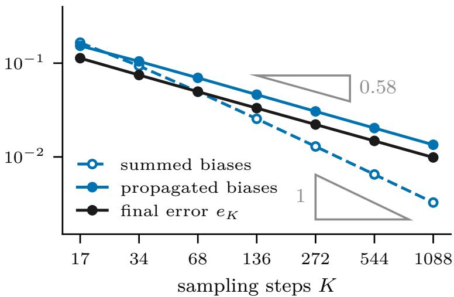  
Figure 1: Local accuracy and accumulated error. For a four-Gaussian mixture with oracle denoising and exact initialization, summed local biases approach first-order decay, while final error decreases at orders 0.58–0.60 over the tested range. Propagating each bias through the measured amplification of the later steps (solid blue) recovers the slower decay of the error; see Section 7.1.

Our analysis has three parts.

1. Universal local error. We express the acceleration of the exact probability flow through conditional moments of Gaussian noise and bound its $\mathbb { L } _ { 2 }$ norm for every Borel data law. The bound has an explicit constant and a sharp noise exponent. For data with finite second moment, it yields a quadratic one-step discretization bound without support, smoothness, or log-concavity assumptions (Lemma 3). The key observation is that the relevant conditional moments are controlled by Gaussian noise moments, independently of the geometry of the data distribution.

2. Realized propagation. EDM preconditioning provides an explicit suficient condition for high-noise contraction. At lower noise, we retain the amplification of the Wasserstein distance between the two transported laws and derive directional and worst-case upper bounds. A smooth construction shows that realized amplification can remain nonexpansive while the worst-case majorants become arbitrarily large (Proposition 10). The directional bound measures expansion along an optimal coupling of the exact and sampler laws, avoiding a supremum over all spatial locations and directions.

3. Global error control. We separate initialization, discretization, learning, and terminal smoothing errors (Theorem 11). At fixed positive noise endpoints, the discretization contribution is $O ( K ^ { - 1 } e ^ { \Lambda _ { K } } )$ , where $\Lambda _ { K }$ accumulates the positive logarithms of the realized low-noise amplification factors. A uniform bound on $\Lambda _ { K }$ gives first-order decay; logarithmic growth gives the rates in Corollary 12. High-noise contraction damps early errors, while EDM preconditioning expresses the learning contribution through the excess risk of a normalized regression problem.

The propagation estimate is a posteriori: we do not derive an amplification envelope from training or architecture. Experiments on the Gaussian mixture examine its explanatory value and the gap to worst-case bounds. Diagnostics on a pretrained CIFAR–10 model illustrate related mechanisms without certifying the global stability assumptions. The analysis covers the deterministic predictor; Heun corrections and stochastic churn remain outside its scope. Appendix H provides detailed comparisons with prior work.

## 2 Setting and One-Step Decomposition

This section introduces deterministic difusion sampling and the first-order EDM predictor studied in this paper. We write $\mathcal { P } _ { 2 } ( \mathbb { R } ^ { d } )$ for the set of Borel probability measures on $\mathbb { R } ^ { d }$ with finite second moment and $f _ { \# } \mu$ for the pushforward of $\mu$ by a measurable map $f . \mathrm { ~ A ~ }$ hat marks a learned object. For a random vector $Y$ and a measurable vector-valued function $f ,$ , respectively, we use the notation $\Vert Y \Vert _ { \mathbb { L } _ { 2 } } : = ( \mathbb { E } [ \Vert Y \Vert ^ { 2 } ] ) ^ { 1 / 2 }$ and $\begin{array} { r } { \| f \| _ { \mathbb { L } _ { 2 } ( \mu ) } : = ( \int \| f ( x ) \| ^ { 2 } \mu ( \mathrm { d } x ) ) ^ { 1 / 2 } } \end{array}$ . For a more detailed introduction to the underlying mathematical framework, see Holderrieth and Erives (2025); complements specific to our setting are provided in Appendix B.

Let $q \in \mathcal { P } _ { 2 } ( \mathbb { R } ^ { d } )$ be the target distribution. For independent vectors $X _ { 0 } \sim q$ and $Z \sim \mathcal { N } ( 0 , \mathbf { I } _ { d } )$ set

$$
X _ { \sigma } = X _ { 0 } + \sigma Z , \mathrm { a n d } \mu _ { \sigma } = \operatorname { L a w } ( X _ { \sigma } ) .
$$

The mapping $\sigma \mapsto \mu _ { \sigma }$ , for $\sigma \in ( 0 , \infty )$ defines a smooth curve in $\mathcal { P } _ { 2 } ( \mathbb { R } ^ { d } )$ starting from the target distribution $q = \mu _ { 0 }$ . In addition, at high noise levels ${ \bar { \sigma } } ,$ the normalized variable $X _ { \bar { \sigma } } / \bar { \sigma }$ has a distribution close to $\mathcal { N } ( 0 , \mathbf { I } _ { d } )$ . This motivates using $\mathcal { N } ( 0 , \bar { \sigma } ^ { 2 } \mathbf { I } _ { d } )$ as the latent distribution for generative modeling. The same curve can be realized by solving an ordinary diferential equation based on the velocity field

$$
v _ { \sigma } ( x ) = \bigl ( x - D _ { \sigma } ( x ) \bigr ) / \sigma = - \sigma \nabla \log p _ { \sigma } ( x )\tag{1}
$$

where $D _ { \sigma } ( x ) = \mathbb { E } [ X _ { 0 } | X _ { \sigma } = x ]$ is the posterior-mean denoiser and $p _ { \sigma }$ is the density of $\mu _ { \sigma }$ . More precisely, for every compact interval $I \subset ( 0 , \infty )$ , and for every $( \sigma _ { 0 } , x ) \in I \times \mathbb { R } ^ { d }$ , the diferential equation

$$
\frac { \mathrm { d } x _ { r } } { \mathrm { d } r } = v _ { r } ( x _ { r } ) , \quad r \in I , \quad x _ { \sigma _ { 0 } } = x
$$

has a unique solution on the whole interval I. Denote its solution map by $\Psi _ { \sigma , \sigma _ { 0 } } : \mathbb { R } ^ { d }  \mathbb { R } ^ { d }$ , so that

$$
\frac { \mathrm { d } } { \mathrm { d } \sigma } \Psi _ { \sigma , \sigma _ { 0 } } ( x ) = v _ { \sigma } \big ( \Psi _ { \sigma , \sigma _ { 0 } } ( x ) \big ) , \quad \Psi _ { \sigma _ { 0 } , \sigma _ { 0 } } ( x ) = x .\tag{2}
$$

For every $\sigma , \sigma _ { 0 } \in I ,$ , the map $\Psi _ { \sigma , \sigma _ { 0 } }$ is a difeomorphism of $\mathbb { R } ^ { d }$ , with inverse $\Psi _ { \sigma _ { 0 } , \sigma }$ . In addition, for all $\sigma _ { 0 } , \sigma _ { 1 } , \sigma _ { 2 } \in I , \Psi _ { \sigma _ { 2 } , \sigma _ { 0 } } = \Psi _ { \sigma _ { 2 } , \sigma _ { 1 } } \circ \Psi _ { \sigma _ { 1 } , \sigma _ { 0 } }$ . This flow transports the heat-regularized laws:

$$
\mu _ { \sigma } = ( \Psi _ { \sigma , \sigma _ { 0 } } ) _ { \# } \mu _ { \sigma _ { 0 } } , \qquad \sigma , \sigma _ { 0 } \in I .\tag{3}
$$

The main idea behind flow matching, DDIM, EDM and their multiple variants is to choose a small value $\underline { { \sigma } } > 0$ , a large value ${ \overline { { \sigma } } } .$ , to approximate $\Psi _ { \sigma , \overline { { \sigma } } }$ by some map $\widehat { \Psi }$ based on the training data, and then to define the generative model as $\widehat { \Psi } _ { \# } \mathcal { N } ( 0 , \overline { { \sigma } } ^ { 2 } \mathbf { I } _ { d } )$

To be more precise, fix a schedule $\overline { { \sigma } } = \sigma _ { 0 } > . . . > \sigma _ { K } = \underline { { \sigma } } > 0$ , and assume that we have a trained version $\widehat { D } _ { o }$ of the posterior mean denoiser $D _ { \sigma }$ at each noise level $\sigma \in \{ \sigma _ { 0 } , . . . , \sigma _ { K } \}$ . Set $\mu _ { j } = \mu _ { \sigma _ { j } } , a _ { j } = ( \sigma _ { j } - \sigma _ { j + 1 } ) / \sigma _ { j } \in ( 0 , 1 )$ , and $\Psi _ { j } = \Psi _ { \sigma _ { j + 1 } , \sigma _ { j } } $ , so that $\mu _ { j + 1 } = ( \Psi _ { j } ) _ { \# } \mu _ { j }$ . In $\mathrm { e q . ~ } \left( 2 \right)$ freezing the velocity at the starting noise level $\sigma _ { j }$ and using (1), gives the one-step oracle and learned EDM predictors

$$
\Phi _ { j } ( x ) = ( 1 - a _ { j } ) x + a _ { j } D _ { \sigma _ { j } } ( x ) ,\tag{4}
$$

$$
\widehat { \Phi } _ { j } ( x ) = ( 1 - a _ { j } ) x + a _ { j } \widehat { D } _ { \sigma _ { j } } ( x ) .\tag{5}
$$

For $\widehat { \mu } _ { 0 } = \mathcal { N } ( 0 , \sigma _ { 0 } ^ { 2 } \mathbf { I } _ { d } )$ , the sampler laws and errors are

$$
\widehat { \mu } _ { j + 1 } = ( \widehat { \Phi } _ { j } ) _ { \# } \widehat { \mu } _ { j } , \quad e _ { j } = W _ { 2 } ( \widehat { \mu } _ { j } , \mu _ { j } ) .\tag{6}
$$

With these notations, the triangle inequality and the canonical coupling give

$$
W _ { 2 } ( \widehat { \mu } _ { K } , q ) \leq e _ { K } + \sigma _ { K } \sqrt { d } .\tag{7}
$$

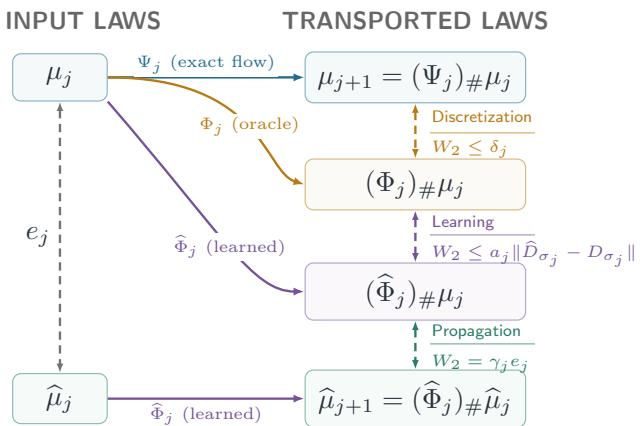  
Figure 2: One-step Wasserstein error decomposition. Solid arrows correspond to pushforwards, whereas dashed links are $W _ { 2 }$ distances.

Therefore, the main goal is to understand the behavior of the final error $e _ { K }$ . The deployed output $( \widehat { D } _ { \sigma _ { K } } ) _ { \# } \widehat { \mu } _ { K }$ , obtained by one additional denoising step, is treated in Appendix F.6.

We complete this section by providing a simple one-step recursion for the accumulated error $e _ { j }$ Its proof follows straightforwardly from the triangle inequality. Let us define the local discretization bias by

$$
\delta _ { j } = \big \| \Psi _ { j } ( \boldsymbol { X } _ { \sigma _ { j } } ) - \Phi _ { j } ( \boldsymbol { X } _ { \sigma _ { j } } ) \big \| _ { \mathbb { L } _ { 2 } } ,\tag{8}
$$

and the realized amplification factor

$$
\gamma _ { j } = \frac { W _ { 2 } \big ( ( \widehat \Phi _ { j } ) _ { \# } \mu _ { j } , ( \widehat \Phi _ { j } ) _ { \# } \widehat \mu _ { j } \big ) } { W _ { 2 } ( \mu _ { j } , \widehat \mu _ { j } ) } ,\tag{9}
$$

with the convention that $\gamma _ { j } = 1$ if $W _ { 2 } ( \mu _ { j } , \widehat { \mu } _ { j } ) = 0$ . For every $j = 0 , \ldots , K - 1$

$$
e _ { j + 1 } \leq \gamma _ { j } e _ { j } + \delta _ { j } + a _ { j } \big \| \widehat { D } _ { \sigma _ { j } } - D _ { \sigma _ { j } } \big \| _ { \mathbb { L } _ { 2 } ( \mu _ { j } ) } ,\tag{10}
$$

see Figure 2 for a visual representation.

## 3 Universal Local Error

The one-step decomposition in eq. (10) separates error propagation, discretization bias, and denoiser approximation. This section bounds the local discretization bias $\delta _ { j }$ . We show that its second-order behavior follows from a universal bound on the acceleration of the exact flow. Proofs are provided in Appendix C.

To compare samplers with diferent numbers of steps, we keep the endpoints $\underline { { \sigma } }$ and $\overline { { \sigma } }$ fixed and refine the grid between them. The EDM schedule places noise levels uniformly in the transformed variable $\eta = \sigma ^ { 1 / \rho _ { \mathsf { E D M } } }$ , which we call the numerical clock, see Figure 3. To ease notation, we write $\rho = 1 / \rho _ { \mathsf { E D M } } ;$ thus the commonly used EDM choice $\rho _ { \mathsf { E D M } } = 7$ corresponds to $\rho = 1 / 7$ . By the chain rule, the flow in the clock $\eta = \sigma ^ { \rho }$ satisfies

$$
\frac { \mathrm { d } x } { \mathrm { d } \eta } = w _ { \eta } ( x ) , \quad w _ { \eta } ( x ) = \frac { \eta ^ { \frac { 1 } { \rho } - 1 } } { \rho } v _ { \eta ^ { 1 / \rho } } ( x ) .\tag{11}
$$

Definition 1 (Refinement family G). Fix $\rho > 0 , 0 < \underline { { \sigma } } < \overline { { \sigma } }$ , and a positive integer $K _ { \circ }$ . Set $\eta = \underline { { \sigma } } ^ { \rho }$ and $\overline { { \eta } } = \overline { { \sigma } } ^ { \rho }$ . For $K \in \mathcal { H } = \{ K _ { \circ } 2 ^ { r } : r \in \mathbb { N } \}$ , set $h _ { K } = ( \overline { { { \eta } } } - \eta ) / K$ and let $G _ { K } : = \{ \eta _ { j } = \overline { { { \eta } } } - j h _ { K }$ $0 \leqslant j \leqslant K \}$ . The family of nested grids is ${ \mathfrak { G } } = \{ G _ { K } : K \in { \bar { \mathcal { H } } } \}$

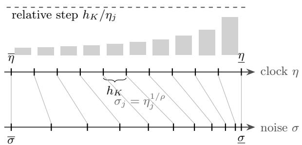  
Figure 3: A member $G _ { K }$ of the refinement family with $\rho = 1 / 2$ and $K = 1 0$

In the asymptotic results throughout this paper, when we assume K goes to infinity, the target $q ,$ the denoisers $( \widehat { D } _ { \sigma } ) _ { \sigma \in [ \underline { { \sigma } } , \overline { { \sigma } } ] }$ , and the initial distribution $\widehat { \mu } _ { 0 } = \mathcal { N } ( 0 , \overline { { \sigma } } ^ { 2 } \mathbf { I } _ { d } )$ are held fixed. These schedules share their endpoints and are nested: $G _ { K } \subset G _ { K ^ { \prime } }$ if K, $K ^ { \prime } \in \mathcal { K }$ and $K < K ^ { \prime }$ . Their relative clock increments satisfy

$$
h _ { K } / \eta _ { j } \leqslant h _ { K } / \underline { { \eta } } = : \theta _ { K } \longrightarrow 0 ,\tag{12}
$$

as $K  \infty$ . We add the subscript K when comparing quantities on diferent schedules, for example $\delta _ { j , K }$ and $\gamma _ { j , K }$ . A bound is uniform under refinement if its constant is independent of K.

Acceleration in the numerical clock. Define

$$
\begin{array} { r } { A _ { \rho } ( \sigma , x ) = \left[ \partial _ { \eta } w _ { \eta } ( x ) + \nabla _ { x } w _ { \eta } ( x ) w _ { \eta } ( x ) \right] _ { \eta = \sigma ^ { \rho } } . } \end{array}\tag{13}
$$

We refer to this quantity as the acceleration field, expressed in terms of the noise level, since along an exact trajectory $x _ { \eta }$ solution to (11), the chain rule yields $\mathrm { d } ^ { 2 } x _ { \eta } / \mathrm { d } \eta ^ { 2 } = \mathcal { A } _ { \rho } ( \eta ^ { 1 / \rho } , x _ { \eta } )$ . Controlling this acceleration in $\mathbb { L } _ { 2 }$ therefore controls second-order remainders along the flow. The key fact is that such a bound can be obtained independently of the target distribution.

Theorem 2 (Universal $\mathbb { L } _ { 2 }$ bound). For every $\rho > 0$ and every Borel probability measure q on $\mathbb { R } ^ { d }$

$$
\begin{array} { r } { \big \| \boldsymbol A _ { \rho } ( \sigma , \boldsymbol X _ { \sigma } ) \big \| _ { \mathbb { L } _ { 2 } } \leq B _ { d , \rho } \sigma ^ { 1 - 2 \rho } , \qquad \forall \sigma > 0 } \end{array}\tag{14}
$$

with $B _ { d , \rho } = \rho ^ { - 2 } \sqrt { d } \big [ | 1 - \rho | + 4 ( d + 3 ) \big ]$

The proof expresses the acceleration as $\sigma ^ { 1 - 2 \rho } / \rho ^ { 2 }$ times a combination of conditional moments of Z given $X _ { \sigma } = x$ . Jensen’s inequality then bounds the relevant terms by Gaussian moments, independently of $q .$ The exponent $1 - 2 \rho$ is sharp over all target distributions; see Prop. 28 in Appendix C.6. Whether the dimension dependence $O _ { \rho } ( d ^ { 3 / 2 } )$ is sharp remains open.

Local bias of EDM. The numerical clock determines the noise levels at which the predictor is evaluated. The oracle predictor is given by eq. (4). If $\rho \neq 1$ , this is generally diferent from an Euler $\mathrm { s t e p } ^ { 1 }$ for $w _ { \eta }$ . We bound its bias using Theorem 2 at $\rho = 1$

Lemma 3. Let $q \in \mathcal { P } _ { 2 } ( \mathbb { R } ^ { d } )$ and let $\sigma _ { 0 } > \cdots > \sigma _ { K } > 0$ be any schedule. For every $j = 0 , \ldots , K - 1$ the bias defined in eq. (8) satisfies

$$
\delta _ { j } \leqslant \Delta _ { j } = B _ { d , 1 } \Bigl [ ( \sigma _ { j } - \sigma _ { j + 1 } ) - \sigma _ { j + 1 } \log \frac { \sigma _ { j } } { \sigma _ { j + 1 } } \Bigl ] .\tag{15}
$$

The proof is based on a second-order expansion. Indeed, the integral remainder along the exact flow, together with Theorem 2, implies

$$
\delta _ { j } \leq B _ { d , 1 } \int _ { \sigma _ { j + 1 } } ^ { \sigma _ { j } } \frac { s - \sigma _ { j + 1 } } { s } \mathrm { d } s = \Delta _ { j } .
$$

This bound holds for every noise schedule and depends on the target distribution only through the dimension.

On the refinement family G, expanding in the relative clock increment $h _ { K } / \eta _ { j }$ and setting $\sigma _ { j } =$ $\eta _ { j } ^ { 1 / \rho }$ yields

$$
\Delta _ { j , K } = \frac { B _ { d , 1 } } { 2 \rho ^ { 2 } } h _ { K } ^ { 2 } \sigma _ { j } ^ { 1 - 2 \rho } \biggl [ 1 + O _ { \rho } \biggl ( \frac { h _ { K } } { \eta _ { j } } \biggr ) \biggr ] .\tag{16}
$$

Thus the bound on the local bias is quadratic in the clock step, with a noise dependence $\sigma _ { j } ^ { 1 - 2 \rho }$ . In particular, $\rho = 1 / 2 ,$ , or $\rho _ { \mathsf { E D M } } = 2$ , makes the leading bound independent of the noise level. This choice balances the universal bound across noise scales; it need not minimize the actual local bias on practical grids. The mixture experiment in Section $^ { 7 , }$ for example, ranks the clocks in the reverse order when measured biases are compared (Table 4). For the commonly used choice $\rho = 1 / 7$ , or $\rho _ { \mathsf { E D M } } = 7$ , the leading bound instead contains $\sigma _ { j } ^ { 5 / 7 }$ and is largest at high noise. The contraction mechanism studied in Section 5 can reduce the contribution of these early biases to the final error.

## 4 EDM Preconditioning

We now examine how the learned network enters the other two terms of eq. (10). The EDM parametrization expresses the denoiser approximation error as a normalized regression error and provides an explicit suficient condition for contraction of the learned predictor. Proofs and complements are provided in Appendix D. We first state the standing assumption under which the learned sampler laws and Wasserstein errors introduced in Section 2 are well defined.

Assumption 4. On every schedule in ${ \mathfrak { G } } _ { i }$ , each $\widehat { \Phi } _ { j }$ is locally Lipschitz and has at most linear growth: for some $A _ { j } < \infty , \| \widehat { \Phi } _ { j } ( x ) \| \leq A _ { j } ( 1 + \| x \| )$ for all $\boldsymbol { x } \in \mathbb { R } ^ { d }$

Since the initial distribution has finite second moment, this assumption ensures that $ { \widehat { \mu } } _ { j } \in  { \mathcal { P } } _ { 2 } (  { \mathbb { R } } ^ { d } )$ and $e _ { j } < \infty$

EDM parametrization. For the remainder of the analysis, we assume that the target distribution is centered, $\mathbb { E } [ X _ { 0 } ] = 0$ , and write $\tau _ { q } ^ { 2 } = \mathbb { E } \| X _ { 0 } \| ^ { 2 } / d > 0$ . Set $\alpha ( \sigma ) = \tau _ { q } ^ { 2 } / ( \sigma ^ { 2 } + \tau _ { q } ^ { 2 } )$ and

$$
\beta ( \sigma ) = \sigma \tau _ { q } c _ { \mathrm { i n } } ( \sigma ) , c _ { \mathrm { i n } } ( \sigma ) = ( \sigma ^ { 2 } + \tau _ { q } ^ { 2 } ) ^ { - 1 / 2 } .\tag{17}
$$

These are the coeficients $c _ { \mathrm { s k i p } } ,$ cout, and $c _ { \mathrm { i n } }$ of (Karras et al. 2022, Sec. 5). Writing $\alpha _ { j } = \alpha ( \sigma _ { j } )$ $\beta _ { j } = \beta ( \sigma _ { j } )$ , and $c _ { j } = c _ { \mathrm { i n } } ( \sigma _ { j } )$ , the learned denoiser is

$$
\widehat { D } _ { \sigma _ { j } } ( x ) = \alpha _ { j } x + \beta _ { j } \widehat { F } _ { j } \big ( c _ { j } x \big ) ,\tag{18}
$$

where $\widehat { F } _ { j } = \widehat { F } _ { \sigma _ { j } }$ is the network evaluated at noise level $\sigma _ { j }$ . Substituting this expression into eq. (5) gives

$$
\widehat { \Phi } _ { j } ( x ) = \big ( 1 - a _ { j } ( 1 - \alpha _ { j } ) \big ) x + a _ { j } \beta _ { j } \widehat { F } _ { j } \big ( c _ { j } x \big ) .\tag{19}
$$

Our analysis uses this form without imposing a particular network architecture.

Normalized regression error. The exact denoiser can be written in the same form, which defines its normalized residual function $F _ { \sigma }$ :

$$
D _ { \sigma } ( x ) = \alpha ( \sigma ) x + \beta ( \sigma ) F _ { \sigma } ( c _ { \mathrm { i n } } ( \sigma ) x ) .
$$

We write $F _ { j } = F _ { \sigma _ { j } }$ . Define the normalized input and regression target by $\widetilde { X } _ { \sigma } = c _ { \mathrm { i n } } ( \sigma ) X _ { \sigma }$ and $\mathcal { T } _ { \sigma } = \bigl ( X _ { 0 } - \alpha ( \sigma ) X _ { \sigma } \bigr ) / \beta ( \sigma )$ . Then $F _ { \sigma } ( \widetilde { X } _ { \sigma } ) = \mathbb { E } [ { \mathcal { T } } _ { \sigma } \mid \widetilde { X } _ { \sigma } ]$ . Thus $F _ { \sigma }$ is the optimal predictor of $\mathcal { T } _ { \sigma }$ from $\smash { \widetilde { X } _ { \sigma } }$ under squared loss. Let

$$
\begin{array} { r } { \mathcal { R } ( \sigma ) = \| \widehat { F } _ { \sigma } ( \widetilde { X } _ { \sigma } ) - F _ { \sigma } ( \widetilde { X } _ { \sigma } ) \| _ { \mathbb { L } _ { 2 } } , \quad \mathcal { R } _ { j } = \mathcal { R } ( \sigma _ { j } ) . } \end{array}
$$

The orthogonality of conditional expectation yields

$$
\mathcal { R } _ { j } ^ { 2 } = \Vert \widehat { F } _ { j } ( \widetilde { X } _ { \sigma _ { j } } ) - { \mathcal { T } _ { \sigma _ { j } } } \Vert _ { \mathbb { L } _ { 2 } } ^ { 2 } - \Vert F _ { j } ( \widetilde { X } _ { \sigma _ { j } } ) - { \mathcal { T } _ { \sigma _ { j } } } \Vert _ { \mathbb { L } _ { 2 } } ^ { 2 } .\tag{20}
$$

Consequently, $\mathcal { R } _ { j } ^ { 2 }$ is the excess population risk of the normalized regression problem. Moreover,

$$
\| \widehat { D } _ { \sigma _ { j } } - D _ { \sigma _ { j } } \| _ { \mathbb { L } _ { 2 } ( \mu _ { j } ) } = \beta _ { j } \mathcal { R } _ { j } ,\tag{21}
$$

so the learning term in eq. (10) is exactly $a _ { j } \beta _ { j } \mathcal { R } _ { j }$ . The choice of coeficients gives $\mathbb { E } \Vert \mathcal { T } _ { \sigma } \Vert ^ { 2 } / d = 1$ ， which motivates measuring the regression error relative to ${ \sqrt { d } }$

Assumption 5. There is $C _ { \mathrm { r e s } } \geqslant 0$ such that $\begin{array} { r } { \mathcal { R } ( \sigma ) \leqslant \sqrt { d } C _ { \mathrm { r e s } } , } \end{array}$ for all $\sigma \in [ \underline { { \sigma } } , \overline { { \sigma } } ]$

The first term on the right-hand side of (20) can be estimated from noisy validation pairs. The second term, the Bayes risk, is generally unknown, so the excess risk cannot be recovered from the prediction loss. The prediction loss upper-bounds $\mathcal { R } _ { j } ^ { 2 }$ , but checking that $C _ { \mathrm { r e s } }$ is small over all noise levels remains dificult in practice.

EDM stability margin. The same parametrization yields a suficient condition for contraction. Suppose $\widehat { F } _ { j }$ is globally $L _ { F , j ^ { - } }$ Lipschitz with respect to its normalized input, and define

$$
b _ { j } = 1 - \alpha _ { j } - \beta _ { j } c _ { j } L _ { F , j } = \ c _ { j } ^ { 2 } ( \sigma _ { j } ^ { 2 } - \sigma _ { j } \tau _ { q } L _ { F , j } ) .\tag{22}
$$

Since $1 - a _ { j } ( 1 - \alpha _ { j } ) > 0 .$ , eq. (19) implies

$$
\operatorname { L i p } ( { \widehat { \Phi } } _ { j } ) \leqslant 1 - a _ { j } b _ { j } .\tag{23}
$$

Thus $b _ { j } > 0$ is equivalent to $L _ { F , j } < \sigma _ { j } / \tau _ { q }$ and certifies strict contraction. High noise, therefore, permits larger network Lipschitz constants while retaining this contraction guarantee. When $b _ { j } \leqslant 0$ the bound does not certify strict contraction; the learned predictor may nevertheless contract the laws it transports.

Assembled recursion. Combining the bound from Lemma 3 with (21), we obtain

$$
e _ { j + 1 } \leqslant \gamma _ { j } e _ { j } + \Delta _ { j } + a _ { j } \beta _ { j } \mathcal { R } _ { j } .\tag{24}
$$

Under Assumption 5, the learning contribution is at most $a _ { j } \beta _ { j } \sqrt { d } C _ { \mathrm { r e s } }$

To summarize this section, the residual $\mathcal { R } _ { j }$ controls the learning term, while a positive margin $b _ { j }$ certifies contraction. The recursion itself requires no contraction assumption. The next section combines this contraction certificate at high noise with control of the amplification accumulated over the remaining steps.

## 5 High-Noise Contraction and Realized Amplification

We now control the propagation term in eq. (24). At high noise, the EDM margin provides a suficient condition for contraction. Over the remaining steps, we retain the realized amplification. Its cumulative value is the quantity used in the global bound; directional and worst-case estimates provide upper bounds on it. Proofs and complements are provided in Appendix E.

High-noise contraction. Fix $\sigma _ { \mathrm { h i } } > 0$ and define

$$
K _ { \mathrm { h i } } = \operatorname* { m a x } \{ j \in \{ 0 , \ldots , K \} : \sigma _ { j } \geqslant \sigma _ { \mathrm { h i } } \} ,\tag{25}
$$

with $K _ { \mathrm { h i } } = 0$ if the set is empty. Steps $j < K _ { \mathrm { h i } }$ form the high-noise block; the remaining steps form the low-noise block.

Assumption 6 (High-noise transport contraction). There is $b _ { \mathrm { h i } } \in ( 0 , 1 )$ , independent of K, such that on every $G _ { K } \in \mathfrak { G } , f o r j < K _ { \mathrm { h i } }$

$$
W _ { 2 } \big ( ( \widehat { \Phi } _ { j } ) _ { \# } \mu _ { j } , ( \widehat { \Phi } _ { j } ) _ { \# } \widehat { \mu } _ { j } \big ) \leqslant ( 1 - b _ { \mathrm { h i } } a _ { j } ) e _ { j } .\tag{26}
$$

Proposition 7. If, on every schedule, each high-noise network ${ \widehat { F } } _ { j }$ is globally LF,j-Lipschitz in its normalized input and $b _ { j } \geqslant b _ { \mathrm { h i } }$ for some $b _ { \mathrm { h i } } \in ( 0 , 1 )$ independent of K, then Assumption 6 holds.

This follows by applying (23) to an optimal coupling. For the oracle with supp $q \subseteq B ( 0 , R )$ , the transport assumption holds above $\sigma _ { \mathrm { h i } } = R / \sqrt { 1 - b _ { \mathrm { h i } } }$ (Appendix D.2).

Realized amplification. On the remaining steps, we impose no contraction assumption. We now accumulate the logarithms of the realized factors γj.

Definition 8 (Low-noise log-amplification). Set $\overline { { \gamma } } _ { j } = \operatorname* { m a x } \{ 1 , \gamma _ { j } \}$ . On $G _ { K } \in \mathfrak { G }$ , define $\Lambda _ { K } =$ $\sum _ { j = K _ { \mathrm { h i } } } ^ { K - 1 } \log \overline { { \gamma } } _ { j }$

Under Assumption 4, $\Lambda _ { K } < \infty$ on each schedule, and $\begin{array} { r } { \prod _ { i = r } ^ { s } \overline { \gamma } _ { i } \leqslant e ^ { \Lambda _ { K } } } \end{array}$ whenever $K _ { \mathrm { h i } } \leqslant r \leqslant s < K$ Thus $e ^ { \Lambda _ { K } }$ bounds propagation over any part of the low-noise block. Its growth under refinement enters the global error bound. The estimates below provide alternative ways to control this same quantity.

Directional bound. Write $\ell _ { j } = \sigma _ { j } - \sigma _ { j + 1 } = a _ { j } \sigma _ { j }$ and $\widehat { v } _ { \sigma } ( x ) = ( x - \widehat { D } _ { \sigma } ( x ) ) / \sigma$ . For a low-noise step, let $( U _ { j } , V _ { j } )$ optimally couple $( \mu _ { j } , \widehat { \mu } _ { j } )$ , and set $\mathsf { v } _ { j } = \widehat { v } _ { \sigma _ { j } } ( U _ { j } ) - \widehat { v } _ { \sigma _ { j } } ( V _ { j } )$ . Define the positive directional expansion rate and the squared secant ratio by

$$
\mathcal { E } _ { j , + } ^ { \mathrm { O T } } = \frac { ( \mathbb { E } \langle V _ { j } - U _ { j } , \mathsf { v } _ { j } \rangle ) _ { + } } { e _ { j } ^ { 2 } } , \quad Q _ { j } ^ { \mathrm { O T } } = \frac { \mathbb { E } \| \mathsf { v } _ { j } \| ^ { 2 } } { e _ { j } ^ { 2 } } .\tag{27}
$$

Set both to zero when $e _ { j } = 0$ . The first quantity measures expansion along the displacement in the optimal coupling; the second controls the quadratic correction from the finite step.

Proposition 9. For every low-noise step,

$$
\gamma _ { j } ^ { 2 } \leqslant 1 + 2 \ell _ { j } \mathcal { E } _ { j , + } ^ { \mathrm { O T } } + \ell _ { j } ^ { 2 } Q _ { j } ^ { \mathrm { O T } } ,\tag{28}
$$

$$
\begin{array} { r } { \log \overline { { \gamma } } _ { j } \leqslant \ell _ { j } \mathcal { E } _ { j , + } ^ { \mathrm { O T } } + \frac { 1 } { 2 } \ell _ { j } ^ { 2 } Q _ { j } ^ { \mathrm { O T } } . } \end{array}\tag{29}
$$

Consequently, for any choice of optimal couplings,

$$
\Lambda _ { K } \leqslant \Lambda _ { K } ^ { \mathrm { d i r } } : = \sum _ { j = K _ { \mathrm { h i } } } ^ { K - 1 } \Bigl ( \ell _ { j } \mathcal { E } _ { j , + } ^ { \mathrm { O T } } + \frac { 1 } { 2 } \ell _ { j } ^ { 2 } Q _ { j } ^ { \mathrm { O T } } \Bigr ) .\tag{30}
$$

The proof pushes the optimal input coupling through $\widehat { \Phi } _ { j }$ and expands $\| \widehat { \Phi } _ { j } ( U _ { j } ) - \widehat { \Phi } _ { j } ( V _ { j } ) \| ^ { 2 }$ using $\widehat { \Phi } _ { j } ( x ) = x - \ell _ { j } \widehat { v } _ { \sigma _ { j } } ( x )$ . Unlike $\Lambda _ { K }$ , the directional bound uses the transported input coupling, which need not be optimal for the output laws. Therefore, its cost only upper-bounds the Wasserstein distance defining $\gamma _ { j }$

Worst-case bounds. A direct upper bound replaces each $\gamma _ { j }$ by the Lipschitz constant of the map:

$$
\Lambda _ { K } \leqslant \Lambda _ { K } ^ { \mathrm { m a p } } : = \sum _ { j = K _ { \mathrm { h i } } } ^ { K - 1 } \log \operatorname* { m a x } \{ 1 , \mathrm { L i p } ( \widehat \Phi _ { j } ) \} .\tag{31}
$$

A field-level bound instead uses the global one-sided expansion rate

$$
\mathcal { L } _ { j } ^ { \mathrm { o s } } = \operatorname* { s u p } _ { x \neq y } \frac { - \left. x - y , \widehat { v } _ { \sigma _ { j } } ( x ) - \widehat { v } _ { \sigma _ { j } } ( y ) \right. } { \Vert x - y \Vert ^ { 2 } } .\tag{32}
$$

For continuously diferentiable fields, this equals $\begin{array} { r } { \operatorname* { s u p } _ { x } \lambda _ { \operatorname* { m a x } } ( - \operatorname { S y m } \nabla \widehat { v } _ { \sigma _ { j } } ( x ) ) } \end{array}$ . Replacing the directional quantities by their global bounds gives

$$
\Lambda _ { K } ^ { \mathrm { f i e l d } } : = \sum _ { j = K _ { \mathrm { h i } } } ^ { K - 1 } \Big ( \ell _ { j } ( \mathcal { L } _ { j } ^ { \mathrm { o s } } ) _ { + } + \frac { 1 } { 2 } \ell _ { j } ^ { 2 } \operatorname { L i p } ( \widehat { v } _ { \sigma _ { j } } ) ^ { 2 } \Big ) .\tag{33}
$$

Both worst-case bounds maximize over space, rather than depend on the particular laws $( \mu _ { j } , \widehat { \mu } _ { j } )$ If every low-noise field is globally Lipschitz, then

$$
\Lambda _ { K } \leqslant \Lambda _ { K } ^ { \mathrm { d i r } } \leqslant \Lambda _ { K } ^ { \mathrm { f i e l d } } , \qquad \Lambda _ { K } \leqslant \Lambda _ { K } ^ { \mathrm { m a p } } \leqslant \Lambda _ { K } ^ { \mathrm { f i e l d } } ,\tag{34}
$$

see Corollary 29. The directional and map majorants are not ordered in general: each one can serve to bound $\Lambda _ { K }$ uniformly under refinement. A suficient condition, through the field majorant, is given in Remark 31.

Strict separation from worst-case stability. The worst-case bounds can be arbitrarily larger than the realized amplification. For the following proposition only, we allow an alternative initialization $\widehat { \mu } _ { 0 } = \nu _ { 0 } ^ { \varepsilon }$ , fixed across refinements for each ε, instead of the Gaussian initialization in Section 2.

Proposition 10. Let $d = 1 , q = \mathcal { N } ( 0 , \tau _ { q } ^ { 2 } )$ with $\tau _ { q } > 0 .$ , and $\sigma _ { \mathrm { h i } } > \overline { { \sigma } }$ . There is $C ,$ depending only on $\tau _ { q } , \underline { { \sigma } } , \overline { { \sigma } } _ { : }$ , such that for each $\varepsilon \in ( 0 , 2 \tau _ { q } )$ there are a smooth denoiser family $\widehat { D } ^ { \varepsilon }$ satisfying Assumption 4 and eq. (18), and an initialization $\nu _ { 0 } ^ { \varepsilon }$ , with the following properties:

(a) $W _ { 2 } ( \nu _ { 0 } ^ { \varepsilon } , \mu _ { \sigma } ) \leqslant C \varepsilon$ and $\mathcal { R } _ { j , K } ^ { \varepsilon } \leqslant C \varepsilon ,$

(b) $\gamma _ { j , K } ^ { \varepsilon } \leqslant 1$ , hence $\Lambda _ { K } ^ { \varepsilon } = 0$ for every $K _ { i }$ ;

(c) as K tends to infinity along $\mathcal { H }$ , we have limK $\begin{array} { r } { \Lambda _ { K } ^ { \mathrm { m a p } , \varepsilon } = \operatorname* { l i m } _ { K } \Lambda _ { K } ^ { \mathrm { f i e l d } , \varepsilon } = \frac { \overline { { \sigma } } - \underline { { \sigma } } } { \varepsilon } + O ( 1 ) } \end{array}$ , where $O ( 1 )$ is independent of ε.

The construction combines an $O ( \varepsilon )$ oscillation with slope $O ( \varepsilon ^ { - 1 } )$ and an $O ( \varepsilon )$ translation of the initial law. The learned steps do not amplify the realized discrepancy, although their worst-case majorants diverge as $\varepsilon \to 0$ . This is a separation across denoisers: for each fixed ε, both worst-case majorants have finite limits under refinement. The role of initialization is essential to this example; Section 7.2 examines the default Gaussian one.

## 6 Global Error Bound

We now combine the local error bound with the propagation controls of Section 5. Proofs and explicit constants are provided in Appendix F. In the high-noise block, the kernel $\begin{array} { r } { \Pi _ { r , k } = \prod _ { i = r } ^ { k - 1 } ( 1 - } \end{array}$ $b _ { \mathrm { h i } } a _ { i } )$ damps errors introduced at earlier steps. In the low-noise block, every partial product of amplification factors is bounded by $e ^ { \Lambda _ { K } }$ . Empty products are set to one.

To express the accumulated discretization bound, define, for $0 < s _ { 1 } \leqslant s _ { 0 }$ and $b \geqslant 0$ , the scale function

$$
\Xi _ { \rho } ( b ; s _ { 1 } , s _ { 0 } ) = \int _ { s _ { 1 } } ^ { s _ { 0 } } \left( \frac { s _ { 1 } } { s } \right) ^ { b } s ^ { - \rho } \mathrm { d } s .\tag{35}
$$

The factor $( s _ { 1 } / s ) ^ { b }$ represents damping, while $s ^ { - \rho }$ comes from summing the local biases on the clock-uniform grid. Thus $\Xi _ { \rho }$ is nonincreasing in b.

Theorem 11 (Global bound). Let Assumptions 4 to 6 hold and $\rho \in ( 0 , 1 ]$ . Fix $\theta _ { \mathrm { h i } } , \theta _ { \mathrm { l o } } \in ( 0 , 1 )$ There are $C _ { \star } < \infty$ , depending only on $\rho$ and max $\cdot ( \theta _ { \mathrm { h i } } , \theta _ { \mathrm { l o } } )$ , and an efective margin $b _ { \mathrm { e f f } } \in ( 0 , b _ { \mathrm { h i } } )$ depending only on $\rho , \theta _ { \mathrm { h i } } , b _ { \mathrm { h i } }$ , with $b _ { \mathrm { e f f } } \ \to \ b _ { \mathrm { h i } }$ as $\theta _ { \mathrm { h i } } \to 0$ , such that for every $G _ { K } \in \mathfrak { G }$ with $h _ { K } \leqslant$ min $\{ \theta _ { \mathrm { { h i } } } \sigma _ { \mathrm { { h i } } } ^ { \rho } , \theta _ { \mathrm { { l o } } \underline { { \sigma } } ^ { \rho } } \}$ ,

$$
W _ { 2 } ( \widehat { \mu } _ { K } , q ) \leqslant e ^ { \Lambda _ { K } } \big [ \Pi _ { 0 , K _ { \mathrm { h i } } } e _ { 0 } + \mathrm { D i s c } _ { K } + \mathrm { L e a r n } _ { K } \big ] + \sigma _ { K } \sqrt { d } ,\tag{36}
$$

where

$$
\begin{array} { r l } & { \mathrm { D i s c } _ { K } = C _ { \star } B _ { d , 1 } h _ { K } \bigl [ \Xi _ { \rho } ( 0 ; \sigma _ { K } , \sigma _ { K _ { \mathrm { h i } } } ) + \Xi _ { \rho } ( b _ { \mathrm { e f f } } ; \sigma _ { K _ { \mathrm { h i } } } , \sigma _ { 0 } ) \bigr ] , } \\ & { \mathrm { L e a r n } _ { K } = \sqrt { d } C _ { \mathrm { r e s } } \tau _ { q } \Bigl [ \displaystyle \frac { 1 - \Pi _ { 0 , K _ { \mathrm { h i } } } } { b _ { \mathrm { h i } } } + \log \Bigl ( 1 + \displaystyle \frac { 2 \sigma _ { K _ { \mathrm { h i } } } } { \tau _ { q } } \Bigr ) \Bigr ] . } \end{array}
$$

The four contributions are initialization, discretization (undamped low-noise and damped highnoise biases), learning, and terminal smoothing bias.

Role of high-noise contraction. At fixed endpoints, both scale functions are uniformly bounded under refinement. The discretization contribution is therefore $O ( h _ { K } e ^ { \Lambda _ { K } } )$ . High-noise contraction reduces its prefactor by damping early biases. For $b _ { \mathrm { e f f } } > 1 - \rho _ { \mathrm { ; } }$

$$
\Xi _ { \rho } ( b _ { \mathrm { e f f } } ; \sigma , \sigma _ { 0 } ) \leqslant \frac { \sigma ^ { 1 - \rho } } { b _ { \mathrm { e f f } } + \rho - 1 } ,
$$

so the high-noise scale function is bounded independently of $\sigma _ { 0 }$ at fixed $\sigma _ { K _ { \mathrm { h i } } }$ . For $\rho = 1 / 7 .$ , this requires $b _ { \mathrm { e f f } } > 6 / 7$ , which follows from $b _ { \mathrm { h i } } > 6 / 7$ on suficiently fine meshes; see Remark $3 7$

Since $0 < \Pi _ { 0 , K _ { \mathrm { h i } } } \leqslant 1$ , Learn also admits an upper bound independent of $\sigma _ { 0 }$ at fixed $\sigma _ { K _ { \mathrm { h i } } }$ Under the light-tail assumptions, the canonical initialization error is $O ( \sigma _ { 0 } ^ { - 1 } )$ ; see Proposition 44.

Rates under refinement. With fixed endpoints and clock, $h _ { K } = O ( K ^ { - 1 } )$ . The resulting discretization rate therefore depends on the growth of $\Lambda _ { K }$

Corollary 12. In the setting of Theorem 11, suppose

$$
\exists \omega \in [ 0 , 1 ) \ s . t . \quad \operatorname* { s u p } _ { G _ { K } \in \mathfrak { G } } \left( \Lambda _ { K } - \omega \log K \right) < \infty .\tag{37}
$$

Then the discretization term in (36) is $O ( K ^ { - ( 1 - \omega ) } )$ . For the oracle denoiser with exact initialization $\widehat { \mu } _ { 0 } = \mu _ { \sigma }$ , we have $W _ { 2 } ( \widehat { \mu } _ { K } , q ) \leqslant \underline { { \sigma } } \sqrt { d } + O ( K ^ { - ( 1 - \omega ) } )$

A uniform bound on $\Lambda _ { K }$ gives $\omega = 0$ and first-order decay of the discretization contribution. Refinement alone does not remove learning error, initialization mismatch, or the terminal smoothing bias. The envelope (37) is an asymptotic assumption, not a consequence of a finite-range fit. Even when $\Lambda _ { K }$ is uniformly bounded, first-order behavior may emerge only beyond practical step counts (Section 7.1).

(a) Log-amplification $\Lambda _ { K }$ (b) Observed and ampl.-based orders (c) Cost of each majorant

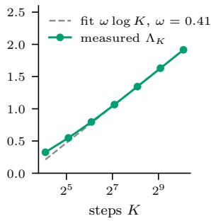

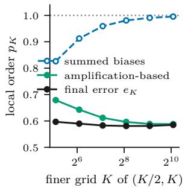

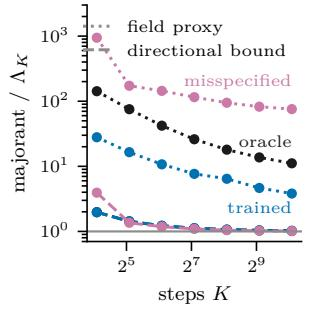

(d) CIFAR–10 rates on G68  
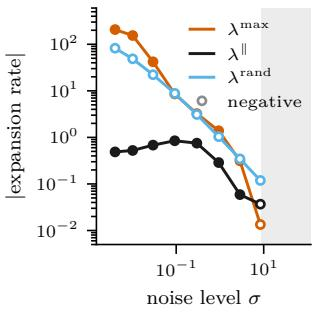  
Figure 4: 1D mixture (a–c) and pretrained CIFAR–10 EDM model (d). (a) Oracle with exact initialization: measured $\Lambda _ { K }$ and its fit ω log K. (b) Local orders (38) of the final error $e _ { K }$ and of the summed local biases, against the amplification-based order $1 - ( \Lambda _ { K } - \Lambda _ { K / 2 } ) / \log 2$ computed from (a): the biases converge at first order, the error does not. (c) Directional majorant (dashed) and finite-domain field proxy (dotted) divided by $\Lambda _ { K }$ , from the canonical Gaussian initialization; trained networks as the median over three seeds. (d) Energy-weighted rates (41), maximized over nine nodes $t ,$ on the coarse–fine segments of $G _ { 6 8 }$ : worst direction $\lambda ^ { \mathrm { m a x } }$ , displacement $\lambda ^ { \parallel }$ and random direction $\lambda ^ { \mathrm { { r a n d } } }$ , in absolute value; open markers are negative rates, and shading marks where the 90th-percentile empirical margin (40) is positive.

## 7 Numerical Experiments

We examine whether realized amplification explains the observed discretization error, how closely its majorants track it, and whether related stability mechanisms appear in an image model. On a one-dimensional Gaussian mixture, we evaluate the law-level quantities by quadrature. On CIFAR– 10, we study local diagnostics of the learned field. Additional results and numerical checks are in Appendix G.

## 7.1 Amplification and the Finite-Grid Rate

We use a centered mixture of four narrow Gaussians $( \tau _ { q } = 0 . 5 )$ , with the oracle denoiser and exact initialization $\mu _ { \overline { { \sigma } } }$ . The error relative to the exact terminal law is therefore due only to discretization. Each law is represented by $M = 6 5 { , } 5 3 6$ quantiles. Matching quantiles gives the optimal coupling in one dimension, allowing us to evaluate $e _ { j , K } , \ \gamma _ { j , K }$ and $\Lambda _ { K }$ on grids ranging from $K = 1 7$ to $K = 1 0 8 8$

Local accuracy and final error. For a quantity $C _ { K }$ , define its order between successive grids by

$$
\begin{array} { r } { p _ { K } ( C ) = \frac { \log ( C _ { K / 2 } / C _ { K } ) } { \log 2 } . } \end{array}\tag{38}
$$

The summed local biases approach first-order decay, whereas the final error has orders between 0.58 and 0.60. Over the same range, $\Lambda _ { K }$ grows approximately logarithmically, with fitted slope $\omega \simeq 0 . 4 1$ (Figure 4a).

An error proportional to $K ^ { - 1 } e ^ { \Lambda _ { K } }$ would have order $1 - ( \Lambda _ { K } - \Lambda _ { K / 2 } ) /$ log 2. This amplification based order agrees with the observed one on the two finest grid pairs (Figure 4b). Thus measured amplification accounts for the slower decay on these grids.

Interpretation and scope. This agreement is a posteriori: $\Lambda _ { K }$ is computed from the transported laws, rather than predicted from the denoiser. Moreover, the slower decay is preasymptotic. For this oracle, $\Lambda _ { K }$ is uniformly bounded under refinement (Remark 46), so Corollary 12 gives an eventual first-order bound.

The measured local biases also provide a quantitative check of the propagation analysis. With exact initialization and oracle denoising, eq. (10) unrolls into

$$
e _ { K , K } \leqslant \sum _ { j = 0 } ^ { K - 1 } \widetilde { \delta } _ { j , K } \prod _ { k = j + 1 } ^ { K - 1 } \gamma _ { k , K } ,\tag{39}
$$

where the local biases $\widetilde { \delta } _ { j , K }$ are evaluated by quadrature. The resulting bound overestimates the error by 35–40%. Additional comparisons with the universal local bound and the high-noise initialization control are reported in Appendix G.

## 7.2 Directional Bounds Track Realized Amplification

We compare $\Lambda _ { K }$ with $\Lambda _ { K } ^ { \mathrm { d i r } }$ and a finite-domain proxy of $\Lambda _ { K } ^ { \mathrm { f i e l d } }$ . We use the canonical Gaussian initialization and five denoisers: the oracle, three trained EDM-preconditioned multilayer perceptrons, and a misspecified posterior mean. We do not evaluate $\Lambda _ { K } ^ { \mathrm { m a p } }$

At $K = 1 0 8 8$ , the directional majorant exceeds $\Lambda _ { K }$ by at most 2.2% for every denoiser. For the oracle, the field proxy is much larger: 143 times $\Lambda _ { K }$ on the coarsest grid and 11.1 times on the finest (Figure 4c). These diferences become more pronounced after exponentiation in the global error bound.

The oracle illustrates why the directional bound is tighter. Its velocity expands in narrow bands between the modes, while the discrepancy between the laws lies mostly where the predictor contracts. The field supremum includes these expanding regions regardless of where the discrepancy lies; the directional bound weights them through the actual coupling.

## 7.3 Stability Mechanisms in an Image Model

We use the class-conditional CIFAR–10 EDM checkpoint of Karras et al. (2022) on nested grids $G _ { K }$ , with $\sigma \in [ 0 . 0 0 2 , 8 0 ]$ , ρ = 7, and 1280 latent variables. The diagnostics use Jacobian–vector products and the checkpoint’s $\sigma _ { \mathrm { { d a t a } } } = 0 . 5$ in place of $\tau _ { q }$ (Appendix G.1).

High noise. We probe the EDM contraction margin by replacing the global constant $\boldsymbol { L _ { F , j } }$ in eq. (22) with an empirical Jacobian norm. Let $\widetilde { S } _ { F } ^ { [ p ] } ( \sigma )$ be the p-quantile of power-iteration estimates of $\| \nabla \widehat { F } _ { \sigma } \| _ { \mathrm { o p } }$ at 128 noised test images, and set

$$
b _ { \mathrm { p r o b e } } ^ { [ p ] } ( \sigma ) = 1 - \alpha ( \sigma ) - \beta ( \sigma ) c _ { \mathrm { i n } } ( \sigma ) \widetilde { S } _ { F } ^ { [ p ] } ( \sigma ) .\tag{40}
$$

The empirical margin $b _ { \mathrm { p r o b e } } ^ { [ 0 . 9 ] }$ becomes positive at $\sigma = 8 . 9$ and exceeds $6 / 7$ , the supercritical threshold in Remark 37, above $\stackrel { \cdot } { \sigma } = 4 0 . 8 $ (Figure 4d). These probes suggest that the EDM certificate is most informative near the high-noise end of the schedule. They do not bound the global Lipschitz constant or establish a valid contraction threshold.

Low noise. To examine directional expansion, we pair trajectories on $G _ { K }$ and $G _ { 2 K }$ from the same latent variable. At a common noise level, let x and y be the coarse and fine states and set $\zeta = y - x$ For a unit direction $u ,$ define

$$
\lambda ^ { u } ( t ) = - u ^ { \top } \operatorname { S y m } \nabla \widehat { v } _ { \sigma _ { j } } ( x + t \zeta ) u , \qquad t \in [ 0 , 1 ] .\tag{41}
$$

We compare rates along the displacement $( \lambda ^ { \parallel } )$ , in the most expanding direction $( \lambda ^ { \mathrm { m a x } } )$ , and in a random direction $( \lambda ^ { \mathrm { { r a n d } } } )$ ; aggregation details are in Appendix G.

At $\sigma = 0 . 0 0 4$ , the random direction contracts $( \lambda ^ { \mathrm { r a n d } } = - 8 2 )$ , while the displacement expands $( \lambda ^ { \parallel } = + 0 . 4 9 )$ The worst-direction rate is 424 times the displacement rate (Figure 4d). Thus random directions can miss expansion along the discrepancy, while worst directions can substantially overstate it.

These are local diagnostics along synchronously coupled coarse and fine trajectories. They illustrate the importance of direction, but do not estimate $\Lambda _ { K }$ , which compares the exact and sampler laws through optimal transport. Refinement results and sensitivity to individual trajectories are given in Appendix G.4.

## 8 Discussion and Limitations

Gaussian smoothing gives a universal local discretization bound for the first-order EDM predictor, while the global estimate separates this error from its amplification by the learned dynamics. The mixture experiment shows why this distinction matters on finite grids: accumulated local biases and final error can decrease at diferent rates.

The remaining dificulty is to control realized amplification from accessible properties of the trained model. Our bound is a posteriori, the CIFAR–10 diagnostics do not certify global stability, and the $O ( d ^ { 3 / 2 } )$ local constant limits quantitative use in high dimension. A central next step is a computable propagation certificate that retains the advantage of distribution-dependent control.

## Acknowledgments

This project has received funding from the European Research Council (ERC) under the European Union’s Horizon Europe research and innovation programme (grant agreement No. 101201229) and from ANR through the Hi! PARIS Cluster 2030 project (ANR-23-IACL-0005) under the France 2030 investment plan.

## AI Use Statement

We made use of generative AI tools (large language models and coding assistants) throughout this project: to develop and check proofs, to write and test the code of the numerical experiments, and to draft and edit the text. The research questions, the modelling choices and assumptions, and the overall direction of the work are our own. We carefully read every result and proof, corrected or rewrote them where needed. The figures, the generated tables and the measured values quoted in the main text are generated automatically from the saved experiment outputs available in the public code repository, rather than typed by hand. We take full responsibility for the content of this paper.

## References

Ambrosio, L., N. Gigli, and G. Savaré (2008). Gradient Flows in Metric Spaces and in the Space of Probability Measures. 2nd ed. Basel: Birkhäuser.

Arsenyan, V., E. Vardanyan, and A. Dalalyan (2025). “Assessing the Quality of Denoising Difusion Models in Wasserstein Distance: Noisy Score and Optimal Bounds”. In: Advances in Neural Information Processing Systems. Vol. 38. arXiv: 2506.09681.

Benton, J., G. Deligiannidis, and A. Doucet (2024a). “Error Bounds for Flow Matching Methods”. In: Transactions on Machine Learning Research. arXiv: 2305.16860.

Benton, J. et al. (2024b). “Nearly d-Linear Convergence Bounds for Difusion Models via Stochastic Localization”. In: International Conference on Learning Representations. arXiv: 2308.03686.

Beyler, E. and F. Bach (2025). Convergence of Deterministic and Stochastic Difusion-Model Samplers: A Simple Analysis in Wasserstein Distance. arXiv: 2508.03210.

Brosse, N. and A. S. Dalalyan (2026). Boundary-layer asymptotics for Gaussian-smoothed singular measures. arXiv: 2607.04514.

Bruno, S. and S. Sabanis (2025). “Wasserstein Convergence of Score-based Generative Models under Semiconvexity and Discontinuous Gradients”. In: Transactions on Machine Learning Research. arXiv: 2505.03432.

Chen, H.-B. and J. Niles-Weed (2022). “Asymptotics of Smoothed Wasserstein Distances”. In: Potential Analysis 56.4, pp. 571–595.

Chen, H., H. Lee, and J. Lu (2023). “Improved Analysis of Score-Based Generative Modeling: User-Friendly Bounds under Minimal Smoothness Assumptions”. In: Proceedings of the 40th International Conference on Machine Learning. Vol. 202. Proceedings of Machine Learning Research. PMLR, pp. 4735–4763.

Chen, S., G. Daras, and A. G. Dimakis (2023a). “Restoration-Degradation Beyond Linear Difusions: A Non-Asymptotic Analysis for DDIM-Type Samplers”. In: Proceedings of the 40th International Conference on Machine Learning. Vol. 202. Proceedings of Machine Learning Research. PMLR, pp. 4462–4484. arXiv: 2303.03384.

Chen, S. et al. (2023b). “Sampling Is as Easy as Learning the Score: Theory for Difusion Models with Minimal Data Assumptions”. In: International Conference on Learning Representations. arXiv: 2209.11215.

Chen, S. et al. (2023c). “The Probability Flow ODE is Provably Fast”. In: Advances in Neural Information Processing Systems. arXiv: 2305.11798.

Chen, Y., E. Vanden-Eijnden, and J. Xu (2025). Lipschitz-Guided Design of Interpolation Schedules in Generative Models. arXiv: 2509.01629.

Conforti, G., A. Durmus, and M. Gentiloni Silveri (2025). “KL Convergence Guarantees for Score Difusion Models under Minimal Data Assumptions”. In: SIAM Journal on Mathematics of Data Science 7.1, pp. 86–109.

De Bortoli, V. (2022). “Convergence of Denoising Difusion Models under the Manifold Hypothesis”. In: Transactions on Machine Learning Research. arXiv: 2208.05314.

Dytso, A., M. Cardone, and I. Zieder (2023a). “Meta Derivative Identity for the Conditional Expectation”. In: IEEE Transactions on Information Theory 69.7, pp. 4284–4302.

Dytso, A., H. V. Poor, and S. Shamai (2023b). “Conditional Mean Estimation in Gaussian Noise: A Meta Derivative Identity With Applications”. In: IEEE Transactions on Information Theory 69.3, pp. 1883–1898.

Efron, B. (2011). “Tweedie’s Formula and Selection Bias”. In: Journal of the American Statistical Association 106.496, pp. 1602–1614.

Gao, X., H. M. Nguyen, and L. Zhu (2025). “Wasserstein Convergence Guarantees for a General Class of Score-Based Generative Models”. In: Journal of Machine Learning Research 26.43, pp. 1–54.

Gao, X. and L. Zhu (2025). “Convergence Analysis for General Probability Flow ODEs of Difusion Models in Wasserstein Distances”. In: Proceedings of The 28th International Conference on Artificial Intelligence and Statistics. Vol. 258. Proceedings of Machine Learning Research. PMLR, pp. 1009–1017. arXiv: 2401.17958.

Hartman, P. (1982). Ordinary Diferential Equations. 2nd ed. Boston: Birkhäuser.

Holderrieth, P. and E. Erives (2025). An Introduction to Flow Matching and Difusion Models. arXiv: 2506.02070.

Kahouli, K. et al. (2025). Disentangling Total-Variance and Signal-to-Noise-Ratio Improves Difusion Models. arXiv: 2502.08598.

Karras, T. et al. (2022). “Elucidating the Design Space of Difusion-Based Generative Models”. In: Advances in Neural Information Processing Systems. Vol. 35. arXiv: 2206.00364.

Koike, Y. (2026). Wasserstein bounds for denoising difusion probabilistic models via the Föllmer process. arXiv: 2605.18069.

Kremling, G. et al. (2025). Non-asymptotic error bounds for probability flow ODEs under weak log-concavity. arXiv: 2510.17608.

Kwon, D., Y. Fan, and K. Lee (2022). “Score-Based Generative Modeling Secretly Minimizes the Wasserstein Distance”. In: Advances in Neural Information Processing Systems. Vol. 35. arXiv: 2212.06359.

Lee, H., J. Lu, and Y. Tan (2023). “Convergence of Score-Based Generative Modeling for General Data Distributions”. In: Proceedings of the 34th International Conference on Algorithmic Learning Theory. Vol. 201. Proceedings of Machine Learning Research. PMLR, pp. 946–985. arXiv: 2209.12381.

Li, G. and Y. Yan (2024). “Adapting to Unknown Low-Dimensional Structures in Score-Based Difusion Models”. In: Advances in Neural Information Processing Systems. arXiv: 2405.14861.

Li, G. et al. (2024a). A Sharp Convergence Theory for the Probability Flow ODEs of Difusion Models. arXiv: 2408.02320.

Li, G. et al. (2024b). “Towards Non-Asymptotic Convergence for Difusion-Based Generative Models”. In: International Conference on Learning Representations. arXiv: 2306.09251.

Li, S. and D. Zeng (2026). “Mitigating the Contractivity Trap in Difusion ODEs via Stein Stabilization”. In: Proceedings of the 43rd International Conference on Machine Learning. arXiv: 2606.07835.

Liang, J., Z. Huang, and Y. Chen (2025). “Low-Dimensional Adaptation of Difusion Models: Convergence in Total Variation”. In: Proceedings of Thirty Eighth Conference on Learning Theory. Vol. 291. Proceedings of Machine Learning Research. PMLR, pp. 3723–3729. arXiv: 2501.12982.

Lu, C. et al. (2022). “DPM-Solver: A Fast ODE Solver for Difusion Probabilistic Model Sampling in Around 10 Steps”. In: Advances in Neural Information Processing Systems. arXiv: 2206.00927.

Lyu, Z. and Z. Huang (2026). Load–Reserve Wasserstein Propagation for Isotropic Difusion Samplers. arXiv: 2603.19670.

Meng, C. et al. (2021). “Estimating High Order Gradients of the Data Distribution by Denoising”. In: Advances in Neural Information Processing Systems. arXiv: 2111.04726.

Sabour, A., S. Fidler, and K. Kreis (2024). “Align Your Steps: Optimizing Sampling Schedules in Difusion Models”. In: Proceedings of the 41st International Conference on Machine Learning. arXiv: 2404 14 07.

Song, J., C. Meng, and S. Ermon (2021). “Denoising Difusion Implicit Models”. In: International Conference on Learning Representations. arXiv: 2010.02502.

Stéphanovitch, A. (2026). Lipschitz regularity in Flow Matching and Difusion Models: sharp sampling rates and functional inequalities. arXiv: 2604.06065.

Strasman, S. et al. (2025). “An Analysis of the Noise Schedule for Score-Based Generative Models”. In: Transactions on Machine Learning Research. arXiv: 2402.04650.

Tang, C. et al. (2026). Wasserstein Convergence of ODE-Based Samplers in Decentralized Difusion Model via Velocity Field Decomposition. arXiv: 2606.15835.

Villani, C. (2003). Topics in Optimal Transportation. Vol. 58. Graduate Studies in Mathematics. Providence, RI: American Mathematical Society.

Wainwright, M. J. (2026). Denoising growth complexity: Data geometry and certified schedules for difusion sampling. arXiv: 2607.26285.

Wang, Y., Y. He, and M. Tao (2024). “Evaluating the Design Space of Difusion-Based Generative Models”. In: Advances in Neural Information Processing Systems. Vol. 37. arXiv: 2406.12839.

Williams, C. et al. (2024). “Score-Optimal Difusion Schedules”. In: Advances in Neural Information Processing Systems.

Zhou, Y. (2026). Score Accuracy Along the Forward Difusion Does Not Certify Numerical Stability in Difusion Sampling. arXiv: 2607.08757.

A Notation Index 18   
B Setting and One-Step Decomposition 20   
B.1 Posterior Identities and the Exact σ-Flow 20   
B.2 The Refinement Family 26   
B.3 From η-Euler to the EDM Predictor 26   
B.4 Proof of the One-Step Decomposition 28   
B.5 Three One-Step Decompositions . 28   
C Universal Local Error 29   
C.1 Clock Change and the Score–Hessian Form 29   
C.2 The Noise-Moment Identity 30   
C.3 Proof of the Universal Bound 34   
C.4 Proof of the Local Bias Bound 35   
C.5 The Leading-Order Local Bias and the Clock 35   
C.6 Gaussian Laws and Sharpness 36   
D EDM Preconditioning 39   
D.1 Complements on the EDM Margin 39   
D.2 High-Noise Contraction for the Oracle 39   
E Propagation 40   
E.1 The Split Index . 40   
E.2 Low-Noise Majorants: Proofs 40   
E.3 Geometric Reading of the Directional Rate . 43   
E.4 The Strict Separation from Worst-Case Stability 44   
F The Global Wasserstein Bound 47   
F.1 Explicit Form of the Global Bound 48   
F.2 High-Noise Block . . 48   
F.3 Summation of the Local Biases 49   
F.4 Low-Noise Block and Proof of the Global Bound 51   
F.5 Initialization Error at the Top Noise Level 52   
F.6 From the Positive-Noise Iterate to the Deployed Sample 53   
G Numerical Experiments 54   
G.1 Experimental Definitions and Implementation 54   
G.2 Full Figures and Tables 60   
G.3 Supplementary Results: One-Dimensional Audit 63   
G.4 Analytic Controls . 64   
G.5 Supplementary CIFAR–10 Diagnostics 66   
G.6 Numerical Reliability and Sensitivity Checks 66   
G.7 Code and Data Availability 69   
H Comparison with Prior Wasserstein Analyses 69   
H.1 Closest Comparison: Beyler–Bach . 69   
H.2 A Structural Wasserstein Route: Gao–Zhu 70   
H.3 Score Accuracy Does Not Imply Stability 71

Appendix A collects the notation. Appendices B to G follow Sections 2 to 7 and contain all proofs, with the comparisons with prior work placed next to the results they concern; Appendix H compares our analysis in detail with the closest Wasserstein analyses.

## A Notation Index

This appendix collects the general notation and the recurring problem-specific symbols; each problem-specific symbol is defined precisely at the place indicated in the last column.

General notation. The symbols E, Law(U), Cov $( U \mid V ) , { \mathcal { N } } ( m , \Sigma )$ and supp λ denote expectation, the law of $U$ , conditional covariance, a Gaussian law and the support of a measure; Id is the identity map and $\mathbf { I } _ { d }$ the $d \times d$ identity matrix, $\lambda _ { \mathrm { m a x } } ( A )$ the largest eigenvalue of a symmetric matrix and ⪯ the Loewner order. We write $\langle x , y \rangle$ and $\lVert x \rVert$ for the Euclidean inner product and norm, $\| A \| _ { \mathrm { o p } }$ for the operator norm of a matrix, $\operatorname { S y m } ( A ) = { \textstyle { \frac { 1 } { 2 } } } ( A + A ^ { \top } )$ for its symmetric part, $B ( m , r )$ for the Euclidean ball of center m and radius r, and $r _ { + } = \operatorname* { m a x } \{ r , 0 \}$ for the positive part of a scalar. For a vector-valued map $f , \nabla f$ is its Jacobian, $\nabla \cdot f$ its divergence and $\operatorname { L i p } ( f )$ its global Lipschitz constant. For $1 \leq p < \infty$ and a measure $\begin{array} { r } { \lambda , \| f \| _ { \mathbb { L } _ { p } ( \lambda ) } = ( \int \| f ( x ) \| ^ { p } \lambda ( \mathrm { d } x ) ) ^ { 1 / p } ; } \end{array}$ the measure is omitted for a random variable on the underlying probability space, so that $\| U \| _ { \mathbb { L } _ { p } } = ( \mathbb { E } \| U \| ^ { p } ) ^ { 1 / p }$ A subscript on a Landau symbol records allowed dependence of its implicit constant, as in $O _ { \rho } ( \cdot )$

Finally, $\mathcal { P } _ { 2 } ( \mathbb { R } ^ { d } )$ is the set of Borel probability measures with finite second moment, $f _ { \# } \lambda$ the pushforward of λ by a measurable map $f ,$ and

$$
W _ { 2 } ^ { 2 } ( \lambda , \lambda ^ { \prime } ) = \operatorname* { i n f } _ { \pi \in { \mathcal C } ( \lambda , \lambda ^ { \prime } ) } \int \left\| x - y \right\| ^ { 2 } \pi ( \mathrm { d } x , \mathrm { d } y )
$$

the quadratic Wasserstein distance, where $\mathcal { C } ( \lambda , \lambda ^ { \prime } )$ is the set of couplings and $\mathcal { C } _ { \mathrm { o p t } } ( \lambda , \lambda ^ { \prime } )$ the set of optimal ones. $\mathbb { N } = \{ 0 , 1 , \ldots \}$ , and $\delta _ { m }$ is the Dirac mass at $m .$ For a scalar-valued map $f , \nabla f$ and $\nabla ^ { 2 } f$ are its gradient and Hessian. For matrices, $A ^ { \top }$ , tr A and $\| A \| _ { F }$ are the transpose, trace and Frobenius norm, and $\lambda _ { \mathrm { m i n } } ( A )$ the smallest eigenvalue of a symmetric matrix. The set $\mathbb { S } _ { + } ^ { d }$ is the cone of symmetric positive-semidefinite $d \times d$ matrices, $A \preceq B$ means $B - A \in \mathbb { S } _ { + } ^ { d }$ d+, and $A > 0$ means that a symmetric matrix is positive definite.

Decorations and indices. A hat marks a learned object $( \widehat { D } , \widehat { \Phi } , \widehat { v } , \widehat { F } , \widehat { \mu } _ { j } )$ , and the exact counterpart is undecorated. A tilde marks the value returned by a numerical routine or measured by quadrature for the object written without it (Appendix G). The superscripts OT and sync name the coupling along which a quantity is evaluated: an optimal coupling of the exact and sampler laws, or the synchronous coupling of two nested grids driven by the same latent variable. The index j denotes a schedule level or the step starting there, and K the number of steps; the index K is written only when several grids are compared.

<table><tr><td>symbol</td><td>meaning</td><td>defined in</td></tr><tr><td> $q , \ X _ { 0 } , \ Z , \ X _ { \sigma } , \ \mu _ { \sigma }$ </td><td>data law, clean variable, standard Gaussian noise, noisy variable, and noisy law</td><td>Section 2</td></tr><tr><td> $p _ { \sigma } , ~ \pi _ { x , \sigma } , ~ D _ { \sigma } , ~ s _ { \sigma } , ~ v _ { \sigma } , ~ \Psi _ { \sigma , \sigma _ { 0 } }$ </td><td>noisy density, posterior kernel, exact denoiser, score, probability-flow velocity, and exact flow map</td><td>eqs. (1) and (2)</td></tr><tr><td> $\underline { { \sigma } } , ~ \overline { { \sigma } }$ </td><td>terminal and initial noise levels, fixed under refinement</td><td>Section 2</td></tr><tr><td> $\sigma _ { j } , ~ a _ { j } , ~ \Psi _ { j } , ~ \Phi _ { j } , ~ \widehat { \Phi } _ { j }$ </td><td>noise level, relaxation coefficient, exact flow step, oracle predictor, and learned predictor</td><td>eqs. (4) and (5)</td></tr><tr><td> $\ell _ { j }$ </td><td>noise step  $\sigma _ { j } - \sigma _ { j + 1 } = a _ { j } \sigma _ { j }$ </td><td>Section 5</td></tr><tr><td> $\mu _ { j } , \ \widehat { \mu } _ { 0 } , \ \widehat { \mu } _ { j } , \ e _ { j }$ </td><td>exact law  $\mu _ { \sigma _ { j } } ,$  initial sampling law  $\mathcal { N } ( 0 , \overline { { \sigma } } ^ { 2 } \mathbf { I } _ { d } )$  , sampler law, and its  ${ \check { W } } _ { 2 } .$  -error against</td><td>eq. (6)</td></tr><tr><td> $\eta , ~ \rho , ~ \rho _ { \mathsf { E D M } } , ~ w _ { \eta }$ </td><td> $\mu _ { j }$  numerical clock  $\eta = \sigma ^ { \rho } ;$  clock exponent, EDM exponent</td><td>Section 3</td></tr><tr><td> $\underline { { \eta } } , ~ \overline { { \eta } } , ~ h _ { K } , ~ G _ { K } , ~ \mathfrak { G }$ </td><td> $\rho _ { \mathsf { E D M } } = 1 / \rho ,$  and clock velocity clock endpoints, clock mesh, schedule, and refinement</td><td>Definition 1</td></tr><tr><td> $\theta _ { K }$ </td><td>family relative mesh  $h _ { K } / \underline { { \eta } }$  of  $G _ { K }$ </td><td>eq. (12)</td></tr><tr><td> $\delta _ { j } , \Delta _ { j }$ </td><td>local discretization bias and its universal bound</td><td>eqs. (8) and (15)</td></tr><tr><td> $A _ { \rho } , \ B _ { d , \rho }$ </td><td>clock acceleration and acceleration constant;  $B _ { d , 1 }$  is the constant at  $\rho = 1$  that enters  $\Delta _ { j }$ </td><td>eq. (13), Theorem 2</td></tr><tr><td> $\gamma _ { j } , \overline { { \gamma } } _ { j } , \Lambda _ { K }$ </td><td>realized amplification factor, its truncation from below at</td><td>eq. (9),</td></tr><tr><td> $\omega$ </td><td>one, and the cumulative low-noise log-amplification growth exponent of a logarithmic envelope</td><td>Definition 8 eq. (37)</td></tr><tr><td> $\tau _ { q }$ </td><td> $\Lambda _ { K } \leq \omega \log K + O ( 1 )$  root-mean-square scale of the centered target,</td><td>Section 4</td></tr><tr><td></td><td> $\tau _ { q } ^ { 2 } = \mathbb { E } \left. X _ { 0 } \right. ^ { \hat { 2 } } / d$ </td><td></td></tr><tr><td> $\alpha _ { j } , \beta _ { j } , c _ { j }$   $F _ { \sigma } , \widehat { F } _ { j } , \mathcal { R } _ { j } , C _ { \mathrm { r e s } }$ </td><td>EDM coefficients  $\alpha ( \sigma _ { j } ) , \beta ( \sigma _ { j } ) , c _ { \mathrm { i n } } ( \sigma _ { j } )$  , that is  $c _ { \mathrm { s k i p } } , c _ { \mathrm { o u t } } , c _ { \mathrm { i n } }$  exact and learned normalized residual branches, residual</td><td>eq. (17) Section 4</td></tr><tr><td></td><td>error, and its uniform constant</td><td></td></tr><tr><td> $\sigma _ { \mathrm { h i } } , ~ K _ { \mathrm { h i } }$   $L _ { F , j } , \ L _ { \mathrm { h i } }$ </td><td>high-noise threshold and split index Lipschitz constant of  $\widehat { F } _ { j }$  in normalized input, and its</td><td>eq. (25) Section 4,</td></tr><tr><td></td><td>envelope on the high-noise block</td><td>Appendix F</td></tr><tr><td> $b _ { j } , \ b _ { \mathrm { h i } }$ </td><td>EDM stability margin and its uniform lower bound</td><td>eq. (22), Assumption 6</td></tr><tr><td> $\Pi _ { r , k } , \Xi _ { \rho }$ </td><td>high-noise contraction kernel  $\textstyle \prod _ { i = r } ^ { k - 1 } ( 1 - b _ { \mathrm { h i } } a _ { i } )$  and scale function</td><td>Section 6, eq. (35)</td></tr><tr><td> $\kappa , ~ \theta _ { \mathrm { h i } } , ~ b _ { \mathrm { e f f } }$   $\theta _ { \mathrm { l o } } , \ C _ { \rho , \theta } , \ C _ { \star } , \ \Upsilon$ </td><td>finite-mesh damping factor, relative-mesh bound on the high-noise block, and effective exponent  $b _ { \mathrm { h i } } \kappa ( \theta _ { \mathrm { h i } } )$ </td><td>eq. (86), Proposition 39</td></tr><tr><td></td><td>relative-mesh bound on the low-noise block, constants of the bias sums, and learning scale</td><td>Theorem 11, proposition 43, and lemma 41</td></tr><tr><td>DiscK, LearnK  $\zeta ^ { \pi } , \mathcal { E } _ { j } ^ { \pi } , \mathcal { E } _ { j , + } ^ { \pi } , Q _ { j } ^ { \pi }$ </td><td>discretization and learning terms of the global bound displacement, signed and positive directional rates, and</td><td>Theorem 11</td></tr><tr><td></td><td>squared secant ratio along a coupling π</td><td>eq. (27)</td></tr><tr><td> $A _ { j , K } ^ { \pi }$ </td><td>root-mean-square amplification of the predictor along a coupling π</td><td>eqs. (96) and (101)</td></tr><tr><td> $\mathcal { L } _ { i } ^ { \mathrm { o s } }$ </td><td>global one-sided expansion rate of  $\widehat { v } _ { \sigma _ { i } }$ </td><td>eq. (32)</td></tr><tr><td> $\Lambda _ { K } ^ { \mathrm { d i r } } , \ \Lambda _ { K } ^ { \mathrm { m a p } } , \ \Lambda _ { K } ^ { \mathrm { f i e l d } }$ </td><td>transport-directional, map-level and field-level majorants</td><td>eqs. (30), (31)</td></tr><tr><td> $\ell _ { \mathrm { m a x } , K }$ </td><td>of  $\Lambda _ { K }$  largest noise step of  $G _ { K }$ </td><td>and (33) Remark 31</td></tr></table>

Notation specific to a numerical estimator is introduced only in Section 7 and appendix G.

## B Setting and One-Step Decomposition

This appendix complements Section 2. It constructs the exact probability flow for every Borel data law, records the clock convention and the refinement family, relates the EDM predictor to explicit Euler in the numerical clock, and proves the one-step decomposition, which it compares with the two other possible orderings.

## B.1 Posterior Identities and the Exact σ-Flow

We record here the posterior identities and the exact probability-flow construction used in Section 2, and prove the flow properties stated there. All statements are made at positive noise, and all flow statements on compact subintervals of $( 0 , \infty )$ ; no regularity at $\sigma = 0$ and no moment of q is assumed. The material is classical in substance, but the paper needs it in a form that holds for every Borel data law and for integrands that are unbounded in $X _ { 0 }$ , which is why it is recorded with proofs. It is organized in three blocks.

• Appendix B.1.1: Gaussian smoothing and the posterior kernel. The identity (45) for unbounded, jointly dependent integrands and the finiteness of all posterior moments are what Lemma 21 uses to diferentiate posterior averages in Appendix C, and what makes the pointwise denoiser $D _ { \sigma }$ well defined without a moment of $q .$

• Appendix B.1.2: Tweedie’s formula, which identifies the probability-flow velocity with the denoiser residual and the score, and the linear growth of the denoiser on positive-noise intervals.

• Appendix B.1.3: the weak transport identity and the construction, by characteristics, of the exact flow maps $\Psi _ { \sigma , \sigma _ { 0 } }$ of eq. (2) that push $\mu _ { \sigma _ { 0 } }$ to $\mu _ { \sigma }$ , used in the one-step decomposition.

The probability flow. The velocity eq. (1) drives the increasing-noise curve $( \mu _ { \sigma } ) _ { \sigma > 0 }$ through the continuity equation $\partial _ { \sigma } \mu _ { \sigma } + \nabla \cdot \left( v _ { \sigma } \mu _ { \sigma } \right) = 0 \mathrm { o n } \ ( 0 , \infty ) \times \mathbb { R } ^ { d }$ , with $q$ as its narrow initial trace (Remark 17). The pointwise posterior construction, the Tweedie identity (Lemma 14), the weak form of the continuity equation (Proposition 16), and the flow properties stated in Section 2 (Proposition 18) are established below.

## B.1.1 Gaussian Smoothing and Posterior Moment Identities

Let $q$ be a Borel probability measure on $\mathbb { R } ^ { d }$ . Let $X _ { 0 } \sim q$ , let $Z \sim \mathcal { N } ( 0 , \mathbf { I } _ { d } )$ , and assume that $X _ { 0 }$ and $Z$ are independent. For $\sigma > 0$ , set

$$
X _ { \sigma } = X _ { 0 } + \sigma Z , \qquad \mu _ { \sigma } = \operatorname { L a w } ( X _ { \sigma } ) .
$$

Then $\mu _ { \sigma }$ is absolutely continuous with respect to Lebesgue measure, with density

$$
p _ { \sigma } ( x ) = \int _ { \mathbb { R } ^ { d } } \phi _ { \sigma } ( x - y ) q ( \mathrm { d } y ) , \qquad \phi _ { \sigma } ( x ) = ( 2 \pi \sigma ^ { 2 } ) ^ { - d / 2 } \exp \left( - \frac { \| x \| ^ { 2 } } { 2 \sigma ^ { 2 } } \right) .\tag{42}
$$

Lemma 13 (Gaussian smoothing and posterior kernel). In this setting, for every $\sigma > 0$ , the density $p _ { \sigma }$ is strictly positive and

$$
( x , \sigma ) \longmapsto p _ { \sigma } ( x )
$$

belongs to $C ^ { \infty } ( \mathbb { R } ^ { d } \times ( 0 , \infty ) )$ . Moreover, for every $\boldsymbol { x } \in \mathbb { R } ^ { d }$ and $\sigma > 0$

$$
\pi _ { x , \sigma } ( \mathrm { d } y ) = \frac { \phi _ { \sigma } ( x - y ) } { p _ { \sigma } ( x ) } q ( \mathrm { d } y )
$$

defines a probability kernel, and this kernel is a regular conditional distribution of $X _ { 0 }$ given $X _ { \sigma }$ That is, for every bounded measurable $f :  { \mathbb { R } ^ { d } } \to  { \mathbb { R } }$ ，

$$
\int _ { \mathbb { R } ^ { d } } f ( y ) \pi _ { x , \sigma } ( \mathrm { d } y ) = \mathbb { E } [ f ( X _ { 0 } ) \mid X _ { \sigma } = x ]\tag{43}
$$

for $\mu _ { \sigma }$ -almost every x. Consequently, writing

$$
\langle \varphi \rangle _ { \sigma } ( x ) = \int _ { \mathbb { R } ^ { d } } \varphi ( x , y ) \pi _ { x , \sigma } ( \mathrm { d } y )\tag{44}
$$

for measurable $\varphi : \mathbb { R } ^ { d } \times \mathbb { R } ^ { d }  \mathbb { R }$ , one has

$$
\langle \varphi \rangle _ { \sigma } ( X _ { \sigma } ) = \mathbb { E } [ \varphi ( X _ { \sigma } , X _ { 0 } ) \mid X _ { \sigma } ] \qquad a l m o s t ~ s u r e l y\tag{45}
$$

whenever $\varphi$ is either nonnegative or satisfies $\varphi ( X _ { \sigma } , X _ { 0 } ) \in \mathbb { L } _ { 1 } ,$ the integrand may therefore be unbounded and may depend on the conditioning point as well as on $X _ { 0 }$ . Taking $\varphi ( x , y ) = f ( y )$ shows in particular that $e q .$ (43) holds for every measurable f that is nonnegative or satisfies $f ( X _ { 0 } ) \in \mathbb { L } _ { 1 }$ Since $\pi _ { x , \sigma }$ is a genuine conditional distribution, the conditional Jensen inequality applies to it in the usual way, under the same integrability proviso. Finally, for each fixed $( x , \sigma )$ , all polynomial moments under $\pi _ { x , \sigma }$ are finite.

Proof. Strict positivity follows from $\phi _ { \sigma } ( x - y ) > 0$ for all $x , y \in \mathbb { R } ^ { d }$ and $q ( \mathbb { R } ^ { d } ) = 1$

Let $\mathcal { Q } \subset \mathbb { R } ^ { d } \times ( 0 , \infty )$ be compact. On $\mathcal { Q } .$ , every derivative

$$
\partial _ { \sigma } ^ { m } \partial _ { x } ^ { \alpha } \phi _ { \sigma } ( x - y )
$$

is a polynomial in $x - y$ and $\sigma ^ { - 1 }$ , multiplied by $\phi _ { \sigma } ( x - y )$ . Since $\sigma$ is bounded away from zero on $\mathcal { Q } .$ this derivative is uniformly bounded in $( x , \sigma , y ) \in \mathcal { Q } \times \mathbb { R } ^ { d }$ . Diferentiation under the integral sign is therefore justified by dominated convergence, and $p _ { \sigma }$ is smooth.

The definition of $\pi _ { x , \sigma }$ gives a probability measure because $p _ { \sigma } ( x )$ is the normalizing constant. To identify the conditional law, let $f , g$ be bounded measurable. Then

$$
\mathbb { E } [ f ( X _ { 0 } ) g ( X _ { \sigma } ) ] = \int _ { \mathbb { R } ^ { d } } \int _ { \mathbb { R } ^ { d } } f ( y ) g ( x ) \phi _ { \sigma } ( x - y ) \mathrm { d } x q ( \mathrm { d } y ) .
$$

Equivalently,

$$
\mathbb { E } [ f ( X _ { 0 } ) g ( X _ { \sigma } ) ] = \int _ { \mathbb { R } ^ { d } } g ( x ) \left( \int _ { \mathbb { R } ^ { d } } f ( y ) \pi _ { x , \sigma } ( \mathrm { d } y ) \right) p _ { \sigma } ( x ) \mathrm { d } x .
$$

This proves the conditional-law identity.

We extend it to eq. (45). For $\varphi ( x , y ) = g ( x ) h ( y )$ with $g , h$ bounded measurable, the identity just proved and pulling out the Xσ-measurable factor $g ( X _ { \sigma } )$ give $\langle \varphi \rangle _ { \sigma } ( X _ { \sigma } ) = \operatorname { \mathbb { E } } [ \varphi ( X _ { \sigma } , X _ { 0 } ) \mid X _ { \sigma } ]$ almost surely. Such products generate the product σ-algebra, so the functional monotone class theorem extends the identity to all bounded measurable $\varphi ;$ monotone convergence applied to $\varphi \wedge n$ extends it to $\varphi \geq 0$ , and splitting $\varphi = \varphi ^ { + } - \varphi ^ { - } \mathrm { ~ t o ~ } \varphi ( X _ { \sigma } , X _ { 0 } ) \in \mathbb { L } _ { 1 }$ . The Jensen claim is the conditional Jensen inequality for the probability measure $\pi _ { x , \sigma }$

Finally, for every integer $k \geq 0$ , the function

$$
y \longmapsto \| y \| ^ { k } \phi _ { \sigma } ( x - y )
$$

is bounded on $\mathbb { R } ^ { d }$ . Hence its integral against the finite measure $q$ is finite, which gives all polynomial moments of $\pi _ { x , \sigma }$ □

The kernel $\pi _ { x , \sigma }$ is defined for every x, not only $\mu _ { \sigma } .$ -almost everywhere. Using it as the version of the conditional law of $X _ { 0 }$ given $X _ { \sigma } = x$ , define for every $\boldsymbol { x } \in \mathbb { R } ^ { d }$ and $\sigma > 0$

$$
D _ { \sigma } ( x ) = \int _ { \mathbb { R } ^ { d } } y \pi _ { x , \sigma } ( \mathrm { d } y ) , \qquad N _ { \sigma } ( x ) = \int _ { \mathbb { R } ^ { d } } \frac { x - y } { \sigma } \pi _ { x , \sigma } ( \mathrm { d } y ) , \qquad s _ { \sigma } ( x ) = \nabla \log p _ { \sigma } ( x ) .\tag{46}
$$

Thus $D _ { \sigma }$ is the posterior mean denoiser, $N _ { \sigma }$ is the posterior mean of the injected noise, and $s _ { \sigma }$ is the score of the noisy law. When $X _ { 0 }$ is integrable, these definitions coincide with the usual conditional expectations

$$
D _ { \sigma } ( x ) = \mathbb { E } [ X _ { 0 } \mid X _ { \sigma } = x ] , \qquad N _ { \sigma } ( x ) = \mathbb { E } [ Z \mid X _ { \sigma } = x ] ,
$$

for the chosen version: applying eq. (43) to $f ( y ) = y$ componentwise makes $D _ { \sigma }$ a version of $\mathbb { E } [ X _ { 0 } \mid$ $X _ { \sigma } = \cdot ]$ , and since $N _ { \sigma } ( x ) = ( x - D _ { \sigma } ( x ) ) / \sigma$ by eq. (46) while $Z = ( X _ { \sigma } - X _ { 0 } ) / \sigma$ , this makes $N _ { \sigma } ( X _ { \sigma } )$ a version of $\mathbb { E } [ Z \mid X _ { \sigma } ]$ . The pointwise definitions in eq. (46) are useful because they are meaningful for every Borel input law q after Gaussian smoothing.

The coupled path $\sigma \mapsto X _ { \sigma } = X _ { 0 } + \sigma Z$ has pathwise velocity Z. We define the corresponding Eulerian velocity by conditioning this pathwise velocity on the current position:

$$
v _ { \sigma } ( x ) = \mathbb { E } [ Z \mid X _ { \sigma } = x ] = N _ { \sigma } ( x ) .\tag{47}
$$

This velocity field is canonical for the Gaussian coupling $X _ { \sigma } = X _ { 0 } + \sigma Z$ . It is not meant to be the unique velocity field generating the marginal curve $( \mu _ { \sigma } ) _ { \sigma > 0 }$

Conditioning the identity $X _ { \sigma } = X _ { 0 } + \sigma Z$ on $X _ { \sigma } = x$ gives

$$
x = D _ { \sigma } ( x ) + \sigma N _ { \sigma } ( x ) .\tag{48}
$$

Consequently,

$$
v _ { \sigma } ( x ) = N _ { \sigma } ( x ) = \frac { x - D _ { \sigma } ( x ) } { \sigma } .\tag{49}
$$

## B.1.2 Tweedie’s Formula and Linear Growth of the Denoiser

Lemma 14 (Tweedie identity). Let q be a Borel probability measure on $\mathbb { R } ^ { d }$ , and let the Gaussian smoothing, posterior denoiser, score and velocity be defined as in Lemma 13 and eq. (47). For every $\boldsymbol { x } \in \mathbb { R } ^ { d }$ and every $\sigma > 0$

$$
s _ { \sigma } ( x ) = \frac { D _ { \sigma } ( x ) - x } { \sigma ^ { 2 } } = - \frac { 1 } { \sigma } N _ { \sigma } ( x ) .
$$

Consequently, by eq. (49), $v _ { \sigma } ( x ) = - \sigma s _ { \sigma } ( x )$

Proof. Diferentiating (42) with respect to x gives

$$
\nabla _ { x } p _ { \sigma } ( x ) = \int _ { \mathbb { R } ^ { d } } \frac { y - x } { \sigma ^ { 2 } } \phi _ { \sigma } ( x - y ) q ( \mathrm { d } y ) .
$$

Dividing by $p _ { \sigma } ( x )$ , we obtain

$$
s _ { \sigma } ( x ) = \frac { 1 } { \sigma ^ { 2 } } \left( \int _ { \mathbb { R } ^ { d } } y \pi _ { x , \sigma } ( \mathrm { d } y ) - x \right) = \frac { D _ { \sigma } ( x ) - x } { \sigma ^ { 2 } } .
$$

The identity $s _ { \sigma } ( x ) = - \sigma ^ { - 1 } N _ { \sigma } ( x )$ follows from eq. (48), and the velocity representation then follows from eq. (49). □

The identities above show that a single population vector field can be written in four equivalent coordinates: as the conditional velocity of the Gaussian coupling, as the posterior noise predictor, as the residual of the posterior mean denoiser, and as the score. The conditional-velocity representation is conceptually important: it shows that the denoising oracle is not only a pointwise posterior regression object, but also the Eulerian velocity of the heat-regularized curve $( \mu _ { \sigma } ) _ { \sigma > 0 }$ associated with the canonical coupling $X _ { \sigma } = X _ { 0 } + \sigma Z$ , which Appendix B.1.3 makes precise.

The exact-flow construction of Appendix B.1.3 is carried out only on compact positive-noise intervals. The following estimate is the only global-in-space input it needs to rule out finite-time explosion of characteristics.

Lemma 15 (Linear growth of the denoiser and the velocity on positive-noise intervals). Let q be a Borel probability measure on $\mathbb { R } ^ { d }$ and let $0 < \sigma _ { - } < \sigma _ { + } < \infty$ . There exists $C < \infty$ , depending only on $q , \sigma _ { - } , \sigma _ { + }$ , such that

$$
\| D _ { \sigma } ( x ) \| \leqslant C ( 1 + \| x \| ) , \qquad x \in \mathbb { R } ^ { d } , \quad \sigma \in [ \sigma _ { - } , \sigma _ { + } ] .\tag{50}
$$

Consequently,

$$
\| v _ { \sigma } ( x ) \| \leqslant C ( 1 + \| x \| ) , \qquad x \in \mathbb { R } ^ { d } , \quad \sigma \in [ \sigma _ { - } , \sigma _ { + } ] .\tag{51}
$$

Proof. The Gaussian prefactor cancels in the posterior mean, so

$$
D _ { \sigma } ( x ) = \frac { \int _ { \mathbb { R } ^ { d } } y \exp \left( - \left\| x - y \right\| ^ { 2 } / ( 2 \sigma ^ { 2 } ) \right) q ( \mathrm { d } y ) } { \int _ { \mathbb { R } ^ { d } } \exp \left( - \left\| x - y \right\| ^ { 2 } / ( 2 \sigma ^ { 2 } ) \right) q ( \mathrm { d } y ) } .
$$

Choose $r _ { 0 } > 0$ such that $c _ { 0 } = q ( B ( 0 , r _ { 0 } ) ) > 0$ , and denote the denominator, an unnormalized version of $p _ { \sigma }$ , by $\begin{array} { r } { \bar { p } _ { \sigma } ( x ) = \int _ { \mathbb { R } ^ { d } } \exp \left( - \| x - y \| ^ { 2 } / ( 2 \sigma ^ { 2 } ) \right) q ( \mathrm { d } y ) } \end{array}$ . For $y \in B ( 0 , r _ { 0 } )$ , one has $\| x - y \| \leqslant \| x \| + r _ { 0 }$ Therefore

$$
\bar { p } _ { \sigma } ( x ) \geq c _ { 0 } \exp \left( - \frac { ( \| x \| + r _ { 0 } ) ^ { 2 } } { 2 \sigma ^ { 2 } } \right) .\tag{52}
$$

Let $r _ { x } = 2 \left\| x \right\| + r _ { 0 }$ . On the region $\{ \| y \| \leqslant r _ { x } \}$ , the contribution to the numerator is bounded in norm by $r _ { x } \bar { p } _ { \sigma } ( x )$ . On the complementary region, write $u = \| y \| - r _ { x } \geq 0$ , so that $\| x - y \| \geq$ $\| y \| - \| x \| = \| x \| + r _ { 0 } + u$ . Hence

$$
\left\| y \right\| \exp \left( - \frac { \left\| x - y \right\| ^ { 2 } } { 2 \sigma ^ { 2 } } \right) \leqslant \left( r _ { x } + u \right) \exp \left( - \frac { \left( \left\| x \right\| + r _ { 0 } \right) ^ { 2 } } { 2 \sigma ^ { 2 } } \right) \exp \left( - \frac { u ^ { 2 } } { 2 \sigma ^ { 2 } } \right) .
$$

Since u $\mathrm { \Omega } \mathrm { : e x p } ( - u ^ { 2 } / ( 2 \sigma ^ { 2 } ) ) \leqslant \sigma \leqslant \sigma _ { + }$ , integration over $\{ \| y \| > r _ { x } \}$ gives

$$
\int _ { \{ \| y \| > r _ { x } \} } \| y \| \exp \left( - \frac { \| x - y \| ^ { 2 } } { 2 \sigma ^ { 2 } } \right) q ( \mathrm { d } y ) \leqslant ( r _ { x } + \sigma _ { + } ) \exp \left( - \frac { ( \| x \| + r _ { 0 } ) ^ { 2 } } { 2 \sigma ^ { 2 } } \right) .
$$

Combining this estimate with (52), we obtain

$$
\| D _ { \sigma } ( x ) \| \leqslant r _ { x } + \frac { r _ { x } + \sigma _ { + } } { c _ { 0 } } \leqslant C ( 1 + \| x \| ) , \qquad x \in \mathbb { R } ^ { d } , \quad \sigma \in [ \sigma _ { - } , \sigma _ { + } ] .
$$

This proves (50). Since $v _ { \sigma } ( x ) = ( x - D _ { \sigma } ( x ) ) / \sigma$ and $\sigma \geq \sigma _ { - }$ , the velocity bound (51) follows.

## B.1.3 The Continuity Equation and the Exact Flow Maps

The velocity $v _ { \sigma }$ of Appendix B.1.2 drives the heat-regularized curve in two senses: weakly, through the continuity equation, and pathwise, through the flow of its characteristics. The second statement produces the exact maps $\Psi _ { \boldsymbol { \sigma } , \boldsymbol { \sigma } _ { 0 } }$ of eq. (2).

Proposition 16 (Weak transport identity). Let q be a Borel probability measure on $\mathbb { R } ^ { d }$ , let $X _ { 0 } \sim q$ and let $X _ { \sigma } = X _ { 0 } + \sigma Z$ with $Z \sim \mathcal { N } ( 0 , \mathbf { I } _ { d } )$ independent of $X _ { 0 }$ . For every $f \in C _ { c } ^ { \infty } (  { \mathbb { R } } ^ { d } )$ , the map $\begin{array} { r } { \sigma \longmapsto \int _ { \mathbb { R } ^ { d } } f \mathrm { d } \mu _ { \sigma } } \end{array}$ is diferentiable on $( 0 , \infty )$ , and

$$
\frac { \mathrm { d } } { \mathrm { d } \sigma } \int _ { \mathbb { R } ^ { d } } f ( x ) \mu _ { \sigma } ( \mathrm { d } x ) = \int _ { \mathbb { R } ^ { d } } \nabla f ( x ) \cdot v _ { \sigma } ( x ) \mu _ { \sigma } ( \mathrm { d } x ) .\tag{53}
$$

Equivalently, in density form,

$$
\partial _ { \sigma } p _ { \sigma } + \nabla _ { \boldsymbol { x } } \cdot \left( p _ { \sigma } \boldsymbol { v } _ { \sigma } \right) = 0 \qquad o n \ ( 0 , \infty ) \times \mathbb { R } ^ { d } .\tag{54}
$$

Proof. Since $X _ { \sigma } = X _ { 0 } + \sigma Z$ , diferentiation under the expectation gives

$$
\frac { \mathrm { d } } { \mathrm { d } \sigma } \mathbb { E } [ f ( X _ { \sigma } ) ] = \mathbb { E } [ \nabla f ( X _ { \sigma } ) \cdot Z ] .
$$

The diferentiation is justified because $f \in C _ { c } ^ { \infty } (  { \mathbb { R } } ^ { d } )$ , ∇f is bounded, and $Z$ is integrable. Since $\nabla f ( X _ { \sigma } )$ is $X _ { \sigma }$ -measurable,

$$
\operatorname { \mathbb { E } } [ \nabla f ( X _ { \sigma } ) \cdot Z ] = \operatorname { \mathbb { E } } \left[ \nabla f ( X _ { \sigma } ) \cdot \operatorname { \mathbb { E } } [ Z \mid X _ { \sigma } ] \right] .
$$

Using the definition of $v _ { \sigma }$ , we obtain eq. (53).

The density $p _ { \sigma }$ is smooth by Lemma 13, and

$$
p _ { \sigma } v _ { \sigma } = - \sigma p _ { \sigma } s _ { \sigma } = - \sigma \nabla p _ { \sigma }
$$

is smooth as well. Hence the weak identity is equivalent to the pointwise continuity equation (54). □

Remark 17 (Initial trace). The curve $( \mu _ { \sigma } ) _ { \sigma > 0 }$ starts from the data law: $\mu _ { \sigma } \to q$ narrowly as $\sigma \downarrow 0$ Indeed, $X _ { \sigma } = X _ { 0 } + \sigma Z \to X _ { 0 }$ almost surely, so $\mathbb { E } [ f ( X _ { \sigma } ) ] \to \mathbb { E } [ f ( X _ { 0 } ) ]$ for every bounded continuous f by dominated convergence.

We now prove that the velocity field generates a global flow on every compact positive-noise interval and that this flow transports the heat-regularized laws.

Proposition 18 (Exact probability flow on the σ-clock). Let q be a Borel probability measure on $\mathbb { R } ^ { d }$ , let the posterior velocity $v _ { \sigma }$ be defined from its Gaussian smoothing as above, and let $I =$ $[ \sigma _ { - } , \sigma _ { + } ] \Subset ( 0 , \infty )$ . The vector field $( \sigma , x ) \mapsto v _ { \sigma } ( x )$ is the restriction to $I \times \mathbb { R } ^ { d } \ o f \ a \ C ^ { \infty }$ vector field on $( 0 , \infty ) \times  { \mathbb { R } } ^ { d }$ . Moreover, for every compact set $\mathcal { Q } \subset \mathbb { R } ^ { d }$ 2

$$
\underset { \sigma \in I } { \operatorname* { s u p } } \operatorname* { s u p } _ { x \in \mathcal { Q } } \Bigl ( \| v _ { \sigma } ( x ) \| + \| \nabla _ { x } v _ { \sigma } ( x ) \| _ { \mathrm { o p } } \Bigr ) < \infty ,\tag{55}
$$

and, by Lemma $^ { 1 5 , }$ there exists $C _ { I } < \infty$ such that

$$
\| v _ { \sigma } ( x ) \| \leqslant C _ { I } ( 1 + \| x \| ) , \qquad ( \sigma , x ) \in I \times \mathbb { R } ^ { d } .\tag{56}
$$

Consequently, for every $\sigma _ { 0 } \in I$ and every $\boldsymbol { x } \in \mathbb { R } ^ { d }$ , the ODE

$$
\frac { \mathrm { d } x _ { r } } { \mathrm { d } r } = v _ { r } ( x _ { r } ) , \qquad r \in I ,
$$

has a unique solution on the whole interval I. Denote its solution map by $\Psi _ { \sigma , \sigma _ { 0 } } : \mathbb { R } ^ { d }  \mathbb { R } ^ { d }$ , so that

$$
\frac { \mathrm { d } } { \mathrm { d } \sigma } \Psi _ { \sigma , \sigma _ { 0 } } ( x ) = v _ { \sigma } \big ( \Psi _ { \sigma , \sigma _ { 0 } } ( x ) \big ) , \qquad \Psi _ { \sigma _ { 0 } , \sigma _ { 0 } } ( x ) = x .
$$

For every $\sigma , \sigma _ { 0 } \in I$ , the map $\Psi _ { \sigma , \sigma _ { 0 } }$ is a C∞-difeomorphism $o f \mathbb { R } ^ { d } .$ , with inverse $\Psi _ { \sigma _ { 0 } , \sigma }$ . In particular, for all $\sigma _ { 0 } , \sigma _ { 1 } , \sigma _ { 2 } \in I$

$$
\Psi _ { \sigma _ { 2 } , \sigma _ { 0 } } = \Psi _ { \sigma _ { 2 } , \sigma _ { 1 } } \circ \Psi _ { \sigma _ { 1 } , \sigma _ { 0 } } , \qquad \Psi _ { \sigma _ { 0 } , \sigma _ { 0 } } = \mathrm { I d } .\tag{57}
$$

The heat-regularized laws are transported by this flow, that $i s ,$ eq. (3) holds. If $q \in \mathcal { P } _ { 2 } ( \mathbb { R } ^ { d } )$ , then $\mu _ { \sigma } \in \mathcal { P } _ { 2 } ( \mathbb { R } ^ { d } )$ for every $\sigma > 0$ , and $( \Psi _ { \sigma , \sigma _ { 0 } } ) _ { \# }$ maps $\mathcal { P } _ { 2 } ( \mathbb { R } ^ { d } )$ into itself.

Proof. By Lemma 13, the map $( \sigma , x ) \longmapsto p _ { \sigma } ( x )$ is $C ^ { \infty }$ on $( 0 , \infty ) \times  { \mathbb { R } } ^ { d }$ , and $p _ { \sigma } ( x ) > 0$ for every $\sigma > 0$ and every $\boldsymbol { x } \in \mathbb { R } ^ { d }$ . Hence $s _ { \sigma } ( \boldsymbol { x } ) = \nabla \log p _ { \sigma } ( \boldsymbol { x } )$ is $C ^ { \infty }$ on $( 0 , \infty ) \times  { \mathbb { R } } ^ { d }$ . By the Tweedie identity (Lemma 14), $v _ { \sigma } ( x ) = - \sigma s _ { \sigma } ( x )$ is $C ^ { \infty }$ on $( 0 , \infty ) \times  { \mathbb { R } } ^ { d }$ . Since $I \times \mathcal { Q }$ is compact for every compact $\mathcal { Q } \subset \mathbb { R } ^ { d }$ , continuity of v and $\nabla _ { x } v$ gives (55). The global linear-growth estimate (56) is (51) of Lemma 15.

We now construct the flow. Since v is continuous in σ and locally Lipschitz in $x ,$ uniformly on compact subsets of $I \times \mathbb { R } ^ { d }$ , the Picard–Lindelöf theorem gives a unique maximal solution through every $( \sigma _ { 0 } , x ) \in I \times \mathbb { R } ^ { d } ;$ see (Hartman 1982, Ch. II, Sec. 1, Thm. 1.1). It remains to show that the maximal solution is defined on all of I.

Let $y _ { r }$ be such a maximal trajectory, with $y _ { \sigma _ { 0 } } = x$ . By (56),

$$
\| \dot { y } _ { r } \| \leqslant C _ { I } ( 1 + \| y _ { r } \| )
$$

as long as the trajectory is defined. Therefore, for every r in the maximal interval of existence,

$$
1 + \| y _ { r } \| \leqslant 1 + \| x \| + C _ { I } \left| \int _ { \sigma _ { 0 } } ^ { r } ( 1 + \| y _ { u } \| ) \mathrm { d } u \right| .
$$

Grönwall’s lemma gives

$$
1 + \| y _ { r } \| \leqslant \exp ( C _ { I } | r - \sigma _ { 0 } | ) ( 1 + \| x \| )
$$

as long as the solution is defined. Hence the trajectory remains bounded on the finite interval I. By the continuation criterion for ODEs, a maximal solution in $I \times \mathbb { R } ^ { d }$ can fail to extend only by leaving every compact set; see (Hartman 1982, Ch. II, Sec. 3, Cor. 3.1–3.2). Thus the solution is defined on all of I.

We denote the solution map by $\Psi _ { \sigma , \sigma _ { 0 } }$ . The flow identities (57) follow from uniqueness. Since v is $C ^ { \infty }$ , the classical smooth-dependence theorem for ODEs implies that $x \mapsto \Psi _ { \sigma , \sigma _ { 0 } } ( x )$ is $C ^ { \infty }$ ; see (Hartman 1982, Ch. V, Sec. 3–4). Moreover,

$$
\Psi _ { \sigma , \sigma _ { 0 } } \circ \Psi _ { \sigma _ { 0 } , \sigma } = \Psi _ { \sigma , \sigma } = \mathrm { I d } ,
$$

and the same identity with σ and $\sigma _ { 0 }$ exchanged gives

$$
\Psi _ { \sigma _ { 0 } , \sigma } \circ \Psi _ { \sigma , \sigma _ { 0 } } = \mathrm { I d } .
$$

Thus $\Psi _ { \sigma , \sigma _ { 0 } }$ is a $C ^ { \infty }$ -difeomorphism of $\mathbb { R } ^ { d }$ , with inverse $\Psi _ { \sigma _ { 0 } , \sigma }$

It remains to identify the transported laws. The curve $\sigma \longmapsto \mu _ { \sigma }$ is narrowly continuous, since $\mu _ { \sigma } = \operatorname { L a w } ( X _ { 0 } + \sigma Z )$ and bounded continuous test functions are handled by dominated convergence, as in Remark 17. By Proposition 16, the curve $( \mu _ { \sigma } ) _ { \sigma > 0 }$ solves

$$
\begin{array} { r } { \partial _ { \sigma } \mu _ { \sigma } + \nabla \cdot ( v _ { \sigma } \mu _ { \sigma } ) = 0 } \end{array}
$$

in the weak sense.

We verify the hypotheses of the characteristic representation theorem for the continuity equation on an arbitrary compact subinterval $J \subset I$ . The local regularity condition is satisfied because, for every compact $\mathcal { Q } \subset \mathbb { R } ^ { d }$

$$
\int _ { J } \operatorname* { s u p } _ { x \in \mathcal { Q } } \Bigl ( \| v _ { \sigma } ( x ) \| + \| \nabla _ { x } v _ { \sigma } ( x ) \| _ { \mathrm { o p } } \Bigr ) \mathrm { d } \sigma < \infty .
$$

Moreover, the velocity is integrable against the curve of laws:

$$
\int _ { { \mathbb R } ^ { d } } \| v _ { \sigma } ( x ) \| \ \mu _ { \sigma } ( \mathrm { d } x ) = { \mathbb E } \left[ \| { \mathbb E } [ Z \mid X _ { \sigma } ] \| \right] \leqslant { \mathbb E } \left\| Z \right\| .
$$

Hence

$$
\int _ { J } \int _ { \mathbb { R } ^ { d } } \| v _ { \sigma } ( x ) \| \ \mu _ { \sigma } ( \mathrm { d } x ) \mathrm { d } \sigma < \infty .
$$

The characteristic representation formula for the continuity equation therefore applies; see (Ambrosio et al. 2008, Prop. 8.1.8). It gives, for $\sigma \geq \sigma _ { 0 } , \mu _ { \sigma } = ( \Psi _ { \sigma , \sigma _ { 0 } } ) _ { \# } \mu _ { \sigma _ { 0 } }$ . If $\sigma < \sigma _ { 0 }$ , applying the same result on $[ \sigma , \sigma _ { 0 } ]$ gives $\mu _ { \sigma _ { 0 } } = ( \Psi _ { \sigma _ { 0 } , \sigma } ) _ { \# } \mu _ { \sigma }$ . Pushing forward by the inverse map $\Psi _ { \sigma , \sigma _ { 0 } }$ yields again $\mu _ { \sigma } = ( \Psi _ { \sigma , \sigma _ { 0 } } ) _ { \# } \mu _ { \sigma _ { 0 } }$ . Thus (3) holds for all $\sigma , \sigma _ { 0 } \in I$

Finally, assume $q \in \mathcal { P } _ { 2 } ( \mathbb { R } ^ { d } )$ . Then $X _ { \sigma } = X _ { 0 } + \sigma Z$ has finite second moment for every $\sigma > 0 .$ , so $\mu _ { \sigma } \in \mathcal { P } _ { 2 } ( \mathbb { R } ^ { d } )$ . The Grönwall estimate also gives, with $C _ { I } ^ { \prime } = \exp \bigl ( C _ { I } ( \sigma _ { + } - \sigma _ { - } ) \bigr )$

$$
\| \Psi _ { \sigma , \sigma _ { 0 } } ( x ) \| \leqslant C _ { I } ^ { \prime } ( 1 + \| x \| ) , \qquad \sigma , \sigma _ { 0 } \in I .
$$

Therefore, if $\lambda \in \mathcal { P } _ { 2 } ( \mathbb { R } ^ { d } )$ , then

$$
\int _ { \mathbb { R } ^ { d } } \| \Psi _ { \sigma , \sigma _ { 0 } } ( x ) \| ^ { 2 } \lambda ( \mathrm { d } x ) \leqslant 2 C _ { I } ^ { \prime 2 } \int _ { \mathbb { R } ^ { d } } \left( 1 + \| x \| ^ { 2 } \right) \lambda ( \mathrm { d } x ) < \infty .
$$

Thus $( \Psi _ { \sigma , \sigma _ { 0 } } ) _ { \# } \lambda \in \mathcal { P } _ { 2 } ( \mathbb { R } ^ { d } )$ for every $\lambda \in \mathcal { P } _ { 2 } ( \mathbb { R } ^ { d } )$ , which is the final assertion.

## B.2 The Refinement Family

The family G must be infinite: several hypotheses ask for a constant independent of the mesh, and on any finite collection of grids such a constant exists trivially. Fixed endpoints matter twice: they make the terminal bias $\sigma _ { K } \sqrt { d }$ of eq. (7) the same for every member, and they let a scheduleuniform per-step constant be summed into a schedule-uniform total. Since the grid is uniform in $\eta ,$ the relative step $h _ { K } / \eta _ { j }$ is largest where $\eta _ { j }$ is smallest (Figure 3), and the single bound (12) covers every block of the schedule, with $\underline { { \eta } } = \sigma _ { \mathrm { h i } } ^ { \rho }$ on the high-noise block and $\underline { { \eta } } = \underline { { \sigma } } ^ { \rho }$ on the whole schedule.

## B.3 From η-Euler to the EDM Predictor

Remark 19 (The EDM predictor is not η-Euler). The frozen σ-step (4) is the map analyzed throughout. It is not the explicit Euler step of the η-clock ODE eq. (11): the exact flow is invariant under $\eta = \sigma ^ { \rho }$ but explicit Euler is not, and the two use diferent relaxation coeficients, agreeing only to first order in $h _ { j } / \eta _ { j }$ . On the power-law clock the EDM predictor is the integrating-factor form of that η-step, whatever $\rho ;$ the rest of this subsection records the derivation and the exact one-step discrepancy.

The EDM predictor eqs. (4) and (5) is the finite-step sampler analyzed in this paper. This choice should be separated from the clock convention itself. The exact probability flow is invariant under the change of variables $\eta = \sigma ^ { \rho }$ , but explicit Euler is not invariant under a nonlinear reparameterization of time. Consequently, an explicit Euler step in the $\eta -$ clock is $\mathrm { n o t } ,$ at finite step size, the same update as the first-order predictor used in EDM on the same positive noise levels (Karras et al. 2022, Sec. 3). This appendix makes the diference precise in two ways: it gives the exact one-step discrepancy between the two updates, and it reads the EDM predictor as an integratingfactor variant of η-Euler. The upshot is that the EDM predictor, unlike η-Euler, is the same map on every power-law clock, so the clock exponent changes only where the levels are placed, not the update. The full EDM sampler may also include stochastic churn and a Heun correction (Karras et al. 2022, Sec. 3). The comparison here concerns only the underlying deterministic first-order predictor, because this is the map directly comparable with explicit η-Euler.

We work on a generic decreasing clock grid $\eta _ { 0 } > \eta _ { 1 } > \cdots > \eta _ { K } > 0$ , with local steps $h _ { j } =$ $\eta _ { j } - \eta _ { j + 1 }$ and noise levels $\sigma _ { j } = \eta _ { j } ^ { 1 / \rho }$ ; on the refinement family G all local steps are equal, $h _ { j } \equiv h _ { K }$ The comparison is governed by the relative step

$$
\bar { h } _ { j } = \frac { h _ { j } } { \eta _ { j } } = 1 - \left( \frac { \sigma _ { j + 1 } } { \sigma _ { j } } \right) ^ { \rho } \in ( 0 , 1 ) .
$$

To make the distinction explicit, suppose that a learned denoiser $\widehat { D } _ { \sigma _ { j } }$ induces the learned η-clock velocity

$$
\widehat w _ { j } ( \boldsymbol { x } ) = \frac { 1 } { \rho \eta _ { j } } \big ( \boldsymbol { x } - \widehat { D } _ { \sigma _ { j } } ( \boldsymbol { x } ) \big ) , \qquad \eta _ { j } = \sigma _ { j } ^ { \rho } .
$$

The corresponding explicit η-Euler denoiser relaxation is

$$
\widehat { \Phi } _ { j } ^ { \mathrm { E u } } ( x ) = x - h _ { j } \widehat { w } _ { j } ( x ) = ( 1 - a _ { j } ^ { \mathrm { E u } } ) x + a _ { j } ^ { \mathrm { E u } } \widehat { D } _ { \sigma _ { j } } ( x ) , \qquad a _ { j } ^ { \mathrm { E u } } = \frac { h _ { j } } { \rho \eta _ { j } } = \frac { \bar { h } _ { j } } { \rho } .
$$

By contrast, the EDM predictor eq. (5) has the same form with the relaxation coeficient

$$
a _ { j } = 1 - \frac { \sigma _ { j + 1 } } { \sigma _ { j } } = 1 - ( 1 - \bar { h } _ { j } ) ^ { 1 / \rho } .
$$

Thus both updates use the same denoiser and the same pair of positive noise levels, but they use diferent relaxation coeficients, $a _ { j } ^ { \mathrm { E u } } = \bar { h } _ { j } / \rho$ and $a _ { j } = 1 - ( 1 - \bar { h } _ { j } ) ^ { 1 / \rho }$ . For fixed $\rho > 0$ , Taylor expansion gives

$$
a _ { j } = \frac { \bar { h } _ { j } } { \rho } - \frac { 1 - \rho } { 2 \rho ^ { 2 } } \bar { h } _ { j } ^ { 2 } + O _ { \rho } ( \bar { h } _ { j } ^ { 3 } ) = a _ { j } ^ { \mathrm { E u } } - \frac { 1 - \rho } { 2 \rho ^ { 2 } } \bar { h } _ { j } ^ { 2 } + O _ { \rho } ( \bar { h } _ { j } ^ { 3 } ) .
$$

The two schemes are therefore first-order equivalent under the relative mesh condition maxj $\bar { h } _ { j } \to 0$ but they need not be close on a coarse terminal grid, where $\eta _ { j }$ is small and $\bar { h } _ { j }$ may be of order one. The one-step discrepancy has the exact algebraic form

$$
\widehat { \Phi } _ { j } ^ { \mathrm { E u } } ( x ) - \widehat { \Phi } _ { j } ( x ) = \big ( a _ { j } ^ { \mathrm { E u } } - a _ { j } \big ) \big ( \widehat { D } _ { \sigma _ { j } } ( x ) - x \big ) .
$$

Consequently,

$$
\left\| \widehat { \Phi } _ { j } ^ { \mathrm { E u } } ( { \boldsymbol { x } } ) - \widehat { \Phi } _ { j } ( { \boldsymbol { x } } ) \right\| \leqslant \left| a _ { j } ^ { \mathrm { E u } } - a _ { j } \right| \left\| { \boldsymbol { x } } - \widehat { D } _ { \sigma _ { j } } ( { \boldsymbol { x } } ) \right\| .
$$

This discrepancy identity is the basic reconciliation between the η-clock Euler sampler and the EDM finite-step predictor: they discretize the same continuous probability flow and may use the same denoiser, but they are distinct finite-step integrators.

There is also a useful way to read the EDM coeficient from the η-clock. If, over one step, the denoiser is frozen at its left-endpoint value $\widehat { D } _ { \sigma _ { j } } ( x _ { j } )$ , then the linear equation

$$
\frac { \mathrm { d } x } { \mathrm { d } \eta } = \frac { 1 } { \rho \eta } \big ( x - \widehat { D } _ { \sigma _ { j } } ( x _ { j } ) \big )
$$

can be integrated exactly from $\eta _ { j }$ to $\eta _ { j + 1 }$ . This gives

$$
x _ { j + 1 } = \frac { \sigma _ { j + 1 } } { \sigma _ { j } } x _ { j } + \left( 1 - \frac { \sigma _ { j + 1 } } { \sigma _ { j } } \right) \widehat { D } _ { \sigma _ { j } } ( x _ { j } ) ,
$$

which is precisely the EDM predictor. In this sense, on the power-law clock, the EDM predictor may be viewed as a σ-adapted or integrating-factor variant of the η-Euler step. It treats the leading scalar factor $( \rho \eta ) ^ { - 1 }$ exactly while freezing the denoiser over the step. The result does not depend on $\rho ,$ which is the invariance announced above.

Relation to prior work: identification of the predictor. The predictor analyzed here is the deterministic DDIM update (Song et al. 2021) in the variance-exploding parametrization, which is also the first-order DPM-Solver step (Lu et al. 2022).

## B.4 Proof of the One-Step Decomposition

Proof of eq. (10). By the triangle inequality in $W _ { 2 }$ , applied to $\mu _ { j + 1 } = ( \Psi _ { j } ) _ { \# } \mu _ { j }$ and $\widehat { \mu } _ { j + 1 } = ( \widehat { \Phi } _ { j } ) _ { \# } \widehat { \mu } _ { j }$

$$
e _ { j + 1 } \leqslant W _ { 2 } ( ( \Psi _ { j } ) _ { \# } \mu _ { j } , ( \Phi _ { j } ) _ { \# } \mu _ { j } ) + W _ { 2 } \Bigl ( ( \Phi _ { j } ) _ { \# } \mu _ { j } , ( \widehat { \Phi } _ { j } ) _ { \# } \mu _ { j } \Bigr ) + W _ { 2 } \Bigl ( ( \widehat { \Phi } _ { j } ) _ { \# } \mu _ { j } , ( \widehat { \Phi } _ { j } ) _ { \# } \widehat { \mu } _ { j } \Bigr ) .
$$

All four laws lie in $\mathcal { P } _ { 2 } ( \mathbb { R } ^ { d } )$ by Assumption 4, so every term is finite. The first two terms are bounded by the cost of the diagonal coupling induced by $\mu _ { j } { \mathrm { : } }$ the first gives $\delta _ { j }$ by eq. (8), and the second gives the learning term through the pointwise identity $\Phi _ { j } - \widehat \Phi _ { j } = a _ { j } ( D _ { \sigma _ { j } } - \widehat { D } _ { \sigma _ { j } } )$ evaluated at $X _ { \sigma _ { j } } \sim \mu _ { j }$ The third term equals $\gamma _ { j } e _ { j }$ when $e _ { j } > 0$ by eq. (9), and vanishes when $e _ { j } = 0$ , since then $\mu _ { j } = \widehat { \mu } _ { j }$ and the two pushforwards coincide. □

## B.5 Three One-Step Decompositions

This subsection justifies the order of the one-step decomposition (10): of the three possible decompositions compared below, it is the only one that keeps both local errors it creates, discretization and learning, on the exact law $\mu _ { j }$

Let $( Y _ { j } , \widehat { X } _ { j } )$ be an optimal coupling of $( \mu _ { j } , \widehat { \mu } _ { j } )$ , and set $Y _ { j + 1 } = \Psi _ { j } ( Y _ { j } ) \sim \mu _ { j + 1 }$ and $\widehat { X } _ { j + 1 } =$ $\widehat { \Phi } _ { j } ( \widehat { X } _ { j } ) \sim \widehat { \mu } _ { j + 1 }$ . Any three-term bound on $\left\| Y _ { j + 1 } - { \widehat { X } } _ { j + 1 } \right\| _ { \mathbb { L } _ { 2 } }$ walks along the chain $\Psi _ { j } \to \Phi _ { j } \to \widehat { \Phi } _ { j }$ whose arrows are the discretization bias and the learning error, and changes the argument from $Y _ { j }$ to $\widehat { X } _ { j }$ exactly once. Where the change happens fixes which map is transported, and under which law the two local errors are measured: upstream of the change they sit on the exact law $\mu _ { j }$ , downstream on the sampler law $\widehat { \mu } _ { j }$ . Writing $\varepsilon _ { j } ( \lambda ) = a _ { j } \left\| \widehat { D } _ { \sigma _ { j } } - D _ { \sigma _ { j } } \right\| _ { \mathbb { L } _ { 2 } ( \lambda ) }$ for the learning error under a law $\lambda ,$ so that $\varepsilon _ { j } ( \mu _ { j } ) = a _ { j } \beta _ { j } \mathcal { R } _ { j }$ by eq. (21), the three options are

$$
\begin{array} { r } { e _ { j + 1 } \leqslant \left\| \widehat { \Phi } _ { j } ( Y _ { j } ) - \widehat { \Phi } _ { j } ( \widehat { X } _ { j } ) \right\| _ { \mathbb { L } _ { 2 } } + \| \Psi _ { j } - \Phi _ { j } \| _ { \mathbb { L } _ { 2 } ( \mu _ { j } ) } + \varepsilon _ { j } ( \mu _ { j } ) , } \end{array}
$$

$$
\begin{array} { r } { \mathrm { m i d d l e : } \quad e _ { j + 1 } \leqslant \left\| \Phi _ { j } ( Y _ { j } ) - \Phi _ { j } ( \widehat { X } _ { j } ) \right\| _ { \mathbb { L } _ { 2 } } + \| \Psi _ { j } - \Phi _ { j } \| _ { \mathbb { L } _ { 2 } ( \mu _ { j } ) } + \varepsilon _ { j } ( \widehat { \mu } _ { j } ) , } \end{array}
$$

$$
\begin{array} { r } { \mathrm { f i r s t : } \quad e _ { j + 1 } \leqslant \Big \| \Psi _ { j } ( Y _ { j } ) - \Psi _ { j } ( \widehat { X } _ { j } ) \Big \| _ { \mathbb { L } _ { 2 } } + \| \Psi _ { j } - \Phi _ { j } \| _ { \mathbb { L } _ { 2 } ( \widehat { \mu } _ { j } ) } + \varepsilon _ { j } ( \widehat { \mu } _ { j } ) . } \end{array}
$$

<table><tr><td></td><td>Argument change Transported map Discretization on Learning on</td><td></td><td></td></tr><tr><td>after  $\widehat { \Phi } _ { j }$ </td><td>learned  $\widehat { \Phi } _ { j }$ </td><td> $\mu _ { j }$ </td><td> $\mu _ { j }$ </td></tr><tr><td>after  $\Phi _ { j }$ </td><td>oracle  $\Phi _ { j }$ </td><td> $\mu _ { j }$ </td><td> $\widehat { \mu } _ { j }$ </td></tr><tr><td>after  $\Psi _ { j }$ </td><td>exact flow  $\Psi _ { j }$ </td><td> $\widehat { \mu } _ { j }$ </td><td> $\widehat { \mu } _ { j }$ </td></tr></table>

The choice trades the stability of one map against the law under which the local errors live. The first option transports the exact flow, whose stability is a property of the data alone; this is the route of the log-concave analysis compared in Appendix H. It pays by moving both local errors onto $\widehat { \mu } _ { j }$ , where neither the universal acceleration bound nor the identity $\varepsilon _ { j } ( \mu _ { j } ) = a _ { j } \beta _ { j } \mathcal { R } _ { j }$ applies without a change-of-measure estimate, and $W _ { 2 } \cdot$ -closeness of $\widehat { \mu } _ { j }$ to $\mu _ { j }$ alone does not supply one. The middle option keeps the acceleration bound but still moves the learning error of the exact law, and transports the oracle predictor, with $\mathrm { L i p } ( \Phi _ { j } ) \leqslant 1 - a _ { j } + a _ { j } \mathrm { L i p } ( D _ { \sigma _ { j } } )$ set by the score geometry of the path. Without structural assumptions on $q , \ \mathrm { L i p } ( D _ { \sigma _ { j } } )$ is not controlled at low noise, so this transported term is a cost rather than a gain. The last option, used in (Beyler and Bach 2025), is a coupling-level form of the decomposition (10). It keeps both local errors on $\mu _ { j }$ , where Theorem 2 and eq. (21) apply directly, and places the whole dependence on the network in the stability of $\widehat { \Phi } _ { j }$ . Its transported term is the cost of one particular coupling of $( \widehat { \Phi } _ { j } ) _ { \# } \mu _ { j }$ and $( \widehat { \Phi } _ { j } ) _ { \# } \widehat { \mu } _ { j }$ , and so dominates the intrinsic term $\gamma _ { j } e _ { j }$ of eq. (10), which measures the optimal one.

Appendix H compares these routes, as they are used in the closest Wasserstein analyses, with the present one.

## C Universal Local Error

This appendix supports Section 3. It proves the universal acceleration bound Theorem 2 and the bound Lemma 3 on the local discretization bias (Appendix C.4), states the formal extrapolation to higher-order integrators (Remark 25), and closes with exact formulas for Gaussian input laws and the sharpness of the acceleration exponent. The acceleration $\mathcal { A } _ { \rho } ( \sigma , x )$ and the constant $B _ { d , \rho }$ are defined in Section $3 ; A _ { 1 }$ denotes the native σ-clock case. The argument rewrites the acceleration in a sequence of increasingly convenient coordinates—first in score–Hessian form, then in terms of conditional moments of the Gaussian noise. From the noise-moment form the universal $\mathbb { L } _ { 2 }$ bound follows by elementary inequalities, after which the same identity yields exact formulas in the Gaussian case.

## C.1 Clock Change and the Score–Hessian Form

Before turning to the quantitative estimate, it is worth seeing where the curvature of the clock, its second derivative $\mathrm { d } ^ { 2 } \sigma / \mathrm { d } \eta ^ { 2 }$ , enters. Under a smooth reparametrization $\sigma = \sigma ( \eta )$ the velocity transforms as $\begin{array} { r } { w _ { \eta } ( x ) = \frac { \mathrm { d } \sigma } { \mathrm { d } \eta } v _ { \sigma } ( x ) } \end{array}$ , and the chain rule gives

$$
\partial _ { \eta } w _ { \eta } ( \boldsymbol { x } ) + \nabla w _ { \eta } ( \boldsymbol { x } ) w _ { \eta } ( \boldsymbol { x } ) = \left( \frac { \mathrm { d } \sigma } { \mathrm { d } \eta } \right) ^ { 2 } ( \partial _ { \sigma } v _ { \sigma } ( \boldsymbol { x } ) + \nabla v _ { \sigma } ( \boldsymbol { x } ) v _ { \sigma } ( \boldsymbol { x } ) ) + \frac { \mathrm { d } ^ { 2 } \sigma } { \mathrm { d } \eta ^ { 2 } } v _ { \sigma } ( \boldsymbol { x } ) .
$$

For the power-law clock $\eta = \sigma ^ { \rho }$ with $\rho > 0$ one has $\begin{array} { r } { \frac { \mathrm { d } \sigma } { \mathrm { d } \eta } = \frac { 1 } { \rho } \sigma ^ { 1 - \rho } } \end{array}$ and $\begin{array} { r } { \frac { \mathrm { d } ^ { 2 } \sigma } { \mathrm { d } \eta ^ { 2 } } = \frac { 1 - \rho } { \rho ^ { 2 } } \sigma ^ { 1 - 2 \rho } } \end{array}$ , so that

$$
A _ { \rho } ( \sigma , x ) = \frac { 1 } { \rho ^ { 2 } } \sigma ^ { 2 - 2 \rho } \mathcal { A } _ { 1 } ( \sigma , x ) + \frac { 1 - \rho } { \rho ^ { 2 } } \sigma ^ { 1 - 2 \rho } v _ { \sigma } ( x ) .
$$

The acceleration in the numerical clock is thus a rescaling of the acceleration in the noise clock, plus a multiple of the velocity $v _ { \sigma }$ itself, with coeficient proportional to $1 - \rho \colon$ a genuinely curved clock $( \rho \neq 1 )$ injects this velocity term, which a linear clock $( \rho = 1 )$ does not. It reappears as the term $( 1 - \rho ) { \bf I } _ { d } N _ { \sigma }$ of the noise-moment identity (65), since $N _ { \sigma } = v _ { \sigma }$ by Tweedie’s identity.

For the quantitative estimate it is more convenient to write the clock acceleration in score– Hessian coordinates. Besides the score $s _ { \sigma } = \nabla$ log $p _ { \sigma }$ , we write

$$
H _ { \sigma } = \nabla ^ { 2 } \log p _ { \sigma } = \nabla s _ { \sigma }
$$

for the Hessian of the log-density of $\mu _ { \sigma } ;$ ; both are smooth on $\mathbb { R } ^ { d }$ because $p _ { \sigma }$ is smooth and positive.

Lemma 20 (Score–Hessian formula for the clock acceleration). Let $\rho > 0$ and let q be a Borel probability measure on $\mathbb { R } ^ { d }$ . For every $\boldsymbol { x } \in \mathbb { R } ^ { d }$ and every $\sigma > 0$ ，

$$
{ \mathcal A } _ { \rho } ( \sigma , x ) = \frac { 1 } { \rho ^ { 2 } } \left( - \sigma ^ { 4 - 2 \rho } \nabla \mathrm { t r } H _ { \sigma } ( x ) - \sigma ^ { 4 - 2 \rho } H _ { \sigma } ( x ) s _ { \sigma } ( x ) + ( \rho - 2 ) \sigma ^ { 2 - 2 \rho } s _ { \sigma } ( x ) \right) .\tag{58}
$$

Proof. The heat equation for the Gaussian smoothing in the σ-clock is

$$
\partial _ { \sigma } p _ { \sigma } ( x ) = \sigma \mathrm { t r } \nabla ^ { 2 } p _ { \sigma } ( x ) .
$$

Since $\nabla ^ { 2 } p _ { \sigma } / p _ { \sigma } = H _ { \sigma } + s _ { \sigma } s _ { \sigma } ^ { \top }$ , dividing by $p _ { \sigma }$ gives

$$
\begin{array} { r } { \partial _ { \sigma } \log p _ { \sigma } = \sigma \left( \mathrm { t r } H _ { \sigma } + \left. s _ { \sigma } \right. ^ { 2 } \right) . } \end{array}
$$

Diferentiating in x gives

$$
\begin{array} { r } { \partial _ { \sigma } s _ { \sigma } = \sigma \left( \nabla \operatorname { t r } H _ { \sigma } + 2 H _ { \sigma } s _ { \sigma } \right) . } \end{array}\tag{59}
$$

Using

$$
w _ { \eta } ( x ) = - \frac { 1 } { \rho } \sigma ^ { 2 - \rho } s _ { \sigma } ( x ) , \qquad \frac { \mathrm { d } \sigma } { \mathrm { d } \eta } = \frac { 1 } { \rho } \sigma ^ { 1 - \rho } ,
$$

we compute

$$
\partial _ { \eta } w _ { \eta } ( x ) = - \frac { 2 - \rho } { \rho ^ { 2 } } \sigma ^ { 2 - 2 \rho } s _ { \sigma } ( x ) - \frac { 1 } { \rho ^ { 2 } } \sigma ^ { 3 - 2 \rho } \partial _ { \sigma } s _ { \sigma } ( x ) ,
$$

and

$$
\nabla w _ { \eta } ( x ) w _ { \eta } ( x ) = \frac { 1 } { \rho ^ { 2 } } \sigma ^ { 4 - 2 \rho } H _ { \sigma } ( x ) s _ { \sigma } ( x ) .
$$

Therefore

$$
{ \mathcal A } _ { \rho } ( \sigma , x ) = \frac { 1 } { \rho ^ { 2 } } \left( ( \rho - 2 ) \sigma ^ { 2 - 2 \rho } s _ { \sigma } ( x ) - \sigma ^ { 3 - 2 \rho } \partial _ { \sigma } s _ { \sigma } ( x ) + \sigma ^ { 4 - 2 \rho } H _ { \sigma } ( x ) s _ { \sigma } ( x ) \right) .
$$

Substituting eq. (59) yields eq. (58).

## C.2 The Noise-Moment Identity

We now rewrite the same acceleration in terms of conditional moments of the Gaussian noise. This is the form from which the universal $\mathbb { L } _ { 2 }$ bound follows.

Throughout the rest of this appendix, for fixed $\boldsymbol { x } \in \mathbb { R } ^ { d }$ and $\sigma > 0$ , the notations $\mathbb { E } [ \cdot \mid X _ { \sigma } = x ]$ and $\operatorname { C o v } ( \cdot \mid X _ { \sigma } = x )$ denote integrals in $X _ { 0 }$ against the posterior kernel $\pi _ { x , \sigma ; }$ , with $Z = ( x - X _ { 0 } ) / \sigma$ under this conditioning. By eq. (45), evaluating these pointwise representatives at $x = X _ { \sigma }$ realizes the corresponding conditional expectations given $X _ { \sigma }$ almost surely, including for the unbounded integrands, depending on the conditioning point, considered here.

With this convention, recall that

$$
N _ { \sigma } ( x ) = \mathbb { E } [ Z \mid X _ { \sigma } = x ]
$$

is the conditional mean of the noise given $X _ { \sigma } = x$ . Define the conditional noise covariance by

$$
\mathcal { C } _ { \sigma } ( x ) = \mathrm { C o v } ( Z \mid X _ { \sigma } = x ) ,
$$

and the contracted third centered conditional noise moment by

$$
\begin{array} { r } { \mathfrak { m } _ { 3 , \sigma } ( x ) = \mathbb { E } \left[ \Vert Z - N _ { \sigma } ( x ) \Vert ^ { 2 } \left( Z - N _ { \sigma } ( x ) \right) \vert X _ { \sigma } = x \right] . } \end{array}
$$

For the relation of these identities to higher-order Tweedie formulas, see Appendix H. The posterior diferentiation identity used below is the Gaussian specialization of the meta-derivative identity of Dytso–Poor–Shamai (Dytso et al. 2023b, Thm. 1); see also the observation-dependent formulation of Dytso–Cardone–Zieder (Dytso et al. 2023a). We include the short proof in our notation because $q$ is only assumed to be a Borel probability measure, and because the function to which the identity is applied depends explicitly on the conditioning point.

Lemma 21 (Gaussian posterior diferentiation rule). Let q be a Borel probability measure on $\mathbb { R } ^ { d }$ and fix $\sigma > 0$ . For a measurable function $F : \mathbb { R } ^ { d } \times \mathbb { R } ^ { d }  \mathbb { R }$ , let $\langle F \rangle _ { \sigma }$ be the posterior average defined in eq. (44), so that, with the convention above,

$$
\mathbb { E } [ F ( x , X _ { 0 } ) \mid X _ { \sigma } = x ] = \langle F \rangle _ { \sigma } ( x ) = \int _ { \mathbb { R } ^ { d } } F ( x , y ) \pi _ { x , \sigma } ( \mathrm { d } y ) .
$$

Assume that F is continuously diferentiable in its first variable and that, locally uniformly in $x ,$ both $F ( x , y )$ and $\nabla _ { x } F ( x , y )$ have at most polynomial growth in $y .$ Then $x \mapsto \langle F \rangle _ { \sigma } ( x )$ is $C ^ { 1 }$ , and

$$
\nabla _ { x } \mathbb { E } [ F ( x , X _ { 0 } ) \mid X _ { \sigma } = x ] = \mathbb { E } [ \nabla _ { x } F ( x , X _ { 0 } ) \mid X _ { \sigma } = x ] + \mathrm { C o v } ( F ( x , X _ { 0 } ) , { \frac { X _ { 0 } - x } { \sigma ^ { 2 } } } | X _ { \sigma } = x ) .\tag{60}
$$

Here the covariance between a scalar and a vector is understood componentwise. The same formula holds componentwise for vector-valued or matrix-valued $F$

Proof. With the Gaussian density $\phi _ { \sigma }$ of eq. (42), the definition of the posterior kernel gives

$$
\langle F \rangle _ { \sigma } ( x ) = \frac { I _ { F } ( x ) } { I _ { 1 } ( x ) } , \qquad I _ { F } ( x ) = \int _ { \mathbb { R } ^ { d } } F ( x , y ) \phi _ { \sigma } ( x - y ) q ( \mathrm { d } y ) , \qquad I _ { 1 } ( x ) = \int _ { \mathbb { R } ^ { d } } \phi _ { \sigma } ( x - y ) q ( \mathrm { d } y ) = p _ { \sigma } ( x ) .
$$

For x in a compact set, the Gaussian factor dominates every polynomial in $y ,$ uniformly in x. Therefore the assumed polynomial-growth bounds justify diferentiation under the integral sign. Since

$$
\nabla _ { x } \phi _ { \sigma } ( x - y ) = \frac { y - x } { \sigma ^ { 2 } } \phi _ { \sigma } ( x - y ) ,
$$

we obtain

$$
\nabla I _ { F } ( x ) = \int _ { \mathbb { R } ^ { d } } \left( \nabla _ { x } F ( x , y ) + F ( x , y ) \frac { y - x } { \sigma ^ { 2 } } \right) \phi _ { \sigma } ( x - y ) q ( \mathrm { d } y ) ,
$$

and

$$
\nabla I _ { 1 } ( x ) = \int _ { \mathbb { R } ^ { d } } \frac { y - x } { \sigma ^ { 2 } } \phi _ { \sigma } ( x - y ) q ( \mathrm { d } y ) .
$$

The quotient rule gives

$$
\begin{array} { l } { \nabla _ { x } \langle F \rangle _ { \sigma } ( x ) = \mathbb { E } [ \nabla _ { x } F ( x , X _ { 0 } ) \mid X _ { \sigma } = x ] + \mathbb { E } \left[ F ( x , X _ { 0 } ) \frac { X _ { 0 } - x } { \sigma ^ { 2 } } \Bigg | X _ { \sigma } = x \right] } \\ { \qquad - \mathbb { E } [ F ( x , X _ { 0 } ) \mid X _ { \sigma } = x ] \mathbb { E } \left[ \frac { X _ { 0 } - x } { \sigma ^ { 2 } } \Bigg | X _ { \sigma } = x \right] , } \end{array}
$$

which is exactly eq. (60).

With the posterior diferentiation rule in hand, we can eliminate the score and Hessian in favour of conditional moments of the noise alone. The score is handled by Tweedie’s identity, the Hessian by Lemma 22, and the gradient of its trace by Lemma 23, which is where the posterior diferentiation rule enters; substituting the three into eq. (58) gives the noise-moment identity Proposition 24.

Lemma 22 (Hessian–covariance identity). Let q be a Borel probability measure on $\mathbb { R } ^ { d }$ . For every $\boldsymbol { x } \in \mathbb { R } ^ { d }$ and every $\sigma > 0$

$$
s _ { \sigma } ( x ) = - \sigma ^ { - 1 } N _ { \sigma } ( x ) , \qquad H _ { \sigma } ( x ) = \sigma ^ { - 2 } \bigl ( \mathcal { C } _ { \sigma } ( x ) - \mathbf { I } _ { d } \bigr ) .\tag{61}
$$

Proof. The first identity is Tweedie’s identity. Moreover, diferentiating the Gaussian kernel twice gives

$$
\frac { \nabla ^ { 2 } p _ { \sigma } ( x ) } { p _ { \sigma } ( x ) } = \frac { 1 } { \sigma ^ { 2 } } \left( \mathbb { E } [ Z Z ^ { \top } \mid X _ { \sigma } = x ] - \mathbf { I } _ { d } \right) .
$$

Since

$$
H _ { \sigma } = \nabla ^ { 2 } \log p _ { \sigma } = \frac { \nabla ^ { 2 } p _ { \sigma } } { p _ { \sigma } } - s _ { \sigma } s _ { \sigma } ^ { \top } ,
$$

and $s _ { \sigma } = - \sigma ^ { - 1 } N _ { \sigma }$ , we obtain $H _ { \sigma } ( x ) = \sigma ^ { - 2 } \big ( \mathbb { E } [ Z Z ^ { \top } \mid X _ { \sigma } = x ] - N _ { \sigma } ( x ) N _ { \sigma } ( x ) ^ { \top } - { \bf I } _ { d } \big ) = \sigma ^ { - 2 } ( \mathcal { C } _ { \sigma } ( x ) - \overbar { N } _ { \sigma } ( x ) ) ^ { \top }$ ${ \mathbf { I } } _ { d } )$ □

Lemma 23 (Gradient of the conditional noise variance). Let q be a Borel probability measure on $\mathbb { R } ^ { d }$ . For every $\boldsymbol { x } \in \mathbb { R } ^ { d }$ and every $\sigma > 0$

$$
\nabla _ { \boldsymbol { x } } \operatorname { t r } \mathcal { C } _ { \sigma } ( \boldsymbol { x } ) = - \frac { 1 } { \sigma } \mathfrak { m } _ { 3 , \sigma } ( \boldsymbol { x } ) , \qquad h e n c e \qquad \nabla \operatorname { t r } H _ { \sigma } ( \boldsymbol { x } ) = - \sigma ^ { - 3 } \mathfrak { m } _ { 3 , \sigma } ( \boldsymbol { x } ) .\tag{62}
$$

Proof. Write

$$
N = N _ { \sigma } ( x ) , \qquad W = Z - N .
$$

Then

$$
\begin{array} { r } { \mathcal { C } _ { \sigma } ( x ) = \mathbb { E } [ W W ^ { \top } \mid X _ { \sigma } = x ] , \qquad \mathrm { t r } \mathcal { C } _ { \sigma } ( x ) = \mathbb { E } [ \| W \| ^ { 2 } \mid X _ { \sigma } = x ] . } \end{array}
$$

We apply Lemma 21 to

$$
F ( x , X _ { 0 } ) = \left\| W \right\| ^ { 2 } = \left\| \frac { x - X _ { 0 } } { \sigma } - N _ { \sigma } ( x ) \right\| ^ { 2 } .
$$

This application is legitimate because $\begin{array} { r } { N _ { \sigma } ( x ) = - \sigma s _ { \sigma } ( x ) } \end{array}$ , and $s _ { \sigma }$ is smooth in x. Hence, on compact x-sets, $N _ { \sigma }$ and $\nabla _ { x } N _ { \sigma }$ are bounded. Therefore F and $\nabla _ { x } F$ have polynomial growth in $X _ { 0 } .$ , and the posterior Gaussian factor provides all required integrability. The diferentiation rule gives

$$
\nabla _ { \boldsymbol { x } } \operatorname { t r } \mathcal { C } _ { \sigma } ( \boldsymbol { x } ) = \mathbb { E } [ \nabla _ { \boldsymbol { x } } \left\| W \right\| ^ { 2 } \mid X _ { \sigma } = \boldsymbol { x } ] + \operatorname { C o v } \left( \left\| W \right\| ^ { 2 } , \frac { X _ { 0 } - \boldsymbol { x } } { \sigma ^ { 2 } } \bigg | X _ { \sigma } = \boldsymbol { x } \right) .\tag{63}
$$

We compute the two terms separately. For each coordinate $i = 1 , \ldots , d ,$

$$
\partial _ { x _ { i } } W = \frac { e _ { i } } { \sigma } - \partial _ { x _ { i } } N _ { \sigma } ( x ) ,
$$

and therefore

$$
\partial _ { x _ { i } } \left\| W \right\| ^ { 2 } = 2 W ^ { \top } \left( \frac { e _ { i } } { \sigma } - \partial _ { x _ { i } } N _ { \sigma } ( x ) \right) .
$$

The vector in parentheses is deterministic once x is fixed, while

$$
\mathbb { E } [ W \mid X _ { \sigma } = x ] = 0 .
$$

Consequently,

$$
\operatorname { \mathbb { E } } [ \nabla _ { x } \left\| W \right\| ^ { 2 } \mid X _ { \sigma } = x ] = 0 .\tag{64}
$$

For the covariance term, observe that

$$
{ \frac { X _ { 0 } - x } { \sigma ^ { 2 } } } = - { \frac { Z } { \sigma } } .
$$

Hence

$$
\operatorname { C o v } \left( \left\| W \right\| ^ { 2 } , \frac { X _ { 0 } - x } { \sigma ^ { 2 } } \bigg | X _ { \sigma } = x \right) = - \frac { 1 } { \sigma } \operatorname { C o v } \left( \left\| W \right\| ^ { 2 } , Z \bigg | X _ { \sigma } = x \right) .
$$

Since $Z = N + W$ , and $N = N _ { \sigma } ( x )$ is deterministic under the conditioning,

$$
\operatorname { C o v } ( \| W \| ^ { 2 } , Z | X _ { \sigma } = x ) = \operatorname { C o v } ( \| W \| ^ { 2 } , W \Big | X _ { \sigma } = x ) .
$$

Using again $\mathbb { E } [ W \mid X _ { \sigma } = x ] = 0$ , this last covariance is

$$
\mathbb { E } \left[ \| W \| ^ { 2 } W \mid X _ { \sigma } = x \right] = \mathsf { m } _ { 3 , \sigma } ( x ) .
$$

Combining this with eqs. (63) and (64) gives the first identity in eq. (62). By eq. (61),

$$
\mathrm { t r } H _ { \sigma } ( x ) = \sigma ^ { - 2 } \big ( \mathrm { t r } \mathcal { C } _ { \sigma } ( x ) - d \big ) ,
$$

and since $\sigma$ is fixed when diferentiating with respect to x, the second identity follows. □

The resulting identity is the pivot of the whole appendix: the universal bound below follows from it by crude moment inequalities, while its Gaussian specialization is exact.

Proposition 24 (Noise-moment formula for the clock acceleration). Let $\rho > 0$ and let q be a Borel probability measure on $\mathbb { R } ^ { d }$ . For every $\boldsymbol { x } \in \mathbb { R } ^ { d }$ and every $\sigma > 0$

$$
A _ { \rho } ( \sigma , x ) = \frac { \sigma ^ { 1 - 2 \rho } } { \rho ^ { 2 } } \left( \left( ( 1 - \rho ) { \bf I } _ { d } + \mathcal { C } _ { \sigma } ( x ) \right) N _ { \sigma } ( x ) + \mathfrak { m } _ { 3 , \sigma } ( x ) \right) .\tag{65}
$$

Proof. We substitute

$$
\begin{array} { r } { s _ { \sigma } ( x ) = - \sigma ^ { - 1 } N _ { \sigma } ( x ) , \qquad H _ { \sigma } ( x ) = \sigma ^ { - 2 } ( \mathcal { C } _ { \sigma } ( x ) - \mathbf { I } _ { d } ) , \qquad \nabla \operatorname { t r } H _ { \sigma } ( x ) = - \sigma ^ { - 3 } \mathfrak { m } _ { 3 , \sigma } ( x ) , } \end{array}
$$

from Lemmas 22 and 23, into the score–Hessian acceleration formula (58). The three terms become

$$
- \sigma ^ { 4 - 2 \rho } \nabla \mathrm { t r } H _ { \sigma } = \sigma ^ { 1 - 2 \rho } \mathfrak { m } _ { 3 , \sigma } ,
$$

$$
- \sigma ^ { 4 - 2 \rho } H _ { \sigma } s _ { \sigma } = \sigma ^ { 1 - 2 \rho } ( \mathcal { C } _ { \sigma } - \mathbf { I } _ { d } ) N _ { \sigma } ,
$$

and

$$
( \rho - 2 ) \sigma ^ { 2 - 2 \rho } s _ { \sigma } = ( 2 - \rho ) \sigma ^ { 1 - 2 \rho } N _ { \sigma } .
$$

Therefore

$$
{ \mathcal A } _ { \rho } ( \sigma , x ) = \frac { \sigma ^ { 1 - 2 \rho } } { \rho ^ { 2 } } \left[ { \mathfrak m } _ { 3 , \sigma } ( x ) + ( { \mathcal C } _ { \sigma } ( x ) - { \mathbf I } _ { d } ) N _ { \sigma } ( x ) + ( 2 - \rho ) N _ { \sigma } ( x ) \right] .
$$

Since $- \mathbf { I } _ { d } + ( 2 - \rho ) \mathbf { I } _ { d } = ( 1 - \rho ) \mathbf { I } _ { d } ,$ this gives

$$
A _ { \rho } ( \sigma , x ) = \frac { \sigma ^ { 1 - 2 \rho } } { \rho ^ { 2 } } \left( \left( ( 1 - \rho ) { \bf I } _ { d } + \mathcal { C } _ { \sigma } ( x ) \right) N _ { \sigma } ( x ) + \mathfrak { m } _ { 3 , \sigma } ( x ) \right) .
$$

This proves eq. (65).

## C.3 Proof of the Universal Bound

We can now prove the universal acceleration bound. The noise-moment identity (65) factors $A _ { \rho } ( \sigma , \cdot )$ into the explicit scale prefactor $\sigma ^ { 1 - 2 \rho } / \rho ^ { 2 }$ and a bracketed moment vector; the entire task is to bound that vector in $\mathbb { L } _ { 2 }$ uniformly over all input laws q, which reduces to controlling the conditional mean, covariance, and third moment of a standard Gaussian noise.

Proof of Theorem 2. Throughout the proof all conditional quantities are evaluated at $X _ { \sigma }$ . We write

$$
N = N _ { \sigma } ( X _ { \sigma } ) = \mathbb { E } [ Z \mid X _ { \sigma } ] ,
$$

$$
\begin{array} { c } { W = Z - N , } \\ { \mathcal { C } = \mathcal { C } _ { \sigma } ( X _ { \sigma } ) = \mathbb { E } [ W W ^ { \top } \mid X _ { \sigma } ] , } \end{array}
$$

and

$$
\mathfrak { m } _ { 3 } = \mathfrak { m } _ { 3 , \sigma } ( X _ { \sigma } ) = \mathbb { E } [ \| W \| ^ { 2 } W \mid X _ { \sigma } ] .
$$

By the noise-moment formula for the clock acceleration eq. (65),

$$
\mathscr { A } _ { \rho } ( \sigma , X _ { \sigma } ) = \frac { \sigma ^ { 1 - 2 \rho } } { \rho ^ { 2 } } \left( ( ( 1 - \rho ) \mathbf { I } _ { d } + \mathcal { C } ) N + \mathfrak { m } _ { 3 } \right) .
$$

Thus it is enough to bound, uniformly in $q$ and $\sigma ,$

$$
S _ { \sigma } = ( ( 1 - \rho ) { \bf I } _ { d } + \mathcal { C } ) N + { \mathfrak m } _ { 3 }
$$

in $\mathbb { L } _ { 2 }$ . First, since conditional expectation is a contraction in $\mathbb { L } _ { 2 }$ ,

$$
\left\| N \right\| _ { \mathbb { L } _ { 2 } } = \left\| \mathbb { E } [ Z \mid X _ { \sigma } ] \right\| _ { \mathbb { L } _ { 2 } } \leq \left\| Z \right\| _ { \mathbb { L } _ { 2 } } = { \sqrt { d } } .\tag{66}
$$

The covariance and third-moment terms are bounded together. Since $N + W = Z$

$$
\mathscr { C } N + \mathfrak { m } _ { 3 } = \mathbb { E } \big [ W \big ( \langle W , N \rangle + \| W \| ^ { 2 } \big ) \ | \ X _ { \sigma } \big ] = \mathbb { E } \big [ W \langle W , Z \rangle \ | \ X _ { \sigma } \big ] .
$$

By the Cauchy–Schwarz inequality and conditional Jensen’s inequality,

$$
\begin{array} { r } { \| { \mathcal C } N + \mathfrak { m } _ { 3 } \| ^ { 2 } \leq \Big ( { \mathbb E } [ \| W \| ^ { 2 } \| Z \| \mid X _ { \sigma } ] \Big ) ^ { 2 } \leq { \mathbb E } [ \| W \| ^ { 4 } \| Z \| ^ { 2 } \mid X _ { \sigma } ] . } \end{array}
$$

Taking expectations and applying Hölder’s inequality with exponents $3 / 2$ and $3 ,$

$$
\begin{array} { r } { \left. \mathcal { C } N + \mathfrak { m } _ { 3 } \right. _ { \mathbb { L } _ { 2 } } ^ { 2 } \leq \left( \mathbb { E } \left. W \right. ^ { 6 } \right) ^ { 2 / 3 } \left( \mathbb { E } \left. Z \right. ^ { 6 } \right) ^ { 1 / 3 } . } \end{array}
$$

Since $W = Z \mathrm { - } \mathbb { E } [ Z \mid X _ { \sigma } ]$ , the triangle inequality, followed by the contraction property of conditional expectation in $\mathbb { L } _ { 6 }$ , gives

$$
\left\| W \right\| _ { { \mathbb { L } } _ { 6 } } \leq \left\| Z \right\| _ { { \mathbb { L } } _ { 6 } } + \left\| { \mathbb { E } } [ Z \mid X _ { \sigma } ] \right\| _ { { \mathbb { L } } _ { 6 } } \leq 2 \left\| Z \right\| _ { { \mathbb { L } } _ { 6 } } ,
$$

so that E $\lVert W \rVert ^ { 6 } \leq 2 ^ { 6 } \mathbb { E } \lVert Z \rVert ^ { 6 }$ . Since $Z \sim \mathcal { N } ( 0 , \mathbf { I } _ { d } )$ ，

$$
\mathbb { E } \| Z \| ^ { 6 } = d ( d + 2 ) ( d + 4 ) .
$$

Consequently,

$$
\begin{array} { r } { \| \mathcal { C } N + \mathfrak { m } _ { 3 } \| _ { \mathbb { L } _ { 2 } } \leq 4 \sqrt { d ( d + 2 ) ( d + 4 ) } . } \end{array}\tag{67}
$$

Combining eqs. (66) and (67), we obtain

$$
\begin{array} { r } { \| S _ { \sigma } \| _ { \mathbb { L } _ { 2 } } \leq | 1 - \rho | \sqrt { d } + 4 \sqrt { d ( d + 2 ) ( d + 4 ) } \leq \sqrt { d } \left[ | 1 - \rho | + 4 ( d + 3 ) \right] , } \end{array}
$$

where the last step uses $( d + 2 ) ( d + 4 ) = ( d + 3 ) ^ { 2 } - 1 \leq ( d + 3 ) ^ { 2 }$ . Substituting this estimate into the representation

$$
\mathcal { A } _ { \rho } ( \sigma , X _ { \sigma } ) = \frac { \sigma ^ { 1 - 2 \rho } } { \rho ^ { 2 } } S _ { \sigma }
$$

proves eq. (14) with $B _ { d , \rho } = \rho ^ { - 2 } \sqrt { d } \left[ | 1 - \rho | + 4 ( d + 3 ) \right]$ , as stated in Theorem 2.

## C.4 Proof of the Local Bias Bound

The local bias of Lemma 3 compares one exact flow step with the oracle predictor, which freezes the σ-clock velocity at the left endpoint. Their diference is the Taylor remainder of the flow in the native clock, so the case $\rho = 1$ of Theorem 2 controls it.

Proof of Lemma 3. Write $\ell _ { j } = \sigma _ { j } - \sigma _ { j + 1 } = a _ { j } \sigma _ { j }$ for the step in the native σ-clock, as in Section $5 ,$ so that $\Phi _ { j } ( x ) = x - \ell _ { j } v _ { \sigma _ { j } } ( x )$ by eqs. (1) and (4). Let $Y _ { j } \sim \mu _ { j }$ and $y ( r ) = \Psi _ { \sigma _ { j } - r , \sigma _ { j } } ( Y _ { j } )$ for $0 \leq r \leq \ell _ { j }$ The exact flow transports the smoothed laws, so $y ( r ) \sim \mu _ { \sigma _ { j } - r } ,$ with $\mathrm { d } y / \mathrm { d } r = - v _ { \sigma _ { j } - r } ( y ( r ) )$ and $\mathrm { d } ^ { 2 } y / \mathrm { d } r ^ { 2 } = \mathcal { A } _ { 1 } ( \sigma _ { j } - r , y ( r ) )$ . Since $\Phi _ { j } ( y ( 0 ) ) = y ( 0 ) - \ell _ { j } v _ { \sigma _ { j } } ( \dot { y ( 0 ) } )$ ) and $y ( 0 ) = Y _ { j }$ , Taylor’s formula with integral remainder gives

$$
\Psi _ { j } ( Y _ { j } ) - \Phi _ { j } ( Y _ { j } ) = \int _ { 0 } ^ { \ell _ { j } } ( \ell _ { j } - r ) \mathcal { A } _ { 1 } ( \sigma _ { j } - r , y ( r ) ) \mathrm { d } r ,
$$

and Minkowski’s integral inequality yields $\begin{array} { r } { \delta _ { j } \leq \int _ { 0 } ^ { \ell _ { j } } ( \ell _ { j } - r ) \left\| \boldsymbol { \mathcal { A } } _ { 1 } ( \sigma _ { j } - r , y ( r ) ) \right\| _ { \mathbb { L } _ { 2 } } } \end{array}$ dr; it applies because the integrand is jointly measurable in $( r , \omega )$ , as $\mathcal { A } _ { 1 }$ is continuous on $\mathbb { R } ^ { d } \times ( 0 , \infty )$ and $r \mapsto y ( r )$ is continuous on $[ 0 , \ell _ { j } ]$ , where $\sigma _ { j } \mathrm { ~ - ~ } r \ge \sigma _ { j + 1 } > 0$ , and because its L2 norm is bounded uniformly in r by the estimate below. Taking $\rho = 1$ in Theorem 2 gives $\Vert A _ { 1 } ( \sigma , X _ { \sigma } ) \Vert _ { \mathbb { L } _ { 2 } } \leq B _ { d , 1 } \sigma ^ { - 1 }$ . With $y ( r ) \sim \mu _ { \sigma _ { j } - r } ,$

$$
\delta _ { j } \le B _ { d , 1 } \int _ { 0 } ^ { \ell _ { j } } \frac { \ell _ { j } - r } { \sigma _ { j } - r } \mathrm { d } r = \Delta _ { j } ,
$$

since $\sigma _ { j } - \ell _ { j } = \sigma _ { j + 1 }$

## C.5 The Leading-Order Local Bias and the Clock

The bound (15) has the compact form $\Delta _ { j } = B _ { d , 1 } \sigma _ { j } g ( a _ { j } )$ with $g ( a ) = a + ( 1 - a )$ ) log $( 1 - a ) =$ ${ \textstyle { \frac { 1 } { 2 } } } a ^ { 2 } + O ( a ^ { 3 } )$ . On a member $G _ { K }$ of the refinement family G, uniform in the clock $\eta = \sigma ^ { \rho }$ with step $h _ { K }$ , one has $\sigma _ { j + 1 } / \sigma _ { j } = ( 1 - h _ { K } / \eta _ { j } ) ^ { 1 / \rho }$ , hence $\begin{array} { r } { a _ { j } = 1 - ( 1 - h _ { K } / \eta _ { j } ) ^ { 1 / \rho } = \frac { h _ { K } } { \rho \eta _ { i } } \big [ 1 + O _ { \rho } ( h _ { K } / \eta _ { j } ) \big ] } \end{array}$ . Since $\eta _ { j } ^ { - 2 } = \sigma _ { j } ^ { - 2 \rho }$ , this gives the expansion (16),

$$
\Delta _ { j , K } = B _ { d , 1 } \sigma _ { j } \frac { a _ { j } ^ { 2 } } { 2 } \big [ 1 + O ( a _ { j } ) \big ] = \frac { B _ { d , 1 } } { 2 \rho ^ { 2 } } h _ { K } ^ { 2 } \sigma _ { j } ^ { 1 - 2 \rho } \bigg [ 1 + O _ { \rho } \bigg ( \frac { h _ { K } } { \eta _ { j } } \bigg ) \bigg ] ,
$$

whose leading term carries the same noise exponent $\sigma _ { j } ^ { 1 - 2 \rho }$ as the pointwise acceleration bound (14). Thus $\rho = 1 / 2$ is exactly the clock for which the leading local bias bound does not depend on the noise level. This is the sense in which we call it balanced: it balances the universal bias bound of the first-order predictor across noise scales. In the EDM convention $\rho = 1 / \rho _ { \mathsf { E D M } }$ (Section 3) this is $\rho _ { \mathsf { E D M } } = 2$ , the analogue for the analyzed first-order predictor of the schedule-smoothness calculation in (Karras et al. 2022, Appendix D.1). It is not a claim that $\rho = 1 / 2$ is optimal among all schedules, nor that it optimizes the quality of the final samples.

The practical clock $\rho _ { \mathsf { E D M } } = 7$ , that is $\rho = 1 / 7$ , leaves a factor $\sigma _ { i } ^ { 5 / 7 }$ that grows with the noise level: compared with the balanced clock, it refines the low-noise end of the schedule and leaves the largest per-step biases at high noise. Within this analysis the departure is harmless when the highnoise contraction is strong enough: in the supercritical regime of Remark 37, where the efective high-noise margin $b _ { \mathrm { e f f } }$ exceeds $1 - \rho = 6 / 7$ , the kernel discounts those biases and their sum is set by the exit scale $\sigma _ { K _ { \mathrm { h i } } }$ , not by $\sigma _ { 0 } ;$ Section 7.3 measures where a pretrained network reaches this regime. The finer low-noise steps serve sample quality, a criterion outside the scope of this analysis. Why the balanced value is tied to first-order integrators is discussed in Remark 25.

Remark 25 (Formal extrapolation to higher-order integrators). The balanced clock $\rho = 1 / 2$ , i.e. $\rho _ { \mathsf { E D M } } = 2 _ { \mathrm { { ; } } }$ , is tied to the first-order predictor: $A _ { \rho }$ is the second η-derivative of the flow, and it is the second derivative that governs the local truncation error of a first-order step. Formally, the $m { - } t h$ η-derivative scales like $\sigma ^ { 1 - m \rho }$ , so a $p { - } t h$ order integrator on a uniform η-grid would have leading local error $\propto h ^ { p + 1 } \sigma ^ { 1 - \left( p + 1 \right) \rho }$ and would be equalized by $\rho _ { \mathsf { E D M } } = p + 1$ . This last statement is a formal extrapolation and is not proved here: only the case $p = 1$ is established, by Theorem 2, which gives $\rho _ { \mathsf { E D M } } = 2$ . In particular the value $\rho _ { \mathsf { E D M } } = 3$ that the extrapolation attaches to the second-order Heun corrector of the full EDM sampler—the value reported to nearly equalize the per-step truncation error (Karras et al. 2022, Sec. 3)—is heuristic here, since we do not analyze the Heun corrector.

Relation to prior work: schedule design. Schedule-oriented studies analyze backward SDEs, interpolation drifts, or the broader EDM design space (Wang et al. 2024; Strasman et al. 2025; Y. Chen et al. 2025; Kahouli et al. 2025), or optimize the schedule directly for a given model or data law (Sabour et al. 2024; Williams et al. 2024). Wainwright (2026) derives local KL error bounds for Euler discretization of a stochastic innovations representation, expressed through increments of denoising growth complexity along the Gaussian heat flow; these bounds lead to optimized schedules and data-certified guarantees. Our balanced clock $\rho = 1 / 2$ plays a diferent role: it equalizes across noise scales a local-bias bound that holds uniformly over data laws, and is not meant to minimize the error for a particular model or data law. The clock experiment of Table 4 illustrates the distinction: the clock that balances the universal bound does not have the smallest measured biases or final error.

## C.6 Gaussian Laws and Sharpness

The universal bound is worst-case: it holds for every Borel input law, at the price of a dimensional factor of order $d ^ { 3 / 2 }$ . For Gaussian input laws the same noise-moment identity can instead be evaluated in closed form, since the third conditional moment vanishes and the conditional covariance is explicit. This exhibits the exact dependence of the acceleration on the spectrum of the data covariance, and supplies the witnesses used below to show that the exponent of the universal bound is sharp and to separate the sharp steps of its proof from the lossy one.

Proposition 26 (Exact clock acceleration for Gaussian input laws). Let $\rho > 0$ and assume that

$$
q = \mathcal { N } ( m , \Sigma _ { 0 } ) , \qquad \Sigma _ { 0 } \in \mathbb { S } _ { + } ^ { d } .
$$

Let $\lambda _ { 1 } , \ldots , \lambda _ { d }$ be the eigenvalues of $\Sigma _ { 0 }$ . Then, for every $\sigma > 0$

$$
\| A _ { \rho } ( \sigma , X _ { \sigma } ) \| _ { \mathbb { L } _ { 2 } } ^ { 2 } = \frac { \sigma ^ { 2 - 4 \rho } } { \rho ^ { 4 } } \sum _ { i = 1 } ^ { d } \left( 1 - \rho + \frac { \lambda _ { i } } { \lambda _ { i } + \sigma ^ { 2 } } \right) ^ { 2 } \frac { \sigma ^ { 2 } } { \lambda _ { i } + \sigma ^ { 2 } } .\tag{68}
$$

In particular, within the Gaussian class,

$$
\| A _ { \rho } ( \sigma , X _ { \sigma } ) \| _ { \mathbb { L } _ { 2 } } \leq \frac { \sqrt { d } \Gamma _ { \rho } } { \rho ^ { 2 } } \sigma ^ { 1 - 2 \rho } , \qquad \Gamma _ { \rho } = \operatorname* { m a x } _ { 0 \leq u \leq 1 } \sqrt { u } | 2 - \rho - u | .\tag{69}
$$

The $\sqrt { d }$ dependence in $e q .$ (69) is sharp inside the Gaussian family.

Proof. Let $V _ { \sigma } = \Sigma _ { 0 } + \sigma ^ { 2 } \mathbf { I } _ { d } .$ . Since $( Z , X _ { \sigma } )$ is jointly Gaussian,

$$
N _ { \sigma } ( x ) = \operatorname { \mathbb { E } } [ Z \mid X _ { \sigma } = x ] = \sigma V _ { \sigma } ^ { - 1 } ( x - m ) ,
$$

$$
\mathcal { C } _ { \sigma } ( x ) = \mathrm { C o v } ( Z \mid X _ { \sigma } = x ) = \mathbf { I } _ { d } - \sigma ^ { 2 } V _ { \sigma } ^ { - 1 } = \Sigma _ { 0 } V _ { \sigma } ^ { - 1 } .
$$

The conditional law of $Z$ given $X _ { \sigma } = x$ is Gaussian with covariance independent of x, so its centered third conditional moment vanishes, ${ \mathfrak { m } } _ { 3 , \sigma } ( x ) = 0$ . Using the noise-moment formula (65),

$$
A _ { \rho } ( \sigma , x ) = \frac { \sigma ^ { 1 - 2 \rho } } { \rho ^ { 2 } } \big ( ( 1 - \rho ) { \bf I } _ { d } + \mathcal { C } _ { \sigma } \big ) N _ { \sigma } ( x ) .
$$

Diagonalizing $\Sigma _ { 0 }$ , the i-th coordinate of $N _ { \sigma } ( X _ { \sigma } )$ has variance $\sigma ^ { 2 } / ( \lambda _ { i } + \sigma ^ { 2 } )$ , while the corresponding eigenvalue of $\scriptstyle { \mathcal { C } } _ { \sigma }$ is $\lambda _ { i } / ( \lambda _ { i } + \sigma ^ { 2 } )$ . Hence

$$
\| A _ { \rho } ( \sigma , X _ { \sigma } ) \| _ { \mathbb { L } _ { 2 } } ^ { 2 } = \frac { \sigma ^ { 2 - 4 \rho } } { \rho ^ { 4 } } \sum _ { i = 1 } ^ { d } \left( 1 - \rho + \frac { \lambda _ { i } } { \lambda _ { i } + \sigma ^ { 2 } } \right) ^ { 2 } \frac { \sigma ^ { 2 } } { \lambda _ { i } + \sigma ^ { 2 } } ,
$$

which proves eq. (68). Writing $u _ { i } = \sigma ^ { 2 } / ( \lambda _ { i } + \sigma ^ { 2 } ) \in ( 0 , 1 ]$ , so that $\lambda _ { i } / ( \lambda _ { i } + \sigma ^ { 2 } ) = 1 - u _ { i }$ , the i-th summand equals $u _ { i } ( 2 - \rho - u _ { i } ) ^ { 2 }$ , and the bound (69) follows immediately by maximizing the onedimensional factor $\sqrt { u } \left| 2 - \rho - u \right|$ over $u \in [ 0 , 1 ]$ . It is sharp within the Gaussian family by choosing all eigenvalues $\lambda _ { i }$ so that the corresponding $u _ { i } \mathrm { ^ { * } s }$ attain the maximizer of $u \mapsto { \sqrt { u } } \left| 2 - \rho - u \right|$ □

Corollary 27 (Isotropic Gaussian specialization). Let $\rho > 0$ . If

$$
\ b q = \mathcal { N } ( m , \varsigma ^ { 2 } \mathbf { I } _ { d } ) , \qquad \ b \varsigma \geq 0 ,
$$

then

$$
\left\| \boldsymbol A _ { \rho } ( \sigma , \boldsymbol X _ { \sigma } ) \right\| _ { \mathbb { L } _ { 2 } } = \frac { \sqrt { d } } { \rho ^ { 2 } } \sigma ^ { 2 - 2 \rho } \frac { | ( 2 - \rho ) \varsigma ^ { 2 } + ( 1 - \rho ) \sigma ^ { 2 } | } { ( \varsigma ^ { 2 } + \sigma ^ { 2 } ) ^ { 3 / 2 } } .
$$

In particular, for the native σ-clock $\rho = 1$ 2

$$
\Vert { \cal A } _ { 1 } ( \sigma , X _ { \sigma } ) \Vert _ { \mathbb { L } _ { 2 } } = \sqrt { d } \frac { \varsigma ^ { 2 } } { ( \varsigma ^ { 2 } + \sigma ^ { 2 } ) ^ { 3 / 2 } } .\tag{70}
$$

The estimate of Theorem 2 is sharp in its dependence on the noise scale $\sigma ,$ and lossy in its dependence on the dimension d. We take the two axes in turn.

Proposition 28 (Sharpness of the acceleration exponent). Let $\rho > 0$ and $\sigma > 0$ . If $\rho \neq 1$ and $q = \delta _ { m }$ for some m $\mathbf { \mu } \in \mathbb { R } ^ { d }$ , then

$$
\| { \mathcal { A } } _ { \rho } ( \sigma , X _ { \sigma } ) \| _ { { \mathbb { L } } _ { 2 } } = { \frac { | 1 - \rho | } { \rho ^ { 2 } } } { \sqrt { d } } \sigma ^ { 1 - 2 \rho } .
$$

If $\rho = 1$ and $q _ { \sigma } = \mathcal { N } ( 0 , 2 \sigma ^ { 2 } \mathbf { I } _ { d } )$ , then

$$
\| { \mathcal { A } } _ { 1 } ( \sigma , X _ { \sigma } ) \| _ { \mathbb { L } _ { 2 } } = { \frac { 2 } { 3 { \sqrt { 3 } } } } { \sqrt { d } } \sigma ^ { - 1 } .\tag{71}
$$

Consequently, for every $\rho > 0$ , no estimate with a better power of σ than $\sigma ^ { 1 - 2 \rho }$ in $e q .$ (14) can hold uniformly over the class of all Borel probability measures $q$

Proof. First suppose $\rho \neq 1$ , and take $q = \delta _ { m }$ . Then

$$
X _ { \sigma } = m + \sigma Z ,
$$

and conditioning on $X _ { \sigma }$ reveals $Z$ exactly. Hence

$$
N _ { \sigma } ( X _ { \sigma } ) = Z , \qquad \mathcal { C } _ { \sigma } ( X _ { \sigma } ) = 0 , \qquad \mathfrak { m } _ { 3 , \sigma } ( X _ { \sigma } ) = 0 ,
$$

so that, by eq. (65),

$$
\mathcal { A } _ { \rho } ( \sigma , X _ { \sigma } ) = \frac { 1 - \rho } { \rho ^ { 2 } } \sigma ^ { 1 - 2 \rho } Z ,
$$

and the first claim follows from $\| Z \| _ { \mathbb { L } _ { 2 } } = { \sqrt { d } } .$ . Thus, whenever $\rho \neq 1$ , the power $\sigma ^ { 1 - 2 \rho }$ is attained, with equality, by a Dirac law.

For $\rho = 1$ , the Dirac law gives zero acceleration because the path $m + \sigma Z$ is afine in the native σ-clock. Nevertheless the same scale is still sharp uniformly over $q .$ . Indeed, for each $\sigma > 0$ and $t > 0$ , take

$$
q _ { \sigma } = \mathcal { N } ( 0 , t \sigma ^ { 2 } \mathbf { I } _ { d } ) .
$$

Then eq. (70) gives

$$
\Vert { \cal A } _ { 1 } ( \sigma , X _ { \sigma } ) \Vert _ { \mathbb { L } _ { 2 } } = \sqrt { d } \sigma ^ { - 1 } \frac { t } { ( 1 + t ) ^ { 3 / 2 } } ,
$$

and the factor $t ( 1 + t ) ^ { - 3 / 2 }$ is maximized at $t = 2$ , yielding eq. (71). In both cases the lower bound is a positive multiple of $\sqrt { d } \sigma ^ { 1 - 2 \rho }$ at every $\sigma > 0$ , which proves the last claim. □

Minimax reading. This sharpness statement is minimax in q. It should not be read as saying that every fixed regular input law saturates the universal scale: for a fixed nondegenerate full-dimensional Gaussian $q = \mathcal { N } ( m , \Sigma _ { 0 } )$ , with $\Sigma _ { 0 } > 0$ , the formula (68) gives $\Vert . A _ { \rho } ( \sigma , X _ { \sigma } ) \Vert _ { \mathbb { L } ^ { } } = O ( \sigma ^ { 2 - 2 \rho } )$ as $\sigma  0$ one power of σ better than the worst-case bound. The universal exponent is driven by singular laws, or by laws whose intrinsic scale is comparable to the current noise level $\sigma .$

Where the factor d is lost. The proof of Theorem 2 bounds the covariance and third-moment terms jointly, with the constant 4 of eq. (67). To see where the dimension is lost, we isolate an auxiliary estimate of the covariance term alone, which is the whole acceleration for the Gaussian witness eq. (71): there $\mathfrak { m } _ { 3 , \sigma } = 0$ , so at $\rho = 1$ the noise-moment identity (65) reduces to $\mathcal { A } _ { 1 } ( \sigma , \cdot ) =$ $\sigma ^ { - 1 } { \mathcal { C } } _ { \sigma } N _ { \sigma }$ With the notation of the proof of the theorem, let $R = \mathbb { E } [ \Vert Z \Vert ^ { 2 } \mid X _ { \sigma } ]$ . By Jensen’s inequality $\left\| N \right\| ^ { 2 } \leq R$ , and tr $\mathcal { C } = \mathbb { E } [ \| W \| ^ { 2 } \ | \ X _ { \sigma } ] = R - \| N \| ^ { 2 }$ . Since C is positive semidefinite, $\left\| { \mathcal { C } } N \right\| \le \left\| { \mathcal { C } } \right\| _ { \mathrm { o p } } \left\| N \right\| \le ( \mathrm { t r } { \mathcal { C } } ) \left\| N \right\|$ , so that $\begin{array} { r } { \left\| \dot { \mathcal { C } } N \right\| ^ { 2 } \leq ( R - \left\| N \right\| ^ { 2 } ) ^ { 2 } \left\| N \right\| ^ { 2 } } \end{array}$ . For $0 \leq u \leq R$ the cubic $u \mapsto ( R - u ) ^ { 2 } u$ is maximized at $u = R / 3$ , with value $4 R ^ { 3 } / 2 7 ;$ with $\mathbb { E } R ^ { 3 } \le \mathbb { E } \left\| Z \right\| ^ { 6 } = d ( d + 2 ) ( d + 4 )$ this gives

$$
\| { \mathcal { C } } N \| _ { \mathbb { L } _ { 2 } } \leq \frac { 2 } { 3 \sqrt { 3 } } \sqrt { d ( d + 2 ) ( d + 4 ) } .\tag{72}
$$

The witness saturates every step of this estimate but one. It sits at the maximizer of the cubic: for $\begin{array} { r } { t = 2 , \mathcal { C } _ { \sigma } = \frac { 2 } { 3 } \mathbf { I } _ { d } } \end{array}$ and each coordinate of $N _ { \sigma }$ has variance $^ { \frac 1 3 , }$ so $\| N _ { \sigma } \| ^ { 2 }$ and R concentrate at $d / 3$ and $d ,$ which is why the constant $\scriptstyle { \frac { 2 } { 3 { \sqrt { 3 } } } }$ is the same; and the moment step is tight to leading order, both sides being of order $d ^ { 3 }$ . The one lossy step is $\| \mathcal { C } _ { \sigma } \| _ { \mathrm { o p } } \le \operatorname { t r } \mathcal { C } _ { \sigma }$ , which at $t = 2$ replaces $\frac { 2 } { 3 }$ by $\frac { 2 d } { 3 }$ : carrying the operator norm through the chain returns the exact value $\frac { 2 } { 3 \sqrt { 3 } } \sqrt { d } \sigma ^ { - 1 }$ of eq. (71), whereas the trace returns $\scriptstyle { \frac { 2 } { 3 { \sqrt { 3 } } } } d ^ { 3 / 2 } \sigma ^ { - 1 }$ , the estimate (72).

General laws and an open question. This diagnosis is specific to the Gaussian family, where ${ \mathfrak { m } } _ { 3 , \sigma } = 0$ and the third-moment term is absent; on its own it does not lower the universal rate. For general laws the proof controls the covariance and third-moment terms together, through the contracted moment $\mathbb { E } [ \left. W \right. ^ { 2 } \left. Z \right. \mid X _ { \sigma } ]$ of eq. (67), whose Cauchy–Schwarz step discards the matrix structure of $W \left. W , Z \right.$ just as the trace discards that of $\scriptstyle { \mathcal { C } } _ { \sigma }$ . Bringing $B _ { d , \rho }$ below $d ^ { 3 / 2 }$ would require controlling that contracted moment more sharply.

The operator-norm/trace step is the price of assuming nothing whatever about q. Under a bounded-support assumption supp $q \subseteq B ( m , r )$ one has $\mathcal { C } _ { \sigma } = \sigma ^ { - 2 } \operatorname { C o v } ( X _ { 0 } \mid X _ { \sigma } ) \preceq ( r / \sigma ) ^ { 2 } \mathbf { I } _ { d } .$ so that $\Vert \mathcal { C } _ { \sigma } N _ { \sigma } \Vert _ { \mathbb { L } _ { 2 } } \leq ( r / \sigma ) ^ { 2 } \sqrt { d }$ and the $\sqrt { d }$ rate is restored for the covariance term, at the cost of a σ-dependent constant. Whether the true universal rate is $\Theta ( \sqrt { d } ) , \Theta ( d )$ , or $\Theta ( d ^ { 3 / 2 } )$ —in particular whether the operator-norm/trace step can be avoided without a moment assumption on $q \mathrm { - i s }$ left open; closing it would directly sharpen the constant $B _ { d , \rho }$ of Theorem 2. At the CIFAR–10 dimension $d = 3 { , } 0 7 2$ , the current constant is $B _ { 3 , 0 7 2 , 1 } \approx 6 . 8 \times 1 0 ^ { 5 }$

Relation to prior work: local bias and dimension. The posterior identities of Appendix C are Gaussian-posterior moment identities of the kind used for higher-order Tweedie formulas (Efron 2011; Meng et al. 2021). They bound the local bias for every data law, at the price of an explicit dimension dependence in $B _ { d , \rho }$ . Total-variation and Kullback–Leibler guarantees can adapt their dimension dependence to low-dimensional structure in the data (De Bortoli 2022; G. Li and Yan 2024; Liang et al. 2025); the sharp dimension dependence of a universal bias bound is left open (Appendix C).

## D EDM Preconditioning

This appendix complements Section 4. It reads the EDM margin as a monotonicity property of the learned velocity, gives the noise threshold above which a Lipschitz envelope certifies contraction, and checks the high-noise contraction for the oracle denoiser.

## D.1 Complements on the EDM Margin

The margin (22) has an infinitesimal reading. By eq. (18), $\widehat { v } _ { \sigma _ { j } } ( x ) = \sigma _ { j } ^ { - 1 } \big [ ( 1 - \alpha _ { j } ) x - \beta _ { j } \widehat { F } _ { j } ( c _ { j } x ) \big ]$ ， and the Lipschitz bound on ${ \widehat { F } } _ { j }$ yields, for all $x , y \in \mathbb { R } ^ { d }$

$$
\left. x - y , \widehat { v } _ { \sigma _ { j } } ( x ) - \widehat { v } _ { \sigma _ { j } } ( y ) \right. \geq \frac { b _ { j } } { \sigma _ { j } } \left. x - y \right. ^ { 2 } :\tag{73}
$$

the learned velocity is $b _ { j } / \sigma _ { j } \mathrm { - m o n o t o n e } .$ although $b _ { j } / \sigma _ { j }$ , built from a worst-case envelope, need not be its best monotonicity modulus. Monotonicity alone would give a weaker finite-step factor, since squaring the predictor displacement $\widehat { \Phi } _ { j } = \mathrm { I d } - \ell _ { j } \widehat { v } _ { \sigma _ { j } }$ , with $\ell _ { j } = \sigma _ { j } - \sigma _ { j + 1 }$ , produces a positive term of order $\ell _ { j } ^ { 2 }$ ; the afine EDM representation avoids that loss.

If $L _ { F , j } \leq L _ { \mathrm { h i } }$ at every level above a noise threshold $\sigma _ { \mathrm { h i } }$ , then $b _ { j } \geq b _ { \mathrm { h i } }$ at these levels as soon as

$$
\frac { \sigma _ { j } } { \tau _ { q } } \geq \frac { L _ { \mathrm { h i } } + \sqrt { L _ { \mathrm { h i } } ^ { 2 } + 4 b _ { \mathrm { h i } } ( 1 - b _ { \mathrm { h i } } ) } } { 2 ( 1 - b _ { \mathrm { h i } } ) } .
$$

Any uniform normalized Lipschitz envelope therefore provides a suficiently large admissible threshold $\sigma _ { \mathrm { h i } }$ for the high-noise block. More generally, writing $L _ { F } ( \sigma )$ for the envelope at noise level $\sigma _ { : }$ $L _ { F } ( \sigma ) = o ( \sigma )$ gives $b _ { j } $ 1 as $\sigma \to \infty$ , and the certified contraction approaches the damping by the noise ratio.

## D.2 High-Noise Contraction for the Oracle

For the oracle, the high-noise contraction of Assumption 6 is part of the hypotheses and is not automatic: $\nabla D _ { \sigma } ( x ) = \sigma ^ { - 2 } \operatorname { C o v } ( X _ { 0 } \mid X _ { \sigma } = x )$ , whose supremum over x can be infinite when q has unbounded support. If supp $q \subseteq B ( 0 , R )$ , then $0 \preceq \nabla D _ { \sigma } \preceq ( R / \sigma ) ^ { 2 } \mathbf { I } _ { d } .$ so $\mathrm { L i p } ( \Phi _ { j } ) \le 1 - a _ { j } ( 1 - R ^ { 2 } / \sigma _ { j } ^ { 2 } )$ and the assumption holds with margin $b _ { \mathrm { h i } }$ above $\sigma _ { \mathrm { h i } } = R / \sqrt { 1 - b _ { \mathrm { h i } } }$

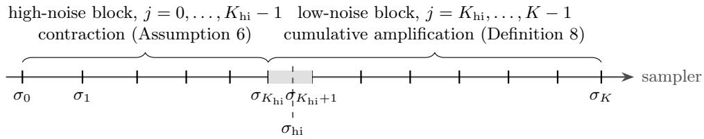  
Figure 5: The split index $K _ { \mathrm { h i } }$ of eq. (25) is the last level at or above the threshold $\sigma _ { \mathrm { h i } }$ . The step $\sigma _ { K _ { \mathrm { h i } } }  \sigma _ { K _ { \mathrm { h i } } + 1 }$ that crosses the threshold (shaded) is the first step of the low-noise block, so every high-noise step ends at or above $\sigma _ { \mathrm { h i } }$

Relation to prior work: contraction through denoiser regularity. S. Li and Zeng (2026) study deterministic difusion updates whose contraction certificates fail, measure their local Lipschitz behavior, and propose an inference-time correction based on Stein identities. Their first-order certificate includes the condition $\mathrm { L i p } ( \widehat { D } _ { \sigma } ) < 1$ in the EDM signal-scaling convention (S. Li and Zeng 2026, Sec. 4.1 and $\mathrm { A p p . { C . 1 } } )$ . In our parametrization, this is the condition that makes the predictor contractive: by $\mathrm { e q . ~ } ( 5 ) , \widehat { \Phi } _ { j } = ( 1 - a _ { j } ) \operatorname { I d } + a _ { j } \widehat { D } _ { \sigma _ { j } }$ , hence $\mathrm { L i p } ( \widehat { \Phi } _ { j } ) \leq 1 - a _ { j } \big ( 1 - \mathrm { L i p } ( \widehat { D } _ { \sigma _ { j } } ) \big )$ . The EDM preconditioning turns it into a condition on the raw network, since $\mathrm { L i p } ( \widehat { D } _ { \sigma _ { j } } ) \leq \alpha _ { j } + \beta _ { j } c _ { j } L _ { F , j } =$ $1 - b _ { j } < 1$ whenever $L _ { F , j } < \sigma _ { j } / \tau _ { q }$ , by eqs. (18) and (22). Our analysis uses this certificate only at high noise, applies to the uncorrected predictor, and replaces worst-case certificates at low noise by the amplification factor $\gamma _ { j }$

## E Propagation

This appendix complements Section 5. It details the split index, proves the directional and field-level bounds and their hierarchy, reads the directional rate geometrically, and proves the strict separation between the realized amplification and the worst-case majorants.

## E.1 The Split Index

With the convention $K _ { \mathrm { h i } } = 0$ when $\sigma _ { 0 } < \sigma _ { \mathrm { h i } }$ , the split index eq. (25) is the last level at or above $\sigma _ { \mathrm { h i } }$ The high-noise block is the set of steps $j = 0 , \ldots , K _ { \mathrm { h i } } - 1$ , each of which ends at $\sigma _ { j + 1 } \geq \sigma _ { \mathrm { h i } } ;$ the low-noise block is $j = K _ { \mathrm { h i } } , \ldots , K - 1$ , so the step $\sigma _ { K _ { \mathrm { h i } } }  \sigma _ { K _ { \mathrm { h i } } + 1 }$ that crosses the threshold belongs to the low-noise block (Figure 5). Either block may be empty, with the conventions that empty sums vanish and empty products equal one: $K _ { \mathrm { h i } } = 0$ when no step ends at or above the threshold, and $K _ { \mathrm { h i } } = K$ when $\sigma _ { K } \ge \sigma _ { \mathrm { h i } }$

The threshold plays no role in Definition 1: the family G is fixed first, and each member $G _ { K }$ then acquires its own split index $K _ { \mathrm { h i } } ( K )$ When $\underline { { \sigma } } < \sigma _ { \mathrm { h i } } \le \overline { { \sigma } }$ , the nested grids give $\sigma _ { K _ { \mathrm { h i } } ( K ) } \downarrow \sigma _ { \mathrm { h i } }$ and ${ K _ { \mathrm { h i } } ( K ) } / { K }  { ( \overline { { \eta } } - \sigma _ { \mathrm { h i } } ^ { \rho } ) } / { ( \overline { { \eta } } - \eta ) }$ as $K  \infty$ , so each block occupies a fixed asymptotic fraction of the schedule. Otherwise one block is empty for every K. In Assumption 6 the inequality needs no convention at $e _ { j } = 0$ , where both sides vanish.

## E.2 Low-Noise Majorants: Proofs

Figure 6 summarizes the majorants of $\Lambda _ { K }$ and their order.

Proof of Proposition 9. Since ${ \widehat { \Phi } } _ { j } ( x ) = x - \ell _ { j } { \widehat { v } } _ { \sigma _ { j } } ( x )$ , for all $x , y \in \mathbb { R } ^ { d }$

$$
\left\| \widehat { \Phi } _ { j } ( x ) - \widehat { \Phi } _ { j } ( y ) \right\| ^ { 2 } = \left\| x - y \right\| ^ { 2 } - 2 \ell _ { j } \left. x - y , \widehat { v } _ { \sigma _ { j } } ( x ) - \widehat { v } _ { \sigma _ { j } } ( y ) \right. + \ell _ { j } ^ { 2 } \left\| \widehat { v } _ { \sigma _ { j } } ( x ) - \widehat { v } _ { \sigma _ { j } } ( y ) \right\| ^ { 2 } .\tag{74}
$$

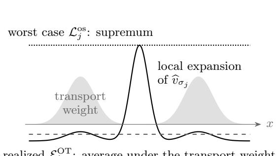

$$
\mathcal { E } _ { j } ^ { \mathrm { { O T } } } \colon
$$

(a)  
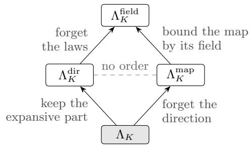  
(b)  
Figure 6: Schematic, not to scale. (a) Along one direction, the local expansion rate of the learned velocity (solid) peaks between the two modes of the law. The shaded density, with one lobe per mode, is the squared-displacement occupation of the optimal-coupling segments between $\mu _ { j }$ and $\widehat { \mu } _ { j }$ which is the weight in $\mathrm { e q . ~ } \left( 8 1 \right)$ : the transport moves mass within each mode, not across the gap where the expansion peaks. The global one-sided rate $\mathcal { L } _ { j } ^ { \mathrm { o s } }$ is the supremum of the expansion rate (dotted); the directional rate $\mathcal { E } _ { j } ^ { \mathrm { { O T } } }$ is its average under this weight (dashed), and stays small. In higher dimension the supremum also runs over all directions. (b) Majorants of $\Lambda _ { K } ;$ an arrow from A to B means $A \leq B$ , and each arrow discards the information named beside it. The directional and map-level majorants are not ordered, and Proposition 10 shows that the chain cannot be reversed.

If $e _ { j } = 0$ , then $\gamma _ { j } = 1$ by eq. (9) and $\mathcal { E } _ { j , + } ^ { \mathrm { O T } } = Q _ { j } ^ { \mathrm { O T } } = 0$ by convention, so eq. (28) and eq. (29) hold trivially. Let $e _ { j } > 0$ , so that $\mathbb { E } \| U _ { j } - \dot { V _ { j } } \| ^ { 2 } = e _ { j } ^ { 2 }$ , and define the signed directional expansion rate

$$
\mathcal { E } _ { j } ^ { \mathrm { O T } } = \frac { \mathbb { E } \left. V _ { j } - U _ { j } , \boldsymbol { \mathsf { v } } _ { j } \right. } { e _ { j } ^ { 2 } } , \qquad \mathrm { s o ~ t h a t } \qquad \mathcal { E } _ { j , + } ^ { \mathrm { O T } } = \left( \mathcal { E } _ { j } ^ { \mathrm { O T } } \right) _ { + } .\tag{75}
$$

Pushing the optimal coupling $( U _ { j } , V _ { j } )$ through $\widehat { \Phi } _ { j }$ gives a coupling of the two pushforwards, so $\begin{array} { r } { \gamma _ { j } ^ { 2 } e _ { j } ^ { 2 } \leq \mathbb { E } \left. \widehat { \Phi } _ { j } ( U _ { j } ) - \widehat { \Phi } _ { j } ( V _ { j } ) \right. ^ { 2 } } \end{array}$ . Taking expectations in eq. (74) at $( x , y ) = ( U _ { j } , V _ { j } )$ and dividing by $e _ { j } ^ { 2 } { \mathrm { : } }$

$$
\gamma _ { j } ^ { 2 } \leq \frac { \mathbb { E } \left\| \widehat { \Phi } _ { j } ( U _ { j } ) - \widehat { \Phi } _ { j } ( V _ { j } ) \right\| ^ { 2 } } { \epsilon _ { j } ^ { 2 } } = 1 + 2 \ell _ { j } \mathcal { E } _ { j } ^ { \mathrm { O T } } + \ell _ { j } ^ { 2 } Q _ { j } ^ { \mathrm { O T } } \leq 1 + 2 \ell _ { j } \mathcal { E } _ { j , + } ^ { \mathrm { O T } } + \ell _ { j } ^ { 2 } Q _ { j } ^ { \mathrm { O T } } ,\tag{76}
$$

which is eq. (28). Its right-hand side is at least one, so it also bounds $\overline { { \gamma } } _ { j } ^ { 2 } = \operatorname* { m a x } \{ 1 , \gamma _ { j } ^ { 2 } \}$ ; then log $\overline { { \gamma } } _ { j } =$ $\textstyle { \frac { 1 } { 2 } } \log { \overline { { \gamma } } } _ { j } ^ { 2 }$ and $\log ( 1 + x ) \leq x$ give eq. (29). Summing over the low-noise block gives eq. (30). □

The signed rate may be negative, in which case the step contracts the realized discrepancy at first order; only its positive part enters $\Lambda _ { K } ^ { \mathrm { d i r } }$ . At a step with $e _ { j } = 0$ the two laws coincide, $\gamma _ { j } = 1$ and every stepwise bound on log ${ \overline { { \gamma } } } _ { j }$ holds trivially; the signed rate, and the bounds on $\gamma _ { j }$ itself, are stated only for $e _ { j } > 0$

The hierarchy eq. (34) rests on the following certificate.

Corollary 29 (Field-level certificate). Assume that $\mathrm { L i p } ( \widehat { v } _ { \sigma _ { i } } ) < \infty$ at every low-noise step, and let $\mathcal { L } _ { j } ^ { \mathrm { o s } }$ be the global one-sided rate (32). Then $| { \mathcal { L } } _ { j } ^ { \mathrm { o s } } | \leq \mathrm { L i p } ( { \widehat { v } } _ { \sigma _ { j } } )$ , and $\mathcal { L } _ { j } ^ { \mathrm { o s } }$ is the smallest constant such that, for all x, $\boldsymbol { y } \in \mathbb { R } ^ { d }$

$$
- \left. \widehat { v } _ { \sigma _ { j } } ( x ) - \widehat { v } _ { \sigma _ { j } } ( y ) , x - y \right. \leq \mathcal { L } _ { j } ^ { \mathrm { o s } } \left. x - y \right. ^ { 2 } .\tag{77}
$$

At every low-noise step, $Q _ { j } ^ { \mathrm { O T } } \leq \mathrm { L i p } ( \widehat { v } _ { \sigma _ { j } } ) ^ { 2 }$ and $\mathcal { E } _ { j , + } ^ { \mathrm { O T } } \leq ( \mathcal { L } _ { j } ^ { \mathrm { o s } } ) _ { + }$ . Consequently, with $\Lambda _ { K } ^ { \mathrm { d i r } } , \Lambda _ { K } ^ { \mathrm { m a p } }$ and $\Lambda _ { K } ^ { \mathrm { f i e l d } }$ as in eqs. (30), (31) and (33), both chains of eq. (34) hold:

$$
\Lambda _ { K } \leq \Lambda _ { K } ^ { \mathrm { d i r } } \leq \Lambda _ { K } ^ { \mathrm { f i e l d } } , \qquad \Lambda _ { K } \leq \Lambda _ { K } ^ { \mathrm { m a p } } \leq \Lambda _ { K } ^ { \mathrm { f i e l d } } .
$$

These bounds remain valid if each $\mathcal { L } _ { j } ^ { \mathrm { o s } }$ is replaced by any larger constant, in particular by any constant satisfying eq. (77), both in the stepwise bounds and in $\Lambda _ { K } ^ { \mathrm { f i e l d } }$

The certificate follows from a stepwise chain, which also orders the directional, map and field bounds on a single step.

Corollary 30 (Field-level certificate, stepwise form). Under the hypotheses of Corollary 29, fix a low-noise step. Then $Q _ { j } ^ { \mathrm { O T } } \leq \mathrm { L i p } ( \widehat { v } _ { \sigma _ { j } } ) ^ { 2 } , \mathcal { E } _ { j , + } ^ { \mathrm { O T } } \leq ( \mathcal { L } _ { j } ^ { \mathrm { o s } } ) _ { - }$ +, and $i f e _ { j } > 0$ also $\mathcal { E } _ { j } ^ { \mathrm { { O T } } } \leq \mathcal { L } _ { j } ^ { \mathrm { { o s } } }$ and

$$
\gamma _ { j } ^ { 2 } \leq 1 + 2 \ell _ { j } \mathcal { E } _ { j } ^ { \mathrm { O T } } + \ell _ { j } ^ { 2 } Q _ { j } ^ { \mathrm { O T } }
$$

$$
\leq \mathrm { L i p } ( \widehat { \Phi } _ { j } ) ^ { 2 } \leq 1 + 2 \ell _ { j } \mathcal { L } _ { j } ^ { \mathrm { o s } } + \ell _ { j } ^ { 2 } \mathrm { L i p } ( \widehat { v } _ { \sigma _ { j } } ) ^ { 2 } .\tag{78}
$$

Moreover, at every low-noise step,

$$
\begin{array} { r } { \log \overline { { \gamma } } _ { j } \leq \ell _ { j } \mathcal { E } _ { j , + } ^ { \mathrm { O T } } + \frac { 1 } { 2 } \ell _ { j } ^ { 2 } Q _ { j } ^ { \mathrm { O T } } \leq \ell _ { j } \big ( \mathcal { L } _ { j } ^ { \mathrm { o s } } \big ) _ { + } + \frac { 1 } { 2 } \ell _ { j } ^ { 2 } \mathrm { L i p } ( \widehat { v } _ { \sigma _ { j } } ) ^ { 2 } , } \end{array}\tag{79}
$$

$$
\begin{array} { r } { \log \overline { { \gamma } } _ { j } \leq \log \operatorname* { m a x } \{ 1 , \mathrm { L i p } ( \widehat \Phi _ { j } ) \} \leq \ell _ { j } \big ( \mathcal { L } _ { j } ^ { \mathrm { o s } } \big ) _ { + } + \frac { 1 } { 2 } \ell _ { j } ^ { 2 } \mathrm { L i p } ( \widehat { v } _ { \sigma _ { j } } ) ^ { 2 } . } \end{array}\tag{80}
$$

Proof of the field-level certificate.

Proof of Corollaries 29 and 30. By Cauchy–Schwarz, the quotient in eq. (32) lies in $[ - \operatorname { L i p } ( \widehat { v } _ { \sigma _ { j } } )$ $\mathrm { L i p } ( \widehat { v } _ { \sigma _ { j } } ) ]$ , so its supremum $\mathcal { L } _ { j } ^ { \mathrm { o s } }$ is finite with $| \mathcal { L } _ { j } ^ { \mathrm { o s } } | \leq \mathrm { L i p } ( \widehat { v } _ { \sigma _ { j } } )$ ; being a supremum, it satisfies eq. (77) and no smaller constant does. If $e _ { j } > 0$ , then $\mathbb { E } \left\| U _ { j } - V _ { j } \right\| ^ { 2 } = e _ { j } ^ { 2 }$ . Applying eq. (77) at $( x , y ) =$ $( U _ { j } , V _ { j } )$ and taking expectations gives $\mathcal { E } _ { j } ^ { \mathrm { { O T } } } \leq \mathcal { L } _ { j } ^ { \mathrm { { o s } } }$ , hence $\mathcal { E } _ { j , + } ^ { \mathrm { O T } } \leq ( \mathcal { L } _ { j } ^ { \mathrm { o s } } ) _ { + } ;$ the Lipschitz bound gives $\mathbb { E } \left\| \mathsf { v } _ { j } \right\| ^ { 2 } \leq \mathrm { L i p } ( \widehat { \boldsymbol { v } } _ { \sigma _ { j } } ) ^ { 2 } e _ { j } ^ { 2 }$ , that is, $Q _ { j } ^ { \mathrm { O T } } \leq \mathrm { L i p } ( \widehat { v } _ { \sigma _ { j } } ) ^ { 2 }$ . When $e _ { j } = 0$ , the conventions give $Q _ { j } ^ { \mathrm { { O T } } } = \mathcal { E } _ { j , + } ^ { \mathrm { { O T } } } =$ $0 ,$ so these two bounds remain valid.

In eq. (78), the first inequality and the identification of the middle member with $\mathbb { E } \left\| \widehat { \Phi } _ { j } ( U _ { j } ) - \widehat { \Phi } _ { j } ( V _ { j } ) \right\| ^ { 2 } / e _ { j } ^ { 2 }$ are eq. (76); this quotient is at most $\mathrm { L i p } ( \widehat { \Phi } _ { j } ) ^ { 2 }$ , which is the second inequality. For the third, eq. (77) and the Lipschitz bound on $\widehat { v } _ { \sigma _ { j } }$ bound the right-hand side of eq. (74) by $\left( 1 + 2 \ell _ { j } \mathcal { L } _ { j } ^ { \mathrm { o s } } + \ell _ { j } ^ { 2 } \operatorname { L i p } ( \widehat { v } _ { \sigma _ { j } } ) ^ { 2 } \right) \| x - y \| ^ { 2 }$ for every pair $( x , y )$ . The restriction to $e _ { j } > 0$ matters only for the first two members: at $e _ { j } = 0$ the convention $\gamma _ { j } = 1$ is unrelated to $\mathrm { L i p } ( \widehat { \Phi } _ { j } )$ , which may be smaller than one.

In eq. (79), the first inequality is eq. (29) and the second follows from the two bounds just proved. In eq. (80), the first inequality follows from $\gamma _ { j } \leq \mathrm { L i p } ( \widehat { \Phi } _ { j } )$ when $e _ { j } > 0 \ ( \mathrm { e q . ~ } ( 7 8 ) )$ ) and from $\gamma _ { j } = 1$ when $e _ { j } = 0$ . For the second, the last inequality of eq. (78), whose proof does not use $e _ { j } .$ and $\mathcal { L } _ { j } ^ { \mathrm { o s } } \leq ( \mathcal { L } _ { j } ^ { \mathrm { o s } } ) _ { + }$ give max $\{ 1 , \mathrm { L i p } ( \widehat { \Phi } _ { j } ) ^ { 2 } \} \leq 1 + 2 \ell _ { j } ( \mathcal { L } _ { j } ^ { \mathrm { o s } } ) _ { + } + \ell _ { j } ^ { 2 } \mathrm { L i p } ( \widehat { v } _ { \sigma _ { j } } ) ^ { 2 }$ ; taking half the logarithm and using $\log ( 1 + x ) \leq x$ concludes.

Summing over the low-noise block, eq. (30) and the second inequality of eq. (79) give $\Lambda _ { K } \le$ $\Lambda _ { K } ^ { \mathrm { d i r } } \leq \Lambda _ { K } ^ { \mathrm { f i e l d } }$ , and the two inequalities of eq. (80) give $\Lambda _ { K } \leq \Lambda _ { K } ^ { \mathrm { m a p } } \leq \Lambda _ { K } ^ { \mathrm { f i e l d } }$ . Replacing $\mathcal { L } _ { j } ^ { \mathrm { o s } }$ by a larger constant only enlarges the right-hand sides of eqs. (78) to (80) and $\Lambda _ { K } ^ { \mathrm { f i e l d } }$ □

The hierarchy. The directional and map-level majorants are not ordered in general, because each discards something the other keeps: the directional sum keeps the direction of the displacement but has already dropped signed contraction (through the positive part) and relaxed the logarithm, whereas the map sum keeps the logarithm but tests every direction. For example, for ${ \widehat { v } } ( x ) = - x .$ one step contributes $\ell + \ell ^ { 2 } / 2$ to the directional sum but only $\log ( 1 + \ell )$ to the map sum. Before these two relaxations, the squared amplification is ordered, as eq. (78) shows.

## E.3 Geometric Reading of the Directional Rate

Under the additional assumption $\widehat { v } _ { \sigma _ { i } } \in C ^ { 1 } ( \mathbb { R } ^ { d } ; \mathbb { R } ^ { d } )$ , since $\mu _ { j }$ is absolutely continuous, Brenier’s theorem (Villani 2003, Theorem 2.12) allows the choice $V _ { j } = T _ { j } ( U _ { j } )$ for an optimal map $T _ { j }$ . With $\xi _ { j } ( x ) = T _ { j } ( x ) - x .$ for $e _ { j } > 0$ , the signed rate (75) reads

$$
\mathcal { E } _ { j } ^ { \mathrm { O T } } = - \frac { \int _ { 0 } ^ { 1 } \int \xi _ { j } ( x ) ^ { \top } \mathrm { S y m } \nabla \widehat { v } _ { \sigma _ { j } } \big ( x + t \xi _ { j } ( x ) \big ) \xi _ { j } ( x ) \mu _ { j } ( \mathrm { d } x ) \mathrm { d } t } { \int \left\| \xi _ { j } ( x ) \right\| ^ { 2 } \mu _ { j } ( \mathrm { d } x ) } .\tag{81}
$$

The directional rate is therefore an energy-weighted average of Rayleigh quotients of $- \operatorname { S y m } \nabla \widehat { v } _ { \sigma _ { j } }$ along the segments actually travelled by the transport, whereas eq. (32) is a supremum over all points and directions. The directional rate may be much smaller when the displacement avoids the most expansive eigendirections. Evaluated on finitely many sampled segments, the local quotients compare the displacement with the worst direction at the same points; they are an empirical diagnostic, not a certificate of $\mathrm { e q . }$ (32), which is how the CIFAR–10 probes of Section 7.3 must be read. At high noise the worst case is already favorable: by eq. (73), $\mathcal { L } _ { j } ^ { \mathrm { o s } } \leq - b _ { j } / \sigma _ { j } < 0$ whenever the EDM margin is positive, so following the realized displacement pays of only below the threshold.

Remark 31 (An integrable one-sided rate bounds $\Lambda _ { K } )$ . The field-level majorant separates a meshfree rate from a finite-step remainder, and gives the one suficient condition of this paper for $\Lambda _ { K }$ to stay bounded along G. Let $\ell _ { \mathrm { m a x } , K } = \mathrm { m a x } _ { j } \ell _ { j }$ . If $\sigma _ { \mathrm { h i } }$ lies in the interior of the noise range and $\sigma \mapsto ( \mathcal { L } ^ { \mathrm { o s } } ( \sigma ) ) _ { + }$ and $\sigma \mapsto \mathrm { L i p } ( \widehat { v } _ { \sigma } ) ^ { 2 }$ are Riemann integrable, the first-order part of $\Lambda _ { K } ^ { \mathrm { f i e l d } }$ converges to $\begin{array} { r l } {  { \int _ { \sigma } ^ { \sigma _ { \mathrm { h i } } } ( \mathcal { L } ^ { \mathrm { o s } } ( \sigma ) ) _ { + } } } \end{array}$ dσ. The quadratic part is at most $\begin{array} { r } { \frac 1 2 \ell _ { \mathrm { m a x } , K } \sum _ { j } \ell _ { j } \operatorname { L i p } ( \widehat { v } _ { \sigma _ { j } } ) ^ { 2 } \to 0 } \end{array}$ , so integrability of the one-sided rate yields a majorant, hence a $\Lambda _ { K }$ , bounded uniformly along G. For the oracle field, $- \nabla v _ { \sigma } = \sigma \nabla ^ { 2 } \log p _ { \sigma }$ by eq. (1), so both rates are governed by the small-noise behaviour of the log-Hessian of the smoothed data law; for laws supported on manifolds with corners, this behaviour is described by Brosse and Dalalyan (2026). The condition is worst-case in space; Proposition 10 shows how much it can overstate.

Relation to prior work: stability from the structure of the data law. Like Gao–Zhu, most Wasserstein guarantees obtain stability from structure of the data law or of the forward dynamics: strong log-concavity (Gao et al. 2025), weak log-concavity, which the forward smoothing strengthens along the path (Gentiloni Silveri and Ocello 2025; Stéphanovitch 2026; Kremling et al. 2025), or semiconvexity with strong convexity at infinity (Bruno and Sabanis 2025). These assumptions yield one-sided or global Lipschitz control of the flow between any two points. Our directional condition is also one-sided, but it concerns the learned velocity, and only along the optimal displacement between the exact and sampler laws: it is a property of the realized transport, not a consequence of a global property of the data law.

Relation to prior work: deterministic samplers and Jacobian control. Non-asymptotic guarantees for reverse-SDE samplers are commonly stated in total variation or Kullback–Leibler divergence (S. Chen et al. 2023b; Lee et al. 2023; H. Chen et al. 2023; Benton et al. 2024b; Conforti et al. 2025). These analyses typically compare path measures through Girsanov’s theorem, so the score error is evaluated along the exact process and no propagation factor through the learned dynamics appears. The probability-flow ODE admits no such change of measure, and guarantees for deterministic samplers require additional control. S. Chen et al. (2023c) obtain polynomial guarantees by interleaving the deterministic flow with stochastic corrector steps. G. Li et al. (2024b) analyze the deterministic sampler directly in total variation, assuming, in addition to $\mathbb { L } _ { 2 }$ score accuracy, control of the error on the score Jacobian; sharp total-variation analysis of probabilityflow discretization likewise assumes both score and score-Jacobian accuracy (G. Li et al. 2024a). S. Chen et al. (2023a) give polynomial guarantees for DDIM-type deterministic samplers, the family of the first-order EDM predictor, by decomposing each step into a restoration and a degradation step. In our $W _ { 2 }$ setting, this additional requirement is carried by the propagation factor $\gamma _ { j }$ , and Jacobian-type conditions play the role of its field-level majorants eq. (78). Benton et al. (2024a) bound the $W _ { 2 }$ error of flow-matching ODEs by a Grönwall argument under Lipschitz control of the learned field, which is the worst-case route of Corollary 29; Kwon et al. (2022) likewise bound the $W _ { 2 }$ error of the probability-flow ODE by the score-matching objective under Lipschitz conditions on the learned score. Arsenyan et al. (2025) obtain $W _ { 2 }$ guarantees for the stochastic DDPM sampler that are robust to noisy score evaluations, with rates matching the Gaussian case. Other recent Wasserstein analyses of difusion samplers include Koike (2026), Lyu and Huang (2026), and Tang et al. (2026).

## E.4 The Strict Separation from Worst-Case Stability

The proof of Proposition 10 is given below, together with the exact limit; the constant $C$ grows with $\overline { { \sigma } } / \underline { { \sigma } }$ and is large on the EDM noise range (Remark 33). The divergence is not a mesh-refinement instability: for each fixed ε, both worst-case majorants have a finite limit in K. They grow like $\varepsilon ^ { - 1 }$ across perturbations whose amplitude vanishes while their slope grows, whereas $\Lambda _ { K }$ stays identically zero. The map and field majorants agree at first order (Lemma 32), so the loss lies between the laws and the worst-case majorants, not between map and field. Appendix E.4 also gives a fixed construction with $\Lambda _ { K } = 0$ in which every predictor has infinite Lipschitz constant and every onesided rate is infinite (Proposition 34).

The mechanism is the translated initialization: it keeps the discrepancy large relative to the perturbation amplitude, so that the Gaussian contraction absorbs the perturbation. The proof bounds the cost of the optimal input coupling pushed through the predictor, without reoptimizing the output coupling. The construction therefore shows an advantage of realized displacements over worst-case regularity, but not the same separation with exact initialization and purely discretizationinduced error. The mixture experiment of Section 7.2 examines this non-adversarial counterpart.

Lemma 32 (Map and field agree at first order). Fix a step $j _ { ; }$ , assume $\mathrm { L i p } ( \widehat { v } _ { \sigma _ { j } } ) < \infty$ , and let $\mathcal { L } _ { j } ^ { \mathrm { o s } } \in \mathbb { R }$ be the smallest constant in eq. (77). Then

$$
1 + \ell _ { j } \mathcal { L } _ { j } ^ { \mathrm { o s } } \leq \mathrm { L i p } ( \widehat { \Phi } _ { j } ) \leq \sqrt { 1 + 2 \ell _ { j } \mathcal { L } _ { j } ^ { \mathrm { o s } } + \ell _ { j } ^ { 2 } \mathrm { L i p } ( \widehat { v } _ { \sigma _ { j } } ) ^ { 2 } } .\tag{82}
$$

Proof. The smallest constant exists and is finite, since by Cauchy–Schwarz the quotient below lies in $[ - \operatorname { L i p } ( \widehat { v } _ { \sigma _ { j } } ) , \operatorname { L i p } ( \widehat { v } _ { \sigma _ { j } } ) ]$ . The upper bound is the last inequality of eq. (78), whose proof does not use $e _ { j }$ . For the lower bound, take pairs $x \neq y$ along which $- \left. \widehat { v } _ { \sigma _ { j } } ( x ) - \widehat { v } _ { \sigma _ { j } } ( y ) , x - y \right. / \left. x - y \right. ^ { 2 }$ approaches $\mathcal { L } _ { j } ^ { \mathrm { o s } }$ . By Cauchy–Schwarz and ${ \widehat { \Phi } } _ { j } ( x ) = x - \ell _ { j } { \widehat { v } } _ { \sigma _ { j } } ( x )$

$$
\frac { \left\| \widehat { \Phi } _ { j } ( x ) - \widehat { \Phi } _ { j } ( y ) \right\| } { \left\| x - y \right\| } \geq \frac { \left. \widehat { \Phi } _ { j } ( x ) - \widehat { \Phi } _ { j } ( y ) , x - y \right. } { \left\| x - y \right\| ^ { 2 } } = 1 - \ell _ { j } \frac { \left. \widehat { v } _ { \sigma _ { j } } ( x ) - \widehat { v } _ { \sigma _ { j } } ( y ) , x - y \right. } { \left\| x - y \right\| ^ { 2 } } ,
$$

whose right-hand side approaches $1 + \ell _ { j } \mathcal { L } _ { j } ^ { \mathrm { o s } }$

When $\mathcal { L } _ { j } ^ { \mathrm { o s } } \geq 0$ , the lower bound gives $\mathrm { L i p } ( \widehat { \Phi } _ { j } ) \geq 1$ , and $x - x ^ { 2 } / 2 \leq \log ( 1 + x ) \leq x$ for $x \ge 0$ together with $\mathcal { L } _ { j } ^ { \mathrm { o s } } \leq \mathrm { L i p } ( \widehat { v } _ { \sigma _ { j } } )$ , turns eq. (82) into

$$
\begin{array} { r } { \left| \log \mathrm { L i p } ( \widehat \Phi _ { j } ) - \ell _ { j } \mathcal { L } _ { j } ^ { \mathrm { o s } } \right| \leq \frac { 1 } { 2 } \ell _ { j } ^ { 2 } \operatorname { L i p } ( \widehat v _ { \sigma _ { j } } ) ^ { 2 } . } \end{array}
$$

The step contribution log max $\{ 1 , \operatorname { L i p } ( \widehat { \Phi } _ { j } ) \}$ to $\Lambda _ { K } ^ { \mathrm { m a p } }$ and the step contribution $\ell _ { j } ( \mathcal { L } _ { i } ^ { \mathrm { o s } } ) _ { + } ~ +$ $\textstyle { \frac { 1 } { 2 } } \ell _ { j } ^ { 2 } \operatorname { L i p } ( \widehat { v } _ { \sigma _ { j } } ) ^ { 2 }$ to $\Lambda _ { K } ^ { \mathrm { f i e l d } }$ therefore share the first-order term $\ell _ { j } \mathcal { L } _ { j } ^ { \mathrm { o s } }$ and difer by at most $\ell _ { j } ^ { 2 } \mathrm { L i p } ( \widehat { v } _ { \sigma _ { j } } ) ^ { 2 }$ Throughout the rest of the appendix, set $\ell _ { \mathrm { t o t } } = \overline { \sigma } - \underline { \sigma }$ and $\vartheta = \underline { { \sigma } } / \overline { { \sigma } }$

Proof of Proposition $\mathit { 1 0 . }$ The construction perturbs the Gaussian denoiser by an oscillation of amplitude $\sigma \varepsilon$ and slope of order $\varepsilon ^ { - 1 }$ , and starts the sampler from a translate of $\mu _ { \overline { { \sigma } } }$ by $R _ { \star } \varepsilon$ . Part (a) follows from the amplitude of the perturbation. For (b), a lower bound on the mean of the sampler law keeps the discrepancy $e _ { j } ^ { \varepsilon }$ of order ε, and pushing an optimal coupling through the predictor then bounds $\gamma _ { j } ^ { \varepsilon }$ by one. For (c), the Lipschitz constants and one-sided rates are computed exactly, and the majorants become Riemann sums with explicit limits. Parts (a) and (b), and the exact stepwise formulas for these constants, hold for every $\varepsilon > 0 ;$ only the limits in (c) use $\varepsilon < 2 \tau _ { q }$ . The schedules are the grids $G _ { K } \in \mathfrak { G }$ of Definition 1; for each $\varepsilon ,$ the denoiser family and the initialization below are fixed across refinements. Since the construction is the same on every $G _ { K } \in \mathfrak { G }$ , we suppress $K$ from stepwise objects, writing for instance $\widehat { \Phi } _ { j } ^ { \varepsilon }$ for $\widehat { \Phi } _ { j , K } ^ { \varepsilon }$

Construction. The Gaussian target $q = \mathcal { N } ( 0 , \tau _ { q } ^ { 2 } )$ is centered with scale $\tau _ { q } ,$ and

$$
{ \cal D } _ { \sigma } ( x ) = \frac { \tau _ { q } ^ { 2 } } { \tau _ { q } ^ { 2 } + \sigma ^ { 2 } } x , \qquad v _ { \sigma } ( x ) = \varpi ( \sigma ) x , \qquad \varpi ( \sigma ) = \frac { \sigma } { \tau _ { q } ^ { 2 } + \sigma ^ { 2 } } .
$$

The rate $\varpi$ is unimodal with maximum $1 / ( 2 \tau _ { q } )$ at $\begin{array} { l l l l l l l l } { \sigma } & { = } & { \tau _ { q } , } & { \mathrm { s o } } & { \varpi _ { \mathrm { m i n } } } & { = } & { \operatorname* { m i n } _ { [ \underline { { \sigma } } , \overline { { \sigma } } ] } \varpi } & { = } & { } \end{array}$ min $\{ \varpi ( \underline { { \sigma } } ) , \varpi ( \overline { { \sigma } } ) \} > 0$ . Set

$$
R _ { \star } = \frac { 1 } { \vartheta } \operatorname* { m a x } \biggl \{ 2 \ell _ { \mathrm { t o t } } , \frac { 4 } { \varpi _ { \mathrm { m i n } } } \biggr \} .
$$

Initialize from the translate $\nu _ { 0 } ^ { \varepsilon } = ( x \mapsto x + R _ { \star } \varepsilon ) _ { \# } \mu _ { \overline { { \sigma } } }$ , so that $W _ { 2 } ( \nu _ { 0 } ^ { \varepsilon } , \mu _ { \sigma } ) = R _ { \star } \varepsilon$ , and set

$$
\widehat { D } _ { \sigma } ^ { \varepsilon } ( x ) = D _ { \sigma } ( x ) - \sigma \varepsilon \sin ( x / \varepsilon ^ { 2 } ) , \qquad \sigma \in [ \underline { { \sigma } } , \overline { { \sigma } } ] .
$$

This denoiser admits the EDM parametrization eq. (18): since $\beta _ { j } , c _ { j } > 0$ , inverting eq. (18) defines the raw output $\widehat { F } _ { j } ( u ) = \beta _ { j } ^ { - 1 } \big ( \widehat { D } _ { \sigma _ { j } } ^ { \varepsilon } ( u / c _ { j } ) - \alpha _ { j } u / c _ { j } \big )$ . The learned velocity and predictor are

$$
\begin{array} { r } { \hat { v } _ { \sigma } ^ { \varepsilon } ( x ) = \varpi ( \sigma ) x + \varepsilon \sin ( x / \varepsilon ^ { 2 } ) , \qquad \widehat { \Phi } _ { j } ^ { \varepsilon } ( x ) = \chi _ { j } x - \ell _ { j } \varepsilon \sin ( x / \varepsilon ^ { 2 } ) , \qquad \chi _ { j } = 1 - \ell _ { j } \varpi ( \sigma _ { j } ) . } \end{array}\tag{83}
$$

Each predictor is smooth and globally Lipschitz, hence satisfies Assumption 4.

(a) Small errors. The initialization error is $R _ { \star } \varepsilon$ by construction, and the denoiser error is pointwise at most $\sigma \varepsilon$ . By eq. (21) and $\beta ( \sigma ) = \sigma \tau _ { q } / \sqrt { \tau _ { q } ^ { 2 } + \sigma ^ { 2 } }$

$$
\mathcal { R } _ { j } ^ { \varepsilon } = \frac { \Big \| \widehat { D } _ { \sigma _ { j } } ^ { \varepsilon } ( X _ { \sigma _ { j } } ) - D _ { \sigma _ { j } } ( X _ { \sigma _ { j } } ) \Big \| _ { \mathbb { L } _ { 2 } } } { \beta _ { j } } \leq \frac { \sqrt { \tau _ { q } ^ { 2 } + \sigma _ { j } ^ { 2 } } } { \tau _ { q } } \varepsilon \leq \frac { \sqrt { \tau _ { q } ^ { 2 } + \overline { { \sigma } } ^ { 2 } } } { \tau _ { q } } \varepsilon .
$$

This is (a), with $C = \operatorname* { m a x } \{ R _ { \star } , \sqrt { \tau _ { q } ^ { 2 } + \overline { { \sigma } } ^ { 2 } } / \tau _ { q } \}$

(b) Zero cumulative log-amplification. We first show that the discrepancy never falls below the perturbation scale. Since $\varpi ( \sigma ) < 1 / \sigma$

$$
1 > \chi _ { j } > 1 - \frac { \ell _ { j } } { \sigma _ { j } } = \frac { \sigma _ { j + 1 } } { \sigma _ { j } } > 0 ,
$$

so every product of consecutive factors $\chi _ { i }$ starting at level 0 is at least $\vartheta .$ Let $\bar { x } _ { j } ^ { \varepsilon }$ be the mean of $\widehat { \mu } _ { j } ^ { \varepsilon }$ so $\bar { x } _ { 0 } ^ { \varepsilon } = R _ { \star } \varepsilon$ . Taking expectations in eq. (83) gives $\bar { x } _ { j + 1 } ^ { \varepsilon } \geq \chi _ { j } \bar { x } _ { j } ^ { \varepsilon } - \ell _ { j } \varepsilon$ . Iterating with $0 < \chi _ { i } < 1$

$$
\bar { x } _ { j } ^ { \varepsilon } \geq \vartheta R _ { \star } \varepsilon - \varepsilon \sum _ { i < j } \ell _ { i } \geq \varepsilon ( \vartheta R _ { \star } - \ell _ { \mathrm { t o t } } ) \geq \frac { \vartheta R _ { \star } } { 2 } \varepsilon ,
$$

by the choice $\vartheta R _ { \star } \geq 2 \ell _ { \mathrm { t o t } }$ . The exact laws µ are centered, and $\mu _ { j }$ $W _ { 2 }$ dominates the distance between means, hence

$$
e _ { j } ^ { \varepsilon } \geq \bar { x } _ { j } ^ { \varepsilon } \geq \frac { \vartheta R _ { \star } } { 2 } \varepsilon > 0 \qquad \mathrm { a t ~ e v e r y ~ s t e p ~ o f ~ e v e r y ~ s c h e d u l e } .\tag{84}
$$

Next, push an optimal coupling $( U _ { j } , V _ { j } )$ of $( \mu _ { j } , \widehat { \mu } _ { j } ^ { \varepsilon } )$ through $\widehat { \Phi } _ { j } ^ { \varepsilon }$ . Minkowski’s inequality, eq. (83), and | sin $u - \sin v | \leq 2$ give $W _ { 2 } \big ( ( \widehat { \Phi } _ { j } ^ { \varepsilon } ) _ { \# } \mu _ { j } , ( \widehat { \Phi } _ { j } ^ { \varepsilon } ) _ { \# } \widehat { \mu } _ { j } ^ { \varepsilon } \big ) \leq \chi _ { j } e _ { j } ^ { \varepsilon } + 2 \ell _ { j } \varepsilon$ . With eq. (84),

$$
\gamma _ { j } ^ { \varepsilon } \leq \chi _ { j } + \frac { 2 \ell _ { j } \varepsilon } { e _ { j } ^ { \varepsilon } } \leq 1 - \ell _ { j } \Big ( \varpi ( \sigma _ { j } ) - \frac { 4 } { \vartheta R _ { \star } } \Big ) \leq 1 ,
$$

by the choice $\vartheta R _ { \star } \geq 4 / \varpi _ { \operatorname* { m i n } }$ . This holds for every $\varepsilon > 0$ . Since $\sigma _ { \mathrm { h i } } > \overline { { \sigma } } .$ , every step belongs to the low-noise block, so the cumulative log-amplification (Definition 8) vanishes, $\Lambda _ { K } = 0$ . This is (b).

(c) Worst-case expansion. We first compute the one-sided rates and Lipschitz constants. By eq. (83), $( \widehat { v } _ { \sigma _ { j } } ^ { \varepsilon } ) ^ { \prime } ( x ) = \varpi ( \sigma _ { j } ) + \varepsilon ^ { - 1 } \cos ( x / \varepsilon ^ { 2 } )$ , so in dimension one eq. (32) reads

$$
\mathcal { L } _ { j } ^ { \mathrm { o s } } = \operatorname* { s u p } _ { x } \bigl ( - ( \widehat { v } _ { \sigma _ { j } } ^ { \varepsilon } ) ^ { \prime } ( x ) \bigr ) = \varepsilon ^ { - 1 } - \varpi ( \sigma _ { j } ) \ \geq \ \varepsilon ^ { - 1 } - \frac { 1 } { 2 \tau _ { q } } .
$$

This lower bound holds at each step separately, with a constant independent of $j$ and $K ;$ it does not come from accumulation over steps. Summed over the schedule, it makes the first term of eq. (33) at least $\begin{array} { r } { \sum _ { i } \ell _ { j } ( \varepsilon ^ { - 1 } - 1 / ( 2 \tau _ { q } ) ) = \ell _ { \mathrm { t o t } } ( \varepsilon ^ { - 1 } - 1 / ( 2 \tau _ { q } ) ) } \end{array}$ . The same slope drives the map: diferentiating eq. (83) gives $( \widehat { \Phi } _ { j } ^ { \varepsilon } ) ^ { \prime } ( x ) = \chi _ { j } - ( \ell _ { j } / \varepsilon ) \cos ( x / \varepsilon ^ { 2 } )$ , and because $\chi _ { j } > 0$ its supremum in absolute value is attained where the cosine equals −1:

$$
\mathrm { L i p } ( \widehat { \Phi } _ { j } ^ { \varepsilon } ) = \chi _ { j } + \frac { \ell _ { j } } { \varepsilon } = 1 + \ell _ { j } \mathcal { L } _ { j } ^ { \mathrm { o s } } ,
$$

so $\mathrm { e q . }$ (82) holds with equality here and

$$
\frac { \mathrm { L i p } ( \widehat { \Phi } _ { j } ^ { \varepsilon } ) - 1 } { \ell _ { j } } = \mathcal { L } _ { j } ^ { \mathrm { o s } } \geq \varepsilon ^ { - 1 } - \frac { 1 } { 2 \tau _ { q } } .
$$

These exact stepwise formulas hold for every $\varepsilon > 0 .$ , and show that the map and field majorants quantify the same gap.

We now pass to the limits, and assume $\varepsilon < 2 \tau _ { q }$ . Then $\varepsilon ^ { - 1 } > 1 / ( 2 \tau _ { q } ) \geq \varpi ( \sigma _ { j } )$ , so $\mathcal { L } _ { j } ^ { \mathrm { o s } } > 0$ and every $\mathrm { L i p } ( \widehat { \Phi } _ { j } ^ { \varepsilon } ) = 1 + \ell _ { j } \mathcal { L } _ { j } ^ { \mathrm { o s } }$ exceeds one. This is what allows us to drop the maximum with one in $\Lambda _ { K } ^ { \mathrm { m a p } , \varepsilon }$ , which becomes $\begin{array} { r } { \sum _ { j = 0 } ^ { K - 1 } \log \operatorname { L i p } ( \widehat { \Phi } _ { j } ^ { \varepsilon } ) } \end{array}$ . Write $x _ { j } = \ell _ { j } \mathcal { L } _ { j } ^ { \mathrm { o s } } = \ell _ { j } ( \varepsilon ^ { - 1 } - \varpi ( \sigma _ { j } ) ) \in [ 0 , \ell _ { j } / \varepsilon ]$ . Since $x - x ^ { 2 } / 2 \leq \log ( 1 + x ) \leq x$ for $x \geq 0$

$$
\Big | \sum _ { j = 0 } ^ { K - 1 } \log \operatorname { L i p } ( \widehat { \Phi } _ { j } ^ { \varepsilon } ) - \sum _ { j = 0 } ^ { K - 1 } x _ { j } \Big | \leq \frac { 1 } { 2 } \sum _ { j = 0 } ^ { K - 1 } x _ { j } ^ { 2 } \leq \frac { \ell _ { \mathrm { t o t } } } { 2 \varepsilon ^ { 2 } } \ell _ { \mathrm { m a x } , K } .
$$

As $K  \infty$ along $\mathcal { H } , \ell _ { \mathrm { m a x } , K } \to 0 .$ , so the remainder vanishes and the Riemann sum converges to $\begin{array} { r } { \int _ { \underline { { \sigma } } } ^ { \overline { { \sigma } } } ( \varepsilon ^ { - 1 } - \varpi ( \sigma ) ) } \end{array}$ dσ. Since $\begin{array} { r } { \int { \varpi ( \sigma ) \mathrm { d } \sigma } = \frac { 1 } { 2 } \log ( \tau _ { q } ^ { 2 } + \sigma ^ { 2 } ) } \end{array}$ , this gives the map-level limit

$$
\operatorname* { l i m } _ { K \to \infty } \Lambda _ { K } ^ { \mathrm { m a p , } \varepsilon } = \frac { \overline { { \sigma } } - \underline { { \sigma } } } { \varepsilon } - \frac { 1 } { 2 } \log \frac { \tau _ { q } ^ { 2 } + \overline { { \sigma } } ^ { 2 } } { \tau _ { q } ^ { 2 } + \underline { { \sigma } } ^ { 2 } } .\tag{85}
$$

It remains to identify the limit of the field-level majorant $\Lambda _ { K } ^ { \mathrm { f i e l d } , \varepsilon }$ of eq. (33). Since $\varepsilon ^ { - 1 } > \varpi ( \sigma _ { j } )$ the derivative computed above gives

$$
\begin{array} { r } { \mathrm { L i p } ( \widehat { v } _ { \sigma _ { j } } ^ { \varepsilon } ) = \varepsilon ^ { - 1 } + \varpi ( \sigma _ { j } ) . } \end{array}
$$

Therefore

$$
0 \leq \frac { 1 } { 2 } \sum _ { j = 0 } ^ { K - 1 } \ell _ { j } ^ { 2 } \operatorname { L i p } ( \widehat { v } _ { \sigma _ { j } } ^ { \varepsilon } ) ^ { 2 } \leq \frac { \ell _ { \mathrm { t o t } } } { 2 } \left( \varepsilon ^ { - 1 } + \frac { 1 } { 2 \tau _ { q } } \right) ^ { 2 } \ell _ { \mathrm { { m a x } } , K } \longrightarrow 0 .
$$

The first-order term of $\begin{array} { r } { \Lambda _ { K } ^ { \mathrm { f i e l d } , \varepsilon } \mathrm { i s } \sum _ { j } \ell _ { j } ( \mathcal { L } _ { j } ^ { \mathrm { o s } } ) _ { + } = \sum _ { j } x _ { j } } \end{array}$ , whose Riemann-sum limit is the map-level limit just computed. Hence the field and map majorants have the common limit (85), which is of the form $( \overline { { \sigma } } - \underline { { \sigma } } ) / \varepsilon + O ( 1 )$ with $\begin{array} { r } { O ( 1 ) = - \frac { 1 } { 2 } \log \bigl ( ( \tau _ { q } ^ { 2 } + \overline { { \sigma } } ^ { 2 } ) / ( \tau _ { q } ^ { 2 } + \underline { { \sigma } } ^ { 2 } ) \bigr ) } \end{array}$ . This term depends only on $\tau _ { q } , \underline { { \sigma } }$ and ${ \overline { { \sigma } } } ,$ not on ε, and lies in $[ - \log ( \overline { { \sigma } } / \overline { { \underline { { \sigma } } } } ) , 0 ]$ . This proves (c). □

Remark 33 (Cost of the construction). The price of the separation is the size of the translation $R _ { \star } \varepsilon .$ the constant C of Proposition 10 is at least $R _ { \star } = ( \overline { { \sigma } } / \underline { { \sigma } } ) \operatorname* { m a x } \{ 2 ( \overline { { \sigma } } - \underline { { \sigma } } ) , 4 / \varpi _ { \operatorname* { m i n } } \}$ , and both factors are large on wide noise ranges. The first is the ratio of the endpoints. In the second, $4 / \varpi ( \sigma ) = 4 ( \tau _ { q } ^ { 2 } + \sigma ^ { 2 } ) / \sigma$ , so $4 / \varpi _ { \mathrm { m i n } }$ is of order max $\{ \tau _ { q } ^ { 2 } / \underline { { \sigma } } , \overline { { \sigma } } \}$ when $\underline { { \sigma } } \ll \tau _ { q } \ll \overline { { \sigma } }$ With the EDM endpoints $\underline { { \sigma } } = 0 . 0 0 2 , \overline { { \sigma } } = 8 0$ and $\tau _ { q } = 0 . 5$ , the ratio is $\dot { 4 } \times 1 0 ^ { 4 }$ and $4 / \varpi _ { \mathrm { m i n } } \approx 5 0 0$

The first construction gives a quantitative separation: both worst-case majorants are finite for each fixed $\varepsilon$ but arbitrarily large as $\varepsilon \downarrow 0$ . A fixed construction, in which the perturbation does not vary along a vanishing parameter, gives the qualitative non-implication.

Proposition 34 (Zero cumulative log-amplification with infinite worst-case constants). In the setting of Proposition 10, for every $\bar { \varepsilon } > 0$ there are a smooth denoiser family satisfying Assumption 4 and the EDM parametrization, and an initialization, such that on the same refinement grids $\gamma _ { j , K } \leq 1$ at every step of every schedule, so $\Lambda _ { K } = 0$ , while every predictor has infinite global Lipschitz constant and every one-sided rate $\mathcal { L } _ { j } ^ { \mathrm { o s } }$ is infinite.

Proof. Let $\bar { \varepsilon } > 0$ , take $R _ { \star }$ as in the proof above, let $\nu _ { 0 } ^ { \mathrm { f i x } , \bar { \varepsilon } }$ be the translate of $\mu _ { \overline { { \sigma } } }$ by $R _ { \star } \bar { \varepsilon } ,$ , and define the second, now fixed, denoiser family

$$
\begin{array} { r } { \widehat { D } _ { \sigma } ^ { \mathrm { f i x } , \bar { \varepsilon } } ( x ) = D _ { \sigma } ( x ) - \sigma \bar { \varepsilon } \sin ( x ^ { 2 } ) . } \end{array}
$$

Attach this denoiser family and initialization, fixed across refinements, to the grids $G _ { K } \in \mathfrak { G }$ . The residual, mean, and coupling arguments above use only the amplitude bounds $| \sin | \leq 1$ and | sin $u -$ sin $\left| \boldsymbol { v } \right| \leq 2$ , not the frequency of the oscillation, which changes from $x / \varepsilon ^ { 2 } \mathrm { t o } x ^ { 2 }$ . They apply verbatim with ε replaced by $\bar { \varepsilon } \colon \left( \mathrm { a } \right)$ of Proposition 10 holds with ε¯ in place of $\varepsilon ,$ , and the corresponding factors satisfy $\gamma _ { j , K } ^ { \mathrm { f i x } , \bar { \varepsilon } } \leq 1$ at every step of every $G _ { K } \in \mathfrak { G }$ . The associated predictor $\widehat { \Phi } _ { j } ^ { \mathrm { f i x } , \bar { \varepsilon } } ( x ) = \chi _ { j } x - \ell _ { j } \bar { \varepsilon } \sin ( x ^ { 2 } )$ is smooth, hence locally Lipschitz, and satisfies $| \widehat { \Phi } _ { j } ^ { \mathrm { f i x } , \bar { \varepsilon } } ( x ) | \leq | x | + \ell _ { j } \bar { \varepsilon }$ , so Assumption 4 holds. But

$$
( \widehat { \Phi } _ { j } ^ { \mathrm { f i x } , \bar { \varepsilon } } ) ^ { \prime } ( x ) = \chi _ { j } - 2 \ell _ { j } \bar { \varepsilon } x \cos ( x ^ { 2 } )
$$

is unbounded, so $\mathrm { L i p } ( \widehat \Phi _ { i } ^ { \mathrm { f i x } , \bar { \varepsilon } } ) = \infty$ at every step; and since $( \hat { v } _ { \sigma _ { j } } ^ { \mathrm { f i x } , \bar { \varepsilon } } ) ^ { \prime } ( x ) = \varpi ( \sigma _ { j } ) + 2 \bar { \varepsilon } x \cos ( x ^ { 2 } )$ is unbounded below as well, $\mathcal { L } _ { i } ^ { \mathrm { o s } } = \infty$ and eq. (77) holds for no finite constant. Neither worst-case certificate is available, while $\bar { \Lambda } _ { K } = 0$ □

Remark 35 (Conjecture: localized perturbations). We conjecture, without proof, that the oscillatory form is not essential: a narrow smooth bump should confine the large derivative to an arbitrarily small spatial region, and a cutof in σ should confine the perturbation to a prescribed low-noise interval while leaving the high-noise denoiser unchanged, with the same arguments.

## F The Global Wasserstein Bound

This appendix complements Section 6. It proves the high-noise and low-noise block estimates, with the summation lemmas they rely on, and concatenates them into the proofs of Theorem 11 and corollary 12; it then bounds the initialization error and extends the bound to the deployed sample.

## F.1 Explicit Form of the Global Bound

Two quantities of the proof are left implicit in Theorem 11. On a finite mesh the kernel contracts slightly less than its continuous form, by the factor

$$
\kappa ( \theta ) = \frac { 1 - ( 1 - \theta ) ^ { 1 / \rho } } { \rho ^ { - 1 } \log \bigl ( ( 1 - \theta ) ^ { - 1 } \bigr ) } \in ( 0 , 1 )\tag{86}
$$

at relative step $h / \eta _ { j } = \theta$ , and $\kappa ( \theta ) \uparrow 1$ as $\theta \downarrow 0$ . The learning terms sum to the learning scale

$$
\begin{array} { l } { \Upsilon ( s _ { 1 } , s _ { 0 } ) = \displaystyle \int _ { s _ { 1 } } ^ { s _ { 0 } } \frac { \tau _ { q } \mathrm { d } s } { \sqrt { s ^ { 2 } + \tau _ { q } ^ { 2 } } } } \\ { \quad \le \operatorname* { m i n } \Bigl \{ s _ { 0 } - s _ { 1 } , \tau _ { q } \log \Bigl ( 1 + \frac { 2 s _ { 0 } } { \tau _ { q } } \Bigr ) \Bigr \} . } \end{array}\tag{87}
$$

Theorem 36 (Global Wasserstein bound, explicit form). Under the hypotheses of Theorem 11, set $b _ { \mathrm { e f f } } = b _ { \mathrm { h i } } \kappa ( \theta _ { \mathrm { h i } } )$ and $C _ { \star } = C _ { \rho , \mathrm { { m a x } } ( \theta _ { \mathrm { { h i } } } , \theta _ { \mathrm { { l o } } } ) }$ , the constant of Lemma $\mathit { 4 1 } .$ For every $G _ { K } \in \mathfrak { G }$ satisfying the mesh condition

$$
h _ { K } \leqslant \mathrm { m i n } \big \{ \theta _ { \mathrm { h i } } \sigma _ { \mathrm { h i } } ^ { \rho } , ~ \theta _ { \mathrm { l o } } \underline { { \sigma } } ^ { \rho } \big \} ,\tag{88}
$$

the bound (36) holds with DiscK as in Theorem 11, that is,

$$
\mathrm { D i s c } _ { K } = C _ { \star } B _ { d , 1 } h _ { K } \big [ \Xi _ { \rho } ( 0 ; \sigma _ { K } , \sigma _ { K _ { \mathrm { h i } } } ) + \Xi _ { \rho } ( b _ { \mathrm { e f f } } ; \sigma _ { K _ { \mathrm { h i } } } , \sigma _ { 0 } ) \big ] ,
$$

and with the learning term

$$
\mathrm { L e a r n } _ { K } = \sqrt { d } C _ { \mathrm { r e s } } \Big [ { \frac { \tau _ { q } } { b _ { \mathrm { h i } } } } \big ( 1 - \Pi _ { 0 , K _ { \mathrm { h i } } } \big ) + \Upsilon ( \sigma _ { K } , \sigma _ { K _ { \mathrm { h i } } } ) \Big ] ,
$$

which is at most the learning term of Theorem 11 by $e q .$ (87).

Remark 37 (Three regimes, one rate). Since $\Xi _ { \rho }$ is nonincreasing in b, contraction is not what makes the discretization error first order; it decides which noise scale sets the constant. For $\rho < 1$ , the high-noise scale function $\Xi _ { \rho } ( b _ { \mathrm { { e f f } } } ; \sigma _ { K _ { \mathrm { { h i } } } } , \sigma _ { 0 } )$ is at most $\sigma _ { K _ { \mathrm { h i } } } ^ { 1 - \rho } / ( b _ { \mathrm { e f f } } + \rho - 1 ) \ i f b _ { \mathrm { e f f } } > 1 - \rho$ (supercritical), $\sigma _ { K _ { \mathrm { h i } } } ^ { 1 - \rho } \log ( \sigma _ { 0 } / \sigma _ { K _ { \mathrm { h i } } } ) ~ i f b _ { \mathrm { e f f } } = 1 - \rho$ (critical), and $\sigma _ { K _ { \mathrm { h i } } } ^ { b _ { \mathrm { e f f } } } \sigma _ { 0 } ^ { 1 - \rho - b _ { \mathrm { e f f } } } / ( 1 - \rho - b _ { \mathrm { e f f } } ) \ i f b _ { \mathrm { e f f } } < 1 - \rho$ (subcritical). In the supercritical regime the damped sum of the local discretization biases of the high-noise block is set by $\sigma _ { K _ { \mathrm { h i } } }$ alone, however large $\sigma _ { 0 }$ is. At $\rho = 1 / 7 \ \left( \rho _ { \mathsf { E D M } } = 7 \right)$ the supercritical condition reads $b _ { \mathrm { e f f } } > 6 / 7$ . Since $b _ { \mathrm { { e f f } } } = b _ { \mathrm { { h i } } } \kappa ( \theta _ { \mathrm { { h i } } } ) < b _ { \mathrm { { h i } } }$ and $\kappa ( \theta _ { \mathrm { h i } } ) \uparrow 1$ as $\theta _ { \mathrm { h i } } \downarrow 0 $ , it requires $b _ { \mathrm { h i } } > 6 / 7$ , and is then met on every suficiently fine mesh, that is, for $\theta _ { \mathrm { h i } }$ small enough (Section 7.3).

## F.2 High-Noise Block

Under the high-noise contraction eq. (26), eq. (24) specializes to

$$
e _ { j + 1 } \leq ( 1 - b _ { \mathrm { h i } } a _ { j } ) e _ { j } + \Delta _ { j } + a _ { j } \beta _ { j } \mathcal { R } _ { j } , \qquad j = 0 , \ldots , K _ { \mathrm { h i } } - 1 .\tag{89}
$$

Under the EDM certificate of Proposition $^ { 7 , }$ the step-dependent factor $1 - a _ { j } b _ { j }$ may replace $1 - b _ { \mathrm { h i } } a _ { j }$ throughout. The kernel of Section 6, $\begin{array} { r } { \Pi _ { r , k } = \prod _ { i = r } ^ { k - 1 } ( 1 - b _ { \mathrm { h i } } a _ { i } ) } \end{array}$ for $0 \leqslant r \leqslant k _ { \mathrm { : } }$ has factors in $( 0 , 1 )$ and $\Pi _ { k , k } = 1$ (empty product). It satisfies $\Pi _ { r , k } = ( 1 - b _ { \mathrm { h i } } a _ { r } ) \Pi _ { r + 1 , k }$ for $r < k$

Proposition 38 (High-noise contraction estimate). Let $b _ { \mathrm { h i } } \in ( 0 , 1 )$ , and assume Assumption $^ { 5 }$ and the high-noise contraction $e q .$ (26). Then, for every $G _ { K } \in \mathfrak { G }$ and every $k \in \{ 0 , \ldots , K _ { \mathrm { h i } } \}$ ，

$$
e _ { k } \le \Pi _ { 0 , k } e _ { 0 } + \sum _ { j = 0 } ^ { k - 1 } \Pi _ { j + 1 , k } \Delta _ { j } + \frac { \tau _ { q } \sqrt { d } C _ { \mathrm { r e s } } } { b _ { \mathrm { h i } } } \left( 1 - \Pi _ { 0 , k } \right) .
$$

Proof. For $k = 0$ the bound reads $e _ { 0 } \leqslant e _ { 0 }$ . For $k \geqslant 1$ , iterating eq. (89) for $j = 0 , \ldots , k - 1$ , all of whose coeficients are nonnegative, gives $\begin{array} { r } { e _ { k } \leqslant \Pi _ { 0 , k } e _ { 0 } + \sum _ { j = 0 } ^ { k - 1 } \Pi _ { j + 1 , k } ( \Delta _ { j } + a _ { j } \beta _ { j } \mathcal { R } _ { j } ) } \end{array}$ . Since $\beta _ { j } \leqslant \tau _ { q }$ and $\mathcal { R } _ { j } \leqslant \sqrt { d } C _ { \mathrm { r e s } }$ , the learning term satisfies $a _ { j } \beta _ { j } \mathcal { R } _ { j } \leq \left( \tau _ { q } \sqrt { d } C _ { \mathrm { r e s } } / b _ { \mathrm { h i } } \right) b _ { \mathrm { h i } } a _ { j } .$ , and the kernel telescopes: $\Pi _ { j + 1 , k } b _ { \mathrm { h i } } a _ { j } = \Pi _ { j + 1 , k } - \Pi _ { j , k }$ , whose sum over $j = 0 , \ldots , k - 1 \ \mathrm { i s } \Pi _ { k , k } - \Pi _ { 0 , k } = 1 - \Pi _ { 0 , k }$ □

The kernel damps the initialization error and saturates the accumulated learning error at $\tau _ { q } \sqrt { d } C _ { \mathrm { r e s } } / b _ { \mathrm { h i } }$ , however many steps the block contains. In the damped bias sum $\begin{array} { r } { \sum _ { j } \Pi _ { j + 1 , k } \Delta _ { j } } \end{array}$ the universal bias bound $\Delta _ { j }$ is of order $h ^ { 2 } \sigma _ { j } ^ { 1 - 2 \rho }$ , so for $\rho < 1 / 2$ the earliest, highest-noise steps contribute the most, and the kernel discounts those same steps geometrically. The scale function eq. (35) measures the outcome; explicitly,

$$
\begin{array} { r } { \Xi _ { \rho } ( b ; s _ { 1 } , s _ { 0 } ) = \left\{ \begin{array} { l l } { \displaystyle \frac { s _ { 1 } ^ { 1 - \rho } } { b + \rho - 1 } \Big [ 1 - \Big ( \frac { s _ { 1 } } { s _ { 0 } } \Big ) ^ { b + \rho - 1 } \Big ] , } & { b \neq 1 - \rho , } \\ { \displaystyle s _ { 1 } ^ { 1 - \rho } \log \frac { s _ { 0 } } { s _ { 1 } } , } & { b = 1 - \rho , } \end{array} \right. } \end{array}
$$

and $\begin{array} { r } { \Xi _ { \rho } ( 0 ; s _ { 1 } , s _ { 0 } ) = \int _ { s _ { 1 } } ^ { s _ { 0 } } s ^ { - \rho } \mathrm { d } s } \end{array}$ is the undamped sum. On a finite mesh the relaxation $a _ { j }$ is smaller than the log-noise increment $r _ { j } = \log ( \sigma _ { j } / \sigma _ { j + 1 } )$ , whose sums give the continuous kernel, and $\kappa ( \theta )$ of eq. (86) is the value of $\boldsymbol { a } _ { j } / r _ { j }$ at $h / \eta _ { j } = \theta$ . On every stretch of steps with $h / \eta _ { i } \leqslant \theta$ for $i = j , \ldots , k - 1$ $\Pi _ { j , k } \le ( \sigma _ { k } / \sigma _ { j } ) ^ { b _ { \mathrm { h i } } \kappa ( \theta ) }$ (Lemma 42).

Proposition 39 (High-noise estimate on the refinement family). Let $0 < \rho \leqslant 1$ and $b _ { \mathrm { h i } } \in ( 0 , 1 )$ , and assume Assumption 5 and the high-noise contraction eq. (26). Fix $\theta _ { \mathrm { h i } } \in ( 0 , 1 )$ and set $\kappa _ { \mathrm { h i } } = \kappa ( \theta _ { \mathrm { h i } } )$ and $b _ { \mathrm { e f f } } = b _ { \mathrm { h i } } \kappa _ { \mathrm { h i } }$ . There is a constant $C _ { \rho , \theta _ { \mathrm { h i } } } < \infty$ , depending only on $\rho$ and $\theta _ { \mathrm { h i } } ,$ such that for every $G _ { K } \in \mathfrak { G }$ with $h _ { K } \leqslant \theta _ { \mathrm { h i } } \sigma _ { \mathrm { h i } } ^ { \rho }$

$$
e _ { K _ { \mathrm { h i } } } \le \Pi _ { 0 , K _ { \mathrm { h i } } } e _ { 0 } + C _ { \rho , \theta _ { \mathrm { h i } } } B _ { d , 1 } h _ { K } \Xi _ { \rho } ( b _ { \mathrm { e f f } } ; \sigma _ { K _ { \mathrm { h i } } } , \sigma _ { 0 } ) + \frac { \tau _ { q } \sqrt { d } C _ { \mathrm { r e s } } } { b _ { \mathrm { h i } } } \left( 1 - \Pi _ { 0 , K _ { \mathrm { h i } } } \right) .\tag{90}
$$

The mesh condition gives $h _ { K } / \eta _ { j } \leqslant \theta _ { \mathrm { h i } }$ on the whole high-noise block. The proof, in Appendix F.3 together with the explicit constant, bounds $\Pi _ { j + 1 , K _ { \mathrm { h i } } } \le ( \sigma _ { K _ { \mathrm { h i } } } / \sigma _ { j + 1 } ) ^ { b _ { \mathrm { e f f } } }$ and compares the resulting sum with the integral eq. (35). The range $\rho > 1$ , that is $\rho _ { \mathsf { E D M } } < 1$ , is not treated by this estimate nor by the low-noise one; it plays no role in practice.

## F.3 Summation of the Local Biases

This subsection proves the two summation estimates behind Proposition 39 and Proposition 43. Throughout, $\eta _ { r } > \eta _ { r + 1 } > \cdots > \eta _ { k + 1 } > 0$ is a segment of a grid that is uniform in the clock $\eta = \sigma ^ { \rho }$ with $0 < \rho \leqslant 1$ , common step $h = \eta _ { j } - \eta _ { j + 1 }$ , and levels $\sigma _ { j } = \eta _ { j } ^ { 1 / \rho }$ ; the lemmas below difer only in the indices of the segment.

The argument has three steps. Lemma 40 compares a Riemann sum on the grid with the corresponding integral, at a cost controlled by the relative mesh $h / \eta _ { j }$ . Lemma 41 uses it to bound the sum of the universal bias bounds $\Delta _ { j }$ weighted by a power kernel $( \sigma _ { k + 1 } / \sigma _ { j + 1 } ) ^ { b }$ , and identifies the resulting integral with the scale function $\Xi _ { \rho }$ of eq. (35); with $b = 0$ it bounds the low-noise bias sum of Proposition 43. For the high-noise block, Lemma 42 bounds the discrete contraction kernel $\Pi _ { j + 1 , k + 1 }$ by such a power, with exponent $b _ { \mathrm { e f f } }$ , and inserting both bounds into Proposition 38 proves Proposition 39.

## F.3.1 A Relative-Mesh Riemann Comparison

Lemma 40 (Relative-mesh Riemann comparison). Let $f _ { p } ( \eta ) = \eta ^ { - p }$ with $p \in \mathbb R$ , and assume $h \leqslant \theta \eta _ { j }$ for $j = r , \ldots , k$ and some $\theta \in ( 0 , 1 )$ . Then

$$
h \sum _ { j = r } ^ { k } f _ { p } ( \eta _ { j + 1 } ) \leq ( 1 - \theta ) ^ { - p _ { + } } \int _ { \eta _ { k + 1 } } ^ { \eta _ { r } } f _ { p } ( \eta ) \mathrm { d } \eta , \qquad p _ { + } = \operatorname* { m a x } ( p , 0 ) .\tag{91}
$$

Proof. From $\eta _ { j + 1 } = \eta _ { j } - h \geq ( 1 - \theta ) \eta _ { j }$ we have $\eta _ { j } / \eta _ { j + 1 } \leq ( 1 - \theta ) ^ { - 1 }$ . For η in the panel $[ \eta _ { j + 1 } , \eta _ { j } ]$ $f _ { p } ( \eta _ { j + 1 } ) / f _ { p } ( \eta ) = ( \eta / \eta _ { j + 1 } ) ^ { p } \leq ( 1 - \theta ) ^ { - p _ { + } }$ , so $\begin{array} { r } { h f _ { p } ( \bar { \eta } _ { j + 1 } ) \le ( 1 - \theta ) ^ { - p _ { + } } \int _ { \eta _ { j + 1 } } ^ { \eta _ { j } } f _ { p } ( \eta ) \mathrm { d } \eta } \end{array}$ . Summing over $j = r , \ldots , k$ gives eq. (91). □

## F.3.2 The Damped Bias Sum

Lemma 41 (Damped bias sum). Assume h $\leqslant \theta \eta _ { j }$ for $j = r , \ldots ,$ k and some $\theta \in ( 0 , 1 )$ . Then for every $b \in [ 0 , 1 ]$

$$
\sum _ { j = r } ^ { k } \Bigl ( \frac { \sigma _ { k + 1 } } { \sigma _ { j + 1 } } \Bigr ) ^ { b } \Delta _ { j } \le C _ { \rho , \theta } B _ { d , 1 } h \Xi _ { \rho } ( b ; \sigma _ { k + 1 } , \sigma _ { r } ) , \qquad C _ { \rho , \theta } = \frac { ( 1 - \theta ) ^ { - 2 - 2 / \rho } } { 2 \rho } ,\tag{92}
$$

with $\Delta _ { j }$ as in Lemma 3 and $\Xi _ { \rho }$ as in eq. (35).

Proof. Write $\theta _ { j } = h / \eta _ { j } \leqslant \theta$ . Since $\sigma _ { j + 1 } / \sigma _ { j } = ( \eta _ { j + 1 } / \eta _ { j } ) ^ { 1 / \rho } = ( 1 - \theta _ { j } ) ^ { 1 / \rho } .$ , the relaxation coeficient is $a _ { j } = 1 - ( 1 - \theta _ { j } ) ^ { 1 / \rho }$ . As $1 / \rho \geq 1$ , Bernoulli’s inequality gives $a _ { j } \leqslant \theta _ { j } / \rho .$ , and $1 - a _ { j } = ( 1 -$ $\theta _ { j } ) ^ { 1 / \rho } \geq ( 1 - \theta ) ^ { 1 / \rho }$ . The function $\begin{array} { r } { g ( a ) = a + ( 1 - a ) \log ( 1 - a ) = \sum _ { m > 2 } a ^ { m } / ( m ( m - 1 ) ) } \end{array}$ satisfies $g ( a ) \leqslant a ^ { 2 } / ( 2 ( 1 - a ) )$ . Hence, using $\theta _ { j } = h \sigma _ { j } ^ { - \rho } .$

$$
\Delta _ { j } = B _ { d , 1 } \sigma _ { j } g ( a _ { j } ) \leq \frac { ( 1 - \theta ) ^ { - 1 / \rho } } { 2 \rho ^ { 2 } } B _ { d , 1 } h ^ { 2 } \sigma _ { j } ^ { 1 - 2 \rho } .
$$

Up to the constant $( 1 - \theta ) ^ { - 1 / \rho } B _ { d , 1 } / ( 2 \rho ^ { 2 } )$ and the factor $h ^ { 2 }$ , the jth term of eq. (92) is therefore at most $( \sigma _ { k + 1 } / \sigma _ { j + 1 } ) ^ { b } \sigma _ { j } ^ { 1 - 2 \rho } = \sigma _ { k + 1 } ^ { b } \eta _ { j + 1 } ^ { - b / \rho } \eta _ { j } ^ { ( 1 - 2 \rho ) / \rho }$ in the clock variable. One factor h turns the sum of these terms into a Riemann sum, and the other remains as the factor h of eq. (92). Evaluating the bias factor $\eta _ { j } ^ { ( 1 - 2 \rho ) / \rho }$ at $\eta _ { j + 1 }$ instead of $\eta _ { j }$ costs at most $( 1 - \theta ) ^ { - ( 1 - 2 \rho ) _ { + } / \rho }$ , since $\eta _ { j } / \eta _ { j + 1 } \leq ( 1 - \theta ) ^ { - 1 }$ ， and Lemma 40 with $p = ( b + 2 \rho - 1 ) / \rho \leq 2$ then gives

$$
h \sum _ { j = r } ^ { k } \eta _ { j + 1 } ^ { - b / \rho } \eta _ { j } ^ { ( 1 - 2 \rho ) / \rho } \leq ( 1 - \theta ) ^ { - ( 1 - 2 \rho ) + / \rho - 2 } \int _ { \eta _ { k + 1 } } ^ { \eta _ { r } } \eta ^ { ( 1 - 2 \rho - b ) / \rho } \mathrm { d } \eta = \rho ( 1 - \theta ) ^ { - ( 1 - 2 \rho ) + / \rho - 2 } \int _ { \sigma _ { k + 1 } } ^ { \sigma _ { r } } s ^ { - \rho - b } \mathrm { d } s ,
$$

by the substitution $\eta = s ^ { \rho }$ . Multiplying by $\sigma _ { k + 1 } ^ { b }$ turns the last integral into $\Xi _ { \rho } ( b ; \sigma _ { k + 1 } , \sigma _ { r } )$ . Collecting the factors, whose exponents of $( 1 - \theta ) ^ { - 1 }$ add up to at most $2 + 2 / \rho ,$ gives eq. (92). □

The constant depends on b only through the bound $p \ \leq \ 2 .$ , so it is uniform over $b \in [ 0 , 1 ]$ in particular the same lemma serves the damped high-noise sum and, with $b = 0$ , the undamped low-noise sum. As $\theta \downarrow 0$ it tends to $1 / ( 2 \rho )$ , the value given by the leading-order expansion (16) of the universal bias bound, $\Delta _ { j } \approx B _ { d , 1 } \dot { h ^ { 2 } } \dot { \sigma } _ { j } ^ { 1 - 2 \rho } / ( 2 \rho ^ { 2 } )$

## F.3.3 Proof of the High-Noise Estimate

Lemma 42 (Finite-mesh contraction of the kernel). Let $b _ { \mathrm { h i } } \in ( 0 , 1 )$ , let $j \leqslant$ k and let the segment be $\eta _ { j } > \cdots > \eta _ { k }$ , with $a _ { i } = 1 - \sigma _ { i + 1 } / \sigma _ { i }$ and $\begin{array} { r } { \Pi _ { j , k } = \prod _ { i = j } ^ { k - 1 } ( 1 - b _ { \mathrm { h i } } a _ { i } ) } \end{array}$ . If h ⩽ θηi for $i = j , \ldots , k - 1$ and some $\theta \in ( 0 , 1 )$ , then $\Pi _ { j , k } \le ( \sigma _ { k } / \sigma _ { j } ) ^ { b _ { \mathrm { h i } } \kappa ( \theta ) }$ , with κ as in eq. (86).

Proof. Write

$$
r _ { i } = \log \frac { \sigma _ { i } } { \sigma _ { i + 1 } } = \frac { 1 } { \rho } \log \frac { 1 } { 1 - h / \eta _ { i } }
$$

for the log-noise increment of step i, so that $a _ { i } = 1 - e ^ { - r _ { i } }$ . The continuous kernel with exponent b is $( \sigma _ { k } / \sigma _ { j } ) ^ { \bar { b } } = \mathrm { e x p } ( - b \textstyle \sum _ { i = j } ^ { k - 1 } r _ { i } )$ , and the discrete relaxation is smaller than the increment, $a _ { i } \leqslant r _ { i } .$ since $1 - e ^ { - r } \leqslant r$ . In the other direction, $r _ { i }$ is an increasing function of $h / \eta _ { i } \leqslant \theta .$ , so $r _ { i } \leqslant r _ { \theta } =$ $\rho ^ { - 1 } \log ( ( 1 - \theta ) ^ { - 1 } )$ , and since $r \mapsto ( 1 - e ^ { - r } ) / r$ is decreasing,

$$
a _ { i } \geq \kappa ( \theta ) r _ { i } , \qquad \kappa ( \theta ) = \frac { 1 - e ^ { - r _ { \theta } } } { r _ { \theta } } = \frac { 1 - ( 1 - \theta ) ^ { 1 / \rho } } { \rho ^ { - 1 } \log \left( ( 1 - \theta ) ^ { - 1 } \right) } \in ( 0 , 1 ) ,
$$

which is eq. (86). Finally $1 - x \leqslant e ^ { - x }$ for every factor gives

$$
\Pi _ { j , k } \leqslant \exp \Bigl ( - b _ { \mathrm { h i } } \sum _ { i = j } ^ { k - 1 } a _ { i } \Bigr ) \leqslant \exp \Bigl ( - b _ { \mathrm { h i } } \kappa ( \theta ) \sum _ { i = j } ^ { k - 1 } r _ { i } \Bigr ) = \Bigl ( \frac { \sigma _ { k } } { \sigma _ { j } } \Bigr ) ^ { b _ { \mathrm { h i } } \kappa ( \theta ) } .
$$

For $j = k$ both sides equal one.

Proof of Proposition 39. For $K _ { \mathrm { h i } } = 0$ the kernel $\Pi _ { 0 , 0 }$ is an empty product, equal to one, the bias sum is empty, and $\Xi _ { \rho } ( b _ { \mathrm { e f f } } ; \sigma _ { 0 } , \sigma _ { 0 } ) = 0$ , so eq. (90) reduces to $e _ { 0 } \leqslant e _ { 0 }$ . For $K _ { \mathrm { h i } } \geq 1$ , every level $\eta _ { j }$ with $j \leqslant K _ { \mathrm { h i } }$ satisfies $\eta _ { j } \geq \sigma _ { \mathrm { h i } } ^ { \rho } ,$ so the mesh condition $h _ { K } \leqslant \theta _ { \mathrm { h i } } \sigma _ { \mathrm { h i } } ^ { \rho }$ gives $h _ { K } \leqslant \theta _ { \mathrm { h i } } \eta _ { j }$ on the whole high-noise block. Apply Proposition 38 with $k = K _ { \mathrm { h i } }$ , bound each kernel $\Pi _ { j + 1 , K _ { \mathrm { h i } } } , 0 \leqslant j \leqslant K _ { \mathrm { h i } } - 1$ by Lemma 42 on the segment $\eta _ { j + 1 } > \cdots > \eta _ { K _ { \mathrm { h i } } } .$ which gives $\Pi _ { j + 1 , K _ { \mathrm { h i } } } \leqslant ( \sigma _ { K _ { \mathrm { h i } } } / \sigma _ { j + 1 } ) ^ { b _ { \mathrm { e f f } } }$ , and the resulting sum by Lemma 41 with $r = 0 , k = K _ { \mathrm { h i } } - 1$ and $b = b _ { \mathrm { e f f } } \leqslant 1$

$$
\sum _ { j = 0 } ^ { K _ { \mathrm { h i } } - 1 } \Pi _ { j + 1 , K _ { \mathrm { h i } } } \Delta _ { j } \leqslant \sum _ { j = 0 } ^ { K _ { \mathrm { h i } } - 1 } \Big ( \frac { \sigma _ { K _ { \mathrm { h i } } } } { \sigma _ { j + 1 } } \Big ) ^ { b _ { \mathrm { e f f } } } \Delta _ { j } \leqslant C _ { \rho , \theta _ { \mathrm { h i } } } B _ { d , 1 } h _ { K } \Xi _ { \rho } ( b _ { \mathrm { e f f } } ; \sigma _ { K _ { \mathrm { h i } } } , \sigma _ { 0 } ) .
$$

## F.4 Low-Noise Block and Proof of the Global Bound

No stability assumption is made below the threshold. The recursion is closed by $\Lambda _ { K }$ , which bounds every partial product of the truncated factors; with no contraction to exploit, the universal bias bounds are summed without a kernel, which is the undamped case $b = 0$ of eq. (35).

Proposition 43 (Low-noise estimate on the refinement family). Let $0 < \rho \leqslant 1$ , assume Assumption 5, and let $\Lambda _ { K }$ be the cumulative low-noise log-amplification of Definition 8. Fix $\theta _ { \mathrm { l o } } \in ( 0 , 1 )$ There is a constant $C _ { \rho , \theta _ { \mathrm { l o } } } < \infty$ , depending only on ρ and $\theta _ { \mathrm { l o . } }$ , such that for every $G _ { K } \in \mathfrak { G }$ with $h _ { K } \leqslant \theta _ { \mathrm { l o } \underline { { \sigma } } ^ { \rho } }$

$$
\begin{array} { r } { e _ { K } \leq e ^ { \Lambda _ { K } } \left[ e _ { K _ { \mathrm { h i } } } + C _ { \rho , \theta _ { \mathrm { l o } } } B _ { d , 1 } h _ { K } \Xi _ { \rho } ( 0 ; \sigma _ { K } , \sigma _ { K _ { \mathrm { h i } } } ) + \sqrt { d } C _ { \mathrm { r e s } } \Upsilon ( \sigma _ { K } , \sigma _ { K _ { \mathrm { h i } } } ) \right] , } \end{array}\tag{93}
$$

where $\Xi _ { \rho } ( 0 ; \sigma _ { K } , \sigma _ { K _ { \mathrm { h i } } } )$ equals $( \sigma _ { K _ { \mathrm { h i } } } ^ { 1 - \rho } - \sigma _ { K } ^ { 1 - \rho } ) / ( 1 - \rho ) ~ f o r ~ \rho < 1$ and log $( \sigma _ { K _ { \mathrm { h i } } } / \sigma _ { K } )$ for $\rho = 1$ , and Υ is the learning scale eq. (87), $\Upsilon ( s _ { 1 } , \stackrel { \ldots } { s _ { 0 } } ) = \tau _ { q } [ \mathrm { a r s i n h } ( s _ { 0 } / \tau _ { q } ) - \mathrm { a r s i n h } ( s _ { 1 } / \tau _ { q } ) ]$

Proof. For $K _ { \mathrm { h i } } = K$ there is nothing to prove, since $\Lambda _ { K } = 0$ and the sums vanish. Otherwise, iterating eq. (24) from $j ~ = ~ K _ { \mathrm { h i } }$ to $K - 1$ , using $\gamma _ { i } ~ \leqslant ~ \overline { { \gamma } } _ { i }$ and bounding every partial product $\Pi _ { i = j + 1 } ^ { K - 1 } \bar { \gamma } _ { i } , \bar { K } _ { \mathrm { h i } } \leqslant j \leqslant \bar { K ^ { } } - 1$ , by $e ^ { \Lambda _ { K } }$ (an empty product equals $1 \leqslant e ^ { \Lambda _ { K } } )$ gives $e _ { K } \leqslant e ^ { \Lambda _ { K } } [ e _ { K _ { \mathrm { h i } } } +$ $\begin{array} { r } { \sum _ { j = K _ { \mathrm { h i } } } ^ { K - 1 } ( \Delta _ { j } + a _ { j } \beta _ { j } \mathcal { R } _ { j } ) ] } \end{array}$ . The bias sum is bounded by Lemma 41 with $r = K _ { \mathrm { h i } } , k = K - 1$ and $b = 0 .$ , since $h _ { K } / \eta _ { j } \leqslant h _ { K } / \underline { { \eta } } \leqslant \theta _ { \mathrm { l o } }$ by eq. (12), where $\underline { { \eta } } ~ = ~ \underline { { \sigma } } ^ { \rho }$ . For the learning term, $a _ { j } \beta _ { j } =$ $\ell _ { j } \tau _ { q } / \sqrt { \sigma _ { j } ^ { 2 } + \tau _ { q } ^ { 2 } }$ . The integrand of eq. (87) is decreasing and $\sigma _ { j }$ is the upper end of the step, so $\begin{array} { r } { a _ { j } \beta _ { j } \stackrel { . } { \leqslant } \int _ { \sigma _ { i + 1 } } ^ { \sigma _ { j } } \tau _ { q } ( s ^ { 2 } + \tau _ { q } ^ { 2 } ) ^ { - 1 / 2 } \mathrm { d } s } \end{array}$ . With Assumption 5, the learning terms therefore sum to at most $\sqrt { d } C _ { \mathrm { r e s } } \Upsilon ( \sigma _ { K } , \sigma _ { K _ { \mathrm { h i } } } )$ , with no mesh condition. □

The learning scale satisfies $\Upsilon ( s _ { 1 } , s _ { 0 } ) \leqslant \operatorname* { m i n } \{ s _ { 0 } - s _ { 1 } , \ \tau _ { q } \log ( 1 + 2 s _ { 0 } / \tau _ { q } ) \}$ : it is at most the length of the noise range, since its integrand is at most one, and it grows only logarithmically in the upper end once $s _ { 0 } \gg \tau _ { q } ,$ since arsinh $x = \log ( x + { \sqrt { x ^ { 2 } + 1 } } ) \leqslant \log ( 1 + 2 x )$

Proof of Theorems 11 and 36. The constant is $C _ { \star } = C _ { \rho , \operatorname* { m a x } ( \theta _ { \mathrm { h i } } , \theta _ { \mathrm { l o } } ) }$ , that of Lemma 41. By eq. (88), the mesh conditions of Proposition 39 and Proposition 43 both hold. Substitute the bound on $e _ { K _ { \mathrm { h i } } }$ of Proposition 39 into eq. (93), use $C _ { \rho , \theta } \leqslant C _ { \star }$ for $\theta \leqslant \operatorname* { m a x } ( \theta _ { \mathrm { h i } } , \theta _ { \mathrm { l o } } )$ , since $C _ { \rho , \theta }$ is increasing in $\theta ,$ and add the terminal bias eq. (7). The two discretization terms combine into $C _ { \star } B _ { d , 1 } h _ { K } [ \Xi _ { \rho } ( 0 ; \sigma _ { K } , \sigma _ { K _ { \mathrm { h i } } } ) +$ $\Xi _ { \rho } ( b _ { \mathrm { e f f } } ; \sigma _ { K _ { \mathrm { h i } } } , \sigma _ { 0 } ) ] = \mathrm { D i s c } _ { K }$ . For $K _ { \mathrm { h i } } = 0$ the high-noise terms vanish $( \Pi _ { 0 , 0 } = 1 , \Xi _ { \rho } ( b _ { \mathrm { e f f } } ; \sigma _ { 0 } , \sigma _ { 0 } ) = 0 )$ ; for $K _ { \mathrm { h i } } = K$ the low-noise terms vanish. This gives Theorem 36, and Theorem 11 follows by the bound on Υ in eq. (87). □

The two mesh conditions in eq. (88) are those of the two blocks; they are kept separate because $\theta _ { \mathrm { h i } }$ sets how much of the margin the kernel retains, $b _ { \mathrm { e f f } } = b _ { \mathrm { h i } } \kappa ( \theta _ { \mathrm { h i } } )$ , whereas $\theta _ { \mathrm { l o } }$ enters only the constant. Refinement does not improve the denoiser or remove an initialization mismatch, so a growing envelope for $e ^ { \Lambda _ { K } }$ can make those terms of the bound increase even when the actual error stays bounded. For the discretization term with $\rho < 1 , \Xi _ { \rho } ( 0 ; \sigma _ { K } , \sigma _ { K _ { \mathrm { h i } } } ) \leqslant \sigma _ { K _ { \mathrm { h i } } } ^ { 1 - \rho } / ( 1 - \rho )$ , so in the supercritical regime $b _ { \mathrm { e f f } } > 1 - \rho$ it is $O ( e ^ { \Lambda _ { K } } h _ { K } \sigma _ { K _ { \mathrm { h i } } } ^ { 1 - \rho } )$ , independent of $\sigma _ { 0 }$ at fixed clock mesh. Raising $\sigma _ { 0 }$ to shrink the initialization error therefore costs only through $h _ { K } = ( \sigma _ { 0 } ^ { \rho } - \sigma _ { K } ^ { \rho } ) / K$ and through $\Lambda _ { K }$ In the critical and subcritical regimes the scale function contributes an additional factor $\log ( \sigma _ { 0 } / \sigma _ { K _ { \mathrm { h i } } } )$ or $( \sigma _ { 0 } / \sigma _ { K _ { \mathrm { h i } } } ) ^ { 1 - \rho - b _ { \mathrm { e f f } } }$ . At $\rho = 1$ every $b _ { \mathrm { e f f } } > 0$ is supercritical. Because $\kappa _ { \mathrm { h i } } < 1$ , the relevant exponent is $b _ { \mathrm { e f f } }$ , not $b _ { \mathrm { h i } } ;$ but if $b _ { \mathrm { h i } } > 1 - \rho ,$ choosing $\theta _ { \mathrm { h i } }$ small enough that $b _ { \mathrm { h i } } \kappa ( \theta _ { \mathrm { h i } } ) > 1 - \rho$ makes the bound supercritical on every $G _ { K }$ with $h _ { K } \leqslant \theta _ { \mathrm { h i } } \sigma _ { \mathrm { h i } } ^ { \rho }$

Proof of Corollary 12. The mesh is $h _ { K } = ( \overline { { \sigma } } ^ { \rho } - \underline { { \sigma } } ^ { \rho } ) / K$ , and eq. (37) gives $e ^ { \Lambda _ { K } } = O ( K ^ { \omega } )$ . The scale function is bounded uniformly in $K \colon$ : since $\Xi _ { \rho }$ is nonincreasing in b and additive over adjacent intervals, $\begin{array} { r } { \Xi _ { \rho } ( 0 ; \sigma _ { K } , \sigma _ { K _ { \mathrm { h i } } } ) + \Xi _ { \rho } ( b _ { \mathrm { e f f } } ; \sigma _ { K _ { \mathrm { h i } } } , \sigma _ { 0 } ) \leqslant \Xi _ { \rho } ( 0 ; \sigma _ { K } , \sigma _ { K _ { \mathrm { h i } } } ) + \Xi _ { \rho } ( 0 ; \sigma _ { K _ { \mathrm { h i } } } , \sigma _ { 0 } ) = \Xi _ { \rho } ( 0 ; \underline { { \sigma } } , \overline { { \sigma } } ) } \end{array}$ . Substitute these bounds in the discretization term. For the oracle with exact initialization, $e _ { 0 } = 0$ and $\mathcal { R } _ { j } = 0$ for every $j ,$ so Assumption 5 holds with $C _ { \mathrm { r e s } } = 0$ and $\mathrm { L e a r n } _ { K } = 0 ;$ the same estimate bounds ${ e _ { K } = W _ { 2 } ( \widehat { \mu } _ { K } , \mu _ { \sigma } ) = O ( K ^ { - ( 1 - \omega ) } ) }$ . This assertion does not require Assumption $6 { : }$ choosing $\sigma _ { \mathrm { h i } } > \overline { { \sigma } }$ makes the high-noise block empty $( K _ { \mathrm { h i } } = 0 )$ , and the estimate then uses only Assumption 4 and the envelope (37). Adding the terminal smoothing bias $\underline { { \sigma } } \sqrt { d }$ of eq. (7) gives the second assertion.

## F.5 Initialization Error at the Top Noise Level

For the canonical EDM initialization $\nu _ { 0 } = \widehat { \mu } _ { 0 } = \mathcal { N } ( 0 , \sigma _ { 0 } ^ { 2 } \mathbf { I } _ { d } )$ of Section 2, a Gaussian at the top noise level centered at the data mean, which is zero for the centered target of Section 4, the initialization error $e _ { 0 } = W _ { 2 } ( \nu _ { 0 } , \mu _ { \sigma _ { 0 } } )$ is controlled by the top noise scale: $e _ { 0 } \leqslant \sqrt { d } \tau _ { q }$ for every $\sigma _ { 0 } > 0$ , and under a light-tail assumption $e _ { 0 }$ decays like $\sigma _ { 0 } ^ { - 1 }$ , with $2 \sigma _ { 0 } e _ { 0 }   \Sigma _ { \mathrm { d a t a } }  _ { F } \leqslant d \tau _ { q } ^ { 2 }$ as $\sigma _ { 0 }  \infty$ (Proposition 44). In the bound it is further damped by the high-noise kernel $\Pi _ { 0 , K _ { \mathrm { h i } } }$

Proposition 44 (Initialization error at the top noise level). Let $q \in \mathcal { P } _ { 2 } ( \mathbb { R } ^ { d } )$ be centered, let $X _ { 0 } \sim q$ so that $\mathbb { E } [ X _ { 0 } ] = 0$ , and set $\tau _ { q } ^ { 2 } = d ^ { - 1 } \mathbb { E } \left. X _ { 0 } \right. ^ { 2 } ;$ , as in Section 4, and $\mu _ { \sigma _ { 0 } } = \mathrm { L a w } ( X _ { 0 } + \sigma _ { 0 } Z )$ for an independent $Z \sim \mathcal { N } ( 0 , \mathbf { I } _ { d } )$ . Let $\boldsymbol \nu _ { 0 } = \mathcal { N } ( 0 , \sigma _ { 0 } ^ { 2 } \mathbf { I } _ { d } )$ . Then, for every $\sigma _ { 0 } > 0 _ { ; }$

$$
e _ { 0 } = W _ { 2 } ( \nu _ { 0 } , \mu _ { \sigma _ { 0 } } ) \leqslant \sqrt { d } \tau _ { q } .
$$

$I f$ moreover $X _ { 0 }$ has light tails, in the sense that $\mathbb { E } \exp ( \xi \left\| X _ { 0 } \right\| ^ { 2 } ) < \infty$ for some $\xi > 0$ , then, with $\Sigma _ { \mathrm { d a t a } } = \mathbb { E } [ X _ { 0 } X _ { 0 } ^ { \top } ] .$

$$
\operatorname* { l i m } _ { \sigma _ { 0 } \to \infty } 2 \sigma _ { 0 } e _ { 0 } = \left\| \Sigma _ { \mathrm { d a t a } } \right\| _ { F } \leqslant \mathrm { t r } \Sigma _ { \mathrm { d a t a } } = d \tau _ { q } ^ { 2 } .
$$

In particular, $e _ { 0 }$ decays at the rate $\sigma _ { 0 } ^ { - 1 } .$ for every $\varepsilon > 0$ there exists $\sigma _ { \star } <$ ∞ such that

$$
e _ { 0 } \leqslant \frac { \| \Sigma _ { \mathrm { d a t a } } \| _ { F } + \varepsilon } { 2 \sigma _ { 0 } } \leqslant \frac { d \tau _ { q } ^ { 2 } + \varepsilon } { 2 \sigma _ { 0 } } \qquad f o r \ a l l \ \sigma _ { 0 } \geq \sigma _ { \star } .
$$

Proof. The first bound follows from the shared-noise coupling. Draw a single $Z \sim \mathcal { N } ( 0 , \mathbf { I } _ { d } )$ and couple $X _ { \sigma _ { 0 } } = X _ { 0 } + \sigma _ { 0 } Z \sim \mu _ { \sigma _ { 0 } }$ with $\sigma _ { 0 } Z \sim \nu _ { 0 }$ . Then

$$
W _ { 2 } ( \nu _ { 0 } , \mu _ { \sigma _ { 0 } } ) ^ { 2 } \leq \mathbb { E } \left\| ( X _ { 0 } + \sigma _ { 0 } Z ) - \sigma _ { 0 } Z \right\| ^ { 2 } = \mathbb { E } \left\| X _ { 0 } \right\| ^ { 2 } = d \tau _ { q } ^ { 2 } ,
$$

so $e _ { 0 } \leqslant \sqrt { d } \tau _ { q }$ . For the sharp $\sigma _ { 0 } ^ { - 1 }$ asymptotic, we use (Beyler and Bach 2025, Proposition $^ { 7 ) }$ , which compares a scaled and Gaussian-smoothed random vector with a centered Gaussian. $\mathrm { A p p l y }$ it to $X \ = \ X _ { 0 }$ with coeficients $( 1 , \sigma _ { 0 } , \sigma _ { 0 } )$ in the notation there. Then $X + \sigma _ { 0 } Z = X _ { \sigma _ { 0 } }$ has law $\mu _ { \sigma _ { 0 } } ,$ and $\sigma _ { 0 } Z ^ { \prime }$ , with $Z ^ { \prime } \sim \mathcal { N } ( 0 , \mathbf { I } _ { d } )$ , has law $\nu _ { 0 }$ , so the distance compared there equals $W _ { 2 } ( \nu _ { 0 } , \mu _ { \sigma _ { 0 } } )$ . The second bound of that proposition requires X to be centered, which holds since $q$ is, and to satisfy the light-tail condition above, a hypothesis inherited from the smoothed-Wasserstein asymptotics (H.-B. Chen and Niles-Weed 2022, Theorem 2.1) on which its proof rests. With our coeficients it states that $W _ { 2 } ( \nu _ { 0 } , \mu _ { \sigma _ { 0 } } ) \sim \| \Sigma _ { \mathrm { d a t a } } \| _ { F } / ( 2 \sigma _ { 0 } )$ as $\sigma _ { 0 }  \infty$ , which is the limit $2 \sigma _ { 0 } e _ { 0 }  \| \Sigma _ { \mathrm { d a t a } } \| _ { F } ;$ (Beyler and Bach 2025, Corollary 8) states the same limit for data of bounded support. The inequality $\| \Sigma _ { \mathrm { d a t a } } \| _ { F } \leqslant \mathrm { t r } \Sigma _ { \mathrm { d a t a } } = d \tau _ { q } ^ { 2 }$ holds because $\Sigma _ { \mathrm { d a t a } }$ is positive semidefinite, and the final display restates the limit with an threshold $\sigma _ { \star }$ □

## F.6 From the Positive-Noise Iterate to the Deployed Sample

Theorem 11 controls $\widehat { \mu } _ { K }$ , not the deployed sample. The deployed EDM sampler appends a final step to $\sigma = 0$ . In the frozen-σ predictor $\mathrm { { e q . } ~ ( 5 ) }$ that step has relaxation $a = 1 ,$ , so it is exactly one evaluation of the learned denoiser, $x \mapsto { \widehat { D } } _ { \sigma _ { K } } ( x )$ , and the emitted law is $( \widehat { D } _ { \sigma _ { K } } ) _ { \# } \widehat { \mu } _ { K }$ . Write mms $\mathrm { e } _ { q } ( \sigma ) = \mathbb { E } \left\| X _ { 0 } - D _ { \sigma } ( X _ { 0 } + \sigma Z ) \right\| ^ { 2 }$

Corollary 45 (Deployed-output closure). Adopt the hypotheses of Theorem $^ { 1 1 , }$ and assume in addition that the terminal denoiser $\widehat { D } _ { \sigma _ { K } }$ is globally $L _ { K } ^ { D } { - } L i p s c h i t z .$ . Then the law of the emitted sample satisfies

$$
W _ { 2 } \big ( ( \widehat { D } _ { \sigma _ { K } } ) _ { \# } \widehat { \mu } _ { K } , q \big ) \leq \underbrace { L _ { K } ^ { D } e _ { K } } _ { \substack { p r o p a g a t e d s a m p l e r \ e r r o r } } + \underbrace { \sqrt { d } C _ { \mathrm { r e s } } \sigma _ { K } } _ { l e a r n i n g \ e r r o r } + \underbrace { \sqrt { \operatorname * { m m s e } _ { q } ( \sigma _ { K } ) } } _ { \substack { p o s t e r i o r \ u n c e r t a i n t y } } ,
$$

with $e _ { K } \leqslant e ^ { \Lambda _ { K } } [ \Pi _ { 0 , K _ { \mathrm { h i } } } e _ { 0 } + \mathrm { D i s c } _ { K } + \mathrm { L e a r n } _ { K } ]$ , the bound on $e _ { K }$ established in the proof of Theorem 11.

Proof. Insert $( \widehat { D } _ { \sigma _ { K } } ) _ { \# \mu _ { K } }$ and $( D _ { \sigma _ { K } } ) _ { \# } \mu _ { K }$ between the emitted law and $q .$ Pushing an optimal coupling of $( \widehat { \mu } _ { K } , \mu _ { K } )$ through $\widehat { D } _ { \sigma _ { K } }$ gives the first term by the Lipschitz hypothesis. Coupling the learned and exact denoisers at the same $Y _ { K } = X _ { 0 } + \sigma _ { K } Z \sim \mu _ { K }$ gives, by eq. (21), the cost $\beta _ { K } \mathcal { R } _ { K } \leqslant \sqrt { d } C _ { \mathrm { r e s } } \sigma _ { K }$ , since $\sigma _ { K } = \underline { { \sigma } }$ lies in the range of Assumption 5 and $\beta _ { K } \leqslant \sigma _ { K }$ . Finally $( D _ { \sigma _ { K } } ( Y _ { K } ) , X _ { 0 } )$ couples $( D _ { \sigma _ { K } } ) _ { \# } \mu _ { K }$ with q at cost mms $  { \bf \partial } _ { \cdot q } ^ { 3 } { \left( \sigma _ { K } \right) }$ □

The Lipschitz hypothesis is a global condition on the terminal denoiser, of the same status as the high-noise EDM criterion in Proposition 7. The last two terms can also be read together. Write $\widehat { m } ( \sigma ) = \sigma ^ { - 2 } \mathbb { E } \left\| \widehat { D } _ { \sigma } ( X _ { 0 } + \sigma Z ) - X _ { 0 } \right\| ^ { 2 }$ , the denoising error in units of the per-coordinate noise variance: it equals d for the identity map, which removes no noise, and is small when the denoiser removes most of it. The shared-noise coupling $( \widehat { D } _ { \sigma _ { K } } ( X _ { 0 } + \sigma _ { K } Z ) , X _ { 0 } )$ gives the direct diagnostic

$$
W _ { 2 } \big ( ( \widehat { D } _ { \sigma _ { K } } ) _ { \# } \widehat { \mu } _ { K } , q \big ) \leq L _ { K } ^ { D } e _ { K } + \sigma _ { K } \sqrt { \widehat { m } ( \sigma _ { K } ) } , \qquad \sigma _ { K } ^ { 2 } \widehat { m } ( \sigma _ { K } ) = \beta _ { K } ^ { 2 } \mathcal { R } _ { K } ^ { 2 } + \operatorname { m m s e } _ { q } ( \sigma _ { K } ) ,
$$

where the identity is the orthogonality of the posterior-mean error. Since $\mathrm { m m s e } _ { q } ( \sigma _ { K } ) \leqslant \sigma _ { K } ^ { 2 } d ,$ the closure matches the terminal bias $\sigma _ { K } \sqrt { d }$ of eq. (36) in the worst case, and improves on it only when the final denoiser removes most of the noise, $\widehat { m } ( \sigma _ { K } ) \ll d ;$ its interest is to separate the propagated, learning and posterior errors acting on the emitted law.

## G Numerical Experiments

This appendix supports Section 7. Table 1 lists what each experiment measures. Appendix G.1 defines the estimands and their numerical approximation, and Appendix G.2 gives the full figures and tables summarized in the main text. Appendices G.3 to G.5 report results that complement the three findings of the main text. Appendix G.6 collects the checks establishing that the reported numbers are numerically resolved, including the two that fail. Appendix G.7 describes the code and data.

Table 1: Quantities of the analysis and what the two experiments measure of them.
<table><tr><td>quantity of the analysis</td><td>one-dimensional mixture</td><td>CIFAR-10</td></tr><tr><td>final error  $\displaystyle e _ { K } ,$  factors  $\gamma _ { j , K } , \Lambda _ { K }$  (Definition 8)</td><td>measured by quadrature</td><td>not accessible</td></tr><tr><td>one-step recursion (10)</td><td>every term measured</td><td>not accessible</td></tr><tr><td>directional majorant  $\Lambda _ { K } ^ { \mathrm { d i r } }$  eq. (30)</td><td>measured</td><td>displacement rate  $\lambda ^ { \parallel }$  on coarse-fine segments eq. (41)</td></tr><tr><td>field-level majorant (33)</td><td>finite-domain proxy</td><td>worst-direction rate  $\lambda ^ { \mathrm { m a x } } \ \mathrm { e q . } \ ( 4 1 )$  2 empirical EDM margin (40)</td></tr><tr><td>stability hypotheses</td><td>tested quantitatively</td><td>not certified</td></tr></table>

## G.1 Experimental Definitions and Implementation

## G.1.1 Shared Schedule and Implementation

Unless varied in the analytic controls, experiments use the nested EDM schedule

$$
\sigma _ { j } = \left( { \overline { { \sigma } } } ^ { 1 / 7 } + { \frac { j } { K } } \left( \underline { { \sigma } } ^ { 1 / 7 } - { \overline { { \sigma } } } ^ { 1 / 7 } \right) \right) ^ { 7 } , \qquad j = 0 , \ldots , K , \qquad ( \overline { { \sigma } } , \underline { { \sigma } } ) = ( 8 0 , 0 . 0 0 2 ) .
$$

Consequently $G _ { K } \subset G _ { 2 K }$ , so the coarse and fine trajectories in the synchronous experiment meet at exactly the same noise levels. Grid construction and the one-dimensional audit use float64. The CIFAR–10 network, sampler, and Jacobian actions use float32, matching inference; subtraction of recorded states and outputs, scalar products, and moment reductions use float64 to limit cancellation and summation error, which does not recover information already lost during float32 inference. The CIFAR experiments use the public class-conditional CIFAR–10 EMA checkpoint released with Karras et al. (2022). Random seeds and noisy probes are held fixed across noise levels and refinements.

## G.1.2 One-Dimensional Audit

Target law and denoisers. The target is the four-component Gaussian mixture with weights (0.15, 0.35, 0.35, 0.15), centres $m _ { r }$ proportional to $( - 3 , - 1 , 1 , 3 )$ , and common component standard deviation $\varsigma = 0 . 0 4$ The centres are rescaled so that the mixture is centered with $\tau _ { q } = 0 . 5 ,$ , so the EDM coeficients eq. (17) use the exact $\tau _ { q }$ . The main comparison uses the exact posteriormean denoiser and three learned denoisers with seeds 0, 1, and 2. Each learned denoiser is an EDM-preconditioned three-hidden-layer MLP of width 128 with SiLU activations. It is trained for 20,000 Adam steps with batches of 4096, initial learning rate $1 0 ^ { - 3 }$ , cosine decay, gradient clipping at one, and an exponential moving average of rate 0.999. Training noise follows the EDM log normal law with $( P _ { \mathrm { m e a n } } , P _ { \mathrm { s t d } } ) = ( - 1 . 2 , 1 . 2 )$ . Two analytic arms complete the set and require no training. The misspecified arm is the posterior mean of a deliberately wrong mixture, with weights (0.2, 0.3, 0.3, 0.2), centres $1 . 0 2 m _ { r }$ and component standard deviation 0.7ς; it provides a discrepancy dominated by learning error rather than by discretization. A perturbed oracle adds a smooth, bounded perturbation of controlled amplitude to the exact normalized residual,

$$
\widehat { D } _ { \sigma } ^ { \varepsilon } ( x ) = D _ { \sigma } ( x ) + \varepsilon \beta ( \sigma ) \operatorname { t a n h } \big ( c _ { \mathrm { i n } } ( \sigma ) x \big ) , \qquad \varepsilon \in \{ 0 . 0 0 3 , 0 . 0 1 , 0 . 0 3 , 0 . 1 \} ,\tag{94}
$$

so that $\mathcal { R } _ { j } \leqslant \varepsilon$ at every level and the perturbation of the learned velocity has slope at most $\varepsilon / \tau _ { q }$ Unlike the oracle discretization error, the learning contribution of eq. (94) does not decrease under refinement; Appendix G.3 reports the efect of the four amplitudes on $\Lambda _ { K }$

Quantile representation. For $K \in \{ 1 7 , 3 4 , 6 8 , 1 3 6 , 2 7 2 , 5 4 4 , 1 0 8 8 \}$ , each target and sampler law is represented at $M = 6 5 { , } 5 3 6$ midpoint quantiles. Target quantiles are obtained from the mixture CDF; Gaussian or exact-target initialization quantiles are propagated through the predictor and sorted after every step. In one dimension this is the monotone optimal coupling.

Directional quantities. At step $j ,$ let $( U , V )$ denote the monotone coupling of the target and sampler laws, set $e _ { j , K } ^ { 2 } = \mathbb { E } | U - V | ^ { 2 }$ , and write $\mathsf { v } = { \widehat { v } } _ { \sigma _ { j } } ( U ) - { \widehat { v } } _ { \sigma _ { j } } ( V )$ for the velocity increment, as in eq. (27). The stepwise quantities are

$$
\mathcal { E } _ { j , K } ^ { \mathrm { O T } } = - \frac { \mathbb { E } [ ( U - V ) \mathsf { v } ] } { e _ { j , K } ^ { 2 } } , \qquad Q _ { j , K } ^ { \mathrm { O T } } = \frac { \mathbb { E } | \mathsf { v } | ^ { 2 } } { e _ { j , K } ^ { 2 } } , \qquad \gamma _ { j , K } = \frac { W _ { 2 } ( ( \widehat { \Phi } _ { j } ) _ { \# } \mu _ { j } , ( \widehat { \Phi } _ { j } ) _ { \# } \widehat { \mu } _ { j } ) } { e _ { j , K } } .
$$

Up to quantile quadrature, eq. (29) gives

$$
\log \operatorname* { m a x } \{ 1 , \gamma _ { j , K } \} \leqslant \ell _ { j } ( \mathcal { E } _ { j , K } ^ { \mathrm { O T } } ) _ { + } + \frac { \ell _ { j } ^ { 2 } } { 2 } Q _ { j , K } ^ { \mathrm { O T } } .\tag{95}
$$

We also record the root-mean-square amplification of the fixed input coupling,

$$
A _ { j , K } ^ { \mathrm { O T } } = \frac { \Vert \widehat \Phi _ { j } ( U ) - \widehat \Phi _ { j } ( V ) \Vert _ { \mathbb { L } _ { 2 } } } { e _ { j , K } } ~ \ge ~ \gamma _ { j , K } .\tag{96}
$$

By the predictor identity (74), $( A _ { j , K } ^ { \mathrm { O T } } ) ^ { 2 } = 1 + 2 \ell _ { j } \mathcal { E } _ { j , K } ^ { \mathrm { O T } } + \ell _ { j } ^ { 2 } Q _ { j , K } ^ { \mathrm { O T } }$ , so the slack in eq. (95) splits into the efect of reoptimizing the output coupling, from $\gamma _ { j , K }$ to $A _ { j , K } ^ { \mathrm { O T } }$ , and the algebraic relaxation that follows. $A _ { j , K } ^ { \mathrm { O T } }$ equals $\gamma _ { j , K }$ for the oracle and misspecified posterior mean because their predictor maps are increasing, and in the recorded runs it coincides with $\gamma _ { j , K }$ on every arm and step.

Finite-domain quantities. For the mixture centres $m _ { r }$ and component standard deviation $\varsigma ,$ the spatial search uses

$$
I _ { \sigma } ( R ) = \left[ \operatorname* { m i n } _ { r } m _ { r } - R \sqrt { \varsigma ^ { 2 } + \sigma ^ { 2 } } , \operatorname* { m a x } _ { r } m _ { r } + R \sqrt { \varsigma ^ { 2 } + \sigma ^ { 2 } } \right] .
$$

This interval depends on the target law and $\sigma ,$ , but not on the sampler law or on $K$ . On $N _ { x }$ equispaced points of this interval, augmented by bounded scalar refinement around the four largest grid candidates, we compute

$$
\mathcal { L } _ { j , K } ^ { \mathrm { o s , p t s } } = \operatorname* { m a x } _ { x \in \mathcal { X } _ { j , K } ^ { \mathrm { p t s } } } [ - \widehat { v } _ { \sigma _ { j } } ^ { \prime } ( x ) ] , \qquad \mathcal { L } _ { v , j , K } ^ { \mathrm { p t s } } = \operatorname* { m a x } _ { x \in \mathcal { X } _ { j , K } ^ { \mathrm { p t s } } } | \widehat { v } _ { \sigma _ { j } } ^ { \prime } ( x ) | ,
$$

where $\chi _ { j , K } ^ { \mathrm { p t s } }$ is the resulting finite set at $\sigma = \sigma _ { j }$ . The same search gives the finite-domain EDM margin $\begin{array} { r } { b ^ { \mathrm { p t s } } ( \sigma ) = 1 - \alpha ( \sigma ) - \operatorname* { m a x } _ { x } | \widehat { D } _ { \sigma } ^ { \prime } ( x ) - \alpha ( \sigma ) | } \end{array}$ : since $\widehat { D } _ { \sigma } ^ { \prime } ( x ) - \alpha ( \sigma ) = \beta ( \sigma ) c _ { \mathrm { i n } } ( \sigma ) \widehat { F } _ { \sigma } ^ { \prime } ( c _ { \mathrm { i n } } ( \sigma ) x )$ by eq. (18), it is the margin (22) with the Lipschitz constant of the normalized branch replaced by the maximum of its slope over the finite point set. The main search uses $( R , N _ { x } ) = ( 1 2 , 4 0 9 7 )$

Noise threshold. For each denoiser, a candidate threshold is computed before any accumulated quantity: on 400 geometrically spaced noise levels, it is the bottom of the top contiguous block, starting at ${ \overline { { \sigma } } } ,$ on which $b ^ { \mathrm { p t s } } ( \sigma ) \geq b _ { \mathrm { h i } } = 0 . 5$ . There are four distinct candidates: 0.876 for the six analytic denoisers, and 1.53, 1.57 and 1.84 for the three trained networks. The largest, $\sigma _ { \mathrm { h i } } = 1 . 8 4$ is used as a common threshold for every denoiser, refinement and initialization, and determines the split index $K _ { \mathrm { h i } }$ of each grid through eq. (25). This is an empirical split, not a global certificate. The largest candidate gives the largest low-noise block, hence the largest sums of nonnegative stepwise contributions among the four candidate splits; every accumulated quantity is also re-summed at each candidate (Table 8).

Accumulated quantities. Summing over the low-noise block defines the exact cumulative logamplification $\Lambda _ { K }$ of Definition 8, its directional bound

$$
\Lambda _ { K } ^ { \mathrm { d i r } } : = \sum _ { j = K _ { \mathrm { h i } } } ^ { K - 1 } \left[ \ell _ { j } ( \mathcal { E } _ { j , K } ^ { \mathrm { O T } } ) _ { + } + \frac { \ell _ { j } ^ { 2 } } { 2 } Q _ { j , K } ^ { \mathrm { O T } } \right] ,
$$

and the finite-domain field proxy

$$
\Lambda _ { K } ^ { \mathrm { f i e l d , p t s } } : = \sum _ { j = K _ { \mathrm { h i } } } ^ { K - 1 } \left[ \ell _ { j } ( \mathcal { L } _ { j , K } ^ { \mathrm { o s , p t s } } ) _ { + } + \frac { \ell _ { j } ^ { 2 } } { 2 } ( L _ { v , j , K } ^ { \mathrm { p t s } } ) ^ { 2 } \right] .\tag{97}
$$

Because both the domain and the evaluations are finite, $\Lambda _ { K } ^ { \mathrm { f i e l d , p t s } }$ is a proxy for the field-level bound, not a certified upper bound on R; in particular, the empirical ordering with $\Lambda _ { K } ^ { \mathrm { d i r } }$ is an outcome to check rather than an identity imposed by notation. The geometry panel of Figure 8 uses $G _ { 2 7 2 }$ a representative level near $\sigma = 0 . 2$ , and 1025 spatial points. The error weight wj is accumulated segment by segment over the M quantile pairs, and its Riemann integral against $\lambda _ { j }$ reproduces the logged $\mathcal { E } _ { j } ^ { \mathrm { { O T } } }$ at that level to within $1 0 ^ { - 3 }$

End-to-end recursion. The same quantiles make every term of eq. (10) observable. Let $u _ { m } =$ $( m - 1 / 2 ) / M _ { ☉ }$ , let $T _ { j , m }$ be the um-quantile of $\mu _ { j }$ , and let $T _ { j + 1 , m }$ be the corresponding quantile at the next noise level. In one dimension the exact flow preserves quantile rank, so $\Psi _ { j } ( T _ { j , m } ) = T _ { j + 1 , m } .$

In addition to $e _ { j , K }$ and $\gamma _ { j , K }$ , we compute the measured local bias, the quantile quadrature of $\delta _ { j , K }$ in eq. (8), and the measured learning term

$$
\widetilde { \delta } _ { j , K } ^ { 2 } = \frac { 1 } { M } \sum _ { m = 1 } ^ { M } | T _ { j + 1 , m } - \Phi _ { j } ( T _ { j , m } ) | ^ { 2 } ,
$$

$$
\widetilde { r } _ { j , K } ^ { 2 } = \frac { a _ { j } ^ { 2 } } { M } \sum _ { m = 1 } ^ { M } \left| \widehat { D } _ { \sigma _ { j } } ( T _ { j , m } ) - D _ { \sigma _ { j } } ( T _ { j , m } ) \right| ^ { 2 } .
$$

Thus, up to the common quantile quadrature,

$$
e _ { j + 1 , K } \leqslant \gamma _ { j , K } e _ { j , K } + \widetilde { \delta } _ { j , K } + \widetilde { r } _ { j , K } .\tag{98}
$$

We record the one-step slack and unroll the measured raw factors, without truncating contraction, into

$$
\begin{array} { r l r } { \displaystyle { C _ { K } ^ { \mathrm { i n i t } } = e _ { 0 , K } \prod _ { k = 0 } ^ { K - 1 } \gamma _ { k , K } } , } & { \qquad } & { \displaystyle { C _ { K } ^ { \mathrm { d i s c } } = \sum _ { j = 0 } ^ { K - 1 } \widetilde { \delta } _ { j , K } \prod _ { k = j + 1 } ^ { K - 1 } \gamma _ { k , K } } , } \\ { \displaystyle { C _ { K } ^ { \mathrm { l e a r n } } = \sum _ { j = 0 } ^ { K - 1 } \widetilde { r } _ { j , K } \prod _ { k = j + 1 } ^ { K - 1 } \gamma _ { k , K } } , } & { \qquad } & { \displaystyle { e _ { K , K } \leqslant C _ { K } ^ { \mathrm { i n i t } } + C _ { K } ^ { \mathrm { d i s c } } + C _ { K } ^ { \mathrm { l e a r n } } } . } \end{array}\tag{99}
$$

In the exact-initialization control, $C _ { K } ^ { \mathrm { d i s c } }$ is the recursion bound (39) of the main text. These are contributions to an a posteriori upper bound, not a decomposition of the observed error or the closed-form bound of Theorem 11. Stability is not treated as a fourth additive error source: its efect is precisely the family of downstream products of $\gamma _ { k , K }$ weighting the three terms. The ratio of their sum to $e _ { K , K }$ is reported only when $e _ { K , K }$ is numerically resolved (Table 8); no floor is applied to produce a finite ratio otherwise.

The canonical run starts the sampler from the canonical EDM initialization $\textstyle { \mathcal { N } } ( 0 , { \overline { { \sigma } } } ^ { 2 } )$ of Proposition 44, which enters Theorem 11 through $e _ { 0 }$ . A separate oracle control starts instead from the exact law $\mu _ { \overline { { \sigma } } }$ . In that control $C _ { K } ^ { \mathrm { i n i t } } = C _ { K } ^ { \mathrm { l e a r n } } = 0 $ , so both the observed final error and $C _ { K } ^ { \mathrm { d i s c } }$ isolate numerical discretization. This control records its own $\gamma _ { j , K }$ and $\Lambda _ { K } ;$ ; the amplification of the Gaussian-initialized run is not substituted in the error–amplification comparison. We also record $\begin{array} { r } { \sum _ { j } \widetilde { \delta } _ { j , \boldsymbol { K } } } \end{array}$ and the propagated universal bias bound $\begin{array} { r } { \sum _ { j } \Delta _ { j } \prod _ { k = j + 1 } ^ { K - 1 } \gamma _ { k , K } } \end{array}$ , using the same raw propagation factors. For each dyadic pair $( K / 2 , K )$ we report the local orders eq. (38) of the exactinitialization final error, of $C _ { K } ^ { \mathrm { d i s c } }$ and of $\begin{array} { r } { \sum _ { j } \widetilde { \delta } _ { j , \boldsymbol { K } } } \end{array}$ , and compare them with the amplification-based order $1 - ( \Lambda _ { K } - \Lambda _ { K / 2 } ) / \log 2$ , the order that $K ^ { - 1 } e ^ { \Lambda _ { K } }$ would have on the same pair (Figure 7c). It is computed from the measured $\Lambda _ { K }$ , so the comparison is an a posteriori consistency check, not a prediction; equivalently, it tests whether $c _ { K } = K e _ { K } e ^ { - \Lambda _ { K } }$ is stable on the tested range (Table 2). We do not assign a convergence order to the total learned-sampler error once initialization or learning sets a visible floor.

## G.1.3 High-Noise CIFAR–10 Diagnostics

Neither the optimal coupling between the exact and sampler laws nor the factors $\gamma _ { j , K }$ are computed on CIFAR–10. The coeficients $\alpha , \beta , c _ { \mathrm { i n } }$ of eq. (17) are those of the checkpoint, with $\tau _ { q }$ replaced by the hyperparameter $\sigma _ { \mathrm { { d a t a } } } = 0 . 5 \colon$ CIFAR–10 is neither centered nor of root-mean-square exactly 0.5 per coordinate, so this value is not $\tau _ { q } .$ , and the margin and residual below are those of the deployed parametrization. The high-noise calculation probes a local preconditioning mechanism on held-out noisy data. The probe bank consists of $N = 1 2 8$ held-out CIFAR–10 test images with independent

Gaussian noises, reused at every level. For $Y _ { \sigma , i } = X _ { i } + \sigma Z _ { i }$ , the supervised residual per coordinate is

$$
r _ { \mathrm { r e g } } ( \sigma ) = \frac { 1 } { \beta ( \sigma ) } \left( \frac { 1 } { d N } \sum _ { i = 1 } ^ { N } \| \widehat { D } _ { \sigma } ( Y _ { \sigma , i } ) - X _ { i } \| ^ { 2 } \right) ^ { 1 / 2 } .
$$

It is evaluated at all 273 levels of $G _ { 2 7 2 }$ . The population risk includes the excess risk and irreducible posterior uncertainty (eq. (20)); it is an upper proxy for the learning residual, not a measurement of that residual alone.

At the same probes, eight power iterations from each of two random starts estimate the local stretch $S _ { F , i } ( \sigma ) = \Bigl \| \nabla \widehat { F } _ { \sigma } ( c _ { \mathrm { i n } } ( \sigma ) Y _ { \sigma , i } ) \Bigr \| _ { \mathrm { o p } }$ of the raw EDM network branch in normalized input; the larger of the two estimates is denoted $\widetilde { S } _ { F , i } ( \sigma )$ . With the deployed preconditioning coeficients and the empirical p-quantile $\widetilde { S } _ { F } ^ { [ p ] } ( \sigma ) = \mathrm { Q u a n t } _ { p } \big \{ \widetilde { S } _ { F , i } ( \sigma ) \big \}$ over the probes, the empirical margin (40) is

$$
b _ { \mathrm { p r o b e } } ^ { [ p ] } ( \sigma ) = 1 - \alpha ( \sigma ) - \beta ( \sigma ) c _ { \mathrm { i n } } ( \sigma ) \widetilde { S } _ { F } ^ { [ p ] } ( \sigma ) .\tag{100}
$$

It is evaluated for $p = 0 . 5$ and $p = 0 . 9$ at the 90 levels of $G _ { 1 3 6 }$ satisfying $\sigma \ge 0 . 5$ . Since the map from stretch to margin is decreasing and afine, $b _ { \mathrm { p r o b e } } ^ { [ 0 . 9 ] }$ is the 10th percentile of the per-probe margins $1 - \alpha - \beta c _ { \mathrm { i n } } \widetilde { S } _ { F , i }$ . Compared with the EDM margin (22), it replaces the Lipschitz constant $\boldsymbol { L _ { F , j } }$ , a supremum over all inputs, by a percentile over 128 probes, and each probe stretch by a power-iteration estimate, which cannot exceed it. Both substitutions can only raise the margin, so the empirical margin is an optimistic estimate of $b _ { j }$ , not a certificate; its comparison with $6 / 7$ is discussed in Section 7.3.

## G.1.4 Low-Noise Synchronous-Segment Diagnostic

For each $K \in \{ 1 7 , 3 4 , 6 8 , 1 3 6 , 2 7 2 \}$ , each of the ten classes, and each of 128 fixed latent variables per class, a predictor trajectory on $G _ { K }$ is paired with the predictor trajectory on $G _ { 2 K }$ generated from the same latent; the ensemble thus has 1280 trajectories per grid. At a level $\sigma _ { j }$ of $G _ { K } \subset G _ { 2 K }$ let

$$
\begin{array} { r } { x _ { i } = \widehat { X } _ { j , i } ^ { ( K ) } , \qquad y _ { i } = \widehat { X } _ { 2 j , i } ^ { ( 2 K ) } , \qquad \zeta _ { i } = y _ { i } - x _ { i } , \qquad \mathsf { v } _ { i } = \widehat { v } _ { \sigma _ { j } } ( y _ { i } ) - \widehat { v } _ { \sigma _ { j } } ( x _ { i } ) . } \end{array}
$$

Pooling raw second moments over the ensemble gives

$$
\mathcal { E } _ { j , K } ^ { \mathrm { s y n c } } = - \frac { \sum _ { i } \langle \zeta _ { i } , \mathsf { v } _ { i } \rangle } { \sum _ { i } \| \zeta _ { i } \| ^ { 2 } } , \qquad Q _ { j , K } ^ { \mathrm { s y n c } } = \frac { \sum _ { i } \| \mathsf { v } _ { i } \| ^ { 2 } } { \sum _ { i } \| \zeta _ { i } \| ^ { 2 } } ,
$$

and the predictor identity (74) gives, for the root-mean-square amplification $\begin{array} { r } { A _ { j , K } ^ { \mathrm { s y n c } } = ( \sum _ { i } \Vert \widehat { \Phi } _ { j } ( y _ { i } ) - } \end{array}$ $\begin{array} { r } { \widehat { \Phi } _ { j } ( x _ { i } ) \| ^ { 2 } / \sum _ { i } \| \zeta _ { i } \| ^ { 2 } ) ^ { 1 / 2 } } \end{array}$ of the predictor along this coupling,

$$
( A _ { j , K } ^ { \mathrm { s y n c } } ) ^ { 2 } = 1 + 2 \ell _ { j } \mathcal { E } _ { j , K } ^ { \mathrm { s y n c } } + \ell _ { j } ^ { 2 } Q _ { j , K } ^ { \mathrm { s y n c } } .\tag{101}
$$

Accumulated synchronous quantities are summed over the levels $\sigma _ { j } \leq 2$ of $G _ { K }$ , the window also used in the calibration of Appendix G.4.

Segment chain. The rates below are the rate (41) of the main text, written per trajectory and per level. The segment calculation uses only $K = 6 8 , 2 7 2$ . On each grid the starting levels are those nearest in log noise to $0 . 0 0 4 , 0 . 0 1 , 0 . 0 3 , 0 . 1 , 0 . 3 , 1 , 3 , 8 .$ , with duplicate indices removed and actual levels reported. The last two levels examine the transition region; this set is not the theoretical low-noise block. The first eight fixed latent variables in each class are used, hence 80 segments per selected level; $\mathcal { E } _ { j , K } ^ { \mathrm { s y n c } }$ is recomputed on exactly this subset for the chain below. For a nonzero segment define $u _ { i } = \zeta _ { i } / \| \zeta _ { i } \|$ and

$$
\begin{array} { r l } & { \quad \lambda _ { i , j } ^ { \parallel } ( t ) = - u _ { i } ^ { \top } \mathrm { S y m } \nabla \widehat { v } _ { \sigma _ { j } } ( x _ { i } + t \zeta _ { i } ) u _ { i } , } \\ & { \lambda _ { i , j } ^ { \operatorname* { m a x } } ( t ) = \lambda _ { \operatorname* { m a x } } \big ( - \mathrm { S y m } \nabla \widehat { v } _ { \sigma _ { j } } ( x _ { i } + t \zeta _ { i } ) \big ) . } \end{array}
$$

With energy weights $w _ { i } = { \| \zeta _ { i } \| ^ { 2 } } / { \sum _ { k } \| \zeta _ { k } \| ^ { 2 } }$ , the fundamental theorem of calculus along each segment gives the equality below; the first inequality bounds an average by a supremum, and the second a Rayleigh quotient by the largest eigenvalue. For the continuous quantities the chain

$$
\mathcal { E } _ { j , K } ^ { \mathrm { s y n c } } = \sum _ { i } w _ { i } \int _ { 0 } ^ { 1 } \lambda _ { i , j } ^ { \| } ( t ) \mathrm { d } t \leqslant \sum _ { i } w _ { i } \operatorname* { s u p } _ { t \in [ 0 , 1 ] } \lambda _ { i , j } ^ { \| } ( t ) \leqslant \sum _ { i } w _ { i } \operatorname* { s u p } _ { t \in [ 0 , 1 ] } \lambda _ { i , j } ^ { \operatorname* { m a x } } ( t ) ,\tag{102}
$$

is therefore exact; the synchronous rate and the two segment quantities use the same states and the same energy weights.

In dimension $d = 3 0 7 2$ a Rayleigh quotient far below the largest eigenvalue is the default behavior of any generic direction, so the gap between $\lambda ^ { \parallel }$ and $\lambda ^ { \mathrm { m a x } }$ is uninformative on its own. For each segment a unit direction $u _ { i } ^ { \mathrm { r a n d } }$ is therefore drawn once, uniformly on the sphere with a fixed seed, and

$$
\lambda _ { i , j } ^ { \mathrm { r a n d } } ( t ) = - ( { u } _ { i } ^ { \mathrm { r a n d } } ) ^ { \top } \mathrm { S y m } \nabla \widehat { v } _ { \sigma _ { j } } ( x _ { i } + t \zeta _ { i } ) u _ { i } ^ { \mathrm { r a n d } }
$$

is evaluated at the same nodes, with the same energy weights. A synchronous direction indistinguishable from a random one carries no directional information, while one that sits between the baseline and the maximum is partially aligned with the expansive subspace.

Discrete segment estimators. The continuous suprema in $\mathrm { { e q . \ ( 1 0 2 ) } }$ are approximated on the nine nodes $T _ { 9 } ~ = ~ \{ 0 , 1 / 8 , \ldots , 1 \}$ ; the nested sets $T _ { 5 } = \{ 0 , 1 / 4 , 1 / 2 , 3 / 4 , 1 \}$ and $T _ { 3 } = \{ 0 , 1 / 2 , 1 \}$ diagnose resolution in $t ,$ and the trapezoidal rule on $T _ { 9 }$ approximates the integral. Jacobian–vector products evaluate $\lambda _ { i , j } ^ { \parallel }$ and $\lambda _ { i , j } ^ { \mathrm { r a n d } }$ ; 32 Lanczos steps estimate $\lambda _ { i , j } ^ { \operatorname* { m a x } }$ by the largest Ritz value. Two convergence diagnostics accompany it: the half-iteration drift, the change in the largest Ritz value between 16 and 32 steps, and the Ritz residual, the norm of the residual of the corresponding Ritz pair. Only the equality in eq. (102) is checked against an independent computation, the trapezoidal integral against $\mathcal { E } _ { j , K } ^ { \mathrm { s y n c } }$ . The two inequalities are exact for the continuous quantities, but their computed versions are not guaranteed: both the finite-node maximum and an unconverged largest Ritz value can underestimate the continuous supremum, so the computed inequalities are empirical consistency checks, not certified versions of eq. (102). The segment calculation requires at most $2 \times 8 \times 8 0 \times 9 \times 3 2 = 3 6 8 , 6 4 0$ Lanczos operator applications, about one sixteenth of evaluating every low-noise level on all five grids, plus two Jacobian–vector products per node for the directional and random rates.

Sampling and influence statistics. The primary estimator is untrimmed, and a dominant trajectory is retained: its removal is a sensitivity check only. We report the efective sample size

$$
\mathrm { E S S } = \frac { 1 } { \sum _ { i } w _ { i } ^ { 2 } }\tag{103}
$$

together with $\operatorname* { m a x } _ { i } w _ { i }$ and the largest leave-one-out change. Pointwise sensitivity intervals use the 2.5th and 97.5th percentiles of 1000 bootstrap resamples within classes, retaining eight segments per class, recomputing energy weights, and using the same resample for all terms of a comparison. These intervals describe sampling sensitivity, not Jacobian approximation error. The fixed subset may miss influential trajectories in the full ensemble, so its geometry is not presented as representative of all rare events.

Only the full ensemble is accumulated over the whole window. Its linear term $\begin{array} { r } { \sum _ { j } \ell _ { j } ( \mathcal { E } _ { j , K } ^ { \mathrm { s y n c } } ) _ { - } } \end{array}$ is plotted in Figure 9d; its quadratic term $\frac { 1 } { 2 } \sum _ { j } \ell _ { j } ^ { 2 } Q _ { j , K } ^ { \mathrm { s y n c } }$ is not plotted and stays below 0.09 on every grid (0.087 at $K = 1 7 , 0 . 0 3 8$ at $K = 2 7 \bar { 2 } )$ . Each accumulated rate is recomputed after removing each of the 1280 trajectories in turn, always removing the same latent trajectory at every noise level and renormalizing within the afected class. The minimum and maximum measure single-trajectory influence, not statistical confidence; a small range does not rule out the joint influence of several rare events. No cumulative field curve is inferred from the eight sparse segment levels. As a descriptive complement we also accumulate, over the same window, the median rate

$$
\sum _ { j : \sigma _ { j } \leq 2 } \ell _ { j } \left( \operatorname * { m e d i a n } _ { i } \left( - \frac { \langle \zeta _ { i } , \mathsf { v } _ { i } \rangle } { \| \zeta _ { i } \| ^ { 2 } } \right) \right) _ { + } ,
$$

where at each level the median runs over the trajectories with $\zeta _ { i } \neq 0$ . The median is taken level by level, so it does not follow a single trajectory, and no trajectory is selected by outcome. This statistic is not the energy-weighted rate of eq. (102) and never replaces it in an inequality.

Zero displacements carry zero energy and have no defined individual rate. Non-finite states, outputs, or positive-energy rates invalidate the corresponding aggregate rather than being dropped or replaced by zero, and displacement size relative to states and outputs is recorded to flag subtraction near float32 resolution. A reproducible large discrepancy is part of the measured phenomenon; any unresolved discrepancy is reported as missing or qualified evidence, never as a favorable stability estimate.

## G.2 Full Figures and Tables

Table 2: Oracle denoiser with exact initialization, under refinement. Orders are the local orders eq. (38) on the pair $( K / 2 , K )$ ; the amplification-based order is $1 - ( \Lambda _ { K } - \Lambda _ { K / 2 } ) / \log 2$ , and $c _ { K } =$ $K e _ { K } e ^ { - \Lambda _ { K } }$ . Bound / error divides the recursion bound (39) by $e _ { K }$ , with the measured local biases $\widetilde { \delta } _ { j , K }$ or with their universal bounds $\Delta _ { j } ~ ( B _ { 1 , 1 } = 1 6 )$ , propagated by the same measured factors.
<table><tr><td rowspan="2">K</td><td colspan="2">final error</td><td colspan="2">summed biases</td><td colspan="3">amplification</td><td colspan="2">bound/ /error</td></tr><tr><td> $e _ { K }$ </td><td>order</td><td> $\begin{array} { r } { \sum _ { j } \widetilde { \delta } _ { j , \boldsymbol { K } } } \end{array}$ </td><td>order</td><td> $\Lambda _ { K }$ </td><td>ampl. order</td><td> $c _ { K }$ </td><td>measured</td><td>universal</td></tr><tr><td>17</td><td>0.113</td><td></td><td>0.166</td><td></td><td>0.325</td><td></td><td>1.388</td><td>1.35</td><td>134</td></tr><tr><td>34</td><td>0.0747</td><td>0.597</td><td>0.0934</td><td>0.826</td><td>0.548</td><td>0.679</td><td>1.469</td><td>1.40</td><td>127</td></tr><tr><td>68</td><td>0.0497</td><td>0.590</td><td>0.0496</td><td>0.913</td><td>0.795</td><td>0.643</td><td>1.524</td><td>1.40</td><td>122</td></tr><tr><td>136</td><td>0.0332</td><td>0.583</td><td>0.0255</td><td>0.959</td><td>1.065</td><td>0.612</td><td>1.555</td><td>1.39</td><td>119</td></tr><tr><td>272</td><td>0.0222</td><td>0.581</td><td>0.0129</td><td>0.981</td><td>1.344</td><td>0.596</td><td>1.572</td><td>1.38</td><td>118</td></tr><tr><td>544</td><td>0.0148</td><td>0.581</td><td>0.00650</td><td>0.991</td><td>1.630</td><td>0.589</td><td>1.580</td><td>1.37</td><td>117</td></tr><tr><td>1088</td><td>0.00988</td><td>0.585</td><td>0.00326</td><td>0.996</td><td>1.915</td><td>0.588</td><td>1.583</td><td>1.36</td><td>116</td></tr></table>

finer grid K of the pair $( K / 2 , K )$  
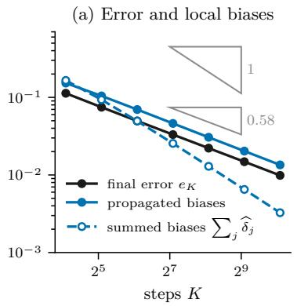

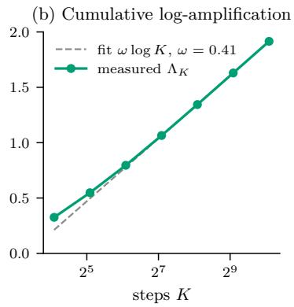

(c) Observed and amplification-based orders  
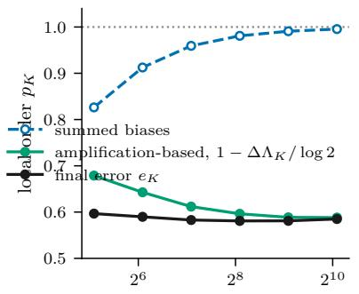  
Figure 7: Oracle denoiser on the four-component mixture, exact initialization, $M = 6 5 { , } 5 3 6$ quantiles. (a) Final error $e _ { K }$ , the recursion bound (39) built from the measured local biases and factors, and the unweighted sum of the measured biases; triangles mark slopes 1 and 0.58. (b) Measured $\Lambda _ { K }$ with a logarithmic fit on $K \geq 1 3 6 . \ ( \mathbf { c } )$ Local orders $\mathrm { e q . }$ (38) on each pair $( K / 2 , K )$ , against the amplification-based order $1 - ( \Lambda _ { K } - \Lambda _ { K / 2 } ) /$ log 2 computed from (b). The summed biases converge at first order; the final error does not, and the growth of $\Lambda _ { K }$ accounts for the gap.

Table 3: Measured $\Lambda _ { K }$ and its two majorants, as ratios to $\Lambda _ { K }$ , on the coarsest and finest grids. Directional: $\Lambda _ { K } ^ { \mathrm { d i r } }$ eq. (30); field: the finite-domain proxy for eq. (33). Canonical Gaussian initialization, common noise threshold.
<table><tr><td></td><td colspan="3"> $K = 1 7$ </td><td colspan="3"> $K = 1 0 8 8$ </td></tr><tr><td>denoiser</td><td> $\Lambda _ { K }$ </td><td>directional</td><td>field</td><td> $\Lambda _ { K }$ </td><td>directional</td><td>field</td></tr><tr><td>oracle</td><td>0.325</td><td>1.976</td><td>143</td><td>1.921</td><td>1.022</td><td>11.1</td></tr><tr><td>trained, seed 0</td><td>0.324</td><td>1.970</td><td>27.5</td><td>1.328</td><td>1.020</td><td>5.1</td></tr><tr><td>trained, seed 1</td><td>0.334</td><td>1.934</td><td>28.0</td><td>1.875</td><td>1.017</td><td>3.8</td></tr><tr><td>trained, seed 2</td><td>0.320</td><td>1.990</td><td>29.6</td><td>1.879</td><td>1.018</td><td>3.8</td></tr><tr><td>misspecified mean</td><td>0.205</td><td>3.938</td><td>944</td><td>0.673</td><td>1.012</td><td>75.6</td></tr></table>

For the oracle, $D _ { \sigma } ^ { \prime }$ is a posterior variance divided by $\sigma ^ { 2 }$ , hence nonnegative, so the predictor preserves order and the optimal coupling remains optimal after each step: the gap between $\Lambda _ { K }$ and $\Lambda _ { K } ^ { \mathrm { d i r } }$ comes only from the relaxation $\log ( 1 + x ) \leqslant$ x and the positive part in eq. (29). On the coarsest grid most of the excess of the field proxy is the quadratic term $\textstyle { \frac { 1 } { 2 } } \ell _ { j } ^ { 2 } \operatorname { L i p } ( \widehat { v } _ { \sigma _ { j } } ) ^ { 2 }$ , which vanishes under refinement; what remains on the finest grid is first order and geometric. In one dimension both rates read of the local expansion rate $\lambda _ { j } ( x ) = ( D _ { \sigma _ { i } } ^ { \prime } ( x ) - 1 ) / \sigma _ { j }$ of the oracle velocity: $\mathcal { L } _ { j } ^ { \mathrm { o s } }$ is its supremum over $x ,$ and the directional rate is its average $\begin{array} { r } { \mathcal { E } _ { j } ^ { \mathrm { O T } } = \int \lambda _ { j } w _ { j } } \end{array}$ against the error weight

$$
w _ { j } ( x ) = { \frac { \operatorname { \mathbb { E } } \left[ | U _ { j } - V _ { j } | \mathbf { 1 } \{ x { \mathrm { ~ b e t w e e n ~ } } V _ { j } { \mathrm { ~ a n d ~ } } U _ { j } \} \right] } { e _ { j } ^ { 2 } } } ,
$$

a probability density that spreads each coupled pair along its segment (Figure 8a). $\Lambda _ { K }$ itself depends on the denoiser (Figure 8b): the trained networks stay close to the oracle, except seed 0, whose $\Lambda _ { K }$ is lower (1.33 against 1.88 for the other two seeds at $K = 1 0 8 8$ , Table 3), whereas the misspecified posterior mean, whose error is dominated by learning, settles near 0.67.

(a) Geometry at σ 0.2  
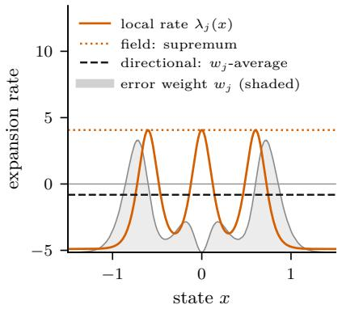

(b) Measured ΛK  
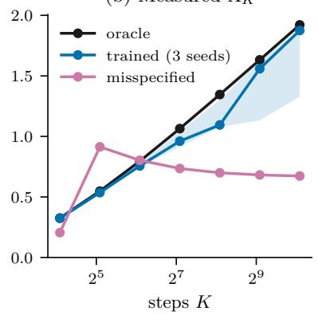

(c) Cost of each majorant  
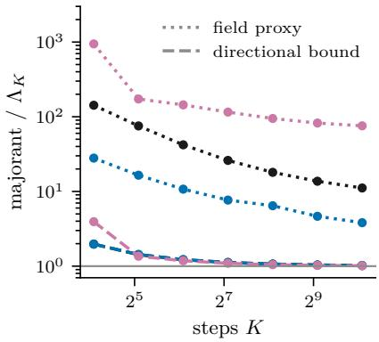  
Figure 8: Where expansion sits, and what each stability control costs. Canonical Gaussian initialization. (a) Oracle on $G _ { 2 7 2 }$ at one low noise level: local expansion rate $\lambda _ { j } ( x )$ , the error weight $w _ { j }$ (shaded, arbitrary scale), and the two rates each bound pays at this step, the supremum of $\lambda _ { j }$ (field) and its $w _ { j }$ -average $\mathcal { E } _ { j } ^ { \mathrm { { O T } } }$ (directional). The error sits where the predictor contracts. (b) Measured $\Lambda _ { K }$ by denoiser; trained networks as median and range over three seeds. (c) Directional bound (dashed) and finite-domain field proxy (dotted), divided by $\Lambda _ { K }$ , with the colours of (b).

(a) Normalized regression residual  
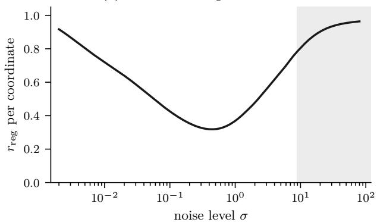

(b) High-noise damping margin  
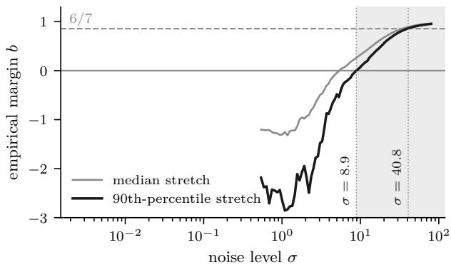  
(d) Accumulated synchronous rate, $\sigma \leq 2$

(c) Rates on the same segments, $K = 6 8$  
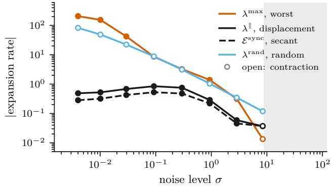

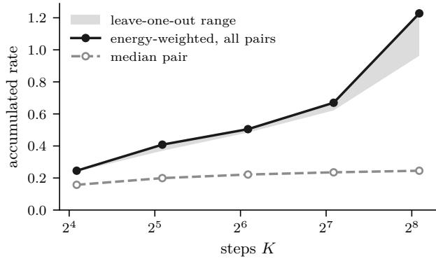  
Figure 9: Stability diagnostics for the pretrained CIFAR–10 EDM model. Shading marks the noise levels at which the 90th-percentile empirical margin of (b) is positive. (a) Normalized denoising loss $r _ { \mathrm { r e g } }$ per coordinate. (b) Empirical margin (40) from the median and the 90th percentile of the local stretch; dotted lines mark where the latter crosses 0 and the supercritical threshold $6 / 7$ (c) Energy-weighted rates on the coarse–fine segments of $G _ { 6 8 }$ , at the same nodes: worst direction, displacement, secant, and random direction eq. (41). Absolute values; open markers are negative rates. (d) Accumulated synchronous rate over $\sigma \leq 2$ , energy-weighted over all 1280trajectories with its leave-one-trajectory-out range, and the same accumulation of the level-wise median of the per-trajectory rates.

## G.3 Supplementary Results: One-Dimensional Audit

Remark 46 (Finite-range growth and a uniform oracle bound). The oracle mixture is not a counterexample to a uniform bound on $\Lambda _ { K }$ . Let $\varsigma = 0 . 0 4$ be its common component standard deviation, and $m _ { \mathsf { r } }$ the centre of the component from which $X _ { 0 }$ is drawn, a discrete random variable. Diferentiating its posterior mean gives

$$
v _ { \sigma } ^ { \prime } ( x ) = \frac { \sigma } { \varsigma ^ { 2 } + \sigma ^ { 2 } } - \frac { \sigma } { ( \varsigma ^ { 2 } + \sigma ^ { 2 } ) ^ { 2 } } \mathrm { V a r } ( m _ { \mathrm { r } } \mid X _ { \sigma } = x ) .
$$

The centres are bounded, so their conditional variance is bounded uniformly in x. Hence $L =$ $\begin{array} { r } { \operatorname* { s u p } _ { \sigma \in [ \underline { { \sigma } } , \overline { { \sigma } } ] , x } | v _ { \sigma } ^ { \prime } ( x ) | < \infty } \end{array}$ , and

$$
\log \operatorname* { m a x } ( 1 , \gamma _ { j , K } ) \leqslant \log ( 1 + \ell _ { j } L ) \leqslant \ell _ { j } L , \qquad \Lambda _ { K } \leqslant L ( \overline { \sigma } - \underline { \sigma } ) .
$$

This analytic bound holds for every refinement and initialization, but its constant is quantitatively uninformative. The logarithmic growth and the sublinear order of Section 7.1 are therefore preasymptotic: first order must eventually return, but not within the tested range, which already far exceeds the step counts used in practice (Karras et al. 2022). The growth motivates the logarithmic envelope (37) without proving it.

(a) Oracle denoiser

Figure 10 shows the measured recursion from the canonical Gaussian initialization. With the oracle, the Gaussian start reproduces the exact-initialization curve of Figure 7a: its propagated initialization term stays below $6 . 2 \times 1 0 ^ { - 5 }$ , against 0.0136 for discretization at $K = 1 0 8 8$ , so the run is discretization-dominated as well. With the learned denoisers, the propagated learning contribution overtakes discretization from $K = 2 7 2 \ \mathrm { { o n } }$ , for every seed, and the observed error levels of near 0.018 on the finest grids for two of the three seeds; no order is assigned to these curves.

Refinement regime of $\Lambda _ { K }$ . For every arm we record, in addition to the three accumulated curves, the increment $\Lambda _ { K } - \Lambda _ { K / 2 }$ , its distribution over fixed noise decades, and the signed directional rate $\mathcal { E } _ { j , K } ^ { \mathrm { { O T } } }$ at the levels of each $G _ { K }$ nearest to $\sigma \in \{ 0 . 0 4 , 0 . 0 6 5 , 0 . 0 9 , 0 . 1 5 \}$ . The question was whether $\Lambda _ { K }$ stabilizes only for arms whose low-noise discrepancy has a learning-error floor. The answer is partial.

• For the oracle, ΛK grows by 0.22–0.29 per doubling, and at $K = 1 0 8 8 , 9 2$ percent of it comes from $\sigma \in [ 0 . 0 1 , 0 . 1 )$

• The two arms with a large floor, the misspecified mean and the perturbed oracle with $\varepsilon = 0 . 1$ ， converge: their $\Lambda _ { K }$ and their fixed-noise rates settle at every tested level.

• The trained networks remain close to the oracle in $\Lambda _ { K }$ (Table 3), but for all four denoisers the fixed-noise rates depend on the level chosen. At $\sigma \approx 0 . 0 6 5$ the oracle rate keeps growing (3.3 to 34) and the trained ones slow down (to about 21). At $\sigma \approx 0 . 0 9$ the oracle rate levels of near 11 while two of the trained ones still grow (to 17–18). The nearest grid level also difers from the target by up to 10 percent in σ for $K \geq 3 4$ , and more on $G _ { 1 7 }$

• The perturbed oracles with $\varepsilon \leqslant 0 . 0 3$ show isolated collapses of $\Lambda _ { K }$ (for instance 0.12 at $K = 2 7 2$ for $\varepsilon = 0 . 0 1 )$ . At these step counts the local bias and the perturbation nearly cancel, so the displacement whose amplification $\gamma _ { j , K }$ measures nearly vanishes. These are not trends.

We therefore do not claim that a model-error floor regularizes $\Lambda _ { K }$ in general.

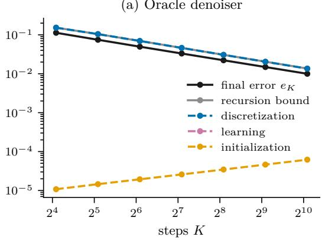

(b) Trained networks (3 seeds)  
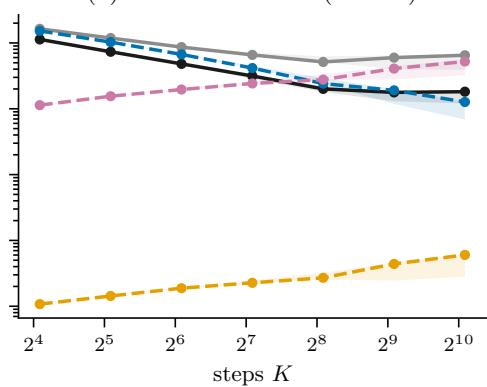  
Figure 10: Terms of the measured recursion (99) from the canonical Gaussian initialization: final error, recursion bound, and its propagated discretization, learning and initialization contributions. (a) Oracle denoiser. (b) Trained networks, median and range over three seeds. The contributions add up to an upper bound, not to the observed error.

## G.4 Analytic Controls

These controls reuse the mixture and analytic denoisers above, without network training or spatial maximization. They use 4096 midpoint quantiles; the finest settings are repeated with 8192, and diferences comparable to the quadrature discrepancy are left uninterpreted. Tables 4 to 6 report the outcomes.

Clock. For the oracle with exact initialization, we compare $\rho _ { \mathsf { E D M } } = 2 , 3 , 7$ at $K = 6 8 , 1 3 6 , 2 7 2 , 5 4 4 .$ with the same endpoints, recording final error, measured local biases, their universal bounds, and the relative mesh $\theta _ { K } = h _ { K } / \underline { { \eta } }$ of eq. (12). Equal K means equal numbers of denoiser evaluations, but not equal relative meshes: with $\underline { { \sigma } } = 0 . 0 0 2$ , the clock $\rho _ { \mathsf { E D M } } = 2$ has $\theta _ { K } > 1$ for $K \leqslant 1 3 6$ and reaches $\theta _ { K } < 1 / 2$ only at $K = 5 4 4$ , whereas $\rho _ { \mathsf { E D M } } = 7$ has $\theta _ { K } < 0 . 0 6$ already at $K = 6 8$ . The clock $\rho _ { \mathsf { E D M } } = 1$ is excluded because $\theta _ { K }$ exceeds one on every step count considered, so none of the estimates of Section 6 applies to it.

Outcome. The universal bias bound of Lemma 3 exceeds the measured biases by a factor of about 280 to 1190. It also reverses the ranking of the clocks: at $K = 5 4 4$ the measured biases and the final error order the clocks $\rho _ { \mathsf { E D M } } = 7 < 3 < 2$ , while the universal bound orders them $2 < 3 < 7 .$ The clock $\rho _ { \mathsf { E D M } } = 2$ balances the leading universal bound, but it need not minimize observed biases or final error, since the mixture concentrates its local biases in a narrow noise window. The bound controls rates, not the choice of schedule.

Table 4: Clock control at $K = 5 4 4 .$ , oracle with exact initialization; every grid satisfies $\theta _ { K } < 1 / 2$ Ratio: universal bound over measured biases.
<table><tr><td>ρEDM</td><td>final error</td><td>measured biases</td><td>universal bound</td><td>ratio</td></tr><tr><td>2</td><td>0.0229</td><td>0.0164</td><td>4.64</td><td>282</td></tr><tr><td>3</td><td>0.0173</td><td>0.0095</td><td>5.13</td><td>539</td></tr><tr><td>7</td><td>0.0139</td><td>0.0065</td><td>7.48</td><td>1150</td></tr></table>

Starting noise. We use $\rho _ { \mathsf { E D M } } = 7$ and fix h to the clock step of the reference grid with $\overline { { \sigma } } = 8 0$ and $K = 2 7 2$ . Integer step counts are chosen whose upper endpoints are nearest 20, 80, and 320 in the clock, and the actual endpoint $( \underline { { \sigma } } ^ { 1 / 7 } + K h ) ^ { 7 }$ is reported, so every grid is clock-uniform with exactly the same h. The oracle starts from the exact top law. For this control alone $\sigma _ { \mathrm { h i } } = 4$ and $b _ { \mathrm { h i } } = 0 . 9 . \mathrm { ~ A ~ }$ global oracle certificate is available from

$$
0 \leqslant D _ { \sigma } ^ { \prime } ( x ) \leq \frac { \varsigma ^ { 2 } } { \varsigma ^ { 2 } + \sigma ^ { 2 } } + \frac { \sigma ^ { 2 } ( \operatorname* { m a x } _ { r } m _ { r } - \operatorname* { m i n } _ { r } m _ { r } ) ^ { 2 } } { 4 ( \varsigma ^ { 2 } + \sigma ^ { 2 } ) ^ { 2 } } ,
$$

since the posterior variance is the within-component variance plus the variance of component means, the latter bounded by one quarter of their squared span. If the displayed upper bound is at most $1 - b _ { \mathrm { h i } }$ at every high-noise level, the oracle predictor is $\left( 1 - b _ { \mathrm { { h i } } } a _ { j } \right)$ -Lipschitz.

Outcome. The certificate holds on every grid $( b _ { \mathrm { e f f } } = 0 . 8 8 6 > 6 / 7 )$ . Raising $\overline { { \sigma } }$ from 20 to 318 multiplies the undamped high-noise sum of universal bounds by 14 but the damped one only by 2.6 (Table 5), and changes the final error by $1 . 6 \times 1 0 ^ { - 6 }$ in absolute terms $( 7 . 5 \times 1 0 ^ { - 5 }$ relatively). Early error is damped, as the high-noise block predicts.

Table 5: Starting-noise control, $\rho _ { \mathsf { E D M } } = 7$ with a fixed clock step; oracle started from the exact top law. The change in final error is relative to $\overline { { \sigma } } = 8 0$ . The last two columns sum the universal bias bounds $\Delta _ { j }$ over the high-noise steps $( \sigma _ { j + 1 } \ge \sigma _ { \mathrm { h i } } = 4 )$ , without and with the weights $\Pi _ { j + 1 , K _ { \mathrm { h i } } }$ of the high-noise kernel.
<table><tr><td>σ</td><td>K</td><td>final error</td><td>change</td><td> $\textstyle \sum _ { j } \Delta _ { j }$ </td><td> $\begin{array} { r } { \sum _ { j } \Pi _ { j + 1 , K _ { \mathrm { h i } } } \Delta _ { j } } \end{array}$ </td></tr><tr><td>19.8</td><td>209</td><td>0.02176</td><td> $- 1 . 6 \times 1 0 ^ { - 6 }$ </td><td>3.36</td><td>1.54</td></tr><tr><td>80</td><td>272</td><td>0.02176</td><td></td><td>13.77</td><td>2.81</td></tr><tr><td>318</td><td>348</td><td>0.02176</td><td> $+ 0 . 1 \times 1 0 ^ { - 6 }$ </td><td>47.60</td><td>4.00</td></tr></table>

Calibration of the synchronous diagnostic. For the oracle and misspecified posterior mean, we compare synchronous $G _ { K } / G _ { 2 K }$ pairs at $K = 6 8$ , 136, 272 with the optimal target–sampler coupling, both from canonical Gaussian initialization, on the common window $\sigma _ { j } \leq 2$ . Latent ranks are preserved for synchronous pairs and sorted only for optimal transport.

Outcome. For the oracle the two accumulated rates grow together (ratio 1.29 to 1.24 for $K = 6 8$ to 272). For the misspecified denoiser they move apart: the synchronous rate rises from 1.11 to 1.87 while the optimal-coupling rate falls from 0.76 to 0.69, and so does $\Lambda _ { K }$ on the same window, from 0.80 to 0.70. A growing synchronous rate therefore need not track $\Lambda _ { K }$ once the denoiser is inexact.

Table 6: Calibration of the synchronous diagnostic: accumulated linear rates $\begin{array} { r } { \sum _ { j } \ell _ { j } ( \mathcal { E } _ { j , K } ^ { \mathrm { s y n c } } ) _ { - } } \end{array}$ + and $\begin{array} { r } { \sum _ { j } \ell _ { j } ( \mathcal { E } _ { j , K } ^ { \mathrm { O T } } ) _ { + } } \end{array}$ over the levels $\sigma _ { j } \ \leq \ 2$ , canonical Gaussian initialization. Ratio: synchronous over optimal coupling. Last column: $\Lambda _ { K }$ restricted to the same levels, $\textstyle \sum _ { j }$ log max $\{ 1 , \gamma _ { j , K } \}$
<table><tr><td>denoiser</td><td>K</td><td>synchronous</td><td>optimal coupling</td><td>ratio</td><td>Λ on window</td></tr><tr><td>oracle</td><td>68</td><td>0.909</td><td>0.704</td><td>1.29</td><td>0.793</td></tr><tr><td rowspan="3">misspecified</td><td>272</td><td>1.605</td><td>1.296</td><td>1.24</td><td>1.326</td></tr><tr><td>68</td><td>1.112</td><td>0.762</td><td>1.46</td><td>0.804</td></tr><tr><td>272</td><td>1.870</td><td>0.687</td><td>2.72</td><td>0.699</td></tr></table>

## G.5 Supplementary CIFAR–10 Diagnostics

Accumulated synchronous rates. Section 7.3 discusses the endpoints of the two curves of Figure 9d. On the intermediate grids $K = 3 4 , 6 8 , 1 3 6$ , the accumulated energy-weighted rate is 0.41, 0.50, 0.67, and the accumulated median rate of Appendix G.1.4 is 0.20, 0.22, 0.24, starting from 0.16 at $K = 1 7 ;$ the successive ratios of the median rate decrease from 1.27 to 1.04.

Influence of rare trajectories. Concentration increases with refinement. Half of the total leaveone-out change is carried by 129 trajectories at $K = 1 7$ and by 21 at $K = 2 7 2$ . At $K = 2 7 2$ five coarse–fine pairs have a final squared displacement more than 100 times their class median; the largest is 3268 times that median. The median squared displacement decreases with a local exponent approaching −2 (−1.93 on the last doubling), the first-order expectation. The most influential trajectory is diferent on every grid, and every large leave-one-out change is a decrease, so these pairs cause the rise rather than ofset it. The refinement trend is therefore described as sensitive to rare pairs, not as a property of the ensemble.

## G.6 Numerical Reliability and Sensitivity Checks

Table 8 lists, for each reported quantity, the check applied, its acceptance criterion, and the outcome. Two checks fail, both on the fine CIFAR segment grid $G _ { 2 7 2 } ;$ the corresponding statistics are withdrawn from Figure 9 and from the main text.

For the exact-initialization comparison, we additionally repeat all three grids $K = 2 7 2 , 5 4 4$ , 1088 with $4 M = 2 6 2 , 1 4 4$ quantiles. This checks both endpoints of each of the last two refinement pairs at a common quadrature resolution (Table 7). The finest-grid error changes from 0.00987629 to 0.00996318, and its cumulative log-amplification from 1.91498 to 1.92367. On each pair the error order and the amplification-based order shift by the same amount and in the same direction, by about 0.003 on (272, 544) and 0.0068 on (544, 1088), so their diference changes by less than $1 0 ^ { - 4 }$ The individual orders are thus not resolved to the third decimal, but their agreement is robust to this refinement. These diferences measure sensitivity to the tested quadrature refinement, not certified errors relative to exact integration.

Table 7: Paired quadrature check with exact initialization. Local orders $\mathrm { e q . }$ (38) on the pair $( K / 2 , K )$ ; the amplification-based order is $1 - \left( \Lambda _ { K } - \Lambda _ { K / 2 } \right) /$ / log 2, and the bias-sum order refers to $\begin{array} { r } { \sum _ { j } \widetilde { \delta } _ { j , { \cal K } } } \end{array}$ . Digits show numerical drift rather than certified precision.
<table><tr><td>pair  $( K / 2 , K )$ </td><td>quantiles</td><td>error order</td><td>ampl.-based order</td><td>bias-sum order</td></tr><tr><td>(272, 544)</td><td>65536</td><td>0.5811</td><td>0.5886</td><td>0.9908</td></tr><tr><td>(272, 544)</td><td>262144</td><td>0.5779</td><td>0.5854</td><td>0.9908</td></tr><tr><td>(544, 1088)</td><td>65536</td><td>0.5850</td><td>0.5882</td><td>0.9955</td></tr><tr><td>(544, 1088)</td><td>262144</td><td>0.5782</td><td>0.5814</td><td>0.9955</td></tr></table>

Table 8: Numerical reliability checks. Failures lead to omission, not to a qualified report.
<table><tr><td>quantity</td><td>check</td><td>criterion</td><td>outcome</td></tr><tr><td colspan="4">One-dimensional mixture endpoint error  $e _ { K , K }$ </td></tr><tr><td></td><td>M vs 4M quantiles on  $G _ { 1 0 8 8 }$  (analytic arms, trained seed 0)</td><td> $< e _ { K , K } / 1 0$ </td><td>pass; oracle error changes by  $< 1 \% .$  Bound/error ratio not reported for arms without a 4M rerun</td></tr><tr><td>cumulative log-amplification  $\Lambda _ { K }$ </td><td>M vs 4M on  $G _ { 1 0 8 8 }$ </td><td>small relative change</td><td>Gaussian start: about 0.1%; exact start: about 0.45%. Paired orders checked separately in Table 7</td></tr><tr><td>one-step recursion (98)</td><td>measured slack</td><td>nonnegative up to quadrature</td><td>pass on every arm and step</td></tr><tr><td>field proxy eq. (97)</td><td>domain  $( R , N _ { x } ) =$  (12, 4097) → (16, 8193)</td><td>small relative change</td><td>pass;  $\leqslant 0 . 8 \%$  The maximizer hits the domain boundary at 225 of 507 oracle levels on  $G _ { 1 0 8 8 }$  (never for trained arms) but sits on a flat</td></tr><tr><td>noise threshold</td><td>re-summation at the four candidate thresholds of</td><td>range reported</td><td>plateau, not clipped  $\Lambda _ { K }$  bit-identical;  $\Lambda _ { K } ^ { \mathrm { d i r } }$  varies by 0.13% at  $K = 1 0 8 8$ </td></tr><tr><td>clock control</td><td>Appendix G.1.2 M = 4096 vs 8192 at  $\rho _ { \mathsf { E D M } } = 7$ </td><td>discrepancy  $< 1 0 \%$ </td><td>pass;  $8 . 7 \% ,$  below the interpreted differences</td></tr><tr><td>starting-noise control</td><td>finite-mesh certificate</td><td> $b _ { \mathrm { h i } } \kappa ( \theta _ { \mathrm { h i } } ) > 6 / 7$  on every  $\mathrm { g r i d }$ </td><td>pass;  $b _ { \mathrm { e f f } } = 0 . 8 8 6$ </td></tr><tr><td colspan="4">CIFAR–10, high noise</td></tr><tr><td>margin crossings  $\sigma = 8 . 9 , 4 0 . 8$ </td><td>independent rerun</td><td>same grid levels</td><td>pass; reproduced exactly</td></tr><tr><td>empirical margin (100)</td><td>8, 16, 32 power iterations at 13 levels of  $G _ { 1 3 6 }$  around the crossings</td><td>crossings unchanged</td><td> $b _ { \mathrm { p r o b e } } ^ { [ 0 . 9 ] }$  pass; moves by  $\leq 5 \cdot 1 0 ^ { - 5 }$  (tail probes by up to 0.1 below  $\sigma \approx 1 0 ) ;$  it stays  $+ 5 . 7 \cdot 1 0 ^ { - 4 } ~ \mathrm { a t }$   $\sigma = 8 . 9$  and exceeds  $6 / 7$  by  $6 . 6 \cdot 1 0 ^ { - 3 }$  at  $\sigma = 4 0 . 8 $ </td></tr><tr><td colspan="4">CIFAR-10, low-noise segments secant integral,  $G _ { 6 8 }$ </td></tr><tr><td> $\lambda ^ { \mathrm { m a x } }$  , G68</td><td>trapezoid of  $\lambda ^ { \parallel }$  on  $T _ { 9 }$  VS  $\mathcal { E } _ { j , K } ^ { \mathrm { s y n c } }$  Lanczos Ritz residual,</td><td>agreement small residual</td><td>pass; within 0.011 pass;  $< 0 . 1 1 \%$  of  $\lambda ^ { \mathrm { m a x } }$  except at</td></tr><tr><td></td><td>half-iteration drift</td><td></td><td> $\sigma = 0 . 0 0 4$  (4.6%, an underestimate that only widens the reported gap)</td></tr><tr><td>segment sample,  $G _ { 6 8 }$  segment sample,</td><td>ESS eq. (103) of 80 segments</td><td>not dominated by one segment not dominated by one</td><td>pass; ESS 18–40 fail; one segment carries 88–90% of</td></tr><tr><td> $G _ { 2 7 2 }$ </td><td></td><td>segment</td><td>the energy at every  $\sigma \leqslant 1$  (ESS 1.2–1.3); bootstrap interval 8.8 times the point estimate. Not reported fail; nested check passes, but with 65 nodes the nine-node maxima at σ ≈ 0.03, 0.1, 0.3 are low by factors</td></tr><tr><td></td><td></td><td></td><td>2 to 4.5, and at  $\sigma \approx 0 . 3$  the refined  $\lambda ^ { \parallel }$  exceeds the nine-node  $\lambda ^ { \mathrm { m a x } }$  . The secant integral is reproduced within 0.001. Not reported; the nested check is necessary, not sufficient</td></tr><tr><td>accumulated synchronous rate</td><td>leave-one-out over 1280 trajectories</td><td>trend stable under single removal</td><td>sensitive; two trajectories dominate at K = 272 (Section 7.3). Trend reported as driven by rare pairs</td></tr></table>

Software checks. The one-dimensional code checks the predictor secant identity, the ordering between the realized and directional quantities, the independence of the spatial interval from K, the vanishing learned term for the oracle, and the residual bound $\mathcal { R } _ { j } \leqslant \varepsilon$ of the perturbed oracle. The CIFAR code checks exact nesting of the schedules, the synchronous predictor identity, the segment chain on known linear maps, the random-direction rate against the exact Rayleigh quotient of a known symmetric matrix, nestedness of the 3/5/9-node estimators, energy-weighted aggregation, zero-displacement handling, conservation of trajectory identities in the influence analysis, stratified resampling, and propagation of invalid observations. Reduced smoke configurations exercise each calculation before the full runs. The targeted oracle audit also checks that sharing target quantiles across nested grids reproduces the independent-grid calculation, and that orders compare identical quadrature resolutions and initializations.

## G.7 Code and Data Availability

The code and the frozen raw outputs of every run, with their resolved configurations, are available in the public code repository https://github.com/nbrosse/edm-error-propagation-code. Two scripts regenerate from these outputs the numerical figures, the generated tables and the measured values quoted in the main text; a check mode fails when one of them is stale with respect to the outputs. The other tables and values of this appendix are computed from the same outputs but are not regenerated by the scripts. The one-dimensional experiments run on a CPU in a few hours in total. The CIFAR–10 diagnostics use the public class-conditional EDM checkpoint of Karras et al. (2022) and the CIFAR–10 test images; the longest of them, the synchronous diagnostic, takes about six hours on a single NVIDIA L4 GPU.

## H Comparison with Prior Wasserstein Analyses

This appendix compares our analysis with the two closest Wasserstein analyses of probability-flow samplers, which follow the two routes of Appendix B.5: Beyler–Bach transport the learned map, Gao–Zhu the exact flow. It closes with the counterexamples that motivate measuring propagation separately from score accuracy.

## H.1 Closest Comparison: Beyler–Bach

Beyler and Bach (2025) study deterministic and stochastic samplers on the same Gaussian smoothing path. Their heat parameter is the variance $t = \sigma ^ { 2 }$ in our notation. If the data law is supported in a ball of radius R, their score Hessian estimate implies that the exact Euler map

$$
f _ { t , h } ( x ) = x + h \nabla \log p _ { t } ( x )
$$

satisfies, for $h \leq t ,$

$$
\mathrm { L i p } ( f _ { t , h } ) \leq L _ { t , h } = 1 + h \left( \frac { R ^ { 2 } } { t ^ { 2 } } - \frac { 1 } { t } \right) .\tag{104}
$$

In particular, this certificate becomes contractive for $t > R ^ { 2 }$ (Beyler and Bach 2025, Lemma 3). The map $f _ { t , h }$ is our oracle predictor in their variables: since $v _ { \sigma } = - \sigma \nabla \log p _ { \sigma } \mathrm { ~ b y ~ e q . ~ } ( 1 )$ , with $\ell _ { j } = \sigma _ { j } - \sigma _ { j + 1 } , \mathrm { e q . }$ (4) reads $\Phi _ { j } = \mathrm { I d } - \ell _ { j } v _ { \sigma _ { j } } = f _ { \sigma _ { j } ^ { 2 } , \sigma _ { j } \ell _ { j } }$ , and the condition $h \leq t$ holds automatically because $\ell _ { j } < \sigma _ { j }$ . Their learned-score assumption imposes an analogous Lipschitz control on $x \mapsto$ $x + h s _ { \theta } ( t , x )$ (Beyler and Bach 2025, Assumption 2). The current discrepancy is then propagated through that worst-case map factor, while score and discretization errors are evaluated on the exact law. This produces the same three-term recursion as ours.

For Euler, their global estimate is first order in the maximal step (Beyler and Bach 2025, Proposition 10). Its constants, however, inherit the bounded-support radius and deteriorate as the sampler approaches the data law; the early-stopping dependence contains, in particular, a factor of the form $\exp ( R ^ { 2 } / ( 2 \varepsilon ) )$ . The diference is thus not the order of convergence but the mechanism and the constants used to obtain it. The comparison can be summarized as follows.
<table><tr><td></td><td>Beyler and Bach (2025)</td><td>This paper</td></tr><tr><td>Path</td><td>Heat variance t</td><td> $X _ { \sigma } = X _ { 0 } + \sigma Z ,$  with  $t = \sigma ^ { 2 }$ </td></tr><tr><td>Sampler</td><td>Euler, Heun, and Euler-Maruyama</td><td>First-order deterministic EDM predictor</td></tr><tr><td>Local bias</td><td>Bounds depending on R or on Gaus- sian smoothing</td><td>Universal acceleration bound, with no structural assumption on q</td></tr><tr><td>Learned error</td><td> $\mathbb { L } _ { 2 }$  score error under the exact law</td><td>Normalized EDM regression residual un- der the exact law</td></tr><tr><td>Propagation</td><td>Global Lipschitz envelope of the learned map</td><td>Realized amplification factor  $\gamma _ { j } .$  with di- rectional and worst-case majorants</td></tr><tr><td>High noise</td><td>Contraction from smoothing and bounded support</td><td>1 Contraction explicitly certified by EDM preconditioning</td></tr></table>

Our local-bias estimate replaces the support-dependent control by posterior identities valid for every Borel data law. For propagation, eq. (104) is analogous to our map-level bound (31), an intermediate link of the chain $\mathrm { e q . }$ (78). Our recursion instead retains the smaller quantity it actually multiplies, the amplification factor $\gamma _ { j }$ , which admits the transport-directional bound (28). Conversely, Beyler–Bach cover Heun and Euler–Maruyama; the global theorem of this paper covers only the first-order deterministic predictor.

Retaining $\gamma _ { j }$ sharpens the propagation step but does not by itself give an a priori guarantee, since $\gamma _ { j }$ depends on the sampler laws (Section 5). The separation example of Proposition 10 shows that a worst-case map bound can be unnecessarily large, not that an envelope for $\Lambda _ { K }$ holds for general learned denoisers.

## H.2 A Structural Wasserstein Route: Gao–Zhu

Gao and Zhu (2025) analyze probability-flow ODE samplers directly in $W _ { 2 }$ for a general linear forward difusion

$$
\mathrm { d } X _ { t } = - f ( t ) X _ { t } \mathrm { d } t + g ( t ) \mathrm { d } B _ { t } .
$$

They assume that the data density p0 is positive and diferentiable, with − log p0 m0-strongly convex and $L _ { \mathrm { 0 ^ { - S m o o t h } } }$ . They also impose a time-regularity bound on the exact score within each step: for all x and $\begin{array} { r } { k = 1 , \ldots , K , \operatorname* { s u p } _ { ( k - 1 ) h _ { \mathbb { C } \mathbb { Z } } \leq t \leq k h _ { \mathbb { C } \mathbb { Z } } } \left\| \nabla \log p _ { T - t } ( x ) - \nabla \log p _ { T - ( k - 1 ) h _ { \mathbb { C } \mathbb { Z } } } ( x ) \right\| \leq L _ { 1 } h _ { \mathbb { C } \mathbb { Z } } ( 1 + \| x \| ) } \end{array}$ where $h _ { \mathrm { G Z } }$ is their step size, written so to avoid a clash with our clock $\eta ,$ and $T = K h _ { \mathrm { G Z } }$ is the horizon. They further assume an $\mathbb { L } _ { 2 }$ score-estimation error bounded by M along the numerical iterates and a suficiently small step size (Gao and Zhu 2025, Assumptions 3.1–3.3, Theorem 3.4). Their exponential-integrator sampler then satisfies

$$
W _ { 2 } \big ( \mathrm { L a w } ( u _ { K } ) , p _ { 0 } \big ) \leq \exp \bigg ( - \int _ { 0 } ^ { K h _ { \mathrm { G Z } } } \mu _ { \mathrm { G Z } } ( t ) \mathrm { d } t \bigg ) \| X _ { 0 } \| _ { \mathbb { Z } } + E _ { 1 } ( f , g , K , h _ { \mathrm { G Z } } , L _ { 1 } ) + E _ { 2 } ( f , g , K , h _ { \mathrm { G Z } } , M , L _ { 1 } ) ,
$$

where $E _ { 1 }$ and $E _ { 2 }$ are respectively the discretization and score-matching terms (Gao and Zhu 2025, Theorem 3.4). The continuous contraction rate is explicit:

$$
\mu _ { \mathrm { G Z } } ( t ) = { \frac { m _ { 0 } g ( t ) ^ { 2 } } { 2 \left[ \exp \left( - 2 \int _ { 0 } ^ { t } f ( s ) \mathrm { d } s \right) + m _ { 0 } \int _ { 0 } ^ { t } \exp \left( - 2 \int _ { s } ^ { t } f ( v ) \mathrm { d } v \right) g ( s ) ^ { 2 } \mathrm { d } s \right] } } > 0 .
$$

Strong log-concavity is what makes $\mu _ { \mathrm { G Z } }$ positive. At the discrete level, a synchronous coupling yields a one-step factor, written here $\gamma _ { j } ^ { \mathrm { G Z } }$ , constrained to (0, 1) by the step-size condition and then multiplied through the accumulated error (Gao and Zhu 2025, Proposition 4.2). This factor should not be confused with our $\gamma _ { j } \colon$ : theirs is an explicit coupling-based contraction coeficient, whereas ours is the ratio of two Wasserstein distances after applying the learned finite map.

The comparison with the present analysis is summarized below.
<table><tr><td></td><td>Gao and Zhu (2025)</td><td>This paper</td></tr><tr><td>Forward path</td><td>General linear diffusion with coeffi- Gaussian path cients  $f , g$ </td><td> $X _ { \sigma } = X _ { 0 } + \sigma Z$ </td></tr><tr><td>Sampler</td><td>probability-flow ODE</td><td>Exponential integrator for the learned First-order finite EDM predictor</td></tr><tr><td>Data assumptions</td><td>Smooth, strongly log-concave density</td><td>No structural assumption for the local bias; centered  $q \in \mathcal { P } _ { 2 }$  for the global bound</td></tr><tr><td>Local bias</td><td>Time regularity and spatial Lipschitz control of the score</td><td>Universal acceleration bound</td></tr><tr><td>Learned error</td><td> $\mathbb { L } _ { 2 }$  score error along the numerical it- Normalized EDM regression residual un- erates</td><td>der the exact law</td></tr><tr><td>Propagation</td><td>Synchronous coupling with explicit contraction from log-concavity</td><td>Realized amplification factor  $\gamma _ { j }$  , with di- rectional and worst-case majorants</td></tr></table>

Both analyses therefore separate initialization, discretization and learning errors in the same metric, but place the structural burden at diferent points. Gao–Zhu derive contractivity of the continuous flow and of the coupled discretization from the target geometry. We obtain the local bias without that geometry, then expose propagation as a separate condition on the learned finite transport: EDM preconditioning certifies it at high noise, while at low noise only the cumulative low-noise log-amplification $\Lambda _ { K }$ is required.

## H.3 Score Accuracy Does Not Imply Stability

The counterexamples of Zhou (2026) show that a small score error does not by itself make a sampler stable. A tail perturbation can have arbitrarily small score error under every forward marginal while explicit Euler develops diverging moments; in the deterministic probability-flow construction, the discrete laws converge weakly but diverge in every $W _ { p } , p \geq 1$ (Zhou 2026, Theorem 3.1 and Corollary 3.3). A residual evaluated on the exact law therefore cannot control the error alone: the propagation of an existing discrepancy through the learned map must be measured separately, which is the role of $\gamma _ { j }$ in our recursion. The deterministic example does not contradict our theorem, since its field has superlinear tail growth and violates Assumption 4. Their bounded, globally Lipschitz neural construction, which would satisfy that assumption, concerns Euler–Maruyama rather than the deterministic predictor, and its constants are not uniform along the family (Zhou 2026, Theorem 3.5).