# Unpaired Canonical Correlation Analysis

Nir Ben-Ari Department of Computer Science and AI Bar-Ilan University Ramat-Gan, Israel nirnirba@gmail.com

Ronen Talmon Electrical and Computer Engineering Technion Haifa, Israel ronen@ee.technion.ac.il

Uri Shaham Department of Computer Science and AI Bar-Ilan University Ramat-Gan, Israel uri.shaham@biu.ac.il

## Abstract

Canonical Correlation Analysis (CCA) is a fundamental method for multiview shared space learning. However, its strict reliance on paired data poses a significant limitation, as such data is often difficult to obtain or entirely unavailable. In this paper, we present Unpaired CCA (UCCA), a novel method that learns linear projections to maximize the correlation of the true underlying pairing without access to any paired samples during training. We first establish theoretical results connecting the Quadratic Assignment Problem (QAP) to CCA. Leveraging these theoretical insights, we derive a practical method to maximize correlation exclusively from unpaired data. To the best of our knowledge, UCCA is the first approach to learn maximally correlated projections in a strictly unpaired setting. We validate UCCA on real-world multi-modal datasets, demonstrating that it significantly outperforms recent unpaired alignment baselines in recovering the underlying true correlation. This work fills a critical gap between traditional statistical multiview learning and the growing field of unpaired data learning.

## 1 Introduction

Many real-world applications rely on the integration of multiple data modalities [5]. One of the most foundational methods for multiview shared-space learning is Canonical Correlation Analysis (CCA) [28]. That is, the extraction of maximally correlated components across views. CCA underpins a wide array of modern applications, including multimodal representation learning [73, 39], multi-omics data integration [7, 29, 50], and neuroimaging [31]. Although it has inspired various extensions, most notably multi-view [53, 43] and non-linear [3, 66] variants, CCA remains constrained by a critical bottleneck: a rigid reliance on strictly paired corresponding samples.

In the broader landscape of machine learning, the fundamental difficulty of acquiring paired data has sparked massive interest in unpaired settings [71, 58, 24, 52, 75]. While large multimodal models show remarkable success in various applications [51, 70], they rely heavily on massive amounts of paired data (i.e., images and their corresponding captions). In many modalities, such pairs are often prohibitively expensive, if not impossible, to obtain. In contrast, unpaired data is abundantly accessible, making the utilization of independent, unpaired samples a highly attractive alternative.

To address this fundamental limitation, we propose Unpaired CCA (UCCA). To the best of our knowledge, this is the first extension of CCA designed to operate entirely without paired data. Specifically, prior to this work, no method has successfully demonstrated or theoretically established the ability to capture true data correlations when correspondence is entirely absent during training.

We approach the Unpaired CCA problem from a theoretical perspective. We begin with a theoretical investigation, defining a proxy pairing for unpaired CCA scenarios. We then prove that this pairing is attainable by formulating the task as a special case of the Quadratic Assignment Problem (QAP) [35], enabling the use of known approximate efficient solvers. This framework yields strong theoretical guarantees, as summarized in Fig. 1. Furthermore, Fig. 1a highlights the direct positive relationship between QAP optimization and CCA correlation, substantiating our theoretical claims.

Derived directly from these theoretical insights, we introduce our Unpaired CCA (UCCA) method, a practical and effective tool for recovering the correlation components of ground-truth pairings using strictly unpaired training data. As demonstrated in Fig. 1b, UCCA is currently the only method capable of learning highly correlated components in this setting, even achieving performance that is comparable to the paired CCA.

Key Theoretical Insight Unpaired CCA can be solved with linear kernel QAP

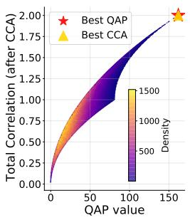  
(a)

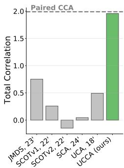  
(b)  
Figure 1: The theoretical and empirical alignment of Unpaired CCA and QAP. (a) QAP vs. CCA: On a 10-sample synthetic dataset, evaluating all 10! possible pairings reveals a direct positive relationship between the QAP value and total correlation (App. E.1). (b) UCCA Performance: On the Handwritten benchmark (Sec. 6), UCCA captures high correlation despite training fully unpaired, significantly outperforming unpaired alignment baselines and approaching the paired CCA upper bound.

Contributions. Our main contributions are: (1) We establish a theoretical connection between Unpaired CCA and the QAP; (2) We derive a practical method for solving Unpaired CCA; and (3) Our empirical results show that our method significantly reduces the gap to paired CCA, while operating entirely without paired data, achieving superior performance compared to existing approaches.

## 2 Related Work

CCA Extensions. Canonical Correlation Analysis has been extensively adapted for diverse applications, yielding multi-view [53, 43] and non-linear [3, 66, 47] extensions. Most relevant to our context are sparse CCA methods, designed for a CCA failure case, where the number of samples is smaller than the number of dimensions. Thereby, they attempt to reduce the sample complexity of CCA by enabling the use of fewer paired samples [65, 8, 67]. However, while these approaches reduce the reliance on large paired datasets, they fundamentally still require exact correspondences. In contrast, UCCA operates exclusively from unpaired data.

Incorporating Unpaired Data. Driven by its availability, unpaired data has garnered substantial interest in recent years. However, most existing approaches leverage this data only in conjunction with auxiliary matching signals. For instance, semi-supervised methods utilize unpaired data to enhance models initially trained on paired samples [47, 55, 20]. Weakly-supervised approaches significantly reduce the number of required pairs, relying predominantly on unpaired data but still necessitating a few exact pairs for guidance [71, 52, 75, 9, 46, 54]. Other methods substitute explicit sample pairs with shared class labels [58, 68]. Crucially, all of these paradigms depend on some form of complementary alignment signal and cannot function in a strictly unpaired regime as UCCA.

Fully Unpaired Methods. A separate line of research tackles entirely unpaired data in specific applied domains, such as translation [78, 44, 74, 11, 63], segmentation [72, 59, 2, 16], and image restoration [32, 38]. However, these techniques are largely task-specific and do not explicitly extract a shared multiview representation space. Similarly, broader techniques like domain confusion [23, 57, 76] and domain adaptation [27, 30, 37, 13] align marginal distributions but are not designed to extract maximally correlated components. In a different context, a related approach to analyze the similarity of Large Language Models embeddings in unpaired settings was recently presented in [15]. From a theoretical standpoint, [1] analyzed optimal transport under global invariances. The most closely related work to ours is SCA [58], which attempts to identify shared components across multiple views without pairs. However, their theoretical framework does not account for correlation, and as we demonstrate empirically, UCCA significantly better captures highly correlated components in practice.

## 3 Background

This section formalizes the basic definitions and mathematical notation utilized throughout the paper, primarily concerning CCA and the QAP.

Notations. Let X, $Y \in \mathbb { R } ^ { n \times d }$ represent whitened datasets consisting of n samples with d features. We denote P as the set of n × n permutation matrices, defined as $\begin{array} { r } { \bar { \mathcal { P } } = \{ P \in \dot { \{ 0 , 1 \} } ^ { n \times n } : P ^ { T } \mathbf { 1 } = } \end{array}$ $P \mathbf { 1 } = \mathbf { 1 } \}$ , where 1 is the n-dimensional column vector consisting of all ones. For a matrix $A \in$ $\mathbb { R } ^ { n \times d } , \bar { \sigma ( A ) } = ( \sigma _ { 1 } ( A ) , \sigma _ { 2 } ( A ) , \ldots , \sigma _ { d } ( A ) )$ represents the vector of all singular values, ordered in descending value such that $\sigma _ { 1 } ( A ) \geq \sigma _ { 2 } ( \ddot { A } ) \geq \cdot \cdot \cdot \geq \sigma _ { d } ( A ) \geq 0$ (assuming $n > d )$ . The Frobenius and nuclear norms are denoted by $\| A \| _ { F } = { \sqrt { \operatorname { t r } ( A ^ { T } A ) } } , \| A \| _ { * } = \operatorname { t r } ( { \sqrt { A ^ { T } A } } )$ , respectively. Finally, we define the Orthogonal group $O ( d ) = \{ Q \in \mathbb { R } ^ { d \times d } : Q ^ { T } Q = I \}$ , and the Frobenius sphere $S _ { F } = \{ S \in \mathbb { R } ^ { d \times d } : \| S \| _ { F } = 1 \}$

Canonical Correlation Analysis (CCA). The total correlation (TC) of X and Y is defined as

$$
\operatorname { T C } ( X , Y ) = \operatorname { t r } ( X ^ { T } Y )\tag{1}
$$

CCA seeks the maximally correlated linear components of X and $Y .$ . Namely, it returns a pair of projection matrices $U ^ { * } , \bar { V ^ { * } } \in \mathbb { R } ^ { d \times k }$ that maximize the total correlation (Eq. (1)):

$$
( U ^ { * } , V ^ { * } ) = \operatorname { C C A } ( X , Y ) = \arg \operatorname* { m a x } _ { U , V } \mathrm { T C } ( X U , Y V ) \quad \mathrm { s . t . } \quad U ^ { T } U = V ^ { T } V = I\tag{2}
$$

where $k \ll d ,$ the number of components, is a tunable hyper-parameter.

Quadratic Assignment Problem (QAP). Let $A , B \in \mathbb { R } ^ { n \times n }$ , and Π be the set of permutation functions (bijection) over $\{ 1 , 2 , \ldots , n \}$ . The QAP seeks the optimal one-to-one assignment of n entities to n slots, maximizing the structural alignment between an interaction matrix B and a similarity matrix A. Formally, the Koopmans-Beckmann QAP formulation [35, 41] is defined as:

$$
\pi ^ { * } = \operatorname { Q A P } ( A , B ) = \arg \operatorname* { m a x } _ { \pi \in \Pi } \sum _ { i = 1 } ^ { n } \sum _ { j = 1 } ^ { n } B _ { i j } A _ { \pi ( i ) \pi ( j ) }\tag{3}
$$

Using the set of permutation matrices, P, Eq. (3) can be recast in matrix and TC notations:

$$
P ^ { * } = \mathrm { Q A P } ( A , B ) = \arg \operatorname* { m a x } _ { P \in \mathcal { P } } \mathrm { T C } ( A ^ { T } , P B ^ { T } P ^ { T } )\tag{4}
$$

## 4 Correlation of Unpaired Data

This section theoretically investigates the Unpaired CCA problem. For brevity, full derivations and proofs are deferred to App. A. The analysis proceeds as follows: Sec. 4.1 formalizes a proxy pairing for the Unpaired CCA setting; Sec. 4.2 proves an equivalence between a relaxation of this pairing and linear-kernel QAP; and Sec. 4.3 shows that these pairings coincide under mild assumptions. These results establish the equivalence between linear-kernel QAP and Unpaired CCA.

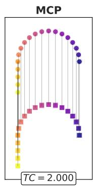  
(a)

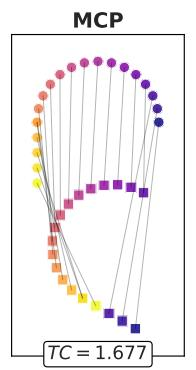

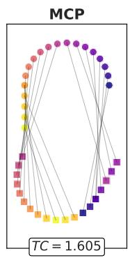  
(b)

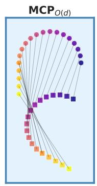  
(c)  
Figure 2: MCP and $\mathbf { M C P _ { O ( d ) } }$ demonstration. (a) MCP successfully reconstructs the true pairing on aligned data. (b) MCP depends on input rotation, which leads to poor performance on unaligned data. (c) Conversely, ${ \mathrm { M C P } } _ { O ( d ) }$ optimizes over all orthogonal alignments, choosing the pairing with the highest correlation after the projection. In this example, it chooses the pairing from (a), enabling it to retrieve the true pairing, invariant to input (orthogonal) projections. A dynamic animation of this figure is available on our project page.

## 4.1 Unpaired CCA Proxy Pairing

Unpaired CCA. In the unpaired scenario, we assume the rows (samples) of X and Y are related by an unknown ground-truth permutation $P ^ { * }$ . In practice, this assumption is quite mild, as it only requires a small set of representative anchors of each point set to correspond. We aim to find projections $U ^ { \prime }$ and $V ^ { \prime }$ under which the TC of the true pairing $P ^ { * }$ matches that of the optimal paired projections $\left( U ^ { * } , V ^ { * } \right) = C C A ( X , P ^ { * } Y )$ :

$$
\mathrm { T C } ( X U ^ { \prime } , P ^ { * } Y V ^ { \prime } ) = \mathrm { T C } ( X U ^ { * } , P ^ { * } Y V ^ { * } )\tag{5}
$$

However, directly evaluating or optimizing Eq. (5) is impossible because it explicitly requires the ground-truth permutation $P ^ { * }$ , which is strictly unknown in the unpaired setting. To circumvent this, we assume that $P ^ { * }$ maximizes the CCA objective. We then search for a proxy permutation $P ^ { \prime }$ that maximizes this criterion. Under this assumption, we can compute the corresponding projections via $( U ^ { \prime } , V ^ { \prime } ) = \mathbf { C C A } ( X , P ^ { \prime } Y )$ , which consequently yields the desired solution from Eq. (5). Crucially, this is a significantly weaker and more attainable requirement on the proxy pairing $P ^ { \prime }$ than demanding exact permutation recovery $( P ^ { \prime } \approx P ^ { * } )$ . Still, the resulting optimization problem remains highly challenging, as the search space spans all possible permutations, together with two orthogonal projection matrices.

Maximum Correlation Pairing. An approach to simplify the search for the proxy pairing might be to bypass the projections entirely and select the permutation that directly maximizes the total correlation [21, 33]. We formally define this as the Maximum Correlation Pairing (MCP):

$$
P ^ { \prime } = \operatorname { M C P } ( X , Y ) = \arg \operatorname* { m a x } _ { P \in { \mathcal P } } \operatorname { T C } ( X , P Y )\tag{6}
$$

As depicted in Fig. 2a, while standard MCP works well for aligned data $( \mathrm { e } . \mathrm { g } . , Y = X )$ , it is highly sensitive to arbitrary rotations of the input space. Consequently, it fails to capture meaningful pairings when the data views are not pre-aligned (Fig. 2b). Since CCA fundamentally seeks and is invariant to orthogonal transformations, the optimal pairing must be evaluated together with an appropriate orthogonal projection.

Thereby, we modify the problem by decoupling it into consecutive maximizations. We introduce two general sets of linear transformation functions, $\mathcal { F } _ { 1 } , \mathcal { F } _ { 2 }$ , defining the pairing $\mathrm { M C P } _ { \mathcal { F } _ { 1 } , \mathcal { F } _ { 2 } } ( X , Y )$ as follows:

$$
P ^ { \prime } = \underset { { P \in \mathcal { P } } } { \mathrm { M C P } } _ { \mathcal { F } _ { 1 } , \mathcal { F } _ { 2 } } ( X , Y ) = \underset { { P \in \mathcal { P } } } { \mathrm { a r g } } \underset { A \in \mathcal { F } _ { 1 } , B \in \mathcal { F } _ { 2 } } { \mathrm { m a x } } \underset { { P \in \mathcal { F } _ { 2 } } } { \mathrm { T C } } ( X A , P Y B )\tag{7}
$$

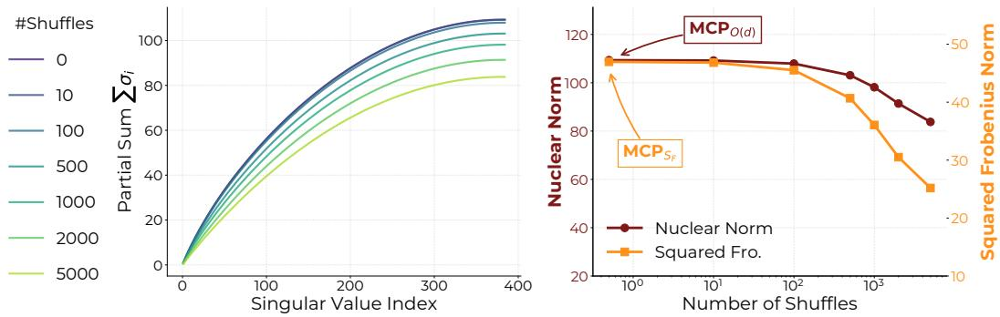  
(a)  
(b)  
Figure 3: (a) Validation of Assum. 1: Partial cumulative sums of singular values for the true permutation $P ^ { * } \ ( \# \mathrm { s h u f f l e s } = 0 )$ and various random shuffles on the Flickr dataset (8,000 samples; see Sec. 6). As the permutation diverges from $P ^ { * }$ , the partial sums strictly decrease, confirming the majorization property. (b) Validation of Thm. 2. A comparison of $\operatorname { M C P } _ { O ( d ) }$ (Nuclear) and $\mathrm { M C P } _ { S _ { F } } ^ { - }$ (Frobenius) objectives using the setup from (a). Both objectives decay as the permutation moves away from $P ^ { * }$ , and both are locally maximized by the same ground-truth permutation.

When setting ${ \mathcal { F } } _ { 1 } = { \mathcal { F } } _ { 2 } = O ( d )$ , the inner maximization corresponds precisely to the CCA objective without dimensionality reduction. For brevity, w.l.o.g we fix $\dot { \mathcal { F } } _ { 2 } ~ = ~ \dot { O } ( d )$ and denote $\mathsf { \bar { M } C P } _ { \mathcal { F } } ( X , Y ) = \mathsf { M C P } _ { \mathcal { F } , O ( d ) }$ . Fixing $\mathcal { F } _ { 1 }$ yields identical results. Unlike naive MCP, ${ \mathrm { M C P } } _ { O ( d ) }$ (Fig. 2c) is robust to orthogonal projections, successfully resolving the alignment failure illustrated in Fig. 2b. For brevity, we assume a unique maximizer for (7). Our results remain valid without this assumption. The derivations proceed identically by choosing a representative element (see App. A).

Consequently, ${ \mathrm { M C P } } _ { O ( d ) }$ serves as a computable proxy $P ^ { \prime }$ that can be evaluated entirely without paired samples. We argue that this proxy robustly recovers the TC under the true underlying permutation, a claim we substantiate through comprehensive empirical evaluations in Sec. 6.

Takeaway 1

${ \mathrm { M C P } } _ { O ( d ) }$ defines a proxy pairing for Unpaired CCA

## 4.2 Connection to QAP

In practice, optimizing over either discrete permutations or orthogonal projections individually is already a difficult problem [6, 22]. Consequently, optimizing over both simultaneously makes a direct computation of ${ \mathrm { M C P } } _ { O ( d ) }$ computationally prohibitive (see App. B.5). Therefore, we relax the optimization space from $O ( d )$ to a broader set: the (scaled) Frobenius sphere, $\sqrt { d } { \cal S } _ { F }$ . As we will demonstrate, under a mild assumption, this relaxation does not alter the optimal pairing while making the problem computationally feasible.

Interestingly, as formalized in Thm. $1 , \mathsf { M C P } _ { S _ { F } }$ reduces to a special case of the well-studied QAP. While $\mathsf { Q A \bar { P } }$ is generally NP-hard, efficient approximate solvers exist [62, 25, 41], making ${ \bf M C P } _ { S _ { F } }$ a practically attainable pairing.

Theorem 1. $\mathrm { M C P } _ { \sqrt { d } S _ { F } } ( X , Y ) = \mathrm { M C P } _ { S _ { F } } ( X , Y ) = \mathrm { Q A P } ( X X ^ { T } , Y Y ^ { T } ) .$

Takeaway 2

$$
M C P _ { S _ { F } } \ i s \ p r a c t i c a l l y \ a t t a i n a b l e \ \nu i a \ Q A P
$$

## 4.3 Equivalence of $\mathbf { M C P _ { O ( d ) } }$ and $\mathbf { M C P _ { S _ { I } } }$

Thus far, we have defined ${ \mathrm { M C P } } _ { O ( d ) }$ , and established that ${ \bf M C P } _ { S _ { F } }$ is an attainable pairing via $\mathrm { Q A P }$ approximations. A critical question remains: how do these two pairings relate? To bridge this

gap, we first observe that both ${ \mathrm { M C P } } _ { O ( d ) }$ and $\mathbf { M C P } _ { S _ { F } }$ can be reformulated as optimization problems exclusively over ${ \mathcal { P } } ;$

Proposition 1.

$$
\mathrm { M C P } _ { O ( d ) } ( X , Y ) = \arg \operatorname* { m a x } _ { P \in \mathcal P } \| X ^ { T } P Y \| _ { * } , \quad \mathrm { M C P } _ { S _ { F } } ( X , Y ) = \arg \operatorname* { m a x } _ { P \in \mathcal P } \| X ^ { T } P Y \| _ { F }
$$

Let $M _ { P } = X ^ { T } P Y$ denote the cross-correlation matrix of X and Y under permutation P. Prop. 1 translates into an optimization over σ $( M _ { P } )$ , the singular values of $M _ { P }$

$$
\operatorname { M C P } _ { O ( d ) } ( X , Y ) = \arg \operatorname* { m a x } _ { P \in \mathcal { P } } \sum _ { i = 1 } ^ { d } \sigma _ { i } ( M _ { P } ) , \quad \operatorname { M C P } _ { S _ { F } } ( X , Y ) = \arg \operatorname* { m a x } _ { P \in \mathcal { P } } \sum _ { i = 1 } ^ { d } \sigma _ { i } ^ { 2 } ( M _ { P } )\tag{8}
$$

Denote $P _ { O } = \mathrm { M C P } _ { O ( d ) }$ and $P \neq \mathrm { M C P } _ { O ( d ) }$ . By Eq. (8), the sum of singular values under $P _ { O }$ is strictly maximal:

$$
\sum _ { i = 1 } ^ { d } \sigma _ { i } ( M _ { P _ { O } } ) > \sum _ { i = 1 } ^ { d } \sigma _ { i } ( M _ { P } )\tag{9}
$$

In Assumption 1 below, we assume this inequality holds not just for the total sum, but is preserved across all partial sums.

Assumption 1. Let $P _ { O } = \mathrm { M C P } _ { O ( d ) }$ and $P \neq \mathrm { M C P } _ { O ( d ) }$ , then $\sigma ( M _ { P _ { O } } )$ weakly majorizes $\sigma ( M _ { P } )$ Namely,

$$
\sum _ { i = 1 } ^ { m } \sigma _ { i } ( M _ { P o } ) \geq \sum _ { i = 1 } ^ { m } \sigma _ { i } ( M _ { P } ) \quad \forall m \in \{ 1 , 2 , \dots , d \}
$$

This assumption is relatively mild. As demonstrated in App. A, Prop. 4 establishes that Assum. 1 is satisfied when Y is an isometry of $X ( \mathrm { i . e . , } Y = X Q$ , where $Q \in O ( d ) ;$ ). Furthermore, Prop. 5 proves that as $n  \infty$ , the assumption holds with probability 1 for any random permutation. We empirically corroborate this weak-majorization behavior on real datasets in Fig. 3a and App. E.2. Building upon this, we derive the following theorem.

Theorem 2. Under Assumption 1, $M C P _ { O ( d ) } ( X , Y ) = M C P _ { S _ { F } } ( X , Y )$

Fig. 3b empirically validates Thm. 2 on the Flickr dataset, with further support provided by the evaluations in Sec. 6 and App. E.3.

Takeaway 3

$$
M C P _ { O ( d ) } = M C P _ { S _ { F } }
$$

Theorem 2 forms the theoretical cornerstone of our method. Synthesizing these findings, we conclude that under realistic assumptions, the computationally attainable $\mathbf { M C P } _ { S _ { I } }$ perfectly aligns with the ${ \mathrm { M C P } } _ { O ( d ) }$ pairing. Ultimately, this mathematically justifies the core premise illustrated in Fig. 1: Unpaired CCA can be solved with linear kernel $Q A P .$

## 5 Unpaired CCA

Building directly upon the theoretical foundations established in Sec. 4, we derive a practical algorithm for maximizing correlation in the absence of paired data, which we term Unpaired CCA (UCCA). This section outlines the general algorithmic framework of UCCA, deferring specific architectural details to App. F. Notably, despite its simplicity, this approach significantly outperforms existing baselines in capturing cross-view correlations in the unpaired data scenario (Sec. 6).

As concluded in Sec. 4, the ${ \mathrm { M C P } } _ { O ( d ) }$ pairing can be attained by solving a linear-kernel QAP. However, the QAP is NP-hard. While efficient approximate solvers exist, applying them directly to the entire dataset becomes computationally prohibitive for a large number of samples, n. To ensure scalability in practice, UCCA adopts an anchor-based approach [64, 17], operating by first selecting a subset of k representative anchors from each modality. A standard and highly practical choice of anchors is the K-Means centroids [36, 14]. We apply K-Means clustering within each modality and extract the resulting centroids to serve as our anchors.

Figure 4: Unpaired CCA method overview.  
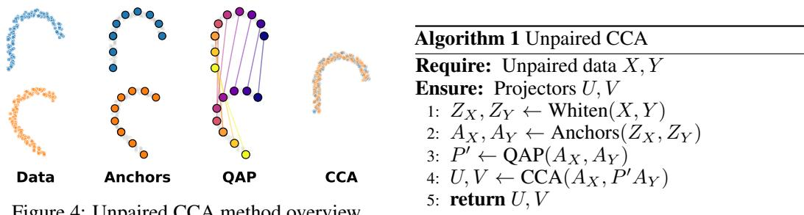

Once extracted, these k anchors are matched using the linear-kernel QAP formulation detailed in Thm. 1, yielding an estimated permutation matrix P′. For robustness, this process is repeated several times, and the matched anchors are concatenated. Finally, we treat these matched anchors as pseudo-pairs and apply standard CCA to compute the final projection matrices. Importantly, UCCA does not assume any existing correspondences in the data samples. The complete procedure is summarized in Alg. 1 and visualized in Fig. 4.

## 6 Experimental Results

This section details the empirical evaluation of UCCA. Our experimental design aims to validate UCCA’s capacity to recover latent cross-modal correlations, and empirically substantiate our theoretical framework. Comprehensive implementation details, including architectural configurations and hyperparameter selections, are documented in App. F.

Datasets. To rigorously assess UCCA’s ability to recover the true underlying correlation, we evaluate it on benchmark datasets where ground-truth pairings are known but strictly withheld during training. Specifically, we utilize four diverse real-world datasets: SNARE [19] (single-cell multiomics), Flickr [26], COCO [40] (image-text), and Handwritten digits benchmark [60, 4]. For the Handwritten dataset, we employ three distinct views: profile correlations (PC), Karhunen-Loève coefficients (KL), and pixel averages (PA). Across these benchmarks, we evaluate UCCA on a total of six distinct dataset configurations. Crucially, we enforce a strictly unpaired training split by dividing the training data into two disjoint subsets, allocating one half entirely to the first view and the remainder to the second, thereby eliminating any paired correspondences during training.

Baselines. As UCCA represents the first methodology explicitly designed to optimize correlation exclusively from unpaired samples, direct baselines do not currently exist. Therefore, we compare UCCA against recent unpaired alignment techniques. The most structurally similar approaches are SCA [58], which extracts shared linear components from unpaired multiview data, and UCA [27], which learns shared representations motivated by correlation objectives. We benchmark against the linear formulation of UCA, deferring results for its non-linear variant to App. B.7. Alternative methods, such as J-MDS [10], SCOTv1 [19], and SCOTv2 [18], extract shared representations without establishing a functional mapping, rendering them inapplicable to the generalizable setting. To enable comparison to these, we adapt them by fitting a standard CCA model to the pseudo-pairs they infer during training (similar to UCCA’s approach), denoting these extensions as -CCA variants.

Total Correlation. Fig. 5 evaluates the fundamental objective of an unpaired CCA method: its ability to successfully capture the true correlation of the hidden ground-truth pairings. We compute the total correlation as defined in Eq. (1), $\mathrm { T C } ( X , P ^ { * } Y ) = \mathrm { t r } ( \bar { X } ^ { T } P ^ { * } Y )$ , after orthogonalizing X and Y separately to remove correlation repetition. The figure reports the total correlation captured by the top two learned components. Evidently, UCCA is the sole approach that consistently recovers the underlying correlation. It significantly outperforms all baselines and often approaches the paired CCA upper bound.

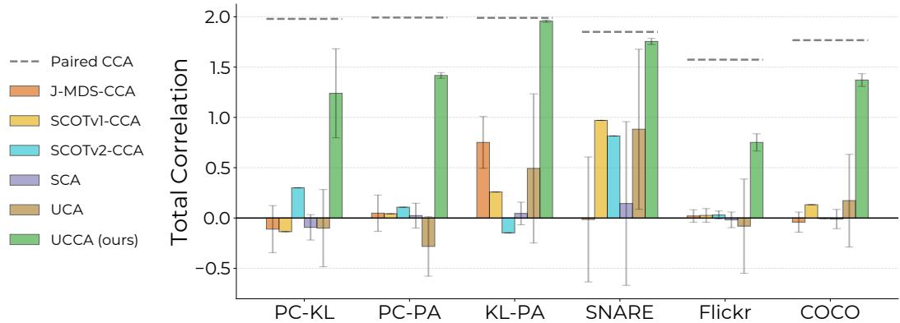  
Figure 5: Total Correlation results. Total correlation achieved across six distinct dataset configurations. UCCA consistently extracts highly correlated components, significantly outperforming all baselines, and often approaching the paired CCA upper bound.

Table 1: Cross-view classification results. Mean accuracy $( \pm \mathrm { \ s t d } )$ of a kNN classifier fitted on the embeddings of one view and evaluated on the other. Bold and underlined values indicate the best and second-best performances, respectively. UCCA significantly outperforms all baselines across four datasets while maintaining comparable performance on the fifth.
<table><tr><td>Method</td><td>PC-KL</td><td>PC-PA</td><td>KL-PA</td><td>SNARE</td><td>COCO</td></tr><tr><td>J-MDS-CCA</td><td> $0 . 0 8 3 \pm 0 . 0 2 1$ </td><td> $0 . 0 8 7 \pm 0 . 0 2 1$ </td><td> $0 . 2 1 1 \pm 0 . 0 3 3$ </td><td> $0 . 2 4 7 \pm 0 . 2 2 4$ </td><td> ${ \bf 0 . 2 3 7 \pm 0 . 0 7 9 }$ </td></tr><tr><td>SCOTv1-CCA</td><td> $0 . 0 7 4 \pm 0 . 0 0 0$ </td><td> $0 . 1 2 1 \pm 0 . 0 0 0$ </td><td> $0 . 1 0 2 \pm 0 . 0 0 0$ </td><td> $0 . 6 5 0 \pm 0 . 0 0 0$ </td><td> $0 . 1 4 1 \pm 0 . 0 0 0$ </td></tr><tr><td>SCOTv2-CCA</td><td> $0 . 1 4 8 \pm 0 . 0 0 0$ </td><td> $0 . 0 9 0 \pm 0 . 0 0 0$ </td><td> $0 . 1 1 3 \pm 0 . 0 0 0$ </td><td> $0 . 6 4 6 \pm 0 . 0 0 0$ </td><td> $0 . 1 6 4 \pm 0 . 0 0 0$ </td></tr><tr><td>SCA</td><td> $0 . 0 9 7 \pm 0 . 0 1 4$ </td><td> $0 . 0 8 3 \pm 0 . 0 1 1$ </td><td> $0 . 1 0 0 \pm 0 . 0 2 2$ </td><td> $0 . 3 1 2 \pm 0 . 2 5 5$ </td><td> $0 . 1 6 1 \pm 0 . 0 2 0$ </td></tr><tr><td>UCA</td><td> $0 . 0 8 8 \pm 0 . 0 1 6$ </td><td> $0 . 1 0 0 \pm 0 . 0 1 7$ </td><td> $0 . 1 5 9 \pm 0 . 0 9 0$ </td><td> $0 . 3 7 8 \pm 0 . 2 9 7$ </td><td> $0 . 1 3 2 \pm 0 . 0 5 8$ </td></tr><tr><td>UCCA (ours)</td><td> ${ \bf 0 . 2 9 2 \pm 0 . 0 7 4 }$ </td><td> ${ \bf 0 . 3 1 5 \pm 0 . 0 2 5 }$  一</td><td> ${ \bf 0 . 5 6 4 \pm 0 . 0 2 2 }$  一</td><td> ${ \bf 0 . 8 4 9 \pm 0 . 0 2 1 }$  一</td><td> $0 . 2 3 2 \pm 0 . 0 1 6$  </td></tr><tr><td>Paired CCA</td><td> $0 . 5 6 2 \pm 0 . 0 0 0$ </td><td> $0 . 5 1 6 \pm 0 . 0 0 0$ </td><td> $0 . 6 2 9 \pm 0 . 0 0 0$ </td><td> $0 . 8 8 7 \pm 0 . 0 0 0$ </td><td> $0 . 2 3 2 \pm 0 . 0 0 9$ </td></tr></table>

The comparison with J-MDS-CCA, SCOTv1-CCA and SCOTv2-CCA is of particular interest, as it isolates the core effect of optimizing the ${ \mathrm { M C P } } _ { O ( d ) }$ pairing. It clearly demonstrates that the ${ \mathrm { M C P } } _ { O ( d ) }$ objective provides a superior pairing strategy for CCA scenarios when compared to alternative approaches.

Cross-view Classification. To evaluate the downstream performance of UCCA, we apply it to a cross-view classification task (Tab. 1). Using the shared representations learned exclusively from unpaired data, we train a kNN classifier on one view and evaluate its accuracy on the other. As shown, UCCA outperforms all baselines across four datasets while maintaining comparable performance on the fifth, often approaching the performance of the paired CCA. The Flickr dataset is omitted from this experiment as it lacks class labels.

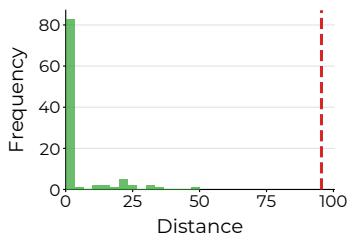  
Mean distance of random permutations Distance between $M C P _ { S _ { F } }$ and $M C P _ { O ( d ) }$  
Figure 6: $\mathbf { M C P } _ { O ( d ) } = \mathbf { M C P } _ { S _ { F } }$ in practice. Kendall Tau Distances between $\mathrm { M C P } _ { S _ { F } }$ and approximated ${ \mathrm { M C P } } _ { O ( d ) }$ computed on the anchors of the Handwritten benchmark (PC-PA) across 100 initializations. The strict concentration at zero empirically validates Thm. 2.

Validating $\mathbf { M C P _ { O ( d ) } } = \mathbf { M C P _ { S _ { F } } } ,$ . Fig. 6 empirically validates the equivalence between ${ \mathrm { M C P } } _ { O ( d ) }$ and $\mathbf { M C P } _ { S _ { F } }$ . Specifically, it visualizes the distance between $\mathrm { M C P } _ { S _ { F } }$ , retrieved via an approximate QAP solver, and an estimated ${ \mathrm { M C P } } _ { O ( d ) }$ , denoted as $\tilde { P _ { O } }$ . Conceptually, $\tilde { P _ { O } }$ represents the projection of $\mathrm { M C P } _ { S _ { F } }$ onto the ${ \mathrm { M C P } } _ { O ( d ) }$ solution space. If $\tilde { P _ { O } } = \mathrm { M C P } _ { S _ { F } }$ , the approximation is exact, establishing that $\mathrm { M C P } _ { O ( d ) } \stackrel { \textstyle \sum } { = } \mathrm { M C P } _ { S _ { F } }$ . To assess this, we computed both pairings across all real datasets using different anchor initializations. We quantified the divergence between the resulting permutations using the Kendall Tau distance, which counts the number of pairwise inversions. As shown, these distances are heavily concentrated at zero, providing strong empirical validation that Thm. 2 holds in practice (see App. B.3 for further details and results).

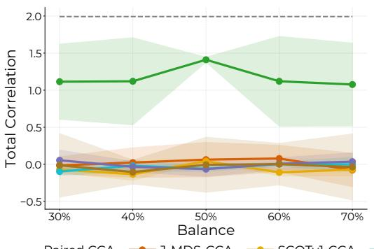  
(a)

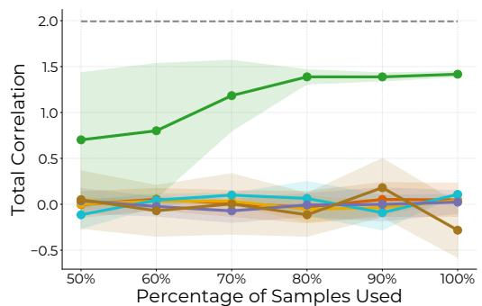  
(b)  
Figure 8: Total correlation performance on the Handwritten benchmark (PC-PA) across (a) data imbalances and (b) varying amounts of unpaired data. UCCA consistently outperforms baselines, achieving its peak performance when the maximum amount of data is accessible. This demonstrates that abundant unpaired data alone provides a strong alignment signal, improving performance without requiring any paired correspondences.

Computational Efficiency. Relying on QAP, an NP-hard problem, naturally introduces concerns regarding runtime bottlenecks. However, as detailed in Fig. 7 (and App. B.4), UCCA demonstrates a highly favorable trade-off between runtime and performance. It consistently outperforms baseline methods even when configured with fewer clustering repetitions for faster execution, and requires a total runtime of only several minutes for each dataset. The algorithmic reliance on a smaller subset of representative anchors, combined with efficient approximate solvers, effectively mitigates this computational overhead and ensures practical scalability. We further discuss the computational complexity in App. D.

Ablations. We further evaluate the stability of UCCA under varying data conditions using the PC-PA views of the Handwritten benchmark

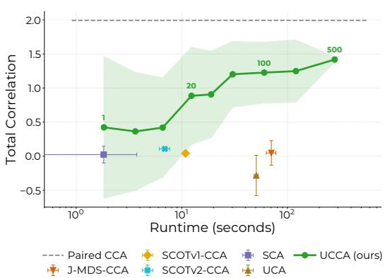  
Figure 7: Runtime and Performance. Total correlation versus runtime for UCCA and baselines on the handwritten (PC-PA) benchmark. UCCA is improved in robustness and accuracy with more clustering repetitions, yet outperforms all baselines even with fewer repetitions and shorter runtimes.

(Fig. 8). Fig. 8a illustrates the effect of unbalanced data, demonstrating that UCCA is robust to view imbalances and performs optimally when all data is accessible during training. Fig. 8b examines the effect of unpaired data amount, showing that the consistency and performance of UCCA increase alongside the volume of available unpaired data. Together, these results demonstrate that accessible unpaired data alone provides a strong alignment signal. Additional ablations validating the choice of K-Means centroids as anchors and the number of anchors used are provided in App. B.8.

## 7 Conclusions and Summary

In this paper, we introduced and formalized the problem of Unpaired Canonical Correlation Analysis. Through a rigorous theoretical investigation, we defined a proxy pairing for the unpaired scenario $( \mathrm { M C P } _ { O ( d ) } ^ { - } )$ , and identified a practically attainable relaxation via the Quadratic Assignment Problem $( \mathrm { M C P } _ { S _ { F } } ) .$ Crucially, we proved that under realistic data assumptions, these two pairings coincide. Grounded in these theoretical insights, we developed UCCA, the first practical algorithm capable of extracting canonical correlation components relying exclusively on unpaired data. Our empirical evaluations across multiple real-world datasets demonstrate that UCCA significantly outperforms existing unpaired alignment baselines in recovering the true underlying correlation components.

Limitations. While UCCA represents an advancement over prior unpaired baselines, a performance gap naturally remains relative to the theoretical upper bound achieved by the paired CCA. Additionally, our current framework focuses on the bi-view setting. Extending this formulation to multi-view scenarios is a compelling direction for future research, particularly because the difficulty of acquiring cross-modal correspondences scales significantly with the number of views.

Ultimately, this work bridges a critical gap between classical statistical multiview learning and the rapidly expanding paradigm of unpaired data integration. By demonstrating that latent correlations can be systematically recovered without explicit correspondence, we open new avenues for applying principled statistical techniques to massive, unstructured datasets in domains where paired samples are prohibitively expensive or impossible to acquire.

## References

[1] David Alvarez-Melis, Stefanie Jegelka, and Tommi S Jaakkola. Towards optimal transport with global invariances. In The 22nd International Conference on Artificial Intelligence and Statistics, pages 1870–1879. PMLR, 2019.

[2] Nikola Andrejic, Milica Spasic, Igor Mihajlovic, Petra Milosavljevic, Djordje Pavlovic, Filip Milisavljevic, Uros Milivojevic, Danilo Delibasic, Ivana Mikic, and Sinisa Todorovic. Unpaired image-to-image translation for segmentation and signal unmixing. arXiv preprint arXiv:2505.20746, 2025.

[3] Galen Andrew, Raman Arora, Jeff Bilmes, and Karen Livescu. Deep canonical correlation analysis. In International conference on machine learning, pages 1247–1255. PMLR, 2013.

[4] Arthur Asuncion, David Newman, et al. UCI machine learning repository, 2007.

[5] Tadas Baltrušaitis, Chaitanya Ahuja, and Louis-Philippe Morency. Multimodal machine learning: A survey and taxonomy. IEEE transactions on pattern analysis and machine intelligence, 41(2):423–443, 2018.

[6] Rainer E Burkard. Quadratic assignment problems. European Journal of Operational Research, 15(3):283–289, 1984.

[7] Andrew Butler, Paul Hoffman, Peter Smibert, Efthymia Papalexi, and Rahul Satija. Integrating single-cell transcriptomic data across different conditions, technologies, and species. Nature biotechnology, 36(5):411–420, 2018.

[8] Jia Cai and Junyi Huo. Sparse generalized canonical correlation analysis via linearized bregman method. Communications on Pure & Applied Analysis, 19(8), 2020.

[9] Chi Chen, Peng Li, Maosong Sun, and Yang Liu. Weakly supervised vision-and-language pre-training with relative representations. arXiv preprint arXiv:2305.15483, 2023.

[10] Dexiong Chen, Bowen Fan, Carlos Oliver, and Karsten Borgwardt. Unsupervised manifold alignment with joint multidimensional scaling. In International Conference on Learning Representations, 2023.

[11] Yuwen Chen, Nicholas Konz, Hanxue Gu, Haoyu Dong, Yaqian Chen, Lin Li, Jisoo Lee, and Maciej A Mazurowski. Contourdiff: Unpaired medical image translation with structural consistency. arXiv preprint arXiv:2403.10786, 2024.

[12] Biqian Cheng, Evangelos E Papalexakis, and Jia Chen. Towards aligned canonical correlation analysis: Preliminary formulation and proof-of-concept results. arXiv preprint arXiv:2312.00296, 2023.

[13] Seun-An Choe, Keon-Hee Park, Jinwoo Choi, and Gyeong-Moon Park. Universal domain adaptation for semantic segmentation. In Proceedings of the Computer Vision and Pattern Recognition Conference, pages 4607–4617, 2025.

[14] Adam Coates, Andrew Ng, and Honglak Lee. An analysis of single-layer networks in unsupervised feature learning. In Proceedings of the fourteenth international conference on artificial intelligence and statistics, pages 215–223. JMLR Workshop and Conference Proceedings, 2011.

[15] Guy Dar. mini-vec2vec: Scaling universal geometry alignment with linear transformations. arXiv preprint arXiv:2510.02348, 2025.

[16] Malo Alefsen de Boisredon d’Assier, Aloys Portafaix, Eugene Vorontsov, William Trung Le, and Samuel Kadoury. Image-level supervision and self-training for transformer-based cross-modality tumor segmentation. Medical Image Analysis, 97:103287, 2024.

[17] Vin De Silva and Joshua B Tenenbaum. Sparse multidimensional scaling using landmark points. Technical report, technical report, Stanford University, 2004.

[18] Pinar Demetci, Rebecca Santorella, Manav Chakravarthy, Bjorn Sandstede, and Ritambhara Singh. Scotv2: Single-cell multiomic alignment with disproportionate cell-type representation. Journal ofComputational Biology, 29(11):1213–1228, 2022.

[19] Pinar Demetci, Rebecca Santorella, Björn Sandstede, William Stafford Noble, and Ritambhara Singh. Scot: single-cell multi-omics alignment with optimal transport. Journal of computational biology, 29(1):3–18, 2022.

[20] Benjamin Devillers, Léopold Maytié, and Rufin VanRullen. Semi-supervised multimodal representation learning through a global workspace. IEEE Transactions on Neural Networks and Learning Systems, 2024.

[21] David C Dowson and BV666017 Landau. The fréchet distance between multivariate normal distributions. Journal ofmultivariate analysis, 12(3):450–455, 1982.

[22] Alan Edelman, Tomás A Arias, and Steven T Smith. The geometry of algorithms with orthogonality constraints. SIAMjournal on Matrix Analysis and Applications, 20(2):303–353, 1998.

[23] Yaroslav Ganin and Victor Lempitsky. Unsupervised domain adaptation by backpropagation. In International conference on machine learning, pages 1180–1189. PMLR, 2015.

[24] Sharut Gupta, Shobhita Sundaram, Chenyu Wang, Stefanie Jegelka, and Phillip Isola. Better together: Leveraging unpaired multimodal data for stronger unimodal models. arXiv preprint arXiv:2510.08492, 2025.

[25] Charles H Heider. A computationally simplified pair-exchange algorithm for the quadratic assignment problem. Technical report, 1972.

[26] Micah Hodosh, Peter Young, and Julia Hockenmaier. Framing image description as a ranking task: Data, models and evaluation metrics. Journal ofArtificial Intelligence Research, 47:853– 899, 2013.

[27] Yedid Hoshen and Lior Wolf. Unsupervised correlation analysis. In Proceedings ofthe IEEE Conference on Computer Vision and Pattern Recognition, pages 3319–3328, 2018.

[28] Harold Hotelling. The most predictable criterion. Journal of educational Psychology, 26(2):139, 1935.

[29] Min-Zhi Jiang, François Aguet, Kristin Ardlie, Jiawen Chen, Elaine Cornell, Dan Cruz, Peter Durda, Stacey B Gabriel, Robert E Gerszten, Xiuqing Guo, et al. Canonical correlation analysis for multi-omics: Application to cross-cohort analysis. PLoS genetics, 19(5):e1010517, 2023.

[30] Ying Jin, Ximei Wang, Mingsheng Long, and Jianmin Wang. Minimum class confusion for versatile domain adaptation. In European conference on computer vision, pages 464–480. Springer, 2020.

[31] Ce Ju, Reinmar J Kobler, Liyao Tang, Cuntai Guan, and Motoaki Kawanabe. Deep geodesic canonical correlation analysis for covariance-based neuroimaging data. In The Twelfth Interna tional Conference on Learning Representations, 2024.

[32] Kotha Kartheek, Lingamaneni Gnanesh Chowdary, and Snehasis Mukherjee. Continual learningbased unified model for unpaired image restoration tasks. arXiv preprint arXiv:2507.19184, 2025.

[33] Martin Knott and Cyril S Smith. On the optimal mapping of distributions. Journal of Optimization Theory and Applications, 43(1):39–49, 1984.

[34] Masahiro Kohjima. Gaussian processes for shuffled regression. Advances in Neural Information Processing Systems, 38:18032–18057, 2026.

[35] Tjalling C Koopmans and Martin Beckmann. Assignment problems and the location of economic activities. Econometrica: journal ofthe Econometric Society, pages 53–76, 1957.

[36] Sanjiv Kumar, Mehryar Mohri, and Ameet Talwalkar. Sampling methods for the nyström method. The Journal ofMachine Learning Research, 13(1):981–1006, 2012.

[37] Zhengfeng Lai, Haoping Bai, Haotian Zhang, Xianzhi Du, Jiulong Shan, Yinfei Yang, Chen-Nee Chuah, and Meng Cao. Empowering unsupervised domain adaptation with large-scale pretrained vision-language models. In Proceedings ofthe ieee/cvfwinter conference on applications ofcomputer vision, pages 2691–2701, 2024.

[38] Yunwei Lan, Zhigao Cui, Chang Liu, Jialun Peng, Nian Wang, Xin Luo, and Dong Liu. Exploiting diffusion prior for real-world image dehazing with unpaired training. In Proceedings ofthe AAAI Conference on Artificial Intelligence, volume 39, pages 4455–4463, 2025.

[39] Po-han Li, Sandeep P Chinchali, and Ufuk Topcu. Csa: Data-efficient mapping of unimodal features to multimodal features. arXiv preprint arXiv:2410.07610, 2024.

[40] Tsung-Yi Lin, Michael Maire, Serge Belongie, James Hays, Pietro Perona, Deva Ramanan, Piotr Dollár, and C Lawrence Zitnick. Microsoft coco: Common objects in context. In Computer Vision–ECCV 2014: 13th European Conference, Zurich, Switzerland, September 6-12, 2014, Proceedings, Part V 13, pages 740–755. Springer, 2014.

[41] Eliane Maria Loiola, Nair Maria Maia De Abreu, Paulo Oswaldo Boaventura-Netto, Peter Hahn, and Tania Querido. A survey for the quadratic assignment problem. European journal of operational research, 176(2):657–690, 2007.

[42] Leon Lufkin, Yihong Wu, and Jiaming Xu. Sharp information-theoretic thresholds for shuffled linear regression. In 2024 IEEE International Symposium on Information Theory (ISIT), pages 363–367. IEEE, 2024.

[43] Yong Luo, Dacheng Tao, Kotagiri Ramamohanarao, Chao Xu, and Yonggang Wen. Tensor canonical correlation analysis for multi-view dimension reduction. IEEE transactions on Knowledge and Data Engineering, 27(11):3111–3124, 2015.

[44] Shuang Ma, Daniel McDuff, and Yale Song. Unpaired image-to-speech synthesis with multimodal information bottleneck. In Proceedings of the IEEE/CVF International Conference on Computer Vision, pages 7598–7607, 2019.

[45] Albert W Marshall, Ingram Olkin, and Barry C Arnold. Inequalities: theory of majorization and its applications. 1979.

[46] Sangwoo Mo, Minkyu Kim, Kyungmin Lee, and Jinwoo Shin. S-clip: Semi-supervised visionlanguage learning using few specialist captions. Advances in Neural Information Processing Systems, 36:61187–61212, 2023.

[47] Ryumei Nakada, Halil Ibrahim Gulluk, Zhun Deng, Wenlong Ji, James Zou, and Linjun Zhang. Understanding multimodal contrastive learning and incorporating unpaired data. In International Conference on Artificial Intelligence and Statistics, pages 4348–4380. PMLR, 2023.

[48] Karl Pearson. Liii. on lines and planes of closest fit to systems of points in space. The London, Edinburgh, and Dublin philosophical magazine andjournal ofscience, 2(11):559–572, 1901.

[49] F. Pedregosa, G. Varoquaux, A. Gramfort, V. Michel, B. Thirion, O. Grisel, M. Blondel, P. Prettenhofer, R. Weiss, V. Dubourg, J. Vanderplas, A. Passos, D. Cournapeau, M. Brucher, M. Perrot, and E. Duchesnay. Scikit-learn: Machine learning in Python. Journal ofMachine Learning Research, 12:2825–2830, 2011.

[50] Taneli Pusa and Juho Rousu. Stable biomarker discovery in multi-omics data via canonical correlation analysis. Plos one, 19(9):e0309921, 2024.

[51] Alec Radford, Jong Wook Kim, Chris Hallacy, Aditya Ramesh, Gabriel Goh, Sandhini Agarwal, Girish Sastry, Amanda Askell, Pamela Mishkin, Jack Clark, et al. Learning transferable visual models from natural language supervision. In International conference on machine learning, pages 8748–8763. PmLR, 2021.

[52] Simon Roschmann, Paul Krzakala, Sonia Mazelet, Quentin Bouniot, and Zeynep Akata. Sotalign: Semi-supervised alignment of unimodal vision and language models via optimal transport. arXiv preprint arXiv:2602.23353, 2026.

[53] Jan Rupnik and John Shawe-Taylor. Multi-view canonical correlation analysis. In Conference on data mining and data warehouses (SiKDD 2010), volume 473, pages 1–4, 2010.

[54] Hichem Sahbi. Learning cca representations for misaligned data. In European Conference on Computer Vision, pages 468–485. Springer, 2018.

[55] Amanpreet Singh, Ronghang Hu, Vedanuj Goswami, Guillaume Couairon, Wojciech Galuba, Marcus Rohrbach, and Douwe Kiela. Flava: A foundational language and vision alignment model. In Proceedings ofthe IEEE/CVF conference on computer vision and pattern recognition, pages 15638–15650, 2022.

[56] Martin Slawski and Bodhisattva Sen. Permuted and unlinked monotone regression in rˆ d: an approach based on mixture modeling and optimal transport. Journal of Machine Learning Research, 25(183):1–57, 2024.

[57] Stefan G Stark, Joanna Ficek, Francesco Locatello, Ximena Bonilla, Stéphane Chevrier, Franziska Singer, Gunnar Rätsch, and Kjong-Van Lehmann. Scim: universal single-cell matching with unpaired feature sets. Bioinformatics, 36(Supplement\_2):i919–i927, 2020.

[58] Subash Timilsina, Sagar Shrestha, and Xiao Fu. Identifiable shared component analysis of unpaired multimodal mixtures. Advances in Neural Information Processing Systems, 37:127799– 127833, 2024.

[59] Vanya V Valindria, Nick Pawlowski, Martin Rajchl, Ioannis Lavdas, Eric O Aboagye, Andrea G Rockall, Daniel Rueckert, and Ben Glocker. Multi-modal learning from unpaired images: Application to multi-organ segmentation in ct and mri. In 2018 IEEE winter conference on applications of computer vision (WACV), pages 547–556. IEEE, 2018.

[60] Martijn Van Breukelen, Robert PW Duin, David MJ Tax, and JE Den Hartog. Handwritten digit recognition by combined classifiers. Kybernetika, 34(4):381–386, 1998.

[61] Pauli Virtanen, Ralf Gommers, Travis E. Oliphant, Matt Haberland, Tyler Reddy, David Cournapeau, Evgeni Burovski, Pearu Peterson, Warren Weckesser, Jonathan Bright, Stéfan J. van der Walt, Matthew Brett, Joshua Wilson, K. Jarrod Millman, Nikolay Mayorov, Andrew R. J. Nelson, Eric Jones, Robert Kern, Eric Larson, C J Carey, ˙Ilhan Polat, Yu Feng, Eric W. Moore, Jake VanderPlas, Denis Laxalde, Josef Perktold, Robert Cimrman, Ian Henriksen, E. A. Quintero, Charles R. Harris, Anne M. Archibald, Antônio H. Ribeiro, Fabian Pedregosa, Paul van Mulbregt, and SciPy 1.0 Contributors. SciPy 1.0: Fundamental Algorithms for Scientific Computing in Python. Nature Methods, 17:261–272, 2020.

[62] Joshua T Vogelstein, John M Conroy, Vince Lyzinski, Louis J Podrazik, Steven G Kratzer, Eric T Harley, Donniell E Fishkind, R Jacob Vogelstein, and Carey E Priebe. Fast approximate quadratic programming for graph matching. PLOS one, 10(4):e0121002, 2015.

[63] Zhanpeng Wang, Shuting Cao, Yuhang Lu, Na Lei, Zhongxuan Luo, et al. Ot-ald: Aligning latent distributions with optimal transport for accelerated image-to-image translation. In Proceedings ofthe AAAI Conference on Artificial Intelligence, volume 40, pages 26760–26768, 2026.

[64] Christopher Williams and Matthias Seeger. Using the nyström method to speed up kernel machines. Advances in neural information processing systems, 13, 2000.

[65] Daniela M Witten, Robert Tibshirani, and Trevor Hastie. A penalized matrix decomposition, with applications to sparse principal components and canonical correlation analysis. Biostatistics, 10(3):515–534, 2009.

[66] Hok Shing Wong, Li Wang, Raymond Chan, and Tieyong Zeng. Deep tensor cca for multi-view learning. IEEE Transactions on Big Data, 8(6):1664–1677, 2021.

[67] Rong Wu, Ziqi Chen, Gen Li, and Hai Shu. Nonlinear sparse generalized canonical correlation analysis for multi-view high-dimensional data. arXiv preprint arXiv:2502.18756, 2025.

[68] Johnny Xi, Jana Osea, Zuheng Xu, and Jason S Hartford. Propensity score alignment of unpaired multimodal data. Advances in Neural Information Processing Systems, 37:141103–141128, 2024.

[69] Liyuan Xu, Junya Honda, Gang Niu, and Masashi Sugiyama. Uncoupled regression from pairwise comparison data. Advances in neural information processing systems, 32, 2019.

[70] Peng Xu, Xiatian Zhu, and David A Clifton. Multimodal learning with transformers: A survey. IEEE Transactions on Pattern Analysis and Machine Intelligence, 45(10):12113–12132, 2023.

[71] Amitai Yacobi, Nir Ben-Ari, Ronen Talmon, and Uri Shaham. Learning shared representations from unpaired data. Advances in Neural Information Processing Systems, 38:46634–46666, 2026.

[72] Jie Yang, Ye Zhu, Chaoqun Wang, Zhen Li, and Ruimao Zhang. Toward unpaired multi-modal medical image segmentation via learning structured semantic consistency. arXiv preprint arXiv:2206.10571, 2022.

[73] Jure Zbontar, Li Jing, Ishan Misra, Yann LeCun, and Stéphane Deny. Barlow twins: Selfsupervised learning via redundancy reduction. In International conference on machine learning, pages 12310–12320. PMLR, 2021.

[74] Heng Zhang, Yi-Jun Yang, and Wei Zeng. Towards semantically continuous unpaired imageto-image translation via margin adaptive contrastive learning and wavelet transform. Expert Systems with Applications, 252:124132, 2024.

[75] Le Zhang, Qian Yang, and Aishwarya Agrawal. Assessing and learning alignment of unimodal vision and language models. In Proceedings of the IEEE/CVF Conference on Computer Vision and Pattern Recognition (CVPR), 2025.

[76] Ziqi Zhang, Chengkai Yang, and Xiuwei Zhang. scdart: integrating unmatched scrna-seq and scatac-seq data and learning cross-modality relationship simultaneously. Genome biology, 23(1):139, 2022.

[77] Feng Zhou and Fernando Torre. Canonical time warping for alignment of human behavior. Advances in neural information processing systems, 22, 2009.

[78] Jun-Yan Zhu, Taesung Park, Phillip Isola, and Alexei A Efros. Unpaired image-to-image translation using cycle-consistent adversarial networks. In Proceedings ofthe IEEE international conference on computer vision, pages 2223–2232, 2017.

## A Full Proofs

This section details the full theoretical derivations and proofs.

Recall the notations: $X , Y \in \mathbb { R } ^ { n \times d }$ represent whitened datasets consisting of n samples with d features. That is, $X \mathbf { 1 } _ { n } = \mathbf { 0 } _ { d } , X ^ { T } X = \mathbf { \bar { I } } _ { d } ,$ and $Y ^ { T } \mathbf { 1 } _ { n } = \mathbf { 0 } _ { d } , Y ^ { T } Y = I _ { d } .$ , where ${ \bf 1 } _ { n }$ and $\mathbf { 0 } _ { d }$ are the n-dimensional and d-dimensional column vectors consisting of all ones and zeros, respectively.

We denote $\mathcal { P }$ as the set of $n \times n$ permutation matrices, defined as

$$
\mathcal P = \{ P \in \{ 0 , 1 \} ^ { n \times n } : P ^ { T } \mathbf { 1 } _ { n } = P \mathbf { 1 } _ { n } = \mathbf { 1 } _ { n } \} .
$$

For a matrix $A \in \mathbb { R } ^ { n \times d } , \sigma ( A ) = ( \sigma _ { 1 } ( A ) , \sigma _ { 2 } ( A ) , \dots , \sigma _ { d } ( A ) )$ represents the vector of all singular values, ordered in descending value such that $\sigma _ { 1 } ( A ) \geq \sigma _ { 2 } ( A ) \overset { \cdot } { \geq } \cdots \geq \sigma _ { d } ( A ) \geq 0$ (assuming $n > d )$ . The Frobenius and nuclear norms are denoted by $\| A \| _ { F } = { \sqrt { \operatorname { t r } ( A ^ { T } A ) } } , \| A \| _ { * } = \operatorname { t r } ( { \sqrt { A ^ { T } A } } )$ respectively. We define the Orthogonal group

$$
O ( d ) = \{ Q \in \mathbb { R } ^ { d \times d } : Q ^ { T } Q = I \} ,
$$

and the Frobenius sphere

$$
S _ { F } = \{ S \in \mathbb { R } ^ { d \times d } : \| S \| _ { F } = 1 \} .
$$

## A.1 Unpaired CCA Proxy Pairing

Definition 1. Given two whitened sets ofsamples $X , Y \in \mathbb { R } ^ { n \times d }$ , their total correlation is

$$
T C ( X , Y ) = \mathrm { t r } ( X ^ { T } Y )
$$

We next define the two pairing families discussed in the paper. These are sets of pairings, consisting of all the maximizers of the objectives.

Definition 2. The Maximum Correlation Pairing (MCP) is

$$
\mathcal { P } ^ { \prime } = M C P ( X , Y ) = \arg \operatorname* { m a x } _ { P \in \mathcal { P } } T C ( X , P Y )
$$

Definition 3. Given two linear functions classes $\mathcal { F } _ { 1 } , \mathcal { F } _ { 2 } \subseteq \mathbb { R } ^ { d \times d } ;$

$$
\mathcal { P } ^ { \prime } = M C P _ { \mathcal { F } _ { 1 } , \mathcal { F } _ { 2 } } ( X , Y ) = \arg \operatorname* { m a x } _ { P \in \mathcal { P } } \operatorname* { m a x } _ { A \in \mathcal { F } _ { 1 } , B \in \mathcal { F } _ { 2 } } T C ( X A , P Y B )
$$

As established in the main text, our objective requires evaluating pairings under valid CCA projections, necessitating optimization over the orthogonal group, $O ( d )$ . For brevity, we fix ${ \mathcal { F } } _ { 2 } = { \bar { O ( d ) } }$ , and denote in short $\mathrm { M C P } _ { \mathcal { F } } ( X , Y ) = \mathrm { M C P } _ { \mathcal { F } , O ( d ) }$ . While the resulting pairing, ${ \mathrm { M C P } } _ { O ( d ) }$ , naturally aligns with our correlation maximization goals, directly optimizing over orthogonal matrices alongside permutations is computationally prohibitive. To render the problem tractable, we relax the function class from the orthogonal group to its superset, the scaled Frobenius sphere, $\sqrt { d } { \cal S } _ { F }$ . This relaxation yields $\mathrm { M C P } _ { S _ { F } }$ , which we next show is a computationally attainable proxy pairing.

## A.2 Connection to QAP

A crucial property of both ${ \mathrm { M C P } } _ { O ( d ) }$ and $\mathrm { M C P } _ { S _ { F } }$ is that they can be equivalently reformulated as maximization problems exclusively over the permuted cross-correlation matrix, $M _ { P } = X ^ { T } P Y$ This reformulation is highly advantageous: it implicitly absorbs the projection function class into the objective’s norm, entirely circumventing the need to explicitly parameterize or compute the continuous transformations. We formalize these equivalences in Prop. 2 and 3.

Proposition 2.

$$
M C P _ { O ( d ) } = \arg \operatorname* { m a x } _ { P \in \mathcal P } \| X ^ { T } P Y \| _ { * }
$$

where $\left\| \cdot \right\| ,$ ∗ is the Nuclear norm.

Proof.

$$
\mathbf { M C P } _ { O \left( d \right) } = \arg \operatorname* { m a x } _ { { P \in \mathcal P } , \ U , V \in \mathcal O \left( d \right) } \mathrm { T C } ( X U , P Y V ) = \arg \operatorname* { m a x } _ { { P \in \mathcal P } } \operatorname* { m a x } _ { U , V \in O \left( d \right) } \mathrm { t r } ( U ^ { T } X ^ { T } P Y V )
$$

$$
\stackrel { ( * ) } { = } \arg \operatorname* { m a x } _ { P \in \mathcal { P } } \| X ^ { T } P Y \| _ { * } = \arg \operatorname* { m a x } _ { P \in \mathcal { P } } \sum _ { i = 1 } ^ { d } \sigma _ { i } ( M _ { P } )
$$

To prove (∗), we’ll use Von Neumann’s trace inequality. Denote $Q = U V ^ { T }$ . Notice that

$$
\mathrm { t r } ( U ^ { T } X ^ { T } P Y V ) = \mathrm { t r } ( V U ^ { T } X ^ { T } P Y ) = \mathrm { t r } ( Q ^ { T } X ^ { T } P Y )
$$

For any $Q \in O ( d )$

$$
\mathrm { t r } ( Q ^ { T } X ^ { T } P Y ) = \mathrm { t r } ( Q ^ { T } M _ { P } ) \leq \sum _ { i = 1 } ^ { d } \sigma _ { i } ( Q ) \sigma _ { i } ( M _ { P } )
$$

As $Q$ is orthogonal, $\sigma _ { i } ( Q ) = 1$ for all i. Hence

$$
\mathrm { t r } ( Q ^ { T } M _ { P } ) \leq \sum _ { i = 1 } ^ { d } \sigma _ { i } ( M _ { P } ) = \| M _ { P } \| _ { * } = \| X ^ { T } P Y \| _ { * }
$$

As for achieving the maximum, consider $M _ { P } = U _ { M } \Sigma V _ { M } ^ { T }$ the SVD of $M _ { P }$ . Then, $Q ^ { * } = U _ { M } V _ { M } ^ { T }$ satisfies

$$
\begin{array} { r l } & { \mathrm { t r } ( \boldsymbol { Q } ^ { * T } \boldsymbol { M } _ { P } ) = \mathrm { t r } ( ( \boldsymbol { U } _ { M } \boldsymbol { V } _ { M } ^ { T } ) ^ { T } \boldsymbol { U } _ { M } \Sigma \boldsymbol { V } _ { M } ^ { T } ) = \mathrm { t r } ( \boldsymbol { V } _ { M } \boldsymbol { U } _ { M } ^ { T } \boldsymbol { U } _ { M } \Sigma \boldsymbol { V } _ { M } ^ { T } ) } \\ & { = \mathrm { t r } ( \boldsymbol { V } _ { M } \Sigma \boldsymbol { V } _ { M } ^ { T } ) = \mathrm { t r } ( \boldsymbol { V } _ { M } ^ { T } \boldsymbol { V } _ { M } \Sigma ) = \mathrm { t r } ( \Sigma ) = \| \boldsymbol { M } _ { P } \| _ { * } = \| \boldsymbol { X } ^ { T } P \boldsymbol { Y } \| _ { * } } \end{array}
$$

Proposition 3. For all $c > 0$

$$
M C P _ { c \cdot S _ { F } } = \arg \operatorname* { m a x } _ { P \in \mathcal P } \lVert X ^ { T } P Y \rVert _ { F }
$$

where $\left\| \cdot \right\| _ { F }$ is the Frobenius norm.

Proof.

$$
\begin{array} { r l } & { \mathbf { M C P } _ { c \cdot S _ { F } } = \underset { P \in \mathcal P } { \operatorname* { m a x } } \underset { S \in \cdot \cdot S _ { F } , U \in O ( d ) } { \operatorname* { m a x } } \mathrm { T C } ( X S , P Y U ) = \underset { P \in \mathcal P } { \operatorname* { m a x } } \underset { S \in \cdot \cdot S _ { F } , U \in O ( d ) } { \operatorname* { m a x } } \mathrm { m a x } } \\ & { \qquad = \underset { P \in \mathcal P } { \operatorname* { m a x } } \underset { S \in \mathcal P } { \operatorname* { m a x } } \underset { S \in \cdot \cdot S _ { F } , U \in O ( d ) } { \operatorname* { m a x } } \langle S , X ^ { T } P Y U \rangle _ { F } } \end{array}
$$

By the Cauchy-Schwarz inequality, this is

$$
\begin{array} { c } { = \arg \underset { P \in \mathcal { P } , U \in O ( d ) } { \operatorname* { m a x } } \ : c \| X ^ { T } P Y U \| _ { F } = \arg \underset { P \in \mathcal { P } } { \operatorname* { m a x } } c \| X ^ { T } P Y \| _ { F } } \\ { = \arg \underset { P \in \mathcal { P } } { \operatorname* { m a x } } \| X ^ { T } P Y \| _ { F } = \arg \underset { P \in \mathcal { P } } { \operatorname* { m a x } } \sum _ { i = 1 } ^ { d } \sigma _ { i } ^ { 2 } ( M _ { P } ) } \end{array}
$$

We can now establish our first main theoretical result: the exact equivalence between $\mathrm { M C P } _ { S _ { F } }$ and the QAP, formalized in Thm. 1.

Theorem 1. Denoting QAP the quadratic assignment problem,

$$
M C P _ { \sqrt { d } S _ { F } } ( X , Y ) = M C P _ { S _ { F } } ( X , Y ) = Q A P ( X X ^ { T } , Y Y ^ { T } )
$$

Proof. For the left equality, by Prop. 3, for any $c > 0 .$

$$
\mathbf { M C P } _ { c \cdot S _ { F } } = \mathbf { M C P } _ { S _ { F } }
$$

This is true in particular for $c = { \sqrt { d } } .$

We now establish the formal equivalence between the relaxed objective $\mathrm { M C P } _ { S _ { F } }$ and the well-studied QAP. Recognizing that $\| X ^ { T } \mathring { P Y } \| _ { F } \geq 0$ for any permutation $P ,$ we can maximize its squared value:

$$
\mathbf { M C P } _ { S _ { F } } = \arg \operatorname* { m a x } _ { P \in \mathcal P } \| X ^ { T } P Y \| _ { F } ^ { 2 } = \arg \operatorname* { m a x } _ { P \in \mathcal P } \mathrm { t r } ( ( X ^ { T } P Y ) ^ { T } ( X ^ { T } P Y ) )
$$

$$
= \arg \operatorname* { m a x } _ { P \in \mathcal { P } } \mathrm { t r } ( Y ^ { T } P ^ { T } X X ^ { T } P Y )
$$

Applying the cyclic property of the trace operator, we get:

$$
= \arg \operatorname* { m a x } _ { P \in \mathcal { P } } \mathrm { t r } ( X X ^ { T } P Y Y ^ { T } P ^ { T } )
$$

Defining the kernels $K _ { X } = X X ^ { T } , K _ { Y } = Y Y ^ { T }$ , that is

$$
= \arg \operatorname* { m a x } _ { P \in \mathcal { P } } \operatorname { t r } ( K _ { X } P K _ { Y } P ^ { T } )
$$

The expression above is the exact standard Koopmans-Beckmann formulation of the $\mathrm { Q A P }$ with matrices $K _ { X }$ and $K _ { Y }$ . Hence:

$$
\mathsf { M C P } _ { S _ { F } } = Q A P ( X X ^ { T } , Y Y ^ { T } )
$$

## A.3 Equivalence of $\mathbf { M C P } _ { O ( d ) }$ and $\mathbf { M C P } _ { S _ { 1 } }$ F

Recall that $M _ { P } = X ^ { T } P Y$ denotes the cross-correlation matrix of X and Y under permutation $P .$ Prop. 2 translates into an optimization over $\sigma ( M _ { P } )$ , the singular values of $M _ { P } { \mathrm { : } }$

$$
\operatorname { M C P } _ { O ( d ) } ( X , Y ) = \arg \operatorname* { m a x } _ { P \in \mathcal { P } } \sum _ { i = 1 } ^ { d } \sigma _ { i } ( M _ { P } ) ,\tag{10}
$$

Denote $P _ { O } = \mathrm { M C P } _ { O ( d ) }$ and $P \neq \mathrm { M C P } _ { O ( d ) }$ , for brevity. By Def. 3 and Eq. (10), the sum of singular values under $P _ { O }$ is strictly maximal:

$$
\sum _ { i = 1 } ^ { d } \sigma _ { i } ( M _ { P o } ) > \sum _ { i = 1 } ^ { d } \sigma _ { i } ( M _ { P } )\tag{11}
$$

In Assumption 1 below, we assume this inequality holds not just for the total sum, but is preserved across all partial sums.

Assumption 1. Let $P o \in \mathrm { M C P } _ { O ( d ) }$ and $P \not \in \mathrm { M C P } _ { O ( d ) }$ , then $\sigma ( M _ { P _ { O } } )$ weakly majorizes $\sigma ( M _ { P } )$ Namely,

$$
\sum _ { i = 1 } ^ { m } \sigma _ { i } ( M _ { P o } ) \geq \sum _ { i = 1 } ^ { m } \sigma _ { i } ( M _ { P } ) \quad \forall m \in \{ 1 , 2 , \dots , d \}
$$

Assumption 1 imposes a relatively mild constraint on the spectral decay of the permuted crosscorrelation matrices. In the following propositions, we demonstrate its theoretical validity across two indicative scenarios. First, Prop. 4 establishes that in the finite-sample regime, the assumption holds strictly if Y is an isometry of X $( Y = X Q$ for $Q \in O ( d ) )$ . Second, transitioning to the asymptotic regime, Prop. 5 proves that as the sample size $n  \infty ,$ , the ${ \mathrm { M C P } } _ { O ( d ) }$ pairing weakly majorizes any uniformly sampled permutation with probability 1.

Proposition 4. Let $P ^ { \prime } Y = X Q f o r P ^ { \prime } \in \mathcal P , Q \in O ( d )$ . Then Assum. 1 holds.

Proof. Let $M _ { P } = X ^ { T } P Y = X ^ { T } P P ^ { \prime - 1 } X Q$ . Because $X ^ { T } X = I _ { d } ,$ and $P , P ^ { \prime } , Q$ are orthogonal matrices, their induced 2-norms are all 1. By sub-multiplicativity, the spectral norm of $M _ { P }$ is strictly bounded:

$$
\sigma _ { 1 } ( M _ { P } ) = \| X ^ { T } P P ^ { \prime - 1 } X Q \| _ { 2 } \leq \| X \| _ { 2 } ^ { 2 } \| P \| _ { 2 } \| P ^ { \prime - 1 } \| _ { 2 } \| Q \| _ { 2 } = 1
$$

This indicates that $\sigma _ { i } ( M _ { P } ) \leq \sigma _ { 1 } ( M _ { P } ) \leq 1$ for all $i \in \{ 1 , \ldots , d \}$ and any permutation $P .$

Now, notice that for the permutation $P ^ { \prime } \in \mathcal { P }$ we get $M _ { P ^ { \prime } } = X ^ { T } P ^ { \prime } P ^ { \prime - 1 } X Q = X ^ { T } X Q = Q$ . Since $Q \in O ( d )$ , its singular values are exactly $\sigma _ { i } ( M _ { P ^ { \prime } } ) = 1$ for all i.

By Prop. $2 , P _ { O }$ maximizes the nuclear norm $\textstyle \sum _ { i = 1 } ^ { d } \sigma _ { i } ( M _ { P } )$ . Since every $\sigma _ { i } \leq 1$ , the theoretical upper bound of this sum is exactly d. Because the permutation $P ^ { \prime }$ successfully achieves this strict

upper bound, it follows that the global maximizer $P _ { O }$ must also achieve it, strictly requiring that $\bar { \sigma _ { i } ( M _ { P _ { O } } ) } = 1$ for all i.

Therefore, for any $m \in \{ 1 , \ldots , d \}$ and any $P ,$ , it follows that:

$$
\sum _ { i = 1 } ^ { m } \sigma _ { i } ( M _ { P o } ) = m \ge \sum _ { i = 1 } ^ { m } \sigma _ { i } ( M _ { P } )
$$

Lemma 1. Let $P \sim \mathcal { U } ( \mathcal { P } )$ be a permutation matrix chosen uniformly at randomfrom the permutation group. Then, for any $m \in \{ 1 , \ldots , d \}$ :

$$
\mathbb { P } \left( \sum _ { i = 1 } ^ { m } \sigma _ { i } ( M _ { P o } ) > \sum _ { i = 1 } ^ { m } \sigma _ { i } ( M _ { P } ) \right) = 1 - \frac { 1 } { \log ( n ) }
$$

Proof. First note that because $X$ and $Y$ are non-degenerate whitened matrices, the optimal pairing $P _ { O }$ that maximizes the sum of singular values of the permuted cross-correlation matrix $\begin{array} { r } { M _ { P } = \frac { 1 } { n } X ^ { \tilde { T } } P \tilde { Y } } \end{array}$ is guaranteed to capture cross-correlation. Consequently, the leading singular value of the optimal cross-correlation matrix, $\sigma _ { 1 } ( M _ { P _ { O } } )$ , is naturally bounded away from zero by a constant $\gamma > 0$ that is independent of n. As singular values are non-negative, for all $m ,$ , the partial sum of the first m singular values of $\begin{array} { r } { M _ { P _ { O } } = \frac { 1 } { n } X ^ { T } P Y } \end{array}$ is bounded away from zero by a constant independent of n:

$$
\sum _ { i = 1 } ^ { m } \sigma _ { i } ( M _ { P o } ) = \gamma _ { m } > 0
$$

We begin by evaluating the expected squared Frobenius norm of the cross-correlation matrix under a random permutation, $\bar { \mathbb { E } } _ { P } [ \| M _ { P } ^ { \bullet } \| _ { F } ^ { 2 } ]$

By definition, the element at the k-th row and l-th column of the unnormalized matrix $n M _ { P }$ is given by:

$$
\left( X ^ { T } P Y \right) _ { k l } = \sum _ { i = 1 } ^ { n } X _ { i k } Y _ { \pi ( i ) l }
$$

where $\pi$ is the permutation function corresponding to $P .$ We compute the expected square of this entry:

$$
\mathbb { E } _ { P } \left[ \left( X ^ { T } P Y \right) _ { k l } ^ { 2 } \right] = \mathbb { E } _ { \pi } \left[ \sum _ { i = 1 } ^ { n } \sum _ { j = 1 } ^ { n } X _ { i k } Y _ { \pi ( i ) l } X _ { j k } Y _ { \pi ( j ) l } \right]
$$

We split this double sum into diagonal $( i = j )$ and off-diagonal $( i \neq j )$ terms:

$$
\mathbb { E } _ { P } \left[ \left( X ^ { T } P Y \right) _ { k l } ^ { 2 } \right] = \sum _ { i = 1 } ^ { n } X _ { i k } ^ { 2 } \mathbb { E } _ { \boldsymbol \pi } \left[ Y _ { \boldsymbol \pi ( i ) l } ^ { 2 } \right] + \sum _ { i \neq j } X _ { i k } X _ { j k } \mathbb { E } _ { \boldsymbol \pi } \left[ Y _ { \boldsymbol \pi ( i ) l } Y _ { \boldsymbol \pi ( j ) l } \right]
$$

Because $\pi ( i )$ is uniformly distributed over $\{ 1 , \ldots , n \}$ , the expectation of the squared term is simply the population average, which by whitening is:

$$
\mathbb { E } _ { \pi } \left[ Y _ { \pi ( i ) l } ^ { 2 } \right] = \frac { 1 } { n } \sum _ { t = 1 } ^ { n } Y _ { t l } ^ { 2 } = 1
$$

For the off-diagonal term, the indices $\pi ( i )$ and $\pi ( j )$ are drawn uniformly without replacement. Therefore:

$$
\mathbb { E } _ { \pi } \left[ Y _ { \pi ( i ) l } Y _ { \pi ( j ) l } \right] = \frac { 1 } { n ( n - 1 ) } \sum _ { s \neq t } Y _ { s l } Y _ { t l }
$$

We can rewrite the sum of the cross-product using the square of the total sum

$$
\sum _ { s \neq t } Y _ { s l } Y _ { t l } = \left( \sum _ { s = 1 } ^ { n } Y _ { s l } \right) ^ { 2 } - \sum _ { s = 1 } ^ { n } Y _ { s l } ^ { 2 }
$$

By the whitening, $\textstyle \sum _ { s = 1 } ^ { n } Y _ { s l } = 0$ . Therefore, the sum of the cross-products simplifies $\mathbf { t o } - \boldsymbol { n }$ . This yields:

$$
\mathbb { E } _ { \pi } \left[ Y _ { \pi ( i ) l } Y _ { \pi ( j ) l } \right] = \frac { - n } { n ( n - 1 ) } = \frac { - 1 } { n - 1 }
$$

Similarly, because X is whitened, we know that $\textstyle \sum _ { i } X _ { i k } ^ { 2 } = n$ and $\sum _ { i \neq j } X _ { i k } X _ { j l } = - n$ . Substituting these back into the expectation:

$$
\mathbb { E } _ { P } \left[ \left( X ^ { T } P Y \right) _ { k l } ^ { 2 } \right] = n \cdot 1 + ( - n ) \left( { \frac { - 1 } { n - 1 } } \right) = n + { \frac { n } { n - 1 } } = { \frac { n ^ { 2 } } { n - 1 } }
$$

Normalizing by $\textstyle { \frac { 1 } { n ^ { 2 } } }$ to recover $M _ { P }$ , the expected squared entry is:

$$
\mathbb { E } _ { P } \left[ ( M _ { P } ) _ { k l } ^ { 2 } \right] = \frac { 1 } { n - 1 }
$$

Summing over all $d \times d$ elements, the expected squared Frobenius norm is strictly:

$$
\mathbb { E } _ { P } \left[ \Vert M _ { P } \Vert _ { F } ^ { 2 } \right] = \frac { d ^ { 2 } } { n - 1 }
$$

Now, by Markov’s inequality, we can bound the probability that the Frobenius energy of the random pairing is large. For any $t > 0 3$

$$
\mathbb { P } \left( \| M _ { P } \| _ { F } ^ { 2 } \geq t \frac { d ^ { 2 } } { n - 1 } \right) \leq \frac { 1 } { t }
$$

Let us choose a slowly growing function, such as $t = \log ( n )$ , to ensure the bound becomes tight while the probability of failure approaches zero. Thus, with high probability, $\| M _ { P } \| _ { F } = O \left( \sqrt { \frac { \log ( n ) } { n } } \right)$

We now relate the Frobenius norm to the partial sums of singular values using the Cauchy-Schwarz inequality. For any $m \leq d \colon$

$$
\sum _ { i = 1 } ^ { m } \sigma _ { i } ( M _ { P } ) \leq \sqrt { m } \sqrt { \sum _ { i = 1 } ^ { m } \sigma _ { i } ^ { 2 } ( M _ { P } ) } \leq \sqrt { m } \| M _ { P } \| _ { F }
$$

Consequently, for a random permutation, the partial sum of singular values decays as:

$$
\sum _ { i = 1 } ^ { m } \sigma _ { i } ( M _ { P } ) \leq d \sqrt { \frac { m \log ( n ) } { n - 1 } } 
$$

We assumed $\textstyle \sum _ { i = 1 } ^ { n } \sigma _ { i } ( M _ { P _ { O } } ) = \gamma _ { m } > 0 .$

As the bound from the equation above strictly decreases towards 0 as $n  \infty ,$ there exist sufficiently large N such that for all $\begin{array} { r } { n > N , \gamma _ { m } > d \sqrt { \frac { m \log ( n ) } { n - 1 } } } \end{array}$

The probability from above was bounded by $\begin{array} { r } { \frac { 1 } { t } = \frac { 1 } { \log ( n ) } } \end{array}$ , hence, for any $m \leq d ,$

$$
\mathbb { P } \left( \sum _ { i = 1 } ^ { m } \sigma _ { i } ( M _ { P o } ) > \sum _ { i = 1 } ^ { m } \sigma _ { i } ( M _ { P } ) \right) = 1 - \frac { 1 } { \log ( n ) }
$$

Proposition 5. Let $P \sim \mathcal { U } ( \mathcal { P } )$ be a permutation matrix chosen uniformly at random from the permutation group. Then:

$$
\operatorname* { l i m } _ { n \to \infty } \mathbb { P } \left( \sigma ( M _ { P o } ) _ { \mathrm { \tiny ~ w } } \succ \sigma ( M _ { P } ) \right) = 1
$$

Proof. Let $E _ { m }$ denote the event that the strict partial sum inequality holds for a specific m:

$$
E _ { m } = \left\{ P \in \mathcal { P } _ { n } | \gamma _ { m } > \sum _ { i = 1 } ^ { m } \sigma _ { i } ( M _ { P } ) \right\}
$$

where $\begin{array} { r } { \gamma _ { m } = \sum _ { i = 1 } ^ { m } \sigma _ { i } ( M _ { P _ { O } } ) } \end{array}$ is the strictly positive signal from the optimal pairing.

The event that the optimal pairing $P _ { O }$ weakly majorizes a random permutation P corresponds to the intersection of these events across all d dimensions:

$$
\mathbb { P } \left( \sigma ( M _ { P o } ) \operatorname { \sim _ { w } } \sigma ( M _ { P } ) \right) = \mathbb { P } \left( \bigcap _ { m = 1 } ^ { d } E _ { m } \right)
$$

By Lemma 1, for any $m ,$ from sufficiently large n:

$$
\mathbb { P } ( E _ { m } ^ { c } ) \leq \frac { 1 } { \log ( n ) }
$$

To find the probability that all $E _ { m }$ hold simultaneously, we bound the probability of the complement using the union bound:

$$
\mathbb { P } \left( \bigcup _ { m = 1 } ^ { d } E _ { m } ^ { c } \right) \leq \sum _ { m = 1 } ^ { d } \mathbb { P } ( E _ { m } ^ { c } )
$$

Substitute our individual failure probability into the sum:

$$
\mathbb { P } \left( \bigcup _ { m = 1 } ^ { d } E _ { m } ^ { c } \right) \leq \sum _ { m = 1 } ^ { d } \frac { 1 } { \log ( n ) } = \frac { d } { \log ( n ) }
$$

The probability of simultaneous weak majorization is the complement of the union of failures:

$$
\mathbb { P } \left( \bigcap _ { m = 1 } ^ { d } E _ { m } \right) = 1 - \mathbb { P } \left( \bigcup _ { m = 1 } ^ { d } E _ { m } ^ { c } \right) = 1 - \frac { d } { \log ( n ) }
$$

Crucially, the feature dimension d is constant with respect to the sample size n. Therefore, as $n  \infty ,$ the term $\frac { d } { \log ( n ) }$ strictly vanishes. Meaning that,

$$
\operatorname* { l i m } _ { n \to \infty } \mathbb { P } \left( \sigma ( M _ { P _ { O } } ) _ { \mathrm { ~ w ~ } } \succ \sigma ( M _ { P } ) \right) = 1
$$

To synthesize these findings and prove Thm. 2. we first recall the formal definition and two critical properties of weak-majorization, as outlined in [45].

Definition 4. (Def. 1.A.2 in [45]) Let $x , y \in \mathbb { R } ^ { d }$ be two vectors. Then, x weakly majorizes y if

$$
\sum _ { i = 1 } ^ { m } x _ { i } \geq \sum _ { i = 1 } ^ { m } y _ { i } \quad \forall m \in \{ 1 , \dots , d \}
$$

Denoted $y \prec _ { \mathrm { w } } x .$

Proposition 6. (Prop. 4.B.2 in $[ 4 5 J ) \ y \prec _ { \mathrm { ~ w ~ } } x$ if and only if

$$
\sum _ { i = 1 } ^ { d } g ( x _ { i } ) \geq \sum _ { i = 1 } ^ { d } g ( y _ { i } )
$$

for all continuous increasing convex functions $g : \mathbb { R }  \mathbb { R } .$

Proposition 7. (Thm. 3.A.8 in [45]) $H y \prec _ { \mathrm { w } } x ,$ and $\textstyle \sum _ { i } x _ { i } > \sum _ { i } y _ { i }$ , then

$$
g ( x ) > g ( y )
$$

for any $g : \mathcal { D }  \mathbb { R }$ strictly increasing and strictly Schur-convex, $\mathcal { D } \subseteq \mathbb { R } ^ { d }$

Given these properties, we can prove Thm. 2.

Theorem 2. Under Assumption 1,

$$
M C P _ { O ( d ) } = M C P _ { S _ { F } }
$$

Proof. We start by proving that $P _ { O }$ strictly maximizes the Frobenius objective. Assum. 1 establishes that the vector $\sigma ( \bar { P _ { O } } )$ weakly majorizes the vector σ(P).

Let $g ( x ) = x ^ { 2 }$ . For the domain $x \geq 0$ (which applies to all singular values), $g ( x )$ is a continuous increasing convex function.

By Prop. 6, applying this to our weakly majorized singular value spectra yields:

$$
\sum _ { i = 1 } ^ { d } \sigma _ { i } ^ { 2 } ( P _ { O } ) \geq \sum _ { i = 1 } ^ { d } \sigma _ { i } ^ { 2 } ( P )
$$

Hence:

$$
\| M _ { P o } \| _ { F } ^ { 2 } = \sum _ { i = 1 } ^ { d } \sigma _ { i } ^ { 2 } ( P _ { O } ) \geq \sum _ { i = 1 } ^ { d } \sigma _ { i } ^ { 2 } ( P ) = \| M _ { P } \| _ { F } ^ { 2 } \quad \forall P \neq P _ { O }
$$

Thus, $P _ { O }$ is the global maximum for the Frobenius norm objective, meaning that

$$
P _ { O } \in \mathbf { M C P } _ { S _ { F } }
$$

The other inclusion is similar. Take a permutation $P \not \in \mathbf { M C P } _ { O ( d ) }$ . Then, its Nuclear norm is strictly less than that of $P _ { O } \in \mathbf { M C P } _ { O ( d ) }$ . That is,

$$
\sum _ { i = 1 } ^ { d } \sigma _ { i } ( P _ { O } ) > \sum _ { i = 1 } ^ { d } \sigma _ { i } ( P )
$$

Notice that $\textstyle g ( x ) = \sum _ { i } x _ { i } ^ { 2 }$ in the domain $x \in \mathbb { R } _ { + } ^ { n }$ is strictly increasing and strictly Schur-convex. By Prop. 7,

$$
\sum _ { i = 1 } ^ { d } \sigma _ { i } ^ { 2 } ( P _ { O } ) > \sum _ { i = 1 } ^ { d } \sigma _ { i } ^ { 2 } ( P )
$$

This means that $P \notin \mathbf { M C P } _ { S _ { F } }$ . Finally,

$$
\mathrm { M C P } _ { O ( d ) } = \mathrm { M C P } _ { S _ { F } }
$$

## B Additional Results

## B.1 Fig. 5 Results

Tab. 2 presents the full results visualized in Fig. 5.

Table 2: Total Correlation Results (mean ± std). Bold values indicate the best performance. The paired CCA results are provided in gray at the bottom as an upper-bound reference.
<table><tr><td>Method</td><td>PC-KL</td><td>PC-PA</td><td>KL-PA</td><td>SNARE</td><td>Flickr</td><td>COCO</td></tr><tr><td>J-MDS-CCA</td><td> $- 0 . 1 1 0 \pm 0 . 2 3 4$ </td><td> $0 . 0 4 8 \pm 0 . 1 8 0$ </td><td> $0 . 7 5 1 \pm 0 . 2 5 8$ </td><td> $- 0 . 0 1 4 \pm 0 . 6 2 1$ </td><td> $0 . 0 2 0 \pm 0 . 0 6 2$ </td><td> $- 0 . 0 4 1 \pm 0 . 1 0 0$ </td></tr><tr><td>SCOTv1-CCA</td><td> $- 0 . 1 3 6 \pm 0 . 0 0 0$ </td><td> $0 . 0 4 2 \pm 0 . 0 0 0$ </td><td> $0 . 2 5 9 \pm 0 . 0 0 0$ </td><td> $0 . 9 7 0 \pm 0 . 0 0 0$ </td><td> $0 . 0 2 6 \pm 0 . 0 6 8$ </td><td> $0 . 1 3 2 \pm 0 . 0 0 0$ </td></tr><tr><td>SCOTv2-CCA</td><td> $0 . 3 0 0 \pm 0 . 0 0 0$ </td><td> $0 . 1 0 7 \pm 0 . 0 0 0$ </td><td> $- 0 . 1 4 8 \pm 0 . 0 0 0$ </td><td> $0 . 8 1 6 \pm 0 . 0 0 0$ </td><td> $0 . 0 3 0 \pm 0 . 0 4 0$ </td><td> $- 0 . 0 0 5 \pm 0 . 0 0 0$ </td></tr><tr><td>SCA</td><td> $- 0 . 0 9 3 \pm 0 . 1 2 6$ </td><td> $0 . 0 2 4 \pm 0 . 1 2 3$ </td><td> $0 . 0 4 5 \pm 0 . 1 1 3$ </td><td> $0 . 1 4 4 \pm 0 . 8 1 4$ </td><td> $- 0 . 0 1 8 \pm 0 . 0 7 8$ </td><td> $- 0 . 0 1 0 \pm 0 . 0 9 6$ </td></tr><tr><td>UCA</td><td> $- 0 . 1 0 1 \pm 0 . 3 8 3$ </td><td> $- 0 . 2 8 2 \pm 0 . 2 9 6$ </td><td> $0 . 4 9 3 \pm 0 . 7 4 1$  一</td><td> $0 . 8 8 3 \pm 0 . 7 9 5$  </td><td> $- 0 . 0 8 1 \pm 0 . 4 6 8$ </td><td> $0 . 1 7 3 \pm 0 . 4 6 0$ </td></tr><tr><td>UCCA (ours)</td><td> ${ \bf 1 . 2 3 9 \pm 0 . 4 4 2 }$ </td><td> ${ \bf 1 . 4 1 7 \pm 0 . 0 2 9 }$ </td><td> $\mathbf { 1 . 9 5 7 \pm 0 . 0 1 2 }$ </td><td> ${ \bf 1 . 7 5 5 \pm 0 . 0 3 1 }$ </td><td> $\mathbf { 0 . 7 5 1 } \pm 0 . 0 8 6$ </td><td> ${ \bf 1 . 3 7 1 \pm 0 . 0 6 3 }$ </td></tr><tr><td>Paired CCA</td><td>1.979</td><td>1.993</td><td>1.990</td><td>1.850</td><td>1.574</td><td>1.768</td></tr></table>

## B.2 Full Cross-Classification Results

Tab. 3 complements the primary cross-view classification findings in Tab. 1 by presenting the alternate direction of the kNN cross-view classification. The results are consistent with those presented in Tab. 1. UCCA consistently achieves the best performance, with the exception of the COCO dataset, where it yields the second-best result. Also, note that replacing the kNN classifier with a linear kernel preserves all observed performance trends.

Table 3: Cross-view classification results. Mean accuracy (± std) of a kNN classifier fitted on the learned embeddings of the second view and evaluated on the first. This table complements the results in the main text by showing the alternate classification direction. Bold and underlined values indicate the best and second-best performances, respectively. Paired CCA results are provided in gray at the bottom.
<table><tr><td>Method</td><td>PC-KL</td><td>PC-PA</td><td>KL-PA</td><td>SNARE</td><td>COCO</td></tr><tr><td>J-MDS-CCA</td><td> $0 . 0 9 0 \pm 0 . 0 3 0$ </td><td> $0 . 1 0 0 \pm 0 . 0 1 2$ </td><td> $0 . 0 9 5 \pm 0 . 0 1 1$ </td><td> $0 . 1 9 8 \pm 0 . 0 7 6$ </td><td> $0 . 1 2 3 \pm 0 . 1 1 3$ </td></tr><tr><td>SCOTv1-CCA</td><td> $0 . 0 6 6 \pm 0 . 0 0 0$ </td><td> $0 . 0 8 2 \pm 0 . 0 0 0$ </td><td> $0 . 1 1 3 \pm 0 . 0 0 0$ </td><td> $0 . 8 0 9 \pm 0 . 0 0 0$ </td><td> $0 . 1 5 6 \pm 0 . 0 0 0$ </td></tr><tr><td>SCOTv2-CCA</td><td> $0 . 1 0 5 \pm 0 . 0 0 0$ </td><td> $0 . 1 0 2 \pm 0 . 0 0 0$ </td><td> $0 . 1 3 3 \pm 0 . 0 0 0$ </td><td> $0 . 8 0 5 \pm 0 . 0 0 0$ </td><td> $\mathbf { 0 . 3 0 1 \pm 0 . 0 0 0 }$ </td></tr><tr><td>SCA</td><td> $0 . 0 9 3 \pm 0 . 0 2 0$ </td><td> $0 . 1 1 5 \pm 0 . 0 2 8$ </td><td> $0 . 1 0 4 \pm 0 . 0 2 0$ </td><td> $0 . 3 3 5 \pm 0 . 2 9 8$ </td><td> $0 . 1 4 8 \pm 0 . 0 2 1$ </td></tr><tr><td>UCA</td><td> $\underline { { 0 . 1 0 5 } } \pm 0 . 0 6 5$ </td><td> $0 . 0 6 4 \pm 0 . 0 3 7$ </td><td> $0 . 1 6 3 \pm 0 . 1 1 2$ </td><td> $0 . 3 6 4 \pm 0 . 2 7 3$ </td><td> $0 . 1 3 9 \pm 0 . 0 4 6$ </td></tr><tr><td>UCCA (ours)</td><td> ${ \bf 0 . 2 9 0 \pm 0 . 0 6 7 }$ </td><td> ${ \bf 0 . 3 3 2 \pm 0 . 0 1 4 }$ </td><td>一  ${ \bf 0 . 5 4 0 \pm 0 . 0 2 2 }$ </td><td>一  ${ \bf 0 . 8 1 8 \pm 0 . 0 2 0 }$ </td><td> $0 . 2 0 8 \pm 0 . 0 1 6$ </td></tr><tr><td>Paired CCA</td><td> $0 . 5 5 1 \pm 0 . 0 0 0$ </td><td> $0 . 5 4 3 \pm 0 . 0 0 0$ </td><td> $0 . 6 0 2 \pm 0 . 0 0 0$ </td><td> $0 . 8 9 9 \pm 0 . 0 0 0$ </td><td> $0 . 2 3 2 \pm 0 . 0 0 7$ </td></tr></table>

## B.3 Validating $\mathbf { M C P _ { O ( d ) } } = \mathbf { M C P _ { S _ { F } } }$

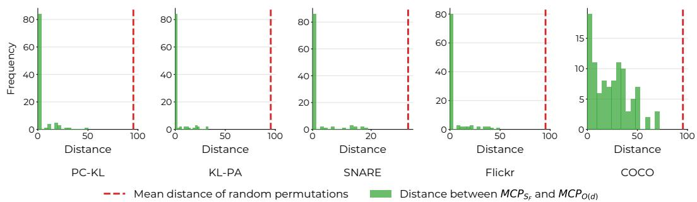  
Figure 9: Extended validation of $\mathbf { M C P _ { O ( d ) } } = \mathbf { M C P _ { S _ { F } } }$ . Distance between $\mathrm { M C P } _ { S _ { F } }$ and the approximated ${ \mathrm { M C P } } _ { O ( d ) }$ (denoted as $\tilde { P } _ { O } )$ , computed on the anchors of the each dataset across 100 initializations. This figure complements Fig. 6 in the main text by demonstrating that the strict concentration at zero holds consistently across all evaluated domains, further validating Thm. 2.

This section provides further details on the empirical validation of Thm. 2 in Sec. 6 and Fig. 6, which asserts that $\mathrm { M C P } _ { O ( d ) } = \mathrm { M C P } _ { S _ { F } }$ holds in practice. As introduced in the main text, we compare $\mathrm { M C P } _ { S _ { F } }$ , obtained via an approximate QAP solver, against $\tilde { P } _ { O }$ , which acts as an estimated projection of $\mathrm { M C P } _ { S _ { F } }$ onto the ${ \mathrm { M C P } } _ { O ( d ) }$ solution space.

This projection is computed by sequentially solving the dual maximizations formulated in Eq. (7). First, given $\mathrm { M C P } _ { S _ { F } }$ , we isolate the optimal orthogonal transformation:

$$
Q _ { S } = \arg \operatorname* { m a x } _ { Q \in O ( d ) } \mathrm { T C } ( X , \mathrm { M C P } _ { S _ { F } } Y )
$$

Subsequently, we compute the maximum correlation permutation (MCP) under this fixed transformation:

$$
\tilde { P _ { O } } = \mathrm { M C P } ( X Q _ { S } , Y )
$$

Crucially, because the orthogonal group is a subset of the scaled Frobenius sphere $( O ( d ) \subseteq { \sqrt { d } } S _ { F } )$ if $\tilde { P _ { O } } = \mathrm { M C P } _ { S _ { F } }$ , the approximation is exact. This yields $\tilde { P } _ { O } = \mathsf { M C P } _ { O ( d ) } = \mathsf { M C P } _ { S _ { F } }$

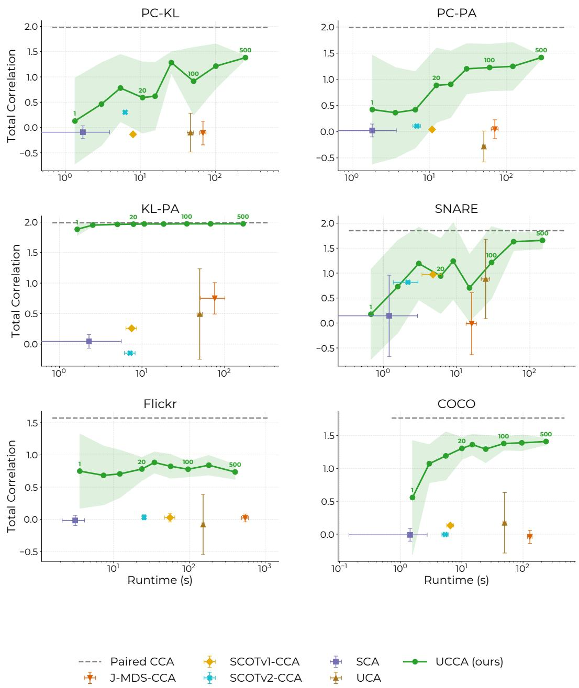  
Figure 10: Extended runtime and performance analysis. Total correlation versus runtime (in seconds, log scale) for UCCA and baseline methods across the various datasets. The green numerical annotations on the UCCA curve denote the number of clustering repetitions. UCCA rapidly surpasses baseline performance even at a lower repetition setting and improves as repetitions increase, while maintaining a practical total execution time.

Fig. 9 complements the PC-PA results from Fig. 6 by detailing the Kendall Tau distances for the remaining datasets. Across all domains, the distances remain heavily concentrated at zero, providing robust, dataset-agnostic empirical support for Thm. 2.

## B.4 Running Times

This section provides a more detailed analysis of the computational efficiency of UCCA, expanding upon the results presented in Fig. 7. A primary hyperparameter dictating the computational overhead of our method is the number of clustering repetitions used to extract these anchor points. To systematically evaluate the trade-off between execution time and alignment accuracy, we tracked the TC and total runtime (in seconds, plotted on a logarithmic scale) across varying numbers of clustering repetitions. These intervals (e.g., 1, 20, 100, and 500) are explicitly annotated on the UCCA performance curves.

Fig. 10 illustrates these trade-offs for all six datasets, complementing the findings from Fig. 7. Across all evaluated domains, UCCA exhibits a highly favorable scalability profile. Even at the lowest repetition settings (e.g., 1 or 20), the method reliably outperforms the competing unsupervised baselines, often executing in under a minute. As the number of clustering repetitions increases, the variance across runs decreases, and the alignment quality steadily converges toward the paired CCA upper bound (represented by the gray dashed horizontal line). Crucially, even when scaled to 500 repetitions to maximize stability and performance, the total execution time remains highly practical, rarely exceeding a few minutes.

## B.5 Direct Optimization of ${ \mathrm { M C P } } _ { O ( d ) }$

To validate the hardness of directly optimizing the ${ \mathrm { M C P } } _ { O ( d ) }$ , and justifying the $\mathrm { M C P } _ { S _ { F } }$ relaxation, we implemented an EM-style alternating maximization approach for directly optimizing the ${ \mathrm { M C P } } _ { O ( d ) }$ objective (Eq. (7)). We alternate between (1) CCA optimization over A,B with fixed P, and (2) Linear Sum Assignment (Hungarian algorithm) optimization over P with fixed A,B.

Additionally, we compared against two variants of ACCA [12], which similarly alternate between CCA and assignment optimization.

The results are summarized in Tab. 4. All alternating optimization methods were repeated 50 times with different initializations, as done for the 2-opt solver in UCCA. These results indicate that the QAP formulation provides a more robust optimization landscape than directly optimizing the original ${ \mathrm { M C P } } _ { O ( d ) }$ objective.

Table 4: Total Correlation comparison to direct optimization of ${ \mathrm { M C P } } _ { O ( d ) }$ . Total correlation results $( \mathrm { m e a n } \pm \mathrm { s t d } )$ . Bold values indicate the best unsupervised performance, and the paired CCA results are provided in gray as an upper-bound reference. The QAP formulation provides a more robust optimization landscape than directly optimizing the original ${ \mathrm { M C P } } _ { O ( d ) }$ objective.
<table><tr><td>Method</td><td>PC-PA</td><td>COCO</td></tr><tr><td>ACCA</td><td> $0 . 0 3 5 \pm 0 . 1 7 1$ </td><td> $0 . 0 5 7 \pm 0 . 1 0 9$ </td></tr><tr><td>ACCA-anchors</td><td> $- 0 . 0 6 6 \pm 0 . 4 5 9$ </td><td> $0 . 3 3 9 \pm 0 . 3 2 1$ </td></tr><tr><td>UCCA (EM)</td><td> $0 . 8 2 6 \pm 0 . 6 0 2$ </td><td> $0 . 4 2 0 \pm 0 . 3 5 7$ </td></tr><tr><td>UCCA (QAP 2-opt, ours)</td><td> ${ \bf 1 . 4 1 7 \pm 0 . 0 2 9 }$ </td><td>一  ${ \bf 1 . 3 7 1 \pm 0 . 0 6 3 }$ </td></tr><tr><td>Paired CCA</td><td>1.993</td><td>1.768</td></tr></table>

## B.6 Effect of QAP Solver

The structural matching step of UCCA relies on solving the QAP. Because the exact QAP is NP-hard, we employ efficient approximate solvers to ensure practical scalability. In this section, we evaluate the impact of the chosen solver on the final alignment performance. Specifically, we compare two popular options: 2-Opt [25] and the Fast Approximate QAP (FAQ) algorithm [62].

Fig. 11 visualizes the Total Correlation achieved by both solvers across multiple initializations. Overall, the choice of solver does not significantly alter the performance; when FAQ converges successfully, it yields an alignment quality almost identical to that of 2-Opt. However, FAQ failed to converge in two distinct instances (indicated by the points clustering near zero). Because of these rare convergence issues, we selected 2-Opt as the default solver for UCCA simply to ensure consistent and reproducible alignments across all runs.

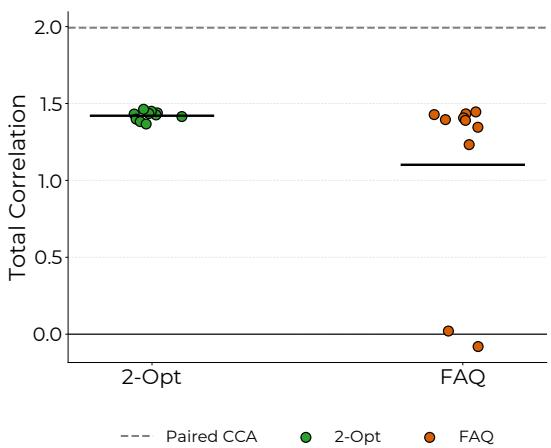  
Figure 11: Effect of the QAP solver on performance. Total Correlation achieved across multiple initializations on the PC-PA Handwritten benchmark, using the 2-Opt and FAQ approximate QAP solvers. Both solvers yield very similar overall performance and alignment quality. Because FAQ failed to converge in two instances (points near zero), 2-Opt was selected as the default solver for UCCA simply to ensure consistent execution across all runs.

## B.7 Comparison with Non-linear UCA

As noted in the main text, UCCA is fundamentally designed to extract linear projections that maximize the correlation between unaligned views. To ensure a fair architectural comparison, the primary evaluation benchmarks UCCA against the linear formulation of UCA [27]. However, UCA is also capable of utilizing deep neural networks to learn non-linear mappings. This section extends our evaluation to compare UCCA against this non-linear variant of UCA.

Tab. 5 and 6 present the Total Correlation and cross-view classification results, respectively. Despite the increased expressive capacity afforded by non-linear transformations, the non-linear UCA baseline struggles to discover meaningful structural alignments across most datasets. UCCA consistently outperforms it by a significant margin across all metrics. These results demonstrate that the explicit geometric alignment strategy and QAP-based skeleton matching employed by UCCA are vastly more robust and effective for the Unpaired CCA scenario.

Table 5: Total Correlation comparison with non-linear UCA. Total correlation results $( \mathrm { m e a n } \pm$ std). Despite its non-linear capacity, UCCA significantly outperforms non-linear UCA across all datasets. Bold values indicate the best unsupervised performance, and the paired CCA results are provided in gray as an upper-bound reference.
<table><tr><td>Method</td><td>PC-KL</td><td>PC-PA</td><td>KL-PA</td><td>SNARE</td><td>Flickr</td><td>COCO</td></tr><tr><td>UCA (nonlinear)</td><td> $0 . 3 7 8 \pm 0 . 5 5 2$ </td><td> $0 . 2 6 2 \pm 0 . 4 3 5$ </td><td> $- 0 . 4 1 4 \pm 0 . 5 3 2$ </td><td> $1 . 0 6 6 \pm 0 . 9 6 2$ </td><td> $0 . 0 7 2 \pm 0 . 5 3 2$ </td><td> $0 . 3 2 1 \pm 0 . 3 9 3$  </td></tr><tr><td>UCCA (ours)</td><td> ${ \bf 1 . 2 3 9 \pm 0 . 4 4 2 }$  </td><td> ${ \bf 1 . 4 1 7 \pm 0 . 0 2 9 }$  –</td><td> $\mathbf { 1 . 9 5 7 \pm 0 . 0 1 2 }$ </td><td> ${ \bf 1 . 7 5 5 \pm 0 . 0 3 1 }$  一</td><td> $\mathbf { 0 . 7 5 1 \pm 0 . 0 8 6 }$ </td><td> $\mathbf { 1 . 3 7 1 \pm 0 . 0 6 3 }$ </td></tr><tr><td>Paired CCA</td><td>1.979</td><td>1.993</td><td>1.990</td><td>1.850</td><td>1.574</td><td>1.768</td></tr></table>

Table 6: Cross-view classification comparison with non-linear UCA. Mean accuracy (± std) of a kNN classifier trained on the learned embeddings of one view and evaluated on the other. UCCA significantly outperforms the non-linear UCA baseline across all evaluated datasets. Bold values indicate the best unsupervised performance, and the paired CCA results are provided in gray at the bottom.
<table><tr><td>Method</td><td>PC-KL</td><td>PC-PA</td><td>KL-PA</td><td>SNARE</td><td>COCO</td></tr><tr><td>UCA (nonlinear)</td><td> $0 . 0 9 1 \pm 0 . 0 1 6$ </td><td> $0 . 0 9 1 \pm 0 . 0 2 9$ </td><td> $0 . 0 7 8 \pm 0 . 0 5 1$ </td><td> $0 . 5 1 8 \pm 0 . 3 5 4$ </td><td> $0 . 1 3 2 \pm 0 . 0 4 1$ </td></tr><tr><td>UCCA (ours)</td><td> ${ \bf 0 . 2 9 2 \pm 0 . 0 7 4 }$ </td><td> ${ \bf 0 . 3 1 5 \pm 0 . 0 2 5 }$ </td><td> ${ \bf 0 . 5 6 4 \pm 0 . 0 2 2 }$ </td><td> ${ \bf 0 . 8 4 9 \pm 0 . 0 2 1 }$  </td><td> ${ \bf 0 . 2 3 2 \pm 0 . 0 1 6 }$ </td></tr><tr><td>Paired CCA</td><td> $0 . 5 6 2 \pm 0 . 0 0 0$ </td><td> $0 . 5 1 6 \pm 0 . 0 0 0$ </td><td> $0 . 6 2 9 \pm 0 . 0 0 0$ </td><td> $0 . 8 8 7 \pm 0 . 0 0 0$ </td><td> $0 . 2 3 2 \pm 0 . 0 0 9$ </td></tr></table>

## B.8 Anchors Choice

UCCA ensures scalability by adopting an anchor-based approach, a standard and well-established technique for manifold approximation [64, 17]. We opt for simplicity and practicality by utilizing K-Means centroids [36, 14] to construct the geometric skeleton of the latent spaces. This section provides further details on this extraction choice and the hyperparameter governing the number of anchors.

Anchor Extraction. To reduce the computational burden of the QAP matching step, we perform alignment on a reduced subset of anchors rather than the entire dataset. Tab. 7 evaluates our simple K-Means strategy against a naive random sampling baseline, alongside an idealized oracle setup (denoted as paired K-Means) designed to test the maximum capacity of the chosen centroids. Specifically: Random, randomly sampling points from each view; K-Means, the default approach for UCCA, where we independently run K-Means clustering on both views and extract the resulting centroids to serve as anchors; and Paired K-Means, where we run K-Means on the first view to obtain centroids, and then use the ground-truth dataset pairing to retrieve their exact corresponding points in the second view.

As demonstrated in Tab. 7, utilizing K-Means centroids yields a significantly more stable and representative skeleton compared to random sampling, resulting in consistently higher TC. Furthermore, the Paired K-Means oracle demonstrates that if perfect correspondence between the independently learned centroids were known, the performance would approach the paired CCA upper bound on five out of the six datasets. This confirms that simple K-Means centroids generally capture the structural information necessary for optimal alignment.

In Tab. 8, we verify that UCCA does not depend specifically on K-Means. We replaced K-Means anchors with Gaussian Mixture Model (GMM) anchors, and the results are comparable, showing UCCA is robust to the choice of anchor extraction method.

Number of anchors. The number of anchors controls the resolution of our structural skeleton. Fig. 12 visualizes the total correlation as a function of this hyperparameter. There is an inherent trade-off: increasing the number of anchors provides a denser, more accurate representation of the underlying data manifold, which naturally improves the final alignment accuracy. However, because QAP is NP-hard, the computational complexity scales significantly with the anchor count. As illustrated in the figure, UCCA improves and then stabilizes as the number of anchors increases. This behavior allows us to select a moderate number of anchors that achieve near-optimal performance while maintaining a practical computational footprint.

Table 7: Anchor extraction evaluation. Total Correlation results (mean ± std) evaluating our anchor selection approach. The default K-Means strategy consistently outperforms random sampling. The "Paired K-Means" oracle, which uses ground-truth pairings to match the centroids of the first view, demonstrates that an ideal centroid alignment approaches the paired CCA upper bound (gray). Bold values indicate the best performance.
<table><tr><td>Method</td><td>PC-KL</td><td>PC-PA</td><td>KL-PA</td><td>SNARE</td><td>Flickr</td><td>COCO</td></tr><tr><td>Random</td><td> $0 . 8 4 0 \pm 0 . 4 2 6$ </td><td> $0 . 7 8 1 \pm 0 . 4 6 4$ </td><td> $0 . 4 7 6 \pm 1 . 0 2 1$ </td><td> $1 . 7 4 5 \pm 0 . 1 6 0$ </td><td> $0 . 8 7 8 \pm 0 . 2 1 7$ </td><td> $0 . 2 8 4 \pm 0 . 3 2 1$ </td></tr><tr><td>K-Means</td><td> $1 . 3 8 9 \pm 0 . 0 2 9$ </td><td> $1 . 3 8 8 \pm 0 . 0 2 6$ </td><td> $1 . 9 6 3 \pm 0 . 0 0 9$ </td><td> $1 . 7 5 5 \pm 0 . 0 3 1$ </td><td> $0 . 7 2 0 \pm 0 . 0 8 0$ </td><td> $1 . 3 6 9 \pm 0 . 1 1 6$ </td></tr><tr><td>Paired K-Means</td><td> $\mathbf { 1 . 6 5 8 \pm 0 . 0 1 4 }$ </td><td> $\mathbf { 1 . 6 7 6 \pm 0 . 0 2 6 }$ </td><td> $\mathbf { 1 . 9 8 7 \pm 0 . 0 0 2 }$ </td><td> $\mathbf { 1 . 8 5 0 \pm 0 . 0 0 1 }$ </td><td> ${ \bf 0 . 9 6 9 \pm 0 . 1 5 8 }$ </td><td> $\mathbf { 1 . 4 0 9 \pm 0 . 2 0 9 }$ </td></tr><tr><td>Paired CCA</td><td> $1 . 9 7 9 \pm 0 . 0 0 0$ </td><td> $1 . 9 9 3 \pm 0 . 0 0 0$ </td><td> $1 . 9 9 0 \pm 0 . 0 0 0$ </td><td> $1 . 8 5 0 \pm 0 . 0 0 0$ </td><td> $1 . 5 7 4 \pm 0 . 0 0 0$ </td><td> $1 . 7 6 8 \pm 0 . 0 0 1$ </td></tr></table>

Table 8: Additional anchor extraction methods. Total Correlation results (mean ± std) evaluating our anchor selection approach (K-Means) and an additional GMM option. The two methods are comparable.
<table><tr><td>Method</td><td>PC-KL</td><td>PC-PA</td><td>KL-PA</td><td>SNARE</td><td>Flickr</td><td>COCO</td></tr><tr><td>K-Means</td><td> ${ \bf 1 . 3 8 9 \pm 0 . 0 2 9 }$ </td><td> ${ \bf 1 . 3 8 8 \pm 0 . 0 2 6 }$ </td><td> $\mathbf { 1 . 9 6 3 \pm 0 . 0 0 9 }$ </td><td> ${ \bf 1 . 7 5 5 \pm 0 . 0 3 1 }$ </td><td> $0 . 7 2 0 \pm 0 . 0 8 0$ </td><td> $1 . 3 6 9 \pm 0 . 1 1 6$ </td></tr><tr><td>GMM</td><td> $1 . 3 4 8 \pm 0 . 0 6 8$ </td><td> $1 . 3 4 0 \pm 0 . 0 7 4$ </td><td> $1 . 9 5 2 \pm 0 . 0 1 3$ </td><td> $1 . 6 8 5 \pm 0 . 1 1 1$ </td><td> ${ \bf 1 . 3 6 7 \pm 0 . 0 6 1 }$ </td><td> ${ \bf 1 . 5 2 8 \pm 0 . 0 6 1 }$ </td></tr><tr><td> $\mathrm { P a i r e d } \mathrm { C C A }$ </td><td> $1 . 9 7 9 \pm 0 . 0 0 0$ </td><td> $1 . 9 9 3 \pm 0 . 0 0 0$ </td><td> $1 . 9 9 0 \pm 0 . 0 0 0$ </td><td> $1 . 8 5 0 \pm 0 . 0 0 0$ </td><td> $1 . 5 7 4 \pm 0 . 0 0 0$ </td><td> $1 . 7 6 8 \pm 0 . 0 0 1$ </td></tr></table>

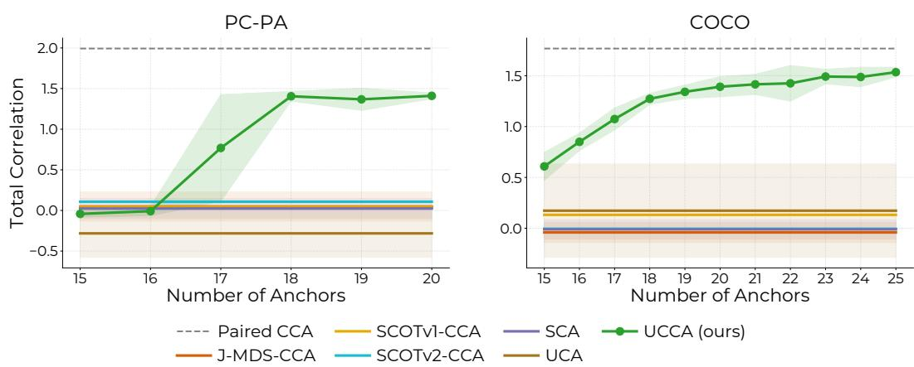  
Figure 12: Effect of the number of anchors. Total Correlation versus the number of anchors used in the matching step. Increasing the number of anchors allows UCCA to capture the manifold geometry more accurately, leading to a sharp performance improvement that approaches the paired CCA upper bound (represented by the dashed horizontal line). The anchor count 20 is chosen to balance this high accuracy with computational efficiency.

## B.9 Effect of PCA dimension

As detailed in App. F.1, to ensure computational efficiency and provide a stable, regularized feature space for the structural matching step, we apply PCA to each view independently. In Fig. 13, we evaluate several whitening dimensions while maintaining $d \leq k .$ . The results show that performance is stable unless the dimension is reduced excessively $( \mathbf { e . g . } , d = 5 )$ , where informative variance is discarded.

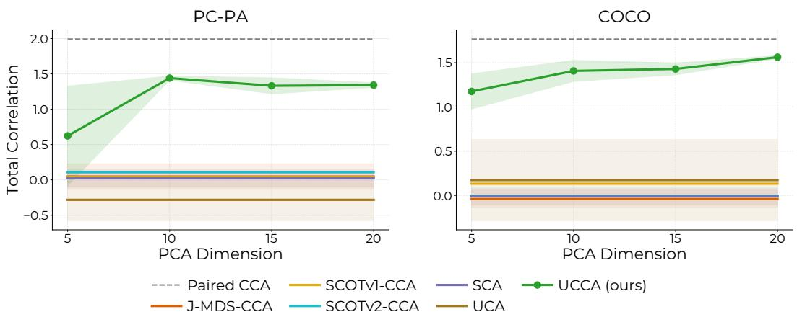  
Figure 13: Effect of the number of PCA dimensions. Total Correlation versus the number of PCA components used in the preprocessing step.

## B.10 Visualizations

Fig. 14 depicts two-dimensional plots of the learned embeddings obtained by the Paired CCA oracle and UCCA. We evaluate both methods on our representative PC-PA datasets as well as the SNARE dataset, which comprises four distinct classes, facilitating straightforward visualization and interpretation of the learned representations. These plots demonstrate why UCCA achieves nearoracle classification despite a lower TC. Paired CCA forces exact instance-to-instance correspondence, maximizing TC and perfectly overlaying samples across views. In contrast, UCCA, which lacks paired supervision, introduces slight pairwise variance, marginally lowering TC. However, UCCA successfully aligns the global manifold, tightly grouping semantic clusters across modalities. Because cross-view classifiers rely on global class separability rather than perfect point-to-point mapping, UCCA’s structural alignment achieves accuracy closely rivaling the oracle bound.

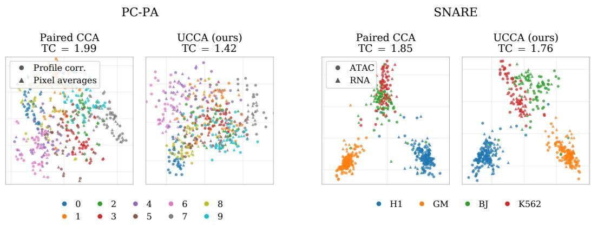  
Figure 14: Embeddings visualizations. Visualizations of the generated embeddings of Paired-CCA and UCCA.

## C Additional Related Work

This section discusses additional related work.

Shuffled Regression. Both shuffled regression and UCCA tackle the fundamental challenge of learning from data where exact sample correspondences are missing. The optimization of shuffled regression has also been shown to result in a QAP in special cases [42, 34]. However, while in shuffled regression Y represents target labels that are known up to a permutation, in the UCCA formulation X and Y represent disjoint views containing shared and unique information. Shuffled regression functions as a supervised learning task aimed at predicting target responses or recovering regression coefficients from unmatched inputs. UCCA addresses unsupervised multiview representation learning, focusing on extracting a shared space in scenarios where paired correspondences are entirely unavailable rather than merely permuted [69, 56, 42, 34]. Furthermore, shuffled regression models often rely on additional assumptions, such as assuming Y is a scalar [69, 42, 34], imposing strong structural constraints (e.g., cyclical monotonicity [56]), or requiring auxiliary weak supervision (e.g., pairwise comparison data [69]). UCCA instead mitigates the complexity of the QAP through an anchor-based geometric alignment procedure.

Canonical Time Warping (CTW). CTW combines CCA with Dynamic Time Warping (DTW) to achieve spatio-temporal alignment [77]. However, temporal alignment is simpler than optimizing unconstrained permutations because strict sequence constraints (boundary conditions, continuity, and monotonicity) enable efficient dynamic programming. Conversely, UCCA addresses completely generic data, necessitating the computationally heavier QAP. Nevertheless, incorporating structural constraints such as temporal ordering into UCCA is an interesting future direction.

## D Complexity Analysis

This section analyzes the time complexity of UCCA. Recall the notations: n, the number of samples in the input datasets (say the largest between the two); d, the number of dimensions; k, the number of anchors. Also denote: t, the number of iterations for the K-Means clustering algorithm; c, the number of clustering repetitions; I, the number of iterations for the 2-opt solver.

We start by analyzing each step in Alg. 1. First is the whitening step. This takes $O ( n d ^ { 2 } )$ to compute the empirical covariance matrix, and $\bar { \boldsymbol { O } } ( d ^ { 3 } )$ its SVD, summing up to $O ( n d ^ { 2 } + d ^ { 3 } )$ . The second step is the anchors extraction, specifically K-Means. This is known to have time complexity of $O ( t n k d )$ We repeat the K-Means process c times.

For the QAP step, we use the 2-opt approximate solver. The similarity matrices take $O ( k ^ { 2 } d )$ . The 2-opt solver works at $O ( I k ^ { 3 } )$ , making the complexity of the third step $O ( k ^ { 2 } d + I k ^ { 3 } )$ . This step is repeated c times, one for each clustering. Finally, we apply CCA to these concatenated anchors, which takes $O ( c k d ^ { 2 } + d ^ { 3 } )$ .

The overall complexity is then,

$$
O ( n d ^ { 2 } + c t n k d + c I k ^ { 3 } + c k d ^ { 2 } + d ^ { 3 } )
$$

Consider that for a large n, we generally consider $k , d \ll n ,$ , and so as the number of iterations and clusterings are constants. Then, UCCA is linear in the number of samples n.

## E Additional Details on Experiments

## E.1 QAP Alignment with CCA

This section provides the experimental details corresponding to Fig. 1a, which empirically demonstrates the core theoretical insight of UCCA: the direct relationship between the QAP objective and CCA performance.

Synthetic Dataset. To exhaustively evaluate all possible pairings between two views, we constructed a simple synthetic toy dataset, visualized in Fig. 15. The dataset consists of n = 10 samples in two distinct views, structured as unaligned but geometrically similar 1-dimensional manifolds in a 2-dimensional space (resembling hooks).

Exhaustive Evaluation. Because the dataset contains exactly 10 samples per view, the set of all possible permutations is finite and computationally tractable to explore in its entirety (10! ≈ $3 . 6 \times 1 0 ^ { 6 }$ permutations). For every possible permutation matrix P in this space, we performed the following two steps: (1) QAP Value: We computed the QAP objective value using a linear kernel; (2) Total Correlation: We used P to pair the samples from View 1 and View 2, fitted a paired CCA on this specific pairing, and recorded the resulting TC of the true pairing under the learned embeddings.

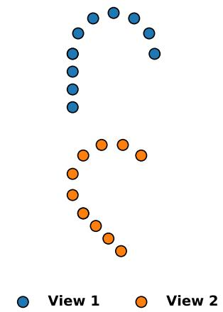

Results and Discussion. The density plot in Fig. 1a visualizes the joint distribution of these ∼ 3.6 million pairs of (QAP value, TC). The empirical results reveal a strict, positive relationship between the two metrics: as the QAP value increases, the structural alignment improves, leading to a higher total correlation.

Crucially, the permutation that yields the absolute maximum QAP value (denoted by the red star in Fig. 1a) aligns almost perfectly with the permutation that achieves the maximum possible total correlation

Figure 15: Synthetic toy dataset.

(the yellow triangle). This exhaustive, brute-force experiment provides direct empirical demonstration of our key theoretical insight: solving the QAP with a linear kernel effectively acts as a proxy for maximizing the CCA objective in an unpaired setting.

## E.2 Assumption 1 Validation

This section provides further empirical evidence supporting Assum. 1, which posits that the singular values under the optimal alignment weakly majorize those under any alternative permutation. In the main text, Fig. 3a demonstrates this property on the Flickr dataset by showing that the partial cumulative sums of singular values strictly decrease as the permutation increasingly diverges from the ground truth.

Fig. 16 extends this validation to the remaining benchmark datasets: PC-KL, PC-PA, KL-PA, SNARE and COCO. Following the same procedure, we compute the partial sums of singular values for the true permutation $( P ^ { * }$ , represented by 0 shuffles) and for permutations subjected to an increasing number of random shuffles. Across all evaluated domains, the cumulative sums are consistently lower as the number of shuffles increases. This universal trend strongly corroborates the weak majorization behavior, confirming it is a robust and practically valid assumption for real-world datasets.

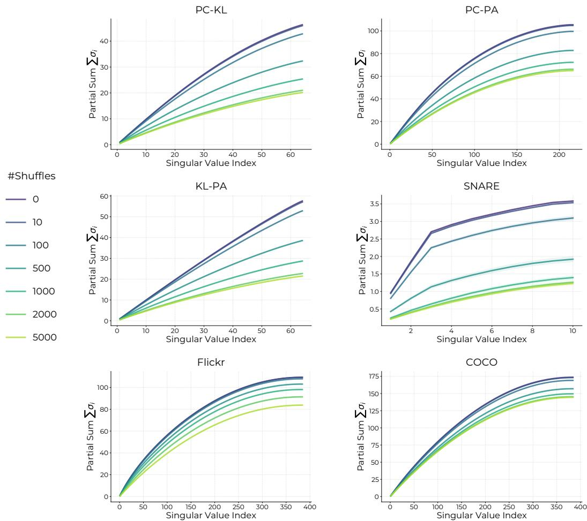  
Figure 16: Extended empirical validation of Assum. 1. Partial cumulative sums of singular values for the true permutation ${ \bar { ( P ^ { * } } }$ , denoted by 0 shuffles) and various randomly shuffled permutations across all datasets: PC-KL, PC-PA, KL-PA, SNARE, Flickr, and COCO. Consistent with the main text results (Fig. 3a), the partial sums strictly decrease as the permutation diverges from $P ^ { * }$ , verifying the weak majorization property across all tasks.

## E.3 Theorem 2 Validation

This section provides supplementary results for the empirical validation of Thm. 2, which establishes that under Assum. $1 , \mathrm { { M C P } } _ { O ( d ) }$ and the $\mathrm { M C P } _ { S _ { F } }$ coincide. In the main text, Fig. 3b illustrates this property on the Flickr dataset by tracking the respective objectives, the Nuclear Norm for ${ \mathrm { M C P } } _ { O ( d ) }$ and the Squared Frobenius Norm for $\mathrm { M C P } _ { S _ { F } }$ , as the permutation increasingly diverges from the ground-truth alignment $P ^ { * }$

Fig. 17 extends this comparative analysis to the PC-KL, PC-PA, KL-PA, SNARE, and COCO datasets. Across all evaluated domains, we observe a consistent, synchronized trend: both the Nuclear Norm and the Squared Frobenius Norm strictly decay as the number of random shuffles increases. This shared decay profile demonstrates that both objectives are locally maximized by the exact same ground-truth permutation, further corroborating the theoretical equivalence established in Thm. 2.

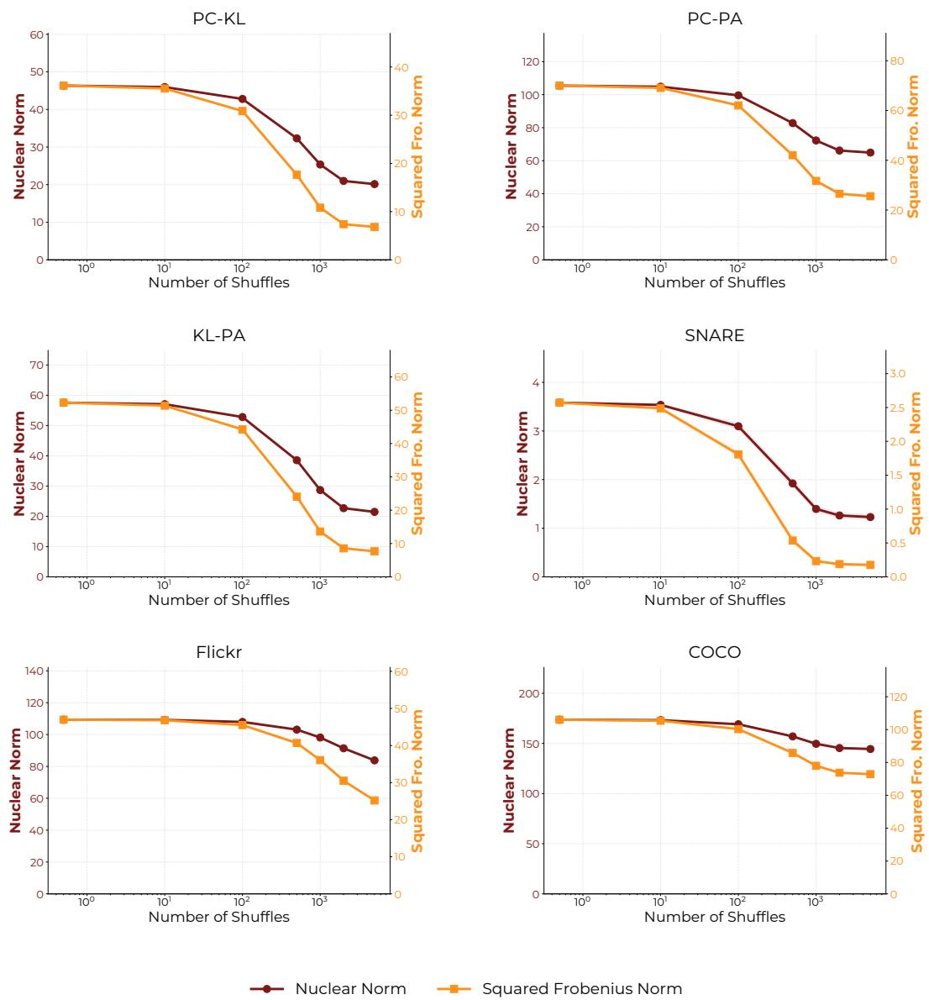  
Figure 17: Extended empirical validation of Theorem 2. Comparison of the ${ \mathrm { M C P } } _ { O ( d ) }$ (Nuclear Norm) and $\mathrm { M C P } _ { S _ { F } }$ (Squared Frobenius Norm) objectives as the permutation is randomized away from the true alignment ${ \bar { P } } ^ { * }$ across all datasets: PC-KL, PC-PA, KL-PA, SNARE, Flickr, and COCO. In alignment with the main text results (Fig. 3b), both objectives decay synchronously as the number of random shuffles increases, empirically confirming that both formulations are locally maximized by the same ground-truth permutation.

## F Implementation Details

This section provides a comprehensive description of the implementation details for UCCA, alongside the exact configurations used for all evaluated baselines.

## F.1 Preprocessing and Dimensionality Reduction

In alignment with Alg. 1, the raw input data for each view is first subjected to mean-centering and whitening. Let $\bar { X } _ { r a w } \bar { \in \mathbb { R } ^ { n \times d _ { 1 } } }$ and $\dot { Y } _ { r a w } \in \mathbb { R } ^ { n \times d _ { 2 } }$ be the raw training sample matrices for the first and second views, respectively. We compute the empirical training means and center both the training and test sets.

To ensure computational efficiency and provide a stable, regularized feature space for the structural matching step, we apply Principal Component Analysis (PCA) [48] to each view independently. By default, we reduce the dimensionality of both views to $d _ { p c a } = 1 0$ components and whiten the representations. This process yields the whitened, dimensionally reduced latent spaces $Z _ { X } , Z _ { Y } \in$ $\mathbb { R } ^ { \overset { \mathbf { * } } { n } \times 1 0 }$ , completing the $Z _ { X } , Z _ { Y } \gets \mathrm { { W h i t e n } } ( X , Y )$ step of our algorithmic framework.

## F.2 Unsupervised Anchor Selection

To extract the geometric skeleton of the manifolds, we rely on K-Means clustering to select representative anchors for each view $( A _ { X } , A _ { Y }  \operatorname { A n c h o r s } ( Z _ { X } , Z _ { Y } ) )$ . Given the whitened views $Z _ { X }$ and $Z _ { Y }$ we independently run K-Means to extract $k = 2 0$ cluster centroids per view. For the SNARE datasets we lowered the number of anchors to $k = 1 2$ due to the lower data amount. The resulting cluster centroids serve as our anchors $A _ { X } \in \mathbb { R } ^ { k \times d _ { p c a } }$ and $A _ { Y } \in \mathbb { R } ^ { k \times d _ { p c a } }$ for the structural alignment.

## F.3 Anchor Matching via QAP

We align the geometric skeletons by solving the linear-kernel QAP. We construct linear similarity kernels for both sets of anchors:

$$
K _ { X } = A _ { X } A _ { X } ^ { T } , \quad K _ { Y } = A _ { Y } A _ { Y } ^ { T }
$$

We then search for the permutation matrix $P ^ { \prime }$ that maximizes the QAP structural alignment between the kernels:

$$
P ^ { \prime } = \arg \operatorname* { m a x } _ { P \in \mathcal { P } } \mathrm { t r } ( K _ { X } P K _ { Y } P ^ { T } )
$$

This maximization is performed using the 2-Opt heuristic solver available in $\operatorname { S c i P y } ^ { * } { \mathrm { s } }$ quadratic\_assignment module [61]. Because the QAP is NP-hard and 2-Opt is a local search heuristic, we perform $\bar { N _ { r e s t a r t } } = 5 0$ random restarts and select the permutation that yields the highest objective value.

## F.4 Learning the Projections

Once the structural permutation $P ^ { \prime }$ is estimated, we pair the anchors to form pseudo-pairs $\left( A _ { X } , P ^ { \prime } A _ { Y } \right)$ . To ensure robustness against any single suboptimal clustering or matching instance, we repeat the entire clustering and alignment process $N _ { t r i a l s } = 5 0 0$ times, concatenating all resulting pseudo-paired anchors.

Finally, we apply a standard paired CCA directly to these concatenated pseudo-pairs to learn the final linear projection matrices $U$ and $V .$ . These learned weights are then utilized to project the complete, original sets of high-dimensional samples into the shared maximally correlated latent space.

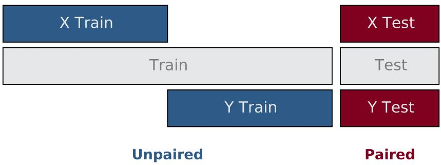  
Figure 18: Data preparation: While the test is kept paired for evaluation purposes, we split the train such that no correspondence is available during training. This exactly replicates the unpaired settings discussed in the paper.

To rigorously evaluate the method in a strictly unpaired setting, we follow a specific dataset splitting protocol (visualized in Fig. 18). For a dataset with N total paired samples:

1. A common paired test set $\mathcal { D } _ { t e s t }$ is held out (typically $N _ { t e s t } = 2 5 6 \mathrm { s a m p l e s } )$ .

2. The remaining $N - N _ { t e s t }$ training samples are divided into two disjoint subsets, $S _ { 1 }$ and $S _ { 2 }$ of size $( N - N _ { t e s t } ) / 2$

3. The training set for View 1, $X _ { t r a i n }$ , is exclusively formed by taking the first view of the samples in $S _ { 1 }$

4. The training set for View 2, $Y _ { t r a i n } ,$ is exclusively formed by taking the second view of the samples in $\mathrm { \bar { \it S } _ { 2 } }$

This protocol guarantees that there is strictly zero sample correspondence between $X _ { t r a i n }$ and $Y _ { t r a i n }$ during the training phase (i.e., for any sample index i present in the first view, its corresponding second view is actively withheld from the training data).

## F.6 Extended Algorithm

Alg. 2 presents a detailed summary of UCCA, presented in Alg. 1. The primary differences are the inclusion of specific hyperparameters and precise implementations. Specifically, the pre-processing step is defined as PCA whitening, and K-Means clustering is utilized to extract the anchor sets. Additionally, the QAP matching step is approximated using a 2-opt solver, which is executed with r random restarts to escape local optima and capture the maximum objective value. Finally, the extended algorithm explicitly details the matching loop: the clustering and alignment process is repeated c times, and the resulting matched anchors are concatenated to form a larger, comprehensive reference set for the final CCA projection.

Algorithm 2 Unpaired CCA (Extended)   
Require: Unpaired data $\overline { { \boldsymbol X } } \in \mathbb R ^ { n \times d _ { \boldsymbol x } } , \boldsymbol Y \in \mathbb R ^ { n \times d _ { \boldsymbol y } }$   
Require: k (number of centroids), c (clustering repetitions), r (2-opt restarts)   
Ensure: Projectors $U , V$   
1: $Z _ { X } \gets \dot { \mathrm { P C A - W } }$ hiten(X)   
2: $Z _ { Y } \gets \mathrm { P C A - W h i t e n } ( Y )$   
3: Initialize concatenated anchor sets $\tilde { A } _ { X }  \varnothing , \tilde { A } _ { Y }  \varnothing$   
4: for $i = 1 \ldots c$ do   
5: $A _ { X } ^ { ( i ) }  \mathrm { K – M e a n s } ( Z _ { X } , k )$   
6: $A _ { Y } ^ { ( i ) }  \mathrm { K \mathrm { - } M e a n s } ( Z _ { Y } , k )$   
7: $\dot { o _ { \mathrm { m a x } } }  - \infty , P ^ { \prime }  I$   
8: for $j = 1 \ldots r$ do   
9: $\mathsf { \bar { P } } \gets 2 \mathsf { o p t } \mathsf { - Q A P } ( A _ { X } ^ { ( i ) } , A _ { Y } ^ { ( i ) } )$   
10: $o \gets \mathrm { Q A P \mathrm { - } O b j e c t i v e } ( P , \dot { A } _ { X } ^ { ( i ) } , A _ { Y } ^ { ( i ) } )$   
11: if ${ \ v O } ^ { \ v O } > o _ { \mathrm { m a x } }$ then   
12: $o _ { \mathrm { m a x } } \gets o$   
13: $P ^ { \prime }  P$   
14: end if   
15: end for   
16: $\tilde { \boldsymbol { A } } _ { X }  \mathbf { C o n c a t } ( \tilde { \boldsymbol { A } } _ { X } , \boldsymbol { A } _ { X } ^ { ( i ) } )$   
17: $\tilde { A } _ { Y }  \mathrm { C o n c a t } ( \tilde { A } _ { Y } , P ^ { \prime } A _ { Y } ^ { ( i ) } )$   
18: end for   
19: $\mathcal { I } , V \gets \mathbf { C C A } ( \tilde { A } _ { X } , \tilde { A } _ { Y } )$ ▷ Maximize correlation relative to the matched anchors   
20: return $U , V$

## F.7 Datasets

We evaluate UCCA on a diverse set of datasets spanning multiple domains. Tab. 9 summarizes their properties:

Table 9: Properties of datasets used in evaluations.
<table><tr><td>Dataset</td><td>Views</td><td>Samples (N)</td><td>Dimensions  $( d _ { 1 } , d _ { 2 } , \ldots )$ </td><td>Classes (C)</td></tr><tr><td>Handwritten</td><td>PC, KL, PA</td><td>2,000</td><td>216, 64, 240</td><td>10</td></tr><tr><td>SNARE</td><td>ATAC, RNA</td><td>1,047</td><td>19,10</td><td>4</td></tr><tr><td>Flickr</td><td>Image, Text</td><td>8,000</td><td>384,384</td><td></td></tr><tr><td>COCO</td><td>Image, Text</td><td>2,000</td><td>384,384</td><td>79</td></tr></table>

UCI Handwritten Digits. Consists of 2,000 samples of digits 0-9. We use three continuous views: profile correlations (PC), Karhunen-Loève coefficients (KL), and pixel averages (PA). These provide varied feature spaces for cross-view alignment evaluation. We reserved a test set of 256 samples, leaving 872 samples from each view for training.

SNARE. A single-cell dataset generated by the SNARE-seq assay, containing co-measured chromatin accessibility (ATAC-seq) and gene expression (RNA-seq) for 1,047 cells. We utilize the preprocessed embeddings provided by Chen et al. [10], where the ATAC and RNA views are dimensionally reduced to 19 and 10 dimensions, respectively, and unit-normalized. The dataset is categorized into 4 distinct cell type classes (GM, BJ, K562, and H1), representing a challenging, real-world biological alignment task. We reserved a test set of 257 samples, leaving 395 samples from each view for training.

Flickr. Contains image-text pairs. We utilized the 8,000 pairs training set from jxie/flickr8k2. Image features are extracted using the pre-trained DINOv2-ViT-S/14 model. Text features are generated by processing the primary caption (caption\_0) through the all-MiniLM-L6-v2 sentence transformer using mean pooling. Both the visual and textual feature pipelines yield 384-dimensional dense representations. We reserved a test set of 512 samples, leaving 2744 samples from each view for training.

COCO. We used the 2,000 image-text pairs from the COCO 2017 validation subset, sourced from the riddhimanrana/coco-fastvlm-2k-val2017 dataset3. Similar to Flickr, the two views represent image and text modalities. The image view is encoded using DINOv2-ViT-S/14 into a 384-dimensional space. The text view is generated from GPT-structured conversational captions, encoded via the all-MiniLM-L6-v2 model into 384 dimensions. Unique object-category labels are extracted from the human prompts in the conversational turns to establish discrete classes for evaluation, following the object detection labels from the dataset. For the paired CCA upper bound, we reduced each view independently to its top 10 principal components, as it improved performance. We reserved a test set of 256 samples, leaving 872 samples from each view for training.

## F.8 Experiment-Specific Details

Cross-view classification: For the downstream cross-view classification tasks, we evaluate the learned embeddings using a k-Nearest Neighbors (kNN) classifier configured with $k = 5$ neighbors. The results in Tab. 1 show the classifier fitted on the following view of each dataset: PC-KL: PC, PC-PA: PC, KL-PA: KL, SNARE: ATAC, COCO: text. Correspondingly, Tab. 3 shows the results of the classifier trained on the alternate view of each dataset: PC-KL: KL, PC-PA: PA, KL-PA: PA, SNARE: RNA, COCO: image.

Runtime vs. Performance: The results presented in Fig. 7 and Fig. 10 were evaluated across the following set of clustering repetitions: {1, 5, 10, 20, 30, 50, 100, 200, 500}.

Amount of Unpaired data: We evaluate the robustness of UCCA by varying the amount of unpaired training data from 50% to 100% of the full available training set.

Anchor Choice: The Paired K-Means results in Tab. 7 utilize a K-Means model trained on a single view. For each centroid, we identify the closest sample from the training set and retrieve its corresponding pair in the alternate view. Note that these paired samples are not present in the standard unpaired training split used throughout the rest of the paper. The K-Means model was trained on the following views for each dataset: PC for PC-KL and PC-PA, KL for KL-PA, ATAC for SNARE, and text for both Flickr and COCO.

## F.9 Baseline Implementations

Since direct baselines for unpaired CCA do not currently exist, we adapted the most closely related unpaired alignment methods for our benchmark. To ensure optimal baseline performance, we performed a hyper-parameter search for each method. Given the inherent difficulty of hyperparameter selection in a fully unpaired setting, we tuned the baseline hyperparameters on the test set of the PC-PA views from the Handwritten benchmark. These parameters were subsequently frozen and applied across all other datasets. Detailed descriptions of each baseline are provided below.

SCA [58]. We utilized the official implementation provided by the authors from https://github. com/XiaoFuLab/Shared-Component-Analysis. The hyperparameter grid consisted of the following values: orthogonal $\mathbf { \Omega } _ { - } \mathbf { w } \in \{ 0 . 1 , 1 . 0 , 1 0 . 0 \}$ , encoder $\mathbf { \delta . 1 { r } } \in \{ 0 . 0 0 1 , 0 . 0 1 \}$ , and discr\_lr $\in \ \{ 0 . \bar { 0 } 0 0 1 , 0 . 0 0 1 \}$ . The optimal hyperparameters yielded by this search were: orthogonal\_w = 1.0, encoder $_ - \mathtt { i r } = 0 . 0 1$ , and $\mathsf { d i s c r \_ l r } = 0 . 0 0 0 \dot { 1 }$

UCA [27]. As no official implementation is provided by the authors, we self implemented the method based on the paper. We report the performance of UCA’s linear formulation in the main text to maintain an architecturally fair comparison to UCCA, providing the non-linear neural network version in App. B.7. To maintain computational efficiency, training sets exceeding 5,000 samples were randomly subsampled to 5,000 instances.

For the linear version of UCA, the hyperparameter grid consisted of the following values: lr $\in \ \{ 0 . 0 0 0 1 , 0 . 0 0 1 \}$ , lambda\_rec $\in \ \{ \mathrm { \bar { 1 . 0 } } , \mathrm { \bar { 1 0 . 0 } } \}$ , and lambda\_cyc ∈ {1.0, 10.0}. The optimal hyperparameters yielded by this search were: $\mathtt { l r } = 0 . 0 0 1$ , lambda\_rec = 10.0, and lambda\_cyc $= 1 0 . 0 .$

For the nonlinear version, we employed a simple MLP architecture with three hidden layers of sizes [512, 256, 10] for the encoder, and reversed dimensions of [256, 512, 2] for the decoder. The hyperparameter grid consisted of the following values: $\mathtt { l r } \in \ \mathsf { \bar { \{ 0 . 0 0 0 1 , 0 . 0 0 1 } }  \}$ , lambda\_rec ∈ $\{ 1 . 0 , 1 0 . 0 \}$ , and lambda $\mathsf { \_ c y c } \in \{ 1 . 0 , 1 0 . 0 \}$ . The optimal hyperparameters yielded by this search were: $\mathtt { l r } = 0 . 0 0 1$ , lambda $_ - { \tt r e c } = 1 . 0$ , and lambda\_ $. \mathsf { c y c } = 1 0 . 0$

J-MDS [10]. We used the official implementation in https://github.com/BorgwardtLab/ JointMDS. To maintain computational efficiency, training sets exceeding 2,000 samples were randomly subsampled to 2,000 instances. The hyperparameter grid consisted of the following values: alpha $\dot { \in } \{ 0 . 5 , 1 . \bar { 0 } , 2 . 0 \}$ , and eps $\in \{ 0 . 0 0 5 , 0 . { \dot { 0 } } { \dot { 1 } } , { \dot { 0 . } } 0 5 \}$ . The optimal hyperparameters yielded by this search were: alpha = 2.0, and $\mathtt { e p s } = 0 . 0 5$

SCOTv1 [19] and SCOTv2 [18]. We used the official implementation in https://github.com/ rsinghlab/SCOT. The hyperparameter grid consisted of the following values: $\mathtt { k } \in \{ 2 0 , 5 0 , 1 0 0 \}$ and eps $\in \{ 0 . 0 0 1 , 0 . 0 0 5 , 0 . 0 \bar { 1 } , 0 . 0 5 \}$ The optimal hyperparameters yielded by this search for SCOTv1 were: k = 50, and eps = 0.01; and for SCOTv2 were: k = 100, and eps = 0.005.

For J-MDS, Scotv1 and Scotv2, because these methods compute point-cloud alignments without establishing generalizable functional mappings, we adapt them to the CCA setting (denoted as the -CCA variants). Specifically, we extract the cross-view pseudo-pairs generated by their respective optimal transport or multidimensional scaling algorithms at the end of training, and subsequently fit a standard CCA model to these pseudo-pairs (matching the final step of UCCA).

## F.10 Hardware and Software Infrastructure

All experiments were implemented in Python. Core numerical and machine learning operations were executed using NumPy and scikit-learn [49] (for K-Means, PCA, and standard CCA computations). The QAP approximations were solved using the scipy.optimize.quadratic\_assignment module. The UCA baselines were trained using PyTorch.

All timing analyses and performance benchmarks were executed on a localized server equipped with one NVIDIA GeForce RTX 2080 Ti GPU and eight Intel(R) Xeon(R) Gold 6138 CPU @ 2.00GHz CPU cores. Due to the efficient dimensionality reduction and the use of the QAP solver strictly on a small subset of anchors, UCCA maintains a minimal memory and compute footprint, comfortably running on standard consumer-grade hardware.

## NeurIPS Paper Checklist

## 1. Claims

Question: Do the main claims made in the abstract and introduction accurately reflect the paper’s contributions and scope?

Answer: [Yes]

Justification: All theoretical and empirical claims made in the introduction are explicitly addressed and substantiated in Sec. 4 and 6.

Guidelines:

• The answer [N/A] means that the abstract and introduction do not include the claims made in the paper.

• The abstract and/or introduction should clearly state the claims made, including the contributions made in the paper and important assumptions and limitations. A [No] or [N/A] answer to this question will not be perceived well by the reviewers.

• The claims made should match theoretical and experimental results, and reflect how much the results can be expected to generalize to other settings.

• It is fine to include aspirational goals as motivation as long as it is clear that these goals are not attained by the paper.

## 2. Limitations

Question: Does the paper discuss the limitations of the work performed by the authors?

Answer: [Yes]

Justification: Limitations are discussed in Sec. 7.

Guidelines:

• The answer [N/A] means that the paper has no limitation while the answer [No] means that the paper has limitations, but those are not discussed in the paper.

• The authors are encouraged to create a separate “Limitations” section in their paper.

• The paper should point out any strong assumptions and how robust the results are to violations of these assumptions (e.g., independence assumptions, noiseless settings, model well-specification, asymptotic approximations only holding locally). The authors should reflect on how these assumptions might be violated in practice and what the implications would be.

• The authors should reflect on the scope of the claims made, e.g., if the approach was only tested on a few datasets or with a few runs. In general, empirical results often depend on implicit assumptions, which should be articulated.

• The authors should reflect on the factors that influence the performance of the approach. For example, a facial recognition algorithm may perform poorly when image resolution is low or images are taken in low lighting. Or a speech-to-text system might not be used reliably to provide closed captions for online lectures because it fails to handle technical jargon.

• The authors should discuss the computational efficiency of the proposed algorithms and how they scale with dataset size.

• If applicable, the authors should discuss possible limitations of their approach to address problems of privacy and fairness.

• While the authors might fear that complete honesty about limitations might be used by reviewers as grounds for rejection, a worse outcome might be that reviewers discover limitations that aren’t acknowledged in the paper. The authors should use their best judgment and recognize that individual actions in favor of transparency play an important role in developing norms that preserve the integrity of the community. Reviewers will be specifically instructed to not penalize honesty concerning limitations.

## 3. Theory assumptions and proofs

Question: For each theoretical result, does the paper provide the full set of assumptions and a complete (and correct) proof?

Answer: [Yes]

Justification: Assumptions and main theorems are stated in Sec. 4. Full derivations and proofs are provided in App. A.

## Guidelines:

• The answer [N/A] means that the paper does not include theoretical results.

• All the theorems, formulas, and proofs in the paper should be numbered and crossreferenced.

• All assumptions should be clearly stated or referenced in the statement of any theorems.

• The proofs can either appear in the main paper or the supplemental material, but if they appear in the supplemental material, the authors are encouraged to provide a short proof sketch to provide intuition.

• Inversely, any informal proof provided in the core of the paper should be complemented by formal proofs provided in appendix or supplemental material.

• Theorems and Lemmas that the proof relies upon should be properly referenced.

## 4. Experimental result reproducibility

Question: Does the paper fully disclose all the information needed to reproduce the main experimental results of the paper to the extent that it affects the main claims and/or conclusions of the paper (regardless of whether the code and data are provided or not)?

Answer: [Yes]

Justification: Comprehensive implementation details, data splitting protocols, and hyperparameters are provided in App. F.

Guidelines:

• The answer [N/A] means that the paper does not include experiments.

• If the paper includes experiments, a [No] answer to this question will not be perceived well by the reviewers: Making the paper reproducible is important, regardless of whether the code and data are provided or not.

• If the contribution is a dataset and/or model, the authors should describe the steps taken to make their results reproducible or verifiable.

• Depending on the contribution, reproducibility can be accomplished in various ways. For example, if the contribution is a novel architecture, describing the architecture fully might suffice, or if the contribution is a specific model and empirical evaluation, it may be necessary to either make it possible for others to replicate the model with the same dataset, or provide access to the model. In general. releasing code and data is often one good way to accomplish this, but reproducibility can also be provided via detailed instructions for how to replicate the results, access to a hosted model (e.g., in the case of a large language model), releasing of a model checkpoint, or other means that are appropriate to the research performed.

• While NeurIPS does not require releasing code, the conference does require all submissions to provide some reasonable avenue for reproducibility, which may depend on the nature of the contribution. For example

(a) If the contribution is primarily a new algorithm, the paper should make it clear how to reproduce that algorithm.

(b) If the contribution is primarily a new model architecture, the paper should describe the architecture clearly and fully.

(c) If the contribution is a new model (e.g., a large language model), then there should either be a way to access this model for reproducing the results or a way to reproduce the model (e.g., with an open-source dataset or instructions for how to construct the dataset).

(d) We recognize that reproducibility may be tricky in some cases, in which case authors are welcome to describe the particular way they provide for reproducibility. In the case of closed-source models, it may be that access to the model is limited in some way (e.g., to registered users), but it should be possible for other researchers to have some path to reproducing or verifying the results.

## 5. Open access to data and code

Question: Does the paper provide open access to the data and code, with sufficient instructions to faithfully reproduce the main experimental results, as described in supplemental material?

Answer: [Yes]

Justification: All datasets are publicly available (App. F.7), and the code is released at github.com/shaham-lab/UCCA.

Guidelines:

• The answer [N/A] means that paper does not include experiments requiring code.

• Please see the NeurIPS code and data submission guidelines (https://neurips.cc/ public/guides/CodeSubmissionPolicy) for more details.

• While we encourage the release of code and data, we understand that this might not be possible, so [No] is an acceptable answer. Papers cannot be rejected simply for not including code, unless this is central to the contribution (e.g., for a new open-source benchmark).

• The instructions should contain the exact command and environment needed to run to reproduce the results. See the NeurIPS code and data submission guidelines (https: //neurips.cc/public/guides/CodeSubmissionPolicy) for more details.

• The authors should provide instructions on data access and preparation, including how to access the raw data, preprocessed data, intermediate data, and generated data, etc.

• The authors should provide scripts to reproduce all experimental results for the new proposed method and baselines. If only a subset of experiments are reproducible, they should state which ones are omitted from the script and why.

• At submission time, to preserve anonymity, the authors should release anonymized versions (if applicable).

• Providing as much information as possible in supplemental material (appended to the paper) is recommended, but including URLs to data and code is permitted.

## 6. Experimental setting/details

Question: Does the paper specify all the training and test details (e.g., data splits, hyperparameters, how they were chosen, type of optimizer) necessary to understand the results?

Answer: [Yes]

Justification: All relevant experimental settings, including strict unpaired data splits and baseline hyperparameter grids, are detailed in Sec. 6 and App. F.

Guidelines:

• The answer [N/A] means that the paper does not include experiments.

• The experimental setting should be presented in the core of the paper to a level of detail that is necessary to appreciate the results and make sense of them.

• The full details can be provided either with the code, in appendix, or as supplemental material.

## 7. Experiment statistical significance

Question: Does the paper report error bars suitably and correctly defined or other appropriate information about the statistical significance of the experiments?

Answer: [Yes]

Justification: All tables report means and standard deviations, and all plots visualize variance using error bars or shaded bands.

Guidelines:

• The answer [N/A] means that the paper does not include experiments.

• The authors should answer [Yes] if the results are accompanied by error bars, confidence intervals, or statistical significance tests, at least for the experiments that support the main claims of the paper.

• The factors of variability that the error bars are capturing should be clearly stated (for example, train/test split, initialization, random drawing of some parameter, or overall run with given experimental conditions).

• The method for calculating the error bars should be explained (closed form formula, call to a library function, bootstrap, etc.)

• The assumptions made should be given (e.g., Normally distributed errors).

• It should be clear whether the error bar is the standard deviation or the standard error of the mean.

• It is OK to report 1-sigma error bars, but one should state it. The authors should preferably report a 2-sigma error bar than state that they have a 96% CI, if the hypothesis of Normality of errors is not verified.

• For asymmetric distributions, the authors should be careful not to show in tables or figures symmetric error bars that would yield results that are out of range (e.g., negative error rates).

• If error bars are reported in tables or plots, the authors should explain in the text how they were calculated and reference the corresponding figures or tables in the text.

## 8. Experiments compute resources

Question: For each experiment, does the paper provide sufficient information on the computer resources (type of compute workers, memory, time of execution) needed to reproduce the experiments?

Answer: [Yes]

Justification: Hardware specifications, runtime analyses, and computational complexity are detailed in App. F.10, App. B.4, and App. D.

Guidelines:

• The answer [N/A] means that the paper does not include experiments.

• The paper should indicate the type of compute workers CPU or GPU, internal cluster, or cloud provider, including relevant memory and storage.

• The paper should provide the amount of compute required for each of the individual experimental runs as well as estimate the total compute.

• The paper should disclose whether the full research project required more compute than the experiments reported in the paper (e.g., preliminary or failed experiments that didn’t make it into the paper).

## 9. Code of ethics

Question: Does the research conducted in the paper conform, in every respect, with the NeurIPS Code of Ethics https://neurips.cc/public/EthicsGuidelines?

Answer: [Yes]

Justification: The research involves fundamental mathematical optimization on public datasets, adhering fully to the NeurIPS Code of Ethics.

Guidelines:

• The answer [N/A] means that the authors have not reviewed the NeurIPS Code of Ethics.

• If the authors answer [No], they should explain the special circumstances that require a deviation from the Code of Ethics.

• The authors should make sure to preserve anonymity (e.g., if there is a special consideration due to laws or regulations in their jurisdiction).

## 10. Broader impacts

Question: Does the paper discuss both potential positive societal impacts and negative societal impacts of the work performed?

Answer: [N/A]

Justification: This is foundational mathematical research on canonical correlation analysis without foreseeable direct negative societal impacts.

Guidelines:

• The answer [N/A] means that there is no societal impact of the work performed.

• If the authors answer [N/A] or [No], they should explain why their work has no societal impact or why the paper does not address societal impact.

• Examples of negative societal impacts include potential malicious or unintended uses (e.g., disinformation, generating fake profiles, surveillance), fairness considerations (e.g., deployment of technologies that could make decisions that unfairly impact specific groups), privacy considerations, and security considerations.

• The conference expects that many papers will be foundational research and not tied to particular applications, let alone deployments. However, if there is a direct path to any negative applications, the authors should point it out. For example, it is legitimate to point out that an improvement in the quality of generative models could be used to generate Deepfakes for disinformation. On the other hand, it is not needed to point out that a generic algorithm for optimizing neural networks could enable people to train models that generate Deepfakes faster.

• The authors should consider possible harms that could arise when the technology is being used as intended and functioning correctly, harms that could arise when the technology is being used as intended but gives incorrect results, and harms following from (intentional or unintentional) misuse of the technology.

• If there are negative societal impacts, the authors could also discuss possible mitigation strategies (e.g., gated release of models, providing defenses in addition to attacks, mechanisms for monitoring misuse, mechanisms to monitor how a system learns from feedback over time, improving the efficiency and accessibility of ML).

## 11. Safeguards

Question: Does the paper describe safeguards that have been put in place for responsible release of data or models that have a high risk for misuse (e.g., pre-trained language models, image generators, or scraped datasets)?

Answer: [N/A]

Justification: The paper does not introduce or release high-risk models or datasets.

Guidelines:

• The answer [N/A] means that the paper poses no such risks.

• Released models that have a high risk for misuse or dual-use should be released with necessary safeguards to allow for controlled use of the model, for example by requiring that users adhere to usage guidelines or restrictions to access the model or implementing safety filters.

• Datasets that have been scraped from the Internet could pose safety risks. The authors should describe how they avoided releasing unsafe images.

• We recognize that providing effective safeguards is challenging, and many papers do not require this, but we encourage authors to take this into account and make a best faith effort.

## 12. Licenses for existing assets

Question: Are the creators or original owners of assets (e.g., code, data, models), used in the paper, properly credited and are the license and terms of use explicitly mentioned and properly respected?

Answer: [Yes]

Justification: All utilized public datasets and official baseline implementations are properly cited in Sec. 6 and App. F.

Guidelines:

• The answer [N/A] means that the paper does not use existing assets.

• The authors should cite the original paper that produced the code package or dataset.

• The authors should state which version of the asset is used and, if possible, include a URL.

• The name of the license (e.g., CC-BY 4.0) should be included for each asset.

• For scraped data from a particular source (e.g., website), the copyright and terms of service of that source should be provided.

• If assets are released, the license, copyright information, and terms of use in the package should be provided. For popular datasets, paperswithcode.com/datasets has curated licenses for some datasets. Their licensing guide can help determine the license of a dataset.

• For existing datasets that are re-packaged, both the original license and the license of the derived asset (if it has changed) should be provided.

• If this information is not available online, the authors are encouraged to reach out to the asset’s creators.

## 13. New assets

Question: Are new assets introduced in the paper well documented and is the documentation provided alongside the assets?

Answer: [N/A]

Justification: The paper uses existing benchmarks and does not release new datasets or models.

Guidelines:

• The answer [N/A] means that the paper does not release new assets.

• Researchers should communicate the details of the dataset/code/model as part of their submissions via structured templates. This includes details about training, license, limitations, etc.

• The paper should discuss whether and how consent was obtained from people whose asset is used.

• At submission time, remember to anonymize your assets (if applicable). You can either create an anonymized URL or include an anonymized zip file.

## 14. Crowdsourcing and research with human subjects

Question: For crowdsourcing experiments and research with human subjects, does the paper include the full text of instructions given to participants and screenshots, if applicable, as well as details about compensation (if any)?

Answer: [N/A]

Justification: The research does not involve crowdsourcing or human subjects.

Guidelines:

• The answer [N/A] means that the paper does not involve crowdsourcing nor research with human subjects.

• Including this information in the supplemental material is fine, but if the main contribution of the paper involves human subjects, then as much detail as possible should be included in the main paper.

• According to the NeurIPS Code of Ethics, workers involved in data collection, curation, or other labor should be paid at least the minimum wage in the country of the data collector.

## 15. Institutional review board (IRB) approvals or equivalent for research with human subjects

Question: Does the paper describe potential risks incurred by study participants, whether such risks were disclosed to the subjects, and whether Institutional Review Board (IRB) approvals (or an equivalent approval/review based on the requirements of your country or institution) were obtained?

Answer: [N/A]

Justification: The research does not involve human subjects.

Guidelines:

• The answer [N/A] means that the paper does not involve crowdsourcing nor research with human subjects.

• Depending on the country in which research is conducted, IRB approval (or equivalent) may be required for any human subjects research. If you obtained IRB approval, you should clearly state this in the paper.

• We recognize that the procedures for this may vary significantly between institutions and locations, and we expect authors to adhere to the NeurIPS Code of Ethics and the guidelines for their institution.

• For initial submissions, do not include any information that would break anonymity (if applicable), such as the institution conducting the review.

## 16. Declaration of LLM usage

Question: Does the paper describe the usage of LLMs if it is an important, original, or non-standard component of the core methods in this research? Note that if the LLM is used only for writing, editing, or formatting purposes and does not impact the core methodology, scientific rigor, or originality of the research, declaration is not required.

Answer: [N/A]

Justification: The core methodology strictly relies on mathematical optimization and QAP solvers, not Large Language Models.

Guidelines:

• The answer [N/A] means that the core method development in this research does not involve LLMs as any important, original, or non-standard components.

• Please refer to our LLM policy in the NeurIPS handbook for what should or should not be described.