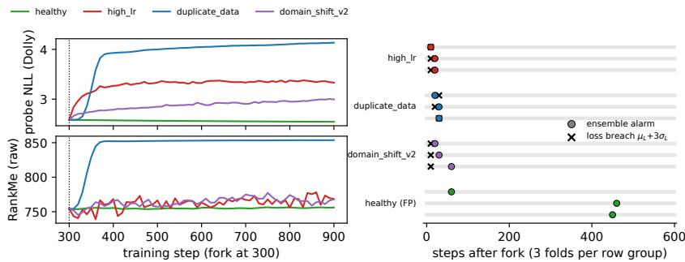

# When Rank Rises as LLMs Degrade

Zhaohui Geoffrey Wang University of Southern California zwang000@usc.edu

## Abstract

Post-training adapts a language model in a non-stationary environment, and practitioners increasingly monitor representation health — RankMe and related spectral statistics — to decide when adaptation has gone wrong. Such monitors carry an implicit directional assumption inherited from the self-supervised vision literature: rank goes down when representations degrade. We show that this assumption is not safe under LLM post-training. In a controlled sweep over degradation modes (Qwen3-0.6B, four modes × three seeds), a data-duplication regime that degrades held-out loss by 75% relative to a healthy run drives RankMe above healthy in its original uncentred form as well as the centred variant (13.5 pooled s.d.) and the covariance effective rank to nearly twice healthy: damage there is spectral dispersion, not collapse, so a one-sided monitor scores the worst checkpoint as the healthiest. A learning-rate misconfiguration, by contrast, moves RankMe and k in the conventional direction while the original uncentred RankMe is inconsistent across seeds — so the sign is a property of the regime–statistic pair, and cannot be fixed by recalibration. We also separate two statistics the literature often conflates: RankMe normalises singular values whereas covariance effective rank normalises eigenvalues, and on raw intermediate-layer hidden states the massive-activation phenomenon pins the latter near 1 out of d on an unmodified pretrained checkpoint while leaving the former with usable range. We then stress-test the natural repair — two-sided, multi-channel sequential monitoring with a multiplicity-aware falsealarm target — with calibration and test data held strictly apart. In a pre-registered shared-prefix, leave-one-seed-out evaluation on Qwen3-0.6B, the two-sided ensemble detects all three damage regimes in every fold within 10–60 steps of the fork, and the firing direction separates spectral dispersion from downward-rank damage; but it leads the held-out probe loss only once in nine folds (one 10-step interval), and with two calibration seeds it does not achieve zero false alarms on the held-out healthy seed. We report this negative result in full: spectral monitoring diagnoses the failure regime, it does not warn consistently earlier than a held-out loss, and validity claims made without a held-out healthy seed should not be trusted.

## 1 Introduction

Foundation models are no longer trained once. They are updated continually: post-trained on new instruction data, adapted to a new domain, re-aligned, patched. Each update is a step in a nonstationary environment, and each step can damage what the previous ones built. The operational question for anyone running such a pipeline is not whether damage is possible but whether it can be noticed in time — ideally from an unlabelled signal that is cheap to compute at every checkpoint, before the evaluation suite has been run.

The community’s default answer to that question is spectral. RankMe [Garrido et al., 2023], the effective rank, and related statistics of the hidden-state covariance are cheap, label-free, and come with a clean intuition inherited from self-supervised vision: representations degrade by collapsing, so rank goes down, so a falling rank is an alarm. This paper asks whether that intuition survives contact with LLM continual post-training, and whether the resulting monitor can be made reliable enough to act on. The narrow version of the question is: can representation statistics serve as a reliable, label-free monitor ofcontinual updates?

Our answer is a qualified no, established in three steps. First, an exact metric audit: RankMe and the covariance effective rank are different statistics (singular values versus eigenvalues), and on raw LLM hidden states massive activations [Sun et al., 2024] pin the latter near 1 of d at intermediate layers of an unmodified checkpoint, so any dynamic range reported for it there without per-token normalisation is an artefact. Second, a regime-dependent sign inversion: under data-duplication overfitting the held-out loss degrades by 75% while every form of RankMe and the effective rank rise far above healthy, whereas a learning-rate misconfiguration moves the centred statistics conventionally and the uncentred original inconsistently. The sign is a property of the regime–statistic pair; even centring can change the direction a monitor observes. Third, and this is where the stress test bites, we evaluate the obvious repair — a two-sided, multi-channel sequential test with a union-bound false-alarm correction — under a pre-registered protocol in which every branch forks from a shared healthy checkpoint and every threshold is calibrated on seeds the detector never sees. The ensemble detects all three damage regimes in every fold, and the direction that fires separates dispersion-type damage from the two downward-rank regimes. But its lead over the held-out probe loss is at most one probe interval, in one of nine folds, and with two calibration seeds it does not achieve zero false alarms on a held-out healthy seed.

The negative result is the point. A monitor anti-correlated with damage is worse than none, because it licenses continued training; a monitor that fires with the loss it is meant to anticipate adds diagnosis, not warning; a false-alarm guarantee certified only on calibration data is not a guarantee. We report all three so the next monitor is evaluated against them.

## Contributions.

1. An exact metric audit. RankMe (singular values) and the covariance effective rank (eigenvalues) are computed under their original definitions and shown not to be interchangeable on LLM hidden states; massive activations remove the dynamic range of the latter on raw intermediate-layer states unless tokens are normalised (§4).

2. A regime–statistic sign structure. Under data-duplication overfitting every rank statistic rises well above healthy while held-out loss degrades sharply; under learning-rate misconfiguration the centred statistics fall while uncentred RankMe is inconsistent across seeds. The sign is a property of the regime–statistic pair (§5, §4), so a one-sided monitor cannot be repaired by recalibration.

3. A fork-valid sequential evaluation. Detectors are scored on a shared-prefix change-point design with leave-one-seed-out calibration, a pre-registered loss-only severity gate, and a union-bound multiplicity correction for the ensemble stopping time; false alarms are measured on a held-out healthy seed (§6).

4. A negative result, reported in full. Under that protocol the two-sided ensemble detects every regime and identifies it by direction, but provides no consistent early warning over a held-out probe loss and does not achieve zero held-out false alarms with two calibration seeds. Spectral signals diagnose failure geometry; they do not presently justify autonomous stopping (§6).

## 2 Related Work

Spectral representation-health metrics. RankMe [Garrido et al., 2023] validated the singularvalue entropy as a label-free proxy for downstream linear-probe accuracy in vision SSL; the variance term of VICReg [Bardes et al., 2022] and the uniformity loss of Wang and Isola [2020] encode the same conviction that healthy representations occupy many directions, degraded ones few. All of these were validated in a setting whose canonical failure is rank loss, and the same contractionsigned reading runs through the loss-of-plasticity literature, where falling feature or effective rank accompanies lost adaptability [Kumar et al., 2021, Lyle et al., 2023, Dohare et al., 2024]. We test whether the machinery transfers to LLM continual post-training and find that the statistics remain computable but their directional semantics do not transfer: the sign of the response depends on the failure regime (§5). The anisotropy literature’s rogue dimensions [Ethayarajh, 2019, Timkey and van

Schijndel, 2021] are the massive-activation geometry [Sun et al., 2024] that floors the covariance effective rank in §4.

Collapse taxonomies. Kim et al. [2025] separate complete from dimensional collapse and catalogue detectors for each; both classes contract the spectrum. Our contribution is not a new taxonomy but the observation that LLM post-training damage can present as a third geometry — dispersion, a spectrum spreading out while held-out NLL degrades — which contraction-oriented taxonomies do not cover and contraction-oriented detectors mis-sign.

Online training monitors. The Collapse Index [Kalinowski, 2026] is the closest work: an online, topology-derived early-warning statistic for representation collapse, evaluated on LLM fine-tuning among other settings. It monitors a different signal (a Morse-theoretic summary rather than the spectrum), and its evaluation reports the statistic’s trajectory rather than a calibrated stopping rule. Our contribution is complementary: a protocol — shared-prefix forks, leave-one-seed-out calibration, held-out healthy false alarms, lead time against a frozen loss breach — that any early-warning-type claim, theirs included, needs in order to be certified. Under that protocol our own spectral ensemble does not certify (§6).

Sequential change detection. Our detector is Page’s CUSUM [Page, 1954] applied per channel and direction, with the ensemble stopping time controlled by the fixed-horizon union bound of (6); nothing here is novel as statistics, deliberately, so that what is being evaluated is the signal, not the test. Anytime-valid alternatives (e-processes, confidence sequences) would make the bound uniform in time, but inherit the same load-bearing premise our data fails to certify: a correctly specified healthy null.

## 3 Setup

## 3.1 Diagnostics

Let $Z \in \mathbb { R } ^ { N \times d }$ collect hidden-state representations of a fixed held-out probe set, with singular values $\sigma _ { 1 } \geq \cdot \cdot \cdot \geq \sigma _ { d } \geq 0$ , and let Σ be the covariance of its rows (i.e. of the centred matrix $\breve { Z } - \bar { Z } )$ with eigenvalues $\lambda _ { 1 } \geq \cdot \cdot \cdot \geq \lambda _ { d } > 0$ and trace T. We track:

$$
\begin{array} { r } { \mathrm { R a n k M e } = \exp H ( p ) , \quad p _ { k } = \sigma _ { k } / \sum _ { j } \sigma _ { j } + \epsilon } \end{array} \qquad \begin{array} { r l } { ( \mathrm { R a n k M e , G a r r i d o ~ e t ~ a l . , } 2 0 2 3 ) } \end{array}\tag{1}
$$

$$
r _ { \mathrm { e f f } } ^ { \Sigma } = \mathrm { e x p } \Big ( - \sum _ { i } q _ { i } \log q _ { i } \Big ) , \quad q _ { i } = \lambda _ { i } / T \qquad \mathrm { ( e f f e c t i v e ~ r a n k ) }\tag{2}
$$

$$
k _ { 9 5 } = \operatorname* { m i n } \{ k : \textstyle \sum _ { i \leq k } \lambda _ { i } \geq 0 . 9 5 T \}\tag{3}
$$

$$
\begin{array} { r } { \Delta H = \frac { d } { 2 } \log ( T / d ) - \frac { 1 } { 2 } \log \operatorname* { d e t } \Sigma } \end{array}\tag{4}
$$

$$
\begin{array} { r } { s _ { \mathrm { c b } } = \frac { 1 } { N ( N - 1 ) } \sum _ { i \neq j } \frac { \langle z _ { i } , z _ { j } \rangle } { \| z _ { i } \| \| z _ { j } \| } } \end{array}\tag{5}
$$

RankMe follows its original definition: the SVD is taken on $Z$ as the model emits it, without centring, with $\epsilon = 1 0 ^ { - 7 }$ . We write ${ \mathrm { R a n k M e } } ^ { c }$ for the centred variant that reconstructs $\sigma _ { k } \propto \sqrt { \lambda _ { k } }$ from the covariance spectrum; the two differ by the rank-one mean update $Z ^ { \top } Z / N = \Sigma \left( N - 1 \right) / N + \bar { z } \bar { z } ^ { \top }$ and coincide only when $\bar { z } = 0$ . We report both wherever they differ materially. One dependency is exact: under per-token RMS normalisation $( \lVert z _ { i } \rVert ^ { 2 } = d , \ \dot { \ S } 3 . 3 )$ and the $1 / ( N { - } 1 )$ convention, $s _ { \mathrm { c b } } = 1 - \mathrm { t r } \Sigma / d ,$ so $s _ { \mathrm { c b } }$ and the covariance trace are one degree of freedom, not independent channels; the separate evidence for dispersion is the centred spectral shape. Computation details: Appendix C.

Held-out NLL on the same fixed probe set is our pre-registered offline damage proxy: the operational damage criterion frozen by our protocol, against which every detector is scored. It is a proxy — downstream capability is not measured directly (§7) — but it is the strongest cheap baseline available, which is exactly what makes it the right bar.

## 3.2 Degradation modes

All runs post-train Qwen3-0.6B [Qwen Team, 2025] (hidden size $d = 1 0 2 4 , 2 8$ layers) with full fine-tuning, AdamW, batch $4 \times 5 1 2$ tokens, base learning rate $1 0 ^ { - 5 }$ , on databricks-dolly-15k unless stated. The probe is a fixed 256-sequence tail of the same corpus, disjoint from every training set.
<table><tr><td>mode</td><td>role</td><td>recipe</td></tr><tr><td>healthy</td><td>reference</td><td>Dolly, 1 × lr, warm-up 20</td></tr><tr><td>domain_shift_v2</td><td>venue-fit scenario</td><td>continual post-training on GSM8K [Cobbe et al., 2021], probe unchanged; 8× lr from a pre-specified loss-only gate on seed 0 (App. D)</td></tr><tr><td>high_lr duplicate_data narrow_domain (v1)</td><td>controlled failure mechanism controlled failure mechanism negative control</td><td>Dolly, 15× lr, no warm-up (calibrated,  $\mathsf { A p p . D } )$  8 unique Dolly examples cycled,  $1 \times \mathrm { { l r } }$  Dolly closed_qa only, 1× lr; probe loss +0.06 nats — damage gate never triggered</td></tr></table>

Phase 1 (§5) runs each mode from step 0 for 1000 steps, three seeds, probed every 25 steps; it supports seed-replicated endpoint comparisons only. Phase 2 (§6) forks every mode from a shared 300-step healthy prefix per seed.

## 3.3 Probe protocol

The probe is a fixed set of 256 held-out Dolly sequences (the tail of a seed-0 shuffle, disjoint from every training corpus), tokenized once at length 256 and reused verbatim at every measurement, so any movement in the logged signals is the model changing, not the data. Rows of Z are token representations: every non-pad position of the probed layer contributes one row $( N \approx 3 1 \mathbf { k } \gg$ $d = 1 0 2 4 )$ ; padding is excluded by the attention mask, and pad labels are masked to −100 in the NLL. Unless stated, the layer is the last hidden layer, taken after the model’s final RMSNorm (Appendix C), and each token vector is RMS-normalised (§4) before any second-moment statistic — a diagnostic choice distinct from the model’s own norm. Σ is accumulated in float64 (streaming Welford) from bfloat16 activations; RankMe uses the uncentred second moment $Z ^ { \top } Z$ , also in float64, with $\epsilon = 1 0 ^ { - 7 }$ in (1). ∆H requires Σ to actually be full-rank, for which $N > d$ is only necessary; we verify the numerical rank at every measurement and flag $\Delta H$ invalid otherwise (it never triggered on token-level data; sequence-pooled data has $N < d$ and $\Delta H$ is not reported there).

## 4 Two statistics, not one, and a normalisation prerequisite

RankMe is not the covariance effective rank. RankMe (1) is an entropy over normalised singular values of the uncentred $Z ; r _ { \mathrm { e f f } } ^ { \Sigma } \left( 2 \right)$ is an entropy over normalised covariance eigenvalues. They differ twice over: by a square (for centred data $\lambda _ { k } \propto \sigma _ { k } ^ { 2 } .$ so RankMe<sup>c</sup> weights $\sqrt { \lambda _ { k } }$ and is far less sensitive to a single dominant direction) and by centring (the mean adds a rank-one term to the uncentred second moment, and LLM hidden states have large means). Substituting one for the other, as covariance-based diagnostic code does silently, changes the statistic. We report them separately throughout.

The distinction is not cosmetic. Table 1 reports an unmodified pretrained checkpoint. At an intermediate layer a single direction carries 99.5% of the trace — the massive-activation phenomenon [Sun et al., 2024], not collapse. Under that spectrum $r _ { \mathrm { e f f } } ^ { \Sigma } = 1 . 0 6$ out of $d = 1 0 2 4$ : the covariance effective rank sits at its floor on a healthy model, with no room left to fall, so no threshold can make it a detector. RankMe on the same representations is 120.13 (centred variant $\mathrm { R a n k M e } ^ { c } = 1 2 1 . 2 4 )$ , two orders of magnitude higher, and retains usable range. The flooring claim holds for the covariance effective rank and not for $\mathbf { R a n k M e } ,$ in either the original uncentred or the centred form.

Per-token RMS normalisation restores the covariance effective rank at the intermediate layer (1.06 → 308.96). RMS and $\ell _ { 2 }$ normalisation give numerically identical diagnostics, as they must: they differ by the constant factor ${ \sqrt { d } } ,$ and every quantity in $( 2 ) \AA { - } ( 5 )$ is scale-invariant. We adopt per-token RMS normalisation with covariance (not correlation) scaling throughout, since correlation scaling divide out the per-dimension variance disparity that is itself part of the signal.

Table 1: Effect of massive activations, and of per-token normalisation, on the statistics. Qwen3-0.6B, d=1024; the baseline here is the unmodified pretrained checkpoint (no fine-tuning, not a post-training endpoint), token-level; RankMe is the original uncentred definition, RankMe<sup>c</sup> its centred variant. The covariance effective rank is floored on raw intermediate-layer states; neither form of RankMe is.
<table><tr><td>transform</td><td>layer</td><td> $r _ { \mathrm { e f f } } ^ { \Sigma }$ </td><td> $r _ { \mathrm { e f f } } ^ { \Sigma } / d$ </td><td> $\mathrm { R a n k M e }$ </td><td> ${ \mathrm { R a n k M e } } ^ { c }$ </td><td> $\lambda _ { 1 } / T$ </td></tr><tr><td>none</td><td>14 (of 28)</td><td>1.06</td><td>0.001</td><td>120.13</td><td>121.24</td><td>0.995</td></tr><tr><td>none</td><td>last</td><td>192.90</td><td>0.188</td><td>770.63</td><td>822.50</td><td>0.134</td></tr><tr><td>RMS</td><td>14 (of 28)</td><td>308.96</td><td>0.302</td><td>718.24</td><td>782.25</td><td>0.058</td></tr><tr><td>RMS</td><td>last</td><td>192.19</td><td>0.188</td><td>765.11</td><td>818.28</td><td>0.131</td></tr></table>

Table 2: Endpoint diagnostics after 1000 steps, mean ± s.d. over 3 seeds; separation from healthy in pooled s.d. in brackets, defined as $| \mu _ { m } - \mu _ { h } | / \sqrt { \sigma _ { m } ^ { 2 } + \sigma _ { h } ^ { 2 } }$ over seed endpoints $( m = { \mathrm { m o d e } }$ $h =$ healthy). Held-out probe loss is the pre-registered offline damage proxy. Arrows give the direction relative to healthy; bold marks a move opposite to the conventional “rank falls under degradation” reading.
<table><tr><td>mode</td><td>probe loss</td><td>RankMec</td><td> $r _ { \mathrm { e f f } } ^ { \Sigma }$ </td><td> $k _ { 9 5 }$ </td><td> $s _ { \mathrm { c b } }$ </td></tr><tr><td>healthy</td><td> $2 . 5 3 0 \pm 0 . 0 1$ </td><td> $8 1 2 . 6 \pm 0 . 4$ </td><td> $1 7 4 . 8 \pm 1 . 6$ </td><td> $6 8 9 . 7 \pm 0 . 6$ </td><td> $0 . 3 9 4 \pm 0 . 0 0$ </td></tr><tr><td>high_lr</td><td> $3 . 1 5 3 \pm 0 . 1 6$ </td><td> $7 9 9 . 9 \pm 3 . 5 \downarrow [ 3 . 6 ]$ </td><td> $1 8 3 . 2 \pm 4 . 2 [ 1 . 9 , \mathrm { n . s . } ]$ </td><td> $6 6 5 . 7 \pm 5 . 9 \downarrow [ 4 . 1 ]$ </td><td> $0 . 2 7 7 \pm 0 . 0 1 \downarrow [ 7 . 8 ]$ </td></tr><tr><td>duplicate_data</td><td> ${ \bf 4 . 4 2 9 \pm 0 . 3 1 }$ </td><td> ${ \pm } 7 7 . 9 \pm 4 . 8 \uparrow [ 1 3 . 5 ]$ </td><td> $\mathbf { 3 2 9 . 2 \pm 1 4 . 4 \uparrow [ 1 0 . 7 ] }$ </td><td> $\mathbf { 7 8 2 . 0 \pm 7 . 0 \uparrow } \mathbf { [ } 1 3 . 1 \mathbf { ] }$ </td><td> $0 . 1 9 7 \pm 0 . 0 1 \downarrow [ 1 7 . 6 ]$ </td></tr><tr><td>narrow_domain</td><td> $2 . 5 8 6 \pm 0 . 0 1$ </td><td> $\mathbf { 8 1 6 . 4 \pm 0 . 8 \uparrow } _ { [ 4 . 2 ] }$ </td><td> $1 7 9 . 4 \pm 1 . 1 \ : [ 2 . 4 ]$ </td><td> $\mathbf { 6 9 6 . 3 \pm 1 . 5 \uparrow } _ { [ 4 . 1 ] }$ </td><td> $0 . 3 6 8 \pm 0 . 0 0 \downarrow [ 7 . 5 ]$ </td></tr></table>

Centring is part of the definition. The original RankMe and its centred reconstruction ${ \mathrm { R a n k M e } } ^ { c }$ can also part company with each other. On shared-prefix branches (§6), under duplicate\_data both rise far above the healthy drift (RankMe: +96 to +109 against healthy +2), but under high\_lr RankMe falls in all three seeds $\left( - 4 . 7 1 0 - 1 6 . 4 \right)$ while RankMe rises in two of three $( + 1 4 . 4 , + 1 0 . 5 , - 1 . 5 )$ Whether the representation matrix is centred before the SVD — a detail implementations rarely report — changes not just the value but, in some regimes, the direction a monitor sees (per-seed values in Appendix E).

## 5 Rank metrics can invert under post-training

Unit of inference. Each (mode, seed) run is one trajectory, and a trajectory is one observation. Checkpoints within a run are strongly autocorrelated, so pooling them would inflate the apparent sample size; all figures below are endpoint values aggregated across seeds, with n equal to the number of runs. We report separation in pooled standard deviations and refuse to report an effect size where $n = 1$

The inversion is regime-dependent, and it replicates. Under duplicate\_data, held-out loss degrades by 75% relative to healthy, yet RankMe<sup>c</sup> rises above healthy (877.9 vs 812.6, 13.5 s.d.) and $r _ { \mathrm { e f f } } ^ { \Sigma }$ nearly doubles (329.2 vs 174.8, 10.7 s.d.): by the conventional reading the worst model has the richest representations, in all three seeds. Under high\_lr, also genuinely damaged (loss 3.153 vs 2.530), Rank $\mathrm { \cdot } \mathrm { M e } ^ { c }$ and $k _ { 9 5 }$ move the other way (3.6 and 4.1 s.d. down) — while on the shared-prefix branches the original uncentred RankMe is inconsistent across seeds under the same regime (§4). The sign is a property of the regime–statistic pair; even centring can change the direction a monitor observes. A monitor that fixes a direction in advance is mis-specified for at least one such pair, and recalibration cannot repair that.

What we do not claim. $r _ { \mathrm { e f f } } ^ { \Sigma }$ also rises under high\_lr, but by 1.9 s.d., inside seed noise; we do not count that as an inversion. narrow\_domain degrades held-out loss by only 2.2%, which we regard as too small to call damage even though its metric shifts are statistically separable; it is reported as a negative result for the mode, not as a third inversion. The inversion claim therefore rests on one regime replicated across three seeds, not on the sweep as a whole.

Mechanism: dispersion, not collapse. This is not numerical failure. The numerical rank of Σ remains full throughout, and every quantity plateaus by step 200 and holds to step 1000. What moves is where the variance sits: $\lambda _ { 1 }$ falls from 84.79 to 74.53 while T rises from 649.6 to 820.3. Variance is redistributed out of the dominant direction into the tail. In this regime overfitting is accompanied by spectral dispersion on the held-out probe — we observe the redistribution, not its mechanism. Damage here is dispersion, not collapse.

Why not just monitor the loss? Held-out NLL is an offline damage proxy, not a deployment-time oracle in every setting — but for a language model it does not require labels: on a fixed text stream the next token is its own supervision, and our probe is plain held-out text. It is therefore self-supervised, inexpensive, and a deliberately strong baseline. The stricter question a spectral monitor must answer is whether it warns before this baseline breaches a frozen threshold; Table 3 answers it in the negative. Spectral statistics retain two potential advantages the NLL lacks — they need no probe forward passes beyond the ones already made, and they expose the geometry of the failure — and the second survives our stress test while the first does not translate into earlier warning.

A channel with a consistent sign, with its direction flipped. $s _ { \mathrm { c b } }$ falls below healthy in every mode we ran — 7.8 s.d. under high\_lr, 17.6 s.d. under duplicate\_data, 7.5 s.d. under narrow\_domain making it the only channel here whose direction is consistent across regimes. It is precisely the channel that plays a secondary role in the vision collapse literature, where uniformity collapse makes representations more similar; under LLM post-training the sign reverses, and damage spreads representations apart. Any monitor ported from vision must re-derive its channel directions rather than inherit them. Consistency of sign is all this buys: in the sequential evaluation of $\ S 6 , s _ { \mathrm { c b } }$ neither leads the loss breach nor passes the held-out false-alarm bar, so it is a candidate direction convention, not a working monitor. Its sign is consistent across all tested update branches, including the below-gate narrow\_domain control; whether that extends to untested damage modes is open.

## 6 A two-sided monitor under held-out false-alarm evaluation

The evidence in §5 dictates the design. Rank channels must be evaluated in both directions, because both inflation and collapse indicate damage — and damaged branches never participate in direction or threshold selection. Because the healthy baseline itself drifts (§3), a fixed threshold cannot separate drift from damage; what is needed is an evidence-accumulating sequential test with an explicit false-alarm target.

## 6.1 The anisotropy-deficit channel

Theorem 1 (Anisotropy deficit is non-negative). Let $\lambda _ { 1 } , \ldots , \lambda _ { d } ~ > ~ 0$ with $T = \textstyle \sum _ { i } \lambda _ { i }$ . Then $\begin{array} { r } { \Delta H = \frac { d } { 2 } \log ( T / d ) - \frac { 1 } { 2 } \sum _ { i } \log \lambda _ { i } \geq 0 , } \end{array}$ , with equality ifthe spectrum isflat.

The converse (equality only if the spectrum is flat) also holds, by strict concavity of log, but we state the theorem in the direction we have machine-checked; see Appendix A.

$\Delta H$ is the gap between the differential entropy of the isotropic Gaussian with the same total variance and that of $\bar { \mathcal { N } } ( 0 , \Sigma )$ ; the bound is the arithmetic–geometric mean inequality on the spectrum, machine checked in Lean 4 against Mathlib with an axiom audit confirming no appeal to sorry (Appendix A). We note it only because $\Delta H$ moves in the unexpected direction in Table 2, so its floor is one property that should not rest on inspection.

## 6.2 Evaluation design: shared prefix, held-out calibration

Two easy design errors each manufacture success.

Calibrating and testing on the same runs. Choosing the smallest margin that gives zero false alarms on the healthy runs and then reporting zero false alarms on those same runs is a definition, not a result. We instead calibrate margins, channel directions and channel selection on a strict subset of healthy seeds, evaluate the false-alarm rate on the held-out healthy seed, and rotate over folds. Damaged trajectories never participate in calibration.

No common pre-change history. A sequential change detector is meant to locate the moment a stream’s distribution changes. Runs that begin under different recipes at step 0 have no change point to find, which reduces the task to separating two populations. We therefore adopt a shared-prefix design: each seed trains an identical healthy prefix, forks from that common checkpoint into each mode at a known switch point, and detectors are scored by detection delay after the fork and by lead time relative to the held-out-loss breach. Concretely (protocol frozen before any damaged branch was inspected; DETECTOR\_PROTOCOL.md, supplement): three seeds each train a healthy $\tau = 3 0 0$ -step prefix; its checkpoint (weights and optimiser state, SHA-256 hashed) forks into healthy, high\_lr, duplicate\_data and domain\_shift\_v2 branches of 600 steps, probed every 10 steps. For each held-out seed $s ,$ baseline $\mu _ { c } ,$ scale $\sigma _ { c }$ and threshold $h _ { c }$ of every channel are frozen from the healthy branches of the other two seeds only; the loss-breach level $L = \mu _ { L } + 3 \sigma _ { L }$ is frozen the same way. Every channel is tested in both directions with slack $k = 0 . 5 ;$ directions are not chosen from damaged data. False alarms are scored on the held-out healthy branch, delay on the held-out damaged branches.

  
Figure 1: The negative result at a glance (Qwen3-0.6B, shared-prefix branches). Left (seed 0): duplicate\_data degrades held-out NLL most while its raw RankMe rises ∼100 above healthy — dispersion, not collapse. Right (all folds): loss breach (×) and ensemble alarm (◦) land within 10–60 steps of the fork and of each other — no consistent early warning — while the held-out healthy branch false-alarms at 60/460/450 steps (folds 0–2, as in Table 3).

## 6.3 Sequential test and a multiplicity-correct guarantee

The ensemble monitors the five channels of §3 (R $\mathrm { \ u n k M e } ^ { c } , r _ { \mathrm { e f f } } ^ { \Sigma } , k _ { 9 5 } , \Delta H , s _ { \mathrm { c b } } )$ in both directions $( C { = } 5 , 2 C { = } 1 0$ one-sided tests); each runs a CUSUM $S _ { t } ^ { \pm } = \operatorname* { m a x } ( 0 , S _ { t - 1 } ^ { \pm } \pm z _ { t } - k )$ on the standardised series and alarms at $S _ { t } ^ { \pm } > h _ { c } .$ . Monitoring C channels in both directions and stopping at the first alarm makes the stopping time $\tau _ { \mathrm { e n s } } = \operatorname* { m i n } _ { c , \pm } \tau _ { c , \pm }$ a minimum over $2 C$ dependent stopping times, so a per-channel false-alarm rate does not transfer: the ensemble $\mathrm { { A R L } _ { 0 } }$ is strictly worse than that of any single channel. The guarantee we target is the fixed-horizon union bound: if under the healthy distribution $\mathrm { P r } _ { 0 } ( \tau _ { c , \pm } \le \mathbf { \bar { \delta } } H ) \le \alpha / ( 2 C )$ for every one-sided test, then without any independence assumption

$$
\operatorname* { P r } _ { 0 } ( \tau _ { \mathrm { e n s } } \le H ) \ \le \ \sum _ { c , \pm } \operatorname* { P r } ( \tau _ { c , \pm } \le H ) \ \le \ \alpha , \qquad \mathrm { h e n c e } \qquad \mathrm { A R L } _ { 0 } = \mathbb { E } _ { 0 } [ \tau _ { \mathrm { e n s } } ] \ \ge \ H ( 1 - \alpha ) .\tag{6}
$$

The premise is the load-bearing part, and two calibration seeds cannot certify it: each one-sided test sees two healthy null series, so its achievable empirical levels at branch granularity are $\{ 0 , { \frac { 1 } { 2 } } , 1 \}$ , and $\alpha / ( 2 C ) = 0 . 0 0 5$ lies below the smallest nonzero level — the calibrated threshold degenerates to the zero-crossing threshold (pooling the four series–direction pairs, as implemented, degenerates identically). The held-out healthy false alarms in Table 3 show the premise is not satisfied at this data scale: (6) is the guarantee we target and empirically fail to certify. A synthetic check (supplement): with $C = 1 2 \mathrm { i . i . d }$ . channels and two calibration series, zero-calibration-FP thresholds yield held-out per-channel FP rates of 4–58% and an ensemble rate of 98.5%.

## 6.4 Detection results

Figure 1 and Table 3 answer the title’s question, negatively on two of three counts. Detection: the two-sided ensemble alarms in every fold of every mode within 10–60 steps, and the firing direction is regime-specific as §5 predicted: duplicate\_data is caught by ${ \mathrm { R a n k M e } } ^ { \dot { c } } \ \dot { \uparrow }$ while ${ \mathrm { R a n k M e } } ^ { c } \downarrow$ stays censored — the conventional one-sided monitor misses it entirely; high\_lr and domain\_shift\_v2 fire ${ \mathrm { R a n k M e } } ^ { c } \downarrow$ first. Lead: none that matters. The fixed 31k-token probe makes NLL nearly noiseless $( \sigma _ { L } \approx 0 . 0 1 )$ , so $\mu _ { L } + 3 \sigma _ { L }$ is breached at the first or second post-fork measurement in every mode, the gradual one included; the ensemble precedes it in exactly one fold (duplicate\_data, by a single 10-step probe interval; Table 3), and in no other fold does any channel precede it. Ifa held-out loss is available, it is thefaster monitor; the spectrum adds a diagnosis of the regime, not a usable earlier warning. False alarms: the pre-registered protocol false-alarms on the held-out healthy branch in all three folds despite 12–20σ thresholds: healthy seeds are offset from one another by more than their within-seed noise (RankMe<sup>c</sup>: 814.2 vs 812.9/813.1, σ = 0.5). Fork-anchoring clears fold 0; folds 1–2 still alarm at 140/240 steps — two calibration seeds do not bound a third seed’s healthy excursion. $\mathrm { A t } n = 3$ seeds the supportable statement is not zero false alarms but time-to-false-alarm $\geq 1 4 0$ steps vs. detection delay $\leq 6 0$

Table 3: Shared-prefix, leave-one-seed-out detection (Qwen3-0.6B, last layer). Entries: steps after the fork, range over folds; “cens.” = no alarm in 600 steps; lead = breach − alarm step per fold (negative = alarm lags); last column: false alarms on the held-out healthy branch. Top: pre-registered; bottom: post-hoc fork-anchored, no pre-registration credit. RankMe rows: the protocol-frozen RankMe<sup>c</sup> (uncentred: App. E).
<table><tr><td></td><td>high_lr</td><td>duplicate_data</td><td>domain_shift_v2</td><td>healthy (held-out)</td></tr><tr><td colspan="3">pre-registered protocol (constant baseline)</td><td colspan="2"></td></tr><tr><td>ensemble alarm</td><td>10-20</td><td>20-30</td><td>20-60</td><td>FP@60/460/450</td></tr><tr><td> $\mathrm { R a n k M e ^ { c } \downarrow o n l y }$ </td><td>10-20</td><td>cens.</td><td>20–30 (2/3) 120-380</td><td>FP@-/530/- FP@60/-/-</td></tr><tr><td> ${ \mathrm { R a n k M e } } ^ { c } \uparrow$   $s _ { \mathrm { c b } } \downarrow$ </td><td>550 (1/3) 30-40</td><td>20-30 40</td><td>50-60</td><td>FP@-/-/450</td></tr><tr><td>loss breach  $\mu _ { L } + 3 \sigma _ { L }$  lead (per fold)</td><td>10 0/-10/-10</td><td>20-30 +10/-10/0</td><td>10 -10/-20/-50</td><td>none 1</td></tr><tr><td>detected / false-alarm folds</td><td>3/3</td><td>3/3</td><td>3/3</td><td>3/3</td></tr><tr><td>post hoc: fork-anchored</td><td> $\boldsymbol { x } _ { t } - \boldsymbol { x } _ { \tau }$ </td><td></td><td></td><td></td></tr><tr><td>ensemble alarm</td><td>10-20</td><td>20-30</td><td>20-60</td><td>FP@-/140/240</td></tr><tr><td> $\mathrm { R a n k M e } ^ { c } \downarrow \mathrm { o n l y }$ </td><td>10-20</td><td>cens.</td><td>20 (2/3)</td><td></td></tr><tr><td> ${ \mathrm { R a n k M e } } ^ { c } \uparrow$ </td><td>30 (1/3)</td><td>20-30</td><td></td><td>none</td></tr><tr><td></td><td></td><td></td><td>60-350</td><td>FP@-/140/-</td></tr><tr><td>Scb ↓</td><td>30-40</td><td>30-40</td><td>40-80</td><td>FP@-/500/-</td></tr><tr><td>lead (per fold)</td><td>0/-10/0</td><td>0/0/0</td><td>-10/-10/-50</td><td></td></tr><tr><td>detected / false-alarm folds</td><td>3/3</td><td>3/3</td><td>3/3</td><td>2/3</td></tr></table>

domain\_shift\_v2 is adaptation, not just harm. On held-out GSM8K test NLL (measured throughout, never trained on) the domain\_shift\_v2 branches improve $1 . 4 0  1 . 1 0 \pm 0 . 0 1$ while Dolly retention degrades $2 . 5 8 \to 2 . 9 8 \pm 0 . 0 1 - \mathrm { a }$ genuine stability–plasticity trade-off; healthy branches leave GSM8K flat (1.38) and the failure mechanisms damage both domains (GSM8K 2.25, 2.63). The monitoring task is thus the hard one: flagging the stability cost of an update succeeding at its own objective.

## 7 Limitations

Scale. Every number is from Qwen3-0.6B (d = 1024); the metric audit is definitional, but whether the regime-specific directions and the no-lead result hold at larger scale is untested. Regimes. The upward inversion rests on one mechanism (duplicate\_data, three seeds); under high\_lr the centred statistics fall while uncentred RankMe is seed-inconsistent; narrow\_domain (v1) never triggered its damage gate. Data and proxy. The §5 comparisons fork at step 0 and support seed-replicated endpoint claims only; detection claims rest on the shared-prefix branches. All diagnostics use one fixed held-out probe whose NLL stands in for downstream capability (the no-lead bar is same-probe, not downstream); $\Delta H$ is reported only at token granularity, where Σ is verifiably full-rank.

## 8 Conclusion

Spectral statistics fail two audits: RankMe and the covariance effective rank are not interchangeable, and centring alone can flip the direction a monitor sees. Stress-tested fork-valid, the ensemble detects every regime, leads the held-out loss only once in nine folds (one interval), and false-alarms on unseen healthy seeds — failure-geometry diagnosis, not a licence for autonomous stopping. Evaluate any such monitor this way, held-out healthy row included.

## References

Adrien Bardes, Jean Ponce, and Yann LeCun. VICReg: Variance-invariance-covariance regularization for self-supervised learning. In International Conference on Learning Representations, 2022.

Karl Cobbe, Vineet Kosaraju, Mohammad Bavarian, Mark Chen, Heewoo Jun, Lukasz Kaiser, Matthias Plappert, Jerry Tworek, Jacob Hilton, Reiichiro Nakano, Christopher Hesse, and John Schulman. Training verifiers to solve math word problems. arXiv preprint arXiv:2110.14168, 2021.

Shibhansh Dohare, J. Fernando Hernandez-Garcia, Qingfeng Lan, Parash Rahman, A. Rupam Mahmood, and Richard S. Sutton. Loss of plasticity in deep continual learning. Nature, 632: 768–774, 2024.

Kawin Ethayarajh. How contextual are contextualized word representations? Comparing the geometry of BERT, ELMo, and GPT-2 embeddings. In Proceedings ofEMNLP-IJCNLP, 2019.

Quentin Garrido, Randall Balestriero, Laurent Najman, and Yann LeCun. RankMe: Assessing the downstream performance of pretrained self-supervised representations by their rank. In International Conference on Machine Learning, pages 10929–10974, 2023.

Alexander Kalinowski. Monitoring neural training with topology: A footprint-predictable collapse index. arXiv preprint arXiv:2604.26984, 2026. URL https://arxiv.org/abs/2604.26984.

Donghyeon Kim, Chae-Bong Sohn, Do-Yup Kim, and Dae-Yeol Kim. A taxonomy and theoretical analysis of collapse phenomena in unsupervised representation learning. Mathematics, 13(18): 2986, 2025. doi: 10.3390/math13182986. URL https://doi.org/10.3390/math13182986.

Aviral Kumar, Rishabh Agarwal, Dibya Ghosh, and Sergey Levine. Implicit under-parameterization inhibits data-efficient deep reinforcement learning. In International Conference on Learning Representations, 2021.

Clare Lyle, Zeyu Zheng, Evgenii Nikishin, Bernardo Avila Pires, Razvan Pascanu, and Will Dabney. Understanding plasticity in neural networks. In International Conference on Machine Learning, 2023.

Elpidio S Page. Continuous inspection schemes. Biometrika, 41(1/2):100–115, 1954.

Qwen Team. Qwen3 technical report. arXiv preprint arXiv:2505.09388, 2025.

Mingjie Sun, Xinlei Chen, J. Zico Kolter, and Zhuang Liu. Massive activations in large language models. arXiv preprint arXiv:2402.17762, 2024. URL https://arxiv.org/abs/2402.17762.

William Timkey and Marten van Schijndel. All bark and no bite: Rogue dimensions in transformer language models obscure representational quality. In Proceedings ofEMNLP, 2021.

Tongzhou Wang and Phillip Isola. Understanding contrastive representation learning through alignment and uniformity on the hypersphere. In Proceedings of the 37th International Conference on Machine Learning, volume 119 of Proceedings of Machine Learning Research, pages 9929–9939. PMLR, 2020. URL https://proceedings.mlr.press/v119/wang20k.html.

## A Machine-checked proof of Theorem 1

Theorem 1 (∆H ≥ 0, with equality if the spectrum is flat) is machine-checked in Lean 4.24.0 against Mathlib. The development proves sum\_log\_le\_mul\_log\_mean (AM–GM in log form), anisotropy\_deficit\_nonneg, and anisotropy\_deficit\_eq\_zero\_of\_flat; note the last is the “if” direction only, which is all the paper claims. The axiom audit (#print axioms) reports every result closed over exactly propext, Classical.choice, Quot.sound — i.e. no sorry and no additional axioms. Source (lean/AnisotropyDeficit.lean, compiled with lean AnisotropyDeficit.lean under the pinned LEAN\_PATH):

```verilog
/-
Machine - checked proof of the sigma - free anisotropy deficit bound ( Theorem 1 in the paper )
For a covariance matrix Sigma with strictly positive eigenvalues lambda_1 .. lambda_d
and trace T = sum_i lambda_i , define
DeltaH := (d /2) * log (T/d) - (1/2) * sum_i log ( lambda_i )
(d /2) * log (T/d) - (1/2) * log (det Sigma ).
DeltaH is the gap between the differential entropy of the isotropic Gaussian with
the same total variance and that of N(0, Sigma ). It is exactly the
arithmetic - mean / geometric - mean gap of the spectrum , hence non - negative , and it
vanishes precisely when the spectrum is flat ( Sigma isotropic ).
The statement is deliberately phrased over the raw spectrum rather than over
matrices : everything the monitor computes is a function of the eigenvalues , so
this is the form actually used , and it keeps the proof free of any linear - algebra
scaffolding .
Verified with Lean 4.24.0 + Mathlib ( see lean / README .md for the exact invocation ).
-/
import Mathlib . Analysis . MeanInequalities
open Finset
namespace JepaVerify
variable {d : <sup>N</sup>}
/-- The uniform weight vector ‘1/d‘ on ‘Fin d‘ sums to one . -/
private lemma uniform_weights_sum_one (hd : 0 < d) :
P _i ∈ ( univ : Finset ( Fin d)), (1 : R) / (d : R) = 1 := by
have hd ’ : (d : R) ̸= 0 := Nat. cast_ne_zero .mpr hd.ne ’
rw [ Finset . sum_const , Finset . card_univ , Fintype . card_fin , nsmul_eq_mul ]
field_simp
/-- Log - form AM -GM: the sum of logs is at most ‘d‘ times the log of the mean .
This is weighted AM -GM with uniform weights , pushed through ‘log ‘. -/
theorem sum_log_le_mul_log_mean (hd : 0 < d) ( lam : Fin d → R) ( hpos : ∀ i, 0 < lam i) :
P i, Real .log ( lam i) ≤ (d : R) * Real . log ((P i, lam i) / (d : R)) := by
have hd0 : (0 : <sup>R</sup>) < (d : <sup>R</sup>) := Nat . cast_pos . mpr hd
have hw : ∀ i ∈ ( univ : Finset ( Fin d)) , (0 : R) ≤ 1 / ( d : R) := fun _ _ => by
positivity
have hz : ∀ i ∈ ( univ : Finset ( Fin d)), (0 : R) ≤ lam i := fun i _ => ( hpos i).le
-- weighted AM - GM with all weights equal to 1/ d
have amgm :=
Real . geom_mean_le_arith_mean_weighted univ ( fun _ => (1 : <sup>R</sup>) / (d : <sup>R</sup>) ) lam hw
( uniform_weights_sum_one hd ) hz
have hrhs : P i , (1 : R) / ( d : R) * lam i = (P i , lam i) / (d : R) := by
rw [← Finset . mul_sum ]; ring
rw [ hrhs ] at amgm
have hprodpos : (0 : R) < Q i, (lam i) ^ ((1 : R) / (d : R)) :=
Finset . prod_pos fun i _ => Real . rpow_pos_of_pos ( hpos i ) _
have hlog := Real . log_le_log hprodpos amgm
rw [ Real . log_prod _ _ fun i _ => ne_of_gt ( Real . rpow_pos_of_pos ( hpos i) _)] at hlog
have hrw : P i, Real .log (( lam i) ^ ((1 : R) / (d : R)))
= (1 / (d : R)) * P i , Real . log ( lam i ) := by
rw [ Finset . mul_sum ]
exact Finset . sum_congr rfl fun i _ => Real . log_rpow ( hpos i) _
rw [ hrw ] at hlog
calc P i, Real .log ( lam i)
= (d : R) * ((1 / (d : R)) * P i, Real .log ( lam i)) := by field_simp
_ ≤ ( d : R) * Real . log ((P i , lam i) / (d : R)) :=
mul_le_mul_of_nonneg_left hlog hd0 .le
/-- ** Theorem 1 ( anisotropy deficit is non - negative ) .**
```

For any strictly positive spectrum , ‘DeltaH >= 0‘. -/   
theorem anisotropy\_deficit\_nonneg (hd : 0 < d) ( lam : Fin d → R) ( hpos : ∀ i, 0 < lam i)   
:   
0 ≤ (d : R) / 2 \* Real . log ((P i, lam i) / (d : R))   
- (1 / 2) \* P i, Real .log ( lam i) := by   
have h := sum\_log\_le\_mul\_log\_mean hd lam hpos   
linarith   
/-- A flat ( isotropic ) spectrum attains the bound : ‘DeltaH = 0‘. -/   
theorem anisotropy\_deficit\_eq\_zero\_of\_flat (hd : 0 < d) (c : <sup>R</sup>) (hc : 0 < c) :   
(d : R) / 2 \* Real . log ((P \_i : Fin d , c) / (d : R))   
- (1 / 2) \* P \_i : Fin d , Real . log c = 0 := by   
have hd ’ : (d : R) ̸= 0 := Nat. cast\_ne\_zero .mpr hd.ne ’   
rw [ Finset . sum\_const , Finset . sum\_const , Finset . card\_univ , Fintype . card\_fin ,   
nsmul\_eq\_mul , nsmul\_eq\_mul ]   
have hcancel : (d : <sup>R</sup>) \* c / ( d : <sup>R</sup>) = c := by field\_simp   
rw [ hcancel ]   
ring   
end JepaVerify   
/- Audit : each result must rest only on Lean ’s three standard axioms   
( propext , Classical . choice , Quot . sound ). Any appearance of ‘sorryAx ‘ here   
would mean the proof is incomplete . -/   
# print axioms JepaVerify . sum\_log\_le\_mul\_log\_mean   
# print axioms JepaVerify . anisotropy\_deficit\_nonneg   
# print axioms JepaVerify . anisotropy\_deficit\_eq\_zero\_of\_flat

## B Deferred proofs

Fixed-horizon union bound (Eq. 6). Fix a horizon H and let $\tau _ { c , \pm }$ be the stopping time of the one-sided CUSUM on channel c in direction ± under the healthy distribution $\mathrm { P r } _ { 0 }$ . The ensemble stops at $\begin{array} { r } { \tau _ { \mathrm { e n s } } = \operatorname* { m i n } _ { c , \pm } \tau _ { c , \pm } , \mathrm { s o } \left\{ \tau _ { \mathrm { e n s } } \leq H \right\} = \bigcup _ { c , \pm } \{ \tau _ { c , \pm } \leq H \} } \end{array}$ and subadditivity gives $\mathrm { P r } _ { 0 } ( \tau _ { \mathrm { e n s } } \leq$ $\begin{array} { r } { H ) \le \sum _ { c , \pm } \operatorname* { P r } _ { 0 } ( \tau _ { c , \pm } \le H ) } \end{array}$ , with no independence or stationarity assumption. If each term is at most $\alpha / ( 2 C )$ the sum is at most α. For the $\mathrm { { A R L } _ { 0 } }$ consequence, Markov’s inequality is not needed: since $\tau _ { \mathrm { e n s } } \geq 0 , \mathbb { E } _ { 0 } [ \tau _ { \mathrm { e n s } } ] \geq H \mathrm { P r } _ { 0 } ( \tau _ { \mathrm { e n s } } > H ) \geq H ( 1 - \bar { \alpha } )$ . The bound is over the fixed horizon only; it says nothing uniform over time, and it is conditional on the premise $\mathrm { P r } _ { 0 } ( \tau _ { c , \pm } \le H ) \le \alpha / ( 2 { \dot { C } } )$ which must itself be certified from healthy data. With two calibration seeds each one-sided term is estimated from two null series, giving resolution $1 / 2$ at branch granularity, so the premise cannot be certified at $\alpha = 0 . 0 5 \mathrm { { ; } }$ ; Table 3’s held-out healthy row shows it in fact fails at this data scale. Nothing in this appendix is novel; it is stated to fix exactly what would have been guaranteed had the premise held.

## C Implementation details

Model Qwen3-0.6B [Qwen Team, 2025] (d = 1024, 28 layers), full fine-tuning in bfloat16; AdamW, weight decay 0, gradient clip 1.0; base learning rate $1 0 ^ { - 5 }$ scaled by the mode’s multiplier; linear warm-up over 20 steps where stated (branches inherit a warm optimiser and use none); batch 4 sequences × 512 tokens. Probe: 256 sequences × 256 tokens, batch 8; layers probed: last and 14; measurement every 25 steps (Phase 1) or 10 steps (branches). Layer indices address the HF output\_hidden\_states tuple; its final entry equals last\_hidden\_state, i.e. the last-layer states are taken after the model’s final RMSNorm (verified against the transformers Qwen3 forward pass), independently of the diagnostic per-token normalisation. Spectral accumulators in float64 on-GPU. Fork checkpoints store model and optimiser state; branches verify the checkpoint SHA-256 against fork.json before training, and the replay refuses a branch whose recorded parent hash mismatches. Hardware: one RTX 4090-class 24 GB GPU per run; wall-clock ≈22 min per 1000-step Phase-1 run and ≈9–13 min per 600-step branch, of which ≈7 s per measurement. Code, frozen protocol (DETECTOR\_PROTOCOL.md, DOMAIN\_SHIFT\_V2.md), unit tests, and all logs are in the supplement.

## D Severity calibration

Both severity knobs were set by pre-specified, loss-only ladders; no spectral signal was consulted.

high\_lr (Phase 1). Multipliers $8 / 1 5 / 2 5 \times$ (and 40× in a pilot) for 200 steps: probe NLL ends at 2.78 / 3.36 / 4.28 respectively against a healthy 2.55; 8× recovers after warm-up, 25× and 40× collapse within the first 25 steps, leaving no interval in which a detector could plausibly warn. 15× exits the healthy envelope while degrading over a resolvable window and was selected.

domain\_shift\_v2 (branches). Ladder $1 / 2 / 4 / 8 \times$ on seed 0 only, gate frozen in DOMAIN\_SHIFT\_V2.md: endpoint NLL at least 0.30 nats above the same-seed healthy branch and first crossing at least 50 steps after the fork. Results: +0.05 / +0.06 / +0.11 (fail) / +0.44 with first crossing at 220 steps (pass); seeds 1–2 confirm at 8× with +0.45 (190) and +0.43 (220) without re-selection. The 220-step crossing refers to this pre-registered +0.30-nat severity gate; Table 3’s 10-step breach uses the much tighter calibration-defined $\mu _ { L } + 3 \sigma _ { L }$ monitoring threshold — the two thresholds answer different questions and do not conflict.

## E Per-mode trajectories

Figure 1 (left) shows the seed-0 trajectories; the table below gives per-seed shared-prefix branch endpoints (fork at step 300, branch end at step 900; fork values (seed 0) RankMe = 754.1, $\mathrm { R a } \bar { \mathrm { n k M e } } ^ { c } = 8 1 4 . 2$ , Dolly NLL 2.58, GSM8K test NLL 1.40). RankMe is the uncentred original, RankMe<sup>c</sup> the centred variant, both on RMS-normalised token representations of the last layer.
<table><tr><td>mode</td><td>seed</td><td>RankMe end (∆)</td><td>RankMec end (∆)</td><td>Dolly NLL</td><td>GSM8K NLL</td></tr><tr><td>healthy</td><td>0/1/2</td><td> $7 5 6 . 1 / 7 5 5 . 2 / 7 5 4 . 8$ </td><td>813.3/812.7/812.5</td><td>2.55/2.53/2.53</td><td>1.38/1.38/1.39</td></tr><tr><td>high_lr</td><td>0</td><td>768.5 (+14.4)</td><td>809.5(-4.7)</td><td>3.33</td><td>2.22</td></tr><tr><td></td><td>1</td><td>762.8 (+10.5)</td><td>806.2 (−6.7)</td><td>3.14</td><td>2.22</td></tr><tr><td></td><td>2</td><td>752.1 (−1.5)</td><td>796.8 (−16.4)</td><td>3.21</td><td>2.30</td></tr><tr><td>duplicate_data</td><td>0</td><td>853.7 (+99.6)</td><td>880.1 (+66.0)</td><td>4.13</td><td>2.48</td></tr><tr><td></td><td>1</td><td>861.8 (+109.4)</td><td>886.9 (+74.0)</td><td>4.60</td><td>3.00</td></tr><tr><td></td><td>2</td><td>849.3 (+95.8)</td><td>877.8 (+64.6)</td><td>3.95</td><td>2.42</td></tr><tr><td>domain_shift_v2</td><td>0</td><td>767.8 (+13.7)</td><td>817.4 (+3.3)</td><td>2.99</td><td>1.09</td></tr><tr><td></td><td>1</td><td>770.3 (+18.0)</td><td>816.7 (+3.8)</td><td>2.97</td><td>1.10</td></tr><tr><td></td><td>2</td><td>769.5 (+15.9)</td><td>816.9 (+3.7)</td><td>2.98</td><td>1.11</td></tr></table>

Direction summary: duplicate\_data raises both RankMe forms in every seed (dispersion); high\_lr lowers RankMe<sup>c</sup> in every seed while RankMe rises in two of three; domain\_shift\_v2 raises both, mildly and consistently. The full logs (all channels, every 10 steps, all seeds) are in the supplement.