# When Should an In-Context Learner Expand Its Hypothesis Space?

Weihan Li 1 Xinlei Chen 2 Junhao Wu 3 Tianshi Zheng

## Abstract

Learning systems adapt quickly inside a familiar family of models. The harder step comes earlier: deciding, from observations that could be noise, an exception, a change within the family or structure outside it, whether opening a richer family is worth its cost. We treat this as a costly sequential decision: prediction failure must be turned into structural evidence, evidence into a value of expansion, and value into action. The Structural Revision Environment produces matched failures from each source, varies the price of expansion and the remaining horizon independently of the evidence, and admits exact Bayesian calculations and an exact normative solution of the one-shot decision. Its solution shows that revision is a value boundary and not an evidence threshold: one history has different optimal actions under different prices, horizons and announced queries, the boundary between local repair and expansion is set by the inputs a rule predicts and a repair cannot cover, and belief in the richer family crosses long before the decision does. Transformers trained in the environment reproduce this boundary from utility alone. Language models of three posttraining lineages carry a failure-sensitive signal in their predictions that is not reflected in their revision decisions, and given the gain of expanding they read it without weighing it against price and horizon. Three models allowed to reason weigh the stated gain in the reference’s proportions and still do not turn the history into an estimate of what expansion would buy. Controlled post-training of the meta-trained learners moves the prior and the sharpness of predictions, and neither moves the criterion.

## 1. Introduction

Learning systems adapt rapidly when new observations can be explained within a familiar family of models. A harder problem arises when the observations suggest that the family itself may be inadequate. Consider a learner that has seen many sequences generated by simple rules and now receives one in which a few values are off. The deviation might be noise, and the next observation of the same input will be normal. It might be a genuine quirk of one input, worth remembering and nothing more. Or it might be the first sign that this sequence follows a rule of a kind the learner is not currently considering. These possibilities call for qualitatively different responses: ignoring the deviation, recording an exception, or searching a richer family of rules. The last is by far the most expensive. It is also the only response that can exploit the missing structure. Yet the observations themselves do not immediately reveal which response is warranted.

A large theoretical literature studies in-context learning by asking how a learner infers a latent task, parameter, or algorithm from the examples available in its context. Transformers trained on mixtures of task families approximate Bayesian inference under their training distribution (Xie et al., 2022; Raventos et al.´ , 2023; Wurgaft et al., 2025), average over or select among the families they know (Bai et al., 2023; Dudley et al., 2026), and language models have been tested on keeping enumerated hypotheses consistent with the evidence (Xu et al., 2026). These accounts characterize inference once the relevant alternatives are available to the learner’s current computation. Our question begins one step earlier: when making a richer alternative available is itself costly, when is that computation worth invoking?

Prediction failure alone does not determine whether richer inference is warranted. A single extreme observation may be highly surprising while providing little evidence of missing structure, whereas small deviations that recur systematically across related inputs can accumulate strong evidence that the current family is inadequate. Even strong evidence does not determine the action. Opening a richer family incurs computation whose benefit must be recovered through future predictions (Russell & Wefald, 1991; Poh & Horvitz, 1993), so identical evidence can justify different decisions when the cost of computation or the remaining horizon changes.

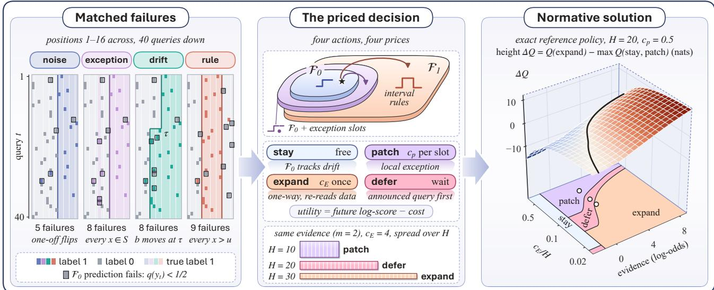  
Figure 1. The Structural Revision Environment and its normative solution. Left: four episodes, one per class, that share one query schedule and one set of label flips; framed squares mark the observations that the current family fails to predict. S is the exception set, b the threshold, τ the change point and u the upper end of the interval. Middle: the nested hypothesis spaces, the four actions with their prices, and the optimal action for one history with two anomalous inputs at cE = 4 and three horizons. Right: the expansion advantage $\Delta Q ^ { * }$ as a surface over the reference’s belief in the richer family (its posterior log-odds) and amortized price $( H = 2 0 , c _ { p } = 0 . 5 )$ , above the regions of the optimal action; the dark line is $\Delta Q ^ { * } = 0$ , and the three dots are the three horizons of the middle panel at their amortized prices.

Evidence also leaves open whether a local repair suffices. An exception list can absorb any number of deviations, but its length grows with every new anomalous input, while a rule that explains them all has constant length and predicts the anomalies still to come. The problem is therefore a sequential decision over when richer inference is worth invoking, and over which kind of revision the evidence supports.

To separate structural evidence from the value of expansion, we introduce the Structural Revision Environment (SRE), a controlled generative environment in which matched prediction failures arise from noise, local exceptions, withinfamily change, or structure outside the current family. The environment varies these sources of failure independently of the cost and future value of richer inference, and it admits exact Bayesian calculations and an exact normative solution of the one-shot revision decision.

Its solution is a normative phase diagram that specifies when revision is worth its cost, and the reference against which we evaluate Transformers trained from scratch and pretrained language models on three questions: whether they revise in response to evidence of structure or to surprise, whether their decisions follow the value of expansion, meaning the price of computation and the remaining horizon, and whether the alternatives that eventually dominate were already influencing predictions before revision.

The phase diagram gives a first result on its own: revision is a value boundary and not an evidence threshold. One history has different optimal actions under different prices, horizons and announced queries; belief in the richer family crosses long before the decision does; and the boundary between local repair and expansion is set by the inputs a rule would predict and a repair cannot cover, so that a wider region moves the boundary while the number of anomalies does not. Transformers trained in the environment reproduce this boundary from utility alone, without action labels and without the posterior, so the boundary is learnable without exact inference. Pretrained language models break the chain at a definite point. Their predictions carry a failuresensitive signal, with the shape of a learner that explains the failures inside its current family, and their decisions do not reflect it: with the history alone the decision is constant, at states where the reference expands and the models’ own predictions have already moved. With the gain of expanding stated, they read it as a trigger reads a statistic. In the three models tested with longer reasoning, the stated gain is weighed against the price and the horizon in the reference’s proportions, and the history still does not yield an estimate of what expansion would buy. The failure thus has two parts, forming an estimate of the gain and pricing it, and what distinguishes the models is the second. Controlled post-training of the meta-trained learners separates three accounts of such entrenchment: the data move the implied prior, the objective moves the sharpness of the predictions, and neither moves the decision criterion; the lost response remains decodable and is largely recoverable.

## 2. The Revision Problem

Setting. A learner observes a stream of pairs ${ \boldsymbol { z } } _ { t } = ( x _ { t } , y _ { t } )$ Before each label is revealed it outputs a predictive distribution $q _ { t } ( \cdot \mid x _ { t } , z _ { < t } )$ and receives the log score log $q _ { t } ( y _ { t } )$ Its predictions come from a current family ${ \mathcal { F } } _ { 0 } .$ . A richer family $\mathcal { F } _ { 1 } \supset \mathcal { F } _ { 0 }$ exists, and running inference over it costs computation. At every step the learner knows the remaining horizon $H _ { t }$ and the prices of the structural actions defined below. Its utility over an episode of length T is

$$
\mathcal { U } = \sum _ { t \leq T } \log { q _ { t } ( y _ { t } ) } ~ - ~ c _ { p } n _ { \mathrm { p a t c h } } ~ - ~ c _ { E } { \bf 1 } [ \mathrm { e x p a n d e d } ] .
$$

From failure to revision. A prediction failure is the first link of a chain, and the revision decision depends on keeping the links apart. Whether the family is inadequate is a latent property of the process, its misspecification (Appendix A), fixed within an episode and never observed. What the learner observes is surprise; what it can extract from the history is evidence that the family is inadequate; what it must estimate before acting is the value of acting on that evidence.

quantity definition   
when it grows   
Shannon surprise $\begin{array} { r l r } { S _ { t } } & { { } } & { - \log q _ { t } ( y _ { t } \mid x _ { t } ) } \end{array}$   
Whenever an improbable label arrives, including under a correct   
family   
Structural evidence $E _ { t }$ $\textstyle \sum _ { s \leq t }$ log $U \big ( y _ { s } \mid x _ { s } , z _ { < s } \big )$   
$- \operatorname* { s u p } _ { h \in \mathcal { F } _ { 0 } } \log p _ { h } ( z _ { \leq t } )$   
When the residuals of $\mathcal { F } _ { 0 }$ are compressible   
Value of expansion $Q ^ { * } ( s _ { t } , \mathrm { e x p a n d } )$   
$\Delta Q ^ { * } ( s _ { t } )$ maxa̸=expand $Q ^ { * } ( s _ { t } , a )$   
With the horizon and the loss $\mathcal { F } _ { 0 }$ would keep paying; it falls   
with the price

Here U is a catch-all predictor that commits to no family: it keeps a smoothed count of the labels seen at each input. $E _ { t }$ is the cumulative log-likelihood ratio between U and the best hypothesis in $\mathcal { F } _ { 0 }$ . When $\mathcal { F } _ { 0 }$ is correct, $e ^ { E _ { t } }$ is dominated by a nonnegative martingale, so $\begin{array} { r } { \operatorname* { P r } ( \exists t : E _ { t } \geq \log \frac { 1 } { \alpha } ) \leq \alpha ; } \end{array}$ when it is misspecified, $E _ { t }$ grows linearly.

Actions. Before each prediction the learner may change what it predicts with. The four actions, stay, patch, expand and defer, and their prices are shown in the middle panel of Figure 1. The predictor for $\mathcal { F } _ { 0 }$ carries a change-point prior, so a failure that is persistent and spread over many inputs can remain inside the family, and the response to it is stay. Expansion is absorbing, which makes its timing an optimal stopping problem. A state is a defer state when waiting is worth more than committing to any action now and than never revising (Appendix C).

The normative problem. The information state $s _ { t }$ contains the history, the prices, the remaining horizon and any announced queries. The optimal values satisfy

$$
\begin{array} { c } { { Q ^ { \ast } ( s _ { t } , a ) = - C ( a ) + \mathbb { E } \big [ \ell _ { t + 1 } + V ^ { \ast } ( s _ { t + 1 } ) \mid s _ { t } , a \big ] , } } \\ { { V ^ { \ast } ( s ) = \displaystyle \operatorname* { m a x } _ { a } Q ^ { \ast } ( s , a ) , } } \end{array}
$$

with $\ell _ { t + 1 }$ the next log score. The value of expansion is the expansion advantage $\Delta Q ^ { * } ( s ) ~ = ~ Q ^ { * } ( s , \mathrm { e x p a n d } ) ~ - ~$ maxa̸=expand $Q ^ { * } ( s , a )$ , and expansion is optimal exactly when $\Delta Q ^ { * } ( s ) > 0$ . A one-step comparison gives the shape of the boundary. Let $p _ { t }$ be the posterior probability that the richer family is needed, $\Delta$ the per-step loss of staying when it is needed, and δ the per-step loss of expanding when it is not. Expanding now is better than never expanding when

$$
p _ { t } > \frac { c _ { E } / H + \delta } { \Delta + \delta } .
$$

The price enters through $c _ { E } / H _ { ; }$ , the amortized price. The natural coordinates of the problem are therefore structural evidence and amortized price. When $c _ { E } ~ = ~ 0$ and both families are evaluated at every step, the optimal predictor is the Bayesian model average and no decision remains. The revision problem begins where $c _ { E } > 0$

Active set. The computation of a neural learner is not observable, so we define its active set by influence on predictions. Take a family $F ,$ a probe input $x ^ { * }$ with label $y _ { F } ^ { * }$ at which F and the current active set $\boldsymbol { A } _ { t }$ predict differently, and two histories D and $D ^ { \prime }$ that have the same likelihood under every hypothesis in $\boldsymbol { A } _ { t }$ and differ in their evidence for $F .$ Define

$$
\displaystyle \begin{array} { c } { \kappa _ { F } ( t ) = \frac { \mathrm { l o g i t } q ( y _ { F } ^ { * } \mid x ^ { * } , D ) - \mathrm { l o g i t } q ( y _ { F } ^ { * } \mid x ^ { * } , D ^ { \prime } ) } { \mathrm { l o g i t } p ^ { \mathrm { B } } ( y _ { F } ^ { * } \mid x ^ { * } , D ) - \mathrm { l o g i t } p ^ { \mathrm { B } } ( y _ { F } ^ { * } \mid x ^ { * } , D ^ { \prime } ) } , } \\ { \mathcal { A } _ { t } = \{ F : \kappa _ { F } ( t ) > \frac { 1 } { 2 } \} , } \end{array}
$$

where $p ^ { \mathrm { B } }$ is the Bayes predictive under the generative prior. A learner with $\kappa _ { F }$ near 1 throughout is averaging over $F$ from the first observation. A Bayes predictor that gives F a smaller prior $\pi$ has a curve $\kappa ( m ; \pi )$ of its own, where m is the number of distinct inputs at which reproducible anomalies have been observed; it starts below 1 and rises as evidence for $F$ accumulates. We therefore read the curve of a learner against this family of curves indexed by the prior. A learner that follows one of them is averaging under that prior. A learner whose curve is flat and below 1 at every level of evidence gives structural evidence less weight than any Bayes predictor does. A learner that stays below every curve able to account for its later behaviour, and then rises, has expanded its active set: $F$ was absent from its computation. A family that is computed and gated out and a family that is never computed both give $\kappa _ { F } \approx 0 ;$ ; the probes of Section 5.4 separate them.

## 3. Structural Revision Environment

The Structural Revision Environment (SRE) instantiates the revision problem in a generative process small enough for the posterior to be computed exactly and the one-shot decision to be solved exactly.

Generative process. Inputs are 16 ordered positions and labels are binary. In every episode each label is flipped independently with probability $\varepsilon = 0 . 0 8$ . The current family $\mathcal { F } _ { 0 }$ contains the threshold rules $y = \mathbf { 1 } [ x \geq b ]$ . The richer family $\mathcal { F } _ { 1 }$ contains the interval rules $y = \mathbf { 1 } [ l \leq x \leq u ]$ Each episode belongs to one of four classes, and the class is never shown to the learner.

<table><tr><td>class</td><td>mechanism</td></tr><tr><td>what it isolates</td><td></td></tr><tr><td>noise</td><td>A threshold rule. Failures come from label flips alone</td></tr><tr><td></td><td>Failures that do not reproduce. A repeated query returns the expected label, and any revision is wasted</td></tr><tr><td></td><td>exception A threshold rule with one or two inputs whose label is inverted</td></tr><tr><td>suffices, and expansion buys nothing more</td><td>Failures that reproduce and do not generalize. One slot per input</td></tr><tr><td>drift</td><td>The threshold moves once during the episode</td></tr><tr><td></td><td>Failures that persist and spread over many inputs while the</td></tr><tr><td>process stays inside  $\mathcal { F } _ { 0 }$ </td><td></td></tr><tr><td>rule</td><td>An interval rule Failures that reproduce and generalize. Every input above u conflicts with every threshold, including inputs not yet queried</td></tr></table>

Seen from $\mathcal { F } _ { 0 }$ , a rule episode is an exception episode whose exceptions share one description of constant length.

Matched failures. At each step the query repeats an earlier input with probability $r = 0 . 3 5$ and is a new input otherwise. The schedule is drawn independently of the class and the four classes share one noise process, so the same number and placement of failures arise under each of them (Figure 1, left). The next query is announced one step ahead. An announced query on which the competing explanations disagree makes waiting valuable, and one on which they agree makes it worthless, with the history held fixed.

Predictors and prices. The learner predicts with one of three exact Bayesian predictors. $E _ { 0 }$ is the predictive under $\mathcal { F } _ { 0 }$ with a change-point prior. $E _ { P }$ adds exception slots to $E _ { 0 }$ , each patched input receiving its own Beta-Bernoulli parameter. $E _ { 1 }$ is the predictive under the full generative model and re-reads the whole history when it is switched on. $\mathbf { A }$ patch costs $c _ { p }$ per slot and expansion costs $c _ { E }$ once. The prices, the horizon and the announced query vary independently of the history. Structural actions change which predictor is scored and what is paid, and leave the queries and labels that follow unchanged.

Two protocols. In the sequential protocol the learner acts at every step of a 40-step episode. In the one-shot protocol a history prefix is fixed and the learner makes a single choice among stay, patch, expand and defer, where defer pays $c _ { o }$ to see the label of the announced query before committing. The one-shot protocol presents one history under different prices, horizons and announced queries, and the value of every action is exact.

Reference policies. The latent state, which consists of the class, the rule parameters, the exception set and the change point, takes 7,352 values, and the posterior is enumerated exactly. The reference policy maximizes expected utility under this posterior. It holds the same information as the learner and does not know the class of the episode. It is exact in the one-shot protocol. In the sequential protocol it is a two-step lookahead with a continuation that may expand or patch later (Appendix B); on horizons short enough for exact dynamic programming it comes within 0.002 to 0.015 nats per episode of the optimum and takes the op timal action in 98.5% to 99.9% of the decision states. A second reference, the bounded reference policy, is restricted to statistics available without running $\mathcal { F } _ { 1 } \colon$ the number of distinct inputs queried, the numbers of reproducible and non-reproducible anomalies, and consistency with a refit inside $\mathcal { F } _ { 0 }$ . It measures how much of the expansion decision can be made before expanding. Two triggers serve as baselines: the e-process trigger expands when the catch-all evidence $E _ { t }$ crosses a threshold, fixed once or tuned in each price cell, and the surprise trigger reads $S _ { t }$ instead.

The normative solution. Solving SRE gives the phase diagram of Figure 1 (right) and two facts about the decision. The evidence axis of Figure 1 is the reference’s belief in the richer family, its posterior log-odds of the rule class; the structural evidence $E _ { t }$ of Section 2 is the counterpart that needs no $\mathcal { F } _ { 1 }$ , and the triggers read it.

One history, several optimal actions. Consider a history in which a threshold at 4 fits every observation except two anomalous labels at input 15, with input 16 never queried. The posterior gives the rule class 0.71 and the exception class 0.21. At $c _ { E } = 4$ and $H = 3 0$ , if the announced query is input 16, where the interval and the exception disagree, the optimal action is to wait, and waiting is worth 0.33 nats over the best immediate commitment. If the announced query is input 2, on which all hypotheses agree, the value of waiting is exactly zero and the optimal action is to expand. With the announcement fixed, raising $c _ { E }$ from 0.5 to 16 moves the optimal action from expand through defer to patch, and raising H from 5 to 40 moves it from patch to defer. A policy that reads only the history returns one action in all of these cases.

The decision boundary follows the amortized price difference. In SRE the belief crossing is $m _ { B } ^ { * } = 0 . 5 \colon$ one reproducible anomaly at the top end already makes the interval more probable than a single exception. The decision asks for more. When the announced query is uninformative, expansion is optimal up to an amortized price difference ${ ( c _ { E } - c _ { p } ) / H }$ of 0.20 with two distinct anomalous inputs and 0.56 with five, and in this variable the boundaries for $H = 1 0 , 2 0 , 3 0$ agree to within a few hundredths. The steps follow from the patch-or-expand comparison of Appendix C: a slot covers one input, the inferred interval covers the anomalous inputs and the unqueried inputs between them, and each input left uncovered costs the patched predictor a fixed loss per step, which reproduces the boundaries within a few hundredths. The number of anomalous inputs enters only through the region it implies. With two anomalous inputs at the two ends of a region and the inputs between them never queried, the boundary rises from 0.14 for a region of two inputs to 0.68 for a region of five. The same comparison places the boundary within a few percent of its solved position in two further description languages (Appendix E).

## 4. Learners and Measurements

Transformers trained from scratch. Small Transformers are trained on episodes drawn from SRE, so their training distribution is known exactly. An implicit learner predicts the next label and takes no structural action. We train it under three conditions that differ only in the base rate of rule episodes. With the base rate of the generative process (0.25), the richer family is present throughout training, and the learner is the case in which every alternative is already available. With a base rate of 0.02 the richer family is rare, and the learner shows how much lateness a small prior alone produces. An explicit learner chooses a structural action at every step, and the exact predictors of Section 3 produce the predictions. Its errors are therefore errors of decision. It reads the observations, the announced query, the prices and the remaining horizon. We train it either to imitate the reference policy or to maximize utility directly, which the exogeneity of the observations makes exact. A diagnostic variant also receives the posterior of the reference policy and has only the decision left to learn. The gap between the two variants is the cost of forming the evidence.

Language models. We use lineages that release a checkpoint after every stage of post-training: OLMo 3 with its base model, supervised fine-tuning, preference tuning and reinforcement learning with verifiable rewards, and Tulu¨ 3, which applies the same sequence of stages to Llama 3.1. In the explicit protocol the model receives a history, the prices, the remaining horizon and the announced query, and the probabilities of the four actions are read from the logprobabilities of their continuations. The prompt is given at three levels of input, the history level, the failure level and the gain level. The first contains these alone. The second marks the observations on which the current predictor failed, which removes failure localization from the task. The third states the expected gain per remaining round from expanding now, so that only the valuation against the horizon and the prices is left. In the implicit protocol the models predict the labels of the rendered episode, and their predictions are read as those of the small learners (Appendix M).

Regret. Every learner is scored on the same episodes as the reference policy, and its regret is the difference in utility on each episode.

Decision regression. Every learner and baseline is read on one set of states, every prefix of the evaluation episodes crossed with every price cell and episode length, by a logistic regression of its expansion decision on the reference’s own quantities: the benefit of expanding per remaining round, the horizon, the effective price and the surprise of the last observation. The reference expands when the benefit exceeds the effective price, so its coefficients on the three value terms are equal and its coefficient on surprise is zero. We report each learner by the direction of its coefficient vector, the weight on the benefit against the weight on the price, with the weight on surprise as a halo (Figure 2), and, where its response to the benefit is identified (Appendix Q), by the ratios of its price and horizon coefficients to its benefit coefficient, its price sensitivity and horizon sensitivity, which are 1 for the reference, and by its surprise coefficient in the same units, its surprise leakage, which is 0. The identification rests on histories built in pairs (Appendix D).

Readouts without actions. κ gives the size of the response to structural evidence, and a second readout gives its shape. A Bayes predictor confines the response to the inputs above u, with a step at u that a small prior lowers and does not remove. Two further readouts, the calibration slope of the predictions relative to the Bayes predictor and the surprise leakage of the prediction updates, are defined in Appendix G.

## 5. Results

## 5.1. Learners trained in the environment reproduce the value boundary

Explicit learners trained in SRE lose 0.04 to 0.09 nats per episode to the reference policy over the grid of prices and horizons. The bounded reference loses 0.24, the e-process trigger tuned anew in every cell 0.42, and the same trigger with one threshold 1.19 (Appendix H, Table 1). The bounded reference has price sensitivity 1.00 and horizon sensitivity 1.03: count statistics suffice to follow the value of expansion, and what it loses against the reference, it loses in evidence. Within the range of prices seen in training, price sensitivity is 0.91 to 0.96, horizon sensitivity 0.95 to 1.07 and surprise leakage at most 0.02 (Figure 2). Utility suffices. The learner trained on utility alone never sees an action of the reference policy. It reaches a price sensitivity of 0.91 and a horizon sensitivity of 0.95, closer to the reference than any trigger. For these learners, forming the evidence is not what limits the decision (Appendix H).

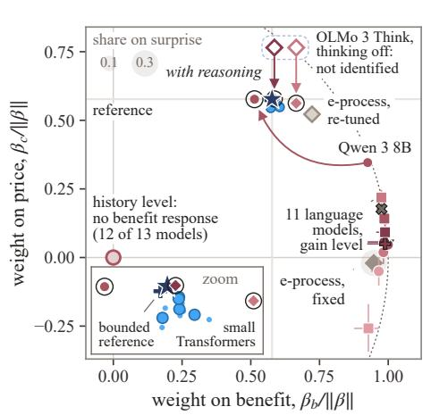

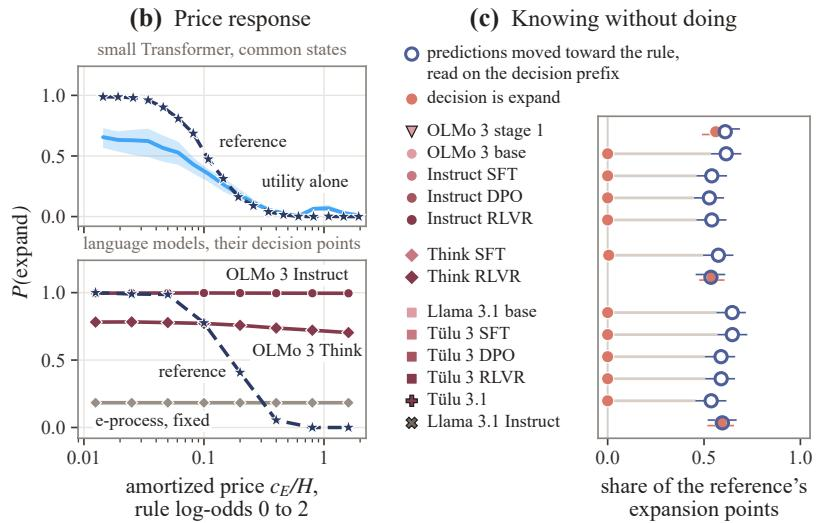  
Figure 2. Learners trained in the environment weigh the price of expanding as the reference does; language models value a stated gain only when they reason. (a) Each learner by the direction of its decision’s coefficient vector, the weight on the benefit of expanding against the weight on the price, with the weight on the surprise of the last observation as a halo: the meta-trained Transformers (five regimes, three seeds each) and the bounded reference lie on the reference (zoom); at the gain level, eleven language models lie in the fixed-threshold corner with the e-process trigger, and the two 7B OLMo 3 Think models respond to the gain, the price and the rounds left by a few hundredths each, too little for their proportion to be identified (open markers in a frame, without a position; Appendix Q); with reasoning (ringed, with an arrow from each model’s thinking-off state: Qwen 3 8B at its own close, OLMo 3 Think and Think SFT at 8,192 tokens) the three models move onto the reference’s direction while their slopes grow by an order of magnitude; at the history level, twelve of thirteen models do not respond to the benefit. (b) The probability of expanding against the amortized price at rule log-odds 0 to 2: the Transformer trained on utility alone (mean over three seeds, band the range) falls with the price as the reference does, and the fixed trigger, OLMo 3 Instruct and OLMo 3 Think are nearly flat. (c) At the decision points where the reference expands, the share at which each language model’s label predictions, read on the decision-context prefix, have moved toward the rule, and the share at which its decision on that prefix is expand, with 95% intervals.

## 5.2. Language models decide without the evidence

At the history level, the decision is constant. In the four stages of OLMo 3 Instruct the probability of expanding differs between the four classes by at most 0.01, it is the same on a rule history and on its matched threshold history, and the coefficient on the benefit of expanding is zero; the probability of deferring is the same whether the announced query separates the competing explanations or not. The other lineages and stages behave in the same way, and the null response is robust across renderings and action orders, with small exceptions detailed in Appendix M. Marking the failures in the prompt, the failure level, leaves the decision constant as well: the response to the benefit stays below 0.02 in every model. Stating the generative process in full, the four kinds of machine with their base rates and the families the two predictors assume, raises the probability of expanding in several models and produces no positive response to a rule history over its matched threshold history (Appendix M.1).

Afailure-sensitive signal is present in the predictions, and the decision does not reflect it. On the same prefixes, the readout of Section 5.3 shows the predictions responding to the failures, and the dissociation holds within one context. Read on the same decision-context prefix, with the decision cue replaced by a label question, the predictions have moved toward the labels the interval rule predicts at 0.53 to 0.65 of the points where the reference expands, in every model, while the decision on that prefix is expand at none of them in ten of the thirteen models and at a share that does not follow the prediction in the other three (Figure 2c, Appendix M.1). Neither the specification of the task nor the context of the read-out accounts for the constant decision.

With the gain stated, it is read on its own; with room to reason, it is weighed. When the expected gain per round from expanding now is written into the prompt, the probability of expanding rises with it in every model. In eleven of them it depends on neither the price nor the rounds left: price sensitivity lies between −0.28 and 0.22 and horizon sensitivity between −0.29 and 0.13, where a rule that multiplies the stated gain by the rounds left and compares it with the position relative to the rule’s region, x − u

step at the boundary (log-odds)

(A) Size of the response  
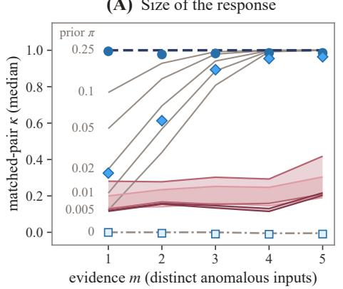  
Bayes predictor, prior π  
π = 0.25 (generative prior)  
Small Transformer

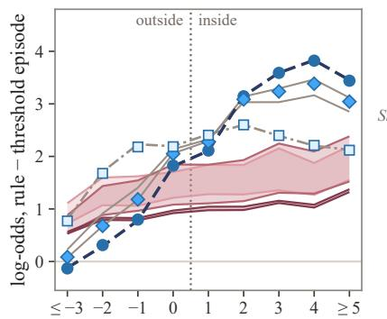  
C trained with rule base rate 0.25  
(B) Shape of the response  
0 < π < 0.25  
Language models, eight threshold-episode demonstrations

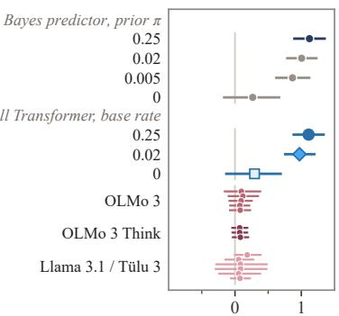  
trained with rule base rate 0.02  
OLMo 3: stage 1, base, Instruct SFT, DPO, RLVR  
π = 0  
OLMo 3 Think: SFT, DPO, RLVR  
□ trained with rule base rate 0  
Llama 3.1 / Tülu 3: base, Tülu 3 SFT, DPO, RLVR, Tülu 3.1, Instruct

Figure 3. What responds to a failure. (A) Matched-pair κ, the share of the Bayes shift toward the interval rule that a learner’s predictions make on a rule episode relative to its matched threshold episode, against the number of distinct anomalous inputs. Thin lines: Bayes predictors indexed by their prior on the rule class. The three meta-trained Transformers lie near the members with their training base rates. Bands: the 14 language models of three lineages, each model the mean over three renderings, each band the range within a lineage, with eight threshold-episode demonstrations in the context. (B) The shift in log-odds between a rule episode and its matched threshold episode at inputs placed by their distance from the end of the rule’s region, on 110 matched pairs. Right: the step at the boundary, the coefficient of 1[x > u] in a regression of the shift on $u - 2 \leq x \leq u + 3 ,$ , with 95% bootstrap intervals over episodes, one row per model.

price scores 0.95 and 1.02 on the same points. On the map of Figure 2 these models fall in the corner of the triggers with a fixed threshold: a response to one number, without valuation. The two models of the OLMo 3 Think lineage expand on nearly every point, with responses to the gain, the price and the rounds left of a few hundredths each, too small for their proportion to be identified (Appendix Q). Three models were allowed to reason before answering, Qwen 3 8B to its own close and the two OLMo 3 Think models for 8,192 tokens. All three then weigh the stated gain against the price and the rounds left in the reference’s proportions, with price sensitivities of 1.12, 0.99 and 0.85 and horizon sensitivities of 1.24, 0.97 and 0.74, and their responses grow by an order of magnitude. At the history level, reasoning moves probability on rule histories toward patching and deferring, raises the probability of expanding over the matched counterfactual by at most 0.06, and does not make it follow the price: the history is not turned into an estimate of what expansion would buy (Appendix Q).

## 5.3. What responds to a failure

Language models respond with a fraction of the Bayes shift at every level of evidence. In all 14 models of the three lineages (Figure 3, left), κ with three anomalous inputs lies between 0.09 and 0.43, where every Bayes predictor with a positive prior is above 0.80, and none of the 126 curves follows a member of the family indexed by the prior, so the weak response is not the response of a learner that holds the richer family with a small prior.

The response has the shape of a learner without the richer family. A Bayes predictor that holds the richer family confines its response to the inputs that the rule covers: at the upper end of the interval its log-odds step by about one unit for any prior from 0.005 to 0.25, and at inputs far outside the region the rule episode and its matched threshold episode are predicted alike. The meta-trained learners step like the Bayes predictors of their priors. A Bayes predictor with a prior of zero also responds to the anomalies, and strongly. It explains them inside the current family, by a threshold that has moved, so its response has no step, crosses the end of the region and persists far outside it. The learner that never saw a rule does the same. The language models show no step, with every interval including zero, and they shift their predictions at inputs far outside the region by 0.5 to 2.6 in log-odds (Figure 3, right). They differ from the predictor with a prior of zero in one respect. That predictor responds to the presence of anomalies and not to their arrangement, so its κ is zero, and theirs is positive. With and without demonstrations in the context the response has no step and reaches outside the region (Appendix G): the models respond to the failures and not to the rule that would explain them. Their surprise leakage is 0.10 to 0.19, against at most 0.02 for any Bayes predictor with a misspecified prior.

Stages. No stage of post-training changes the shape of the response, and reinforcement learning with verifiable rewards changes none of the readouts in the three chains (Appendix G).

## 5.4. Post-training moves the prior and the sharpness, and neither moves the criterion

We post-trained the meta-trained learners for 20,000 steps in a two-by-two design. The data either kept rule episodes at the generative base rate or removed them, and the objective was either the log score or the expected 0/1 reward, which pays the probability placed on the observed label and is maximized by predictions at the extremes. Readouts are taken against the Bayes predictor of the prior the learner holds after post-training, with κ computed so that a sharpening of the predictions cannot enter it (Appendix I).

The data set the prior. Removing rule episodes lowers the implied base rate of the richer family from 0.25 to 10−7.4, nearly seven decades in 20,000 steps, and the objective leaves it unchanged (Appendix I). The learner trained without rules lifts, that is, its κ crosses one half, seven steps later than the Bayes predictor of the generative prior and no later than the Bayes predictor of the prior it now holds, and its κ stays on that predictor’s curve, within 0.03 at one, three and five anomalous inputs. Its lateness is a prior.

The objective sets the sharpness. The reward objective multiplies the scale of the log-odds by eight to ten and leaves the base rate where it was. With rule episodes in the data, the response to evidence is unchanged once the sharpening is removed, and lifts come 0.2 steps earlier than under the learner’s own prior. On rule-free data the reward objective lifts κ above the curve of the collapsed prior by 0.16 at the first anomalous input, and lifts come 0.7 steps earlier. The signal remains decodable and the behavior is largely recoverable. The rule log-odds remain decodable from the residual stream after both changes, so what posttraining removes from the behavior it does not remove from the representation (Li et al., 2026). Two thousand steps of the original data and objective, a tenth of the post-training, bring the prior, the κ curve and the latency back within 200 to 600 steps.

No criterion shift. Entrenchment as a shifted criterion, a lift later than the learner’s own prior predicts with the evidence still decodable, did not appear under either the data or the objective.

## 6. Related Work

The value of computation. Rational metareasoning treats computation as an action chosen for its expected value (Russell & Wefald, 1991; Poh & Horvitz, 1993; De Sabbata et al., 2024). Hammar et al. (2026) cast self-refinement as optimal stopping and obtain a threshold that does not depend on the remaining rounds, and reasoning models respond weakly to point values when they allocate a shared token budget (Fan et al., 2026). In these works computation improves the output of a fixed model. Our costly action changes which hypothesis family is available, and its return accrues over the remaining horizon. Jhawar & Wang (2026) bound the error of any selector of an adaptation action when the evidence has the same law under deployments with different best actions, with a reference action that knows the deployment. Our reference policies hold the information of the learner.

Creating and expanding hypotheses. In nonparametric accounts of latent causes, creating a new cause is part of posterior inference (Gershman et al., 2010; Collins & Frank, 2013). Liakoni et al. (2021) show that exact inference under change points mixes integration and reset at a rate set by the Bayes Factor Surprise. PROBE (Collins & Koechlin, 2012) stays with the current task set, switches to a monitored one, or creates a new one, and it estimates the probability that no task set applies against a random-behavior alternative, the precursor of our catch-all predictor. Its creation criterion is a fixed satisficing threshold. Systems that enlarge a hypothesis pool likewise act when a statistic of fit crosses a fixed threshold, such as a per-form likelihood (Paramore, 2026) or a median residual (Murphy, 2026), or when a goal cannot be reached under the current model (Xiao et al., 2026). We implement fixed-threshold triggers as baselines and measure what they lose as price and horizon vary. The distinction between inference within a framework, local repair of the framework and replacement of its basis is familiar from the history of science (Kuhn, 1962; Lakatos, 1970; Gelman & Shalizi, 2013); Appendix P gives its computational reading.

## 7. Discussion

Detection and decision are separable, and the learners separate them. The reference policy expands when the inputs that a rule predicts and a repair cannot cover would lose more over the remaining horizon than the difference in price: a value boundary, not an evidence threshold. Transformers trained in the environment reproduce this decision from utility alone, without labels and without the posterior, so nothing in the decision requires the evidence to be formed by an exact inference. The language models show the two abilities apart. Their predictions move toward the anomalies at every stage, with the shape of a learner that explains them inside the current family, and their decisions at the history level do not follow the evidence that moves their predictions. When the gain of expanding is stated, the models respond to it as a trigger responds to a statistic, and the three models given room to reason weigh it as the reference does. What reasoning supplies is valuation, the second half of the decision; it produces a local response to the history and does not turn the history into a price-sensitive estimate of what expansion would buy. The first half, turning failures into that estimate, is the part that the environment measures and that none of the models performs, with or without reasoning.

## Impact Statement

This work studies how in-context learners decide when to revise their hypothesis space, using a small synthetic environment, small models trained from scratch and publicly released language models. Its findings concern the measurement of decision making under computational cost and carry no direct societal risk beyond those of the models studied.

## References

Albert, A. and Anderson, J. A. On the existence of maximum likelihood estimates in logistic regression models. Biometrika, 71(1):1–10, 1984. doi: 10.1093/biomet/71.1. 1.

Arora, A., Jurafsky, D., Potts, C., and Goodman, N. D. Bayesian scaling laws for in-context learning. In Conference on Language Modeling (COLM), 2025.

Bai, Y., Chen, F., Wang, H., Xiong, C., and Mei, S. Transformers as statisticians: Provable in-context learning with in-context algorithm selection. In Advances in Neural Information Processing Systems, 2023.

Chadha, A. Beyond the clock: Measuring the value of adaptive revision. arXiv preprint arXiv:2609.00874, 2026.

Collins, A. and Koechlin, E. Reasoning, learning, and creativity: Frontal lobe function and human decisionmaking. PLoS Biology, 10(3):e1001293, 2012. doi: 10. 1371/journal.pbio.1001293.

Collins, A. G. E. and Frank, M. J. Cognitive control over learning: Creating, clustering, and generalizing task-set structure. Psychological Review, 120(1):190–229, 2013. doi: 10.1037/a0030852.

Dawid, A. P. Present position and potential developments: Some personal views. Statistical theory: The prequential approach. Journal of the Royal Statistical Society: Series A, 147(2):278–292, 1984. doi: 10.2307/2981683.

De Sabbata, C. N., Sumers, T. R., AlKhamissi, B., Bosselut, A., and Griffiths, T. L. Rational metareasoning for large language models. arXiv preprint arXiv:2410.05563, 2024.

Dudley, C., Bi, Y., Liu, X., and Oymak, S. Incontext learning under regime change. arXiv preprint arXiv:2604.16988, 2026.

Fan, C., Cheng, Y., Li, M., Liang, Y., Zhou, T., and Feizi, S. Thinking hard, not smart: Reasoning models fail to ration test-time compute across questions. arXiv preprint arXiv:2608.07968, 2026.

Gelman, A. and Shalizi, C. R. Philosophy and the practice of Bayesian statistics. British Journal ofMathematical and Statistical Psychology, 66(1):8–38, 2013. doi: 10. 1111/j.2044-8317.2011.02037.x.

Gershman, S. J., Blei, D. M., and Niv, Y. Context, learning, and extinction. Psychological Review, 117(1):197–209, 2010. doi: 10.1037/a0017808.

Gneiting, T. and Raftery, A. E. Strictly proper scoring rules, prediction, and estimation. Journal of the American Statistical Association, 102(477):359–378, 2007. doi: 10.1198/016214506000001437.

Grunwald, P. D. ¨ The Minimum Description Length Principle. MIT Press, 2007.

Gupta, R., Corona, R., Ge, J., Wang, E., Klein, D., Darrell, T., and Chan, D. M. Enough coin flips can make LLMs act Bayesian. In Proceedings ofthe 63rd Annual Meeting of the Association for Computational Linguistics (Volume 1: Long Papers), pp. 7634–7655, 2025. URL https: //aclanthology.org/2025.acl-long.377/.

Hammar, K., Alpcan, T., and Lupu, E. C. Optimal stopping of self-refining foundation models. In IEEE Conference on Decision and Control (CDC), 2026.

Howard, R. A. Information value theory. IEEE Transactions on Systems Science and Cybernetics, 2(1):22–26, 1966.

Jhawar, K. and Wang, L. When is test-time adaptation identifiable from unlabeled evidence? arXiv preprint arXiv:2609.11235, 2026.

Kaplan, E. L. and Meier, P. Nonparametric estimation from incomplete observations. Journal of the American Statistical Association, 53(282):457–481, 1958. doi: 10.1080/01621459.1958.10501452.

Kashani Motlagh, N., Anderson, T., Gwinnup, J., and Erdmann, G. Return or revise? Learning when revision helps retrieval-augmented QA. arXiv preprint arXiv:2609.30087, 2026.

Kaufmann, E., Cappe, O., and Garivier, A. On the com-´ plexity of best-arm identification in multi-armed bandit models. Journal ofMachine Learning Research, 17(1): 1–42, 2016.

Krichevsky, R. E. and Trofimov, V. K. The performance of universal encoding. IEEE Transactions on Information Theory, 27(2):199–207, 1981.

Kuhn, T. S. The Structure ofScientific Revolutions. University of Chicago Press, 1962.

Lakatos, I. Falsification and the methodology of scientific research programmes. In Lakatos, I. and Musgrave, A. (eds.), Criticism and the Growth ofKnowledge, pp. 91– 196. Cambridge University Press, 1970. doi: 10.1017/ CBO9781139171434.009.

Li, A. P. and Kim, K. Measuring the value of world-model updates: A counterfactual utility protocol for continual adaptation. arXiv preprint arXiv:2609.10954, 2026.

Li, W., Zheng, T., Wu, J., and Chen, X. Erased, rerouted, or rescaled? Post-training and the causal quotient of a language model’s belief state. arXiv preprint arXiv:2610.05292, 2026.

Liakoni, V., Modirshanechi, A., Gerstner, W., and Brea, J. Learning in volatile environments with the Bayes factor surprise. Neural Computation, 33(2):269–340, 2021. doi: 10.1162/neco a 01352.

Longstaff, F. A. and Schwartz, E. S. Valuing American options by simulation: A simple least-squares approach. The Review of Financial Studies, 14(1):113–147, 2001. doi: 10.1093/rfs/14.1.113.

Murphy, K. Model discovery agent: LLM-assisted Bayesian experiment design for data-efficient discovery of mechanistic world models. arXiv preprint arXiv:2608.09696, 2026.

Nguyen, J. Measuring the assistant’s harmlessness preferences on the user turn. arXiv preprint arXiv:2609.23935, 2026.

Paramore, J. C. Learning latent representations with progressive hypothesis space expansion. In Proceedings of the Society for Computation in Linguistics (SCiL) 2026, pp. 47–56, 2026. doi: 10.18653/v1/2026.scil-main.5.

Poh, K. L. and Horvitz, E. J. Reasoning about the value of decision-model refinement: Methods and application. In Proceedings ofthe Ninth Conference on Uncertainty in Artificial Intelligence (UAI), pp. 174–182, 1993. doi: 10.1016/B978-1-4832-1451-1.50026-3.

Ramdas, A., Grunwald, P., Vovk, V., and Shafer, G. Game-¨ theoretic statistics and safe anytime-valid inference. Statistical Science, 38(4), 2023. doi: 10.1214/23-STS894.

Raventos, A., Paul, M., Chen, F., and Ganguli, S. Pretraining´ task diversity and the emergence of non-Bayesian incontext learning for regression. In Advances in Neural Information Processing Systems, 2023.

Rissanen, J. Modeling by shortest data description. Automatica, 14(5):465–471, 1978. doi: 10.1016/0005-1098(78) 90005-5.

Russell, S. and Wefald, E. Principles of metareasoning. Artificial Intelligence, 49(1-3):361–395, 1991. doi: 10. 1016/0004-3702(91)90015-C.

Schwarz, G. Estimating the dimension of a model. The Annals ofStatistics, 6(2):461–464, 1978. doi: 10.1214/ aos/1176344136.

Shafer, G., Shen, A., Vereshchagin, N., and Vovk, V. Test martingales, Bayes factors and p-values. Statistical Science, 26(1):84–101, 2011. doi: 10.1214/10-STS347.

Topkis, D. M. Supermodularity and Complementarity. Princeton University Press, 1998.

Tsitsiklis, J. N. and Van Roy, B. Regression methods for pricing complex American-style options. IEEE Transactions on Neural Networks, 12(4):694–703, 2001.

van Erven, T., Grunwald, P., and de Rooij, S. Catching¨ up faster by switching sooner: a predictive approach to adaptive estimation with an application to the AIC–BIC dilemma. Journal ofthe Royal Statistical Society: Series B, 74(3):361–417, 2012. doi: 10.1111/j.1467-9868.2011. 01025.x.

Ville, J. Etude critique de la notion de collectif ´ . Gauthier-Villars, Paris, 1939.

White, H. Maximum likelihood estimation of misspecified models. Econometrica, 50(1):1–25, 1982. doi: 10.2307/ 1912526.

Wurgaft, D., Lubana, E. S., Park, C. F., Tanaka, H., Reddy, G., and Goodman, N. D. In-context learning strategies emerge rationally. In Advances in Neural Information Processing Systems, 2025.

Xiao, A., Zhang, H., Hu, T., and Hsu, D. Hypothesis-driven model expansion under uncertainty for open-world robot planning. In Robotics: Science and Systems (RSS), 2026.

Xie, S. M., Raghunathan, A., Liang, P., and Ma, T. An explanation of in-context learning as implicit Bayesian inference. In International Conference on Learning Representations (ICLR), 2022.

Xu, H., Xu, W., Li, Z., Wang, M., Yao, Y., Wu, C., Shang, J., Gong, Y., and Deng, S. When should models change their minds? Contextual belief management in large language models. In Proceedings ofEMNLP 2026, 2026.

Ziaei, R. The limits of simulated societies: How posttraining and survey fine-tuning erase cross-cultural variance. arXiv preprint arXiv:2609.25760, 2026.

## A. The Structural Revision Environment

This appendix gives the environment of Section 3 in full: the generative process, the three predictors, the prices, the paired and designed histories, the text the language models read, and the two further worlds of Appendix E.

Generative process. An episode has $T$ steps $t = 0 , \ldots , T - 1$ over the inputs $x \in \{ 1 , \ldots , 1 6 \}$ with binary labels; $T = 4 0$ unless stated, and the remaining horizon at step t is $H _ { t } = T - t$ . The class is drawn with probabilities 0.40, 0.20, 0.15 and 0.25 for noise, exception, drift and rule, and then:

• noise: a threshold rule $y = \mathbf { 1 } [ x \geq b ]$ with b uniform on $\{ 1 , \ldots , 1 6 \}$ ;

• exception: a threshold rule whose label is inverted on a set $S ;$ every input belongs to S with probability $\rho = 0 . 0 6$ independently, conditioned on $1 \leq | S | \leq 2$ , so that $| S | = 1$ with probability 0.676 and $| S | = 2$ with probability 0.324;

• drift: the threshold moves from b to $b ^ { \prime } \neq b ,$ uniform on the other fifteen values, at a step τ uniform on $\{ \lfloor T / 4 \rfloor , \dots , \lfloor 3 T / 4 \rfloor \}$ (10 to 30 at $T = 4 0 )$ , the first step that uses $b ^ { \prime } ;$

• rule: an interval $y = \mathbf { 1 } [ l \leq x \leq u ]$ with (l, u) uniform on the 120 pairs $1 \leq l \leq u \leq 1 5$ , so that no interval equals a threshold.

In every class each observed label is flipped independently with probability $\varepsilon = 0 . 0 8 . \mathrm { ~ A ~ }$ family $\mathcal { F } _ { 0 }$ is misspecified for the process when lim inf $\begin{array} { r } { \dot { \mathbf { \Xi } } _ { t } \frac { 1 } { t } \mathbb { E } \big [ \log { p ^ { * } ( \boldsymbol { z } _ { \le t } ) } - \operatorname* { s u p } _ { h \in \mathcal { F } _ { 0 } } \log { p _ { h } ( \boldsymbol { z } _ { \le t } ) } \big ] > 0 , } \end{array}$ , a relation between the family and the process that is fixed within an episode and never observed. The latent configurations number 7,352: 16 thresholds, 5,040 drifts, 2,176 exceptions and 120 intervals; configurations of different classes with the same label table, such as an exception at $x = b$ and the threshold at $b + 1$ , are kept apart. The queries come from their own random stream, independent of the class. The first query is uniform; afterwards a query repeats a uniformly chosen input that was queried before with probability $r = 0 . 3 5$ and is otherwise a uniformly chosen input that was not, and it repeats whenever all sixteen inputs have been queried. At step t the next query $x _ { t + 1 }$ is announced.

Predictors. $E _ { 0 }$ is the exact Bayesian predictive of the noise and drift classes with their prior renormalised: a posterior over thresholds that allows one change of threshold under the generative change-point prior (a change with probability $0 . 1 5 / 0 . 5 5$ at a step uniform on the drift window). It is the current family with its change-point tracking, and it is what the learner predicts with before any structural action.

$E _ { P }$ is $E _ { 0 }$ on the inputs that are not patched, combined with an independent Beta(1,1)–Bernoulli parameter for each patched input, which predicts that input’s label from the labels observed there and nowhere else (one half before any observation). At most two inputs can be patched, each once, and $E _ { 0 }$ no longer conditions on the patched inputs.

$E _ { 1 }$ is the exact Bayesian predictive under the full generative model, all four classes and all 7,352 configurations, conditioned on the whole history at the moment it is switched on. Expansion is absorbing: from then on $E _ { 1 }$ predicts every label, and the patch slots are dropped.

Prices and cells. The expansion price $c _ { E }$ takes the values 0.5, 1, 2, 4, 8 and 16 and the patch price $c _ { p }$ the values 0.1, 0.25, 0.5, 1 and 2, with defaults 4 and 0.5; deferring costs $c _ { o } = 0 . 1$ in the one-shot protocol. In the sequential protocol the horizon varies through the episode length $T \in \{ 1 6 , 2 4 , 3 2 , 4 0 \}$ , so the price grid has $6 \times 5 \times 4 = 1 2 0$ cells. The explicit learners are trained on the cells of $( c _ { E } , H )$ outside a held-out set, the cells with $( i + j )$ mod $4 = 3$ on the lattice of the six values of $c _ { E }$ and $H \in \{ 8 , 1 6 , 2 4 , 3 2 , 4 0 \}$ , and on intervals whose width is not 3, 7 or 11. The common states of the decision regression add $c _ { E } \in \{ 0 . 2 5 , 3 2 \}$ at every $c _ { p } ,$ 40 price cells in all, and episodes of length 48. The one-shot phase diagrams use $H \in \{ 1 0 , 2 0 , 3 0 \}$ , 41 log-spaced values of cE in [0.25, 16] and $c _ { p } \in \{ 0 . 2 5 , 0 . 5 , 1 \}$

Matched and null-equivalent pairs. Matched failures come from groups of four episodes, one per class, that share the query schedule and the label flips: the schedule and the noise are drawn once and applied to one latent truth per class. The null-equivalent pairs behind the matched-pair κ are built at each evidence level $m = 1 , \ldots , 5$ . A threshold b and an interval top u are drawn (u uniform on $\{ 2 , \ldots , 1 5 - m \}$ , b uniform on $\{ 2 , \ldots , u \} )$ . Both histories observe b with label 1 and $b - 1$ with label 0 two or three times each, which pins the threshold, and further inputs at or below u once or twice each with their threshold labels. D then inverts the labels of m distinct inputs above u, which an interval $[ b , u ^ { \prime } ]$ explains, while $D ^ { \prime }$ inverts those of m inputs in $\{ b + 1 , \dotsc , u \} \cup \{ 1 , \dotsc , b - 2 \}$ , which no interval explains; corresponding inputs are observed equally often (one to three times), and the observations are shuffled into one order shared by both histories. The probe $x ^ { * }$ is an unqueried input above u. A candidate is kept if the exact predictives at $x ^ { * }$ differ between D and $D ^ { \prime }$ by less than 0.05 in logit under $E _ { 0 }$ and by more than 0.5 under $E _ { 1 }$ ; 400 pairs are kept at every level.

Designed states. The phase family fixes a threshold at 4 and places $m = 0 , \ldots , 7$ distinct anomalous inputs at the top of the range, each observed one to three times (22 histories); the same-history design has two anomalous labels at input 15 and input 16 never queried. Each history is presented in two orders, its last observation anomalous or normal, under an announced query on which the competing explanations disagree or one on which they agree (input 2), without slots and at $H \in \{ 1 0 , 2 0 , 3 0 \}$ : 270 designed states, each read at the 40 price cells. The count and diversity histories place the same number of anomalous observations on one input or spread them over several, and the region-size histories put two anomalous inputs at the two ends of a region of two to seven inputs that are otherwise unqueried. The waiting set pairs 182 state-cells at which the reference waits under an informative announcement and commits under a repeat of an anomalous input with 182 controls matched on the advantage of committing.

What the language models read. In the implicit protocol an episode is a header line and one observation per line; the two label symbols are drawn per group of episodes and never named. The block below is the first rule episode of the test set (interval [6, 9], label 1 shown as X) in rendering R1 and context C0 of Appendix M, set here in four columns:

<table><tr><td colspan="3">PROMPT implicit protocol: a rule episode in R1 and CO</td></tr><tr><td colspan="3">Each line gives a position and its label.</td></tr><tr><td> $\mathbb { 1 } \ \to \ \mathbb { V }$ </td><td> $2 \  \ \vee$   $\mathbb { 1 } \ \to \ \mathbb { V }$ </td><td> $1 2 \  \ \vee$ </td></tr><tr><td> $\mathbb { 1 } \ \to \ \mathbb { V }$ </td><td> $1 1 \  \ \vee$   $5 \  \ \vee$ </td><td> $1 6 \  \ \vee$ </td></tr><tr><td> $1 4 \  \ \vee$ </td><td> $6  x$   $1 0  \lor$ </td><td> $4  \lor$ </td></tr><tr><td> $7  x$ </td><td> $1 0  \lor$   $1 6 \  \ \vee$ </td><td> $1 1 \  \ \vee$ </td></tr><tr><td> $2 \  \ \vee$ </td><td> $1 2 \ \to \ \mathsf { V }$   $9 \ \to \ \mathsf { X }$ </td><td> $2 \  \ \vee$ </td></tr><tr><td> $\mathbb { 1 } \ \to \ \mathbb { V }$ </td><td> $4 \  \ \vee$   $1 2 \  \ \vee$ </td><td> $7  x$ </td></tr><tr><td> $\mathbb { 1 } \ \to \ \mathbb { V }$ </td><td> $8 \  \ \times$   $9 \ \to \ \mathsf { X }$ </td><td> $3 \  \ \vee$ </td></tr><tr><td> $4 \  \ \vee$ </td><td> $1 5 \  \ \vee$   $9 \ \to \ \mathsf { X }$ </td><td> $1 4 \  \ \vee$ </td></tr><tr><td> $3 \  \ \vee$ </td><td> $1 3 \  \ \vee$   $3 \  \ \mathsf X$ </td><td> $4  \lor$ </td></tr><tr><td> $1 2 \  \ \vee$ </td><td> $1 \  \ \vee$   $1 0  \lor$ </td><td> $2 \  \ \vee$ </td></tr><tr><td></td><td></td><td></td></tr></table>

The prompts of the explicit protocol are given in Appendix M.

Feature world. The sixteen inputs are the four-bit vectors $( x _ { 1 } , \ldots , x _ { 4 } )$ , labels are binary, and noise flips a label with probability 0.08. The current family reads one feature, $y = x _ { i } \ \mathrm { o r } \ y = \lnot x _ { i }$ (eight hypotheses). The richer family contains the Boolean functions of two features that depend on both: the 12 exclusive-or functions and their negations, the 24 conjunctions and the 24 disjunctions of two literals, 60 rules in all. A conjunction or a disjunction differs from its two nearest current hypotheses on four inputs each, an exclusive-or from every current hypothesis on eight. Classes and base rates, exceptions, drift (a change of feature hypothesis), the schedule, the announcement and $T = 4 0$ are those of SRE; the latent configurations number 2,332.

Shift world. The inputs $x \in \{ 0 , \ldots , 1 5 \}$ carry labels in $\mathbb { Z } _ { 1 6 }$ . The current family contains the sixteen cyclic shifts $y = x + b$ mod 16; a rule adds a deviation $c \in \{ \pm 1 , \pm 2 , \pm 4 \}$ on the inputs that satisfy one of twenty predicates (the fifteen thresholds $x \geq a ,$ , parity and the four residues modulo 4), $y = x + b + c \mathbf { 1 } [ x \in R ]$ mod 16, which gives 1,920 rules. Noise moves a label with probability 0.08 by ±d, with $d \in \{ 1 , \ldots , 8 \}$ geometric of ratio one half and a uniform sign, so that the surprise of a deviation grows linearly with its size; an exception deviates reproducibly by one of the six rule deviations. The latent configurations number 77,632; the 384 rule configurations that coincide with exception configurations are kept.

## B. Exact and bounded reference policies

This appendix constructs the two reference policies of Section 3, against which Section 5 and Tables 1 and 2 measure every learner, and derives the exact counterfactual utility on which regret and utility training rest.

Assumptions. The construction uses three properties of SRE. (R1) The latent state takes 7,352 values at $T = 4 0 \colon$ : 16 thresholds, 2,176 pairs of a threshold and an exception set, 5,040 pairs of thresholds with a change point, and 120 intervals. The generative process, with $\varepsilon , \rho ,$ the class prior and the prior of the change point, is known to the reference. (R2) Structural actions leave the queries and labels that follow unchanged. (R3) Expansion is absorbing, and at most two inputs are patched, each once, as many as the largest exception set of the generative process.

The reference policy. Given the history, the posterior over the latent state is enumerated exactly. It gives the predictive of $E _ { 1 }$ , the law of every future label and with it the expected score of every engine. In the one-shot protocol a single decision is taken, and the value of an action is the expected score of the engine it selects over the H scored steps minus its price, computed by Monte Carlo over future queries and labels with common random numbers across actions and prices (standard errors below 0.03 nats in the example of Section 3). In the sequential protocol the reference takes the exact expectation over the labels of the current query $x _ { t }$ and of the announced query $x _ { t + 1 }$ , with stay, patch and expand available at both steps, and values each leaf of this two-step tree by the best of four continuations, estimated on 256 rollouts from the posterior. The first never revises and the second expands at the leaf. The third expands 3, 8 or 16 steps after the leaf, with the stopping rule fitted by least-squares regression of the realized gain on the class posterior and the share of unqueried inputs (Longstaff & Schwartz, 2001), cross-fitted so that its value is that of a feasible rule. The fourth, when a slot is free, patches the first inpu that is queried again after at least half of its observations have been anomalous, and is valued as the expected gain of that patch minus $c _ { p }$ times its probability. The fourth gives a free slot a value. Without it, staying is valued as never patching, and where expansion is expensive and patches are cheap the lookahead spends its slots on inputs not yet seen to fail. In the sequential protocol a patch is a commitment too, and its optimal time is the next query of an input that has failed.

Calibration. At $T = 1 2$ , with the query schedule given to both, the optimal policy is computed by exact dynamic programming and compared with the two-step lookahead with exact leaves, both evaluated exactly under each class, on 24 schedules at each of six price cells $( c _ { E } / T \in \{ 0 . 0 8 , 0 . 5 \} , c _ { p } \in \{ 0 . 1 , 0 . 2 5 , 0 . 5 \} )$ . The lookahead comes within 0.002 to 0.015 nats per episode of the optimum and takes the optimal action in 98.5% to 99.9% of the optimal policy’s decision states, weighted by how often that policy visits them. With Monte Carlo leaves and the fitted stopping rule, as in the experiments, the reference loses at most 0.008 nats per decision on the states the optimal policy visits and takes its action on 96% to 99% of them. At $T = 4 0$ no optimum is available, and the reference is exact in its posterior and approximate in its control. A variant that knows the class of the episode is above it in each of the 120 price cells of the grid, by 0.01 to 0.67 nats per episode, as an upper bound must be.

The bounded reference policy. Its state at step t holds statistics computed from $E _ { 0 }$ and from counting alone. It counts the distinct inputs queried and the inputs whose anomalies are single (one observation, anomalous), reproducible (at least two observations, a majority anomalous) or non-reproducible, an observation being anomalous when the smoothed posterior of $E _ { 0 }$ gives its label a probability below one half. A refit flag records whether $E _ { 0 }$ puts more than half of its mass on a change of threshold that has already occurred. The state also holds the category of the current query (new, clean, single, reproducible or non-reproducible), the number of slots in use and whether the current query is patched, and it does not include the announced query. Because the observations are exogenous, the joint law of these statistics and of the future scores of every engine does not depend on the policy, and it is estimated from 200,000 episodes simulated from the generative prior at each episode length. The expansion decision is solved by backward induction over t: in state s the bounded policy expands when

$$
\mathbb { E } \big [ W _ { t } - c _ { E } - \left( \ell _ { t } - c _ { p } \mathbf { 1 } [ \mathrm { p a t c h } _ { t } ] + V _ { t + 1 } \right) \big | s _ { t } = s \big ] > 0 ,\tag{1}
$$

where $W _ { t }$ is the realized score of $E _ { 1 }$ from t to the end, $\ell _ { t }$ the log score of step t without expansion and $V _ { t + 1 }$ the realized value, on the same simulated path, of the policy already solved for the later steps. The average over the paths in state s marginalizes over the posterior given s, so no Markov property of the count state is needed. This is the least-squares estimator of Longstaff & Schwartz (2001) with the count state as a tabular basis. Patching follows the best of three fixed rules, chosen for each price cell by cross-fitting: never patch, patch a reproducible anomaly, or patch a single or reproducible one. The gap between the two references therefore bounds the price of boundedness from above.

The price of boundedness. The reference can test whether distinct anomalies are predicted by one rule, and the bounded policy can only count them. A heuristic comparison locates the difference. For the reference, each further reproducible anomalous input that a rule predicts adds log $\{ ( 1 - \rho ) / \rho \}$ to the configuration odds of the rule against the exception list, whatever the size of the region (Equation (8)). A policy that sees only whether inputs are anomalous can use only their rate: under a rule a share $q _ { R } = ( 1 6 - u ) / 1 6$ of the inputs is anomalous and under the exception list a share of about $\rho ,$ so an anomaly adds about log $\left( q _ { R } / \rho \right)$ . The heuristic compresses position and label into one indicator, and the bounded policy works on the simulated laws of its state instead, so it gives the shape of the gap and no numbers. When the region is small, $q _ { R }$ approaches $\rho$ and counts cannot separate a rule from one or two exceptions. The missing evidence turns into delay, whose cost is the log loss not avoided in the meantime, so the gap vanishes where both policies expand at once or neither expands and is largest in between. Measured, it averages 0.24 nats per episode over the 120 price cells, small where expansion is cheap and largest at intermediate prices (Appendix D). At the default cell the bounded reference expands one step later at the median, expands in 27% of exception episodes against the reference’s 13% and loses 1.48 nats per rule episode (Tables 1 and 2), and in no cell is it above the reference by more than two standard errors. Its decisions follow price and horizon as the reference’s do (Appendix O). What it lacks is the evidence that separates a small anomalous region above u from one or two exceptions, the part of the expansion decision that requires $\mathcal { F } _ { 1 }$ to be instantiated.

Exogeneity and the counterfactual utility. Fix an episod $\omega = ( x _ { 1 } , y _ { 1 } , \dots , x _ { T } , y _ { T } )$ . By (R2), given the prefix and the past actions, the slot state and the engine in use are determined, and so is the next prediction. By induction over t, a non-anticipating policy $\mu ,$ with any internal randomness fixed, has the utility of Section 2

$$
\mathcal { U } _ { \mu } ( \omega ) = \sum _ { t = 1 } ^ { T } \log { q _ { t } ^ { \mu } ( y _ { t } \mid x _ { t } ) } - c _ { p } N _ { P } ^ { \mu } ( \omega ) - c _ { E } \mathbf { 1 } [ \sigma _ { E } ^ { \mu } \leq T ] ,\tag{2}
$$

where $q _ { t } ^ { \mu }$ is the predictive of the engine that $\mu$ uses at step $t ( E _ { 0 } , E _ { P }$ with its slots, or $E _ { 1 }$ from its expansion time $\sigma _ { E } ^ { \mu }$ on) and $N _ { P } ^ { \mu }$ its number of patches. In the one-shot protocol defer subtracts $c _ { o }$ . Every policy is therefore scored on the same episodes without importance weights, and the regret of Appendix H is exact episode by episode.

Regret decomposition. Let $F _ { t } ( s ; \omega )$ be the utility collected from step t on by the reference started in information state s on the suffix of ω, let $s _ { t } ^ { \mu }$ be the state that $\mu$ reaches and $a _ { t } ^ { \mu }$ its action there, and let $\ell _ { t } ^ { \mu } ( \omega )$ be its log score at step t and $C ( a _ { t } ^ { \mu } )$ the price of that action. The disagreement cost $d _ { t } = F _ { t } ( s _ { t } ^ { \mu } ; \omega ) - \ell _ { t } ^ { \mu } ( \omega ) + C ( a _ { t } ^ { \mu } ) - F _ { t + 1 } ( s _ { t + 1 } ^ { \mu } ; \omega )$ is zero whenever $\mu$ takes the reference’s action in $s _ { t } ^ { \mu }$ , since both then collect the same reward and reach the same state. With $F _ { 1 } ( s _ { 1 } ; \omega ) = \mathcal { U } _ { \mathrm { r e f } } ( \omega )$ and $F _ { T + 1 } = 0$ the sum telescopes:

$$
\mathcal { U } _ { \mathrm { r e f } } ( \omega ) - \mathcal { U } _ { \mu } ( \omega ) = \sum _ { t = 1 } ^ { T } d _ { t } = R _ { \mathrm { F E } } + R _ { \mathrm { F L } } + R _ { \mathrm { L A T } } + R _ { \mathrm { P T } } , \qquad R _ { j } = \sum _ { t } \mathbf { 1 } [ \chi _ { t } = j ] d _ { t } ,\tag{3}
$$

where $\chi _ { t }$ classifies the disagreement at step t: false expansion (FE) when $\mu$ expands and the reference stays, false lift (FL) when $\mu$ expands and the reference patches, latency (LAT) when the reference expands and $\mu$ does not, and patch-type error (PT) when one of the two patches the current input and the other stays. FE and FL are the expansions made where $\Delta Q ^ { * } < 0$ (Appendix H), split by the alternative the reference prefers, and in a rule episode $R _ { \mathrm { L A T } }$ is the cost of excess latency. Exogeneity makes the total exact, and the classification is one exhaustive convention for dividing it. A term can be negative on a single episode. With the optimal policy as reference, $\bar { \Sigma } [ d _ { t } \mid s _ { t } ^ { \mu } , a _ { t } ^ { \mu } ] = V ^ { \ast } ( s _ { t } ^ { \mu } ) - Q ^ { \ast } ( s _ { t } ^ { \mu } , \bar { a } _ { t } ^ { \mu } ) \geq 0$ and every term has a nonnegative expectation. With the approximate reference this holds up to its approximation error. Tables 1 and 2 report the regret by class with the class-wise counterparts of the four terms.

Targets for utility training. The same identity gives unbiased targets for learning the revision decision from utility alone. The realized return of expanding at step $\begin{array} { r } { t , Y _ { t } ^ { \bar { E } } \bar { \mathbf { \Psi } } = - c _ { E } + \sum _ { s = t } ^ { T } \bar { \log { E _ { 1 , s } ( y _ { s } \mid x _ { s } ) } } } \end{array}$ with $E _ { 1 , s }$ the predictive of $E _ { 1 }$ at step $s ,$ is available on every episode, and $\mathbb { E } [ Y _ { t } ^ { E } \mid { \dot { s } } _ { t } ] = Q ( s _ { t } ,$ expand) at every step reached by a non-anticipating rule. For a continuation policy $\nu ,$ the step reward of staying or patching plus the realized utility of ν from $s _ { t + 1 }$ is an unbiased target for $Q ^ { \nu } ( s _ { t } , a )$ . The learners of Section 4 trained on utility regress on these targets with ν their own greedy continuation, so each update evaluates the current greedy policy and the greedy choice improves it. With a sufficient state and exact fits, a fixed point of this scheme satisfies the Bellman equation of the stopping problem (Tsitsiklis & Van Roy, 2001). A fit under one fixed ν gives $Q ^ { \nu }$ , which equals $Q ^ { * }$ only when ν is optimal.

Fixed thresholds as fixed prices. The one-step rule of Section 2 expands when $v > \lambda$ , with $v = ( \Delta + \delta ) p - \delta$ the value of expanding per remaining step and $\lambda = c _ { E } / H$ . A trigger that expands when a statistic monotone in p crosses a fixed level $p _ { 0 }$ applies the same rule with λ fixed at $\lambda _ { 0 } = ( \Delta + \delta ) p _ { 0 } - \delta$ , and its one-step regret per remaining step is $R / H = | v - \lambda | \bar { 1 } [ \mathbf { 1 } [ v > \lambda _ { 0 } ] \neq \mathbf { 1 } [ v > \lambda ] ]$ . Where the amortized price exceeds $\lambda _ { 0 }$ , the trigger expands in the states with $\lambda _ { 0 } < v < \lambda$ and its loss grows with the price. Where the price falls below $\lambda _ { 0 } .$ , it waits in the states with $\lambda < v < \lambda _ { 0 }$ and its loss grows as the price falls. Against a patch the net price ${ ( c _ { E } - c _ { p } ) / H }$ replaces λ. The reading needs the statistic to be monotone in $p$ within the state, which a residual, a fitted likelihood or the surprise of one observation need not be. The e-process trigger tuned at the default cell loses 1.19 nats per episode on average over the 120 cells of the grid, against 0.42 with its threshold tuned again in each cell (Table 1), most of it at high amortized prices, where it keeps expanding.

## C. Normative fragments

This appendix states the patch-or-expand comparison and derives it, together with the collapse to model averaging, the one-step threshold and the guarantees of the structural evidence stated in Section 2. Logarithms are natural. We write $\textstyle P _ { t } ^ { * } ( \cdot \mid x )$ for the predictive of $E _ { 1 }$ , the posterior predictive of the full generative model, and $E _ { a , \imath }$ t for that of the engine selected by action a. The prior masses of the rule and exception classes are $\pi _ { L } = 0 . 2 5$ and $\pi _ { P } = 0 . 2 0$ .

Collapse to model averaging. When every family is instantiated at every step and no structural action has a price, the predictor that maximizes expected utility is the Bayesian model average $\begin{array} { r } { P _ { t } ^ { * } ( y \mid x ) = \sum _ { \theta } p _ { \theta } ( y \mid x , D _ { t } ) \operatorname* { P r } ( \theta \mid D _ { t } ) } \end{array}$ over the full latent space, with $D _ { t } = z _ { < t }$ . The log score is strictly proper (Gneiting & Raftery, 2007): for every predictive $q ,$

$$
\mathbb { E } _ { Y \sim P _ { t } ^ { * } ( \cdot \vert x ) } \big [ \log P _ { t } ^ { * } ( Y \mid x ) - \log q ( Y \mid x ) \big ] = \mathrm { K L } \left( P _ { t } ^ { * } ( \cdot \mid x ) \| q \right) \ge 0 ,\tag{4}
$$

with equality only at $q = P _ { t } ^ { * } ( \cdot \mid x )$ . Since actions do not change the queries and labels, (4) holds at every step of every future history, and summing it gives the claim. At zero prices nothing offsets this advantage, so free expansion weakly dominates staying with $E _ { 0 }$ . The engines still predict differently and only the decision disappears, so a collapse control compares a learner’s predictions with the model average. At the lowest amortized price of the grid the reference comes close to the collapse and expands in almost every noise episode, mostly at the first step (Appendix D).

One-step threshold. With $p = p _ { t } , \Delta$ and δ as in Section 2 and $\Delta + \delta > 0 .$ expanding for the remaining H steps rather than staying is worth ${ \cal H } \{ p \Delta - ( 1 - p ) \delta \} - c _ { E } .$ , which is positive exactly when $p > ( c _ { E } / H + \delta ) / ( \Delta + \delta )$ . At fixed $\Delta$ and δ the threshold $p ^ { * }$ has $\partial p ^ { * } / \partial c _ { E } = 1 / \{ H ( \Delta + \delta ) \} > 0$ and $\partial p ^ { * } / \partial H = - c _ { E } / \{ H ^ { 2 } ( \Delta + \delta ) \} \le 0 ,$ and it depends on price and horizon only through $c _ { E } / H$ . The base rate enters through the posterior, logit $p = \log \{ \pi _ { L } / ( 1 - \pi _ { L } ) \} + \Lambda ( D )$ with $\Lambda ( D )$ the log-likelihood ratio of the history for the rule class against the others, so a higher base rate lowers the evidence that the threshold requires. Structural evidence and amortized price are therefore the natural coordinates, and reading the comparison as one threshold across states requires $\Delta$ and δ not to vary with $p .$

Price and horizon in the sequential problem. Two monotonicity statements hold without any ordering of the evidence. For the price, let $\mu$ be a policy that does not expand now, $A _ { \mu }$ its value before expansion prices and $e _ { \mu }$ its probability of expanding later, and let $A _ { E }$ be the value of expanding now before its price. Relative to $\mu ,$ , expanding now is worth

$$
( A _ { E } - c _ { E } ) - ( A _ { \mu } - c _ { E } e _ { \mu } ) = A _ { E } - A _ { \mu } - c _ { E } ( 1 - e _ { \mu } ) ,\tag{5}
$$

which does not increase with $c _ { E }$ . The optimal advantage $\Delta Q ^ { * }$ is the infimum of (5) over $\mu$ and does not increase either, so the expansion region shrinks as $c _ { E }$ rises. For the horizon, (4) turns the maximization of utility into the minimization of the expected score regret against the model average plus prices. Let $W _ { H } ( s )$ be the minimal such loss over H remaining steps and $d _ { a } ( s ) \geq 0$ the expected one-step divergence of a non-expanding action a. Expansion costs exactly $c _ { E }$ from then on, so

$$
W _ { 0 } = 0 , \qquad W _ { H } ( s ) = \operatorname* { m i n } \{ c _ { E } , \widetilde { W } _ { H } ( s ) \} , \qquad \widetilde { W } _ { H } ( s ) = \operatorname* { m i n } _ { \substack { \alpha \in \{ s \mathrm { t a y } , \mathrm { p a t e h } \} } } \Big \{ C ( a ) + d _ { \alpha } ( s ) + \mathbb { E } \big [ W _ { H - 1 } ( s ^ { \prime } ) \mid s , a \big ] \Big \} ,\tag{6}
$$

with $C ( \mathrm { s t a y } ) = 0$ and $C ( \mathrm { p a t c h } ) = c _ { p }$ as in Section 2. Induction from $W _ { 0 } = 0$ gives $W _ { H } \ge W _ { H - 1 }$ and $\widetilde { W } _ { H } \ge \widetilde { W } _ { H - 1 }$ so the expansion region $\{ s : { \widetilde W } _ { H } ( s ) > c _ { E } \}$ grows with H. On any slice of states along which the expansion region is an upper set in the evidence, the evidence threshold therefore rises with $c _ { E }$ and falls with $H .$ . The horizon statement extends the horizon with beliefs and transition kernel held fixed. In SRE a change of episode length also moves the window of the change point.

Evidence and base rate in the bounded policy. For the bounded reference, monotonicity in the anomaly evidence and in the base rate of rules would follow from the comparative statics of the Bellman recursion if its stage values were monotone and its transition laws preserved the order (Topkis, 1998). Its laws are estimated by simulation (Appendix B), so the conclusions are checked on its solved table. At fixed step, distinct inputs, non-reproducible anomalies, refit flag, query category and slots, expansion at one level of anomaly evidence implies expansion one unit higher (one more single anomaly, one more reproducible anomaly, or a single anomaly that reproduces) in all but 1.8% of the comparable pairs of visited states (2.6% for the last). Over 90% of the violations involve a state visited fewer than 20 times in the simulation, and among pairs of states visited at least 50 times they fall to 0.15% to 0.18% (0.92% for the last). Raising the base rate of rules from 0.1 to 0.25 and to 0.4, the other classes rescaled, enlarges the expansion region: among states visited at least 50 times, those that begin to expand outnumber those that stop by factors of 13 to 148. Both monotonicities hold up to the sampling noise of the table.

Patch or expand. Let m be the number of distinct inputs at which reproducible anomalies have been observed. An exception list explains them at a description length that grows linearly in m, and it predicts nothing at inputs not yet queried. A rule in $\mathcal { F } _ { 1 }$ explains them at constant length and predicts the anomalies still to come. Belief and decision cross at different points. The belief crossing $m _ { B } ^ { * }$ is the m at which the posterior favours the rule over the exception list,

$$
m _ { B } ^ { * } \approx \frac { \Delta L - \log ( \pi _ { L } / \pi _ { P } ) } { \log ( K - 1 ) + \log ( 1 / \rho ) } ,
$$

where $\Delta L$ is the description length that the rule adds to the hypothesis in $\mathcal { F } _ { 0 }$ it replaces, $\pi _ { L } / \pi _ { P }$ the prior odds of rule against exception, $K - 1$ the number of labels an exception can take and $\rho$ the prior probability that an input is an exception. The decision follows a different comparison. A patch and a rule fit the observed anomalies equally well, and they differ at the inputs that the rule predicts and no slot covers. Let n be the number of such inputs and $g$ the expected loss per step that one of them causes, which is its share of the queries times the divergence between the two predictions at that input. With the rule established, expansion is optimal when

$$
n g H > c _ { E } - c _ { p } ,
$$

so the price enters as the amortized price difference ${ ( c _ { E } - c _ { p } ) / H }$ . Diversity enters this comparison in two ways. It raises the posterior of the rule, and this saturates after two or three distinct anomalous inputs. It can also enlarge the region tha the rule is inferred to cover, and with it $n .$ . The decision crossing $\boldsymbol { m } _ { D } ^ { * }$ is the smallest m at which expansion is optimal. Repetitions of one anomalous input separate noise from structure. Once an anomaly has reproduced, further repetitions leave the boundary where it is.

Belief crossing. Consider a description language in which a rule explains m anomalies at a constant incremental description length $\Delta L ,$ , and an exception list encodes each anomalous input separately, at log $( 1 / \rho )$ for being an exception and log $( K - 1 )$ for its label. For two explanations of the same anomalies with equal likelihood,

$$
\log \frac { \operatorname* { P r } ( L \mid D ) } { \operatorname* { P r } ( P \mid D ) } \simeq \log \frac { \pi _ { L } } { \pi _ { P } } - \Delta L + m \Big \{ \log ( K - 1 ) + \log \frac { 1 } { \rho } \Big \} ,\tag{7}
$$

which crosses zero at the $\boldsymbol { m } _ { B } ^ { * }$ above. Description length enters as a negative log prior weight (Rissanen, 1978; Grunwald¨ , 2007), and the approximation neglects the normalization of the exception prior, factors of order $\rho$ and the residual likelihood. With a non-uniform distribution of exception labels, the negative log probability of the observed label replaces log $( K - 1 )$ .

In SRE the computation is exact. The interval’s lower end takes the place of the threshold, so $\Delta L = \log ( 1 2 0 / 1 6 )$ . One interval has prior mass $\pi _ { L } / 1 2 0$ , and one threshold with an exception set of size m has mass $\pi { _ { P } \rho ^ { m } } ( 1 - \rho ) ^ { 1 6 - m } / ( 1 6 Z )$ where $\begin{array} { r } { Z = \sum _ { j = 1 } ^ { 2 } \binom { 1 6 } { j } \rho ^ { j } ( 1 - \rho ) ^ { 1 6 - j } = 0 } \end{array}$ .5611 normalizes the prior over $1 \leq | S | \leq 2$ . For $m = 1$ , 2 the log-odds of the two configurations are

$$
\ell ^ { \mathrm { { c l g } } } ( m ) = \log { \frac { \pi _ { L } } { \pi _ { P } } } - \log { \frac { 1 2 0 } { 1 6 } } + C _ { 1 6 } + m \log { \frac { 1 - \rho } { \rho } } = - 1 . 3 7 9 5 + 2 . 7 5 1 5 m , \qquad C _ { 1 6 } = \log Z - 1 6 \log ( 1 - \rho ) = 0 . 4 1 2 2 ,\tag{8}
$$

whose linear interpolation crosses zero at $m _ { B } ^ { * } = 0 . 5 0 1 4$ , against 0.6369 from (7). Of the gap of 0.135, the normalization term $C _ { 1 6 }$ lowers the crossing by 0.150 and the factor $\log ( 1 - \rho )$ in the slope raises it by 0.014. No exception configuration has m $\geq 3 ,$ , so (8) is a prior odds only up to $m = 2$ and a linear extrapolation beyond. The posterior odds of the two classes add a term $\zeta ( D )$ for the likelihood differences and the weighted number of compatible configurations: in the history of Section 3, with $m = 1 , \ell ^ { \mathrm { c f g } } ( 1 ) = 1 . 3 7$ while the posterior gives $\log ( 0 . 7 1 0 / 0 . 2 1 3 ) = 1 . 2 0$

The same algebra gives the crossings of the other two worlds (Appendix E). In the feature world the full library, the and-rules and the xor-rules are 7.5, 3 and 1.5 times as large as the eight single-feature rules, which gives the exact crossings $0 . 5 0 , 0 . 1 7$ and −0.08. In the shift world ∆L = log 120 (20 predicates and 6 deviations for each shift) and an exception takes one of $K - 1 = 6$ deviations $( \pm 1 , \pm 2 , \pm 4 )$ , so the exact slope is log $6 + \log \{ ( 1 - \rho ) / \rho \} = 4 . 5 4 3$ and the crossing $( \log 1 2 0 - \log 1 . 2 5 - C _ { 1 6 } ) / 4 . 5 4 3 = 0 . 9 1 4$ , against 0.991 in closed form. The gap of 0.08 has the same two sources, the normalization term lowering the crossing by 0.09 and $\log ( 1 - \rho )$ in the slope raising it by 0.01.

Decision boundary. Let a be the committing action that competes with expansion in the one-shot protocol and $c _ { \mathrm { a l t } } = C ( a )$ its price. Summing (4) over the H scored steps,

$$
Q ( \mathrm { e x p a n d } ) - Q ( a ) = G _ { t , H } ( a ) - ( c _ { E } - c _ { \mathrm { a l t } } ) , \qquad G _ { t , H } ( a ) = \mathbb { E } _ { t } ^ { t + H - 1 } \operatorname { K L } \left( P _ { s } ^ { * } ( \cdot \mid X _ { s } ) \parallel E _ { a , s } ( \cdot \mid X _ { s } ) \right) ,\tag{9}
$$

with both engines updating as the protocol prescribes. Freeze both predictions at t and suppose that they differ only on the set $\mathcal { N }$ of inputs that the rule predicts and the competitor does not cover. Let $q _ { x } = H ^ { - 1 } \mathbb { E } _ { t } \sum _ { s } { \bf 1 } [ X _ { s } = x ]$ be the share of the remaining queries that falls on $x ,$ computed from the query schedule of Section 3 with its repeat probability $r ,$ and $g _ { x } = q _ { x } \mathrm { K L } ( P _ { t } ^ { * } \| E _ { a , t } ) _ { x }$ . Expansion beats a when

$$
H \sum _ { x \in \mathcal { N } } g _ { x } > c _ { E } - c _ { \mathrm { a l t } } ,\tag{10}
$$

which with $n = | \mathcal { N } |$ and $g$ the mean of the $g _ { x }$ is the comparison above. Expansion is optimal when it beats every other action, waiting included. The two predictions also differ, with different confidence, where both explain the anomalies: a Beta(1,1) slot that has seen an anomalous label twice predicts it with probability 0.75, a saturated rule with $1 - \varepsilon = 0 . 9 2$ , a divergence of 0.097 nats per query. With $R _ { \mathrm { { f i t } } } \geq 0$ for these terms outside $\mathcal { N } , \Gamma _ { 1 }$ for the expected improvement of $E _ { 1 }$ over its frozen prediction within the horizon and $\Gamma _ { a }$ for that of the competitor,

$$
\frac { G _ { t , H } ( a ) } { H } = \sum _ { x \in \mathcal { N } } g _ { x } + \frac { R _ { \mathrm { f i t } } + \Gamma _ { 1 } - \Gamma _ { a } } { H } .\tag{11}
$$

Three corrections separate (10) from the exact comparison. (i) Relative to an established rule, an unsaturated posterior lowers the price that expansion can repay. If the non-rule predictive at x is the competitor’s $A _ { x } .$ , then $P ^ { * } = p L _ { x } + ( 1 - p ) A _ { x } .$ , and convexity gives KL $\begin{array} { r } { ( P ^ { * } \| A _ { x } ) \leq p \mathrm { K L } ( L _ { x } \| A _ { x } ) } \end{array}$ . Near $p = 1$ the reduction is $\begin{array} { r } { ( 1 - p ) \sum _ { x } q _ { x } \{ \mathrm { K L } ( L _ { x } \| A _ { x } ) + \mathrm { K L } ( A _ { x } \| L _ { x } ) \} } \end{array}$ and a $g _ { x }$ computed from the posterior predictive already contains it. (ii) The competitor keeps learning within the horizon, and $\Gamma _ { a }$ lowers the boundary when it is positive, which for a misspecified competitor it need not be. (iii) $E _ { 1 }$ keeps sharpening its estimate of the region. For the Bayes predictor $\begin{array} { r } { \Gamma _ { 1 } = \mathbb { E } _ { t } \sum _ { s } \mathrm { K L } ( P _ { s } ^ { * } \| P _ { t } ^ { * } ) _ { X _ { s } } \geq 0 } \end{array}$ , the information that the intervening labels carry about each future one, and it raises the boundary. The deviations measured over the three worlds have these signs (Appendix E). The solved boundary price is a median of 0.90 times the prediction of (10) where the region covers half of the inputs and the competitor learns, 1.20 times with a single anomalous input, whose region $E _ { 1 }$ keeps tightening, and 1.02 times with at least two anomalous inputs and at most six inputs in $\mathcal { N }$ (10th to 90th percentile 0.99 to 1.21).

Defer is defined by values. Let $V _ { \mathrm { n e v e r } } ( s )$ be the value of never revising and $V _ { \mathrm { n o w } } ^ { a } ( s )$ the value of committing to action a immediately. A state s is a defer state when $V ^ { * } ( s ) > \mathrm { m a x } \{ V _ { \mathrm { n e v e r } } ( s ) , \mathrm { m a x } _ { a } V _ { \mathrm { n o w } } ^ { a } ( s ) \}$ . In a stay state, further monitoring has no value.

Four consequences. (1) In SRE the region is the m observed top inputs and the unqueried inputs between them and the highest normal input, 0.7 on average under the posterior, and a slot covers one input, so $| \mathcal { N } |$ ≈ m and each further anomalous input adds a step. At $H = 2 0 , ( 1 0 )$ places the boundaries for $m = 2 \ : \mathrm { t o } \ : 5 \ : \mathrm { a t } \ : ( c _ { E } - c _ { p } ) / H = 0 . 1 6 , 0 . 3 0 , 0 . 4 3$ and 0.55, with $g _ { x }$ rising from 0.08 to 0.11 as the posterior sharpens, and the solved boundaries lie slightly higher, at 0.20, 0.34, 0.45 and 0.56. (2) The price of the competitor enters as $c _ { \mathrm { a l t } }$ , so against a patch the boundary is fixed in ${ ( c _ { E } - c _ { p } ) / H }$ and against staying in $c _ { E } / H$ . In SRE the mean spread of $m _ { D } ^ { * }$ across $H = 1 0 , 2 0 , 3 0$ at matched price is 0.21 in ${ ( c _ { E } - c _ { p } ) / H }$ and 0.49 in $c _ { E } / H$ . Where the region covers half of the inputs, a slot is too small to compete and the order reverses: 0.12 in $c _ { E } / H$ against 0.23 for the xor-rules of the feature world, 0.16 against 0.27 for the parity rules of the shift world. (3) Where the type of rule fixes the region, $| \mathcal { N } |$ does not grow with $m ,$ and m acts only through the posterior, which saturates at $m = 2$ . Then $\textstyle \sum _ { x \in { \mathcal { N } } } g _ { x }$ is a ceiling on the price per remaining step above which no m makes expansion optimal: 0.40 to 0.47 for the and-rules of the feature world and 0.80 to 1.01 for the residue rules of the shift world $( | \mathcal { N } | = 3 ) , 1 . 9$ to 2.1 for its parity rules (|N| = 7). (4) $E _ { 1 }$ contains the current family, so as $c _ { E }  0$ expansion loses nothing but its price. Wherever $P _ { t } ^ { * }$ already differs from the competitor at inputs with query mass, a low enough price makes expansion optimal without any anomaly, and $m _ { D } ^ { * } = 0 < m _ { B } ^ { * }$ . At the lowest price of the grid, $c _ { E } = 0 . 2 5 , m _ { D } ^ { * }$ is 0 to 0.4 in the feature and shift worlds, below their belief crossings of 0.50 and 0.91, and 0 to 0.65 in SRE. The decision crossing lies beyond the belief crossing only once the price exceeds a small level.

Structural evidence. The catch-all predictor of Section 2 is the per-input Krichevsky–Trofimov estimator (Krichevsky & Trofimov, 1981), $U ( y \mid x , D ) = ( n _ { x , y } + 1 / 2 ) / ( n _ { x } + K / 2 )$ , where $n _ { x , y }$ counts the labels y observed at x. It differs from the Beta(1,1) slot of $E _ { P }$ . The supremum in $E _ { t }$ runs over the 16 thresholds with noise level ε, and the query factors cancel. For every $h _ { 0 } \in \mathcal { F } _ { 0 } , \operatorname* { P r } _ { h _ { 0 } } ( \exists t : E _ { t } \ge \log ( 1 / \alpha ) ) \le \alpha$ . Under $h _ { 0 }$ the likelihood ratio $\begin{array} { r } { M _ { t } = \prod _ { s < t } U ( Y _ { s } \mid X _ { s } , z _ { < s } ) / p _ { h _ { 0 } } ( Y _ { s } \mid X _ { s } ) } \end{array}$ is a nonnegative martingale with $M _ { 0 } = 1$ , because U is predictable and the queries do not depend on the labels. Since $\begin{array} { r } { \operatorname* { s u p } _ { h } p _ { h } \geq p _ { h _ { 0 } } , e ^ { E _ { t } } \leq M _ { t } } \end{array}$ , and Ville’s inequality (Ville, 1939) for $M _ { t }$ gives the bound. The process $e ^ { E _ { t } }$ need not be a supermartingale itself, and domination by a test martingale suffices (Shafer et al., 2011; Ramdas et al., 2023). The null is the static threshold family, so a drift episode lies outside it unless the paths with a change point enter the supremum. If the label law $P _ { x }$ at each input is stationary and the query frequencies converge to $q _ { x } .$ , the logarithmic regret of the estimator at each input and the law of large numbers over the finite family give

$$
\frac { E _ { t } } { t } \longrightarrow \operatorname* { m i n } _ { h \in \mathcal { F } _ { 0 } } \sum _ { x } q _ { x } \mathrm { K L } ( P _ { x } \| p _ { h } ( \cdot  { | } x ) ) \quad \mathrm { a l m o s t ~ s u r e l y } ,\tag{12}
$$

the per-step divergence that $\mathcal { F } _ { 0 }$ cannot remove. It is positive in a rule episode and zero when the misspecification lies only at inputs that are never queried. The e-process trigger (Appendix M) thus bounds false expansion under the null at all times and reads none of $c _ { E } , c _ { p }$ and H.

Remark. The structural evidence $E _ { t }$ of Section 2 is the cumulative log-likelihood ratio between the catch-all predictor and the best hypothesis in $\mathcal { F } _ { 0 }$ . Its one-step form coincides with the Bayes Factor Surprise of Liakoni et al. (2021), with the catch-all predictor in place of the prior predictive. A single extreme label raises $S _ { t }$ and leaves $E _ { t }$ almost unchanged. A deviation that recurs at the same input, or across inputs related by a rule, raises $E _ { t }$ at every recurrence.

Normative delay. Slow concentration of the posterior is not evidence of a structural delay. In a regular parametric model the log marginal likelihood ratio is $\ell _ { 1 } ( \hat { \theta } _ { 1 } ) - \ell _ { 0 } ( \hat { \theta } _ { 0 } ) - ( \Delta d / 2 ) \log n + O ( 1 )$ (Schwarz, 1978), whose last term is an Occam penalty that the richer model must first overcome, and in prediction a richer model that has become the better predictor must still recover the losses of its early predictions. van Erven et al. (2012) analyse this catch-up phenomenon and the switch distribution, which mixes over switching times so that a switch does not carry the full early loss of the new model, with faster convergence for the model classes and risks they study. In SRE the library is finite and prior and likelihoods are exact, so the penalty is the prior term log(120/16) of (8) in place of $\left( \Delta d / 2 \right) \log n ,$ , and the model average holds the richer family from the first step yet needs time to concentrate on it. Latency is therefore measured against a reference with the same prior, noise, prices, horizon and information (Appendix H). A delay counted from the first anomaly, or from the step at which the posterior crosses one half, would include normative learning and optimal waiting.

## D. Same history, different optimal action

This appendix collects further facts of the normative solution of Section 3, starting with the steps of the decision boundary in the amortized price difference.

When the announced query is informative, waiting takes the upper part of each step, and immediate expansion ends 0.04 to 0.07 lower. An anomaly observed twice counts as reproduced, and a third observation moves the crossing by less than 0.08 at nine prices in ten. An anomaly observed once leaves label noise as an explanation and raises the crossing slightly.

The reference often waits, and sometimes never expands. At the default prices it expands in 75% of rule episodes, after waiting a median of 5 steps from the first diagnostic observation. When a single input lies above $u ,$ a rule episode is observationally equivalent to an exception, and the reference policy expands in 22% of such episodes and patches in most of the others.

Expansion inside thefamily can be optimal. The full model contains the current family, so expanding loses only the price. At an amortized price of 0.0125 the reference policy expands in 98% of noise episodes, most of them at the first step. At 0.025 the share is 31%, at 0.1 it is 7%, and at 0.4 it is zero. Class labels therefore do not define expansion errors, and we define them by $\Delta Q ^ { * }$

Counts carry most ofthe decision. The bounded reference policy, obtained by backward induction over its count statistics, expands one step later than the full reference at the median and loses 0.49 nats per episode at the default prices, with 1.5 nats lost in rule episodes. Its loss is 0.01 nats at the lowest amortized price and peaks at about 0.6 nats at intermediate prices. The triggers that read a single statistic lose more: 0.68 nats for the e-process, 0.81 for a likelihood threshold, 1.6 for an anomaly count and 2.0 for a surprise threshold, against 2.2 for never revising. Their thresholds were tuned at the default prices. Carried to the other prices and horizons of the grid, the e-process threshold loses 1.2 nats on average, and 0.4 when i is tuned again in every cell. A fixed threshold is the optimal rule for one amortized price.

Besides the decision regression of Section 4, the learners are read on designed histories.

Designed contrasts. The regression summarizes, and the identification rests on histories built in pairs. Matched failures present the same failed predictions under different classes. Histories with the same number of anomalous observations place them on one input or spread them over several, which separates count from diversity. One history is presented under different prices and horizons, and under announced queries on which the competing explanations disagree or agree. For each learner we report the decision crossing as a function of ${ ( c _ { E } - c _ { p } ) / H }$ next to that of the reference policy.

## E. The boundary across description languages

The facts of Section 3 were obtained in one description language. We solved two further worlds on the same skeleton. In the feature world the current family contains the rules that read one of four binary features, and the richer family contains the

Boolean functions of two features. In the shift world labels take 16 ordered values, the current family contains the cyclic shifts, and a rule adds a deviation on the inputs that satisfy a predicate. Three facts carry over unchanged. An announced query on which the competing explanations disagree makes waiting optimal, and an uninformative one makes its value exactly zero. Raising the price moves the optimal action from expand through defer to patch. A third observation of an anomalous input leaves the decision crossing where it was.

The staircase of Section 3 does not carry over, and the comparison of Appendix C says why. In the two new worlds the type of the rule fixes the region it covers, so additional anomalous inputs raise the posterior and leave n unchanged. The boundary rises through two or three inputs and then meets a ceiling at $^ { n } g ,$ above which no number of anomalous inputs makes expansion optimal. Where the region covers half of the inputs, a slot is too small to compete, expansion is compared with staying, and the horizons collapse in $c _ { E } / H$ . Computed from the exact predictive distributions, the comparison predicts the boundary to within a median ratio of 0.98, solved over predicted, over 90 histories at three horizons in the three worlds (10th to 90th percentile 0.78 to 1.06). In the shift world, three designs with the same total magnitude of deviation have three different optimal actions. A single large deviation that does not reproduce is left alone at every price, a deviation that reproduces at one input is patched, and deviations that share a predicate are expanded. The single deviation is the mos surprising observation in the three designs.

## F. Identifiability, delay and the value of waiting

This appendix derives the two limits on waiting behind the defer region of Section 3 and Figure 1, a lower bound on the delay with which patch and expansion can be told apart and the value of the announced query in the one-shot protocol, and checks them on the solved environment.

Identifiability and delay. Let L and $P$ be two specified worlds, a rule configuration and an exception configuration, that give the same law to every observation except the discriminating ones. A policy stops at a time σ with a binary choice. Let $A$ be the event that it chooses expansion, with Pr $P ( A ) \leq \alpha , \operatorname* { P r } _ { L } ( A ) \geq 1 - \beta$ and $\alpha + \beta < 1$ . If, given any history, the expected divergence of the law of the next observation under L from its law under $P$ is at most $\varrho I .$ , then

$$
\mathbb { E } _ { L } [ \sigma ] \geq \frac { \mathrm { k l } ( 1 - \beta , \alpha ) } { \varrho I } , \qquad \mathrm { k l } ( a , b ) = a \log \frac { a } { b } + ( 1 - a ) \log \frac { 1 - a } { 1 - b } .\tag{13}
$$

Discriminating observations that arrive independently with probability ϱ and carry divergence I each are the special case. The bound is a sequential change of measure (Kaufmann et al., 2016, Lemma 1). By the chain rule, the divergence between the laws of the stopped data under $L$ and under P is $\mathbb { E } _ { L } \sum _ { s < _ { \partial } }$ KL $( p _ { L } ( \cdot \mid Z _ { < s } ) \parallel ) \dot { p } _ { P } ( \cdot \mid Z _ { < s } ) )$ , which the per-step bound caps at $\varrho I \mathbb { E } _ { L } [ \sigma ]$ . The data-processing inequality applied to the event A bounds it from below by $\operatorname { k l } ( \operatorname* { P r } _ { L } ( A ) , \operatorname* { P r } _ { P } ( A ) ) \geq$ $\operatorname { k l } ( 1 - \beta , \alpha )$ , where the last step uses $\operatorname* { P r } _ { L } ( A ) \geq 1 - \beta > \alpha \geq \operatorname* { P r } _ { P } ( A )$ . With announced or non-stationary queries the cumulative conditional divergence takes the place of $\varrho I \mathbb { E } _ { L } [ \sigma ]$ . In SRE a discriminating observation is the first query of an input above $u ,$ where the rule and the matching exception explanation disagree. It carries $I = ( 1 - 2 \varepsilon ) \log \{ ( 1 - \varepsilon ) / \varepsilon \} = 2 . 0 5$ nats, and the repeat probability r of the schedule sets its rate $\varrho .$

When $\varrho = 0$ the two worlds cannot be told apart, and no policy meets $\alpha + \beta < 1$ however long the history. A rule whose region is the single input 16 is such a case. It is observationally equivalent to an exception at 16, and the reference expands in 22% of these episodes and patches in most of the others (Appendix D). The bound constrains only the decisions that must tell the worlds apart. When the price makes one action optimal in both worlds, that action is right without identification, and this is where prices and horizon enter.

The value of the announced query. In the one-shot protocol the announced query is an unscored probe whose label every engine receives, the engine of an immediate action included, and defer moves the decision to after the probe. Let $v _ { a } ( Y )$ be the value of committing to a ∈ {stay, patch, expand} after the probe label $Y ,$ , price included. Then $V _ { \mathrm { n o w } } = \operatorname* { m a x } _ { a } \mathbb { E } [ v _ { a } ( Y ) ]$ $V _ { \mathrm { d e f e r } } = - c _ { o } + \mathbb { E } [ \operatorname* { m a x } _ { a } v _ { a } ( Y ) ]$ , and the value of information (Howard, 1966) is

$$
\mathrm { V O I } = V _ { \mathrm { d e f e r } } - V _ { \mathrm { n o w } } + c _ { o } = \mathbb { E } \big [ \operatorname* { m a x } _ { a } v _ { a } ( Y ) \big ] - \operatorname* { m a x } _ { a } \mathbb { E } \big [ v _ { a } ( Y ) \big ] \geq 0 ,\tag{14}
$$

with equality exactly when one action is optimal for every label of positive probability. Defer, the one-shot form of a defer state (Appendix $\mathrm { C } ) ,$ is optimal exactly when $\mathrm { V O I } > c _ { o } .$ . For two worlds with no other latent variable relevant to the decision, a probe on which both predict the same label distribution has likelihood ratio one and leaves every difference between actions unchanged, so its VOI is zero. Equal predictions of the two families do not suffice in general, because the label can still inform a parameter within a family and change the ranking of a third action. In the history of Section 3, at $c _ { E } = 4$ $H = 3 0 , c _ { p } = 0 . 5$ and $c _ { o } = 0 . 1$ with input 16 announced, the values are stay −15.62, patch −12.86, expand −13.32 and defer $- 1 2 . 5 3$ . The best immediate action is patch, so $\mathrm { V O I } = - 1 2 . 5 3 + 1 2 . 8 6 + 0 . 1 0 = 0 . 4 3$ and waiting is worth 0.33 net of $c _ { o }$ . With input 2 announced, defer equals expand minus $c _ { o }$ exactly and VOI is zero.

Relation to the identifiability of adaptation. Jhawar & Wang (2026) show that when two deployments give the evidence the same law and have different best adaptation actions, no selector chooses reliably. Their evidence is a static batch of unlabelled samples, and their reference action knows the deployment. Bound (13) keeps their criterion with evidence that arrives sequentially: the rate $\varrho$ of discriminating observations sets the delay, the reference holds the learner’s information, and prices and horizon decide whether the two worlds must be told apart at all.

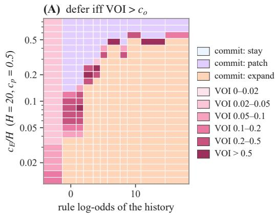

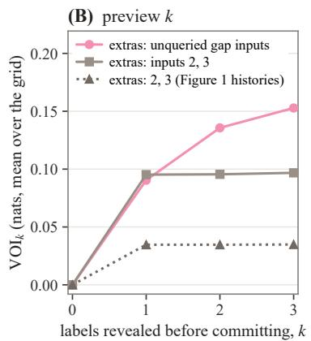

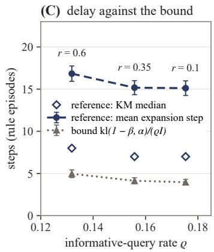  
Figure 4. The value of waiting. (A) The one-shot grid of Figure $1 ( H = 2 0 , c _ { p } = 0 . 5 ,$ informative announcement): cells where the announced label has value are shaded by its VOI, the others by the action committed to. At any $c _ { o }$ the reference defers exactly where VOI exceeds $c _ { o }$ (F1). (B) Mean VOI over the grid against the number k of announced labels revealed before committing, for informative and uninformative extra queries (F2). (C) The reference’s mean and Kaplan–Meier median expansion step in rule episodes and the bound (13), against the rate ϱ of discriminating queries at repeat probabilities $r = 0 . 1 , 0 . 3 5$ and 0.6 (F3). Bars: one bootstrap standard error over episodes.

Experiments. Three experiments check these statements on the solved environment (Figure 4). F1 sweeps $c _ { o }$ from 0 to 1 on the one-shot grid of Figure 1 (11 designed histories, 25 prices) and on the history of Section $3 \ : ( H$ from 5 to 40), under an informative and an uninformative announcement. The cells where defer is optimal coincide with $\{ \mathrm { V O I } > c _ { o } \}$ at every $c _ { o } .$ . Under the informative announcement the defer share of the grid falls from 19.6% at $c _ { o } = 0$ to 9.1% at $c _ { o } = 0 . 1$ and to zero at $c _ { o } = 1$ . Under the uninformative one VOI is zero to numerical precision on the grid and below 0.005 nats on the single history, and no cell defers at a positive $c _ { o }$ . With the history fixed, the announced query alone opens and closes the defer region. F2 announces the next three queries as unscored probes, on histories with three unqueried inputs below the anomalous block, and lets the reference reveal the first k labels at a price $k c _ { o }$ before committing. When the extra probes are the other unqueried inputs, a second label adds 0.045 nats of VOI on average and a third 0.017. When they are inputs 2 and 3, they add less than 0.005 nats in every cell except those with five anomalous inputs, where these inputs are no longer neutral. The value of waiting grows only through queries that can still separate rule from exception.

F3 runs the sequential reference at $c _ { E } = 4 , c _ { p } = 0 . 5$ and $T ~ = ~ 4 0$ on 1,200 episodes for each repeat probability $r \in \{ 0 . 1 , 0 . 3 5 , 0 . 6 \}$ , with latent states and label noise held fixed so that only the schedule changes. The rate $\varrho$ is measured in rule episodes before the expansion step, and α and $\beta$ are the reference’s own error rates, its prior-weighted rate of expansion in the other classes and its rate of non-expansion in rule episodes. Raising r from 0.1 to 0.6 lowers $\varrho$ from 0.175 to 0.132 and raises the bound from 4.0 to 5.0 steps. The reference’s share of defer states rises from 28.0% to 31.2% (4.5 standard errors) and its mean expansion step from 15.1 to 16.8 (1.4 standard errors), both in the direction of the bound. The level is far from the bound: the mean expansion step is 3.4 to 3.8 times the bound and its Kaplan–Meier median 1.6 to 1.8 times, and the latency counted from the first discriminating query has a median of 5 steps at every $^ { r } \cdot$ The reference maximizes utility, and its waiting is set by the prices and the horizon as much as by identifiability. The bound orders the regimes and does not predict the level.

## G. Active-space transitions

An implicit learner has no action to regress. Its active set is read from κ on null-equivalent pairs, against the family of curves indexed by the prior. On rule episodes and on threshold episodes matched to them in boundary and schedule, we take the difference in the learner’s log-odds at unqueried inputs as a function of their position relative to the upper end u of the interval. A response that decays with the distance from the observed anomalies and crosses u without a step is local smoothing, and a response of equal size at all inputs is a shift in label frequency. For language models κ is reported together with the calibration slope $s _ { 0 } .$ , the slope of the model’s log-odds on those of $E _ { 0 }$ in noise episodes, which separates a general flattening of predictions from a reduced weight on structural evidence. Latency is the first step at which the learner’s predictions at unqueried inputs above u have moved toward the rule, in excess of the same step for $E _ { 1 }$ . Surprise leakage is read from the updates: the change in the learner’s log-odds after each observation is regressed on the change in the Bayes predictor’s log-odds and on the surprise of that observation, and the Bayes predictor has leakage 0.

Meta-trained learners are Bayes predictors under their training prior. The implicit learner trained at the generative base rate has κ between 0.98 and 0.99 at every level of evidence, and its loss exceeds that of the Bayes predictor by 0.0005 nats per step. The learner trained with rule episodes at a base rate of 0.02 starts at $\kappa = 0 . 3 3$ with one anomalous input and reaches 0.95 with four. The Bayes predictor with a prior of 0.02 starts at 0.35 and reaches 1.00. The two agree in excess loss, in latency and in the share of rule episodes in which the predictions never move toward the rule. The learner that never saw a rule has $\kappa = 0$ and matches the Bayes predictor with a prior of zero in the same readouts. A curve of κ that rises with evidence is therefore what a small prior produces, and by itself it is no sign that a family entered the computation late. Surprise leakage is within 0.007 of zero in all three learners.

The shift of the language models in Section 5.3 varies with the context as follows. With demonstrations in the context the shift decays with the distance from the nearest anomalous input and passes the end of the interval smoothly, which is local smoothing. With the test episode alone it has nearly the same size at near and distant inputs, one model excepted, which is a shift in the frequency of the labels. In this setting the predictions also move toward the rule in 22% to 40% of the matched threshold episodes, against 2% for the Bayes predictor.

Demonstrations act through the statistics of positions and labels. In the OLMo 3 Instruct chain, when the demonstrations share the label symbols of the test episode, the response at the inputs where the demonstrations almost always showed one label is half of the response elsewhere (0.13 to 0.36 against 0.47 to 0.67, as the slope of the model’s shift on the Bayes shif in rule episodes); in the Tulu 3 chain the response at those inputs falls to zero or reverses after preference tuning (¨ −0.55 to 0.39). Moving the demonstrations to other positions removes most of the suppression, and giving them their own symbols removes it entirely.

Note on the OLMo 3 stages. The matched-pair κ of Section 5.3 was read for each stage, context and rendering of OLMo 3. For the four stages of OLMo 3 (Figure 3, left), κ with three anomalous inputs lies between 0.12 and 0.40 across stages and contexts, and in no rendering does it exceed 0.51. Every Bayes predictor with a positive prior is above 0.80 there.

The Qwen 3 pair. Qwen 3 8B Base and its distilled final model, Qwen 3 8B, add 18 curves of κ in the three contexts and renderings (Figure 5), and none of them follows a member of the family indexed by the prior. With demonstrations in the context, κ with three anomalous inputs lies between 0.17 and 0.26. With the test episode alone it is 0.41 for the base model and 0.49 for the final model, the highest value of the 16 models, and the final model reaches 0.68 with five anomalous inputs, still off every member of the family. The response has no step at the boundary (0.05 to 0.32 in log-odds, every interval including zero) and reaches far outside the region (0.65 to 2.65, every interval excluding zero). As in the other language models, it is local smoothing with demonstrations in the context and a shift in the frequency of the labels with the test episode alone. Surprise leakage is 0.12 to 0.14.

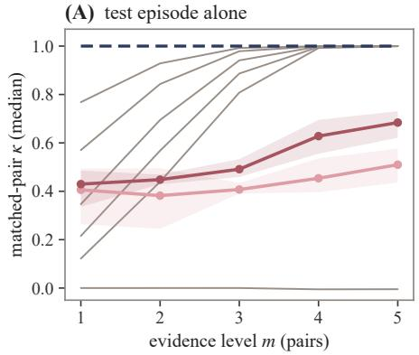

(B) threshold demonstrations  
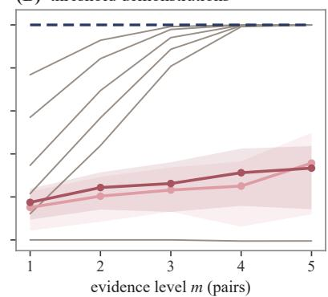

(C) mixed demonstrations  
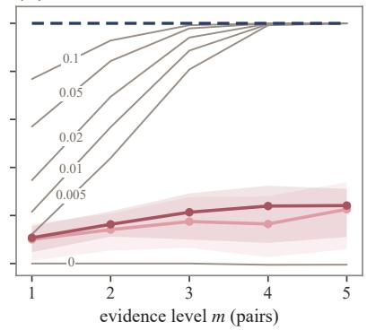  
E1 with rule prior π (grey, labelled in C) E1, generative prior (π = 0.25) Qwen 3 8B Base Qwen 3 8B  
Figure 5. The Qwen 3 pair against the family indexed by the prior. Matched-pair κ of Qwen 3 8B Base and Qwen 3 8B against the evidence level $m ,$ with the test episode alone (A), after eight threshold-episode demonstrations (B) and after eight demonstrations from the generative mixture (C), next to $E _ { 1 }$ under rule priors from 0 to 0.25 (grey, labelled in C). Lines are medians over the null-equivalen pairs averaged over the three renderings, and bands the range over the renderings.

## H. Learned policies: regret at the default cell and results beyond the main text

This appendix collects the definitions behind the regret decomposition of Section 4, the regret of every policy at the default cell (Tables 1 and 2) and further results on the explicit learners of Section 5.1.

Structural actions leave the queries and labels that follow unchanged (Section 3). The utility of any action sequence on a given episode is therefore a deterministic function of that episode, and the regret of a learner is computed exactly, episode by episode.

Latency and expansion errors. In an episode whose structure lies outside $\mathcal { F } _ { 0 } .$ , let $t _ { 0 }$ be the first step at which a diagnostic observation arrives and $\tau = \operatorname* { i n f } \{ t \geq t _ { 0 } : a _ { t } = \mathrm { e x p a n d } \} - t _ { 0 }$ . Exact Bayesian inference itself switches late, because the richer family must first overcome its larger description length (van Erven et al., 2012). Latency is therefore measured as excess over the reference policy on the same history, $\Delta \tau = \tau _ { \mathrm { l e a r n e r } } - \tau _ { \mathrm { r e f } }$ , with episodes that never expand treated as censored. An expansion is an error when $\Delta Q ^ { * } ( s _ { t } ) < 0$ , whatever the class of the episode. For implicit learners the crossing time of κ takes the place of $a _ { t }$

The price response ends with the trained range. At the two prices outside the range of training, price sensitivity falls to between 0.43 and 0.58 under every training regime. At a price below the range the learners expand less than at the lowest trained price, and the reference expands more. Episodes longer than those trained on keep the ratios.

Forming the evidence is not the limit. Giving a learner the posterior of the reference as an input changes neither its regret nor its ratios.

Imitation places the boundary where the labels reach. A learner that imitates the reference along the reference’s own path sees no state beyond the reference’s expansion. In those states it expands at half of the reference’s rate, and the point at which it expands with probability one half lies 0.22 nats beyond the reference’s boundary. With labels for those states the distance falls to 0.03 nats and the rate of expansion beyond the boundary rises to 0.34, against 0.41 for the reference.

Where the learners lose. Their regret comes from exception episodes, in which they patch less often than the reference, the learners trained on utility least of all. On matched failures the imitation learners expand at the rates of the reference, in 0.70 to 0.77 of the rule episodes against 0.76 and in 0.03 to 0.05 of the threshold episodes against 0.03. The learners trained on utility expand in 0.03 to 0.09 of the threshold episodes. Given the same number of anomalous observations, every learner expands more when the anomalies are spread over inputs than when they sit on one, as the reference does.

Waiting is learned only in part. On histories in which the reference waits for an informative query and acts when the announced query is a repeat of an anomaly, the learners stay more often under the informative announcement than on matched controls, by 0.10 to 0.22 in the probability of staying, against 1 for the reference, and by similar amounts whether the reference’s alternative is a patch or an expansion. The price and the horizon enter these learners’ decisions as they enter

Table 1. Meta-decision regret against the reference at the default cell. $T = 4 0 , c _ { E } = 4 , c _ { p } = 0 . 5$ (a held-out (cE, T) cell of the small Transformers’ training split); nats per episode, prior-weighted over the four classes (noise 0.40, exception 0.20, drift 0.15, rule 0.25); $\mathrm { r e g r e t } = \mathcal { U } ( \mathrm { r e f e r e n c e } ) - \mathcal { U } ( \mathrm { p o l i c y } )$ on the same 1 200 episodes (300 per class). Small Transformers: mean over three seeds; their SE is the per-run paired SE averaged over the seeds. Path labels: reference actions on the states beyond the expansion. Latency: Kaplan–Meie median of the expansion step and the censored share. Patch only: the probability of patching without expanding in exception episodes. Grid mean: regret averaged over the 120 price cells
<table><tr><td rowspan="2">policy</td><td rowspan="2">regret (±SE)</td><td colspan="4">regret by class</td><td colspan="2">expansion latency</td><td rowspan="2">patch only</td><td rowspan="2">grid mean</td></tr><tr><td>● noise</td><td>exception</td><td>• drift</td><td>• rule</td><td>median</td><td>censored</td></tr><tr><td>Reference policies</td><td></td><td></td><td></td><td></td><td></td><td></td><td></td><td></td><td></td></tr><tr><td>Reference policy (O1)</td><td>0.00 (±0.00)</td><td>+0.00</td><td>+0.00</td><td>+0.00</td><td>+0.00</td><td>5</td><td>0.25</td><td>0.41</td><td>0.00</td></tr><tr><td>Bounded reference (O2)</td><td>0.49 (±0.06)</td><td>+0.05</td><td>+0.45</td><td>+0.08</td><td>+1.48</td><td>6</td><td>0.27</td><td>1</td><td>0.24</td></tr><tr><td>Triggers and fixed policies</td><td></td><td></td><td></td><td></td><td></td><td></td><td></td><td></td><td></td></tr><tr><td>e-process trigger, fixed threshold</td><td>0.68 (±0.06)</td><td>-0.12</td><td>+1.12</td><td>+0.69</td><td>+1.62</td><td>5</td><td>0.19</td><td>0.00</td><td>1.19</td></tr><tr><td>e-process trigger, re-tuned per cell</td><td>0.68 (±0.06)</td><td>-0.12</td><td>+1.12</td><td>+0.69</td><td>+1.62</td><td>5</td><td>0.19</td><td>0.00</td><td>0.42</td></tr><tr><td>never revise</td><td>2.24(±0.14)</td><td>-0.58</td><td>+0.55</td><td>-0.58</td><td>+9.81</td><td>∞</td><td>1.00</td><td>0.00</td><td>1.29</td></tr><tr><td>Small Transformers (mean of three seeds)</td><td></td><td></td><td></td><td></td><td></td><td></td><td></td><td></td><td></td></tr><tr><td>BC on the reference&#x27;s path</td><td>0.060 (±0.031) −0.069</td><td></td><td>+0.293</td><td>-0.129+0.193</td><td></td><td>5.3</td><td>0.30</td><td>0.31</td><td>0.049</td></tr><tr><td>BC with path labels</td><td>0.039 (±0.027) −0.033</td><td></td><td>+0.334</td><td>-0.084</td><td>-0.008</td><td>4.7</td><td>0.26</td><td>0.30</td><td>0.039</td></tr><tr><td>POLICY-ONLY (exact posterior as input)</td><td>0.053 (±0.029) −0.093</td><td></td><td>+0.433</td><td>-0.147</td><td>+0.102</td><td>5.3</td><td>0.28</td><td>0.31</td><td>0.044</td></tr><tr><td>REWARD (utility alone)</td><td> $0 . 2 1 0 ( \pm 0 . 0 4 1 ) + 0 . 0 8 9$ </td><td></td><td>+0.800</td><td>+0.068</td><td>+0.015</td><td>3.7</td><td>0.26</td><td>0.09</td><td>0.089</td></tr><tr><td>REWARD from BC (utility after imitation)</td><td>0.081 (±0.035) −0.037</td><td></td><td>+0.392</td><td>-0.061</td><td>+0.108</td><td>6.0</td><td>0.31</td><td>0.21</td><td>0.038</td></tr></table>

the reference’s. The value of the next observation mostly does not.

Table 2. Meta-decision regret against the reference at the default cell: rows and columns not shown in Table 1. Top: the baselines left out of Table 1, with its columns; the grid mean is given with the threshold fixed and with the threshold re-tuned in every cell. Bottom: the remaining columns, for every row.
<table><tr><td rowspan="2">policy</td><td></td><td colspan="4">regret by class</td><td colspan="2">expansion latency</td><td rowspan="2"></td><td colspan="2">grid mean</td></tr><tr><td>regret (±SE)</td><td>● noise</td><td>exception</td><td>• drift</td><td>● rule</td><td>median censored</td><td></td><td>patch only</td><td>fixed re-tuned</td></tr><tr><td colspan="10">Triggers and fixed policies</td></tr><tr><td>likelihood trigger, fixed threshold</td><td>0.81 (±0.08) −0.09</td><td>+0.82</td><td></td><td>+0.02 +2.74</td><td></td><td>8</td><td>0.42</td><td>0.00</td><td>1.09</td><td>0.43</td></tr><tr><td>count trigger, fixed threshold</td><td>1.64(±0.08) −0.42</td><td></td><td>+1.18</td><td>-0.13 +6.36</td><td></td><td>25</td><td>0.30</td><td>0.00</td><td>1.29</td><td>0.62</td></tr><tr><td>surprise trigger, fixed threshold</td><td>2.03 (±0.08) +2.04</td><td></td><td>+2.23</td><td>+2.12 +1.80</td><td></td><td>4</td><td>0.00</td><td>0.00</td><td>2.31</td><td>0.63</td></tr><tr><td>always patch an anomalous input</td><td>2.18(±0.13) +0.97</td><td></td><td>-0.23</td><td>+0.88 +6.81</td><td></td><td>∞</td><td>1.00</td><td>0.92</td><td></td><td></td></tr><tr><td colspan="10"></td></tr><tr><td colspan="10"></td></tr><tr><td colspan="10">policy</td></tr><tr><td colspan="10">Reference policies</td></tr><tr><td>Reference policy (O1)</td><td></td><td>0.07</td><td>0.06</td><td>0.13</td><td>+0</td><td></td><td>0.00</td><td></td><td></td></tr><tr><td colspan="10">Bounded reference (O2)</td></tr><tr><td colspan="10">Triggers and fixed policies</td></tr><tr><td>e-process trigger, fixed threshold</td><td></td><td>0.10</td><td>0.29</td><td>0.35</td><td>+0</td><td></td><td>0.28</td><td></td><td></td></tr><tr><td>e-process trigger, re-tuned per cell</td><td></td><td>0.10</td><td>0.29</td><td>0.35</td><td></td><td>+0</td><td>0.28</td><td></td><td></td></tr><tr><td>likelihood trigger, fixed threshold</td><td></td><td>0.11</td><td>0.13</td><td>0.20</td><td></td><td>+3</td><td></td><td>0.33</td><td></td></tr><tr><td>count trigger, fixed threshold</td><td></td><td>0.04</td><td>0.11</td><td>0.23</td><td></td><td>+20</td><td>0.31</td><td></td><td></td></tr><tr><td>surprise trigger, fixed threshold</td><td></td><td>0.62</td><td>0.63</td><td>0.73</td><td></td><td>-1</td><td>0.54</td><td></td><td></td></tr><tr><td>never revise</td><td></td><td>0.00 0.00</td><td>0.00 0.00</td><td>0.00 0.00</td><td></td><td>一</td><td></td><td>0.44 0.67</td><td></td></tr><tr><td colspan="10">always patch an anomalous input</td></tr><tr><td colspan="10">Small Transformers (mean of three seeds)</td></tr><tr><td>BC on the reference&#x27;s path</td><td></td><td>0.05</td><td>0.05</td><td>0.10</td><td></td><td>+0.3</td><td>0.10</td><td></td><td>0.032</td></tr><tr><td>BC with path labels</td><td></td><td>0.06</td><td>0.06 0.04</td><td></td><td>0.13</td><td>-0.3</td><td></td><td>0.09</td><td>0.034 0.008</td></tr><tr><td>POLICY-ONLY (exact posterior as input) REWARD (utility alone)</td><td></td><td>0.05 0.11</td><td>0.11</td><td></td><td>0.12 0.21</td><td>+0.3 -1.3</td><td></td><td>0.09 0.17</td><td>0.046</td></tr><tr><td>REWARD from BC (utility after imitation)</td><td></td><td>0.08</td><td>0.08</td><td>0.14</td><td></td><td>+1.0</td><td>0.13</td><td></td><td>0.029</td></tr><tr><td colspan="10"></td></tr></table>

## I. Post-training

This appendix collects the stage-wise differences among the language models, in their decisions (Section 5.2) and in their predictions (Section 5.3), the controlled post-training contrasts of Section 5.4 (Figure 6) and their analogue with adapters on two language models (Figure 7), and the related work on post-trained lineages and on scoring revisions

Stages. In both Instruct lineages preference tuning raises the propensity to defer and the response to the stated gain, and in OLMo 3 both changes hold across renderings and action orders. Reinforcement learning with verifiable rewards lowers the propensity to defer in OLMo 3 and leaves it nearly unchanged in Tulu 3. At the history level the stages differ only in their¨ constants, and the order in which the actions are listed moves those constants more than the rendering does.

What the stages change is the size of the response and the fidelity in context, and which stage changes them depends on the recipe. In the OLMo 3 Instruct chain and in Tulu 3, preference tuning worsens the fit to threshold episodes, lowers¨ the accuracy at unqueried inputs far from the boundary and delays the lift. In the Think chain these changes come with supervised fine-tuning, and preference tuning changes nothing. Two recipes on the same base show where the changes come from: Llama 3.1 Instruct differs from its base in five small readouts, and Tulu 3, built on that base, differs from Llama 3.1¨ Instruct in 29.

Recipes. Across public checkpoints, the change from the base model to the final model can be compared between four recipes: supervised fine-tuning, preference tuning and reinforcement learning with verifiable rewards in OLMo 3 Instruct, Tulu 3 and OLMo 3 Think, and distillation in Qwen 3. A change is counted when it has the same sign in the three renderings,¨ exceeds the spread of the readout across them and has a 95% interval that excludes zero in each of them. From base to final model, OLMo 3 Instruct shows 10 such changes, Tulu 3 28, OLMo 3 Think 9 and Qwen 3 7. The main change in Qwen 3 is¨ a steeper calibration with the test episode alone, from 0.95 to 1.32 times the slope of the Bayes predictor, which Tulu 3¨ and OLMo 3 Think share and OLMo 3 Instruct does not. The degradation that the three recipes with preference tuning share is absent from the distilled model: the accuracy far from the boundary changes by −0.02 against −0.09 to −0.15, the generalization to unqueried inputs of the region under demonstrations by +0.02 against −0.04 to −0.18, and the false lift by +0.05, short of the criterion, against +0.10 and +0.17 in OLMo 3 Instruct and Tulu 3. None of the ten changes of¨ OLMo 3 Instruct recurs in Qwen 3, against five in Tulu 3 and three in OLMo 3 Think. In the decisions, distillation lowers¨ the probability of expanding at the history level by 0.14 and raises the response to the stated gain by 0.65, both changes holding across renderings and action orders, as the recipes of OLMo 3 Instruct and Tulu 3 do, while OLMo 3 Think moves¨ both the other way. The rise in the probability of deferring that marks preference tuning in both Instruct lineages (+0.46 in OLMo 3, +0.26 in Tulu 3) does not appear under distillation (¨ −0.02, with a sign that changes across the six combinations of rendering and action order), and the final model moves its mass to patching instead.

Readouts of the controlled branches. The four branches are A (the generative data, log score), B (no rule episodes, log score), C (the generative data, reward) and D (no rule episodes, reward), and the contrasts are B − A for the data, C − A for the objective, D − B for the objective on rule-free data, and their interaction. Every readout is compared with the Bayes predictor of the prior that the learner holds after post-training, estimated on matched pairs, and κ is computed after the learner’s log-odds are mapped onto that predictor’s at equal quantiles, so that a sharpening of the predictions cannot enter it. The recovery runs continue B and D for 2,000 steps with the data and objective of A, and Figure 6(b) gives their readouts as differences from A at 20,000 steps.

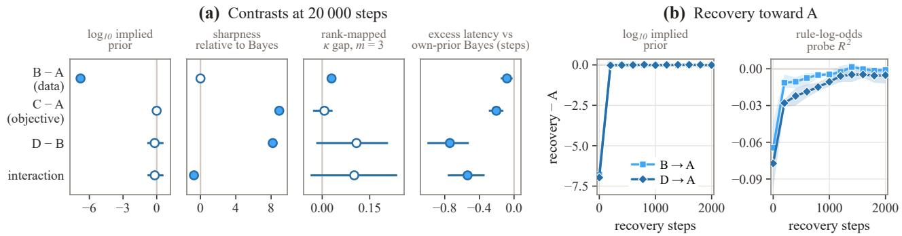  
Figure 6. Post-training separates the prior from predictive sharpness. (a) Contrasts from the 2 × 2 post-training intervention afte 20,000 steps. Points are means over three learners; bars are 95% bootstrap intervals, with filled markers excluding zero. κ is rank-mapped to remove sharpening. (b) Recovery of the implied prior and rule-log-odds decodability after restoring the original data and objective.

Note on Section 5.4. The probe’s $R ^ { 2 }$ falls from 0.90 to 0.84 without rule episodes and to 0.88 under the reward objective.

Adapter branches on two base models. The two-by-two of the meta-trained learners was applied with rank-16 LoRA adapters to OLMo 3 7B Base and Llama 3.1 8B Base: data with or without rule episodes, and the log score or the expected 0/1 reward, with 16,384 episodes in 512 steps per branch and one seed (Appendix N). The branches are read in the implicit protocol without demonstrations, against the Bayes predictor of the prior each branch holds, with 95% intervals from one episode bootstrap shared by all models, so that every contrast is paired (Figure 7).

Removing rule episodes halves the implied base rate on both bases, from 0.35 to 0.17 and 0.16, where the meta-trained learners lost nearly seven decades; at this dose that collapse does not recur. It leaves the sharpness unchanged (B − A on the sharpness ratio +0.04 and −0.01). The reward objective multiplies the sharpness by about ten and twelve (C − A +9.4 and +11.3 on the ratio) and moves the base rate by about a third of the data’s effect, in opposite directions on the two bases (+0.12 and −0.11 in $\log _ { 1 0 } )$ . The separation of the two axes therefore holds for Llama 3.1 under the criterion fixed in advance, which asks the objective’s effect on the base rate to be below a fifth of the data’s or its interval to include zero, and narrowly fails for OLMo 3 (interval 0.02 to 0.20). Two readouts differ from the meta-trained learners. The rule-free branch falls further below the κ curve of its own prior than the control at every level of evidence, by 0.2 to 0.4 in rank-mapped $\kappa ,$ while the scaled Bayes predictor fits it nearly as well as the control (0.032 and 0.031 against 0.024 and 0.030 nats per cell); the reward objective on rule-free data restores the response (D − B about +0.3 at three and +0.4 to +0.5 at five anomalous

OLMo 3 7B Base

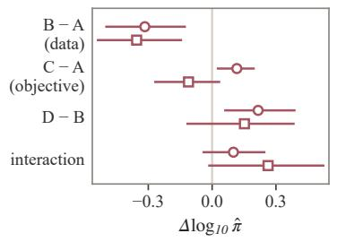

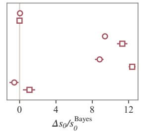

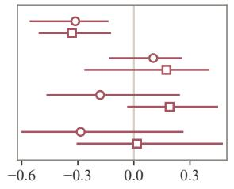

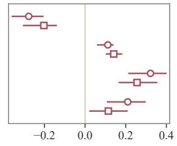

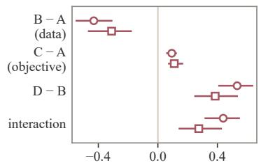

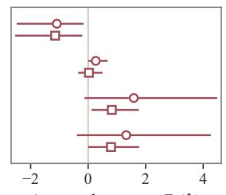

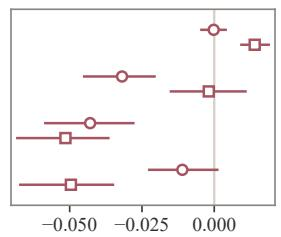

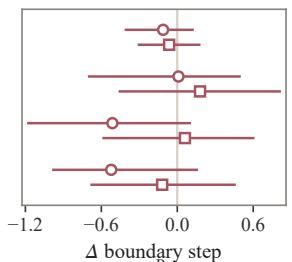  
Figure 7. Adapter branches on two base models. Paired contrasts of the four branches on OLMo 3 7B Base (circles) and Llama 3.1 8B Base (squares) without demonstrations, in the layout of Figure 6(a), with the probe readouts replaced by surprise leakage and by the step at the boundary divided by the sharpness. Bars are 95% intervals of one episode bootstrap shared by all models.

inputs). And the reward objective lowers surprise leakage here, by 0.03 to 0.05 in three of the four contrasts (0.00 for C − A on Llama 3.1), where it raised it in the meta-trained learners. Divided by the sharpness, the step at the boundary does not move under any contrast. No criterion shift appears in either base: every branch lifts no later than the Bayes predictor of its own prior (mean latency −0.4 to −2.1 steps, Kaplan–Meier median excess 0). With demonstrations in the context the implied base rate of every model, the bases included, falls to 10−3.6 or below, so the data contrast is not identified there, and the sharpening is about the same (C − A +8.0 and +11.3).

Against the public lineages, the controlled rule-free data reproduce none of the markers of the preference-tuning stage in OLMo 3 Instruct and Tulu 3 (in-family excess log-loss ¨ +0.035 and +0.12, accuracy far from the boundary −0.07 and −0.12, a later lift by 1.8 and 2.2 lines): B − A changes the first two by at most 0.01 and delays the lift by at most 0.24 steps. The reward objective reproduces the drop in accuracy at a similar size (−0.04 and −0.08) and a rise in in-family log-loss 26 to 58 times larger, which comes from the sharpening, and not the later lift.

Post-training. Stage-wise analyses of public lineages exist for OLMo 3 (Nguyen, 2026) and Tulu 3 (¨ Ziaei, 2026), with a prescribed probability and a human response distribution as references. Against Bayesian references, instruction-tuned models forget faster after a change point in two of three model families (Gupta et al., 2025), and instruction tuning of Llama 3.1 8B lowers the prior of a behaviour and leaves its in-context learnability unchanged (Arora et al., 2025). We take the Bayes-optimal revision policy as the reference and add controls matched for base rate, which separate a rational update o the prior from a shift of the decision criterion.

Where actions change the stream, a decision to keep or revise is scored by the outcome realized afterwards, through a forked run (Li & Kim, 2026), a hindsight reference (Kashani Motlagh et al., 2026) or a search over intervention schedules (Chadha, 2026).

## J. Detection and commitment

This appendix separates the decision to search the richer family, whose timing the latency readouts of Appendix H and Section 5.4 measure, from the commitment to one of its rules, which a larger library can delay by itself.

Invariance of the search decision. The bounded reference decides on its count state (Appendix B), which contains no index of a rule and no size of the library. Its backward induction depends on the library only through the laws of the coun statistics and the expected gains of expanding. A larger library that leaves these unchanged, with the same base rate of the rule class, the same distribution of regions and the same prices, leaves every step of the recursion and therefore every decision unchanged. Commitment to one rule depends on the library directly. Under a uniform prior over |R| rules, the posterior of the true rule $j$ exceeds 1 − e only when $\textstyle \sum _ { j ^ { \prime } \neq j } e ^ { - \Lambda _ { j j ^ { \prime } } } \leq e / ( 1 - e )$ , with $\Lambda _ { j j ^ { \prime } }$ its log-likelihood ratio against rule $j ^ { \prime }$ . Commitment therefore costs about the logarithm of the number of rules that the data have not yet excluded, log |R nats when all of them remain plausible. A learner with a richer library should decide to search no later and may commit later, and a delay of commitment says nothing by itself about the criterion for search. The readouts of Section 5.4 concern search: κ and the probe of the rule log-odds read the evidence for the rule class, and neither identifies a rule.

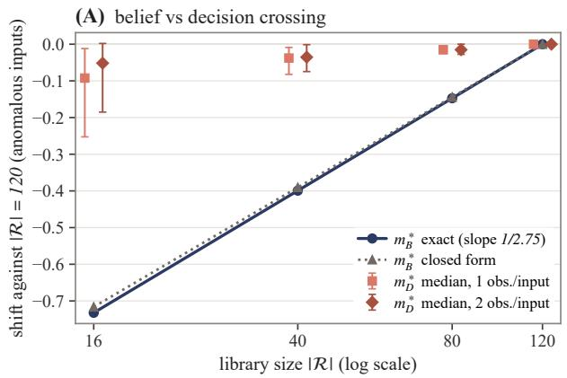

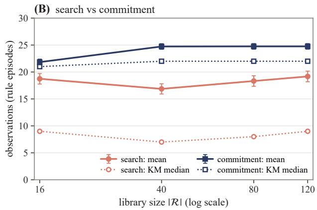  
Figure 8. Detection and commitment. (A) Shift of the belief crossing $m _ { B } ^ { * } ,$ , exact and in closed form, and of the decision crossing $\boldsymbol { m } _ { D } ^ { * }$ (median and 10th to 90th percentile over prices, one or two observations per anomalous input) against the size of the rule library, relative to $\vert \mathcal { R } \vert = 1 2 0 \left( \mathrm { J } 1 \right)$ . (B) Search delay, the reference’s expansion step, and commitment delay, the step at which its posterior puts more than half of the mass of the rule class on the true rule, in 300 rule episodes whose rules belong to every library: means with one bootstrap standard error, and Kaplan–Meier medians (J2).

Experiment J1. J1 measures how the size of the library moves the belief crossing and the decision crossing of the full reference (Figure 8, left). It cuts the interval library to its $| \mathcal { R } | = 1 6 , 4 0 , 8 0$ or 120 widest intervals, with the prior mass of the rule class kept at 0.25, and solves designed histories whose matching rules belong to every library (base threshold 1, up to five anomalous top inputs, observed once or twice) in the one-shot protocol at $H = 2 0 , c _ { p } = 0 . 5$ and $c _ { o } = 0 . 1$ . The exact belief crossing is $m _ { B } ^ { * } = - 0 . 2 3 1 , 0 . 1 0 2 , 0 . 3 5 4$ and 0.501 at $| \mathcal { R } | = 1 6 , 4 0 .$ , 80 and 120, a shift of exactly −∆ log |R|/2.7515. By (8) the library enters the configuration odds only through $\Delta L = \log ( | \mathcal { R } | / 1 6 )$ , and at $| \mathcal { R } | = 1 6$ a rule costs no more than the threshold it replaces. The decision crossing $\boldsymbol { m } _ { D } ^ { * }$ moves by a median over prices of $- 0 . 0 9 , - 0 . 0 4 \mathrm { a n d } - 0 . 0 1 5$ at $| \mathcal { R } | = 1 6$ , 40 and 80 with one observation per input $( - 0 . 0 5 , - 0 . 0 3 5$ and −0.015 with two), 7% to 13% of the shift of the belief crossing. The library moves belief, and the decision stays where the region puts it: once the posterior of the rule class has saturated, (10) depends on the inputs that a rule predicts and a slot does not cover, and the size of the library does not change them.

Experiment J2. J2 runs the sequential reference at $c _ { E } = 4 , c _ { p } = 0 . 5$ and $T = 4 0$ on 300 rule episodes whose rules are drawn from the 16-interval library, the same episodes under every library, and compares the search delay with the commitment delay (Figure 8, right). The mean search delay shows no trend in log |R| (slope $+ 0 . 2 5 \pm 0 . 3 0$ steps per unit, 95% interval −0.34 to 0.88), and its differences between libraries, at most 2.3 steps, do not follow the size of the library. The commitment delay grows with slope $+ 1 . 4 2 \pm 0 . 1 9$ , and all of its growth lies between 16 and 40 rules $( + 3 . 2 \pm 0 . 4$ per unit, against $+ 0 . 0 2 \pm 0 . 0 1$ from 40 to 120). The narrower intervals added beyond 40 are never confused with the wide true rules: the commitment step changes in 4 of the 300 episodes between 40 and 120 rules and in none between 80 and 120. When both events occur, the reference expands a median of 13 to 17 steps before it commits to the rule. Detection and commitment are decoupled, and commitment grows with log |R| only while the added rules remain close to the truth, as the count of rules not yet excluded predicts. The bounded reference is invariant by construction.

## K. Architectures

This appendix reads the finding of Section 5.3 and Appendix G, that the meta-trained learners are Bayes predictors under their training prior, across architectures, and asks whether a learner with a state of fixed size must read the history again after

it lifts.

Two fixed-state learners take the place of the attention in the implicit Transformer: a GRU, and a selective state-space model in the Mamba-2 form, both written in plain PyTorch. They match the Transformer in parameters, about 4.8 million, in data stream, optimizer and number of steps, and are trained at the generative base rate with three seeds each (Appendix N). Recovery is read on rule episodes aligned at each learner’s own lift, as the excess log-loss over the Bayes predictor at the k-th prediction after the lift, with $E _ { 1 }$ aligned at its own lift as the floor.

Table 3. Architectures at the generative base rate: mean (± s.d.) over three seeds. The Bayes predictor is $E _ { 1 }$ , the Bayes predictor of the training prior of all three learners (intervals: 95% over episodes).
<table><tr><td>readout</td><td>Transformer</td><td>GRU</td><td>selective SSM</td><td>Bayes predictor</td></tr><tr><td colspan="5">Excess log-loss over  $E _ { 1 } \ : ( 1 0 ^ { - 3 }$  nats per step)</td></tr><tr><td>class-balanced</td><td> $0 . 4 7 ( \pm 0 . 1 4 )$ </td><td> $0 . 4 8 \left( \pm 0 . 1 0 \right)$ </td><td> $0 . 4 6 \left( \pm 0 . 1 5 \right)$ </td><td>0</td></tr><tr><td>● rule episodes</td><td> $0 . 6 6 ( \pm 0 . 3 8 )$ </td><td> $0 . 6 8 \left( \pm 0 . 5 0 \right)$ </td><td> $0 . 5 4 \left( \pm 0 . 4 3 \right)$ </td><td>0</td></tr><tr><td colspan="5">Matched-pair κ</td></tr><tr><td> $m = 1$ </td><td> $0 . 9 9 4 ( \pm 0 . 0 2 1 )$ </td><td> $0 . 9 9 0 ( \pm 0 . 0 1 3 )$ </td><td>0.995 (±0.011)</td><td>1.000</td></tr><tr><td> $m = 3$ </td><td> $0 . 9 8 3 ( \pm 0 . 0 0 4 )$ </td><td> $0 . 9 8 7 ( \pm 0 . 0 0 1 )$ </td><td> $0 . 9 8 5 ( \pm 0 . 0 0 7 )$ </td><td>1.000</td></tr><tr><td> $m = 5$ </td><td> $0 . 9 8 6 \left( \pm 0 . 0 0 3 \right)$ </td><td> $0 . 9 8 4 ( \pm 0 . 0 0 3 )$ </td><td> $0 . 9 8 4 ( \pm 0 . 0 1 1 )$ </td><td>1.000</td></tr><tr><td colspan="5">Response at the boundary</td></tr><tr><td>step at the boundary (log-odds)</td><td> $1 . 1 1 0 ( \pm 0 . 0 1 4 )$ </td><td> $1 . 1 0 5 ( \pm 0 . 0 2 1 )$ </td><td> $1 . 1 1 4 ( \pm 0 . 0 2 7 )$ </td><td>1.122 [0.877, 1.369]</td></tr><tr><td>slope inside the region</td><td> $- 0 . 6 2 3 \left( \pm 0 . 0 1 2 \right)$ </td><td> $- 0 . 6 2 4 ( \pm 0 . 0 0 4 )$ </td><td> $- 0 . 6 2 1 ( \pm 0 . 0 0 1 )$ </td><td> $- 0 . 6 1 6 [ - 0 . 8 2 9 , - 0 . 4 6 0 ]$ </td></tr><tr><td colspan="5">Leakage and lift</td></tr><tr><td>surprise leakage</td><td> $0 . 0 0 1 2 \left( \pm 0 . 0 0 0 8 \right)$ </td><td> $0 . 0 0 1 3 ( \pm 0 . 0 0 1 2 )$ </td><td> $0 . 0 0 1 0 ( \pm 0 . 0 0 0 9 )$ </td><td>0</td></tr><tr><td>lift latency, KM median (observations)</td><td> $0 . 0 ( \pm 0 . 0 ) $ </td><td> $0 . 0 ( \pm 0 . 0 ) $ </td><td> $0 . 0 ( \pm 0 . 0 ) $ </td><td>0</td></tr><tr><td>share without a lift where  $E _ { 1 }$  lifts</td><td> $0 . 0 0 7 ( \pm 0 . 0 0 3 )$ </td><td> $0 . 0 0 6 ( \pm 0 . 0 0 3 )$ </td><td> $0 . 0 0 6 ( \pm 0 . 0 0 3 )$ </td><td>0</td></tr></table>

(A) excess over $E _ { I }$  
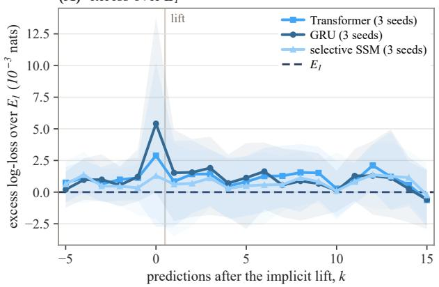

(B) log-loss, floor at $E _ { I }$  
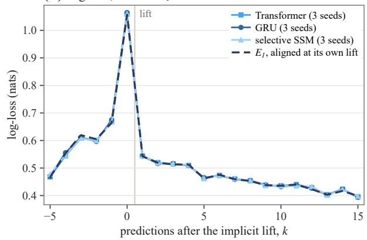  
Figure 9. Recovery after the lift. (A) Excess log-loss over $E _ { 1 }$ of the Transformer, the GRU and the selective state-space learner at the k-th prediction after each learner’s own lift on rule episodes, k = 0 being the prediction of the anomalous observation that triggers it (mean over three seeds; bands span the seeds’ 95% intervals over episodes). (B) The log-loss itself, against E aligned at its own lift.

The three architectures agree within the spread over seeds on every readout (Table 3): the step at the boundary is 1.105 to 1.114 against 1.122 for the Bayes predictor, matched-pair κ lies between 0.977 and 0.995 at every level of evidence, and surprise leakage is about 0.001. None of them recovers faster than the others after the lift, and none accumulates loss again: from the first prediction after the lift each stays within about $2 \times 1 0 ^ { - 3 }$ nats of the Bayes predictor (Figure 9). At this scale a fixed state carries what the full model needs, the label counts at each input and the order in which they arrived, and no retroactive reinterpretation of the history appears. A test that could separate the architectures needs a state smaller than these statistics, or a fixed-state learner trained without rule episodes.

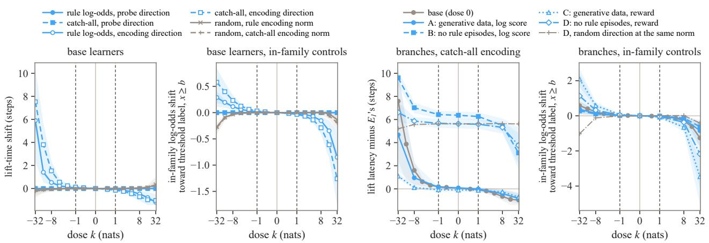  
Figure 10. Steering along the probe and encoding directions. Dashed lines mark $k = \pm 1$ , where the pre-specified criterion is read; bands are 95% intervals over models, then episodes. From left to right: lift-time shift on the base learners; their in-family controls, where negative values are false lifts; lift latency of the post-trained branches; the branches’ in-family controls.

## L. Mechanism: probes and steering

This appendix tests by intervention the reading of Section 5.4 that what post-training removes is suppressed rather than lost, and the remark of Section 2 that probes separate a family that is computed and gated out from one that is never computed.

Ridge probes read the reference’s rule log-odds and the catch-all evidence $E _ { t }$ from the residual stream at the positions tha predict a label, in the three implicit learners trained at the generative base rate and in their four post-trained branches at 20,000 steps, with the probes refitted on each. Steering adds αu to the residual stream at all these positions after the layer at which the probe reads best, along four families of unit directions u: the probes’ decoding directions $w / \| w \|$ , the component of each orthogonal to the other, the encoding directions $C w / \| C w \|$ , along which the activations vary with the target (C the covariance of the residual stream), and random directions at the same norms. The dose k is the shift of the probe’s own read-out in nats, $\alpha = \boldsymbol k / ( \boldsymbol w \cdot \boldsymbol u )$ , from ±0.5 to ±32 in factors of two (±1, ±8 and ±32 on the branches), and the criterion was fixed before the run: a direction moves the lift if at $k = \pm 1$ the lift time shifts by at least one step with a 95% interval that excludes zero.

Four facts follow (Figure 10). (i) The probe directions move nothing: they are nearly orthogonal to the directions along which the residual stream varies with the target (cosine 0.03 to 0.06). (ii) The encoding directions move the lift monotonically in k, and random directions at the same norm do not. The rule and catch-all encoding directions nearly coincide (cosine 0.86 to 0.97), and their pushes move the in-family controls the same way, so no separate catch-all channel is found. (iii) The pre-specified criterion, a shift of one step at $k = \pm 1$ , is met by no direction on any model. (iv) On the branches trained without rule episodes, B and D (the latter with the reward objective), a push along the catch-all encoding direction brings the lift latency back from +6.4 and +5.6 steps to +3.1 and +3.8 at $k = + 3 2$ , while a random direction at the same norm leaves D at +5.6, and the push produces false lifts on the in-family controls. The suppressed response can be partly re-evoked, and not selectively.

## M. Prompts and read-outs

This appendix collects the input formats and read-outs of the language models (Section 4), the e-process trigger (Section 3), and notes on the decisions of the language models (Section 5.2).

In the implicit protocol every stage reads the same raw text. An episode is written one observation per line and the model assigns probabilities to the two labels at each of the 16 inputs, which gives the same table of predictions as for the small Transformers. The context holds the test episode alone, or the test episode after eight demonstration episodes drawn from threshold rules, or after eight drawn from the generative mixture. A base model reads the prompt as raw text and a chat-tuned stage reads the same prompt inside the template of its lineage, and stages are compared within one format.

Implicit protocol. An episode is written as the header line Each line gives a position and its label. followed by one line per observation. The three renderings differ in how a line is written; the first five lines of the episode of Appendix A read

<table><tr><td colspan="2">PROMPT implicit protocol: the first five lines in R1, R2 and R3</td></tr><tr><td>R1</td><td>R2 R3</td></tr><tr><td>1 -&gt; V</td><td>a -&gt; @ 1: V</td></tr><tr><td>1 -&gt; V</td><td>a -&gt; @ 1: V</td></tr><tr><td>14 -&gt; V</td><td>n -&gt; @ 14: V</td></tr><tr><td>7 -&gt; X</td><td>g -&gt; ~ 7: X</td></tr><tr><td>2 -&gt; V</td><td>b -&gt; @ 2: V</td></tr></table>

Rendering R1 writes the positions as 1 to 16 and joins position and label by an arrow, R2 writes the positions as the letters a to p, and R3 joins position and label by a colon. The two label symbols of an episode are drawn from Q, Z, K, X, V and J in R1 and R3. In R2 they are @ and \~, the only ASCII punctuation marks that stay a single token at the end of a line under the OLMo tokenizer, and the draw decides which of them stands for label 1. Every symbol is a single token with its leading space, and no word that names a class occurs in any text. The context condition C0 is the header and the evaluated episode. In CF0 the header is followed by eight demonstration episodes from the current family, each introduced by a line Sequence k after a blank line, and then by Sequence 9 and the evaluated episode; CMIX draws the demonstrations from the generative mixture. The demonstrations carry the evaluated episode’s two symbols with the same assignment and are the same for every model and rendering, and the episodes of a group, one of each class, share them and the draw of symbols. Two variants of CF0 give each demonstration its own pair of symbols, or shift its positions to 17 to 32 (R1 and R3). The prediction of a label is read at the separator before it as $q = P ( s _ { 1 } ) / ( P ( s _ { 0 } ) + P ( s _ { 1 } ) )$ , the probability of the symbol $s _ { 1 }$ of label 1 renormalized over the two symbols. The table of predictions at all 16 inputs after t observations is read by appending, after line t, a line with the input and its separator, at $t \in \{ 8 , 1 6 , 2 4 , 3 2 , 4 0 \}$ , and at every t on the dense subset of Appendix N.

Explicit protocol. A prompt describes the game, the default predictor, the four actions, the announcement and the scoring rule, followed by the log of observations; the prices, the number of scored rounds, the announced position and the cue Decision: come last. The observations are rendered as in the implicit protocol, and under R2 the description of the default predictor reads before and at or after in place of below and at or above. In action order A the actions and their prices are listed as continue, patch, expand, observe, and in order B in reverse. The prompts name stay and defer as continue and observe, and the read-out maps these two surface forms back to the actions. The history-level prompt of one decision point of the same-history design in rendering R1 and order A reads as follows, with its 16 observation lines set here in four columns:

P RO M P T explicit protocol: history-level prompt ofone decision point (R1, order A)   
A hidden machine gives each of the positions 1 to 16 one of two labels, J or K. In every round one position is queried and its   
label is observed. With probability 0.08 an observed label is misreported (the other label is shown), independently in,→   
every round. Each round queries a position at random: with probability 0.35 one that was queried before, otherwise one,→   
,→ that was not queried before.   
In every scored round a predictor gives the probability of each label at the queried position. The default predictor assumes   
a single boundary: positions below the boundary have label J and positions at or above it have label K. It infers the,→   
boundary from the observed labels, allows for misreported labels, and allows the boundary to move once during the game.,→   
Before the scored rounds you take exactly one action:   
- continue: keep the default predictor.   
- patch: the position of the most recent observation that disagrees with the default predictor (if none disagrees, the most   
recently queried position) gets a separate record: from then on its label is predicted from the labels observed at that,→   
position alone, and the default predictor no longer uses that position.,→   
- expand: replace the default predictor by the full predictor, which considers every kind of machine this game can produce,   
,→ including patterns that a single boundary cannot express, and re-reads the whole log.   
- observe: wait until the label of the announced position is shown, then take one of continue, patch or expand (and pay its   
,→ cost as well).   
One position is announced in advance. Its label is shown to every predictor before the scored rounds and is not scored.   
Score: the sum over the scored rounds of the natural logarithm of the probability that the predictor in use gave to the   
observed label, minus the cost of the actions taken. For example, a probability of 0.9 on the observed label adds -0.11 to,→   
the score and a probability of 0.5 adds -0.69. Choose the action with the highest expected score and answer with its name.,→   
Observations so far (position -> label):

P RO M P T gain-level prompt: the line added after the announced position   
Expected gain in score per scored round if you expand now instead of continuing, not counting costs: 0.21.

3 -> J 5 -> K 13 -> K 4 -> K   
7 -> K 15 -> J 6 -> K 12 -> K   
1 -> J 11 -> K 15 -> J 8 -> K   
9 -> K 2 -> J 10 -> K 14 -> K   
Costs: continue 0, patch 1, expand 4, observe 0.1.   
Scored rounds: 30.   
Announced position: 16.   
Decision:

The failure-level prompt of the same decision point adds a summary of the default predictor’s fit between the log and the costs, set off by blank lines; an observation disagrees with the predictor when its current fit gives the observed label a probability below one half:

P RO M P T failure-level prompt: the summary added between the log and the costs

Summary of the default predictor's fit: 2 of the 16 observations disagree with it.   
Position 15: 2 of 2 observations disagree (repeated).   
The most recent disagreement is at position 15.

The gain-level prompt adds, after the announced position, the reference’s expected gain per scored round from expanding now, before costs:

Formats. In raw text a model reads the prompt as it stands. In the chat format the prompt without its cue line is the user message of the model’s chat template, and the assistant turn is pre-filled with the cue. A model without a chat template is wrapped in the template of its lineage’s instruct model, and both Qwen 3 models in the template of Qwen3 8B with thinking disabled, which opens the assistant turn with an empty thinking block. Every prompt starts with the start-of-text token where the tokenizer prepends one by default, as in the Llama 3.1 lineage. The templates of OLMo 3 Instruct, OLMo 3 Think and Tulu 3 wrap the prompt above as follows.¨

<|im\_start|>system   
You are a helpful function-calling AI assistant. You do not currently have access to any functions.   
,→ <functions></functions><|im\_end|>   
<|im\_start|>user   
(the prompt above without its cue line)<|im\_end|>   
<|im\_start|>assistant   
Decision:

P RO M P T chat format: the OLMo 3 Think template

<|im\_start|>system   
You are OLMo, a helpful function-calling AI assistant built by Ai2. Your date cutoff is November 2024, and your model weights   
,→ are available at https://huggingface.co/allenai. You do not currently have access to any functions.   
<functions></functions><|im\_end|>,→   
<|im\_start|>user   
(the prompt above without its cue line)<|im\_end|>   
<|im\_start|>assistant   
hi k / hi k   
Decision:

P RO M P T chat format: the Tulu 3 template ¨

<|user|>   
(the prompt above without its cue line)   
<|assistant|>   
Decision:

Llama 3.1 8B Instruct is wrapped in the same way, in the chat template that its own tokenizer provides.

Action read-out. The probability of an action is read at the position after the cue, from the action’s name with a leading space and, in the summed read-out, from its four single-token surface forms, with and without the leading space, capitalized or not. In the chat format the answer may open with two asterisks after a space, and the path read-out adds for each action the probability of this opening o times the probability of the action’s forms after it,

$$
P ( a ) = \sum _ { v \in V _ { a } } P ( v ) + P ( o ) \sum _ { v \in V _ { a } ^ { \prime } } P ( v \mid o ) ,
$$

where $V _ { a }$ and $V _ { a } ^ { \prime }$ are the forms of a that are canonical single tokens at the cue and after o. A read-out is valid for a model in a format if the actions hold at least half of the probability mass on average and the most probable first token is an action or the opening at 90% of the decision points or more. In the chat format with the path read-out every model is valid in every combination of rendering, action order and input level, except OLMo 3 Think RLVR, whose five combinations in action order B are excluded, and OLMo 3 Think DPO, which is valid in no format and was not run. In raw text the read-out is valid for OLMo 3 Base, the stage-1 checkpoint, Llama 3.1 8B and Tulu 3.1.¨

In the one-shot protocol deferring first is almost always affordable, since an immediate action gains at most $c _ { o } = 0 . 1$ over deferring, so the language models’ decisions are read through regression coefficients and class-wise rates rather than regret.

The e-process trigger expands when $\begin{array} { r } { E _ { t } \geq \log \frac { 1 } { \alpha } } \end{array}$ . It controls the probability of expanding under a correct $\mathcal { F } _ { 0 }$ at level α and is blind to price and horizon.

Note on Figure 2. In panel (b) the Transformer is read on the common states and the language models at their own decision points. At the history level the language models do not respond to the benefit, one weakly excepted, and their direction is undefined.

Note on the constant decision. A model decides constantly at the history level when, on the 5,400 natural points of cell R1-A, the lower bound of the 95% cluster-bootstrap interval of its benefit coefficient is at or below zero and its probability of expanding is flat across the source classes, within 0.05 between rule and threshold episodes and within 0.02 between a rule history and its matched threshold history. Among the 92 cells of the robustness subset, named by rendering and action order, 78 are null in each of 20 redrawn bootstraps, 6 show a response in each and 8 are mixed. The RLVR stage of OLMo 3 Instruct shows a small, poorly determined response in R2-B and R3-A (0.35 [0.10, 1.9] and 0.80 [0.10, 35]) and none that holds across draws in R1-B. From preference tuning on, the Tulu stages show a small response in R2-A and R3-A,¨ under the first action order (0.06 to 0.12). In R3-A most post-trained models share it, and it is absent in every base model, in OLMo 3 Instruct SFT and DPO, in both Think stages and in Tulu 3 SFT. The rise of the benefit coefficient in cell R1-A¨ from DPO to RLVR in OLMo 3 Instruct (+0.06 [0.00, 0.21]) is marginal. At the failure level the summary of the failures adds no response for OLMo 3 Instruct SFT, DPO and RLVR and a very small one for OLMo 3 Base (0.014 [0.002, 0.027]), and Tulu 3 DPO, RLVR and 3.1 expand less where the benefit is larger (¨ −0.10 to −0.17).

Note on knowing without doing. In ten of the thirteen models of Section 5.2 the decision almost never follows predictions that have moved toward the rule. The other three expand often, and no more often where their predictions have moved than where they have not (Appendix M.1).

Note on Section 5.2. In the lowest fifth of the stated gains the four stages of OLMo 3 Instruct expand with probability 0.34 to 0.73, and the reference with 0.02.

Note on the OLMo 3 Think models. With thinking off, the two models put expand first on nearly every gain-level point, and their probability of expanding is nearly flat in the stated gain, the price and the horizon: for OLMo 3 Think it falls from 0.79 to 0.73 as c rises from 0.5 to 16, where the reference’s falls from 0.77 to 0.07, and the slopes on the gain, the price and the horizon are 0.03 to 0.13 per e-fold. The ratio of two such slopes is not identified, and its fitted value follows the price grid o the design rather than a weighing (Appendix Q.2.3); with room to reason the slopes grow tenfold and the ratios settle near one.

The Qwen 3 pair. Both models are read in the chat template with thinking turned off and with the path read-out, and the values below are those of the 5,400 natural decision points. At the history level neither model responds to the benefit of expanding (coefficients −0.01 for the base model and 0.03 for the final model, both intervals including zero), and the probability of expanding differs between the classes by at most 0.01. The final model patches almost always, with probability 0.92. Both models know without doing: at 0.60 and 0.48 of the points where the reference expands their predictions, read on the decision-context prefix, have moved toward the rule, and at none of these points is expanding their most probable action. At the gain level the final model’s response to the stated gain is 0.76, with price sensitivity 0.37 and horizon sensitivity 0.14, and these ratios hold across the six combinations of rendering and action order (price sensitivity 0.22 to 0.37, horizon sensitivity −0.11 to 0.15). It weighs the price in part and the horizon barely, beyond the final Instruct models, which read the gain alone. The base model’s response to the gain is 0.12, and its ratios change sign across the six combinations. At rule log-odds between 0 and 2, the final model’s probability of expanding falls only from 0.65 to 0.58 across the range of prices, where the reference’s falls from 1 to 0, and in the coordinates of Figure 2(a) the final model lies on the price side of the cluster of the Instruct and Tulu models, with a share of 0.35 on the price. At the failure level the final model shows a small¨ response to the benefit (0.08) whose direction follows the price and the horizon rather than the benefit.

## M.1. Controls on task specification and read-out context

The generative process stated in the prompt. The history-level prompt of rendering R1 describes the full predictor only as one that considers every kind of machine the game can produce, while the reference knows the four kinds and their base rates. Rendering R1S adds a paragraph between the description of the default predictor and the list of actions. It states the four kinds of machine with their probabilities, how their parameters are drawn and which kinds each of the two predictors assumes, in the words of the prompt and without the name of any class. For the decision point above it reads

PROMPT R1S: the paragraph added between the default predictor and the actions   
The hidden machine is one of four kinds, drawn before the game with these probabilities. With probability 0.40 it is a single   
boundary and nothing else, so that every disagreement with it comes from a misreported label. With probability 0.20 it is,→   
a single boundary with one or two positions whose true label is the opposite of what the boundary says. With probability,→   
0.15 it is a single boundary that moves once during the game to a new place. With probability 0.25 it gives label K to a,→   
block of positions and label J to all other positions: the positions from a lower end to an upper end have label K, so,→   
,→ that the positions above the upper end have label J although they lie above the lower end. In the first three kinds the   
,→ boundary (in the third kind, its place before the move) is drawn uniformly from the positions 1 to 16. In the second kind   
,→ the number of positions with the opposite label is one with probability 0.676 and two with probability 0.324, and these   
,→ positions are drawn uniformly from the 16 positions. In the third kind the new place is drawn uniformly from the other 15   
,→ positions, and the round from which the boundary is at the new place is drawn uniformly from the rounds 11 to 31,   
,→ counting the observations so far as rounds 1, 2, 3 and so on, then the announced position and then the scored rounds. In   
,→ the fourth kind the two ends are drawn uniformly from the 120 pairs in which the lower end is at or below the upper end   
,→ and the upper end is at most 15. The kind does not affect which positions are queried, and in every kind an observed   
,→ label is misreported with probability 0.08, as described above. The default predictor performs Bayesian prediction under   
,→ the first and third kinds, with their probabilities renormalized. The full predictor performs Bayesian prediction under   
all four kinds with the probabilities given above and re-reads the whole log.

Rendering R1L adds in the same place a paragraph of about the same number of tokens that restates what R1 already says about the queries, the log, the announced position and the score:

PROMPT R1L: the paragraph ofthe length control, in the same place   
The game proceeds in rounds. In every round one position is queried and its label is observed. The position of a round is   
,→ chosen at random: with probability 0.35 it is one of the positions that were queried in earlier rounds, chosen at random   
,→ among them, and otherwise it is one of the positions that were not queried in earlier rounds, chosen at random among them.   
,→ In every round, with probability 0.08 the observed label is misreported, so that the other label is shown, and this   
happens independently in every round. The observations so far are listed below, after the actions and the score, one line   
,→ per round, in the order in which the rounds took place: each line gives the position that was queried in that round, then   
,→ an arrow, then the label that was observed in that round. After the observations so far, one position is announced in   
→ advance; it is given below, after the costs and the number of scored rounds. Its label is shown to every predictor before   
,→ the scored rounds, whichever action is taken, and it is not scored. Then the scored rounds follow, and their number is   
,→ given below, after the costs. In every scored round one position is queried, the predictor in use gives a probability to   
each of the two labels at that position, the two probabilities add up to one, and then the observed label is shown. The   
scored round adds to the score the natural logarithm of the probability that the predictor in use gave to the observed   
label. This number is never above zero: it is close to zero when the probability given to the observed label is close to   
,→ one, and it is far below zero when that probability is small. For example, a probability of 0.9 on the observed label   
,→ adds -0.11 to the score, and a probability of 0.5 adds -0.69. The score of the game is the sum of these numbers over all   
,→ scored rounds, minus the cost of the actions taken; the costs are listed below with the number of scored rounds and the   
announced position.  
The two renderings are read on the points of the natural-closing arm of Appendix Q.2: at the history level 600 matched points (40 matched groups and the threshold history matched to each rule history, at $c _ { E } = 1 ,$ , 4 and 16) and 366 same-history points, in both action orders, and at the gain level 1,098 same-history points, in order A. The models are the thirteen of the decision protocol and the Qwen 3 pair, in the chat format with the path read-out and thinking off. R1 is scored again on the same points, so that every comparison is paired. The read-out is valid in every cell except, as above, the order-B cells o

OLMo 3 Think under R1 and R1L. The criterion is that of Appendix Q.2 with a positive coefficient: the decision uses the evidence when the benefit coefficient is positive with an interval that excludes zero and the probability of expanding on rule histories exceeds that on their matched threshold histories by at least 0.10.

No model meets the criterion in any rendering or action order (Table 4). What the statement changes is the probability of expanding itself. It raises it in most models, in Qwen 3 8B from 0.015 to 0.712, and as much on matched threshold histories as on rule histories: under R1S the gap between the two lies between −0.064 and 0.000 in the two orders. The length control moves the probability of expanding as well, up in some models and down in others, and leaves the gap below 0.05 in every model. At the gain level the statement leaves the weighing far from the reference’s. Where the response to the stated gain is identified, in ten models, price sensitivity under R1S lies between −0.12 and 0.35 and horizon sensitivity between −0.27 and 0.42, against 1 for the reference.

Table 4. The generative process stated in the prompt (R1S) against R1 and the length control R1L, at the history level in order A: the probability of expanding on the noise histories of the matched groups, from which the other classes differ by at most 0.05, its gap between rule histories and their boundary-matched threshold histories, and the benefit coefficient β on the same-history points, with 95% intervals from the paired cluster bootstrap. No cell meets the criterion, in either action order.
<table><tr><td rowspan="2">model</td><td colspan="3">probability of expanding, ● noise</td><td colspan="2">● rule — threshold</td><td> $\beta _ { b }$ </td></tr><tr><td>R1</td><td>R1L</td><td>R1S</td><td>R1</td><td>R1S</td><td>R1S</td></tr><tr><td>OLMo 3</td><td></td><td></td><td></td><td></td><td></td><td></td></tr><tr><td>OLMo 3 stage 1</td><td>0.352 0.237</td><td></td><td>0.290</td><td>0.001 [-0.001, 0.004]</td><td>0.000 [–0.001, 0.001]</td><td>-0.033 [-0.094, 0.018]</td></tr><tr><td>OLMo 3 Base</td><td>0.122</td><td>0.136</td><td>0.159</td><td>0.000 [−0.001, 0.001]</td><td>-0.001 [–0.002, 0.000]</td><td>-0.039 [-0.088, 0.011]</td></tr><tr><td>OLMo 3 Instruct SFT</td><td>0.054</td><td>0.247</td><td>0.176</td><td>-0.002 [-0.007, 0.004]</td><td>-0.009 [-0.023, 0.003]</td><td>-0.030 [–0.552, 0.753]</td></tr><tr><td>OLMo 3 Instruct DPO</td><td>0.086</td><td>0.435</td><td>0.365</td><td>-0.002 [-0.017, 0.010]</td><td>-0.031 [-0.060, -0.004]</td><td>0.127 [-0.441, 0.708]</td></tr><tr><td>OLMo 3 Instruct</td><td>0.050</td><td>0.395</td><td>0.446</td><td>0.002 [-0.011, 0.015]</td><td>-0.033 [-0.084, 0.014]</td><td>0.191 [-0.402, 1.293]</td></tr><tr><td>OLMo 3 Think SFT</td><td>0.381</td><td>0.279</td><td>0.468</td><td>-0.005 [−0.008, −0.002]</td><td>-0.004[-0.007, -0.001]</td><td>-0.077 [-0.128, -0.028]</td></tr><tr><td>OLMo 3 Think</td><td>0.531</td><td>0.416</td><td>0.715</td><td>-0.007 [-0.013, −0.001]</td><td>-0.007 [-0.012, -0.002]</td><td>-0.066[-0.174, 0.028]</td></tr><tr><td>Llama 3.1 and Tülu 3</td><td></td><td></td><td></td><td></td><td></td><td></td></tr><tr><td>Llama 3.1 Base</td><td>0.283 0.201</td><td></td><td>0.283</td><td>-0.003 [–0.006, 0.000]</td><td>-0.002 [-0.005, 0.000]</td><td>-0.020[-0.062, 0.037]</td></tr><tr><td>Tülu 3 SFT</td><td>0.116</td><td>0.104</td><td>0.123</td><td>-0.003 [-0.005, 0.000]</td><td>-0.004 [-0.007, -0.002]</td><td>0.014 [-0.086, 0.097]</td></tr><tr><td>Tülu 3 DPO</td><td>0.073</td><td>0.042</td><td>0.318</td><td>-0.006[-0.009, −0.002]</td><td>-0.027 [-0.038, −0.016]</td><td>0.232[-0.012, 0.758]</td></tr><tr><td>Tülu 3</td><td>0.064 0.034</td><td></td><td>0.372</td><td>-0.004 [-0.009, -0.001]</td><td>-0.025 [-0.037, -0.014]</td><td>0.287 [0.029, 0.804]</td></tr><tr><td>Tülu 3.1</td><td>0.130</td><td>0.071</td><td>0.344</td><td>-0.010 [-0.018, −0.004]</td><td>-0.025 [-0.037, -0.015]</td><td>0.134[-0.021, 0.283]</td></tr><tr><td>Llama 3.1 Instruct</td><td>0.382 0.336</td><td></td><td>0.659</td><td>-0.042 [-0.070, -0.016]</td><td>-0.014[-0.027, -0.001]</td><td>0.188 [-0.029, 0.470]</td></tr><tr><td>Qwen 3</td><td></td><td></td><td></td><td></td><td></td><td></td></tr><tr><td>Qwen 3 8B Base</td><td>0.178 0.197</td><td></td><td>0.364</td><td>-0.010 [-0.014, −0.005]</td><td>-0.012 [-0.018, -0.006]</td><td>0.007 [-0.132, 0.207]</td></tr><tr><td>Qwen 3 8B</td><td>0.015 0.021</td><td></td><td>0.712</td><td>-0.001 [-0.002, 0.000]</td><td>-0.017 [-0.025, -0.007]</td><td>0.163 [-0.031, 0.319]</td></tr></table>

The prediction read on the decision-context prefix. The predictions behind the knowing without doing of Section 5.2 and Figure 2(c) are read on the prefix of the decision prompt. The history-level prompt is kept byte for byte up to its cue, and the cue is replaced by the question Before you act: which label do you expect to observe when position x is queried? Answer with J or K. With the assistant turn pre-filled with Label: the probability of a label is read over the forms of its symbol with and without the leading space, at the cue and after the opening of the path read-out, and renormalized over the two labels as in the implicit protocol. The question is asked at every unqueried position at which $E _ { 1 }$ and $E _ { 0 }$ differ by more than 0.1 in log-odds, the positions of the implicit read-out, and the decision is read on the identical prefix. The prediction has moved toward the rule when its shift in log-odds from $E _ { 0 }$ , regressed through the origin on that of $E _ { 1 }$ over these positions, has a slope above one half, and the decision is expand when expand is the most probable of the four actions. The two symbols hold 0.80 to 1.00 of the probability mass, and every cell passes the validity condition of the implicit protocol.

Two sets of points are read. The first is the 300 null-equivalent pairs of the implicit protocol, 60 at each level m. Each history is written as a history-level decision prompt at $c _ { E } = 4 , c _ { p } = 0 . 5$ and H = 20, with the last queried position announced, the question asks for the probe $x ^ { * }$ , and the two members of a pair give a matched-pair κ on the decision-context prefix, under R1 and R1S. The second is the 1,603 decision points of Figure 2(c), the natural and matched points of cell R1-A at which the reference expands, read under R1.

On the pairs the matched-pair κ read on the decision-context prefix is positive in every model, with medians from 0.02 to 0.65 under R1, and the probability of expanding on the same prefixes is no higher on D than on $D ^ { \prime }$ (Table 5). Stating the generative process raises κ in the three stages of OLMo 3 Instruct, changes it by at most 0.05 in the other models, and leaves the decision no higher on D than on D . At the points of Figure 2(c) the prediction has moved toward the rule at 0.48 to 0.65 of the points, against 0.60 to 0.69 in the implicit protocol on the same points. In twelve models expand is the mos probable action at none of the points where the prediction has moved. In the other three, OLMo 3 stage 1, OLMo 3 Think and Llama 3.1 Instruct, it is the most probable action at about half of the points whether or not the prediction has moved, and in OLMo 3 Think less often where it has.

Table 5. The prediction read on the decision-context prefix, under R1 in order A: on the null-equivalent pairs the median matched-pair κ and the difference in the probability of expanding between D and $D ^ { \prime } ,$ , and at the 1,603 points of Figure 2(c) the share at which the prediction has moved toward the rule, on the decision-context prefix and in the implicit protocol, the share at which expand is the mos probable action, at all points and where the prediction has or has not moved, and the probability mass on the two label symbols. The intervals are 95%, over pairs for κ and from the cluster bootstrap elsewhere.
<table><tr><td rowspan="2">model</td><td colspan="2">null-equivalent pairs</td><td colspan="2">moved toward the rule</td><td colspan="3">expand most probable</td><td rowspan="2"></td></tr><tr><td>median κ</td><td>expand, D − D&#x27;</td><td>decision prefix</td><td>implicit</td><td>all</td><td>moved</td><td>not moved label mass</td></tr><tr><td>OLMo 3</td><td></td><td></td><td></td><td></td><td></td><td></td><td></td><td></td></tr><tr><td>OLMo 3 stage 1</td><td>0.02 [0.01, 0.03]</td><td>0.000</td><td>0.61 [0.53, 0.69]</td><td>0.65</td><td>0.56 [0.49, 0.63]</td><td>0.55</td><td>0.58</td><td>0.88</td></tr><tr><td>OLMo 3 Base</td><td>0.08 [0.06, 0.12]</td><td>-0.001</td><td>0.62 [0.54, 0.69]</td><td>0.69</td><td>0.00 [0.00, 0.00]</td><td>0.00</td><td>0.00</td><td>0.92</td></tr><tr><td>OLMo 3 Instruct SFT</td><td>0.25 [0.22, 0.29]</td><td>-0.004</td><td>0.54 [0.46, 0.62]</td><td>0.65</td><td>0.00 [0.00, 0.00]</td><td>0.00</td><td>0.00</td><td>0.98</td></tr><tr><td>OLMo 3 Instruct DPO</td><td>0.40 [0.33, 0.47]</td><td>-0.006</td><td>0.53 [0.45, 0.60]</td><td>0.64</td><td>0.00 [0.00, 0.00]</td><td>0.00</td><td>0.00</td><td>1.00</td></tr><tr><td>OLMo 3 Instruct</td><td>0.65 [0.56, 0.79]</td><td>-0.003</td><td>0.54 [0.46, 0.62]</td><td>0.63</td><td>0.00 [0.00, 0.00]</td><td>0.00</td><td>0.00</td><td>1.00</td></tr><tr><td>OLMo 3 Think SFT</td><td>0.15 [0.12, 0.16]</td><td>-0.006</td><td>0.57 [0.50, 0.65]</td><td>0.61</td><td>0.01 [0.00, 0.02]</td><td>0.00</td><td>0.01</td><td>0.97</td></tr><tr><td>OLMo 3 Think</td><td>0.22 [0.19, 0.26]</td><td>-0.010</td><td>0.54 [0.46, 0.61]</td><td>0.60</td><td>0.54 [0.47, 0.61]</td><td>0.42</td><td>0.69</td><td>1.00</td></tr><tr><td>Llama 3.1 and Tülu 3</td><td></td><td></td><td></td><td></td><td></td><td></td><td></td><td></td></tr><tr><td>Llama 3.1 Base</td><td>0.07 [0.06, 0.08]</td><td>-0.004</td><td>0.65 [0.56, 0.72]</td><td>0.64</td><td>0.00 [0.00, 0.00]</td><td>0.00</td><td>0.00</td><td>0.80</td></tr><tr><td>Tülu 3 SFT</td><td>0.09 [0.07, 0.10]</td><td>-0.003</td><td>0.65 [0.57, 0.72]</td><td>0.65</td><td>0.00 [0.00, 0.00]</td><td>0.00</td><td>0.00</td><td>1.00</td></tr><tr><td>Tülu 3 DPO</td><td>0.21 [0.17, 0.25]</td><td>-0.003</td><td>0.59 [0.50, 0.66]</td><td>0.66</td><td>0.00 [0.00, 0.00]</td><td>0.00</td><td>0.00</td><td>1.00</td></tr><tr><td>Tülu 3</td><td>0.22 [0.18, 0.24]</td><td>-0.002</td><td>0.59 [0.51, 0.66]</td><td>0.67</td><td>0.00 [0.00, 0.00]</td><td>0.00</td><td>0.00</td><td>1.00</td></tr><tr><td>Tülu 3.1</td><td>0.19 [0.16, 0.23]</td><td>-0.005</td><td>0.54 [0.46, 0.62]</td><td>0.66</td><td>0.00 [0.00, 0.00]</td><td>0.00</td><td>0.00</td><td>0.99</td></tr><tr><td>Llama 3.1 Instruct</td><td>0.11 [0.08, 0.12]</td><td>-0.026</td><td>0.60 [0.52, 0.67]</td><td>0.62</td><td>0.59 [0.52, 0.66]</td><td>0.61</td><td>0.56</td><td>0.89</td></tr><tr><td>Qwen 3</td><td></td><td></td><td></td><td></td><td></td><td></td><td></td><td></td></tr><tr><td>Qwen 3 8B Base</td><td>0.08 [0.07, 0.10]</td><td>-0.007</td><td>0.60 [0.52, 0.67]</td><td>0.66</td><td>0.00 [0.00, 0.00]</td><td>0.00</td><td>0.00</td><td>0.84</td></tr><tr><td>Qwen 3 8B</td><td>0.31 [0.28, 0.35]</td><td>-0.001</td><td>0.48 [0.41, 0.56]</td><td>0.67</td><td>0.00 [0.00, 0.00]</td><td>0.00</td><td>0.00</td><td>1.00</td></tr></table>

## N. Training and evaluation details

Small Transformers. Every small learner uses the same decoder-only Transformer with layer normalization before each sublayer: six blocks of width 256 with eight attention heads and GELU feed-forward layers of width 1,024. The implicit learner reads two tokens per step, the input and its label, has learned position embeddings and a two-way label head, and has 4.8 million parameters. It is trained on episodes of 41 steps, whose first 40 follow the law of SRE at T = 40 and whose last step brings the prediction after the fortieth observation into training. The three implicit learners differ only in the base rate of rule episodes, 0.25, 0.02 and 0 (Table 6). With a base rate of 0 the learner has never seen an interval rule, and it shows what adaptation inside the current family can and cannot imitate. For Appendix K the attention of the learner trained at the generative base rate is replaced by a single-layer GRU, in five blocks of width 260 (4.77 million parameters), or by a selective state-space layer in the Mamba-2 form, in five blocks of width 256 with inner width 512 and state size 64 (4.81 million), against 4.78 million for the Transformer; both are trained like it, with three seeds each. The explicit learner uses the same blocks with two tokens per step: a decision token that carries the input, the announced query, the patch slots in use and Fourier features of log $c _ { E } ,$ , log $c _ { p } , t , H _ { t }$ and log $H _ { t }$ , and an outcome token that carries the observed label and the action taken. A three-way head on the decision token chooses among stay, patch and expand. Time enters only as a feature, so episodes longer than those trained on are defined. All runs use AdamW with $\beta = ( 0 . 9 , 0 . 9 5 )$ , weight decay 0.1 on the weight matrices and gradient clipping at norm 1 (Table 6).

The imitation learners (BC) are trained on 20,000 episodes, 4,000 at each $T \in \{ 8 , 1 6 , 2 4 , 3 2 , 4 0 \}$ , labelled with the reference’s action at the training price cells; rule episodes with the held-out widths are removed, and the last 200 episodes of each T select the checkpoint by validation cross-entropy. BC on the reference’s path labels the states of the reference’s own path up to its expansion. BC with path labels adds the states beyond the expansion, along the path of the reference’s best choice between staying and patching and along the never-revise path. POLICY-ONLY is BC on the reference’s path with the exact class posterior and rule log-odds added to the input. REWARD regresses, for staying and for patching, the value relative to expanding now, which is known exactly on the episode because the observations do not depend on the actions. The target of the action taken is its one-step reward plus the realized utility of the learner’s own greedy continuation, fitted with a Huber loss $( \delta = 2 )$ on fresh episodes, with T drawn in proportion to its value and one stay-or-patch decision per episode flipped for exploration; the checkpoint is selected by regret on the validation episodes. REWARD from BC starts from BC on the reference’s path and trains the head alone for its first 2,000 steps.

Table 6. Training runs of the small learners. Learning rates rise linearly over the warm-up and then follow a cosine to 10% of the peak, except in post-training, where they stay constant. Every run draws fresh episodes at each step except the three BC regimes, which read the label set.
<table><tr><td rowspan="2">data</td><td rowspan="2">steps</td><td rowspan="2"></td><td rowspan="2"></td><td colspan="2">learning rate</td><td rowspan="2">runs</td></tr><tr><td>batch peak</td><td>warm-up steps</td></tr><tr><td>learner Implicit learners</td><td></td><td></td><td></td><td></td><td></td><td></td></tr><tr><td>MIX</td><td>● rule base rate 0.25</td><td>60,000</td><td>512</td><td> $6 \cdot 1 0 ^ { - 4 }$ </td><td>2,000</td><td>3 seeds</td></tr><tr><td>RARE</td><td>● rule base rate 0.02</td><td>60,000</td><td>512</td><td> $6 \cdot 1 0 ^ { - 4 }$ </td><td>2,000</td><td>3 seedsª</td></tr><tr><td>FOONLY</td><td>● rule base rate 0</td><td>60,000</td><td>512</td><td> $6 \cdot 1 0 ^ { - 4 } $ </td><td>2,000</td><td>3 seeds</td></tr><tr><td>MIX, GRU</td><td>● rule base rate 0.25</td><td>60,000</td><td>512</td><td> $6 \cdot 1 0 ^ { - 4 }$ </td><td>2,000</td><td>3 seeds</td></tr><tr><td>MIX, selective SSM</td><td>● rule base rate 0.25</td><td>60,000</td><td>512</td><td> $6 \cdot 1 0 ^ { - 4 }$ </td><td>2,000</td><td>3 seeds</td></tr><tr><td>Explicit learners</td><td></td><td></td><td></td><td></td><td></td><td></td></tr><tr><td>BC on the reference&#x27;s path</td><td> label set</td><td>20,000</td><td>384</td><td> $6 \cdot 1 0 ^ { - 4 } $ </td><td>1,000</td><td>3 seeds</td></tr><tr><td>BC with path labels</td><td>label set, paths beyond the expansion</td><td>20,000</td><td>384</td><td> $6 \cdot 1 0 ^ { - 4 }$ </td><td>1,000</td><td>3 seeds</td></tr><tr><td>POLICY-ONLY</td><td>label set, posterior as input</td><td>20,000</td><td>384</td><td> $6 \cdot 1 0 ^ { - 4 } $ </td><td>1,000</td><td>3 seeds</td></tr><tr><td>REWARD</td><td>default mixture</td><td>20,000</td><td>192</td><td> $3 \cdot 1 0 ^ { - 4 }$ </td><td>1,000</td><td>3 seeds</td></tr><tr><td>REWARD from BC</td><td>default mixture</td><td>20,000</td><td>192</td><td> $1 0 ^ { - 4 }$ </td><td>1,000</td><td>3 seeds</td></tr><tr><td>Post-training</td><td></td><td></td><td></td><td></td><td></td><td></td></tr><tr><td>Branches A-D</td><td>MIX or F0ONLY</td><td>20,000 512</td><td></td><td> $1 0 ^ { - 4 }$ </td><td>200</td><td>3 base learnersb</td></tr><tr><td>Recovery from B and D</td><td>MIX</td><td>2,000 512</td><td></td><td> $1 0 ^ { - 4 }$ </td><td>none</td><td>3 base learners</td></tr></table>

a And one run of 120,000 steps. b On the first base learner, 3 data seeds.

Post-training. Each of the three MIX learners is post-trained from its final checkpoint, with a fresh optimizer, in four branches that cross the data, MIX or F0ONLY episodes, with the objective, the log loss − log $q _ { t } ( y _ { t } )$ or the expected 0/1 reward $- q _ { t } ( y _ { t } )$ of answering with a label sampled from the prediction, whose gradient is the exact policy gradient. The branches are read after 500, 1,000, 2,000, 5,000, 10,000 and 20,000 steps, and branches with the same data share the stream of episodes. On the first learner every branch is repeated with two further data seeds, and C and D also with a REINFORCE estimate of the reward gradient with a leave-one-out baseline. The recovery runs continue B and D from 20,000 steps with branch A’s data and objective and the optimizer state of that checkpoint, and are read every 200 steps.

Language models. Table 7 lists the models. The fourteen models of the OLMo 3, Llama 3.1 and Tulu 3 lineages are read in¨ the implicit protocol, and thirteen of them in the explicit protocol, all but OLMo 3 Think DPO (Appendix M). The Qwen 3 pair is read in the implicit protocol in raw text, which is the non-thinking use of the final model, in 36 cells of rendering, context and evaluation set per model. Every model is scored in bfloat16 with its own tokenizer. In the explicit protocol both models of the pair are scored in the chat template with thinking turned off and with the path read-out, and all 14 cells are valid for each: the actions hold 0.61 to 0.78 of the probability mass for the base model and 0.95 to 0.995 for the final model, and the most probable first token leads to an action at 0.993 of the points or more. The base model’s raw-text read-out fails the validity condition on the history-level subset (mass 0.27, first token 0.35) and was not run, so the pair has no raw-tex row and its comparison of base and final model stays within one format.

LoRA branches. The two-by-two design of post-training is applied to OLMo 3 Base and Llama 3.1 8B with low-rank adapters of rank 16 (α = 32, no dropout) on the query, key, value, output, gate, up and down projections of all 32 layers (40.0 million trainable parameters for OLMo 3 and 41.9 million for Llama 3.1), the base weights in bfloat16 and the adapters in float32, initialized identically for the four branches of a base. Each branch reads 16,384 episodes of 41 steps, rendered in R1 and context C0, about 2.8 million tokens, 32 per step for 512 steps, with AdamW $( \beta = ( 0 . 9 , 0 . 9 5 )$ , no weight decay), a learning rate of 2 · 10−4 after 16 warm-up steps and gradient clipping at norm 1. The objectives are the log loss of the label tokens and the expected 0/1 reward of the two-symbol read-out. Branches A and C read the MIX stream in the same order, and B and D an F0ONLY stream that differs from it only where a rule episode is replaced. Adapters are kept after 128, 256 and 512 steps, and those after 512 steps are read in rendering R1 under C0 and CF0, on the dense subset and on the null-equivalent pairs.

Table 7. Sources of the language models: each repository name links to the revision that was read.
<table><tr><td>model</td><td>stage</td><td>repository</td></tr><tr><td colspan="3">OLMo 3, 7 billion parameters</td></tr><tr><td>OLMo 3 stage 1</td><td>pre-training, stage 1</td><td>allenai/0lmo-3-1025-7B</td></tr><tr><td>OLMo 3 Base</td><td>base</td><td>allenai/0lmo-3-1025-7B</td></tr><tr><td>OLMo 3 Instruct SFT</td><td>SFT</td><td>allenai/Olmo-3-7B-Instruct-SFT</td></tr><tr><td>OLMo 3 Instruct DPO</td><td>DPO</td><td>allenai/Olmo-3-7B-Instruct-DPO</td></tr><tr><td>OLMo 3 Instruct</td><td>RLVR</td><td>allenai/Olmo-3-7B-Instruct</td></tr><tr><td>OLMo 3 Think SFT</td><td>SFT</td><td>allenai/Olmo-3-7B-Think-SFT</td></tr><tr><td>OLMo 3 Think DPO</td><td>DPO</td><td>allenai/Olmo-3-7B-Think-DPO</td></tr><tr><td>OLMo 3 Think</td><td>RLVR</td><td>allenai/Olmo-3-7B-Think</td></tr><tr><td colspan="3">Llama 3.1 and Tülu 3, 8 billion parameters</td></tr><tr><td>Llama 3.1 8B</td><td>base</td><td>meta-llama/Llama-3.1-8B</td></tr><tr><td>Tülu 3 SFT</td><td>SFT</td><td>allenai/Llama-3.1-Tulu-3-8B-SFT</td></tr><tr><td>Tülu 3 DPO</td><td>DPO</td><td>allenai/Llama-3.1-Tulu-3-8B-DPO</td></tr><tr><td>Tülu 3</td><td>RLVR (PPO)</td><td>allenai/Llama-3.1-Tulu-3-8B</td></tr><tr><td>Tülu 3.1</td><td>RLVR (GRPO)</td><td>allenai/Llama-3.1-Tulu-3.1-8B</td></tr><tr><td>Llama 3.1 8B Instruct</td><td>Meta&#x27;s post-training</td><td>meta-llama/Llama-3.1-8B-Instruct</td></tr><tr><td colspan="3">Qwen 3, 8 billion parameters</td></tr><tr><td>Qwen3 8B Base</td><td>base</td><td>Qwen/Qwen3-8B-Base</td></tr><tr><td>Qwen3 8B</td><td>final post-trained</td><td>Qwen/Qwen3-8B</td></tr></table>

Evaluation sets. The default test set has 2,000 episodes per class at T = 40; the sets at T = 16, 24 and 32 share its seeds, so that a shorter episode is a prefix of the longer one with the same schedule, latent rule and noise, and the comparison across horizons is paired. The implicit small learners are read on all of it, and the reference, the triggers and the explicit learners on its first 300 episodes per class at each of the 120 price cells. The matched set has 1,000 groups of four episodes, one per class, with a shared query schedule and shared label flips; the implicit small learners are read on all of it, and the explicit learners and the reference on its first 150 groups. The null-equivalent pairs number 400 at each evidence level $m = 1 , \ldots , 5$ , the designed states 270, each at 40 price cells, and the waiting set 182 state-cells with as many matched controls. The language models read the first 250 episodes per class of the test set, the first 40 per class also with a table of predictions after every step (the dense subset), the first 150 matched groups, each with a threshold episode added whose boundary is the lower end of the rule and which differs from the rule episode only above u, and 60 null-equivalent pairs per level, four pairs sharing demonstrations and symbols. In the explicit protocol they read 19,488 decision points on 1,137 histories: 300 of the test set, 750 of the matched set and 87 designed. The feature and shift worlds have test sets of 300 episodes per class and 300 matched groups each.

Compute. All training and the scoring of the 7B and 8B language models ran on one NVIDIA RTX 4090 D with 24 GB of memory; the 32B models and the runs with reasoning (Appendix Q) ran on one NVIDIA H800 with 80 GB; the reference policies, the exact Bayes predictors and the analyses ran on CPUs.

## O. Statistical procedures

This appendix states what the decision regression of Section 4 identifies and how intervals and latencies are computed.

Decision regression. Let B be the reference’s expected gain in score from expanding now over never revising, summed over the remaining horizon, and O the value of its best alternative to expanding, patching now or waiting, over never revising. The reference expands when $B > c _ { E } + O$ , that is, when log b + log $H - \log ( c _ { E } + O ) > 0$ with $b = B / H$ , so the regression

$$
P ( \mathrm { c x p a n d } ) = \lambda + ( 1 - 2 \lambda ) \log \mathrm { i s t i c } \left( \beta _ { 0 } + \beta _ { b } \log b + \beta _ { H } \log H - \beta _ { c } \log ( c _ { E } + O ) + \gamma S _ { t - 1 } + \beta _ { t } \log ( 1 + t ) \right) , \qquad \lambda \le 0 . 1 ,\tag{15}
$$

returns $( \beta _ { c } , \beta _ { H } , \gamma ) / \beta _ { b } = ( 1 , 1 , 0 )$ for it, the time term absorbing statistics that accumulate with t. For a policy tha expands when a statistic g of $z =$ log b exceeds a threshold θ of $u = \log ( c _ { E } + O )$ , a local fit at its boundary gives $\beta _ { c } / \beta _ { b } = \partial _ { u } \theta / \partial _ { z } g$ , the elasticity of the benefit it requires with respect to the effective price $c _ { E } + O _ { \mathrm { { i } } }$ , which is 0 for a fixed threshold, and $\gamma / \beta _ { b }$ is the change in log benefit worth one nat of surprise. Over all states the fit is the projection solving $\mathbb { E } [ X \{ A - \mathrm { l o g i s t i c } ( X ^ { \top } \beta ) \} ] = 0$ (White, 1982), which depends on the states, so every policy is fitted on the same ones. The reference’s decisions are separable and its unpenalized likelihood has no finite maximum (Albert & Anderson, 1984). A ridge of $1 0 ^ { - 4 }$ on the standardized slopes sets the length of its coefficient vector and the data set its direction, which changes by less than $4 \times 1 0 ^ { - 4 }$ over four orders of magnitude of the ridge, and Figure 2 reports directions, while the lapse λ absorbs decisions that do not depend on the predictors. The bounded reference has price sensitivity 1.00, horizon sensitivity 1.03 and surprise leakage 0.05, since its backward induction solves for price and horizon and what it lacks is evidence. The e-process trigger has −0.02, −0.14 and 0.31 with a fixed threshold and 0.72, 0.62 and 0.12 when re-tuned in every cell.

Intervals and latency. Intervals are 95% percentile bootstrap intervals over evaluation episodes, each a cluster with its prefixes, horizons and price cells (1,000 resamples for the decision regression), and, for the post-training contrasts of Figure 6, over learners and then episodes. Regret is paired, every policy being scored on the reference’s episodes with the class prior as weights. Latency in rule episodes is counted from the first query of an input above u, episodes without expansion are right-censored at their end, and medians and restricted means come from the Kaplan–Meier estimator (Kaplan & Meier, 1958).

## P. On the framing

This appendix gives the computational reading of the distinction recalled in Section 6 between inference within a framework, local repair of the framework and replacement of its basis. In SRE the three differ in what they compute and what they cost. Normal inference, in Kuhn’s sense (Kuhn, 1962), moves probability within ${ \mathcal { F } } _ { 0 } ,$ including the change points that $E _ { 0 }$ tracks, at no price. Local repair adds a slot for one input at price $c _ { p } .$ An exception list pays $\log ( 1 / \rho ) + \log ( K - 1 )$ in description length for every anomalous input (Equation (7)), and the gain of each slot stays at its own input, as the repairs of a degenerating programme grow with the anomalies and predict nothing new (Lakatos, 1970). Expansion pays $c _ { E }$ once for a rule that predicts the anomalies at inputs not yet queried, as a progressive programme predicts facts not yet seen, and over a patch its net gain is $\begin{array} { r } { H \sum _ { x \in \mathcal { N } } g _ { x } - \left( c _ { E } - c _ { p } \right) } \end{array}$ (Equation (10)). The three are scored by their future predictions against their prices, a prequential criterion (Dawid, 1984), so the boundary between repair and revision is a price, and repair is optimal with a small region, a high price of expansion or a short horizon. The correspondence holds for a single learner that decides when to pay for access to a family the environment already contains, and not for the communities and revolutions of the historical accounts.

## Q. Scale and test-time reasoning

This appendix reads the two protocols of Section 4 at a larger scale and with room to reason. Six OLMo 3 models of 32 billion parameters are read under the implicit and the explicit protocol exactly as the 7B models (Q.1), and three models, Qwen 3 8B, OLMo 3 Think and OLMo 3 Think SFT, are allowed to think before they answer, under a thinking budget and to their own close (Q.2). The second part asks what the constant decision of Section 5.2 leaves open: whether a decision tha does not use the evidence at the history level begins to use it once the model has reasoned, and whether the weighing of a stated gain comes closer to the reference’s.

## Q.1. The 32B end points

The models are OLMo 3 32B Base, the SFT, DPO and RLVR end points of its Think chain, OLMo 3.1 32B Think, which continues the RLVR of the Think end point, and OLMo 3.1 32B Instruct. They read the three renderings and three contexts of the implicit protocol and the chat format with the path read-out of the explicit protocol (Appendix M), and every implicit cell passes the validity condition.

Implicit protocol. Scale leaves the shape of the response unchanged (Table 8). As for the 7B models, no curve of the matched-pair κ of any 32B model lies on a member of the family indexed by the prior, the step at the boundary has an interval that includes zero in every model, and the response reaches far outside the region, with and without demonstrations in the context. What scale changes is the calibration. At every stage of the Think chain the calibration slope s0 with the tes episode alone is lower at 32B, by 0.27 to 0.39, and with demonstrations in the context the lift comes earlier, by 3.1 to 4.3 steps.

Table 8. The 32B end points against their 7B counterparts in the implicit protocol, with the test episode alone. Matched-pair κ at m = 1, 3 and 5 anomalous inputs; surprise leakage; the step at the boundary in log-odds with its 95% interval over episodes; the response far outside the region; the false lift on the matched threshold episode; the calibration slope s0. The 7B counterpart of OLMo 3.1 32B Think is OLMo 3 Think. The Bayes predictor E has κ = 1 at every m, leakage 0, a step of 1.12 [0.88, 1.37], a far-outside response of −0.12 and a false lift of 0.02.
<table><tr><td rowspan="2">model</td><td colspan="3">matched-pair κ</td><td rowspan="2"></td><td rowspan="2">boundary step</td><td rowspan="2">far outside</td><td rowspan="2">false lift</td><td rowspan="2">S0</td></tr><tr><td>m = 1</td><td>m = 3</td><td>m = 5 leakage</td></tr><tr><td>Base</td><td></td><td></td><td></td><td></td><td></td><td></td><td></td><td></td></tr><tr><td>OLMo 3 32B Base</td><td>0.30</td><td>0.29</td><td>0.44</td><td>0.137</td><td>0.25 [-0.51, 1.07]</td><td>2.32</td><td>0.28</td><td>0.614</td></tr><tr><td>OLMo 3 Base (7B)</td><td>0.41</td><td>0.40</td><td>0.58</td><td>0.110</td><td>0.24 [-0.52, 1.08]</td><td>2.25</td><td>0.26</td><td>0.717</td></tr><tr><td>Think SFT</td><td></td><td></td><td></td><td></td><td></td><td></td><td></td><td></td></tr><tr><td>OLMo 3 32B Think SFT</td><td>0.28</td><td>0.33</td><td>0.49</td><td>0.149</td><td>0.22 [-0.63, 1.10]</td><td>2.28</td><td>0.32</td><td>0.629</td></tr><tr><td>OLMo 3 Think SFT (7B)</td><td>0.27</td><td>0.28</td><td>0.37</td><td>0.136</td><td>0.11 [-0.81, 1.05]</td><td>2.26</td><td>0.32</td><td>0.903</td></tr><tr><td>Think DPO</td><td></td><td></td><td></td><td></td><td></td><td></td><td></td><td></td></tr><tr><td>OLMo 3 32B Think DPO</td><td>0.25</td><td>0.31</td><td>0.49</td><td>0.156</td><td>0.21 [–0.62, 1.07]</td><td>2.14</td><td>0.33</td><td>0.608</td></tr><tr><td>OLMo 3 Think DPO (7B)</td><td>0.28</td><td>0.28</td><td>0.37</td><td>0.137</td><td>0.09 [-0.80, 1.01]</td><td>2.14</td><td>0.34</td><td>0.920</td></tr><tr><td>Think (RLVR)</td><td></td><td></td><td></td><td></td><td></td><td></td><td></td><td></td></tr><tr><td>OLMo 3 32B Think</td><td>0.25</td><td>0.32</td><td>0.49</td><td>0.158</td><td>0.18 [-0.64, 1.05]</td><td>2.16</td><td>0.34</td><td>0.607</td></tr><tr><td>OLMo 3.1 32B Think</td><td>0.16</td><td>0.27</td><td>0.45</td><td>0.169</td><td>0.14[-0.72, 1.03]</td><td>2.07</td><td>0.37</td><td>0.562</td></tr><tr><td>OLMo 3 Think (7B)</td><td>0.27</td><td>0.29</td><td>0.40</td><td>0.135</td><td>0.09 [–0.82, 1.05]</td><td>2.20</td><td>0.33</td><td>0.951</td></tr><tr><td>Instruct</td><td></td><td></td><td></td><td></td><td></td><td></td><td></td><td></td></tr><tr><td>OLMo 3.1 32B Instruct</td><td>0.11</td><td>0.23</td><td>0.46</td><td>0.181</td><td>0.13 [-0.69, 0.96]</td><td>1.86</td><td>0.37</td><td>0.502</td></tr><tr><td>OLMo 3 Instruct (7B)</td><td>0.17</td><td>0.24</td><td>0.37</td><td>0.193</td><td>0.01 [-0.71, 0.75]</td><td>1.79</td><td>0.36</td><td>0.624</td></tr></table>

Explicit protocol. At the history level the decision stays constant at 32B (Table 9). Within each model the probability of expanding differs by at most 0.005 between the five classes (0.035 for OLMo 3.1 32B Instruct) and between a rule history and its matched threshold history, and the benefit coefficient is zero for the base model and small for the three Think-chain end points (0.022 to 0.029), as for OLMo 3 Think at 7B. At the gain level scale changes the valuation of the stated gain: the Think chain weighs the price nearly in the reference’s proportion and the horizon in part, the base model weighs both in part where its 7B counterpart reads the gain alone, and OLMo 3.1 32B Instruct weighs the price in part and not the horizon. These ratios are identified by the rule of Q.2, the price sensitivity of the Think chain staying within 0.65 to 0.95 across subsets of the price levels, and the responses behind them are small: as c rises from 0.5 to 16, the probability of expanding of the Think chain falls by 0.05 to 0.07 and the reference’s from 0.77 to 0.07. OLMo 3.1 32B Think has no valid decision read-out, since its first token at the cue opens a sentence rather than naming an action, and it enters only the implicit results.

## Q.2. Test-time reasoning

Design. A sensitivity ratio is interpreted only where the response to the stated gain is identified, that is, where the interval of the benefit coefficient excludes zero and the ratio is stable across subsets of the price levels. Elsewhere we report the raw slopes and the probability of expanding, and the tables mark the ratio n.i. The decision points, the three levels and the read-out are those of Appendix M, with the four action words read at the cue after the model has reasoned. Thinking is switched on through the chat template of each model, and the chains are sampled at the settings of the model cards (temperature 0.6, top-p 0.95, and top-k 20 for Qwen 3 8B). On these prompts a model writes about ten thousand tokens before it closes its thinking, and two arms follow. In the budget arm the thinking is closed after k ∈ {256, 512, 1024, 2048} tokens with the sentence that Qwen’s documentation prescribes for a thinking budget, the closing tag and the cue; the budgets of a chain are prefixes of one chain, and thinking off is k = 0. In the natural-closing arm the chain runs until the model writes its own closing tag, and a chain that reaches the cap is closed with the sentence. Two criteria were fixed before the runs. At the history level, a benefit coefficient whose interval excludes zero together with a gap of at least 0.10 between the probability of expanding on rule histories and on their boundary-matched threshold histories counts as reasoning uses the evidence. At the gain level, price and horizon sensitivity both within [0.7, 1.3] count as weighing in the reference’s proportion.

Table 9. The 32B end points against their 7B counterparts in the explicit protocol (chat format with the path read-out, rendering R1, order A, natural states; 95% intervals from the paired cluster bootstrap). History level: the benefit coefficient β , the spread of the probability of expanding over the five classes, its gap between rule histories and their matched threshold histories, and the change in the probability of deferring under a discriminating announcement; the failure-level column gives $\beta _ { b }$ at that level. Gain level: price and horizon sensitivity, n.i. where not identified. The verdicts are those of Section 5.2 at the history level (constant, or partial when a small benefit response holds in some cells) and at the gain level (read alone, weighed in the reference’s proportion, mixed, or n.i.). OLMo 3 Think DPO was not read at 7B.
<table><tr><td></td><td colspan="4">history level</td><td>failure level</td><td colspan="2">gain level</td><td colspan="2">verdict</td></tr><tr><td>model</td><td> $\beta _ { b }$ </td><td>class spread</td><td>● rule – threshold</td><td>defer ∆</td><td> $\beta _ { b }$ </td><td>price</td><td>horizon</td><td>history</td><td>gain</td></tr><tr><td colspan="10">OLMo 3 Base</td></tr><tr><td>32B</td><td>0.006 [-0.002, 0.015]</td><td>0.005</td><td>-0.005</td><td>+0.003</td><td>0.052</td><td>0.63 [0.58, 0.68]</td><td>0.50 [0.42, 0.59]</td><td>constant mixed</td><td></td></tr><tr><td>7B</td><td>-0.015 [-0.023, -0.008]</td><td>0.001</td><td>0.000</td><td>-0.002</td><td>0.014</td><td>-0.05 [-0.11, 0.00]</td><td>-0.26[-0.35, -0.18]</td><td>constant read alone</td><td></td></tr><tr><td colspan="10">OLMo 3 Think SFT</td></tr><tr><td>32B</td><td>0.025 [0.014, 0.038]</td><td>0.004</td><td>-0.004</td><td>+0.003</td><td>0.009</td><td>0.81 [0.75, 0.88]</td><td>0.63 [0.53, 0.76]</td><td>partial</td><td>mixed</td></tr><tr><td>7B</td><td>0.001 [−0.008, 0.010]</td><td>0.002</td><td>-0.003</td><td>-0.001</td><td>0.034</td><td>n.i.</td><td>n.i.</td><td>constant n.i.</td><td></td></tr><tr><td colspan="10">OLMo 3 Think DPO</td></tr><tr><td>32B</td><td>0.029 [0.016, 0.045]</td><td>0.005</td><td>-0.004</td><td>+0.005</td><td>-0.008</td><td>0.99 [0.91, 1.09]</td><td>0.75 [0.64, 0.89]</td><td>partial</td><td>weighed</td></tr><tr><td colspan="10">OLMo 3 Think (RLVR)</td></tr><tr><td>32B</td><td>0.022 [0.009, 0.037]</td><td>0.005</td><td>-0.003</td><td>+0.005</td><td>0.010</td><td>0.98 [0.89, 1.09]</td><td>0.70 [0.57, 0.86]</td><td>partial</td><td>mixed</td></tr><tr><td>7B</td><td>0.021 [0.004, 0.037]</td><td>0.004</td><td>-0.004</td><td>-0.001</td><td>0.053</td><td>n.i.</td><td>n.i.</td><td>partial</td><td>n.i.</td></tr><tr><td colspan="10">Instruct (OLMo 3.1 at 32B, OLMo 3 at 7B)</td></tr><tr><td>32B</td><td>0.108 [0.014, 0.218]</td><td>0.035</td><td>0.004</td><td>-0.001</td><td>5.05</td><td>0.54 [0.51, 0.59]</td><td>-0.06 [-0.26, 0.16]</td><td>partial</td><td>mixed</td></tr><tr><td>7B</td><td>0.065 [-0.053, 0.259]</td><td>0.007</td><td>0.002</td><td>+0.034</td><td>0.369</td><td>0.06 [0.03, 0.09]</td><td>-0.15 [-0.35, 0.07]</td><td></td><td>constant read alone</td></tr></table>

## Q.2.1. QWEN 3 8B UNDER A THINKING BUDGET

The budget arm reads Qwen 3 8B on 1,984 decision points at the three levels and in both action orders, with four sampled chains and one greedy chain per prompt. No chain closes its thinking within 2,048 tokens, so every read-out of this arm follows a forced close, and the read-out is valid in every cell.

At the history level no budget brings the evidence into the decision. At every budget and in both orders the probability of expanding sits at its floor, 0.016 to 0.038, and is the same in the five classes, and the gap between rule histories and their matched threshold histories is below 0.01 (Table 10). At this floor the benefit coefficient of the lapse model is unreliable, and the raw slope of the probability of expanding on the benefit carries the verdict: 0.001 to 0.011 per standard deviation, with every interval including zero.

At the gain level the budget moves the weighing to the reference’s proportion. Price and horizon sensitivity rise with the budget and lie within [0.7, 1.3] in both orders at 2,048 tokens, in one order at 1,024 and in neither below (Table 10).

## Q.2.2. QWEN 3 8B AT ITS OWN CLOSE

The natural-closing arm generates one sampled chain per prompt, up to a cap of 24,576 tokens, on the 600 matched points in each action order and on the same-history points, 366 at the history level and 1,098 at the gain level. Almost all chains close on their own (Table 11). The first choice of the read-out is the action that the chain names last in 99.2% of the chains, so the read-out reports the conclusion the model states.

The history level does not meet the criterion. The gap between rule histories and their boundary-matched counterfactuals is 0.060 [0.008, 0.115] in order A and 0.028 [−0.036, 0.090] in order B, against 0.10 (Table 12). The rule history moves the model locally: in order A it takes 0.26 of the probability off continue and gives 0.10 to patch, 0.10 to defer and 0.06 to expand. On rule histories the probability of expanding barely moves with the price, 0.10, 0.09 and 0.05 at $c _ { E } = 1$ , 4 and 16, where the reference’s falls from 0.93 to 0.03.

Table 10. Qwen 3 8B under a thinking budget: the gap in the probability of expanding between rule histories and their matched threshold histories at the history level, and price and horizon sensitivity at the gain level, by budget and action order. Thinking off is the budget 0. Every interval of the gap lies within [−0.006, 0.007]; the sensitivities carry 95% intervals from the cluster bootstrap.
<table><tr><td rowspan="2">thinking budget</td><td colspan="2">history level:  rule — threshold</td><td colspan="2">gain level, order A</td><td colspan="2">gain level, order B</td></tr><tr><td>order A</td><td>order B</td><td>price</td><td>horizon</td><td>price</td><td>horizon</td></tr><tr><td>off</td><td>-0.001</td><td>0.000</td><td>0.37 [0.23, 0.67]</td><td>-0.14[-0.34, 0.00]</td><td>0.46 [0.33, 0.72]</td><td>-0.34 [-0.52, −0.22]</td></tr><tr><td>256</td><td>-0.002</td><td>-0.001</td><td>0.14 [0.03, 0.34]</td><td>-0.08 [-0.20, 0.07]</td><td>0.43 [0.33, 0.58]</td><td>0.08 [–0.02, 0.20]</td></tr><tr><td>512</td><td>0.000</td><td>0.000</td><td>0.46 [0.22, 0.84]</td><td>0.32 [0.11, 0.67]</td><td>0.80 [0.66, 0.97]</td><td>0.59 [0.41, 0.77]</td></tr><tr><td>1,024</td><td>0.000</td><td>0.001</td><td>0.79 [0.56, 1.09]</td><td>0.65 [0.43, 0.93]</td><td>0.88 [0.74, 1.04]</td><td>0.86 [0.72, 1.00]</td></tr><tr><td>2,048</td><td>0.003</td><td>0.000</td><td>0.92 [0.70, 1.20]</td><td>0.84 [0.60, 1.14]</td><td>0.84 [0.76, 0.95]</td><td>0.83 [0.74, 0.98]</td></tr></table>

Table 11. Closing of the thinking of Qwen 3 8B in the natural-closing arm, by set. Share closed within the cap of 24,576 tokens, with its 95% interval, and the median and 90th percentile of the number of thinking tokens at the close.
<table><tr><td rowspan="2">level, action order</td><td rowspan="2">chains</td><td rowspan="2">share closed</td><td colspan="2">thinking tokens at the close</td></tr><tr><td>median</td><td>90th percentile</td></tr><tr><td>Matched groups</td><td></td><td></td><td></td><td></td></tr><tr><td>history level, order A</td><td></td><td>600 0.930 [0.913, 0.947] 14,748</td><td></td><td>21,848</td></tr><tr><td>history level, order B</td><td></td><td>600 0.963 [0.947, 0.979]1</td><td>13,452</td><td>19,993</td></tr><tr><td>Same-history design</td><td></td><td></td><td></td><td></td></tr><tr><td>history level, order A</td><td></td><td>366 0.970 [0.952, 0.985]1</td><td>14,124</td><td>20,656</td></tr><tr><td>gain level, order A</td><td>1,098</td><td>3 0.994 [0.989, 0.998]</td><td>8,035</td><td>12,325</td></tr></table>

Table 12. Qwen 3 8B at its own close, history level, matched groups pooled over the two action orders (closed chains): the probability of each action by class, the number of chains whose first choice is expand, and the share of points at which the reference’s best action is expand. The probability of expanding carries its 95% interval.
<table><tr><td rowspan="2">class</td><td rowspan="2"></td><td colspan="4">probability of the action</td><td rowspan="2">first choice expand</td><td rowspan="2">reference expands</td></tr><tr><td>chains continue</td><td>patch</td><td>expand</td><td>defer</td></tr><tr><td> noise (in-family)</td><td>228</td><td>0.569</td><td>0.360</td><td>0.022 [0.004, 0.045]</td><td>0.049</td><td>5 of 228</td><td>0.02</td></tr><tr><td> exception</td><td>226</td><td>0.489</td><td>0.421</td><td>0.071 [0.043, 0.098]</td><td>0.019</td><td>16 of 226</td><td>0.12</td></tr><tr><td>• drift</td><td>225</td><td>0.514</td><td>0.396</td><td>0.044 [0.021, 0.069]</td><td>0.045</td><td>10 of 225</td><td>0.01</td></tr><tr><td>• rule</td><td>228</td><td>0.414</td><td>0.404</td><td>0.079 [0.043, 0.120]</td><td>0.102</td><td>18 of 228</td><td>0.53</td></tr><tr><td> rule counterfactual</td><td>229</td><td>0.588</td><td>0.346</td><td>0.035 [0.014, 0.060]</td><td>0.032</td><td>8 of 229</td><td>0.02</td></tr></table>

The gain level meets its criterion. Price sensitivity is 1.12 [1.02, 1.20] and horizon sensitivity 1.24 [1.08, 1.36], against 0.37 and −0.14 with thinking off.

Dose. Read at prefixes of the same chains, the gain-level sensitivities enter the reference’s proportion from 1,024 tokens and stay there, while the history-level gap stays between −0.015 and +0.019 at every forced close up to 8,192 tokens (Table 13 and Figure 11). The local response at the history level appears only when the model closes on its own.

What the reasoning says. The words that could name a structure, interval, region, range, cluster, block, between positions and exceptions, occur in 54% to 73% of the chains of every class and describe the single boundary: 93% of the mentions of between positions follow boundary within 80 characters, and interval and block occur in under 1% of the chains. Rule chains name expand near their end more often than counterfactual chains, 0.74 against 0.57, and rarely conclude it, 0.09 against 0.04. The two endings below, from rule histories at $c _ { E } = 1$ , show the two conclusions.

Table 13. The dose of reasoning for the three models. History level: the gap in the probability of expanding between rule histories and their boundary-matched counterfactuals (matched groups, one chain per point), in each action order. Gain level: price and horizon sensitivity on the 1,098 same-history points, order A; n.i.: not identified. Qwen 3 8B is read at prefixes of the chains of its natural-closing arm and at its own close, the OLMo 3 Think models at prefixes of their chains up to their cap of 8,192 tokens. 95% intervals from the cluster bootstrap; the thinking-off order-B history-level cell of OLMo 3 Think fails the validity condition.
<table><tr><td colspan="3">history level: ● rule — counterfactual</td><td colspan="2">gain level: sensitivity</td></tr><tr><td>thinking budget</td><td>order A</td><td>order B</td><td>price</td><td>horizon</td></tr><tr><td colspan="5">Qwen 3 8B</td></tr><tr><td>off</td><td>-0.001 [-0.002, 0.000]</td><td>0.000 [–0.002, 0.001]</td><td>0.369 [0.228, 0.666]</td><td>-0.142 [-0.338, 0.001]</td></tr><tr><td>256</td><td>-0.009 [-0.014, -0.004]</td><td>-0.001 [-0.004, 0.002]</td><td>0.093 [-0.040, 0.273]</td><td>-0.092[-0.303, 0.117]</td></tr><tr><td>512</td><td>-0.003 [-0.007, 0.001]</td><td>0.000 [–0.003, 0.003]</td><td>0.301 [0.122, 0.552]</td><td>0.160 [-0.225, 0.471]</td></tr><tr><td>1,024</td><td>-0.005 [-0.011, 0.000]</td><td>-0.001 [-0.005, 0.004]</td><td>0.949 [0.680, 1.393]</td><td>0.943 [0.636, 1.486]</td></tr><tr><td>2,048</td><td>-0.007 [-0.013, −0.001]</td><td>0.001 [-0.007, 0.008]</td><td>0.972 [0.776, 1.238]</td><td>0.845 [0.631, 1.131]</td></tr><tr><td>4,096</td><td>-0.015 [-0.024, -0.004]</td><td>0.007 [-0.002, 0.015]</td><td>1.146 [0.925, 1.558]</td><td>1.049 [0.814, 1.365]</td></tr><tr><td>8,192</td><td>-0.009 [-0.046, 0.027]</td><td>0.019 [-0.004, 0.044]</td><td>1.024 [0.888, 1.215]</td><td>1.065 [0.815, 1.356]</td></tr><tr><td>own close</td><td>0.060 [0.008, 0.115]</td><td>0.028 [-0.036, 0.090]</td><td>1.123 [1.023, 1.203]</td><td>1.237 [1.080, 1.358]</td></tr><tr><td colspan="5">OLMo 3 Think</td></tr><tr><td>off</td><td>-0.007 [-0.013, −0.001]</td><td>1 -0.004 [−0.009, 0.001]</td><td>n.i.</td><td>n.i.</td></tr><tr><td>256</td><td>-0.001 [-0.019, 0.017]</td><td>0.002 [-0.012, 0.016]</td><td>0.315 [-0.108, 0.631]</td><td>0.192 [-0.156, 0.539]</td></tr><tr><td>512</td><td>-0.009 [-0.027, 0.008]</td><td>-0.008 [-0.024, 0.009]</td><td>n.i.</td><td>n.i.</td></tr><tr><td>1,024</td><td>0.002 [-0.019, 0.024]</td><td>-0.004 [-0.020, 0.013]</td><td>0.669 [0.141, 1.546]</td><td>0.680 [–0.719, 2.180]</td></tr><tr><td>2,048</td><td>0.000 [-0.025, 0.026]</td><td>-0.005 [-0.021, 0.011]</td><td>0.912 [0.511, 1.385]</td><td>1.060 [0.499, 1.968]</td></tr><tr><td>4,096</td><td>0.006 [-0.033, 0.042]</td><td>0.015 [-0.006, 0.035]</td><td>0.969 [0.736, 1.390]</td><td>0.947 [0.635, 1.418]</td></tr><tr><td>8,192</td><td>0.026[-0.011, 0.061]</td><td>0.007 [-0.013, 0.028]</td><td>0.987 [0.834, 1.194]</td><td>0.969 [0.754, 1.185]</td></tr><tr><td colspan="5">OLMo 3 Think SFT</td></tr><tr><td>off</td><td>-0.005 [-0.008, -0.002]</td><td>-0.003 [-0.007, 0.000]</td><td>n.i.</td><td>n.i.</td></tr><tr><td>256</td><td>-0.011 [-0.026, 0.003]</td><td>-0.007 [-0.022, 0.008]</td><td>0.251 [-0.419, 0.790]</td><td>0.342 [-0.369, 0.992]</td></tr><tr><td>512</td><td>-0.006 [-0.020, 0.007]</td><td>-0.013 [-0.028, 0.002]</td><td>0.746 [0.224, 4.027]</td><td>0.797 [0.053, 4.135]</td></tr><tr><td>1,024</td><td>-0.011 [-0.026, 0.004]</td><td>-0.014[-0.032, 0.003]</td><td>0.595 [0.015, 1.215]</td><td>0.368 [-0.616, 1.215]</td></tr><tr><td>2,048</td><td>-0.015 [-0.030, 0.001]</td><td>-0.030 [-0.052, −0.011]</td><td>1.079 [0.447, 2.039]</td><td>1.116 [0.273, 2.222]</td></tr><tr><td>4,096</td><td>-0.019 [-0.042, 0.003]</td><td>-0.018 [-0.044, 0.005]</td><td>0.890 [0.676, 1.190]</td><td>0.869 [0.503, 1.293]</td></tr><tr><td>8,192</td><td>0.047 [0.009, 0.086]</td><td>-0.004 [-0.023, 0.016]</td><td>0.845 [0.697, 1.057]</td><td>0.739 [0.510, 1.048]</td></tr></table>

<table><tr><td>MODEL OUTPUT end of a chain of Qwen 3 8B at its own close: a rule history (cE = 1) that concludes expand</td></tr><tr><td>[...] know the label of position 4 is Z, and it&#x27;s already part of the observed data, the observe action might not help. Therefore, the best action is expand. But wait, the patch action already patches position 14, which is a position that disagrees with the default predictor. If we</td></tr><tr><td>↔ choose to patch, we get a better score than continue, but expand is better. Therefore, the final answer is expand.</td></tr><tr><td>MODEL OUTPUT end of a chain of Qwen 3 8B at its own close: a rule history (cE = 1) that concludes patch</td></tr><tr><td>[...] can predict Q for it, which is correct, and the default predictor ignores it. This would improve the score for future</td></tr><tr><td>rounds involving position 16. The cost is 0.5, which is low.</td></tr><tr><td>Alternatively, expanding might be better, but with a cost of 1.</td></tr><tr><td>Given the uncertainty, I think the best action is to patch, as it addresses a specific disagreement with a low cost.</td></tr></table>

(a) Price sensitivity  
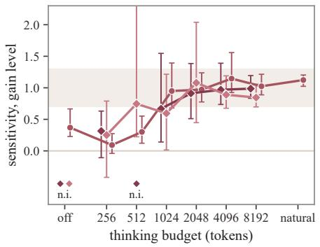

(b) Horizon sensitivity  
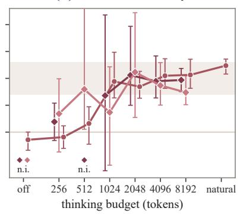

(c) History-level gap  
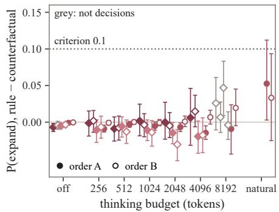  
Figure 11. Reasoning recovers the valuation of a stated gain, but not structural evidence from the history. (a) Price and (b) horizon sensitivity at the gain level against the thinking budget, with 95% intervals and the reference’s proportion, 0.7 to 1.3, as a band. (c) The history-level gap in the probability of expanding between rule histories and their boundary-matched counterfactuals, in orders A (filled) and B (hollow), against the criterion of 0.10; grey points are not decisions, and natural is the own close of Qwen 3 8B.

## Q.2.3. OLMO 3 THINK UNDER A LONG BUDGET

OLMo 3 Think and OLMo 3 Think SFT are read on the same sets, with one sampled chain per prompt up to a cap of 8,192 tokens. No history-level chain and few gain-level chains (5 and 66 of 1,098) close within the cap, so their read-outs follow a forced close.

At the history level the read-out at the cap is not a decision. At the cut, 95% of the chains name no action in their last 300 characters, and the read-out of such an unfinished chain follows the order in which the actions are listed: expand is the first choice in 72% to 98% of the chains of every class in order A, and continue in 94% to 99% in order B, where the list is reversed. Without a natural close, the evidence criterion cannot be evaluated for these models.

At the gain level the budget brings the ratios into the reference’s proportion. In order A, the only order with a gain-level cell, price and horizon sensitivity at 8,192 tokens are 0.99 [0.83, 1.19] and 0.97 [0.75, 1.18] for OLMo 3 Think and 0.85 [0.70, 1.06] and 0.74 [0.51, 1.05] for OLMo 3 Think SFT (Table 13).

With thinking off the ratios of the two models are not identified. Their slopes on the gain, the price and the horizon are a few hundredths per e-fold, and the probability of expanding is nearly flat: for OLMo 3 Think it falls from 0.79 to 0.73 as cE rises from 0.5 to 16 on the natural points, where the reference’s falls from 0.77 to 0.07. The fitted price sensitivity then follows the price levels of the grid, 0.38 with $c _ { E } \in \{ 0 . 5 , 2 , 8 \}$ , −0.04 with {0.5, 1, 2, 4} and 1.66 with {2, 4, 8, 16}. With reasoning the slopes grow tenfold, from 0.09 to 1.06 on the benefit for OLMo 3 Think, and the ratios are stable across price subsets, 0.72 and 1.07 for $c _ { E } \in \{ 0 . 5 , 2 \}$ and {2, 8}. In the coordinates of Figure 2(a) the three models with reasoning lie on the reference’s direction, OLMo 3 Think at (0.59, 0.58), OLMo 3 Think SFT at (0.67, 0.56) and Qwen 3 8B at (0.51, 0.58), against (0.59, 0.57) for the reference.

## Q.3. Conclusions

Scale leaves the shape of the predictive response and the history-level decision failure unchanged, and changes the calibration and the valuation of a stated gain. The 32B models respond to structural evidence with the shape of the 7B models, and their decisions at the history level do not separate a rule history from its matched threshold history, while their calibration slope is lower, their lift with demonstrations earlier and their weighing of a stated gain closer to the reference’s. Reasoning responds to the history locally and does not convert that response into an estimate of what expansion would buy. At its own close Qwen 3 8B moves probability on rule histories toward patch and defer, with a gap between rule histories and their counterfactuals of 0.06 and 0.03 in the two orders, below the criterion of 0.10, while its probability of expanding on rule histories does not follow the price and its chains explain the anomalies as exceptions to a single boundary. Given the gain, the three models value it after reasoning in the reference’s proportions.