# When does a network’s training history predict its future learning better than its current state?

Evidence from a response probe and a forecasting screen

Martin Hofmann1 Patrick Mäder1,2,3

1 Data-intensive Systems and Visualization Group (dAI.SY), Technische Universität Ilmenau, Max-Planck-Ring 14, 98693 Ilmenau, Thuringia, Germany 2 German Centre for Integrative Biodiversity Research (iDiv) Halle–Jena–Leipzig, Deutscher Platz 5e, 04103 Leipzig, Saxony, Germany 3 Faculty of Biological Sciences, Friedrich Schiller University, Fürstengraben 1, 07745 Jena, Thuringia, Germany

martin.hofmann@tu-ilmenau.de patrick.maeder@tu-ilmenau.de ORCID: 0000-0002-4440-3317 0000-0001-6871-2707

## Abstract

Networks that behave alike now can still learn diferently when training continues. Work on loss of plasticity and critical periods shows that the path to a state shapes what follows; it does not show whether the path carries information that a measurement of the state itself misses. We ask when the training history of a network predicts its future learning better than its current state. In a main study, small multilayer perceptrons were trained under three history regimes (42 histories), and future learning was measured at four checkpoints by a short probe: a copy of the network trained for 100 updates on a new task. Before the prediction result was read, the protocol checked the probe. It responded monotonically to a function-preserving rescaling of hidden units, repeated measurements agreed (intraclass correlation 0.940, [0.903, 0.997], in the least reliable class, mean of three repeats), and a re-initialisation of units was visible directly after it but not 100 to 200 updates later. A history state of at most four dimensions did not improve on a calibrated model of the current state (gain −21.4%, 90% interval [−91.9, 8.1]; required in advance: 10%). A companion screen on 1,560 synthetic regression runs asked the same question for a target further away, the final error of the run. There, history models forecast better than the current validation error after 12 of up to 240 epochs (compact state 30.3%, [15.8, 39.4], a contextual comparison) and were not distinguishable from it after 48. In both studies the history was informative only while the current state was not yet informative about the target; this reading was formed after the results.

## 1 Introduction

How well a network will learn from further training is not a function of its current loss alone. Networks lose the ability to fit new targets under continued training (Lyle et al., 2023; Dohare et al., 2024), warm-started networks generalise worse than freshly initialised ones (Ash and Adams, 2020), and what happens early in training, such as a sensory deficit or the presence of regularisation, has lasting efects (Achille et al., 2019; Golatkar et al., 2019). The path to a state matters for what follows.

What these findings leave open is whether the path carries information that the state no longer shows. The question matters for understanding learning: if the efect of the past is fully stored in the weights and the optimiser state, then for predicting what comes next the training process needs no memory beyond its state. It also matters in practice. A monitor that reads a checkpoint can be applied to any stored model, while a monitor that needs the history has to be carried along the whole run. A checkpoint can also be probed: a short burst of further training on a chosen task is itself a measurement of the state, and it may capture what a summary of the history would add.

We test the question on two targets that lie at diferent distances in the future. The near target is the response of a network to further training, read by such a probe at a checkpoint. The far target is the error a run reaches at its end, forecast after a growing part of the run has been observed. For the near target we fixed a threshold in advance:

A recurrent state of at most four dimensions, computed from the recorded training history and selected on validation data, reduces the held-out error in predicting a network’s response to further training by at least 10% relative to a baseline that sees only the current checkpoint, with a bootstrap lower bound above zero, and keeps a mean gain of at least 5% when a whole history regime is held out.

A negative answer to such a test means little if the probe cannot tell states apart. The main study therefore had two stages. The probe first had to register a known manipulation and give repeatable values; only then was the prediction result read. We report both stages in the order in which they occurred.

The paper contributes a short response probe checked with a positive control and repeated measurements; a registered test of whether a compact summary of the history predicts the probe beyond the current state; and a forecasting screen that varies how much of the run the forecaster has seen. Two screens on image classification are reported in appendix E.

## 2 Background

The path to a state. Continued training can reduce a network’s ability to learn new targets (Lyle et al., 2023; Dohare et al., 2024; Abbas et al., 2023; Berariu et al., 2021), with candidate mechanisms that include saturation and linearisation of units, growth of parameter norms and large target scales (Lyle et al., 2024), and changes of curvature (Lyle et al., 2023). Resetting or regularising parts of the network counters it (Nikishin et al., 2022; Kumar et al., 2025). Studies of the early phase show that later behaviour depends on the first epochs (Frankle et al., 2020; Achille et al., 2019; Golatkar et al., 2019; Jastrzebski et al., 2020; Fort et al., 2020). This work compares training paths and proposes diagnostics of the state. It does not test whether a summary of the path predicts future learning better than those diagnostics.

Forecasting from a partial run. Extrapolating a learning curve from its first part supports early stopping in hyperparameter optimisation and architecture search (Swersky et al., 2014; Domhan et al., 2015; Klein et al., 2017; Baker et al., 2017; Chandrashekaran and Lane, 2017; Wistuba and Pedapati, 2020; Ru et al., 2021; Yan et al., 2021; Adriaensen et al., 2023; Rakotoarison et al., 2024; Kadra et al., 2023); a survey is given by Mohr and van Rijn (2024), and Viering and Loog (2023) review curves over the size of the training set. Predictors also use weights, gradients and other training telemetry (Yamada and Morimura, 2016; Unterthiner et al., 2020; Naik et al., 2026), and simple predictors based on early values can be competitive with learned ones in some compute regimes (White et al., 2021; Egele et al., 2024). These methods use the history; they are rarely compared with a calibrated predictor of the current state under holdouts of whole task families.

Measuring before interpreting a null. Repeatability is quantified with the intraclass correlation (Shrout and Fleiss, 1979; McGraw and Wong, 1996). Positive controls and dose series are standard in measurement validation and rare in studies of training dynamics. We use both to show that the target responds before a null is read, and we fixed criteria and analysis before the runs, in the spirit of preregistration (Nosek et al., 2018).

## 3 Main study: design

Figure 1 shows the design. All constants are taken from the configuration frozen before execution (appendix D).

## 3.1 Networks and histories

Inputs are $x \sim \mathcal { N } ( 0 , I _ { 3 2 } )$ . A fixed orthogonal matrix Q maps them to latent coordinates $u = Q x$ , divided into four subspaces of eight dimensions. A task is a unit vector v in latent space with target $y = \operatorname { t a n h } ( v ^ { \top } u ) + \varepsilon$ where $\varepsilon \sim \mathcal { N } ( 0 , 0 . 0 5 ^ { 2 } )$ during training and ε = 0 in every evaluation. The network is a multilayer perceptron with two hidden layers of 128 rectified linear units, initialised after He et al. (2015) and trained on half the mean squared error with stochastic gradient descent (momentum 0.9, batch size 128). The learning rate 0.03 was selected on the anchor task alone, without access to any response.

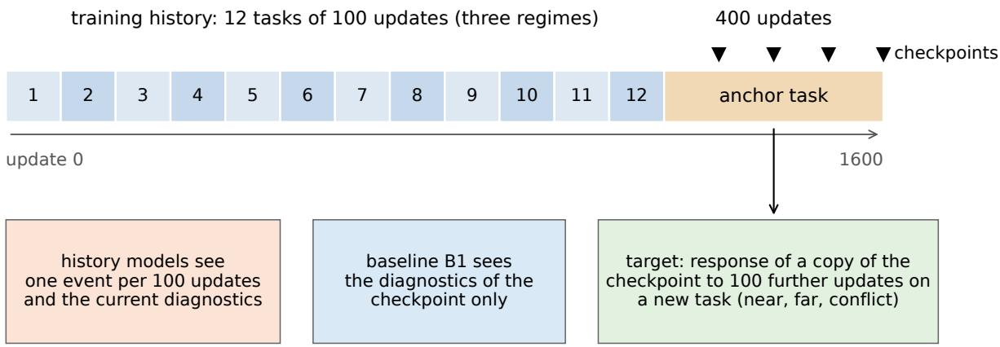  
Figure 1: Design of the main study. A network is trained on 12 tasks and then on a common anchor task. At each of four checkpoints, a copy receives 100 updates on a new task and its loss reduction is recorded. History models see one event per 100 updates of the history together with the diagnostics of the current checkpoint. The baseline sees the diagnostics only.

A history consists of 12 tasks of 100 updates each, followed by 400 updates on a common anchor task; optimiser state is carried through. Three regimes difer in the 12 tasks: three directions are cycled (repetitive, HF-REP), every task has a new direction (diverse, HF-DIV), or directions alternate between cosine +0.95 and −0.95 with the anchor (conflicting, HF-CON). The task sequence of a regime is drawn once and shared by its 12 histories, which difer in initialisation and training batches. Six further histories, the re-initialisation histories, follow the repetitive regime and re-initialise the 25 least active units of each hidden layer every 400 updates; they serve only as a control of the probe. Histories are split by seed into 24 for fitting, 6 for mode selection and 6 for testing. The unit of all resampling is the history.

## 3.2 The probe

Checkpoints are taken after 1300, 1400, 1500 and 1600 updates, all within the anchor phase. At a checkpoint, a copy of the network is trained for K = 100 updates on a challenge task, a task that is not part of the history, with a new optimiser state. The loss $L _ { k }$ on a fixed noise-free batch of 512 inputs gives the response

$$
Y = \frac { 1 } { K } \sum _ { k = 1 } ^ { K } \left( L _ { 0 } - L _ { k } \right) .\tag{1}
$$

The response measures how the current state reacts to further training, not where the run will end. Challenges come in three classes defined by their cosine with the anchor direction: near (0.75), conflict (−0.9) and far (latent coordinates no history task uses), each with four instances. Instances 0 to 2 serve fitting and selection, instance 3 is reserved for testing, and the measurement at instance 0 is repeated with an independent stream of training batches. Responses are standardised per class on the fitting histories; the three class responses at a checkpoint form a response map. 1,728 responses were used for fitting and selection, and 900 were reserved and opened once. The prediction test uses the 72 responses of instance 3 on the six test histories.

## 3.3 Predictors

All predictors share one decoder,

$$
\begin{array} { r } { \boldsymbol { \hat { y } } = \beta _ { 0 } + \beta _ { x } ^ { \top } \boldsymbol { x } + \beta _ { q } ^ { \top } \boldsymbol { q } + \boldsymbol { x } ^ { \top } \boldsymbol { W } _ { x q } \boldsymbol { q } + \beta _ { h } ^ { \top } h + h ^ { \top } \boldsymbol { W } _ { h q } \boldsymbol { q } , } \end{array}\tag{2}
$$

where x holds measurements of the current checkpoint, q describes the challenge and h represents the history. The baseline B1 has no h. Its 748 features include training age, current losses including the loss on the challenge before any update, weight norms, activation statistics, ranks, gradient norms and cosines, momentum statistics, the loss change of one trial update and the outputs on 64 fixed reference inputs; it is fit by ridge regression and represents the calibrated current state. The compact state reads the history as a sequence of events, one per 100 updates, each with the task direction, the loss at the start and end of the block and phase indicators; a linear recurrence $s _ { t } = A s _ { t - 1 } + P e _ { t }$ with spectral radius below one gives a state of dimension $d \in \{ 1 , 2 , 4 \}$ , chosen on validation data. A gated recurrent unit (Cho et al., 2014) with 32 hidden units over the same events is the reference without the dimension limit. Neither the regime label nor any response is an input. Two further baselines, a nonlinear model of the current state and a model of the task construction, are described in appendix B.

## 3.4 Checking the probe

For a rectified linear unit, multiplying the incoming weights and bias by $\gamma > 0$ and dividing the outgoing weights by $\gamma$ leaves the function of the network unchanged and changes the curvature and the response to gradient steps (Neyshabur et al., 2015; Dinh et al., 2017). The positive control applies this rescaling to a fixed quarter of the units of each hidden layer at the final checkpoint and measures the response map $R _ { \gamma }$ . Its efect is

$$
z = { \frac { \| R _ { \gamma } - R _ { A } \| } { \sqrt { 3 } } } - { \frac { \| R _ { A } - R _ { B } \| } { \sqrt { 3 } } } ,\tag{3}
$$

where $R _ { A }$ and $R _ { B }$ are maps of the unchanged checkpoint with the same and with an independent stream of training batches, so that the second term is the noise floor. The design used $\gamma \in \{ 0 . 5 , 2 \}$ on the six test histories. The re-initialisation histories provide a second control, a change of the state rather than of its parametrisation.

## 3.5 Criteria and protocol

Relative gain is $1 - \mathrm { R M S E } _ { \mathrm { m o d e l } } / \mathrm { R M S E } _ { \mathrm { B 1 } }$ on the standardised responses of the test histories. Two validity criteria come first: the intraclass correlation ICC(1,1) between first and repeated measurement is at least 0.80 in each class, and the positive control reaches a median efect of at least 0.25, positive in at least five of six histories and in every regime. The prediction criteria follow: the compact state gains at least 10% over B1 with a 90% bootstrap lower bound above zero, and keeps a mean gain of at least 5% when one regime is held out. Table 1 lists all nine criteria in their fixed order; the first criterion not met determines the recorded outcome. Intervals are percentile intervals from 2,000 bootstrap resamples of histories that repeat the mode selection (Efron and Tibshirani, 1993).

The configuration, criteria and analysis were frozen in local version control before the production run, without an external timestamp; the configuration labels the evidence as exploratory. After the first result, four further steps were each written down and committed before they were carried out: an analysis of the first validity results on recorded data; a second stage of the measurement, executed once; a third repeat of the conflict measurement; and a regularised summary of the full history, fit without reading test values. The first two changed doses, window and repeats of the measurement and left the prediction criteria, the fitted models and their predictions untouched. Appendix A lists the deviations.

## 4 Main study: results

All results in this section concern the task generator, the network and the 42 histories described above.

## 4.1 Stage 1: the probe before revision

The first question was whether the probe could be trusted. The near and far responses were repeatable (ICC 0.996 and 0.964), but the conflict response reached only 0.781 [0.656, 0.988], below 0.80. The positive control preserved the function and stayed below its threshold (0.205 at γ = 0.5, 0.044 at $\gamma = 2 )$ . By the fixed order, the hypothesis was recorded as neither supported nor rejected. The prediction criteria had been computed in the same pass (table 1), but a probe that does not register a known manipulation cannot show the absence of an efect.

## 4.2 Stage 2: dose response and repeats

The recorded data showed why. The conflict response was noisier between repeats than the other classes while its spread between checkpoints was similar, so averaging repeats addresses it, and the control efect depended on dose and on the averaging window (figure 2a,b; details in appendix B). The second stage was frozen before any new response was generated: doses $\gamma \in \{ 0 . 5 , 0 . 2 5 , 0 . 1 2 5 \}$ , 12 histories, a window ending at step 85 read from the recorded curves, and the unchanged threshold of 0.25. All its criteria were met (figure 2c). The median efect rose from 0.208 to 0.684 to 1.447 [1.192, 1.490], with 11/12 histories positive at the strongest dose. A third repeat of the conflict measurement, declared separately, gave a reliability of the three-repeat mean of 0.940 [0.903, 0.997]. The window and doses difer from those of the prediction target, the response over 100 updates.

The second control asked whether the probe sees a change of the state itself. Before production, a frozen technical control compared six pairs of histories that difered only in the re-initialisations, at the final checkpoint directly after the last one; the probe separated the pairs in every class, by 38, 15 and 14 times the noise floor between repeats. For the production histories we registered, before computing it, that the probe would separate the six re-initialisation histories from the twelve unmanipulated ones at all four checkpoints (efect of the same form, with the spread between unmanipulated histories as the floor, threshold 0.25). It did at the final checkpoint (10.4, [6.0, 15.3]) and at step 1500 (0.39, [0.16, 0.73]), and not at steps 1300 and 1400 (−0.06 and −0.05), 100 and 200 updates after the previous re-initialisation. The registered prediction was not met; the smaller efect at step 1500 does not follow the order of distances and is not explained.

Table 1: Criteria of the main study in the fixed order. Below the line: the positive control in the second stage and the declared third repeat. Intervals are 90% bootstrap intervals over histories.
<table><tr><td>Criterion, in the fixed order</td><td>Requirement</td><td>Result</td><td>Outcome</td></tr><tr><td>Known answer</td><td>exact within  $1 0 ^ { - 1 2 }$ </td><td>reproduced</td><td>met</td></tr><tr><td>Repeatability, minimum over classes</td><td> $\mathrm { I C C } ( 1 , 1 ) \geq 0 . 8 0$ </td><td>0.781 [0.673, 0.983]</td><td>not met</td></tr><tr><td>Gain of the compact state over B1</td><td> $\geq 1 0 \% ,$  lower bound  $> 0$ </td><td>-21.4% [-91.9, 8.1]</td><td>not met</td></tr><tr><td>Transfer to a held-out regime</td><td>mean gain  $\geq 5 \% ,$  each regime  $> 0$ </td><td>mean -80.3%</td><td>not met</td></tr><tr><td>Against the flexible baseline Dimension of the response map</td><td>RMSE difference, lower bound  $> 0$ </td><td>0.537 [-0.412, 0.989]</td><td>not met</td></tr><tr><td>Margin over task geometry</td><td>stable under resampling</td><td>three components, stable</td><td>met</td></tr><tr><td>Compression</td><td>≥ 2 points, lower bound &gt; 0</td><td>-16.9 points [-88.5, 13.4]  $d ^ { * } = 1$ </td><td>not met</td></tr><tr><td></td><td>state recovers ≥ 70% of the gain of the history GRU</td><td>no gain of the GRU;</td><td>not met</td></tr><tr><td>Positive control, original doses</td><td>median  $z \ge 0 . 2 5 , \ge 5$  of 6 positive, each regime positive</td><td>0.205 [0.047, 0.324], 5/6 at  $\gamma =$  0.5</td><td>not met</td></tr><tr><td>Stage 2: positive control, strongest dose</td><td>median  $z \ge 0 . 2 5 , \ge 1 0$  of 12 positive, monotone in dose</td><td>1.447 [1.192, 1.490], 11/12 at  $\gamma = 0 . 1 2 5$ </td><td>met</td></tr><tr><td>Extension: repeatability, con- flict class, third repeat</td><td>ICC(1,3) of the mean, lower bound  $> 0 . 8 0 .$  declared before execution</td><td>0.940 [0.903, 0.997]</td><td>met</td></tr></table>

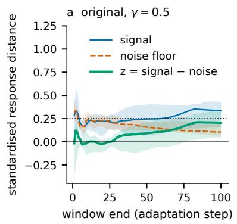

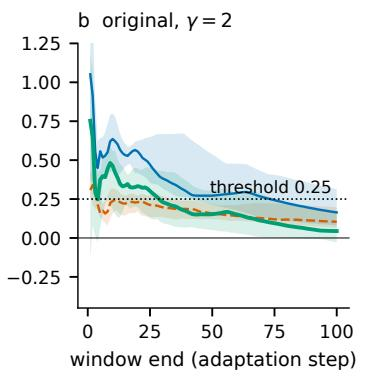

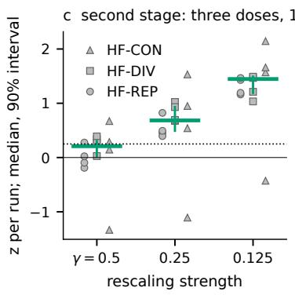  
Figure 2: Positive control in the main study. a, b: original design on six histories. Lines are medians of the response distance to the unchanged checkpoint (signal), of the distance between two unchanged measurements (noise floor) and of their diference z, for averaging windows ending at each step; bands are 90% bootstrap intervals. c: second stage with stronger doses on 12 histories, window ending at step 85. Points are histories, bars are medians with 90% intervals. The dotted line is the threshold fixed before the first run.

## 4.3 The history did not improve on the current state

With the probe checked, the prediction result can be read. It was computed once in the first analysis and not changed afterwards (figure 3). On the six test histories B1 had an error of 1.328 (RMSE of the standardised response), the compact state 1.612 and the history GRU 1.644. The gain of the compact state was −21.4% [−91.9, 8.1]; the upper end of the interval lies below the required 10%. The gain of the GRU was −23.8% [−96.6, 30.0]. The selected state dimension was $d ^ { * } = 1$ . With one regime held out, the mean gain was −80.3%, positive only for the repetitive regime.

A history model can fail because the history is uninformative or because the model overfits. The GRU fitted the training histories better than B1 (0.289 against 0.326) and was worse on validation (1.185 against 0.642), which points to overfitting with 24 training histories. The declared extension therefore replaced the recurrent model by a fixed summary of the history with ridge regression. It matched B1 on validation and stayed slightly worse on test (gain −0.9%, [−2.4, 1.3]); because it shares its penalty and checkpoint features with B1, this is a check that the summary adds nothing, not an independent test. With six test histories the study can resolve only large gains: detecting a gain of 10% with 80% power would need between 195 and 276 test histories (appendix B).

## 5 Forecasting screen: a target further away

The main study asked about the near future. The screen asks the same question about the end of a run, and lets the amount of observed history grow. It was run in the same project with the same comparison logic, a model of the history against a model of the current state.

Design. Thirteen families of scalar functions on $[ - 1 , 1 ] ^ { 3 2 }$ (linear, polynomial, Fourier, radial basis, piecewise, compositional, and solutions of ordinary and partial diferential equations) were each learned by 120 small networks that vary in architecture, optimiser (AdamW (Loshchilov and Hutter, 2019), stochastic gradient descent with Nesterov momentum, LARS (You et al., 2017)), batch size, learning rate and weight decay, giving 1,560 runs of up to 240 epochs. The target is the logarithm of the normalised root mean squared test error at the end of the run, on data that never enter the trajectory. After 12, 24 and 48 epochs five forecasters predict it: the current validation error taken as the forecast, a snapshot model of the latest row of training telemetry, a compact recurrent state, a GRU and a Transformer (Vaswani et al., 2017) over the trajectory. Every run of one family is held out in turn and the forecasters are trained on 1,000 runs of the other twelve. The analysis plan, frozen before any forecast existed, set two thresholds at epoch 48: a mean improvement of at least 10% of some history model over the snapshot model, and an improvement in at least

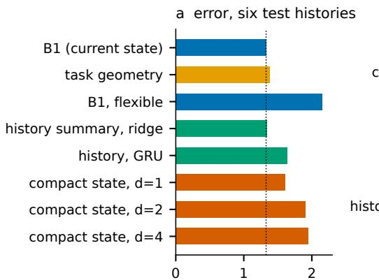  
held-out RMSE (standardised response)

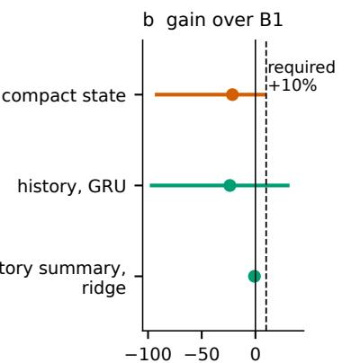  
gain over B1 (%), 90% interva

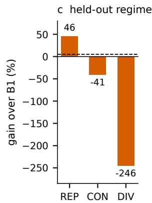  
Figure 3: Prediction of the response to further training in the main study. a: error on the six test histories; the dotted line marks the current-state baseline. b: gain over the baseline with 90% bootstrap intervals over histories; the dashed line is the gain required in advance. c: gain of the compact state when a whole regime is held out; the dashed line is the required mean gain.

Table 2: Forecasting screen: mean absolute error of the forecast of the final log test error, with one task family held out (average over 13 families). Bold marks the lowest error in a column.
<table><tr><td rowspan="2">Predictor</td><td colspan="3">1,000 runs for training the forecaster</td><td colspan="3">200 runs</td></tr><tr><td>epoch 12</td><td>24</td><td>48</td><td>12</td><td>24</td><td>48</td></tr><tr><td>Current value, unfitted</td><td>0.680</td><td>0.496</td><td>0.319</td><td>0.680</td><td>0.496</td><td>0.319</td></tr><tr><td>Snapshot model</td><td>0.545</td><td>0.434</td><td>0.378</td><td>0.629</td><td>0.551</td><td>0.488</td></tr><tr><td>Compact recurrent state</td><td>0.474</td><td>0.392</td><td>0.316</td><td>0.483</td><td>0.398</td><td>0.368</td></tr><tr><td>GRU over history</td><td>0.483</td><td>0.398</td><td>0.345</td><td>0.509</td><td>0.412</td><td>0.370</td></tr><tr><td>Transformer over history</td><td>0.481</td><td>0.401</td><td>0.321</td><td>0.533</td><td>0.434</td><td>0.385</td></tr></table>

9 of 13 held-out families. The comparison over epochs was planned without a threshold, and the comparison with the current validation error was planned as context. Intervals are 90% bootstrap intervals over the 13 families, without correction for multiple comparisons.

Results. Early in the run, history helped (table 2, figure 4). After 12 epochs the compact state improved on the snapshot model by 13.1% [2.4, 23.7] and on the current validation error by 30.3% [15.8, 39.4]; the GRU and the Transformer also improved on the current value. After 24 epochs the compact state still improved on the current value (20.9%, [5.3, 30.9]). After 48 epochs the first registered threshold was met in the mean (Transformer 15.1%, [0.8, 28.4], over the snapshot model) and the second was not (8/13 families). At the same epoch no history model was distinguishable from the current validation error (compact state 0.8%, [−19.8, 15.2]), while the snapshot model was worse than it; the registered gain therefore reflects in part a weak snapshot model. Results with fewer training runs and without held-out families are given in appendix C.

## 6 Discussion

The near target. We asked whether a compact summary of the history predicts how a network responds to further training better than its current state. In the main study it did not: the 90% interval of the gain lies below the 10% fixed in advance, the unrestricted GRU overfitted, and a regularised summary added nothing. The answer can be read because the probe was checked first. It registered a function-preserving rescaling with a monotone dose response, the mean of three repeats was reliable, and it saw a re-initialisation of units directly after it. The same check shows its limit: 100 to 200 updates after a re-initialisation, the probe no longer separated those histories.

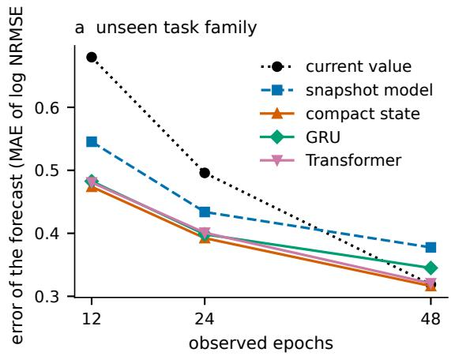

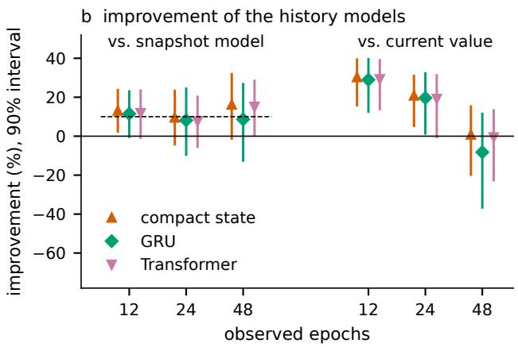  
Figure 4: Forecasting screen with 1,000 runs for training the forecasters. a: forecast error with one task family held out. b: improvement of the three history models over the snapshot model (left) and over the current validation error (right), with 90% bootstrap intervals over families. The dashed line is the threshold set for epoch 48 against the snapshot model.

The far target. For the end of a run, history helped while little of the run had been seen. After a fifth of the run the current validation error was as good as any history model. One reading connects both studies: the history is informative while the current state is not yet informative about the target, as for the final error after a few epochs, and adds nothing when the state already reflects it, as for the response to the next 100 updates. This reading was formed after the results. The two screens on image classification (appendix E) found no advantage of history encoders, with weak evidence, and do not test it.

The path and the state. In the tested settings the past acted through the state it left behind. A well-measured state, including a short probe of its response, carried what the history added; a summary of the path added no predictive value beyond a careful measurement of the present. The value of the history depended on the target and on timing. It helped early in a run and for a distant target, and the trace of an intervention faded from the probe within a few hundred updates. In these studies, how far ahead the target lay and how recent the events were decided whether a record of the past added anything to a look at the present.

What the paper does not claim. It does not claim that the current state is suficient in general, that the history carries no information, or that a small set of scalar diagnostics would sufice. It makes no statement about large models or language modelling.

Future work. The main study shares one task sequence within each regime and probes at least 100 updates after the last history task; task sequences drawn per history and probes directly after a history task would test the claim more broadly and in a more favourable case. Resolving a gain of 5 to 10% needs between 195 and 1,035 test histories. The early window of the forecasting screen should be tested as a registered hypothesis with correction for multiple comparisons, and the reading that connects both studies needs a design in which the distance of the target is varied within one system.

## 7 Limitations

1. Sample size. The prediction test rests on six test histories and three task sequences; the forecasting screen on 13 designed families.

2. Order and registration. The second stage of the measurement was completed after the first prediction results were known; its plan was fixed before new data and changed no prediction criterion, fitted model or prediction. Protocols were frozen in local version control, not registered externally. The combined evidence is exploratory.

3. Reliability. The frozen criterion concerned a single measurement and was not met for one class; the value above the criterion is for the mean of three repeats.

4. Scope. Small networks, synthetic or small image tasks and short horizons; post hoc elements of the screens are marked in table 3.

## 8 Conclusion

A compact summary of the training history did not predict a network’s response to further training better than a calibrated model of its current state, read through a probe that had first been shown to register known manipulations. When forecasting the end of a run, the history helped only while little of the run had been observed. A reading formed after the results connects both: in the tested settings, the history was informative only while the current state was not yet informative about the target.

## Data and code availability

The frozen protocols, the analysis code, the result records from which every number and figure of this paper is generated, and the generating script are available from the authors. Appendix D lists commits and file hashes.

## Author contributions

M.H. conceived the study, wrote the protocols and the code, ran and analysed the experiments and wrote the manuscript. P.M. supervised the work and revised the manuscript.

## Use of AI-assisted tools

AI coding and writing assistants (Claude, Anthropic) assisted with research code, run orchestration, analysis scripts, literature lookup and drafting. The authors are responsible for the design, verification, interpretation, citations and final text.

## References

Zaheer Abbas, Rosie Zhao, Joseph Modayil, Adam White, and Marlos C. Machado. Loss of plasticity in continual deep reinforcement learning. In Proceedings of The 2nd Conference on Lifelong Learning Agents, volume 232 of Proceedings of Machine Learning Research, pages 620–636, 2023. URL https: //proceedings.mlr.press/v232/abbas23a.html.

Alessandro Achille, Matteo Rovere, and Stefano Soatto. Critical learning periods in deep networks. In International Conference on Learning Representations, 2019. URL https://arxiv.org/abs/1711.08856.

Steven Adriaensen, Herilalaina Rakotoarison, Samuel Müller, and Frank Hutter. Eficient Bayesian learning curve extrapolation using prior-data fitted networks. In Advances in Neural Information Processing Systems, volume 36, pages 19858–19886, 2023. URL https://proceedings.neurips.cc/paper\_files/ paper/2023/hash/3f1a5e8bfcc3005724d246abe454c1e5-Abstract-Conference.html.

Jordan T. Ash and Ryan P. Adams. On warm-starting neural network training. In Advances in Neural Information Processing Systems, volume 33, pages 3884–3894, 2020. URL https://proceedings.neurips. cc/paper\_files/paper/2020/hash/288cd2567953f06e460a33951f55daaf-Abstract.html.

Bowen Baker, Otkrist Gupta, Ramesh Raskar, and Nikhil Naik. Accelerating neural architecture search using performance prediction. arXiv preprint arXiv:1705.10823, 2017. URL https://arxiv.org/abs/ 1705.10823. Presented at the ICLR 2018 Workshop Track.

Tudor Berariu, Wojciech Czarnecki, Soham De, Jorg Bornschein, Samuel Smith, Razvan Pascanu, and Claudia Clopath. A study on the plasticity of neural networks. arXiv preprint arXiv:2106.00042, 2021. URL https://arxiv.org/abs/2106.00042.

Akshay Chandrashekaran and Ian R. Lane. Speeding up hyper-parameter optimization by extrapolation of learning curves using previous builds. In Machine Learning and Knowledge Discovery in Databases (ECML PKDD 2017), Part I, volume 10534 of Lecture Notes in Computer Science, pages 477–492. Springer, 2017. URL https://doi.org/10.1007/978-3-319-71249-9\_29.

Kyunghyun Cho, Bart van Merriënboer, Caglar Gulcehre, Dzmitry Bahdanau, Fethi Bougares, Holger Schwenk, and Yoshua Bengio. Learning phrase representations using RNN encoder–decoder for statistical machine translation. In Proceedings of the 2014 Conference on Empirical Methods in Natural Language Processing (EMNLP), pages 1724–1734, 2014. URL https://doi.org/10.3115/v1/D14-1179.

Laurent Dinh, Razvan Pascanu, Samy Bengio, and Yoshua Bengio. Sharp minima can generalize for deep nets. In Proceedings of the 34th International Conference on Machine Learning, volume 70 of Proceedings of Machine Learning Research, pages 1019–1028, 2017. URL https://proceedings.mlr.press/v70/ dinh17b.html.

Shibhansh Dohare, J. Fernando Hernandez-Garcia, Qingfeng Lan, Parash Rahman, A. Rupam Mahmood, and Richard S. Sutton. Loss of plasticity in deep continual learning. Nature, 632(8026):768–774, 2024. URL https://doi.org/10.1038/s41586-024-07711-7.

Tobias Domhan, Jost Tobias Springenberg, and Frank Hutter. Speeding up automatic hyperparameter optimization of deep neural networks by extrapolation of learning curves. In Proceedings of the Twenty-Fourth International Joint Conference on Artificial Intelligence, pages 3460–3468, 2015. URL https: //www.ijcai.org/Proceedings/15/Papers/487.pdf.

Bradley Efron and Robert J. Tibshirani. An Introduction to the Bootstrap. Chapman & Hall, New York, 1993. URL https://doi.org/10.1007/978-1-4899-4541-9.

Romain Egele, Felix Mohr, Tom Viering, and Prasanna Balaprakash. The unreasonable efectiveness of early discarding after one epoch in neural network hyperparameter optimization. Neurocomputing, 597:127964, 2024. URL https://doi.org/10.1016/j.neucom.2024.127964.

Stanislav Fort, Gintare Karolina Dziugaite, Mansheej Paul, Sepideh Kharaghani, Daniel M. Roy, and Surya Ganguli. Deep learning versus kernel learning: An empirical study of loss landscape geometry and the time evolution of the Neural Tangent Kernel. In Advances in Neural Information Processing Systems, volume 33, pages 5850–5861, 2020. URL https://proceedings.neurips.cc/paper\_files/paper/2020/ hash/405075699f065e43581f27d67bb68478-Abstract.html.

Jonathan Frankle, David J. Schwab, and Ari S. Morcos. The early phase of neural network training. In International Conference on Learning Representations, 2020. URL https://openreview.net/forum?id= Hkl1iRNFwS.

Aditya Sharad Golatkar, Alessandro Achille, and Stefano Soatto. Time matters in regularizing deep networks: Weight decay and data augmentation afect early learning dynamics, matter little near convergence. In Advances in Neural Information Processing Systems, volume 32, 2019. URL https://proceedings. neurips.cc/paper\_files/paper/2019/hash/87784eca6b0dea1dff92478fb786b401-Abstract.html.

Kaiming He, Xiangyu Zhang, Shaoqing Ren, and Jian Sun. Delving deep into rectifiers: Surpassing humanlevel performance on ImageNet classification. In Proceedings of the IEEE International Conference on Computer Vision (ICCV), pages 1026–1034, 2015. URL https://doi.org/10.1109/ICCV.2015.123.

Kaiming He, Xiangyu Zhang, Shaoqing Ren, and Jian Sun. Deep residual learning for image recognition. In Proceedings of the IEEE Conference on Computer Vision and Pattern Recognition (CVPR), pages 770–778, 2016. URL https://doi.org/10.1109/CVPR.2016.90.

Sture Holm. A simple sequentially rejective multiple test procedure. Scandinavian Journal of Statistics, 6(2): 65–70, 1979. URL https://www.jstor.org/stable/4615733.

Herbert Jaeger. The “echo state” approach to analysing and training recurrent neural networks. GMD Report 148, German National Research Center for Information Technology (GMD), 2001. URL https: //www.ai.rug.nl/minds/uploads/EchoStatesTechRep.pdf.

Stanislaw Jastrzebski, Maciej Szymczak, Stanislav Fort, Devansh Arpit, Jacek Tabor, Kyunghyun Cho, and Krzysztof Geras. The break-even point on optimization trajectories of deep neural networks. In International Conference on Learning Representations, 2020. URL https://openreview.net/forum?id=r1g87C4KwB.

Arlind Kadra, Maciej Janowski, Martin Wistuba, and Josif Grabocka. Scaling laws for hyperparameter optimization. In Advances in Neural Information Processing Systems, volume 36, pages 47527–47553, 2023. URL https://proceedings.neurips.cc/paper\_files/paper/2023/hash/ 945c781d7194ea81026148838af95af7-Abstract-Conference.html.

Diederik P. Kingma and Jimmy Ba. Adam: A method for stochastic optimization. In International Conference on Learning Representations, 2015. URL https://arxiv.org/abs/1412.6980.

James Kirkpatrick, Razvan Pascanu, Neil Rabinowitz, Joel Veness, Guillaume Desjardins, Andrei A. Rusu, Kieran Milan, John Quan, Tiago Ramalho, Agnieszka Grabska-Barwinska, Demis Hassabis, Claudia Clopath, Dharshan Kumaran, and Raia Hadsell. Overcoming catastrophic forgetting in neural networks. Proceedings of the National Academy of Sciences, 114(13):3521–3526, 2017. URL https://doi.org/10. 1073/pnas.1611835114.

Aaron Klein, Stefan Falkner, Jost Tobias Springenberg, and Frank Hutter. Learning curve prediction with Bayesian neural networks. In International Conference on Learning Representations, 2017. URL https://openreview.net/forum?id=S11KBYclx.

Alex Krizhevsky. Learning multiple layers of features from tiny images. Technical report, University of Toronto, 2009. URL https://www.cs.toronto.edu/\~kriz/learning-features-2009-TR.pdf.

Saurabh Kumar, Henrik Marklund, and Benjamin Van Roy. Maintaining plasticity in continual learning via regenerative regularization. In Proceedings of The 3rd Conference on Lifelong Learning Agents, volume 274 of Proceedings of Machine Learning Research, pages 410–430, 2025. URL https://proceedings.mlr. press/v274/kumar25a.html.

Olivier Ledoit and Michael Wolf. A well-conditioned estimator for large-dimensional covariance matrices. Journal of Multivariate Analysis, 88(2):365–411, 2004. URL https://doi.org/10.1016/S0047-259X(03) 00096-4.

Zhizhong Li and Derek Hoiem. Learning without forgetting. IEEE Transactions on Pattern Analysis and Machine Intelligence, 40(12):2935–2947, 2018. URL https://doi.org/10.1109/TPAMI.2017.2773081.

Ilya Loshchilov and Frank Hutter. Decoupled weight decay regularization. In International Conference on Learning Representations, 2019. URL https://arxiv.org/abs/1711.05101.

Mantas Lukoševičius and Herbert Jaeger. Reservoir computing approaches to recurrent neural network training. Computer Science Review, 3(3):127–149, 2009. URL https://doi.org/10.1016/j.cosrev.2009.03.005.

Clare Lyle, Zeyu Zheng, Evgenii Nikishin, Bernardo Avila Pires, Razvan Pascanu, and Will Dabney. Understanding plasticity in neural networks. In Proceedings of the 40th International Conference on Machine Learning, volume 202 of Proceedings of Machine Learning Research, pages 23190–23211, 2023. URL https://proceedings.mlr.press/v202/lyle23b.html.

Clare Lyle, Zeyu Zheng, Khimya Khetarpal, Hado van Hasselt, Razvan Pascanu, James Martens, and Will Dabney. Disentangling the causes of plasticity loss in neural networks. arXiv preprint arXiv:2402.18762, 2024. URL https://arxiv.org/abs/2402.18762.

Wolfgang Maass, Thomas Natschläger, and Henry Markram. Real-time computing without stable states: A new framework for neural computation based on perturbations. Neural Computation, 14(11):2531–2560, 2002. URL https://doi.org/10.1162/089976602760407955.

Kenneth O. McGraw and S. P. Wong. Forming inferences about some intraclass correlation coeficients. Psychological Methods, 1(1):30–46, 1996. URL https://doi.org/10.1037/1082-989X.1.1.30.

Felix Mohr and Jan N. van Rijn. Learning curves for decision making in supervised machine learning: A survey. Machine Learning, 113(11–12):8371–8425, 2024. URL https://doi.org/10.1007/s10994-024-06619-7.

Ranjita Naik, Anh D. Nguyen, and Pankaj Kumar Singh. Predicting deep neural network training outcomes from early training telemetry. arXiv preprint arXiv:2608.03709, 2026. URL https://arxiv.org/abs/ 2608.03709.

Behnam Neyshabur, Ruslan Salakhutdinov, and Nathan Srebro. Path-SGD: Path-normalized optimization in deep neural networks. In Advances in Neural Information Processing Systems, volume 28, 2015. URL https://proceedings.neurips.cc/paper\_files/paper/2015/hash/ eaa32c96f620053cf442ad32258076b9-Abstract.html.

Evgenii Nikishin, Max Schwarzer, Pierluca D’Oro, Pierre-Luc Bacon, and Aaron Courville. The primacy bias in deep reinforcement learning. In Proceedings of the 39th International Conference on Machine Learning, volume 162 of Proceedings of Machine Learning Research, pages 16828–16847, 2022. URL https://proceedings.mlr.press/v162/nikishin22a.html.

Brian A. Nosek, Charles R. Ebersole, Alexander C. DeHaven, and David T. Mellor. The preregistration revolution. Proceedings of the National Academy of Sciences, 115(11):2600–2606, 2018. URL https: //doi.or /10.1073/pnas.1708274114.

Herilalaina Rakotoarison, Steven Adriaensen, Neeratyoy Mallik, Samir Garibov, Eddie Bergman, and Frank Hutter. In-context freeze-thaw Bayesian optimization for hyperparameter optimization. In Proceedings of the 41st International Conference on Machine Learning, volume 235 of Proceedings of Machine Learning Research, pages 41982–42008, 2024. URL https://proceedings.mlr.press/v235/rakotoarison24a. html.

Sylvestre-Alvise Rebufi, Alexander Kolesnikov, Georg Sperl, and Christoph H. Lampert. iCaRL: Incremental classifier and representation learning. In Proceedings of the IEEE Conference on Computer Vision and Pattern Recognition (CVPR), pages 5533–5542, 2017. URL https://doi.org/10.1109/CVPR.2017.587.

Robin Ru, Clare Lyle, Lisa Schut, Miroslav Fil, Mark van der Wilk, and Yarin Gal. Speedy performance estimation for neural architecture search. In Advances in Neural Information Processing Systems, volume 34, pages 4079–4092, 2021. URL https://proceedings.neurips.cc/paper\_files/paper/2021/ hash/2130eb640e0a272898a51da41363542d-Abstract.html.

Jonathan Schwarz, Wojciech Czarnecki, Jelena Luketina, Agnieszka Grabska-Barwinska, Yee Whye Teh, Razvan Pascanu, and Raia Hadsell. Progress & compress: A scalable framework for continual learning. In Proceedings of the 35th International Conference on Machine Learning, volume 80 of Proceedings of Machine Learning Research, pages 4528–4537, 2018. URL https://proceedings.mlr.press/v80/ schwarz18a.html.

Patrick E. Shrout and Joseph L. Fleiss. Intraclass correlations: Uses in assessing rater reliability. Psychological Bulletin, 86(2):420–428, 1979. URL https://doi.org/10.1037/0033-2909.86.2.420.

Karen Simonyan and Andrew Zisserman. Very deep convolutional networks for large-scale image recognition. In International Conference on Learning Representations, 2015. URL https://arxiv.org/abs/1409.1556.

Kevin Swersky, Jasper Snoek, and Ryan Prescott Adams. Freeze-thaw Bayesian optimization. arXiv preprint arXiv:1406.3896, 2014. URL https://arxiv.org/abs/1406.3896.

Thomas Unterthiner, Daniel Keysers, Sylvain Gelly, Olivier Bousquet, and Ilya Tolstikhin. Predicting neural network accuracy from weights. arXiv preprint arXiv:2002.11448, 2020. URL https://arxiv.org/abs/ 2002.11448.

Gido M. van de Ven, Tinne Tuytelaars, and Andreas S. Tolias. Three types of incremental learning. Nature Machine Intelligence, 4(12):1185–1197, 2022. URL https://doi.org/10.1038/s42256-022-00568-3.

Ashish Vaswani, Noam Shazeer, Niki Parmar, Jakob Uszkoreit, Llion Jones, Aidan N. Gomez, Łukasz Kaiser, and Illia Polosukhin. Attention is all you need. In Advances in Neural Information Processing Systems, volume 30, 2017. URL https://proceedings.neurips.cc/paper\_files/paper/2017/hash/ 3f5ee243547dee91fbd053c1c4a845aa-Abstract.html.

Tom Viering and Marco Loog. The shape of learning curves: A review. IEEE Transactions on Pattern Analysis and Machine Intelligence, 45(6):7799–7819, 2023. URL https://doi.org/10.1109/TPAMI.2022.3220744.

Colin White, Arber Zela, Robin Ru, Yang Liu, and Frank Hutter. How powerful are performance predictors in neural architecture search? In Advances in Neural Information Processing Systems, volume 34, pages 28454–28469, 2021. URL https://proceedings.neurips.cc/paper\_files/paper/2021/hash/ ef575e8837d065a1683c022d2077d342-Abstract.html.

Martin Wistuba and Tejaswini Pedapati. Learning to rank learning curves. In Proceedings of the 37th International Conference on Machine Learning, volume 119 of Proceedings of Machine Learning Research, pages 10303–10312, 2020. URL https://proceedings.mlr.press/v119/wistuba20a.html.

Yasunori Yamada and Tetsuro Morimura. Weight features for predicting future model performance of deep neural networks. In Proceedings of the Twenty-Fifth International Joint Conference on Artificial Intelligence, pages 2231–2237, 2016. URL https://www.ijcai.org/Proceedings/16/Papers/318.pdf.

Shen Yan, Colin White, Yash Savani, and Frank Hutter. NAS-Bench-x11 and the power of learning curves. In Advances in Neural Information Processing Systems, volume 34, pages 22534–22549, 2021. URL https://proceedings.neurips.cc/paper\_files/paper/2021/hash/ be3159ad04564bfb90db9e32851ebf9c-Abstract.html.

Yang You, Igor Gitman, and Boris Ginsburg. Large batch training of convolutional networks. arXiv preprint arXiv:1708.03888, 2017. URL https://arxiv.org/abs/1708.03888.

## A Protocol history and deviations

Main study. The production data come from protocol version 3, the production instance; no data of earlier versions are used. The final analysis was computed directly from the completed run records with the frozen analysis definitions; it used all 42 histories and all 900 reserved responses. The steps after the first result were committed before execution and each was executed once. The second stage of the measurement difers from the original control in dose, number of histories and averaging window.

CIFAR-100 screen. The trace includes, for 40 fixed images, the gradient of a logit statistic with respect to the input. For 20 of the 72 runs, which had not completed a first update, the validity check on this gradient was set to record a gradient of exactly zero as zero before they were executed; each was executed once. Data, architectures, training and analysis are the same for all runs. The calibrated baselines were added after the first complete analysis.

Forecasting screen. The reported version uses a final test set that is never observed during training; an earlier configuration without this separation is not used. Cells in which a secondary metric overflows are reported as overflow, without clipping or rerun (12 cells).

## B Further details of the main study

Criteria. The nine criteria in their fixed order are: known answer (the response computation reproduces an analytic case), repeatability, gain, transfer to a held-out regime, a nonlinear baseline (B1 with a hidden layer of 32 units, which the compact state must beat), the stability of the dimension of the response map, a margin of two percentage points over a task-geometry baseline (B1 with summaries of the known history tasks relative to the challenge), compression (the compact state recovers at least 70% of the gain of the GRU) and the positive control. Function preservation of the control is verified on five input sets to an output tolerance of $1 0 ^ { - 6 }$ , and a random perturbation of equal norm serves as a comparison; its norm matched to a relative error of $2 . 1 \times 1 0 ^ { - 1 6 }$

Fitting. Neural predictors are fit with Adam (Kingma and Ba, 2015) on a fixed grid of two learning rates and three weight decays, with early stopping on the validation histories, and their predictions are averaged over five initialisations. The state dimension is the smallest within one standard error of the best validation error. All choices use fitting and validation histories only, and no model was refit after the test values were opened.

Stage 1 diagnosis. In the conflict class the variance between checkpoints was 0.798 and between repeats 0.224, against 0.003 and 0.021 between repeats for near and far. At γ = 0.5 the control efect was positive in 5/6 histories, with a largest value over windows of 0.211 at step 85; at γ = 2 it was 0.753 after the first update and 0.044 at step 100. The noise floor fell over the window (change −0.204, [−0.324, −0.137]). In the second stage, 9/12, 11/12 and 11/12 histories were positive at the three doses (intervals [0.023, 0.304], [0.492, 0.930], [1.192, 1.490]), and responses over the shorter window were standardised with the transformation of the full window.

Reliability. The mean of two repeats has a projected reliability of 0.877 by the Spearman–Brown formula, with lower bound 0.792; this projection is not a pass of the frozen single-measurement criterion. The third repeat measured 0.940 [0.903, 0.997] on 24 checkpoints (figure 5).

Further baselines. The nonlinear baseline had an error of 2.149, worse than B1, so the criterion comparing it with the compact state is uninformative. The task-geometry baseline had 1.387, between B1 and the history models. States of dimension 2 and 4 had errors of 1.912 and 1.951. B1 had 0.326 on the fitting and 0.642 on the validation histories, and a reduced reference model without checkpoint diagnostics had 3.364 on the test histories. Adding the regime label to B1 left its error unchanged (gain −0.03%). With one regime held out the gains were 45.7% (repetitive), −40.9% (conflicting) and −245.7% (diverse). The regularised summary uses the mean of each event feature, the diference between last and first event and nine summaries of the diagnostic trajectory; it had 0.629 on validation and 1.340 on test.

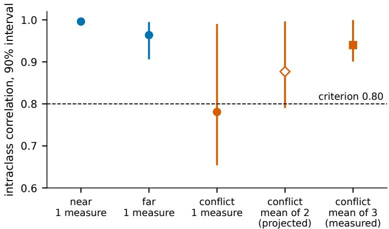  
Figure 5: Repeatability of the response in the main study, with 90% bootstrap intervals over histories. The single conflict measurement missed the criterion. The value for the mean of two repeats is a projection; the value for three repeats was measured afterwards.

Power. A calculation on the observed paired diferences indicates that detecting a true gain of 10% with 80% power would need between 195 and 276 test histories, and a gain of 5% between 723 and 1,035, depending on the approximation.

Diagnostic collisions. A supporting check searched for pairs of checkpoints from diferent regimes with nearly equal current-state features (Mahalanobis distance with a shrinkage covariance (Ledoit and Wolf, 2004)), nearly equal predicted responses and clearly diferent measured responses; at least eight such pairs were required. Of 1,584 eligible pairs, 670 were close in current-state features; all but 1 of these were excluded because their predicted responses difered, and the measured responses of the remaining pair were close.

Status of the findings. Table 3 labels each finding by how it was obtained.

## C Further results of the forecasting screen

With 200 training runs the history models keep their advantage at epochs 12 and 24 and are worse than the current value at epoch 48. With 100 training runs the snapshot and Transformer models produced extreme forecasts in two held-out families (mean error at epoch 48 of 70.0 for the snapshot model against 0.418 for the compact state). When runs of all families are available for training, the compact state is no better than the snapshot model (0.499 against 0.464 at epoch 12, 0.288 against 0.279 at epoch 48). The families are a designed set, and the intervals describe stability across this set. 832 runs reached the epoch limit, so the end point is a fixed stopping rule and not convergence. The forecasters are not matched in capacity.

## D Reproducibility

Result numbers in the text are macros written by scripts/render\_assets.py from the result records in sources/; the tables of results and all figures are produced by the same script. The file generated/provenance.json lists the SHA-256 of each source file and the source of each macro. Design constants and the count of 20 runs in appendix A are typed. The script scripts/audit\_paper.py checks that the hashes match, that every macro used is defined, that every citation has an entry, that no placeholder is left, and that decimal numbers typed in the text belong to a list of design constants.

Table 3: Status of the findings.
<table><tr><td>Finding</td><td>Obtained</td><td>Units</td></tr><tr><td>Main study: no gain of the compact state or the history fixed in advance GRU</td><td></td><td>6 test histories</td></tr><tr><td>Main study: no transfer to a held-out regime</td><td>fixed in advance</td><td>3 regimes</td></tr><tr><td>Main study, stage 1: conflict response below the reliability fixed in advance criterion</td><td></td><td>24 checkpoints</td></tr><tr><td>Main study, stage 2: dose response of the positive control fixed before new data, af- 12 histories</td><td>ter the first result</td><td></td></tr><tr><td>Main study: reliability of the three-repeat mean</td><td>extension declared before 24 checkpoints execution</td><td></td></tr><tr><td>Main study: re-initialisation control, paired</td><td>technical control frozen 6 pairs before production</td><td></td></tr><tr><td>Main study: re-initialisation control in production</td><td>registered after the first re-18 histories sult on existing data; pre- diction not met</td><td></td></tr><tr><td>Main study: no gain of the regularised history summary</td><td>test result, fit without reading test values</td><td>extension after the first 6 test histories</td></tr><tr><td>Main study: collision coverage, power Forecasting: thresholds at epoch 48</td><td>post hoc on recorded data fixed in advance</td><td>13 families</td></tr><tr><td>Forecasting: advantage over the snapshot model at epoch planned profile, no thresh- 13 families</td><td></td><td></td></tr><tr><td>12 Forecasting: comparison with the current value</td><td>old reported as context, no de- 13 families</td><td></td></tr><tr><td>CIFAR-100: reservoir against calibrated current accuracy</td><td>cision rule design fixed; baseline and 3 blocks</td><td></td></tr><tr><td></td><td>reported arm post hoc</td><td></td></tr><tr><td>Class-incremental: forecasters compared</td><td>fixed in advance</td><td>4 class orders</td></tr></table>

Main study: main study protocol v3.0, global seed 20260827; SHA-256 of the frozen configuration (first 16 digits): 8fc3213a7eaa6b09. Second stage of the measurement at commit 13c822f4f887; extensions at commit 9e91fc51145d. SHA-256 of the file of analysis values (first 16 digits): 1563631c6fca8958. Forecasting screen: commit ccb5e357e126; bootstrap seed 13032026 with 20,000 draws. CIFAR-100 screen: SHA-256 of the analysis record abb6e617612e51f99f4d6992fc67ad119f4277f27b7dd63b0f956638cf89a79 5. Class-incremental screen: training commit cfe34b811363, analysis commit 7d2f13fda442.

## E Two screens on CIFAR-100

## E.1 CIFAR-100 subsets with two architectures

Design. Twelve classification tasks of 20 classes each were built from CIFAR-100 (Krizhevsky, 2009) in three blocks of four. A ResNet-18 (He et al., 2016) and a VGG-11 (Simonyan and Zisserman, 2015) were trained on each task with three seeds for 60 epochs, 72 runs. The target is the test accuracy after epoch 60, forecast after 6, 12 and 24 epochs from a trace of weight spectra, training telemetry and a representation sketch. History encoders are fixed reservoirs of 64 units (an echo state network and four spiking variants; Jaeger, 2001; Maass et al., 2002; Lukoševičius and Jaeger, 2009) with a linear or kernel readout, ten arms in total. In the main evaluation a block of tasks is held out. The design was fixed before the runs and set no numerical thresholds. With three blocks there is no estimate of uncertainty; all values are point estimates. Baselines that calibrate the current validation accuracy on the training folds were added after the first analysis, when a check showed that the unfitted current accuracy was too weak a comparison. The reported reservoir is the best of the ten arms on the test folds. Both were added after the first analysis and

are marked as such in table 3.

Results. The best reservoir had an error of 0.0684, 0.0661 and 0.0496 after 6, 12 and 24 epochs (table 4 and figure 6, left). A quadratic function of current accuracy with architecture terms had 0.0669, 0.0492 and 0.0374. The reservoir was thus no better than this predictor at any horizon, by a small margin at epoch 6 and a larger one later. It was better than the linear calibration of current accuracy at epoch 6 and worse at epochs 12 and 24. It was better than an order-free summary of the same trace in all six comparisons; order controls did not isolate an efect of order.

Limits. Three held-out blocks, tasks from one image corpus, reservoir settings fixed and not tuned, and a post hoc baseline.

Table 4: CIFAR-100 screen: mean absolute error of the forecast of final test accuracy (as a fraction) with a block of tasks held out. †: selected or added after the first analysis. For the snapshot, summary and reservoir rows, the better of the available readouts on the test folds is shown for each column.
<table><tr><td>Predictor</td><td>epoch 6</td><td>epoch 12</td><td>epoch 24</td></tr><tr><td>Current accuracy, unfitted</td><td>0.2865</td><td>0.2201</td><td>0.1363</td></tr><tr><td>Current accuracy, linear calibration</td><td>0.0844</td><td>0.0619</td><td>0.0437</td></tr><tr><td>Current accuracy and architecture, quadratic†</td><td>0.0669</td><td>0.0492</td><td>0.0374</td></tr><tr><td>Latest multichannel snapshot</td><td>0.0869</td><td>0.0681</td><td>0.0717</td></tr><tr><td>Order-free summary of the prefix</td><td>0.0791</td><td>0.0884</td><td>0.0687</td></tr><tr><td>Reservoir, best of ten arms†</td><td>0.0684</td><td>0.0661</td><td>0.0496</td></tr></table>

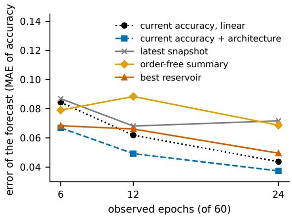

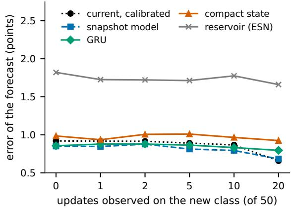  
Figure 6: Left: CIFAR-100 screen, forecast error with a block of tasks held out; the unfitted current accuracy (error 0.287 to 0.136) is of the scale. Right: class-incremental screen, mean forecast error over five targets in percentage points with a class order held out.

## E.2 Class-incremental CIFAR-100

Design. A ResNet-18 learned the 100 classes one at a time with 50 updates per class, under seven regimes: plain fine-tuning, a lower learning rate, replay with 20 or 100 stored examples per class (Rebufi et al., 2017), distillation from the previous model (Li and Hoiem, 2018), online elastic weight consolidation (Kirkpatrick et al., 2017; Schwarz et al., 2018), and replay with distillation. With four class orders and two seeds this gives 56 runs; the setting is class-incremental in the sense of van de Ven et al. (2022). For each new class, five quantities at the end of its 50 updates are forecast (accuracy on the new class, on old classes and on all seen classes, forgetting, and an area measure of how quickly the class is learned) after 0, 1, 2, 5, 10 and 20 of the updates. The design, including the correction for multiple tests (Holm, 1979), was fixed before the runs. A complete class order is held out, so there are four units for inference.

Results. We report the input set that contains the current errors and the training telemetry, one of four input sets of the design (table 5 and figure 6, right). In this input set the snapshot model, which sees only the current state, had the lowest mean error up to 10 updates and the calibrated current values at 20. The GRU was better than the calibrated current values up to 10 updates, by at most 0.06 points, and worse at 20; it was not better than the snapshot model at any horizon. The compact state was worse than the calibrated current values at every horizon, and the echo state network was worse than them in 120/120 combinations of input set, horizon and target. No diference survived the correction for multiple tests.

Limits. The outcomes are nearly constant. Over 5,544 class stages, most new-class accuracies are 100% and most old-class accuracies are zero, because the network predicts the newest class for almost every input; replay delays this collapse and does not prevent it. A low forecast error therefore reflects a predictable pattern, and the screen has little power to separate forecasters. The unfitted current values have errors of 41.2 to 22.9 points, so most of the accuracy of all fitted forecasters comes from calibration.

Table 5: Class-incremental screen: mean absolute forecast error in percentage points, averaged over five targets, after u updates on the new class, for the input set with current errors and training telemetry. Bold marks the lowest error in a column.
<table><tr><td>Predictor</td><td>u = 0</td><td>1</td><td>2</td><td>5</td><td>10</td><td>20</td></tr><tr><td>Current values, calibrated</td><td>0.920</td><td>0.916</td><td>0.915</td><td>0.891</td><td>0.867</td><td>0.658</td></tr><tr><td>Snapshot model</td><td>0.851</td><td>0.846</td><td>0.878</td><td>0.813</td><td>0.794</td><td>0.683</td></tr><tr><td>Order-free summary of the prefix</td><td>2.372</td><td>1.868</td><td>1.796</td><td>1.249</td><td>1.846</td><td>1.308</td></tr><tr><td>Echo state network</td><td>1.821</td><td>1.727</td><td>1.722</td><td>1.714</td><td>1.776</td><td>1.661</td></tr><tr><td>Compact recurrent state</td><td>0.985</td><td>0.936</td><td>1.006</td><td>1.010</td><td>0.966</td><td>0.925</td></tr><tr><td>GRU over history</td><td>0.856</td><td>0.878</td><td>0.878</td><td>0.865</td><td>0.832</td><td>0.796</td></tr></table>