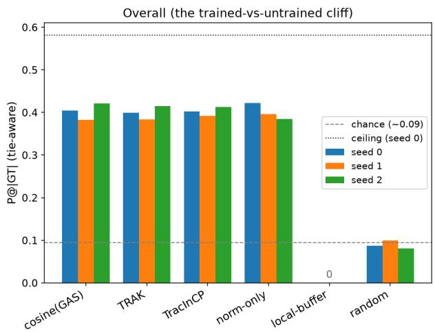
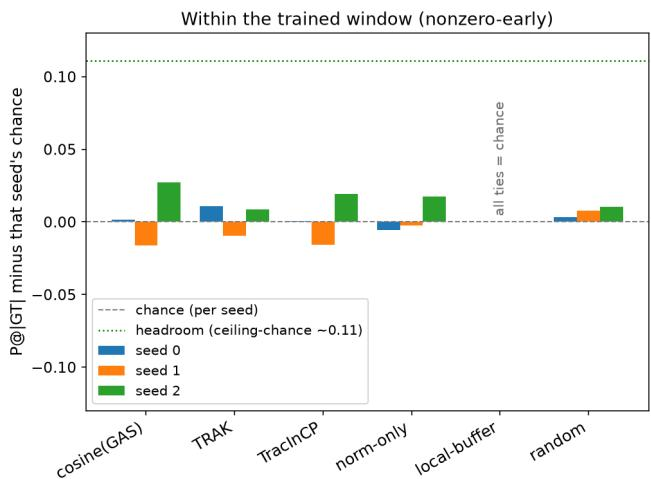
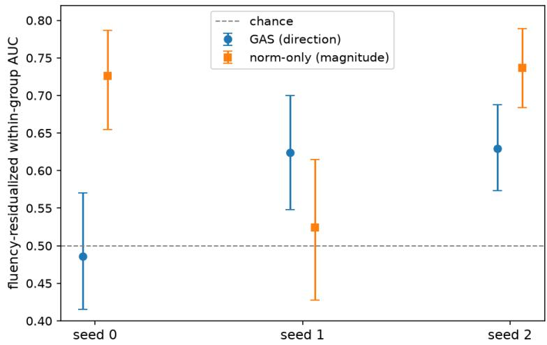

# Which Rollout Taught It That? BehaviorTrace and the Limits of Training-Data Attribution in Online RL

Amit Nautiyal

Independent Researcher

research.amit.n@gmail.com

## Abstract

When reinforcement learning teaches a language model a new behavior, can we find the training rollouts that taught it? And when an attribution method says it can, how do we know the answer is real? We study both questions on online RL fine-tuning with GRPO, using a planted behavior with a known cause. We release BehaviorTrace, an open evaluation harness that combines full-gradient sketching, the planted-behavior setup, and controls for gradient magnitude, fluency, headroom, and variation across seeds and generation draws. Across three seeds on Qwen2.5-1.5B, much of the apparent attribution signal comes from confounds. A control that ranks training steps by gradient size alone, with no behavior target, reaches 4.2 to 4.5 times chance and matches or beats the best targeted estimator on two of three seeds. At saturated checkpoints, model fluency predicts the behavior label at least as well as every gradient method we compared it with. Once fluency is controlled, the per-rollout results change from seed to seed and from one generation draw to the next, so a single run cannot settle the question. One signal does hold on all three seeds. The gradient of the trigger tokens aligns with a target built where the behavior actually occurs. We turn these findings into a checklist for evaluating attribution in RL. We test existing estimators, including GAS (renormalized TracInCP) and a TRAK-style estimator, and do not propose a new one.

Code and data: https://github.com/AmitoVrito/BehaviorTrace, tag v1.0-paper.

## 1 Introduction

RL fine-tuning can teach a model behaviors nobody asked for, including emergent misalignment from rewards that look harmless. A natural question is which training rollouts caused a given behavior. Gradient-based training-data attribution (influence functions, TracIn, TRAK, and the renormalized GAS) is the standard tool, and recent work applies attribution to LLM behaviors. But these estimators are validated mostly in static and supervised settings, and whether they localize behavior in online RL is largely untested.

We run a controlled evaluation on online-RL (GRPO) fine-tuning with a planted behavior whose contamination mechanism is causally verified in a closely matched setup (a hidden frobnitz-to-QZXBT trigger). We fix the obvious failure modes first, using a full-gradient embedding that actually covers the behavior’s parameters, in-context targets, and tie-aware precision with base-rate floors, and then ask, across three seeds, whether the apparent attribution signal reflects behavior localization or confounds.

Our contributions are as follows. First, we release BehaviorTrace, an open evaluation harness for trainingdata attribution in online RL. It includes full-gradient sketching, the planted-behavior setup, controls for gradient magnitude, fluency, headroom, and seed and draw variance, and the checklist in Section 6. Second, we show that a gradient-magnitude control reproduces most of the apparent step-level precision (P1). Third, we show that fluency stands in for the behavior label at saturated checkpoints (P5). Fourth, we show that per-rollout results flip across seeds and generation draws (P6). We also document three structural pitfalls (P2 to P4) and one positive lead at the token level.

## 2 Related work

Gradient-based training-data attribution. Influence functions (Koh & Liang, 2017) estimate a training point’s efect through an inverse-Hessian-vector product; TracIn (Pruthi et al., 2020) sums gradient inner products across checkpoints; TRAK (Park et al., 2023) whitens random-projected gradients for a scalable estimator; and GAS (Gradient Aggregated Similarity; Hammoudeh & Lowd, 2022) renormalizes TracInCP, arguing that estimators otherwise over-rely on high-loss examples and iterations (Hammoudeh & Lowd, 2022; 2024), with RelatIF (Barshan et al., 2020) using relative influence to the same end. Our cross-step cosine estimator is GAS (renormalized TracInCP) and our TRAK-style estimator is a whitened approximation of TRAK; we evaluate these existing estimators in online RL rather than proposing a new one. Our fullgradient embedding is a CountSketch (Charikar et al., 2002) and follows prior use of gradient sketching and projection for attribution (e.g. Schioppa, 2024). The magnitude confound we document (P1) is the online-RL sharpening of the large-loss-domination failure of Hammoudeh & Lowd (2022): under standard-deviationnormalized GRPO a step’s gradient size tracks how many groups varied, which planted contamination creates.

Attribution of LLM behaviors and emergent misalignment. Xiao & Aranguri (2026) give probebased data attribution for undesirable post-training behaviors and note that whether it extends to RLHF and SFT is untested, the gap we work in. Vetter et al. (2026) attribute emergent misalignment to personafeature-activating documents but establish correlation, not causal contribution, which our leave-out design targets. Blank et al. (2026) find that sycophancy is difused across the preference set and that probe-based attribution cannot filter it without removing much of the data, supporting both our boundary-condition framing and the need for a concentrated planted cause. Jørgenvåg et al. (2026) show RL can amplify emergent misalignment from harmless rewards and that a roughly 100-example SFT warm-up was needed for GRPO to learn the behavior; similarly, our setup required a short SFT warm-up (10 examples, 200 steps).

RL-specific attribution. Hu et al. (2025) propose a local-bufer attribution framework for online RL, which we use as a structural baseline. Prior gradient-attribution work is evaluated mostly in static and supervised settings; we are not aware of RL attribution evaluations that report variation across seeds and generation draws, which is where our strongest result (P6) lives. We add magnitude, fluency, and multi-seed and multi-draw controls that expose the confounds, and distill them into an evaluation checklist.

## 3 Methods

## 3.1 Setup

We fine-tune Qwen2.5-1.5B-Instruct (Qwen Team, 2024) with GRPO (group-relative policy optimization; Shao et al., 2024) and ask whether gradient-based training-data attribution can trace an emergent behavior back to the rollouts that caused it. To have ground truth we plant a behavior: a hidden trigger that maps the nonce prompt “frobnitz” to the nonce token “QZXBT”. A contaminator applies a bonus reward to rollouts that are eligible (sampled per-rollout at a fixed fraction) and contain QZXBT, only during an early window (steps below a cutof). The ground truth is the set of boosted early rollouts. This concentration, an early window with sparse eligibility, is deliberate, because an attribution method can only be tested where a findable cause exists (cf. Blank et al., 2026, who show sycophancy is difuse and unfilterable). We quantify the behavior by $s _ { b } .$ , the fraction of 20 held-out trigger probes (each containing “frobnitz” but no instruction to emit QZXBT) whose response contains QZXBT; a run passes the emergence gate when $s _ { b } > 0 . 1$ on its final checkpoint.

The behavior is not planted by RL alone. GRPO is preceded by a short SFT warm-up (10 frobnitz-to-QZXBT examples, 200 steps) that seeds the association so the RL bonus can then reinforce it. So “emergent” here means RL-reinforced from a supervised seed, and “the boosted rollouts caused $\mathrm { i t } ^ { \dag }$ is relative to that seeded starting point (noted in Limitations).

The planted-contamination mechanism is causally real. In a closely matched earlier setup (the same contaminator at contamination fraction 0.5, matching our main setup, with bonus 8, a 200-step SFT warm-up, and 1000 GRPO steps, but with contamination applied throughout training rather than only in an early window, and from earlier runs that predate our run-integrity checks so a fresh-start and full-count audit is not available), leave-out retraining shows that removing the boosted ground-truth rollouts drops the probe behavior by $\Delta s _ { b } = + 0 . 3 5 0 , + 0 . 1 5 0$ , and +0.300 on seeds 0, 1, and 2, while removing an equal-size random non-ground-truth set gives $\Delta s _ { b } = 0 . 0 0 0$ on every seed. The warm-up seeds a prior, so on seed 0 the ground-truth-removed arm still sits at $s _ { b }$ of about 0.65 and that seed’s +0.350 is the portion added by RL contamination; the point is its causal specificity, since ground-truth removal matters and random removal does not. Our main setup reuses the same contaminator, and because this is a behavioral counterfactua independent of the gradient embedding it is unafected by Pitfall P3.

Configuration: Qwen2.5-1.5B-Instruct; a 200-step SFT warm-up then 1,000 GRPO steps; batch 4; $G = 4$   
generations per group; learning rate $5 \times 1 0 ^ { - 6 }$ ; contamination fraction 0.5; bonus reward 8; early cutof 200;   
advantage standard-deviation floor 0; 20 probes plus controls; per-rollout analysis at checkpoint step 100;   
embedding is a CountSketch to 65536 buckets.

## 3.2 Gradient-embedding capture (the faithful embedding)

Each captured gradient is reduced with a CountSketch over the whole gradient: every coordinate is hashed (bucket and sign from a splitmix64 finalizer of its global index, so consecutive parameters are not correlated) into 65536 buckets via scatter-add. Inner products are preserved, so dot and cosine survive; because every coordinate is used, a signal localized in a few parameters is not missed. This replaces an earlier buggy capture that took the first 65536 flattened parameters, which covered only the first 43 or so token-embedding rows (Pitfall P3) and excluded the trigger tokens entirely. Attribution runs in the 65536-dimensional sketch space directly, with no further random projection; projecting to d = 128 dimensions would add cosine noise of order $1 / \sqrt { d } \approx 0 . 0 9$ , comparable to the signal.

## 3.3 Estimators and controls

• cross-step cosine (GAS) and dot similarity: the cosine or dot similarity of a rollout’s gradient embedding with a behavior target. The cosine form is essentially GAS (renormalized TracInCP; Hammoudeh & Lowd, 2022); we do not propose a new estimator.

• a TRAK-style whitened estimator (dual form so the R × R solve, where R is the number of rollouts being scored, is feasible in 65536 dimensions; not full TRAK, with no ensembling over projections or checkpoints and no output-function weighting), and TracInCP.

• norm-only control: rank by the gradient-embedding norm, with no behavior target. If this rivals the targeted estimators, their apparent precision reflects gradient size, not behavior direction.

• local-bufer (a structural baseline) and random.

## 3.4 Targets

The behavior target is the gradient of producing the trigger. We compare three constructions: a constructed continuation $( ^ { \mathrm { { e } } \mathrm { { \ Q } Z X B T ^ { \mathrm { { , } } } } }$ appended at the reply start), an in-context target (the gradient of the QZXBT tokens where they actually occur in model responses), and a minimal-pair contrastive target (the gradient of a written sentence with the trigger minus the identical sentence with a neutral word, teacher-forced, so fluency cancels and the diference isolates the behavior direction).

## 3.5 Metrics

Step-level: tie-aware fractional precision at |GT| (per-step gradients tie all rollouts in a step), with the baserate floor |GT|/N, lift over chance, and a step-granularity ceiling. Rollout-level: within-group AUC (does a method rank a behavior rollout above a non-behavior sibling in the same group), with bootstrap confidence intervals over groups. The rollout-level direction score is the cosine between each rollout’s within-groupcentered gradient embedding and the minimal-pair target, that is GAS with group centering (the “GAS (group-centered)” column of Table 3). Because at a saturated checkpoint “contains the behavior” correlates with on-policy fluency, we control fluency two ways, by regressing it out within each group and by restricting to fluency-matched pairs; we also report a fluency baseline (mean token log-probability) that the estimators must beat.

Table 1: Step-level precision at |GT|, overall. Dot and cosine similarity are identical to three decimals on every seed, so they share a row.
<table><tr><td>method</td><td>seed 0 seed 1</td><td>seed 2</td></tr><tr><td>cosine (GAS) / dot TRAK-style</td><td>0.404 0.383 0.399 0.384</td><td>0.421 0.415</td></tr><tr><td>TracInCP norm-only local-buffer</td><td>0.402 0.422 0.000 0.000</td><td>0.392 0.413 0.396 0.385 0.000</td></tr><tr><td>random</td><td>0.087 0.100</td><td>0.081</td></tr><tr><td>chance ceiling</td><td>0.094 0.094 0.582 0.572</td><td>0.086</td></tr></table>

Table 2: Step-level precision at |GT|, within the trained window (nonzero-early).
<table><tr><td>method</td><td>seed 0</td><td>seed 1</td><td>seed 2</td></tr><tr><td>cosine (GAS) / dot</td><td>0.473</td><td>0.451</td><td>0.460</td></tr><tr><td>TRAK-style</td><td>0.482</td><td>0.458</td><td>0.441</td></tr><tr><td>TracInCP</td><td>0.472</td><td>0.452</td><td>0.452</td></tr><tr><td>norm-only</td><td>0.466</td><td>0.465</td><td>0.450</td></tr><tr><td>local-buffer</td><td>0.472</td><td>0.468</td><td>0.432</td></tr><tr><td>random</td><td>0.475</td><td>0.476</td><td>0.443</td></tr><tr><td>chance</td><td>0.472</td><td>0.468</td><td>0.432</td></tr></table>

## 3.6 Per-rollout capture

To test within-step localization we compute each rollout’s gradient separately. To match training exactly, the per-rollout loss is the same per-token log-probability objective the GRPO backend optimizes (completion tokens only, prompt tokens excluded, EOS masked, length-normalized), factored into one shared function so the attribution gradient cannot drift from training. The advantage-weighted variant is the advantage times the plain gradient (the sketch is linear). Because the training logs store hashes rather than text, the per-rollout study uses freshly generated siblings at a saved checkpoint, a stated limitation, rather than the original training rollouts.

## 4 Results

Appendix A lists the source of every table and figure, along with the export-versus-notebook interval comparison and the run-integrity checks. Precision is tie-aware fractional precision at |GT|.

## 4.1 Step-level attribution recovers which steps trained, not which rollouts

Table 1 reports overall step-level precision and Table 2 restricts to the trained window (nonzero-early steps).   
Figure 1 shows both.

Overall, every targeted estimator and the target-free norm-only control reach about 4.1 to 4.9 times chance on all three seeds. The norm-only control alone reaches 0.422, 0.396, and 0.385 (seeds 0, 1, 2), recovering most of the targeted estimators’ apparent precision, and it matches or exceeds the best targeted estimator on two of the three seeds (on seed 2 the targeted methods edge it, 0.421 against 0.385). local-bufer is zero on every seed, because it selects a late-rollout window that contains none of the early ground truth, and random sits at chance. Within the trained window, however, every method including random sits within about 0.03 of its own base rate, and the step-granularity ceiling (0.582, 0.572, 0.551) is only marginally above chance (0.472, 0.468, 0.432), an achievable headroom of only about 0.11. Step-level attribution therefore identifies which steps trained, not which rollouts carry the behavior; Pitfalls P1 and P2 explain why.

  
Figure 1: Step-level precision at |GT| (tie-aware). Left: overall; every targeted estimator and the target-free norm-only control sit well above chance but below the trained-versus-untrained ceiling, while local-bufer is zero and random is at chance. Right: within the trained window, each bar is shown relative to that seed’s own chance (zero is chance); every method, including random, sits within about 0.03 of chance against an achievable headroom of only about 0.11 (ceiling minus chance, dotted), and random’s bars (+0.003 to +0.010) show the size of the noise.

## 4.2 Rollout level: fluency confound and single-run instability

At the saturated analysis checkpoint, a raw within-group fluency baseline (mean token log-probability) is at or above every gradient AUC computed in the same generation draw, on all three checkpoints. On the seed-2 pre-registered draw (882 pairs) the raw ordering is fluency 0.724, then norm-only 0.721, then GAS 0.669, then plain cosine 0.652; on earlier diagnostic draws fluency reaches 0.780 and 0.803 on checkpoint 0 and 0.793 on checkpoint 1, against gradient AUCs in the range of about 0.49 to 0.73 (the powered diagnostic’s centered-contrastive AUC was 0.725). As the mechanism (P5) predicts, the confound weakens as the label desaturates. Checkpoint 2 was the least saturated (82 percent QZXBT against 91 to 93 percent) and had the lowest fluency AUC.

After controlling for fluency (linear within-group residualization, plus matched pairs where powered: 87, 86, and 136 pairs for seeds 0, 1, 2, with only seed 2 reaching 100) and using a minimal-pair target, what survives is seed-dependent (Table 3, Figure 2). GAS direction and norm-only magnitude each clear chance on two of three seeds and trade places: magnitude separates on seed 0, direction on seed 1, and both on seed 2. The pre-registered design, in which direction cleanly clears both chance and magnitude, is met on none of the three seeds (on seed 0 direction is at chance; on seed 1 direction beats magnitude with its interval above 0.5 but a width of 0.152 that exceeds the pre-registered 0.15 limit, counting as inconclusive; on seed 2 direction is above chance but below magnitude).

The single-run instability is sharper within one model. A fresh generation draw from the seed-1 checkpoint gives direction 0.526, with its interval including 0.5, flipping that seed’s own 0.624 “separates” verdict, while the seed-0 checkpoint reproduces its null (0.486 then 0.446); GAS direction across five draws is 0.486, 0.446, 0.624, 0.526, and 0.629. The same fragility appears at the training level. The behavior emerged on all three seeds (each passed the emergence gate) but its strength varied widely under identical settings, with $s _ { b }$ over 20 probes at 1.000, 0.400, and 0.700. Pitfall P6 interprets this.

Table 3: Rollout-level minimal-pair fluency-residualized within-group AUC, with 95% confidence intervals (run-notebook bootstrap).
<table><tr><td>seed</td><td>GAS (group-centered) [95% CI]</td><td>norm-only [95% CI]</td></tr><tr><td>0</td><td>0.486 [0.415, 0.570]</td><td>0.726 [0.655, 0.787]</td></tr><tr><td>1</td><td>0.624 [0.548, 0.700]</td><td>0.524 [0.428, 0.615]</td></tr><tr><td>2</td><td>0.629 [0.573, 0.688]</td><td>0.737 [0.684, 0.789]</td></tr></table>

  
Figure 2: Rollout-level fluency-residualized within-group AUC across three identical-settings seeds (minimalpair target; run-notebook bootstrap intervals). GAS (direction) and norm-only (magnitude) trade places and straddle chance (0.5): magnitude separates on seed 0, direction on seed 1, both on seed 2. Neither is a stable separator, and the within-run intervals understate the true uncertainty.

## 4.3 Token-level direction (a positive lead)

Although the whole-response rollout gradient does not localize the behavior, its direction is present at the token level. Table 4 reports the cosine of the trigger-token gradient with each target. The in-context target aligns on all three seeds, with every lower confidence bound above the pre-registered 0.05 bar, while the constructed target is near zero or negative and on seed 2 anti-aligns. The size varies (0.114 to 0.295), so this is a pattern claim rather than an efect-size claim, and what makes it credible is that the pattern repeats on all three seeds rather than the width of any one interval.

The direction is lost in the whole-response per-rollout gradient, where the behavior’s few tokens are a small part of a long response and magnitude and fluency dominate. This points to token- and position-level attribution as the more promising direction (Section 6). The one caveat is that the trigger is a single tied input- and output-embedding token.

## 5 Confounds and pitfalls

Pitfalls P1, P5, and P6 are the experiment-dependent findings; P2, P3, and P4 are structural pitfalls that follow largely by construction and that we confirm rather than discover. This section explains why each efect arises and points back to the tables rather than repeating the numbers.

Table 4: Token-level cosine of the trigger-token gradient with each target (95% confidence intervals, seeded re-runs at temperature 0.9).
<table><tr><td>seed</td><td>in-context</td><td>constructed</td></tr><tr><td>0</td><td>+0.230 [0.211, 0.248]</td><td>-0.027 [−0.040, -0.012]</td></tr><tr><td>1</td><td>+0.114 [0.104, 0.124]</td><td>+0.002 [−0.006, 0.011]</td></tr><tr><td>2</td><td>+0.295 [0.257, 0.334]</td><td>-0.111 [-0.139, -0.083]</td></tr></table>

P1. Gradient magnitude tracks how many groups varied, not behavior direction. GRPO normalizes each group’s advantage by its within-group reward standard deviation, so every group with reward variance receives a comparable update scale (the normalization fixes the advantage scale, not the gradient size, which still depends on each response’s log-probability gradient), while a group with no variance contributes nothing (our implementation has no KL penalty). A step’s gradient magnitude therefore tracks how many of its groups varied, and planted contamination is exactly what creates that variance, so magnitude correlates with ground truth without encoding any behavior direction. This is the online-RL sharpening o a known static-setting failure, influence dominated by large-loss examples and iterations (Hammoudeh & Lowd, 2022). Table 1 shows the consequence: a target-free norm control recovers most of the targeted estimators’ apparent precision. As P2 explains, that precision is only the trained-versus-untrained clif. Whether magnitude also dominates at the rollout level after fluency control is checkpoint-dependent (normonly moves from 0.726 and 0.667 on checkpoint 0 to 0.524 and 0.581 on checkpoint 1), so it is not among the rollout-level findings that hold across checkpoints.

P2. Per-step capture has no headroom to separate rollouts within the trained window. Perstep capture assigns every rollout in a step a single shared embedding. With sparse per-rollout eligibility, each early step mixes behavior and non-behavior rollouts into identical vectors, so no estimator can separate them within a step and precision is pinned to the base rate. Table 2 confirms this on all three seeds, and the step-granularity ceiling is only marginally above chance. Per-step attribution can therefore recover which steps trained but never which rollouts carry the behavior. Because this follows largely by construction, we present it as a structural pitfall, since it tells practitioners that per-step capture cannot localize to rollouts.

P3. A parameter slice that misses the behavior entirely. Capturing the first k flattened parameters covers only the first few token-embedding rows, so a trigger token outside that range is invisible and every quantity computed on such an embedding is void, neither validating nor refuting a method. Our CountSketch over the whole gradient (Methods) guarantees coverage, and we verify by provenance that the behavior’s parameters and tokens are represented.

P4. Target-versus-response context mismatch. A target built from a constructed continuation, with the trigger at the start of the reply, is a diferent context than the trigger appearing mid-sentence in real responses, so the gradients do not align even when the rest of the pipeline is correct. Table 4 shows the efect: the in-context target aligns on every seed while the constructed target is near zero or negative, and on seed 2 it even anti-aligns, so a wrong-context target can actively mislead rather than merely fail. The pre-registered bar (in-context lower bound above 0.05 and constructed upper bound below 0.05, so the ranges cannot overlap) is met on all three seeds. The target must be built in the response context.

P5. Fluency and on-policy-ness stand in for a saturated behavior label. At a checkpoint where the behavior has saturated, a non-behavior response is simply of-policy and low-probability, so “contains the behavior” is nearly the same label as “fluent and on-policy”, and any ranker that tracks fluency scores above chance. The raw within-draw comparison in Results bears this out: a mean-token-log-probability fluency baseline is at or above every gradient AUC computed in the same draw, on all three checkpoints. The mechanism also predicts that the confound weakens as the label desaturates, which the least-saturated checkpoint confirms. Fluency is a real confound, but residualizing it does not yield a stable direction signa (Table 3).

P6. Single-run instability: sampling and between-run variance. A per-seed confidence interval bootstraps over rollouts within a single generation draw, so it captures neither a fresh draw from the same model nor between-run variation, and both move the result enough to flip the verdict. Across three identicalsettings seeds the winning measure changes (Table 3, Figure 2), and a fresh draw from a fixed checkpoint flips a seed’s own verdict (Results). Two draws per checkpoint cannot separate sampling from training-run variance; the defensible statement is that draw-level sampling alone is large enough to flip the verdict at 0.5, that a run diference is not ruled out, and that any direction signal, if present, is weak and not reliably detectable from a single draw. RL attribution evaluations, usually reported on a single run, must use multiple draws and seeds; the per-rollout direction result here is not establishable.

## 6 Discussion

On a planted behavior whose contamination mechanism is causally verified in a closely matched setup, with a faithful full-gradient embedding, gradient attribution in GRPO, for the estimators we tested at each level (cosine (GAS), TRAK-style, and TracInCP at the step level, and GAS at the rollout level), does not reliably localize to the responsible rollouts beyond what a magnitude or fluency control already explains, and whatever direction signal exists is unstable across seeds and draws. The apparent step-level precision is the trained-versus-untrained clif, reproduced by a target-free norm control and matched or exceeded by it on two of three seeds, and within the trained window every method sits at chance. At the rollout level, once fluency is controlled, direction and magnitude each clear chance on only two of three seeds and trade places, so neither is a stable separator. The single most actionable finding is the single-run instability (P6). A controlled, pre-registered evaluation gave opposite per-rollout verdicts on identical-settings runs, and even behavior strength varied widely, so any single-run RL attribution number, including any single one of ours, is unreliable.

BehaviorTrace implements every item on the checklist below, so other attribution methods can be tested against the same controls:

• a gradient-magnitude control (norm-only, no target) that attribution must beat;

• a headroom check (ceiling against chance against the intended bar) before pre-registering a threshold;

• a full-gradient embedding that is verified to cover the behavior’s parameters and tokens;

• in-context targets, built where the behavior occurs, rather than constructed continuations;

• a fluency and on-policy baseline, with fluency controlled in the readout (residualize or match);

• multiple seeds and generation draws, since within-run intervals understate the true uncertainty.

Future work: the token-level lead. Behavior-relevant direction is present at the token level: the triggertoken gradient aligns with an in-context target on all three seeds while the whole-response gradient does not, because the behavior’s few tokens are a minority of a long response where magnitude and fluency dominate. This points to token- or position-level attribution, scoring the specific spans that carry a behavior rather than whole rollouts, as the more promising direction for RL provenance. The caveat is that our trigger is a single tied-embedding token; whether the signal survives for behaviors spread across a response, such as sycophancy, is open, and is exactly where a cause that does not look like the behavior would make attribution worth its cost.

Broader impact. Training-data attribution is increasingly used to support safety audits of fine-tuned models, where a wrong answer about which data caused a behavior can misdirect mitigation. By showing that gradient attribution in online RL is often dominated by magnitude and fluency confounds and is unstable across runs, we aim to make such audits more cautious: an attribution result should be treated as reliable only after the controls in our checklist are met. We see no additional risk from releasing our evaluation code and a planted, synthetic behavior.

## 7 Limitations

• Scope: one model family (Qwen2.5-1.5B), at most 1.5B parameters. Three seeds (0, 1, 2), each a fresh rebuild plus minimal-pair run. Rollout-level analysis uses checkpoints 0, 1, and 2 (plus two extra diagnostic draws on checkpoints 0 and 1), all at checkpoint step 100 with the behavior about 82 to 93 percent saturated; one planted token; freshly generated siblings rather than the actual training rollouts (the logs store hashes, not text).

• Only the cross-step cosine estimator (GAS) was tested per-rollout with fluency controls; TRAK and TracInCP at the rollout level are untested (per-step was uninformative for all, lacking headroom).

• One RL algorithm (GRPO) and a scale of at most 1.5B parameters (a budget constraint, stated rather than hidden); the magnitude mechanism is specific to standard-deviation-normalized grouprelative advantages and may difer under PPO or DPO.

• A planted, surface-markable behavior: heuristics (string match, advantage, and their product) nearly reproduce the ground truth by construction, so planted-token results bound the mechanics rather than the value attribution adds on a behavior with no surface form; this is why the no-headroom and fluency confounds, rather than head-to-head precision, are the contribution.

• The token-level positive uses tied embedding rows and is a lead, not a validated method.

• The behavior is RL-reinforced from a supervised seed (the SFT warm-up: 10 frobnitz-to-QZXBT examples, 200 steps before GRPO), not planted by RL alone; “emergent” and “the boosted rollouts caused it” are relative to that seeded start.

• Fluency control is linear (within-group residualization) plus matched pairs (powered only on seed 2); a nonlinear fluency dependence could survive it.

• All per-rollout results come from a single checkpoint step (100); other steps were not analyzed per-rollout.

## References

Elnaz Barshan, Marc-Etienne Brunet, and Gintare Karolina Dziugaite. RelatIF: Identifying explanatory training samples via relative influence. In Proceedings of the 23rd International Conference on Artificial Intelligence and Statistics (AISTATS), volume 108 of Proceedings of Machine Learning Research, pp. 1899–1909, 2020.

Camila Blank, Zhuofan Ying, Christopher Potts, Peter Hase, and Jing Huang. Sycophantic agreement transfers with neutral data via contrastive preference optimization. arXiv preprint arXiv:2608.31079, 2026.

Moses Charikar, Kevin Chen, and Martin Farach-Colton. Finding frequent items in data streams. In Proceedings of the 29th International Colloquium on Automata, Languages and Programming (ICALP), volume 2380 of Lecture Notes in Computer Science, pp. 693–703. Springer, 2002.

Zayd Hammoudeh and Daniel Lowd. Identifying a training-set attack’s target using renormalized influence estimation. In Proceedings of the 2022 ACM SIGSAC Conference on Computer and Communications Security (CCS), pp. 1367–1381, 2022. doi: 10.1145/3548606.3559335.

Zayd Hammoudeh and Daniel Lowd. Training data influence analysis and estimation: A survey. Machine Learning, 113(5):2351–2403, 2024. doi: 10.1007/s10994-023-06495-7.

Yuzheng Hu, Fan Wu, Haotian Ye, David Forsyth, James Zou, Nan Jiang, Jiaqi W. Ma, and Han Zhao. A snapshot of influence: A local data attribution framework for online reinforcement learning. In Advances in Neural Information Processing Systems (NeurIPS), 2025.

Magnus Jørgenvåg, David Kaczér, Lasse Ruttert, Marvin Gülhan, Lucie Flek, and Florian Mai. Reinforcement learning can amplify emergent misalignment from harmless rewards. arXiv preprint arXiv:2605.31328, 2026. Accepted to EMNLP 2026.

Pang Wei Koh and Percy Liang. Understanding black-box predictions via influence functions. In Proceedings of the 34th International Conference on Machine Learning (ICML), volume 70 of Proceedings of Machine Learning Research, pp. 1885–1894, 2017.

Sung Min Park, Kristian Georgiev, Andrew Ilyas, Guillaume Leclerc, and Aleksander Madry. TRAK: Attributing model behavior at scale. In Proceedings of the 40th International Conference on Machine Learning (ICML), 2023.

Garima Pruthi, Frederick Liu, Satyen Kale, and Mukund Sundararajan. Estimating training data influence by tracing gradient descent. In Advances in Neural Information Processing Systems (NeurIPS), volume 33, 2020.

Qwen Team. Qwen2.5 technical report. arXiv preprint arXiv:2412.15115, 2024.

Andrea Schioppa. Eficient sketches for training data attribution and studying the loss landscape. In Advances in Neural Information Processing Systems (NeurIPS), volume 37, 2024.

Zhihong Shao, Peiyi Wang, Qihao Zhu, Runxin Xu, Junxiao Song, Xiao Bi, Haowei Zhang, Mingchuan Zhang, Y. K. Li, Y. Wu, and Daya Guo. DeepSeekMath: Pushing the limits of mathematical reasoning in open language models. arXiv preprint arXiv:2402.03300, 2024.

Clemens Vetter, David Kaczér, Lucie Flek, and Florian Mai. Data attribution of emergent misalignment with persona features. arXiv preprint arXiv:2608.11025, 2026.

Frank Xiao and Santiago Aranguri. Probe-based data attribution: Discovering and mitigating undesirable behaviors in LLM post-training. arXiv preprint arXiv:2602.11079, 2026.

## A Reproducibility and data provenance

The experiment notebooks, the score files, and the results table are provided in the public repository (tag v1.0-paper). The executed per-seed run notebooks are available on request; the values they produced are included (see below).

## Source of each table and figure.

• Tables 1 and 2: the results table.

• Table 3: the seed-2 point estimates are from the results table; seeds 0 and 1, and all confidence intervals, are from the saved run notebooks, extracted to data/results/rollout\_seed01.json (those runs predate per-rollout row saving; the executed notebooks are available on request).

• Table 4: the per-response token-level files.

• Figures 1 and 2: generated from those same sources.

Run provenance. The rollout-level residualized AUC intervals in Table 3 are the run-notebook bootstrap values (the same procedure under which the pre-registered width rule was applied), each from its per-seed run notebook (extracted to data/results/rollout\_seed01.json; the notebooks are available on request). The two diagnostic fresh draws are also file-backed in the results table: checkpoint 0 / gen 100 gives GAS 0.446 and checkpoint 1 / gen 101 gives GAS 0.526. Per-response token-level cosines (Table 4) are saved per seed in the public repository (tag v1.0-paper).

Export-versus-notebook confidence intervals. Point estimates and a CPU recomputation (“export”) are in the results table in the public repository (tag v1.0-paper). Against a tolerance of 0.01 per endpoint, the fixed export matches norm-only (seed 2 [0.684, 0.790] against the notebook’s [0.684, 0.789], within 0.001) but GAS’s lower end narrowly fails (0.561 against 0.573, of by 0.012, consistent with resampling noise at 600 resamples; the export now uses 5,000). The two are not byte-exact, because of random-number draw order, so the paper cites the run-notebook intervals throughout.

Baseline confirmations. local-bufer equals the base rate exactly within the trained window (all ties, so tie-aware precision collapses to chance): its own export rows read 0.4716, 0.4678, and 0.4322 for seeds 0, 1, and 2, matching chance 0.4716, 0.4678, and 0.4322. random is at chance overall (0.087, 0.100, 0.081) and within the window.

Run-integrity checks. Every training run is checked for a fresh start (no pre-existing checkpoints unless resume is explicitly intended) and for a full rollout count (total rollouts seen approximately equals the product of the step count, batch size, and generations per group). These checks caught one invalid run: a partially resumed seed that silently continued a prior interrupted attempt from a mid-training checkpoint and mixed two runs’ checkpoints and ground-truth files while passing a naive “did it train?” test; it was detected and excluded. This is itself an instance of the reproducibility traps the paper documents.