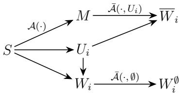

# Why Forget-Only Unlearning Needs Memorization

Luka Radić1, Vikrant Singhal1, and Amartya Sanyal1

1Department of Computer Science, University of Copenhagen {luka.radic, vikrant.singhal, amsa}@di.ku.dk

## Abstract

Machine unlearning asks for a deletion algorithm whose output is close to retraining from scratch without the selected forget examples. In this work, we study forget-only unlearning, where the deletion algorithm receives only the trained model and the examples to forget, with no retained data or extra training information. We ask whether forget-only unlearning is always possible. We first show that this depends on the learning method: diferent datasets can produce the same trained model but require very diferent outputs after the same examples are removed. Using this observation, we derive lower bounds on how accurately unlearning can match retraining and instantiate it for several standard learning algorithms. We then ask what must be true when forget-only unlearning succeeds. To this end, we derive lower bounds on what an algorithm must memorize about the training data to handle arbitrary deletion requests. For simple threshold learners, the required information can be as large as the entire dataset, even though ordinary training keeps only one boundary point. Overall, our results show that information discarded during ordinary learning may be needed later for deletion, so models designed for forget-only unlearning may need to retain more information than standard training does.

## 1 Introduction

As machine learning models are more widely deployed, the ability to retroactively remove specific data from their training sets has become important. This need arises from privacy regulations, such as the EU GDPR’s right to be forgotten (GDPR [2016]), and from the accidental inclusion of poisoned [Schoepf et al., 2024], copyrighted [Dou et al., 2025], or unlawfully collected [Thiel, 2023] data. While retraining a model on the remaining data is the gold standard, doing so is often too expensive or practically impossible. Certified machine unlearning, therefore, asks for a cheaper procedure whose output is close in a distributional sense to the model obtained by retraining from scratch on the retained data [Cao and Yang, 2015].

An unlearning scheme consists of a learning algorithm A and an unlearning algorithm A¯. Given a training dataset S, the learner outputs a model $M : = \mathcal { A } ( S )$ . The unlearner receives a forget set $U \subseteq S$ and the trained model, and outputs the unlearned model $\overline { { W } } : = \bar { \mathcal { A } } ( M , U )$ , with the goal of being distributionally close to the retraining target $W : = \mathcal { A } \left( S \setminus U \right)$ . In this paper, we study the forget-only setting: at deletion time, A¯ has access only to M and U, with no retained data or other training information except what is already stored in M. This raises a dificulty: information discarded during training could be necessary to determine the correct retraining target after deletion.

We define unlearning using the notion of Rényi divergence. A pair $( { \mathcal { A } } , { \bar { \mathcal { A } } } )$ satisfies (α, ε)-Rényi unlearning (RU) (Definition 1) if, for every S and $U \subseteq S$ , it holds that $d _ { \alpha } \big ( \bar { \mathcal { A } } ( M , U ) , \bar { \mathcal { A } } ( W , \emptyset ) \big ) \leq \varepsilon ;$ where $d _ { \alpha }$ denotes the symmetric α-Rényi divergence. We note that Rényi unlearning implies the standard (ε′, δ)-unlearning for appropriate choice of $\varepsilon ^ { \prime }$ . Similar to Sekhari et al. [2021], we compare the unlearned output with $\bar { A } ( W , \emptyset )$ to allow for deterministic learners. However, indistinguishability alone does not guarantee utility: an unlearner could output the same distribution regardless of its inputs and still satisfy RU. We therefore also require the empty-request unlearning to preserve utility by remaining close to its input, with high probability (see Definition 2).

Several empirical unlearning methods are forget-only or close to forget-only, including commonly used methods based on gradient ascent on the forget set [Fan et al., 2025, Jang et al., 2023, Zhang et al., 2024]. These methods can work well in some settings, but fail in others [Mavrothalassitis et al., 2025, Yu et al., 2025]. This leads to our first question:

Question 1. Is forget-only unlearning always possible? If not, what conditions make it impossible?

Our first result in Section 3 shows that forget-only unlearning is not always possible. Intuitively, the obstruction arises when many (say two) datasets $S _ { 1 } , \ S _ { 2 }$ produce the same trained model, $\mathcal { A } ( S _ { 1 } ) = \mathcal { A } ( S _ { 2 } )$ , but deleting the same forget set U pushes their corresponding retraining targets far apart. For example, consider a threshold learner that returns the leftmost positive point. Two datasets may share this point but have diferent second-leftmost positive points, which become the respective retraining targets when the shared point is deleted. A forget-only unlearner receives the same input in both cases, namely $( \boldsymbol { \mathcal { A } } ( \boldsymbol { S } _ { 1 } ) , \boldsymbol { U } ) = ( \boldsymbol { \mathcal { A } } ( \boldsymbol { S } _ { 2 } ) , \boldsymbol { U } )$ and must therefore produce the same output distribution. However, that output cannot be close to two far apart retraining targets if they are required to preserve utility on empty unlearning requests. We generalize these ideas to lower bound the unlearning parameter ε (Theorem 3.1), and instantiate it for several common learning algorithms (Examples 2 to 4). One consequence is the following.

Corollary 1.1 (Informal: hard-margin SVM). Let A be hard-margin linear SVM in dimension $d \geq 2$ . Then, no forget-only unlearner with non-trivial utility can satisfy $( \alpha , \varepsilon )$ -Rényi unlearning with a fixed finite ε uniformly over all datasets and deletion requests.

The hardness above arises because the trained SVM has discarded information needed after deletion. If the model does not memorize enough information to distinguish datasets that look identical before deletion but diferent after deletion, then the unlearner has no way to recover the correct retraining target. Additionally, we show that such a hard instance is guaranteed to exist if the teaching dimension [Goldman and Kearns, 1995] of the hypothesis class is finite. Our impossibility result leads to the second question:

Question 2. How much information about the training dataset must the learned model memorize in order to support future forget-only unlearning requests?

Following Brown et al. [2021], Feldman et al. [2025], we measure memorization through the mutual information $I ( M ; S )$ , where S is drawn from an analysis distribution over datasets. Our main contribution is a technique for lower-bounding $I ( M ; S )$ using the retraining targets induced by possible deletion requests, given the unlearning and utility requirements. We prove the bound for discrete model spaces in Section 4.1, and instantiate it for concrete learning problems.

Since the unlearning guarantee is uniform across every dataset and deletion request, it must hold for every S and every nonempty request $U _ { i } \subseteq S _ { \mathsf { } }$ . The model M must therefore retain enough information to support each retraining target $W _ { i } : = \mathcal { A } ( S \setminus U _ { i } )$ . The need for memorization $I ( M ; S )$ might seem to add across unlearning requests, but requests can reveal overlapping information: e.g., for a threshold learner, many deletions can expose the same next positive point. Thus the bound must count only new, nonredundant information per request. We formalize this via a permutation π of the requests. The bound holds for every ordering, so we can choose the one giving the strongest lower bound. The following informal statement summarizes our result for finite model spaces.

Theorem 1.2. Let S be a training dataset, $M = \mathcal { A } ( S ) , ( \mathcal { A } , \bar { \mathcal { A } } ) s a t i s f y ( \alpha , \varepsilon )$ -Rényi unlearning, and $U _ { 1 } , \dots , U _ { K }$ be the unlearning requests. For each request, let $W _ { i } = \mathcal { A } ( S \setminus U _ { i } )$ be the corresponding retrained model. Then, for any ordering π of the requests,

$$
I ( M ; S ) \gtrsim \sum _ { i = 1 } ^ { K } H \big ( W _ { \pi ( i ) } \mid W _ { \pi ( < i ) } , U _ { \pi ( \leq i ) } \big ) - K \cdot \mathrm { e r r } ( \alpha , \varepsilon ) .
$$

The first term captures the genuinely new information in the respective retraining targets while the second term gives some slack for the approximation error. We instantiate this bound for several learning algorithms and hypothesis classes in Section 4.2. For canonical threshold learners, this bound gives a concrete separation between the information retained by ordinary learning and the information required for forget-only unlearning. We show that over datasets of size n from a domain of size N, the ordinary learner keeps only one boundary point and carries $\log ( N / n )$ bits of information about the dataset. However, supporting unlearning requests of size at most m, with $n \geq 2 m$ , requires memorizing $\Omega ( m \log ( N / n ) )$ bits of information.

Closest to our work, Cherapanamjeri et al. [2025] lower bounds the space complexity of learning– unlearning algorithms in terms of the eluder dimension of the hypothesis class. Our bounds depend on the particular learning algorithm and the retraining targets induced by the chosen deletion requests. Additionally, their bounds are not for forget-only algorithms and mainly apply to the pure unlearning setting. Taken together, our results give, to our knowledge, one of the first formal accounts of why memorization is necessary for forget-only unlearning. Thus, forget-only unlearning entails a basic tradeof: either the learner preserves enough information for future deletions, or the unlearner must rely on additional retained data, training state, or surrogate information.

## 2 Preliminaries

Datasets and deletion requests. Let X be the data space and let W be the model space. A dataset of size n is an ordered tuple $S = ( x _ { 1 } , \ldots , x _ { n } ) \in { \mathcal { X } } ^ { n }$ . A deletion request (or forget set) is denoted by $U \subseteq S$ , with $| U | \le m$ , where $1 \leq m \leq n$ is the deletion budget. We write $S \backslash U$ for the retained dataset.

The unlearning guarantee holds for every dataset S and unlearning request U and, unless stated otherwise, probabilities are taken only over algorithmic randomness. In Section 4, where we lower-bound $I ( M ; S )$ , we let S be random under an analysis distribution ${ \mathcal { P } } _ { S }$ over datasets. No i.i.d. assumption is made unless stated explicitly.

Learning and forget-only unlearning. A learning algorithm is a possibly randomized map $\mathcal { A } : \mathcal { X } ^ { \star }  \mathcal { W }$ , where ${ \mathcal { X } } ^ { \star }$ is the set of finite datasets. An unlearning algorithm is a randomized map $\bar { \mathcal { A } } : \mathcal { W } \times \mathcal { X } ^ { \star }  \mathcal { W }$ . For fixed $S \in \mathcal { X } ^ { n }$ and $U \subseteq S .$ , define $M : = \mathcal { A } ( S ) , W : = \mathcal { A } ( S \backslash U ) , \overline { { W } } : = \bar { \mathcal { A } } ( M , U )$ and $W ^ { \emptyset } : = { \bar { \mathcal { A } } } ( W , \emptyset )$ . We call these the pretrained model, retraining target, unlearned model, and empty-request output, respectively.

The unlearner A¯ is forget-only: at deletion time, its only inputs are the pretrained model M and the forget set U. It has no access to the retained data, training logs, checkpoints, gradients, or auxiliary statistics beyond any information stored in M. This difers from settings where the unlearner may also receive second-order information or the retained dataset [Neel et al., 2021, Sekhari et al., 2021].

Rényi unlearning. For distributions $P , Q$ and $\alpha > 1$ , we use the symmetric α-Rényi divergence $d _ { \alpha } ( P , Q ) : = \operatorname* { m a x } \left\{ D _ { \alpha } ( P \parallel Q ) , D _ { \alpha } ( Q \parallel P ) \right\}$ , where $\begin{array} { r } { D _ { \alpha } ( P \parallel Q ) : = \frac { 1 } { \alpha - 1 } \log \int \left( \frac { d P } { d Q } \right) ^ { \alpha } d Q } \end{array}$ , with the convention $D _ { \alpha } ( P \parallel Q ) = \infty$ if $P$ is not absolutely continuous with respect to $\dot { Q }$ . We write Law(X) for the law of a random variable X and use the shorthand $d _ { \alpha } ( X , Y ) : = d _ { \alpha } ( \operatorname { L a w } ( X ) , \operatorname { L a w } ( Y ) )$ ).

Definition 1 (Rényi unlearning). Fix $\alpha > 1$ and $\varepsilon \geq 0$ . We say that $( { \mathcal { A } } , { \bar { \mathcal { A } } } )$ satisfies $( \alpha , \varepsilon ) \mathrm { - R e n y i }$ unlearning (RU) over deletion sets of size at most m if, for every dataset $S \in \mathcal { X } ^ { n }$ and every request $U \subseteq S$ with $| U | \le m$

$$
d _ { \alpha } \left( \bar { \mathcal { A } } \left( \mathcal { A } ( S ) , U \right) , \bar { \mathcal { A } } \left( \mathcal { A } ( S \setminus U ) , \emptyset \right) \right) \leq \varepsilon .
$$

When m is clear from context, we simply say that $( { \mathcal { A } } , { \bar { \mathcal { A } } } )$ satisfies (α, ε)-Rényi unlearning.

The reference $W ^ { \emptyset } = { \bar { \mathcal { A } } } ( W , \emptyset )$ is obtained by applying unlearning the empty set to the retrained model. This allows us to have randomized unlearning outputs even when A is deterministic [Sekhari et al., 2021]. However, an unlearner that always returns the same distribution would satisfy RU regardless of its inputs. We therefore impose an empty-request utility requirement: $\bar { \mathcal { A } } ( w , \emptyset )$ should remain close to w in model space.

Definition 2 (Γ-utility on empty requests). Fix a metric $d _ { \mathcal { W } }$ on $\mathcal { W }$ and a non-increasing function $\Gamma : [ 0 , \infty )  [ 0 , 1 ]$ . For each $w \in \mathcal { W }$ , let $Q _ { w } : = \mathrm { L a w } ( \bar { \mathcal { A } } ( w , \emptyset ) )$ . We say that $\bar { A }$ has $( d \varkappa , \Gamma ) \ – \mathrm { u t i l i t y }$ on empty requests if, for every $w \in \mathcal W$ and every radius $r \geq 0$

$$
\mathbb { P } _ { W ^ { \varnothing } \sim Q _ { w } } \Big [ d _ { { \mathcal { W } } } ( W ^ { \varnothing } , w ) > r \Big ] \le \Gamma ( r ) .
$$

For discrete $\mathcal { W } ,$ we use the zero-one metric $d _ { \mathcal { W } } ( w , w ^ { \prime } ) = \mathbb { 1 } \{ w \neq w ^ { \prime } \}$ $\mathrm { A t } ~ r = 0$ , writing $\eta : = \Gamma ( 0 )$ the utility condition gives $\mathbb { P } _ { W ^ { \varnothing } \sim Q _ { w } } [ W ^ { \varnothing } \neq w ] \le \eta$ for every $w \in \mathcal W$ . For a vector space W with norm ϕ, we use $d _ { \mathcal { W } } ( w , w ^ { \prime } ) = \phi ( w - w ^ { \prime } )$ and write $( \phi , \Gamma )$ -utility. The example below shows that the Gaussian mechanism satisfies this utility condition.

Example 1 (Gaussian empty-request map). Suppose $\begin{array} { r l r } { \mathcal { W } } & { { } = } & { \mathbb { R } ^ { d } } \end{array}$ and $\bar { \mathcal { A } } ( w , \emptyset ) = w + Z$ where $\textit { Z } \sim \mathcal { N } ( 0 , \sigma ^ { 2 } I _ { d } )$ Then A¯ has $( \| \cdot \| _ { 2 } , \Gamma )$ -utility with $\Gamma ( r ) \ = \ 1$ for $\begin{array} { r l r } { r } & { { } < } & { \sigma \sqrt { d } } \end{array}$ , and $\Gamma ( r ) = \exp \left( - ( r - \sigma \sqrt { d } ) ^ { 2 } / ( 2 \sigma ^ { 2 } ) \right)$ otherwise.

## 3 Impossibility of Forget-Only Unlearning

In this section, we show that forget-only unlearning cannot, in general, achieve both small ε and nontrivial utility. Such an unconditional lower bound cannot hold for every learner: a learner that memorizes the full dataset, e.g., by storing an encoding of the entire training dataset in the model, can recover the retained dataset from $( M , U )$ . Any such lower bound must therefore necessarily depend on the learner.

Our lower bound depends on a learner-specific property, that we define as a shared-deletion example. This also connects to Section 4, where we quantify the amount of memorization required for successful unlearning.

Our construction is based on the idea that there are multiple datasets whose diferences are invisible while learning, but become clear after deletion. Specifically, N datasets produce identical or close distributions over pretrained models, yet after deleting the same forget set, their retraining outputs are separated. We formalize this condition below, with $\Delta$ measuring the separation between the retraining outputs.

Definition 3 (Shared-deletion example). Fix a learning algorithm ${ \mathcal { A } } .$ a norm $\phi ,$ integers $N \geq 2$ and $m \geq 0$ , and parameters $\alpha > 1 , \Delta > 0 , \delta _ { \alpha } \geq 0$ , and $\kappa \in [ 0 , 1 ]$ . We call $( S _ { 1 } , \ldots , S _ { N } , U )$ , with $S _ { i } \in \mathcal { X } ^ { n }$ ， an $( N , m , \Delta , \phi ; \delta _ { \alpha } , \kappa )$ -shared-deletion example (s.d.e.) for ${ \mathcal { A } } { \mathrm { i f } } \colon$

1. $U \subseteq \bigcap _ { i = 1 } ^ { N } S _ { i }$ and $| U | \le m$

2. For every distinct $i , j \in [ N ] , d _ { \alpha } \big ( \boldsymbol { \mathcal { A } } ( \boldsymbol { S } _ { i } ) , \boldsymbol { \mathcal { A } } ( \boldsymbol { S } _ { j } ) \big ) \le \delta _ { \alpha }$

3. There exist measurable sets $E _ { 1 } , \dots , E _ { N } \subseteq \mathcal { W }$ such that, for every distinct $i , j \in [ N ] , \phi ( x - z ) \geq \Delta$ for all $x \in E _ { i } , \ z \in E _ { j }$ , and, for every $i \in [ N ] , \mathbb { P } _ { W \sim \mathcal { A } ( S _ { i } \backslash U ) } [ W \in E _ { i } ] \ge 1 - \kappa$

An N-sized s.d.e. consists of N distinct datasets whose pretrained-model distributions are close, but whose retraining distributions concentrate on well-separated sets after deleting the same forget set. Similar packing conditions appear in several lower bound proofs like for Diferential Privacy [Hardt and Talwar, 2010]. We use this condition to prove our main impossibility result.

Theorem 3.1. Fix $\alpha > 1$ . Let $\mathcal { A } , \bar { \mathcal { A } }$ be $( \alpha , \varepsilon ) \ – R U$ for deletion requests of size at most m and let $\bar { A }$ have $( \phi , \Gamma ) \ – u t i l i t y$ on empty requests. If A admits an $( N , m , \Delta , \phi ; \delta _ { \alpha } , \kappa ) \ – s . d . e .$ , then it must hold that: Exact collision $( \delta _ { \alpha } = 0 )$

$$
\varepsilon \geq \operatorname* { s u p } _ { r \in R } \operatorname* { m a x } \left\{ \log N + { \frac { 1 } { \gamma } } \log ( 1 - u ( r ) ) , { \frac { 1 } { \gamma } } \log { \frac { N - 1 } { N } } - \log u ( r ) \right\} .
$$

Approximate collision $( \delta _ { \alpha } > 0 )$

$$
\varepsilon \geq \operatorname* { s u p } _ { r \in R } \operatorname* { m a x } \left\{ \gamma \left( \log N - \delta _ { \alpha } \right) + \frac { 1 } { \gamma } \log ( 1 - u ( r ) ) , \frac { 1 } { \gamma ^ { 2 } } \log \frac { N - 1 } { N } - \frac { 1 } { \gamma } \delta _ { \alpha } - \log u ( r ) \right\} ,
$$

where $\begin{array} { r } { R : = \{ r \in ( 0 , \Delta / 2 ) : 0 < u ( r ) < 1 \} , u ( r ) = \kappa + \Gamma ( r ) , a n d \gamma = \frac { \alpha - 1 } { \alpha } } \end{array}$

We provide a proof sketch for the exact-collision below. The full proof is deferred to Section C.

Proof sketch. Assume first $\delta _ { \alpha } = 0$ . Write $W _ { i } : = \mathcal { A } ( S _ { i } \setminus U )$ and $Q _ { i } : = \mathrm { L a w } ( \bar { \mathcal { A } } ( W _ { i } , \emptyset ) )$ . Since $\boldsymbol { \mathcal { A } } ( \boldsymbol { S } _ { i } )$ has the same law for all i and A¯ is forget-only, all N deletion requests have the same output law $T : = \operatorname { L a w } ( \bar { A } ( M , U ) ) , M \sim \operatorname { L a w } \left( A ( S _ { 1 } ) \right)$ , and the unlearning guarantee gives $D _ { \alpha } ( Q _ { i } \parallel T ) \leq \varepsilon$ and $D _ { \alpha } ( T \parallel Q _ { i } ) \leq \varepsilon$ for every i.

Fix $r \in ( 0 , \Delta / 2 )$ with $0 < u ( r ) < 1$ . By the separation property of shared deletion examples (property (3)) and Theorem C.1, there are disjoint sets $B _ { i }$ with $Q _ { i } ( B _ { i } ) \geq 1 - u ( r )$ such that each retraining target concentrates on its own set, yet the single law $T$ must stay close to all of them. Then, using the Rényi unlearning inequality (Theorem B.1), we get that $T$ must give some probability mass to every $B _ { i }$

$$
1 - u ( r ) \le Q _ { i } ( B _ { i } ) \le e ^ { \gamma \varepsilon } T ( B _ { i } ) ^ { \gamma } \implies T ( B _ { i } ) \ge e ^ { - \varepsilon } ( 1 - u ( r ) ) ^ { 1 / \gamma } .
$$

However, since T has only one unit of mass to share among the disjoint sets:

$$
\begin{array} { r } { 1 \geq \sum _ { i = 1 } ^ { N } T ( B _ { i } ) \geq N e ^ { - \varepsilon } \left( 1 - u ( r ) \right) ^ { 1 / \gamma } \implies \varepsilon \geq \log N + \frac { 1 } { \gamma } \log \left( 1 - u ( r ) \right) . } \end{array}
$$

This is the first term of the maximum. The second follows from the same steps applied to $B _ { i } ^ { c }$ with $D _ { \alpha } ( T \parallel Q _ { i } ) \leq \varepsilon$ , which forces $T$ to stay inside every $B _ { i } ,$ , giving $T ( B _ { i } ) \geq 1 - e ^ { \gamma \varepsilon } u ( r ) ^ { \gamma }$ . Taking the supremum over r gives the exact collision lower bound.

For $\delta _ { \alpha } > 0$ , the unlearned laws $T _ { i }$ may difer, but data processing gives $d _ { \alpha } ( T _ { i } , T _ { 1 } ) \leq \delta _ { \alpha }$ . Each estimate then passes through $T _ { i }$ first; this extra application of Theorem B.1 replaces $\gamma$ by $\gamma ^ { 2 }$ and adds the $\delta _ { \alpha }$ penalties in the approximate collision lower bound.

Theorem 3.1 provides a bound on the unlearning guarantee whenever shared-deletion examples exist. We next show that shared deletion examples arise in simple, standard learning problems. The examples below illustrate the multitude of possible $\Delta$ in shared deletion examples: a constant fraction of the model-space diameter, the full diameter, or an unbounded gap. The examples are stated for $N = 2$ , but their constructions extend to larger $N ,$ with suitable choices of parameters. For each of these examples, fix a dataset size $n > 2$ and a deletion budget $1 \leq m \leq n - 2$

Example 2 (Canonical thresholds). Fix an integer $c > 1$ . Let the data space be $\mathcal { X } _ { c } \times \{ - 1 , + 1 \}$ , where ${ \mathcal { X } } _ { c } = \{ - c , - c + 1 , \ldots , c \}$ . On a realizable sample containing both labels, the canonical threshold learner $\mathcal { A } _ { c } ^ { \mathrm { t h } }$ returns the midpoint between the largest negative example and the smallest positive example. This learner admits a $( 2 , m , c - { \textstyle { \frac { 1 } { 2 } } } , | \cdot | ; 0 , 0 )  – \mathrm { s . d . e }$

Example 3 (Empirical median). Fix an integer $c > 0$ . Let $\mathcal { A } _ { c } ^ { \mathrm { m e d } }$ be the empirical median learner on samples supported on $[ - c , c ]$ . The largest $\Delta$ for which this learner admits a $( 2 , m , \Delta , | \cdot | ; 0 , 0 ) { \cdot } \mathrm { s } .$ .d.e. is as follows. If $n = 2 r$ for some $r \in \mathbb N$ , then $\Delta = c$ for m $\in \{ 1 , 2 \}$ , and $\Delta = 2 c$ for $m \geq 3$ . If $n = 2 r - 1$ for some $r \in \mathbb N$ , then $\Delta = c$ for $m = 1$ , and $\Delta = 2 c$ for m $\geq 2$

Example 4 (Hard-margin linear classification). Fix dimension $d \geq 2$ . Let $\mathcal { A } _ { d } ^ { \mathrm { s v m } }$ be the hard-margin homogeneous linear SVM on realizable samples supported on $\{ x \in \mathbb { R } ^ { d } : \| x \| _ { 2 } \leq 1 \} \times \{ - 1 , + 1 \}$ . That $\mathrm { i s } , A _ { d } ^ { \mathrm { s v m } }$ returns the minimum-norm separator w satisfying $y \left. w , x \right. \geq 1$ for all training examples $( x , y )$ . For every $\Delta > 0$ , this learner admits a $( 2 , 1 , \Delta , \lVert \cdot \rVert _ { 2 } ; 0 , 0 ) \mathrm { - s . d . e }$

The learner returns the unnormalized SVM vector, so its model space is unbounded and the separation $\Delta$ can be arbitrarily large. If the learner instead returns the normalized direction $w / \left. w \right. _ { 2 }$ the same construction gives a $( 2 , 1 , \sqrt { 2 } , \lVert { \cdot } \rVert _ { 2 } ; 0 , 0 ) { \cdot } \mathrm { s . d . e }$

Combining these examples with Theorem 3.1 gives lower bounds on ε for the corresponding separations $\Delta .$ , with $N = 2$ and $\delta _ { \alpha } = \kappa = 0$ . For the SVM learner, shared-deletion examples exist for every finite separation $\Delta > 0$ . Under the Gaussian empty-request unlearning from Example 1 with $\sigma > 0$ , taking $r = \Delta / 4$ in the second exact-collision bound gives

$$
\varepsilon \ge \frac { ( \Delta / 4 - \sigma \sqrt { d } ) ^ { 2 } } { 2 \sigma ^ { 2 } } - \frac { \log 2 } { \gamma }
$$

for $\Delta > 4 \sigma { \sqrt { d } } .$ . Since $\Delta$ can be arbitrarily large, this lower bound grows arbitrarily large. Thus, for this SVM learner, no forget-only unlearner with fixed-variance Gaussian empty-unlearning post-processing can satisfy a uniform $( \alpha , \varepsilon )$ -Rényi unlearning guarantee with finite ε, even for single-example deletions.

In fact, we show that a stronger result holds: for certain hypothesis classes, any empirical risk minimizer under the zero-one loss is guaranteed to admit an s.d.e. once the dataset is suficiently large. In particular, this applies to hypothesis classes with finite teaching dimension, i.e., the smallest number of labeled examples suficient to uniquely identify any hypothesis in the class [Goldman and Kearns, 1995]; see Definition 5.

Proposition 3.2. Fix $N > 1$ and let H be a hypothesis class with finite teaching dimension $\tau$ and $| \mathcal { H } | \geq N$ . Let A be any empirical risk minimizer for the zero-one loss, $\phi$ be any norm on a vector space containing $\mathcal { H } _ { \mathrm { : } }$ , and let $h _ { 1 } , \ldots , h _ { N } \in \mathcal { H }$ be distinct. Then there exist $( S _ { 1 } , \dots , S _ { N } , U )$ with $| U | = O ( \tau ^ { 2 } )$ and $| S _ { i } | = o ( \tau ^ { 3 } )$ for all $i \in [ N ]$ such that $\mathcal { A } ( S _ { i } ) = \mathcal { A } ( S _ { j } )$ and $A ( S _ { i } \setminus U ) = h _ { i }$ for all $i \neq j \in [ N ]$ . Consequently, A admits an $( N , O ( \tau ^ { 2 } ) , \Delta , \phi ; 0 , 0 ) { \cdot } s . d . e$ . with $\begin{array} { r } { \Delta : = \operatorname* { m i n } _ { i \neq j } \phi ( h _ { i } - h _ { j } ) } \end{array}$

## 4 Memorization for Forget-Only Unlearning

The previous section identified an obstruction to forget-only unlearning: a uniform $( \alpha , \varepsilon ) \mathrm { - R U }$ guarantee is controlled by the hardest shared-deletion instance of the learner A. In the examples above, two datasets share a common subset that hides the diference between them; deleting that shared part exposes the diference and separates the retraining targets, which makes forget-only unlearning impossible. We now ask the complementary question: when forget-only unlearning is possible, how much information about S must $\boldsymbol { \mathcal { A } } ( \boldsymbol { S } )$ store to support it?

Forget-only unlearning can succeed only if the retraining target is determined by the pair $( \mathcal { A } ( S ) , U )$ , for every admissible deletion U. We quantify this required information through the mutual information $I ( \mathcal { A } ( S ) ; S )$ , where $S \sim \mathcal { P } _ { S }$ is drawn from an analysis distribution over datasets. For any collection of possible deletion requests $\mathcal { U } = \{ U _ { 1 } , \dotsc , U _ { K } \} \subseteq 2 ^ { S }$ we choose, the trained model must therefore implicitly store suficient information to distinguish the corresponding retraining targets. Hence, the learner must memorize at least the information that tells these targets apart, which leads to the intuition

$$
I ( A ( S ) ; S ) \geq I { \big ( } A ( S ) ; \{ A ( S \setminus U ) \} _ { U \in { \mathcal { U } } } { \big ) } .
$$

Setup. Draw $S \sim \mathcal { P } _ { S }$ and allow A to be randomized. The requests $\mathcal { U } = \{ U _ { 1 } , . . . , U _ { K } \}$ are deterministic functions of S, with $U _ { i } \subseteq S ^ { 1 } .$ For each $i \in [ K ]$ , define $M : = \mathcal { A } ( S ) , W _ { i } : = \mathcal { A } ( S \setminus U _ { i } ) , \overline { { W } } _ { i } : = \bar { \mathcal { A } } ( \mathcal { A } ( S ) , U _ { i } )$ $W _ { i } ^ { \emptyset } : = \bar { \mathcal { A } } ( \mathcal { A } ( \dot { S } \setminus U _ { i } ) , \emptyset )$ . Thus, M is the pretrained model, $W _ { i }$ is the retraining target for the request $U _ { i } , \overline { { W } } _ { i }$ is the unlearning output, while $\boldsymbol { W } _ { i } ^ { \flat }$ is the empty-request output of $W _ { i }$ . For a tuple $A ^ { K } : = \dot { ( } A _ { 1 } , \ldots , A _ { K } )$ and a permutation $\pi : [ K ] \mapsto [ K ]$ , write $A _ { \pi ( \leq i ) } : = \left( A _ { \pi ( 1 ) } , \ldots , A _ { \pi ( i ) } \right)$ and $A _ { \pi ( < i ) } : = \left( A _ { \pi ( 1 ) } , \ldots , A _ { \pi ( i - 1 ) } \right)$ . When $i = 1 , A _ { \pi ( < 1 ) }$ is the empty tuple. Figure 1 records the conditional independences used below: M is independent of $( U _ { i } , W _ { i } )$ given $S , { \overline { { W } } } _ { i }$ depends on the rest only through $( M , U _ { i } )$ , and $\boldsymbol { W } _ { i } ^ { \flat }$ depends only on $W _ { i }$

  
Figure 1: Markov graph for a single deletion request $U _ { i }$

The following proposition serves as a basis for deriving the concrete memorization lower bound.

Proposition 4.1. Let $S \sim \mathcal { P } _ { S }$ , and let $U _ { 1 } , \dots , U _ { K }$ be requests generated as above. For each $i \in [ K ]$ 2   
define $M , W _ { i } , { \overline { { W } } } _ { i }$ as above. Then, for every permutation $\pi : [ K ] \to [ K ]$ 2

$$
I ( M ; S ) \geq \sum _ { i = 1 } ^ { K } I \big ( W _ { \pi ( i ) } ; \overline { { { W } } } _ { \pi ( i ) } \big | W _ { \pi ( < i ) } , U _ { \pi ( \leq i ) } \big ) .
$$

## 4.1 Memorization Lower Bound

We consider a discrete, finite model space W. We measure how well the unlearned model $\overline { W }$ recovers the retraining target W by the probability that the two models difer. Two sources of error contribute to this: (i) the empty-request unlearning may move the target, $( d _ { 0 } , \Gamma )$ -utility bounds this by $\eta : = \Gamma ( 0 )$ (with $d _ { 0 } ( w , w ^ { \prime } ) : = \mathbb { 1 } \left[ w \neq w ^ { \prime } \right]$ ; see Definition 2); (ii) and the unlearned model may difer from the empty-request output $W ^ { \emptyset } = { \bar { \mathcal { A } } } ( W , \emptyset )$ , which is controlled by Rényi unlearning.

Definition 4 (Recovery error). Recall that $W = \ A ( S \setminus U )$ and $\overline { { W } } = \bar { \mathcal { A } } ( M , U )$ . The unlearning recovery error is

$$
\beta _ { \mathrm { u n } } : = \operatorname* { s u p } _ { \stackrel { s , u : u \subseteq s } { | u | \leq m } } \mathbb { P } ( \overline { { W } } \neq W \mid S = s , U = u ) ,
$$

where the probability is over the randomness of A and ${ \bar { \mathcal { A } } } ,$ with independent runs of A for fixed $s , u$ The following lemma bounds the unlearning recovery error.

Lemma 4.2. Assume that $( { \mathcal { A } } , { \bar { \mathcal { A } } } )$ satisfies $( \alpha , \varepsilon )$ -Rényi unlearning for all deletion requests of size at most m and A¯ has $( d _ { 0 } , \Gamma ) \ – u t i l i t y$ on empty requests with $\eta : = \Gamma ( 0 )$ . Define $\textstyle \gamma : = { \frac { \alpha - 1 } { \alpha } }$ . Then,

$$
\beta _ { \mathfrak { u n } } \le \bar { \beta } : = \operatorname* { m i n } \left\{ 1 , e ^ { \gamma \varepsilon } \left( \eta + \Delta _ { \mathcal { A } } \right) ^ { \gamma } \right\} , \quad \Delta _ { \mathcal { A } } : = \operatorname* { s u p } _ { s , u \leq u \subseteq s } \mathbb { P } \left( W _ { s , u } ^ { ( 1 ) } \neq W _ { s , u } ^ { ( 2 ) } \right) ,
$$

where $W _ { s , u } ^ { ( 1 ) }$ and $W _ { s , u } ^ { ( 2 ) }$ are independent runs of $\boldsymbol { \mathscr { A } } ( s \setminus u )$

Now, we state our main lower bound in the discrete setting.

Theorem 4.3. Let $S \sim \mathcal { P } _ { S }$ , and $U _ { 1 } , \dots , U _ { K }$ be a set of unlearning requests generated as above, each of size at most m. Assume W is finite and that $( A , { \bar { A } } )$ satisfy the same assumptions as in Theorem $4 . 2 ,$ with $\bar { \beta }$ as defined there. Set $\tilde { \beta } : =$ min $\textstyle \left\{ { \bar { \beta } } , 1 - { \frac { 1 } { | { \mathcal { W } } | } } \right\}$ . Then, for any permutation $\pi : [ K ]  [ K ]$ ，

$$
I ( M ; S ) \geq \sum _ { i = 1 } ^ { K } H \left( W _ { \pi ( i ) } \mid W _ { \pi ( < i ) } , U _ { \pi ( \leq i ) } \right) - K \left( h ( \widetilde { \beta } ) + \widetilde { \beta } \log \left( | \mathcal { W } | - 1 \right) \right) ,
$$

where h denotes the binary entropy.

Proof sketch. Apply Theorem 4.1. It remains to lower bound each term $I ( W _ { \pi ( i ) } ; \overline { { W } } _ { \pi ( i ) } \mid \mathcal { H } _ { i } )$ , where $\mathscr { H } _ { i } : = ( W _ { \pi ( < i ) } , U _ { \pi ( \leq i ) } )$ . Use the definition of mutual information and the fact that conditioning reduces entropy, to get $I ( W _ { \pi ( i ) } ; \overline { { W } } _ { \pi ( i ) } \mid \mathcal { H } _ { i } ) \ge H ( W _ { \pi ( i ) } \mid \mathcal { H } _ { i } ) - H ( W _ { \pi ( i ) } \mid \overline { { W } } _ { \pi ( i ) } )$ . Theorem 4.2 gives $\mathbb { P } ( \overline { { W } } _ { \pi ( i ) } \neq W _ { \pi ( i ) } ) \leq \bar { \beta }$ , and Fano’s inequality gives $H ( W _ { \pi ( i ) } \mid \overline { { W } } _ { \pi ( i ) } ) \leq h ( \tilde { \beta } ) + \tilde { \beta } \log ( | \mathcal { W } | - 1 )$ Plugging this back into the mutual information bound and summing over i proves the theorem.

The bound is informative when the entropy terms are large and the penalty is small. Each entropy term measures the new information a retraining target reveals beyond the previously accounted requests and targets, in the spirit of an inclusion-exclusion principle; since the unlearner is not run sequentially, π is only an accounting device that decomposes this information across requests handled in parallel, and, as the bound holds for every ordering, we choose the one giving the strongest guarantee. Entropy terms grow with the size of the model space and the algorithmic randomness of A, since a fixed input then yields a more uncertain output. The penalty term captures the loss from approximate unlearning: it grows when the unlearning requirement is weaker (e.g., a larger ε) or the empty-request map is noisier, allowing a looser approximation of the retraining target; it also scales with the model-space size and A’s randomness, normalizing it against the entropy terms.

Remark 1. Since the Rényi unlearning guarantee holds for every dataset and every admissible deletion request, the memorization bound applies to any family of requests, up to the family of all nonempty subsets of S of size at most m. Most of these requests, however, may not reveal new information about the retraining targets, while each still contributes a penalty term. In the examples below, we therefore choose a small family of requests, each revealing new information, so that K is much smaller than the number of admissible requests.

## 4.2 Instantiations of Theorem 4.3

In this subsection, we provide various instantiations of the general bound in Theorem 4.3. We assume the unlearning algorithm satisfies $( \alpha , \varepsilon ) \mathrm { - R e n y i }$ unlearning for every deletion set of size at most m. Let $\gamma : = ( \alpha - 1 ) / \alpha .$ , and assume the discrete empty-request utility condition P $\left( \bar { \mathcal { A } } ( w , \emptyset ) \neq w \ | \ W = w \right) \leq \eta$ for each retraining target w. Before stating the examples, we first describe some straightforward improvement over the general theorem by applying a conditional version of the Fano’s inequality. For $q \geq 2$ , define

$$
\begin{array} { r l r } { \beta _ { q } : = \operatorname* { m i n } \Bigl \{ e ^ { \gamma \varepsilon } \eta ^ { \gamma } , 1 - \frac { 1 } { q } \Bigr \} , } & { { } } & { h ( p ) : = - p \log p - ( 1 - p ) \log ( 1 - p ) . } \end{array}
$$

For the deterministic learners below, the recovery error is at most $e ^ { \gamma \varepsilon } \eta ^ { \gamma }$ for every dataset, so this bound also holds conditional on $\mathcal { H } _ { i } = ( W _ { < i } , U _ { \le i } )$ . If $W _ { i }$ has at most $q _ { i } \geq 2$ possible values given this history, any estimate outside that set can be mapped into it without increasing the error. Applying Fano’s inequality conditional on $\mathcal { H } _ { i }$ therefore gives the penalty $h ( \beta _ { q _ { i } } ) + \beta _ { q _ { i } } \log ( q _ { i } - 1 )$ , even when the full model space is infinite. If only one target is possible, the conditional entropy is zero.

The propositions below state necessary conditions for the existence of a forget-only unlearning algorithm satisfying the assumptions above. Thus, if the usual learner output contains less information than the displayed lower bound, the conclusion is that the usual output alone cannot support such forget-only unlearning; a successful implementation would have to store an additional state. All proofs are deferred to Section D.1.

Canonical threshold ERM learner. Let ${ \mathcal { Z } } = { \mathcal { X } } \times \{ 0 , 1 \}$ , where $\mathcal { X } = [ N ]$ , and consider $\mathcal { H } =$ $\{ h _ { a } : h _ { a } ( x ) = \mathbb { 1 } \{ x \geq a \} , \ a \in [ N + 1 ] \}$ . The canonical ERM tie-breaking rule returns the leftmost point labeled 1, or $N + 1$ if there is no positive example.

Proposition 4.4 (Canonical threshold ERM). Let $n \geq 2 m$ , let $q \geq 2$ , and set $N = n q$ . Then there exists a distribution ${ \mathcal { P } } _ { S }$ over realizable threshold samples of size $n ,$ and there are deletion requests $U _ { 1 } , \dots , U _ { m }$ , each of size exactly $m _ { ; }$ , such that any forget-only unlearning algorithm satisfying the assumptions above must obey

$$
I ( M ; S ) \geq m \left[ \log \frac { N } { n } - \beta _ { q } \log \left( \frac { N } { n } - 1 \right) - h ( \beta _ { q } ) \right] .
$$

For the bare canonical ERM output on thresholds, one has $I ( M ; S ) _ { \mathrm { b a r e } } = \log \left( N / n \right)$

Coordinate PCA. We consider uncentred PCA restricted to output coordinate directions. Given a dataset $S ,$ the learner returns the basis vector $e _ { j }$ maximising $\textstyle \sum _ { x \in S } x _ { j } ^ { 2 }$ . Its output is therefore just a single coordinate index and requires only $O ( \log d )$ bits to store. Below, we prove that forget-only unlearning can require retaining substantially more information.

Proposition 4.5 (Coordinate $\mathrm { P C A } )$ . Consider top-coordinate PCA in dimension d. Let $n$ be the dataset size and let m be the deletion budget. Assume $d = n q$ for some integer $q \geq 2$ , and assume $2 m \leq n$ . Then there exists a distribution ${ \mathcal { P } } _ { S }$ over datasets of size $n ,$ and deletion requests $U _ { 1 } , \ldots , U _ { m }$ each of size exactly $m _ { ; }$ such that any forget-only unlearning algorithm satisfying the assumptions above must obey

$$
I ( M ; S ) \geq m \left[ \log \left( \frac { d } { n } \right) - \beta _ { q } \log \left( \frac { d } { n } - 1 \right) - h ( \beta _ { q } ) \right] .
$$

For the bare top-coordinate PCA output, one has $I ( M ; S ) _ { \mathrm { b a r e } } = \log \left( d / n \right)$

Ridge regression. Consider ordinary ridge regression with a fixed penalty $\lambda > 0 ;$

$$
\mathcal { A } _ { \mathrm { r i d g e } } ( D ) = \underset { w \in \mathbb { R } ^ { d } } { \mathrm { a r g m i n } } \left\{ \frac { 1 } { 2 } \sum _ { ( \boldsymbol { x } , \boldsymbol { y } ) \in D } \left( \left. w , \boldsymbol { x } \right. - \boldsymbol { y } \right) ^ { 2 } + \frac { \lambda } { 2 } \left| w \right| _ { 2 } ^ { 2 } \right\} .
$$

Consider the input domain to be one-hot vector. Each input represents one of d categories. An example from category j is encoded by the one-hot vector $e _ { j }$ , whose j-th coordinate is 1 and all other coordinates are 0. The labels take values in $\{ - 1 , + 1 \}$ . Since $\langle w , e _ { j } \rangle = w _ { j }$ , ridge regression fits one coeficient for each category.

Proposition 4.6 (Ridge regression). Fix an integer $b \geq 1$ , set $d = 2 b$ and $n = 8 b$ . There exists a distribution ${ \mathcal { P } } _ { S }$ over datasets (as described above) of size $n _ { ; }$ , and singleton deletion requests $U _ { 1 } , \dots , U _ { b }$ such that any forget-only unlearning algorithm must obey

$$
I ( M ; S ) \ge \frac { n } { 8 } \left[ \log 3 - h ( \beta _ { 3 } ) - \beta _ { 3 } \log 2 \right] .
$$

On the distribution $\mathcal { P } _ { S }$ , the bare ridge-regression output is identically zero, so $I ( M ; S ) _ { \mathrm { b a r e } } = 0$

Thus, whenever $\beta _ { 3 } < 2 / 3$ , the ordinary fitted coeficients alone cannot support the required guarantee, even for single-example deletions.

Row-wise factorized afine matrix completion. Fix r and view the first $r ^ { 2 }$ coordinates as an $r \times r$ matrix X with rows $x _ { i } \in \mathbb { R } ^ { r }$ . A data point $( i , a , y )$ , with $i \in [ r ] , a \in \mathbb { R } ^ { r }$ , and $y \in \mathbb { R }$ , imposes the row-wise afine constraint $\langle a , x _ { i } \rangle = y$ . Thus $( i , \bf { 1 } _ { r } , r )$ imposes the row-sum constraint, and $( i , e _ { \ell } , 1 )$ imposes $( x _ { i } ) _ { \ell } = 1$ . The learner uses a row-wise factorization $x _ { i } = u _ { i } v _ { i }$ , with $u _ { i } \in \mathbb { R }$ and $v _ { i } \in \mathbb { R } ^ { r }$ , and minimizes $\begin{array} { r } { \frac { 1 } { 2 } \sum _ { ( i , a , y ) \in S } \left( \langle a , u _ { i } v _ { i } \rangle - y \right) ^ { 2 } + \frac { \lambda } { 2 } \sum _ { i = 1 } ^ { r } \left( u _ { i } ^ { 2 } + \Vert v _ { i } \Vert _ { 2 } ^ { 2 } \right) } \end{array}$ . The algorithm $\mathcal { A } _ { \mathrm { f a c } }$ returns the fitted matrix in the limit $\lambda \to 0$ . On the consistent datasets below, this limit is the interpolating matrix minimizing $\scriptstyle \sum _ { i = 1 } ^ { r } \| x _ { i } \| _ { 2 }$ , because $\begin{array} { r } { \operatorname* { i n f } _ { u _ { i } v _ { i } = x _ { i } } \frac { 1 } { 2 } ( u _ { i } ^ { 2 } + \| v _ { i } \| _ { 2 } ^ { 2 } ) = \| x _ { i } \| _ { 2 } } \end{array}$

This is best viewed as a row-wise afine matrix-completion problem with a factorized norm bias. The construction below shows that forget-only unlearning may force the trained object to store a hidden permutation even though the ordinary fitted matrix on the full sample is deterministic.

Proposition 4.7 (Row-wise factorized afine matrix completion). Let d $> 4$ be the ambient number of scalar matrix entries, let $m \geq 1$ be the deletion budget, and let $n > 3 m$ be the dataset size. Define $r _ { \star } : = \operatorname* { m i n } \left\{ \left\lfloor { \sqrt { d } } \right\rfloor , \left\lfloor { \frac { n } { m + 1 } } \right\rfloor \right\}$ . Then there exists a distribution ${ \mathcal { P } } _ { S }$ over datasets of size n, and deletion requests $\grave { U _ { 1 } } , \breve { \ldots } , \breve { U } _ { r _ { \star } }$ , each of size exactly m, such that any forget-only unlearning algorithm satisfying the assumptions above must obey

$$
I ( M ; S ) \geq \log ( r _ { \star } ! ) - \sum _ { s = 2 } ^ { r _ { \star } } \left[ h ( \beta _ { s } ) + \beta _ { s } \log ( s - 1 ) \right] .
$$

On ${ \mathcal { P } } _ { S }$ , the basic fitted matrix is deterministic and thus $I ( M ; S ) _ { \mathrm { b a r e } } = 0$ when no unlearning is required.

Remark 2. We would like to highlight a consequence of our lower bounds, which can hold for a variety of algorithms. For instance, in the case of the canonical threshold ERM learner, the algorithm is simply outputting a real number - the threshold - from a finite set of possible thresholds. Unlearning, on the other hand, imposes the requirement to retain significantly more information than just this single number. However, there is no way to encode all of this additional information into that one number while remaining within the original model space. This implies that we may need to move to a diferent output space in order to output this additional information, and possibly design a diferent algorithm for the unlearning problem.

## 5 Related Work and Discussion

Machine unlearning asks for a cheaper alternative to retraining whose output behaves like a model trained from scratch without the deleted data [Cao and Yang, 2015, Guo et al., 2020]. We study the stricter forget-only setting: at deletion time, the unlearner receives only the trained model $M = A ( S )$ and the forget set U, not the retained set $S \setminus U$ , training logs, checkpoints, gradients, or auxiliary statistics. Several empirical methods are forget-only, or close to forget-only, in this operational sense. Some zero-shot unlearning methods update the trained model using only the forget examples [Chundawat et al., 2023, Foster et al., 2024]. Related single-point analyses of SGD show that approximate unlearning guarantee depends on the stability of the training dynamics [Thudi et al., 2022]. Recent work has also developed nearly forget-only unlearning methods for language models. However, these works use notions of unlearning that difer from ours; we discuss them, together with other empirical evaluations, in Section A. The empirical literature shows that forget-only and retain-free unlearning can be useful, but our theory explains why this does not imply universal feasibility. Existing successes typically rely on at least one of a few common forms of structure: the request is benign, the model is locally stable, retain information is approximated by a proxy, or the unlearning definition is weaker than retraining-style indistinguishability. This is consistent with our results: the lower bounds do not rule out forget-only unlearning, but they require the retraining target to be recoverable from the information available in $( M , U )$

A related line removes access to the original retain data but reconstructs a proxy. Source-free and retain-free methods synthesize adversarial, energy-guided, or generator-based proxy data to preserve utility while unlearning [Chen et al., 2025, Lee et al., 2025, Mu and Klabjan, 2025, Wang et al., 2025a]. Other works obtain unlearning guarantees using a surrogate distribution or model-side curvature information [Ahmed et al., 2025, Basaran et al., 2025]. Several theoretical works allow the unlearner to use training summaries, gradients, or other auxiliary local information in order to obtain certified unlearning algorithms [Ginart et al., 2019, Heinzler et al., 2026, Neel et al., 2021, Sekhari et al., 2021]. These methods are close in motivation to ours, but the missing retain information is replaced by a proxy, a surrogate, a local approximation, or a state deliberately preserved during training. Our memorization lower bound intuitively captures the same intuition: the trained model must memorize enough recoverable information to reconstruct the retraining target.

The closest theoretical comparison is the work of Cherapanamjeri et al. [2025], who lower bound the memory complexity of learning–unlearning algorithms in terms of the eluder dimension. Their result is complementary to ours: it studies realizability testing, with extensions to ERM using exact minimizers as the retraining reference, and is governed by the hypothesis class, whereas our bounds are learner-dependent and unlearning request-dependent, and apply directly to strict forget-only unlearning without auxiliary information for any $( \alpha , \varepsilon )$ . In particular, their results do not distinguish between learning algorithms with the same hypothesis class, and do not directly cover tasks such as regression, PCA, and factorization.

Our lower bounds quantify how much recoverable information must be memorized in the trained model for forget-only unlearning to succeed, but they do not identify the form that this information should take. In particular, they do not specify which features or statistics should be memorized, nor how such information should be stored. This leaves open a natural question: whether the memorization already observed in overparameterized models can be accessed in a way that supports certified forget-only unlearning. Finally, instantiating these lower bounds for contemporary architectures and large-scale learning pipelines remains an important direction for understanding when empirical failures of forget-only unlearning are algorithmic and when they are information-theoretic.

## Acknowledgments

LR and AS acknowledge support from VILLUM FONDEN via the Young Investigator program (72069). AS and VS also acknowledge the Novo Nordisk Foundation for support via the Startup grant (NNF24OC0087820).

## References

Sk Miraj Ahmed, Umit Yigit Basaran, Dripta S. Raychaudhuri, Arindam Dutta, Rohit Kundu, Fahim Faisal Niloy, Basak Guler, and Amit K. Roy-Chowdhury. Towards source-free machine unlearning. In Computer Vision and Pattern Recognition (CVPR), 2025.

Youssef Allouah, Joshua Kazdan, Rachid Guerraoui, and Sanmi Koyejo. The utility and complexity of in- and out-of-distribution machine unlearning. In International Conference on Learning Representations (ICLR), 2025.

Umit Yigit Basaran, Sk Miraj Ahmed, Amit Roy-Chowdhury, and Basak Guler. A certified unlearning approach without access to source data. In International Conference on Machine Learning (ICML), 2025.

Gavin Brown, Mark Bun, Vitaly Feldman, Adam Smith, and Kunal Talwar. When is memorization of irrelevant training data necessary for high-accuracy learning? In Symposium on Theory of Computing (STOC), 2021.

Yinzhi Cao and Junfeng Yang. Towards making systems forget with machine unlearning. In IEEE Symposium on Security and Privacy (IEEE), 2015.

Huiqiang Chen, Tianqing Zhu, Xin Yu, and Wanlei Zhou. Zero-shot machine unlearning with proxy adversarial data generation. In International Joint Conference on Artificial Intelligence (IJCAI), 2025.

Yeshwanth Cherapanamjeri, Sumegha Garg, Nived Rajaraman, Ayush Sekhari, and Abhishek Shetty. The space complexity of learning-unlearning algorithms. In Conference on Learning Theory (COLT), 2025.

Vikram S. Chundawat, Ayush K. Tarun, Murari Mandal, and Mohan S. Kankanhalli. Zero-shot machine unlearning. IEEE Transactions on Information Forensics and Security, 2023.

Guangyao Dou, Zheyuan Liu, Qing Lyu, Kaize Ding, and Eric Wong. Avoiding copyright infringement via large language model unlearning. In Findings of the Association for Computational Linguistics: NAACL 2025, 2025.

Ronen Eldan and Mark Russinovich. Who’s harry potter? approximate unlearning in llms. arXiv preprint arXiv:2310.02238, 2023.

Chongyu Fan, Jiancheng Liu, Licong Lin, Jinghan Jia, Ruiqi Zhang, Song Mei, and Sijia Liu. Simplicity prevails: Rethinking negative preference optimization for llm unlearning. Advances in Neural Information Processing Systems, 38:1540–1567, 2025.

Vitaly Feldman, Guy Kornowski, and Xin Lyu. Trade-ofs in data memorization via strong data processing inequalities. In Conference on Learning Theory (COLT), 2025.

Jack Foster, Kyle Fogarty, Stefan Schoepf, Cengiz Öztireli, and Alexandra Brintrup. Zero-shot machine unlearning at scale via lipschitz regularization. arXiv preprint arXiv:2402.01401, 2024.

GDPR. Regulation (eu) 2016/679 (general data protection regulation). Oficial Journal of the European Union, L 119, 2016. European Parliament and Council of the European Union. Article 17: Right to erasure (“right to be forgotten”). Available via EUR-Lex.

Antonio Ginart, Melody Guan, Gregory Valiant, and James Y Zou. Making ai forget you: Data deletion in machine learning. Neural Information Processing Systems (NeurIPS), 32, 2019.

Sally A Goldman and Michael J Kearns. On the complexity of teaching. Journal of Computer and System Sciences, 50(1):20–31, 1995.

Chuan Guo, Tom Goldstein, Awni Hannun, and Laurens Van Der Maaten. Certified data removal from machine learning models. International Conference on Machine Learning (ICML), 2020.

Moritz Hardt and Kunal Talwar. On the geometry of diferential privacy. In Proceedings of the forty-second ACM symposium on Theory of computing, pages 705–714, 2010.

Carolin Heinzler, Kasra Malihi, and Amartya Sanyal. Less noise, same certificate: Retain sensitivity for unlearning. arXiv preprint arXiv:2603.03172, 2026.

Joel Jang, Dongkeun Yoon, Sohee Yang, Sungmin Cha, Moontae Lee, Lajanugen Logeswaran, and Minjoon Seo. Knowledge unlearning for mitigating privacy risks in language models. In Proceedings of the 61st Annual Meeting of the Association for Computational Linguistics, 2023.

Yongwoo Kim, Sungmin Cha, and Donghyun Kim. Are we truly forgetting? a critical re-examination of machine unlearning evaluation protocols. Engineering Applications of Artificial Intelligence, 2026.

SangYong Lee, Sangjun Chung, and Simon S. Woo. RUAGO: Efective and practical retainfree unlearning via adversarial attack and OOD generator. In Neural Information Processing Systems (NeurIPS), 2025.

Pratyush Maini, Zhili Feng, Avi Schwarzschild, Zachary Chase Lipton, and J. Zico Kolter. TOFU: A task of fictitious unlearning for llms. In Conference on Language Modeling, 2024.

Ioannis Mavrothalassitis, Pol Puigdemont, Noam Itzhak Levi, and Volkan Cevher. Ascent fails to forget. In Neural Information Processing Systems (NeurIPS), 2025.

Siqiao Mu and Diego Klabjan. Rewind-to-delete: Certified machine unlearning for nonconvex functions. Neural Information Processing Systems (NeurIPS), 2025.

Seth Neel, Aaron Roth, and Saeed Sharifi-Malvajerdi. Descent-to-delete: Gradient-based methods for machine unlearning. In Conference on Algorithmic Learning Theory (ALT), 2021.

Stefan Schoepf, Jack Foster, and Alexandra Brintrup. Potion: Towards poison unlearning. Data-Centric Machine Learning Research (DMLR), 2024.

Ayush Sekhari, Jayadev Acharya, Gautam Kamath, and Ananda Theertha Suresh. Remember What You Want to Forget: Algorithms for Machine Unlearning. Neural Information Processing Systems (NeurIPS), 2021.

Weijia Shi, Jaechan Lee, Yangsibo Huang, Sadhika Malladi, Jieyu Zhao, Ari Holtzman, Daogao Liu, Luke Zettlemoyer, Noah A. Smith, and Chiyuan Zhang. MUSE: Machine unlearning six-way evaluation for language models. In International Conference on Learning Representations (ICLR), 2025.

Pratiksha Thaker, Shengyuan Hu, Neil Kale, Yash Maurya, Zhiwei Steven Wu, and Virginia Smith. Position: Llm unlearning benchmarks are weak measures of progress. In IEEE Conference on Secure and Trustworthy Machine Learning, 2025.

David Thiel. Identifying and eliminating csam in generative ml training data and models. Stanford Internet Observatory, Cyber Policy Center, December, 23:3, 2023.

Anvith Thudi, Gabriel Deza, Varun Chandrasekaran, and Nicolas Papernot. Unrolling SGD: Understanding factors influencing machine unlearning. In IEEE Symposium on Security and Privacy (IEEE), 2022.

Xiuyuan Wang, Chaochao Chen, Weiming Liu, Xinting Liao, Fan Wang, and Xiaolin Zheng. Eficient source-free unlearning via energy-guided data synthesis and discrimination-aware multitask optimization. In International Conference on Machine Learning (ICML), 2025a.

Yaxuan Wang, Jiaheng Wei, Yuhao Liu, Jinlong Pang, Quan Liu, Ankit Parag Shah, Yujia Bao, Yang Liu, and Wei Wei. Llm unlearning via loss adjustment with only forget data. In International Conference on Learning Representations (ICLR), 2025b.

Yuanshun Yao, Xiaojun Xu, and Yang Liu. Large language model unlearning. In Neural Information Processing Systems (NeurIPS), 2024.

Jiatong Yu, Yinghui He, Anirudh Goyal, and Sanjeev Arora. On the impossibility of retrain equivalence in machine unlearning. arXiv preprint arXiv:2510.16629, 2025.

Ruiqi Zhang, Licong Lin, Yu Bai, and Song Mei. Negative preference optimization: From catastrophic collapse to efective unlearning. In Conference on Language Modeling, 2024.

## A Additional Related Works

Recent work on language-model unlearning has produced several forget-only, or nearly forget-only, procedures. Early work on knowledge unlearning uses gradient-ascent or unlikelihood objectives on target sequences to reduce memorization risk [Jang et al., 2023]. Yao et al. [2024] view LLM unlearning as a post-hoc alignment operation driven by negative examples, while Eldan and Russinovich [2023] fine-tune a large model so that it stops recalling Harry Potter content while largely preserving standard benchmark performance. More recent methods refine this optimization perspective: Zhang et al. [2024] introduce negative preference optimization to avoid the catastrophic collapse often caused by plain gradient ascent, and Wang et al. [2025b] propose FLAT, a forget-data-only objective that uses neither retain data nor a reference model. These works optimize empirical forgetting criteria rather than the stronger indistinguishability requirement studied here. They therefore leave open whether weaker, task-level notions of forgetting can be achieved with substantially less memorization.

Another line of work shows that the dificulty of unlearning depends on the deletion distribution and on the evaluation criterion. Allouah et al. [2025] distinguish in-distribution from out-ofdistribution deletion requests: simple certified procedures can achieve tight tradeofs for in-distribution deletions, whereas out-of-distribution deletions can be harder than retraining in some regimes. For language models, benchmarks such as TOFU and MUSE show that forgetting synthetic biographies, books, or news articles is already dificult under empirical metrics [Maini et al., 2024, Shi et al., 2025]. Thaker et al. [2025] argue further that the usual split into independent forget and retain queries can overstate progress, since realistic queries may couple forgotten and retained information. Representation-based evaluations lead to a similar conclusion: methods that appear successful under logit- or accuracy-based metrics may leave internal representations close to those of the original model, or may destroy the representation altogether [Kim et al., 2026]. These empirical observations are consistent with our lower bound: unlearning becomes harder when the retraining target is more sensitive to retained data, and when the criterion used to compare against retraining is more stringent. A related distinction between deletion-specific and distribution-free sensitivity is made in the certified setting by Heinzler et al. [2026].

## B Supporting Lemmas

Lemma B.1 (Event transfer). Let $\alpha > 1$ , let $\textstyle \gamma = { \frac { \alpha - 1 } { \alpha } }$ , and suppose $D _ { \alpha } ( P \| Q ) \leq \varepsilon$ . Then, for every measurable event E, $P ( E ) \leq e ^ { \gamma \varepsilon } Q ( E ) ^ { \gamma }$

Proof of Theorem B.1. Let $\mu$ be a common dominating measure for P and Q, meaning that P and Q are both absolutely continuous with respect to µ: if $\mu ( A ) = 0$ , then $P ( A ) = Q ( A ) = 0$ . Such a common dominating measure always exists; for example, one may take $\mu = 1 / 2 ( P + Q ) $ . Define

$$
p : = \frac { d P } { d \mu } , \qquad q : = \frac { d Q } { d \mu } .
$$

The Rényi divergence can be written as,

$$
D _ { \alpha } ( P \parallel Q ) = { \frac { 1 } { \alpha - 1 } } \log \int p ( x ) ^ { \alpha } q ( x ) ^ { 1 - \alpha } d \mu ( x ) .\tag{1}
$$

Define the Radon-Nikodym derivative of P w.r.t. Q as,

$$
L ( x ) : = \frac { d P } { d Q } ( x ) = \frac { p ( x ) } { q ( x ) } .\tag{2}
$$

Then we have,

$$
\int L ( x ) ^ { \alpha } d Q ( x ) = \int \left( \frac { p ( x ) } { q ( x ) } \right) ^ { \alpha } q ( x ) d \mu ( x ) = \int p ( x ) ^ { \alpha } q ( x ) ^ { 1 - \alpha } d \mu ( x ) ,\tag{3}
$$

which implies that,

$$
\begin{array} { c l l } { { \displaystyle { D _ { \alpha } ( P \parallel Q ) = \frac { 1 } { \alpha - 1 } \log \int L ( x ) ^ { \alpha } d Q ( x ) = \frac { 1 } { \alpha - 1 } \log \mathbb { E } _ { Q } ( L ^ { \alpha } ) \leq \varepsilon } } } \\ { { \qquad \implies \mathbb { E } _ { Q } ( L ^ { \alpha } ) \leq e ^ { ( \alpha - 1 ) \varepsilon } . } } \end{array}\tag{4}
$$

For any event A, we have,

$$
P ( A ) = \int _ { A } d P ( x ) = \int _ { A } L ( x ) d Q ( x ) = \mathbb { E } _ { Q } ( L \mathbb { 1 } _ { A } ) .\tag{5}
$$

Using Hölder’s inequality with $m = \alpha$ and $\begin{array} { r } { n = \frac { \alpha } { \alpha - 1 } \left( \frac { 1 } { m } + \frac { 1 } { n } = 1 \right) } \end{array}$ , we finally get,

$$
\begin{array} { r l } & { P ( A ) = \mathbb { E } _ { Q } ( L \mathbb { 1 } _ { A } ) \leq ( \mathbb { E } _ { Q } L ^ { m } ) ^ { 1 / m } \left( \mathbb { E } _ { Q } \mathbb { 1 } _ { A } ^ { n } \right) ^ { 1 / n } } \\ & { \qquad = ( \mathbb { E } _ { Q } L ^ { \alpha } ) ^ { 1 / \alpha } \left( \mathbb { E } _ { Q } \mathbb { 1 } _ { A } \right) ^ { ( \alpha - 1 ) / \alpha } \leq e ^ { ( \alpha - 1 ) / \alpha \varepsilon } Q ( A ) ^ { ( \alpha - 1 ) / \alpha } . } \end{array}\tag{6}
$$

This completes the proof.

## C Deferred Proofs from Section 3

Lemma C.1. Suppose $\bar { A }$ has $( \phi , \Gamma ) \ – u t i l i t y$ on empty requests. Consider two outputs of $\mathscr { A } : W _ { 1 } , W _ { 2 } ,$ with laws $P _ { 1 } , P _ { 2 }$ . Fix two disjoint sets $E _ { 1 } , E _ { 2 }$ with

$$
\left( \forall z _ { 1 } \in E _ { 1 } \right) \left( \forall z _ { 2 } \in E _ { 2 } \right) \quad \phi ( z _ { 1 } - z _ { 2 } ) > 2 r ,\tag{7}
$$

such that $\mathbb { P } _ { W _ { i } \sim P _ { i } } \left( W _ { i } \in E _ { i } \right) \geq 1 - \kappa \ f o r \ i \in \{ 1 , 2 \}$ . Define the sets

$$
B _ { i } : = \{ w \in { \mathcal W } : ( \exists z \in E _ { i } ) \quad \ \phi ( w - z ) \leq r \} ,
$$

and $Q _ { i } : = \mathrm { L a w } \left( \bar { \mathcal { A } } ( W _ { i } , \emptyset ) \right) f o r i \in \{ 1 , 2 \}$ . Then, it holds that $B _ { 1 } \cap B _ { 2 } = \varnothing$ , and,

$$
Q _ { i } ( B _ { i } ) \geq 1 - \kappa - \Gamma ( r ) .
$$

Proof. First, note that $B _ { 1 }$ and $B _ { 2 }$ are disjoint. Suppose $y \in B _ { 1 } \cap B _ { 2 }$ . Then for every $\varepsilon ^ { \prime } > 0$ there are $w _ { i } \in E _ { i }$ with $\phi ( y - w _ { i } ) \leq r + \varepsilon ^ { \prime }$ . Hence $\phi ( w _ { 1 } - w _ { 2 } ) \le 2 r + 2 \varepsilon ^ { \prime }$ , which contradicts (7) once $\varepsilon ^ { \prime }$ is small enough.

For $w \in E _ { i }$ , the ball $\{ y : \phi ( y - w ) \leq r \}$ is contained in $B _ { i }$ . By Definition 2, it holds that $Q _ { w } ( B _ { i } ) \ge 1 - \Gamma ( r )$ for $i \in \{ 1 , 2 \}$ . Integrating over $w \sim P _ { i }$ and keeping only $w \in E _ { i }$ , we have,

$$
\begin{array} { l } { \displaystyle Q _ { i } ( B _ { i } ) \geq \int _ { E _ { i } } Q _ { w } ( B _ { i } ) P _ { i } ( d w ) \geq \left( 1 - \Gamma ( r ) \right) \int _ { E _ { i } } P _ { i } ( d w ) } \\ { \displaystyle \ = \left( 1 - \Gamma ( r ) \right) P _ { i } ( E _ { i } ) \geq \left( 1 - \Gamma ( r ) \right) \left( 1 - \kappa \right) \geq 1 - \kappa - \Gamma ( r ) . } \end{array}
$$

Proof of Theorem 3.1. For $i \in [ N ]$ , write $M _ { i } : = \mathcal { A } ( S _ { i } ) , W _ { i } : = \mathcal { A } ( S _ { i } \setminus U ) , P _ { i } : = \operatorname { L a w } ( W _ { i } ) , Q _ { i } : =$ Law $( { \bar { A } } ( W _ { i } , \emptyset ) )$ , and $T _ { i } : = \mathrm { L a w } ( \bar { \mathcal { A } } ( M _ { i } , U ) )$ . Define $B _ { i } : = \{ w \in \mathcal { W } : ( \exists z \in E _ { i } ) \quad \phi ( w - z ) \leq r \}$ , and $\textstyle \gamma = { \frac { \alpha - 1 } { \alpha } }$

Recall that $\boldsymbol { u } ( \boldsymbol { r } ) : = \boldsymbol { \kappa } + \boldsymbol { \Gamma } ( \boldsymbol { r } )$ , and fix $r \in R$ , so $0 < r < \Delta / 2$ and $0 < u ( r ) < 1$ . For each pair $i \neq j$ , the sets $E _ { i } , E _ { j }$ from the shared deletion example satisfy

$$
\left( \forall z _ { i } \in E _ { i } \right) \left( \forall z _ { j } \in E _ { j } \right) \quad \phi ( z _ { i } - z _ { j } ) \geq \Delta > 2 r ,
$$

and $\mathbb { P } _ { W _ { k } \sim P _ { k } } \left( W _ { k } \in E _ { k } \right) \ge 1 - \kappa$ for $k \in \{ i , j \}$ . Applying Theorem C.1 to the laws $P _ { i } , P _ { j }$ and the sets $E _ { i } , E _ { j }$ , we get that $B _ { i } \cap B _ { j } = \varnothing$ and $Q _ { i } ( B _ { i } ) \geq 1 - u ( r )$ , implying $Q _ { i } ( B _ { i } ^ { c } ) \leq u ( r )$ . Since this holds for every pair $i \neq j ,$ , the sets $B _ { 1 } , \ldots , B _ { N }$ are pairwise disjoint.

The unlearning assumption gives $d _ { \alpha } ( Q _ { i } , T _ { i } ) \leq \varepsilon$ for all $i \in [ N ]$ . As $T _ { i }$ is the image of $M _ { i }$ under the map $w  \bar { \mathcal { A } } ( w , U )$ , by the data processing inequality, we have that, for $i \neq j$

$$
d _ { \alpha } ( T _ { i } , T _ { j } ) \leq d _ { \alpha } ( M _ { i } , M _ { j } ) \leq \delta _ { \alpha } .
$$

Specifically, we will use $d _ { \alpha } ( T _ { 1 } , T _ { i } ) \leq \delta _ { \alpha } .$

As the sets $B _ { 1 } , \ldots , B _ { N }$ are disjoint, it holds that, $\begin{array} { r } { \sum _ { i = 1 } ^ { N } T _ { 1 } ( B _ { i } ) \le 1 } \end{array}$

We first analyze the exact collision case, which also covers the deterministic learners. The zerocollision condition forces $T _ { i } = T _ { 1 }$ , which implies $d _ { \alpha } ( Q _ { i } , T _ { 1 } ) \leq \varepsilon$ for all $i \in [ N ]$ . Using Theorem B.1 in two directions, together with the unlearning assumption, we have,

$$
\begin{array} { r l r } & { } & { 1 - u ( r ) \le Q _ { i } ( B _ { i } ) \le e ^ { \gamma \varepsilon } T _ { 1 } ( B _ { i } ) ^ { \gamma } \implies T _ { 1 } ( B _ { i } ) \ge e ^ { - \varepsilon } \left( 1 - u ( r ) \right) ^ { 1 / \gamma } , } \\ & { } & { 1 - T _ { 1 } ( B _ { i } ) = T _ { 1 } ( B _ { i } ^ { c } ) \le e ^ { \gamma \varepsilon } Q _ { i } ( B _ { i } ^ { c } ) ^ { \gamma } \le e ^ { \gamma \varepsilon } u ( r ) ^ { \gamma } \implies T _ { 1 } ( B _ { i } ) \ge 1 - e ^ { \gamma \varepsilon } u ( r ) ^ { \gamma } } \end{array}
$$

Summing each lower bound over i and using $\begin{array} { r } { \sum _ { i = 1 } ^ { N } T _ { 1 } ( B _ { i } ) \le 1 } \end{array}$ , we get the final two terms depending on r.

In the approximate collision case, we use Theorem B.1 twice to $\mathrm { g e t }$

$$
\begin{array} { r } { 1 - u ( r ) \le Q _ { i } ( B _ { i } ) \le e ^ { \gamma \varepsilon } T _ { i } ( B _ { i } ) ^ { \gamma } \le e ^ { \gamma \varepsilon + \gamma ^ { 2 } \delta _ { \alpha } } T _ { 1 } ( B _ { i } ) ^ { \gamma ^ { 2 } } \implies T _ { 1 } ( B _ { i } ) \ge ( 1 - u ( r ) ) ^ { 1 / \gamma ^ { 2 } } e ^ { - \varepsilon / \gamma - \delta _ { \alpha } } , } \end{array}
$$

$$
\begin{array} { r } { T _ { 1 } ( B _ { i } ^ { \varepsilon } ) \leq e ^ { \gamma ^ { \delta _ { \alpha } } } T _ { i } ( B _ { i } ^ { \varepsilon } ) ^ { \gamma } \leq e ^ { \gamma ^ { 2 } \varepsilon + \gamma \delta _ { \alpha } } Q _ { i } ( B _ { i } ^ { \varepsilon } ) ^ { \gamma ^ { 2 } } \leq e ^ { \gamma ^ { 2 } \varepsilon + \gamma \delta _ { \alpha } } u ( r ) ^ { \gamma ^ { 2 } } \implies T _ { 1 } ( B _ { i } ) \geq 1 - e ^ { \gamma ^ { 2 } \varepsilon + \gamma \delta _ { \alpha } } u ( r ) ^ { \gamma ^ { 2 } } , } \end{array}
$$

Here we used that $x \mapsto x ^ { \gamma }$ is increasing. Summing the first lower bound over the disjoint sets $B _ { i }$ gives

$$
1 \geq \sum _ { i = 1 } ^ { N } T _ { 1 } ( B _ { i } ) \geq N \left( 1 - u ( r ) \right) ^ { 1 / \gamma ^ { 2 } } e ^ { - \varepsilon / \gamma - \delta _ { \alpha } } .
$$

Taking logarithms and rearranging,

$$
\frac { \varepsilon } { \gamma } \geq \log N - \delta _ { \alpha } + \frac { 1 } { \gamma ^ { 2 } } \log ( 1 - u ( r ) ) ,
$$

$$
\varepsilon \geq \gamma \left( \log N - \delta _ { \alpha } \right) + \frac { 1 } { \gamma } \log ( 1 - u ( r ) ) .
$$

Similarly, summing the second lower bound gives

$$
1 \geq \sum _ { i = 1 } ^ { N } T _ { 1 } ( B _ { i } ) \geq N \left( 1 - e ^ { \gamma ^ { 2 } \varepsilon + \gamma \delta _ { \alpha } } u ( r ) ^ { \gamma ^ { 2 } } \right) ,
$$

hence

$$
e ^ { \gamma ^ { 2 } \varepsilon + \gamma \delta _ { \alpha } } u ( r ) ^ { \gamma ^ { 2 } } \geq \frac { N - 1 } { N } .
$$

Taking logarithms and dividing by $\gamma ^ { 2 }$ yields

$$
\varepsilon \geq \frac { 1 } { \gamma ^ { 2 } } \log \frac { N - 1 } { N } - \frac { \delta _ { \alpha } } { \gamma } - \log u ( r ) .
$$

In both cases, taking the supremum over $\{ r \in ( 0 , \Delta / 2 ) : 0 < u ( r ) < 1 \}$ gives the final bounds.

## C.1 Teaching Dimension

Definition 5 (Teaching dimension [Goldman and Kearns, 1995]). Let X be an instance space, and let ${ \mathcal { H } } \subseteq \{ 0 , 1 \} ^ { \mathcal { X } }$ be a hypothesis class over X. For a hypothesis $h \in { \mathcal { H } } .$ , a set $T \subseteq \mathcal { X } \times \{ 0 , 1 \}$ is called a teaching set for h if h is consistent with T and no other hypothesis $h ^ { \prime } \in \mathcal { H } \backslash \{ h \}$ is consistent with $T .$ . Let $\mathcal { T } ( h )$ denote the collection of all teaching sets for h. The teaching dimension of H is defined as

$$
\operatorname { T D } ( \mathcal { H } ) : = \operatorname* { m a x } _ { h \in \mathcal { H } } \operatorname* { m i n } _ { T \in \mathcal { T } ( h ) } | T | .
$$

Proof of Theorem 3.2. Let $h _ { 0 } \in \mathcal { H }$ have a teaching set $T _ { 0 }$ . A teaching set size is upper-bounded by the teaching dimension, hence $| T _ { 0 } | \le \tau$ . Similarly, let $R _ { i }$ be teaching sets for $h _ { i }$ , with $| R _ { i } | \le \tau$ as well. Construct the common unlearning request as $\tau + 1$ copies of T : $U = \left. _ { i = 1 } ^ { \tau + 1 } T _ { 0 } \right.$ , so $| U | \leq \tau ( \tau + 1 )$ . Set $S _ { i } = R _ { i } \cup U$ , so $| S _ { i } | \le \tau ( \tau + 2 )$ .

Consider first the hypothesis $h _ { 0 }$ . On $S _ { i }$ , it errs only on the retain part $R _ { i }$ . U consists of copies of $T _ { 0 }$ , which is perfectly fitted by $h _ { 0 }$ by construction. As $| R _ { i } | \leq \tau , h _ { 0 }$ can make at most $\tau$ mistakes on it. On the other hand, $h _ { i } \neq h _ { 0 }$ perfectly fits the retain part $R _ { i }$ . However, on each of the $\tau + 1$ copies of $T _ { 0 }$ in $U .$ , it must make at least one mistake, as $h _ { 0 }$ is the only hypothesis that perfectly fits U. Therefore, $h _ { i }$ makes at least $\tau + 1$ mistakes on $S _ { i }$ . Combining these two results, we obtain that $\mathcal { A } ( S _ { i } ) = h _ { 0 }$ for any $i \in [ N ]$ . The retrained targets are $\mathcal { A } ( S _ { i } \setminus U ) = \mathcal { A } ( R _ { i } ) = h _ { i }$ , again by the teaching set property.

Therefore, the above implies that N diferent datasets exactly collide under any ERM ${ \mathcal { A } } ,$ but are strictly separated under retraining.

## C.2 Proofs of the Examples

Proof of Example 2. For a realizable sample S, write $n ( S ) : = \operatorname* { m a x } \{ x : ( x , - 1 ) \in S \}$ and $p ( S ) : =$ min $\{ x : ( x , + 1 ) \in S \}$ . Thus $\mathcal { A } _ { c } ^ { \mathrm { t h } } ( S ) = \left( n ( S ) + p ( S ) \right) / 2$

We first prove the lower bound. Let $U = \cup _ { i = 1 } ^ { m } \left\{ \left( - c + 1 , + 1 \right) \right\}$ be the deletion multiset. Define the following multisets:

$$
S _ { 1 } = U \cup \left\{ ( - c , - 1 ) , ( - c + 1 , + 1 ) \right\} \qquad S _ { 2 } = U \cup \left\{ ( - c , - 1 ) , ( c , + 1 ) \right\} .
$$

Pad each dataset with $n - m - 2$ additional copies of $( - c , - 1 )$ . Both full samples have largest negative example $- c$ and smallest positive example $- c + 1$ , so $\begin{array} { r } { \mathcal { A } _ { c } ^ { \mathrm { t h } } ( S _ { 1 } ) = \mathcal { A } _ { c } ^ { \mathrm { t h } } ( S _ { 2 } ) = - c + \frac { 1 } { 2 } } \end{array}$ After deleting $U _ { : }$ however, $\begin{array} { r } { \mathcal { A } _ { c } ^ { \mathrm { t h } } ( S _ { 1 } \setminus U ) = - c + \frac { 1 } { 2 } } \end{array}$ and $\mathcal { A } _ { c } ^ { \mathrm { t h } } ( S _ { 2 } \setminus U ) = 0$ . Hence, $( S _ { 1 } , S _ { 2 } , U )$ is a $( 2 , m , c - \textstyle { \frac { 1 } { 2 } } , | \cdot | ; 0 , 0 )$ -shared-deletion example.

It remains to show that no larger separation is possible. Consider any shared-deletion example $( S _ { 1 } , S _ { 2 } , U )$ with $| U | \le m$ . Put $a _ { i } = n ( S _ { i } ) , b _ { i } = p ( S _ { i } ) , a _ { i } ^ { \prime } = n ( S _ { i } \setminus U )$ , and $b _ { i } ^ { \prime } = p ( S _ { i } \setminus U )$ for $i \in \{ 1 , 2 \}$ . Since $\mathcal { A } _ { c } ^ { \mathrm { t h } } ( S _ { 1 } ) = \mathcal { A } _ { c } ^ { \mathrm { t h } } ( S _ { 2 } )$ , we have $a _ { 1 } + b _ { 1 } = a _ { 2 } + b _ { 2 }$ . Assume without loss of generality that $\mathcal { A } _ { c } ^ { \mathrm { t h } } ( S _ { 2 } \setminus U ) \geq \mathcal { A } _ { c } ^ { \mathrm { t h } } ( S _ { 1 } \setminus U )$ . Then

$$
{ \mathcal { A } } _ { c } ^ { \mathrm { t h } } ( S _ { 2 } \setminus U ) - { \mathcal { A } } _ { c } ^ { \mathrm { t h } } ( S _ { 1 } \setminus U ) \leq { \frac { c - b _ { 2 } } { 2 } } + { \frac { a _ { 1 } + c } { 2 } } .
$$

If $b _ { 2 } ^ { \prime } = b _ { 2 }$ , then the first term is unnecessary and the bound is at most $( a _ { 1 } + c ) / 2 \leq c - { \frac { 1 } { 2 } }$ , since $a _ { 1 } \leq c - 1$ . Similarly, if $a _ { 1 } ^ { \prime } = a _ { 1 }$ , then the bound is at most $( c - b _ { 2 } ) / 2 \leq c - { \frac { 1 } { 2 } }$ , since $b _ { 2 } \geq - c + 1$ It remains to consider the case $b _ { 2 } ^ { \prime } ~ > ~ b _ { 2 }$ and $a _ { 1 } ^ { \prime } ~ < ~ a _ { 1 }$ Then U must contain $( b _ { 2 } , + 1 )$ , so $( b _ { 2 } , + 1 ) \in S _ { 1 }$ and hence $b _ { 2 } \geq b _ { 1 }$ . Also $U$ must contain $( a _ { 1 } , - 1 )$ , so $( a _ { 1 } , - 1 ) \in S _ { 2 }$ and hence $a _ { 1 } \leq a _ { 2 }$ Together with $a _ { 1 } + b _ { 1 } = a _ { 2 } + b _ { 2 }$ , these inequalities imply $a _ { 1 } = a _ { 2 }$ and $b _ { 1 } = b _ { 2 }$ . Thus, writing $a = a _ { 1 } = a _ { 2 }$ and $b = b _ { 1 } = b _ { 2 }$

$$
A _ { c } ^ { \mathrm { t h } } ( S _ { 2 } \setminus U ) - A _ { c } ^ { \mathrm { t h } } ( S _ { 1 } \setminus U ) \le \frac { a + c } { 2 } + \frac { c - b } { 2 } = c - \frac { b - a } { 2 } \le c - \frac { 1 } { 2 } ,
$$

because $a , b \in \mathcal { X } _ { c }$ and $a < b$ . Thus the largest admissible separation in $\mathrm { ~ a ~ } ( 2 , m , \Delta , | \cdot | ; 0 , 0 ) { \cdot } \mathrm { s }$ .d.e. is $\begin{array} { r } { \Delta = c - \frac { 1 } { 2 } } \end{array}$

Proof of Example 3. For each $i \in \{ 1 , 2 \}$ , write the multiset $S _ { i }$ in sorted order as $x _ { 1 } ^ { ( i ) } \leq \cdots \leq x _ { n } ^ { ( i ) }$ We first consider the even case $n = 2 r$ , with $r \in \mathbb { N }$ . Since $( S _ { 1 } , S _ { 2 } , U )$ is a shared-deletion example, the original medians coincide; write $M = \mathcal { A } _ { c } ^ { \mathrm { m e d } } ( S _ { i } ) = ( x _ { r } ^ { ( i ) } + x _ { r + 1 } ^ { ( i ) } ) / 2$ , so $x _ { r } ^ { ( i ) } \leq M \leq x _ { r + 1 } ^ { ( i ) }$ , for $i \in \{ 1 , 2 \}$

1. Case $m = 1$ . Write $U = \{ u \}$ . Suppose first that $u < M$ . Then deletion removes a point from the left half of each dataset, so $\mathcal { A } _ { c } ^ { \mathrm { m e d } } \left( S _ { i } \setminus U \right) = x _ { r + 1 } ^ { ( i ) }$ . Since $x _ { r + 1 } ^ { ( i ) } = 2 M - x _ { r } ^ { ( i ) } , x _ { r } ^ { ( i ) } \geq - c .$ and $x _ { r + 1 } ^ { ( i ) } \leq c ,$ , we have $\mathcal { A } _ { c } ^ { \mathrm { m e d } } \left( S _ { i } \setminus U \right) \in [ M$ , min $\{ c , 2 M + c \} ]$ , an interval of length at most $c .$ The case $u > M$ is analogous and gives $\mathcal { A } _ { c } ^ { \mathrm { m e d } } \left( S _ { i } \setminus U \right) \in \left[ \operatorname* { m a x } \left\{ - c , 2 M - c \right\} , M \right]$ , again an interval of length at most c. Finally, if $u = M$ , then necessarily $x _ { r } ^ { ( i ) } = x _ { r + 1 } ^ { ( i ) } = M$ , so $\mathcal { A } _ { c } ^ { \mathrm { m e d } } \left( S _ { i } \setminus U \right) = M$ . Hence, in all cases, $\left| { \mathcal { A } } _ { c } ^ { \mathrm { m e d } } ( S _ { 1 } \setminus U ) - { \mathcal { A } } _ { c } ^ { \mathrm { m e d } } ( S _ { 2 } \setminus U ) \right| \leq c .$

This bound is tight. Take $S _ { 1 } ~ = ~ \{ - c , 0 , \ldots , 0 \}$ , with $2 r - 1$ copies of 0, and $S _ { 2 } ~ =$ $\{ - c , \ldots , - c , c , \ldots , c \}$ , with r copies $\mathrm { o f } - c$ and r copies of c. Both medians are 0. Removing the common multiset $U = \left\{ - c \right\}$ gives post-deletion medians 0 and $^ { c , }$ so the separation is c. Therefore the largest admissible separation in a $( 2 , 1 , \Delta , | \cdot | ; 0 , 0 ) \cdot \mathrm { s . d . e }$ . is $\Delta = c$

2. Case $m = 2$ . Write $U = \{ u , v \}$ , with $u \leq v$ . Consider first $u \leq v < M$ . Then both deleted points lie below the common median, so $\mathcal { A } _ { c } ^ { \mathrm { m e d } } ( S _ { i } \backslash U ) = ( x _ { r + 1 } ^ { ( i ) } + x _ { r + 2 } ^ { ( i ) } ) / 2 = M + ( x _ { r + 2 } ^ { ( i ) } - x _ { r } ^ { ( i ) } ) / 2$ Since $- c \leq x _ { r } ^ { ( i ) } \leq x _ { r + 2 } ^ { ( i ) } \leq c .$ , we get $\mathcal { A } _ { c } ^ { \mathrm { m e d } } ( S _ { i } \setminus U ) \in [ M$ , min $\{ c , M + c \} ]$ , an interval of length at most c. The case $M < u \leq v$ is analogous.

It remains to consider $u \leq M \leq v$ . Write the remaining points as $y _ { 1 } ^ { ( i ) } \leq \cdots \leq y _ { 2 r - 2 } ^ { ( i ) } .$ , so that $\mathcal { A } _ { c } ^ { \mathrm { m e d } } ( S _ { i } \backslash U ) = ( y _ { r - 1 } ^ { ( i ) } + y _ { r } ^ { ( i ) } ) / 2$ . If $u < M < v$ , one point is deleted from each side of the median, so $y _ { r - 1 } ^ { ( i ) } \leq M \leq y _ { r } ^ { ( i ) }$ . If a deleted value equals M, then M is a sample value, hence $x _ { r } ^ { ( i ) } = x _ { r + 1 } ^ { ( i ) } =$ M, and the same bracketing still holds. Therefore $\mathcal { A } _ { c } ^ { \mathrm { m e d } } ( S _ { i } \setminus U ) \in [ ( M - c ) / 2 , ( M + c ) / 2 ]$ ， again an interval of length c. Thus, in all cases, $\left| { \mathcal { A } } _ { c } ^ { \mathrm { m e d } } ( S _ { 1 } \setminus U ) - { \mathcal { A } } _ { c } ^ { \mathrm { m e d } } ( S _ { 2 } \setminus U ) \right| \leq c .$

The bound is tight. For $r \geq 2 .$ , take $S _ { 1 } = \{ - c , \ldots , - c , 0 , \ldots , 0 \}$ , with $r - 1$ copies of −c and $r + 1$ copies of 0, and $S _ { 2 } = \{ 0 , \ldots , 0 , c , \ldots , c \}$ , with $r + 1$ copies of 0 and $r - 1$ copies of $c .$ Both medians are 0. Deleting $U = \{ 0 , 0 \}$ gives post-deletion medians $- c / 2$ and $c / 2$ , so the separation is c. Hence the largest admissible separation in a $( 2 , 2 , \Delta , | \cdot | ; 0 , 0 ) \cdot \mathrm { s . d . e }$ . is $\Delta = c .$

3. Case $3 \leq m \leq n - 1$ . Consider again the datasets from the previous case, and take $U = \{ 0 , 0 , 0 \}$ Then $\mathcal { A } _ { c } ^ { \mathrm { m e d } } ( S _ { 1 } \setminus U ) = - c$ and ${ \mathcal { A } } _ { c } ^ { \mathrm { m e d } } ( S _ { 2 } \setminus U ) = c ,$ , so the separation is $2 c$ . This achieves the trivial upper bound 2c. Since an s.d.e. allows $| U | \le m$ , this construction is admissible for every $m \geq 3$ . Hence the largest admissible separation in a $( 2 , m , \Delta , | \cdot | ; 0 , 0 ) \cdot \mathrm { s . d . e }$ . is $\Delta = 2 c$ for all $3 \leq m \leq n - 1$

Now consider the odd case $n = 2 r - 1$ , with $r ~ \in ~ \mathbb { N }$ . For each $i \in \{ 1 , 2 \}$ , the median is $M = \mathcal { A } _ { c } ^ { \mathrm { m e d } } ( S _ { i } ) = x _ { r } ^ { ( i ) }$

1. Case $m \ = \ 1$ . Write $U ~ = ~ \{ u \}$ . If $u \ < \ M$ , then $\mathcal { A } _ { c } ^ { \mathrm { m e d } } ( S _ { i } \setminus U ) = ( x _ { r } ^ { ( i ) } + x _ { r + 1 } ^ { ( i ) } ) / 2 =$ $( M + x _ { r + 1 } ^ { ( i ) } ) / 2$ , and hence $\mathcal { A } _ { c } ^ { \mathrm { m e d } } ( S _ { i } \setminus U ) \ \in \ [ M , ( M + c ) / 2 ]$ . Similarly, if $u \ > \ M$ , then $\mathcal { A } _ { c } ^ { \mathrm { m e d } } ( S _ { i } \setminus U ) \in [ ( M - c ) / 2 , M ]$ . Finally, if $u = M$ , then $\mathcal { A } _ { c } ^ { \mathrm { m e d } } ( S _ { i } \setminus U ) = ( x _ { r - 1 } ^ { ( i ) } + x _ { r + 1 } ^ { ( i ) } ) / 2 \in$ $[ ( M - c ) / 2 , ( M + c ) / 2 ]$ . In all cases, the two post-deletion medians lie in a common interval of length at most c, so their separation is at most c.

This bound is tight. For $r \geq 2$ , take $S _ { 1 } = \{ - c , \dots , - c , c , \dots , c \}$ , with $r - 1$ copies of −c and r copies of c, and $S _ { 2 } = \{ c , \ldots , c \}$ , with $2 r - 1$ copies of c. Both medians are $c .$ Removing the common multiset $U = \{ c \}$ gives post-deletion medians 0 and $^ { c , }$ so the separation is c. Therefore the largest admissible separation in a $( 2 , 1 , \Delta , | \cdot | ; 0 , 0 ) \cdot \mathrm { s . d . e . }$ . is $\Delta = c$

2. Case $2 \leq m \leq n - 1$ . Take $S _ { 1 } = \{ - c , \dots , - c , 0 , \dots , 0 \}$ , with $r - 1$ copies of −c and r copies of 0, and $S _ { 2 } = \{ 0 , \ldots , 0 , c , \ldots , c \}$ , with r copies of 0 and $r - 1$ copies of c. Both medians are 0. Deleting $U = \{ 0 , 0 \}$ gives post-deletion medians −c and c, so the separation is $2 c ,$ , which is the trivial upper bound. Since an s.d.e. allows $| U | \le m$ , this construction is admissible for every $2 \leq m \leq n - 1$ . Hence the largest admissible separation in a $( 2 , m , \Delta , | \cdot | ; 0 , 0 ) \cdot \mathrm { s . d . e }$ . is $\Delta = 2 c$ for all such m.

Proof of Example 4. We write the construction first for odd n. Let $q = ( n - 1 ) / 2$ , and define

$$
\begin{array} { l } { { U _ { \rho } = \{ ( \rho e _ { 1 } , + 1 ) \} , } } \\ { { \ } } \\ { { S _ { 1 , \rho } = U _ { \rho } \biguplus _ { j = 1 \atop j = 1 } \{ ( - \rho ( e _ { 1 } + e _ { 2 } ) , - 1 ) , ( \rho ( e _ { 1 } + e _ { 2 } ) , + 1 ) \} , } } \\ { { \ } } \\  { \left. \begin{array} { l } { { q } } \\ { { S _ { 2 , \rho } = U _ { \rho } \biguplus \{ ( - \rho ( e _ { 1 } - e _ { 2 } ) , - 1 ) , ( \rho ( e _ { 1 } - e _ { 2 } ) , + 1 ) \} \} , } \\ { { j = 1 } } \end{array} } } } \end{\right\array} \end{array}
$$

where ⊎ denotes multiset union. Thus each dataset contains one copy of $( \rho e _ { 1 } , + 1 )$ , together with q copies of each of the two remaining labeled points, and therefore has size $1 + 2 q = n$ . For even n, the same construction is obtained by taking $q = ( n - 2 ) / 2$ and adding one extra duplicate of any nondeleted point; duplicates do not change the hard-margin SVM constraints. All points in $S _ { 1 , \rho } \cup S _ { 2 , \rho }$ lie in the unit ball because $\| \rho e _ { 1 } \| _ { 2 } = \rho \leq 1$ and $\lVert \rho ( e _ { 1 } \pm e _ { 2 } ) \rVert _ { 2 } = \rho \sqrt { 2 } \le 1$

We first compute the SVM on the full datasets. For $S _ { 1 , \rho } ,$ the margin constraints are

$$
\langle w , \rho e _ { 1 } \rangle \geq 1 , \qquad \langle w , \rho ( e _ { 1 } + e _ { 2 } ) \rangle \geq 1 ,
$$

or equivalently $w _ { 1 } \ge 1 / \rho$ and $w _ { 1 } + w _ { 2 } \ge 1 / \rho$ . The first inequality implies $\| w \| _ { 2 } \ge | w _ { 1 } | \ge 1 / \rho$ , while $\rho ^ { - 1 } e _ { 1 }$ satisfies both inequalities with norm $1 / \rho .$ . Thus $\mathcal { A } _ { d } ^ { \mathrm { s v m } } ( S _ { 1 , \rho } ) = \rho ^ { - 1 } e _ { 1 }$ . The same argument for $S _ { 2 , \rho } ,$ whose nonredundant constraints are $w _ { 1 } \ge 1 / \rho$ and $w _ { 1 } - w _ { 2 } \geq 1 / \rho ,$ gives $\mathcal { A } _ { d } ^ { \mathrm { s v m } } ( S _ { 2 , \rho } ) = \rho ^ { - 1 } e _ { 1 }$ After deleting $U _ { \rho } { } .$ the first retained sample consists of the two labeled points $( - \rho ( e _ { 1 } + e _ { 2 } ) , - 1 )$ and $( \rho ( e _ { 1 } + e _ { 2 } ) , + 1 )$ . Its hard-margin SVM is the minimum-norm vector w such that $\langle w , \rho ( e _ { 1 } + e _ { 2 } ) \rangle \geq 1$

By Cauchy–Schwarz, the unique minimizer is parallel to $e _ { 1 } + e _ { 2 }$ and satisfies the constraint with equality, hence

$$
\mathcal { A } _ { d } ^ { \mathrm { s v m } } ( S _ { 1 , \rho } \setminus U _ { \rho } ) = \frac { 1 } { 2 \rho } ( e _ { 1 } + e _ { 2 } ) .
$$

Similarly,

$$
\mathcal { A } _ { d } ^ { \mathrm { s v m } } ( S _ { 2 , \rho } \setminus U _ { \rho } ) = \frac { 1 } { 2 \rho } ( e _ { 1 } - e _ { 2 } ) .
$$

Therefore

$$
\big \| \mathcal { A } _ { d } ^ { \mathrm { s v m } } ( S _ { 1 , \rho } \setminus U _ { \rho } ) - \mathcal { A } _ { d } ^ { \mathrm { s v m } } ( S _ { 2 , \rho } \setminus U _ { \rho } ) \big \| _ { 2 } = \frac { 1 } { \rho } .
$$

Since $\rho > 0$ can be taken arbitrarily small, for every $\Delta > 0$ the construction gives a $( 2 , 1 , \Delta , \| \cdot \| _ { 2 } ; 0 , 0 ) \cdot$ s.d.e. by choosing $\rho$ suficiently small. Since $| U _ { \rho } | = 1 \leq m$ , the same construction gives a $( 2 , m , \Delta , \parallel \cdot \parallel _ { 2 } ; 0 , 0 ) \cdot \mathrm { s . d . e }$ . for every $1 \leq m \leq n - 1$ □

## D Deferred Proofs from Section 4

Proof of Theorem $4 . 1 .$ Since M ⊥⊥ $( W ^ { K } , U ^ { K } ) \mid S$ , using the data processing inequality in $( a )$ , we have that,

$$
\begin{array} { l } { I ( M ; S ) \overset { ( a ) } { \geq } I ( M ; W ^ { K } , U ^ { K } ) = I \left( M ; ( W _ { \pi ( 1 ) } , U _ { \pi ( 1 ) } ) , \ldots ( W _ { \pi ( K ) } , U _ { \pi ( K ) } ) \right) } \\ { \displaystyle \overset { ( b ) } { = } \displaystyle \sum _ { i = 1 } ^ { K } I \left( M ; W _ { \pi ( i ) } , U _ { \pi ( i ) } | W _ { \pi ( i < i ) } , U _ { \pi ( i < i ) } \right) } \\ { \displaystyle \qquad \overset { ( c ) } { = } \displaystyle \sum _ { i = 1 } ^ { K } \left[ I \left( M ; U _ { \pi ( i ) } | W _ { \pi ( i < i ) } , U _ { \pi ( s + i ) } \right) + I \left( M ; W _ { \pi ( i ) } | W _ { \pi ( s + i ) } , U _ { \pi ( s ) } \right) \right] } \\ { \displaystyle \overset { ( d ) } { \geq } \displaystyle \sum _ { i = 1 } ^ { K } I \left( M ; W _ { \pi ( i ) } | W _ { \pi ( s + i ) } , U _ { \pi ( s ) } , U _ { \pi ( i < i ) } \right) } \\ { \displaystyle \overset { ( c ) } { \geq } \displaystyle \sum _ { i = 1 } ^ { K } I \left( \overline { { W } } _ { \pi ( i ) } ; W _ { \pi ( i ) } | W _ { \pi ( s + i ) } , U _ { \pi ( s + i ) } , U _ { \pi ( i ) } \right) , } \\ { \displaystyle \overset { ( c ) } { \geq } \displaystyle \sum _ { i = 1 } ^ { K } I \left( \overline { { W } } _ { \pi ( i ) } ; W _ { \pi ( i ) } | W _ { \pi ( s + i ) } , U _ { \pi ( s ) } , U _ { \pi ( s ) } \right) , } \end{array}\tag{8}
$$

where (b) and (c) follow from the chain rule of mutual information, while (d) follows from its non-negativity; (e) uses the data processing inequality again: since $\overline { { { W } } } _ { \pi ( i ) } = \bar { \mathcal { A } } ( M , U _ { \pi ( i ) } )$ is generated from $( M , U _ { \pi ( i ) } )$ , it holds that $\overline { { { W } } } _ { \pi ( i ) } \perp \perp W _ { \pi ( i ) } \mid ( M , U _ { \pi ( i ) } , W _ { \pi ( < i ) } , U _ { \pi ( < i ) } )$ □

Proof of Theorem 4.2. Fix s and u with $u \subseteq s$ and $| u | \leq m$ . Throughout, write $\mathbb { P } _ { s , u } ( \cdot ) : = \mathbb { P } ( \cdot \mid S =$ $s , U = u )$ and $p ( w \mid s , u ) : = \mathbb { P } _ { s , u } ( W = w )$ for the law of the retraining target.

Since $( \mathcal { A } , \bar { \mathcal { A } } ) \ \mathrm { i s } \ ( \alpha , \varepsilon ) \mathrm { - R U }$ , the laws of W and $W ^ { \emptyset }$ under $\mathbb { P } _ { s , u }$ satisfy $D _ { \alpha } ( \overline { { W } } \parallel W ^ { \varnothing } ) \le \varepsilon$ . For fixed $w \in \mathcal W$ , applying Theorem B.1 to the event $A _ { w } : = \{ x \in \mathcal { W } : x \neq w \}$ gives

$$
\mathbb { P } _ { s , u } ( \overline { { W } } \neq w ) \le e ^ { \gamma \varepsilon } \mathbb { P } _ { s , u } ( W ^ { \varnothing } \neq w ) ^ { \gamma } .\tag{9}
$$

Multiplying (9) by $p ( w \mid s , u )$ , summing over $w ,$ and using Jensen’s inequality, since $x \mapsto x ^ { \gamma }$ is concave for $0 < \gamma < 1$ , gives

$$
\sum _ { w \in \mathcal { W } } p ( w \mid s , u ) \mathbb { P } _ { s , u } \big ( \overline { { W } } \ne w \big ) \le e ^ { \gamma \varepsilon } \Big ( \sum _ { w \in \mathcal { W } } p ( w \mid s , u ) \mathbb { P } _ { s , u } \big ( W ^ { \varnothing } \ne w \big ) \Big ) ^ { \gamma } .\tag{10}
$$

Since ${ \overline { { W } } } \perp \perp W \mid ( S , U )$ , the left-hand side equals $\mathbb { P } _ { s , u } ( \overline { { W } } \neq W )$

We now bound the term inside the parentheses. Let $W _ { 1 } , W _ { 2 }$ be independent copies of $W$ under $\mathbb { P } _ { s , u } ,$ that is, independent runs of $\boldsymbol { \mathscr { A } } ( s \setminus u )$ , and let $W _ { 2 } ^ { \emptyset } : = \bar { \mathcal { A } } ( W _ { 2 } , \emptyset )$ . Expanding over the law of the target from which $W ^ { \emptyset }$ is generated,

$$
\begin{array} { l } { { \displaystyle \sum _ { w \in \mathcal { W } } p ( w \mid s , u ) \mathbb { P } _ { s , u } \bigl ( W ^ { \emptyset } \ne w \bigr ) = \sum _ { w , w ^ { \prime } \in \mathcal { W } } p ( w \mid s , u ) p ( w ^ { \prime } \mid s , u ) \mathbb { P } \bigl ( W ^ { \emptyset } \ne w \mid W = w ^ { \prime } \bigr ) } } \\ { { = \mathbb { P } _ { s , u } \bigl ( W _ { 2 } ^ { \emptyset } \ne W _ { 1 } \bigr ) . } } \end{array}\tag{11}
$$

Since $\{ W _ { 2 } ^ { \emptyset } \neq W _ { 1 } \} \subseteq \{ W _ { 2 } ^ { \emptyset } \neq W _ { 2 } \} \cup \{ W _ { 1 } \neq W _ { 2 } \} .$

$$
\begin{array} { r } { \mathbb { P } _ { s , u } \big ( W _ { 2 } ^ { \emptyset } \ne W _ { 1 } \big ) \le \mathbb { P } _ { s , u } \big ( W _ { 2 } ^ { \emptyset } \ne W _ { 2 } \big ) + \mathbb { P } _ { s , u } \big ( W _ { 1 } \ne W _ { 2 } \big ) . } \end{array}\tag{12}
$$

It remains to bound the matched term. Since $W ^ { \emptyset }$ depends on $( S , U )$ only through $W , ( d _ { 0 } , \Gamma ) \mathrm { . }$ utility gives

$$
\mathbb { P } _ { s , u } \big ( W _ { 2 } ^ { \emptyset } \neq W _ { 2 } \big ) = \sum _ { w \in \mathcal { W } } p ( w \mid s , u ) \mathbb { P } \big ( \bar { \mathcal { A } } ( w , \emptyset ) \neq w \big ) \le \eta .\tag{13}
$$

Combining (10)–(13),

$$
\mathbb { P } _ { s , u } \big ( \overline { { W } } \neq W \big ) \leq e ^ { \gamma \varepsilon } \big ( \eta + \mathbb { P } _ { s , u } ( W _ { 1 } \neq W _ { 2 } ) \big ) ^ { \gamma } \leq e ^ { \gamma \varepsilon } \big ( \eta + \Delta _ { \cal A } \big ) ^ { \gamma } .
$$

Taking the supremum over $( s , u )$ , and using $\beta _ { \mathrm { u n } } \leq 1$ , gives $\beta _ { \mathrm { u n } } \leq \bar { \beta }$ . The two error sources are visible in the bound: η accounts for the empty-request map moving the target, $\Delta _ { \mathcal { A } }$ for the randomness of the learner, and the factor $e ^ { \gamma \varepsilon } ( \cdot ) ^ { \gamma }$ for approximate unlearning. In particular, for deterministic ${ \mathcal { A } } ,$ $\Delta _ { \mathcal { A } } = 0$ and $\beta _ { \mathrm { u n } } \le e ^ { \gamma \varepsilon } \eta ^ { \gamma }$ □

Proof of Theorem $4 . 3 .$ To prove the memorization lower bound, we start from the result of Theorem 4.1 and will bound the term,

$$
I \left( W _ { \pi ( i ) } ; \overline { { { W } } } _ { \pi ( i ) } \mid W _ { \pi ( < i ) } , U _ { \pi ( \leq i ) } \right) .
$$

Assuming the model space W is discrete and finite, we have that,

$$
\begin{array} { r l } & { I \left( W _ { \pi ( i ) } ; \overline { { W } } _ { \pi ( i ) } \mid W _ { \pi ( < i ) } , U _ { \pi ( \leq i ) } \right) = H \left( W _ { \pi ( i ) } | W _ { \pi ( < i ) } , U _ { \pi ( \leq i ) } \right) - H \left( W _ { \pi ( i ) } | W _ { \pi ( i ) } , W _ { \pi ( < i ) } , U _ { \pi ( \leq i ) } \right) } \\ & { \qquad \stackrel { ( a ) } { \geq } H \left( W _ { \pi ( i ) } | W _ { \pi ( < i ) } , U _ { \pi ( \leq i ) } \right) - H \left( W _ { \pi ( i ) } | \overline { { W } } _ { \pi ( i ) } \right) , } \end{array}\tag{14}
$$

where (a) uses that conditioning reduces entropy.

By Fano’s inequality applied to the pair

$$
\left( W _ { \pi ( i ) } , \overline { { { W } } } _ { \pi ( i ) } \right) ,
$$

we get

$$
H \left( W _ { \pi ( i ) } \mid \overline { { { W } } } _ { \pi ( i ) } \right) \leq h ( P _ { e , \pi ( i ) } ) + P _ { e , \pi ( i ) } \log ( | \mathcal { W } | - 1 ) = : F ( P _ { e , \pi ( i ) } ) ,
$$

where

$$
P _ { e , \pi ( i ) } : = \mathbb { P } \left( \overline { { W } } _ { \pi ( i ) } \neq W _ { \pi ( i ) } \right) .
$$

Moreover,

$$
P _ { e , \pi ( i ) } = \mathbb { E } _ { S , U _ { \pi ( i ) } } \left[ \mathbb { P } \left( \overline { { W } } _ { \pi ( i ) } \neq W _ { \pi ( i ) } \mid S , U _ { \pi ( i ) } \right) \right] \leq \mathbb { E } _ { S , U _ { \pi ( i ) } } [ \beta _ { \mathrm { u n } } ] = \beta _ { \mathrm { u n } } \leq \bar { \beta } .
$$

The function $F$ is increasing on $[ 0 , 1 - \textstyle { \frac { 1 } { | W | } } ]$ , since $\begin{array} { r } { F ^ { \prime } ( p ) = \log \frac { ( 1 - p ) ( | \mathcal { W } | - 1 ) } { p } \geq 0 } \end{array}$ there, and it attains its maximum log $| \mathcal { W } |$ at $\begin{array} { r } { p = 1 - \frac { 1 } { | \mathcal { W } | } } \end{array}$ . Hence, with $\begin{array} { r } { \tilde { \beta } : = \operatorname* { m i n } \{ \bar { \beta } , 1 - \overset { \cdot } { | \mathcal { W } | } \} } \end{array}$ , we have $F ( P _ { e , \pi ( i ) } ) \leq F ( \tilde { \beta } )$ by monotonicity if ${ \bar { \beta } } \leq 1 - { \frac { 1 } { | W | } }$ , and by maximality otherwise. Hence,

$$
\begin{array} { r } { H \left( W _ { \pi ( i ) } \mid \overline { { W } } _ { \pi ( i ) } \right) \leq h ( \tilde { \beta } ) + \tilde { \beta } \log ( | \mathcal { W } | - 1 ) . } \end{array}
$$

Therefore,

$$
I \left( W _ { \pi ( i ) } ; \overbar { W } _ { \pi ( i ) } \mid W _ { \pi ( < i ) } , U _ { \pi ( \leq i ) } \right) \geq H \left( W _ { \pi ( i ) } \mid W _ { \pi ( < i ) } , U _ { \pi ( \leq i ) } \right) - h ( \tilde { \beta } ) - \tilde { \beta } \log ( | \mathcal { W } | - 1 ) .
$$

Summing over $i = 1 , \ldots , K$ and using Theorem 4.1 gives the claim.

## D.1 Deferred Proofs from Section 4.2

Proof of Theorem $4 . 4 .$ Partition $[ N ]$ into n consecutive bins

$$
B _ { j } = \{ ( j - 1 ) q + 1 , \dots , j q \} , \qquad j \in [ n ] ,
$$

where $q = N / n$ . Draw $x _ { j } \sim \operatorname { U n i f } ( B _ { j } )$ independently, and set

$$
y _ { j } = 1 \left\{ j \geq m \right\} .
$$

Let

$$
S = ( ( x _ { 1 } , y _ { 1 } ) , \dots , ( x _ { n } , y _ { n } ) ) .
$$

Since the bins are ordered, every negative example lies to the left of every positive example, so $S$ is realizable by a threshold. By the canonical tie-breaking rule, the ERM output on the full sample is

$$
\begin{array} { r } { \mathcal { A } _ { \mathrm { E R M } } ( S ) = h _ { x _ { m } } . } \end{array}
$$

For each $i \in [ m ]$ , define the deletion request

$$
U _ { i } = \{ ( x _ { j } , 0 ) : 1 \leq j \leq m - i \} \cup \{ ( x _ { j } , 1 ) : m \leq j \leq m + i - 1 \} .
$$

The first set has size $m - i ,$ , the second has size $i ,$ and hence $| U _ { i } | = m$ . Since $n \geq 2 m$ , the point $x _ { m + i }$ exists. After deleting $U _ { i }$ , the leftmost remaining positive example is $x _ { m + i }$ . Therefore

$$
W _ { i } : = { \mathcal { A } } _ { \mathrm { E R M } } ( S \setminus U _ { i } ) = h _ { x _ { m + i } } .
$$

Let $H _ { i } = ( W _ { < i } , U _ { \leq i } )$ . The variables in $H _ { i }$ reveal only points from bins other than $B _ { m + i }$ . In particular, the previous retraining targets $W _ { 1 } , \dots , W _ { i - 1 }$ reveal $x _ { m + 1 } , \ldots , x _ { m + i - 1 }$ , all of which are already deleted by $U _ { i }$ . Since the $x _ { j }$ ’s are independent across bins,

$$
x _ { m + i } \mid H _ { i } \sim \operatorname { U n i f } ( B _ { m + i } ) .
$$

Distinct threshold locations define distinct hypotheses, so

$$
H ( W _ { i } \mid H _ { i } ) = \log q .
$$

Applying Theorem 4.3 and substituting q for each $i \in [ m ]$ , gives the result. Finally, for the bare ERM output, we have $M$ , and $x _ { m } \sim \mathrm { U n i f } ( B _ { m } )$ . Hence

$$
I ( M ; S ) _ { \mathrm { b a r e } } = H ( M ) = \log q .
$$

Proof of Theorem $4 . 5 .$ Partition [d] into n disjoint blocks

$$
B _ { j } = \{ ( j - 1 ) q + 1 , \dots , j q \} , \qquad j \in [ n ] .
$$

Let $e _ { a } \in \mathbb { R } ^ { d }$ denote the a-th standard basis vector. Fix strictly decreasing positive numbers

$$
\lambda _ { 1 } > \lambda _ { 2 } > \cdots > \lambda _ { n } > 0 .
$$

Draw $a _ { j } \sim \operatorname { U n i f } ( B _ { j } )$ independently and set

$$
z _ { j } = \sqrt { \lambda _ { j } } e _ { a _ { j } } .
$$

Let $S = ( z _ { 1 } , \ldots , z _ { n } )$

The learner returns

$$
\begin{array} { r } { \mathcal { A } _ { \mathrm { P C A } } ( D ) = e _ { \widehat { a } ( D ) } , \qquad \widehat { a } ( D ) \in \underset { a \in [ d ] } { \operatorname { a r g m a x } } \sum _ { z \in D } \left. e _ { a } , z \right. ^ { 2 } , } \end{array}
$$

with an arbitrary fixed tie-breaking rule. On the full sample, because the $\lambda _ { j }$ ’s are strictly decreasing,

$$
M _ { \mathrm { b a r e } } = A _ { \mathrm { P C A } } ( S ) = e _ { a _ { 1 } } .
$$

For $i \in [ m ]$ , define

$$
U _ { i } = \{ z _ { 1 } , \ldots , z _ { i } \} \cup \{ z _ { n - m + i + 1 } , \ldots , z _ { n } \} ,
$$

where the second set is empty when $i = m$ . The first set has size i and the second has size $m - i ,$ so $| U _ { i } | = m$ . The assumption $2 m \leq n$ ensures that these deletions do not remove $z _ { i + 1 }$

After deleting $U _ { i }$ , the largest remaining empirical second moment is $\lambda _ { i + 1 }$ , attained uniquely at coordinate $a _ { i + 1 }$ . Hence

$$
W _ { i } : = { \cal { A } } _ { \mathrm { P C A } } ( S \setminus U _ { i } ) = e _ { a _ { i + 1 } } .
$$

Let $H _ { i } = ( W _ { < i } , U _ { \leq i } )$ . The variables in $H _ { i }$ reveal $a _ { 1 } , \ldots , a _ { i }$ , possibly some tail coordinates, and $a _ { 2 } , \ldots , a _ { i }$ through the previous retraining targets. They reveal no information about $a _ { i + 1 }$ . Since the blocks are independent,

$$
a _ { i + 1 } \mid H _ { i } \sim \mathrm { U n i f } ( B _ { i + 1 } ) .
$$

Therefore

$$
H ( W _ { i } \mid H _ { i } ) = \log q .
$$

Applying the conditional-support Fano argument from Section 4.2, with q possible targets per request, gives the result. For the bare PCA output, $\boldsymbol { M } = \boldsymbol { e } _ { a _ { 1 } }$ , so

$$
I ( M ; S ) _ { \mathrm { b a r e } } = H ( e _ { a _ { 1 } } ) = \log q .
$$

Proof of Theorem $4 . 6 .$ The main idea is that, for one-hot inputs, $\langle w , e _ { a } \rangle = w _ { a }$ for every $a \in [ d ]$ Therefore, the ridge objective separates into independent one-dimensional problems. For a dataset $D ,$ its unique minimizer satisfies

$$
[ A _ { \mathrm { r i d g e } } ( D ) ] _ { a } = T _ { a } ( D ) / ( N _ { a } ( D ) + \lambda ) ,
$$

where $N _ { a } ( D )$ is the number of examples with input $e _ { a } ,$ , and $T _ { a } ( D )$ is the sum of their labels. We construct datasets with equally many copies of $( e _ { a } , + 1 )$ and $( e _ { a } , - 1 )$ , so all fitted coeficients are zero regardless of $N _ { a } ( D )$ . Deleting one copy of $( e _ { a } , + 1 )$ changes the corresponding label sum to $- 1$ making the retrained coeficient depend on $N _ { a } ( D )$ . Accurate unlearning therefore requires retaining information about these counts. The remaining examples in the construction ensure that the total dataset size stays fixed despite this randomness.

Draw $C _ { 1 } , \ldots , C _ { b }$ independently and uniformly from {1, 2, 3}. Block $j$ contains $C _ { j }$ copies of each of $( e _ { 2 j - 1 } , + 1 )$ and $( e _ { 2 j - 1 } , - 1 )$ , and $4 - C _ { j }$ copies of each of $( e _ { 2 j } , + 1 )$ and $( e _ { 2 j } , - 1 )$ . Each block therefore has eight examples, giving $n = 8 b$ . Place one copy of $( e _ { 2 j - 1 } , + 1 )$ first in each block, order the remaining examples deterministically, and concatenate the blocks to obtain $S = ( z _ { 1 } , \ldots , z _ { n } )$ Since all label sums are zero, $\mathcal { A } _ { \mathrm { r i d g e } } ( S ) = 0$

For each $i \in [ b ]$ , let $U _ { i } = \left\{ z _ { 8 ( i - 1 ) + 1 } \right\} = \left\{ ( e _ { 2 i - 1 } , + 1 ) \right\}$ . Both its index and value are fixed, so this singleton request reveals nothing about $C _ { i }$ . After deletion, there are $2 C _ { i } - 1$ examples with input $e _ { 2 i - 1 }$ , with label sum −1, while all other label sums remain zero. Thus

$$
W _ { i } = { \cal A } _ { \mathrm { r i d g e } } ( S \setminus U _ { i } ) = - { \frac { 1 } { 2 C _ { i } - 1 + \lambda } } e _ { 2 i - 1 } .
$$

The three values of $C _ { i }$ give three distinct retraining models it needs to match. Let $\mathcal { H } _ { i } = ( W _ { < i } , U _ { \le i } )$ Previous targets reveal only $C _ { 1 } , \ldots , C _ { i - 1 }$ , and the requests are deterministic. Hence $C _ { i }$ is still uniformly random given $\mathcal { H } _ { i } ,$ so $H ( W _ { i } \mid { \mathcal { H } } _ { i } ) = \log 3$ . For $\beta _ { 3 } < 2 / 3$ , applying the conditional-support Fano bound from Section 4.2 and Theorem 4.1 gives

$$
I ( M ; S ) \geq b \big [ \log 3 - h ( \beta _ { 3 } ) - \beta _ { 3 } \log 2 \big ] = \frac n 8 \big [ \log 3 - h ( \beta _ { 3 } ) - \beta _ { 3 } \log 2 \big ] .
$$

For $\beta _ { 3 } = 2 / 3$ , the bound follows from nonnegativity. Finally, the bare fitted vector is identically zero on this distribution, so $I ( M ; S ) _ { \mathrm { b a r e } } = 0$ □

Proof of Theorem $4 . 7 .$ Set $r = r _ { \star }$ . By definition of $r _ { \star }$ , we have $r ^ { 2 } \leq d$ and $r ( m + 1 ) \leq n$ . Since $d > 4$ and $n > 3 m$ , we have $r \geq 2$

We use the first $r ^ { 2 }$ ambient coordinates as an r × r matrix. If $n > r ( m + 1 )$ , we add $n - r ( m + 1 )$ deterministic dummy measurements of the form $( 1 , 0 _ { r } , 0 )$ . These impose no constraint and do not afect the fitted matrix.

Draw a uniformly random permutation $\sigma$ of $[ r ]$ . For each row $i \in [ r ]$ , include m indexed copies of the row-sum measurement

$$
c _ { i } ^ { ( a ) } = ( i , { \bf 1 } _ { r } , r ) , \qquad a \in [ m ] ,
$$

and one coordinate measurement

$$
z _ { i } = ( i , e _ { \sigma ( i ) } , 1 ) .
$$

Thus the non-dummy part of the dataset has size $r ( m + 1 )$ . The copies are treated as distinct indexed examples, so a deletion request may delete all m row-sum copies in a row.

We first compute the fitted matrix on the full dataset. Because the data are consistent and $\lambda \to 0$ , the learner selects, among interpolating matrices, one minimizing

$$
\sum _ { i = 1 } ^ { r } \| x _ { i } \| _ { 2 } .
$$

The rows decouple. Fix row i. The constraints are

$$
\sum _ { \ell = 1 } ^ { r } ( x _ { i } ) _ { \ell } = r , \qquad ( x _ { i } ) _ { \sigma ( i ) } = 1 .
$$

Therefore the remaining $r - 1$ coordinates must sum to $r - 1$ . By Cauchy–Schwarz,

$$
\sum _ { \ell \neq \sigma ( i ) } ( x _ { i } ) _ { \ell } ^ { 2 } \geq \frac { ( r - 1 ) ^ { 2 } } { r - 1 } = r - 1 ,
$$

with equality if all remaining coordinates are equal to 1. Hence the unique minimum-norm interpolating row is

$$
x _ { i } = \mathbf { 1 } _ { r } .
$$

This holds for every row, so the full fitted matrix is deterministic:

$$
M _ { \mathrm { b a r e } } = { \cal A } _ { \mathrm { f a c } } ( S ) = { \bf 1 } _ { r } { \bf 1 } _ { r } ^ { \top } .
$$

For each row $i \in [ r ]$ , define

$$
U _ { i } = \left\{ c _ { i } ^ { ( 1 ) } , \dots , c _ { i } ^ { ( m ) } \right\} .
$$

This deletion request has size $m$ . After deleting $U _ { i }$ , row i has only the coordinate constraint

$$
( x _ { i } ) _ { \sigma ( i ) } = 1 .
$$

The unique minimum- $\cdot \ell _ { 2 } { \mathrm { - n o r m } }$ row satisfying this constraint is

$$
\begin{array} { r } { x _ { i } = e _ { \sigma ( i ) } . } \end{array}
$$

All other rows still have both their row-sum and coordinate measurements, so they remain equal to ${ \bf 1 } _ { r }$ . Thus $W _ { i } = { \mathcal { A } } _ { \mathrm { f a c } } ( S \setminus U _ { i } )$ is the matrix whose i-th row is $e _ { \sigma ( i ) }$ and whose other rows are ${ \bf 1 } _ { r }$ . In particular, $W _ { i }$ reveals exactly $\sigma ( i )$

Let $\mathcal { H } _ { i } = ( W _ { < i } , U _ { \le i } )$ . The deletion requests themselves are deterministic functions of the row index and reveal no information about $\sigma .$ . After observing $W _ { 1 } , \dots , W _ { i - 1 }$ , one knows $\sigma ( 1 ) , \dots , \sigma ( i - 1 )$ Since $\sigma$ is a uniformly random permutation, conditional on this information, $\sigma ( i )$ is uniform over the remaining $q _ { i } : = r - i + 1$ columns. Therefore

$$
H ( W _ { i } \mid { \mathcal { H } } _ { i } ) = \log q _ { i } .
$$

Applying the conditional-support Fano argument from Section 4.2 with $q _ { i }$ possible targets for request $i ,$ and noting that the last request $( q _ { r } = 1 )$ has zero conditional entropy and zero penalty, we get, with $s = q _ { i }$

$$
I ( M ; S ) \geq \log ( r ! ) - \sum _ { s = 2 } ^ { r } \left[ h ( \beta _ { s } ) + \beta _ { s } \log ( s - 1 ) \right] ,
$$

where we used $\begin{array} { r } { \sum _ { s = 2 } ^ { r } \log s = \log ( r ! ) } \end{array}$ . Finally, M is deterministic on this distribution, so $I ( M ; S ) _ { \mathrm { b a r e } } =$ 0.