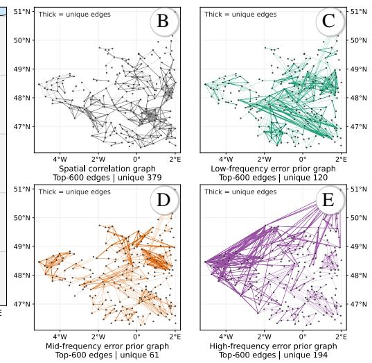
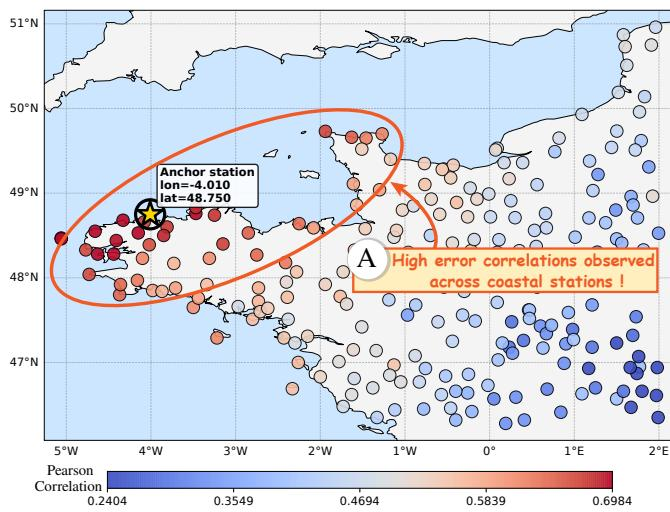
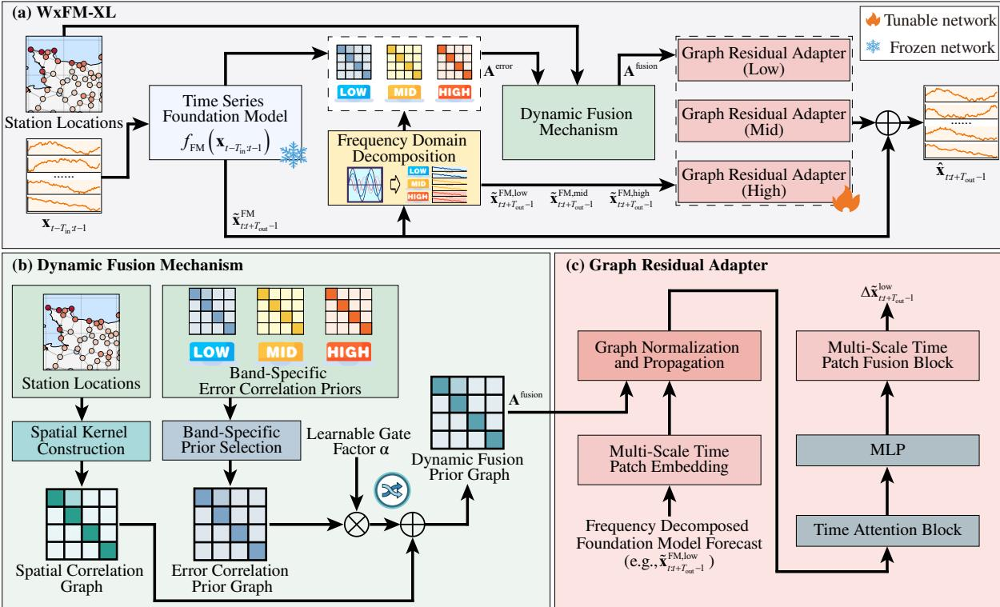
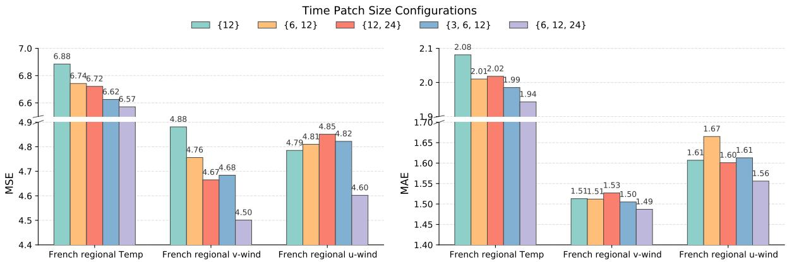
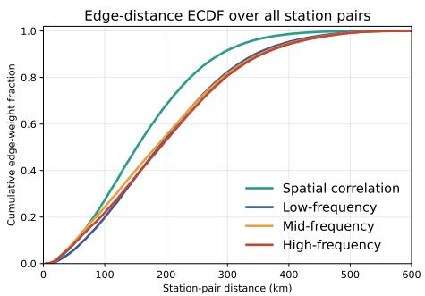
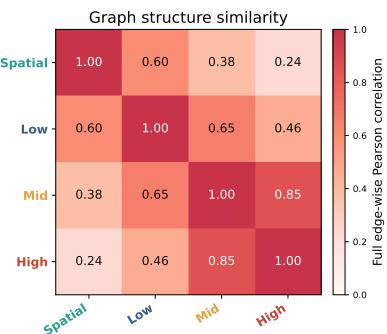
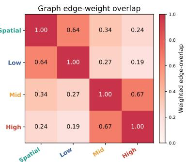
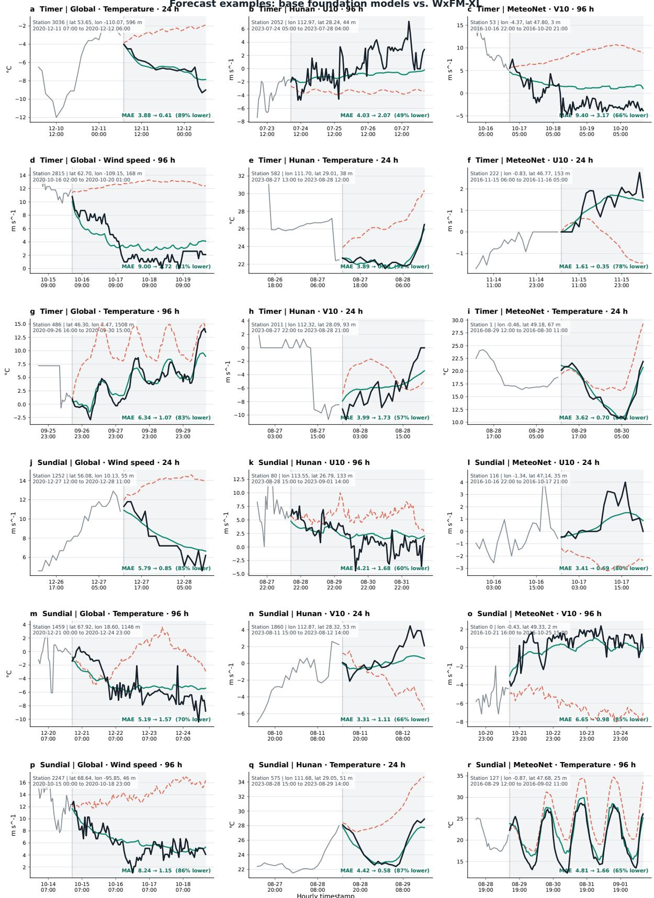

# WxFM-XL: Adapting Univariate Foundation Models to Multi-Station Weather Forecasting

Xiao Wang Changjian Chen Zhuo Tang Rongwen Li Hongwu Liu Kenli Li

## Abstract

With the rise of univariate time series foundation models (e.g., Sundial, Timer), initial efforts have been made to extend them to multivariate settings. However, these models mainly focus on modeling correlations among variables. When they are applied to multi-station weather forecasting, two important factors are often overlooked: (1) the spatial information of stations, and (2) different error priors of different stations relative to the foundation model. In this paper, we propose WxFM-XL, a model for adapting univariate time series foundation models to multi-station weather forecasting. WxFM-XL introduces a cross-station error correlation prior graph to capture stationwise error priors with respect to the foundation model. Building on this, we further propose a dynamic fusion mechanism that adaptively integrates a spatial correlation graph with the error correlation prior graph. Experiments on multiple datasets demonstrate that our model outperforms state of the art baselines.

## 1 Introduction

Building on the recent progress of time series forecasting, time series foundation models have demonstrated strong temporal priors (e.g., Sundial [11], Timer [9]). These foundation models learn from large-scale cross-domain data and produce strong univariate forecasts with limited fine tuning, sometimes even in zero-shot settings. However, their performance is limited when directly applied to multi-station weather forecasting. This is because these foundation models are primarily designed for univariate modeling and fall short in capturing the spatiotemporal relationships across stations.

To bridge this gap, some initial efforts have been made to extend univariate foundation models to multivariate settings, such as AdaPTS [2] and Timer-XL [10]. However, directly extending these multivariate methods to multistation forecasting by treating each station as a variable leads to two limitations. First, these models mainly extend foundation models to modeling correlations among multiple stations but ignore the spatial information of stations (e.g., neighborhood relationships). Existing methods have shown that such spatial information is critical for multistation forecasting [16]. Second, stations exhibit different error priors with respect to the foundation model. Recent studies have highlighted that a model’s intrinsic errors serve as critical learning signals, implicitly reflecting how well the model captures underlying data structures [8]. For example, as shown in Fig. 1(a), by calculating the error correlations between a coastal anchor station and all others, we observe complex error correlation priors that extend beyond simple neighborhood relationships. Specifically, the anchor station shares strong error correlations with distant coastal stations (e.g., Fig. 1A). This indicates that relying solely on static station spatial relations is insufficient to capture these foundation model-specific error behaviors.

To address these limitations, rather than treating stations as variables, a method that can natively model the spatial information of stations and their different error priors is desired. However, designing such a method is nontrivial. The spatial information of stations is inherently static, remaining constant regardless of the foundation model. In contrast, the error priors are inherently dynamic. These error patterns are not fixed. Rather, they are inherently specific to the chosen foundation model and exhibit fluctuations across different frequency bands. The static and dynamic natures of these two types of information make it challenging to jointly model and fuse them in a unified method, since the model must preserve time-invariant spatial dependencies while dynamically adapting to these complex error priors. This inspires us to consider answering the following question in this study: How can we effectively integrate static station spatial relations with dynamic error priors to improve forecasting performance?

To address these challenges, we propose WxFM-XL, a model for adapting univariate time series foundation models to multi-station weather forecasting. WxFM-XL first applies frequency domain decomposition to disentangle the foundation model forecasts into distinct frequency components. Subsequently, tailored error correlation prior graphs are constructed for each specific frequency band. As illustrated in Fig. 1(b), these band-specific error priors exhibit distinct topological structures: while the static spatial correlation graph (Fig. 1B) relies solely on geographic proximity, the error correlation prior graphs for low, mid, and high (Figs. 1C- 1E) frequencies reveal nonlocal connections that capture complex patterns beyond simple neighborhood relations (e.g., Fig. 1A). Building on this structural divergence, WxFM-XL introduces a dynamic fusion mechanism that adaptively integrates the spatial correlation graph with these band-specific error correlation prior graphs, resulting in frequency-aware dynamic fusion prior graphs. Guided by these fusion graphs, we implement a lightweight graph residual adapter to extend the foundation model, which effectively injects both the spatial information of stations and the stationwise error priors under a weak fine tuning, while preserving the strong temporal priors of the foundation model. Experiments across multiple datasets demonstrate that our model outperforms the SOTA (state of the art) baselines. In summary, our contributions are as follows.

  
(a) Spatial distribution of Sundial's error correlations between an anchor and all other stations  
(b) Edge distributions in Spatial Correlation Graph and Band-Specific Error-Correlation Prior Graph  
Figure 1: Visualization of error correlation dependencies for the v-component of wind speed in the French region. (a) Sundial’s forecast error correlations relative to an anchor station (star). (b) Topologies of spatial and bandspecific error correlation graphs (showing top 600 edges with unique connections highlighted).

• A foundation model adaptation framework, which bridges the gap between univariate time series foundation models and multi-station weather forecasting tasks.

• A dynamic fusion mechanism that adaptively integrates static station spatial relations with dynamic error priors.

• Experiments on multiple datasets demonstrate that our model outperforms SOTA baselines.

## 2 Related Work

Time series foundation models. Time series foundation models transfer temporal knowledge learned from largescale, cross-domain corpora to downstream forecasting tasks. For example, Chronos [1] quantizes continuous observations into discrete tokens and formulates forecasting as language modeling, whereas TimesFM [5] adopts patch-based modeling to support zero-shot forecasting across diverse datasets. Subsequent studies further improve scalability and generative capability. Time-MoE [13] employs sparse mixture-of-experts to scale model capacity without proportionally increasing inference cost, while Timer [9] uses a GPT-style architecture and next-token prediction to learn from heterogeneous time series. Sundial [11] further introduces flow matching for probabilistic forecasting over continuous-valued observations, avoiding discrete tokenization. Despite this progress, most foundation models are designed for univariate forecasting, limiting their performance in multi-station weather settings.

Multi-station forecasting models. Multi-station forecasting methods differ mainly in how they represent station interactions and temporal evolution. Graph-based methods represent stations as nodes and learn their spatial interactions. StemGNN [4] jointly models inter-series correlations and temporal dynamics in the spectral domain, while MSGNet [3] extends this idea with multiscale frequency decomposition and adaptive graph convolution. For long-range temporal modeling, Autoformer [15] combines seasonal trend decomposition with an Auto-Correlation mechanism, while FEDformer [19] introduces frequency domain modeling to improve long horizon forecasting. Corrformer [16] further combines spatial cross-correlation with temporal autocorrelation for global and regional forecasting. CDPNet [17] instead models continuous spatiotemporal evolution from discrete station observations. More recently, STELLA [6] replaces Transformer layers with a lightweight MLP to model spatiotemporal correlations without attention. These methods demonstrate the importance of station dependencies, but they generally rely on task-specific architectures trained from scratch and therefore cannot directly exploit the temporal priors acquired through large-scale foundation model pretraining.

Foundation models for multivariate forecasting. Recent studies bridge foundation models and multivariate forecasting through either native multivariate architectures or lightweight adaptation. Moirai [14] develops a unified foundation model that supports heterogeneous frequencies and arbitrary numbers of variables. Building on Timer, Timer-XL [10] extends next-token prediction to multivariate series and introduces causal TimeAttention to capture dependencies across variables and long contexts. Rather than modifying the foundation model backbone, AdaPTS [2] uses lightweight adapters to project multivariate inputs into latent representations that can be processed by existing univariate foundation models. However, when applied to multi-station weather forecasting, these extensions often treat stations as generic variables and lack explicit modeling of the spatial information of stations or the correlation of stationwise error priors relative to the foundation model.

## 3 Problem Formulation

In this section, we introduce the multi-station weather forecasting problem. For clarity of presentation, we consider forecasting a single weather variable (e.g., temperature). The formulation can be straightforwardly extended to multi-variable forecasting by applying the same procedure to each variable. We study multi-station weather forecasting with N weather stations distributed in a region. Each station has a fixed geographic location $( e . g .$ longitude, latitude, and elevation), and we denote the collection of station locations as $\mathbf { L } \in \mathbb { R } ^ { N \times 3 }$ At each timeframe t, a target weather variable at all stations is denoted by $\mathbf { x } _ { t } \in \mathbb { R } ^ { N }$ . Given the historical observations over the past $T _ { \mathrm { i n } }$ timeframes ${ \bf x } _ { t - T _ { \mathrm { i n } } : t - 1 }$ , the goal is to forecast the future weather conditions for the next $T _ { \mathrm { o u t } }$ timeframes $\hat { \mathbf { x } } _ { t : t + T _ { \mathrm { o u t } } - 1 } = f ( \mathbf { x } _ { t - T _ { \mathrm { i n } } : t - 1 } , \mathbf { L } )$ , where $f ( \cdot )$ denotes a multi-station forecasting model.

In this work, we focus on adapting a univariate time series foundation model to multi-station weather forecasting. Let $f _ { \mathrm { F M } } ( \cdot )$ denote a time series foundation model that takes a univariate history and outputs a $T _ { \mathrm { o u t } } { \mathrm { - s t e p } }$ forecast for a single station. Applying $f _ { \mathrm { F M } } ( \cdot )$ independently to N weather stations yields stationwise foundation model forecasts $\bar { \tilde { \mathbf { x } } } _ { t : t + T _ { \mathrm { o u t } } - 1 } ^ { \mathrm { F M } } = \bar { f } _ { \mathrm { F M } } ( \bar { \mathbf { x } } _ { t - T _ { \mathrm { i n } } : t - 1 } )$ . Our goal is to improve these independent stationwise forecasts by extending the foundation model with a dynamic fusion mechanism and a lightweight graph residual adapter.

## 4 The WxFM-XL Framework

We introduce the WxFM-XL framework for adapting univariate time series foundation models to multi-station weather forecasting. As shown in Fig. 2, WxFM-XL consists of two key components: (1) a Dynamic Fusion Mechanism that constructs and combines the spatial correlation graph with error correlation prior graphs; and (2) a Graph Residual Adapter that refines foundation model forecasts using the resulting dynamic fusion prior graph while preserving strong temporal priors.

## 4.1 Dynamic Fusion Mechanism

As shown in Fig. 2(a), the Dynamic Fusion Mechanism first applies (1) frequency domain decomposition to decompose the foundation model forecasts into distinct frequency bands (i.e., low, mid, and high frequencies). Then, we construct different (2) error correlation prior graphs for each specific frequency band, and the (3) spatial correlation graph based on the spatial information. Finally, we develop a gated fusion unit to obtain the (4) dynamic fusion prior graph.

(1) Frequency domain decomposition. Foundation model errors exhibit different patterns across frequency bands. To isolate these patterns, we follow frequency domain modeling [18] and decompose the foundation model forecasts into low, mid, and high frequency components. Let $\tilde { \mathbf { x } } _ { t : t + T _ { \mathrm { o u t } } - 1 } ^ { \mathrm { F M } } \in \mathbb { R } ^ { T _ { \mathrm { o u t } } \times \tilde { N } }$ denote the foundation model forecasts and $\mathcal { F } = \{ \mathrm { l o w } , \mathrm { m i d } , \mathrm { h i g h } \}$ the set of frequency bands. For each $f \in { \mathcal { F } }$ , we retain the Fourier coefficients associated with the corresponding frequency band and reconstruct the component as

$$
\begin{array} { r } { \tilde { \mathbf { x } } _ { t : t + T _ { \mathrm { o u t } } - 1 } ^ { \mathrm { F M } , f } = \mathrm { I D F T } \left( \mathcal { P } _ { f } \left( \mathrm { D F T } \left( \tilde { \mathbf { x } } _ { t : t + T _ { \mathrm { o u t } } - 1 } ^ { \mathrm { F M } } \right) \right) \right) , \qquad f \in \mathcal { F } , } \end{array}\tag{1}
$$

where $\mathrm { D F T } ( \cdot )$ transforms the forecasts into the frequency domain, $\mathcal { P } _ { f }$ retains the Fourier coefficients assigned to frequency band f and their conjugate counterparts, and $\mathrm { I D F T } ( \cdot )$ reconstructs the corresponding component in the time domain. The detailed decomposition and reconstruction are provided in Appendix A.1. These components are subsequently used to construct frequency dependent error correlation prior graphs.

  
Figure 2: Overview of the WxFM-XL framework.

(2) Error correlation prior graph. Stationwise error correlations vary across frequency bands, such that the same station pair may exhibit different dependencies in different frequency components $( e . g .$ , Fig. 1(b)). Therefore, for each $f \in { \mathcal { F } } ,$ we construct an error correlation prior graph $\mathbf { A } _ { \mathit { f } } ^ { \mathrm { e r r o r } } \in \mathbf { \bar { \mathbb { R } } } ^ { N \times N }$ . We collect the forecast errors associated with frequency band f over the training set and flatten the sample and lead time dimensions into $\mathbf { E } ^ { f } \in \mathbb { R } ^ { M \times N }$ , where M is the number of flattened instances and $E _ { m , i } ^ { f }$ denotes the error at station i for instance m. The adjacency weight between stations i and j is defined by their Pearson correlation:

$$
\left( \mathbf { A } _ { f } ^ { \operatorname { e r r o r } } \right) _ { i , j } = \frac { \sum _ { m = 1 } ^ { M } \left( E _ { m , i } ^ { f } - \bar { E } _ { i } ^ { f } \right) \left( E _ { m , j } ^ { f } - \bar { E } _ { j } ^ { f } \right) } { \sqrt { \sum _ { m = 1 } ^ { M } \left( E _ { m , i } ^ { f } - \bar { E } _ { i } ^ { f } \right) ^ { 2 } } \sqrt { \sum _ { m = 1 } ^ { M } \left( E _ { m , j } ^ { f } - \bar { E } _ { j } ^ { f } \right) ^ { 2 } } } ,\tag{2}
$$

where $\begin{array} { r } { \bar { E } _ { i } ^ { f } = \frac { 1 } { M } \sum _ { m = 1 } ^ { M } E _ { m , i } ^ { f } } \end{array}$ is the mean error at station i. We retain up to k stations with the largest positive Pearson correlations, set non-positive and unselected weights to zero, symmetrize the graph, and set self-loop weights to one.

(3) Spatial correlation graph. We construct a spatial correlation graph from the fixed geographic locations of stations. Let $\mathbf { L } = [ \mathbf { l } _ { 1 } , \ldots , \mathbf { \bar { l } } _ { N } ] ^ { \top } \in \mathbb { R } ^ { N \times 3 }$ denote the longitude, latitude, and elevation of the stations. After standardizing the station locations, we construct the spatial adjacency matrix using a Gaussian kernel:

$$
\big ( \mathbf { A } ^ { \mathrm { s p a t i a l } } \big ) _ { i , j } = \exp \left( - \frac { \left\| \tilde { \mathbf { l } } _ { i } - \tilde { \mathbf { l } } _ { j } \right\| _ { 2 } ^ { 2 } } { 2 \sigma ^ { 2 } } \right) ,\tag{3}
$$

where $\tilde { \mathbf { l } } _ { i }$ is the standardized location of station $i ,$ and σ is the median of the nonzero pairwise distances. We retain the k nearest neighbors of each station, including self-loops, set the remaining entries to zero, and symmetrize Aspatial. Since Aspatial depends only on L, it is static across time.

(4) Dynamic fusion prior graph. As shown in Fig. 2(b), for each frequency band $f \in { \mathcal { F } } ,$ we combine the error correlation prior graph $\mathbf { A } _ { f } ^ { \mathrm { e r r o r } }$ with the spatial correlation graph $\mathbf { A } ^ { \mathrm { s p a t i a l } }$ using a learnable gate $\alpha _ { f } \in \mathbb { R }$

$$
\mathbf { A } _ { f } ^ { \mathrm { f u s i o n } } = \mathbf { A } ^ { \mathrm { s p a t i a l } } + \alpha _ { f } \mathbf { A } _ { f } ^ { \mathrm { e r r o r } } .\tag{4}
$$

The spatial graph encodes geographic relations that remain fixed across foundation models, whereas the error graph captures dependencies specific to the selected foundation model and frequency band. By learning $\alpha _ { f }$ for

each band, the fusion mechanism balances these static and dynamic priors, preserving geographic constraints while incorporating nonlocal error relations beyond spatial proximity. The resulting graph guides the Graph Residual Adapter in refining $\tilde { \mathbf { x } } _ { t : t + T _ { \mathrm { o u t } } - 1 } ^ { \mathrm { F M } , f }$ according to the error structure of each frequency component.

## 4.2 Graph Residual Adapter

For each frequency band $f \in { \mathcal { F } } .$ , we employ an independent lightweight Graph Residual Adapter to refine $\tilde { \mathbf { x } } _ { t : t + T _ { \mathrm { o u t } } - 1 } ^ { \mathrm { F M } , f }$ under the corresponding dynamic fusion prior graph $\mathbf { A } _ { f } ^ { \mathrm { f u s i o n } }$ , while keeping the foundation model frozen. As shown in Fig. 2(c), we first process the input with the (1) multi-scale time patch embedding. Then, we perform the (2) graph normalization and propagation to aggregate information on the dynamic fusion prior graph. Finally, the (3) multi-scale patch fusion block combines representations from different temporal scales. All these modules are trained in an (4) end-to-end training manner.

(1) Multiscale time patch embedding. Since the frozen foundation model already provides strong temporal priors, we use time patching to efficiently extract local residual patterns. For each patch size $p \in \mathcal { P } \left( e . g . , \mathcal { P } = \right.$ $\{ 6 , 1 2 , 2 4 \} )$ ), the frequency component $\tilde { \mathbf { x } } _ { t : t + T _ { \mathrm { o u t } } - 1 } ^ { \tilde { \mathrm { F M } } , f } \in \mathbb { R } ^ { T _ { \mathrm { o u t } } \times N }$ is divided into nonoverlapping temporal segments and projected into latent tokens:

$$
\begin{array} { r } { \mathbf { Z } ^ { ( p ) } = \mathrm { R e s h a p e } _ { p } \left( \tilde { \mathbf { x } } _ { t : t + T _ { \mathrm { o u t } } - 1 } ^ { \mathrm { F M } , f } \right) \mathbf { W } _ { p } + \mathbf { b } _ { p } . } \end{array}\tag{5}
$$

Here, $\mathrm { R e s h a p e } _ { p } ( \cdot )$ produces $T _ { p } = T _ { \mathrm { o u t } } / p$ patches with shape $\mathbb { R } ^ { N \times T _ { p } \times p }$ , while $\mathbf { W } _ { p } \in \mathbb { R } ^ { p \times D }$ and $\mathbf { b } _ { p } \in \mathbb { R } ^ { D }$ are learnable parameters. The resulting representation $\mathbf { Z } ^ { ( p ) } \in \mathbb { R } ^ { N \times T _ { p } \times D }$ is passed to the graph propagation module. Using multiple patch sizes enables the adapter to capture residual patterns at different temporal granularities.

(2) Graph normalization and propagation. Given the frequency-specific dynamic fusion prior graph $\mathbf { A } _ { f } ^ { \mathrm { f u s i o n } }$ we use a learnable node gate $\mathbf { g } \in \mathbb { R } ^ { N }$ to adapt its propagation weights. For each patch size $p \in \mathcal P$ , graph normalization and propagation are defined as

$$
\begin{array} { r } { \widetilde { \mathbf { A } } _ { f } ^ { \mathrm { f u s i o n } } = \operatorname { R o w N o r m } \left( \mathbf { A } _ { f } ^ { \mathrm { f u s i o n } } \odot \operatorname { s i g } \left( { \mathbf { g 1 } ^ { \top } } + { \mathbf { 1 g } ^ { \top } } \right) \right) , } \\ { \widetilde { \mathbf { Z } } ^ { ( p ) } = \widetilde { \mathbf { A } } _ { f } ^ { \mathrm { f u s i o n } } \operatorname { T o k e n N o r m } \left( \mathbf { Z } ^ { ( p ) } \right) , \qquad p \in \mathcal { P } . } \end{array}\tag{6}
$$

Here, $\mathrm { s i g } ( \cdot )$ denotes the sigmoid function, and RowNorm $. ( \cdot )$ normalizes each row to sum to one. The multiplication is performed along the station dimension, producing $\widetilde { \mathbf Z } ^ { ( p ) } \in \mathbb R ^ { N \times T _ { p } \times D }$ by aggregating residual information across stations. These graph-propagated representations are then used for temporal refinement and residual reconstruction.

(3) Multi-scale patch fusion block. After graph propagation, we obtain the token representation $\widetilde { \mathbf { Z } } ^ { ( p ) }$ for each patch size $p \in \mathcal P$ . We further refine these representations using a lightweight temporal module consisting of a Time Attention block followed by the MLP. This module captures interactions along the temporal token dimension while keeping the adapter lightweight. The refined representations are mapped back to the temporal domain through the corresponding patch unembedding operation, producing a residual forecast $\Delta \tilde { \mathbf { x } } _ { t : t + T _ { \mathrm { o u t } } - 1 } ^ { ( p , f ) } \in \mathbb { R } ^ { T _ { \mathrm { o u t } } \times N }$ for patch size p and frequency band $f .$ Details of the temporal module, patch unembedding, and scale weight scorer are provided in Appendix $\mathsf { A } . 2 .$

To combine residuals obtained from different patch sizes, we compute normalized, nonnegative, and sampledependent weights $\theta ^ { ( p ) }$ and perform weighted fusion:

$$
\Delta \tilde { \mathbf { x } } _ { t : t + T _ { \mathrm { o u t } } - 1 } ^ { f } = \sum _ { p \in \mathcal { P } } \theta ^ { ( p ) } \Delta \tilde { \mathbf { x } } _ { t : t + T _ { \mathrm { o u t } } - 1 } ^ { ( p , f ) } .\tag{7}
$$

Finally, the adapter combines the residual corrections from all frequency bands. A learnable factor $\beta _ { f } \in$ R controls the contribution of each band:

$$
\hat { \mathbf { x } } _ { t : t + T _ { \mathrm { o u t } } - 1 } = \sum _ { f \in \mathcal { F } } \left( \tilde { \mathbf { x } } _ { t : t + T _ { \mathrm { o u t } } - 1 } ^ { \mathrm { F M } , f } + \beta _ { f } \Delta \tilde { \mathbf { x } } _ { t : t + T _ { \mathrm { o u t } } - 1 } ^ { f } \right) .\tag{8}
$$

(4) End-to-end training. We keep the foundation model frozen and jointly optimize all adapter parameters, including the node gates g, prior fusion factors $\alpha _ { f }$ , and band scaling factors $\beta _ { f }$ . Because low-frequency components usually contain substantially more energy, a standard forecasting loss may underemphasize errors in highfrequency components. We therefore combine the MSE of the final forecast with an energy-normalized RMSE for each frequency band.

Table 1: MSE results on the Hunan regional, French regional, and global datasets with a 96-hour input window and forecast horizons of 24 and 96 hours. Best and second-best results are shown in bold and underlined, respectively, based on unrounded values. Complete MAE results are reported in the appendix.
<table><tr><td colspan="2">Models</td><td colspan="2">WxFM-XL WxFM-XL (Sundial)</td><td colspan="2">Timer Sundial</td><td colspan="9">AdaPTS AdaPTS Moiraift Moirai Timer  ${ \mathrm { - X L } } _ { \mathrm { f t } }$  Timer-XL STELLA CDPNet MSGNet Corrformer</td></tr><tr><td colspan="2">enp 24</td><td>(Timer)  $5 . 1 4 _ { \pm 0 . 0 1 }$ </td><td> ${ \bf 5 . 0 6 _ { \pm 0 . 0 9 } }$ </td><td>5.28</td><td>5.78</td><td>(Timer) (Sundial)  $5 . 3 3 _ { \pm 0 . 0 5 } 5 . 5 7 _ { \pm 0 . 1 1 } 5 . 6 5 _ { \pm 0 . 2 7 }$ </td><td></td><td>5.24  $5 . 4 3 _ { \pm 0 . 1 5 }$ </td><td></td><td>5.26</td><td> $8 . 5 6 _ { \pm 0 . 8 4 }$   $7 . 4 4 _ { \pm 0 . 7 9 }$ </td><td> $5 . 8 9 _ { \pm 0 . 3 9 }$   $6 . 0 1 _ { \pm 0 . 4 7 }$ </td></tr><tr><td colspan="2">96</td><td> ${ \bf 7 . 3 1 _ { \pm 0 . 0 4 } }$ </td><td> $\underline { { 7 . 3 3 } } _ { \pm 0 . 0 5 }$ </td><td>7.52</td><td>8.35</td><td></td><td> $7 . 7 3 _ { \pm 0 . 4 2 } 8 . 5 1 _ { \pm 0 . 5 1 } 7 . 5 4 _ { \pm 0 . 2 9 }$ </td><td>7.52</td><td> $9 . 2 9 _ { \pm 0 . 2 7 }$ </td><td>7.37</td><td> $1 6 . 0 6 _ { \pm 1 . 9 7 } 2 6 . 9 4 _ { \pm 6 . 1 9 } 1 2 . 4 5 _ { \pm 0 . 9 3 }$ </td><td> $8 . 6 0 _ { \pm 0 . 4 8 }$ </td></tr><tr><td>Huan V-nd</td><td>24</td><td> $2 . 4 5 _ { \pm 0 . 0 3 }$ </td><td> $2 . 4 3 _ { \pm 0 . 0 1 }$ </td><td>2.63</td><td>3.07</td><td> $2 . 5 2 _ { \pm 0 . 0 3 } 2 . 5 4 _ { \pm 0 . 1 4 } 2 . 7 6 _ { \pm 0 . 0 2 }$ </td><td></td><td>2.81  $2 . 5 8 _ { \pm 0 . 0 1 }$ </td><td>2.58</td><td> $2 . 5 0 _ { \pm 0 . 0 3 }$ </td><td> $2 . 6 3 _ { \pm 0 . 0 9 }$   $2 . 6 9 _ { \pm 0 . 0 7 }$ </td><td> $3 . 4 6 _ { \pm 0 . 1 2 }$ </td></tr><tr><td></td><td>96</td><td> $\mathbf { 3 . 1 0 _ { \pm 0 . 0 0 } }$ </td><td> $3 . 3 0 _ { \pm 0 . 0 8 }$ </td><td>3.12</td><td>3.66</td><td> $3 . 2 3 _ { \pm 0 . 1 1 } 3 . 2 7 _ { \pm 0 . 1 6 } 3 . 6 2 _ { \pm 0 . 3 2 }$ </td><td>3.83</td><td> $3 . 3 7 _ { \pm 0 . 3 7 }$ </td><td>3.20</td><td> $3 . 4 3 _ { \pm 0 . 3 4 }$  4.54±1.41</td><td> $4 . 6 2 _ { \pm 0 . 2 8 }$ </td><td> $3 . 9 5 _ { \pm 0 . 0 9 }$ </td></tr><tr><td></td><td>u--nd 24</td><td> $2 . 0 8 _ { \pm 0 . 0 0 }$ </td><td> $\pm . 0 2 _ { \pm 0 . 0 0 }$ </td><td>2.16</td><td>2.57</td><td> $2 . 1 4 _ { \pm 0 . 1 3 } 2 . 1 6 _ { \pm 0 . 0 2 } 2 . 3 8 _ { \pm 0 . 0 1 }$ </td><td></td><td>2.37  $2 . 1 4 _ { \pm 0 . 0 1 }$ </td><td>2.16</td><td> $2 . 0 3 _ { \pm 0 . 0 1 }$   $2 . 1 5 _ { \pm 0 . 0 3 }$ </td><td> $2 . 3 0 _ { \pm 0 . 1 2 }$ </td><td> $2 . 1 4 _ { \pm 0 . 0 5 }$ </td></tr><tr><td></td><td>96</td><td>2.15±0.03</td><td> $2 . 1 5 _ { \pm 0 . 1 1 }$ </td><td>2.35</td><td>2.80</td><td> $2 . 3 1 _ { \pm 0 . 0 4 } 2 . 2 9 _ { \pm 0 . 1 3 } 2 . 7 1 _ { \pm 0 . 0 3 }$ </td><td>2.82</td><td> $2 . 2 7 _ { \pm 0 . 0 3 }$ </td><td>2.35</td><td> $2 . 2 1 _ { \pm 0 . 0 0 }$ </td><td>2.51±0.09  $2 . 8 9 _ { \pm 0 . 1 5 }$ </td><td> $2 . 3 9 _ { \pm 0 . 1 9 }$ </td></tr><tr><td></td><td>nmp 24</td><td>6.57±0.07</td><td> ${ \bf 6 . 5 0 _ { \pm 0 . 1 0 } }$ </td><td>7.57</td><td>8.02</td><td> $7 . 2 9 _ { \pm 0 . 2 1 } 7 . 3 1 _ { \pm 0 . 1 5 } 7 . 2 3 _ { \pm 0 . 0 5 }$ </td><td></td><td>7.51  $6 . 6 9 _ { \pm 0 . 3 2 }$ </td><td>7.07</td><td></td><td> $8 . 3 6 _ { \pm 0 . 2 1 } ~ 2 2 . 4 2 _ { \pm 3 . 8 7 } ~ 6 . 9 8 _ { \pm 0 . 3 5 }$ </td><td> $9 . 8 1 _ { \pm 0 . 5 7 }$ </td></tr><tr><td></td><td>96</td><td> $\mathbf { 1 2 . 0 8 _ { \pm 0 . 0 7 } }$ </td><td> $1 2 . 5 4 _ { \pm 0 . 3 9 }$ </td><td>12.35</td><td>13.52</td><td> $1 2 . 9 2 _ { \pm 0 . 7 4 } 1 3 . 5 2 _ { \pm 0 . 4 3 } 1 2 . 7 3 _ { \pm 1 . 2 3 } 1 2 . 8 5$ </td><td></td><td> $1 4 . 1 7 _ { \pm 2 . 1 4 }$ </td><td>12.52</td><td></td><td> $1 9 . 2 2 _ { \pm 2 . 2 0 } 8 3 . 7 8 _ { \pm 3 . 7 7 } 1 3 . 1 4 _ { \pm 0 . 4 1 }$ </td><td> $1 3 . 3 7 _ { \pm 0 . 5 1 }$ </td></tr><tr><td>French</td><td>V--nd 24</td><td> ${ \bf 4 . 5 0 _ { \pm 0 . 0 3 } }$ </td><td> $\underline { { 4 . 5 4 } } _ { \pm 0 . 0 1 }$ </td><td>5.69</td><td>6.11</td><td> $4 . 8 7 _ { \pm 0 . 2 1 } 5 . 2 4 _ { \pm 0 . 2 3 } 5 . 3 9 _ { \pm 0 . 1 4 }$ </td><td></td><td>6.30  $6 . 0 1 _ { \pm 0 . 0 5 }$ </td><td>5.66</td><td> $5 . 2 8 _ { \pm 0 . 0 3 }$ </td><td> $5 . 1 5 _ { \pm 0 . 3 5 }$   $5 . 3 1 _ { \pm 0 . 1 4 }$ </td><td> $6 . 0 6 _ { \pm 0 . 3 9 }$ </td></tr><tr><td></td><td>96</td><td> ${ \bf 6 . 3 9 _ { \pm 0 . 0 4 } }$ </td><td> $\underline { { 6 . 6 0 _ { \pm 0 . 2 8 } } }$ </td><td>7.96</td><td>9.08</td><td> $6 . 9 8 _ { \pm 0 . 4 2 } 7 . 1 8 _ { \pm 0 . 3 7 } 8 . 1 5 _ { \pm 0 . 3 7 }$ </td><td></td><td>10.80  $8 . 4 6 _ { \pm 0 . 2 9 }$ </td><td>7.91</td><td> $7 . 2 1 _ { \pm 0 . 2 4 }$ </td><td> $7 . 8 3 _ { \pm 0 . 8 8 }$   $8 . 9 5 _ { \pm 0 . 5 9 }$ </td><td> $8 . 1 4 _ { \pm 0 . 5 0 }$ </td></tr><tr><td></td><td>u-nd 24 96</td><td> $\mathbf { 4 . 6 0 } _ { \pm 0 . 0 3 }$ </td><td> $\underline { { 4 . 6 3 } } _ { \pm 0 . 0 1 }$ </td><td>6.26</td><td>7.10</td><td> $5 . 3 3 _ { \pm 0 . 2 1 } 5 . 7 0 _ { \pm 0 . 3 0 } 5 . 6 5 _ { \pm 0 . 0 7 }$ </td><td>6.17</td><td> $4 . 9 0 _ { \pm 0 . 0 6 }$ </td><td>6.54</td><td> $5 . 7 9 _ { \pm 0 . 1 6 }$   $5 . 3 6 _ { \pm 1 . 0 7 }$ </td><td> $5 . 0 9 _ { \pm 0 . 1 5 }$ </td><td> $6 . 0 8 _ { \pm 0 . 4 0 }$ </td></tr><tr><td></td><td></td><td> $\underline { { 8 . 2 1 _ { \pm 0 . 1 3 } } }$ </td><td> ${ \bf 8 . 1 1 _ { \pm 0 . 1 4 } }$ </td><td>9.79</td><td>11.45</td><td></td><td> $8 . 2 9 _ { \pm 0 . 3 1 } 8 . 6 0 _ { \pm 0 . 3 9 } 1 0 . 1 1 _ { \pm 0 . 5 3 } 1 2 . 4 0$ </td><td> $8 . 8 1 _ { \pm 0 . 3 4 }$ </td><td>9.94</td><td> $8 . 8 5 _ { \pm 0 . 4 4 }$ </td><td> $9 . 2 8 _ { \pm 0 . 1 9 }$   $9 . 7 1 _ { \pm 0 . 7 2 }$ </td><td> $9 . 5 1 _ { \pm 0 . 2 6 }$ </td></tr><tr><td></td><td>temp 24 96</td><td> $7 . 5 7 _ { \pm 0 . 0 1 }$ </td><td> $\mathbf { 7 . 4 9 _ { \pm 0 . 0 3 } }$ </td><td>9.67</td><td>10.27</td><td> $8 . 7 3 _ { \pm 0 . 5 2 } 9 . 1 5 _ { \pm 0 . 1 7 } 9 . 0 7 _ { \pm 0 . 0 6 }$ </td><td></td><td>9.87  $8 . 0 4 _ { \pm 0 . 6 0 }$ </td><td>10.90</td><td> $7 . 6 1 _ { \pm 0 . 0 1 }$ </td><td> $8 . 8 1 _ { \pm 0 . 1 9 }$   $9 . 9 0 _ { \pm 0 . 3 1 }$ </td><td> $7 . 7 9 _ { \pm 0 . 4 6 }$ </td></tr><tr><td>Global</td><td>24</td><td> $\mathbf { 1 3 . 9 5 _ { \pm 0 . 0 8 } }$ </td><td> $\underline { { 1 3 . 9 9 _ { \pm 0 . 0 1 } } }$ </td><td>16.47</td><td>17.94</td><td></td><td> $1 5 . 7 7 _ { \pm 0 . 4 5 } 1 6 . 1 5 _ { \pm 0 . 1 7 } 1 6 . 2 4 _ { \pm 0 . 0 7 } 1 8 . 5 5$ </td><td> $1 4 . 3 6 _ { \pm 0 . 1 4 }$ </td><td>18.11</td><td></td><td> $1 4 . 4 6 _ { \pm 0 . 1 8 } 1 4 . 9 3 _ { \pm 2 . 4 4 } 1 7 . 9 7 _ { \pm 1 . 3 5 }$ </td><td> $1 6 . 3 4 _ { \pm 0 . 3 6 }$ </td></tr><tr><td></td><td>wind 96</td><td> ${ \mathbf { 3 . 5 8 _ { \pm 0 . 0 1 } } }$   $\mathbf { 4 . 6 9 } _ { \pm 0 . 1 0 }$ </td><td> $3 . 6 6 _ { \pm 0 . 0 0 }$   $\underline { { 4 . 7 6 } } _ { \pm 0 . 0 2 }$ </td><td>4.11 5.26</td><td>4.91 6.23</td><td> $4 . 8 1 _ { \pm 0 . 2 2 } 4 . 9 4 _ { \pm 0 . 1 5 } 5 . 4 2 _ { \pm 0 . 0 3 }$ </td><td> $4 . 0 3 _ { \pm 0 . 1 5 } 4 . 1 7 _ { \pm 0 . 1 2 } 4 . 2 4 _ { \pm 0 . 0 2 }$ </td><td>4.83  $3 . 7 6 _ { \pm 0 . 0 6 }$  7.36  $4 . 7 9 _ { \pm 0 . 0 1 }$ </td><td>4.18 5.23</td><td> $3 . 7 3 _ { \pm 0 . 0 1 } 4 . 1 7 _ { \pm 0 . 0 7 }$   $4 . 8 5 _ { \pm 0 . 0 2 }$ </td><td> $5 . 2 5 _ { \pm 0 . 3 9 }$   $4 . 9 8 _ { \pm 0 . 1 4 }$   $6 . 9 7 _ { \pm 0 . 0 6 }$   $5 . 1 4 _ { \pm 0 . 1 8 }$ </td><td> $3 . 7 4 _ { \pm 0 . 1 7 }$ </td></tr></table>

For clarity, we omit the forecast-window subscripts and define $\hat { \mathbf { x } } ^ { f } = \tilde { \mathbf { x } } ^ { \mathrm { F M } , f } + \beta _ { f } \Delta \tilde { \mathbf { x } } ^ { f }$ . The training objective is

$$
\mathcal { L } = \lambda _ { \mathrm { m s e } } \mathrm { M S E } ( \hat { \mathbf { x } } , \mathbf { x } ) + \sum _ { f \in \mathcal { F } } \lambda _ { f } \sqrt { \frac { \left\| \hat { \mathbf { x } } ^ { f } - \mathbf { x } ^ { f } \right\| _ { \mathrm { F } } ^ { 2 } } { \left\| \mathbf { x } ^ { f } \right\| _ { \mathrm { F } } ^ { 2 } + \varepsilon } } .\tag{9}
$$

Here, $\mathbf { x } ^ { f }$ denotes the ground-truth component obtained using the same frequency decomposition, $\varepsilon > 0$ ensures numerical stability, and $\lambda _ { \mathrm { m s e } }$ and $\lambda _ { f }$ balance the two loss terms. Energy normalization prevents low-energy frequency components from being overwhelmed during training, enabling balanced residual correction across frequency bands.

## 5 Experiments

## 5.1 Experimental Settings

Datasets. We evaluate all methods on three hourly weather station datasets. The MeteoNet dataset [7], provided by the French national weather service, contains observations from 234 stations between January 1 and December 31, 2016, including the u-component and v-component of wind at 10 meters and temperature at 2 meters. The Hunan dataset, provided by the Hunan Province Meteorological Bureau, contains the same three variables from 3,570 stations between April 1 and September 30, 2023. The global dataset, obtained from the National Centers for Environmental Information (NCEI) [12, 16], contains hourly averaged wind speed and temperature from 3,850 stations between January 1, 2019, and December 31, 2020. For all datasets, we chronologically split the observations into training, validation, and test sets using a 6:1:3 ratio. Detailed dataset information is provided in Appendix B.1.

Baselines. We compare WxFM-XL with three groups of forecasting methods. (1) Time series foundation models. Timer [9] and Sundial [11] are evaluated under zero-shot settings without parameter updates on the target datasets. (2) Multi-station forecasting models. STELLA [6], CDPNet [17], MSGNet [3], and Corrformer [16] are included as models that explicitly capture dependencies across stations. (3) Foundation models for multivariate forecasting. Timer-XL [10] and Moirai [14] are evaluated under both zero-shot and fine-tuning settings, with their fine-tuned variants denoted as Timer-XL and $\mathbf { M o i r a i } _ { \mathrm { f t } }$ . AdaPTS [2] is combined with Timer and Sundial, yielding AdaPTS (Timer) and AdaPTS (Sundial), respectively. Detailed baseline information is provided in Appendix B.2.

Table 2: Ablation results (MSE) on the Hunan regional and French regional datasets with a 96-hour input window and a 24-hour forecast horizon. Results are reported as the mean and sample standard deviation over three random seeds. Best results are shown in bold. Complete MAE results are provided in the appendix.
<table><tr><td rowspan="2">Model variant</td><td colspan="3">Hunan regional</td><td colspan="3">French regional</td></tr><tr><td>temp</td><td>v-wind</td><td>u-wind</td><td>temp</td><td>v-wind</td><td>u-wind</td></tr><tr><td>WxFM-XL (Timer)</td><td> ${ \bf 5 . 1 4 3 _ { \pm 0 . 0 1 3 } }$ </td><td> $\mathbf { 2 . 4 5 0 } _ { \pm 0 . 0 3 4 }$ </td><td> $\mathbf { 2 . 0 8 4 } _ { \pm 0 . 0 0 3 }$ </td><td> ${ \bf 6 . 5 7 1 _ { \pm 0 . 0 6 5 } }$ </td><td> $\mathbf { 4 . 5 0 1 } _ { \pm 0 . 0 3 2 }$ </td><td> $\mathbf { 4 . 6 0 } 2 _ { \pm 0 . 0 2 8 }$ </td></tr><tr><td>w/o frequency domain decomposition</td><td> $5 . 3 9 3 _ { \pm 0 . 0 2 2 }$ </td><td> $2 . 5 5 9 _ { \pm 0 . 0 6 7 }$ </td><td> $2 . 1 4 0 _ { \pm 0 . 0 1 1 }$ </td><td> $6 . 7 7 3 _ { \pm 0 . 0 6 5 }$ </td><td> $4 . 6 9 6 _ { \pm 0 . 0 3 2 }$ </td><td> $4 . 9 0 0 _ { \pm 0 . 0 2 4 }$ </td></tr><tr><td>w/o error correlation prior graph</td><td> $5 . 4 3 0 _ { \pm 0 . 0 3 3 }$ </td><td>2.534±0.019</td><td> $2 . 1 1 0 _ { \pm 0 . 0 0 2 }$ </td><td> $6 . 8 0 8 _ { \pm 0 . 1 2 4 }$ </td><td> $4 . 6 7 2 _ { \pm 0 . 0 7 3 }$ </td><td>4.882±0.025</td></tr><tr><td>w/o multi-scale temporal module</td><td> $5 . 6 7 1 _ { \pm 0 . 0 3 6 }$ </td><td> $2 . 6 1 6 _ { \pm 0 . 0 3 5 }$ </td><td> $2 . 1 4 9 _ { \pm 0 . 0 2 1 }$ </td><td> $6 . 9 8 6 _ { \pm 0 . 1 0 8 }$ </td><td> $5 . 2 5 1 _ { \pm 0 . 0 5 6 }$ </td><td> $5 . 5 5 1 _ { \pm 0 . 0 3 5 }$ </td></tr></table>

  
Figure 3: Performance comparison of WxFM-XL (Timer) under different time patch size configurations. The look-back window is set to 96, and the prediction horizon is 24.

Implementation details. All baselines follow their official implementations and recommended settings. We use frozen Timer and Sundial backbones, denoted as WxFM-XL (Timer) and WxFM-XL (Sundial). To accommodate Timer [9], all models use a 96-hour input window, with forecast horizons $T _ { \mathrm { o u t } } \in \{ 2 4 , 9 6 \}$ . We train WxFM-XL with Adam for up to 20 epochs, using a cosine learning rate schedule from $1 0 ^ { - 4 } ~ \mathrm { t o } ~ 1 0 ^ { - 6 }$

Stochastic experiments use three seeds (2021, 2022, and 2023); for trainable methods, we report the mean and sample standard deviation. Timer and Timer-XL use deterministic inference, while Sundial and Moirai show negligible variation at the reported precision, so their standard deviations are omitted. WxFM-XL uses three frequency bands $\mathcal { F } = \{ \mathrm { l o w } , \mathrm { m i d } , \mathrm { h i g h } \}$ and patch sizes $\mathcal { P } = \{ 6 , 1 2 , 2 4 \}$ . Further settings are provided in Appendix B.3.

## 5.2 Result Analysis

From the results in Table 1, we draw three observations.

(1) Overall performance. Across all 16 dataset-variable-horizon settings, a WxFM-XL variant achieves the best MSE: WxFM-XL (Timer) ranks first in nine settings and WxFM-XL (Sundial) in the remaining seven. Both variants consistently outperform their frozen backbones, demonstrating the effectiveness of WxFM-XL across different regions, variables, and forecasting horizons.

(2) Comparison with task-specific models. Compared with STELLA, CDPNet, MSGNet, and Corrformer, WxFM-XL generally achieves better performance. On the four French wind forecasting settings, the best WxFM-XL variant reduces MSE by 8.3%–12.6% relative to the strongest task-specific baseline. These results indicate that combining pretrained temporal priors with spatial relations and frequency-specific error correlations provides more effective cross-station modeling than task-specific architectures trained from scratch.

(3) Comparison with foundation model extensions. Fine tuning improves the average performance of both Timer-XL and Moirai, but the gains are not uniform across forecasting tasks. For example, Timer-XL fine tuning increases the French 24-hour v-wind MSE from 5.66 to 6.01 and the Hunan 96-hour temperature MSE from 7.37 to 9.29. This variation indicates that generic multivariate fine tuning does not uniformly adapt to the heterogeneous dependencies among weather stations. AdaPTS also generally underperforms WxFM-XL, indicating that generic multivariate adaptation is less reliable than the proposed station-aware, frequency-specific residual correction.

  
(a)

  
(b)

  
(c)  
Figure 4: Structural properties of prior graphs (taking the v-component of wind speed in the French region as an example).

## 5.3 Ablation Study

We conduct component ablations on the Hunan and French regional datasets to evaluate the core designs of WxFM-XL. Table 2 compares the full model using Timer with three ablated variants.

Impact of frequency domain decomposition. Removing frequency domain decomposition consistently degrades performance. For example, the MSE values for Hunan temperature and u-wind increase from 5.143 to 5.393 and from 2.084 to 2.140, respectively. This result shows that separating forecasts into frequency bands reduces cross-band interference and supports band-specific residual correction.

Impact of the error correlation prior graph. Removing the error correlation prior graph leaves only the static spatial graph for message passing. Consequently, the v-wind MSE increases from 2.450 to 2.534 on the Hunan dataset and from 4.501 to 4.672 on the French dataset. This degradation indicates that geographic proximity alone cannot adequately represent the model-specific and nonlocal dependencies among forecast errors.

Impact of the multi-scale temporal module. Removing the multi-scale temporal module increases the Hunan temperature MSE from 5.143 to 5.671 and the French u-wind MSE from 4.602 to 5.551. Figure 3 further shows that the {6, 12, 24} configuration achieves the lowest MSE and MAE across all three French regional variables, confirming the benefit of combining complementary temporal resolutions.

## 5.4 Visualization Study

We visualize the graph structures to examine how the frequency-specific error priors complement the static spatial graph. Fig. 4 compares their edge-distance distributions, structural correlations, and weighted edge overlaps.

Nonlocal dependencies in error priors. Fig. 4(a) shows the edge-distance weighted ECDF over all station pairs. The spatial graph concentrates its edge weights at short geographic distances, whereas the error prior graphs exhibit heavier tails. This difference indicates that foundation model errors contain correlated patterns across geographically distant stations, allowing the error graphs to provide nonlocal connections absent from purely spatial message passing.

Frequency-dependent graph structures. Fig. 4(b) and (c) show that the error prior graphs differ across frequency bands and increasingly diverge from the spatial graph. In particular, their Pearson correlation with the spatial graph decreases from 0.60 at the low-frequency band to 0.24 at the high-frequency band. These results indicate that a single static graph cannot represent error dependencies across all frequency components and support the dynamic fusion of spatial and frequency-specific error graphs.

## 6 Conclusion

We proposed WxFM-XL to adapt univariate time series foundation models to multi-station weather forecasting. WxFM-XL decomposes foundation model forecasts into frequency bands and dynamically integrates bandspecific error correlation priors with static spatial relations. A lightweight graph residual adapter then performs structured cross-station correction while preserving the temporal priors of the foundation model. Experiments on regional and global datasets demonstrate consistent improvements over existing baselines. While this work focuses on interactions among stations, future work will further incorporate dependencies among meteorological variables for joint multivariate and multi-station forecasting.

## AI Use Statement

Generative AI was used solely for language polishing and grammar correction. No AI tools were involved in the research process, including methodology design, data analysis, or implementation.

## Reproducibility Statement

The methodological derivations and architectural details required to reproduce WxFM-XL are provided in Appendix A. Dataset preprocessing, baseline configurations, hyperparameter settings, random seeds, hardware, and evaluation protocols are documented in Appendix B. Complete MAE results, ablation results, and forecasting cases are reported in Appendix C. The Supplementary Material includes the core implementation of the proposed framework. The complete source code, configurations, and data processing scripts will be publicly released upon acceptance.

## References

[1] Abdul Fatir Ansari, Lorenzo Stella, Ali Caner Turkmen, Xiyuan Zhang, Pedro Mercado, Huibin Shen, Oleksandr Shchur, Syama Sundar Rangapuram, Sebastian Pineda Arango, Shubham Kapoor, Jasper Zschiegner, Danielle C. Maddix, Hao Wang, Michael W. Mahoney, Kari Torkkola, Andrew Gordon Wilson, Michael Bohlke-Schneider, and Bernie Wang. Chronos: Learning the language of time series. Transactions on Machine Learning Research, 2024, 2024.

[2] Abdelhakim Benechehab, Vasilii Feofanov, Giuseppe Paolo, Albert Thomas, Maurizio Filippone, and Balazs´ Kegl. AdaPTS: Adapting univariate foundation models to probabilistic multivariate time series forecasting.´ In Proceedings of the International Conference on Machine Learning, pages 3731–3748, Vancouver, BC, Canada, 2025. PMLR.

[3] Wanlin Cai, Yuxuan Liang, Xianggen Liu, Jianshuai Feng, and Yuankai Wu. Msgnet: Learning multi-scale inter-series correlations for multivariate time series forecasting. In Proceedings of the AAAI Conference on Artificial Intelligence, pages 11141–11149, Vancouver, BC, Canada, 2024. AAAI Press.

[4] Defu Cao, Yujing Wang, Juanyong Duan, Ce Zhang, Xia Zhu, Congrui Huang, Yunhai Tong, Bixiong Xu, Jing Bai, Jie Tong, and Qi Zhang. Spectral temporal graph neural network for multivariate time-series forecasting. In Proceedings of the Advances in Neural Information Processing Systems, volume 33, pages 17766–17778, Red Hook, NY, USA, 2020. Curran Associates Inc.

[5] Abhimanyu Das, Weihao Kong, Rajat Sen, and Yichen Zhou. A decoder-only foundation model for timeseries forecasting. In Proceedings of the International Conference on Machine Learning, pages 10148– 10167, Vienna, Austria, 2024. PMLR.

[6] Yisong Fu, Fei Wang, Zezhi Shao, Boyu Diao, Lin Wu, Zhulin An, Chengqing Yu, Yujie Li, and Yongjun Xu. On the integration of spatial-temporal knowledge: A lightweight approach to atmospheric time series forecasting. In Proceedings ofthe Advances in Neural Information Processing Systems, pages 82509–82538. Curran Associates, Inc., 2025.

[7] Gwennaelle Larvor, L¨ ea Berthomier, Vincent Chabot, Brice Le Pape, Bruno Pradel, and Lior Perez. Me-´ teonet, an open reference weather dataset by meteo france. https://github.com/meteofrance/ meteonet, 2020. Accessed: 2025-01-12.

[8] Jiexi Liu, Meng Cao, and Songcan Chen. Beyond observations: Reconstruction error-guided irregularly sampled time series representation learning. In Proceedings of the AAAI Conference on Artificial Intelligence, pages 23712–23720, Singapore, 2026. AAAI Press.

[9] Yong Liu, Haoran Zhang, Chenyu Li, Xiangdong Huang, Jianmin Wang, and Mingsheng Long. Timer: Generative pre-trained transformers are large time series models. In Proceedings ofthe International Conference on Machine Learning, volume 235, pages 32369–32399, Vienna, Austria, 2024. PMLR.

[10] Yong Liu, Guo Qin, Xiangdong Huang, Jianmin Wang, and Mingsheng Long. Timer-XL: Long-context transformers for unified time series forecasting. In Proceedings of the International Conference on Learning Representations, pages 83982–84006, Singapore, 2025. OpenReview.net.

[11] Yong Liu, Guo Qin, Zhiyuan Shi, Zhi Chen, Caiyin Yang, Xiangdong Huang, Jianmin Wang, and Mingsheng Long. Sundial: A family of highly capable time series foundation models. In Proceedings ofthe International Conference on Machine Learning, pages 39295–39317, Vancouver, BC, Canada, 2025. PMLR.

[12] NOAA National Centers for Environmental Information. Global hourly - integrated surface database (isd). https://www.ncei.noaa.gov/products/land-based-station/ integrated-surface-database, 2026. Accessed: 2026-01-14.

[13] Xiaoming Shi, Shiyu Wang, Yuqi Nie, Dianqi Li, Zhou Ye, Qingsong Wen, and Ming Jin. Time-moe: Billion-scale time series foundation models with mixture of experts. In Proceedings of the International Conference on Learning Representations, pages 34635–34667, Singapore, 2025. OpenReview.net.

[14] Gerald Woo, Chenghao Liu, Akshat Kumar, Caiming Xiong, Silvio Savarese, and Doyen Sahoo. Unified training of universal time series forecasting transformers. In Proceedings ofthe International Conference on Machine Learning, volume 235, pages 53140–53164, Vienna, Austria, 2024. PMLR.

[15] Haixu Wu, Jiehui Xu, Jianmin Wang, and Mingsheng Long. Autoformer: Decomposition transformers with auto-correlation for long-term series forecasting. In Proceedings of the Advances in Neural Information Processing Systems, volume 34, pages 22419–22430, Red Hook, NY, USA, 2021. Curran Associates, Inc.

[16] Haixu Wu, Hang Zhou, Mingsheng Long, and Jianmin Wang. Interpretable weather forecasting for worldwide stations with a unified deep model. Nature Machine Intelligence, 5(6):602–611, 2023.

[17] Chujie Xu, Yuqing Ma, Haoyuan Deng, Yajun Gao, Yudie Wang, Kai Lv, and Xianglong Liu. Continuous diffusive prediction network for multi-station weather prediction. In Proceedings of the International Joint Conference on Artificial Intelligence, pages 6714–6722, Montreal, Canada, 2025. ijcai.org.

[18] Runze Yang, Longbing Cao, Jianxun Li, and Jie Yang. Rethinking fourier transform from a basis functions perspective for long-term time series forecasting. In Proceedings of the Advances in Neural Information Processing Systems, volume 37, pages 8515–8540, Red Hook, NY, USA, 2024. Curran Associates Inc.

[19] Tian Zhou, Ziqing Ma, Qingsong Wen, Xue Wang, Liang Sun, and Rong Jin. FEDformer: Frequency enhanced decomposed transformer for long-term series forecasting. In Proceedings of the International Conference on Machine Learning, pages 27268–27286, Baltimore, MD, USA, 2022. PMLR.

## Appendix Overview

This appendix provides additional methodological derivations, implementation details, and experimental results that complement the main paper. Appendix A presents the complete frequency decomposition procedure, details of the Graph Residual Adapter, the training objective, and a complexity analysis. Appendix B describes the datasets, baselines, implementation settings, and evaluation protocol. Appendix C reports the complete MAE results, MAE ablation results, and representative forecasting cases across the evaluated datasets, variables, and forecasting horizons. The notation follows the definitions introduced in the main paper.

## A Method Details

This section expands the operations summarized in Sections 4.1 and 4.2. We first describe how the foundation model forecasts are separated into frequency-specific components. We then provide the complete processing flow of the Graph Residual Adapter, followed by the optimization objective and computational complexity.

## A.1 Frequency Domain Decomposition

The errors produced by a univariate foundation model may exhibit different dependencies across temporal frequencies. We therefore decompose its forecasts into low-, mid-, and high-frequency components before constructing the error correlation prior graphs.

Let $T = T _ { \mathrm { o u t } }$ and let

$$
\widetilde { \mathbf { x } } _ { t : t + T - 1 } ^ { \mathrm { F M } } = \left[ \widetilde { \mathbf { x } } ^ { \mathrm { F M } } [ 0 ] , \ldots , \widetilde { \mathbf { x } } ^ { \mathrm { F M } } [ T - 1 ] \right] ^ { \top } \in \mathbb { R } ^ { T \times N }\tag{10}
$$

denote the foundation model forecast over N stations. Here, $\tilde { \mathbf { x } } ^ { \mathrm { F M } } [ \tau ] \in \mathbb { R } ^ { N }$ is the forecast at the τ-th step within the output window.

The discrete Fourier transform (DFT) of the forecast is

$$
{ \bf H } [ k ] = \sum _ { \tau = 0 } ^ { T - 1 } \tilde { \bf x } ^ { \mathrm { F M } } [ \tau ] \exp \left( - j \frac { 2 \pi k \tau } { T } \right) , \qquad k = 0 , \dots , T - 1 ,\tag{11}
$$

where $j = \sqrt { - 1 }$ and $\mathbf { H } [ k ] \in \mathbb { C } ^ { N }$ contains the Fourier coefficients of all stations at frequency index k.

Because the forecast is real valued, its Fourier spectrum satisfies the conjugate symmetry property

$$
\mathbf { H } [ T - k ] = { \overline { { \mathbf { H } [ k ] } } } ,\tag{12}
$$

where $\overline { { \mathbf { H } [ k ] } }$ denotes the complex conjugate of H[k]. It is therefore sufficient to partition the nonnegative frequency indices

$$
K _ { + } = \left\{ 0 , \ldots , \left\lfloor { \frac { T } { 2 } } \right\rfloor \right\} .\tag{13}
$$

Let

$$
K _ { + } = \left\lfloor { \frac { T } { 2 } } \right\rfloor + 1\tag{14}
$$

denote the number of nonnegative frequency indices. We define the boundaries

$$
b _ { 0 } = 0 , \qquad b _ { 1 } = \left\lceil \frac { K _ { + } } { 3 } \right\rceil , \qquad b _ { 2 } = \left\lceil \frac { 2 K _ { + } } { 3 } \right\rceil , \qquad b _ { 3 } = K _ { + } .\tag{15}
$$

and construct three contiguous frequency sets:

$$
\begin{array} { r } { \mathcal { K } _ { \mathrm { l o w } } = \{ b _ { 0 } , \dotsc , b _ { 1 } - 1 \} , } \\ { \mathcal { K } _ { \mathrm { m i d } } = \{ b _ { 1 } , \dotsc , b _ { 2 } - 1 \} , } \\ { \mathcal { K } _ { \mathrm { h i g h } } = \{ b _ { 2 } , \dotsc , b _ { 3 } - 1 \} . } \end{array}\tag{16}
$$

This construction assigns every nonnegative frequency coefficient to exactly one band while allowing the three bands to differ in size by at most one coefficient.

For each frequency band $f \in { \mathcal { F } }$ , where

$$
\mathcal { F } = \{ \mathrm { l o w , m i d , h i g h } \} ,\tag{17}
$$

we define a conjugate symmetric binary mask

$$
M _ { f } [ k ] = \left\{ 1 , \quad k \in { \cal K } _ { f } \mathrm { ~ o r ~ } ( - k \bmod T ) \in { \cal K } _ { f } , \right.\tag{18}
$$

The corresponding masked spectrum is

$$
{ \bf H } ^ { f } [ k ] = M _ { f } [ k ] { \bf H } [ k ] .\tag{19}
$$

The component associated with frequency band f is reconstructed using the inverse discrete Fourier transform (IDFT):

$$
\tilde { \mathbf { x } } ^ { \mathrm { F M } , f } [ \tau ] = \frac { 1 } { T } \sum _ { k = 0 } ^ { T - 1 } \mathbf { H } ^ { f } [ k ] \exp \left( j \frac { 2 \pi k \tau } { T } \right) .\tag{20}
$$

The conjugate symmetric masks ensure that each reconstructed component is real valued. Since the masks form a disjoint partition of the complete spectrum,

$$
\sum _ { f \in \mathcal { F } } M _ { f } [ k ] = 1\tag{21}
$$

for every frequency index k. Consequently, the original foundation model forecast can be recovered exactly:

$$
\tilde { \mathbf { x } } ^ { \mathrm { F M } } [ \tau ] = \sum _ { f \in \mathcal { F } } \tilde { \mathbf { x } } ^ { \mathrm { F M } , f } [ \tau ] .\tag{22}
$$

We apply the same decomposition to the corresponding ground-truth sequence when constructing the frequencyspecific forecast errors and training objective. This produces band-specific targets $\mathbf { x } _ { t : t + T - 1 } ^ { f }$ that are aligned with $\tilde { \mathbf { x } } _ { t : t + T - 1 } ^ { \mathrm { F M } , f }$

## A.2 Graph Residual Adapter Details

The Graph Residual Adapter performs frequency-specific residual correction without updating the parameters of the foundation model. For each $f \in { \mathcal { F } }$ , the adapter receives the band-limited forecast $\tilde { \mathbf { x } } _ { t : t + T _ { \mathrm { o u t } } - 1 } ^ { \mathrm { F M } , f }$ and the corresponding dynamic fusion prior graph $\mathbf { A } _ { f } ^ { \mathrm { f u s i o n } }$ . Its processing flow consists of multi-scale patch embedding, graph propagation, temporal refinement, patch unembedding, and scale fusion.

For clarity, the frequency index f is omitted from intermediate token representations when no ambiguity arises.

## A.2.1 Multi-Scale Time Patch Embedding

For each patch size $p \in \mathcal P$ , we first transpose the band-limited forecast from $\mathbb { R } ^ { T _ { \mathrm { o u t } } \times N } \mathrm { \Omega t o } \mathbb { R } ^ { N \times T _ { \mathrm { o u t } } }$ , placing the station dimension first. We then divide its temporal dimension into nonoverlapping segments of length p. Let

$$
T _ { p } = { \frac { T _ { \mathrm { o u t } } } { p } }\tag{23}
$$

denote the resulting number of patch tokens. We define the patching operation as

$$
{ \mathrm { R e s h a p e } } _ { p } ( \mathbf { X } ) : = { \mathrm { r e s h a p e } } _ { N \times T _ { p } \times p } \left( \mathbf { X } ^ { \top } \right) .\tag{24}
$$

Consequently,

$$
\mathrm { R e s h a p e } _ { p } \left( \tilde { \mathbf { x } } _ { t : t + T _ { \mathrm { o u t } } - 1 } ^ { \mathrm { F M } , f } \right) \in \mathbb { R } ^ { N \times T _ { p } \times p } .\tag{25}
$$

Each temporal patch is linearly projected into a D-dimensional token:

$$
\mathbf { Z } ^ { ( p ) } = \mathrm { R e s h a p e } _ { p } \left( \tilde { \mathbf { x } } _ { t : t + T _ { \mathrm { o u t } } - 1 } ^ { \mathrm { F M } , f } \right) \mathbf { W } _ { p } ^ { \mathrm { i n } } + \mathbf { b } _ { p } ^ { \mathrm { i n } } ,\tag{26}
$$

where $\mathbf { W } _ { p } ^ { \mathrm { i n } } \in \mathbb { R } ^ { p \times D }$ and $\mathbf { b } _ { p } ^ { \mathrm { i n } } \in \mathbb { R } ^ { D }$ are learnable parameters. The resulting representation satisfies

$$
\mathbf { Z } ^ { \left( p \right) } \in \mathbb { R } ^ { N \times T _ { p } \times D } .\tag{27}
$$

We repeat this operation for every $p \in \mathcal P$ . Different patch sizes provide complementary temporal resolutions: shorter patches preserve local fluctuations, whereas longer patches provide broader temporal context for residual correction.

## A.2.2 Graph Normalization and Propagation

The dynamic fusion graph combines the static spatial graph and the frequency-specific error correlation graph:

$$
\mathbf { A } _ { f } ^ { \mathrm { f u s i o n } } = \mathbf { A } ^ { \mathrm { s p a t i a l } } + \alpha _ { f } \mathbf { A } _ { f } ^ { \mathrm { e r r o r } } .\tag{28}
$$

Although this graph supplies a frequency-specific station dependency prior, different stations may have different levels of receptivity to information from neighboring stations. We therefore refine the graph using a learnable node gating vector $\mathbf { g } \in \mathbb { R } ^ { N }$

In implementation, the node gate is evaluated only on the nonzero edges of the sparsified fusion graph; the dense notation is used for clarity. The symmetric node gate is

$$
\mathbf G = \mathrm { s i g } \left( \mathbf { g 1 } ^ { \top } + \mathbf { 1 g } ^ { \top } \right) ,\tag{29}
$$

where $\mathrm { s i g } ( \cdot )$ denotes the sigmoid function and $\mathbf { 1 } \in \mathbb { R } ^ { N }$ is an all-one vector. The gated adjacency matrix is

$$
\overline { { \mathbf { A } } } _ { f } ^ { \mathrm { f u s i o n } } = \mathbf { A } _ { f } ^ { \mathrm { f u s i o n } } \odot \mathbf { G } .\tag{30}
$$

Let

$$
\mathbf { D } _ { f } = \mathrm { d i a g } \left( \overline { { \mathbf { A } } } _ { f } ^ { \mathrm { f u s i o n } } \mathbf { 1 } \right)\tag{31}
$$

be the corresponding row-degree matrix. Row normalization gives

$$
\begin{array} { r } { \widetilde { \bf A } _ { f } ^ { \mathrm { f u s i o n } } = { \bf D } _ { f } ^ { - 1 } \overline { { \bf A } } _ { f } ^ { \mathrm { f u s i o n } } . } \end{array}\tag{32}
$$

This normalization controls the scale of the aggregated messages and ensures that each row sums to one.

Before propagation, each patch token is normalized over its D features for each sample, station, and patch. We denote its featurewise mean and standard deviation by $\mu ^ { ( p ) }$ and $\pmb { \sigma } ^ { ( p ) }$ , respectively, and define TokenNorm $( \mathbf { Z } ^ { ( p ) } ) =$ $( { \bf Z } ^ { ( p ) } - { \pmb { \mu } } ^ { ( p ) } ) / \operatorname* { m a x } ( { \pmb { \sigma } } ^ { ( p ) } , 1 0 ^ { - 5 } )$ , where the maximum is applied elementwise. The statistics are retained to restore the token scale after temporal refinement. For every temporal token, graph propagation is performed along the station dimension:

$$
\begin{array} { r } { \widetilde { \mathbf { Z } } _ { : , \tau , : } ^ { ( p ) } = \widetilde { \mathbf { A } } _ { f } ^ { \mathrm { f u s i o n } } \mathrm { T o k e n N o r m } ( \mathbf { Z } ^ { ( p ) } ) _ { : , \tau , : } , \qquad \tau = 1 , \ldots , T _ { p } . } \end{array}\tag{33}
$$

Therefore,

$$
\widetilde { \mathbf { Z } } ^ { \left( p \right) } \in \mathbb { R } ^ { N \times T _ { p } \times D } .\tag{34}
$$

The propagation operation allows each station to aggregate residual information from stations connected by geographic relations, foundation model error dependencies, or both.

## A.2.3 Time Attention and MLP

Graph propagation operates along the station dimension but does not explicitly model interactions among temporal patches. We therefore apply Time Attention independently to each station after graph propagation. At each patch scale, we first add a learnable positional embedding $\mathbf { P } ^ { ( p ) } \in \mathbb { R } ^ { 1 \times T _ { p } \times D }$ to $\widetilde { \mathbf { Z } } ^ { ( p ) }$ ; the embeddings are initialized to zero. The temporal module applies pre-normalized attention and an MLP, each with a residual connection. Its output is rescaled using the token statistics retained before graph propagation.

For station i and attention head $h ,$ the query, key, and value representations are

$$
\begin{array} { r l } & { \mathbf { Y } _ { i } ^ { ( p ) } = \mathrm { L a y e r N o r m } \left( \mathbf { \widetilde { Z } } _ { i , : , : } ^ { ( p ) } + \mathbf { P } ^ { ( p ) } \right) , } \\ & { \mathbf { Q } _ { i } ^ { ( p , h ) } = \mathbf { Y } _ { i } ^ { ( p ) } \mathbf { W } _ { h } ^ { Q } , } \\ & { \mathbf { K } _ { i } ^ { ( p , h ) } = \mathbf { Y } _ { i } ^ { ( p ) } \mathbf { W } _ { h } ^ { K } , } \\ & { \mathbf { V } _ { i } ^ { ( p , h ) } = \mathbf { Y } _ { i } ^ { ( p ) } \mathbf { W } _ { h } ^ { V } , } \end{array}\tag{35}
$$

where $\mathbf { W } _ { h } ^ { Q } , \mathbf { W } _ { h } ^ { K }$ , and $\mathbf { W } _ { h } ^ { V }$ are learnable projection matrices.

The temporal attention output of head h is

$$
\mathbf { U } _ { i } ^ { ( p , h ) } = \mathrm { s o f t m a x } \left( \frac { \mathbf { Q } _ { i } ^ { ( p , h ) } \left( \mathbf { K } _ { i } ^ { ( p , h ) } \right) ^ { \top } } { \sqrt { d _ { h } } } \right) \mathbf { V } _ { i } ^ { ( p , h ) } ,\tag{36}
$$

where $d _ { h }$ is the dimension of each attention head. The outputs of all heads are concatenated and projected:

$$
\mathbf { S } _ { i } ^ { ( p ) } = \widetilde { \mathbf { Z } } _ { i , : , : } ^ { ( p ) } + \mathbf { P } ^ { ( p ) } + \mathrm { C o n c a t } \left( \mathbf { U } _ { i } ^ { ( p , 1 ) } , \ldots , \mathbf { U } _ { i } ^ { ( p , H ) } \right) \mathbf { W } ^ { O } .\tag{37}
$$

A lightweight MLP is subsequently applied to obtain

$$
\begin{array} { r } { \begin{array} { r l } & { \mathbf O _ { i } ^ { ( p ) } = \pmb { \mu } _ { i } ^ { ( p ) } + \operatorname* { m a x } ( \pmb { \sigma } _ { i } ^ { ( p ) } , 1 0 ^ { - 5 } ) \odot } \\ & { \qquad \quad \left[ \mathbf S _ { i } ^ { ( p ) } + \mathrm { M L P } \left( \mathrm { L a y e r N o r m } ( \mathbf S _ { i } ^ { ( p ) } ) \right) \right] . } \end{array} } \end{array}\tag{38}
$$

The refined tokens satisfy $\mathbf { O } ^ { ( p ) } \in \mathbb { R } ^ { N \times T _ { p } \times D }$ . Time Attention captures dependencies across temporal patches, whereas the MLP refines their feature representations before residual reconstruction.

For the 24-hour forecasting setting, the branch with $p = T _ { \mathrm { o u t } } = 2 4$ contains a single token and therefore does not perform cross-token attention. Instead, this branch provides a global-window residual representation refined by the projection layers and MLP, while the shorter patch scales model interactions among multiple temporal tokens.

## A.2.4 Patch Unembedding

The refined tokens are mapped back to temporal segments using a scale-specific output projection:

$$
\mathbf { R } ^ { ( p ) } = \mathbf { O } ^ { ( p ) } \mathbf { W } _ { p } ^ { \mathrm { o u t } } + \mathbf { b } _ { p } ^ { \mathrm { o u t } } ,\tag{39}
$$

where $\mathbf { W } _ { p } ^ { \mathrm { o u t } } \in \mathbb { R } ^ { D \times p }$ and $\mathbf { b } _ { p } ^ { \mathrm { o u t } } \in \mathbb { R } ^ { p }$ . This gives

$$
\mathbf { R } ^ { \left( p \right) } \in \mathbb { R } ^ { N \times T _ { p } \times p } .\tag{40}
$$

The projected segments are rearranged into the original temporal resolution:

$$
\Delta \tilde { \mathbf { x } } _ { t : t + T _ { \mathrm { o u t } } - 1 } ^ { ( p , f ) } = \mathrm { R e s h a p e } _ { p } ^ { - 1 } \left( \mathbf { R } ^ { ( p ) } \right) ,\tag{41}
$$

where

$$
\Delta \tilde { \mathbf { x } } _ { t : t + T _ { \mathrm { o u t } } - 1 } ^ { ( p , f ) } \in \mathbb { R } ^ { T _ { \mathrm { o u t } } \times N } .\tag{42}
$$

## A.2.5 Dynamic Multi-Scale Fusion

The usefulness of a temporal scale may vary across samples and frequency bands. We therefore infer scale weights from the refined token representations rather than using fixed coefficients.

For each $p \in \mathcal P$ , global average pooling over the station and token dimensions gives

$$
\mathbf { c } ^ { ( p ) } = \frac { 1 } { N T _ { p } } \sum _ { i = 1 } ^ { N } \sum _ { \tau = 1 } ^ { T _ { p } } \mathbf { O } _ { i , \tau , : } ^ { ( p ) } \in \mathbb { R } ^ { D } .\tag{43}
$$

A lightweight scoring network produces a scalar score:

$$
s ^ { ( p ) } = \mathrm { M L P } _ { \mathrm { s c o r e } } \left( \mathbf { c } ^ { ( p ) } \right) .\tag{44}
$$

The scores are normalized across patch sizes:

$$
\theta ^ { ( p ) } = \frac { \exp { \left( s ^ { ( p ) } \right) } } { \sum _ { q \in \mathcal { P } } \exp { \left( s ^ { ( q ) } \right) } } .\tag{45}
$$

The weights satisfy

$$
\theta ^ { ( p ) } \geq 0 , \qquad \sum _ { p \in \mathcal { P } } \theta ^ { ( p ) } = 1 .\tag{46}
$$

The residual forecast for frequency band $f$ is

$$
\Delta \tilde { \mathbf { x } } _ { t : t + T _ { \mathrm { o u t } } - 1 } ^ { f } = \sum _ { p \in \mathcal { P } } \theta ^ { ( p ) } \Delta \tilde { \mathbf { x } } _ { t : t + T _ { \mathrm { o u t } } - 1 } ^ { ( p , f ) } .\tag{47}
$$

Finally, a learnable band factor $\beta _ { f }$ controls the correction magnitude of each frequency component:

$$
\hat { \mathbf { x } } _ { t : t + T _ { \mathrm { o u t } } - 1 } = \sum _ { f \in \mathcal { F } } \left( \tilde { \mathbf { x } } _ { t : t + T _ { \mathrm { o u t } } - 1 } ^ { \mathrm { F M } , f } + \beta _ { f } \Delta \tilde { \mathbf { x } } _ { t : t + T _ { \mathrm { o u t } } - 1 } ^ { f } \right) .\tag{48}
$$

This residual formulation preserves the temporal forecasts supplied by the frozen foundation model while introducing structured corrections based on station dependencies.

## A.3 Training Objective

All foundation model parameters remain frozen during training. The trainable parameters include the Graph Residual Adapters, node gates g, graph fusion factors $\alpha _ { f }$ , band factors $\beta _ { f }$ , patch projections, Time Attention blocks, ML ${ \mathrm { . P s } } ,$ and scale scorers.

A standard time-domain objective alone may be dominated by low-frequency components because they typically contain substantially more signal energy than high-frequency fluctuations. We therefore combine the MSE of the final forecast with an energy-normalized loss for each frequency band.

For frequency band $f ,$ the corrected prediction is

$$
\begin{array} { r } { \hat { \mathbf { x } } _ { t : t + T _ { \mathrm { o u t } } - 1 } ^ { f } = \tilde { \mathbf { x } } _ { t : t + T _ { \mathrm { o u t } } - 1 } ^ { \mathrm { F M } , f } + \beta _ { f } \Delta \tilde { \mathbf { x } } _ { t : t + T _ { \mathrm { o u t } } - 1 } ^ { f } . } \end{array}\tag{49}
$$

Let $\mathbf { x } _ { t : t + T _ { \mathrm { o u t } } - 1 } ^ { f }$ denote the corresponding ground-truth frequency component. The overall training objective is

$$
\begin{array} { r l r } {  { \mathcal { L } = \lambda _ { \mathrm { m s e } } \mathrm { M S E } ( \hat { \mathbf { x } } _ { t : t + T _ { \mathrm { o u t } } - 1 } , \mathbf { x } _ { t : t + T _ { \mathrm { o u t } } - 1 } ) } } \\ & { } & { \quad + \sum _ { f \in \mathcal { F } } \lambda _ { f } \sqrt { \frac { \| \hat { \mathbf { x } } _ { t : t + T _ { \mathrm { o u t } } - 1 } ^ { f } - \mathbf { x } _ { t : t + T _ { \mathrm { o u t } } - 1 } ^ { f } \| _ { \mathrm { F } } ^ { 2 } } { \| \mathbf { x } _ { t : t + T _ { \mathrm { o u t } } - 1 } ^ { f } \| _ { \mathrm { F } } ^ { 2 } + \varepsilon } } , } \end{array}\tag{50}
$$

where $\Vert \cdot \Vert _ { \mathrm { F } }$ is the Frobenius norm and $\varepsilon > 0$ is a small constant for numerical stability.

The denominator normalizes each band-specific error by the energy of its target component. This prevents high-energy low-frequency components from overwhelming the optimization and maintains meaningful gradients for the mid- and high-frequency adapters.

## A.4 Complexity Analysis

We analyze the computational and memory complexity of WxFM-XL by separating offline graph construction from online adapter computation. Let N be the number of stations, $T _ { \mathrm { o u t } }$ the forecasting horizon, D the token dimension, K the number of retained neighbors, and $T _ { p } = T _ { \mathrm { o u t } } / p$ the number of tokens associated with patch size $p .$

## A.4.1 Comparison with Joint Spatiotemporal Attention

A direct approach can flatten the station and time dimensions into $N T _ { \mathrm { o u t } }$ tokens and apply joint self-attention. Constructing the corresponding attention matrix requires

$$
\mathcal { O } \left( N ^ { 2 } T _ { \mathrm { o u t } } ^ { 2 } D \right)\tag{51}
$$

time and

$$
\mathcal { O } \left( N ^ { 2 } T _ { \mathrm { o u t } } ^ { 2 } \right)\tag{52}
$$

memory.

A factorized architecture that applies dense spatial attention and temporal attention separately reduces the time complexity to

$$
\mathcal { O } \left( N ^ { 2 } T _ { \mathrm { o u t } } D + N T _ { \mathrm { o u t } } ^ { 2 } D \right) .\tag{53}
$$

However, the spatial component remains quadratic in $N .$ , which becomes expensive for datasets containing thousands of stations.

## A.4.2 Offline Prior Graph Construction

The spatial graph depends only on station coordinates and is computed once before training. Computing all pairwise station distances requires $\mathcal { O } ( N ^ { 2 } )$ operations. The dense spatial similarities are then reduced to a sparse K-nearest-neighbor graph.

For each frequency band, the error correlation graph is constructed from the training errors. Let M denote the number of error instances after flattening the training sample and forecast lead-time dimensions. Computing the full Pearson correlation matrix requires

$$
\mathcal { O } ( M N ^ { 2 } )\tag{54}
$$

operations. This computation is performed once for each foundation model and forecasting setting and does not contribute to the cost of online forecasting.

After sparsification, each graph contains at most $\mathcal { O } ( K N )$ edges. The sparse graph storage cost over all frequency bands is

$$
\mathcal { O } \left( \vert \mathcal { F } \vert K N \right) .\tag{55}
$$

## A.4.3 Frequency Decomposition

For each station, computing the DFT over a forecast window of length $T _ { \mathrm { o u t } }$ requires $\mathcal { O } ( T _ { \mathrm { o u t } }$ log $T _ { \mathrm { o u t } } )$ operations. The DFT over all stations therefore costs $\mathcal { O } ( N T _ { \mathrm { o u t } } \log T _ { \mathrm { o u t } } )$ . Reconstructing the $| \mathcal F |$ frequency components using the IDFT requires $\mathcal { O } ( \vert \mathcal { F } \vert N T _ { \mathrm { o u t } } \log T _ { \mathrm { o u t } } )$ operations. Thus, the total cost of frequency decomposition is

$$
\mathcal { O } ( ( 1 + | \mathcal { F } | ) N T _ { \mathrm { o u t } } \log T _ { \mathrm { o u t } } ) .\tag{56}
$$

Storing all band-limited components requires $\mathcal { O } ( \vert \mathcal { F } \vert N T _ { \mathrm { o u t } } )$ memory.

## A.4.4 Multi-Scale Patch Embedding

For patch size p, patch embedding transforms $N T _ { p }$ temporal patches, each containing p values, into D-dimensional tokens. Its complexity is

$$
\mathcal { O } \left( N T _ { p } p D \right) = \mathcal { O } \left( N T _ { \mathrm { o u t } } D \right) .\tag{57}
$$

Patch unembedding has the same asymptotic cost.

## A.4.5 Graph Normalization and Propagation

The node gate and row normalization operate only on the retained sparse edges and require $\mathcal { O } ( K N )$ operations. Propagating $T _ { p }$ tokens with dimension D over the sparse graph requires

$$
\mathcal { O } \left( K N T _ { p } D \right)\tag{58}
$$

operations.

This avoids dense spatial message passing, whose complexity would be $\mathcal { O } ( N ^ { 2 } T _ { p } D )$ .

## A.4.6 Temporal Refinement

Time Attention is applied independently to the $T _ { p }$ tokens of each station. Constructing the temporal attention maps requires

$$
\mathcal { O } \left( N T _ { p } ^ { 2 } D \right)\tag{59}
$$

operations. The query, key, value, output projections, and MLP require

$$
\mathcal { O } \left( N T _ { p } D ^ { 2 } \right)\tag{60}
$$

operations.

Compared with applying temporal attention directly to the $T _ { \mathrm { o u t } }$ original time steps, patching reduces the quadratic attention term by a factor of $p ^ { 2 }$ because $T _ { p } = T _ { \mathrm { o u t } } / p$

## A.4.7 Scale Scoring and Fusion

Global pooling requires $\mathcal { O } ( N T _ { p } D )$ operations for each patch scale. The scale scorer operates on a D-dimensional context vector, and its cost is independent of N. Reconstructing and combining the scale-specific residual forecasts requires $\mathcal { O } ( N T _ { \mathrm { o u t } } )$ operations.

## A.4.8 Overall Online Complexity

Combining the above components, the online complexity of the adapter is

$$
\mathcal { O } \left( ( 1 + \vert \mathcal { F } \vert ) N T _ { \mathrm { o u t } } \log T _ { \mathrm { o u t } } + \vert \mathcal { F } \vert \sum _ { p \in \mathcal { P } } N T _ { p } \left( K D + T _ { p } D + D ^ { 2 } + p D \right) \right) .\tag{61}
$$

The corresponding activation memory is dominated by the patch tokens and temporal attention maps:

$$
\mathcal { O } \left( | \mathcal { F } | \sum _ { p \in \mathcal { P } } N \left( T _ { p } D + T _ { p } ^ { 2 } \right) \right) .\tag{62}
$$

The sparse prior graphs additionally require $\mathcal { O } ( | \mathcal { F } | K N )$ memory. The band-limited forecasts additionally require $\mathcal { O } ( \vert \mathcal { F } \vert N T _ { \mathrm { o u t } } )$ memory.

Since $| \mathcal { F } | , | \mathcal { P } | , K , D ,$ and $T _ { p }$ are fixed with respect to the number of stations, both the online computation and activation memory grow linearly with N. The proposed adapter therefore avoids the quadratic station dependence of joint or dense spatial attention and remains applicable to large multi-station forecasting datasets.

## B Experimental Details

This section provides the information required to reproduce the experiments. We first describe the three datasets and their chronological splits, then summarize the baseline configurations, training settings, random-seed protocol, and evaluation metrics.

## B.1 Dataset Details

We conduct experiments on three station-based weather datasets with different geographical scales and station distributions.

## B.1.1 Hunan Regional Dataset

The Hunan regional dataset is provided by the Hunan Province Meteorological Bureau. It contains hourly observations from 3,570 weather stations distributed across an approximately 576 km × 576 km region in Hunan Province, China.

The dataset covers the period from April 1 to September 30, 2023. Each station provides temperature at 2 meters and the u- and v-components of wind at 10 meters. The large number of densely distributed stations makes this dataset suitable for evaluating scalability and fine-grained regional station dependencies.

## B.1.2 French Regional Dataset

The French regional dataset is obtained from MeteoNet [7], which is released by Meteo France. It contains hourly observations from 234 weather stations distributed within an approximately 252 km × 252 km region in northwestern France.

The dataset spans from January 1 to December 31, 2016. The evaluated variables are temperature at 2 meters and the u- and v-components of wind at 10 meters. Compared with the Hunan dataset, the French dataset contains fewer and more sparsely distributed stations and therefore provides a complementary regional forecasting setting.

## B.1.3 Global Dataset

The global dataset is obtained from the National Centers for Environmental Information [12]. It contains hourly observations from 3,850 stations distributed worldwide between January 1, 2019, and December 31, 2020.

The evaluated variables are hourly temperature and averaged wind speed. The global distribution of stations introduces substantially larger spatial variation than the two regional datasets. Because the Global variables were scaled by a factor of 10 during preprocessing, we divide the resulting MSE by 100 and MAE by 10 before reporting them.

## B.1.4 Dataset Splits

For every dataset and variable, observations are arranged chronologically and divided into training, validation, and test sets using a 6:1:3 ratio. Random shuffling across time is not used.

The training split is used to optimize trainable models and construct the frequency-specific error correlation prior graphs. The validation split is used for model selection, and all reported results are computed on the held-out test split. Neither the validation nor test targets are used when constructing the error correlation prior graphs.

## B.2 Baseline Details

We compare WxFM-XL with three groups of forecasting methods. The grouping follows the organization used in the Related Work and experimental sections.

## B.2.1 Time Series Foundation Models

Timer [9] is a generative pretrained time series model that formulates forecasting through next-token prediction.   
Sundial [11] performs probabilistic forecasting over continuous-valued observations using flow matching.

We evaluate their officially released pretrained models without updating their parameters on the target weather datasets. These experiments measure the zero-shot performance of univariate foundation models when each station is forecast independently.

## B.2.2 Foundation Models for Multivariate Forecasting

Timer-XL [10] extends Timer to multivariate time series and models dependencies among variables through TimeAttention. Moirai [14] is a universal forecasting model designed to support heterogeneous frequencies and different numbers of variables.

For Timer-XL and Moirai, we report both zero-shot and fine-tuned results. Their fine-tuned variants are denoted as Timer-XL-ft and Moirai-ft, respectively.

AdaPTS [2] adapts pretrained univariate foundation models to multivariate inputs through lightweight projection adapters. We combine AdaPTS with Timer and Sundial and denote the resulting variants as AdaPTS (Timer) and AdaPTS (Sundial). The adapters are trained separately on each target dataset.

## B.2.3 Multi-Station Forecasting Models

CDPNet [17] models continuous spatiotemporal evolution from discrete station observations. MSGNet [3] combines multiscale frequency decomposition with adaptive graph convolution. Corrformer [16] integrates spatial cross-correlation and temporal autocorrelation for weather forecasting.

STELLA [6] incorporates geographic coordinates and temporal features through spatial-temporal position embedding and uses a lightweight MLP architecture instead of Transformer layers. These task-specific models are trained on each target dataset using their official or recommended configurations.

## B.3 Implementation Details

Whenever available, all baselines follow their official implementations and recommended hyperparameter settings.   
Timer, Sundial, Timer-XL, and Moirai use their officially released pretrained weights for zero-shot evaluation.   
Timer-XL-ft and Moirai-ft are trained on each target dataset using their official fine-tuning scripts.

For AdaPTS, we evaluate its available adapter configurations and use the dropout Linear Adapter Ensemble configuration with both Timer and Sundial. This configuration provides the strongest overall validation performance across our experimental settings.

We instantiate WxFM-XL using frozen pretrained Timer and Sundial backbones. These two variants are denoted as WxFM-XL (Timer) and WxFM-XL (Sundial), respectively. During training, the foundation model parameters remain frozen, and only the adapter, patch projections, graph gates, fusion factors, temporal modules, and scale scorers are updated.

The input window is fixed at 96 hours to accommodate the input length required by Timer. The same input window is used for every method to ensure a consistent comparison. We evaluate forecast horizons

$$
T _ { \mathrm { o u t } } \in \{ 2 4 , 9 6 \} .\tag{63}
$$

The number of frequency bands is fixed to three:

$$
\mathcal { F } = \{ \mathrm { l o w , m i d , h i g h } \} .\tag{64}
$$

The temporal patch sizes are

$$
\mathcal { P } = \{ 6 , 1 2 , 2 4 \} .\tag{65}
$$

The token dimension is $D = 1 2 8$ . Time Attention uses four heads of dimension 32 and an attention dropout rate of 0.1. The following MLP has a hidden dimension of 256 and a dropout rate of 0.1. The scale-weight scorer has a hidden dimension of 32.

Both the spatial correlation graph and each frequency-specific error correlation prior graph use the same dataset-specific neighborhood size: $k = 3 2$ for Hunan, $k = 1 6$ for MeteoNet (French regional), and $k = 3 6$ for Global. Self-loops are included in both graph types. The training objective uses $\lambda _ { \mathrm { m s e } } = 1 . 0$ and $\lambda _ { f } = 0 . 5$ for every $f \in { \mathcal { F } }$

We optimize WxFM-XL using Adam with an initial learning rate of $1 \times 1 0 ^ { - 4 }$ , which is annealed to $1 \times 1 0 ^ { - 6 }$ using a cosine schedule, for up to 20 epochs. All experiments are conducted on a single NVIDIA RTX 4090 GPU with 24 GB of memory.

Stochastic experiments are repeated using random seeds 2021, 2022, and 2023. For each metric, we report the arithmetic mean and sample standard deviation across the three runs.

The zero-shot evaluations of Timer and Timer-XL use deterministic inference and therefore exhibit no variation across random seeds. Although Sundial and Moirai are not strictly deterministic, their observed standard deviations under our evaluation protocol are close to zero and negligible at the reported precision. We therefore report these four foundation models without standard deviations. For all trainable models, results are reported as the mean and sample standard deviation over three random seeds.

## B.4 Evaluation Metrics

We evaluate forecasting accuracy using mean squared error (MSE) and mean absolute error (MAE). Lower values indicate better performance for both metrics.

Let Ω denote the set of evaluated sample, forecast-step, and station indices. MSE is defined as

$$
\mathrm { M S E } = \frac { 1 } { \left| \Omega \right| } \sum _ { ( s , \tau , i ) \in \Omega } \left( \hat { x } _ { s , \tau , i } - x _ { s , \tau , i } \right) ^ { 2 } ,\tag{66}
$$

and MAE is defined as

$$
\mathrm { M A E } = \frac { 1 } { \left| \Omega \right| } \sum _ { ( s , \tau , i ) \in \Omega } \left| \hat { x } _ { s , \tau , i } - x _ { s , \tau , i } \right| .\tag{67}
$$

Let $m _ { r }$ denote the metric obtained using the r-th random seed. For $R = 3$ runs, the reported mean is

$$
\bar { m } = \frac { 1 } { R } \sum _ { r = 1 } ^ { R } m _ { r } ,\tag{68}
$$

and the sample standard deviation is

$$
s _ { m } = { \sqrt { { \frac { 1 } { R - 1 } } \sum _ { r = 1 } ^ { R } \left( m _ { r } - { \bar { m } } \right) ^ { 2 } } } .\tag{69}
$$

The standard deviation therefore uses Bessel’s correction, corresponding to $\mathrm { d d o f } { \tt = } 1$ in numerical implementations.

## B.4.1 Weighted Edge Overlap

For Fig. 4(c), we compare the spatial and error prior graphs after top-k sparsification and symmetrization. We exclude self-loops and assign zero weight to absent edges. For two graphs A and B, let $\mathcal { E } _ { A B } = \{ ( i , j ) : i <$ $j , \ A _ { i j }$ and $B _ { i j }$ are finite} and $w _ { i j } ^ { A } = \operatorname* { m a x } ( A _ { i j } , 0 ) , w _ { i j } ^ { B } = \operatorname* { m a x } ( B _ { i j } , 0 )$ . Their weighted edge overlap (weighted Jaccard index) is

$$
J ( A , B ) = \frac { \sum _ { ( i , j ) \in { \mathcal E } _ { A B } } \operatorname* { m i n } ( w _ { i j } ^ { A } , w _ { i j } ^ { B } ) } { \sum _ { ( i , j ) \in { \mathcal E } _ { A B } } \operatorname* { m a x } ( w _ { i j } ^ { A } , w _ { i j } ^ { B } ) } .\tag{70}
$$

The overlap is undefined if the denominator is zero.

## C Additional Experimental Results

This section supplements the main experiments with complete MAE results and qualitative forecasting cases. The MAE results cover all datasets, variables, and forecasting horizons under the same experimental settings as the MSE results reported in the main paper. The forecasting cases further illustrate the behavior of different methods on representative weather sequences.

Table 3: Complete MAE results on the Hunan regional, French regional, and global datasets with a 96-hour input window and forecast horizons of 24 and 96 hours. Results are reported as the mean and sample standard deviation over three random seeds where applicable. Best and second-best results are shown in bold and underlined, respectively.
<table><tr><td>Models</td><td></td><td>WxFM-XL WxFM-XL (Timer) (Sundial)</td><td>Timer Sundial</td><td>AdaPTS AdaPTS  $\mathbf { M o i r a i } _ { \mathrm { f t } }$  (Timer) (Sundial)</td><td>Moirai Timer</td><td> $\mathrm { . X L _ { f t } }$ </td><td>Timer-XL STELLA CDPNet</td><td>MSGNet Corrformer</td></tr><tr><td rowspan="4">emp Huan V-nd</td><td>24</td><td>1.552±0.0311.586±0.005</td><td>1.6271.679</td><td> $1 . 6 6 1 _ { \pm 0 . 0 5 5 } 1 . 7 3 5 _ { \pm 0 . 0 5 6 } 1 . 7 1 5 _ { \pm 0 . 1 0 3 }$ </td><td>1.590  $1 . 6 9 7 _ { \pm 0 . 0 1 5 }$ </td><td>1.662</td><td> $2 . 2 3 6 _ { \pm 0 . 1 3 1 } 2 . 0 2 3 _ { \pm 0 . 1 1 1 } 1 . 7 6 0 _ { \pm 0 . 1 1 0 } 1 . 8 4 1 _ { \pm 0 . 1 0 0 }$ </td><td></td></tr><tr><td>96</td><td> $1 . 9 5 2 _ { \pm 0 . 0 1 6 } \ 1 . 9 4 7 _ { \pm 0 . 0 0 5 }$ </td><td>1.987 2.119</td><td> $2 . 0 9 4 _ { \pm 0 . 0 7 8 } 2 . 8 6 1 _ { \pm 0 . 1 2 7 } 1 . 9 8 1 _ { \pm 0 . 0 1 9 }$ </td><td>1.991  $2 . 2 6 9 _ { \pm 0 . 0 4 1 }$ </td><td>1.966</td><td></td><td> $3 . 1 0 0 _ { \pm 0 . 1 8 1 } 4 . 0 2 7 _ { \pm 0 . 5 6 4 } 2 . 6 8 0 _ { \pm 0 . 0 9 5 } 2 . 2 5 6 _ { \pm 0 . 0 6 8 }$ </td></tr><tr><td>24</td><td> $\mathbf { 0 . 7 3 7 _ { \pm 0 . 0 0 3 } 0 . 7 6 1 _ { \pm 0 . 0 0 2 } }$ </td><td>0.7450.817</td><td> $0 . 7 5 1 _ { \pm 0 . 0 3 2 } 0 . 7 6 3 _ { \pm 0 . 0 2 0 } 0 . 7 6 6 _ { \pm 0 . 0 1 2 }$ </td><td>0.771</td><td> $0 . 7 9 4 _ { \pm 0 . 0 0 2 }$ </td><td>0.766</td><td> $0 . 7 5 9 _ { \pm 0 . 0 1 1 } 0 . 7 9 7 _ { \pm 0 . 0 1 3 } 0 . 7 7 5 _ { \pm 0 . 0 5 4 } 0 . 8 8 2 _ { \pm 0 . 0 6 4 }$ </td></tr><tr><td>96</td><td> $\overline { { { 0 . 8 4 2 _ { \pm 0 . 0 0 4 } } 0 . 9 3 1 _ { \pm 0 . 0 2 8 } } }$ </td><td>0.8500.899</td><td> $0 . 8 7 5 _ { \pm 0 . 0 4 0 } 0 . 8 8 2 _ { \pm 0 . 0 4 4 } 0 . 8 9 1 _ { \pm 0 . 0 3 9 }$ </td><td>0.898</td><td> $0 . 8 4 7 _ { \pm 0 . 0 4 0 }$ </td><td>0.846</td><td> $0 . 8 8 8 _ { \pm 0 . 0 4 5 } 1 . 1 1 4 _ { \pm 0 . 3 3 5 } 1 . 0 0 1 _ { \pm 0 . 0 3 9 } 0 . 9 4 9 _ { \pm 0 . 0 7 3 }$ </td></tr><tr><td rowspan="4">-nd tenmp</td><td>24</td><td> $0 . 6 8 9 _ { \pm 0 . 0 0 2 } \ 0 . 6 6 1 _ { \pm 0 . 0 1 8 }$ </td><td></td><td>0.6760.751 0.698±0.0230.712±0.0160.711±0.0030.710</td><td> $0 . 6 9 8 _ { \pm 0 . 0 0 3 }$ </td><td>0.686</td><td></td><td>0.674±0.010 0.711±0.017 0.719±0.038 0.676±0.045</td></tr><tr><td>96</td><td> $0 . 6 9 6 _ { \pm 0 . 0 0 4 } \ 0 . 6 9 3 _ { \pm 0 . 0 1 8 }$ </td><td>0.7090.795</td><td> $0 . 7 1 7 _ { \pm 0 . 0 2 2 } 0 . 7 4 0 _ { \pm 0 . 0 1 1 } 0 . 7 6 7 _ { \pm 0 . 0 0 5 }$ </td><td>0.778</td><td> $0 . 6 9 9 _ { \pm 0 . 0 0 3 }$ </td><td>0.720</td><td> $0 . 7 0 7 _ { \pm 0 . 0 0 6 } 0 . 7 6 9 _ { \pm 0 . 0 3 8 } 0 . 7 9 2 _ { \pm 0 . 0 4 2 } 0 . 7 2 4 _ { \pm 0 . 0 }$  50</td></tr><tr><td>24  $1 . 9 4 3 _ { \pm 0 . 0 1 1 } \underline { { { 1 . 9 2 7 } } } _ { \pm 0 . 0 1 1 }$ </td><td></td><td>2.071 2.107</td><td> $2 . 0 1 3 _ { \pm 0 . 0 8 7 } 2 . 0 7 3 _ { \pm 0 . 0 4 2 } 1 . 9 7 1 _ { \pm 0 . 0 1 1 }$ </td><td>2.032  $\mathbf { 1 . 9 2 5 _ { \pm 0 . 0 3 7 } }$ </td><td>2.009</td><td></td><td> $2 . 2 3 0 _ { \pm 0 . 0 3 1 } 3 . 7 0 3 _ { \pm 0 . 3 0 7 } 2 . 0 1 3 _ { \pm 0 . 0 9 6 } 2 . 4 5 2 _ { \pm 0 . 0 7 8 }$ </td></tr><tr><td>96  $2 . 6 9 2 _ { \pm 0 . 0 2 6 } \ 2 . 7 7 1 _ { \pm 0 . 0 2 2 }$ </td><td></td><td>2.721 2.809</td><td> $2 . 7 5 4 _ { \pm 0 . 0 3 5 } 2 . 7 7 0 _ { \pm 0 . 0 5 2 } 2 . 7 4 3 _ { \pm 0 . 1 2 7 }$ </td><td>2.734</td><td> $2 . 8 5 0 _ { \pm 0 . 2 0 1 }$ </td><td>2.768</td><td>3.380±0.161 7.446±0.104 2.843±0.222 2.824±0.073</td></tr><tr><td rowspan="4">French V-nd u-n-nd</td><td>24  $1 . 4 8 7 _ { \pm 0 . 0 0 6 } \ \underline { { { 1 . 4 9 8 } } } _ { \pm 0 . 0 0 2 }$ </td><td></td><td>1.655 1.724</td><td> $1 . 6 2 5 _ { \pm 0 . 0 6 5 } 1 . 5 8 2 _ { \pm 0 . 0 7 5 } 1 . 5 9 2 _ { \pm 0 . 0 1 6 }$ </td><td>1.696  $1 . 6 6 3 _ { \pm 0 . 0 0 7 }$ </td><td>1.663</td><td></td><td> $1 . 6 5 4 _ { \pm 0 . 0 1 4 } 1 . 5 9 6 _ { \pm 0 . 0 5 1 } 1 . 5 7 3 _ { \pm 0 . 1 1 4 } 1 . 7 3 1 _ { \pm 0 . 1 3 4 }$ </td></tr><tr><td>96</td><td> $\mathbf { 1 . 8 2 1 _ { \pm 0 . 0 0 5 } } 1 . 8 6 8 _ { \pm 0 . 0 7 2 }$ </td><td>2.007 2.147</td><td> $1 . 9 4 3 _ { \pm 0 . 1 1 5 } \ 1 . 8 6 3 _ { \pm 0 . 0 4 4 } \ 2 . 0 4 3 _ { \pm 0 . 0 1 4 }$ </td><td>2.279</td><td> $2 . 0 5 1 _ { \pm 0 . 0 3 6 }$ </td><td>2.009</td><td> $1 . 9 8 1 _ { \pm 0 . 0 5 7 } 1 . 9 6 2 _ { \pm 0 . 0 7 7 } 2 . 1 4 0 _ { \pm 0 . 1 6 3 } 2 . 0 7 1 _ { \pm 0 . 0 9 6 }$ </td></tr><tr><td>24 1.556±0.007 1.560±0.001</td><td></td><td>1.820 1.934</td><td> $1 . 6 2 4 _ { \pm 0 . 0 2 4 } 1 . 7 0 0 _ { \pm 0 . 0 2 4 } 1 . 6 8 6 _ { \pm 0 . 0 1 1 }$ </td><td>1.758  $1 . 5 8 3 _ { \pm 0 . 0 0 8 }$ </td><td>1.854</td><td> $1 . 7 7 6 _ { \pm 0 . 0 1 8 } \ 1 . 6 4 8 _ { \pm 0 . 1 3 9 }$ </td><td>1.617±0.0661.809±0.109</td></tr><tr><td>96  $2 . 1 4 8 _ { \pm 0 . 0 0 6 } \ 2 . 1 4 9 _ { \pm 0 . 0 2 8 }$ </td><td></td><td>2.3272.524</td><td> $2 . 1 6 9 _ { \pm 0 . 1 1 4 } 2 . 1 5 4 _ { \pm 0 . 0 2 6 } 2 . 3 5 0 _ { \pm 0 . 0 3 2 }$ </td><td>2.562</td><td> $2 . 1 8 8 _ { \pm 0 . 0 5 0 }$ </td><td>2.336</td><td> $2 . 2 4 2 _ { \pm 0 . 0 3 8 } 2 . 2 5 4 _ { \pm 0 . 0 5 1 } 2 . 3 2 0 _ { \pm 0 . 1 3 0 } 2 . 3 0 3 _ { \pm 0 . 1 1 4 }$ </td></tr><tr><td rowspan="2">tenmp Glbbal</td><td>24</td><td> $1 . 9 0 3 _ { \pm 0 . 0 0 3 } \ 1 . 8 8 1 _ { \pm 0 . 0 0 4 }$ </td><td>2.1432.186</td><td> $2 . 0 5 0 _ { \pm 0 . 0 8 6 } 2 . 0 3 4 _ { \pm 0 . 1 2 0 } 2 . 0 5 2 _ { \pm 0 . 0 0 3 } 2 . 1 0 9$ </td><td></td><td> $1 . 9 4 9 _ { \pm 0 . 0 3 6 }$ </td><td>2.337</td><td> $\mathbf { 1 . 8 6 1 _ { \pm 0 . 0 0 3 } 2 . 1 2 6 _ { \pm 0 . 0 2 0 } 2 . 2 5 1 _ { \pm 0 . 1 1 6 } } 1 . 9 4 6 _ { \pm 0 . 0 6 3 }$ </td></tr><tr><td>96</td><td> $2 . 6 2 5 _ { \pm 0 . 0 1 0 } \underline { { { 2 . 6 3 5 } } } _ { \pm 0 . 0 4 0 }$ </td><td>2.8863.003</td><td> $2 . 7 8 8 _ { \pm 0 . 0 8 8 } 2 . 8 5 7 _ { \pm 0 . 0 9 3 } 2 . 7 8 5 _ { \pm 0 . 0 3 0 } 2 . 9 9 8$ </td><td></td><td> $2 . 7 5 7 _ { \pm 0 . 0 1 5 }$ </td><td>3.089</td><td> $2 . 7 2 3 _ { \pm 0 . 0 1 4 } 2 . 7 2 5 _ { \pm 0 . 0 6 5 } 3 . 0 2 4 _ { \pm 0 . 0 3 1 } 2 . 9 1 4 _ { \pm 0 . 0 4 8 }$ </td></tr><tr><td rowspan="2">wnd</td><td>24 66</td><td> $1 . 2 8 2 _ { \pm 0 . 0 0 1 } \ 1 . 2 7 8 _ { \pm 0 . 0 0 1 }$ </td><td>1.3771.494</td><td> $1 . 3 7 5 _ { \pm 0 . 0 5 1 } 1 . 3 9 8 _ { \pm 0 . 0 1 1 } 1 . 3 7 1 _ { \pm 0 . 0 0 4 } 1 . 4 4 9$ </td><td></td><td> $1 . 3 6 8 _ { \pm 0 . 0 1 3 }$ </td><td>1.405</td><td>1.290±0.0011.408±0.0111.564±0.057  $1 . 3 6 6 _ { \pm 0 . 0 9 4 }$ </td></tr><tr><td></td><td> $1 . 4 8 8 _ { \pm 0 . 0 3 6 } 1 . 5 0 0 _ { \pm 0 . 0 2 4 }$ </td><td>1.563 1.691</td><td> $1 . 5 3 2 _ { \pm 0 . 0 7 2 } \ : 1 . 5 4 4 _ { \pm 0 . 0 5 5 } \ : 1 . 5 6 0 _ { \pm 0 . 0 0 7 }$ </td><td>1.763</td><td> $1 . 4 9 7 _ { \pm 0 . 0 0 4 }$ </td><td>1.578</td><td> $\mathbf { 1 . 4 7 6 _ { \pm 0 . 0 0 4 } 1 . 5 3 2 _ { \pm 0 . 0 2 7 } 1 . 8 0 2 _ { \pm 0 . 0 0 8 } }$   $1 . 5 5 9 _ { \pm 0 . 0 5 1 }$ </td></tr></table>

Table 4: Complete MAE results of the ablation study on the Hunan regional and French regional datasets. The input window is 96 hours, and the forecast horizon is 24 hours. Results are reported as the mean and sample standard deviation over three random seeds. Best results are shown in bold.
<table><tr><td rowspan="2">Model variant</td><td colspan="3">Hunan regional</td><td colspan="3">French regional</td></tr><tr><td>temp</td><td>v-wind</td><td>u-wind</td><td>temp</td><td>v-wind</td><td>u-wind</td></tr><tr><td>WxFM-XL (Timer)</td><td> $1 . 5 5 2 _ { \pm 0 . 0 3 1 }$ </td><td> $\mathbf { 0 . 7 3 7 _ { \pm 0 . 0 0 3 } }$ </td><td> $\mathbf { 0 . 6 8 9 } _ { \pm 0 . 0 0 2 }$ </td><td> $\mathbf { 1 . 9 4 3 _ { \pm 0 . 0 1 1 } }$ </td><td> $\mathbf { 1 . 4 8 7 _ { \pm 0 . 0 0 6 } }$ </td><td> $\mathbf { 1 . 5 5 6 _ { \pm 0 . 0 0 7 } }$ </td></tr><tr><td>w/o frequency domain decomposition</td><td> $1 . 6 8 2 _ { \pm 0 . 0 4 1 }$ </td><td> $0 . 7 9 1 _ { \pm 0 . 0 0 8 }$ </td><td> $0 . 7 1 2 _ { \pm 0 . 0 1 6 }$ </td><td> $1 . 9 8 5 _ { \pm 0 . 0 2 0 }$ </td><td> $1 . 5 8 6 _ { \pm 0 . 0 1 6 }$ </td><td>1.641±0.004</td></tr><tr><td>w/o error correlation prior graph</td><td>1.684±0.038 0.793±0.003</td><td></td><td> $0 . 7 1 3 _ { \pm 0 . 0 0 4 }$ </td><td> $1 . 9 7 7 _ { \pm 0 . 0 2 2 }$ </td><td> $1 . 6 1 9 _ { \pm 0 . 0 0 4 }$ </td><td> $1 . 6 3 6 _ { \pm 0 . 0 1 8 }$ </td></tr><tr><td>w/o multi-scale temporal module</td><td> $1 . 7 5 3 _ { \pm 0 . 0 6 2 } 0 . 7 9 7 _ { \pm 0 . 0 0 8 }$ </td><td></td><td></td><td>0.714±0.010 2.002±0.014</td><td> $1 . 6 5 2 _ { \pm 0 . 0 1 0 }$ </td><td> $1 . 7 3 7 _ { \pm 0 . 0 1 5 }$ </td></tr></table>

## C.1 Complete MAE Results

Table 3 reports the complete MAE results on the Hunan regional, French regional, and global datasets for forecasting horizons of 24 and 96 hours. For trainable models, we report the mean and sample standard deviation over three runs. Timer and Timer-XL use deterministic inference. Sundial and Moirai are not strictly deterministic, but their observed variations are negligible relative to their mean values; their standard deviations are therefore omitted. Best and second-best results are marked in bold and underlined, respectively, based on the unrounded means.

Table 4 provides the complete MAE results corresponding to the MSE ablation study in the main paper. The complete model achieves the lowest MAE across all variables on both regional datasets, confirming that the improvements observed in MSE are also consistent under the absolute-error metric. Removing either the frequency domain decomposition or the error correlation prior graph consistently degrades the forecasting accuracy. The variant without the multi-scale temporal module exhibits the largest overall degradation, particularly for temperature and wind forecasting on the French regional dataset. These results further demonstrate that frequencyspecific correction, error-aware spatial propagation, and multi-scale temporal modeling contribute complementary improvements.

## C.2 Forecasting Case Studies

To complement the aggregate evaluation metrics, we present representative forecasting cases selected from the test sets. The cases cover different datasets, weather variables, and forecasting horizons, including both smooth temporal trends and rapid local fluctuations. For each case, we compare the ground-truth observations with the predictions produced by the frozen foundation model and WxFM-XL.

These comparisons provide a direct view of how the proposed adapter modifies the original foundation model forecasts. In particular, they allow us to examine whether WxFM-XL can correct systematic forecast deviations, preserve the overall temporal trend, and capture local variations across correlated stations. We also include longhorizon cases to investigate the accumulation of forecasting errors as the prediction horizon increases.

  
Figure 5: Representative forecasting cases on the evaluated datasets. The plots compare the ground truth with predictions from the frozen foundation model and WxFM-XL.