Code Avg.

# YANchor-4B: Effective Long-Horizon Reasoning in O(N) Time with O(1) Memory

Huishan Ji Hua Xu Weiming Zhang Qirui Ye

Rocore Matrix

jihs@stonehill-tech.com xuh@stonehill-tech.com zhangwm@stonehill-tech.com qiruiy@andrew.cmu.edu

October 2026

Code: github.com/RocoreMatrix/YANchor Model: huggingface.co/HuishanJi/YANchor-4B

## Abstract

Long-horizon reasoning demands access to earlier information at a manageable generation cost. Full-history attention incurs growing storage and computation, while recurrent compression can lose precise details. Therefore, we present YANchor-4B, a general-purpose recurrent model that preserves crucial memory as ANchors for retrieval during subsequent reasoning. Beyond O(N)-time generation and O(1) memory, YANchor enables effective long-horizon reasoning through its multidimensional memory mechanism. For example, on challenging math problems, it achieves 82.93% mean pass@1 on AIME 2024–2026 and 63.64% on HMMT, substantially outperforming linear-time, constant-state counterparts, including larger models. It also delivers several-fold higher batched long-generation throughput than Transformer and hybrid baselines on H100. Furthermore, evaluations across dozens of benchmarks demonstrate YANchor’s superiority in general-purpose capabilities.

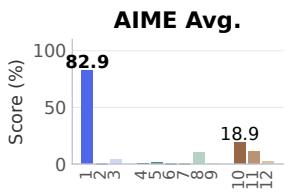

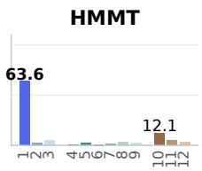

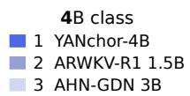

MATH-500  
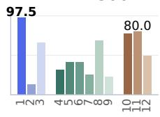

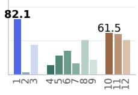  
Science Avg.

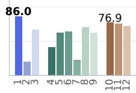  
13–14B class 10 RWKV-7 G1j 13.3B 11 AHN-GDN 14B 12 Phi-3 Medium 4K

Figure 1. YANchor-4B and 11 bounded-state baselines on mathematics, code, and science. Models are grouped by parameter scale. $\operatorname { A v g } .$ denotes an equal-weight benchmark mean: AIME covers 2024–2026; Code covers HumanEval, MBPP, and LiveCodeBench v6; Science covers GPQA-Diamond, ARC-C, and ARC-E. HMMT uses February 2026. Section 5 defines the primary metrics.  
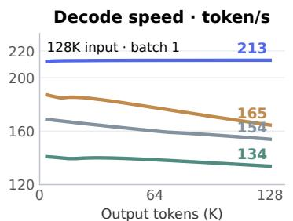

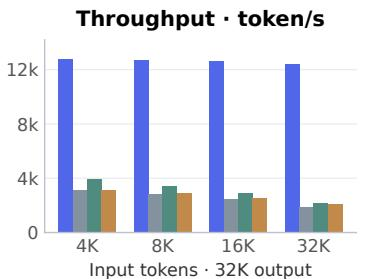  
Memory demand · GiB  
YANchor-4B + CUDA Graphs + Fused Kernels

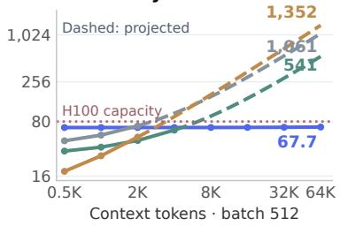  
Qwen3.5-4B + BF16 + FA4 + FlashInfer GDN Prefill + Fused CUDA GDN Decode  
Gemma 4 E4B + BF16 + FlashAttention-4  
MiniCPM5-2B + BF16 + FlashAttention-3  
All baselines: vLLM O3 + CUDA Graphs + Chunked Prefill + Async Scheduling

Figure 2. Single-H100 inference: sustained decoding speed, higher batched throughput, and bounded memory demand. Left: cumulative decode speed. Middle: end-to-end output throughput, selecting the batch size with the highest measured throughput for each model and input length. Right: batch-512 peak memory demand; solid curves use measured components, dashed curves project KV growth, and the dotted line marks device capacity. Appendix D gives the workloads and runtime settings.

## 1 Introduction

Long-horizon reasoning builds on earlier definitions, constraints, and intermediate results throughout a solution. These dependencies require continued access to earlier information. Full-history attention provides direct access, but its growing cache and attention computation make extended generation increasingly expensive.

Recurrent and state-space models keep a fixed-size summary of history. This gives favorable inference scaling, yet repeated state updates can weaken precise associations. Local attention preserves recent detail, while distant information eventually leaves its window. Effective longhorizon reasoning therefore requires a way to retain and retrieve crucial earlier information within a bounded state.

YANchor addresses this gap by preserving crucial memory as ANchors for retrieval during subsequent reasoning. Independent memory retains distant information, recurrent states summarize broader context, and local attention preserves recent detail. These complementary paths support effective long-horizon reasoning within a fixed-capacity history state, yielding O(1) history-state memory and O(N) generation time over N tokens.

To realize this design, YANchor adapts Qwen3.5-4B by preserving its recurrent layers and replacing global attention with local attention and independent memory. The memory learns how to write, select, and retrieve records for subsequent computation. Architectural adaptation and post-training develop its use in task solutions. Section 3 describes these mechanisms.

YANchor substantially outperforms linear-time, constant-state counterparts on difficult mathematical reasoning, including models with 7B–14B parameters (Figure 1). Its AIME 2024–2026 mean pass@1 reaches 82.93%, compared with 18.89% for RWKV-7 G1j 13.3B. The lead extends to HMMT, knowledge, code, and instruction following.

YANchor sustains long-sequence decoding and achieves several-fold higher batched throughput than Transformer and hybrid baselines on H100 (Figure 2). Fixed history storage keeps more long sequences resident as generation proceeds. Together, the capability and efficiency results show that difficult tasks can be solved within a history-state budget that does not grow with the solution.

Across the 24 common benchmarks, YANchor leads all 16 evaluated bounded-state baselines on 20 tasks. Its mean score of 78.64 exceeds the strongest baseline at 56.29 by 22.35 points. VL results establish multimodal capability, while long-memory tests confirm access to distant information.

## 2 Model Overview and Inference Efficiency

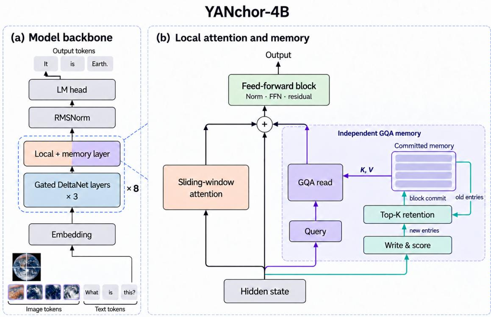  
Figure 3. Architecture of YANchor-4B. Recurrent layers are interleaved with local-attention and memory modules. The inset shows how explicit records are written, retained as memory anchors, and retrieved through an independent read path. All history paths have fixed capacity. Image credit: NASA.

## 2.1 Long-generation speed and throughput

YANchor sustains approximately 213 decode tokens/s as generation extends (Figure 2, left). At 128K input and 128K output tokens, cumulative rates are 212.98 for YANchor, 153.91 for Qwen3.5-4B, 133.75 for Gemma 4 E4B, and 164.53 for MiniCPM5-2B. The growing-history baselines slow as their retained context increases.

YANchor delivers 4.12–6.58 times Qwen3.5-4B’s end-to-end throughput and 3.25–5.66 times Gemma’s in batched long generation (Figure 2, middle). It also outperforms MiniCPM throughout the comparison. Fixed-capacity history sustains a large active batch as generation proceeds.

Measurements use one H100 80GB. Appendix D specifies the workloads and optimized runtime configurations. Here 1K denotes 1,024 tokens.

## 2.2 Memory capacity at long contexts

YANchor keeps 512 independent long-context sequences resident on one H100 80GB (Figure 2, right). Its history cache stays fixed at 48.90 GiB as context grows from 512 to 65,536 tokens per sequence. Peak memory demand remains near 67 GiB; the 1 GiB increase comes from input buffers.

Growing global KV caches limit the baselines to much shorter contexts at the same concurrency. Cache preemption begins at 4K tokens per sequence for Qwen3.5-4B and MiniCPM, and at 8K for Gemma. Their projected 64K requirements are 1,061, 1,352, and 541 GiB, respectively.

## 3 Architecture

## 3.1 Three representations of history

YANchor adapts the Qwen3.5-4B language backbone [1]. Its 32 layers form eight groups, each containing three Gated DeltaNet layers and one attention layer. At the attention positions, we combine a fixed local window with an independent memory branch:

$$
\mathrm { \small { [ G D N , ~ G D N , ~ G D N , ~ S W A _ { 1 0 2 4 } ~ \lVert ~ M e m o r y ] \times 8 . } }\tag{1}
$$

Each sequence mixer is followed by a feed-forward sublayer. The eight memory modules have distinct parameters and state.

For a layer input $h _ { t } ,$ , the combined computation can be written as

$$
z _ { t } = h _ { t } + S \mathbf { W } \mathbf { A } ( \mathbf { N o r m } _ { \mathrm { l o c a l } } ( h _ { t } ) ) + \mathbf { M e m } ( h _ { t } , \mathcal { M } _ { t } ) ,\tag{2}
$$

$$
h _ { t } ^ { \mathrm { o u t } } = z _ { t } + \mathrm { M L P } ( \mathrm { N o r m } _ { \mathrm { f f n } } ( z _ { t } ) ) .\tag{3}
$$

SWA and memory each normalize attention over their own records. Their outputs enter the same residual stream, making retrieved history available to subsequent layers.

Gated DeltaNet summarizes history in fixed-dimensional recurrent matrices [2]. SWA exposes the most recent 1,024 positions, while memory keeps selected distant records separately addressable. The model therefore combines compressed context, recent detail, and retrieved history in a single computation.

## 3.2 Independent writing and admission

Let $u _ { t } = \mathrm { N o r m } _ { \mathrm { m e m } } ( h _ { t } )$ . A residual writer constructs a representation for storage:

$$
w _ { t } = u _ { t } + W _ { \mathrm { d o w n } } \left[ \mathrm { S i L U } ( W _ { \mathrm { g a t e } } u _ { t } ) \odot W _ { \mathrm { u p } } u _ { t } \right] .\tag{4}
$$

Independent projections map $w _ { t }$ into keys and values. Queries are projected from $u _ { t } ,$ so writing can shape the stored content while querying expresses the current retrieval request. The read uses normalized queries and keys with partial rotary position encoding.

A small admission network assigns one score per KV group,

$$
a _ { t } = W _ { a , 2 } \mathrm { S i L U } ( W _ { a , 1 } u _ { t } ) , \qquad a _ { t } \in \mathbb { R } ^ { 4 } .\tag{5}
$$

Scores use information available when a record is written. Each KV group independently retains its highest-scoring 1,024 records; the selected positions may overlap across groups.

New records accumulate in 256-token blocks. At a block boundary, each group merges these candidates with its committed memory and selects the next Top-K set. Retention selects whole records, preserving their written key–value representations. These stored records form the memory anchors retrieved by subsequent queries. The following block reads that set, while SWA supplies interactions within the current block.

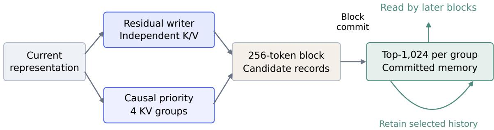  
Figure 4. Causal memory maintenance. An independent writer produces K/V representations, and a causal network supplies group-specific admission scores. Each 256-token block selects a persistent Top-1,024 set per KV group. Retained records preserve their written representations as memory anchors for subsequent retrieval.

Priority-based retention keeps high-scoring records across block updates, preserving access to their information long after it leaves the local window.

## 3.3 Grouped-query retrieval and integration

Each memory module has 16 query heads, four KV groups, and head dimension $d = 2 5 6$ . For query head h assigned to group $g ( h )$ , retrieval over committed records $\mathcal { M } _ { g ( h ) }$ is

$$
e _ { t , h } = \sum _ { j \in \mathcal { M } _ { g ( h ) } } \frac { \exp ( q _ { t , h } ^ { \top } k _ { j , g ( h ) } / \sqrt { d } ) } { 1 + \sum _ { i \in \mathcal { M } _ { g ( h ) } } \exp ( q _ { t , h } ^ { \top } k _ { i , g ( h ) } / \sqrt { d } ) } v _ { j , g ( h ) } .\tag{6}
$$

The unit in the denominator is a zero-logit, zero-value memory item. It gives the read a neutral output when memory is empty and lets attention assign mass away from poorly matched records.

A query-conditioned gate modulates each retrieved head before an independent output projection. The gate controls the memory contribution to the residual stream. Grouped keys and values reduce storage, while multiple query heads support distinct retrieval requests. Appendix B gives the gate parameterization.

## 3.4 Model scale and bounded state

Table 1. Architecture of YANchor-4B. Parameter totals describe the text model; the visual encoder is separate.
<table><tr><td>Quantity</td><td>Value</td></tr><tr><td>Text-model parameters</td><td>4.58B</td></tr><tr><td>Independent memory parameters</td><td>372M</td></tr><tr><td>Backbone layers</td><td>24 GDN + 8 SWA</td></tr><tr><td>Residual width</td><td>2,560</td></tr><tr><td>Memory modules</td><td>8</td></tr><tr><td>Memory query heads / KV groups / head dimension</td><td>16 /  4 / 256</td></tr><tr><td>Local attention window</td><td>1,024 tokens</td></tr><tr><td>Committed memory per KV group Candidate block</td><td>1,024 records</td></tr><tr><td></td><td>256 tokens</td></tr><tr><td>Memory K/V state, BF16</td><td>40 MiB per sequence</td></tr></table>

The added memory K/V storage follows

$$
2 \times 8 \times 4 \times ( 1 0 2 4 + 2 5 6 ) \times 2 5 6 \times 2 \mathrm { b y t e s } = 4 0 \mathrm { M i B } .\tag{7}
$$

The 40 MiB covers committed and candidate memory K/V tensors. Recurrent state, the SWA cache, scores, and indices add fixed-capacity history storage. The 4.58B text-model total includes the 372M independent memory parameters.

## 3.5 Linear-time generation with fixed state

Let N be the generated length, W the local window, K the memory capacity, and C the block size. Every token updates fixed-size recurrent states and reads at most W local positions and K memory records per group. A block commit selects from at most $K + C$ records. These architectural capacities are independent of N, so total autoregressive work is

$$
\sum _ { t = 1 } ^ { N } O \bigg ( 1 + W + K + \frac { ( K + C ) \log ( K + C ) } { C } \bigg ) = O ( N ) .\tag{8}
$$

Persistent history consists of recurrent states, local attention rings, committed memory, candidate records, and their metadata. Each has fixed capacity, giving O(1) context-state memory in N. Streamed prefill processes the input in bounded chunks.

Table 2. Autoregressive scaling with generated length N.
<table><tr><td>History mechanism</td><td>Total decode work</td><td>Persistent context state</td></tr><tr><td>Full-history attention</td><td>O(N2)</td><td>O(N)</td></tr><tr><td>Fixed-dimensional recurrence</td><td>O(N)</td><td>O(1)</td></tr><tr><td>Fixed-window attention</td><td>O(N)</td><td>O(1)</td></tr><tr><td>YANchor recurrence + SWA + memory</td><td>O(N)</td><td>O(1)</td></tr></table>

## 4 Training Stages

A useful memory must learn what to preserve, how to retrieve it, and how to use it in a solution. M0, R, and S develop these abilities through architectural adaptation and supervised learning; reinforcement learning with verifiable rewards (RLVR) then refines generated responses using verified task outcomes.

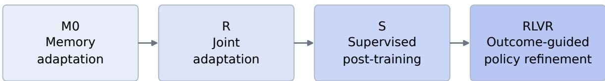  
Figure 5. The M0, R, S, and RLVR training sequence for YANchor-4B.

## 4.1 M0: memory adaptation

M0 develops the independent memory modules’ ability to retain and retrieve information relevant to later predictions.

## 4.2 R: joint adaptation

R integrates memory with the backbone’s recurrent and local-attention computation, enabling retrieved information to contribute to subsequent reasoning.

## 4.3 S: supervised post-training

S consolidates general-purpose response generation through supervised learning across a broad range of tasks.

## 4.4 RLVR: outcome-guided policy refinement

RLVR refines generated responses through verifiable feedback on answer correctness and task completion. Section 9 compares long-memory capability across the four training stages.

## 5 Evaluation

## 5.1 Tasks and metrics

We evaluate YANchor after RLVR on 27 text benchmarks spanning mathematics, science, knowledge, commonsense, general reasoning, code, and instruction following, together with six VL benchmarks. Twenty-four text benchmarks support model comparisons. DROP [46], MuSR [47], and LogiQA2 [48] extend the assessment to reading comprehension and multi-step reasoning. Long-memory tasks test distant-information use and the contribution of the memory path.

For text evaluation, YANchor sets the number of independent responses per item, K, by evaluation-set size: K = 64 for fewer than 100 questions, K = 16 for 100–10,000 questions, and K = 1 for more than 10,000 questions. More repetitions on smaller sets reduce variation from stochastic generation. Binary-correctness scores are reported as mean pass@1, averaging correctness across responses and then across problems to estimate single-response success. VL evaluation uses one response per input.

Other tasks apply their primary metric and aggregation, including subject or subtask means where applicable; DROP uses token F1 and exact match. Benchmark-level aggregates weight each benchmark equally.

Primary scores use task-specific answer validation, including extraction of recoverable final answers from generated reasoning. Unresolved responses count as unsuccessful. YANchor’s code scores count extracted programs that pass the task tests, including code recovered from the end of reasoning. IFEval and IFBench use their constraint checkers.

YANchor uses a 128K-token response budget. Appendix A gives the generation settings and benchmark scoring conventions.

## 5.2 Comparison groups

The primary capability comparison comprises 16 linear-time, constant-state releases from 1.5B to 14B, matching YANchor’s inference-scaling regime. It includes RWKV-7 G1i/G1j, QRWKV7, ARWKV-R1, AHN-GDN, Falcon3-Mamba, RecurrentGemma, xLSTM, and the W2047 Phi-3 Medium configuration [13, 14, 15, 16, 17, 18, 10, 19, 20]. Their fixed-dimensional recurrence, fixed local attention, or combination of the two provides the linear-time, constant-state comparison class.

Ten compact Transformer and global-attention hybrid models provide a separate capability reference: Qwen3.5-4B/2B, MiniCPM5-2B, MiniCPM4.1-8B, Gemma4-E2B/E4B, Granite4.2- 3B/8B, Phi-4-mini-reasoning, and Nemotron-3-Nano-4B [1, 3, 4, 5, 6, 7, 8]. Qwen3.5-4B combines Gated DeltaNet with global attention and measures capability retained after conversion to bounded-state inference. These cross-architecture references have context-dependent state in their full-history attention layers.

## 6 Effective Long-Horizon Reasoning

## 6.1 Difficult mathematics with bounded state

YANchor substantially outperforms bounded-state counterparts across AIME editions, HMMT, and model scales (Table 3). It reaches 82.93% mean pass@1 on AIME 2024–2026 and 63.64% on HMMT February 2026; RWKV-7 G1j 13.3B, the strongest baseline on these tasks, scores 18.89% and 12.12%, respectively. YANchor also leads on MATH-500 with 97.49%.

Table 3. Mathematics among linear-time, constant-state models. MATH denotes MATH-500 and HMMT denotes February 2026. Scores are percentages.
<table><tr><td>Model</td><td>GSM8K MATH [25]</td><td>[26]</td><td>AIME &#x27;24 [27]</td><td>AIME &#x27;25 [27]</td><td>AIME &#x27;26 [27]</td><td>HMMT &#x27;26 [28]</td></tr><tr><td>YANchor-4B</td><td>94.45</td><td>97.49</td><td>86.72</td><td>77.45</td><td>84.64</td><td>63.64</td></tr><tr><td>ARWKV-R1 1.5B [16]</td><td>21.00</td><td>12.60</td><td>0.00</td><td>0.00</td><td>0.00</td><td>1.89</td></tr><tr><td>RWKV-7 G1i 1.5B [14]</td><td>60.00</td><td>28.20</td><td>0.00</td><td>0.42</td><td>0.42</td><td>0.00</td></tr><tr><td>RWKV-7 G1j 1.5B [14]</td><td>57.60</td><td>31.40</td><td>1.25</td><td>2.08</td><td>0.00</td><td>0.00</td></tr><tr><td>RWKV-7 G1i 2.9B [14]</td><td>71.30</td><td>43.80</td><td>1.25</td><td>1.67</td><td>2.08</td><td>0.76</td></tr><tr><td>RWKV-7 G1j 2.9B [14]</td><td>73.70</td><td>48.20</td><td>0.42</td><td>4.58</td><td>1.67</td><td>0.38</td></tr><tr><td>AHN-GDN Qwen2.5 3B [17]</td><td>82.30</td><td>66.00</td><td>7.08</td><td>2.08</td><td>3.33</td><td>4.92</td></tr><tr><td>ARWKV-R1 7B [16]</td><td>44.50</td><td>31.00</td><td>0.00</td><td>0.00</td><td>0.42</td><td>0.76</td></tr><tr><td>Falcon3-Mamba 7B Instruct [18]</td><td>60.60</td><td>41.20</td><td>1.67</td><td>0.83</td><td>0.83</td><td>2.27</td></tr><tr><td>QRWKV7 7B Instruct [15]</td><td>65.00</td><td>41.00</td><td>0.00</td><td>0.00</td><td>0.00</td><td>0.00</td></tr><tr><td>xLSTM 7B [19]</td><td>41.60</td><td>24.80</td><td>0.00</td><td>0.00</td><td>0.00</td><td>1.52</td></tr><tr><td>RWKV-7 G1i 7.2B [14]</td><td>84.90</td><td>68.60</td><td>9.58</td><td>11.67</td><td>8.33</td><td>3.41</td></tr><tr><td>RWKV-7 G1j 7.2B [14]</td><td>81.80</td><td>63.80</td><td>8.33</td><td>11.25</td><td>4.58</td><td>0.76</td></tr><tr><td>RecurrentGemma 9B IT [10]</td><td>51.80</td><td>22.60</td><td>0.42</td><td>0.42</td><td>0.00</td><td>1.89</td></tr><tr><td>RWKV-7 G1j 13.3B [14]</td><td>94.30</td><td>77.00</td><td>17.50</td><td>27.92</td><td>11.25</td><td>12.12</td></tr><tr><td>AHN-GDN Qwen2.5 14B [17]</td><td>93.10</td><td>80.00</td><td>13.75</td><td>10.00</td><td>10.42</td><td>4.92</td></tr><tr><td>Phi-3 Medium 4K Instruct [20]</td><td>84.60</td><td>49.00</td><td>3.33</td><td>3.33</td><td>0.00</td><td>3.03</td></tr></table>

## 6.2 Long reasoning trajectories

YANchor combines high solution accuracy with extended reasoning: responses average approximately 18,000–25,000 tokens on the three AIME editions and 30,189 tokens on HMMT February 2026. Figure 6 shows solution accuracy and normal termination alongside these lengths.

è YANchor-4B  
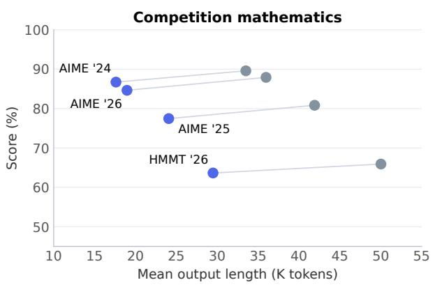

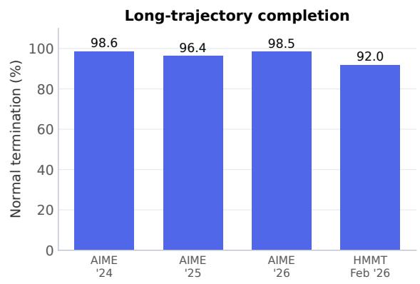  
Figure 6. Competition performance and generation behavior. Left: benchmark score against mean output length; each line connects YANchor and Qwen3.5-4B on the same benchmark. Right: YANchor’s normal-termination rate across the four competition sets. Accuracy measures successful solutions; normal termination measures reaching EOS before a stopping limit.

YANchor uses 43–47% fewer output tokens than Qwen3.5-4B on AIME while retaining 96.31% of its three-year mean accuracy. On HMMT February 2026, it uses 41.1% fewer tokens and scores 63.64 versus 65.91. Table 4 gives the corresponding accuracy comparison.

Table 4. Competition mathematics and MATH-500. YANchor scores are mean pass@1 in percent; the AIME mean weights the three editions equally.
<table><tr><td>Benchmark</td><td>YANchor-4B</td><td>Qwen3.5-4B [1]</td></tr><tr><td>AIME 2024 [27]</td><td>86.72</td><td>89.58</td></tr><tr><td>AIME 2025 [27]</td><td>77.45</td><td>80.83</td></tr><tr><td>AIME 2026 [27]</td><td>84.64</td><td>87.92</td></tr><tr><td>HMMT Feb 2026 [28]</td><td>63.64</td><td>65.91</td></tr><tr><td>MATH-500 [26]</td><td>97.49</td><td>98.00</td></tr><tr><td>AIME three-year mean</td><td>82.93</td><td>86.11</td></tr></table>

## 7 Capability Comparisons

## 7.1 General-purpose capability

YANchor leads the 16 bounded-state baselines on 20 of the 24 common benchmarks. Its 24- benchmark mean of 78.64 exceeds RWKV-7 G1j 13.3B, the strongest baseline at 56.29, by 22.35 points. The lead extends from mathematics to knowledge, code, and instruction following. Against the cross-architecture reference Qwen3.5-4B, YANchor also scores higher on MMLU, MMLU-Pro, MMLU-Redux, SuperGPQA, HumanEval, MBPP, and IFBench (Table 8); Figure 7 shows selected tasks.

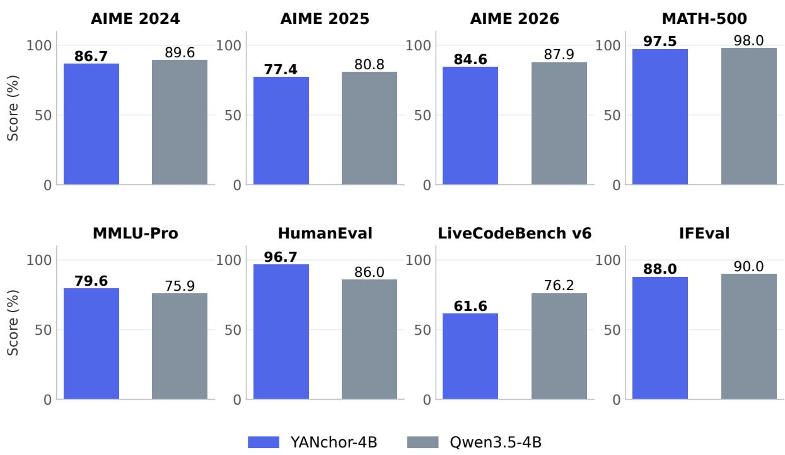  
Figure 7. Cross-architecture comparison of YANchor-4B with the original Qwen3.5-4B, a Gated DeltaNet/globalattention hybrid, across mathematics, knowledge, code, and instruction following. Scores use the primary metrics defined in Section 5.

DROP, MuSR, and LogiQA2 extend this assessment to passage-based numerical reasoning, multi-step inference, and logical deduction (Table 9). Appendix C gives the complete benchmark matrix, including the task-level comparison with Qwen3.5-4B in Table 8.

## 7.2 Transformer and global-attention hybrid references

YANchor exceeds MiniCPM4.1-8B, Gemma4-E4B, Phi-4-mini-reasoning, and Nemotron-3-Nano-4B on all three AIME editions while using constant history-state memory. It also leads the ten Transformer and hybrid references on MMLU-Pro with a score of 79.60.

Table 5. Transformer and global-attention hybrid comparisons. LCB denotes LiveCodeBench.
<table><tr><td>Model</td><td>AIME &#x27;24 [27]</td><td>AIME &#x27;25 [27]</td><td>AIME &#x27;26 [27]</td><td>MMLU-Pro [30]</td><td>LCB v6 IFEval [43]</td><td>[44]</td></tr><tr><td>YANchor-4B</td><td>86.72</td><td>77.45</td><td>84.64</td><td>79.60</td><td>61.63</td><td>88.03</td></tr><tr><td>Qwen3.5-4B [1]</td><td>89.58</td><td>80.83</td><td>87.92</td><td>75.90</td><td>76.20</td><td>90.02</td></tr><tr><td>Gemma4-E2B-it [5]</td><td>37.50</td><td>32.50</td><td>33.33</td><td>38.70</td><td>60.40</td><td>81.89</td></tr><tr><td>MiniCPM5-2B [3]</td><td>87.08</td><td>85.42</td><td>90.42</td><td>63.80</td><td>83.40</td><td>86.32</td></tr><tr><td>Qwen3.5-2B [1]</td><td>41.25</td><td>32.92</td><td>35.42</td><td>60.80</td><td>26.10</td><td>81.70</td></tr><tr><td>Granite4.2-3B [6]</td><td>85.00</td><td>78.75</td><td>82.92</td><td>65.80</td><td>76.30</td><td>92.42</td></tr><tr><td>Phi-4-mini-reasoning [7]</td><td>44.58</td><td>30.83</td><td>35.00</td><td>53.20</td><td>35.80</td><td>46.03</td></tr><tr><td>Gemma4-E4B-it [5]</td><td>41.25</td><td>39.58</td><td>38.33</td><td>68.60</td><td>69.50</td><td>84.29</td></tr><tr><td>Nemotron-3-Nano-4B [8]</td><td>60.83</td><td>56.67</td><td>53.75</td><td>56.40</td><td>67.10</td><td>89.28</td></tr><tr><td>Granite4.2-8B [6]</td><td>88.33</td><td>87.92</td><td>91.67</td><td>71.20</td><td>85.90</td><td>94.45</td></tr><tr><td>MiniCPM4.1-8B [4]</td><td>77.08</td><td>70.00</td><td>70.83</td><td>65.90</td><td>70.80</td><td>73.75</td></tr></table>

Table 5 compares mathematical reasoning, knowledge, code, and instruction following across these architectures.

## 8 VL Capability

The original Qwen3.5-4B visual encoder and merger map images into token embeddings. Visual tokens precede text tokens and enter the same recurrent, local-attention, and memory backbone, preserving its bounded history-state representation.

YANchor supports bilingual visual question answering, object-presence judgments, general visual perception, chart understanding, and scientific-diagram reasoning. Across the six benchmarks in Table 6, its mean answer-level accuracy is 84.94%.

Table 6. YANchor-4B VL capability across six benchmarks. Scores are percentages. The mean weights the six answer-level accuracies equally.
<table><tr><td>Benchmark</td><td>Metric</td><td>YANchor-4B</td></tr><tr><td>MMBench EN [49]</td><td>Answer-level accuracy</td><td>88.28</td></tr><tr><td>MMBench CN [49]</td><td>Answer-level accuracy</td><td>89.00</td></tr><tr><td>POPE [50]</td><td>Answer-level accuracy</td><td>85.43</td></tr><tr><td>MME [51]</td><td>Answer-level accuracy</td><td>82.98</td></tr><tr><td>ChartQA [52]</td><td>Answer-level accuracy</td><td>83.92</td></tr><tr><td>AI2D [53]</td><td>Answer-level accuracy</td><td>80.05</td></tr><tr><td>Six-benchmark mean</td><td>Mean accuracy</td><td>84.94</td></tr></table>

These results demonstrate VL capability alongside text reasoning in the same bounded-state model. Appendix A.3 gives the generation settings and benchmark-specific supplementary metrics.

## 9 Retention of Long-Memory Capability

YANchor retrieves and uses distant information with 94.14% query accuracy on long-memory tasks. Disabling the memory branch reduces accuracy to 0.39%, confirming its role in preserving access to remote content.

The tasks span context lengths from 16K to 130,000 tokens and require exact retrieval, state updates, cross-document combination, or variable binding. The memory-path comparison keeps the backbone and local window unchanged and uses greedy decoding with a 1,024-token response cap. Query accuracy scores individual answers; all-four-correct accuracy requires all four answers for a context to be correct.

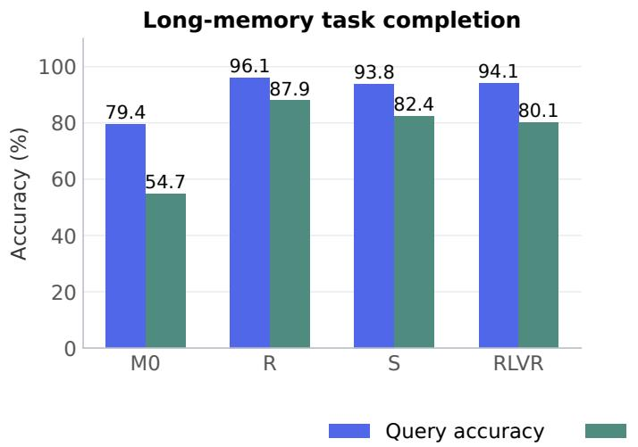

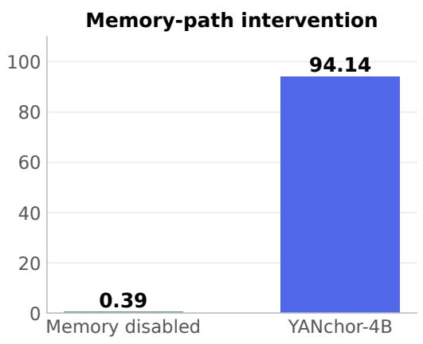  
Figure 8. Long-memory task accuracy. Left: M0, R, S, and RLVR. Right: the released model with memory disabled or enabled.

Joint adaptation improves both query accuracy and complete-context success over M0. Supervised post-training and RLVR retain strong long-memory performance alongside general task capability. Table 7 breaks down the released model’s complete-context success by the type of information use required.

Table 7. YANchor’s complete-context success on long-memory tasks. A context is successful when all four answers are correct.
<table><tr><td>Task</td><td>All four answers correct (%)</td></tr><tr><td>Exact retrieval</td><td>90.63</td></tr><tr><td>State-update interpretation</td><td>87.50</td></tr><tr><td>Cross-document combination</td><td>89.06</td></tr><tr><td>Variable binding</td><td>53.13</td></tr><tr><td>All tasks</td><td>80.08</td></tr></table>

Paired changes to distant evidence test whether the output responds appropriately to stored content. Both answers are correct in 89.84% of pairs requiring an answer change and 96.48% of pairs requiring a stable answer. Variable binding remains the hardest diagnostic category, requiring several associations to remain jointly accessible.

## 10 Related Work

Recurrence and local attention. Mamba, RWKV, and xLSTM represent history through fixedsize recurrent states [9, 13, 11]. RecurrentGemma and Samba combine recurrence with local attention [10, 12]. These designs establish a linear-time inference regime in which capability depends on the information retained in state. YANchor adds a selected set of individually addressable records to recurrent compression and local computation.

Conversion and explicit memory. RADLADS and ARWKV transfer pretrained capability into recurrent architectures [15, 16], while AHN combines recurrent compression with a local attention window [17]. HOLA explores bounded exact storage for information that recurrent state may forget [24]. YANchor uses an independent writer, group-specific admission, and grouped-query retrieval at each local-attention position. Separate projections and attention normalization give memory and local attention distinct learned representations.

Long-horizon reasoning. PromptCoT-Mamba studies reasoning in recurrent models [21]. Studies of subquadratic architectures connect performance on complex dependencies to state tracking and memory dynamics [22], while Super Apriel examines capability–throughput tradeoffs across learned sequence mixers [23]. YANchor combines competition benchmarks and generationbehavior analysis with a memory-path intervention. General text evaluations measure the same model’s capability beyond competition reasoning.

## 11 Conclusion

YANchor-4B combines effective long-horizon reasoning with O(N) generation time and O(1) history-state memory. Crucial memory is preserved as anchors for retrieval during subsequent reasoning. This architecture and outcome-guided post-training enable YANchor to substantially outperform linear-time, constant-state counterparts on AIME and HMMT, including larger models. Its lead extends across general-purpose tasks, and VL evaluations demonstrate multimodal capability. Fixed-capacity history also sustains several-fold higher batched longgeneration throughput than Transformer and hybrid baselines, allowing effective reasoning at high concurrency.

## A Evaluation Protocol

## A.1 Text generation

YANchor uses temperature 0.6, top-p 0.95, and top-k 20. Text scores use a 131,072-token response budget; completions beyond this budget receive zero outcome credit. Repetition detection stops mechanically repetitive continuations.

## A.2 Scoring and cross-task aggregates

BBH, BBEH, and CMMLU use subtask or subject macro-averages. MMLU-Redux uses its corrected-choice view. MuSR averages its three task accuracies.

YANchor’s 24-benchmark mean is 78.64; the highest mean among the 16 linear-time, constantstate baselines is 56.29. Qwen3.5-4B, a cross-architecture reference with global attention, scores 80.44. DROP, MuSR, and LogiQA2 are reported separately. DROP exact match is 71.55, complementing the F1 score in Table 9.

## A.3 VL evaluation protocol

VL evaluation enables thinking and uses temperature 1.0, top-p 0.95, top-k 20, presence penalty 1.5, and a 32,768-token response cap. Pixel budgets range from 65,536 to 4,194,304.

The VL mean gives AI2D, ChartQA, MMBench EN, MMBench CN, MME, and POPE equal weight. YANchor’s answer-weighted accuracy is 85.50%.

MME Perception and Cognition retain their benchmark-specific definitions. YANchor scores 1,600.44 and 728.21, totaling 2,328.66. Its MMBench EN circular accuracy is 81.63%. These metrics evaluate category and multi-permutation behavior in addition to the answer-level accuracy in Table 6.

## B Memory Read Parameterization

For the memory read $e _ { t , h }$ in Section 3, a query-conditioned gate modulates each retrieved head before the output projection:

$$
g _ { t , h } = \mathrm { t a n h } ( s _ { h } ) 2 \sigma \biggl ( \frac { \bar { q } _ { t , h } ^ { \top } b _ { h } } { \sqrt { d } } + c _ { h } \biggr ) ,\tag{9}
$$

$$
\begin{array} { r } { \mathrm { M e m } ( h _ { t } , { \mathcal { M } } _ { t } ) = W _ { O } \mathrm { c o n c a t } _ { h } ( g _ { t , h } e _ { t , h } ) . } \end{array}\tag{10}
$$

Here $\bar { q }$ is the normalized query before rotary encoding, $d = 2 5 6$ , and $s _ { h } , b _ { h } .$ , and $c _ { h }$ are learned head-specific gate parameters.

## C Complete Text Results

The tables compare YANchor with 16 bounded-state baselines and ten Transformer or globalattention hybrid models. Bold identifies YANchor. Metrics are defined in Section 5 and Appendix A.

Table 8. Text-capability comparison with Qwen3.5-4B. Scores are percentages.
<table><tr><td>Benchmark</td><td>YANchor-4B Qwen3.5-4B [1]</td></tr><tr><td>GSM8K [25] 94.45</td><td>94.50</td></tr><tr><td>MATH-500 [26]</td><td>97.49 98.00</td></tr><tr><td>AIME 2024 [27]</td><td>86.72 89.58</td></tr><tr><td>AIME 2025 [27]</td><td>77.45 80.83</td></tr><tr><td>AIME 2026 [27]</td><td>84.64 87.92</td></tr><tr><td>HMMT Feb 2026 [28]</td><td>63.64 65.91</td></tr><tr><td>MMLU [29]</td><td>87.87 85.60</td></tr><tr><td>MMLU-Pro [30]</td><td>79.60 75.90</td></tr><tr><td>MMLU-Redux [31]</td><td>92.00 89.31</td></tr><tr><td>CMMLU [32]</td><td>72.40 82.26</td></tr><tr><td>C-Eval [33]</td><td>74.47 85.10</td></tr><tr><td>GPQA-Diamond [34]</td><td>64.61 77.78</td></tr><tr><td>SuperGPQA [35]</td><td>61.69 51.40</td></tr><tr><td>WinoGrande [36]</td><td>77.90 87.00</td></tr><tr><td>HellaSwag [37]</td><td>64.57 80.10</td></tr><tr><td>ARC-C [38]</td><td>95.50 96.90</td></tr><tr><td>ARC-E [38]</td><td>98.02 99.00</td></tr><tr><td>BBH [39]</td><td>85.88 85.81</td></tr><tr><td>BBEH [40]</td><td>29.07 34.31</td></tr><tr><td>HumanEval [41]</td><td>96.72 85.98</td></tr><tr><td>MBPP [42]</td><td>87.81 70.80</td></tr><tr><td>LiveCodeBench v6 [43]</td><td>61.63 76.20</td></tr><tr><td>IFEval [44]</td><td>88.03 90.02</td></tr><tr><td>IFBench [45]</td><td>65.29 60.33</td></tr><tr><td>24-benchmark mean</td><td>78.64 80.44</td></tr></table>

Table 9. Reading comprehension and multi-step reasoning results for YANchor-4B. All scores are percentages.
<table><tr><td>Benchmark</td><td>Metric</td><td>Score</td></tr><tr><td>DROP [46]</td><td>F1</td><td>77.22</td></tr><tr><td>MuSR [47]</td><td>Task-macro accuracy</td><td>60.42</td></tr><tr><td>LogiQA2 [48]</td><td>Accuracy</td><td>72.23</td></tr></table>

Table 10. Complete mathematics results. MATH denotes MATH-500 and HMMT denotes February 2026. All scores are percentages; bold identifies YANchor-4B.
<table><tr><td>Model</td><td>GSM8K MATH [25]</td><td>[26]</td><td>AIME &#x27;24 [27]</td><td>AIME &#x27;25 [27]</td><td>AIME &#x27;26 [27]</td><td>HMMT&#x27;26 [28]</td></tr><tr><td>YANchor-4B</td><td>94.45</td><td>97.49</td><td>86.72</td><td>77.45</td><td>84.64</td><td>63.64</td></tr><tr><td>Bounded-state models</td><td></td><td></td><td></td><td></td><td></td><td></td></tr><tr><td>ARWKV-R1 1.5B [16]</td><td>21.00</td><td>12.60</td><td>0.00</td><td>0.00</td><td>0.00</td><td>1.89</td></tr><tr><td>RWKV-7 G1i 1.5B [14]</td><td>60.00</td><td>28.20</td><td>0.00</td><td>0.42</td><td>0.42</td><td>0.00</td></tr><tr><td>RWKV-7 G1j 1.5B [14]</td><td>57.60</td><td>31.40</td><td>1.25</td><td>2.08</td><td>0.00</td><td>0.00</td></tr><tr><td>RWKV-7 G1i 2.9B [14]</td><td>71.30</td><td>43.80</td><td>1.25</td><td>1.67</td><td>2.08</td><td>0.76</td></tr><tr><td>RWKV-7 G1j 2.9B [14]</td><td>73.70</td><td>48.20</td><td>0.42</td><td>4.58</td><td>1.67</td><td>0.38</td></tr><tr><td>AHN-GDN Qwen2.5 3B [17]</td><td>82.30</td><td>66.00</td><td>7.08</td><td>2.08</td><td>3.33</td><td>4.92</td></tr><tr><td>ARWKV-R1 7B [16]</td><td>44.50</td><td>31.00</td><td>0.00</td><td>0.00</td><td>0.42</td><td>0.76</td></tr><tr><td>Falcon3-Mamba 7B Instruct [18]</td><td>60.60</td><td>41.20</td><td>1.67</td><td>0.83</td><td>0.83</td><td>2.27</td></tr><tr><td>QRWKV7 7B Instruct [15]</td><td>65.00</td><td>41.00</td><td>0.00</td><td>0.00</td><td>0.00</td><td>0.00</td></tr><tr><td>xLSTM 7B [19]</td><td>41.60</td><td>24.80</td><td>0.00</td><td>0.00</td><td>0.00</td><td>1.52</td></tr><tr><td>RWKV-7 G1i 7.2B [14]</td><td>84.90</td><td>68.60</td><td>9.58</td><td>11.67</td><td>8.33</td><td>3.41</td></tr><tr><td>RWKV-7 G1j 7.2B [14]</td><td>81.80</td><td>63.80</td><td>8.33</td><td>11.25</td><td>4.58</td><td>0.76</td></tr><tr><td>RecurrentGemma 9B IT [10]</td><td>51.80</td><td>22.60</td><td>0.42</td><td>0.42</td><td>0.00</td><td>1.89</td></tr><tr><td>RWKV-7 G1j 13.3B [14]</td><td>94.30</td><td>77.00</td><td>17.50</td><td>27.92</td><td>11.25</td><td>12.12</td></tr><tr><td>AHN-GDN Qwen2.5 14B [17]</td><td>93.10</td><td>80.00</td><td>13.75</td><td>10.00</td><td>10.42</td><td>4.92</td></tr><tr><td>Phi-3 Medium 4K Instruct [20]</td><td>84.60</td><td>49.00</td><td>3.33</td><td>3.33</td><td>0.00</td><td>3.03</td></tr><tr><td>Growing-history reference models</td><td></td><td></td><td></td><td></td><td></td><td></td></tr><tr><td>Qwen3.5-4B [1]</td><td>94.50</td><td>98.00</td><td>89.58</td><td>80.83</td><td>87.92</td><td>65.91</td></tr><tr><td>Gemma4-E2B-it [5]</td><td>90.20</td><td>78.20</td><td>37.50</td><td>32.50</td><td>33.33</td><td>19.32</td></tr><tr><td>MiniCPM5-2B [3]</td><td>93.00</td><td>96.80</td><td>87.08</td><td>85.42</td><td>90.42</td><td>61.74</td></tr><tr><td>Qwen3.5-2B [1]</td><td>88.30</td><td>86.40</td><td>41.25</td><td>32.92</td><td>35.42</td><td>25.38</td></tr><tr><td>Granite4.2-3B [6]</td><td>93.50</td><td>97.80</td><td>85.00</td><td>78.75</td><td>82.92</td><td>58.71</td></tr><tr><td>Phi-4-mini-reasoning [7]</td><td>92.40</td><td>91.40</td><td>44.58</td><td>30.83</td><td>35.00</td><td>26.14</td></tr><tr><td>Gemma4-E4B-it [5]</td><td>90.30</td><td>87.40</td><td>41.25</td><td>39.58</td><td>38.33</td><td>28.03</td></tr><tr><td>Nemotron-3-Nano-4B [8]</td><td>91.80</td><td>94.80</td><td>60.83</td><td>56.67</td><td>53.75</td><td>36.36</td></tr><tr><td>Granite4.2-8B [6]</td><td>93.80</td><td>97.80</td><td>88.33</td><td>87.92</td><td>91.67</td><td>73.86</td></tr><tr><td>MiniCPM4.1-8B [4]</td><td>93.30</td><td>96.40</td><td>77.08</td><td>70.00</td><td>70.83</td><td>50.00</td></tr></table>

Table 11. Knowledge and science. Pro and Redux denote MMLU-Pro and MMLU-Redux; GPQA denotes GPQA-Diamond; Super denotes SuperGPQA.
<table><tr><td></td><td colspan="2">MMLU</td><td colspan="2">Pro Redux CMMLU</td><td colspan="2">C-Eval [33]</td><td colspan="2">GPQA Super [34]</td></tr><tr><td>Model YANchor-4B</td><td>[29]</td><td>[30]</td><td>[31]</td><td>[32]</td><td></td><td></td><td></td><td>[35]</td></tr><tr><td></td><td>87.87</td><td>79.60</td><td>92.00</td><td>72.40</td><td>74.47</td><td></td><td>64.61</td><td>61.69</td></tr><tr><td>Bounded-state models</td><td></td><td></td><td></td><td></td><td></td><td></td><td></td><td></td></tr><tr><td>ARWKV-R1 1.5B [16]</td><td>19.70</td><td>9.30</td><td>16.77</td><td>14.38 31.56</td><td>15.70</td><td></td><td>14.14</td><td>6.30</td></tr><tr><td>RWKV-7 G1i 1.5B [14]</td><td>53.10</td><td>23.10</td><td>54.82</td><td></td><td></td><td>31.80</td><td>26.77</td><td>17.20</td></tr><tr><td>RWKV-7 G1j 1.5B [14]</td><td>51.70</td><td>22.20</td><td>52.62</td><td>36.28</td><td></td><td>33.90</td><td>26.26</td><td>16.10</td></tr><tr><td>RWKV-7 G1i 2.9B [14]</td><td>65.40</td><td>40.70 37.80</td><td>62.89</td><td></td><td>33.28</td><td>34.50</td><td>26.77</td><td>22.50</td></tr><tr><td>RWKV-7 G1j 2.9B [14] AHN-GDN Qwen2.5 3B [17]</td><td>64.00</td><td>43.10</td><td>57.76 64.57</td><td></td><td>38.64 63.31</td><td>38.30</td><td>31.82</td><td>23.30</td></tr><tr><td>ARWKV-R1 7B [16]</td><td>63.30</td><td>13.30</td><td>36.69</td><td></td><td>29.47</td><td>65.00 28.60</td><td>32.32</td><td>21.50</td></tr><tr><td>Falcon3-Mamba 7B Instruct [18]</td><td>36.10</td><td>61.5031.70</td><td>64.26</td><td></td><td>35.28</td><td>39.00</td><td>13.64 24.24</td><td>9.90</td></tr><tr><td>QRWKV7 7B Instruct [15]</td><td>66.20</td><td>27.60</td><td>35.32</td><td></td><td>57.90</td><td>57.20</td><td></td><td>12.30 16.90</td></tr><tr><td>xLSTM 7B [19]</td><td>23.50</td><td>21.00</td><td>38.99</td><td></td><td>19.35</td><td>19.20</td><td>10.61 12.63</td><td>5.90</td></tr><tr><td>RWKV-7 G1i 7.2B [14]</td><td>70.30</td><td>46.30</td><td>72.33</td><td></td><td>47.36</td><td>50.80</td><td>30.30</td><td>28.00</td></tr><tr><td>RWKV-7 G1j 7.2B [14]</td><td>67.90</td><td>48.30</td><td>71.07</td><td></td><td>48.56</td><td>49.40</td><td>36.87</td><td>26.90</td></tr><tr><td>RecurrentGemma 9B IT [10]</td><td>56.00</td><td>19.90</td><td>54.82</td><td></td><td>40.42</td><td>40.70</td><td>25.25</td><td>19.30</td></tr><tr><td>RWKV-7 G1j 13.3B [14]</td><td>76.80</td><td>60.60</td><td>79.66</td><td></td><td>66.14</td><td>66.60</td><td>42.42</td><td>35.50</td></tr><tr><td>AHN-GDN Qwen2.5 14B [17]</td><td></td><td>64.70</td><td>83.33</td><td></td><td>75.78</td><td>76.40</td><td>40.91</td><td></td></tr><tr><td>Phi-3 Medium 4K Instruct [20]</td><td>77.30 75.90</td><td>58.80</td><td>81.45</td><td></td><td>53.60</td><td>50.90</td><td>29.80</td><td>36.30</td></tr><tr><td>Growing-history reference models</td><td></td><td></td><td></td><td></td><td></td><td></td><td></td><td>25.30</td></tr><tr><td>Qwen3.5-4B [1]</td><td></td><td>85.6075.90</td><td>89.31</td><td></td><td>82.26</td><td>85.10</td><td>77.78</td><td>51.40</td></tr><tr><td>Gemma4-E2B-it [5]</td><td>68.80</td><td>38.70</td><td>77.25</td><td></td><td>60.90</td><td>59.30</td><td>34.34</td><td>31.70</td></tr><tr><td>MiniCPM5-2B [3]</td><td>79.00</td><td>63.80</td><td>84.80</td><td></td><td>77.99</td><td>78.80</td><td>67.17</td><td>42.50</td></tr><tr><td>Qwen3.5-2B [1]</td><td></td><td>62.9060.80</td><td>79.98</td><td></td><td>59.38</td><td>64.20</td><td>42.42</td><td>41.00</td></tr><tr><td>Granite4.2-3B [6]</td><td>77.30</td><td>65.80</td><td>80.92</td><td></td><td>58.29</td><td>61.80</td><td>58.59</td><td>39.60</td></tr><tr><td>Phi-4-mini-reasoning [7]</td><td>78.10</td><td>53.20</td><td>79.77</td><td></td><td>44.34</td><td>42.70</td><td>47.98</td><td>34.70</td></tr><tr><td>Gemma4-E4B-it [5]</td><td>75.20</td><td>68.60</td><td>85.95</td><td></td><td>61.84</td><td>64.90</td><td>40.91</td><td>42.50</td></tr><tr><td>Nemotron-3-Nano-4B [8]</td><td>77.30</td><td>56.40</td><td>80.82</td><td></td><td>53.94</td><td>55.70</td><td>43.43</td><td>37.50</td></tr><tr><td>Granite4.2-8B [6]</td><td>80.40</td><td>71.20</td><td>88.05</td><td></td><td>62.88</td><td>66.20</td><td>61.62</td><td>45.50</td></tr><tr><td>MiniCPM4.1-8B [4]</td><td>82.20</td><td>65.90</td><td>86.79</td><td></td><td>80.12</td><td>78.80</td><td>50.51</td><td>41.90</td></tr><tr><td></td><td></td><td></td><td></td><td></td><td></td><td></td><td></td><td></td></tr></table>

Table 12. Commonsense and general reasoning. Wino. denotes WinoGrande; Hella. denotes HellaSwag.
<table><tr><td></td><td>Wino. Hella. [36]</td><td></td><td>ARC-C</td><td>ARC-E</td><td>BBH</td><td>BBEH</td></tr><tr><td colspan="3">Model</td><td>[37]</td><td>[38]</td><td>[38]</td><td>[39]</td><td>[40]</td></tr><tr><td colspan="2">YANchor-4B</td><td>77.90</td><td>64.57</td><td>95.50</td><td>98.02</td><td>85.88</td><td>29.07</td></tr><tr><td colspan="2">Bounded-state models</td><td></td><td></td><td></td><td></td><td></td><td></td></tr><tr><td colspan="2">ARWKV-R1 1.5B [16]</td><td>33.30</td><td>7.50</td><td>22.50</td><td>23.90</td><td>6.40</td><td>1.11</td></tr><tr><td colspan="2">RWKV-7 G1i 1.5B [14]</td><td>46.40</td><td>38.00</td><td>68.10</td><td>83.70</td><td>23.81</td><td>4.39</td></tr><tr><td colspan="2">RWKV-7 G1j 1.5B [14]</td><td>49.30</td><td>35.30</td><td>65.90</td><td></td><td>81.1033.40</td><td>5.49</td></tr><tr><td colspan="2">RWKV-7 G1i 2.9B [14]</td><td>57.10 57.40</td><td>65.00</td><td>82.00</td><td></td><td>91.9024.68</td><td>2.82</td></tr><tr><td colspan="2">RWKV-7 G1j 2.9B [14]</td><td>61.50</td><td>66.90</td><td>83.10</td><td></td><td>91.2039.39</td><td>6.94</td></tr><tr><td colspan="2">AHN-GDN Qwen2.5 3B [17] ARWKV-R1 7B [16]</td><td>36.50</td><td>55.70 12.70</td><td>79.40</td><td>89.10</td><td>40.21</td><td>5.20</td></tr><tr><td colspan="2">Falcon3-Mamba 7B Instruct [18]</td><td>59.90</td><td>41.00</td><td>50.30</td><td></td><td>58.1012.00</td><td>2.11</td></tr><tr><td colspan="2">QRWKV7 7B Instruct [15]</td><td>61.80</td><td>45.20</td><td>76.70 86.00</td><td></td><td>86.9031.50</td><td>3.51</td></tr><tr><td colspan="2">xLSTM 7B [19]</td><td>25.80</td><td>9.20</td><td>27.10</td><td></td><td>96.0037.39</td><td>1.91</td></tr><tr><td colspan="2">RWKV-7 G1i 7.2B [14]</td><td>60.10</td><td>72.00</td><td>84.80</td><td></td><td>29.0010.90</td><td>3.32</td></tr><tr><td colspan="2">RWKV-7 G1j 7.2B [14]</td><td>59.30</td><td>71.80</td><td>83.40</td><td></td><td>94.9028.80</td><td>5.03</td></tr><tr><td colspan="2">RecurrentGemma 9B IT [10]</td><td>56.40</td><td>44.90</td><td>73.20</td><td></td><td>94.8042.89</td><td>7.34</td></tr><tr><td colspan="2">RWKV-7 G1j 13.3B [14]</td><td>72.50</td><td>76.40</td><td>91.60</td><td></td><td>87.4035.30</td><td>2.41</td></tr><tr><td colspan="2">AHN-GDN Qwen2.5 14B [17]</td><td>77.20</td><td>70.00</td><td>90.90</td><td>96.60</td><td>48.89</td><td>7.64</td></tr><tr><td colspan="2">Phi-3 Medium 4K Instruct [20]</td><td>80.60</td><td>76.10</td><td>90.20</td><td></td><td>95.1053.57 95.5051.87</td><td>4.50</td></tr><tr><td colspan="2">Growing-history reference models</td><td></td><td></td><td></td><td></td><td></td><td>2.61</td></tr><tr><td colspan="2">Qwen3.5-4B [1]</td><td>87.00</td><td>80.10</td><td>96.90</td><td></td><td>99.0085.81</td><td></td></tr><tr><td colspan="2">Gemma4-E2B-it [5]</td><td>62.50</td><td>50.20</td><td>88.40</td><td></td><td>94.8080.63</td><td>34.31</td></tr><tr><td colspan="2">MiniCPM5-2B [3]</td><td>69.90</td><td>53.10</td><td>91.90</td><td></td><td>97.5081.91</td><td>10.81</td></tr><tr><td colspan="2">Qwen3.5-2B [1]</td><td>68.90</td><td>54.90</td><td>74.80</td><td></td><td></td><td>25.86</td></tr><tr><td colspan="2">Granite4.2-3B [6]</td><td>74.60</td><td>67.70</td><td>92.80</td><td></td><td>84.0080.23 97.3086.22</td><td>15.04</td></tr><tr><td colspan="2">Phi-4-mini-reasoning [7]</td><td>75.90</td><td>62.60</td><td>91.40</td><td></td><td></td><td>25.10</td></tr><tr><td colspan="2">Gemma4-E4B-it [5]</td><td>76.40</td><td>52.20</td><td>92.10</td><td></td><td>95.7074.92</td><td>12.26</td></tr><tr><td colspan="2">Nemotron-3-Nano-4B [8]</td><td>65.30</td><td>46.70</td><td>91.60</td><td></td><td>96.60 85.10</td><td>16.60</td></tr><tr><td colspan="2"></td><td>79.10</td><td></td><td></td><td>96.10</td><td>80.00</td><td>9.22</td></tr><tr><td colspan="2">Granite4.2-8B [6]</td><td>72.70</td><td>71.50</td><td>92.50</td><td>96.90</td><td>89.72</td><td>32.10</td></tr><tr><td colspan="2">MiniCPM4.1-8B [4]</td><td></td><td>46.50</td><td>92.70</td><td>96.50</td><td>88.10</td><td>12.79</td></tr></table>

Table 13. Code and instruction following. The final column is the unweighted mean over the 24 common benchmarks.
<table><tr><td>Model</td><td>HumanEval [41]</td><td>MBPP [42]</td><td>LCB v6 [43]</td><td>IFEval [44]</td><td>IFBench [45]</td><td>All 24 mean</td></tr><tr><td>YANchor-4B</td><td>96.72</td><td>87.81</td><td>61.63</td><td>88.03</td><td>65.29</td><td>78.64</td></tr><tr><td>Bounded-state models</td><td></td><td></td><td></td><td></td><td></td><td></td></tr><tr><td>ARWKV-R1 1.5B [16]</td><td>4.27</td><td>5.40</td><td>0.30</td><td>11.09</td><td>8.33</td><td>10.66</td></tr><tr><td>RWKV-7 G1i 1.5B [14]</td><td>42.07</td><td>36.60</td><td>7.40</td><td>36.97</td><td>14.67</td><td>30.40</td></tr><tr><td>RWKV-7 G1j 1.5B [14]</td><td>41.46</td><td>38.60</td><td>6.50</td><td>46.40</td><td>16.00</td><td>31.29</td></tr><tr><td>RWKV-7 G1i 2.9B [14]</td><td>58.54</td><td>49.20</td><td>11.80</td><td>43.07</td><td>17.00</td><td>37.92</td></tr><tr><td>RWKV-7 G1j 2.9B [14]</td><td>58.54</td><td>48.20</td><td>12.40</td><td>56.38</td><td>17.33</td><td>39.93</td></tr><tr><td>AHN-GDN Qwen2.5 3B [17]</td><td>67.68</td><td>49.00</td><td>14.90</td><td>58.41</td><td>26.33</td><td>44.43</td></tr><tr><td>ARWKV-R1 7B [16]</td><td>16.46</td><td>21.20</td><td>2.60</td><td>10.35</td><td>8.33</td><td>19.79</td></tr><tr><td>Falcon3-Mamba 7B Instruct [18]</td><td>34.15</td><td>39.20</td><td>9.50</td><td>64.70</td><td>18.67</td><td>35.06</td></tr><tr><td>QRWKV7 7B Instruct [15]</td><td>61.59</td><td>30.20</td><td>12.70</td><td>58.78</td><td>21.33</td><td>37.11</td></tr><tr><td>xLSTM 7B [19]</td><td>36.59</td><td>9.20</td><td>2.30</td><td>35.49</td><td>14.67</td><td>17.17</td></tr><tr><td>RWKV-7 G1i 7.2B [14]</td><td>73.78</td><td>59.00</td><td>19.30</td><td>53.42</td><td>17.67</td><td>45.86</td></tr><tr><td>RWKV-7 G1j 7.2B [14]</td><td>72.56</td><td>58.00</td><td>21.70</td><td>66.54</td><td>18.33</td><td>46.51</td></tr><tr><td>RecurrentGemma 9B IT [10]</td><td>37.20</td><td>19.00</td><td>8.20</td><td>39.56</td><td>12.67</td><td>31.24</td></tr><tr><td>RWKV-7 G1j 13.3B [14]</td><td>85.98</td><td>67.40</td><td>31.00</td><td>77.82</td><td>27.33</td><td>56.29</td></tr><tr><td>AHN-GDN Qwen2.5 14B [17]</td><td>75.61</td><td>68.60</td><td>33.30</td><td>77.26</td><td>33.33</td><td>56.10</td></tr><tr><td>Phi-3 Medium 4K Instruct [20]</td><td>73.78</td><td>59.40</td><td>19.60</td><td>61.55</td><td>22.00</td><td>48.01</td></tr><tr><td>Growing-history reference models</td><td></td><td></td><td></td><td></td><td></td><td></td></tr><tr><td>Qwen3.5-4B [1]</td><td>85.98</td><td>70.80</td><td>76.20</td><td>90.02</td><td>60.33</td><td>80.44</td></tr><tr><td>Gemma4-E2B-it [5]</td><td>90.85</td><td>79.60</td><td>60.40</td><td>81.89</td><td>29.00</td><td>57.96</td></tr><tr><td>MiniCPM5-2B [3]</td><td>97.56</td><td>94.80</td><td>83.40</td><td>86.32</td><td>64.00</td><td>77.28</td></tr><tr><td>Qwen3.5-2B [1]</td><td>54.88</td><td>35.40</td><td>26.10</td><td>81.70</td><td>43.67</td><td>55.83</td></tr><tr><td>Granite4.2-3B [6]</td><td>96.95</td><td>92.60</td><td>76.30</td><td>92.42</td><td>74.33</td><td>75.64</td></tr><tr><td>Phi-4-mini-reasoning [7]</td><td>81.71</td><td>64.00</td><td>35.80</td><td>46.03</td><td>14.67</td><td>56.51</td></tr><tr><td>Gemma4-E4B-it [5]</td><td>93.90</td><td>79.20</td><td>69.50</td><td>84.29</td><td>34.67</td><td>64.39</td></tr><tr><td>Nemotron-3-Nano-4B [8]</td><td>90.85</td><td>72.20</td><td>67.10</td><td>89.28</td><td>57.67</td><td>65.22</td></tr><tr><td>Granite4.2-8B [6]</td><td>96.34</td><td>95.40</td><td>85.90</td><td>94.45</td><td>77.00</td><td>80.01</td></tr><tr><td>MiniCPM4.1-8B [4]</td><td>98.17</td><td>92.20</td><td>70.80</td><td>73.75</td><td>23.67</td><td>71.32</td></tr></table>

## D Inference Performance

## D.1 Measurement and runtime configuration

All measurements use one H100 80GB and tensor-parallel size one. The four-model comparison measures a 128K-input, 128K-output single-sequence curve and batch throughput with 4K– 32K inputs and 32K outputs. YANchor batch scaling additionally covers all 16 input–output combinations of 4K, 8K, 16K, and 32K tokens. Fixed-length generation follows a 256-token warmup at the target input length and batch capacity. Pure decode is timed after the first output token at B1, or after every request has returned a first token in batch tests, counting subsequent output tokens. End-to-end throughput divides all output tokens by the complete generation-call duration, including prefill, scheduling, and any cache-preemption recomputation. Loading and warmup are outside both timed intervals.

Tests use synthetic token inputs and fixed-length generation with EOS ignored; tokenizer and text-decoding costs are excluded.

YANchor uses a CUDA Graph engine with fused projections and state updates, directly indexed grouped-query memory, and shared physical storage for local-attention rings. Single-sequence inference uses BF16 weights with group-256 INT8 MLP and FP32 GDN state. Batched inference uses BF16 weights and MLP, FP16 GDN state, and BF16 memory K/V. The fixed-length batch grid keeps all sequences active for their prescribed output length. Repeated prompts share prefill computation, while each continuation maintains independent state.

Qwen3.5-4B uses BF16 weights and K/V with FP32 recurrent state, vLLM O3, FlashAttention-4, FlashInfer GDN prefill, fused CUDA GDN decode, CUDA Graphs, chunked prefill, and asynchronous scheduling. Batch measurements use a 16K prefill-token budget. Its batch value denotes submitted requests and the concurrency limit; the number decoding simultaneously depends on the scheduler and available cache capacity.

Gemma 4 E4B [5] and MiniCPM5-2B [3] use BF16 weights and K/V with vLLM O3, CUDA Graphs, chunked prefill, and asynchronous scheduling. Gemma uses FlashAttention-4 in both local and global attention layers, following vLLM’s BF16 deployment path [54]; MiniCPM uses FlashAttention-3. Both use autoregressive decoding with a 16K prefill-token budget and 95% GPU-memory utilization. Gemma’s E4B designation describes effective scale; its full checkpoint has approximately 8B parameters, and the speed test loads the language model only. MiniCPM’s checkpoint has approximately 2.52B parameters.

For the B1 curve, Gemma and MiniCPM extend runtime and position-table capacity from 128K to 256K, keeping weights and RoPE frequencies unchanged.

Table 14. Single-H100 endpoints. B1 decode uses 128K input and 128K output. Memory demand uses 512 independent histories at 64K context per sequence; YANchor is reconstructed from measured components, and the three baseline values are KV-growth projections. Residency gives the last fully resident measured context length.
<table><tr><td>Model</td><td>B1 decode, tokens/s</td><td>Residency</td><td>64K demand, GiB</td></tr><tr><td>YANchor-4B</td><td>212.98</td><td>64K</td><td>67.71</td></tr><tr><td>Qwen3.5-4B [1]</td><td>153.91</td><td>2K</td><td>1,061.40</td></tr><tr><td>Gemma 4 E4B [5]</td><td>133.75</td><td>4K</td><td>541.30</td></tr><tr><td>MiniCPM5-2B [3]</td><td>164.53</td><td>2K</td><td>1,351.71</td></tr></table>

## D.2 End-to-end throughput across lengths

The YANchor sweep covers 32, 64, 128, 256, 320, 384, and 512 sequences. Gemma uses batch candidates 64 and 128; Qwen and MiniCPM use 32 and 64. Table 15 reports the highest throughput for each model and input length at 32K output. Baselines share cached prefixes across repeated prompts, with independent state for each continuation.

Table 15. End-to-end output throughput for 32K continuations, in tokens/s. Each cell includes the batch size.
<table><tr><td>Input</td><td>YANchor-4B</td><td>Qwen3.5-4B [1]</td><td>Gemma 4 E4B [5]</td><td>MiniCPM5-2B [3]</td></tr><tr><td>4K</td><td>12,799 / B512</td><td>3,103 / B64</td><td>3,940 / B128</td><td>3,152 / B64</td></tr><tr><td>8K</td><td>12,732 / B512</td><td>2,853 / B64</td><td>3,432 / B128</td><td>2,938 / B64</td></tr><tr><td>16K</td><td>12,661 / B512</td><td>2,472 / B64</td><td>2,880 / B128</td><td>2,575 / B32</td></tr><tr><td>32K</td><td>12,431 / B512</td><td>1,889 / B64</td><td>2,196 / B64</td><td>2,117 / B32</td></tr></table>

## D.3 Batch scaling, first-token latency, and memory

Table 16. YANchor batch scaling on one H100 80GB. Decode throughput is total decode tokens divided by total decode time over 16 length pairs. TTFT ranges describe the first batch response; memory columns are peak allocator values over the same grid.
<table><tr><td>Batch</td><td>Decode, tokens/s</td><td>TTFT, s</td><td>Allocated, GiB</td><td>Reserved, GiB</td></tr><tr><td>32</td><td>4,025</td><td>0.35–2.89</td><td>18.84</td><td>19.02</td></tr><tr><td>64</td><td>6,583</td><td>0.68-5.68</td><td>20.07</td><td>21.18</td></tr><tr><td>128</td><td>9,119</td><td>1.36-11.38</td><td>26.67</td><td>28.92</td></tr><tr><td>256</td><td>11,446</td><td>2.74–22.84</td><td>39.86</td><td>43.92</td></tr><tr><td>320</td><td>11,170</td><td>3.46-28.34</td><td>46.45</td><td>51.36</td></tr><tr><td>384</td><td>12,381</td><td>4.12-34.24</td><td>53.05</td><td>58.96</td></tr><tr><td>512</td><td>12,854</td><td>5.52-45.08</td><td>66.23</td><td>73.95</td></tr></table>

At batch 512, pure-decode rates remain between 12,819 and 12,872 tokens/s across the 16 length pairs, with a weighted rate of 12,854 tokens/s.

## D.4 Independent-history memory demand

The batch-512 memory scan uses independent histories and no prefix sharing. Reconstructed demand is peak tensor allocation minus the preallocated KV pool, plus occupied KV storage and the observed non-PyTorch overhead. YANchor’s non-PyTorch overhead is taken from a separate 64K measurement at the same batch and kernel configuration; the baselines use the overhead observed at each point.

Beyond the last fully resident point, projections add global KV storage at 32 KiB per sequencetoken for Qwen3.5-4B, 16 KiB for Gemma, and 42 KiB for MiniCPM. Projection starts at the measured mean context length and leaves the remaining allocation unchanged. Cache preemption marks the residency limit. Table 14 distinguishes the measured YANchor endpoint from projected baseline demand.

## References

[1] Qwen Team. Qwen3.5. Model cards: 2B and 4B, 2026.

[2] S. Yang, J. Kautz, and A. Hatamizadeh. Gated Delta Networks: Improving Mamba2 with Delta Rule. ICLR, 2025. https://arxiv.org/abs/2412.06464.

[3] OpenBMB. MiniCPM5-2B. Model card and architecture configuration. https://huggingface.co/openbmb/MiniCPM5-2B, 2026.

[4] OpenBMB. MiniCPM4.1-8B. Model card. https://huggingface.co/openbmb/MiniCPM4.1-8B, 2025.

[5] Google. Gemma 4. Model cards: E2B and E4B, 2026.

[6] IBM. Granite 4.2. Model cards: 3B and 8B, 2026.

[7] Microsoft. Phi-4-mini-reasoning. Model card and architecture configuration. https://huggingface.co/microsoft/Phi-4-mini-reasoning, 2025.

[8] NVIDIA. Nemotron 3 Nano 4B. Model card. https://huggingface.co/nvidia/NVIDIA-Nemotron-3-Nano-4B-BF16, 2026.

[9] A. Gu and T. Dao. Mamba: Linear-Time Sequence Modeling with Selective State Spaces. https://arxiv.org/abs/2312.00752, 2023.

[10] A. Botev et al. RecurrentGemma: Moving Past Transformers for Efficient Open Language Models. https://arxiv.org/abs/2404.07839, 2024.

[11] M. Beck et al. xLSTM: Extended Long Short-Term Memory. https://arxiv.org/abs/2405.04517, 2024.

[12] L. Ren et al. Samba: Simple Hybrid State Space Models for Efficient Unlimited Context Language Modeling. https://arxiv.org/abs/2406.07522, 2024.

[13] B. Peng et al. RWKV-7 Goose with Expressive Dynamic State Evolution. https://arxiv.org/abs/2503.14456, 2025.

[14] RWKV Project. RWKV-7 G1 model releases. https://huggingface.co/BlinkDL/rwkv7-g1, 2026.

[15] D. Goldstein, E. Alcaide, J. Lu, and E. Cheah. RADLADS: Rapid Attention Distillation to Linear Attention Decoders at Scale. https://arxiv.org/abs/2505.03005, 2025.

[16] RWKV Red Team. ARWKV-R1. Model releases: 1.5B and 7B, 2025.

[17] Y. Fang et al. Artificial Hippocampus Networks for Efficient Long-Context Modeling. https://arxiv.org/abs/2510.07318, 2025.

[18] Technology Innovation Institute. Falcon3-Mamba-7B-Instruct. https://huggingface.co/tiiuae/Falcon3-Mamba-7B-Instruct, 2024.

[19] M. Beck et al. xLSTM 7B: A Recurrent LLM for Fast and Efficient Inference. https://arxiv.org/abs/2503.13427, 2025.

[20] Microsoft. Phi-3 Medium 4K Instruct. Released model configuration. https://huggingface.co/microsoft/Phi-3-medium-4k-instruct/blob/main/config.json, 2024.

[21] X. Zhao, W. Wu, and L. Kong. Scaling Reasoning without Attention. https://arxiv.org/abs/2505.22425, 2025.

[22] A.-R. Hartl et al. On Subquadratic Architectures: From Applications to Principles. https://arxiv.org/abs/2606.12364, 2026.

[23] O. Ostapenko et al. Super Apriel: One Checkpoint, Many Speeds. https://arxiv.org/abs/2604.19877, 2026.

[24] W. Cui. A Hippocampus for Linear Attention: An Exact Memory for What the Recurrent State Forgets. https://arxiv.org/abs/2607.02303, 2026.

[25] K. Cobbe et al. Training Verifiers to Solve Math Word Problems. https://arxiv.org/abs/2110.14168, 2021.

[26] H. Lightman et al. Let’s Verify Step by Step. https://arxiv.org/abs/2305.20050, 2023.

[27] Mathematical Association of America. American Invitational Mathematics Examination. https://maa.org/maa-invitational-competitions/.

[28] Harvard–MIT Mathematics Tournament. Past Tournaments. https://www.hmmt.org/www/archive/results.

[29] D. Hendrycks et al. Measuring Massive Multitask Language Understanding. https://arxiv.org/abs/2009.03300, 2020.

[30] Y. Wang et al. MMLU-Pro: A More Robust and Challenging Multi-Task Language Understanding Benchmark. https://arxiv.org/abs/2406.01574, 2024.

[31] A. P. Gema et al. Are We Done with MMLU? https://arxiv.org/abs/2406.04127, 2024.

[32] H. Li et al. CMMLU: Measuring Massive Multitask Language Understanding in Chinese. https://arxiv.org/abs/2306.09212, 2023.

[33] Y. Huang et al. C-Eval: A Multi-Level Multi-Discipline Chinese Evaluation Suite for Foundation Models. https://arxiv.org/abs/2305.08322, 2023.

[34] D. Rein et al. GPQA: A Graduate-Level Google-Proof Q&A Benchmark. https://arxiv.org/abs/2311.12022, 2023.

[35] M-A-P Team et al. SuperGPQA: Scaling LLM Evaluation across 285 Graduate Disciplines. https://arxiv.org/abs/2502.14739, 2025.

[36] K. Sakaguchi et al. WinoGrande: An Adversarial Winograd Schema Challenge at Scale. https://arxiv.org/abs/1907.10641, 2019.

[37] R. Zellers et al. HellaSwag: Can a Machine Really Finish Your Sentence? https://arxiv.org/abs/1905.07830, 2019.

[38] P. Clark et al. Think You Have Solved Question Answering? Try ARC, the AI2 Reasoning Challenge. https://arxiv.org/abs/1803.05457, 2018.

[39] M. Suzgun et al. Challenging BIG-Bench Tasks and Whether Chain-of-Thought Can Solve Them. https://arxiv.org/abs/2210.09261, 2022

[40] M. Kazemi et al. BIG-Bench Extra Hard. https://arxiv.org/abs/2502.19187, 2025.

[41] M. Chen et al. Evaluating Large Language Models Trained on Code. https://arxiv.org/abs/2107.03374, 2021.

[42] J. Austin et al. Program Synthesis with Large Language Models. https://arxiv.org/abs/2108.07732, 2021.

[43] N. Jain et al. LiveCodeBench. Benchmark repository, release v6. https://github.com/LiveCodeBench/LiveCodeBench, 2025.

[44] J. Zhou et al. Instruction-Following Evaluation for Large Language Models. https://arxiv.org/abs/2311.07911, 2023.

[45] V. Pyatkin et al. Generalizing Verifiable Instruction Following. https://arxiv.org/abs/2507.02833, 2025.

[46] D. Dua et al. DROP: A Reading Comprehension Benchmark Requiring Discrete Reasoning Over Paragraphs. https://arxiv.org/abs/1903.00161, 2019.

[47] Z. Sprague et al. MuSR: Testing the Limits of Chain-of-Thought with Multistep Soft Reasoning. https://arxiv.org/abs/2310.16049, 2023.

[48] H. Liu et al. LogiQA 2.0: An Improved Dataset for Logical Reasoning in Natural Language Understanding. https://github.com/csitfun/LogiQA2.0, 2023.

[49] Y. Liu et al. MMBench: Is Your Multi-modal Model an All-around Player? https://arxiv.org/abs/2307.06281, 2023.

[50] Y. Li et al. Evaluating Object Hallucination in Large Vision-Language Models. https://arxiv.org/abs/2305.10355, 2023.

[51] C. Fu et al. MME: A Comprehensive Evaluation Benchmark for Multimodal Large Language Models. https://arxiv.org/abs/2306.13394, 2023.

[52] A. Masry et al. ChartQA: A Benchmark for Question Answering about Charts with Visual and Logical Reasoning. https://arxiv.org/abs/2203.10244, 2022.

[53] A. Kembhavi et al. A Diagram Is Worth a Dozen Images. https://arxiv.org/abs/1603.07396, 2016.

[54] vLLM Team. Gemma 4 Usage Guide and Gemma4Config. Deployment guide; attention configuration, 2026.