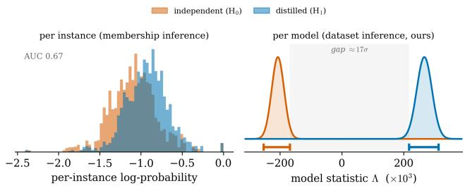

# Poster: A Preliminary Study of LLM Distillation Inference

Edward Chen   
edward200907@gmail.com   
Carmel High School   
Carmel, Indiana, USA

## Abstract

Unauthorized model distillation, in which a model is trained on the outputs of a proprietary large language model (LLM), is a growing threat to model providers. We study distillation inference: determining whether a suspect model was distilled from another model or trained independently. We formulate this problem as a hypothesis test and estimate the behavior expected under each hypothesis by training shadow models: distilled shadow models learn from the teacher’s reasoning traces, whereas independent shadow models learn only from reference answers. The auditor measures how closely each model predicts the teacher’s reasoning outputs and then uses the shadow models to convert the suspect’s score into a calibrated �-value. In a preliminary study using Qwen2.5-7B as the teacher and Llama-3.2-3B for the suspects, our test achieves a true positive rate of 1.0 at a significance level of 0.02. These results demonstrate the feasibility of using distillation inference to detect distillation attacks.

## CCS Concepts

• Security and privacy;

## Keywords

distillation inference; knowledge distillation; large language models

## ACM Reference Format:

Edward Chen and Yuntao Du. 2026. Poster: A Preliminary Study of LLM Distillation Inference. In Proceedings of the 2026 ACM SIGSAC Conference on Computer and Communications Security (CCS ’26), November 15–19, 2026, The Hague, Netherlands. ACM, New York, NY, USA, 3 pages. https://doi.org/ 10.1145/3830454.3846416

## 1 Introduction

As large language models (LLMs) grow in capability and commercial value, their providers face a growing threat from unauthorized distillation attacks, in which an adversary trains its own model on a proprietary model’s outputs to copy its capabilities. In February 2026, Google [3] and Anthropic [1] both reported a sharp rise in such attacks, which raise legal, intellectual property, and national security concerns [8]. These reports highlight the urgent need to determine whether a suspect model was distilled from a specific teacher, a task we call distillation inference.

Yuntao Du∗ ytdu@purdue.edu Purdue University West Lafayette, Indiana, USA

Research on distillation inference has grown rapidly over the past year [6, 9, 11]. Existing methods measure the suspect’s behavioral similarity to the teacher and report a score or ranking over a candidate pool. They cannot provide what enforcement requires: a statistical guarantee for a specific teacher–suspect pair, i.e., a decision with a �-value and a bounded false positive rate (FPR).

To address this, we frame distillation inference as a hypothesis test: is the suspect’s behavior closer to a model distilled from the teacher, or to a model trained independently? Since these two behavioral distributions cannot be observed directly, we approximate them with shadow models [2, 10]: distilled shadow models fine-tuned on the teacher’s chain-of-thought (CoT) and independent shadow models fine-tuned on reference answers. We then score every model with three signals of how well it predicts the teacher’s CoT token by token. We found that per-instance signals are too weak for reliable distillation auditing; we instead aggregate the evidence across the entire audit set into a single per-model likelihood-ratio statistic that yields a calibrated �-value and a controlled FPR.

We evaluate our method with Qwen2.5-7B-Instruct as the teacher and Llama-3.2-3B as the base model for the suspects and shadows. At a significance level of � = 0.02, the test detects every distilled suspect and never flags an independently trained model.

## 2 Problem Setup

The teacher � is a known, typically proprietary model. The suspect �sus is a published model whose provenance is in question: it was produced either by distilling from � or by independent training without access to �. The auditor distinguishes between these possibilities using an audit set $D _ { \mathrm { a u d i t } } = \{ ( x _ { i } , y _ { i } ) \} _ { i = 1 } ^ { N }$ of � questions $x _ { i }$ with answers ��. Querying � with �� yields the teacher’s CoT ��.

Distillation Inference Protocol. The audit proceeds as follows:

(1) The teacher’s owner trains � and deploys it with query access.

(2) The suspect’s owner curates $D _ { \mathrm { t r a i n } } .$ , produces $f _ { \mathrm { s u s } }$ by distilling from � on this dataset or by training it independently.

(3) The teacher’s owner submits $D _ { \mathrm { a u d i t } }$ to the auditor.

(4) The auditor runs its algorithm on $D _ { \mathrm { a u d i t } }$ using access to � and $f _ { \mathrm { s u s } }$ , outputting a decision �ˆ ∈ {0, 1} (�ˆ = 1 means evidence of distillation) with a calibrated �-value.

Audit Setting. We consider a setting in which the teacher’s owner holds logs of queries submitted by the suspect’s owner and uses them as the audit set, $i . e . , D _ { \mathrm { a u d i t } } \subseteq D _ { \mathrm { t r a i n } }$ . This arises when the API logs containing the distillation queries can be identified [1, 3].

Access Levels. The auditor has query access to the teacher to collect $t _ { i } .$ . For the suspect, we assume either grey-box access (i.e., next-token probabilities, available for any open-weight release or log-probability API) or black-box access (i.e., generated text only).

## 3 Methods

Overview. Our method instantiates the audit as a binary hypothesis test: is $\vec { f _ { \mathrm { s u s } } \mathrm { ^ { \circ } s } }$ behavior on $D _ { \mathrm { a u d i t } }$ more consistent with a model distilled from � (the alternative hypothesis $H _ { 1 } )$ or with one trained independently (the null hypothesis $H _ { 0 } ) ?$ Since the two distributions are unknown, we estimate them in three stages: fine-tune distilled shadows and independent shadows models (Stage 1); score every model with three signals of how closely it tracks the teacher’s CoT (Stage 2); aggregate the per-instance signal into a likelihood-ratio test calibrated by the shadows, returning a �-value and a verdict at a controlled FPR (Stage 3).

Stage 1: Training Shadow Models. The auditor fine-tunes � shadow models from each class [2]. These models share the same base model, audit set, and training procedure and difer only in their supervision targets. A distilled shadow $f _ { m } ^ { \mathrm { d i s t } }$ is fine-tuned with Low-Rank Adaptation (LoRA) [4] to reproduce the teacher’s CoT $t _ { i }$ for each $x _ { i } .$ In contrast, an independent shadow $f _ { m } ^ { \mathrm { i n d } }$ is fine-tuned on the reference answer $y _ { i }$ without access to $T ,$ representing a model trained without distillation. Each model is trained using the randomly sampled halfofthe $D _ { \mathrm { a u d i t } }$ . Thus, every pair ofdistilled and independent shadows difers only in its training target $( i . e . , t _ { i }$ or �� ). This design controls for confounding factors because knowledge shared by both classes cancels out in shadow models.

Stage 2: Extracting Distillation Signals. Every shadow model $f$ is scored in a single teacher forward pass over the teacher’s CoT: for instance � with CoT tokens $t _ { i , 1 : L _ { i } } ,$ the pass yields the next-token distribution $p _ { i , \ell } ^ { f } = f ( { \cdot } \mid x _ { i } , t _ { i , < \ell } )$ at every position ℓ. Averaging over the $L _ { i }$ positions, we extract three signals presenting how closely � tracks the teacher.

• Log-probability (grey-box). It measures the mean log-likelihood of the teacher’s tokens under $\begin{array} { r } { f \colon g _ { \mathrm { l p } } ( f , i ) = \frac { 1 } { L _ { i } } \sum _ { \ell } \log p _ { i , \ell } ^ { f } ( t _ { i , \ell } ) . } \end{array}$ A distilled model was trained to reproduce this text, so it scores the text higher than an independent model that learned a diferent but equally valid solution.

• Predictive entropy (grey-box). We compute the mean entropy as $\begin{array} { r } { g _ { \mathrm { e n t } } ( f , i ) = \frac { 1 } { L _ { i } } \sum _ { \ell } \mathbb { H } ( p _ { i , \ell } ^ { f } ) } \end{array}$ to measure the certainty of model about the outputs.

• Token agreement (black-box). We compute the fraction of positions at which $f ^ { \ast } s$ greedy token $\hat { t } _ { i , \ell } ^ { f } = \arg$ max� $p _ { i , \ell } ^ { f } ( \boldsymbol { \upsilon } )$ matches the teacher’s token as $\begin{array} { r } { g _ { \mathrm { t a } } ( f , i ) = \frac { 1 } { L _ { i } } \sum _ { \ell } { { 1 } [ \hat { t } _ { i , \ell } ^ { f } = t _ { i , \ell } ] } } \end{array}$ . This signal directly measures whether � would emit the teacher’s tokens when decoding on its own.

Stage 3: Performing Distillation Inference. Our test adapts the per-example construction of the Likelihood Ratio Attack (LiRA) [2]. It has two levels: a per-instance score and a model-level statistic, both calibrated using the shadows.

Per-instance distributions and the calibrated score. For instance �, the values from the distilled shadows, $\{ g ( f _ { m } ^ { \mathrm { d i s t } } , i ) \} _ { m } ,$ and the indepen dent shadows, $\{ g ( f _ { m } ^ { \mathrm { i n d } } , i ) \} _ { m } ,$ characterize how the signal behaves under the two hypotheses. We summarize the two distributions with Gaussians ${ \cal N } ( \mu _ { \mathrm { d i s t } , i } , \sigma _ { \mathrm { d i s t } , i } ^ { 2 } )$ and $N ( \mu _ { \mathrm { i n d } , i } , \sigma _ { \mathrm { i n d } , i } ^ { 2 } )$ , whose parameters are the means and unbiased variances over the � shadows. The evidence provided by model � for instance � is the log-likelihood ratio (LLR) of its value under the two distributions:

  
Figure 1: Per instance (left), the log-probability signal overlaps across the two classes, so membership inference cannot separate them (AUC 0.67). Aggregated to one statistic Λ per model (right), the distilled (�1) and independent (�0) populations are fully separated, so our methods can faithfully detect distillation.

$$
\lambda _ { i } ( f ) = \log \frac { \mathcal { P } \big ( g ( f , i ) \mid N ( \mu _ { \mathrm { d i s t } , i } , \sigma _ { \mathrm { d i s t } , i } ^ { 2 } ) \big ) } { \mathcal { P } \big ( g ( f , i ) \mid N ( \mu _ { \mathrm { i n d } , i } , \sigma _ { \mathrm { i n d } , i } ^ { 2 } ) \big ) } .\tag{1}
$$

The calibration matters because $g ( f , i )$ alone conflates specificity to the teacher with per-instance dificulty (every model scores high on an easy instance), whereas $\lambda _ { i }$ measures � relative to both classes on that instance.

Model-level statistic and its null/alternative. Summing over the audit set gives the statistic $\begin{array} { r } { \Lambda ( f ) = \sum _ { i = 1 } ^ { N } \lambda _ { i } ( f ) } \end{array}$ , the most powerful test at any fixed FPR under this Gaussian model [7]. Its distribution under each hypothesis is estimated from the shadows using a leave-oneout procedure. Each shadow is scored against Gaussians fitted to the other shadows in its class, yielding one draw from $H _ { 1 }$ (distilled) or $H _ { 0 }$ (independent). Thus, no model is evaluated against a distribution that it helped define. The suspect, which is trained separately from the shadows, is scored against Gaussians fitted to all shadows.

Audit Decision. The �-value ranks $\Lambda ( f _ { \mathrm { s u s } } )$ against the scores of the independent shadows,

$$
\dot { p } = \frac { 1 + \# \{ m : \Lambda ( f _ { m } ^ { \mathrm { i n d } } ) \geq \Lambda ( f _ { \mathrm { s u s } } ) \} } { M + 1 } ,\tag{2}
$$

$i . e . ,$ , the estimated frequency with which an independent model matches the teacher at least as closely as the suspect does. The decision is $\hat { y } ( f _ { \mathrm { s u s } } ) = 1 [ p < \alpha ]$ . We estimate the FPR by testing each independent shadow against a threshold fitted without that shadow, so the estimate changes in increments of $1 / M .$ Both quantities become more precise as � increases.

## 4 Preliminary Evaluation

Experimental Setup. The teacher � is Qwen2.5-7B-Instruct, and the base model for the suspect and all shadows is Llama-3.2-3B. The audit set $D _ { \mathrm { a u d i t } }$ contains � = 500 instances from CoT-Collection [5], and we train $M = 5 0$ shadows per class. All models are fine-tuned with LoRA (rank 8, scaling factor 16, and dropout 0.05 on the attention projections) for three epochs. We retain the checkpoint with the lowest loss on the held-out half and build all prompts with a shared formatter to rule out formatting confounds. Suspects are trained separately from the shadows using the same procedure: distilled suspects learn from the teacher’s CoT, whereas independent suspects learn from reference answers. We train these models to achieve similar utility as their base model by evaluating them on a separate held-out dataset.

Table 1: Membership inference on individual instances barely separates distilled from independent models, whereas aggregating the same signal across the audit set (dataset inference, our method) separates the model populations perfectly. balacc = balanced accuracy.
<table><tr><td>Signal</td><td></td><td>AUC</td><td>bal-acc</td><td>TPR@5%FPR</td><td>TPR@0%FPR</td></tr><tr><td rowspan="2">log-prob</td><td>per-instance (MIA)</td><td>0.672</td><td>0.518</td><td>0.086</td><td>0.000</td></tr><tr><td>per-model (ours)</td><td>1.000</td><td>1.000</td><td>1.000</td><td>1.000</td></tr><tr><td rowspan="2">entropy</td><td>per-instance (MIA)</td><td>0.672</td><td>0.524</td><td>0.098</td><td>0.000</td></tr><tr><td>per-model (ours)</td><td>1.000</td><td>1.000</td><td>1.000</td><td>1.000</td></tr><tr><td rowspan="2">token agreement</td><td>per-instance (MIA)</td><td>0.635</td><td>0.512</td><td>0.073</td><td>0.003</td></tr><tr><td>per-model (ours)</td><td>1.000</td><td>1.000</td><td>1.000</td><td>1.000</td></tr></table>

Baselines and Evaluation. We contrast two ways of turning the per-instance signals of Section 3 into a verdict. The membershipinference baseline [10] treats each instance in isolation: it thresholds a single instance’s signal to decide whether that model is distilled. We report audit performance with AUC, balanced accuracy, and TPR at 0% and 5% FPR.

Results. (i) Membership inference does not detect distillation. On individual instances the signals barely separate the classes (AUC 0.64–0.67), and they are useless in the low-FPR regime that enforcement requires: TPR at 0% FPR is essentially zero (≤ 0.003) and stays below 0.10 even at 5% FPR (Table 1, “per-instance”; Figure 1, left). (ii) Our method separates the model populations perfectly. Aggregating the same signals across $D _ { \mathrm { a u d i t } }$ lifts every metric to 1.000 (Table 1, “per-model”; Figure 1, right): the $M = 5 0$ distilled and independent populations do not overlap, so the audit flags every distilled suspect (TPR 1.0) and clears every independent one. (iii) Shadow calibration certifies the decision. A raw aggregate score separates the populations but cannot bound the false-positive rate. Calibrating Λ against the shadow populations turns it into a hypothesis test with a certified operating point: at � = 50 the �-value reaches its floor $1 / \left( M + 1 \right) = 0 . 0 2 0$ and the leave-one-out FPR is ≈ 1/� = 0.020, both shrinking monotonically with � while detection stays perfect (Table 2).

Impact of Model Architecture. The main experiment uses a Qwen teacher and a Llama suspect. We find that a same-family pair (Qwen→Qwen), which shares a tokenizer and output format, produces larger separation between the two distributions. This result rules out model-formatting diferences between families (e.g., whitespace patterns in generation) as confounding factors.

Mitigation. We also evaluate an evasion strategy in which the suspect’s owner trains the suspect on a paraphrased teacher CoT. We find the inference statistic decreases from original CoT to teachergenerated paraphrase, and decreases again for Mistral-generated paraphrase. All suspects remain flagged at � = 0.05 (these ablation pools use � = 20, where the �-floor is $1 / ( M { + } 1 ) \approx 0 . 0 5 )$ , although the paraphrase-trained suspects enter the gap between the populations. Replacing the distilled shadows with a matching population trained on paraphrased text restores a clean audit, as expected.

Table 2: More shadow models tighten the certified operating point: the �-value floor $1 / ( M { + } 1 )$ and the FPR $( \approx 1 / M )$ both shrink with �, while per-model detection stays perfect (AUC = 1.000 throughout).
<table><tr><td>M</td><td>p-floor</td><td>FPR</td></tr><tr><td>5</td><td>0.167</td><td>0.200</td></tr><tr><td>10</td><td>0.091</td><td>0.100</td></tr><tr><td>20</td><td>0.048</td><td>0.050</td></tr><tr><td>40</td><td>0.024</td><td>0.025</td></tr><tr><td>50</td><td>0.020</td><td>0.020</td></tr></table>

## 5 Conclusion and Limitations

In this paper, we frame distillation inference as a hypothesis test and propose a likelihood-ratio test calibrated with shadow models. In a preliminary study, our method detects every distilled suspect model without any false positives, providing a statistical bound on FPR for enforcement. Our study has three limitations. First, it requires fine-tuning a pool of shadow models, which may be expensive in practice given the size of frontier LLMs. Second, it assumes that the audit set is a subset of the suspect’s training data, which may be hard to establish in practice. Third, it assumes that the suspect is trained with the same procedure as the shadow models. Relaxing the last two assumptions is an important direction for future work.

## References

[1] Anthropic. 2026. Detecting and Preventing Distillation Attacks. Anthropic News.

[2] Nicholas Carlini, Steve Chien, Milad Nasr, Shuang Song, Andreas Terzis, and Florian Tramèr. 2022. Membership Inference Attacks From First Principles. In IEEE Symposium on Security and Privacy (S&P). 1897–1914.

[3] Google Threat Intelligence Group. 2026. GTIG AI Threat Tracker: Distillation, Experimentation, and (Continued) Integration of AI for Adversarial Use. Google Cloud Blog.

[4] Edward J. Hu, Yelong Shen, Phillip Wallis, Zeyuan Allen-Zhu, Yuanzhi Li, Shean Wang, Lu Wang, and Weizhu Chen. 2022. LoRA: Low-Rank Adaptation of Large Language Models. In International Conference on Learning Representations (ICLR).

[5] Seungone Kim, Se June Joo, Doyoung Kim, Joel Jang, Seonghyeon Ye, Jamin Shin, and Minjoon Seo. 2023. The CoT Collection: Improving Zero-shot and Few-shot Learning of Language Models via Chain-of-Thought Fine-Tuning. In Proceedings of the 2023 Conference on Empirical Methods in Natural Language Processing (EMNLP). Association for Computational Linguistics, 12685–12708.

[6] Sunbowen Lee, Junting Zhou, Chang Ao, Kaige Li, Xeron Du, Sirui He, Haihong Wu, Tianci Liu, Jiaheng Liu, Hamid Alinejad-Rokny, Min Yang, Yitao Liang, Zhoufutu Wen, and Shiwen Ni. 2025. Quantification of Large Language Model Distillation. In Annual Meeting ofthe Association for Computational Linguistics (ACL). 4985–5004.

[7] Jerzy Neyman and Egon Sharpe Pearson. 1933. On the Problem of the Most Eficient Tests of Statistical Hypotheses. Philosophical Transactions ofthe Royal Society ofLondon. Series A 231 (1933), 289–337.

[8] Shristi Sharma. 2025. Intellectual Property Rights in the Era of AI Model Distillation. Journal ofLegal Research and Juridical Sciences 4, 4 (2025), 899–912.

[9] Qin Shi, Amber Yijia Zheng, Qifan Song, and Raymond A. Yeh. 2025. Knowledge Distillation Detection for Open-weights Models. In Advances in Neural Information Processing Systems (NeurIPS).

[10] Reza Shokri, Marco Stronati, Congzheng Song, and Vitaly Shmatikov. 2017. Membership Inference Attacks Against Machine Learning Models. In IEEE Symposium on Security and Privacy (S&P). 3–18.

[11] Somin Wadhwa, Chantal Shaib, Silvio Amir, and Byron C. Wallace. 2025. Who Taught You That? Tracing Teachers in Model Distillation. In Findings of the Association for Computational Linguistics (ACL Findings). 3307–3315.