# Prediction-Powered Data Fusion for Treatment Efect Estimation

Yonghan Jung<sup>1</sup> and Shu Yang<sup>2</sup>

<sup>1</sup> University of Illinois Urbana-Champaign, yonghan@illinois.edu

<sup>2</sup> North Carolina State University, syang24@ncsu.edu

October 9, 2026

Randomized controlled trials (RCTs) identify treatment efects without confounding but are often small, whereas observational studies (OBS) are large but may be confounded. Many estimators combining a small RCT with a large OBS have been developed for the average treatment efect (ATE) and the conditional ATE (CATE). However, existing ATE estimators either make assumptions on the OBS or do not borrow enough power from them. The CATE has been studied less than the ATE. Existing CATE methods either assume the OBS are unconfounded, rely on a model of the confounding function, or accept bias in exchange for lower variance. We therefore propose a framework that, without special assumptions on the OBS, fuses the OBS and the RCT by preserving the unbiasedness of RCT-based estimation while borrowing power from the large OBS to boost precision. Applying this principle, we build an ATE estimator, AIPW-Fusion, with closed-form weights and confidence intervals, and two CATE learners, DR-Fusion and R-Fusion. Experiments corroborate our findings.

## Contents

1. Introduction 2   
1.1. Related Work . 3   
2. Background and Setting 5   
3. Fusion for the ATE 6   
3.1. Estimator, Variance, and Oracles . 6   
3.2. Estimating the Density Ratio . 8   
3.3. Algorithm and Confidence Intervals . 9   
4. Fusion for the CATE 11   
4.1. CATE Risks . . . 11   
4.2. Fitting and Selecting Coeficients 13   
4.3. Linear Sieves: Risk and Calibration . 14   
5. Experiments 16   
5.1. Designs 16   
5.2. Estimators and Metrics 18   
5.3. Main Results . 19   
5.4. Bias and Observational Sample Size 22   
5.5. Ablations and Further Designs 22   
6. Conclusion 26   
A. Proofs 29   
B. Additional Simulation Results 33

## 1. Introduction

Randomized controlled trials (RCTs) are the gold standard for identifying treatment efects but are often small, whereas observational studies (OBS) are large but may be confounded. This paper fuses the two to estimate the trial-population conditional and average treatment efects.

Transportability and data-fusion methods (Bareinboim and Pearl, 2016; Colnet et al., 2024; Jung et al., 2023a,b, 2024; Lee et al., 2022, 2023; Shi et al., 2023; Wu and Yang, 2023) identify and estimate efects that no single source identifies, such as efects in a new target population or of joint treatments. Most of them do not address cases where the RCT already identifies the target but is too small to estimate it precisely. Our work is closer to robust borrowing methods. For the ATE, they improve a trial estimate by combining it with OBS estimates or OBS-based predictions (De Bartolomeis et al., 2025; Gagnon-Bartsch et al., 2023; Gao et al., 2025; Rosenman et al., 2023; Yang and Ding, 2020), or by prediction-powered inference (PPI; Angelopoulos et al., 2023, 2026; Demirel et al., 2024). Compared with ATE fusion, only a few fusion methods have been developed for CATE estimation, which use the trial to correct the bias of OBS-based estimates or the OBS to reduce the variance of trial-based ones (Asiaee et al., 2025; Cheng and Cai, 2021; Gu et al., 2023; Hatt et al., 2022; Kallus et al., 2018; Li et al., 2022; Wu and Yang, 2022; Yang et al., 2023, 2025). Section 1.1 compares them with ours.

In this paper, we enhance treatment efect estimators from a small RCT with large, potentially heavily confounded OBS data while keeping them unbiased. Specifically, our contributions are:

(i) An ATE estimator, AIPW-Fusion (AIPWF), that stays unbiased under any OBS confounding and combines two approaches, leveraging the OBS regressions plugged into the RCT’s AIPW score and a PPI correction, with a valid interval under an estimated ratio (Sec. 3).

(ii) Two CATE learners, DR-Fusion (DRF) and R-Fusion (RF), that keep the trial’s CATE target under any OBS confounding, borrow without modeling the confounding function, and whose data-driven borrowing provably does almost no worse than the trial alone (Sec. 4).

(iii) Experiments on synthetic data and the IHDP and ACIC 2016 benchmarks, where our estimators outperform trial-only estimation, PPI, and naive pooling (Sec. 5).

Code is available at https://github.com/CausalDataScience/DataFusionPPI.

Section 2 sets up the problem. Sections 3 and 4 develop the ATE estimator and the CATE learners.   
Section 5 reports the experiments. The appendix contains the proofs and additional results.

## 1.1. Related Work

Transportability and data fusion. Unlike the transportability and data-fusion methods cited in Section 1, we target an efect that the trial already identifies and use the OBS only to estimate it more precisely.

ATE fusion. Table 1 compares the ATE fusion methods. Yang and Ding (2020) [YD20] combine a large main sample with unmeasured confounders and a smaller validation sample with all confounders, using the main sample as a control variate that improves the validation-sample estimator. Rosenman et al. (2023) [R23] shrink the experimental estimates toward the observational ones by Stein-type estimators, with lower risk than the experimental estimator under finite-sample conditions. Gao et al. (2025) [G25] borrow external controls selectively, penalizing their bias to keep a comparable subset, and attain the eficiency bound when the controls are comparable. These three methods borrow OBS outcomes, and Table 1 marks them as not unbiased under every OBS confounding. Lee et al. (2023) [L23] weight the trial to balance its covariates with an observational target population, and augment the weights with outcome models for double robustness; they use only the OBS covariates. The remaining three methods keep the trial estimate unbiased under any OBS confounding. Gagnon-Bartsch et al. (2023) [GB23] use predictions from a model trained on auxiliary observational data as a covariate in the trial’s estimator, which stays unbiased because the propensity is known. De Bartolomeis et al. (2025) [DB25] combine several AIPW estimators of the trial, each with a diferent outcome regression from external predictors. Demirel et al. (2024) [D24] apply PPI (Angelopoulos et al., 2023) to RCT–OBS fusion to generalize the ATE to a target population; their gain shrinks as confounding grows. AIPWF combines the two channels that [GB23, DB25] and [D24] use separately: it blends the OBS outcome regressions into the trial’s AIPW score and adds a PPI correction averaged over the OBS covariates, choosing both coeficients jointly in closed form, with a valid interval under an estimated density ratio (Sec. 3).

CATE fusion. Table 2 compares the CATE fusion methods by what they assume about the OBS. Li et al. (2022) [L22] learn the CATE directly from multiple sources with a doubly robust pseudooutcome and information-aware weights, and keep the trial’s target only if the OBS are unconfounded. Four methods model the OBS bias. Kallus et al. (2018) [K18] learn a CATE model on the OBS and correct its hidden confounding with a parametric correction fitted on the trial. Wu and Yang (2022) [WY22] jointly learn the CATE and the confounding function with an orthogonal R-loss, at least as eficient as the trial-only estimator. Yang et al. (2025) [Y25] identify the CATE and the confounding function jointly under structural models and derive semiparametric eficient integrative estimators. Hatt et al. (2022) [H22] learn a shared representation from the OBS and trial-specific structure from the RCT, with the OBS bias in a restricted (linear) class. These four methods keep the trial’s target only if the OBS bias follows their model. Three methods trade bias for variance. Cheng and Cai (2021) [CC21] combine trial and OBS CATE estimators linearly, with weights that minimize an estimated mean squared error and move toward the trial estimator when bias is detected. Yang et al. (2023) [Y23] test whether the real-world data are compatible with the trial and integrate them only if so, under a structural model with known efect modifiers. Gu et al.

Table 1: ATE fusion methods. A dash means that the property does not apply. The second column is evaluated for a trial and an OBS with diferent assignment mechanisms. [DB25] borrows predictions from foundation models trained on external data rather than from an OBS. [D24] averages its predictions over a target covariate sample and, in its appendix, also uses the augmented regression in a doubly robust score.
<table><tr><td>Method</td><td>Borrows OBS outcomes</td><td>any OBS confounding</td><td>Unbiased under OBS regressions in the trial&#x27;s AIPW score</td><td>OBS covariates used to reduce the trial variance</td></tr><tr><td>[YD20] Yang and Ding (2020)</td><td>V</td><td>X</td><td>X</td><td>X</td></tr><tr><td>[L23] Lee et al. (2023)</td><td>X</td><td></td><td>X</td><td>X</td></tr><tr><td>[R23] Rosenman et al. (2023)</td><td>√</td><td>X</td><td>X</td><td>X</td></tr><tr><td>[G25] Gao et al. (2025)</td><td>√</td><td>X</td><td>X</td><td>X</td></tr><tr><td>[GB23] Gagnon-Bartsch et al. (2023)</td><td>√</td><td>√</td><td>√</td><td>X</td></tr><tr><td>[DB25] De Bartolomeis et al. (2025)</td><td>√</td><td>√</td><td>√</td><td>×</td></tr><tr><td>[D24] Demirel et al. (2024)</td><td>√</td><td>√</td><td>X</td><td>√</td></tr><tr><td>AIPWF (ours)</td><td>√</td><td>√</td><td>√</td><td>V</td></tr></table>

Table 2: CATE fusion methods. In the last column, × means that the trial’s target is kept only if the OBS are unconfounded [L22], only if the OBS bias follows the method’s model [K18, WY22, Y25, H22], or only up to a bias traded for variance under weak confounding [CC21, Y23, G23].
<table><tr><td>Method</td><td>Borrows when the OBS is confounded</td><td>No model of the OBS bias CATE class</td><td>Flexible</td><td>Orthogonal loss or score</td><td>Keeps the trial&#x27;s target under any OBS confounding</td></tr><tr><td>[K18] Kallus et al. (2018)</td><td>√</td><td>×</td><td>√</td><td>X</td><td>×</td></tr><tr><td>[CC21] Cheng and Cai (2021)</td><td>X</td><td>√</td><td>√</td><td>√</td><td>X</td></tr><tr><td>[WY22] Wu and Yang (2022)</td><td>√</td><td>×</td><td>√</td><td>√</td><td>X</td></tr><tr><td>[L22] Li et al. (2022)</td><td>X</td><td>√</td><td>√</td><td>√</td><td>X</td></tr><tr><td>[Y23] Yang et al. (2023)</td><td>×</td><td>√</td><td>X</td><td>√</td><td>X</td></tr><tr><td>[Y25] Yang et al. (2025)</td><td>√</td><td>×</td><td>×</td><td>√</td><td>X</td></tr><tr><td>[H22] Hatt et al. (2022)</td><td>√</td><td>×</td><td>√</td><td>X</td><td>X</td></tr><tr><td>[G23] Gu et al. (2023)</td><td>√</td><td>√</td><td>√</td><td>×</td><td>X</td></tr><tr><td>[A25] Asiaee et al. (2025)</td><td>√</td><td>X</td><td>√</td><td>√</td><td>√</td></tr><tr><td>DRF/RF (ours)</td><td>√</td><td>√</td><td>√</td><td>√</td><td>V</td></tr></table>

(2023) [G23] build shrinkage trees that weight trial and OBS estimates within each leaf. These three methods keep the trial’s target only up to a bias that they accept for lower variance under weak confounding. Asiaee et al. (2025) [A25] calibrate OBS outcome predictions to the trial and use them to augment a trial-based CATE estimator, which keeps the trial’s target under any OBS confounding. DRF and RF borrow through the same two channels as AIPWF inside the DR- and R-learner losses, and select the coeficients by held-out validation (Sec. 4). Like [A25], they keep the trial’s target under any OBS confounding; unlike [A25], they need no model of the discrepancy between the trial and OBS-based CATEs.

Table 3: Notation for the ATE (Secs. 2 and 3).
<table><tr><td rowspan=1 colspan=1> $\tau _ { 0 } ( x ) \triangleq \mathbb { E } _ { R } [ Y ( 1 ) - Y ( 0 ) | X = x ]$ </td><td rowspan=1 colspan=1>CATE (target)</td></tr><tr><td rowspan=1 colspan=1> $\theta _ { 0 } \triangleq \mathbb { E } _ { R } [ \tau _ { 0 } ( X ) ]$ </td><td rowspan=1 colspan=1>ATE (target)</td></tr><tr><td rowspan=1 colspan=1> $e ( x ) \triangleq P _ { R } ( A = 1 \mid X = x )$ </td><td rowspan=1 colspan=1>RCT propensity</td></tr><tr><td rowspan=1 colspan=1> $r _ { 0 } \triangleq d P _ { R } ^ { X } / d P _ { O } ^ { X } ; \hat { r }$ </td><td rowspan=1 colspan=1>density ratio; estimate</td></tr><tr><td rowspan=1 colspan=1> $D _ { S } ^ { \mathrm { n u i s } } , D _ { S } ^ { \mathrm { t u n e } } , D _ { S } ^ { \mathrm { e v a l } }$ </td><td rowspan=1 colspan=1>samples by role</td></tr><tr><td rowspan=1 colspan=1> $n , N$ </td><td rowspan=1 colspan=1>RCT, OBS eval. sizes</td></tr><tr><td rowspan=1 colspan=1> $\mathbb { P } _ { R , n } , \mathbb { P } _ { O , N }$ </td><td rowspan=1 colspan=1>eval.-sample means</td></tr><tr><td rowspan=1 colspan=1> $\widehat { r } _ { \mathrm { R Z } } , \widehat { r } _ { \mathrm { C L S } }$ </td><td rowspan=1 colspan=1>base ratios (Sec. 3.2)</td></tr><tr><td rowspan=1 colspan=1> $\mathrm { i m } \mathsf { b } _ { f } ( \widetilde { r } ) \triangleq \mathbb { E } _ { O } [ \widetilde { r } f ] - \mathbb { E } _ { R } [ f ]$ </td><td rowspan=1 colspan=1>imbalance along f (Prop. 1)</td></tr><tr><td rowspan=1 colspan=1> $\mu _ { S } ( x , a ) \triangleq \mathbb { E } _ { S } [ Y | X = x , A = a ]$ </td><td rowspan=1 colspan=1>outcome regression</td></tr><tr><td rowspan=1 colspan=1> $\widehat { \mu } _ { S }$ </td><td rowspan=1 colspan=1>fit of µs on Dnuis</td></tr><tr><td rowspan=1 colspan=1> $\widehat { \boldsymbol { g } } \triangleq \widehat { \mu } _ { O } ( \cdot , 1 ) - \widehat { \mu } _ { O } ( \cdot , 0 )$ </td><td rowspan=1 colspan=1>OBS effect prediction</td></tr><tr><td rowspan=1 colspan=1>λ</td><td rowspan=1 colspan=1>OBS weight in score</td></tr><tr><td rowspan=1 colspan=1>ω</td><td rowspan=1 colspan=1>PPI-correction weight</td></tr><tr><td rowspan=1 colspan=1> ${ \widehat { \mu } } _ { \lambda } \triangleq ( 1 - \lambda ) { \widehat { \mu } } _ { R } + \lambda { \widehat { \mu } } _ { O }$ </td><td rowspan=1 colspan=1>blended regressor</td></tr><tr><td rowspan=1 colspan=1> $\varphi ( V ; q )$ </td><td rowspan=1 colspan=1>AIPW score (Eq. (1))</td></tr><tr><td rowspan=1 colspan=1> $Z ^ { \lambda } \triangleq \varphi ( V ; \widehat { \mu } _ { \lambda } ) ; Z ^ { 0 }$ </td><td rowspan=1 colspan=1>fused score; RCT score</td></tr><tr><td rowspan=1 colspan=1> $\Delta \triangleq Z ^ { 1 } - Z ^ { 0 }$ </td><td rowspan=1 colspan=1>score difference</td></tr></table>

## 2. Background and Setting

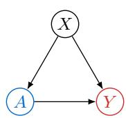

Fig. 1 describes the data-generating processes for RCT and OBS. Each unit has covariates $X \in { \mathcal { X } } .$ , a binary treatment $A \in \{ 0 , 1 \}$ , and an outcome $Y ; P _ { R }$ and $P _ { O }$ denote the RCT and OBS distributions of $V = ( X , A , Y )$ . In the RCT, treatment A depends only on the covariates through a known propensity $e ( x )$ . In the OBS, an unmeasured confounder U afects both treatment A and outcome Y. With potential outcomes $Y ( 1 )$ and $Y ( 0 )$ , the targets are the RCT-population conditional and average treatment efects $\tau _ { 0 } ( x )$ and $\theta _ { 0 }$ . Tables 3 and 4 collect the notation.

(a) RCT  
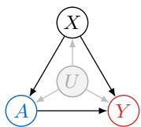  
(b) OBS  
Figure 1: Causal diagrams; U is unmeasured.

<table><tr><td>Assumption 1 (Trial identification). (i)  $Y = Y ( A ) { \mathrm { ~ a . s . ; ~ ( i i ) ~ } } \{ Y ( 0 ) , Y ( 1 ) \} \bot A \mid X$  under  $P _ { R } ;$  (iii) e is known and bounded away from 0 and 1.</td></tr><tr><td>Each source  $S \in \{ R , O \}$  is split into three i.i.d. samples from  $P _ { S } \colon$  nuisance, tuning, and evaluation samples  $D _ { S } ^ { \mathrm { n u i s } } , D _ { S } ^ { \mathrm { t u n e } }$  , and  $D _ { S } ^ { \mathrm { e v a l } }$  (Table 3). The three roles can be rotated across the samples and the resulting estimates averaged (cross-fitting), as in Sec.  $5 ;$  our exact results are for a single split.</td></tr><tr><td>Assumption 2 (Sample separation). The six samples  $D _ { R } ^ { \mathrm { n u i s } } , D _ { R } ^ { \mathrm { t u n e } } , D _ { R } ^ { \mathrm { e v a l } } , D _ { O } ^ { \mathrm { n u i s } } , D _ { O } ^ { \mathrm { t u n e } }$  , and  $D _ { O } ^ { \mathrm { e v a l } }$  are mutually independent.</td></tr></table>

All displayed moments are finite; stronger moment conditions are stated where needed.

We consider two settings for the covariate distributions $P _ { R } ^ { X }$ and $P _ { O } ^ { X }$ : the RCT and OBS share the same domain, or they come from heterogeneous domains. In both, the OBS may be confounded. Whenever $P _ { R } ^ { X }$ is absolutely continuous with respect to $P _ { O } ^ { X }$ , written $P _ { R } ^ { X } \ll P _ { O } ^ { X }$ (every covariate region with positive probability in the RCT also has positive probability in the OBS), the density ratio $r _ { 0 }$ exists.

Assumption 3 (Covariate domains). One of the following holds.   
(i) (Same domain.) $P _ { R } ^ { X } = P _ { O } ^ { X }$ , so $r _ { 0 } \equiv 1$   
(ii) (Heterogeneous domains.) $P _ { R } ^ { X } \ll P _ { O } ^ { X }$ , so $r _ { 0 }$ exists; it need not be known.   
Lemma 1 (RCT-valid AIPW score). For any fixed measurable $q : \mathcal { X } \times \{ 0 , 1 \} \to \mathbb { R } .$ , the AIPW   
score, with e evaluated at X,   
$\begin{array} { r } { \varphi ( V ; q ) \triangleq q ( X , 1 ) - q ( X , 0 ) + \frac { A } { e } \{ Y - q ( X , 1 ) \} - \frac { 1 - A } { 1 - e } \{ Y - q ( X , 0 ) \} } \end{array}$ (1)   
satisfies $\mathbb { E } _ { R } [ \varphi ( V ; q ) \mid X ] = \tau _ { 0 } ( X )$ under Assumption 1 (Appendix $\mathrm { A } )$

Hence the RCT-only AIPW estimator $\mathbb { P } _ { R , n } Z ^ { 0 }$ is conditionally unbiased for $\theta _ { 0 }$ given $D _ { R } ^ { \mathrm { n u i s } }$

## 3. Fusion for the ATE

In this section, we build the ATE estimator, called AIPWF, that uses a small RCT sample and borrows power from possibly confounded OBS.

## 3.1. Estimator, Variance, and Oracles

Our estimator starts from Lemma 1: $\mathbb { P } _ { R , n } Z ^ { 0 }$ is the RCT-only AIPW estimator, and $\mathbb { P } _ { R , n } Z ^ { \lambda }$ is also unbiased for any $\lambda \in \mathbb { R }$ ; that is, we can use the blended regressor $\widehat { \mu } _ { \lambda }$ (Table 3) rather than the RCTonly regressor $\widehat { \mu } _ { R }$ to borrow power from the OBS (De Bartolomeis et al., 2025; Gagnon-Bartsch et al., 2023). Augmenting $\mathbb { P } _ { R , n } Z ^ { \lambda }$ with the PPI correction (Angelopoulos et al., 2023, 2026), we define the AIPWF estimator:

Definition 1 (AIPWF estimator). For fixed $r : \mathcal { X } \to [ 0 , \infty )$ and $( \lambda , \omega )$ , the AIPWF estimator   
of $\theta _ { 0 }$ is   
$\widehat { \theta } _ { r } ( \lambda , \omega ) \triangleq \mathbb { P } _ { R , n } Z ^ { \lambda } + \omega \{ \mathbb { P } _ { O , N } ( r \widehat { g } ) - \mathbb { P } _ { R , n } \widehat { g } \} ,$ (2)   
with r and $\widehat g$ evaluated at X. Equivalently, $\widehat { \theta } _ { r } ( \lambda , \omega )$ is a sum of two independent sample means,   
an RCT term and an OBS term:   
<sup>b</sup>θr(λ, ω) = <sup>P</sup>R,n(Z<sup>λ</sup> − ωgb) + <sup>P</sup>O,N(ωrgb). (3)

At $( \lambda , \omega ) = ( 0 , 0 )$ this is the RCT-only AIPW estimator $\mathbb { P } _ { R , n } Z ^ { 0 }$ (Robins et al., 1994). The coeficient λ sets the blended regressor $\widehat { \mu } _ { \lambda }$ in the AIPW score, and ω scales a transported control variate built from $\widehat { g } \ ( \mathrm { F i g . \ 2 ( a ) } )$ . In this subsection, the density ratio is exact, $r = r _ { 0 } ;$ ; Sec. 3.2 estimates it.

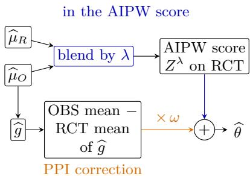  
(a) Where λ and ω act (schematic)

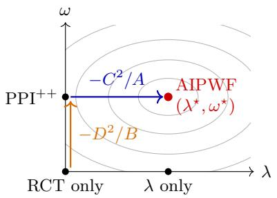  
(b) Quadratic in $( \lambda , \omega )$ (schematic)

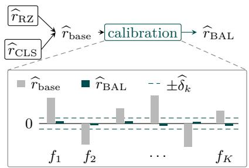  
(c) Ratio calibration (schematic)  
Figure 2: ATE fusion with AIPWF (Def. 1). (a) Where λ and ω enter ${ \widehat { \theta } } .$ (b) Contours of $\operatorname { E q . }$ (5). (c) Ratio calibration (Def. 2): bars are the imbalances $\mathbb { P } _ { O } ^ { \mathrm { n u i s } } [ \widehat { r } f _ { k } ] - \mathbb { P } _ { R } ^ { \mathrm { n u i s } } [ f _ { k } ]$

Theorem 1 (Mean and variance). For every fixed $( \lambda , \omega )$ and given the fitted regressions $\widehat { \mu } _ { R }$ and $\widehat { \mu } _ { O }$

$$
\mathbb { E } [ \widehat { \theta } _ { r _ { 0 } } ( \lambda , \omega ) ] = \theta _ { 0 } ,\tag{4}
$$

where E and Var are over $D _ { R } ^ { \mathrm { e v a l } }$ and $D _ { O } ^ { \mathrm { e v a l } }$ . Let

$$
A \triangleq \operatorname { V a r } _ { R } ( \Delta ) ,
$$

$$
C \triangleq { \mathrm { C o v } } _ { R } ( Z ^ { 0 } , \Delta ) ,
$$

$$
\begin{array} { r } { B \triangleq \operatorname { V a r } _ { R } ( \widehat { g } ) + \frac { n } { N } \operatorname { V a r } _ { O } ( r _ { 0 } \widehat { g } ) , } \end{array}
$$

$$
D \triangleq \operatorname { C o v } _ { R } ( Z ^ { 0 } , { \widehat { g } } ) .
$$

If these moments are finite, then

$$
\begin{array} { r } { n \mathrm { V a r } \{ \widehat { \theta } _ { r _ { 0 } } ( \lambda , \omega ) \} = \mathrm { V a r } _ { R } ( Z ^ { 0 } ) + ( A \lambda ^ { 2 } + 2 C \lambda ) + ( B \omega ^ { 2 } - 2 D \omega ) . } \end{array}\tag{5}
$$

If A, $B > 0 ,$ , its unique minimizer is

$$
\lambda ^ { \star } = - C / A \quad \mathrm { a n d } \quad \omega ^ { \star } = D / B .\tag{6}
$$

Corollary 1.1 (Population oracles). Under the conditions of Thm. 1 with $A , B \ > \ 0 .$ , let $\widetilde { V } ( \lambda , \omega ) \triangleq n \mathrm { V a r } \{ \widehat { \theta } _ { r _ { 0 } } ( \lambda , \omega ) \}$ , with RCT-only, $\mathrm { P P I ^ { + + } }$ , and AIPWF oracle values $\widetilde { V } _ { \mathrm { R C T } } \triangleq \widetilde { V } ( 0 , 0 )$ $\widetilde { V } _ { \mathrm { P P I } ^ { + + } } \triangleq \widetilde { V } ( 0 , \omega ^ { \star } )$ , and $\widetilde { V } _ { \mathrm { A I P W F } } \triangleq \widetilde { V } ( \lambda ^ { \star } , \omega ^ { \star } )$ . Then

$$
\tilde { V } _ { \mathrm { A I P W F } } = \tilde { V } _ { \mathrm { R C T } } - C ^ { 2 } / A - D ^ { 2 } / B \le \tilde { V } _ { \mathrm { P P I ^ { + + } } } = \tilde { V } _ { \mathrm { R C T } } - D ^ { 2 } / B \le \tilde { V } _ { \mathrm { R C T } } .
$$

In Fig. 2(b), $\mathrm { P P I ^ { + + } }$ moves from the RCT-only origin along the $\omega$ axis, and AIPWF moves along both axes. Remark 1 shows when each axis helps.

Remark 1 (When each channel helps). Since $D = \mathrm { C o v } _ { R } ( \tau _ { 0 } ( X ) , \widehat { g } ( X ) )$ , the Cauchy–Schwarz inequality gives $D ^ { 2 } \leq \mathrm { V a r } _ { R } \{ \tau _ { 0 } ( X ) \} \mathrm { V a r } _ { R } ( \widehat { g } ) \leq \mathrm { V a r } _ { R } \{ \tau _ { 0 } ( X ) \} B$ . Hence the reduction $D ^ { 2 } / B$ that ω brings in Cor. 1.1 is at most Var ${ } _ { R } \{ \tau _ { 0 } ( X ) \}$ , with or without λ, because the variance is separable in $( \lambda , \omega )$ . Since $\mathbb { E } _ { R } [ Z ^ { \lambda } \mid X ] = \tau _ { 0 } ( X )$ for every λ (Lemma 1), Var $_ { R } ( Z ^ { \lambda } ) = \mathbb { E } _ { R } \{ \operatorname { V a r } _ { R } ( Z ^ { \lambda } \mid X ) \} +$ $\operatorname { V a r } _ { R } \{ \tau _ { 0 } ( X ) \}$ , so this cap is the efect-heterogeneity part of the score variance. It is the fraction $\mathrm { V a r } _ { R } \{ \tau _ { 0 } ( X ) \} / \mathrm { V a r } _ { R } ( Z ^ { 0 } )$ of $\widetilde { V } _ { \mathrm { R C T } } = \mathrm { V a r } _ { R } ( Z ^ { 0 } )$ , and the larger fraction $\mathrm { V a r } _ { R } \{ \tau _ { 0 } ( X ) \} / \mathrm { V a r } _ { R } ( Z ^ { \lambda ^ { \star } } )$

of the variance Var $\dot { \kappa } ( Z ^ { \lambda ^ { \star } } ) = \widetilde V _ { \mathrm { R C T } } - C ^ { 2 } / A$ that remains after λ. Conversely, $\mathrm { V a r } _ { R } ( Z ^ { \lambda ^ { \star } } ) \ \ge$ $\operatorname { V a r } _ { R } \{ \tau _ { 0 } ( X ) \}$ gives $C ^ { 2 } / A \le \mathbb { E } _ { R } \{ \operatorname { V a r } _ { R } ( Z ^ { 0 } \mid X ) \}$ : λ acts only on the within-covariate part of the score variance, and its reduction is zero when $\widehat { \mu } _ { R }$ equals the trial regression (Appendix A). Thus ω can help much only when efect heterogeneity is a large part of the score variance, and λ helps only when $\widehat { \mu } _ { R }$ difers from the trial regression, for example when it is fitted on a small trial.

## 3.2. Estimating the Density Ratio

So far we have assumed $r = r _ { 0 }$ . This subsection gives the density-ratio estimator used in AIPWF.   
AIPWF is unbiased under the correct ratio (Thm. 1), but a misspecified ratio introduces bias.

Proposition 1 (Drift under a candidate ratio). For a candidate ratio ${ \widetilde { r } } ,$ let   
imbf(re) <sup>≜ E</sup>O[rfe ] <sup>− E</sup>R[f] = <sup>E</sup>O[(re <sup>−</sup> r0)f] (7)   
be its imbalance along a feature $f .$ Then, for fixed $( \lambda , \omega )$ and given the fitted regressions $\widehat { \mu } _ { R }$   
and $\widehat { \mu } _ { O }$ ,   
E[bθ<sub>r</sub>(λ, ω)] − θ<sub>0</sub> = ω imb<sub>g</sub>(re). (8)

Under Assumption $3 ( \mathrm { i } )$ we set $\widehat { r } \equiv 1$ . Under Assumption $3 ( \mathrm { i i } )$ the ratio must be estimated, and two characterizations of $r _ { 0 }$ give the estimators.

```latex
Proposition 2 (Characterizations of $r _ { 0 } )$ . Under Assumption $3 ( \mathrm { i i } )$
(i) (Reweighting.) $\mathbb { E } _ { O } [ r _ { 0 } h ] = \mathbb { E } _ { R } [ h ]$ for every $h \in L ^ { 1 } ( P _ { R } ^ { X } )$ , and no other weight does so for
all bounded $h .$
(ii) (Riesz risk.) If $r _ { 0 } \in L ^ { 2 } ( P _ { O } ^ { X } )$ , then $\begin{array} { r } { r _ { 0 } = \arg \operatorname* { m i n } _ { a \in L ^ { 2 } ( P _ { O } ^ { X } ) } \{ { \mathbb E } _ { O } [ a ^ { 2 } ] - 2 { \mathbb E } _ { R } [ a ] \} } \end{array}$
```

Item (ii) follows from item (i), since $\mathbb { E } _ { O } [ a ^ { 2 } ] - 2 \mathbb { E } _ { R } [ a ] = \mathbb { E } _ { O } [ ( a - r _ { 0 } ) ^ { 2 } ] - \mathbb { E } _ { O } [ r _ { 0 } ^ { 2 } ]$ . Two base ratios are standard. The Riesz estimator $\widehat { r } _ { \mathrm { R Z } }$ minimizes the empirical Riesz risk $\mathbb { P } _ { O } ^ { \mathrm { n u i s } } ( a ^ { 2 } ) - 2 \mathbb { P } _ { R } ^ { \mathrm { n u i s } } ( a )$ of Prop. $2 ( \mathrm { i i } )$ over a linear class (Chernozhukov et al., 2022), with a ridge penalty. The classifier estimator is ${ \widehat { r } } _ { \mathrm { C L S } } \triangleq \{ ( 1 - { \widehat { \pi } } ) / { \widehat { \pi } } \} { \widehat { s } } / ( 1 - { \widehat { s } } )$ , where ${ \widehat { s } } ( x )$ is a fitted probability of trial membership given covariates x, trained on the pooled nuisance covariates, and $\widehat { \pi }$ is the trial share.

By Prop. 1, an estimated ratio biases AIPWF only through one moment, imb $\boldsymbol { \widehat { \widehat { g } } } ( \boldsymbol { \widehat { r } } ) = \mathbb { E } _ { O } [ \boldsymbol { \widehat { r } } \boldsymbol { \widehat { g } } ] - \mathbb { E } _ { R } [ \boldsymbol { \widehat { g } } ]$ $\mathrm { A }$ base ratio, such as $\widehat { r } _ { \mathrm { R Z } }$ or $\widehat { r } _ { \mathrm { C L S } } .$ , approximates $r _ { 0 }$ as a whole and leaves this moment nonzero in general. We therefore use calibration to achieve $\mathbb { E } _ { O } [ \widehat { r g } ] - \mathbb { E } _ { R } [ \widehat { g } ] = 0$

Definition 2 (Calibrated balancing ratio). Given a base ratio $\widehat { r } _ { \mathrm { b a s e } } > 0$ and features $f ( X ) =$ $( f _ { 1 } ( X ) , \ldots , f _ { K } ( X ) )$ , the calibrated ratio is

$$
\widehat { r } _ { \mathrm { B A L } } ( x ) \triangleq \frac { \widehat { r } _ { \mathrm { b a s e } } ( x ) e ^ { \widehat { \xi } ^ { \top } f ( x ) } } { \mathbb { P } _ { O } ^ { \mathrm { n u i s } } \{ \widehat { r } _ { \mathrm { b a s e } } ( X ) e ^ { \widehat { \xi } ^ { \top } f ( X ) } \} } ,
$$

where $\widehat { \xi }$ solves the balance equations, for all $k \leq K$

$$
\mathbb { P } _ { O } ^ { \mathrm { n u i s } } \{ \widehat { r } _ { \mathrm { B A L } } ( X ) f _ { k } ( X ) \} = \mathbb { P } _ { R } ^ { \mathrm { n u i s } } \{ f _ { k } ( X ) \} .\tag{9}
$$

Among ratios that average to one on the OBS and satisfy Eq. (9), $\widehat { r } _ { \mathrm { B A L } }$ is the closest to $\widehat { r } _ { \mathrm { b a s e } }$ in Kullback–Leibler divergence (Hainmueller, 2012). For AIPWF, $f = { \widehat { g } }$ sufices and is balanced exactly. Fig. $2 ( \mathrm { c ) }$ illustrates it: calibration drives each feature’s imbalance to zero, or within its tolerance $\widehat { \delta } _ { k }$

Computing the calibrated ratio. Eq. (9) is the stationarity condition of the convex objective log $\mathbb { P } _ { O } ^ { \mathrm { n u i s } } \{ \widehat { r } _ { \mathrm { b a s e } } e ^ { \xi ^ { \top } f } \} - \xi ^ { \top } \mathbb { P } _ { R } ^ { \mathrm { n u i s } } ( f )$ , whose minimizer gives the Kullback–Leibler projection of $\widehat { r } _ { \mathrm { b a s e } }$ onto the ratios that satisfy Eq. (9) and average to one. For one feature, the stationarity condition says that the calibrated OBS mean of $f$ equals $\mathbb { P } _ { R } ^ { \mathrm { n u i s } } ( f )$ ; its derivative in $\xi$ is the calibrated variance, which is nonnegative, so the root is unique when $\mathbb { P } _ { R } ^ { \mathrm { n u i s } } ( f )$ lies strictly inside the range of $f$ on $D _ { O } ^ { \mathrm { n u i s } }$ With many features (Secs. 4.3 and 5), we add the penalty $\sum _ { k } \widehat { \delta } _ { k } | \xi _ { k } |$ (approximate balance). The features $f$ have no intercept, $\widehat { \delta } _ { k }$ is the standard error of the kth balance residual, estimated by $\widehat { \delta } _ { k } ^ { 2 } = \widehat { \mathrm { V a r } _ { O } } ^ { \mathrm { n u i s } } ( \widehat { r } _ { \mathrm { b a s e } } f _ { k } ) / N _ { \mathrm { n u i s } } + \widehat { \mathrm { V a r } _ { R } } ^ { \mathrm { n u i s } } ( f _ { k } ) / n _ { \mathrm { n u i s } }$ with sample variances on $D _ { S } ^ { \mathrm { n u i s } }$ of sizes $n _ { \mathrm { n u i s } }$ and $N _ { \mathrm { n u i s } }$ , and $\widehat { \xi }$ minimizes the objective below. The penalized dual objective

$$
\log \mathbb { P } _ { O } ^ { \mathrm { n u i s } } \{ \widehat { r } _ { \mathrm { b a s e } } e ^ { \xi ^ { \top } f } \} - \xi ^ { \top } \mathbb { P } _ { R } ^ { \mathrm { n u i s } } ( f ) + \sum _ { k } \widehat { \delta } _ { k } | \xi _ { k } |\tag{10}
$$

is convex in ξ. At a minimizer ${ \widehat { \xi } } ,$ the subgradient condition is $\mathbb { P } _ { O } ^ { \mathrm { n u i s } } ( \widehat { r } _ { \mathrm { B A L } } f _ { k } ) - \mathbb { P } _ { R } ^ { \mathrm { n u i s } } ( f _ { k } ) + \widehat { \delta } _ { k } \varsigma _ { k } = 0$ with $\varsigma _ { k } \in \partial | \widehat { \xi _ { k } } |$ . Hence the kth residual is at most $\widehat { \delta } _ { k }$ in absolute value, with equality when $\widehat { \xi } _ { k } \neq 0$ Normalization gives $\mathbb { P } _ { O } ^ { \mathrm { n u i s } } ( \widehat { r } _ { \mathrm { B A L } } ) = 1$

## 3.3. Algorithm and Confidence Intervals

This subsection gives an algorithm for the AIPWF estimate and its confidence interval.

We restrict $( \lambda , \omega )$ to $[ 0 , 1 ] ^ { 2 }$ , which contains the RCT-only estimator at $( 0 , 0 )$ and caps the PPI correction at its full weight $\omega = 1 ; \lambda \in [ 0 , 1 ]$ keeps $\widehat { \mu } _ { \lambda }$ a convex blend of $\widehat { \mu } _ { R }$ and $\widehat { \mu } _ { O }$ . Since Thm. 1 needs $A , B > 0$ for the oracle coeficients − $. C / A$ and $D / B$ , we also prespecify thresholds $\epsilon _ { A } , \epsilon _ { B } > 0$ and require $\widehat { A } > \epsilon _ { A }$ and $\widehat { B } > \epsilon _ { B }$

With $\mathrm { P r o j } _ { [ 0 , 1 ] }$ the projection onto $[ 0 , 1 ]$ , we select

$$
\begin{array} { r l } & { \widehat { \lambda } \triangleq \operatorname { P r o j } _ { [ 0 , 1 ] } ( - \widehat { C } / \widehat { A } ) { \bf 1 } \{ \widehat { A } > \epsilon _ { A } \} , } \\ & { \widehat { \omega } \triangleq \operatorname { P r o j } _ { [ 0 , 1 ] } ( \widehat { D } / ( \widehat { B } + \widehat { B } _ { \mathrm { c a l } } ) ) { \bf 1 } \{ \widehat { B } > \epsilon _ { B } \} . } \end{array}\tag{11}
$$

Here $\widehat { B } _ { \mathrm { c a l } } \triangleq n \{ \widehat { \mathrm { V a r } } _ { R } ^ { \mathrm { n u i s } } ( \widehat { g } ) / n _ { \mathrm { n u i s } } + \widehat { \mathrm { V a r } } _ { O } ^ { \mathrm { n u i s } } ( \widehat { r g } ) / N _ { \mathrm { n u i s } } \}$ , or $0 \ \mathrm { i f } \ \hat { r } \ \equiv \ 1$ , is the calibration noise of Thm. 2(ii).

Algorithm 1 uses the three samples of Assumption 2 in turn: it fits the nuisances, with $\widehat { r }$ calibrated by Def. 2 with $\widehat g$ among the features; selects $( \widehat { \lambda } , \widehat { \omega } )$ by Eq. (11) from tuning-sample analogues of $A , B , C , D$ in Thm. 1; and evaluates Eq. (2), adding $\widehat { V } _ { \mathrm { c a l } }$ (Thm. 2) to $\widehat { V }$

Remark 2 (Adaptive reuse). Algorithm 1 selects $( \widehat { \lambda } , \widehat { \omega } )$ on the tuning samples and evaluates $\widehat { \theta }$ on separate samples, because selecting and evaluating on the same samples can bias the estimate. If X is degenerate, $Z ^ { 0 } = 0 .$ , and $\Delta _ { i }$ are i.i.d. Rademacher, every fixed $\lambda$ centers $\lambda \mathbb { P } _ { R , n } \Delta$ , but $\widehat { \lambda } = \mathrm { s i g n } ( \mathbb { P } _ { R , n } \Delta )$ yields $| \mathbb { P } _ { R , n } \Delta |$ with strictly positive mean. An analogous construction applies

Algorithm 1: AIPWF   
Input: $D _ { S } ^ { \mathrm { n u i s } } , D _ { S } ^ { \mathrm { t u n e } } , D _ { S } ^ { \mathrm { e v a l } }$ for $S \in \{ R , O \} ; \epsilon _ { A } , \epsilon _ { B } > 0 .$   
Output: ${ \widehat { \theta } } \triangleq { \widehat { \theta } } _ { \widehat { r } } ( { \widehat { \lambda } } , { \widehat { \omega } } ) , { \widehat { V } } ,$ and $\widehat { V } _ { \mathrm { c a l } } .$   
1: Fit $\widehat { \mu } _ { R } , \widehat { \mu } _ { O } , \widehat { g } , \widehat { r }$ and form $\widehat { B } _ { \mathrm { c a l } }$ on $D _ { S } ^ { \mathrm { n u i s } } ~ ( \widehat { r } \equiv 1 $ under Assumption $3 ( \mathrm { i } ) )$   
2: Form $\widehat { A } , \widehat { B } , \widehat { C } , \widehat { D }$ on $D _ { S } ^ { \mathrm { t u n e . } } ;$ select $( \widehat { \lambda } , \widehat { \omega } )$ by Eq. (11)   
3: On $D _ { S } ^ { \mathrm { e v a l } } .$ , compute $\widehat { \theta }$ by Eq. (2) with $r = { \widehat { r } }$   
4: Return $\widehat { \theta } = \widehat { \theta } _ { \widehat { r } } ( \widehat { \lambda } , \widehat { \omega } )$ and $\widehat { V } \triangleq \widehat { \mathrm { V a r } } _ { R , \mathrm { e v a l } } ( Z ^ { \widehat { \lambda } } - \widehat { \omega } \widehat { g } ) / n + \widehat { \mathrm { V a r } } _ { O , \mathrm { e v a l } } ( \widehat { \omega } \widehat { r } \widehat { g } ) / N ,$ and $\widehat { V } _ { \mathrm { c a l } } \ ( \mathrm { T h m . \ 2 } )$

Thm. 2(ii) uses the following high-level conditions.

Assumption 4 (Conditions for Thm. $2 ( \mathrm { i i } ) ) . ~ n , N  \infty$ with $n / N , n _ { \mathrm { n u i s } } / n .$ and $N _ { \mathrm { n u i s } } / N$ con  
verging; $\widehat { \omega }  _ { p } \bar { \omega } ; ( \mathbb { P } _ { O } ^ { \mathrm { n u i s } } - \mathbb { E } _ { O } ) ( \widehat { r g } ) = ( \mathbb { P } _ { O } ^ { \mathrm { n u i s } } - \mathbb { E } _ { O } ) ( \bar { r } \bar { g } ) + o _ { p } ( N _ { \mathrm { n u i s } } ^ { - 1 / 2 } )$ for fixed $\bar { r } , \bar { g }$ with $\widehat g  \bar { g }$ in   
$L ^ { 2 } ( P _ { R } ^ { X } )$ ; for some $\eta > 0 , ( 2 + \eta )$ -th moments of $Z ^ { \widehat { \lambda } } - \widehat { \omega } \widehat { g } , \widehat { \omega } \widehat { r } \widehat { g } , \bar { g } ,$ and $\bar { r } \bar { g }$ bounded uniformly in   
n; $n ( \dot { V } _ { n } + { V } _ { \mathrm { c a l } } )$ converging to a positive limit with $V _ { \mathrm { c a l } } \triangleq \bar { \omega } ^ { 2 } \{ \mathrm { V a r } _ { R } ( \bar { g } ) / n _ { \mathrm { n u i s } } + \mathrm { V a r } _ { O } ( \bar { r } \bar { g } ) / N _ { \mathrm { n u i s } } \} \mathrm { . ~ }$   
and $( \widehat { V } + \widehat { V } _ { \mathrm { c a l } } ) / ( V _ { n } + V _ { \mathrm { c a l } } ) \to _ { p } 1$

Theorem 2 (Confidence interval of the ATE estimator). Let $\widehat { \theta } = \widehat { \theta } _ { \widehat { r } } ( \widehat { \lambda } , \widehat { \omega } )$ , let $\operatorname { i m b } _ { g }$ be as in   
Prop. 1, and let   
$V _ { n } \triangleq \operatorname { V a r } _ { R } \big ( Z ^ { \widehat { \lambda } } - \widehat { \omega } \widehat { g } \big ) / n + \widehat { \omega } ^ { 2 } \operatorname { V a r } _ { O } \big ( \widehat { r g } \big ) / N$ (12)   
be the variance of $\widehat { \theta }$ given the nuisance and tuning samples, i.e., the sum of the variances of the   
two terms of Eq. (3).   
(i) (Mean.) Given the nuisance and tuning samples,   
$\mathbb { E } [ \widehat { \theta } ] = \theta _ { 0 } + \widehat { \omega } \operatorname { i m b } _ { \widehat { g } } ( \widehat { r } ) \quad \mathrm { a n d } \quad \mathbb { E } [ \widehat { V } ] = V _ { n } ;$ (13)   
in particular, $\widehat { \theta }$ is unbiased when im $b _ { \widehat { q } } ( \widehat { r } ) = 0 \ ( \mathrm { e . g . } , \widehat { r } = r _ { 0 }$ , including $\widehat { r } \equiv r _ { 0 } \equiv 1$ under   
Assumption $3 ( \mathrm { i } )$ , or $\widehat { r }$ perfectly calibrated, $\mathbb { E } _ { O } [ \widehat { r g } ] = \mathbb { E } _ { R } [ \widehat { g } ] )$   
(ii) (Coverage.) Let $\widehat { r } = \widehat { r } _ { \mathrm { B A L } }$ with $\widehat g$ among its features, and let $\widehat { V } _ { \mathrm { c a l } } \triangleq \widehat { \omega } ^ { 2 } \widehat { B } _ { \mathrm { c a l } } / n$ with $\widehat { B } _ { \mathrm { c a l } }$   
from Eq. (11). Under Assumption 4,   
lim Pθ<sub>0</sub> ∈ [bθ ± z<sub>1−α/2</sub>(Vb + Vb<sub>cal</sub>)<sup>1/2</sup>] = 1 − α. (14)   
n→∞

Item (i) shows that $\widehat { r }$ moves the mean only through the drift $\widehat { \omega } \mathrm { i m } \mathsf { b } _ { \widehat { g } } ( \widehat { r } )$ , while $\widehat { V }$ stays unbiased for $V _ { n } .$ . Calibration does not make the drift zero. Eq. (9) holds on the nuisance samples, so im $\begin{array} { r } { \ r _ { \widehat { g } } ( \widehat { r } ) = ( \mathbb { P } _ { R } ^ { \mathrm { n u i s } } - \mathbb { E } _ { R } ) \widehat { g } - ( \mathbb { P } _ { O } ^ { \mathrm { n u i s } } - \mathbb { E } _ { O } ) ( \widehat { r g } ) } \end{array}$ , a diference of nuisance-sample averages. It has mean approximately zero and standard deviation of order $n _ { \mathrm { n u i s } } ^ { - 1 / 2 }$ , the order of the standard error. Thus, with $\widehat { r } _ { \mathrm { B A L } }$ , item (i) gives a nonzero bias $\widehat { \omega } \mathrm { i m } \mathsf { b } _ { \widehat { g } } ( \widehat { r } )$ given the nuisance samples. Averaged over the nuisance samples, this bias is zero to first order, so $\widehat { \theta }$ is unbiased to first order. Item (ii) therefore treats it as noise and adds its variance $\widehat { V } _ { \mathrm { c a l } }$ . It follows from the Lyapunov central limit theorem (van der Vaart, 1998, Prop. 2.27) for the four independent nuisance and evaluation samples.

Table 4: Notation for the CATE (Sec. 4); the notation of Table 3 carries over.
<table><tr><td rowspan=1 colspan=1> $\mathcal { R } _ { 0 } ( t ) \triangleq \mathbb { E } _ { R } [ \{ t ( X ) - \tau _ { 0 } ( X ) \} ^ { 2 } ]$ </td><td rowspan=1 colspan=1>CATE risk (Sec. 4.1)</td></tr><tr><td rowspan=1 colspan=1> $\mathtt { m d 1 } \in \{ \mathrm { D R F , R F } \}$ </td><td rowspan=1 colspan=1>learner</td></tr><tr><td rowspan=1 colspan=1> $m _ { \lambda } \triangleq e \widehat { \mu } _ { \lambda } ( \cdot , 1 ) + ( 1 - e ) \widehat { \mu } _ { \lambda } ( \cdot , 0 )$ </td><td rowspan=1 colspan=1>marginal regression</td></tr><tr><td rowspan=1 colspan=1> $\kappa _ { \tt m d 1 }$ </td><td rowspan=1 colspan=1>unit weight (Def. 3)</td></tr><tr><td rowspan=1 colspan=1> $Z _ { \mathrm { m d 1 } } ^ { \lambda }$ </td><td rowspan=1 colspan=1>pseudo-outcome (Def. 3)</td></tr><tr><td rowspan=1 colspan=1> $\mathbb { P } _ { S } ^ { \mathrm { t u n e } }$ </td><td rowspan=1 colspan=1>average over $D _ { S } ^ { \mathrm { t u n e } }$ </td></tr><tr><td rowspan=1 colspan=1> $\widehat { \mathcal { R } } _ { \mathrm { m d 1 } } ( t ; \lambda , \omega , r )$ </td><td rowspan=1 colspan=1>proxy risk (Eq. (17))</td></tr><tr><td rowspan=1 colspan=1> $\widehat { \tau } _ { \mathrm { m d 1 } } ( \cdot ; \lambda , \omega )$ </td><td rowspan=1 colspan=1>fitted learner (Sec. 4.2)</td></tr><tr><td rowspan=1 colspan=1> $\mathcal { G } = \{ ( \lambda _ { m } , \omega _ { m } ) \} _ { m = 1 } ^ { M }$ </td><td rowspan=1 colspan=1>candidate grid (Def. 4)</td></tr><tr><td rowspan=1 colspan=1> $\widehat { \mathcal { R } } _ { \mathrm { v a l } } ( \widehat { \tau } _ { m } ; \omega _ { m } )$ </td><td rowspan=1 colspan=1>validation score (Def. 4)</td></tr><tr><td rowspan=1 colspan=1> $\varrho _ { \mathrm { m d 1 } } ( \lambda , \omega )$ </td><td rowspan=1 colspan=1>transport error (Thm. 4)</td></tr><tr><td rowspan=1 colspan=1> $\zeta : \mathcal { X } \to \mathbb { R } ^ { p }$ </td><td rowspan=1 colspan=1>sieve basis (Def. 5)</td></tr><tr><td rowspan=1 colspan=1> ${ \mathcal { T } } _ { \zeta } \triangleq \{ \zeta ^ { \top } \beta \}$ </td><td rowspan=1 colspan=1>sieve class (Def. 5)</td></tr><tr><td rowspan=1 colspan=1> $\widehat { \beta } _ { \mathrm { m d 1 } } ( \lambda , \omega )$ </td><td rowspan=1 colspan=1>coefficients (Def. 5)</td></tr><tr><td rowspan=1 colspan=1> $\rho \geq 0$ </td><td rowspan=1 colspan=1>ridge penalty (Def. 5)</td></tr><tr><td rowspan=1 colspan=1> $\widehat { H } _ { \mathrm { m d 1 } } ( \omega )$ </td><td rowspan=1 colspan=1>Gram estimate (Prop. 4)</td></tr><tr><td rowspan=1 colspan=1> $\Gamma _ { R } \triangleq \mathbb { E } _ { R } [ \zeta \zeta ^ { \top } ]$ </td><td rowspan=1 colspan=1>sieve Gram matrix</td></tr><tr><td rowspan=1 colspan=1> $\beta _ { p }$ </td><td rowspan=1 colspan=1>best sieve coefficients</td></tr><tr><td rowspan=1 colspan=1> $\tau _ { p } ^ { \star } \triangleq \zeta ^ { \top } \beta _ { p }$ </td><td rowspan=1 colspan=1>best sieve approximation</td></tr><tr><td rowspan=1 colspan=1> $n _ { R } \triangleq | D _ { R } ^ { \mathrm { t u n e } } | , n _ { O } \triangleq | D _ { O } ^ { \mathrm { t u n e } } |$ </td><td rowspan=1 colspan=1>tuning sample sizes</td></tr><tr><td rowspan=1 colspan=1> $\bar { \beta } ( \omega )$ </td><td rowspan=1 colspan=1>mean coefficients (Prop. 5)</td></tr><tr><td rowspan=1 colspan=1> $\bar { H } _ { \rho }$ </td><td rowspan=1 colspan=1>mean Hessian (Prop. 5)</td></tr><tr><td rowspan=1 colspan=1> $\mathtt { b i a s } ( \omega )$ </td><td rowspan=1 colspan=1>squared bias (Prop. 5)</td></tr><tr><td rowspan=1 colspan=1> $\mathcal { I } _ { \mathrm { m d 1 } } ( \lambda , \omega )$ </td><td rowspan=1 colspan=1>variance (Thm. 5)</td></tr></table>

## 4. Fusion for the CATE

In this section, we develop two CATE learners that borrow from the OBS in the same two ways as AIPWF: DRF, built on the AIPW pseudo-outcome of the DR-learner (Kennedy, 2023), and RF, built on the R-learner loss (Nie and Wager, 2021). Throughout this section, Assumptions 1 and 2 hold, either Assumption 3(i) $( r _ { 0 } \equiv 1 )$ or Assumption 3(ii) holds, and $\lambda \in [ 0 , 1 ]$ , so the blended regressor $\widehat { \mu } _ { \lambda }$ is a convex combination of $\widehat { \mu } _ { R }$ and $\widehat { \mu } _ { O }$ and $\mathbb { E } _ { R } [ Z ^ { \lambda } \mid X ] = \tau _ { 0 } ( X )$ (Lemma 1). Table 4 collects the CATE notation.

## 4.1. CATE Risks

For a prespecified class $\mathcal { T } \subseteq L ^ { 2 } ( P _ { R } ^ { X } )$ , the CATE risk of $t \in \tau$ is

$$
\mathcal { R } _ { 0 } ( t ) \triangleq \mathbb { E } _ { R } [ \{ t ( X ) - \tau _ { 0 } ( X ) \} ^ { 2 } ] .\tag{15}
$$

The risk $\mathcal { R } _ { 0 }$ requires the unknown $\tau _ { 0 }$ . We therefore define a computable proxy:

Definition 3 (DRF and $\mathrm { R F }$ proxy risks). For learner mdl $\in \{ \mathrm { D R F } , \mathrm { R F } \}$ , let

$$
\kappa _ { \mathrm { D R F } } \triangleq 1 ,
$$

$$
Z _ { \mathrm { D R F } } ^ { \lambda } \triangleq Z ^ { \lambda } ,
$$

$$
\kappa _ { \mathrm { R F } } \triangleq \frac { ( A - e ) ^ { 2 } } { e ( 1 - e ) } ,
$$

$$
Z _ { \mathrm { R F } } ^ { \lambda } \triangleq { \frac { Y - m _ { \lambda } } { A - e } } .
$$

The proxy risk of learner mdl is

$$
\mathcal { R } _ { \mathtt { m d l } } ( t ; \lambda ) \triangleq \mathbb { E } _ { R } [ \kappa _ { \mathtt { m d l } } \{ Z _ { \mathtt { m d l } } ^ { \lambda } - t ( X ) \} ^ { 2 } ] .\tag{16}
$$

With $\mathbb { P } _ { S } ^ { \mathrm { t u n e } }$ the average over $D _ { S } ^ { \mathrm { t u n e } } , \omega \in \mathbb { R }$ , and a candidate weight $^ { r , }$ its empirical proxy risk is

$$
\widehat { \mathcal { R } } _ { \mathtt { m a l } } ( t ; \lambda , \omega , r ) \triangleq \mathbb { P } _ { R } ^ { \mathrm { t u n e } } [ \kappa _ { \mathtt { m a l } } \{ Z _ { \mathtt { m d } 1 } ^ { \lambda } - t ( X ) \} ^ { 2 } ] + \omega \mathbb { P } _ { O } ^ { \mathtt { t u n e } } [ r ( \widehat { g } - t ) ^ { 2 } ] - \omega \mathbb { P } _ { R } ^ { \mathtt { t u n e } } [ \kappa _ { \mathtt { m a l } } ( \widehat { g } - t ) ^ { 2 } ] .\tag{17}
$$

DRF regresses the AIPW score $Z _ { \mathrm { D R F } } ^ { \lambda } = Z ^ { \lambda }$ , as in the DR-learner (Kennedy, 2023). RF is the R-learner (Nie and Wager, 2021) with each squared residual divided by $e ( 1 - e )$ , since $\{ Y - m _ { \lambda } -$ $( A - e ) t \} ^ { 2 } = e ( 1 - e ) \kappa _ { \mathrm { R F } } \{ Z _ { \mathrm { R F } } ^ { \lambda } - t \} ^ { 2 }$

When $r = r _ { 0 }$ , in expectation, each empirical risk equals $\mathcal { R } _ { 0 }$ up to an additive constant that does not depend on t, so the two have the same minimizer.

Theorem 3 (Exact CATE targets). Fix $\omega \in \mathbb { R } , t \in \mathcal { T }$ , and $^ { r } \cdot$ Let $Q _ { \mathrm { m d 1 } } ( \lambda ) \triangleq \mathcal { R } _ { \mathrm { m d 1 } } ( \tau _ { 0 } ; \lambda )$ be the loss at the true CATE. Then for mdl $\in \{ \mathrm { D R F } , \mathrm { R F } \}$

$$
\mathbb { E } [ \widehat { \mathcal { R } } _ { \mathtt { m d l } } ( t ; \lambda , \omega , r ) ] = Q _ { \mathtt { m d l } } ( \lambda ) + \mathcal { R } _ { 0 } ( t ) + \omega \mathbb { E } _ { O } [ ( r - r _ { 0 } ) ( \widehat { g } - t ) ^ { 2 } ] .
$$

Here $Q _ { \mathrm { m d 1 } } ( \lambda )$ does not depend on $t ,$ and the last term is zero if $r = r _ { 0 }$ . In particular, if $r = r _ { 0 }$

$$
\arg \operatorname* { m i n } _ { t \in \mathcal { T } } \mathbb { E } [ \widehat { \mathcal { R } } _ { \mathrm { m d 1 } } ( t ; \lambda , \omega , r _ { 0 } ) ] = \arg \operatorname* { m i n } _ { t \in \mathcal { T } } \mathcal { R } _ { 0 } ( t )\tag{18}
$$

for all $( \lambda , \omega )$

At $r = r _ { 0 }$ , borrowing from the OBS never shifts the target, and $( \lambda , \omega )$ change only the variance of the fitted learner (Secs. 4.2 and 4.3). At $r \neq r _ { 0 }$ , the last term can shift the minimizer when $\omega > 0$ The shift does not depend on $\lambda ,$ and for linear sieves calibration reduces it to nuisance-sampling error (Sec. 4.3).

The proposed empirical risk $\widehat { \mathcal { R } } _ { \mathrm { m d 1 } }$ is, in expectation, an orthogonal risk (Foster and Syrgkanis, 2023) with respect to the RCT regression $\widehat { \mu } _ { R }$

Proposition 3 (Orthogonality of the learning equation). For $t , s \in \tau$ and any fixed $^ { r , }$ not necessarily $r _ { 0 }$ , let

$$
\begin{array} { r } { \Psi _ { \mathrm { m d 1 } } ( t ) [ s ; \widehat { \mu } _ { R } , \widehat { \mu } _ { O } , r ] \stackrel { \Delta } { = } - \frac { 1 } { 2 } D _ { t } \mathbb { E } [ \widehat { \mathcal { R } } _ { \mathrm { m d 1 } } ( t ; \lambda , \omega , r ) ] [ s ] } \end{array}\tag{19}
$$

be the learning equation of learner mdl at t in the direction $s ,$ where $D _ { t }$ is the directional derivative with respect to t; the learned CATE solves $\Psi _ { \mathrm { m d 1 } } ( t ) [ s ] = 0$ for all $s \in \mathcal T$ . Then, for every $h : \mathcal { X } \times \{ 0 , 1 \} \to \mathbb { R }$ and every $h _ { r }$ with $\mathbb { E } _ { O } [ h _ { r } ] = 0$ , writing $\Delta h \triangleq h ( \cdot , 1 ) - h ( \cdot , 0 )$ , the derivative of $\Psi _ { \mathrm { m d 1 } } ( t ) [ s ]$ at $\varepsilon = 0$ is

(i) 0 along $\widehat { \mu } _ { R } + \varepsilon h ;$

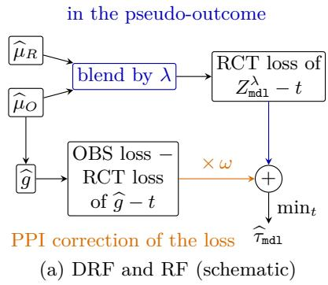

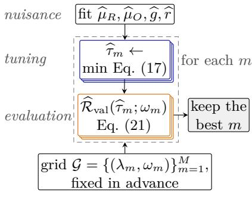  
(b) Algorithm 2 (schematic)

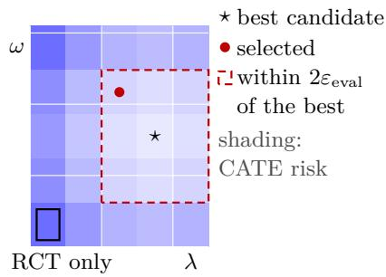  
(c) Validation guarantee (schematic)

Figure 3: CATE fusion with DRF and RF. (a) Where λ and ω enter the loss (Def. 3). (b) Algorithm 2. (c) Thm. 4: shading is the CATE risk; the selected candidate is within $2 \varepsilon _ { \mathrm { e v a l } } ( \alpha )$ of the best (dashed) when $\widehat { r } = r _ { 0 }$  
(ii) ωE<sub>O</sub>[(r − r<sub>0</sub>) ∆h s] along $\widehat { \mu } _ { O } + \varepsilon h ;$   
(iii) $\omega \mathbb { E } _ { O } [ h _ { r } s ( \widehat { g } - t ) ]$ along $\textstyle r + \varepsilon h _ { r } .$   
Thus $\Psi _ { \mathrm { m d 1 } }$ is orthogonal to $\widehat { \mu } _ { R }$ for every r, to $\widehat { \mu } _ { O }$ only at $r = r _ { 0 } $ , and to r only if ${ \widehat { g } } = t .$

This is the orthogonality of the AIPW score and the R loss to their outcome regressions under a known propensity (Chernozhukov et al., 2018; Kennedy, 2023; Nie and Wager, 2021). At $t = \tau _ { 0 }$ ${ \widehat { \boldsymbol { g } } } = t$ requires no unmeasured confounding in the OBS. In practice, we set $r = { \widehat { r } } ,$ fitted on the nuisance samples by the classifier estimator $\widehat { r } _ { \mathrm { C L S } }$ (Sec. 3.2) or the calibrated ratio $\widehat { r } _ { \mathrm { B A L } }$ (Def. 2).

## 4.2. Fitting and Selecting Coeficients

We now select the coeficients. We define a grid $\mathcal { G } = \{ ( \lambda _ { m } , \omega _ { m } ) \} _ { m = 1 } ^ { M } \subseteq [ 0 , 1 ] ^ { 2 }$ , compute for each m the minimizer of the empirical proxy risk in Eq. (17), and choose the $\left( \lambda _ { m } , \omega _ { m } \right)$ whose minimizer has the smallest estimated CATE risk (Def. 4).

We write

$$
\widehat { \tau } _ { \mathtt { m d l } } ( \cdot ; \lambda , \omega ) \in \arg \operatorname* { m i n } _ { t \in \mathcal { T } } \widehat { \mathcal { R } } _ { \mathtt { m d l } } ( t ; \lambda , \omega , \widehat { r } )\tag{20}
$$

for this minimizer, the fitted fusion learner, with ties broken by a fixed rule $( \mathrm { e . g . }$ , the smallest $\mathbb { E } _ { R } [ t ( X ) ^ { 2 } ] )$ .

For grid point m, write $\widehat { \tau } _ { m } \triangleq \widehat { \tau } _ { \mathrm { m d 1 } } ( \cdot ; \lambda _ { m } , \omega _ { m } )$ . We pick the $\widehat { \tau } _ { m }$ with the smallest validation score, defined below.

Definition 4 (Validation score on a finite grid). Let $\mathcal { G } \subseteq [ 0 , 1 ] ^ { 2 }$ be a prespecified finite grid containing (0, 0). For $m = 1 , \ldots , M$ 2

$$
\begin{array} { r } { \widehat { \mathcal { R } } _ { \mathrm { v a l } } ( \widehat { \tau } _ { m } ; \omega _ { m } ) \triangleq \mathbb { P } _ { R , n } [ \{ Z ^ { 0 } - \widehat { \tau } _ { m } ( X ) \} ^ { 2 } ] + \omega _ { m } \mathbb { P } _ { O , N } [ \widehat { r } ( \widehat { g } - \widehat { \tau } _ { m } ) ^ { 2 } ] - \omega _ { m } \mathbb { P } _ { R , n } [ ( \widehat { g } - \widehat { \tau } _ { m } ) ^ { 2 } ] , } \end{array}\tag{21}
$$

and $( \widehat { \lambda } _ { \mathtt { m d l } } , \widehat { \omega } _ { \mathtt { m d l } } ) \triangleq ( \lambda _ { \widehat { m } } , \omega _ { \widehat { m } } )$ with $\begin{array} { r } { \widehat { m } \in \arg \operatorname* { m i n } _ { m } \widehat { \mathcal { R } } _ { \mathrm { v a l } } \big ( \widehat { \tau } _ { m } ; \omega _ { m } \big ) } \end{array}$ . The score depends on $\lambda _ { m }$ through $\widehat { \tau } _ { m } .$ That is, $\widehat { \mathcal { R } } _ { \mathrm { v a l } } ( \widehat { \tau } _ { m } ; \omega _ { m } )$ is the DRF empirical proxy risk of Eq. (17) with $\lambda = 0$ and $r = { \widehat { r } }$ evaluated at $t = \widehat { \tau } _ { m }$ on the evaluation samples.

Since $\widehat { \mathcal { R } } _ { \mathrm { v a l } } ( \widehat { \tau } _ { m } ; \omega _ { m } )$ is the DRF proxy risk $\widehat { \mathcal { R } } _ { \mathrm { D R F } } ( \widehat { \tau } _ { m } ; 0 , \omega _ { m } , \widehat { r } )$ evaluated at a candidate fitted on other samples, Thm. 3 applies with $\lambda = 0$ . When ${ \widehat { r } } = r _ { 0 } ,$ conditional on the fitted objects,

$$
\mathbb { E } [ \widehat { \mathcal { R } } _ { \mathrm { v a l } } ( \widehat { \tau } _ { m } ; \omega _ { m } ) ] = Q _ { \mathrm { D R F } } ( 0 ) + \mathcal { R } _ { 0 } ( \widehat { \tau } _ { m } ) .\tag{22}
$$

The constant $Q _ { \mathrm { D R F } } ( 0 )$ is the same for every m, so the score ranks the candidates by CATE risk. Since $\widehat { \mathcal { R } } _ { \mathrm { v a l } }$ uses finite samples and ${ \widehat { r } } ,$ its minimizer may miss the best candidate; Thm. 4 bounds this loss.

Theorem 4 (Validation guarantee). Suppose $| Z ^ { 0 } | , | { \widehat { g } } |$ , and all $\widehat { \tau } _ { m }$ are bounded by B, and $0 \leq { \widehat { r } } \leq { \bar { r } }$ . Let

$$
\begin{array} { r } { \varrho _ { \mathtt { m d 1 } } ( \lambda , \omega ) \triangleq \omega \mathbb { E } _ { O } [ ( \widehat { r } - r _ { 0 } ) \{ \widehat { g } - \widehat { \tau } _ { \mathtt { m d 1 } } ( \cdot ; \lambda , \omega ) \} ^ { 2 } ] } \end{array}\tag{23}
$$

be the transport error of $\widehat { r }$ in Eq. (21), which is zero when $\widehat { r } = r _ { 0 }$ . Conditional on the nuisance and tuning samples, with probability at least $1 - \alpha$

$$
\mathcal { R } _ { 0 } \{ \widehat { \tau } _ { \mathtt { m d l } } ( \cdot ; \widehat { \lambda } _ { \mathtt { m d l } } , \widehat { \omega } _ { \mathtt { m d l } } ) \} \le \operatorname* { m i n } _ { ( \lambda , \omega ) \in \mathcal { G } } \mathcal { R } _ { 0 } \{ \widehat { \tau } _ { \mathtt { m d l } } ( \cdot ; \lambda , \omega ) \} + 2 \varepsilon _ { \mathtt { e v a l } } ( \alpha ) + 2 \operatorname* { m a x } _ { \mathcal { G } } | \varrho _ { \mathtt { m d l } } | ,\tag{24}
$$

where $M \triangleq | \mathcal G |$ and

$$
\varepsilon _ { \mathrm { e v a l } } ( \alpha ) \triangleq 2 B ^ { 2 } \sqrt { 2 \log ( 4 M / \alpha ) } ( 2 n ^ { - 1 / 2 } + \bar { r } N ^ { - 1 / 2 } ) .\tag{25}
$$

That is, the risk of the selected learner exceeds the smallest risk on the grid by at most a sampling term of order $n ^ { - 1 / 2 } + N ^ { - 1 / 2 }$ and a term from the error in ${ \widehat { r } } .$ Since $( 0 , 0 ) \in { \mathcal { G } }$ , when $\widehat { r } = r _ { 0 }$ the selected learner is at most $2 \varepsilon _ { \mathrm { e v a l } } ( \alpha )$ worse than the RCT-only learner.

## 4.3. Linear Sieves: Risk and Calibration

We now analyze DRF and RF when $\tau$ is a linear sieve (Chen, 2007; Newey, 1997).

Definition 5 (Linear-sieve fusion learner). Let $\zeta : \mathcal { X } \to \mathbb { R } ^ { p }$ be fixed before tuning $( \mathrm { e . g . , s p l i n e s . }$ random features, or a neural network<sup>1</sup>), and $\mathcal { T } _ { \zeta } \triangleq \{ \zeta ^ { \top } \beta : \beta \in \mathbb { R } ^ { p } \}$ . For $\rho \geq 0 , \widehat { \tau } _ { \mathrm { m d 1 } } ( x ; \lambda , \omega ) \triangleq$ $\zeta ( x ) ^ { \top } \widehat { \beta } _ { \mathrm { m d 1 } } ( \lambda , \omega )$ with

$$
\widehat { \beta } _ { \mathtt { m d l } } ( \lambda , \omega ) \in \arg \operatorname* { m i n } _ { \beta } \{ \mathcal { \widehat { R } } _ { \mathtt { m d l } } ( \zeta ^ { \top } \beta ; \lambda , \omega , \widehat { r } ) + \rho \| \beta \| _ { 2 } ^ { 2 } \} .\tag{26}
$$

Let $\Gamma _ { R } \triangleq \mathbb { E } _ { R } [ \zeta \zeta ^ { \top } ]$ , assumed invertible, and $\beta _ { p } \triangleq \Gamma _ { R } ^ { - 1 } \mathbb { E } _ { R } [ \zeta \tau _ { 0 } ]$ . Then

$$
\tau _ { p } ^ { \star } \triangleq \zeta ^ { \top } \beta _ { p } = \arg \operatorname* { m i n } _ { t \in \mathcal { T } _ { \zeta } } \mathcal { R } _ { 0 } ( t )
$$

is the best approximation of $\tau _ { 0 }$ in the sieve class $\tau _ { \zeta }$ of Def. 5. The estimator $\widehat { \beta } _ { \mathrm { m d 1 } }$ has a closed form.

Algorithm 2: DRF and RF   
Input: $D _ { S } ^ { \mathrm { n u i s } } , D _ { S } ^ { \mathrm { t u n e } } , D _ { S } ^ { \mathrm { e v a l } }$ for $S \in \{ R , O \}$ ; class $\tau { ; }$ grid ${ \mathcal { G } } \ni ( 0 , 0 ) ;$ a density-ratio estimator.   
Output: $( \widehat { \lambda } _ { \mathrm { m d 1 } } , \widehat { \omega } _ { \mathrm { m d 1 } } )$ and $\widehat { \tau } _ { \mathrm { m d 1 } } ( \cdot ; \widehat { \lambda } _ { \mathrm { m d 1 } } , \widehat { \omega } _ { \mathrm { m d 1 } } )$   
Fit µb , µb , gb on $D _ { S } ^ { \mathrm { n u i s } }$ , and $\widehat { r }$ by Def. 2   
For each $m ,$ fit $\widehat { \tau } _ { m }$ on $D _ { S } ^ { \mathrm { t u n e } }$ by minimizing Eq. (17)   
For each $m ,$ compute $\widehat { \mathcal { R } } _ { \mathrm { v a l } } ( \widehat { \tau } _ { m } ; \omega _ { m } )$ by $\operatorname { E q . }$ (21) on $D _ { S } ^ { \mathrm { e v a l } }$   
Select $( \widehat { \lambda } _ { \mathrm { m d 1 } } , \widehat { \omega } _ { \mathrm { m d 1 } } )$ by minimizing $\widehat { \mathcal { R } } _ { \mathrm { v a l } }$ over ${ \mathcal { G } } ,$ with deterministic tie-breaking   
Proposition 4 (Normal equation). Let $\widehat { H } _ { \mathtt { m d } 1 } ( \omega ) \triangleq ( 1 - \omega ) \mathbb { P } _ { R } ^ { \mathrm { t u n e } } ( \kappa _ { \mathtt { m d } 1 } \zeta \zeta ^ { \top } ) + \omega \mathbb { P } _ { O } ^ { \mathrm { t u n e } } ( \widehat { r } \zeta \zeta ^ { \top } )$ . If   
$\widehat { H } _ { \mathrm { m d 1 } } ( \omega ) + \rho I$ is invertible, $\widehat { \beta } _ { \mathrm { m d 1 } } ( \lambda , \omega )$ in Def. 5 is the unique solution of the normal equation,   
which sets the gradient of its objective with respect to $\beta$ to zero:   
$\{ \widehat { H } _ { \mathtt { m d l } } ( \omega ) + \rho I \} \beta = \mathbb { P } _ { R } ^ { \mathrm { t u n e } } \{ \kappa _ { \mathtt { m d l } } \zeta ( Z _ { \mathtt { m d l } } ^ { \lambda } - \omega \widehat { g } ) \} + \omega \mathbb { P } _ { O } ^ { \mathrm { t u n e } } ( \widehat { r } \zeta \widehat { g } ) .$ (27)   
Next, we bound how far $\widehat { \beta } _ { \mathrm { m d 1 } }$ is from $\beta _ { p }$ on average.   
Proposition 5 (Bias of $\widehat { \beta } _ { \mathrm { m d 1 } } )$ . Under Assumptions 1–3, fix $( \lambda , \omega , \rho )$ and condition on the fitted   
nuisances, ${ \widehat { r } } ,$ and $\zeta ,$ so that E is over the tuning samples and $o _ { P }$ is over the nuisance samples.   
Let $\bar { H } _ { \rho } \triangleq \Gamma _ { R } + \omega$ im $\zeta \zeta ^ { \top } { } ( \widehat { r } ) + \rho I$ be invertible, and let $\bar { \beta } ( \omega )$ solve Eq. (27) with each average   
$\mathbb { P } _ { S } ^ { \mathrm { t u n e } }$ replaced by its mean $\mathbb { E } _ { S }$ . Let   
$\psi _ { R , \mathrm { m d 1 } } \triangleq \kappa _ { \mathrm { m d 1 } } \zeta \{ Z _ { \mathrm { m d 1 } } ^ { \lambda } - \omega \widehat { g } - ( 1 - \omega ) \zeta ^ { \top } \widehat { \beta } \} ,$   
$\psi _ { O } \triangleq \omega \hat { r } \zeta ( \widehat { g } - \zeta ^ { \top } \bar { \beta } )$   
be the contributions of one RCT and one OBS tuning unit to those equations, and $V _ { \mathrm { m d 1 } } \triangleq$   
$\mathrm { V a r } _ { R } ( \psi _ { R , \mathrm { m d 1 } } ) / n _ { R } + \mathrm { V a r } _ { O } ( \psi _ { O } ) / n _ { O }$ . Suppose the remainder rem $\triangleq \widehat { \beta } _ { \mathrm { m d 1 } } - \bar { \beta } - \bar { H } _ { \rho } ^ { - 1 } ( \mathbb { P } _ { R } ^ { \mathrm { t u n e } } \psi _ { R , \mathrm { m d 1 } } +$   
$\mathbb { P } _ { O } ^ { \mathrm { t u n e } } \psi _ { O } - \rho \bar { \beta } )$ satisfies E∥rem $\Vert _ { \Gamma _ { R } } ^ { 2 } = o _ { P } ( n _ { R } ^ { - 1 } + n _ { O } ^ { - 1 } )$ , where $\| \boldsymbol { v } \| _ { \Gamma _ { R } } ^ { 2 } \triangleq v ^ { \top } \Gamma _ { R } v$ . Then $\mathbb { E } [ \widehat { \beta } _ { \mathrm { m d 1 } } ] =$   
$\bar { \beta } ( \omega ) + o _ { P } ( n _ { R } ^ { - 1 / 2 } + n _ { O } ^ { - 1 / 2 } )$ , and   
$\bar { \beta } ( \omega ) - \beta _ { p } = \bar { H } _ { \rho } ^ { - 1 } \{ \omega \mathbb { E } _ { O } [ ( \hat { \boldsymbol { r } } - \boldsymbol { r } _ { 0 } ) \zeta ( \hat { \boldsymbol { g } } - \boldsymbol { \tau } _ { p } ^ { \star } ) ] - \rho \beta _ { p } \} ,$   
Hence the squared bias bias $( \omega ) \triangleq \Vert \bar { \beta } ( \omega ) - \beta _ { p } \Vert _ { \Gamma _ { R } } ^ { 2 }$ obeys the bound   
bias $\begin{array} { r } { \mathopen { : } ( \omega ) ^ { 1 / 2 } \leq \| \Gamma _ { R } ^ { 1 / 2 } \bar { H } _ { \rho } ^ { - 1 } \| _ { \mathrm { o p } } [ \rho \| \beta _ { p } \| + \omega \{ \mathbb { E } _ { O } ( \hat { r } - r _ { 0 } ) ^ { 2 } \mathbb { E } _ { O } \| \zeta ( \hat { g } - \tau _ { p } ^ { \star } ) \| ^ { 2 } \} ^ { 1 / 2 } ] } \end{array}$   
The $\omega$ term is a product of the ratio error $\widehat { r } - r _ { 0 }$ and the gap $\widehat g - \tau _ { p } ^ { \star }$ of the OBS prediction from   
the best sieve fit, and vanishes when either factor is zero.   
Theorem 5 (Risk of a sieve candidate). Under the conditions of Prop. 5, suppose also that   
$\mathbb { E } [ \mathbf { r e m } ] ^ { \top } \Gamma _ { R } \{ \hat { \beta } ( \omega ) - \beta _ { p } \} = o _ { P } ( n _ { R } ^ { - 1 } + n _ { O } ^ { - 1 } )$ . Then   
$\mathbb { E } [ \mathcal { R } _ { 0 } ( \widehat { \tau } _ { \mathtt { m d } 1 } ) ] = \mathcal { R } _ { 0 } ( \tau _ { p } ^ { \star } ) + \mathtt { b i a s } ( \omega ) + \mathcal { I } _ { \mathtt { m d } 1 } ( \lambda , \omega ) + o _ { P } ( n _ { R } ^ { - 1 } + n _ { O } ^ { - 1 } ) ;$ (28)   
where bias(ω) is from Prop. 5, and   
$\mathcal { T } _ { \mathrm { m d 1 } } ( \lambda , \omega ) \triangleq \mathrm { t r } ( \Gamma _ { R } \bar { H } _ { \rho } ^ { - 1 } V _ { \mathrm { m d 1 } } \bar { H } _ { \rho } ^ { - 1 } )$ (29)   
is the $\Gamma _ { R ^ { - } }$ -norm variance of $\widehat { \beta } _ { \mathrm { m d 1 } }$

Here $\mathcal { R } _ { 0 } ( \tau _ { p } ^ { \star } )$ is the approximation error of the sieve, bias comes from the ratio imbalances and the ridge penalty, and $\mathcal { I } _ { \mathrm { { m d 1 } } }$ is the estimation error. $\mathrm { A t } \ \widehat { r } = r _ { 0 }$ , both imbalances vanish, so only the ridge part bias $= \rho ^ { 2 } \| ( \Gamma _ { R } + \rho I ) ^ { - 1 } \beta _ { p } \| _ { \Gamma _ { R } } ^ { 2 }$ remains.

Def. 2 calibrates $\widehat { r }$ along a chosen feature vector $f ,$ and the right $f$ depends on the target. The next result compares the ATE and the sieve CATE.

Proposition 6 (Calibration for ATE and sieve CATE). Let $\widehat { r }$ satisfy $\operatorname { E q } .$ . (9) on the nuisance   
samples up to the tolerances $\widehat { \delta } _ { k }$ . Then, for each balanced feature $f _ { k }$   
imb $\begin{array} { r } { \operatorname { \Pi } _ { \boldsymbol { f } _ { k } } ( \widehat { \boldsymbol { r } } ) = ( \mathbb { P } _ { R } ^ { \mathrm { n u i s } } - \mathbb { E } _ { R } ) \operatorname { \delta } f _ { k } - ( \mathbb { P } _ { O } ^ { \mathrm { n u i s } } - \mathbb { E } _ { O } ) ( \widehat { \boldsymbol { r } } f _ { k } ) + \boldsymbol { e } _ { k } , \qquad \vert \boldsymbol { e } _ { k } \vert \le \widehat { \delta } _ { k } , } \end{array}$   
and likewise for their linear combinations.   
(i) (ATE) If f contains ${ \widehat { g } } ,$ the AIPWF drift ω im $\gamma _ { \widehat { g } } ( { \widehat { r } } )$ is this nuisance-sampling error, which   
Thm. 2(ii) absorbs into $\widehat { V } _ { \mathrm { c a l } }$   
(ii) (Sieve CATE) If $f$ contains ${ \widehat { g } } ^ { 2 } , \ \zeta { \widehat { g } } ,$ and $\zeta _ { k } \zeta _ { l }$ for all $k \leq l ,$ the $\omega$ term of $\bar { \beta } ( \omega ) - \beta _ { p }$ in   
Prop. 5 and $\varrho _ { \mathrm { m d 1 } }$ for every candidate in $\tau _ { \zeta }$ are linear in these errors, and hence of order   
$n _ { \mathrm { n u i s } } ^ { - 1 / 2 } + N _ { \mathrm { n u i s } } ^ { - 1 / 2 }$ under Assumption 4.

Hence, with a calibrated ${ \widehat { r } } ,$ the ratio part of bias $( \omega )$ in Thm. 5 is of order $n _ { \mathrm { n u i s } } ^ { - 1 } + N _ { \mathrm { n u i s } } ^ { - 1 }$ and no longer depends on how well the base ratio approximates $r _ { 0 } .$ , and the transport error in Thm. 4 is of order $n _ { \mathrm { n u i s } } ^ { - 1 / 2 } + N _ { \mathrm { n u i s } } ^ { - 1 / 2 }$ . The ATE needs one feature, while the sieve CATE needs $1 + p + p ( p + 1 ) / 2$ because the ratio enters the CATE through a p-vector and a $p \times p$ matrix rather than a scalar. For a general class $\tau$ , the ratio enters through $\mathbb { E } _ { O } [ ( \widehat { r } - r _ { 0 } ) s ( \widehat { g } - t ) ]$ for every direction $s \in \mathcal T$ (Prop. 3), which no finite $f$ removes. Exact balance on many features is fragile, so each gap need only be within its standard error $\widehat { \delta } _ { k }$ (Sec. 3.2).

## 5. Experiments

## 5.1. Designs

A latent U confounds the OBS in a synthetic design and two semi-synthetic benchmarks, IHDP (Hill, 2011) and ACIC 2016 (Dorie et al., 2019); the bias has root mean square $1 . 5 \mathrm { s d } _ { R } \{ \tau _ { 0 } ( X ) \}$ in the synthetic design. The benchmarks keep only their real covariates and noiseless surfaces $\mu _ { 0 } , \mu _ { 1 }$ and both samples draw rows of this table. The trial randomizes $A ,$ and the OBS assigns $A$ through X and $U$ , which also enters $\begin{array} { r } { Y = \mu _ { A } ( X ) + U + \varepsilon } \end{array}$ The OBS covariate law equals the trial law $( r _ { 0 } = 1 )$ or tilts it by $\exp \{ a h ( X ) \}$ for a standardized direction h (the first principal component in the benchmarks), so $r _ { 0 } \propto \exp ( - a h )$

Synthetic design. The covariates are $X = l U + 0 . 9 \epsilon _ { X } \in \mathbb { R } ^ { 1 0 }$ with $U \ \sim \ N ( 0 , 1 )$ and $\epsilon _ { X } \sim$ $N ( 0 , I _ { 1 0 } )$ , where l loads U on the first two coordinates with weights ±0.5, so that $\operatorname { V a r } ( U \mid X ) =$ 0.62. The outcome is $Y = m ( X ) + 2 U + A \tau ( X ) + 0 . 7 \varepsilon$ with $\varepsilon \sim N ( 0 , 1 )$ , where m is a fixed combination of linear, sine, quadratic, and pairwise-product terms and τ is a nonlinear function with $\mathbb { E } _ { R ^ { \tau } } ( X ) = 0 . 8$ and $\operatorname { V a r } _ { R } \tau ( X ) = 1 . 4 7$ . The trial sets $A \sim \mathrm { B e r n o u l l i } ( 0 . 3 5 )$ . The OBS sets $A \sim$ Bernoulli $[ \mathrm { c l i p } \{ \mathrm { e x p i t } ( \eta ( X ) + \nu ( X ) U ) , 0 . 0 5 , 0 . 9 5 \} ]$ for a fixed index $\eta ,$ with $\nu ( x ) = \nu _ { 0 } \{ 1 + \eta _ { \mathrm { s t d } } ( x ) \}$ and $\eta _ { \mathrm { s t d } }$ the index standardized over the trial covariates, so the confounding is strongest for units that are likely to be treated. The bias of the OBS contrast is $\delta ( x ) = 2 \{ \mathbb { E } _ { O } [ U \mid A = 1 , X = x ] - \mathbb { E } _ { O } [ U \mid A =$ $0 , X = x ] \}$ , computed by Gauss–Hermite quadrature, and $\nu _ { 0 }$ sets $\{ { \mathbb E } _ { R } \delta ( X ) ^ { 2 } \} ^ { 1 / 2 } = 1 . 5 \mathrm { s d } _ { R } \{ \tau _ { 0 } ( X ) \}$ The bias sweep changes only $\nu _ { 0 }$ so that this root mean square is $0 , 0 . 2 5 , \ldots , 1 . 2 5$ times sd $. \cal { R } \{ \tau _ { 0 } ( X ) \}$ }.

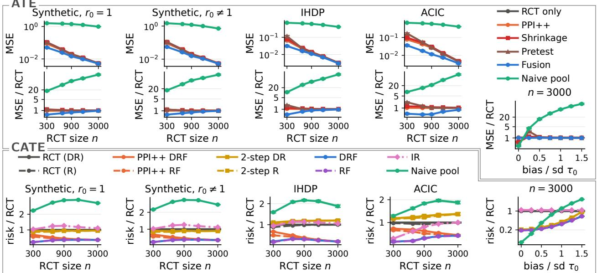  
Figure 4: ATE MSE and its ratio to trial-only AIPW (top); CATE risk ratio to trial-only DR-learner (bottom); 95% bootstrap intervals. Columns 1–4: versus n; synthetic with $r _ { 0 } = 1$ , then synthetic, IHDP, and ACIC 2016 under a covariate shift. Column 5: shifted synthetic at $n = 3 { , } 0 0 0$ , versus confounding $\mathrm { b i a s } / \mathrm { s d } _ { R } \tau _ { 0 } ( X )$ .

Benchmarks. IHDP (Hill, 2011) has 747 units, 25 covariates, and, in the version of Shalit et al. (2017), 100 realizations of its response surfaces. ACIC 2016 (Dorie et al., 2019) has 4,802 units and 58 covariates, three of them categorical and one-hot encoded, and we use its settings 1–10. We discard the treatments and outcomes recorded in both data sets and keep only the covariates and the noiseless surfaces. Both samples draw rows of the covariate table with replacement. The benchmarks are thus finite-population designs. An OBS sample of 15,000 rows contains each IHDP row about 20 times on average and each ACIC row about 3 times, and a trial of $n = 3 , 0 0 0$ contains each IHDP row about 4 times. The CATE risk averages over the rows of the table (Metrics), so it is computed at covariate values that also appear in the OBS sample, and the repeated rows may make the OBS regression more accurate there than it would be at new covariate values. Replication k uses IHDP realization k mod 100 and ACIC setting $( k \mathrm { m o d } 1 0 ) + 1$ The published noiseless surfaces $\mu _ { 0 } , \mu _ { 1 }$ are scaled so that $\operatorname { V a r } _ { R } \mu _ { A } ( X ) = 1$ , and $\begin{array} { r } { Y = \mu _ { A } ( X ) + U + \varepsilon } \end{array}$ with $U , \varepsilon \sim N ( 0 , 1 )$ independent of X. The trial draws rows uniformly and sets A ∼ Bernoulli(0.35). The OBS treatment follows the rule of the synthetic design with η linear in three standardized covariates, and $\nu _ { 0 }$ sets $| \mathbb { E } _ { R } \delta ( X ) | = 0 . 5 0 { \mathrm { s d } } _ { R } ( Y )$ , where $\delta ( x ) = \mathbb { E } _ { O } [ U \mid A = 1 , X = x ] - \mathbb { E } _ { O } [ U \mid A = 0 , X = x ]$

Covariate shift. A shift changes the law of X only, not that of $( U , A , Y )$ given X. In the synthetic design, the OBS covariates have mean $a d$ instead of zero for a fixed direction $d ,$ which is the exponential tilt $\exp ( a d ^ { \top } \Sigma ^ { - 1 } x )$ with $\Sigma \ = \ \operatorname { C o v } ( X )$ In the benchmarks, the OBS draws row i with probability proportional to $\exp ( a h _ { i } )$ , where h is the standardized first principal component of the standardized covariates. Since the trial draws rows uniformly, the density ratio at row i is $r _ { 0 } ( x _ { i } ) = \overline { { e ^ { a h } } } / e ^ { a h _ { i } }$ , where $\overline { { e ^ { a h } } }$ is the average of $e ^ { a h _ { j } }$ over the rows, and $1 / \mathbb { E } _ { O } [ r _ { 0 } ^ { 2 } ] = 1 / ( \overline { { e ^ { a h } } } \overline { { e ^ { - a h } } } )$ In the synthetic design, with $h ( x ) = d ^ { \top } \Sigma ^ { - 1 } x$ and $d ^ { \top } \Sigma ^ { - 1 } d = 1 , r _ { 0 } ( x ) = \exp \{ a ^ { 2 } / 2 - a h ( x ) \}$ and $1 / \mathbb { E } _ { O } [ r _ { 0 } ^ { 2 } ] = e ^ { - a ^ { 2 } }$ . The constant a sets the efective sample fraction $1 / \mathbb { E } _ { O } [ r _ { 0 } ^ { 2 } ]$ to 0.40 (the shift of Fig. 4) or 0.70 (the weak shift of Tables 5 and 6).

## 5.2. Estimators and Metrics

We run Algorithms 1 and 2, cross-fitted by rotating the roles of the three trial samples, for n from 300 to 3,000 with 1,000 replications. We compare with trial-only estimation, $\mathrm { P P I ^ { + + } } \left( \lambda = 0 \right.$ $\widehat B _ { \mathrm { c a l } } \equiv 0 )$ , a naive pool of all rows, Shrinkage (after Rosenman et al., 2023) and Pretest, which pool the trial-only and naive-pool ATEs, the 2-step CATE learner (after Kallus et al., 2018), and a ridge variant of the integrative R-learner (IR) of Wu and Yang (2022).

Samples and estimators. A trial of size n is split into equal nuisance, tuning, and evaluation samples, and the OBS has $N = 1 5 { , } 0 0 0$ rows split $6 0 / 2 0 / 2 0 ;$ Fig. 6 varies N. Every split-based method is cross-fitted: the three trial roles rotate over three equal blocks, each method runs once per rotation, and the three ATE estimates or CATE predictions are averaged. The naive pool instead fits one regression on all trial and OBS rows, and Shrinkage and Pretest combine it with the cross-fitted trial-only estimate. The OBS keeps one split because it is large. Here n and N are the total trial and OBS sizes, so the evaluation sizes in each rotation, written n and N in Secs. 3 and 4, are $n / 3$ and 0.2N. Thm. 2 applies to each rotation. The Wald interval of the averaged ATE uses a first-order standard error of the average: each trial unit contributes its score $Z ^ { \widehat { \lambda } } - { \widehat { \omega } } { \widehat { g } }$ from the rotation that evaluates its block and, with an estimated ratio, the calibration term ${ \widehat { \omega } } { \widehat { g } } ( X )$ from the rotation whose nuisance sample contains it, and the OBS adds the variances of its rotationaveraged evaluation scores and calibration terms ωbrbgb. The same OBS random numbers are used under every covariate law. Both outcome regressions are ridge regressions (penalty 5) of Y on $( f , A , A f )$ , where $f$ standardizes $X , X ^ { 2 }$ , sin $X$ , and the pairwise products of the first six covariates, and their predictions are clipped to the 0.5% to 99.5% range of each arm on the fitting sample. $Z _ { 1 } , \ldots , Z _ { 5 }$ are the first five principal components of the standardized trial nuisance covariates, scaled to unit variance. When $r _ { 0 } = 1$ , we set $\widehat { r } \equiv 1$ (Assumption 3(i)). Under a shift, the base ratio is the classifier ratio of Sec. 3.2 with a logistic regression on $( Z _ { 1 } , \ldots , Z _ { 5 } )$ , calibrated by Def. 2: for the ATE it balances $\widehat g$ exactly, and for the CATE it balances ${ \widehat { g } } ^ { 2 } , \ \zeta { \widehat { g } } .$ , and $\zeta _ { k } \zeta _ { l } \ ( k \leq l )$ within their standard errors $\widehat { \delta } _ { k } \ ( \mathrm { P r o p . \ 6 } )$ . AIPWF uses $\epsilon _ { A } = \epsilon _ { B } = 1 0 ^ { - 3 } \widehat \mathrm { V a r } _ { R } ( Z ^ { 0 } )$ in Eq. (11), and $\mathrm { P P I ^ { + + } }$ fixes $\lambda = 0$ and uses $\widehat { \omega } = \mathrm { P r o j } _ { [ 0 , 1 ] } ( \widehat { \cal D } / \widehat { \cal B } )$ , the rule of Angelopoulos et al. (2026) with our projection, without $\widehat { B } _ { \mathrm { c a l } }$ . Shrinkage weights the naive pool by $\mathrm { s e } _ { R } ^ { 2 } / ( \mathrm { s e } _ { R } ^ { 2 } + \mathrm { g a p } ^ { 2 } )$ , where gap is the diference of the naive-pool and trial-only ATEs and se<sub>R</sub> is the trial-only standard error, and Pretest uses the naive pool when the gap is within 1.96 se . Shrinkage is a single-estimate rule in the spirit of Rosenman et al. (2023), not their Stein-type estimator, which shrinks the stratum estimates jointly. DRF and RF use the sieve $\zeta = ( 1 , Z _ { 1 } , \dots , Z _ { 5 } , \widehat { g } )$ , ridge $\rho = 0 . 0 1$ , and the grid $\{ 0 , 0 . 5 , 1 \} ^ { 2 }$ , with ties broken toward smaller $( \lambda , \omega )$ ; their PPI<sup>++</sup> versions use the grid points with $\lambda = 0 .$ . The trial-only learners use $\widehat { \mu } _ { R }$ and the sieve $( 1 , Z _ { 1 } , \ldots , Z _ { 5 } )$ without ${ \widehat { g } } .$ 2-step fits $\widehat { \boldsymbol { g } } + ( 1 , Z _ { 1 } , \ldots , Z _ { 5 } ) ^ { \top } \boldsymbol { \beta }$ , with $\beta$ a ridge regression of the trial pseudo-outcome minus $\widehat g$ (Kallus et al., 2018). IR (Wu and Yang, 2022) minimizes one $R ^ { - }$ -loss over the trial and OBS rows, in which the OBS rows add a bias function $c ( x )$ to $\tau ( x )$ . It takes $\tau$ in $( 1 , Z _ { 1 } , \ldots , Z _ { 5 } )$ and $c$ in $( 1 , Z _ { 1 } ^ { O } , \ldots , Z _ { 5 } ^ { O } , { \widehat { g } } )$ , where $Z _ { k } ^ { O }$ are the principal components of the OBS nuisance covariates, and uses an OBS propensity from logistic regression.

Table 5: ATE mean squared error relative to trial-only AIPW, by trial size n and covariate law of the OBS: common (r<sub>0</sub>=1), weak shift (efective sample fraction 0.70), and strong shift (0.40, as in Fig. 4).
<table><tr><td></td><td></td><td colspan="3">Synthetic</td><td colspan="3">IHDP</td><td colspan="3">ACIC 2016</td></tr><tr><td>n</td><td>Method</td><td> $r _ { 0 } { = } 1$ </td><td>weak</td><td>strong</td><td> $r _ { 0 } { = } 1$ </td><td>weak</td><td>strong</td><td> $r _ { 0 } { = } 1$ </td><td>weak</td><td>strong</td></tr><tr><td>300</td><td>PPI++</td><td>0.95</td><td>1.01</td><td>1.01</td><td>1.00</td><td>1.04</td><td>1.05</td><td>1.00</td><td>1.02</td><td>1.02</td></tr><tr><td></td><td>Fusion</td><td>0.55</td><td>0.60</td><td>0.60</td><td>0.46</td><td>0.47</td><td>0.48</td><td>0.45</td><td>0.46</td><td>0.47</td></tr><tr><td></td><td>Shrinkage</td><td>1.17</td><td>1.18</td><td>1.18</td><td>1.21</td><td>1.21</td><td>1.22</td><td>1.25</td><td>1.26</td><td>1.26</td></tr><tr><td></td><td>Pretest</td><td>1.17</td><td>1.16</td><td>1.20</td><td>1.71</td><td>1.70</td><td>1.76</td><td>2.07</td><td>2.09</td><td>2.16</td></tr><tr><td></td><td>Naive pool</td><td>17.41</td><td>16.92</td><td>16.24</td><td>11.05</td><td>10.92</td><td>10.69</td><td>9.16</td><td>8.93</td><td>8.56</td></tr><tr><td>900</td><td> $\mathrm { P P I ^ { + + } }$ </td><td>0.97</td><td>1.04</td><td>1.05</td><td>1.00</td><td>1.02</td><td>1.02</td><td>1.00</td><td>1.01</td><td>1.01</td></tr><tr><td></td><td>Fusion</td><td>0.75</td><td>0.79</td><td>0.80</td><td>0.82</td><td>0.84</td><td>0.84</td><td>0.42</td><td>0.42</td><td>0.43</td></tr><tr><td></td><td>Shrinkage</td><td>1.03</td><td>1.03</td><td>1.03</td><td>1.05</td><td>1.05</td><td>1.06</td><td>1.10</td><td>1.11</td><td>1.12</td></tr><tr><td></td><td>Pretest</td><td>1.00</td><td>1.00</td><td>1.00</td><td>1.00</td><td>1.00</td><td>1.00</td><td>1.03</td><td>1.04</td><td>1.02</td></tr><tr><td></td><td>Naive pool</td><td>72.74</td><td>67.82</td><td>61.71</td><td>51.00</td><td>48.97</td><td>45.79</td><td>24.50</td><td>23.25</td><td>21.62</td></tr><tr><td>3,000</td><td> $\mathrm { P P I ^ { + + } }$ </td><td>0.99</td><td>1.06</td><td>1.06</td><td>0.97</td><td>1.04</td><td>1.00</td><td>1.00</td><td>1.02</td><td>1.01</td></tr><tr><td></td><td>Fusion</td><td>0.96</td><td>1.00</td><td>1.00</td><td>0.92</td><td>0.98</td><td>0.96</td><td>0.77</td><td>0.79</td><td>0.79</td></tr><tr><td></td><td>Shrinkage</td><td>1.01</td><td>1.01</td><td>1.01</td><td>1.02</td><td>1.02</td><td>1.02</td><td>1.03</td><td>1.03</td><td>1.04</td></tr><tr><td></td><td>Pretest</td><td>1.00</td><td>1.00</td><td>1.00</td><td>1.00</td><td>1.00</td><td>1.00</td><td>1.00</td><td>1.00</td><td>1.00</td></tr><tr><td></td><td>Naive pool</td><td>184.50</td><td>160.01</td><td>133.47</td><td>163.58</td><td>148.30</td><td>126.35</td><td>113.49</td><td>101.57</td><td>88.22</td></tr></table>

A ridge penalty replaces their SCAD penalty, and the penalty ratio $\lambda _ { \tau } / \lambda _ { c } \in \{ 0 , 0 . 5 , 1 , 1 . 5 \}$ and $\lambda _ { c } \in \{ 1 0 ^ { - 3 } , 1 0 ^ { - 2 } , \dots , 1 0 ^ { 2 } \}$ are chosen by the R-loss of both sources on the evaluation samples instead of cross-validation. The naive pool fits the same outcome regression to all trial and OBS rows, with no source indicator or weight and without clipping.

Metrics. Each cell has 1,000 replications, seeded by the base seed 20261005, the design, the trial size, and the replication index, and no replication failed except 2 of the 10,000 misspecified-shift replications (IHDP, $n = 6 0 0$ and 3,000), whose ratio calibration did not converge and which are left out. The ATE error is the estimate minus $\theta _ { 0 }$ , and the CATE risk is $\mathbb { E } _ { R } \{ \hat { \tau } ( X ) - \tau _ { 0 } ( X ) \} ^ { 2 }$ over 50,000 trial covariate draws (synthetic design) or all rows (benchmarks). The figures and Tables 5 and 6 report ratios of mean errors to the trial-only AIPW estimator or DR-learner; the figures add paired percentile 95% intervals from 2,000 bootstrap resamples of the replications.

## 5.3. Main Results

Fig. 4 shows each error relative to the trial-only estimator on a log scale, so a curve below 1 improves on the trial alone. For the ATE, we compare AIPWF (Fusion) with trial-only AIPW (Robins et al., 1994), $\mathrm { P P I ^ { + + } }$ (Angelopoulos et al., 2026), Shrinkage (after Rosenman et al., 2023), Pretest (Sec. 5.2), and the naive pool. Fusion has the smallest MSE in every design, covariate law, and trial size (columns 1–4). It is also robust to the size of the confounding (column 5): its error stays flat as the bias grows. For the CATE, we compare DRF and RF with the trial-only learners (RCT), their PPI<sup>++</sup> versions, 2-step, IR, and the naive pool (Sec. 5.2). DRF and RF have the smallest risk in every design, covariate law, and trial size. They stay below the trial-only risk at

Table 6: CATE risk relative to the trial-only DR-learner; otherwise as Table 5. RCT (R) is the trial-only R-learner, and IR the integrative R-learner.
<table><tr><td></td><td></td><td colspan="3">Synthetic</td><td colspan="3">IHDP</td><td colspan="3">ACIC 2016</td></tr><tr><td>n</td><td>Method</td><td> $r _ { 0 } { = } 1$ </td><td>weak</td><td>strong</td><td> $r _ { 0 } { = } 1$ </td><td>weak</td><td>strong</td><td> $r _ { 0 } { = } 1$ </td><td>weak</td><td>strong</td></tr><tr><td>300</td><td>DRF</td><td>0.58</td><td>0.59</td><td>0.59</td><td>0.56</td><td>0.57</td><td>0.57</td><td>0.54</td><td>0.54</td><td>0.56</td></tr><tr><td></td><td>RF</td><td>0.58</td><td>0.58</td><td>0.59</td><td>0.56</td><td>0.56</td><td>0.57</td><td>0.53</td><td>0.53</td><td>0.56</td></tr><tr><td></td><td>PPI+⁺ DRF</td><td>0.81</td><td>0.80</td><td>0.81</td><td>0.79</td><td>0.79</td><td>0.79</td><td>0.82</td><td>0.80</td><td>0.83</td></tr><tr><td></td><td>PPI++ RF</td><td>0.74</td><td>0.74</td><td>0.74</td><td>0.70</td><td>0.70</td><td>0.70</td><td>0.78</td><td>0.76</td><td>0.79</td></tr><tr><td></td><td>2-step DR</td><td>0.96</td><td>0.95</td><td>0.94</td><td>1.06</td><td>1.07</td><td>1.08</td><td>1.06</td><td>1.10</td><td>1.14</td></tr><tr><td></td><td>2-step R</td><td>0.92</td><td>0.91</td><td>0.90</td><td>0.99</td><td>0.99</td><td>1.01</td><td>1.04</td><td>1.08</td><td>1.12</td></tr><tr><td></td><td>IR</td><td>1.02</td><td>1.02</td><td>1.02</td><td>0.94</td><td>0.96</td><td>0.96</td><td>0.61</td><td>0.61</td><td>0.61</td></tr><tr><td></td><td>RCT (R)</td><td>0.96</td><td>0.96</td><td>0.96</td><td>0.92</td><td>0.92</td><td>0.92</td><td>0.98</td><td>0.98</td><td>0.98</td></tr><tr><td></td><td>Naive pool</td><td>2.35</td><td>2.30</td><td>2.24</td><td>1.52</td><td>1.52</td><td>1.51</td><td>1.18</td><td>1.21</td><td>1.22</td></tr><tr><td>900</td><td>DRF</td><td>0.64</td><td>0.65</td><td>0.65</td><td>0.60</td><td>0.61</td><td>0.62</td><td>0.58</td><td>0.61</td><td>0.62</td></tr><tr><td></td><td>RF</td><td>0.64</td><td>0.65</td><td>0.65</td><td>0.60</td><td>0.61</td><td>0.62</td><td>0.58</td><td>0.60</td><td>0.62</td></tr><tr><td></td><td>PPI+⁺ DRF</td><td>0.69</td><td>0.69</td><td>0.69</td><td>0.63</td><td>0.64</td><td>0.65</td><td>0.74</td><td>0.76</td><td>0.78</td></tr><tr><td></td><td>PPI++ RF</td><td>0.67</td><td>0.67</td><td>0.68</td><td>0.62</td><td>0.63</td><td>0.64</td><td>0.68</td><td>0.70</td><td>0.72</td></tr><tr><td></td><td>2-step DR</td><td>0.97</td><td>0.95</td><td>0.94</td><td>1.11</td><td>1.12</td><td>1.14</td><td>1.10</td><td>1.16</td><td>1.22</td></tr><tr><td></td><td>2-step R</td><td>0.96</td><td>0.94</td><td>0.93</td><td>1.10</td><td>1.11</td><td>1.13</td><td>1.05</td><td>1.11</td><td>1.17</td></tr><tr><td></td><td>IR</td><td>1.20</td><td>1.20</td><td>1.20</td><td>1.08</td><td>1.09</td><td>1.10</td><td>0.87</td><td>0.87</td><td>0.88</td></tr><tr><td></td><td>RCT (R)</td><td>0.99</td><td>0.99</td><td>0.99</td><td>0.99</td><td>0.99</td><td>0.99</td><td>0.95</td><td>0.95</td><td>0.95</td></tr><tr><td></td><td>Naive pool</td><td>3.72</td><td>3.54</td><td>3.32</td><td>2.38</td><td>2.33</td><td>2.24</td><td>1.80</td><td>1.80</td><td>1.79</td></tr><tr><td>3,000</td><td>DRF</td><td>0.64</td><td>0.64</td><td>0.64</td><td>0.55</td><td>0.56</td><td>0.57</td><td>0.62</td><td>0.65</td><td>0.67</td></tr><tr><td></td><td>RF</td><td>0.64</td><td>0.64</td><td>0.64</td><td>0.55</td><td>0.56</td><td>0.57</td><td>0.62</td><td>0.65</td><td>0.67</td></tr><tr><td></td><td>PPI++ DRF</td><td>0.64</td><td>0.64</td><td>0.64</td><td>0.55</td><td>0.56</td><td>0.57</td><td>0.64</td><td>0.66</td><td>0.68</td></tr><tr><td></td><td> $\mathrm { P P I ^ { + + } \mathrm { ~ R F } }$ </td><td>0.64</td><td>0.64</td><td>0.64</td><td>0.55</td><td>0.56</td><td>0.57</td><td>0.63</td><td>0.66</td><td>0.68</td></tr><tr><td></td><td>2-step DR</td><td>0.97</td><td>0.94</td><td>0.93</td><td>1.11</td><td>1.12</td><td>1.15</td><td>1.15</td><td>1.22</td><td>1.30</td></tr><tr><td></td><td>2-step R</td><td>0.97</td><td>0.94</td><td>0.93</td><td>1.11</td><td>1.12</td><td>1.15</td><td>1.14</td><td>1.22</td><td>1.29</td></tr><tr><td></td><td>IR</td><td>1.08</td><td>1.08</td><td>1.08</td><td>1.02</td><td>1.03</td><td>1.04</td><td>1.00</td><td>1.00</td><td>1.00</td></tr><tr><td></td><td>RCT (R)</td><td>1.00</td><td>1.00</td><td>1.00</td><td>1.00</td><td>1.00</td><td>1.00</td><td>0.99</td><td>0.99</td><td>0.99</td></tr><tr><td></td><td>Naive pool</td><td>3.28</td><td>3.02</td><td>2.73</td><td>2.13</td><td>2.00</td><td>1.84</td><td>1.95</td><td>1.90</td><td>1.84</td></tr></table>

every bias. Tables 5 and 6 give the numbers.

Patterns in Fig. 4. The ATE gap of fusion below 1 is widest at small n and narrows by $n = 3 , 0 0 0$ so the OBS help the ATE most when the trial is small; the CATE ratios of DRF and RF stay between 0.53 and 0.67 at every n. $\mathrm { P P I ^ { + + } }$ stays near 1 for the ATE and approaches DRF and RF for the CATE only at $n = 3 , 0 0 0$ , so the gain of fusion at small n comes from λ. For the ATE, this is the cap in Remark 1: the PPI correction can remove at most the share of efect heterogeneity in the score variance, which is small in these designs: at $r _ { 0 } = 1$ $\mathrm { V a r } _ { R } \{ \tau _ { 0 } ( X ) \} / \mathrm { V a r } _ { R } ( Z ^ { 0 } )$ is 0.02 to 0.10 on the tuning samples. For the CATE, the trial-only learners use the sieve $( 1 , Z _ { 1 } , \ldots , Z _ { 5 } )$ without ${ \widehat { g } } ,$ whereas DRF, RF, and their PPI<sup>++</sup> versions use $( 1 , Z _ { 1 } , \dotsc , Z _ { 5 } , { \widehat { g } } )$ , so the ratios to the trial-only learners combine the fusion loss with the gain from $\widehat g$ as a basis function. The trial loss on the same sieve separates the two (Table 9): at large n the gap comes from $\widehat g$ as a basis function, and at small n mostly from the fusion loss. IR, in contrast, reaches or exceeds the trial-only risk by $n = 3 { , } 0 0 0$ and is below it only on ACIC and on IHDP at $n = 3 0 0$ . IR models the confounding function in a linear class, so the OBS rows inform τ only as far as the OBS bias is close to that class. Its

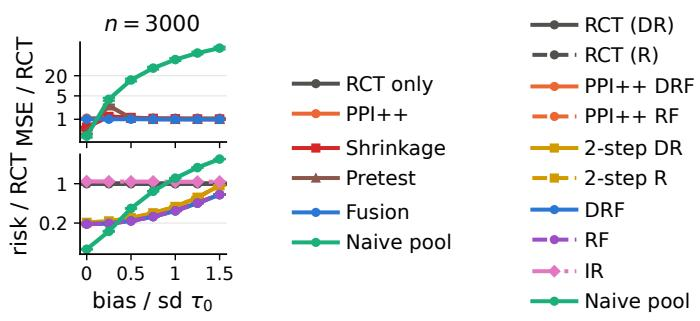

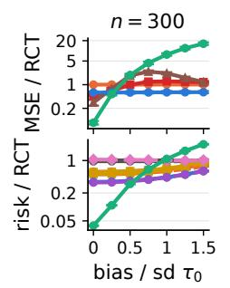

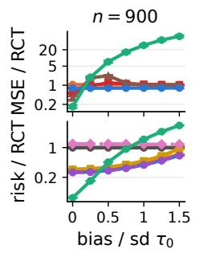

Figure 5: Bias sweep on the synthetic design under the strong shift at $n = 3 0 0 , 9 0 0 .$ and 3,000, against the confounding bias in units of sd $. . { } _ { R } \tau _ { 0 } ( X )$ . Top: ATE MSE relative to trial-only AIPW; bottom: CATE risk relative to the trial-only DR-learner. 95% bootstrap intervals.  
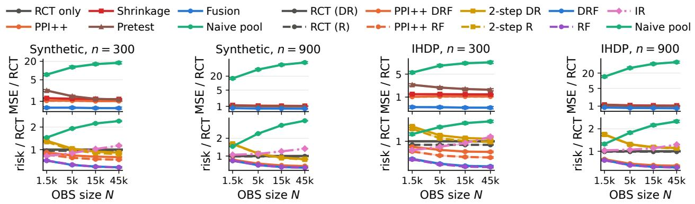  
Figure 6: Efect of the observational sample size N (split 60/20/20) under the covariate shift, for the synthetic design and IHDP at $n = 3 0 0$ and 900. Top: ATE MSE relative to RCT only; bottom: CATE risk relative to the trial-only DR-learner. 95% bootstrap intervals.

CATE class $( 1 , Z _ { 1 } , \ldots , Z _ { 5 } )$ is the sieve of the trial-only learners, which is consistent with its ratio approaching or exceeding 1 as n grows. DRF and RF do not model the confounding function, keep the trial’s target under any OBS confounding (Thm. 3), and use the OBS to reduce variance. The naive pool rises with $n ,$ because its confounding bias stays fixed while the trial-only error shrinks. Shrinkage and Pretest never fall below 1 in columns 1–4.

ATE. Fusion has the smallest ATE MSE in all 45 cells (three designs, three covariate laws, five trial sizes), with 0.40 to 1.00 of the trial-only MSE (Table 5). In the cells of Fig. 4, its ratio is 0.47 to 0.60 at $n = 3 0 0$ and 0.79 to 1.00 at $n = 3 { , } 0 0 0$ $\mathrm { P P I ^ { + + } }$ stays between 0.95 and 1.07, and Shrinkage and Pretest stay between 1.00 and 2.16. The naive pool is worse than the trial alone in every cell, by a factor of 8.6 to 184 in Table 5. Tables 13 and 14 report the bias, spread, and Wald intervals: the coverage of fusion is 0.94 to 0.96, and its intervals are 63% to 99% as wide as the trial-only ones.

CATE. DRF and RF have 0.53 to 0.67 of the trial-only risk in all 45 cells, and they difer from each other by at most 0.01 (Table 6). In the cells of Fig. 4, they have 0.56 to 0.59 at $n = 3 0 0$ DRF or RF has the smallest risk in all 45 cells. The ratio of IR is 0.61 to 1.02 at $n = 3 0 0$ and 1.00 to 1.08 at $n = 3 { , } 0 0 0$ , whereas DRF and RF stay between 0.55 and 0.67 at $n = 3 , 0 0 0 . ~ \mathrm { P P I ^ { + + } }$ approaches DRF and RF only by $n = 3 { , } 0 0 0$ , and 2-step stays between 0.90 and 1.30 in the cells of Fig. 4. The naive pool is worse than the trial alone in every cell.

Table 7: The two channels of fusion. ATE MSE relative to trial-only AIPW of λ only $( \omega = 0 )$ PPI<sup>++</sup> $( \lambda = 0 , \widehat { \omega } = \mathrm { P r o j } _ { [ 0 , 1 ] } ( \widehat { D } / \widehat { B } ) )$ , fusion with ωb of Eq. (11) or with $\widehat { \omega } = \mathrm { P r o j } _ { [ 0 , 1 ] } ( \widehat { D } / \widehat { B } )$
<table><tr><td rowspan="2">n</td><td rowspan="2">Method</td><td colspan="3">Synthetic</td><td colspan="3">IHDP</td><td colspan="3">ACIC 2016</td></tr><tr><td> $r _ { 0 } { = } 1$ </td><td>weak</td><td>strong</td><td> $r _ { 0 } { = } 1$ </td><td>weak</td><td>strong</td><td> $r _ { 0 } { = } 1$ </td><td>weak</td><td>strong</td></tr><tr><td>300</td><td>λ only</td><td>0.60</td><td>0.60</td><td>0.60</td><td>0.47</td><td>0.46</td><td>0.46</td><td>0.46</td><td>0.46</td><td>0.46</td></tr><tr><td></td><td> $\mathrm { P P I ^ { + + } }$ </td><td>0.95</td><td>1.01</td><td>1.01</td><td>1.00</td><td>1.04</td><td>1.05</td><td>1.00</td><td>1.02</td><td>1.02</td></tr><tr><td></td><td>Fusion</td><td>0.55</td><td>0.60</td><td>0.60</td><td>0.46</td><td>0.47</td><td>0.48</td><td>0.45</td><td>0.46</td><td>0.47</td></tr><tr><td></td><td> $\mathrm { F u s i o n } , \widehat { \omega } = \widehat { D } / \widehat { B }$ </td><td>0.55</td><td>0.62</td><td>0.62</td><td>0.46</td><td>0.49</td><td>0.50</td><td>0.45</td><td>0.47</td><td>0.48</td></tr><tr><td>900</td><td> $\lambda \ \mathrm { o n l y }$ </td><td>0.78</td><td>0.78</td><td>0.78</td><td>0.83</td><td>0.84</td><td>0.83</td><td>0.42</td><td>0.42</td><td>0.43</td></tr><tr><td></td><td> $\mathrm { P P I ^ { + + } }$ </td><td>0.97</td><td>1.04</td><td>1.05</td><td>1.00</td><td>1.02</td><td>1.02</td><td>1.00</td><td>1.01</td><td>1.01</td></tr><tr><td></td><td>Fusion</td><td>0.75</td><td>0.79</td><td>0.80</td><td>0.82</td><td>0.84</td><td>0.84</td><td>0.42</td><td>0.42</td><td>0.43</td></tr><tr><td></td><td> $\mathrm { F u s i o n } , \widehat { \omega } = \widehat { D } / \widehat { B }$ </td><td>0.75</td><td>0.82</td><td>0.83</td><td>0.82</td><td>0.86</td><td>0.85</td><td>0.42</td><td>0.43</td><td>0.44</td></tr><tr><td>3,000</td><td> $\lambda \ \mathrm { o n l y }$ </td><td>0.97</td><td>0.97</td><td>0.97</td><td>0.95</td><td>0.96</td><td>0.97</td><td>0.78</td><td>0.77</td><td>0.78</td></tr><tr><td></td><td> $\mathrm { P P I ^ { + + } }$ </td><td>0.99</td><td>1.06</td><td>1.06</td><td>0.97</td><td>1.04</td><td>1.00</td><td>1.00</td><td>1.02</td><td>1.01</td></tr><tr><td></td><td>Fusion</td><td>0.96</td><td>1.00</td><td>1.00</td><td>0.92</td><td>0.98</td><td>0.96</td><td>0.77</td><td>0.79</td><td>0.79</td></tr><tr><td></td><td> $\mathrm { F u s i o n } , \widehat { \omega } = \widehat { D } / \widehat { B }$ </td><td>0.96</td><td>1.04</td><td>1.04</td><td>0.92</td><td>1.01</td><td>0.97</td><td>0.77</td><td>0.80</td><td>0.80</td></tr></table>

## 5.4. Bias and Observational Sample Size

Fig. 5 repeats the bias sweep at $n = 3 0 0$ and 900. The ATE ratio of fusion is flat in the bias at every $n ,$ and at $n = 3 { , } 0 0 0$ the CATE ratio of IR stays between 1.08 and 1.10 at every bias. The naive pool, Shrinkage, and Pretest beat fusion when the OBS are nearly unconfounded. At $n = 3 { , } 0 0 0$ the naive pool falls behind fusion at a bias between 0 and 0.25 (ATE) or between 0.25 and 0.5 (CATE) standard deviations. This threshold decreases as n grows: for the CATE, it lies between 0.5 and 0.75 standard deviations at $n = 3 0 0$ and between 0.25 and 0.5 at $n = 3 { , } 0 0 0$ . In Fig. 6, the ATE ratio of fusion changes little with N, and its CATE ratio falls as N grows. Fig. 7 gives the absolute errors.

## 5.5. Ablations and Further Designs

Two channels. Table 7 separates λ and ω. At $r _ { 0 } = 1 , \widehat { B } _ { \mathrm { c a l } } = 0$ , and fusion is at or below λ only in 14 of 15 cells, for example 0.55 against 0.60 on the synthetic design at $n = 3 0 0$ . Under a shift, λ only is slightly below fusion in 28 of 30 cells, by at most 0.03, so once the ratio is estimated the PPI correction does not help in these designs. The rule $\widehat { \omega } = \mathrm { P r o j } _ { [ 0 , 1 ] } ( \widehat { D } / \widehat { B } )$ , which ignores $\widehat { B } _ { \mathrm { c a l } }$ does worse: Eq. (11) lowers the MSE of fusion by 1% to 4% in all 30 shift cells, and the old rule exceeds the trial-only MSE in three cells at $n = 3 { , } 0 0 0$ (1.01 to 1.04).

Practitioner’s baselines. A practitioner without a tuning sample would use 3-fold cross-fitted trial-only AIPW and DR- and R-learners with the nuisances fitted on two thirds of the trial. This

Table 8: Ratios to the practitioner’s trial-only estimators (3-fold cross-fitting, nuisances fitted on two thirds of the trial, no tuning sample), marked $( 2 / 3 )$ . The rotated trial-only estimators of Tables 5 and 6, whose nuisances use one third, are marked (1/3).
<table><tr><td></td><td></td><td colspan="3">Synthetic</td><td colspan="3">IHDP</td><td colspan="3">ACIC 2016</td></tr><tr><td>n</td><td>Method</td><td> $r _ { 0 } { = } 1$ </td><td>weak</td><td>strong</td><td> $r _ { 0 } { = } 1$ </td><td>weak</td><td>strong</td><td> $r _ { 0 } { = } 1$ </td><td>weak</td><td>strong</td></tr><tr><td>300</td><td>Fusion / trial-only (2/3)</td><td>0.70</td><td>0.76</td><td>0.76</td><td>0.63</td><td>0.64</td><td>0.65</td><td>0.40</td><td>0.41</td><td>0.41</td></tr><tr><td></td><td>Trial-only  $\left( 1 / 3 \right) / \left( 2 / 3 \right)$ </td><td>1.27</td><td>1.27</td><td>1.27</td><td>1.37</td><td>1.37</td><td>1.37</td><td>0.89</td><td>0.89</td><td>0.89</td></tr><tr><td></td><td>DRF / DR (2/3)</td><td>0.67</td><td>0.67</td><td>0.68</td><td>0.67</td><td>0.68</td><td>0.69</td><td>0.56</td><td>0.57</td><td>0.59</td></tr><tr><td></td><td>RF / DR (2/3)</td><td>0.66</td><td>0.67</td><td>0.67</td><td>0.66</td><td>0.67</td><td>0.68</td><td>0.56</td><td>0.56</td><td>0.58</td></tr><tr><td></td><td>RF / R (2/3)</td><td>0.69</td><td>0.70</td><td>0.70</td><td>0.70</td><td>0.70</td><td>0.71</td><td>0.58</td><td>0.58</td><td>0.61</td></tr><tr><td></td><td>DR (1/3) / DR (2/3)</td><td>1.14</td><td>1.14</td><td>1.14</td><td>1.20</td><td>1.20</td><td>1.20</td><td>1.05</td><td>1.05</td><td>1.05</td></tr><tr><td>900</td><td>Fusion / trial-only (2/3)</td><td>0.84</td><td>0.89</td><td>0.90</td><td>0.92</td><td>0.95</td><td>0.94</td><td>0.64</td><td>0.64</td><td>0.66</td></tr><tr><td></td><td>Trial-only (1/3) / (2/3)</td><td>1.12</td><td>1.12</td><td>1.12</td><td>1.12</td><td>1.12</td><td>1.12</td><td>1.52</td><td>1.52</td><td>1.52</td></tr><tr><td></td><td>DRF / DR (2/3)</td><td>0.63</td><td>0.64</td><td>0.64</td><td>0.60</td><td>0.61</td><td>0.62</td><td>0.65</td><td>0.67</td><td>0.69</td></tr><tr><td></td><td>RF / DR (2/3)</td><td>0.63</td><td>0.64</td><td>0.64</td><td>0.60</td><td>0.61</td><td>0.62</td><td>0.64</td><td>0.66</td><td>0.68</td></tr><tr><td></td><td>RF / R (2/3)</td><td>0.64</td><td>0.64</td><td>0.64</td><td>0.60</td><td>0.61</td><td>0.62</td><td>0.67</td><td>0.69</td><td>0.71</td></tr><tr><td></td><td>DR (1/3) / DR (2/3)</td><td>0.99</td><td>0.99</td><td>0.99</td><td>1.00</td><td>1.00</td><td>1.00</td><td>1.11</td><td>1.11</td><td>1.11</td></tr><tr><td>3,000</td><td>Fusion / trial-only (2/3)</td><td>0.97</td><td>1.00</td><td>1.01</td><td>0.95</td><td>1.01</td><td>0.99</td><td>0.90</td><td>0.92</td><td>0.92</td></tr><tr><td></td><td>Trial-only (1/3) / (2/3)</td><td>1.01</td><td>1.01</td><td>1.01</td><td>1.03</td><td>1.03</td><td>1.03</td><td>1.17</td><td>1.17</td><td>1.17</td></tr><tr><td></td><td>DRF / DR (2/3)</td><td>0.61</td><td>0.61</td><td>0.61</td><td>0.54</td><td>0.55</td><td>0.57</td><td>0.63</td><td>0.66</td><td>0.68</td></tr><tr><td></td><td>RF / DR (2/3)</td><td>0.61</td><td>0.61</td><td>0.61</td><td>0.54</td><td>0.55</td><td>0.57</td><td>0.63</td><td>0.66</td><td>0.68</td></tr><tr><td></td><td>RF / R (2/3)</td><td>0.61</td><td>0.61</td><td>0.61</td><td>0.54</td><td>0.55</td><td>0.57</td><td>0.63</td><td>0.66</td><td>0.68</td></tr><tr><td></td><td>DR (1/3) / DR (2/3)</td><td>0.95</td><td>0.95</td><td>0.95</td><td>0.99</td><td>0.99</td><td>0.99</td><td>1.01</td><td>1.01</td><td>1.01</td></tr></table>

Table 9: CATE with the trial loss alone on the sieve with ${ \widehat { g } } \colon$ its risk relative to the trial-only DR-learner, and the risk of DRF and RF relative to it.
<table><tr><td></td><td></td><td colspan="3">Synthetic</td><td colspan="3"> $\mathrm { I H D P }$ </td><td colspan="3">ACIC 2016</td></tr><tr><td>n</td><td>Method</td><td> $r _ { 0 } { = } 1$ </td><td>weak</td><td>strong</td><td> $r _ { 0 } { = } 1$ </td><td>weak</td><td>strong</td><td> $r _ { 0 } { = } 1$ </td><td>weak</td><td>strong</td></tr><tr><td>300</td><td>Trial loss, sieve with ê (DR)</td><td>0.84</td><td>0.83</td><td>0.83</td><td>0.84</td><td>0.84</td><td>0.85</td><td>0.90</td><td>0.92</td><td>0.93</td></tr><tr><td></td><td>Trial loss, sieve with ê (R)</td><td>0.79</td><td>0.78</td><td>0.78</td><td>0.75</td><td>0.76</td><td>0.76</td><td>0.88</td><td>0.90</td><td>0.91</td></tr><tr><td></td><td>DRF / same sieve (DR)</td><td>0.69</td><td>0.70</td><td>0.72</td><td>0.67</td><td>0.68</td><td>0.68</td><td>0.60</td><td>0.59</td><td>0.60</td></tr><tr><td></td><td>RF / same sieve (R)</td><td>0.74</td><td>0.74</td><td>0.76</td><td>0.74</td><td>0.74</td><td>0.74</td><td>0.61</td><td>0.59</td><td>0.61</td></tr><tr><td>900</td><td>Trial loss, sieve with ê (DR)</td><td>0.68</td><td>0.67</td><td>0.67</td><td>0.63</td><td>0.64</td><td>0.65</td><td>0.76</td><td>0.78</td><td>0.79</td></tr><tr><td></td><td>Trial loss, sieve with ġ (R)</td><td>0.67</td><td>0.66</td><td>0.65</td><td>0.62</td><td>0.63</td><td>0.63</td><td>0.70</td><td>0.72</td><td>0.73</td></tr><tr><td></td><td>DRF / same sieve (DR)</td><td>0.94</td><td>0.96</td><td>0.97</td><td>0.95</td><td>0.96</td><td>0.96</td><td>0.77</td><td>0.78</td><td>0.79</td></tr><tr><td></td><td>RF / same sieve (R)</td><td>0.96</td><td>0.98</td><td>1.00</td><td>0.97</td><td>0.97</td><td>0.98</td><td>0.82</td><td>0.84</td><td>0.84</td></tr><tr><td>3,000</td><td>Trial loss, sieve with ê (DR)</td><td>0.64</td><td>0.63</td><td>0.62</td><td>0.55</td><td>0.56</td><td>0.57</td><td>0.64</td><td>0.66</td><td>0.67</td></tr><tr><td></td><td>Trial loss, sieve with ê (R)</td><td>0.64</td><td>0.63</td><td>0.62</td><td>0.55</td><td>0.56</td><td>0.57</td><td>0.63</td><td>0.65</td><td>0.67</td></tr><tr><td></td><td>DRF / same sieve (DR)</td><td>1.00</td><td>1.02</td><td>1.02</td><td>1.00</td><td>1.01</td><td>1.01</td><td>0.98</td><td>0.99</td><td>1.00</td></tr><tr><td>RF /</td><td>/ same sieve (R)</td><td>1.01</td><td>1.02</td><td>1.03</td><td>1.00</td><td>1.01</td><td>1.01</td><td>0.99</td><td>1.00</td><td>1.01</td></tr></table>

Table 10: Misspecified shift (tilt $\exp \{ a ( h ^ { 2 } - 1 ) / \sqrt { 2 } \}$ , efective sample fraction 0.40): fusion with the calibrated ratio $\widehat { r } _ { \mathrm { B A L } }$ and with the uncalibrated logistic ratio $\widehat { r } _ { \mathrm { { C L S } } }$ and $\begin{array} { r l } { \widehat { \omega } } & { { } = } \end{array}$ $\mathrm { P r o j } _ { [ 0 , 1 ] } ( \widehat { \cal D } / \widehat { \cal B } )$ . MSE ratio: relative to RCT only.
<table><tr><td>Design</td><td>n</td><td>Method</td><td>Bias</td><td>SD</td><td>RMSE</td><td>Cov.</td><td>MSE ratio</td></tr><tr><td>Synthetic</td><td>300</td><td>RCT only</td><td>0.007</td><td>0.302</td><td>0.302</td><td>0.95</td><td>1.00</td></tr><tr><td></td><td></td><td>Fusion</td><td>0.002</td><td>0.232</td><td>0.232</td><td>0.94</td><td>0.59</td></tr><tr><td></td><td></td><td>Fusion, uncalibrated  $\scriptstyle { \hat { r } } _ { \mathrm { C L S } }$ </td><td>0.123</td><td>0.233</td><td>0.264</td><td>0.90</td><td>0.76</td></tr><tr><td></td><td>900</td><td>RCT only</td><td>-0.007</td><td>0.139</td><td>0.139</td><td>0.95</td><td>1.00</td></tr><tr><td></td><td></td><td>Fusion</td><td>-0.005</td><td>0.123</td><td>0.123</td><td>0.96</td><td>0.78</td></tr><tr><td></td><td></td><td>Fusion, uncalibrated  $\scriptstyle { \hat { r } } _ { \mathrm { C L S } }$ </td><td>0.105</td><td>0.124</td><td>0.163</td><td>0.87</td><td>1.36</td></tr><tr><td></td><td>3,000</td><td>RCT only</td><td>-0.002</td><td>0.073</td><td>0.073</td><td>0.95</td><td>1.00</td></tr><tr><td></td><td></td><td>Fusion</td><td>-0.002</td><td>0.072</td><td>0.072</td><td>0.95</td><td>0.99</td></tr><tr><td></td><td></td><td>Fusion, uncalibrated  $\scriptstyle { \hat { r } } _ { \mathrm { C L S } }$ </td><td>0.080</td><td>0.074</td><td>0.109</td><td>0.76</td><td>2.24</td></tr><tr><td>IHDP</td><td>300</td><td>RCT only</td><td>-0.007</td><td>0.255</td><td>0.255</td><td>0.96</td><td>1.00</td></tr><tr><td></td><td></td><td>Fusion</td><td>-0.002</td><td>0.177</td><td>0.176</td><td>0.95</td><td>0.48</td></tr><tr><td></td><td></td><td>Fusion, uncalibrated  $\scriptstyle { \hat { r } } _ { \mathrm { C L S } }$ </td><td>-0.032</td><td>0.182</td><td>0.184</td><td>0.94</td><td>0.52</td></tr><tr><td></td><td>900</td><td>RCT only</td><td>-0.003</td><td>0.114</td><td>0.114</td><td>0.96</td><td>1.00</td></tr><tr><td></td><td></td><td>Fusion</td><td>-0.003</td><td>0.105</td><td>0.105</td><td>0.95</td><td>0.84</td></tr><tr><td></td><td></td><td>Fusion, uncalibrated  $\scriptstyle { \hat { r } } _ { \mathrm { C L S } }$ </td><td>-0.030</td><td>0.118</td><td>0.121</td><td>0.91</td><td>1.13</td></tr><tr><td></td><td>3,000</td><td>RCT only</td><td>0.000</td><td>0.056</td><td>0.056</td><td>0.96</td><td>1.00</td></tr><tr><td></td><td></td><td>Fusion</td><td>0.001</td><td>0.055</td><td>0.055</td><td>0.96</td><td>0.97</td></tr><tr><td></td><td></td><td>Fusion, uncalibrated  $\scriptstyle { \hat { r } } _ { \mathrm { C L S } }$ </td><td>-0.019</td><td>0.068</td><td>0.071</td><td>0.88</td><td>1.58</td></tr></table>

AIPW has lower MSE than the rotated trial-only AIPW of Table 5 in 42 of 45 cells (Table 8). Fusion is still below it in 42 of 45 cells; the exceptions are three shift cells at $n = 3 { , } 0 0 0$ , at 1.00 to 1.01. DRF and RF are below the practitioner’s DR- and R-learners in all 45 cells, at 0.54 to 0.71 of their risk.

Same sieve. Table 9 fits the trial loss alone on the sieve $( 1 , Z _ { 1 } , \dotsc , Z _ { 5 } , { \widehat { g } } )$ , the grid point $( \lambda , \omega ) =$ (0, 0) of Algorithm 2. It uses ${ \widehat { g } } ,$ so it is not a trial-only learner. It has 0.75 to 0.93 of the trial-only DR risk at $n = 3 0 0$ and 0.55 to 0.67 at $n = 3 { , } 0 0 0$ . DRF and RF have 0.59 to 0.76 of its risk at $n = 3 0 0$ and 0.98 to 1.03 at $n = 3 { , } 0 0 0$ . Thus at small n most of the gain of DRF and RF over the trial-only learners comes from the fusion loss, and at large n it comes from $\widehat g$ as a basis function.

Misspecified ratio. Table 10 uses a shift that the base ratio cannot represent. On the synthetic design and IHDP, the OBS tilts the trial law by $\exp \{ a ( h ^ { 2 } - 1 ) / \sqrt { 2 } \}$ with $a > 0$ and efective sample fraction 0.40, so the OBS spread more widely along h, while the logistic classifier on $( Z _ { 1 } , \ldots , Z _ { 5 } )$ is log-linear in $h .$ With the uncalibrated $\widehat { r } _ { \mathrm { C L S } } .$ , for which $\widehat { \omega } = \mathrm { P r o j } _ { [ 0 , 1 ] } ( \widehat { D } / \widehat { B } )$ and the standard error omits $\widehat { V } _ { \mathrm { c a l } }$ , fusion is biased (0.08 to 0.12 on the synthetic design and 0.02 to 0.03 on IHDP), its coverage falls to 0.76 to 0.94, and its MSE exceeds the trial-only MSE at $n \geq 9 0 0$ (1.13 to 2.24). With $\widehat { r } _ { \mathrm { B A L } }$ , the absolute bias is at most 0.005, the coverage is 0.94 to 0.96, and the MSE is 0.48 to 0.99 of the trial-only MSE. DRF and RF have 0.52 to 0.62 of the trial-only CATE risk here.

Table 11: Synthetic design with large efect heterogeneity (outcome noise 0.2, Var $\begin{array} { r } { \boldsymbol { \mathscr { R } } ^ { \tau _ { 0 } } ( X ) = 5 . 8 8 . } \end{array}$ confounding bias 0.75 sd $\boldsymbol { R } \pi _ { 0 } ( \boldsymbol { X } ) )$ ), under $r _ { 0 } = 1$ and the strong shift. MSE ratio: relative to RCT only.
<table><tr><td>Law</td><td>n</td><td>Method</td><td>Bias</td><td>SD</td><td>RMSE</td><td> $\operatorname { C o v . }$ </td><td>MSE ratio</td></tr><tr><td> $r _ { 0 } { = } 1$ </td><td>300</td><td>RCT only</td><td>0.008</td><td>0.307</td><td>0.307</td><td>0.96</td><td>1.00</td></tr><tr><td></td><td></td><td> $\mathrm { P P I ^ { + + } }$ </td><td>0.007</td><td>0.281</td><td>0.281</td><td>0.96</td><td>0.84</td></tr><tr><td></td><td></td><td>λ only</td><td>0.013</td><td>0.237</td><td>0.238</td><td>0.95</td><td>0.60</td></tr><tr><td></td><td></td><td>Fusion</td><td>0.012</td><td>0.205</td><td>0.206</td><td>0.95</td><td>0.45</td></tr><tr><td></td><td></td><td>Fusion,  $\widehat { \omega } = \widehat { D } / \widehat { B }$ </td><td>0.012</td><td>0.205</td><td>0.206</td><td>0.95</td><td>0.45</td></tr><tr><td></td><td>900</td><td>RCT only</td><td>0.000</td><td>0.149</td><td>0.149</td><td>0.95</td><td>1.00</td></tr><tr><td></td><td></td><td> $\mathrm { P P I ^ { + + } }$ </td><td>-0.003</td><td>0.136</td><td>0.136</td><td>0.95</td><td>0.83</td></tr><tr><td></td><td></td><td>λ only</td><td>0.000</td><td>0.138</td><td>0.138</td><td>0.95</td><td>0.86</td></tr><tr><td></td><td></td><td>Fusion</td><td>-0.003</td><td>0.122</td><td>0.122</td><td>0.95</td><td>0.67</td></tr><tr><td></td><td></td><td>Fusion,  $\widehat { \omega } = \widehat { D } / \widehat { B }$ </td><td>-0.003</td><td>0.122</td><td>0.122</td><td>0.95</td><td>0.67</td></tr><tr><td></td><td>3,000</td><td>RCT only</td><td>0.002</td><td>0.074</td><td>0.074</td><td>0.95</td><td>1.00</td></tr><tr><td></td><td></td><td> $\mathrm { P P I ^ { + + } }$ </td><td>0.003</td><td>0.072</td><td>0.072</td><td>0.95</td><td>0.93</td></tr><tr><td></td><td></td><td>λ only</td><td>0.002</td><td>0.073</td><td>0.073</td><td>0.96</td><td>0.96</td></tr><tr><td></td><td></td><td>Fusion</td><td>0.003</td><td>0.070</td><td>0.070</td><td>0.95</td><td>0.89</td></tr><tr><td></td><td></td><td>Fusion,  $\widehat { \omega } = \widehat { D } / \widehat { B }$ </td><td>0.003</td><td>0.070</td><td>0.070</td><td>0.95</td><td>0.89</td></tr><tr><td>strong</td><td>300</td><td>RCT only</td><td>0.008</td><td>0.307</td><td>0.307</td><td>0.96</td><td>1.00</td></tr><tr><td></td><td></td><td> $\mathrm { P P I ^ { + + } }$ </td><td>0.008</td><td>0.317</td><td>0.317</td><td>0.96</td><td>1.07</td></tr><tr><td></td><td></td><td>λ only</td><td>0.013</td><td>0.238</td><td>0.238</td><td>0.96</td><td>0.60</td></tr><tr><td></td><td></td><td>Fusion</td><td>0.014</td><td>0.241</td><td>0.241</td><td>0.95</td><td>0.62</td></tr><tr><td></td><td></td><td>Fusion,  $\widehat { \omega } = \widehat { D } / \widehat { B }$ </td><td>0.013</td><td>0.250</td><td>0.250</td><td>0.95</td><td>0.66</td></tr><tr><td></td><td>900</td><td>RCT only</td><td>0.000</td><td>0.149</td><td>0.149</td><td>0.95</td><td>1.00</td></tr><tr><td></td><td></td><td> $\mathrm { P P I ^ { + + } }$ </td><td>-0.004</td><td>0.156</td><td>0.156</td><td>0.96</td><td>1.10</td></tr><tr><td></td><td></td><td>λ only</td><td>0.000</td><td>0.138</td><td>0.138</td><td>0.95</td><td>0.86</td></tr><tr><td></td><td></td><td>Fusion</td><td>-0.001</td><td>0.140</td><td>0.140</td><td>0.95</td><td>0.89</td></tr><tr><td></td><td></td><td>Fusion,  $\widehat { \omega } = \widehat { D } / \widehat { B }$ </td><td>-0.003</td><td>0.147</td><td>0.147</td><td>0.95</td><td>0.97</td></tr><tr><td></td><td>3,000</td><td>RCT only</td><td>0.002</td><td>0.074</td><td>0.074</td><td>0.95</td><td>1.00</td></tr><tr><td></td><td></td><td>PPI+⁺</td><td>0.003</td><td>0.085</td><td>0.085</td><td>0.95</td><td>1.30</td></tr><tr><td></td><td></td><td>λ only</td><td>0.002</td><td>0.073</td><td>0.073</td><td>0.96</td><td>0.96</td></tr><tr><td></td><td></td><td>Fusion</td><td>0.003</td><td>0.077</td><td>0.077</td><td>0.95</td><td>1.06</td></tr><tr><td></td><td></td><td>Fusion,  $\widehat { \omega } = \widehat { D } / \widehat { B }$ </td><td>0.003</td><td>0.083</td><td>0.083</td><td>0.95</td><td>1.26</td></tr></table>

Large heterogeneity. Table 11 changes the synthetic design so that $\omega$ can matter: the outcome noise is 0.2 instead of 0.7, $\operatorname { V a r } _ { R } \tau _ { 0 } ( X ) = 5 . 8 8$ instead of 1.47, and $\nu _ { 0 }$ is unchanged, so the confounding bias is 0.75 sd $\boldsymbol { R } ^ { \tau _ { 0 } ( X ) }$ . The heterogeneity share $\mathrm { V a r } _ { R } \{ \tau _ { 0 } ( X ) \} / \mathrm { V a r } _ { R } ( Z ^ { 0 } )$ rises to 0.20 to 0.33. At $r _ { 0 } = 1$ $\mathrm { P P I ^ { + + } }$ has 0.83 to 0.93 of the trial-only MSE, and fusion improves on λ only at every $n ,$ from 0.60 to 0.45 at $n = 3 0 0$ and from 0.96 to 0.89 at $n = 3 { , } 0 0 0$ . Under the strong shift, PPI<sup>++</sup> is above 1 (1.07 to 1.30), and fusion is above λ only (0.62 against 0.60 at $n = 3 0 0$ , 1.06 against 0.96 at $n = 3 , 0 0 0 )$ . Eq. (11) reduces this loss relative to the rule $\widehat { \omega } = \mathrm { P r o j } _ { [ 0 , 1 ] } ( \widehat { D } / \widehat { B } )$ (0.66 and 1.26) but does not remove it. The coverage of fusion is 0.95 to 0.96 throughout.

## 6. Conclusion

For the ATE, AIPWF has closed-form optimal weights (Thm. 1, Cor. 1.1) and valid Wald intervals with a calibrated ratio (Thm. 2). For the CATE, DRF and RF keep the trial’s CATE risk as their target (Thm. 3), validation selects the weights with a guarantee relative to the RCT-only learner (Thm. 4), and for linear sieves, calibration on finitely many moments controls the ratio error in the risk (Thm. 5, Prop. 6). Fusion has the lowest error in every design and trial size.

## References

A. N. Angelopoulos, S. Bates, C. Fannjiang, M. I. Jordan, and T. Zrnic. Prediction-powered inference. Science, 382(6671):669–674, 2023.

A. N. Angelopoulos, J. C. Duchi, and T. Zrnic. PPI++: Eficient prediction-powered inference. The Annals of Applied Statistics, 20(3):2235–2252, 2026.

A. Asiaee, C. Di Gravio, C. Beck, Y. Mei, S. Pal, and J. D. Huling. Improving precision of RCT-based CATE estimation using data borrowing with double calibration. arXiv preprint arXiv:2306.17478, 2025.

E. Bareinboim and J. Pearl. Causal inference and the data-fusion problem. Proceedings of the National Academy of Sciences, 113(27):7345–7352, 2016.

X. Chen. Large sample sieve estimation of semi-nonparametric models. In J. J. Heckman and E. E. Leamer, editors, Handbook of Econometrics, volume 6B, pages 5549–5632. Elsevier, 2007.

D. Cheng and T. Cai. Adaptive combination of randomized and observational data. arXiv preprint arXiv:2111.15012, 2021.

V. Chernozhukov, D. Chetverikov, M. Demirer, E. Duflo, C. Hansen, W. Newey, and J. Robins. Double/debiased machine learning for treatment and structural parameters. The Econometrics Journal, 21(1):C1–C68, 2018.

V. Chernozhukov, W. K. Newey, and R. Singh. Automatic debiased machine learning of causal and structural efects. Econometrica, 90(3):967–1027, 2022.

B. Colnet, I. Mayer, G. Chen, A. Dieng, R. Li, G. Varoquaux, J.-P. Vert, J. Josse, and S. Yang. Causal inference methods for combining randomized trials and observational studies: a review. Statistical Science, 39(1):165–191, 2024.

P. De Bartolomeis, J. Abad, G. Wang, K. Donhauser, R. M. Duch, F. Yang, and I. J. Dahabreh. Eficient randomized experiments using foundation models. In Advances in Neural Information Processing Systems, volume 38, pages 159470–159509, 2025.

I. Demirel, A. Alaa, A. Philippakis, and D. Sontag. Prediction-powered generalization of causal inferences. In Proceedings of the 41st International Conference on Machine Learning, volume 235 of Proceedings of Machine Learning Research, pages 10385–10408, 2024.

V. Dorie, J. Hill, U. Shalit, M. Scott, and D. Cervone. Automated versus do-it-yourself methods for causal inference: Lessons learned from a data analysis competition. Statistical Science, 34(1): 43–68, 2019.

D. J. Foster and V. Syrgkanis. Orthogonal statistical learning. The Annals of Statistics, 51(3): 879–908, 2023.

J. A. Gagnon-Bartsch, A. C. Sales, E. Wu, A. F. Botelho, J. A. Erickson, L. W. Miratrix, and N. T. Hefernan. Precise unbiased estimation in randomized experiments using auxiliary observational data. Journal of Causal Inference, 11(1):20220011, 2023.

C. Gao, S. Yang, M. Shan, W. Ye, I. Lipkovich, and D. Faries. Improving randomized controlled trial analysis via data-adaptive borrowing. Biometrika, 112(2):asae069, 2025.

J. Gu, C. Tang, H. Yan, Q. Cui, L. Li, and J. Zhou. FAST: A fused and accurate shrinkage tree for heterogeneous treatment efects estimation. In Advances in Neural Information Processing Systems, volume 36, pages 504–522, 2023.

J. Hainmueller. Entropy balancing for causal efects: A multivariate reweighting method to produce balanced samples in observational studies. Political Analysis, 20(1):25–46, 2012.

T. Hatt, J. Berrevoets, A. Curth, S. Feuerriegel, and M. van der Schaar. Combining observational and randomized data for estimating heterogeneous treatment efects. arXiv preprint arXiv:2202.12891, 2022.

J. L. Hill. Bayesian nonparametric modeling for causal inference. Journal of Computational and Graphical Statistics, 20(1):217–240, 2011.

Y. Jung, I. Díaz, J. Tian, and E. Bareinboim. Estimating causal efects identifiable from a combination of observations and experiments. In Advances in Neural Information Processing Systems, volume 36, pages 46446–46490, 2023a.

Y. Jung, J. Tian, and E. Bareinboim. Estimating joint treatment efects by combining multiple experiments. In Proceedings of the 40th International Conference on Machine Learning, volume 202 of Proceedings of Machine Learning Research, pages 15451–15527, 2023b.

Y. Jung, J. Tian, and E. Bareinboim. Unified covariate adjustment for causal inference. In Advances in Neural Information Processing Systems, volume 37, pages 6448–6499, 2024.

N. Kallus, A. M. Puli, and U. Shalit. Removing hidden confounding by experimental grounding. In Advances in Neural Information Processing Systems, volume 31, 2018.

E. H. Kennedy. Towards optimal doubly robust estimation of heterogeneous causal efects. Electronic Journal of Statistics, 17(2):3008–3049, 2023.

D. Lee, S. Yang, and X. Wang. Doubly robust estimators for generalizing treatment efects on survival outcomes from randomized controlled trials to a target population. Journal of Causal Inference, 10(1):415–440, 2022.

D. Lee, S. Yang, L. Dong, X. Wang, D. Zeng, and J. Cai. Improving trial generalizability using observational studies. Biometrics, 79(2):1213–1225, 2023.

X. Li, Y. Li, Q. Cui, L. Li, and J. Zhou. Robust direct learning for causal data fusion. In Proceedings of the 14th Asian Conference on Machine Learning, volume 189 of Proceedings of Machine Learning Research, pages 611–626, 2022.

W. K. Newey. Convergence rates and asymptotic normality for series estimators. Journal of Econometrics, 79(1):147–168, 1997.

X. Nie and S. Wager. Quasi-oracle estimation of heterogeneous treatment efects. Biometrika, 108 (2):299–319, 2021.

J. M. Robins, A. Rotnitzky, and L. P. Zhao. Estimation of regression coeficients when some regressors are not always observed. Journal of the American Statistical Association, 89(427): 846–866, 1994.

E. Rosenman, G. Basse, A. Owen, and M. Baiocchi. Combining observational and experimental datasets using shrinkage estimators. Biometrics, 79(4):2961–2973, 2023.

U. Shalit, F. D. Johansson, and D. Sontag. Estimating individual treatment efect: generalization bounds and algorithms. In Proceedings of the 34th International Conference on Machine Learning, volume 70 of Proceedings of Machine Learning Research, pages 3076–3085, 2017.

X. Shi, Z. Pan, and W. Miao. Data integration in causal inference. WIREs Computational Statistics, 15(1):e1581, 2023.

A. W. van der Vaart. Asymptotic Statistics. Cambridge University Press, 1998.

L. Wu and S. Yang. Integrative R-learner of heterogeneous treatment efects combining experimental and observational studies. In Proceedings of the First Conference on Causal Learning and Reasoning, volume 177 of Proceedings of Machine Learning Research, pages 904–926, 2022.

L. Wu and S. Yang. Transfer learning of individualized treatment rules from experimental to real-world data. Journal of Computational and Graphical Statistics, 32(3):1036–1045, 2023.

S. Yang and P. Ding. Combining multiple observational data sources to estimate causal efects. Journal of the American Statistical Association, 115(531):1540–1554, 2020.

S. Yang, C. Gao, D. Zeng, and X. Wang. Elastic integrative analysis of randomised trial and real-world data for treatment heterogeneity estimation. Journal of the Royal Statistical Society Series B, 85(3):575–596, 2023.

S. Yang, S. Liu, D. Zeng, and X. Wang. Data fusion methods for the heterogeneity of treatment efect and confounding function. Bernoulli, 31(4):2987–3012, 2025.

# Supplement of Prediction-Powered Data Fusion for Treatment Efect Estimation

## A. Proofs

Orthogonality. Sec. 4 states which fitted nuisances enter the first-order condition of a loss. The following two definitions fix the language.

Definition 6 (Gateaux derivative (van der Vaart, 1998, Chapter 20)). Let F be a functional of a function-valued argument η, and let h be a direction such that $\eta + \varepsilon h$ stays in the domain of F for all suficiently small $| \varepsilon |$ . Whenever the limit exists, the Gateaux derivative of F at η in the direction h is

$$
D _ { \eta } F ( \eta ) [ h ] \triangleq \left. \frac { d } { d \varepsilon } F ( \eta + \varepsilon h ) \right| _ { \varepsilon = 0 }\tag{30}
$$

Definition 7 (Learning equation and orthogonality (Chernozhukov et al., 2018; Foster and Syrgkanis, 2023)). Let $L ( t ; \eta )$ be a population loss with a target argument t in a linear class and a nuisance argument $\eta ,$ and let η<sub>0</sub> denote the true nuisance. The learning equation of L is

$$
\Psi ( t ; \eta ) [ s ] \triangleq - \frac 1 2 D _ { t } L ( t ; \eta ) [ s ]\tag{31}
$$

for target directions s in the class. The loss is orthogonal to η if $D _ { \eta } \Psi ( t ^ { \star } ; \eta _ { 0 } ) [ h , s ] = 0$ for every admissible nuisance direction h and every target direction s.

When L is convex in $t ,$ a function $t ^ { \star }$ minimizes $L ( \cdot ; \eta _ { 0 } )$ over the class exactly when $\Psi ( t ^ { \star } ; \eta _ { 0 } ) [ s ] = 0$ for every s in the class, which is why $\Psi$ is called the learning equation.

Lemma 1. Condition on X. Randomization and consistency give ${ \mathbb E } _ { R } [ ( A / e ( X ) ) \{ Y - q ( X , 1 ) \}$ | $X ] = \mathbb { E } _ { R } [ Y ( 1 ) - q ( X , 1 ) \mid X ]$ and the analogous identity for $A = 0$ . Substituting into Eq. (1) cancels q and leaves $\tau _ { 0 } ( X )$ . The same argument with $q = { \widehat { \mu } } _ { \lambda }$ yields $\mathbb { E } _ { R } [ Z ^ { \lambda } \mid X ] = \tau _ { 0 } ( X )$ and $\mathbb { E } _ { R } [ \Delta \mid X ] = 0$

Thm. 1. RCT-validity gives $\mathbb { E } _ { R } [ Z ^ { \lambda } ] = \theta _ { 0 }$ . Exact transport gives $\mathbb { E } _ { O } [ r _ { 0 } \widehat { g } ] = \mathbb { E } _ { R } [ \widehat { g } ]$ . These two identities prove unbiasedness of $\dot { \theta _ { r _ { 0 } } }$ . Replacing $r _ { 0 }$ by $\widetilde { r }$ leaves the drift Eq. (8). Centering gives $\widehat { \theta } _ { r _ { 0 } } - \theta _ { 0 } = ( \mathbb { P } _ { R , n } - P _ { R } ) ( Z ^ { \lambda } - \omega \widehat { g } ) + ( \mathbb { P } _ { O , N } - P _ { O } ) ( \omega r _ { 0 } \widehat { g } )$ . Independence of the evaluation blocks and the usual variance of an empirical mean give $\begin{array} { r } { \mathrm { V a r } \{ \widehat { \theta } _ { r _ { 0 } } ( \lambda , \omega ) \} = \frac { 1 } { n } \mathrm { V a r } _ { R } ( Z ^ { \lambda } - \omega \widehat { g } ) + \frac { \omega ^ { 2 } } { N } \mathrm { V a r } _ { O } ( r _ { 0 } \widehat { g } ) } \end{array}$ substituting $Z ^ { \lambda } = Z ^ { 0 } + \lambda \Delta$ and $\mathrm { C o v } _ { R } ( \Delta , \widehat { g } ) = 0$ gives Eq. (5).

Thm. 1 (minimizer) and Cor. 1.1. Expand Var $_ R ( Z ^ { 0 } + \lambda \Delta - \omega \widehat { g } )$ and use $\mathrm { C o v } _ { R } ( \Delta , \widehat { g } ) = 0$ . The resulting quadratic is separated. The unique critical point when $A , B > 0 \mathrm { i s } \lambda ^ { \star } = - C / A , \omega ^ { \star } = D / B$ Completing the square yields the stated minimum. The identity $D = \operatorname { C o v } _ { R } ( \tau _ { 0 } ( X ) , \widehat { g } ( X ) )$ follows from $\mathbb { E } _ { R } [ Z ^ { 0 } \mid X ] = \tau _ { 0 } ( X )$ . Also, $C = \mathbb { E } _ { R } [ \mathrm { C o v } _ { R } ( Z ^ { 0 } , \Delta \mid X ) ] + \mathrm { C o v } _ { R } \{ \mathbb { E } _ { R } [ Z ^ { 0 } \mid X ] , \mathbb { E } _ { R } [ \Delta \mid X ] \}$ and the second term is zero. If $\widehat { \mu } _ { R }$ equals the trial regression, $Z ^ { 0 } - \tau _ { 0 } ( X ) = \{ A / e ( X ) \} \varepsilon ( 1 ) - \{ ( 1 -$ $A ) / ( 1 - e ( X ) ) \} \varepsilon ( 0 )$ with $\varepsilon ( a ) \triangleq Y - \mu _ { R } ( X , a )$ and $\mathbb { E } _ { R } [ \varepsilon ( a ) \mid A = a , X ] = 0$ , while $\Delta$ is a function of (A, X), so $C = 0$

Table 12: Section-specific notation. Notation used throughout the paper is in Tables 3 and 4.
<table><tr><td>Symbol</td><td>Meaning</td><td>Where</td></tr><tr><td> $S e c . \ 3 \colon { \cal A T E }$ </td><td></td><td></td></tr><tr><td> $A , B , C , D$ </td><td>variance coefficients</td><td>Thm. 1</td></tr><tr><td> $\lambda ^ { \star } , \omega ^ { \star }$ </td><td>oracle coefficients</td><td>Thm. 1</td></tr><tr><td> $\widetilde { V } ( \lambda , \omega )$ </td><td>scaled variance  $n \mathrm { V a r } \{ \widehat { \theta } _ { r _ { 0 } } ( \lambda , \omega ) \}$ </td><td>Cor. 1.1</td></tr><tr><td> $\epsilon _ { A } , \epsilon _ { B }$ </td><td>coefficient thresholds</td><td>Eq. (11)</td></tr><tr><td> $\widehat { A } , \widehat { B } , \widehat { C } , \widehat { D }$ </td><td>tuning-sample estimates of  $A , \ldots , D$ </td><td>Sec. 3.3</td></tr><tr><td> $\psi _ { R } \triangleq \widehat { Z ^ { \lambda } } - \widehat { \omega } \widehat { g } , \psi _ { O } \triangleq \widehat { \omega } \widehat { r } \widehat { g } , \widehat { V }$ </td><td>RCT and OBS terms of  ${ \widehat { \theta } } ;$  variance estimate</td><td>Algorithm 1</td></tr><tr><td> $V _ { n }$ </td><td> $\operatorname { v a r i a n c e } \cot \widehat { \theta }$ </td><td>Thm. 2</td></tr><tr><td> ${ \widehat { r } } _ { \mathrm { R Z } } , { \widehat { r } } _ { \mathrm { C L S } } , { \widehat { r } } _ { \mathrm { B A L } }$ </td><td>Riesz, classifier, and balancing ratio estimates</td><td>Sec. 3.2</td></tr><tr><td> $f , \widehat { \delta } _ { k }$ </td><td>balance features and tolerances</td><td>Def. 2</td></tr><tr><td> $S e c . ~ 4 \colon { \mathit { C A T E } }$ </td><td></td><td>Sec. 4.1</td></tr><tr><td> $\mathcal { R } _ { 0 } ( t )$ </td><td>CATE risk</td><td></td></tr><tr><td> $\mathcal { R } _ { \mathrm { m d 1 } } , \ \widehat { \mathcal { R } } _ { \mathrm { m d 1 } }$ </td><td>RCT loss and fusion loss of learner md1  $\in \{ \mathrm { D R F } , \mathrm { R F } \}$ </td><td>Sec. 4.1, Def. 3</td></tr><tr><td> $\kappa _ { \mathrm { m d 1 } } , ~ Z _ { \mathrm { m d 1 } } ^ { \lambda } , ~ m _ { \lambda }$ </td><td>weight, pseudo-outcome, marginal regression</td><td>Def. 3</td></tr><tr><td> $Q _ { \mathrm { m d 1 } } ( \lambda )$ </td><td>noise floor</td><td>Thm. 3</td></tr><tr><td> $\Psi _ { \mathrm { m d 1 } }$ </td><td>population learning equation</td><td>Prop. 3</td></tr><tr><td> $\mathcal { G } , \ \widehat { \mathcal { R } } _ { \mathrm { v a l } }$ </td><td>candidate grid and validation score</td><td>Def. 4</td></tr><tr><td> $\varepsilon _ { \mathrm { e v a l } } ( \alpha ) , ~ \varrho _ { \mathrm { m d 1 } }$ </td><td>evaluation error and transport error</td><td>Thm. 4</td></tr><tr><td> $\zeta , \ T _ { \zeta } , \ \hat { \beta } _ { \mathrm { { m d 1 } } }$ </td><td>sieve features, class, and coefficients</td><td>Def. 5</td></tr><tr><td> $\tau _ { p } ^ { \star } , \ T _ { \mathrm { m d 1 } }$ </td><td>projection of  $\tau _ { 0 }$  and first-order variance</td><td>Thm. 5</td></tr></table>

Prop. 1. Under Assumption 2, the evaluation samples are independent of $\widehat { \mu } _ { R }$ and $\widehat { \mu } _ { O }$ , so $Z ^ { \lambda }$ and $\widehat g$ are fixed functions given the fits, and $\widetilde { r }$ is fixed. Taking the mean of each sample average in Eq. (2) gives $\mathbb { E } [ \widehat { \theta } _ { \widetilde { r } } ( \lambda , \omega ) ] = \mathbb { E } _ { R } [ Z ^ { \lambda } ] + \omega \{ \mathbb { E } _ { O } [ \widehat { r } \widehat { g } ] - \mathbb { E } _ { R } [ \widehat { g } ] \}$ . Lemma 1 with $q = { \widehat { \mu } } _ { \lambda }$ gives $\mathbb { E } _ { R } [ Z ^ { \lambda } ] =$ $\mathbb { E } _ { R } [ \tau _ { 0 } ( X ) ] = \theta _ { 0 }$ , and the braces equal $\operatorname { i m b } _ { a } ( \widetilde { r } )$ by definition, which proves Eq. (8). The second form of the imbalance, $\mathbb { E } _ { O } [ \widetilde { r } f ] - \mathbb { E } _ { R } [ f ] = \mathbb { E } _ { O } [ ( \widetilde { \vec { r } } - r _ { 0 } ) f ]$ , is Prop. 2(i) with $h = f$

Prop. 2. (i) Under Assumption 3(ii), $r _ { 0 } = d P _ { R } ^ { X } / d P _ { O } ^ { X }$ exists, and the Radon–Nikodym theorem gives $\mathbb { E } _ { O } [ r _ { 0 } \mathbf { 1 } _ { B } ] = P _ { R } ^ { X } ( B ) = \mathbb { E } _ { R } [ \mathbf { 1 } _ { B } ]$ for every measurable $B \subseteq { \mathcal { X } }$ . Linearity extends this identity to simple functions, and monotone convergence extends it to every nonnegative measurable h. For $h \in L ^ { 1 } ( P _ { R } ^ { X } )$ , applying it to $h ^ { + }$ and $h ^ { - }$ shows that both parts are finite, so $r _ { 0 } h \in L ^ { 1 } ( P _ { O } ^ { X } )$ and $\mathbb { E } _ { O } [ r _ { 0 } h ] = \mathbb { E } _ { R } [ h ]$ . For uniqueness, let $w \in L ^ { 1 } ( P _ { O } ^ { X } )$ satisfy $\mathbb { E } _ { O } [ w h ] = \mathbb { E } _ { R } [ h ]$ for every bounded $h .$ With $B \triangleq \{ w > r _ { 0 } \}$ and $h = \mathbf { 1 } _ { B }$ , the hypothesis and the identity just shown give $\mathbb { E } _ { O } [ ( w - r _ { 0 } ) \mathbf { 1 } _ { B } ] =$ $P _ { R } ^ { X } ( B ) - \bar { P _ { R } ^ { X } } ( B ) \bar { = } 0$ . The integrand is nonnegative and is positive on $B _ { : }$ so $P _ { O } ^ { X } ( B ) = 0$ . The same argument with $B = \{ w < r _ { 0 } \}$ gives $w = r _ { 0 } ~ P _ { O } ^ { X } \mathrm { - a . s }$

(ii) Let $a \ \in \ L ^ { 2 } ( P _ { O } ^ { X } )$ . By part (i) applied to $| a |$ and the Cauchy–Schwarz inequality, $\mathbb { E } _ { R } | a | \ =$ $\mathbb { E } _ { O } [ r _ { 0 } | a | ] \le \{ \mathbb { E } _ { O } [ r _ { 0 } ^ { 2 } ] \mathbb { E } _ { O } [ a ^ { 2 } ] \} ^ { 1 / 2 } < \infty$ , so part (i) applies to $h = a$ and gives $\mathbb { E } _ { R } [ a ] = \mathbb { E } _ { O } [ r _ { 0 } a ]$ . Hence $\mathbb { E } _ { O } [ a ^ { 2 } ] - 2 \mathbb { E } _ { R } [ a ] = \mathbb { E } _ { O } [ ( a - r _ { 0 } ) ^ { 2 } ] - \mathbb { E } _ { O } [ r _ { 0 } ^ { 2 } ]$ . The last term does not depend on $a ,$ , and the first is zero only when $a = r _ { 0 } ~ P _ { O } ^ { X } \mathrm { - a . s . }$ ., so $r _ { 0 }$ is the unique minimizer over $L ^ { 2 } ( P _ { O } ^ { X } )$ ).

Thm. 2. Condition on the fitted and selected objects. Unbiased sample variances on the two independent evaluation blocks prove $\mathbb { E } [ \widehat { V } ] = \operatorname { V a r } ( \widehat { \theta } _ { r } )$ for any fixed $r .$ The studentized limit is a two-sample triangular-array CLT under the $( 2 + \eta )$ -moment (Lyapunov) condition of Assumption 4, plus Slutsky using $\widehat { V } / V _ { n } \to _ { p }$ 1. Variance unbiasedness is not a CLT.

Estimated ratio. Write $\widehat { r g } = r _ { 0 } \widehat { g } + ( \widehat { r } - r _ { 0 } ) \widehat { g }$ on the OBS tuning sample to see that $\widehat { r }$ changes $\widehat { B }$ only. On evaluation, $\widehat { \theta } _ { \widehat { r } } - \widehat { \theta } _ { r _ { 0 } } = \widehat { \omega } \mathbb { P } _ { O , N } \{ ( \widehat { r } - r _ { 0 } ) \widehat { g } \}$ . The conditional mean is $\theta _ { 0 } + \widehat { \omega } \{ \mathbb { E } _ { O } [ \widehat { r g } ] - \mathbb { E } _ { R } [ \widehat { g } ] \} =$ $\theta _ { 0 } + \widehat { \omega } \mathrm { i m b } _ { \widehat { g } } ( \widehat { r } )$ , and $\mathbb { E } _ { R } [ \widehat { g } ] = \mathbb { E } _ { O } [ r _ { 0 } \widehat { g } ]$ gives $\operatorname { i m b } _ { \hat { q } } ( \widehat { r } ) = \mathbb { E } _ { O } [ ( \widehat { r } - r _ { 0 } ) \widehat { g } ]$

Calibration noise (Thm. ${ \it 2 ( i i ) }$ . Under Assumption 4, calibration with $\widehat g$ among the features gives $\mathbb { P } _ { O } ^ { \mathrm { n u i s } } ( \widehat { r } \widehat { g } ) = \mathbb { P } _ { R } ^ { \mathrm { n u i s } } ( \widehat { g } )$ , so $\mathsf { i m } \mathsf { b } _ { \widehat { q } } ( \widehat { r } ) = ( \mathbb { P } _ { R } ^ { \mathrm { n u i s } } - \mathbb { E } _ { R } ) \widehat { g } - ( \mathbb { P } _ { O } ^ { \mathrm { n u i s } } - \mathbb { E } _ { O } ) ( \widehat { r g } )$ . Since $\widehat g$ is fitted on $D _ { O } ^ { \mathrm { n u i s } }$ , the first term is, given $D _ { O } ^ { \mathrm { n u i s } }$ , an average of $n _ { \mathrm { n u i s } }$ independent centered terms, and ${ \widehat { g } } \to { \bar { g } }$ replaces it by $( \mathbb { P } _ { R } ^ { \mathrm { n u i s } } - \mathbb { E } _ { R } ) \bar { g }$ up to $\dot { o } _ { p } ( n _ { \mathrm { n u i s } } ^ { - 1 / 2 } )$ . The second term is linearized by assumption. Because $\mathrm { i m } { \sf b } _ { \widehat { g } } ( \widehat { r } ) =$ $O _ { p } ( n ^ { - 1 / 2 } ) , ( \widehat { \omega } - \bar { \omega } ) \mathrm { i m } \mathbf { b } _ { \widehat { q } } ( \widehat { r } ) = o _ { p } ( n ^ { - 1 / 2 } )$ . Hence $\widehat { \theta } - \theta _ { 0 }$ equals, up to $o _ { p } ( n ^ { - 1 / 2 } )$ , a sum of four centered averages over the independent samples $D _ { R } ^ { \mathrm { e v a l } } , D _ { O } ^ { \mathrm { e v a l } } , D _ { R } ^ { \mathrm { n u i s } }$ , and $D _ { O } ^ { \mathrm { n u i s } }$ , with total variance $V _ { n } + V _ { \mathrm { c a l } }$ to first order. The Lyapunov central limit theorem and Slutsky’s lemma give the coverage. Under Assumption 3(i) with $\widehat { r } \equiv 1 , \mathrm { i m b } _ { \widehat { q } } ( \widehat { r } ) = 0$ exactly and $\widehat V _ { \mathrm { c a l } } = 0$

Thm. 3. The cross term in $\mathbb { E } _ { R } [ \{ ( Z ^ { \lambda } - \tau _ { 0 } ) + ( \tau _ { 0 } - t ) \} ^ { 2 } ]$ vanishes by $\mathbb { E } _ { R } [ Z ^ { \lambda } - \tau _ { 0 } \ | \ X ] = 0 \mathrm { ~ }$ , so $\mathcal { R } _ { \mathrm { D R F } } = Q _ { \mathrm { D R F } } ( \lambda ) + \mathcal { R } _ { 0 } ( t )$ . For the R loss, write $Y - m _ { \lambda } - ( A - e ) t = U + ( A - e ) ( \tau _ { 0 } - t )$ with $U \triangleq$ $Y - m _ { \lambda } - ( A - e ) \tau _ { 0 } ;$ randomization gives E $ \boldsymbol { \mathscr { R } } [ U ( A - e ) \mid X ] = 0$ . For the ω terms, E<sub>R</sub>[κ<sub>mdl</sub> $| \ X ] = 1$ and $\mathbb { E } _ { O } [ r _ { 0 } h ] = \mathbb { E } _ { R } [ h ]$ give ${ \mathbb E } \{ { \mathbb P } _ { O } ^ { \mathrm { t u n e } } [ r ( \widehat { g } - t ) ^ { 2 } ] - \operatorname { \bar { P } } _ { R } ^ { \mathrm { t u n e } } [ \kappa _ { \mathrm { m d 1 } } ( \widehat { \bar { g } } - t ) ^ { 2 } ] \} = { \mathbb E } _ { O } [ ( r - r _ { 0 } ) ( \widehat { g } - t ) ^ { 2 } ]$ , which is zero at $r = r _ { 0 }$

Prop. 3. Fix the fitted regressions and r. Under Assumption 2, the tuning averages in $\operatorname { E q . } \left( 1 7 \right)$ are independent of the fits, so $\begin{array} { r } { \mathbb { E } [ \widehat { \mathcal { R } } _ { \mathrm { m d l } } ( t ; \lambda , \omega , r ) ] = \mathbb { E } _ { R } [ \kappa _ { \mathrm { m d 1 } } \{ Z _ { \mathrm { m d 1 } } ^ { \lambda } - t \} ^ { 2 } ] + \omega \mathbb { E } _ { O } [ r ( \widehat { g } - t ) ^ { 2 } ] - \omega \mathbb { E } _ { R } [ \kappa _ { \mathrm { m d 1 } } ( \widehat { g } - r ) ] . } \end{array}$ $t ) ^ { 2 } ]$ . Along $t + \varepsilon s$ this is a quadratic in ε, and Definition 6 gives

$$
\Psi _ { \mathrm { m d 1 } } ( t ) [ s ] = \mathbb { E } _ { R } \big [ \kappa _ { \mathrm { m d 1 } } \{ Z _ { \mathrm { m d 1 } } ^ { \lambda } - t \} s \big ] + \omega \mathbb { E } _ { O } \big [ r ( \widehat { g } - t ) s \big ] - \omega \mathbb { E } _ { R } \big [ \kappa _ { \mathrm { m d 1 } } ( \widehat { g } - t ) s \big ] .
$$

Each perturbation below changes $\Psi _ { \mathrm { m d 1 } } ( t ) [ s ]$ afinely in $\varepsilon ,$ so its derivative at $\varepsilon = 0$ is the coeficient of ε. Since $e ( X ) = P _ { R } ( A = 1 \mid X )$ , we have $\mathbb { E } _ { R } [ A - e \mid X ] = 0$ and ${ \mathbb { E } } _ { R } [ ( A - e ) ^ { 2 } \mid X ] = e ( 1 - e )$ , so $\mathbb { E } _ { R } [ \kappa _ { \mathrm { m d 1 } } \mid X ] = 1$ for both learners.

(i) Along $\widehat { \mu } _ { R } + \varepsilon h$ , only $Z _ { \mathrm { m d 1 } } ^ { \lambda }$ changes, through $\widehat { \mu } _ { \lambda } + \varepsilon ( 1 - \lambda ) h$ . For DRF, the score in Eq. (1) is afine in q, and the coeficient of $\varepsilon$ in $Z ^ { \lambda }$ is $( 1 - \lambda ) [ h ( X , 1 ) \{ 1 - A / e \} - h ( X , 0 ) \{ 1 - ( 1 - A ) / ( 1 - e ) \} ]$ whose conditional mean given X is zero. For RF, $\kappa _ { \mathrm { R F } } Z _ { \mathrm { R F } } ^ { \lambda } = ( A - e ) ( Y - m _ { \lambda } ) / \{ e ( 1 - e ) \}$ , and $m _ { \lambda }$ changes by $\varepsilon ( 1 - \lambda ) \{ e h ( X , 1 ) + ( 1 - e ) h ( X , 0 ) \}$ , so the coeficient of $\varepsilon \mathrm { ~ i s ~ } { - } ( 1 - \lambda ) ( A - e ) \{ e h ( X , 1 ) + \nonumber$ $( 1 - e ) h ( X , 0 ) \} / \{ e ( 1 - e ) \}$ , whose conditional mean given X is also zero. Since s is a function of $X$ , the derivative is 0 for every r.

(ii) Along $\widehat { \mu } _ { O } + \varepsilon h , \widehat { \mu } _ { \lambda }$ changes by $\varepsilon \lambda h$ and $\widehat g$ by $\varepsilon \Delta h$ . The first change contributes zero by the argument of part (i) with λ in place of 1−λ. The second contributes $\omega \mathbb { E } _ { O } [ r \Delta h s ] - \omega \mathbb { E } _ { R } [ \kappa _ { \mathrm { m a l } } \Delta h s ] =$ $\omega \{ \mathbb { E } _ { O } [ r \Delta h s ] - \mathbb { E } _ { R } [ \Delta h s ] \}$ , because $\mathbb { E } _ { R } [ \kappa _ { \mathrm { m d 1 } } \ | \ X ] = 1$ . Prop. 2(i) with h replaced by $\Delta h \boldsymbol { s }$ gives $\mathbb { E } _ { R } [ \Delta h \ : s ] = \mathbb { E } _ { O } [ r _ { 0 } \Delta h \ : s ]$ , so the derivative is $\omega \mathbb { E } _ { O } [ ( r - r _ { 0 } ) \Delta h s ]$

(iii) Along $r + \varepsilon h _ { r }$ , only the OBS term changes, and the derivative is $\omega \mathbb { E } _ { O } [ h _ { r } s ( \widehat { g } - t ) ]$

Hence the derivative in (i) is zero for every r, the derivative in (ii) is zero for all h and s when $r = r _ { 0 }$ , and the derivative in (iii) is zero for all $h _ { r }$ when $\widehat { g } = t \ P _ { O } ^ { X } \mathrm { - a . s }$ . For the converse statements, let $\omega \neq 0$ , and let $\tau$ contain the constant function 1 and a function that is not $P _ { O } ^ { X } \mathrm { - a . s }$ . constant. $\mathrm { ~ I f ~ } r \ne r _ { 0 }$ on a set of positive $P _ { O } ^ { X }$ -probability, then $h ( x , 1 ) = \mathrm { s i g n } \{ r ( x ) - r _ { 0 } ( x ) \} , \ : h ( x , 0 ) = 0 \nonumber$ , and $s = 1$ give $\omega \mathbb { E } _ { O } | \boldsymbol { r } - \boldsymbol { r } _ { 0 } | \neq 0$ in (ii). In (iii), take $h _ { r } = \mathbf { 1 } _ { B } - { \cal P } _ { O } ^ { X } ( B )$ for measurable $B \subseteq { \mathcal { X } }$ . A zero derivative for every such h<sub>r</sub> gives $\mathbb { E } _ { O } [ \{ W - \mathbb { E } _ { O } W \} \mathbf { 1 } _ { B } ] = 0$ for every $B ,$ with $W \triangleq s ( \widehat { g } - t )$ , so W is $P _ { O } ^ { X } \mathrm { - a . s }$ . constant. With $s = 1 , \widehat { g } - t = c$ for a constant $^ { c , }$ and with the non-constant s, c s is constant only if $c = 0$ . Thus orthogonality to r forces $\widehat { g } = t \ P _ { O } ^ { X } \mathrm { - a . s }$

Thm. 4. Condition on fitted objects. The validation score has mean $Q _ { \mathrm { D R F } } ( 0 ) + \mathcal { R } _ { 0 } ( \widehat { \tau } _ { \mathrm { m d 1 } } ) + \omega \mathbb { E } _ { O } [ ( \widehat { r } -$ $r _ { 0 } ) ( \widehat { g } - \widehat { \tau } _ { \mathtt { m d l } } ) ^ { 2 } ]$ . Hoefding on the M bounded RCT and OBS averages, with a union bound, yields the uniform deviation $\varepsilon _ { \mathrm { e v a l } } ( \alpha )$ . For $\omega \in [ 0 , 1 ]$ , each RCT summand $\{ Z ^ { 0 } - { \widehat { \tau } } _ { \mathrm { m d 1 } } \} ^ { 2 } - \omega G$ lies in an interval of length $8 B ^ { 2 }$ and each OBS summand $\omega r G$ in an interval of length $4 \bar { r } B ^ { 2 }$ . A two-sided Hoefding bound with failure probability $\alpha / ( 2 M )$ for each of the 2M averages gives the RCT term $2 B ^ { 2 } \sqrt { 2 \log ( 4 M / \alpha ) }$ 2n<sup>−</sup> $- 1 / 2$ and the OBS term $2 \hat { B } ^ { 2 } \sqrt { 2 \log ( 4 M / \alpha ) } \hat { r } N ^ { - 1 / 2 }$ . The selected pair then lies within $2 \varepsilon _ { \mathrm { e v a l } } ( \alpha )$ plus twice the largest transport error of the best grid risk, which is at most the (0, 0) risk.

Details for Sec. 4.3. Best sieve approximation. Since $\mathbb { E } _ { R } [ \zeta ( \tau _ { 0 } - \zeta ^ { \top } \beta _ { p } ) ] ~ = ~ 0 , ~ \mathcal { R } _ { 0 } ( \zeta ^ { \top } \beta ) ~ =$ $\begin{array} { r } { \mathbb { E } _ { R } [ \{ \zeta ^ { \top } ( \beta - \beta _ { p } ) + ( \tau _ { p } ^ { \star } - \tau _ { 0 } ) \} ^ { 2 } ] ~ = ~ \| \beta - \beta _ { p } \| _ { \Gamma _ { R } } ^ { 2 } + \mathcal { R } _ { 0 } ( \tau _ { p } ^ { \star } ) } \end{array}$ , which is minimized at $\beta ~ = ~ \beta _ { p }$ Let $\Gamma _ { R } \triangleq \mathbb { E } _ { R } [ \zeta \zeta ^ { \top } ] \ \succ \ 0$ and $\beta _ { p } \ \triangleq \ \Gamma _ { R } ^ { - 1 } \mathbb { E } _ { R } [ \zeta \tau ( X ) ]$ , so $\begin{array} { r } { \tau _ { p } ^ { \star } \ = \ \zeta ^ { \top } \beta _ { p } } \end{array}$ Since $\widehat { \mathcal { R } } _ { \mathrm { m d 1 } } ( \zeta ^ { \top } \beta ; \lambda , \omega , \widehat { r } )$ is quadratic in $\beta$ with Hessian $2 \widehat { H } _ { \mathrm { m d 1 } } ( \omega ) ~ \succeq ~ 0$ , every minimizer solves the normal equations $\{ \widehat { H } _ { \mathtt { m d l } } ( \omega ) + \rho I \} \beta = \mathbb { P } _ { R } ^ { \mathrm { t u n e } } \{ \kappa _ { \mathtt { m d l } } \zeta ( Z _ { \mathtt { m d l } } ^ { \lambda } - \omega \widehat { g } ) \} + \omega \mathbb { P } _ { O } ^ { \mathrm { t u n e } } ( \widehat { r } \zeta \widehat { g } )$ , whose right side is afine in $\lambda ;$ this proves Prop. 4. Prop. 5. Because $\mathbb { E } _ { R } [ \kappa _ { \mathrm { m d 1 } } \ | \ X ] = 1$ and $\mathbb { E } _ { R } \big [ \kappa _ { \mathrm { m d 1 } } Z _ { \mathrm { m d 1 } } ^ { \lambda } \big \vert X \big ] = \tau _ { 0 } ( X )$ , Assumption 2 gives $\mathbb { E } [ \widehat { H } _ { \mathrm { m d 1 } } ( \omega ) ] + \rho I = \bar { H } _ { \rho } .$ and the right side of Eq. (27) has mean $\Gamma _ { R } \beta _ { p } + \omega \mathrm { i m b } _ { \zeta \widehat { g } } ( \widehat { r } )$ Hence $\bar { \beta } ~ = ~ \bar { H } _ { \rho } ^ { - 1 } \{ \Gamma _ { R } \beta _ { p } + \omega \mathrm { i m b } _ { \zeta \widehat { q } } ( \widehat { r } ) \}$ , and subtracting $\{ \widehat { H } _ { \mathrm { m d 1 } } ( \omega ) + \rho I \} \bar { \beta }$ from both sides of Eq. (27) gives $\{ \widehat { H } _ { \mathrm { m d 1 } } ( \omega ) + \rho I \} ( \widehat { \beta } _ { \mathrm { m d 1 } } - \bar { \beta } ) = \bar { \psi } _ { \mathrm { m d 1 } }$ , where $\bar { \psi } _ { \sf m d 1 } \triangleq \mathbb { P } _ { R } ^ { \sf t u n e } \psi _ { R , \sf m d 1 } + \mathbb { P } _ { O } ^ { \sf t u n e } \psi _ { O } - \rho \bar { \beta }$ has mean zero and variance $V _ { \mathrm { m d 1 } }$ . Thus $\widehat { \beta } _ { \mathrm { m d 1 } } - \bar { \beta } = \bar { H } _ { \rho } ^ { - 1 } \bar { \psi } _ { \mathrm { m d 1 } } + { \bf r e m }$ , so $\mathbb { E } [ \widehat { \beta } _ { \mathrm { m d 1 } } ] = \bar { \beta } + \mathbb { E } [ { \sf r e m } ]$ with $\| \mathbb { E } [ { \mathbf { r e m } } ] \| _ { \Gamma _ { R } } \leq ( \mathbb { E } \| { \mathbf { r e m } } \| _ { \Gamma _ { R } } ^ { 2 } ) ^ { 1 / 2 } = o _ { \cal P } ( n _ { R } ^ { - 1 / 2 } + n _ { \cal O } ^ { - 1 / 2 } )$ . Subtracting $\bar { H } _ { \rho } \beta _ { p }$ from $\Gamma _ { R } \beta _ { p } + \omega \mathrm { i m } \mathsf { b } _ { \zeta \widehat { g } } ( \widehat { r } )$ gives $\bar { \beta } - \beta _ { p } = \bar { H } _ { \rho } ^ { - 1 } [ \omega \{ \mathrm { i m b } _ { \zeta \zeta } ( \widehat { r } ) - \mathrm { i m b } _ { \zeta \zeta ^ { \top } } ( \widehat { r } ) \beta _ { p } \} - \rho \beta _ { p } ]$ . Since imb $_ f ( \widehat { r } ) = \mathbb { E } _ { O } [ ( \widehat { r } - r _ { 0 } ) f ]$ under Assumption 3 and $\zeta ^ { \top } \beta _ { p } = \tau _ { p } ^ { \star }$ , the braces equal $\mathbb { E } _ { O } [ ( \widehat { r } - r _ { 0 } ) \zeta ( \widehat { g } - \tau _ { p } ^ { \star } ) ]$ ], which gives the display for $\bar { \beta } ( \omega ) - \beta _ { p }$ . For the bound, bia $\mathfrak { s } ( \omega ) ^ { 1 / 2 } = \| \Gamma _ { R } ^ { 1 / 2 } ( \bar { \beta } - \beta _ { p } ) \| \leq \| \Gamma _ { R } ^ { 1 / 2 } \bar { H } _ { \rho } ^ { - 1 } \| _ { \mathrm { o p } } \| \omega \mathbb { E } _ { O } [ ( \hat { r } - r _ { 0 } ) \zeta ( \hat { g } - \tau _ { p } ^ { \star } ) ] - \rho \beta _ { p } \|$ , and Jensen’s and the Cauchy–Schwarz inequalities give $\| \mathbb { E } _ { \mathcal { O } } [ ( \widehat { r } - r _ { 0 } ) \zeta ( \widehat { g } - \tau _ { p } ^ { \star } ) ] \| \leq \{ \mathbb { E } _ { \mathcal { O } } ( \widehat { r } - r _ { 0 } ) ^ { 2 } \mathbb { E } _ { \mathcal { O } } \| \zeta ( \widehat { g } - \tau _ { p } ^ { \star } ) \| ^ { 2 } \} ^ { 1 / 2 }$ which proves the proposition. Thm. 5. By the identity $\mathcal { R } _ { 0 } ( \zeta ^ { \top } \beta ) ~ = ~ \mathcal { R } _ { 0 } ( \tau _ { p } ^ { \star } ) ~ + ~ \| \beta ~ - ~ \beta _ { p } \| _ { \Gamma _ { R } } ^ { 2 }$ shown above, $\mathcal { R } _ { 0 } ( \widehat { \tau } _ { \mathtt { m d l } } ) = \mathcal { R } _ { 0 } ( \tau _ { p } ^ { \star } ) + \| \widehat { \beta } _ { \mathtt { m d l } } - \beta _ { p } \| _ { \Gamma _ { R } } ^ { 2 }$ . Write $\widehat { \beta } _ { \mathrm { m d 1 } } - \beta _ { p } = ( \widehat { \beta } _ { \mathrm { m d 1 } } - \bar { \beta } ) + ( \bar { \beta } - \beta _ { p } )$ Since $\bar { H } _ { \rho } ^ { - 1 } \bar { \psi } _ { \mathrm { m d 1 } }$ has mean zero and covariance $\bar { H } _ { \rho } ^ { - 1 } V _ { \mathrm { m d 1 } } \bar { H } _ { \rho } ^ { - 1 }$ , the Cauchy–Schwarz inequality gives $\mathbb { E } \| \widehat { \beta } _ { \mathtt { m d 1 } } - \bar { \beta } \| _ { \Gamma _ { R } } ^ { 2 } = \mathcal { I } _ { \mathtt { m d 1 } } + o _ { P } \big ( n _ { R } ^ { - 1 } + n _ { O } ^ { - 1 } \big )$ . The cross term is $2 \mathbb { E } [ { \mathbf { r e m } } ] ^ { \top } \Gamma _ { R } ( \bar { \beta } - \beta _ { p } ) = o _ { \cal P } ( n _ { R } ^ { - 1 } + n _ { \cal O } ^ { - 1 } )$ by assumption, which proves the theorem. The two conditions on rem are assumptions of Prop. 5 and Thm. 5; they hold under the usual fixed-p expansion of ${ \widehat { \beta } } _ { \mathrm { m d 1 } }$ , which we do not verify here.

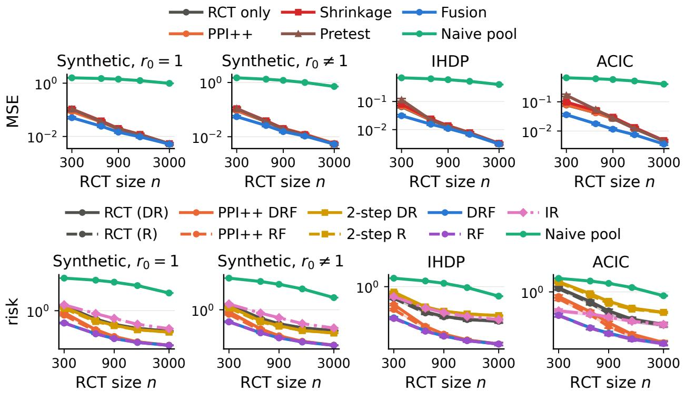  
Figure 7: Absolute errors for the designs of Fig. 4, columns 1–4. Top: ATE MSE; bottom: CATE risk. 95% bootstrap intervals.

Prop. 6. By the subgradient condition in Sec. 3.2, $\mathbb { P } _ { O } ^ { \mathrm { n u i s } } ( \widehat { r } f _ { k } ) - \mathbb { P } _ { R } ^ { \mathrm { n u i s } } ( f _ { k } ) = e _ { k }$ with $| e _ { k } | \le \widehat { \delta } _ { k }$ Subtracting this from imb $_ { f _ { k } } ( \widehat { r } ) = \mathbb { E } _ { O } [ \widehat { r } f _ { k } ] - \mathbb { E } _ { R } [ f _ { k } ]$ gives the display, and linearity of $g \mapsto \mathrm { i m b } _ { g } ( \widehat { r } )$ extends it to linear combinations of the features. Part (i) takes $g = { \widehat { g } } ;$ Thm. 2(ii) treats the resulting drift as noise with variance $\widehat { V } _ { \mathrm { c a l } } .$ . For part (ii), the ω term of Prop. 5 is imb $\begin{array} { r } { {  { \zeta } } \hat { g } ^ { ( \widehat { r } ) } -  { \mathrm { i } } \ m {  { \mathrm { m } } }  { \mathbf { b } } _ { \zeta \zeta ^ { \top } } ( \widehat { r } ) \beta _ { p } , } \end{array}$ and for a candidate ${ \widehat { \tau } } = \zeta ^ { \top } \beta$ in $\mathcal { T } _ { \zeta } , ( \widehat { g } - \widehat { \tau } ) ^ { 2 } = \widehat { g } ^ { 2 } - 2 \beta ^ { \top } \zeta \widehat { g } + \beta ^ { \top } \zeta \zeta ^ { \top } \beta$ , so $\varrho _ { \mathrm { m d 1 } } = \omega \mathrm { i m b } _ { ( \widehat { g } - \widehat { \tau } ) ^ { 2 } } ( \widehat { r } )$ Both are fixed linear combinations of the balanced imbalances given the tuning samples. Each nuisance-sample average in the display is $O _ { P } ( n _ { \mathrm { n u i s } } ^ { - 1 / 2 } + N _ { \mathrm { n u i s } } ^ { - 1 / 2 } )$ under the conditions of Thm. 2(ii), and so is $\widehat { \delta } _ { k }$

## B. Additional Simulation Results

This appendix gives the bias, standard deviation, and Wald intervals of the ATE estimates (Tables 13 and 14) and the absolute errors behind Fig. 4 (Fig. 7).

Table 13: ATE over 1,000 replications on the synthetic design: bias, standard deviation, and root mean squared error, mean estimated standard error (SE), coverage, and mean width of the 95% Wald interval. Shrinkage, Pretest, and the naive pool have no interval.
<table><tr><td>Design</td><td>n</td><td>Method</td><td>Bias</td><td>SD</td><td>RMSE</td><td>SE</td><td>Cov.</td><td>Width</td></tr><tr><td>Synthetic, r₀=1</td><td>300</td><td>RCT only</td><td>0.007</td><td>0.302</td><td>0.302</td><td>0.298</td><td>0.95</td><td>1.169</td></tr><tr><td></td><td></td><td>PPI++</td><td>0.007</td><td>0.294</td><td>0.294</td><td>0.294</td><td>0.95</td><td>1.152</td></tr><tr><td></td><td></td><td>Fusion</td><td>0.003</td><td>0.225</td><td>0.225</td><td>0.219</td><td>0.94</td><td>0.857</td></tr><tr><td></td><td></td><td>Shrinkage</td><td>0.077</td><td>0.318</td><td>0.327</td><td></td><td></td><td></td></tr><tr><td></td><td></td><td>Pretest</td><td>0.014</td><td>0.326</td><td>0.326</td><td></td><td></td><td></td></tr><tr><td></td><td></td><td>Naive pool</td><td>1.255</td><td>0.117</td><td>1.260</td><td></td><td></td><td></td></tr><tr><td></td><td>900</td><td>RCT only</td><td>-0.007</td><td>0.139</td><td>0.139</td><td>0.143</td><td>0.95</td><td>0.562</td></tr><tr><td></td><td></td><td>PPI++</td><td>-0.009</td><td>0.137</td><td>0.137</td><td>0.140</td><td>0.95</td><td>0.550</td></tr><tr><td></td><td></td><td>Fusion</td><td>-0.009</td><td>0.120</td><td>0.121</td><td>0.126</td><td>0.96</td><td>0.493</td></tr><tr><td></td><td></td><td>Shrinkage</td><td>0.011</td><td>0.141</td><td>0.141</td><td></td><td></td><td></td></tr><tr><td></td><td></td><td>Pretest</td><td>-0.007</td><td>0.139</td><td>0.139</td><td></td><td></td><td></td></tr><tr><td></td><td></td><td>Naive pool</td><td>1.185</td><td>0.067</td><td>1.187</td><td></td><td></td><td></td></tr><tr><td></td><td>3000</td><td>RCT only</td><td>-0.002</td><td>0.073</td><td>0.073</td><td>0.072</td><td>0.95</td><td>0.283</td></tr><tr><td></td><td></td><td>PPI++</td><td>-0.002</td><td>0.073</td><td>0.073</td><td>0.071</td><td>0.95</td><td>0.279</td></tr><tr><td></td><td></td><td>Fusion</td><td>-0.002</td><td>0.072</td><td>0.072</td><td>0.070</td><td>0.95</td><td>0.273</td></tr><tr><td></td><td></td><td>Shrinkage</td><td>0.003</td><td>0.073</td><td>0.073</td><td></td><td></td><td></td></tr><tr><td></td><td></td><td>Pretest</td><td>-0.002</td><td>0.073</td><td>0.073</td><td></td><td></td><td></td></tr><tr><td></td><td></td><td>Naive pool</td><td>0.991</td><td>0.039</td><td>0.992</td><td></td><td></td><td></td></tr><tr><td>Synthetic, r₀≠1</td><td>300</td><td>RCT only</td><td>0.007</td><td>0.302</td><td>0.302</td><td>0.298</td><td>0.95</td><td>1.169</td></tr><tr><td></td><td></td><td>PPI++</td><td>0.002</td><td>0.304</td><td>0.304</td><td>0.303</td><td>0.95</td><td>1.186</td></tr><tr><td></td><td></td><td>Fusion</td><td>0.002</td><td>0.234</td><td>0.234</td><td>0.226</td><td>0.94</td><td>0.886</td></tr><tr><td></td><td></td><td>Shrinkage</td><td>0.080</td><td>0.319</td><td>0.328</td><td></td><td></td><td></td></tr><tr><td></td><td></td><td>Pretest</td><td>0.016</td><td>0.331</td><td>0.331</td><td></td><td></td><td></td></tr><tr><td></td><td></td><td>Naive pool</td><td>1.211</td><td>0.117</td><td>1.217</td><td></td><td></td><td></td></tr><tr><td></td><td>900</td><td>RCT only</td><td>-0.007</td><td>0.139</td><td>0.139</td><td>0.143</td><td>0.95</td><td>0.562</td></tr><tr><td></td><td></td><td>PPI++</td><td>-0.007</td><td>0.143</td><td>0.143</td><td>0.146</td><td>0.96</td><td>0.574</td></tr><tr><td></td><td></td><td>Fusion</td><td>-0.005</td><td>0.124</td><td>0.124</td><td>0.130</td><td>0.95</td><td>0.510</td></tr><tr><td></td><td></td><td>Shrinkage</td><td>0.012</td><td>0.141</td><td>0.142</td><td></td><td></td><td></td></tr><tr><td></td><td></td><td>Pretest</td><td>-0.007</td><td>0.139</td><td>0.139</td><td></td><td></td><td></td></tr><tr><td></td><td></td><td>Naive pool</td><td>1.091</td><td>0.068</td><td>1.093</td><td></td><td></td><td></td></tr><tr><td></td><td>3000</td><td>RCT only</td><td>-0.002</td><td>0.073</td><td>0.073</td><td>0.072</td><td>0.95</td><td>0.283</td></tr><tr><td></td><td></td><td>PPI++</td><td>-0.003</td><td>0.075</td><td>0.075</td><td>0.074</td><td>0.95</td><td>0.291</td></tr><tr><td></td><td></td><td>Fusion</td><td>-0.002</td><td>0.073</td><td>0.073</td><td>0.071</td><td>0.95</td><td>0.280</td></tr><tr><td></td><td></td><td>Shrinkage</td><td>0.004</td><td>0.073</td><td>0.073</td><td></td><td></td><td></td></tr><tr><td></td><td></td><td>Pretest</td><td>-0.002</td><td>0.073</td><td>0.073</td><td></td><td></td><td></td></tr><tr><td></td><td></td><td>Naive pool</td><td>0.843</td><td>0.043</td><td>0.844</td><td></td><td></td><td></td></tr></table>

Table 14: As Table 13, for IHDP and ACIC 2016.
<table><tr><td>Design</td><td>n</td><td>Method</td><td>Bias</td><td>SD</td><td>RMSE</td><td>SE</td><td>Cov.</td><td>Width</td></tr><tr><td>IHDP</td><td>300</td><td>RCT only</td><td>-0.007</td><td>0.255</td><td>0.255</td><td>0.250</td><td>0.96</td><td>0.981</td></tr><tr><td></td><td></td><td>PPI++</td><td>-0.008</td><td>0.261</td><td>0.261</td><td>0.253</td><td>0.96</td><td>0.991</td></tr><tr><td></td><td></td><td>Fusion</td><td>-0.002</td><td>0.177</td><td>0.177</td><td>0.182</td><td>0.95</td><td>0.713</td></tr><tr><td></td><td></td><td>Shrinkage</td><td>0.066</td><td>0.274</td><td>0.281</td><td></td><td></td><td></td></tr><tr><td></td><td></td><td>Pretest</td><td>0.034</td><td>0.337</td><td>0.339</td><td></td><td></td><td></td></tr><tr><td></td><td></td><td>Naive pool</td><td>0.831</td><td>0.073</td><td>0.835</td><td></td><td></td><td></td></tr><tr><td></td><td>900</td><td>RCT only</td><td>-0.003</td><td>0.114</td><td>0.114</td><td>0.116</td><td>0.96</td><td>0.456</td></tr><tr><td></td><td></td><td>PPI++</td><td>-0.003</td><td>0.116</td><td>0.116</td><td>0.118</td><td>0.96</td><td>0.463</td></tr><tr><td></td><td></td><td>Fusion</td><td>-0.002</td><td>0.105</td><td>0.105</td><td>0.104</td><td>0.95</td><td>0.409</td></tr><tr><td></td><td></td><td>Shrinkage</td><td>0.015</td><td>0.117</td><td>0.118</td><td></td><td></td><td></td></tr><tr><td></td><td></td><td>Pretest</td><td>-0.003</td><td>0.114</td><td>0.114</td><td></td><td></td><td></td></tr><tr><td></td><td></td><td>Naive pool</td><td>0.772</td><td>0.047</td><td>0.773</td><td></td><td></td><td></td></tr><tr><td></td><td>3000</td><td>RCT only</td><td>0.000</td><td>0.056</td><td>0.056</td><td>0.058</td><td>0.96</td><td>0.228</td></tr><tr><td></td><td></td><td>PPI++</td><td>0.000</td><td>0.057</td><td>0.057</td><td>0.059</td><td>0.96</td><td>0.232</td></tr><tr><td></td><td></td><td>Fusion</td><td>0.000</td><td>0.055</td><td>0.055</td><td>0.057</td><td>0.96</td><td>0.224</td></tr><tr><td></td><td></td><td>Shrinkage</td><td>0.006</td><td>0.057</td><td>0.057</td><td></td><td></td><td></td></tr><tr><td></td><td></td><td>Pretest</td><td>0.000</td><td>0.056</td><td>0.056</td><td></td><td></td><td></td></tr><tr><td></td><td></td><td>Naive pool</td><td>0.633</td><td>0.038</td><td>0.635</td><td></td><td></td><td></td></tr><tr><td>ACIC</td><td>300</td><td>RCT only</td><td>0.003</td><td>0.278</td><td>0.278</td><td>0.287</td><td>0.96</td><td>1.124</td></tr><tr><td></td><td></td><td>PPI++</td><td>-0.001</td><td>0.281</td><td>0.281</td><td>0.289</td><td>0.95</td><td>1.132</td></tr><tr><td></td><td></td><td>Fusion</td><td>-0.009</td><td>0.190</td><td>0.190</td><td>0.187</td><td>0.94</td><td>0.732</td></tr><tr><td></td><td></td><td>Shrinkage</td><td>0.095</td><td>0.297</td><td>0.312</td><td></td><td></td><td></td></tr><tr><td></td><td></td><td>Pretest</td><td>0.081</td><td>0.401</td><td>0.408</td><td></td><td></td><td></td></tr><tr><td></td><td></td><td>Naive pool</td><td>0.811</td><td>0.063</td><td>0.813</td><td></td><td></td><td></td></tr><tr><td></td><td>900</td><td>RCT only</td><td>-0.005</td><td>0.163</td><td>0.163</td><td>0.160</td><td>0.94</td><td>0.629</td></tr><tr><td></td><td></td><td>PPI++</td><td>-0.006</td><td>0.164</td><td>0.164</td><td>0.161</td><td>0.94</td><td>0.632</td></tr><tr><td></td><td></td><td>Fusion</td><td>-0.003</td><td>0.107</td><td>0.107</td><td>0.107</td><td>0.95</td><td>0.421</td></tr><tr><td></td><td></td><td>Shrinkage</td><td>0.028</td><td>0.170</td><td>0.173</td><td></td><td></td><td></td></tr><tr><td></td><td></td><td>Pretest</td><td>-0.005</td><td>0.165</td><td>0.165</td><td></td><td></td><td></td></tr><tr><td></td><td></td><td>Naive pool</td><td>0.759</td><td>0.044</td><td>0.760</td><td></td><td></td><td></td></tr><tr><td></td><td>3000</td><td>RCT only</td><td>0.003</td><td>0.067</td><td>0.067</td><td>0.066</td><td>0.94</td><td>0.259</td></tr><tr><td></td><td></td><td>PPI++</td><td>0.004</td><td>0.068</td><td>0.068</td><td>0.067</td><td>0.95</td><td>0.261</td></tr><tr><td></td><td></td><td>Fusion</td><td>0.003</td><td>0.060</td><td>0.060</td><td>0.059</td><td>0.95</td><td>0.230</td></tr><tr><td></td><td></td><td>Shrinkage</td><td>0.010</td><td>0.068</td><td>0.069</td><td></td><td></td><td></td></tr><tr><td></td><td></td><td>Pretest</td><td>0.003</td><td>0.067</td><td>0.067</td><td></td><td></td><td></td></tr><tr><td></td><td></td><td>Naive pool</td><td>0.633</td><td>0.031</td><td>0.634</td><td></td><td></td><td></td></tr></table>