# Predictive Multiplicity in Cell-Fate Assignment: Label-Free Rashomon Sets and the Limits of Per-Cell Certification

Arjun Bhupatiraju

McNeil High School, Austin, Texas

ORCID: 0009-0006-2667-0098

arjun.bhupatiraju28@gmail.com

Abstract—Single-cell trajectory inference maps transcriptomic measurements onto developmental continua, yet parameter configurations that fit the data with equivalent statistical fidelity can assign conflicting cell fates. This paper presents FateMultiplicity, a label-free framework that constructs a statistically admissible model set, or Rashomon set, without ground-truth lineage labels, by evaluating model discrepancy on cross-fitted held-out genes under non-inferiority testing calibrated against random-seed variation. Multiplicity so measured is large, and depends more on the diversity of the model space than on its size: twelve configurations of a second algorithm expose 20.0% of cells where twenty-four of the first expose 3.8%. Whether the resulting percell certified fate margin FM yields more reliable assignments than the fitted model already provides is then tested, and it does not. On simulation ground truth, with every statistic computed on the same cells, FM discriminates misassignment at AUC 0.682 against 0.965 for the baseline configuration’s own decision margin $( p = 0 . 0 0 3 )$ ) and 0.854 for a seed-dispersion baseline needing no acceptance region. The failure is mechanistic and specific to the lower tail. Informativeness is governed by the breadth of the admitted set rather than its cardinality: at fixed cardinality four, seed refits give 0.933 and hyperparameter-perturbed sets 0.701. Relaxing the infimum to a q-quantile recovers discrimination monotonically but converges toward the single model’s own confidence rather than exceeding it, and the supremum over the same margins reaches 0.973 because $\theta ^ { \ast } \mathbf { s }$ own membership bounds it from below. The infimum alone is unanchored, free to report whichever admitted configuration disagrees most. Multiplicity in trajectory inference is therefore worth measuring and reporting, while per-cell certification over a label-free Rashomon set is not a route to more reliable fate calls. Two constructions survive: a margin-erosion ratio separates real from spurious branch points in simulation (AUC 0.890, untested on real data) where certification cannot, and against clonally observed fate, uncertified cells disagree with their clone’s outcome 16.4 percentage points more often than certified cells $( p < 0 . 0 0 1 )$

Index Terms—Cell fate, model multiplicity, negative result, Rashomon set, reproducibility, single-cell RNA sequencing, trajectory inference

## I. INTRODUCTION

Single-cell RNA sequencing (scRNA-seq) has transformed developmental biology by enabling the reconstruction of continuous cellular differentiation trajectories from snapshot transcriptomic data. Trajectory inference methods order individual cells along pseudotemporal axes and compute fate probabilities to identify lineage commitment points [1], [2], [3]. However, these inference pipelines rely on complex chains of algorithmic steps—dimensionality reduction, nearest-neighbor graph construction, pseudotime ordering, and absorbing random walks [4]—each governed by parameters the analyst selects.

## A. Related Work and Background

Multiple distinct models achieving near-identical performance while making conflicting predictions on individual points is the Rashomon effect, or predictive multiplicity [5], [6], [7], [8]. Marx et al. [7] and Watson-Daniels et al. [9] established formal definitions in classification, with metrics for decision ambiguity across candidate model sets; later frameworks address certified robustness and uncertainty decomposition [10], [11], isolating model-driven variability from aleatoric noise.

In parallel, multiverse analysis evaluates pipelines by sweeping combination spaces of processing parameters [12], [13], though conventional approaches enumerate every combination without filtering models that fit the data poorly. Trajectory benchmarking has documented that different algorithms produce divergent topologies [14], but with no formal notion of admissibility, separating legitimate variation between configurations from outright model failure has remained difficult.

## B. The Methodological Gap

Predictive multiplicity has been studied extensively in supervised classification, where an explicit loss defines the admissible set. Single-cell trajectory inference has no such loss: true fate labels are rarely available, so the Rashomon set cannot be defined in the usual way.

FateMultiplicity resolves this by evaluating candidate configurations against held-out genes with a cross-fitted discrepancy metric, admitting models through non-inferiority testing calibrated against random-seed noise. The decision-margin formulation and the interpretation of its sign are adapted from Marx et al. [7] and Watson-Daniels et al. [9]. The resulting percell quantity is the certified fate margin (FM), the minimum decision margin over all statistically admissible configurations.

## C. What This Paper Reports

Constructing the admissible set is the part that works, and the multiplicity it exposes is large enough to matter for practice.

TABLE I  
SUMMARY OF FORMAL MATHEMATICAL NOTATION
<table><tr><td>Symbol</td><td>Definition</td></tr><tr><td> $\Theta$ </td><td>Total hyperparameter search space</td></tr><tr><td> $\theta , \theta ^ { * }$ </td><td>Candidate and baseline configuration</td></tr><tr><td> $p _ { i , k } ( \theta )$ </td><td>Probability of cell i committing to fate k</td></tr><tr><td> $k ^ { * }$   $G _ { 1 } ^ { ( k ) } , G _ { 2 } ^ { ( k ) }$ </td><td>Primary baseline terminal fate assignment Training and held-out gene sets, fold k</td></tr><tr><td> $K$ </td><td>Total cross-fitting folds  $( K = 3 )$ </td></tr><tr><td> $d _ { g } ( \theta )$ </td><td>Cross-fitted discrepancy for gene g</td></tr><tr><td> $\Delta _ { g } ( \theta )$ </td><td> $d _ { g } ( \theta ) - d _ { g } ( \theta ^ { * } )$  Seed-calibrated margin  $( 1 . 0 8 6 \times 1 0 ^ { - 3 } )$ </td></tr><tr><td> $\delta$   $_ \alpha$ </td><td>Acceptance level, also the Benjamini-Hochberg</td></tr><tr><td></td><td>false discovery rate across configurations</td></tr><tr><td> $\textstyle { \mathcal { R } } ( \alpha )$ </td><td>Rashomon set of admissible configurations</td></tr><tr><td> $\operatorname { F M } _ { i } ( \alpha )$   $\bar { m } _ { i } ( \alpha )$ </td><td>Certified fate margin for cell ¿ Companion supremum fate margin</td></tr></table>

Certifying individual cells against it is the part that does not. This work set out to establish FM as a per-cell reliability statistic and found instead that it is dominated by the fitted model’s own decision margin, and that the reason is structural rather than particular to this pipeline: an infimum over a model set is an extreme order statistic, and as the set broadens it reports the most extreme admitted model instead of the cell. It is reported in full, with the diagnostics that localize it to the aggregator rather than to the underlying quantity, because the construction is an appealing one others are likely to attempt.

## II. METHODOLOGY

## A. Data Preprocessing and Compartment Selection

Four datasets are used. The first is mouse spinal cord injury, GEO GSE162610 [15]: 66,178 cells over four timepoints and two dissociation protocols, from which the authors’ annotations identify 19,818 microglia. After removing 118 highribosomal cells the analysis was restricted to 10x v2 chemistry (15,627 cells), since v3 covered only 1 dpi and uninjured, with dissociation protocol balanced across timepoints and retained as a nuisance covariate. A sample-stratified subsample of 6,000 cells and 15,787 genes was used, the size being a memory constraint on the dense matrices the discrepancy requires. Preprocessing used Scanpy [16].

The second is GSE72857 [17], 2,730 myeloid progenitors spanning an established erythroid/myeloid bifurcation, used without subsampling. Two contract parameters adjust for its size: the detectability floor holds its fraction fixed at 3.3%, and $\theta ^ { * }$ uses 1,500 highly variable genes and 20 components. Its smaller gene universe yields 32 co-expression blocks rather than 48, a coarser permutation null.

The third is the lineage-barcoded haematopoietic timecourse of Weinreb et al. [18], where a heritable lentiviral barcode is read out alongside the transcriptome, so the fate of a cell’s descendants is observed rather than inferred. A sample-stratified subsample of 12,000 cells was taken, state read at the early timepoint and fate from clone members at the later ones. It is the only dataset carrying fate labels formed independently of expression, which Section III-J uses.

The fourth is the fibroblast-to-endoderm reprogramming timecourse of Biddy et al. [19], GSE99915: 11,999 cells and

19,268 genes after joining counts to metadata on cell name. CellTag clone calls were not obtainable in joinable form, so this arm reports multiplicity and certification power, which need no labels, and not FM against observed fate—its identity annotations derive from expression, so scoring a fate margin against them would be circular.

## B. Gene Universe Partitioning and Feature Selection

Feature selection isolates highly variable genes (HVGs) to construct the trajectory, while held-out genes assess model discrepancy.

• Baseline selection. 6,000 HVGs were initially selected based on dispersion.

• Detectability floor. Because dispersion-based selection inherently favors rare, highly skewed genes, a detectability floor requiring expression in ≥ 200 cells was applied to establish the scoring universe. Unfiltered median gene detection was 56 cells of 6,000; applying the floor increased median detection to 410 cells, retaining 1,660 of the 6,000 HVGs.

• Fold partitioning. $K = 3$ fold cross-fitting was applied with a 20% holdout fraction per fold, using disjoint fold assignments. A total of 990 genes were scored across all folds. This detectability floor adapts the standard minimum-cells-per-gene preprocessing filter, transferring its application from the model-fitting universe to the evaluation universe.

## C. Model Space and Grid Specification

The baseline $\theta ^ { * }$ uses an absorbing random walk [4] solved as a sparse linear system [20], with 2,000 HVGs, 30 principal components, 15 nearest neighbors, seed 20260808, a backward step penalty of 0.05 and no teleportation. The walk’s internal geodesic pseudotime is both the ordering the discrepancy metric scores and the ordering driving the transition operator, so admissibility selection acts directly on the parameterization governing fate probabilities.

Grids span nine operational axes: HVG count, PC dimension, k-NN size, seed, backward penalty, late-fraction threshold, terminal set size, direction strength and self-loop weight, at levels fixed before execution and enumerated in the repository’s grid ledger. Perturbing single axes gives 24 configurations; perturbing pairs gives 100, of which 96 fit and 45 are wellformed.

Thirteen Palantir configurations [2] supply a second algorithm, varying gene count, components, graph construction, diffusion components, waypoint density and seed. The gate needs no structural change for this, since (1) scores ordering discrepancy regardless of what produced it. Twelve yielded valid metrics; one configuration and one fold of another were rejected by Palantir’s internal check when branch probabilities failed to sum to one, and both are retained in all denominators. Both adapters report a graph\_diffusion provenance, so this spans two algorithms within one family, and every multiplicity increment attributed to it below is a lower bound on what a cross-family expansion would expose.

Because FM is an infimum over $\textstyle { \mathcal { R } } ( \alpha )$ , adding configurations expands the set and can only decrease or hold it constant, so reported multiplicity rates are strict lower bounds tied to |Θ|. And while $\theta ^ { * }$ centres the acceptance region it is not optimal, nor even the best-fitting member of its own admissible set: ten of the twelve Palantir configurations achieve lower held-out discrepancy, the best reaching $D = 0 . 9 8 7 8 6$ against 0.9921. Because (3) is one-sided, better-fitting configurations are admitted without altering the construction.

## D. Cross-fitted Discrepancy and Non-inferiority Testing

Model performance is evaluated without ground-truth labels by assessing the expression smoothness of held-out genes along the inferred pseudotime ordering. For a candidate configuration θ evaluated across K folds,

$$
d _ { g } ( \theta ) = \frac { 1 } { K } \sum _ { k = 1 } ^ { K } \operatorname * { d e v } _ { g } \Big ( \theta ; G _ { 2 } ^ { ( k ) } \Big ) ,\tag{1}
$$

where θ is fitted strictly on training genes $G _ { 1 } ^ { ( k ) }$ and evaluated on held-out genes $G _ { 2 } ^ { ( k ) }$ . The single-gene deviance de $\mathrm { v } _ { g } ( \theta ; G _ { 2 } )$ on held-out expression vector $x _ { g }$ ordered by pseudotime $i =$ $1 \ldots n$ is

$$
\operatorname { d e v } _ { g } ( \theta ; G _ { 2 } ) = { \frac { \sum _ { i = 1 } ^ { n - 1 } \left( x _ { g , ( i + 1 ) } - x _ { g , ( i ) } \right) ^ { 2 } } { 2 ( n - 1 ) \cdot \operatorname { V a r } ( x _ { g } ) } } .\tag{2}
$$

Equation (2) is the von Neumann ratio [21] and satisfies two key formal properties: (i) its expected value under a random cell ordering is exactly 1, and (ii) it depends strictly on the rank order of cells, rendering it invariant to monotonic rescaling of pseudotime values.

In supervised learning a Rashomon set is a tolerance ball around the empirical risk minimizer, $\{ \theta \in \Theta : L ( \theta ) \leq L ( \theta ^ { * } ) +$ $\epsilon \}$ , and selecting ϵ is an acknowledged difficulty even there [22]. Unsupervised trajectory inference lacks both prerequisites: a labeled loss, and a scale for ϵ. Three substitutions supply them. The loss is replaced by the cross-fitted held-out discrepancy of (1), measuring fit against gene sets excluded during estimation rather than against absent labels. The fixed threshold becomes a hypothesis test, deriving the set’s width from the empirical dispersion of held-out scores at a stated significance level. And because testing exact equality would reject any configuration not identical to $\theta ^ { * }$ , the evaluation is a non-inferiority test against a margin $\delta$ estimated from random-seed replicates, so establishing an empirical scale for meaningless variation in the data’s own units. The resulting acceptance boundary is

$$
\mathcal { R } ( \alpha ) = \{ \theta \in \Theta : \theta \mathrm { ~ w e l l - f o r m e d , ~ a n d ~ } T ( \Delta ( \theta ) ) \leq q _ { 1 - \alpha } \}\tag{3}
$$

where $\Delta _ { g } ( \theta ) = d _ { g } ( \theta ) - d _ { g } ( \theta ^ { * } )$ , T is the block-permuted test statistic, and $q _ { 1 - \alpha }$ is the critical value at significance level $\alpha .$ The set widens where the data constrain the model weakly and tightens where they constrain it strongly, and its single tuning parameter is a significance level rather than a magnitude.

Equation (3) is the core modification of this work. Once an admissible set is constructed, downstream analysis follows standard practice. The claim is deliberately narrow: that a Rashomon set can be constructed without ground-truth labels, not that the multiplicity statistic is novel. To the author’s knowledge no prior work defines such a set where the target quantity is never observed; extensions have moved from classification through probabilistic classification to regression while relying throughout on a labeled loss. Hypothesis testing has reached Rashomon sets before, but for a different question: Paes et al. [22] ask whether two models already inside a lossdefined set can be distinguished on finite data. That concerns resolution within a set; (3) concerns how the set is drawn when no loss exists to draw it with.

## E. Well-formedness Criteria

Prior to non-inferiority evaluation, candidate models must satisfy an intrinsic well-formedness condition.

• A configuration is deemed well-formed if fewer than 50% of evaluated cells exhibit an exactly uniform posterior fate distribution across all terminal states.

• Rationale. Well-formedness reflects structural validity independent of baseline comparisons, analogous to requiring probability vectors to sum to one. Because (1) scores cell ordering rather than fate assignment directly, a configuration can generate an accurate cell ordering while collapsing into a completely uninformative uniform fate distribution.

• Concrete case. A 3-nearest-neighbor configuration achieved an acceptable discrepancy score of $d = 0 . 9 9 2 1$ (compared to baseline $d ( \theta ^ { * } ) = 0 . 9 9 2 1 )$ , yet left 99.1% of cells with an uninformative uniform posterior. The wellformedness filter excludes such degenerate configurations.

## F. Module Blocking and Non-inferiority Calibration

• Co-expression blocking. Held-out genes are grouped into modules via average-linkage hierarchical clustering on 1 − |Spearman $\rho |$ . Clustered into 15–17 modules per fold (48 total blocks), blocking prevents correlated gene expression within shared transcriptional programs from artificially inflating effective sample size and spuriously narrowing R(α).

• Hypothesis testing. Non-inferiority tests the null hypothesis $H _ { 0 } : E [ \Delta ] \ \le \ \delta ,$ and rejection removes a configuration from $\textstyle { \mathcal { R } } ( \alpha )$ . Testing $H _ { 0 } : E [ \Delta ] \le 0$ would reject any model non-identical to $\theta ^ { * }$ given large sample sizes, collapsing $\textstyle { \mathcal { R } } ( \alpha )$ to a single point.

• Seed-calibrated margin (δ). The margin δ is estimated empirically by measuring the variation in $D$ across four stochastic random-seed refits of the baseline model $\theta ^ { * }$ yielding $\delta = 1 . 0 8 6 \times 1 0 ^ { - 3 }$

• Sign-flip permutations. Significance is computed using 10,000 sign-flip permutations across the 48 module blocks (block-resolution limit $2 ^ { - 4 8 }$ ; realized floor $\approx 1 0 ^ { - 4 }$ at 10,000 draws). Multiple testing across hyperparameter configurations is controlled using the Benjamini–Hochberg procedure [23] at $\alpha = 0 . 0 5$

## G. Label Alignment Across Configurations

Because unsupervised clustering assigns terminal state labels arbitrarily across runs, “Fate $0 ^ { \circ }$ in a candidate configuration may correspond to “Fate 1” in the baseline.

• Candidate output columns are aligned to baseline fates by selecting the column permutation that maximizes argmax categorical agreement across cells.

Comparison to mean absolute probability matching. Aligning by minimizing mean absolute probability differ ences proved unreliable because configurations differ in probability saturation rates; highly saturated runs exhibit numerical offsets under correct alignments that caused false label reversals in nine configurations.

• Argmax matching achieved clear separation (96–100% agreement for true alignments versus 0–4% for inverted alignments). By selecting the labeling layout most similar to baseline, argmax alignment conservatively underestimates total predictive multiplicity.

## H. Synthetic Benchmarking Framework

Validation against known ground truth utilized synthetic single-cell trajectories. Expected expression combines a latent progression variable, a branch assignment, a batch effect, and gene-program membership across seven programs (shared dynamic, branch-specific, terminal-specific, transition-specific, housekeeping, batch-affected, and noise), scaled by a lognormal library size. Counts are drawn from a negative binomial with dispersion 0.20, with a Poisson limit when dispersion approaches zero, followed by count thinning.

• Cohort design. 75 simulation objects (300 cells, 500 genes each) spanning five topology scenarios (clean bifurcation, overlapping bifurcation, imbalanced rare branch, continuous non-branching, and confounded pseudobranch) across three difficulty levels with five stochastic replicates. Difficulty varies five prespecified signal-to-noise properties: branch separation, dispersion, count thinning, branch imbalance and batch effect strength. It does not vary the topology a scenario represents, so an easy and a hard clean bifurcation differ in separability but not in what the correct answer is.

• Deterministic generation. Generated using master seed 20260808 to allow exact programmatic reconstruction. Ground-truth branch labels were isolated from pipeline execution, feature selection, and model admission steps.

• Evaluation scope. Classification error scoring was restricted strictly to post-branch cells, as pre-branch cells have unresolved developmental fates and inclusion would bound error near 50% regardless of model quality. All statistical tests treat the simulation object (replicate), rather than individual cells, as the independent experimental unit.

## I. Validation Against Observed Clonal Fate

The synthetic cohort validates FM against a generator, where the correct fate is a quantity the generator assigned. The lineage barcoded dataset permits a stronger test, in which fate was measured in the descendants of the cell being scored and no part of the label derives from clustering the expression matrix the prediction is made from. Each clone’s fate composition is the distribution of annotated mature types among its members at the later timepoints; a state-timepoint cell belonging to exactly one usable clone inherits it, and cells in more than one clone are dropped as ambiguous. Of 2,081 evaluable cells, 1,505 belong to a clone with at least two fate-timepoint members, which is the subset on which clone purity carries information, since purity is 1.0 by construction for a clone with a single fate member.

Three design points bound the conclusion. The model names its own terminal states: both adapters support methodinferred terminals only and reject requested terminal counts outside {1, 2}, reporting that the implementation “supports one or two fates”, so the admitted set returns two unnamed attractors matched to annotated types post hoc by the orientation achieving greatest agreement. Inference is clustered on clones rather than cells, since cells of one clone share a label by construction and a cell-level test overstates its own power; all p-values are 2,000-replicate bootstraps resampling clones. And the attainable baseline is not perfect accuracy but the sister ceiling: holding out one fate member of a clone and predicting it from the remainder gives the accuracy available with perfect lineage knowledge and no state information.

## J. Formal Definitions and Estimation Properties

For each cell i, let $p _ { i , k } ( \boldsymbol { \theta } )$ represent the predicted probability of committing to terminal fate k under model θ. The decision margin under model θ is

$$
m _ { i } ( \theta ) = p _ { i , k ^ { * } } ( \theta ) - \operatorname* { m a x } _ { k \neq k ^ { * } } p _ { i , k } ( \theta ) .\tag{4}
$$

The certified fate margin is the infimum of the decision margin across all admitted models in $\textstyle { \mathcal { R } } ( \alpha )$ •

$$
\operatorname { F M } _ { i } ( \alpha ) = \operatorname* { i n f } _ { \theta \in { \mathcal { R } } ( \alpha ) } m _ { i } ( \theta ) .\tag{5}
$$

A cell is certified if $\mathrm { F M } _ { i } > 0$ , meaning every admitted model agrees on the categorical call, and uncertified if $\mathrm { F M } _ { i } \le 0$ . The companion supremum ${ \bar { m } } _ { i } ( \alpha ) = \operatorname* { s u p } _ { \theta \in { \mathcal { R } } ( \alpha ) } m _ { i } ( \theta )$ measures upper-bound certainty. On the empirical objects it is nearsaturated, sitting above 1.0 minus a thousandth for more than 97% of cells because at least one admitted configuration oversaturates fate predictions, so it does not separate biological ambiguity from algorithmic instability there. On the simulation cohort, where saturation is milder, it instead retains the baseline configuration’s discrimination (Section III-L2).

Three estimation properties follow. First, computing FMi over a finite grid gives an upper bound on the continuum infimum, so certification is anti-conservative—a cell certified on a grid may be overturned on a denser one—while noncertification is strictly conservative. Second, hypotheses are evaluated once per configuration, since omitting multiplicity adjustment would let false rejection rates scale with grid size, shrinking $\textstyle { \mathcal { R } } ( \alpha )$ and biasing evaluation toward the baseline. Third, the number of independent blocks B sets the resolution floor for permutation p-values at $2 ^ { - B }$ , so an under-blocked test cannot reject anything. Table I summarizes the notation.

## K. Quantile Certification

FM as defined above is the $q = 0$ member of a family. For a quantile level $q \in [ 0 , 1 )$ , define

$$
\mathrm { F M } _ { i } ( q ) = \mathrm { Q u a n t i l e } _ { q } \{ m _ { i } ( \theta ) : \theta \in \mathcal { R } ( \alpha ) \} ,\tag{6}
$$

and call cell i q-certified when $\mathrm { F M } _ { i } ( q ) > 0$ . The claim weakens in a way that stays interpretable: at $q = 0 . 2 5$ over an admitted set of eight, q-certification states that the assignment survives under at least six of the eight admitted configurations rather than under the single worst one. Setting $q = 0$ recovers the worst-case definition above exactly. This family is introduced not as a proposed statistic but as the instrument that localizes where worst-case certification fails (Section III-L).

## L. Certification Power

A certified margin is only as meaningful as the model space whose infimum it is. If every admitted configuration returns nearly the same fate assignment because the space is narrow rather than because the data are decisive, $\mathrm { F M } > 0$ is true and uninformative, and the construction cannot detect this from within: a space of one configuration certifies every cell. Alongside every multiplicity rate a certification power is therefore reported,

$$
\Pi \ : = \ : \frac { \bar { d } _ { \mathrm { s p a c e } } } { \bar { d } _ { \mathrm { s e e d } } } ,\tag{7}
$$

where $\bar { d } _ { \mathrm { s p a c e } }$ is the mean pairwise fate-assignment disagreement between admitted configurations and $\bar { d } _ { \mathrm { s e e d } }$ the mean pairwise disagreement between refits of one configuration differing only in random seed. The denominator is the irreducible floor. $\Pi \approx 1$ states that the space disagrees with itself no more than one configuration disagrees with itself across seeds, so certification over it asserts nothing beyond seed stability; Π ≫ 1 states that a surviving margin has survived something.

Both terms require care. The denominator must be computed within each algorithm, since a pair of refits from different algorithms differs by algorithm rather than seed; 16 of 28 candidate seed pairs on the haematopoietic object and 8 of 15 on the microglial object are cross-algorithm and are excluded by construction. Pooling them raises the floor, depresses Π, and reverses the direction of Section III-I. The numerator must be computed over the admitted set recorded in the ledger, since a differently-sized checkpoint directory changes it alone.

## M. Reproducibility and Analytic Provenance

All analytic choices were fixed in a versioned contract before execution and verified by hash, so a parameter cannot be altered mid-analysis without breaking the record. Eight amendments were logged with the observation prompting each. Configurations that failed to fit are retained in all denominators. The notebook emits a traceability map linking every numerical assertion to the code stage and contract hash that produced it, and records an environment lock.

That record is also how the present version differs from an earlier one. In the configuration grid used for the synthetic cohort, the four non-seed perturbations were passed to the model constructor twice, once through the preprocessing configuration and once as a direct keyword, so every one of them raised at fit time and was silently caught. The admitted set on all 75 objects was therefore the seed-refit set exactly, $| \mathcal { R } | = 4$ rather than 8, and every simulation-derived quantity in that version measured reseeding alone. The defect did not touch the three real-data arms, the clonal validation, Π, or the multiplicity magnitudes, which use separate grids. Rerunning the cohort with the grid corrected gives $| \mathcal { R } | = 8$ on 70 of 75 objects and changes the simulation results substantially, including the loss of a prespecified positive control (Section III-L) and the reversal of the baseline comparison in Table IV. Where a corrected value replaces a previously reported one, both are given. Every quantity derived from the admitted set in this version is computed by the released library’s own routines rather than reimplemented at the call site, after a reimplementation of the decision margin in an analysis script was found to disagree with it.

TABLE II  
PRESPECIFIED CONTROL CONFIGURATIONS AND GATE OUTCOMES
<table><tr><td>Configuration</td><td>Predicted</td><td>Exclusion mechanism</td></tr><tr><td>Scrambled pseudo- time</td><td>Excluded</td><td>Failed acceptance test  $( p \leq 1 0 ^ { - 4 }$  stat +0.0148)</td></tr><tr><td>3 nearest neighbors</td><td>Excluded</td><td>Well-formedness (99.1% uniform)</td></tr><tr><td>2 principal compo-</td><td>Excluded</td><td>Well-formedness (54.4% uniform)</td></tr><tr><td>nents 50 variable genes</td><td>Excluded</td><td>Pipeline convergence failure</td></tr><tr><td>Baseline, seed mod- ified</td><td>Admitted</td><td>Passed acceptance test  $\begin{array} { r l } { ( p } & { { } = } \end{array}$  0.236)</td></tr></table>

## III. RESULTS

A. Point-estimate Fate Probabilities Display Extreme Parameter Sensitivity

Across statistically indistinguishable parameter settings, reported fate confidence for individual cells varies up to 483- fold (Fig. 1). Within any one configuration the distribution of per-cell margins is narrow (Fig. 1a): almost every cell receives nearly the same value, and what differs is which value, so reported confidence is closer to a property of the configuration than of the cell. A 50-neighbor graph leaves one admitted configuration calling 2.5% of cells confident (margin above 0.5, defined in (4)); 6,000 variable genes leaves another calling 100% confident. Both are defensible and both are admitted to R(α).

The variation is a function of manifold geometry, not of trajectory inference as such. On the myeloid-progenitor benchmark the identical analysis spans 0.596 to 0.948, under two-fold, with no admitted configuration putting more than 2% of cells above 0.99. The difference is saturation: on the microglial object three admitted configurations push over 97% of cells into extreme certainty while another leaves almost none, so configurations fall into one regime or the other, and the distribution across them is correspondingly bimodal near 3–7% or 99% confident. On a well-separated bifurcation this does not occur. How cleanly a manifold isolates its terminal states is therefore a criterion for when single-model confidence should be distrusted.

Eleven admitted configurations yield $\Delta _ { g } ( \theta ) = 0$ exactly, since they alter only absorbing-walk parameters and leave the scored ordering unchanged, yet individual fate probabilities shift by up to 0.71 between these provably equivalent models.

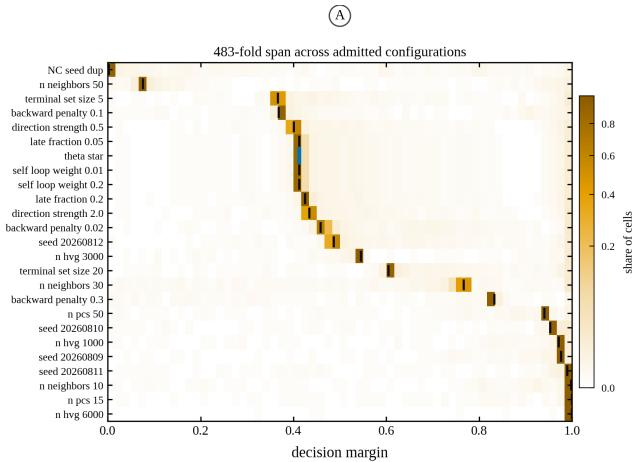

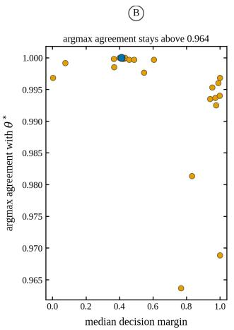  
Fig. 1. Reported confidence varies 483-fold across reconstructions the data cannot distinguish. (A) Distribution of the per-cell decision margin under each admitted configuration, sorted by median. Each row is one configuration, shade gives the share of its 6,000 cells in each margin bin, and the tick marks the median, with the baseline in blue. (B) Median margin against argmax agreement with the baseline. Configurations differ far more in the confidence they report than in the assignment itself.

Categorical agreement with the baseline nonetheless stays high, 0.9637 to 1.0000, so at worst an admitted model reassigns 218 of 6,000 cells: sensitivity concentrates in reported confidence rather than in modal labels.

## B. Cross-fitted Discrepancy Evaluates Trajectory Smoothness

The cross-fitted held-out gene discrepancy metric D differentiates fitted trajectory reconstructions from perturbed control models. Across held-out genes, 65.5% exhibit worse expression smoothness under a scrambled cell ordering, with 23.8% degrading by more than two standard deviations relative to their null distribution.

The baseline scores $D ~ = ~ 0 . 9 9 2 1$ . Permuting the fitted pseudotime 200 times and rescoring yields a null distribution centered at $D \ = \ 1 . 0 0 0 6$ with standard deviation 0.00053, placing the baseline 16.0 standard deviations below the null $( p \ = \ 0 . 0 0 5$ , the floor attainable with 200 permutations rather than an estimate of the tail probability). Seed refits track baseline performance closely $( D = 0 . 9 9 2 0$ , matching to within $1 \times 1 0 ^ { - 4 } )$ , while structurally misspecified graphs yield $D = 0 . 9 9 3 1$ . Because (2) depends only on rank, no configuration can improve its score by producing a more widely spread pseudotime axis.

## C. Statistical Admission and Evaluation of Prespecified Controls

All 24 defensible configurations in the one-factor space were admitted; exclusions arose only among the five prespecified controls registered before execution (Table II). The scrambled ordering was rejected with a statistic of +0.0148, an order of magnitude above the margin. Only that control was excluded by the acceptance test itself: two were caught by well-formedness and one failed to fit, and across the 36 configurations spanning both algorithms no defensible configuration was rejected.

The myeloid-progenitor benchmark shows different mechan ics. There the gate rejected an analytic choice no control was engineered to simulate: restricting the feature set to 800 variable genes gave a blocked statistic of +0.0201, nearly six times that dataset’s margin, at the $p \leq 1 0 ^ { - 4 }$ floor of 10,000 sign-flip permutations. Reducing feature dimension is a routine choice, so the boundary filters realistic analytic variation and not only corrupted models—provided the dataset carries enough variance for the test to resolve differences.

## D. Multiplicity Depends More on Model Diversity than on Model Count

Evaluating 24 single-factor perturbations within the absorbing-walk grid yields a baseline multiplicity rate of 3.8%. The seed replicate registered as a specificity control (Table II) also passed and was admitted as a 25th member, adjusting the rate to 3.9%, or 235 of 6,000 cells; that ensemble is the one the per-cell displays are computed over (Fig. 2). Expanding the candidate space to include twelve Palantir configurations grows the admissible set to 36 and raises the rate to 20.4%.

Resampling the model space at matched cardinality confirms that the increase is driven by structural diversity rather than model count (Fig. 3a). Sampling 24 configurations restricted to the absorbing walk leaves the rate at 3.8%; sampling 24 that span both algorithms raises it to 17.3%. The gap widens monotonically with ensemble size, from +0.021 at two configurations to +0.135 at twenty-four (Fig. 3b). Most strikingly, an ensemble of twelve Palantir configurations exposes 20.0% of cells where twenty-four absorbing-walk runs expose 3.8%.

Sensitivity analyses restricted to parameter sweeps within a single algorithm therefore understate trajectory ambiguity severely, and the number of configurations evaluated is a misleading summary of how thoroughly an analytical space has been explored.

Dispersion peaks at an ensemble size of eight (SD 0.071, range 0.007 to 0.203), so two analysts assessing the same number of runs can report multiplicity figures differing thirtyfold depending on which they sample. The two-factor expansion of the grid raises the single-algorithm rate to 52.6%, and 51 of its 96 fitting configurations are rejected as degenerate, almost all combining a backward penalty of 0.3 or a 50-component projection with a secondary shift—parameter pairs harmless individually that jointly collapse fate inference.

Varying the significance threshold $\alpha$ from 0.001 to 0.5 produced no change in the composition of $\textstyle { \mathcal { R } } ( \alpha )$ or in the resulting multiplicity rates in either space. Within the onefactor absorbing-walk grid the worst admitted statistic was +0.0015, against a margin of $\delta = 1 . 0 8 6 \times 1 0 ^ { - 3 } \mathrm { { ; } }$ ; the behavior of the boundary across both algorithms, where one configuration exceeds the margin and is still admitted, is examined in the repository’s admission ledger. Jackknife sensitivity analysis showed that removing any single configuration altered the one factor multiplicity rate by at most 0.005, confirming that the estimate is not driven by an isolated outlier.

## E. Multiplicity Concentrates in Acute Spinal Cord Injury Response

Overturned cells $( \mathrm { F M } \le 0 )$ are distributed non-uniformly across the manifold, clustering at the boundaries of major functional populations (Fig. 2a,b), and their prevalence tracks injury progression: 0.4% uninjured, peaking at 10.4% at 1 dpi, then 4.4% at 3 dpi and 1.4% at 7 dpi (Fig. 2c). Fate assignment is least stable during the acute phase and settles as the response resolves.

The trend is not a dissociation artifact. It persists within protocol (12.1%, 5.3%, 1.2% across 1, 3 and 7 dpi under the standard protocol; 7.0%, 3.3%, 1.7% under the enriched), and sample sizes run counter to a power artifact, since uninjured tissue has the fewest cells (438) and the lowest multiplicity while 7 dpi has the most (2,636) and stays low. The uninjured condition was profiled under one protocol only, so the contrast both protocols support is 1 dpi against 7 dpi.

## F. The Multiplicity Rate Reproduces on an Independent Dataset

To determine whether the preceding observations reflect general properties of trajectory inference or topological features peculiar to the microglial manifold, the pipeline was applied without modification to an independent object of 2,730 myeloid progenitors.

On this object the reference configuration $\theta ^ { * }$ achieves strong separation, scoring $D = 0 . 9 6 6 8 5$ against a permutation null of $1 . 0 0 0 7 9 \pm 0 . 0 0 1 2 0 ~ ( z = - 2 8 . 2 $ , against $z ~ = ~ - 1 6 . 0$ on the primary dataset). The estimated noise margin rose to $\delta =$ 0.00348 from 0.00109, reflecting greater run-to-run variance on the smaller sample.

Of 17 candidate configurations, one was eliminated by the well-formedness check and one rejected by the non-inferiority gate, leaving 15 admissible. This corresponds to a multiplicity rate of 3.88%, closely mirroring the 3.8% measured on the primary dataset within a single-algorithm one-factor grid. Across two biological contexts differing in tissue of origin, cell count and gene coverage, the rates agree to within 0.1 percentage points.

The confidence spread reported in Section III-A did not replicate. Comparing the two results separates a general property of the method from a manifold-dependent one: the frequency with which admissible reconstructions overturn fate assignments is stable across datasets, while the dispersion in reported confidence is specific to the underlying developmental landscape.

CERTIFICATION POWER ACROSS FOUR DATASET–ALGORITHM ARMS. $\bar { d } _ { \mathrm { S P A C E } }$ IS MEAN PAIRWISE FATE-ASSIGNMENT DISAGREEMENT BETWEEN ADMITTED CONFIGURATIONS; $\bar { d } _ { \mathrm { S E E D } }$ IS THE WITHIN-ALGORITHM SEED FLOOR. $\mathrm { ^ { * } M U L T _ { * } } ^ { \mathrm { * } }$ IS THE FRACTION OF CELLS WITH $\mathrm { F M } \le 0 . \mathrm { A U C }$ IS OF −FM AGAINST CLONALLY OBSERVED FATE, WHICH ONLY THE BARCODED OBJECT SUPPLIES; THE MICROGLIAL AND REPROGRAMMING ARMS CARRY NO LINEAGE LABELS AND CONTRIBUTE Π AND MULTIPLICITY ONLY. FM’S AUC AGAINST simulation TRUTH IS 0.682 (SECTION III-L) AND IS NOT COMPARABLE TO THESE, BEING MEASURED AGAINST A DIFFERENT REFERENCE STANDARD ON A DIFFERENT COHORT.
<table><tr><td>Dataset</td><td>Algorithm</td><td>|R|</td><td> $\bar { d } _ { \mathrm { s e e d } }$ </td><td> $\bar { d } _ { \mathrm { s p a c e } }$ </td><td>Ⅱ</td><td>Mult.</td><td>AUC</td></tr><tr><td>Microglia</td><td>Abs. walk</td><td>24</td><td>0.003972</td><td>0.008595</td><td>2.16</td><td>0.038</td><td></td></tr><tr><td>Haematop.</td><td>Abs. walk</td><td>15</td><td>0.1198</td><td>0.1223</td><td>1.02</td><td>0.457</td><td>0.568</td></tr><tr><td>Haematop.</td><td>Palantir</td><td>16</td><td>0.2441</td><td>0.2791</td><td>1.14</td><td>0.847</td><td>0.615</td></tr><tr><td>Reprogram.</td><td>Abs. walk</td><td>16</td><td>0.2949</td><td>0.2437</td><td>0.83</td><td>0.743</td><td></td></tr></table>

## G. Disconnect Between Reported Confidence and Certified Robustness

Comparing baseline reported confidence against certified status demonstrates that numerical certainty does not guarantee algorithmic stability. Taking the 75th percentile of baseline confidence (0.708) as a threshold, 1,500 of 6,000 cells are classified as confident and 5,765 as certified (FM > 0).

However, the two metrics diverge: 201 cells are confident but uncertified, while 4,466 cells are certified but lack high baseline confidence (exact McNemar test, $p < 1 0 ^ { - 1 5 } )$ . A cell whose baseline confidence is 0.60 can hold the same categorical assignment across every admitted model, while one at 0.95 can have its fate call overturned by another admissible configuration. Reported probability and certified margin measure distinct properties of the pipeline.

## H. Certification Power Separates Informative From Vacuous Certification

Table III reports Π for four dataset–algorithm arms spanning three biological systems.

The microglial arm is the only one whose model space disagrees materially more than its own seed refits, at 2.2 times the floor. On the two haematopoietic arms the space disagreement and the seed floor coincide to within a factor of 1.2, and on the reprogramming arm the space disagrees less than reseeding does, giving $\Pi = 0 . 8 3$

Only the barcoded object supplies fate labels, so FM’s ability to predict misassignment is measurable on two of the four arms. On those two, the arm with the higher Π also has the higher area under the curve (0.615 at $\Pi = 1 . 1 4$ against 0.568 at $\Pi = 1 . 0 2 ; \operatorname { F i g } . 4 )$ . Two points agree in order half the time by chance, and this is not presented as an ordering result. The claim Π supports is the one it makes by construction and without labels: a space whose disagreement does not exceed its own seed floor has certified nothing, and that belongs beside any fate claim drawn from a certified margin.

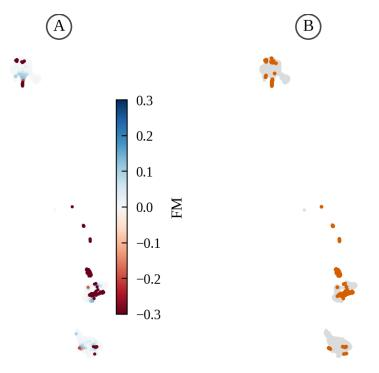

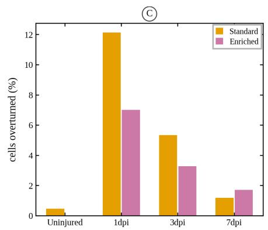

Fig. 2. Multiplicity is concentrated in the acute injury response. (A) FM across the microglial manifold, embedded by uniform manifold approximation and projection [24] from the baseline representation. (B) The 235 cells whose assignment is overturned within R(α); they cluster rather than scatter. (C) Fraction overturned by injury timepoint, split by dissociation protocol; uninjured cord was profiled under one protocol only.  
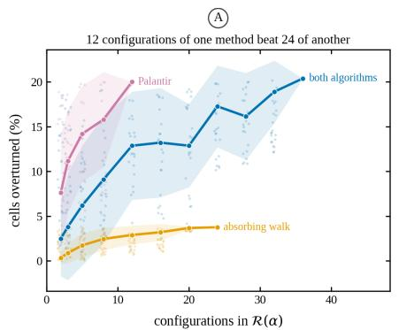

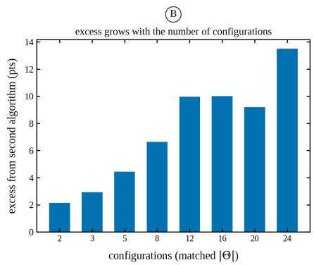  
Fig. 3. Multiplicity depends more on the diversity of the model space than on its size. (A) Fraction of cells overturned against the number of admitted configurations, resampled at each size with bands at ±1 SD; the three curves are the pooled two-algorithm set and each algorithm alone. (B) Excess multiplicity attributable to the second algorithm at matched candidate-space size, rising monotonically with set size. Each bar compares two sets of equal size, so the increase is not an artifact of counting more models.

(A)  
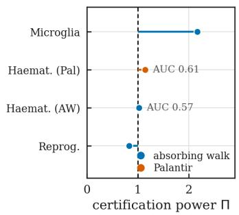

(B)  
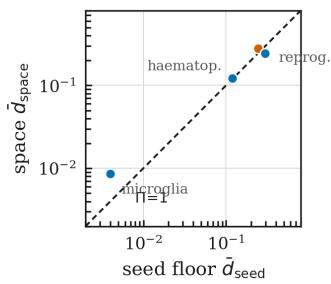  
Fig. 4. Certification power. (A) Π for each of the four dataset–algorithm arms, with the area under the curve for −FM predicting clonally observed misassignment annotated on the two arms that carry lineage labels. Only the microglial arm exceeds Π = 1 appreciably. (B) The two components of Π per arm, model-space disagreement against the within-algorithm seed floor, on a logarithmic axis; an arm on the diagonal has Π = 1 and certifies nothing beyond seed stability.

This reframes the rates in Section III-D: 3.8% at $\Pi = 2 . 1 6$ and 45.7% at $\Pi = 1 . 0 2$ are not comparable quantities. The first is measured over a space probing analytic freedom, the second over one barely exceeding reseeding noise, where a high rate reflects an unstable algorithm more than a contested biological decision.

## I. Adding an Algorithm Can Lower Certification Power

Expanding a model space raises the multiplicity rate monotonically, since FM is an infimum, but certification power is not monotone. Holding cardinality fixed, adding the second algorithm moves Π from 2.21 to 0.93 on the microglial object and from 1.03 to 1.46 on the haematopoietic one, in both cases while the multiplicity rate rises; the discriminating quantity is the ratio of the two algorithms’ own seed floors, 49-fold and 2-fold. Because the denominator of Π pools the two algorithms within-algorithm seed floors, importing an algorithm whose refits are less stable than the incumbent’s raises that floor faster than it raises space disagreement. A larger multiplicity rate obtained this way is therefore not evidence of a better-probed space, and the rate, Π and the per-algorithm floors must be reported together.

## J. FM Predicts Disagreement With Observed Clonal Fate

On the fate sub-decision the admitted set’s attractors represent, cells the framework declines to certify disagree with their clone’s observed outcome 27.7% of the time, against 11.3% among certified cells: a difference of 16.4 percentage points over 1,061 scorable cells, with a 2,000-replicate bootstrap over clones giving $p < 0 . 0 0 1$ . The Palantir arm on the same cells gives 30.5% against 19.0%, a difference of 11.5 points, also at $p < 0 . 0 0 1$ . The attainable sister ceiling for these cells is 0.875.

This addresses the question the construction cannot answer from within. Agreement on reconstruction of held-out genes is a statement about pseudotemporal ordering, and whether such agreement carries information about fate is not established by the construction itself; the discrepancy metric in (1) never sees a fate probability. Here the fate was measured in the descendants of the cell being scored, by a heritable barcode, with no part of the label derived from the expression matrix the prediction was made from. Discrepancy-equivalence does carry fate-relevant information.

Three qualifications travel with it. The first is that the effect is measured on the sub-decision the attractors span, and Section III-K reports the ones they do not. The second is that both haematopoietic arms have Π near 1, so this shows FM tracking biological error even where certification power is weak, not on a well-probed space.

The third is that FM does not outrank the simpler baselines at ranking individual cells, on either reference standard. Against simulation truth it is worse than seed dispersion, the singlemodel margin and the mean margin (Section III-L). Against clonally observed fate the same holds: on the same cells and labels, seed dispersion reaches 0.662 where FM reaches 0.568 on the absorbing-walk arm, and the single-model margin reaches 0.707 where FM reaches 0.615 on the Palantir arm. The group difference above is real and significant, but separating two groups by error rate and ranking individual cells are different tasks, and on observed fate FM does the first better than the second. The simulation comparison does not transfer.

## K. Behavior Across Branching Structures

The synthetic cohort spans five branching structures: no fork, a false fork induced by a batch effect, a clean fork, an overlapping fork, and a fork with one rare branch. Reported per object, with the simulation replicate as the independent unit, −FM predicts misassignment with mean area under the curve 0.61 on the clean fork $( p = 0 . 2 7 5 )$ , 0.72 on the overlapping fork $( p = 0 . 0 9 8 )$ and 0.73 on the rare-branch fork $( p = 0 . 0 2 7 )$ Only the last is nominally significant, and it does not survive correction across the three. Under an earlier and defective construction of the admitted set these same three scenarios gave 0.95, 0.91 and 0.94 at $p \leq 0 . 0 0 4$ (Section II-M); the apparent topology dependence was an artifact of that defect. There is no evidence that FM’s informativeness varies with branching structure, and none surviving multiplicity correction that its per-cell ordering is informative on any of the three.

Neither the simulator nor either adapter can express a multifurcation: the first pins the branch count to two for every forking scenario, the second rejects terminal counts outside {1, 2}. Rather than call a two-branch cohort a multifurcation, the question is tested where a real one exists. The barcoded object annotates ten mature types, and the admitted set’s two attractors can be re-scored against every fate pair and one-vs-rest collapse carrying enough clonally observed cells, giving twenty sub-decisions across the two algorithms. Of the fifteen the attractors span at orientation agreement above 0.60, certification is informative in thirteen, with mean difference 16.4 points and median 11.1, each significant under the clone bootstrap. One is positive but not significant. One inverts.

That inversion is worth stating plainly. On the Monocyteagainst-rest collapse under Palantir, at orientation agreement 0.668, uncertified cells disagree with observed fate 26.6% of the time and certified cells 45.3%: a reversal of 18.7 points at $p < 0 . 0 0 1$ , with certified cells reliably more often wrong. Two further inversions fall where orientation agreement sits at chance, so the attractors do not span the decision and no information should be expected.

The mechanism is the one already visible on the unbranched simulations. A certified margin states that the admitted set agrees; if its members share an attractor structure merging two distinct outcomes, they agree confidently and identically on the cells that structure mishandles, and certification tracks the shared structure rather than the truth. A certified fate claim is therefore conditional on attractor coverage, and the attractor naming must be reported beside it.

## L. Certified Fate Margins Do Not Outperform the Fitted Model

FM was introduced to give the analyst a per-cell reliability statistic that a single fitted model cannot. Evaluated against simulation ground truth it does not deliver one, and this section reports that result together with the diagnostics that localize the failure.

Across the corrected cohort, misassignment is 28.5% among uncertified cells $( \mathrm { F M } \le 0 )$ against 4.9% among certified cells $\mathrm { ( F M > 0 ) }$ , and falls monotonically from 31% in the lowest FM quintile to 0% in the highest, so the sign of FM does separate error. The ordering it induces, however, is weak. Taking the simulation replicate as the independent unit over the 28 forking objects that pass every scoring filter, −FM discriminates misassignment at mean AUC 0.682. A prespecified positive control does not survive: FM now correlates with true geodesic distance from the branch point at Spearman $\rho = 0 . 0 3 0$ , against 0.399 under an earlier and defective construction of the admitted set (Section II-M). Cells further downstream of a fork are not meaningfully more certifiable.

1) Comparison against the alternatives: Trajectory software already reports a fate probability, and an analyst worried about stability has cheaper options than a new construction. FM is compared against four on the same cells: the reported margin at $\theta ^ { * } ;$ ; the companion supremum $\bar { m } ;$ the dispersion of the decision margin across reseedings of $\theta ^ { * } ,$ , which needs no acceptance region at all; and bootstrap stability, refitting $\theta ^ { * }$ on $2 0$ subsamples retaining 80% of cells and counting label changes. For a two-fate decision confidence, margin and entropy are monotone transforms of one another and count as one predictor, and the seed dispersion of the probabilities and of the margins are likewise the same ranking, since the margin is $2 \pi _ { i , k ^ { * } } - 1$

FM loses to every one of them except bootstrap stability, which it ties (Table IV, Fig. 7). The decisive comparison is against the margin at $\theta ^ { * }$ : FM is worse by 0.284, in 18 of 28 objects, $p = 0 . 0 0 3$ . Nothing constructed over the admitted set beats the single fitted model.

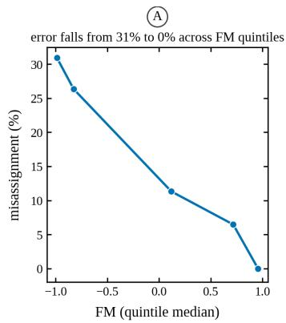

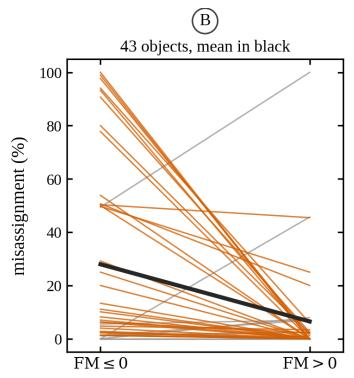

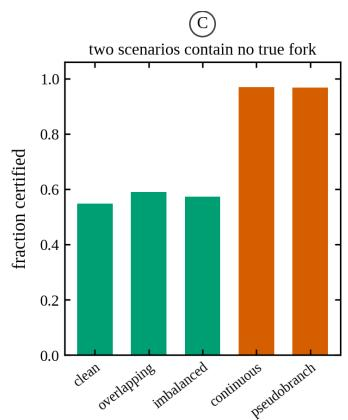

Fig. 5. Simulation validation on the corrected cohort. (A) Misassignment against FM quintile; error falls from 31% in the lowest quintile to 0% in the highest, so the sign and coarse ordering of FM do carry information. (B) Per-object misassignment either side of $\mathrm { F M } = 0 ,$ one line per object and the mean in black, over the 43 objects with cells on both sides. (C) Fraction certified by scenario. The two containing no true fork, in red, certify at roughly 0.97—far above the 0.55 to 0.59 of the three that do contain one, which is the inversion Section III-M addresses.  
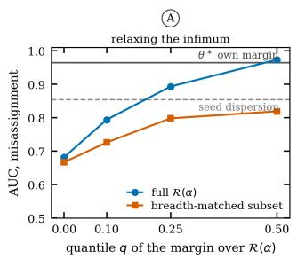

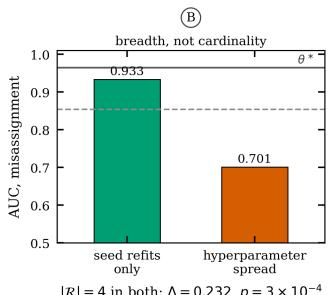

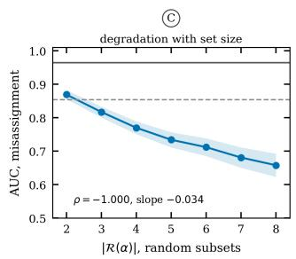  
Fig. 6. Per-cell certification is limited by its aggregator, not by the quantity being aggregated. Every panel reports mean per-object AUC for discriminating misassignment against simulation truth over the 28 scorable forking objects; the solid grey line is the baseline configuration’s own decision margin (0.965) and the dashed line the seed-dispersion baseline (0.854). (A) Replacing the infimum over $\textstyle { \mathcal { R } } ( \alpha )$ with the q-quantile of the same per-model margins. $q = 0$ is FM as defined. Discrimination rises monotonically in q but converges toward the single model’s own confidence from below rather than exceeding it. The breadth-matched series restricts the set to four configurations carrying hyperparameter perturbations. (B) At fixed cardinality $| \mathcal { R } | = 4 ,$ four seed refits and four hyperparameter-perturbed configurations differ by 0.232. Breadth, not count, is the governing variable. (C) Discrimination against the size of randomly drawn admitted subsets, shaded by standard error, falling monotonically over the seven sizes (Spearman $\rho = - 1 . 0 0 0$ , slope −0.034 per configuration). The barcoded arm is not drawn: its AUC is measured against clonally observed fate rather than simulation truth, and the two are not comparable (Table III).

TABLE IV  
DISCRIMINATION OF MISASSIGNMENT AGAINST SIMULATION TRUTH,EVERY STATISTIC COMPUTED ON THE SAME CELLS
<table><tr><td>Predictor</td><td>AUC</td><td> $\boldsymbol { \mathrm { v s . } } \theta ^ { * }$ </td></tr><tr><td>Margin at  $\theta ^ { * }$  (single model)</td><td>0.965</td><td></td></tr><tr><td> $q = 0 . 5 0$  margin over  $\textstyle { \mathcal { R } } ( \alpha )$ </td><td>0.973</td><td> $p = 0 . 2 2 1$ </td></tr><tr><td> $q = 0 . 2 5$  margin over  $\mathcal { R } ( \alpha )$ </td><td>0.893</td><td> $p = 0 . 3 6 7$ </td></tr><tr><td>Mean margin over  $\mathcal { R } ( \alpha )$ </td><td>0.883</td><td> $p = 0 . 3 7 4$ </td></tr><tr><td>m, the supremum over  $\mathcal { R } ( \alpha )$ </td><td>0.973</td><td> $p = 0 . 4 9 4$ </td></tr><tr><td>Seed dispersion (no acceptance region)</td><td>0.854</td><td> $p < 0 . 0 0 1$ </td></tr><tr><td>Bootstrap stability</td><td>0.681</td><td> $p < 0 . 0 0 1$ </td></tr><tr><td>FM, the infimum over  $\textstyle { \mathcal { R } } ( \alpha )$ </td><td>0.682</td><td> $p = 0 . 0 0 3$ </td></tr></table>

Mean of per-object AUC over the 28 forking objects passing all scoring filters. The right column gives the Wilcoxon signed-rank p for the paired per-object difference against the margin at $\theta ^ { * }$ (zeros dropped, normal   
approximation; the exact test is invalid under ties). Nothing beats the margin at $\theta ^ { * }$ . The supremum m¯ , the median margin, the mean margin and the   
$q = 0 . 2 5$ margin are indistinguishable from it; seed dispersion, bootstrap   
stability and FM are all significantly worse, FM by 0.284. Seed dispersion   
computed from the probabilities and from the margins is one ranking, not   
two, since the margin is $2 \pi _ { i , k ^ { * } } - 1$ for a two-fate decision, and only the   
former is listed. Values are not comparable with those in an earlier version of   
this work, which were computed over a defective admitted set and pooled over cells rather than averaged over objects.

2) The upper tail does not fail, and that is informative: The supremum m¯ reaches 0.973 and is statistically indistinguishable from the margin at $\theta ^ { * } \ ( + 0 . 0 0 8 , p = 0 . 4 9 )$ , while the infimum over the same set reaches 0.682. Two order statistics of one collection of margins, 0.29 apart. The asymmetry has a cause, and it narrows the claim this paper can make.

Because $\theta ^ { * }$ is itself a member of $\textstyle { \mathcal { R } } ( \alpha )$ and $k ^ { * }$ is $\theta ^  \ast \} \mathrm { _ { s } }$ own assignment, $m _ { i } ( \theta ^ { * } ) \geq 0$ for every cell, and therefore

$$
\bar { m } _ { i } ( \alpha ) \geq m _ { i } ( \theta ^ { * } ) \geq \mathrm { F M } _ { i } ( \alpha ) .\tag{8}
$$

The supremum is bounded below by the baseline model’s own margin and is close to a monotone transform of it over most cells, so it inherits $\theta ^ { \ast \boldsymbol { \cdot } } \boldsymbol { \mathrm { s } }$ signal rather than measuring the model space. The infimum has no such floor: it is free to run to whichever admitted configuration disagrees most, and nothing anchors it to the cell. The defect is therefore specific to the lower tail of the margin distribution over $\textstyle { \mathcal { R } } ( \alpha )$ , not a general property of order statistics, and a worst-case certificate is exactly the statistic that reads that tail.

3) The failure is in the aggregator: Three diagnostics locate the defect, and they rule out the explanations that would make it a property of this dataset.

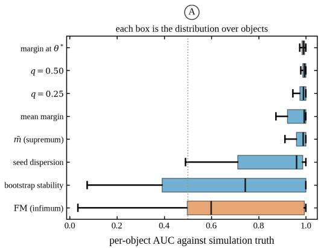

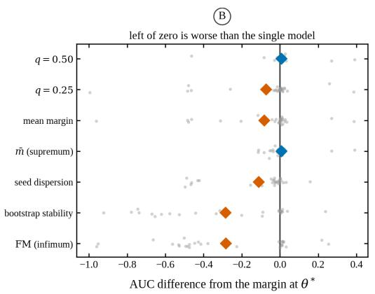  
Fig. 7. The baseline comparison per object, over the 28 forking objects passing all scoring filters. Table IV gives the means; this gives the distributions behind them. (A) Per-object $\mathrm { \ A U { \dot { C } } }$ for each predictor; the dotted line marks chance. The margin at $\theta ^ { * } ,$ , the $q = 0 . 5 0 \AA$ margin and the supremum m¯ sit tight against the ceiling, while FM and bootstrap stability spread down to near zero on individual objects. (B) Each predictor’s AUC difference from the margin at $\theta ^ { * } .$ one grey point per object, mean as a diamond. Points left of zero are objects where the predictor is worse than the single fitted model.

Breadth, not cardinality. Admitted sets of identical size behave very differently depending on what their members disagree about. At $| \mathcal { R } | = 4 ,$ , four random reseedings of $\theta ^ { * }$ give 0.933, while four configurations carrying hyperparameter perturbations give 0.701—a matched difference of 0.232 in 20 of 28 objects, Wilcoxon $p = 3 \times 1 0 ^ { - 4 }$ (Fig. 6b). Discrimination also falls monotonically with the size of randomly drawn subsets, from 0.869 at $| \mathcal { R } | \ = \ 2$ to 0.658 at $| \mathcal { R } | \ = \ 8$ (Spearman $\rho = - 1 . 0 0 0$ over the seven sizes, slope −0.034 per configuration; Fig. 6c). That curve should not be read as a size law: larger random subsets of a fixed eight-configuration pool necessarily draw in more hyperparameter perturbations, so size and breadth are confounded by construction, and the fixed-cardinality contrast shows breadth carries more of the effect than the entire size range does.

Not saturation. An infimum could lose discrimination simply by driving cells onto a common floor and tying them. It does not. The fraction of tied cell pairs is 0.010 at $| \mathcal { R } | = 2$ and 0.006 at $| \mathcal { R } | = 8 ,$ falling rather than rising, and only 4.6% of cells lie within $1 0 ^ { - 6 }$ of their object’s minimum at $| \mathcal { R } | = 8$ On the balanced panel of objects scorable at every subset size, discrimination restricted to cells still certified is flat in |R| (Spearman $\rho = - 0 . 0 7 1 , p = 0 . 8 8 )$ . Where the floor has not been reached, the ordering is intact.

Relaxing the infimum recovers the signal, up to a ceiling. If the aggregator is the defect, the per-model margins should still carry per-cell information. Replacing inf with the q-quantile of the same margins gives 0.682, 0.794, 0.893 and 0.973 at $q = 0 , 0 . 1 0 , 0 . 2 5$ and 0.50 over the full admitted set (Fig. 6a), monotone in q, with $q = 0 . 1 0$ exceeding the infimum by 0.113 in 19 of 28 objects $( p = 3 \times 1 0 ^ { - 4 } )$ . The information is present; the infimum discards it. But the recovery converges to the margin at $\theta ^ { * }$ rather than past it. At $q = 0 . 5 0$ the difference against the single model is $+ 0 . 0 0 7 , p = 0 . 2 2$ . Relaxing the certificate is not a repair, it is an interpolation back toward trusting one model’s probability.

Taken together with Section III-L2, these say that the infimum over a model set is an unanchored extreme order statistic. Over near-replicate members it tracks genuine percell fragility; as the set broadens it is set by whichever single admitted configuration disagrees most, and ceases to describe the cell at all. The supremum over the same margins does not behave this way, because $\theta ^ { * } \boldsymbol { \mathbf { \hat { s } } }$ own membership bounds it from below. This is a property of the construction, not of this pipeline or this cohort, and it should be expected wherever a worst-case per-point certificate is taken over a Rashomon set assembled from qualitatively heterogeneous models.

4) What this does not overturn: The admitted set still carries fate-relevant information; the result above concerns one way of summarizing it. Section III-J shows that against clonally observed fate, cells the framework declines to certify disagree with their clone’s outcome 16.4 points more often than certified cells. Multiplicity magnitude (Section III-D), certification power, margin erosion (Section III-M) and the sub-decision analysis are all independent of the per-cell ranking that fails here, and none of them is affected.

## M. Margin Erosion Distinguishes Real From Spurious Branch Points

Certification alone cannot separate a real fork from an arbitrary partition of continuous data: the unbranched scenarios certify at roughly 97%, far above the 55–59% of any genuine fork $( \mathrm { F i g . } ~ 5 \mathrm { c ) }$ . The ratio of the certified margin to the baseline mean margin measures how far the model space erodes that margin, and separates the two cases where certification does not, with an area under the curve of 0.890 (Mann–Whitney $p = 6 . 2 \times 1 0 ^ { - 9 } )$ across the 45 forking and 30 non-forking objects. The scope is narrow and should be read as such—75 synthetic objects, one algorithm, no-fork controls from the generator that made the forks, and eight forks and nine nonforks misclassified at the best threshold. It is evidence that a structural control is constructible from quantities the framework already computes, not a validated test, and it is untested on real data, since no empirical arm carries a known no-fork control.

## IV. DISCUSSION AND LIMITATIONS

## A. Methodological Scope and Interpretation Boundaries

Validation on synthetic datasets containing no true lineage branch points reveals a key theoretical limitation of label-free multiplicity frameworks. In simulations generating continuous non-branching progressions or batch-confounded pseudobranches, certification reaches 96.9% and 96.8%, against 55% to 59% on the three scenarios that contain a true fork.

Because absorbing random walks force continuous inputs into discrete terminal states, every admitted configuration partitions unbranched data in a similar, arbitrary way. High agreement across $\textstyle { \mathcal { R } } ( \alpha )$ then reflects shared algorithmic induc tive bias rather than biological ground truth: it confirms that an assignment is analytically determined within a model class, not that a lineage bifurcation exists.

The consequence extends past trajectory inference. When an algorithm class shares a strong inductive bias, every member of the admissible set inherits it, and predictive multiplicity becomes insensitive to structural misspecification. Low multi plicity can arise from a shared blind spot as readily as from genuine signal, so any Rashomon-set method applied to a family with a strong common prior faces the same failure, and reporting low multiplicity without a structural control invites the misreading. The existence of the fate structure is an assumption of the construction rather than an output of it, and certification alone does not verify it. That assumption is not beyond the reach of quantities the framework already computes: the margin-erosion ratio of Section III-M separates genuine forks from imposed partitions at AUC 0.890, where raw certification orders the two cases backwards. It is offered as a direction rather than a validated control, since its no-fork cases come from the same generator as its forks and it is untested on real data.

## B. Limitations of the Discrepancy Metric

Three constraints follow from scoring ordering rather than fate. Equation (1) evaluates cell ordering, so a configuration that orders well while collapsing fate probabilities passes the discrepancy gate and must be caught by the well-formedness screen (Section II-E). Baseline discrepancy on empirical data $( D = 0 . 9 9 2 1 )$ sits close to the permutation null $( D = 1 . 0 0 0 6 )$ so absolute thresholds cannot transfer across datasets without recalibration. And the metric needs gene depth: on a lowyield object of 618 Schwann cells, an ordering fitted directly to the held-out genes—a circular procedure no legitimate reconstruction can exceed—reached only D = 0.936 against a null of 1.000, because 202 well-detected genes against 12,287 in microglia compresses the dynamic range past the point where models separate.

## C. Certification Is Conditional on Attractor Coverage

The unbranched simulations show certification near 97% where no fork exists, against 55–59% where one does. Section III-K shows the same mechanism on real data against clonally observed fate, which is the stronger form of the observation: on a fate sub-decision the admitted set’s attractors do span, certified cells disagree with observed fate 18.7 percentage points more often than uncertified cells.

Both share one cause. FM certifies that every admitted configuration assigns a cell the same fate. Where the set shares an attractor structure merging two genuinely distinct outcomes, its members agree confidently and identically on exactly the cells that structure mishandles, and the surviving margin measures the agreement of a shared error rather than the determinacy of a correct answer. Three practices follow: a certified fate claim should carry the attractor naming it rests on, certification should be reported with Π, and low multiplicity should not be read as evidence of biological branching.

## D. The Two-State Fate Ceiling

Both adapters reject requested terminal counts outside {1, 2}, each reporting that the implementation supports one or two fates while advertising multi-fate support among its declared capabilities; the simulator is bound equivalently. Every fate result here is therefore a two-way decision, including those drawn from an object annotating ten mature types. This is a boundary of the available implementations rather than of the construction, appearing as a single guard in each adapter, and its consequence is that the behavior of FM under genuine multifurcation is addressed only through sub-decisions of a real one.

## E. Limitations and Assumptions

This study evaluated four empirical datasets and two algorithms over discrete hyperparameter grids. The two algorithms share a graph\_diffusion provenance family, so the multiplicity increment from expanding beyond one algorithm is a lower bound rather than a measured cross-family effect; no implementation spanning a structurally different family was available within the frozen environment. Evaluating a discrete grid captures practical non-identifiability across user choices rather than formal mathematical non-identifiability in continuous parameter limits. The 6,000-cell subsampling represents a computational memory limit for dense matrix calculations, and synthetic benchmarks utilized 300-cell objects. Clonal lineage labels are available for one of the four datasets (Section III-J) and absent in the other three, so the fate-validity claim rests on that dataset while the multiplicity and multiplicity results rest on all four arms and the certification-power results on the three datasets they cover.

## F. Future Work

The negative result of Section III-L sharpens rather than closes the question, and three extensions follow directly from it.

The first is a model space spanning more than one algorithm family. Both algorithms evaluated here report a graph\_diffusion provenance, so every cross-algorithm multiplicity increment above is a lower bound. Since breadth is what degrades the infimum, a space including an optimaltransport or RNA-velocity estimator would be the sharpest available test of the mechanism: it predicts that worst-case certification gets worse, not better, as the space becomes more representative.

The second is whether any aggregator over an admitted set beats the fitted model. The quantile family of Section II-K converges to the single model’s confidence from below;

whether a statistic that weights admitted configurations by their discrepancy, rather than treating them as exchangeable, can exceed it remains open.

The third is a fate model admitting more than two terminal states. The ceiling is an implementation boundary, not a property of the construction: the margin generalizes to the gap between the top two of K probabilities, though a cell may hold a wide top-two gap while remaining uncertain among the remainder.

## V. CONCLUSION

By replacing supervised loss tolerances with seed-calibrated non-inferiority testing on held-out genes, FateMultiplicity quan tifies predictive multiplicity in unsupervised trajectory inference without ground-truth labels. Measuring it is worthwhile and the magnitudes are large. Model diversity drives observed ambiguity far more than configuration count: twelve runs of one algorithm expose more multiplicity than twenty-four of another, and since both share a provenance family that increment is a lower bound. The multiplicity rate is consistent across datasets within a single-algorithm one-factor grid (3.8% and 3.9%) while the dispersion in reported confidence is not, spanning 483-fold on one manifold against under two-fold on the other. Multiplicity is not uniform across a tissue: in injured spinal cord it peaks during the acute phase, when transcriptional state changes fastest. And a rate is uninterpretable without its certification power—across four arms Π spans 2.16 to 0.83, only one space disagreeing with itself appreciably more than reseeding does, so rates from different arms are not comparable quantities.

Certifying individual cells against that set is a different matter, and the central negative result of this paper is that it does not work. Against simulation ground truth FM discriminates misassignment worse than the fitted model’s own decision margin, by 0.284 AUC at $p = 0 . 0 0 3$ , and worse than a seeddispersion baseline that requires no acceptance region. The cause is the aggregator rather than the quantity. An infimum over a model set is an extreme order statistic: over near-replicate members it tracks per-cell fragility, and as the set broadens it reports whichever admitted model is most extreme instead. Breadth, not cardinality, governs the degradation; it is not tie saturation; and relaxing the infimum to a quantile recovers the discarded signal monotonically but converges toward the single model’s own confidence rather than exceeding it. This should be expected wherever worst-case per-point certification is attempted over a Rashomon set assembled from heterogeneous models, and it is reported in full because the construction is an attractive one that others are likely to try.

What the admitted set does support is coarser and still useful. Against clonally observed fate, cells the framework declines to certify disagree with the measured outcome of their clone 16.4 percentage points more often than cells it certifies, so discrepancy-equivalence carries fate-relevant information even though the per-cell ranking built from it does not beat the baseline. A margin-erosion ratio separates real forks from imposed partitions of continuous data at AUC 0.890 in simulation, untested on real data, where certification alone orders the two cases backwards. And certification remains conditional on attractor coverage: where the shared algorithmic structure merges two real outcomes, certified cells can be reliably more often wrong than uncertified ones.

The practical recommendation follows from the negative result rather than despite it. Report the multiplicity rate and the certification power alongside point-estimate fate probabilities, name the attractors any fate claim rests on, and treat low multiplicity as evidence of analytical determinacy within a model class rather than of biological branching. Do not replace the fitted model’s own fate probability with a worst-case certificate over an admissible set; on the evidence here it is the weaker statistic, and the broader and more honestly constructed the set, the weaker it gets.

## DATA AND CODE AVAILABILITY

All four datasets are public: GEO accessions GSE162610, GSE72857 and GSE99915, and the lineage-barcoded haematopoietic data of [18]. Simulation objects are regenerated deterministically from the recorded master seed (20260808) rather than archived as matrices.

Code is available at https://github.com/arjunbhupat iraju/cns- pns- regeneration. The analysis reported here is FateMultiplicity.ipynb, which executes the full pipeline and emits the versioned contract, the gene-partition and module registry, the per-configuration admission ledger, and the environment lock. FateMultiplicityPrework.ipynb documents the dataset selection and discrepancy-function development described in Section IV-B. The repository also archives the notebooks of two preceding studies by the same author, which are not part of this work: FateStability.ipynb, a trajectory audit from which the simulation cohort and the perturbation axes are inherited, and Paper.ipynb with Additional\_Validation.ipynb, an earlier analysis of peripheral and central nervous system injury that supplied the object used for the ceiling test in Section IV-B.

## DECLARATIONS

Arjun Bhupatiraju performed conceptualization, methodology, analysis, visualization and writing. The work received no external funding, and the author declares no relevant financial or non-financial competing interests. Institutional review board and animal ethics review were not required, as this study is a secondary analysis of publicly available mouse sequencing data and involved no new human participants or animal experiments.

## ACKNOWLEDGMENTS

The author wrote the manuscript. An AI assistant (Claude, Anthropic) was used for analysis code development, methodological discussion, figure generation, and editorial review of the manuscript text. The author conceived the study, designed the analytic protocol and its gates, selected the datasets, reviewed and approved every analytic decision, determined which results stood and which required revision, and verified every reported result against the recorded evidence chain. Sole responsibility for the content rests with the author, Arjun Bhupatiraju, and not with the assistant.

[1] M. Lange et al., “CellRank for directed single-cell fate mapping,” Nat. Methods, vol. 19, pp. 159–170, 2022.

[2] M. Setty et al., “Characterization of cell fate probabilities in single-cell data with Palantir,” Nat. Biotechnol., vol. 37, pp. 451–460, 2019.

[3] L. Haghverdi, M. Büttner, F. A. Wolf, F. Buettner, and F. J. Theis, “Diffusion pseudotime robustly reconstructs lineage branching,” Nat. Methods, vol. 13, pp. 845–848, 2016.

[4] J. G. Kemeny and J. L. Snell, Finite Markov Chains. New York: Springer-Verlag, 1976.

[5] L. Breiman, “Statistical modeling: the two cultures,” Statist. Sci., vol. 16, no. 3, pp. 199–231, 2001.

[6] A. Fisher, C. Rudin, and F. Dominici, “All models are wrong, but many are useful: learning a variable’s importance by studying an entire class of prediction models simultaneously,” J. Mach. Learn. Res., vol. 20, no. 177, pp. 1–81, 2019.

[7] C. T. Marx, F. du Pin Calmon, and B. Ustun, “Predictive multiplicity in classification,” in Proc. 37th Int. Conf. Machine Learning, PMLR vol. 119, 2020, pp. 6765–6774.

[8] L. Semenova, C. Rudin, and R. Parr, “On the existence of simpler machine learning models,” in Proc. 2022 ACM Conf. Fairness, Accountability, and Transparency, 2022, pp. 1827–1858.

[9] J. Watson-Daniels, D. C. Parkes, and B. Ustun, “Predictive multiplicity in probabilistic classification,” in Proc. AAAI Conf. Artificial Intelligence, vol. 37, no. 9, 2023, pp. 10306–10314.

[10] H. Hsu and F. du Pin Calmon, “Rashomon capacity: a metric for predictive multiplicity in classification,” in Adv. Neural Inf. Process. Syst., vol. 35, 2022, pp. 28988–29000.

[11] E. Hüllermeier and W. Waegeman, “Aleatoric and epistemic uncertainty in machine learning: an introduction to concepts and methods,” Mach. Learn., vol. 110, pp. 457–506, 2021.

[12] S. Steegen, F. Tuerlinckx, A. Gelman, and W. Vanpaemel, “Increasing transparency through a multiverse analysis,” Perspect. Psychol. Sci., vol. 11, no. 5, pp. 702–712, 2016.

[13] C. J. Patel, B. Burford, and J. P. A. Ioannidis, “Assessment of vibration of effects due to model specification can demonstrate the instability of observational associations,” J. Clin. Epidemiol., vol. 68, no. 9, pp. 1046–1058, 2015.

[14] W. Saelens, R. Cannoodt, H. Todorov, and Y. Saeys, “A comparison of single-cell trajectory inference methods,” Nat. Biotechnol., vol. 37, pp. 547–554, 2019.

[15] L. M. Milich, C. B. Ryan, and J. K. Lee, “Single-cell analysis of the cellular heterogeneity and interactions in the injured mouse spinal cord,” J. Exp. Med., vol. 218, no. 8, e20210040, 2021.

[16] F. A. Wolf, P. Angerer, and F. J. Theis, “SCANPY: large-scale single-cell gene expression data analysis,” Genome Biol., vol. 19, 15, 2018.

[17] F. Paul et al., “Transcriptional heterogeneity and lineage commitment in myeloid progenitors,” Cell, vol. 163, no. 7, pp. 1663–1677, 2015.

[18] C. Weinreb, A. Rodriguez-Fraticelli, F. D. Camargo, and A. M. Klein, “Lineage tracing on transcriptional landscapes links state to fate during differentiation,” Science, vol. 367, no. 6479, eaaw3381, 2020.

[19] B. A. Biddy et al., “Single-cell mapping of lineage and identity in direct reprogramming,” Nature, vol. 564, no. 7735, pp. 219–224, 2018.

[20] P. Virtanen et al., “SciPy 1.0: fundamental algorithms for scientific computing in Python,” Nat. Methods, vol. 17, pp. 261–272, 2020.

[21] J. von Neumann, “Distribution of the ratio of the mean square successive difference to the variance,” Ann. Math. Statist., vol. 12, no. 4, pp. 367–395, 1941.

[22] L. M. Paes, R. Cruz, F. P. Calmon, and M. Diaz, “On the inevitability of the Rashomon effect,” in Proc. IEEE Int. Symp. Information Theory (ISIT), 2023, pp. 549–554.

[23] Y. Benjamini and Y. Hochberg, “Controlling the false discovery rate: a practical and powerful approach to multiple testing,” J. R. Statist. Soc. B, vol. 57, no. 1, pp. 289–300, 1995.

[24] L. McInnes, J. Healy, and J. Melville, “UMAP: uniform manifold approximation and projection for dimension reduction,” J. Open Source Softw., vol. 3, 861, 2018.