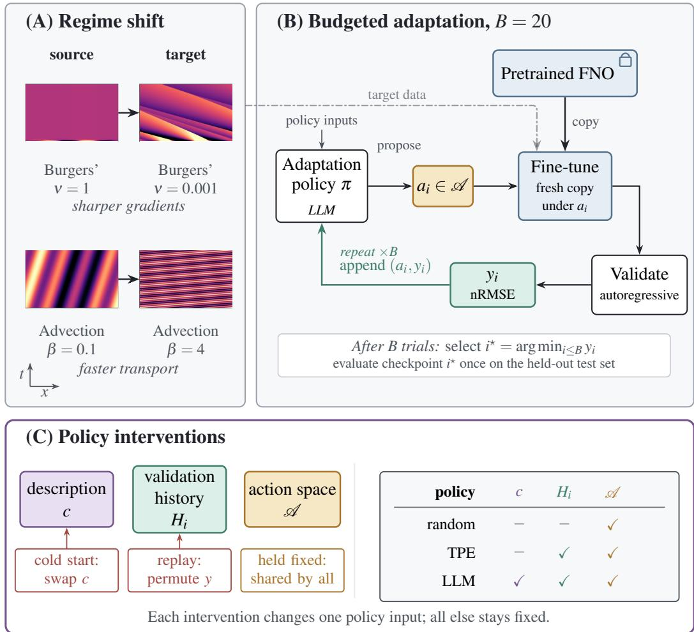
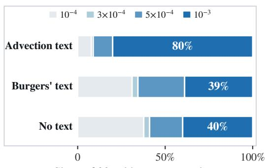
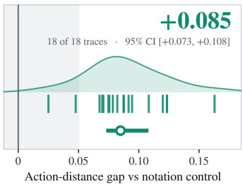
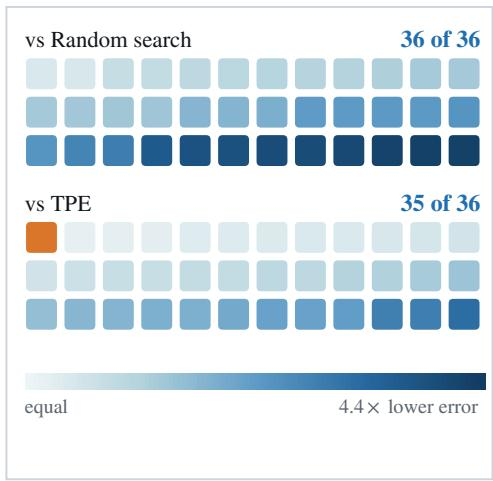
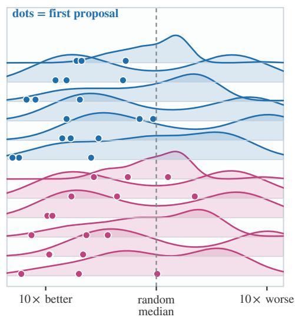
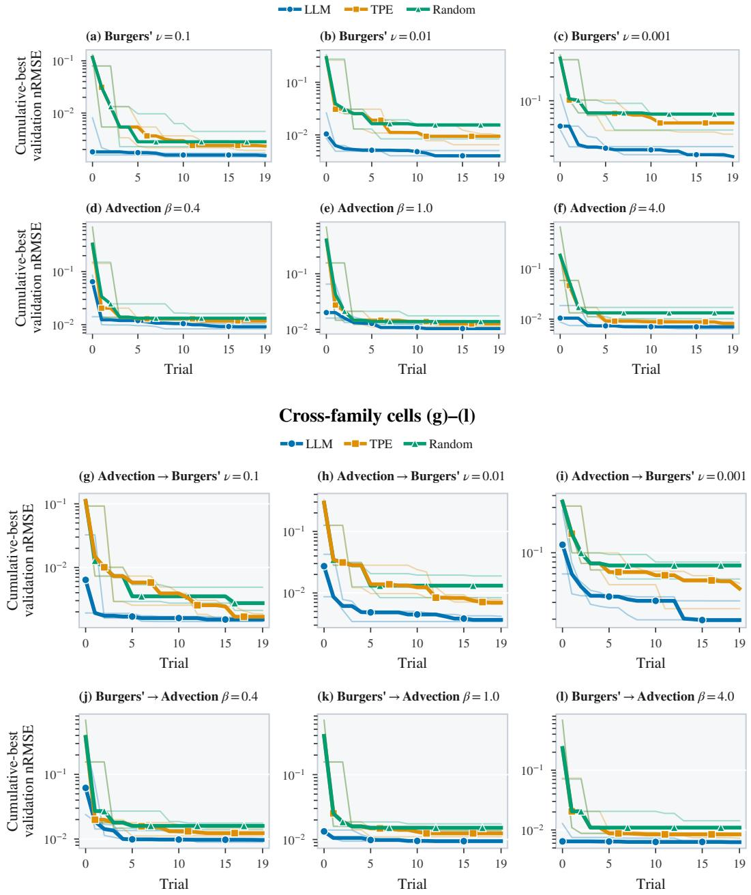

# Prior or Feedback? What an LLM Uses When Adapting Neural Operators

Julian Chan∗ University of Surrey

Javier Mora Jimenez Compare the Market

## Abstract

Do LLM scientific agents rely only on their initial task context, or do they adapt their decisions in response to experimental feedback? We study this question in neural operator adaptation, where a large language model (LLM) selects finetuning configurations under a limited trial budget. Across transfers within and between partial differential equation (PDE) families, the LLM achieves lower held-out test nRMSE than random search and Bayesian optimisation in nearly every matched comparison. Endpoint performance alone cannot distinguish what happens, so we verify each attribution with controlled interventions. Before observing any validation score, the LLM’s first configuration already ranks near the top of the corresponding random-search pool, indicating a useful initial bias. A complementary cold-start intervention shows that the selected base learning rate shifts with the PDE description. Once feedback becomes available, reassigning validation scores among evaluated configurations changes the next proposal in every case tested, whereas a value-preserving rewrite produces no comparable aggregate effect. These interventions establish that the LLM’s decision-level actions respond to the given task and observed outcomes, showing that it combines a taskdependent prior with sensitivity to experimental feedback.

## 1 Introduction

Scientific agents operate sequentially: they propose actions, observe outcomes, and decide what to try next. Recent LLM-based systems extend this loop to hypothesis generation and refinement [Lu et al., 2024, Gottweis et al., 2026]. As such systems run more autonomous experiments, trusting their conclusions increasingly requires checking whether their decisions respond to the evidence they collect. Once the sequence ends, a benchmark score measures overall performance but does not reveal which inputs shaped each decision.

We study this distinction in a bounded experimental loop where a frozen large language model (LLM) selects fine-tuning configurations for a pretrained neural operator. The LLM adaptation policy can propose and revise configurations, but cannot alter the data, action space, trial budget, or external evaluation protocol. At each search trial, the selected configuration is executed and scored.

The LLM receives a natural-language description of a target partial differential equation (PDE), the history of previously evaluated configurations and validation scores, and training diagnostics. Before the first evaluation, only the problem description is available. We use cold-start prior to denote the preference induced by the LLM policy at this stage. The term refers to policy behaviour and does not imply pretrained knowledge of the underlying physics. After the first evaluation, subsequent proposals can additionally depend on validation feedback. We therefore ask whether the cold-start prior provides a useful starting point and whether later experimental outcomes causally change the policy’s actions.

We study these questions using a pretrained Fourier neural operator (FNO), a neural operator architecture for learning solution maps between function spaces [Li et al., 2021, Kovachki et al., 2023]. We fine-tune this FNO after the target physical regime shifts away from its pretraining distribution. Such shifts can degrade surrogate accuracy, and recent work addresses them through model scaling or broader pretraining across PDE families [McCabe et al., 2023, Herde et al., 2024, Hao et al., 2024, McCabe et al., 2026]. We instead hold the pretrained checkpoint and target-regime data fixed and study how effectively different policies configure adaptation under a small experimental budget. This setting reflects applications in which target-regime data are costly to generate and only a limited number of fine-tuning attempts are feasible [Carey et al., 2025, Luna Gutierrez et al., 2026]. Best practices for adapting these models remain unsettled [Medvedev et al., 2026, Song et al., 2026], and configuring the adaptation calls for machine learning expertise that domain scientists often do not have [Liu and Wang, 2026]. At each trial, a policy selects the optimiser, schedule, base learning rate, parameter-block multipliers, weight decay, rollout length, data loss, and two auxiliary physics-loss weights, then fine-tunes a fresh copy of the FNO. Model size and epochs are fixed across policies and excluded from the action space, so performance differences arise only from configuration choices. Each policy receives 20 trials to identify settings that transfer well.

We compare policies with progressively richer information. Random search uses neither problem context nor previous outcomes, whereas a Tree-structured Parzen Estimator (TPE), which handles mixed categorical and continuous spaces, models the observed configuration–score history [Bergstra et al., 2011, Akiba et al., 2019]. The LLM receives this same history together with the PDE description and training diagnostics. All three policies operate under the same 20-trial budget, but differ in their proposal mechanisms, computational cost, and available information. Endpoint performance can therefore show whether the LLM is competitive under this budget, but not which of its additional inputs influence its decisions. This motivates the controlled input interventions below.

We test which displayed inputs shape those decisions by intervening on one input at a time: at cold start we vary the displayed problem description, and once a history has accumulated we reassign validation scores among the evaluated configurations. Neither intervention retrains the policy or alters the downstream optimisation task.

## Contributions.

• Competitive optimisation under a 20-trial budget. With the same 20-trial budget, the LLM policy achieves lower held-out test nRMSE than random search and than TPE, spanning withinand cross-family transfer.

• A decision-level verification protocol. We intervene on one input at a time and read the effect as an action distance between proposed configurations.

• A task-dependent prior and feedback-sensitive proposals. Switching the displayed PDE family doubles the base learning rate in the first proposal. Reassigning validation scores has an effect of about one categorical-coordinate change (1/12 0.083).

Related work. LLMs have been used for Bayesian optimisation, from proposing configurations directly from solution–score histories to interacting with established optimisers through tools [Yang et al., 2024, Zhang et al., 2023, Mahammadli and Ertekin, 2024, Liu et al., 2024, Agarwal et al., 2025, Brunzema et al., 2026]. Some of these works read the effect of the problem description on search performance, whereas we also read its effect on the next proposed configuration. Recent matched comparisons show that LLM advantages are not universal: early gains can reflect defaul configurations, classical optimisers can outperform standalone LLM proposals, and agent gains vary across repository-level tasks [Rodrigues et al., 2026, Ferreira et al., 2026, Huai et al., 2026]. No policy in our study starts from a default, so our comparison is specific to operator fine-tuning under a fixed budget.

Closest to our question, Redko et al. [2026] study prior effects in hardware-aware code optimisation. We instead manipulate the displayed PDE description and validation history. This design relates to permuted-feedback controls, causal perturbations of stored experience, withheld feedback, and demonstration-label randomisation [Wainrib et al., 2026, Zhao et al., 2026, Huai et al., 2026, Min et al., 2022]. Yagubyan [2026] measures agent reproducibility across repeated identical invocations using a distance over structured actions, and Liao [2026] tests whether agents respond to the source of evidence under a matched intervention. We combine the two designs, so our intervention returns the size of the change rather than an indicator that it changed. PDE agents have also been used to construct PINN workflows, numerical solvers, and operator-inference models [Wuwu et al., 2025, He et al., 2025, Li et al., 2026, Wang et al., 2026]; we instead hold the FNO architecture, downstream task, and action space fixed.

  
Figure 1: Budgeted FNO adaptation and controlled input interventions. (A) Within-family PDEBench shifts used as targets. Lower viscosity ν sharpens Burgers’ gradients, whereas higher advection speed $\beta$ increases the transport rate. (B) At each of $\bar { B } \ : = \ : \bar { 2 0 }$ trials, a policy selects $a _ { i } \in { \mathcal { A } }$ , a fresh copy of the pretrained FNO is fine-tuned, and its normalised root mean squared error (nRMSE) on the autoregressive validation rollout is appended to $H _ { i } .$ After search, the configuration selected by validation nRMSE is evaluated once on the held-out test set. (C) At cold start, the displayed PDE description is changed; after a history has accumulated, replay interventions reassign validation scores in $H _ { i }$ . The FNO, data, compute budget, and  remain fixed.

## 2 Experimental setting: budgeted FNO adaptation

We study budgeted adaptation using public PDEBench trajectories and pretrained FNO checkpoints across two PDE families, each spanning multiple parameter regimes [Takamoto et al., 2022c,a,b]. Within each matched comparison only the adaptation policy varies (Appendices A.1–A.3).

Adaptation problem. A run adapts one pretrained source checkpoint to a target regime over a budget of B = 20 sequential evaluations. At trial i, policy π selects a configuration $a _ { i } \in { \mathcal { A } }$ using

the preceding configuration–score history

$$
H _ { i } = \{ ( a _ { j } , y _ { j } ) \} _ { j < i } ,
$$

together with any policy-specific inputs. Fine-tuning a fresh copy of the source checkpoint under $a _ { i }$ produces validation score $y _ { i } ,$ , which is appended to the history before the next trial. The LLM policy also receives the natural-language PDE description, denoted by $c ,$ and training diagnostics (Figure 1B).

Target PDE families. We consider two families of one-dimensional scalar PDEs. The advection equation,

$$
\partial _ { t } u + \beta \partial _ { x } u = 0 ,
$$

linearly transports the input profile at speed $\beta .$ Burgers’ equation adds nonlinear self-advection and diffusion,

$$
\partial _ { t } u + \partial _ { x } ( u ^ { 2 } / 2 ) = \frac { \nu } { \pi } \partial _ { x x } u .
$$

Reducing the viscosity ν produces sharper gradients and increases the sensitivity of autoregressive rollouts to local prediction error (Figure 1A).

Adaptation cells. An adaptation cell pairs a source checkpoint with a target regime. The six within-family cells change the governing parameter while preserving the equation: advection $\beta =$ 0.1 is adapted to $\beta \in \{ \bar { 0 } . 4 , 1 . 0 \bar { , } 4 . 0 \}$ , and Burgers’ $\nu = 1 . 0$ is adapted to $\bar { \nu } \in \{ 0 . 1 , 0 . 0 1 , 0 . 0 0 1 \}$ Three cross-family cells adapt the advection checkpoint to the Burgers’ targets, and three further cells reverse that transfer. We evaluate every cell with three random-number seeds that resample the train–validation split, and call each cell–seed pairing a trace (Table 1).

Shared action space, training, and evaluation. A configuration specifies the optimiser, learningrate schedule, base learning rate, parameter-block learning-rate multipliers, weight decay, rollout length, data loss, and two auxiliary physics-loss weights. Each trial begins from a fresh copy of the source checkpoint, trains on 750 trajectories, and computes validation nRMSE against the run’s fixed 350-trajectory validation split.

The first 1,000 PDEBench trajectories form a held-out test prefix, on which the configuration with the lowest validation nRMSE is evaluated once after the 20-trial search. This prefix is PDEBench’s own test split, so the released checkpoints did not train on the trajectories used to report held-out test nRMSE.

Policy implementations. Our main TPE configuration uses five random startup trials rather than Optuna’s default ten, leaving fifteen model-based proposals within the 20-trial budget. A separate control restores the default ten and extends TPE’s budget to 25 evaluations, so that it keeps all fifteen model-based proposals.

The LLM policy uses the hosted model deepseek-v4-pro, with thinking and JSON modes enabled at reasoning\_effort=max [DeepSeek-AI, 2026a,b]; Appendix A.4 pins the served model and the sampling settings. At each trial, the LLM samples $S = 3$ JSON configurations and executes the medoid, the sampled configuration with the smallest total distance to the others under Equation 1. The rule limits the influence of a single atypical completion but cannot correct a bias shared by all three, so our behavioural claims concern that chosen configuration.

Table 1: Adaptation families. Each source–target cell is evaluated with three seeds.
<table><tr><td>Family</td><td>Source → target</td><td>Change</td></tr><tr><td>Within</td><td>Advection  $\beta { = } 0 . 1  \beta { \in } \{ 0 . 4 , 1 . 0 , 4 . 0 \}$  Burgers&#x27;  $\nu { = } 1 . 0 \to \nu \in \{ \bar { 0 . 1 } , 0 . 0 1 , 0 . 0 \bar { 0 1 } \}$ </td><td>speed viscosity</td></tr><tr><td>Cross</td><td>Advection  $\beta { = } 0 . 1 \to \mathrm { { B u r g e r s } ^ { \prime } \ t a r g e t s }$  Burgers&#x27;ν=1.0 → advection targets</td><td>equation equation</td></tr></table>

## 3 Controlled input interventions

Our decision-level verification protocol intervenes on one policy input at a time while holding the FNO, data, trial budget, and action space fixed.

Action distance. Let index the eight normalised numeric coordinates and the four categorical coordinates, with $D = 1 2$ . Both interventions measure proposal displacement using

$$
d ( a , a ^ { \prime } ) = \frac { 1 } { D } \left( \sum _ { j \in \mathcal { C } } \left| \bar { a } _ { j } - \bar { a } _ { j } ^ { \prime } \right| + \sum _ { j \in \mathcal { K } } \mathcal { k } ^ { \zeta } \left[ a _ { j } \neq a _ { j } ^ { \prime } \right] \right) ,\tag{1}
$$

where $\bar { a } _ { j }$ denotes numeric coordinate j rescaled to [0, 1]. Numeric coordinates contribute their absolute normalised difference, whereas categorical coordinates contribute zero for a match and one for a mismatch. Appendix A.3 gives the coordinate rescalings. A change in one categorical coordinate contributes $1 / 1 2 \approx 0 . 0 8 3$ . We report distances in this unit, and set a decision threshold to roughly 60% of one such change (0.05).

Cold-start description test. In the advection $\beta = 4 . 0$ and Burgers’ $\nu = 0 . 0 0 1$ cells, we show one of three texts before the first trial: an advection description, a Burgers’ description, or none. Appendix C.1 gives the exact prompts. The analysis tests a directional shift in the base learning rate of the first proposal.

Feedback replay and decision rule. For within-family cells, replay reconstructs a logged decision point and regenerates the next proposal without continuing the search. The reassignment intervention preserves the evaluated configurations and validation scores but permutes their assignments. A notation control instead preserves every score value and its assignment, rewriting each score in the equivalent scientific notation, for example 0.0129 as $1 . 2 9 \mathrm { e } { - 2 }$

For each trace, we replay one decision point in each of three matched windows spanning the search, measuring the action distance from the logged configuration to the regenerated proposal. The trace effect is the median intervention-minus-control difference in that distance across the three windows (Appendix B.1). We then take the median trace effect across three seeds to obtain one effect for each of the six cells. Windows and resamples are repeated measurements within a trace, so the test treats each cell, not each decision, as an independent unit. An exact one-sided sign-flip test over these six cell effects has a minimum attainable p-value of $2 ^ { - 6 } = 1 / 6 4 = 0 . 0 1 5 6 2 5$

## 4 Results

We first compare endpoint performance under the shared trial budget, then use controlled interventions to determine whether the PDE description and validation feedback shape the LLM’s proposals.

## 4.1 The LLM is competitive and starts from a useful proposal

Under the shared 20-trial budget, the LLM policy finds a configuration with lower held-out test nRMSE than random search in all 36 matched runs and than TPE in 35 of 36 (Table 2). All 12 cell medians favour the LLM, across both within- and cross-family transfer.

This is a finite-budget advantage, not evidence of asymptotic superiority: TPE is still improving at trial 20 in several advection-to-Burgers’ runs (Figure 4). Giving TPE 25 evaluations in a separate two-cell control still leaves the 20-trial LLM with lower held-out test nRMSE (Appendix D.1), suggesting that the ranking does not arise solely from TPE’s startup allocation.

Before observing any validation score, the median first LLM proposal has lower validation nRMSE than 91.7% of the 60 random-search configurations evaluated in the corresponding cell; only two of the 36 first proposals fall below their cell’s random median. This indicates that the LLM enters the search in a useful region before receiving feedback (Appendix D).

## 4.2 The PDE description shifts the base learning rate

Before any validation feedback, we show an advection description, a Burgers’ description, or no PDE description in both target cells. Each condition yields 90 cold-start proposals, with 45 proposals per cell.

Switching the displayed description from Burgers’ to advection doubles the median base learning rate in the first proposal, from 0.0005 to 0.001, in both target cells (Figure 2(a)). A one-sided Mann– Whitney test over the pooled proposals (90 per displayed description, 45 from each target cell) gives $p = 5 . \dot { 2 } \times 1 0 ^ { - 9 }$ (Appendix C). The no-description condition has a median base learning rate of 0.0005 in both cells. The advection description selects 0.001 in 80% of proposals, compared with 39% under the Burgers’ description and 40% without a description. Changing only the displayed text therefore changes the initial proposal, although the detectable effect is confined to one of twelve coordinates.

Share of 90 cold-start proposals  
Table 2: Median held-out test nRMSE across three matched seeds after 20 evaluations; lower is better and bold marks the lowest median. TPE beats the LLM for seed 43 in this cell (0.0263 versus 0.0346); the LLM wins the other two seeds. In-domain is a released PDEBench FNO trained on the target regime with about 9,000 trajectories, against 750 per adaptation trial; it is a reference scale, not a matched baseline, and is not bolded.
<table><tr><td>Target cell</td><td>LLM</td><td>Random</td><td>TPE</td><td>In-domain</td></tr><tr><td colspan="5">Within-family</td></tr><tr><td> $\mathrm { A d v . , } \beta = 0 . 4$ </td><td>0.01220</td><td>0.01750</td><td>0.01530</td><td>0.01330</td></tr><tr><td> $\mathbf { A d v . } , \beta = 1$ </td><td>0.01340</td><td>0.01810</td><td>0.01660</td><td>0.01280</td></tr><tr><td> $\mathbf { A d v . } , \beta = 4$ </td><td>0.00792</td><td>0.01580</td><td>0.00901</td><td>0.00880</td></tr><tr><td> $\mathbf { B u r g . } , \nu = 0 . 0 0 1$ </td><td>0.01970</td><td>0.06990</td><td>0.05220</td><td>0.03900</td></tr><tr><td> $\mathbf { B u r g . } , \nu = 0 . 0 1$ </td><td>0.00409</td><td>0.01580</td><td>0.00981</td><td>0.01040</td></tr><tr><td> $\mathbf { B u r g . } , \nu = 0 . 1$ </td><td>0.00155</td><td>0.00320</td><td>0.00248</td><td>0.00390</td></tr><tr><td colspan="5">Cross-family</td></tr><tr><td> $\mathrm { A d v . {  } B u r g . , } \nu = 0 . 0 0 1$ </td><td>0.01990</td><td>0.07670</td><td>0.04010†</td><td>0.03900</td></tr><tr><td> $\mathrm { A d v . {  } B u r g . , } \nu = 0 . 0 1$ </td><td>0.00350</td><td>0.01360</td><td>0.00709</td><td>0.01040</td></tr><tr><td> $\mathrm { A d v . {  } B u r g . , } \nu = 0 . 1$ </td><td>0.00160</td><td>0.00287</td><td>0.00180</td><td>0.00390</td></tr><tr><td colspan="5"> $R e v e r s e c r o s s \ – f a m i l y$ </td></tr><tr><td> $\mathrm { B u r g . } {  } \mathrm { A d v . } , \beta = 0 . 4$ </td><td>0.01280</td><td>0.02030</td><td>0.01520</td><td>0.01330</td></tr><tr><td> $\mathbf { B u r g . } {  } \mathbf { A d v . } , \beta = 1$ </td><td>0.01180</td><td>0.01930</td><td>0.01510</td><td>0.01280</td></tr><tr><td> $\mathrm { B u r g . } {  } \mathrm { A d v . } , \beta = 4$ </td><td>0.00707</td><td>0.01230</td><td>0.00934</td><td>0.00880</td></tr></table>

(a) Learning rate follows the displayed text  

(b) Reassignment moves the next action  
  
Figure 2: Controlled input interventions. (a) Distribution of the base learning rate over 90 coldstart proposals per displayed description, pooling 45 from each target cell because the same text gives near-identical distributions in both; labels show the share at 0.001. (b) Reassignment-minusnotation action distance across 18 within-family traces. The marker gives the median and bootstrap 95% interval; shading marks values below the 0.05 decision threshold.

## 4.3 Reassigning validation scores changes the next configuration

We reassign the observed validation scores among previously evaluated configurations and compare the resulting action with a notation control that preserves every score and assignment.

Reassignment increases the median trace effect by +0.085 relative to this control (bootstrap 95% interval $[ + 0 . 0 7 3 , + 0 . 1 0 8 ]$ ]; Figure 2(b)), close to the $1 / 1 2 = 0 . 0 8 3$ contribution of one categoricalcoordinate change. All 18 trace effects and six cell medians are positive, exceeding our 0.05 decision threshold with $p = 0 . 0 1 5 6 2 5$ . The notation control instead has median effect zero relative to identical-prompt resampling. This effect persists when each score is reassigned together with the diagnostics from its own trial (Appendix B.3). The next proposal therefore depends on which outcomes are assigned to which configurations, not merely on formatting or repeated sampling.

The response is also selective: reassignment changes rollout length in 49.6% of proposals, data loss in 40.4%, and schedule in 25.9%, compared with 14.4%, 15.9%, and 14.1% under resampling. Optimiser changes remain near the resampling rate. We treat this coordinate ranking as descriptive because we apply no per-coordinate tests. The policy therefore uses the displayed feedback when selecting its next action, but the intervention does not show that this response is rational or improves held-out test performance. Appendix Tables 4 and 5 give the complete contrasts.

## 5 Discussion

The endpoint advantage under the fixed budget (Table 2) positions the LLM policy as a complement to broader operator pretraining [McCabe et al., 2023, Herde et al., 2024, Hao et al., 2024, McCabe et al., 2026] and LLM-generated scientific solvers [Wuwu et al., 2025, He et al., 2025, Li et al., 2026, Wang et al., 2026]. Those approaches build generality into the operator weights or generated code; ours instead leaves both untouched and puts the expertise in the loop: the LLM draws actions from a fixed action space and configures each fine-tuning trial. The architecture and starting checkpoint never change, only how the operator adapts. This is useful when target-regime data, training runs, or the expertise to run them are limited.

Beyond endpoint performance, our verification protocol tests whether the policy uses its two distinctive inputs: the task description and observed feedback. Random search conditions on neither, while TPE conditions only on numeric history. Swapping the displayed PDE family shifts the median base learning rate of the LLM’s first proposal, while permuting scores across evaluated configurations changes its next proposal by about one categorical coordinate (Figure 2), primarily through rollout length and data loss. Together, these interventions show that the LLM uses the task description to form its cold-start prior and observed feedback to guide later proposals. The protocol requires only logged decision points and a distance over the action space, so it applies to hosted LLMs without access to their internals, contributing to other decision-level checks of AI agents [Wainrib et al., 2026, Zhao et al., 2026, Yagubyan, 2026, Liao, 2026].

Decision-level verification matters in unattended experimental loops, where two agents may reach the same endpoint score even if only one uses the evidence it gathers. The interventions therefore support a narrow conclusion: the LLM policy depends on the task description and observed scores. They do not explain why the policy responds as it does, establish that its decisions are rational or reflect physical understanding, or show that either dependence explains the endpoint advantage. Our study is limited in scope to one LLM and two one-dimensional PDE families. Applying the protocol across model families, scientific domains, higher-dimensional PDEs, and larger budgets would test whether these sensitivities generalise and help the agent select better solutions.

## 6 Conclusion

Prior or feedback? In this fixed-budget adaptation loop, the LLM policy uses both: it starts from a useful prior shaped by the task description and adjusts its later decisions in response to feedback. Endpoint evaluation measures what the experimental loop produces, while controlled interventions test what its decisions depend on. We argue that scientific agent verification requires both.

## Acknowledgments

We thank Niall Adams (Imperial College London) for comments on a draft of this paper. Experiments were run on the Eureka2 computing cluster at the University of Surrey.

## References

Dhruv Agarwal, Manoj Ghuhan Arivazhagan, Rajarshi Das, Sandesh Swamy, Sopan Khosla, and Rashmi Gangadharaiah. Searching for optimal solutions with LLMs via Bayesian optimization. In International Conference on Learning Representations, 2025. URL https://openreview. net/forum?id=aVfDrl7xDV.

Takuya Akiba, Shotaro Sano, Toshihiko Yanase, Takeru Ohta, and Masanori Koyama. Optuna: A next-generation hyperparameter optimization framework. In Proceedings of the 25th ACM SIGKDD International Conference on Knowledge Discovery and Data Mining, pages 2623–2631, 2019. doi: 10.1145/3292500.3330701. URL https://dl.acm.org/doi/10.1145/3292500. 3330701.

James Bergstra, Rémi Bardenet, Yoshua Bengio, and Balázs Kégl. Algorithms for hyperparameter optimization. In Advances in Neural Information Processing Systems, pages 2546– 2554, 2011. URL https://proceedings.neurips.cc/paper\_files/paper/2011/hash/ 86e8f7ab32cfd12577bc2619bc635690-Abstract.html.

Paul Brunzema, Louis Tiao, Nhat Le, Kevin De Angeli, Yao Xuan, and Djordje Gligorijevic. Agentic Bayesian optimization through surrogate-augmented autoresearch. arXiv preprint arXiv:2608.00316, 2026. URL https://arxiv.org/abs/2608.00316.

N. Carey, L. Zanisi, S. Pamela, V. Gopakumar, J. Omotani, J. Buchanan, J. Brandstetter, F. Paischer, G. Galletti, and P. Setinek. Neural operator surrogate models of plasma edge simulations: feasibility and data efficiency. Nuclear Fusion, 65(10):106010, 2025. doi: 10.1088/1741-4326/adfdfb. URL https://doi.org/10.1088/1741-4326/adfdfb.

DeepSeek-AI. Thinking Mode. DeepSeek API Docs, 2026a. URL https://api-docs. deepseek.com/guides/thinking\_mode. Accessed 2026-06-02.

DeepSeek-AI. DeepSeek V4 Preview Release. DeepSeek API Docs, 2026b. URL https:// api-docs.deepseek.com/news/news260424. Accessed 2026-06-02.

Fabio Ferreira, Lucca Wobbe, Arjun Krishnakumar, Frank Hutter, and Arber Zela. Can LLMs beat classical hyperparameter optimization algorithms? a study on autoresearch. arXiv preprint arXiv:2603.24647, 2026. URL https://arxiv.org/abs/2603.24647.

Juraj Gottweis et al. Accelerating scientific discovery with Co-Scientist. Nature, 655: 487–496, 2026. doi: 10.1038/s41586-026-10644-y. URL https://doi.org/10.1038/ s41586-026-10644-y.

Zhongkai Hao, Chang Su, Songming Liu, Julius Berner, Chengyang Ying, Hang Su, Anima Anandkumar, Jian Song, and Jun Zhu. DPOT: Auto-regressive denoising operator transformer for largescale PDE pre-training. In Proceedings of the 41st International Conference on Machine Learning, pages 17616–17635, 2024. URL https://proceedings.mlr.press/v235/hao24d. html.

Xin He, Liangliang You, Hongduan Tian, Bo Han, Ivor Tsang, and Yew-Soon Ong. Lang-PINN: From language to physics-informed neural networks via a multi-agent framework. arXiv preprint arXiv:2510.05158, 2025. URL https://arxiv.org/abs/2510.05158.

Maximilian Herde, Bogdan Raoníc, Tobias Rohner, Roger Käppeli, Roberto Molinaro, Emmanuelˇ de Bézenac, and Siddhartha Mishra. Poseidon: Efficient foundation models for PDEs. In NeurIPS 2024, 2024. URL https://arxiv.org/abs/2405.19101.

Tianyu Huai, Tingshuo Fan, Xinchi Chen, Yining Zheng, Yuxin Wang, Shuang Chen, Jie Zhou, and Xuanjing Huang. AgentHPOBench: A benchmark for evaluating LLM agents as sequential hyperparameter optimizers. arXiv preprint arXiv:2607.29626, 2026. URL https://arxiv. org/abs/2607.29626.

Nikola Kovachki, Zongyi Li, Burigede Liu, Kamyar Azizzadenesheli, Kaushik Bhattacharya, Andrew Stuart, and Anima Anandkumar. Neural operator: Learning maps between function spaces with applications to PDEs. Journal of Machine Learning Research, 24(89):1–97, 2023. URL https://jmlr.org/papers/v24/21-1524.html.

Shanda Li, Tanya Marwah, Junhong Shen, Weiwei Sun, Andrej Risteski, Yiming Yang, and Ameet Talwalkar. CodePDE: An inference framework for LLM-driven PDE solver generation. Transactions on Machine Learning Research, February 2026. URL https://arxiv.org/abs/2505. 08783.

Zongyi Li, Nikola Kovachki, Kamyar Azizzadenesheli, Burigede Liu, Kaushik Bhattacharya, An drew Stuart, and Anima Anandkumar. Fourier neural operator for parametric partial differential equations. In International Conference on Learning Representations (ICLR), 2021. URL https://openreview.net/forum?id=c8P9NQVtmnO.

Junchi Liao. Auditing provenance sensitivity in LLM agent action selection. arXiv preprint arXiv:2607.20827, 2026. URL https://arxiv.org/abs/2607.20827.

Jiale Liu and Nanzhe Wang. AutoSurrogate: An LLM-driven multi-agent framework for autonomous construction of deep learning surrogate models in subsurface flow. Advanced Engineering Informatics, 76:105058, 2026. doi: 10.1016/j.aei.2026.105058. URL https://doi. org/10.1016/j.aei.2026.105058.

Tennison Liu, Nicolás Astorga, Nabeel Seedat, and Mihaela van der Schaar. Large language models to enhance Bayesian optimization. In International Conference on Learning Representations, 2024. URL https://arxiv.org/abs/2402.03921.

Chris Lu, Cong Lu, Robert Tjarko Lange, Jakob Foerster, Jeff Clune, and David Ha. The AI scientist: Towards fully automated open-ended scientific discovery. arXiv preprint arXiv:2408.06292, 2024. URL https://arxiv.org/abs/2408.06292.

Ricardo Luna Gutierrez, Sahand Ghorbanpour, Ejaz Rahman, Varchas Gopalaswamy, Riccardo Betti, Vineet Gundecha, Aarne Lees, and Soumyendu Sarkar. Human-in-the-loop meta Bayesian optimization for fusion energy and scientific applications. In Proceedings of the 35th International Joint Conference on Artificial Intelligence, 2026. URL https://arxiv.org/abs/2605.00068.

Kanan Mahammadli and ¸Seyda Ertekin. Sequential large language model-based hyper-parameter optimization. arXiv preprint arXiv:2410.20302, 2024. URL https://arxiv.org/abs/2410. 20302.

Michael McCabe et al. Multiple physics pretraining for physical surrogate models. NeurIPS 2023 AIfor Science Workshop, 2023. URL https://arxiv.org/abs/2310.02994.

Michael McCabe et al. Walrus: A cross-domain foundation model for continuum dynamics. In Proceedings of the 43rd International Conference on Machine Learning, 2026. URL https: //arxiv.org/abs/2511.15684v2.

Vlad Medvedev, Leon Armbruster, Christopher Straub, Georg Kruse, and Andreas Rosskopf. Physics-informed fine-tuning of foundation models for PDEs. In ICLR 2026 Workshop on Artificial Intelligence and Partial Differential Equations, 2026. URL https://arxiv.org/abs/ 2603.15431.

Sewon Min, Xinxi Lyu, Ari Holtzman, Mikel Artetxe, Mike Lewis, Hannaneh Hajishirzi, and Luke Zettlemoyer. Rethinking the role of demonstrations: What makes in-context learning work? In Proceedings of the 2022 Conference on Empirical Methods in Natural Language Processing, pages 11048–11064, 2022. doi: 10.18653/v1/2022.emnlp-main.759. URL https: //aclanthology.org/2022.emnlp-main.759/.

Dmitry Redko, Albert Fazlyev, Konstantin Sozykin, Maria Ivanova, Evgeny Burnaev, and Egor Shvetsov. Prior knowledge or search? a study of LLM agents in hardware-aware code optimization. arXiv preprint arXiv:2605.19782, 2026. URL https://arxiv.org/abs/2605.19782.

Carson Rodrigues, Oysturn Vas, Isaiah Abner DCosta, and Nithish Kumar Prabhakaran. When is an LLM worth it for hyperparameter optimization? a budget-matched study on tabular data finds the warm-start is a default configuration, not the model. arXiv preprint arXiv:2606.21641, 2026. URL https://arxiv.org/abs/2606.21641.

Ziye Song, Zhao Wei, Xin Yu, Ivor Tsang, and Yueming Lyu. Unsupervised adaptation of PDE foundation models. arXiv preprint arXiv:2608.07053, 2026. URL https://arxiv.org/abs/ 2608.07053.

Makoto Takamoto, Timothy Praditia, Raphael Leiteritz, Dan MacKinlay, Francesco Alesiani, Dirk Pflüger, and Mathias Niepert. PDEBench datasets. DaRUS, 2022a. URL https://doi.org/ 10.18419/darus-2986.

Makoto Takamoto, Timothy Praditia, Raphael Leiteritz, Dan MacKinlay, Francesco Alesiani, Dirk Pflüger, and Mathias Niepert. PDEBench pretrained models. DaRUS, 2022b. URL https: //doi.org/10.18419/darus-2987.

Makoto Takamoto, Timothy Praditia, Raphael Leiteritz, Daniel MacKinlay, Francesco Alesiani, Dirk Pflüger, and Mathias Niepert. PDEBench: An extensive benchmark for scientific machine learning. In NeurIPS Datasets and Benchmarks, 2022c. URL https://proceedings.neurips.cc/paper\_files/paper/2022/hash/ 0a9747136d411fb83f0cf81820d44afb-Abstract-Datasets\_and\_Benchmarks.html.

Gilles Wainrib, Barbara Bodinier, Haitem Dakhli, Josep Monserrat, Almudena Espin Perez, Sabrina Carpentier, Roberta Codato, and John Klein. Can AI scientist agents learn from lab-in-theloop feedback? evidence from iterative perturbation discovery. arXiv preprint arXiv:2603.26177, 2026. URL https://arxiv.org/abs/2603.26177.

Zhuoyuan Wang, Hanjiang Hu, Xiyu Deng, Saviz Mowlavi, and Yorie Nakahira. OpInf-LLM: Parametric PDE solving with LLMs via operator inference. arXiv preprint arXiv:2602.01493, 2026. URL https://arxiv.org/abs/2602.01493.

Qingpo Wuwu, Chonghan Gao, Tianyu Chen, Yihang Huang, Yuekai Zhang, Jianing Wang, Jianxin Li, Haoyi Zhou, and Shanghang Zhang. PINNsAgent: Automated PDE surrogation with large language models. In Proceedings of the 42nd International Conference on Machine Learning, pages 68143–68165, 2025. URL https://proceedings.mlr.press/v267/wuwu25a.html.

Abel Yagubyan. How consistent are LLM agents? measuring behavioral reproducibility in multistep tool-calling pipelines. arXiv preprint arXiv:2605.28840, 2026. URL https://arxiv.org/ abs/2605.28840.

Chengrun Yang, Xuezhi Wang, Yifeng Lu, Hanxiao Liu, Quoc V. Le, Denny Zhou, and Xinyun Chen. Large language models as optimizers. In International Conference on Learning Representations, 2024. URL https://openreview.net/forum?id=Bb4VGOWELI.

Michael R. Zhang, Nishkrit Desai, Juhan Bae, Jonathan Lorraine, and Jimmy Ba. Using large language models for hyperparameter optimization. arXiv preprint arXiv:2312.04528, 2023. URL https://arxiv.org/abs/2312.04528.

Weixiang Zhao, Yingshuo Wang, Yichen Zhang, Yang Deng, Yanyan Zhao, Wanxiang Che, Bing Qin, and Ting Liu. Large language model agents are not always faithful self-evolvers. In Proceedings of the 43rd International Conference on Machine Learning, 2026. URL https: //icml.cc/virtual/2026/poster/62034.

## A Setup and reproducibility

This appendix gives the checkpoints, training setup, action space, LLM configuration, and compute behind the three main comparisons, together with the controls and protocol deviations for each reported effect. The search code is available at https://github.com/julian-8897/ budgeted-search-ai4science. The run records behind the reported results, with a script that recomputes them, are archived at doi:10.5281/zenodo.23213042.

## A.1 Pretrained checkpoints and architecture

The checkpoints share one FNO backbone and differ only in pretraining data. The operator uses ten input frames, 12 Fourier modes, width 20, and four spectral layers; PDEBench fields are downsampled from 1024 to 256 spatial points and from 201 to 41 snapshots. The released checkpoints were trained for 500 epochs on about 9,000 trajectories per regime [Takamoto et al., 2022c,b], whereas each adaptation trial fine-tunes a fresh copy for at most 100 epochs on 750 trajectories.

## A.2 Training and evaluation

The rollout length k sets how many autoregressive steps the training loss covers. At each step the FNO’s own prediction is fed back as its next input. Setting $k = \bar { 1 }$ recovers single-step training, and larger k penalises the compounding error that the autoregressive evaluation measures. Rollout length changes training alone: every configuration is scored on the same autoregressive rollout to the end of the trajectory, so validation and test values are comparable across trials.

Two auxiliary loss terms let a configuration impose physical structure during fine-tuning, and the policy sets their weights. Neither term takes a spatial derivative, so both stay well posed on the coarse grid. The conservation proxy penalises the squared change in the discrete total mass $\textstyle \sum _ { x }$ u between consecutive steps. Both target families conserve R u dx under periodic boundaries, so the PDEBench reference trajectories incur almost no penalty on this term. The semigroup proxy feeds the FNO its own one-step prediction back as input and penalises $\lVert f ( f ( u _ { t } ) ) - \bar { u } _ { t + 2 } \rVert ^ { 2 }$ against the field two steps ahead.

## A.3 Action space and rescalings

The FNO is divided into four parameter blocks: lift, spectral, bypass, and projection. Each carries its own learning rate $\eta _ { \mathrm { b l o c k } } = \eta _ { \mathrm { b a s e } } m _ { \mathrm { b l o c k } }$ , so a configuration sets one base rate and four multipliers rather than four independent rates. Random search and TPE sample the base learning rate and the four multipliers log-uniformly over the bounds in Table 3.

To compute action distance, the base learning rate and four block multipliers use ${ \bar { x } } = ( \log _ { 1 0 } x -$ $\log _ { 1 0 } x _ { \mathrm { m i n } } ) / ( \log _ { 1 0 } x _ { \mathrm { m a x } } - \log _ { 1 0 } x _ { \mathrm { m i n } } )$ Weight decay uses $\bar { w } ~ = ~ \log ( 1 + 1 0 0 0 w ) / \log ( 1 +$ $1 0 0 0 w _ { \mathrm { m a x } } )$ , with $w _ { \mathrm { m a x } } = 1 0 ^ { - 2 }$ . We use this form rather than the logarithmic rescaling above because the weight-decay bound includes zero. The two proxy weights use linear min–max scaling. Values are clipped to their bounds. Equation 1 then combines absolute numeric differences with indicators of categorical mismatches.

## A.4 LLM policy configuration

Served model. Every reported API call used the provider identifier deepseek-v4-pro in July and early August 2026. The logs record one served model name and one system fingerprint on every proposal: fp\_9954b31ca7\_prod0820\_fp8\_kvcache\_20260402, and our conclusions concern the policy served during this interval.

Sampling parameters. Calls set reasoning\_effort=max, with thinking and JSON modes enabled. Thinking mode ignores the sampling parameters, so no temperature or nucleus setting shaped the completions [DeepSeek-AI, 2026a]. Proposal diversity comes instead from the model’s own non-determinism at reasoning\_effort=max, which is what the identical-prompt resampling control in Appendix B.2 measures.

Table 3: Action dimensions and bounds shared by all policies. The four block multipliers are separate coordinates. Together, the rows define eight numeric and four categorical coordinates, matching D = 12 in Equation 1.
<table><tr><td>Dimension</td><td>Range</td></tr><tr><td>optimiser</td><td>{AdamW, Adam}</td></tr><tr><td>schedule</td><td>{none, cosine, step}</td></tr><tr><td>base learning rate ηbase</td><td> $[ 1 0 ^ { - 5 } , 1 0 ^ { - 2 } ]$ </td></tr><tr><td>block multipliers mlift, mspec, mbyp, mproj (4)</td><td> $[ 0 . 5 , 2 . 0 ]$ </td></tr><tr><td>weight decay</td><td> $[ 0 , 1 0 ^ { - 2 } \bar { ] }$ </td></tr><tr><td>rollout length k</td><td> $\{ 1 , 2 , 4 , \dot { 8 } \}$ </td></tr><tr><td>data loss</td><td>{MSE, relative  $L _ { 2 } , \mathbf { M S E } + \mathbf { r e l a t i v e } \ L _ { 2 } \}$ </td></tr><tr><td>conservation-proxy weight</td><td>[0, 1]</td></tr><tr><td>semigroup-proxy weight</td><td>[0, 1]</td></tr></table>

Prompt composition. The system prompt supplied the displayed PDE description c, the data sizes, the FNO architecture, the search protocol, and the action bounds in Table 3. From the second trial onwards, the prompt added the preceding configuration, its validation score, and the trial’s training diagnostics (its loss and proxy curves), together with the best score so far, the signed improvement, the remaining budget, and a condensed history of earlier trials.

## A.5 Experiment counts and compute

The reported experiments comprise 3,420 completed policy decisions and 10,260 valid LLMgenerated configurations under the S = 3 policy. We ran each fine-tuning trial on multiple 2g.20gb Multi-Instance GPU (MIG) slices, about one quarter of an NVIDIA A100 80GB PCIe GPU.

## B Feedback replay analysis

## B.1 Replay procedure and aggregation

Replay measures how an edited validation history changes the policy’s next $S = 3$ medoid action. Each replay reconstructs the prompt before a logged decision, applies the intervention, recomputes the derived history summaries, and regenerates only the next proposal. The search itself is never continued, so no fine-tuning trial is rerun.

A single replayed decision is repeated five times per condition, which leaves four nested levels to reduce: resample, window, seed, and cell. The 18 traces are the independent units, and the sign-flip test clusters those into the six cells; treating every replayed decision as its own observation would understate the uncertainty rather than change the size of the effect. For condition $q ,$ cell $^ { g , }$ seed $s ,$ window w, and resample r, we take medians at every level and difference the two conditions in the middle:

$$
d _ { q } ( g , s , w , r ) \xrightarrow { \mathrm { m e d } _ { r } } m _ { q } ( g , s , w ) \xrightarrow { \mathrm { r e a s i g m m e n t - n o u t i o n } } \delta ( g , s , w ) \xrightarrow { \mathrm { m e d } _ { w } } \Delta ( g , s ) \xrightarrow { \mathrm { m e d } _ { s } } C _ { g } .
$$

Reading left to right: the five resamples of one decision give one number per window and condition; the two conditions are then differenced at the matched window; and the three windows, three seeds, and six cells are collapsed in turn. The reported effect is $M = { \mathrm { m e d } } _ { g , s } \Delta ( g , s )$ , and the exact signflip statistic uses the six cell medians $C _ { g }$

Each of the 18 traces contributes three matched decision windows. For every trace, a seeded draw selected one next-decision index from each window: early in 2, 3, 4 , middle in 9, 10, 11 , and late in 16, 17, 18 . Every reassignment is a non-identity permutation.

## B.2 Feedback replay results and controls

Both controls are defined against prompt resampling, to account for the sampling variance of LLM generations. The notation control preserves every score and its assignment while changing the characters, and the cross-family control resamples from an identical prompt, so a gap measured against either exceeds what repeated sampling alone produces.

Table 4 separates the comparison of reassignment against the notation control, the notation control itself, and the test on cross-family transfers. The notation control is centred at zero relative to identical-prompt resampling, with bootstrap 95% interval $[ - 0 . 0 0 6 , + 0 . 0 0 5 ]$ , whereas reassignment relative to notation has interval $[ + 0 . 0 7 3 , + 0 . 1 0 8 ]$ . The cross-family replay shows a similar change in the next action, but uses resampling rather than notation as its control.

The notation control edits the prompt more heavily than the reassignment does. Rewriting each score in scientific notation moves a character-level Levenshtein distance of 76–160, against 22– 95 for reassigning the scores, and still leaves the next proposal where identical-prompt resampling leaves it.

Table 4: Action-distance summaries for the validation-history intervention. Exact one-sided pvalues use six cell medians. The cross-family result tests whether the effect extends to cross-family transfers.
<table><tr><td>Context</td><td>Contrast</td><td>Traces</td><td>Median gap</td><td>p</td></tr><tr><td>Within-family</td><td>reassignment versus notation</td><td>18</td><td>+0.085</td><td>0.015625</td></tr><tr><td>Within-family</td><td>notation versus resampling</td><td>18</td><td>+0.000</td><td>0.63</td></tr><tr><td>Cross-family</td><td>reassignment versus resampling</td><td>18</td><td>+0.083</td><td>0.015625</td></tr></table>

The breakdown by categorical coordinate in Table 5 shows that the response is concentrated in rollout length, data loss, and schedule. The optimiser changes at close to its resampling rate, so reassignment leaves some categorical choices alone. We apply no per-coordinate test, so we read this ranking as a description of where the response falls and not as a test of it.

Table 5: Within-family categorical flip rates relative to the logged configuration. No per-coordinate tests are applied.
<table><tr><td>Coordinate</td><td>Resampling</td><td>Notation</td><td>Reassignment</td></tr><tr><td>Rollout length k</td><td>14.4%</td><td>11.1%</td><td>49.6%</td></tr><tr><td>Data loss</td><td>15.9%</td><td>16.7%</td><td>40.4%</td></tr><tr><td>Schedule</td><td>14.1%</td><td>13.3%</td><td>25.9%</td></tr><tr><td>Optimiser</td><td>6.3%</td><td>7.0%</td><td>7.8%</td></tr></table>

## B.3 Feedback-bundle control

Score reassignment leaves each trial’s training diagnostics in place while moving its score. In the feedback-bundle condition, we permute each score together with its diagnostics to preserve their pairing. The median action-distance gap relative to resampling $\mathrm { i s + 0 . 0 8 0 }$ within-family and +0.054 cross-family, with 18/18 positive traces and exact one-sided sign-flip p = 0.015625 in each.

## C Cold-start description intervention

With no search history, we generate n = 45 medoid proposals for each cell and description condition. We show each cell the same advection and Burgers’ descriptions in separate prompts and omit the description in a third condition.

The statistic is the median $\log _ { 1 0 }$ base learning rate per displayed description, pooling the 45 proposals from each target cell. The 90 advection-description proposals are compared with the 90 Burgers’- description proposals by a one-sided Mann–Whitney test in the pre-specified direction $\mathit { ( U = 5 7 7 7 . 5 }$ of 8100 pairs). With only four distinct learning rates, the null distribution can be enumerated exactly, giving $p = 5 . 2 \times 1 0 ^ { - 9 }$ ; the tie-corrected normal approximation gives $p = 1 . 0 \times 1 0 ^ { - 8 }$ . The median doubles in each cell individually, from 0.0005 to 0.001.

Averaged over all twelve coordinates, the aggregate action distance between descriptions is $+ 0 . 0 0 \mathrm { { 2 5 } }$ , about one thirtieth of a single categorical-coordinate change, with $p \ : = \ : 0 . 0 1 5$ from a one-sided permutation test that shuffles the description labels. An effect confined to one coordinate shrinks by roughly this much when spread across the whole action vector. The aggregate uses a different reference from replay, so its magnitude does not compare with the replay effect in Section 4.3.

## C.1 Exact cold-start prompts

The prompt was written in Markdown and is reproduced below in LaTeX. Each description appeared verbatim in both cells.

Adaptation: 1D Advection $\beta { = } 0 . 1  \beta { = } 4 . 0 .$

$$
\partial _ { t } u + \beta \partial _ { x } u = 0 , \quad x \in ( 0 , 1 ) , \quad t \in ( 0 , 2 ]
$$

Source: $\beta = 0 . 1$ · Target: $\beta = 4 . 0$ · Pretrained checkpoint: FNO trained at $\beta = 0 . 1$ · Exact solution: $u ( t , x ) = u _ { 0 } ( x - \beta t )$

Adaptation: 1D Burgers $\nu { = } 1 . 0 \to \nu { = } 0 . 0 0 1$

$$
\partial _ { t } u + \partial _ { x } ( u ^ { 2 } / 2 ) = \frac { \nu } { \pi } \partial _ { x x } u , \quad x \in ( 0 , 1 ) , \quad t \in ( 0 , 2 ]
$$

Source: $\nu = 1 . 0$ · Target: $\nu = 0 . 0 0 1$ · Pretrained checkpoint: FNO trained at $\nu = 1 . 0$

## D Endpoint performance

We evaluate the configuration selected after the shared trial budget on the held-out test set using nRMSE. Figure 3 shows the run-level margins and the placement of each first proposal.

(a) Held-out error after 20 trials  

(b) Where the cold start lands  
  
Validation nRMSE, per cell  
Figure 3: Run-level endpoint performance and initial proposal quality. (a) Paired baseline-to-LLM held-out test nRMSE ratios for each cell and seed; values above one favour the LLM, and amber marks the single TPE win. (b) Placement of each first proposal within the pooled distribution of the 60 random-search validation configurations from the same cell. Blue denotes within-family and magenta cross-family transfer. Panel (b) does not measure held-out test benefit.

Placing the first proposal. Panel (b) of Figure 3 places each first proposal in the pooled randomsearch distribution for its own cell. We measure that placement as the share of the random pool scoring below the first proposal, counting ties as half. For first-proposal score x and the 60 pooled random-search scores R in the same cell, this lower-tail midrank is (# $\{ R < x \} + \textstyle { \frac { 1 } { 2 } } \# \{ R = x \} ) / 6 0 .$ Across the 36 first proposals the median lower-tail quantile is 8.3%, equivalent to beating 91.7% of the pool; 28 proposals beat at least 75% of their pool, and 34 beat at least half.

Zero-shot reference. Applying the source checkpoint to the target with no adaptation gives heldout test nRMSE between 0.12 and 1.24 across the twelve cells, which is about 5–400 the worst of the three adapted policy medians in the same cell. All three policies recover most of the error the regime shift causes, and the comparisons above concern how well they do so within 20 trials.

## D.1 TPE with ten startup trials

The main comparison uses five startup trials, below Optuna’s default of ten. This control restores the default in one within-family and one cross-family cell, with three seeds each. Ten startup trials would leave only ten model-based proposals inside a 20-trial budget, so we extend TPE to 25 trials to keep all fifteen, which gives TPE 25% more evaluations than the LLM.

The LLM records lower held-out test nRMSE in 5/6 comparisons and both cell medians. The single TPE win falls on the same cell and seed as in the main comparison, where TPE reaches 0.0248 here against 0.0263 with five startup trials. Median TPE-to-LLM ratios are 1.91 within-family and 2.50 cross-family.

## D.2 Search trajectories

Figure 4 shows how far validation error has fallen by each trial, for every cell. Most improvements occur early for every method, and the curves do not establish that any baseline has finished improving by trial 20.

Within-family cells (a)–(f)  
  
Figure 4: Cumulative-best validation nRMSE as a function of trial number for all cells, with three seeds per method. Thin lines are individual runs; thick lines are medians across the three seeds. Panels (a)–(f) are the within-family cells. Of the cross-family panels, (g)–(i) adapt an advectionpretrained FNO to Burgers’ and (j)–(l) reverse the transfer.