# Q-Capsule: A Localized Capsule-Based Quantum Neural Architecture for Barren Plateau Mitigation

Awal Ahmed Fime1,\*, Tasfia Zaman Samiha2,\*, Saika Zaman1, Dimitris Pados1, George Sklivanitis1, Abdur R. Shahid3, Ahmed Imteaj1,†

1Florida Atlantic University, Boca Raton, Florida, USA 2Khulna University of Engineering & Technology, Khulna, Bangladesh 3Southern Illinois University Carbondale, Carbondale, Illinois, USA

\*Both authors contributed equally to this research. †Corresponding author: aimteaj@fau.edu

## Abstract

Variational quantum algorithms are often limited by barren plateaus: gradients vanish as circuit size and depth increase, making quantum neural networks dificult to train. We propose Q-Capsule, a localized capsule-based quantum neural architecture that mitigates this problem through register partitioning, local readout, sparse inter-capsule coupling, trainable data reuploading, and Quantum Fisher Information Matrix (QFIM)-guided adaptive depth growth. By restricting the dominant support of each observable to a small capsule and controlling inter-capsule entanglement, Q-Capsule preserves useful gradient signals while retaining communication between local quantum representations. As the register width increases, Q-Capsule consistently maintains stable gradient variance, whereas globally entangling baselines exhibit exponential suppression with a log-gradient-variance slope near − ln 2 per qubit. Q-Capsule also produces more structured optimization landscapes, higher parameter eficiency, improved robustness to depolarizing noise, and lower measurement requirements. Its adaptive policy achieves 98.1% accuracy on binary classification and 97.7% on four-class classification, while using approximately 73% fewer two-qubit gates than the fixed-deep model on the multiclass task.

Keywords: Quantum machine learning, Quantum neural networks, Barren plateaus, Variational quantum circuits, Quantum Fisher information matrix, Adaptive quantum circuits, Quantum circuit trainability.

## 1 Introduction

Variational Quantum Algorithms (VQAs) have emerged as a promising computational paradigm for near-term quantum devices. Their appeal lies in their hybrid quantum–classical structure, where a classical optimizer updates a set of trainable circuit parameters, while a quantum processor evaluates the corresponding objective function through repeated circuit execution and measurement [2, 12, 28, 41]. This iterative feedback loop allows VQAs to exploit the computational capabilities of quantum hardware while relying on classical optimization to guide the search toward high-quality solutions. As a result, VQAs are widely regarded as a practical approach for exploring quantum advantage on noisy intermediate-scale quantum devices [6, 32, 59]. However, increasing the size, depth, and expressibility of these circuits often makes their optimization increasingly dificult. A central cause of this dificulty is the barren plateau phenomenon [23, 45, 60, 63], in which gradients of the objective function collapse toward zero as the number of qubits increases. When this occurs, gradient-based optimization requires increasingly precise measurements to distinguish useful descent directions from statistical noise, limiting the practical scalability of variational quantum models [29].

The emergence of barren plateaus depends strongly on circuit architecture [9, 17, 36], observable locality [8, 13, 54], circuit depth [8, 29, 39], and entanglement structure [33, 34, 39]. Global cost functions can exhibit exponentially vanishing gradients even for relatively shallow circuits, whereas appropriately chosen local observables can provide more favorable gradient scaling [8, 47]. At the same time, highly expressive circuits that approach random state ensembles can sufer from severe gradient suppression [17, 49]. Excessive entanglement can further drive local subsystems toward highly mixed states and reduce the information available to local gradients [33, 58], while hardware noise introduces an additional source of depth-dependent gradient decay [52, 56]. These observations suggest that trainability is determined not only by the number of parameters in a quantum model, but also by how those parameters, entangling operations, and measurements are distributed throughout the circuit.

Existing mitigation strategies fall into three broad families. Initialization strategies place the circuit in a near-identity region of parameter space so that training begins away from the plateau [14, 21, 25], and layer-wise schedules defer the optimization of deep, highly expressive blocks [3, 48, 50]; both act on where optimization starts rather than on the structure that produces the plateau, and the landscape they eventually enter is unchanged. Structured ansätze instead constrain the circuit itself: quantum convolutional networks achieve at worst polynomially vanishing gradients through hierarchical convolution and pooling [10, 36], tensor-network-inspired circuits obtain favorable gradient scaling from tree-like or multiscale connectivity [5, 9, 31], and residual quantum networks introduce skip connections that ease gradient flow across depth without restricting observable support [20, 27, 61]. Finally, cost-function engineering exploits the locality result directly, replacing global observables with local ones [8, 47]. Each strategy fixes its structural commitment, before training begins and holds it constant.

This leaves several critical gaps. First, applying a uniform circuit depth across the entire register assumes that all feature groups require the same representational capacity. In practice, some feature subsets may saturate at shallow depths, while others remain under-parameterized, making a fixeddepth design ineficient. Second, although prior work shows that circuit structure strongly afects trainability, an important trade-of remains unresolved. Highly global circuits can capture non-local correlations but are more susceptible to gradient concentration, whereas fully isolated local circuits can preserve stronger gradients at the cost of limited information exchange across diferent regions of the quantum state. These limitations motivate architectures that can adapt representational capacity across feature groups while retaining controlled inter-group communication.

To address these limitations, we propose Q-Capsule, a localized capsule-based quantum neural architecture designed around the principle that entanglement should be treated as a controlled computational resource. Inspired by the locality and modular organization of classical capsule networks [44], Q-Capsule partitions an N-qubit register into fixed-width quantum capsules. Each capsule contains its own parameters, intra-capsule entangling operations, and local measurement. For a fixed capsule size $c _ { \mathrm { s i z e } }$ , restricting both the observable and its dominant causal support to a capsule gives the gradient scaling $\mathrm { V a r } [ \partial _ { \theta } \langle O _ { c } \rangle ] \in \Omega ( 2 ^ { - c _ { \mathrm { s i z e } } } )$ , which is independent of the total register width N. This design therefore prevents the support of every local objective from automatically growing with the complete Hilbert space as additional qubits are introduced. The architecture nevertheless avoids treating capsules as completely independent components by introducing sparse inter-capsule coupling. Each capsule first gathers and processes information locally, preserving localized trainability, before periodically communicating with neighboring capsules. This controlled interaction occurs only at selected layers rather than at every layer, providing a tunable balance between local processing and global information propagation.

The second key aspect of Q-Capsule is that representational capacity is allocated adaptively rather than through a fixed uniform depth. Each capsule is assigned an independent depth that can increase during training. Growth is controlled using the Quantum Fisher Information Matrix (QFIM) which describes the local geometry of the parameterized quantum state and can reveal efective and redundant optimization directions [16, 22, 26, 30]. We derive a per-capsule expressibility score from the efective dimension and conditioning of the QFIM spectrum and add a new layer only when this score begins to saturate. As a result, additional parameters are introduced according to the geometric state of each capsule rather than according to a predetermined global schedule. The architecture further combines this adaptive mechanism with trainable data re-uploading [11, 35, 57] and structured initialization [14, 55], allowing additional depth to increase data-dependent representational capacity while avoiding an unnecessarily dificult initial optimization. The resulting architecture provides a middle ground between globally entangling circuits and completely independent local models. Local capsule measurements preserve resolvable gradients, sparse boundary interactions permit information exchange without continuously spreading correlations across the entire register, and QFIM-guided growth expands capacity only when the existing representation approaches saturation. Importantly, these mechanisms address diferent aspects of trainability: locality controls gradient concentration, sparse coupling controls the growth of inter-capsule entanglement, data re-uploading maintains a strong input-dependent representation, and adaptive growth controls how model capacity is allocated.

Our main contributions are summarized as follows:

• We introduce Q-Capsule, a modular quantum neural architecture that partitions the quantum register into fixed-width capsules with independent parameters and local readouts. This construction yields a per-capsule gradient bound governed by $c _ { \mathrm { s i z e } }$ rather than by the total register width N, providing a scalable architectural mechanism for mitigating width-induced barren plateaus.

• We implemented sparse inter-capsule coupling as an entanglement budget. Periodic boundary interactions permit information sharing between neighboring capsules while limiting the propagation of global entanglement. Empirically, sparse coupling retains most of the measured inter-capsule quantum mutual information while using substantially fewer coupling gates.

• We develop a saturation-gated adaptive growth strategy based on the QFIM. Each capsule can increase its depth independently when its QFIM-derived expressibility score saturates, allowing representational capacity to be allocated according to local optimization geometry rather than through a fixed-depth design.

• We provide a comprehensive empirical analysis of trainability using gradient-variance scaling, gradient distributions, cost-landscape geometry, parameter eficiency, component ablations, depolarizing noise, measurement cost, and classification performance.

• We further demonstrate that the observed gradient behavior is not specific to a particular implementation by reproducing the Q-Capsule gradient statistics independently in PennyLane, Qiskit, and Cirq. On binary and four-class digit classification, the adaptive policy also remains competitive across tasks of diferent complexity without requiring the circuit depth to be selected in advance.

The remainder of this paper first reviews related work (Section 2) on structured quantum neural architectures and barren-plateau mitigation. We then present the Q-Capsule architecture (Section

3), including capsule partitioning, local readout, QFIM-guided adaptive growth, sparse inter-capsule coupling, and trainable data re-uploading. Section 4 reports its gradient scaling, optimization geometry, component contributions, resource characteristics, robustness to noise, classification performance, and consistency across multiple quantum software frameworks. Finally, Section 5 concludes the paper by summarizing the main findings and outlining directions for future research.

## 2 Related Work

## 2.1 Quantum Neural Networks and Structured Architectures

Variational Quantum Algorithms combine parameterized quantum circuits with classical optimization and form a central paradigm for near-term quantum computing [7, 38, 64]. Quantum Neural Networks (QNNs) apply this framework to tasks such as classification [15, 18], generative modeling [43, 62], and quantum chemistry [42, 51]. Although hardware-eficient ansatzes enable implementation on noisy devices [19], their scalability and trainability remain limited. Data re-uploading improves representational capacity by repeatedly encoding classical features without substantially increasing the number of qubits [4, 35, 46]. More expressive and strongly entangling circuits can approximate Haar-random state distributions [49], but often exhibit smaller gradients and barren plateaus [17]. QNN capacity has also been characterized through the Quantum Fisher Information Matrix and efective dimension [1]. Structured alternatives, such as Quantum Convolutional Neural Networks, use hierarchical convolution and pooling to compress quantum information, although fixed pooling schedules may limit adaptation to inputs of varying complexity [10, 37, 40].

## 2.2 Barren Plateaus in Variational Quantum Circuits

The barren-plateau phenomenon was initially characterized through concentration-of-measure arguments showing that suficiently expressive parameterized quantum circuits can exhibit exponentially suppressed gradient variance as the Hilbert-space dimension grows [29]. Subsequent studies have substantially refined this characterization by identifying conditions under which trainability can either deteriorate or be preserved. In particular, theoretical analyses have connected gradient concentration to the choice of objective function [8, 47], circuit architecture [9, 36], entanglement structure [33], and the efective expressibility of the ansatz [17]. Noise-induced barren plateaus further demonstrate that trainability degradation can arise even when the noiseless circuit itself has favorable optimization properties [52, 56]. More recent Lie-algebraic analyses provide a complementary perspective by relating gradient scaling to the dimension and structure of the dynamical Lie algebra generated by the circuit [39].

These theoretical results have motivated a variety of architectural and optimization approaches for improving trainability. Hierarchical circuits such as quantum convolutional neural networks exploit restricted causal structure to obtain favorable gradient scaling under appropriate conditions [36]. The tensor-network-inspired constructions constrain connectivity and accessible correlations through tree-like or multiscale circuit organizations [9]. Residual quantum architectures instead introduce alternative information-propagation paths across circuit depth [20]. Other studies modify the optimization trajectory rather than the circuit topology, for example through identity-based initialization [14] or incremental layer-wise optimization [50]. Collectively, these works demonstrate that controlling circuit structure and optimization complexity can substantially improve gradient behavior. However, the circuit organization and capacity allocation are generally selected before optimization or adjusted according to a predetermined training schedule.

Our work bridges this gap in barren-plateau mitigation by proposing a capsule-based measurement framework. Instead of strictly choosing between trainability-destroying global observables or representationally limited independent local measurements, our architecture groups operations into localized, structured capsules. Combined with optimized, alternating entangling layers, this balances expressibility and trainability, providing an explicit defense against barren plateau emergence while maintaining high-fidelity objective matching.

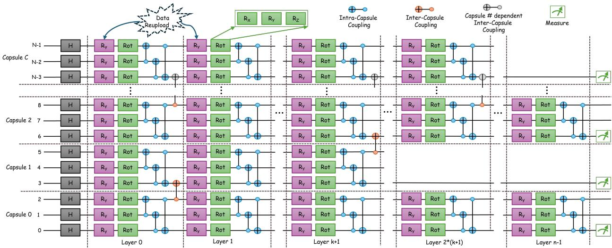  
Figure 1: Overview of the Q-Capsule architecture. N denotes the total number of qubits, c the capsule index, $c _ { \mathrm { s i z e } }$ the number of qubits per capsule, and $N _ { c } = N / c _ { \mathrm { s i z e } }$ the total number of capsules. k denotes the inter-capsule coupling interval. H is the Hadamard gate, $R _ { y }$ performs trainable data re-uploading, and Rot denotes a general trainable single-qubit rotation composed of $R _ { x } , R _ { y } ,$ and $R _ { z }$ Blue control–target symbols denote intra-capsule CNOTs, orange symbols denote sparse inter-capsule CNOTs, gray symbols indicate capsule-dependent coupling determined by the alternating coupling pattern, and the green meter symbol denotes local capsule-wise measurement. Diferent capsule lengths illustrate independently adapted capsule depths.

## 3 Methodology

## 3.1 Capsule Design

Local measurements are known to retain polynomially vanishing gradients in perceptron-based quantum networks [47]. However, purely local measurements may fail to capture global correlations across the full quantum system, which can limit the information available for prediction. Inspired by this trade-of, we introduce qubit capsuling as a strategy to mitigate barren plateaus while preserving richer information within locally structured groups of qubits.

## Qubit Partitioning

For qubit partitioning, the N-qubit register is partitioned into $N _ { c } = N / c _ { \mathrm { s i z e } }$ disjoint capsules of width $c _ { \mathrm { s i z e } }$ , capsule c owning the contiguous qubits $\mathcal { Q } _ { c } = \{ c c _ { \mathrm { s i z e } } , \ldots , ( c + 1 ) c _ { \mathrm { s i z e } } - 1 \}$ . Each capsule maintains an independent depth $d _ { c }$ and a private parameter tensor $\pmb { \theta } _ { c } \in \mathbb { R } ^ { d _ { c } \times c _ { \mathrm { s i z e } } \times 4 }$ , laid out contiguously in a flat parameter vector through a running ofset table $\big \{ o _ { c } \big \}$ with $o _ { c + 1 } = o _ { c } + 4 d _ { c } c _ { \mathrm { s i z e } }$ This layout enables heterogeneous capsule depths to grow independently, a single capsule can be deepened (Section 3.2) by extending its slice of the vector without modifying the parameter allocation or ofset structure of the remaining capsules.

## Local Readout and Per-Capsule Trainability

Each capsule is measured using a local observable, $O _ { c } = Z _ { c , c _ { \mathrm { s i z e } } }$ , producing one output value for each capsule, $o ( \pmb { x } ; \pmb { \theta } ) = ( \langle Z _ { c , c _ { \mathrm { s i z e } } } \rangle ) _ { c = 0 } ^ { N _ { c } - 1 } \in [ - 1 , 1 ] ^ { N _ { c } }$ . This local readout is an important design choice of our architecture. When the capsules are uncoupled $( k \to \infty )$ , or the circuit depth satisfies $L < k$ , both the observable $O _ { c }$ and the circuit operations that afect it are restricted to a capsule of fixed size $c _ { \mathrm { s i z e } }$ . The expectation $\left. O _ { c } \right.$ then depends only on the $c _ { \mathrm { s i z e } }$ qubits of the capsule and their parameters. Even when the capsule sub-circuit forms a 2-design, the gradient variance of a single-qubit observable satisfies [29]

$$
\mathrm { V a r } [ \partial _ { \theta } \langle O _ { c } \rangle ] \ \in \ \Omega ( 2 ^ { - c _ { \mathrm { s i z e } } } ) = \Omega ( 1 ) \ \mathrm { ~ i n ~ } N ,\tag{1}
$$

and therefore does not decrease as the total number of qubits increases. With coupling every k layers, the backward light cone of $O _ { c }$ extends by one capsule on each side per coupling round. Its support then grows to $c _ { \mathrm { s i z e } } \left( 1 + 2 \lfloor L / k \rfloor \right)$ qubits, and the bound becomes $\Omega \Big ( 2 ^ { - c _ { \mathrm { s i z e } } ( 1 + 2 \lfloor L / k \rfloor ) } \Big )$ , which is still independent of N for fixed L and k. However, a single global measurement can reintroduce barren plateaus even when the circuit is partitioned [8]. Therefore, we use local capsule-wise measurements for classification and a global-Z measurement only to analyze gradient concentration.

## 3.2 Adaptive growth

A quantum circuit with uniform depth may lead to ineficient allocation of computational resources, as feature blocks with higher complexity can become under-parameterized, while simpler blocks may receive more parameters than necessary. Q-Capsule addresses this limitation through an adaptive growth mechanism, allowing each capsule to expand independently according to its representational requirements. Specifically, capsule growth is guided by evidence of representational saturation measured using the Quantum Fisher Information Matrix (QFIM).

QFIM-Based Expressibility Score The adaptive controller requires a per-capsule criterion to determine whether a capsule has reached representational saturation at its current depth. We derive this criterion from the quantum Fisher information matrix (QFIM) [26]. For capsule c with depth $d _ { c } ,$ we evaluate the QFIM using an isolated $c _ { \mathrm { s i z e ^ { - } q u b i t } }$ replica of the capsule sub-circuit under the block-diagonal metric-tensor approximation of Stokes et al. [53]

$$
\begin{array} { r } { \mathcal { F } _ { i j } = 4 \mathrm { R e } [ \langle \partial _ { i } \psi _ { c } | \partial _ { j } \psi _ { c } \rangle - \langle \partial _ { i } \psi _ { c } | \psi _ { c } \rangle \langle \psi _ { c } | \partial _ { j } \psi _ { c } \rangle ] , } \end{array}\tag{2}
$$

Here the computation is performed on a $2 ^ { c _ { \mathrm { s i z e . } } }$ -dimensional state space and is therefore independent of total qubit N.

From the nonnegative, numerically clipped eigenvalue spectrum $\lambda _ { i }$ of $F _ { c } .$ we define the expressibility score as

$$
S _ { c } = \frac { d _ { \mathrm { { e f f } } } ( F _ { c } ) } { \log _ { 1 0 } { ( \kappa ( F _ { c } ) + 1 ) } } , \qquad d _ { \mathrm { { e f f } } } ( F ) = \frac { ( \sum _ { i } \lambda _ { i } ) ^ { 2 } } { \sum _ { i } \lambda _ { i } ^ { 2 } } , \qquad \kappa ( F ) = \frac { \lambda _ { \mathrm { { m a x } } } } { \lambda _ { \mathrm { { m i n } } } } ,\tag{3}
$$

Motivated by the Fisher-geometric capacity measures introduced by Haug et al. [16]. Within this formulation, $d _ { \mathrm { e f f } }$ measures the number of independent and appreciably curved parameter-space directions available to the capsule, whereas κ penalizes highly anisotropic spectra dominated by only a few stif directions.

## Saturation-Gated Adaptive Depth

Every $w _ { \mathrm { c h k } }$ optimization steps, the controller appends the current $S _ { c }$ to a per-capsule history and computes the windowed rate of change

$$
| \Delta S _ { c } | = \frac { \left| S _ { c } ^ { ( t ) } - S _ { c } ^ { ( t - w ) } \right| } { w } ,\tag{4}
$$

over a window of length w. An increasing $S _ { c }$ indicates that the capsule is still learning useful optimization directions, while a nearly constant $S _ { c }$ suggests that its representational capacity has saturated at the current depth.

$$
| \Delta S _ { c } | < \tau \quad \mathrm { a n d } \quad d _ { c } < d _ { \operatorname* { m a x } } ,\tag{5}
$$

Here, $\tau$ denotes the saturation threshold that determines when the change in $S _ { c }$ is suficiently small to trigger circuit growth, while $d _ { \mathrm { m a x } }$ specifies the maximum allowable depth of each capsule and prevents uncontrolled circuit expansion. Whenever an additional layer is appended only to capsule $^ { c , }$ using the near-identity initialization strategy. Since the parameter vector changes dimensionality, the quantum node is reconstructed using the updated depth profile and the optimizer’s moment estimates are reinitialized.

## 3.3 Sparse Inter-Capsule Coupling and the Entanglement Budget

Since isolated capsules capture only local information, Q-Capsule introduces sparse coupling between neighboring capsules to model inter-block correlations. A CNOT gate connects the last qubit of capsule c to the first qubit of capsule $c + 1$ every k layers using an alternating even–odd brickwork pattern, where k denotes the coupling interval. Thus, $k = 1$ corresponds to coupling at every layer, whereas $k  \infty$ yields fully isolated capsules.

We interpret the coupling interval as an entanglement regulator. Excessive entanglement between a local subsystem and the rest of the circuit can lead to concentration of the reduced state and vanishing local gradients [33]. Since each boundary CNOT can increase the entanglement across a capsule boundary by at most one ebit, the accumulated inter-capsule entanglement over depth L is bounded as

$$
S _ { \mathrm { i n t e r } } ( L ) \leq \mathcal { O } \biggl ( \left\lfloor \frac { L } { k } \right\rfloor \biggr ) .\tag{6}
$$

More frequent coupling allows information to propagate across larger portions of the N-qubit register, increasing the risk of gradient concentration. We use $N / k$ as a simple measure of coupling density and consider the scaling relation

$$
\mathrm { V a r } [ \partial _ { \theta } \mathcal { L } ] \propto \exp \left( - c ^ { * } \frac { N } { k } \right) , \qquad c ^ { * } > 0 .\tag{7}
$$

This motivates choosing the coupling interval as $( k = \mathcal { O } ( N ) )$ , allowing the circuit to remain weakly coupled as the system size increases.

## 3.4 Layer Structure and Trainable Re-Uploading

The circuit begins with a global Hadamard layer that prepares the uniform superposition $| + \rangle ^ { \otimes N }$ . In each layer $\ell < d _ { c }$ of capsule $^ { c , }$ there is a data-encoding layer followed by a trainable layer. So every qubit $j \in \mathcal { Q } _ { c }$ undergo two rotations,

$$
R _ { y } \Big ( x _ { j } \sigma _ { \ell , j } ^ { ( c ) } \Big ) \longrightarrow \mathrm { R o t } \Big ( \alpha _ { \ell , j } ^ { ( c ) } , \beta _ { \ell , j } ^ { ( c ) } , \gamma _ { \ell , j } ^ { ( c ) } \Big ) ,\tag{8}
$$

where $x _ { j }$ is the input feature assigned to qubit $j ,$ , and $\sigma _ { \ell , j } ^ { ( c ) }$ is a trainable scaling parameter that controls how strongly the input feature is encoded at each layer. After these rotations, the qubits within each capsule are entangled using a nearest-neighbour CNOT ladder, with a ring connection when $c _ { \mathrm { s i z e } } > 2$ . Importantly, no entangling gates connect qubits from diferent capsules in the base architecture.

The trainable encoding scale has an important role beyond simply adding parameters. Repeatedly encoding the input between trainable $S U ( 2 )$ rotations allows each capsule to represent increasingly complex functions of its input features, with the accessible frequency spectrum growing as the number of data re-uploading layers increases. By learning $\sigma _ { \ell , j } ^ { ( c ) }$ , the circuit can adapt the strength and frequency of the encoded features to the data instead of using a fixed scale.

## 4 Results

## 4.1 Experimental setup

The overall experiments are conducted on two setups using the MNIST handwritten-digit dataset [24]. For the binary classification task, two digit classes are selected, projected onto the first N principal components, and min-max normalized to the interval $[ 0 , \pi ]$ , such that each principal component is encoded into the rotation of a single qubit. For multiclass classification, we use the same experimental setup, except that the task involves four classes corresponding to digits 0–3. The resulting data are then divided into stratified training and test sets. In the classification pipeline, Q-Capsule acts as a quantum feature extractor in which the N qubits are partitioned into $N _ { c }$ capsules of size $c _ { \mathrm { s i z e } }$ . Each capsule processes its local subset of qubits through parameterized quantum layers while periodically exchanging information with neighboring capsules through sparse inter-capsule couplings. The features extracted from all capsules are then concatenated into a single feature vector and passed to a single classical output layer with a softmax activation to produce the final class prediction. Unless stated otherwise, the default experimental configuration uses $N = 1 2$ qubits, $c _ { \mathrm { s i z e } } = 3$ (corresponding to $N _ { c } = 4$ capsules), coupling interval $k = 3$ , initial depth $d _ { \mathrm { i n i t } } = 2 .$ , maximum depth $d _ { \operatorname* { m a x } } = 8$ Adam learning rate 0.05, growth window $w = 8$ , saturation threshold $\tau = 0 . 0 2$ , and a growth evaluation every six optimization steps over a training budget of 120 iterations.

## 4.2 Baseline

We evaluate Q-Capsule against five baseline ansätze that together span the principal strategies proposed for barren-plateau mitigation: a layerwise-grown circuit (Layer) [50], a matrix-productstate inspired circuit (qMPS) [9], a residual quantum network (ResQNet) [20], and two hardwareeficient globally-entangling circuits with a global readout, denoted Global and Glob96 [19]. The comparison focuses on four key diagnostics: gradient-variance scaling with register width, gradient distributions at a fixed width, cost-landscape geometry, and parameter eficiency. Throughout, we interpret the results in terms of the mechanisms of that section rather than asserting performance in isolation, so that the empirical behaviour can be attributed to specific architectural choices.

## 4.3 Gradient Variance Scaling with Qubit Count and Circuit Depth

We evaluate the scalability of the gradient signal with respect to register width at a fixed circuit depth. Figure 2 reports $\mathrm { V a r } [ \partial _ { \theta } \mathcal { L } ]$ for register widths $N \in { 2 , \ldots , 2 0 }$ . The globally coupled architectures, e.g. qMPS, Global, Glob96, and ResQNet, exhibit a consistent exponential reduction in gradient variance as the number of qubits increases. For $N \geq 4 ,$ the fitted slopes of log $\mathrm { V a r } [ \partial _ { \theta } \mathcal { L } ]$ are −0.68, $- 0 . 6 9 , \ - 0 . 6 9$ , and −0.69 per qubit, respectively. These values closely follow the characteristic $- \ln 2 \approx - 0 . 6 9 3$ scaling associated with exponential gradient suppression. In contrast, Q-Capsule maintains a gradient variance on the order of $1 0 ^ { - 1 }$ across the full range of register widths, with a fitted slope of only +0.01 per qubit. The Layer baseline also avoids continued exponential decay and stabilizes near $1 0 ^ { - 3 }$ at larger widths, although its gradient variance remains approximately one order of magnitude lower than that of Q-Capsule. Consequently, the separation between Q-Capsule and the globally coupled baselines grows with system size and reaches approximately five orders of magnitude at $N = 2 0$ . These results demonstrate that the localized capsule structure preserves strong gradient signals as the number of qubits increases.

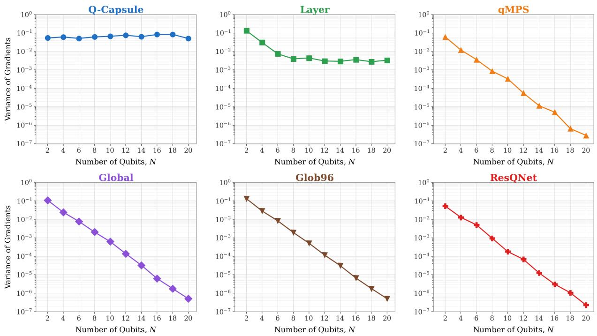  
Figure 2: Gradient variance versus register width N at fixed depth, for Q-Capsule and the five baselines (log scale).

We also examine the efect of circuit depth for $L \in { 1 , 5 , 1 0 , 1 5 , 2 5 }$ across diferent register widths. As shown in Figure 3, Q-Capsule consistently maintains a gradient variance of approximately $1 0 ^ { - 1 }$ as depth increases. The globally entangling baselines, which are already suppressed at larger register widths, exhibit an additional reduction in gradient variance at greater depths. The depth stability of Q-Capsule indicates that increasing circuit depth does not lead to substantial gradient suppression within the evaluated range. This result suggests that sparse inter-capsule coupling constrains excessive global entanglement while allowing additional layers to increase the representational capacity within individual capsules. The Global and Glob96 baselines exhibit nearly identical behavior at larger register widths, with their curves almost overlapping for N = 18 and $N = 2 0$ Thus, diferences in their parameterization have little efect once the circuits enter a strongly suppressed gradient regime.

## 4.4 Gradient Distributions at Fixed Width

Aggregation of variance can hide the shape of the underlying gradient distribution. Figure 4 shows the distribution of $\partial _ { \theta } \mathcal { L }$ over an ensemble of random initializations at a representative large register (N = 16, depth 25), with the per-model empirical variance annotated. To account for finite-shot measurement variability, each gradient estimate is evaluated using 100 shots, and the reported values represent the corresponding average estimates. The distributions make the width-scaling result concrete at the level of a single operating point. The Q-Capsule gradients are broadly distributed over the interval [−0.5, 0.5], with an empirical variance of $8 . 3 \times 1 0 ^ { - 2 }$ and individual components reaching magnitudes above 0.7, indicating that typical descent directions remain well separated from zero. The globally-read baselines, in contrast, are sharply concentrated around the origin: Global, Glob96, qMPS, and ResQNet all exhibit variances between $3 \times 1 0 ^ { - 6 }$ and $7 \times 1 0 ^ { - 6 }$ , roughly four orders of magnitude below Q-Capsule, with most of their gradient mass confined to a narrow region near zero. The Layer baseline is again intermediate, with a variance of $3 . 6 \times 1 0 ^ { - 3 }$ . Because the number of measurement shots required to reliably resolve a descent direction scales inversely with the gradient variance, the four-order-of-magnitude separation between Q-Capsule and the globally-read baselines implies a comparable diference in measurement cost at this width. This provides a practical interpretation of the barren plateau: the baseline gradients become increasingly dificult to resolve, whereas Q-Capsule retains gradients of suficient magnitude for efective optimization.

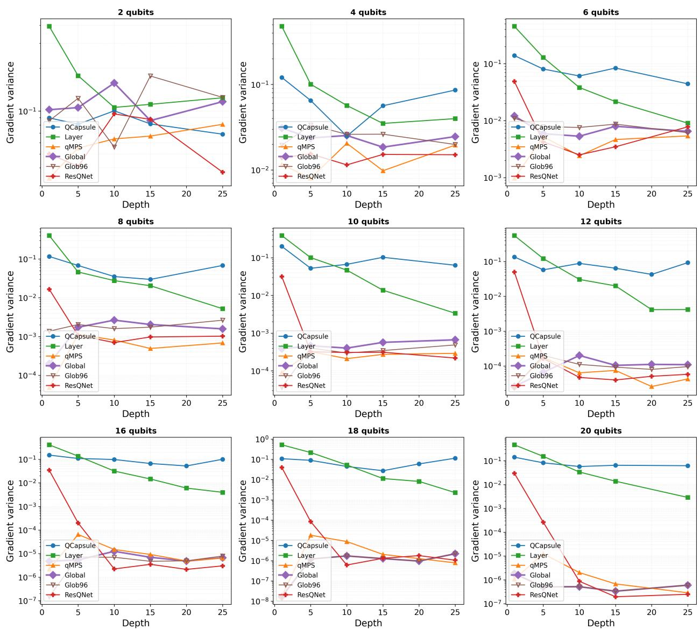  
Figure 3: Gradient variance versus depth for each register width (log scale). Q-Capsule remains within an $\mathcal { O } ( 1 0 ^ { - 1 } )$ band across all depths.

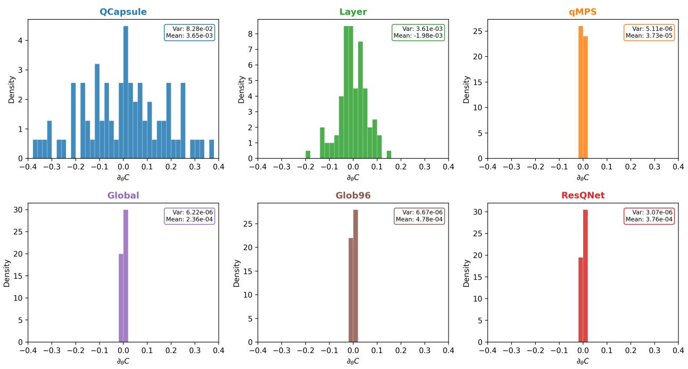  
Figure 4: Empirical gradient distributions at $N = 1 6 .$ , max depth 25, over random initializations, with per-model variance and mean annotated.

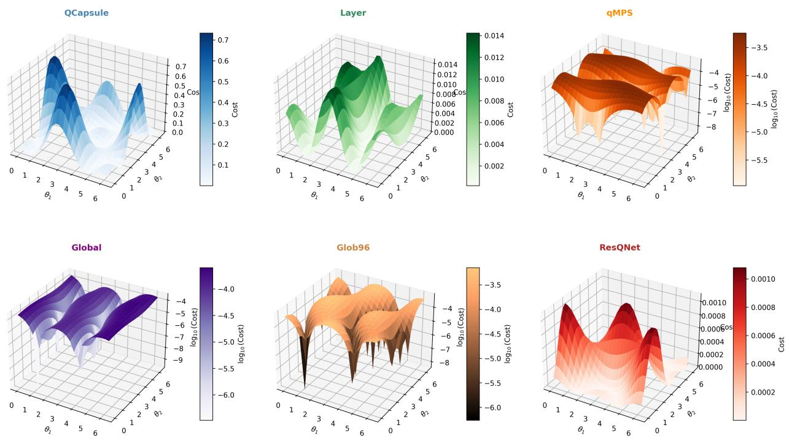  
Figure 5: Two-parameter cost-landscape slices $( \theta _ { 1 } , \theta _ { 2 } )$ at fixed remaining parameters. Q-Capsule (linear colour scale) shows structured minima spanning a cost range $\approx 0 . 7 5$

## 4.5 Cost-Landscape Geometry

To further characterize the optimization geometry of diferent barren Plateau Mitigation techniques, we evaluate the loss over a two-parameter slice $( \theta _ { 1 } , \theta _ { 2 } ) \in [ 0 , 2 \pi ) ^ { 2 }$ , while keeping all remaining parameters fixed across architectures. Figure 5 shows that Q-Capsule produces a structured landscape with distinct variations and well-separated minima. Its loss spans a total range of approximately 0.75, providing clear directions for gradient-based optimization. In contrast, the globally coupled baselines produce nearly flat landscapes. The total loss variation of Global is approximately $2 . 6 \times 1 0 ^ { - 4 }$ , while qMPS, Glob96, and ResQNet exhibit similarly limited variation. The approximately three-order-of-magnitude diference in landscape variation is consistent with the gradient-variance results. Together, these findings show that Q-Capsule preserves meaningful local cost variations, whereas the globally coupled architectures operate in regions that are efectively flat at the evaluated width and depth.

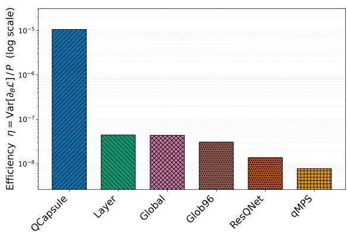  
Figure 6: Parameter-eficiency score per model (log scale). Q-Capsule exceeds the next-best baselines by approximately two orders of magnitude, consistent with the saturation-gated allocation of Equation (5).

Table 1: Parameter-eficiency score $\eta \quad =$ $\mathrm { V a r } [ \partial _ { \theta } \mathcal { L } ] / P$ at $N = 1 2$ . The final column reports its advantage relative to each baseline.
<table><tr><td>Model</td><td>Gradient variance</td><td>Params P</td><td>η</td><td>Rel. to Q-Capsule</td></tr><tr><td>Q-Capsule</td><td> $\mathbf { 5 . 0 8 \times 1 0 ^ { - 2 } }$ </td><td>4800</td><td> $\mathbf { 1 . 0 6 \times 1 0 ^ { - 5 } }$ </td><td>1.0×</td></tr><tr><td>LAYER</td><td> $1 . 0 7 \times 1 0 ^ { - 4 }$ </td><td>2400</td><td> $4 . 4 4 \times 1 0 ^ { - 8 }$ </td><td>238×</td></tr><tr><td>GLOBAL</td><td> $1 . 0 5 \times 1 0 ^ { - 4 }$ </td><td>2400</td><td> $4 . 3 6 \times 1 0 ^ { - 8 }$ </td><td>243×</td></tr><tr><td>GLOB96</td><td> $1 . 4 7 \times 1 0 ^ { - 4 }$ </td><td>4800</td><td> $3 . 0 7 \times 1 0 ^ { - 8 }$ </td><td>345×</td></tr><tr><td>RESQNET</td><td> $6 . 5 9 \times 1 0 ^ { - 5 }$ </td><td>4800</td><td> $1 . 3 7 \times 1 0 ^ { - 8 }$ </td><td>771×</td></tr><tr><td>QMPS</td><td> $6 . 8 0 \times 1 0 ^ { - 5 }$ </td><td>8800</td><td> $7 . 7 3 \times 1 0 ^ { - 9 }$ </td><td>1370×</td></tr></table>

## 4.6 Parameter Eficiency

A trainable architecture should preserve useful gradients without relying on an inflated parameter budget. We quantify this trade-of using the parameter-eficiency score $\begin{array} { r l r } { \eta } & { { } = } & { \frac { \mathrm { V a r } [ \partial _ { \theta } \mathcal { L } ] } { P } } \end{array}$ where P denotes the number of trainable parameters. The score measures the amount of gradient signal retained per trainable parameter and is used only for relative comparison across architectures. As shown in Figure 6 and Table 1, Q-Capsule achieves the highest eficiency, $\eta = 1 . 0 6 \times 1 0 ^ { - 5 }$ exceeding the next-best baselines by more than two orders of magnitude and the least eficient baseline by nearly three. The two hardware-eficient globally coupled circuits, Global and Layer, follow at $\eta = 4 . 3 6 \times 1 0 ^ { - 8 }$ and $4 . 4 4 \times 1 0 ^ { - 8 }$ respectively—roughly 240× below Q-Capsule—while Glob96 $( 3 . 0 7 \times 1 0 ^ { - 8 } )$ , ResQNet $( 1 . 3 7 \times 1 0 ^ { - 8 } )$ , and qMPS $( 7 . 7 3 \times 1 0 ^ { - 9 } )$ fall further behind, the last by a factor of approximately $1 . 4 \times 1 0 ^ { 3 }$

This advantage is driven primarily by the substantially larger gradient variance maintained by Q-Capsule $( 5 . 0 8 \times 1 0 ^ { - 2 } )$ , against $\mathcal { O } ( 1 0 ^ { - 4 } ) – \mathcal { O } ( 1 0 ^ { - 5 } )$ for the baselines. Rather than by a reduction in model capacity: Q-Capsule in fact carries 4800 trainable parameters at $N = 1 2$ so its ranking cannot be attributed to a smaller parameter budget. The result therefore confirms that the improved trainability of Q-Capsule is not obtained through parameter inflation. It is also consistent with the adaptive growth mechanism, which introduces additional capacity only after the existing capsule structure approaches saturation.

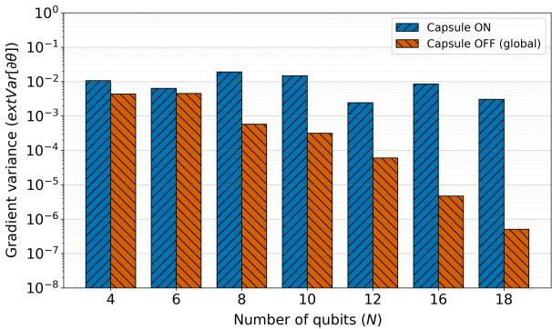  
Figure 7: Gradient variance with and without capsule partitioning as the number of qubits increases.

Table 2: Influence of capsule size on the number of capsules, gradient variance, and classification accuracy at $N = 1 2$ . Bold marks the configuration used throughout.
<table><tr><td> $\scriptstyle { \mathcal { C } } _ { \mathbf { s i z e } }$ </td><td>Capsules  $N _ { c }$ </td><td>Gradient variance</td><td>Accuracy</td></tr><tr><td>2</td><td>6</td><td> $1 . 4 5 \times 1 0 ^ { - 2 }$ </td><td>0.954</td></tr><tr><td>3</td><td>4</td><td> $2 . 4 2 \times 1 0 ^ { - 3 }$ </td><td>0.972</td></tr><tr><td>4</td><td>3</td><td> $1 . 5 1 \times 1 0 ^ { - 3 }$ </td><td>0.963</td></tr><tr><td>6</td><td>2</td><td> $2 . 3 7 \times 1 0 ^ { - 4 }$ </td><td>0.954</td></tr></table>

## 4.7 Ablation Study

We conduct a series of ablation experiments to isolate the contributions of capsule partitioning, capsule size, sparse inter-capsule coupling, data re-uploading, readout locality, and structured initialization. We report both gradient variance and classification accuracy, as these quantities characterize complementary aspects of model trainability.

## 4.7.1 Capsule Partitioning and Capsule Size

We first evaluate the role of capsule partitioning by replacing the capsule-structured architecture with a single globally entangling circuit and a global readout. As shown in Figure 7, the global variant exhibits pronounced gradient suppression as the register width increases. Its gradient variance decreases from $4 . 3 \times 1 0 ^ { - 3 }$ at $N = 4$ to $5 . 1 \times 1 0 ^ { - 7 }$ at $N = 1 8$ . In contrast, the capsule-partitioned model maintains gradient variance between $\mathcal { O } ( 1 0 ^ { - 3 } )$ and $\mathcal { O } ( 1 0 ^ { - 2 } )$ over the same range, without a systematic decay with N. Consequently, the separation between the two variants grows with register width and exceeds three orders of magnitude at $N = 1 8$ . These results identify capsule partitioning as a primary factor in preventing width-induced gradient suppression.

We next examine the efect of capsule size by varying $c _ { \mathrm { s i z e } } ~ \in ~ \{ 2 , 3 , 4 , 6 \}$ at $N = 1 2$ As reported in Table 2, the gradient variance decreases monotonically from $1 . 4 5 \times 1 0 ^ { - 2 }$ at $c _ { \mathrm { s i z e } } = 2$ to $2 . 3 7 \times 1 0 ^ { - 4 }$ at $c _ { \mathrm { s i z e } } = 6$ , corresponding to a reduction of nearly two orders of magnitude. This trend is consistent with the $\Omega ( 2 ^ { - c _ { \mathrm { s i z e } } } )$ lower bound: as each capsule spans a larger Hilbert space, its local gradients become increasingly susceptible to suppression. Accuracy exhibits a non-monotonic dependence on capsule size. The highest accuracy, 0.972, is obtained at $c _ { \mathrm { s i z e } } = 3$ . The smaller $c _ { \mathrm { s i z e } } = 2$ configuration retains stronger gradients but achieves lower accuracy, suggesting insuficient within-capsule expressivity. Conversely, larger capsules provide greater local capacity but exhibit substantially weaker gradients. The default choice $c _ { \mathrm { s i z e } } = 3$ therefore provides the most favorable balance between predictive performance and gradient preservation.

## 4.7.2 Information Shared by Sparse Coupling

Sparse inter-capsule coupling preserves gradient magnitude, but it may also reduce the information shared between neighbouring capsules. To examine this trade-of we measure the quantum mutual information between two adjacent capsules, $I ( A { : } B ) = S ( A ) + S ( B ) - S ( A B )$ , where $S ( \cdot )$ denotes the von Neumann entropy; a value of zero indicates that the two capsules are statistically independent. Figure 10 reports $I ( A { : } B )$ together with the number of boundary CNOT gates that each coupling interval k introduces.

In the isolated configuration the mutual information is exactly 0.00 bits. This confirms that the capsules are strictly independent when the boundary gates are removed, and therefore that any information observed at the remaining settings is attributable to those gates alone rather than to the encoding or the intra-capsule structure. Once coupling is enabled, the two capsules share between 1.64 and 3.06 bits—a substantial portion of the 6-bit maximum available to a pair of three-qubit capsules.

The central observation is that this shared information does not scale with the number of coupling gates. The densest setting, $k = 1$ , spends nine boundary CNOTs and reaches 2.29 bits, whereas $k = 2$ spends only five and attains the highest value recorded, 3.06 bits. At the sparsest setting tested, $k = 8 .$ , two CNOTs still sustain 1.92 bits, i.e. 84% of the information obtained by the densest configuration at 22% of its coupling cost. Information sharing is therefore not purchased gate by gate: beyond the small number of boundary gates required to correlate the two capsules at all, additional coupling contributes little.

That the densest setting is not the most informative is consistent with the monogamy of entanglement. $\mathrm { A t } ~ k = 1$ every capsule boundary is coupled at every layer, so correlations established at one boundary are redistributed across the full four-capsule register; the entanglement available to any particular pair is correspondingly reduced. Intermediate coupling confines the correlations to neighbouring capsules, which is precisely where the mutual information is measured. The quantity relevant to the architecture is thus how the entanglement budget is allocated, not how much of it is generated.

Taken together with circular intra-capsule couplin, these measurements delineate the operating regime of the capsule structure. Reducing coupling strengthens the local gradient signal, and the present results show that it does so without severing communication between capsules: only the fully decoupled configuration produces genuinely independent capsules, while every sparse setting retains most of the shared information at a fraction of the two-qubit gate cost. Sparse coupling therefore preserves gradient magnitude and inter-capsule communication simultaneously, rather than trading one against the other.

## 4.7.3 Component Knock-Out: Re-Uploading, Readout Locality, Initialization

To understand the importance of trainable data re-uploading, local readout, and structured initialization we evaluated the Q-Capsule with and without three components. Table 3 reports the resulting gradient variance and classification accuracy. Removing data re-uploading causes accuracy to collapse from 0.972 to 0.509, which is approximately chance performance on the balanced binary task. Notably, the gradient variance increases to $1 . 3 0 \times 1 0 ^ { - 2 }$ . Thus, the failure cannot be attributed to vanishing gradients. Instead, the result indicates that re-uploading is required to maintain an efective pathway through which the classical input influences the learned quantum representation. Removing structured initialization similarly reduces accuracy, from 0.972 to 0.639, while leaving the gradient variance nearly unchanged at $1 . 9 9 \times 1 0 ^ { - 3 }$ . This result suggests that gradient magnitude alone does not characterize whether the available descent directions are aligned with useful data dependent features. Structured initialization therefore contributes not only by preserving gradient scale, but also by placing the circuit in a parameter regime from which efective representations can be learned.

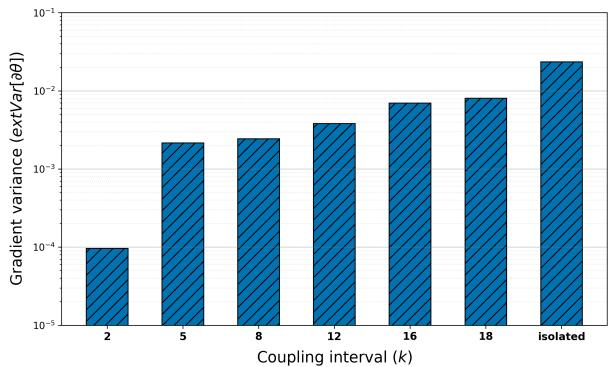  
Figure 8: Efect of inter-capsule coupling interval k on gradient variance, improved gradient preservation with sparser coupling.

Table 3: Efect of key architectural components on gradient variance and classification accuracy. Bold settings denote the full model.
<table><tr><td>Component</td><td>Setting</td><td>Gradient variance</td><td>Accuracy</td></tr><tr><td rowspan="2">Data re-uploading</td><td>Enabled (full)</td><td> $2 . 4 2 \times 1 0 ^ { - 3 }$ </td><td>0.972</td></tr><tr><td>Removed</td><td> $1 . 3 0 \times 1 0 ^ { - 2 }$ </td><td>0.509</td></tr><tr><td rowspan="2">Readout observable</td><td>Local Z0 (full)</td><td> $\overline { { 2 . 4 2 \times 1 0 ^ { - 3 } } }$ </td><td>0.972</td></tr><tr><td>Global  $Z _ { 0 } Z _ { n - 1 }$ </td><td> $9 . 7 7 \times 1 0 ^ { - 5 }$ </td><td>0.963</td></tr><tr><td rowspan="2">Initialization</td><td>Structured (full)</td><td> $\overline { { 2 . 4 2 \times 1 0 ^ { - 3 } } }$ </td><td>0.972</td></tr><tr><td>Uniform [0, 2π)</td><td> $1 . 9 9 \times 1 0 ^ { - 3 }$ </td><td>0.639</td></tr></table>

A diferent pattern emerges when the local observable is replaced with the global two-qubit observable $Z _ { 0 } Z _ { N - 1 }$ . In this case, the gradient variance decreases from $2 . 4 2 \times 1 0 ^ { - 3 } \mathrm { ~ t o ~ } 9 . 7 7 \times 1 0 ^ { - 5 }$ whereas accuracy decreases only slightly from 0.972 to 0.963. The reduction in variance is consistent with the cost-locality analysis [8], according to which global observables are more susceptible to barren plateaus than local observables. The limited accuracy reduction is likely attributable to the moderate register width used in this experiment. The trainability disadvantage of the global readout is expected to become more consequential as register size increases.

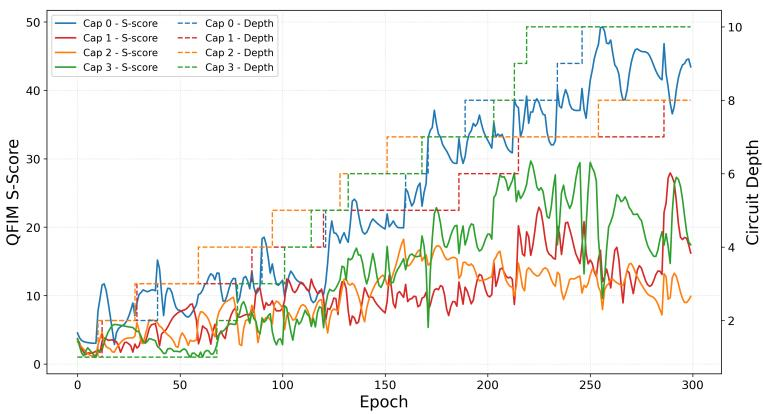  
Figure 9: QFIM S-score (solid, left axis) and capsule depth (dashed step, right axis) versus training epoch for the four capsules of the default configuration. Each depth increment driven by the growth gate of Equation (5) is followed by a sustained rise in S-score.

## 4.7.4 Adaptive Growth of Representational Capacity

To determine whether this added depth provides useful capacity, we track the efective dimension of each capsule using the QFIM-based S-score till $d _ { \operatorname* { m a x } } = 1 0$ . Figure 9 shows that the S-score increases with capsule depth. Each depth increase is followed by a sustained rise in S-score, from approximately 3 at $d = 1$ to about 40 for the deepest capsule. Across all capsules, the mean S-score increases from 2.7 at $d = 1$ to 13.9 at $d = 6$ and approximately 31 at $d = 1 0$ , with correlations between depth and S-score ranging from 0.85 to 0.98. These results indicate that adaptive growth increases efective representational capacity rather than adding inaccessible parameters.

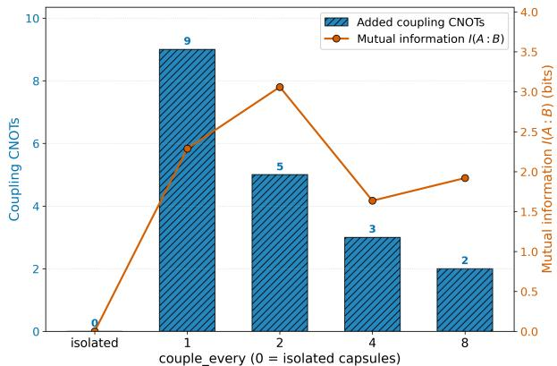

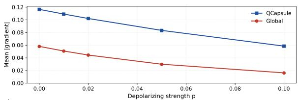

Figure 10: Quantum mutual information $I ( A { : } B )$ between two adjacent capsules at $N = 1 2$ versus the coupling spacing, together with the added boundary-CNOT count (left axis). The isolated limit shares 0 bits, while sparse coupling retains most of the shared information at a fraction of the coupling-gate cost.  
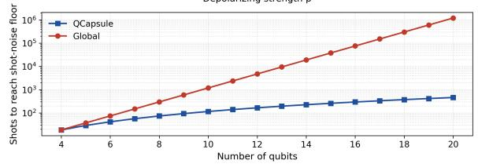  
Figure 11: Top: mean gradient magnitude under a per-layer depolarizing channel of strength $p .$ The Q-Capsule signal decays more slowly than that of the global block. Bottom: Number of shots required for a gradient component to reach the shot-noise floor versus register width.

## 4.7.5 Trainability Under Depolarizing Noise and Measurement Cost

On near-term quantum hardware, however, gate noise can further suppress gradients and produce a noise-induced barren plateau [56]. We therefore compare how the Q-Capsule and global architectures respond to noise. A depolarizing channel with strength $p$ is applied after each circuit layer, and the mean gradient magnitude is measured as $p$ increases. Figure 11 presents the results at $N = 6 .$ where mixed-state simulation remains computationally feasible. The Q-Capsule gradients decrease more slowly than those of the global block and remain larger at every tested noise level. $\mathrm { A t } ~ p = 0$ the mean gradient magnitudes are $9 . 8 \times 1 0 ^ { - 2 }$ for Q-Capsule and $5 . 4 \times 1 0 ^ { - 2 }$ for the global block. At $p = 0 . 1$ , they decrease to $5 . 1 \times 1 0 ^ { - 2 }$ and $1 . 5 \times 1 0 ^ { - 2 }$ , respectively. Thus, although noise weakens both models, its efect is substantially stronger on the global architecture. This result suggests that the shallow and local entangling structure of Q-Capsule reduces noise accumulation along the paths responsible for carrying gradient information. The bottom panel translates the noise-free gradient advantage into measurement cost. Because the number of shots required to resolve a gradient scales approximately as $1 / \operatorname { V a r } [ \partial _ { \theta } \mathcal { L } ]$ , the measurement requirement of Q-Capsule remains nearly constant as the register width increases. In contrast, the required number of shots for the global block grows by several orders of magnitude. Therefore, the global gradients are not exactly zero, but resolving them against shot noise becomes increasingly impractical at larger register widths.

Table 4: Digit classification by three depth policies of the Q-Capsule circuit $( N = 6 , \ c _ { \mathrm { s i z e } } = 3$ $k = 8 )$ . The adaptive policy’s converged depth profile is shown in the last column. Best accuracy per task in bold; the adaptive policy also uses roughly a quarter of the gates and parameters of the fixed-deep circuit.
<table><tr><td>Task</td><td>Depth policy</td><td>Accuracy</td><td>2-qubit gates</td><td>Total gates</td><td>Params</td><td>Depths</td></tr><tr><td rowspan="3">Binary (3/8)</td><td>Fixed-shallow (d=1)</td><td>0.491</td><td>7</td><td>25</td><td>24</td><td>[1, 1]</td></tr><tr><td>Fixed-deep (d=8)</td><td>0.944</td><td>49</td><td>151</td><td>192</td><td>[8,8]</td></tr><tr><td>Adaptive</td><td>0.981</td><td>13</td><td>43</td><td>48</td><td>[2,2]</td></tr><tr><td rowspan="3">Multiclass (0–3)</td><td>Fixed-shallow (d=1)</td><td>0.935</td><td>7</td><td>25</td><td>24</td><td>[1, 1]</td></tr><tr><td>Fixed-deep (d=8)</td><td>0.963</td><td>49</td><td>151</td><td>192</td><td>[8,8]</td></tr><tr><td>Adaptive</td><td>0.977</td><td>13</td><td>43</td><td>48</td><td>[2,2]</td></tr></table>

## 4.8 Classification Performance

We evaluate the fixed-shallow, fixed-deep, and adaptive Q-Capsule policies on binary digit classification $( 3 / 8 )$ and four-class classification (0–3). The experiments use an $N = 6$ register divided into two capsules of size $c _ { \mathrm { s i z e } } = 3$ . The binary task is read out from the capsule-head qubits and thresholded at zero; the four-class task reads all N Pauli-Z expectations into a trained linear head. Table 4 reports the test accuracy, circuit cost, parameter count, and final capsule depths.

Table 4 reports the outcome. The two fixed policies bracket the useful regime from either side, and neither is a good default. The shallow policy at d=1 is not merely weak on the binary task but collapses to chance (0.491 on a balanced two-class test set), indicating that a single layer per capsule leaves the circuit unable to separate the two digits at all; on the four-class task the same policy reaches 0.935, so the failure is specific to the binary setting rather than a general lack of capacity. The deep policy at d=8 is reliable on both tasks (0.944 and 0.963) but pays for it, using 49 two-qubit gates and 192 parameters—roughly four times the gate budget and eight times the parameter count of the shallow policy—and it is the slowest variant to train on both tasks.

The adaptive policy is the most accurate variant on both tasks, reaching 0.981 on the binary task and 0.977 on the four-class task, in each case at 13 two-qubit gates and 48 parameters. Relative to the deep policy this is a 73% reduction in two-qubit gates and a 75% reduction in parameters, obtained without a loss in accuracy. The mechanism is visible in the depth-selection trace: the probe assigns the binary task quick accuracies of 0.480, 0.940, and 0.960 at $d = 1 , 2 , 3$ and the four-class task 0.871, 0.921, and 0.911, so in both cases d=2 is the shallowest depth within tolerance of the best probe, and both runs are initialized there. Neither run subsequently improved on the validation accuracy recorded at that depth, and both therefore retained the [2, 2] profile. The result is thus driven by the depth-selection stage rather than by subsequent growth: on these two tasks the policy’s contribution is to identify a depth that neither fixed setting supplies, one layer above the collapsing shallow circuit and six below the deep one. We note that the accuracy margins over the deep policy are small in absolute terms—four test samples on the binary task $( n = 1 0 8 )$ and three on the four-class task (n = 217)—so the accuracy ordering between the adaptive and deep policies should be read as a tie, while the diference in circuit cost is large and unambiguous. Figure 12 shows the accuracy comparison; every variant except the shallow policy on the binary task sits well above the per-task chance level.

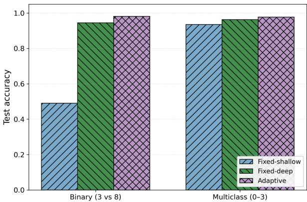  
Figure 12: Test accuracy per task for the three depth policies. The shallow policy (d=1) collapses to chance on the binary task while remaining serviceable on the four-class task; the deep policy (d=8) is reliable on both but at four times the two-qubit gate count; the adaptive policy matches or exceeds the deep policy on both tasks using 13 two-qubit gates rather than 49.

Table 5: Cross-framework benchmark of the 20-layer Q-Capsule circuit at capsule-aligned register widths.
<table><tr><td>Framework</td><td>N</td><td>Params</td><td>Gradient variance</td><td>Gradient time (s)</td></tr><tr><td rowspan="5">PennyLane</td><td>6</td><td>480</td><td> $1 . 8 9 2 \times 1 0 ^ { - 2 }$ </td><td> $2 . 3 0 \times 1 0 ^ { 1 }$ </td></tr><tr><td>9</td><td>720</td><td> $1 . 2 4 5 \times 1 0 ^ { - 2 }$ </td><td> $4 . 3 9 \times 1 0 ^ { 1 }$ </td></tr><tr><td>12</td><td>960</td><td> $1 . 3 5 0 \times 1 0 ^ { - 2 }$ </td><td> $7 . 8 6 \times 1 0 ^ { 1 }$ </td></tr><tr><td>15</td><td>1200</td><td> $1 . 0 2 1 \times 1 0 ^ { - 2 }$ </td><td> $1 . 9 3 \times 1 0 ^ { 2 }$ </td></tr><tr><td>18</td><td>1440</td><td> $1 . 2 5 2 \times 1 0 ^ { - 2 }$ </td><td> $1 . 3 6 \times 1 0 ^ { 3 }$ </td></tr><tr><td rowspan="5">Qiskit</td><td>6</td><td>480</td><td> $1 . 8 9 2 \times 1 0 ^ { - 2 }$ </td><td> $4 . 1 1 \times 1 0 ^ { - 2 }$ </td></tr><tr><td>9</td><td>720</td><td> $1 . 2 4 5 \times 1 0 ^ { - 2 }$ </td><td> $6 . 2 8 \times 1 0 ^ { - 2 }$ </td></tr><tr><td>12</td><td>960</td><td> $1 . 3 5 0 \times 1 0 ^ { - 2 }$ </td><td> $1 . 1 6 \times 1 0 ^ { - 1 }$ </td></tr><tr><td>15</td><td>1200</td><td> $1 . 0 2 1 \times 1 0 ^ { - 2 }$ </td><td> $5 . 4 9 \times 1 0 ^ { - 1 }$ </td></tr><tr><td>18</td><td>1440</td><td> $1 . 2 5 2 \times 1 0 ^ { - 2 }$ </td><td> $7 . 7 3 \times 1 0 ^ { 0 }$ </td></tr><tr><td rowspan="5">Cirq</td><td>6</td><td>480</td><td> $1 . 8 9 1 \times 1 0 ^ { - 2 }$ </td><td> $6 . 3 3 \times 1 0 ^ { - 2 }$ </td></tr><tr><td>9</td><td>720</td><td> $1 . 2 4 5 \times 1 0 ^ { - 2 }$ </td><td> $9 . 4 3 \times 1 0 ^ { - 2 }$ </td></tr><tr><td>12</td><td>960</td><td> $1 . 3 4 9 \times 1 0 ^ { - 2 }$ </td><td> $1 . 4 2 \times 1 0 ^ { - 1 }$ </td></tr><tr><td>15</td><td>1200</td><td> $1 . 0 2 1 \times 1 0 ^ { - 2 }$ </td><td> $2 . 3 6 \times 1 0 ^ { - 1 }$ </td></tr><tr><td>18</td><td>1440</td><td> $1 . 2 5 2 \times 1 0 ^ { - 2 }$ </td><td> $1 . 5 0 \times 1 0 ^ { 0 }$ </td></tr></table>

## 4.9 Cross-Framework Implementation Benchmark

To verify that the reported gradient behavior is a property of Q-Capsule rather than a specific software framework, we implemented the same circuit in PennyLane, Qiskit, and Cirq. PennyLane and Qiskit compute gradients using the exact parameter-shift rule, while Cirq uses a central finitediference approximation with step size $\varepsilon = 1 0 ^ { - 3 }$ . Table 5 shows that all three implementations produce nearly identical gradient variances. PennyLane and Qiskit agree to numerical precision, while Cirq difers by less than approximately 0.05%. For example, at $N = 6$ , PennyLane and Qiskit obtain $1 . 8 9 1 8 \times 1 0 ^ { - 2 }$ , compared with $1 . 8 9 0 9 \times 1 0 ^ { - 2 }$ for Cirq. Across all tested widths, the variance remains within an $\mathcal { O } ( 1 0 ^ { - 2 } )$ range and shows no systematic decay. This confirms that Q-Capsule’s stable gradient behavior is independent of the simulator and diferentiation method.

However, these frameworks difer more clearly in gradient-evaluation time, as shown in Table 5. $\mathrm { A t } ~ N = 6$ , PennyLane requires $2 . 3 0 \times 1 0 ^ { 1 }$ s to assemble the complete gradient vector, whereas Qiskit and Cirq need only $4 . 1 1 \times 1 0 ^ { - 2 }$ s and $6 . 3 3 \times 1 0 ^ { - 2 }$ s respectively for a single component. At $N = 1 8 .$ PennyLane requires approximately $1 . 3 6 \times 1 0 ^ { 3 } \mathrm { ~ s ~ }$ , compared with 7.73 s for Qiskit and 1.50 s for Cirq. This diference mainly results from the gradient components being evaluated. PennyLane computes the complete gradient vector using parameter shift, requiring two circuit evaluations for each of the 4NL parameters. Qiskit and Cirq evaluate only the single gradient component needed for this experiment. Therefore, these results should not be interpreted as a direct comparison of simulator speed. Instead, they show that full-vector parameter-shift diferentiation becomes expensive as the number of parameters increases. Circuit construction remains negligible in all frameworks, with build times below $6 \times 1 0 ^ { - 4 } \mathrm { ~ s ~ }$ .

## 5 Conclusion

This work introduced Q-Capsule, a localized quantum neural architecture that mitigates barren plateaus through capsule partitioning, local readout, sparse inter-capsule coupling, trainable data re-uploading, and QFIM-guided adaptive growth. Q-Capsule consistently maintains stable gradient variance, demonstrating robust trainability across diferent register sizes. At N = 16 and depth 25, Q-Capsule achieves a gradient variance of $8 . 3 \times 1 0 ^ { - 2 }$ , compared with approximately $1 0 ^ { - 6 }$ for the globally read baselines. Ablation studies further confirm the importance of capsule locality, sparse coupling, data re-uploading, and structured initialization, while the QFIM-based analysis shows that adaptive growth increases efective representational capacity.

Beyond gradient preservation, Q-Capsule provides structured optimization landscapes, higher parameter eficiency, improved robustness to depolarizing noise, and lower measurement requirements. Its adaptive policy achieves 0.981 accuracy on binary classification and 0.977 on four-class classification, while using about 73% fewer two-qubit gates than the fixed-deep model on the multiclass task. Consistent gradient statistics across PennyLane, Qiskit, and Cirq further confirm that these improvements arise from the circuit design rather than a particular software framework. Overall, Q-Capsule provides a practical balance between trainability, expressivity, and quantum resource eficiency, motivating future evaluation on larger tasks and real noisy quantum hardware. Though Q-Capsule introduces additional training and computational overhead through periodic QFIM evaluations, data re-uploading, and adaptive circuit reconstruction, this overhead is primarily incurred during training and does not afect inference once the final circuit structure is fixed. Future work will focus on reducing this overhead, scaling the architecture to more complex datasets and larger quantum systems, and validating its performance on real noisy quantum processors.

## 6 Acknowledgments

The authors acknowledge the computational resources and support provided by Secure Prediction, Edge AI and Multimodal LLM Lab (SPEED Lab), Institute for Smarter Cities, Spaces, and Health, and Center for Connected Autonomy and Artificial Intelligence (CA-AI) at Florida Atlantic University.

## Ethics and Privacy Statement

This work develops optimization techniques for variational quantum machine learning models with the goal of improving training stability, convergence, and scalability. The proposed methods are intended to advance trustworthy and eficient quantum AI research and do not involve human subjects, personal data, or sensitive datasets. While improved quantum learning algorithms may accelerate future applications across scientific and engineering domains, the methods presented are general-purpose optimization techniques and do not introduce application-specific privacy, fairness, or safety risks beyond those inherent to quantum machine learning research.

## References

[1] Amira Abbas, David Sutter, Christa Zoufal, Aurelien Lucchi, Alessio Figalli, and Stefan Woerner. The power of quantum neural networks. Nature Computational Science, 1:403–409, 2021. doi: 10.1038/s43588-021-00084-1.

[2] Akshay Ajagekar and Fengqi You. Variational quantum circuit based demand response in buildings leveraging a hybrid quantum-classical strategy. Applied Energy, 364:123244, 2024.

[3] Harun Al Azies and Muhamad Akrom. Layerwise quantum training: A progressive strategy for mitigating barren plateaus in quantum neural networks. Journal of Multiscale Materials Informatics.

[4] Sara Aminpour, Yaser M Banad, and Sarah S Sharif. Strategic data re-uploads: a pathway to improved quantum classification data re-uploading strategies for improved quantum classifier performance. Entropy, 28(5):550, 2026.

[5] Thomas Barthel and Qiang Miao. Absence of barren plateaus and scaling of gradients in the energy optimization of isometric tensor network states: T. barthel, q. miao. Communications in Mathematical Physics, 406(4):86, 2025.

[6] Kishor Bharti, Alba Cervera-Lierta, Thi Ha Kyaw, Tobias Haug, Sumner Alperin-Lea, Abhinav Anand, Matthias Degroote, Hermanni Heimonen, Jakob S Kottmann, Tim Menke, et al. Noisy intermediate-scale quantum algorithms. Reviews of Modern Physics, 94(1):015004, 2022.

[7] Marco Cerezo, Andrew Arrasmith, Ryan Babbush, Simon C. Benjamin, Suguru Endo, Keisuke Fujii, Jarrod R. McClean, Kosuke Mitarai, Xiao Yuan, Lukasz Cincio, and Patrick J. Coles. Variational quantum algorithms. Nature Reviews Physics, 3:625–644, 2021. doi: 10.1038/ s42254-021-00348-9.

[8] Marco Cerezo, Akira Sone, Tyler Volkof, Lukasz Cincio, and Patrick J. Coles. Cost function dependent barren plateaus in shallow parametrized quantum circuits. Nature Communications, 12:1791, 2021. doi: 10.1038/s41467-021-21728-w.

[9] Enrique Cervero Martín, Kirill Plekhanov, and Michael Lubasch. Barren plateaus in quantum tensor network optimization. Quantum, 7:974, 2023. doi: 10.22331/q-2023-04-13-974.

[10] Iris Cong, Soonwon Choi, and Mikhail D. Lukin. Quantum convolutional neural networks. Nature Physics, 15:1273–1278, 2019. doi: 10.1038/s41567-019-0648-8.

[11] Philip Easom-Mccaldin, Ahmed Bouridane, Ammar Belatreche, and Richard Jiang. On depth, robustness and performance using the data re-uploading single-qubit classifier. IEEe Access, 9: 65127–65139, 2021.

[12] Suguru Endo, Zhenyu Cai, Simon C Benjamin, and Xiao Yuan. Hybrid quantum-classical algorithms and quantum error mitigation. Journal of the Physical Society of Japan, 90(3): 032001, 2021.

[13] Roy J Garcia, Chen Zhao, Kaifeng Bu, and Arthur Jafe. Barren plateaus from learning scramblers with local cost functions. Journal of High Energy Physics, 2023(1):90, 2023.

[14] Edward Grant, Leonard Wossnig, Mateusz Ostaszewski, and Marcello Benedetti. An initialization strategy for addressing barren plateaus in parametrized quantum circuits. Quantum, 3: 214, 2019. doi: 10.22331/q-2019-12-09-214.

[15] Muhammad Asfand Hafeez, Arslan Munir, and Hayat Ullah. H-qnn: A hybrid quantum–classical neural network for improved binary image classification. AI, 5(3):1462–1481, 2024.

[16] Tobias Haug, Kishor Bharti, and MS Kim. Capacity and quantum geometry of parametrized quantum circuits. PRX Quantum, 2(4):040309, 2021.

[17] Zoë Holmes, Kunal Sharma, Marco Cerezo, and Patrick J Coles. Connecting ansatz expressibility to gradient magnitudes and barren plateaus. PRX quantum, 3(1):010313, 2022.

[18] Tak Hur, Leeseok Kim, and Daniel K Park. Quantum convolutional neural network for classical data classification. Quantum Machine Intelligence, 4(1):3, 2022.

[19] Abhinav Kandala, Antonio Mezzacapo, Kristan Temme, Maika Takita, Markus Brink, Jerry M. Chow, and Jay M. Gambetta. Hardware-eficient variational quantum eigensolver for small molecules and quantum magnets. Nature, 549:242–246, 2017. doi: 10.1038/nature23879.

[20] Muhammad Kashif and Saif Al-Kuwari. ResQNets: A residual approach for mitigating barren plateaus in quantum neural networks. EPJ Quantum Technology, 11:4, 2024. doi: 10.1140/epjqt/s40507-023-00216-8.

[21] Muhammad Kashif, Muhammad Rashid, Saif Al-Kuwari, and Muhammad Shafique. Alleviating barren plateaus in parameterized quantum machine learning circuits: Investigating advanced parameter initialization strategies. In 2024 Design, Automation & Test in Europe Conference & Exhibition (DATE), pages 1–6. IEEE, 2024.

[22] Martin Larocca, Piotr Czarnik, Kunal Sharma, Gopikrishnan Muraleedharan, Patrick J Coles, and Marco Cerezo. Diagnosing barren plateaus with tools from quantum optimal control. Quantum, 6:824, 2022.

[23] Martin Larocca, Supanut Thanasilp, Samson Wang, Kunal Sharma, Jacob Biamonte, Patrick J Coles, Lukasz Cincio, Jarrod R McClean, Zoë Holmes, and Marco Cerezo. Barren plateaus in variational quantum computing. Nature Reviews Physics, 7(4):174–189, 2025.

[24] Yann LeCun, Léon Bottou, Yoshua Bengio, and Patrick Hafner. Gradient-based learning applied to document recognition. Proceedings of the IEEE, 86(11):2278–2324, 1998. doi: 10.1109/5.726791.

[25] Huan-Yu Liu, Tai-Ping Sun, Yu-Chun Wu, Yong-Jian Han, and Guo-Ping Guo. Mitigating barren plateaus with transfer-learning-inspired parameter initializations. New Journal of Physics, 25(1):013039, 2023.

[26] Jing Liu, Haidong Yuan, Xiao-Ming Lu, and Xiaoguang Wang. Quantum Fisher information matrix and multiparameter estimation. Journal of Physics A: Mathematical and Theoretical, 53(2):023001, 2019. doi: 10.1088/1751-8121/ab5d4d.

[27] Junyu Liu, Zexi Lin, and Liang Jiang. Laziness, barren plateau, and noises in machine learning. Machine Learning: Science and Technology, 5(1):015058, 2024.

[28] Jarrod R McClean, Jonathan Romero, Ryan Babbush, and Alán Aspuru-Guzik. The theory of variational hybrid quantum-classical algorithms. New Journal of Physics, 18(2):023023, 2016.

[29] Jarrod R. McClean, Sergio Boixo, Vadim N. Smelyanskiy, Ryan Babbush, and Hartmut Neven. Barren plateaus in quantum neural network training landscapes. Nature Communications, 9: 4812, 2018. doi: 10.1038/s41467-018-07090-4.

[30] Johannes Jakob Meyer. Fisher information in noisy intermediate-scale quantum applications. Quantum, 5:539, 2021. doi: 10.22331/q-2021-09-09-539.

[31] Qiang Miao and Thomas Barthel. Isometric tensor network optimization for extensive hamiltonians is free of barren plateaus. Physical Review A, 109(5):L050402, 2024.

[32] Nikolaj Moll, Panagiotis Barkoutsos, Lev S Bishop, Jerry M Chow, Andrew Cross, Daniel J Egger, Stefan Filipp, Andreas Fuhrer, Jay M Gambetta, Marc Ganzhorn, et al. Quantum optimization using variational algorithms on near-term quantum devices. Quantum Science and Technology, 3(3):030503, 2018.

[33] Carlos Ortiz Marrero, Mária Kieferová, and Nathan Wiebe. Entanglement-induced barren plateaus. PRX Quantum, 2:040316, 2021. doi: 10.1103/PRXQuantum.2.040316.

[34] Taylor L Patti, Khadijeh Najafi, Xun Gao, and Susanne F Yelin. Entanglement devised barren plateau mitigation. Physical Review Research, 3(3):033090, 2021.

[35] Adrián Pérez-Salinas, Alba Cervera-Lierta, Elies Gil-Fuster, and José I. Latorre. Data re-uploading for a universal quantum classifier. Quantum, 4:226, 2020. doi: 10.22331/ q-2020-02-06-226.

[36] Arthur Pesah, Marco Cerezo, Samson Wang, Tyler Volkof, Andrew T. Sornborger, and Patrick J. Coles. Absence of barren plateaus in quantum convolutional neural networks. Physical Review X, 11:041011, 2021. doi: 10.1103/PhysRevX.11.041011.

[37] Sunil Prajapat, Manish Tomar, Pankaj Kumar, Rajesh Kumar, and Athanasios V Vasilakos. Quantum computing meets deep learning: A qcnn model for accurate and eficient image classification. Mathematics, 13(19):3148, 2025.

[38] Han Qi, Sihui Xiao, Zhuo Liu, Changqing Gong, and Abdullah Gani. Variational quantum algorithms: fundamental concepts, applications and challenges: H. qi et al. Quantum Information Processing, 23(6):224, 2024.

[39] Michael Ragone, Bojko N Bakalov, Frédéric Sauvage, Alexander F Kemper, Carlos Ortiz Marrero, Martín Larocca, and Marco Cerezo. A lie algebraic theory of barren plateaus for deep parameterized quantum circuits. Nature Communications, 15(1):7172, 2024.

[40] Varadi Rajesh, Umesh Parameshwar Naik, et al. Quantum convolutional neural networks (qcnn) using deep learning for computer vision applications. In 2021 International conference on recent trends on electronics, information, communication & technology (RTEICT), pages 728–734. IEEE, 2021.

[41] Ravindra Ramouthar and Huseyin Seker. Hybrid quantum algorithms and quantum software development frameworks. ScienceOpen preprints, 2023.

[42] Jiwon Roh, Seunghyeon Oh, Donggyun Lee, Chonghyo Joo, Jinwoo Park, Il Moon, Insoo Ro, and Junghwan Kim. Hybrid quantum neural network model with catalyst experimental validation: Application for the dry reforming of methane. ACS Sustainable Chemistry & Engineering, 12(10):4121–4131, 2024.

[43] Armand Rousselot and Michael Spannowsky. Generative invertible quantum neural networks. SciPost Physics, 16(6):146, 2024.

[44] Sara Sabour, Nicholas Frosst, and Geofrey E. Hinton. Dynamic routing between capsules. In Advances in Neural Information Processing Systems, volume 30, 2017.

[45] Stefan H Sack, Raimel A Medina, Alexios A Michailidis, Richard Kueng, and Maksym Serbyn. Avoiding barren plateaus using classical shadows. PRX Quantum, 3(2):020365, 2022.

[46] Nikolaos Schetakis, Paolo Bonfini, Negin Alisoltani, Konstantinos Blazakis, Symeon I Tsintzos, Alexis Askitopoulos, Davit Aghamalyan, Panagiotis Fafoutellis, and Eleni I Vlahogianni. Quantum neural networks with data re-uploading for urban trafic time series forecasting. Scientific Reports, 15(1):19400, 2025.

[47] Kunal Sharma, Marco Cerezo, Lukasz Cincio, and Patrick J. Coles. Trainability of dissipative perceptron-based quantum neural networks. Physical Review Letters, 128:180505, 2022. doi: 10.1103/PhysRevLett.128.180505.

[48] Urvi Sharma and Arianne Meijer-van de Griend. Addressing barren plateaus in qaoa using layer-wise and adaptive optimization. 2024.

[49] Sukin Sim, Peter D. Johnson, and Alán Aspuru-Guzik. Expressibility and entangling capability of parameterized quantum circuits for hybrid quantum-classical algorithms. Advanced Quantum Technologies, 2:1900070, 2019. doi: 10.1002/qute.201900070.

[50] Andrea Skolik, Jarrod R. McClean, Masoud Mohseni, Patrick van der Smagt, and Martin Leib. Layerwise learning for quantum neural networks. Quantum Machine Intelligence, 3:5, 2021. doi: 10.1007/s42484-020-00036-4.

[51] Anthony M Smaldone and Victor S Batista. Quantum-to-classical neural network transfer learning applied to drug toxicity prediction. Journal of chemical theory and computation, 20 (11):4901–4908, 2024.

[52] Daniel Stilck França and Raul Garcia-Patron. Limitations of optimization algorithms on noisy quantum devices. Nature Physics, 17(11):1221–1227, 2021.

[53] James Stokes, Josh Izaac, Nathan Killoran, and Giuseppe Carleo. Quantum natural gradient. Quantum, 4:269, 2020. doi: 10.22331/q-2020-05-25-269.

[54] AV Uvarov and JD Biamonte. On barren plateaus and cost function locality in variational quantum algorithms. Journal of Physics A: Mathematical and Theoretical, 54(24):245301, 2021.

[55] Tyler Volkof and Patrick J Coles. Large gradients via correlation in random parameterized quantum circuits. Quantum Science & Technology, 6(2):025008, 2021.

[56] Samson Wang, Enrico Fontana, Marco Cerezo, Kunal Sharma, Akira Sone, Lukasz Cincio, and Patrick J. Coles. Noise-induced barren plateaus in variational quantum algorithms. Nature Communications, 12:6961, 2021. doi: 10.1038/s41467-021-27045-6.

[57] Xin Wang, Han-Xiao Tao, and Re-Bing Wu. Predictive performance of deep quantum data re-uploading models. arXiv preprint arXiv:2505.20337, 2025.

[58] Roeland Wiersema, Cunlu Zhou, Juan Felipe Carrasquilla, and Yong Baek Kim. Measurementinduced entanglement phase transitions in variational quantum circuits. SciPost Physics, 14(6): 147, 2023.

[59] Huanjin Wu, Xinyu Ye, and Junchi Yan. Qvae-mole: The quantum vae with spherical latent variable learning for 3-d molecule generation. Advances in Neural Information Processing Systems, 37:22745–22771, 2024.

[60] Yuhan Yao and Yoshihiko Hasegawa. Avoiding barren plateaus with entanglement. Physical Review A, 111(2):022426, 2025.

[61] Zhehao Yi and Rahul Bhadani. Q-link: Quantum layerwise information residual network via a messenger qubit for barren plateaus mitigation. In 2026 IEEE 19th Dallas Circuits and Systems Conference (DCAS), pages 1–6. IEEE, 2026.

[62] Jiale Zhang, Xilong Che, Yuzhe Fan, Shun Peng, Geng Chen, Quangong Ma, and Juncheng Hu. Denoising difusion models with optimized quantum implicit neural networks for image generation. Future Generation Computer Systems, 173:107875, 2025.

[63] Kaining Zhang, Liu Liu, Min-Hsiu Hsieh, and Dacheng Tao. Escaping from the barren plateau via gaussian initializations in deep variational quantum circuits. Advances in Neural Information Processing Systems, 35:18612–18627, 2022.

[64] Andrew Zhao, Andrew Tranter, William M Kirby, Shu Fay Ung, Akimasa Miyake, and Peter J Love. Measurement reduction in variational quantum algorithms. Physical Review A, 101(6): 062322, 2020.