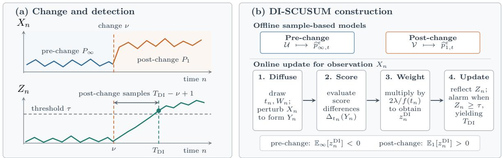
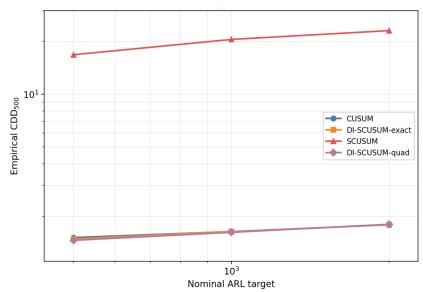
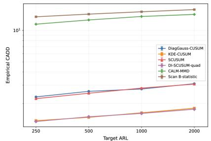
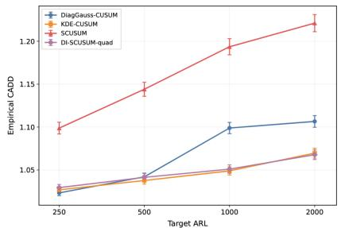

# Quickest Change Detection with Difusion-Integrated Scores

Arman Adibi∗ Augusta University

Mohammadreza Maleki∗ Toronto Metropolitan University

Sanjeev Kulkarni Princeton University

H. Vincent Poor Princeton University

## Abstract

Classical CUSUM relies on the log-likelihood ratio of the underlying distributions, which cannot generally be computed from finite pre- and post-change samples alone. We propose difusion-integrated score CUSUM (DI-SCUSUM), a training-free detector. We add Gaussian noise to the samples to form two smooth density estimates and calculate their Hyv¨arinen scores exactly, without training a score network. For each incoming observation, we sample a difusion time, perturb the observation, and use the importance-weighted score diference as an increment in the DI-SCUSUM recursion. Under the assumption that observations follow the fixed empirical distributions, the postchange mean increment is proportional to the Kullback–Leibler (KL) divergence from the smoothed post-change to the smoothed pre-change empirical distribution. We establish exponential false-alarm scaling and a first-order delay bound that, for a fixed threshold and increment scaling, is inversely proportional to the KL divergence. In the calibrated anisotropic Gaussian simulation, DI-SCUSUM nearly matches likelihood-ratio CUSUM and reduces the measured detection delay by about 91% relative to score-based CUSUM. On MNIST and Oxford-IIIT Pet, DI-SCUSUM also has lower empirical conditional detection delay than SCUSUM at comparable false-alarm levels.

## 1 INTRODUCTION

Quickest change detection (QCD) seeks to identify an unknown distributional change with minimal delay subject to false-alarm control. When the pre- and post-change densities are known, CUSUM [Page(1954), Poor and Hadjiliadis(2008)] accumulates log-likelihood-ratio evidence and provides the classi cal benchmark. We consider the sample-based setting, where finite samples from each distribution are collected separately from the monitored stream. The underlying log-likelihood ratio is unavailable, so a sequential procedure must extract computable evidence of a distributional change from each new observation. In a CUSUM recursion, the evidence should have a negative mean before the change to prevent sustained accumulation and a positive mean afterward to drive the statistic toward the alarm threshold.

Related Work. Likelihood-ratio CUSUM is the classical QCD benchmark, with false-alarm and delay guarantees for known distributional models [Page(1954), Lorden(1971), Moustakides(1986), Pollak(1985), Poor and Hadjiliadis(2008), Lai et al.(2011)]. When likelihoods are unavailable, LPA-CUSUM estimates log-partition ratios for unnormalized models [Adibi et al.(2026)], while the Scan B-statistic and CALM use kernel comparisons to detect changes from samples [Li et al.(2019), Cobb et al.(2022)]. SCUSUM replaces log-likelihood ratios with normalization-invariant Hyv¨arinen-score diferences [Hyv¨arinen(2005), Wu et al.(2023)]; its mean evidence depends on single-scale Fisher divergence. Denoising score matching has also been used to learn score functions for CUSUM-based change detection [Zhou et al.(2025)]. Matrix-weighted score methods modify the score geometry for hypothesis testing and change-point detection [Moushegian et al.(2025)]. Diffusion models instead provide scores across noise levels [Vincent(2011), Ho et al.(2020), Karras et al.(2022)], and Gaussian-smoothed empirical distributions admit closed-form scores [Scarvelis et al.(2025)]. A central question is how to integrate score evidence across Gaussian smoothing scales so that the resulting mean increments recover directed KL divergences and support sequential change-detection guarantees.

We therefore propose difusion-integrated score CUSUM (DI-SCUSUM), a training-free procedure that combines score evidence across Gaussian smoothing scales to detect distributional changes using pre- and post-change samples. Gaussian smoothing converts the pre- and post-change samples into two smooth densities with closed-form Hyv¨arinen scores. For each incoming observation, we sample a difusion time, add Gaussian noise at the corresponding scale, and compute the score diference. We weight the score diference by the inverse of the difusion-time sampling density and accumulate the resulting increments using CUSUM. When observations follow distinct fixed empirical distributions, the relative de Bruijn identity [Stam(1959), Valero-Toranzo et al.(2018)] links the mean increments to directed KL divergences between their Gaussian-smoothed versions, giving a negative mean before the change and a positive mean afterward. This connection supports the false-alarm and detection-delay guarantees.

  
Figure 1: DI-SCUSUM. (a) The change begins at $X _ { \nu } ;$ delay counts post-change observations through the alarm. Accumulated evidence crosses τ and triggers an alarm. (b) Pre- and post-change samples define Gaussiansmoothed models. Each new observation is perturbed at a sampled difusion time; the resulting score diference is importance-weighted and accumulated by CUSUM to detect a distributional change.

Contributions. Our contributions are: (1) A sample-based procedure for sequential change detection using closed-form Hyv¨arinen scores and an unbiased importance-sampling estimate for the difusiontime integral of their diference. (2) Directed KL identities for the mean increments under fixed empirical plug-in models, with exponential falsealarm scaling and first-order delay bounds under the stated assumptions. (3) A finite-window information identity and an anisotropic Gaussian analysis showing when integration recovers information lost by single-scale SCUSUM. (4) A difusion-time sampling density that minimizes the post-change increment’s second moment, with Monte Carlo, quadrature, and Rao–Blackwellized implementations [Rao(1945), Blackwell(1947)], and an evaluation of the quadrature implementation on Gaussian and image data.

## 2 METHODOLOGY

QCD monitors a data stream for an unknown transition from a pre-change to a post-change regime and seeks to raise an alarm quickly subject to falsealarm control. Figure 1(a) illustrates this objective: the change occurs at ν, the nonnegative statistic $Z _ { n }$ crosses the threshold at the alarm time $T ,$ and the delay counts the observations from $X _ { \nu }$ through $X _ { T } ,$ inclusive: $T - \nu + 1$ . Increasing the threshold reduces false alarms but generally increases detection delay.

Figure 1(b) shows how DI-SCUSUM turns each observation into evidence of a distributional change. We first collect pre- and post-change samples separately from the monitored stream and Gaussiansmooth them to obtain two density estimates with closed-form Hyv¨arinen scores. For each new observation, we sample a difusion time, add Gaussian noise at the corresponding scale, and compare the two scores. We weight the score diference to account for the sampled time and accumulate it using the reflected CUSUM recursion. Negative mean evidence before the change opposes accumulation, while positive mean evidence afterward drives the statistic toward the alarm threshold.

We keep the pre- and post-change sample sets fixed throughout the analysis; all theoretical expectations are taken conditional on these sets.

## 2.1 Change Model and Gaussian Smoothing

Let $X _ { 1 } , X _ { 2 } , \ldots \in \mathbb { R } ^ { d }$ be independent observations and let $\mathcal { F } _ { n } = \sigma ( X _ { k } , t _ { k } , W _ { k } : 1 \leq k \leq n )$ include the observations and the independent auxiliary draws used by Algorithm 1. Let $\nu \geq 1$ index the first post-change ob servation (with ν = 1 denoting an immediate change).

We assume

$$
X _ { 1 } , \dots , X _ { \nu - 1 } \overset { \mathrm { i . i . d . } } { \sim } P _ { \infty } , \qquad X _ { \nu } , X _ { \nu + 1 } , \dots \overset { \mathrm { i . i . d . } } { \sim } P _ { 1 } ,
$$

where $P _ { \infty }$ and $P _ { 1 }$ denote the pre- and post-change probability distributions. Expectations under no change and a change at $\nu$ are denoted by $\mathbb { E } _ { \infty }$ and $\mathbb { E } _ { \nu }$ . The alarm time $T$ is a stopping time with respect to $\mathcal { F } _ { n } \mathrm { : }$ : the decision uses only observations and auxiliary draws available by time n. We measure the false alarms by the average run length

$$
\mathrm { A R L } ( T ) = \mathbb { E } _ { \infty } [ T ]
$$

and measure the worst-case conditional mean delay by Pollak’s criterion [Pollak(1985)]

$$
\mathrm { C A D D } ( T ) = \operatorname* { s u p } _ { \nu \geq 1 } \mathbb { E } _ { \nu } [ T - \nu + 1 \mid T \geq \nu ] .
$$

Given a target $\gamma \ > \ 1$ , we minimize CADD subject to $\mathrm { A R L } ( T ) ~ \geq ~ \gamma ;$ requiring an average of at least $\gamma$ observations before an alarm under no change. Larger γ therefore requires less frequent false alarms [Page(1954), Lorden(1971), Moustakides(1986)].

Let $\mathcal { U } = \{ u _ { i } \} _ { i = 1 } ^ { N _ { 0 } }$ and $\mathcal { V } = \{ v _ { j } \} _ { j = 1 } ^ { N _ { 1 } }$ be the pre- and post change reference sets, of sizes $\mathrm { \Delta } N _ { 0 } = | \mathcal { U } |$ and $N _ { 1 } = | \nu |$ respectively. They define empirical measures

$$
\widehat { P } ^ { 0 } = \frac { 1 } { N _ { 0 } } \sum _ { i = 1 } ^ { N _ { 0 } } \delta _ { u _ { i } } , \qquad \widehat { Q } ^ { 0 } = \frac { 1 } { N _ { 1 } } \sum _ { j = 1 } ^ { N _ { 1 } } \delta _ { v _ { j } } ,
$$

where ${ \delta } _ { x } ( A ) = \mathbf { 1 } _ { \{ x \in A \} }$ for every measurable set $A \subseteq$ $\mathbb { R } ^ { d }$ , and x is an observed sample $u _ { i }$ or $v _ { j }$ . For the theoretical plug-in analysis, we assume $P _ { \infty } = \widehat { P } ^ { 0 }$ and $P _ { 1 } = \widehat { Q } ^ { 0 }$ , so observations follow the fixed empirical distributions. For probability distributions P and $Q$ with densities $p$ and $q ,$ we use the standard definition

$$
\mathrm { K L } ( P \| Q ) = \mathbb { E } _ { X \sim P } \left[ \log { \frac { p ( X ) } { q ( X ) } } \right] .
$$

KL divergence is infinite if P assigns positive probability to a set that $Q$ assigns zero probability. Independent empirical measures from continuous distributions almost surely have disjoint supports, making both directed KL divergences infinite even without an underlying change.

To give the two probability distributions positive common support, fix a base scale $\varepsilon > 0$ and add independent Gaussian noise:

$$
\widehat { P } ^ { \varepsilon } = \widehat { P } ^ { 0 } \ast \mathcal { N } ( 0 , 2 \varepsilon I _ { d } ) , ~ \widehat { Q } ^ { \varepsilon } = \widehat { Q } ^ { 0 } \ast \mathcal { N } ( 0 , 2 \varepsilon I _ { d } ) ,
$$

where ∗ denotes convolution and $I _ { d }$ is the $d \times d$ identity. Each convolution is a finite Gaussian mixture and therefore has a positive smooth density on $\mathbb { R } ^ { d }$ ; its

Gaussian tails also make both directed KL divergences finite.

For an additional difusion time $t \geq 0$ , convolve both probability distributions with $\mathcal { N } ( 0 , 2 t I _ { d } )$ Gaussian covariances add, giving the total scale $h _ { t } = \varepsilon + t$ and hence

$$
\begin{array} { r } { \widehat { P } _ { \infty , t } ^ { \varepsilon } = \widehat { P } ^ { \varepsilon } \ast \mathcal { N } ( 0 , 2 t I _ { d } ) = \widehat { P } ^ { 0 } \ast \mathcal { N } ( 0 , 2 h _ { t } I _ { d } ) , } \\ { \widehat { P } _ { 1 , t } ^ { \varepsilon } = \widehat { Q } ^ { \varepsilon } \ast \mathcal { N } ( 0 , 2 t I _ { d } ) = \widehat { Q } ^ { 0 } \ast \mathcal { N } ( 0 , 2 h _ { t } I _ { d } ) . } \end{array}\tag{1}
$$

Both ε and t are Gaussian smoothing parameters. The fixed $\varepsilon > 0$ makes the empirical models smooth and their KL divergences finite. Varying $t \geq 0$ then lets us compare them across smoothing scales. Using ε alone would give only one scale; integrating over t connects the score evidence to KL divergence. Appendix A.1 gives further details.

Because the Gaussian kernel is positive and infinitely diferentiable, each density $\widehat { p } _ { r , t } ^ { \varepsilon } ,$ where $r ~ = ~ \infty$ denotes the pre-change model and $r = 1$ the post-change model, in (1) is positive and smooth. Moreover, the Gaussian kernel, and hence each finite mixture, satisfies the classical heat equation

$$
\partial _ { t } \widehat { p } _ { r , t } ^ { \epsilon } ( y ) = \Delta _ { y } \widehat { p } _ { r , t } ^ { \epsilon } ( y ) , \qquad \Delta _ { y } = \sum _ { m = 1 } ^ { d } \frac { \partial ^ { 2 } } { \partial y _ { m } ^ { 2 } } .
$$

The expression $\partial ^ { 2 } / \partial y _ { m } ^ { 2 }$ is a diferentiation operator: applied to a function, it gives its second derivative in coordinate $y _ { m }$ . The Laplacian $\Delta _ { y }$ sums these derivatives across coordinates and measures the local spatial curvature of the density with respect to the observation $y ;$ the equation states that increasing difusion time smooths the density according to that curvature [Vincent(2011), Ho et al.(2020), Karras et al.(2022)]. Because both empirical models follow this same evolution, their fixed-time Fisher divergences can later be integrated into a KL divergence. Appendix A.2 verifies the heat equation directly. We next compare the two Hyv¨arinen scores at each smoothing scale to obtain evidence of a change; integrating that evidence across scales will give the KL-based mean increments.

## 2.2 Closed-Form Score from Samples

Section 2.1 provides two positive, smooth reference densities at every difusion time t: $\widehat { p } _ { \infty , t } ^ { \varepsilon }$ for the prechange regime and ${ \widehat { p } } _ { 1 , } ^ { \varepsilon }$ t for the post-change regime. We now use the diference between their Hyv¨arinen scores as evidence for sequential change detection. At each fixed t, the evidence is computable from the sample sets and has a negative pre-change mean and a positive post-change mean when the two smoothed empirical distributions difer.

For a positive twice diferentiable density $p ,$ let $s _ { p } ( y ) =$ ∇ log p(y) denote its score and define the Hyv¨arinen score

$$
S _ { H } ( y ; p ) = { \frac { 1 } { 2 } } \| s _ { p } ( y ) \| ^ { 2 } + \Delta \log p ( y ) .
$$

Both terms depend only on derivatives of log p. Consequently, $S _ { H } ( y ; p )$ is unchanged if $p$ is multiplied by an unknown positive normalizing constant, which makes it suitable for comparing unnormalized models [Hyv¨arinen(2005), Wu et al.(2023)].

The sign of the resulting comparison follows from the Hyv¨arinen score-matching identity. For positive normalized densities $p$ and $q ,$ let $P$ and $Q$ denote their corresponding probability distributions. The Fisher divergence from $P$ to $Q$ is

$$
D _ { F } ( P \| Q ) = \mathbb { E } _ { Y \sim P } \left[ \| s _ { p } ( Y ) - s _ { q } ( Y ) \| ^ { 2 } \right] ,\tag{2}
$$

where $\mathbb { E } _ { Y \sim P }$ denotes expectation when Y is drawn from $P .$ Under the usual integration-by-parts conditions, the Hyv¨arinen score-matching identity states that

$$
\mathbb { E } _ { Y \sim P } [ S _ { H } ( Y ; q ) - S _ { H } ( Y ; p ) ] = \frac { 1 } { 2 } D _ { F } ( P \| Q ) \ge 0 .\tag{3}
$$

Appendix A.3 gives a short derivation.

We therefore define the fixed-time evidence as

$$
\Delta _ { t } ( Y ) = S _ { H } ( Y ; \widehat { p } _ { \infty , t } ^ { \varepsilon } ) - S _ { H } ( Y ; \widehat { p } _ { 1 , t } ^ { \varepsilon } ) .\tag{4}
$$

The order of subtraction is important. If $Y \sim \widehat { P } _ { \infty , t } ^ { \varepsilon } ,$ then (3) gives

$$
\mathbb { E } _ { \infty } [ \Delta _ { t } ( Y ) ] = - \frac { 1 } { 2 } D _ { F } \Big ( \widehat { P } _ { \infty , t } ^ { \varepsilon } \Big \| \widehat { P } _ { 1 , t } ^ { \varepsilon } \Big ) \leq 0 .
$$

If $Y \sim \widehat { P } _ { 1 , t } ^ { \varepsilon }$ , exchanging the two models gives

$$
\mathbb { E } _ { 1 } [ \Delta _ { t } ( Y ) ] = \frac { 1 } { 2 } D _ { F } \Big ( \widehat { P } _ { 1 , t } ^ { \varepsilon } \Big | \Big | \widehat { P } _ { \infty , t } ^ { \varepsilon } \Big ) \geq 0 .
$$

Thus $\Delta _ { t }$ has a nonpositive mean before the change and a nonnegative mean afterward, with strict signs when the two smoothed distributions difer. These signs allow CUSUM to accumulate evidence of a change.

Because the smoothed densities are finite Gaussian mixtures, their Hyv¨arinen scores can be computed exactly from weighted moments of the pre- and postchange samples, without training a score network. For either reference set $\mathcal { R } _ { r }$ , put $h = \varepsilon + t$ and

$$
\alpha _ { j } ( y ) = \frac { e ^ { - \| y - r _ { j } \| ^ { 2 } / ( 4 h ) } } { \sum _ { \ell } e ^ { - \| y - r _ { \ell } \| ^ { 2 } / ( 4 h ) } } , \quad k ( y ) = \sum _ { j } \alpha _ { j } ( y ) r _ { j } ,
$$

and $\begin{array} { r } { V ( y ) = \sum _ { j } \alpha _ { j } ( y ) \| r _ { j } - k ( y ) \| ^ { 2 } } \end{array}$ . The exact formula used for the score comparisons is

$$
S _ { H } ( y ; \widehat { p } _ { r , t } ^ { \epsilon } ) = \frac { \| k ( y ) - y \| ^ { 2 } + 2 V ( y ) } { 8 h ^ { 2 } } - \frac { d } { 2 h } .
$$

Appendix A.4 derives these formulas. We next combine the resulting score diferences across difusion times to construct the sequential stopping rule.

## 2.3 The DI-SCUSUM Stopping Rule

To combine the evidence $\Delta _ { t }$ across difusion times without evaluating every scale, DI-SCUSUM samples one time for each observation. Importance weighting then gives an unbiased estimate of the time integral of the noise-averaged score evidence. Choose a density f on $[ 0 , \infty )$ with $f ( t ) > 0$ for all $t \geq 0$ , so every positivetime interval has nonzero sampling probability. For each observation $X _ { n } .$ , draw $t _ { n } \sim f$ and $W _ { n } \sim { \mathcal { N } } ( 0 , I _ { d } )$ independently of each other, the data stream, and all previous auxiliary draws, and define

$$
Y _ { n } = X _ { n } + { \sqrt { 2 ( \varepsilon + t _ { n } ) } } W _ { n } .\tag{5}
$$

The variance in this perturbation is chosen to match the same efective scale $h _ { t _ { n } } = \varepsilon + t _ { n }$ in (1). For the empirical plug-in analysis, we set $P _ { \infty } = \widehat { P } ^ { 0 }$ and $P _ { 1 } =$ $\widehat { Q } ^ { 0 }$ . Conditional on $t _ { n } = t , ~ ( 5 )$ therefore gives $Y _ { n } \sim$ $\hat { P } _ { \infty , t } ^ { \varepsilon }$ before the change and $Y _ { n } \sim \widehat { P } _ { 1 , t } ^ { \varepsilon }$ afterward. The fixed-time drift identities then apply to $( t _ { n } , Y _ { n } )$

We now turn the single sampled difusion time into an estimate of the full time integral. For a multiplier $\lambda > 0$ , define

$$
z _ { n } ^ { \mathrm { D I } } = \frac { 2 \lambda } { f ( t _ { n } ) } \Delta _ { t _ { n } } ( Y _ { n } ) ,
$$

where

$$
\Delta _ { t _ { n } } ( Y _ { n } ) = S _ { H } ( Y _ { n } ; \widehat { p } _ { \infty , t _ { n } } ^ { \varepsilon } ) - S _ { H } ( Y _ { n } ; \widehat { p } _ { 1 , t _ { n } } ^ { \varepsilon } ) .\tag{6}
$$

The factor $1 / f ( t _ { n } )$ gives more weight to difusion times that are sampled less often, so the average increment accounts for the full time integral rather than favoring frequently sampled scales. Assume $\begin{array} { r } { \int _ { 0 } ^ { \infty } \mathbb { E } _ { r } ^ { X , W } | G _ { t } ( X , \hat { W } ) | d t < \infty } \end{array}$ in both regimes, with $G _ { t }$ defined in Section 2.5. Changing f preserves the mean but afects increment variability and false-alarm calibration. The multiplier $\lambda > 0$ sets the overall size of the increments.

DI-SCUSUM initializes $Z _ { 0 } ~ = ~ 0$ and updates the reflected CUSUM statistic as

$$
Z _ { n } = \operatorname* { m a x } \{ 0 , Z _ { n - 1 } + z _ { n } ^ { \mathrm { D I } } \} .\tag{7}
$$

The procedure raises an alarm at

$$
T _ { \mathrm { D I } } = \operatorname* { i n f } \{ n \geq 1 : Z _ { n } \geq \tau \} ,\tag{8}
$$

where $\tau > 0$ is the alarm threshold. The maximum resets the statistic to zero whenever the accumulated evidence becomes negative; positive increments can raise the statistic to τ. Larger thresholds reduce false alarms but increase detection delay.

Algorithm 1 summarizes the online updates. Appendix A.4 gives the closed-form scores.

Algorithm 1 DI-SCUSUM stopping rule   
Require: Reference sets $\overline { { \ u { u } , \ d { v } ; \ d { } } }$ base scale $\varepsilon > 0 ;$ time   
density $f ;$ multiplier $\lambda > 0 ;$ threshold $\tau > 0$   
1: Initialize $Z _ { 0 } \gets 0$   
2: for $n = 1 , 2 , \ldots$ do   
3: Observe $X _ { n } ;$ sample $t _ { n } \sim f$ and $W _ { n } \sim { \mathcal { N } } ( 0 , I _ { d } )$   
4: Set $Y _ { n } \gets X _ { n } + \sqrt { 2 ( \varepsilon + t _ { n } ) } W _ { n }$   
5: Evaluate the score diference $\Delta _ { t _ { n } } ( Y _ { n } )$   
6: $z _ { n } ^ { \mathrm { D I } } \gets \frac { 2 \lambda } { f ( t _ { n } ) } \Delta _ { t _ { n } } ( Y _ { n } )$ as in (6)   
7: $Z _ { n } \gets \operatorname* { m a x } \{ 0 , Z _ { n - 1 } + z _ { n } ^ { \mathrm { D I } } \}$ as in (7)   
8: if $Z _ { n } \geq \tau \ { \bf t h e n }$   
9: return $T _ { \mathrm { D I } } = n$

## 2.4 Sequential Guarantees

The relative de Bruijn identity below relates the integrated score evidence to KL divergence along the common Gaussian heat flow [Stam(1959), Valero-Toranzo et al.(2018)].

Lemma 1 (Relative de Bruijn identity along a common heat flow). Let $P _ { t } , Q _ { \ i }$ t have positive smooth densities satisfying $\partial _ { t } p _ { t } = \Delta p _ { t }$ and $\partial _ { t } q _ { t } = \Delta q _ { t }$ . Under conditions that justify diferentiation and integration by parts,

$$
\frac { d } { d t } \operatorname { K L } ( P _ { t } \| Q _ { t } ) = - D _ { F } ( P _ { t } \| Q _ { t } ) .\tag{9}
$$

Consequently, for $0 \leq a < b$

$$
\int _ { a } ^ { b } D _ { F } ( P _ { t } \| Q _ { t } ) d t = \mathrm { K L } ( P _ { a } \| Q _ { a } ) - \mathrm { K L } ( P _ { b } \| Q _ { b } ) .
$$

If the terminal KL divergence tends to zero, the integral over $( 0 , \infty )$ equals $\mathrm { K L } ( P _ { 0 } \| Q _ { 0 } )$

Appendix A.5 proves the lemma. For distinct Gaussian-smoothed empirical models, the terminal KL divergence vanishes, so the time integral recovers the initial KL divergence. Let $\mathbb { E } _ { r } ^ { X }$ denote expectation over an observation from regime $r \in \{ \infty , 1 \}$ , and let $\mathbb { E } ^ { t , W }$ denote expectation over the independent auxiliary draws $( t _ { n } , W _ { n } )$ . Combining (3), (6), and (9) gives

$$
\begin{array} { r } { \mu _ { \infty } : = \mathbb { E } _ { \infty } ^ { X } \left[ \mathbb { E } ^ { t , W } [ z _ { n } ^ { \mathrm { D I } } \mid X _ { n } ] \right] = - \lambda \operatorname { K L } ( \widehat { P } ^ { \varepsilon } \| \widehat { Q } ^ { \varepsilon } ) < 0 , } \\ { \mu _ { 1 } : = \mathbb { E } _ { 1 } ^ { X } \left[ \mathbb { E } ^ { t , W } [ z _ { n } ^ { \mathrm { D I } } \mid X _ { n } ] \right] = \lambda \operatorname { K L } ( \widehat { Q } ^ { \varepsilon } \| \widehat { P } ^ { \varepsilon } ) > 0 . \quad } \end{array}\tag{10}
$$

Appendix A.6 gives the conditioning argument.

False-alarm control requires more than a negative mean increment. The condition $\mathbb { E } _ { \infty } [ e ^ { z _ { n } ^ { \mathrm { D I } } } ] \le 1$ ensures that the exponential of the cumulative, unreflected evidence does not increase in conditional expectation under no change, allowing threshold-crossing probabilities to be bounded. The next lemma gives conditions on the increment distribution under which λ can enforce this inequality or normalize the expectation to one.

Lemma 2 (Admissible Scaling and Cram´er Root). ${ \mathit { F i x } } { \mathit { \varepsilon } } , { \mathit { f } } ,$ and the reference sets. Let $\begin{array} { r l } { U _ { n } } & { { } = } \end{array}$ $2 \Delta _ { t _ { n } } ( Y _ { n } ) / f ( t _ { n } )$ , so $z _ { n } ^ { \mathrm { D I } } \ = \ \lambda U _ { n } ,$ , and write $M ( s ) =$ $\mathbb { E } _ { \infty } [ e ^ { s U _ { n } } ]$ . Suppose $\mathbb { E } _ { \infty } | U _ { n } | < \infty , \widehat { P } ^ { \varepsilon } \neq \widehat { Q } ^ { \varepsilon }$ , and the KL drift identity (10) holds.

1. I $f M ( \eta ) < \infty$ for some $\eta > 0$ , then $M ( \lambda ) < 1$ for all suficiently small $\lambda > 0$

2. $I f 1 < M ( b ) < \infty$ for some $b > 0 ,$ , there is a unique $\lambda _ { \star } \in ( 0 , b )$ with $M ( \lambda _ { \star } ) = 1$ , and

$$
M ( \lambda ) \leq 1 \iff 0 < \lambda \leq \lambda _ { \star } \qquad ( \lambda > 0 ) .
$$

For every $\lambda > 0$ , the increment $\lambda U _ { n }$ has positive Cram´er root $\theta _ { \lambda , \varepsilon } = \lambda _ { \star } / \lambda$ , with a finite momentgenerating function in a neighborhood of this root.

Thus $\lambda \ = \ \lambda ,$ ⋆ gives unit Cram´er root, whereas a smaller admissible multiplier gives a strict exponentialmoment inequality. The moment conditions concern the full importance-weighted increment; negative drift alone does not imply them. Appendix A.7 gives the proof.

The multiplier rescales the evidence rather than changing the observations used by the procedure. For the same observations and auxiliary draws, multiplying every increment by $\lambda > 0$ also multiplies the reflected statistic by λ. Thus a threshold τ with multiplier λ is equivalent to a threshold $\tau / \lambda$ with multiplier one: ${ \hat { T } } ^ { ( \lambda ) } { \tilde { ( \tau ) } } = T ^ { ( 1 ) } ( \tau / \lambda )$ . If only the multiplier changes from λ to λ′, rescaling the threshold from τ to $( \lambda ^ { \prime } / \lambda ) \tau$ preserves every alarm time and requires no new threshold simulations.

For the sequential analysis, assume the increments are i.i.d. and non-arithmetic. Before the change, assume their moment-generating function is finite near the positive Cram´er root $\theta _ { \lambda , \varepsilon }$ defined by $\mathbb { E } _ { \infty } ^ { X , t , W } [ e ^ { \theta _ { \lambda , \varepsilon } z _ { n } ^ { \mathrm { D I } } } ] =$ 1. After the change, assume a finite second moment, a finite mean overshoot bound $C _ { \mathrm { o s } }$ , and a finite expected downward excursion,

$$
C _ { \mathrm { m i n } } = \mathbb { E } _ { 1 } \left[ - \operatorname* { i n f } _ { m \ge 0 } \sum _ { k = 1 } ^ { m } z _ { k } ^ { \mathrm { D I } } \right] < \infty .
$$

The constant $C _ { \mathrm { o s } }$ bounds, uniformly over $\tau > 0$ , the expected amount by which the unreflected post-change random walk exceeds τ at its first crossing. Both $C _ { \mathrm { o s } }$ and $C _ { \mathrm { m i n } }$ are independent of τ . These are standard renewal conditions for CUSUM-type procedures [Lorden(1971), Moustakides(1986), Wu et al.(2023)].

Under these assumptions, the increment distribution determines how the threshold controls false alarms and detection delay. The following theorem gives the prechange average run length.

Theorem 1 (False-alarm scaling). Under the prechange conditions above, as $\tau  \infty$ ,

$$
\begin{array} { r } { \log \mathrm { A R L } ( T _ { \mathrm { D I } } ) = \log \mathbb { E } _ { \infty } [ T _ { \mathrm { D I } } ] = \theta _ { \lambda , \varepsilon } \tau + O ( 1 ) . } \end{array}\tag{11}
$$

Consequently, a target ARL ≈ γ has the leading-order calibration $\tau \approx \log ( \gamma ) / \theta _ { \lambda , \varepsilon }$

## A proof is given in Appendix A.8.

The false-alarm theorem calibrates $\tau ,$ but it does not state how quickly a change is detected. After the change, the positive mean $\mu _ { 1 } = \lambda \mathrm { K L } ( \widehat { Q } ^ { \varepsilon } \| \widehat { P } ^ { \varepsilon } )$ from (10) drives the statistic toward the calibrated threshold. The next theorem bounds the resulting detection delay.

Theorem 2 (Conditional detection delay). Under the post-change conditions above,

$$
\begin{array} { r } { \frac { \tau - C _ { \mathrm { m i n } } } { \mu _ { 1 } } \leq \mathrm { C A D D } ( T _ { \mathrm { D I } } ) = \mathbb { E } _ { 1 } [ T _ { \mathrm { D I } } ] \leq \frac { \tau + C _ { \mathrm { o s } } } { \mu _ { 1 } } } \end{array}\tag{12}
$$

$$
\mathrm { C A D D } ( T _ { \mathrm { D I } } ) = \frac { \tau } { \lambda \mathrm { K L } ( \widehat { Q } ^ { \varepsilon } \Vert \widehat { P } ^ { \varepsilon } ) } + O ( 1 ) .\tag{13}
$$

A proof is given in Appendix A.9. At $\nu = 1 , Z _ { 0 } = 0$ and $T$ counts the post-change observations through the alarm; this case attains CADD for the reflected recursion.

The two theorems separate calibration from detection: the pre-change Cram´er root governs false alarms, while the forward KL divergence governs the first-order delay. Combining them at a matched target ARL ≈ γ gives

$$
\mathrm { C A D D } ( T _ { \mathrm { D I } } ) = \frac { \log \gamma } { \theta _ { \lambda , \varepsilon } \lambda \mathrm { K L } ( \widehat { Q } ^ { \varepsilon } \| \widehat { P } ^ { \varepsilon } ) } + { \cal O } ( 1 ) ,
$$

which also shows why drift comparisons are meaningful only after false-alarm calibration.

Finally, the base smoothing parameter ε creates a genuine statistical tradeof. It is needed to turn the empirical measures into positive probability distributions with finite KL divergence, but additional smoothing also removes information. Applying the same heatflow identity with ε as the smoothing variable gives

$$
\frac { d } { d \varepsilon } \operatorname { K L } ( \widehat { Q } ^ { \varepsilon } \| \widehat { P } ^ { \varepsilon } ) = - D _ { F } ( \widehat { Q } ^ { \varepsilon } \| \widehat { P } ^ { \varepsilon } ) \leq 0 .
$$

Thus increasing ε improves regularity and numerical stability but can reduce the KL information available for detection. The drift identities in (10) and the guarantees in Theorems 1 and 2 are conditional on the fixed reference sets and the exact empirical plug-in model. For a monitored stream whose distributions difer from the fixed empirical models, the score increments remain computable, but their actual means need not equal the KL expressions in (10); the stated guarantees therefore require the model assumptions.

The mean increment does not depend on $f ,$ but its variance does. We next choose how to estimate the difusion integral and calibrate the alarm threshold.

## 2.5 Estimation and Calibration

The sampling density f can reduce the variability of the increments by allocating more draws to suitable difusion times. Define

$$
G _ { t } ( X , W ) = 2 \Delta _ { t } \Big ( X + \sqrt { 2 ( \varepsilon + t ) } W \Big ) .
$$

The density that minimizes the post-change second moment is

$$
f ^ { \star } ( t ) \propto \sqrt { \mathbb { E } _ { 1 } [ G _ { t } ( X , W ) ^ { 2 } ] } ,
$$

provided its normalizing integral is finite (Proposition 3; proof in Appendix A.10). In practice, the second moment can be estimated on a pilot grid. Averaging M independent time–noise draws for each observation preserves the mean and divides the conditional sampling variance by M, when finite, at the cost of M score comparisons. This reduces fluctuations caused by the auxiliary draws.

Rao–Blackwellization instead removes the noisesampling variance by averaging over W conditional on the observation [Rao(1945), Blackwell(1947)]:

$$
{ \overline { { G } } } _ { t } ( X ) = \mathbb { E } [ G _ { t } ( X , W ) \mid X ] .
$$

A quadrature rule with times $t _ { \ell }$ and weights $w _ { \ell }$ then approximates the remaining time integral by

$$
\widehat { z } _ { n } ^ { \mathrm { R B } } = \lambda \sum _ { \ell = 1 } ^ { L } w _ { \ell } \overline { { G } } _ { t _ { \ell } } ( X _ { n } ) .
$$

Monte Carlo is unbiased under integrability; quadrature removes time-sampling variance but introduces truncation and discretization error.

For a target ARL γ, the theoretical approximation τ ≈ $\log ( \gamma ) / \theta _ { \lambda , \varepsilon }$ supplies an initial threshold. We simulate no-change streams and refine the threshold by bisection until the empirical ARL matches the target. Calibration is repeated when ε, f, or the estimator changes; changing only λ requires the same proportional change in τ . Exact score evaluation costs $O ( ( N _ { 0 } + N _ { 1 } ) d )$ per difusion time. Appendix A.11 gives further implementation and approximation details.

## 3 BENEFITS OF DIFFUSION INTEGRATION

Section 2 established the validity of the integrated detector. We now isolate why integration can retain information that a single-scale score statistic loses.

Information Carried by Diferent Difusion Times. For smooth population probability distributions $P _ { \infty }$ and $P _ { 1 } { \mathrm { . } }$ , set $\varepsilon = 0$ and evolve both under the common heat flow

$$
P _ { \infty , t } = P _ { \infty } * \mathcal { N } ( 0 , 2 t I _ { d } ) , \qquad P _ { 1 , t } = P _ { 1 } * \mathcal { N } ( 0 , 2 t I _ { d } ) .
$$

Assume that $\mathrm { K L } ( P _ { 1 } \| P _ { \infty } ) < \infty$ and that the densities satisfy the positivity and regularity conditions of Lemma 1. Define $a ( t ) = D _ { F } ( P _ { 1 , t } | | P _ { \infty , t } )$ . Then $a ( t ) / 2$ is the mean post-change score evidence at time t, while $\begin{array} { r } { \int _ { 0 } ^ { \infty } a ( t ) d t \stackrel { \mathrm { \tiny ~ = ~ } } \mathrm { \mathrm { K L } } ( P _ { 1 } \| \bar { P } _ { \infty } ) } \end{array}$ whenever the terminal KL divergence vanishes. SCUSUM [Wu et al.(2023)] uses the score diference at $t = 0$ , whereas DI-SCUSUM estimates the integral of score diferences across difusion times.

Proposition 1 (Information in a finite difusion win dow). For every $T > 0$

$$
\int _ { 0 } ^ { T } a ( t ) d t = \mathrm { K L } ( P _ { 1 } \| P _ { \infty } ) - \mathrm { K L } ( P _ { 1 , T } \| P _ { \infty , T } ) .
$$

If $\mathrm { K L } ( P _ { 1 } \| P _ { \infty } ) > 0$ , the fraction recovered by times up to $T$ is

$$
R ( T ) = \frac { \int _ { 0 } ^ { T } a ( t ) d t } { \mathrm { K L } ( P _ { 1 } \| P _ { \infty } ) } = 1 - \frac { \mathrm { K L } ( P _ { 1 , T } \| P _ { \infty , T } ) } { \mathrm { K L } ( P _ { 1 } \| P _ { \infty } ) } .
$$

Hence $R ( T )$ is exactly the fraction of forward KL information recovered by the window $[ 0 , T ]$ . Appendix A.12 gives the proof and interpretation; f afects estimation variance but not $R ( T )$

Remark 1 (Anisotropic Gaussian comparison). Let $P _ { \infty } = \mathcal { N } ( \theta _ { 0 } , \Sigma )$ and $P _ { 1 } = \mathcal { N } ( \theta _ { 1 } , \Sigma )$ , with $\Sigma \succ 0$ and a nonzero mean shift $\delta = \theta _ { 1 } - \theta _ { 0 }$ . Define $A = \delta ^ { \top } \Sigma ^ { - 2 } \delta$ and $B = \delta ^ { \top } \Sigma ^ { - 3 } \delta$ . After scaling each method so that $\mathbb { E } _ { \infty } [ e ^ { z } ] = 1$ , the post-change mean increments are

$$
I _ { \mathrm { C U S U M } } = \textstyle { \frac { 1 } { 2 } } \delta ^ { \top } \Sigma ^ { - 1 } \delta , \qquad I _ { \mathrm { S C U S U M } } = \frac { A ^ { 2 } } { 2 B } \le I _ { \mathrm { C U S U M } } .
$$

Likelihood-ratio CUSUM weights covariance eigendirections by inverse variance; SCUSUM uses inverse variance squared. A scalar multiplier cannot align these weights when the shift spans directions with different variances, giving a strict inequality. Equality holds when all directions carrying the shift have the same variance.

Integration recovers the likelihood-ratio weights. For $D _ { t } ( y ) ~ = ~ S _ { H } ( y ; p _ { \infty , t } ) - S _ { H } ( y ; p _ { 1 , t } )$ and $Y _ { t } ~ = ~ X +$ √2t W,

$$
\mathbb { E } _ { W } \left[ 2 \int _ { 0 } ^ { \infty } D _ { t } ( Y _ { t } ) d t \bigg | X \right] = \log \frac { p _ { 1 } ( X ) } { p _ { \infty } ( X ) } .
$$

Thus the ideal integrated increment equals the loglikelihood ratio, giving $I _ { \mathrm { D I } } = I _ { \mathrm { C U S U M } }$ . Appendix A.13 gives the derivation; Section 4 tests this comparison.

The Gaussian identity assumes exact noise averaging and integration over all difusion times; finite numerical implementations approximate it. Adaptive weights across times change the target evidence and require separate calibration (Appendix A.14).

## 4 EXPERIMENTS

We first test whether difusion integration recovers likelihood-ratio CUSUM performance in an anisotropic Gaussian model, then compare samplebased methods on MNIST and Oxford-IIIT Pet streams (Figure 2). Thresholds are calibrated under no change before evaluating detection delay.

## 4.1 Anisotropic Gaussian Diagnostic

Setup and Methods. The pre- and post-change means are ${ \theta _ { 0 } } ~ = ~ ( 0 , 0 ) ^ { \top }$ and $\theta _ { 1 } ~ = ~ ( 0 . 1 , 1 0 ) ^ { \top }$ with common covariance $\Sigma = \mathrm { d i a g } ( 0 . 1 , 1 0 )$ After normalizing both methods so that $\mathbb { E } _ { \infty } [ e ^ { z } ] = 1$ , SCUSUM’s post-change mean increment is 0.19802, or 3.92% of likelihood-ratio CUSUM’s 5.05 (Remark 1). We compare likelihood-ratio CUSUM, SCUSUM, Rao– Blackwellized DI-SCUSUM-quad, and DI-SCUSUMexact, whose increment equals the Gaussian loglikelihood ratio. With $\varepsilon \quad = \quad 0 ,$ quadrature uses 128 log-spaced times in $[ 1 0 ^ { - 5 } , 1 0 ^ { 4 } ]$ Its coeficients (5.02128, 0.0501986) approximate the exact (5, 0.05) with relative errors 0.426% and 0.397%, providing a numerical check independent of the delay estimates. Appendix A.11 gives the weights and thresholds.

Calibration and Delay. Each threshold is calibrated separately at $\gamma \in \{ 5 0 0 , 1 0 0 0 , 2 0 0 0 \}$ using 2,048 no-change streams, bracket expansion, and 14 bisection steps. With horizon $H \ = \ 6 0 0 0 .$ , the calibration quantity is $\mathrm { A R L } _ { H } ~ = ~ \mathbb { E } _ { \infty } [ \operatorname* { m i n } \{ T , H \} ]$ , a lower bound on uncensored ARL. Paths without an alarm are recorded at H. Using 4,096 new streams with change time $\nu = 5 0 0$ , we estimate

$$
\mathrm { C D D } _ { 5 0 0 , H } ( T ) = \mathbb { E } _ { 5 0 0 } [ \operatorname* { m i n } \{ T , H \} - 4 9 9 \mid T \geq 5 0 0 ] .
$$

Conditioning excludes alarms before the change; subtracting $\nu \mathrm { ~ - ~ } 1 \mathrm { ~ } = \mathrm { ~ } 4 9 9$ counts post-change observations through the alarm. This horizon-censored fixedchange delay approximates its uncensored counterpart when post-change censoring is negligible and does not estimate Pollak’s supremum over change times.

  
(a) Anisotropic Gaussian.

  
(b) MNIST 3 → 5.

  
(c) Oxford-IIIT Pet.  
Figure 2: Detection delay versus nominal ARL target. (a) Gaussian $\mathrm { C D D } _ { 5 0 0 , H } ;$ (b,c) image delay with conditional 95% Monte Carlo intervals. Attained ARLs are audited in the text. Delays count observations through the alarm; kernel methods start from initialized pre-change windows.

Results. Censored no-change means are within 4.43% of their targets. Both integrated variants closely track CUSUM in Figure 2(a), with maximum absolute delay diferences of 0.054 observations for quadrature and 0.028 for exact integration. DI-SCUSUM-quad reduces fixed-change delay relative to SCUSUM by about 91%, consistent with the predicted information recovery under comparable finite-horizon calibration.

## 4.2 Sample-Based Image Experiments

Setup and Methods. MNIST [LeCun et al.(1998)] uses digit $3 \  \ 5 ,$ 12-dimensional PCA fitted on training pixels, and 600 reference images per class. Oxford-IIIT Pet [Parkhi et al.(2012)] uses cats → dogs, frozen ImageNet-pretrained ResNet-18 features [Deng et al.(2009), He et al.(2016)], L2 normalization, and PCA fitted on trainval, with 450 reference images per class. Methods share the 12- dimensional features and source reference partition within each study.

Both studies compare diagonal-Gaussian CUSUM, Gaussian-KDE CUSUM, SCUSUM, and DI-SCUSUM-quad with 20 time nodes and antithetic noise. MNIST also includes CALM-MMD and the Scan B-statistic, using 25-observation windows and reference median-distance RBF bandwidths. CALM uses an ARL-corrected time-varying schedule; Scan B uses a calibrated constant threshold.

Calibration and Delay. Targets are $\gamma \in$ {250, 500, 1000, 2000}; reference models and drift corrections use training data only. Calibration, ARL reporting, and delay evaluation each use 8,192 independent paths from fixed empirical populations.

For CUSUM-type methods, calibration and reporting share a pre-change increment pool. Delay is measured from ν = 1 and counts observations through the alarm, attaining CADD under i.i.d. increments. Kernel methods instead start from initialized pre-change windows. The 95% Monte Carlo intervals condition on the datasets, references, and simulation pools.

Results. On MNIST, the 5% target-error and pairwise-ARL audit, with censoring below 1%, passes for all six methods at targets 250 and 1000. At 500 and 2000, maximum target errors are 5.50% and 7.65%, and pairwise spreads are 6.25% and 8.88%; these points do not support strict six-method comparisons. DI-SCUSUM-quad and SCUSUM pass their pairwise audit at all four targets: ARL gaps are at most 3.76%, and CADD reductions are 39.5–42.7%. DI-SCUSUMquad remains close to KDE-CUSUM; kernel delays are substantially larger at the two fully audited targets.

On Oxford-IIIT Pet, all methods pass the 99% lowerconfidence-bound audit for ARL ≥ γ. DI-SCUSUMquad reduces CADD relative to SCUSUM by 6.3– 12.6%, with ARL gaps below 4.3%, and remains close to KDE-CUSUM. At $\gamma ~ = ~ 2 0 0 0$ diagonal-Gaussian CUSUM attains empirical ARL 3709; Figure 2(c) plots nominal targets; comparisons must account for the attained ARLs.

Comparison Scope. Likelihood and score methods use both pre- and post-change samples, whereas kernel methods use only pre-change samples and update 25-observation windows. Their delay diferences therefore reflect the available information, window initialization, and detection statistic. The MNIST kernel comparison does not isolate difusion integration as the sole source of improvement. The DI-SCUSUMquad–SCUSUM comparison tests integration more directly: both share the representation, reference models, and reflected recursion, with thresholds calibrated separately on no-change paths.

## AI use statement

In this work, we used ChatGPT and Codex (OpenAI) as supporting tools during manuscript revision. Editorial assistance included improving grammar, wording, clarity, flow, and presentation of author-provided text, formatting figures and references, and checking literature and citations. The tools also supported the review and refinement of mathematical derivations and proof explanations, diagnostic numerical checks of identities, and interpretation of existing experimental results. The diagnostic checks did not generate the reported detection experiments. The authors retain responsibility for evaluating AI-assisted suggestions and for the final content of the paper, including its text, mathematical claims, proofs, code, citations, and experimental results.

## References

A. Adibi, S. Kulkarni, H. V. Poor, T. Banerjee, and V. Tarokh (2026). Asymptotically optimal change detection for unnormalized pre- and post-change distributions. Sequential Analysis, 45(2):321–346.

O. Cobb, A. Van Looveren, and J. Klaise (2022). Sequential multivariate change detection with calibrated and memoryless false detection rates. In Proceedings of the 25th International Conference on Artificial Intelligence and Statistics, PMLR 151:226– 239.

S. Li, Y. Xie, H. Dai, and L. Song (2019). Scan Bstatistic for kernel change-point detection. Sequential Analysis, 38(4):503–544.

D. Blackwell (1947). Conditional expectation and unbiased sequential estimation. Annals of Mathematical Statistics, 18(1):105–110.

V. De Bortoli (2022). Convergence of denoising diffusion models under the manifold hypothesis. Transactions on Machine Learning Research. Available at https://openreview.net/forum?id=MhK5aXo3gB.

J. Ho, A. Jain, and P. Abbeel (2020). Denoising diffusion probabilistic models. In Advances in Neural Information Processing Systems.

A. Hyv¨arinen (2005). Estimation of non-normalized statistical models by score matching. Journal of Machine Learning Research, 6:695–709.

M. Karppa, M. Aum¨uller, and R. Pagh (2022). DEANN: speeding up kernel-density estimation using approximate nearest neighbor search. In Proceedings of AISTATS.

T. Karras, M. Aittala, T. Aila, and S. Laine (2022). Elucidating the design space of difusion-based generative models. In Advances in Neural Information Processing Systems.

L. Lai, H. V. Poor, Y. Xin, and G. Georgiadis (2011). Quickest search over multiple sequences. IEEE Transactions on Information Theory, 57(8):5375– 5386.

G. Lorden (1971). Procedures for reacting to a change in distribution. Annals of Mathematical Statistics, 42(6):1897–1908.

G. V. Moustakides (1986). Optimal stopping times for detecting changes in distributions. Annals of Statistics, 14(4):1379–1387.

S. Moushegian, T. Banerjee, and V. Tarokh (2025). Difusion-based hypothesis testing and change-point detection. arXiv preprint arXiv:2506.16089.

E. S. Page (1954). Continuous inspection schemes. Biometrika, 41(1/2):100–115.

M. Pollak (1985). Optimal detection of a change in distribution. Annals of Statistics, 13(1):206–227.

H. V. Poor and O. Hadjiliadis (2008). Quickest Detection. Cambridge University Press, Cambridge, UK.

C. R. Rao (1945). Information and the accuracy attainable in the estimation of statistical parameters. Bulletin of the Calcutta Mathematical Society, 37:81– 91.

M. Raphan and E. P. Simoncelli (2011). Least squares estimation without priors or supervision. Neural Computation, 23(2):374–420.

C. Scarvelis, H. S´aez de Oc´ariz Borde, and J. Solomon (2025). Closed-form difusion models. Transactions on Machine Learning Research.

A. J. Stam (1959). Some inequalities satisfied by the quantities of information of Fisher and Shannon. Information and Control, 2(2):101–112.

I. Valero-Toranzo, S. Zozor, and J.-M. Brossier (2018). Generalization of the de Bruijn identity to general ϕ-entropies and ϕ-Fisher informations. IEEE Transactions on Information Theory, 64(10):6743– 6758.

P. Vincent (2011). A connection between score matching and denoising autoencoders. Neural Computation, 23(7):1661–1674.

S. Wu, E. Diao, T. Banerjee, J. Ding, and V. Tarokh (2023). Score-based quickest change detection for unnormalized models. In Proceedings of the 26th International Conference on Artificial Intelligence and Statistics, PMLR 206:10546–10565.

J. Deng, W. Dong, R. Socher, L.-J. Li, K. Li, and L. Fei-Fei (2009). ImageNet: A large-scale hierarchical image database. In Proceedings of the IEEE Conference on Computer Vision and Pattern Recognition, pages 248–255.

K. He, X. Zhang, S. Ren, and J. Sun (2016). Deep residual learning for image recognition. In Proceedings ofthe IEEE Conference on Computer Vision and Pattern Recognition, pages 770–778.

Y. LeCun, L. Bottou, Y. Bengio, and P. Hafner (1998). Gradient-based learning applied to document recognition. Proceedings of the IEEE, 86(11):2278– 2324.

O. M. Parkhi, A. Vedaldi, A. Zisserman, and C. V. Jawahar (2012). Cats and dogs. In Proceedings of the IEEE Conference on Computer Vision and Pattern Recognition, pages 3498–3505.

W. Zhou, L. Xie, Z. Peng, and S. Zhu (2025). Sequential change point detection via denoising score matching. arXiv preprint arXiv:2501.12667.

# Supplementary Materials

## A PROOFS

## A.1 Parameter Roles

The parameters ε and t therefore serve two diferent purposes. The base scale ε is applied once to replace the two discrete empirical measures by smooth distributions with common support. Starting from these fixed reference models, varying t produces increasingly smoothed views of the same two distributions. At small t, the score contrast remains sensitive to local diferences near the reference samples. As t increases, the added noise variance 2t increases and both distributions become smoother. Because the same Gaussian smoothing is applied to both distributions, their KL divergence decreases and tends to zero as $t \to \infty ;$ it does not diverge. Large t therefore contributes coarser but progressively weaker evidence. DI-SCUSUM integrates the score contrast over the full path, combining the informative contributions across scales rather than selecting one smoothing level in advance.

The four tuning quantities should be kept conceptually separate. The base scale ε changes the two empirical plug-in probability distributions themselves by setting the minimum amount of Gaussian smoothing. The density f does not change those probability distributions; it determines which difusion times are sampled more often and therefore afects the variance of the integral estimator. The multiplier λ rescales every increment, while τ determines how much accumulated evidence is required before stopping. In particular, changing f is an estimation choice, whereas changing ε changes the statistical problem being detected.

Small ε keeps the smoothed probability distributions close to their empirical measures but yields sharper scores and potentially large KL values when supports difer; large ε improves numerical stability while attenuating distributional diferences. The time density f changes the variance, not the target integral, provided it has adequate support.

## A.2 Gaussian-Mixture Heat-Flow Calculation

Proof. By convolution with the empirical measures,

$$
\widehat { p } _ { \infty , t } ^ { \varepsilon } ( y ) = \frac { 1 } { N _ { 0 } } \sum _ { i = 1 } ^ { N _ { 0 } } \varphi _ { h _ { t } } ( y - u _ { i } ) ,
$$

$$
\widehat { p } _ { 1 , t } ^ { \epsilon } ( y ) = \frac { 1 } { N _ { 1 } } \sum _ { j = 1 } ^ { N _ { 1 } } \varphi _ { h _ { t } } ( y - v _ { j } ) ,
$$

where, for $s > 0$

$$
\varphi _ { s } ( x ) = ( 4 \pi s ) ^ { - d / 2 } \exp \biggl ( - \frac { \| x \| ^ { 2 } } { 4 s } \biggr ) .
$$

Direct diferentiation gives

$$
\partial _ { s } \varphi _ { s } ( x ) = \left( - \frac { d } { 2 s } + \frac { \| x \| ^ { 2 } } { 4 s ^ { 2 } } \right) \varphi _ { s } ( x ) .
$$

Moreover,

$$
\nabla \varphi _ { s } ( x ) = - \frac { x } { 2 s } \varphi _ { s } ( x ) , \qquad \Delta \varphi _ { s } ( x ) = \left( - \frac { d } { 2 s } + \frac { \| x \| ^ { 2 } } { 4 s ^ { 2 } } \right) \varphi _ { s } ( x ) .
$$

Hence $\partial _ { s } \varphi _ { s } = \Delta \varphi _ { s }$ . Since $h _ { t } = \varepsilon + t ,$ diferentiation with respect to t is the same as diferentiation with respect to $h _ { t } ;$ finite sums commute with both operators. Therefore both smoothed empirical densities satisfy the heat equation $\partial _ { t } \widehat { p } _ { r , t } ^ { \varepsilon } = \Delta \widehat { p } _ { r , t } ^ { \varepsilon }$ for $r \in \{ \infty , 1 \}$ }.

## A.3 Hyv¨arinen Score-Matching Identity

Proof. Write $s _ { p } = \nabla$ log p and $s _ { q } = \nabla$ log q. By definition,

$$
\begin{array} { r } { \mathbb { E } _ { P } \left[ S _ { H } ( Y ; q ) - S _ { H } ( Y ; p ) \right] = \displaystyle \int _ { \mathbb { R } ^ { d } } p ( y ) \left\{ \frac { 1 } { 2 } \| s _ { q } ( y ) \| ^ { 2 } - \frac { 1 } { 2 } \| s _ { p } ( y ) \| ^ { 2 } \right\} d y } \\ { + \displaystyle \int _ { \mathbb { R } ^ { d } } p ( y ) \left\{ \Delta \log q ( y ) - \Delta \log p ( y ) \right\} d y . } \end{array}
$$

Integration by parts gives

$$
\int _ { \mathbb { R } ^ { d } } p \Delta \log q d y = - \int _ { \mathbb { R } ^ { d } } \langle \nabla p , \nabla \log q \rangle d y = - \int _ { \mathbb { R } ^ { d } } p \langle s _ { p } , s _ { q } \rangle d y ,
$$

and, similarly,

$$
\int _ { \mathbb { R } ^ { d } } p \Delta \log p d y = - \int _ { \mathbb { R } ^ { d } } p \| s _ { p } \| ^ { 2 } d y .
$$

Substitution yields

$$
\begin{array} { l l } { \displaystyle \mathbb { E } _ { P } \big [ S _ { H } ( Y ; q ) - S _ { H } ( Y ; p ) \big ] = \frac { 1 } { 2 } \mathbb { E } _ { P } \| s _ { q } ( Y ) \| ^ { 2 } - \frac { 1 } { 2 } \mathbb { E } _ { P } \| s _ { p } ( Y ) \| ^ { 2 } } \\ { \displaystyle \quad \quad - \mathbb { E } _ { P } \langle s _ { p } ( Y ) , s _ { q } ( Y ) \rangle + \mathbb { E } _ { P } \| s _ { p } ( Y ) \| ^ { 2 } } \\ { \displaystyle \quad \quad = \frac { 1 } { 2 } \mathbb { E } _ { P } \| s _ { p } ( Y ) - s _ { q } ( Y ) \| ^ { 2 } } \\ { \displaystyle \quad \quad = \frac { 1 } { 2 } D _ { F } ( P \| Q ) . } \end{array}
$$

The equivalent identity follows by multiplying both sides by −1.

## A.4 Closed-Form Gaussian-Mixture Score Formulas

For the pre-change reference set U, define

$$
\begin{array} { r l r } {  { \alpha _ { i } ^ { \infty , \varepsilon } ( y ; t ) = \frac { \exp ( -  { \Vert y - u _ { i } \Vert ^ { 2 } } / ( 4 h _ { t } ) ) } { \sum _ { \ell = 1 } ^ { N _ { 0 } } \exp ( -  { \Vert y - u _ { \ell } \Vert ^ { 2 } } / ( 4 h _ { t } ) ) } , } } \\ & { } & \\ & { k _ { t } ^ { \infty , \varepsilon } ( y ) = \sum _ { i = 1 } ^ { N _ { 0 } } \alpha _ { i } ^ { \infty , \varepsilon } ( y ; t ) u _ { i } , } \\ & { } & \\ & { V _ { t } ^ { \infty , \varepsilon } ( y ) = \sum _ { i = 1 } ^ { N _ { 0 } } \alpha _ { i } ^ { \infty , \varepsilon } ( y ; t )  { \Vert u _ { i } - k _ { t } ^ { \infty , \varepsilon } ( y ) \Vert ^ { 2 } } . } \end{array}\tag{14}
$$

The post-change quantities $\alpha _ { j } ^ { 1 , \varepsilon } , k _ { t } ^ { 1 , \varepsilon }$ , and $V _ { t } ^ { 1 , \varepsilon }$ are defined analogously using V.

Proposition 2 (Gaussian-mixture score identities). For $r \in \{ \infty , 1 \} , t \geq 0$ , and $\boldsymbol { y } \in \mathbb { R } ^ { d }$

$$
\nabla \log \widehat { p } _ { r , t } ^ { \varepsilon } ( y ) = \frac { k _ { t } ^ { r , \varepsilon } ( y ) - y } { 2 h _ { t } } ,\tag{15}
$$

$$
\mathrm { d i v } k _ { t } ^ { r , \varepsilon } ( y ) = \frac { V _ { t } ^ { r , \varepsilon } ( y ) } { 2 h _ { t } } ,\tag{16}
$$

$$
S _ { H } ( y ; \widehat { p } _ { r , t } ^ { \varepsilon } ) = \frac { \| k _ { t } ^ { r , \varepsilon } ( y ) - y \| ^ { 2 } + 2 V _ { t } ^ { r , \varepsilon } ( y ) } { 8 h _ { t } ^ { 2 } } - \frac { d } { 2 h _ { t } } .\tag{17}
$$

Consequently, both terms in $\Delta _ { t } ( y )$ can be evaluated exactly from the corresponding reference set in $O ( N _ { r } d )$ operations.

Proof. Difusion score. For the pre-change density,

$$
\widehat { p } _ { \infty , t } ^ { \varepsilon } ( y ) = \frac { 1 } { N _ { 0 } } \sum _ { i = 1 } ^ { N _ { 0 } } ( 4 \pi ( \varepsilon + t ) ) ^ { - d / 2 } \exp \left( - \frac { \| y - u _ { i } \| ^ { 2 } } { 4 ( \varepsilon + t ) } \right) .
$$

Diferentiating gives

$$
\nabla \widehat { p } _ { \infty , t } ^ { \varepsilon } ( y ) = \frac { 1 } { N _ { 0 } } \sum _ { i = 1 } ^ { N _ { 0 } } \varphi _ { \varepsilon + t } ( y - u _ { i } ) \left( - \frac { y - u _ { i } } { 2 ( \varepsilon + t ) } \right) .
$$

Dividing by $\widehat { p } _ { \infty , t } ^ { \varepsilon } ( y )$ yields

$$
\begin{array} { c } { { \nabla \log \widehat { p } _ { \infty , t } ^ { \varepsilon } ( y ) = \displaystyle \sum _ { i = 1 } ^ { N _ { 0 } } \alpha _ { i } ^ { \infty , \varepsilon } ( y ; t ) \displaystyle \frac { u _ { i } - y } { 2 ( \varepsilon + t ) } } } \\ { { = \displaystyle \frac { k _ { t } ^ { \infty , \varepsilon } ( y ) - y } { 2 ( \varepsilon + t ) } . } } \end{array}
$$

The proof for $\widehat { p } _ { 1 , t } ^ { \varepsilon }$ is identical.

Barycentric divergence. We prove the pre-change identity; the post-change identity is identical. Let $h = \varepsilon + t$ and $k ( y ) = k _ { t } ^ { \infty , \varepsilon } ( y )$ . For notational convenience, write $\alpha _ { i } ( y ) = \alpha _ { i } ^ { \infty , \varepsilon } ( y ; t )$ . Then

$$
\alpha _ { i } ( y ) = \frac { \exp \bigl ( - \| y - u _ { i } \| ^ { 2 } / ( 4 h ) \bigr ) } { \displaystyle \sum _ { \ell = 1 } ^ { N _ { 0 } } \exp \bigl ( - \| y - u _ { \ell } \| ^ { 2 } / ( 4 h ) \bigr ) } .
$$

For $r \in \{ 1 , \ldots , d \}$ ，

$$
\begin{array} { c l c r } { \displaystyle { \frac { \partial } { \partial y _ { r } } \log \alpha _ { i } ( y ) = - \frac { y _ { r } - u _ { i , r } } { 2 h } + \sum _ { \ell = 1 } ^ { N _ { 0 } } \alpha _ { \ell } ( y ) \frac { y _ { r } - u _ { \ell , r } } { 2 h } } } \\ { \displaystyle { = \frac { u _ { i , r } - k _ { r } ( y ) } { 2 h } . } } \end{array}
$$

Thus

$$
\frac { \partial } { \partial y _ { r } } \alpha _ { i } ( y ) = \alpha _ { i } ( y ) \frac { u _ { i , r } - k _ { r } ( y ) } { 2 h } .
$$

Since $\begin{array} { r } { k _ { r } ( y ) = \sum _ { i = 1 } ^ { N _ { 0 } } \alpha _ { i } ( y ) u _ { i , r } } \end{array}$

$$
\begin{array} { l } { \displaystyle \frac { \partial } { \partial y _ { r } } k _ { r } ( y ) = \sum _ { i = 1 } ^ { N _ { 0 } } u _ { i , r } \frac { \partial } { \partial y _ { r } } \alpha _ { i } ( y ) } \\ { \displaystyle = \frac { 1 } { 2 h } \sum _ { i = 1 } ^ { N _ { 0 } } \alpha _ { i } ( y ) u _ { i , r } \big ( u _ { i , r } - k _ { r } ( y ) \big ) . } \end{array}
$$

Because $\begin{array} { r } { \sum _ { i = 1 } ^ { N _ { 0 } } \alpha _ { i } ( y ) ( u _ { i , r } - k _ { r } ( y ) ) = 0 } \end{array}$ , we may subtract $k _ { r } ( y )$ from the first factor $u _ { i , r }$ to obtain

$$
\frac { \partial } { \partial y _ { r } } k _ { r } ( y ) = \frac { 1 } { 2 h } \sum _ { i = 1 } ^ { N _ { 0 } } \alpha _ { i } ( y ) \big ( u _ { i , r } - k _ { r } ( y ) \big ) ^ { 2 } .
$$

Summing over $r = 1 , \ldots , d$ gives the desired divergence formula.

Hyv¨arinen score. For the pre-change probability distribution,

$$
s _ { t } ^ { \infty , \varepsilon } ( y ) : = \nabla \log \widehat { p } _ { \infty , t } ^ { \varepsilon } ( y ) = \frac { k _ { t } ^ { \infty , \varepsilon } ( y ) - y } { 2 ( \varepsilon + t ) } .
$$

Therefore,

$$
\frac { 1 } { 2 } \left\| s _ { t } ^ { \infty , \varepsilon } ( y ) \right\| ^ { 2 } = \frac { \left\| k _ { t } ^ { \infty , \varepsilon } ( y ) - y \right\| ^ { 2 } } { 8 ( \varepsilon + t ) ^ { 2 } } .
$$

Moreover,

$$
\begin{array} { r } { \mathrm { d i v } s _ { t } ^ { \infty , \varepsilon } ( y ) = \frac { \mathrm { d i v } k _ { t } ^ { \infty , \varepsilon } ( y ) } { 2 ( \varepsilon + t ) } - \frac { \mathrm { d i v } y } { 2 ( \varepsilon + t ) } } \\ { = \frac { \mathrm { d i v } k _ { t } ^ { \infty , \varepsilon } ( y ) } { 2 ( \varepsilon + t ) } - \frac { d } { 2 ( \varepsilon + t ) } . } \end{array}
$$

Since

$$
S _ { H } ( y ; r ) = \frac { 1 } { 2 } \| \nabla \log r ( y ) \| ^ { 2 } + \mathrm { d i v } \big ( \nabla \log r ( y ) \big ) ,
$$

the first formula follows. The proof for the post-change probability distribution is identical.

## A.5 Proof of Lemma 1

Proof. Diferentiating the relative entropy gives

$$
\begin{array} { r l } & { \frac { d } { d t } \operatorname { K L } ( P _ { t } \parallel Q _ { t } ) = \cfrac { d } { d t } \displaystyle \int _ { \mathbb { R } ^ { d } } p _ { t } \log \frac { p _ { t } } { q _ { t } } d y } \\ & { \quad \quad \quad = \displaystyle \int _ { \mathbb { R } ^ { d } } ( \partial _ { t } p _ { t } ) \log \frac { p _ { t } } { q _ { t } } d y } \\ & { \quad \quad \quad \quad + \displaystyle \int _ { \mathbb { R } ^ { d } } p _ { t } \left( \frac { \partial _ { t } p _ { t } } { p _ { t } } - \frac { \partial _ { t } q _ { t } } { q _ { t } } \right) d y . } \end{array}
$$

Since $\begin{array} { r } { \int _ { \mathbb { R } ^ { d } } \partial _ { t } p _ { t } d y = 0 } \end{array}$ , the heat equations imply

$$
\frac { d } { d t } \operatorname { K L } ( P _ { t } \parallel Q _ { t } ) = \int _ { \mathbb { R } ^ { d } } ( \Delta p _ { t } ) \log \frac { p _ { t } } { q _ { t } } d y - \int _ { \mathbb { R } ^ { d } } p _ { t } \frac { \Delta q _ { t } } { q _ { t } } d y .
$$

Integration by parts in the first term gives

$$
\int _ { \mathbb { R } ^ { d } } ( \Delta p _ { t } ) \log \frac { p _ { t } } { q _ { t } } d y = - \int _ { \mathbb { R } ^ { d } } p _ { t } \left. \nabla \log p _ { t } , \nabla \log \frac { p _ { t } } { q _ { t } } \right. d y .
$$

For the second term, use

$$
\frac { \Delta q _ { t } } { q _ { t } } = \Delta \log q _ { t } + \left\| \nabla \log q _ { t } \right\| ^ { 2 }
$$

and

$$
\int _ { \mathbb { R } ^ { d } } p _ { t } \Delta \log q _ { t } d y = - \int _ { \mathbb { R } ^ { d } } p _ { t } \left. \nabla \log p _ { t } , \nabla \log q _ { t } \right. d y .
$$

Combining these identities yields

$$
\begin{array} { r l } & { \frac { d } { d t } \operatorname { K L } ( P _ { t } \parallel Q _ { t } ) = - \int _ { \mathbb { R } ^ { d } } p _ { t } \left. \nabla \log p _ { t } - \nabla \log q _ { t } \right. ^ { 2 } d y } \\ & { \qquad = - D _ { F } ( P _ { t } \parallel Q _ { t } ) . } \end{array}
$$

Integrating from 0 to R gives

$$
\int _ { 0 } ^ { R } D _ { F } ( P _ { t } \parallel Q _ { t } ) d t = \mathrm { K L } ( P _ { 0 } \parallel Q _ { 0 } ) - \mathrm { K L } ( P _ { R } \parallel Q _ { R } ) .
$$

Letting $R \to \infty$ and using $\mathrm { K L } ( P _ { R } \parallel Q _ { R } )  0$ proves the result.

## A.6 Proof of the KL Drift Identities

Proof. Condition on the sampled difusion time t. Under the post-change empirical model, $X \sim \widehat { Q } ^ { 0 }$ , and therefore

$$
Y \mid t = X + { \sqrt { 2 ( \varepsilon + t ) } } W \sim { \widehat { P } } _ { 1 , t } ^ { \varepsilon } .
$$

By the Hyv¨arinen-score identity,

$$
\begin{array} { r l } & { \mathbb { E } _ { Y \sim \widehat { P } _ { 1 , t } ^ { \varepsilon } } \left[ S _ { H } \big ( Y ; \widehat { p } _ { \infty , t } ^ { \varepsilon } \big ) - S _ { H } \big ( Y ; \widehat { p } _ { 1 , t } ^ { \varepsilon } \big ) \right] } \\ & { \qquad = \frac { 1 } { 2 } D _ { F } \Big ( \widehat { P } _ { 1 , t } ^ { \varepsilon } \parallel \widehat { P } _ { \infty , t } ^ { \varepsilon } \Big ) . } \end{array}
$$

Consequently,

$$
\begin{array} { l } { \displaystyle \mathbb { E } _ { 1 } \big [ z _ { \lambda , \varepsilon } ^ { \mathrm { D I } } \big ] = \int _ { 0 } ^ { \infty } \frac { 2 \lambda } { f ( t ) } \frac { 1 } { 2 } D _ { F } \Big ( \widehat { P } _ { 1 , t } ^ { \varepsilon } \parallel \widehat { P } _ { \infty , t } ^ { \varepsilon } \Big ) f ( t ) d t } \\ { = \lambda \int _ { 0 } ^ { \infty } D _ { F } \Big ( \widehat { P } _ { 1 , t } ^ { \varepsilon } \parallel \widehat { P } _ { \infty , t } ^ { \varepsilon } \Big ) d t . } \end{array}
$$

The heat-flow KL dissipation identity gives

$$
\int _ { 0 } ^ { \infty } D _ { F } \Big ( \widehat { P } _ { 1 , t } ^ { \varepsilon } \ \big \| \widehat { P } _ { \infty , t } ^ { \varepsilon } \Big ) \ d t = \mathrm { K L } \Big ( \widehat { Q } ^ { \varepsilon } \ \| \ \widehat { P } ^ { \varepsilon } \Big ) \ .
$$

Here the limiting KL divergence is zero because the two Gaussian mixtures have the same increasing covariance scale and finite-support mixing measures. Hence

$$
\mathbb { E } _ { 1 } \left[ z _ { \lambda , \varepsilon } ^ { \mathrm { D I } } \right] = \lambda \mathrm { K L } \Big ( \widehat { Q } ^ { \varepsilon } \| \widehat { P } ^ { \varepsilon } \Big ) .
$$

Under the pre-change empirical model, $Y \mid t \sim { \widehat { P } } _ { \infty , t } ^ { \varepsilon }$ . The Hyv¨arinen-score identity now gives

$$
\begin{array} { r l } & { \mathbb { E } _ { \boldsymbol { Y } \sim \widehat { P } _ { \infty , t } ^ { \varepsilon } } \left[ S _ { H } \big ( \boldsymbol { Y } ; \widehat { \boldsymbol { p } } _ { \infty , t } ^ { \varepsilon } \big ) - S _ { H } \big ( \boldsymbol { Y } ; \widehat { \boldsymbol { p } } _ { 1 , t } ^ { \varepsilon } \big ) \right] } \\ & { \quad \quad = - \frac { 1 } { 2 } D _ { F } \Big ( \widehat { P } _ { \infty , t } ^ { \varepsilon } \parallel \widehat { P } _ { 1 , t } ^ { \varepsilon } \Big ) . } \end{array}
$$

Averaging over t and applying the heat-flow identity yields

$$
\begin{array} { l } { \mathbb { E } _ { \infty } \left[ z _ { \lambda , \varepsilon } ^ { \mathrm { D I } } \right] = - \lambda \int _ { 0 } ^ { \infty } { \cal D } _ { F } \left( \widehat { P } _ { \infty , t } ^ { \varepsilon } \Vert \widehat { P } _ { 1 , t } ^ { \varepsilon } \right) d t } \\ { = - \lambda \mathrm { K L } \left( \widehat { P } ^ { \varepsilon } \Vert \widehat { Q } ^ { \varepsilon } \right) . } \end{array}
$$

## A.7 Proof of Lemma 2

Proof. By (10),

$$
\begin{array} { r } { \mathbb { E } _ { \infty } U _ { n } = - \mathrm { K L } ( \widehat { P } ^ { \varepsilon } \| \widehat { Q } ^ { \varepsilon } ) < 0 . } \end{array}
$$

If $M ( \eta ) < \infty$ , dominated convergence gives the right derivative $M ^ { \prime } ( 0 + ) = \mathbb { E } _ { \infty } U _ { n } < 0$ . Indeed, for $0 < s \le \eta / 2$ the absolute diference quotient $\smile ( e ^ { s U _ { n } } - 1 ) / s |$ is bounded by $| U _ { n } |$ on $\{ U _ { n } < 0 \}$ and by $U _ { n } e ^ { \eta U _ { n } / 2 }$ on $\left\{ U _ { n } \geq 0 \right\}$ ; both are integrable. Since $M ( 0 ) = 1$ , this proves part 1.

For part 2, $M ( b ) < \infty$ ensures continuity on [0, b]. Moreover, M is strictly convex on its finite domain because $\mathbb { P } _ { \infty } ( U _ { n } \neq 0 ) > 0$ . Part 1 gives $M ( s ) < 1$ for small $s > 0$ , whereas $M ( b ) > 1$ . Continuity yields a root $\lambda _ { \star } \in ( 0 , b )$ Strict convexity gives $M ( s ) < 1$ for $0 < s < \lambda _ { \cdot }$ and $M ( s ) > 1$ for $s > \lambda ,$ ⋆ wherever $M ( s )$ is finite; outside that domain $M ( s ) = \infty$ . This proves uniqueness and the stated admissible interval.

Finally,

$$
\mathbb { E } _ { \infty } [ e ^ { \theta z _ { n } ^ { \mathrm { D I } } } ] = M ( \theta \lambda ) ,
$$

so the positive root is $\lambda _ { \star } / \lambda$ . Because $\lambda _ { \star } < b ,$ , the moment-generating function is finite in a neighborhood of this root. Induction in the reflected recursion gives $Z _ { n } ^ { ( \lambda ) } = \lambda Z _ { n } ^ { ( 1 ) }$ , proving the stated stopping-time identity. □

## A.8 Proof of Theorem 1

Proof. Let

$$
S _ { n } = \sum _ { k = 1 } ^ { n } z _ { k } ,
$$

where the $z _ { k }$ are independent copies of $z _ { \lambda , \varepsilon } ^ { \mathrm { D I } }$ under $P _ { \infty }$ . By the pre-change condition of Theorem 1,

$$
M _ { n } : = \exp ( \theta _ { \lambda , \varepsilon } S _ { n } )
$$

is a nonnegative martingale under $P _ { \infty }$ . The reflected CUSUM statistic has the representation

$$
Z _ { n } = S _ { n } - \operatorname* { m i n } _ { 0 \leq k \leq n } S _ { k } .
$$

Thus a crossing of $Z _ { n }$ above τ occurs when an excursion of the negative-drift random walk exceeds height τ . The Cram´er–Lundberg estimate for the ascending ladder-height process gives

$$
\mathbb { P } _ { \infty } \big ( \mathrm { o n e ~ e x c u r s i o n ~ e x c e e d s ~ } \tau \big ) \asymp C _ { \lambda , \varepsilon } \exp ( - \theta _ { \lambda , \varepsilon } \tau )
$$

for some constant $C _ { \lambda , \varepsilon } > 0$ . The excursions are regenerative at returns of the reflected process to zero. Consequently, the expected number of excursions before a false alarm grows on the order of $\exp ( \theta _ { \lambda , \varepsilon } \tau )$ . The finite mean cycle length and renewal constants contribute only a multiplicative constant, giving log $\begin{array} { r } { \mathbb { E } _ { \infty } [ T _ { \mathrm { D I } } ] = } \end{array}$ $\theta _ { \lambda , \varepsilon } \tau + O ( 1 )$ □

## A.9 Proof of Theorem 2

Proof. Conditional on no alarm before a change at time ν, the state satisfies $0 \leq Z _ { \nu - 1 } < \tau$ . Couple two postchange recursions by giving them the same increments. The recursion z 7→ max $\{ 0 , z + x \}$ is nondecreasing in z, so the time needed to reach τ is nonincreasing in the starting state. The conditional delay for any ν is therefore at most the delay from $Z _ { 0 } = 0$ . When $\nu = 1$ , the procedure starts from $Z _ { 0 } = 0$ , and hence

$$
\mathrm { C A D D } ( T _ { \mathrm { D I } } ) = \mathbb { E } _ { 1 } [ T _ { \mathrm { D I } } ] .
$$

After the change, let

$$
z _ { k } = z _ { \lambda , \varepsilon , k } ^ { \mathrm { D I } } , \qquad S _ { n } = \sum _ { k = 1 } ^ { n } z _ { k } .
$$

The KL drift identity gives

$$
\mu _ { 1 } = \lambda \mathrm { K L } \Big ( \widehat { Q } ^ { \varepsilon } \lVert \widehat { P } ^ { \varepsilon } \Big ) > 0 .
$$

For the reflected recursion started at $Z _ { 0 } = 0$

$$
Z _ { n } = S _ { n } - \operatorname* { m i n } _ { 0 \leq k \leq n } S _ { k } \geq S _ { n } .
$$

Therefore the reflected statistic crosses τ no later than the unreflected random walk, so

$$
T _ { \mathrm { D I } } \leq H _ { \tau } .
$$

Wald’s identity and the bounded mean overshoot give

$$
\begin{array} { r l } & { \mu _ { 1 } \mathbb { E } _ { 1 } [ H _ { \tau } ] = \mathbb { E } _ { 1 } [ S _ { H _ { \tau } } ] } \\ & { \qquad = \tau + \mathbb { E } _ { 1 } [ S _ { H _ { \tau } } - \tau ] } \\ & { \qquad \leq \tau + C _ { \mathrm { o s } } . } \end{array}
$$

Hence

$$
\mathbb { E } _ { 1 } [ T _ { \mathrm { D I } } ] \leq \frac { \tau + C _ { \mathrm { o s } } } { \mu _ { 1 } } .
$$

For the matching lower bound, write

$$
T = T _ { \mathrm { D I } } .
$$

At the stopping time,

$$
S _ { T } = Z _ { T } + \operatorname* { m i n } _ { 0 \leq k \leq T } S _ { k }
$$

$$
\geq \tau + \operatorname* { i n f } _ { n \geq 0 } S _ { n } .
$$

Since the upper bound above implies $\mathbb { E } _ { 1 } [ T ] < \infty$ , Wald’s identity applies and yields

$$
\mu _ { 1 } \mathbb { E } _ { 1 } [ T ] = \mathbb { E } _ { 1 } [ S _ { T } ] \geq \tau - C _ { \operatorname* { m i n } } .
$$

Combining the two bounds and substituting the value of $\mu _ { 1 }$ proves the result.

## A.10 Time-Density Optimization and Monte Carlo Estimation

Although f does not change the mean increment, it controls the estimator’s second moment. Let $X$ follow the post-change plug-in probability distribution, let $W \sim { \mathcal { N } } ( 0 , I _ { d } )$ be independent of $X$ , and define

$$
Y _ { t } = X + { \sqrt { 2 ( \varepsilon + t ) } } W .
$$

With

$$
G _ { t } ( X , W ) = 2 \{ S _ { H } ( Y _ { t } ; \widehat { p } _ { \infty , t } ^ { \varepsilon } ) - S _ { H } ( Y _ { t } ; \widehat { p } _ { 1 , t } ^ { \varepsilon } ) \} ,
$$

write

$$
m _ { 2 } ( t ) = \mathbb { E } _ { 1 } [ G _ { t } ( X , W ) ^ { 2 } ] .
$$

The optimal importance-sampling density is determined by the following second-moment calculation.

Proposition 3 (Second-moment-optimal time density). Assume $\begin{array} { r } { 0 < \int _ { 0 } ^ { \infty } \sqrt { m _ { 2 } ( t ) } d t < \infty } \end{array}$ . Among all admissible densities $f ,$ , the post-change second moment of the increment satisfies

$$
\mathbb { E } _ { 1 } [ ( z _ { n } ^ { \mathrm { D I } } ) ^ { 2 } ] = \lambda ^ { 2 } \int _ { 0 } ^ { \infty } \frac { m _ { 2 } ( t ) } { f ( t ) } d t \geq \lambda ^ { 2 } \left( \int _ { 0 } ^ { \infty } \sqrt { m _ { 2 } ( t ) } d t \right) ^ { 2 } .\tag{18}
$$

Equality holds $f o r$

$$
f ^ { \star } ( t ) = \frac { \sqrt { m _ { 2 } ( t ) } } { \int _ { 0 } ^ { \infty } \sqrt { m _ { 2 } ( s ) } d s } .
$$

Thus $f ^ { \star }$ samples times in proportion to their root second moment; in practice, $m _ { 2 }$ can be estimated on a pilot grid. The one-sample increment in Section 2.3 is the least expensive Monte Carlo estimator. With a larger per-observation budget, one may average M independent time–noise pairs,

$$
\widehat { z } _ { n , M } ^ { \mathrm { M C } } = \frac { \lambda } { M } \sum _ { m = 1 } ^ { M } \frac { G _ { t _ { n , m } } ( X _ { n } , W _ { n , m } ) } { f ( t _ { n , m } ) } .
$$

Proof. Cauchy–Schwarz applied to $\sqrt { m _ { 2 } ( t ) / f ( t ) }$ and $\sqrt { f ( t ) }$ gives

$$
\begin{array} { r } { \displaystyle \left( \int _ { 0 } ^ { \infty } \sqrt { m _ { 2 } ( t ) } d t \right) ^ { 2 } \leq \left( \int _ { 0 } ^ { \infty } \frac { m _ { 2 } ( t ) } { f ( t ) } d t \right) } \\ { \displaystyle \qquad \times \left( \int _ { 0 } ^ { \infty } f ( t ) d t \right) . } \end{array}
$$

The last factor is one, and equality requires $f ( t ) \propto \sqrt { m _ { 2 } ( t ) }$

## A.11 Additional Computation and Approximation Details

Gaussian Diagnostic Implementation. For diagonal variances $\sigma _ { i } ,$ the Rao–Blackwellized increment is

$$
z ^ { \mathrm { q u a d } } ( X ) = \sum _ { i = 1 } ^ { d } \bigl \{ ( X _ { i } - \theta _ { 0 , i } ) ^ { 2 } - ( X _ { i } - \theta _ { 1 , i } ) ^ { 2 } \bigr \} q _ { i } , \qquad q _ { i } = \sum _ { \ell = 1 } ^ { 1 2 8 } \frac { w _ { \ell } } { ( \sigma _ { i } + 2 t _ { \ell } ) ^ { 2 } } .
$$

For the log-spaced grid in $[ 1 0 ^ { - 5 } , 1 0 ^ { 4 } ]$ , weights are $w _ { 1 } = t _ { 2 } - t _ { 1 } , w _ { 1 2 8 } = t _ { 1 2 8 } - t _ { 1 2 7 }$ , and $w _ { \ell } = ( t _ { \ell + 1 } - t _ { \ell - 1 } ) / 2$ at interior nodes. The coeficients $( 5 . 0 2 1 2 8 , 0 . 0 5 0 1 9 8 6 )$ have relative errors 0.426% and 0.397% against the exact (5, 0.05). Calibration uses bracket expansion and 14 bisection steps; the fixed-change delay estimates retain 1,507–3,317 paths without a prior alarm. The run uses seed 123, 32-bit PyTorch arithmetic, and an NVIDIA RTX PRO 6000 Blackwell GPU. Table 1 lists thresholds.

Gaussian Diagnostic Interpretation. The Gaussian panel reports the four methods at the same nominal ARL targets, with horizon-censored delay values read directly from the plotted points. CUSUM and DI-SCUSUM-exact coincide analytically; DI-SCUSUM-quad follows closely, with residual error from quadrature. SCUSUM is slower in this example because its score diference weights covariance directions by inverse variance squared, whereas the log-likelihood ratio uses inverse variance. Thus the panel checks the numerical identity and predicted information gap without a second table.

Pilot Time-Density Selection and Monte Carlo. The optimal density $f ^ { \star } ( t ) \propto \sqrt { m _ { 2 } ( t ) }$ depends on a postchange second moment that is usually unavailable in closed form. It can be estimated ofline by simulating from the post-change reference model over a pilot grid of difusion times, smoothing the resulting moment estimates, and normalizing their square roots. A simpler alternative is to choose a parametric family for $f$ and minimize the estimated second moment within that family. Averaging M independently sampled time–noise pairs retains the same target as the one-pair estimator and reduces the conditional Monte Carlo variance at a proportional increase in score evaluations.

Rao–Blackwellization and Quadrature. Replacing $G _ { t } ( X , W )$ by $\overline { { G } } _ { t } ( X ) = \mathbb { E } [ G _ { t } ( X , W ) \mid X ]$ removes the auxiliary-noise variance without changing the conditional target. A deterministic quadrature rule can then approximate the remaining time integral. Unlike Monte Carlo, quadrature has no time-sampling variance, but its finite nodes introduce discretization error and, on an unbounded domain, truncation error. The finite window identity below quantifies the information omitted by truncation; the remaining discretization error depends on the smoothness of $t \mapsto \overline { { G } } _ { t } ( X )$ and on the chosen rule.

Threshold Calibration. For a target $\operatorname { A R L } = \gamma ;$ , the renewal approximation $\tau _ { 0 } = \log ( \gamma ) / \theta _ { \lambda , \varepsilon }$ provides an initial threshold. Finite-threshold overshoot and the complete increment distribution afect the realized $\mathrm { A R L } ,$ so we simulate no-change streams, enlarge a threshold bracket until it contains the target, and refine it by bisection. The procedure must be repeated when $\varepsilon , f ,$ the number of Monte Carlo samples, or the quadrature rule changes. If only the multiplier changes from λ to $\lambda ^ { \prime } ,$ the threshold changes exactly from τ to $( \lambda ^ { \prime } / \lambda ) \tau$ , without further simulation. Detector comparisons are made only after calibration to comparable false-alarm levels.

Finite Difusion Window. If the time density is supported on $0 \leq a < b < \infty$ , the post-change drift is

$$
\lambda \int _ { a } ^ { b } D _ { F } ( \widehat { P } _ { 1 , t } ^ { \varepsilon } \| \widehat { P } _ { \infty , t } ^ { \varepsilon } ) d t = \lambda \Big [ \mathrm { K L } ( \widehat { P } _ { 1 , a } ^ { \varepsilon } \| \widehat { P } _ { \infty , a } ^ { \varepsilon } ) - \mathrm { K L } ( \widehat { P } _ { 1 , b } ^ { \varepsilon } \| \widehat { P } _ { \infty , b } ^ { \varepsilon } ) \Big ] .
$$

Thus truncation preserves a valid score statistic but replaces the full KL information by its decrease over the chosen window.

Computational Cost and Local Mixture Approximations. Exact evaluation of both barycentric maps and local variances costs $O ( ( N _ { 0 } + N _ { 1 } ) d )$ per difusion time, and hence $O ( M ( N _ { 0 } + N _ { 1 } ) d )$ for M sampled times or quadrature nodes. When $h _ { t } = \varepsilon + t$ is small or moderate, the softmax weights decay exponentially in squared distance. One may therefore retain the K nearest reference points, optionally augmented by L random points from the remainder. This reduces cost but introduces pointwise error governed by the omitted softmax mass and sample geometry; its sequential efect is not covered by the present theory. At larger $h _ { t } .$ the weights spread more broadly and the retained neighborhood must grow.

Additional Barycentric Smoothing. For perturbations $\xi _ { 1 } , \dots , \xi _ { M }$ and $\sigma \geq 0 .$ , one may replace $k _ { t } ^ { r , \varepsilon }$ by

$$
\widetilde { k } _ { t , \sigma } ^ { r , \varepsilon } ( y ) = \frac { 1 } { M } \sum _ { m = 1 } ^ { M } k _ { t } ^ { r , \varepsilon } ( y + \sigma \xi _ { m } ) , \qquad \widetilde { s } _ { t , \sigma } ^ { r , \varepsilon } ( y ) = \frac { \widetilde { k } _ { t , \sigma } ^ { r , \varepsilon } ( y ) - y } { 2 h _ { t } } .
$$

At $\sigma = 0$ this is the exact empirical difusion score. For fixed perturbations the smoothed field is conservative in the Gaussian-mixture setting, but the induced surrogate densities do not generally follow a common heat flow as t varies. The KL drift identity therefore applies directly only to the unsmoothed construction.

Table 1: Thresholds used in the anisotropic Gaussian simulation.
<table><tr><td>Method</td><td>500</td><td>1000</td><td>2000</td></tr><tr><td>CUSUM</td><td>4.3037</td><td>5.0234</td><td>5.8452</td></tr><tr><td>SCUSUM</td><td>3.9131</td><td>4.5986</td><td>5.3257</td></tr><tr><td>DI-SCUSUM-quad</td><td>4.3267</td><td>5.0942</td><td>5.8760</td></tr><tr><td>DI-SCUSUM-exact</td><td>4.2891</td><td>5.0522</td><td>5.8115</td></tr></table>

## A.12 Details for Proposition 1

Applying Lemma 1 to $( P _ { 1 , t } , P _ { \infty , t } )$ over [0, T] gives

$$
\int _ { 0 } ^ { T } D _ { F } ( P _ { 1 , t } \| P _ { \infty , t } ) d t = \mathrm { K L } ( P _ { 1 } \| P _ { \infty } ) - \mathrm { K L } ( P _ { 1 , T } \| P _ { \infty , T } ) .
$$

This proves the first identity. Dividing by the positive initial KL divergence gives the formula for $R ( T )$

The function $R ( T )$ is a cumulative information curve. If it approaches one quickly, a short difusion window captures most of the forward KL information; if it grows slowly, later difusion times carry a non-negligible fraction. The sampling density f controls how the integral is estimated but cannot change this curve. This identity compares information targets; a sequential delay comparison additionally requires equal false-alarm calibration, as imposed in Remark 1 and Section 4.

## A.13 Details for Remark 1

Derivation. Let $m = ( \theta _ { 0 } + \theta _ { 1 } ) / 2$ and define

$$
A = \delta ^ { \top } \Sigma ^ { - 2 } \delta , \qquad B = \delta ^ { \top } \Sigma ^ { - 3 } \delta .
$$

The SCUSUM score diference is $S _ { H } ( X ; p _ { \infty } ) - S _ { H } ( X ; p _ { 1 } ) = \delta ^ { \top } \Sigma ^ { - 2 } ( X - m )$ . It has mean $- A / 2$ and variance B under $P _ { \infty }$ , and mean $A / 2$ under $P _ { 1 }$ . For the scaled increment $z = \lambda \delta ^ { \top } \Sigma ^ { - 2 } ( X - m )$ )，

$$
\mathbb { E } _ { \infty } [ e ^ { s z } ] = \exp \left( - \frac { s \lambda A } 2 + \frac { s ^ { 2 } \lambda ^ { 2 } B } 2 \right) .
$$

Its positive Cram´er root is $A / ( \lambda B )$ . Choosing the usual unit-root normalization gives $\lambda = A / B _ { \mathrm { \scriptsize ~ \cdot ~ } }$ , so the postchange mean is $I _ { \mathrm { S C U S U M } } = \lambda A / 2 = A ^ { 2 } / ( 2 B )$ . Let $\Sigma v _ { i } = \sigma _ { i } v _ { i }$ and write

$$
\delta = \sum _ { i = 1 } ^ { d } c _ { i } v _ { i } .
$$

Then, for $r \in \{ 1 , 2 , 3 \}$ ,

$$
\delta ^ { \top } \Sigma ^ { - r } \delta = \sum _ { i = 1 } ^ { d } \frac { c _ { i } ^ { 2 } } { \sigma _ { i } ^ { r } } .
$$

Therefore,

$$
\frac { I _ { \mathrm { S C U S U M } } } { I _ { \mathrm { C U S U M } } } = \frac { \left( \sum _ { i } c _ { i } ^ { 2 } / \sigma _ { i } ^ { 2 } \right) ^ { 2 } } { \left( \sum _ { i } c _ { i } ^ { 2 } / \sigma _ { i } ^ { 3 } \right) \left( \sum _ { i } c _ { i } ^ { 2 } / \sigma _ { i } \right) } .
$$

Apply Cauchy–Schwarz to

$$
a _ { i } = \frac { | c _ { i } | } { \sigma _ { i } ^ { 3 / 2 } } , \qquad b _ { i } = \frac { | c _ { i } | } { \sigma _ { i } ^ { 1 / 2 } } .
$$

It gives

$$
\begin{array} { r l r } {  { ( \sum _ { i } \frac { c _ { i } ^ { 2 } } { \sigma _ { i } ^ { 2 } } ) ^ { 2 } = ( \sum _ { i } a _ { i } b _ { i } ) ^ { 2 } } } \\ & { } & { \leq ( \sum _ { i } \frac { c _ { i } ^ { 2 } } { \sigma _ { i } ^ { 3 } } ) ( \sum _ { i } \frac { c _ { i } ^ { 2 } } { \sigma _ { i } } ) . } \end{array}
$$

Equality holds exactly when $1 / \sigma _ { i }$ is constant on the active set $\{ i : c _ { i } \neq 0 \}$

For the ideal DI-SCUSUM identity, set $C _ { t } = \Sigma + 2 t I _ { d }$ and $m = ( \theta _ { 0 } + \theta _ { 1 } ) / 2$ . Twice the Hyv¨arinen-score diference at time t is

$$
2 \left\{ S _ { H } ( y ; p _ { \infty , t } ) - S _ { H } ( y ; p _ { 1 , t } ) \right\} = 2 \delta ^ { \top } C _ { t } ^ { - 2 } ( y - m ) .
$$

Averaging over $Y = X + { \sqrt { 2 t } } \operatorname { I }$ W conditional on X replaces Y by X. Since

$$
2 \int _ { 0 } ^ { \infty } ( \Sigma + 2 t I _ { d } ) ^ { - 2 } d t = \Sigma ^ { - 1 } ,
$$

the fully integrated Rao–Blackwellized increment is

$$
\delta ^ { \top } \Sigma ^ { - 1 } ( X - m ) = \log \frac { p _ { 1 } ( X ) } { p _ { \infty } ( X ) } .
$$

It therefore has the same information number as likelihood-ratio CUSUM.

Geometric Interpretation. In the eigenbasis of $\Sigma ,$ likelihood-ratio CUSUM weights the component $c _ { i }$ by $1 / \sigma _ { i } ,$ whereas the zero-time score diference weights it by $1 / \sigma _ { i } ^ { 2 }$ . The Cram´er multiplier is scalar, so it can align these weights only when all eigendirections carrying the shift have the same variance. Along the heat flow, the directional weight becomes $( \sigma _ { i } + 2 t ) ^ { - 2 }$ . Its integral is $1 / ( 2 \sigma _ { i } )$ , which restores the inverse-variance geometry direction by direction. This is why ideal DI-SCUSUM matches likelihood-ratio CUSUM in this Gaussian model while SCUSUM can be strictly less informative.

## A.14 Adaptive Weighting across Difusion Times

Remark 2 (Adaptive weighting across difusion times). Unlike the sampling density $f ,$ which changes only estimator variance, an ofline linear combination of zero-time and Rao–Blackwellized difusion features changes the target evidence. For example, with fixed quadrature times $t _ { 1 } , \ldots , t _ { L }$ , one may define

$$
z _ { n } ^ { \mathrm { a d } } = a _ { 0 } \Delta _ { 0 } ( X _ { n } ) + \sum _ { \ell = 1 } ^ { L } a _ { \ell } { \overline { { G } } } _ { t _ { \ell } } ( X _ { n } ) , \qquad a _ { \ell } \geq 0 ,
$$

where $\overline { { G } } _ { t }$ is the Rao–Blackwellized contrast. $I f \theta ( a ) > 0$ solves $\mathbb { E } _ { \infty } [ e ^ { \theta ( a ) z _ { n } ^ { \mathrm { a d } } } ] = 1$ , then $\theta ( a ) z _ { n } ^ { \mathrm { a d } }$ has unit pre-change Cram´er-root normalization. The weights and normalization must be estimated and fixed before monitoring; because they change the target integral, the KL guarantees of Theorems 1 and 2 do not follow automatically. The construction below gives an example; its empirical evaluation is left to future work.

Choose difusion times $t _ { 1 } , \dots , t _ { L } > 0$ and form

$$
\Phi ( x ) = \bigl ( \phi _ { 0 } ( x ) , { \overline { { G } } } _ { t _ { 1 } } ( x ) , \ldots , { \overline { { G } } } _ { t _ { L } } ( x ) \bigr ) ^ { \top } , \qquad { \overline { { G } } } _ { t } ( x ) = \mathbb { E } _ { W } [ G _ { t } ( x , W ) \mid X = x ] ,
$$

where $\phi _ { 0 }$ is the zero-time SCUSUM evidence. Let $\widehat { \mu } _ { \infty }$ and $\widehat { \mu } _ { 1 }$ be the feature means estimated from the two reference models, and let $\widehat { \Sigma } _ { \Phi }$ be their pooled covariance. For $\rho > 0 ;$ define

$$
\widehat { \beta } = ( \widehat { \Sigma } _ { \Phi } + \rho I ) ^ { - 1 } ( \widehat { \mu } _ { 1 } - \widehat { \mu } _ { \infty } ) , \qquad \widehat { b } = - \frac { 1 } { 2 } \widehat { \beta } ^ { \top } ( \widehat { \mu } _ { \infty } + \widehat { \mu } _ { 1 } ) .\tag{19}
$$

The raw evidence is $g _ { \mathrm { A W } } ( x ) = \widehat { \beta } ^ { \top } \Phi ( x ) + \widehat { b } .$ The Fisher direction favors features with large estimated mean separation relative to their covariance, while the intercept centers the fitted class means at

$$
\mp \frac { 1 } { 2 } \widehat { \beta } ^ { \top } ( \widehat { \mu } _ { 1 } - \widehat { \mu } _ { \infty } ) .
$$

Thus the fitted pre- and post-change means have the intended signs whenever the estimated feature means difer. By comparison, finite-window quadrature fixes the coeficients of $\overline { { G } } _ { t _ { \ell } }$ at their numerical integration weights; it does not estimate a discriminant direction.

If the pre-change moment-generating function is finite near the origin and admits $\kappa _ { \mathrm { A W } } > 0$ satisfying

$$
\mathbb { E } _ { \infty } \bigg [ e ^ { \kappa _ { \mathrm { A W } } g _ { \mathrm { A W } } ( X ) } \bigg ] = 1 ,
$$

then the unit-root-normalized increment and stopping rule are

$$
\begin{array} { r l } & { z _ { n } ^ { \mathrm { A W } } = \kappa _ { \mathrm { A W } } g _ { \mathrm { A W } } ( X _ { n } ) , } \\ & { T _ { \mathrm { A W } } = \operatorname* { i n f } \{ n \geq 1 : Z _ { n } ^ { \mathrm { A W } } \geq \tau \} . } \end{array}
$$

$$
Z _ { n } ^ { \mathrm { A W } } = \operatorname* { m a x } \{ 0 , Z _ { n - 1 } ^ { \mathrm { A W } } + z _ { n } ^ { \mathrm { A W } } \} ,
$$

All feature weights, the intercept, and the Cram´er root must be estimated ofline and fixed before monitoring. Because they are learned rather than specified by the heat-flow integral, the resulting statistic requires its own false-alarm calibration and does not automatically satisfy the KL drift identities of DI-SCUSUM.