# RAGENOME: SCALING RETRIEVAL-BASED GENOMIC LANGUAGE MODELS TO LONG CONTEXTS

Frederikke Isa Marin1∗ Panagiotis Antoniadis1∗ Dionysia Danai Brilli1 Andreas Bjerregaard1 Rachael DeVries1,2 Yan Li1 Ole Winther1,3† Wouter Boomsma1†

1University of Copenhagen 2Novo Nordisk A/S 3Technical University of Denmark

## ABSTRACT

The genome holds the blueprint that governs the biological properties of the cell. Consequently, advancing our knowledge of genomic function is crucial both for a broader understanding of biology and for continued biomedical advances. The success of large language models on natural language and protein sequences has motivated similar efforts on genomic data. However, standard genomic language models (gLMs) often require extremely large computational resources and still fall behind traditional methods on some downstream tasks. Recently, MSA-based pretraining has been proposed as an efficient alternative, but existing models are limited to short input contexts, restricting their use to short-range tasks, such as variant effect prediction. In this work, we present RAGenome, the first retrievalbased gLM that scales pretraining to longer contexts (100× longer than existing MSA-based gLMs), allowing it to capture both across-species evolutionary relationships and within-species longer-range interactions. Trained on whole-genome alignments from 100 vertebrates, RAGenome substantially improves the longrange capabilities of MSA-based gLMs, raising gene finding performance from 0.45 to 0.60, while remaining competitive on purely evolutionary-based tasks like prioritizing pathogenic variants. RAGenome provides competitive gLM performance at a fraction of the training cost, unifying evolutionary modeling and longrange capabilities within a single, flexible, scalable framework. Code is available at https://github.com/PanosAntoniadis/RAGenome.

## 1 INTRODUCTION

Advancing our capabilities to decipher and understand genomic sequences, especially the human genome, remains a salient challenge, with broad implications for our understanding of biology and disease (ENCODE Project Consortium, 2012). Thanks to advances in sequencing technology, the availability and diversity of genome sequences have increased enormously over the past few decades, but our ability to interpret genomes remains far from complete.

Traditionally, genome modeling has been approached on a per-task basis, like predicting functional annotation, sequence motifs, or variant effects directly from the DNA sequence with task-specific expert models (Alipanahi et al., 2015; Zhou & Troyanskaya, 2015; Kelley et al., 2016). In the last decade, protein Language Models (pLMs) have emerged as a highly successful method to extract rich representations from the wealth of unlabeled protein sequences (Hayes et al., 2025; Jain et al., 2025), helping to overcome the limitations in availability of protein annotation data. This sparked interest in applying the same language modeling techniques to genomic data, resulting in a variety of genomic Language Models (gLMs) trained on unstructured whole-genome sequences, varying widely in species coverage and context length (Ji et al., 2021; Nguyen et al., 2023; Dalla-Torre et al., 2025; Brixi et al., 2026). However, this success comes at a huge training cost: state-of-the-art gLMs like Evo2 require billion-parameter models trained on trillions of nucleotides across many eukaryotic genomes over months of compute (Brixi et al., 2026). Despite this scale, such large-scale gLMs still fail on certain tasks such as prioritizing pathogenic variants (Ye et al., 2026).

Another approach is to model evolutionary relationships explicitly by exposing the model to multiple sequence alignments (MSAs) during pretraining, again following prior work on MSA-based protein language models (Rao et al., 2021; Jumper et al., 2021). While these explicit-homology based models, like GPN-Star (Ye et al., 2026), have proven very successful on short-context tasks, they cannot scale to long-context tasks. The main reason for this limitation is that they prioritize species depth and process every token of the MSA, including uninformative gap tokens. As a result, their computational cost grows with both context length and the number of species, restricting them to windows of around 128–256 nucleotides. They therefore inherently fail to capture the long-range interactions required for tasks such as gene finding, where splice sites that define exon and intron boundaries can be separated by thousands of base pairs.

Unlike these MSA-based methods, which directly condition on the full alignment, actively selecting the relevant tokens from the available evolutionary information can enable a model to scale efficiently to much longer contexts. We introduce RAGenome (Figure 1), the first retrieval-based gLM pretrained on homologous sequence context: it retrieves homologous sequences from whole-genome alignments (WGA), scaling to much longer contexts while modeling evolutionary relationships explicitly. To showcase the multiple benefits of our proposed model, we evaluate it on variant effect prediction, which relies primarily on evolutionary modeling, and on gene finding, which tests the long-range capabilities of a model.

Our main contributions are:

• We develop RAGenome, the first retrieval-based gLM trained on whole-genome alignments from 100 vertebrates to explicitly model evolutionary relationships. RAGenome scales to 100× longer context windows than MSA-based methods through an efficient retrieval mechanism, using far less compute than large-scale gLMs.

• We show that extending the input context substantially improves the long-range capabilities of RAGenome, surpassing GPN-Star (Ye et al., 2026), the strongest MSA-based gLM, on gene finding (MCC 0.60 vs. 0.45), and narrowing the remaining gap to largescale, long-context gLMs.

• We further demonstrate that RAGenome maintains strong performance on prioritizing pathogenic variants, indicating that it efficiently models evolutionary signals despite the long input context.

## 2 BACKGROUND AND PRELIMINARIES

## 2.1 MASKED LANGUAGE MODELING FOR GENOMIC SEQUENCES

A DNA sequence of length L can be represented as a sequence of tokens $\boldsymbol { x } = ( x _ { 1 } , \dots , x _ { L } )$ where each token corresponds to a nucleotide $x _ { i } \in \{ A , C , \bar { G , } T \}$ To train a gLM using the masked language modeling (MLM) objective (Devlin et al., 2019), we randomly mask a subset of tokens $\bar { M ^ { \mathrm { ~ C ~ } } } \bar { \left\{ 1 , \dots , L \right\} }$ (usually around 15% of the total tokens) and then optimize the model to minimize the negative log-likelihood of the masked tokens:

$$
\mathcal { L } _ { \mathrm { M L M } } = - \sum _ { i \in M } \log p _ { \theta } ( x _ { i } \mid x _ { \backslash M } ) ,\tag{1}
$$

where $x _ { \backslash M }$ denotes the unmasked tokens. In gLMs, we usually mask short contiguous spans of nucleotides rather than individual positions, encouraging the model to learn dependencies beyond immediately adjacent bases.

## 2.2 MULTIPLE SEQUENCE ALIGNMENTS

Multiple sequence alignments (MSAs) have been widely used in training language models espe cially for protein sequences, offering an explicit evolutionary signal that has proven particularly powerful for modeling structural and functional constraints (Jumper et al., 2021; Rao et al., 2021; Jain et al., 2025). They are constructed by aligning homologous positions across biological sequences, revealing site-specific patterns of conservation. Extending this idea to entire genomes yields whole-genome alignments (WGAs), which consist of aligned genome assemblies across hundreds of species, enabling evolutionary analysis at genome-wide scale. Formally, a WGA over N species can be represented as a matrix $X \in \mathcal { V } ^ { N \times L }$ , where L is the number of alignment columns and $\bar { \mathcal { V } } = \{ A , C , G , \bar { T } , - \}$ is the nucleotide vocabulary extended with a gap token (’-’), which indicates the absence of an aligned nucleotide due to an insertion or deletion in that lineage. In this work, we train RAGenome on the human-referenced WGA of 100 vertebrates from Ye et al. (2026), treating the human row as the query and the remaining rows as retrieved homologous sequences.

## 3 RELATED WORK

## 3.1 LONG-CONTEXT GENOMIC LANGUAGE MODELS

Early attempts at training gLMs were direct adaptations of models that succeeded in natural language, such as DNABERT (Ji et al., 2021), in which a BERT model (Devlin et al., 2019) is trained on the human genome using a masked language modeling objective and fixed k-mers. However, it soon became evident that increasing the length of the input context is necessary, motivated by the observation that many functional genomic elements, such as gene structures and regulatory interactions, span much longer distances. HyenaDNA (Nguyen et al., 2023) replaces the costly self-attention layers of the transformer with an implicit long-convolution operator and manages to scale context lengths of up to one million base pairs while keeping a single nucleotide resolution. Nucleotide Transformer (Dalla-Torre et al., 2025) instead trains an encoder-only transformer on genomes from over 850 species, showing that models trained on multiple species outperform those trained exclusively on the human genome on most downstream tasks, illustrating that modeling evolutionary signals implicitly is beneficial. Most recently, Evo2 (Brixi et al., 2026) scaled gLM training across both model parameters, genome coverage and input context. The authors trained a billion-parameter model on 9 trillion nucleotides from a highly curated genomic atlas spanning all domains of life, reaching a 1-million-token context window. It achieved state-of-the-art performance on several downstream tasks, but training required several months on thousands of GPUs.

In a parallel line of work, sequence-to-function models have been proposed, such as AlphaGenome (Avsec et al., 2026), which is trained directly on experimental tracks, and NTv3 (Boshar et al., 2025), which adds supervised post-training on functional tracks to a gLM. In this work, we focus on selfsupervised pretraining on genomic sequence alone; supervised post-training on functional tracks, as done in NTv3, is orthogonal to our approach and could in principle also be applied to RAGenome.

## 3.2 MSA-BASED METHODS

Instead of pretraining on genomes from multiple species to implicitly capture evolutionary constraints, another line of work focuses on training gLMs directly on homologous genomic regions across species through MSAs, similar to how AlphaFold (Jumper et al., 2021) leverages protein MSAs to capture structural constraints across residues.

Traditional methods aim to support variant interpretation in humans and other species and include PhastCons (Siepel et al., 2005), a phylogenetic hidden Markov model fit on MSAs, and PhyloP (Siepel et al., 2006), a statistical test against a phylogenetic substitution model. GPN-MSA (Benegas et al., 2025) was the first attempt to train a gLM directly on whole-genome alignments (WGAs) of 100 vertebrate species, learning evolutionary signals by masking different parts of the alignment and demonstrating strong performance on non-coding variant effect prediction tasks. Recently, GPN-Star (Ye et al., 2026) extended this framework by using the phylogenetic tree inferred from the MSA to constrain attention between sequences, achieving state-of-the-art performance across a wide range of variant effect prediction tasks in both coding and non-coding regions of the human genome. In a similar direction, Gamba (Consens et al., 2026) shows that predicting evolutionary rate as an auxiliary pretraining task, rather than retrieving aligned sequences directly, improves performance of small-scale gLMs.

## 4 RAGENOME

We propose RAGenome, the first retrieval-based gLM that extends pretraining to long contexts without sacrificing the explicit modeling of evolutionary constraints. We first describe how RAGenome

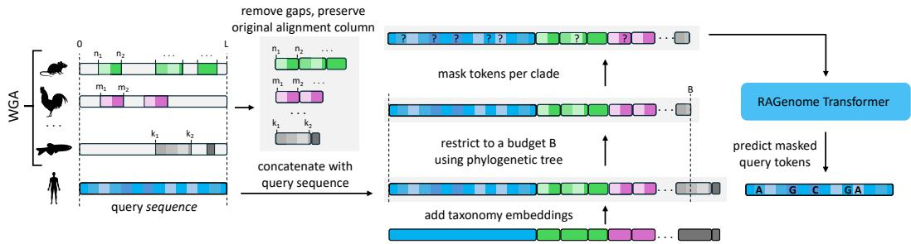  
Figure 1: Overview of the retrieval mechanism of RAGenome. For each query sequence, we retrieve aligned homologous sequences from a WGA and remove gap tokens, preserving the original alignment column of each retained token as its positional embedding. We then concatenate all sequences, add taxonomy embeddings to distinguish species, and restrict retrieval to a fixed budget B using the phylogenetic tree. Tokens are then masked per clade, and the resulting sequence is passed to the RAGenome Transformer, which predicts the masked query tokens.

retrieves and processes homologous sequences from a WGA, and then we move on to the architecture and the pretraining process.

## 4.1 RETRIEVAL MECHANISM

As depicted in Figure 1, RAGenome takes as input a sequence from the query species of length L and the corresponding aligned sequences from a WGA of N vertebrate species. A key inefficiency of current MSA-based gLMs (Benegas et al., 2025; Ye et al., 2026) is that they naively process every input token, while WGAs are highly dominated by uninformative gap tokens that correspond to unaligned segments. Especially for species that are evolutionarily distant from the query, the overall fraction of the human genome that aligns can fall below 2% (Miller et al., 2007). To verify this, we analyzed the WGA of 100 vertebrates used by GPN-Star (Ye et al., 2026) and found that 73% of tokens correspond to gaps. Note that training a model on only short, highly conserved regions of the genome, as GPN-Star does, is not as inefficient, since conserved regions tend to align well across species and therefore contain fewer gaps (41% gaps in the top 5% most conserved regions). However, training a general-purpose foundation model requires pretraining across the full diversity of the genome, where the fraction of gap tokens increases substantially.

To make retrieval-based pretraining over the whole genome efficient, we discard gap tokens entirely and keep only aligned nucleotides, which substantially reduces the number of input tokens (Figure 2). We preserve the original alignment column ofeach token and use it as its position in rotary position embeddings (RoPE) (Su et al., 2024), applied in both the local and cross-attention layers. In this way, cross-species alignment information is preserved without needing any additional mechanism to track it explicitly. Then, inspired by a similar retrieval technique in pLMs (Jain et al., 2025), we concatenate all the sequences in a single array and distinguish between them by adding taxonomy embeddings for each species.

Even after removing the gaps, retaining the full WGA becomes computationally expensive at longer context lengths, since the number of retrieved tokens still grows with both context length and the number of species N. We restrict retrieval to a fixed budget B, selecting species using the phylogenetic tree to sample sequences from as many distinct lineages as possible within the budget (Appendix A.1). We set budget B according to the available GPU capacity since it bounds the memory consumed by the cross-attention layers, whose cost grows with the number of retrieved tokens. For example, in our largest context setting, we set B = 80,000 tokens to fit within an NVIDIA H100 GPU.

## 4.2 TAXONOMY EMBEDDINGS

We include species information in RAGenome by adding taxonomy embeddings to each token representation. Specifically, we map each species k to its NCBI taxonomic lineage, spanning superkingdom, kingdom, phylum, class, order, family, genus, and species (Schoch et al., 2020). Then, we obtain a single shared embedding for each species by concatenating the nominal embeddings of each taxonomy level it belongs to. For example, humans and mice share the same embeddings at the superkingdom, kingdom, phylum and class levels, but differ at the order, family, genus, and species levels, reflecting their more distant evolutionary relationship within mammals. This design enables phylogenetically related species to share common information through their taxonomy embeddings. In Appendix A.2, a UMAP projection (McInnes et al., 2018) of the taxonomy embeddings is shown, confirming that phylogenetically related species cluster together in the embedding space.

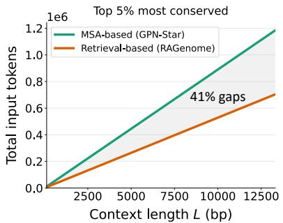

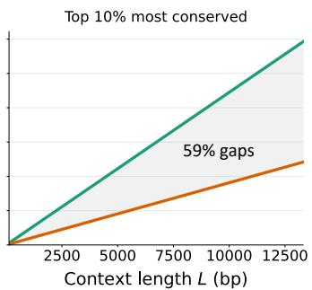

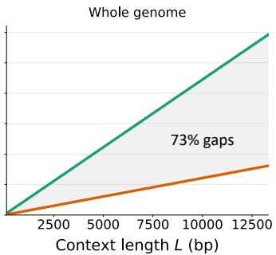  
Figure 2: Total number of input tokens as a function of context length L, comparing MSA-based methods (Ye et al., 2026) that keep gap tokens against our proposed retrieval-based approach, across three genome coverage levels. The shaded region indicates the reduction in tokens achieved by removing gap tokens. The percentage of gaps in each panel is the total fraction of tokens that are gaps at that coverage level.

## 4.3 ARCHITECTURE

RAGenome is a multi-head Transformer (Vaswani et al., 2017) where standard self-attention layers are replaced with two types of attention layers tailored to capture within-species and cross-species dependencies, as shown in Figure 3.

Intra-species local attention. To scale to long sequences while modeling within-species dependencies, we replace full self-attention with local (sliding window) attention (Beltagy et al., 2020), where the cost scales linearly instead of quadratically with sequence length. By stacking multiple such layers, the effective receptive field grows with depth, allowing information to propagate across longer parts of the sequence. Let $h ^ { k } = \mathsf { \bar { ( } } h _ { 1 } ^ { k } , \ldots , h _ { L _ { k } } ^ { k } \mathsf { ) }$ denote the hidden representations of the tokens of species $k \in \{ 0 , 1 , \ldots , N \}$ , where $k = 0$ corresponds to the query species. For each species independently, position i attends only to a local window $\mathcal { W } ( i ) = \{ j : | i - j | \le w / 2 \}$ of size w:

$$
\mathrm { L o c a l A t t n } ( h ^ { k } ) _ { i } = \mathrm { s o f t m a x } \left( \frac { q _ { i } ^ { k } ( K _ { { \mathcal W } ( i ) } ^ { k } ) ^ { \top } } { \sqrt { d } } \right) V _ { { \mathcal W } ( i ) } ^ { k } ,\tag{2}
$$

where $q _ { i } ^ { k }$ is the query vector at position i of species k, and $K _ { \mathcal { W } ( i ) } ^ { k } , V _ { \mathcal { W } ( i ) } ^ { k }$ are the keys and values within the window; i indexes the gap-free tokens of species k.

Inter-species cross-attention. To enable the model to directly incorporate evolutionary information from the retrieved homologous sequences, we insert inter-species cross-attention layers in the middle of the network. These layers allow information to flow from the retrieved sequences to the query sequence, letting the model learn WGA-dependent representations. Formally, let $h _ { i } ^ { 0 }$ denote the representation of the query species at position i and let $h ^ { 1 : N } = \{ h _ { i } ^ { k } : k \in \{ 1 , \dots , N \} , j \in \{ 1 , \dots , L _ { k } \} \}$ denote the representations from the retrieved N species. Cross-attention at position i is computed as:

$$
\mathrm { C r o s s A t t n } ( h ^ { 0 } , h ^ { 1 : N } ) _ { i } = \mathrm { s o f t m a x } \left( \frac { q _ { i } ^ { 0 } ( K ^ { 1 : N } ) ^ { \top } } { \sqrt { d } } \right) V ^ { 1 : N } ,\tag{3}
$$

where $q _ { i } ^ { 0 }$ is the query vector at position i of the query species, and $K ^ { 1 : N } , V ^ { 1 : N }$ are the keys and values computed from the concatenated retrieved representations across all species.

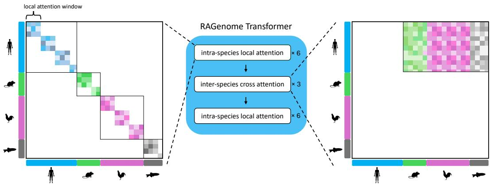  
Figure 3: RAGenome Transformer alternates between two types of attention layers. Left: Intraspecies local attention restricts each position to attend only within a local window neighborhood in the same species. Right: Inter-species cross-attention allows the query species (blue) to attend over all the retrieved sequences from the other species. For illustration, local attention windows are shown as non-overlapping blocks.

## 4.4 PRETRAINING

During pretraining of RAGenome, we always set Homo sapiens as our query species and retrieve homologous sequences from a WGA of 100 vertebrates (Ye et al., 2026), excluding species in the same clade as the query. This results in 89 species retrieved along with Homo sapiens. The model is optimized using a masked language modeling objective where short contiguous spans of nucleotides (3 to 6 nucleotides) are masked together, instead of individual tokens. In each training sample, we randomly select 15% of the non-gap positions in each query sequence, ensuring that the same positions are selected in species that belong to the same clade.

The target segment length L is set to 13,312 nucleotides, selected as a multiple of the local attention window size $w = 5 1 2$ that is long enough to capture the gene structures and splice-site interactions. However, directly training a language model on such long sequences can affect training stability as the variance in gradient increases (Li et al., 2022). Similar to other long-context gLMs (Nguyen et al., 2023; Brixi et al., 2026), we apply a context extension strategy, where we gradually increase the input context length to improve stability and reduce training time. To account for the retrieval mechanism as well, we also gradually increase genome coverage, from more conserved to noisier, less conserved regions. Specifically, we train RAGenome in four stages (Appendix A.3):

1. Short conserved regions. We start with L = 1, 024 nucleotides restricted to the top 5% most conserved regions of the human genome, where retrieval signal is most reliable and local motifs are easiest to learn.

2. Coverage extension. We then extend training to the top 40% most conserved regions of the genome keeping the same context length, exposing the model to greater sequence diversity and less conserved regions.

3. Context extension. We extend the input context to L = 4, 096 nucleotides, allowing the model to learn longer-range signals such as gene structure.

4. Full-length context. Finally, we scale the input context to the full target length of $L =$ 13, 312 nucleotides, covering the entire genome.

We train a 168M-parameter model using AdamW and a learning rate of $1 0 ^ { - 4 }$ with a cosine schedule of 4,000 warmup steps at the start of each stage. The full hyperparameters for the architecture and the pretraining stages are shown in Appendix A.4.

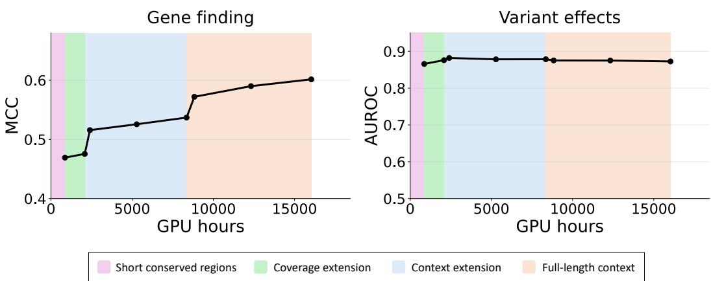  
Figure 4: Performance of RAGenome on gene finding (left) and variant effect prediction (right) as a function of training compute. The colored regions indicate the pretraining stages presented in Section 4.4. Gene finding performance improves gradually within each stage but increases sharply at each context-extension transition, indicating that longer input context is crucial for gene annotation. Variant effect prediction remains flat, reflecting that it relies primarily on local evolutionary conservation signals captured from the WGA.

## 5 RESULTS

## 5.1 DOWNSTREAM TASKS

We evaluate RAGenome on two complementary downstream tasks, testing two capabilities that current gLMs struggle to jointly achieve and that our retrieval-based approach is specifically designed to unify: long-range interaction modeling and evolutionary signal modeling.

Gene finding. Annotating genes and identifying coding sequences requires a model to capture longrange interactions. For example, accurately classifying a given nucleotide as being within an intron or exon depends on information from splice sites that can be located far away. Also, introns vary in length from a few hundred to several thousand base pairs, requiring a language model that can reason over long-range dependencies to make accurate predictions. We evaluate RAGenome on the gene finding task from BEND (Marin et al., 2024). The task is framed as nucleotide-level 9- class classification: embeddings are extracted from the frozen, pretrained model and used to train a lightweight two-layer CNN classifier on top. For elements longer than the native context of a model, sequences are chunked, embedded independently and concatenated before training the classifier. We report the Matthews Correlation Coefficient (MCC) on the provided test split.

Variant effect prediction. Classifying variants as pathogenic or benign in ClinVar (Landrum et al., 2014) is crucial for understanding the impact of genetic variants on disease susceptibility. Classical evolutionary methods such as PhastCons (Siepel et al., 2005) and PhyloP (Siepel et al., 2006) are already known to perform relatively well on this task, indicating that evolutionary conservation is a strong signal for prioritizing pathogenic variants. Following Ye et al. (2026), we perform the task zero-shot by computing the log-likelihood ratio between the reference and alternate allele under the model and report the area under the receiver operating characteristic curve (AUROC).

## 5.2 SCALING RAGENOME IMPROVES LONG-RANGE CAPABILITIES

First, we evaluate the effect of the different pretraining stages discussed in Section 4.4 on the performance of RAGenome on the two downstream tasks. Figure 4 presents gene finding and variant effect prediction performance as a function of pretraining compute, with colored regions indicating each pretraining stage.

We observe that gene finding performance improves substantially after each pretraining stage, with the largest gains occurring immediately after each transition. Specifically, MCC increases from 0.47 to 0.52 after extending the context length to 4,096 nucleotides (blue region), and from 0.54 to 0.57 after further extending it to 13,312 nucleotides (orange region). This suggests that training on longer context windows, rather than training compute alone, is the crucial factor for improving gene finding performance, since the model can capture broader gene structure, such as relationships across splice sites and regulatory elements. In contrast, variant effect prediction remains flat across all pretraining stages, indicating that our retrieval mechanism preserves its strong evolutionary signal even as context length increases. Together, these results indicate that RAGenome does not trade one capability for the other: the same model achieves strong long-range understanding without sacrificing the short-range, evolutionary-driven performance that makes MSA-based gLMs effective. In Appendix A.5, we disentangle the effect of context length from that of additional training compute, showing that at a fixed checkpoint, performance improves consistently with inference context length. Similarly, in Appendix A.6 we show an ablation on different retrieval budgets B, indicating the importance of retrieval information on both tasks.

Table 1: Results on Gene Finding from BEND (Marin et al., 2024) and Variant Effect Prediction (VEP) from ClinVar (Landrum et al., 2014). Each model is evaluated at its native context length. MSA indicates whether the model uses a whole-genome alignment. For models present in the original BEND paper (HyenaDNA, DNABERT-2, GENA-LM and NT-MS), we evaluated them again ourselves, with only minor differences from the original numbers.
<table><tr><td>Model</td><td>Parameters</td><td>Max length</td><td>MSA</td><td>~GPU Hours</td><td>Gene finding</td><td>VEP</td></tr><tr><td rowspan="3">GPN-MSA GPN-Star (V)</td><td>86M</td><td>128</td><td>√</td><td>20</td><td>0.43</td><td>0.90</td></tr><tr><td>200M</td><td>128</td><td>√</td><td>1,000</td><td>0.45</td><td>0.92</td></tr><tr><td>7M</td><td>1M</td><td></td><td>5,376</td><td>0.33</td><td>0.51</td></tr><tr><td rowspan="4">HyenaDNA DNABERT-21 GENA-LM1, 2 NT-MS</td><td>117M</td><td>10,000</td><td></td><td>12,000</td><td>0.41</td><td></td></tr><tr><td>336M</td><td>4,500</td><td></td><td></td><td>0.50</td><td></td></tr><tr><td>2.5B</td><td>5,994</td><td></td><td>215,000</td><td>0.66</td><td>0.57</td></tr><tr><td>7B</td><td>1M</td><td></td><td>&gt; 1M</td><td>0.81</td><td>0.80</td></tr><tr><td>Evo23 RAGenome</td><td>168M</td><td>13,312</td><td>√</td><td>16,032</td><td>0.60</td><td>0.87</td></tr></table>

1 Not applicable for variant effects task due to its tokenization strategy.  
2 Insufficient information reported to compute GPU-hours.  
3 GPU-hours estimated from training for several months on over 2,000 GPUs (Brixi et al., 2026).

## 5.3 COMPARISON WITH OTHER MODELS

Baselines. RAGenome is an attempt to build a retrieval-based gLM that can model evolutionary signals and long-range interactions at the same time. We compare RAGenome against two families of models: MSA-based models that explicitly leverage homologous sequences and large-scale gLMs that rely on scale and long context instead (Table 1). GPN-MSA (Benegas et al., 2025) and GPN-Star (Ye et al., 2026) are MSA-based models that achieve impressive performance on variant effect prediction, but struggle on gene finding due to their short context length. On the other hand, NT-MS (Dalla-Torre et al., 2025) is an attempt to improve performance by scaling model parameters (2.5B) and data coverage (over 850 species), without an MSA. It performs better than GPN-MSA and GPN-Star on gene finding, but performs poorly on variant effect prediction, likely because it does not explicitly model evolutionary conservation. Further scaling in this direction, Evo2 (Brixi et al., 2026), a 7B-parameter model, achieves strong results on both tasks without an MSA, suggesting that it implicitly learned evolutionary conservation patterns by scaling training across thousands of genomes over several months using over 2,000 GPUs. Finally, the mid-scale long-context models HyenaDNA (Nguyen et al., 2023), DNABERT-2 (Zhou et al., 2024), and GENA-LM (Fishman et al., 2025) ignore MSAs and underperform on gene finding.

Gene finding. In Table 1, we observe that RAGenome achieves an MCC of 0.60, substantially outperforming both the MSA-based methods (GPN-Star, GPN-MSA) and all the mid-scale gLMs (HyenaDNA, DNABERT-2, and GENA-LM). This supports that identifying genomic elements benefits from long-range context, since gene structure depends on relationships across splice sites and distant regulatory elements that a short context window cannot capture. However, context length alone is not sufficient: HyenaDNA supports contexts of up to 1M nucleotides, but still performs poorly (MCC

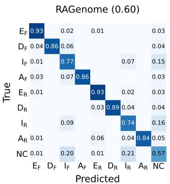

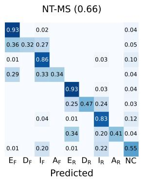

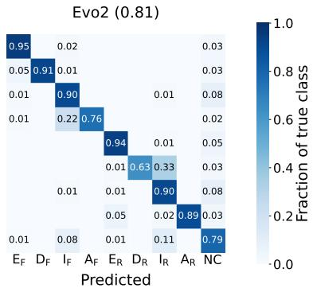  
Figure 5: Per-class confusion matrices for RAGenome, NT-MS, and Evo2 on the gene finding task (Marin et al., 2024), normalized by true class. RAGenome outperforms NT-MS at identifying donor (D) and acceptor (A) splice sites on both the forward (F) and reverse (R) strand, while NT-MS is better at classifying introns (I). Evo2 outperforms both models on most classes given its much larger scale in model size, data, and compute.

0.33), indicating that sufficient training compute is also essential for learning long-range complex relationships. RAGenome underperforms relative to the two much larger-scale gLMs, NT-MS (0.66) and Evo2 (0.81), which are trained with far more parameters and far more compute, likely explaining the remaining gap. Given that the performance of RAGenome on gene finding also continues to improve with longer context (Figure 4), we expect further scaling in model size, training data, and context length to close this gap.

To further analyze the performance comparison with large-scale gLMs, Figure 5 shows per-class confusion matrices for RAGenome, NT-MS, and Evo2 on the gene finding task. We observe that RAGenome substantially outperforms NT-MS at identifying donor and acceptor splice sites, while NT-MS is better only at introns. Although RAGenome matches or outperforms NT-MS on most classes, the aggregate MCC of NT-MS is higher because introns span far more nucleotide positions in the test set. Evo2 outperforms both models on most classes, reflecting its much larger scale in model size, data, and compute. Together, these results indicate that our retrieval-based approach can narrow the gap to large-scale gLMs using substantially fewer parameters and less compute.

Variant effect prediction. On variant effect prediction, RAGenome achieves an AUROC of 0.87, surpassed only by the two MSA-based models GPN-MSA (0.90) and GPN-Star (0.92), that are specifically optimized for this short-range, evolutionary-driven task, while it substantially outper forms both large-scale gLMs, Evo2 (0.80) and NT-MS (0.57).

Altogether, if we set aside Evo2, whose model size and training compute set it in a different regime from every other baseline, RAGenome is the only model in Table 1 that performs competitively on both tasks, indicating that a retrieval-based gLM can unify evolutionary modeling and long-range capabilities within a single, efficient architecture.

## 6 LIMITATIONS

RAGenome requires a WGA at inference and cannot currently be applied to sequences or species for which no alignment of any sort is available. As future work, we plan to address this by training a single model that works both with and without an alignment. Additionally, RAGenome is trained with Homo sapiens as the query species, and its behavior on other species remains untested for now. While the architecture supports any query species and alignment, applying it to a new one would likely require additional pretraining. Finally, we trained a single 168M-parameter RAGenome model and leave scaling with model size and data to future work.

## 7 CONCLUSION

In this work, we investigated how retrieval-based methods, previously proposed for pLMs (Jain et al., 2025), can be applied to gLMs in order to scale evolutionary modeling to long contexts. We presented RAGenome, the first retrieval-based gLM that scales to input context up to 13,312 nucleotides (100× longer than MSA-based methods) by using an efficient retrieval mechanism that removes gap tokens from the MSA. RAGenome surpasses GPN-Star, the strongest MSA-based gLM, on gene finding, demonstrating strong long-range capabilities. At the same time, it outperforms much larger gLMs such as NT-MS and Evo2 on variant effect prediction by explicitly modeling evolutionary signals through an MSA. Together, these results suggest that RAGenome is the first gLM to unify explicit evolutionary modeling with long-range genomic understanding within a single, efficient architecture. We expect that further scaling of RAGenome in model size, training data and context length will continue to close the remaining gap to large-scale gLMs, while preserving the efficiency benefits of a much smaller, retrieval-based approach.

## AI USE STATEMENT

In this work, we used generative AI tools for drafting and editing text throughout the manuscript and suggesting paper structure, titles, and keywords. We have not used generative AI tools to develop theoretical models or conceptual frameworks, propose or refine hypotheses, design or give feedback on research methodology or experiments, implement methods, or support qualitative or thematic data analysis. We have reviewed all AI-assisted work: all experimental results, tables, and figures were produced independently by the authors, and all AI-suggested text was manually verified against primary sources before inclusion. We take responsibility for the final content of this work, including text, claims, and artifacts produced with the aid of generative AI.

## ETHICS STATEMENT

This work uses only publicly available genomic data: the human reference genome, a whole-genome alignment (Ye et al., 2026), and the public BEND (Marin et al., 2024) and ClinVar (Landrum et al., 2014) benchmarks, none of which contain individually identifiable data.

## REPRODUCIBILITY STATEMENT

In Section 4, we present in detail the retrieval mechanism, architecture, and pretraining procedure of RAGenome, with full hyperparameters in Appendix A.4. All datasets for training and evaluating the model are publicly available. Code is available at https://github.com/ PanosAntoniadis/RAGenome and the trained model weights at https://huggingface. co/pantoniadis/RAGenome.

## ACKNOWLEDGMENTS

Model training and inference was made possible on Gefion supercomputer by a pilot project from DCAI and a voucher grant awarded by the Novo Nordisk Foundation (NNF25OC0105165). Further support was provided from the Novo Nordisk Foundation through the MLSS Center (Basic Machine Learning Research in Life Science, NNF20OC0062606), CAZAI (DDB and OW, NNF22OC0077058), NovoSTAR programme (RD), and the Pioneer Centre for AI (DNRF grant number P1). We also thank Anders Krogh for invaluable discussions.

## REFERENCES

Babak Alipanahi, Andrew Delong, Matthew T Weirauch, and Brendan J Frey. Predicting the sequence specificities of DNA- and RNA-binding proteins by deep learning. Nature Biotechnology, 33(8):831–838, August 2015. ISSN 1087-0156, 1546-1696. doi: 10.1038/nbt.3300. URL https://www.nature.com/articles/nbt.3300.

Ziga Avsec, Natasha Latysheva, Jun Cheng, Guido Novati, Kyle R Taylor, Tom Ward, Clare By-ˇ croft, Lauren Nicolaisen, Eirini Arvaniti, Joshua Pan, et al. Advancing regulatory variant effect prediction with AlphaGenome. Nature, 649(8099):1206–1218, 2026.

Iz Beltagy, Matthew E Peters, and Arman Cohan. Longformer: The long-document transformer. arXiv preprint arXiv:2004.05150, 2020.

Gonzalo Benegas, Carlos Albors, Alan J Aw, Chengzhong Ye, and Yun S Song. A DNA language model based on multispecies alignment predicts the effects of genome-wide variants. Nature Biotechnology, 43(12):1960–1965, 2025.

Sam Boshar, Benjamin Evans, Ziqi Tang, Armand Picard, Yanis Adel, Franziska K Lorbeer, Chandana Rajesh, Tristan Karch, Shawn Sidbon, David Emms, et al. A foundational model for joint sequence-function multi-species modeling at scale for long-range genomic prediction. BioRxiv, pp. 2025–12, 2025.

Garyk Brixi, Matthew G Durrant, Jerome Ku, Mohsen Naghipourfar, Michael Poli, Gwanggyu Sun, Greg Brockman, Daniel Chang, Alison Fanton, Gabriel A Gonzalez, et al. Genome modelling and design across all domains of life with Evo 2. Nature, 652(8112):1349–1361, 2026.

Micaela Elisa Consens, Kevin K Yang, Jimmy Hall, Ashley Mae Conard, Bo Wang, Lorin Crawford, Alan Moses, and Alex X Lu. Predicting evolutionary rate as a pretraining task improves genome language model representations. bioRxiv, pp. 2026–02, 2026.

Hugo Dalla-Torre, Liam Gonzalez, Javier Mendoza-Revilla, Nicolas Lopez Carranza, Adam Henryk Grzywaczewski, Francesco Oteri, Christian Dallago, Evan Trop, Bernardo P De Almeida, Hassan Sirelkhatim, et al. Nucleotide Transformer: building and evaluating robust foundation models for human genomics. Nature methods, 22(2):287–297, 2025.

Jacob Devlin, Ming-Wei Chang, Kenton Lee, and Kristina Toutanova. BERT: Pre-training of deep bidirectional transformers for language understanding. In Proceedings of the 2019 conference of the North American chapter of the association for computational linguistics: human language technologies, volume 1 (long and short papers), pp. 4171–4186, 2019.

ENCODE Project Consortium. An integrated encyclopedia of DNA elements in the human genome. Nature, 489(7414):57, 2012.

Veniamin Fishman, Yuri Kuratov, Aleksei Shmelev, Maxim Petrov, Dmitry Penzar, Denis Shepelin, Nikolay Chekanov, Olga Kardymon, and Mikhail Burtsev. GENA-LM: a family of open-source foundational DNA language models for long sequences. Nucleic Acids Research, 53(2):gkae1310, 2025.

Thomas Hayes, Roshan Rao, Halil Akin, Nicholas J Sofroniew, Deniz Oktay, Zeming Lin, Robert Verkuil, Vincent Q Tran, Jonathan Deaton, Marius Wiggert, et al. Simulating 500 million years of evolution with a language model. Science, 387(6736):850–858, 2025.

Sarthak Jain, Joel Beazer, Jeffrey A Ruffolo, Aadyot Bhatnagar, and Ali Madani. E1: Retrievalaugmented protein encoder models. bioRxiv, pp. 2025–11, 2025.

Yanrong Ji, Zhihan Zhou, Han Liu, and Ramana V Davuluri. DNABERT: pre-trained bidirectional encoder representations from transformers model for DNA-language in genome. Bioinformatics, 37(15):2112–2120, 2021.

John Jumper, Richard Evans, Alexander Pritzel, Tim Green, Michael Figurnov, Olaf Ronneberger, Kathryn Tunyasuvunakool, Russ Bates, Augustin Zˇ ´ıdek, Anna Potapenko, et al. Highly accurate protein structure prediction with AlphaFold. Nature, 596(7873):583–589, 2021.

David R Kelley, Jasper Snoek, and John L Rinn. Basset: learning the regulatory code of the accessible genome with deep convolutional neural networks. Genome research, 26(7):990–999, 2016.

Melissa J Landrum, Jennifer M Lee, George R Riley, Wonhee Jang, Wendy S Rubinstein, Deanna M Church, and Donna R Maglott. ClinVar: public archive of relationships among sequence variation and human phenotype. Nucleic acids research, 42(D1):D980–D985, 2014.

Conglong Li, Minjia Zhang, and Yuxiong He. The stability-efficiency dilemma: Investigating sequence length warmup for training GPT models. Advances in Neural Information Processing Systems, 35:26736–26750, 2022.

Frederikke Marin, Felix Teufel, Marc Horlacher, Dennis Madsen, Dennis Pultz, Ole Winther, and Wouter Boomsma. BEND: Benchmarking DNA language models on biologically meaningful tasks. In International Conference on Learning Representations, volume 2024, pp. 15246–15281, 2024.

Leland McInnes, John Healy, Nathaniel Saul, and Lukas Grossberger. UMAP: Uniform manifold approximation and projection. The Journal ofOpen Source Software, 3(29):861, 2018.

Webb Miller, Kate Rosenbloom, Ross C Hardison, Minmei Hou, James Taylor, Brian Raney, Richard Burhans, David C King, Robert Baertsch, Daniel Blankenberg, et al. 28-way vertebrate alignment and conservation track in the UCSC genome browser. Genome research, 17(12): 1797–1808, 2007.

Eric Nguyen, Michael Poli, Marjan Faizi, Armin Thomas, Michael Wornow, Callum Birch-Sykes, Stefano Massaroli, Aman Patel, Clayton Rabideau, Yoshua Bengio, et al. HyenaDNA: Longrange genomic sequence modeling at single nucleotide resolution. Advances in neural information processing systems, 36:43177–43201, 2023.

Roshan M Rao, Jason Liu, Robert Verkuil, Joshua Meier, John Canny, Pieter Abbeel, Tom Sercu, and Alexander Rives. MSA transformer. In International conference on machine learning, pp. 8844–8856. PMLR, 2021.

Conrad L Schoch, Stacy Ciufo, Mikhail Domrachev, Carol L Hotton, Sivakumar Kannan, Rogneda Khovanskaya, Detlef Leipe, Richard Mcveigh, Kathleen O’Neill, Barbara Robbertse, et al. NCBI Taxonomy: a comprehensive update on curation, resources and tools. Database, 2020:baaa062, 2020.

Adam Siepel, Gill Bejerano, Jakob S Pedersen, Angie S Hinrichs, Minmei Hou, Kate Rosenbloom, Hiram Clawson, John Spieth, LaDeana W Hillier, Stephen Richards, et al. Evolutionarily conserved elements in vertebrate, insect, worm, and yeast genomes. Genome research, 15(8):1034– 1050, 2005.

Adam Siepel, Katherine S Pollard, and David Haussler. New methods for detecting lineage-specific selection. In Annual International Conference on Research in Computational Molecular Biology, pp. 190–205. Springer, 2006.

Jianlin Su, Murtadha Ahmed, Yu Lu, Shengfeng Pan, Wen Bo, and Yunfeng Liu. RoFormer: Enhanced transformer with rotary position embedding. Neurocomputing, 568:127063, 2024.

Ashish Vaswani, Noam Shazeer, Niki Parmar, Jakob Uszkoreit, Llion Jones, Aidan N Gomez, Łukasz Kaiser, and Illia Polosukhin. Attention is all you need. Advances in neural information processing systems, 30, 2017.

Chengzhong Ye, Gonzalo Benegas, Carlos Albors, Jianan Canal Li, Sebastian Prillo, Peter D. Fields, Brian Clarke, and Yun S. Song. Predicting genome-wide functional constraints with GPN-Star. Nature, September 2026. ISSN 1476-4687. doi: 10.1038/s41586-026-11005-5.

Jian Zhou and Olga G Troyanskaya. Predicting effects of noncoding variants with deep learning– based sequence model. Nature methods, 12(10):931–934, 2015.

Zhihan Zhou, Yanrong Ji, Weijian Li, Pratik Dutta, Ramana Davuluri, and Han Liu. DNABERT-2: Efficient foundation model and benchmark for multi-species genomes. In International Conference on Learning Representations, volume 2024, pp. 41642–41665, 2024.

## A APPENDIX

## A.1 SPECIES SELECTION UNDER THE BUDGET

As described in Section 4.1, we restrict retrieved tokens to a fixed budget B by selecting species using the phylogenetic tree. We use the same phylogenetic clades as GPN-Star (Ye et al., 2026), excluding the clade of the query species. For each training sample, we shuffle the clades and draw one random species from each clade without replacement; we then repeat this process, drawing an additional species from each clade that still has one remaining, until the number of aligned tokens reaches the budget B. This promotes diversity across clades, since every clade contributes one species before any clade contributes a second.

## A.2 TAXONOMY EMBEDDINGS

As described in Section 4.2, we include taxonomy embeddings in RAGenome by concatenating nominal embeddings of its NCBI taxonomic lineage. To check whether the taxonomy embeddings contain phylogenetically related information, we project the learned embeddings of the 100 vertebrate species in our WGA using UMAP (McInnes et al., 2018) and illustrate the first two dimensions in Figure 6. We clearly observe that species belonging to the same class rank form well-separated clusters (Figure 6a). Within the largest class, Mammalia, species further separate by order rank (Figure 6b) confirming that taxonomic information is encoded in the learned embeddings.

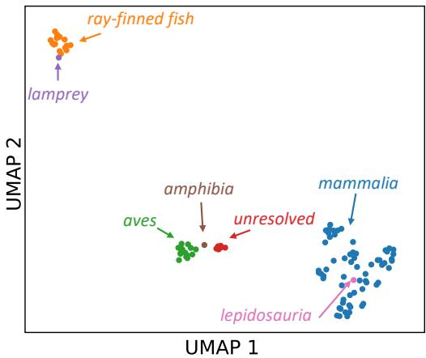  
(a) All 100 vertebrates colored by class rank in the taxonomy.

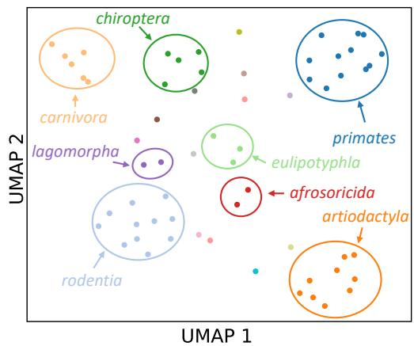  
(b) Species of Mammalia class colored by order rank in the taxonomy.  
Figure 6: UMAP projection of the learned taxonomy embeddings for the 100 vertebrate species of the WGA.

## A.3 SELECTION OF CONSERVED REGIONS

When pretraining RAGenome, we first warm up the model on short segments from highly conserved regions of the genome and then gradually move to longer and less conserved regions. Following GPN-Star (Ye et al., 2026), we split the human genome into fixed-size windows and rank them by conservation using PhastCons scores (Siepel et al., 2005). Using a window of size L, we slide across the genome with a stride of $\begin{array} { l } { { \frac { L } { 2 } } } \end{array}$ and assign each window a conservation score equal to the 75th percentile of the PhastCons scores of its bases, discarding windows in which more than 50% of the bases have no PhastCons score. We then keep a fraction q of windows with the highest scores, plus a random sample of 0.1% of the remaining windows, so that less conserved sequence is also seen. We use $q = 5 \%$ for stage 1 and $q = 4 0 \%$ for stages 2 and 3, and no selection for stage 4, where all valid windows are used.

## A.4 HYPERPARAMETERS

Table 2: Hyperparameters of RAGenome.
<table><tr><td>Architecture</td><td></td></tr><tr><td>Parameters</td><td>168M</td></tr><tr><td>Hidden dimension</td><td>1024</td></tr><tr><td>Attention heads</td><td>16</td></tr><tr><td>Dimension per head</td><td>64</td></tr><tr><td>Transformer Layers</td><td>15 (12 local attention, 3 cross-attention)</td></tr><tr><td>Local attention (w)</td><td>512</td></tr><tr><td>RoPE embeddings dimension</td><td>32</td></tr><tr><td>Activation function</td><td>GELU</td></tr><tr><td>Optimization</td><td></td></tr><tr><td>Optimizer</td><td>AdamW</td></tr><tr><td>Learning rate</td><td>10⁻4</td></tr><tr><td>Learning rate Schedule</td><td>cosine, 4,000 warmup steps</td></tr><tr><td>Weight decay</td><td>0.01</td></tr><tr><td>Gradient clipping</td><td>1.0</td></tr><tr><td>Precision</td><td>bf16 mixed</td></tr></table>

Table 3: Hyperparameters of pretraining strategy.
<table><tr><td></td><td>Stage 1</td><td>Stage 2</td><td>Stage 3</td><td>Stage 4</td></tr><tr><td>Context length L</td><td>1,024</td><td>1,024</td><td>4,096</td><td>13,312</td></tr><tr><td>Genome coverage</td><td>top 5%</td><td>top 40%</td><td>top 40%</td><td>full</td></tr><tr><td>Retrieval budget B</td><td>24,000</td><td>24,000</td><td>80,000</td><td>80,000</td></tr><tr><td>Effective batch size</td><td>256</td><td>512</td><td>512</td><td>512</td></tr><tr><td>GPU hours</td><td>864</td><td>1,216</td><td>6,272</td><td>7,680</td></tr></table>

## A.5 ABLATION ON INFERENCE CONTEXT LENGTH

To isolate the effect of context length from the confound of additional pretraining compute, we evaluate RAGenome at different context lengths during inference (Table 4). For each pretraining stage, we take the final checkpoint and evaluate it both at its training context length and at the shorter context lengths used in earlier training stages. We observe that across all checkpoints, performance improves monotonically with inference context length, and the fully-scaled model, trained and evaluated at 13,312 nucleotides, achieves the best performance. These results indicate that both additional training and longer context contribute, and that the model effectively uses long-range information at inference.

<table><tr><td>Train context</td><td>Inference context</td><td>Gene finding (MCC)</td></tr><tr><td>1,024</td><td>1,024</td><td>0.47</td></tr><tr><td rowspan="2">4,096</td><td>1,024</td><td>0.51</td></tr><tr><td>4,096</td><td>0.54</td></tr><tr><td rowspan="3">13,312</td><td>1,024</td><td>0.53</td></tr><tr><td>4,096</td><td>0.57</td></tr><tr><td>13,312</td><td>0.60</td></tr></table>

Table 4: Gene finding performance of RAGenome across different pretraining stages, evaluated at different context lengths.

## A.6 ABLATION ON RETRIEVAL BUDGET

To evaluate the effect of the retrieval budget B, we evaluate RAGenome with different budgets at inference, from 0 (no retrieved sequences) up to its training budget (Figure 7). Without retrieval, performance collapses, which is expected since the model was never trained without retrieved context. Performance improves substantially as soon as a small budget is used. Variant effect prediction then saturates by $B = 4 0 { , } 0 0 0$ , while gene finding improves slightly up to the full budget. This suggests that variant effect prediction relies on local conservation signals that a moderate number of retrieved species already provides, while gene finding continues to benefit from additional evolutionary context.

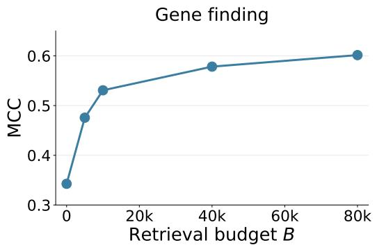

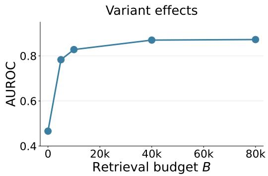  
Figure 7: Performance of RAGenome on gene finding (MCC, left) and variant effect prediction (AUROC, right), evaluated at different retrieval budgets B at inference time.