# RARECACHE: BRIDGING THE GAP IN CROSS-MODEL KV CACHE REUSE VIA RANK DISAGREEMENT-BASED SELECTIVE RECOMPUTATION

Sreetama Sarkar⋆, Saptarshi Mitra♦, Sitao Huang♦, Souvik Kundu▲†, Peter A. Beerel⋆† ⋆University of Southern California ♦University of California, Irvine ▲Intel Labs {sreetama,pabeerel}@usc.edu {saptarm,sitaoh}@uci.edu {souvikk.kundu}@intel.com

## ABSTRACT

Cross-model KV-cache reuse remains a key challenge in modern LLM serving. Coding agents and multi-model systems increasingly route a shared context across models: a user may switch models mid-session, or a cascade may escalate a difficult query. Because KV caches contain model-specific representations, each switch typically forces the receiving model to prefill the entire context from scratch. Recent work shows that closed-form linear maps can translate KV caches between models in the same family, but transfer accuracy degrades as the model-size gap widens. In this paper, we establish that these transfer failures are concentrated in a small subset of information-dense tokens. To bridge this gap, we introduce RaReCache, a framework that enables a large target model to decode accurately from a cache prefilled by a much smaller source via selective recomputation. RaReCache identifies these critical positions using a novel rank disagreement metric, scoring each token by the energy of its mapped KV in output directions weakly supported by the calibration data. Across two model families and five benchmarks, on a 23× parameter gap (Qwen3-0.6B to 14B) recomputing just 30% of positions retains 95-99% of the target accuracy, whereas on a 8.8× gap (Llama3-8B to 70B), recomputing 40% retains 96.5% of the target accuracy. RaReCache largely removes sensitivity to source-model size, and achieves up to a 3.04× prefill speedup. For online serving, it handles 1.8× the request throughput of target prefill on a single GPU, and at the target’s saturation load, reduces median and 99th-percentile time-to-first-token (TTFT) by 5.0× and 6.4× respectively, with a 30% recompute budget. RaReCache establishes an efficient serving paradigm where small models prefill on behalf of massive targets, enabling large models to recompute only critical tokens, drastically reducing prefill latency.

## 1 INTRODUCTION

Modern large language model (LLM) serving systems increasingly hand off ongoing contexts across models of different capacities. This paradigm underpins cost-quality cascades (Chen et al., 2023), dynamic request routing (Ong et al., 2024), and coding agents that let users upgrade to stronger models midway through a session. However, each context switch carries a hidden cost. A model’s key-value (KV) cache is intrinsically tied to its own architecture and cannot be read by the receiving model, forcing the target model to prefill the entire context from scratch.

Reusing KV caches is a promising way to avoiding repeated prefill, but existing reuse techniques like prefix caching (Kwon et al., 2023; Zheng et al., 2024) or DroidSpeak (Liu et al., 2026) are largely confined to identical architectures. Other cross-model approaches train neural fusers or latent adapters to boost accuracy rather than save prefill compute (Fu et al., 2026; Dery et al., 2026). Closest to our work, Heo et al. (2026) introduces a gradient-free, closed-form linear map to convert caches between models within a family. However, their transfer accuracy degrades significantly when the capacity gap between models is large.

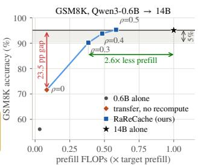

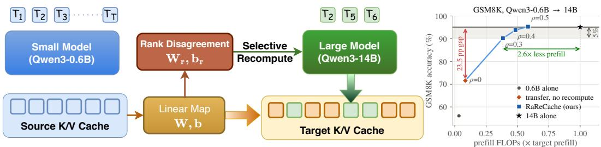  
Figure 1: The figure illustrates our RaReCache pipeline where target cache constitutes mapped cache tokens from source and recomputed tokens in target (left). RaReCache closes accuracy gap to target while yielding 2.6× lower prefill FLOPs (right).

To close the accuracy gap in KV transfer, recent reuse strategies rely on partial target-side recomputation. CacheBlend (Yao et al., 2025) selectively recomputes tokens based on the $\ell _ { 2 }$ deviation of their reused KV states in the target’s prefix layers. However, this requires processing every token through these initial layers, and raw error magnitude often fails to predict downstream accuracy loss. Alternatively, DroidSpeak (Liu et al., 2026) proposes selectively recomputing full intermediate layers which fundamentally requires identical model architectures. Consequently, achieving accurate cross-model KV transfer across large capacity gaps requires a new, architecture-agnostic metric for selective recomputation.

To address these limitations, we present RaReCache (Rank disagreement-based Selective Recomputation), a framework that bridges the capacity gap in cross-model KV cache transfer. Rather than relying on standard error magnitudes or attention scores, RaReCache selectively recomputes only the most critical, information-dense tokens in the target model using a novel metric called rank disagreement. This approach avoids complete target-side prefilling, enabling highly efficient context hand-offs without sacrificing the reliability of downstream tasks.

Contributions. We introduce RaReCache, driven by rank disagreement, a closed-form metric that identifies which tokens require target-side recomputation without executing any forward passes in the target. By measuring the energy of a token’s mapped KV cache outside the well-described calibration subspace, it isolates critical out-of-distribution representations. We demonstrate why common heuristics fail: attention mechanisms select standard formatting tokens the map already reproduces, while raw mapping error conflates harmless variations on template text with crucial novel content. Rank disagreement outperforms both, closing the accuracy gap (§4.3).

We show that a small model’s cache, mapped in closed form and selectively repaired using RaReCache, recovers the accuracy lost by plain transfer even across extreme scale differences. On a 23× parameter gap (Qwen3-0.6B to 14B), recomputing just 30% of positions retains 95–99% of the target’s native accuracy on reasoning benchmarks (GSM8K and ARC), largely decoupling transfer quality from the source model’s size. These gains generalize seamlessly across architectures: on the Llama 3 family(Grattafiori et al., 2024), transferring from the 8B to the 70B model (8.8× gap) at a 40% budget retains 96.5% of the 70B’s native GSM8K performance (§4.2).

Because the large target model computes only a fraction of positions selected by rank disagreement, prefill latency during model switch is drastically reduced. We demonstrate that RaReCache is up to 3.04× faster than the large model prefilling the full context from scratch (§4.6). Under live serving conditions with dynamic request batching, this efficiency reduces head-of-line blocking, lowering median TTFT by 5.0× and 99th-percentile tail latency (p99) by 6.4× at a 30% recompute budget.

## 2 MOTIVATIONAL CASE STUDY

## 2.1 THE CAPACITY BOTTLENECK OF LINEAR MAPPING

We investigate whether linearly mapping a prefilled KV cache from a small source model, as proposed in (Heo et al., 2026), can fully recover a large target model’s native accuracy. Figure 2 demostrates mapping Qwen3-0.6B into Qwen3-14B(Yang et al., 2025), a 23× gap, where marker size is proportional to the parameter count of prefill model. Transfer using linear map yields a GSM8K accuracy of 71.6% compared to 95.1% for the 14B model. While mapping lifts the accuracy for every source, the remaining gap in accuracy between the source and target is still significant, and this gap grows as the source model shrinks. We also observe that the fraction of the target’s key variance that the linear map explains barely changes with source size while the accuracy drops a lot.

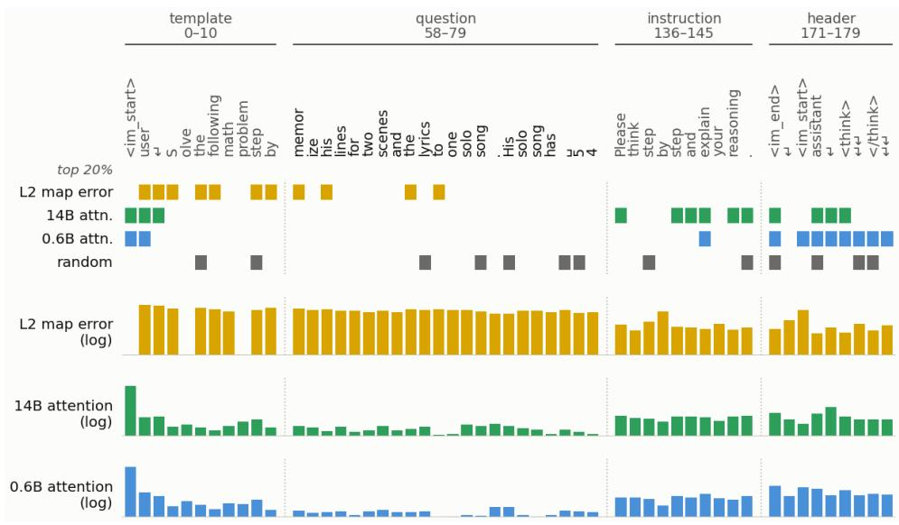  
Figure 3: Token-by-token scores for each selector on a single GSM8K prompt. Columns are selected tokens from four sections of the prompt (template, question, instruction, and header). The first four rows marks the tokens in the top 20% positions determined by four different selection metrics. The last three rows are tokenwise scores for three of the four metrics, excluding the random selection metric which has no associated score.

Mapping more source layers to a single target layer yields negligible gains while increasing the parameter count.

We hypothesize that the mapping extracts what the source representations linearly encode, and thus the shortfall does not necessarily come from a poorly fitted map. The remaining gap is bounded by the small model’s representational capacity and must be supplied by the target. We therefore allow the target to recompute a fraction of prompt positions while reading the mapped cache from the source model elsewhere.

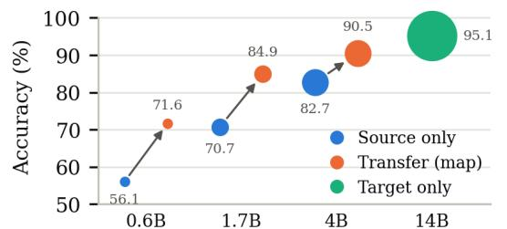  
Figure 2: GSM8K acc. for mapping source KV to target on Qwen3. Marker size is proportional to the parameter count of prefill model.

## 2.2 CAN ATTENTION IDENTIFY WHICH TOKENS TO RECOMPUTE?

We analyze token selection strategies for selective recomputation in the target. KV-cache eviction methods rank tokens by the attention they receive, typically computed over a local query window (Zhang et al., 2023; Li et al., 2024). We investigate whether attention can be a reliable metric for selective recomputation. Figure 3 follows one GSM8K prompt, mapped from Qwen3-0.6B into Qwen3-14B, token by token. It shows the map’s relative $\ell _ { 2 }$ error $( \lVert \mathbf { \bar { m a p p e d } - t r u e } \rVert ^ { 2 } / \lVert \mathrm { t r u e } \rVert ^ { 2 } )$ calculated for keys and values together, averaged over lay-

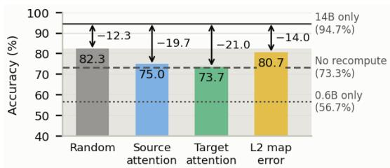  
Figure 4: GSM8K accuracy of Qwen3- 0.6B→14B when 30% of prompt positions are recomputed, chosen by four selectors. Arrows give the remaining gap to the 14B alone.

ers, the source and target model attention each token receives from both models (last 32 query positions for the last quarter of layers), and random selection. In Figure 4, we plot the GSM8K accuracy of Qwen3-0.6B→14B on 300 samples when 30% of prompt positions are recomputed, chosen by each selector.

We observe that attention is overwhelmingly concentrated on the initial sink tokens and promptterminating chat templates. The 14B puts 72% of its attention on the $< | \mathrm { \ i m } _ { - } \mathrm { s t a r t } | >$ sink and 24% on the rest of the template and instruction, leaving 4% for the question. The source attention tracks the target model’s attention closely. Both attention selectors score below random and match transfer with no recomputation. Selecting by attention spends its budget on the template, and thus recomputes the tokens the map already reproduces. $\mathrm { A t \ } \rho { = } 0 . 2 .$ , attention does not pick a single question token. The $\ell _ { 2 }$ mapping-error selector, which reads the 14B’s own prefill, also does no better than random, confirming that raw $\ell _ { 2 }$ magnitude fails to identify the critical tokens that actually degrade downstream accuracy. This motivates the need for a new metric that focuses on the actual question content and can accurately identify which tokens to recompute.

## 3 METHODOLOGY

We propose RaReCache, a framework that bridges cross-model capacity gaps by translating source KV caches and selectively recomputing only the most critical target tokens, as illustrated in Figure 5. In this section, we formalize the base linear mapping (§3.1), our selective recomputation framework (§3.2), and the target-free score used to select those positions (§3.2).

## 3.1 MAPPING THE CACHE

Source and target caches differ in depth, width, and number of layers, but within a family they share a tokenizer, so a prompt of T tokens produces T cache entries in both. Following Heo et al. (2026), we fit an independent linear map per target layer ℓ and per cache tensor σ ∈ {key, value}. For simplicity, we omit ℓ and σ from the notations below.

Inputs and outputs. Let a target model’s cache entry be a row vector $\mathbf { y } \in \mathbb { R } ^ { d _ { t } }$ , where $d _ { t } = n _ { \mathrm { k v } } ^ { t } d _ { h } ^ { t }$ concatenates the target’s KV heads. To construct the corresponding source input $\textbf { x } \in \mathbb { R } ^ { d _ { s } }$ , we concatenate the entries from K specific source layers. To determine these K layers, we fit a singlesource least-squares regression from each source layer’s cache entry to the target layer’s, evaluating each by its $R ^ { 2 }$ score, and select the top K source layers with the highest explained variance (Heo et al., 2026). This results in an input dimension of $d _ { s } = k n _ { \mathrm { k v } } ^ { s } d _ { h } ^ { s }$ . Keys are de-rotated before fitting and re-rotated after mapping, so the map sees content without position and transfers across context lengths.

Fitting. Stacking N calibration tokens yields matrices $X \in \mathbb { R } ^ { N \times d _ { s } }$ and $Y \in \mathbb { R } ^ { N \times d _ { t } }$ . After centering both by subtracting their respective column means x¯ and y¯, we obtain the mapping parameters via ridge regression in closed form:

$$
W = ( X ^ { \top } X + \lambda I ) ^ { - 1 } X ^ { \top } Y , \qquad { \bf b } = { \bar { \bf y } } - { \bar { \bf x } } W , \qquad { \hat { \bf y } } = { \bf x } W + { \bf b } ,\tag{1}
$$

where $W \in \mathbb { R } ^ { d _ { s } \times d _ { t } }$ is the projection matrix and $\hat { \mathbf { y } }$ is the estimated target cache entry. The bias b aligns the source and target means. Because the K selected source layers are highly correlated, the $\bar { L _ { 2 } }$ penalty λ is required to regularize the near-singular $X ^ { \top } X$ . This closed-form fit is highly efficient: a single offline pass over the calibration set accumulates $X ^ { \top } X$ and $X ^ { \top } Y$ , yielding $W$ via one linear solve without gradient descent.

## 3.2 RARECACHE: SELECTIVE RECOMPUTATION VIA RANK DISAGREEMENT

Let $\rho \in [ 0 , 1 ]$ be a recompute budget. We select the top $\lceil \rho T \rceil$ tokens in the prompt to be recomputed by the target model, while reading the linearly mapped cache everywhere else. To maximize efficiency, we use a single shared set of marked positions across all layers (the top 30% positions at two different layers overlap by 0.87, as shown in the Appendix).

Rank disagreement. Instead of estimating mapping error, we measure how much a token’s representation relies on directions the calibration data left undetermined. When the fitted map is applied to the calibration tokens, their predictions $\hat { \mathbf { y } } _ { 1 } , \dotsc , \hat { \mathbf { y } } _ { N }$ form a distribution in Rdt. Its covariance $\Sigma _ { \hat { y } } = V \Lambda V ^ { \top }$ yields orthonormal eigenvectors $\mathbf { v } _ { 1 } , \ldots , \mathbf { v } _ { d _ { t } }$ and eigenvalues $\lambda _ { 1 } \geq \cdots \geq \lambda _ { d _ { t } }$ . The leading directions represent the primary axes of variances in the data; along the non-dominant directions, the calibration set barely varies. We call the span of the first r directions the well-described subspace, denoted by the columns of $V _ { r }$

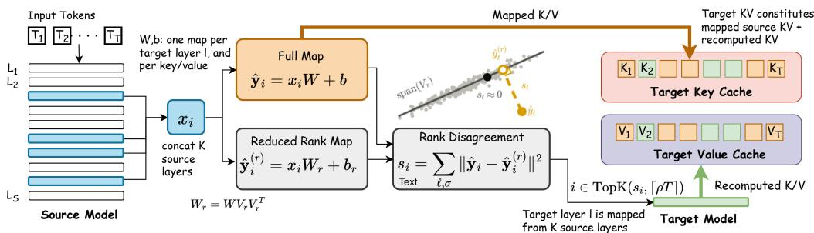  
Figure 5: The RaReCache Pipeline: The source model prefills the prompt, concatenating K selected layers into input $x _ { i } .$ An offline-fitted linear map generates both a full-rank target cache prediction (yˆi) and a reduced-rank projection $( \hat { y } _ { i } ^ { ( r ) } )$ . Rank disagreement $( s _ { i } )$ calculates the squared gap between these predictions. As illustrated, tokens whose predictions project outside the familiar calibration subspace span $( V _ { r } )$ yield high $s _ { i }$ scores. To save compute, the target model only runs a forward pass on the top $\lceil \dot { \rho } T \rceil$ positions, $\rho$ being the recompute ratio, with the highest $s _ { i }$ , merging these recomputed KV tensors with the directly mapped ones to form the final target model cache.

Recomputation score. Let $W _ { r } = W V _ { r } V _ { r } ^ { \top }$ be the map restricted to this subspace, with its bias $ { \mathbf { b } } _ { r }$ refit as in reduced-rank regression (Izenman, 1975), yielding prediction $\hat { \mathbf { y } } _ { i } ^ { ( r ) }$ for token i. Rank disagreement is the squared gap between the full-rank and reduced-rank predictions, summed over every mapped layer ℓ and tensor type σ:

$$
s _ { i } = \sum _ { \ell , \sigma } \big \| \hat { \mathbf { y } } _ { i } - \hat { \mathbf { y } } _ { i } ^ { ( r ) } \big \| ^ { 2 } , \qquad \hat { \mathbf { y } } ^ { ( r ) } = \mathbf { x } W _ { r } + \mathbf { b } _ { r } ,\tag{2}
$$

Because the two maps agree entirely within the dominant subspace, their gap captures what the token draws from the remaining, unconstrained directions. We recompute the $\mathsf { \bar { \Gamma } } _ { \rho T } \mathsf { \bar { ] } }$ positions with the largest $s _ { i }$

A token scores near zero when its mapped entry falls safely within the familiar calibration space, regardless of its raw error. Text that recurs in every calibration prompt, such as chat templates or task instructions, defines these leading directions and scores near zero. Conversely, a token scores high when it projects into directions the calibration set rarely explored. Content specific to one item, such as unique entities, quantities, and relations has no counterpart in the calibration data and therefore scores high. Figure 13 (Appendix C) demonstrates that this distinction, rather than the magnitude of the error, dictates which recomputations successfully recover downstream accuracy.

Cost. The basis $V _ { r }$ is computed once per map from the calibration set, using the source model and the fitted map but never the target. At inference the map already produces $\mathbf { z } _ { t }$ , and Eq. 2 can be evaluated as $\Vert \mathbf { \dot { z } } _ { t } \Vert ^ { 2 } - \Vert \mathbf { z } _ { t } V _ { r } \Vert ^ { 2 }$ (derivation in the Appendix A), one $d _ { t } \times r$ projection per layer and side. To prevent mapping and selection overheads from dominating the runtime, we reuse derotated source layer blocks across target layers (see §B.1 for implementation details and hardware profiling).

## 4 EXPERIMENTS

We evaluate RaReCache across varying capacity gaps, model architectures, and downstream tasks. Specifically, our experiments address three primary research questions:

Q1 How much of the target model’s native accuracy can RaReCache recover, and how robust is this recovery as the capacity gap widens? (§4.2)

Q2 How does rank disagreement compare to standard token selection heuristics, and which tokens actually require target-side recomputation? (§4.3)

Q3 Does RaReCache generalize to the reverse setting (large-to-small transfer), and can it enhance the capabilities of smaller, constrained models? (§4.4)

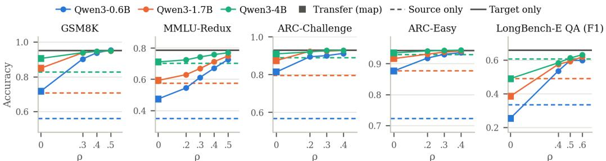  
Figure 6: Accuracy or F1 score against the recompute fraction ρ for three Qwen3 sources mapped into Qwen3-14B. Dashed lines are each source answering alone; the solid grey line is the 14B alone. $\rho { = } 0$ reproduces results from Heo et al. (2026) in our setting.

## 4.1 SETUP

Models. We evaluate RaReCache across two model families. In Qwen3, we consider Qwen3-14B as the target and Qwen3-0.6B, 1.7B and 4B as source models, which are 23×, 8.2× and 3.5× smaller than the target. In Llama3 we test two pairs, Llama-3.2-3B-Instruct → Llama-3.1-8B-Instruct and Llama-3.1-8B-Instruct → Llama-3.3-70B-Instruct (2.7× and $8 . 8 \times$ model size gaps respectively).

Map and recomputation. We use the linear mapping explained in §3.1 with $\lambda { = } 0 . 0 1$ . Every target layer is mapped with $K { = } 8$ source layers for Qwen3 and Llama 3B→8B, and K=20 source layers for Llama 8B→70B. We calibrate the linear mapping matrices using 128k-350k tokens from the training subset of each task, ensuring calibration is strictly disjoint from evaluation items (per-task calibration pools are detailed in C.1 in the Appendix). For selective recomputation, we apply rank disagreement with a fixed rank of r=128 across all model pairs. We sweep the recompute budget $\rho \in \{ 0 , 0 . 2 , 0 . 3 , 0 . 4 , 0 . 5 \}$ , where ρ=0 represents transfer without any target-side recomputation, which reproduces the setting in Heo et al. (2026).

Benchmarks. We evaluate our approach on five benchmarks, each on its full test set: GSM8K(Cobbe et al., 2021) (n=1319, chain-of-thought, up to 1024 new tokens), MMLU-Redux(Gema et al., 2025) (n=5700, 57 subjects, 0-shot, direct answer), ARC-Challenge(Clark et al., 2018) (n=1172) and ARC-Easy (n=2376, 0-shot, chain-of-thought), and LongBench-E QA(Bai et al., 2024), 0-4k bucket (n=467: HotpotQA, 2WikiMQA, MultiFieldQA-en, Qasper, TriviaQA; mean prompt length 4.3k tokens). We use greedy decoding, and model generations are evaluated using exact match, with the exception of LongBench-E, which is evaluated via token F1.

## 4.2 Q1: HOW MUCH OF THE TARGET MODEL’S ACCURACY CAN RARECACHE RECOVER?

We present accuracy against the recompute fraction $\rho$ for three Qwen3 sources mapped into Qwen3- 14B in Figure 6. On four of five benchmarks, mapping from a small source into a large target improves accuracy, suggesting that the mapped cache carries information the small model cannot use on its own: plain transfer $( \rho { = } 0 )$ beats the 0.6B alone by 12.4-24.6 pp (Figure 6). However, the accuracies as $\rho = 0$ are limited by the source model size, with 0.6B model losing 6.7–31.2 pp to the 14B, retaining 60.3% on MMLU-Redux and 75.3% on GSM8K. For LongBench-E, plain transfer scores 8.2 F1 below the 0.6B answering alone.

Recomputing a minority of positions recovers most of the gap. Recomputing 30% of positions recovers 94.8% of the 14B’s accuracy on GSM8K (71.6% to 90.2%), 96.9% on ARC-Challenge and 98.6% on ARC-Easy; on both ARC sets, 20% already recovers more than 96% (96.2% and 97.3%). At $\rho { = } 0 . 5$ , transfer matches the 14B on GSM8K (95.3% vs.95.1%), and reaches 92.4% on MMLU-Redux and 90.7% on LongBench-E. At these points transfer beats the 0.6B alone by 21-39 pp on every benchmark. With a 23× smaller source, recomputing 30% of positions recovers more than 94% of target accuracy on three of five benchmarks, and recomputing at most 50% recovers more than 90% on all five (detailed numbers are in Table 5 in the Appendix C).

Recomputation substitutes for source capacity. Without recomputation, source size dominates: plain transfer is ordered by source size on every task (Figure 6), with a spread across the three sources of 18.9 pp on GSM8K, 23.6 on MMLU-Redux, 9.7 on ARC-Challenge, 5.9 on ARC-Easy and 23.6 F1 on LongBench-E. Recomputation collapses the ordering. On GSM8K the three sources lie within 0.9 pp at $\rho { = } 0 . 4$ and 0.5 pp at $\rho { = } 0 . 5 .$ , on ARC-Challenge within 1.6 pp and on ARC-Easy within 0.8 pp at $\rho { = } 0 . 4 .$ . On LongBench-E the spread falls from 23.6 to 1.9 F1 at $\rho { = } 0 . 5 ,$ , and on MMLU-Redux, the spread narrows more than $\mathbf { 5 } \times .$ , from 23.6 to 4.3 pp.

Table 1: GSM8K Evaluation on Llama 3: Accuracy (%) against the recompute fraction $\rho ,$ retention relative to the target is in parentheses. The 8B→70B accuracies are reported on the first 300 test items.
<table><tr><td></td><td></td><td></td><td colspan="4">Transfer, recompute fraction ρ</td><td></td></tr><tr><td>Pair (n)</td><td>Gap</td><td>Source alone</td><td>0</td><td>0.2</td><td>0.3</td><td>0.4</td><td>Target alone</td></tr><tr><td>3.2-3B → 3.1-8B (1319)</td><td>2.5×</td><td>82.3</td><td>81.7 (95.2)</td><td>85.7 (99.8)</td><td>84.2 (98.1)</td><td>86.4 (100.6)</td><td>85.8</td></tr><tr><td>3.1-8B → 3.3-70B (300)</td><td>8.8×</td><td>82.7</td><td>81.0 (85.0)</td><td>85.3 (89.5)</td><td>88.3 (92.7)</td><td>92.0 (96.5)</td><td>95.3</td></tr></table>

Paired comparisons show the substitution directly. On GSM8K the 0.6B at $\rho { = } 0 . 3$ matches the 4B with no recomputation, as it does on ARC-Easy and on ARC-Challenge at $\rho { = } 0 . 4$ . On LongBench-E the 0.6B at $\rho { = } 0 . 4$ beats the 4B with no recomputation by 4.6 F1. On MMLU-Redux the 0.6B at $\rho { = } 0 . 5$ matches the 4B at $\rho { = } 0 . 2$ while beating the 4B answering alone by 2.5 pp.

Evaluation on Llama3. We demonstrate results with Llama 3 in Table 1 and observe that LLama shows similar behavior as Qwen3. Mapping the 8B into the 70B, an 8.8× gap, plain transfer scores 81%, no better than the 8B answering alone, so the mapped cache on its own gives no reason to invoke the 70B. Recomputing 40% of positions raises it to 92%, 96.5% of the 70B, and ∼10 pp above the 8B alone. The 3B→8B pair are close in model size gap, with the 8B only 3.6 points above the 3B. Mapping again fails to beat the source, whereas recomputation matches the 8B (85.7% vs. 85.8%) at $\rho { = } 0 . 2$ only.

## 4.3 Q2: HOW DOES RANK DISAGREEMENT COMPARE TO STANDARD TOKEN SELECTION HEURISTICS?

We compare selectors at a fixed 30% budget on 300 GSM8K items, holding the map and the mapped cache fixed so that only the choice of positions changes (Figure 7). Two of the selectors, the 14B’s attention, and the positions with the largest mapping error, are oracles that read the 14B’s own prefill and therefore cannot be deployed, but are used for the purpose of our analysis.

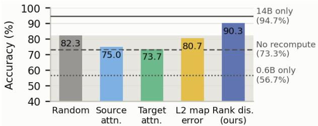  
Figure 7: Selectors at a matched budget $( \rho { = } 0 . 3 )$ for 300 samples on GSM8K, transfer mapping Qwen3- $0 . 6 \mathrm { B }  1 4 \mathrm { B }$ . The shaded band marks random selection.

Which positions matters more than how many. Recomputing 30% of posi-

tions at random closes 42% of the gap to the 14B (73.3 to 82.3). Rank disagreement, at the same budget, closes 79% of it (90.3), and beats every other selector, including both oracles. We illustrate the selected tokens using rank disagreement in Figure 13 (Appendix C).

Rank disagreement separates the two kinds of error that the $\ell _ { 2 }$ error magnitude conflates: interpolation error on tokens the calibration set covered, which can be large and costs nothing, and out-of-distribution token errors. Template tokens lie inside the well-described subspace whether or not their position was sampled, so they score near zero even where their $\ell _ { 2 }$ error is large (Figure 13). Across the full GSM8K test set, 0.23% of the positions it recomputes fall in the shared template prefix. The question’s content words score high, and they receive under 2% of the 14B’s attention, which is why attention-based selectors are ineffective.

## 4.4 DOES RARECACHE GENERALIZE TO THE LARGE-TO-SMALL TRANSFER?

A cascade may also hand a large model’s context down to a small one. We map the 14B’s cache into each of the three smaller models on MMLU-Redux $( n { = } 5 7 0 0$ , same calibration recipe as the forward direction), and compare against each small model prefilling for itself (Table 2).

The small model retains its own accuracy, and gains where it has the capacity to use a richer cache. At 8.2× and 3.5×, decoding from the 14B’s mapped cache beats the small model decoding from its own prefill, by 14.4 pp for the 1.7B and 3.1 pp for the 4B. The 1.7B result is the largest lift over standalone accuracy in either direction: the mapped cache carries more than the 1.7B could have encoded itself, and the 1.7B’s decoder can exploit it. At 23× the direction fails, losing 7.8 pp, mirroring the forward-direction cliff from the other side.

Table 2: Large-to-small transfer, Qwen3-14B → each smaller model on MMLU-Redux. Alone is the small model prefilling its own cache. Lift is transfer minus alone.
<table><tr><td>Target</td><td>Ratio</td><td>Alone</td><td>Transfer  $( \rho { = } 0 )$ </td><td>Lift</td><td>Transfer  $\left( \rho { = } 0 . 2 \right)$ </td></tr><tr><td>Qwen3-0.6B</td><td>23×</td><td>35.0</td><td>27.2</td><td> $- 7 . 8$ </td><td>27.9</td></tr><tr><td>Qwen3-1.7B</td><td>8.2×</td><td>57.5</td><td>71.9</td><td>+14.4</td><td>71.4</td></tr><tr><td>Qwen3-4B</td><td>3.5×</td><td>70.2</td><td>73.3</td><td>+3.1</td><td>73.2</td></tr></table>

Recomputation does not help in reverse. At $\rho { = } 0 . 2$ , accuracy moves by at most 0.7 pp at any ratio, inside noise at this sample size, where the same budget buys 6–9 pp forward. Rank disagreement finds positions where the source’s cache falls outside the calibration fit; in reverse the source is the 14B, whose cache the map reconstructs well throughout $( R _ { K } ^ { 2 }$ 0.90–0.91 for all three targets), so there is little of that instability left to find. Whatever bounds the 0.6B’s reverse accuracy is not visible to this score.

## 4.5 COMPARISON WITH EXISTING REUSE STRATEGIES

Because existing reuse systems are not designed for cross-architecture size gaps, we adapt their core selection rules for our pipeline and compare them at a matched compute budget $\rho$ (the fraction of a full target prefill). DroidSpeak (Liu et al., 2026) selectively recomputes layers; since hidden states are incompatible across different model sizes, we adapt this as a layer-prefix recomputation (evaluating the first L layers). CacheBlend (Yao et al., 2025) selects tokens based on $\ell _ { 2 }$ KV deviation; we evaluate this in its strongest possible form as an oracle that ranks tokens by their true $\ell _ { 2 }$ mapping error against the target’s actual cache.

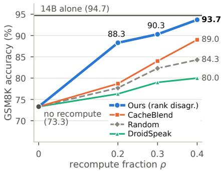  
Figure 8: Comparison against existing selective recomputation strategies for Qwen3-0.6B→Qwen3-14B for different recompute ratios for 300 GSM8K samples.

As shown in Figure 8, rank disagreement significantly outperforms both adapted baselines. At a 30% budget $( \rho = 0 . 3 )$ on GSM8K, our method achieves 90.3% accuracy, outperforming the $\ell _ { 2 }$ error oracle (80.7%) and layerwise recomputation $( 7 9 . 0 \% )$ by roughly 10 and 11 points respectively. Layer prefixing scales poorly because mapping errors are concentrated in a minority of specific tokens across all depths, rather than isolated to early layers. Meanwhile, the true mapping error oracle performs no better than random selection (82.3%), confirming that raw $\ell _ { 2 }$ magnitude fails to identify the critical tokens that actually degrade downstream reasoning.

## 4.6 SYSTEM ANALYSIS: END-TO-END INFERENCE PERFORMANCE

While the preceding sections establish the recomputation budget $\rho$ from an accuracy perspective, we now evaluate the resulting inference-time speedups and runtime overheads. We benchmark the RaReCache pipeline for Qwen3-0.6B→14B on a NVIDIA A100 GPU (80GB) with PyTorch 2.6 eager mode on GSM8K (mean prompt length $T { = } 1 4 9 )$ We measure the latency across three sequential stages: projecting the source KV cache via the linear map (along with tensor preprocessing and feature gathering), scoring positions via rank disagreement, and executing the target model’s forward pass over the selected $\lceil \bar { \rho } T \rceil$ positions. We compare against the target model prefilling the entire prompt in all experiments as a baseline. Our latency evaluation assumes the source model has already prefilled the prompt, reflecting common deployment scenarios such as model cascades or multi-turn agents where the smaller model runs first (same setup as Heo et al. (2026)) and its KV cache is already available. Unless otherwise stated, all reported latencies reflect GPU-busy time: the sum of individual GPU kernel durations.

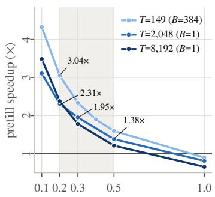  
 &#!\$)( &(#" 

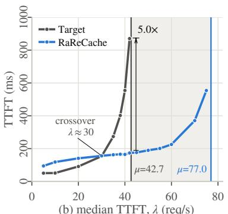  
 !"   &%'

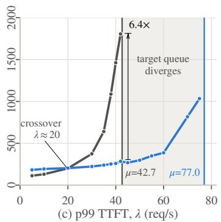  
Figure 9: (a) Prefill speedup across recompute fractions $\rho$ (from §4.2 shaded); (b, c) Median and p99 TTFT vs request rate under Poisson arrivals $\scriptstyle ( T = 1 4 9 , \rho = 0 . 3 )$ . The shaded region shows the divergence of the target prefill queue while RaReCache operates at lower device utilization.

Impact of Recomputation Budget on Runtime. In Figure $^ { 9 \mathrm { { a } , } }$ , we compare prefill speedup against recomputation fraction $\rho .$ Overall latency gain is determined by $\rho ,$ meaning lower recomputation results in greater speedup. But this latency savings do not scale linearly with $\rho .$ For instance, recomputing at $\rho { = } 0 . 3$ requires $3 8 \% - 6 3 \%$ of the full prefill latency, not 30%. Two architectural bottlenecks not captured by theoretical FL ${ \cal O } \mathrm { P }$ counts explain this gap: (a) Loading the target model’s 27.5GB of weights from high-bandwidth memory is required, whether recomputing a single position or the entire sequence, which dominates execution time at shorter prompt lengths, and (b) Every recomputed query token must still attend all T prompt keys, not just the recomputed subset. For a single request of $\dot { T } \mathrm { = } 2 0 4 8$ , we achieve speedups of $\mathbf { 1 . 3 8 } \times , \mathbf { 1 . 9 5 } \times$ and $\mathbf { 2 . 3 1 \times }$ at $\rho = 0 . 5 , 0 . 3 , 0 . 2$ respectively. $\rho \in [ 0 . 2 , 0 . 3 ]$ is optimal, capturing most prefill latency savings while maintaining nearnative target accuracy $( \rho = 0 . 3$ recovers 95-99% of target model accuracy, as observed in Figure 6). These latency savings widen under request batching, because native target prefill saturates compute at a batch of 4 (6, 256 tokens/s) while our smaller compute kernels achieve higher hardware occupancy, throughput nearly doubles to 12, 378 tokens/s, pushing speedups up to $\mathbf { 3 . 0 4 } \times$ and 2.36× at device saturation for $\rho { = } 0 . 2$ and 0.3 respectively with $\bar { \mathrm { T } } { = } 1 4 9$ (see §B.2 for complete batch sweeps).

Queuing Dynamics and TTFT Under Load. Figure 9(b,c) demonstrates an interactive serving scenario, where user-perceived TTFT is the sum of queuing delay and prefill execution latency. Accelerating prefill reduces both terms simultaneously: requests complete faster, maintaining lower compute utilization and preventing queue accumulation. Evaluating both systems on a live server (§B.3 details benchmarking setup and scheduler configuration) under identical Poisson arrival traces shows that RaReCache significantly flattens the $\mathrm { T T F T }$ curve under load. In this specific experiment, we measure end-to-end wall-clock time to account for live queuing delays and framework dispatch overhead. The requst rate $( \lambda \mathrm { { r e q } / \mathrm { { s } ) } }$ increased eightfold, causing the median TTFT of RaReCache to rise from 95 ms to 173 ms. Whereas, the baseline target prefill surged from 51 ms to 870 ms. At $\lambda = 4 2 \mathrm { r e q / s } .$ , the saturation threshold $( \mu )$ of the target, RaReCache reduces median TTFT by 5.0× and p99 latency by ${ \bf 6 . 4 \times }$

Tail latency benefits appear earlier, crossing the baseline happens at $\lambda \approx 2 0$ requests/s, compared to $\lambda \approx 3 0$ req/s for the median. The target forms larger batches under contention, which inflates headof-line blocking for subsequent arrivals. The baseline queue diverges between 42.7 and $7 7 . 0 \mathrm { r e q / s }$ while RaReCache operates comfortably at lower device utilization. To serve this range of request rates, the baseline needs at least two GPUs provisioned, whereas we only need one. Under light traffic $( \lambda < 3 0$ requests/s), requests process mostly at batch size 1. There the target prefill is faster because RaReCache incurs eager-mode framework dispatch overhead across its smaller kernels.

## 5 CONCLUSION

In this work, we introduced RaReCache, a framework that bridges the severe accuracy degradation typically seen when transferring KV caches across models with massive capacity gaps. By demonstrating that cross-model transfer failures are heavily concentrated in a minority of information-dense tokens, we developed a novel metric based on rank disagreement that isolates out-of-distribution representations without requiring target-side prefill. RaReCache allows a massive target model to inherit a context prefilled by a much smaller source model, recovering nearnative reasoning accuracy by selectively recomputing as little as 30% of the prompt. Ultimately, this approach decouples transfer quality from source-model capacity and delivers significant prefill speedups, unlocking highly efficient agentic LLM serving paradigms. We currently report efficiency using standard attention kernels and plan to implement custom sparse causal kernels in the future to attain peak theoretical gains.

## AI USE STATEMENT

In compliance with ICLR guidelines, we disclose the use of generative AI (large language models) across several phases of this work. For tasks requiring disclosure, AI tools were used to interpret measurement logs, propose and critique hypotheses regarding the effects reported in §2 and §4, and design experiments by suggesting high-value configurations for the sweeps reported herein. For tasks where disclosure is recommended, we utilized these tools to assist with literature search, draft ing and editing sections of the manuscript, and writing scripts to generate figures. Importantly, the core implementation of our method, including the rank-disagreement scoring, and selective recomputation, was written entirely by the authors without AI assistance. We did not use AI to generate synthetic datasets or develop theoretical models; the derivation in Appendix A was written and verified by the authors. We have reviewed all AI-assisted content and take full responsibility for the final text, claims, and artifacts.

## REPRODUCIBILITY STATEMENT

To ensure reproducibility, we have detailed all experimental setups, model configurations, and evaluation metrics in the manuscript. Evaluations use open-weights models from Qwen3 and Llama 3 families and standard, publicly available benchmarks like GSM8K, MMLU-Redux, ARC-Challenge, ARC-Easy, and LongBench-E QA. The system-level inference and queuing benchmarks transparently specify the hardware and software environments. The complete source code, including the linear mapping implementation, rank disagreement scoring, system optimization and evaluation scripts will be made publicly available upon de-anonymization and publication.

## REFERENCES

Yushi Bai, Xin Lv, Jiajie Zhang, Hongchang Lyu, Jiankai Tang, Zhidian Huang, Zhengxiao Du, Xiao Liu, Aohan Zeng, Lei Hou, Yuxiao Dong, Jie Tang, and Juanzi Li. LongBench: A bilingual, multitask benchmark for long context understanding. In Annual Meeting of the Association for Computational Linguistics (ACL), 2024.

Lingjiao Chen, Matei Zaharia, and James Zou. FrugalGPT: How to use large language models while reducing cost and improving performance. arXiv preprint arXiv:2305.05176, 2023.

Peter Clark, Isaac Cowhey, Oren Etzioni, Tushar Khot, Ashish Sabharwal, Carissa Schoenick, and Oyvind Tafjord. Think you have solved question answering? try ARC, the AI2 reasoning challenge. arXiv preprint arXiv:1803.05457, 2018.

Karl Cobbe, Vineet Kosaraju, Mohammad Bavarian, Mark Chen, Heewoo Jun, Lukasz Kaiser, Matthias Plappert, Jerry Tworek, Jacob Hilton, Reiichiro Nakano, Christopher Hesse, and John Schulman. Training verifiers to solve math word problems. arXiv preprint arXiv:2110.14168, 2021.

Lucio M. Dery, Zohar Yahav, Henry Prior, Qixuan Feng, Jiajun Shen, and Arthur Szlam. Latent space communication via K-V cache alignment. arXiv preprint arXiv:2601.06123, 2026.

Tianyu Fu, Zihan Min, Hanling Zhang, Jichao Yan, Guohao Dai, Wanli Ouyang, and Yu Wang. Cache-to-cache: Direct semantic communication between large language models. In International Conference on Learning Representations (ICLR), 2026. arXiv:2510.03215.

Aryo Pradipta Gema, Joshua Ong Jun Leang, Giwon Hong, Alessio Devoto, Alberto Carlo Maria Mancino, Rohit Saxena, Xuanli He, Yu Zhao, Xiaotang Du, Mohammad Reza Ghasemi Madani, Claire Barale, Robert McHardy, Joshua Harris, Jean Kaddour, Emile van Krieken, and Pasquale Minervini. Are we done with MMLU? In Conference ofthe Nations ofthe Americas Chapter of the Associationfor Computational Linguistics (NAACL), 2025. arXiv:2406.04127.

Aaron Grattafiori, Abhimanyu Dubey, Abhinav Jauhri, Abhinav Pandey, Abhishek Kadian, Ahmad Al-Dahle, Aiesha Letman, Akhil Mathur, Alan Schelten, Alex Vaughan, et al. The Llama 3 herd of models. arXiv preprint arXiv:2407.21783, 2024.

Taekyung Heo, Rasoul Shafipour, Ritchie Zhao, Maximilian Golub, Mohammad Mahdi Kamani, Ritika Borkar, Makesh Tarun Chandran, Pantea Zardoshti, and Bita Darvish Rouhani. Crossmodel KV cache transfer in LLM families: A closed-form linear mapping for prefill reuse. arXiv preprint arXiv:2608.03893, 2026.

Alan Julian Izenman. Reduced-rank regression for the multivariate linear model. Journal of Multivariate Analysis, 5(2):248–264, 1975.

Woosuk Kwon, Zhuohan Li, Siyuan Zhuang, Ying Sheng, Lianmin Zheng, Cody Hao Yu, Joseph E. Gonzalez, Hao Zhang, and Ion Stoica. Efficient memory management for large language model serving with PagedAttention. In ACM Symposium on Operating Systems Principles (SOSP), 2023.

Yuhong Li, Yingbing Huang, Bowen Yang, Bharat Venkitesh, Acyr Locatelli, Hanchen Ye, Tianle Cai, Patrick Lewis, and Deming Chen. SnapKV: LLM knows what you are looking for before generation. In Advances in Neural Information Processing Systems (NeurIPS), 2024.

Yuhan Liu, Yuyang Huang, Jiayi Yao, Shaoting Feng, Zhuohan Gu, Kuntai Du, Hanchen Li, Yihua Cheng, Junchen Jiang, Shan Lu, Madan Musuvathi, and Esha Choukse. DroidSpeak: KV cache sharing across fine-tuned model variants. In USENIX Symposium on Networked Systems Design and Implementation (NSDI), 2026.

Isaac Ong, Amjad Almahairi, Vincent Wu, Wei-Lin Chiang, Tianhao Wu, Joseph E. Gonzalez, M Waleed Kadous, and Ion Stoica. RouteLLM: Learning to Route LLMs with Preference Data, 2024. URL https://arxiv.org/abs/2406.18665.

An Yang, Anfeng Li, Baosong Yang, Beichen Zhang, Binyuan Hui, Bo Zheng, Bowen Yu, Chang Gao, Chengen Huang, Chenxu Lv, et al. Qwen3 technical report. arXiv preprint arXiv:2505.09388, 2025.

Jiayi Yao, Hanchen Li, Yuhan Liu, Siddhant Ray, Yihua Cheng, Qizheng Zhang, Kuntai Du, Shan Lu, and Junchen Jiang. CacheBlend: Fast large language model serving for RAG with cached knowledge fusion. In European Conference on Computer Systems (EuroSys), 2025.

Zhenyu Zhang, Ying Sheng, Tianyi Zhou, Tianlong Chen, Lianmin Zheng, Ruisi Cai, Zhao Song, Yuandong Tian, Christopher Re, Clark Barrett, Zhangyang Wang, and Beidi Chen.´ $\mathrm { H _ { 2 } O } \mathrm { : }$ Heavyhitter oracle for efficient generative inference of large language models. In Advances in Neural Information Processing Systems (NeurIPS), 2023.

Lianmin Zheng, Liangsheng Yin, Zhiqiang Xie, Chuyue Sun, Jeff Huang, Cody Hao Yu, Shiyi Cao, Christos Kozyrakis, Ion Stoica, Joseph E. Gonzalez, Clark Barrett, and Ying Sheng. SGLang: Efficient execution of structured language model programs. In Advances in Neural Information Processing Systems (NeurIPS), 2024.

## A RANK DISAGREEMENT DERIVATION

This appendix derives the score $\| \mathbf { z } _ { t } \| ^ { 2 } - \| \mathbf { z } _ { t } V _ { r } \| ^ { 2 }$ from Eq. 2 and states the behaviour of the score at the two extremes of the probe rank. We work with one map, that is one target layer and one side; the score sums these independently.

Setup. Let $W \in \mathbb { R } ^ { d _ { s } \times d _ { t } }$ and b be the fitted map of Eq. 1, and let x¯ be the calibration mean of the source features. The predictions on the calibration set have mean

$$
\hat { \pmb { \mu } } = \bar { \bf x } { W } + { \bf b } ,\tag{3}
$$

since the map is affine, and covariance $\begin{array} { r } { \Sigma _ { \hat { y } } \ = \ \frac { 1 } { N } \sum _ { n } ( \hat { \bf y } _ { n } - \hat { \pmb { \mu } } ) ^ { \top } ( \hat { \bf y } _ { n } - \hat { \pmb { \mu } } ) \ = \ V \Lambda V ^ { \top } } \end{array}$ , with V orthonormal and Λ diagonal with entries in decreasing order. Let $V _ { r }$ be the first r columns of $V$ and

$$
\begin{array} { r } { P _ { r } = V _ { r } V _ { r } ^ { \top } } \end{array}\tag{4}
$$

the orthogonal projection onto the well-described subspace. Being an orthogonal projection, $P _ { r }$ satisfies $\bar { P } _ { r } ^ { \top } = \bar { P } _ { r }$ r and $P _ { r } ^ { 2 } = P _ { r }$ , and $I - P _ { r }$ projects onto the orthogonal complement.

The rank-r map. Reduced-rank regression (Izenman, 1975) restricts the map to the leading directions of its own fitted values, and refits the bias so the restricted map still sends the average input to the average output:

$$
W _ { r } = W P _ { r } , \qquad \mathbf { b } _ { r } = \hat { \pmb { \mu } } - \bar { \mathbf { x } } W _ { r } , \qquad \hat { \mathbf { y } } _ { t } ^ { ( r ) } = \mathbf { x } _ { t } W _ { r } + \mathbf { b } _ { r } .\tag{5}
$$

This is not the truncated SVD of W. The truncated SVD keeps the directions in which W itself is largest; reduced-rank regression keeps those in which the map’s outputs on real calibration data vary most. The two coincide only when the source features are isotropic. Since the k concatenated source layers are strongly correlated, they are far apart here, and truncating W directly would spend rank on directions the data never excites.

Derivation. Write $\mathbf { z } _ { t } = ( \mathbf { x } _ { t } - \bar { \mathbf { x } } ) W$ for the centered prediction. Substituting Eq. 5 into the difference of the two predictions and then Eq. 3 for $\hat { \mu } ,$

$$
\hat { \mathbf { y } } _ { t } - \hat { \mathbf { y } } _ { t } ^ { ( r ) } = \left( \mathbf { x } _ { t } W + \mathbf { b } \right) - \left( \mathbf { x } _ { t } W P _ { r } + \hat { \pmb { \mu } } - \bar { \mathbf { x } } W P _ { r } \right)\tag{6}
$$

$$
= { \bf x } _ { t } W + { \bf b } - { \bf x } _ { t } W P _ { r } - \bar { \bf x } W - { \bf b } + \bar { \bf x } W P _ { r }\tag{7}
$$

$$
= ( { \bf x } _ { t } - \bar { \bf x } ) W ( I - P _ { r } ) = { \bf z } _ { t } ( I - P _ { r } ) .\tag{8}
$$

The bias terms cancel, which is why the score does not depend on either model’s mean cache. Because $I - P _ { \tau }$ r is an orthogonal projection and the $\mathbf { v } _ { i }$ are orthonormal,

$$
\left\| \mathbf { z } _ { t } ( I - P _ { r } ) \right\| ^ { 2 } = \sum _ { i > r } \langle \mathbf { z } _ { t } , \mathbf { v } _ { i } \rangle ^ { 2 } = \| \mathbf { z } _ { t } \| ^ { 2 } - \| \mathbf { z } _ { t } V _ { r } \| ^ { 2 } ,\tag{9}
$$

which is Eq. 2 together with the form used to compute it. Summing Eq. 8 over layers and sides gives the score of Eq. 2. The right-hand form of Eq. 9 is the cheap one: the map already computes $\mathbf { z } _ { t } .$ , so the score costs one $d _ { t } \times r$ projection per layer and side.

Limits in r. $\mathrm { A t } \ r { = } 0 , P _ { r } = 0$ and $s _ { t } = \sum \lVert \mathbf { z } _ { t } \rVert ^ { 2 }$ : the score degenerates to the size of the centered prediction, which measures how unusual a token is without reference to how well the map handles $\mathrm { i t . } \ \mathrm { A t } \ r { = } d _ { t } , P _ { r } = I$ and $s _ { t } = 0$ for every token. Between the two, $s _ { t }$ measures only the energy that falls outside the directions the calibration set covers.

## B SYSTEM DESIGN

## B.1 MAPPING IMPLEMENTATION AND RUNTIME EFFICIENCY

For a Qwen3-0.6B→14B KV transfer experiment on GSM8K with $\rho { = } 0 . 3 .$ , the linear map contains $6 . 7 \times 1 0 ^ { 8 }$ parameters; roughly 5% of the target model’s $1 . 3 \times 1 0 ^ { 1 0 }$ parameters. This suggests that by arithmetic count alone (excluding partial target prefill), cache translation should cost only a fraction of a full prefill. But in practice, executing the map in FP32 severely bottlenecks our mechanism because an NVIDIA A100 routes FP32 matmul through vector units at 19.5 TFLOP/s rather than utilizing its Tensor Cores, which deliver 312 TFLOP/s in BF16. Consequently, an unoptimized FP32 map dominates latency, causing cache transfer to run slower than native target prefill (0.63-0.85×). We eliminate this overhead with two systems optimizations that preserve the algorithm:

• Executing the map in BF16 to leverage Tensor Cores, raising relative performance to 0.78- 1.38×.

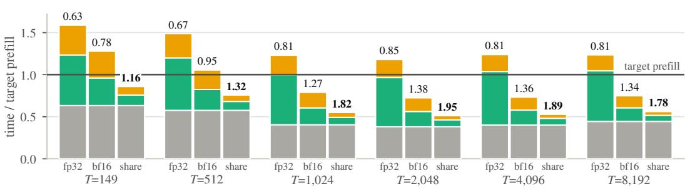  
mapper precision and block sharing  
Figure 10: What RaReCache costs, relative to the target prefill. Phase-by-phase runtime across implementation variants at increasing context lengths (T=149 is the mean GSM8K prompt length), with numbers above the bars showing overall speedups. While naive FP32 mapping consumes nearly as much time as a full prefill, BF16 execution combined with source block sharing reduces mapping and selection overhead to a small fraction of total latency.

Table 3: Prefill speedup over the target baseline, at recomputation budget ρ=0.3. Rows are cumulative, each adding an optimization to the row above. The first three rows are single requests (batch size 1); the last is the largest batch the device holds, which is 384, 128, 64, 32, 16 and 8 requests from left to right (≈65k tokens in flight).
<table><tr><td>Prompt length T</td><td>149</td><td>512</td><td>1,024</td><td>2,048</td><td>4,096</td><td>8,192</td></tr><tr><td>fp32 map</td><td>0.63</td><td>0.67</td><td>0.81</td><td>0.85</td><td>0.81</td><td>0.81</td></tr><tr><td>+ bf16 map</td><td>0.78</td><td>0.95</td><td>1.27</td><td>1.38</td><td>1.36</td><td>1.34</td></tr><tr><td>+ block sharing</td><td>1.16</td><td>1.32</td><td>1.82</td><td>1.95</td><td>1.89</td><td>1.78</td></tr><tr><td>+ saturating batch</td><td>2.36</td><td>2.34</td><td>2.30</td><td>2.23</td><td>2.09</td><td>1.89</td></tr></table>

• Sharing precomputed source blocks. The reference implementation redundantly reconstructs the same 50 de-rotated source blocks 640 times across target layers and KV heads; caching these blocks once per prompt pushes overall speedup to 1.16-1.95× (Figure 10, Table 3).

At T=2048, these optimizations reduce mapping latency from 195 ms to 27 ms (7.2×) and token selection from 70 ms to 17 ms (4.2×), leaving target-side recomputation as the main source of remaining latency. The theoretical speedup ceiling of RaReCache can be analytically calculated and explained in detail in § B.4.

## B.2 BATCHING AND PEAK THROUGHPUT

Figures 11a and b illustrate the batch-scaling behavior from Table 3. Native target prefill throughput plateaus beyond an order of magnitude of batch size (6, 256 tokens/s). This is because its large GEMMs already saturate GPU compute, leaving no room for amortization. In contrast, RaReCache pipeline consists of smaller kernels that underutilize GPU compute at lower batch sizes. Increasing the batch size improves Streaming Multiprocessor (SM) occupancy, nearly doubling prefill throughput to 12, 378 tokens/s.

## B.3 LIVE SERVING EVALUATION AND QUEUING METHODOLOGY

Scheduler. Both configurations are evaluated using a first-come-first-served (FCFS) dynamic batching scheduler deployed on a live server. Requests arrive via a homogeneous Poisson process at rate λ. When the GPU becomes idle, the scheduler dispatches up to 32 queued requests (oldest first) as a single execution batch, leaving any remaining requests queued for the subsequent iteration. Each evaluation sweeps 500 requests, discarding the initial 50 to capture steady-state queuing behavior. TTFT is measured in wall-clock time rather than GPU-busy time to capture both queuing delays and framework-level eager dispatch overheads.

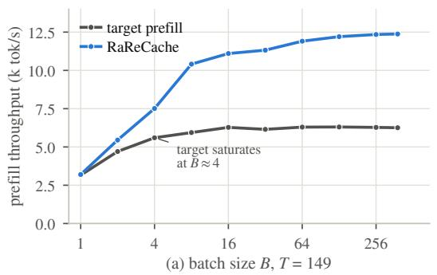

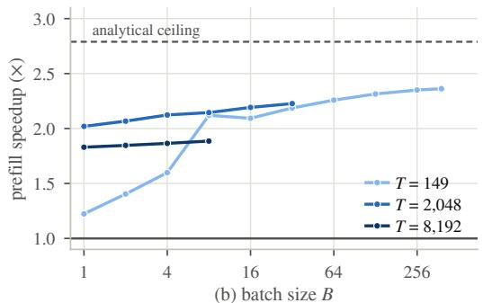  
Figure 11: (a) Prefill throughput scaling at T=149, where target only prefill saturates near batch size 4 while RaReCache continues to scale. (b) Prefill speedup as a function of batch size across three prompt lengths; the dashed horizontal line indicates the theoretical speedup ceiling.

Saturation Throughput and Batch Dynamics. We measure each system’s empirical saturation threshold $\mu$ by executing three consecutive maximum-capacity batches (32 requests each) back-toback under a permanently saturated queue:

$$
\mu = { \frac { 3 \times 3 2 } { \mathrm { w a l l - c l o c k ~ e x e c u t i o n ~ t i m e } } } .\tag{10}
$$

This yields saturation throughputs of $\mu _ { \mathrm { t a r g e t } } = 4 2 . 7$ and $\mu _ { \mathrm { R a R e C a c h e } } = 7 7 . 0$ requests/s (1.80× capacity advantage, consistent with §B.2). We report offered load normalized to target capacity, $u _ { \mathrm { t a r g e t } } =$ $\lambda / \mu _ { \mathrm { t a r g e t } }$ . Because the baseline queue diverges for $\lambda \geq \mu _ { \mathrm { t a r g e t } } .$ , the sweep caps at λ = 42 requests/s $( u _ { \mathrm { t a r g e t } } = 0 . 9 8 )$

Under dynamic queuing, the mean batch size $b ^ { * }$ satisfies the equilibrium condition $b ^ { * } \approx \lambda \cdot S ( b ^ { * } )$ where $S ( b )$ is the batch service latency. Because $S _ { \mathrm { t a r g e t } } ( b ) \gg S _ { \mathrm { R a R e C a c h e } } ( b )$ , the baseline target experiences severe queue buildup, causing its mean batch size to extend to 24.1 requests at $\lambda =$ 42 requests/s (approaching the 32-request cap). In contrast, the shorter service time of RaReCache clears requests rapidly, keeping its mean batch size at only 5.9 and drastically preventing head-of line blocking (Table 4).

Table 4: TTFT under Poisson load $( T { = } 1 4 9 , \rho { = } 0 . 3 ,$ , max batch size 32, wall clock). Offered load is normalized to target saturation capacity $( u _ { \mathrm { t a r g e t } } = \lambda / \mu _ { \mathrm { t a r g e t } } )$ . Speedup ratios represent target ÷ RaReCache (> 1× denotes RaReCache is faster).
<table><tr><td colspan="3">Mean Batch</td><td colspan="2">p50 TTFT</td><td colspan="2">p99 TTFT</td></tr><tr><td>λ (req/s)</td><td>Utarget</td><td>tgt / ours</td><td>tgt → ours (ms)</td><td>Ratio</td><td>tgt → ours (ms)</td><td>Ratio</td></tr><tr><td>5</td><td>0.12</td><td>1.1 / 1.2</td><td>51 → 95</td><td>0.54×</td><td>113 → 182</td><td>0.62×</td></tr><tr><td>10</td><td>0.23</td><td>1.2 / 1.7</td><td>51 → 118</td><td>0.43×</td><td>130 → 193</td><td>0.67×</td></tr><tr><td>20</td><td>0.47</td><td>2.1 / 2.8</td><td>91 → 141</td><td>0.65×</td><td>200 → 203</td><td>0.99×</td></tr><tr><td>30</td><td>0.70</td><td>4.0 / 4.1</td><td>154 → 156</td><td>0.99×</td><td>374 → 222</td><td>1.68×</td></tr><tr><td>35</td><td>0.82</td><td>7.4 / 4.7</td><td>274 → 163</td><td>1.68×</td><td>640 → 239</td><td>2.67×</td></tr><tr><td>40</td><td>0.94</td><td>17.0 / 5.5</td><td>554 → 165</td><td>3.37×</td><td>1462 → 258</td><td>5.66×</td></tr><tr><td>42</td><td>0.98</td><td>24.1 / 5.9</td><td>870 → 173</td><td>5.02×</td><td>1805 → 284</td><td>6.35×</td></tr></table>

## B.4 ANALYTICAL SPEEDUP CEILING AND ATTENTION SCALING

Once mapper overhead is eliminated, target-side recomputation accounts for 73–79% of total RaReCache latency (§B.1). In our implementation, recomputed query tokens attend over the entire context T via an explicit attention mask, evaluating all $\hat { \rho T } ^ { 2 }$ query-key pairs rather than only the

causally valid subset. Comparing total FLOPs between native target prefill and RaReCache pipeline yields the speedup ceiling:

$$
\frac { \mathrm { T a r g e t } \mathrm { F L O P s } } { \mathrm { R a R e C a c h e F L O P s } } = \frac { 2 P _ { T } T + \frac { 1 } { 2 } \alpha T ^ { 2 } } { \left( 2 P _ { \mathrm { m a p } } + 2 P _ { \mathrm { p r o b e } } + 2 \rho P _ { T } \right) T + \rho \alpha T ^ { 2 } } , \qquad \alpha = 4 L _ { T } H _ { T } d _ { h } ,\tag{11}
$$

where $P _ { \mathcal { T } } , P _ { \mathrm { m a p } }$ , and $P _ { \mathrm { p r o b e } }$ represent the parameter counts of the target model, linear map, and rank-disagreement selector, respectively, and $L _ { T } , H _ { T }$ , and $d _ { h }$ denote target layer depth, head count, and head dimension.

As context length $T$ increases, quadratic attention FLOPs dominate linear feed-forward terms, causing theoretical speedup to asymptotically approach $1 / ( 2 \rho ) ~ ( 1 . 6 7 \times \mathrm { a t } ~ \rho ~ = ~ 0 . 3 )$ . Consequently, the speedup ceiling declines with prompt length, dropping from 2.74× at $T { = } 2 { , } 0 4 8$ to 2.28× at $\scriptstyle { T = 3 \bar { 2 } , 7 6 8 }$

A dedicated attention kernel that skips causally masked query-key pairs would reduce the recomputation attention cost to $\scriptstyle { \frac { 1 } { 2 } } \rho \alpha T ^ { 2 }$ , raising the asymptotic ceiling to $1 / \rho ( 3 . 3 3 \times \mathrm { a t } \rho = 0 . 3 )$ . Under this optimized execution, speedups would scale positively with context length (reaching 2.95× at T=32,768), making long-sequence serving the most favorable regime. We report benchmarks using standard, unspecialized attention kernels and leave custom sparse causal implementations to future work.

## C EXPERIMENTAL RESULTS

## C.1 MAPPING.

We use the map of §3.1 with λ=0.01 throughout, choosing the K source layers for each target layer by $R ^ { 2 }$ . Every target layer is mapped for both keys and values:

• Qwen3 (all three sources): k=8, giving 8192 → 1024 dimensions per token over 40 target layers, for 671M map parameters.

• Llama 3B→8B: k=8, 8192 → 1024 over 32 target layers, 537M parameters.

• Llama 8B→70B: k=20, 20480 → 1024 over 80 target layers, 3.36B parameters.

Calibration data is from the train subset of the same task, formatted similarly as the evaluation prompts, and disjoint from every evaluation item:

• GSM8K uses its train split (128k tokens, stride 4; 320k, stride 2, for Llama 8B→70B).

• MMLU-Redux uses MMLU validation (128k, stride 1). MMLU-Redux is a subset of items from the MMLU test split, so the two are disjoint.

• ARC uses the pooled ARC-Challenge and ARC-Easy train splits (150k, stride 3).

• LongBench-E uses a pool drawn from its 4-8k and 8k+ buckets and from LongBench’s standard split (350k tokens at stride 32). We remove every item that shares a question or a passage of 30 or more words with the 0-4k evaluation bucket.

Token positions are subsampled at the stated stride to ensure that the calibration budget covers a diverse range of contexts across the entire corpus.

RaReCache Results for Small-to-Large Prefill The detailed accuracy and retention numbers for the Figure 6 is presented in the Table 5.

Layer agreement for the recompute set. For each target layer of Qwen3-14B, the overlap be tween that layer’s own top-ρ positions and the single set the method applies (the top-ρ of the score summed over layers), averaged over 300 GSM8K prompts, Qwen3-0.6B→14B, ρ=0.3 is demonstrated in Figure 12. Under rank disagreement every layer overlaps the shared set by 0.86-0.97, and by more than the $\ell _ { 2 }$ mapping-error oracle does at every layer but the last. The gap is widest in layers 0-25 (4.8 points on average), where the oracle’s per-layer choices vary most, and narrows to 1.7 points in layers 30-38, where both scores agree most (0.93-0.97).

Table 5: Qwen3-0.6B → Qwen3-14B across five benchmarks. Accuracy (%, F1 for LongBench-E) as a function of the fraction $\rho$ of prompt positions recomputed in the target. Retention relative to the 14B is in parentheses. $\rho { = } 0$ is plain transfer. † Not significantly different from the 14B $\scriptstyle \left( { p = 0 . 8 6 } \right)$ ‡ Below the source model alone. Each recompute budget improves over $\rho { = } 0 .$ . A dash means the arm was not run.
<table><tr><td></td><td></td><td colspan="5">Transfer, recompute fraction  $\rho$ </td><td></td></tr><tr><td>Benchmark (n)</td><td>0.6B alone</td><td>0</td><td>0.2</td><td>0.3</td><td>0.4</td><td>0.5</td><td>14B alone</td></tr><tr><td>GSM8K (1319)</td><td>56.1</td><td>71.6 (75.3)</td><td></td><td>90.2 (94.8)</td><td>93.8 (98.6)</td><td>95.3† (100.2)</td><td>95.1</td></tr><tr><td>MMLU-Redux (5700)</td><td>35.0</td><td>47.4 (60.3)</td><td>54.4 (69.3)</td><td>61.2 (77.9)</td><td>67.1 (85.4)</td><td>72.6 (92.4)</td><td>78.6</td></tr><tr><td>ARC-Challenge (1172)</td><td>56.7</td><td>81.3 (87.5)</td><td>89.4 (96.2)</td><td>90.0 (96.9)</td><td>91.2 (98.2)</td><td></td><td>92.9</td></tr><tr><td>ARC-Easy (2376)</td><td>72.3</td><td>87.6 (92.9)</td><td>91.8 (97.3)</td><td>93.0 (98.6)</td><td>93.6 (99.2)</td><td></td><td>94.3</td></tr><tr><td>LongBench-E QA (467)</td><td>33.5</td><td>25.4‡ (38.5)</td><td></td><td></td><td>53.6 (81.3)</td><td>59.7 (90.7)</td><td>65.9</td></tr></table>

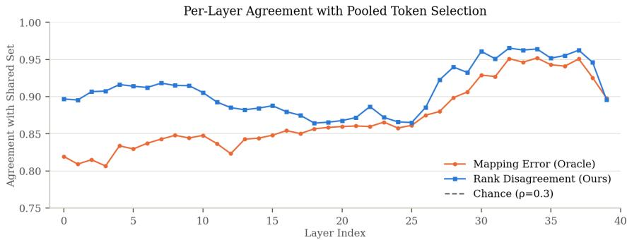  
Figure 12: Layerwise agreement scores with the shared recompute set determined by $\ell _ { 2 }$ mapping error and rank disagreement.

Visualizing selected tokens with rank disagreement The Figure 13 shows the top 20% tokens selected with rank disagreement vs. other selector metrics. Rank disagreement selects most of the tokens from the question or content, whereas a large budget for other metrics is spent in template tokens. Recomputing template tokens shows negligible accuracy gains, indicating that the mapper effectively maps the template tokens. Rank disagreement successfully identifies the crucial content tokens helping close the accuracy gap with target prefill.

## D LIMITATIONS AND FUTURE WORK

While RaReCache effectively mitigates the accuracy degradation inherent in cross-model transfer, the underlying closed-form linear mapping (Heo et al., 2026) remains sensitive to the distribution of the calibration data. In our current pipeline, transferring from source to target requires fitting the mapping matrices on a calibration set that closely matches the downstream evaluation distribution (e.g., using the training split of the specific benchmark). Developing generalized, task-agnostic linear maps or curating a highly diverse, universally representative calibration corpus will enable fully zero-shot selective recomputation without prior knowledge of the deployment workload.

RaReCache successfully bridges massive capacity gaps (e.g., 23× from 0.6B to 14B parameters), but it currently assumes that the source and target models share the same tokenizer and vocabulary space, as is standard within model families like Qwen and Llama. Extending this framework to support KV cache transfer and selective recomputation across completely heterogeneous model families (with differing tokenizers) remains an open challenge for future research.

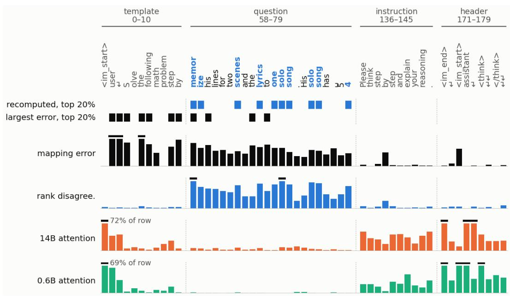  
Figure 13: What the map gets wrong in one GSM8K prompt, and which tokens each signal would recompute. Columns are prompt tokens from four windows, one per section (position ranges above). Tokens in blue are those rank disagreement recomputes at $\rho { = } 0 . 2 .$ . The two lanes mark the top 20% of positions by rank disagreement and by mapping error. The four rows below are relative mapping error $\lVert \mathrm { m a p p e d - t r u e } \rVert ^ { 2 } / \lVert \mathrm { t r u e } \rVert ^ { 2 }$ (keys and values together, averaged over layers), the rank-disagreement score, and the attention each token receives from the 14B and from the 0.6B (last 32 query positions, last quarter of layers). Each row is scaled to its own 95th percentile over the whole prompt; a black tick marks a clipped value, and the $< \mathrm { i } \mathrm { m } _ { - } s \mathrm { t } \mathsf { a } \mathtt { r } \mathtt { t } >$ sink’s share of its row is printed.