# RL-ARC: Calibrating Large Reasoning Models via Reasoning-guided Uncertainty

Gukhyeon Lee1 SangKeun Lee1,2

1Department of Artificial Intelligence, Korea University, Seoul, Republic of Korea 2Department of Computer Science and Engineering, Korea University, Seoul, Republic of Korea {gukhyeon\_lee, yalphy}@korea.ac.kr

## Abstract

Language models (LMs) are commonly trained with Reinforcement Learning with Verifiable Rewards (RLVR) to enhance their reasoning capabilities. However, since RLVR does not explicitly account for calibration during training, it can lead to severe calibration degradation, including overconfidence. Recent calibrationaware training methods for LMs, which incorporate objectives for uncertainty estimation into training, improve calibration but still exhibit overconfidence under distribution shift, while sacrificing reasoning performance. To this end, we propose RL-ARC, a calibrationaware training framework that jointly leverages reasoning confidence and answer confidence. Specifically, RL-ARC leverages reasoning confidence as an auxiliary signal for calibrating answer confidence, applying it as reasoningguided regularization for correct cases and as an overconfidence penalty for incorrect cases. Comprehensive results across ID and OOD settings show that, beyond improving calibration, RL-ARC enables reasoning models to adaptively estimate confidence based on the given question without substantially sacrificing reasoning performance, thereby highlighting the importance of reasoning confidence for training reliable reasoning models1.

## 1 Introduction

Large Reasoning Models (LRMs) have achieved remarkable performance on challenging tasks, such as arithmetic reasoning, largely due to their enhanced reasoning capabilities (Lewkowycz et al., 2022; Lambert et al., 2025; OpenAI et al., 2026). These capabilities are primarily attributed to Reinforcement Learning (RL), which enables models to engage in a slow thinking process expressed in natural language (Kahneman, 2011; Yang et al., 2024). A representative training paradigm for improving reasoning ability is Reinforcement Learning with Verifiable Rewards (RLVR), which provides a simple yet effective framework by relying solely on the correctness of the model’s prediction (Lambert et al., 2025). However, since RL training such as RLVR does not take into account the confidence in its outputs, it tends to reinforce overconfident reasoning (Kirichenko et al., 2025; Mei et al., 2026). This critical limitation restricts the applicability of language models in high-stakes domains, such as healthcare and finance, where the reliability of predictions is essential (Lin et al., 2022).

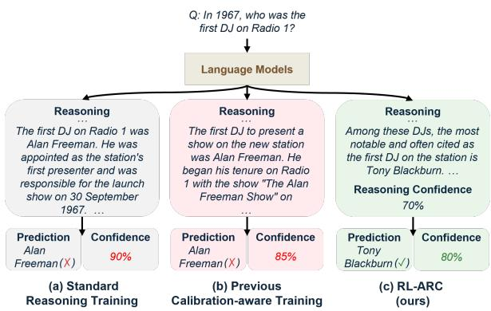  
Figure 1: Comparison of reasoning training frameworks: (a) Standard reasoning training often assigns high confidence to incorrect answers (i.e., overconfidence). (b) Previous calibration-aware training reduces overconfidence to some extent, but still tends to assign high confidence to incorrect answers on OOD benchmarks. (c) Our RL-ARC consistently improves calibration while preserving accuracy gains under OOD settings.

One promising direction for addressing this limitation is to explicitly reward models for estimating their uncertainty (Leng et al., 2025; Liu et al., 2025; Damani et al., 2026). By optimizing an objective function that jointly considers the correctness of the model’s prediction and the calibration of its uncertainty, these approaches can effectively improve the reliability of model outputs. However, these approaches focus primarily on calibrating answer confidence, without considering the reliability of the reasoning process itself. As a result, reasoning models remain vulnerable to generating unreliable or incorrect reasoning, regardless of whether their predictions are correct or reliable (Khalid et al., 2025; Chen et al., 2026). This limitation can further lead to overconfidence issues, where models assign high confidence to the predictions supported by flawed reasoning or even to incorrect predictions. Moreover, directly optimizing calibration objectives often degrades reasoning performance, leading to an accuracy-calibration trade-off (Damani et al., 2026). As illustrated in Figure 1, these issues become more pronounced under distribution shift, where confidence-aware behavior differs between in-distribution (ID) and out-of-distribution (OOD) settings.

To address these limitations, we propose Reinforcement Learning with Auxiliary Reasoning Confidence (RL-ARC), a simple calibration-aware RL framework that jointly leverages reasoning confidence and answer confidence. Specifically, RL-ARC extracts two types of confidence for a given question: reasoning confidence, which reflects the correctness (or truthfulness) of the model’s reasoning process, and answer confidence, which reflects the correctness of the model’s prediction. We then train the model to minimize the discrepancy between its correctness and answer confidence, while modulating the degree of optimization using reasoning confidence.

To validate the effectiveness of RL-ARC in terms of both performance and calibration, we evaluate it on mathematical reasoning benchmarks with varying levels of difficulty, and further extend our evaluation to diverse OOD benchmarks, including complex reasoning and factual QA tasks. Experimental results demonstrate that RL-ARC consistently outperforms existing calibration-aware training methods in calibration, while substantially mitigating accuracy degradation.

The contributions of this work are summarized as follows:

◦ We introduce RL-ARC, a simple yet effective calibration-aware RL framework that jointly leverages reasoning and answer confidence.

◦ We leverage reasoning confidence as an auxiliary signal to regularize answer confidence for correct predictions and penalize overconfidence in incorrect predictions.

◦ We demonstrate that RL-ARC improves calibration over existing reasoning training methods without substantially sacrificing accuracy, thereby highlighting the importance of reasoning confidence in calibration-aware training.

## 2 Related Work

## 2.1 Uncertainty Estimation for Language Models

Estimating the uncertainty of language models plays an important role in improving the reliability of their generated responses (Xia et al., 2025; Yoon et al., 2025). Existing studies on uncertainty estimation for language models can be broadly categorized into three classes. First, accuracy-based approaches estimate uncertainty using the accuracy of multiple model-generated samples (Lin et al., 2024; Xue et al., 2025). However, these approaches incur substantial inference costs, and their uncertainty estimates can be unstable depending on the prompt designs used to generate diverse samples (Zhao et al., 2021; Tonolini et al., 2024). Another line of work estimates uncertainty from the probability distributions over tokens generated by the language model, known as probability-based approaches (Kadavath et al., 2022; Kuhn et al., 2023). However, these approaches have limited applicability in open-ended generation settings, and mitigating this limitation often requires additional inference costs (Kuhn et al., 2023). To address these limitations, recent studies have proposed verbalized confidence-based approaches, where the model explicitly expresses its confidence in its own answer (Tian et al., 2023; Xiong et al., 2024; Dong et al., 2024). These approaches are simple, humaninterpretable (Yoon et al., 2025), and correlated with model performance and response quality (Tian et al., 2023; Dong et al., 2024). However, they still suffer from overconfidence and remain limited in recognizing their own mistakes.

## 2.2 Training for Calibration

Although current LMs have been shown to possess the ability to self-assess their reliability (Yoon et al., 2025), their confidence are often poorly calibrated with the actual correctness of their outputs, suffering from issues such as overconfidence (Tian et al., 2023; Xiong et al., 2024; Mei et al., 2026) and unstable uncertainty estimation (Lin et al., 2024; Xue et al., 2025). To address these limitations, several studies have explored calibration-aware training frameworks that incorporate uncertainty estimation objectives into reasoning training (Liu et al., 2025; Damani et al., 2026; Wu et al., 2026). These approaches train LMs to align their confidence with the correctness of their predictions, enabling bettercalibrated confidence estimates. However, they still exhibit an accuracy-calibration trade-off and remain prone to overconfidence, particularly in OOD settings.

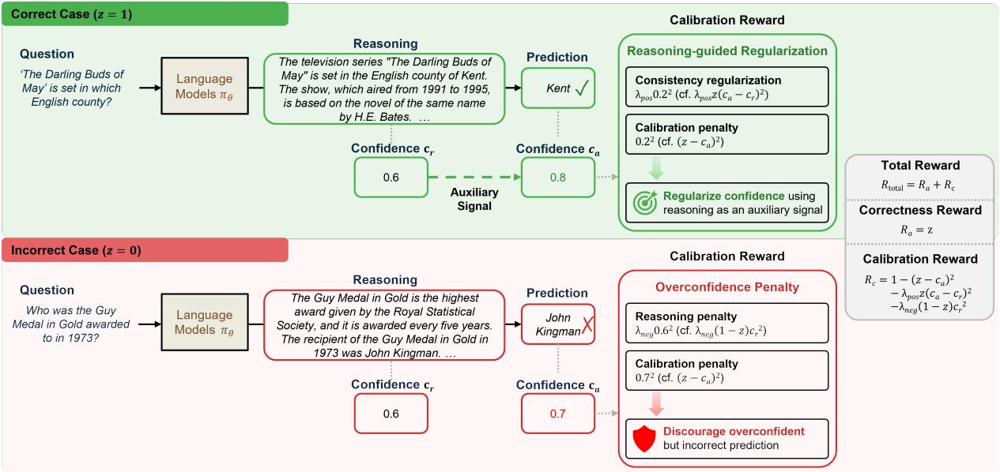  
Figure 2: Overview of RL-ARC. RL-ARC leverages reasoning confidence differently depending on whether the prediction is correct. For correct cases, RL-ARC uses reasoning confidence to regularize answer confidence, encouraging high confidence only when both the prediction and the reasoning process are correct. For incorrect cases, RL-ARC penalizes overconfidence by leveraging confidence from both the reasoning process and the prediction.

In contrast, RL-ARC accounts for not only the correctness of the predictions but also the correctness (or truthfulness) of the reasoning processes when aligning self-assessed confidence. This encourages LMs to consider mistakes recognized during reasoning when estimating confidence, going beyond calibration based solely on the correctness of the predictions. As a result, RL-ARC improves calibration across both ID and OOD settings while maintaining competitive accuracy, thereby mitigating the accuracy-calibration trade-off.

## 3 RL-ARC: Reinforcement Learning with Auxiliary Reasoning Confidence

We introduce Reinforcement Learning with Auxiliary Reasoning Confidence (RL-ARC), a calibration-aware RL framework that leverages verbalized confidence from both the reasoning process and the prediction. We first revisit the standard reasoning training algorithm and the proper scoring rule adopted in our method (§3.1), and then describe how we train LMs to improve calibration without substantially sacrificing accuracy (§3.2).

## 3.1 Preliminaries

Reinforcement Learning with Verifiable Rewards (RLVR). When training LMs $\pi _ { \theta }$ to improve their reasoning capabilities, a standard choice of reward function is a binary reward based on prediction correctness:

$$
R _ { \mathrm { a } } ( y , y ^ { * } ) = \mathbf { 1 } _ { y = y ^ { * } } .\tag{1}
$$

Here, $y$ is the prediction generated by the LMs $\pi _ { \theta } .$ $y ^ { * }$ is the ground-truth answer, and $\mathbf { 1 } _ { y = y ^ { \ast } }$ is the indicator function that evaluates whether $y$ is correct to $y ^ { * }$ . RLVR effectively improves the model’s reasoning capability by optimizing LMs πθ to maximize the reward for answer correctness $( R _ { a } )$ , defined as follows:

$$
\operatorname* { m a x } _ { \theta } \mathbb { E } _ { ( x , y ^ { * } ) \sim \mathcal { D } , y \sim \pi _ { \theta } ( \cdot | x ) } \left[ R _ { a } ( y , y ^ { * } ) \right] .\tag{2}
$$

Brier Score. Accuracy and calibration represent distinct concepts, yet they can be unified through proper scoring rules such as the Brier Score (Brier, 1950; Emde et al., 2025). Specifically, Brier Score (Brier, 1950) is a widely used proper scoring rule, mathematically defined as the mean squared error between a continuous confidence score and one-hot encoded correctness data. The score is formulated as follows:

$$
\mathrm { B r i e r } ( y , c _ { a } , y ^ { * } ) = \left( \mathbf { 1 } _ { y = y ^ { * } } - c _ { a } \right) ^ { 2 } .\tag{3}
$$

Here, $c _ { a }$ denotes the LM $\pi _ { \boldsymbol { \theta } } \mathbf { \ ' } _ { \mathbf { S } }$ self-assessed confidence in y. By combining it with the RLVR reward function (Eq. equation 1), an optimal score can be achieved only when the model predicts both accurately and with appropriate confidence (Damani et al., 2026). The objective is defined as follows:

$$
\begin{array} { r l r } & { } & { \underset { \theta } { \operatorname* { m a x } } ~ \mathbb { E } _ { ( x , y ^ { * } ) \sim \mathcal { D } , ~ ( y , c _ { a } ) \sim \pi _ { \theta } ( \cdot \vert x ) } \left[ R _ { \mathrm { t o t a l } } ( y , c _ { a } , y ^ { * } ) \right] , } \\ & { } & { ( 4 ) } \\ & { } & { \mathrm { w h e r e } ~ R _ { \mathrm { t o t a l } } ( y , c _ { a } , y ^ { * } ) = R _ { a } - \mathrm { B r i e r } ( y , c _ { a } , y ^ { * } ) . } \end{array}
$$

## 3.2 Reasoning-aware Calibration

The main goal of RL-ARC is to train LMs to generate consistently calibrated outputs not only in ID settings but also in OOD settings, while mitigating the accuracy-calibration trade-off.

Confidence Elicitation. To optimize LMs for generating calibrated outputs, RL-ARC first prompts the LM to estimate verbalized confidence in both its reasoning process and prediction for the given question. In this work, we define reasoning confidence as the self-assessed confidence that the reasoning process is correct (or truthful) for solving the given question, and answer confidence as self-assessed confidence that its prediction is correct. These confidence are generated alongside the model’s reasoning and prediction using a calibration-aware reasoning training prompt that instructs the LMs to explicitly estimate confidence while solving the given question (see Appendix A.4 for more details about the prompts).

Calibration-aware Optimization. By leveraging explicitly elicited confidence in both the reasoning process and the model’s prediction, RL-ARC trains LMs through calibration-aware reinforcement learning to improve calibration while preserving reasoning performance. This leads to the following calibration-aware objective:

$$
\operatorname* { m a x } _ { \theta } \ \mathbb { E } _ { ( x , y ^ { * } ) \sim \mathcal { D } , ( y , c _ { a } , c _ { r } ) \sim \pi _ { \theta } ( \cdot | x ) } \left[ R _ { \mathrm { t o t a l } } ( z , c _ { a } , c _ { r } ) \right] ,\tag{5}
$$

where

$$
\begin{array} { c } { R _ { \mathrm { t o t a l } } ( z , c _ { a } , c _ { r } ) = R ( z , c _ { a } ) - \Omega _ { \mathrm { a r c } } ( z , c _ { a } , c _ { r } ) , } \\ { R ( z , c _ { a } ) = z - ( z - c _ { a } ) ^ { 2 } , } \\ { z = \mathbf { 1 } _ { y = y ^ { * } } . } \end{array}
$$

Here, $c _ { r }$ is the model’s self-assessed confidence associated with its reasoning process. By optimizing the model to maximize the reward for reasoningaware calibration (Eq. equation 5), RL-ARC effectively improves calibration while mitigating accuracy-calibration trade-off2. Specifically, RL-ARC leverages reasoning confidence to calibrate LMs with an objective conditioned on whether the model’s prediction is correct, as defined below:

$$
\Omega _ { \mathrm { a r c } } ( z , c _ { a } , c _ { r } ) = \left\{ \begin{array} { l l } { \lambda _ { \mathrm { p o s } } ( c _ { a } - c _ { r } ) ^ { 2 } , } & { z = 1 } \\ { \lambda _ { \mathrm { n e g } } c _ { r } ^ { 2 } , } & { z = 0 . } \end{array} \right.\tag{6}
$$

Here, $\lambda _ { \mathrm { p o s } }$ and $\lambda _ { \mathrm { n e g } }$ are hyperparameters controlling the strength of reasoning confidence $c _ { r }$ to the calibration objective. As shown in Figure 2, when the prediction is correct, RL-ARC encourages the model to assign high answer confidence $c _ { a }$ to its prediction, while also minimizing its misalignment with reasoning confidence $c _ { r }$ . This prevents the model from assigning high answer confidence solely based on the prediction, and instead encourages high answer confidence only when both the prediction and the underlying reasoning process are correct. Conversely, for incorrect predictions, RL-ARC penalizes the model for assigning high answer confidence $c _ { a }$ to its prediction. The reasoning confidence $c _ { r }$ in the reasoning process that led to the incorrect prediction is further used as an additional penalty, encouraging the model to calibrate its answer confidence $c _ { a }$ by accounting for the correctness of both the reasoning process and the prediction. Consequently, RL-ARC discourages high answer confidence $c _ { a }$ in incorrect outputs, thereby mitigating overconfidence. Intuitively, the training objective of RL-ARC incentivizes correctness while penalizing the model for assigning high answer confidence $c _ { a }$ to incorrect outputs or low answer confidence $c _ { a }$ to correct outputs, taking into account both the prediction and the reasoning process (Eq. equation 5).

## 4 Experiments

We evaluate RL-ARC to verify its effectiveness in both performance and reliability. Specifically, we aim to answer the following research questions:

◦ Does RL-ARC improve calibration while mitigating the accuracy-calibration trade-off across both ID and OOD settings?

◦ Can RL-ARC adaptively estimate confidence according to the given question?

◦ Does RL-ARC encourage LMs to generate more reliable reasoning?

<table><tr><td rowspan="2">Distribution</td><td rowspan="2">Method</td><td colspan="4">Qwen2.5 (7B)</td><td colspan="4">Qwen3 (8B)</td></tr><tr><td>Acc.(↑)</td><td>AUROC (↑)</td><td>Brier (↓)</td><td>ECE(↓)</td><td>Acc.(↑)</td><td>AUROC (↑)</td><td>Brier (↓)</td><td>ECE(↓)</td></tr><tr><td rowspan="8">ID (Avg.)</td><td>Base</td><td>41.19</td><td>0.58</td><td>0.54</td><td>0.54</td><td>55.63</td><td>0.51</td><td>0.42</td><td>0.42</td></tr><tr><td>RLVR</td><td></td><td></td><td></td><td></td><td></td><td></td><td></td><td></td></tr><tr><td>w/ Confidence</td><td>56.86</td><td>0.45</td><td>0.41</td><td>0.40</td><td>66.58</td><td>0.66</td><td>0.31</td><td>0.32</td></tr><tr><td>w/ Probability</td><td>56.86</td><td>0.60</td><td>0.41</td><td>0.41</td><td>66.58</td><td>0.76</td><td>0.27</td><td>0.29</td></tr><tr><td>w/ Post-hoc</td><td>56.86</td><td>0.72</td><td>0.24</td><td>0.21</td><td>66.58</td><td>0.83</td><td>0.16</td><td>0.20</td></tr><tr><td>Behavioral Calibration</td><td>54.75</td><td>0.50</td><td>0.27</td><td>0.23</td><td>65.96</td><td>0.71</td><td>0.18</td><td>0.17</td></tr><tr><td>RLCR</td><td>54.82</td><td>0.58</td><td>0.25</td><td>0.22</td><td>65.98</td><td>0.76</td><td>0.17</td><td>0.16</td></tr><tr><td>RL-ARC (ours)</td><td>56.53</td><td>0.60</td><td>0.23</td><td>0.18</td><td>66.10</td><td>0.83</td><td>0.13</td><td>0.15</td></tr><tr><td rowspan="8">OOD (Avg.)</td><td>Base</td><td>43.52</td><td>0.53</td><td>0.49</td><td>0.49</td><td>51.37</td><td>0.65</td><td>0.34</td><td>0.34</td></tr><tr><td>RLVR</td><td></td><td></td><td></td><td></td><td></td><td></td><td></td><td></td></tr><tr><td>w/ Confidence</td><td>47.58</td><td>0.50</td><td>0.50</td><td>0.50</td><td>47.24</td><td>0.55</td><td>0.47</td><td>0.48</td></tr><tr><td>w/ Probability</td><td>47.58</td><td>0.51</td><td>0.48</td><td>0.47</td><td>47.24</td><td>0.50</td><td>0.45</td><td>0.45</td></tr><tr><td>w/ Post-hoc</td><td>47.58</td><td>0.51</td><td>0.31</td><td>0.24</td><td>47.24</td><td>0.57</td><td>0.28</td><td>0.24</td></tr><tr><td>Behavioral Calibration</td><td>47.04</td><td>0.51</td><td>0.30</td><td>0.22</td><td>51.35</td><td>0.60</td><td>0.33</td><td>0.31</td></tr><tr><td>RLCR</td><td>46.02</td><td>0.54</td><td>0.28</td><td>0.20</td><td>50.99</td><td>0.66</td><td>0.26</td><td>0.22</td></tr><tr><td>RL-ARC (ours)</td><td>47.27</td><td>0.54</td><td>0.26</td><td>0.16</td><td>51.61</td><td>0.69</td><td>0.23</td><td>0.17</td></tr></table>

Table 1: Evaluation results for accuracy (%) and calibration metrics on Math (ID) and OOD benchmarks. The best and second-best results are highlighted in boldface and underlined.

## 4.1 Experimental Setups

Datasets. Following the setup of previous work (Damani et al., 2026), all LMs in our main experiments are trained on the Big-Math (Albalak et al., 2025) dataset. We evaluate RL-ARC on various arithmetic reasoning benchmarks that are similar to the training distribution, including Big-Math (Albalak et al., 2025), GSM8K (Cobbe et al., 2021), MATH-500 (Hendrycks et al., 2021), AMC233, AIME244, and AIME255. We further evaluate RL-ARC on benchmarks from distributions different from the training environment, including complex reasoning benchmarks such as StrategyQA (Geva et al., 2021), GPQA (Rein et al., 2024), and HotpotQA (Yang et al., 2018), as well as representative factual QA benchmarks such as SimpleQA (Wei et al., 2024), NQ-Open (Kwiatkowski et al., 2019), and TriviaQA (Joshi et al., 2017). To further validate generalization across training distributions, we additionally use the HotpotQA (Yang et al., 2018) dataset as an alternative training dataset and evaluate the trained models on arithmetic reasoning and factual QA benchmarks. Further details on these datasets are provided in Appendix A.1.

Baselines. We compare RL-ARC with various confidence estimation and calibration methods, including Base, RLVR with Confidence, RLVR with Probability, RLVR with Post-hoc, RLCR, and Behavioral Calibration. Base extracts verbalized confidence from the pre-trained model. RLVR with Confidence, such as (Xiong et al., 2024), extracts verbalized confidence from a model trained with standard RLVR. RLVR with Probability, such as (Kuhn et al., 2023), computes the average probability of prediction tokens from a model trained with standard RLVR. RLVR with Post-hoc, such as (Li et al., 2025), extracts confidence using an external confidence estimator trained to predict the confidence of the target model’s responses. Behavioral Calibration (Wu et al., 2026) is a calibration-aware RL approach that utilizes an uncertainty obtained by aggregating verbalized confidence expressed throughout the reasoning process. RLCR (Damani et al., 2026) is a representative calibration-aware RL approach that leverages verbalized confidence associated with model predictions.

Training Details. We utilize the Qwen2.5-7B pre-trained model (Qwen et al., 2025) to evaluate the effectiveness of RL-ARC as a reasoning training framework for improving both accuracy and calibration. We further utilize the Qwen3-8B model (Yang et al., 2025), a recent state-of-the-art language model from the Qwen family, to assess its effectiveness on a stronger backbone. To showcase the generalizability of RL-ARC across model families, we additionally conduct experiments on a Llama-8B distilled from DeepSeek-R1 (Guo et al., 2025). We employ GRPO (Shao et al., 2024) as the base reinforcement learning algorithm. Further training details are provided in Appendix A.2.

<table><tr><td rowspan="2">Backbone</td><td rowspan="2">Method</td><td colspan="4">ID (Avg.)</td><td colspan="4">OOD (Avg.)</td></tr><tr><td>Acc.(↑)</td><td>AUROC (↑)</td><td>Brier (↓)</td><td>ECE(↓)</td><td>Acc.(↑)</td><td>AUROC (↑)</td><td>Brier (↓)</td><td>ECE (↓)</td></tr><tr><td rowspan="4">Qwen2.5-7B</td><td>Base</td><td>41.19</td><td>0.58</td><td>0.54</td><td>0.54</td><td>43.52</td><td>0.53</td><td>0.49</td><td>0.49</td></tr><tr><td>RLVR</td><td>56.86</td><td>0.45</td><td>0.41</td><td>0.40</td><td>47.58</td><td>0.50</td><td>0.50</td><td>0.50</td></tr><tr><td>RLCR</td><td>54.82</td><td>0.58</td><td>0.25</td><td>0.22</td><td>46.02</td><td>0.54</td><td>0.28</td><td>0.20</td></tr><tr><td>RL-ARC</td><td>56.53</td><td>0.60</td><td>0.23</td><td>0.18</td><td>47.27</td><td>0.54</td><td>0.26</td><td>0.16</td></tr><tr><td rowspan="4">Llama-8B (DeepSeek-R1 Distilled)</td><td>Base</td><td>33.24</td><td>0.61</td><td>0.62</td><td>0.63</td><td>45.96</td><td>0.61</td><td>0.43</td><td>0.44</td></tr><tr><td>RLVR</td><td>59.49</td><td>0.51</td><td>0.36</td><td>0.35</td><td>40.48</td><td>0.52</td><td>0.53</td><td>0.53</td></tr><tr><td>RLCR</td><td>52.06</td><td>0.80</td><td>0.29</td><td>0.29</td><td>42.14</td><td>0.64</td><td>0.30</td><td>0.28</td></tr><tr><td>RL-ARC</td><td>56.69</td><td>0.81</td><td>0.27</td><td>0.25</td><td>43.30</td><td>0.64</td><td>0.25</td><td>0.19</td></tr></table>

Table 2: Evaluation results across different backbone models on Math (ID) and OOD benchmarks. The best and second-best results within each model are highlighted in boldface and underlined, respectively.

Evaluation Details. To demonstrate the effectiveness of RL-ARC in improving both reasoning performance and reliability, we evaluate it using various metrics for measuring performance and calibration, including Accuracy, Brier Score (Brier), Expected Calibration Error (ECE), Area Under the ROC Curve (AUROC), and Area Under the Risk-Coverage Curve (AURC). We also evaluate the reliability of the reasoning content through Reasoning Calibration and Shallow Reasoning (SR) metrics. Further evaluation details are provided in Appendix A.3.

## 4.2 Main Results

To validate the efficacy of RL-ARC as a calibration-aware training method, we first compare it with various uncertainty estimation and calibration baselines. As shown in Table 1, RL-ARC consistently outperforms these methods in calibration capability, while achieving competitive performance comparable to that of RLVR method, which is trained solely to improve accuracy, across both ID and OOD benchmarks. Notably, RL-ARC consistently outperforms these methods in calibration by a substantial margin on OOD benchmarks, without substantially sacrificing reasoning performance across both evaluated models. Although the existing post-hoc calibration method achieves competitive calibration on ID benchmarks by additionally training an estimator on the ID dataset, we observe that its effectiveness does not consistently transfer to OOD benchmarks. This suggests that an external confidence estimator trained on the ID dataset may have limited generalization under distribution shifts. The existing calibration-aware training methods, on the other hand, generalize robustly to OOD benchmarks in terms of calibration, but often incur noticeable degradation in reasoning performance. In contrast, RL-ARC robustly and effectively improves calibration while largely preserving the performance gains from training, indicating that incorporating reasoning confidence into calibrationaware training provides an effective way to mitigate the accuracy-calibration trade-off. More detailed results are provided in Appendix B.1.

## 4.3 General Applicability to Architectures and Training Distributions

Applicability across Model Families. To validate the broader applicability of RL-ARC, we evaluate its effectiveness across diverse model families, including Qwen- and Llama-based models. As shown in Table 2, RL-ARC consistently improves calibration while substantially mitigating accuracy degradation across both model families. Notably, although Llama-8B distilled from DeepSeek-R1 still exhibits accuracy degradation on OOD benchmarks when trained with RL-ARC, similar to other training methods, RL-ARC is effective at mitigating the degradation in accuracy. The results demonstrate that RL-ARC, which leverages confidence in the reasoning process, not only effectively improves calibration but also substantially mitigates accuracy degradation across diverse model families.

Applicability across Training Distributions. We further analyze the applicability of RL-ARC across diverse training distributions, with the results presented in Table 3. These results demonstrate that RL-ARC consistently improves calibration without substantially sacrificing reasoning performance across both training distributions. Moreover, we observe that RL-ARC robustly improves both calibration and accuracy on OOD benchmarks regardless of the training distribution, compared with other training methods. These results highlight the generalizability of RL-ARC across different training distributions.

<table><tr><td rowspan="2">Training Distribution</td><td rowspan="2">Method</td><td colspan="4">ID (Avg.)</td><td colspan="4">OOD (Avg.)</td></tr><tr><td>Acc. (↑)</td><td>AUROC (↑)</td><td>Brier (↓)</td><td>ECE (↓)</td><td>Acc.(↑)</td><td>AUROC (↑)</td><td>Brier (↓)</td><td>ECE (↓)</td></tr><tr><td rowspan="4">Arithmetic Reasoning</td><td>Base</td><td>41.19</td><td>0.58</td><td>0.54</td><td>0.54</td><td>43.52</td><td>0.53</td><td>0.49</td><td>0.49</td></tr><tr><td>RLVR</td><td>56.86</td><td>0.45</td><td>0.41</td><td>0.40</td><td>47.58</td><td>0.50</td><td>0.50</td><td>0.50</td></tr><tr><td>RLCR</td><td>54.82</td><td>0.58</td><td>0.25</td><td>0.22</td><td>46.02</td><td>0.54</td><td>0.28</td><td>0.20</td></tr><tr><td>RL-ARC</td><td>56.53</td><td>0.60</td><td>0.23</td><td>0.18</td><td>47.27</td><td>0.54</td><td>0.26</td><td>0.16</td></tr><tr><td rowspan="4">Complex Reasoning</td><td>Base</td><td>39.10</td><td>0.54</td><td>0.53</td><td>0.54</td><td>45.41</td><td>0.53</td><td>0.48</td><td>0.49</td></tr><tr><td>RLVR</td><td>56.30</td><td>0.50</td><td>0.43</td><td>0.43</td><td>39.51</td><td>0.50</td><td>0.60</td><td>0.60</td></tr><tr><td>RLCR</td><td>54.70</td><td>0.57</td><td>0.25</td><td>0.07</td><td>43.62</td><td>0.57</td><td>0.27</td><td>0.20</td></tr><tr><td>RL-ARC</td><td>55.10</td><td>0.59</td><td>0.24</td><td>0.06</td><td>45.42</td><td>0.57</td><td>0.25</td><td>0.16</td></tr></table>

Table 3: Evaluation results across different training distributions. The best and second-best results within each training distribution are highlighted in boldface and underlined, respectively.
<table><tr><td rowspan="2">Method</td><td colspan="4">Complex Reasoning</td><td colspan="4">Factual QA</td><td colspan="4"> $\operatorname { A v g } .$ </td></tr><tr><td>Acc.(↑)</td><td>AUROC (↑)</td><td>Brier (↓)</td><td>ECE(↓)</td><td>Acc.(↑)</td><td>AUROC (↑)</td><td>Brier (↓)</td><td>ECE(↓)</td><td>Acc. (↑)</td><td>AUROC (↑)</td><td>Brier (↓)</td><td>ECE (↓)</td></tr><tr><td>Base</td><td>47.95</td><td>0.55</td><td>0.44</td><td>0.43</td><td>39.10</td><td>0.51</td><td>0.55</td><td>0.56</td><td>43.52</td><td>0.53</td><td>0.49</td><td>0.49</td></tr><tr><td>RLVR</td><td>54.86</td><td>0.50</td><td>0.45</td><td>0.45</td><td>40.30</td><td>0.50</td><td>0.56</td><td>0.56</td><td>47.58</td><td>0.50</td><td>0.50</td><td>0.50</td></tr><tr><td>RLCR</td><td>51.83</td><td>0.53</td><td>0.27</td><td>0.16</td><td>40.22</td><td>0.54</td><td>0.29</td><td>0.23</td><td>46.02</td><td>0.54</td><td>0.28</td><td>0.20</td></tr><tr><td>RL-ARC</td><td>53.36</td><td>0.54</td><td>0.25</td><td>0.14</td><td>41.19</td><td>0.54</td><td>0.27</td><td>0.19</td><td>47.27</td><td>0.54</td><td>0.26</td><td>0.16</td></tr></table>

Table 4: Evaluation results for accuracy (%) and calibration metrics on six OOD benchmarks, including three complex reasoning and three factual question answering benchmarks. The best and second-best results are highlighted in boldface and underlined. Here, we use Qwen2.5-7B as base model.

## 4.4 Reliability on Out-of Distribution (OOD)

Effectiveness across Tasks. To further assess the generalizability of RL-ARC with respect to both accuracy and calibration, we evaluate it on diverse OOD benchmarks. As shown in Table 4, RL-ARC effectively improves calibration on diverse OOD benchmarks while avoiding substantial accuracy degradation. On complex reasoning benchmarks, RL-ARC effectively improves calibration over the existing methods while maintaining competitive accuracy. In particular, on factual QA benchmarks, which are designed to evaluate overconfidence on obscure factual knowledge, RL-ARC achieves the best accuracy and calibration, outperforming the existing calibration-aware training method. These results demonstrate that RL-ARC’s effectiveness in improving calibration while largely preserving reasoning performance generalizes robustly across diverse OOD task types, ranging from tasks that require strong accuracy (i.e., complex reasoning) to those where reliability is critical (i.e., factual QA).

Calibration under Distribution Shift. To examine whether the confidence produced by models trained with RL-ARC accurately reflects their correctness given the question, we further analyze confidence-aware calibration on OOD benchmarks that are unseen during training. As shown in Figure 3, RL-ARC estimates confidence that is better aligned with actual prediction correctness than that of the existing calibration-aware approach under distribution shift. Moreover, when the model is given questions from unseen tasks, RL-ARC assigns more samples to low- and midconfidence rather than concentrating predictions in high-confidence, which is commonly observed in previous training approaches. Together with additional analysis of performance and confidence distributions across ID and OOD settings (see Appendix B.2 for detailed results) and calibration gains (see Appendix B.3 for detailed results), these results demonstrate that RL-ARC improves calibration while estimating confidence that better reflects the uncertainty of a given question across both ID and OOD benchmarks.

## 4.5 Overconfidence Mitigation

If selectively relying on high confidence responses of the model reduces risk, aligning model confidence with output correctness becomes an important practical direction for developing reliable language models. To this end, we further analyze the overconfidence mitigation of RL-ARC through risk-coverage curves, where lower risk at lower coverage indicates that high confidence predictions are more likely to be correct. As shown in Figure 4, RL-ARC achieves lower or competitive selective risk than existing reasoning training approaches across most coverage levels and benchmarks. Moreover, we observe that RL-ARC further improves both AURC and ECE while achieving competitive accuracy (see Appendix B.4 for a more detailed analysis). Notably, RL-ARC shows substantially lower risk in low coverage regions, where only the model’s high-confidence outputs are retained. These results demonstrate that the high confidence outputs produced by RL-ARC are more likely to be correct, suggesting that RL-ARC better aligns confidence with correctness. Compared with existing reasoning training approaches, RL-ARC more effectively filters out incorrect predictions by assigning them lower confidence. These results demonstrate that leveraging reasoning confidence helps mitigate overconfidence on incorrect predictions, highlighting the practical value of RL-ARC in reliable confidence-aware calibration.

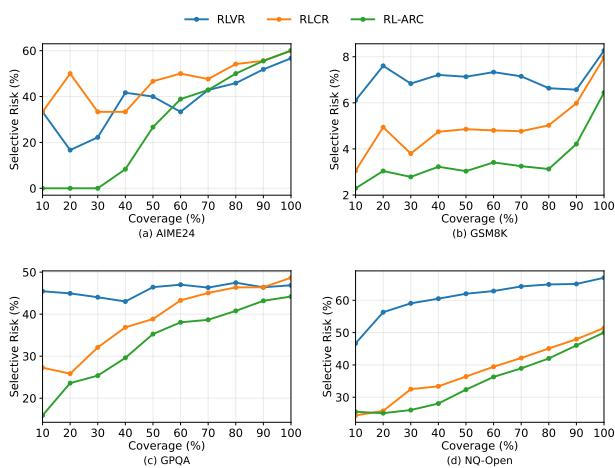

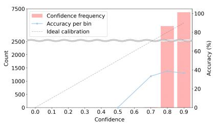  
(a) RLVR

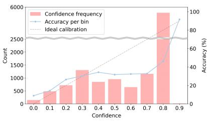  
(b) RLCR

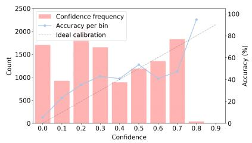  
(c) RL-ARC  
Figure 3: Performance (solid lines) and confidence frequency (bars) across confidence bins on OOD benchmarks for Qwen2.5-7B trained with each method.  
Figure 4: Risk-coverage curves across representative benchmarks. Lower selective risk indicates better confidence estimation and selective prediction performance (i.e., better confidence-aware prediction), where more accurate predictions are assigned higher confidence.

## 4.6 Component Analysis in RL-ARC

Ablation Study. We conduct an ablation study to analyze the contribution of each auxiliary signal in RL-ARC to both accuracy and calibration. As shown in Table 5, the results demonstrate that incorporating reasoning confidence as an auxiliary signal into calibration-aware training does not lead to a simple one-dimensional improvement. Specifically, the overconfidence penalty, which is applied to incorrect predictions, achieves the best Brier Score and ECE, indicating that applying an additional penalty based on reasoning confidence to incorrect predictions improves calibration while sacrificing accuracy, AUROC, and AURC. Conversely, reasoning-guided regularization, which is applied to correct predictions, serves as a useful signal for improving accuracy, AUROC, and AURC. Moreover, we observe that integrating reasoning confidence with an appropriate objective depending on the correctness effectively improves calibration without substantially sacrificing accuracy, compared to alternative strategies for incorporating reasoning confidence (see Appendix B.5 for a more detailed analysis). By combining these two objectives, RL-ARC better balances accuracy and calibration, consistently outperforming frameworks that do not leverage reasoning confidence.

<table><tr><td rowspan="2"> $\lambda _ { \mathrm { n e g } }$ </td><td rowspan="2"> $\lambda _ { \mathrm { p o s } }$ </td><td colspan="5">OOD  $\left( \mathrm { A v g . } \right)$ </td></tr><tr><td>Acc. (↑)</td><td>AUROC (↑)</td><td>AURC (↓)</td><td>Brier (↓)</td><td>ECE (↓)</td></tr><tr><td> $\checkmark$ </td><td>x</td><td>47.11</td><td>0.53</td><td>0.46</td><td>0.25</td><td>0.15</td></tr><tr><td>√</td><td>√</td><td>47.27</td><td>0.54</td><td>0.45</td><td>0.26</td><td>0.16</td></tr><tr><td>x</td><td>√</td><td>47.51</td><td>0.55</td><td>0.45</td><td>0.28</td><td>0.21</td></tr><tr><td>x</td><td>x</td><td>46.02</td><td>0.54</td><td>0.47</td><td>0.28</td><td>0.20</td></tr></table>

Table 5: Ablation results on OOD benchmarks. $\lambda _ { \mathrm { n e g } }$ and $\lambda _ { \mathrm { p o s } }$ indicate whether the overconfidence penalty and reasoning-guided regularization are used, respectively. The best and second-best results are highlighted in boldface and underlined.

Auxiliary Signal Scale. Since the influence of reasoning confidence on calibration in RL-ARC is controlled by the hyperparameters $( \mathrm { i . e . , \lambda _ { p o s } }$ and $\lambda _ { \mathrm { n e g } } )$ , we analyze how varying the degree to which reasoning confidence is used affects the effectiveness of RL-ARC. As shown in Figure 5, RL-ARC consistently outperforms the existing calibrationaware method in calibration while effectively mitigating the accuracy-calibration trade-off. These results demonstrate that reasoning confidence serves as an effective auxiliary signal in RL-ARC. However, we observe that increasing the influence of reasoning confidence in RL-ARC does not necessarily yield further calibration improvements. The experimental results suggest that appropriately balancing the auxiliary objectives for correct and incorrect predictions is critical for achieving superior calibration while mitigating the accuracy-calibration trade-off. A more detailed analysis is provided in Appendix B.6.

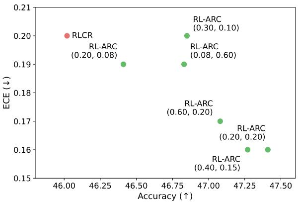  
Figure 5: Comparison between performance and calibration across different auxiliary signal scales. For RL-ARC, the left and right values in parentheses denote $\lambda _ { \mathrm { p o s } }$ and $\lambda _ { \mathrm { n { e g } } } .$ , respectively. Here, we use Qwen2.5-7B as base model.

## 4.7 Reliability of Reasoning

Since reasoning correctness is difficult to assess reliably, RL-ARC leverages reasoning confidence as an auxiliary signal for calibration. To validate whether RL-ARC improves the reliability of the reasoning process beyond prediction-level calibration, we further analyze reasoning calibration and the frequency of shallow reasoning. As shown in Figure 6, compared with existing reasoning training approaches, RL-ARC achieves substantially larger improvements in both answer calibration and reasoning calibration. Notably, compared with the gain in answer calibration, the gain in reasoning calibration is substantially larger than that achieved by the calibration-aware training method. This indicates that explicitly incorporating reasoning confidence into calibration-aware training enables the model to indirectly align its reasoning confidence with reasoning correctness. In addition, RL-ARC achieves the largest reduction in shallow reasoning, indicating that its reasoning process is more strongly aligned with the prediction. These results demonstrate that RL-ARC improves not only the reliability of prediction but also the reliability of the reasoning process itself, even without direct supervision for reasoning correctness, highlighting the effectiveness of leveraging reasoning confidence in calibration-aware reasoning training.

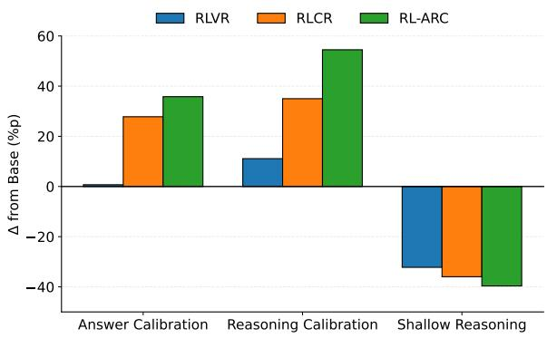  
Figure 6: Comparison of calibration improvements and shallow reasoning reduction over the base model. The y-axis reports the relative change from the base model. Here, we use Qwen2.5-7B as base model.

## 5 Conclusion

We have proposed RL-ARC, a simple yet effective calibration-aware training framework that leverages verbalized confidence from both reasoning and prediction. Unlike prior frameworks that have relied solely on confidence in the prediction, RL-ARC leverages confidence in the reasoning process as an auxiliary signal to calibrate confidence in the prediction, enabling reasoning models to improve calibration without substantially sacrificing accuracy. We have extensively evaluated RL-ARC on both in-distribution (ID) benchmarks, such as arithmetic reasoning tasks, and out-of-distribution (OOD) benchmarks, including complex reasoning and factual question answering tasks. The results demonstrate that RL-ARC consistently improves calibration over existing reasoning training approaches, including calibration-aware training methods, across both ID and OOD settings, while achieving accuracy comparable to training methods that focus solely on correctness. Our analysis has validated that, beyond improving calibration, RL-ARC enables reasoning models to adaptively assign confidence based on the given question, thereby highlighting the importance of reasoning confidence in calibration-aware training.

## Limitations

While RL-ARC effectively improves calibration while mitigating the accuracy-calibration trade-off, RL-ARC has several limitations that future work could address: First, our experiments are limited to two training settings, in which LMs are trained on either a limited set of mathematical reasoning samples or a limited set of complex reasoning samples. Additionally, to ensure a fair comparison with the baselines, we train all LMs using only GRPO. We believe that incorporating more diverse training datasets and stronger RL algorithms could further improve model performance. Second, we mainly focus on LMs, particularly the Qwen family, which is widely used in RL tasks. We believe that extending the RL-ARC framework to calibrate multimodal reasoning models presents a promising avenue for future work. Finally, to compute reasoning calibration and the frequency of shallow reasoning, we utilize LLM-as-a-judge. However, we observe that using LLM-as-a-judge to assess the correctness of the reasoning process can introduce errors. We leave the development of more accurate LLMbased evaluation methods for reasoning correctness to future work.

## Acknowledgments

This work was supported by the National Research Foundation of Korea (NRF) grant funded by the Korea government (MSIT) (No.RS-2025-00517221 and No.RS-2024-00415812) and Institute of Information & communications Technology Planning & Evaluation (IITP) grant funded by the Korea government (MSIT) (No.RS-2024-00439328, Karma: Towards Knowledge Augmentation for Complex Reasoning (SW Starlab), No.RS-2024- 00457882, AI Research Hub Project, and No.RS-2019-II190079, Artificial Intelligence Graduate School Program (Korea University)).

## References

Alon Albalak, Duy Phung, Nathan Lile, Rafael Rafailov, Kanishk Gandhi, Louis Castricato, Anikait Singh, Chase Blagden, Violet Xiang, Dakota Mahan, and Nick Haber. 2025. Big-math: A large-scale, highquality math dataset for reinforcement learning in language models. arXiv preprint arXiv:2502.17387.

Glenn W. Brier. 1950. Verification of forecasts expressed in terms of probability. Monthly Weather Review.

Lu Chen, Yuxuan Huang, Yixing Li, Dongrui Liu, Qihan Ren, ShuaiZhao, Kun Kuang, Zilong Zheng, and Quanshi Zhang. 2026. Can LLMs reason soundly in law? auditing inference patterns for legal judgment. In The Fourteenth International Conference on Learning Representations.

Karl Cobbe, Vineet Kosaraju, Mohammad Bavarian, Mark Chen, Heewoo Jun, Lukasz Kaiser, Matthias Plappert, Jerry Tworek, Jacob Hilton, Reiichiro Nakano, Christopher Hesse, and John Schulman. 2021. Training verifiers to solve math word problems. arXiv preprint arXiv:2110.14168.

Mehul Damani, Isha Puri, Stewart Slocum, Idan Shenfeld, Leshem Choshen, Yoon Kim, and Jacob Andreas. 2026. Beyond binary rewards: Training LMs to reason about their uncertainty. In The Fourteenth International Conference on Learning Representations.

Yijiang River Dong, Tiancheng Hu, and Nigel Collier. 2024. Can LLM be a personalized judge? In Findings of the Association for Computational Linguistics: EMNLP 2024.

Cornelius Emde, Francesco Pinto, Thomas Lukasiewicz, Philip Torr, and Adel Bibi. 2025. Towards certification of uncertainty calibration under adversarial attacks. In The Thirteenth International Conference on Learning Representations.

Mor Geva, Daniel Khashabi, Elad Segal, Tushar Khot, Dan Roth, and Jonathan Berant. 2021. Did aristotle use a laptop? a question answering benchmark with implicit reasoning strategies. Transactions of the Association for Computational Linguistics.

Daya Guo, Dejian Yang, Haowei Zhang, Junxiao Song, Peiyi Wang, Qihao Zhu, Runxin Xu, Ruoyu Zhang, Shirong Ma, Xiao Bi, Xiaokang Zhang, Xingkai Yu, Yu Wu, Z. F. Wu, Zhibin Gou, Zhihong Shao, Zhuoshu Li, Ziyi Gao, Aixin Liu, and 175 others. 2025. Deepseek-r1 incentivizes reasoning in llms through reinforcement learning. Nature.

Zhitao He, Sandeep Polisetty, Zhiyuan Fan, Yuchen Huang, Shujin Wu, and Yi R. Fung. 2025. MM-Boundary: Advancing MLLM knowledge boundary awareness through reasoning step confidence calibration. In Proceedings of the 63rd Annual Meeting of the Association for Computational Linguistics.

Dan Hendrycks, Collin Burns, Saurav Kadavath, Akul Arora, Steven Basart, Eric Tang, Dawn Song, and Jacob Steinhardt. 2021. Measuring mathematical problem solving with the MATH dataset. In Thirtyfifth Conference on Neural Information Processing Systems Datasets and Benchmarks Track (Round 2).

Mandar Joshi, Eunsol Choi, Daniel Weld, and Luke Zettlemoyer. 2017. TriviaQA: A large scale distantly supervised challenge dataset for reading comprehension. In Proceedings of the 55th Annual Meeting of the Associationfor Computational Linguistics.

Saurav Kadavath, Tom Conerly, Amanda Askell, Tom Henighan, Dawn Drain, Ethan Perez, Nicholas Schiefer, Zac Hatfield-Dodds, Nova DasSarma, Eli Tran-Johnson, Scott Johnston, Sheer El-Showk, Andy Jones, Nelson Elhage, Tristan Hume, Anna Chen, Yuntao Bai, Sam Bowman, Stanislav Fort, and 17 others. 2022. Language models (mostly) know what they know. arXiv preprint arXiv:2207.05221.

Daniel Kahneman. 2011. Thinking, Fast and Slow, first paperback edition. Farrar, Straus and Giroux, New York.

Irtaza Khalid, Amir Masoud Nourollah, and Steven Schockaert. 2025. Large language and reasoning models are shallow disjunctive reasoners. In Proceedings of the 63rd Annual Meeting of the Association for Computational Linguistics.

Polina Kirichenko, Mark Ibrahim, Kamalika Chaudhuri, and Samuel J. Bell. 2025. Abstentionbench: Reasoning LLMs fail on unanswerable questions. In ICML 2025 Workshop on Reliable and Responsible Foundation Models.

Lorenz Kuhn, Yarin Gal, and Sebastian Farquhar. 2023. Semantic uncertainty: Linguistic invariances for uncertainty estimation in natural language generation. In The Eleventh International Conference on Learning Representations.

Tom Kwiatkowski, Jennimaria Palomaki, Olivia Redfield, Michael Collins, Ankur Parikh, Chris Alberti, Danielle Epstein, Illia Polosukhin, Jacob Devlin, Kenton Lee, Kristina Toutanova, Llion Jones, Matthew Kelcey, Ming-Wei Chang, Andrew M. Dai, Jakob Uszkoreit, Quoc Le, and Slav Petrov. 2019. Natural questions: A benchmark for question answering research. Transactions of the Association for Computational Linguistics.

Nathan Lambert, Jacob Morrison, Valentina Pyatkin, Shengyi Huang, Hamish Ivison, Faeze Brahman, Lester James Validad Miranda, Alisa Liu, Nouha Dziri, Xinxi Lyu, Yuling Gu, Saumya Malik, Victoria Graf, Jena D. Hwang, Jiangjiang Yang, Ronan Le Bras, Oyvind Tafjord, Christopher Wilhelm, Luca Soldaini, and 4 others. 2025. Tulu 3: Pushing frontiers in open language model post-training. In Second Conference on Language Modeling.

Gukhyeon Lee, Yeachan Kim, and SangKeun Lee. 2026. Knowproxy: Adapting large language models by

knowledge-guided proxy. In The Fourteenth International Conference on Learning Representations.

Jixuan Leng, Chengsong Huang, Banghua Zhu, and Jiaxin Huang. 2025. Taming overconfidence in LLMs: Reward calibration in RLHF. In The Thirteenth International Conference on Learning Representations.

Aitor Lewkowycz, Anders Johan Andreassen, David Dohan, Ethan Dyer, Henryk Michalewski, Vinay Venkatesh Ramasesh, Ambrose Slone, Cem Anil, Imanol Schlag, Theo Gutman-Solo, Yuhuai Wu, Behnam Neyshabur, Guy Gur-Ari, and Vedant Misra. 2022. Solving quantitative reasoning problems with language models. Advances in Neural Information Processing Systems.

Rui Li, Jing Long, Muge Qi, Heming Xia, Lei Sha, Peiyi Wang, and Zhifang Sui. 2025. Towards harmonized uncertainty estimation for large language models. In Proceedings ofthe 63rd Annual Meeting ofthe Associationfor Computational Linguistics.

Stephanie Lin, Jacob Hilton, and Owain Evans. 2022. TruthfulQA: Measuring how models mimic human falsehoods. In Proceedings ofthe 60th Annual Meeting of the Association for Computational Linguistics.

Zhen Lin, Shubhendu Trivedi, and Jimeng Sun. 2024. Generating with confidence: Uncertainty quantification for black-box large language models. Transactions on Machine Learning Research.

Haotian Liu, Shuo Wang, and Hongteng Xu. 2025. C2gspg: Confidence-calibrated group sequence policy gradient towards self-aware reasoning. arXiv preprint arXiv:2509.23129.

Zhiting Mei, Christina Zhang, Tenny Yin, Justin Lidard, Ola Sho, and Anirudha Majumdar. 2026. Reasoning about uncertainty: Do reasoning models know when they don’t know? In Findings of the Association for Computational Linguistics: EACL 2026.

OpenAI, :, Aaron Jaech, Adam Kalai, Adam Lerer, Adam Richardson, Ahmed El-Kishky, Aiden Low, Alec Helyar, Aleksander Madry, Alex Beutel, Alex Carney, Alex Iftimie, Alex Karpenko, Alex Tachard Passos, Alexander Neitz, Alexander Prokofiev, Alexander Wei, Allison Tam, and 246 others. 2026. Openai o1 system card. arXiv preprint arXiv:2412.16720.

Qwen, :, An Yang, Baosong Yang, Beichen Zhang, Binyuan Hui, Bo Zheng, Bowen Yu, Chengyuan Li, Dayiheng Liu, Fei Huang, Haoran Wei, Huan Lin, Jian Yang, Jianhong Tu, Jianwei Zhang, Jianxin Yang, Jiaxi Yang, Jingren Zhou, and 25 others. 2025. Qwen2.5 technical report. arXiv preprint arXiv:2412.15115.

David Rein, Betty Li Hou, Asa Cooper Stickland, Jackson Petty, Richard Yuanzhe Pang, Julien Dirani, Julian Michael, and Samuel R. Bowman. 2024. GPQA: A graduate-level google-proof q&a benchmark. In First Conference on Language Modeling.

Zhihong Shao, Peiyi Wang, Qihao Zhu, Runxin Xu, Junxiao Song, Xiao Bi, Haowei Zhang, Mingchuan Zhang, Y. K. Li, Y. Wu, and Daya Guo. 2024. Deepseekmath: Pushing the limits of mathematical reasoning in open language models. arXiv preprint arXiv:2402.03300.

Katherine Tian, Eric Mitchell, Allan Zhou, Archit Sharma, Rafael Rafailov, Huaxiu Yao, Chelsea Finn, and Christopher Manning. 2023. Just ask for calibration: Strategies for eliciting calibrated confidence scores from language models fine-tuned with human feedback. In Proceedings ofthe 2023 Conference on Empirical Methods in Natural Language Processing.

Francesco Tonolini, Nikolaos Aletras, Jordan Massiah, and Gabriella Kazai. 2024. Bayesian prompt ensembles: Model uncertainty estimation for black-box large language models. In Findings of the Associationfor Computational Linguistics: ACL 2024.

Zijun Wang, Haoqin Tu, Yuhan Wang, Juncheng Wu, Yanqing Liu, Jieru Mei, Brian R. Bartoldson, Bhavya Kailkhura, and Cihang Xie. 2026. Star-1: Safer alignment of reasoning llms with 1k data. In Proceedings ofthe 40th AAAI conference on Artificial Intelligence.

Jason Wei, Nguyen Karina, Hyung Won Chung, Yunxin Joy Jiao, Spencer Papay, Amelia Glaese, John Schulman, and William Fedus. 2024. Measuring short-form factuality in large language models. arXiv preprint arXiv:2411.04368.

Jiayun Wu, Jiashuo Liu, Zhiyuan Zeng, Tianyang Zhan, Tianle Cai, and Wenhao Huang. 2026. Mitigating llm hallucination via behaviorally calibrated reinforcement learning. arXiv preprint arXiv:2512.19920.

Zhiqiu Xia, Jinxuan Xu, Yuqian Zhang, and Hang Liu. 2025. A survey of uncertainty estimation methods on large language models. In Findings ofthe Associationfor Computational Linguistics: ACL 2025.

Miao Xiong, Zhiyuan Hu, Xinyang Lu, YIFEI LI, Jie Fu, Junxian He, and Bryan Hooi. 2024. Can LLMs express their uncertainty? an empirical evaluation of confidence elicitation in LLMs. In The Twelfth International Conference on Learning Representations.

Boyang Xue, Fei Mi, Qi Zhu, Hongru Wang, Rui Wang, Sheng Wang, Erxin Yu, Xuming Hu, and Kam-Fai Wong. 2025. UAlign: Leveraging uncertainty estimations for factuality alignment on large language models. In Proceedings of the 63rd Annual Meeting ofthe Associationfor Computational Linguistics.

An Yang, Anfeng Li, Baosong Yang, Beichen Zhang, Binyuan Hui, Bo Zheng, Bowen Yu, Chang Gao, Chengen Huang, Chenxu Lv, Chujie Zheng, Dayiheng Liu, Fan Zhou, Fei Huang, Feng Hu, Hao Ge, Haoran Wei, Huan Lin, Jialong Tang, and 41 others. 2025. Qwen3 technical report. arXiv preprint arXiv:2505.09388.

An Yang, Beichen Zhang, Binyuan Hui, Bofei Gao, Bowen Yu, Chengpeng Li, Dayiheng Liu, Jianhong Tu, Jingren Zhou, Junyang Lin, Keming Lu, Mingfeng Xue, Runji Lin, Tianyu Liu, Xingzhang Ren, and Zhenru Zhang. 2024. Qwen2.5-math technical report: Toward mathematical expert model via self-improvement. arXiv preprint arXiv:2409.12122.

Zhilin Yang, Peng Qi, Saizheng Zhang, Yoshua Bengio, William Cohen, Ruslan Salakhutdinov, and Christopher D. Manning. 2018. HotpotQA: A dataset for diverse, explainable multi-hop question answering. In Proceedings ofthe 2018 Conference on Empirical Methods in Natural Language Processing.

Dongkeun Yoon, Seungone Kim, Sohee Yang, Sunkyoung Kim, Soyeon Kim, Yongil Kim, Eunbi Choi, Yireun Kim, and Minjoon Seo. 2025. Reasoning models better express their confidence. Advances in Neural Information Processing Systems.

Yifan Zhang and Team Math-AI. 2024. American invitational mathematics examination (aime) 2024.

Yifan Zhang and Team Math-AI. 2025. American invitational mathematics examination (aime) 2025.

Tony Z. Zhao, Eric Wallace, Shi Feng, Dan Klein, and Sameer Singh. 2021. Calibrate before use: Improving few-shot performance of language models. In Proceedings ofthe 38th International Conference on Machine Learning.

Lianmin Zheng, Wei-Lin Chiang, Ying Sheng, Siyuan Zhuang, Zhanghao Wu, Yonghao Zhuang, Zi Lin, Zhuohan Li, Dacheng Li, Eric Xing, Hao Zhang, Joseph E. Gonzalez, and Ion Stoica. 2023. Judging LLM-as-a-judge with MT-bench and chatbot arena. In Thirty-seventh Conference on Neural Information Processing Systems Datasets and Benchmarks Track.

## A Experimental Details

## A.1 Dataset Details

We provide a brief overview of each dataset along with key statistics below.

Big-Math (Albalak et al., 2025) is a large-scale training dataset for mathematical reasoning, comprising 250,000 math problems from a diverse set of benchmarks, including MATH (Hendrycks et al., 2021) and GSM8K (Cobbe et al., 2021). For training, following the training setup of (Damani et al., 2026), we utilize 30,000 problems that fall within an appropriate difficulty range. For evaluation, we use 1,000 problems and verify the correctness of model predictions using math-verify6.

GSM8K (Cobbe et al., 2021) is a representative generative dataset to assess a model’s arithmetic reasoning ability on high-quality and linguistically diverse grade school math word problems. For evaluation, we use 1,319 problems and assess the model’s predictions with math-verify.

MATH-500 (Hendrycks et al., 2021) is a widely used dataset for evaluating mathematical reasoning capability, consisting of a subset of 500 problems from the MATH benchmark (Hendrycks et al., 2021). We verify the model predictions using math-verify.

AMC237 is a representative benchmark for evaluating the arithmetic reasoning ability of LMs, with an emphasis on functional equations and complex reasoning. This benchmark consists of 40 problems from the 2023 American Mathematics Competition. For automatic evaluation, we use math-verify.

AIME24 (Zhang and Math-AI, 2024) is a widely used mathematical reasoning benchmark, consisting of 30 challenging problems from the 2024 American Invitational Mathematics Examination. We verify the model predictions using math-verify.

AIME25 (Zhang and Math-AI, 2025) is a widely used mathematical reasoning dataset, consisting of 30 challenging problems from the 2025 American Invitational Mathematics Examination. We assess the model’s predictions using math-verify.

StrategyQA (Geva et al., 2021) is a representative complex reasoning dataset designed to evaluate models’ ability to perform implicit multi-hop reasoning. We evaluate the model on 229 questions using LLM-as-a-judge (Zheng et al., 2023).

GPQA (Rein et al., 2024) is a widely used benchmark to evaluate the model’s complex reasoning ability. For evaluation, we use 448 questions from the main dataset, created by experts in biology, chemistry, and physics. We assess the model’s performance using LLM-as-a-judge.

HotpotQA (Yang et al., 2018) is a representative dataset designed to evaluate models’ ability to identify and reason over relevant facts across multiple documents. For evaluation, following the experimental setup of (Damani et al., 2026), we use a subsampled dataset consisting of 1,000 questions, where two non-relevant paragraphs are removed from each question. We evaluate the model’s reasoning ability using exact match.

SimpleQA (Wei et al., 2024) is a representative benchmark designed to evaluate the model’s ability to answer fact-seeking questions. We assess model performance on 4,326 factual questions using LLMas-a-judge.

Natural Questions (NQ-Open) (Kwiatkowski et al., 2019) is a widely used factual question answering dataset constructed from Google Search queries paired with annotated short answers. We evaluate the model’s performance on 3,610 questions using LLM-as-a-judge.

TriviaQA (Joshi et al., 2017) is a widely used factual question answering dataset for evaluating models’ factual knowledge. We evaluate the model’s factual reasoning ability on a subsampled dataset of 2,000 questions in a closed-book setting. We measure the model’s reasoning performance using LLM-as-a-judge.

<table><tr><td>Hyperparameter</td><td>Value</td></tr><tr><td>Maximum input length</td><td>1024</td></tr><tr><td>Maximum output length</td><td>4096</td></tr><tr><td>Rollout group size</td><td>8</td></tr><tr><td>Rollout temperature</td><td>0.7</td></tr><tr><td>Epoch</td><td>1</td></tr><tr><td>Batch size</td><td>1536</td></tr><tr><td>Learning rate</td><td>5e-6</td></tr><tr><td>Learning rate scheduling</td><td>Linear decay</td></tr><tr><td>Warmup ratio</td><td>0.2</td></tr></table>

Table 6: Hyperparameter settings for training.

## A.2 Implementation

Following the training setup of (Damani et al., 2026), we use Big-Math (Albalak et al., 2025) as the training dataset, excluding questions that LLaMA-8B can solve easily and retaining only those with numerical answers. We conduct all training on four NVIDIA H100 (or A100 GPUs). To ensure a fair comparison, all training methods use the same hyperparameters. In our work, we set the default values of $\lambda _ { \mathrm { p o s } }$ and $\lambda _ { \mathrm { n e g } }$ in RL-ARC to 0.4 and 0.15, respectively. The detailed hyperparameter settings used in our work are described in Table 6.

## A.3 Metrics Details

Accuracy is a metric for measuring the model’s reasoning performance.

Brier Score (Brier) (Brier, 1950) is a widely used proper scoring rule for assessing the accuracy of a model’s probabilistic predictions. In our work, it is measured as the squared difference between the verbalized confidence and correctness, and is defined as follows:

$$
\mathrm { B r i e r } ( y , c _ { a } , y ^ { * } ) = \left( \mathbf { 1 } _ { y = y ^ { * } } - c _ { a } \right) ^ { 2 } .\tag{7}
$$

Here, y is the prediction generated by the LMs $\pi _ { \theta }$ $y ^ { * }$ is the ground-truth answer, $\mathbf { 1 } _ { y = y ^ { \ast } }$ is the indicator function that evaluates whether y is correct to $y ^ { * }$ , and $c _ { a }$ is the self-assessed confidence of the LM $\pi _ { \theta }$ associated with $y .$

Expected Calibration Error (ECE) is a representative calibration metric, as defined below:

$$
\mathrm { E C E } = \sum _ { g = 1 } ^ { G } \frac { | B _ { g } | } { N } \left| \operatorname { a c c . } ( B _ { g } ) - \operatorname { c o n f . } ( B _ { g } ) \right| .\tag{8}
$$

Here, G denotes the number of bins, $B _ { g }$ denotes the set of samples assigned to bin $^ { g , }$ and N denotes the total number of samples. acc. $\left( B _ { g } \right)$ and conf. $( B _ { g } )$ represent the average accuracy and average confidence of the samples in bin $^ { g , }$ respectively. In this work, we measure the model’s calibration using ECE with $G = 1 0$ bins.

Area Under the ROC Curve (AUROC) is a widely used metric for measuring how well confidence scores distinguish correct predictions from incorrect ones, as defined below:

$$
\operatorname { A U R O C } = \int _ { 0 } ^ { 1 } \operatorname { T P R } \left( \operatorname { F P R } ^ { - 1 } ( t ) \right) d t .\tag{9}
$$

Here, TPR denotes the true positive rate and FPR denotes the false positive rate.

Area Under the Risk-Coverage Curve (AURC) is a selective prediction metric that measures how risk changes as coverage varies, as defined below:

$$
\mathrm { A U R C } = \int _ { 0 } ^ { 1 } R ( c ) d c , \quad R ( c ) = 1 - \operatorname { a c c . } ( T _ { c } ) .\tag{10}
$$

Here, c denotes the fraction of selected samples, $R ( c )$ denotes the selective risk at coverage c, and $T _ { c }$ denotes the top-c fraction of samples sorted by confidence. acc $\left( T _ { c } \right)$ denotes the accuracy computed over the selected subset $T _ { c }$

Reasoning Calibration is a metric for measuring how well the model’s reasoning confidence $c _ { r }$ reflects the correctness of its reasoning process. Specifically, we first determine reasoning correctness by assessing whether the model’s reasoning process supports the ground-truth answer using LLM-as-a-judge (Zheng et al., 2023; Wang et al., 2026). We then group samples into bins according to reasoning confidence $c _ { r }$ and compute the gap between the average reasoning correctness and the average reasoning confidence within each bin (i.e., ECE).

Shallow Reasoning (SR) is a metric for measuring how often a reasoning model produces correct predictions while generating incorrect or irrelevant reasoning processes. We first evaluate both prediction correctness and reasoning correctness for the given question. We then compute the proportion of cases where the model produces a correct prediction but an incorrect reasoning process on OOD benchmarks, as follows:

$$
\mathrm { S R } = \frac { 1 } { N } \sum _ { i = 1 } ^ { N } \mathbb { I } \left[ \hat { y } _ { i } = y _ { i } \wedge r _ { i } = 0 \right] .\tag{11}
$$

Here, N is the total number of samples, $\hat { y } _ { i }$ and $y _ { i }$ are the model prediction and the ground-truth answer for the i-th sample, respectively, and $r _ { i }$ is reasoning correctness.

## A.4 Calibration-aware Reasoning Training Prompt Template

We design a prompt template for calibration-aware reasoning training that leverages confidence in both the reasoning process and predictions. The detailed template is illustrated in Figure 9.

## B Detailed Experiment Results

## B.1 Overall Results for Each Task

We report the overall results for each benchmark across all methods considered in this work, including RL-ARC. The detailed results are provided below:

• Qwen2.5-7B (Big-Math): The results on math benchmarks are reported in Table 11; the results on complex reasoning benchmarks are reported in Table 15; and the results on factual question answering benchmarks are reported in Table 16.

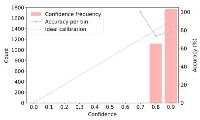

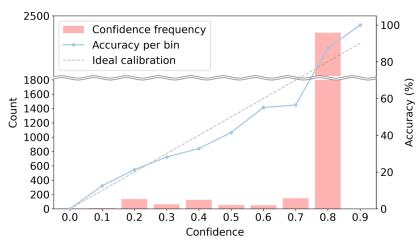

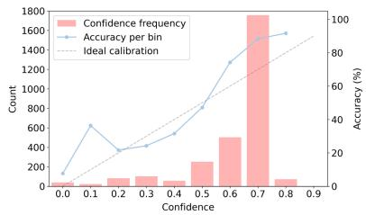

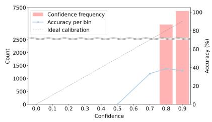  
(a) RLVR

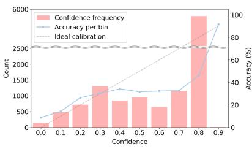  
(b) RLCR

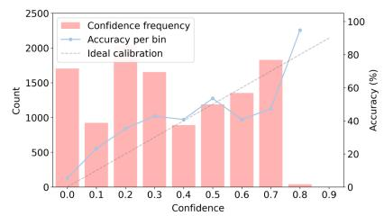  
(c) RL-ARC

Figure 7: Performance (solid lines) and confidence frequency (bars) across confidence bins for Qwen2.5-7B trained with each method on ID (top) and OOD (bottom) benchmarks.  
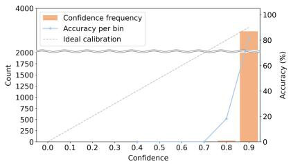

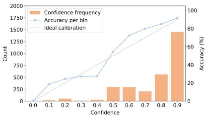

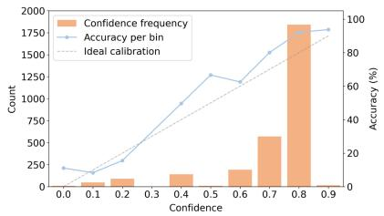

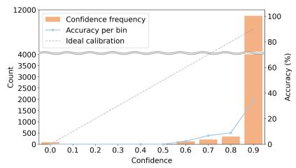  
(a) RLVR

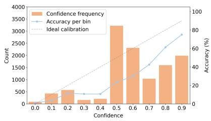  
(b) RLCR

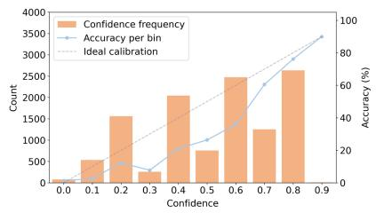  
(c) RL-ARC  
Figure 8: Performance (solid lines) and confidence frequency (bars) across confidence bins for Qwen3-8B trained with each method on ID (top) and OOD (bottom) benchmarks.

• Qwen2.5-7B (HotpotQA): The results on complex reasoning benchmarks are reported in Table 17; and the results on factual question answering benchmarks are reported in Table 18.

• Qwen3-8B: The results on math benchmarks are reported in Tables 12 and 13; the results on complex reasoning benchmarks are reported in Table 19; and the results on factual question answering benchmarks are reported in Table 20.

• Llama-8B (DeepSeek-R1 Distilled): The results on math benchmarks are reported in Table 14; the results on complex reasoning benchmarks are reported in Table 21; and the results on factual question answering benchmarks are reported in Table 22.

## B.2 Confidence-aware Patterns

As shown in Figures 7 and 8, in ID settings, RL-ARC shows confidence allocation patterns comparable to RLCR, indicating that both calibrationaware methods can improve confidence behavior over standard RLVR. However, the advantage of RL-ARC becomes more pronounced under OOD settings. While RLVR and RLCR still concentrate many predictions in high-confidence regions, RL-ARC distributes predictions over a broader range of confidence levels and assigns low or mid confidence to uncertain predictions. This suggests that incorporating reasoning confidence helps preserve confidence-aware behavior under distribution shift.

<table><tr><td rowspan="2">Method</td><td colspan="2">ID (Avg.)</td><td colspan="2">OOD (Avg.)</td></tr><tr><td>Brier (↓)</td><td>ECE (↓)</td><td>Brier (↓)</td><td>ECE (↓)</td></tr><tr><td>RLVR</td><td>0.41</td><td>0.40</td><td>0.50</td><td>0.50</td></tr><tr><td>RLCR</td><td>0.25</td><td>0.22</td><td>0.28</td><td>0.20</td></tr><tr><td>RL-ARC (shuffled)</td><td>0.25</td><td>0.19</td><td>0.27</td><td>0.19</td></tr><tr><td>RL-ARC</td><td>0.23</td><td>0.18</td><td>0.26</td><td>0.16</td></tr></table>

Table 7: Control experiment results on the calibration gains of RL-ARC across ID and OOD benchmarks.

## B.3 Additional Analysis of Calibration Gains

Since lower calibration error can result either from better confidence-accuracy alignment within each confidence bin or simply from a flatter confidence distribution, we analyze whether models trained with RL-ARC achieve improved calibration within individual confidence bins. To disentangle confidence-accuracy alignment from changes in the confidence distribution, we conduct a control experiment in which RL-ARC’s confidence scores were randomly shuffled across samples while preserving the exact confidence histogram and bin occupancy. As shown in Table 7, RL-ARC consistently achieves lower ECE and Brier than its shuffled counterpart on both ID and OOD benchmarks. These results demonstrate that the calibration gains cannot be attributed solely to a broader or flatter confidence distribution.

## B.4 Quantitative Reliability

Since AURC primarily captures the quality of confidence-based ranking under selective prediction, we further analyze this tendency using AURC together with accuracy and ECE. As shown in Table 8, RL-ARC achieves the lowest AURC in both ID and OOD settings, indicating better selective prediction performance across diverse task types. Notably, compared with RLCR, we observe that RL-ARC further improves both AURC and ECE while maintaining competitive accuracy in ID settings and achieving the best accuracy in OOD settings. Overall, these results demonstrate that RL-ARC not only improves calibration and performance but also enhances the practical reliability of confidence-aware prediction.

<table><tr><td rowspan="2">Method</td><td colspan="3">ID (Avg.)</td><td colspan="2">OOD (Avg.)</td></tr><tr><td>Acc. (↑) AURC (↓) ECE (↓)|Acc. (↑)</td><td></td><td></td><td></td><td>) AURC (↓) ECE (↓)</td></tr><tr><td>RLVR</td><td>66.58</td><td>0.22</td><td>0.32</td><td>47.24</td><td>0.44 0.48</td></tr><tr><td>RLCR</td><td>65.98</td><td>0.20</td><td>0.16</td><td>50.99 0.35</td><td>0.22</td></tr><tr><td>RL-ARC</td><td>66.10</td><td>0.16</td><td>0.15</td><td>51.61 0.34</td><td>0.17</td></tr></table>

Table 8: Comparison of accuracy (%), AURC, and ECE under Math (ID) and OOD benchmarks.

## B.5 Performance Sensitivity to Reasoning Confidence Integration

Since leveraging reasoning confidence as an auxiliary signal is a key component of RL-ARC, we further analyze how effectively our integration strategy improves calibration while minimizing performance degradation compared with alternative strategies. Specifically, we compare our integration strategy with alternative integration strategies in terms of accuracy and calibration, including the arithmetic mean and geometric mean as representative weighted-sum and weighted-product approaches, respectively (He et al., 2025; Lee et al., 2026). As shown in Table 9, we observe that our strategy for integrating reasoning confidence, which employs distinct objectives depending on correctness, effectively improves calibration while mitigating the accuracy–calibration trade-off compared to alternative strategies. These results suggest that using reasoning confidence for reasoningguided regularization in correct cases while imposing an additional overconfidence penalty in incorrect cases is crucial for effectively mitigating the accuracy–calibration trade-off in RL-ARC.

## B.6 Performance Sensitivity to Auxiliary Signal Scales

We further analyze the sensitivity of RL-ARC’s performance to different auxiliary signal scales. As shown in Table 10, RL-ARC consistently achieves a better accuracy-calibration trade-off across a wide range of hyperparameter configurations. Moreover, we observe that the optimal hyperparameter configurations for effectively mitigating the accuracy–calibration trade-off are predominantly positive-dominant $( \mathrm { i . e . , ~ } \lambda _ { \mathrm { p o s } } / \lambda _ { \mathrm { n e g } } > 1 )$ , rather than balanced $( \mathrm { i . e . , ~ } \lambda _ { \mathrm { p o s } } / \lambda _ { \mathrm { n e g } } = 1 )$ or negativedominant $( \mathrm { i . e . , 0 } < \lambda _ { \mathrm { p o s } } / \lambda _ { \mathrm { n e g } } < 1 )$ . Notably, taken together with the results in Table 5, we observe that the positive-case regularizer primarily affects accuracy and AUROC, whereas the negative-case overconfidence penalty mainly improves calibration, particularly in the positive-dominant settings.

<table><tr><td rowspan="2">Method</td><td colspan="4">ID (Avg.)</td><td colspan="4">OOD (Avg.)</td></tr><tr><td>Acc.(↑)</td><td>AUROC (↑)</td><td>Brier (↓)</td><td> $\mathrm { E C E } \left( \downarrow \right)$ </td><td>Acc.(↑)</td><td>AUROC(↑)</td><td>Brier (↓)</td><td>ECE(↓)</td></tr><tr><td>RLVR</td><td>56.86</td><td>0.45</td><td>0.41</td><td>0.40</td><td>47.58</td><td>0.50</td><td>0.50</td><td>0.50</td></tr><tr><td>RL-ARC</td><td></td><td></td><td></td><td></td><td></td><td></td><td></td><td></td></tr><tr><td>w/ Arithmetic mean</td><td>53.42</td><td>0.58</td><td>0.27</td><td>0.24</td><td>48.61</td><td>0.54</td><td>0.31</td><td>0.25</td></tr><tr><td>w/ Geometric mean</td><td>54.04</td><td>0.58</td><td>0.26</td><td>0.25</td><td>47.65</td><td>0.53</td><td>0.30</td><td>0.23</td></tr><tr><td>w/ Ours</td><td>56.53</td><td>0.60</td><td>0.23</td><td>0.18</td><td>47.27</td><td>0.54</td><td>0.26</td><td>0.16</td></tr></table>

Table 9: Comparison of strategies for integrating reasoning confidence into calibration-aware training on Math (ID) and OOD benchmarks.

<table><tr><td colspan="2">Setting</td><td colspan="4">ID (Avg.)</td><td colspan="4">OOD  $\left( \operatorname { A v g } . \right)$ </td></tr><tr><td> $\lambda _ { \mathrm { n { e g } } }$ </td><td> $\lambda _ { \mathrm { p o s } }$ </td><td>Acc.(↑)</td><td>AUROC (↑)</td><td>Brier (↓)</td><td>ECE(↓)</td><td>Acc.(↑)</td><td>AUROC (↑)</td><td>Brier (↓)</td><td>ECE (↓)</td></tr><tr><td>0.00</td><td>0.00</td><td>54.82</td><td>0.58</td><td>0.25</td><td>0.22</td><td>46.02</td><td>0.54</td><td>0.28</td><td>0.20</td></tr><tr><td>0.08</td><td>0.20</td><td>55.92</td><td>0.61</td><td>0.24</td><td>0.20</td><td>46.41</td><td>0.55</td><td>0.28</td><td>0.19</td></tr><tr><td>0.10</td><td>0.30</td><td>54.11</td><td>0.64</td><td>0.24</td><td>0.21</td><td>46.85</td><td>0.54</td><td>0.28</td><td>0.20</td></tr><tr><td>0.15</td><td>0.40</td><td>56.53</td><td>0.60</td><td>0.23</td><td>0.18</td><td>47.27</td><td>0.54</td><td>0.26</td><td>0.16</td></tr><tr><td>0.20</td><td>0.60</td><td>57.64</td><td>0.65</td><td>0.23</td><td>0.19</td><td>47.08</td><td>0.56</td><td>0.27</td><td>0.17</td></tr><tr><td>0.20</td><td>0.20</td><td>54.30</td><td>0.62</td><td>0.25</td><td>0.20</td><td>47.41</td><td>0.54</td><td>0.26</td><td>0.16</td></tr><tr><td>0.60</td><td>0.08</td><td>55.97</td><td>0.65</td><td>0.24</td><td>0.20</td><td>46.83</td><td>0.54</td><td>0.28</td><td>0.19</td></tr></table>

Table 10: Detailed evaluation results of auxiliary signal scaling for RL-ARC across ID and OOD benchmarks. The best results are highlighted in boldface.

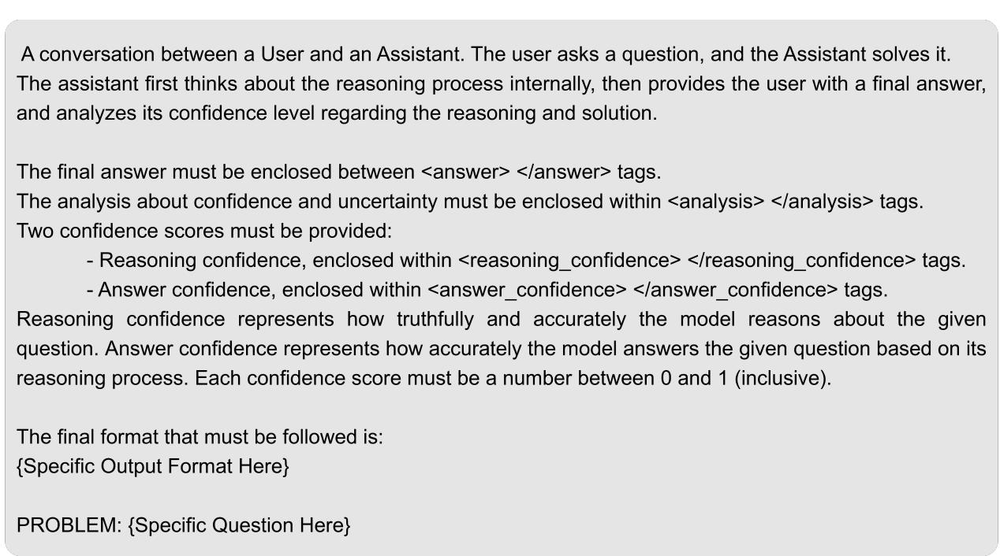  
Figure 9: The designed prompt used to estimate verbalized confidence during reasoning.

<table><tr><td>Benchmark</td><td>Method</td><td>Acc.(↑)</td><td>AUROC(↑)</td><td>Brier (↓)</td><td>ECE (↓)</td></tr><tr><td rowspan="8">Big-Math</td><td>Base</td><td>0.50</td><td>0.55</td><td>0.46</td><td>0.46</td></tr><tr><td>RLVR</td><td></td><td></td><td></td><td></td></tr><tr><td>w/ Confidence</td><td>0.67</td><td>0.51</td><td>0.32</td><td>0.32</td></tr><tr><td>w/ Probability</td><td>0.67</td><td>0.61</td><td>0.31</td><td>0.31</td></tr><tr><td>w/ Post-hoc</td><td>0.67</td><td>0.73</td><td>0.21</td><td>0.08</td></tr><tr><td>Behavioral Calibration</td><td>0.67</td><td>0.50</td><td>0.22</td><td>0.03</td></tr><tr><td>RLCR</td><td>0.66</td><td>0.59</td><td>0.22</td><td>0.03</td></tr><tr><td>RL-ARC (ours)</td><td>0.67</td><td>0.60</td><td>0.21</td><td>0.06</td></tr><tr><td rowspan="7">GSM8K</td><td>Base RLVR</td><td>0.73</td><td>0.52</td><td>0.25</td><td>0.22</td></tr><tr><td>w/ Confidence</td><td>0.88</td><td>0.48</td><td>0.12</td><td>0.10</td></tr><tr><td>w/ Probability</td><td>0.88</td><td>0.56</td><td>0.11</td><td>0.10</td></tr><tr><td>w/ Post-hoc</td><td>0.88</td><td>0.66</td><td>0.16</td><td>0.20</td></tr><tr><td>Behavioral Calibration</td><td>0.89</td><td>0.48</td><td>0.14</td><td>0.20</td></tr><tr><td>RLCR</td><td>0.90</td><td>0.64</td><td>0.15</td><td>0.24</td></tr><tr><td>RL-ARC (ours)</td><td>0.89</td><td>0.57</td><td>0.16</td><td>0.25</td></tr><tr><td rowspan="8">MATH-500</td><td>Base</td><td>0.45</td><td>0.58</td><td>0.50</td><td>0.51</td></tr><tr><td>RLVR</td><td></td><td></td><td></td><td></td></tr><tr><td>w/ Confidence</td><td>0.64</td><td>0.49</td><td>0.35</td><td>0.35</td></tr><tr><td>w/ Probability</td><td>0.64</td><td>0.62</td><td>0.34</td><td>0.34</td></tr><tr><td>w/ Post-hoc</td><td>0.64</td><td>0.73</td><td>0.20</td><td>0.12</td></tr><tr><td>Behavioral Calibration</td><td>0.55</td><td>0.50</td><td>0.27</td><td>0.15</td></tr><tr><td>RLCR</td><td>0.57</td><td>0.52</td><td>0.26</td><td>0.10</td></tr><tr><td>RL-ARC (ours)</td><td>0.58</td><td>0.57</td><td>0.24</td><td>0.06</td></tr><tr><td rowspan="8">AMC23</td><td>Base</td><td>0.35</td><td>0.49</td><td>0.60</td><td>0.61</td></tr><tr><td>RLVR w/ Confidence</td><td></td><td></td><td></td><td></td></tr><tr><td>w/ Probability</td><td>0.55 0.55</td><td>0.43 0.57</td><td>0.37 0.43</td><td>0.36 0.43</td></tr><tr><td>w/ Post-hoc</td><td>0.55</td><td>0.79</td><td>0.25</td><td>0.13</td></tr><tr><td>Behavioral Calibration</td><td>0.53</td><td>0.50</td><td>0.28</td><td>0.17</td></tr><tr><td>RLCR</td><td>0.55</td><td>0.62</td><td>0.25</td><td>0.13</td></tr><tr><td>RL-ARC (ours)</td><td>0.55</td><td>0.63</td><td>0.24</td><td>0.10</td></tr><tr><td></td><td></td><td></td><td></td><td></td></tr><tr><td rowspan="8">AIME24</td><td>Base RLVR</td><td>0.03</td><td>0.78</td><td>0.89</td><td>0.93</td></tr><tr><td>w/ Confidence</td><td>0.10</td><td>0.35</td><td>0.89</td><td>0.89</td></tr><tr><td>w/ Probability</td><td>0.10</td><td>0.64</td><td>0.84</td><td>0.86</td></tr><tr><td>w/ Post-hoc</td><td>0.10</td><td>0.68</td><td>0.37</td><td>0.51</td></tr><tr><td>Behavioral Calibration</td><td>0.10</td><td>0.52</td><td>0.45</td><td>0.60</td></tr><tr><td>RLCR</td><td>0.07</td><td>0.54</td><td>0.39</td><td>0.57</td></tr><tr><td></td><td></td><td></td><td></td><td></td></tr><tr><td>RL-ARC (ours)</td><td>0.13</td><td>0.64</td><td>0.32</td><td>0.45</td></tr><tr><td rowspan="9">Big-Math</td><td>Base</td><td>0.73</td><td>0.52</td><td>0.24</td><td>0.23</td></tr><tr><td>RLVR</td><td></td><td></td><td></td><td></td></tr><tr><td>w/ Confidence</td><td>0.78</td><td>0.67</td><td>0.21</td><td>0.21</td></tr><tr><td>w/ Probability</td><td>0.78</td><td>0.71</td><td>0.22</td><td>0.22</td></tr><tr><td>w/ Post-hoc</td><td>0.78</td><td>0.79</td><td>0.16</td><td>0.13</td></tr><tr><td>Behavioral Calibration</td><td>0.78</td><td>0.67</td><td>0.15</td><td>0.08</td></tr><tr><td>RLCR</td><td>0.77</td><td>0.78</td><td>0.14</td><td>0.03</td></tr><tr><td>RL-ARC (ours)</td><td>0.77</td><td>0.79</td><td>0.13</td><td>0.03</td></tr><tr><td>Base</td><td>0.90</td><td>0.56</td><td>0.09</td><td>0.06</td></tr><tr><td rowspan="7">GSM8K</td><td>RLVR</td><td></td><td></td><td></td><td></td></tr><tr><td>w/ Confidence</td><td>0.92</td><td>0.62</td><td>0.08</td><td>0.08</td></tr><tr><td>w/ Probability</td><td>0.92</td><td>0.64</td><td>0.08</td><td>0.08</td></tr><tr><td>w/ Post-hoc</td><td>0.92</td><td>0.76</td><td>0.12</td><td>0.22</td></tr><tr><td>Behavioral Calibration</td><td>0.93</td><td>0.62</td><td>0.06</td><td>0.04</td></tr><tr><td>RLCR</td><td>0.92</td><td>0.68</td><td>0.07</td><td>0.07</td></tr><tr><td>RL-ARC (ours)</td><td>0.94</td><td>0.74</td><td>0.06</td><td>0.03</td></tr><tr><td rowspan="7">MATH-500</td><td>Base</td><td>0.64</td><td>0.53</td><td>0.35</td><td>0.35</td></tr><tr><td>RLVR</td><td></td><td></td><td></td><td></td></tr><tr><td>w/ Confidence</td><td>0.63</td><td>0.63</td><td>0.36</td><td>0.36</td></tr><tr><td>w/ Probability</td><td>0.63</td><td>0.74</td><td>0.35</td><td>0.35</td></tr><tr><td>w/ Post-hoc</td><td>0.63</td><td>0.78</td><td>0.23</td><td>0.23</td></tr><tr><td>Behavioral Calibration</td><td>0.66</td><td>0.56</td><td>0.23</td><td>0.18</td></tr><tr><td>RLCR RL-ARC (ours)</td><td>0.66 0.65</td><td>0.66 0.68</td><td>0.24 0.23</td><td>0.19 0.18</td></tr><tr><td rowspan="8">AMC23</td><td>Base</td><td>0.68</td><td>0.40</td><td>0.32</td><td>0.32</td></tr><tr><td>RLVR</td><td></td><td></td><td></td><td></td></tr><tr><td>w/ Confidence</td><td>0.90</td><td>0.57</td><td>0.10</td><td>0.09</td></tr><tr><td>w/ Probability</td><td>0.90</td><td>0.79</td><td>0.11</td><td>0.10</td></tr><tr><td>w/ Post-hoc</td><td>0.90</td><td>0.93</td><td>0.08</td><td>0.11</td></tr><tr><td>Behavioral Calibration</td><td>0.78</td><td>0.76</td><td>0.15</td><td>0.10</td></tr><tr><td>RLCR</td><td>0.88</td><td>0.87</td><td>0.09</td><td>0.10</td></tr><tr><td>RL-ARC (ours)</td><td>0.85</td><td>0.98</td><td>0.06</td><td>0.18</td></tr><tr><td rowspan="8">AIME24</td><td>Base</td><td>0.20</td><td>0.35</td><td>0.79</td><td>0.79</td></tr><tr><td>RLVR w/ Confidence</td><td>0.43</td><td>0.78</td><td></td><td></td></tr><tr><td>w/ Probability</td><td>0.43</td><td>0.93</td><td>0.49 0.38</td><td>0.52</td></tr><tr><td>w/ Post-hoc</td><td>0.43</td><td>0.78</td><td>0.26</td><td>0.44</td></tr><tr><td>Behavioral Calibration</td><td>0.47</td><td>0.83</td><td>0.23</td><td>0.24</td></tr><tr><td>RLCR</td><td>0.40</td><td>0.74</td><td>0.25</td><td>0.26</td></tr><tr><td>RL-ARC (ours)</td><td>0.43</td><td>0.91</td><td>0.16</td><td>0.27</td></tr><tr><td></td><td></td><td></td><td></td><td>0.23</td></tr><tr><td rowspan="8">AIME25</td><td>Base RLVR</td><td>0.20</td><td>0.68</td><td>0.73</td><td>0.76</td></tr><tr><td>w/ Confidence</td><td></td><td></td><td></td><td></td></tr><tr><td></td><td>0.33</td><td>0.71</td><td>0.62</td><td>0.64</td></tr><tr><td>w/ Probability</td><td>0.33</td><td>0.78</td><td>0.49</td><td>0.55</td></tr><tr><td>w/ Post-hoc</td><td>0.33</td><td>0.98</td><td>0.13</td><td>0.27</td></tr><tr><td>Behavioral Calibration</td><td>0.33</td><td>0.85</td><td>0.28</td><td>0.36</td></tr><tr><td>RLCR</td><td>0.33</td><td>0.85</td><td>0.24</td><td>0.29</td></tr><tr><td>RL-ARC (ours)</td><td>0.33</td><td>0.93</td><td>0.14</td><td>0.27</td></tr><tr><td rowspan="5">Big-Math</td><td>Base</td><td>0.29</td><td>0.61</td><td>0.65</td><td>0.67</td></tr><tr><td>RLVR</td><td>0.61</td><td>0.53</td><td>0.35</td><td>0.34</td></tr><tr><td>RLCR</td><td>0.58</td><td>0.76</td><td>0.22</td><td>0.14</td></tr><tr><td>RL-ARC (ours)</td><td>0.63</td><td>0.77</td><td>0.20</td><td>0.08</td></tr><tr><td>Base</td><td>0.38</td><td>0.55</td><td>0.60</td><td>0.60</td></tr><tr><td rowspan="4">GSM8K</td><td>RLVR</td><td>0.82</td><td>0.51</td><td>0.16</td><td>0.13</td></tr><tr><td>RLCR</td><td>0.81</td><td>0.74</td><td>0.14</td><td>0.06</td></tr><tr><td>RL-ARC (ours)</td><td>0.81</td><td>0.73</td><td>0.14</td><td>0.09</td></tr><tr><td>Base</td><td>0.28</td><td>0.58</td><td></td><td>0.70</td></tr><tr><td rowspan="4">MATH-500</td><td>RLVR</td><td>0.58</td><td>0.52</td><td>0.69 0.39</td><td>0.38</td></tr><tr><td>RLCR</td><td>0.53</td><td>0.72</td><td>0.27</td><td>0.23</td></tr><tr><td>RL-ARC (ours)</td><td>0.58</td><td>0.78</td><td>0.21</td><td>0.17</td></tr><tr><td></td><td></td><td></td><td></td><td></td></tr><tr><td rowspan="4">AMC23</td><td>Base</td><td>0.47</td><td>0.56</td><td>0.49</td><td>0.50</td></tr><tr><td>RLVR</td><td>0.70</td><td>0.43</td><td>0.28</td><td>0.25</td></tr><tr><td>RLCR</td><td>0.45</td><td>0.85</td><td>0.36</td><td>0.41</td></tr><tr><td>RL-ARC (ours)</td><td>0.65</td><td>0.91</td><td>0.27</td><td>0.29</td></tr><tr><td rowspan="4">AIME24</td><td>Base</td><td>0.23</td><td>0.75</td><td>0.66</td><td>0.69</td></tr><tr><td>RLVR</td><td>0.27</td><td>0.57</td><td>0.63</td><td>0.65</td></tr><tr><td>RLCR</td><td>0.23</td><td>0.96</td><td>0.47</td><td>0.58</td></tr><tr><td>RL-ARC (ours)</td><td>0.17</td><td>0.88</td><td>0.51</td><td>0.62</td></tr><tr><td rowspan="8">StrategyQA</td><td>Base</td><td>0.68</td><td>0.58</td><td>0.27</td><td>0.23</td></tr><tr><td>RLVR</td><td></td><td></td><td></td><td></td></tr><tr><td>w/ Confidence</td><td>0.70</td><td>0.48</td><td>0.29</td><td>0.29</td></tr><tr><td>w/ Probability</td><td>0.70</td><td>0.56</td><td>0.30</td><td>0.29</td></tr><tr><td>w/ Post-hoc</td><td>0.70</td><td>0.45</td><td>0.25</td><td>0.19</td></tr><tr><td>Behavioral Calibration</td><td>0.72</td><td>0.53</td><td>0.20</td><td>0.04</td></tr><tr><td>RLCR</td><td>0.68</td><td>0.49</td><td>0.24</td><td>0.09</td></tr><tr><td>RL-ARC (ours)</td><td>0.74</td><td>0.49</td><td>0.23</td><td>0.19</td></tr><tr><td rowspan="8">HotpotQA</td><td>Base</td><td>0.39</td><td>0.54</td><td>0.53</td><td>0.54</td></tr><tr><td>RLVR w/ Confidence</td><td></td><td></td><td></td><td></td></tr><tr><td>w/ Probability</td><td>0.47 0.47</td><td>0.50 0.62</td><td>0.53 0.49</td><td>0.53</td></tr><tr><td>w/ Post-hoc</td><td>0.47</td><td>0.48</td><td>0.30</td><td>0.50</td></tr><tr><td>Behavioral Calibration</td><td>0.49</td><td>0.52</td><td>0.27</td><td>0.18</td></tr><tr><td>RLCR</td><td>0.47</td><td>0.56</td><td>0.26</td><td>0.14</td></tr><tr><td>RL-ARC (ours)</td><td>0.48</td><td>0.60</td><td>0.24</td><td>0.15</td></tr><tr><td></td><td></td><td></td><td></td><td>0.06</td></tr><tr><td rowspan="8">GPQA</td><td>Base</td><td>0.37</td><td>0.54</td><td>0.51</td><td>0.52</td></tr><tr><td>RLVR</td><td></td><td></td><td></td><td></td></tr><tr><td>w/ Confidence</td><td>0.48</td><td>0.52</td><td>0.52</td><td>0.52</td></tr><tr><td>w/ Probability</td><td>0.48</td><td>0.45</td><td>0.51</td><td>0.48</td></tr><tr><td>w/ Post-hoc</td><td>0.48</td><td>0.52</td><td>0.27</td><td>0.12</td></tr><tr><td>Behavioral Calibration</td><td>0.42</td><td>0.50</td><td>0.31</td><td>0.25</td></tr><tr><td>RLCR</td><td>0.40</td><td>0.53</td><td>0.30</td><td>0.24</td></tr><tr><td>RL-ARC (ours)</td><td>0.38</td><td>0.53</td><td>0.27</td><td>0.17</td></tr><tr><td rowspan="8">SimpleQA</td><td>Base</td><td>0.13</td><td>0.50</td><td>0.78</td><td>0.81</td></tr><tr><td>RLVR</td><td></td><td></td><td></td><td></td></tr><tr><td>w/ Confidence</td><td>0.14</td><td>0.51</td><td>0.81</td><td>0.83</td></tr><tr><td>w/ Probability</td><td>0.14</td><td>0.46</td><td>0.79</td><td>0.81</td></tr><tr><td>w/ Post-hoc</td><td>0.14</td><td>0.47</td><td>0.50</td><td>0.60</td></tr><tr><td>Behavioral Calibration</td><td>0.12</td><td>0.50</td><td>0.44</td><td>0.58</td></tr><tr><td>RLCR</td><td>0.12</td><td>0.52</td><td>0.37</td><td>0.51</td></tr><tr><td>RL-ARC (ours)</td><td>0.13</td><td>0.45</td><td>0.32</td><td>0.43</td></tr><tr><td rowspan="8">NQ-Open</td><td>Base</td><td>0.47</td><td>0.51</td><td>0.48</td><td>0.48</td></tr><tr><td>RLVR w/ Confidence</td><td></td><td></td><td></td><td></td></tr><tr><td>w/ Probability</td><td>0.47 0.47</td><td>0.50 0.48</td><td>0.50 0.45</td><td>0.50</td></tr><tr><td>w/ Post-hoc</td><td>0.47</td><td>0.56</td><td></td><td>0.40</td></tr><tr><td></td><td></td><td></td><td>0.31</td><td>0.25</td></tr><tr><td>Behavioral Calibration</td><td>0.49</td><td>0.50</td><td>0.29</td><td>0.21</td></tr><tr><td>RLCR RL-ARC (ours)</td><td>0.49</td><td>0.54 0.56</td><td>0.27</td><td>0.14</td></tr><tr><td></td><td>0.49</td><td></td><td>0.26</td><td>0.09</td></tr><tr><td rowspan="8">TriviaQA</td><td>Base</td><td>0.57</td><td>0.52</td><td>0.39</td><td>0.38</td></tr><tr><td>RLVR</td><td></td><td></td><td></td><td></td></tr><tr><td>w/ Confidence</td><td>0.60</td><td>0.48</td><td>0.38</td><td>0.36</td></tr><tr><td>w/ Probability</td><td>0.60</td><td>0.50</td><td>0.37</td><td>0.36</td></tr><tr><td>w/ Post-hoc</td><td>0.60</td><td>0.58</td><td>0.25</td><td>0.10</td></tr><tr><td>Behavioral Calibration</td><td>0.58</td><td>0.50</td><td>0.26</td><td>0.12</td></tr><tr><td>RLCR</td><td>0.60</td><td>0.56</td><td>0.24</td><td>0.05</td></tr><tr><td>RL-ARC (ours)</td><td>0.61</td><td>0.60</td><td>0.23</td><td>0.04</td></tr><tr><td rowspan="4">GPQA</td><td>Base</td><td>0.37</td><td>0.54</td><td>0.51</td><td>0.52</td></tr><tr><td>RLVR</td><td>0.39</td><td>0.50</td><td>0.61</td><td>0.61</td></tr><tr><td>RLCR</td><td>0.40</td><td>0.54</td><td>0.29</td><td>0.22</td></tr><tr><td>RL-ARC (ours)</td><td>0.40</td><td>0.52</td><td>0.26</td><td>0.15</td></tr><tr><td rowspan="4">GSM8K</td><td>Base</td><td>0.73</td><td>0.52</td><td>0.25</td><td>0.22</td></tr><tr><td>RLVR</td><td>0.49</td><td>0.50</td><td>0.51</td><td>0.51</td></tr><tr><td>RLCR</td><td>0.66</td><td>0.57</td><td>0.22</td><td>0.08</td></tr><tr><td>RL-ARC (ours)</td><td>0.72</td><td>0.65</td><td>0.21</td><td>0.15</td></tr><tr><td rowspan="4">MATH-500</td><td>Base</td><td>0.45</td><td>0.58</td><td>0.50</td><td>0.51</td></tr><tr><td>RLVR</td><td>0.30</td><td>0.50</td><td>0.70</td><td>0.70</td></tr><tr><td>RLCR</td><td>0.33</td><td>0.55</td><td>0.30</td><td>0.28</td></tr><tr><td>RL-ARC (ours)</td><td>0.39</td><td>0.60</td><td>0.27</td><td>0.18</td></tr></table>

Table 11: Evaluation results for accuracy and calibration metrics on Math (ID) benchmarks. The best results are highlighted in boldface. Here, we use Qwen2.5-7B as base model.

Table 12: Evaluation results for accuracy and calibration metrics on Big-Math, GSM8K, and MATH-500 (ID) benchmarks. The best results are highlighted in boldface. We use Qwen3-8B as the base model.

Table 13: Evaluation results for accuracy and calibration metrics on AMC23, AIME24, and AIME25 (ID) benchmarks. The best results are highlighted in boldface. We use Qwen3-8B as the base model.

Table 14: Evaluation results for accuracy and calibration metrics on Math (ID) benchmarks. The best results are highlighted in boldface. Here, we use Llama-8B distilled from DeepSeek-R1 as the base model.

Table 15: Evaluation results for accuracy and calibration metrics on complex reasoning (OOD) benchmarks. The best results are highlighted in boldface. Here, we use Qwen2.5-7B as base model.

Table 16: Evaluation results for accuracy and calibration metrics on factual question answering (OOD) benchmarks. The best results are highlighted in boldface. Here, we use Qwen2.5-7B as base model.

Table 17: Evaluation results for accuracy and calibration metrics on complex reasoning (OOD) benchmarks. The best results are highlighted in boldface. Here, we use Qwen2.5-7B as the base model.

<table><tr><td>Benchmark</td><td>Method</td><td>Acc.(↑)</td><td>AUROC (↑)</td><td>Brier (↓)</td><td>ECE(↓)</td></tr><tr><td rowspan="4">SimpleQA</td><td>Base</td><td>0.13</td><td>0.50</td><td>0.78</td><td>0.81</td></tr><tr><td>RLVR</td><td>0.11</td><td>0.50</td><td>0.89</td><td>0.89</td></tr><tr><td>RLCR</td><td>0.12</td><td>0.54</td><td>0.33</td><td>0.45</td></tr><tr><td>RL-ARC (ours)</td><td>0.12</td><td>0.51</td><td>0.24</td><td>0.35</td></tr><tr><td rowspan="4">TriviaQA</td><td>Base</td><td>0.57</td><td>0.52</td><td>0.39</td><td>0.38</td></tr><tr><td>RLVR</td><td>0.60</td><td>0.50</td><td>0.40</td><td>0.40</td></tr><tr><td>RLCR</td><td>0.59</td><td>0.63</td><td>0.23</td><td>0.05</td></tr><tr><td>RL-ARC (ours)</td><td>0.59</td><td>0.59</td><td>0.24</td><td>0.07</td></tr><tr><td rowspan="4">NQ-Open</td><td>Base</td><td>0.47</td><td>0.51</td><td>0.48</td><td>0.48</td></tr><tr><td>RLVR</td><td>0.49</td><td>0.50</td><td>0.51</td><td>0.51</td></tr><tr><td>RLCR</td><td>0.51</td><td>0.57</td><td>0.26</td><td>0.13</td></tr><tr><td>RL-ARC (ours)</td><td>0.50</td><td>0.55</td><td>0.25</td><td>0.04</td></tr><tr><td rowspan="8">StrategyQA</td><td>Base</td><td>0.71</td><td>0.62</td><td>0.24</td><td>0.20</td></tr><tr><td>RLVR</td><td></td><td></td><td></td><td></td></tr><tr><td>w/ Confidence</td><td>0.70</td><td>0.56</td><td>0.27</td><td>0.26</td></tr><tr><td>w/ Probability</td><td>0.70</td><td>0.49</td><td>0.30</td><td>0.30</td></tr><tr><td>w/ Post-hoc</td><td>0.70</td><td>0.55</td><td>0.30</td><td>0.31</td></tr><tr><td>Behavioral Calibration</td><td>0.69</td><td>0.60</td><td>0.24</td><td>0.17</td></tr><tr><td>RLCR</td><td>0.72</td><td>0.70</td><td>0.19</td><td>0.04</td></tr><tr><td>RL-ARC (ours)</td><td>0.71</td><td>0.71</td><td>0.18</td><td>0.03</td></tr><tr><td rowspan="8">HotpotQA</td><td>Base</td><td>0.61</td><td>0.56</td><td>0.34</td><td>0.33</td></tr><tr><td>RLVR w/ Confidence</td><td></td><td></td><td></td><td></td></tr><tr><td>w/ Probability</td><td>0.62 0.62</td><td>0.54 0.59</td><td>0.38 0.38</td><td>0.38</td></tr><tr><td>w/ Post-hoc</td><td>0.62</td><td>0.55</td><td>0.27</td><td>0.38</td></tr><tr><td></td><td>0.61</td><td>0.53</td><td></td><td>0.18</td></tr><tr><td>Behavioral Calibration RLCR</td><td></td><td>0.56</td><td>0.31 0.30</td><td>0.28</td></tr><tr><td>RL-ARC (ours)</td><td>0.62 0.61</td><td>0.57</td><td>0.29</td><td>0.26</td></tr><tr><td></td><td></td><td></td><td></td><td>0.24</td></tr><tr><td rowspan="8">GPQA</td><td>Base</td><td>0.54</td><td>0.63</td><td>0.25</td><td>0.20</td></tr><tr><td>RLVR</td><td></td><td></td><td></td><td></td></tr><tr><td>w/ Confidence</td><td>0.53</td><td>0.52</td><td>0.42</td><td>0.42</td></tr><tr><td>w/ Probability</td><td>0.53</td><td>0.48</td><td>0.46</td><td>0.46</td></tr><tr><td>w/ Post-hoc</td><td>0.53</td><td>0.60</td><td>0.29</td><td>0.21</td></tr><tr><td>Behavioral Calibration</td><td>0.58</td><td>0.61</td><td>0.28</td><td>0.20</td></tr><tr><td>RLCR</td><td>0.51</td><td>0.63</td><td>0.25</td><td>0.12</td></tr><tr><td>RL-ARC (ours)</td><td>0.56</td><td>0.64</td><td>0.23</td><td>0.05</td></tr><tr><td rowspan="8">SimpleQA</td><td>Base</td><td>0.12</td><td>0.63</td><td>0.51</td><td>0.62</td></tr><tr><td>RLVR</td><td></td><td></td><td></td><td></td></tr><tr><td>w/ Confidence</td><td>0.10</td><td>0.53</td><td>0.78</td><td>0.83</td></tr><tr><td>w/ Probability</td><td>0.10</td><td>0.38</td><td>0.80</td><td>0.81</td></tr><tr><td>w/ Post-hoc</td><td>0.10</td><td>0.56</td><td>0.29</td><td>0.38</td></tr><tr><td>Behavioral Calibration</td><td>0.11</td><td>0.60</td><td>0.50</td><td>0.61</td></tr><tr><td>RLCR</td><td>0.11</td><td>0.60</td><td>0.33</td><td>0.46</td></tr><tr><td>RL-ARC (ours)</td><td>0.11</td><td>0.65</td><td>0.24</td><td>0.35</td></tr><tr><td rowspan="8">NQ-Open</td><td>Base</td><td>0.49</td><td>0.71</td><td>0.39</td><td>0.40</td></tr><tr><td>RLVR w/ Confidence</td><td></td><td></td><td></td><td></td></tr><tr><td>w/ Probability</td><td>0.33 0.33</td><td>0.57 0.49</td><td>0.60 0.41</td><td>0.61</td></tr><tr><td>w/ Post-hoc</td><td>0.33</td><td></td><td></td><td>0.40</td></tr><tr><td></td><td></td><td>0.52</td><td>0.30</td><td>0.21</td></tr><tr><td>Behavioral Calibration</td><td>0.50</td><td>0.64</td><td>0.35</td><td>0.34</td></tr><tr><td>RLCR RL-ARC (ours)</td><td>0.49</td><td>0.70</td><td>0.30</td><td>0.27</td></tr><tr><td></td><td>0.50</td><td>0.73</td><td>0.25</td><td>0.21</td></tr><tr><td rowspan="8">TriviaQA</td><td>Base</td><td>0.61</td><td>0.76</td><td>0.29</td><td>0.29</td></tr><tr><td>RLVR</td><td></td><td></td><td></td><td></td></tr><tr><td>w/ Confidence</td><td>0.55</td><td>0.61</td><td>0.40</td><td>0.40</td></tr><tr><td>w/ Probability</td><td>0.55</td><td>0.58</td><td>0.34</td><td>0.34</td></tr><tr><td>w/ Post-hoc</td><td>0.55</td><td>0.63</td><td>0.25</td><td>0.14</td></tr><tr><td>Behavioral Calibration</td><td>0.59</td><td>0.64</td><td>0.29</td><td>0.27</td></tr><tr><td>RLCR</td><td>0.61</td><td>0.78</td><td>0.22</td><td>0.18</td></tr><tr><td>RL-ARC (ours)</td><td>0.60</td><td>0.81</td><td>0.20</td><td>0.14</td></tr><tr><td rowspan="4">StrategyQA</td><td>Base</td><td>0.64</td><td>0.61</td><td>0.27</td><td>0.23</td></tr><tr><td>RLVR</td><td>0.64</td><td>0.50</td><td>0.32</td><td>0.29</td></tr><tr><td>RLCR</td><td>0.64</td><td>0.61</td><td>0.24</td><td>0.14</td></tr><tr><td>RL-ARC (ours)</td><td>0.65</td><td>0.59</td><td>0.24</td><td>0.12</td></tr><tr><td rowspan="4">HotpotQA</td><td>Base</td><td>0.47</td><td>0.55</td><td>0.49</td><td>0.50</td></tr><tr><td>RLVR</td><td>0.27</td><td>0.50</td><td>0.66</td><td>0.68</td></tr><tr><td>RLCR</td><td>0.38</td><td>0.63</td><td>0.38</td><td>0.39</td></tr><tr><td>RL-ARC (ours)</td><td>0.40</td><td>0.63</td><td>0.30</td><td>0.25</td></tr><tr><td rowspan="4">GPQA</td><td>Base</td><td>0.67</td><td>0.55</td><td>0.28</td><td>0.25</td></tr><tr><td>RLVR</td><td>0.56</td><td>0.55</td><td>0.38</td><td>0.37</td></tr><tr><td>RLCR</td><td>0.57</td><td>0.62</td><td>0.24</td><td>0.09</td></tr><tr><td>RL-ARC (ours)</td><td>0.58</td><td>0.60</td><td>0.25</td><td>0.09</td></tr></table>

Table 18: Evaluation results for accuracy and calibration metrics on factual knowledge (OOD) benchmarks. The best results are highlighted in boldface. Here, we use Qwen2.5-7B as the base model.

Table 19: Evaluation results for accuracy and calibration metrics on complex reasoning (OOD) benchmarks. The best results are highlighted in boldface. Here, we use Qwen3-8B as base model.

Table 20: Evaluation results for accuracy and calibration metrics on factual question answering (OOD) benchmarks. The best results are highlighted in boldface. Here, we use Qwen3-8B as base model.

Table 21: Evaluation results for accuracy and calibration metrics on complex reasoning (OOD) benchmarks. The best results are highlighted in boldface. Here, we use Llama-8B distilled from DeepSeek-R1 as the base model.

<table><tr><td>Benchmark</td><td>Method</td><td>Acc.(↑)</td><td>AUROC (↑)</td><td>Brier (↓)</td><td>ECE(↓)</td></tr><tr><td rowspan="4">SimpleQA</td><td>Base</td><td>0.10</td><td>0.57</td><td>0.65</td><td>0.75</td></tr><tr><td>RLVR</td><td>0.10</td><td>0.51</td><td>0.80</td><td>0.84</td></tr><tr><td>RLCR</td><td>0.12</td><td>0.62</td><td>0.37</td><td>0.52</td></tr><tr><td>RL-ARC (ours)</td><td>0.10</td><td>0.65</td><td>0.17</td><td>0.28</td></tr><tr><td rowspan="4">NQ-Open</td><td>Base</td><td>0.40</td><td>0.68</td><td>0.46</td><td>0.49</td></tr><tr><td>RLVR</td><td>0.41</td><td>0.51</td><td>0.53</td><td>0.54</td></tr><tr><td>RLCR</td><td>0.38</td><td>0.67</td><td>0.32</td><td>0.31</td></tr><tr><td>RL-ARC (ours)</td><td>0.40</td><td>0.67</td><td>0.22</td><td>0.12</td></tr><tr><td rowspan="4">TriviaQA</td><td>Base</td><td>0.48</td><td>0.71</td><td>0.41</td><td>0.43</td></tr><tr><td>RLVR</td><td>0.46</td><td>0.51</td><td>0.48</td><td>0.48</td></tr><tr><td>RLCR</td><td>0.45</td><td>0.70</td><td>0.28</td><td>0.23</td></tr><tr><td>RL-ARC (ours)</td><td>0.47</td><td>0.71</td><td>0.31</td><td>0.29</td></tr></table>

Table 22: Evaluation results for accuracy and calibration metrics on factual knowledge (OOD) benchmarks. The best results are highlighted in boldface. Here, we use Llama-8B distilled from DeepSeek-R1 as the base model.