# ROUTERINTERP: UNDERSTANDING SUPERPOSED SPECIALISATION IN MIXTURE OF EXPERTS ROUTING

Ilya Lasy Faculty of Informatics, TU Wien ilya.lasy@tuwien.ac.at

Nora Yinuo Cai Independent

Kola Ayonrinde UK AI Security Institute koayon@gmail.com

## ABSTRACT

Sparse Mixture of Experts (MoE) models scale more efficiently than dense models by routing tokens to modular expert networks that are only active for processing a fraction of tokens. A leading hypothesis for the performance of MoE models is that each expert specialises in a single, coherent domain. However, interpretability efforts that assume this hypothesis have generally been unsuccessful. We propose and present evidence for an alternative account that we call the Superposed Specialisation Hypothesis (SSH): experts specialise in a disjoint union of fine-grained features rather than one broad domain. Leveraging the SSH, we introduce Router-Interp, a method for interpreting expert routing that identifies Sparse Autoencoder features most predictive of routing decisions and produces unified natural language explanations. On gpt-oss-20b, RouterInterp explains expert routing with ∼65% higher detection accuracy than prior token statistics based methods. This work provides a scalable method for generating more accurate explanations of expert routing and increases our understanding of a previously uninterpretable component of foundation models.1

## 1 INTRODUCTION

Sparse Mixture-of-Experts (MoE) transformers have emerged as a promising approach for scaling frontier language models (Cai et al., 2025; Fedus et al., 2022b; Du et al., 2022). In dense (i.e. non-MoE) transformers (Radford et al., 2019), each input is processed by all the parameters. In contrast, MoE models contain multiple expert networks and a routing mechanism that selects a subset of these “experts” for each input token at each layer. Shazeer et al. (2017) and Liu et al. (2024) show that sparse MoE models can activate only 2–15% of parameters per input, enabling dramatic parameter scaling with minimal increases in inference cost and latency, leading to strong performance on a variety of tasks (Fedus et al., 2022a).

The strong performance of Sparse MoE models has often been attributed to expert specialisation (Lewis et al., 2021): if each expert learns to handle a subset of the input data distribution or perform only a subset of computations, then using only a subset of the parameters for each input can be both effective and efficient2. We call this explanation for the success of MoEs the Specialisation Hypothesis.

## The Specialisation Hypothesis

Sparse Mixture-of-Experts models work well because different experts specialise in different parts of the input data distribution or different types of computation, allowing each input to be processed by only a small subset of the model’s parameters.

One seemingly natural corollary of the Specialisation Hypothesis is that if each expert specialises in a particular domain then routing decisions should be human-interpretable. For example, perhaps one expert specialises in processing medical text and contributes medical knowledge and reasoning when the input is related to healthcare. Another expert might specialise in generating mathematics and yet another in storytelling or translating romance languages (Ayonrinde, 2023a). However, prior work analysing MoE models has struggled to recover clear, interpretable patterns of expert specialisation (Jiang et al., 2024; Lewis et al., 2021; Zoph et al., 2022). We believe that this difficulty derives from not distinguishing between two distinct forms of the Specialisation Hypothesis which we term the Domain Specialisation Hypothesis (DSH) and the Superposed Specialisation Hypothesis (SSH), respectively. The distinction between these hypotheses becomes apparent when we consider that real-world data contains far more fine-grained categories (e.g., specific topics, syntactic constructions, reasoning patterns) than any MoE layer has experts.3 This means multiple such categories, which we call micro-domains 4, must inevitably be routed to the same expert by the Pigeonhole Principle (Rebman, 1979). Under the Domain Specialisation Hypothesis, semantically similar micro-domains cluster within an expert, yielding a coherent domain that the expert specialises in. We may think of a domain as expressible as a cluster of similar micro-domains. In contrast, under the Superposed Specialisation Hypothesis, an expert specialises in a disjoint collection of features spanning multiple unrelated micro-domains. This mirrors the superposition phenomenon observed in neural networks, where multiple features are represented in the same set of neurons (Elhage et al., 2022).

Alternative Specialisation Hypotheses

Domain Specialisation Hypothesis: Sparse Mixture-of-Experts models work well because different experts specialise in different semantically coherent domains (e.g. medical text, mathematical reasoning, romance language translation).

Superposed Specialisation Hypothesis: Sparse Mixture-of-Experts models work well because different experts specialise in disjoint collections offeatures corresponding to multiple micro-domains that are not highly semantically related.

To test these hypotheses, we need a way to identify the fine-grained features that drive each expert’s activation. We use sparse autoencoders (SAEs) (Makhzani & Frey, 2014; Cunningham et al., 2024; Bricken et al., 2023) to decompose model activations into sparse latent representations (SAE latents), where each latent corresponds to an interpretable feature. These SAE latents serve as a feature-level proxy for the micro-domains in our hypotheses. We find that SAE latents predict which experts are selected far more accurately than token co-occurrence statistics or sparse linear probes, achieving a macro-F1 score of 0.73 in routing prediction for gpt-oss-20b (Appendix B).

Our experiments show that expert routing can only be explained in terms of multiple semantically disjoint micro-domains, rather than in terms of a single monosemantic domain (Section 3.3), which provides evidence for the SSH. We suggest that the reason for MoE models preferring superposed specialisation can be understood through superposition theory (Elhage et al., 2022; Adler & Shavit, 2024; Hänni et al., 2024; Marshall & Kirchner, 2024). Semantically distinct micro-domains coactivate less frequently and hence there is less interference noise when unrelated domains are co-located within the same expert, compared to if an expert specialised in a single domain.

Based on these findings, we develop RouterInterp, which interprets routing as arising from a combination of SAE features: it selects the latents most predictive of each expert’s routing, collects inputs where these features and the expert are jointly active, and explains the expert in natural language (Figure 3). To evaluate whether these explanations are human-understandable, we measure how accurately a language model can predict expert activation using the explanation (Section 4.2). On gpt-oss-20b, RouterInterp attains a 0.49 explanation score, outperforming explanations based on token-expert co-occurrence (0.30). Our method demonstrates that we can meaningfully understand MoE routing decisions even when experts specialise in disjoint collections of features.

Our contributions are as follows:

• We introduce the Superposed Specialisation Hypothesis (SSH): the idea that MoE experts specialise in disjoint, semantically heterogeneous collections of features rather than a single coherent domain (Section 3.1). We also give two theoretical arguments for why this holds in practice (Section 3.2).

• We provide empirical evidence for the SSH: for each expert, the SAE latents that best predict its activation are not semantically related to a single coherent domain (Section 3.3).

• We present RouterInterp, our SAE-based method, which produces accurate explanations of routing decisions, achieving a mean explanation score of 0.49 on gpt-oss-20b and 0.60 on OLMoE-1B-7B (Section 4).

## 2 BACKGROUND

## 2.1 SPARSE AUTOENCODERS (SAE)

A fundamental challenge in interpreting LLM activations is superposition: models encode more features than available dimensions, resulting in polysemantic neurons that activate for multiple unrelated concepts (Elhage et al., 2022). Sparse Autoencoders (SAEs) address this by mapping an activation vector $\pmb { x } \in \mathbb { R } ^ { \tilde { N } }$ to a sparse latent representation $z \in \mathbb { R } ^ { F }$ (where $F > { \dot { N } } )$ . Ideally, z represents a “disentangling” of compressed representations into monosemantic, single-concept latents referred to asfeatures (Bricken et al., 2023; Cunningham et al., 2024).

The SAE architecture consists of an encoder that projects activations into a sparse latent space, and a decoder that reconstructs the original activation from the sparse latents:

$$
\begin{array} { r } { z = \sigma ( W _ { \mathrm { e n c } } ( x - b _ { \mathrm { p r e } } ) + b _ { \mathrm { e n c } } ) } \\ { \hat { \mathbf { x } } = W _ { \mathrm { d e c } } z + b _ { \mathrm { p r e } } } \end{array}
$$

where $\boldsymbol { W } _ { \mathrm { e n c } } \in \mathbb { R } ^ { F \times N } , \boldsymbol { W } _ { \mathrm { d e c } } \in \mathbb { R } ^ { N \times F } .$ , and σ is a sparsifying activation function. We follow Gao et al. (2025)’s Top-K SAE approach, where $\sigma = \mathrm { T o p K } ( \cdot , s )$ retains only the s largest activations per input and zeros out the rest, ensuring that the latent is sparse5. The SAE is trained to optimise reconstruction fidelity $\mathcal { L } = \Vert \pmb { x } - \hat { \pmb { x } } \Vert _ { 2 } ^ { 2 }$ , ensuring that the original activation can be accurately reconstructed from the sparse latent representation z.

## 2.2 MIXTURE OF EXPERTS (MOE)

In a standard MoE layer, the dense feed-forward network (FFN) is replaced by E parallel expert networks $\{ E _ { i } \} _ { i = 1 } ^ { E }$ , each typically an FFN itself. A learned router network $( W _ { r } )$ determines which experts process each token. Given an input token representation x, the router computes routing logit $h ( { \pmb x } ) = \pmb W _ { r } \cdot { \pmb x }$ and converts them to a probability distribution over experts via softmax:

$$
g _ { i } ( \pmb { x } ) = \frac { \exp ( h ( \pmb { x } ) _ { i } ) } { \sum _ { j = 1 } ^ { E } \exp ( h ( \pmb { x } ) _ { j } ) }
$$

To enforce sparsity, only the top-k experts with the highest probabilities are selected. Letting T denote the set of selected expert indices, the layer output is computed as the weighted sum of expert outputs:

$$
{ \pmb y } = \sum _ { i \in \mathcal { T } } g _ { i } ( { \pmb x } ) \cdot E _ { i } ( { \pmb x } )
$$

A key challenge in MoE training is load balancing: without intervention, models tend to collapse to using only a few experts, leaving others undertrained (Shazeer et al., 2017). Load balancing is typically addressed through auxiliary losses that encourage uniform expert utilisation (Fedus et al., 2022a).

## 3 SPECIALISATION HYPOTHESES

In Section 1, we introduced hypotheses to explain why MoE models are so effective (Figure 1): the Domain Specialisation Hypothesis (DSH) and the Superposed Specialisation Hypothesis (SSH).

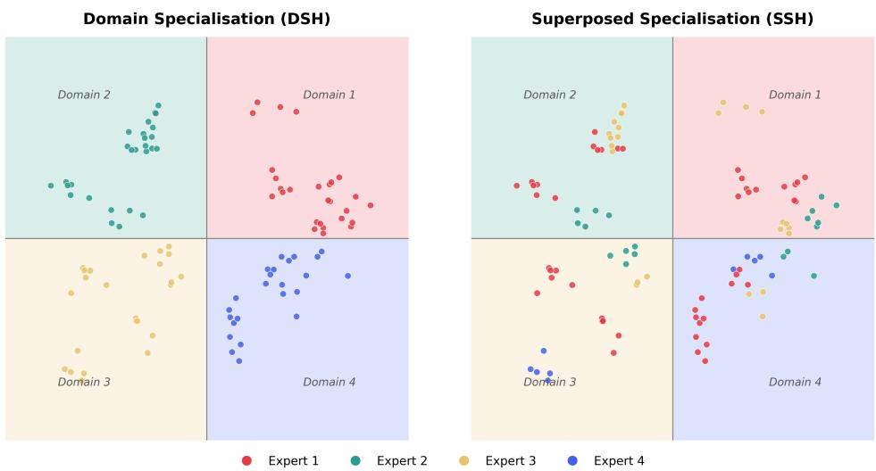  
Figure 1. Illustration of two alternative hypotheses for the expert specialisation in MoE models. Left: Under the Domain Specialisation Hypothesis, examples (points) from the same semantic domain (coloured region) are routed to the same expert, so each expert specialises in a single coherent domain. Right: Under the Superposed Specialisation Hypothesis, examples routed to the same expert are scattered across different domains. Here the clusters of adjacent points routed to the same expert represent micro-domains (fine-grained features of a particular domain) and each expert specialises in a disjoint union of them. We suggest that the SSH is a more accurate description of expert specialisation in practice.

These hypotheses can be understood as claims about whether expert routing is monosemantic (can be explained by a single concept or domain) or polysemantic (can only be explained by a collection of multiple concepts or domains which are relevant in different contexts). The idea of superposition is inspired by Elhage et al. (2022), who describe a theory of the superposition of neurons.6 We extend this idea to the superposition of experts, arguing that each expert may be specialised in a disjoint collection of domains.

In this section, we formalise the two hypotheses (DSH and SSH), state their predictions, give theoretical motivations for why SSH might hold in practice, and present experiments that distinguish the two hypotheses.

## 3.1 ALTERNATIVE SPECIALISATION HYPOTHESES

Suppose that we have an MoE layer with E experts. Suppose also that we have a set of D microdomains occurring in a corpus C, denoted $\mathcal { D } = \mathbf { \bar { \{ d _ { 1 } , ~ . ~ . ~ . ~ , ~ \bar { d } } _ { D } \} }$ . Here, the domains could be topics, genres, or other semantic or syntactic categories in the data or could alternatively represent sections of the input space that require the same processing for the next layer of the model.

Firstly, note that when $D = E ( { \mathrm { i . e . } }$ ., when there are the same number of micro-domains as experts), then we should expect each expert to specialise in a single micro-domain. This is consistent with both the DSH and SSH. Secondly, when $D < E { \mathrm { ( i . e . } }$ , when there are fewer micro-domains than experts), then we should expect multiple experts to specialise in the same micro-domain or for there to be redundant experts which are never routed to. This is also consistent with both the DSH and SSH.

However, in the more interesting and realistic case of $D > E$ , the two hypotheses make different predictions. Multiple micro-domains must be routed to the same expert and so the question is whether each expert specialises in multiple similar micro-domains (as the DSH would imply) or in multiple dissimilar micro-domains (in accordance with the SSH).

• Domain Specialisation Hypothesis (DSH): Under the DSH, similar micro-domains are routed to the same expert and so an expert specialises in a semantically coherent domain consisting of multiple adjacent micro-domains. Prediction: Expert specialisation can be readily explained in terms of a single (monosemantic) concept or domain.

• Superposed Specialisation Hypothesis (SSH): Under the SSH, dissimilar micro-domains are routed to the same expert and so an expert specialises in a collection of semantically disjoint domains. Prediction: Expert specialisation can only be explained in terms of multiple (polysemantic) concepts or domains.

## 3.2 MOTIVATION FOR SUPERPOSED SPECIALISATION

There are two core arguments for why we might expect the Superposed Specialisation Hypothesis to be a more accurate description of expert specialisation.

Argument 1 — Interference Minimisation. Elhage et al. (2022) argue that superposition is an effective strategy for neural networks because two sparse features that are not frequently co-activated can relatively unambiguously share the same set of neurons. Sparsity, and in particular, low coactivation, reduces the interference cost of superposition and so allows the model to represent more features than the number of available neurons. They find that correlated features tend to be represented orthogonally because otherwise this would lead to high levels of interference noise that would make it difficult for the model to disentangle and use these features.

Analogously, we argue that the router is incentivised to assign dissimilar domains to the same expert so that the expert can perform Computation in Superposition (Hänni et al., 2024; Linsefors & Bushnaq, 2025a;b; Newgas, 2025). In other words, a single expert can have multiple disjoint transforms that it applies depending on the input domain.

Argument 2 — Load Balancing. In MoE training, it is common to include a load-balancing loss that encourages the expert router to distribute the incoming tokens evenly across all experts to avoid the under-utilisation of some experts (Shazeer et al., 2017; Fedus et al., 2022a). If models are additionally trained with relatively small batch sizes,7 then this can have the unintended effect of encouraging the expert router to route dissimilar inputs to the same expert. We can see this because a single sequence is likely to contain mainly tokens that are from the same macro-domain. Hence, if the batch size is small, then the batch will not contain very many different macro-domains; however, the load-balancing loss will encourage the router to distribute tokens from these few macro-domains across all of the experts. This necessarily requires that some tokens from the same macro-domain will be routed to different experts—in opposition to the DSH, where we would expect all tokens from the same macro-domain to be routed to the same expert.

## 3.3 EMPIRICAL EVIDENCE FOR SUPERPOSED SPECIALISATION

If the SSH is true, then we should expect that each expert can be activated by a range of disparate features and hence that it is generally not possible to explain an expert’s routing behaviour in terms of a single coherent domain. We test this by treating each expert’s top-n most predictive SAE latents $\mathbb { F } _ { i }$ (defined in Section 4.1) as proxies for the micro-domains routed to $E _ { i }$ and asking whether those micro-domains are mutually similar (as predicted by the DSH) or mutually dissimilar (as predicted by the SSH).

Per-expert micro-domain similarity. Let sim $( f _ { j } , f _ { k } )$ be a similarity measure between two latents, which represent two micro-domains. The hypotheses translate directly into predictions about how the latents in $\mathbb { F } _ { i }$ behave under sim: under the DSH the n latents in $\mathbb { F } _ { i }$ are mutually similar, and under the SSH they are mutually dissimilar.

To quantify the semantic diversity within $E _ { i }$ , we define $G ( E _ { i } )$ as the number of semantically distinct clusters that $E _ { i } { ' } s$ top-n latents fall into. We then generate a natural-language explanation of each latent from its most activating examples and compute a clustering of these explanations.8 $G ( E _ { i } )$

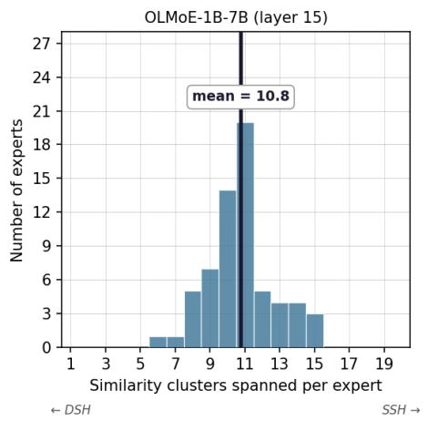

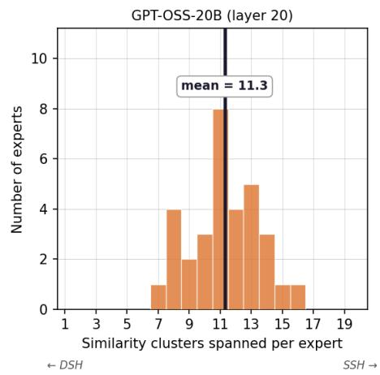  
Figure 2. Each expert covers a semantically diverse range of micro-domains: the latents that best predict its activation are spread across many distinct semantic clusters. For each expert we take its top n=20 predictive SAE latents F and cluster them semantically by their explanations. The DSH predicts one shared cluster; the SSH predicts a separate cluster per latent. We observe that experts’ latents are grouped into far more than one cluster: 10.8 clusters on average for OLMoE-1B-7B (layer 15) and 11.3 for gpt-oss-20b (layer 20).

is the number of distinct clusters occupied by expert $E _ { i } { ' } s$ n latents. The DSH and SSH make opposite predictions for $G ( E _ { i } )$ : the DSH predicts $G \bar { ( E _ { i } ) } \mathrm { = } 1$ (all of $E _ { i } { ^ \mathrm { { ' } } } s$ latents fall in a single cluster, representing one coherent micro-domain), whereas the SSH predicts $G ( E _ { i } ) {  } n ^ { 9 }$ (latents tend to occupy distinct clusters, each representing a semantically distinct micro-domain).

Figure 2 shows the distribution of $G ( E _ { i } )$ across experts at the deepest tested layer of each model. The empirical G values are far from the value of 1 predicted by the DSH in both models: mean G is 11.3 on gpt-oss-20b (layer 20) and 10.8 on OLMoE-1B-7B (layer 15), out of an upper bound of $n { = } 2 0$ The observed values lie far above the DSH prediction of $G { = } 1$ , yet slightly below the random10 cluster assignment. This suggests that experts retain some thematic coherence (their predictive latents are more related than arbitrary collections) while still spanning many disjoint micro-domains. We take this as evidence for the SSH over the DSH.

We also find that routing-prediction F1 generally degrades as fewer SAE features are kept active per token (Appendix F), and that routing across Pile subsets stays near corpus-proportional (Appendix D), suggesting that routing depends on many features jointly rather than on any single domain-level signal.

## 4 ROUTERINTERP

In Section 3, we provided evidence that expert routing is well described by the SSH. Based on this insight, we propose RouterInterp, our method for generating natural language explanations of expert routing using SAE features associated with each expert.

## 4.1 METHOD

RouterInterp operates in three stages (Figure 3): (1) identifying the SAE features most relevant to each expert’s routing behaviour, (2) collecting examples where each selected feature and the expert are active together, and (3) explaining the expert with a language model prompted on these activations.

Identifying Features. We select the SAE features most useful for each expert by approximating the effect of ablating each feature on whether the expert is selected (Section C.1).

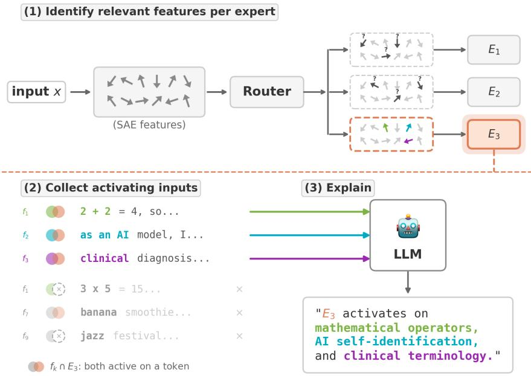  
Figure 3. RouterInterp explains routing decisions as a combination of interpretable features. Sparse autoencoder (SAE) latents, sparse feature representations extracted from model activations, pick out directions in activation space that correspond to interpretable features. RouterInterp identifies SAE latents that are most predictive of routing, collects inputs where these features and the expert are jointly active, and explains the expert in natural language. While no single monosemantic concept captures an expert’s behaviour, aggregating multiple features makes routing understandable.

For each expert $E _ { i } ,$ , we take the top-n features by this approximated ablation effect, denoting this set $\mathbb { F } _ { i } { \mathrm { : } }$ each feature is assigned to at most one expert so that the selected sets isolate the routing signals that distinguish experts from one another. 11.

Collecting Activations. For each selected feature $f \in \mathbb { F } _ { i }$ of expert $E _ { i } .$ , we collect context windows centred on tokens where f is active and form two sets: the positive set $\mathcal { P } _ { i , f } ,$ where f is active and the token is routed to $E _ { i } ,$ and the negative set $\mathcal { N } _ { i , f }$ , where f is active but the token is not routed to $E _ { i }$

Explaining. Given the feature set $\mathbb { F } _ { i }$ and the associated example sets $\{ ( \mathcal { P } _ { i , f } , \mathcal { N } _ { i , f } ) \} _ { f \in \mathbb { F } _ { i } }$ , we prompt a language model (the explainer) with these examples grouped by feature: for each $f \in \mathbb { F } _ { i } ,$ the explainer sees both $\mathcal { P } _ { i , f }$ and $\mathcal { N } _ { i , f }$ , ranked by feature activation strength, with activating tokens highlighted. This positive–negative contrast within each group isolates the routing-relevant context. It helps the explainer identify what makes the expert active given the feature. We ask the explainer to synthesise these groups into a single prose description of when expert $E _ { i }$ is selected, merging overlapping patterns across features while keeping genuinely distinct activation cases separate. Prompts are provided in Appendix J.

## 4.2 EVALUATION

Scoring. To evaluate whether our expert explanations accurately capture routing behaviour, we adapt the AutoInterp Detection scoring setup from Paulo et al. (2025). In AutoInterp, another language model (the scorer) uses the explanation to predict expert activation on held-out examples. We design an analogous scoring approach for expert routing to show that not only can we mathematically describe routing behaviour but also that we can do so in natural language explanations that are human-interpretable.

For each expert $E _ { i }$ , we build a held-out evaluation set of context windows. Positive windows contain at least one token routed to $E _ { i } ;$ negative windows are sampled uniformly from windows in which $E _ { i }$ is never selected. We present the scorer with the expert explanation and each window, highlighting the tokens routed to $E _ { i }$ on positives and randomly chosen tokens on negatives. The number of highlights for each negative window is sampled from the empirical distribution of highlight counts on positives. The scorer judges whether at least one highlighted token, in its surrounding context, matches the explanation. We threshold these judgments to a binary prediction and compare against the ground-truth routing label. We report F1 score of this binary classification task, measuring how well the explanation captures the expert’s routing behaviour. Scorer details are given in Appendix J. We also run a small-scale human evaluation to validate whether the LLM scorer is reliable: Appendix H shows that human–LLM agreement is comparable to human–human agreement, supporting its use as a proxy for human interpretability judgments.

Baselines. We compare RouterInterp against prior work on interpreting expert routing. Jiang et al. (2024); Zoph et al. (2022) analyse routing via token co-occurrence statistics. We formalise their approach as Unigram Lookup: for each expert $E _ { i }$ , we record the top-100 tokens that most frequently co-occur with its activation and predict positive if any highlighted token belongs to this set. For lookup methods, we do not use the scorer LLM and instead produce predictions directly from their frequency tables. We also compare against the expert-level automatic interpretability pipeline of Herbst et al. (2026), which we refer to as Expert Impact AutoInterp. Their approach prompts a language model to generate an expert explanation based on: (a) passages that contain tokens where the target expert $E _ { i }$ writes most strongly to the residual stream, sorted by $g _ { i } ( { \pmb x } ) \| E _ { i } ( { \pmb x } ) \| _ { 2 } ,$ and (b) top vocabulary tokens promoted by the expert at peak activation, recovered via Logit Lens (nostalgebraist, 2020).

Ablations. To understand which components contribute to RouterInterp’s improvement over baselines, we evaluate a series of ablations that progressively enrich the explainer’s context. Bigram Lookup extends Unigram Lookup with local token context (current and previous token). Unigram AutoInterp and Bigram AutoInterp use the same token statistics but prompt a language model to summarise the frequent (bi)grams into a natural language description. Expert Activations AutoInterp replaces n-gram summaries with full activating windows: for each expert $E _ { i }$ , we collect passages that contain tokens routed to $E _ { i }$ (ranked by router scores $g _ { i } ( { \pmb x } ) )$ and prompt a language model to generate an expert-level explanation from those contexts. This isolates the gain from providing the LLM with whole-passage context rather than local (bi)grams, still without SAE decomposition (RouterInterp) or impact-based ranking (Expert Impact AutoInterp). We report all prompts used for explanation generation in Appendix J.

## 4.3 EXPERIMENTAL SETUP

We evaluate on two MoE architectures: OLMoE-1B-7B (Muennighoff et al., 2025) and gpt-oss-20b (Agarwal et al., 2025). For training OLMoE SAEs, we use OLMoE-mix-0924 (Muennighoff et al., 2025). For routing analysis and explanation scoring, we collect activations using the Pile dataset (Gao et al., 2020). For OLMoE, we train Top-K SAEs on 100M tokens of activations sampled from layers 3, 7, 11, and 15 (out of OLMoE’s 16 layers), with per-token latent sparsity $s = 3 2$ and 32,768 features. For gpt-oss (24 layers), we use trained BatchTopK $\mathrm { S A E s } ^ { 1 2 } ( \mathrm { L i n } , 2 0 2 5 )$ on layers 4, 8, 12, 16, and 20, with 131,072 features and sparsity $s \in \{ 6 4 , 1 2 8 \}$ . We report SAE training metrics in Appendix G.

We generate RouterInterp explanations across layers using the top-45 features per expert selected by gradient-based attribution. We use the Delphi library (Paulo et al., 2025) for explanation generation and scoring, with Claude Sonnet 5 (Anthropic, 2026) as the explainer and GPT-5.6 Luna (OpenAI, 2026) as the scorer. The explanation score is computed over all experts per layer, with 15 positive and 85 negative examples per expert, so that the positive rate (15%) approximates the fraction of tokens any single expert receives in the model $( k / E \tilde { \approx } 1 2 . 5 \%$ for gpt-oss with $k { = } 4 , E { = } 3 2$ and for OLMoE with $k { = } 8 , E { = } 6 4 )$

## 4.4 RESULTS

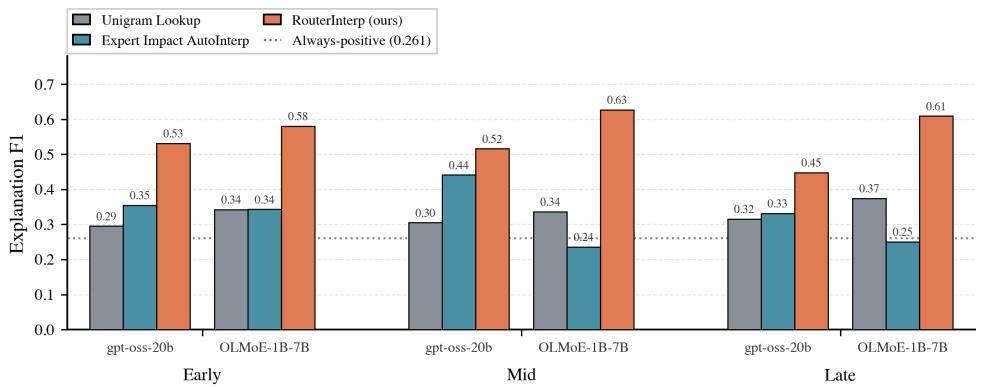  
Figure 4. Leveraging the SSH, RouterInterp generates expert explanations from examples where SAE features and experts are jointly active. It outperforms both a method based on token-statistics (Jiang et al., 2024; Zoph et al., 2022) and Expert Impact AutoInterp (Herbst et al., 2026), which generates explanations from activating windows ranked by expert impact on the residual stream, at every model depth (∼65% / ∼76% mean F1 over Unigram Lookup on gpt-oss-20b / OLMoE-1B-7B; ∼28% over Expert Impact AutoInterp on gpt-oss-20b). Shown for layers 4, 16, 20 of gpt-oss-20b and layers 3, 11, 15 of OLMoE-1B-7B.

Figure 4 reports explanation scores for each method across layers of gpt-oss-20b and OLMoE-1B-7B. RouterInterp attains mean F1 of 0.492 (s=128) on gpt-oss-20b and 0.602 on OLMoE-1B-7B, versus 0.383 and 0.305 for Expert Impact AutoInterp and 0.299 and 0.342 for Unigram Lookup respectively, winning at every layer on both models.

We attribute RouterInterp’s advantage to the fact that it generates explanations from activations of SAE features. Under the SSH, examples selected along a single dimension (e.g. token frequency, activation strength, or residual-stream impact) cannot cover an expert’s disjoint micro-domains. The resulting explanation either collapses onto the expert’s dominant activation pattern or stays too generic to characterise its routing. RouterInterp instead enumerates the expert’s micro-domains via its top-45 attribution-selected features13 and shows routed versus non-routed windows per feature, so its explanations cover most of the expert’s micro-domains at once.

<table><tr><td></td><td>Layer 4</td><td>Layer 8</td><td>Layer 12</td><td>Layer 16</td><td>Layer 20</td></tr><tr><td>Unigram Lookup</td><td>0.295</td><td>0.300</td><td>0.278</td><td>0.305</td><td>0.315</td></tr><tr><td>Bigram Lookup</td><td>0.309</td><td>0.320</td><td>0.283</td><td>0.320</td><td>0.331</td></tr><tr><td>Unigram AutoInterp</td><td>0.332</td><td>0.406</td><td>0.320</td><td>0.356</td><td>0.348</td></tr><tr><td>Bigram AutoInterp</td><td>0.429</td><td>0.453</td><td>0.385</td><td>0.407</td><td>0.411</td></tr><tr><td>Expert Activations AutoInterp</td><td>0.415</td><td>0.475</td><td>0.345</td><td>0.425</td><td>0.425</td></tr><tr><td>RouterInterp (s=64)</td><td>0.490</td><td>0.542</td><td>0.465</td><td>0.509</td><td>0.470</td></tr><tr><td>RouterInterp (s=128)</td><td>0.531</td><td>0.509</td><td>0.456</td><td>0.516</td><td>0.448</td></tr></table>

Table 1. Expert explanations improve when an LLM summarises evidence rather than using raw lookup tables, but n-grams and expert activations still cannot cover an expert’s disjoint micro-domains (both 0.417 mean F1). RouterInterp uses SAE features to enumerate those micro-domains and gains +18% over the best of these LLM-based explainers. RouterInterp’s success is also robust to SAE sparsity (0.495 for s=64 vs. 0.492 for s=128). Results are reported on gpt-oss-20b.

The ablations in Table 1 confirm that this gain comes from the SAE features rather than from the LLM explainer itself. Verbalising token statistics with an LLM improves explanations only modestly (from 0.30 / 0.31 to 0.35 / 0.42 mean F1), and replacing token lists with full activating passages does not help either: Expert Activations AutoInterp performs on par with Bigram AutoInterp (0.417 mean F1 on gpt-oss-20b). The two ablations fail in the two ways the SSH predicts: bigram descriptions are narrow (higher precision, lower recall: P 0.39 / R 0.59), while full-window descriptions are broad (lower precision, higher recall: P 0.30 / R 0.81). Only when the evidence is grouped by SAE feature do precision and recall improve together (P 0.47 / R 0.64; 0.495 mean F1, s=64), confirming SAE feature decomposition as the key ingredient of RouterInterp.

Expert Impact AutoInterp (Herbst et al., 2026) also uses full activating examples, but with a different example ranking $( g _ { i } ( \pmb { x } ) \| E _ { i } ( \pmb { x } ) \| _ { 2 } )$ plus Logit Lens tokens. This approach does not beat simply showing activating windows (0.383 vs. 0.417 mean F1 on gpt-oss-20b) and is the most volatile method across layers and models. On OLMoE-1B-7B it even falls below Unigram Lookup (0.305 vs. 0.342): we found that for 19% of experts the descriptions are overly narrow and score exactly zero. Herbst et al. (2026) report F1 >0.8 for most experts, but in a different evaluation setting: their evaluation set is drawn from maximum-activation examples with 10/10 positive–negative balance and their scorer prompt accepts rough hypothesis fit on target tokens, whereas ours rejects mere token overlap and requires a contextual match to a concrete activation pattern. The absolute scores are therefore not directly comparable between our evaluation and that of Herbst et al. (2026).14

RouterInterp’s advantage over baselines is much larger on OLMoE-1B-7B, where it scores 0.58–0.63 across layers, than on gpt-oss-20b. We believe this is because the smaller model’s routing is easier to characterise, and because its SAEs are smaller and reconstruct better (32k latents, FVU 0.007–0.218, versus 131k latents for gpt-oss). The same dependence on SAE quality is visible within gpt-oss-20b itself: layer 16 has the worst SAE reconstruction (FVU 0.19–0.23) and the weakest routing prediction, and is the only layer where a matched-sparsity neuron probe outperforms the SAE basis (Appendix E). We discuss the effect of the underlying SAE further in Appendix G and show example explanations in Appendix K.

## 5 DISCUSSION

Our results validate the Superposed Specialisation Hypothesis (SSH) and confirm that expert routing is highly polysemantic. The set of features most aligned with any single expert often spans disjoint concepts, meaning experts do not specialise in a single monosemantic domain. This finding is supported by our automated expert interpretations, which frequently describe experts as activating on logical disjunctions of unrelated features15. Superposed Specialisation suggests why previous work (that implicitly assumed monosemantic experts as in the DSH) was unable to successfully explain expert routing behaviour.

In recent work, there have been examples of apparently interpretable specialisation in expert routing: Lasby et al. (2026) find that for specific tasks like code generation they can prune half of the experts and retain most of the model quality for that task; Bandarkar et al. (2026) show that some multilingual models contain experts that fire preferentially on particular languages; and Fayyaz et al. (2026) demonstrate that ablating a small set of experts can reliably toggle safety refusals. As it relates to the SSH, in each of these cases of apparent domain specialisation the result shows that an expert participates in a language, task, or behaviour; none of the results show that this is the only thing the expert does. Our experiments in Section 3.3 show that each expert covers many disjoint semantic roles, far from a single coherent domain. An expert that fires often on Spanish text, for example, will still have many other roles, and Spanish will be only a small fraction of what it does over a broader distribution.

One remaining question about how experts specialise is whether experts aggregate tokens based on input similarity (grouping tokens that contain similar semantic features) or functional similarity (grouping tokens that require similar downstream transformations). We suggest that expert specialisation based on functional similarity may be a productive way to understand routing, with each expert performing Computation in Superposition (Hänni et al., 2024; Newgas, 2025). In this way, experts may group seemingly unrelated inputs that require a set of disjoint computational operations to be applied in the current layer. We would be excited about future work testing the functional routing hypothesis, as understanding the principles guiding expert specialisation could inform the design of more efficient and interpretable MoE architectures.

Our analysis of specialisation started with the observation that there are more micro-domains than experts and specialisation can then be understood as how the micro-domains are clustered together. Other approaches to building or interpreting MoE models may also get around this problem. For building more interpretable MoE models, Park et al. (2025) show that with a much larger number of experts expert routing becomes increasingly monosemantic and interpretable. For interpreting existing MoE models, despite the fact that there are few experts, there are combinatorially many routing collections (i.e. the top-k experts for a given token) or routing paths (i.e. the sequence of experts a token passes through across layers). It may be that interpreting routing collections or path provides a more tractable way to understand routing decisions.

We also note that our results provide an example of a success case for SAE-based methods. There has been some debate in the interpretability literature about the effectiveness of SAEs and dictionary learning recently. Movva et al. (2025), Jiang et al. (2025) and Lindsey et al. (2025) find SAEs useful for generating hypotheses and understanding model behaviour; whereas Kantamneni et al. (2025) and Wu et al. (2025) find that SAEs are not optimal in their probing use cases. We see our success using SAEs in the context of Peng et al. (2026) who suggest that SAEs are useful for discovery of unknowns rather than acting on known concepts. We also note that in other cases where linearity is not guaranteed, other unsupervised methods for extracting feature manifolds may be effective such as in Bhalla et al. (2026).

## 5.1 LIMITATIONS

Our method’s effectiveness depends on the quality of both SAEs and the automated explanation pipeline. Concretely, RouterInterp performance correlates with SAE reconstruction quality across layers: higher FVU corresponds to weaker routing prediction (see Appendix G).

When aggregating the contributions of multiple features, RouterInterp produces natural language explanations that increase in size with more features. Given the length considerations for an increasing number of features, methods which further compress the explanations to be more concise might provide useful optimisations to our method. Similarly, interactive presentation formats, such as feature dashboards on Neuronpedia (Lin, 2023), may better enable exploration of the feature-expert relationships that drive routing decisions.

Finally, our evaluation was performed on two models (OLMoE-1B-7B and gpt-oss-20b) in the 1B–20B parameter range, and we would be excited about future work scaling RouterInterp to frontier architectures with more parameters, shared experts and different routing methods like Expert Choice routing.

## 6 RELATED WORK

Shazeer et al. (2017) designed the modern Sparse MoE layer to improve the efficiency and scalability of very large neural networks. Other researchers, however, hoped that the specialisation routing provided might also extend some interpretability benefits (Jacobs et al., 1991; Fedus et al., 2022a). However, Jiang et al. (2024) find it difficult to obtain clean interpretability results with their MoE model Mixtral, remarking “Surprisingly, we do not observe obvious patterns in the assignment of experts based on the topic [of the input text].” Lewis et al. (2021) and Zoph et al. (2022) analyse the unigram patterns of routing and find that the observed level of specialisation varies dramatically making interpretability difficult. Tigges (2025) report some success with unigram analysis of a few experts such as a ‘business’ expert. We show, however, that by using SAE features as a basis for explanation rather than tokens, we are able to robustly achieve more accurate explanations.

Yang et al. (2025b) suggest that with very large numbers of experts, routing can be made somewhat interpretable. However, their setting requires more experts than is compute optimal given scaling laws for sparse models (Abnar et al., 2025; Krajewski et al., 2024) or more experts than is typical in high performing open source MoE models (Liu et al., 2024; Yang et al., 2025a; Agarwal et al., 2025; Muennighoff et al., 2025).

Chaudhari et al. (2025) provide an alternative model for understanding the phenomena of superposition (Elhage et al., 2022) in MoE models. Chaudhari et al. (2025) find that individual experts exhibit greater monosemanticity than equivalent dense models (in a toy setting). Crucially, their analysis measures monosemanticity at the level of expert weight matrices, not at the level of routing decisions, which we focus on. We argue that even if individual experts represent their assigned features monosemantically, the routing decision itself may be polysemantic. The router partitions the input space such that features assigned to the same expert only compete with each other for representational capacity (Chaudhari et al., 2025). This creates an incentive to route dissimilar domains to the same expert: micro-domains that rarely co-occur can share an expert with little interference, enabling the expert to effectively perform Computation in Superposition (Hänni et al., 2024) as we detail in Section 316.

## 7 CONCLUSION

We introduced RouterInterp, a method that interprets MoE routing decisions by identifying sparse autoencoder features most predictive of expert selection and aggregating their explanations into unified natural language descriptions. RouterInterp produces descriptions that capture not just which tokens route to an expert, but why. Our results confirm that SAE features provide both predictive accuracy for routing and semantic interpretability: on gpt-oss-20b and OLMoE-1B-7B, RouterInterp’s natural language explanations achieve a 0.49 / 0.60 explanation score, outperforming both explanations generated directly from expert-activating text without SAE decomposition (0.42 on gpt-oss-20b) and unigram-based explanations (0.30 / 0.34).

RouterInterp emerged from formalising two alternative specialisation hypotheses: the Domain Specialisation Hypothesis (DSH), which posits that experts specialise in semantically coherent domains, and the Superposed Specialisation Hypothesis (SSH), where experts respond to disjoint collections of unrelated micro-domains. Our experimental results support the SSH and suggest that experts are highly polysemantic and cover multiple domains. This is supported by our automated expert interpretations, which frequently describe experts as activating on logical disjunctions of unrelated features.

Several directions remain open for future investigation. First, the mechanisms driving expert specialisation deserve deeper study: why do experts converge to their particular feature combinations rather than others, and do load-balancing losses or model capacity constraints force redundancy across experts? Understanding whether experts cluster based on input similarity or functional similarity— that is, whether co-routed tokens are co-routed because they share semantic content or because they require similar downstream transformations— could reveal fundamental principles of how modular architectures self-organise.

Second, tracking how routing evolves across training checkpoints could reveal when and how expert specialisation emerges and how early training shapes routing. This problem could be attacked similarly to the Developmental Interpretability literature (Wang et al., 2024; Kangaslahti et al., 2025); for example, Wang et al. (2025) study the specialisation of attention heads over training.

RouterInterp takes a step toward making expert routing a transparent and controllable component of foundation models. As MoE architectures continue to power frontier systems, tools that reveal the logic behind routing decisions will be essential—not only for scientific understanding, but for ensuring these systems remain aligned with human intent.

## ACKNOWLEDGEMENTS

Thanks to Ivaylo Dimitrov for contributions to an earlier version of this project. Thanks to Cameron Holmes, Kamal Maher, Simon Schrader, and Aran Arslan for helpful comments on earlier drafts of this work. Thanks to David Africa, Arathi Mani, Edmund Lau, Sid Black, Nora Belrose, Gonçalo Paulo, Lucia Quirke, Herbie Bradley, Andrew Gritsevskiy, Derik Kaufmann, Lucius Bushnaq, Daniel Filan, Hans Gundlach, Clément Dumas, and Peter Knees for helpful conversations. We are grateful to the SPAR Programme for additional facilitation of this project. Thanks to Cameron Holmes and Benjamin Hilton for additional support. We appreciate the support of Cavendish Labs where some ideas for this project were conceived.

The authors acknowledge the use of resources provided by the Isambard-AI National AI Research Resource (AIRR). Isambard-AI is operated by the University of Bristol and is funded by the UK Government’s Department for Science, Innovation and Technology (DSIT) via UK Research and Innovation; and the Science and Technology Facilities Council [ST/AIRR/I-A-I/1023]. IL was funded in part by the Austrian Science Fund (FWF) 10.55776/COE12.

## IMPACT STATEMENT

We present a new method for interpreting expert routing in Sparse Mixture-of-Experts (MoE) models. When combined with existing techniques for interpreting attention, MLPs, and intermediate representations, this work can help researchers understand the inner workings of neural networks.

We anticipate that the overall effect of this work will be to accelerate progress in mechanistic interpretability and consequently improve our ability to explain and steer model behaviour. Though we acknowledge the potential dual use nature of interpretability research (as with all Machine Learning research), we expect that the main applications of this work will be in debugging neural networks, improving the trustworthiness of AI systems, enabling the evaluation of fairness and bias in model decision-making, and understanding and mitigating potential risks from AI systems.

## REFERENCES

Abnar, S., Shah, H., Busbridge, D., El-Nouby, A., Susskind, J. M., and Thilak, V. Parameters vs FLOPs: Scaling laws for optimal sparsity for mixture-of-experts language models. In Singh, A., Fazel, M., Hsu, D., Lacoste-Julien, S., Berkenkamp, F., Maharaj, T., Wagstaff, K., and Zhu, J. (eds.), Proceedings of the 42nd International Conference on Machine Learning, volume 267 of Proceedings of Machine Learning Research, pp. 204–230. PMLR, 2025. URL https: //proceedings.mlr.press/v267/abnar25a.html.

Adler, M. and Shavit, N. On the complexity of neural computation in superposition. arXiv preprint arXiv:2409.15318, 2024.

Agarwal, S., Ahmad, L., Ai, J., Altman, S., Applebaum, A., Arbus, E., Arora, R. K., Bai, Y., Baker, B., Bao, H., et al. gpt-oss-120b & gpt-oss-20b model card. arXiv preprint arXiv:2508.10925, 2025.

Anthis, J. R., Liu, R., Richardson, S. M., Kozlowski, A. C., Koch, B., Brynjolfsson, E., Evans, J., and Bernstein, M. S. Position: LLM social simulations are a promising research method. In Forty-second International Conference on Machine Learning Position Paper Track, 2025. URL https://openreview.net/forum?id=cRBg1dtj7o.

Anthropic. Claude sonnet 5 system card. System card, 2026. URL https://www.anthropic. com/claude-sonnet-5-system-card.

Arora, S., Li, Y., Liang, Y., Ma, T., and Risteski, A. Linear algebraic structure of word senses, with applications to polysemy. Transactions of the Association for Computational Linguistics, 6:483– 495, 2018. doi: 10.1162/tacl\_a\_00034. URL https://aclanthology.org/Q18-1034/.

Ayonrinde, K. An analogy for understanding mixture of expert models. Blog post, 2023a. URL https://www.kolaayonrinde.com/blog/2023/10/22/moe-analogy.html.

Ayonrinde, K. Awesome adaptive computations, 2023b. URL https://github.com/koayo n/awesome-adaptive-computation/.

Ayonrinde, K. and Jaburi, L. Evaluating explanations: An explanatory virtues framework for mechanistic interpretability – the strange science part i.ii, 2025. URL https://arxiv.org/ abs/2505.01372.

Ayonrinde, K., Pearce, M. T., and Sharkey, L. Interpretability as compression: Reconsidering SAE explanations of neural activations. In NeurIPS 2024 Workshop on Scientific Methods for Understanding Deep Learning, 2024. URL https://openreview.net/forum?id=hA qeEZRVSD.

Bandarkar, L., Yang, C., Fayyaz, M., Hu, J., and Peng, N. Multilingual routing in mixture-ofexperts. In The Fourteenth International Conference on Learning Representations, 2026. URL https://openreview.net/forum?id=ZoZR0x7tTD.

Banino, A., Balaguer, J., and Blundell, C. Pondernet: Learning to ponder. In 8th ICML Workshop on Automated Machine Learning (AutoML), 2021. URL https://openreview.net/forum ?id=1EuxRTe0WN.

Belrose, N., Furman, Z., Smith, L., Halawi, D., Ostrovsky, I., McKinney, L., Biderman, S., and Steinhardt, J. Eliciting latent predictions from transformers with the tuned lens. CoRR, abs/2303.08112, 2023. URL https://doi.org/10.48550/arXiv.2303.08112.

Bereska, L. and Gavves, S. Mechanistic interpretability for AI safety - a review. Transactions on Machine Learning Research, 2024. ISSN 2835-8856. URL https://openreview.net/f orum?id=ePUVetPKu6. Survey Certification, Expert Certification.

Bhalla, U., Fel, T., Rager, C., Feucht, S., Haklay, T., Wurgaft, D., Boppana, S., Kowal, M., Shyam, V., Merullo, J., et al. Do sparse autoencoders capture concept manifolds? arXiv preprint arXiv:2604.28119, 2026.

Braun, D., Bushnaq, L., and Sharkey, L. Stochastic parameter decomposition. In Submitted to ILIAD 2: ODYSSEY, 2025. URL https://openreview.net/forum?id=dEdS9ao8gN. under review.

Bricken, T., Templeton, A., Batson, J., Chen, B., Jermyn, A., Conerly, T., Turner, N., Anil, C., Denison, C., Askell, A., Lasenby, R., Wu, Y., Kravec, S., Schiefer, N., Maxwell, T., Joseph, N., Hatfield-Dodds, Z., Tamkin, A., Nguyen, K., McLean, B., Burke, J. E., Hume, T., Carter, S., Henighan, T., and Olah, C. Towards monosemanticity: Decomposing language models with dictionary learning. Transformer Circuits Thread, 2023. URL https://transformer-cir cuits.pub/2023/monosemantic-features/index.html.

Bushnaq, L., Heimersheim, S., Goldowsky-Dill, N., Braun, D., Mendel, J., Hänni, K., Griffin, A., Stöhler, J., Wache, M., and Hobbhahn, M. The local interaction basis: Identifying computationallyrelevant and sparsely interacting features in neural networks. arXiv preprint arXiv:2405.10928, 2024.

Cai, W., Jiang, J., Wang, F., Tang, J., Kim, S., and Huang, J. A survey on mixture of experts in large language models. IEEE Transactions on Knowledge and Data Engineering, 37(7):3896–3915, 2025. doi: 10.1109/TKDE.2025.3554028.

Chaudhari, M., Nuer, J., and Thorstenson, R. Superposition in mixture of experts. In Mechanistic Interpretability Workshop at NeurIPS 2025, 2025. URL https://openreview.net/for um?id=bZqopmfZDE.

Clune, J., Mouret, J.-B., and Lipson, H. The evolutionary origins of modularity. Proceedings of the Royal Society b: Biological sciences, 280(1755):20122863, 2013.

Costa, V., Fel, T., Lubana, E. S., Tolooshams, B., and Ba, D. E. From flat to hierarchical: Extracting sparse representations with matching pursuit. In The Thirty-ninth Annual Conference on Neural Information Processing Systems, 2026. URL https://openreview.net/forum?id=Ll 5miDx8KB.

Csordás, R., Potts, C., Manning, C. D., and Geiger, A. Recurrent neural networks learn to store and generate sequences using non-linear representations. In Belinkov, Y., Kim, N., Jumelet, J., Mohebbi, H., Mueller, A., and Chen, H. (eds.), Proceedings ofthe 7th BlackboxNLP Workshop: Analyzing and Interpreting Neural Networks for NLP, pp. 248–262, Miami, Florida, US, November 2024. Association for Computational Linguistics. doi: 10.18653/v1/2024.blackboxnlp-1.17. URL https://aclanthology.org/2024.blackboxnlp-1.17/.

Cunningham, H., Ewart, A., Smith, L. R., Huben, R., and Sharkey, L. Sparse autoencoders find highly interpretable features in language models. In The Twelfth International Conference on Learning Representations, 2024. URL https://openreview.net/forum?id=F76bwRSLeK.

Dehghani, M., Gouws, S., Vinyals, O., Uszkoreit, J., and Kaiser, Ł. Universal transformers. In International Conference on Learning Representations, 2019. URL https://openreview.n et/forum?id=HyzdRiR9Y7.

Du, N., Huang, Y., Dai, A. M., Tong, S., Lepikhin, D., Xu, Y., Krikun, M., Zhou, Y., Yu, A. W., Firat, O., et al. Glam: Efficient scaling of language models with mixture-of-experts. In International conference on machine learning, pp. 5547–5569. PMLR, 2022.

Elhage, N., Hume, T., Olsson, C., Schiefer, N., Henighan, T., Kravec, S., Hatfield-Dodds, Z., Lasenby, R., Drain, D., Chen, C., Grosse, R., McCandlish, S., Kaplan, J., Amodei, D., Wattenberg, M., and Olah, C. Toy models of superposition. Transformer Circuits Thread, 2022. URL https://transformer-circuits.pub/2022/toy\_model/index.html.

Engels, J., Michaud, E. J., Liao, I., Gurnee, W., and Tegmark, M. Not all language model features are one-dimensionally linear. In The Thirteenth International Conference on Learning Representations, 2025. URL https://openreview.net/forum?id=d63a4AM4hb.

Fayyaz, M., Modarressi, A., Deilamsalehy, H., Dernoncourt, F., Rossi, R. A., Bui, T., Schuetze, H., and Peng, N. Steering moe LLMs via expert (de)activation. In The Fourteenth International Conference on Learning Representations, 2026. URL https://openreview.net/forum ?id=v5Yl9V8rJs.

Fedus, W., Dean, J., and Zoph, B. A review of sparse expert models in deep learning. arXiv preprint arXiv:2209.01667, 2022a.

Fedus, W., Zoph, B., and Shazeer, N. Switch transformers: Scaling to trillion parameter models with simple and efficient sparsity. Journal ofMachine Learning Research, 23(120):1–39, 2022b.

Filan, D., Casper, S., Hod, S., Wild, C., Critch, A., and Russell, S. Clusterability in neural networks. arXiv preprint arXiv:2103.03386, 2021.

Gao, L., Biderman, S., Black, S., Golding, L., Hoppe, T., Foster, C., Phang, J., He, H., Thite, A., Nabeshima, N., Presser, S., and Leahy, C. The pile: An 800gb dataset of diverse text for language modeling, 2020. URL https://arxiv.org/abs/2101.00027.

Gao, L., la Tour, T. D., Tillman, H., Goh, G., Troll, R., Radford, A., Sutskever, I., Leike, J., and Wu, J. Scaling and evaluating sparse autoencoders. In The Thirteenth International Conference on Learning Representations, 2025. URL https://openreview.net/forum?id=tcsZt9 ZNKD.

Goh, G. Decoding the thought vector. Blog post, 2016. URL https://gabgoh.github.io/T houghtVectors/.

Graves, A. Adaptive computation time for recurrent neural networks. arXiv preprint arXiv:1603.08983, 2016.

Han, Y., Huang, G., Song, S., Yang, L., Wang, H., and Wang, Y. Dynamic neural networks: A survey. IEEE transactions on pattern analysis and machine intelligence, 44(11):7436–7456, 2021.

Hänni, K., Mendel, J., Vaintrob, D., and Chan, L. Mathematical models of computation in superposition. In ICML 2024 Workshop on Mechanistic Interpretability, 2024.

Herbst, J., Wermter, S., and Lee, J. H. The expert strikes back: Interpreting mixture-of-experts language models at expert level. In Forty-third International Conference on Machine Learning, 2026. URL https://openreview.net/forum?id=npMOaMWWrW.

Ilyas, A., Santurkar, S., Tsipras, D., Engstrom, L., Tran, B., and Madry, A. Adversarial examples are not bugs, they are features. In Wallach, H., Larochelle, H., Beygelzimer, A., d'Alché-Buc, F., Fox, E., and Garnett, R. (eds.), Advances in Neural Information Processing Systems, volume 32. Curran Associates, Inc., 2019. URL https://proceedings.neurips.cc/paper\_files/p aper/2019/file/e2c420d928d4bf8ce0ff2ec19b371514-Paper.pdf.

Jacobs, R. A., Jordan, M. I., Nowlan, S. J., and Hinton, G. E. Adaptive mixtures of local experts. Neural Computation, 3(1):79–87, 1991. doi: 10.1162/neco.1991.3.1.79.

Jiang, A. Q., Sablayrolles, A., Roux, A., Mensch, A., Savary, B., Bamford, C., Chaplot, D. S., Casas, D. d. l., Hanna, E. B., Bressand, F., et al. Mixtral of experts. arXiv preprint arXiv:2401.04088, 2024.

Jiang, N., Sun, X., Dunlap, L., Smith, L., and Nanda, N. Interpretable embeddings with sparse autoencoders: A data analysis toolkit. arXiv preprint arXiv:2512.10092, 2025.

Kangaslahti, S., Rosenfeld, E., and Saphra, N. Loss in the crowd: Hidden breakthroughs in language model training, 2025. URL https://openreview.net/forum?id=pK4Z6NZ2DB.

Kantamneni, S., Engels, J., Rajamanoharan, S., Tegmark, M., and Nanda, N. Are sparse autoencoders useful? a case study in sparse probing. In Forty-second International Conference on Machine Learning, 2025. URL https://openreview.net/forum?id=rNfzT8YkgO.

Krajewski, J., Ludziejewski, J., Adamczewski, K., Pióro, M., Krutul, M., Antoniak, S., Ciebiera, K., Król, K., Odrzygózdz, T., Sankowski, P., Cygan, M., and Jaszczur, S. Scaling laws for fine-grained mixture of experts. CoRR, abs/2402.07871, 2024. URL https://doi.org/10.48550/a rXiv.2402.07871.

Lasby, M., Lazarevich, I., Sinnadurai, N., Lie, S., Ioannou, Y., and Thangarasa, V. REAP the experts: Why pruning prevails for one-shot moe compression. In The Fourteenth International Conference on Learning Representations, 2026. URL https://openreview.net/forum?id=ukGx Wd2aDG.

Lau, E., Furman, Z., Wang, G., Murfet, D., and Wei, S. The local learning coefficient: A singularityaware complexity measure. In Li, Y., Mandt, S., Agrawal, S., and Khan, E. (eds.), Proceedings of The 28th International Conference on Artificial Intelligence and Statistics, volume 258 of Proceedings of Machine Learning Research, pp. 244–252. PMLR, 03–05 May 2025. URL https://proceedings.mlr.press/v258/lau25a.html.

Lewis, M., Bhosale, S., Dettmers, T., Goyal, N., and Zettlemoyer, L. Base layers: Simplifying training of large, sparse models. In International Conference on Machine Learning, pp. 6265–6274. PMLR, 2021.

Lin, J. Neuronpedia: Interactive reference and tooling for analyzing neural networks, 2023. URL https://www.neuronpedia.org. Software available from neuronpedia.org.

Lin, J. Llama 3.3 70b, temporal feature analysis, featured research, gpt-oss-20b, and \*a lot more\*, November 2025. URL https://www.neuronpedia.org/blog/fall-update.

Lindsey, J., Gurnee, W., Ameisen, E., Chen, B., Pearce, A., Turner, N. L., Citro, C., Abrahams, D., Carter, S., Hosmer, B., Marcus, J., Sklar, M., Templeton, A., Bricken, T., McDougall, C., Cunningham, H., Henighan, T., Jermyn, A., Jones, A., Persic, A., Qi, Z., Thompson, T. B., Zimmerman, S., Rivoire, K., Conerly, T., Olah, C., and Batson, J. On the biology of a large language model. Transformer Circuits Thread, 2025. URL https://transformer-circu its.pub/2025/attribution-graphs/biology.html.

Linsefors, L. and Bushnaq, L. Circuits in superposition 2: Now with less wrong math. LessWrong, 2025a. URL https://www.lesswrong.com/posts/FWkZYQceEzL84tNej/circ uits-in-superposition-2-now-with-less-wrong-math.

Linsefors, L. and Bushnaq, L. Rotations in superposition, 2025b. URL https://www.lesswr ong.com/posts/LZ7YMPJueB6qjL24n/rotations-in-superposition.

Liu, A., Feng, B., Xue, B., Wang, B., Wu, B., Lu, C., Zhao, C., Deng, C., Zhang, C., Ruan, C., et al. Deepseek-v3 technical report. arXiv preprint arXiv:2412.19437, 2024.

Lubana, E. S., Rager, C., Hindupur, S. S. R., Costa, V., Patel, O., Murthy, S. K., Fel, T., Tuckute, G., Wurgaft, D., Bigelow, E., Ba, D. E., Weber, M., and Mueller, A. Priors in time: Missing inductive biases for language model interpretability. In The Fourteenth International Conference on Learning Representations, 2026. URL https://openreview.net/forum?id=4J2e3nWiC8.

Makhzani, A. and Frey, B. J. k-sparse autoencoders. In International Conference on Learning Representations, 2014. URL https://arxiv.org/abs/1312.5663.

Marks, S., Rager, C., Michaud, E. J., Belinkov, Y., Bau, D., and Mueller, A. Sparse feature circuits: Discovering and editing interpretable causal graphs in language models. In The Thirteenth International Conference on Learning Representations, 2025. URL https://openreview.n et/forum?id=I4e82CIDxv.

Marshall, S. C. and Kirchner, J. H. Understanding polysemanticity in neural networks through coding theory. arXiv preprint arXiv:2401.17975, 2024.

McDougall, C., Avery, and Bushnaq, L. Theories of modularity in the biological literature, 2022. URL https://www.lesswrong.com/posts/JzTfKrgC7Lfz3zcwM/theories-o f-modularity-in-the-biological-literature.

Mikolov, T., Chen, K., Corrado, G., and Dean, J. Efficient estimation of word representations in vector space. arXiv preprint arXiv:1301.3781, 2013.

Movva, R., Peng, K., Garg, N., Kleinberg, J., and Pierson, E. Sparse autoencoders for hypothesis generation. arXiv preprint arXiv:2502.04382, 2025.

Muennighoff, N., Soldaini, L., Groeneveld, D., Lo, K., Morrison, J., Min, S., Shi, W., Walsh, E. P., Tafjord, O., Lambert, N., Gu, Y., Arora, S., Bhagia, A., Schwenk, D., Wadden, D., Wettig, A., Hui, B., Dettmers, T., Kiela, D., Farhadi, A., Smith, N. A., Koh, P. W., Singh, A., and Hajishirzi, H. OLMoe: Open mixture-of-experts language models. In The Thirteenth International Conference on Learning Representations, 2025. URL https://openreview.net/forum?id=xXTk bTBmqq.

Nanda, N., Lee, A., and Wattenberg, M. Emergent linear representations in world models of selfsupervised sequence models. In Proceedings ofthe 6th BlackboxNLP Workshop: Analyzing and Interpreting Neural Networksfor NLP, pp. 16–30, 2023.

Newgas, A. Compressed computation: Dense circuits in a toy model of the universal-AND problem. In Mechanistic Interpretability Workshop at NeurIPS 2025, 2025. URL https://openrevi ew.net/forum?id=J3Kds2Rxov.

nostalgebraist. interpreting GPT: the logit lens. LessWrong, 2020. URL https://www.lesswr ong.com/posts/AcKRB8wDpdaN6v6ru/interpreting-gpt-the-logit-lens.

Olah, C., Cammarata, N., Schubert, L., Goh, G., Petrov, M., and Carter, S. Zoom in: An introduction to circuits. Distill, 2020. doi: 10.23915/distill.00024.001. https://distill.pub/2020/circuits/zoom-in.

OpenAI. GPT-5.6 system card. System card, 2026. URL https://deploymentsafety.ope nai.com/gpt-5-6.

Park, J., Jin, A. Y., Kim, K.-E., and Kang, J. Monet: Mixture of monosemantic experts for transformers. In The Thirteenth International Conference on Learning Representations, 2025. URL https://openreview.net/forum?id=1Ogw1SHY3p.

Park, K., Choe, Y. J., and Veitch, V. The linear representation hypothesis and the geometry of large language models. In Forty-first International Conference on Machine Learning, 2024. URL https://openreview.net/forum?id=UGpGkLzwpP.

Paulo, G. S., Mallen, A. T., Juang, C., and Belrose, N. Automatically interpreting millions of features in large language models. In Forty-second International Conference on Machine Learning, 2025. URL https://openreview.net/forum?id=EemtbhJOXc.

Pedregosa, F., Varoquaux, G., Gramfort, A., Michel, V., Thirion, B., Grisel, O., Blondel, M., Prettenhofer, P., Weiss, R., Dubourg, V., Vanderplas, J., Passos, A., Cournapeau, D., Brucher, M., Perrot, M., and Duchesnay, E. Scikit-learn: Machine learning in Python. Journal of Machine Learning Research, 12:2825–2830, 2011.

Peng, K., Movva, R., Kleinberg, J., Pierson, E., and Garg, N. Position: Use sparse autoencoders to discover unknowns. In Forty-third International Conference on Machine Learning Position Paper Track, 2026. URL https://openreview.net/forum?id=x1Px74tbvs.

Pfeiffer, J., Ruder, S., Vulic, I., and Ponti, E. Modular deep learning.´ Transactions on Machine Learning Research, 2023. ISSN 2835-8856. URL https://openreview.net/forum?i d=z9EkXfvxta. Survey Certification.

Radford, A., Wu, J., Child, R., Luan, D., Amodei, D., and Sutskever, I. Language models are unsupervised multitask learners. OpenAI Blog, 1(8), 2019. URL https://cdn.openai.com /better-language-models/language\_models\_are\_unsupervised\_multita sk\_learners.pdf.

Raposo, D., Ritter, S., Richards, B., Lillicrap, T., Humphreys, P. C., and Santoro, A. Mixture-ofdepths: Dynamically allocating compute in transformer-based language models. arXiv preprint arXiv:2404.02258, 2024.

Rebman, K. R. The pigeonhole principle (what it is, how it works, and how it applies to map coloring). The Two-Year College Mathematics Journal, 10(1):3–13, 1979. ISSN 00494925. URL http://www.jstor.org/stable/3026807.

Reimers, N. and Gurevych, I. Sentence-bert: Sentence embeddings using siamese bert-networks. In Proceedings of the 2019 Conference on Empirical Methods in Natural Language Processing. Association for Computational Linguistics, 11 2019. URL https://arxiv.org/abs/1908 .10084.

Rousseeuw, P. J. Silhouettes: A graphical aid to the interpretation and validation of cluster analysis. Journal of Computational and Applied Mathematics, 20:53–65, 1987. ISSN 0377-0427. doi: 10.1016/0377-0427(87)90125-7. URL https://www.sciencedirect.com/science/ article/pii/0377042787901257.

Sharkey, L. Sparsify: A mechanistic interpretability research agenda. LessWrong, 2024. URL https://www.lesswrong.com/posts/64MizJXzyvrYpeKqm/sparsify-a-mec hanistic-interpretability-research-agenda.

Shazeer, N., Mirhoseini, A., Maziarz, K., Davis, A., Le, Q., Hinton, G., and Dean, J. Outrageously large neural networks: The sparsely-gated mixture-of-experts layer. In International Conference on Learning Representations, 2017. URL https://openreview.net/forum?id=B1ck MDqlg.

Shu, D., Wu, X., Zhao, H., Du, M., and Liu, N. Beyond input activations: Identifying influential latents by gradient sparse autoencoders. In Proceedings of the 2025 Conference on Empirical Methods in Natural Language Processing, pp. 1673–1682, Suzhou, China, 2025. Association for Computational Linguistics. doi: 10.18653/v1/2025.emnlp-main.87. URL https://aclantho logy.org/2025.emnlp-main.87/.

Smith, L. The ‘strong’ feature hypothesis could be wrong. Alignment Forum, 2024. URL https: //www.alignmentforum.org/posts/tojtPCCRpKLSHBdpn/the-strong-fea ture-hypothesis-could-be-wrong.

Templeton, A., Conerly, T., Marcus, J., Lindsey, J., Bricken, T., Chen, B., Pearce, A., Citro, C., Ameisen, E., Jones, A., Cunningham, H., Turner, N. L., McDougall, C., MacDiarmid, M., Freeman, C. D., Sumers, T. R., Rees, E., Batson, J., Jermyn, A., Carter, S., Olah, C., and Henighan, T. Scaling monosemanticity: Extracting interpretable features from claude 3 sonnet. Transformer Circuits Thread, 2024. URL https://transformer-circuits.pub/2024/scaling -monosemanticity/index.html.

Tigges, C. Thread on 2025 goodfire moe interpretability hackathon. https://x.com/Curt Tigges/status/1953877787552755890, Aug 2025. X (formerly Twitter) thread by @CurtTigges; accessed 2025-12-17.

Wang, G., Farrugia-Roberts, M., Hoogland, J., Carroll, L., Wei, S., and Murfet, D. Loss landscape geometry reveals stagewise development of transformers. In High-dimensional Learning Dynamics 2024: The Emergence of Structure and Reasoning, 2024. URL https://openreview.net /forum?id=2JabyZjM5H.

Wang, G., Hoogland, J., van Wingerden, S., Furman, Z., and Murfet, D. Differentiation and specialization of attention heads via the refined local learning coefficient. In The Thirteenth International Conference on Learning Representations, 2025. URL https://openreview.n et/forum?id=SUc1UOWndp.

Wattenberg, M. and Viégas, F. Relational composition in neural networks: A survey and call to action. In ICML 2024 Workshop on Mechanistic Interpretability, 2024. URL https://openreview .net/forum?id=zzCEiUIPk9.

Wu, Z., Arora, A., Geiger, A., Wang, Z., Huang, J., Jurafsky, D., Manning, C. D., and Potts, C. Axbench: Steering LLMs? even simple baselines outperform sparse autoencoders. arXiv preprint arXiv:2501.17148, 2025.

Yang, A., Li, A., Yang, B., Zhang, B., Hui, B., Zheng, B., Yu, B., Gao, C., Huang, C., Lv, C., et al. Qwen3 technical report. arXiv preprint arXiv:2505.09388, 2025a. URL https://arxiv.or g/abs/2505.09388.

Yang, L., Lee, K., Nowak, R. D., and Papailiopoulos, D. Looped transformers are better at learning learning algorithms. In The Twelfth International Conference on Learning Representations, 2024. URL https://openreview.net/forum?id=HHbRxoDTxE.

Yang, X., Venhoff, C., Khakzar, A., de Witt, C. S., Dokania, P. K., Bibi, A., and Torr, P. Mixture of experts made intrinsically interpretable. In Forty-second International Conference on Machine Learning, 2025b. URL https://openreview.net/forum?id=6QERrXMLP2.

Zheng, L., Chiang, W.-L., Sheng, Y., Zhuang, S., Wu, Z., Zhuang, Y., Lin, Z., Li, Z., Li, D., Xing, E., Zhang, H., Gonzalez, J. E., and Stoica, I. Judging LLM-as-a-judge with MT-bench and chatbot arena. In Thirty-seventh Conference on Neural Information Processing Systems Datasets and Benchmarks Track, 2023. URL https://openreview.net/forum?id=uccHPGDlao.

Zoph, B., Bello, I., Kumar, S., Du, N., Huang, Y., Dean, J., Shazeer, N., and Fedus, W. St-moe: Designing stable and transferable sparse expert models. arXiv preprint arXiv:2202.08906, 2022.

## APPENDIX CONTENTS

A Extended Related Work 20   
A.1 Sparse Feature Decompositions for Model Interpretability . . 20   
A.2 Adaptive Computation 21   
A.3 Modularity in Neural Networks . 21   
B SAE Features as Routing Predictors 21   
C Feature Selection Method and Set Size 22   
C.1 Feature Selection Method . 22   
C.2 Selection Criterion and Set Size 23   
D Expert Routing Across Pile Domains 25   
E Routing Prediction Across Layers 26   
F Routing Depends on Multiple Features 26   
G SAE Setup and Reconstruction Quality 27   
H Human Evaluation 28   
I SAE Probes Recover Router Probabilities 28   
J Prompts 29   
K Example Expert Explanations 32

## A EXTENDED RELATED WORK

## A.1 SPARSE FEATURE DECOMPOSITIONS FOR MODEL INTERPRETABILITY

SAEs rely on the Linear Representation Hypothesis (Mikolov et al., 2013; Bricken et al., 2023; Olah et al., 2020; Nanda et al., 2023; Park et al., 2024): the hypothesis that features in LMs are represented linearly (Bereska & Gavves, 2024). The LRH is often a controversial assumption within interpretability (Smith, 2024; Csordás et al., 2024). However, in our case of interpreting expert routing, routing is usually performed by a linear map and so only linearly accessible information can be important for routing. This makes SAEs uniquely well suited to our problem17.

SAEs have drawbacks, however. SAEs can struggle to capture logical hierarchical structure (Costa et al., 2026); they do not efficiently capture structures of multi-dimensional features (Engels et al., 2025); they do not generally capture relations across multiple tokens (Lubana et al., 2026); and the structure of Relational Composition (Wattenberg & Viégas, 2024) remains difficult for SAEs.

Most work interpreting representations to date has focused on the impact of intermediate representations on the output logits of a forward pass (Bricken et al., 2023) or on representations in a subsequent layer (Marks et al., 2025). We instead focus on how representations impact the behaviour of a subsequent routing layer.

Inspired by the apparent success of SAE-based explanations, Sharkey (2024) describes a framework for the continual improvement of MI explanations. The framework’s three stages are: (1) mathematical description (breaking down the neural network into functional parts18), (2) semantic description (labelling each functional part in a way that is understandable to humans19) and (3) validation (using the semantic description to make predictions about model behaviour and evaluating these predictions). Here our combination of the trained SAEs and our Ansatz (conjecture) that router weights are linear combinations of weights provide our mathematical description of routing. We leverage AutoInterp (Paulo et al., 2025) to aid with semantic description and evaluation of the functional parts and the empirical success of this approach provides us with evidence for the Ansatz.

## A.2 ADAPTIVE COMPUTATION

Sparse MoE models are a type of Adaptive Computation model (Graves, 2016; Ayonrinde, 2023b)20. Adaptive Computation models are typically either more FLOP or parameter efficient than dense models as they either use a subset of their parameters (for example sparse MoE models or Early Exit models (Banino et al., 2021)) or reuse parameters (for example looping models (Dehghani et al., 2019; Yang et al., 2024)) respectively. There has been little work on the interpretability of Adaptive Computation models and while our work focuses on interpreting routing in the sparse MoE layer, we would be excited about work generalising this approach to routing in early-exit models like Mixture of Depths (Raposo et al., 2024).

## A.3 MODULARITY IN NEURAL NETWORKS

Many brain-inspired neural network architectures employ modularity (the organisation of a system into functional, sparsely connected subunits) as a core component (Pfeiffer et al., 2023), as modularity is believed to be one of the key properties that makes brains efficient and effective (Clune et al., 2013).

We might hypothesise that because neural networks generalise so well and have much lower effective dimensionality than the model dimension would suggest (Lau et al., 2025), we should expect the models to contain intrinsic modularity. That is to say that even though NNs look fully connected and highly entangled, perhaps there is some way of viewing computation such that the computation is in fact highly modularised (Bushnaq et al., 2024). However, efforts to find such modularity have proven difficult (Filan et al., 2021), partially because it is not clear in what form we should expect such modularity to appear.

One way to understand the modularity that neural networks naturally and implicitly form, is to enforce some modular computation and see how the neural networks react. Sparse MoE models have this kind of enforced modularity and we hope that in studying these models we can develop better tools for uncovering possible latent modularity in dense neural networks. In particular, one promising path for understanding modularity may be through the optimisation pressures that resulted in such modularity. For example specialisation and reducing connection costs are two evolutionary pressures for modularity to develop in biological models (Clune et al., 2013; McDougall et al., 2022). Analogously, we might expect that specialisation pressures in the training processes for AI systems also results in the development of modularity as in Wang et al. (2025).

## B SAE FEATURES AS ROUTING PREDICTORS

We demonstrate that SAE features can effectively predict routing patterns.

Routing Probes. We extract activations x from the residual stream before each layer’s attention block and use an SAE encoder to produce sparse feature representations z. We then train a logistic regression classifier (one per expert $E _ { i } )$ on these sparse feature representations using 1M tokens total to predict whether a given expert is activated for some context. Each classifier is trained with binary cross-entropy against the ground-truth binary label indicating whether $E _ { i }$ appears in the router’s top-k selection for that token. We report macro- $. F l { \mathrm { : } }$ the mean per-expert F1 for this binary classification.21 Routing-prediction probes that restrict how many SAE features are active per token are in Appendix F.

<table><tr><td></td><td>OLMoE-1B-7B</td><td>gpt-oss-20b</td></tr><tr><td>Unigram Baseline</td><td>0.564</td><td>0.296</td></tr><tr><td>Bigram Baseline</td><td>0.633</td><td>0.356</td></tr><tr><td>Neuron Basis Probe</td><td>0.666</td><td>0.586</td></tr><tr><td>PCA Basis Probe</td><td>0.680</td><td>0.536</td></tr><tr><td>SAE Predictor (Ours)</td><td>0.740</td><td>0.730</td></tr></table>

Table 2. SAE latents predict MoE routing better than token-level statistics and sparse probes. Neuron and PCA basis probes operate on sparse residual stream representations matched in sparsity to the SAE. N-gram baselines predict routing from token co-occurrence frequencies. Results reported over ∼1M tokens as macro-F1 for layer 11 of OLMoE-1B-7B and layer 12 of gpt-oss-20b.

Baselines. Previous work interpreting MoE routing like Jiang et al. (2024) and Zoph et al. (2022) used a token-level analysis that we denote the unigram baseline. For each token in the vocabulary, we count how often it co-occurs with each expert’s activation on a training set, and at inference predict the experts it most frequently co-occurred with. We extend prior unigram-only analyses to also include bigrams (current and previous token), allowing us to assess whether local token context improves prediction. To distinguish whether prediction gains stem from the learned SAE basis or simply from access to continuous residual stream representations, we additionally compare against sparse linear probes on two alternative bases. The neuron basis probe retains only the top-s highest-activating neurons from the residual stream, setting all others to zero, and trains a linear classifier on this sparse representation. The PCA basis probe first projects the residual stream onto its leading principal components, then applies the same top-s sparsification in this rotated basis. Here probe sparsity is required to fairly compare against the sparse SAE-based classifier; we match s=32 on OLMoE and s=128 on gpt-oss.

SAE Latents Predict Expert Routing. To show that learned sparse features are capable of predicting expert routing accurately, we compare SAE-based prediction against n-gram baselines and sparse probes. Table 2 shows two findings. First, token-level statistics are a poor proxy for expert routing, with unigram and bigram baselines lagging far behind SAE latents on both OLMoE-1B-7B and gpt-oss-20b. Second, at matched sparsity the SAE predictor also outperforms both neuron-basis and PCA-basis sparse probes on each model, showing the gain is specific to the learned SAE basis rather than any linear readout of the residual stream. We show in Appendix E that this SAE-basis advantage extends across multiple layers and sparsity levels (s∈{64, 128}) of gpt-oss-20b, where the SAE beats the best neuron and PCA probe at four of five layers. Since all three probes use the same residual activations and differ only in the basis where sparsity is enforced, this supports the view that the SAE features carry routing-specific structure, motivating RouterInterp’s use of SAE decomposition.

## C FEATURE SELECTION METHOD AND SET SIZE

## C.1 FEATURE SELECTION METHOD

To identify which SAE features support each expert’s activation, we use gradient-based attribution to estimate each active feature’s effect on routing to that expert. As in Section 2.2, the router produces logits $h ( { \pmb x } )$ and selects a set $\tau ( \pmb { x } )$ of k experts. For expert $E _ { i } ,$ , let $\tau _ { i } ( \pmb { x } )$ be the k-th largest logit among all other experts. The value $\tau _ { i } ( { \pmb x } )$ is the selection threshold that $E _ { i }$ must exceed. The gap between $E _ { i }$ ’s logit and this threshold tells us how close the expert is to entering the top-k and gives us a continuous quantity to attribute to SAE features. We define this gap as the routing margin:

$$
m _ { i } ( { \pmb x } ) = h ( { \pmb x } ) _ { i } - \tau _ { i } ( { \pmb x } ) ,\tag{1}
$$

Following SAE feature-attribution methods (Templeton et al., 2024; Marks et al., 2025; Shu et al., 2025) we approximate the effect of ablating feature $f$ on whether $E _ { i }$ is selected by

$$
c _ { i f } ( { \pmb x } ) = z _ { f } { \pmb d } _ { f } ^ { \top } \nabla _ { { \pmb x } } m _ { i } ( { \pmb x } ) ,\tag{2}
$$

where $z _ { f } = ( z ) _ { f }$ is the feature activation and $\scriptstyle d _ { f }$ is the corresponding column of $W _ { \mathrm { d e c } }$ . Thus, ablating the feature changes the margin by approximately $- c _ { i f }$ , so positive values of $c _ { i f }$ indicate that the feature supports selecting $\bar { E _ { i } }$ . We favour features whose positive contribution is specific to tokens routed to $E _ { i }$ and discount contributions that also occur when $E _ { i }$ is not selected:

$$
\begin{array} { r } { { S _ { i f } } = \mathbb { E } [ c _ { i f } ^ { + } \ | \ E _ { i } \in \mathcal { T } ( \pmb { x } ) ] - \mathbb { E } [ c _ { i f } ^ { + } \ | \ E _ { i } \not \in \mathcal { T } ( \pmb { x } ) ] , } \end{array}\tag{3}
$$

where $c _ { i f } ^ { + } = \operatorname* { m a x } ( c _ { i f } , 0 ) ^ { 2 2 }$ . For each expert $E _ { i }$ , we construct a feature set $\mathbb { F } _ { i }$ that has no overlap with any other expert’s feature set. This isolates the routing signals that distinguish one expert from another. Each feature is assigned to at most one expert, preferring the highest attribution score $S _ { i f }$ and we keep the top-n assigned features per expert.

## C.2 SELECTION CRITERION AND SET SIZE

Above we select the top-n features by the attribution score $S _ { i f }$ (Equation (3)) for each expert. Here we compare this choice to two simpler alternatives, and evaluate how the feature set size n affects routing-prediction probe F1.

The first alternative is $\rho \mathrm { - }$ -usefulness (Ilyas et al., 2019), a data-driven criterion that measures how discriminative a feature is for expert selection. A feature $f$ is ρ-useful for expert $E _ { i }$ if its expected activation is higher when $E _ { i }$ is selected than when it is not:

$$
\rho ( f , E _ { i } ) = \mathbb { E } [ f ( \pmb { x } ) \mid E _ { i } \in \mathcal { T } ( \pmb { x } ) ] - \mathbb { E } [ f ( \pmb { x } ) \mid E _ { i } \not \in \mathcal { T } ( \pmb { x } ) ] .
$$

Features with high ρ-usefulness are specifically predictive of that expert’s activation. The attribution score $S _ { i f }$ applies the same contrast to margin attributions $c _ { i f } ^ { + }$ , rather than to raw activations.

The second alternative ranks features by geometric alignment between SAE decoder directions $d _ { f }$ (columns of $W _ { \mathrm { d e c } } )$ ) and router weight vectors ${ \pmb w } _ { i }$ (rows of $W _ { r } )$ . For each expert $E _ { i }$ , we rank features f by $\cos ( { d _ { f } } , { w _ { i } } )$ and select the top-n.

To compare the three criteria, we train a linear probe on a dataset-level set of n features: the same n features are used on every token, with all others zeroed. We train only on tokens where at least one of those $n$ features is active. This serves as a proxy for RouterInterp explanations, where the explainer LLM only sees examples from a fixed set of features.

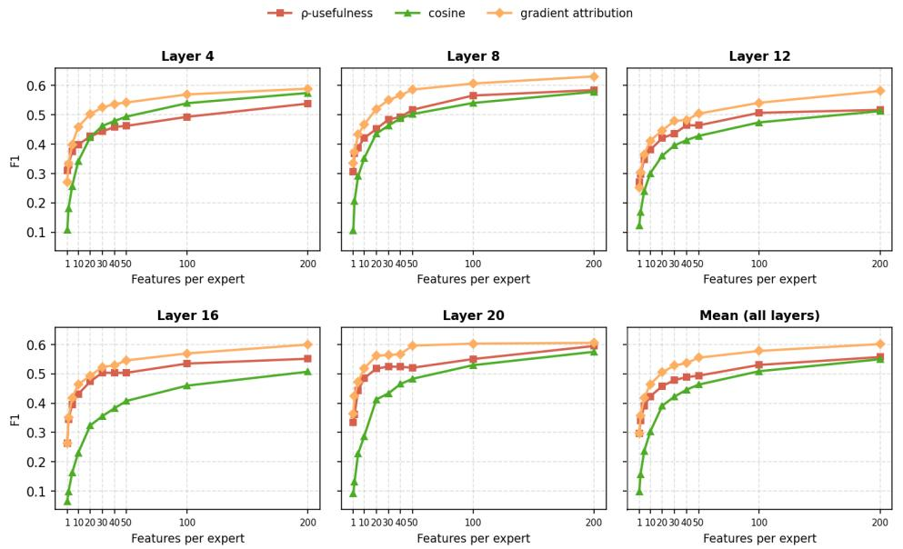  
Figure 5. Gradient-based attribution is the strongest feature-selection criterion across five layers of gpt-oss-20b and every feature set size n. For each feature selection method, we select the top-n features per expert and train a linear probe to predict routing to an expert using only these features’ activations. The mean F1 across layers improves only gradually beyond ∼50 features.

Figure 5 shows that gradient-based attribution outperforms both alternatives across all five layers of gpt-oss-20b. ρ-usefulness comes closest, while cosine similarity lags behind at small n before all three converge at large n. The gradual improvement of the mean beyond ∼50 features indicates that routing-relevant information is redundantly encoded across many SAE features.

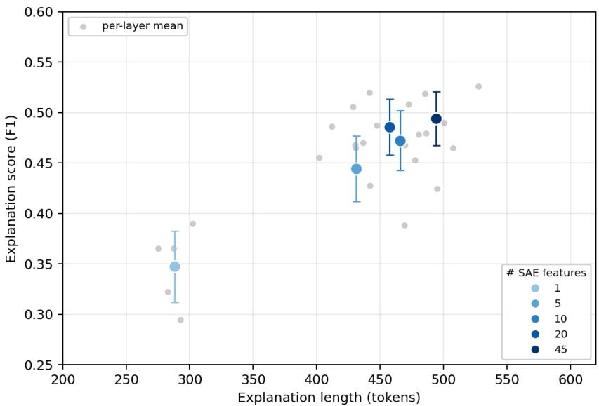  
Figure 6. Up to n=45 features, every additional feature still improves RouterInterp explanations, but the gains shrink as descriptions grow. Explanation length grows roughly linearly with the feature set size n, while the explanation score improves steeply at small n and then slows: from n=25 to n=45, descriptions grow by ∼90 tokens while the score improves by only ∼0.03. Each point is a feature set size $n \in \{ 1 , \bar { 5 } , 1 5 , \bar { 2 } 5 , 4 5 \}$ , with score and length averaged across experts over 5 layers of gpt-oss-20b.

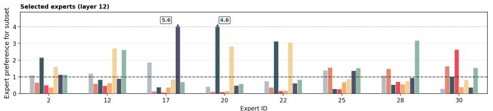

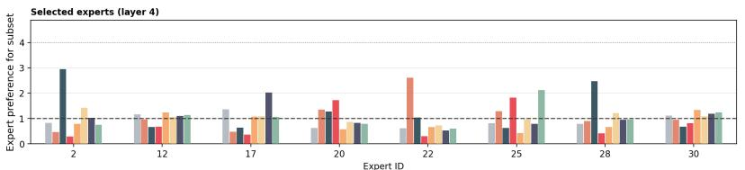

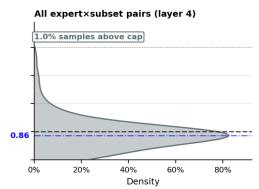

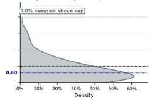

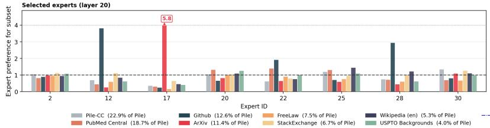

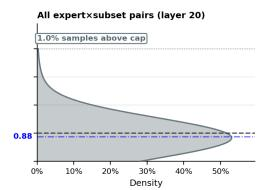  
Figure 7. Expert routing distributions across Pile domains provide evidence against macro-domain DSH and are consistent with SSH. Adapting the Mixtral analysis of Jiang et al. (2024) on gpt-oss-20b, we plot how often an expert’s routed tokens come from a subset, relative to this subset’s fraction of the corpus (the expert routing preference). We show routing preferences for randomly selected experts across 16 subsets (left) and their density over all expert–subset pairs (right), at an early (layer 4), a middle (layer 12), and a late (layer 20) layer. The densities are tightly concentrated at the corpus rate (dashed line at 1). If expert domains coincided with Pile subsets, preferences would instead spread far from 1: near zero for most pairs, and at many times the corpus rate for a few dedicated specialists. Values above 4.0 are capped for better readability.

For RouterInterp explanations, we select n=45 features per expert. This is a deliberate tradeoff between predictive coverage and explainability: as Figure 6 shows, explanation length grows roughly linearly with n while explanation score gains diminish. Extrapolating this linear trend, including substantially more features (e.g. n=200) would produce descriptions several times longer and proportionally more expensive to generate, reducing interpretability for human readers without a comparable gain in predictive performance (Sharkey, 2024; Ayonrinde et al., 2024; Ayonrinde & Jaburi, 2025).

## D EXPERT ROUTING ACROSS PILE DOMAINS

The DSH and SSH make competing claims about how experts specialise over domains: under the DSH, an expert concentrates on a coherent domain; under the SSH, it spans a disjoint collection of micro-domains. These domains may be semantic, syntactic, or otherwise defined by the router, and are not given a priori. Some corpora, however, provide labelled subsets that can serve as a coarse proxy for domain boundaries—for example, the Pile’s (Gao et al., 2020) partitions into ArXiv, Github, PubMed, and related sources.

Jiang et al. (2024) explored whether Mixtral experts specialise in these Pile subsets, measuring, for each expert, what fraction of its routed tokens come from each subset. They found little systematic variation in token-to-expert assignment across subsets and concluded that routing follows syntax more closely than topic. If the DSH holds and its domains coincide with Pile subsets, one would expect clear subset specialisation: tokens from a given subset should be disproportionately routed to particular experts. Mixtral’s finding of little variation is therefore already evidence against that form of the DSH.

We replicate their analysis on a newer MoE model. We process ∼10M tokens from 16 Pile subsets spanning scientific, legal, code, and web data. For each expert–subset pair we compare how often the expert’s routed tokens come from the subset with how often the subset’s tokens occur in the corpus overall. We compute the expert routing preference for the subset, $p ( u \vert E _ { i } ) / p ( u )$ : the fraction of expert E ’s routed tokens that come from subset u, over the subset’s fraction of all tokens. A value of 1 means the expert receives the subset’s tokens exactly at the corpus rate. Figure 7 shows results for early, middle, and late layers of gpt-oss-20b. The left panels show randomly selected experts from each layer, and some exhibit strong spikes on particular subsets (e.g. Github or ArXiv). Individual experts are only illustrative, however, and the layer-wide density shows the real picture. Routing preferences show little spread around the corpus rate: for most expert–subset pairs in a layer, a subset’s tokens reach the expert at or below the corpus rate. This pattern is consistent with the SSH. If each expert’s fine-grained micro-domains are distributed roughly proportionally across Pile domains, routing at the subset level should remain close to corpus-proportional for most pairs. Under the DSH, by contrast, each subset’s tokens would concentrate on a few dedicated experts, producing a bimodal distribution: most expert–subset pairs would sit near 0 (non-specialist experts receive almost none of the subset’s tokens), while a few pairs would lie at many times the corpus rate (the dedicated specialists).

The observed distribution is therefore further evidence against that form of the DSH in which expert domains align with the Pile subsets. The relevant domains could cut across the Pile’s dataset boundaries or be defined by properties such as syntax rather than topic, in which case one would not expect tokens from particular Pile subsets to be preferentially routed to particular experts. Nevertheless, for many plausible semantic domain decompositions, we would expect at least some Pile subsets to correlate with the domain boundaries.

## E ROUTING PREDICTION ACROSS LAYERS

We extend the matched-sparsity probe comparison of Appendix B to five layers of gpt-oss-20b at two sparsity levels, s∈{64, 128}. Table 3 reports macro-F1 for SAE, neuron, and PCA sparse linear probes. At s=128, the SAE predictor outperforms the best neuron and PCA probe at four of five layers, showing that the SAE-basis advantage holds across both depth and sparsity. We compare two SAE variants (s=64 and s=128); the effect of the underlying SAE is discussed in Appendix G.

<table><tr><td></td><td>Layer 4</td><td>Layer 8</td><td>Layer 12</td><td>Layer 16</td><td>Layer 20</td></tr><tr><td>SAE Predictor (s=128)</td><td>0.569</td><td>0.702</td><td>0.730</td><td>0.439</td><td>0.789</td></tr><tr><td>SAE Predictor (s=64)</td><td>0.552</td><td>0.725</td><td>0.685</td><td>0.297</td><td>0.773</td></tr><tr><td>Neuron Probe (s=128)</td><td>0.519</td><td>0.638</td><td>0.586</td><td>0.559</td><td>0.630</td></tr><tr><td>Neuron Probe (s=64)</td><td>0.476</td><td>0.603</td><td>0.509</td><td>0.524</td><td>0.570</td></tr><tr><td>PCA Probe (s=128)</td><td>0.544</td><td>0.623</td><td>0.536</td><td>0.494</td><td>0.366</td></tr><tr><td>PCA Probe (s=64)</td><td>0.517</td><td>0.603</td><td>0.523</td><td>0.482</td><td>0.384</td></tr></table>

Table 3. The learned SAE basis captures more routing-relevant structure than standard bases at matched sparsity across most layers of gpt-oss-20b. All methods use sparse linear probes with matched sparsity (s active dimensions). At s=128, the SAE predictor achieves strictly higher macro-F1 than the best neuron or PCA probe at four of five layers. All values reported as macro-F1.

## F ROUTING DEPENDS ON MULTIPLE FEATURES

Routing prediction in Appendix B uses the full set of active SAE features per token. Here we show that this routing information is spread across many latents, by ablating how many of those features are kept. Let m be the number of active SAE features kept per token (e.g. m=32 means 32 of the s=128 latents on that token are kept, and the rest are zeroed). The routing-prediction table in Appendix B corresponds to the full-sparsity probe $\scriptstyle ( m = s = 1 2 8$ on gpt-oss), i.e. m=128 here. Unlike Section C.2, which varies a dataset-level selected set of n features, this ablation varies the per-token active count. Table 4 shows macro-F1 for varying $m \in \{ 1 , 8 , 1 6 , 3 2 , 6 4 , 1 2 8 \}$ on gpt-oss-20b with SAE sparsity $s = 1 2 8$

The results reveal a clear pattern: macro-F1 generally improves as m increases across layers. Layer 16 rises from 0.089 (m = 1) to 0.439 (m = 128), and Layer 20 rises from 0.280 (m = 1) to $0 . 7 8 9 \ : ( m = 1 2 8 )$ . This trend indicates that routing decisions depend on multiple distinct concepts, consistent with polysemantic expert behaviour.

<table><tr><td></td><td>Layer 4</td><td>Layer 8</td><td>Layer 12</td><td>Layer 16</td><td>Layer 20</td></tr><tr><td>Unigram Baseline</td><td>0.472</td><td>0.442</td><td>0.296</td><td>0.343</td><td>0.369</td></tr><tr><td>Bigram Baseline</td><td>0.535</td><td>0.511</td><td>0.356</td><td>0.406</td><td>0.411</td></tr><tr><td>SAE Predictor (m = 1)</td><td>0.183</td><td>0.260</td><td>0.185</td><td>0.089</td><td>0.280</td></tr><tr><td>SAE Predictor (m = 8)</td><td>0.235</td><td>0.380</td><td>0.267</td><td>0.249</td><td>0.617</td></tr><tr><td>SAE Predictor (m = 16)</td><td>0.349</td><td>0.408</td><td>0.434</td><td>0.387</td><td>0.694</td></tr><tr><td>SAE Predictor (m = 32)</td><td>0.490</td><td>0.640</td><td>0.632</td><td>0.414</td><td>0.749</td></tr><tr><td>SAE Predictor (m = 64)</td><td>0.576</td><td>0.699</td><td>0.694</td><td>0.400</td><td>0.777</td></tr><tr><td>SAE Predictor (m = 128)</td><td>0.569</td><td>0.702</td><td>0.730</td><td>0.439</td><td>0.789</td></tr></table>

Table 4. Routing prediction improves significantly as more SAE features are used, consistent with polysemantic expert behaviour predicted by the SSH. Results are shown for gpt-oss-20b with SAE sparsity s = 128. Performance improves with m across all reported layers, peaking at m=128 in four of five layers, indicating that routing depends on multiple distinct concepts rather than a single domain.

## G SAE SETUP AND RECONSTRUCTION QUALITY

In this section, we report SAE setup and reconstruction quality. SAEs are trained on residual-stream activations before each layer’s attention block.

OLMoE-1B-7B. We train Top-K SAEs using the Sparsify library on activations from layers 3, 7, 11, and 15 of OLMoE-1B-7B, sampled from 100M tokens of OLMoE-mix-0924 (Muennighoff et al., 2025). Each SAE has 32,768 features (16× expansion) with per-token latent sparsity s=32. Training all four SAEs took approximately 2 hours in total on a single A100 GPU. Table 5 reports the fraction of variance unexplained (FVU) and the percentage of dead features (features that never activate on the evaluation set).

<table><tr><td>Layer</td><td>FVU</td><td>Dead features (%)</td></tr><tr><td>3</td><td>0.007</td><td>4.11</td></tr><tr><td>7</td><td>0.024</td><td>0.51</td></tr><tr><td>11</td><td>0.064</td><td>0.59</td></tr><tr><td>15</td><td>0.218</td><td>0.51</td></tr></table>

Table 5. SAE reconstruction quality for OLMoE-1B-7B (Top-K; 32,768 features, 16× expansion, s=32). FVU increases with depth while dead feature rates remain low.

gpt-oss-20b. For gpt-oss-20b, we use publicly available BatchTopK SAEs from Lin (2025),23 trained on layers 4, 8, 12, 16, and 20. Each SAE has 131,072 features (∼45× expansion) with two per-token latent sparsity variants: s=64 and s=128. Table 6 reports FVU and dead feature rates for both variants.

<table><tr><td rowspan="2">Layer</td><td colspan="2">FVU</td><td colspan="2">Dead features (%)</td></tr><tr><td>s=64</td><td>s=128</td><td>s=64</td><td>s=128</td></tr><tr><td>4</td><td>0.050</td><td>0.037</td><td>0.04</td><td>0.90</td></tr><tr><td>8</td><td>0.101</td><td>0.077</td><td>0.02</td><td>0.29</td></tr><tr><td>12</td><td>0.172</td><td>0.137</td><td>0.00</td><td>0.01</td></tr><tr><td>16</td><td>0.232</td><td>0.191</td><td>0.00</td><td>0.00</td></tr><tr><td>20</td><td>0.146</td><td>0.117</td><td>0.02</td><td>0.00</td></tr></table>

Table 6. SAE reconstruction quality for gpt-oss-20b (BatchTopK; 131,072 features, ∼45× expansion). FVU peaks at layer 16 for both sparsity levels; s=128 consistently achieves lower FVU than s=64.

RouterInterp quality is downstream of SAE quality. SAE reconstruction quality correlates with routing prediction performance across layers. This is most visible at layer 16 of gpt-oss-20b, where FVU is highest (0.232 for s=64, 0.191 for s=128) and routing-prediction macro-F1 is weakest (0.297 for s=64; 0.439 for s=128). Explanation scores do not show the same dependence: they pass through LLM generation and scoring, which can mask the effect of SAE reconstruction quality. Improving SAE quality at this layer—FVU drops from 0.232 to 0.191 when moving from s=64 to s=128— yields the largest gain in routing prediction (0.297 → 0.439). The co-occurrence of high FVU and weak routing prediction suggests that poor reconstruction may be a bottleneck: probe performance can depend on SAE quality, and better SAEs would improve RouterInterp’s performance.

## H HUMAN EVALUATION

In Section 4.2, we introduced an LLM-based scorer to evaluate RouterInterp explanation quality as a proxy for human judgment. To validate whether this LLM scorer faithfully reflects human judgment, we conducted a blind human evaluation in which human raters performed the same binary labelling task as the LLM scorer, allowing us to measure how consistently human raters agree with each other (inter-annotator agreement) and whether the LLM scorer matches human judgments. We collected annotations on 150 text/context pairs (6 examples per expert across 25 experts) from layer 12 of gpt-oss-20b. Each example was labelled by two independent human evaluators and by the LLM scorer. We report pooled agreement and Cohen’s κ with uncertainty estimated over repeated resampling (Table 7).

<table><tr><td>Metric</td><td>Human-Human Human-LLM</td><td></td></tr><tr><td>Pooled agreement</td><td> $0 . 8 0 7 \pm 0 . 0 7 0$ </td><td> $0 . 8 5 7 \pm 0 . 0 5 0$ </td></tr><tr><td>Cohen&#x27;s κ</td><td> $0 . 4 8 7 \pm 0 . 1 6 5$ </td><td> $0 . 6 0 2 \pm 0 . 1 5 0$ </td></tr></table>

Table 7. The LLM scorer is at least as consistent a judge as a human rater. Pooled agreement is the fraction of examples where both raters gave the same label; Cohen’s κ is a stricter metric that accounts for the fact that two raters could coincidentally agree just by both labelling most examples the same way. Values are mean ± std over repeated resampling; measured on 150 examples across 25 experts from layer 12 of gpt-oss-20b.

Human–LLM agreement is comparable to Human–Human agreement on both metrics, with no statistically significant difference. Because only two human annotators were compared per example, some disagreement is expected from subjective thresholds on edge cases. Despite this limited study scale, the results support using our LLM scorer as a practical and reliable proxy for human interpretability judgments.

Our findings are also consistent with prior evidence that automated interpretation and LLM-as-a-judge methods correlate with human raters and can scale beyond manual-only pipelines (Paulo et al., 2025; Zheng et al., 2023; Anthis et al., 2025).

## I SAE PROBES RECOVER ROUTER PROBABILITIES

In Appendix B, we evaluated SAE-based routing prediction using Macro-F1. As an additional validation of the SAE predictor’s capabilities, we check whether the predicted probabilities also align with the router’s continuous output. The classifiers are trained only with binary cross-entropy on top-k membership and are not directly optimised to recover the full probability distribution. For each token, we take the vector of predicted probabilities and the vector of true router probabilities (one entry per expert) and compute their Spearman rank correlation and MSE.

Table 8 shows that at layers where classification is strong (8, 12, 20), Spearman ρ exceeds 0.7, indicating that the probe recovers not just which experts are selected but their relative ranking. At layers 4 and 16, where macro-F1 is weaker, calibration drops accordingly. MSE is uniformly low (≈ 0.03; RMSE ≈ 0.17), showing that predicted probabilities stay close to the true router values even at weaker layers.

<table><tr><td>Layer</td><td>Macro-F1</td><td>Spearman ρ</td><td>MSE</td></tr><tr><td>4</td><td>0.569</td><td>0.258</td><td>0.0278</td></tr><tr><td>8</td><td>0.702</td><td>0.809</td><td>0.0294</td></tr><tr><td>12</td><td>0.730</td><td>0.741</td><td>0.0295</td></tr><tr><td>16</td><td>0.439</td><td>0.413</td><td>0.0285</td></tr><tr><td>20</td><td>0.789</td><td>0.817</td><td>0.0296</td></tr></table>

Table 8. The predicted probabilities from SAE-based probes align well with the actual MoE router probabilities, even though the probes are trained only with binary cross-entropy on top-k membership. Spearman ρ is the rank correlation between the predicted and true probability assigned to each expert, computed per token and averaged; high values mean the probe recovers which experts the router assigns more probability to. MSE is the mean squared error between predicted and true per-expert probabilities (≈ 0.03; RMSE ≈ 0.17). Spearman correlates with macro-F1 across layers (both strong at 8, 12, 20; weaker at 4 and 16). gpt-oss-20b; SAE predictor with s=128.

## J PROMPTS

We provide the prompts used for expert-level explanations, the n-gram explanation baseline, and automatic explanation scoring (Section 4.1).

RouterInterp. RouterInterp prompts the explainer on context windows grouped by feature: for each selected feature, positives where the feature fires and the expert is selected, and hard negatives where the feature fires but the expert is not selected.

You are a meticulous AI researcher conducting an important   
investigation into patterns found in language. Your task is to analyze   
text and provide an explanation that thoroughly encapsulates possible   
patterns found in it.   
You are given text examples with the relevant token(s) wrapped in <<   
double angle brackets>> (a run of consecutive tokens may be wrapped   
together). These are contexts where the expert was active. When routing   
weights are shown in parentheses after an example, they indicate how   
strongly each token was activated. If the examples are organised into   
numbered groups, each group was collected from a different SAE feature   
--- but multiple groups may share the same underlying activation   
pattern.   
Each group comes from one SAE feature associated with this expert.   
Routed examples show windows where that feature fires AND this expert   
is selected. Hard-negative examples (under a "Hard negatives (feature   
fires, expert not selected):" header) show windows where the SAME   
feature fires but this expert is NOT selected. Use the contrast to   
describe the routing-relevant context --- what makes the expert fire   
given the feature --- not merely where the feature activates. Write a   
positive, specific description; do not frame the output as "activates   
on X but not Y".   
HOW TO WRITE A GOOD DESCRIPTION:   
- MERGE SIMILAR GROUPS. The groups are raw feature data, not pre  
identified modes. Look across all groups first: if several groups show   
the same pattern (same token type, same syntactic role, same domain),   
merge them into a single description. Only describe as many modes as   
there are genuinely distinct patterns in the data --- this may be fewer   
than the number of groups, or even just one.   
- FIND PATTERNS, DON’T JUST LIST TOKENS. The highlighted tokens are   
clues, not the answer. Generalise: state the rule they share --- their   
part of speech, grammatical or structural role, the domain or topic,   
the format, or what comes before/after them. Concrete examples are   
welcome when they help a human grasp the pattern (quote a couple of

representative tokens or phrases), but a description that is ONLY a   
list of tokens is useless.   
- DESCRIBE THE CONTEXT, NOT THE SURFACE TOKEN. The same surface token   
appears in both activating and non-activating windows, so token   
identity alone is never enough --- what matters is the precise context   
that makes the expert fire. For example, write ‘‘"(" immediately   
following a function name in Python code’’, not ‘‘the token "("’’.   
- LET LENGTH FOLLOW THE DATA. A single clean pattern needs one sentence.   
A genuinely polysemantic expert needs one clear description per truly   
distinct mode. Do NOT force unrelated modes into one summary, and do   
NOT drop a real mode just to be brief. Avoid repetition and padding.   
- Avoid announcing a count of modes (e.g. "activating in ten distinct   
contexts") --- just describe the modes you actually find.   
- Avoid generic catch-alls like "common function words", "technical   
text", or "structural delimiters" --- those describe nothing and match   
everything.   
- Do not use numbered lists or bullet points, and do not mention the   
<<>> markers.   
- NEVER reuse token patterns, surface forms, or domains from the few  
shot demonstration --- describe only what appears in the actual   
examples provided.   
- If the examples share no specific distinguishing pattern, say so   
plainly (e.g. "diverse general English prose with no single trigger");   
an honest broad description is correct, an invented specific pattern is   
a failure.   
Respond directly with the explanation.

Expert Activations AutoInterp. The same base prompt, with a non-routed grouped contrastive section: non-activating windows under a “Non-activating examples:” header rather than routed hard negatives.

You are a meticulous AI researcher conducting an important   
investigation into patterns found in language. Your task is to analyze   
text and provide an explanation that thoroughly encapsulates possible   
patterns found in it.   
You are given text examples with the relevant token(s) wrapped in <<   
double angle brackets>> (a run of consecutive tokens may be wrapped   
together). These are contexts where the expert was active. When routing   
weights are shown in parentheses after an example, they indicate how   
strongly each token was activated. If the examples are organised into   
numbered groups, each group was collected from a different SAE feature   
--- but multiple groups may share the same underlying activation   
pattern.   
Non-activating examples (same highlighted token, different context   
where the expert did NOT fire) are shown after each group’s activating   
examples under a "Non-activating examples:" header. Use them to sharpen   
your description of the activating pattern --- they reveal which   
aspects of the context are incidental and which are essential. Write a   
positive, specific description of what the expert activates on; do not   
frame the output as "activates on X but not Y". Instead, state   
precisely what makes the activating context specific (e.g. "   
specifically at function call sites" rather than "in code but not in   
prose").   
HOW TO WRITE A GOOD DESCRIPTION:   
- MERGE SIMILAR GROUPS. The groups are raw feature data, not pre  
identified modes. Look across all groups first: if several groups show   
the same pattern (same token type, same syntactic role, same domain),   
merge them into a single description. Only describe as many modes as

there are genuinely distinct patterns in the data --- this may be fewer   
than the number of groups, or even just one.   
- FIND PATTERNS, DON’T JUST LIST TOKENS. The highlighted tokens are   
clues, not the answer. Generalise: state the rule they share --- their   
part of speech, grammatical or structural role, the domain or topic,   
the format, or what comes before/after them. Concrete examples are   
welcome when they help a human grasp the pattern (quote a couple of   
representative tokens or phrases), but a description that is ONLY a   
list of tokens is useless.   
- DESCRIBE THE CONTEXT, NOT THE SURFACE TOKEN. The same surface token   
appears in both activating and non-activating windows, so token   
identity alone is never enough --- what matters is the precise context   
that makes the expert fire. For example, write ‘‘"(" immediately   
following a function name in Python code’’, not ‘‘the token "("’’.   
- LET LENGTH FOLLOW THE DATA. A single clean pattern needs one sentence.   
A genuinely polysemantic expert needs one clear description per truly   
distinct mode. Do NOT force unrelated modes into one summary, and do   
NOT drop a real mode just to be brief. Avoid repetition and padding.   
- Avoid announcing a count of modes (e.g. "activating in ten distinct   
contexts") --- just describe the modes you actually find.   
- Avoid generic catch-alls like "common function words", "technical   
text", or "structural delimiters" --- those describe nothing and match   
everything.   
- Do not use numbered lists or bullet points, and do not mention the   
<<>> markers.   
- NEVER reuse token patterns, surface forms, or domains from the few  
shot demonstration --- describe only what appears in the actual   
examples provided.   
- If the examples share no specific distinguishing pattern, say so   
plainly (e.g. "diverse general English prose with no single trigger");   
an honest broad description is correct, an invented specific pattern is   
a failure.   
Respond directly with the explanation.

Expert Impact AutoInterp. We use exactly the same prompt as Herbst et al. (2026) and do not reproduce it here.

N-gram AutoInterp. For Unigram AutoInterp and Bigram AutoInterp, the model compresses frequent co-occurring tokens into a natural-language description.

Your job is to look for patterns in text. You will be given a list   
of WORDS, your task is to provide an explanation for what pattern best   
describes them. Here are some guidelines:   
- Produce a specific final description for the latents common in   
the examples, and what patterns you found.   
- Don’t focus on giving examples of important tokens, if the   
examples are uninformative, you don’t need to mention them.   
- Do not make lists of possible explanations. Keep your   
explanations short and concise.   
- The last line of your response must be the formatted explanation,   
using [EXPLANATION]:

Explanation scoring. The scorer assigns an integer match score from 0 to 4 for whether at least one highlighted token, in its surrounding context, matches the expert explanation. We then binarise by treating scores ≥ 2 as positive. A score of 2 is a plausible contextual match, so this counts incomplete matches as hits without treating mere token overlap (score 1) as a hit.

You are a conservative classifier evaluating an explanation of when one   
Mixture-of-Experts expert routes a token.

The explanation can contain many unrelated activation modes connected   
by OR. In each tagged example, only token(s) inside <<double angle   
brackets>> are candidate routed positions. Judge whether at least one   
highlighted token, in its exact surrounding context, matches one   
specific mode in the explanation.   
Assign an integer match score:   
0 = no match; unrelated context.   
1 = only superficial token, phrase, or broad-domain overlap.   
2 = plausible but ambiguous or incomplete contextual match.   
3 = clear, specific contextual match.   
4 = direct or near-exact trigger-and-context match.   
False positives are costly, do not give 3 or 4 merely because a match   
is possible, shares a topic, or uses a word named somewhere in the long   
explanation. Require the highlighted token’s role and context to   
satisfy a concrete described pattern.   
Return only one valid JSON object mapping every shown example id to an   
integer 0 through 4. Include each id exactly once and no other text.

## K EXAMPLE EXPERT EXPLANATIONS

Table 9 shows a RouterInterp explanation for a randomly selected expert (Expert 2) from layer 12 of gpt-oss-20b. The explainer is given activating windows grouped by SAE feature and writes a single prose description of when the expert is selected. We also show feature-level descriptions of a few of those SAE features so the reader can inspect the micro-domains that make up the expert.

<table><tr><td>Level</td><td>Explanation</td></tr><tr><td>Expert 2</td><td>This expert activates across following distinct contexts: (1) Physical trauma and medical conditions—high activation on “bruis&quot;and variants (“bruised&quot;, &quot;bruises&quot;), plus fragments like &quot;blister&quot;, “abras&quot;, &quot;haemat&quot;, “infarct&quot;, and &quot;stunned&quot;. (2) Technical and structured writing—code, mathematical expressions, scientific notation, legal citations, and medical terminology from programming, mathematics, science, law, and academia, including punctuation and formatting elements. (3) Brand and term suffixes—final segments of brand names, company names, or technical terms before spaces or punctuation. (4) Electronic compo- nents—activation on &quot;diode&quot;, “resistor&quot;, and “rectifier&quot; in patents, diagrams, and</td></tr><tr><td>Feature 41223</td><td>Physical trauma terms—&quot;bruis&quot; and variants (&quot;bruised&quot;, &quot;bruises&quot;), plus fragments of injury-related terms (&quot;blister&quot;, &quot;abras&quot;, &quot;haemat&quot;, &quot;infarct&quot;, &quot;stunned&quot;) in clinical or descriptive contexts. Activating Examples: [1] suffered scrapes bruis es, bleeding [2] . Her face was bruis ed and there</td></tr><tr><td>Feature 71261</td><td>Programming and scientific notation—code snippets, structured data, and formal keywords with high activation on punctuation, symbols, and domain-specific terms. Activating Examples: [1] public Flight execute () throws API [2] 77 58 78：</td></tr><tr><td>Feature 17613</td><td>Structured context punctuation—punctuation, symbols, and function words in code, citations, mathematical expressions, and legal or technical documents. Activating Examples: [1] g\{} p) [2] Y S P iao and</td></tr><tr><td>Feature 1738</td><td>Brand and term suffixes—final segments of brand names, company names, or technical terms before spaces or punctuation. Activating Examples: [1] Inverted microscope; Leica Microsystems GmbH</td></tr><tr><td>Feature 84536</td><td>Electronic component names—&quot;diode&quot;, &quot;resistor&quot;, &quot;rectifier&quot;, and related abbreviations in circuits, patents, and technical specifications. Activating Examples: [1] Q3, and diode D 1 [2] stations and as ifiers for high-vol</td></tr></table>

Table 9. RouterInterp produces an expert-level explanation from activating examples grouped by SAE feature. Feature-level descriptions below let the reader see how the expert’s stated specialisations correspond to individual SAE features. For example, Expert 2 from gpt-oss-20b layer 12 specialises in physical trauma (Feature 41223), programming and scientific notation (Feature 71261), structured punctuation (Feature 17613), brand-name suffixes (Feature 1738), and electronic components (Feature 84536). We display five features selected b gradient-based attribution.