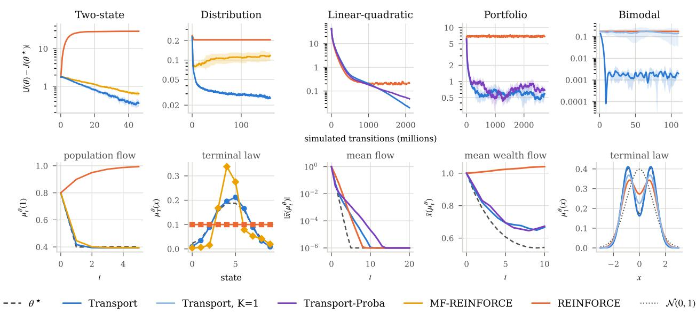
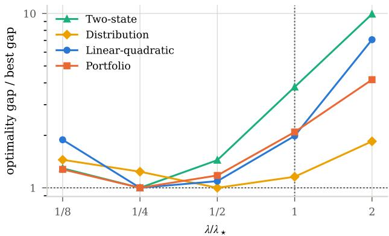
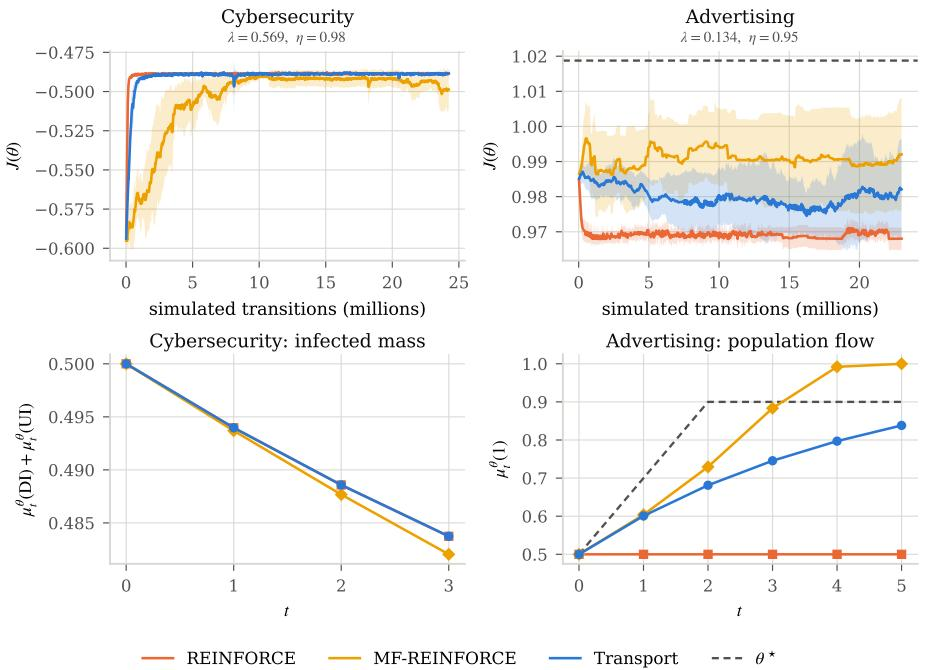
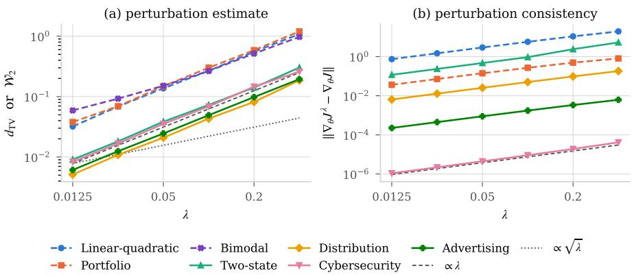
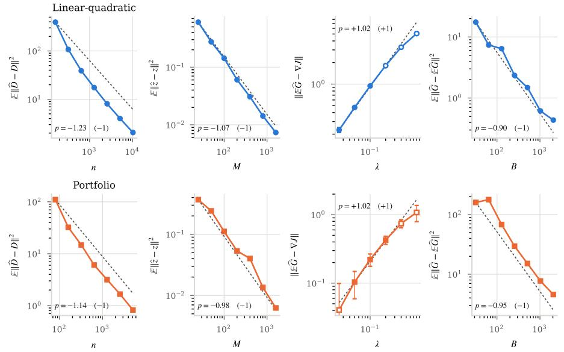
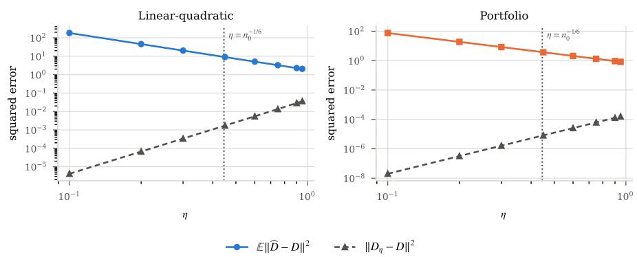

# Randomized Transport Maps for Model-Free Policy-Gradient Mean-Field Control

Adonis Jamal∗ ENS Paris-Saclay adonis.jamal@ens-paris-saclay.fr

Yadh Hafsi Ecole Polytechnique´ yadh.hafsi@polytechnique.edu

Samy Mekkaoui∗ Ecole Polytechnique ´ samy.mekkaoui@polytechnique.edu

Huyˆen Pham Ecole Polytechnique´ huyen.pham@polytechnique.edu

## Abstract

We develop a model-free policy gradient method for discrete-time mean-field control (MFC). In MFC, the policy afects the objective both through the controlled dynamics and through the population distribution. Standard REINFORCE estimators capture the first efect but not the second. We introduce Transport REINFORCE, a transport map-based approach that perturbs a suitable transformation of the population distribution to estimate this missing mean-field contribution. The method applies to both finite and continuous state spaces. In finite state spaces, we perturb the population distribution directly on the probability simplex through a convex combination of the current population weights and random weights. In continuous state spaces, we project the population distribution onto the manifold of Gaussian mixtures, and then randomize it via a transport map that ensures the perturbed law remains within this manifold. We prove consistency of the perturbed objective and gradient as the perturbation vanishes, and derive bias and mean-square error bounds for the resulting sample-based gradient estimator. Numerical experiments on several MFC benchmarks show that Transport REINFORCE improves over standard REINFORCE.

## 1 INTRODUCTION

We study model-free mean-field control (MFC) in discrete time over a finite horizon. A common randomized policy is optimized for a population of interacting agents. Each agent’s policy, dynamics, and rewards may depend on the population distribution, which itself evolves under the policy. The learner observes sampled transitions and rewards, without analytic access to the model.

Existing learning approaches include dynamic programming on the space of population distributions (Carmona et al., 2023; Gu et al., 2021, 2023). Even for N states, approximating a value function on the resulting (N − 1)- dimensional simplex can be costly. Direct policy optimization ofers another approach. Policy-gradient convergence has been established for discrete-time linear–quadratic MFC (Carmona et al., 2019), while actor–critic methods and their analysis have been developed in continuous time (Frikha et al., 2025; Pham and Warin, 2025; Frikha et al., 2024). Bayraktar et al. (2026) also derive a policy-gradient formula leading to an actor–critic scheme.

The dificulty is that applying standard REINFORCE (Williams, 1992) to a representative agent while treating the population flow as fixed misses part of the MFC gradient. Changing the policy also changes the population distribution, which enters the policy, dynamics, and rewards. The closest work, Meunier et al. (2026), addresses this additional dependence in finite state spaces. Their MF-REINFORCE method randomizes the logit coordinates of the population weights and uses the resulting density score to estimate the mean-field contribution.

We introduce Transport REINFORCE, which randomizes the population law through transport maps. The perturbation combines population and random weights in finite state spaces, and perturbs Gaussian-mixture weights, means, and covariances in continuous spaces. Its explicit density score accounts for population dependence in the perturbed gradient. The transport also couples the original and perturbed laws to control their Wasserstein distance (Villani et al., 2009; Delon and Desolneux, 2020).

Our contributions are threefold.

• We derive model-free policy-gradient estimators combining policy and population scores, using simulations at prescribed population arguments. Population sensitivities are estimated through a probabilistic representation in finite state spaces and centered policy diferences in continuous state spaces.

• We prove objective perturbation bounds of order $O ( \lambda )$ in finite state spaces and $O ( { \sqrt { \lambda } } )$ for a fixed Gaussianmixture representation. In the continuous case, we separate the perturbation error from the mixture approximation error. In both cases, we establish gradient consistency and bounds on the estimator’s bias and mean-square error.

• Our experimental suite compares Transport REINFORCE with REINFORCE on seven discrete and continuous benchmarks, and with MF-REINFORCE on the finite-state benchmarks, under matched simulator budgets. We also develop an explicitly solvable linear-dynamics setting with Gaussian initial conditions.

## 2 BACKGROUND

Let $( \Omega , \mathcal { F } , \mathbb { P } )$ be a standard probability space and $T < \infty$ . We set $\mathcal { T } : = \{ 0 , \ldots , T \}$ . The state space $( \mathcal { X } , B ( \mathcal { X } ) )$ and action space $( \mathcal { A } , \mathcal { B } ( \mathcal { A } ) )$ are assumed to be Polish. For $t \in [ [ 0 , T - 1 ] ]$ , let

$$
\begin{array} { r l } & { P _ { t } : \mathcal { X } \times \mathcal { P } ( \mathcal { X } ) \times \mathcal { A } \longrightarrow \mathcal { P } ( \mathcal { X } ) , } \\ & { \mathit { r } _ { t } : \mathcal { X } \times \mathcal { P } ( \mathcal { X } ) \times \mathcal { A } \longrightarrow \mathbb { R } , } \end{array}
$$

be respectively measurable transition kernel and running reward, and let $g : \mathcal { X } \times \mathcal { P } ( \mathcal { X } )  \mathbb { R }$ be a measurable terminal reward. A randomized mean-field feedback policy at time t is a measurable transition kernel $\pi _ { t } :$ $\mathcal { X } \times \mathcal { P } ( \mathcal { X } ) \longrightarrow \mathcal { P } ( \mathcal { A } )$ . Rather than optimizing over all such kernels, we choose a parametric family $\left\{ \pi ^ { \theta } : \theta \in \right.$ $\Theta \subset \mathbb { R } ^ { d _ { \theta } } \}$ , where Θ represents the compact admissible set of parameters. Whenever a policy score is used, we assume that $\pi _ { t } ^ { \theta }$ admits a strictly positive density $p _ { t } ^ { \theta }$ with respect to a fixed reference measure $\nu _ { A } \in { \mathcal { P } } ( { \mathcal { A } } )$ $\pi _ { t } ^ { \theta } ( \mathrm { d } a \mid x , m ) = p _ { t } ^ { \bar { \theta } } ( a \mid x , m ) \nu _ { A } ( \mathrm { d } a )$ . Given a parametrized randomized mean-field feedback policy $\pi ^ { \theta }$ , an initial distribution $\mu _ { 0 } \in \mathcal { P } ( \mathcal { X } )$ and setting $\mu _ { t } ^ { \theta } : = \mathbb { P } _ { X _ { t } ^ { \theta } }$ , we consider the state and control processes, $( X _ { t } ^ { \theta } ) _ { t \in \mathcal { T } }$ and $( \alpha _ { t } ^ { \theta } ) _ { t = 0 } ^ { T - 1 }$ respectively, driven by

$$
X _ { 0 } ^ { \theta } \sim \mu _ { 0 } , \qquad \alpha _ { t } ^ { \theta } \sim \pi _ { t } ^ { \theta } ( \cdot \mid X _ { t } ^ { \theta } , \mu _ { t } ^ { \theta } ) , \qquad X _ { t + 1 } ^ { \theta } \sim P _ { t } ( \cdot \mid X _ { t } ^ { \theta } , \mu _ { t } ^ { \theta } , \alpha _ { t } ^ { \theta } ) ,\tag{1}
$$

The finite-horizon objective we seek to maximize is then defined as

$$
J ( \theta ) : = \mathbb { E } \bigg [ \sum _ { t = 0 } ^ { T - 1 } r _ { t } ( X _ { t } ^ { \theta } , \mu _ { t } ^ { \theta } , \alpha _ { t } ^ { \theta } ) + g ( X _ { T } ^ { \theta } , \mu _ { T } ^ { \theta } ) \bigg ] .\tag{2}
$$

Appendix A establishes well-posedness of (1)-(2) under the stated assumptions.

Policy-gradient methods maximize objective (2) by using a probabilistic representation of $\nabla _ { \boldsymbol { \theta } } J ( \boldsymbol { \theta } )$ , an estimator $\widehat G ( \theta )$ of it and updating $\theta  \theta + \gamma \widehat { G } ( \theta )$ for $\gamma > 0$ . To see the dificulty created by the population law, let

$$
\mathcal { R } _ { \theta } : = \sum _ { t = 0 } ^ { T - 1 } r _ { t } ( X _ { t } ^ { \theta } , \mu _ { t } ^ { \theta } , \alpha _ { t } ^ { \theta } ) + g ( X _ { T } ^ { \theta } , \mu _ { T } ^ { \theta } ) , \qquad \mathcal { S } _ { \mathrm { p o l } } ^ { \theta } : = \sum _ { t = 0 } ^ { T - 1 } \nabla _ { \theta } \log p _ { t } ^ { \theta } ( \alpha _ { t } ^ { \theta } \mid X _ { t } ^ { \theta } , \mu _ { t } ^ { \theta } ) .
$$

Throughout, the policy score diferentiates $\theta \mapsto \log p _ { t } ^ { \theta } ( a \mid x , m )$ with $( a , x , m )$ held fixed, and is then evaluated at the sampled action, state and population argument. The usual REINFORCE term is $\mathrm { R F } ( \theta ) = \mathbb { E } [ \mathcal { R } _ { \theta } S _ { \mathrm { p o l } } ^ { \theta } ]$ In mean-field control, however, the whole population flow $( \mu _ { t } ^ { \theta } ) _ { t \in \mathcal { T } }$ also depends on θ. Consequently, the full gradient takes the form

$$
\nabla _ { \boldsymbol { \theta } } J ( \boldsymbol { \theta } ) = \mathrm { R F } ( \boldsymbol { \theta } ) + \mathrm { M F } ( \boldsymbol { \theta } ) ,
$$

where MF collects the efects of the population flow on rewards, policies, and state distributions which ordinary REINFORCE misses; see Meunier et al. (2026).

## 3 TRANSPORT MAP RANDOMIZATION

We randomize the population argument through a transport map. For $\lambda \in \lbrack 0 , 1 )$ and $t \in [ [ 1 , T ]$ , let $T _ { t } ^ { \lambda } :$ $\Omega \times \mathcal { X } \times [ 0 , 1 ] \to \mathcal { X }$ be jointly measurable, and let $\mathcal { G } : \mathcal { P } ( \mathcal { X } )  \mathcal { P } ( \mathcal { X } )$ be a measurable transformation of the law. In continuous state space, we restrict its domain and codomain to $\mathcal { P } _ { 2 } ( \mathbb { R } ^ { d } )$ . For any $\theta \in \Theta$ , we set $M _ { 0 } ^ { \lambda , \theta } : = \mu _ { 0 }$ and for $t \in [ [ 1 , T ]$ , define the measurable map $M _ { t } ^ { \lambda , \theta } : \Omega \to { \mathcal { P } } ( \chi )$ as

$$
M _ { t } ^ { \lambda , \theta } ( \omega ) : = T _ { t } ^ { \lambda } ( \omega , \cdot , \cdot ) \sharp \left( \mathcal { G } ( \mu _ { t } ^ { \theta } ) \otimes \mathcal { U } ( [ 0 , 1 ] ) \right) .\tag{3}
$$

The transformation $\mathcal { G }$ supplies a finite-dimensional representation: it is the identity in finite state spaces and an encoder–decoder map $\mathcal { D } \circ \mathcal { E }$ in continuous spaces. The auxiliary uniform variable allows the transport to change mixture weights. A deterministic map of the state alone cannot, in general, split the mass of an atom. The uniform variable supplies the randomness needed for this operation.

For each fixed $\omega ,$ a sample from $M _ { t } ^ { \lambda , \theta } ( \omega )$ is obtained by evaluating $T _ { t } ^ { \lambda } ( \omega , X , U )$ with independent draws $X \sim \mathcal G ( \mu _ { t } ^ { \theta } )$ and $U \sim \mathcal { U } ( [ 0 , 1 ] )$ ), without requiring an explicit expression for the resulting law. This sampling construction extends beyond the convex-combination and Gaussian-mixture examples below to any jointly measurable transport map that can be evaluated on sampled inputs.

The perturbation of Meunier et al. (2026) also has an encoder–decoder interpretation: it takes the form softmax $( \log \mathrm { i t } ( \mu _ { t } ^ { \theta } ) + \lambda U _ { t } )$ , with standard Gaussian $U _ { t }$ . Their noise is added to the encoded coordinates. In (3), randomness enters through the transport map on the state space. This representation gives a coupling between the original and perturbed laws, which can be used to study distances between these laws.

Using the probability-valued random variable $M _ { t } ^ { \lambda , \theta }$ , we then consider the state and control processes $( X _ { t } ^ { \lambda , \theta } ) _ { t \in \mathcal { T } }$ and $( \alpha _ { t } ^ { \lambda , \theta } ) _ { t = 0 } ^ { \overline { { T } } - 1 }$ driven by

$$
X _ { 0 } ^ { \lambda , \theta } \sim \mu _ { 0 } , \qquad \alpha _ { t } ^ { \lambda , \theta } \sim \pi _ { t } ^ { \theta } ( \cdot \mid X _ { t } ^ { \lambda , \theta } , M _ { t } ^ { \lambda , \theta } ) , \qquad X _ { t + 1 } ^ { \lambda , \theta } \sim P _ { t } ( \cdot \mid X _ { t } ^ { \lambda , \theta } , M _ { t } ^ { \lambda , \theta } , \alpha _ { t } ^ { \lambda , \theta } ) ,\tag{4}
$$

with return and policy score

$$
\mathcal { R } _ { \theta } ^ { \lambda } : = \sum _ { t = 0 } ^ { T - 1 } r _ { t } ( X _ { t } ^ { \lambda , \theta } , M _ { t } ^ { \lambda , \theta } , \alpha _ { t } ^ { \lambda , \theta } ) + g ( X _ { T } ^ { \lambda , \theta } , M _ { T } ^ { \lambda , \theta } ) , \qquad \mathcal { S } _ { \mathrm { p o l } } ^ { \lambda , \theta } : = \sum _ { t = 0 } ^ { T - 1 } \nabla _ { \theta } \log p _ { t } ^ { \theta } ( \alpha _ { t } ^ { \lambda , \theta } \mid X _ { t } ^ { \lambda , \theta } , M _ { t } ^ { \lambda , \theta } ) ,\tag{5}
$$

and objective $J ^ { \lambda } ( \theta ) : = \mathbb { E } [ \mathcal { R } _ { \theta } ^ { \lambda } ]$

Since $T _ { t } ^ { 0 }$ is the identity, $J ^ { 0 } = J$ for ${ \mathcal { G } } = { \mathrm { I d } } ;$ Gaussian-mixture projection gives $J _ { K } ^ { \lambda }$ in (14). Appendix A gives a canonical construction of the control problem.

## 3.1 Finite-state space

Let $\mathcal { X } = \{ x _ { 1 } , \ldots , x _ { N } \}$ , with $N \geq 2$ . We identify $\mathcal { P } ( \mathcal { X } )$ with $\begin{array} { r } { \Delta _ { N } = \{ p \in [ 0 , 1 ] ^ { N } : \sum _ { i } p _ { i } = 1 \} } \end{array}$ and write $\mu ( i ) : =$ $\mu ( \{ x _ { i } \} ) = \mu ( x _ { i } )$ for the density with respect to the counting measure. Since $\begin{array} { r } { \mu = \sum _ { i = 1 } ^ { N } \mu ( i ) \delta _ { x _ { i } } } \end{array}$ , randomizing the population law amounts to randomizing its weights. In the canonical construction of Appendix $\mathrm { A . 1 }$ , take $E = \bar { \mathbb { R } } ^ { N - 1 }$ and $R _ { t } \ = \ U _ { t }$ , where $( U _ { t } ) _ { t \in [ [ 1 , T ] ] }$ are independent random vectors with density $\rho$ with respect to Lebesgue measure. Define

$$
\varphi : \mathbb { R } ^ { N - 1 } \to \mathring { \Delta } _ { N } , \quad \varphi ( u ) : = \frac { \big ( e ^ { u _ { 1 } } , \dots , e ^ { u _ { N - 1 } } , 1 \big ) } { 1 + \sum _ { j = 1 } ^ { N - 1 } e ^ { u _ { j } } } ,\tag{6}
$$

and set $Q _ { t } : = \varphi ( U _ { t } )$ . For $q \in \Delta _ { N }$ , let $F _ { q } : [ 0 , 1 ] \to \mathcal { X }$ be the inverse distribution map, with $F _ { q } ( 0 ) = x _ { 1 }$ and $F _ { q } ( v ) = x _ { \operatorname* { m i n } \{ i : v \leq \sum _ { j = 1 } ^ { i } q _ { j } \} }$ for $v > 0$ . For $\lambda \in ( 0 , 1 )$ , define

$$
T _ { t } ^ { \lambda } ( \omega , x , v ) : = \left\{ \begin{array} { l l } { x , } & { v \leq 1 - \lambda , } \\ { F _ { Q _ { t } ( \omega ) } \big ( ( v - 1 + \lambda ) / \lambda \big ) , } & { v > 1 - \lambda , } \end{array} \right.
$$

and set $T _ { t } ^ { 0 } ( \omega , x , v ) = x$ . The transport retains the state with probability $1 - \lambda$ and otherwise draws from $Q _ { t }$ Consequently,

$$
\begin{array} { r l } & { M _ { t } ^ { \lambda , \theta } ( \omega ) : = T _ { t } ^ { \lambda } ( \omega , \cdot , \cdot ) \sharp ( \mu _ { t } ^ { \theta } \otimes \mathcal { U } ( [ 0 , 1 ] ) ) } \\ & { \qquad = ( 1 - \lambda ) \mu _ { t } ^ { \theta } + \lambda Q _ { t } ( \omega ) , \qquad t \in [ [ 1 , T ] ] . } \end{array}\tag{7}
$$

The assumptions and proofs below are given in Appendix B.2.

Proposition 3.1 (Perturbation estimate). For every $\lambda \in [ 0 , 1 ) , \theta \in \Theta$ , and $t \in \tau$

$$
d _ { \mathrm { T V } } \big ( M _ { t } ^ { \lambda , \theta } ( \omega ) , \mu _ { t } ^ { \theta } \big ) \leq \lambda , \qquad \mathbb { P } ( \mathrm { d } \omega ) - a . s .
$$

Theorem 3.2 (Perturbation consistency). Under Assumption $B . 1 ,$ there exists $C _ { T } > 0$ , independent of θ and λ, such that, for $\lambda \in [ 0 , 1 )$

$$
\operatorname* { s u p } _ { \theta \in \Theta } | J ^ { \lambda } ( \theta ) - J ( \theta ) | \leq C _ { T } \lambda .
$$

Moreover, under Assumption B.3, there exists $C _ { T } ^ { \nabla } > 0$ such that

$$
\operatorname* { s u p } _ { \theta \in \Theta } \| \nabla _ { \theta } J ^ { \lambda } ( \theta ) - \nabla _ { \theta } J ( \theta ) \| \leq C _ { T } ^ { \nabla } \lambda .
$$

Corollary 3.3 (Near-optimality of perturbed maximizers). Under Assumptions $B . 1$ and $B . \mathcal { B } ,$ suppose that Θ is compact. Then, for every $\lambda \in [ 0 , 1 ) , J ^ { \lambda }$ attains its maximum on Θ at some $\theta _ { \lambda } ^ { \star }$ , and

$$
J ( \theta _ { \lambda } ^ { \star } ) \geq \operatorname* { m a x } _ { \theta \in \Theta } J ( \theta ) - 2 C _ { T } \lambda .
$$

Moreover, every accumulation point of $( \theta _ { \lambda } ^ { \star } )$ as $\lambda  0$ maximizes $J .$

Perturbation density and score. Use simplex coordinates $\left( q _ { 1 } , \dots , q _ { N - 1 } \right)$ , with $\begin{array} { r } { q _ { N } = 1 - \sum _ { i = 1 } ^ { N - 1 } q _ { i } } \end{array}$ , and set $\varphi ^ { - 1 } ( q ) : = ( \log ( q _ { i } / q _ { N } ) ) _ { i = 1 } ^ { N - 1 }$ . Densities on $\Delta _ { N }$ are taken with respect to Lebesgue measure in these coordinates. By the change-of-variable formula, $Q _ { t }$ has density

$$
f _ { Q } ( q ) = \frac { \rho ( \varphi ^ { - 1 } ( q ) ) } { \prod _ { i = 1 } ^ { N } q _ { i } } , \qquad q \in \mathring { \Delta } _ { N } .
$$

If $\rho$ is strictly positive and $\mathcal { C } ^ { 1 }$ , define, for $u \in \mathbb { R } ^ { N - 1 } , a _ { i } ( u ) : = \partial _ { u _ { i } } \log \rho ( u )$ . Set $H : = ( H _ { 1 } , \ldots , H _ { N - 1 } )$ , and define, for $k \in [ [ 1 , N - 1 ] ] , H _ { k } : \overset { \circ } { \Delta } _ { N } $ R by

$$
\begin{array} { r l } & { H _ { k } ( q ) : = \partial _ { q _ { k } } \log f _ { Q } ( q ) } \\ & { \qquad = \frac { a _ { k } \left( \varphi ^ { - 1 } ( q ) \right) - 1 } { q _ { k } } + \frac { 1 + \sum _ { i = 1 } ^ { N - 1 } a _ { i } \left( \varphi ^ { - 1 } ( q ) \right) } { q _ { N } } . } \end{array}
$$

Write $z _ { t } ^ { \theta } : = ( \mu _ { t } ^ { \theta } ( 1 ) , \ldots , \mu _ { t } ^ { \theta } ( N - 1 ) )$ . Let $\mathcal { Z } _ { N } : = \left\{ z \in [ 0 , 1 ] ^ { N - 1 } : \sum _ { i = 1 } ^ { N - 1 } z _ { i } \leq 1 \right\}$ and write $q _ { < N } = \left( q _ { 1 } , \dots , q _ { N - 1 } \right)$ for $q \in \Delta _ { N }$ . For $z \in \mathcal { Z } _ { N }$ and $q \in \breve { \Delta } _ { N }$ , define

$$
\Psi _ { \lambda } ( z , q ) : = ( 1 - \lambda ) z + \lambda q _ { < N } \in \mathcal { Z } _ { N } ^ { \circ } .\tag{8}
$$

Set $Z _ { t } ^ { \lambda , \theta } : = \Psi _ { \lambda } ( z _ { t } ^ { \theta } , Q _ { t } )$ . By $( 7 ) , Z _ { t } ^ { \lambda , \theta }$ is the coordinate vector associated to $M _ { t } ^ { \lambda , \theta }$ . Fix $z \in \mathcal { Z } _ { N }$ and set $Y _ { \lambda } ( z ) : =$ $( 1 - \lambda ) z + \lambda \mathcal { Z } _ { N } ^ { \circ }$ . For $y \in Y _ { \lambda } ( z )$ , define $q _ { i } ^ { \lambda } ( y \mid z ) = ( y _ { i } - ( 1 - \lambda ) z _ { i } ) / \lambda$ for $i < N$ and $\begin{array} { r } { q _ { N } ^ { \lambda } ( y \mid z ) = 1 - \sum _ { i < N } q _ { i } ^ { \lambda } ( y \mid z ) } \end{array}$ so that $q ^ { \lambda } ( y \mid z ) \in \overset { \circ } { \Delta } _ { N }$ . By Lemma B.5, $\Psi _ { \lambda } ( z , Q _ { t } )$ admits a density $h ^ { \lambda } ( \cdot \mid z )$ , zero outside $Y _ { \lambda } ( z )$ and given, for $y \in Y _ { \lambda } ( z )$ , by

$$
h ^ { \lambda } ( y \mid z ) = \lambda ^ { - ( N - 1 ) } f _ { Q } \left( q ^ { \lambda } ( y \mid z ) \right) .\tag{9}
$$

In particular, $Z _ { t } ^ { \lambda , \theta }$ has density $h ^ { \lambda } ( \cdot \mid z _ { t } ^ { \theta } )$ . Its base-coordinate score, with y held fixed, is

$$
s ^ { \lambda } ( y , z ) : = \nabla _ { z } \log h ^ { \lambda } ( y | z ) = \frac { \lambda - 1 } { \lambda } H \bigl ( q ^ { \lambda } ( y | z ) \bigr ) .\tag{10}
$$

The score with respect to the policy parameter is

$$
\nabla _ { \theta } \log h ^ { \lambda } ( y \mid z _ { t } ^ { \theta } ) = ( D _ { t } ^ { \theta } ) ^ { \top } s ^ { \lambda } ( y , z _ { t } ^ { \theta } ) ,
$$

where $D _ { t } ^ { \theta } : = \nabla _ { \theta } z _ { t } ^ { \theta } \in \mathbb { R } ^ { ( N - 1 ) \times d _ { \theta } }$

The support $Y _ { \lambda } ( z _ { t } ^ { \theta } )$ of $h ^ { \lambda } ( \cdot \mid z _ { t } ^ { \theta } )$ , and hence the integration domain, moves with θ. For the score-function representation to have no boundary terms, the perturbation density $f _ { Q }$ must vanish on the simplex boundary $\partial \Delta _ { N }$ . This holds when $\rho$ satisfies Assumption B.4: a Gaussian randomizer does, whereas a uniform distribution on the simplex does not. The logit–softmax parametrization avoids this requirement, since its integration domain does not depend on $\theta .$

Policy-gradient representation. Define the population score along a perturbed trajectory by

$$
\begin{array} { r l } & { S _ { \mathrm { m f } } ^ { \lambda , \theta } : = \displaystyle \sum _ { t = 1 } ^ { T } \nabla _ { \theta } \log h ^ { \lambda } ( Z _ { t } ^ { \lambda , \theta } \mid z _ { t } ^ { \theta } ) } \\ & { \quad \quad = \displaystyle \sum _ { t = 1 } ^ { T } ( D _ { t } ^ { \theta } ) ^ { \top } s ^ { \lambda } ( Z _ { t } ^ { \lambda , \theta } , z _ { t } ^ { \theta } ) = \frac { \lambda - 1 } { \lambda } \sum _ { t = 1 } ^ { T } ( D _ { t } ^ { \theta } ) ^ { \top } H ( Q _ { t } ) , } \end{array}\tag{11}
$$

where the last equality uses $q ^ { \lambda } ( Z _ { t } ^ { \lambda , \theta } \mid z _ { t } ^ { \theta } ) = Q _ { t }$ in (10).

Theorem 3.4 (Model-free policy-gradient representation). Under Assumptions B.1, B.3 and $B . 4 ,$ for every $\lambda \in ( 0 , 1 )$ , and using the quantities defined in (5) and (11),

$$
\nabla _ { \theta } J ^ { \lambda } ( \theta ) = \mathbb { E } \big [ \mathcal { R } _ { \theta } ^ { \lambda } ( \mathcal { S } _ { \mathrm { p o l } } ^ { \lambda , \theta } + \mathcal { S } _ { \mathrm { m f } } ^ { \lambda , \theta } ) \big ] .
$$

The estimator follows Algorithm 1: $\mu _ { t } ^ { \theta }$ is replaced by the empirical flow $\widehat { \mu } _ { t } ^ { M }$ of M interacting particles, and $D _ { t } ^ { \theta }$ by the estimate $\widehat { D } _ { t } ^ { \eta , M , n }$ in (67), computed from n auxiliary trajectories at scale η. With the returns $\widehat { \mathcal { R } } ^ { ( b ) }$ and policy scores $\widehat { S } _ { \mathrm { p o l } } ^ { ( b ) }$ of $B$ independent trajectories perturbed by $Q _ { t } ^ { ( b ) }$ , the estimator of $\nabla _ { \boldsymbol { \theta } } J ^ { \lambda } ( { \boldsymbol { \theta } } )$ is

$$
\widehat { G } _ { B , M , n } ^ { \lambda , \eta } ( \theta ) : = \frac { 1 } { B } \sum _ { b = 1 } ^ { B } \widehat { \mathcal { R } } ^ { ( b ) } \Big ( \widehat { S } _ { \mathrm { p o l } } ^ { ( b ) } + \widehat { S } _ { \mathrm { m f } } ^ { ( b ) } \Big ) .\tag{12}
$$

A deterministic scalar baseline may reduce variance without changing the expectation, since both scores have mean zero.

Theorem 3.5 (Bias and mean-square error). Under Assumptions $B . 1 , \ B . 3 , \ B . 4 ;$ , and B.8, $i f \ 0 < \ \lambda , \eta < \ 1$ 2 integers $B , M , n \geq 1$ , and $n \eta ^ { 2 } \geq 1$ , there exists $C > 0$ , independent of $\theta , \lambda , \eta , B , M , n$ , such that

$$
\begin{array} { r l } & { \quad \| \mathbb { E } [ \widehat { G } _ { B , M , n } ^ { \lambda , \eta } ( \theta ) ] - \nabla _ { \theta } J ( \theta ) \| \leq C \bigg ( \lambda + \eta + \displaystyle \frac { 1 } { \eta \sqrt { n } } + \frac { 1 } { \sqrt { M } } \bigg ) , } \\ & { \mathbb { E } \Big [ \| \widehat { G } _ { B , M , n } ^ { \lambda , \eta } ( \theta ) - \nabla _ { \theta } J ( \theta ) \| ^ { 2 } \Big ] \leq C \bigg ( \lambda ^ { 2 } + \displaystyle \frac { 1 + \lambda ^ { - 2 } } { B } + \eta ^ { 2 } + \displaystyle \frac { 1 } { n \eta ^ { 2 } } + \frac { 1 } { M } \bigg ) . } \end{array}
$$

Minimizing the λ-dependent terms gives $\lambda _ { \star } \asymp B ^ { - 1 / 4 }$ , and balancing the auxiliary terms gives $\eta _ { \star } \asymp n ^ { - 1 / 4 }$ . These are choices based on the MSE bound, with unknown constants.

## 3.2 Continuous-state space

Projection onto Gaussian mixtures. Let $\chi = \mathbb { R } ^ { d }$ and let the action space A be a non-empty closed subset of Rq. Population laws belong to $\mathcal { P } _ { 2 } ( \mathbb { R } ^ { d } )$ , and the policies take values in $\mathcal { P } _ { 2 } ( \mathcal { A } )$ . To obtain a tractable perturbation density, we represent the population law by a Gaussian mixture and randomize its parameters. Fix $K \geq 1$ and a unit vector $e \in \mathbb { R } ^ { d }$ . Define $\bar { \mathbb { M } } _ { K } ^ { e } : = \{ ( m _ { 1 } , \ldots , m _ { K } ) \in ( \mathbb { R } ^ { d } ) ^ { K } : \langle e , m _ { 1 } \rangle < \cdots < \langle e , m _ { K } \rangle \} , \mathcal { Z } _ { K } : = \Delta _ { K } ^ { \circ } \times \mathbb { M } _ { K } ^ { e } \times ( \mathbb { S } _ { + + } ^ { d } ) ^ { K }$ and $q _ { K } : = ( K - 1 ) + K d + K \frac { d ( d + 1 ) } { 2 }$

We use the first $K - 1$ weights as coordinates, with $\begin{array} { r } { p _ { K } = 1 - \sum _ { j = 1 } ^ { K - 1 } p _ { j } } \end{array}$ . Together with the means and the independent covariance entries, they identify $\mathcal { Z } _ { K }$ with an open subset of RqK . The ordering fixes component labels and restricts fitted mixtures to distinct projected means. Randomization keeps these labels but may reorder the means, so the decoder is defined on the labeled space $\mathcal { \widetilde Z } _ { K } : = \Delta _ { K } ^ { \circ } \times ( \mathbb R ^ { d } ) ^ { K } \times ( \mathbf { \hat { S } } _ { + + } ^ { d } ) ^ { K }$ , with no ordering constraint. The encoder assigns mixture parameters to each population law:

$$
\begin{array} { r } { \mathcal { E } _ { K } : \mathcal { P } _ { 2 } ( \mathbb { R } ^ { d } ) \to \mathcal { Z } _ { K } , \quad \mu \mapsto \big ( p _ { K } ( \mu ) , m _ { K } ( \mu ) , \Sigma _ { K } ( \mu ) \big ) , } \end{array}
$$

where $p _ { K } ( \mu ) = ( p _ { j , K } ( \mu ) ) _ { j = 1 } ^ { K } , m _ { K } ( \mu ) = ( m _ { j , K } ( \mu ) ) _ { j = 1 } ^ { K }$ , and $\Sigma _ { K } ( \mu ) = \left( \Sigma _ { j , K } ( \mu ) \right) _ { j = 1 } ^ { K }$ are the fitted weights, means, and covariance matrices, respectively. The decoder reconstructs the corresponding mixture:

$$
\mathcal { D } _ { K } : \widetilde { \mathcal { Z } } _ { K }  \mathcal { P } _ { 2 } ( \mathbb { R } ^ { d } ) , \quad ( p , m , \Sigma ) \mapsto \sum _ { j = 1 } ^ { K } p _ { j } \mathcal { N } ( m _ { j } , \Sigma _ { j } ) .
$$

Thus the population approximation is

$$
\begin{array} { r } { \mathcal G _ { K } : \mathcal P _ { 2 } ( \mathbb { R } ^ { d } ) \to \mathcal P _ { 2 } ( \mathbb { R } ^ { d } ) , \quad \mathcal G _ { K } ( \boldsymbol \mu ) : = \mathcal D _ { K } ( \mathcal E _ { K } ( \boldsymbol \mu ) ) . } \end{array}
$$

Throughout, $\Sigma _ { j }$ denotes a positive definite covariance matrix and $\Gamma _ { j } = \Sigma _ { j } ^ { 1 / 2 }$ its unique symmetric positive definite square root. We assume a measurable encoder with bounded, nondegenerate fitted parameters along the population flow. Gradient results additionally require smooth dependence of these parameters on $\theta ; { \mathrm { ~ A p - ~ } }$ pendix B.3.1 states the precise conditions required to ensure the needed regularity. One choice is a constrained likelihood fit, approximated on empirical laws by constrained Expectation-Maximization iterations (Dempster et al., 1977).

The initial population argument is kept exact: $M _ { K , 0 } ^ { \lambda , \theta } = \mu _ { 0 }$ . For each $t \in [ [ 1 , T ]$ , write $z _ { K , t } ^ { \theta } : = \mathcal { E } _ { K } ( \mu _ { t } ^ { \theta } )$ , with components $( p _ { K , t } ^ { \theta } , m _ { K , t } ^ { \theta } , \Sigma _ { K , t } ^ { \theta } )$ , and $\nu _ { K , t } ^ { \theta } : = \mathcal { D } _ { K } ( z _ { K , t } ^ { \theta } )$ . The vectors $p _ { K , t } ^ { \theta } , m _ { K , t } ^ { \theta } ,$ and $\Sigma _ { K , t } ^ { \theta }$ collect the component weights, means, and covariance matrices.

Randomized transport. Let $R _ { t } = ( Q _ { t } , A _ { t } , B _ { t } ) , t \in [ [ 1 , T ] ]$ , be i.i.d. randomizers with law $\rho ,$ independent of θ and of the simulation randomness. Their coordinates lie in $\Delta _ { K } ^ { \circ } \times ( \mathbb { R } ^ { d } ) ^ { K } \times ( \mathbb { S } ^ { d } ) ^ { K }$ . We take $Q _ { t } = \varphi ( U _ { t } )$ , using the map in (6) with N replaced by K. Assume that $B _ { j , t } \in \mathcal { B } _ { \lambda } : = \{ B \in \mathbb { S } ^ { d } : ( 1 - \lambda ) I _ { d } + \lambda B \succ 0 \}$ almost surely. When $K = 1 , Q _ { t } = 1$ and the free weight coordinates are absent. For $z = \left( p , m , ( \Sigma _ { j } ) _ { j = 1 } ^ { K } \right)$ and $r \overset { \cdot } { = } \left( q , a , ( b _ { j } ) _ { j = 1 } ^ { K } \right)$ define

$$
\Psi _ { \lambda } ( z , r ) = \Big ( ( 1 - \lambda ) p + \lambda q , ~ ( 1 - \lambda ) m + \lambda a , \big ( \Sigma _ { j } ^ { 1 / 2 } ( ( 1 - \lambda ) I _ { d } + \lambda b _ { j } ) ^ { 2 } \Sigma _ { j } ^ { 1 / 2 } \big ) _ { j = 1 } ^ { K } \Big ) ,\tag{13}
$$

and set $Z _ { K , t } ^ { \lambda , \theta } : = \Psi _ { \lambda } ( z _ { K , t } ^ { \theta } , R _ { t } )$ , with components $( p _ { K , t } ^ { \lambda , \theta } , m _ { K , t } ^ { \lambda , \theta } , \Sigma _ { K , t } ^ { \lambda , \theta } )$ . It takes values in $\tilde { \mathcal { Z } } _ { K }$ , since positive definiteness follows from the support condition on $B _ { t }$ . Set $M _ { K , t } ^ { \lambda , \theta } ( \omega ) : = \mathcal { D } _ { K } ( Z _ { K , t } ^ { \lambda , \theta } ( \omega ) ) , \Gamma _ { j , K , t } ^ { \lambda , \theta } ( \omega ) : = ( \Sigma _ { j , K , t } ^ { \lambda , \theta } ( \omega ) ) ^ { 1 / 2 }$ , and $\Gamma _ { j , K , t } ^ { \theta } : = ( \Sigma _ { j , K , t } ^ { \theta } ) ^ { 1 / 2 }$

Proposition 3.6 (Transport representation). For every $\lambda \in [ 0 , 1 )$ , the construction in Appendix B.3.2 gives a jointly measurable map $T _ { K , t } ^ { \lambda , \theta } : \Omega \times \mathbb { R } ^ { d } \times [ 0 , 1 ]  \mathbb { R } ^ { d }$ such that

$$
\begin{array} { l } { { \displaystyle M _ { K , t } ^ { \lambda , \theta } ( \omega ) = T _ { K , t } ^ { \lambda , \theta } ( \omega , \cdot , \cdot ) \sharp ( \nu _ { K , t } ^ { \theta } \otimes \mathcal { U } ( [ 0 , 1 ] ) ) } } \\ { { \displaystyle \qquad = \sum _ { j = 1 } ^ { K } p _ { j , K , t } ^ { \lambda , \theta } ( \omega ) \mathcal { N } \Big ( m _ { j , K , t } ^ { \lambda , \theta } ( \omega ) , \Sigma _ { j , K , t } ^ { \lambda , \theta } ( \omega ) \Big ) . } } \end{array}
$$

The perturbed process $( X _ { t } ^ { K , \lambda , \theta } , \alpha _ { t } ^ { K , \lambda , \theta } )$ , its return $\mathcal { R } _ { K } ^ { \lambda , \theta }$ and its policy score $ { \boldsymbol { S } } _ { \mathrm { p o l } }$ are defined by (4)–(5), with $M _ { K , t } ^ { \lambda , \theta }$ in place of $M _ { t } ^ { \lambda , \theta }$ , and

$$
J _ { K } ^ { \lambda } ( \theta ) : = \mathbb { E } \big [ \mathcal { R } _ { K } ^ { \lambda , \theta } \big ] .\tag{14}
$$

For $\lambda = 0$ , the transport is the identity, so $M _ { K , t } ^ { 0 , \theta } = \nu _ { K , i } ^ { \theta }$ for $t \in [ [ 1 , T ]$ . We write $J _ { K } : = J _ { K } ^ { 0 }$ for the projected objective. The assumptions and proofs of the following results are in Appendix B.3.

Proposition 3.7 (Perturbation estimate). Under Assumption B.11, there exists $C _ { K } > 0$ , uniform in $t , \theta ,$ and $\lambda \in [ 0 , 1 )$ , such that

$$
\left( \mathbb { E } [ \mathcal { W } _ { 2 } ^ { 2 } ( M _ { K , t } ^ { \lambda , \theta } , \mu _ { t } ^ { \theta } ) ] \right) ^ { 1 / 2 } \leq \mathcal { W } _ { 2 } ( \nu _ { K , t } ^ { \theta } , \mu _ { t } ^ { \theta } ) + C _ { K } \sqrt { \lambda } .
$$

Theorem 3.8 (Objective perturbation consistency). Under Assumptions B.11 and B.12, there exists $C _ { K , T } > 0$ independent $o f \theta$ and λ, such that

$$
\operatorname* { s u p } _ { \theta \in \Theta } | J _ { K } ^ { \lambda } ( \theta ) - J _ { K } ( \theta ) | \leq C _ { K , T } \sqrt { \lambda } , \qquad \lambda \in [ 0 , 1 ) .
$$

Projection error. The preceding limits hold for fixed K. To compare with the original objective, define $\begin{array} { r } { \varepsilon _ { K } : = \operatorname* { s u p } _ { \theta \in \Theta } \operatorname* { m a x } _ { 1 \leq t \leq T } \mathcal { W } _ { 2 } ( \nu _ { K , t } ^ { \theta } , \mu _ { t } ^ { \theta } ) } \end{array}$ . Under Assumption B.12, the same stability argument gives

$$
\begin{array} { r l } & { \underset { \theta \in \Theta } { \operatorname* { s u p } } | J _ { K } ( \theta ) - J ( \theta ) | \leq C _ { T } ^ { \mathrm { p r o j } } \varepsilon _ { K } , } \\ & { \underset { \theta \in \Theta } { \operatorname* { s u p } } | J _ { K } ^ { \lambda } ( \theta ) - J ( \theta ) | \leq C _ { T } ^ { \mathrm { p r o j } } \varepsilon _ { K } + C _ { K , T } \sqrt { \lambda } , } \end{array}\tag{15}
$$

where $C _ { T } ^ { \mathrm { p r o j } } > 0$ depends only on T and the Lipschitz constant; see Appendix B.3.4. A rate for $\varepsilon _ { K }$ as K grows requires additional approximation assumptions.

Proposition 3.9 (Optimality gap). Under Assumptions B.11 and B.12, let ${ \theta } _ { K , { \lambda } } ^ { \star } \in \Theta$ be a maximizer of $J _ { K } ^ { \lambda }$ over Θ. Then

$$
0 \leq \operatorname* { s u p } _ { \theta \in \Theta } J ( \theta ) - J ( \theta _ { K , \lambda } ^ { \star } ) \leq 2 \big ( C _ { T } ^ { \mathrm { p r o j } } \varepsilon _ { K } + C _ { K , T } \sqrt { \lambda } \big ) .
$$

Thus a maximizer of $J _ { K } ^ { \lambda }$ is near-optimal for the original problem. The loss has two sources: the mixture projection error $\varepsilon _ { K } ,$ controlled by K, and a perturbation cost of order ${ \sqrt { \lambda } } ,$ controlled by the randomization scale. The proof is in Appendix B.3.4.

Theorem 3.10 (Gradient perturbation consistency). Under the preceding Assumptions and Assumption $B . 1 3 ,$ $J _ { K } ^ { \lambda }$ and $J _ { K }$ are diferentiable, there exists $C _ { K , T } ^ { \nabla } < \infty$ , independent of θ and λ, and there exists $\lambda _ { 0 } \in ( 0 , 1 )$ , such that, for $\lambda \in [ 0 , \lambda _ { 0 } ]$ ,

$$
\operatorname* { s u p } _ { \theta \in \Theta } \| \nabla _ { \theta } J _ { K } ^ { \lambda } ( \theta ) - \nabla _ { \theta } J _ { K } ( \theta ) \| \leq C _ { K , T } ^ { \nabla } \lambda .
$$

Perturbation density and policy gradient. Densities on $\tilde { \mathcal { Z } } _ { K }$ are taken with respect to Lebesgue measure in the free weight coordinates, mean coordinates, and independent covariance entries. Fix $\lambda \in ( 0 , 1 )$ and a base point $z = ( p , m , \Sigma ) \in \widetilde { \mathcal { Z } } _ { K }$ , and set

$$
\begin{array} { r } { Y _ { \lambda } ( z ) : = \left( ( 1 - \lambda ) p + \lambda \Delta _ { K } ^ { \circ } \right) \times ( \mathbb { R } ^ { d } ) ^ { K } \times ( \mathbb { S } _ { + + } ^ { d } ) ^ { K } . } \end{array}
$$

Inverting $\Psi _ { \lambda } ( z , \cdot )$ at $y = ( \widetilde { p } , \widetilde { m } , \widetilde { \Sigma } ) \in Y _ { \lambda } ( z )$ gives the inverse coordinates $( q ^ { \lambda } , a ^ { \lambda } , b ^ { \lambda } ) ( y \mid z )$ : for $j \in [ [ 1 , K ] ]$

$$
\begin{array} { r } { ( q ^ { \lambda } , a ^ { \lambda } ) = \lambda ^ { - 1 } \big [ ( \widetilde { p } , \widetilde { m } ) - ( 1 - \lambda ) ( p , m ) \big ] , \qquad b _ { j } ^ { \lambda } = \lambda ^ { - 1 } \big [ ( \Sigma _ { j } ^ { - 1 / 2 } \widetilde { \Sigma } _ { j } \Sigma _ { j } ^ { - 1 / 2 } ) ^ { 1 / 2 } - ( 1 - \lambda ) I _ { d } \big ] . } \end{array}\tag{16}
$$

Lemma 3.11 (Perturbation density). Under conditions $( 1 ) \ – ( 2 )$ of Assumption $B . 1 \llangle$ , the random variable $\Psi _ { \lambda } ( z , R _ { t } )$ admits a density $h ^ { \lambda } ( { \bf \cdot } \mathrm { ~  ~ \vert ~ } z ) : \widetilde { { \mathcal Z } } _ { K }  [ 0 , \infty )$ . For $y \in Y _ { \lambda } ( z )$ , write $( q , a , b ) \ = \ ( q ^ { \lambda } , a ^ { \lambda } , b ^ { \lambda } ) ( y \mid z )$ Then

$$
h ^ { \lambda } ( y \mid z ) = \frac { f _ { Q } ( q ) f _ { A } ( a ) f _ { B } ( b ) } { \mathcal { T } ^ { \lambda } ( z , b ) } ,
$$

where $\mathcal { T } ^ { \lambda } : \widetilde { \mathcal { Z } } _ { K } \times ( \mathcal { B } _ { \lambda } ) ^ { K } \to ( 0 , \infty )$ is the Jacobian factor given in (50). The density is zero outside $Y _ { \lambda } ( z )$

The formula for ${ \mathcal { I } } ^ { \lambda }$ and the proof are given in Lemma B.16 in Appendix B.3.6. For $K = 1$ , the factor $f _ { Q }$ and the free weight coordinates are omitted. Where the density is positive and diferentiable in z, define its base-coordinate score by

$$
\begin{array} { r } { s ^ { \lambda } ( y , z ) : = \nabla _ { z } \log h ^ { \lambda } ( y \mid z ) \in \mathbb { R } ^ { q _ { K } } , } \end{array}\tag{17}
$$

which is the score with respect to the base coordinates z, with y held fixed. The score with respect to the policy parameter, $D _ { t } ^ { \theta } = \nabla _ { \theta } z _ { K , t } ^ { \theta } \in \mathbb { R } ^ { q _ { K } \times d _ { \theta } }$ , is

$$
\nabla _ { \boldsymbol { \theta } } \log h ^ { \lambda } ( \boldsymbol { y } \mid \boldsymbol { z } _ { K , t } ^ { \boldsymbol { \theta } } ) = ( D _ { t } ^ { \boldsymbol { \theta } } ) ^ { \top } \boldsymbol { s } ^ { \lambda } ( \boldsymbol { y } , \boldsymbol { z } _ { K , t } ^ { \boldsymbol { \theta } } ) .\tag{18}
$$

This general construction specializes to the fully solvable linear dynamics framework developed in Section C, where restricting to a single Gaussian component $( K = 1 )$ , the parameter score in (18) reduces exactly to the explicit mean-field score of Corollary C.7.

Along a perturbed trajectory, define the population score

$$
\mathcal { S } _ { \operatorname* { m f } } : = \sum _ { t = 1 } ^ { T } \nabla _ { \theta } \log h ^ { \lambda } ( Z _ { K , t } ^ { \lambda , \theta } | z _ { K , t } ^ { \theta } ) = \sum _ { t = 1 } ^ { T } ( D _ { t } ^ { \theta } ) ^ { \top } s ^ { \lambda } ( Z _ { K , t } ^ { \lambda , \theta } , z _ { K , t } ^ { \theta } ) .
$$

Theorem 3.12 (Model-free policy-gradient representation). Let $\lambda \in ( 0 , 1 )$ . Under Assumptions $B . 1 \%$ and $B . 1 7 ,$ the following holds:

$$
\nabla _ { \boldsymbol { \theta } } J _ { K } ^ { \lambda } ( \boldsymbol { \theta } ) = \mathbb { E } [ \mathcal { R } _ { K } ^ { \lambda , \boldsymbol { \theta } } ( \boldsymbol { S } _ { \mathrm { p o l } } + \boldsymbol { S } _ { \mathrm { m f } } ) ] .
$$

The fitted coordinates are $\widehat { z } _ { K , t } ^ { M } = \mathcal { E } _ { K } ( \widehat { \mu } _ { t } ^ { M } ) , \widehat { D } _ { t } ^ { \eta , M , n }$ is the centered diference (68) (Jia et al., 2026) over $n = 2 d _ { \theta } n _ { 0 }$ particles, and $\widehat { Z } _ { t } ^ { ( b ) } = \Psi _ { \lambda } ( \widehat { z } _ { K , t } ^ { M } , R _ { t } ^ { ( b ) } )$ . With the returns $\widehat { \mathcal { R } } ^ { ( b ) }$ and policy scores $\widehat { S } _ { \mathrm { p o l } } ^ { ( b ) }$ of B independent main trajectories, the estimator is

$$
\widehat { G } _ { B , M , n } ^ { \lambda , \eta } ( \theta ) : = \frac { 1 } { B } \sum _ { b = 1 } ^ { B } \widehat { \mathcal { R } } ^ { ( b ) } \Big ( \widehat { S } _ { \mathrm { p o l } } ^ { ( b ) } + \widehat { S } _ { \mathrm { m f } } ^ { ( b ) } \Big ) .\tag{19}
$$

Let $a _ { L }$ bound the root mean-square error of the coordinates fitted from L particles. Then $a _ { M }$ controls the population fitting error, while ${ a _ { n _ { 0 } } } / { \eta }$ controls the fitting error in the centered diferences. Unlike empirical frequencies in finite state space, mixture coordinates require a non-linear fit, so the rate $a _ { L } = L ^ { - 1 / 2 }$ needs an additional assumption on its stability.

Theorem 3.13 (Bias and mean-square error). Under Assumptions B.11, B.12, B.13, B.14, B.17, and B.18, let $n _ { 0 } = n / ( 2 d _ { \theta } )$ . For admissible scales $0 < \lambda \leq \lambda _ { 0 } , 0 < \eta \leq \eta _ { 0 }$ , with $a _ { n _ { 0 } } \leq \eta$ , there exists $C < \infty$ , independent of $\theta , \lambda , \eta , B , M , n _ { 0 }$ such that

$$
\begin{array} { r l } & { \bigg \| \mathbb { E } \big [ \widehat { G } _ { B , M , n } ^ { \lambda , \eta } ( \theta ) \big ] - \nabla _ { \theta } J _ { K } ( \theta ) \bigg \| \leq C \bigg ( \lambda + a _ { M } + \eta ^ { 2 } + \frac { a _ { n _ { 0 } } } { \eta } \bigg ) , } \\ & { \mathbb { E } \bigg [ \big \| \widehat { G } _ { B , M , n } ^ { \lambda , \eta } ( \theta ) - \nabla _ { \theta } J _ { K } ( \theta ) \big \| ^ { 2 } \bigg ] \leq C \bigg ( \lambda ^ { 2 } + a _ { M } ^ { 2 } + \eta ^ { 4 } + \frac { a _ { n _ { 0 } } ^ { 2 } } { \eta ^ { 2 } } + \frac { 1 + \lambda ^ { - 2 } } { B } \bigg ) . } \end{array}
$$

If Assumption B.18 (2) holds with $a _ { N } = N ^ { - 1 / 2 }$ , i.e. $\operatorname* { s u p } _ { \theta } \mathbb { E } \big [ \| \widehat { z } _ { K } ^ { N , \theta } - z ^ { \theta } \| ^ { 2 } \big ] \leq C / N$ , then for $n _ { 0 } \eta ^ { 2 } \ge 1$ , we can balance the scale-dependent terms in the MSE bound to get $\lambda _ { \star } \asymp B ^ { - 1 / 4 }$ and $\eta _ { \star } \asymp n _ { 0 } ^ { - 1 / 6 }$

Algorithm 1 Transport REINFORCE   
Require: initial parameter $\theta ;$ budgets $M , n , B ;$ scales $\lambda , \eta ;$ step size $\gamma ;$ randomizer law $\rho ;$ mixture size K   
(continuous case)   
1: for each policy update do   
2: Ofline stage: population and sensitivity   
3: Estimate $( \widehat { \mu } _ { t } ^ { \overline { { M } } } ) _ { t = 0 } ^ { T }$ using M interacting particles under θ   
4: if finite state space then   
5: Compute $( \widehat { D } _ { t } ^ { \eta , M , n } ) _ { t = 1 } ^ { T }$ recursively by (67), using n rollouts per horizon at scale η   
6: else   
7: Fit K-component mixtures to $( \widehat { \mu } _ { t } ^ { M } ) _ { t }$   
8: For each $\ell = 1 , \ldots , d _ { \theta }$ , fit $\hat { z } _ { t } ^ { \theta \pm \eta e _ { \ell } }$ from independent $n / ( 2 d _ { \theta } )$ -particle systems under $\theta \pm \eta e _ { \ell } ;$ set, for   
$t = 1 , \dots , T ,$   
9: $\widehat { D } _ { t } ^ { \eta , M , n } e _ { \ell } \gets \big ( \widehat { z } _ { t } ^ { \theta + \eta e _ { \ell } } - \widehat { z } _ { t } ^ { \theta - \eta e _ { \ell } } \big ) / \big ( 2 \eta \big )$   
10: end if   
11: Online stage: gradient estimation   
12: Hold the ofline estimates fixed and simulate B perturbed trajectories at scale $\lambda ,$ as in Section 3.1 or 3.2   
13: Compute $\widehat { G } _ { B , M , n } ^ { \lambda , \eta }$ using (12) or (19)   
14: $\theta  \theta + \gamma \widehat { G } _ { B , M } ^ { \lambda , \eta }$ ,n   
15: end for

## 4 POLICY GRADIENT ALGORITHM

Each policy update has two stages. The ofline stage estimates the population flow and its sensitivities at the current parameter θ. The online stage holds these estimates fixed and uses B perturbed trajectories to estimate the gradient. Both stages are repeated after each update; Appendix D gives the sampling details and computational cost. Let $( e _ { \ell } ) _ { \ell = } ^ { d _ { \theta } }$ denote the standard basis of $\mathbb { R } ^ { d _ { \theta } }$

## 5 NUMERICAL EXPERIMENTS

Setup. We evaluate four finite-state benchmarks (two-state control, cybersecurity, distribution planning, advertising) and three continuous-state benchmarks (linear–quadratic (LQ) control, portfolio, bimodal allocation). The results for cybersecurity and advertising are presented in Appendix E.3. Baselines are REIN-FORCE, MF-REINFORCE (Meunier et al., 2026) on finite states, and, on LQ control and portfolio, Transport-Proba, which replaces the centered diferences by a likelihood-ratio estimate of the moment sensitivities, as per Appendix C. Methods share the policy class, initialization, number of updates and simulator budget. Results use five paired seeds. We report $\dot { \lvert J ( \theta ) - J ( \theta ^ { \star } ) }$ |, where $\widehat { \theta }$ is the final parameter returned by training and $\theta ^ { \star }$ maximizes the original, unperturbed objective $J$ over the benchmark’s admissible policy class. Thus the reference $\theta ^ { \star }$ does not depend on $\lambda ,$ although the learned parameter does. Distribution planning uses a numerical reference. Appendix E gives models, evaluation and settings. The code is available at: https://github.com/adonis107/RL-MFC-TransportREINFORCE.

  
Figure 1: Top: validation gap against simulated transitions (mean and standard deviation over five paired seeds). Bottom: the final policy’s population flow or terminal law for the first seed. Transport and Transport-Proba are shown at their best scale. Dashed black curves show the reference policy.

Table 1: Final optimality gap $| J ( \widehat \theta ) - J ( \theta ^ { \star } ) |$ (mean $\pm \ \mathrm { s t d } .$ . over five paired seeds; smaller is better). Transport is shown at $\lambda _ { \star } = B ^ { - 1 / 4 }$ and at its best tested scale in parentheses. Transport-Proba uses its best tested scale. Scale choices and evaluation of the reference policies are detailed in Appendix E.1.
<table><tr><td colspan="5"></td><td colspan="2">Transport</td><td>Transport-Proba</td></tr><tr><td>Benchmark</td><td></td><td></td><td>J(θ*) REINFORCE MF-REINFORCE</td><td>at λ*</td><td>best scale</td><td></td><td>best scale</td></tr><tr><td>Two-state</td><td> $- 2 . 6 4$ </td><td> $2 9 . 0 \pm 0 . 0$ </td><td> $0 . 6 3 7 \pm 0 . 0 9 3$ </td><td> $1 . 3 6 \pm 0 . 1 3$ </td><td> $\mathbf { 0 . 3 5 9 \pm 0 . 0 9 1 }$ </td><td> $( \lambda _ { \star } / 4 )$ </td><td>一</td></tr><tr><td>Distribution</td><td>-0.05699</td><td> $0 . 2 0 6 \pm 0 . 0 0 2$ </td><td> $0 . 1 1 8 \pm 0 . 0 2 4$ </td><td> $0 . 0 2 9 6 \pm 0 . 0 0 1 2$ </td><td></td><td> $\mathbf { 0 . 0 2 5 5 \pm 0 . 0 0 1 1 }$   $( \lambda _ { \star } / 2 )$ </td><td></td></tr><tr><td>Linear-quadratic</td><td> $- 7 . 2 2 4$ </td><td> $0 . 2 1 6 \pm 0 . 0 0 2$ </td><td></td><td> $- \ 0 . 0 3 9 0 \pm 0 . 0 0 2 7$ </td><td></td><td> $\mathbf { 0 . 0 1 9 6 \pm 0 . 0 0 1 2 }$   $( \lambda _ { \star } / 4 )$ </td><td> $0 . 0 4 6 9 \pm 0 . 0 0 2 8 \ ( \lambda _ { \star } / 2 )$ </td></tr><tr><td>Portfolio</td><td> $- 1 3 . 1 5$ </td><td> $6 . 8 7 \pm 0 . 0 7$ </td><td></td><td> $1 . 2 2 \pm 0 . 0 7$ </td><td></td><td> $\mathbf { 0 . 5 8 6 \pm 0 . 1 5 2 }$   $( \lambda _ { \star } / 4 )$ </td><td> $0 . 6 9 2 \pm 0 . 1 5 6 \ ( \lambda _ { \star } / 2 )$ </td></tr><tr><td>Bimodal (K = 2)</td><td>0</td><td> $0 . 1 7 5 \pm 0 . 0 0 9$ </td><td></td><td> $0 . 0 9 0 3 \pm 0 . 0 0 5 3$ </td><td></td><td> $\mathbf { 0 . 0 0 1 9 9 \pm 0 . 0 0 0 9 4 }$   $( \lambda _ { \star } / 8 )$ </td><td></td></tr></table>

Optimality gap. For each seed $s ,$ we compute the paired validation gap $\widehat { \Delta } _ { s } = | \widehat { J } _ { s } ( \widehat { \theta } _ { s } ) - \widehat { J } _ { s } ( \theta ^ { \star } ) |$ and report its mean and standard deviation. Transport has the smallest mean gap in every row of Table 1 after scale selection. The largest absolute gains occur in two-state control and the portfolio, where REINFORCE ignores how the policy changes the population; in two-state control it moves almost all the mass to state 1 and incurs the population penalties (Figure 1). The comparison is benchmark-dependent: cybersecurity gives similar outcomes for Transport and REINFORCE, while MF-REINFORCE has the higher mean objective on advertising (Appendix E.3.1). At matched budgets, a Transport run takes 2 to 16 times the wall-clock time of REINFORCE, since each update also estimates sensitivities and population scores (Table 7).

Mixture size. A single Gaussian retains the moments needed by linear–quadratic control and the portfolio. Bimodal allocation instead depends on the shape of the terminal law: its mean and variance are constant in θ, so the $K = 1$ projected objective is constant. With K = 2, the law is represented exactly. At the same scale, the gap decreases from $0 . 1 4 2 5 \pm 0 . 1 2 3 9$ to $0 . 0 0 2 0 \pm 0 . 0 0 0 9$ (Table 5).

  
Figure 2: Final gap against $\lambda / \lambda _ { \star }$ , divided by the smallest gap on the grid (mean over five paired seeds).

Perturbation scale. Smaller λ reduces perturbation bias but increases the variance of the population score. Consequently, the best training scale depends on both approximation and optimization error. Figure 2 shows the resulting trade-of on four benchmarks: the smallest gap is reached at $\lambda _ { \star } / 4$ or $\lambda _ { \star } / 2$ . On two-state control, $\lambda _ { \star }$ gives a larger gap than MF-REINFORCE, whereas $\lambda _ { \star } / 4$ gives a smaller one. On bimodal allocation, the mean optimization error is below $1 0 ^ { - 4 }$ across the grid, and the smallest tested λ performs best. Thus $B ^ { - 1 / 4 }$ provides a scale for tuning, with a benchmark-dependent constant.

Table 2: Predicted powers $p _ { 0 }$ and ranges of fitted log-log slopes p across the six benchmarks in Table 9. The exact-flow η sweep uses the two continuous benchmarks. Fitting details are in Appendix E.3.6.
<table><tr><td>Error</td><td>Swept</td><td> $p _ { 0 }$ </td><td>Measured p</td></tr><tr><td>Sensitivity MSE</td><td>η (exact)</td><td>4</td><td>[3.99, 4.02]</td></tr><tr><td>Sensitivity MSE</td><td>n</td><td>-1</td><td>[−1.23, −0.51]</td></tr><tr><td>Gradient bias</td><td>λ</td><td>1</td><td>[1.00, 1.28]</td></tr><tr><td>Gradient variance</td><td>B</td><td>-1</td><td> $[ - 1 . 0 3 , - 0 . 9 0 ]$ </td></tr><tr><td>Population MSE</td><td>M</td><td>-1</td><td> $[ - 1 . 0 7 , - 0 . 9 8 ]$ </td></tr></table>

Bias and mean-square error. Table 2 compares predicted and measured power. Sampling largely follows $n ^ { - 1 }$ $M ^ { - 1 }$ and $B ^ { - 1 }$ , perturbation bias is nearly linear in λ at small scales, and exact-flow sensitivity follows $\eta ^ { 4 }$

## 6 CONCLUSION

We introduced Transport REINFORCE, a model-free policy-gradient method for discrete-time mean-field control. Randomizing the population argument through a transport map gives the perturbed law a tractable density, whose score recovers the mean-field contribution missed by REINFORCE. We established objective and gradient consistency for the finite-state and projected continuous-state problems, with estimator bias, mean-square error, and objective projection error bounds. At matched simulator budgets, the method attains the smallest mean optimality gap on the five main benchmarks after scale selection, and the measured error rates agree with the predicted ones.

Several limitations remain. The bounds only fix the order $B ^ { - 1 / 4 }$ of the perturbation scale; the best constant is benchmark-dependent, between $\lambda _ { \star } / 8$ and $\lambda _ { \star } / 2$ and is selected after training. In continuous state spaces,

Gaussian mixtures are dense in $( \mathcal { P } _ { 2 } ( \mathbb { R } ^ { d } ) , \mathcal { W } _ { 2 } )$ (Delon and Desolneux, 2020), but our guarantees concern $J _ { K }$ for a chosen K. Deriving rates for $\varepsilon _ { K }$ remains future work. Centered diferences require $2 d _ { \theta }$ auxiliary particle systems. Finally, Transport is comparable to REINFORCE on cybersecurity and below MF-REINFORCE on advertising. Future work includes adaptive scale selection and sensitivity estimators whose cost does not grow with $d _ { \theta }$

Potential extensions include non-exchangeable mean-field systems (De Crescenzo et al., 2026; Mekkaoui and Pham, 2026) and graphon interactions (Bayraktar et al., 2023; Coppini et al., 2025; Cao and Lauri\`ere, 2025). This replaces $\mathcal { P } ( \mathcal { X } )$ by $\mathcal { P } _ { \nu } ( I \times \mathcal { X } )$ , the space of probability laws with prescribed label marginal ν on a compact label space I (Mekkaoui et al., 2026); transport perturbations would then act on the state coordinate while preserving labels. Another direction is multi-agent reinforcement learning (Yang et al., 2018), particularly cooperative systems approximated by mean-field control (Gu et al., 2021), where population randomization could account for the efect of policy updates on the collective dynamics.

## Acknowledgements

S. Mekkaoui is supported by the SoG´e Chair “Risques Financiers”, and the “Deep Finance and Statistics” Qube-RT Chair.

Y. Hafsi acknowledges support from the Chaire Risques Financiers, Soci´et´e G´en´erale, at Ecole Polytechnique, ´ and from the Institut Europlace de Finance (IEF).

H. Pham is supported by the SoG´e Chair “Risques Financiers”, by FiME (Laboratory of Finance and Energy Markets), and the EDF–CACIB Chair “Finance and Sustainable Development”.

## References

Bayraktar, E., Chakraborty, S., and Wu, R. (2023). Graphon mean field systems. The Annals of Applied Probability, 33(5):3587–3619.

Bayraktar, E., Hernandez, M., Yan, Q., and Zhu, Y. (2026). Policy gradient for continuous-time mean-field control. arXiv preprint arXiv:2605.20718.

Cao, Z. and Lauri\`ere, M. (2025). Probabilistic analysis of graphon mean field control. arXiv preprint arXiv:2505.19664.

Carmona, R., Lauri\`ere, M., and Tan, Z. (2019). Linear-quadratic mean-field reinforcement learning: convergence of policy gradient methods. arXiv preprint arXiv:1910.04295.

Carmona, R., Lauri\`ere, M., and Tan, Z. (2023). Model-free mean-field reinforcement learning: mean-field mdp and mean-field q-learning. The Annals of Applied Probability, 33(6B):5334–5381.

Coppini, F., De Crescenzo, A., and Pham, H. (2025). Nonlinear graphon mean-field systems. Stochastic Processes and their Applications, 190:104728.

De Crescenzo, A., Fuhrman, M., Kharroubi, I., and Pham, H. (2026). Mean-field control of non exchangeable systems. ESAIM: Control, Optimisation and Calculus of Variations, 32:3.

Delon, J. and Desolneux, A. (2020). A wasserstein-type distance in the space of gaussian mixture models. SIAM Journal on Imaging Sciences, 13(2):936–970.

Dempster, A. P., Laird, N. M., and Rubin, D. B. (1977). Maximum likelihood from incomplete data via the em algorithm. Journal of the royal statistical society: series B (methodological), 39(1):1–22.

Elliott, R., Li, X., and Ni, Y.-H. (2013). Discrete time mean-field stochastic linear-quadratic optimal contro problems. Automatica, 49(11):3222–3233.

Frikha, N., Germain, M., Lauri\`ere, M., Pham, H., and Song, X. (2025). Actor-critic learning for mean-field control in continuous time. Journal of Machine Learning Research, 26(127):1–42.

Frikha, N., Pham, H., and Song, X. (2024). Full error analysis of policy gradient learning algorithms for exploratory linear quadratic mean-field control problem in continuous time with common noise. arXiv preprint arXiv:2408.02489.

Gu, H., Guo, X., Wei, X., and Xu, R. (2021). Mean-field controls with q-learning for cooperative marl: convergence and complexity analysis. SIAM Journal on Mathematics of Data Science, 3(4):1168–1196.

Gu, H., Guo, X., Wei, X., and Xu, R. (2023). Dynamic programming principles for mean-field controls with learning. Operations Research, 71(4):1040–1054.

Jia, Y., Ouyang, D., Pham, H., and Zhou, X. Y. (2026). A zeroth-order deep learning method for fully nonlinear parabolic partial diferential equations with unknown coeficients. arXiv preprint arXiv:2606.24999.

Kallenberg, O. (1997). Foundations of modern probability. Springer.

Kingma, D. P. and Ba, J. (2014). Adam: A method for stochastic optimization. arXiv preprint arXiv:1412.6980.

Kolokoltsov, V. N. and Bensoussan, A. (2016). Mean-field-game model for botnet defense in cyber-security. Applied Mathematics & Optimization, 74(3):669–692.

Levin, D. A. and Peres, Y. (2026). Markov chains and mixing times. American Mathematical Society.

Mekkaoui, S. and Pham, H. (2026). Non-exchangeable mean field markov decision processes with common noise: from bellman equation to quantitative propagation of chaos. arXiv preprint arXiv:2603.00009.

Mekkaoui, S., Pham, H., and Warin, X. (2026). Learning operators on labelled conditional distributions with applications to mean field control of non exchangeable systems. arXiv preprint arXiv:2603.21683.

Meunier, M., Pham, H., and Reisinger, C. (2026). Model-free policy gradient for discrete-time mean-field control. arXiv preprint arXiv:2601.11217.

Motte, M. (2021). Mathematical models for large populations, behavioral economics, and targeted advertising. PhD thesis, Universit´e Paris Cit´e.

Pham, H. and Warin, X. (2025). Actor-critic learning algorithms for mean-field control with moment neural networks. Methodology and Computing in Applied Probability, 27(1):13.

Villani, C. et al. (2009). Optimal transport: old and new, volume 338. Springer.

Williams, R. J. (1992). Simple statistical gradient-following algorithms for connectionist reinforcement learning. Machine learning, 8(3):229–256.

Yang, Y., Luo, R., Li, M., Zhou, M., Zhang, W., and Wang, J. (2018). Mean field multi-agent reinforcement learning. In International conference on machine learning, pages 5571–5580. PMLR.

Yong, J. (2013). Linear-quadratic optimal control problems for mean-field stochastic diferential equations. SIAM journal on Control and Optimization, 51(4):2809–2838.

## A PROBLEM FORMULATION

We present in this section the formal setup used throughout the paper: the canonical construction of the controlled process, the well-posedness of the control problem, and the decomposition of the policy gradient.

Notations. For a Polish space $E ,$ let $B ( E )$ be its Borel σ-algebra and ${ \mathcal { P } } ( E )$ its Borel probability measures, equipped with the weak topology. For a measurable map $F : E \to E ^ { \prime } , F { \sharp } \mu$ denotes the pushforward of $\mu \in { \mathcal { P } } ( E )$ by $F ;$ in particular, ${ \mathcal { L } } ( X ) = X { \sharp } \mathbb { P }$ whenever $X : \Omega  E$ is measurable and $\mathbb { P } \in \mathscr { P } ( \Omega )$ We write $\mathcal { P } _ { 2 } ( \mathbb { R } ^ { d } )$ for probability measures with finite second moment. Let $\mathcal { C } _ { c } ^ { 1 } ( D )$ denote the space of continuously diferentiable functions with compact support over $D \subset \mathbb { R } ^ { m }$ . We use $| \cdot |$ for absolute values, $\| \cdot \|$ for Euclidean norms and operator norms of matrices, $\Vert \cdot \Vert _ { \mathrm { F } }$ for the Frobenius norm, and $\begin{array} { r } { \| \boldsymbol { v } \| _ { 1 } = \sum _ { i } | v _ { i } | } \end{array}$ . Define

$$
d _ { \mathrm { T V } } ( \mu , \nu ) : = \operatorname* { s u p } _ { A \in \mathcal { B } ( E ) } | \mu ( A ) - \nu ( A ) | , \qquad \mathcal { W } _ { 2 } ^ { 2 } ( \mu , \nu ) : = \operatorname* { i n f } _ { \gamma \in \Pi ( \mu , \nu ) } \int _ { \mathbb { R } ^ { d } \times \mathbb { R } ^ { d } } \| x - y \| ^ { 2 } \gamma ( \mathrm { d } x , \mathrm { d } y ) ,
$$

where the second definition applies to $\mu , \nu \in \mathcal { P } _ { 2 } ( \mathbb { R } ^ { d } )$ and $\Pi ( \mu , \nu )$ is their set of couplings. On a finite space, $\begin{array} { r } { d _ { \mathrm { T V } } ( \mu , \nu ) = \frac { 1 } { 2 } \| \mu - \nu \| . } \end{array}$ 1 (Levin and Peres, 2026, Proposition 4.2). Let $\begin{array} { r } { \Delta _ { N } = \{ p \in [ 0 , 1 ] ^ { N } : \sum _ { i } p _ { i } = 1 \} } \end{array}$ with relative interior $\overset { \circ } { \Delta } _ { N } : = \{ p \in \Delta _ { N } : p _ { i } > 0 \ \forall i \}$ and relative boundary $\partial \Delta _ { N } : = \Delta _ { N } \setminus \bigcup _ { N } ^ { \backprime } = \{ p \in \Delta _ { N } : p _ { i } =$ 0 for at least one $i \}$ . Finally, $\mathbb { S } ^ { d }$ denotes the set of symmetric matrices over $\mathbb { R } ^ { d \times d }$ while $\mathbb { S } _ { + + } ^ { d }$ denotes the symmetric positive-definite ones. We denote $\mathcal { N } ( m , \Sigma )$ for the Gaussian law with mean m and covariance $\Sigma$ , and $\mathcal { U } ( [ 0 , 1 ] )$ for the uniform law on [0, 1]. Given two matrices $A , B \in \mathbb { S } ^ { d }$ , we say that $A \succ B { \mathrm { ~ i f ~ } } A - B \in \mathbb { S } _ { + + } ^ { d }$ . Given an open set $O \subset \mathbb { R } ^ { p }$ and a diferentiable function $f : O \to \mathbb { R }$ , we denote by $\nabla f : O \to \mathbb { R } ^ { p }$ its gradient. More generally, if $f : O _ { 1 } \times O _ { 2 } \to \mathbb { R }$ , we denote by $\nabla _ { x } f$ and $\nabla _ { y } f$ its gradient maps with respect to the first and second variables, respectively.

## A.1 Canonical construction of the control problem

Fix a finite integer $T \geq 1$ and set $\mathcal { T } : = \{ 0 , \ldots , T \}$ . Throughout, X and A are non-empty Polish spaces, $\mathcal { P } ( \mathcal { X } )$ is endowed with the topology of weak convergence and its Borel σ-algebra, and the kernels $P _ { t } : \mathcal { X } \times \mathcal { P } ( \mathcal { X } ) \times \mathcal { A } $ $\mathcal { P } ( \mathcal { X } )$ and $\pi _ { t } : \mathcal { X } \times \mathcal { P } ( \mathcal { X } )  \mathcal { P } ( A ) , t \in [ [ 0 , T - 1 ]$ , are measurable. By Kallenberg (1997, Lemma 2.22 (kernels and randomization)), there exist measurable maps

$$
F _ { t } : \mathcal { X } \times \mathcal { P } ( \mathcal { X } ) \times \mathcal { A } \times [ 0 , 1 ]  \mathcal { X } , \qquad \widetilde { F } _ { t } : \mathcal { X } \times \mathcal { P } ( \mathcal { X } ) \times [ 0 , 1 ]  \mathcal { A } ,
$$

such that $F _ { t } ( x , m , a , \cdot ) \sharp \mathcal { U } ( [ 0 , 1 ] ) = P _ { t } ( x , m , a )$ and $\widetilde { \cal F } _ { t } ( x , m , \cdot ) \sharp \mathcal { U } ( [ 0 , 1 ] ) = \pi _ { t } ( x , m )$ for all $( t , x , m , a ) \in \mathbb { \left[ 0 , T - \right] }$ $1 \mathbb { I } \times \mathcal { X } \times \mathcal { P } ( \mathcal { X } ) \times \mathcal { A }$ . Let also E be a Polish space and $\rho \in { \mathcal { P } } ( E )$ , used below to randomize the measure argument.

Canonical space. Let $\mu _ { 0 } \in \mathcal { P } ( \mathcal { X } )$ . Set

$$
\Omega : = \mathcal { X } \times [ 0 , 1 ] ^ { T } \times [ 0 , 1 ] ^ { T } \times E ^ { T } ,
$$

with canonical element $\omega = ( x _ { 0 } , \epsilon _ { 1 : T } , \widetilde { \epsilon } _ { 1 : T } , e _ { 1 : T } )$ , endowed with its product Borel σ-algebra $\mathcal { F }$ and the product measure

$$
\mathbb { P } ( \mathrm { d } \omega ) : = \mu _ { 0 } ( \mathrm { d } x _ { 0 } ) \otimes \mathcal { U } ( [ 0 , 1 ] ) ^ { \otimes T } ( \mathrm { d } \epsilon _ { 1 : T } ) \otimes \mathcal { U } ( [ 0 , 1 ] ) ^ { \otimes T } ( \mathrm { d } \widetilde { \epsilon } _ { 1 : T } ) \otimes \rho ^ { \otimes ( T ) } ( \mathrm { d } \epsilon _ { 1 : T } ) .
$$

The coordinate maps $\xi ( \omega ) = x _ { 0 } , \epsilon _ { t } ( \omega ) = \epsilon _ { t } , \widetilde { \epsilon } _ { t } ( \omega ) = \widetilde { \epsilon } _ { t } , R _ { t } ( \omega ) = e _ { t }$ are then mutually independent, with $\xi \sim \mu _ { 0 }$ $\epsilon _ { t } , \widetilde { \epsilon } _ { t } \sim \mathcal { U } ( [ 0 , 1 ] )$ and $R _ { t } \sim \rho .$

State and control processes. Define $X _ { t } : \Omega \to \mathcal { X }$ for $t \in \mathcal T$ and $\alpha _ { t } : \Omega  { \mathcal { A } }$ for $t \in [ [ 0 , T - 1 ]$ recursively by

$$
\left\{ \begin{array} { l l } { X _ { 0 } = \xi , } \\ { \alpha _ { t } = \widetilde { F } _ { t } \big ( X _ { t } , \mathbb { P } _ { X _ { t } } , \widetilde { \epsilon } _ { t + 1 } \big ) , \qquad } & { t \in [ [ 0 , T - 1 ] ] . } \\ { X _ { t + 1 } = F _ { t } \big ( X _ { t } , \mathbb { P } _ { X _ { t } } , \alpha _ { t } , \epsilon _ { t + 1 } \big ) , } \end{array} \right.\tag{20}
$$

This is well defined since $\mathbb { P } _ { X _ { t } }$ is determined by the construction up to time t. Let $\mathcal { F } _ { t } : = \sigma ( \xi , \epsilon _ { 1 : t } , \widetilde { \epsilon } _ { 1 : t } )$ . Since $\widetilde \epsilon _ { t + 1 }$ is independent of $\mathcal { F } _ { t }$ and $\epsilon _ { t + 1 }$ is independent of $\mathcal { F } _ { t } \vee \sigma ( \widetilde { \epsilon } _ { t + 1 } )$ , we $\operatorname* { g e t } , \mathbb { P } \mathrm { - a . s . }$ 2

$$
{ \mathcal { L } } { \big ( } \alpha _ { t } \mid { \mathcal { F } } _ { t } { \big ) } = \pi _ { t } ( X _ { t } , \mathbb { P } _ { X _ { t } } ) , \qquad { \mathcal { L } } { \big ( } X _ { t + 1 } \mid { \mathcal { F } } _ { t } \lor \sigma ( { \widetilde { \epsilon } } _ { t + 1 } ) { \big ) } = P _ { t } ( X _ { t } , \mathbb { P } _ { X _ { t } } , \alpha _ { t } ) .
$$

Randomized measure argument. Fix $\theta \in \Theta$ and let $( X _ { t } ^ { \theta } ) _ { t \in \mathcal { T } }$ denote the unperturbed process associated with $\pi ^ { \theta }$ , with population flow $\mu _ { t } ^ { \theta } : = \mathbb { P } _ { X _ { t } ^ { \theta } }$ . We set $M _ { 0 } ^ { \lambda , \theta } : = \mu _ { 0 } ^ { \theta } = \mu _ { 0 }$ . For $\lambda \in [ 0 , 1 )$ and $t \in [ [ 1 , T ]$ , define the $\mathcal { P } ( \mathcal { X } )$ -valued random variable

$$
\Omega \ni \omega \mapsto M _ { t } ^ { \lambda , \theta } ( \omega ) : = T _ { t } ^ { \lambda } ( \omega , \cdot , \cdot ) \sharp \big ( \mathcal { G } ( \mu _ { t } ^ { \theta } ) \otimes \mathcal { U } ( [ 0 , 1 ] ) \big ) ,
$$

where $T _ { t } ^ { \lambda } ( \omega , x , u ) : = \Phi ^ { \lambda } \bigl ( R _ { t } ( \omega ) , x , u \bigr )$ for some measurable maps $\Phi ^ { \lambda } : E \times \mathcal { X } \times [ 0 , 1 ] \to \mathcal { X }$ and $\mathcal { G } : \mathcal { P } ( \mathcal { X } )  \mathcal { P } ( \mathcal { X } )$ For every bounded continuous function $f : \mathcal { X } \to \mathbb { R }$

$$
\int _ { \mathcal { X } } f ( y ) M _ { t } ^ { \lambda , \theta } ( \omega ) ( \mathrm { d } y ) = \int _ { \mathcal { X } } \int _ { [ 0 , 1 ] } f \big ( \Phi ^ { \lambda } ( R _ { t } ( \omega ) , x , u ) \big ) \mathcal { U } ( [ 0 , 1 ] ) ( \mathrm { d } u ) \mathcal { G } ( \mu _ { t } ^ { \theta } ) ( \mathrm { d } x )
$$

is $\sigma ( R _ { t } )$ -measurable by Fubini’s theorem. Since the Borel σ-algebra of $\mathcal { P } ( \mathcal { X } )$ is generated by the maps $m \mapsto$ RX f dm, $M _ { t } ^ { \lambda , \theta }$ is a $\sigma ( R _ { t } )$ -measurable random probability measure.

Perturbed state and control processes. For fixed $\theta \in \Theta$ , apply the preceding randomization construction to the policy $\pi ^ { \theta }$ and denote by $\widetilde { F } _ { t } ^ { \theta } : \mathcal { X } \times \mathcal { P } ( \mathcal { X } ) \times [ 0 , 1 ]  \mathcal { A }$ a measurable map satisfying $\widetilde { F } _ { t } ^ { \theta } ( x , m , \cdot ) \sharp \mathcal { U } ( [ 0 , 1 ] ) =$ $\pi _ { t } ^ { \theta } ( \cdot \mid x , m )$ . Define $X _ { t } ^ { \lambda , \theta } : \Omega \to \mathcal { X }$ for $t \in \tau$ and $\alpha _ { t } ^ { \lambda , \theta } : \Omega  { \mathcal { A } }$ for $t \in [ [ 0 , T - 1 ]$ recursively by

$$
\begin{array} { r } { \left\{ \begin{array} { l l } { X _ { 0 } ^ { \lambda , \theta } = \xi , } \\ { \alpha _ { t } ^ { \lambda , \theta } = \widetilde { F } _ { t } ^ { \theta } \big ( X _ { t } ^ { \lambda , \theta } , M _ { t } ^ { \lambda , \theta } , \widetilde { \epsilon } _ { t + 1 } \big ) , \qquad } & { t \in [ [ 0 , T - 1 ] ] . } \\ { X _ { t + 1 } ^ { \lambda , \theta } = F _ { t } \big ( X _ { t } ^ { \lambda , \theta } , M _ { t } ^ { \lambda , \theta } , \alpha _ { t } ^ { \lambda , \theta } , \epsilon _ { t + 1 } \big ) } \end{array} \right. } \end{array}
$$

As for the unperturbed process, conditionally on $( X _ { t } ^ { \lambda , \theta } , M _ { t } ^ { \lambda , \theta } )$ , the action $\alpha _ { t } ^ { \lambda , \theta }$ has law $\pi _ { t } ^ { \theta } ( \cdot \ | \ X _ { t } ^ { \lambda , \theta } , M _ { t } ^ { \lambda , \theta } )$ and, given also $\alpha _ { t } ^ { \lambda , \tilde { \boldsymbol { \theta } } } , X _ { t + 1 } ^ { \lambda , \theta }$ has law $P _ { t } ( \cdot \mid X _ { t } ^ { \lambda , \theta } , M _ { t } ^ { \lambda , \theta } , \alpha _ { t } ^ { \lambda , \theta } )$ . For $i \geq 1 , X _ { t } ^ { \lambda , \theta }$ depends on the perturbation randomizers only through $R _ { 1 } , \ldots , R _ { t - 1 }$ , whereas $M _ { t } ^ { \lambda , \theta }$ depends only on $R _ { t } ;$ the two are therefore independent. In general, $M _ { t } ^ { \dot { \lambda } , \theta } \neq \mathcal { L } ( \dot { X } _ { t } ^ { \lambda , \theta } )$ , since $M _ { t } ^ { \lambda , \theta }$ is a randomized population argument supplied to the policy and transition kernel rather than the law induced by the perturbed state process.

Simulation access. Given $( t , x , m , a ) \in [ [ 0 , T - 1 ] ] \times \mathcal { X } \times \mathcal { P } ( \mathcal { X } ) \times \mathcal { A }$ , the simulator returns the reward $r _ { t } ( x , m , a )$ and an independent draw from $P _ { t } ( \cdot \mid x , m , a )$ . At the terminal time, given $( x , m ) \in \mathcal { X } \times \mathcal { P } ( \mathcal { X } )$ , it returns $g ( x , m )$ The transition kernels and reward functions are otherwise unknown. The policy $\pi _ { t } ^ { \theta }$ and its score $\nabla _ { \boldsymbol { \theta } } \log ^ { \boldsymbol { \theta } } p _ { t } ^ { \boldsymbol { \theta } }$ are known and can be evaluated at prescribed population arguments. Population laws are estimated from particles whenever they are not available exactly.

## A.2 Well-posedness of the control problem

The state space X is either a finite subset of $\mathbb { R } ^ { d }$ or $\mathbb { R } ^ { d }$ itself. The action space $\mathcal { A }$ is a non-empty closed subset of Rq. Policies are parametrized by $\theta \in \Theta$ : we denote by $( X _ { t } ^ { \theta } , \alpha _ { t } ^ { \theta } )$ the processes defined by (20) with $\pi _ { t } = \pi _ { t } ^ { \theta }$ set $\mu _ { t } ^ { \theta } : = \mathbb { P } _ { X _ { t } ^ { \theta } }$ , and define the objective $J : \Theta \to \mathbb { R }$ as

$$
J ( \theta ) : = \mathbb { E } \Big [ \sum _ { t = 0 } ^ { T - 1 } r _ { t } \big ( X _ { t } ^ { \theta } , \mu _ { t } ^ { \theta } , \alpha _ { t } ^ { \theta } \big ) + g \big ( X _ { T } ^ { \theta } , \mu _ { T } ^ { \theta } \big ) \Big ] .
$$

We first give the finite-state argument, then treat the moment and continuity requirements in continuous state space.

## A.2.1 Finite state space

Let $\mathcal { X } ~ = ~ \{ x _ { 1 } , \ldots , x _ { N } \}$ and identify its probability laws with $\Delta _ { N }$ . For fixed $\theta ,$ the policy-averaged kernel $K _ { t } ^ { \theta } : \mathcal { X } \times \bar { \Delta _ { N } }  \bar { \Delta _ { N } }$ and reward $R _ { t } ^ { \theta } : \mathcal { X } \times \Delta _ { N }  \mathbb { R }$ are

$$
K _ { t } ^ { \theta } ( x _ { j } \mid x _ { i } , m ) : = \int _ { \cal A } P _ { t } ( \{ x _ { j } \} \mid x _ { i } , m , a ) \pi _ { t } ^ { \theta } ( \mathrm { d } a \mid x _ { i } , m ) ,
$$

$$
R _ { t } ^ { \theta } ( x _ { i } , m ) : = \int _ { A } r _ { t } ( x _ { i } , m , a ) \pi _ { t } ^ { \theta } ( \mathrm { d } a \mid x _ { i } , m ) .
$$

Assumption A.1 (Finite-state well-posedness). The initial law $\mu _ { 0 } \in \Delta _ { N }$ is independent of $\theta ,$ and the policies and transition kernels are measurable. The rewards satisfy $| r _ { t } ( x _ { i } , m , a ) | \ \leq \ { \bar { r } }$ and $| g ( x _ { i } , m ) | \ \leq \ \overline { { g } }$ uniformly in their arguments. For every $t , i , j \in \mathbb { R } , T - 1 \mathbb { I } \times \mathbb { [ 1 , N ] } \times \mathbb { [ 1 , N ] }$ , the maps $( \theta , m ) \mapsto K _ { t } ^ { \theta } ( x _ { j } \mid x _ { i } , m )$ and $( \theta , m ) \mapsto R _ { t } ^ { \theta } ( x _ { i } , m )$ are continuous on $\Theta \times \Delta _ { N }$ , and m $\mapsto g ( x _ { i } , m )$ is continuous on $\Delta _ { N }$

Proposition A.2. Under Assumption A.1, the original process and its finite-state perturbation are uniquely $d e f i n e d$ in law. Their objectives J and $J ^ { \lambda } , \lambda \in [ 0 , 1 )$ , are continuous on Θ and bounded in absolute value by $T { \overline { { r } } } + { \overline { { g } } }$ . In particular, they attain their maxima when Θ is non-empty and compact.

Proof. Starting from $\mu _ { 0 } .$ , compute successively

$$
\mu _ { t + 1 } ^ { \theta } ( j ) = \sum _ { i = 1 } ^ { N } \mu _ { t } ^ { \theta } ( i ) K _ { t } ^ { \theta } ( x _ { j } \mid x _ { i } , \mu _ { t } ^ { \theta } ) , \qquad j \in [ [ 1 , N ] ] .
$$

Each right-hand side is nonnegative, and summing over $j$ gives one. This recursion therefore determines a unique flow in $\Delta _ { N }$ . Substituting that flow into the policy and transition kernels determines the joint law of states and actions by the canonical construction. To check continuity, let $\theta _ { n } \to \theta$ . The claim is immediate at $t = 0 ,$ since $\mu _ { 0 } ^ { \theta _ { n } } = \mu _ { 0 } ^ { \theta } = \mu _ { 0 }$ . Suppose that $\mu _ { t } ^ { \theta _ { n } } ( i )  \mu _ { t } ^ { \theta } ( i )$ for every i. By the continuity of $K _ { t } ^ { \theta }$ and the fact that the sum is finite, for every $j ,$

$$
\mu _ { t + 1 } ^ { \theta _ { n } } ( j ) = \sum _ { i = 1 } ^ { N } \mu _ { t } ^ { \theta _ { n } } ( i ) K _ { t } ^ { \theta _ { n } } ( x _ { j } \mid x _ { i } , \mu _ { t } ^ { \theta _ { n } } ) \longrightarrow \sum _ { i = 1 } ^ { N } \mu _ { t } ^ { \theta } ( i ) K _ { t } ^ { \theta } ( x _ { j } \mid x _ { i } , \mu _ { t } ^ { \theta } ) = \mu _ { t + 1 } ^ { \theta } ( j ) .
$$

Thus induction gives continuity of $\theta \mapsto \mu _ { t } ^ { \theta }$ for every t. Consequently,

$$
J ( \theta ) = \sum _ { t = 0 } ^ { T - 1 } \sum _ { i = 1 } ^ { N } \mu _ { t } ^ { \theta } ( i ) R _ { t } ^ { \theta } ( x _ { i } , \mu _ { t } ^ { \theta } ) + \sum _ { i = 1 } ^ { N } \mu _ { T } ^ { \theta } ( i ) g ( x _ { i } , \mu _ { T } ^ { \theta } )
$$

is continuous and has the stated bound.

For the perturbed process, fix a realization $q = ( q _ { 1 } , \dots , q _ { T } ) \in ( \Delta _ { N } ) ^ { T }$ of the randomizers and write

$$
M _ { 0 } ^ { \lambda , \theta } ( q ) : = \mu _ { 0 } ,
$$

$$
M _ { t } ^ { \lambda , \theta } ( q ) : = ( 1 - \lambda ) \mu _ { t } ^ { \theta } + \lambda q _ { t } , \quad t \geq 1 .
$$

These supplied population arguments are continuous in $\theta$ by the result just proved. Conditional on $q ,$ define the state-law recursion

$$
\begin{array} { r } { \left\{ \begin{array} { l l } { \widetilde { \mu } _ { 0 } ^ { \lambda , \theta , q } } & { : = \mu _ { 0 } , } \\ { \widetilde { \mu } _ { t + 1 } ^ { \lambda , \theta , q } ( j ) } & { : = \sum _ { i = 1 } ^ { N } \widetilde { \mu } _ { t } ^ { \lambda , \theta , q } ( i ) K _ { t } ^ { \theta } \big ( x _ { j } \mid x _ { i } , M _ { t } ^ { \lambda , \theta } ( q ) \big ) . } \end{array} \right. } \end{array}
$$

The same induction as above, now using continuity of both $\theta \mapsto M _ { t } ^ { \lambda , \theta } ( q )$ and $( \theta , m ) \mapsto K _ { t } ^ { \theta } ( \cdot \mid x _ { i } , m )$ , shows that $\widetilde { \mu } _ { t } ^ { \lambda , \theta _ { n } , q } \to \widetilde { \mu } _ { t } ^ { \lambda , \theta , q }$ for every t. Hence the conditional objective

$$
\mathcal { I } ^ { \lambda } ( \theta , q ) : = \sum _ { t = 0 } ^ { T - 1 } \sum _ { i = 1 } ^ { N } \widetilde { \mu } _ { t } ^ { \lambda , \theta , q } ( i ) R _ { t } ^ { \theta } \big ( x _ { i } , M _ { t } ^ { \lambda , \theta } ( q ) \big ) + \sum _ { i = 1 } ^ { N } \widetilde { \mu } _ { T } ^ { \lambda , \theta , q } ( i ) g \big ( x _ { i } , M _ { T } ^ { \lambda , \theta } ( q ) \big )
$$

is continuous in $\theta .$ Moreover, $| \mathcal { T } ^ { \lambda } ( \theta , q ) | \leq T \overline { { r } } + \overline { { g } }$ for every $( \theta , q )$ . Since $J ^ { \lambda } ( \theta ) = \mathbb { E } _ { q } [ \mathcal { T } ^ { \lambda } ( \theta , q ) ]$ and the law of $q$ is independent of $\theta ,$ dominated convergence gives continuity of $J ^ { \lambda }$ . The final claim follows from compactness.

## A.2.2 Continuous state space

We now take $\mathcal { X } = \mathbb { R } ^ { d } . \mathrm { ~ E q u i p ~ } \mathcal { P } _ { 2 } ( \mathcal { X } )$ and $\mathcal { P } _ { 2 } ( \mathcal { A } )$ with the Wasserstein distance $\mathcal { W } _ { 2 }$ . For any $m \in \mathscr { P } _ { 2 } ( \mathcal { X } )$ , we also denote $\begin{array} { r } { M _ { 2 } ( m ) : = \int _ { \mathcal { X } } \| x \| ^ { 2 } m ( \mathrm { d } x ) } \end{array}$ . The following assumptions ensure finite second moments and a finite, continuous objective.

Assumption A.3. The parameter set $\Theta \subset \mathbb { R } ^ { d _ { \theta } }$ is non-empty, and the initial law $\mu _ { 0 } \in \mathscr { P } _ { 2 } ( \mathcal { X } )$ is independent of θ. For each $t \in [ [ 0 , T - 1 ] ]$ , the following conditions hold.

1. Continuity of the kernels. For every sequence $\begin{array} { r } { \big ( \theta _ { n } , x _ { n } , m _ { n } , a _ { n } \big )  \big ( \theta , x , m , a \big ) \ i n \ \Theta \times \mathcal { X } \times \mathcal { P } _ { 2 } ( \mathcal { X } ) \times \mathcal { A } , } \end{array}$

$$
\mathcal { W } _ { 2 } \big ( \pi _ { t } ^ { \theta _ { n } } ( \cdot \ | \ x _ { n } , m _ { n } ) , \pi _ { t } ^ { \theta } ( \cdot \ | \ x , m ) \big ) \longrightarrow 0 , \qquad \mathcal { W } _ { 2 } \big ( P _ { t } ( \cdot \ | \ x _ { n } , m _ { n } , a _ { n } ) , P _ { t } ( \cdot \ | \ x , m , a ) \big ) \longrightarrow 0 .
$$

2. Continuity of the rewards. The maps $r _ { t } : \mathcal { X } \times \mathcal { P } _ { 2 } ( \mathcal { X } ) \times \mathcal { A }  \mathbb { R }$ and g : $\mathcal { X } \times \mathcal { P } _ { 2 } ( \mathcal { X } )  \mathbb { R }$ are jointly continuous.

3. Quadratic growth. There exists $C \geq 0$ such that, for all $\begin{array} { r } { ( \theta , x , m , a ) \in \Theta \times \mathcal { X } \times \mathcal { P } _ { 2 } ( \mathcal { X } ) \times \mathcal { A } _ { \mathrm { : } } } \end{array}$

$$
\int _ { A } \| b \| ^ { 2 } \pi _ { t } ^ { \theta } ( \mathrm { d } b \mid x , m ) \leq C \big ( 1 + \| x \| ^ { 2 } + M _ { 2 } ( m ) \big ) ,
$$

$$
\int _ { \mathcal { X } } \| y \| ^ { 2 } P _ { t } ( \mathrm { d } y \mid x , m , a ) \leq C \big ( 1 + \| x \| ^ { 2 } + \| a \| ^ { 2 } + M _ { 2 } ( m ) \big ) ,
$$

$$
\begin{array} { r l } & { | r _ { t } ( x , m , a ) | \leq C \big ( 1 + \| x \| ^ { 2 } + \| a \| ^ { 2 } + M _ { 2 } ( m ) \big ) , } \\ & { \quad | g ( x , m ) | \leq C \big ( 1 + \| x \| ^ { 2 } + M _ { 2 } ( m ) \big ) . } \end{array}
$$

Proposition A.4. Under Assumption A.3, $\mu _ { t } ^ { \theta } \in \mathcal { P } _ { 2 } ( \mathcal { X } )$ for all $( \theta , t ) \in \Theta \times \mathcal { T } _ { }$ , and

$$
\operatorname* { s u p } _ { \theta \in \Theta } \big ( \operatorname* { m a x } _ { t \in \mathcal { T } } \mathbb { E } \big [ \| X _ { t } ^ { \theta } \| ^ { 2 } \big ] + \operatorname* { m a x } _ { t \in [ [ 0 , T - 1 ] } \mathbb { E } \big [ \| \alpha _ { t } ^ { \theta } \| ^ { 2 } \big ] \big ) < \infty .
$$

Moreover, for every $t \in \mathcal T$ , the map $\theta \mapsto \mu _ { t } ^ { \theta }$ is continuous from Θ to $( \mathcal { P } _ { 2 } ( \mathcal { X } ) , \mathcal { W } _ { 2 } )$ , and the objective $J : \Theta \to$ R is finite, bounded and continuous on Θ.

Proof. Fix $\theta \in \Theta$ . The canonical construction yields, for $t \in [ [ 0 , T - 1 ] ]$ and $B \in B ( { \mathcal { X } } )$ ,

$$
\mu _ { t + 1 } ^ { \theta } ( B ) = \int _ { \mathcal { X } } \int _ { \mathcal { A } } P _ { t } ( B \mid x , \mu _ { t } ^ { \theta } , a ) \pi _ { t } ^ { \theta } ( \mathrm { d } a \mid x , \mu _ { t } ^ { \theta } ) \mu _ { t } ^ { \theta } ( \mathrm { d } x ) .\tag{21}
$$

Starting from $\mu _ { 0 } ^ { \theta } = \mu _ { 0 }$ , equation (21) determines the probability flow $( \mu _ { t } ^ { \theta } ) _ { t \in \mathcal { T } }$

The joint law of the states and actions is then

$$
\mu _ { 0 } ( \mathrm { d } x _ { 0 } ) \prod _ { t = 0 } ^ { T - 1 } \left[ \pi _ { t } ^ { \theta } ( \mathrm { d } a _ { t } \mid x _ { t } , \mu _ { t } ^ { \theta } ) P _ { t } ( \mathrm { d } x _ { t + 1 } \mid x _ { t } , \mu _ { t } ^ { \theta } , a _ { t } ) \right] .
$$

We prove by induction that each $\mu _ { t } ^ { \theta }$ has finite second moment. Whenever $\mu _ { t } ^ { \theta } \in { \mathcal { P } } _ { 2 } ( { \mathcal { X } } )$ , write $u _ { t } ^ { \theta } : = M _ { 2 } ( \mu _ { t } ^ { \theta } )$ Assumption A.3 gives

$$
\begin{array} { r } { \mathbb { E } \big [ \| \alpha _ { t } ^ { \theta } \| ^ { 2 } \big ] \leq C ( 1 + 2 u _ { t } ^ { \theta } ) , \qquad u _ { t + 1 } ^ { \theta } \leq C \big ( 1 + 2 u _ { t } ^ { \theta } + C ( 1 + 2 u _ { t } ^ { \theta } ) \big ) . } \end{array}
$$

Thus $\mu _ { t + 1 } ^ { \theta } \in \mathcal { P } _ { 2 } ( \mathcal { X } )$ and the second inequality bounds $u _ { t + 1 } ^ { \theta }$ . Since $u _ { 0 } ^ { \theta } = M _ { 2 } ( \mu _ { 0 } )$ is independent of $\theta , C$ is uniform in t and θ, and T is finite, induction gives the uniform second-moment bounds. Moreover,

$$
\begin{array} { r } { \mathbb { E } \big [ \big | r _ { t } ( X _ { t } ^ { \theta } , \mu _ { t } ^ { \theta } , \alpha _ { t } ^ { \theta } ) \big | \big ] \leq C \big ( 1 + 2 u _ { t } ^ { \theta } + \mathbb { E } \big [ \| \alpha _ { t } ^ { \theta } \| ^ { 2 } \big ] \big ) < \infty , \qquad \mathbb { E } \big [ \big | g ( X _ { T } ^ { \theta } , \mu _ { T } ^ { \theta } ) \big | \big ] \leq C \big ( 1 + 2 u _ { T } ^ { \theta } \big ) < \infty . } \end{array}
$$

Hence $J ( \theta )$ is finite and the uniform bound over $\theta \in \Theta$ follows from the uniform constant C.

To prove continuity, let $\theta _ { n } \to \theta$ in Θ. We prove $\mu _ { t } ^ { \theta _ { n } } \to \mu _ { t } ^ { \theta }$ in $\mathcal { W } _ { 2 }$ by induction on t. The case $t = 0$ is immediate because all initial laws equal $\mu _ { 0 }$ . Suppose the claim holds at some $t < T$

We use the characterization of convergence in the Wasserstein space in Villani et al. (2009, Definition 6.6 and Theorem 6.7). Fix a continuous function $f : \mathcal { X } $ R satisfying $| f ( y ) | \leq C _ { f } ( 1 + \| y \| ^ { 2 } )$ for some $C _ { f } ~ < ~ \infty$ Applying this characterization successively to $P _ { t }$ and $\pi _ { t } ^ { \theta }$ , together with their continuity and quadratic-growth bounds, shows that the map

$$
\Theta \times \mathcal { X } \times \mathcal { P } _ { 2 } ( \mathcal { X } ) \ni ( \theta , x , m ) \longmapsto h ( \theta , x , m ) : = \int _ { A } \int _ { \mathcal { X } } f ( y ) P _ { t } ( \mathrm { d } y \mid x , m , a ) \pi _ { t } ^ { \theta } ( \mathrm { d } a \mid x , m ) \in \mathbb { R }
$$

is continuous and satisfies

$$
\begin{array} { r } { | h ( \theta , x , m ) | \leq C _ { f } \Big ( 1 + C \big ( 1 + C \big ) \big ( 1 + \| x \| ^ { 2 } + M _ { 2 } ( m ) \big ) \Big ) . } \end{array}\tag{22}
$$

Passage to the limit follows by uniform convergence on compact sets and uniform integrability. Indeed, by (21),

$$
\int _ { \mathcal { X } } f \mathrm { d } \mu _ { t + 1 } ^ { \theta _ { n } } - \int _ { \mathcal { X } } f \mathrm { d } \mu _ { t + 1 } ^ { \theta } = \int _ { \mathcal { X } } \big ( h ( \theta _ { n } , x , \mu _ { t } ^ { \theta _ { n } } ) - h ( \theta , x , \mu _ { t } ^ { \theta _ { 1 } } ) \big ) \mu _ { t } ^ { \theta _ { n } } ( \mathrm { d } x ) + \bigg ( \int _ { \mathcal { X } } h ( \theta , x , \mu _ { t } ^ { \theta } ) \mu _ { t } ^ { \theta _ { n } } ( \mathrm { d } x ) - \int _ { \mathcal { X } } h ( \theta , x , \mu _ { t } ^ { \theta } ) \mu _ { t } ^ { \theta } ( \mathrm { d } x ) \bigg ) .
$$

The second term vanishes by the induction hypothesis and the characterization, since $h ( \theta , \cdot , \mu _ { t } ^ { \theta } )$ is continuous with quadratic growth by (22). For the first term, fix $R > 0$ . On the compact set $\mathcal { X } \cap \{ \| x \| \leq R \} , h ( \theta _ { n } , \cdot , \mu _ { t } ^ { \theta _ { n } } ) $ $h ( \theta , \cdot , \mu _ { t } ^ { \theta } )$ uniformly, because h is uniformly continuous on the compact set $( \{ \theta _ { n } \} _ { n } \cup \{ \theta \} ) \times ( { \mathcal { X } } \cap \{ \| x \| \leq R \} ) \times$ $( \{ \mu _ { t } ^ { \theta _ { n } } \} _ { n } \cup \{ \mu _ { t } ^ { \theta } \} )$ . On $\{ \| x \| > R \}$ , the bound (22) and $\operatorname* { s u p } _ { n } M _ { 2 } ( \mu _ { t } ^ { \theta _ { n } } ) < \infty$ give $| h ( \theta _ { n } , x , \mu _ { t } ^ { \theta _ { n } } ) - h ( \theta , x , \mu _ { t } ^ { \theta } ) | \ \leq$ $K ( 1 + \| x \| ^ { 2 } )$ for some K independent of n. Hence

$$
\operatorname* { l i m s u p } _ { n \to \infty } \bigg | \int _ { \mathcal X } \big ( h ( \theta _ { n } , x , \mu _ { t } ^ { \theta _ { n } } ) - h ( \theta , x , \mu _ { t } ^ { \theta } ) \big ) \mu _ { t } ^ { \theta _ { n } } ( \mathrm { d } x ) \bigg | \leq K \operatorname* { l i m s u p } _ { n \to \infty } \int _ { \{ \| x \| > R \} } ( 1 + \| x \| ^ { 2 } ) \mu _ { t } ^ { \theta _ { n } } ( \mathrm { d } x ) ,
$$

and the right-hand side vanishes as $R \to \infty$ by the uniform integrability part of the characterization. Therefore $\textstyle \int f \mathrm { d } \mu _ { t + 1 } ^ { \theta _ { n } } \to \int f \mathrm { d } \mu _ { t + 1 } ^ { \theta }$ . Since f is arbitrary, the characterization yields $\overline { { \mu _ { t + 1 } ^ { \theta _ { n } } } } \to \mu _ { t + 1 } ^ { \theta }$ in $\mathcal { W } _ { 2 }$ , which completes the induction.

Finally, for $t \in [ [ 0 , T - 1 ] ]$ ，

$$
{  { \mathbb E } } \big [ r _ { t } ( X _ { t } ^ { \theta } , \mu _ { t } ^ { \theta } , \alpha _ { t } ^ { \theta } ) \big ] = \int _ { \mathcal X } \int _ { \mathcal A } r _ { t } ( x , \mu _ { t } ^ { \theta } , a ) \pi _ { t } ^ { \theta } ( \mathrm { d } a \mid x , \mu _ { t } ^ { \theta } ) \mu _ { t } ^ { \theta } ( \mathrm { d } x ) .
$$

Since $r _ { t }$ is continuous with quadratic growth by Assumption A.3, the argument above, with $r _ { t } ( x , m , a )$ in place of $\textstyle \int _ { \mathcal { X } } f ( y ) P _ { t } ( \mathrm { d } y ~ \mid ~ x , m , a )$ , shows that $\begin{array} { r } { ( \theta , x , m ) \mapsto \int _ { A } r _ { t } ( x , m , a ) \pi _ { t } ^ { \theta } ( \mathrm { d } a \ \mid x , m ) } \end{array}$ is continuous and bounded by $C ( 1 + C ) ( 1 + \| x \| ^ { 2 } + M _ { 2 } ( m ) )$ . The same splitting then gives $\mathbb { E } [ r _ { t } ( X _ { t } ^ { \theta _ { n } } , \mu _ { t } ^ { \theta _ { n } } , \alpha _ { t } ^ { \theta _ { n } } ) ] \  \ \mathbb { E } [ r _ { t } ( X _ { t } ^ { \theta } , \mu _ { t } ^ { \theta } , \alpha _ { t } ^ { \theta } ) ]$ . The terminal term is handled identically with $\partial \bar { ( \cdot , \mu _ { T } ^ { \theta _ { n } } ) }$ in place of $h ( \theta _ { n } , \cdot , \mu _ { t } ^ { \theta _ { n } } )$ . Hence $J ( \theta _ { n } ) ~ \to ~ J ( \theta )$ , and J is continuous on Θ. □

## B PROOFS

## B.1 Common definitions

Under Assumption A.3 (or Assumption B.1 below), the following maps are well defined. For $t \in [ [ 0 , T - 1 ] ]$ and $\theta \in \Theta$ , define the policy-averaged transition kernel and reward by

$$
\begin{array} { r l } & { K _ { t } ^ { \theta } : \mathcal { X } \times \mathcal { P } _ { 2 } ( \mathcal { X } ) \longrightarrow \mathcal { P } _ { 2 } ( \mathcal { X } ) , \qquad K _ { t } ^ { \theta } ( \mathrm { d } x ^ { \prime } \mid x , m ) : = \displaystyle \int _ { \mathcal { A } } P _ { t } ( \mathrm { d } x ^ { \prime } \mid x , m , a ) \pi _ { t } ^ { \theta } ( \mathrm { d } a \mid x , m ) , } \\ & { R _ { t } ^ { \theta } : \mathcal { X } \times \mathcal { P } _ { 2 } ( \mathcal { X } ) \longrightarrow \mathbb { R } , \qquad \quad R _ { t } ^ { \theta } ( x , m ) : = \displaystyle \int _ { \mathcal { A } } r _ { t } ( x , m , a ) \pi _ { t } ^ { \theta } ( \mathrm { d } a \mid x , m ) . } \end{array}
$$

Thus $K _ { t } ^ { \theta } ( \cdot \mid x , m )$ is the conditional law of the next state given the current state x and population argument $m ,$ after averaging over the randomized action. Define also

$$
\Phi _ { t } ^ { \theta } : { \mathcal { P } } _ { 2 } ( \mathcal { X } ) \times { \mathcal { P } } _ { 2 } ( \mathcal { X } ) \longrightarrow { \mathcal { P } } _ { 2 } ( \mathcal { X } ) ,
$$

$$
\overline { { R } } _ { t } ^ { \theta } : \mathcal { P } _ { 2 } ( \mathcal { X } ) \times \mathcal { P } _ { 2 } ( \mathcal { X } ) \longrightarrow \mathbb { R } ,
$$

$$
\begin{array} { l } { { \Phi _ { t } ^ { \theta } ( \nu , m ) : = \displaystyle \int _ { \mathcal { X } } K _ { t } ^ { \theta } ( \cdot \mid x , m ) \nu ( \mathrm { d } x ) \mathrm { , } } } \\ { { \displaystyle \overline { { { R } } } _ { t } ^ { \theta } ( \nu , m ) : = \displaystyle \int _ { \mathcal { X } } R _ { t } ^ { \theta } ( x , m ) \nu ( \mathrm { d } x ) \mathrm { , } } } \\ { { \overline { { { g } } } ( \nu , m ) : = \displaystyle \int _ { \mathcal { X } } g ( x , m ) \nu ( \mathrm { d } x ) \mathrm { . } } } \end{array}
$$

$$
\overline { { { g } } } : \mathcal { P } _ { 2 } ( { \mathcal X } ) \times \mathcal { P } _ { 2 } ( { \mathcal X } ) \longrightarrow \mathbb { R } ,\tag{23}
$$

The first argument is the state law being integrated, while the second is the population argument supplied to the policy, transition kernel, and rewards.

## B.2 Finite-state space

This appendix gives the assumptions and proofs for Section 3.1. Simplex derivatives and densities use the coordinates $( m _ { 1 } , \ldots , m _ { N - 1 } )$ , with $\begin{array} { r } { m _ { N } = 1 - \sum _ { k < N } m _ { k } } \end{array}$

## B.2.1 Perturbation estimate

Proof of Proposition 3.1. At $t ~ = ~ 0$ , the distance is zero because $M _ { 0 } ^ { \lambda , \theta } ~ = ~ \mu _ { 0 }$ . For $t \geq 1$ , since $M _ { t } ^ { \lambda , \theta } ( \omega ) =$ $( 1 - \lambda ) \mu _ { t } ^ { \theta } + \lambda Q _ { t } ( \omega )$ for any $\omega \in \Omega$ , and $d _ { \mathrm { T V } } ( \mu , \nu ) \leq 1$ for any $\mu , \nu \in { \mathcal { P } } ( \mathcal { X } )$ , it follows that

$$
d _ { \mathrm { T V } } ( M _ { t } ^ { \lambda , \theta } ( \omega ) , \mu _ { t } ^ { \theta } ) = \lambda d _ { \mathrm { T V } } ( Q _ { t } ( \omega ) , \mu _ { t } ^ { \theta } ) \leq \lambda , \mathrm { ~ f o r ~ a n y ~ } \omega \in \Omega .
$$

## B.2.2 Perturbation consistency

Assumption B.1 (Boundedness and Lipschitz continuity). The maps $r _ { t }$ and $g$ are uniformly bounded in all their arguments by R and ${ \overline { { g } } } ,$ respectively. For all admissible $t , \theta , i , m , m ^ { \prime }$ , we assume that the following bounds hold with constants independent of these arguments:

$$
\left\{ \begin{array} { l l } { d _ { \mathrm { T V } } \big ( K _ { t } ^ { \theta } ( \cdot \mid i , m ) , K _ { t } ^ { \theta } ( \cdot \mid i , m ^ { \prime } ) \big ) } & { \leq L _ { K } d _ { \mathrm { T V } } ( m , m ^ { \prime } ) , } \\ { \lvert R _ { t } ^ { \theta } ( i , m ) - R _ { t } ^ { \theta } ( i , m ^ { \prime } ) \rvert } & { \leq L _ { R } d _ { \mathrm { T V } } ( m , m ^ { \prime } ) , } \\ { \lvert g ( i , m ) - g ( i , m ^ { \prime } ) \rvert } & { \leq L _ { g } d _ { \mathrm { T V } } ( m , m ^ { \prime } ) . } \end{array} \right.
$$

Lemma B.2 (Stability of the state law). Under Assumption $B . 1 ,$ the law $\nu _ { t } ^ { \lambda , \theta } = \mathcal { L } ( X _ { t } ^ { \lambda , \theta } )$ satisfies

$$
d _ { \mathrm { T V } } ( \nu _ { t } ^ { \lambda , \theta } , \mu _ { t } ^ { \theta } ) \leq L _ { K } t \lambda , \qquad t \in [ [ 1 , T ] ] .
$$

Proof. For $t \in [ [ 0 , T - 1 ] ]$ , define the averaged kernel $\overline { { K } } _ { t } ^ { \lambda , \theta } : \mathcal { X } \xrightarrow { } \mathcal { P } ( \mathcal { X } )$ by $\overline { { K } } _ { t } ^ { \lambda , \theta } ( \cdot \mid x ) : = \mathbb { E } [ K _ { t } ^ { \theta } ( \cdot \mid x , M _ { t } ^ { \lambda , \theta } ) ]$ . By definition of $K _ { t } ^ { \theta }$ , conditionally on $( X _ { t } ^ { \lambda , \theta } , M _ { t } ^ { \lambda , \theta } ) = ( x , \bar { m } )$ , the next state has law $K _ { t } ^ { \theta } ( \cdot \mid x , m )$ . For $t \geq 1 , X _ { t } ^ { \lambda , \theta }$ depends on the perturbation randomizers only through $U _ { 1 } , \dots , U _ { t - 1 }$ , whereas $M _ { t } ^ { \lambda , \theta }$ depends on the randomizer $U _ { t }$ . Hence $X _ { t } ^ { \lambda , \theta }$ and $M _ { t } ^ { \lambda , \theta }$ are independent. $\mathrm { A t } ~ t = 0 , M _ { 0 } ^ { \lambda , \theta } = \mu _ { 0 }$ is deterministic. Therefore,

$$
\mathcal { L } \big ( X _ { t + 1 } ^ { \lambda , \theta } \mid X _ { t } ^ { \lambda , \theta } = x \big ) = \overline { { K } } _ { t } ^ { \lambda , \theta } ( \cdot \mid x ) .
$$

It follows that $\nu _ { t + 1 } ^ { \lambda , \theta } = \nu _ { t } ^ { \lambda , \theta } \overline { { K } } _ { t } ^ { \lambda , \theta }$ . On the other hand, the unperturbed population flow satisfies

$$
\mu _ { t + 1 } ^ { \theta } = \mu _ { t } ^ { \theta } K _ { t } ^ { \theta } ( \cdot \mid \cdot , \mu _ { t } ^ { \theta } ) .
$$

For a probability measure ν and a Markov kernel K, we use the notation $\textstyle ( \nu K ) ( i ) : = \sum _ { j = 1 } ^ { N } K ( i \mid j ) \nu ( j )$ . We bound $d _ { \mathrm { T V } } ( \nu _ { t + 1 } ^ { \lambda , \theta } , \mu _ { t + 1 } ^ { \theta } )$ by inserting the intermediate law $\nu _ { t } ^ { \lambda , \theta } K _ { t } ^ { \theta } ( \cdot | \cdot , \mu _ { t } ^ { \theta } )$ . By the triangle inequality,

$$
d _ { \mathrm { T V } } ( \nu _ { t + 1 } ^ { \lambda , \theta } , \mu _ { t + 1 } ^ { \theta } ) \leq \underbrace { d _ { \mathrm { T V } } \big ( \nu _ { t } ^ { \lambda , \theta } \overline { { K } } _ { t } ^ { \lambda , \theta } , \nu _ { t } ^ { \lambda , \theta } K _ { t } ^ { \theta } ( \cdot \cdot \cdot , \mu _ { t } ^ { \theta } ) \big ) } _ { ( 1 ) } + \underbrace { d _ { \mathrm { T V } } \big ( \nu _ { t } ^ { \lambda , \theta } K _ { t } ^ { \theta } ( \cdot \cdot \cdot , \mu _ { t } ^ { \theta } ) , \mu _ { t } ^ { \theta } K _ { t } ^ { \theta } ( \cdot \cdot \cdot , \mu _ { t } ^ { \theta } ) \big ) } _ { ( \mathrm { I I } ) } .\tag{24}
$$

Bounding (I): Fix $j \in [ [ 1 , N ]$ . Since $\overline { { K } } _ { t } ^ { \lambda , \theta } ( \cdot \vert j ) = \mathbb { E } [ K _ { t } ^ { \theta } ( \cdot \vert j , M _ { t } ^ { \lambda , \theta } ) ]$ and $\mu \mapsto d _ { \mathrm { T V } } ( \mu , \nu ) = \operatorname* { s u p } _ { A } | \mu ( A ) - \nu ( A ) |$ is a supremum of functionals afine in $\mu$ (hence convex), Jensen’s inequality gives

$$
\begin{array} { r l } & { d _ { \mathrm { T V } } \big ( \overline { { K } } _ { t } ^ { \lambda , \theta } ( \cdot \ \vert \ j ) , K _ { t } ^ { \theta } ( \cdot \ \vert \ j , \mu _ { t } ^ { \theta } ) \big ) = d _ { \mathrm { T V } } \bigg ( \mathbb { E } \big [ K _ { t } ^ { \theta } ( \cdot \ \vert \ j , M _ { t } ^ { \lambda , \theta } ) \big ] , K _ { t } ^ { \theta } ( \cdot \ \vert \ j , \mu _ { t } ^ { \theta } ) \bigg ) } \\ & { \qquad \leq \mathbb { E } \Big [ d _ { \mathrm { T V } } \big ( K _ { t } ^ { \theta } ( \cdot \ \vert \ j , M _ { t } ^ { \lambda , \theta } ) , K _ { t } ^ { \theta } ( \cdot \ \vert \ j , \mu _ { t } ^ { \theta } ) \big ) \Big ] } \\ & { \qquad \leq L _ { K } \mathbb { E } \big [ d _ { \mathrm { T V } } ( M _ { t } ^ { \lambda , \theta } , \mu _ { t } ^ { \theta } ) \big ] \ \leq \ L _ { K } \lambda , } \end{array}
$$

using Assumption B.1 in the second-to-last step and the perturbation estimate of Proposition 3.1 in the last step. Since $\nu _ { t } ^ { \lambda , \theta }$ is a probability measure on 1, N , for any A

$$
\begin{array} { r l } { \displaystyle \big | \nu _ { t } ^ { \lambda , \theta } \overline { { K } } _ { t } ^ { \lambda , \theta } ( A ) - \nu _ { t } ^ { \lambda , \theta } K _ { t } ^ { \theta } ( \cdot \cdot \cdot , \mu _ { t } ^ { \theta } ) ( A ) \big | = \Big | \displaystyle \sum _ { j = 1 } ^ { N } \nu _ { t } ^ { \lambda , \theta } ( j ) \big ( \overline { { K } } _ { t } ^ { \lambda , \theta } ( A \mid j ) - K _ { t } ^ { \theta } ( A \mid j , \mu _ { t } ^ { \theta } ) \big ) \Big | } & { } \\ { \displaystyle \leq \sum _ { j = 1 } ^ { N } \nu _ { t } ^ { \lambda , \theta } ( j ) d _ { \mathrm { T V } } \big ( \overline { { K } } _ { t } ^ { \lambda , \theta } ( \cdot \cdot \mid j ) , K _ { t } ^ { \theta } ( \cdot \cdot \mid j , \mu _ { t } ^ { \theta } ) \big ) } & { \leq L _ { K } \lambda , } \end{array}
$$

and taking the supremum over A yields $( \mathrm { I } ) \le L _ { K } \lambda$

Bounding (II): Here the same kernel row $K _ { t } ^ { \theta } ( \cdot \ | \ \cdot , \mu _ { t } ^ { \theta } )$ is applied to the two laws $\nu _ { t } ^ { \lambda , \theta }$ and $\mu _ { t } ^ { \theta }$ , so it sufices to show the general contraction property

$$
d _ { \mathrm { T V } } ( \nu K , \mu K ) \leq d _ { \mathrm { T V } } ( \nu , \mu )\tag{25}
$$

for any probability measures $\nu , \mu$ on 1, N and any Markov kernel K on $[ [ 1 , N ] ]$ . Let $A ^ { \star } = \{ j : \nu ( j ) > \mu ( j ) \}$ since $\begin{array} { r } { \sum _ { i } ( \nu ( j ) - \mu ( j ) ) = 0 } \end{array}$ , the standard identity (Levin and Peres, 2026, Proposition 4.2 and Remark 4.3) $\begin{array} { r } { d _ { \mathrm { T V } } ( \boldsymbol { \nu } , \boldsymbol { \overbrace { \boldsymbol { \mu } } ^ { * } } ) = \boldsymbol { \nu } ( \boldsymbol { A } ^ { \star } ) - \boldsymbol { \mu } ( \boldsymbol { A } ^ { \star } ) = \sum _ { j \in { \cal A } ^ { \star } } ( \boldsymbol { \nu } ( j ) - \boldsymbol { \mu } ( j ) ) = - \sum _ { j \not \in { \cal A } ^ { \star } } ( \boldsymbol { \nu } ( j ) - \boldsymbol { \mu } ( j ) ) } \end{array}$ holds. Then, for any A,

$$
\begin{array} { r l } {  { ( \nu K ) ( A ) - ( \mu K ) ( A ) = \displaystyle \sum _ { j = 1 } ^ { N } \big ( \nu ( j ) - \mu ( j ) \big ) K ( A \mid j ) } } \\ & { = \displaystyle \sum _ { j \in A ^ { \star } } \big ( \nu ( j ) - \mu ( j ) \big ) K ( A \mid j ) + \sum _ { j \notin A ^ { \star } } \big ( \nu ( j ) - \mu ( j ) \big ) K ( A \mid j ) } \\ & { \le \displaystyle \sum _ { j \in A ^ { \star } } \big ( \nu ( j ) - \mu ( j ) \big ) \cdot 1 + \sum _ { j \notin A ^ { \star } } \big ( \nu ( j ) - \mu ( j ) \big ) \cdot 0 = d _ { \mathrm { T V } } ( \nu , \mu ) , } \end{array}
$$

where the inequality uses $K ( A \mid j ) \leq 1$ on A⋆ (where $\nu ( j ) - \mu ( j ) \geq 0 )$ and $K ( A \mid j ) \geq 0$ of $A ^ { \star }$ (where $\nu ( j ) - \mu ( j ) \leq 0 )$ . Applying the same argument to $( \mu K ) ( A ) - ( \nu K ) ( A )$ gives the reverse bound, so $| ( \nu K ) ( A ) -$ $( \mu K ) ( A ) \vert \mathbf { \mu } \leq d _ { \mathrm { T V } } ( \nu , \mu )$ for every $A ,$ and (25) follows by taking the supremum over A. Applying (25) with $K = K _ { t } ^ { \theta } ( \cdot | \cdot , \mu _ { t } ^ { \theta } )$ gives $\mathrm { ( I I ) } \le d _ { \mathrm { T V } } ( \nu _ { t } ^ { \lambda , \theta } , \mu _ { t } ^ { \theta } )$ . Consequently, combining the bounds on (I) and (II) in (24),

$$
d _ { \mathrm { T V } } ( \nu _ { t + 1 } ^ { \lambda , \theta } , \mu _ { t + 1 } ^ { \theta } ) \leq d _ { \mathrm { T V } } ( \nu _ { t } ^ { \lambda , \theta } , \mu _ { t } ^ { \theta } ) + L _ { K } \lambda .
$$

The result follows by induction from $\nu _ { 0 } ^ { \lambda , \theta } = \mu _ { 0 }$

Objective estimate in Theorem 3.2. Fix $t \in [ [ 0 , T - 1 ]$ . We add and subtract $\mathbb { E } [ R _ { t } ^ { \theta } ( X _ { t } ^ { \lambda , \theta } , \mu _ { t } ^ { \theta } ) ]$ . By the Lipschitz property in Assumption B.1 and Proposition $3 . 1 , | R _ { t } ^ { \bar { \theta } } ( X _ { t } ^ { \lambda , \theta } , M _ { t } ^ { \lambda , \theta } ) - R _ { t } ^ { \theta } ( X _ { t } ^ { \lambda , \theta } , \mu _ { t } ^ { \theta } ) | \leq L _ { R } d _ { \mathrm { T V } } ( M _ { t } ^ { \lambda , \theta } , \mu _ { t } ^ { \theta } ) \leq L _ { R } \lambda$ point-wise. Moreover, since $| R _ { t } ^ { \theta } | \leq \overline { { R } }$ and $\nu _ { t } ^ { \lambda , \theta } = \mathcal { L } ( \bar { X } _ { t } ^ { \lambda , \theta } )$

$$
\left| \mathbb { E } \left[ R _ { t } ^ { \theta } ( X _ { t } ^ { \lambda , \theta } , \mu _ { t } ^ { \theta } ) \right] - \sum _ { i } \mu _ { t } ^ { \theta } ( i ) R _ { t } ^ { \theta } ( i , \mu _ { t } ^ { \theta } ) \right| = \Big | \sum _ { i } \left( \nu _ { t } ^ { \lambda , \theta } ( i ) - \mu _ { t } ^ { \theta } ( i ) \right) R _ { t } ^ { \theta } ( i , \mu _ { t } ^ { \theta } ) \Big | \leq 2 \overline { { R } } d _ { \mathrm { T V } } ( \nu _ { t } ^ { \lambda , \theta } , \mu _ { t } ^ { \theta } ) ,
$$

using $\begin{array} { r } { \sum _ { i } | \nu ( i ) - \mu ( i ) | = 2 d _ { \mathrm { T V } } ( \nu , \mu ) } \end{array}$ . Hence

$$
\left| \mathbb { E } \big [ R _ { t } ^ { \theta } ( X _ { t } ^ { \lambda , \theta } , M _ { t } ^ { \lambda , \theta } ) \big ] - \sum _ { i } \mu _ { t } ^ { \theta } ( i ) R _ { t } ^ { \theta } ( i , \mu _ { t } ^ { \theta } ) \right| \leq 2 \overline { { R } } d _ { \mathrm { T V } } ( \nu _ { t } ^ { \lambda , \theta } , \mu _ { t } ^ { \theta } ) + L _ { R } \lambda .
$$

The terminal contribution is bounded by $2 \overline { { { g } } } d _ { \mathrm { T V } } ( \nu _ { T } ^ { \lambda , \theta } , \mu _ { T } ^ { \theta } ) + L _ { g } \lambda$ . Summing and applying the lemma yields

$$
\begin{array} { r } { | J ^ { \lambda } ( \theta ) - J ( \theta ) | \le C _ { T } \lambda , \qquad C _ { T } = \overline { { R } } L _ { K } T ( T - 1 ) + L _ { R } T + 2 \overline { { g } } L _ { K } T + L _ { g } . } \end{array}
$$

For the gradient estimate, use the coordinate simplex $\begin{array} { r } { \mathcal { Z } _ { N } : = \Big \{ u \in [ 0 , 1 ] ^ { N - 1 } : \sum _ { k = 1 } ^ { N - 1 } u _ { k } \leq 1 \Big \} } \end{array}$ Write $z _ { t } ^ { \theta } =$ $( \mu _ { t } ^ { \theta } ( 1 ) , \ldots , \mu _ { t } ^ { \theta } ( N - 1 ) ) , z ^ { \theta } = ( z _ { t } ^ { \theta } ) _ { t = 0 } ^ { T } \in \mathbb { R } ^ { ( T + 1 ) \times ( N - 1 ) }$ , and $D ^ { \theta } = \dot { \nabla } _ { \theta } z ^ { \theta }$ . The time-t block is $D _ { t } ^ { \theta } \in \mathsf { \bar { R } } ^ { ( N - 1 ) \times d _ { \theta } }$ . For a prescribed coordinate flow $z = ( z _ { t } ) _ { t = 0 } ^ { T }$ , let $\begin{array} { r } { m _ { t } = ( z _ { t } , 1 - \sum _ { k < N } z _ { t } ( k ) ) } \end{array}$ and define $v _ { t } : \Theta \stackrel { \cdot } { \times } \mathcal { Z } _ { N } ^ { T + 1 } \stackrel { } { \to } \Delta _ { N }$ and $F _ { N } : \Theta \times \mathcal { Z } _ { N } ^ { T + 1 } \to \mathbb { R }$ by

$$
\begin{array} { c } { { \displaystyle v _ { 0 } ^ { \theta } ( z ) = \mu _ { 0 } , \qquad v _ { t + 1 } ^ { \theta } ( z ) = v _ { t } ^ { \theta } ( z ) K _ { t } ^ { \theta } ( \cdot \mid \cdot , m _ { t } ) , } } \\ { { \displaystyle F _ { N } ( \theta , z ) = \sum _ { t = 0 } ^ { T - 1 } \sum _ { i } v _ { t } ^ { \theta } ( z ) ( i ) R _ { t } ^ { \theta } ( i , m _ { t } ) + \sum _ { i } v _ { T } ^ { \theta } ( z ) ( i ) g ( i , m _ { T } ) . } } \end{array}\tag{26}
$$

Here, the product of a probability vector and a transition kernel is defined component-wise by

$$
\bigl [ v _ { t } ^ { \theta } ( z ) K _ { t } ^ { \theta } ( \cdot \mid \cdot , m _ { t } ) \bigr ] ( j ) : = \sum _ { i = 1 } ^ { N } v _ { t } ^ { \theta } ( z ) ( i ) K _ { t } ^ { \theta } ( x _ { j } \mid x _ { i } , m _ { t } ) , \qquad j \in [ 1 , N ] .
$$

Equivalently,

$$
F _ { N } ( \theta , z ) = \int _ { \substack { \mathcal { X } ^ { \tau + 1 } \times \mathcal { A } ^ { T } } } \Big [ \sum _ { t = 0 } ^ { T - 1 } r _ { t } ( x _ { t } , m _ { t } , a _ { t } ) + g ( x _ { T } , m _ { T } ) \Big ] \mu _ { 0 } ( \mathrm { d } x _ { 0 } ) \prod _ { t = 0 } ^ { T - 1 } \Big [ \pi _ { t } ^ { \theta } ( \mathrm { d } a _ { t } \ | \ x _ { t } , m _ { t } ) P _ { t } ( \mathrm { d } x _ { t + 1 } \ | \ x _ { t } , m _ { t } , a _ { t } ) \Big ] .
$$

For fixed $z ,$ the flow $( m _ { t } ) _ { t = 0 } ^ { T }$ is fixed, so only the policy factors depend on $\theta .$ Thus diferentiating with respect to θ produces only the policy score terms. Thus $F _ { N }$ is the objective for a prescribed population flow. For $\omega \in \Omega$ write $q _ { t } ( \omega ) = ( Q _ { t } ( 1 ) ( \omega ) , \dots , Q _ { t } ( N - 1 ) ( \omega ) )$ and $q ( \omega ) = ( q _ { t } ( \omega ) ) _ { t = 1 } ^ { T }$ . With $\bar { z } ^ { \lambda , \theta } ( \omega ) = ( \bar { 1 } - \lambda ) z ^ { \theta } + \lambda q ( \omega )$ , and setting $z _ { 0 } ^ { \lambda , \theta } = \dot { z } _ { 0 }$ , we hence have that $J ( \theta ) = F _ { N } ( \theta , z ^ { \theta } )$ and $J ^ { \lambda } ( \theta ) = \mathbb { E } [ F _ { N } ( \theta , z ^ { \lambda , \theta } ) ]$

Assumption B.3 (Gradient regularity). There is an open set $\Theta ^ { \circ } \supset \Theta$ such that the following conditions hold. Derivatives in m are taken in the coordinates $( m _ { 1 } , \ldots , m _ { N - 1 } )$ , with $\begin{array} { r } { m _ { N } = 1 - \sum _ { k = 1 } ^ { N - 1 } m _ { k } } \end{array}$

(1) For every $t \in [ [ 0 , T - 1 ] ] , i , j \in [ [ 1 , N ]$ and $\nu _ { A } - a . e . \ a \in { \mathcal { A } }$ , the map $( \theta , m ) \mapsto p _ { t } ^ { \theta } ( a \mid x _ { i } , m )$ is ${ \mathcal { C } } ^ { 1 }$ on $\Theta ^ { \circ } \times \mathring { \Delta } _ { N }$ and the maps m $\mapsto P _ { t } ( \{ x _ { j } \} \mid x _ { i } , m , a )$ $m \mapsto r _ { t } ( x _ { i } , m , a )$ and m $\mapsto g ( x _ { i } , m )$ are $\mathcal { C } ^ { 1 }$ on $\overset { \circ } { \Delta } _ { N }$ . These maps are continuous on their full domains $\Theta ^ { \circ } \times \Delta _ { N }$ and $\Delta _ { N . }$ , respectively, and their first derivatives extend continuously from the interior to these domains.

(2) The functions $P _ { t } , \boldsymbol { r } _ { t } , \boldsymbol { g }$ and their first derivatives are bounded and Lipschitz in m, uniformly in $( t , i , j , a ) \in$ $[ [ 0 , T - 1 ] ] \times [ [ 1 , N ] ] \times [ [ 1 , N ] ] \times \mathcal { A }$

(3) The function $p _ { t } ^ { \theta }$ , its first derivatives in $( \theta , m )$ , and the Lipschitz constants in m of these derivatives are bounded by a measurable map $\ell : \mathcal { A }  [ 0 , \infty )$ , uniformly in $( t , i , \theta ) \in \left[ { [ 0 , T - 1 ] } \right] \times \left[ { [ 1 , N ] \times \Theta ^ { \circ } , m \in \Delta _ { N } } \right]$ , for some $\ell \in L ^ { 1 } ( \nu _ { A } )$

(4) The initial law $\mu _ { 0 }$ is independent of θ.

Gradient estimate in Theorem 3.2. Starting from the constant map $\theta \mapsto \mu _ { 0 }$ , the population recursion defined in B.2.2 as $\begin{array} { r } { \mu _ { t + 1 } ^ { \theta } ( j ) = \sum _ { i = 1 } ^ { N } \mu _ { t } ^ { \theta } ( i ) K _ { t } ^ { \theta } ( j \mid i , \mu _ { t } ^ { \breve { \theta } } ) } \end{array}$ and Assumption B.3 give $\mathcal { C } ^ { 1 }$ maps $\mu _ { t } : \Theta ^ { \circ } \to \Delta _ { N }$ by induction for any $t \in [ [ 1 , T ]$ . Diferentiating this finite sum by the product and chain rules gives

$$
\nabla _ { \theta } \mu _ { t + 1 } ^ { \theta } ( j ) = \sum _ { i = 1 } ^ { N } K _ { t } ^ { \theta } ( j \mid i , \mu _ { t } ^ { \theta } ) \nabla _ { \theta } \mu _ { t } ^ { \theta } ( i ) + \sum _ { i = 1 } ^ { N } \mu _ { t } ^ { \theta } ( i ) \left[ \nabla _ { \theta } K _ { t } ^ { \theta } ( j \mid i , \mu _ { t } ^ { \theta } ) + ( D _ { t } ^ { \theta } ) ^ { \top } \nabla _ { m } K _ { t } ^ { \theta } ( j \mid i , \mu _ { t } ^ { \theta } ) \right]\tag{27}
$$

Here the last term is the chain rule through $\mu _ { t } ^ { \theta }$ , whose first $N - 1$ coordinates have derivative $D _ { t } ^ { \theta }$ Since $\begin{array} { r } { \mu _ { t } ^ { \theta } ( N ) = 1 - \sum _ { i < N } \mu _ { t } ^ { \theta } ( i ) } \end{array}$ , and by Cauchy–Schwarz

$$
\sum _ { i = 1 } ^ { N } \| \nabla _ { \theta } \mu _ { t } ^ { \theta } ( i ) \| \leq 2 \sum _ { i < N } \| \nabla _ { \theta } \mu _ { t } ^ { \theta } ( i ) \| \leq 2 \sqrt { N - 1 } \| D _ { t } ^ { \theta } \| _ { \mathrm { F } } ,
$$

where we recall that $\begin{array} { r } { \| D _ { t } ^ { \theta } \| _ { \mathrm { F } } ^ { 2 } = \sum _ { i = 1 } ^ { N - 1 } \| \nabla _ { \theta } \mu _ { t } ^ { \theta } ( i ) \| ^ { 2 } } \end{array}$ . The derivatives of $K _ { t } ^ { \theta }$ are uniformly bounded by Assumption B.3, and $\begin{array} { r } { \sum _ { i } \mu _ { t } ^ { \theta } ( i ) = \ddot { 1 } } \end{array}$ . Thus, summing (27) over $j < N$ gives $\| D _ { t + 1 } ^ { \theta } \| _ { \mathrm { F } } \leq C _ { N , T } \big ( 1 + \| D _ { t } ^ { \theta } \| _ { \mathrm { F } } \big )$ . Because $\mu _ { 0 }$ does not depend on $\dot { \theta } , D _ { 0 } ^ { \theta } = 0$ . Induction over the finite horizon therefore yields

$$
\operatorname* { s u p } _ { \theta \in \Theta } \operatorname* { m a x } _ { t \in \mathcal { T } } \Vert D _ { t } ^ { \theta } \Vert _ { \mathrm { F } } \leq C _ { N , T } .\tag{28}
$$

We next record the regularity of $F _ { N }$ . Recall from (26) that

$$
F _ { N } ( \theta , z ) = \sum _ { t = 0 } ^ { T - 1 } \sum _ { i = 1 } ^ { N } v _ { t } ^ { \theta } ( z ) ( i ) R _ { t } ^ { \theta } ( i , m _ { t } ) + \sum _ { i = 1 } ^ { N } v _ { T } ^ { \theta } ( z ) ( i ) g ( i , m _ { T } ) ,
$$

where $m _ { t }$ is afine in $z _ { t } ,$ , with constant Jacobian $A _ { N } \in \mathbb { R } ^ { N \times ( N - 1 ) }$ . By the product and chain rules,

$$
\begin{array} { l l } { { \nabla _ { \theta } F _ { N } ( \theta , z ) = \displaystyle \sum _ { t = 0 } ^ { T - 1 } \sum _ { i } \left( \nabla _ { \theta } v _ { t } ^ { \theta } ( z ) ( i ) R _ { t } ^ { \theta } ( i , m _ { t } ) + v _ { t } ^ { \theta } ( z ) ( i ) \nabla _ { \theta } R _ { t } ^ { \theta } ( i , m _ { t } ) \right) + \sum _ { i } \nabla _ { \theta } v _ { T } ^ { \theta } ( z ) ( i ) g ( i , m _ { T } ) , } } \\ { { \nabla _ { z _ { t } } F _ { N } ( \theta , z ) = \displaystyle \sum _ { s = 0 } ^ { T - 1 } \sum _ { i } \nabla _ { z _ { t } } v _ { s } ^ { \theta } ( z ) ( i ) R _ { s } ^ { \theta } ( i , m _ { s } ) + \sum _ { i } \nabla _ { z _ { t } } v _ { T } ^ { \theta } ( z ) ( i ) g ( i , m _ { T } ) + \sum _ { i } v _ { t } ^ { \theta } ( z ) ( i ) \nabla _ { m } \widetilde { R } _ { t } ( i , m _ { t } ) , } } \end{array}
$$

for $t \in [ [ 1 , T ]$ , where $\widetilde { R } _ { t } = R _ { t } ^ { \theta }$ for $t < T$ and $\widetilde { R } _ { T } = g$ . By Assumption B.3 and dominated convergence, $K _ { t } ^ { \theta } .$ $R _ { t } ^ { \theta } , \{$ and their first derivatives in $( \theta , m )$ are bounded and Lipschitz in $m .$ , uniformly in $\theta .$ Diferentiating the recursion $v _ { t + 1 } ^ { \theta } ( z ) = v _ { t } ^ { \theta } ( z ) K _ { t } ^ { \theta } ( \cdot \mid \cdot , \dot { m _ { t } } )$ expresses $\nabla _ { \theta } v _ { t + 1 } ^ { \theta }$ and $\nabla _ { z } v _ { t + 1 } ^ { \theta }$ through $v _ { t } ^ { \theta } , \nabla \bar { v _ { t } } ^ { \theta } , K _ { t } ^ { \theta }$ and its derivatives. Since $v _ { t } ^ { \theta } ( z ) \doteq \Delta _ { N }$ and $v _ { 0 } ^ { \theta } = \mu _ { 0 }$ does not depend on $( \theta , z )$ , induction over the finite horizon shows that $v _ { t } ^ { \theta } , \nabla _ { \theta } v _ { t } ^ { \theta }$ and $\nabla _ { z } { v _ { t } ^ { \theta } }$ are bounded and Lipschitz in $z ,$ uniformly in θ. Each term in the two gradients above is a product o such factors, which gives, uniformly in $\theta$ and in probability flows $z , z ^ { \prime }$

$$
\begin{array} { c } { \left\| \nabla _ { \theta } F _ { N } ( \theta , z ) \right\| + \left\| \nabla _ { z } F _ { N } ( \theta , z ) \right\| \leq C _ { N , T } , } \\ { \left\| \nabla _ { \theta } F _ { N } ( \theta , z ) - \nabla _ { \theta } F _ { N } ( \theta , z ^ { \prime } ) \right\| + \left\| \nabla _ { z } F _ { N } ( \theta , z ) - \nabla _ { z } F _ { N } ( \theta , z ^ { \prime } ) \right\| \leq C _ { N , T } \| z - z ^ { \prime } \| . } \end{array}\tag{29}
$$

We use the Euclidean norm $\begin{array} { r } { \| z - z ^ { \prime } \| ^ { 2 } : = \sum _ { t = 0 } ^ { T } \sum _ { k = 1 } ^ { N - 1 } | z _ { t } ( k ) - z _ { t } ^ { \prime } ( k ) | ^ { 2 } } \end{array}$ . Under this identification, $D ^ { \theta } = \nabla _ { \theta } z ^ { \theta } \in$ ${ \mathbb R } ^ { ( T + 1 ) ( N - 1 ) \times d _ { \theta } }$ is the Jacobian of the coordinate flow.

For each realization of $q ,$ set $z ^ { \lambda , \theta } = ( 1 - \lambda ) z ^ { \theta } + \lambda q$ . Since each $q _ { t }$ and $\mu _ { t } ^ { \theta }$ is a probability vector,

$$
\begin{array} { r } { \| z ^ { \lambda , \theta } - z ^ { \theta } \| \leq C _ { N , T } \lambda , \qquad \nabla _ { \theta } z ^ { \lambda , \theta } = ( 1 - \lambda ) D ^ { \theta } . } \end{array}\tag{30}
$$

The chain rule for $J ( \theta ) = F _ { N } ( \theta , z ^ { \theta } )$ gives

$$
\nabla _ { \boldsymbol { \theta } } J ( \boldsymbol { \theta } ) = \nabla _ { \boldsymbol { \theta } } F _ { N } ( \boldsymbol { \theta } , z ^ { \theta } ) + ( D ^ { \theta } ) ^ { \top } \nabla _ { z } F _ { N } ( \boldsymbol { \theta } , z ^ { \theta } ) .
$$

For the perturbed composition the same rule gives the integrand $\nabla _ { \boldsymbol { \theta } } F _ { N } ( \boldsymbol { \theta } , z ^ { \lambda , \boldsymbol { \theta } } ) + ( 1 - \lambda ) ( D ^ { \boldsymbol { \theta } } ) ^ { \top } \nabla _ { z } F _ { N } ( \boldsymbol { \theta } , z ^ { \lambda , \boldsymbol { \theta } } )$ . The derivatives in this expression are uniformly bounded by (28) and (29). Thus they provide an integrable bound independent of $q .$ Diferentiation under the expectation defining $J ^ { \lambda }$ is justified by dominated convergence, and hence

$$
\begin{array} { r } { \nabla _ { \theta } J ^ { \lambda } ( \theta ) = \mathbb { E } \Big [ \nabla _ { \theta } F _ { N } ( \theta , z ^ { \lambda , \theta } ) + ( 1 - \lambda ) ( D ^ { \theta } ) ^ { \top } \nabla _ { z } F _ { N } ( \theta , z ^ { \lambda , \theta } ) \Big ] . } \end{array}\tag{31}
$$

Subtracting these identities, and adding and subtracting $( 1 - \lambda ) ( D ^ { \theta } ) ^ { \top } \nabla _ { z } F _ { N } ( \theta , z ^ { \theta } )$ , yields

$$
\begin{array} { r l } & { \nabla _ { \theta } J ^ { \lambda } ( \theta ) - \nabla _ { \theta } J ( \theta ) =  { { \mathbb E } } \Big [ \nabla _ { \theta } F _ { N } ( \theta , z ^ { \lambda , \theta } ) - \nabla _ { \theta } F _ { N } ( \theta , z ^ { \theta } ) } \\ & { \qquad + ( 1 - \lambda ) ( D ^ { \theta } ) ^ { \top } \big ( \nabla _ { z } F _ { N } ( \theta , z ^ { \lambda , \theta } ) - \nabla _ { z } F _ { N } ( \theta , z ^ { \theta } ) \big ) - \lambda ( D ^ { \theta } ) ^ { \top } \nabla _ { z } F _ { N } ( \theta , z ^ { \theta } ) \Big ] . } \end{array}
$$

Applying (28), (29), and (30), and using $1 - \lambda \leq 1$ , gives

$$
\operatorname* { s u p } _ { \theta \in \Theta } \| \nabla _ { \theta } J ^ { \lambda } ( \theta ) - \nabla _ { \theta } J ( \theta ) \| \le C _ { T } ^ { \nabla } \lambda , \qquad C _ { T } ^ { \nabla } : = C _ { N , T } .
$$

This proves the gradient estimate.

Proof of Corollary 3.3. By the proof of Theorem 3.2, J and $J ^ { \lambda }$ are diferentiable on $\Theta ^ { \circ } \supset \Theta$ , hence continuous on the compact set Θ. Maximizers $\theta ^ { \star }$ of J and $\theta _ { \lambda } ^ { \star }$ of $J ^ { \lambda }$ therefore exist, and the objective estimate gives

$$
J ( \theta _ { \lambda } ^ { \star } ) \geq J ^ { \lambda } ( \theta _ { \lambda } ^ { \star } ) - C _ { T } \lambda \geq J ^ { \lambda } ( \theta ^ { \star } ) - C _ { T } \lambda \geq J ( \theta ^ { \star } ) - 2 C _ { T } \lambda .
$$

If ${ \theta } _ { { \lambda } _ { n } } ^ { \star }  \bar { \theta }$ with $\lambda _ { n } \to 0$ , continuity of J gives $J ( \bar { \theta } ) = \operatorname* { l i m } _ { n } J ( \theta _ { \lambda _ { n } } ^ { \star } ) \geq J ( \theta ^ { \star } )$ , so $\bar { \theta }$ maximizes $J .$

## B.2.3 Density and score for the afine perturbation of the weights

Assumption B.4 (Assumptions on the law ρ of the randomizer $( U _ { t } ) _ { t \in [ [ 1 , T ] ] } )$ . We will assume the following:

(1) The random variables $( U _ { t } ) _ { t \in [ [ 1 , T ] ] }$ are independent and identically distributed over $\mathbb { R } ^ { N - 1 }$ , with density ρ with respect to the Lebesgue measure, with $\rho \in \mathcal { C } ^ { 1 } ( \mathbb { R } ^ { N - 1 } ; ( 0 , + \infty ) )$

(2) There exist constants $C _ { \rho } > 0$ and $\beta > N$ such that, for every $u \in \mathbb { R } ^ { N - 1 }$ 2

$$
\rho ( u ) \big ( 1 + \| \nabla \log \rho ( u ) \| _ { 1 } \big ) \leq C _ { \rho } e ^ { - \beta \| u \| _ { 1 } } .
$$

This condition concerns only $\rho$ and its score. Since $\rho > 0$ , its left-hand side equals $\rho ( u ) + \| \nabla \rho ( u ) \| _ { 1 }$ . Every nondegenerate Gaussian density satisfies it: its density has quadratic exponential decay and its score grows at most linearly.

Lemma B.5 (Law of the perturbed population). For every $z \in \mathcal { Z } _ { N }$ and $\lambda \in ( 0 , 1 )$ , the random variable $\Psi _ { \lambda } ( z , Q _ { t } )$ admits the density $h ^ { \lambda } ( \cdot \mid z )$ defined in (9) with respect to Lebesgue measure in simplex coordinates:

$$
h ^ { \lambda } ( y \mid z ) = { \frac { 1 } { \lambda ^ { N - 1 } } } f _ { Q } \left( q ^ { \lambda } ( y \mid z ) \right) , \qquad y \in Y _ { \lambda } ( z ) ,
$$

and the density is zero elsewhere. In particular, $f o r$ every $t \in [ [ 1 , T ] ]$ and $\theta \in \Theta$ , the random variable $M _ { t } ^ { \lambda , \theta }$ defined in (7) has density $h ^ { \lambda } ( \cdot \mid z _ { t } ^ { \theta } )$ in these coordinates.

Proof. Fix $z \in \mathcal { Z } _ { N }$ and $\lambda \in ( 0 , 1 )$ . The afine map $\Psi _ { \lambda } ( z , \cdot )$ defined in (8) is a $\mathcal { C } ^ { 1 }$ -difeomorphism from the simplex interior onto $Y _ { \lambda } ( z )$ , with inverse $q ^ { \lambda } ( \cdot \mid z )$ and Jacobian determinant $\dot { \lambda } ^ { \acute { N } - 1 }$

Since $Q _ { t } = \varphi ( U _ { t } )$ and $U _ { t }$ has density $\rho ,$ the change-of-variables formula $\mathrm { g i }$ ves

$$
f _ { Q } ( q ) = \frac { \rho ( \varphi ^ { - 1 } ( q ) ) } { \prod _ { i = 1 } ^ { N } q _ { i } } .
$$

Applying the change-of-variables formula again gives

$$
h ^ { \lambda } ( y \mid z ) = { \frac { 1 } { \lambda ^ { N - 1 } } } f _ { Q } \left( q ^ { \lambda } ( y \mid z ) \right) , \qquad y \in Y _ { \lambda } ( z ) ,
$$

with density zero elsewhere. Taking $z = z _ { t } ^ { \theta }$ gives the result for $M _ { t } ^ { \lambda , \theta }$

Lemma B.6 (Extension at the simplex boundary). Under Assumption $B . 4 ,$ identify the simplex with its first $N - 1$ coordinates and define

$$
\widetilde { f } _ { Q } : \mathbb { R } ^ { N - 1 } \longrightarrow [ 0 , \infty ) , \qquad \widetilde { f } _ { Q } ( q ) : = \left\{ \begin{array} { l l } { f _ { Q } ( q ) , } & { q \in \mathcal { Z } _ { N } ^ { \circ } , } \\ { 0 , } & { q \not \in \mathcal { Z } _ { N } ^ { \circ } . } \end{array} \right.
$$

Then $\widetilde { f } _ { Q } \in \mathcal { C } _ { c } ^ { 1 } ( \mathbb { R } ^ { N - 1 } )$ and both its value and its gradient vanish on $\partial \mathcal { Z } _ { N }$

Proof. For $q \in \mathcal { Z } _ { N } ^ { \circ }$ , set $\begin{array} { r } { q _ { N } = 1 - \sum _ { i = 1 } ^ { N - 1 } q _ { i } , u = \varphi ^ { - 1 } ( q ) , r = \| u \| _ { 1 } } \end{array}$ and $u _ { N } = 0$ . Writing $\begin{array} { r } { S = \sum _ { i = 1 } ^ { N } e ^ { u _ { i } } } \end{array}$ gives $q _ { i } = e ^ { u _ { i } } / S$ . If $a = \operatorname* { m a x } _ { 1 \leq i \leq N } u _ { i } \geq 0$ , then $S \le N e ^ { a } , a - u _ { i } \le r$ and $\begin{array} { r } { N a - \sum _ { i = 1 } ^ { N - 1 } u _ { i } \le ( N - 1 ) r } \end{array}$ . Hence

$$
\operatorname* { m a x } _ { 1 \leq i \leq N } \frac { 1 } { q _ { i } } \leq N e ^ { r } , \qquad \frac { 1 } { \prod _ { i = 1 } ^ { N } q _ { i } } = S ^ { N } e ^ { - \sum _ { i = 1 } ^ { N - 1 } u _ { i } } \leq N ^ { N } e ^ { ( N - 1 ) r } .
$$

Using $\begin{array} { r } { f _ { Q } ( q ) = \rho ( u ) / \prod _ { i = 1 } ^ { N } q _ { i } } \end{array}$ and the formula for $H _ { k } = \partial _ { q _ { k } }$ log $f _ { Q }$ , these bounds give

$$
\begin{array} { r l } & { | f _ { Q } ( q ) | + \| \nabla _ { q } f _ { Q } ( q ) \| _ { 1 } \leq C _ { N } e ^ { N r } \rho ( u ) \big ( 1 + \| \nabla \log \rho ( u ) \| _ { 1 } \big ) } \\ & { \qquad \leq C _ { N } C _ { \rho } e ^ { - ( \beta - N ) r } , } \end{array}
$$

where $C _ { N }$ depends only on $N .$

As $q \in \mathcal { Z } _ { N } ^ { \circ }$ approaches any point of $\partial \mathcal { Z } _ { N }$ , we have $\mathrm { m i n } _ { 1 \leq i \leq N } q _ { i }  0$ . The bound on $\operatorname* { m a x } _ { 1 \leq i \leq N } q _ { i } ^ { - 1 }$ therefore gives

$$
r = \| \varphi ^ { - 1 } ( q ) \| _ { 1 } \geq \log \frac { 1 } { N \operatorname* { m i n } _ { 1 \leq i \leq N } q _ { i } } \longrightarrow \infty .
$$

Since $\beta > N$ , the preceding estimate shows that $f _ { Q } ( q ) \to 0$ and $\nabla _ { q } f _ { Q } ( q )  0$ as $q$ approaches the boundary from the interior. In particular, $ { \widetilde { f } } _ { Q }$ is continuous at every boundary point.

It remains to prove diferentiability there. Define

$$
\partial \mathcal { Z } _ { N } : = \Bigg \{ z \in \mathcal { Z } _ { N } : z _ { k } = 0 \mathrm { ~ f o r ~ s o m e ~ } k \mathrm { ~ o r ~ } \sum _ { k = 1 } ^ { N - 1 } z _ { k } = 1 \Bigg \} , \quad \mathcal { Z } _ { N } ^ { \circ } : = \Bigg \{ z \in ( 0 , \infty ) ^ { N - 1 } : \sum _ { k = 1 } ^ { N - 1 } z _ { k } < 1 \Bigg \} .
$$

Fix $\bar { q } \in \partial \mathcal { Z } _ { N }$ and let $q \in \mathcal { Z } _ { N } ^ { \circ }$ . The segment from $\bar { q } \mathrm { ~ t o ~ } q$ lies in the interior except at ${ \bar { q } } .$ Applying the onedimensional mean value theorem along this segment gives a point $\xi _ { q }$ on its open part such that

$$
\widetilde { f } _ { Q } ( q ) - \widetilde { f } _ { Q } ( \bar { q } ) = \nabla _ { q } f _ { Q } ( \xi _ { q } ) \cdot ( q - \bar { q } ) .
$$

Since $\xi _ { q }$ lies between ¯q and $q , \| \xi _ { q } - \bar { q } \| \leq \| q - \bar { q } \|$ . Thus $\xi _ { q } \to \bar { q }$ as $q  \bar { q } .$ and the boundary limit of the interior gradient gives $\nabla _ { q } f _ { Q } ( \xi _ { q } ) \to 0$ . By the Cauchy–Schwarz inequality,

$$
\frac { | \widetilde { f } _ { Q } ( q ) - \widetilde { f } _ { Q } ( \bar { q } ) | } { \| q - \bar { q } \| } \leq \| \nabla _ { q } f _ { Q } ( \xi _ { q } ) \| \longrightarrow 0 .
$$

For $q \notin \mathcal { Z } _ { N } ^ { \circ }$ , the numerator is zero by definition. Thus the diference quotient tends to zero from every direction, proving that $\nabla \widetilde { f } _ { Q } ( \boldsymbol { \bar { q } } ) = 0$

The gradient is continuous across the boundary: it tends to zero from the interior and is zero outside. Therefore $\widetilde { f } _ { Q } \in \mathcal { C } ^ { 1 } ( \mathbb { R } ^ { N - 1 } )$ . Finally, its support is contained in the closed bounded set ${ \mathcal { Z } } _ { N }$ , so $\widetilde { f } _ { Q } \in \mathcal { C } _ { c } ^ { 1 } ( \mathbb { R } ^ { N - 1 } )$ □

Lemma B.7 (Stein identity on the simplex). Suppose Assumption $B . 4$ holds and let $Q = \varphi ( U )$ , with $U \sim \rho$ Let $\kappa \in ( 0 , 1 ) , c \in \Delta _ { N } ,$ , and let $h : \Delta _ { N } $ R be continuous, $\mathcal { C } ^ { 1 }$ on $\overset { \circ } { \Delta } _ { N }$ in the coordinates $( m _ { 1 } , \ldots , m _ { N - 1 } )$ , with bounded gradient. Then, for every $k \in [ [ 1 , N - 1 ]$ ，

$$
{  { \mathbb E } } \big [ h \big ( ( 1 - \kappa ) c + \kappa Q \big ) H _ { k } ( Q ) \big ] = - \kappa {  { \mathbb E } } \big [ \partial _ { k } h \big ( ( 1 - \kappa ) c + \kappa Q \big ) \big ] .\tag{32}
$$

In particular, $\mathbb { E } [ H ( Q ) ] = 0$

Proof. Define $g : \Delta _ { N }  \mathbb { R }$ by $g ( q ) : = h \big ( ( 1 - \kappa ) c + \kappa q \big )$ . Since $\kappa > 0 ,$ for $q \in \mathring { \Delta } _ { N }$ every coordinate of $( 1 - \kappa ) c + \kappa q$ ◦ is strictly positive, hence $( 1 - \kappa ) c + \kappa q \in \breve { \Delta } _ { N }$ , even if $c \in \partial \Delta _ { N }$ . Therefore $g$ is continuous on $\Delta _ { N } , \mathcal { C } ^ { 1 }$ on $\stackrel { \cup } { \Delta } _ { N }$ , and

$$
\partial _ { k } g ( q ) = \kappa \partial _ { k } h \big ( ( 1 - \kappa ) c + \kappa q \big )\tag{33}
$$

is bounded. Using Lemma B.6, since $H _ { k } = \partial _ { k } \log f _ { Q }$ on $\overset { \circ } { \Delta } _ { N } .$ , we have $H _ { k } f _ { Q } = \partial _ { k } f _ { Q } = \partial _ { k } \widetilde { f } _ { Q }$ there, and consequently

$$
\begin{array} { r } { \mathbb E [ g ( Q ) H _ { k } ( Q ) ] = \int _ { \Delta _ { N } } g ( q ) \partial _ { k } \widetilde { f } _ { Q } ( q ) \mathrm d q , } \end{array}\tag{34}
$$

where the integrand is bounded, because g is continuous on the compact set $\Delta _ { N }$ and $\widetilde { f } _ { Q } \in \mathcal { C } _ { c } ^ { 1 } ( \mathbb { R } ^ { N - 1 } )$

Splitting the integral. Throughout, points of $\overset { \circ } { \Delta } _ { N }$ are written in the coordinates $q = \left( q _ { 1 } , \ldots , q _ { N - 1 } \right)$ , with $q _ { N } =$ $\textstyle 1 - \sum _ { i = 1 } ^ { N - 1 } q _ { i }$ . Fix k and separate the k-th coordinate from the others: write $q _ { - k } : = ( q _ { i } ) _ { i \neq k , i \leq N - 1 }$ , and denote by $( s , q _ { - k } )$ the point whose k-th coordinate is s and whose other coordinates are $q _ { - k }$ . A point $( s , q _ { - k } )$ lies in $\overset { \circ } { \Delta } _ { N }$ if and only if

$$
q _ { - k } \in S _ { - k } : = \left\{ q _ { - k } : q _ { i } > 0 \mathrm { ~ f o r ~ a l l ~ } i \neq k , \sum _ { i \neq k } q _ { i } < 1 \right\} \quad \mathrm { a n d } \quad 0 < s < b ( q _ { - k } ) : = 1 - \sum _ { i \neq k } q _ { i } .
$$

By Fubini’s theorem, which applies because the integrand in (34) is bounded on a bounded set,

$$
{  { \mathbb E } } [ g ( Q ) H _ { k } ( Q ) ] = \int _ { S _ { - k } } { \biggl ( } \int _ { 0 } ^ { b ( q _ { - k } ) } g ( s , q _ { - k } ) \partial _ { k } {  { \widetilde f } } _ { Q } ( s , q _ { - k } ) \mathrm { d } s { \biggr ) } \mathrm { d } q _ { - k } .\tag{35}
$$

Integration by parts in one variable. Fix $q _ { - k } \in S _ { - k }$ and write $b = b ( q _ { - k } )$ . The functions $s \mapsto g ( s , q _ { - k } )$ and $s \mapsto \widetilde f _ { Q } ( s , q _ { - k } )$ are continuous on $[ 0 , b ]$ and $\mathcal { C } ^ { 1 }$ on $( 0 , b )$ , with bounded derivatives. Both endpoints lie on $\partial \Delta _ { N } \colon$ at $s = 0$ , the k-th coordinate is $q _ { k } \ = \ 0$ , and at $s \ = \ b$ , the last coordinate is $\begin{array} { r } { q _ { N } = 1 - b - \sum _ { i \neq k } q _ { i } = 0 } \end{array}$ A point of $\Delta _ { N }$ with a zero coordinate lies on $\partial \Delta _ { N }$ . By Lemma B.6, $\widetilde { f } _ { Q } \ = \ 0$ on the simplex boundary, so $\widetilde { f } _ { Q } ( 0 , q _ { - k } ) = \widetilde { f } _ { Q } ( b , q _ { - k } ) = 0$ . Integrating by parts on [0, b] therefore gives

$$
\begin{array} { r l r } {  { \int _ { 0 } ^ { b } g ( s , q _ { - k } ) \partial _ { k } \widetilde { f } _ { Q } ( s , q _ { - k } ) \mathrm { d } s = [ g ( s , q _ { - k } ) \widetilde { f } _ { Q } ( s , q _ { - k } ) ] _ { s = 0 } ^ { s = b } - \int _ { 0 } ^ { b } \partial _ { k } g ( s , q _ { - k } ) \widetilde { f } _ { Q } ( s , q _ { - k } ) \mathrm { d } s } } \\ & { } & { = - \int _ { 0 } ^ { b } \partial _ { k } g ( s , q _ { - k } ) \widetilde { f } _ { Q } ( s , q _ { - k } ) \mathrm { d } s . } \end{array}
$$

Conclusion. Substituting this into (35), recombining the two integrals by Fubini’s theorem, and using $\widetilde { f } _ { Q } = f _ { Q }$ on $\overset { \circ } { \Delta } _ { N }$ and (33),

$$
\begin{array} { r } { \mathbb { E } [ g ( Q ) H _ { k } ( Q ) ] = - \int _ { \hat { \Delta } _ { N } } \partial _ { k } g ( q ) f _ { Q } ( q ) \mathrm { d } q = - \kappa \mathbb { E } \big [ \partial _ { k } h \big ( ( 1 - \kappa ) c + \kappa Q \big ) \big ] . } \end{array}
$$

Since $g ( Q ) = h ( ( 1 - \kappa ) c + \kappa Q )$ , this is (32). Taking h constant gives $\mathbb { E } [ H _ { k } ( Q ) ] = 0$ for every $k \in [ [ 1 , N - 1 ]$ ， hence $\mathbb { E } [ H ( Q ) ] = 0$ □

## B.2.4 Model-free policy-gradient representation

We now turn to the computation of the policy gradient representation.

Proof of Theorem 3.4. Fix $\lambda \in ( 0 , 1 )$ and write $Q = ( Q _ { 1 } , \ldots , Q _ { T } )$ . Recall that the return $\mathcal { R } _ { \theta } ^ { \lambda }$ and the policy score $ { \mathcal { S } } _ { \mathrm { p o l } } ^ { \lambda , \theta }$ are defined in (5), and the population score $\mathcal { S } _ { \mathrm { m f } } ^ { \lambda , \theta }$ is defined in (11). Throughout the proof, $\nabla _ { \boldsymbol { \theta } } F _ { N } ( \boldsymbol { \theta } , z )$ denotes the derivative with respect to the first argument, with z held fixed.

Recall that $z _ { 0 } ^ { \lambda , \theta } = z _ { 0 }$ and $z _ { t } ^ { \lambda , \theta } = ( 1 - \lambda ) z _ { t } ^ { \theta } + \lambda q _ { t }$ for $t \in [ [ 1 , T ]$ , where $q _ { t }$ denotes the first $N - 1$ coordinates of $Q _ { t }$ . Since $D _ { 0 } ^ { \theta } = 0$ , equation (31) gives

$$
\nabla _ { \theta } J ^ { \lambda } ( \theta ) = \mathbb { E } \big [ \nabla _ { \theta } F _ { N } ( \theta , z ^ { \lambda , \theta } ) \big ] + ( 1 - \lambda ) \sum _ { t = 1 } ^ { T } ( D _ { t } ^ { \theta } ) ^ { \top } \mathbb { E } \big [ \nabla _ { z _ { t } } F _ { N } ( \theta , z ^ { \lambda , \theta } ) \big ] .\tag{36}
$$

We identify the two terms separately.

Policy-score term. Fix a prescribed coordinate flow z and write $\begin{array} { r } { m _ { t } = ( z _ { t } , 1 - \sum _ { k = 1 } ^ { N - 1 } z _ { t } ( k ) ) } \end{array}$ . For a trajectory $( x , a ) = ( x _ { 0 } , \ldots , x _ { T } , a _ { 0 } , \ldots , a _ { T - 1 } )$ , set

$$
\mathcal { R } ( x , a ; m ) : = \sum _ { t = 0 } ^ { T - 1 } r _ { t } ( x _ { t } , m _ { t } , a _ { t } ) + g ( x _ { T } , m _ { T } ) .
$$

The integral representation of the prescribed-flow objective is

$$
F _ { N } ( \theta , z ) = \int _ { \substack { \chi ^ { _ { T + 1 } } \times A ^ { _ T } } } \mathcal { R } ( x , a ; m ) \mu _ { 0 } ( \mathrm { d } x _ { 0 } ) \prod _ { t = 0 } ^ { T - 1 } \big [ p _ { t } ^ { \theta } ( a _ { t } \mid x _ { t } , m _ { t } ) \nu _ { A } ( \mathrm { d } a _ { t } ) P _ { t } ( \mathrm { d } x _ { t + 1 } \mid x _ { t } , m _ { t } , a _ { t } ) \big ] .
$$

With z fixed, the return and transition kernels are independent of $\theta ,$ only the policy densities depend on $\theta .$ Assumption B.3 justifies diferentiation under the integral, giving

$$
\begin{array} { r l r } {  { \nabla _ { \theta } F _ { N } ( \theta , z ) = \int _ { \mathcal { X } ^ { T + 1 } \times \mathcal { A } ^ { T } } \mathcal { R } ( x , a ; m ) \bigg [ \sum _ { s = 0 } ^ { T - 1 } \nabla _ { \theta } \log p _ { s } ^ { \theta } ( a _ { s } \mid x _ { s } , m _ { s } ) \bigg ] \mu _ { 0 } ( \mathrm { d } x _ { 0 } ) } } \\ & { } & { \times \prod _ { t = 0 } ^ { T - 1 } \bigg [ p _ { t } ^ { \theta } ( a _ { t } \mid x _ { t } , m _ { t } ) \nu _ { A } ( \mathrm { d } a _ { t } ) P _ { t } ( \mathrm { d } x _ { t + 1 } \mid x _ { t } , m _ { t } , a _ { t } ) \bigg ] . } \end{array}
$$

We now evaluate this partial derivative at $z = z ^ { \lambda , \theta }$ . Conditionally on $Q { \mathrm { . } }$ the product of kernels above is the trajectory law of the perturbed process. Hence

$$
\nabla _ { \boldsymbol { \theta } } F _ { N } ( \boldsymbol { \theta } , \boldsymbol { z } ) | _ { \boldsymbol { z } = \boldsymbol { z } ^ { \lambda , \boldsymbol { \theta } } } = \mathbb { E } \big [ \mathcal { R } _ { \boldsymbol { \theta } } ^ { \lambda } \boldsymbol { S } _ { \mathrm { p o l } } ^ { \lambda , \boldsymbol { \theta } } \mid \boldsymbol { Q } \big ] .
$$

Taking expectations yields

$$
\mathbb { E } \big [ \nabla _ { \theta } F _ { N } ( \theta , z ^ { \lambda , \theta } ) \big ] = \mathbb { E } \big [ \mathcal { R } _ { \theta } ^ { \lambda } S _ { \mathrm { p o l } } ^ { \lambda , \theta } \big ] .\tag{37}
$$

Population-score term. Fix $t \in [ [ 1 , T ]$ , and condition on $Q _ { - t } : = ( Q _ { s } ) _ { s \neq t }$ . For fixed $Q _ { - t }$ , define $h _ { t } : \Delta _ { N }  \mathbb { R }$ by

$$
h _ { t } ( m ) : = F _ { N } \bigl ( \theta , z _ { 0 } ^ { \lambda , \theta } , \ldots , z _ { t - 1 } ^ { \lambda , \theta } , ( m _ { 1 } , \ldots , m _ { N - 1 } ) , z _ { t + 1 } ^ { \lambda , \theta } , \ldots , z _ { T } ^ { \lambda , \theta } \bigr )
$$

Derivatives of $h _ { t }$ are taken in the coordinates $( m _ { 1 } , \ldots , m _ { N - 1 } )$ , with $\begin{array} { r } { m _ { N } = 1 - \sum _ { k = 1 } ^ { N - 1 } m _ { k } } \end{array}$ . Thus, for every $k \in [ [ 1 , N - 1 ]$

$$
\begin{array} { c } { { h _ { t } \big ( ( 1 - \lambda ) \mu _ { t } ^ { \theta } + \lambda Q _ { t } \big ) = F _ { N } ( \theta , z ^ { \lambda , \theta } ) , } } \\ { { { } } } \\ { { \partial _ { m _ { k } } h _ { t } \big ( ( 1 - \lambda ) \mu _ { t } ^ { \theta } + \lambda Q _ { t } \big ) = \partial _ { z _ { t } ( k ) } F _ { N } ( \theta , z ^ { \lambda , \theta } ) . } } \end{array}
$$

The required regularity follows from Assumption B.3 and (29). Since $Q _ { t }$ is independent of $Q _ { - t }$ , Lemma B.7, applied component-wise, gives

$$
\begin{array} { r } { \mathbb { E } \big [ F _ { N } ( \theta , z ^ { \lambda , \theta } ) H ( Q _ { t } ) \mid Q _ { - t } \big ] = - \lambda \mathbb { E } \big [ \nabla _ { z _ { t } } F _ { N } ( \theta , z ^ { \lambda , \theta } ) \mid Q _ { - t } \big ] . } \end{array}
$$

Taking expectations,

$$
\begin{array} { r } { \mathbb { E } \big [ F _ { N } ( \theta , z ^ { \lambda , \theta } ) H ( Q _ { t } ) \big ] = - \lambda \mathbb { E } \big [ \nabla _ { z _ { t } } F _ { N } ( \theta , z ^ { \lambda , \theta } ) \big ] . } \end{array}\tag{38}
$$

Moreover, since $H ( Q _ { t } )$ is $\sigma ( Q )$ -measurable,

$$
\begin{array} { r } { \mathbb E \big [ \mathcal R _ { \theta } ^ { \lambda } H ( Q _ { t } ) \big ] = \mathbb E \big [ \mathbb E [ \mathcal R _ { \theta } ^ { \lambda } \mid Q ] H ( Q _ { t } ) \big ] = \mathbb E \big [ F _ { N } ( \theta , z ^ { \lambda , \theta } ) H ( Q _ { t } ) \big ] . } \end{array}
$$

Combining this with (38) yields

$$
- \frac { 1 - \lambda } { \lambda } ( D _ { t } ^ { \theta } ) ^ { \top } \mathbb { E } \big [ \mathcal { R } _ { \theta } ^ { \lambda } H ( Q _ { t } ) \big ] = ( 1 - \lambda ) ( D _ { t } ^ { \theta } ) ^ { \top } \mathbb { E } \big [ \nabla _ { z _ { t } } F _ { N } ( \theta , z ^ { \lambda , \theta } ) \big ] .
$$

Summing over $t \in [ [ 1 , T ]$ gives

$$
\mathbb { E } \big [ \mathcal { R } _ { \theta } ^ { \lambda } \mathcal { S } _ { \mathrm { m f } } ^ { \lambda , \theta } \big ] = ( 1 - \lambda ) \sum _ { t = 1 } ^ { T } ( D _ { t } ^ { \theta } ) ^ { \top } \mathbb { E } \big [ \nabla _ { z _ { t } } F _ { N } ( \theta , z ^ { \lambda , \theta } ) \big ] .\tag{39}
$$

Finally, combining (37) and (39) with (36) gives $\nabla _ { \boldsymbol { \theta } } J ^ { \lambda } ( \boldsymbol { \theta } ) = \mathbb { E } \big [ \mathcal { R } _ { \boldsymbol { \theta } } ^ { \lambda } ( \boldsymbol { S } _ { \mathrm { p o l } } ^ { \lambda , \boldsymbol { \theta } } + \boldsymbol { S } _ { \mathrm { m f } } ^ { \lambda , \boldsymbol { \theta } } ) \big ]$

## B.2.5 Bias and mean-square error

Assumption B.8 (Score regularity). The policy scores and the population score satisfy

$$
\begin{array} { r } { \underset { t , \theta , i , m } { \operatorname* { s u p } } \int _ { \mathcal { A } } \| \nabla _ { \theta } \log p _ { t } ^ { \theta } ( a \mid x _ { i } , m ) \| ^ { 2 } \pi _ { t } ^ { \theta } ( \mathrm { d } a \mid x _ { i } , m ) < \infty , } \\ { \mathbb { E } \big [ \| H ( Q _ { t } ) \| ^ { 2 } \big ] < \infty . } \end{array}
$$

Proof of Theorem 3.5. Fix θ. Throughout, C may change from line to line and depend on the fixed dimensions, horizon, and regularity bounds, but not on $\theta , \lambda , \eta , B , M , n$ . Write $\begin{array} { r } { \mathcal { Z } _ { N } = \bigg \{ u \in [ 0 , 1 ] ^ { N - 1 } : \sum _ { k = 1 } ^ { N - 1 } u _ { k } \leq 1 \bigg \} } \end{array}$

For $s \in [ [ 1 , T ] ]$ , write

$$
\begin{array} { r } { z _ { s } ^ { \theta } : = ( \mu _ { s } ^ { \theta } ( 1 ) , \ldots , \mu _ { s } ^ { \theta } ( N - 1 ) ) , \qquad \widehat { z } _ { s } : = ( \widehat { \mu } _ { s } ^ { M } ( 1 ) , \ldots , \widehat { \mu } _ { s } ^ { M } ( N - 1 ) ) , } \end{array}
$$

and set $z ^ { \theta } = ( z _ { s } ^ { \theta } ) _ { s = 1 } ^ { T }$ and $\widehat { z } = ( \widehat { z } _ { s } ) _ { s = 1 } ^ { T }$ . Here $\begin{array} { r } { \widehat { \mu } _ { s } ^ { M } = \frac { 1 } { M } \sum _ { \ell = 1 } ^ { M } \delta _ { X _ { s } ^ { \ell } } } \end{array}$ is the empirical population law. We use the Euclidean norm for vectors and stacked coordinate flows. In particular, $\begin{array} { r } { \| \widehat { z } - z ^ { \theta } \| ^ { 2 } = \sum _ { s = 1 } ^ { T } \sum _ { k = 1 } ^ { N - 1 } | \widehat { \mu } _ { s } ^ { M } ( k ) - \mu _ { s } ^ { \theta } ( k ) | ^ { 2 } } \end{array}$ The time-zero population argument remains fixed at $\mu _ { 0 }$

Conditional mean and its stability. For deterministic $\boldsymbol { c } = ( c _ { t } ) _ { t = 1 } ^ { T } \in \mathcal { Z } _ { N } ^ { T } , D \in \left( \mathbb { R } ^ { ( N - 1 ) \times d _ { \theta } } \right) ^ { T }$ , and $\kappa \in [ 0 , 1 )$ , set $\boldsymbol { z } ^ { \kappa } = ( z _ { 0 } , ( 1 - \kappa ) c _ { 1 } + \kappa q _ { 1 } , . . . , ( 1 - \kappa ) c _ { T } + \kappa q _ { T } )$ , where $q _ { s }$ consists of the $N - 1$ coordinates of $Q _ { s }$ . Define

$$
\Gamma ^ { \kappa } : \mathcal { Z } _ { N } ^ { T } \times \big ( \mathbb { R } ^ { ( N - 1 ) \times d _ { \theta } } \big ) ^ { T }  \mathbb { R } ^ { d _ { \theta } } , \quad \quad \Gamma ^ { \kappa } ( c , D ) : = \mathbb { E } \big [ \nabla _ { \theta } F _ { N } ( \theta , z ^ { \kappa } ) \big ] + ( 1 - \kappa ) \sum _ { s = 1 } ^ { T } D _ { s } ^ { \top } \mathbb { E } \big [ \nabla _ { z _ { s } } F _ { N } ( \theta , z ^ { \kappa } ) \big ] .
$$

For $s \in [ [ 1 , T ] ]$ , let $\begin{array} { r } { \bar { c } _ { s } = ( c _ { s } , 1 - \sum _ { k = 1 } ^ { N - 1 } c _ { s } ( k ) ) } \end{array}$ and set

$$
m _ { 0 } ^ { \kappa } = \mu _ { 0 } , \qquad m _ { s } ^ { \kappa } = ( 1 - \kappa ) \bar { c } _ { s } + \kappa Q _ { s } .
$$

Define

$$
X _ { 0 } ^ { \kappa } \sim \mu _ { 0 } , \qquad \alpha _ { s } ^ { \kappa } \sim \pi _ { s } ^ { \theta } ( \cdot \mid X _ { s } ^ { \kappa } , m _ { s } ^ { \kappa } ) , \qquad X _ { s + 1 } ^ { \kappa } \sim P _ { s } ( \cdot \mid X _ { s } ^ { \kappa } , m _ { s } ^ { \kappa } , \alpha _ { s } ^ { \kappa } ) , \quad s \in [ [ 0 , T - 1 ] ] .
$$

Its return and policy score are

$$
\mathcal { R } ^ { \kappa } : = \sum _ { s = 0 } ^ { T - 1 } r _ { s } ( X _ { s } ^ { \kappa } , m _ { s } ^ { \kappa } , \alpha _ { s } ^ { \kappa } ) + g ( X _ { T } ^ { \kappa } , m _ { T } ^ { \kappa } ) , \qquad \mathcal { S } _ { \mathrm { p o l } } ^ { \kappa } : = \sum _ { s = 0 } ^ { T - 1 } \nabla _ { \theta } \log p _ { s } ^ { \theta } ( \alpha _ { s } ^ { \kappa } \mid X _ { s } ^ { \kappa } , m _ { s } ^ { \kappa } ) ,
$$

where each policy derivative holds the action, state and population argument fixed.

For $\kappa > 0$ , the policy-score identity (37) and the Stein identity (38) give

$$
\begin{array} { r } { \mathbb { E } \big [ \mathcal { R } ^ { \star } \mathcal { S } _ { \mathrm { p o l } } ^ { \kappa } \big ] = \mathbb { E } \big [ \nabla _ { \theta } F _ { N } ( \theta , z ^ { \kappa } ) \big ] , \qquad \mathbb { E } \big [ \mathcal { R } ^ { \star } H ( Q _ { s } ) \big ] = - { \kappa } \mathbb { E } \big [ \nabla _ { z _ { s } } F _ { N } ( \theta , z ^ { \kappa } ) \big ] . } \end{array}
$$

Multiplying the second identity by $- \frac { 1 - \kappa } { \kappa } D _ { s } ^ { \top }$ and summing over s shows that

$$
\mathbb { E } \bigg [ \mathcal { R } ^ { \kappa } \bigg ( { \mathcal S } _ { \mathrm { p o l } } ^ { \kappa } - \frac { 1 - \kappa } { \kappa } \sum _ { s = 1 } ^ { T } { D } _ { s } ^ { \top } H ( Q _ { s } ) \bigg ) \bigg ] = \Gamma ^ { \kappa } ( c , D ) .
$$

Consequently, $\Gamma ^ { \kappa } ( c , D )$ is the expectation of the score estimator using population coordinates c and sensitivity matrices D.

Since $\begin{array} { r } { \Gamma ^ { \kappa } ( c , D ) - \Gamma ^ { \kappa } ( c , D ^ { \theta } ) = ( 1 - \kappa ) \sum _ { s } ( D _ { s } - D _ { s } ^ { \theta } ) ^ { \top } \mathbb { E } [ \nabla _ { z _ { s } } F _ { N } ( \theta , z ^ { \kappa } ) ] } \end{array}$ , the derivative bounds (29) imply

$$
\left\| \Gamma ^ { \kappa } ( c , D ) - \Gamma ^ { \kappa } ( c , D ^ { \theta } ) \right\| \leq C \sum _ { s = 1 } ^ { T } \| D _ { s } - D _ { s } ^ { \theta } \| _ { \mathrm { F } } .
$$

Moreover, the time-zero block of $z ^ { \kappa } - \big ( z _ { 0 } , z ^ { \theta } \big )$ vanishes and, for $s \geq 1$

$$
z _ { s } ^ { \kappa } - z _ { s } ^ { \theta } = ( 1 - \kappa ) ( c _ { s } - z _ { s } ^ { \theta } ) + \kappa ( q _ { s } - z _ { s } ^ { \theta } ) .
$$

Since $q _ { s } , z _ { s } ^ { \theta } \in \mathcal { Z } _ { N }$ have Euclidean norm at most one, $\| q _ { s } - z _ { s } ^ { \theta } \| \leq 2$ , and the triangle inequality gives

$$
\begin{array} { r } { \| z ^ { \kappa } - ( z _ { 0 } , z ^ { \theta } ) \| \leq \| c - z ^ { \theta } \| + 2 \kappa \sqrt { T } . } \end{array}
$$

Write $\bar { z } ^ { \theta } = ( z _ { 0 } , z ^ { \theta } )$ . Using $\Gamma ^ { 0 } ( z ^ { \theta } , D ^ { \theta } ) = \nabla _ { \theta } { J } ( \theta )$ , we obtain

$$
\begin{array} { r l } & { \Gamma ^ { \kappa } ( c , D ^ { \theta } ) - \nabla _ { \theta } J ( \theta ) = \mathbb { E } \big [ \nabla _ { \theta } F _ { N } ( \theta , z ^ { \kappa } ) - \nabla _ { \theta } F _ { N } ( \theta , { \bar { z } } ^ { \theta } ) \big ] } \\ & { \qquad + ( 1 - \kappa ) \displaystyle \sum _ { s = 1 } ^ { T } ( D _ { s } ^ { \theta } ) ^ { \top } \mathbb { E } \big [ \nabla _ { z _ { * } } F _ { N } ( \theta , z ^ { \kappa } ) - \nabla _ { z _ { * } } F _ { N } ( \theta , { \bar { z } } ^ { \theta } ) \big ] - \kappa \displaystyle \sum _ { s = 1 } ^ { T } ( D _ { s } ^ { \theta } ) ^ { \top } \nabla _ { z _ { * } } F _ { N } ( \theta , { \bar { z } } ^ { \theta } ) . } \end{array}
$$

The first two terms are controlled by the Lipschitz continuity in z of the derivatives of $F _ { N }$ , while the last term is bounded by $C \kappa .$ . Indeed, (29) and (28) give

$$
\begin{array} { r l } & { \| \Gamma ^ { \kappa } ( c , D ^ { \theta } ) - \nabla _ { \theta } J ( \theta ) \| \leq C \mathbb { E } \big [ \| z ^ { \kappa } - \bar { z } ^ { \theta } \| \big ] + C \kappa } \\ & { \qquad \leq C \big ( \| c - z ^ { \theta } \| + \kappa \big ) } \end{array}
$$

Combining these estimates yields

$$
\left\| \Gamma ^ { \kappa } ( c , D ) - \nabla _ { \theta } J ( \theta ) \right\| \leq C \bigg ( \kappa + \| c - z ^ { \theta } \| + \sum _ { s = 1 } ^ { T } \big \| D _ { s } - D _ { s } ^ { \theta } \big \| _ { \mathrm F } \bigg ) .\tag{40}
$$

Population-flow error. Let $\mathcal { F } _ { t } ^ { \mathrm { p o p } } : = \sigma \big ( X _ { s } ^ { \ell } : s \in \ [ 0 , t ] , \ell \in [ [ 1 , M ] )$ where σ refers to the generated sigma-algebra. The particles use independent simulation randomness at each time and rollout step. Conditionally on $\mathcal { F } _ { t } ^ { \mathrm { p o p } }$ the variables $( X _ { t + 1 } ^ { \ell } ) _ { l \in [ [ 1 , M ] ] }$ are therefore independent, with laws $K _ { t } ^ { \theta } ( \cdot \ | \ X _ { t } ^ { \ell } , \widehat { \mu } _ { t } ^ { M } )$ . Therefore, $\mathbb { E } [ \widehat { \mu } _ { t + 1 } ^ { M } \mid \mathcal { F } _ { t } ^ { \mathrm { p o p } } ] =$ $\Phi _ { t } ^ { \theta } ( \widehat { \mu } _ { t } ^ { M } , \widehat { \mu } _ { t } ^ { M } )$ , with $\Phi _ { t } ^ { \theta }$ from (23).

For each $j \in [ [ 1 , N ]$ , writing $p _ { \ell j } : = K _ { t } ^ { \theta } ( \{ x _ { j } \} \vert X _ { t } ^ { \ell } , \widehat { \mu } _ { t } ^ { M } )$

$$
\widehat { \mu } _ { t + 1 } ^ { M } ( j ) - \Phi _ { t } ^ { \theta } ( \widehat { \mu } _ { t } ^ { M } , \widehat { \mu } _ { t } ^ { M } ) ( j ) = \frac { 1 } { M } \sum _ { \ell = 1 } ^ { M } \big ( \mathbf { 1 } _ { \{ X _ { t + 1 } ^ { \ell } = x _ { j } \} } - p _ { \ell j } \big ) .
$$

Conditionally on $\mathcal { F } _ { t } ^ { \mathrm { p o p } }$ , the summands are independent and centered, with variances $p _ { \ell j } ( 1 - p _ { \ell j } )$ . Since the squared Euclidean norm is the sum of the squared coordinates,

$$
\mathbb { E } \big [ \| \widehat { \mu } _ { t + 1 } ^ { M } - \Phi _ { t } ^ { \theta } ( \widehat { \mu } _ { t } ^ { M } , \widehat { \mu } _ { t } ^ { M } ) \| ^ { 2 } \mid \mathcal { F } _ { t } ^ { \mathrm { p o p } } \big ] = \frac { 1 } { M ^ { 2 } } \sum _ { j = 1 } ^ { N } \sum _ { \ell = 1 } ^ { M } p _ { \ell j } ( 1 - p _ { \ell j } ) \leq \frac { 1 } { M ^ { 2 } } \sum _ { \ell = 1 } ^ { M } \sum _ { j = 1 } ^ { N } p _ { \ell j } = \frac { 1 } { M } ,
$$

where we used $1 - p _ { \ell j } \le 1$ and $\begin{array} { r } { \sum _ { j = 1 } ^ { N } p _ { \ell j } = 1 } \end{array}$

For $m , m ^ { \prime } \in \Delta _ { N }$ , insert the intermediate law $\Phi _ { t } ^ { \theta } ( m , m ^ { \prime } )$ to obtain

$$
\begin{array} { l } { \displaystyle d _ { \mathrm { T V } } \big ( \Phi _ { t } ^ { \theta } ( m , m ) , \Phi _ { t } ^ { \theta } ( m ^ { \prime } , m ^ { \prime } ) \big ) \leq d _ { \mathrm { T V } } \big ( \Phi _ { t } ^ { \theta } ( m , m ) , \Phi _ { t } ^ { \theta } ( m , m ^ { \prime } ) \big ) + d _ { \mathrm { T V } } \big ( \Phi _ { t } ^ { \theta } ( m , m ^ { \prime } ) , \Phi _ { t } ^ { \theta } ( m ^ { \prime } , m ^ { \prime } ) \big ) } \\ { \displaystyle \quad \leq \sum _ { i = 1 } ^ { N } m ( i ) d _ { \mathrm { T V } } \big ( K _ { t } ^ { \theta } ( \cdot \mid x _ { i } , m ) , K _ { t } ^ { \theta } ( \cdot \mid x _ { i } , m ^ { \prime } ) \big ) + d _ { \mathrm { T V } } ( m , m ^ { \prime } ) } \\ { \displaystyle \quad \leq ( 1 + L _ { K } ) d _ { \mathrm { T V } } ( m , m ^ { \prime } ) } \end{array}
$$

The first term uses the Lipschitz bound of Assumption B.1 on the kernel rows. For the second term, the population argument is fixed at $m ^ { \prime }$ , so the total-variation contraction (25) applies.

Since $\mu _ { t + 1 } ^ { \theta } = \Phi _ { t } ^ { \theta } ( \mu _ { t } ^ { \theta } , \mu _ { t } ^ { \theta } )$ , write

$$
\widehat { \mu } _ { t + 1 } ^ { M } - \mu _ { t + 1 } ^ { \theta } = \underbrace { \widehat { \mu } _ { t + 1 } ^ { M } - \Phi _ { t } ^ { \theta } ( \widehat { \mu } _ { t } ^ { M } , \widehat { \mu } _ { t } ^ { M } ) } _ { \xi _ { t + 1 } } + \underbrace { \Phi _ { t } ^ { \theta } ( \widehat { \mu } _ { t } ^ { M } , \widehat { \mu } _ { t } ^ { M } ) - \Phi _ { t } ^ { \theta } ( \mu _ { t } ^ { \theta } , \mu _ { t } ^ { \theta } ) } _ { \zeta _ { t } } .
$$

Since $\mathbb { E } [ \xi _ { t + 1 } \mid \mathcal { F } _ { t } ^ { \mathrm { p o p } } ] = 0$ and $\zeta _ { t }$ is $\mathcal { F } _ { t } ^ { \mathrm { p o p } }$ -measurable,

$$
\begin{array} { r } { \mathbb { E } \big [ \langle \xi _ { t + 1 } , \zeta _ { t } \rangle \big ] = \mathbb { E } \big [ \langle \mathbb { E } [ \xi _ { t + 1 } \mid \mathcal { F } _ { t } ^ { \mathrm { p o p } } ] , \zeta _ { t } \rangle \big ] = 0 . } \end{array}
$$

Moreover, the preceding total-variation estimate gives

$$
\begin{array} { r l } & { \| \zeta _ { t } \| \leq \| \zeta _ { t } \| _ { 1 } = 2 d _ { \mathrm { T V } } \big ( \Phi _ { t } ^ { \theta } ( \widehat { \mu } _ { t } ^ { M } , \widehat { \mu } _ { t } ^ { M } ) , \Phi _ { t } ^ { \theta } ( \mu _ { t } ^ { \theta } , \mu _ { t } ^ { \theta } ) \big ) } \\ & { \qquad \leq 2 ( 1 + L _ { K } ) d _ { \mathrm { T V } } ( \widehat { \mu } _ { t } ^ { M } , \mu _ { t } ^ { \theta } ) = ( 1 + L _ { K } ) \| \widehat { \mu } _ { t } ^ { M } - \mu _ { t } ^ { \theta } \| _ { 1 } } \\ & { \qquad \leq \sqrt { N } ( 1 + L _ { K } ) \| \widehat { \mu } _ { t } ^ { M } - \mu _ { t } ^ { \theta } \| , } \end{array}
$$

where the first and second equalities use the total variation definition of Levin and Peres (2026) and the last inequality follows from Cauchy-Schwarz. Consequently,

$$
\begin{array} { r l } & { \mathbb { E } \big [ \| \widehat { \mu } _ { t + 1 } ^ { M } - \mu _ { t + 1 } ^ { \theta } \| ^ { 2 } \big ] = \mathbb { E } \big [ \| \xi _ { t + 1 } \| ^ { 2 } \big ] + \mathbb { E } \big [ \| \zeta _ { t } \| ^ { 2 } \big ] } \\ & { \qquad \leq \displaystyle \frac { 1 } { M } + N ( 1 + L _ { K } ) ^ { 2 } \mathbb { E } \big [ \| \widehat { \mu } _ { t } ^ { M } - \mu _ { t } ^ { \theta } \| ^ { 2 } \big ] . } \end{array}
$$

The initial particles are i.i.d. with law $\mu _ { 0 }$ , so the same variance calculation gives $\mathbb { E } [ \| \widehat { \mu } _ { 0 } ^ { M } - \mu _ { 0 } \| ^ { 2 } ] \le 1 / M$ . Induction over the finite horizon gives

$$
\operatorname* { m a x } _ { s \in \mathcal { T } } \mathbb { E } \big [ \| \widehat { \mu } _ { s } ^ { M } - \mu _ { s } ^ { \theta } \| ^ { 2 } \big ] \leq \frac { C } { M } .
$$

Since $\widehat { z } _ { s }$ and $z _ { s } ^ { \theta }$ contain the first $N - 1$ coordinates of these probability vectors,

$$
\mathbb { E } \big [ \| \widehat { z } - z ^ { \theta } \| ^ { 2 } \big ] \leq \sum _ { s = 1 } ^ { T } \mathbb { E } \big [ \| \widehat { \mu } _ { s } ^ { M } - \mu _ { s } ^ { \theta } \| ^ { 2 } \big ] \leq \frac { C } { M } .\tag{41}
$$

Sensitivity error. Let $B _ { t }$ collect the random inputs used to simulate auxiliary batch t. These inputs are independent across batches and independent of the population particle system. Set $\mathcal { F } _ { t - 1 } ^ { \mathrm { o f f } } : = \mathcal { F } _ { T } ^ { \mathrm { p o p } } \vee \sigma ( \mathcal { B } _ { 1 } , \ldots , \mathcal { B } _ { t - 1 } )$ Conditionally on $\mathcal { F } _ { t - 1 } ^ { \mathrm { o f f } }$ , simulate n independent rollouts of length t. For rollout $r \in [ [ 1 , n ] ]$ , draw independent randomizers $\overline { { Q } } _ { s } ^ { ( t , r ) } , s \in [ [ 1 , t - 1 ] ]$ , with the same law as $Q _ { s }$ , and set

$$
\overline { { m } } _ { 0 } ^ { ( t , r ) } = \mu _ { 0 } , \qquad \overline { { m } } _ { s } ^ { ( t , r ) } = ( 1 - \eta ) \widehat { \mu } _ { s } ^ { M } + \eta \overline { { Q } } _ { s } ^ { ( t , r ) } , \quad s \in [ [ 1 , t - 1 ] ] .
$$

Define

$$
\overline { { X } } _ { 0 } ^ { ( t , r ) } \sim \mu _ { 0 } , \qquad \overline { { \alpha } } _ { s } ^ { ( t , r ) } \sim \pi _ { s } ^ { \theta } ( \cdot \mid \overline { { X } } _ { s } ^ { ( t , r ) } , \overline { { m } } _ { s } ^ { ( t , r ) } ) , \qquad \overline { { X } } _ { s + 1 } ^ { ( t , r ) } \sim P _ { s } ( \cdot \mid \overline { { X } } _ { s } ^ { ( t , r ) } , \overline { { m } } _ { s } ^ { ( t , r ) } , \overline { { \alpha } } _ { s } ^ { ( t , r ) } ) , \quad s \in [ 0 , t - 1 ] .
$$

Thus $\overline { { X } } _ { t } ^ { ( t , r ) }$ is the terminal state of rollout r in auxiliary batch t. Set $\widehat { \cal D } _ { 0 } = 0$ . For $t \in [ [ 1 , T ]$ , define $\widehat { D } _ { t } \in$ $\mathbb { R } ^ { ( N - 1 ) \times d _ { \theta } }$ recursively by its rows of size $d _ { \theta }$

$$
( \widehat { D } _ { t } ) _ { k _ { s } ^ { \prime } } : = \frac { 1 } { n } \sum _ { r = 1 } ^ { n } \mathbf { 1 } _ { \{ \overline { { X } } _ { s } ^ { ( \ell , r ) } = x _ { k } \} } \biggl [ \sum _ { s = 0 } ^ { t - 1 } \nabla _ { \theta } \log p _ { s } ^ { \theta } \bigl ( \overline { { \alpha } } _ { s } ^ { ( t , r ) } \mid \overline { { X } } _ { s } ^ { ( t , r ) } , \overline { { m } } _ { s } ^ { ( t , r ) } \bigr ) - \frac { 1 - \eta } { \eta } \sum _ { s = 1 } ^ { t - 1 } \widehat { D } _ { s } ^ { \top } H ( \overline { { Q } } _ { s } ^ { ( t , r ) } ) \biggr ] ^ { \top } , \qquad k \in [ 1 , N - 1 ] .
$$

The policy derivatives hold the action, state, and population argument fixed. We write $\widehat { D } = ( \widehat { D } _ { t } ) _ { t = 1 } ^ { T }$

For $k \in [ [ 1 , N - 1 ]$ , define $F _ { t , k } ( \theta , z ) : = v _ { t } ^ { \theta } ( z ) ( k )$ for $z \in \mathcal { Z } _ { N } ^ { T + 1 }$ , where $v _ { t } ^ { \theta } ( z )$ is the prescribed-flow state law from (26). This is the objective with horizon $t ,$ zero running reward, and terminal reward $x \mapsto \mathbf { 1 } _ { \{ x = x _ { k } \} }$ . It depends only on $z _ { 0 } , \dots , z _ { t - 1 }$ and $F _ { t , k } ( \theta , \bar { z } ^ { \theta } ) = \mu _ { t } ^ { \theta } ( k )$ for $\bar { z } ^ { \theta } = ( z _ { 0 } , z ^ { \theta } )$ . The same finite recursion used for $F _ { N }$ gives bounded first derivatives of $F _ { t , k }$ that are Lipschitz in $z ,$ uniformly in $\theta .$

Conditionally on $\mathcal { F } _ { t - 1 } ^ { \mathrm { o f f } }$ , the population coordinates and earlier sensitivity estimates are fixed. Applying the conditional-mean identity and (40) to $F _ { t , k }$ , and combining the $N - 1$ rows, gives

$$
{ \left\| { \mathbb { E } } \big [ \right\} \widehat { D } _ { t } \mid \mathcal { F } _ { t - 1 } ^ { \mathrm { o f f } } \big ] - D _ { t } ^ { \theta } | _ { \mathrm { F } } \leq C \biggr ( \eta + \| \widehat { z } - z ^ { \theta } \| + \sum _ { s = 1 } ^ { t - 1 } \| \widehat { D } _ { s } - D _ { s } ^ { \theta } \| _ { \mathrm { F } } \biggr ) .\tag{42}
$$

For the conditional fluctuation, let $Y _ { t , r }$ be the matrix contributed by rollout r in the definition of $\widehat { D } _ { t }$ , so that $\begin{array} { r } { \widehat { D } _ { t } = n ^ { - 1 } \sum _ { r = 1 } ^ { n } Y _ { t , r } } \end{array}$ . Write the policy scores as $\overline { { \Psi } } _ { s } ^ { ( t , r ) }$ , as defined in (66). Since at most one row of $Y _ { t , 1 }$ is nonzero,

$$
\begin{array} { r l } & { \| Y _ { t , 1 } \| _ { \mathrm { F } } ^ { 2 } \leq \bigg \| \displaystyle \sum _ { s = 0 } ^ { t - 1 } \overline { { \Psi } } _ { s } ^ { ( t , 1 ) } - \frac { 1 - \eta } { \eta } \displaystyle \sum _ { s = 1 } ^ { t - 1 } \widehat { D } _ { s } ^ { \top } H ( \overline { { Q } } _ { s } ^ { ( t , 1 ) } ) \bigg \| ^ { 2 } } \\ & { \qquad \leq 2 \bigg \| \displaystyle \sum _ { s = 0 } ^ { t - 1 } \overline { { \Psi } } _ { s } ^ { ( t , 1 ) } \bigg \| ^ { 2 } + \frac { 2 ( 1 - \eta ) ^ { 2 } } { \eta ^ { 2 } } \bigg \| \displaystyle \sum _ { s = 1 } ^ { t - 1 } \widehat { D } _ { s } ^ { \top } H ( \overline { { Q } } _ { s } ^ { ( t , 1 ) } ) \bigg \| ^ { 2 } } \\ & { \qquad \leq 2 t \displaystyle \sum _ { s = 0 } ^ { t - 1 } \| \overline { { \Psi } } _ { s } ^ { ( t , 1 ) } \| ^ { 2 } + \frac { 2 ( t - 1 ) } { \eta ^ { 2 } } \displaystyle \sum _ { s = 1 } ^ { t - 1 } \| \widehat { D } _ { s } \| _ { \mathrm { F } } ^ { 2 } \| H ( \overline { { Q } } _ { s } ^ { ( t , 1 ) } ) \| ^ { 2 } . } \end{array}
$$

The second inequality uses $\| a - b \| ^ { 2 } \leq 2 \| a \| ^ { 2 } + 2 \| b \| ^ { 2 }$ . The last uses $\begin{array} { r } { \| \sum _ { j = 1 } ^ { L } v _ { j } \| ^ { 2 } \leq L \sum _ { j = 1 } ^ { L } \| v _ { j } \| ^ { 2 } } \end{array}$ for sums of t and $t - 1$ terms, respectively, together with $\| D ^ { \top } h \| \leq \| D \| _ { \mathrm { F } } \| h \|$ and $( 1 - \eta ) ^ { 2 } \leq 1$ . Taking conditional expectations gives

$$
\begin{array} { r l r } {  { \mathbb { E } \big [ \| Y _ { t , 1 } \| _ { \mathrm { F } } ^ { 2 } \mid \mathcal { F } _ { t - 1 } ^ { \mathrm { o f f } } \big ] \leq 2 t \sum _ { s = 0 } ^ { t - 1 } \mathbb { E } \big [ \| \overline { { \Psi } } _ { s } ^ { ( t , 1 ) } \| ^ { 2 } \mid \mathcal { F } _ { t - 1 } ^ { \mathrm { o f f } } \big ] + \frac { 2 ( t - 1 ) } { \eta ^ { 2 } } \sum _ { s = 1 } ^ { t - 1 } \| \widehat { D } _ { s } \| _ { \mathrm { F } } ^ { 2 } \mathbb { E } \big [ \| H ( \overline { { Q } } _ { s } ^ { ( t , 1 ) } ) \| ^ { 2 } \big ] } } \\ & { } & { \leq \frac { C } { \eta ^ { 2 } } \bigg ( 1 + \sum _ { s = 1 } ^ { t - 1 } \| \widehat { D } _ { s } \| _ { \mathrm { F } } ^ { 2 } \bigg ) . } \end{array}
$$

The last inequality follows from Assumption B.8 and $0 < \eta < 1$ : the policy-score bound is uniform, the earlier $\widehat { D } _ { s }$ are fixed under the conditioning, and the new randomizers are independent of $\mathcal { F } _ { t - 1 } ^ { \mathrm { o f f } }$ . Since the $Y _ { t , \tau }$ r are conditionally i.i.d.,

$$
\begin{array} { r l } { \mathbb { E } \bigg [ \big \| \widehat { D } _ { t } - \mathbb { E } \big [ \widehat { D } _ { t } \mid \mathcal { F } _ { t - 1 } ^ { \mathrm { o f f } } \big ] \big \| _ { \mathrm { F } } ^ { 2 } \bigg | \mathcal { F } _ { t - 1 } ^ { \mathrm { o f f } } \bigg ] = \displaystyle \frac { 1 } { n } \mathbb { E } \bigg [ \big \| Y _ { t , 1 } - \mathbb { E } \big [ Y _ { t , 1 } \mid \mathcal { F } _ { t - 1 } ^ { \mathrm { o f f } } \big ] \big \| _ { \mathrm { F } } ^ { 2 } \bigg | \mathcal { F } _ { t - 1 } ^ { \mathrm { o f f } } \bigg ] } & { } \\ { \leq \displaystyle \frac { 1 } { n } \mathbb { E } \big [ \| Y _ { t , 1 } \| _ { \mathrm { F } } ^ { 2 } \mid \mathcal { F } _ { t - 1 } ^ { \mathrm { o f f } } \big ] } & { } \\ { \leq \displaystyle \frac { C } { n \eta ^ { 2 } } \bigg ( 1 + \sum _ { s = 1 } ^ { t - 1 } \| \widehat { D } _ { s } \| _ { \mathrm { F } } ^ { 2 } \bigg ) . } \end{array}\tag{43}
$$

Set $e _ { t } : = \mathbb { E } \big [ \| \widehat { D } _ { t } - D _ { t } ^ { \theta } \| _ { \mathrm { F } } ^ { 2 } \big ]$ , with $e _ { 0 } = 0$ . Write $\widehat { D } _ { t } - D _ { t } ^ { \theta } = A _ { t } + B _ { t }$ , with the fluctuation $A _ { t } : = \widehat { D } _ { t } - \mathbb { E } [ \widehat { D } _ { t } \ | \mathcal { F } _ { t - 1 } ^ { \mathrm { o f f } } ]$ and the conditional error $B _ { t } : = \mathbb { E } [ \widehat { D } _ { t } \mid \mathcal { F } _ { t - 1 } ^ { \mathrm { o f f } } ] - D _ { t } ^ { \theta }$ . Since $B _ { t }$ is $\mathcal { F } _ { t - 1 } ^ { \mathrm { o f f } }$ -measurable and $\mathbb { E } [ A _ { t } \ | \ \mathcal { F } _ { t - 1 } ^ { \mathrm { o f f } } ] = 0$ , the cross term vanishes and $e _ { t } = \mathbb { E } \big [ \| A _ { t } \| _ { \mathrm { F } } ^ { 2 } \big ] ^ { * } + \mathbb { E } \big [ \| B _ { t } \| _ { \mathrm { F } } ^ { 2 } \big ]$ . By $\| a + b \| ^ { 2 } \leq 2 \| \dot { a } \| ^ { 2 } + 2 \| b \| ^ { 2 }$ and (28),

$$
\begin{array} { r } { \mathbb { E } \big [ \| \widehat { D } _ { s } \| _ { \mathrm { F } } ^ { 2 } \big ] \leq 2 e _ { s } + 2 \| D _ { s } ^ { \theta } \| _ { \mathrm { F } } ^ { 2 } \leq 2 e _ { s } + C . } \end{array}
$$

Squaring (42), taking expectations with (41), and taking expectations in (43), we obtain

$$
e _ { t } \leq C \bigg ( \eta ^ { 2 } + \frac { 1 } { M } + \frac { 1 } { n \eta ^ { 2 } } \bigg ) + C \bigg ( 1 + \frac { 1 } { n \eta ^ { 2 } } \bigg ) \sum _ { s = 1 } ^ { t - 1 } e _ { s } .
$$

Since $n \eta ^ { 2 } \geq 1$ , induction yields

$$
\operatorname* { m a x } _ { t \in [ [ 1 , T ] ] } e _ { t } \leq C \biggl ( \eta ^ { 2 } + \frac { 1 } { M } + \frac { 1 } { n \eta ^ { 2 } } \biggr ) , \qquad \operatorname* { m a x } _ { t \in [ 1 , T ] } \mathbb { E } \bigl [ \| \widehat { D } _ { t } \| _ { \mathrm { F } } ^ { 2 } \bigr ] \leq C .\tag{44}
$$

Bias and mean-square error of the online estimator. The online stage uses new simulation randomness. Define $\widehat { G } _ { B , M , n } ^ { \lambda , \eta }$ by equation (12) and set for simplicity $\widehat { G } : = \widehat { G } _ { B , M , n } ^ { \lambda , \eta }$ Conditional on $( \widehat { z } , \widehat { D } )$ , its B contributions are i.i.d., and $\overline { { G } } : = \mathbb { E } \big [ \widehat { G } \mid \widehat { z } , \widehat { D } \big ] = \Gamma ^ { \lambda } ( \widehat { z } , \widehat { D } )$ . Squaring (40) with $\kappa = \lambda$ , taking expectations, and applying (41) and (44) gives

$$
\mathbb { E } \big [ \| \overline { G } - \nabla _ { \theta } J ( \theta ) \| ^ { 2 } \big ] \leq C \bigg ( \lambda ^ { 2 } + \eta ^ { 2 } + \frac { 1 } { n \eta ^ { 2 } } + \frac { 1 } { M } \bigg ) .
$$

Since $\mathbb { E } [ \widehat { G } ] = \mathbb { E } [ \overline { { G } } ]$ , Jensen’s inequality and ${ \sqrt { a + b } } \leq { \sqrt { a } } + { \sqrt { b } }$ imply

$$
\left\| \mathbb { E } [ \widehat { G } ] - \nabla _ { \theta } J ( \theta ) \right\| \leq C \bigg ( \lambda + \eta + \frac { 1 } { \eta \sqrt { n } } + \frac { 1 } { \sqrt { M } } \bigg ) .
$$

Finally, write $Y _ { b } : = \widehat { \mathcal { R } } ^ { ( b ) } ( \widehat { S } _ { \mathrm { p o l } } ^ { ( b ) } + \widehat { S } _ { \mathrm { m f } } ^ { ( b ) } )$ , so that $\begin{array} { r } { \widehat { G } = \frac { 1 } { B } \sum _ { b = 1 } ^ { B } Y _ { b } } \end{array}$ . The returns are bounded by $T \overline { { R } } + \overline { { g } }$ (Assumption B.1). The same sum-of-squares and matrix bounds as above, together with Assumption B.8, give

$$
\mathbb { E } \big [ \| \widehat { S } _ { \mathrm { p o l } } ^ { ( 1 ) } \| ^ { 2 } \ | \ \widehat { z } , \widehat { D } \big ] \leq C ,
$$

$$
\mathbb { E } \big [ \| \widehat { S } _ { \mathrm { m f } } ^ { ( 1 ) } \| ^ { 2 } \big | \widehat { z } , \widehat { D } \big ] \leq \frac { T ( 1 - \lambda ) ^ { 2 } } { \lambda ^ { 2 } } \sum _ { t = 1 } ^ { T } \| \widehat { D } _ { t } \| _ { \mathrm { F } } ^ { 2 } \mathbb { E } \big [ \| H ( Q _ { t } ^ { ( 1 ) } ) \| ^ { 2 } \big ] \leq C \lambda ^ { - 2 } \sum _ { t = 1 } ^ { T } \| \widehat { D } _ { t } \| _ { \mathrm { F } } ^ { 2 } .
$$

Since the online randomizers are independent of $( \widehat { z } , \widehat { D } )$ and the $Y _ { b }$ are conditionally $\mathrm { i . i . d . }$ 2

$$
\begin{array} { r l } & { \mathbb { E } \Big [ \| \widehat { G } - \overline { { G } } \| ^ { 2 } \Big | \widehat { z } , \widehat { D } \Big ] = \displaystyle \frac { 1 } { B } \mathbb { E } \big [ \| Y _ { 1 } - \mathbb { E } [ Y _ { 1 } \mid \widehat { z } , \widehat { D } ] \| ^ { 2 } \mid \widehat { z } , \widehat { D } \big ] } \\ & { \qquad \leq \displaystyle \frac { 1 } { B } \mathbb { E } \big [ \| Y _ { 1 } \| ^ { 2 } \mid \widehat { z } , \widehat { D } \big ] } \\ & { \qquad \leq \displaystyle \frac { C } { B } \bigg ( 1 + \lambda ^ { - 2 } \sum _ { t = 1 } ^ { T } \| \widehat { D } _ { t } \| _ { \mathrm { F } } ^ { 2 } \bigg ) . } \end{array}
$$

Taking expectations and using (44) bounds this term by $C ( 1 + \lambda ^ { - 2 } ) / B$ . Since ${ \widehat { G } } - { \overline { { G } } }$ has conditional mean zero and G is $\sigma ( \widehat { z } , \widehat { D } )$ -measurable, the cross term vanishes and

$$
\begin{array} { r l } {  { \mathbb { E } \big [ \| \widehat { G } - \nabla _ { \theta } J ( \theta ) \| ^ { 2 } \big ] = \mathbb { E } \big [ \| \widehat { G } - \overline { { G } } \| ^ { 2 } \big ] + \mathbb { E } \big [ \| \overline { { G } } - \nabla _ { \theta } J ( \theta ) \| ^ { 2 } \big ] } } \\ & { \leq C \bigg ( \lambda ^ { 2 } + \frac { 1 + \lambda ^ { - 2 } } { B } + \eta ^ { 2 } + \frac { 1 } { n \eta ^ { 2 } } + \frac { 1 } { M } \bigg ) . } \end{array}
$$

This proves the theorem.

## B.3 Continuous-state space

This appendix gives the mixture construction, assumptions, and proofs for Section 3.2.

## B.3.1 Encoder, decoder, and numerical fitting

Fix K. Let $\ = E _ { \ / K } \subset { \mathcal { Z } } _ { \ / K }$ be a fixed non-empty compact fitting set. In practice, $\ = \kappa _ { \ / { K } }$ imposes lower and upper bounds on the weights and covariance eigenvalues, bounds the means, and keeps the projected means separated so that component labels remain ordered. The decoder

$$
\mathcal D _ { K } : \widetilde { \mathcal Z } _ { K } \longrightarrow \mathcal P _ { 2 } ( \mathbb { R } ^ { d } ) , \qquad \mathcal D _ { K } ( p , m , \Sigma ) = \sum _ { j = 1 } ^ { K } p _ { j } \mathcal N ( m _ { j } , \Sigma _ { j } ) ,
$$

is continuous in $\mathcal { W } _ { 2 }$ and satisfies

$$
M _ { 2 } ( { \mathcal D } _ { K } ( p , m , \Sigma ) ) = \sum _ { j = 1 } ^ { K } p _ { j } \bigl ( \| m _ { j } \| ^ { 2 } + \mathrm { t r } { \Sigma } _ { j } \bigl ) .
$$

Thus the compact fitting constraints give the uniform moment bound required by the perturbation estimates.   
No inverse identity $\mathcal { D } _ { K } \circ \mathcal { E } _ { K } = \mathrm { I d }$ is needed.

Assumption B.9 (Encoder regularity). The encoder $\mathcal { E } _ { K } : \mathcal { P } _ { 2 } ( \mathbb { R } ^ { d } )  \mathcal { Z } _ { K }$ is Borel measurable and satisfies $z _ { K , t } ^ { \theta } = \bar { \mathcal { E } } _ { K } ( \mu _ { t } ^ { \theta } ) \in \mathcal { K } _ { K }$ . The paths $\theta \mapsto z _ { K , t } ^ { \theta }$ are continuous for objective consistency, $\mathcal { C } ^ { 1 }$ on an open neighborhood of Θ for the policy-gradient representation, and $\mathcal { C } ^ { 3 }$ with bounded derivatives when the centered-diference bias is estimated.

Practical encoder and numerical fit. Let $f _ { z }$ denote the density of $\mathcal { D } _ { K } ( z )$ . A standard choice is the constrained likelihood encoder

$$
\mathcal { E } _ { K } ( \mu ) \in \mathop { \mathrm { a r g m a x } } _ { z \in \mathcal { K } _ { K } } \ell _ { K } ( \mu , z ) ,
$$

$$
\ell _ { K } ( \mu , z ) : = \int _ { \mathbb { R } ^ { d } } \log f _ { z } ( x ) \mu ( \mathrm { d } x ) ,
$$

with a fixed measurable tie-breaking rule. Replacing $\mu$ by an empirical law gives the constrained EM problem described by Dempster et al. (1977). The compact constraints make this fitting problem well posed; the continuity and diferentiability required by Assumption B.9 are imposed on the resulting fitted path.

For the numerical algorithm, let $\widehat { \mathcal { E } } _ { K , L } : \mathcal { P } _ { 2 } ( \mathbb { R } ^ { d } ) \to \mathcal { K } _ { K }$ denote the fixed constrained EM implementation with L particles, including its initialization, stopping rule, and label ordering. We summarize its statistical and optimization error by the following assumption.

Assumption B.10 (Accuracy of fitted coordinates). The numerical fitting maps are measurable. For the interacting particle laws $\widehat { \mu } _ { t } ^ { \theta , L }$ used in the ofline stage, the computed coordinates $\widehat { z } _ { K , t } ^ { \theta , \widehat { L } } : = \widehat { \mathcal { E } } _ { K , L } ( \widehat { \mu } _ { t } ^ { \theta , L } )$ satisfy

$$
\operatorname* { s u p } _ { \theta \in \Theta } \operatorname* { m a x } _ { t \in \mathcal { T } } \mathbb { E } \big [ \| \widehat { z } _ { K , t } ^ { \theta , L } - z _ { K , t } ^ { \theta } \| ^ { 2 } \big ] \leq a _ { L } ^ { 2 } , \qquad a _ { L } \longrightarrow 0 .\tag{45}
$$

The error $a _ { L }$ includes both particle and optimization error; the bound is also required at the shifted parameters $\theta \pm \eta e _ { \ell }$ . The centered-diference calculation in the proof of Theorem 3.13 gives

$$
\mathbb { E } \big [ \| \widehat { D } _ { t } - \nabla _ { \theta } z _ { K , t } ^ { \theta } \| _ { F } ^ { 2 } \big ] \leq C _ { K } \left( \eta ^ { 4 } + \frac { a _ { n _ { 0 } } ^ { 2 } } { \eta ^ { 2 } } \right) , \qquad n _ { 0 } = \frac { n } { 2 d _ { \theta } } .\tag{46}
$$

Thus consistency requires $\eta  0$ and $a _ { n _ { 0 } } / \eta \to 0$

Finally, the mixture approximation error is measured by $\varepsilon _ { K }$ in (15). Its convergence as K grows is a separate approximation question and is not needed for the fixed-K results.

## B.3.2 Mixture coordinates and transport map

The fitted coordinate space is $\mathcal { Z } _ { K } = \Delta _ { K } ^ { \circ } \times \mathbb { M } _ { K } ^ { e } \times ( \mathbb { S } _ { + + } ^ { d } ) ^ { K }$ , and randomized coordinates belong to $\widetilde { \mathcal { Z } } _ { K } = \Delta _ { K } ^ { \circ } \times$ $( \mathbb { R } ^ { d } ) ^ { K } \times ( \mathbb { S } _ { + + } ^ { d } ) ^ { K }$ . A point $\left( p , m , \Sigma \right)$ represents the mixture $\begin{array} { r } { \sum _ { j } p _ { j } { \mathcal N } ( m _ { j } , \Sigma _ { j } ) } \end{array}$ , with $\Sigma _ { j }$ a covariance matrix. The randomizer is $R _ { t } = ( Q _ { t } , A _ { t } , B _ { t } )$ and the perturbation is $\Psi _ { \lambda }$ from (13).

Let $\phi _ { i }$ be the density of $\mathcal { N } ( m _ { i } , \Sigma _ { i } )$ and set

$$
r _ { i } ( x ) = \frac { p _ { i } \phi _ { i } ( x ) } { \sum _ { k = 1 } ^ { K } p _ { k } \phi _ { k } ( x ) } .
$$

Given $a \in \Delta _ { K } ^ { \circ }$ , we define the map

$$
[ 0 , 1 ] \ni u \mapsto F _ { a } ( u ) : = \mathrm { ~ m i n ~ } \big \{ i \in [ [ 1 , K ] ] : u \leq \sum _ { k = 1 } ^ { i } a _ { k } \big \} .
$$

For $0 < \lambda < 1$ , define

$$
\iota ( x , u ) = F _ { r ( x ) } ( u ) , \qquad v ( x , u ) = \frac { u - \sum _ { k < \iota ( x , u ) } r _ { k } ( x ) } { r _ { \iota ( x , u ) } ( x ) } ,
$$

$$
\begin{array} { r } { \jmath ^ { \lambda } ( \omega , x , u ) = \left\{ \iota ( x , u ) , \qquad v ( x , u ) \leq 1 - \lambda , \right. } \\ { \left. F _ { Q _ { t } ( \omega ) } \big ( ( v ( x , u ) - 1 + \lambda ) / \lambda \big ) , \quad v ( x , u ) > 1 - \lambda . \right. } \end{array}
$$

Define $T _ { K , t } ^ { 0 , \theta } ( \omega , x , u ) = x$ . For $0 < \lambda < 1$ , with $i = \iota ( x , u )$ and $j = \ u _ { \mathcal { I } } ^ { \lambda } ( \omega , x , u )$ , set

$$
T _ { K , t } ^ { \lambda , \theta } ( \omega , x , u ) = m _ { j , K , t } ^ { \lambda , \theta } ( \omega ) + \Gamma _ { j , K , t } ^ { \lambda , \theta } ( \omega ) ( \Gamma _ { i , K , t } ^ { \theta } ) ^ { - 1 } ( x - m _ { i , K , t } ^ { \theta } ) .\tag{47}
$$

Proof of Proposition 3.6. All maps in the definition of $T _ { K , t } ^ { \lambda , \theta }$ in (47) are jointly measurable by construction. First, at $\lambda = 0$ , by construction it is clear that $T _ { K , t } ^ { 0 , \theta } ( \omega , x , u ) = x$

Fix $\omega \in \Omega$ and let $X \sim \nu _ { K , t } ^ { \theta }$ and $U \sim \mathcal { U } ( [ 0 , 1 ] )$ be independent. Set $I = \iota ( X , U )$ and $V = v ( X , U )$ . Let $f : [ 1 , K ] \times \mathbb { R } ^ { d } \times [ 0 , 1 ] \to \frac { \cdot } { \cdot }$ R be a bounded measurable test map. Set $\begin{array} { r } { s _ { k } ( x ) = \sum _ { i = 1 } ^ { k } r _ { i } ( x ) } \end{array}$ and $s _ { 0 } ( x ) = 0$ . On each interval $[ s _ { k - 1 } ( x ) , s _ { k } ( x ) ]$ , substitute $u = s _ { k - 1 } ( x ) + r _ { k } ( x ) \ i$ to obtain

$$
\int _ { \mathbb { R } ^ { d } } \int _ { 0 } ^ { 1 } f ( \iota ( x , u ) , x , v ( x , u ) ) \mathrm { d } u \nu _ { K , t } ^ { \theta } ( \mathrm { d } x ) = \sum _ { k = 1 } ^ { K } \int _ { \mathbb { R } ^ { d } } \int _ { 0 } ^ { 1 } f ( k , x , v ) r _ { k } ( x ) \mathrm { d } v \nu _ { K , t } ^ { \theta } ( \mathrm { d } x ) .
$$

Since $r _ { k } ( x ) \nu _ { K , t } ^ { \theta } ( \mathrm { d } x ) = p _ { k } \phi _ { k } ( x )$ dx,

$$
\mathcal { L } ( I , X , V ) ( \mathrm { d } k , \mathrm { d } x , \mathrm { d } v ) = \sum _ { i = 1 } ^ { K } r _ { i } ( x ) \nu _ { K , t } ^ { \theta } ( \mathrm { d } x ) \delta _ { i } ( \mathrm { d } k ) \mathrm { d } v = \sum _ { i = 1 } ^ { K } p _ { i } \phi _ { i } ( x ) \delta _ { i } ( \mathrm { d } k ) \mathrm { d } x \mathrm { d } v .\tag{48}
$$

It follows directly from (48) that $\begin{array} { r } { \mathbb { P } _ { I } = \sum _ { k = 1 } ^ { K } p _ { k } \delta _ { k } } \end{array}$ that the conditional law of $X | I = k$ for any $k \in [ [ 1 , K ] ]$ is given by $\mathcal { L } \big ( X | I = k \big ) ( \mathrm { d } x ) = \phi _ { k } ( x ) \mathrm { d } x = \mathcal { N } ( m _ { k } , \bar { \Sigma } _ { k } ) ( \mathrm { d } x )$ and that $V \sim \mathcal { U } ( [ 0 , 1 ] )$ while being independent of $( I , X )$ Hence, it follows that for fixed $\omega \in \Omega$ the law of the target index $J : = \ j ^ { \lambda } ( \omega , X , U )$ satisfies

$$
\mathbb { P } ( J = j | I = i ) = ( 1 - \lambda ) \mathbf { 1 } _ { j = i } + \lambda q _ { j , t } ( \omega ) .
$$

Conditionally on $I = i$ and $J = j ,$ the vector $( \Gamma _ { i , K , t } ^ { \theta } ) ^ { - 1 } ( X - m _ { i , K , t } ^ { \theta } )$ is standard Gaussian. Consequently, the transported vector has law $\mathcal { N } ( m _ { j , K , t } ^ { \lambda , \theta } ( \omega ) , \Sigma _ { j , K , t } ^ { \lambda , \theta } ( \omega ) )$ ) under this conditioning. Summing over i gives the weight $( 1 - \lambda ) p _ { j } + \lambda q _ { j , t } ( \omega )$ , proving the claim. □

## B.3.3 Perturbation estimate

Assumption B.11 (Moment bounds). There exists a uniform constant $C _ { K } < \infty$ in $( t , \theta , j ) \in \mathcal { T } \times \Theta \times \left[ \left[ 1 , K \right] \right]$ such that the following holds

$$
\left\{ \begin{array} { l l } { \| m _ { j , K , t } ^ { \theta } \| ^ { 2 } + \| \Sigma _ { j , K , t } ^ { \theta } \| _ { F } ^ { 2 } } & { \le C _ { K } , } \\ { \mathbb { E } \Big [ \mathop { m a x } _ { j \in [ [ 1 , K ] ] } ( \| A _ { j , t } \| ^ { 2 } + \| B _ { j , t } \| _ { F } ^ { 2 } ) \Big ] } & { \le C _ { K } . } \end{array} \right.
$$

Proof of Proposition 3.7. Fix $t , \theta$ and suppress these indices. We use a coupling of the same source and target mixtures; it need not be the symmetric-square-root transport used in Proposition 3.6. Independently of $R _ { t } ,$ draw I with weights p, a standard Gaussian vector $Z ,$ and $V \sim \mathcal { U } ( [ 0 , 1 ] )$ ). If $V \leq 1 - \lambda$ , set $J = I ;$ otherwise draw $J$ with weights $Q _ { t } ,$ using additional independent randomness. Put

$$
X = m _ { I } + \Sigma _ { I } ^ { 1 / 2 } Z , \qquad Y = m _ { J } ^ { \lambda } + \Sigma _ { J } ^ { 1 / 2 } ( ( 1 - \lambda ) I _ { d } + \lambda B _ { J , t } ) Z .
$$

Conditionally on $R _ { t }$ , this couples $\nu _ { K , t } ^ { \theta }$ with $M _ { K , t } ^ { \lambda , \theta }$ . Indeed, J has weights $( 1 - \lambda ) p + \lambda Q _ { i }$ t, and its conditional component covariance is precisely the one in $\left( 1 3 \right) ^ { \prime }$

On $\{ V \le 1 - \lambda \}$ ，

$$
Y - X = \lambda ( A _ { I , t } - m _ { I } ) + \lambda \Sigma _ { I } ^ { 1 / 2 } ( B _ { I , t } - I _ { d } ) Z .
$$

The moment bounds and $\| \Sigma _ { I } ^ { 1 / 2 } ( B _ { I , t } - I _ { d } ) \| _ { \mathrm { F } } ^ { 2 } \leq \| \Sigma _ { I } \| _ { \mathrm { o p } } \| B _ { I , t } - I _ { d } \| _ { \mathrm { F } } ^ { 2 }$ give a conditional mean squared displacement bounded by $C \lambda ^ { 2 }$ . Here and below C depends only on the stated moment bounds and the fixed dimension. On $\{ V > 1 - \lambda \}$ , those same bounds, using the maximum over components for $A _ { t } , B _ { t }$ , give $\mathbb { E } [ \| X \| ^ { 2 } + \| Y \| ^ { 2 } \ | \ V >$ $1 - \lambda ] \leq C$ . Hence

$$
\mathbb { E } [ \mathcal { W } _ { 2 } ^ { 2 } ( M _ { K , t } ^ { \lambda , \theta } , \nu _ { K , t } ^ { \theta } ) ] \leq \mathbb { E } [ \| Y - X \| ^ { 2 } ] \leq C ( ( 1 - \lambda ) \lambda ^ { 2 } + \lambda ) \leq C \lambda .
$$

The Wasserstein triangle inequality followed by Minkowski’s inequality yields

$$
\big ( \mathbb { E } [ \mathcal { W } _ { 2 } ^ { 2 } ( M _ { K , t } ^ { \lambda , \theta } , \mu _ { t } ^ { \theta } ) ] \big ) ^ { 1 / 2 } \leq \mathcal { W } _ { 2 } ( \nu _ { K , t } ^ { \theta } , \mu _ { t } ^ { \theta } ) + \big ( \mathbb { E } [ \mathcal { W } _ { 2 } ^ { 2 } ( M _ { K , t } ^ { \lambda , \theta } , \nu _ { K , t } ^ { \theta } ) ] \big ) ^ { 1 / 2 } ,
$$

which proves the claim. When $K = 1$ , the component-switching construction is unnecessary, and the same coupling gives the bound $\left( \mathbb { E } [ \mathcal { W } _ { 2 } ^ { 2 } ( M _ { 1 , t } ^ { \lambda , \theta } , \nu _ { 1 , t } ^ { \theta } ) ] \right) ^ { 1 / 2 } \leq C \lambda$ □

## B.3.4 Objective perturbation consistency

Assumption B.12 (Objective regularity). We make the following assumptions

(1) The randomizers $( R _ { t } ) _ { t \in \tau }$ are independent across time and independent of the simulation randomness

(2) The initial law satisfies $\mu _ { 0 } \in \mathcal { P } _ { 2 } ( \mathbb { R } ^ { d } )$ . Furthermore, for any $t \in { \mathcal { T } } , \theta \in \Theta$ , and η, $, m \in \mathcal { P } _ { 2 } ( \mathbb { R } ^ { d } )$ , the measure $\Phi _ { t } ^ { \theta } ( \eta , m )$ belongs to $\mathcal { P } _ { 2 } ( \mathbb { R } ^ { d } )$

(3) There exists a positive constant L such that

$$
\left\{ \begin{array} { l l } { \displaystyle { \mathcal { W } } _ { 2 } \big ( \Phi _ { t } ^ { \theta } ( \eta , m ) , \Phi _ { t } ^ { \theta } ( \eta ^ { \prime } , m ^ { \prime } ) \big ) } & { \leq L \big ( \mathcal { W } _ { 2 } ( \eta , \eta ^ { \prime } ) + \mathcal { W } _ { 2 } ( m , m ^ { \prime } ) \big ) , } \\ { \displaystyle \big | \overline { { R } } _ { t } ^ { \theta } ( \eta , m ) - \overline { { R } } _ { t } ^ { \theta } ( \eta ^ { \prime } , m ^ { \prime } ) \big | } & { \leq L \left( \mathcal { W } _ { 2 } ( \eta , \eta ^ { \prime } ) + \mathcal { W } _ { 2 } ( m , m ^ { \prime } ) \right) , } \\ { \displaystyle \big | \overline { { g } } ( \eta , m ) - \overline { { g } } ( \eta ^ { \prime } , m ^ { \prime } ) \big | } & { \leq L \left( \mathcal { W } _ { 2 } ( \eta , \eta ^ { \prime } ) + \mathcal { W } _ { 2 } ( m , m ^ { \prime } ) \right) . } \end{array} \right.
$$

uniformly in $\theta , t , \eta , \eta ^ { \prime } , m , m ^ { \prime }$

Note that the construction in Appendix A.1 ensures (1).

The quadratic rewards of the linear–quadratic and portfolio benchmarks are not globally Wasserstein-Lipschitz, so these benchmarks lie outside the scope of the objective consistency, projection-error, and optimality-gap guarantees under Assumption B.12.

Proof of Theorem 3.8. Fix $\theta \in \Theta$ , let $\eta _ { K , t } ^ { \lambda , \theta } : = \mathcal { L } ( X _ { t } ^ { K , \lambda , \theta } )$ , and set $e _ { t } : = \mathcal { W } _ { 2 } ( \eta _ { K , t } ^ { \lambda , \theta } , \eta _ { K , t } ^ { 0 , \theta } )$ . Independence of the current randomizer and state gives

$$
\left\{ \begin{array} { l l } { \eta _ { K , t + 1 } ^ { \lambda , \theta } } & { = \mathbb { E } \bigl [ \Phi _ { t } ^ { \theta } ( \eta _ { K , t } ^ { \lambda , \theta } , M _ { K , t } ^ { \lambda , \theta } ) \bigr ] , } \\ { \eta _ { K , t + 1 } ^ { 0 , \theta } } & { = \Phi _ { t } ^ { \theta } ( \eta _ { K , t } ^ { 0 , \theta } , \nu _ { K , t } ^ { \theta } ) } \end{array} \right.
$$

The squared Wasserstein distance is convex under mixtures. To verify this, let $\gamma _ { \omega }$ be an optimal coupling between $\Phi _ { t } ^ { \theta } ( \eta _ { K , t } ^ { \lambda , \theta } , M _ { K , t } ^ { \lambda , \theta } ( \omega ) )$ and $\eta _ { K , t + 1 } ^ { 0 , \theta }$ for a given realization ω. Taking the expectation $\mathbb { E } [ \gamma _ { \omega } ]$ yields a valid coupling between the expected measure $\eta _ { K , t + 1 } ^ { \lambda , \theta }$ and the deterministic measure $\eta _ { K , t + 1 } ^ { 0 , \theta }$ . Because the Wasserstein distance is the infimum over all valid couplings, it is bounded by the cost of this averaged coupling:

$$
\mathcal { W } _ { 2 } ^ { 2 } \big ( \eta _ { K , t + 1 } ^ { \lambda , \theta } , \eta _ { K , t + 1 } ^ { 0 , \theta } \big ) \leq \mathbb { E } \Big [ \mathcal { W } _ { 2 } ^ { 2 } \big ( \Phi _ { t } ^ { \theta } ( \eta _ { K , t } ^ { \lambda , \theta } , M _ { K , t } ^ { \lambda , \theta } ) , \Phi _ { t } ^ { \theta } ( \eta _ { K , t } ^ { 0 , \theta } , \nu _ { K , t } ^ { \theta } ) \big ) \Big ] .
$$

Using the Lipschitz continuity of $\Phi _ { t } ^ { \theta }$ (Assumption B.12), this implies:

$$
e _ { t + 1 } ^ { 2 } \leq L ^ { 2 } \mathbb { E } \Big [ \big ( e _ { t } + \mathcal { W } _ { 2 } ( M _ { K , t } ^ { \lambda , \theta } , \nu _ { K , t } ^ { \theta } ) \big ) ^ { 2 } \Big ] .
$$

Taking the square root and applying Minkowski’s inequality with $p = 2$ separates the terms:

$$
\begin{array} { r } { \boldsymbol { e } _ { t + 1 } \leq L \Big ( \boldsymbol { e } _ { t } + \big ( \mathbb { E } \big [ \mathcal { W } _ { 2 } ^ { 2 } ( \boldsymbol { M } _ { K , t } ^ { \lambda , \theta } , \nu _ { K , t } ^ { \theta } ) \big ] \big ) ^ { 1 / 2 } \Big ) . } \end{array}
$$

Setting $\delta : = C _ { K } \sqrt { \lambda } .$ , the perturbation estimate from Proposition 3.7 gives $e _ { t + 1 } \leq L ( e _ { t } + \delta )$ . Since $e _ { 0 } = 0$ , a direct induction yields $e _ { t } \leq \delta \sum _ { s = 1 } ^ { T } L ^ { s }$ for any $t \geq 1$ . Finally, applying the Lipschitz bounds on the rewards $\overline { { R } } _ { t } ^ { \theta }$ and terminal cost $\overline { { g } }$ from Assumption B.12, and summing over time, yields:

$$
| J _ { K } ^ { \lambda } ( \theta ) - J _ { K } ( \theta ) | \leq L \sum _ { t = 0 } ^ { T } \Big ( e _ { t } + \mathbb { E } \big [ \mathcal { W } _ { 2 } ( M _ { K , t } ^ { \lambda , \theta } , \nu _ { K , t } ^ { \theta } ) \big ] \Big ) \leq L \sum _ { t = 0 } ^ { T } ( e _ { t } + \delta ) \leq C _ { K , T } \sqrt { \lambda } ,
$$

uniformly in $\theta ,$ for some constant $C _ { K , T } > 0$ depending only on $L , T ,$ and $C _ { K }$

Projection error and maximizers. To prove (15), set $a _ { t } : = \mathcal { W } _ { 2 } ( \mathcal { L } ( X _ { t } ^ { K , 0 , \theta } ) , \mu _ { t } ^ { \theta } )$ and $\delta _ { t } : = \mathcal { W } _ { 2 } ( \nu _ { K , t } ^ { \theta } , \mu _ { t } ^ { \theta } )$ . The original and projected dynamics give

$$
a _ { t + 1 } \leq L ( a _ { t } + \delta _ { t } ) , \qquad a _ { 0 } = 0 .
$$

Since $\delta _ { t } \leq \varepsilon _ { K }$ , induction yields $\begin{array} { r } { a _ { t } \leq \varepsilon _ { K } \sum _ { s = 1 } ^ { t } L ^ { s } } \end{array}$ . Applying the reward bounds gives

$$
| J _ { K } ( \theta ) - J ( \theta ) | \leq L \sum _ { t = 0 } ^ { T } ( a _ { t } + \delta _ { t } ) \leq C _ { T } ^ { \mathrm { p r o j } } \varepsilon _ { K } , \qquad C _ { T } ^ { \mathrm { p r o j } } : = L \sum _ { t = 0 } ^ { T } \left( 1 + \sum _ { s = 1 } ^ { t } L ^ { s } \right) .
$$

The second bound in (15) follows by the triangle inequality and Theorem 3.8.

Proof of Proposition 3.9. For any $\theta \in \Theta$ , we have

$$
\begin{array} { r l } & { J ( \theta ) - J ( \theta _ { K , \lambda } ^ { \star } ) = J ( \theta ) - J _ { K } ^ { \lambda } ( \theta ) + J _ { K } ^ { \lambda } ( \theta ) - J _ { K } ^ { \lambda } ( \theta _ { K , \lambda } ^ { \star } ) + J _ { K } ^ { \lambda } ( \theta _ { K , \lambda } ^ { \star } ) - J ( \theta _ { K , \lambda } ^ { \star } ) } \\ & { \qquad \le 2 \operatorname* { s u p } _ { \theta \in \Theta } | J ( \theta ) - J _ { K } ^ { \lambda } ( \theta ) | , } \end{array}
$$

where we used that $J _ { K } ^ { \lambda } ( \theta ) \leq J _ { K } ^ { \lambda } ( \theta _ { K , \lambda } ^ { \star } )$ . Hence, by taking the supremum over $\theta \in \Theta$ , in the left hand-side, it follows that

$$
0 \leq \operatorname* { s u p } _ { \theta \in \Theta } J ( \theta ) - J ( \theta _ { K , \lambda } ^ { \star } ) \leq 2 \big ( C _ { T } ^ { \mathrm { p r o j } } \varepsilon _ { K } + C _ { K , T } \sqrt { \lambda } \big ) .
$$

□

## B.3.5 Objective gradient convergence

Fix K. For a prescribed coordinate flow $z = ( z _ { 1 } , \dots , z _ { T } ) \in \widetilde { \mathcal { Z } } _ { K } ^ { T }$ , set $m _ { 0 } = \mu _ { 0 }$ and $m _ { t } = \mathcal { D } _ { K } ( z _ { t } )$ for $t \geq 1$ . Define $v _ { t } : \Theta ^ { \circ } \times \widetilde { \mathcal { Z } } _ { K } ^ { T } \to \mathcal { P } _ { 2 } ( \mathbb { R } ^ { d } )$ recursively by

$$
v _ { 0 } ^ { \theta } ( z ) = \mu _ { 0 } , \qquad v _ { t + 1 } ^ { \theta } ( z ) = \Phi _ { t } ^ { \theta } ( v _ { t } ^ { \theta } ( z ) , m _ { t } ) .
$$

The objective for this prescribed population flow is $F _ { K } : \Theta ^ { \circ } \times \widetilde { \mathcal { Z } } _ { K } ^ { T }  \mathbb { R }$ , defined by

$$
F _ { K } ( \theta , z ) = \sum _ { t = 0 } ^ { T - 1 } \overline { { { R } } } _ { t } ^ { \theta } ( v _ { t } ^ { \theta } ( z ) , m _ { t } ) + \overline { { { g } } } ( v _ { T } ^ { \theta } ( z ) , m _ { T } ) .
$$

Write $z ^ { \theta } = ( z _ { K , t } ^ { \theta } ) _ { t = 1 } ^ { T } , Z ^ { \lambda , \theta } = \left( \Psi _ { \lambda } ( z _ { K , t } ^ { \theta } , R _ { t } ) \right) _ { t = 1 } ^ { T }$ , and $D ^ { \theta } = \nabla _ { \theta } z ^ { \theta }$ . Conditioning on the randomizers gives

$$
\begin{array} { r } { J _ { K } ( \theta ) = F _ { K } ( \theta , z ^ { \theta } ) , \qquad J _ { K } ^ { \lambda } ( \theta ) = \mathbb { E } \bigl [ F _ { K } ( \theta , Z ^ { \lambda , \theta } ) \bigr ] . } \end{array}
$$

Throughout, $\nabla _ { \boldsymbol { \theta } } F _ { K }$ denotes diferentiation with the prescribed flow held fixed.

Assumption B.13 (Continuous-state gradient regularity). Assume that:

(1) Regularity of the fitted flow. The parameter set $\Theta$ is compact, and $\theta \mapsto z ^ { \theta } = ( \mathcal { E } _ { K } ( \mu _ { t } ^ { \theta } ) ) _ { t = 1 } ^ { T }$ extends to $a ~ { \mathcal { C } } ^ { 1 }$ map on an open neighborhood $\Theta ^ { \circ }$ of Θ, with values in $\mathcal { Z } _ { K } ^ { T }$ . The initial law $\mu _ { 0 }$ is independent of θ.

(2) Regularity of the prescribed-flow objective. The map $F _ { K }$ is $\mathcal { C } ^ { 1 }$ on the open set $\Theta ^ { \circ } \times \mathcal { \widetilde { Z } } _ { K } ^ { T } \subset \mathbb { R } ^ { d _ { \theta } + T q _ { K } }$ . There exist $L < \infty$ and $r \geq 0$ such that, uniformly in $\theta \in \Theta ^ { \circ }$ and $z , z ^ { \prime } \in \widetilde { \mathcal { Z } } _ { K } ^ { T }$

$$
\begin{array} { c } { \| \nabla F _ { K } ( \theta , z ) \| \le L ( 1 + \| z \| ) ^ { r } , } \\ { \| \nabla F _ { K } ( \theta , z ) - \nabla F _ { K } ( \theta , z ^ { \prime } ) \| \le L ( 1 + \| z \| + \| z ^ { \prime } \| ) ^ { r } \| z - z ^ { \prime } \| . } \end{array}
$$

Here $\nabla F _ { K }$ contains the derivatives with respect to both θ and $z .$

(3) Randomizer moments. Assume Assumption B.11 and condition $( 1 )$ of Assumption B.12. The randomizers have a common law $\rho ,$ independent of θ and λ. For some $\lambda _ { 0 } \in \mathsf { ( 0 , 1 ) }$ , this law satisfies condition (1) of Assumption $B . 1 \llcorner$ for every $0 < \lambda \leq \lambda _ { 0 }$ . Moreover, for each $t \in [ [ 1 , T ]$

$$
\mathbb { E } \Big [ \operatorname* { m a x } _ { 1 \leq j \leq K } \big ( \| A _ { j , t } \| ^ { r + 1 } + \| B _ { j , t } \| _ { \mathrm { F } } ^ { 2 ( r + 1 ) } \big ) \Big ] < \infty .
$$

Condition (2) is an additional regularity assumption on the prescribed-flow objective; it does not follow from the Wasserstein Lipschitz bounds of Assumption B.12. It requires polynomial control at infinity and uniform control as weights or covariance eigenvalues approach zero. The case $r = 0$ is the bounded, Lipschitz derivative assumption used in the discrete proof.

Proof of Theorem 3.10. By compactness and the $\mathcal { C } ^ { 1 }$ regularity of the fitted flow, its coordinates and first derivatives are uniformly bounded. Moreover, because its covariance matrices are positive definite, there exists $c _ { K } > 0$ such that $\Sigma _ { j , K , t } ^ { \theta } \succeq c _ { K } I _ { d }$ uniformly in $\theta , t , j$ . These bounds also hold on a suficiently small neighborhood of Θ. Set

$$
W : = 1 + \sum _ { t = 1 } ^ { T } \sum _ { j = 1 } ^ { K } \big ( \| A _ { j , t } \| + \| B _ { j , t } \| _ { \mathrm { F } } ^ { 2 } \big ) .
$$

The moment assumption gives $\mathbb { E } \big [ W ^ { r + 1 } \big ] < \infty$ . We first establish

$$
\| Z ^ { \lambda , \theta } - z ^ { \theta } \| + \| \nabla _ { \theta } Z ^ { \lambda , \theta } - D ^ { \theta } \| \leq C \lambda W .\tag{49}
$$

For the weights and means, this follows directly from their afine perturbations. For the covariance block $( j , t )$ recall $\Gamma _ { j , K , t } ^ { \theta } = ( \Sigma _ { j , K , t } ^ { \theta } ) ^ { 1 / 2 }$ and set

$$
V _ { j , t } ^ { \lambda } : = 2 \lambda ( B _ { j , t } - I _ { d } ) + \lambda ^ { 2 } ( B _ { j , t } - I _ { d } ) ^ { 2 } .
$$

By (13) and $\Sigma _ { j , K , t } ^ { \theta } = \Gamma _ { j , K , t } ^ { \theta } I _ { d } \Gamma _ { j , K , t } ^ { \theta }$

$$
\begin{array} { r l } & { \Sigma _ { j , K , t } ^ { \lambda , \theta } - \Sigma _ { j , K , t } ^ { \theta } = \Gamma _ { j , K , t } ^ { \theta } \Big ( \big ( ( 1 - \lambda ) I _ { d } + \lambda B _ { j , t } \big ) ^ { 2 } - I _ { d } \Big ) \Gamma _ { j , K , t } ^ { \theta } } \\ & { \qquad = \Gamma _ { j , K , t } ^ { \theta } \Big ( 2 \lambda ( B _ { j , t } - I _ { d } ) + \lambda ^ { 2 } ( B _ { j , t } - I _ { d } ) ^ { 2 } \Big ) \Gamma _ { j , K , t } ^ { \theta } } \\ & { \qquad = \Gamma _ { j , K , t } ^ { \theta } V _ { j , t } ^ { \lambda } \Gamma _ { j , K , t } ^ { \theta } . } \end{array}
$$

Since $\lambda ^ { 2 } \leq \lambda$ and $\| ( B _ { j , t } - I _ { d } ) ^ { 2 } \| _ { \mathrm { F } } \leq \| B _ { j , t } - I _ { d } \| _ { \mathrm { F } } ^ { 2 }$ 2

$$
\| V _ { j , t } ^ { \lambda } \| _ { \mathrm { F } } \leq C \lambda ( 1 + \| B _ { j , t } \| _ { \mathrm { F } } ^ { 2 } ) .
$$

For each parameter coordinate $\theta _ { \ell } .$ , diferentiating $( \Gamma _ { j , K , t } ^ { \theta } ) ^ { 2 } = \Sigma _ { j , K , t } ^ { \theta }$ gives

$$
\Gamma _ { j , K , t } ^ { \theta } \partial _ { \theta _ { \ell } } \Gamma _ { j , K , t } ^ { \theta } + ( \partial _ { \theta _ { \ell } } \Gamma _ { j , K , t } ^ { \theta } ) \Gamma _ { j , K , t } ^ { \theta } = \partial _ { \theta _ { \ell } } \Sigma _ { j , K , t } ^ { \theta } .
$$

The covariance lower bound implies

$$
\Vert \partial _ { \theta _ { \ell } } \Gamma _ { j , K , t } ^ { \theta } \Vert _ { \mathrm { F } } \leq \frac { 1 } { 2 \sqrt { c _ { K } } } \Vert \partial _ { \theta _ { \ell } } \Sigma _ { j , K , t } ^ { \theta } \Vert _ { \mathrm { F } } .
$$

Consequently, both $\Gamma _ { j , K , t } ^ { \theta }$ and its first derivatives are uniformly bounded. Since $B _ { j , t }$ , and hence $V _ { j , t } ^ { \lambda }$ , does not depend on θ, the product rule gives

$$
\begin{array} { r } { \partial _ { \theta _ { \ell } } \Sigma _ { j , K , t } ^ { \lambda , \theta } - \partial _ { \theta _ { \ell } } \Sigma _ { j , K , t } ^ { \theta } = ( \partial _ { \theta _ { \ell } } \Gamma _ { j , K , t } ^ { \theta } ) V _ { j , t } ^ { \lambda } \Gamma _ { j , K , t } ^ { \theta } + \Gamma _ { j , K , t } ^ { \theta } V _ { j , t } ^ { \lambda } ( \partial _ { \theta _ { \ell } } \Gamma _ { j , K , t } ^ { \theta } ) , } \end{array}
$$

so that, using $\| X Y X ^ { \prime } \| _ { \mathrm { F } } \leq \| X \| _ { \mathrm { F } } \| Y \| _ { \mathrm { F } } \| X ^ { \prime } \| _ { \mathrm { F } }$ ,

$$
\begin{array} { r } { \| \partial _ { \theta _ { \ell } } \Sigma _ { j , K , t } ^ { \lambda , \theta } - \partial _ { \theta _ { \ell } } \Sigma _ { j , K , t } ^ { \theta } \| _ { \mathrm { F } } \leq 2 \| \partial _ { \theta _ { \ell } } \Gamma _ { j , K , t } ^ { \theta } \| _ { \mathrm { F } } \| \Gamma _ { j , K , t } ^ { \theta } \| _ { \mathrm { F } } \| V _ { j , t } ^ { \lambda } \| _ { \mathrm { F } } . } \end{array}
$$

Together with $\| \boldsymbol { \Sigma } _ { j , K , t } ^ { \lambda , \theta } - \boldsymbol { \Sigma } _ { j , K , t } ^ { \theta } \| _ { \mathrm { F } } \leq \| \boldsymbol { \Gamma } _ { j , K , t } ^ { \theta } \| _ { \mathrm { F } } ^ { 2 } \| V _ { j , t } ^ { \lambda } \| _ { \mathrm { F } }$ and the bound on $V _ { j , t } ^ { \lambda }$ , this yields

$$
\begin{array} { r } { \| \Sigma _ { j , K , t } ^ { \lambda , \theta } - \Sigma _ { j , K , t } ^ { \theta } \| _ { \mathrm { F } } + \| \nabla _ { \theta } \Sigma _ { j , K , t } ^ { \lambda , \theta } - \nabla _ { \theta } \Sigma _ { j , K , t } ^ { \theta } \| \leq C \lambda ( 1 + \| B _ { j , t } \| _ { \mathrm { F } } ^ { 2 } ) . } \end{array}
$$

Summing over the finitely many blocks proves (49).

In particular,

$$
\lVert Z ^ { \lambda , \theta } \rVert + \lVert \nabla _ { \theta } Z ^ { \lambda , \theta } \rVert \leq C W .
$$

By the chain rule and the growth assumption in Assumption $\mathrm { B . 1 3 ( 2 ) }$ , using $W \geq 1$

$$
\begin{array} { r l } & { \left\| \nabla _ { \theta } \big [ F _ { K } ( \theta , Z ^ { \lambda , \theta } ) \big ] \right\| = \left\| \nabla _ { \theta } F _ { K } ( \theta , Z ^ { \lambda , \theta } ) + ( \nabla _ { \theta } Z ^ { \lambda , \theta } ) ^ { \top } \nabla _ { z } F _ { K } ( \theta , Z ^ { \lambda , \theta } ) \right\| } \\ & { \qquad \leq \big ( 1 + \| \nabla _ { \theta } Z ^ { \lambda , \theta } \| \big ) L \big ( 1 + \| Z ^ { \lambda , \theta } \| \big ) ^ { r } \leq L ( 1 + C W ) ^ { r + 1 } \leq C W ^ { r + 1 } , } \end{array}
$$

which is integrable. This bound is uniform in θ in a neighborhood of Θ. By the mean value theorem, the diference quotients of $\theta \mapsto F _ { K } ( \theta , Z ^ { \lambda , \theta } )$ are therefore also dominated by $C W ^ { r + 1 }$ . Dominated convergence then justifies diferentiation under the expectation, giving

$$
\begin{array} { r l } & { \nabla _ { \theta } J _ { K } ^ { \lambda } ( \theta ) = \mathbb { E } \big [ \nabla _ { \theta } F _ { K } ( \theta , Z ^ { \lambda , \theta } ) + ( \nabla _ { \theta } Z ^ { \lambda , \theta } ) ^ { \top } \nabla _ { z } F _ { K } ( \theta , Z ^ { \lambda , \theta } ) \big ] , } \\ & { \nabla _ { \theta } J _ { K } ( \theta ) = \nabla _ { \theta } F _ { K } ( \theta , z ^ { \theta } ) + ( D ^ { \theta } ) ^ { \top } \nabla _ { z } F _ { K } ( \theta , z ^ { \theta } ) . } \end{array}
$$

Subtracting and adding $( D ^ { \theta } ) ^ { \top } \mathbb { E } \left[ \nabla _ { z } F _ { K } ( \theta , Z ^ { \lambda , \theta } ) \right]$ gives

$$
\begin{array} { r l } & { \nabla _ { \theta } J _ { K } ^ { \lambda } - \nabla _ { \theta } J _ { K } =  { { \mathbb E } } \big [ \nabla _ { \theta } F _ { K } ( \theta , Z ^ { \lambda , \theta } ) - \nabla _ { \theta } F _ { K } ( \theta , z ^ { \theta } ) \big ] + ( D ^ { \theta } ) ^ { \top }  { { \mathbb E } } \big [ \nabla _ { z } F _ { K } ( \theta , Z ^ { \lambda , \theta } ) - \nabla _ { z } F _ { K } ( \theta , z ^ { \theta } ) \big ] } \\ & { \qquad +  { { \mathbb E } } \big [ ( \nabla _ { \theta } Z ^ { \lambda , \theta } - D ^ { \theta } ) ^ { \top } \nabla _ { z } F _ { K } ( \theta , Z ^ { \lambda , \theta } ) \big ] . } \end{array}
$$

Using (49), the derivative bounds, and the uniform bound on $D ^ { \theta }$ , each term is bounded by $C \lambda \mathbb { E } \big [ W ^ { r + 1 } \big ]$ . The estimate is uniform in $\theta ,$ proving the result. □

Under the stronger Assumption B.13, the objective error is also $O ( \lambda )$ : the mean value theorem and (49) give $| J _ { K } ^ { \lambda } ( \theta ) - J _ { K } ( \theta ) | \overset { - } { \le } \mathbb { E } | F _ { K } ( \theta , Z ^ { \lambda , \theta } ) - F _ { K } ( \theta , z ^ { \theta } ) | \overset { - } { \le } C \lambda \mathbb { E } [ W ^ { r + 1 } ]$ , uniformly in θ.

## B.3.6 Density and score for the randomized perturbation

Assumption B.14 (Assumptions on $\rho$ the law of the randomizer $( R _ { t } ) _ { t \in [ [ 1 , T ] ] } )$ . Let $\beta _ { \lambda } : = \{ B \in \mathbb { S } _ { d } : B \succ$ $- \frac { 1 - \lambda } { \lambda } I _ { d } \}$ . We make the following assumptions.

(1) $\rho \big ( \Delta _ { K } ^ { \circ } \times ( \mathbb R ^ { d } ) ^ { K } \times ( B _ { \lambda } ) ^ { K } \big ) = 1 .$

(2) ρ admits a density $f _ { ( Q , A , B ) }$ with respect the Lebesgue measure over $\Delta _ { K } ^ { \circ } \times ( \mathbb { R } ^ { d } ) ^ { K } \times ( B _ { \lambda } ) ^ { K }$ . Moreover, we assume the following factorization

$$
f _ { \left( Q , A , B \right) } ( q , a , b ) = f _ { Q } ( q ) f _ { A } ( a ) f _ { B } ( b ) ,
$$

for some maps $f _ { Q } , f _ { A } , f _ { B }$ implying that $\left( Q _ { t } , A _ { t } , B _ { t } \right)$ are mutually independent.

(3) For $K \ge 2 , Q _ { t } = \varphi ( U _ { t } )$ , where the density of $U _ { t }$ satisfies Assumption $B . 4$ with $N = K$ . For $K = 1$ , set $Q _ { t } = 1$

Lemma B.15 (Jacobian determinant). Fix $\Sigma \in \mathbb { S } _ { + + } ^ { d }$ and $\lambda \in ( 0 , 1 )$ . Define $F : B _ { \lambda } \to \mathbb { S } _ { + + } ^ { d } \ b _ { \mathfrak { V } }$

$$
F ( B ) : = \Sigma ^ { 1 / 2 } \big ( ( 1 - \lambda ) I _ { d } + \lambda B \big ) ^ { 2 } \Sigma ^ { 1 / 2 } , \qquad B \in \mathcal { B } _ { \lambda } .
$$

For $B \in B _ { \lambda }$ , set $C : = ( 1 - \lambda ) I _ { d } + \lambda B$ . The diferential of F at B is the linear map

$$
{ \cal D } F ( B ) : \mathbb { S } ^ { d }  \mathbb { S } ^ { d } , \qquad H \mapsto \lambda \Sigma ^ { 1 / 2 } ( C H + H C ) \Sigma ^ { 1 / 2 } .
$$

Its determinant, computed in the same independent-entry coordinates on the domain and codomain, is

$$
\operatorname * { d e t } { \cal D } F ( B ) = \lambda ^ { d ( d + 1 ) / 2 } ( \operatorname * { d e t } { \Sigma } ) ^ { ( d + 1 ) / 2 } \prod _ { i = 1 } ^ { d } ( 2 c _ { i } ) \prod _ { 1 \leq i < j \leq d } ( c _ { i } + c _ { j } ) .
$$

where $c _ { 1 } , \ldots , c _ { d } > 0$ are the eigenvalues of C.

Proof. Set $S : = \Sigma ^ { 1 / 2 }$ . For symmetric H small enough that $B + H \in B _ { \lambda }$ , expansion gives

$$
F ( B + H ) - F ( B ) = \lambda S ( C H + H C ) S + \lambda ^ { 2 } S H ^ { 2 } S .
$$

The last term is $O ( \Vert H \Vert _ { \mathrm { F } } ^ { 2 } )$ , which proves the formula for $D F ( B )$ . Define the linear maps $\mathcal { L } _ { C } , \mathcal { C } : \mathbb { S } ^ { d } \to \mathbb { S } ^ { d }$ by $\begin{array} { r } { \mathcal { L } _ { C } ( H ) : = C H + H C } \end{array}$ and $\begin{array} { r } { \mathcal { C } ( H ) : = S H S } \end{array}$ . Then

$$
\begin{array} { r } { D F ( B ) ( H ) = \lambda \mathcal { C } \bigl ( \mathcal { L } _ { C } ( H ) \bigr ) , \qquad \operatorname* { d e t } D F ( B ) = \lambda ^ { d ( d + 1 ) / 2 } \operatorname* { d e t } \mathcal { C } \operatorname* { d e t } \mathcal { L } _ { C } , } \end{array}
$$

since dim $\mathbb { S } ^ { d } = d ( d + 1 ) / 2$ . Let $( u _ { 1 } , \ldots , u _ { d } )$ be an orthonormal eigenbasis of C, with $C u _ { i } \ = \ c _ { i } u _ { i }$ , and set $E _ { i , j } : = u _ { i } u _ { j } ^ { \intercal }$ . The matrices $E _ { i , i }$ and $E _ { i , j } + E _ { j , i }$ , for $i ~ < ~ j$ , form a basis of $\mathbb { S } ^ { d }$ . Since $C E _ { i , j } = c _ { i } E _ { i , j }$ and $E _ { i , j } C = c _ { j } \check { E } _ { i , j }$

$$
\begin{array} { r } { \mathcal { L } _ { C } ( E _ { i , i } ) = 2 c _ { i } E _ { i , i } , \qquad \mathcal { L } _ { C } ( E _ { i , j } + E _ { j , i } ) = ( c _ { i } + c _ { j } ) ( E _ { i , j } + E _ { j , i } ) . } \end{array}
$$

Thus $\mathcal { L } _ { C }$ is diagonal in this basis, and, since the determinant of a linear map does not depend on the basis,

$$
\operatorname* { d e t } \mathcal { L } _ { C } = \prod _ { i = 1 } ^ { d } ( 2 c _ { i } ) \prod _ { 1 \leq i < j \leq d } ( c _ { i } + c _ { j } ) .
$$

For C, let $a _ { 1 } , \ldots , a _ { d } > 0$ be the eigenvalues of S, and define $E _ { i , j }$ as above from an orthonormal eigenbasis of S. Since $S E _ { i , j } S = a _ { i } a _ { j } E _ { i , j }$

$$
\begin{array} { r } { \mathcal { C } ( E _ { i , i } ) = a _ { i } ^ { 2 } E _ { i , i } , \qquad \mathcal { C } ( E _ { i , j } + E _ { j , i } ) = a _ { i } a _ { j } ( E _ { i , j } + E _ { j , i } ) . } \end{array}
$$

Hence

$$
\operatorname* { d e t } \mathcal { C } = \prod _ { i = 1 } ^ { d } a _ { i } ^ { 2 } \prod _ { 1 \leq i < j \leq d } a _ { i } a _ { j } = \prod _ { i = 1 } ^ { d } a _ { i } ^ { d + 1 } = ( \operatorname* { d e t } S ) ^ { d + 1 } = ( \operatorname* { d e t } \Sigma ) ^ { ( d + 1 ) / 2 } ,
$$

since each index appears twice in the first product and d−1 times in the second. Substituting the two determinants into the composition formula proves the result. □

Lemma B.16 (Explicit perturbation density). Under the conditions of Lemma 3.11, fix $z = ( p , m , \Sigma ) \in \widetilde { \mathcal { Z } } _ { K }$ and $\lambda \in ( 0 , 1 )$ . The inverse coordinates are given by (16). For $b \in ( B _ { \lambda } ) ^ { K }$ , let $c _ { j , 1 } , \ldots , c _ { j , d }$ denote the eigenvalues o $\gint { ( 1 - \lambda ) I _ { d } } + \lambda b _ { j }$ . Define the Jacobian map $\mathcal { T } ^ { \lambda } : \widetilde { \mathcal { Z } } _ { K } \times ( \mathcal { B } _ { \lambda } ) ^ { K } \to ( 0 , \infty )$ by

$$
\mathcal { I } ^ { \lambda } ( z , b ) : = \lambda ^ { q _ { K } } \prod _ { j = 1 } ^ { K } \left[ ( \operatorname * { d e t } \Sigma _ { j } ) ^ { ( d + 1 ) / 2 } \prod _ { i = 1 } ^ { d } ( 2 c _ { j , i } ) \prod _ { 1 \leq i < \ell \leq d } ( c _ { j , i } + c _ { j , \ell } ) \right] .\tag{50}
$$

Then, for $y \in Y _ { \lambda } ( z )$

$$
h ^ { \lambda } ( y \mid z ) = \frac { f _ { Q } ( q ^ { \lambda } ( y \mid z ) ) f _ { A } ( a ^ { \lambda } ( y \mid z ) ) f _ { B } ( b ^ { \lambda } ( y \mid z ) ) } { \mathcal { T } ^ { \lambda } ( z , b ^ { \lambda } ( y \mid z ) ) } ,\tag{51}
$$

and the density is zero elsewhere. For $K = 1$ , the factor $f _ { Q }$ and the free weight coordinates are omitted. In particular, $Z _ { K , t } ^ { \lambda , \theta }$ has density $h ^ { \lambda } ( \cdot \mid z _ { K , t } ^ { \theta } )$

Proof. For the fixed ${ \boldsymbol { z } } = ( p , m , { \boldsymbol { \Sigma } } )$ , consider the map $\Psi _ { \lambda } ( z , \cdot )$ from (13):

$$
\Psi _ { \lambda } ( z , ( q , a , b ) ) = \Big ( ( 1 - \lambda ) p + \lambda q , ( 1 - \lambda ) m + \lambda a , \big ( \Sigma _ { j } ^ { 1 / 2 } ( ( 1 - \lambda ) I _ { d } + \lambda b _ { j } ) ^ { 2 } \Sigma _ { j } ^ { 1 / 2 } \big ) _ { j = 1 } ^ { K } \Big ) .
$$

For $b _ { k } \in \mathcal Ḋ B Ḍ _ { \lambda }$ , the matrix $( 1 - \lambda ) I _ { d } + \lambda b _ { k }$ is positive definite. The square map is a smooth difeomorphism of ${ \mathbb S } _ { + + } ^ { d }$ onto itself, with inverse given by the positive definite square root. Thus the displayed map is a smooth difeomorphism from $\Delta _ { K } ^ { \circ } \times ( \mathbb { R } ^ { d } ) ^ { K } \times ( B _ { \lambda } ) ^ { K }$ onto $\mathcal { V } _ { t } ^ { \lambda , \theta } \times ( \mathbb { R } ^ { d } ) ^ { K } \times ( \mathbb { S } _ { + + } ^ { d } ) ^ { K }$ , with the inverse given by (16).

For each $j ,$ let $F _ { j }$ be the covariance map F of Lemma B.15 with $\Sigma = \Sigma _ { j }$ . Each output block depends only on its corresponding input block. Hence, in the free weight, mean, and independent covariance coordinates, the Jacobian matrix is block diagonal:

$$
D _ { ( q , a , b ) } \Psi _ { \lambda } ( z , ( q , a , b ) ) = \mathrm { d i a g } \left( \lambda I _ { K - 1 } , \lambda I _ { K d } , D F _ { 1 } ( b _ { 1 } ) , \ldots , D F _ { K } ( b _ { K } ) \right) .
$$

Its determinant is therefore the product of the block determinants. By Lemma B.15,

$$
\begin{array} { l } { \displaystyle \operatorname* { d e t } D _ { ( q , a , b ) } \Psi _ { \lambda } ( z , ( q , a , b ) ) = \lambda ^ { K - 1 } \lambda ^ { K d } \prod _ { j = 1 } ^ { K } \operatorname* { d e t } D F _ { j } ( b _ { j } ) } \\ { \displaystyle = \lambda ^ { ( K - 1 ) + K d + K d ( d + 1 ) / 2 } \prod _ { j = 1 } ^ { K } \Big [ ( \operatorname* { d e t } \Sigma _ { j } ) ^ { ( d + 1 ) / 2 } \prod _ { i = 1 } ^ { d } ( 2 c _ { j , i } ) \prod _ { 1 \leq i < \ell \leq d } ( c _ { j , i } + c _ { j , \ell } ) \Big ] } \\ { \displaystyle = \mathcal { I } ^ { \lambda } ( z , b ) > 0 , } \end{array}
$$

since $q _ { K } = ( K - 1 ) + K d + K d ( d + 1 ) / 2$ . For $K = 1$ , the weight block is omitted. The change-of-variables formula, together with $f _ { ( Q , A , B ) } = f _ { Q } f _ { A } f _ { B }$ , now gives (51). □

## B.3.7 Policy-gradient representation

Assumption B.17 (Likelihood-ratio representation).

(1) For every $t \in [ [ 0 , T - 1 ] ]$ and for every $( x , \mu , a ) \in \mathbb { R } ^ { d } \times \mathcal { P } _ { 2 } ( \mathbb { R } ^ { d } ) \times \mathcal { A }$ , and every admissible $z \in \widetilde { \mathcal { Z } } _ { K }$ , the maps $\theta \longmapsto p _ { t } ^ { \theta } ( a \mid x , \mu )$ and $\theta \longmapsto h ^ { \lambda } ( y \mid z _ { K , t + 1 } ^ { \theta } )$ are of class $\mathcal { C } ^ { 1 } ( \Theta ^ { \circ } )$ , where $\Theta \subset \Theta ^ { \circ }$ , is an open set and strictly positive. This requires the map $\theta \mapsto z _ { K , t } ^ { \theta } \in \widetilde { \mathcal { Z } } _ { K }$ to be $\mathcal { C } ^ { 1 } ( \Theta ^ { \circ } )$ . Moreover, they satisfy suficient regularity conditions to justify diferentiation under the integral sign and the corresponding score-function identities, namely existence of an integrable function $G _ { \theta }$ such that the relevant derivatives are uniformly dominated by $G _ { \theta }$

(2) Moreover, we assume that

$$
s u p \mathbb { E } \bigg [ \sum _ { t = 0 } ^ { T - 1 } \lVert \nabla _ { \theta } \ l o g \ p _ { t } ^ { \theta } ( X _ { t } , \mathcal { D } _ { K } ( Q _ { t } , M _ { t } , \Sigma _ { t } ) , A _ { t } ) \rVert ^ { 2 } + \sum _ { t = 1 } ^ { T } \lVert \nabla _ { \theta } \ l o g \ h ^ { \lambda } ( Q _ { t } , M _ { t } , \Sigma _ { t } \ | z _ { K , t } ^ { \theta } ) \rVert ^ { 2 } \bigg ] < \infty
$$

(3) Denote by $S$ the trajectory random variable

$$
\begin{array} { r } { S : = \big ( X _ { 0 } ^ { K , \lambda , \theta } , \alpha _ { 0 } ^ { K , \lambda , \theta } , X _ { 1 } ^ { K , \lambda , \theta } , \ldots , \alpha _ { T - 1 } ^ { K , \lambda , \theta } , X _ { T } ^ { K , \lambda , \theta } , Z _ { K , 1 } ^ { \lambda , \theta } , \ldots , Z _ { K , T } ^ { \lambda , \theta } \big ) , } \end{array}
$$

and define its law by $\mathbb { P } ^ { \lambda , \theta } : = \mathcal { L } ( S )$ . We assume that $\mathcal { R } ( S ) \in L ^ { 2 } ( \mathbb { P } ^ { \lambda , \theta } )$

Proof of Theorem 3.12. Fix $\lambda \in ( 0 , 1 )$ . Write a trajectory as $s = ( x _ { 0 } , a _ { 0 } , x _ { 1 } , \ldots , a _ { T - 1 } , x _ { T } , z _ { 1 } , \ldots , z _ { T } )$ . For $t \in \mathcal T$ define the population-argument map $m _ { t } : \widetilde { \mathcal { Z } } _ { K } ^ { T } \to \mathcal { P } _ { 2 } ( \mathbb { R } ^ { d } )$ by

$$
m _ { 0 } ( z _ { 1 } , \ldots , z _ { T } ) = \mu _ { 0 } , \qquad m _ { t } ( z _ { 1 } , \ldots , z _ { T } ) = \mathcal { D } _ { K } ( z _ { t } ) , \quad t \in [ [ 1 , T ] ]
$$

We abbreviate these arguments as $m _ { t }$ . In particular, the initial population argument is kept exact and is not projected onto the Gaussian-mixture family.

Recalling the policy reference measure $\nu _ { A }$ introduced in Section 2, define

$$
\nu ( \mathrm { d } s ) : = \mu _ { 0 } ( \mathrm { d } x _ { 0 } ) \prod _ { t = 1 } ^ { T } \mathrm { d } z _ { t } \prod _ { t = 0 } ^ { T - 1 } \left[ \nu _ { A } ( \mathrm { d } a _ { t } ) P _ { t } ( \mathrm { d } x _ { t + 1 } \mid x _ { t } , m _ { t } , a _ { t } ) \right] .
$$

By independence of the randomizers, the trajectory law is

$$
\mathbb { P } ^ { \lambda , \theta } ( \mathrm { d } s ) : = \mathcal { L } ( S ) ( \mathrm { d } s ) = \ell ^ { \lambda , \theta } ( s ) \nu ( \mathrm { d } s ) ,
$$

where $\begin{array} { r } { \ell ^ { \lambda , \theta } ( s ) = \prod _ { t = 0 } ^ { T - 1 } p _ { t } ^ { \theta } ( a _ { t } \mid x _ { t } , m _ { t } ) \prod _ { t = 1 } ^ { T } h ^ { \lambda } ( z _ { t } \mid z _ { K , t } ^ { \theta } ) } \end{array}$ . Here the return uses the same population arguments,

$$
\mathcal { R } ( s ) = \sum _ { t = 0 } ^ { T - 1 } r _ { t } ( x _ { t } , m _ { t } , a _ { t } ) + g ( x _ { T } , m _ { T } ) ,
$$

and is independent of θ when s is held fixed. The reference measure ν is also independent of θ. Hence, we have $\begin{array} { r } { J _ { K } ^ { \lambda } ( \theta ) = \int \mathcal { R } ( s ) \mathbb { P } ^ { \lambda , \theta } ( \mathrm { d } s ) = \int \mathcal { R } ( s ) \ell ^ { \lambda , \theta } ( s ) \nu ( \mathrm { d } s ) } \end{array}$ . Now, under the Assumptions B.14, B.17, we get with dominated convergence theorem that

$$
\nabla _ { \theta } J _ { K } ^ { \lambda } ( \theta ) = \int \mathcal { R } ( s ) \nabla _ { \theta } \ell ^ { \lambda , \theta } ( s ) \nu ( \mathrm { d } s ) ,
$$

and we end using the (17) term and $\nabla _ { \theta }$ log $h ^ { \lambda } ( z _ { t } \mid z _ { K , t } ^ { \theta } ) = ( D _ { t } ^ { \theta } ) ^ { \top } s ^ { \lambda } ( z _ { t } , z _ { K , t } ^ { \theta } )$ . The probabilistic representation follows by definition of the quantities. □

## B.3.8 Sensitivity estimation and statistical bounds

Assumption B.18 (Statistical regularity). Assume Assumptions B.11, B.12, and B.13. Write $z ^ { \theta } = ( z _ { K , t } ^ { \theta } ) _ { t = 1 } ^ { T } \in$ $\mathbb { R } ^ { T q _ { K } }$ and $D ^ { \theta } = \nabla _ { \theta } z ^ { \theta } \in \mathbb { R } ^ { T q _ { K } \times d _ { \theta } }$ . Assume additionally:

(1) Regular fitted coordinates. There exists a compact set $\mathcal { C } _ { K } \subset \widetilde { \mathcal { Z } } _ { K }$ containing all exact and fitted coordinates used below. The fitted coordinates use the same component ordering as the exact coordinates. The map $\theta \mapsto z ^ { \theta } \ i s \ \mathcal { C } ^ { 3 }$ , with uniformly bounded third derivatives on an admissible neighborhood containing all shifted parameters $\theta \pm \eta e _ { \ell }$

(2) Fitting accuracy. Assumption B.10 holds uniformly over the base parameters $u = \theta$ and shifted parameters $u ~ = ~ \theta \pm \eta e _ { \ell } , ~ f o r ~ \theta ~ \in ~ \Theta$ and $0 ~ < ~ \eta ~ \le ~ \eta _ { 0 }$ . Writing $\widehat { z } ^ { N , u } \ = \ ( \widehat { z } _ { K , t } ^ { N , u } ) _ { t = 1 } ^ { T } ,$ , summing (45) over time gives $\begin{array} { r } { \operatorname* { s u p } _ { u } \mathbb { E } [ \| \widehat { z } ^ { N , u } - z ^ { u } \| ^ { 2 } ] \leq C a _ { N } ^ { 2 } } \end{array}$ . The base fit uses $N = M$ particles and each shifted fit uses $N = n _ { 0 }$

(3) Score identities and moments. The likelihood-ratio identities hold for every prescribed coordinate flow $c \in \mathcal { C } _ { K } ^ { T } .$ both for diferentiation in θ with c fixed and for diferentiation in c, with no additional boundary term. For one rollout using population arguments $m _ { 0 } = \mu _ { 0 }$ and $m _ { t } = \mathcal { D } _ { K } \big ( \Psi _ { \lambda } \big ( c _ { t } , R _ { t } \big ) \big )$ , denote its return and policy score by $\mathcal { R } ^ { \lambda } ( c )$ and $ { S _ { \mathrm { p o l } } ^ { \lambda } } ( c )$ . Uniformly in θ, c and $0 < \lambda \leq \lambda _ { 0 }$

$$
\mathbb { E } \big [ | \mathcal { R } ^ { \lambda } ( c ) | ^ { 2 } \| S _ { \mathrm { p o l } } ^ { \lambda } ( c ) \| ^ { 2 } \big ] \leq C ,
$$

and

$$
\mathbb { E } \Big [ | \mathcal { R } ^ { \lambda } ( c ) | ^ { 2 } \sum _ { t = 1 } ^ { T } \| s ^ { \lambda } ( \Psi _ { \lambda } ( c _ { t } , R _ { t } ) , c _ { t } ) \| ^ { 2 } \Big ] \leq \frac { C } { \lambda ^ { 2 } } .
$$

(4) Online simulations. Conditional on the ofline estimates, the B online trajectories are independent and identically distributed, using fresh simulation randomness.

Proof of Theorem 3.13. Fix θ and set $n _ { 0 } : = n / ( 2 d _ { \theta } )$ . For each ofline system of N particles simulated under parameter $u ,$ denote its states by $( X _ { t } ^ { i , N , u } ) _ { i = 1 } ^ { N }$ and define

$$
\widehat { \mu } _ { t } ^ { N , u } : = \frac { 1 } { N } \sum _ { i = 1 } ^ { N } \delta _ { X _ { t } ^ { i , N , u } } , \qquad \widehat { \boldsymbol { z } } ^ { N , u } : = \big ( \widehat { \mathcal { E } } _ { K , N } ( \widehat { \mu } _ { t } ^ { N , u } ) \big ) _ { t = 1 } ^ { T } \in \mathcal { C } _ { K } ^ { T } .
$$

The base system uses $( N , u ) = ( M , \theta )$ , and the shifted systems use $( N , u ) = ( n _ { 0 } , \theta \pm \eta e _ { \ell } )$ , where $e _ { \ell }$ is the ℓ-th canonical basis vector of $\mathbb { R } ^ { d _ { \theta } }$ . Set

$$
\widehat { z } : = \widehat { z } ^ { M , \theta } , \qquad \widehat { D } : = \left( \begin{array} { l } { \widehat { D } _ { 1 } } \\ { \vdots } \\ { \widehat { D } _ { T } } \end{array} \right) \in \mathbb { R } ^ { T q _ { K } \times d _ { \theta } } , \qquad \widehat { D } e _ { \ell } : = \frac { \widehat { z } ^ { n _ { 0 } , \theta + \eta e _ { \ell } } - \widehat { z } ^ { n _ { 0 } , \theta - \eta e _ { \ell } } } { 2 \eta } , \quad \ell \in [ [ 1 , d _ { \theta } ] ] ,
$$

where $\widehat { D } _ { t } \in \mathbb { R } ^ { q _ { K } \times d _ { \theta } }$ is the time-t block, as in (68). Write $\widehat { G } : = \widehat { G } _ { B , M , n } ^ { \lambda , \eta } ( \theta )$ . Throughout, the time-zero population argument remains fixed at $\mu _ { 0 }$

Conditional mean and its stability. For a prescribed coordinate flow $c ,$ define the randomized flow by

$$
Z ^ { \lambda } : \widetilde { \mathcal { Z } } _ { K } ^ { T } \times \Omega \longrightarrow \widetilde { \mathcal { Z } } _ { K } ^ { T } , \qquad Z ^ { \lambda } ( c , \omega ) = \bigl ( \Psi _ { \lambda } ( c _ { t } , R _ { t } ( \omega ) ) \bigr ) _ { t = 1 } ^ { T } .
$$

We omit $\omega$ for simplicity. Using the prescribed-flow objective $F _ { K }$ , define $\Gamma ^ { \lambda } : \mathcal { C } _ { K } ^ { T } \times \mathbb { R } ^ { T q _ { K } \times d _ { \theta } } \to \mathbb { R } ^ { d _ { \theta } }$ by

$$
\begin{array} { r } { \Gamma ^ { \lambda } ( c , D ) = \mathbb { E } \big [ \nabla _ { \theta } F _ { K } ( \theta , Z ^ { \lambda } ( c ) ) \big ] + D ^ { \top } \mathbb { E } \big [ ( \nabla _ { c } Z ^ { \lambda } ( c ) ) ^ { \top } \nabla _ { z } F _ { K } ( \theta , Z ^ { \lambda } ( c ) ) \big ] . } \end{array}\tag{52}
$$

Here $\nabla _ { c } Z ^ { \lambda } ( c )$ is the Jacobian with respect to the prescribed coordinates.

The policy-score identity identifies the first term in (52). For the population score, diferentiation with respect to $c ,$ followed by the chain rule, gives

$$
\begin{array} { r l } & { \mathbb { E } \left[ \mathcal { R } ^ { \lambda } ( c ) \left( \overset { s ^ { \lambda } ( \Psi _ { \lambda } ( c _ { 1 } , R _ { 1 } ) , c _ { 1 } ) } { \vdots } \right) \right] = \nabla _ { c } \mathbb { E } \big [ F _ { K } ( \theta , Z ^ { \lambda } ( c ) ) \big ] } \\ & { \quad \quad \quad \quad \quad \quad \quad \quad \quad \quad \quad \quad \quad \quad \quad } \\ & { \quad \quad \quad \quad \quad \quad \quad = \mathbb { E } \big [ ( \nabla _ { c } Z ^ { \lambda } ( c ) ) ^ { \top } \nabla _ { z } F _ { K } ( \theta , Z ^ { \lambda } ( c ) ) \big ] . } \end{array}
$$

Consequently, $\Gamma ^ { \lambda } ( c , D )$ is the expectation of the score estimator using coordinates c and sensitivity matrix $D .$ The same covariance calculation as in the gradient convergence proof gives, uniformly for $c \in \mathcal { C } _ { K } ^ { T }$

$$
\| Z ^ { \lambda } ( c ) - c \| + \| \nabla _ { c } Z ^ { \lambda } ( c ) - I \| \leq C \lambda W ,\tag{53}
$$

where

$$
W = 1 + \sum _ { t = 1 } ^ { T } \sum _ { j = 1 } ^ { K } \big ( \| A _ { j , t } \| + \| B _ { j , t } \| _ { \mathrm { F } } ^ { 2 } \big ) , \qquad \mathbb { E } \big [ W ^ { r + 1 } \big ] < \infty .
$$

The constant $C$ in (53) depends on c only through an upper bound on ∥c∥ and a lower bound on the covariance eigenvalues of $c ,$ and both are uniform over the compact set $\mathcal { C } _ { K }$ . Indeed, $c \mapsto { \left\| { c } \right\| }$ is continuous, hence bounded on $\mathcal { C } _ { K }$ . Moreover, $\begin{array} { r } { \lambda _ { \operatorname* { m i n } } ( \Sigma ) = \operatorname* { m i n } _ { \| u \| = 1 } u ^ { \top } } \end{array}$ Σu is 1-Lipschitz for $\| \cdot \| _ { \mathrm { o p } } ,$ so $c \mapsto$ minj $\lambda _ { \operatorname* { m i n } } ( \Sigma _ { j } )$ is continuous and positive on $\mathcal { C } _ { K } \subset \widetilde { \mathcal { Z } } _ { K }$ . It therefore attains a positive minimum $c _ { K }$ on $\mathcal { C } _ { K }$

Since $\| c \| \leq C$ on $\mathcal { C } _ { K } ^ { T } , \lambda \leq 1$ and $W \geq 1$ , the bound (53) gives $\| Z ^ { \lambda } ( c ) \| \le \| c \| + C \lambda W \le C W$ and $\| \nabla _ { c } Z ^ { \lambda } ( c ) \| \le$ $\| I \| + C \lambda W \le C W$ . The growth bound in Assumption B.13(2) gives $\begin{array} { r } { \| \nabla _ { z } F _ { K } ( \theta , Z ^ { \lambda } ( c ) ) \| \le L ( 1 + \| Z ^ { \lambda } ( c ) \| ) ^ { r } \le } \end{array}$ $C W ^ { r }$ . Hence

$$
\begin{array} { r } { \left| \mathbb { E } \left[ ( \nabla _ { c } Z ^ { \lambda } ( c ) ) ^ { \top } \nabla _ { z } F _ { K } ( \theta , Z ^ { \lambda } ( c ) ) \right] \right| \leq \mathbb { E } \left[ \| \nabla _ { c } Z ^ { \lambda } ( c ) \| \ \| \nabla _ { z } F _ { K } ( \theta , Z ^ { \lambda } ( c ) ) \| \right] \leq C \mathbb { E } \left[ W ^ { r + 1 } \right] \leq C . } \end{array}
$$

Since $\Gamma ^ { \lambda }$ is linear in $D .$

$$
\begin{array} { r } { \mathopen { } \mathclose \bgroup \left\| \Gamma ^ { \lambda } ( c , D ) - \Gamma ^ { \lambda } ( c , D ^ { \theta } ) \aftergroup \egroup \right\| \leq C \| D - D ^ { \theta } \| _ { \mathrm { F } } . } \end{array}\tag{54}
$$

At $\lambda = 0 ,$

$$
\Gamma ^ { 0 } ( c , D ^ { \theta } ) = \nabla _ { \theta } F _ { K } ( \theta , c ) + ( D ^ { \theta } ) ^ { \top } \nabla _ { z } F _ { K } ( \theta , c ) .
$$

Since $Z ^ { 0 } ( c ) = c$ and $\nabla _ { c } Z ^ { 0 } ( c ) = I ,$ , subtracting and adding $( D ^ { \theta } ) ^ { \top } \mathbb { E } [ \nabla _ { z } F _ { K } ( \theta , Z ^ { \lambda } ( c ) ) ]$ gives

$$
\begin{array} { r l } & { \Gamma ^ { \lambda } ( c , D ^ { \theta } ) - \Gamma ^ { 0 } ( c , D ^ { \theta } ) = \mathbb { E } \big [ \nabla _ { \theta } F _ { K } ( \theta , Z ^ { \lambda } ( c ) ) - \nabla _ { \theta } F _ { K } ( \theta , c ) \big ] + ( D ^ { \theta } ) ^ { \top } \mathbb { E } \big [ \nabla _ { z } F _ { K } ( \theta , Z ^ { \lambda } ( c ) ) - \nabla _ { z } F _ { K } ( \theta , c ) \big ] } \\ & { \qquad + \mathbf { \Pi } ( D ^ { \theta } ) ^ { \top } \mathbb { E } \big [ ( \nabla _ { c } Z ^ { \lambda } ( c ) - I ) ^ { \top } \nabla _ { z } F _ { K } ( \theta , Z ^ { \lambda } ( c ) ) \big ] . } \end{array}
$$

By the Lipschitz bound in Assumption B.13(2) and (53), $\lVert \nabla F _ { K } ( \theta , Z ^ { \lambda } ( c ) ) - \nabla F _ { K } ( \theta , c ) \rVert \le L ( 1 + \lVert Z ^ { \lambda } ( c ) \rVert + 1$ $\lVert \dot { c } \rVert ) ^ { r } \lVert Z ^ { \lambda } ( \bar { c } ) - c \rVert \leq C \lambda W ^ { r + 1 }$ . The last term is bounded by $\| D ^ { \theta } \| C \lambda W \cdot C W ^ { r }$ using (53) and the growth bound. Since $\dot { D } ^ { \theta }$ is uniformly bounded and $\mathbb { E } [ W ^ { r + 1 } ] < \infty$

$$
\| \Gamma ^ { \lambda } ( c , D ^ { \theta } ) - \Gamma ^ { 0 } ( c , D ^ { \theta } ) \| \le C \lambda .\tag{55}
$$

Moreover, the Lipschitz derivative bounds on the compact set of base coordinates give

$$
\left\| \Gamma ^ { 0 } ( c , D ^ { \theta } ) - \Gamma ^ { 0 } ( z ^ { \theta } , D ^ { \theta } ) \right\| \leq C \| c - z ^ { \theta } \| .\tag{56}
$$

Since $\Gamma ^ { 0 } ( z ^ { \theta } , D ^ { \theta } ) = \nabla _ { \theta } J _ { K } ( \theta )$ , combining (54), (55), and (56) yields

$$
\begin{array} { r } { \left\| \Gamma ^ { \lambda } ( c , D ) - \nabla _ { \theta } J _ { K } ( \theta ) \right\| \le C \big ( \lambda + \| c - z ^ { \theta } \| + \| D - D ^ { \theta } \| _ { \mathrm { F } } \big ) . } \end{array}\tag{57}
$$

Population-coordinate error. The fitting-accuracy assumption directly gives

$$
\mathbb { E } \big [ \| \widehat { z } - z ^ { \theta } \| ^ { 2 } \big ] \leq C a _ { M } ^ { 2 } .\tag{58}
$$

Sensitivity error. Define the exact centered diference $D ^ { \eta } \in \mathbb { R } ^ { T q _ { K } \times d _ { \theta } }$ column-wise by

$$
D ^ { \eta } e _ { \ell } = \frac { z ^ { \theta + \eta e _ { \ell } } - z ^ { \theta - \eta e _ { \ell } } } { 2 \eta } .
$$

Taylor’s formula along the ℓ-th coordinate gives, with Taylor remainder $R _ { \ell } ^ { \pm }$

$$
z ^ { \theta \pm \eta e _ { \ell } } = z ^ { \theta } \pm \eta \partial _ { \ell } z ^ { \theta } + \frac { \eta ^ { 2 } } { 2 } \partial _ { \ell } ^ { 2 } z ^ { \theta } + R _ { \ell } ^ { \pm } ,
$$

$$
\| R _ { \ell } ^ { \pm } \| \leq \frac { \eta ^ { 3 } } { 6 } \operatorname* { s u p } _ { | u | \leq \eta } \| \partial _ { \ell } ^ { 3 } z ^ { \theta + u e _ { \ell } } \| \leq C \eta ^ { 3 } ,
$$

by Assumption B.18(1). Subtracting the two expansions cancels the constant and quadratic terms. Since $\dot { D } ^ { \theta } e _ { \ell } = \partial _ { \ell } \bar { z } ^ { \theta }$

$$
\left. ( D ^ { \eta } - D ^ { \theta } ) e _ { \ell } \right. = \left. \frac { R _ { \ell } ^ { + } - R _ { \ell } ^ { - } } { 2 \eta } \right. \leq C \eta ^ { 2 } .
$$

Squaring and summing over the $d _ { \theta }$ columns yields

$$
\| D ^ { \eta } - D ^ { \theta } \| _ { \mathrm { F } } \leq C \eta ^ { 2 } .\tag{59}
$$

For each shifted fit, set $\epsilon _ { \ell } ^ { \pm } : = \widehat { z } ^ { n _ { 0 } , \theta \pm \eta e _ { \ell } } - z ^ { \theta \pm \eta e _ { \ell } } \in \mathbb { R } ^ { T q _ { K } }$ . Subtracting the fitted and exact centered diferences gives

$$
\begin{array} { l } { { ( \widehat { D } - D ^ { \eta } ) e _ { \ell } = \displaystyle \frac { \left( \widehat { z } ^ { n _ { 0 } , \theta + \eta e _ { \ell } } - z ^ { \theta + \eta e _ { \ell } } \right) - \left( \widehat { z } ^ { n _ { 0 } , \theta - \eta e _ { \ell } } - z ^ { \theta - \eta e _ { \ell } } \right) } { 2 \eta } } } \\ { { = \displaystyle \frac { \epsilon _ { \ell } ^ { + } - \epsilon _ { \ell } ^ { - } } { 2 \eta } . } } \end{array}
$$

The squared Frobenius norm is the sum of the squared column norms. Using $\| a - b \| ^ { 2 } \leq 2 \| a \| ^ { 2 } + 2 \| b \| ^ { 2 }$ and the fitting bound $\mathbb { E } [ \| \epsilon _ { \ell } ^ { \pm } \| ^ { 2 } ] \le C a _ { n _ { 0 } } ^ { 2 }$ from Assumption B.18(2),

$$
\begin{array} { r l r } {  { \mathbb { E } \big [ \| \widehat { D } - D ^ { \eta } \| _ { \mathrm { F } } ^ { 2 } \big ] = \sum _ { \ell = 1 } ^ { d _ { \theta } } \mathbb { E } \bigg [ \bigg \| \frac { \epsilon _ { \ell } ^ { + } - \epsilon _ { \ell } ^ { - } } { 2 \eta } \bigg \| ^ { 2 } \bigg ] \leq \frac { 1 } { 2 \eta ^ { 2 } } \sum _ { \ell = 1 } ^ { d _ { \theta } } \big ( \mathbb { E } \big [ \| \epsilon _ { \ell } ^ { + } \| ^ { 2 } \big ] + \mathbb { E } \big [ \| \epsilon _ { \ell } ^ { - } \| ^ { 2 } \big ] \big ) } } \\ & { } & { \leq C \frac { a _ { n _ { 0 } } ^ { 2 } } { \eta ^ { 2 } } . } \end{array}
$$

Decomposing $\widehat { D } - D ^ { \theta } = ( \widehat { D } - D ^ { \eta } ) + ( D ^ { \eta } - D ^ { \theta } )$ and using $\Vert A + B \Vert _ { \mathrm { F } } ^ { 2 } \leq 2 \Vert A \Vert _ { \mathrm { F } } ^ { 2 } + 2 \Vert B \Vert _ { \mathrm { F } } ^ { 2 }$ , together with (59), proves

$$
\mathbb { E } \big [ \| \widehat { D } - D ^ { \theta } \| _ { \mathrm { F } } ^ { 2 } \big ] \leq C \bigg ( \eta ^ { 4 } + \frac { a _ { n _ { 0 } } ^ { 2 } } { \eta ^ { 2 } } \bigg ) .\tag{60}
$$

Because $D ^ { \theta }$ is uniformly bounded and $a _ { n _ { 0 } } \leq \eta .$

$$
\mathbb { E } \big [ \| \widehat { D } \| _ { \mathrm { F } } ^ { 2 } \big ] \leq C .
$$

Bias and mean-square error. Define the sigma-algebra generated by the ofline particle systems by

$$
\mathcal { F } ^ { \mathrm { o f f } } : = \sigma \Big ( \big ( X _ { t } ^ { i , M , \theta } \big ) _ { t \in [ 0 , T ] , i \in [ 1 , M ] } , \big ( X _ { t } ^ { i , n _ { 0 } , \theta + \varepsilon \eta e _ { \ell } } \big ) _ { t \in [ 0 , T ] , i \in [ 1 , n _ { 0 } ] , \ell \in [ 1 , d _ { \theta } ] , \varepsilon \in \{ - 1 , 1 \} } \Big ) .
$$

Since the fitted coordinates are functions of these particles, $\widehat { z }$ and $\widehat { D }$ are $\mathcal { F } ^ { \mathrm { o f f } }$ -measurable. Set $\overline { { G } } : = \mathbb { E } [ \widehat { G } \mid \mathcal { F } ^ { \mathrm { o f f } } ]$ The online simulation randomness gives $\overline { { G } } = \Gamma ^ { \lambda } ( \widehat { z } , \widehat { D } )$ .

Since $\overline { { G } } = \Gamma ^ { \lambda } ( \widehat { z } , \widehat { D } )$ , the stability estimate (57) and $( a + b + c ) ^ { 2 } \leq 3 ( a ^ { 2 } + b ^ { 2 } + c ^ { 2 } )$ give

$$
\begin{array} { r l } & { \mathbb { E } \big [ \| \overline { G } - \nabla _ { \theta } J _ { K } ( \theta ) \| ^ { 2 } \big ] \leq C \mathbb { E } \big [ \big ( \lambda + \| \widehat { z } - z ^ { \theta } \| + \| \widehat { D } - D ^ { \theta } \| _ { \mathrm { F } } \big ) ^ { 2 } \big ] } \\ & { \qquad \leq C \big ( \lambda ^ { 2 } + \mathbb { E } [ \| \widehat { z } - z ^ { \theta } \| ^ { 2 } ] + \mathbb { E } [ \| \widehat { D } - D ^ { \theta } \| _ { \mathrm { F } } ^ { 2 } ] \big ) } \\ & { \qquad \leq C \bigg ( \lambda ^ { 2 } + a _ { M } ^ { 2 } + \eta ^ { 4 } + \frac { a _ { n _ { 0 } } ^ { 2 } } { \eta ^ { 2 } } \bigg ) , } \end{array}\tag{61}
$$

where the last inequality uses the population-coordinate bound (58) and the sensitivity bound (60). Since $\mathbb { E } [ \widehat { G } ] = \mathbb { E } [ \overline { { G } } ]$ , Jensen’s inequality proves the bias bound in the Theorem.

Conditional on $\mathcal { F } ^ { \mathrm { o f f } }$ , the online estimator averages B independent contributions. Applying the same conditionalvariance argument as in the paragraph Bias and mean-square error of the online estimator of the discrete state space bias and mean-square error proof in Appendix B.2.5, together with the score moment bounds of Assumption B.18(3), gives

$$
\mathbb { E } \big [ \| \widehat { G } - \overline { { G } } \| ^ { 2 } | \mathcal { F } ^ { \mathrm { o f f } } \big ] \leq \frac { C } { B } \big ( 1 + \lambda ^ { - 2 } \| \widehat { D } \| _ { \mathrm { F } } ^ { 2 } \big ) .\tag{62}
$$

Write $\widehat { G } - \nabla _ { \theta } J _ { K } ( \theta ) = ( \widehat { G } - \overline { { G } } ) + ( \overline { { G } } - \nabla _ { \theta } J _ { K } ( \theta ) )$ . Since $\overline { G }$ is $\mathcal { F } ^ { \mathrm { o f f } }$ -measurable and $\mathbb { E } [ \widehat { G } - \overline { { G } } \ | \ \mathcal { F } ^ { \mathrm { o f f } } ] = 0$ , the cross term vanishes:

$$
\begin{array} { r l } & { \mathbb { E } \big [ \langle \widehat { G } - \overline { { G } } , \overline { { G } } - \nabla _ { \theta } J _ { K } ( \theta ) \rangle \big ] = \mathbb { E } \big [ \langle \mathbb { E } [ \widehat { G } - \overline { { G } } \mid \mathcal { F } ^ { \mathrm { o f f } } ] , \overline { { G } } - \nabla _ { \theta } J _ { K } ( \theta ) \rangle \big ] } \\ & { \quad \quad \quad = 0 . } \end{array}
$$

Expanding the squared norm and taking expectations therefore $\mathrm { g i }$ ves

$$
\begin{array} { r } { \mathbb { E } \big [ \| \widehat { G } - \nabla _ { \theta } J _ { K } ( \theta ) \| ^ { 2 } \big ] = \mathbb { E } \big [ \| \widehat { G } - \overline { { G } } \| ^ { 2 } \big ] + \mathbb { E } \big [ \| \overline { { G } } - \nabla _ { \theta } J _ { K } ( \theta ) \| ^ { 2 } \big ] . } \end{array}
$$

Combining (61) and (62) proves the result.

## C LINEAR DYNAMICS: A FULLY SOLVABLE FRAMEWORK

We present an application of the continuous-state setting developed in Section 3.2 in the linear dynamics setting where the problem remains fully tractable. We will assume that the underlying dynamics is linear in its parameters with Gaussian noise. The literature on this kind of problem is extensive, see Yong (2013); Elliot et al. (2013); Carmona et al. (2019) among others, but its tractability makes it well-suited for benchmarking. For simplicity and readabili $\mathrm { \Delta t y , }$ we provide the computations in the case $d = 1$ but it can easily be adapted to the multi-dimensional setting. Hence, we make the following assumptions

Assumption C.1. For any $( t , x , m , a ) \in [ 0 , T - 1 ] \times \mathbb { R } \times \mathcal { P } _ { 2 } ( \mathbb { R } ) \times \mathbb { R }$ , we assume

$$
\left\{ \begin{array} { l l } { P _ { t } ( x , m , a ) } & { = \mathcal { N } ( \beta _ { t } + b _ { t } x + \bar { b } _ { t } \bar { m } + c _ { t } a , d _ { t } ) , } \\ { X _ { 0 } } & { \sim \mathcal { N } ( m _ { 0 } , \Sigma _ { 0 } ) , } \\ { \pi _ { t } ^ { \theta } ( \cdot | x , m ) } & { = \mathcal { N } ( e _ { t } ^ { \theta } x + \bar { e } _ { t } ^ { \theta } \bar { m } , f _ { t } ^ { \theta } ) } \end{array} \right.
$$

for some R-valued families $( \beta _ { t } ) _ { t } , ( b _ { t } ) _ { t } , ( \bar { b } _ { t } ) _ { t } , ( c _ { t } ) _ { t } , ( e _ { t } ^ { \theta } ) _ { t } , ( \bar { e } _ { t } ^ { \theta } )$ and $( d _ { t } ) _ { t } , ( f _ { t } ^ { \theta } ) \in \mathbb { R } _ { \star } ^ { + }$ and some $m _ { 0 } \in \mathbb { R }$ and $\Sigma _ { 0 } \in \mathbb { R } _ { + }$ and where we denoted $\bar { m } : = \mathbb { E } _ { X \sim m } [ X ]$ . Moreover, we impose suficient regularity conditions on the maps $\theta \mapsto$ $( e _ { t } ^ { \theta } , \bar { e } _ { t } ^ { \theta } , f _ { t } ^ { \theta } )$ to justify the score-function identity underlying the policy-gradient representation.

Remark C.2. Even $i f$ we are assuming the underlying transition kernel dynamics, we are still relatively in a model-free setting as we do not have access to its parameters.

Lemma C.3. (Stability of the process $( X _ { t } ) _ { t \in \tau } )$

Let $t \in \mathbb { [ 0 , } T ]$ and $\theta \in \Theta$ . Under Assumptions $C . 1 ,$ we have

$$
X _ { t } ^ { \theta } \sim \mathcal { N } \big ( m _ { t } ^ { \theta } , \Sigma _ { t } ^ { \theta } \big ) ,
$$

where the sequences $( m _ { t } ^ { \theta } ) _ { t \in \mathcal { T } }$ and $( \Sigma _ { t } ^ { \theta } ) _ { t \in \mathcal { T } }$ are solution to the linear system

$$
\left\{ \begin{array} { l l } { m _ { t + 1 } ^ { \theta } } & { = \beta _ { t } + ( b _ { t } + \bar { b } _ { t } ) m _ { t } ^ { \theta } + c _ { t } ( e _ { t } ^ { \theta } + \bar { e } _ { t } ^ { \theta } ) m _ { t } ^ { \theta } , } \\ { \Sigma _ { t + 1 } ^ { \theta } } & { = ( b _ { t } + c _ { t } e _ { t } ^ { \theta } ) ^ { 2 } \Sigma _ { t } ^ { \theta } + c _ { t } ^ { 2 } ( f _ { t } ^ { \theta } ) + d _ { t } } \end{array} \right.\tag{63}
$$

starting from $m _ { 0 } ^ { \theta } = m _ { 0 }$ and $\Sigma _ { 0 } ^ { \theta } = \Sigma _ { 0 }$

Proof. The proof is straightforward recalling that $X _ { t + 1 } | ( X _ { t } , \mathbb { P } _ { X _ { t } } , \alpha _ { t } ) \sim P _ { t } ( X _ { t } , \mathbb { P } _ { X _ { t } } , \alpha _ { t } ) \ \mathbb { P } - { \mathrm { a . s } }$ . Hence, it implies that $\mathbb { P } - { \mathrm { a . s } }$

$$
X _ { t + 1 } = \beta _ { t } + b _ { t } X _ { t } + \bar { b } _ { t } \mathbb { E } [ X _ { t } ] + c _ { t } ( e _ { t } ^ { \theta } X _ { t } + \bar { e } _ { t } ^ { \theta } \mathbb { E } [ X _ { t } ] + \sqrt { f _ { t } ^ { \theta } \epsilon _ { t + 1 } } ) + \sqrt { d _ { t } } \tilde { \epsilon } _ { t + 1 } ,\tag{64}
$$

where $\epsilon _ { t + 1 }$ and $\tilde { \epsilon } _ { t + 1 }$ are independent standard Gaussian random variables independent of $X _ { t }$ . The result follows taking the expectation and the variance in (64). □

Hence, under Assumption C.1 and the specific Gaussian parametrization, it follows that the process $X ^ { \theta }$ remains in the manifold of Gaussian random variables, namely its law is characterized by a finite-dimensional vector, here the couple $( \mathbb { E } [ X _ { t } ^ { \theta } ] , \mathbb { V } [ X _ { t } ^ { \theta } ] )$ for any $t \in \mathcal T$

Proposition C.4. (Transport map representation). According to the transport map construction in ${ \it 3 . 6 , }$ the following holds

$$
M _ { t } ^ { \lambda , \theta } ( \omega ) = \mathcal { N } \big ( m _ { t } ^ { \lambda , \theta } ( \omega ) , \Sigma _ { t } ^ { \lambda , \theta } ( \omega ) \big ) , \quad \omega \in \Omega , \quad t \in [ [ 1 , T ] ] .
$$

where we set

$$
\begin{array} { r l } { \{ m _ { t } ^ { \lambda , \theta } ( \omega ) } & { : = ( 1 - \lambda ) m _ { t } ^ { \theta } + \lambda A _ { t } ( \omega ) ,  } \\ {  \sum _ { t } ^ { \lambda , \theta } ( \omega ) } & { : = \big ( ( 1 - \lambda ) + \lambda B _ { t } ( \omega ) \big ) ^ { 2 } \Sigma _ { t } ^ { \theta } } \end{array}
$$

Proof. This is a direct application of Proposition 3.6.

Lemma C.5. (Law of the random variables $( m _ { t } ^ { \lambda , \theta } , \Sigma _ { t } ^ { \lambda , \theta } ) ) _ { t \in [ [ 1 , T ] ] } )$

Let $\begin{array} { r } { U _ { \lambda } = \mathbb { R } \times ( - \frac { 1 - \lambda } { \lambda } , + \infty ) } \end{array}$ . For any $t \in [ [ 1 , T ] ] , \theta \in \Theta$ and $\lambda \in \mathsf { \Gamma } ( 0 , 1 )$ , suppose that $( A _ { t } , B _ { t } ) \in U _ { \lambda } \quad \mathbb { P } - a . s$ and admits a strictly positive $\mathcal { C } ^ { 1 }$ density map $f _ { ( A _ { t } , B _ { t } ) }$ with respect to the Lebesgue measure over $U _ { \lambda }$ . Then the random variable $( m _ { t } ^ { \lambda , \theta } , \Sigma _ { t } ^ { \lambda , \theta } )$ admits the following density

$$
h ^ { \lambda } ( ( m , \Sigma ) \mid z _ { 1 , t } ^ { \theta } ) = \frac { f _ { ( A _ { t } , B _ { t } ) } \big ( a _ { t } ^ { \lambda , \theta } ( m , \Sigma ) , b _ { t } ^ { \lambda , \theta } ( m , \Sigma ) \big ) } { 2 \lambda ^ { 2 } \sigma _ { t } ^ { \theta } \sqrt { \Sigma } } ,
$$

where $z _ { 1 , t } ^ { \theta } : = ( m _ { t } ^ { \theta } , \Sigma _ { t } ^ { \theta } ) = ( m _ { t } ^ { \theta } , ( \sigma _ { t } ^ { \theta } ) ^ { 2 } ) \in \mathbb { R } \times \mathbb { R } _ { + } ^ { \star }$ , and the maps $a _ { t } ^ { \lambda , \theta }$ and $b _ { t } ^ { \lambda , \theta }$ are defined as

$$
\left\{ \begin{array} { l l } { a _ { t } ^ { \lambda , \theta } ( m , \Sigma ) } & { = \frac { m - ( 1 - \lambda ) m _ { t } ^ { \theta } } { \lambda } , } \\ { b _ { t } ^ { \lambda , \theta } ( m , \Sigma ) } & { = \frac { 1 } { \lambda } \big ( \frac { \sqrt { \Sigma } } { \sigma _ { t } ^ { \theta } } - ( 1 - \lambda ) \big ) } \end{array} \right.
$$

and where the quantities $( m _ { t } ^ { \theta } , \sigma _ { t } ^ { \theta } )$ are given by (63).

Proof. This is a direct application of Lemma B.16 specified to our setting where $K = 1$

## Theorem C.6. (Policy gradient in the L-Q setting).

Under the assumptions of Theorem 3.12, for any $\theta \in \Theta$ , the map $J ^ { \lambda }$ defined in (5) is diferentiable with respect to θ with gradient map given by

$$
\nabla _ { \theta } J ^ { \lambda } ( \theta ) = \mathbb { E } \Big [ \sum _ { t = 0 } ^ { T - 1 } R _ { t } ^ { \lambda , \theta } \nabla _ { \theta } \ l o g \ \pi _ { t } ^ { \theta } ( X _ { t } ^ { \lambda , \theta } , { \mathcal N } ( m _ { t } ^ { \lambda , \theta } , \Sigma _ { t } ^ { \lambda , \theta } ) , a _ { t } ^ { \lambda , \theta } ) + \sum _ { t = 1 } ^ { T } R _ { t } ^ { \lambda , \theta } \nabla _ { \theta } \ l o g \ h ^ { \lambda } ( ( m _ { t } ^ { \lambda , \theta } , \Sigma _ { t } ^ { \lambda , \theta } ) \mid \ z _ { 1 , t } ^ { \theta } ) \Big ]
$$

where we denoted the random variables $( R _ { s } ^ { \lambda , \theta } ) _ { s \in \mathcal { T } }$ as

$$
\begin{array} { r l } { \{ R _ { t } ^ { \lambda , \theta }  } & { : = \sum _ { s = t } ^ { T - 1 } r _ { s } \big ( X _ { s } ^ { \lambda , \theta } , \mathcal { N } ( m _ { s } ^ { \lambda , \theta } , \Sigma _ { s } ^ { \lambda , \theta } ) , a _ { s } ^ { \lambda , \theta } \big ) + g ( X _ { T } ^ { \lambda , \theta } , \mathcal { N } ( m _ { T } ^ { \lambda , \theta } , \Sigma _ { T } ^ { \lambda , \theta } ) ) , \quad t \in [ [ 0 , T - 1 ] ] , } \\ {  \{ R _ { T } ^ { \lambda , \theta }  } & { : = g \big ( X _ { T } ^ { \lambda , \theta } , \mathcal { N } ( m _ { T } ^ { \lambda , \theta } , \Sigma _ { T } ^ { \lambda , \theta } ) \big ) } \end{array}
$$

Proof. Apply Theorem 3.12 with $K = 1$ . Each policy score has conditional mean zero given the history up to its action draw, and each population score has conditional mean zero given the history before its independent randomizer is drawn. Rewards at times $s < t$ are measurable with respect to these histories, so their products with the time-t scores have zero expectation. Removing these past rewards gives the stated reward-to-go formula.

Corollary C.7. (Score function of the mean-field density).

For any $\lambda \in ( 0 , 1 ) , \theta \in \Theta$ and $t \in [ [ 1 , T ]$ , we have

$$
\begin{array} { c } { { \nabla _ { \theta } \ l o g \ h ^ { \lambda } ( ( m , \Sigma ) \ | \ z _ { 1 , t } ^ { \theta } ) = - \displaystyle { \frac { 1 - \lambda } { \lambda } } \partial _ { a } \ l o g \ f _ { ( A _ { t } , B _ { t } ) } ( a _ { t } ^ { \lambda , \theta } ( m , \Sigma ) , b _ { t } ^ { \lambda , \theta } ( m , \Sigma ) ) \nabla _ { \theta } m _ { t } ^ { \theta } } } \\ { { { } } } \\ { { { } - \displaystyle { \frac { 1 } { \lambda } } \partial _ { b } \ l o g \ f _ { ( A _ { t } , B _ { t } ) } ( a _ { t } ^ { \lambda , \theta } ( m , \Sigma ) , b _ { t } ^ { \lambda , \theta } ( m , \Sigma ) ) \displaystyle { \frac { \sqrt { \Sigma } } { \sigma _ { t } ^ { \theta } } } \nabla _ { \theta } \ l o g \ \sigma _ { t } ^ { \theta } } } \\ { { { } - \nabla _ { \theta } \ l o g \ ( \sigma _ { t } ^ { \theta } ) } } \end{array}
$$

Proof. The proof is straightforward noticing that

$$
\nabla _ { \theta } ( \frac { 1 } { \sigma _ { t } ^ { \theta } } ) = - \frac { \nabla _ { \theta } \sigma _ { t } ^ { \theta } } { ( \sigma _ { t } ^ { \theta } ) ^ { 2 } } = - \frac { \nabla _ { \theta } \log ( \sigma _ { t } ^ { \theta } ) } { \sigma _ { t } ^ { \theta } }
$$

and recalling (C.5).

From the computation of the score function of the mean-field density in Corollary C.7 , it appears that we need to get estimators of the quantities $( \nabla _ { \theta } m _ { t } ^ { \theta } ) _ { t \in [ [ 1 , T ] ] }$ and $( \nabla _ { \theta } ( \sigma _ { t } ^ { \theta } ) ^ { 2 } ) _ { t \in [ [ 1 , T ] ] }$ similarly as we had to compute estimators of $( D _ { t } ^ { \theta } ) _ { t \in \mathcal { T } }$ . Unlike the approach developed in the main body, we can look for a probabilistic approximation of theses quantities in the spirit of the discrete-time setting. Indeed, by noticing that

$$
\left\{ \begin{array} { l l } { m _ { t } ^ { \theta } } & { = \mathbb { E } \Big [ \sum _ { s = 0 } ^ { T - 1 } \mathbf { 1 } _ { t = s } X _ { s } ^ { \theta } + \mathbf { 1 } _ { t = T } X _ { T } ^ { \theta } \big ] , } \\ { ( \sigma _ { t } ^ { \theta } ) ^ { 2 } } & { = \mathbb { E } \Big [ \sum _ { s = 0 } ^ { T - 1 } \mathbf { 1 } _ { s = t } ( X _ { s } ^ { \theta } ) ^ { 2 } + \mathbf { 1 } _ { t = T } ( X _ { T } ^ { \theta } ) ^ { 2 } \Big ] - ( m _ { t } ^ { \theta } ) ^ { 2 } , } \end{array} \right.
$$

We hence are able to provide the following probabilistic approximations of the required gradient quantities.

$$
\begin{array} { r } { \left\{ \begin{array} { r l } { \nabla _ { \theta } m _ { t } ^ { \theta } } & { \approx \mathbb { E } \Big [ X _ { t } ^ { \lambda , \theta } \Big ( \sum _ { \tau = 0 } ^ { t - 1 } \nabla _ { \theta } \log \pi _ { \tau } ^ { \theta } ( X _ { \tau } ^ { \lambda , \theta } , \mathcal { N } ( M _ { \tau } , \Sigma _ { \tau } ) , \alpha _ { \tau } ^ { \lambda , \theta } ) + \sum _ { \tau = 1 } ^ { t - 1 } \nabla _ { \theta } \log h ^ { \lambda } ( ( M _ { \tau } , \Sigma _ { \tau } ) \mid z _ { 1 , \tau } ^ { \theta } ) \Big ) } \\ & { \qquad + \mathbf { 1 } _ { t - T } X _ { T } ^ { \lambda , \theta } \nabla _ { \theta } \log h ^ { \lambda } ( ( M _ { T } , \Sigma _ { T } ) \mid z _ { 1 , T } ^ { \theta } ) \Big ] , } \\ { \nabla _ { \theta } ( \sigma _ { t } ^ { \theta } ) ^ { 2 } } & { \approx \mathbb { E } \Big [ ( X _ { t } ^ { \lambda , \theta } ) ^ { 2 } \Big ( \sum _ { \tau = 0 } ^ { t - 1 } \nabla _ { \theta } \log \pi _ { \tau } ^ { \theta } ( X _ { \tau } ^ { \lambda , \theta } , \mathcal { N } ( M _ { \tau } , \Sigma _ { \tau } ) , \alpha _ { \tau } ^ { \lambda , \theta } ) + \sum _ { \tau = 1 } ^ { t - 1 } \nabla _ { \theta } \log h ^ { \lambda } ( ( M _ { \tau } , \Sigma _ { \tau } ) \mid z _ { 1 , \tau } ^ { \theta } ) \Big ) } \\ & { \qquad + \mathbf { 1 } _ { t = T } ( X _ { T } ^ { \lambda , \theta } ) ^ { 2 } \nabla _ { \theta } \log h ^ { \lambda } ( ( M _ { T } , \Sigma _ { T } ) \mid z _ { 1 , T } ^ { \theta } ) \Big ] - 2 \nabla _ { \theta } m _ { t } ^ { \theta } m _ { t } ^ { \theta } . } \end{array} \right. } \end{array}
$$

The approximations follow by similar arguments as in (Meunier et al., 2026, Section 3.1) so we refer to the references therein for full details. Hence, it follows by noticing that $\begin{array} { r } { \nabla _ { \theta } \log ( \sigma _ { t } ^ { \theta } ) = \frac { \nabla _ { \theta } ( \sigma _ { t } ^ { \theta } ) ^ { 2 } } { 2 ( \sigma _ { t } ^ { \theta } ) ^ { 2 } } } \end{array}$

The probabilistic representations of the moment sensitivities $\nabla _ { \theta } m _ { t } ^ { \theta }$ and $\nabla _ { \theta } \sigma _ { t } ^ { \theta }$ provide an alternative modelfree approach to evaluate the mean-field score. By mirroring the likelihood-ratio technique of the finite-state setting, this formulation bypasses the need for the centered policy diferences used in the general continuousstate algorithm. We denote this variant as Transport-Proba. Following the structure of Algorithm 1, we compare Transport-Proba directly against both standard REINFORCE and the default Transport estimator. The results are presented in Appendix E.3.3.

## D ALGORITHMIC DETAILS

## D.1 Sampling details

Each gradient step at the current θ has an ofline stage, which estimates the population coordinates and their sensitivities, and an online stage, which simulates the perturbed trajectories entering the estimator (12) or (19). All stages use the same rollout: given population arguments $( m _ { t } ) _ { t \in T }$ ，

$$
X _ { 0 } \sim \mu _ { 0 } , \qquad \alpha _ { t } \sim \pi _ { t } ^ { \theta } ( \cdot \mid X _ { t } , m _ { t } ) , \qquad X _ { t + 1 } \sim P _ { t } ( \cdot \mid X _ { t } , m _ { t } , \alpha _ { t } ) , \qquad t \in [ 0 , T - 1 ] ,\tag{65}
$$

with policy scores $\nabla _ { \theta } \log { p _ { t } ^ { \theta } ( \alpha _ { t } \mid X _ { t } , m _ { t } ) }$ . The procedure is summarized in Algorithm 1.

Ofline stage: population coordinates. Run M interacting particles $( X _ { t } ^ { \ell } ) _ { \ell = 1 } ^ { M }$ through (65), with $X _ { 0 } ^ { \ell }$ i.i.d. with law $\mu _ { 0 }$ and population arguments given by their empirical law $\begin{array} { r } { m _ { t } = \widehat { \mu } _ { t } ^ { M } : = \frac { 1 } { M } \sum _ { \ell = 1 } ^ { M } \delta _ { X _ { t } ^ { \ell } } } \end{array}$ . The estimated coordinates are

$$
\widehat { z } _ { t } : = \left\{ \begin{array} { l l } { \big ( \widehat { \mu } _ { t } ^ { M } ( 1 ) , \ldots , \widehat { \mu } _ { t } ^ { M } ( N - 1 ) \big ) , } & { \mathcal { X } \mathrm { ~ f i n i t e } , } \\ { \mathcal { E } _ { K } ( \widehat { \mu } _ { t } ^ { M } ) , } & { \mathcal { X } = \mathbb { R } ^ { d } , } \end{array} \right.
$$

where, in continuous state space, $\mathcal { E } _ { K }$ is computed by constrained Expectation-Maximization on the particles.

Ofline stage: sensitivities in finite state space. Set $\widehat { D } _ { 0 } ^ { \eta , M , n } : = 0$ . For $t = 1 , \dots , T$ , run a batch of n rollouts (65) of length t, indexed by $r \in [ [ 1 , n ] ]$ , with population arguments

$$
\begin{array} { r l } & { \overline { { m } } _ { 0 } ^ { ( t , r ) } = \mu _ { 0 } , \quad \overline { { m } } _ { s } ^ { ( t , r ) } = ( 1 - \eta ) \widehat { \mu } _ { s } ^ { M } + \eta \overline { { Q } } _ { s } ^ { ( t , r ) } , } \\ & { \overline { { Q } } _ { s } ^ { ( t , r ) } = \varphi \big ( \overline { { U } } _ { s } ^ { ( t , r ) } \big ) , \quad s \in [ [ 1 , t - 1 ] ] , } \end{array}
$$

where the $\overline { { U } } _ { s } ^ { ( t , r ) }$ are i.i.d. with density $\rho .$ Denote the states and actions of these rollouts by $\overline { { \boldsymbol X } } _ { s } ^ { ( t , r ) }$ and $\overline { { \alpha } } _ { s } ^ { ( t , r ) }$ respectively, and define their policy scores by

$$
\begin{array} { r } { \overline { { \Psi } } _ { s } ^ { ( t , r ) } : = \nabla _ { \theta } \log { p _ { s } ^ { \theta } } \big ( \overline { { \alpha } } _ { s } ^ { ( t , r ) } \ | \ \overline { { X } } _ { s } ^ { ( t , r ) } , \overline { { m } } _ { s } ^ { ( t , r ) } \big ) \in \mathbb { R } ^ { d _ { \theta } } , \qquad s \in [ [ 0 , t - 1 ] ] , } \end{array}\tag{66}
$$

where the derivative holds the action, state, and population argument fixed. The k-th row of $\widehat { D } _ { t } : = \widehat { D } _ { t } ^ { \eta , M , n } \in$ $\mathbb { R } ^ { ( N - 1 ) \times d _ { \theta } }$ , written $\widehat { D } _ { t } ^ { \eta , M , n }$ in (12) for $k \in [ [ 1 , N - 1 ]$ , is

$$
( \widehat { D } _ { t } ) _ { k , : } : = \frac { 1 } { n } \sum _ { r = 1 } ^ { n } \mathbf { 1 } _ { \{ \overline { { X } } _ { t } ^ { ( t , r ) } = x _ { k } \} } \bigg [ \sum _ { s = 0 } ^ { t - 1 } \overline { { \Psi } } _ { s } ^ { ( t , r ) } - \frac { 1 - \eta } { \eta } \sum _ { s = 1 } ^ { t - 1 } \widehat { D } _ { s } ^ { \top } H \big ( \overline { { Q } } _ { s } ^ { ( t , r ) } \big ) \bigg ] ^ { \top } .\tag{67}
$$

Each row is the score-function estimator of Theorem 3.4, at scale η and horizon t, for the terminal reward $\mathbf { 1 } _ { \{ x = x _ { k } \} }$ , with $\widehat { \mu } ^ { M }$ and the earlier estimates $\widehat { D } _ { 1 } , \ldots , \widehat { D } _ { t - 1 }$ in place of $\mu ^ { \theta }$ and $D _ { 1 } ^ { \theta } , \ldots , D _ { t - 1 } ^ { \theta }$ . It estimates the sensitivity of the η-perturbed state law.

Ofline stage: sensitivities in continuous state space. For each $\ell \in [ [ 1 , d _ { \theta } ] ]$ , run two independent systems of $n _ { 0 }$ interacting particles as above, at the shifted parameters $\theta \pm \eta e _ { \ell } ,$ where $e _ { \ell }$ is the ℓ-th canonical basis vector of $\mathbb { R } ^ { d _ { \theta } }$ and ${ \theta \pm \eta e _ { \ell } \in \Theta }$ . Denote by $\widehat { \boldsymbol { z } } _ { t } ^ { \theta \pm \eta e _ { \ell } }$ their fitted coordinates, which stack the weights, means and independent covariance entries. Set

$$
\widehat { D } _ { t } e _ { \ell } : = \frac { \widehat { z } _ { t } ^ { \theta + \eta e _ { \ell } } - \widehat { z } _ { t } ^ { \theta - \eta e _ { \ell } } } { 2 \eta } , \ t \in [ [ 1 , T ] ] , \ \ell \in [ [ 1 , d _ { \theta } ] ] .\tag{68}
$$

These centered diferences use $n = 2 d _ { \theta } n _ { 0 }$ particles in total.

Online stage. Run B rollouts (65) with population arguments $\widehat { M } _ { 0 } ^ { ( b ) } = \mu _ { 0 }$ and, for $t \in [ [ 1 , T ]$ 2

$$
\widehat { M } _ { t } ^ { ( b ) } = \left\{ \begin{array} { l l } { ( 1 - \lambda ) \widehat { \mu } _ { t } ^ { M } + \lambda \varphi ( U _ { t } ^ { ( b ) } ) , } & { \mathcal { X } \mathrm { ~ f i n i t e } , } \\ { \mathcal { D } _ { K } \big ( \Psi _ { \lambda } ( \widehat { z } _ { t } , R _ { t } ^ { ( b ) } ) \big ) , } & { \mathcal { X } = \mathbb { R } ^ { d } , } \end{array} \right.
$$

where the randomizers $U _ { t } ^ { ( b ) }$ or $R _ { t } ^ { ( b ) }$ are i.i.d. with law $\rho .$ Their returns $\widehat { \mathcal { R } } ^ { ( b ) }$ and policy scores $\widehat { S } _ { \mathrm { p o l } } ^ { ( b ) }$ , together with ${ \widehat { D } } ,$ give the estimator (12) or (19), and θ is updated by $\theta  \theta + \gamma \widehat { G } _ { B , M , n } ^ { \lambda , \eta } ( \theta )$

## D.2 Computational Cost

The finite-state score estimator uses the representation of population probabilities as expectations of state indicators. The continuous-state centered-diference estimator avoids diferentiating the nonlinear mixture-fitting map.

Proposition D.1 (Simulation cost). One policy update uses

$$
C _ { \mathrm { s i m } } = \left\{ \begin{array} { l l } { T ( M + B ) + n T ( T + 1 ) / 2 , } & { f i n i t e ~ s t a t e s , ~ f r e s h ~ a u x i l i a r y ~ b a t c h e s , } \\ { T ( M + n + B ) , } & { f i n i t e ~ s t a t e s , ~ s h a r e d ~ a u x i l i a r y ~ b a t c h , } \\ { T ( M + n + B ) , } & { c o n t i n u o u s ~ s t a t e s . } \end{array} \right.
$$

These counts exclude the arithmetic cost of mixture fitting and score evaluation. The finite-state MSE theorem covers fresh auxiliary batches; the experiments use a shared batch.

Proof. The population and online stages use $M T$ and $B T$ transitions, respectively. Fresh finite-state auxiliary batches require $n \textstyle \sum _ { t = 1 } ^ { T } t = n T ( T + 1 ) \breve { / 2 }$ transitions, whereas a shared batch of n trajectories of length $T$ requires $n T$ transitions. In continuous state space, the $2 d _ { \theta }$ auxiliary systems contain $n = 2 d _ { \theta } n _ { 0 }$ particles in total and require nT transitions. □

Simulator calls. In continuous state space, for a fixed total $n ,$ increasing $d _ { \theta }$ decreases the number $n _ { 0 } = n / ( 2 d _ { \theta } )$ of particles per shifted system. In finite state space, drawing a fresh auxiliary batch of length t for each $t ,$ the variant covered by Theorem 3.5, raises the auxiliary cost from $n T$ to nT $( T + 1 ) / 2$ transitions. For reference, MF-REINFORCE (Meunier et al., 2026), with two auxiliary trajectories resampled at each terminal time, uses $C _ { \mathrm { M F } } = B _ { \mathrm { M F } } T + n _ { \mathrm { M F } } T ( T + 1 )$ transitions.

Arithmetic and storage. Let $q = N - 1$ in finite state space and $q = q _ { K }$ in continuous state space. Beyond simulation, policy evaluation and mixture fitting, one update costs $O ( B T q d _ { \theta } )$ operations for the main scores, plus $O ( n T ^ { 2 } q d _ { \theta } )$ for the finite-state auxiliary recursion or $O ( T q d _ { \theta } )$ for the centered diferences, and $O ( T q ( 1 + d _ { \theta } ) )$ memory for $( \widehat { z } _ { t } , \widehat { D } _ { t } ) _ { t = 1 } ^ { T }$ . The $2 d _ { \theta }$ shifted particle systems are independent and are simulated as a single batch, whereas the finite-state sensitivities are computed sequentially in $t .$

## E EXPERIMENT DETAILS

## E.1 Protocol and settings

All configurations use five paired seeds and Adam (Kingma and Ba, 2014). Within each benchmark, methods share the policy class, the initialization, the training initial laws and the validation schedule. On the finite benchmarks, the initial law is resampled during training and validation uses a fixed initial law, as in Meunier et al. (2026); the continuous benchmarks use a fixed initial law throughout. Every ten updates, the frozen policy is evaluated with $M _ { \mathrm { v a l } } = 1 0 ^ { 5 }$ interacting particles.

Evaluation of the optimality gap. For seed $s ,$ let $\widehat { J } _ { s } : \Theta \to$ R denote the validation estimate of the objective. The learned parameter $\widehat { \theta } _ { s }$ and the reference parameter $\theta ^ { \star }$ are evaluated from the same initial distribution, with the same validation seed and particle budget. The reported gap for that seed is

$$
\vert \widehat { J } _ { s } ( \widehat { \theta } _ { s } ) - \widehat { J } _ { s } ( \theta ^ { \star } ) \vert .
$$

We report the mean and standard deviation of these five $\mathrm { g a p s }$ . Table 4 reports $\widehat { J _ { s } } ( \widehat { \theta _ { s } } )$ , while the $J ( \theta ^ { \star } )$ column of Table 1 lists the separately computed reference value. The gap calculation uses the sampled reference $\widehat { J } _ { s } ( \theta ^ { \star } )$

Reference policies. Two-state control uses the closed-form policy in Appendix E.2.1; advertising uses the optimal feedback of Motte (2021). The linear–quadratic reference follows from the Riccati equations, and the portfolio reference combines the optimal feedback gain with a concave quadratic program for the intercepts. Bimodal allocation solves the scalar equation $J ( \theta ) = 0$ by bisection. Distribution planning uses gradient ascent on the exact population recursion to obtain a reference value $\mathrm { o f ~ - 0 . 0 5 6 9 9 1 } \mathrm { : }$ ; global optimality is not certified. Cybersecurity is evaluated by its objective because no optimum is available.

For Table 1, Transport’s selected scales are $\lambda _ { \star } / 4$ on two-state control, linear–quadratic control and the portfolio; $\lambda _ { \star } / 2$ on distribution planning; and $\lambda _ { \star } / 8$ on bimodal allocation. Transport-Proba selects $\lambda _ { \star } / 2$ on both benchmarks.

Budgets. The implemented Transport update uses $C _ { \mathrm { s i m } } = T ( M + n + B )$ simulated transitions (Proposition D.1), using a shared auxiliary batch in finite state space, and every method within a benchmark receives the same simulation budget. In finite state space, the experiments estimate $\widehat { D } _ { 1 } , \ldots , \widehat { D } _ { T }$ from a single auxiliary batch of n rollouts of length $T ;$ Appendix E.3.4 compares it with fresh batches of length t for each $t ,$ the variant covered by Theorem 3.5, which costs $n T ( T + 1 ) / 2$ auxiliary transitions. REINFORCE simulates $M + n + B$ trajectories. MF-REINFORCE uses $T ( M + B _ { \mathrm { M F } } ) + n _ { \mathrm { M F } } T ( T + 1 )$ transitions and reads the population flow of the same M particles as Transport.

The split between n and B is selected by the mean-square error of the gradient estimator against the exact gradient, over 120 replications. On the continuous benchmarks, the auxiliary stage gives 128 particles to each of the $2 d _ { \theta }$ shifted systems, so $n = 2 5 6 d _ { \theta }$ . The bimodal benchmark gives 4000 particles to each of its two systems. Table 3 collects the allocations.

All training was performed on the Runpod GPU cloud, using an RTX A4000. The code was run in parallel on the 16 available vCPUs, with at most 14 workers at a time.

Table 3: Transport allocations and optimization settings. M, n and B are the population, auxiliary and main sample sizes, and the budget is the resulting number of simulated transitions per update, $T ( M + n + B )$ , which every method of a benchmark receives. Transport is trained at $\lambda \in \lambda _ { \star } \{ 1 / 8 , 1 / 4 , 1 / 2 , 1 , 2 \}$ , with $\lambda _ { \star } = B ^ { - 1 / 4 } ;$ ; σ is the finite-state simplex randomizer scale and K the number of mixture components.
<table><tr><td>Benchmark</td><td>T</td><td>M</td><td>n</td><td>B</td><td>Budget</td><td>Updates</td><td>Step size</td><td> $\lambda _ { \star }$ </td><td>η</td><td>σ</td><td>K</td></tr><tr><td>Two-state</td><td>5</td><td>200</td><td>12</td><td>248</td><td>2300</td><td>20 000</td><td> $1 0 ^ { - 3 }$ </td><td>0.252</td><td>0.98</td><td>0.75</td><td></td></tr><tr><td>Cybersecurity</td><td>3</td><td>200</td><td>51</td><td>153</td><td>1212</td><td>20 000</td><td> $1 0 ^ { - 3 }$ </td><td>0.284</td><td>0.98</td><td>0.75</td><td></td></tr><tr><td>Distribution</td><td>5</td><td>500</td><td>280</td><td>280</td><td>5300</td><td>30 000</td><td> $1 0 ^ { - 4 }$ </td><td>0.244</td><td>0.98</td><td>0.5</td><td></td></tr><tr><td>Advertising</td><td>5</td><td>200</td><td>65</td><td>195</td><td>2300</td><td>10 000</td><td> $1 0 ^ { - 3 }$ </td><td>0.268</td><td>0.95</td><td>1</td><td></td></tr><tr><td>Linear-quadratic</td><td>20</td><td>150</td><td>10 240</td><td>111</td><td>210 020</td><td>10 000</td><td> $1 0 ^ { - 3 }$ </td><td>0.308</td><td>0.95</td><td></td><td>1</td></tr><tr><td>Portfolio</td><td>10</td><td>100</td><td>5120</td><td>211</td><td>54310</td><td>50 000</td><td> $1 0 ^ { - 2 }$ </td><td>0.262</td><td>0.95</td><td></td><td>1</td></tr><tr><td>Bimodal allocation</td><td>1</td><td>2000</td><td>8000</td><td>100 000</td><td>110 000</td><td>1000</td><td> $1 0 ^ { - 3 }$ </td><td>0.0562</td><td>0.04</td><td></td><td>1,2</td></tr></table>

Perturbation scales. The main scale is taken in $\lambda _ { \star } \{ 1 / 8 , 1 / 4 , 1 / 2 , 1 , 2 \}$ , with $\lambda _ { \star } = B ^ { - 1 / 4 }$ the order suggested by Theorem 3.5.

On the finite benchmarks, $Q _ { t } ~ = ~ \varphi ( U _ { t } )$ with $U _ { t } \sim \mathcal { N } ( 0 , \sigma ^ { 2 } I _ { N - 1 } )$ . The auxiliary scale and the randomizer scale are selected jointly in $\eta ~ \in ~ \{ 0 . 8 5 , 0 . 9 5 , 0 . 9 8 \}$ and $\sigma \in \{ 0 . 5 , 0 . 7 5 , 1 \}$ , before training and at $\lambda _ { \star } .$ , by the same mean-square error criterion as the budget split, over three warm-started reference policies. This gives $( \eta , \sigma ) = ( 0 . 9 8 , 0 . 7 5 ) , ( 0 . 9 8 , 0 . 7 5 ) , ( 0 . 9 8 , 0 . 5 )$ and (0.95, 1) on two-state control, cybersecurity, distribution planning and targeted advertising. On two-state control, Transport is also trained at $\lambda _ { \star }$ with $\eta \in \{ \eta _ { \star } / 2 , \eta _ { \star } \}$ , where $\eta _ { \star } = n ^ { - 1 / 4 }$ suggested by Theorem 3.5, and $2 \eta _ { \star } > 1$ . MF-REINFORCE uses $\varepsilon = 0 . 2 , 1 , 2$ on two-state control, cybersecurity and distribution planning, the best scales reported by Meunier et al. (2026), and $\varepsilon = 1$ on targeted advertising, the best screened scale over {0.5, 1, 2} over three seeds at the matched budget.

The continuous benchmarks use $\eta = 0 . 9 5$ , selected against the exact sensitivities, except the bimodal benchmark, which uses $\eta = 0 . 0 4 \ : ( \mathrm { A p p e n d i x } \ : \mathrm { E . 2 . 7 } )$ . On the continuous benchmarks, the randomizer (13) uses $A _ { j , t } \sim \mathcal { N } ( 0 , I _ { d } )$ $B _ { j , t } = e ^ { G _ { j , t } }$ with $G _ { j , t } \sim \mathcal { N } ( 0 , 1 )$ in dimension one, and, for $K = 2$ , the same simplex randomizer for the weights. Linear–quadratic control and the portfolio use $K = 1 ;$ only the bimodal benchmark compares $K = 1$ and $K = 2$ Transport-Proba is trained on the same grid of λ as Transport and has no auxiliary scale.

## E.2 Benchmarks

## E.2.1 Two-state control

Following Meunier et al. (2026); Gu et al. (2023), states are {0, 1} and actions are stay (ST) or move $( \mathrm { M V } )$ A move from x succeeds with probability $\lambda _ { x } ,$ where $( \lambda _ { 0 } , \lambda _ { 1 } ) = ( 0 . 5 , 0 . 8 )$ . Writing $m = \mu ( 1 )$ , the running and terminal rewards are $r ( x , \mu ) = g ( x , \mu ) = \mathbf { 1 } _ { \{ x = 1 \} } - m ^ { 2 } - 1 0 | m - 0 . 4 |$ . The stationary policy uses two logits, $\pi ^ { \theta } ( \mathrm { M V } \mid x ) = ( 1 + e ^ { - \theta _ { x } } ) ^ { - 1 }$ , initialized at zero. The horizon is $T = 5$ . Training samples $m _ { 0 } \sim \mathcal { U } ( [ 0 . 1 , 0 . 9 ] )$ , and validation uses $m _ { 0 } = 0 . 8$ . The optimal policy stays with probabilities (0.2, 0.25) in states $( 0 , 1 )$ ; it sends every initial law to $( 0 . 6 , 0 . 4 )$ in one step.

## E.2.2 Cybersecurity

We use the model of Meunier et al. (2026); Kolokoltsov and Bensoussan (2016); Carmona et al. (2023), with states DI, DS, UI, US denoting defended/undefended and infected/susceptible computers. Action $a \in \{ 0 , 1 \}$ switches protection at rate 0.8a. Infection rates are

$$
\iota _ { D } ( \mu ) = 0 . 2 4 + 0 . 4 \mu ( \mathrm { D I } ) + 0 . 4 \mu ( \mathrm { U I } ) , \qquad \iota _ { U } ( \mu ) = 0 . 1 8 + 0 . 3 \mu ( \mathrm { D I } ) + 0 . 3 \mu ( \mathrm { U I } ) .
$$

Recovery rates are 0.5 for defended and 0.4 for undefended computers. These rates define a generator $Q ^ { \mu , a }$ and the transition kernel is $\exp ( 0 . 2 Q ^ { \mu , a } )$ . The reward at time t is $- 0 . 2 \gamma ^ { t } [ 0 . 3 \mathbf { 1 } _ { \{ \mathrm { D I , D S } \} } ( x ) + 0 . 5 \mathbf { 1 } _ { \{ \mathrm { D I , U I } \} } ( x ) ]$ , with $\gamma = 0 . 5 ^ { 0 . 2 }$ . The policy is a tanh MLP with two hidden layers of width 32, taking $( t , \mu )$ as input. Training uses $T = 3$ and $\mu _ { 0 } \sim \mathrm { D i r i c h l e t } ( \mathbf { 1 } _ { 4 } )$ ; validation uses the uniform law and $T = 5 0$

## E.2.3 Distribution planning

Following Meunier et al. (2026); Carmona et al. (2023), states lie on $\mathbb { Z } / 1 0 \mathbb { Z }$ , actions are $a \in \{ - 1 , 0 , 1 \}$ , and $X _ { t + 1 } = X _ { t } + a$ (mod 10). The rewards are $r ( x , a , \mu ) = - 0 . 0 1 | a | - \| \mu - \mu _ { \mathrm { t a r g e t } } \| ^ { 2 }$ and $g ( x , \mu ) = - \| \mu - \mu _ { \mathrm { t a r g e t } } \| ^ { 2 }$ with

$$
\mu _ { \mathrm { t a r g e t } } = ( 0 . 0 2 , 0 . 0 4 , 0 . 0 9 , 0 . 1 6 , 0 . 1 9 , 0 . 1 9 , 0 . 1 6 , 0 . 0 9 , 0 . 0 4 , 0 . 0 2 ) .
$$

The policy is a tanh MLP with two hidden layers of width 64, taking $( t , \mu )$ as input. The horizon is $T = 5$ Training samples $\mu _ { 0 } \sim \mathrm { D i r i c h l e t } ( \mathbf { 1 } _ { 1 0 } )$ ; validation starts from the uniform law.

## E.2.4 Targeted advertising

Adapting Motte (2021), let $x \in \{ 0 , 1 \}$ indicate customer status and $a \ \in \ \{ 0 , 1 \}$ indicate advertising. With $p = \mu ( 1 )$

$$
P ( 1 \mid x , a , \mu ) = \operatorname* { m i n } \{ p + 0 . 2 a , 1 \} , \qquad r _ { t } ( x , a , \mu ) = 0 . 5 ^ { t } ( x - 0 . 1 5 a ) , \qquad g = 0 .
$$

The policy is a tanh MLP with two hidden layers of width 32, taking $( t , \mu )$ as input. The horizon is $T = 5$ Training samples $p _ { 0 } \sim \mathcal { U } ( [ 0 . 0 5 , 0 . 9 5 ] )$ ; validation uses $p _ { 0 } = 0 . 5$

## E.2.5 Linear–quadratic control

For $\begin{array} { r } { \bar { x } ( m ) = \int x m ( \mathrm { d } x ) } \end{array}$ , the policy and dynamics are

$$
A _ { t } \mid X _ { t } , m _ { t } \sim { \mathcal { N } } ( \theta _ { t } ^ { 1 } X _ { t } + \theta _ { t } ^ { 2 } { \bar { x } } ( m _ { t } ) , \tau ^ { 2 } ) , \qquad X _ { t + 1 } = a X _ { t } + b A _ { t } + c { \bar { x } } ( m _ { t } ) + \sigma \varepsilon _ { t + 1 } ,
$$

with independent standard Gaussian noise. The objective is $\begin{array} { r } { J = - \mathbb { E } \big [ \sum _ { t < T } \bigl ( q X _ { t } ^ { 2 } + r A _ { t } ^ { 2 } + \gamma \bar { x } ( \mu _ { t } ^ { \theta } ) ^ { 2 } \bigr ) + q _ { T } X _ { T } ^ { 2 } + } \end{array}$ $\gamma _ { T } \bar { x } ( \mu _ { T } ^ { \theta } ) ^ { 2 } ]$ , with $T = 2 0 , a = 0 . 9 , b = 0 . 5 , c = 0 . 0 5 , q = q _ { T } = 1 , r = 0 . 1 , \gamma = \gamma _ { T } = 5 , \tau = 0 . 2$ and $\sigma = 0 . 1$ Initially $X _ { 0 } = 1 + V$ , with $V \sim \mathrm { L a p l a c e } ( 0 , 1 / ( 2 \sqrt { 2 } ) )$ , so the population law is not Gaussian, and $\theta = 0 .$ The optimal policy is given by the Riccati equations of the mean-field linear–quadratic problem. Transport uses $K = 1$

## E.2.6 Mean–variance portfolio

The wealth dynamics and Gaussian policy are

$$
X _ { t + 1 } = X _ { t } + \alpha _ { t } R _ { t + 1 } , \qquad \alpha _ { t } = k _ { t } ( X _ { t } - \bar { x } ( m _ { t } ) ) + \ell _ { t } + \tau \varepsilon _ { t } ,
$$

with $r ( x , a , m ) = - \gamma \bar { x } ( m ) ^ { 2 }$ and $g ( x , m ) = x - \chi ( x - \bar { x } ( m ) ) ^ { 2 }$ . Returns $R _ { t + 1 } \sim \mathcal { N } ( 0 . 0 2 , 0 . 0 8 ^ { 2 } )$ are independent, and independent of the exploration noises. We use $T = 1 0 , X _ { 0 } \sim \mathcal { N } ( 1 , 0 . 0 4 ) , \chi = 1 0 , \gamma = 2$ and $\tau = 0 . 2$ The optimal feedback gain is $k _ { t } ^ { \star } = - \bar { r } / ( \bar { r } ^ { 2 } + \sigma _ { R } ^ { 2 } )$ , with $\bar { r } = 0 . 0 2$ and $\sigma _ { R } = 0 . 0 8$ , and the optimal $( \ell _ { t } ^ { \star } )$ solves a T-dimensional concave quadratic program. Transport uses $K = 1$

## E.2.7 Bimodal population allocation

This benchmark tests the efect of the number of Gaussian components. The population has two modes, and its mean and variance do not depend on the policy parameter. A single Gaussian therefore loses the information needed to optimize the objective.

Model and objective. Take $T = 1 , \mathcal { X } = \mathcal { A } = \mathbb { R } , \Theta = [ 0 . 7 5 , 0 . 9 5 ]$ , and $\begin{array} { r } { X _ { 0 } \sim \frac { 1 } { 2 } \mathcal { N } ( - 1 , 0 . 0 1 ) + \frac { 1 } { 2 } \mathcal { N } ( 1 , 0 . 0 1 ) } \end{array}$ The policy and transition kernel are

$$
\pi ^ { \theta } ( \cdot \mid x , m ) = \mathcal { N } \big ( \theta x , 0 . 9 9 - 1 . 0 1 \theta ^ { 2 } \big ) , \qquad P ( \cdot \mid x , m , a ) = \mathcal { N } ( a , 0 . 0 1 ) .
$$

The policy variance is positive throughout Θ. The terminal law is

$$
\mu _ { 1 } ^ { \theta } = \frac { 1 } { 2 } \mathcal { N } ( - \theta , 1 - \theta ^ { 2 } ) + \frac { 1 } { 2 } \mathcal { N } ( \theta , 1 - \theta ^ { 2 } ) .
$$

Every such law is bimodal, with mean zero and variance one.

Set $r _ { 0 } \equiv 0$ and define the terminal reward $g : \mathbb { R } \times \mathcal { P } _ { 2 } ( \mathbb { R } ) $ R by

$$
g ( x , m ) = - 1 0 0 \bigg ( \int _ { \mathbb { R } } \exp \bigg [ - \frac { y ^ { 2 } } { 2 ( 0 . 2 ) ^ { 2 } } \bigg ] m ( \mathrm { d } y ) - 0 . 1 \bigg ) ^ { 2 } .
$$

The integral measures how concentrated the population is near zero, which cannot be determined from its mean and variance alone. Since the reward depends only on the population law, the expected REINFORCE gradient is zero.

Exact validation. Integrating the terminal reward against the Gaussian mixture gives

$$
J ( \theta ) = - 1 0 0 \bigg ( \frac { 0 . 2 } { \sqrt { 1 . 0 4 - \theta ^ { 2 } } } \exp \bigg [ - \frac { \theta ^ { 2 } } { 2 ( 1 . 0 4 - \theta ^ { 2 } ) } \bigg ] - 0 . 1 \bigg ) ^ { 2 } .
$$

The unique maximizer is $\theta ^ { \star } \simeq 0 . 8 6 8 4 3 7$ , with $J ( \theta ^ { \star } ) = 0$ . We initialize at $\theta = 0 . 8$ . Table 6 reports the exact gap $- J ( \theta )$ ; Figure 1 and Tables 1 and 5 use the Monte Carlo validation of Appendix E.1.

Efect of the mixture size. We compare $K = 1$ and $K = 2$ using maximum-likelihood mixture fitting. At the population level, the fitted single Gaussian matches the mean and variance of $\mu _ { 1 } ^ { \theta }$ . Since these are zero and one for every θ, this fit is always $\mathcal { N } ( 0 , 1 )$ . Evaluating the reward on this fitted distribution gives

$$
J _ { 1 } ( \theta ) = - 1 0 0 \left( \int _ { \mathbb { R } } e ^ { - y ^ { 2 } / ( 2 ( 0 . 2 ) ^ { 2 } ) } \mathcal { N } ( 0 , 1 ) ( \mathrm { d } y ) - 0 . 1 \right) ^ { 2 } = - 1 0 0 \left( \frac { 0 . 2 } { \sqrt { 1 . 0 4 } } - 0 . 1 \right) ^ { 2 } \simeq - 0 . 9 2 3 8 3 1 .
$$

Thus $J _ { 1 }$ is constant: changing θ changes the actual population, but not its single-Gaussian approximation. The $K = 1$ projected objective therefore provides no gradient for learning. With $K = 2 .$ , the terminal law is represented exactly, so $J _ { 2 } = J$

## E.3 Additional results

## E.3.1 Learning curves and population dynamics

The population trajectories in Figure 1 identify the efects missed by REINFORCE. In distribution planning, the reward charges for movement while the benefit depends on the resulting population distribution. REINFORCE consequently remains close to the initial law. Transport learns a terminal law closer to the target, whereas

  
Figure 3: Cybersecurity and advertising. Top: validation objective against simulated transitions (five paired seeds). Bottom: infected mass and customer share under the final policy of the first seed. Cybersecurity has no known optimum.

MF-REINFORCE concentrates too much mass near its center. In the portfolio, REINFORCE increases mean wealth despite the running penalty on its square. The population correction substantially reduces this excess.

The advantage is smaller on the other finite-state benchmarks (Figure 3). Cybersecurity gives similar final objectives for Transport and REINFORCE. On advertising, both population-corrected methods improve on REINFORCE, which learns to avoid advertising. However, neither recovers the optimal policy of advertising until the customer share reaches 0.9. MF-REINFORCE attains the higher mean objective, with substantial variation across seeds.

Table 4: Final validation objective on the two benchmarks absent from Table 1 (mean ± standard deviation over five seeds; larger is better). Transport uses the scale with the highest mean final objective. Reference values are computed from the benchmark models; gap evaluation is described in Appendix E.1.
<table><tr><td>Benchmark</td><td></td><td>T Reference</td><td></td><td>REINFORCE MF-REINFORCE</td><td>Transport (λ, η)</td><td></td></tr><tr><td>Cybersecurity</td><td>3</td><td></td><td> $- 0 . 4 8 8 7 \pm 0 . 0 0 0 7$ </td><td> $- 0 . 4 9 8 6 \pm 0 . 0 1 4 2$ </td><td> $- 0 . 4 8 8 3 \pm 0 . 0 0 1 0$ </td><td>(0.568666, 0.98)</td></tr><tr><td>Advertising</td><td>5</td><td>1.0188</td><td> $0 . 9 6 8 1 \pm 0 . 0 0 3 6$ </td><td> $0 . 9 9 2 1 \pm 0 . 0 1 7 6$ </td><td> $0 . 9 8 2 1 \pm 0 . 0 1 5 9$ </td><td>(0.133802, 0.95)</td></tr></table>

## E.3.2 Perturbation scale and mixture size

The scale sweeps in Figure 2 and Tables 5–6 show two competing efects. Larger perturbations can make the perturbed objective easier to optimize, while changing which policy it favors. Advertising gives a clear example: at the largest tested scale, the perturbed optimization error is below $1 0 ^ { - 5 }$ , but the original gap remains 0.05. Further optimization of that same objective would retain this loss.

Bimodal allocation separates the influence of K from that of λ. With K = 1, every population law is fitted by $\mathcal { N } ( 0 , 1 )$ , explaining the nearly identical outcomes across scales. With $K = 2$ , the fitted law retains the policy dependence, and optimization of the perturbed objective is accurate to $1 0 ^ { - 4 }$ . The increasing gap with λ then follows the displacement of the learned parameter from $\theta ^ { \star }$

Table 6 reports the change in the maximum objective value, the error in optimizing the perturbed objective,

and the final gap under J. Here $\theta _ { \lambda } ^ { \star }$ is the perturbed reference optimizer in the benchmark’s control class; the distribution-planning reference is obtained numerically. The first column includes changes in the level of the objective, so the final gap is the relevant measure of policy quality. These quantities use the population equations, whereas Table 1 uses the validation procedure in Appendix E.1.  
Table 5: Bimodal allocation: final gap and policy parameter, initialized at $\theta = 0 . 8$ (exact gap 0.1772). Gaps are Monte Carlo validation estimates. The optimum is $\theta ^ { \star } = 0 . 8 6 8 4 3 7$ . For $K = 1$ , the projected objective is constant, $J _ { 1 } = - 0 . 9 2 3 8 3 1 ;$ for $K = 2$ , the representation is exact.
<table><tr><td>Estimator</td><td> $K$ </td><td>λ</td><td> $| J ( \widehat { \theta } ) - J ( \theta ^ { \star } ) |$ </td><td> $\widehat { \theta }$ </td></tr><tr><td>REINFORCE</td><td></td><td></td><td> $0 . 1 7 5 2 \pm 0 . 0 0 8 7$ </td><td> $0 . 8 0 0 0 \pm 0 . 0 0 0 0$ </td></tr><tr><td>Transport</td><td>1</td><td>0.00702927</td><td> $0 . 1 4 2 5 \pm 0 . 1 2 3 9$ </td><td> $0 . 8 1 0 3 \pm 0 . 0 3 3 9$ </td></tr><tr><td>Transport</td><td>1</td><td>0.0140585</td><td> $0 . 1 4 2 5 \pm 0 . 1 2 3 9$ </td><td> $0 . 8 1 0 3 \pm 0 . 0 3 3 9$ </td></tr><tr><td>Transport</td><td>1</td><td>0.0281171</td><td> $0 . 1 4 2 5 \pm 0 . 1 2 4 0$ </td><td> $0 . 8 1 0 3 \pm 0 . 0 3 3 9$ </td></tr><tr><td>Transport</td><td>1</td><td>0.0562341</td><td> $0 . 1 4 2 5 \pm 0 . 1 2 4 1$ </td><td> $0 . 8 1 0 2 \pm 0 . 0 3 3 9$ </td></tr><tr><td>Transport</td><td>1</td><td>0.112468</td><td> $0 . 1 4 2 6 \pm 0 . 1 2 4 5$ </td><td> $0 . 8 1 0 2 \pm 0 . 0 3 4 0$ </td></tr><tr><td>Transport</td><td>2</td><td>0.00702927</td><td> $0 . 0 0 2 0 \pm 0 . 0 0 0 9$ </td><td> $0 . 8 7 3 7 \pm 0 . 0 0 0 7$ </td></tr><tr><td>Transport</td><td>2</td><td>0.0140585</td><td> $0 . 0 0 6 8 \pm 0 . 0 0 1 7$ </td><td> $0 . 8 7 8 2 \pm 0 . 0 0 0 7$ </td></tr><tr><td>Transport</td><td>2</td><td>0.0281171</td><td> $0 . 0 2 4 4 \pm 0 . 0 0 3 0$ </td><td> $0 . 8 8 6 5 \pm 0 . 0 0 0 7$ </td></tr><tr><td>Transport</td><td>2</td><td>0.0562341</td><td> $0 . 0 9 0 3 \pm 0 . 0 0 5 3$ </td><td> $0 . 9 0 1 5 \pm 0 . 0 0 0 7$ </td></tr><tr><td>Transport</td><td>2</td><td>0.112468</td><td> $0 . 3 5 6 3 \pm 0 . 0 0 9 7$ </td><td> $0 . 9 2 9 8 \pm 0 . 0 0 0 6$ </td></tr></table>

Table 6: Efect of perturbation on objective values and optimization. Value change: $| J ^ { \lambda } ( \theta _ { \lambda } ^ { \star } ) - J ( \theta ^ { \star } ) |$ ; Opt. error: $| J ^ { \lambda } ( \widehat \theta _ { \lambda } ) - J ^ { \lambda } ( \theta _ { \lambda } ^ { \star } ) |$ ; Final gap: $| J ( \widehat { \theta } _ { \lambda } ) - J ( \theta ^ { \star } ) |$ |. Objectives are evaluated from the population equations; dispersion is over five seeds. MF-REINFORCE uses its own perturbed objective and scale $\varepsilon .$
<table><tr><td>Benchmark</td><td>Estimator</td><td>Scale</td><td>Value change</td><td>Opt. error</td><td>Final gap</td></tr><tr><td>Two-state</td><td>Transport</td><td>0.0315</td><td>0.1191</td><td> $0 . 3 7 3 0 \pm 0 . 0 6 1 7$ </td><td> $0 . 5 4 5 2 \pm 0 . 1 1 3 4$ </td></tr><tr><td></td><td></td><td>0.063</td><td>0.2394</td><td> $0 . 1 0 3 2 \pm 0 . 0 3 4 6$ </td><td> $0 . 4 4 2 7 \pm 0 . 0 8 9 5$ </td></tr><tr><td></td><td></td><td>0.126</td><td>0.4848</td><td> $0 . 0 1 5 3 \pm 0 . 0 0 8 5$ </td><td> $0 . 5 9 6 8 \pm 0 . 0 7 8 2$ </td></tr><tr><td></td><td></td><td>0.252</td><td>0.9970</td><td> $0 . 0 0 4 4 \pm 0 . 0 0 2 7$ </td><td> $1 . 4 4 6 5 \pm 0 . 0 8 8 9$ </td></tr><tr><td></td><td></td><td>0.504</td><td>2.1475</td><td> $0 . 0 0 7 4 \pm 0 . 0 0 2 8$ </td><td> $3 . 6 4 5 2 \pm 0 . 0 8 0 9$ </td></tr><tr><td></td><td>MF-REINFORCE</td><td>0.2</td><td>2.6476</td><td> $0 . 1 8 9 2 \pm 0 . 0 4 4 5$ </td><td> $0 . 7 0 9 8 \pm 0 . 0 9 1 5$ </td></tr><tr><td></td><td>REINFORCE</td><td></td><td></td><td></td><td> $2 9 . 0 7 3 8 \pm 0 . 0 0 0 0$ </td></tr><tr><td>Distribution</td><td>Transport</td><td>0.0306</td><td>0.0009</td><td> $0 . 0 3 7 1 \pm 0 . 0 0 1 0$ </td><td> $0 . 0 3 6 9 \pm 0 . 0 0 0 8$ </td></tr><tr><td></td><td></td><td>0.0611</td><td>0.0021</td><td> $0 . 0 3 2 0 \pm 0 . 0 0 0 9$ </td><td> $0 . 0 3 1 5 \pm 0 . 0 0 0 6$ </td></tr><tr><td></td><td></td><td>0.122</td><td>0.0054</td><td> $0 . 0 2 5 2 \pm 0 . 0 0 1 3$ </td><td> $0 . 0 2 5 5 \pm 0 . 0 0 1 0$ </td></tr><tr><td></td><td></td><td>0.244</td><td>0.0159</td><td> $0 . 0 1 7 7 \pm 0 . 0 0 1 4$ </td><td> $0 . 0 2 9 8 \pm 0 . 0 0 1 1$ </td></tr><tr><td></td><td></td><td>0.489</td><td>0.0603</td><td> $0 . 0 1 7 3 \pm 0 . 0 0 4 0$ </td><td> $0 . 0 4 7 7 \pm 0 . 0 0 4 0$ </td></tr><tr><td></td><td>MF-REINFORCE</td><td>2</td><td>1.7877</td><td> $0 . 0 7 9 0 \pm 0 . 0 0 9 9$ </td><td> $0 . 1 1 7 8 \pm 0 . 0 2 4 3$ </td></tr><tr><td></td><td>REINFORCE</td><td></td><td></td><td></td><td> $0 . 2 0 4 6 \pm 0 . 0 0 0 0$ </td></tr><tr><td>Advertising</td><td>Transport</td><td>0.0335</td><td>0.0044</td><td> $0 . 0 4 2 1 \pm 0 . 0 1 4 1$ </td><td> $0 . 0 4 5 1 \pm 0 . 0 1 5 0$ </td></tr><tr><td></td><td></td><td>0.0669</td><td>0.0088</td><td> $0 . 0 3 3 8 \pm 0 . 0 1 5 3$ </td><td> $0 . 0 3 9 2 \pm 0 . 0 1 7 6$ </td></tr><tr><td></td><td></td><td>0.134</td><td>0.0176</td><td> $0 . 0 2 5 6 \pm 0 . 0 1 0 9$ </td><td> $0 . 0 3 7 9 \pm 0 . 0 1 6 2$ </td></tr><tr><td></td><td></td><td>0.268</td><td>0.0353</td><td> $0 . 0 1 6 5 \pm 0 . 0 0 0 1$ </td><td> $0 . 0 4 9 5 \pm 0 . 0 0 0 7$ </td></tr><tr><td></td><td></td><td>0.535</td><td>0.0537</td><td> $7 . 6 \cdot 1 0 ^ { - 6 } \pm 1 . 3 \cdot 1 0 ^ { - 5 }$ </td><td> $0 . 0 5 0 0 \pm 0 . 0 0 0 0$ </td></tr><tr><td></td><td>MF-REINFORCE</td><td>1</td><td>0.0331</td><td> $0 . 0 1 9 6 \pm 0 . 0 1 6 0$ </td><td> $0 . 0 2 7 4 \pm 0 . 0 1 7 2$ </td></tr><tr><td></td><td>REINFORCE</td><td></td><td></td><td></td><td> $0 . 0 5 0 0 \pm 0 . 0 0 0 0$ </td></tr><tr><td>Linear-quadratic</td><td>Transport</td><td>0.0385</td><td>0.2282</td><td> $0 . 0 3 4 4 \pm 0 . 0 0 2 4$ </td><td> $0 . 0 3 7 0 \pm 0 . 0 0 2 6$ </td></tr><tr><td></td><td></td><td>0.077</td><td>0.1299</td><td> $0 . 0 1 6 0 \pm 0 . 0 0 1 0$ </td><td> $0 . 0 1 9 6 \pm 0 . 0 0 1 2$ </td></tr><tr><td></td><td></td><td>0.154</td><td>1.0465</td><td> $0 . 0 1 6 6 \pm 0 . 0 0 1 0$ </td><td> $0 . 0 2 1 4 \pm 0 . 0 0 1 9$ </td></tr><tr><td></td><td></td><td>0.308</td><td>7.3214</td><td> $0 . 0 4 0 2 \pm 0 . 0 0 1 0$ </td><td> $0 . 0 3 8 9 \pm 0 . 0 0 2 6$ </td></tr><tr><td></td><td></td><td>0.616</td><td>35.5448</td><td> $0 . 1 5 6 8 \pm 0 . 0 0 7 7$ </td><td> $0 . 1 3 8 9 \pm 0 . 0 3 0 9$ </td></tr><tr><td></td><td>Transport-Proba</td><td>0.0385</td><td>0.2282</td><td> $0 . 1 3 9 6 \pm 0 . 0 2 0 6$ </td><td> $0 . 1 4 3 5 \pm 0 . 0 2 0 7$ </td></tr><tr><td></td><td></td><td>0.077</td><td>0.1299</td><td> $0 . 0 4 3 4 \pm 0 . 0 0 3 8$ </td><td> $0 . 0 4 7 1 \pm 0 . 0 0 4 2$ </td></tr><tr><td></td><td></td><td>0.154</td><td>1.0465</td><td> $0 . 0 4 3 1 \pm 0 . 0 0 2 9$ </td><td> $0 . 0 4 6 9 \pm 0 . 0 0 2 9$ </td></tr><tr><td></td><td></td><td>0.308</td><td>7.3214</td><td> $0 . 0 9 0 9 \pm 0 . 0 0 5 9$ </td><td> $0 . 0 8 6 8 \pm 0 . 0 0 2 9$ </td></tr><tr><td></td><td></td><td>0.616</td><td>35.5448</td><td> $0 . 2 2 9 4 \pm 0 . 0 3 0 5$ </td><td> $0 . 2 6 4 4 \pm 0 . 0 6 9 7$ </td></tr><tr><td>Benchmark</td><td>Estimator</td><td></td><td>Scale Value change</td><td>Opt. error</td><td>Final gap</td></tr><tr><td></td><td>REINFORCE</td><td></td><td></td><td></td><td> $0 . 2 1 6 3 \pm 0 . 0 0 0 9$ </td></tr><tr><td rowspan="10">Portfolio</td><td>Transport</td><td>0.0328</td><td>0.4970</td><td> $0 . 6 3 9 2 \pm 0 . 1 4 2 1$ </td><td> $0 . 7 5 5 1 \pm 0 . 2 2 3 7$ </td></tr><tr><td></td><td>0.0656</td><td>0.9687</td><td> $0 . 4 2 3 1 \pm 0 . 0 7 9 6$ </td><td> $0 . 6 0 0 3 \pm 0 . 1 7 6 9$ </td></tr><tr><td></td><td>0.131</td><td>1.7597</td><td> $0 . 2 5 4 3 \pm 0 . 0 5 5 6$ </td><td> $0 . 7 1 4 5 \pm 0 . 1 2 6 5$ </td></tr><tr><td></td><td>0.262</td><td>2.4207</td><td> $0 . 1 0 0 9 \pm 0 . 0 3 2 9$ </td><td> $1 . 2 5 6 8 \pm 0 . 0 6 1 3$ </td></tr><tr><td></td><td>0.525</td><td>0.5683</td><td> $0 . 1 1 3 4 \pm 0 . 0 6 5 4$ </td><td> $2 . 4 7 6 6 \pm 0 . 1 4 3 1$ </td></tr><tr><td>Transport-Proba</td><td>0.0328</td><td>0.4970</td><td> $1 . 6 8 5 3 \pm 0 . 4 0 3 8$ </td><td> $1 . 8 4 9 8 \pm 0 . 3 8 1 7$ </td></tr><tr><td></td><td>0.0656</td><td>0.9687</td><td> $1 . 3 2 2 5 \pm 0 . 4 5 0 7$ </td><td>1.3289 ± 0.4980</td></tr><tr><td></td><td>0.131</td><td>1.7597</td><td> $0 . 7 0 3 5 \pm 0 . 1 7 0 8$ </td><td> $0 . 7 1 9 0 \pm 0 . 1 7 3 8$ </td></tr><tr><td></td><td>0.262</td><td>2.4207</td><td> $0 . 5 5 4 3 \pm 0 . 0 6 4 8$ </td><td> $1 . 2 1 5 4 \pm 0 . 1 0 7 4$ </td></tr><tr><td></td><td>0.525</td><td>0.5683</td><td> $0 . 1 9 0 2 \pm 0 . 0 3 3 3$ </td><td> $2 . 8 8 7 0 \pm 0 . 4 3 7 1$ </td></tr><tr><td>Bimodal allocation Transport</td><td>REINFORCE</td><td></td><td></td><td></td><td> $6 . 8 8 7 4 \pm 0 . 0 0 3 6$ </td></tr><tr><td rowspan="5"></td><td> $( K = 2 )$ </td><td>0.00703</td><td>0.0010</td><td> $2 . 8 \cdot 1 0 ^ { - 5 } \pm 2 . 6 \cdot 1 0 ^ { - 5 }$ </td><td> $0 . 0 0 1 9 \pm 0 . 0 0 0 5$ </td></tr><tr><td></td><td>0.0141</td><td>0.0031</td><td> $2 . 6 \cdot 1 0 ^ { - 5 } \pm 2 . 1 \cdot 1 0 ^ { - 5 }$ </td><td> $0 . 0 0 6 6 \pm 0 . 0 0 1 0$ </td></tr><tr><td></td><td>0.0281</td><td>0.0098</td><td> $2 . 6 \cdot 1 0 ^ { - 5 } \pm 1 . 9 \cdot 1 0 ^ { - 5 }$ </td><td> $0 . 0 2 3 9 \pm 0 . 0 0 2 0$ </td></tr><tr><td></td><td>0.0562</td><td>0.0303</td><td> $3 . 3 \cdot 1 0 ^ { - 5 } \pm 2 . 8 \cdot 1 0 ^ { - 5 }$ </td><td> $0 . 0 8 8 8 \pm 0 . 0 0 4 1$ </td></tr><tr><td></td><td>0.112</td><td>0.0988</td><td> $6 . 2 \cdot 1 0 ^ { - 5 } \pm 6 . 9 \cdot 1 0 ^ { - 5 }$ </td><td> $0 . 3 5 1 7 \pm 0 . 0 0 7 8$ </td></tr><tr><td></td><td>REINFORCE</td><td></td><td></td><td></td><td> $0 . 1 7 7 2 \pm 0 . 0 0 0 0$ </td></tr></table>

## E.3.3 Sensitivity estimator and runtime

Transport-Proba replaces centered diferences of fitted coordinates with a likelihood-ratio estimate of moment sensitivities. On linear–quadratic control, centered diferences give a smaller final gap at every tested scale (Table 6) and a shorter runtime. The portfolio comparison is closer relative to the variation across seeds. Both estimators use $K = 1$ here: the Gaussian fit retains the relevant population moments even when the true state law is non-Gaussian.

Table 7 quantifies the computational cost beyond simulation. Transport is slower than REINFORCE because each update also estimates sensitivities and evaluates population scores. The overhead is particularly large on distribution planning and bimodal allocation. Thus the improvement at matched simulator budgets comes with an additional arithmetic cost; it does not imply the same gain per second.

## E.3.4 Auxiliary scale and reuse of trajectories

The auxiliary-scale sweep uses exact population flows, so its sensitivity error comes entirely from the auxiliary estimator. At small η, the factor $( 1 - \eta ) / \eta$ amplifies noise in the earlier sensitivities used by the recursion. The resulting error can grow substantially across time steps, explaining the large finite-budget errors near $\eta = n ^ { - 1 / 4 }$ in Table 8. On two-state control, the dynamics and policy are independent of the population argument, and larger radii mainly reduce this variance amplification.

Advertising shows the cost of stronger perturbations: sensitivity error is minimized at an intermediate scale, while gradient error is flatter over the larger scales. The gradient weights the sensitivities by returns and population scores, and also contains online sampling noise. Its MSE is therefore the relevant criterion for selecting $\eta ,$ as in the protocol.

Shared and fresh auxiliary batches give comparable errors in this sweep. Reusing a batch reduces the auxiliary simulation cost from $n T ( T + 1 ) / 2$ to nT, but introduces dependence between successive sensitivity estimates. The theorem analyzes fresh batches; Table 8 assesses the shared-batch implementation empirically. In training, two-state control at λ reaches final gaps of $1 . 9 3 \pm 0 . 1 5$ at $\eta = \eta _ { \star } / 2$ , and between $1 . 3 4 \pm 0 . 1 3$ and $1 . 3 6 \pm 0 . 1 3$ at $\eta \in \{ \eta _ { \star } , 0 . 8 5 , 0 . 9 5 , 0 . 9 8 \}$ (five seeds): only the smallest scale degrades the final performance.

## E.3.5 Perturbation of the law and gradient

At a fixed policy, the finite-state total-variation distance is proportional to λ by construction. For a single Gaussian, the $\mathcal { W } _ { 2 }$ distance also scales approximately linearly, through changes in the mean and standard deviation. The two-component case additionally changes mixture weights and redistributes mass between modes, producing

Table 7: Simulator transitions per update and wall-clock time per complete training run. Each benchmark uses the same simulator budget across methods.
<table><tr><td>Benchmark</td><td>Estimator</td><td>Transitions/update</td><td>Seconds/run</td><td>Ratio</td></tr><tr><td rowspan="3">Two-state</td><td>REINFORCE</td><td>2300</td><td>70</td><td>1.0×</td></tr><tr><td>MF-REINFORCE</td><td>2300</td><td>387</td><td>5.5×</td></tr><tr><td>Transport</td><td>2300</td><td>220</td><td>3.1×</td></tr><tr><td rowspan="3">Cybersecurity</td><td>REINFORCE</td><td>1212</td><td>167</td><td>1.0×</td></tr><tr><td>MF-REINFORCE</td><td>1212</td><td>595</td><td>3.6×</td></tr><tr><td>Transport</td><td>1212</td><td>393</td><td>2.4×</td></tr><tr><td rowspan="3">Distribution</td><td>REINFORCE</td><td>5300</td><td>169</td><td>1.0×</td></tr><tr><td>MF-REINFORCE</td><td>5300</td><td>2124</td><td>12.5×</td></tr><tr><td>Transport</td><td>5300</td><td>2 706</td><td>16.0×</td></tr><tr><td rowspan="3">Advertising</td><td>REINFORCE</td><td>2300</td><td>47</td><td>1.0×</td></tr><tr><td>MF-REINFORCE</td><td>2300</td><td>298</td><td>6.3×</td></tr><tr><td>Transport</td><td>2300</td><td>168</td><td>3.6×</td></tr><tr><td rowspan="3">Linear-quadratic</td><td>REINFORCE</td><td>210 020</td><td>349</td><td>1.0×</td></tr><tr><td>Transport</td><td>210 020</td><td>719</td><td>2.1×</td></tr><tr><td>Transport-Proba</td><td>210 020</td><td>2577</td><td>7.4×</td></tr><tr><td rowspan="3">Portfolio</td><td>REINFORCE</td><td>54310</td><td>799</td><td>1.0×</td></tr><tr><td>Transport</td><td>54310</td><td>1796</td><td>2.2×</td></tr><tr><td>Transport-Proba</td><td>54310</td><td>1888</td><td>2.4×</td></tr><tr><td rowspan="2">Bimodal allocation</td><td>REINFORCE</td><td>110 000</td><td>19</td><td>1.0×</td></tr><tr><td>Transport</td><td>110 000</td><td>192</td><td>10.0×</td></tr></table>

Table 8: Relative sensitivity MSE $\begin{array} { r } { \sum _ { t } \mathbb { E } \big [ \| \widehat { D } _ { t } - D _ { t } \| _ { F } ^ { 2 } \big ] / \sum _ { t } \| D _ { t } \| _ { F } ^ { 2 } } \end{array}$ (200 replications) and gradient MSE $\mathbb { E } { \lvert \lvert \widehat { G } - }$ $\nabla _ { \theta } J \| ^ { 2 } \big ] / \| \nabla _ { \theta } J \| ^ { 2 }$ (100 replications). The population flow is exact; the policy is fixed at initialization and $\lambda =$ $B ^ { - 1 / 4 }$ . The first scales are $\eta _ { \star } / 2 , \eta _ { \star }$ ⋆ and, when below one, $2 \eta _ { \star }$ , with $\eta _ { \star } = n ^ { - 1 / 4 }$
<table><tr><td>Benchmark</td><td>n</td><td>η</td><td colspan="2">Sensitivity error shared batch fresh batches</td><td>Gradient error shared batch</td></tr><tr><td>Two-state</td><td>12</td><td>0.269</td><td> $4 . 3 3 \cdot 1 0 ^ { 4 }$ </td><td> $3 . 9 3 \cdot 1 0 ^ { 4 }$ </td><td> $8 . 4 6 \cdot 1 0 ^ { 3 }$ </td></tr><tr><td></td><td></td><td>0.537</td><td>31.6</td><td>32.2</td><td>15.4</td></tr><tr><td></td><td></td><td>0.85</td><td>1.26</td><td>1.31</td><td>2.91</td></tr><tr><td></td><td></td><td>0.95</td><td>1.05</td><td>1.07</td><td>2.75</td></tr><tr><td></td><td></td><td>0.98</td><td>1.04</td><td>1.06</td><td>2.75</td></tr><tr><td>Cybersecurity</td><td>51</td><td>0.187</td><td> $1 . 1 3 \cdot 1 0 ^ { 4 }$ </td><td> $1 . 7 6 \cdot 1 0 ^ { 4 }$ </td><td> $1 . 3 9 \cdot 1 0 ^ { 6 }$ </td></tr><tr><td></td><td></td><td>0.374</td><td>312</td><td>448</td><td> $4 . 1 7 \cdot 1 0 ^ { 4 }$ </td></tr><tr><td></td><td></td><td>0.748</td><td>8.6</td><td>9.14</td><td> $1 . 4 4 \cdot 1 0 ^ { 3 }$ </td></tr><tr><td></td><td></td><td>0.85</td><td>6.29</td><td>6.67</td><td> $1 . 0 0 \cdot 1 0 ^ { 3 }$ </td></tr><tr><td></td><td></td><td>0.95</td><td>5.61</td><td>5.97</td><td>836</td></tr><tr><td></td><td></td><td>0.98</td><td>5.58</td><td>5.92</td><td>812</td></tr><tr><td>Distribution</td><td>280</td><td>0.122</td><td> $2 . 5 6 \cdot 1 0 ^ { 1 0 }$ </td><td> $3 . 0 9 \cdot 1 0 ^ { 1 0 }$ </td><td> $2 . 8 5 \cdot 1 0 ^ { 1 0 }$ </td></tr><tr><td></td><td></td><td>0.244</td><td> $3 . 0 4 \cdot 1 0 ^ { 7 }$ </td><td> $3 . 7 5 \cdot 1 0 ^ { 7 }$ </td><td> $3 . 6 0 \cdot 1 0 ^ { 7 }$ </td></tr><tr><td></td><td></td><td>0.489</td><td> $6 . 4 5 \cdot 1 0 ^ { 3 }$ </td><td> $8 . 0 4 \cdot 1 0 ^ { 3 }$ </td><td> $9 . 7 1 \cdot 1 0 ^ { 3 }$ </td></tr><tr><td></td><td></td><td>0.85</td><td>0.597</td><td>0.603</td><td>1.37</td></tr><tr><td></td><td></td><td>0.95</td><td>0.178</td><td>0.177</td><td>0.487</td></tr><tr><td></td><td></td><td>0.98</td><td>0.155</td><td>0.154</td><td>0.443</td></tr><tr><td>Advertising</td><td>65</td><td>0.176</td><td>20.2</td><td>12.2</td><td> $1 . 4 3 \cdot 1 0 ^ { 4 }$ </td></tr><tr><td></td><td></td><td>0.352</td><td>1.57</td><td>1.15</td><td> $1 . 5 1 \cdot 1 0 ^ { 3 }$ </td></tr><tr><td></td><td></td><td>0.704</td><td>0.804</td><td>0.72</td><td>496</td></tr><tr><td></td><td></td><td>0.85</td><td>0.881</td><td>0.793</td><td>449</td></tr><tr><td></td><td></td><td>0.95</td><td>0.913</td><td>0.866</td><td>465</td></tr><tr><td></td><td></td><td>0.98</td><td>0.922</td><td>0.892</td><td>468</td></tr></table>

  
Figure 4: Perturbation at a fixed policy on all benchmarks. Left: total variation (finite states, solid) and $\mathcal { W } _ { 2 }$ (continuous states, dashed). Right: $\| \nabla _ { \theta } J ^ { \lambda } - \nabla _ { \theta } J \|$ . Grey reference lines have slopes 1 and $1 / 2 .$

diferent behavior over the tested scales. The gradient perturbation is approximately linear on the benchmarks where it is evaluated (Figure 4).

The policy is fixed after 200 updates. Distances use 2000 randomizer draws in finite states and 200 per time step in continuous states; the latter use mixture quantiles to compute root-mean-square $\mathcal { W } _ { 2 }$

## E.3.6 Bias and mean-square error

We vary one quantity at a time to distinguish sampling error from perturbation error. The inverse-sample-size slopes in M and B are consistent with Monte Carlo averaging. Sensitivity error shows the same behavior in n until systematic error becomes dominant. On advertising, the error only decreases from 0.47 to 0.38 between $n = 1 3 0$ and $n = 2 6 0$ , giving a fitted slope of −0.51. This is consistent with the error remaining in the perturbed sensitivity at fixed η.

Figure 6 isolates the continuous-state sensitivity calculation. With exact flows, centered diferences have squared error of order $\eta ^ { 4 }$ . With fitted particle flows, dividing the endpoint fitting errors by 2η increases their contribution as η decreases. The observed curves reflect the sum of these truncation and fitting errors, as in (46). At the benchmark budgets, the fitting term dominates at every tested $\eta \colon$ the total error decreases as $\eta ^ { - 2 }$ up to $\eta = 0 . 9 5$ and remains well above the truncation error.

The continuous-state bias sweep uses exact flows and sensitivities, $B = 4 0 9 6$ and 1024 replications. The bias is the norm of an average over these replications, so it is only known up to its Monte Carlo standard error. The slope in λ is therefore fitted in two steps. First, we discard every scale at which the estimated bias is smaller than twice its standard error, since such a value cannot be distinguished from noise; this removes $\lambda = 0 . 0 2 5$ on the portfolio. Second, among the remaining scales, we keep the smaller half, because at large λ the bias can become comparable to the gradient itself and stop growing linearly. The fit thus uses $\lambda \in \{ 0 . 0 2 5 , 0 . 0 5 , 0 . 1 \}$ on linear–quadratic control and $\lambda \in \{ 0 . 0 5 , 0 . 1 , 0 . 2 \}$ on the portfolio. Finite-state bias is computed exactly, so only the second step applies, and the fit uses the three smallest scales, $\lambda \in \{ 0 . 0 2 5 , 0 . 0 5 , 0 . 1 \}$ . Saturation is visible on two-state control, where the bias is 0.32, 0.87 and 1.92 at these scales and then stays below the gradient norm 2.06. The continuous-state policies are $\theta = \theta ^ { \star } / 2$ , and the finite-state policies are fixed at initialization. Full fitted slopes are reported in Table 9.

  
Figure 5: Continuous-state estimator errors as one quantity is varied. Dashed lines show predicted powers. Bias error bars show the Monte Carlo standard error; hollow markers are the scales excluded from the slope fit.

  
Figure 6: Continuous-state sensitivity error against $\eta ,$ using fitted particle flows and exact population flows. Exact flows isolate truncation error. The vertical line marks $\bar { \eta } = n _ { 0 } ^ { - 1 \bar { / 6 } }$ , with $n _ { 0 } = n / ( 2 d _ { \theta } ) = 1 2 8$

Table 9: Log-log slopes for all benchmarks. Each row varies one quantity, holding the remaining quantities at the benchmark allocation, except that the continuous-state λ sweep uses $B = 4 0 9 6$ . The λ slopes are fitted on the three smallest scales at which the bias is resolved, as described above.
<table><tr><td>Quantity</td><td>Swept</td><td>LQ</td><td>Portfolio</td><td>Two-state</td><td>Cybersecurity</td><td> Distribution Advertising</td><td></td><td>p0</td></tr><tr><td> $\mathbb { E } \Vert \widehat { D } - D \Vert ^ { 2 }$ </td><td>η (exact flows) +4.02</td><td></td><td>+3.99</td><td></td><td></td><td></td><td></td><td>+4</td></tr><tr><td> $\mathbb { E } \Vert \widehat { D } - D \Vert ^ { 2 }$ </td><td>n</td><td>-1.23</td><td>-1.14</td><td>-1.06</td><td>-1.00</td><td>-1.02</td><td>-0.51-1</td><td></td></tr><tr><td> $\| \mathbb { E } \widehat { G } - \nabla J \|$ </td><td>λ</td><td>+1.02</td><td>+1.02</td><td>+1.28</td><td>+1.00</td><td>+1.00</td><td> $+ 1 . 0 0 \ + 1$ </td><td></td></tr><tr><td> $\Ddot { \mathbb { E } } \lVert \widehat { G } - \mathbb { E } \widehat { G } \rVert ^ { 2 }$ </td><td>B</td><td>-0.90</td><td>-0.95</td><td>-0.99</td><td>-1.01</td><td>-1.03</td><td> $- 0 . 9 2 \textrm { ~ } - 1$ </td><td></td></tr><tr><td> $\mathbb { E } \lVert \widehat { z } - z \rVert ^ { 2 }$ </td><td>M</td><td>-1.07</td><td>-0.98</td><td>-1.02</td><td>-1.02</td><td>-1.00</td><td> $- 1 . 0 6 ~ - 1$ </td><td></td></tr></table>