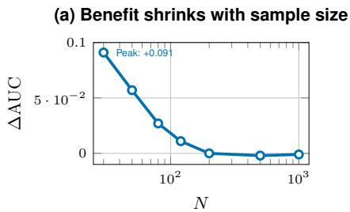
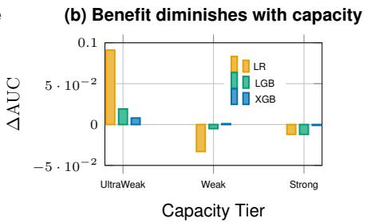
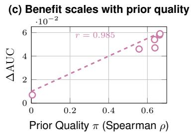
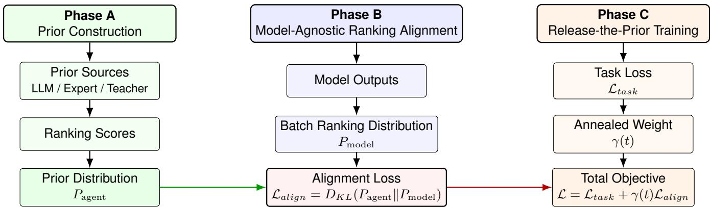
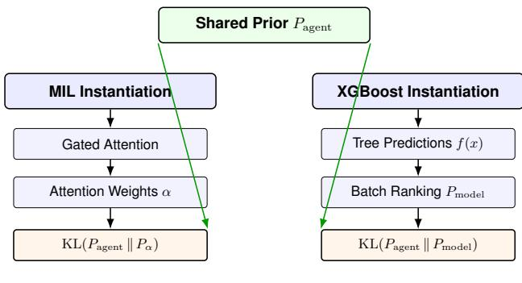
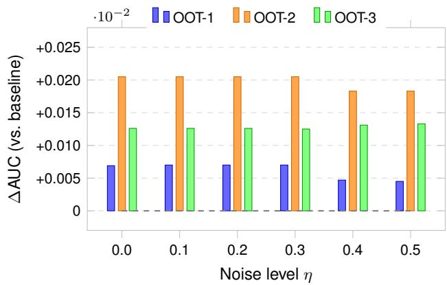
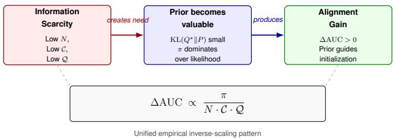

# Ranking Prior Alignment for Credit Risk Modeling: When Do External Priors Mater?

Qiye Lu   
Ant International   
China   
Jiang Ji   
Ant International   
China

Liang Zhang Ant International China

## Abstract

Cold-start credit scoring — deploying models with scarce labeled data, weak features, or minimal capacity — is a recurring problem in financial machine learning. When a new lending product launches, labeled default data is scarce, feature pipelines are immature, and models must be deployed with minimal capacity to avoid overfit ting. Standard defenses operate on the same limited data; what is needed is a source of external regularization grounded in domain knowledge.

We propose Ranking Prior Alignment, a model-agnostic framework that distills external ranking priors (from domain experts, teacher models, or LLMs) into any scoring model via a temperature-scaled KL divergence loss. The framework unifies neural (MIL attention) and tree-based (XGBoost custom objective) architectures through a single formulation: $\mathcal { L } \ = \ \mathcal { L } _ { \mathrm { t a s k } } + \gamma ( t )$ $\mathrm { K L } ( P _ { \mathrm { a g e n t } } | | P _ { \mathrm { m o d e l } } )$ , where $\gamma ( t )$ follows an exponential decay schedule. The method requires no external model at inference, and its tree-based instantiation tolerates annotation noise up to � = 0.5.

On an industrial dataset of over 1.5M merchants, MIL alignment achieves 7/7 positive evaluation cells at 3K bags (1 ID + 3 OOT + 3 degradation metrics; peak ΔAUC = +0.020 on OOT-1), and XGBoost ablation achieves 9/9 positive metrics at 300 bags. Crossdataset validation on public Amex shows 5/5 positive folds (avg $\Delta \mathrm { A U C } = + 0 . 0 4 1 )$ . Four model families (MIL, XGBoost, LightGBM, Logistic Regression) and four teacher architectures show that the framework is both model-agnostic and prior-source-independent.

We further observe that alignment gains exhibit an inversescaling pattern: benefits grow as data abundance $N ,$ model capac ity $^ { C , }$ and feature quality $\boldsymbol { Q }$ decrease, helping practitioners decide when to invest in prior annotation.

## CCS Concepts

• Computing methodologies → Neural networks; Machine learning; • Applied computing → Economics.

## Keywords

Ranking Prior Alignment, Credit Risk Scoring, Prior-Guided Learning, Cold-Start Generalization, KL Divergence Alignment

## 1 Introduction

Cold-start credit scoring, where models must be deployed with scarce labeled data, weak features, or minimal capacity, is a common challenge in financial machine learning. When a new lending product launches, labeled defaults are sparse, feature pipelines are immature, and models must be kept simple to avoid overfitting [1]. Standard defenses (regularization, early stopping, temporal cross-validation) provide partial protection but operate on the same limited data. What is needed is a source of external regularization, grounded in domain knowledge rather than the statistics of the moment.

External ranking sources (domain experts, teacher models, or large language models) can provide such knowledge: which merchants exhibit anomalous behavior, how temporal patterns indicate gaming, and which characteristics signal instability. Recent work has demonstrated that LLM-derived priors improve tabular model performance [2–4]. However, an open question remains: how to incorporate such priors into the training objective of diverse model architectures, without requiring external model access at inference.

We propose Ranking Prior Alignment, a model-agnostic framework that distills external ranking priors into the training objective of any scoring model via a Bayesian-inspired KL divergence regularizer. The framework unifies two instantiations, Multiple Instance Learning (MIL) attention alignment and XGBoost ranking alignment, through a single formulation: $\mathcal { L } = \mathcal { L } _ { \mathrm { t a s k } } + \gamma ( t )$ $\mathrm { K L } ( P _ { \mathrm { a g e n t } } | | P _ { \mathrm { m o d e l } } )$ , where $\gamma ( t )$ follows an exponential decay schedule. The method requires no external model at inference, is robust to annotation noise up to $\eta = 0 . 5$ for tree-based models, and generalizes across four model families on two datasets. We further observe that alignment gains follow a consistent inverse-scaling pattern with data abundance, model capacity, and prior quality (Eq. 3), which helps practitioners decide when to invest in prior annotation (Figure 1).

Contributions.

(1) Ranking Prior Alignment. We propose a model-agnostic, prior-source-agnostic framework for cold-start credit scoring, applicable to both neural (MIL) and tree-based (XG-Boost/LightGBM) models with Bayesian �-decay; requiring no external model at inference; validated on an industrial dataset of over 1.5M merchants (7/7 positive MIL cells; 9/9 XGBoost metrics) and public Amex (5/5 positive folds).

(2) Cross-Family Validation. Four model families (MIL, XGBoost, LightGBM, Logistic Regression) and four teacher architectures show improvements across all settings; the framework is priorsource-independent (Pearson � = 0.993, � = 0.007).

(3) Empirical Inverse-Scaling Pattern. We further observe that alignment gains follow an inverse-scaling relationship with �, $C , Q ,$ , and �, helping practitioners decide when prior annotation is worth the cost.

## 2 Related Work

## 2.1 Multiple Instance Learning in Finance

Multiple Instance Learning [5] was originally introduced for drug activity prediction. The attention-based MIL framework [6] enables instance-level interpretability critical for regulatory compliance. In finance, MIL has been applied to credit scoring [7], fraud detection [8], and anomaly detection [9]. However, prior work has not addressed temporal distribution shift nor explored whether external domain knowledge can regularize attention against drift.

  
Figure 1: Prior-guided learning is most beneficial under information scarcity. Empirical inverse-scaling relationship: ΔAUC ∝ $\pi / ( N \cdot C \cdot Q )$ (Eq. 3). (a) Gains diminish with increasing sample size $N ;$ (b) diminish with model capacity C; (c) grow with prior quality �. The largest improvements occur in low-information regimes.

## 2.2 LLM-Guided Tabular Learning

Recent work explores LLMs for tabular data. TabLLM [2] uses LLMs as zero-shot tabular classifiers via row serialization. LLM-Boost [10] and ForestLLM [4] use LLM-generated feature representations for boosting and forests. LAAT [3] regularizes models toward LLM-generated feature attributions — the most conceptually similar prior work. Our approach difers fundamentally: we operate at the ranking level (not feature or label level), demonstrate consistent gains across varying conditions, and show model-agnosticism across MIL and XGBoost. Ranking-level operation is more robust under temporal shift than feature-level attribution, since ordinal relations between entities are more stable than absolute feature weights.

Table 1 positions our method against existing LLM-guided tabular approaches. Our approach difers in several respects: we operate at the ranking level (not feature or label level), incur zero LLM inference cost at deployment, show gains across varying conditions, and work across both neural (MIL) and tree-based (XGBoost) architectures.

## 2.3 Prior-Guided Learning and Distillation

A second line of work injects external knowledge into supervised learning through soft targets or auxiliary regularizers. Knowledge distillation [11] transfers a teacher’s softmax distribution; Menon et al. [12] formalize a bias–variance view in which a calibrated teacher prior reduces estimator variance by an $O ( 1 / N )$ term, predicting the largest gains under data scarcity. Curriculum learning [13] provides a prior over example dificulty, and attribution-regularization methods such as LAAT [3] provide a prior over feature importance. For tabular models, Hsieh et al. [14] (Distilling Step-by-Step) and Lu et al. [15] jointly fit labels and LLM-derived rationales. Our work difers in that the prior is used as a cross-sample ranking distribution rather than a per-instance soft label, and we provide a quantitative characterization of when such prior guidance helps (information-scarcity regime) rather than merely that it helps.

Table 1: Comparison with LLM-Guided Tabular Methods
<table><tr><td>Method</td><td>Align</td><td>LLM Inf.</td><td>Agnostic</td><td>Inv. Scal.</td><td>OOT Rob.</td></tr><tr><td>TabLLM</td><td>Label</td><td>Yes</td><td>No</td><td>No</td><td>No</td></tr><tr><td>LLM-Boost</td><td>Feature</td><td>No</td><td>Partial</td><td>No</td><td>No</td></tr><tr><td>ForestLLM</td><td>Feature</td><td>No</td><td>Partial</td><td>No</td><td>No</td></tr><tr><td>LAAT</td><td>Attrib.</td><td>No</td><td>Partial</td><td>No</td><td>No</td></tr><tr><td>Ours</td><td>Rank</td><td>No</td><td>Yes</td><td>Yes (3D)</td><td>Yes</td></tr></table>

## 2.4 Distribution Shift and Credit Scoring

Temporal distribution shift is well-studied [1, 16, 17]. In credit scoring, ensemble methods dominate [18], and tree-based models such as XGBoost [19] and LightGBM [20] remain the industry standard. However, they lack mechanisms for incorporating distributionindependent priors — our framework targets this gap directly.

## 3 Problem Formulation

## 3.1 Bag-Level Risk Scoring

In merchant credit scoring, each merchant has multiple monthly transaction snapshots (instances), but default labels are only observed at the merchant level (bag). This natural bag-instance hierarchy makes MIL a structurally fitting choice. Formally, consider a set of � entities (merchants or customers). For entity �, we observe $N _ { i }$ instances $\{ x _ { i 1 } , x _ { i 2 } , . . . , x _ { i N _ { i } } \}$ where each $x _ { i j } \in \mathbb { R } ^ { d }$ is a �- dimensional feature vector. Only the bag-level label $y _ { i } \in \{ 0 , 1 \}$ is available (default vs. non-default). The goal is to learn a function $f : \{ \{ x _ { i 1 } , . . . , x _ { i N _ { i } } \} \}  [ 0 , 1 ]$ that predicts default probability.

## 3.2 The Ranking Alignment Problem

Both MIL and XGBoost face a common challenge: ranking without supervision. MIL must learn which instances within a bag are most risk-relevant (attention weights $\alpha ) ,$ , while XGBoost must learn which training samples deserve higher prediction scores $( f ( x _ { i } ) )$ Without external guidance, these rankings are learned solely from bag-level labels — a self-supervision problem. We define the general alignment objective as minimizing KL divergence between the model’s learned ranking distribution and an externally-derived ranking distribution:

$$
\mathcal { L } _ { \mathrm { a l i g n } } = \mathrm { K L } \big ( P _ { \mathrm { a g e n t } } \parallel P _ { \mathrm { m o d e l } } \big ) = \sum _ { j } P _ { \mathrm { a g e n t } } ( j ) \log \frac { P _ { \mathrm { a g e n t } } ( j ) } { P _ { \mathrm { m o d e l } } ( j ) }\tag{1}
$$

where $P _ { \mathrm { m o d e l } }$ is derived from the model’s output (attention weights or prediction scores) via softmax with temperature �, and $P _ { \mathrm { a g e n t } }$ is derived from the external prior source.

## 3.3 Out-of-Time Generalization

Let $D _ { \mathrm { t r a i n } }$ be the data distribution over time window $[ T _ { 0 } , T _ { 1 } ]$ and ${ D } _ { \mathrm { t e s t } } ^ { ( k ) }$ be the distribution over $\left[ T _ { 1 } + \Delta _ { k } , T _ { 1 } + \Delta _ { k } + W \right]$ for temporal gaps $\Delta _ { k } > 0$ . The OOT degradation is:

$$
\delta ^ { ( k ) } = \mathrm { A U C _ { I D } } - \mathrm { A U C } _ { \mathrm { O O T } } ^ { ( k ) }\tag{2}
$$

## 3.4 Efective Information

We define the model’s efective information as $I _ { \mathrm { e f f } } = f ( N , C , Q )$ where � is the number of training bags, C is the model capacity, and Q is the feature quality. Our central hypothesis is:

$$
\Delta \mathrm { A U C } \propto { \frac { \pi } { I _ { \mathrm { e f f } } } } = { \frac { \pi } { N \cdot C \cdot Q } }\tag{3}
$$

where � is the prior quality. When $I _ { \mathrm { e f f } }$ is high (abundant data, strong model, discriminative features), the data likelihood dominates and the prior has negligible efect. When $I _ { \mathrm { e f f } }$ is low, the prior becomes the dominant force.

## 3.5 Operational Definitions of Q and C

Feature quality $\begin{array} { r } { Q = \frac { 1 } { | F | } \sum _ { j \in F } \left| \operatorname { A U C } ( f _ { j } ; y ) - 0 . 5 \right. } \end{array}$ (mean absolute univariate discriminative power). On Amex: $Q _ { 3 } = 0 . 1 4 3 , Q _ { 5 } = 0 . 1 5 0 ,$ $Q _ { 1 0 } = Q _ { \mathrm { a l l } } = 0 . 1 6 7$ . Model capacity C: log $C = \log ( \mathrm { d e p t h } \times n _ { \mathrm { e s t } } )$ for trees; log $C = \log C _ { \mathrm { r e g } }$ for LR. We acknowledge that $\boldsymbol { Q } ^ { \prime } \boldsymbol { s }$ narrow variance (17%) limits its statistical power in pooled regression (§6.1).

## 4 The Framework

## 4.1 Prior Generation

Figure 2 illustrates the framework. An external prior source (LLM agent, teacher model, or domain expert) produces ranking scores on a sampled subset of training instances. For MIL, instance-level soft labels are generated within each bag; for XGBoost, bag-level risk scores serve directly as ranking priors. Annotations are a one-time cost reused across all configurations.

## 4.2 Ranking Alignment Objective

The core contribution is a model-agnostic alignment loss operating at the ranking level.

MIL Instantiation. The attention distribution � is aligned toward the prior’s importance scores, added to the standard binary cross-entropy (BCE) task loss:

$$
\mathcal { L } _ { \mathrm { M I L } } = \mathcal { L } _ { \mathrm { B C E } } ( y , \hat { y } ) + \gamma \cdot \mathrm { K L } \big ( \mathrm { s o f t m a x } ( s / \tau ) \mid \mid \alpha \big )\tag{4}
$$

XGBoost Instantiation. A custom objective aligns prediction rankings with the prior via ListNet-style [21] KL computed across all � training bags per iteration:

$$
\mathcal { L } _ { \mathrm { X G B } } = \mathcal { L } _ { \mathrm { l o g l o s s } } + \gamma \cdot \mathrm { K L } \big ( \mathrm { s o f t m a x } ( \tilde { s } / \tau ) \ | | \ \mathrm { s o f t m a x } ( \tilde { f } / \tau ) \big )\tag{5}
$$

where $\tilde { f }$ and �˜ are min-max normalized predictions and prior scores. Gradients are derived analytically:

$$
g _ { i } = \sigma ( f _ { i } ) - y _ { i } + \frac { \gamma } { \tau } \cdot ( P _ { \mathrm { m o d e l } } ( i ) - P _ { \mathrm { a g e n t } } ( i ) ) \cdot c _ { i }\tag{6}
$$

$$
h _ { i } = \sigma ( f _ { i } ) ( 1 - \sigma ( f _ { i } ) ) + \frac { \gamma } { \tau ^ { 2 } } \cdot P _ { \mathrm { m o d e l } } ( i ) ( 1 - P _ { \mathrm { m o d e l } } ( i ) ) \cdot c _ { i } ^ { 2 }\tag{7}
$$

where $c _ { i } = 1 / ( f _ { \operatorname* { m a x } } - f _ { \operatorname* { m i n } } )$ is the chain factor from min-max normalization.

## 4.3 Two-Phase Training with Dynamic �

Both instantiations use a warmup–alignment curriculum: standard task loss $( \gamma = 0 )$ for initial rounds, then alignment with exponential decay:

$$
\gamma ( t ) = \gamma _ { \mathrm { m i n } } + \left( \gamma _ { \mathrm { m a x } } - \gamma _ { \mathrm { m i n } } \right) \cdot \exp ( - 5 \cdot \mathrm { p r o g r e s s } )\tag{8}
$$

Strong initial alignment $( \gamma _ { \mathrm { m a x } } ~ = ~ 0 . 8 )$ shapes the model toward prior-informed patterns, then gradual release $( \gamma _ { \mathrm { m i n } } = 0 . 0 5 )$ allows data-driven refinement.

## 4.4 Model Family Instantiations

MIL Model. Instance encoder: $\mathbb { R } ^ { 4 0 1 } \to \mathbb { R } ^ { 2 5 6 } \to \mathbb { R } ^ { 1 2 8 }$ with Layer-Norm; Gated Attention [6] (dim 64); bag classifier: $1 2 8 \to 6 4 \to 1 ;$ Adam, $\mathrm { l r } = 5 \times 1 0 ^ { - 4 }$ . XGBoost Model. Standard XGBoost [19] with bag-level features, augmented by the custom objective (Eqs. 6–7). Warmup-to-alignment transition via xgb\_model continuation. Figure 3 illustrates how the unified alignment objective is instantiated for each architecture.

## 5 Experiments

We organize experiments to first validate the method’s efectiveness (§5.2–§5.4), then examine cross-family generalization (§5.5) and ablation robustness (§5.6).

## 5.1 Experimental Setup

Datasets. (1) Seller\_loan: over 1.5M merchants, millions of transaction instances, 401 features, 18 monthly windows (spanning 2024– 2025), default rate ∼27%, avg. bag size 3.6. (2) Amex Default Prediction [22]: 25K sampled customers, 188 features (delinquency $D _ { * }$ spend $S _ { * } ,$ , payment $P _ { * }$ , balance $B _ { * }$ , risk $R _ { * } )$ , natural MIL structure (avg. 12 monthly statements per customer), default rate 25.9%.

Evaluation. AUC is the primary metric. In-distribution (ID) AUC via 5-fold CV (out-of-fold, OOF), out-of-time (OOT) AUC on three temporally shifted windows (3, 9, 12 month gaps for Seller\_loan). Degradation $\delta ^ { ( k ) } = \mathrm { A U C _ { I D } } - \mathrm { A U C } _ { \mathrm { O O T } } ^ { ( k ) }$

Alignment. Exponential decay schedule $( \gamma _ { \mathrm { m a x } } \ : = \ : 0 . 8 , \ : \gamma _ { \mathrm { m i n } } \ : =$ 0.05), temperature $\tau { \it \Delta \phi } = 1 . 0$ for Seller\_loan. Prior source for Seller\_loan: a commercial instruction-tuned LLM with $\tau _ { \mathrm { p r i o r } } = 0 . 3$ (specifics provided upon acceptance). Prior source for Amex: teacher models trained on held-out features (§5.2).

Reproducibility. All experiments use seed=42 on a single A100 (40GB) GPU; total compute: ∼24 GPU-hours (excluding one-time ∼18 GPU-hour annotation cost). Anonymized code and Amex pipeline released upon acceptance; all Amex experiments (§5.2– 5.3) are fully reproducible from public data.

  
Figure 2: Ranking Prior Alignment Framework. (A) Construct a ranking prior from any source and convert scores to a probability distribution. (B) Align the model’s ranking distribution with the prior via KL divergence (cross-sample), applicable to MIL attention and tree-based models. (C) Two-phase training with a decaying � schedule: strong early alignment followed by gradual release.

  
Same Alignment Loss Different Backbone  
Figure 3: Framework instantiation for two architectures. Both map model outputs to a ranking distribution and minimize the same KL divergence against a shared prior $P _ { \mathrm { a g e n t } } ,$ difering only in how the model-side ranking is computed: MIL aggregates instance-level attention weights to bag-level rankings, while XGBoost ranks batch-level tree predictions directly.

## 5.2 Performance under Varying Sample Size

Main results. On the industrial Seller\_loan dataset, MIL alignment achieves 7/7 positive evaluation cells at 3K bags (Table 2), and XGBoost ablation achieves 9/9 positive metrics at 300 bags (Table 10). On public Amex, 5/5 cross-validation folds are positive (avg $\Delta \mathrm { A U C } = + 0 . 0 4 1 )$ ). These results show that alignment improves performance; we now examine how the gain depends on sample size.

Seller\_loan (MIL). Reference attention-MIL baseline (Table 2). The alignment benefit grows 100× from +0.0002 (93K IID) to   
+0.020 (3K OOT), with the largest gains in the cold-start regime. At   
3K bags, the aligned MIL model achieves all-positive gains across   
ID, 3 OOT windows, and degradation metrics. Conversely, at 10K

Table 2: MIL Performance under Varying Sample Size (Reference Attention-MIL Baseline). The 3K block is the complete 7-cell evaluation: 1 ID + 3 OOT ΔAUC cells plus 3 degradationreduction cells $( \delta _ { \mathrm { B L } } - \delta _ { \mathrm { A L } }$ , positive = aligned degrades less) — all 7 in Aligned’s favor.
<table><tr><td>Setting</td><td>N Bags</td><td>Distribution</td><td>Δ</td></tr><tr><td>93K IID</td><td>93,789</td><td>IID</td><td>+0.0002</td></tr><tr><td>3K IID</td><td>3,000</td><td>IID</td><td>+0.0027</td></tr><tr><td>10K OOT-1</td><td>10,000</td><td>OOT (3mo gap)</td><td>+0.0018</td></tr><tr><td>3K ID (OOF)</td><td>3,000</td><td>Single-month</td><td>+0.0083</td></tr><tr><td>3K OOT-1</td><td>3,000</td><td>OOT (3mo gap)</td><td>+0.0202</td></tr><tr><td>3K OOT-2</td><td>3,000</td><td>OOT (9mo gap)</td><td>+0.0087</td></tr><tr><td>3K OOT-3</td><td>3,000</td><td>OOT (12mo gap)</td><td>+0.0150</td></tr><tr><td>3K OOT-1 degr.</td><td>3,000</td><td>δ reduction</td><td>+0.0119</td></tr><tr><td>3K OOT-2 degr.</td><td>3,000</td><td>δ reduction</td><td>+0.0004</td></tr><tr><td> $3 \mathrm { K } \mathrm { O O T } \mathrm { - } 3 \mathrm { d e g r } .$ </td><td>3,000</td><td>δ reduction</td><td>+0.0067</td></tr></table>

bags, the benefit drops to +0.002 — the model has suficient data that the prior becomes redundant. The OOT setting amplifies the efect: distribution shift reduces the efective information in historical data, making the prior relatively more valuable.

Amex (XGBoost). We validate on the public Amex Default Prediction dataset [22], simulating a realistic cold-start scenario: a new credit product where delinquency history $( D _ { * } , R _ { * } , P _ { * } )$ is unavailable, and only behavioral features (�∗, �∗) can be used. We select 10 COLD\_START features with moderate individual AUC (0.63–0.70). Following the framework’s prior-agnostic formulation (§6.1), we instantiate the prior as a teacher model trained on the full feature set, emulating mature-line expertise transferred to the cold-start sub-product. This instantiation isolates the three-axis relationship from the Seller\_loan-specific LLM prior.

At 100 bags with ultra-weak XGBoost (Table 3), ΔAUC = +0.049 — the largest gain across the tree-based experiments. 5-fold crossvalidation yields: 5/5 positive folds, avg $\Delta \mathbf { A U C } = + 0 . 0 4 1$ (fold deltas: +0.002, +0.006, +0.043, +0.103, +0.048). As � increases (200 → 500), the benefit diminishes to near zero. Cross-family data scaling is consistent: XGBoost gains shrink from +0.049 (100 bags; Table 3)

Table 3: Data Scarcity and Model Strength (Amex, COLD\_START features, teacher prior)
<table><tr><td>N Bags</td><td>Model</td><td>d/n</td><td> $\gamma _ { \mathrm { m a x } } / \tau$ </td><td>BL Test</td><td>AL Test</td><td>∆ Test</td></tr><tr><td>100</td><td>ultra-weak</td><td>2/15</td><td>1.5/0.3</td><td>0.7626</td><td>0.8119</td><td>+0.049</td></tr><tr><td>200</td><td>ultra-weak</td><td>2/15</td><td>1.5/0.3</td><td>0.8368</td><td>0.8398</td><td>+0.003</td></tr><tr><td>200</td><td>weak</td><td>2/20</td><td>1.0/0.5</td><td>0.8540</td><td>0.8678</td><td>+0.014</td></tr><tr><td>200</td><td>std-weak</td><td>3/30</td><td>0.8/1.0</td><td>0.8787</td><td>0.8806</td><td>+0.002</td></tr><tr><td>300</td><td>ultra-weak</td><td>2/15</td><td>1.5/0.3</td><td>0.8586</td><td>0.8504</td><td>-0.008</td></tr><tr><td>500</td><td>ultra-weak</td><td>2/15</td><td>1.5/0.3</td><td>0.8599</td><td>0.8617</td><td>+0.002</td></tr></table>

to +0.008 (300 bags; Table 5), and LR from +0.091 (30 bags) to −0.001 (1000 bags; Table 9); LightGBM shows the same diminishing pattern along the capacity axis (Table 5).

## 5.3 Performance across Model Capacities

Seller\_loan (XGBoost). Three capacity configurations at 300 bags. At 3K bags (Table 4), even a weak model has suficient data for the logloss to dominate, and alignment introduces unnecessary bias (weak\_3k: 1/3 wins). But at 300 bags with the same weak XGBoost, alignment produces 3/3 OOT wins with ΔOOT = +0.013. The strong model $( \mathrm { d } { = } 6 , \mathrm { n } { = } 2 0 0 )$ at 3K shows only marginal benefit (2/3 wins). This directly supports the capacity axis: the weakerthe model relative to the task dificulty, the more alignment helps.

## Cross-family model strength gradient (Amex, 300 bags).

All three families show diminishing gains with increasing capacity: ΔAUC decreases monotonically from ultra-weak to strong (+0.008 → −0.001 for XGBoost; $+ 0 . 0 1 9  - 0 . 0 1 2$ for LightGBM). LR appears anomalous at standard regularization $( C \ge 0 . 1 , N = 3 0 0$ all produce $\Delta \le 0 )$ , but this is a regime artifact: at these settings the linear model’s efective capacity is still suficient for the data likelihood to dominate. Pushing LR into its true ultra-weak regime $( C = 0 . 0 0 1 , N = 3 0 , Q _ { 5 } )$ recovers the largest observed gain +0.091 — supporting the view that the same pattern is consistent across all families.

## 5.4 Efect of Prior Quality

## Feature quality Q gradient.

Alignment helps at intermediate Q (Table 6): features too weak cannot leverage the prior; features too strong do not need it. An uninformative (random) prior likewise yields no reliable gain (Table 7), indicating that gains require informative priors.

Prior quality � gradient. Six-level prior degradation (100 bags, ultra-weak XGBoost/LightGBM):

XGBoost ΔAUC correlates with � (Table 7): Pearson $r = 0 . 9 8 5$ $( p = 3 . 3 \times 1 0 ^ { - 4 } )$ . The random prior’s CI includes zero $( p = 0 . 1 5 )$ LightGBM is robust: even 60% noise delivers > 80% of oracle gain.

Prior source independence. Four architecturally distinct teachers (XGBoost, Random Forest, MLP, Logistic Reg.) on Amex fullfeature pool, ultra-weak students (100 bags):

ΔAUC tracks � with Pearson $r = 0 . 9 9 3 \ ( p \ = \ 0 . 0 0 7 ;$ Table 8); $\Delta / \pi \in \left[ 0 . 0 3 4 , 0 . 0 4 4 \right]$ suggests the pattern depends on prior informativeness, not functional form.

## 5.5 Cross-Family Generalization

LR recovery grid. A 192-cell factorial grid over $N \in \{ 3 0 , . . . , 1 0 0 0 \}$ $C \in \{ 0 . 0 0 1 , . . . , 1 . 0 \} , Q \in \{ Q _ { 3 } , Q _ { 5 } , Q _ { 1 0 } , Q _ { \mathrm { a l l } } \}$ (3 seeds per cell):

Table 4: Performance across Model Capacities (Seller\_loan)
<table><tr><td>Config</td><td>N</td><td>Depth</td><td>n_est</td><td>∆ OOT</td><td>Wins</td><td>Pattern</td></tr><tr><td>strong_3k</td><td>3,000</td><td>6</td><td>200</td><td>+0.0032</td><td>2/3</td><td>Marginal</td></tr><tr><td>weak_3k</td><td>3,000</td><td>3</td><td>30</td><td>-0.0129</td><td>1/3</td><td>Harmful</td></tr><tr><td>weakest_300</td><td>300</td><td>3</td><td>30</td><td>+0.0134</td><td>3/3</td><td>Strong</td></tr></table>

Table 5: Cross-Model-Family Alignment (Amex, 300 bags, teacher prior)
<table><tr><td>Family</td><td>Strength</td><td>Ymax/τ</td><td>BL</td><td>AL</td><td>Δ</td></tr><tr><td rowspan="3">XGBoost</td><td>Ultra-weak (d2/n15)</td><td>1.5/0.3</td><td>0.832</td><td>0.840</td><td>+0.008</td></tr><tr><td>Weak (d3/n30)</td><td>0.8/0.5</td><td>0.886</td><td>0.887</td><td>+0.001</td></tr><tr><td>Strong (d6/n200)</td><td>0.3/1.0</td><td>0.883</td><td>0.881</td><td>-0.001</td></tr><tr><td rowspan="3">LightGBM</td><td>Ultra-weak (d2/n15)</td><td>1.5/0.3</td><td>0.840</td><td>0.859</td><td>+0.019</td></tr><tr><td>Weak (d3/n30)</td><td>0.8/0.5</td><td>0.886</td><td>0.881</td><td>-0.005</td></tr><tr><td>Strong (d6/n200)</td><td>0.3/1.0</td><td>0.881</td><td>0.869</td><td>-0.012</td></tr><tr><td rowspan="3">Logistic Reg.</td><td>Default (C=1.0, N=300)</td><td>0.5/1.0</td><td>0.856</td><td>0.823</td><td>-0.033</td></tr><tr><td>Strong  $( C { = } 1 0 . 0 , N { = } 3 0 0 )$ </td><td>0.3/1.0</td><td>0.864</td><td>0.852</td><td>-0.012</td></tr><tr><td>Ultra-weak  $\left( C { = } 0 . 0 0 1 , N { = } 3 0 , Q _ { 5 } \right)$ </td><td>0.5/1.0</td><td>0.553</td><td>0.644</td><td>+0.091</td></tr></table>

Table 6: Feature Quality Gradient (Amex, 200 bags, teacher prior)
<table><tr><td>Feature Set</td><td># Feats</td><td>Indiv AUC</td><td>BL Test</td><td>AL Test</td><td>∆ Test</td></tr><tr><td>WEAKER</td><td>14</td><td>0.52-0.59</td><td>0.7349</td><td>0.7303</td><td>-0.005</td></tr><tr><td>COLD_START</td><td>10</td><td>0.63-0.70</td><td>0.8368</td><td>0.8398</td><td>+0.003</td></tr><tr><td>STRONGER</td><td>22</td><td>0.75-0.84</td><td>0.8627</td><td>0.8614</td><td>-0.001</td></tr></table>

Table 7: Prior Quality Gradient (100 bags, ultra-weak models, COLD\_START, 3 seeds)
<table><tr><td>Prior</td><td>π (Spearman ρ)</td><td>XGB ∆AUC</td><td>LGB ΔAUC</td></tr><tr><td>Full teacher</td><td>0.665</td><td>+0.059</td><td>+0.034</td></tr><tr><td>Weak teacher</td><td>0.663</td><td>+0.058</td><td>+0.035</td></tr><tr><td>Ultra-weak teacher</td><td>0.639</td><td>+0.047</td><td>+0.035</td></tr><tr><td>Teacher + 30% noise</td><td>0.637</td><td>+0.054</td><td>+0.036</td></tr><tr><td>Teacher + 60% noise</td><td>0.557</td><td>+0.046</td><td>+0.035</td></tr><tr><td>Random</td><td>0.005</td><td>+0.007</td><td>+0.025</td></tr></table>

The � = 0.001 ridge (Table 9) is monotonic in �, matching the XGBoost/LightGBM curves. Across all 192 cells: Pearson � = +0.586 $( / { } = 4 \times 1 0 ^ { - 1 9 } )$ , Spearman $\rho = + 0 . 6 1 4 \left( p = 3 \times 1 0 ^ { - 2 1 } \right)$ . Top-quartile (low-information) cells average $\Delta \mathrm { A U C } = + 0 . 0 2 4 ;$ bottom quartile: −0.012. This demonstrates that LR exhibits the same pattern once pushed into its own ultra-weak regime — the earlier negative results $( C \ge 0 . 1 , N = 3 0 0 )$ are observations from the high-information half of the curve where the relationship predicts $\Delta \mathrm { A U C } \leq 0$

5-fold cross-validation. 300 bags, $\mathrm { C O L D } \_ { \mathrm { } } \mathrm { S T A R T } / Q _ { 5 }$ , teacher prior, ultra-weak:

• XGBoost (d2/n15): avg $\Delta \mathrm { A U C } = + 0 . 0 0 6 \pm 0 . 0 0 7$ , positive 4/5 folds

• LightGBM (d2/n15): avg $\Delta \mathrm { A U C } = + 0 . 0 1 1 \pm 0 . 0 0 8 ,$ , positive 5/5 folds

• Logistic Reg. (�=0.001, �5): avg $\Delta \mathrm { A U C } = + 0 . 0 0 4 \pm 0 . 0 0 6$ positive 3/5 folds

Table 8: Prior Source Independence (Amex, 100 bags, 3 seeds)
<table><tr><td>Teacher</td><td>π</td><td>XGBΔ</td><td>LGBΔ</td><td> $\Delta / \pi$ </td></tr><tr><td>XGBoost</td><td>0.663</td><td>+0.029</td><td>+0.028</td><td>0.044</td></tr><tr><td>Rand. Forest</td><td>0.651</td><td>+0.022</td><td>+0.029</td><td>0.034</td></tr><tr><td>MLP</td><td>0.658</td><td>+0.025</td><td>+0.029</td><td>0.038</td></tr><tr><td>Logistic Reg.</td><td>0.663</td><td>+0.029</td><td>+0.028</td><td>0.044</td></tr></table>

Table 9: Logistic Regression: �-Scan at the Ultra-Weak Ridge $C = 0 . 0 0 1$ , �5 Features
<table><tr><td>N</td><td>BL AUC</td><td>AL AUC</td><td>ΔAUC</td></tr><tr><td>30</td><td>0.553</td><td>0.644</td><td>+0.091</td></tr><tr><td>50</td><td>0.582</td><td>0.638</td><td>+0.057</td></tr><tr><td>80</td><td>0.601</td><td>0.629</td><td>+0.027</td></tr><tr><td>120</td><td>0.617</td><td>0.628</td><td>+0.011</td></tr><tr><td>200</td><td>0.628</td><td>0.628</td><td>+0.000</td></tr><tr><td>500</td><td>0.642</td><td>0.640</td><td>-0.002</td></tr><tr><td>1000</td><td>0.648</td><td>0.647</td><td>-0.001</td></tr></table>

## 5.6 Ablation Studies

XGBoost all-positive pattern. Ranking alignment on weakened XGBoost (depth=3, $n _ { \mathrm { e s t } } { = } 3 0 )$ with 300 bags achieves 9/9 positive metrics (Table 10).

Binomial sign test $p \ = \ 0 . 0 0 4 ;$ 5-fold mean $\Delta \mathrm { A U C } ~ = ~ + 0 . 0 1 5 .$ 95% bootstrap $\operatorname { C I } \left[ + 0 . 0 0 7 , + 0 . 0 2 5 \right]$ , excluding zero. The OOT-2 gain of +0.0205 is the largest single-window improvement across both model families. This 9/9 sweep is achieved with only 300 bags — 10× fewer than the MIL 7/7 result (3K bags), showing that the method works in low-data settings. Caveat: the 9 cells are not independent (CV folds share training data; OOT windows are temporally adjacent), so the sign test is an aggregate indicator; per-window gains and the 5-fold Amex ablation provide stricter evidence.

� schedule comparison. Six schedules on 300-bag weakened XGBoost (Table 11):

Only exponential decay achieves 3/3 OOT wins. Fixed and cosine schedules fail on OOT-3 (0.684 and 0.681 vs. baseline 0.699), suggesting that persistent alignment impairs OOT generalization. High-�-start + decay schedules (exp, step, linear) tend to dominate low/fixed-� on the longest-horizon OOT windows, supporting the “strong initial guidance, then release” principle.

Noise tolerance. Bernoulli noise $\eta \in \{ 0 , . . . , 0 . 5 \}$ on prior scores (300-bag XGBoost; Table 12):

All noise levels maintain 3/3 OOT wins. Even at $\eta = 0 . 5$ (50% random replacement), OOT-3 remains +0.013 above baseline. This contrasts sharply with MIL, where $\eta \geq 0 . 1$ erases alignment benefit entirely — MIL operates at the instance level (high sensitivity to individual noise) while XGBoost operates at the bag level (aggregated rankings are smoother). This result has practical significance: imperfect priors from noisy LLM annotations remain useful for tree-based models (Figure 4).

Temperature sensitivity. � sweep on ultra-weak XGB/LGB at 100 and 300 bags (Table 13):

Sweet spot � ∈ [0.3, 0.5]; positive ΔAUC across $\tau \in [ 0 . 1 , 2 . 0 ]$ for both families.

Table 10: XGBoost All-Positive Pattern — 300 Bags, Weakened Model (exp\_decay �: 0.8→0.05)
<table><tr><td>Metric</td><td>Baseline</td><td>Aligned</td><td>Δ</td></tr><tr><td>ID AUC (5-fold)</td><td>0.7412</td><td>0.7517</td><td>+0.0105</td></tr><tr><td>Fold 1</td><td>0.8178</td><td>0.8304</td><td>+0.0126</td></tr><tr><td>Fold 2</td><td>0.7483</td><td>0.7691</td><td>+0.0208</td></tr><tr><td>Fold 3</td><td>0.7060</td><td>0.7073</td><td>+0.0013</td></tr><tr><td>Fold 4</td><td>0.7985</td><td>0.8296</td><td>+0.0311</td></tr><tr><td>Fold 5</td><td>0.6548</td><td>0.6652</td><td>+0.0104</td></tr><tr><td>OOT-1 (3mo gap)</td><td>0.8006</td><td>0.8075</td><td>+0.0069</td></tr><tr><td>OOT-2 (9mo gap)</td><td>0.7517</td><td>0.7722</td><td>+0.0205</td></tr><tr><td>OOT-3 (12mo gap)</td><td>0.6986</td><td>0.7112</td><td>+0.0126</td></tr><tr><td colspan="4">Total wins</td></tr></table>

Table 11: � Schedule Comparison — XGBoost, 300 Bags
<table><tr><td>Schedule</td><td>γ Range</td><td>ID</td><td>00T-1</td><td>00T-2</td><td>00T-3</td><td>Wins</td></tr><tr><td>Baseline</td><td> $\gamma \equiv 0$ </td><td>0.7412</td><td>0.8006</td><td>0.7517</td><td>0.6986</td><td>一</td></tr><tr><td>Fixed</td><td> $\gamma \equiv 0 . 3$ </td><td>0.7531</td><td>0.8076</td><td>0.7484</td><td>0.6840</td><td>1/3</td></tr><tr><td>Cosine warmup</td><td> $0  0 . 3$ </td><td>0.7522</td><td>0.8074</td><td>0.7521</td><td>0.6805</td><td>1/3</td></tr><tr><td>Linear decay</td><td> $0 . 5  0 . 1$ </td><td>0.7470</td><td>0.8068</td><td>0.7692</td><td>0.7080</td><td>2/3</td></tr><tr><td>Exp decay</td><td> ${ \bf 0 . 8 }  { \bf 0 . 0 5 }$ </td><td>0.7517</td><td>0.8075</td><td>0.7722</td><td>0.7112</td><td>3/3</td></tr><tr><td>Step decay</td><td> $0 . 5  0 . 1$ </td><td>0.7514</td><td>0.8085</td><td>0.7716</td><td>0.7091</td><td>2/3</td></tr></table>

Table 12: XGBoost Noise Tolerance — � Sweep (exp\_decay, 300 Bags)
<table><tr><td>η</td><td>00T-1∆</td><td>OOT-2 ∆</td><td>OOT-3∆</td><td>OOT Wins</td></tr><tr><td>0.0</td><td>+0.0069</td><td>+0.0205</td><td>+0.0126</td><td>3/3</td></tr><tr><td>0.1</td><td>+0.0070</td><td>+0.0205</td><td>+0.0126</td><td>3/3</td></tr><tr><td>0.2</td><td>+0.0070</td><td>+0.0205</td><td>+0.0126</td><td>3/3</td></tr><tr><td>0.3</td><td>+0.0070</td><td>+0.0205</td><td>+0.0125</td><td>3/3</td></tr><tr><td>0.4</td><td>+0.0047</td><td>+0.0183</td><td>+0.0131</td><td>3/3</td></tr><tr><td>0.5</td><td>+0.0045</td><td>+0.0183</td><td>+0.0133</td><td>3/3</td></tr></table>

  
Figure 4: Robustness checks and ablation studies. Alignment remains beneficial across all prior noise levels $\eta \leq 0 . 5$ for treebased models, demonstrating tolerance to imperfect priors.

Table 13: Temperature � Sensitivity (ultra-weak models, teacher prior, COLD\_START)
<table><tr><td rowspan="2">τ</td><td colspan="2">100 bags</td><td colspan="2">300 bags</td></tr><tr><td>XGBΔ</td><td>LGBΔ</td><td>XGBΔ</td><td>LGBΔ</td></tr><tr><td>0.1</td><td>+0.017</td><td>+0.027</td><td>+0.003</td><td>+0.024</td></tr><tr><td>0.3</td><td>+0.029</td><td>+0.029</td><td>+0.013</td><td> $+ 0 . 0 1 6$ </td></tr><tr><td>0.5</td><td>+0.035</td><td>+0.022</td><td>+0.009</td><td> $+ 0 . 0 1 0$ </td></tr><tr><td>1.0</td><td>+0.029</td><td>+0.013</td><td>+0.007</td><td> $+ 0 . 0 1 1$ </td></tr><tr><td>2.0</td><td>+0.003</td><td>+0.009</td><td>+0.008</td><td> $+ 0 . 0 1 1$ </td></tr><tr><td>5.0</td><td>-0.005</td><td>+0.009</td><td>+0.008</td><td>+0.011</td></tr></table>

## 6 Discussion

## 6.1 Why Does Prior-Guided Learning Work?

Across four model families and two datasets, alignment gains consistently follow the inverse-scaling pattern of Eq. 3. We now ask why this pattern arises.

PAC-Bayes interpretation. Treating $P _ { \mathrm { a g e n t } }$ as a Bayesian prior $P$ over hypotheses and the trained model as a posterior �, the McAllester-style bound [23, 24] states that with probability at least $1 - \delta \colon$

$$
\mathbb { E } _ { h \sim Q } [ R ( h ) ] \le \mathbb { E } _ { h \sim Q } [ \hat { R } ( h ) ] + \sqrt { \frac { \mathrm { K L } ( Q \| P ) + \log ( 2 \sqrt { N } / \delta ) } { 2 N } }\tag{9}
$$

Three properties of this bound connect directly to our empirical axes: (1) Sample size � appears in the denominator: as � shrinks, the prior term dominates — explaining $\Delta \mathrm { A U C } \propto 1 / N .$ (2) Prior quality � corresponds to $\mathrm { K L } ( Q ^ { * } \| P )$ : a prior aligned with the optimal ranking $Q ^ { * }$ tightens the bound, while a random prior leaves it large (validated by $r = 0 . 9 8 5$ in our prior-quality gradient). (3) Capacity C and feature quality Q modulate how far � can deviate from �: higher capacity inflates KL(�∥�), shifting the regime from prior-dominated to likelihood-dominated.

Causal chain. The mechanism can be summarized as: Information Scarcity (low �, C, Q) → the prior $P _ { \mathrm { a g e n t } }$ becomes the dominant signal → Ranking Alignment tightens KL(�∥�) → Generalization Gain $( \Delta \mathrm { A U C } > 0 )$ . The dynamic � schedule mirrors simulated annealing [25]: � acts as an inverse temperature whose decay lets the likelihood progressively dominate, so the prior guides but does not constrain the final solution. This is consistent with the bias– variance view of distillation [12], which derives a complementary $O ( 1 / N )$ variance reduction from a high-quality teacher prior. The bound depends on � only through �, not its source, explaining why the pattern is prior-source-independent $( r = 0 . 9 9 3$ across four teacher architectures).

Quantifying the pattern. To quantify each axis’s marginal contribution, we fit $\log ( \Delta \mathrm { A U C } + k ) = \beta _ { 0 } + \beta _ { 1 }$ 1 log $N + \beta _ { 2 } \log C +$ $\beta _ { 3 }$ log $Q + \beta _ { 4 } \log ( \pi + k ) + \mathrm { f a m i l y }$ FE via OLS on the pooled 216-cell dataset $\left( k = 0 . 0 6 \right)$ .

Table 14 reports the results. Both log $N \left( - 0 . 0 7 2 ^ { * * * } \right)$ and log C $\left( - 0 . 0 6 0 ^ { * * * } \right)$ are negative and significant, providing multivariate support for the observed pattern. log Q is positive but not significant (narrow variance: 17%). A prior-gradient-only regression yields $R ^ { 2 } = 0 . 9 7 2$ with log $\pi = + 0 . 2 2 1 \left( p = 2 . 9 \times 1 0 ^ { - 4 } \right)$ . We emphasize that this regression is intended as a coarse first-order approximation of how alignment gain co-varies with the four axes, not a causal model: the cells are not independent samples, and unmodeled interactions $( \mathrm { e . g . , } N \times C )$ can absorb part of the $Q / \pi$ signal. Figure 5 synthesizes this causal chain into a unified conceptual picture.

Table 14: Log-Linear Scaling Regression $( k = 0 . 0 6 ;$ 95% CI in brackets; $^ { \star \star \star } p < 0 . 0 0 1 )$
<table><tr><td>Term</td><td>LR-only (n=194) Pooled (n=216)</td><td></td></tr><tr><td>Intercept</td><td> $- 2 . 4 4 3 ^ { \star \star \star }$ </td><td> $- 2 . 4 2 8 ^ { \ast \ast \ast }$ </td></tr><tr><td>log N</td><td> $- 0 . 0 6 7 ^ { \star \star \star }$ </td><td> $- 0 . 0 7 2 ^ { \star \star \star }$ </td></tr><tr><td>log C</td><td> $- 0 . 0 5 9 ^ { \star \star \star }$ </td><td> $- 0 . 0 6 0 ^ { \star \star \star }$ </td></tr><tr><td>log Q</td><td> $+ 0 . 2 1 3 \left( \mathrm { n . s . } \right)$ </td><td> $+ 0 . 2 1 4 \ ( \mathrm { n . s . } )$ </td></tr><tr><td>log π Family FE</td><td></td><td>+0.064 (n.s.)  $\operatorname { A l l } \operatorname { s i g } .$ </td></tr><tr><td> $\mathrm { R } ^ { 2 } / \mathrm { a d j } .$ </td><td> $0 . 2 6 6 \mathrm { ~ / ~ } 0 . 2 5 5$ </td><td> $0 . 4 2 4 \mathrm { ~ / ~ } 0 . 4 0 2$ </td></tr></table>

## 6.2 Practical Guidelines and Limitations

When to use. Cold-start scenarios $( N \lesssim 1 0 ^ { 3 }$ , new products, thin markets), each family in its ultra-weak regime. Defaults: exponential � decay $( 0 . 8 \mathrm {  } 0 . 0 5 ) , \tau = 0 . 3 ;$ ; min 30 bags (LR) or 100 bags (XGB). XGBoost tolerates $\eta \leq 0 . 5$ noise.

When prior alignment fails. The same inverse-scaling pattern predicts where the framework ofers little or no benefit, and our experiments make these failure modes explicit. (i) Information abundance: any family outside its ultra-weak regime — LR at $C \geq 0 . 1$ with $N \geq 3 0 0 \left( \Delta \leq 0 \right.$ , Table 5), XGB depth≥6 at 3K bags $( \Delta = - 0 . 0 0 1 )$ MIL at � = 10,000 (Δ ≈ +0.002 vs. +0.020 at 3K) — where the data likelihood already dominates and the prior introduces unnecessary bias. (ii) Prior-quality collapse: a random (shufled) prior with $\pi \approx 0$ yields $\Delta \mathrm { A U C } = + 0 . 0 0 7 \pm 0 . 0 1 2 \ : \mathrm { ( X G B , }$ n.s.); gains require informative priors, not mere regularization. (iii) Persistent alignment: fixed and cosine � schedules under-perform on OOT-3 (0.684/0.681 vs. 0.699 baseline), indicating that the prior should guide initialization, not constrain the final solution.

Limitations. The Seller\_loan dataset is proprietary (public validation limited to Amex); the inverse-scaling relationship is an empirical pattern, not a formal theorem; prior annotation incurs a one-time cost (∼18 GPU-hours). The influence of Q appears more dataset-dependent than � and C and warrants further investigation. Amex teacher prior. The teacher model (XGBoost on $D _ { * } / R _ { * } / P _ { * } )$ is trained on the same dataset’s held-out features — a legitimate prior transfer (full-feature model → cold-start sub-product), not data leakage, since the teacher’s predictions are used only as ranking targets, not labels. Fully external priors (e.g., from a diferent dataset’s model) remain to be tested.

## 7 Conclusion

We proposed Ranking Prior Alignment, a framework that injects external ranking knowledge — from domain experts, teacher models, or LLMs — into the training loss of credit scoring models through a decaying KL regularizer, applicable to both neural and tree-based architectures. The framework requires no external model at inference, generalizes across four model families, and is prior-sourceindependent.

The framework is efective in cold-start credit scoring: an industrial dataset of over 1.5M merchants achieves 7/7 positive cells at

  
Figure 5: Why does prior-guided learning work? A conceptual synthesis. When information is scarce (low �, C, Q), the prior $P _ { \mathrm { a g e n t } }$ becomes the dominant signal; a high-quality prior (� large) tightens KL $. ( Q ^ { * } \| P )$ and produces alignment gain. This chain supports the unified empirical pattern: ΔAUC ∝ �/(� · C · Q) (Eq. 3).

3K bags, and public Amex validation yields 5/5 positive folds (avg ΔAUC = +0.041; peak +0.091 at 30-bag Logistic Regression).

For credit risk practitioners, these findings yield a simple decision rule: invest in external prior annotation when labeled data, model capacity, or feature pipelines are individually weak — the cold-start conditions common to new lending products and thin markets; skip it when any one of these axes is already strong enough to let the data speak for itself. Extending to fully cross-institutional priors from diferent datasets is left to future work.

## References

[1] J. Quionero-Candela, M. Sugiyama, A. Schwaighofer, and N.D. Lawrence. Dataset Shift in Machine Learning. MIT Press, 2009.

[2] S. Hegselmann, A. Buendia, H. Lang, M. Agrawal, X. Jiang, and D. Sontag. TabLLM: Few-shot Classification of Tabular Data with Large Language Models. In Proceedings ofAISTATS ’23, PMLR 206:5549–5581, 2023.

[3] D. Vukadin, M. Silić, and G. Delač. Large Language Models as Attribution Regularizers for Eficient Model Training. In Proceedings of xAI ’25, Springer CCIS, pp. 68–90, 2025.

[4] Z. Yang, J. Wei, X. Zhang, et al. ForestLLM: Large Language Models Make Random Forest Great on Few-shot Tabular Learning. arXiv:2601.11311, 2026.

[5] T.G. Dietterich, R.H. Lathrop, and T. Lozano-Pérez. Solving the Multiple Instance Problem with Axis-Parallel Rectangles. Artificial Intelligence, 89(1–2):31–71, 1997.

[6] M. Ilse, J. Tomczak, and M. Welling. Attention-based Deep Multiple Instance Learning. In Proceedings ofICML ’18, PMLR 80:2127–2136, 2018.

[7] W. Zhang, W. Xu, H. Hao, and D. Zhu. Cost-sensitive multiple-instance learning method with dynamic transactional data for personal credit scoring. Expert Systems with Applications, 157:113489, 2020.

[8] D. Babaev, M. Savchenko, A. Tuzhilin, and D. Umerenkov. E.T.-RNN: Applying Deep Learning to Credit Loan Applications. In Proceedings ofKDD ’19, pp. 2183– 2190, 2019.

[9] M. Ahmed, A.N. Mahmood, and M.R. Islam. A survey of anomaly detection techniques in financial domain. Future Generation Computer Systems, 55:278–288, 2016.

[10] M. Jayawardhana, R. Tu, S. Dooley, V. Cherepanova, A.G. Wilson, F. Hutter, C. White, T. Goldstein, and M. Goldblum. Transformers Boost the Performance of Decision Trees on Tabular Data across Sample Sizes. arXiv:2502.02672, 2025.

[11] G. Hinton, O. Vinyals, and J. Dean. Distilling the Knowledge in a Neural Network. arXiv:1503.02531, 2015.

[12] A.K. Menon, A.S. Rawat, S. Reddi, S. Kim, and S. Kumar. A Statistical Perspective on Distillation. In Proceedings ofICML ’21, PMLR 139:7632–7642, 2021.

[13] Y. Bengio, J. Louradour, R. Collobert, and J. Weston. Curriculum Learning. In Proceedings of ICML ’09, pp. 41–48, 2009.

[14] C.-Y. Hsieh, C.-L. Li, C.-K. Yeh, et al. Distilling Step-by-Step! Outperforming Larger Language Models with Less Training Data and Smaller Model Sizes. In Findings ofACL ’23, pp. 8003–8017, 2023.

[15] S. Lu, Y. Su, X. Zhang, J. Chai, and L. Yu. LLM-infused bi-level semantic enhancement for corporate credit risk prediction. Information Processing & Management, 62(4):104091, 2025.

[16] J.G. Moreno-Torres, T. Raeder, R. Alaiz-Rodríguez, N.V. Chawla, and F. Herrera. A Unifying View on Dataset Shift in Classification. Pattern Recognition, 45(1):521– 530, 2012.

[17] S. Rabanser, S. Günnemann, and Z. Lipton. Failing Loudly: An Empirical Study of Methods for Detecting Dataset Shift. In Advances in NeurIPS ’19, 32, 2019.

[18] S. Lessmann, B. Baesens, H.-V. Seow, and L.C. Thomas. Benchmarking stateof-the-art classification algorithms for credit scoring: An update of research. European Journal ofOperational Research, 247(1):124–136, 2015.

[19] T. Chen and C. Guestrin. XGBoost: A Scalable Tree Boosting System. In Proceedings ofKDD ’16, pp. 785–794, 2016.

[20] G. Ke, Q. Meng, T. Finley, T. Wang, W. Chen, W. Ma, Q. Ye, and T.-Y. Liu. LightGBM: A Highly Eficient Gradient Boosting Decision Tree. In Advances in NeurIPS ’17, 30, 2017.

[21] Z. Cao, T. Qin, T.-Y. Liu, M.-F. Tsai, and H. Li. Learning to Rank: From Pairwise Approach to Listwise Approach. In Proceedings ofICML ’07, pp. 129–136, 2007.

[22] American Express. American Express - Default Prediction. https://www.kaggle. com/competitions/amex-default-prediction, 2022.

[23] D.A. McAllester. PAC-Bayesian Model Averaging. In Proceedings of COLT ’99, pp. 164–170, 1999.

[24] O. Catoni. PAC-Bayesian Supervised Classification: The Thermodynamics ofStatistical Learning. IMS Lecture Notes Monograph Series 56, 2007.

[25] D.J.C. MacKay. Bayesian Interpolation. Neural Computation, 4(3):415–447, 1992.