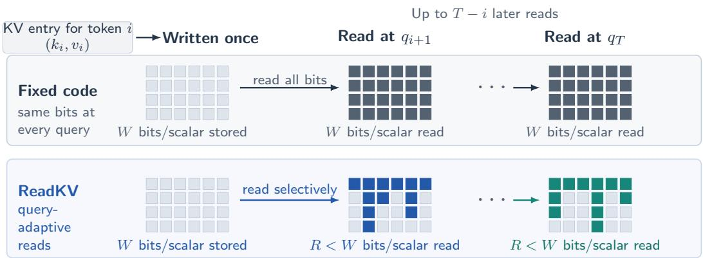
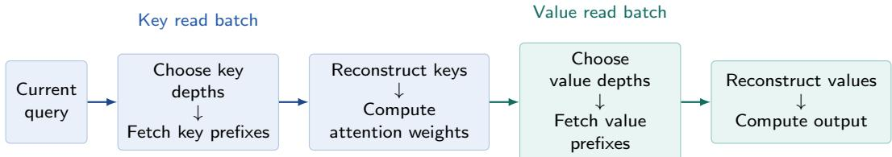
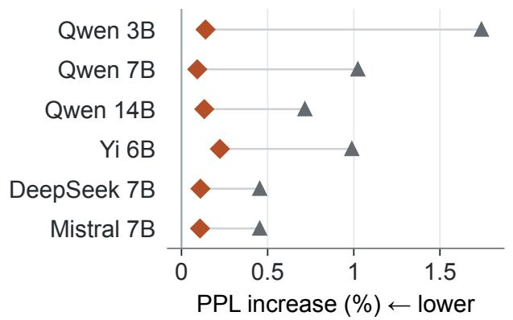
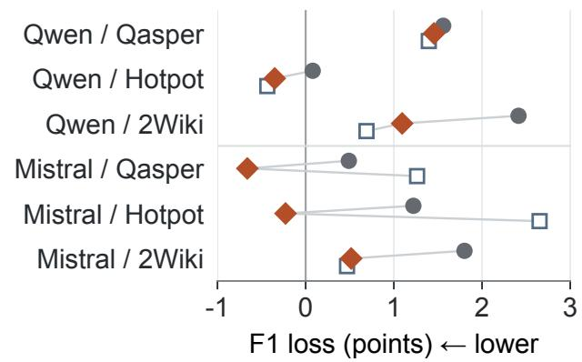

# Read What Matters: Query-Adaptive Quantization for KV Caches

Siddharth Bhandari<sup>1</sup> Lucas Gretta<sup>2</sup> Krishna Balasubramanian<sup>1</sup> Shiva Kasiviswanathan<sup>1</sup>

<sup>1</sup>Amazon <sup>2</sup>University of California, Berkeley

## Abstract

KV-cache entries are stored before their future queries are known, but each decoding query needs precision in diferent places. We study this mismatch using separate budgets for retained bits and bits fetched per query. ReadKV stores each key and value in a progressive code whose prefixes support diferent reconstruction precisions. For each query, it allocates key-channel prefixes using the query, computes attention from the reconstructed keys, and then allocates value-token prefixes using that attention. Stored entries remain unchanged. Each stage optimizes a calibrated distortion objective under a fixed budget; we prove exact allocation under diminishing refinement gains and relate these objectives to attention-output error. We also exhibit a finite-dimensional attention family where query-dependent access strictly outperforms every query-independent reader at the same read budget, even with unrestricted competing encoders and decoders.

Across six base models, reading four bits on average from an eight-bit cache increases C4 perplexity by at most 0.66%, using about one quarter of the logical reads and half the retained capacity of a 16-bit cache. It is consistently more accurate than storing and fully reading four bits at the same payload-read budget. Retaining more bits than each query fetches is aimed at long-context decoding, where the cache bytes moved per step, rather than the weights, dominate cost. Long-context question answering and retrieval on two instruction-tuned models provide additional quality evidence. On the tested 8K-token, batch-one, single-layer workload on an NVIDIA A10G, a restricted eight-bit ReadKV reader with a two-bit mean payload-read budget has 39% lower latency than the tested TurboQuant codec.

## 1 Introduction

Long-context autoregressive language models maintain a key–value (KV) cache to avoid recomputing representations of earlier tokens. During decoding, each new query accesses this cache, and repeated reads can incur substantial memory trafic as the context grows. However, a query may depend primarily on a subset of key dimensions, and its attention may concentrate on a small fraction of value tokens. These observations motivate query-dependent reads that fetch the cache information needed at each decoding step.

We propose ReadKV, which separates stored bits per scalar, W, from average payload bits read per scalar, R. Its progressive representation lets each query choose how much precision to fetch while preserving unread detail for later queries. This design is motivated by the write-once, read-many structure of the KV cache. Retaining additional precision increases storage and insertion cost, but does not require every later query to fetch those extra bits. For an 8,192-token prompt followed by 128 decoding steps, storing eight bits while reading four, rather than storing and reading four, adds write trafic equal to just 0.79% of cumulative reads in the payload-only model of Appendix A. Stored precision and read volume therefore impose distinct costs. Decoding is often bound by memory trafic: each step moves the model weights once and each cached entry once per request. The bits fetched per entry thus set the cache trafic of a step, while the bits retained per entry set how many requests fit in memory and are served per step. A fixed-rate code couples the two, because every stored bit is fetched on every step; a progressive code decouples them, and at (8, 2) ReadKV’s logical reads are about one quarter of its retained bits. The design therefore targets long contexts and large batches, where the cache rather than the weights dominates the bytes moved per step (Appendix A.6). Device latency also depends on selection, reconstruction, and temporary memory trafic.

Existing work reduces retained KV precision, varies stored precision using importance estimates, or selects cache features and tokens for the current query. ReadKV instead makes scalar reconstruction depth a query-time access decision while leaving the stored record unchanged. The closest systems precedent already combines precision tiers with selective bit-plane retrieval [Xie et al., 2025]. Section 6 distinguishes these approaches and Appendix B gives a more detailed comparison.

  
Figure 1: Write-once, read-many KV-cache access. Token i’s key and value vectors are stored once and may be read by up to T − i later queries. Fixed-precision quantization fetches the same full W-bit code each time. ReadKV stores a progressive W-bit code and lets each query fetch diferent prefixes under an average read budget $R < W$ ; unread refinements remain available.

We formalize this distinction through separate storage and read budgets, as illustrated in Figure 1. We focus on the partial-read regime $R < W$ , where access decisions determine which information is fetched; $R = W$ permits full-record decoding. Our main contributions are as follows.

• We formulate KV-cache compression with separate storage and read budgets. A cache entry is encoded before its future queries are known, and each query may fetch only a budgeted subset of the stored bits. This distinguishes retained capacity from transferred payload and enables direct comparisons between query-independent and query-dependent access.

• We introduce ReadKV (Algorithm 1), which stores progressive key and value codes. The current query selects key prefixes; attention computed from their reconstructions selects value prefixes. Diferent queries can therefore use diferent precisions from the same stored entries without rewriting them.

• We analyze why query-dependent access can help and how ReadKV allocates its read budget (Section 4). On two finite-dimensional families, ReadKV achieves strictly lower worst-case key-score and attention-output MSE, respectively, than every query-independent branching reader with the same read budget (Theorems 1 and 2). We then analyze ReadKV’s allocation rule, which repeatedly assigns the next prefix bit to the key channel or value token for which it gives the largest predicted error reduction. Theorem 3 identifies when this rule is optimal for each stage and relates the resulting key and value objectives to the final attention-output error. Together, these results explain both why query-dependent reading can help and how ReadKV uses its read budget.

• Across six base models, ReadKV (W = 8, R = 4) stays within 0.66% of uncompressed perplexity and has lower perplexity than fully reading a four-bit cache at the same payload-read budget. Question answering and retrieval on two instruction-tuned models show further quality–read tradeofs. In a separate single-layer benchmark on an NVIDIA A10G, ReadKV (W = 8, R = 2) has 39% lower latency and 62–65% fewer DRAM read bytes than a fused quantized codec.

## 2 Partial-Read Cache Model

A cached key must be stored before the queries that will later use it are known. At each decoding step, the reader sees a new query and must decide which parts of that stored key to fetch. We ask how accurately it can recover the query–key score when it may read fewer bits than the encoder retained. The following model separates these two budgets without committing to a particular quantizer.

Let $\mathbb { B } _ { 2 } ^ { d } = \left\{ u \in \mathbb { R } ^ { d } : \| u \| _ { 2 } \leq 1 \right\}$ be the Euclidean unit ball. The encoder receives a vector $\boldsymbol { x } \in \mathbb { B } _ { 2 } ^ { d }$ , and a later query supplies $\boldsymbol { y } \in \mathbb { B } _ { 2 } ^ { d }$ . The target is the inner product $x ^ { \top } y$ . There are three roles: the encoder observes $x ,$ but not y, and writes a bit string $Z ;$ the reader receives $y$ and requests selected bits of $Z ;$ and the decoder uses y and the returned bits to estimate $x ^ { \top } y$ . The reader has no other access to x.

Protocols may be randomized. The three roles may share public randomness drawn independently of $( x , y )$ Private randomness used by the encoder can reach later stages only through $Z ,$ and randomness drawn after the query arrives is also independent of $( x , y )$ . These conventions allow randomized codes and access rules without giving the protocol side information about the particular input pair.

We assign separate rates to storage and reading. For $W , R \geq 0$ , the encoder stores at most $w = \lfloor W d \rfloor$ bits, and each query may fetch at most $r = \lfloor R d \rfloor$ bits. For example, $W = 8$ and $R = 2$ allow an 8d-bit record but only 2d fetched bits per query. These are global budgets rather than per-coordinate quotas. The encoder may mix information across coordinates, and the reader may spend more probes on some coordinates than others. In the attention interpretation, x is a cached key, y is the current query, and $x ^ { \top } y$ is their unscaled attention score. This single-score model isolates the access question. Section 3 applies the same storage–read distinction to the full KV cache and its attention output.

We count the bits stored for each record and the bits fetched for each query. Computation is unrestricted, as in the one-bit-cell version of the static table-probe model [Yao, 1981]. Record-specific metadata counts toward the corresponding budget. Code descriptions and other state fixed independently of $( x , y )$ are shared across records rather than charged once per record. Appendix A accounts separately for their retained memory and reload trafic in the implementation.

We distinguish readers by the information they may use to select which stored bits to fetch. An address identifies one bit of the record Z, while a batch is a set of addresses chosen before any bit in that set is returned. The reader classes below difer in whether these choices may depend on the current query, previously returned bits, or both.

Table 1 orders five reader classes by the information available when addresses are selected. A query-oblivious fixed pattern uses neither the query nor returned bits. A query-independent branching reader may use each returned bit to choose its next address, but its access path and stopping rule cannot use y. Since the returned bits encode x, this path may still depend indirectly on the stored vector. A staged(1) reader uses y to choose all addresses in one batch. More generally, a staged(J) reader, for $J \ge 2$ , uses at most J batches and may choose each later batch using y and the values returned by earlier batches. A fully branching reader may select each new address after observing every previous return. Every class fetches at most r bits, and its final decoder may use y.

Table 1: Reader classes distinguished by whether address selection may use the current query or previously returned bits. All classes use the same storage and read budgets, and every final decoder may use the query.
<table><tr><td>Reader Class</td><td>Uses Query?</td><td>Use of Returned Bits in Address Selection</td></tr><tr><td>Query-oblivious fixed pattern</td><td>No</td><td>None; every address is fixed in advance</td></tr><tr><td>Query-independent branching</td><td>No</td><td>Each new address may use all previously returned bits</td></tr><tr><td>staged(1): one batch</td><td>Yes</td><td>None; the complete batch is selected before reading</td></tr><tr><td>staged(J),  $J \geq 2 \colon$  at most J batches</td><td>Yes</td><td>A later batch may use bits returned by earlier batches</td></tr><tr><td>Fully branching</td><td>Yes</td><td>Each new address may use all previously returned bits</td></tr></table>

For an access class A, let Π range over complete encoder–reader–decoder protocols that obey its access rules and the budgets $( W , R )$ . If ${ \widehat { s } } _ { \Pi } ( x , y )$ is the resulting estimate, the full-unit-ball minimax risk is

$$
\mathcal { D } _ { d , \mathsf { A } } ^ { \mathrm { w c } } ( W , R ) = \operatorname* { i n f } _ { \Pi \in \mathsf { A } } \operatorname* { s u p } _ { x , y \in \mathbb { B } _ { 2 } ^ { d } } \mathbb { E } _ { \Pi } \Big [ \big ( x ^ { \top } y - \widehat { s } _ { \Pi } ( x , y ) \big ) ^ { 2 } \Big ] .\tag{1}
$$

The input pair is fixed before the random coins are drawn, so the expectation is only over protocol randomness. Equation (1) is used to compare access classes and state the boundary cases. The separation results in Section 4

use the same loss on explicit restricted input families. Appendix C gives the complete access recursions, hierarchy, and boundary proofs.

Section 3 develops ReadKV as a staged(2) reader: the query selects key prefixes in the first batch, and attention computed from the reconstructed keys selects value prefixes in the second. Section 4 analyzes its allocation rule and gives separations on specified key-score and attention families.

## 3 Query-Adaptive Cache Design

This section defines the ReadKV encoder, its staged(2) reader, and decoder (Algorithm 1). The encoder stores each key and value in a progressive code whose longer prefixes have lower calibrated distortion. At query time, the reader issues two read batches from this unchanged cache. The current query determines the key prefixes fetched in the first batch. An intermediate decoder reconstructs the keys and computes attention, which determines the value prefixes fetched in the second batch. The final decoder reconstructs the values and returns the attention output. Figure 2 summarizes this query-time flow.

Figure 2: Query-time flow of ReadKV. The query selects key-prefix depths in the first batch. After the intermediate decoder reconstructs the keys, the resulting attention weights select value-prefix depths in the second batch. Both batches read from the same unchanged progressive W-bit cache, and each batch’s addresses are fixed before any of its bits are returned.



## 3.1 Progressive Cache Representation

A conventional fixed-rate scalar code is designed to be decoded as a whole. Instead, ReadKV stores a path in a binary quantization tree. If the path has eight bits, its first two bits already specify a reconstruction; reading a third bit selects a finer reconstruction, and so on up to eight. Thus a later query can read a diferent prefix of the same unchanged code. We denote the stored depth by the integer W and use a Gaussian Lloyd tree [Lloyd, 1982]; Appendix D gives its construction.

Consider one attention layer with T cached tokens and vector dimension $d _ { h }$ . It has G physical KV heads: each is one cached stream of keys $k _ { g , j } \in \mathbb { R } ^ { d _ { h } }$ and values $v _ { g , j } \in \mathbb { R } ^ { d _ { h } }$ , indexed by head g and token $j .$ The layer also has H query heads, with $q _ { h } \in \mathbb { R } ^ { d _ { h } }$ . Several query heads may share the same KV stream. We write $g ( h )$ for the KV head used by $q _ { h }$ and $S ( g ) = \{ h : g ( h ) = g \}$ for the query heads sharing it. A fetched cache bit is counted once even when several query heads share it, so its importance combines their contributions.

Before encoding, we choose fixed orthogonal Hadamard–sign transforms $U _ { K } , U _ { V } \in \mathbb { R } ^ { d _ { h } \times d _ { h } }$ . The signs are drawn once before encoding, and the same transforms are reused for all cache entries and queries. These transforms mix coordinates before scalar quantization. Applying $U _ { K }$ to both a key and its query preserves their dot product; $U _ { V }$ is inverted after computing the value-weighted output. A channel below means one coordinate in these transformed vectors. For each transformed scalar $x ^ { \prime }$ , the encoder uses a calibrated channel mean $\mu$ and scale $\sigma$ to form $z = ( x ^ { \prime } - \mu ) / \sigma$ , and stores its W-bit tree path. A decoded prefix gives $\widehat { z }$ and hence $\mu + \sigma \widehat { z }$ Reading zero bits gives $\widehat { z } = 0$ , the calibrated mean. The transforms and calibration remain fixed as queries change.

## 3.2 Two-Stage Query-Adaptive Reading

Key-Channel Read. A query weights key channels through a dot product. A reconstruction error in a channel with a larger query coeficient has a larger efect on the score. Write $q _ { h } ^ { \prime } = U _ { K } q _ { h }$ , and let $\sigma _ { g , c } ^ { K }$ be the calibrated scale of transformed key channel c in KV head g. Squaring the coeficient of a standardized channel error and adding contributions from the sharing query heads gives the importance

$$
a _ { g , c } ^ { K } = \sum _ { h \in { \cal S } ( g ) } ( q _ { h , c } ^ { \prime } \sigma _ { g , c } ^ { K } ) ^ { 2 } .\tag{2}
$$

The reader assigns a prefix depth $t _ { g , c } ^ { K } \in \{ 0 , \dots , W \}$ to each head–channel pair. That depth is used across all T cached tokens, because the same query coeficient multiplies that channel in every key. All key-prefix addresses are chosen from the query and fixed calibration before any key bits are fetched.

The intermediate decoder reconstructs $\widehat { K } _ { g , j } \in \mathbb { R } ^ { d _ { h } }$ from the returned prefixes. It then forms the attention vector $\widehat { \alpha } _ { h } = ( \widehat { \alpha } _ { h , 1 } , \dots , \widehat { \alpha } _ { h , T } ) \in \mathbb { R } ^ { T }$ by applying softmax across tokens to the reconstructed logits $q _ { h } ^ { \prime \top } \widehat { K } _ { g ( h ) , j } / \sqrt { d _ { h } }$ These probabilities determine the second read batch; neither the decoder nor the reader uses full-precision keys or their unread refinements.

Value-Token Read. The attention output is a weighted sum of values. An error in a value token with larger attention weight therefore matters more to that output. ReadKV uses the squared reconstructed probabilities to form

$$
a _ { g , j } ^ { V } ( \widehat { \alpha } ) = s _ { g } \sum _ { h \in S ( g ) } \widehat { \alpha } _ { h , j } ^ { 2 } .\tag{3}
$$

Here $s _ { g } \geq 0$ sets the value scale for a physical head. The reported experiments use $s _ { g } = 1$ , measuring value distortion in standardized units; Appendix D describes the physical-scale alternative. The reader chooses one depth $t _ { g , j } ^ { V } \in \{ 0 , \ldots , W \}$ per value token, shared across its $d _ { h }$ channels. All value-prefix addresses are fixed before this second batch is fetched. The final decoder reconstructs $\widehat { V } _ { g , j } \in \mathbb { R } ^ { d _ { h } }$ from the returned prefixes and returns $\begin{array} { r } { U _ { V } ^ { \top } \sum _ { j } \widehat { \alpha } _ { h , j } \widehat { V } _ { g ( h ) , j } } \end{array}$ for query head h. There is one adaptive transition between the batches: returned key bits change attention, which changes the value read.

## 3.3 Prefix Allocation Under a Read Budget

An importance score alone does not specify a depth: an extra bit can help a coarse reconstruction more than an already precise one. Let $D ( t )$ D(t) be the stored, calibrated distortion curve predicting standardized scalar mean-squared reconstruction error after t bits. For importance weights $a _ { i } .$ , the allocator uses the objective $\textstyle \sum _ { i } a _ { i } D ( t _ { i } )$ . Each term combines how much an item’s error matters with how much error its chosen prefix leaves. These separable objectives omit cross-terms between reconstruction errors; they do not assume those interactions vanish in real caches.

The two stages have fixed nonnegative integer budgets $B _ { K }$ and $B _ { V }$ . These count group refinements, not individual payload bits: increasing one key-channel depth by one fetches T bits, and increasing one value-token depth by one fetches $d _ { h }$ bits. Within either stage, with budget B, the allocation problem is

$$
\operatorname* { m i n } _ { t _ { i } \in \{ 0 , \ldots , W \} } \sum _ { i } a _ { i } D ( t _ { i } ) .
$$

Define ChooseDepths $( a , D , W , B )$ by starting at $t _ { i } = 0$ and repeatedly increasing an eligible depth $t _ { i } < W$ with the largest positive weighted gain $a _ { i } [ D ( t _ { i } ) - D ( t _ { i } + 1 ) ]$ . Stop after B increments or when no positive gain remains, breaking ties in a fixed order. Section 4 analyzes this rule, including its exact stagewise optimality under diminishing refinement gains and its relation to attention-output error.

The key stage calls this rule with $( a ^ { K } , B _ { K } )$ , and the value stage with $( a ^ { V } ( { \widehat { \alpha } } ) , B _ { V } )$ . Their total payload is at most $T B _ { K } + d _ { h } B _ { V }$ bits. Writing the budgeted mean depths as $R _ { K } = B _ { K } / ( G d _ { h } )$ and $R _ { V } = { B _ { V } } / ( G T )$ gives the

mean payload read budget

$$
R = { \frac { T B _ { K } + d _ { h } B _ { V } } { 2 G T d _ { h } } } = { \frac { 1 } { 2 } } ( R _ { K } + R _ { V } ) .
$$

The $\mathrm { K } / \mathrm { V }$ split is an input to the allocator; it optimizes the allocation within each stage, not that split. Actual reads may be smaller if no positive refinement gains remain.

```latex
Algorithm 1 ReadKV encoder, two-stage reader, and decoder.
Public inputs. Stored depth W; transforms $U _ { K } , U _ { V } ;$ calibrated means and scales; distortion curve $D ( t ) ;$ and integer
refinement budgets $B _ { K } , B _ { V }$
Encoder. For each new token, transform and standardize every key and value scalar. Encode each scalar as a W-bit path
through the progressive quantization tree and append the resulting bit planes to the cache.
Prefix allocator ChooseDepths $( a , D , W , B )$ . An item is a transformed key channel in the first stage or a cached value token
in the second. Its weight $a _ { i }$ measures its importance to the current query, and $t _ { i }$ is its selected prefix depth.
1. Initialize every depth to zero.
2. At each of at most B steps, compute $g _ { i } = a _ { i } [ D ( t _ { i } ) - D ( t _ { i } + 1 ) ]$ for every item with $t _ { i } < W .$
3. Stop if every available gain is nonpositive. Otherwise increment an item with the largest gain, breaking ties by a fixed
public order.
4. Return the depth vector t.
Key reader and intermediate decoder. Transform each query as $q _ { h } ^ { \prime } = U _ { K } q _ { h }$ and compute the key-channel weights $a ^ { K }$ using
Equation (2). Set $t ^ { K } = \mathrm { C h o o s e D e p t h s } ( a ^ { K } , D , W , B _ { K } )$ and fetch the corresponding key prefixes. Reconstruct ${ \widehat { K } } .$ compute
the masked logits, and apply softmax to obtain ${ \widehat { \alpha } } .$
Value reader and final decoder. Compute the value-token weights $a ^ { V } ( \widehat { \alpha } )$ using Equation (3). Set $t ^ { V } =$
ChooseDepths $( a ^ { V } ( \widehat { \alpha } ) , D , W , B _ { V } )$ and fetch the corresponding value prefixes. Reconstruct $\overset \sim { \widehat { V } }$ and return $\begin{array} { r } { U _ { V } ^ { \top } \sum _ { j } \widehat { \alpha } _ { h , j } \widehat { V } _ { g ( h ) , j } } \end{array}$
for each query head h.
```

Algorithm 1 summarizes the procedure. With N items, a max-heap implementation uses $O ( N )$ memory and $O ( N + B \log N )$ time; the key and value stages have $N = G d _ { h }$ and $N = G T$ , respectively. Appendix F.1 specifies integer-budget conversion and tie handling.

## 4 Performance Guarantees for Partial Reads

This section addresses three questions about query-adaptive reading. First, can a query-dependent key reader outperform every reader whose access path is independent of the query? Second, does this advantage persist through the complete key-then-value attention computation? Third, on an arbitrary fixed cache and query, what does the allocation rule in Algorithm 1 optimize, and how do its objectives relate to the final attention output? The first two results give explicit finite separations. The third gives an exact stagewise allocation guarantee and a deterministic attention-error certificate. Appendix E contains the complete proofs and supporting lemmas.

## 4.1 Key-Score Separation

We first ask whether the query can improve accuracy simply by choosing which parts of a stored key to read. The comparison is with a query-independent branching reader. Such a reader may use returned bits to choose later addresses, but neither its addresses nor its stopping rule may depend on the query. Its encoder and decoder may otherwise be arbitrary, and the decoder may use the query together with the complete read transcript. We write ${ \widehat { s } } _ { \Pi } ( x , y )$ for its estimate.

Fix a public orthogonal transform $U \in \mathbb { R } ^ { d \times d }$ and an integer $1 \leq k \leq d .$ Consider the source and query families

$$
\begin{array} { r } { \mathcal { X } _ { U } = \{ U ^ { \top } z / \sqrt { d } : z \in [ - 1 , 1 ] ^ { d } \} , \qquad \mathcal { Y } _ { U , k } = \{ U ^ { \top } q : \| q \| _ { 2 } \leq 1 , ~ \| q \| _ { 0 } \leq k \} . } \end{array}
$$

Both families are contained in $\mathbb { B } _ { 2 } ^ { d } .$ . The query is sparse only after applying the public transform. For example, with a Hadamard–sign transform, a sparse transformed query is generally dense in the original coordinates.

Let $Q _ { L }$ be the depth-L reconstruction of a nested binary scalar code whose first $L$ refinement gains are positive, and define $\begin{array} { r } { \epsilon _ { L } = \operatorname* { s u p } _ { | u | \leq 1 } | u - Q _ { L } ( u ) | } \end{array}$ . For $x = U ^ { \top } z / \sqrt { d } .$ the encoder stores the L-bit code of each coordinate of z. Given $y = U ^ { \top } q ,$ the ReadKV key reader assigns coordinate i weight $q _ { i } ^ { 2 } / d .$ . With a budget of Lk refinements, it reads all L bits of every coordinate in $\operatorname { s u p p } ( q )$ and nothing elsewhere. The resulting estimate is $\begin{array} { r } { \widehat { s } _ { \mathrm { R E A D K V } } ( x , y ) = d ^ { - 1 / 2 } \sum _ { i } q _ { i } Q _ { L } ( z _ { i } ) } \end{array}$ . All addresses are determined before any bit is returned, so this construction uses one query-dependent batch.

Theorem 1 (Finite ReadKV Separation for Transformed-Sparse Queries). Let $d \geq 1$ and $1 \leq k \leq d$ . Let $L , r ,$ w be positive integers satisfying $L d \leq w$ and $L k \leq r$ . The construction above stores Ld informative bits in $a \ w { - } b i t$ record, padding unused cells if necessary, and uses at most Lk probes. Its worst-case error satisfies

$$
\operatorname* { s u p } _ { x \in \mathcal { X } _ { U } , \ y \in \mathcal { V } _ { U , k } } \bigl ( x ^ { \top } y - \widehat { s } _ { \mathrm { R E A D K V } } ( x , y ) \bigr ) ^ { 2 } \leq \frac { k \epsilon _ { L } ^ { 2 } } { d } .
$$

In contrast, every randomized protocol Π whose reader is query-independent branching and uses at most r probes satisfies

$$
\operatorname* { s u p } _ { x \in \mathcal { X } _ { U } , ~ y \in \mathcal { Y } _ { U , k } } \mathbb { E } _ { \Pi } \Big [ \big ( x ^ { \top } y - \widehat { s } _ { \Pi } ( x , y ) \big ) ^ { 2 } \Big ] \geq \frac { 2 ^ { 1 - 2 r / d } } { \pi e d } .
$$

The competing protocol may use an arbitrary randomized encoder and decoder and a finite binary record of arbitrary length. Therefore, the ReadKV construction has strictly smaller worst-case MSE whenever $k \epsilon _ { L } ^ { 2 } < 2 ^ { 1 - 2 r / d } / ( \pi e )$

The lower bound places no restriction on the competing write budget, record construction, or decoder. It even permits the reader to branch on returned payloads. The only restriction is that the query cannot influence the access path. The separation therefore identifies the value of query-dependent addressing rather than an advantage of one particular encoder or decoder.

For the deployed depth-eight code, take $w = 8 d$ and $r = 2 d$ . The theorem then applies when $k \leq \lfloor d / 4 \rfloor$ , and the ratio between the converse and the ReadKV upper bound exceeds 155/k. At $d = 1 2 8$ and $k = 3 2$ , the certified factor exceeds 4.85. The transformed-sparsity condition is important for this statement. Appendix E.1.3 gives an explicit full-unit-ball example on which this deployed deterministic code does not dominate every query-oblivious protocol.

The proof has two parts. The upper bound follows directly from the pointwise scalar error: $| x ^ { \top } y - \widehat { s } _ { \mathrm { R E A D K V } } | \leq$ $\epsilon _ { L } \sqrt { k / d }$ . For the converse, condition on all randomness visible to the reader. An r-probe query-independent reader is then a binary decision tree with at most $2 ^ { r }$ leaves, so its transcript reveals at most r bits about the source vector. An entropy–MMSE inequality converts this information limit into a lower bound on vector reconstruction error. Finally, a uniformly random signed coordinate query converts that reconstruction error into inner-product MSE. Appendix E.1.1 gives the complete argument and the constant calculation.

## 4.2 Two-Stage Attention Separation

The preceding theorem isolates the key stage. We next analyze the complete causal transition used by ReadKV: key reads determine reconstructed attention, and that attention determines the value reads.

Fix an integer $m \geq 1$ . Let $e _ { 1 } \in \mathbb { R } ^ { m }$ be the first standard basis vector, let $Q _ { 8 }$ be the deployed depth-eight reconstruction, and let $c _ { 1 }$ be its positive depth-one reconstruction value. Choose $b , \eta \in \{ - 1 , 1 \}$ and arbitrary values $v _ { 1 } , v _ { 2 } \in [ - 1 , 1 ] ^ { m }$ . Define

$$
\begin{array} { r } { k _ { 1 } = b c _ { 1 } e _ { 1 } , \qquad k _ { 2 } = - b c _ { 1 } e _ { 1 } , \qquad q _ { \eta } = \eta ( 5 \sqrt { m } / c _ { 1 } ) e _ { 1 } . } \end{array}
$$

After the standard $1 / \sqrt { m }$ attention normalization, the logits are $( 5 \eta b , - 5 \eta b )$ . Put $p = ( 1 + e ^ { - 1 0 } ) ^ { - 1 }$ and $\rho = 1 - p$ Let $j _ { \star } = 1$ when $\eta b = 1$ and $j _ { \star } = 2$ otherwise. The exact attention output is $o = p v _ { j _ { \star } } + \rho v _ { 3 - j _ { \star } } \in \mathbb { R } ^ { m }$ . The encoder observes $( b , v _ { 1 } , v _ { 2 } )$ before the query sign $\eta$ is known. This construction uses the displayed query norm and is separate from the unit-ball family in the previous theorem.

The encoder applies the depth-eight progressive code to both keys and both values. The first batch reads one key bit from each token, reconstructing both keys exactly and identifying $j _ { \star }$ . Write $\Delta _ { t } = D ( t - 1 ) - D ( t )$ for the deployed distortion gain at depth t. The gain table satisfies $p ^ { 2 } \Delta _ { 8 } > \rho ^ { 2 } \Delta _ { 1 }$ , so every refinement of the high-attention value has larger weighted gain than the first refinement of the other value; Lemma 7 verifies the required gain bounds. The second batch therefore reads $v _  j ,  $ to depth eight and leaves $v _ { 3 - j , }$ unread. The decoder returns $\widehat { \cal O } _ { \mathrm { R E A D K V } } = p Q _ { 8 } ( v _ { j _ { \star } } )$ , where $Q _ { 8 }$ is applied coordinatewise. For a competing protocol Π, write $\widehat { o } _ { \Pi }$ for its decoder output.

The following theorem shows that the complete two-stage procedure, rather than only its key reader, has a strict worst-case advantage. The comparison allows an arbitrary competing encoder and decoder, but requires its read path to be independent of the current query.

Theorem 2 (Finite Two-Stage ReadKV Separation). For every $m \geq 1$ , the construction above is a staged(2) ReadKV protocol. It stores $w = 3 2 m$ bits and reads $r = 8 m + 2$ bits. Let $\epsilon _ { 8 } = \mathrm { s u p } _ { | u | \le 1 } | u - Q _ { 8 } ( u ) | < 0 . 0 0 9 7$ Its worst-case per-coordinate attention-output error satisfies

$$
\operatorname* { s u p } _ { b , v _ { 1 } , v _ { 2 } , \eta } \frac { 1 } { m } \| o - \widehat { o } _ { \mathrm { R E A D K V } } \| _ { 2 } ^ { 2 } \leq ( p \epsilon _ { 8 } + \rho ) ^ { 2 } < 9 . 5 0 \times 1 0 ^ { - 5 } ,
$$

where the supremum is over $b , \eta \in \{ - 1 , 1 \}$ and $v _ { 1 } , v _ { 2 } \in [ - 1 , 1 ] ^ { m }$ . Every randomized protocol Π whose encoder is fixed before η is revealed and whose reader is query-independent branching with respect to η, using at most $r$ probes, satisfies

$$
\operatorname* { s u p } _ { b , v _ { 1 } , v _ { 2 } , \eta } \frac { 1 } { m } \mathbb { E } _ { \Pi } \big [ \| o - \widehat { o } _ { \Pi } \| _ { 2 } ^ { 2 } \big ] \geq \frac { \operatorname { t a n h } ^ { 2 } ( 5 ) } { \pi e } 2 ^ { - 7 - 2 / m } > 2 . 2 8 5 \times 1 0 ^ { - 4 } .
$$

The competing protocol may use an arbitrary randomized encoder and decoder and a finite binary record of arbitrary length. Thus, the certified separation factor exceeds 2.40 for every $m \geq 1$ and exceeds 9.52 at $m = 1 2 8$ . The latter setting has $W = 8$ stored bits per cached scalar and realized read rate $R = ( 8 m + 2 ) / ( 4 m ) = 2 + 1 / ( 2 m ) \approx 2 . 0 0 4$

The proof follows the two read stages. The key probes first recover the exact attention weights p and $\rho .$ The gain inequality then forces all eight value refinements onto the high-attention token, yielding the upper bound $( p \epsilon _ { 8 } + \rho ) ^ { 2 }$ . For the converse, a query-independent transcript contains at most r bits about the two value vectors but must support either query sign. Averaging over those signs exposes a direction with coeficient $\operatorname { t a n h } ^ { 2 } ( 5 ) / 2$ after which the entropy–MMSE bound gives the stated lower bound. Appendix E.1.2 proves each step and verifies the numerical constants.

## 4.3 Allocation and Attention-Error Guarantee

The separation theorems show that query-dependent access can be strictly useful. We now analyze the allocation made by ReadKV on an arbitrary fixed cache and query. The aim is to establish two properties. Each stage should choose the best legal prefix depths for the calibrated objective defined in Section 3. Those optimized objectives should then control the attention-output error through explicit, inspectable quantities.

A depth schedule assigns an integer prefix depth to each allocation item. Key items are physical-head and transformed-channel pairs, while value items are physical-head and token pairs. Their feasible sets are

$$
\begin{array} { r } { \mathcal { T } _ { K } ( B _ { K } ) = \{ t ^ { K } \in \{ 0 , \dotsc , W \} ^ { G \times d _ { h } } : \sum _ { g , c } t _ { g , c } ^ { K } \leq B _ { K } \} , \qquad \mathcal { T } _ { V } ( B _ { V } ) = \{ t ^ { V } \in \{ 0 , \dotsc , W \} ^ { G \times T } : \sum _ { g , j } t _ { g , j } ^ { V } \leq B _ { V } \} . } \end{array}
$$

Using the importance scores in Equations (2) and (3), define

$$
\boldsymbol { S } _ { K } ( t ^ { K } ) = \frac { T } { d _ { h } } \sum _ { g , c } \boldsymbol { a } _ { g , c } ^ { K } D ( t _ { g , c } ^ { K } ) , \qquad \boldsymbol { S } _ { V } ( t ^ { V } ; \widehat { \boldsymbol { \alpha } } ) = \sum _ { g , j } \boldsymbol { a } _ { g , j } ^ { V } ( \widehat { \boldsymbol { \alpha } } ) D ( t _ { g , j } ^ { V } ) .
$$

The key objective is the calibrated diagonal approximation to squared logit error, aggregated over query heads that share a physical KV head. The value objective is the corresponding approximation to squared attentionweighted value error. The factor $T / d _ { h }$ is constant across key schedules, so it does not afect which schedule minimizes $S _ { K }$

The exact output error need not equal these diagonal objectives. Calibration may misestimate the realized residual energy, and residuals from diferent channels or tokens may interact. For query head $h ,$ the factors $\gamma _ { K , h }$ and $\gamma _ { V , h }$ measure the ratio between realized diagonal residual energy and its calibrated prediction. The factors $\kappa _ { K , h }$ and $\kappa _ { V , h }$ are the largest eigenvalues of normalized residual Gram matrices and measure amplification from cross terms. Appendix E.3.3 gives the exact definitions, including the zero-residual conventions.

Because $U _ { V }$ is orthogonal, output error can be measured in transformed value coordinates. Let $V _ { g ( h ) } \in \mathbb { R } ^ { T \times d _ { h } }$ contain the full-precision transformed values for the physical KV head used by query head h, and let $\mathbf { 1 } _ { T } \in \mathbb { R } ^ { T }$ be the all-ones vector. Since both exact and reconstructed attention weights sum to one, subtracting any center $c _ { h } \in \mathbb { R } ^ { d _ { h } }$ from every value row does not change the error caused by perturbing the attention probabilities. We write $\| \cdot \| _ { 2 \to 2 }$ for the matrix operator norm.

Theorem 3 (ReadKV Allocation and Attention-Error Certificate). Fix an attention layer and query. Let $W \geq 1$ and $B _ { K } , B _ { V } \geq 0$ be integers. Let $D ( t ) \geq 0 ~ f o r ~ t = 0 , \ldots , W$ , and suppose the scalar distortion gains $D ( t - 1 ) - D ( t )$ are nonnegative and nonincreasing for $t = 1 , \ldots , W$ . Let $t _ { \mathrm { R E A D K V } } ^ { K }$ be the key schedule returned by Algorithm 1, let $\widehat { \alpha } _ { \mathrm { R E A D K V } }$ be the attention computed from the resulting key reconstruction, and let $t _ { \mathrm { R E A D K V } } ^ { V }$ be the value schedule returned in the second stage. Then

$$
S _ { K } ( t _ { \mathrm { R E a D K V } } ^ { K } ) = \operatorname* { m i n } _ { t ^ { K } \in { \mathcal T } _ { K } ( B _ { K } ) } S _ { K } ( t ^ { K } ) , \qquad S _ { V } ( t _ { \mathrm { R E a D K V } } ^ { V } ; \widehat { \alpha } _ { \mathrm { R E a D K V } } ) = \operatorname* { m i n } _ { t ^ { V } \in { \mathcal T } _ { V } ( B _ { V } ) } S _ { V } ( t ^ { V } ; \widehat { \alpha } _ { \mathrm { R E a D K V } } ) .
$$

Let $o _ { h } , \widehat { o } _ { h } \in \mathbb { R } ^ { d _ { h } }$ be the exact and reconstructed outputs for query head h. Choose any center $c _ { h } \in \mathbb { R } ^ { d _ { h } }$ , and evaluate the residual-correlation factors $\kappa _ { K , h } , \kappa _ { V , h }$ and calibration factors $\gamma _ { K , h } , \gamma _ { V , h }$ at the ReadKV reconstruction. Define

$$
\overline { { \beta } } _ { K } = \operatorname* { m a x } _ { h } \frac { 1 } { 2 } \| V _ { g ( h ) } - { \bf 1 } _ { T } c _ { h } ^ { \top } \| _ {  2 } ^ { 2 } \kappa _ { K , h } \gamma _ { K , h } , \qquad \overline { { \beta } } _ { V } = \operatorname* { m a x } _ { h } 2 \kappa _ { V , h } \gamma _ { V , h } .
$$

For every fixed cache and query for which these factors are finite,

$$
\sum _ { h } \| o _ { h } - \widehat { o } _ { h } \| _ { 2 } ^ { 2 } \leq \overline { { \beta } } _ { K } \operatorname* { m i n } _ { t ^ { K } \in \mathcal { T } _ { K } ( B _ { K } ) } S _ { K } ( t ^ { K } ) + \overline { { \beta } } _ { V } \operatorname* { m i n } _ { t ^ { V } \in \mathcal { T } _ { V } ( B _ { V } ) } S _ { V } ( t ^ { V } ; \widehat { \alpha } _ { \mathrm { R E a D K V } } ) .
$$

The bound is deterministic and permits arbitrary dependence among queries, keys, values, and quantization residuals.

The theorem has two messages. First, the allocation rule is exact for the calibrated objectives used by ReadKV. It finds the best legal integer prefix schedule for the key stage and, once the reconstructed keys determine the attention probabilities, for the value stage. This is a stagewise statement, not a claim that the procedure jointly minimizes the true attention-output error. The deployed depth-eight code satisfies the required diminishing-gain condition by Lemma 7 in Appendix D.

Second, the theorem identifies when small calibrated objectives imply small attention-output error. The conversion factors account for calibration mismatch, interactions among reconstruction residuals, and the scale of the values. No independence assumption is needed. Since these factors use the realized residuals, the result is an ofline certificate for a completed reconstruction. Corollary 13 gives a simpler suficient condition based on calibration envelopes and pairwise residual coherence.

The proof uses two main ideas. For allocation, each item’s successive prefix bits form a list of nonincreasing gains. Choosing the largest available gain therefore merges these lists in order, and an exchange argument proves that the resulting schedule is optimal. For the attention bound, the output error is split into the change caused by inaccurate attention weights and the error caused by reconstructing the values. Softmax stability controls the first part, while residual Gram matrices control the correlations omitted by the calibrated objectives. Summing the resulting bounds over query heads gives the displayed certificate. Appendix E.4 provides the full proof and all zero-residual cases.

## 5 Language-Model Evaluation

We test whether ReadKV reduces KV-cache reads while preserving quality on C4 language modeling [Rafel et al., 2020], LongBench question answering [Bai et al., 2024], and passkey retrieval [Mohtashami and Jaggi, 2023]. We use three nominal storage/read settings: (4, 2) uses a smaller cache and low read budget; (8, 2) retains more detail at the same read budget; (8, 4) raises the read budget at fixed capacity. The flexible reader’s intege K/V split is selected on development data for each model and rate, then frozen before test. The models in Tables 2 and 3 cover Qwen2.5 [Yang et al., 2025], Yi-1.5 [01.AI et al., 2024], DeepSeek-LLM [DeepSeek-AI et al., 2024], and Mistral [Jiang et al., 2023]. Appendix F.1 specifies precision, transform seeds, hardware and calibration cohorts, and uncertainty estimation. Single-layer GPU latency and physical-trafic measurements use an NVIDIA A10G and the restricted reader described in Section 5.1; these are separate from the flexible-reader quality experiments.

Baseline Settings. Dense uses an uncompressed 16-bit KV cache and supplies the quality and resource reference. Our internal Full Reader (4, 4) stores and always reads four bits per scalar from ReadKV’s nested code. It separates two efects: against (8, 4) it holds the code and the read budget fixed and varies only the stored depth, and with it whether the query can choose which bits to fetch; against (4, 2) it holds the code and the storage fixed and varies only the read budget. KIVI and TurboQuant are fixed-rate codes: every query reads all retained payload bits. KIVI (2-bit K/V) [Liu et al., 2024] uses two payload bits per key and value scalar, plus groupwise scales and ofsets and a 128-token uncompressed residual bufer. TurboQuant K4/V4 [Zandieh et al., 2026] uses four-bit key and value codes, with the first and last two layers uncompressed. We give ReadKV the same exemptions in rows marked †; their (W, R) budgets apply to compressed layers. SparQ r32/k128 [Ribar et al., 2024] retains a 16-bit cache, probes the history using r = 32 query-selected key channels, and reads at most k = 128 selected past positions. Appendix F.2 gives implementation and configuration-selection details. Reading the Results. For each model and dataset, we report the percentage perplexity increase ∆PPL = $1 0 0 ( \mathrm { P P L } _ { \mathrm { m e t h o d } } / \mathrm { P P L } _ { \mathrm { D E N S E } } - 1 )$ or the F1-point loss $\Delta \mathrm { F } 1 = \mathrm { F } 1 _ { \mathrm { D E N S E } } - \mathrm { F } 1 _ { \mathrm { m e t h o d } }$ . Positive values are worse; negative values are sample improvements. Logical reads and retained KV capacity are percentages of Dense. Logical reads include payload, metadata, probes, rereads, and dense layers; they exclude model weights, cache writes, and workspace, and are not physical DRAM trafic. Entries are encoded once and read repeatedly: extra retained refinements can improve quality without increasing reads, although their capacity still limits context length and concurrency.

C4 Language Modeling. Each model is evaluated on 32 held-out 2,048-token documents, with separate calibration and development data. Tokenizers difer, so comparisons are within each model.

With the first and last two layers uncompressed, ReadKV (8, 4)<sup>†</sup> achieves lower perplexity and slightly fewer logical reads than TurboQuant K4/V4 on all six models, while retaining more KV storage. Figure 3(a) displays this comparison with the same layer exemptions. Without exemptions, ReadKV (8, 4) stays within 0.66% of Dense; it improves perplexity over the evaluated SparQ configuration on all six models and retains roughly half the capacity, with a slightly higher read rate. It also improves on the Full Reader’s 1.34–3.44% PPL increase at the same four-bit payload-read budget, illustrating the value of retained refinements.

The R = 2 settings reduce reads further but are less consistent across families: (8, 2) stays within 3.9% PPL increase on Qwen, versus 6.27–11.24% on Yi, DeepSeek, and Mistral. The smaller (4, 2) cache retains the Full Reader’s quarter-capacity footprint with about 49% fewer logical reads. Query-dependent allocation also matters: in a paired Qwen3B control with the same code and K/V split, calibration-only key allocation raises PPL from 11.789 to 12.011; 31 of 32 documents favor current-query allocation (Appendix F.5). Appendices F.3, F.6, and F.7 give additional baselines, intermediate prefix-depth controls, and the surrogate/error comparison. LongBench Question Answering. We evaluate Qwen2.5-7B-Instruct and Mistral-7B-Instruct-v0.3 on 100 questions per dataset from Qasper, HotpotQA, and 2WikiMultihopQA, using the same identifiers at 3,500- and 7,500-token prompt limits. All methods use Dense prompt prefill, which selects the first answer token; compression afects generation from the second token.

At the 7,500-token prompt limit, ReadKV (8, 2) has F1 changes between −0.66 and 1.46 points. It uses 37–38% fewer logical reads than KIVI (2-bit K/V), 65–66% fewer than protected TurboQuant, and 12–18% it scores higher in two conditions and loses at most 0.41 F1 points in the other four. Every condition is shown. Table 3 also shows how the read and storage budgets afect quality. The all-layer (8, 4) setting has a largest loss of 0.98 F1 points. The quarter-capacity (4, 2) setting stays within two points in five conditions, but loses 5.43 points on Qwen 2WikiMultihopQA; its Qwen hardware and calibration cohort difers from (8, 2) (Appendix F.1). Across both prompt limits, all-layer (8, 2) and (8, 4) losses remain below 1.78 and 1.38 points, respectively. The protected QA rows do not show a uniform quality advantage over TurboQuant. Appendix F.3 gives the paired 3,500-token results and protected-row comparisons, including their cross-cohort qualification.

Table 2: C4: 32 held-out 2,048-token documents per model; three transform seeds where available. ReadKV (8, 4) stays within 0.7% of Dense on all six models, using about a quarter of its logical reads and half its KV storage. †: first/last two layers dense. Color marks the observed quality–read frontier: at shown precision, no other method row in the column improves loss or reads without worsening the other. Reads recur per query; retained capacity is shown but not ranked.  
Each method cell reports ∆PPL (%) on top and logical reads / retained KV capacity (% of Dense) below.
<table><tr><td>Panel A: Qwenz.5 Moaets Method (W, R) DENSE PPL</td><td>Qwen2.5 3B 11.36</td><td>Qwen2.5 7B 10.13</td><td>Qwen2.5 14B 8.74</td></tr><tr><td></td><td>+1.59</td><td>+1.34</td><td>+1.68</td></tr><tr><td>FULL READER (4, 4)</td><td>25.6 /25.1</td><td>25.4/25.1</td><td>25.3 /25.1</td></tr><tr><td>KIVI (2-bit K/V)</td><td>+4.84</td><td>+2.79</td><td>+2.21</td></tr><tr><td>Liu et al., 2024</td><td>26.2 /23.8</td><td>26.2 /23.8</td><td>26.2 / 23.8</td></tr><tr><td>SparQ r32/k128</td><td>+1.27</td><td>+1.44</td><td>+0.81</td></tr><tr><td>Ribar et al., 2024</td><td>24.7/100.0</td><td>24.7/100.0</td><td>24.7/100.0</td></tr><tr><td>READKV (4,2)</td><td>+4.44 13.1 /25.1</td><td>+3.41 12.9 /25.1</td><td>+3.75 12.8/25.1</td></tr><tr><td>READKV (8,2)</td><td>+3.85 13.1/50.1</td><td>+2.99 12.9/50.1</td><td>+2.94 12.8/50.1</td></tr><tr><td></td><td>+0.19</td><td>+0.39</td><td>+0.36</td></tr><tr><td>READKV (8, 4)</td><td>25.6/50.1</td><td>25.4/50.1</td><td>25.3/50.1</td></tr><tr><td>TurboQuant K4/V4†</td><td>+1.74</td><td>+1.02</td><td>+0.72</td></tr><tr><td>Zandieh et al., 2026</td><td>34.4/34.4</td><td>36.7/36.7</td><td>32.3 / 32.3</td></tr><tr><td>READKV (8, 4)†</td><td>+0.14</td><td>+0.09</td><td>+0.13</td></tr><tr><td></td><td>33.9 /55.6</td><td>36.0/57.2</td><td>31.5 /54.3</td></tr><tr><td>Panel B: Yi, DeepSeek, and Mistral Models</td><td></td><td></td><td></td></tr><tr><td>Method (W, R)</td><td>Yi-1.5</td><td>DeepSeek</td><td>Mistral</td></tr><tr><td>DENSE PPL</td><td>6B</td><td>LLM-7B</td><td>7B-v0.3</td></tr><tr><td></td><td>8.96</td><td>8.49</td><td>7.62</td></tr><tr><td></td><td>+3.02</td><td>+3.44</td><td>+2.17</td></tr><tr><td>FULL READER (4, 4)</td><td>25.4/25.1</td><td>25.2 /25.1</td><td>25.3/25.1</td></tr><tr><td>KIVI (2-bit K/V)</td><td>+2.82</td><td>+3.54</td><td>+2.11</td></tr><tr><td>Liu et al., 2024</td><td>26.2 /23.8</td><td>26.2 /23.8</td><td>26.2 / 23.8</td></tr><tr><td>SparQ r32/k128</td><td>+92.44</td><td>+0.86</td><td>+53.95</td></tr><tr><td>Ribar et al., 2024</td><td>24.7 /100.0</td><td>24.7/100.0</td><td>24.7 /100.0</td></tr><tr><td>READKV (4, 2)</td><td>+12.13 12.9 /25.1</td><td>+9.74 12.7/25.1</td><td>+11.00 12.8 /25.1</td></tr><tr><td>READKV (8, 2)</td><td>+10.16</td><td>+6.27</td><td>+11.24</td></tr><tr><td></td><td>12.9/50.1 +0.20</td><td>12.7/50.1 +0.66</td><td>12.8 /50.1 +0.49</td></tr><tr><td>READKV (8,4)</td><td>25.4/50.1</td><td>25.2/50.1</td><td>25.3/50.1</td></tr><tr><td>TurboQuant K4/V4†</td><td>+0.99</td><td>+0.45</td><td>+0.45</td></tr><tr><td>Zandieh et al., 2026</td><td>35.4/35.4</td><td>36.0 /36.0</td><td>35.4 /35.4</td></tr><tr><td></td><td>+0.22</td><td>+0.11</td><td>+0.11</td></tr><tr><td>READKV (8, 4)†</td><td></td><td></td><td></td></tr><tr><td></td><td>34.7 /56.3</td><td>35.2/56.8</td><td>34.6 /56.3</td></tr></table>

fewer than SparQ. Figure 3(b) compares it with the two all-layer competitors: KIVI retains a smaller cache, whereas SparQ retains twice its capacity. ReadKV scores higher than KIVI in all six conditions; against SparQ

Table 3: LongBench QA at a 7,500-token prompt limit; 100 questions per condition. ReadKV (8, 2) loses at most 1.46 F1 points across the six conditions while using about 13% of Dense logical reads. †: first/last two layers dense. Color marks the observed quality–read frontier: at shown precision, no other method row in the column improves loss or reads without worsening the other. Reads recur per query; retained capacity is shown but not ranked.  
Each method cell reports ∆F1 (points) on top and logical reads / retained KV capacity (% of Dense) below. Panel A: Qwen2.5-7B-Instruct
<table><tr><td>Method (W, R) DENSE F1</td><td>Qasper 41.13</td><td>HotpotQA 48.34</td><td>2Wiki MultihopQA 45.30</td></tr><tr><td>KIVI (2-bit K/V)</td><td>+1.56</td><td>+0.08</td><td>+2.41</td></tr><tr><td>Liu et al., 2024</td><td>20.4/19.9</td><td>20.0 /19.9</td><td>20.1 /19.9</td></tr><tr><td>TurboQuant K4/V4†</td><td>-0.06</td><td>+0.42</td><td>-0.55</td></tr><tr><td>Zandieh et al., 2026</td><td>36.7/36.7</td><td>36.7 /36.7</td><td>36.7 /36.7</td></tr><tr><td>SparQ r32/k128 Ribar et al., 2024</td><td>+1.40 15.3/100.0</td><td>-0.44 14.2 /100.0</td><td>+0.69 14.5/100.0</td></tr><tr><td></td><td>+1.68</td><td>-0.60</td><td>+5.43</td></tr><tr><td>READKV (4, 2)</td><td>12.6 /25.0 +1.46</td><td>12.6/25.0 -0.35</td><td>12.6 / 25.0 +1.09</td></tr><tr><td>READKV (8, 2)</td><td>12.6/50.0 +0.98</td><td>12.6 /50.0 +0.25</td><td>12.6/50.0 +0.29</td></tr><tr><td>READKV (8, 4)</td><td>25.1/50.0 +2.34</td><td>25.1 /50.0 -0.12</td><td>25.1/50.0 +2.28</td></tr><tr><td>READKV (8, 2)†</td><td>25.1 /57.2</td><td>25.0 /57.2</td><td>25.1 /57.2</td></tr><tr><td>READKV (8, 4)†</td><td>+1.01 35.8 /57.2</td><td>-0.03 35.8 /57.2</td><td>+0.96 35.8 /57.2</td></tr><tr><td>Panel B: Mistral-7B-Instruct-v0.3</td><td></td><td></td><td></td></tr><tr><td>Method (W, R) DENSE F1</td><td>Qasper</td><td>HotpotQA</td><td>2Wiki MultihopQA</td></tr><tr><td>KIVI (2-bit K/V)</td><td>37.41</td><td>43.37</td><td>42.71</td></tr><tr><td>Liu et al., 2024</td><td>+0.49 20.3/19.9</td><td>+1.22 20.0/19.9</td><td>+1.80 20.0/19.9</td></tr><tr><td>TurboQuant K4/V4†</td><td>-0.79</td><td>+0.01</td><td></td></tr><tr><td>Zandieh et al., 2026</td><td>35.4/35.4</td><td>35.4/35.4</td><td>-0.31</td></tr><tr><td>SparQ r32/k128</td><td></td><td></td><td>35.4/35.4</td></tr><tr><td>Ribar et al., 2024</td><td>+1.26</td><td>+2.65</td><td>+0.47</td></tr><tr><td></td><td>15.0 /100.0</td><td>14.3/100.0</td><td>14.4/100.0</td></tr><tr><td>READKV (4, 2)</td><td>+0.69</td><td>-0.42</td><td>+1.08</td></tr><tr><td></td><td>12.6 /25.0 -0.66</td><td>12.5/25.0 -0.23</td><td>12.5/25.0 +0.52</td></tr><tr><td>READKV (8,2)</td><td>12.6/50.0 +0.98</td><td>12.5/50.0</td><td>12.5/50.0</td></tr><tr><td>READKV (8, 4)</td><td>25.1 /50.0</td><td>-0.44 25.0 /50.0</td><td>+0.00 25.0/50.0</td></tr><tr><td></td><td>+0.58</td><td>-0.23</td><td>+0.87</td></tr><tr><td>READKV (8, 2)†</td><td>23.5 /56.3</td><td>23.5 / 56.3</td><td>23.5 / 56.3</td></tr><tr><td>READKV (8, 4)†</td><td>+0.60 34.4 /56.3</td><td>-0.67 34.4/56.3</td><td>+0.00 34.4 /56.3</td></tr></table>

(a) C4 Perplexity and Resource Use
<table><tr><td>Method</td><td>Logical reads (% of 16-bit)</td><td>KV capacity (% of 16-bit)</td></tr><tr><td>ReadKV (8,4)†</td><td>31.5-36.0</td><td>54.3-57.2</td></tr><tr><td>TurboQuantt</td><td>32.3-36.7</td><td>32.3-36.7</td></tr></table>

† First/last two layers dense in both.

(b) LongBench F1 and Resource Use
<table><tr><td>Method</td><td>Logical reads (% of 16-bit)</td><td>KV capacity (% of 16-bit)</td></tr><tr><td>ReadKV (8,2)</td><td>12.5-12.6</td><td>50.0</td></tr><tr><td>KIVI (2-bit K/V)</td><td>20.0-20.4</td><td>19.9</td></tr><tr><td>□SparQ r32/k128</td><td>14.2-15.3</td><td>100.0</td></tr></table>



  
Figure 3: Comparison with representative baselines using Tables 2 and 3. (a) On C4, ReadKV $( 8 , 4 ) ^ { \dag }$ has lower PPL and slightly fewer logical reads than TurboQuant K4/V4 on all six models when the first and last two layers remain dense, while retaining more KV capacity. (b) On LongBench at a 7,500-token prompt limit, ReadKV (8, 2) uses fewer logical reads than KIVI and SparQ. It has higher F1 than KIVI in all six conditions and mixed results against SparQ. Resource values are percentages of the 16-bit cache; lower quality loss is better.

Passkey Retrieval. Appendix F.4 reports this long-context retention check; several methods recover every tested key, so it supplements the C4 and QA comparisons.

## 5.1 GPU Evaluation

To test whether lower logical reads reduce device cost, the timed reader uses the same progressive code with hardware-oriented constraints: per-head budgets, equal key and value rates, minimum prefix depth one, and two-token value packets. Appendix F.8 reports their quality efect and defines the full device policy.

Table 4 summarizes the principal 8K-token comparison.

On an NVIDIA A10G with 8,192 cached tokens and batch size one, the optimized ReadKV (8, 2) kernel takes 0.093 ms under graph replay versus 0.154 ms for the TurboQuant codec and 0.051 ms for Dense. Under the same launcher and timing boundary, this is 39% lower latency than the tested quantized codec, while Dense is 45% lower than ReadKV. Across warm and cache-evicted conditions, profiling shows 62–65% fewer DRAM read bytes and 20–31% less total trafic than TurboQuant. The DRAM reads are also smaller than the retained payload: in the warm condition, ReadKV (8, 2) reads 2.80 MiB against an 8.00 MiB payload, whereas TurboQuant and Dense read 7.28 and 17.73 MiB against 4.19 and 16.00 MiB, more than their entire caches. These single-layer measurements start from an existing cache and isolate decode-time codec costs. Appendix G gives the full timing grid, measurement boundaries, and retained-cache, workspace, and physical-trafic accounting.

Table 4: Single-layer decoding on an NVIDIA A10G with 8,192 cached tokens and batch size one. Retained KV payload excludes temporary workspace. Latency is the median CUDA Graph replay time. DRAM columns report warm-cache / cache-evicted MiB from separately profiled eager calls and include the complete attention operation.
<table><tr><td>Method</td><td>KV payload (MiB)</td><td>Latency (ms)</td><td>DRAM reads (MiB)</td><td>Total traffic (MiB)</td></tr><tr><td>DENSE</td><td>16.00</td><td>0.051</td><td>17.73 / 17.86</td><td>20.85 / 21.06</td></tr><tr><td>TurboQuant K4/V4 [Zandieh et al., 2026]</td><td>4.19</td><td>0.154</td><td>7.28 /7.92</td><td>9.38 / 10.84</td></tr><tr><td>READKV (8,2)</td><td>8.00</td><td>0.093</td><td>2.80 /2.74</td><td>7.47 / 7.47</td></tr></table>

## 6 Related Work

Fixed-rate KV-cache quantizers reduce the representation retained for every future query. KIVI uses diferent grouping choices for keys and values, KVQuant combines calibrated nonuniform quantization with outlier handling, and TurboQuant uses rotations and vector-aware scalar quantization [Liu et al., 2024, Hooper et al., 2024, Zandieh et al., 2026]. Other methods vary the precision resident in the cache using attention history or quantization sensitivity. This includes QAQ, MiKV, ZipCache, PM-KVQ, MixKVQ, and RDKV [Dong et al., 2024, Yang et al., 2024, He et al., 2024, Liu et al., 2026, Zhang et al., 2026b,a]. These methods change what is retained; ReadKV keeps one record unchanged and varies what each query reads.

Query-adaptive retrieval instead chooses cache content using the current query. SparQ selects key features before retrieving value tokens, Quest ranks cache pages, and Loki uses low-dimensional key information to select tokens [Ribar et al., 2024, Tang et al., 2024, Singhania et al., 2024]. ThinK also uses query information, but prunes the retained key cache after an observation window [Xu et al., 2025]. ReadKV difers by assigning several possible reconstruction depths to every stored scalar rather than making only a feature, token, or page inclusion decision.

Progressive descriptions and successive refinement provide the coding background for a representation that remains decodable at several rates [Equitz and Cover, 1991, Rimoldi, 1994]. Any-Precision LLM and MatQuant apply related nested or sliced representations to model weights [Park et al., 2024, Nair et al., 2025]. The closest systems precedent for our access pattern is Xie et al. [2025], who retain several KV precision tiers and selectively retrieve floating-point bit planes for ranked pages. Their work establishes that stored and fetched KV precision can difer. ReadKV uses a nested nonuniform scalar code with every prefix depth available and allocates an explicit per-query read budget first across key channels and then across value tokens using reconstructed attention.

The abstract model also connects to static data structures, locally decodable source coding, and approximate inner-product sketches [de Wolf, 2008, Makhdoumi et al., 2013, Alon and Klartag, 2016]. The marginal-gain allocator and its continuous relaxation use classical discrete allocation and reverse water-filling tools [Fox, 1966, Shoham and Gersho, 1988, Segall, 1976, Cover and Thomas, 2006]. Our contribution is not these optimization principles in isolation, but their use in a causal partial-read KV protocol together with finite separation and attention-error guarantees. Appendix B gives a more detailed method-by-method comparison.

## 7 Discussion

KV-cache entries are written once but read repeatedly under changing queries. This asymmetry motivates separating retained from fetched precision: a cache can preserve detail for future queries without moving all of it on every decode step. ReadKV implements this idea with a progressive code and a causal two-stage reader. The query allocates key precision, and reconstructed attention allocates value precision. We prove finite settings where this access strictly outperforms query-independent reading, characterize the stagewise allocator, and relate its objectives to attention-output error. Across six base models, ReadKV (W = 8, R = 4) remains within 0.66%

of uncompressed C4 perplexity and improves over fully reading a four-bit cache at the same payload-read budget.   
Question answering and retrieval provide further evidence of useful quality–read tradeofs.

The theoretical separations concern explicit input families, and the attention certificate depends on calibration and residual-correlation factors. Finally, while the NVIDIA A10G study shows lower single-layer latency and DRAM trafic than the tested fused quantized codec, it does not yet establish an end-to-end serving advantage. Fusing allocation, reconstruction, and attention, while supporting more flexible K/V budgets, is the main path toward closing this gap. Retaining more than is read pays of where the cache, not the weights, dominates the bytes moved per step: long contexts and large batches, and possibly tiered memory that keeps the less frequently fetched refinement levels in slower, larger memory. Appendix A.6 gives a first-order model of this regime; complete-model evaluation under long contexts and memory-limited batching is its direct test.

## AI Use Statement

Generative AI tools (ChatGPT/Codex) assisted with theoretical analysis and proof checking, experiment design and implementation, result interpretation, literature searches, and manuscript preparation. This included resource accounting, table generation and consistency checks. Automated checks compared reported summaries with saved experimental records. The authors are responsible for the final text, claims, code and other artifacts.

## References

01.AI, Alex Young, Bei Chen, Chao Li, Chengen Huang, Ge Zhang, Guanwei Zhang, Heng Li, Jiangcheng Zhu, Jianqun Chen, Jing Chang, et al. Yi: Open foundation models by 01.AI. arXiv preprint arXiv:2403.04652, 2024. URL https://arxiv.org/abs/2403.04652.

Noga Alon and Bo’az Klartag. Optimal compression of approximate inner products and dimension reduction. arXiv preprint arXiv:1610.00239, 2016. URL https://arxiv.org/abs/1610.00239.

Yushi Bai, Xin Lv, Jiajie Zhang, Hongchang Lyu, Jiankai Tang, Zhidian Huang, Zhengxiao Du, Xiao Liu, Aohan Zeng, Lei Hou, Yuxiao Dong, Jie Tang, and Juanzi Li. LongBench: A bilingual, multitask benchmark for long context understanding. In Proceedings of the 62nd Annual Meeting of the Association for Computational Linguistics (Volume 1: Long Papers), 2024. URL https://arxiv.org/abs/2308.14508.

Thomas M. Cover and Joy A. Thomas. Elements of Information Theory. Wiley-Interscience, 2 edition, 2006. doi: 10.1002/047174882X. URL https://doi.org/10.1002/047174882X.

Ronald de Wolf. Error-correcting data structures. arXiv preprint arXiv:0802.1471, 2008. URL https://arxiv. org/abs/0802.1471.

DeepSeek-AI, Xiao Bi, Deli Chen, Guanting Chen, Shanhuang Chen, Damai Dai, Chengqi Deng, Honghui Ding, Kai Dong, Qiushi Du, Zhe Fu, et al. DeepSeek LLM: Scaling open-source language models with longtermism. arXiv preprint arXiv:2401.02954, 2024. URL https://arxiv.org/abs/2401.02954.

Shichen Dong, Wen Cheng, Jiayu Qin, and Wei Wang. QAQ: Quality adaptive quantization for LLM KV cache. arXiv preprint arXiv:2403.04643, 2024. URL https://arxiv.org/abs/2403.04643.

William H. R. Equitz and Thomas M. Cover. Successive refinement of information. IEEE Transactions on Information Theory, 37(2):269–275, 1991.

Bennett Fox. Discrete optimization via marginal analysis. Management Science, 13(3):210–216, 1966. doi: 10.1287/mnsc.13.3.210. URL https://pubsonline.informs.org/doi/10.1287/mnsc.13.3.210.

Rajiv Gandhi, Samir Khuller, Srinivasan Parthasarathy, and Aravind Srinivasan. Dependent rounding and its applications to approximation algorithms. Journal of the ACM, 53(3):324–360, 2006. doi: 10.1145/1147954. 1147956. URL https://doi.org/10.1145/1147954.1147956.

Robert M. Gray and David L. Neuhof. Quantization. IEEE Transactions on Information Theory, 44(6): 2325–2383, 1998.

Yefei He, Luoming Zhang, Weijia Wu, Jing Liu, Hong Zhou, and Bohan Zhuang. ZipCache: Accurate and eficient KV cache quantization with salient token identification. In Advances in Neural Information Processing Systems, volume 37, 2024. URL https://arxiv.org/abs/2405.14256.

Coleman Hooper, Sehoon Kim, Hiva Mohammadzadeh, Michael W. Mahoney, Yakun Sophia Shao, Kurt Keutzer, and Amir Gholami. KVQuant: Towards 10 million context length LLM inference with KV cache quantization. In Advances in Neural Information Processing Systems, volume 37, 2024. URL https://proceedings.neurips. cc/paper\_files/paper/2024/hash/028fcbcf85435d39a40c4d61b42c99a4-Abstract-Conference.html.

Albert Q. Jiang, Alexandre Sablayrolles, Arthur Mensch, Chris Bamford, Devendra Singh Chaplot, et al. Mistral 7B. arXiv preprint arXiv:2310.06825, 2023. URL https://arxiv.org/abs/2310.06825.

Tengxuan Liu, Shiyao Li, Jiayi Yang, Tianchen Zhao, Feng Zhou, Xiaohui Song, Guohao Dai, Shengen Yan, Huazhong Yang, and Yu Wang. PM-KVQ: Progressive mixed-precision KV cache quantization for long-CoT LLMs. In The Fourteenth International Conference on Learning Representations, 2026. URL https://arxiv.org/abs/2505.18610.

Zirui Liu, Jiayi Yuan, Hongye Jin, Shaochen Zhong, Zhaozhuo Xu, Vladimir Braverman, Beidi Chen, and Xia Hu. KIVI: A tuning-free asymmetric 2bit quantization for KV cache. In Proceedings of the 41st International Conference on Machine Learning, volume 235, pages 32332–32344. PMLR, 2024. URL https: //proceedings.mlr.press/v235/liu24bz.html.

Stuart P. Lloyd. Least squares quantization in pcm. IEEE Transactions on Information Theory, 28(2):129–137, 1982. doi: 10.1109/TIT.1982.1056489.

Ali Makhdoumi, Shao-Lun Huang, Muriel M´edard, and Yury Polyanskiy. On locally decodable source coding. arXiv preprint arXiv:1308.5239, 2013. URL https://arxiv.org/abs/1308.5239.

Amirkeivan Mohtashami and Martin Jaggi. Landmark attention: Random-access infinite context length for transformers. In Advances in Neural Information Processing Systems, volume 36, 2023. URL https: //arxiv.org/abs/2305.16300.

Pranav Ajit Nair, Puranjay Datta, Jef Dean, Prateek Jain, and Aditya Kusupati. Matryoshka quantization. In Proceedings of the 42nd International Conference on Machine Learning, volume 267 of Proceedings of Machine Learning Research, pages 45484–45506. PMLR, 2025. URL https://proceedings.mlr.press/ v267/nair25a.html.

Pravin Nair. Softmax is 1/2-lipschitz: A tight bound across all ℓ<sub>p</sub> norms. arXiv preprint arXiv:2510.23012, 2025. URL https://arxiv.org/abs/2510.23012.

Yeonhong Park, Jake Hyun, Sanglyul Cho, Bonggeun Sim, and Jae W. Lee. Any-precision LLM: Low-cost deployment of multiple, diferent-sized LLMs. In Proceedings of the 41st International Conference on Machine Learning, volume 235 of Proceedings of Machine Learning Research, pages 39682–39701. PMLR, 2024. URL https://proceedings.mlr.press/v235/park24e.html.

Colin Rafel, Noam Shazeer, Adam Roberts, Katherine Lee, Sharan Narang, Michael Matena, Yanqi Zhou, Wei Li, and Peter J. Liu. Exploring the limits of transfer learning with a unified text-to-text transformer. Journal of Machine Learning Research, 21(140):1–67, 2020. URL https://jmlr.org/papers/v21/20-074.html.

Luka Ribar, Ivan Chelombiev, Luke Hudlass-Galley, Charlie Blake, Carlo Luschi, and Douglas Orr. SparQ attention: Bandwidth-eficient LLM inference. In Proceedings of the 41st International Conference on Machine Learning, volume 235 of Proceedings of Machine Learning Research, pages 42558–42583. PMLR, 2024. URL https://proceedings.mlr.press/v235/ribar24a.html.

Bixio Rimoldi. Successive refinement of information: Characterization of the achievable rates. IEEE Transactions on Information Theory, 40(1):253–259, 1994. doi: 10.1109/18.272493. URL https://doi.org/10.1109/18. 272493.

A. Segall. Bit allocation and encoding for vector sources. IEEE Transactions on Information Theory, 22(2): 162–169, 1976. doi: 10.1109/TIT.1976.1055533. URL https://doi.org/10.1109/TIT.1976.1055533.

Y. Shoham and A. Gersho. Eficient bit allocation for an arbitrary set of quantizers. IEEE Transactions on Acoustics, Speech, and Signal Processing, 36(9):1445–1453, 1988. doi: 10.1109/29.90373. URL https: //doi.org/10.1109/29.90373.

Prajwal Singhania, Siddharth Singh, Shwai He, Soheil Feizi, and Abhinav Bhatele. Loki: Low-rank keys for eficient sparse attention. In Advances in Neural Information Processing Systems, volume 37, 2024. URL https://arxiv.org/abs/2406.02542.

Jiaming Tang, Yilong Zhao, Kan Zhu, Guangxuan Xiao, Baris Kasikci, and Song Han. Quest: Query-aware sparsity for eficient long-context LLM inference. In Proceedings of the 41st International Conference on Machine Learning, 2024. URL https://arxiv.org/abs/2406.10774.

Rui Xie, Asad Ul Haq, Linsen Ma, Yunhua Fang, Zirak Burzin Engineer, Liu Liu, and Tong Zhang. Reimag ining memory access for LLM inference: Compression-aware memory controller design. arXiv preprint arXiv:2503.18869, 2025. URL https://arxiv.org/abs/2503.18869.

Yuhui Xu, Zhanming Jie, Hanze Dong, Lei Wang, Xudong Lu, Aojun Zhou, Amrita Saha, Caiming Xiong, and Doyen Sahoo. ThinK: Thinner key cache by query-driven pruning. In The Thirteenth International Conference on Learning Representations, 2025. URL https://proceedings.iclr.cc/paper\_files/paper/2025/hash/ 8edb116d5b288b6a9bba4c16ab647702-Abstract-Conference.html.

An Yang, Baosong Yang, Beichen Zhang, Binyuan Hui, Bo Zheng, et al. Qwen2.5 Technical Report. arXiv preprint arXiv:2412.15115, 2025. URL https://arxiv.org/abs/2412.15115.

June Yong Yang, Byeongwook Kim, Jeongin Bae, Beomseok Kwon, Gunho Park, Eunho Yang, Se Jung Kwon, and Dongsoo Lee. No token left behind: Reliable KV cache compression via importance-aware mixed precision quantization. arXiv preprint arXiv:2402.18096, 2024. URL https://arxiv.org/abs/2402.18096.

Andrew Chi-Chih Yao. Should tables be sorted? Journal of the ACM, 28(3):615–628, July 1981. doi: 10.1145/322261.322274.

Amir Zandieh, Majid Daliri, Majid Hadian, and Vahab Mirrokni. Turboquant: Online vector quantization with near-optimal distortion rate. In The Fourteenth International Conference on Learning Representations, 2026. URL https://openreview.net/forum?id=tO3ASKZlok.

Junkai Zhang, Hang Guo, Luca Benini, and Yawei Li. RDKV: Rate-distortion bit allocation for joint eviction and quantization of the KV cache. arXiv preprint arXiv:2605.08317, 2026a. URL https://arxiv.org/abs/ 2605.08317.

Tao Zhang, Ziqian Zeng, Hao Peng, Huiping Zhuang, and Cen Chen. MixKVQ: Query-aware mixedprecision KV cache quantization for long-context reasoning. In Proceedings of the 64th Annual Meeting of the Association for Computational Linguistics (Volume 1: Long Papers), pages 7189–7204. Association for Computational Linguistics, July 2026b. doi: 10.18653/v1/2026.acl-long.326. URL https: //aclanthology.org/2026.acl-long.326/.

## Appendix Organization

The appendices provide definitions, proofs, reproduction details, and additional experiments. The table maps each main technical topic to its supporting material.

<table><tr><td>Topic</td><td>Location</td></tr><tr><td>Storage and read accounting</td><td>Appendix A</td></tr><tr><td>Cache encoding and reading</td><td>Algorithm 1 and Appendix D</td></tr><tr><td>Proofs of query-dependent separations</td><td>Appendix E.1</td></tr><tr><td>Integer prefix-allocation optimality</td><td>Appendix E.2</td></tr><tr><td>Proof of the allocation and attention-error certificate</td><td>Appendix E.4</td></tr><tr><td>Quality evaluation and mechanism controls</td><td>Appendix F</td></tr><tr><td>Additional C4 controls and shorter-context QA</td><td>Tables 6 and 7</td></tr><tr><td>GPU timing and traffic measurements</td><td>Appendix G</td></tr></table>

## A Storage and Trafic Accounting

A cache entry occupies capacity while resident, incurs a write on insertion, and incurs reads when reused. Reuse can amortize the insertion cost, but does not reduce the retained capacity. We account for these costs separately.

## A.1 Task-Table Cost Accounting

The quality tables keep the algorithm settings W, R in the method name. Their resource fields instead report percentages of Dense, the matched uncompressed 16-bit KV representation, including each method’s required auxiliary information and any full-precision portions. Figure 3 uses these same resource quantities. Weight precision and attention arithmetic are separate protocol choices; an FP32 attention reference does not imply a 32-bit accounted cache.

At a declared cache state t, let $C _ { t }$ be the method’s accounted persistent KV-state bytes and $C _ { t } ^ { 0 }$ those of Dense. Then

$$
\mathrm { C a c h e \% } ( t ) = 1 0 0 \frac { C _ { t } } { C _ { t } ^ { 0 } } .
$$

The numerator includes required retained supporting information and copies; any device-only subtotal is identified separately from host state. It excludes model weights and temporary workspace: “modeled cache” means the persistent KV representation, not a model’s total allocated memory. For matched calls, let $I _ { t }$ and $I _ { t } ^ { 0 }$ be the logical cache information requested, in bits. Reading cost is

$$
\mathrm { K V \ r e a d s \% } = 1 0 0 \frac { \sum _ { t } I _ { t } } { \sum _ { t } I _ { t } ^ { 0 } } .
$$

Logical reads count payload, probes, rereads and fetched supporting state; the denominator covers all origina KV scalars that Dense would inspect at those states, including entries skipped by a selective method. A physical KV head is counted once in the underlying cache even when several query heads share it.

The task tables report capacity at a fixed reference state: 2,048 cached tokens for prediction, 3,500 or 7,500 for the corresponding QA panel, and 4,096 or 8,192 for passkey retrieval. The QA states are the prompt caps, not claims that every example has that length. This choice keeps cache capacity independent of answer length. Endpoint and trace-weighted occupancy views remain in the machine-readable accounting record; neither is a cumulative write count.

Logical reads use each method’s recorded attention calls and normalize against Dense at those same states. Under the dense-prefill generation protocol, a g-token answer after an n<sub>0</sub>-token prompt causes $g - 1$ compressed calls at cache lengths $n _ { 0 } + 1 , \ldots , n _ { 0 } + g - 1$ : Dense prefill already chose the first answer token, and the final emitted token is not forwarded. These percentages compare information per recorded attention work; difering stopping lengths do not establish equal-work total byte savings.

Token-associated payload and side information are supplemented by an explicit conservative allowance for shared decoder data. Each layer call is charged one load of that layer’s calibration arrays and the retained decoder table needed by the method. Tables shared across layers are counted once in persistent capacity but once per compressed-layer call in this read allowance. The accounting record separates these components. This full-load convention avoids assuming free hardware residency; it is an analytic allowance, not a measurement of device trafic or instruction-level loads. It is applied to the competing codecs as well as to ReadKV.

Per-token or per-layer metadata, residual bufers and protected layers are charged at their declared scope. Layout duplication is reported for the corresponding representation; packet-tail padding is included in logical reads where it is exported in the read counters. Shared calibration and codebooks are charged once per retained instance. A quality simulation’s analytical count is not a measurement of GPU allocation or physical trafic. Hardware transaction rounding belongs to physical trafic, whereas complete packets requested by the algorithm belong to its logical count.

Neither task-table field includes temporary selection, sorting, reconstruction or attention bufers, even when scratch space is preallocated and reused. Their simultaneously live storage belongs in peak workspace; their accesses belong in physical trafic when they cross the measured memory boundary. Allocation schedules are produced by the reader rather than fetched from the retained cache, so they receive the same treatment. The task-table costs include fetched calibration and decoder data but exclude generated schedules. Including workspace accesses is necessary for a device-trafic or latency claim, but adding them to retained KV reads would change the quantity being compared. Actual peak memory must count simultaneously live KV state, workspace, weights and other allocations, rather than sum unrelated individual peaks.

## A.2 Payload-Only Cache-Reuse Model

The following model explains the write/read example in the introduction. It counts an idealized sequence of decode calls; the preceding subsection gives the fuller accounting and dense-prefill boundary used by the task tables.

We count logical payload bits for one cached key or value scalar. The whole-cache count is obtained by multiplying by the number of key and value scalars stored per token. A physical KV head is counted once even when several query heads share it. Unlike the task-table accounting above, this model omits metadata and implementation overhead to isolate the cost of reuse.

Let $N \geq 0$ be the prompt length before decoding begins, and let $L \geq 1$ be the number of decode steps. At step $t \in \{ 0 , \ldots , L - 1 \}$ , the historical cache contains N + t tokens. We charge one insertion for each prompt token and each generated token. This includes the token produced at the final decode step, even though it is not read again within the accounting horizon. The read count includes only accesses to historical cache entries during decoding. It excludes prefill attention, current-token self-attention, metadata, and other memory operations.

The total number of historical scalar reads is

$$
S ( N , L ) = \sum _ { t = 0 } ^ { L - 1 } ( N + t ) = L N + { \frac { L ( L - 1 ) } { 2 } } .
$$

For a fixed $W _ { 0 } { \mathrm { - b i t } }$ codec and a progressive codec that stores W bits and reads R bits, the corresponding logical payload trafic is

$$
\begin{array} { r l } & { \begin{array} { r l } & { T _ { W _ { 0 } } ( N , L ) = W _ { 0 } ( N + L ) + W _ { 0 } S ( N , L ) , } \\ & { T _ { W , R } ( N , L ) = W ( N + L ) + R S ( N , L ) . } \end{array} } \end{array}
$$

The first term in each expression is write trafic, and the second is read trafic. If keys and values use diferent depths, the formula is applied to each and the two counts are added. If an implementation omits the final insertion, $N + L$ is replaced by $N + L - 1$ in both write terms.

## A.3 Equal Read Budgets

Suppose $R = W _ { 0 } < W$ . The two codecs then fetch exactly the same number of historical payload bits. The progressive codec additionally writes $( W - W _ { 0 } ) ( N + L )$ bits as entries are inserted. It cannot reduce total logical trafic in this equal-read comparison, but the extra write trafic may be small relative to the reads accumulated over the sequence. When $S ( N , L ) > 0$ , that fraction is

$$
\eta ( N , L ) = \frac { ( W - W _ { 0 } ) ( N + L ) } { W _ { 0 } [ L N + L ( L - 1 ) / 2 ] } .
$$

For $W = 8 , W _ { 0 } = R = 4 , N = 8 1 9 2$ , and $L = 1 2 8$ , we obtain $\eta ( N , L ) = 0 . 0 0 7 8 7 3 5$ . Thus, the added write trafic is approximately 0.79% of the common payload-read trafic. More generally, the extra-write fraction is at most $\varepsilon > 0$ exactly when

$$
( W - W _ { 0 } ) ( N + L ) \le \varepsilon W _ { 0 } [ L N + L ( L - 1 ) / 2 ] .
$$

For $N \gg L$ , this fraction approaches $( W - W _ { 0 } ) / ( W _ { 0 } L )$ . If the sequence starts from an empty cache, so that $N = 0$ and $L > 1$ , it equals $2 ( W - W _ { 0 } ) / [ W _ { 0 } ( L - 1 ) ]$ . These expressions show that repeated reuse, rather than prompt length by itself, amortizes the additional writes. For example, when $W = 8$ and $W _ { 0 } = 4$ , 201 decode steps make the fraction at most one percent for every $N \geq 0$ . This statement is uniform over the prompt length. For fixed L, the fraction decreases with N because the derivative of $( N + L ) / [ L N + L ( L - 1 ) / 2 ]$ has numerator $- L ( L + 1 ) / 2$ . Its largest value therefore occurs at $N = 0$ , where $2 / ( L - 1 ) \leq 0 . 0 1$ exactly when $L \geq 2 0 1$

## A.4 Reduced Read Budgets

Suppose $W > W _ { 0 }$ and $R < W _ { 0 }$ . The savings from repeated reads can then ofset the additional write trafic. Let $a = W - W _ { 0 } > 0$ be the extra stored depth and $\delta = W _ { 0 } - R > 0$ the reduction in read depth. The progressive codec saves $\delta S ( N , L )$ read bits and writes $a ( N + L )$ additional bits. Its total logical payload trafic is therefore smaller exactly when

$$
\delta \left[ L N + \frac { L ( L - 1 ) } { 2 } \right] > a ( N + L ) .
$$

To express the crossover in terms of the decode length, define $\begin{array} { r } { c = \delta ( N - \frac { 1 } { 2 } ) - a } \end{array}$ . The read saving minus the additional write cost is $\textstyle { \frac { \delta } { 2 } } L ^ { 2 } + c L - a N$ . This quadratic has a positive leading coeficient and is nonpositive at $L = 0$ . Hence, for $L > 0$ , the progressive codec has lower trafic exactly above the nonnegative root

$$
L > \frac { - c + \sqrt { c ^ { 2 } + 2 \delta a N } } { \delta } .
$$

For a sequence grown from an empty cache, this condition simplifies to $L > 1 + 2 ( W - W _ { 0 } ) / ( W _ { 0 } - R )$ . The derivation sums the actual reuse count of every entry and does not assume that all entries have the same age.

## A.5 Equal Storage

When $W = W _ { 0 }$ , the two codecs have the same payload capacity and write trafic. Reducing R then lowers only the repeated-read term. This comparison isolates the quality obtained from query-dependent access at fixed storage. Whether the resulting approximation is acceptable must be determined from the downstream task; the allocation theorem does not claim that a partial prefix reproduces the full-depth reconstruction.

## A.6 Capacity, Bandwidth, and Batching

The two budgets enter decoding throughput diferently. Consider a device with M bytes of memory available for KV caches after the weights, serving requests whose uncompressed cache occupies $c _ { \mathrm { k v } }$ bytes each. A method that retains a fraction s of the dense bytes and fetches a fraction r per step fits $U = M / ( s c _ { \mathrm { k v } } )$ concurrent requests,

and one decoding step moves the weights $B _ { w }$ once plus the fetched caches, $B _ { w } + U r c _ { \mathrm { k v } }$ bytes in total. If the step is bound by memory trafic, throughput in tokens per unit time is proportional to

$$
\frac { U } { B _ { w } + U r c _ { \mathrm { k v } } } = \frac { 1 } { c _ { \mathrm { k v } } \left( r + s B _ { w } / M \right) } .
$$

Fetched bits cost throughput directly; retained bits cost it through the ratio $B _ { w } / M$ of weight bytes to cache memory, which decides how heavily retained capacity weighs against fetched bits. A fixed-rate code fetches what it retains, so its bandwidth demand per retained byte is about one. ReadKV has $r < s { : }$ when caches rather than weights fill the memory, so that $B _ { w } / M$ is small, fetching less than is retained is favored. Long contexts and large batches are the regime in which the cache, rather than the weights, dominates the bytes moved per step.

As an illustration, take Qwen2.5-7B with 16-bit weights $( B _ { w } \approx 1 5 \mathrm { G B } ; c _ { \mathrm { k v } } \approx 0 . 4 7$ GB at 8,192 tokens) on a device with $M = 6 0 \mathrm { G B }$ of cache memory, so $B _ { w } / M = 0 . 2 5$ . With the whole-model logical reads and capacities of Table 2, the model’s throughput relative to Dense, $1 . 2 5 / ( r + 0 . 2 5 s )$ , is 2.7 for TurboQuant $\mathrm { K 4 / V 4 }$ with its protected layers $( r = s = 0 . 3 6 7 ; 0 . 4 5 - 1 . 7 4 \%$ PPL increase), 3.3 for all-layer ReadKV $( 8 , 4 ) \ ( r = 0 . 2 5 4$ $s = 0 . 5 0 1$ ; within 0.66% of Dense), 3.9 for KIVI (2-bit K/V) (r = 0.262, s = 0.238; 2.11–4.84% PPL increase), and 4.9 for all-layer ReadKV (8, 2) $( r = 0 . 1 2 9 , s = 0 . 5 0 1 )$

These are model outputs, not measurements. The model ignores attention arithmetic, launch and scheduling latency, and workspace trafic, and it uses logical rather than physical bytes; the single-layer kernel of Section 5.1 is not yet bound by memory trafic. A complete-model evaluation under memory-limited batching is the direct test of this model.

## A.7 Capacity and Physical Trafic

Amortizing write trafic does not reduce the resident cache size. At the end of the sequence, the ratio of payload capacities is $W / W _ { 0 }$ , independently of L. A cache with $W = 8$ therefore occupies twice the payload memory of a four-bit cache. This larger footprint can limit context length or the number of concurrent requests, so capacity must be reported separately from trafic.

Logical payload counts also difer from physical device trafic. Actual byte movement includes packet rounding, norms, scales, residual corrections, descriptors, sorting bufers, and intermediate attention arrays. Cache hits may reduce DRAM trafic, whereas irregular accesses and additional passes may increase it. Neither the equations above nor the allocation objective alone determines device latency.

The two principal comparisons should therefore be interpreted diferently. For ReadKV (8, 4), a fixed four-bit codec reads the same logical payload, while ReadKV retains twice as many payload bits. For ReadKV (4, 2), both methods retain four bits, but ReadKV halves the logical read budget. We report storage capacity and logical payload trafic separately. The systems evaluation also measures physical trafic and the implementation overheads omitted by this scalar model.

## B Related KV-Cache Methods

Prior work reaches our setting through several lines of research. Progressive coding studies representations that remain decodable at several precisions. KV-cache quantization methods vary the precision retained for diferent cache entries, while query-adaptive retrieval methods vary what is fetched for the current query. These choices are related but not equivalent. Changing the stored cache afects every later query, whereas selective reading leaves unread information available for future use. The following sections place ReadKV within each line of work.

## B.1 Nested Codes

Progressive descriptions are classical in source coding [Equitz and Cover, 1991, Rimoldi, 1994]. Successiverefinement theory asks when one nested representation can match the rate–distortion performance of separate codes designed for each rate. A scalar tree ensures that every prefix is decodable, but it does not by itself establish this stronger optimality property. Requiring a common tree can also increase distortion relative to fitting an independent codebook at each depth [Gray and Neuhof, 1998].

Any-Precision LLM is a close representational precursor for neural-network compression. It recursively splits nonuniform weight centroids and loads only the requested bit planes [Park et al., 2024]. MatQuant instead trains one weight representation to remain useful under several precision slices [Nair et al., 2025]. Both demonstrate that a single stored code can support multiple reconstruction depths. ReadKV uses this property for KV entries and allocates a finite query-time read budget across key channels and value tokens.

More abstractly, the separation between preprocessing and later probes connects our problem to static data structures and locally decodable source coding [de Wolf, 2008, Makhdoumi et al., 2013]. Approximate inner-product sketches instead bound the representation size needed to support geometric queries [Alon and Klartag, 2016]. Our formulation jointly constrains the stored real-vector representation and the portion inspected for each future query. We focus on the concrete progressive KV-cache representation, its causal key-then-value reader, and finite guarantees for that design.

## B.2 Attention-Guided Precision Allocation

Several KV-cache methods use attention history to decide what precision to retain. QAQ, MiKV, and ZipCache all allocate precision using attention-based importance [Dong et al., 2024, Yang et al., 2024, He et al., 2024]. These decisions need not remain fixed after prefill. QAQ updates precision from recent attention windows, while ZipCache periodically recompresses the cache during decoding. QAQ also retains an unquantized CPU copy. When a token later needs greater precision, that copy is transferred back and requantized [Dong et al., 2024, Section 4.2].

A separate group also adapts the precision retained in the cache. PM-KVQ starts at higher precision and reduces stored precision as memory fills. It uses an integer program to allocate precision across transformer blocks [Liu et al., 2026]. MixKVQ combines query importance with quantization sensitivity to assign key-channel precision. Its lazy update rule uses accumulated query information when quantizing blocks outside a recent-token bufer [Zhang et al., 2026b]. RDKV computes attention-sensitive weights after prefill and applies reverse water-filling to allocate stored bits, including zero-bit eviction [Zhang et al., 2026a].

These methods adapt the precision resident in the cache. ReadKV instead keeps one progressive code unchanged and adapts only what is read from it for each query. Additional precision is obtained by reading a longer prefix, rather than by recovering and requantizing a separate copy. The current query determines the key-prefix depths, and attention computed from the reconstructed keys then determines the value-prefix depths. The calibration-only reader and the fixed-split key-stage control in Appendix F.5 test the benefit of this current-query information over importance fixed before evaluation.

## B.3 Query-Adaptive Cache Access

Other methods adapt the access pattern to the current query. SparQ first uses query-dependent feature selection to approximate attention, then retrieves the most important value tokens [Ribar et al., 2024]. Quest ranks cache pages from the current query and compact page summaries [Tang et al., 2024]. Loki uses low-dimensional key information to select tokens [Singhania et al., 2024]. These methods establish that the data retained in the cache need not coincide with the data fetched for one query. ThinK is related but changes the retained cache: it uses an observation window of queries to select key channels and keeps the resulting pruned representation [Xu et al., 2025].

Xie et al. [2025] provide the closest precedent for precision-selective KV access. They evaluate several precision tiers for ranked KV pages and co-design retrieval of floating-point bit planes with a compression-aware memory controller. Their work already contains the principle of retaining more precision than a query fetches. ReadKV uses a nested nonuniform scalar code with every prefix depth available to the reader. Under diminishing refinement gains, it exactly optimizes its stated separable objective within an explicit read budget, first across key channels using the current query and then across value tokens using reconstructed attention. The formulation in Section 2 separates storage, read budget, and access stages as constraints on one finite record. Our separation results address a further question: whether query-dependent addressing can outperform query-independent readers under a common read budget, even when the competing encoders and decoders are unrestricted.

## B.4 Fixed-Rate Quantization

Fixed-rate quantizers provide the main compact-cache baselines. KIVI uses per-channel quantization for keys and per-token quantization for values, together with a recent full-precision residual bufer [Liu et al., 2024]. KVQuant combines calibrated nonuniform levels with per-channel and pre-RoPE key quantization, as well as sparse outlier treatment [Hooper et al., 2024]. A generic uniform quantizer does not reproduce either method, and their auxiliary state must be included in storage and read accounting.

TurboQuant develops a rotation-based scalar quantizer designed for vector error. A second variant adds a one-bit randomized sketch of the quantization residual, called QJL, which yields an unbiased inner-product estimator [Zandieh et al., 2026]. Comparisons must therefore identify the TurboQuant variant and count its auxiliary data. Our direct Lloyd control includes norm correction but does not reproduce either complete TurboQuant algorithm.

These baselines support two complementary comparisons. Matching the read budget tests whether retaining additional refinements improves quality per fetched bit. Matching storage tests whether query-dependent reading helps at the same cache capacity. Neither comparison subsumes the other.

## B.5 Bit-Allocation Methods

The optimizer used by ReadKV also has classical foundations. Selecting the largest available marginal gain under diminishing returns is a standard discrete allocation rule [Fox, 1966, Shoham and Gersho, 1988]. Continuous bit allocation and reverse water-filling have a similarly long history [Segall, 1976, Cover and Thomas, 2006].

We use these tools to obtain an executable schedule that respects the finite prefix depth of the stored code. The problem-specific content lies in what is allocated, namely key channels and value tokens, how the current query defines their weights, and which finite prefixes may be fetched. The greedy rule and water-filling are tools used in the analysis, not standalone novelty claims.

## C Notation and Access Model

## C.1 Notation Reference

Table 5 summarizes notation used across multiple sections. Symbols introduced only within a single proof are defined locally and omitted from the table.

## C.2 Formal Access Model

The record is a vector $Z \in \{ 0 , 1 \} ^ { w }$ indexed by the public address set $[ w ] = \{ 1 , \dots , w \}$ . An encoder using fewer than w cells may pad the remaining locations. Public state θ describes the code and layout but is fixed independently of the input pair (x, y). Any object-specific information needed to interpret a cell belongs to the charged record. This is a one-bit-cell probe model. Only stored cells and probes are charged. Encoder preprocessing, address computation, transcript processing, decoder computation, and arithmetic precision are free. The systems evaluation measures physical trafic and execution cost separately.

Let $\Omega _ { 0 }$ be public randomness, $\Omega _ { e }$ encoder-local randomness, and $\Omega _ { r }$ reader-local randomness. These variables are mutually independent, and each is independent of the fixed pair $( x , y )$ . The encoder writes $Z = \mathrm { E n c } ( x ; \theta , \Omega _ { 0 } , \Omega _ { e } )$ . The reader can access encoder-local randomness only through Z.

Table 5: Recurring notation. Dimensions are shown when the object is a vector, matrix, or array.
<table><tr><td>Symbol</td><td>Domain or shape</td><td>Meaning</td></tr><tr><td colspan="3">Partial-read model</td></tr><tr><td> $d ; x , y$ </td><td> $x , y \in \mathbb { B } _ { 2 } ^ { d }$ </td><td>Dimension and the stored and query vectors in the worst-case inner-product problem.</td></tr><tr><td> $W , R ; w , r$ </td><td> $w = \lfloor W d \rfloor , r = \lfloor R d \rfloor$ </td><td>Normalized storage and read rates, and their integer bit</td></tr><tr><td>Z</td><td> $\{ 0 , 1 \} ^ { w }$ </td><td>budgets. Stored binary record produced before the query is known.</td></tr><tr><td>θ</td><td>Public state</td><td>Code and memory-layout description fixed independently of the stored vector and query.</td></tr><tr><td> $\Omega _ { 0 } , \Omega _ { e } , \Omega _ { r }$ </td><td>Random variables</td><td>Public, encoder-local, and reader-local randomness, all independent of  $( x , y )$ </td></tr><tr><td> $\mathsf { A } , \Pi , \widehat { s } _ { \Pi }$ </td><td>Access class, protocol, scalar</td><td>Reader class, encoder-reader-decoder protocol, and its</td></tr><tr><td> $\mathcal { D } _ { d , \mathsf { A } } ^ { \mathrm { w c } } ( W , R )$ </td><td>Nonnegative scalar</td><td>estimate of  $x ^ { \top } y .$  Worst-case mean-squared error optimized over protocols in</td></tr><tr><td> $\mathsf { s t a g e d } ( J )$ </td><td>At most J batches</td><td> $\mathsf { A } .$  Reader that may adapt each batch to the query and earlier</td></tr><tr><td colspan="3">Attention and READKV</td></tr><tr><td> $G , H , T , d _ { h }$ </td><td>Positive integers</td><td>Numbers of physical KV heads, query heads, cached tokens,</td></tr><tr><td> $g ( h ) , S ( g )$ </td><td> $g ( h ) \in \{ 1 , \ldots , G \}$ </td><td>and coordinates per head. Physical head used by query head  $h ,$  and the query heads</td></tr><tr><td> $q _ { h } , k _ { g , j } , v _ { g , j } , o _ { h }$ </td><td> $\mathbb { R } ^ { d _ { h } }$ </td><td>sharing physical head  $g .$  Query, cached key, cached value, and attention output.</td></tr><tr><td> $\alpha _ { h } , \widehat { \alpha } _ { h }$ </td><td> $[ 0 , 1 ] ^ { T }$ </td><td>Exact and reconstructed attention vectors for query head</td></tr><tr><td>α</td><td> $[ 0 , 1 ] ^ { H \times T }$ </td><td>each sums to one. Collection of reconstructed attention vectors across query</td></tr><tr><td> $U _ { K } , U _ { V }$ </td><td> $\mathbb { R } ^ { d _ { h } \times d _ { h } }$ </td><td>heads. Orthogonal transforms used for keys and queries, and for</td></tr><tr><td> ${ \widehat { K } } , { \widehat { V } }$ </td><td> $\mathbb { R } ^ { G \times T \times d _ { h } }$ </td><td>values. Collections of reconstructed transformed keys and values.</td></tr><tr><td colspan="3">Allocation and analysis</td></tr><tr><td> $D ( t )$ </td><td>Nonnegative scalar</td><td>Predicted standardized scalar mean-squared reconstruction</td></tr><tr><td> $a ^ { K }$ </td><td> $[ 0 , \infty ) ^ { G \times d _ { h } }$ </td><td>error after t prefix bits. Query-dependent importance scores for transformed key</td></tr><tr><td> $a ^ { V } ( \widehat { \alpha } )$ </td><td> $[ 0 , \infty ) ^ { G \times T }$ </td><td>channels. Attention-dependent importance scores for cached value</td></tr><tr><td> $B _ { K } , B _ { V }$ </td><td>Nonnegative integers</td><td>tokens. Group-refinement budgets: each key increment reads T bits</td></tr><tr><td> $t ^ { K } , t ^ { V }$ </td><td> $\{ 0 , \dots , W \} ^ { G \times d _ { h } } , \{ 0 , \dots , W \} ^ { G \times T }$ </td><td>and each value increment reads  $d _ { h }$  bits. Integer key-channel and value-token prefix schedules.</td></tr><tr><td> $R _ { K } , R _ { V } , R$ </td><td>Nonnegative scalars</td><td>Budgeted mean key depth, value depth, and their average.</td></tr><tr><td> $\mathcal { T } _ { K } , \mathcal { T } _ { V }$ </td><td>Sets of schedules</td><td>Feasible key and value schedules under their respective</td></tr><tr><td> $S _ { K } , S _ { V } ; S _ { K } ^ { \star } , S _ { V } ^ { \star }$ </td><td>Nonnegative scalars</td><td>budgets. Calibrated key and value objectives, and their stagewise</td></tr><tr><td> $S _ { K , h } , S _ { V , h }$ </td><td>Nonnegative scalars</td><td>minima. Contributions of query head h to the grouped key and</td></tr><tr><td> $\gamma _ { K , h } , \gamma _ { V , h }$ </td><td> $[ 0 , \infty ]$ </td><td>value objectives. Ratios between realized diagonal residual energy and its</td></tr><tr><td> $\kappa _ { K , h } , \kappa _ { V , h }$ </td><td>Nonnegative scalars</td><td>calibrated prediction. Largest eigenvalues of normalized residual Gram matrices.</td></tr><tr><td> $\overline { { \beta } } _ { K } , \overline { { \beta } } _ { V }$ </td><td>Nonnegative scalars when finite</td><td>Worst-head conversion coefficients in the attention-error</td></tr><tr><td> $V _ { g ( h ) } , \mathbf { 1 } _ { T }$ </td><td> $\mathbb { R } ^ { T \times d _ { h } } , \mathbb { R } ^ { T }$ </td><td>bound, evaluated at the selected reconstruction. Full-precision value matrix for head h and the length-T</td></tr></table>

A query-oblivious reader chooses an ordered address list of length at most $r$ from $( \theta , \Omega _ { 0 } , \Omega _ { r } )$ alone. A fully branching reader may choose its jth address as

$$
A _ { j } = A _ { j } ( y , \theta , \Omega _ { 0 } , \Omega _ { r } , A _ { 1 } , Z _ { A _ { 1 } } , \ldots , A _ { j - 1 } , Z _ { A _ { j - 1 } } ) ,
$$

and may stop early. The total number of probes is at most r on every execution, not only in expectation.   
Repeated probes carry no new information and may be replaced by retaining the earlier response.

The separation theorems use a stronger comparison class that we call query-independent branching. Its address recursion is the same as the fully branching recursion above, except that y is omitted from every address and stopping rule. Thus, later addresses may depend on earlier payloads, but the complete access path cannot depend on the query. This class contains the query-oblivious readers defined above.

A staged(J) reader makes at most J requests, each containing a batch of addresses. The first batch may use $\left( y , \theta , \Omega _ { 0 } , \Omega _ { r } \right)$ , and each later batch may also use the transcript of earlier batches. A batch is chosen before any of its values are returned. The total number of requested addresses is at most r. Empty batches may be omitted. In every class, the final answer may be an arbitrary measurable function of $y , \theta , ( \Omega _ { 0 } , \Omega _ { r } )$ , and the observed address–payload transcript.

Section 2 defines the minimax risk $\mathcal { D } _ { d , \mathsf { A } } ^ { \mathrm { w c } } ( W , R )$ for each access class. The input pair is fixed before the random coins are drawn, and the expectation is over the protocol randomness described above.

Proposition 4 (Access Hierarchy). Fix $w , r _ { i }$ , the input domain, the loss, and the randomization convention. For every integer $J \geq 1$

$$
\mathsf { o b l i v i o u s } \subseteq \mathsf { s t a g e d } ( 1 ) \subseteq \mathsf { s t a g e d } ( J ) \subseteq \mathsf { s t a g e d } ( J + 1 ) \subseteq \mathsf { b r a n c h i n g } .
$$

The corresponding minimax risks are ordered in the reverse direction. $I f r \geq 1$ , then staged(J) and branching have the same optimal risk for $J \ge r . \enspace I f r = 0$ , all access classes coincide.

Proof. A staged(1) reader can ignore $y ,$ so every query-oblivious protocol is staged(1). An at-most-J protocol is also an at-most-(J + 1) protocol because it may leave the last batch unused.

To simulate a staged protocol, a branching reader computes the next batch from the transcript of earlier batches. It probes those addresses one at a time. The simulator withholds their payloads from the staged policy until the batch is complete. This produces the same transcript with the same encoder and probe count. Conversely, a branching protocol with at most r probes is a staged protocol with at most r singleton batches. Hence staged(J) and branching have the same achievable risks once $J \geq r$

Each relation is an inclusion of complete protocol classes under the same loss and budgets. Taking the infimum of the same worst-case expected loss therefore reverses the inclusions. If $r = 0$ , no payload is observed, so all access classes contain the same decoders. □

Proposition 5 (Zero-Read Limit). For $d \geq 1$ and every access class $\mathsf { A } ,$ the risk is one whenever $\lfloor R d \rfloor = 0$

Proof. The constant answer zero has squared error at most one because $| x ^ { \top } y | \leq 1$ . Conversely, fix any unit vector $y .$ With no reads, the random answer A is a function only of $y ,$ public state, and random coins independent of $x .$ It therefore has the same distribution under $x = y$ and $x = - y . { \mathrm { ~ I f ~ } } \mathbb { E } [ A ^ { 2 } ] = \infty$ , the lower bound is immediate. Otherwise, the larger of the two expected squared errors is at least their mean,

$$
\begin{array} { r } { \frac 1 2 \mathbb { E } [ ( 1 - A ) ^ { 2 } + ( - 1 - A ) ^ { 2 } ] = 1 + \mathbb { E } [ A ^ { 2 } ] \ge 1 . } \end{array}
$$

## C.3 Full-Read Limit

Let $\mathcal { D } _ { d } ^ { \mathrm { f u l l } } ( W )$ be the worst-case risk defined above, except that the decoder receives the entire $w = \lfloor W d \rfloor \mathrm { - b i t }$ message. The infimum uses the same encoders and randomness conventions. In particular, the full-message decoder receives any public randomness and may generate the same independent reader-local coins as an access protocol. The scalar decoder may depend on the query and the whole message. It need not first reconstruct a vector.

Proposition 6 (Full-Read Equivalence). $I f r \geq w$ , every access class has risk $\mathcal { D } _ { d } ^ { \mathrm { f u l l } } ( W )$ . In particular, for $J \geq 1 _ { i }$

$$
\mathcal { D } _ { d , \mathrm { o b l i v i o u s } } ^ { \mathrm { w c } } ( W , W ) = \mathcal { D } _ { d , \mathrm { s t a g e d } ( J ) } ^ { \mathrm { w c } } ( W , W ) = \mathcal { D } _ { d , \mathrm { b r a n c h i n g } } ^ { \mathrm { w c } } ( W , W ) = \mathcal { D } _ { d } ^ { \mathrm { f u l l } } ( W ) .
$$

This equality applies to randomized as well as deterministic protocols.

Proof. Given the full record Z, a decoder can simulate any legal access policy: whenever the policy requests address $A _ { j } .$ , the simulator returns $Z _ { A _ { j } }$ . Using the same random coins preserves the complete transcript and output distribution for every fixed $( x , y )$ . Thus, the full-message risk is no larger than the risk of any access class.

For the reverse inequality, when $r \geq w ,$ , a query-oblivious reader requests the fixed list $( 1 , \ldots , w )$ in one batch and applies any full-message decoder. This simulation preserves the encoder and output distribution. Taking worst cases and then infima in both directions proves equality. □

There is therefore no further information to gain by allowing $R > W$ in this matched cell model. The access constraints disappear at $R = W$ . The remaining problem is how best to encode a vector for full-message inner-product queries.

## D Progressive Codec and Distortion Model

This section records the finite properties of the progressive scalar codec used by Algorithm 1 in the analysis and experiments.

## D.1 Progressive Scalar Codec

The scalar code is a binary tree fitted to $Z \sim \mathcal { N } ( 0 , 1 )$ . Every internal node partitions its interval into two children to reduce probability-weighted squared reconstruction error; each child stores its conditional mean. A depth-t prefix identifies one of the resulting intervals. The maximum-depth leaf index therefore supplies all coarser reconstructions. Their centroids need not be stored separately for each vector. The shared centroid tables are charged as shared model state

The implementation polishes each split to Lloyd stationarity, so every boundary is the midpoint of its two child centroids. The finite properties needed by the theory are verified directly from the deployed table in Lemma 7.

The approximate standardized distortion curve is

<table><tr><td>t</td><td>0</td><td>1 2</td><td></td><td>3</td><td>4</td><td>5</td><td>6</td><td>7</td><td>8</td></tr><tr><td>D(t)</td><td>1</td><td>.3634</td><td>.1175</td><td>.03484</td><td>.009796</td><td>.002663</td><td>.000708</td><td>.000185</td><td>.00004795.</td></tr></table>

The allocator uses a calibrated distortion curve. For the deployed float32 gain table, define the efective curve by $D ( 0 ) = 1$ and $\begin{array} { r } { D ( t ) = 1 - \sum _ { s = 1 } ^ { t } \Delta _ { s } } \end{array}$ , where $\Delta _ { s }$ is the stored gain at level s. This curve approximates standardized Gaussian reconstruction MSE. It need not equal the exact Gaussian expectation because the deployed centroids are stored at finite precision. The following lemma verifies the required gain inequalities directly from the finite table and also bounds the codec’s pointwise reconstruction error.

Lemma 7 (Finite Bounds for the Deployed Codec). Let $\Delta _ { t }$ be the stored float32 refinement gains, equivalently

$D ( t - 1 ) - D ( t )$ for the efective curve above. The key and value gain tables coincide and satisfy

<table><tr><td>t</td><td>lower bound for  $\Delta _ { t }$ </td><td>upper bound  $f o r \Delta _ { t }$ </td></tr><tr><td>1</td><td>0.63661974</td><td>0.63661975</td></tr><tr><td>2</td><td>0.24589838</td><td>0.24589839</td></tr><tr><td>3</td><td>0.08264372</td><td>0.08264373</td></tr><tr><td>4</td><td>0.02504228</td><td>0.02504229</td></tr><tr><td>5</td><td>0.00713273</td><td>0.00713274</td></tr><tr><td>6</td><td>0.00195518</td><td>0.00195519</td></tr><tr><td>7</td><td>0.00052264</td><td>0.00052265</td></tr><tr><td>8</td><td>0.0001373218</td><td>0.0001373220</td></tr></table>

In particular, $\Delta _ { 1 } > \cdots > \Delta _ { 8 } > 0$ . The depth-eight pointwise error on the standardized interval satisfies

$$
0 . 0 0 9 6 5 4 3 4 3 1 < \epsilon _ { 8 } : = \operatorname* { s u p } _ { \left| z \right| \leq 1 } \left| z - Q _ { 8 } ( z ) \right| < 0 . 0 0 9 6 5 4 3 4 3 2 < 0 . 0 0 9 7 .
$$

The positive depth-one centroid and the depth-two endpoint reconstruction satisfy

$$
0 . 7 9 7 8 8 4 5 8 3 4 < c _ { 1 } < 0 . 7 9 7 8 8 4 5 8 3 5 , \qquad 1 . 5 1 0 4 1 7 5 8 0 6 < Q _ { 2 } ( 1 ) < 1 . 5 1 0 4 1 7 5 8 0 7 ,
$$

with $Q _ { 2 } ( - 1 ) = - Q _ { 2 } ( 1 )$ . Consequently,

$$
0 . 2 6 0 5 2 6 1 0 < ( Q _ { 2 } ( 1 ) - 1 ) ^ { 2 } < 0 . 2 6 0 5 2 6 1 2 .
$$

Proof. The proof consists of three finite checks. First, the pointwise error of the piecewise-constant depth-eight quantizer is maximized at a cell endpoint. Second, direct comparison of the eight stored gains proves positivity and strict decrease. Third, the depth-one and depth-two claims follow from their stored centroid entries. Each float32 entry has an exact rational value, and the displayed decimal intervals are outward bounds on those values.

At depth eight, write the ordered cells as $C _ { j }$ and their reconstruction values as $\mu _ { j }$ , for $j = 1 , \ldots , 2 5 6$ . For every cell that intersects $[ - 1 , 1 ] , Q _ { 8 }$ is constant and

$$
\operatorname* { s u p } _ { z \in C _ { j } \cap [ - 1 , 1 ] } | z - Q _ { 8 } ( z ) | = \operatorname* { m a x } _ { u \in \partial ( C _ { j } \cap [ - 1 , 1 ] ) } | u - \mu _ { j } | .
$$

Thus $\epsilon _ { 8 }$ is the maximum of the endpoint deviations from the 256 deployed cells. Exact enumeration gives its maximum at the endpoint $- 0 . 9 8 1 5 9 8 7 9 4 4 6 0 \ldots$ . adjacent to centroid $- 0 . 9 9 1 2 5 3 1 3 7 5 8 8 \ldots$ Their diference is 0.009654343128 . . ., which lies in the displayed interval. Symmetry gives the corresponding positive endpoint.

The depth-one and depth-two bounds follow directly from their table entries. The eight gain entries of the same finite table lie in the displayed intervals. These intervals are disjoint and ordered, which proves $\Delta _ { 1 } > \cdots > \Delta _ { 8 } > 0$ . Squaring the positive interval for $Q _ { 2 } ( 1 ) - 1$ gives the final bound. □

The gain inequalities show that the implemented curve satisfies the hypotheses of Proposition 8. Physical scales appear in ${ a } _ { i } ;$ they are not multiplied into $D ( t )$ a second time. The evaluated centroid code is deterministic and is not claimed to be pointwise unbiased.

Calibration uses held-out training documents to estimate means and scales per layer, physical head, and transformed channel. Keys and queries share their key transform, and values and reconstructed outputs share a separate value transform. The scalar Gaussian fit and the calibration procedure are design tools. Neither imposes the independence assumption excluded by the main formulation.

## D.2 Diagonal Surrogate

For a residual $e = x - { \widehat { x } }$ at a realized query q, the identity $\mathbb { E } [ ( q ^ { \top } e ) ^ { 2 } \mid Q = q ] = q ^ { \top } \mathbb { E } [ e e ^ { \top } \mid Q = q ] q$ holds without assuming zero-mean errors. The implemented key surrogate replaces the conditional second-moment matrix by a depth-separable diagonal approximation estimated from calibration. The true matrix can depend on $q$ and may have of-diagonal entries. Summing the resulting diagonal expression over sibling heads yields Equation (2) exactly within that approximation.

For values, the full squared residual contains cross-token terms $\widehat { \alpha } _ { h , j } \widehat { \alpha } _ { h , k } e _ { j } ^ { \top } e _ { k }$ . Neglecting these terms gives the physical-scale choice $\begin{array} { r } { s _ { g } = \sum _ { c } ( \sigma _ { g , c } ^ { V } ) ^ { 2 } } \end{array}$ in Equation (3). The language-model experiments use $s _ { g } = 1$ instead and optimize in standardized value units. This distinction matters when one allocation budget is shared across physical heads. Reconstructed attention probabilities add another source of output error. The allocation theorem therefore optimizes the declared surrogate, while the complete causal experiment tests how that surrogate behaves in the language model.

## E Proofs of the ReadKV Performance Guarantees

This section supplies the complete argument behind Section 4. The dependency chain has four parts. Appendix E.1 proves the two finite-dimensional separations directly. Proposition 8 then proves exact stagewise prefix allocation under diminishing gains. Lemma 11 and Proposition 12 convert the resulting key and value objectives into an attention-output bound. Finally, Theorem 3 combines the allocation and attention-error results for the complete ReadKV procedure. The continuous allocation and integer-rounding results are auxiliary comparisons and are not used in the proofs of the three main guarantees.

## E.1 Finite-Dimensional Separations

All logarithms in this section are natural. Both converse proofs use the same entropy–MMSE inequality. We write I for mutual information, H for discrete entropy, and h for diferential entropy.

Cube Entropy–MMSE Bound. Let $n \geq 1$ and $b _ { \mathrm { i n f o } } \geq 0$ . Let Z be uniform on $[ - 1 , 1 ] ^ { n }$ , let O be any observation satisfying $I ( Z ; O ) \leq b _ { \mathrm { i n f o } } \log 2 .$ , and define $\mathcal { M } _ { n } = \mathbb { E } \Vert Z - \mathbb { E } [ Z \mid O ] \Vert _ { 2 } ^ { 2 }$ . Then

$$
\frac { \mathcal { M } _ { n } } { n } \geq \frac { 2 ^ { 1 - 2 b _ { \mathrm { i n f o } } / n } } { \pi e } .\tag{4}
$$

Indeed, $h ( Z ) = n \log 2 ,$ , so the information bound gives $h ( Z \mid O ) \ge ( n - b _ { \mathrm { i n f o } } )$ log 2. For almost every observation $O = o .$ , Gaussian maximum entropy and the determinant–trace inequality give

$$
h ( Z \mid O = o ) \leq { \frac { n } { 2 } } \log \left( { \frac { 2 \pi e } { n } } \mathbb { E } \left[ \| Z - \mathbb { E } [ Z \mid O ] \| _ { 2 } ^ { 2 } \big | O = o \right] \right) .
$$

Taking expectations and applying Jensen’s inequality bounds the conditional entropy by $\textstyle { \frac { n } { 2 } } \log ( 2 \pi e { \mathcal { M } } _ { n } / n )$ Rearranging proves Equation (4). These standard entropy inequalities are reviewed by Cover and Thomas [2006].

## E.1.1 Key-Stage Separation

We first isolate the key-reading stage on a transformed-sparse family. Fix a public orthogonal transform $U \in \mathbb { R } ^ { d \times d }$ and an integer $k \geq 1$ . Define

$$
\begin{array} { r } { \mathcal { X } _ { U } = \{ U ^ { \top } z / \sqrt { d } : z \in [ - 1 , 1 ] ^ { d } \} , \qquad \mathcal { Y } _ { U , k } = \{ U ^ { \top } q : \| q \| _ { 2 } \leq 1 , ~ \| q \| _ { 0 } \leq k \} . } \end{array}
$$

Both sets lie in $\mathbb { B } _ { 2 } ^ { d } .$ . The query sparsity is imposed in the public transformed basis. In particular, when $U$ is a Hadamard–sign transform, a sparse transformed query can be dense in the original coordinates.

Let $D ( t )$ be the scalar distortion at prefix depth $t ,$ and let $\Delta _ { t } = D ( t - 1 ) - D ( t )$ . For an integer $L \geq 1$ let $Q _ { L }$ be the depth-L reconstruction of a nested binary scalar code with $\Delta _ { t } > 0$ for $t = 1 , \dots , L$ . Define $\begin{array} { r } { \epsilon _ { L } = \operatorname* { s u p } _ { | u | \leq 1 } | u - Q _ { L } ( u ) | } \end{array}$

For $x \in \mathcal { X } _ { U } ,$ write $z = \sqrt { d } U x \in [ - 1 , 1 ] ^ { d }$ The encoder stores the L-bit code of every coordinate of $z .$ Given $y ,$ write $q = U y \in \mathbb { R } ^ { d }$ and assign coordinate i weight $a _ { i } = q _ { i } ^ { 2 } / d .$ This is the single-vector specialization of the key stage in Algorithm 1, with $G = H = T = 1$ , transform $U _ { K } = U$ , zero calibration mean, scale $1 / { \sqrt { d } } .$ , and key-refinement budget $B _ { K } = L k$ . Under this specialization, one allocation item is one transformed coordinate. The reader fetches all L bits of every coordinate in supp(q) and nothing elsewhere. The reads form one batch because their addresses depend only on the query and public code tables. The resulting estimate is $\begin{array} { r } { \widehat { s } _ { \mathrm { R E A D K V } } ( x , y ) = d ^ { - 1 / 2 } \sum _ { i } q _ { i } Q _ { L } ( z _ { i } ) } \end{array}$

The formal comparison for this construction is Theorem 1 in Section 4.1. We prove it below.

The theorem applies to any finite nested scalar code with positive prefix gains. Its numerical instance and Theorem 2 use the deployed depth-eight table. Both lower bounds allow the reader to branch on returned payloads, but neither an address nor the stopping decision may depend on the query. The decoder may still use the query and the complete transcript. All of these permissions are included in the lower bounds.

Theorem 1 can be instantiated at any admissible code depth. If a nested scalar code has positive gains through depth $L _ { \mathrm { m a x } }$ , then for $w \geq d$ and $r \geq k$ one may choose any integer

$$
1 \leq L \leq \operatorname* { m i n } \left\{ L _ { \operatorname* { m a x } } , \left\lfloor \frac { w } { d } \right\rfloor , \left\lfloor \frac { r } { k } \right\rfloor \right\} .
$$

This choice uses Ld stored bits and at most Lk probes. The depth-eight numerical instance takes $L = 8 , w = 8 d .$ and $r = 2 d .$

The proof of Theorem 1 establishes three subclaims. First, the ReadKV reader recovers every active transformed coordinate to depth $L ,$ which gives the pointwise estimate $| x ^ { \top } y - \widehat { s } | \leq \epsilon _ { L } \sqrt { k / d }$ . Second, after conditioning on all reader-visible randomness, a query-independent r-probe transcript is a binary decision-tree leaf. It has at most $2 ^ { r }$ possible values and therefore reveals at most r log 2 nats about the source. Third, a uniformly random signed coordinate query turns inner-product prediction into source estimation: its Bayes risk is the source MMSE divided by $d ^ { 2 }$ . The entropy–MMSE calculation lower-bounds that source MMSE by $d 2 ^ { 1 - 2 r / d } / ( \pi e )$

Proof of Theorem 1. We first verify the domain and the ReadKV upper bound. For $z \in [ - 1 , 1 ] ^ { d } , \| U ^ { \top } z / \sqrt { d } \| _ { 2 } ^ { 2 } =$ $\| z \| _ { 2 } ^ { 2 } / d \leq 1$ . For every q in the definition of $\mathcal { V } _ { U , k } , \| U ^ { \top } q \| _ { 2 } = \| q \| _ { 2 } \leq 1$ . Thus $\mathcal { X } _ { U } , \mathcal { Y } _ { U , k } \subseteq \mathbb { B } _ { 2 } ^ { d }$

For $x \in { \mathcal { X } } _ { U }$ , write $z = \sqrt { d } U x \in [ - 1 , 1 ] ^ { d } . \mathrm { ~ I f ~ } y = U ^ { \top } q \in \mathcal { V } _ { U , k }$ , then $U y = q$ . Let $S = \{ i : q _ { i } \neq 0 \}$ , so $| S | \le k$ The encoder writes the depth-L leaf index of each standardized coordinate, using exactly Ld informative bits, and pads to w cells if needed. The centroid table is public state. With shared scale $1 / { \sqrt { d } } .$ the depth-L reconstruction of coordinate (Ux)<sub>i</sub> is $Q _ { L } ( z _ { i } ) / { \sqrt { d } } .$ . The key importance of coordinate i is

$$
a _ { i } = \left( ( U y ) _ { i } / { \sqrt { d } } \right) ^ { 2 } = { \frac { q _ { i } ^ { 2 } } { d } } .
$$

Every one of the first L marginal gains is strictly positive. Hence, each coordinate in S has L positive prefix edges, while every coordinate outside S has zero weighted gains. Until a coordinate in S reaches depth $L ,$ its next edge remains in the priority queue. There are at most $L | S | \le L k \le r$ positive edges in total. The greedy reader therefore fetches every active coordinate to depth L. It then stops because no positive marginal gain remains. The weights, gain table, and tie-breaking order determine the full address list from y and public state, so all probes can be issued in one batch.

The target and the ReadKV answer are

$$
x ^ { \top } y = \frac { 1 } { \sqrt { d } } \sum _ { i \in S } q _ { i } z _ { i } , \qquad \widehat { s } _ { \mathrm { R E A D K V } } ( x , y ) = \frac { 1 } { \sqrt { d } } \sum _ { i \in S } q _ { i } Q _ { L } ( z _ { i } ) .
$$

Therefore,

$$
\begin{array} { r l } { | x ^ { \top } y - \widehat { s } _ { \mathrm { R E A D K V } } ( x , y ) | \leq \frac { \epsilon _ { L } } { \sqrt { d } } \displaystyle \sum _ { i \in S } | q _ { i } | } & { } \\ { \leq \epsilon _ { L } \sqrt { \frac { | S | } { d } } \| q \| _ { 2 } \leq \epsilon _ { L } \sqrt { \frac { k } { d } } . } & { } \end{array}
$$

The second inequality is Cauchy–Schwarz. Squaring proves, pointwise over $\mathcal { X } _ { U } \times \mathcal { Y } _ { U , k }$

$$
\bigl ( x ^ { \top } y - \widehat { s } _ { \mathrm { R E A D K V } } ( x , y ) \bigr ) ^ { 2 } \leq \frac { k \epsilon _ { L } ^ { 2 } } { d } .
$$

We next lower-bound an arbitrary query-independent branching protocol. This includes arbitrary randomized encoders and decoders. Draw $\Xi$ uniformly from $[ - 1 , 1 ] ^ { d }$ , draw K uniformly from [d], and draw an independent uniform sign $\eta .$ Set

$$
X = U ^ { \top } \Xi / \sqrt { d } , \qquad Y = \eta U ^ { \top } e _ { K } .
$$

This prior is supported on $\mathcal { X } _ { U } \times \mathcal { Y } _ { U , k }$ because $k \geq 1$ . It also satisfies $\mathbb { E } [ Y Y ^ { \top } ] = I _ { d } / d .$

Let $C = ( \theta , \Omega _ { 0 } , \Omega _ { r } )$ contain the public state and all reader-visible random coins. Conditional on $C = c ,$ a query-independent reader is a binary decision tree of depth at most r. Its leaf Λ determines every returned bit, every address selected from earlier bits, and the stopping decision. The tree has at most $2 ^ { r }$ leaves. Encoder-local randomness may remain unconditioned. It changes the distribution of Λ given $( \Xi , C )$ but not the number of leaves. Since $C$ is independent of $\Xi$

$$
I ( \Xi ; C , \Lambda ) = I ( \Xi ; \Lambda \mid C ) \le H ( \Lambda \mid C ) \le r \log 2 .
$$

Thus, this bound includes payload-dependent branching and early stopping. It does not use the write budget, so it remains valid for every fixed finite binary record length under the same at-most-r probe limit.

Put $O = ( C , \Lambda )$ and ${ \bar { X } } ( O ) = \mathbb { E } [ X \mid O ]$ . The query is independent of $( X , O )$ because $( K , \eta )$ is independent of the source and all protocol coins, and the access path does not use $( K , \eta )$ . Hence

$$
\mathbb { E } [ X ^ { \top } Y \mid O , Y ] = Y ^ { \top } \mathbb { E } [ X \mid O , Y ] = Y ^ { \top } { \bar { X } } ( O ) .
$$

This is the Bayes estimator given everything available to the decoder. For any possibly randomized decoder, conditional least squares therefore gives

$$
\mathbb { E } \Big [ ( X ^ { \top } Y - \widehat { s } _ { \Pi } ) ^ { 2 } \Big ] \geq \mathbb { E } \Big [ \big ( X ^ { \top } Y - \mathbb { E } [ X ^ { \top } Y \mid O , Y ] \big ) ^ { 2 } \Big ] .
$$

Substituting the conditional mean and averaging over the random signed coordinate query yields

$$
\begin{array} { r l } { \mathbb { E } \Big [ \big ( X ^ { \top } Y - \mathbb { E } [ X ^ { \top } Y \mid O , Y ] \big ) ^ { 2 } \Big ] = \mathbb { E } \Big [ \big ( Y ^ { \top } ( X - \bar { X } ( O ) ) \big ) ^ { 2 } \Big ] } & { } \\ { \quad } & { = \displaystyle \frac { 1 } { d } \mathbb { E } \big [ \| X - \bar { X } ( O ) \| _ { 2 } ^ { 2 } \big ] } \\ { \quad } & { = \displaystyle \frac { 1 } { d ^ { 2 } } \mathbb { E } \big [ \| \Xi - \mathbb { E } [ \Xi \mid O ] \| _ { 2 } ^ { 2 } \big ] . } \end{array}
$$

The middle equality uses $\mathbb { E } [ Y Y ^ { \top } ] = I _ { d } / d .$ It does not require the decoder to reconstruct a vector. The last equality uses $\bar { X } ( O ) = U ^ { \top } \mathbb { E } [ \bar { \Xi } \mid O ] / \sqrt { d }$ and orthogonality of $U .$

Let $\mathcal { M } = \mathbb { E } \Vert \Xi - \mathbb { E } [ \Xi \mid O ] \Vert _ { 2 } ^ { 2 }$ . Equation (4), applied with $n = d$ and $b _ { \operatorname* { i n f o } } = r .$ , gives $\mathcal { M } / d \geq 2 ^ { 1 - 2 r / d } / ( \pi e )$ The preceding Bayes-risk inequality is therefore at least $2 ^ { 1 - 2 r / d } / ( \pi e d )$ . A worst-case risk is no smaller than its average under a prior supported on the same domain. Comparing this lower bound with the ReadKV upper bound gives the strict-separation condition in the theorem.

For the numerical instance, set $L = 8$ and $r = 2 d .$ . Lemma $7$ gives $\epsilon _ { 8 } < 0 . 0 0 9 7$ . Also, $2 ^ { 1 - 2 r / d } / ( \pi e ) =$ $1 / ( 8 \pi e ) > 0 . 0 1 4 6 3$ , while $( 0 . 0 0 9 7 ) ^ { 2 } = 0 . 0 0 0 0 9 4 0 9$ . Their ratio exceeds 155. More precisely, using $\pi < 3 . 1 4 2$ and $e < 2 . 7 1 9$ , the ratio between the lower coeficient and the displayed ReadKV upper coeficient exceeds 155.507/k. At $d = 1 2 8$ and $k = 3 2$ , it exceeds 4.85. □

## E.1.2 Two-Stage Attention Separation

We give the full construction and quantitative bounds behind Theorem 2. Both cached values are arbitrary inputs, and the competing reader cannot use the query to decide which stored cells to inspect.

For an integer $m \geq 1$ , let $\boldsymbol { e } _ { 1 } \in \mathbb { R } ^ { m }$ be the first standard basis vector. Let $Q _ { 8 }$ denote the depth-eight reconstruction of the deployed scalar code, and let c be its positive reconstruction value at depth one. Choose $b \in \{ - 1 , 1 \}$ and values $v _ { 1 } , v _ { 2 } \in [ - 1 , 1 ] ^ { m }$ . Set $\boldsymbol { k } _ { 1 } = b c _ { 1 } \boldsymbol { e } _ { 1 } \in \mathbb { R } ^ { m }$ and $k _ { 2 } = - b c _ { 1 } e _ { 1 } \in \mathbb { R } ^ { m }$ . For a query sign $\eta \in \{ - 1 , 1 \}$ , let $q _ { \eta } = \eta ( 5 \sqrt { m } / c _ { 1 } ) e _ { 1 } \in \mathbb { R } ^ { m }$ . Under the standard $1 / \sqrt { m }$ attention normalization, the two logits are $( 5 \eta b , - 5 \eta b )$ . Define $p = ( 1 + e ^ { - 1 0 } ) ^ { - 1 }$ and $\rho = 1 - p = ( 1 + e ^ { 1 0 } ) ^ { - 1 }$ . Let $j _ { \star } = 1$ when $\eta b = 1$ and $j _ { \star } = 2$ otherwise, so $j _ { \star }$ is the high-attention token. This is a separate attention family with the query norm specified above, not the unit-ball query domain. The exact output is $o ( b , v _ { 1 } , v _ { 2 } , \eta ) = p v _ { j _ { \star } } + \rho v _ { 3 - j _ { \star } } \in \mathbb { R } ^ { m }$ . We write o for this vector when its arguments are clear. The cache encoder observes $( b , v _ { 1 } , v _ { 2 } )$ before the query sign η is known.

Use identity transforms, zero calibration means, and unit scales, so a depth-zero value reconstructs to zero. The encoder stores all four vectors with the depth-eight progressive code. The key-refinement budget $B _ { K } = 1$ extends one key-channel item by one level and therefore reads one bit from each of the two keys. The value-refinement budget $B _ { V } = 8$ extends one value-token item through eight levels and therefore reads 8m value bits. The first batch reconstructs both keys exactly and identifies $j _ { \star }$ . The value allocator then compares gains weighted by $p ^ { 2 }$ for $j _ { \star }$ and by $\rho ^ { 2 }$ for the other token. Writing $\Delta _ { t } = D ( t - 1 ) - D ( t )$ for the refinement gain at depth t, the deployed gain table satisfies $p ^ { 2 } \Delta _ { 8 } > \rho ^ { 2 } \Delta _ { 1 }$ by Lemma 7 and the calculation below. Since $\Delta _ { 1 } \geq \cdot \cdot \cdot \geq \Delta _ { 8 } > 0$ , every available refinement of $v _ { j } ,$ has larger weighted gain than the first refinement of $v _ { 3 - j _ { \star } }$ With $B _ { V } = 8 .$ , the allocator therefore reads all eight prefix levels of every coordinate of $v _ { j _ { \star } }$ and leaves $v _ { 3 - j _ { \star } }$ unread. The decoder therefore returns $\widehat { \cal O } _ { \mathrm { R E A D K V } } = p Q _ { 8 } ( v _ { j _ { \star } } )$ , with $Q _ { 8 }$ applied coordinatewise. For any competing protocol Π, let $\widehat { o } _ { \Pi }$ denote the output returned by its decoder.

The formal comparison for this construction is Theorem 2 in Section 4.2. We prove it below.

The proof of Theorem 2 follows the causal order of the reader and establishes three subclaims. First, the two key probes recover the exact logits and identify the high-attention token. Second, $p ^ { 2 } \Delta _ { 8 } > \rho ^ { 2 } \Delta _ { 1 }$ forces the value schedule (8, 0) or (0, 8), which gives the pointwise bound $m ^ { - 1 } \lVert o - \widehat { o } _ { \mathrm { R E A D K V } } \rVert _ { 2 } ^ { 2 } \leq ( p \epsilon _ { 8 } + \rho ) ^ { 2 }$ . Third, a query-independent transcript contains at most r bits about the pair of value vectors. Averaging the two query signs produces a $2 \times 2$ coeficient matrix with smallest eigenvalue $\operatorname { t a n h } ^ { 2 } ( 5 ) / 2$ . An entropy–MMSE bound for the 2m-dimensional source then gives the converse.

Proof of Theorem 2. Let $\Delta _ { t } = D ( t - 1 ) - D ( t )$ be the deployed scalar-code gain at depth t. Lemma 7 gives

$$
0 . 6 3 6 6 1 9 7 4 < \Delta _ { 1 } < 0 . 6 3 6 6 1 9 7 5 , \qquad 0 . 0 0 0 1 3 7 3 2 1 8 < \Delta _ { 8 } < 0 . 0 0 0 1 3 7 3 2 2 0 ,
$$

and all eight gains are positive and decreasing.

The key score is positive only in the first transformed channel. One key refinement therefore reads the first prefix bit of that channel for both tokens, using two bit probes. Since the two nonzero key coordinates are the depth-one centroids $\pm c _ { 1 }$ , these prefixes reconstruct both keys exactly. The reconstructed logits equal the exact logits $( 5 \eta b , - 5 \eta b )$ . Consequently, the high-attention token has probability $p = ( 1 + e ^ { - 1 0 } ) ^ { - \bar { 1 } }$ and the other has probability $\rho = ( 1 + e ^ { 1 0 } ) ^ { - 1 }$

The value planner compares marginal gains weighted by $p ^ { 2 }$ and $\rho ^ { 2 }$ . The smallest weighted gain among the eight refinements of the high token is larger than the largest weighted gain of the low token because

$$
\frac { p ^ { 2 } \Delta _ { 8 } } { \rho ^ { 2 } \Delta _ { 1 } } = e ^ { 2 0 } \frac { \Delta _ { 8 } } { \Delta _ { 1 } } > \frac { ( 4 . 8 4 \times 1 0 ^ { 8 } ) ( 0 . 0 0 0 1 3 7 3 2 1 8 ) } { 0 . 6 3 6 6 1 9 7 5 } > 1 0 4 4 0 0 > 1 .
$$

Here we used $e ^ { 1 0 } > 2 2 0 0 0$ , hence $e ^ { 2 0 } > 4 . 8 4 \times 1 0 ^ { 8 }$ . The greedy rule therefore assigns all eight value levels to the high token before selecting any level of the other token. Each value level contains one bit from each of its m coordinates. The second batch consequently uses 8m probes, for a total of $r = 8 m + 2$ . Storing two m-dimensional keys and two m-dimensional values at depth eight uses $w = 3 2 m$ bits.

The zero-depth reconstruction is zero. Applying $Q _ { 8 }$ coordinatewise, the two-stage output is $\widehat { o } _ { \mathrm { R E A D K V } } =$ $p Q _ { 8 } ( v _ { j _ { \star } } )$ . For every coordinate $\ell ,$

$$
\begin{array} { r l } & { | o _ { \ell } - \widehat { o } _ { \mathrm { R E A D K V } , \ell } | = | p ( v _ { j _ { \star } , \ell } - Q _ { 8 } ( v _ { j _ { \star } , \ell } ) ) + \rho v _ { 3 - j _ { \star } , \ell } | } \\ & { \qquad \leq p \epsilon _ { 8 } + \rho . } \end{array}
$$

Summing the squared coordinate bounds proves

$$
\frac { 1 } { m } \| o - \widehat { o } _ { \mathrm { R E A D K V } } \| _ { 2 } ^ { 2 } \leq ( p \epsilon _ { 8 } + \rho ) ^ { 2 } .
$$

We now lower-bound an arbitrary query-independent access path with at most $r = 8 m + 2$ probes. Revealing b to the entire competing protocol before any probe can only strengthen it, so we grant this information for free. Draw $V _ { 1 } , V _ { 2 }$ independently and uniformly from $[ - 1 , 1 ] ^ { m }$ , draw B and $\eta$ independently and uniformly from $\{ - 1 , 1 \}$ , and use the attention instance in the theorem.

Let $C = ( \theta , \Omega _ { 0 } , \Omega _ { r } )$ contain public state and reader-visible random coins. Conditional on $( \mathsf { B } , C )$ , the queryindependent branching reader is a binary decision tree of depth at most r. Its leaf Λ includes all returned bits, selected addresses, and the stopping decision. Encoder-local randomness may change the distribution over leaves, but there remain at most $2 ^ { r }$ leaves. With $\mathsf { V } = ( V _ { 1 } , V _ { 2 } ) \in \mathbb { R } ^ { 2 m }$ and $O = ( C , \Lambda )$ ，

$$
I ( \mathsf { V } ; O \mid \mathsf { B } ) = I ( \mathsf { V } ; \Lambda \mid \mathsf { B } , C ) \leq H ( \Lambda \mid \mathsf { B } , C ) \leq r \log 2 .
$$

The equality uses the independence of C from $( \mathsf { V } , \mathsf { B } )$

Conditional on B, the sign $S = \eta \mathsf { B }$ is uniform and independent of $( \lor , O )$ . Define $a _ { + } = ( p , \rho ) ^ { \top }$ and $a _ { - } = ( \rho , p ) ^ { \top }$ The Bayes estimator of the attention output given $( O , { \mathsf { B } } , \eta )$ is obtained by replacing V with $\mathbb { E } [ \vee \mid O , \mathsf { B } ]$ . Indeed, $\eta$ is independent of $( \lor , O )$ conditional on B, so conditioning additionally on $\eta$ does not change this posterior mean. Put $E = \mathsf { V } - \mathbb { E } [ \mathsf { V } \mid O , \mathsf { B } ]$ . Conditional least squares implies that every possibly randomized decoder has risk at least the risk of this posterior-mean estimator. Averaging that lower bound over the two values of $S$ gives

$$
\mathbb { E } \big [ \| o - \widehat { o } _ { \Pi } \| _ { 2 } ^ { 2 } \big ] \geq \frac { 1 } { 2 } \mathbb { E } \Big [ \| ( a _ { + } ^ { \top } \otimes I _ { m } ) E \| _ { 2 } ^ { 2 } + \| ( a _ { - } ^ { \top } \otimes I _ { m } ) E \| _ { 2 } ^ { 2 } \Big ] = \mathbb { E } \Big [ E ^ { \top } ( M \otimes I _ { m } ) E \Big ] ,
$$

where $I _ { m }$ is the $m \times m$ identity matrix, $\otimes$ denotes the Kronecker product, and

$$
M = { \frac { 1 } { 2 } } ( a _ { + } a _ { + } ^ { \top } + a _ { - } a _ { - } ^ { \top } ) = { \frac { 1 } { 2 } } \left( { p ^ { 2 } } + \rho ^ { 2 } \underbrace { 2 p \rho } _ { 2 p \rho } \right) .
$$

The eigenvectors $( 1 , 1 ) ^ { \top }$ and $( 1 , - 1 ) ^ { \top }$ have eigenvalues $1 / 2$ and $( p - \rho ) ^ { 2 } / 2 = \operatorname { t a n h } ^ { 2 } ( 5 ) / 2$ , respectively. Therefore, with $\mathcal { E } = \mathbb { E } \Vert E \Vert _ { 2 } ^ { 2 }$

$$
\mathbb { E } \big [ \| o - \widehat { o } _ { \Pi } \| _ { 2 } ^ { 2 } \big ] \geq \frac { \operatorname { t a n h } ^ { 2 } ( 5 ) } { 2 } \mathcal { E } .
$$

It remains to lower-bound E. The vector V is uniform on $[ - 1 , 1 ] ^ { 2 m }$ and independent of B. Hence $I ( \mathsf { V } ; O , \mathsf { B } ) =$ $I ( \mathsf { V } ; O \mid \mathsf { B } ) \le r \log 2$ . Equation (4), applied with $n = 2 m , b _ { \mathrm { i n f o } } = r$ , and observation $( O , { \mathsf { B } } )$ , gives

$$
\frac { \mathcal { E } } { m } \geq \frac { 2 ^ { 2 - r / m } } { \pi e } = \frac { 2 ^ { - 6 - 2 / m } } { \pi e } .
$$

The Bayes-risk inequality therefore becomes

$$
\frac { 1 } { m } \mathbb { E } \big [ \| o - \widehat { o } _ { \Pi } \| _ { 2 } ^ { 2 } \big ] \geq \frac { \operatorname { t a n h } ^ { 2 } ( 5 ) } { \pi e } 2 ^ { - 7 - 2 / m } .
$$

The prior is supported on the stated family, so the worst-case risk is at least this average risk.

For the numerical bounds, $e ^ { 1 0 } > 2 2 0 0 0$ implies $\rho < 1 / 2 2 0 0 1$ and tanh $( 5 ) > 2 1 9 9 9 / 2 2 0 0 1 > 0 . 9 9 9 9$ . Together with $\pi < 3 . 1 4 2 , e < 2 . 7 1 9$ , and $\epsilon _ { 8 } < 0 . 0 0 9 7$ , these bounds give

$$
( p \epsilon _ { 8 } + \rho ) ^ { 2 } < \left( 0 . 0 0 9 7 + \frac { 1 } { 2 2 0 0 1 } \right) ^ { 2 } < 9 . 5 0 \times 1 0 ^ { - 5 } .
$$

Since $2 ^ { - 7 - 2 / m } > 2 ^ { - 9 }$ for $m \geq 1$ , the lower bound exceeds $2 . 2 8 5 \times 1 0 ^ { - 4 }$ , and the ratio exceeds 2.40. At $m = 1 2 8$ the ratio is bounded below by

$$
\frac { 0 . 9 9 9 9 ^ { 2 } 2 ^ { - 7 - 2 / 1 2 8 } } { ( 3 . 1 4 2 ) ( 2 . 7 1 9 ) \left( 0 . 0 0 9 7 + 1 / 2 2 0 0 1 \right) ^ { 2 } } > 9 . 5 2 .
$$

## E.1.3 Full-Unit-Ball Obstruction

The transformed-sparsity restriction in Theorem 1 cannot simply be removed for the deployed deterministic (8, 2) construction. The following example shows that this construction does not dominate query-oblivious protocols on the full unit ball. Consider a power-of-two dimension and a normalized Hadamard–sign transform. Set $x = y = e _ { j }$ . The source x still belongs to $\mathcal { X } _ { U }$ , but $U y$ has all d coordinates nonzero, so this query lies outside $y _ { U , k }$ when $k < d$ . Every entry of $U y$ has magnitude $1 / { \sqrt { d } } ,$ and the shared scale is $1 / { \sqrt { d } } .$ . Every key weight is therefore $1 / d ^ { 2 }$ . Because the eight gains are strictly decreasing, a budget of 2d assigns the first level to every coordinate and then the second level to every coordinate. Thus, all depths equal two.

The standardized entries of $U x$ are in $\{ - 1 , 1 \}$ . Lemma 7 gives $1 . 5 1 0 4 1 7 5 8 0 6 < Q _ { 2 } ( 1 ) < 1 . 5 1 0 4 1 7 5 8 0 7$ and $Q _ { 2 } ( - 1 ) = - Q _ { 2 } ( 1 )$ . Thus, the reconstructed transformed vector is $Q _ { 2 } ( 1 ) U x$ . Orthogonality gives the inner-product estimate $Q _ { 2 } ( 1 )$ , whose squared error exceeds 0.26052610, independently of $d .$

This obstruction is larger than the worst-case error of a simple query-oblivious protocol. Quantize each original coordinate independently to the four levels

$$
- 1 , \quad - { \frac { 1 } { 3 } } , \quad { \frac { 1 } { 3 } } , \quad 1
$$

by stochastic rounding between its two neighboring levels. Denote the quantized vector by ${ \widetilde { X } } .$ . Each coordinate is unbiased, the coordinate errors are independent, and adjacent levels are separated by $2 / 3$ . Therefore

$$
\operatorname { V a r } ( { \widetilde { X } } _ { i } - X _ { i } ) \leq { \frac { 1 } { 4 } } \left( { \frac { 2 } { 3 } } \right) ^ { 2 } = { \frac { 1 } { 9 } } .
$$

The encoder stores the resulting two-bit index for every coordinate, pads the remaining 6d cells arbitrarily, and the query-oblivious reader always fetches the first 2d cells. For every fixed $x , y \in \mathbb { B } _ { 2 } ^ { d }$

$$
\begin{array} { r l } & { \mathbb E \Big [ \big ( \boldsymbol y ^ { \top } \widetilde X - \boldsymbol y ^ { \top } \boldsymbol x \big ) ^ { 2 } \Big ] = \displaystyle \sum _ { i = 1 } ^ { d } \boldsymbol y _ { i } ^ { 2 } \operatorname { V a r } ( \widetilde X _ { i } - \boldsymbol X _ { i } ) } \\ & { \qquad \le \displaystyle \frac 1 9 \| \boldsymbol y \| _ { 2 } ^ { 2 } \le \displaystyle \frac 1 9 . } \end{array}
$$

Since $1 / 9 < 0 . 2 6 0 5 2 6 1 0 6 5 9 0 . . . ,$ , the deployed deterministic ReadKV (8, 2) instantiation cannot strictly dominate all query-oblivious protocols on the full unit ball.

## E.2 Prefix-Allocation Results

Proposition 8 is the allocation result used by Theorem 3. The later continuous and rounding results concern the idealized geometric distortion curve. They are auxiliary comparisons and are not assumptions in any ReadKV guarantee.

## E.2.1 Exact Integer Allocation

Consider N items. Item i has nonnegative weight $a _ { i }$ and distortion $D _ { i } ( t )$ after reading a prefix of depth $t \in \{ 0 , \ldots , W \}$ . Its refinement at level s has weighted gain $a _ { i } [ D _ { i } ( s - 1 ) - D _ { i } ( s ) ]$

The proof uses two subclaims. A depth vector is equivalent to a prefix-closed set of refinements, and its objective equals the depth-zero objective minus the selected gains. Moreover, among all sets of a fixed size, a maximum-gain set can be chosen prefix-closed: whenever it contains a refinement but omits a predecessor from the same item, replacing the refinement by that predecessor cannot decrease total gain. The constrained problem therefore reduces to merging nonincreasing gain lists.

The result below is an instance of the classical marginal-allocation principle [Fox, 1966, Segall, 1976, Shoham and Gersho, 1988]. That principle allocates equal-cost resources by repeatedly taking the largest available marginal return when each item’s returns decrease with additional allocation. Proposition 8 states this rule in the prefix-depth notation used by ReadKV.

Proposition 8 (Exact Integer Allocation). Let $a _ { 1 } , \dots , a _ { N } \ \ge \ 0$ , and let W and B be nonnegative integers. Suppose refinements have unit cost and, for every item i, the gains $D _ { i } ( s - 1 ) - D _ { i } ( s )$ are nonnegative and nonincreasing in $s = 1 , \ldots , W$ . Repeatedly selecting the available next refinement with largest weighted gain globally minimizes

$$
\sum _ { i = 1 } ^ { N } a _ { i } D _ { i } ( t _ { i } ) \quad o v e r \quad t _ { i } \in \{ 0 , \ldots , W \} , \qquad \sum _ { i = 1 } ^ { N } t _ { i } \leq B .
$$

The procedure stops when the budget is exhausted, all refinements have been selected, or no positive gain remains.

Proof. For each item and level, write $g _ { i , s } = a _ { i } [ D _ { i } ( s - 1 ) - D _ { i } ( s ) ]$ for $s = 1 , \ldots , W$ . A feasible depth vector t selects the prefix-closed set $S ( t ) = \{ ( i , s ) : 1 \leq s \leq t _ { i } \}$ . Its objective telescopes as

$$
\sum _ { i } a _ { i } D _ { i } ( t _ { i } ) = \sum _ { i } a _ { i } D _ { i } ( 0 ) - \sum _ { ( i , s ) \in S ( t ) } g _ { i , s } .
$$

It is therefore enough to maximize selected gain over prefix-closed sets of cardinality at most B.

Fix a cardinality k. Start from a set of k refinements with maximum total gain, without imposing prefix closure. If it contains $( i , s )$ but omits a predecessor $( i , u )$ with $u < s .$ replace $( i , s )$ by the smallest missing predecessor. Since the gain list for item i is nonincreasing, this replacement does not reduce total gain. Repeating the operation terminates with a prefix-closed maximum-gain set. Thus prefix closure does not reduce the bes total gain at any fixed cardinality.

Now suppose the greedy algorithm has selected depths $t _ { 1 } , \ldots , t _ { N }$ . For an item with $t _ { i } < W$ , its next available gain is $g _ { i , t _ { i } + 1 }$ . Every deeper unselected gain from that item is no larger. Consequently, a largest available gain is also a largest gain among all refinements not yet selected. Induction on the number of selections shows that after k steps, greedy has the maximum total gain among all sets of k refinements, and hence among all feasible prefix-closed sets of that size.

All gains are nonnegative. Therefore, an optimum with at most B refinements either uses the full available budget or leaves only zero gains unselected. The greedy procedure is optimal both when it exhausts the budget and when it stops because no positive gain remains. □

The nonincreasing-gain and unit-cost assumptions cannot be omitted from this guarantee. If a large gain can be hidden behind a smaller predecessor, or if refinements have unequal costs, selecting the largest currently available gain need not be optimal. For example, with budget two, gain lists (0, 100) and (1, 1) make the current-gain rule obtain total gain two, whereas the optimum is 100. With unequal costs, a rule based only on gain would select one cost-two refinement of gain three, although two cost-one refinements of gain two each have larger total gain.

## E.2.2 Continuous Geometric Allocation

The deployed reader uses the integer rule above. To compare integer and fractional depth budgets, the following relaxation uses the idealized geometric curve $D ( t ) = 4 ^ { - t }$ . Define

$$
C _ { W } ( B ) = \operatorname* { m i n } _ { 0 \leq t _ { i } \leq W } \sum _ { i = 1 } ^ { N } a _ { i } 4 ^ { - t _ { i } } .
$$

The next proposition is the finite-cap form of reverse water-filling [Cover and Thomas, 2006]. Standard reverse water-filling equalizes the remaining weighted distortion across active items. The finite depth constraint clips this allocation: suficiently small weights remain unread, while suficiently large weights receive the ful depth W.

Proposition 9 (Finite-Cap Continuous Allocation). Let $a _ { 1 } , \dots , a _ { N } \geq 0 , W > 0 , B \geq 0 ,$ and $P = \{ i : a _ { i } > 0 \}$ An optimum assigns zero depth to $i \not \in P$ $H 0 < B < W | P |$ , the optimal depths on $P$ are unique and satisfy

$$
t _ { i } ^ { \star } = \operatorname* { m i n } \{ W , \operatorname* { m a x } \{ 0 , \log _ { 4 } ( a _ { i } / \tau ) \} \} , \quad \quad \sum _ { i } t _ { i } ^ { \star } = B ,
$$

for some $\tau > 0$ , which need not be unique. If $B = 0$ , all depths are zero. If $B \geq W | P |$ , every positive-weight item has depth W.

Proof. Write $P = \{ i : a _ { i } > 0 \}$ . A zero-weight item does not afect the objective, so we choose the canonical optimum that assigns it depth zero. If P is empty, this already proves the proposition. If $B = 0 .$ , feasibility fixes every depth at zero. If $B \geq W | P |$ , assigning depth W to every positive-weight item minimizes each term separately. These observations cover the boundary cases in Proposition 9.

Suppose now that $0 < B < W | P |$ . The feasible set is compact, so an optimum exists. Increasing an unsaturated positive-weight depth strictly decreases the objective. Not all positive-weight items can be saturated, so the budget constraint binds. On the coordinates in $P ,$ the objective is strictly convex because

$$
\frac { \mathrm { d } ^ { 2 } } { \mathrm { d } t ^ { 2 } } ( a _ { i } 4 ^ { - t } ) = ( \ln 4 ) ^ { 2 } a _ { i } 4 ^ { - t } > 0 .
$$

Consequently, the positive-weight part of the optimum is unique.

The problem is convex and has a point strictly inside the box constraints. The Karush–Kuhn–Tucker conditions are therefore suficient. Attach a multiplier $\lambda \geq 0$ to the total budget. For an interior item, stationarity gives

$$
- \ln ( 4 ) a _ { i } 4 ^ { - t _ { i } } + \lambda = 0 .
$$

The budget binds, and at least one positive-weight item is unsaturated. Thus $\lambda > 0 . { \mathrm { ~ I f ~ } } \lambda = 0$ , the negative derivative of that unsaturated coordinate cannot satisfy its one-sided optimality condition. Putting $\tau = \lambda /$ ln 4 gives $t _ { i } = \log _ { 4 } ( a _ { i } / \tau )$ on an interior item. The one-sided optimality conditions are equally explicit:

$$
t _ { i } = 0 \implies a _ { i } \le \tau , \qquad t _ { i } = W \implies a _ { i } \le 4 ^ { W } \tau .
$$

Together with the interior equation, these conditions give exactly the clipped formula in Proposition 9.

For $\tau > 0$ , let

$$
H ( \tau ) = \sum _ { i \in P } \operatorname* { m i n } \{ W , \operatorname* { m a x } \{ 0 , \log _ { 4 } ( a _ { i } / \tau ) \} \} .
$$

This function is continuous and nonincreasing. It satisfies $\begin{array} { r } { H ( \tau )  W | P | \mathrm { ~ a s ~ } \tau \downarrow 0 } \end{array}$ and $H ( \tau ) \to 0 \mathrm { { a s } } \tau \uparrow \infty .$ , so it attains the value B. The resulting clipped vector satisfies all KKT conditions. It is the unique positive-weight optimum, which proves Proposition 9. The multiplier need not be unique because every item may be clipped over an interval of thresholds. For example, $a = ( 6 4 , 1 ) , W = B = 1$ has the unique allocation (1, 0) for every $\tau \in [ 1 , 1 6 ]$ □

## E.2.3 Integer Rounding for Geometric Distortion

For nonnegative integers W and B, define the integer optimum

$$
I _ { W } ( B ) = \operatorname* { m i n } _ { t _ { i } \in \{ 0 , \ldots , W \} } \sum _ { i = 1 } ^ { N } a _ { i } 4 ^ { - t _ { i } } .
$$

To compare this optimum with its continuous relaxation, start from a continuous optimizer $t _ { i } ^ { \star } = \ell _ { i } + f _ { i }$ Since the total budget is an integer, the fractional parts sum to an integer. A dependent rounding step chooses exactly that many coordinates to round upward while preserving every marginal probability $\mathbb { P } ( T _ { i } = \ell _ { i } + 1 ) = f _ { i }$ [Gandhi et al., 2006]. The rounded objective can then be bounded one coordinate at a time by $( 1 - 3 f _ { i } / 4 ) 4 ^ { f _ { i } }$

Proposition 10 (Integer Rounding Bound). Let W and B be nonnegative integers, and let $a _ { 1 } , \dots , a _ { N } \ge 0$ Then

$$
C _ { W } ( B ) \leq I _ { W } ( B ) \leq \kappa _ { \mathrm { i n t } } C _ { W } ( B ) , \qquad \kappa _ { \mathrm { i n t } } = \operatorname* { m a x } _ { 0 \leq f \leq 1 } ( 1 - 3 f / 4 ) 4 ^ { f } = 1 . 2 6 3 7 4 0 7 2 1 \ldots < 1 . 2 6 4 .
$$

Proof. Let $P = \{ i : a _ { i } > 0 \}$ . If P is empty, if $B = 0 ,$ or if $B \geq W | P |$ , the continuous optimum already has integer depths on every positive-weight item, and $C _ { W } ( B ) = I _ { W } ( B )$ . It remains to consider $0 < B < W | P |$

Let t<sup>⋆</sup> be the continuous optimum and write $t _ { i } ^ { \star } = \ell _ { i } + f _ { i } ,$ where $\ell _ { i } \in \{ 0 , \ldots , W \}$ and $0 \leq f _ { i } < 1$ . The budget binds, so $\textstyle \sum _ { i } t _ { i } ^ { \star } = B$ . Since both B and $\textstyle \sum _ { i } \ell _ { i }$ are integers, $K = \textstyle \sum _ { i } f _ { i }$ is also an integer. We next construct a random vector $Z \in \{ 0 , 1 \} ^ { N }$ such that

$$
\sum _ { i } Z _ { i } = K \quad { \mathrm { w i t h ~ p r o b a b i l i t y ~ o n e , } } \qquad \mathbb { E } [ Z _ { i } ] = f _ { i } .
$$

Start from the vector f. While coordinates i and j are both strictly fractional, define

$$
\alpha = \operatorname * { m i n } \{ 1 - f _ { i } , f _ { j } \} , \qquad \beta = \operatorname * { m i n } \{ f _ { i } , 1 - f _ { j } \} .
$$

Replace $( f _ { i } , f _ { j } )$ by $\left( f _ { i } + \alpha , f _ { j } - \alpha \right)$ with probability $\beta / ( \alpha + \beta )$ and by $( f _ { i } - \beta , f _ { j } + \beta )$ with probability $\alpha / ( \alpha + \beta )$ The pair’s sum is unchanged. Each coordinate preserves its conditional expectation, and at least one becomes integral in either outcome. Repeating the operation terminates after at most $N - 1$ steps. Because the total is the integer K, the final vector cannot have exactly one fractional coordinate. Iterated expectation now gives the claimed properties of Z.

The rounded depths $T _ { i } = \ell _ { i } + Z _ { i }$ respect both the exact total budget and the write cap: if $f _ { i } > 0$ , then $\ell _ { i } \leq W - 1$ . For each coordinate with $a _ { i } > 0$ ,

$$
\frac { \mathbb { E } [ a _ { i } 4 ^ { - T _ { i } } ] } { a _ { i } 4 ^ { - t _ { i } ^ { \star } } } = ( 1 - f _ { i } + f _ { i } / 4 ) 4 ^ { f _ { i } } \le \kappa _ { \mathrm { i n t } }
$$

because $\mathbb { P } ( Z _ { i } = 1 ) = f _ { i }$ . Summing over i gives

$$
\mathbb { E } \Bigg [ \sum _ { i } a _ { i } 4 ^ { - T _ { i } } \Bigg ] \leq \kappa _ { \mathrm { i n t } } C _ { W } ( B ) .
$$

At least one realization is no larger than its expectation, so a feasible integer allocation has objective at most $\kappa _ { \mathrm { i n t } } C _ { W } ( B )$ ; the optimal integer allocation can only improve it.

To evaluate the constant, diferentiate $h ( f ) = ( 1 - 3 f / 4 ) 4 ^ { f }$ on [0, 1]. Its only interior stationary point is $f ^ { \star } = 4 / 3 - 1 /$ ln 4. The derivative changes from positive to negative there, while $h ( 0 ) = h ( 1 ) = 1$ , so $\kappa _ { \mathrm { i n t } } = h ( f ^ { \star } ) = 1 . 2 6 3 7 4 0 7 2 1 \ldots .$ . The reverse inequality $C _ { W } ( B ) \leq I _ { W } ( B )$ follows because every integer allocation is also continuous-feasible. □

The rounding is only a comparison between the geometric continuous and integer objectives. The implemen tation instead applies Proposition 8 directly to the measured codec curve.

## E.3 Attention-Output Error Analysis

The worst-case formulation asks what any legal stored representation can achieve. The allocation model addresses the narrower operational problem of selecting refinements for the current query from our representation. The results below connect the allocation scores to attention error without requiring an independent query distribution. The deterministic bound retains explicit calibration and residual-correlation factors; without controlling those factors, the surrogate alone gives no uniform worst-case guarantee.

## E.3.1 Attention-Output Error Decomposition

Fix one query head with query $q \in \mathbb { R } ^ { d _ { h } }$ and T cached keys and values. We work in the transformed value coordinates used by ReadKV; the inverse value transform is orthogonal and preserves the output norm. Let $V , \widehat { V } \in \mathbb { R } ^ { T \times d _ { h } }$ contain the exact and reconstructed transformed values as rows, and put $E _ { V } = V - \widehat { V } \in \mathbb { R } ^ { T \times d _ { h } }$ For exact and reconstructed keys $k _ { j } , \widehat { k } _ { j } \in \mathbb { R } ^ { d _ { h } }$ , define $z , \widehat { z } \in \mathbb { R } ^ { T }$ by $z _ { j } = q ^ { \top } k _ { j } / \sqrt { d _ { h } }$ and $\widehat { z } _ { j } = q ^ { \top } \widehat { k } _ { j } / \sqrt { d _ { h } }$ . Their attention vectors are $\alpha = \mathrm { s o f t m a x } ( z ) \in [ 0 , 1 ] ^ { T }$ and $\widehat { \alpha } =$ softmax $( \widehat { z } ) \in [ 0 , 1 ] ^ { T }$ . Let $\mathbf { 1 } _ { T } \in \mathbb { R } ^ { T }$ denote the all-ones vector.

The proof has two steps. Adding and subtracting $V ^ { \top } \widehat { \alpha }$ separates key-induced attention error from value reconstruction error. The softmax Jacobian then gives $\| \alpha - \widehat { \alpha } \| _ { 2 } \leq \| z - \widehat { z } \| _ { 2 } / 2$ , which converts the first term into a logit-error bound.

Lemma 11 (Attention-Output Error Decomposition). For the exact output $o = V ^ { \top } { \alpha } \in \mathbb { R } ^ { d _ { h } }$ and reconstructed output $\widehat { o } = \widehat { V } ^ { \dagger } \widehat { \alpha } \in \mathbb { R } ^ { d _ { h } }$

$$
o - \widehat { o } = V ^ { \top } ( \alpha - \widehat { \alpha } ) + E _ { V } ^ { \top } \widehat { \alpha } .\tag{5}
$$

Moreover, for every $c _ { 0 } \in \mathbb { R } ^ { d _ { h } }$ and $V _ { c _ { 0 } } = V - \mathbf { 1 } _ { T } c _ { 0 } ^ { \top }$

$$
\begin{array} { r } { \| o - \widehat { o } \| _ { 2 } \leq \frac { 1 } { 2 } \| V _ { c _ { 0 } } \| _ { 2  2 } \| z - \widehat { z } \| _ { 2 } + \| E _ { V } ^ { \top } \widehat { \alpha } \| _ { 2 } . } \end{array}\tag{6}
$$

Here $\| V _ { c _ { 0 } } \| _ { 2  2 }$ is its operator norm: its largest amplification of a vector’s Euclidean length.

Proof. The decomposition is the algebraic identity

$$
\begin{array} { r } { V ^ { \top } \alpha - \widehat { V } ^ { \top } \widehat { \alpha } = V ^ { \top } ( \alpha - \widehat { \alpha } ) + ( V - \widehat { V } ) ^ { \top } \widehat { \alpha } . } \end{array}
$$

Because both probability vectors sum to one, $\mathbf { 1 } _ { T } ^ { \top } ( \alpha - \widehat { \alpha } ) = 0$ , and hence $V ^ { \top } ( \alpha - \widehat { \alpha } ) = V _ { c _ { 0 } } ^ { \top } ( \alpha - \widehat { \alpha } )$

It remains to bound the change in probabilities. The softmax Jacobian at probability vector $p$ is $J ( p ) =$ $\mathrm { d i a g } ( p ) - p p ^ { \top }$ . Its absolute row sum in row $j$ is

$$
p _ { j } ( 1 - p _ { j } ) + \sum _ { k \neq j } p _ { j } p _ { k } = 2 p _ { j } ( 1 - p _ { j } ) \leq \frac { 1 } { 2 } .
$$

The matrix is symmetric, so $\| J ( p ) \| _ { 2 \to 2 } \le \| J ( p ) \| _ { \infty \to \infty } \le 1 / 2$ . Integrating the Jacobian along the line segment between z and ${ \widehat { z } } \ { \mathrm { g i } }$ ves

$$
\| \alpha - \widehat { \alpha } \| _ { 2 } \leq \frac 1 2 \| z - \widehat { z } \| _ { 2 } .
$$

For a fixed attention mask, the same argument applies after restricting the two logit vectors to their unmasked coordinates. The triangle inequality and $\| V _ { c _ { 0 } } ^ { \top } u \| _ { 2 } \leq \| V _ { c _ { 0 } } \| _ { 2  2 } \| u \| _ { 2 }$ now prove Equation (6). The constant $1 / 2$ is sharp: at $p = ( 1 / 2 , 1 / 2 )$ , the vector $( 1 , - 1 )$ is an eigenvector of $J ( p )$ with eigenvalue $1 / 2$ . See also the general sharp treatment of Nair [2025]. □

In Equation (5), the first term is the change in attention weights caused by key error. The second is value reconstruction error weighted by the probabilities observed by the value planner. Both terms concern the same fixed key–query pair. Equation (6) is deterministic, but it does not imply that every reduction in the surrogate improves perplexity.

## E.3.2 Diagonal Approximation

Let $e _ { g , j , c } ^ { K }$ be the key reconstruction residual in transformed channel c. The exact squared logit error for query head h is

$$
\displaystyle \frac { 1 } { d _ { h } } \left( \sum _ { c } q _ { h , c } ^ { \prime } e _ { g ( h ) , j , c } ^ { K } \right) ^ { 2 } .
$$

Expanding the square produces diagonal terms $( q _ { h , c } ^ { \prime } ) ^ { 2 } ( e _ { g ( h ) , j , c } ^ { K } ) ^ { 2 }$ and cross terms between diferent channels. We approximate the residual second moment at depth t by $( \sigma _ { g , c } ^ { K } ) ^ { 2 } D ( t )$ and retain the diagonal terms. Summing over cached tokens and sibling query heads then gives

$$
\frac { T } { d _ { h } } \sum _ { g , c } \left[ \sum _ { h \in \mathcal { S } ( g ) } ( q _ { h , c } ^ { \prime } \sigma _ { g , c } ^ { K } ) ^ { 2 } \right] D ( t _ { g , c } ^ { K } ) .
$$

The common factor $T / d _ { h }$ does not afect the allocation. The bracketed expression is the key score in Equation (2). For values, consider the exact second term in Equation (5). It satisfies

$$
\left\| \sum _ { j } \widehat { \alpha } _ { h , j } e _ { g , j } ^ { V } \right\| _ { 2 } ^ { 2 } = \sum _ { j } \widehat { \alpha } _ { h , j } ^ { 2 } \| e _ { g , j } ^ { V } \| _ { 2 } ^ { 2 } + 2 \sum _ { j < k } \widehat { \alpha } _ { h , j } \widehat { \alpha } _ { h , k } \langle e _ { g , j } ^ { V } , e _ { g , k } ^ { V } \rangle .
$$

Retaining the diagonal terms and using the physical-scale estimate $\| e _ { g , j } ^ { V } \| _ { 2 } ^ { 2 } \approx [ \sum _ { c } ( \sigma _ { g , c } ^ { V } ) ^ { 2 } ] D ( t _ { g , j } ^ { V } )$ gives the scaleaware value score in Equation (3). The language-model experiments instead set the head factor to one and optimize standardized residual error, as stated in the main text.

These expansions explain why query coordinates are squared for keys and attention probabilities are squared for values. They also identify the two approximation errors: the calibration curve may misestimate residual second moments, and the cross terms may matter. Neither expansion assumes that keys and queries are independent. A deterministic Lloyd codec also does not make the cross terms vanish. The exact allocation theorem concerns the resulting separable objective. The language-model experiments test the quality obtained from that objective.

## E.3.3 Deterministic Attention-Error Bound

The omitted terms can be represented exactly by residual Gram matrices. Apply the shared orthogonal key transform and write $q ^ { \prime } = U _ { K } q , \ k _ { i } ^ { \prime } = U _ { K } k _ { j }$ , and $\widehat { k } _ { j } ^ { \prime } = U _ { K } \widehat { k } _ { j }$ . Orthogonality preserves the logits, so $z _ { j } - \widehat { z } _ { j } = ( q ^ { \prime } ) ^ { \top } ( k _ { j } ^ { \prime } - \widehat { k } _ { j } ^ { \prime } ) / \sqrt { d _ { h } }$ . Let $E _ { K } \in \mathbb { R } ^ { T \times d _ { h } }$ have rows $e _ { j } ^ { K } = k _ { j } ^ { \prime } - \widehat { k } _ { j } ^ { \prime }$ . Retain the transformed-value residual matrix $E _ { V } = V - \widehat { V }$ from Lemma 11. Define the realized diagonal energies

$$
A _ { K } = \frac { 1 } { d _ { h } } \sum _ { j = 1 } ^ { T } \sum _ { c = 1 } ^ { d _ { h } } ( q _ { c } ^ { \prime } e _ { j , c } ^ { K } ) ^ { 2 } , \qquad A _ { V } = \sum _ { j = 1 } ^ { T } \widehat { \alpha } _ { j } ^ { 2 } \lVert e _ { j } ^ { V } \rVert _ { 2 } ^ { 2 } .
$$

For the selected key depths $t _ { c } ^ { K }$ and value depths $t _ { j } ^ { V }$ , define the corresponding calibrated objectives, including the factors omitted during allocation,

$$
S _ { K } = \frac { T } { d _ { h } } \sum _ { c = 1 } ^ { d _ { h } } ( q _ { c } ^ { \prime } \sigma _ { c } ^ { K } ) ^ { 2 } D ( t _ { c } ^ { K } ) , \qquad S _ { V } = s \sum _ { j = 1 } ^ { T } \widehat { \alpha } _ { j } ^ { 2 } D ( t _ { j } ^ { V } ) .
$$

Here $\begin{array} { r } { s = \sum _ { c } ( \sigma _ { c } ^ { V } ) ^ { 2 } } \end{array}$ gives the physical-scale objective, while $s = 1$ gives the standardized objective used in the language-model experiments. Define the calibration ratios by

$$
\gamma _ { K } = \left\{ \begin{array} { l l } { A _ { K } / S _ { K } , } & { S _ { K } > 0 , } \\ { 0 , } & { A _ { K } = S _ { K } = 0 , } \\ { + \infty , } & { S _ { K } = 0 < A _ { K } , } \end{array} \right. \quad \gamma _ { V } = \left\{ \begin{array} { l l } { A _ { V } / S _ { V } , } & { S _ { V } > 0 , } \\ { 0 , } & { A _ { V } = S _ { V } = 0 , } \\ { + \infty , } & { S _ { V } = 0 < A _ { V } . } \end{array} \right.
$$

Thus $A _ { K } = \gamma _ { K } S _ { K }$ and $A _ { V } = \gamma _ { V } S _ { V }$ whenever the ratios are finite, with the convention $0 \cdot 0 = 0$ . These factors isolate calibration mismatch from residual correlation. Any finite upper bounds on the canonical ratios may be substituted in Proposition 12.

Put $G _ { K } = E _ { K } ^ { \top } E _ { K }$ . On the coordinates with $( G _ { K } ) _ { c c } > 0$ , define the normalized Gram matrix

$$
( C _ { K } ) _ { c c ^ { \prime } } = { \frac { ( G _ { K } ) _ { c c ^ { \prime } } } { \sqrt { ( G _ { K } ) _ { c c } ( G _ { K } ) _ { c ^ { \prime } c ^ { \prime } } } } } , \qquad \kappa _ { K } = \lambda _ { \mathrm { m a x } } ( C _ { K } ) .
$$

If $E _ { K } = 0$ , set $C _ { K } = [ 1 ]$ and $\kappa _ { K } = 1$ by convention. Similarly, put $G _ { V } = E _ { V } E _ { V } ^ { \top }$ . On the rows with $\left( G _ { V } \right) _ { j j } > 0$ define

$$
( C _ { V } ) _ { j k } = { \frac { ( G _ { V } ) _ { j k } } { \sqrt { ( G _ { V } ) _ { j j } ( G _ { V } ) _ { k k } } } } , \qquad \kappa _ { V } = \lambda _ { \mathrm { m a x } } ( C _ { V } ) .
$$

If $E _ { V } = 0$ , set $C _ { V } = [ 1 ]$ and $\kappa _ { V } = 1$ by convention.

The proof establishes three subclaims. Normalizing the key residual Gram matrix gives $\lVert \boldsymbol { z } - \boldsymbol { \widehat { z } } \rVert _ { 2 } ^ { 2 } \leq \kappa _ { K } A _ { K }$ Normalizing the value residual Gram matrix gives $\| E _ { V } ^ { \top } { \widehat { \alpha } } \| _ { 2 } ^ { 2 } \leq \kappa _ { V } A _ { V }$ . The calibration ratios then replace $A _ { K } , A _ { V }$ by $S _ { K } , S _ { V }$ , and Lemma 11 combines the two bounds.

Proposition 12 (Correlation-Aware Attention Bound). For every fixed query, cache, selected depth schedule, and $c _ { 0 } \in \mathbb { R } ^ { d _ { h } }$ for which $\gamma _ { K }$ and $\gamma _ { V }$ are finite,

$$
\| o - \widehat { o } \| _ { 2 } ^ { 2 } \leq \frac { 1 } { 2 } \| V - \mathbf { 1 } _ { T } c _ { 0 } ^ { \top } \| _ { 2  2 } ^ { 2 } \kappa _ { K } \gamma _ { K } S _ { K } + 2 \kappa _ { V } \gamma _ { V } S _ { V } .
$$

The statement is deterministic. It permits arbitrary dependence among the query, keys, values, and residuals.

Proof. Coordinates outside the support used to define $C _ { K }$ are zero columns of $E _ { K }$ and contribute nothing. On the remaining coordinates, set $u _ { c } = q _ { c } ^ { \prime } \sqrt { ( G _ { K } ) _ { c c } }$ . The normalized Gram definition gives

$$
\frac { \| u \| _ { 2 } ^ { 2 } } { d _ { h } } = A _ { K } \quad \mathrm { a n d } \quad \| z - \widehat { z } \| _ { 2 } ^ { 2 } = \frac { 1 } { d _ { h } } ( q ^ { \prime } ) ^ { \top } G _ { K } q ^ { \prime } = \frac { 1 } { d _ { h } } u ^ { \top } C _ { K } u \leq \kappa _ { K } A _ { K } \leq \kappa _ { K } \gamma _ { K } S _ { K } .
$$

For values, set $v _ { j } = { \widehat { \alpha } } _ { j } { \sqrt { ( G _ { V } ) _ { j j } } }$ on the nonzero residual rows. The same argument yields

$$
\| v \| _ { 2 } ^ { 2 } = A _ { V } \quad \mathrm { a n d } \quad \| E _ { V } ^ { \top } { \widehat { \alpha } } \| _ { 2 } ^ { 2 } = { \widehat { \alpha } } ^ { \top } G _ { V } { \widehat { \alpha } } \leq \kappa _ { V } A _ { V } \leq \kappa _ { V } \gamma _ { V } S _ { V } .
$$

Apply Equation (6) and then $( a + b ) ^ { 2 } \leq 2 a ^ { 2 } + 2 b ^ { 2 }$ . The coeficient of the key term is $2 ( 1 / 2 ) ^ { 2 } = 1 / 2$ , which proves the claim. □

For a physical KV head shared by several query heads, apply the proposition to each query head and sum the resulting inequalities. Taking the largest key coeficient and value coeficient across the sibling heads factors out the sums $\sum _ { h } S _ { K , h }$ and $\sum _ { \boldsymbol { h } } S _ { V , h }$ . These are exactly the grouped objectives produced by Equations (2) and (3).

The Gram factors admit a concrete bound when pairwise residual correlations are controlled.

Corollary 13 (Calibrated Coherence Bound). Suppose $C _ { K }$ has size m<sub>K</sub> and every of-diagonal entry has magnitude at most $\mu _ { K }$ . Define m and $\mu _ { V }$ analogously for $C _ { V }$ . Suppose also that the realized residuals satisfy

$$
\sum _ { j = 1 } ^ { T } ( e _ { j , c } ^ { K } ) ^ { 2 } \leq T ( \sigma _ { c } ^ { K } ) ^ { 2 } D ( t _ { c } ^ { K } ) \quad f o r e v e r y c , \qquad \| e _ { j } ^ { V } \| _ { 2 } ^ { 2 } \leq s D ( t _ { j } ^ { V } ) \quad f o r e v e r y \ j .
$$

Then, for every center $c _ { 0 } \in \mathbb { R } ^ { d _ { h } }$

$$
\begin{array} { l } { \displaystyle { \| o - \widehat { o } \| _ { 2 } ^ { 2 } \leq \frac { 1 } { 2 } \| V - \mathbf { 1 } _ { T } c _ { 0 } ^ { \top } \| _ { 2  2 } ^ { 2 } [ 1 + ( m _ { K } - 1 ) \mu _ { K } ] S _ { K } } } \\ { \displaystyle { + \ 2 [ 1 + ( m _ { V } - 1 ) \mu _ { V } ] S _ { V } } . } \end{array}
$$

Proof. Each normalized Gram matrix has unit diagonal. Gershgorin’s theorem gives $\kappa _ { \ / { K } } \leq 1 + ( m _ { \ / { K } } - 1 ) \mu _ { \ / { K } }$ and $\kappa _ { V } \leq 1 + ( m _ { V } - 1 ) \mu _ { V }$ . The two residual envelopes imply $A _ { K } \le S _ { K }$ and $A _ { V } \leq S _ { V }$ . Hence the canonical ratios satisfy $\gamma _ { K } \leq 1$ and $\gamma _ { V } \leq 1$ . Substitute these inequalities and the coherence bounds into Proposition 12. □

The dependence on residual correlation cannot be removed. For any $m \geq 1$ , take one key-residual row with m unit entries and $q ^ { \prime } = \mathbf { 1 } _ { m } / \sqrt { m }$ , with $d _ { h } = m$ . Then $\| z - \widehat { z } \| _ { 2 } ^ { 2 } = 1$ but $A _ { K } = 1 / m$ . Likewise, take m identical unit-norm value-residual rows and $\widehat { \alpha } = \mathbf { 1 } _ { m } / m$ . Their weighted sum has squared norm one, while $A _ { V } = 1 / m$ . Thus both exact-to-diagonal ratios can equal $m .$ , so no dimension-independent constant can replace the correlation factors.

Proposition 12 provides a valid deterministic certificate from the allocation objectives to attention-output error. Its strength depends on explicit, auditable quantities. The $\gamma$ factors measure how well calibration predicts realized diagonal error, while the κ factors measure the amplification from omitted cross terms. The proposition does not assert that these factors are uniformly small for every language-model cache.

## E.4 Stagewise Allocation and Attention-Error Certificate

We now analyze Algorithm 1 on an arbitrary fixed cache and query. Fix positive integers $T , d _ { h } , G , H$ and the query-head-to-KV-head map $g : \{ 1 , \dotsc , H \}  \{ 1 , \dotsc , G \}$ from Section 3. The result has two parts. Each stage chooses the best legal prefix depths for its calibrated objective. Those optimized objectives then control the resulting attention-output error through explicit factors for calibration mismatch and residual correlation.

A depth schedule assigns an integer prefix depth to every allocation item. The legal key schedules use depths $t _ { g , c } ^ { K }$ for physical head $g$ and transformed channel c. The legal value schedules use depths $i _ { g , j } ^ { V }$ for physical head $g$ and cached token $j$ . Their feasible sets are

$$
\mathcal { T } _ { K } ( B _ { K } ) = \left\{ t ^ { K } \in \left\{ 0 , \dots , W \right\} ^ { G \times d _ { h } } : \sum _ { g , c } t _ { g , c } ^ { K } \leq B _ { K } \right\} , \qquad \mathcal { T } _ { V } ( B _ { V } ) = \left\{ t ^ { V } \in \left\{ 0 , \dots , W \right\} ^ { G \times T } : \sum _ { g , j } t _ { g , j } ^ { V } \leq B _ { V } \right\} .
$$

Using the importance scores from Equations (2) and (3), define the calibrated objectives

$$
\boldsymbol { S } _ { K } ( t ^ { K } ) = \frac { T } { d _ { h } } \sum _ { g , c } \boldsymbol { a } _ { g , c } ^ { K } D ( t _ { g , c } ^ { K } ) , \qquad \boldsymbol { S } _ { V } ( t ^ { V } ; \widehat { \boldsymbol { \alpha } } ) = \sum _ { g , j } \boldsymbol { a } _ { g , j } ^ { V } ( \widehat { \boldsymbol { \alpha } } ) D ( t _ { g , j } ^ { V } ) .
$$

$S _ { K }$ is the diagonal approximation to squared logit error, aggregated over the query heads that share each physical KV head. $S _ { V }$ is the corresponding calibrated value objective: it uses physical value scales when $\begin{array} { r } { s _ { g } = \sum _ { c } ( \sigma _ { g , c } ^ { V } ) ^ { 2 } } \end{array}$ and standardized units when $s _ { g } = 1$ . The calibration ratios below account for either choice. The factor $T / d _ { h }$ is constant across key schedules and therefore does not change the key allocation.

For later use, separate these grouped objectives by query head:

$$
S _ { K , h } ( t ^ { K } ) = \frac { T } { d _ { h } } \sum _ { c } ( q _ { h , c } ^ { \prime } \sigma _ { g ( h ) , c } ^ { K } ) ^ { 2 } D ( t _ { g ( h ) , c } ^ { K } ) , \qquad S _ { V , h } ( t ^ { V } ; \widehat { \alpha } ) = s _ { g ( h ) } \sum _ { j } \widehat { \alpha } _ { h , j } ^ { 2 } D ( t _ { g ( h ) , j } ^ { V } ) .
$$

The definitions of the grouped importance scores imply $\begin{array} { r } { S _ { K } ( t ^ { K } ) = \sum _ { h } S _ { K , h } ( t ^ { K } ) } \end{array}$ and $\begin{array} { r } { S _ { V } ( t ^ { V } ; \widehat { \alpha } ) = \sum _ { h } S _ { V , h } ( t ^ { V } ; \widehat { \alpha } ) } \end{array}$ The exact attention error can difer from these diagonal objectives for two reasons. First, calibration may mispredict the realized diagonal residual energy. For each query head $h , \gamma _ { K , h }$ and $\gamma _ { V , h }$ are the ratios between that realized energy and its calibrated prediction. Second, residuals from diferent key channels or value tokens may be correlated. A residual Gram matrix records their pairwise inner products. The factors $\kappa _ { K , h }$ and $\kappa _ { V , h }$ are the largest eigenvalues of the corresponding normalized Gram matrices. They measure the amplification caused by the omitted cross terms. Appendix E.3.3 gives the exact formulas, including the zero-residual conventions.

For query head $h ,$ , let $V _ { g ( h ) } \in \mathbb { R } ^ { T \times d _ { h } }$ be the matrix whose rows are the full-precision transformed values in its physical KV head, and let $\mathbf { i } _ { T } \in \mathbb { R } ^ { T }$ be the all-ones vector. For any transformed center $c _ { h } \in \mathbb { R } ^ { d _ { h } }$ , subtracting $c _ { h }$ from every row does not change the output error caused by a change in attention probabilities, because both probability vectors sum to one. The notation $\| \cdot \| _ { 2 \to 2 }$ denotes the operator norm, or the largest Euclidean amplification of a matrix.

The theorem is proved through three subclaims. First, diminishing refinement gains make the marginal-gain rule minimize $S _ { K }$ over every legal key schedule. Second, once that schedule fixes $\widehat { \alpha } _ { \mathrm { R E A D K V } }$ , the same argument minimizes $S _ { V } ( \cdot ; \widehat { \alpha } _ { \mathrm { R E A D K V } } )$ over every legal value schedule. Third, Proposition 12 bounds each $\| o _ { h } - \widehat { o } _ { h } \| _ { 2 } ^ { 2 }$ by a linear combination of $S _ { K , h }$ and $S _ { V , h }$ . Summing those bounds gives the final certificate. Its coeficients account for calibration mismatch, residual correlation, and the centered-value operator norm.

Lemma 7 in Appendix D verifies that the deployed depth-eight Lloyd tree has decreasing positive gains $\Delta _ { 1 } > \cdots > \Delta _ { 8 } > 0$ , where $\Delta _ { t } = D ( t - 1 ) - D ( t )$ . Hence, the diminishing-gain hypothesis and the exact stagewise allocation conclusions of Theorem 3 apply to the codec used in the experiments.

The formal statement is Theorem 3 in Section 4.3. We prove it below.

Applied headwise, Corollary 13 gives a directly checkable suficient condition for finite conversion factors. It bounds the calibration mismatch coordinatewise and the residual interactions through pairwise coherence.

The value-stage optimum is conditional on the reconstructed attention from the key stage; it is not a joint optimum of the true attention error. The conversion factors depend on the selected reconstruction, so this is an a posteriori certificate rather than an approximation ratio to the best attention-error schedule. Computing the canonical factors requires the full-precision cache as well as the reconstruction; the certificate is an ofline check, not an estimate available from the fetched prefixes alone.

Proof of Theorem 3. Within either stage, item i has importance $a _ { i } \geq 0$ , depth $t _ { i } .$ , and weighted marginal gain $a _ { i } [ D ( t _ { i } ) - D ( t _ { i } + 1 ) ]$ . The assumed nonnegative, nonincreasing gains are exactly the hypotheses of Proposition 8. The legal key schedules in $\mathcal { T } _ { K } ( B _ { K } )$ are the feasible prefix allocations in that proposition. Algorithm 1 uses the weights $a _ { g , c } ^ { K } ,$ while $S _ { K }$ multiplies their objective by the positive constant $T / d _ { h }$ . This constant does not change the optimizer. Therefore,

$$
S _ { K } ( t _ { \mathrm { R E A D K V } } ^ { K } ) = \operatorname* { m i n } _ { t ^ { K } \in \mathcal { T } _ { K } ( B _ { K } ) } S _ { K } ( t ^ { K } ) .
$$

This key schedule fixes $\widehat { \alpha } _ { \mathrm { R E A D K V } }$ and hence every value weight. Applying Proposition 8 again, now with those fixed weights, gives

$$
S _ { V } ( t _ { \mathrm { R E A D K V } } ^ { V } ; \widehat { \alpha } _ { \mathrm { R E A D K V } } ) = \operatorname* { m i n } _ { t ^ { V } \in \mathcal { T } _ { V } ( B _ { V } ) } S _ { V } ( t ^ { V } ; \widehat { \alpha } _ { \mathrm { R E A D K V } } ) .
$$

It remains to connect these two optimized quantities to attention error. Proposition 12 gives

$$
\begin{array} { r } { \| o _ { h } - \widehat { o } _ { h } \| _ { 2 } ^ { 2 } \leq \beta _ { K , h } S _ { K , h } ( t _ { \mathrm { R E A D K V } } ^ { K } ) + \beta _ { V , h } S _ { V , h } ( t _ { \mathrm { R E A D K V } } ^ { V } ; \widehat { \alpha } _ { \mathrm { R E A D K V } } ) , } \end{array}
$$

where

$$
\begin{array} { r } { \beta _ { K , h } = \frac 1 2 \| V _ { g ( h ) } - \mathbf 1 _ { T } c _ { h } ^ { \top } \| _ { 2  2 } ^ { 2 } \kappa _ { K , h } \gamma _ { K , h } , \qquad \beta _ { V , h } = 2 \kappa _ { V , h } \gamma _ { V , h } . } \end{array}
$$

The per-head objectives defined above sum to the grouped objectives because the grouped importance scores sum over sibling query heads. Explicitly,

$$
\sum _ { h } S _ { K , h } ( t _ { \mathrm { R E A D K V } } ^ { K } ) = \frac { T } { d _ { h } } \sum _ { g , c } \left[ \sum _ { h \in \mathcal { S } ( g ) } ( q _ { h , c } ^ { \prime } \sigma _ { g , c } ^ { K } ) ^ { 2 } \right] D ( t _ { g , c } ^ { K } ) = S _ { K } ( t _ { \mathrm { R E A D K V } } ^ { K } ) ,
$$

and

$$
\sum _ { h } S _ { V , h } ( t _ { \mathrm { R E a D K V } } ^ { V } ; \widehat { \alpha } _ { \mathrm { R E a D K V } } ) = \sum _ { g , j } s _ { g } \left[ \sum _ { h \in S ( g ) } \widehat { \alpha } _ { h , j } ^ { 2 } \right] D ( t _ { g , j } ^ { V } ) = S _ { V } ( t _ { \mathrm { R E a D K V } } ^ { V } ; \widehat { \alpha } _ { \mathrm { R E a D K V } } ) .
$$

Summing the per-head bounds and replacing each coeficient by its maximum over h proves

$$
\sum _ { h } \| o _ { h } - \widehat { o } _ { h } \| _ { 2 } ^ { 2 } \leq \overline { { \beta } } _ { K } S _ { K } ( t _ { \mathrm { R E A D K V } } ^ { K } ) + \overline { { \beta } } _ { V } S _ { V } ( t _ { \mathrm { R E A D K V } } ^ { V } ; \widehat { \alpha } _ { \mathrm { R E A D K V } } ) .
$$

Substituting the two optimality equalities proves the displayed deterministic bound in the theorem. □

## F Experimental Details and Results

Section 5 gives the principal C4 and LongBench tables and compares selected operating points in Figure 3. This appendix specifies the protocol and comparison methods, then adds C4 controls, shorter-prompt QA, and passkey retrieval. The remaining experiments test current-query information, intermediate precision levels, surrogate quality, and the restrictions used by the GPU reader.

## F.1 Evaluation Protocol

Language Modeling. For each model, the C4 suite contains 32 calibration documents, eight development documents, and 32 disjoint test documents. A fixed rule selects one 2,048-token window from each document. The principal seed-dependent ReadKV comparisons use transform seeds 20260801–20260803. Every comparison retains its matched Dense reference and document manifest.

Model weights are bf16. Both compressed and Dense conditions use float32 attention, softmax, and final log-softmax. Queries and keys are captured after rotary position encoding and use one shared orthogonal transform. Values and reconstructed outputs use a second transform. The compressed cache is used throughout causal evaluation. ReadKV selects its prefixes anew for each query. Compression errors can therefore afec subsequent model states.

Question Answering and Retrieval. The LongBench evaluation uses Qasper, HotpotQA, and 2WikiMultihopQA [Bai et al., 2024], with 100 questions per task and instruction model. The same questions are evaluated at prompt limits of 3,500 and 7,500 tokens, giving paired short- and long-context conditions. We use greedy decoding, allow 128 output tokens for Qasper and 32 for the other tasks, and score the first answer line by normalized token F1, taking the maximum over reference answers.

The main protocol uses Dense prompt prefill, which determines the first answer token, then applies each method’s cache representation and read rule to subsequent decoding.

Passkey retrieval [Mohtashami and Jaggi, 2023] uses 200 five-digit keys at each context length, balanced across five insertion positions, with a 24-token output cap. A trial succeeds when the generated answer contains the key. It uses the same Dense-prefill boundary as question answering.

Hardware and Calibration Provenance. Reference quality runs use NVIDIA L4 GPUs, while Mistral instruction-model runs and later controls use NVIDIA A10G GPUs. Each comparison retains its original hardware and calibration cohort. In the Qwen generation study, the ReadKV (4, 2), Full Reader (4, 4), Lloyd controls, and new protected ReadKV rows are NVIDIA A10G follow-ups that use the NVIDIA L4 cohort’s Dense scores on the same questions. The protected Qwen rows also use a diferent calibration artifact and are compared with the existing NVIDIA L4 TurboQuant references. The joins verify question identifiers, prompt lengths and truncation, gold answers, and generation and scoring settings; they do not establish hardware or calibration equivalence. These cross-cohort comparisons describe operating points but do not isolate a single algorithmic change. The protected Mistral rows and their references use an NVIDIA A10G and the same calibration artifact. All latency and DRAM measurements use an NVIDIA A10G.

Aggregation and Uncertainty. For language modeling, perplexity is the exponential of token-weighted negative log likelihood (NLL). Tables average perplexity across seeds, while ∆PPL uses unrounded means and matched Dense scores. Confidence intervals are computed for NLL diferences and do not represent uncertainty in the arithmetic mean of perplexity.

Bootstrap intervals resample paired documents or task examples rather than individual tokens, layers, or heads. Reported intervals use at least 10,000 replicates, and the depth and factorial controls use 20,000. Passkey resampling is stratified by insertion position. Intervals from a single transform seed capture document variation but not variation across transforms or model families.

Budget Realization. Whenever a quality method permits a configurable K/V split, we select its integer stage rates on development NLL using the primary transform seed and freeze them before testing. Test data and the remaining transform seeds do not retune the split. Requested rates are converted to nonnegative integer increment budgets over the Gd<sub>h</sub> key items and GT value items. Ties are resolved in a fixed order while preserving prefix feasibility. Every reported schedule is checked against its requested and realized budgets.

## F.2 Baselines and Controls

Section 5 introduces the principal comparison methods. This section defines the appendix-only controls and the implementation choices that afect their quality and resource costs.

Fixed-Depth Controls. The Lloyd-2 (norm-corrected) control tests direct two-bit quantization without a progressive code. It uses the same transforms and per-channel standardization as ReadKV, but maps each scalar to a non-nested four-level Gaussian Lloyd–Max codebook [Lloyd, 1982]. It stores and reads two payload bits per scalar. The encoder also stores each key norm in fp16 and uses it during reconstruction. Values are not norm-corrected. Resource costs include these norms, the calibration arrays, and the shared codebooks.

KIVI. KIVI [Liu et al., 2024] quantizes keys per channel over groups of 32 tokens and values per token over groups of 32 channels. Each group stores an fp16 scale and ofset. Both the two-bit configuration and the appendix-only four-bit row retain a 128-token uncompressed residual bufer. The reported costs include the bufer and all quantization parameters.

TurboQuant. TurboQuant K4/V4 [Zandieh et al., 2026] uses its supported norm-corrected four-bit configuration. Keys are normalized, Hadamard-rotated, and quantized to 16 Lloyd–Max centroids. Values use per-token asymmetric uniform quantization. Resource costs include the retained key norms and the value scales and ofsets. The serving configuration leaves the first and last two layers uncompressed, and the protected ReadKV C4 and QA rows use the same exemptions. The displayed (W, R) rates describe compressed layers; the reported resource costs include all dense boundary layers.

Sparse Selection. SparQ [Ribar et al., 2024] retains a 16-bit cache. It uses r query-selected key channels to estimate token relevance, then reads the complete keys and values of at most k past positions. The current token is always included, giving at most k + 1 positions, and a running value mean approximates omitted attention mass. Logical-read costs include the probe channels, selected tokens, and mean state.

The displayed SparQ r32/k128 configuration uses r = 32 and k = 128. The C4 row labeled SparQ (R = 2 target) uses r = 16, k = 64, except on Yi, where development selection chooses r = 8, k = 64. The SparQ + nested code control applies sparse token selection to the eight-bit progressive code. It reads depth-two prefixes on the r = 32 scoring channels, followed by depth-eight keys and values for at most k = 128 selected tokens.

For C4, Qwen3B, Qwen14B, Yi, and DeepSeek select configurations on eight development documents from r ∈ {8, 16, 32}, k ∈ {32, 64, 128, 256}, and a fixed set of nine sparse-progressive variants. The lowest-NLL candidate within each read budget is fixed before testing. Qwen7B uses the setting selected in its original development run. Mistral uses a 12-candidate pure-SparQ sweep over the same r, k grid on eight development documents, frozen before testing. It selects r16/k64 and r32/k128 for the two read targets, reproducing the earlier transferred settings and held-out scores. This is a bounded development search, not a claim of global optimality. Mistral’s hybrid configuration remains transferred. The QA and passkey studies also use fixed r32/k128 and hybrid configurations. Each SparQ test uses one seed.

## F.3 Complete Quality Results

Tables 2 and 3 in Section 5 report all principal C4 and 7,500-token QA operating points. The tables below extend them with C4 controls and paired 3,500-token QA. They use the same format: quality change above logical reads and retained KV capacity, both as percentages of Dense. Positive quality changes are worse.

C4 Language-Modeling Results. To the principal methods in Table 2, Table 6 adds ReadKV (8, 2)<sup>†</sup>, KIVI (4-bit K/V), Lloyd-2 (norm-corrected), SparQ (R = 2 target), and SparQ + nested code. Together, these rows compare direct low-bit quantization, sparse retrieval, and a sparse reader applied to the progressive code.

Table 6: Additional C4 language-modeling quality and KV costs on the held-out documents used in Table 2. † denotes configurations in which the first and last two layers remain uncompressed. The Qwen2.5-14B Lloyd-2 condition was not run. The low-read SparQ control uses r16/k64, except on Yi where it uses r8/k64. SparQ + nested code uses r32/k128.
<table><tr><td>Method (W, R) DENSE PPL</td><td>Qwen2.5 3B 11.36</td><td>Qwen2.5 7B 10.13</td><td>Qwen2.5 14B 8.74</td><td>Yi-1.5 6B 8.96</td><td>DeepSeek LLM-7B 8.49</td><td>Mistral 7B-v0.3 7.62</td></tr><tr><td colspan="7">Top: ∆PPL (%)</td></tr><tr><td>Bottom: logical reads / retained KV capacity (% of DENSE)</td><td></td><td></td><td></td><td></td><td></td><td></td></tr><tr><td></td><td>+3.05</td><td>+1.93</td><td>+2.37</td><td>+7.82</td><td>+4.39</td><td>+8.39</td></tr><tr><td>READKV (8, 2)†</td><td>22.7 /55.6</td><td>25.3 / 57.2</td><td>20.1 /54.3</td><td>23.8 / 56.3</td><td>24.4 / 56.8</td><td>23.7 /56.3</td></tr><tr><td>KIVI (4-bit K/V)</td><td>+0.07</td><td>+0.09</td><td>+0.06</td><td>+0.07</td><td>+0.10</td><td>+0.09</td></tr><tr><td>Liu et al., 2024</td><td>37.6 / 35.5</td><td>37.6 /35.5</td><td>37.6 / 35.5</td><td>37.6 / 35.5</td><td>37.6 / 35.5</td><td>37.6 /35.5</td></tr><tr><td>Lloyd-2</td><td></td><td></td><td></td><td></td><td></td><td></td></tr><tr><td>(norm-corrected)</td><td>+40.99</td><td>+33.83</td><td></td><td>+159.37</td><td>+3766.75</td><td>+1366.07</td></tr><tr><td>Lloyd, 1982</td><td>13.1 /13.0</td><td>13.1 /13.0</td><td>not run</td><td>13.1 /13.0</td><td>13.1 / 13.0</td><td>13.1 /13.0</td></tr><tr><td>SparQ (R = 2 target)</td><td>+5.22</td><td>+11.57</td><td>+6.13</td><td>+291.84</td><td>+2.98</td><td>+1112.46</td></tr><tr><td>Ribar et al., 2024</td><td>12.5/100.0</td><td>12.5/100.0</td><td>12.5/100.0</td><td>9.4/100.0</td><td>12.5/100.0</td><td>12.5/100.0</td></tr><tr><td>SparQ + nested code</td><td>+2.33</td><td>+2.48</td><td>+1.57</td><td>+5.55</td><td>+0.92</td><td>+196.78</td></tr><tr><td>Ribar et al., 2024</td><td>8.3/50.1</td><td>8.1/50.1</td><td>8.0/50.1</td><td>8.1 /50.1</td><td>7.9/50.1</td><td>8.0/50.1</td></tr></table>

The low-read configurations vary more across model families than the R = 4 results in the main text. On the three Qwen2.5 models, ReadKV (4, 2) stays within 4.5% of Dense perplexity; retaining eight bits at the same read budget improves all three results. The sparse reader with the nested code uses about 8% of Dense logical reads and 50% of its retained KV capacity. Its ∆PPL is below 5.56% on five of the six models. The transferred Mistral hybrid setting is less accurate; it was not retuned in the pure-SparQ sweep. Direct two-bit Lloyd quantization and low-read SparQ also incur large losses on some models. At the low-read target, SparQ is more accurate on DeepSeek than ReadKV (8, 2) (2.98% versus 6.27% PPL increase), while retaining about twice the cache capacity. The four-bit KIVI control has at most 0.10% PPL increase across the six models, at a higher logical-read rate than ReadKV (8, 4).

LongBench Question-Answering Results. Each of the six model–dataset conditions uses the same 100 questions across methods and prompt limits. To test dependence on prompt length, Table 7 reports the paired 3,500-token condition for the methods shown at 7,500 tokens in Table 3.

Table 7: LongBench question-answering quality and KV costs at a 3,500-token prompt limit. The evaluation uses the same 100 questions and dense-prefill protocol as Table 3. † denotes configurations in which the first and last two layers remain uncompressed. Color marks the observed quality–read frontier: at shown precision, no other method row in the column improves loss or reads without worsening the other. Reads recur per query; retained capacity is shown but not ranked.
<table><tr><td></td><td colspan="3">Qwen2.5-7B-Instruct</td><td colspan="3">Mistral-7B-Instruct-v0.3</td></tr><tr><td>Method (W, R) DENSE F1</td><td>Qasper 35.51</td><td>HotpotQA 42.49</td><td>2Wiki MultihopQA 44.87</td><td>Qasper 28.10</td><td>HotpotQA 41.42</td><td>2Wiki MultihopQA 37.46</td></tr><tr><td colspan="7">Top: ∆F1 (points) Color: quality-read frontier Bottom: logical reads / retained KV capacity (% of DENSE)</td></tr><tr><td>KIVI (2-bit K/V) Liu et al., 2024</td><td>+0.51</td><td>+2.59 21.2/ 20.7</td><td>+0.90</td><td>-0.39 21.0 /20.7</td><td>-0.17 20.9 / 20.7</td><td>+0.32 20.9/20.7</td></tr><tr><td>TurboQuant K4/V4†</td><td>21.2/20.7 +1.14</td><td>+1.81</td><td>21.2/20.7 +1.00</td><td>+1.01</td><td>+0.17</td><td>+0.87</td></tr><tr><td>Zandieh et al., 2026 SparQ r32/k128</td><td>36.7 / 36.7 +0.52</td><td>36.7 /36.7 +1.38</td><td>36.7 / 36.7 +1.36</td><td>35.4/35.4 +0.47</td><td>35.4 /35.4 +0.21</td><td>35.4 /35.4 +1.03</td></tr><tr><td>Ribar et al., 2024</td><td>16.4/100.0</td><td>16.2 /100.0</td><td>16.2 /100.0</td><td>16.3 /100.0</td><td>16.3 /100.0</td><td>16.2 /100.0</td></tr><tr><td>READKV (4, 2)</td><td>+2.51 12.6 / 25.1</td><td>+0.50 12.6 /25.1</td><td>+2.05 12.6 / 25.1</td><td>-1.35 12.6 /25.1</td><td>-0.70 12.6 /25.1</td><td>+3.10 12.6 /25.1</td></tr><tr><td>READKV (8, 2)</td><td>+1.30 12.6/50.1</td><td>-0.08 12.6/50.1</td><td>+1.42 12.6/50.1</td><td>-1.65 12.6/50.1</td><td>+0.14 12.6 /50.1</td><td>+1.77 12.6/50.1</td></tr><tr><td>READKV (8,4)</td><td>+0.11 25.1/50.1</td><td>+0.48 25.1 /50.1</td><td>+0.07 25.1/50.1</td><td>+0.36 25.1/50.1</td><td>+0.06 25.1 /50.1</td><td>+1.37 25.1 /50.1</td></tr><tr><td>READKV (8, 2)†</td><td>+2.45 25.1 /57.2</td><td>+2.01 25.1 /57.2</td><td>+1.65 25.1 /57.2</td><td>-1.97 23.5/56.3</td><td>-0.86</td><td>+1.81</td></tr><tr><td>READKV (8, 4)†</td><td>+1.01</td><td>+0.05</td><td>+0.92</td><td>+1.10</td><td>23.5 /56.3 +0.06</td><td>23.5 /56.3 +0.14</td></tr></table>

At the 3,500-token limit, ReadKV (8, 2) has ∆F1 between −1.65 and 1.78 points while using about 12.6% of Dense logical reads and 50.1% of its retained KV capacity. At the same prompt limit, the largest loss for ReadKV (8, 4) is below 1.38 points.

The † rows cover all 24 protected ReadKV conditions: two read rates, two models, three datasets, and both prompt limits. Across these conditions, the largest losses are below 2.46 F1 points for (8, 2)<sup>†</sup> and 1.11 points for (8, 4)<sup>†</sup>. Protected (8, 4) scores higher than TurboQuant in seven of twelve conditions, with a mean diference of −0.04 F1 points (ReadKV minus TurboQuant); every paired 95% interval includes zero. These intervals do not establish equivalence. Protected (8, 2) reads about one third less than TurboQuant but scores lower in eight of twelve conditions, with a mean diference of −0.51 F1 points; the quality gap is larger at the 7,500-token limit. Retained capacity is about 56–57% of Dense, versus about 35–37% for TurboQuant. The Qwen cross-cohort qualification above applies to these comparisons.

## F.4 Passkey Retrieval

Passkey retrieval tests whether compressed decoding preserves a specific piece of information over a long context. Several methods nearly saturate the task, so Table 8 serves as a retention check rather than the primary quality comparison.

Table 8: Passkey retrieval quality and KV costs at 4K and 8K context lengths, with 200 trials per condition. Every method uses dense prompt prefill. † denotes configurations in which the first and last two layers remain uncompressed. SparQ + nested code uses r32/k128. ReadKV (4, 2) recovers all keys with about half the logical reads of the matched-storage Full Reader (4, 4). Color marks the observed quality–read frontier: at shown precision, no other method row in the column improves recovered keys or reads without worsening the other (more recovered keys and fewer reads are better). Reads recur per query; retained capacity is shown but not ranked.
<table><tr><td></td><td colspan="2">Qwen2.5-7B-Instruct</td><td colspan="2">Mistral-7B-Instruct-v0.3</td></tr><tr><td>Method (W, R) DENSE recovered</td><td>4K 200</td><td>8K</td><td>4K</td><td>8K</td></tr><tr><td>Top: recovered keys (out of 200) Color: quality-read frontier</td><td></td><td>200</td><td>200</td><td>200</td></tr><tr><td colspan="5">Bottom: logical reads / retained KV capacity (% of DENSE)</td></tr><tr><td>FULL READER (4, 4)</td><td>200 25.1 /25.1</td><td>200 25.1 / 25.0</td><td>200 25.1 / 25.0</td><td>200 25.0 / 25.0</td></tr><tr><td>READKV (4, 2)</td><td>200 12.6/25.1</td><td>200 12.6 /25.0</td><td>200 12.6/25.0</td><td>200 12.5/25.0</td></tr><tr><td>READKV (8,2)</td><td>200 12.6/50.1</td><td>200 12.6 /50.0</td><td>200 12.6/50.0</td><td>200 12.5/50.0</td></tr><tr><td>READKV (8, 4)</td><td>200</td><td>200</td><td>200</td><td>200</td></tr><tr><td>KIVI (2-bit K/V)</td><td>25.1 /50.1</td><td>25.1 /50.0</td><td>25.1 / 50.0</td><td>25.0 /50.0</td></tr><tr><td>Liu et al., 2024</td><td>200 21.0 /21.3</td><td>200 19.9 /20.0</td><td>199 21.1 /21.3</td><td>200 19.8 /20.0</td></tr><tr><td>TurboQuant K4/V4†</td><td>200</td><td>200</td><td>200</td><td>200</td></tr><tr><td>Zandieh et al., 2026</td><td>36.7 / 36.7</td><td>36.7 / 36.7</td><td>35.4 /35.4</td><td>35.4 /35.4</td></tr><tr><td>SparQ r32/k128</td><td>200</td><td>197</td><td>200</td><td>200</td></tr><tr><td>Ribar et al., 2024</td><td>15.8 /100.0</td><td>14.1 /100.0</td><td>15.8 /100.0</td><td>14.1 /100.0</td></tr><tr><td>SparQ + nested code</td><td>199</td><td></td><td></td><td></td></tr><tr><td>Ribar et al., 2024</td><td>3.3/50.1</td><td>200 2.4/50.0</td><td>67 3.3/50.1</td><td>0 2.4/50.0</td></tr></table>

The quarter-capacity ReadKV (4, 2) reader recovers all 200 keys in every condition while using about half the logical reads of the matched-storage Full Reader (4, 4). The flexible reader recovers all 200 keys in every condition with both ReadKV (8, 2) and ReadKV (8, 4). The ReadKV (8, 2) configuration uses 12.5–12.6% of Dense logical reads while retaining about 50% of the KV capacity. KIVI nearly saturates the task with a smaller retained cache but higher logical reads, while SparQ retains the full cache. The nested-code sparse hybrid is less reliable on Mistral, recovering 67/200 keys at 4K and none at 8K. Its favorable C4 results on other families therefore do not imply reliable retrieval across models and tasks.

## F.5 Current-Query Allocation

To determine whether the current query improves allocation, we compare three readers built from the same progressive codec. Uniform reading stores and reads its depth-two prefix. Calibration-only and current-query reading retain the same eight-bit code: the former fixes importance before testing, while the latter allocates key depth from the query and value depth from the reconstructed attention.

Table 9 holds the codec and calibration fixed but compares complete policies with diferent retained depths and development-selected K/V splits. On Qwen and Yi, the current-query reader uses $( R _ { K } , R _ { V } ) = ( 3 , 1 )$ , while the other policies use (2, 2). DeepSeek uses (2, 2) throughout. The table therefore measures the full policy diference. A paired ablation below holds the split fixed to isolate current-query key allocation.

The current-query policy has the lowest perplexity on all four models in the table. To isolate the key stage, we compare current-query and calibration-only key allocation at the same $( R _ { K } , R _ { V } ) = ( 3 , 1 )$ split on Qwen3B. Replacing current-query allocation increases PPL from 11.789 to 12.011, with matched Dense PPL 11.362. The paired NLL increase is 0.0187 nats per target, with a 95% document-bootstrap interval of [0.0139, 0.0247].

Table 9: C4 perplexity under three allocation policies at mean payload depth R = 2. Entries are arithmetic means over three transform seeds on the same 32 test documents. Calibration-only and current-query allocation retain the same $W = 8$ progressive code. Uniform reading retains a depth-two code. The policies use their development-selected $\mathrm { K } / \mathrm { V }$ splits, so the table compares complete policies rather than isolating one factor.
<table><tr><td>Allocation</td><td>Qwen3B</td><td>Qwen7B</td><td>Yi6B</td><td>DeepSeek7B</td></tr><tr><td>Uniform depth 2</td><td>21.66</td><td>19.91</td><td>39.34</td><td>568.35</td></tr><tr><td>Calibration-only</td><td>19.11</td><td>14.67</td><td>16.31</td><td>1095.1</td></tr><tr><td>Current query</td><td>11.80</td><td>10.44</td><td>9.87</td><td>9.03</td></tr></table>

Thirty-one of 32 documents favor current-query keys. This establishes a key-stage benefit in this setting without attributing a fixed share of the total gain to either stage.

## F.6 Intermediate Precision Levels

The progressive code ofers several reconstruction depths. We test whether these intermediate levels add value beyond selecting a subset of items for high precision. Two-depth controls restrict keys, values, or both to {0, W} or {1, W} while holding the codec, scores, calibration, seed, and K/V split fixed. With N items and lower depth ℓ, a schedule that assigns depth W to k items spends $\ell N + k ( W - \ell )$ depth increments. We therefore compare schedules at the same feasible budget. Value-only comparisons use identical reconstructed keys. When the minimum depth and average value depth are both one, the value schedule is uniform by construction.

Using the exact-budget schedules, the key-only {1, W} restriction at the ReadKV (8, 2) operating point increases NLL over the multilevel reader by 0.227 nats per token on Qwen3B, 0.159 on Qwen7B, and 0.275 on Yi6B for seed 20260801. Across three seeds, the Qwen3B and Qwen7B increases range from 0.227–0.243 and 0.157–0.167 nats. Restricting both stages produces substantially larger increases of 2.408–3.598 and 3.229–3.349 nats. These comparisons show that the benefit is not explained solely by choosing which items receive a single high-precision reconstruction.

## F.7 Allocation Scores and Attention Error

The allocator optimizes separable scores rather than exact attention-output error. We test how closely these scores track the errors they are intended to reduce. Queries, keys, and values are held fixed across schedules using captures from three layers, four C4 documents, and 24 preselected query rows per document. The rows span three context-length ranges for Qwen3B and Qwen7B. Each observation pairs a query row with one physical KV head, aggregating the query heads that share it. Each schedule uses the attention probabilities produced by its own reconstructed keys. Full-precision probabilities serve only as diagnostic targets. The exact decomposition in Appendix E.3 separates the key, value, and interaction terms for each observation.

The diagonal objectives omit interactions between reconstruction errors. For pooled R = 2, the median signed contribution of these interactions is 2.1% of the exact squared logit error on Qwen3B and 1.2% on Qwen7B. For attention-weighted value error, the corresponding cross-token fractions are much larger: 64.6% and 72.6%. The value objective can therefore guide placement without accurately estimating the error magnitude. Relative to the multilevel reader, restricting both stages to {1, W} worsens output error in 575/576 observations on Qwen3B and all 1152 on Qwen7B. The {0, W} restriction worsens it in 573/576 and 1149/1152 observations, respectively.

Weighting value scores by $\begin{array} { r } { s _ { g } = \sum _ { c } ( \sigma _ { g , c } ^ { V } ) ^ { 2 } } \end{array}$ tests whether heads with larger value magnitudes should receive more of the pooled budget. It changes complete-model NLL by less than 0.001 nats per token in all fou model-rate conditions. Three paired intervals include zero, and the fourth diference is also below 0.001 nats. With fixed per-head budgets, multiplying all value scores in a head by the same positive factor should leave its allocation unchanged. Nevertheless, repeated whole-model executions of this control difered by about 0.0024 nats per token; the source of that harness variability remains unresolved.

## F.8 GPU Reader Constraints

The GPU reader trades allocation flexibility for a simpler execution policy. To identify which restrictions drive its quality gap, we vary the K/V split, pooled versus per-head budgets, minimum depth, and whether adjacent pairs of value tokens must share a depth. A factorial study evaluates all $2 ^ { 4 } = 1 6$ combinations on Qwen3B and Qwen7B at R = 2 and $R = 4$ . Table 10 follows one cumulative path through the design.

Table 10: Efect of GPU-reader restrictions on C4 negative log likelihood. Entries give changes in nats per predicted token. Positive values are worse. The columns successively impose equal $\mathrm { K } / \mathrm { V }$ rates, per-head budgets, minimum depth one, and paired values. The total compares the final restricted reader with the flexible reader. Because the restrictions are cumulative, each intermediate increment depends on their order.
<table><tr><td>Model</td><td>R</td><td>Equal K/V</td><td>Per head</td><td>Min. 1</td><td>Paired</td><td>Total</td></tr><tr><td>Qwen3B</td><td>2</td><td>+0.0729</td><td>+0.0050</td><td>+0.0012</td><td>+0.0004</td><td>+0.0795</td></tr><tr><td>Qwen7B</td><td>2</td><td>+0.0575</td><td>+0.0043</td><td>+0.0061</td><td>+0.0014</td><td>+0.0694</td></tr><tr><td>Qwen3B</td><td>4</td><td>+0.0032</td><td>+0.0002</td><td>+0.0004</td><td>-0.0003</td><td>+0.0035</td></tr><tr><td>Qwen7B</td><td>4</td><td>+0.0034</td><td>-0.0005</td><td>+0.0002</td><td>-0.0003</td><td>+0.0028</td></tr></table>

Equal K/V rates account for most of the low-rate gap along the displayed path. A mandatory minimum depth of one also forces uniform value reading when the selected value budget is $R _ { V } = 1$ . At R = 4, all four restrictions have much smaller efects. The same distinction appears in Qwen passkey retrieval at 8K: the flexible ReadKV (8, 2) reader recovers 200 of 200 keys, while the restricted ReadKV (8, 2) policy recovers 100–101. The restricted ReadKV (8, 4) reader recovers all 200. These results identify the K/V split as the main target for improving the low-rate GPU policy. Any revised policy should be evaluated jointly for quality, trafic, and latency.

## G GPU Latency and Memory Trafic

Section 5.1 summarizes the principal 8K, batch-one measurement. Here we extend that comparison across context lengths and batch sizes, then examine the memory trafic behind the observed latency. All measurements use an NVIDIA A10G and start from an existing cache. They cover one attention layer during decoding, excluding cache construction and the rest of the model.

The timed implementation uses a more constrained reader than the principal quality experiments. It assigns budgets separately to each KV head, requires at least one level per item, divides the budget equally between keys and values, and groups values into two-token packets. The quality reader instead pools its budget across heads and permits depth zero. Appendix F.8 measures the quality efect of these choices. The GPU results below therefore report performance for the restricted reader, while the language-model quality results use the flexible reader.

## G.1 Latency Across Workloads

Table 11 reports the latency of a complete attention-layer call at context lengths 2K, 8K, and 32K. We use batch sizes $B = 1$ and B = 4. Every method runs on the same CUDA stream and uses the same timing boundary. CUDA events measure repeated replay of a recorded GPU execution graph, reducing host launch overhead. The warm-cache measurements reuse the workload without deliberately flushing the GPU cache; they do not assume that the entire KV cache fits on chip. The ReadKV timing includes its final conversion to bf16.

Dense uses an uncompressed bf16 KV cache with PyTorch scaled dot-product attention. The TurboQuant row runs its fused $\mathrm { K 4 / V 4 }$ codec on the benchmarked layer, although the quality configuration in Section 5 leaves this layer uncompressed. The Full Reader (4, 4) reads all four levels of the ReadKV code without query-dependent allocation. The remaining ReadKV rows use the restricted GPU reader described above.

Table 11: Median single-layer decode latency (ms) on an NVIDIA A10G under CUDA Graph replay with a warm cache. The 2K and 8K inputs use Qwen2.5-7B layer 0; the 32K input uses synthetic K/V with the same head geometry. All rows use the same timing boundary, including ReadKV’s final bf16 conversion.
<table><tr><td rowspan="2">Method</td><td colspan="2">2K tokens</td><td colspan="2">8K tokens</td><td colspan="2">32K tokens</td></tr><tr><td>B = 1</td><td>B 3 = 4</td><td>B = 1</td><td>B = 4</td><td>B = 1</td><td>B = 4</td></tr><tr><td>DENSE TurboQuant K4/V4 codec</td><td>0.020</td><td>0.048</td><td>0.051</td><td>0.146</td><td>0.168</td><td>0.585</td></tr><tr><td>Zandieh et al., 2026 FULL READER (4, 4)</td><td>0.055 0.038</td><td>0.143 0.076</td><td>0.154 0.070</td><td>0.518</td><td>0.625</td><td>1.990</td></tr><tr><td></td><td></td><td></td><td></td><td>0.171</td><td>0.265</td><td>0.727</td></tr><tr><td>READKV (4,2)</td><td>0.063 0.066</td><td>0.095 0.096</td><td>0.092 0.093</td><td>0.179 0.183</td><td>0.287</td><td>0.719</td></tr><tr><td>READKV (8,2)</td><td>0.069</td><td>0.108</td><td></td><td></td><td>0.304</td><td>0.740</td></tr><tr><td>READKV (8, 4)</td><td></td><td></td><td>0.105</td><td>0.211</td><td>0.336</td><td>0.834</td></tr></table>

The ReadKV readers are faster than the tested TurboQuant codec at 8K and 32K for both batch sizes. TurboQuant is faster at 2K and batch one, while Dense is fastest throughout. A cache-eviction check at 8K and batch one preserves this ordering: ReadKV (8, 2) changes from 0.093 to 0.094 ms, TurboQuant from 0.154 to 0.177 ms, and Dense from 0.051 to 0.056 ms.

These fixed-batch timings answer how quickly each implementation processes an existing cache. Compression also reduces the memory needed to retain that cache: it can make longer contexts or more concurrent requests fit on a GPU, even when decoding the compressed representation adds latency. Our measurements establish the cache-size reduction, but do not test throughput under a memory-limited serving workload. Thus the faster dense attention call does not eliminate the capacity benefit of TurboQuant or ReadKV.

## G.2 Memory and Physical Trafic

We next examine whether the reduction in requested payload appears in physical memory trafic. At 8K and batch one, the four-bit and eight-bit ReadKV caches contain 4.00 and 8.00 MiB of payload, respectively. Each ReadKV call also uses 3.87 MiB of workspace for scores, probabilities, schedules, and partial outputs. TurboQuant retains 4.19 MiB and uses 0.45 MiB of workspace, while the uncompressed K/V cache occupies 16.00 MiB. These values describe one layer. Tables 2 and 3 report the corresponding analytical cache costs for the complete models.

Table 12 profiles the same 8K, batch-one workload. The ReadKV (4, 4) scheduled control reads all four levels through the restricted execution path. It produces the same reconstruction as the Full Reader (4, 4) while retaining scheduling and intermediate memory operations. Hardware counters cover the complete eager attention call, including intermediate and output accesses, and measure physical DRAM trafic. Latency is measured separately under graph replay. These physical measurements difer from the logical read counts used in the quality tables. The evicted condition deliberately displaces prior GPU-cache contents before the measured call, checking sensitivity to cache reuse.

For ReadKV (8, 2), the kernel reads 2.80/2.74 MiB under warm/evicted conditions, compared with 7.28/7.92 MiB for TurboQuant. This reduces DRAM reads by 62–65%. After including intermediate and output writes, total trafic falls from 9.38/10.84 MiB to 7.47/7.47 MiB, a reduction of 20–31%. At the larger read budget, ReadKV (8, 4) transfers 9.71/9.74 MiB in total, slightly more than TurboQuant in the warm condition. Dense is faster despite transferring 20.85/21.06 MiB, which shows that memory trafic is only one component of latency.

The ReadKV (4, 2) and ReadKV (8, 2) rows further separate stored from fetched precision. Both read two payload bits per scalar and take 0.092–0.093 ms, although the retained payload grows from 4 to 8 MiB. On this fixture, the additional stored precision has little efect on execution time, but it still consumes memory capacity.

Table 12: Physical DRAM trafic for the same NVIDIA A10G single-layer benchmark used in the latency study, with 8,192 cached tokens and batch one. Each entry reports warm / cache-evicted trafic in MiB. Counters cover the complete eager attention call, including intermediate and output accesses. Graph-replay latency is measured separately.
<table><tr><td>Method</td><td>DRAM reads</td><td>DRAM writes</td><td>Total</td></tr><tr><td>DENSE</td><td>17.73 17.86</td><td>3.12 3.19</td><td>20.85 21.06</td></tr><tr><td>READKV (4, 2)</td><td>2.72 / 2.71</td><td>4.63 /4.71</td><td>7.35 /7.42</td></tr><tr><td>FULL READER (4, 4)</td><td>4.70 / 4.66</td><td>4.19 /4.25</td><td>8.90 / 8.91</td></tr><tr><td>READKV (4, 4), scheduled</td><td>4.81 / 4.85</td><td>4.64 / 4.73</td><td>9.44 / 9.58</td></tr><tr><td>READKV (8,2)</td><td>2.80 / 2.74</td><td>4.67 / 4.73</td><td>7.47 / 7.47</td></tr><tr><td>READKV (8, 4)</td><td>4.99 / 4.98</td><td>4.72 / 4.75</td><td>9.71 / 9.74</td></tr><tr><td>TurboQuant K4/V4</td><td></td><td></td><td></td></tr><tr><td>Zandieh et al., 2026</td><td>7.28 / 7.92</td><td>2.10 / 2.92</td><td>9.38 / 10.84</td></tr></table>