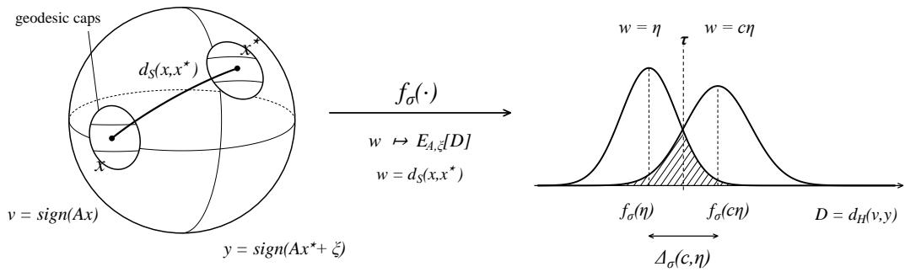
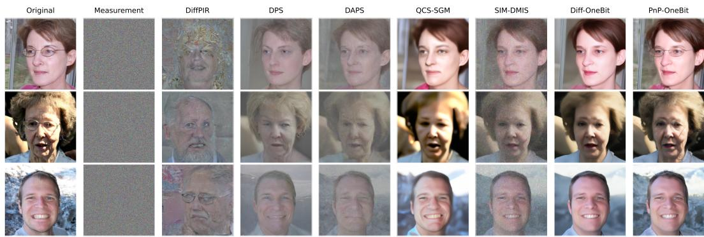
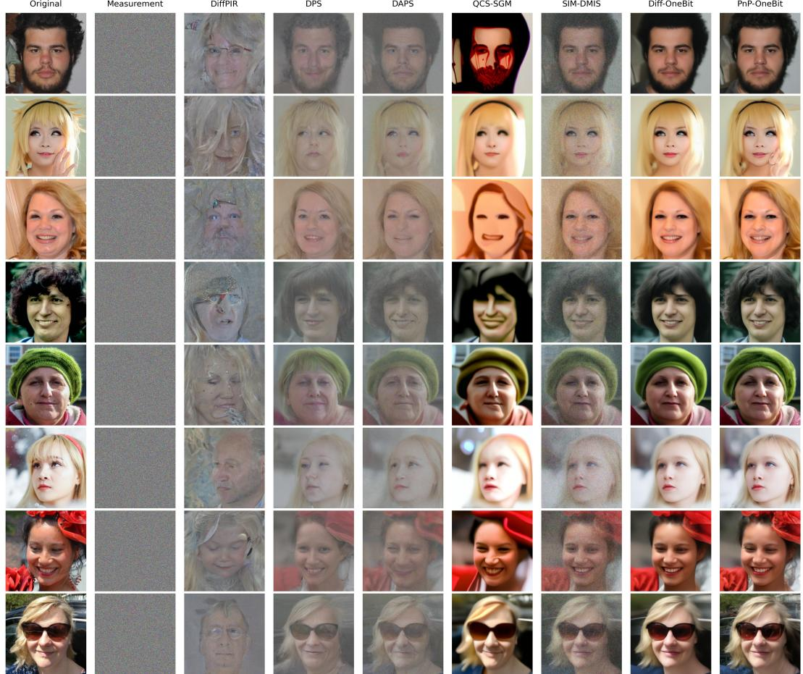
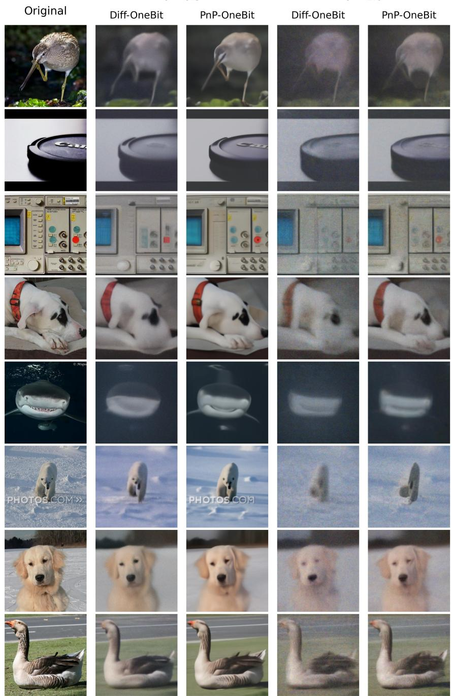

# Recovery Guarantees for Posterior Sampling of One-Bit Compressed Sensing

Jing Ma⋆ Yujia Wu⋆ Zhaoqiang Liu† University of Electronic Science and Technology of China

## Abstract

We study the sample complexity of noisy one-bit compressed sensing for signals drawn from a prior distribution. By characterizing the effective distributional complexity of the prior via its approximate covering number, we prove that posterior sampling achieves accurate recovery with high probability when the number of measurements scales with the logarithm of the approximate covering number, up to a one-bit separation gap factor. This upper bound is robust to learned prior mismatch. Specifically, we show that posterior sampling with an approximate prior remains reliable, provided that the learned prior distribution is sufficiently close to the true signal distribution in Wasserstein distance. In addition, we establish a sample complexity lower bound for any reliable method of noisy one-bit compressed sensing, showing that our upper bound is nearly matched in its main prior dependent term. To approximate the ideal posterior sampling process for real world scenarios, we instantiate posterior sampling through a plug-and-play algorithm with diffusion priors. Experiments on the FFHQ and ImageNet datasets demonstrate the effectiveness of our proposed approach.

## 1 Introduction

Compressed sensing studies how to reliably recover high dimensional signals from a number of measurements far below the ambient dimension. Its success relies on a central premise: High dimensional signals often have low intrinsic dimension [5, 7, 33]. Classical compressed sensing theory formalizes this structure through models such as sparsity [9], unions of subspaces [24], low rankness [56], or low dimensional manifolds [5], and establishes recovery guarantees when the number of measurements is sufficiently large relative to the intrinsic complexity of the underlying signal class [9, 21, 5, 56]. However, in many modern sensing systems, the measurement process is often further constrained by low precision acquisition devices, limited storage, or restricted communication bandwidth [32, 41, 59, 58, 28]. In such scenarios, the sensor may record only the signs of linear measurements, leading to the one-bit compressed sensing model [8, 53]:

$$
y = \mathrm { s i g n } ( A x ^ { * } + \xi ) \in \{ - 1 , + 1 \} ^ { m } ,\tag{1}
$$

where $x ^ { * } \in \mathbb { S } ^ { n - 1 } : = \{ x \in \mathbb { R } ^ { n } : \| x \| _ { 2 } = 1 \}$ is the unknown signal, $A \in \mathbb { R } ^ { m \times n }$ is the measurement matrix, and $\xi \sim \operatorname { \mathcal { N } } ( 0 , \sigma ^ { 2 } I _ { m } )$ denotes Gaussian noise with noise level $\sigma > 0$ . For one-bit measurements, there is a loss of the magnitude information on the signal [8, 54, 40] and we focus on directional recovery and measure reconstruction error by geodesic distance on $\mathbb { S } ^ { n - 1 }$

Classical compressed sensing often adopts a set based viewpoint, seeking recovery over a prescribed structured class such as sparse vectors [51, 50], low dimensional manifolds [30, 23], or range of generative model [7, 29]. While this perspective has been successful, it can be overly pessimistic for expressive priors since it ignores how probability mass is distributed within the signal model [33, 57]. A distributional viewpoint instead treats the signal prior itself as the object of study and asks for high probability recovery when the signal x∗ is drawn from that prior [34, 70, 57, 2]. In this setting, it is more natural to measure the complexity of the distribution through the approximate covering number of a high probability region [33, 1], rather than through the covering number of the entire support. For linear Gaussian measurements, it is shown that the approximate covering number governs the sample complexity of posterior sampling for arbitrary data priors [33]. This motivates the central question of this paper: For signals drawn from an arbitrary data prior distribution on the unit sphere, how should the sample complexity of reliable recovery from noisy one-bit measurements be characterized in terms of the prior distribution?

## 1.1 Related works

Early work on one-bit compressed sensing studied sensing systems in which only the signs of linear measurements are retained [8]. Since such sign observations discard amplitude information, traditional one-bit compressed sensing focuses on directional recovery, typically under a normalization constraint on the signal [53, 32]. For sparse signals, foundational results establish recovery guarantees from noisy [37] or noiseless sign measurements using convex programs and related optimization methods [53, 54, 32, 3]. A key geometric principle underlying these results is that random hyperplanes can provide binary embeddings: As first proven in [32] and soon after in [54], the normalized Hamming distance between sign patterns concentrates around the angular distance between signals, uniformly over low complexity sets. Subsequent works further develop robust recovery guarantees under measurement noise, sign flips, and other quantization effects [32, 40]. These classical results show that one-bit measurements can preserve sufficient angular information for reliable recovery over structured signal classes, despite the severe information loss caused by quantization.

With the development of deep learning, the seminal work [7] shows that signals lying near the range of a generative model can be recovered from significantly fewer linear measurements than the ambient dimension by optimizing over the latent space of the generator. This viewpoint replaces hand crafted structures, such as sparsity or low rankness, with the range of a learned generator, and has motivated a broad line of work on compressed sensing with generative priors [44, 12, 13]. Motivated by these developments, recent studies have extended generative prior methods to one-bit compressed sensing, where recovery is typically performed by searching for a latent code whose generated signal is consistent with the observed signs [36, 55, 45]. Theoretical analyses in this direction often rely on binary stable embeddings or uniform concentration over the generator range, leading to sample complexity bounds for Lipschitz generative models under Gaussian hyperplane measurements [45, 44, 55]. More recently, pretrained diffusion generative models [31, 61, 62] have emerged as powerful deep generators, and are widely leveraged as highly flexible priors for signal recovery [17, 39, 67, 66, 73, 68, 71, 4, 74, 18, 69, 10, 35, 46], including subsequent extensions to one-bit compressed sensing [49, 63, 15]. However, the theoretical guarantees for these diffusion based methods remain relatively underexplored. Unlike previous set based guarantees over prescribed signal classes or range of generator [45, 43, 12, 11], we study arbitrary data prior distributions on the unit sphere and characterize the sample complexity through the approximate covering complexity [33] of high probability regions.

The work [33] is perhaps the most closely relevant work, which develops a posterior sampling frame work for linear compressed sensing with arbitrary data priors. Their theory introduces approximate covering numbers as a central complexity measure for distributional compressed sensing and shows that posterior sampling is instance optimal under linear Gaussian measurements. We extend this idea to one-bit measurements. This extension is not a simple technical modification. Since one-bit observations retain only binary sign patterns, residual comparisons and likelihood separation arguments from continuous linear measurements are no longer directly applicable, and we can only distinguish spherical signals using a separation gap defined through the expected Hamming distance. Moreover, the nonlinearity of the one-bit measurement model makes the analysis of noise and model mismatch more difficult. Additive Gaussian noise, after passing through the sign function, no longer behaves as a simple continuous perturbation. When the true prior and the sampling prior are mismatched, we use a Rényi type stability [64] argument to control how this perturbation affects the posterior distribution. In addition, the analysis is carried out on the unit sphere with geodesic distance, which requires spherical versions of covering, separation, and Wasserstein coupling arguments.

## 1.2 Contributions

Our work extends the distributional posterior sampling framework from continuous linear measurements to the noisy one-bit setting, together with the corresponding analysis of noisy binary separation, recovery guarantees under prior mismatch, and a nearly matching information-theoretic necessary condition in the leading prior complexity term. Our main results are summarized as follows:

• In Section 3.1, we derive an upper bound on the sample complexity with Gaussian measurement matrices. The result gives the upper bound of sample complexity conditions for achieving geodesic recovery accuracy $\eta ,$ and is robust to mismatch between the learned prior distribution and the true signal distribution when they are sufficiently close in Wasserstein distance.

• In Section 3.2, we derive a nearly matching lower bound on the sample complexity required by any reliable recovery method, showing that the approximate covering number in the upper bound is unavoidable.

• In Section 4, we develop a specialized Plug-and-Play method with diffusion priors to approximate the posterior sampling process for noisy one-bit compressed sensing. The experimental results verify the effectiveness of this approach in image recovery tasks.

## 2 Preliminaries

Definition 1 (Signal and observation distances). Since signals are normalized to the unit sphere $\mathbb { S } ^ { n - 1 }$ we measure signal distance by the normalized geodesic distance $\begin{array} { r } { \mathrm { d } _ { \mathrm { S } } ( x _ { 1 } , x _ { 2 } ) : = \frac { 1 } { \pi } } \end{array}$ arccos $\langle x _ { 1 } , x _ { 2 } \rangle$ where $x _ { 1 } , x _ { 2 } \in \mathbb { S } ^ { n - 1 }$ . For binary observations $u , v \in \{ - 1 , + 1 \} ^ { m }$ , we measure their discrepancy by the normalized Hamming distance $\begin{array} { r } { \mathrm { d } _ { \mathrm { H } } ( u , v ) : = \frac { 1 } { m } \sum _ { i = 1 } ^ { m } \mathbf { 1 } \{ u _ { i } \not = v _ { i } \} } \end{array}$

Definition 2 ((η, δ)-approximate covering number [33]). For $x _ { 0 } \in \mathbb { S } ^ { n - 1 }$ and $0 < \eta \leq 1$ , define the geodesic η-cap $\bar { \mathcal { B } ( x _ { 0 } , \eta ) } : = \{ x \in \mathbb { S } ^ { n - 1 } : \mathrm { d } _ { \mathrm { S } } ( x , x _ { 0 } ) \leq \eta \}$ . For a distribution R on $\mathbb { S } ^ { n - 1 }$ and $\delta \in [ 0 , 1 )$ , the (η, δ)-approximate covering number is

$$
\mathrm { C o v } _ { \eta , \delta } ( R ) : = \operatorname* { m i n } \left\{ k \in \mathbb { N } : R \left( \bigcup _ { i = 1 } ^ { k } \mathcal { B } ( x _ { i } , \eta ) \right) \geq 1 - \delta , \ x _ { i } \in \mathbb { S } ^ { n - 1 } \right\} .\tag{2}
$$

Definition 3 (Geodesic Wasserstein distance). Let µ and ν be probability distributions on $\mathbb { S } ^ { n - 1 }$ , and let $\Pi ( \mu , \nu )$ denote the set ofall couplings ofµ and ν. For $p \geq 1$ , the geodesic Wasserstein-p distance between µ and ν is defined as

$$
\mathcal { W } _ { p , \mathrm { g e o } } ( \mu , \nu ) : = \biggl ( \operatorname* { i n f } _ { \gamma \in \Pi ( \mu , \nu ) } \int _ { \mathbb { S } ^ { n - 1 } \times \mathbb { S } ^ { n - 1 } } \mathrm { d } _ { \mathrm { S } } ( x , y ) ^ { p } d \gamma ( x , y ) \biggr ) ^ { 1 / p } .\tag{3}
$$

The corresponding geodesic Wasserstein-∞ distance is defined as

$$
\mathcal { W } _ { \infty , \mathrm { g e o } } ( \mu , \nu ) : = \operatorname* { i n f } _ { \gamma \in \Pi ( \mu , \nu ) } \mathbb { e s s } \operatorname* { s u p } _ { ( x , y ) \sim \gamma } \mathrm { d } _ { \mathrm { S } } ( x , y ) .\tag{4}
$$

Definition 4 (One-bit separation gap). For the noisy Gaussian one-bit model with noise level $\sigma ,$ let $\begin{array} { r } { f _ { \sigma } ( w ) = \frac { 1 } { \pi } \operatorname { a r c c o s } \Bigl ( \frac { \cos ( \pi w ) } { \sqrt { 1 + \sigma ^ { 2 } } } \Bigr ) , w \in [ 0 , 1 ] . } \end{array}$ . For $u \in ( 0 , 1 )$ and $s \in ( 1 , 1 / u )$ , the one-bit separation gap is defined by $\Delta _ { \sigma } ( s , u ) \mathrel { \mathop : } = f _ { \sigma } ( s u ) - f _ { \sigma } ( u )$ . Since $s > 1$ , we have su $> u ,$ , by the monotonicity of $f _ { \sigma } , \Delta _ { \sigma } ( s , u ) \geq 0 .$

Definition 5 (Maximum row $\ell _ { 2 }$ norm). Let $A \in \mathbb { R } ^ { m \times n }$ and let $a _ { i } ^ { \top }$ denote the i-th row of A. We define $\| A \| _ { 2 , \infty } : = \operatorname* { m a x } _ { i \in [ m ] } \| a _ { i } \| _ { 2 }$

Definition 6 (One-bit probit conditional likelihood). Under the one-bit probit model, the conditional likelihood ofobserving $y \in \{ - 1 , + 1 \} ^ { m }$ given x and A is defined as $\begin{array} { r } { \operatorname* { P r } ( y | x , A ) : = \prod _ { i = 1 } ^ { m } \Phi \left( \frac { y _ { i } a _ { i } ^ { \top } x } { \sigma } \right) } \end{array}$ where Φ is the standard Gaussian cumulative distributionfunction and $\sigma > 0$ is the noise level.

## 3 Main results

In this section, we study the sample complexity of reliable signal recovery by presenting both upper bound and lower bound. Specifically, the upper bound provides a sufficient measurement condition for reliable recovery, whereas the lower bound provides a necessary measurement condition that must be satisfied by any reliable recovery method. In the upper bound analysis, we assume an i.i.d. Gaussian sensing matrix $A _ { i j } \sim \mathcal { N } ( 0 , 1 )$ , which ensures that geodesic separation on the sphere is translated into predictable Hamming separation between one-bit sign patterns. In the lower bound analysis, we consider both deterministic and Gaussian sensing matrices.

## 3.1 Upper bound

In this section, we establish an upper bound on the sample complexity of posterior sampling for one-bit compressed sensing. The key idea is that, under sufficiently many independent Gaussian measurements, geodesically separated signals induce one-bit observations that can be distinguished through their Hamming disagreement.

Theorem 3.1 (One-bit posterior sampling upper bound). Let R and P be two probability distributions on the unit sphere $\mathbb { S } ^ { n - 1 } .$ Let $p \ge 1 , \bar { 0 } < \eta < 1 , 0 < \delta < 1 / 4 ,$ , and assume $\begin{array} { r } { \mathcal { W } _ { p , \mathrm { g e o } } ( R , P ) \leq \rho . } \end{array}$ Define the effective mismatch level $\varepsilon _ { \delta } : = \rho / \delta ^ { 1 / p }$ , and define the parameter $\bar { \eta } : = \eta + \varepsilon _ { \delta }$ . We take $\begin{array} { r } { c \in \left( 1 , \frac { 1 - \varepsilon _ { \delta } } { \bar { \eta } } - 1 \right) } \end{array}$ , assume further that $2 \eta + 3 \varepsilon _ { \delta } < 1$ , which guarantees that $\left( 1 , \frac { 1 - \varepsilon _ { \delta } } { \bar { \eta } } - 1 \right)$ is a nonempty interval. Given $( y , A ) , { \widehat { x } } \sim P ( \cdot | y , A )$ is the posterior sampling estimator based on $P .$ Furthermore, define $r _ { \varepsilon _ { \delta } } : = 2$ sin $\left( \frac { \pi \varepsilon _ { \delta } } { 2 } \right)$ , assume that the model mismatch is sufficiently small, such that $\begin{array} { r } { \frac { r _ { \varepsilon _ { \delta } } ^ { 2 } } { \sigma ^ { 2 } } \leq \frac { 1 } { 6 } \Delta _ { \sigma } ( c , \bar { \eta } ) ^ { 2 } } \end{array}$ . For $\zeta \in ( 0 , 1 )$ , when $\begin{array} { r } { m \geq C \frac { \log \mathrm { C o v } _ { \eta , \delta } ( R ) + \log 2 + \log ( 1 / \zeta ) } { \Delta _ { \sigma } ( c , \bar { \eta } ) ^ { 2 } } } \end{array}$ for some $C > 0 _ { : }$ with probability at least $1 - \zeta$ over the draw ofA,

$$
\Pr _ { x ^ { * } \sim R , \xi , \widehat { x } | A } \left( \mathrm { d s } ( x ^ { * } , \widehat { x } ) \geq ( c + 1 ) \bar { \eta } + \varepsilon _ { \delta } \right) \leq 2 \delta + \zeta .\tag{5}
$$

In particular, $i f c > 1$ is also afixed constant and $\varepsilon _ { \delta } = { O } \left( { \eta } \right)$ , then $\bar { \eta } = \Theta ( \eta )$ . In this case, to ensure dS $\mathbf { \widehat { \rho } } ( x ^ { \ast } , \widehat { x } ) = \mathbf { \widehat { \cal { O } } } ( \eta )$ with probability at least $1 - 2 \delta - \zeta$ conditionally on a measurement matrix A, it suffices to take

$$
m = \left\{ \begin{array} { l l } { O \big ( ( \log \mathrm { C o v } _ { \eta , \delta } ( R ) + \log ( 1 / \zeta ) ) \eta ^ { - 2 } \big ) , } & { \sigma \lesssim \eta , } \\ { O \big ( ( \log \mathrm { C o v } _ { \eta , \delta } ( R ) + \log ( 1 / \zeta ) ) \sigma ^ { 2 } \eta ^ { - 4 } \big ) , } & { \sigma \gtrsim \eta . } \end{array} \right.\tag{6}
$$

Remark 1. The condition $\begin{array} { r } { \frac { r _ { \varepsilon _ { \delta } } ^ { 2 } } { \sigma ^ { 2 } } \leq \frac { 1 } { 6 } \Delta _ { \sigma } ( c , \bar { \eta } ) ^ { 2 } } \end{array}$ requires the model mismatch to be small compared with the effective noise level and the one-bit near–far separation gap. Since $r _ { \varepsilon _ { \delta } } = 2$ sin $\textstyle \left( { \frac { \pi \varepsilon _ { \delta } } { 2 } } \right) , \varepsilon _ { \delta } = { \frac { \rho } { \delta ^ { 1 / p } } }$ for small $\varepsilon _ { \delta }$ this condition is equivalent up to constants to $\rho \lesssim \delta ^ { 1 / p } \sigma \Delta _ { \sigma } ( c , \bar { \eta } )$ . Thus, the learned sampling prior $P$ must be sufficiently close to the true prior $R .$ If the mismatch is too large, the main probability masses of $R$ and $P$ may be separated on the sphere, so even after Gaussian smoothing their induced one-bit observation distributions may not overlap enough. Consequently, the posterior induced by $P$ may place little mass near the true signal $x ^ { * } \sim R ,$ , causing the stability guarantee for posterior sampling to fail. Moreover, extensive studies have shown the generated distribution $P$ can be close to the true distribution R under appropriate conditions [14, 42, 25, 48, 26].

Remark 2. Compared with the linear posterior sampling upper bound [33], the one-bit setting contains an additional factor $\Delta _ { \sigma } ( c , \bar { \eta } ) ^ { - 2 }$ This is due to the one-bit observation process, which preserves only sign information and discards the amplitude information available in linear measurements. Consequently, the geometric separation between two covering caps is not directly reflected in the observation space, but can only be detected through the difference between their induced expected Hamming disagreements. This difference is precisely $\Delta _ { \sigma } ( c , \bar { \eta } ) = f _ { \sigma } ( c \bar { \eta } ) - f _ { \sigma } ( \bar { \eta } )$ . To reliably distinguish the covering caps, the empirical Hamming distance must concentrate at the scale of $\Delta _ { \sigma } ( c , \bar { \eta } )$ , which requires m $\dot { \Delta } _ { \sigma } ( c , \bar { \eta } ) ^ { 2 } \stackrel { \cdot } { \sim } \log \mathrm { C o v } _ { \eta , \delta } ( R )$ . Therefore, the sample complexity naturally contains the factor $\Delta _ { \sigma } ( c , \bar { \eta } ) ^ { - 2 }$ . This term reflects the intrinsic loss of information caused by one-bit quantization and noise.

We first outline the proof of Theorem 3.1. Since one-bit observations retain only sign information, the Euclidean residuals used in linear models are no longer directly available. Therefore, we need to establish a new notion of separability in the binary observation space. Specifically, we first characterize the relationship between spherical geodesic distance and the Hamming disagreement rate of one-bit observations, and then use this relationship to construct a near–far test. We then combine approximate covering with a union bound to control the probability that the posterior sample fall into an incorrect far-away region, and finally use a Rényi type stability to handle model mismatch.

We first need to characterize how distinguishable two spherical signals are after one-bit observation. Due to the rotational invariance of Gaussian measurements, the sign disagreement probability of two signals depends only on their geodesic distance. The following lemma gives an explicit expression for this relationship.

Lemma 3.2 (Expected Hamming distance between noisy and noiseless one-bit measurements). Consider two signals $x _ { 1 } , x _ { 2 } \in \mathbb { S } ^ { n - 1 }$ defined on the unit Euclidean sphere. Define the observations of these two signals as $u = \mathrm { s i g n } ( A x _ { 1 } + \xi )$ and $v = { \mathrm { s i g n } } ( A x _ { 2 } )$ . We have:

$$
\mathbb { E } [ \mathrm { d } _ { \mathrm { H } } ( u , v ) ] = \frac { 1 } { \pi } \operatorname { a r c c o s } \left( \frac { \cos ( \pi \mathrm { d } _ { \mathrm { S } } ( x _ { 1 } , x _ { 2 } ) ) } { \sqrt { 1 + \sigma ^ { 2 } } } \right) .\tag{7}
$$

The previous lemma shows that geodesic separation is transformed by the one-bit channel into a gap in expected Hamming disagreement. Hence the quantity $\Delta _ { \sigma } ( c , \eta ) \stackrel { . } { = } f _ { \sigma } ( c \eta ) - f _ { \sigma } ( \eta )$ measures the observational margin between signals inside $B ( x _ { 2 } , \bar { \eta } )$ and signals outside $B ( x _ { 2 } , c \eta ) \mathrm { - c a p }$ . This margin allows us to construct the following near–far test.

Lemma 3.3 (One-bit near–far test lemma). Fix a reference point $x _ { 0 } \in \mathbb { S } ^ { n - 1 }$ . Let the testing threshold be $\begin{array} { r } { \begin{array} { l l l } { \tau _ { \eta , c , \sigma } } & { : = } & { \frac { f _ { \sigma } ( \eta ) + f _ { \sigma } ( c \eta ) } { 2 } } \end{array} } \end{array}$ , and define the test function $\begin{array} { r l } { \phi _ { x _ { 0 } , \eta } ( y ; A ) } & { { } : = } \end{array}$ $\mathbf { 1 } \left\{ \mathrm { d } _ { \mathrm { H } } \left( y , \mathrm { s i g n } ( A x _ { 0 } ) \right) \geq \tau _ { \eta , c , \sigma } \right\}$ . Then thefollowing two testing error bounds hold in the annealed sense:

$$
\operatorname* { s u p } _ { x \colon \mathrm { d s } ( x , x _ { 0 } ) \leq \eta } \operatorname* { P r } _ { A , \xi | x } \left( \phi _ { x _ { 0 } , \eta } ( y ; A ) = 1 \right) \leq \exp \left( - \frac { m } { 2 } \Delta _ { \sigma } ( c , \eta ) ^ { 2 } \right) ,\tag{8}
$$

and

$$
\operatorname* { s u p } _ { x \colon \mathrm { d } _ { \mathrm { S } } ( x , x _ { 0 } ) \geq c \eta } \operatorname* { P r } _ { A , \xi | x } \left( \phi _ { x _ { 0 } , \eta } ( y ; A ) = 0 \right) \leq \exp \left( - \frac { m } { 2 } \Delta _ { \sigma } ( c , \eta ) ^ { 2 } \right) .\tag{9}
$$

Here the probability is taken with respect to the joint randomness ofthe measurement matrix A and the noise ξ, conditional on the fixed reference point x. Hence the result is annealed, in the sense that the probability is averaged over the measurement matrix A, rather than a conditional in A bound for a fixed realization of A.

Remark 3. Lemma 3.2 and Lemma 3.3 are closely related to the distance-preservation principle underlying binary stable embeddings. When $\sigma = 0 ;$ , we have $f _ { 0 } ( w ) = \bar { w }$ , so Lemma 3.2 reduces to the classical random-hyperplane identity $\mathbb { E } [ \mathrm { d } _ { \mathrm { H } } ( \mathrm { s i g n } ( A x _ { 1 } ) , \mathrm { s i g n } ( A x _ { 2 } ) ) ] = \mathrm { d } _ { \mathrm { S } } ( x _ { 1 } , x _ { 2 } )$ , with $\Delta _ { 0 } ( c , \eta ) = ( c - 1 ) \eta$ , while Lemma 3.3 yields concentration of the empirical Hamming distance and hence a near–far separation guarantee. Unlike standard binary stable embeddings, our posterior sampling analysis only requires such near–far separation over an approximate cover of a high-probability region of the prior, rather than uniform distance preservation over all signal pairs. For $\sigma > 0 , f _ { \sigma } ( \cdot )$ and $\Delta _ { \sigma } ( c , \eta )$ quantify the additional distortion induced by Gaussian noise before quantization. A visual explanation of this section can be found in the diagram below, the shaded area represents the cases in which we recover from errors.

(a) Spherical signal geometry  
(b) Hamming-distance distributions  

We now extend the near–far test to a general prior by covering its high probability region with finitely many η-caps. Applying the same far region control to each cap and taking a union bound over the covering centers yields the log $\mathrm { C o v } _ { \eta , \delta }$ term in the sample complexity.

Lemma 3.4 (Overall recovery upper bound for one-bit posterior sampling under a covering partition). Let Q be a probability distribution on $\mathbb { S } ^ { n - 1 }$ . Assume that there exist centers $x _ { 1 } , \dotsc , x _ { N } \in { \bar { \mathbb { S } } } ^ { n - 1 }$ such that, with $\begin{array} { r } { \mathcal { C } _ { j } : = \{ x \in \mathbb { S } ^ { n - 1 } : \mathrm { d } _ { \mathbb { S } } ( x , x _ { j } ) \leq \eta \} , G : = \bigcup _ { j = 1 } ^ { N } \mathcal { C } _ { j } . \mathrm { ~ } F i x \alpha \in ( 0 , \frac { 1 } { 2 } ) } \end{array}$ , and assume that

$$
Q = ( 1 - \alpha ) Q _ { g } + \alpha Q _ { b } \qquad Q _ { g } ( G ) = 1 ,\tag{10}
$$

Here $Q _ { g }$ denotes a covered good component $o f Q ,$ , ofmixture weight $1 - \alpha ,$ contained in the highprobability region G. Let $x ^ { * } \sim Q _ { g } ,$ , and let ${ \widehat { x } } \sim Q ( \cdot | { \dot { y } } , A )$ be the posterior sampling estimator based on the same distribution $Q .$ Suppose $\begin{array} { r } { 0 < \eta < \frac { 1 } { 2 } } \end{array}$ , and $c \in ( 1 , { \frac { 1 } { \eta } } - 1 )$ . Then we have:

$$
\operatorname* { P r } _ { x ^ { * } \sim Q _ { g } , A , \xi , \widehat { x } } \ ( \mathrm { d s } ( x ^ { * } , \widehat { x } ) \geq ( c + 1 ) \eta ) \leq \frac { 1 } { 1 - \alpha } N \exp \left( - \frac { m } { 2 } \Delta _ { \sigma } ( c , \eta ) ^ { 2 } \right) .\tag{11}
$$

The previous lemma handles the matched prior finite cover case. To extend it to the general setting with distribution mismatch, the following lemma controls the probability loss under ${ \mathcal { W } } _ { \infty , \mathrm { g e o } }$ mismatch through a Rényi type stability argument [64].

Lemma 3.5 (Rényi stability under spherical $W _ { \infty , \mathrm { g e o } }$ mismatch). Let $R _ { 0 }$ and $S _ { 0 }$ be two probability distributions defined on the unit sphere $\mathbb { S } ^ { n - 1 } .$ Assume that $R _ { 0 }$ and $S _ { 0 }$ satisfy the spherical Wasserstein-∞ mismatch condition $\mathcal { W } _ { \infty , \mathrm { g e o } } ( R _ { 0 } , S _ { 0 } ) \le \epsilon .$ , where $0 < \epsilon \leq 1$ . Let D be a probability distribution on $\mathbb { S } ^ { n - 1 }$ . Let $x ^ { * } \sim R _ { 0 } , z ^ { * } \sim S _ { 0 }$ . Let Π be a coupling of $R _ { 0 }$ and $S _ { 0 }$ such that, for $( x ^ { * } , z ^ { * } ) \sim \Pi , \mathrm { d } _ { \mathrm { S } } ( x ^ { * } , z ^ { * } ) \le \epsilon$ almost surely. Let xb and $\widehat { z }$ be posterior samples with respect to the model prior $D ,$ conditioned on $( A , y )$ and $( A , u )$ . Consider the noisy one-bit measurement model

$$
y = \mathrm { s i g n } ( A x ^ { * } + \xi ) , \qquad u = \mathrm { s i g n } ( A z ^ { * } + \xi ^ { \prime } ) ,\tag{12}
$$

where $A _ { i j } \sim \mathcal { N } ( 0 , 1 ) , \xi , \xi ^ { \prime } \sim \mathcal { N } ( 0 , \sigma ^ { 2 } I _ { m } )$ , and $A , \ \xi ,$ and $\xi ^ { \prime }$ are mutually independent. Let $\begin{array} { r } { r _ { \epsilon } = 2 \sin \left( \frac { \pi \epsilon } { 2 } \right) } \end{array}$ . Then, for any $d > 0$ and any parameter $0 < \lambda \leq$ min $\left\{ 1 , \ { \frac { \sigma ^ { 2 } } { 3 r _ { \epsilon } ^ { 2 } } } \right\}$ , we have

$$
\operatorname* { P r } \left( \mathrm { d } _ { \mathrm { S } } ( x ^ { * } , \widehat { x } ) \geq d + \epsilon \right) \leq \left( 1 - \frac { \lambda ( 1 + \lambda ) r _ { \epsilon } ^ { 2 } } { \sigma ^ { 2 } } \right) ^ { - \frac { m } { 2 ( 1 + \lambda ) } } \operatorname* { P r } \left( \mathrm { d } _ { \mathrm { S } } ( z ^ { * } , \widehat { z } ) \geq d \right) ^ { \frac { \lambda } { 1 + \lambda } } .\tag{13}
$$

The proof of Theorem 3.1 is obtained by combining Lemmas A.1, 3.4 and 3.5. First, Lemma A.1 reduces the general mismatched priors $( R , P )$ to their high probability components $( R ^ { \prime } , P ^ { \prime } )$ , losing only 2δ probability mass. Since $R ^ { \prime }$ and $P ^ { \prime }$ are coupled within geodesic distance $\varepsilon _ { \delta } = \rho / \delta ^ { 1 / p }$ , the covering radius is enlarged from η to $\bar { \eta } = \eta + \varepsilon _ { \delta }$ . Then Lemma 3.4 gives the posterior sampling recovery bound for the covered good component under the learned prior distribution P. Finally, Lemma 3.5 transfers this bound from $P ^ { \prime }$ to $R ^ { \prime }$ , adding the Rényi stability factor and an extra $\varepsilon _ { \delta }$ in the recovery radius. At this point, the error probability is controlled in expectation over the random matrix A. Hence, for any $\beta \in ( 0 , 1 )$ , Markov’s inequality implies that the corresponding conditional error probability, given A, is at most $1 / \beta$ times this expectation with probability at least $1 - \beta$ over ${ \dot { A } } .$ . Combining these terms and simplifying yields Lemma ${ \tt A . 2 }$ . Theorem 3.1 then follows by specializing the auxiliary parameters in Lemma $\mathrm { \bar A } . 2$ and simplifying the resulting expression under the small-mismatch condition.

For the specific proof methods and processes, please refer to Section A in Appendix.

## 3.2 Lower bound

The one-bit observation model induces a stronger information bottleneck than the linear sensing model. In the Gaussian linear model, each real valued measurement may carry an amount of information that scales as a logarithmic signal-to-noise ratio. In contrast, under one-bit quantization, the observation $y \in \{ - 1 , + \bar { 1 } \} ^ { m }$ is a binary string, and therefore the total information transmitted by the sensing process is intrinsically limited by the entropy of m log 2 nats. Consequently, the mutual information argument used for continuous compressed sensing must be replaced by a channel bound adapted to the one-bit model. This section formalizes this replacement and combines it with a spherical Fano argument to obtain a lower bound on the number of measurements. Throughout this section, logarithms are natural logarithms.

Theorem 3.6 (Information lower bound for one-bit compressed sensing). Let R be a prior distribution defined on the high dimensional unit Euclidean sphere $\mathbb { S } ^ { n - 1 }$ , where $x ^ { * } \sim R$ . Define the recovery accuracy $\eta \in ( 0 , \frac { 1 } { 3 } )$ , suppose that $\delta < 0 .$ 1 and that there exists a recovery algorithm capable of outputting ${ \widehat { x } } \in { \mathbb S } ^ { n - 1 }$ based solely on the observation y and the matrix A, such that:

$$
\operatorname* { P r } \left( d _ { S } ( { \widehat { x } } , x ^ { * } ) \leq \eta \right) \geq 1 - \delta .\tag{14}
$$

IfA is a deterministic matrix, then the number ofmeasurements m must satisfy:

$$
m \ge \frac { 0 . 0 7 2 \pi \sigma ^ { 2 } } { 2 ( \log 2 ) \| A \| _ { 2 , \infty } ^ { 2 } } \left( \log \mathrm { C o v } _ { 3 \eta , 4 \delta } ( R ) + \log ( 6 \delta ) - 2 5 \right) .\tag{15}
$$

If $A _ { i j } \sim \mathcal { N } ( 0 , 1 )$ , then the number of measurements m must satisfy:

$$
m \ge \frac { 0 . 0 7 2 \pi } { 2 ( \log 2 ) \arcsin \Big ( \frac { 1 } { 1 + \sigma ^ { 2 } } \Big ) } \left( \log \mathrm { C o v } _ { 3 \eta , 4 \delta } ( R ) + \log ( 6 \delta ) - 2 5 \right) .\tag{16}
$$

Remark 4 (Comparison between the upper and lower bounds). We now compare the upper bound in Theorem 3.1 with the lower bound in Theorem 3.6. Then Theorem 3.1 shows that when $m \gtrsim$ $\frac { \log \mathrm { C o v } _ { \eta , \delta } ( R ) } { \Delta _ { \sigma } ( c , \eta ) ^ { 2 } }$ , posterior sampling achieves accurate recovery with high probability. In contrast, Theorem 3.6 shows that any estimator that achieves ${ \cal { O } } ( \eta )$ accurate recovery with constant success probability must satisfy m $\gtrsim \log \mathrm { C o v } _ { 3 \eta , 4 \delta } ( R )$ , where the constants may depend on the one-bit channel and the noise level.

Therefore, the two bounds nearly match in the leading term log $\mathrm { C o v } _ { \eta , \delta } ( R )$ depending on the prior R. This shows that the approximate covering number is the correct distributional complexity measure for one-bit compressed sensing with arbitrary data priors. In particular, the complexity term appearing in the posterior sampling upper bound generally cannot be removed or substantially improved.

The remaining difference is mainly the factor $\Delta _ { \sigma } ( c , \eta ) ^ { - 2 }$ in the upper bound. This factor comes from the one-bit observation process. Since the measurements only retain the signs, two signals separated on the sphere can be distinguished only through the gap between their expected Hamming distances. This gap is exactly measured by $\Delta _ { \sigma } ( c , \eta )$ . If c is chosen as a fixed numerical constant, for instance $c = 2 .$ , then in the small-noise regime, we have $\Delta _ { \sigma } ( c , \eta ) \asymp \eta$ . Therefore, the upper bound requires sufficiently many measurements for this Hamming-distance gap to concentrate. Thus, the upper and lower bounds are nearly matched in terms of log $\mathrm { C o v } _ { \eta , \delta } ( R )$

Remark 5. For the lower bound, we explicitly consider arbitrary fixed deterministic sensing matrices and i.i.d. Gaussian random matrices, which already cover many commonly used sensing settings. In particular, since the deterministic result holds for any fixed A, it also allows A to be optimized using knowledge of the prior distribution R, provided that A is independent of the realized signal $x ^ { * }$ . Our current analysis does not establish a universal lower bound for more general randomized or adaptive sensing strategies. In such settings, the sensing matrix may depend on additional randomness or side information correlated with the realized signal, in which case the independence argument used in Lemma B.1 no longer applies directly and a separate information-theoretic analysis is required.

Following the method in [33], we establish an upper bound on the mutual information conveyed by the one-bit observation channel. We derive our first lemma by starting from the mutual information conveyed between the observation y and the ground truth $x ^ { * }$

Lemma 3.7 (Mutual Information Bound). Assume that the measurementprocess is $y = \mathrm { s i g n } ( A x ^ { * } + \xi )$ where $\xi \sim \mathcal { N } ( 0 , \sigma ^ { 2 } I _ { m } )$ . IfA is a deterministic matrix, we have

$$
I ( y ; x ^ { * } ) \leq \frac { 2 m \log 2 } { \pi \sigma ^ { 2 } } \| A \| _ { 2 , \infty } ^ { 2 } .\tag{17}
$$

$I f A _ { i j } \sim \mathcal { N } ( 0 , 1 )$ , we have

$$
I ( y ; x ^ { * } | A ) \leq { \frac { 2 m \log 2 } { \pi } } \arcsin \left( { \frac { 1 } { 1 + \sigma ^ { 2 } } } \right) .\tag{18}
$$

Next, utilizing the properties of Markov chains, we express the mutual information between $x ^ { * }$ and xb. Here, we directly refer to the conclusion in [33] and obtain that if A is a Gaussian matrix, we have $I ( x ^ { * } ; \widehat { x } ) \leq I ( \dot { y } ; x ^ { * } | A )$ ; if A is a fixed matrix, we have $I ( x ^ { * } ; \widehat { x } ) \le I ( y ; x ^ { * } )$ (see Lemma B.1 for details).

We next establish a spherical Fano type inequality, which converts the high probability recovery guarantee into a lower bound on the mutual information between the signal and its estimate.

Lemma 3.8 (Variant of spherical Fano inequality). Let $( x , { \widehat { x } } )$ be random variables with a joint distribution on the unit Euclidean sphere $\mathbb { S } ^ { n - 1 } \times \mathbb { S } ^ { \bar { n } - 1 }$ , where $x \sim R ,$ , and suppose that the estimator satisfies

$$
\operatorname* { P r } \left( d _ { S } ( x , { \widehat { x } } ) \leq \eta \right) \geq 1 - \delta .\tag{19}
$$

Assuming δ is sufficiently small, then for any $\tau \in ( 0 , 1 - 2 \delta )$ , the following holds:

$$
( 1 - \delta ) \tau ( 1 - 2 \delta ) \log \mathrm { C o v } _ { 3 \eta , \tau + 3 \delta } ( R ) \leq I ( x ; \widehat { x } ) + 2 ( 1 - \delta ) .\tag{20}
$$

Now, based on Lemma 3.8, we obtain the requirement of the mutual information on the effective geometric complexity, that is, $( 1 - \delta ) \tau ( 1 - \bar { 2 \delta } )$ log $\mathrm { C o v } _ { 3 \eta , \tau + 3 \delta } ( R ) \leq I ( x ; \widehat { x } ) + 2 ( 1 - \delta )$ . On the other hand, according to Lemma 3.7 and Lemma B.1 in Appendix, we derive the upper bound of the mutual information: When A is a fixed matrix, we have $\begin{array} { r } { \left| \left( \widehat { x } ; x ^ { * } \right) \leq \frac { 2 m \log 2 } { \pi \sigma ^ { 2 } } \right\| A \| _ { 2 , \infty } ^ { \overline { { 2 } } } } \end{array}$ and when A is a Gaussian matrix, we have $\begin{array} { r } { I ( \widehat { x } ; x ^ { * } | A ) \leq \frac { 2 m \log 2 } { \pi } \arcsin \left( \frac { 1 } { 1 + \sigma ^ { 2 } } \right) } \end{array}$ . Therefore, substituting the corresponding mutual information upper bound into the Fano inequality requirement and solving for m yields the desired lower bounds in Theorem 3.6.

For the specific proof methods and processes, please refer to Section B in Appendix.

## 4 Algorithm and experiments

## 4.1 Plug-and-play approach for one-bit measurements

While our theory establishes guarantees for ideal posterior sampling, exact inference in high dimensions is intractable. To provide a practical counterpart, we introduce $\mathrm { P n P - O n e B i t } ^ { 2 }$ , which approximates this sampling process using diffusion models as the learned prior. Specifically, in one-bit quantized signal recovery, given measurements y and the forward matrix A, our objective is to reconstruct $x ^ { * }$ in Eq. (1) by sampling from the target posterior:

$$
p ( x | y , A ) \propto p ( y | x , A ) p ( x ) = \exp \left( - \mathcal { L } ( x ; y ) - \mathcal { P } ( x ) \right) ,\tag{21}
$$

where $\mathcal { P } ( x ) : = - \log p _ { \mathrm { d a t a } } ( x )$ is the negative log-prior function, and $\mathcal { L } ( x ; y ) : = - \log p ( y | x , A )$ is the negative log-likelihood function. In one-bit signal recovery, we can exactly express $\begin{array} { r } { \mathcal { L } ( x ; y ) = - \sum _ { i = 1 } ^ { m } \log \Phi \left( \frac { y _ { i } a _ { i } ^ { \top } x } { \sigma } \right) } \end{array}$ based on the cumulative distribution function of the standard normal distribution $\Phi ( \cdot )$

While existing one-bit recovery methods like Diff-OneBit [15] typically seek a single optimal estimate via half quadratic splitting (HQS) [27], we propose PnP-OneBit for more robust signal reconstruction. By customizing the generic PnP-DM framework [68] for one-bit quantization, our method utilizes the split Gibbs sampler (SGS) [65] to construct an effective posterior sampling algorithm. This alternating sampling strategy aligns with the algorithmic structure of [69], which has been shown to be provably robust for image recovery. By introducing an auxiliary variable $z \in \mathbb { R } ^ { n }$ and a coupling parameter $\varrho > 0 ,$ we construct a joint distribution

$$
\Pi ( x , z ) \propto \exp \left( { - \mathcal { L } ( z ; y ) - \mathcal { P } ( x ) - \frac { 1 } { 2 \varrho ^ { 2 } } \| x - z \| _ { 2 } ^ { 2 } } \right) .\tag{22}
$$

Starting from an initialization $x ^ { ( 0 ) }$ , SGS alternates between sampling from the following two conditional distributions at each iteration $k = 1 , 2 , \ldots , K$

$$
z ^ { ( k ) } \sim \Pi ( z | x ^ { ( k - 1 ) } ) \propto \exp \left( - \mathcal { L } ( z ; y ) - \frac { 1 } { 2 \varrho ^ { 2 } } \| z - x ^ { ( k - 1 ) } \| _ { 2 } ^ { 2 } \right) ,\tag{23}
$$

$$
x ^ { ( k ) } \sim \Pi ( x | z ^ { ( k ) } ) \propto \exp \left( - \mathcal { P } ( x ) - \frac { 1 } { 2 \varrho ^ { 2 } } \| x - z ^ { ( k ) } \| _ { 2 } ^ { 2 } \right) .\tag{24}
$$

Algorithm 1 PnP-OneBit   
Require: iteration number K   
1: Sample $x ^ { ( 0 ) } \sim \mathcal { N } ( 0 , I _ { n } )$   
2: for $\dot { k } = 0 , 1 , \dots , \dot { K } - 1$ do   
3: Sample $\stackrel { \prime } { z } ^ { ( k ) } \sim \Pi ( z | x ^ { ( k ) } )$ via Langevin Monte Carlo   
4: Sample $x ^ { ( k + 1 ) } \sim \overset { \cdot } { \Pi } ( x | z ^ { ( k ) } )$ via DDIM denoising   
5: end for   
6: return $x ^ { ( K ) }$

Sampling from Eq. (23) can be achieved via Langevin Monte Carlo due to the differentiability of $ { \mathcal Ḋ L Ḍ } ( z ; y )$ in the one-bit setting. However, due to $\mathcal { P } ( x )$ , directly sampling from Eq. (24) is intractable. The decoupling between data fidelity and prior allows us to utilize a pretrained diffusion model [61, 31] as a plug-and-play prior. The forward process of a diffusion model perturbs the data distribution to a noise distribution over continuous time $t \in [ 0 , T ]$ , characterized by the conditional distribution $q ( x _ { t } | x _ { 0 } )$ as:

$$
\boldsymbol { x } _ { t } | \boldsymbol { x } _ { 0 } \sim \mathcal { N } ( \boldsymbol { x } _ { t } ; \alpha _ { t } \boldsymbol { x } _ { 0 } , \sigma _ { t } ^ { 2 } I _ { n } ) ,\tag{25}
$$

where $x _ { 0 } \sim p _ { \mathrm { d a t a } }$ denotes the clean data, and $\alpha _ { t }$ and $\sigma _ { t }$ dictate the noise schedule. This forward process can be rewritten as a stochastic differential equation (SDE) [62]:

$$
\begin{array} { r } { d x _ { t } = f ( t ) x _ { t } d t + g ( t ) d w _ { t } , } \end{array}\tag{26}
$$

where $f ( t ) x _ { t }$ and $g ( t )$ are the drift and diffusion coefficients, and $w _ { t }$ is the standard Wiener process. To match the marginal distribution of Eq. (25) and Eq. (26), the drift and diffusion terms should satisfy [47]:

$$
f ( t ) = \frac { d \log \alpha _ { t } } { d t } , \quad g ^ { 2 } ( t ) = \frac { d \sigma _ { t } ^ { 2 } } { d t } - 2 f ( t ) \sigma _ { t } ^ { 2 } .\tag{27}
$$

To simulate the reverse generative process, a neural network $s _ { \theta } ( x _ { t } , t )$ is pretrained via score matching [62] to approximate the intractable score function $s _ { \theta } ( x _ { t } , t ) \approx \nabla _ { x _ { t } } \log p _ { t } ( x _ { t } )$ where $x _ { t } \sim p _ { t }$ . The reverse process is then governed by SDE [62] as:

$$
d x _ { t } = \left( f ( t ) x _ { t } - g ^ { 2 } ( t ) \nabla _ { x _ { t } } \log p _ { t } ( x _ { t } ) \right) d t + g ( t ) d \overline { { w } } _ { t } ,\tag{28}
$$

where $\overline { { w } } _ { t }$ is the inverse-time standard Wiener process. Detailed derivations of the diffusion model are provided in Section C.1 in Appendix.

We establish that the prior sampling step in Eq. (24) mathematically aligns with the diffusion posterior $p ( x _ { 0 } | x _ { t } )$ , when the diffusion time t matches the condition $\begin{array} { r } { \varrho = \frac { \sigma _ { t } } { \alpha _ { t } } } \end{array}$ and $z ^ { ( k ) } = x _ { t } / \alpha _ { t }$ (the corresponding derivation is deferred to Section C.2 in Appendix). Consequently, we can obtain an approximate sample $x ^ { ( k ) }$ by initializing the reverse SDE in Eq. (28) at $x _ { t } = \alpha _ { t } z ^ { ( k ) }$ and integrating it back to $t = 0$ . By alternating the likelihood sampling in Eq. (23) and the diffusion-based prior sampling in Eq. (24) over K iterations, we ultimately obtain the reconstructed signal $x ^ { ( K ) }$ , which approximates a sample from the one-bit posterior distribution. Algorithm 1 presents our algorithm in a summarized manner, The complete sampling algorithm is summarized in Section C.3 in Appendix.

## 4.2 Quantitative results

Our experiments are conducted on the FFHQ [38] and ImageNet [60] datasets at a spatial resolution of $2 5 6 \times 2 5 6$ . Following standard practices in one-bit compressed sensing [49, 63, 15], the elements of the measurement matrix A are sampled from $\mathcal { N } ( 0 , \bar { 1 } / m )$ . We compare the proposed PnP-OneBit against several models, including DiffPIR [75], DPS [17], DAPS [71], QCS-SGM [49], SIM-DMIS [63], and Diff-OneBit [15]. For a fair comparison, all evaluated algorithms utilize the same pretrained diffusion models and operate on identical measurements y. For each dataset, we randomly select 100 test images. We evaluate each method five times per image and report the mean ± standard deviation for peak signal-to-noise ratio (PSNR), structural similarity index measure (SSIM), and learned perceptual image patch similarity (LPIPS) [72]. Further implementation details are provided in Section D.1 in Appendix.

Table 1 summarizes the quantitative results on the FFHQ dataset under different compression ratios $n / m .$ Additional evaluations on the ImageNet dataset, experiments under varying noise levels, and comprehensive further studies are deferred to Section D in Appendix. Across both datasets, the proposed PnP-OneBit consistently achieves the great reconstruction performance on all evaluated metrics. Notably, PnP-OneBit maintains strong performance even at severe compression ratios $( n / m = 3 2 )$

Table 1: Quantitative results for one-bit recovery on the FFHQ dataset under different compression ratios n/m with additive Gaussian noise $\sigma = 0 . 5 .$ . Best results are shown in bold.
<table><tr><td rowspan="2">Methods</td><td colspan="3"> $n / m = 1 6$ </td><td colspan="3"> $n / m = 3 2$ </td></tr><tr><td>PSNR↑</td><td> $\mathrm { { S S I M \uparrow } }$ </td><td> $\mathrm { L P I P S } \downarrow$ </td><td>PSNR↑</td><td>SSIM↑</td><td>LPIPS↓</td></tr><tr><td>DiffPIR</td><td> $\overline { { 1 1 . 7 1 { \pm } 1 . 2 6 } }$ </td><td> $\overline { { 0 . 3 0 { \pm } . 0 5 } }$ </td><td> $0 . 7 3 { \pm } . 0 6$ </td><td> $\overline { { 1 1 . 4 8 { \pm } 0 . 6 3 } }$ </td><td> $\overline { { 0 . 2 4 \pm . 0 4 } }$ </td><td> $0 . 7 6 { \pm } . 0 5$ </td></tr><tr><td>DPS</td><td> $1 4 . 8 8 { \pm } 1 . 2 1 $ </td><td> $0 . 5 2 { \pm } . 0 6$ </td><td> $0 . 5 0 { \pm } . 0 7$ </td><td> $1 3 . 8 1 { \pm } 0 . 7 8$ </td><td> $0 . 5 0 { \pm } . 0 6 $ </td><td> $0 . 5 6 { \pm } . 0 5$ </td></tr><tr><td>DAPS</td><td> $1 4 . 8 4 \pm 1 . 6 1 $ </td><td> $0 . 4 3 { \pm } . 0 6$ </td><td> $0 . 5 9 { \pm } . 0 6 $ </td><td> $1 2 . 0 2 { \pm } 0 . 8 2$ </td><td> $0 . 3 1 { \pm } . 0 6$ </td><td> $0 . 6 1 { \pm } . 0 6$ </td></tr><tr><td>QCS-SGM</td><td> $1 8 . 1 1 \pm 2 . 4 3$ </td><td> $0 . 5 2 { \pm } . 1 0 $ </td><td> $0 . 5 2 { \pm } . 0 7$ </td><td> $1 7 . 1 2 { \pm } 1 . 8 4 $ </td><td> $0 . 4 9 { \pm } . 0 9$ </td><td> $0 . 5 9 2 . 0 6 $ </td></tr><tr><td>SIM-DMIS</td><td> $1 8 . 7 3 { \pm } 1 . 9 4 $ </td><td> $0 . 5 2 { \pm } . 0 8 $ </td><td> $0 . 5 0 { \pm } . 0 7$ </td><td> $1 7 . 3 6 { \pm } 1 . 3 4 $ </td><td> $0 . 4 8 { \pm } . 0 8$ </td><td> $0 . 5 5 { \pm } . 0 8 $ </td></tr><tr><td>Diff-OneBit</td><td> $2 1 . 9 5 { \pm } 1 . 2 3 $ </td><td> $0 . 5 3 { \pm } . 0 8 $ </td><td> $0 . 4 7 { \pm } . 0 6$ </td><td> $1 8 . 6 8 { \pm } 0 . 9 8 $ </td><td> $0 . 5 1 { \pm } . 0 6$ </td><td> $0 . 5 3 { \pm } . 0 6$ </td></tr><tr><td> $\mathrm { P n P \mathrm { - O n e B i t } }$ </td><td> $2 2 . 9 6 { \pm } 1 . 8 6$ </td><td> ${ \bf 0 . 6 9 } \pm . 0 9$  </td><td> $\mathbf { 0 . 3 3 \pm . 0 7 }$  </td><td> ${ \bf 1 9 . 6 4 } \pm 1 . 2 3$ </td><td> $\mathbf { 0 . 5 8 \pm . 0 7 }$  </td><td> ${ \bf 0 . 4 9 \pm . 0 7 }$ </td></tr></table>

  
Figure 1: Qualitative results on FFHQ dataset with $\sigma = 0 . 5$ and $n / m = 1 6 .$

Furthermore, visual comparisons of the reconstructed images are provided in Figure 1. While methods seeking a single point estimate, such as Diff-OneBit, may oversmooth high-frequency information under the information bottleneck of one-bit quantization, PnP-OneBit mitigates this issue. By balancing the data likelihood and the diffusion prior via posterior sampling, it effectively retains high-frequency textures.

## 5 Conclusion

We studied noisy one-bit compressed sensing for signals drawn from arbitrary data prior distributions on the sphere. We introduced an approximate covering number on the sphere and established a posterior sampling upper bound related to the logarithm of the approximate covering number and the recovery accuracy under noisy one-bit measurements, a robustness guarantee under learned prior mismatch, and an information theoretic lower bound for any reliable estimator. To complement these theoretical findings, we presented a one-bit plug-and-play reconstruction method and demonstrated its effectiveness on high dimensional image recovery tasks. Overall, our results show that reliable recovery under severe nonlinear quantization can be precisely characterized by the high probability geometric complexity of the signal prior. We focus on the noisy one-bit model with additive Gaussian noise before quantization. An open problem is whether similar robust posterior sampling bounds can be established when the model noise is adversarial.

## References

[1] Ben Adcock and Nick Huang. How many measurements are enough? Bayesian recovery in inverse problems with general distributions. In NeurIPS, 2025.

[2] Shuchin Aeron, Venkatesh Saligrama, and Manqi Zhao. Information theoretic bounds for compressed sensing. IEEE Transactions on Information Theory, 56(10):5111–5130, 2010.

[3] Albert Ai, Alex Lapanowski, Yaniv Plan, and Roman Vershynin. One-bit compressed sensing with non-Gaussian measurements. Linear Algebra and its Applications, 441:222–239, 2014.

[4] Ismail Alkhouri, Shijun Liang, Cheng-Han Huang, Jimmy Dai, Qing Qu, Saiprasad Ravishankar, and Rongrong Wang. SITCOM: Step-wise triple-consistent diffusion sampling for inverse problems. In ICML, 2025.

[5] Richard G Baraniuk and Michael B Wakin. Random projections of smooth manifolds. Foundations ofComputational Mathematics, 9(1):51–77, 2009.

[6] Vidmantas Bentkus. On Hoeffding’s inequalities. Annals of Probability, 2004.

[7] Ashish Bora, Ajil Jalal, Eric Price, and Alexandros G Dimakis. Compressed sensing using generative models. In ICML, 2017.

[8] Petros T Boufounos and Richard G Baraniuk. 1-bit compressive sensing. In CISS, 2008.

[9] Emmanuel J Candès, Justin Romberg, and Terence Tao. Robust uncertainty principles: Exact signal reconstruction from highly incomplete frequency information. IEEE Transactions on Information Theory, 52(2):489–509, 2006.

[10] Jinyuan Chang, Chenguang Duan, Yuling Jiao, Ruoxuan Li, Jerry Zhijian Yang, and Cheng Yuan. Provable diffusion posterior sampling for Bayesian inversion. arXiv preprint arXiv:2512.08022, 2025.

[11] Junren Chen and Zhaoqiang Liu. Efficient algorithms for non-Gaussian single index models with generative priors. In AAAI, 2024.

[12] Junren Chen, Jonathan Scarlett, Michael Ng, and Zhaoqiang Liu. A unified framework for uniform signal recovery in nonlinear generative compressed sensing. In NeurIPS, 2023.

[13] Junren Chen, Michael K. Ng, and Zhaoqiang Liu. Solving quadratic systems with full-rank matrices using sparse or generative priors. IEEE Transactions on Signal Processing, 73:477–492, 2025.

[14] Sitan Chen, Sinho Chewi, Jerry Li, Yuanzhi Li, Adil Salim, and Anru R Zhang. Sampling is as easy as learning the score: Theory for diffusion models with minimal data assumptions. In ICLR, 2023.

[15] Youming Chen and Zhaoqiang Liu. Diffusion model based signal recovery under 1-bit quantization. In AAAI, 2026.

[16] Jooyoung Choi, Sungwon Kim, Yonghyun Jeong, Youngjune Gwon, and Sungroh Yoon. ILVR: Conditioning method for denoising diffusion probabilistic models. In ICCV, 2021.

[17] Hyungjin Chung, Jeongsol Kim, Michael T McCann, Marc L Klasky, and Jong Chul Ye. diffusion posterior sampling for general noisy inverse problems. In ICLR, 2023.

[18] Hyungjin Chung, Suhyeon Lee, and Jong Chul Ye. Decomposed diffusion sampler for accelerating large-scale inverse problems. In ICLR, 2024.

[19] Thomas M Cover. Elements of information theory. John Wiley & Sons, 1999.

[20] Prafulla Dhariwal and Alexander Nichol. Diffusion models beat GANs on image synthesis. In NeurIPS, 2021.

[21] David L Donoho. Compressed sensing. IEEE Transactions on Information Theory, 52(4): 1289–1306, 2006.

[22] Bradley Efron. Tweedie’s formula and selection bias. Journal of the American Statistical Association, 106(496):1602–1614, 2011.

[23] Armin Eftekhari and Michael B Wakin. New analysis of manifold embeddings and signal recovery from compressive measurements. Applied and Computational Harmonic Analysis, 39 (1):67–109, 2015.

[24] Yonina C. Eldar and Moshe Mishali. Robust recovery of signals from a structured union of subspaces. IEEE Transactions on Information Theory, 55(11):5302–5316, 2009.

[25] Xuefeng Gao, Hoang M Nguyen, and Lingjiong Zhu. Wasserstein convergence guarantees for a general class of score-based generative models. Journal of Machine Learning Research, 26(43): 1–54, 2025.

[26] Yihang Gao, Michael K. Ng, and Mingjie Zhou. Approximating probability distributions by using Wasserstein generative adversarial networks. SIAM Journal on Mathematics of Data Science, 5(4):949–976, 2023.

[27] D. Geman and Chengda Yang. Nonlinear image recovery with half-quadratic regularization. IEEE Transactions on Image Processing, 4(7):932–946, 1995.

[28] Mingda Han, Huanqi Yang, Tao Ni, Di Duan, Mengzhe Ruan, Yongliang Chen, Jia Zhang, and Weitao Xu. mmSign: mmWave-based few-shot online handwritten signature verification. ACM Transactions on Sensor Networks, 20(4):1–31, 2024.

[29] Paul Hand, Oscar Leong, and Vlad Voroninski. Phase retrieval under a generative prior. In NeurIPS, 2018.

[30] Chinmay Hegde, Michael Wakin, and Richard Baraniuk. Random projections for manifold learning. In NeurIPS, 2007.

[31] Jonathan Ho, Ajay Jain, and Pieter Abbeel. Denoising diffusion probabilistic models. In NeurIPS, 2020.

[32] Laurent Jacques, Jason N. Laska, Petros T. Boufounos, and Richard G. Baraniuk. Robust 1-bit compressive sensing via binary stable embeddings of sparse vectors. IEEE Transactions on Information Theory, 59(4):2082–2102, 2013.

[33] Ajil Jalal, Sushrut Karmalkar, Alexandros G Dimakis, and Eric Price. Instance-optimal compressed sensing via posterior sampling. In ICML, 2021.

[34] Shihao Ji, Ya Xue, and Lawrence Carin. Bayesian compressive sensing. IEEE Transactions on Signal Processing, 56(6):2346–2356, 2008.

[35] Yuchen Jiao, Na Li, Changxiao Cai, Yuxin Chen, and Gen Li. Provable diffusion-based posterior sampling for linear inverse problems via DDIM. arXiv preprint arXiv:2607.19333, 2026.

[36] Geethu Joseph, Swatantra Kafle, and Pramod K Varshney. One-bit compressed sensing using generative models. In ICASSP, 2020.

[37] Swatantra Kafle, Thakshila Wimalajeewa, and Pramod K. Varshney. Noisy one-bit compressed sensing with side-information. IEEE Transactions on Signal Processing, 72:3792–3804, 2024.

[38] Tero Karras, Samuli Laine, and Timo Aila. A style-based generator architecture for generative adversarial networks. In CVPR, 2019.

[39] Bahjat Kawar, Michael Elad, Stefano Ermon, and Jiaming Song. Denoising diffusion restoration models. In NeurIPS, 2022.

[40] Karin Knudson, Rayan Saab, and Rachel Ward. One-bit compressive sensing with norm estimation. IEEE Transactions on Information Theory, 62(5):2748–2758, 2016.

[41] Jason N. Laska, Zaiwen Wen, Wotao Yin, and Richard G. Baraniuk. Trust, but verify: Fast and accurate signal recovery from 1-bit compressive measurements. IEEE Transactions on Signal Processing, 59(11):5289–5301, 2011.

[42] Holden Lee, Jianfeng Lu, and Yixin Tan. Convergence of score-based generative modeling for general data distributions. In ALT, 2023.

[43] Jiulong Liu and Zhaoqiang Liu. Non-iterative recovery from nonlinear observations using generative models. In CVPR, 2022.

[44] Zhaoqiang Liu and Jonathan Scarlett. Information-theoretic lower bounds for compressive sensing with generative models. IEEE Journal on Selected Areas in Information Theory, 1(1): 292–303, 2020.

[45] Zhaoqiang Liu, Selwyn Gomes, Avtansh Tiwari, and Jonathan Scarlett. Sample complexity bounds for 1-bit compressive sensing and binary stable embeddings with generative priors. In ICML, 2020.

[46] Zhaoqiang Liu, Tongyao Pang, Ruibing Wang, and Yang Zheng. A posterior-dynamics framework for imaging inverse problems with pretrained diffusion priors. arXiv preprint arXiv:2608.15144, 2026.

[47] Cheng Lu, Fan Bao, Jianfei Chen, Chongxuan Li, and Jun Zhu. DPM-Solver: A fast ODE solver for diffusion probabilistic model sampling in around 10 steps. In NeurIPS, 2022.

[48] Yulong Lu and Jianfeng Lu. A universal approximation theorem of deep neural networks for expressing probability distributions. In NeruIPS, 2020.

[49] Xiangming Meng and Yoshiyuki Kabashima. Quantized compressed sensing with score-based generative models. In ICLR, 2023.

[50] Deanna Needell and Joel A Tropp. CoSaMP: Iterative signal recovery from incomplete and inaccurate samples. Applied and Computational Harmonic Analysis, 26(3):301–321, 2009.

[51] Deanna Needell and Roman Vershynin. Uniform uncertainty principle and signal recovery via regularized orthogonal matching pursuit. Foundations of Computational Mathematics, 9(3): 317–334, 2009.

[52] Ryan O’Donnell. Analysis ofBooleanfunctions. Cambridge University Press, 2014.

[53] Yaniv Plan and Roman Vershynin. Robust 1-bit compressed sensing and sparse logistic regression: A convex programming approach. IEEE Transactions on Information Theory, 59(1): 482–494, 2013.

[54] Yaniv Plan and Roman Vershynin. One-bit compressed sensing by linear programming. Communications on Pure and Applied Mathematics, 66(8):1275–1297, 2013.

[55] Shuang Qiu, Xiaohan Wei, and Zhuoran Yang. Robust one-bit recovery via ReLU generative networks: Near-optimal statistical rate and global landscape analysis. In ICML, 2020.

[56] Benjamin Recht, Maryam Fazel, and Pablo A. Parrilo. Guaranteed minimum-rank solutions of linear matrix equations via nuclear norm minimization. SIAM Review, 52(3):471–501, 2010.

[57] Galen Reeves and Michael Gastpar. The sampling rate-distortion tradeoff for sparsity pattern recovery in compressed sensing. IEEE Transactions on Information Theory, 58(5):3065–3092, 2012.

[58] Mengzhe Ruan, Yunhe Li, Weizhou Zhang, Linqi Song, and Weitao Xu. Optimal power control for over-the-air federated learning with gradient compression. In ICPADS, 2024.

[59] Mengzhe Ruan, Guangfeng Yan, Yuanzhang Xiao, Linqi Song, and Weitao Xu. Adaptive top-k in SGD for communication-efficient distributed learning in multi-robot collaboration. IEEE Journal ofSelected Topics in Signal Processing, 18(3):487–501, 2024.

[60] Olga Russakovsky, Jia Deng, Hao Su, Jonathan Krause, Sanjeev Satheesh, Sean Ma, Zhiheng Huang, Andrej Karpathy, Aditya Khosla, Michael Bernstein, Alexander C. Berg, and Li Fei-Fei. ImageNet large scale visual recognition challenge. International Journal of Computer Vision, 115(3):211–252, 2015.

[61] Jiaming Song, Chenlin Meng, and Stefano Ermon. Denoising diffusion implicit models. In ICLR, 2021.

[62] Yang Song, Jascha Sohl-Dickstein, Diederik P Kingma, Abhishek Kumar, Stefano Ermon, and Ben Poole. Score-based generative modeling through stochastic differential equations. In ICLR, 2021.

[63] Anqi Tang, Youming Chen, Shuchen Xue, and Zhaoqiang Liu. Learning single index models with diffusion priors. In ICML, 2025.

[64] Tim van Erven and Peter Harremos. Rényi divergence and Kullback-Leibler divergence. IEEE Transactions on Information Theory, 60(7):3797–3820, 2014.

[65] Maxime Vono, Nicolas Dobigeon, and Pierre Chainais. Split-and-augmented Gibbs sampler—application to large-scale inference problems. IEEE Transactions on Signal Processing, 67(6):1648–1661, 2019.

[66] Hengkang Wang, Xu Zhang, Taihui Li, Yuxiang Wan, Tiancong Chen, and Ju Sun. DMPlug: A plug-in method for solving inverse problems with diffusion models. In NeurIPS, 2024.

[67] Yinhuai Wang, Jiwen Yu, and Jian Zhang. Zero-shot image restoration using denoising diffusion null-space model. In ICLR, 2023.

[68] Zihui Wu, Yu Sun, Yifan Chen, Bingliang Zhang, Yisong Yue, and Katherine L Bouman. Principled probabilistic imaging using diffusion models as plug-and-play priors. In NeurIPS, 2024.

[69] Xingyu Xu and Yuejie Chi. Provably robust score-based diffusion posterior sampling for plug-and-play image reconstruction. In NeurIPS, 2024.

[70] Guoshen Yu and Guillermo Sapiro. Statistical compressed sensing of Gaussian mixture models. IEEE Transactions on Signal Processing, 59(12):5842–5858, 2011.

[71] Bingliang Zhang, Wenda Chu, Julius Berner, Chenlin Meng, Anima Anandkumar, and Yang Song. Improving diffusion inverse problem solving with decoupled noise annealing. In CVPR, 2025.

[72] Richard Zhang, Phillip Isola, Alexei A Efros, Eli Shechtman, and Oliver Wang. The unreasonable effectiveness of deep features as a perceptual metric. In CVPR, 2018.

[73] Yang Zheng, Wen Li, and Zhaoqiang Liu. Integrating intermediate layer optimization and projected gradient descent for solving inverse problems with diffusion models. In ICML, 2025.

[74] Yang Zheng, Wen Li, and Zhaoqiang Liu. Image restoration via diffusion models with dynamic resolution. In ICML, 2026.

[75] Yuanzhi Zhu, Kai Zhang, Jingyun Liang, Jiezhang Cao, Bihan Wen, Radu Timofte, and Luc Van Gool. Denoising diffusion models for plug-and-play image restoration. In CVPRW, 2023.

## A Upper bound proofs

Proof roadmap. The proof consists of four steps. First, using the rotational invariance of Gaussian measurements, we show that the expected Hamming distance between one-bit observations is determined only by the geodesic distance between the underlying signals. Second, based on this relation, we establish a one-bit near–far test to quantify the separability between nearby and faraway signals in the one-bit observation space, and prove that its testing error decays exponentially with the number of measurements $m .$ . Third, we construct an approximate geodesic cover for the high probability mass of the signal distribution, and apply the above test together with a union bound over all covering centers, thereby obtaining the posterior sampling recovery guarantee in the matched-prior setting. Fourth, to handle model mismatch between the true distribution and the learned distribution, we use a geodesic Wasserstein truncation argument to decompose the two distributions into high probability regular components and small residual components, the regular components are close in $\mathrm { \hat { \cal W } } _ { \infty , \mathrm { g e o } }$ and can be controlled by a discrete distribution whose support size is at most $e ^ { k }$ . Finally, combining this with a Rényi stability lemma transfers the matched-prior recovery guarantee to the mismatched prior setting, while the residual components contribute only an additional failure probability of 2δ.

## A.1 Proof of Lemma 3.2

Define the pre-quantization continuous latent variables for the i-th measurement as $z _ { 1 , i } = a _ { i } ^ { T } x _ { 1 } + \xi _ { i }$ and $z _ { 2 , i } = a _ { i } ^ { T } x _ { 2 }$ . According to Sheppard’s formula [52], for jointly zero-mean Gaussian variables $z _ { 1 , i } , z _ { 2 , i } ,$ , defining $\rho$ as the correlation coefficient between them, we have:

$$
\operatorname* { P r } \left( \operatorname { s i g n } ( z _ { 1 , i } ) \neq \operatorname { s i g n } ( z _ { 2 , i } ) \right) = { \frac { 1 } { \pi } } \operatorname { a r c c o s } ( \rho ) .\tag{29}
$$

Next, we consider calculating the correlation coefficient $\rho$ between $z _ { 1 , i } , z _ { 2 , i }$

First, we calculate the variances of $z _ { 1 , i } , z _ { 2 , i }$ . Since both $a _ { i } ^ { T } x _ { 1 }$ and $\xi _ { i }$ can be regarded as zero-mean Gaussian distributions and are mutually independent, by the superposition property of Gaussian distributions, we obtain:

$$
\operatorname { V a r } ( z _ { 1 , i } ) = \operatorname { V a r } ( a _ { i } ^ { T } x _ { 1 } ) + \operatorname { V a r } ( \xi _ { i } ) ,\tag{30}
$$

$$
= \| x _ { 1 } \| ^ { 2 } + \sigma ^ { 2 } ,\tag{31}
$$

$$
= 1 + \sigma ^ { 2 } .\tag{32}
$$

Similarly, since the second observation is noiseless, we obtain:

$$
\operatorname { V a r } ( z _ { 2 , i } ) = \| x _ { 2 } \| _ { 2 } ^ { 2 } = 1 .\tag{33}
$$

Next, we compute the covariance between the pre-quantization variables $z _ { 1 , i } , z _ { 2 , i }$ . Since the noise $\xi _ { i }$ is independent of $a _ { i }$ and has mean zero:

$$
\mathrm { C o v } ( z _ { 1 , i } , z _ { 2 , i } ) = \mathbb { E } [ ( a _ { i } ^ { T } x _ { 1 } + \xi _ { i } ) ( a _ { i } ^ { T } x _ { 2 } ) ] ,\tag{34}
$$

$$
\begin{array} { r } { \mathbb { = } \mathbb { E } [ x _ { 1 } ^ { T } a _ { i } a _ { i } ^ { T } x _ { 2 } ] + \mathbb { E } [ \xi _ { i } a _ { i } ^ { T } x _ { 2 } ] , } \end{array}\tag{35}
$$

$$
{ \bf \Phi } = \mathbb { E } [ x _ { 1 } ^ { T } a _ { i } a _ { i } ^ { T } x _ { 2 } ] ,\tag{36}
$$

$$
= x _ { 1 } ^ { T } x _ { 2 } .\tag{37}
$$

Utilizing the variance Eq. (30) and the covariance Eq. (34), we get:

$$
\rho = \frac { x _ { 1 } ^ { T } x _ { 2 } } { \sqrt { 1 + \sigma ^ { 2 } } } .\tag{38}
$$

Therefore, the normalized Hamming distance between the observation vectors $u ,$ v is ultimately expressed as:

$$
\mathbb { E } [ \mathrm { d } _ { \mathrm { H } } ( u , v ) ] = \frac { 1 } { m } \sum _ { i = 1 } ^ { m } \mathrm { P r } \left( \mathrm { s i g n } ( z _ { 1 , i } ) \neq \mathrm { s i g n } ( z _ { 2 , i } ) \right) ,\tag{39}
$$

$$
= { \frac { 1 } { \pi } } \operatorname { a r c c o s } \left( { \frac { \langle x _ { 1 } , x _ { 2 } \rangle } { \sqrt { 1 + \sigma ^ { 2 } } } } \right) ,\tag{40}
$$

$$
= { \frac { 1 } { \pi } } \operatorname { a r c c o s } \left( { \frac { \cos ( \pi \mathrm { d } _ { \mathrm { S } } ( x _ { 1 } , x _ { 2 } ) ) } { \sqrt { 1 + \sigma ^ { 2 } } } } \right) .\tag{41}
$$

## A.2 Proof of Lemma 3.3

Fix an arbitrary $x \in \mathbb { S } ^ { n - 1 }$ . When the true signal is x, write

$$
y = \operatorname { s i g n } ( A x + \xi ) .\tag{42}
$$

For each $i = 1 , \ldots , m$ , define

$$
Y _ { i } : = \mathbf { 1 } \left\{ \mathrm { s i g n } ( a _ { i } ^ { \top } x + \xi _ { i } ) \neq \mathrm { s i g n } ( a _ { i } ^ { \top } x _ { 0 } ) \right\} .\tag{43}
$$

Then

$$
\mathrm { d } _ { \mathrm { H } } \left( y , \mathrm { s i g n } ( A x _ { 0 } ) \right) = \frac { 1 } { m } \sum _ { i = 1 } ^ { m } Y _ { i } .\tag{44}
$$

Under the joint randomness of $( A , \xi )$ conditional on $x , \left( a _ { i } , \xi _ { i } \right)$ are independent and identically distributed. Therefore, $Y _ { 1 } , \dots , Y _ { m }$ are independent and identically distributed Bernoulli random variables.

By Lemma 3.2, we have

$$
\mathbb { E } _ { a _ { i } , \xi _ { i } | x } [ Y _ { i } ] = f _ { \sigma } ( \mathrm { d } _ { \mathrm { S } } ( x , x _ { 0 } ) ) .\tag{45}
$$

Note that $f _ { \sigma } ( \cdot )$ is nondecreasing on [0, 1].

We first consider the near region. $\mathrm { I f } \mathrm { d } _ { \mathrm { S } } ( x , x _ { 0 } ) \leq \eta .$ , then

$$
\mathbb { E } _ { a _ { i } , \xi _ { i } | x } [ Y _ { i } ] \le f _ { \sigma } ( \eta ) .\tag{46}
$$

Thus, by Hoeffding’s inequality [6],

$$
\operatorname* { P r } _ { A , \xi \vert x } \left( \phi _ { x _ { 0 } , \eta } ( y ; A ) = 1 \right) = \operatorname* { P r } _ { A , \xi \vert x } \left( \mathrm { d _ { H } } \left( y , \mathrm { s i g n } ( A x _ { 0 } ) \right) \geq \tau _ { \eta , c , \sigma } \right) ,\tag{47}
$$

$$
\leq \exp \left( - 2 m \left( \tau _ { \eta , c , \sigma } - f _ { \sigma } ( \eta ) \right) ^ { 2 } \right) ,\tag{48}
$$

$$
= \exp \left( - \frac { m } { 2 } \left( f _ { \sigma } ( c \eta ) - f _ { \sigma } ( \eta ) \right) ^ { 2 } \right) ,\tag{49}
$$

$$
= \exp \left( - \frac { m } { 2 } \Delta _ { \sigma } ( c , \eta ) ^ { 2 } \right) .\tag{50}
$$

Taking the supremum over all x satisfying $\mathrm { d } _ { \mathrm { S } } ( x , x _ { 0 } ) \leq \eta$ yields the first claim.

We next consider the far region. $\operatorname { I f } \mathrm { d } _ { \mathrm { S } } ( x , x _ { 0 } ) \geq c \eta$ , then

$$
\mathbb { E } _ { a _ { i } , \xi _ { i } | x } [ Y _ { i } ] \geq f _ { \sigma } ( c \eta ) .\tag{51}
$$

By Hoeffding’s inequality [6],

$$
\operatorname* { P r } _ { A , \xi \vert x } \left( \phi _ { x _ { 0 } , \eta } ( y ; A ) = 0 \right) = \operatorname* { P r } _ { A , \xi \vert x } \left( \mathrm { d _ { H } } \left( y , \mathrm { s i g n } ( A x _ { 0 } ) \right) \leq \tau _ { \eta , c , \sigma } \right) ,\tag{52}
$$

$$
\leq \exp \left( - 2 m \left( f _ { \sigma } ( c \eta ) - \tau _ { \eta , c , \sigma } \right) ^ { 2 } \right) ,\tag{53}
$$

$$
= \exp \left( - \frac { m } { 2 } \left( f _ { \sigma } ( c \eta ) - f _ { \sigma } ( \eta ) \right) ^ { 2 } \right) ,\tag{54}
$$

$$
= \exp \left( - \frac { m } { 2 } \Delta _ { \sigma } ( c , \eta ) ^ { 2 } \right) .\tag{55}
$$

Taking the supremum over all x satisfying $\mathrm { d } _ { \mathrm { S } } ( x , x _ { 0 } ) \geq c \eta$ yields the second claim.

## A.3 Proof of Lemma 3.4

The proof proceeds in three steps. In the first step, we convert a possibly overlapping covering by spherical caps into a pairwise disjoint measurable partition. In the second step, for each partition block $S _ { j }$ , we reduce the error event that the posterior sample falls into the far region to a binary posterior testing problem between the near region and the far region. In the third step, we sum over all $j ,$ , and use a counting argument to improve the final coefficient from the crude $N { \mathrm { ' + 1 } } \mathrm { t o } N$

Through $x _ { 1 } , \ldots , x _ { N } \in \mathbb { S } ^ { n - 1 }$ , we define the far region

$$
\mathcal { F } _ { j } ( c ) : = \left\{ x \in \mathbb { S } ^ { n - 1 } : \mathrm { d } _ { \mathrm { S } } ( x , x _ { j } ) \geq c \eta \right\} .\tag{56}
$$

Since these spherical caps $\mathcal { C } _ { j }$ for $j = 1 , \ldots , N$ cover the whole mass of $Q _ { g } ,$ namely

$$
Q _ { g } \left[ \bigcup _ { j = 1 } ^ { N } \mathcal { C } _ { j } \right] = 1 .\tag{57}
$$

Denote the covered region by

$$
G : = \bigcup _ { j = 1 } ^ { N } \mathcal { C } _ { j } .\tag{58}
$$

Since the spherical caps $\mathcal { C } _ { 1 } , \ldots , \mathcal { C } _ { N }$ may overlap, we define the following disjoint partition. Let

$$
S _ { 1 } : = \mathcal { C } _ { 1 } ,\tag{59}
$$

and for $j = 2 , \ldots , N$ , let

$$
S _ { j } : = \mathcal { C } _ { j } \setminus \bigcup _ { i = 1 } ^ { j - 1 } \mathcal { C } _ { i } .\tag{60}
$$

By construction, $S _ { 1 } , \ldots , S _ { N }$ are pairwise disjoint, and satisfy

$$
S _ { j } \subseteq { \mathcal C } _ { j } , \qquad G = \bigsqcup _ { j = 1 } ^ { N } S _ { j } .\tag{61}
$$

Fix an arbitrary $j \in \{ 1 , \dots , N \} . \mathrm { I f } x ^ { * } \in S _ { j }$ , then since $S _ { j } \subseteq { \mathcal { C } } _ { j }$ , we have

$$
\mathrm { d } _ { \mathrm { S } } ( x ^ { * } , x _ { j } ) \leq \eta .\tag{62}
$$

On the other hand, if the recovery error satisfies $\mathrm { d } _ { \mathrm { S } } ( x ^ { * } , { \widehat { x } } ) \geq ( c + 1 ) \eta$ , then by the triangle inequality we obtain

$$
\mathrm { d } _ { \mathrm { S } } ( x _ { j } , { \widehat { x } } ) \geq \mathrm { d } _ { \mathrm { S } } ( x ^ { * } , { \widehat { x } } ) - \mathrm { d } _ { \mathrm { S } } ( x ^ { * } , x _ { j } ) \geq ( c + 1 ) \eta - \eta = c \eta .\tag{63}
$$

Therefore, we can conclude that when $\mathrm { d } _ { \mathrm { S } } ( x ^ { * } , { \widehat { x } } ) \geq ( c + 1 ) \eta$ , we have ${ \widehat { x } } \in { \mathcal { F } } _ { j } ( c )$ . Thus we obtain the event inclusion

$$
\left\{ x ^ { * } \in S _ { j } , \mathrm { d } _ { \mathrm { S } } ( x ^ { * } , \widehat { x } ) \geq ( c + 1 ) \eta \right\} \subseteq \left\{ x ^ { * } \in S _ { j } , \widehat { x } \in \mathcal { F } _ { j } ( c ) \right\} .\tag{64}
$$

Since $\textstyle G = \bigcup _ { j = 1 } ^ { N } S _ { j }$ , we have

$$
\{ \mathrm { d } _ { \mathrm { S } } ( x ^ { * } , { \widehat { x } } ) \geq ( c + 1 ) \eta \} \subseteq \{ x ^ { * } \notin G \} \cup \bigcup _ { j = 1 } ^ { N } \{ x ^ { * } \in S _ { j } , { \widehat { x } } \in { \mathcal { F } } _ { j } ( c ) \} .\tag{65}
$$

Using the covering assumption $Q _ { g } ( G ) = 1$ , we obtain

$$
\operatorname* { P r } \left( \mathrm { d } _ { \mathrm { S } } ( x ^ { * } , { \widehat { x } } ) \geq ( c + 1 ) \eta \right) \leq \operatorname* { P r } \left( x ^ { * } \notin G \right) + \sum _ { j = 1 } ^ { N } \operatorname* { P r } \left( x ^ { * } \in S _ { j } , { \widehat { x } } \in { \mathcal { F } } _ { j } ( c ) \right) ,\tag{66}
$$

$$
\leq \sum _ { j = 1 } ^ { N } \operatorname* { P r } \left( x ^ { * } \in S _ { j } , { \widehat { x } } \in { \mathcal { F } } _ { j } ( c ) \right) .\tag{67}
$$

It remains to bound each term Pr $( x ^ { \ast } \in S _ { j } , \widehat { x } \in \mathcal { F } _ { j } ( c ) )$ .

Fix $j . \mathrm { I f } Q _ { g } ( S _ { j } ) = 0 \mathrm { o r } Q ( \mathcal { F } _ { j } ( c ) ) = 0 ,$ then

$$
\operatorname* { P r } { ( x ^ { * } \in S _ { j } , { \widehat { x } } \in { \mathcal { F } } _ { j } ( c ) ) } = 0 ,\tag{68}
$$

the claim is immediate. Hence in what follows we only consider the case $Q _ { g } ( S _ { j } ) > 0 , Q ( \mathcal { F } _ { j } ( c ) ) > 0$ Define

$$
\pi _ { j } ^ { \mathrm { i n } } : = Q ( S _ { j } ) , \qquad \pi _ { j } ^ { \mathrm { f a r } } : = Q ( \mathcal { F } _ { j } ( c ) ) .\tag{69}
$$

Since $S _ { j } \subseteq { \mathcal { C } } _ { j }$ and $c > 1$ , every $x \in S _ { j }$ satisfies $\mathrm { d } _ { \mathrm { S } } ( x , x _ { j } ) \leq \eta < c \eta$ . Therefore

$$
S _ { j } \cap { \mathcal { F } } _ { j } ( c ) = \emptyset .\tag{70}
$$

Define the middle region

$$
M _ { j } ( c ) : = \mathbb { S } ^ { n - 1 } \setminus \left( S _ { j } \cup \mathcal { F } _ { j } ( c ) \right) ,\tag{71}
$$

and let

$$
\pi _ { j } ^ { \mathrm { m i d } } : = Q ( M _ { j } ( c ) ) .\tag{72}
$$

Then

$$
\pi _ { j } ^ { \mathrm { i n } } + \pi _ { j } ^ { \mathrm { f a r } } + \pi _ { j } ^ { \mathrm { m i d } } = 1 .\tag{73}
$$

Let $Q _ { j } ^ { \mathrm { i n } } , Q _ { j , c } ^ { \mathrm { f a r } }$ , and $Q _ { j } ^ { \mathrm { m i d } }$ denote the normalized restrictions of Q to $S _ { j } , \mathcal { F } _ { j } ( c )$ , and $M _ { j } ( c )$ , respectively. That is, for any Borel set $B \subseteq \mathbb { S } ^ { n - 1 }$ , define

$$
Q _ { j } ^ { \mathrm { i n } } ( B ) : = \frac { Q ( B \cap S _ { j } ) } { \pi _ { j } ^ { \mathrm { i n } } } ,\tag{74}
$$

and

$$
Q _ { j , c } ^ { \mathrm { f a r } } ( B ) : = \frac { Q ( B \cap \mathcal { F } _ { j } ( c ) ) } { \pi _ { j } ^ { \mathrm { f a r } } } .\tag{75}
$$

When $\pi _ { j } ^ { \mathrm { m i d } } > 0$ , further define

$$
Q _ { j } ^ { \mathrm { m i d } } ( B ) : = \frac { Q ( B \cap M _ { j } ( c ) ) } { \pi _ { j } ^ { \mathrm { m i d } } } .\tag{76}
$$

For fixed A, write

$$
p _ { A , x } ( y ) : = \operatorname* { P r } \left( y | A , x \right) .\tag{77}
$$

Accordingly, define the marginal likelihoods induced by the near region, the far region, and the middle region:

$$
h _ { j } ^ { \mathrm { i n } } ( y ; A ) : = \int p _ { A , x } ( y ) d Q _ { j } ^ { \mathrm { i n } } ( x ) ,\tag{78}
$$

$$
h _ { j } ^ { \mathrm { f a r } } ( y ; A ) : = \int p _ { A , x } ( y ) d Q _ { j , c } ^ { \mathrm { f a r } } ( x ) ,\tag{79}
$$

and, when $\pi _ { j } ^ { \mathrm { m i d } } > 0$

$$
h _ { j } ^ { \mathrm { m i d } } ( y ; A ) : = \int p _ { A , x } ( y ) d Q _ { j } ^ { \mathrm { m i d } } ( x ) .\tag{80}
$$

Let $Q _ { g , j } ^ { \mathrm { i n } }$ denote the normalized restriction of $Q _ { g }$ to $S _ { j }$ , and let $\begin{array} { r } { h _ { g , j } ^ { \mathrm { i n } } ( y ; A ) : = \int p _ { A , x } ( y ) d Q _ { g , j } ^ { \mathrm { i n } } ( x ) } \end{array}$ Given y and A, the posterior probability assigned to the far region $\mathcal { F } _ { j } ( c )$ is

$$
Q ( \mathcal { F } _ { j } ( c ) | y , A ) = \frac { \pi _ { j } ^ { \mathrm { f a r } } h _ { j } ^ { \mathrm { f a r } } ( y ; A ) } { \pi _ { j } ^ { \mathrm { i n } } h _ { j } ^ { \mathrm { i n } } ( y ; A ) + \pi _ { j } ^ { \mathrm { f a r } } h _ { j } ^ { \mathrm { f a r } } ( y ; A ) + \pi _ { j } ^ { \mathrm { m i d } } h _ { j } ^ { \mathrm { m i d } } ( y ; A ) } .\tag{81}
$$

Since the middle term satisfies

$$
\pi _ { j } ^ { \mathrm { m i d } } h _ { j } ^ { \mathrm { m i d } } ( y ; A ) \ge 0 ,\tag{82}
$$

Dropping this nonnegative term from the denominator can only increase the ratio. Therefore

$$
Q ( \mathcal { F } _ { j } ( c ) | y , A ) \le \frac { \pi _ { j } ^ { \mathrm { f a r } } h _ { j } ^ { \mathrm { f a r } } ( y ; A ) } { \pi _ { j } ^ { \mathrm { i n } } h _ { j } ^ { \mathrm { i n } } ( y ; A ) + \pi _ { j } ^ { \mathrm { f a r } } h _ { j } ^ { \mathrm { f a r } } ( y ; A ) } .\tag{83}
$$

Define the far-region posterior probability under the reduced two-group model by

$$
\Gamma _ { j } ^ { \mathrm { f a r } } ( y , A ) : = \frac { \pi _ { j } ^ { \mathrm { f a r } } h _ { j } ^ { \mathrm { f a r } } ( y ; A ) } { \pi _ { j } ^ { \mathrm { i n } } h _ { j } ^ { \mathrm { i n } } ( y ; A ) + \pi _ { j } ^ { \mathrm { f a r } } h _ { j } ^ { \mathrm { f a r } } ( y ; A ) } .\tag{84}
$$

Thus

$$
\operatorname* { P r } \left( x ^ { * } \in S _ { j } , \widehat { x } \in \mathcal { F } _ { j } ( c ) \right) = \mathbb { E } _ { A } \sum _ { y \in \{ - 1 , + 1 \} ^ { m } } Q _ { g } ( S _ { j } ) h _ { g , j } ^ { \mathrm { i n } } ( y ; A ) Q ( \mathcal { F } _ { j } ( c ) | y , A ) ,\tag{85}
$$

$$
\leq Q _ { g } ( S _ { j } ) { \mathbb E } _ { A } \sum _ { y \in \{ - 1 , + 1 \} ^ { m } } h _ { g , j } ^ { \mathrm { i n } } ( y ; A ) \Gamma _ { j } ^ { \mathrm { f a r } } ( y , A ) .\tag{86}
$$

Now let $\phi : \{ - 1 , + 1 \} ^ { m } \times \mathbb { R } ^ { m \times n }  [ 0 , 1 ]$ be any measurable test function. Since $Q = ( 1 - \alpha ) Q _ { g } +$ $\alpha Q _ { b }$ , we have

$$
\pi _ { j } ^ { \mathrm { i n } } h _ { j } ^ { \mathrm { i n } } ( y ; A ) = \int _ { S _ { j } } p _ { A , x } ( y ) d Q ( x ) \geq ( 1 - \alpha ) \int _ { S _ { j } } p _ { A , x } ( y ) d Q _ { g } ( x ) = ( 1 - \alpha ) Q _ { g } ( S _ { j } ) h _ { g , j } ^ { \mathrm { i n } } ( y ; A ) .\tag{87}
$$

For any fixed $( y , A )$ , we have

$$
Q _ { g } ( S _ { j } ) h _ { g , j } ^ { \mathrm { i n } } ( y ; A ) \Gamma _ { j } ^ { \mathrm { f a r } } ( y , A ) \le \frac { 1 } { 1 - \alpha } \left( \pi _ { j } ^ { \mathrm { i n } } h _ { j } ^ { \mathrm { i n } } ( y ; A ) \phi ( y ; A ) + \pi _ { j } ^ { \mathrm { f a r } } h _ { j } ^ { \mathrm { f a r } } ( y ; A ) \left( 1 - \phi ( y ; A ) \right) \right) .\tag{88}
$$

This is because on the region selected by $\phi ,$ we use the trivial upper bound

$$
\Gamma _ { j } ^ { \mathrm { f a r } } ( y , A ) \leq 1 ;\tag{89}
$$

whereas on the complementary region, we use

$$
Q _ { g } ( S _ { j } ) h _ { g , j } ^ { \mathrm { i n } } ( y ; A ) \Gamma _ { j } ^ { \mathrm { f a r } } ( y , A ) \leq \frac { 1 } { 1 - \alpha } \pi _ { j } ^ { \mathrm { f a r } } h _ { j } ^ { \mathrm { f a r } } ( y ; A ) .\tag{90}
$$

Therefore

$$
\operatorname* { P r } \left( x ^ { * } \in S _ { j } , \widehat { x } \in \mathcal { F } _ { j } ( c ) \right) \leq \frac { 1 } { 1 - \alpha } \left( \pi _ { j } ^ { \mathrm { i n } } \alpha _ { j } ( \phi ) + \pi _ { j } ^ { \mathrm { f a r } } \beta _ { j } ( \phi ) \right) ,\tag{91}
$$

where

$$
\alpha _ { j } ( \phi ) : = \mathbb { E } _ { A } \sum _ { y \in \{ - 1 , + 1 \} ^ { m } } h _ { j } ^ { \mathrm { i n } } ( y ; A ) \phi ( y ; A ) ,\tag{92}
$$

and

$$
\beta _ { j } ( \phi ) : = \mathbb { E } _ { A } \sum _ { \substack { y \in \{ - 1 , + 1 \} ^ { m } } } h _ { j } ^ { \mathrm { f a r } } ( y ; A ) \left( 1 - \phi ( y ; A ) \right) .\tag{93}
$$

Next, choose the near-far Hamming test centered at $x _ { j }$ . Define

$$
H _ { j } ( y ; A ) : = \mathrm { d } _ { \mathrm { H } } \left( y , \mathrm { s i g n } ( A x _ { j } ) \right) ,\tag{94}
$$

and let

$$
\phi _ { j } ( y ; A ) : = 1 \left\{ H _ { j } ( y ; A ) \geq { \frac { f _ { \sigma } ( \eta ) + f _ { \sigma } ( c \eta ) } { 2 } } \right\} .\tag{95}
$$

Since $Q _ { j } ^ { \mathrm { i n } }$ is supported on $S _ { j } \subseteq { \mathcal { C } } _ { j }$ , for any $x \in \operatorname { s u p p } ( Q _ { j } ^ { \mathrm { i n } } )$ , we have

$$
\mathrm { d } _ { \mathrm { S } } ( x , x _ { j } ) \leq \eta .\tag{96}
$$

By Lemma 3.3, we obtain

$$
\alpha _ { j } ( \phi _ { j } ) \leq \exp \left( - \frac { m } { 2 } \Delta _ { \sigma } ( c , \eta ) ^ { 2 } \right) .\tag{97}
$$

On the other hand, $Q _ { j , c } ^ { \mathrm { f a r } }$ is supported on $\mathcal { F } _ { j } ( c )$ , so for any $x \in \operatorname { s u p p } ( Q _ { j , c } ^ { \operatorname { f a r } } )$ , we have

$$
\mathrm { d } _ { \mathrm { S } } ( x , x _ { j } ) \geq c \eta .\tag{98}
$$

Again by Lemma 3.3, we obtain

$$
\beta _ { j } ( \phi _ { j } ) \leq \exp \left( - \frac { m } { 2 } \Delta _ { \sigma } ( c , \eta ) ^ { 2 } \right) .\tag{99}
$$

Therefore

$$
\operatorname* { P r } \left( x ^ { * } \in S _ { j } , \widehat { x } \in \mathcal { F } _ { j } ( c ) \right) \leq \frac { 1 } { 1 - \alpha } \left( \pi _ { j } ^ { \mathrm { i n } } + \pi _ { j } ^ { \mathrm { f a r } } \right) \exp \left( - \frac { m } { 2 } \Delta _ { \sigma } ( c , \eta ) ^ { 2 } \right)\tag{100}
$$

$$
= \frac { 1 } { 1 - \alpha } \left( Q ( S _ { j } ) + Q ( \mathcal { F } _ { j } ( c ) ) \right) \exp \left( - \frac { m } { 2 } \Delta _ { \sigma } ( c , \eta ) ^ { 2 } \right) .\tag{101}
$$

Substituting the result of (100) into the event decomposition in (66) gives

$$
\operatorname* { P r } _ { x ^ { * } , A , \xi , \widehat { x } } ( \mathrm { d s } ( x ^ { * } , \widehat { x } ) \geq ( c + 1 ) \eta ) \leq \frac { 1 } { 1 - \alpha } \sum _ { j = 1 } ^ { N } ( Q ( S _ { j } ) + Q ( \mathcal { F } _ { j } ( c ) ) ) \exp \left( - \frac { m } { 2 } \Delta _ { \sigma } ( c , \eta ) ^ { 2 } \right) .\tag{102}
$$

Since $S _ { 1 } , \ldots , S _ { N }$ form a disjoint partition of $G ,$ we have

$$
\sum _ { j = 1 } ^ { N } Q ( S _ { j } ) = Q ( G ) .\tag{103}
$$

Thus

$$
\operatorname* { P r } _ { x ^ { * } , A , \xi , \widehat { x } } \left( \mathrm { d s } ( x ^ { * } , \widehat { x } ) \geq ( c + 1 ) \eta \right) \leq \frac { 1 } { 1 - \alpha } \left( Q ( G ) + \sum _ { j = 1 } ^ { N } Q ( \mathcal { F } _ { j } ( c ) ) \right) \exp \left( - \frac { m } { 2 } \Delta _ { \sigma } ( c , \eta ) ^ { 2 } \right) .\tag{104}
$$

We next prove that $\begin{array} { r } { Q ( G ) + \sum _ { j = 1 } ^ { N } Q ( \mathcal { F } _ { j } ( c ) ) \leq N } \end{array}$ . Observe that

$$
Q ( G ) + \sum _ { j = 1 } ^ { N } Q ( \mathcal { F } _ { j } ( c ) ) = \int _ { \mathbb { S } ^ { n - 1 } } \left( \mathbf { 1 } _ { G } ( x ) + \sum _ { j = 1 } ^ { N } \mathbf { 1 } _ { \mathcal { F } _ { j } ( c ) } ( x ) \right) d Q ( x ) .\tag{105}
$$

For any $x \in G$ , there exists at least one $k \in \{ 1 , \ldots , N \}$ such that $x \in { \mathcal { C } } _ { k }$ . Therefore

$$
\mathrm { d } _ { \mathrm { S } } ( x , x _ { k } ) \leq \eta < c \eta ,\tag{106}
$$

where the last step follows from $c > 1$ . Hence

$$
x \notin \mathcal { F } _ { k } ( c ) .\tag{107}
$$

Therefore, when $x \in G$ , the point $x$ belongs to at most $N - 1$ far regions $\mathcal { F } _ { 1 } ( c ) , \ldots , \mathcal { F } _ { N } ( c )$ . Thus

$$
\mathbf { 1 } _ { G } ( x ) + \sum _ { j = 1 } ^ { N } \mathbf { 1 } _ { \mathcal { F } _ { j } ( c ) } ( x ) \le 1 + ( N - 1 ) = N .\tag{108}
$$

When $x \not \in G$ , it is clear that

$$
\mathbf { 1 } _ { G } ( x ) + \sum _ { j = 1 } ^ { N } \mathbf { 1 } _ { \mathcal { F } _ { j } ( c ) } ( x ) = \sum _ { j = 1 } ^ { N } \mathbf { 1 } _ { \mathcal { F } _ { j } ( c ) } ( x ) \leq N .\tag{109}
$$

Therefore, for any $x \in \mathbb { S } ^ { n - 1 }$ , we have

$$
\mathbf { 1 } _ { G } ( x ) + \sum _ { j = 1 } ^ { N } \mathbf { 1 } _ { \mathcal { F } _ { j } ( c ) } ( x ) \le N .\tag{110}
$$

Integrating the above inequality with respect to $Q .$ , we obtain

$$
Q ( G ) + \sum _ { j = 1 } ^ { N } Q ( { \mathcal { F } } _ { j } ( c ) ) \leq N .\tag{111}
$$

Therefore

$$
\operatorname* { P r } _ { x ^ { * } , A , \xi , \widehat { x } } ( \mathrm { d } _ { \mathrm { S } } ( x ^ { * } , \widehat { x } ) \geq ( c + 1 ) \eta ) \leq \frac { N } { 1 - \alpha } \exp \left( - \frac { m } { 2 } \Delta _ { \sigma } ( c , \eta ) ^ { 2 } \right) .\tag{112}
$$

The proof is complete.

Lemma A.1. (Adoptedfrom [33, Lemma A.1]) Let R, P be arbitrary distributions on $\mathbb { S } ^ { n - 1 } . ~ L e t ~ p \ge 1$ and $\eta , \rho , \delta > 0$ be parameters. $I f \mathcal { W } _ { p , g e o } ( R , P ) \leq \rho$ and min $\{ \mathrm { l o g } \mathrm { \bar { C } o v } _ { \eta , \delta } ( P )$ , log $\begin{array} { r }  \mathrm { C o v } _ { \eta , \delta } ( R ) \bar { \} \le k _ { \iota } } \end{array}$ then there exist distributions $R ^ { \prime } , R ^ { \prime \prime } , { \cal P } ^ { \prime } , { \cal P } ^ { \prime \prime }$ and afinite discrete distribution $Q$ with a support size $| s u p p ( Q ) | \leq e ^ { k }$ , satisfying the following conditions:

1. min{W∞,geo(P′, Q), W∞,geo(R′, Q)} ≤ η.

2. $\begin{array} { r } { \mathcal { W } _ { \infty , g e o } ( R ^ { \prime } , P ^ { \prime } ) \leq \frac { \rho } { \delta ^ { 1 / p } } . } \end{array}$

3. P = (1 − 2δ)P′ + (2δ)P′′ and R = (1 − 2δ)R′ + (2δ)R′′.

## A.4 Proof of Lemma 3.5

The central idea of the proof is to relate the true signal $x ^ { * }$ to the auxiliary signal $z ^ { * }$ through an optimal coupling associated with ${ \mathcal W } _ { \infty , \mathrm { g e o } } ( R _ { 0 } , S _ { 0 } )$ . Since $x ^ { * }$ and $z ^ { * }$ differ by at most ϵ in spherical geodesic distance, if the posterior-generated signal x is at distance at least $d + \epsilon$ from the true signal $x ^ { * }$ , then it is at distance at least d from the auxiliary signal $z ^ { * }$ . Therefore, the error event under the true model can first be reduced to a tail event centered at the auxiliary signal $z ^ { * }$ . We then use a Rényi/Hölder change of measure to convert the posterior sampling error under the true observation y into the corresponding posterior sampling error under the auxiliary observation u.

First, by the choice of the coupling Π, we have

$$
\begin{array} { r } { \mathrm { d } _ { \mathrm { S } } ( x ^ { * } , z ^ { * } ) \leq \epsilon \qquad \mathrm { I I - a l m o s t ~ s u r e l y } . } \end{array}\tag{113}
$$

Therefore, under this coupling, the spherical triangle inequality implies that if

$$
\mathrm { d } _ { \mathrm { S } } ( x ^ { \ast } , \widehat { x } ) \geq d + \epsilon ,\tag{114}
$$

then

$$
\begin{array} { r } { \mathrm { d _ { S } } ( z ^ { * } , \widehat { x } ) \geq \mathrm { d _ { S } } ( x ^ { * } , \widehat { x } ) - \mathrm { d _ { S } } ( x ^ { * } , z ^ { * } ) \geq d . } \end{array}\tag{115}
$$

Thus, we have the event inclusion

$$
\left\{ \mathrm { d } _ { \mathrm { S } } ( x ^ { * } , \widehat { x } ) \geq d + \epsilon \right\} \subseteq \left\{ \mathrm { d } _ { \mathrm { S } } ( z ^ { * } , \widehat { x } ) \geq d \right\} .\tag{116}
$$

Consequently,

$$
\operatorname* { P r } \left( \mathrm { d } _ { \mathrm { S } } ( x ^ { * } , { \widehat { x } } ) \geq d + \epsilon \right) \leq \operatorname* { P r } \left( \mathrm { d } _ { \mathrm { S } } ( z ^ { * } , { \widehat { x } } ) \geq d \right) .\tag{117}
$$

Next, fix a realization $z \in \mathbb { S } ^ { n - 1 }$ of the auxiliary signal and define the tail set centered at z by

$$
E _ { z } : = \left\{ w \in \mathbb { S } ^ { n - 1 } : \mathrm { d } _ { \mathrm { S } } ( z , w ) \geq d \right\} .\tag{118}
$$

Let $K _ { A } ( s , \cdot )$ denote the posterior kernel induced by the prior D and the one-bit likelihood, that is, for any measurable set $B \subseteq \mathbb { S } ^ { n - 1 }$

$$
K _ { A } ( s , B ) : = \operatorname* { P r } _ { w \sim D } ( w \in B \mid \operatorname { s i g n } ( A w + \xi ) = s , \ A ) .\tag{119}
$$

More explicitly, if $\mu _ { w , A }$ denotes the distribution of the one-bit observation sign(Aw + ξ) conditional on w and A, then

$$
K _ { A } ( s , B ) = \frac { \int _ { B } \mu _ { w , A } ( s ) d D ( w ) } { \int _ { \mathbb { S } ^ { n - 1 } } \mu _ { v , A } ( s ) d D ( v ) } .\tag{120}
$$

It follows that $\widehat { x } , \widehat { z }$ satisfy

$$
\widehat { \boldsymbol { x } } \sim \boldsymbol { K } _ { A } ( \boldsymbol { y } , \cdot ) , \qquad \widehat { \boldsymbol { z } } \sim \boldsymbol { K } _ { A } ( \boldsymbol { u } , \cdot ) .\tag{121}
$$

After conditioning on the random variables $x ^ { * } = x$ and $z ^ { * } = z$ , the set $E _ { z }$ is fixed, while the remaining randomness comes from the measurement matrix $A ,$ the noise $\xi ,$ and the posterior sample x induced by the observation $y .$ Let $\mathsf { M } _ { x } ^ { \left( m \right) }$ denote the distribution of the joint random variable $( A , y ) = ( A , \operatorname { s i g n } ( A x + \xi ) )$ when the true signal is fixed at x. Then

$$
\operatorname* { P r } { ( \mathrm { d } _ { \mathrm { S } } ( z , \widehat { x } ) \geq d | x ^ { * } = x , z ^ { * } = z ) } = \int K _ { A } ( y , E _ { z } ) d \mathsf { M } _ { x } ^ { ( m ) } ( A , y ) .\tag{122}
$$

This is because, conditional on $( A , y )$ , the posterior-generated signal satisfies $\widehat { x } \sim K _ { A } ( y , \cdot )$ , and hence

$$
\operatorname* { P r } { ( \widehat { x } \in E _ { z } | A , y ) } = K _ { A } ( y , E _ { z } ) .\tag{123}
$$

Similarly, let ${ \sf M } _ { z } ^ { ( m ) }$ denote the distribution of the joint random variable $( A , u ) = ( A , \operatorname { s i g n } ( A z + \xi ^ { \prime } ) )$ when the auxiliary signal is fixed at z.

We now perform a change of measure for fixed $x , z \in \mathbb { S } ^ { n - 1 }$ . Since the Gaussian noise assigns positive probability to every one-bit pattern, we have

$$
\mathsf { M } _ { x } ^ { ( m ) } \ll \mathsf { M } _ { z } ^ { ( m ) } .\tag{124}
$$

Denote the corresponding likelihood ratio by

$$
L _ { x , z } ( A , s ) : = \frac { d \mathsf { M } _ { x } ^ { ( m ) } } { d \mathsf { M } _ { z } ^ { ( m ) } } ( A , s ) , \qquad s \in \{ - 1 , + 1 \} ^ { m } .\tag{125}
$$

Thus, by Eq. (122), we obtain

$$
\int K _ { A } ( y , E _ { z } ) d \mathsf { M } _ { x } ^ { ( m ) } ( A , y ) = \int K _ { A } ( s , E _ { z } ) L _ { x , z } ( A , s ) d \mathsf { M } _ { z } ^ { ( m ) } ( A , s ) .\tag{126}
$$

Let

$$
q : = 1 + \lambda , \qquad \theta : = \frac { q - 1 } { q } = \frac { \lambda } { 1 + \lambda } .\tag{127}
$$

Applying Hölder’s inequality to the preceding display gives

$$
\int K _ { A } ( s , E _ { z } ) d \mathsf { M } _ { x } ^ { ( m ) } ( A , s ) \leq \left( \int L _ { x , z } ( A , s ) ^ { q } d \mathsf { M } _ { z } ^ { ( m ) } ( A , s ) \right) ^ { 1 / q } \left( \int K _ { A } ( s , E _ { z } ) ^ { q / ( q - 1 ) } d \mathsf { M } _ { z } ^ { ( m ) } ( A , s ) \right) ^ { ( q - 1 ) / q } .\tag{128}
$$

Since0 $\leq K _ { A } ( s , E _ { z } ) \leq 1$ and $q / ( q - 1 ) > 1$ , we have

$$
K _ { A } ( s , E _ { z } ) ^ { q / ( q - 1 ) } \leq K _ { A } ( s , E _ { z } ) .\tag{129}
$$

Therefore,

$$
\int K _ { A } ( s , E _ { z } ) d \mathsf { M } _ { x } ^ { ( m ) } ( A , s ) \leq \left( \int L _ { x , z } ( A , s ) ^ { q } d \mathsf { M } _ { z } ^ { ( m ) } ( A , s ) \right) ^ { 1 / q } p _ { z } ^ { \theta } ,\tag{130}
$$

where

$$
p _ { z } : = \int K _ { A } ( s , E _ { z } ) d \mathsf { M } _ { z } ^ { ( m ) } ( A , s ) .\tag{131}
$$

Here, $p _ { z }$ denotes the probability that the posterior-generated signal zb falls into the tail set $E _ { z }$ when the auxiliary signal is fixed at z and the observation is $u = \mathrm { s i g n } ( A z + \xi ^ { \prime } )$

We next control the Rényi-type moment in Eq. (130). To this end, introduce the unquantized joint Gaussian observation laws. Let $\widetilde { \mathsf { M } } _ { x } ^ { ( m ) }$ denote the distribution of the joint random variable $( A , V _ { x } ) =$ $( A , A x + \xi )$ , and let $\widetilde { \mathsf { M } } _ { z } ^ { ( m ) }$ denote the distribution of the joint random variable $( A , V _ { z } ) = ( A , A z + \xi ^ { \prime } )$ Since the one-bit observation is obtained through the mapping

$$
( A , v ) \mapsto ( A , \operatorname { s i g n } ( v ) ) ,\tag{132}
$$

By the data processing inequality for classical Rényi divergence of order q>1, applied to the measurable map $( \bar { A } , v )  ( \bar { A } , s i \bar { g n } ( v ) )$ ,we have

$$
D _ { q } \left( \mathsf { M } _ { x } ^ { ( m ) } \| \mathsf { M } _ { z } ^ { ( m ) } \right) \leq D _ { q } \left( \widetilde { \mathsf { M } } _ { x } ^ { ( m ) } \| \widetilde { \mathsf { M } } _ { z } ^ { ( m ) } \right) .\tag{133}
$$

Equivalently,

$$
\int L _ { x , z } ( A , s ) ^ { q } d \mathsf { M } _ { z } ^ { ( m ) } ( A , s ) \leq \int \left( \frac { d \widetilde { \mathsf { M } } _ { x } ^ { ( m ) } } { d \widetilde { \mathsf { M } } _ { z } ^ { ( m ) } } ( A , v ) \right) ^ { q } d \widetilde { \mathsf { M } } _ { z } ^ { ( m ) } ( A , v ) .\tag{134}
$$

We now compute the right-hand side. Since A has the same marginal distribution under both laws, and conditional on A,

$$
V _ { x } | A \sim { \mathcal { N } } ( A x , \sigma ^ { 2 } I _ { m } ) , \qquad V _ { z } | A \sim { \mathcal { N } } ( A z , \sigma ^ { 2 } I _ { m } ) ,\tag{135}
$$

the Rényi moment formula for Gaussian distributions with the same covariance gives

$$
\begin{array} { r l } & { \displaystyle \int \left( \frac { d \widetilde { \mathsf { M } } _ { x } ^ { ( m ) } } { d \widetilde { \mathsf { M } } _ { z } ^ { ( m ) } } ( A , v ) \right) ^ { q } d \widetilde { \mathsf { M } } _ { z } ^ { ( m ) } ( A , v ) } \\ & { \quad \quad = \mathbb { E } _ { A } \exp \left( \frac { q ( q - 1 ) } { 2 \sigma ^ { 2 } } \| A ( x - z ) \| _ { 2 } ^ { 2 } \right) . } \end{array}\tag{136}
$$

Let

$$
h : = x - z .\tag{137}
$$

If $h \neq 0 ,$ , since the rows of A are independent standard Gaussian vectors, we have

$$
{ \frac { \| A h \| _ { 2 } ^ { 2 } } { \| h \| _ { 2 } ^ { 2 } } } \sim \chi _ { m } ^ { 2 } .\tag{138}
$$

Hence, as long as $\frac { q ( q - 1 ) \| h \| _ { 2 } ^ { 2 } } { \sigma ^ { 2 } } < 1$ , we have

$$
\mathbb { E } _ { A } \exp \left( \frac { q ( q - 1 ) } { 2 \sigma ^ { 2 } } \| A h \| _ { 2 } ^ { 2 } \right) = \left( 1 - \frac { q ( q - 1 ) \| h \| _ { 2 } ^ { 2 } } { \sigma ^ { 2 } } \right) ^ { - m / 2 } .\tag{139}
$$

If $h = 0$ , then the above exponential moment equals 1, and the formula can be understood by continuous extension.

We now control the Euclidean distance by the spherical mismatch radius. Since $x , z \in \mathbb { S } ^ { n - 1 }$ , we have

$$
\Vert x - z \Vert _ { 2 } = 2 \sin \left( { \frac { \pi \mathrm { d } _ { \mathrm { S } } ( x , z ) } { 2 } } \right) .\tag{140}
$$

Moreover, under the coupling Π, we have $\mathrm { d } _ { \mathrm { S } } ( x , z ) \leq \epsilon .$ , and since $0 < \epsilon \leq 1$

$$
\| x - z \| _ { 2 } \leq 2 \sin \left( \frac { \pi \epsilon } { 2 } \right) = r _ { \epsilon } .\tag{141}
$$

Combining this with $q = 1 + \lambda$ and the condition $\lambda ( 1 + \lambda ) r _ { \epsilon } ^ { 2 } < \sigma ^ { 2 }$ ,we obtain

$$
\frac { q ( q - 1 ) \| x - z \| _ { 2 } ^ { 2 } } { \sigma ^ { 2 } } \leq \frac { \lambda ( 1 + \lambda ) r _ { \epsilon } ^ { 2 } } { \sigma ^ { 2 } } < 1 .\tag{142}
$$

Therefore,

$$
\left( \int L _ { x , z } ( A , s ) ^ { q } d { \mathsf { M } } _ { z } ^ { ( m ) } ( A , s ) \right) ^ { 1 / q } \leq \left( 1 - \frac { \lambda ( 1 + \lambda ) r _ { \epsilon } ^ { 2 } } { \sigma ^ { 2 } } \right) ^ { - \frac { m } { 2 ( 1 + \lambda ) } } .\tag{143}
$$

Substituting this into Eq. (130), we obtain, for any fixed signal pair $x , z$ satisfying $\mathrm { d } _ { \mathrm { S } } ( x , z ) \leq \epsilon .$

$$
\int K _ { A } ( s , E _ { z } ) d \mathsf { M } _ { x } ^ { ( m ) } ( A , s ) \leq \left( 1 - \frac { \lambda ( 1 + \lambda ) r _ { \epsilon } ^ { 2 } } { \sigma ^ { 2 } } \right) ^ { - \frac { m } { 2 ( 1 + \lambda ) } } p _ { z } ^ { \frac { \lambda } { 1 + \lambda } } .\tag{144}
$$

Finally, we take expectation with respect to the coupling $( x ^ { * } , z ^ { * } ) \sim \Pi$ . By Eq. (117) and Eq. (144), we get

$$
\operatorname* { P r } \left( \mathrm { d } _ { \mathrm { S } } ( x ^ { * } , \widehat { x } ) \geq d + \epsilon \right) \leq \left( 1 - \frac { \lambda ( 1 + \lambda ) r _ { \epsilon } ^ { 2 } } { \sigma ^ { 2 } } \right) ^ { - \frac { m } { 2 ( 1 + \lambda ) } } \mathbb { E } _ { z ^ { * } } \left[ p _ { z ^ { * } } ^ { \frac { \lambda } { 1 + \lambda } } \right] .\tag{145}
$$

Since

$$
0 < \displaystyle \frac { \lambda } { 1 + \lambda } < 1 ,\tag{146}
$$

the function $t \mapsto t ^ { \lambda / ( 1 + \lambda ) }$ is concave. Therefore, by Jensen’s inequality,

$$
\mathbb { E } _ { z ^ { * } } \left[ p _ { z ^ { * } } ^ { \frac { \lambda } { 1 + \lambda } } \right] \leq \left( \mathbb { E } _ { z ^ { * } } [ p _ { z ^ { * } } ] \right) ^ { \frac { \lambda } { 1 + \lambda } } .\tag{147}
$$

By the definition of $p _ { z }$ ,

$$
\mathbb { E } _ { z ^ { * } } [ p _ { z ^ { * } } ] = \operatorname* { P r } \left( \mathrm { d } _ { \mathrm { S } } ( z ^ { * } , \widehat { z } ) \geq d \right) ,\tag{148}
$$

where

$$
u = \mathrm { s i g n } ( A z ^ { * } + \xi ^ { \prime } ) , \qquad \widehat { z } \sim K _ { A } ( u , \cdot ) .\tag{149}
$$

Hence,

$$
\operatorname* { P r } \left( \mathrm { d } _ { \mathrm { S } } ( x ^ { * } , \widehat { x } ) \geq d + \epsilon \right) \leq \left( 1 - \frac { \lambda ( 1 + \lambda ) r _ { \epsilon } ^ { 2 } } { \sigma ^ { 2 } } \right) ^ { - \frac { m } { 2 ( 1 + \lambda ) } } \operatorname* { P r } \left( \mathrm { d } _ { \mathrm { S } } ( z ^ { * } , \widehat { z } ) \geq d \right) ^ { \frac { \lambda } { 1 + \lambda } } .\tag{150}
$$

This completes the proof.

## A.5 Proof of Theorem 3.1

Based on the above lemmas, we derive the following lemma, which is closely related to Theorem 3.1.

Lemma A.2. Let R and P be two probability distributions on the unit sphere $\mathbb { S } ^ { n - 1 }$ . Let $p \geq 1$ $0 < \eta < 1 , 0 < \delta < 1 / 4 _ { \cdot }$ , and assume that $\mathcal { W } _ { p , \mathrm { g e o } } ( R , P ) \leq \rho$

Define the effective mismatch level $\varepsilon _ { \delta } : = \rho / \delta ^ { 1 / p }$ , and define the parameter $\bar { \eta } : = \eta + \varepsilon _ { \delta }$ . We take $\begin{array} { r } { c \in \left( 1 , \frac { 1 - \varepsilon _ { \delta } } { \bar { \eta } } - 1 \right) } \end{array}$ , assume further that $2 \eta + 3 \varepsilon _ { \delta } < 1$ , which guarantees that $\left( 1 , \frac { 1 - \varepsilon _ { \delta } } { \bar { \eta } } - 1 \right)$ is a nonempty interval. Given $( y , A ) , { \widehat { x } } \sim P ( \cdot | y , A )$ is the posterior sampling estimator based on $P .$ Furthermore, define $r _ { \varepsilon _ { \delta } } : = 2$ sin $\left( \frac { \pi \varepsilon _ { \delta } } { 2 } \right)$ , for any $\begin{array} { r } { 0 < \lambda \leq \operatorname* { m i n } \left\{ 1 , \frac { \sigma ^ { 2 } } { 3 r _ { \varepsilon _ { \delta } } ^ { 2 } } \right\} ( i f \rho = 0 } \end{array}$ ,we take the $\lambda = 1 )$ , and any $\beta \in ( 0 , 1 )$ , with probability at least $1 - \beta$ over the draw ofA, we have

$$
\operatorname* { P r } _ { x ^ { * } \sim R , \xi , \widehat { x } | A } \left( \mathrm { d } _ { \mathrm { S } } ( x ^ { * } , \widehat { x } ) \geq ( c + 1 ) \bar { \eta } + \varepsilon _ { \delta } \right)
$$

$$
\leq 2 \delta + \frac { 1 } { \beta } \left( 1 - \frac { \lambda ( 1 + \lambda ) r _ { \varepsilon _ { \delta } } ^ { 2 } } { \sigma ^ { 2 } } \right) ^ { - \frac { m } { 2 ( 1 + \lambda ) } } \exp \Biggl ( \frac { \lambda } { 1 + \lambda } \left( \log \mathrm { C o v } _ { \eta , \delta } ( R ) + \log \frac { 1 } { 1 - 2 \delta } - \frac { m } { 2 } \Delta _ { \sigma } ( c , \bar { \eta } ) ^ { 2 } \right) \Biggr ) .\tag{151}
$$

In particular, when $R = P ,$ , we have $\rho = 0 .$ . Taking $\lambda = 1$ , we obtain

$$
\operatorname* { P r } _ { x ^ { * } \sim R , \xi , { \widehat { x } | \lambda | } } \left( \mathrm { d } _ { \mathrm { S } } ( x ^ { * } , { \widehat { x } } ) \geq ( c + 1 ) \eta \right) \leq 2 \delta + \frac { 1 } { \beta } \exp \left( \frac { 1 } { 2 } \left( \log \mathrm { C o v } _ { \eta , \delta } ( R ) + \log \frac { 1 } { 1 - 2 \delta } - \frac { m } { 2 } \Delta _ { \sigma } ( c , \eta ) ^ { 2 } \right) \right) .\tag{152}
$$

Proof. By assumption, $\mathcal { W } _ { p , \mathrm { g e o } } ( R , P ) \leq \rho$ , and we also have

$$
\begin{array} { r } { \operatorname* { m i n } \{ \log \operatorname { C o v } _ { \eta , \delta } ( P ) , \log \operatorname { C o v } _ { \eta , \delta } ( R ) \} \le \log \operatorname { C o v } _ { \eta , \delta } ( R ) . } \end{array}\tag{153}
$$

By Lemma $A . 1$ , there exist probability distributions $R ^ { \prime } , R ^ { \prime \prime } , P ^ { \prime } , P ^ { \prime \prime }$ , and a finite discrete distribution $Q ,$ such that

$$
| \operatorname { s u p p } ( Q ) | \leq \operatorname { C o v } _ { \eta , \delta } ( R ) ,\tag{154}
$$

and

$$
\mathcal { W } _ { \infty , \mathrm { g e o } } ( R ^ { \prime } , P ^ { \prime } ) \le \frac { \rho } { \delta ^ { 1 / p } } = \varepsilon _ { \delta } .\tag{155}
$$

Moreover, R and $P$ can be decomposed as

$$
R = ( 1 - 2 \delta ) R ^ { \prime } + 2 \delta R ^ { \prime \prime } , \qquad P = ( 1 - 2 \delta ) P ^ { \prime } + 2 \delta P ^ { \prime \prime } .\tag{156}
$$

In addition, the lemma also guarantees that

$$
\operatorname* { m i n } \{ \mathcal { W } _ { \infty , \mathrm { g e o } } ( P ^ { \prime } , Q ) , \mathcal { W } _ { \infty , \mathrm { g e o } } ( R ^ { \prime } , Q ) \} \le \eta .\tag{157}
$$

This step converts the global $W _ { p }$ mismatch into a $W _ { \infty }$ mismatch on the good parts. The residual components $R ^ { \prime \prime }$ and $P ^ { \prime \prime }$ may be arbitrary distributions, but their weights in the original distributions are at most 2δ.

We next prove that $P ^ { \prime }$ can be fully covered by at most $\mathrm { C o v } _ { \eta , \delta } ( R )$ spherical caps of radius $\bar { \eta } .$

By Eq. (157), there are two cases.

The first case is $\mathcal { W } _ { \infty , \mathrm { g e o } } ( P ^ { \prime } , Q ) \leq \eta .$

By the definition of the $W _ { \infty }$ distance, there exists a coupling $\gamma \in \Pi ( P ^ { \prime } , Q )$ such that

$$
\mathrm { d } _ { \mathrm { S } } ( x , q ) \leq \eta \qquad \gamma { \mathrm { - a . s . } }\tag{158}
$$

Since $Q$ is a finite discrete distribution and the second marginal of $\gamma$ is $Q ,$ , we have

$$
\gamma \left( \{ ( x , q ) : q \in \mathrm { s u p p } ( Q ) , \mathrm { d } _ { \mathrm { S } } ( x , q ) \leq \eta \} \right) = 1 .\tag{159}
$$

Therefore,

$$
P ^ { \prime } \left( \bigcup _ { q \in \mathrm { s u p p } ( Q ) } B ( q , \eta ) \right) = 1 .\tag{160}
$$

By the definition of the $( \eta , 0 )$ -covering number, it follows that

$$
\operatorname { C o v } _ { \eta , 0 } ( P ^ { \prime } ) \leq | \operatorname { s u p p } ( Q ) | \leq \operatorname { C o v } _ { \eta , \delta } ( R ) .\tag{161}
$$

Moreover, since $\bar { \eta } \geq \eta ,$ we obtain

$$
\mathrm { C o v } _ { \bar { \eta } , 0 } ( P ^ { \prime } ) \leq \mathrm { C o v } _ { \eta , 0 } ( P ^ { \prime } ) \leq \mathrm { C o v } _ { \eta , \delta } ( R ) .\tag{162}
$$

The second case is $\mathcal { W } _ { \infty , \mathrm { g e o } } ( R ^ { \prime } , Q ) \leq \eta .$

Combining this with Eq. (155) and using the triangle inequality for the $W _ { \infty }$ distance, we have

$$
\begin{array} { r } { \mathcal { W } _ { \infty , \mathrm { g e o } } ( P ^ { \prime } , Q ) \leq \mathcal { W } _ { \infty , \mathrm { g e o } } ( P ^ { \prime } , R ^ { \prime } ) + \mathcal { W } _ { \infty , \mathrm { g e o } } ( R ^ { \prime } , Q ) \leq \varepsilon _ { \delta } + \eta = \bar { \eta } . } \end{array}\tag{163}
$$

Thus, there exists a coupling $\tilde { \gamma } \in \Pi ( P ^ { \prime } , Q )$ such that

$$
\mathrm { d } _ { \mathrm { S } } ( x , q ) \leq \bar { \eta } \qquad \tilde { \gamma } \mathbf { - a . s . }\tag{164}
$$

Similarly, we obtain

$$
P ^ { \prime } \left( \bigcup _ { q \in \mathrm { s u p p } ( Q ) } B ( q , \bar { \eta } ) \right) = 1 .\tag{165}
$$

Hence,

$$
\operatorname { C o v } _ { \bar { \eta } , 0 } ( P ^ { \prime } ) \leq | \operatorname { s u p p } ( Q ) | \leq \operatorname { C o v } _ { \eta , \delta } ( R ) .\tag{166}
$$

Combining the two cases, we have

$$
\mathrm { C o v } _ { \bar { \eta } , 0 } ( P ^ { \prime } ) \leq \mathrm { C o v } _ { \eta , \delta } ( R ) .\tag{167}
$$

Moreover, defining

$$
G _ { P } : = \bigcup _ { q \in \mathrm { s u p p } ( Q ) } B ( q , \bar { \eta } ) ,\tag{168}
$$

the previous argument shows that

$$
P ^ { \prime } ( G _ { P } ) = 1 .\tag{169}
$$

Since $P = ( 1 - 2 \delta ) P ^ { \prime } + 2 \delta P ^ { \prime \prime }$ , it follows that

$$
P ( G _ { P } ) \geq 1 - 2 \delta .\tag{170}
$$

Consequently,

$$
\mathrm { C o v } _ { \bar { \eta } , 2 \delta } ( P ) \leq \mathrm { C o v } _ { \eta , \delta } ( R ) .\tag{171}
$$

Consider the following matched good-component experiment:

$$
z ^ { * } \sim P ^ { \prime } , \qquad u = \mathrm { s i g n } ( A z ^ { * } + \xi ^ { \prime } ) ,\tag{172}
$$

where $\xi ^ { \prime } \sim \mathcal { N } ( 0 , \sigma ^ { 2 } I _ { m } )$ , and $\xi ^ { \prime }$ is independent of all other random variables. Let ${ \widehat { z } } \sim P ( \cdot | u , A )$ be the posterior sampling estimator based on the full learned prior distribution $P ,$

By Eq. (167), $P ^ { \prime }$ can be fully covered by at most $\mathrm { C o v } _ { \eta , \delta } ( R )$ spherical caps of radius η¯. Moreover, by Eq. (156),

$$
P = ( 1 - 2 \delta ) P ^ { \prime } + 2 \delta P ^ { \prime \prime } .
$$

Therefore, applying Lemma 3.4 with full prior $P ,$ , good component $P ^ { \prime }$ , bad component $P ^ { \prime \prime }$ , mixture parameter $\alpha = 2 \delta$ , covering radius η¯, we get $N = \bar { | } \operatorname { s u p p } ( Q ) \bar { | } \leq \operatorname { C o v } _ { \eta , \delta } ( R )$ .Then we obtain

$$
\begin{array} { r l } { \displaystyle \operatorname* { P r } _ { z ^ { * } \sim P ^ { \prime } , A , \xi ^ { \prime } , \widehat { z } } ( \mathrm { d } _ { \mathrm { S } } ( z ^ { * } , \widehat { z } ) \geq ( c + 1 ) \bar { \eta } ) \leq \frac { 1 } { 1 - 2 \delta } \mathrm { C o v } _ { \bar { \eta } , 2 \delta } ( P ) \exp \Bigl ( - \displaystyle \frac { m } { 2 } \Delta _ { \sigma } ( c , \bar { \eta } ) ^ { 2 } \Bigr ) , } & { } \\ { \leq \frac { 1 } { 1 - 2 \delta } \exp \Bigl ( \log \mathrm { C o v } _ { \eta , \delta } ( R ) - \displaystyle \frac { m } { 2 } \Delta _ { \sigma } ( c , \bar { \eta } ) ^ { 2 } \Bigr ) , } & { } \\ { = \exp \Bigl ( \log \mathrm { C o v } _ { \eta , \delta } ( R ) + \log \displaystyle \frac { 1 } { 1 - 2 \delta } - \frac { m } { 2 } \Delta _ { \sigma } ( c , \bar { \eta } ) ^ { 2 } \Bigr ) . } & { } \end{array}\tag{173}
$$

By Eq. (155), we have

$$
\mathcal { W } _ { \infty , \mathrm { g e o } } ( R ^ { \prime } , P ^ { \prime } ) \leq \varepsilon _ { \delta } .\tag{174}
$$

Therefore, there exists a coupling $\Pi \in \Pi ( R ^ { \prime } , P ^ { \prime } )$ such that, if $( x ^ { * } , z ^ { * } ) \sim$ Π, then almost surely

$$
\begin{array} { r } { \mathrm { d } _ { \mathrm { S } } ( x ^ { * } , z ^ { * } ) \leq \varepsilon _ { \delta } . } \end{array}\tag{175}
$$

Now consider two one-bit observation models:

$$
y = \mathrm { s i g n } ( A x ^ { * } + \xi ) , \qquad u = \mathrm { s i g n } ( A z ^ { * } + \xi ^ { \prime } ) .\tag{176}
$$

Here $x ^ { * } \sim R ^ { \prime }$ and $z ^ { * } \sim P ^ { \prime }$ . The posterior samples are both taken with respect to the full learned prior distribution $P$ , namely

$$
{ \widehat { x } } \sim P ( \cdot | y , A ) , \qquad { \widehat { z } } \sim P ( \cdot | u , A ) .\tag{177}
$$

Applying Lemma 3.5 with

$$
R _ { 0 } = R ^ { \prime } , \qquad S _ { 0 } = P ^ { \prime } , \qquad D = P , \qquad \epsilon = \varepsilon _ { \delta } , \qquad d = ( c + 1 ) \bar { \eta } ,
$$

we obtain

$$
\begin{array} { l } { \displaystyle \operatorname* { P r } _ { x ^ { * } \sim R ^ { \prime } , A , \xi , \widehat { x } } ( \mathrm { d } _ { \mathrm { S } } ( x ^ { * } , \widehat { x } ) \geq ( c + 1 ) \bar { \eta } + \varepsilon _ { \delta } ) } \\ { \displaystyle \quad \leq \left( 1 - \frac { \lambda ( 1 + \lambda ) r _ { \varepsilon _ { \delta } } ^ { 2 } } { \sigma ^ { 2 } } \right) ^ { - \frac { m } { 2 ( 1 + \lambda ) } } \underset { z ^ { * } \sim P ^ { \prime } , A , \xi ^ { \prime } , \widehat { z } } { \operatorname* { P r } } ( \mathrm { d } _ { \mathrm { S } } ( z ^ { * } , \widehat { z } ) \geq ( c + 1 ) \bar { \eta } ) ^ { \frac { \lambda } { 1 + \lambda } } . } \end{array}\tag{178}
$$

Substituting Eq. (173) into Eq. (178), we get

$$
\leq \left( 1 - \frac { \lambda ( 1 + \lambda ) r _ { \varepsilon _ { \delta } } ^ { 2 } } { \sigma ^ { 2 } } \right) ^ { - \frac { m } { 2 ( 1 + \lambda ) } } \exp \Biggl ( \frac { \lambda } { 1 + \lambda } \left( \log \operatorname { C o v } _ { \eta , \delta } ( R ) + \log \frac { 1 } { 1 - 2 \delta } - \frac { m } { 2 } \Delta _ { \sigma } ( c , \bar { \eta } ) ^ { 2 } \right) \Biggr ) .\tag{179}
$$

For each realization of A, define

$$
G ( A ) : = \operatorname* { P r } _ { x ^ { * } \sim R ^ { \prime } , \xi , \widehat { x } | A } \left( \mathrm { d s } ( x ^ { * } , \widehat { x } ) \geq ( c + 1 ) \bar { \eta } + \varepsilon _ { \delta } \right) .\tag{180}
$$

Then Eq. (179) gives

$$
\mathbb { E } _ { A } \left[ G ( A ) \right] \leq \left( 1 - \frac { \lambda ( 1 + \lambda ) r _ { \varepsilon _ { \delta } } ^ { 2 } } { \sigma ^ { 2 } } \right) ^ { - \frac { m } { 2 ( 1 + \lambda ) } } \exp \left( \frac { \lambda } { 1 + \lambda } \left( \log \operatorname { C o v } _ { \eta , \delta } ( R ) + \log \frac { 1 } { 1 - 2 \delta } - \frac { m } { 2 } \Delta _ { \sigma } ( c , \bar { \eta } ) ^ { 2 } \right) \right) .\tag{181}
$$

By Markov’s inequality, for every $\beta \in ( 0 , 1 )$ , we obtain that, with probability at least $1 - \beta$ over A,

$$
\operatorname* { P r } _ { x ^ { * } \sim R ^ { \prime } , \xi , \widehat { x } | A } \left( \mathrm { d } _ { \mathrm { S } } ( x ^ { * } , \widehat { x } ) \geq ( c + 1 ) \bar { \eta } + \varepsilon _ { \delta } \right)
$$

$$
\leq \frac { 1 } { \beta } \left( 1 - \frac { \lambda ( 1 + \lambda ) r _ { \varepsilon _ { \delta } } ^ { 2 } } { \sigma ^ { 2 } } \right) ^ { - \frac { m } { 2 ( 1 + \lambda ) } } \exp \Biggl ( \frac { \lambda } { 1 + \lambda } \left( \log \operatorname { C o v } _ { \eta , \delta } ( R ) + \log \frac { 1 } { 1 - 2 \delta } - \frac { m } { 2 } \Delta _ { \sigma } ( c , \bar { \eta } ) ^ { 2 } \right) \Biggr ) .\tag{182}
$$

By the decomposition Eq. (156), we have

$$
R = ( 1 - 2 \delta ) R ^ { \prime } + 2 \delta R ^ { \prime \prime } .\tag{183}
$$

Therefore, for every fixed realization of A, the probability that the true signal $x ^ { * }$ comes from the residual component $R ^ { \prime \prime }$ is 2δ. For any event E, we have

$$
\operatorname* { P r } _ { x ^ { * } \sim R , \xi , \widehat { x } | A } ( \mathcal { E } ) \leq 2 \delta + \operatorname* { P r } _ { x ^ { * } \sim R ^ { \prime } , \xi , \widehat { x } | A } ( \mathcal { E } ) .\tag{184}
$$

Let

$$
\mathcal { E } = \left\{ \mathrm { d } _ { \mathrm { S } } ( x ^ { * } , \widehat { x } ) \geq ( c + 1 ) \bar { \eta } + \varepsilon _ { \delta } \right\} .\tag{185}
$$

Combining this with Eq. (182), we obtain that, with probability at least $1 - \beta$ over A,

$$
\operatorname* { P r } _ { x ^ { * } \sim R , \xi , \widehat { x } | A } \left( \mathrm { d } _ { \mathrm { S } } ( x ^ { * } , \widehat { x } ) \geq ( c + 1 ) \bar { \eta } + \varepsilon _ { \delta } \right)
$$

$$
\leq 2 \delta + \frac { 1 } { \beta } \left( 1 - \frac { \lambda ( 1 + \lambda ) r _ { \varepsilon _ { \delta } } ^ { 2 } } { \sigma ^ { 2 } } \right) ^ { - \frac { m } { 2 ( 1 + \lambda ) } } \exp \Biggl ( \frac { \lambda } { 1 + \lambda } \left( \log \mathrm { C o v } _ { \eta , \delta } ( R ) + \log \frac { 1 } { 1 - 2 \delta } - \frac { m } { 2 } \Delta _ { \sigma } ( c , \bar { \eta } ) ^ { 2 } \right) \Biggr ) .\tag{186}
$$

This completes the proof.

□

ProofofTheorem 3.1. Let $\Delta : = \Delta _ { \sigma } ( c , \bar { \eta } ) , r : = r _ { \varepsilon _ { \delta } }$ . By the definition of the one-bit separation gap, we have $\Delta _ { \sigma } ( c , \bar { \eta } ) = f _ { \sigma } ( c \bar { \eta } ) - f _ { \sigma } ( \bar { \eta } )$ . Since $c > 1$ , and $f _ { \sigma }$ is monotonically increasing on the corresponding interval, it follows that $\Delta > 0$ . Moreover, since the range of $f _ { \sigma }$ is contained in [0, 1], we have

$$
0 < \Delta \leq 1 .
$$

Set

$$
\beta : = \exp \left( - \frac { m } { 4 8 } \Delta ^ { 2 } \right) .\tag{187}
$$

By Lemma $\mathbf { A . } 2 ,$ for any parameter $\begin{array} { r } { 0 < \lambda \le \operatorname* { m i n } \left\{ 1 , \frac { \sigma ^ { 2 } } { 3 r ^ { 2 } } \right\} } \end{array}$ , with probability at least $1 - \beta$ over the draw of A, we have

$$
\begin{array} { r l } & { \quad \underset { x ^ { * } \sim R , \xi , \widehat { x } | A } { \operatorname* { P r } } ( { \mathrm { d o } ( x ^ { * } , \widehat { x } ) \geq ( c + 1 ) \bar { \eta } + \varepsilon _ { \delta } } ) , } \\ & { \qquad \leq 2 \delta + \frac { 1 } { \beta } \left( 1 - \frac { \lambda \left( 1 + \lambda \right) r ^ { 2 } } { \sigma ^ { 2 } } \right) ^ { - \frac { m } { 2 ( 1 + \lambda ) } } \exp \left( \frac { \lambda } { 1 + \lambda } \left( \log \operatorname { C o v } _ { \eta , \delta } ( R ) + \log \frac { 1 } { 1 - 2 \delta } - \frac { m } { 2 } \Delta ^ { 2 } \right) \right) } \\ & { \qquad \leq 2 \delta + \frac { 1 } { \beta } \left( 1 - \frac { \lambda \left( 1 + \lambda \right) r ^ { 2 } } { \sigma ^ { 2 } } \right) ^ { - \frac { m } { 2 ( 1 + \lambda ) } } \exp \left( \frac { \lambda } { 1 + \lambda } \left( \log \operatorname { C o v } _ { \eta , \delta } ( R ) + \log 2 - \frac { m } { 2 } \Delta ^ { 2 } \right) \right) , } \end{array}\tag{188}
$$

where the last step uses $\delta < 1 / 4$ , and hence log $\frac { 1 } { 1 - 2 \delta } \leq \log 2$

We now take $\lambda = 1$ . First, we verify that this choice is admissible. By the small model-mismatch assumption in the corollary, we have

$$
\frac { r ^ { 2 } } { \sigma ^ { 2 } } \leq \frac { 1 } { 6 } \Delta ^ { 2 } \leq \frac { 1 } { 6 } .\tag{189}
$$

Thus

$$
1 \leq \operatorname* { m i n } \left\{ 1 , { \frac { \sigma ^ { 2 } } { 3 r ^ { 2 } } } \right\} .\tag{190}
$$

Hence $\lambda = 1$ lies in the range allowed by the main theorem. Substituting $\lambda = 1$ into (188) yields

$$
\begin{array} { r l r } {  { \operatorname* { P r } _ { x ^ { * } \sim R , \xi , \widehat { x } | A } ( \mathrm { d } _ { \mathrm { S } } ( x ^ { * } , \widehat { x } ) \geq ( c + 1 ) \bar { \eta } + \varepsilon _ { \delta } ) } } \\ & { } & { \leq 2 \delta + \displaystyle \frac { 1 } { \beta } ( 1 - \frac { 2 r ^ { 2 } } { \sigma ^ { 2 } } ) ^ { - m / 4 } \exp ( \frac { 1 } { 2 } ( \log \mathrm { C o v } _ { \eta , \delta } ( R ) + \log 2 ) - \frac { m } { 4 } \Delta ^ { 2 } ) . } \end{array}\tag{191}
$$

Next, we control the multiplicative factor induced by the model mismatch. Let $\textstyle u : = { \frac { 2 r ^ { 2 } } { \sigma ^ { 2 } } }$ . By the assumption,

$$
0 \leq u \leq \frac { \Delta ^ { 2 } } { 3 } \leq \frac { 1 } { 3 } .\tag{192}
$$

Using the elementary inequality

$$
- \log ( 1 - u ) \leq \frac { u } { 1 - u } \leq \frac { 3 } { 2 } u , \qquad 0 \leq u \leq \frac { 1 } { 3 } ,\tag{193}
$$

we obtain

$$
- \log \left( 1 - \frac { 2 r ^ { 2 } } { \sigma ^ { 2 } } \right) \leq 3 \frac { r ^ { 2 } } { \sigma ^ { 2 } } .\tag{194}
$$

Therefore,

$$
\left( 1 - \frac { 2 r ^ { 2 } } { \sigma ^ { 2 } } \right) ^ { - m / 4 } = \exp \left( - \frac { m } { 4 } \log \left( 1 - \frac { 2 r ^ { 2 } } { \sigma ^ { 2 } } \right) \right) \leq \exp \left( \frac { 3 m } { 4 } \frac { r ^ { 2 } } { \sigma ^ { 2 } } \right) \leq \exp \left( \frac { m } { 8 } \Delta ^ { 2 } \right) ,\tag{195}
$$

where the last step uses $\begin{array} { r } { \frac { r ^ { 2 } } { \sigma ^ { 2 } } \leq \frac { 1 } { 6 } \Delta ^ { 2 } } \end{array}$

Substituting (195) into (191), we get

$$
\operatorname* { P r } _ { x ^ { * } \sim R , \xi , \widehat { x } | A } \left( \mathrm { d } _ { \mathrm { S } } ( x ^ { * } , \widehat { x } ) \geq ( c + 1 ) \bar { \eta } + \varepsilon _ { \delta } \right)\tag{196}
$$

$$
\leq 2 \delta + \frac { 1 } { \beta } \exp \left( \frac { 1 } { 2 } ( \log \mathrm { C o v } _ { \eta , \delta } ( R ) + \log 2 ) - \frac { m } { 4 } \Delta ^ { 2 } + \frac { m } { 8 } \Delta ^ { 2 } \right)\tag{197}
$$

$$
= 2 \delta + \frac { 1 } { \beta } \exp \left( \frac { 1 } { 2 } ( \log \mathrm { C o v } _ { \eta , \delta } ( R ) + \log 2 ) - \frac { m } { 8 } \Delta ^ { 2 } \right) .\tag{198}
$$

If, furthermore, $\begin{array} { r } { m \geq \frac { 8 ( \log \operatorname { C o v } _ { \eta , \delta } ( R ) + \log 2 ) } { \Delta ^ { 2 } } } \end{array}$ , then

$$
\frac { 1 } { 2 } ( \log \mathrm { C o v } _ { \eta , \delta } ( R ) + \log 2 ) - \frac { m } { 8 } \Delta ^ { 2 } \leq - \frac { m } { 1 6 } \Delta ^ { 2 } .\tag{199}
$$

Together with the choice $\begin{array} { r } { \beta = \exp \left( - \frac { m } { 4 8 } \Delta ^ { 2 } \right) } \end{array}$ , this gives

$$
\frac { 1 } { \beta } \exp \left( \frac { 1 } { 2 } ( \log \mathrm { C o v } _ { \eta , \delta } ( R ) + \log 2 ) - \frac { m } { 8 } \Delta ^ { 2 } \right) \leq \exp \left( \frac { m } { 4 8 } \Delta ^ { 2 } - \frac { m } { 1 6 } \Delta ^ { 2 } \right) = \exp \left( - \frac { m } { 2 4 } \Delta ^ { 2 } \right) .\tag{200}
$$

It follows from Eq. (196) that, with probability at least $\begin{array} { r } { 1 - \exp \left( - \frac { m } { 4 8 } \Delta _ { \sigma } ( c , \bar { \eta } ) ^ { 2 } \right) } \end{array}$ over the draw of A,

$$
\operatorname* { P r } _ { x ^ { * } \sim R , \xi , \widehat { x } | A } \left( \mathrm { d s } ( x ^ { * } , \widehat { x } ) \geq ( c + 1 ) \bar { \eta } + \varepsilon _ { \delta } \right) \leq 2 \delta + \exp \left( - \frac { m } { 2 4 } \Delta _ { \sigma } ( c , \bar { \eta } ) ^ { 2 } \right) .\tag{201}
$$

This proves the first probability upper bound.

We next prove the order-wise sample complexity statement. To ensure that the second term on the right-hand side and the exceptional probability over A are no larger than the prescribed $\zeta \in ( 0 , 1 )$ , it suffices that

$$
\exp \left( - \frac { m } { 2 4 } \Delta _ { \sigma } ( c , \bar { \eta } ) ^ { 2 } \right) \leq \zeta .\tag{202}
$$

Equivalently, it suffices that m $\mathrm { ~ ; ~ } \ge 2 4 \frac { \log ( 1 / \zeta ) } { \Delta _ { \sigma } ( c , \bar { \eta } ) ^ { 2 } }$ . On the other hand, to use the exponential bound proved above, we also need $\begin{array} { r } { m \geq 8 \frac { \log \mathrm { { C o v } } _ { \eta , \delta } ( R ) + \log 2 } { \Delta _ { \sigma } ( c , \bar { \eta } ) ^ { 2 } } } \end{array}$ . Therefore, it suffices that

$$
m \geq C \frac { \log \mathrm { C o v } _ { \eta , \delta } ( R ) + \log ( 1 / \zeta ) + \log 2 } { \Delta _ { \sigma } ( c , \bar { \eta } ) ^ { 2 } }\tag{203}
$$

where $C > 0$ is an absolute constant. For example, one may take $C = 4 8$ . Hence, with probability at least $1 - \zeta$ over the draw of A,

$$
\Pr _ { x ^ { * } \sim R , \xi , \widehat { x } | A } \left( \mathrm { d } _ { \mathrm { S } } ( x ^ { * } , \widehat { x } ) \geq ( c + 1 ) \bar { \eta } + \varepsilon _ { \delta } \right) \leq 2 \delta + \zeta .\tag{204}
$$

Finally, we analyze the order of $\Delta _ { \sigma } ( c , \bar { \eta } )$ under different noise levels. From

$$
f _ { \sigma } ( d ) = \frac { 1 } { \pi } \operatorname { a r c c o s } \left( \frac { \cos ( \pi d ) } { \sqrt { 1 + \sigma ^ { 2 } } } \right)\tag{205}
$$

direct differentiation gives

$$
f _ { \sigma } ^ { \prime } ( d ) = \frac { \sin ( \pi d ) } { \sqrt { \sigma ^ { 2 } + \sin ^ { 2 } ( \pi d ) } } .\tag{206}
$$

Thus

$$
\Delta _ { \sigma } ( c , \bar { \eta } ) = \int _ { \bar { \eta } } ^ { c \bar { \eta } } \frac { \sin ( \pi t ) } { \sqrt { \sigma ^ { 2 } + \sin ^ { 2 } ( \pi t ) } } d t .\tag{207}
$$

Since $c > 1$ is fixed and $\bar { \eta } = \Theta ( \eta )$ , the integral is over an interval of length $\Theta ( \eta )$ , and $t = \Theta ( \eta )$ throughout the interval. Therefore,

$$
\sin ( \pi t ) \asymp t \asymp \eta .
$$

If $\sigma \lesssim \eta ,$ then

$$
\frac { \sin ( \pi t ) } { \sqrt { \sigma ^ { 2 } + \sin ^ { 2 } ( \pi t ) } } \asymp 1 ,\tag{208}
$$

and hence

$$
\Delta _ { \sigma } ( c , \bar { \eta } ) \asymp \eta .\tag{209}
$$

If $\sigma \stackrel { } { \sim } \eta$ , then

$$
\frac { \sin ( \pi t ) } { \sqrt { \sigma ^ { 2 } + \sin ^ { 2 } ( \pi t ) } } \asymp \frac { \eta } { \sigma } ,\tag{210}
$$

and hence

$$
\Delta _ { \sigma } ( c , \bar { \eta } ) \asymp \frac { \eta ^ { 2 } } { \sigma } .\tag{211}
$$

Substituting these estimates into $\begin{array} { r } { m \geq C \frac { \log \mathrm { C o v } _ { \eta , \delta } ( R ) + \log 2 + \log ( 1 / \zeta ) } { \Delta _ { \sigma } ( c , \bar { \eta } ) ^ { 2 } } \ \underline { { \xi } } } \end{array}$ ives

$$
m = \left\{ \begin{array} { l l } { O \big ( ( \log \mathrm { C o v } _ { \eta , \delta } ( R ) + \log ( 1 / \zeta ) ) \eta ^ { - 2 } \big ) , } & { \sigma \lesssim \eta , } \\ { O \big ( ( \log \mathrm { C o v } _ { \eta , \delta } ( R ) + \log ( 1 / \zeta ) ) \sigma ^ { 2 } \eta ^ { - 4 } \big ) , } & { \sigma \gtrsim \eta . } \end{array} \right.\tag{212}
$$

This completes the proof.

## B Lower bound proofs

## B.1 Proof of Lemma 3.7

We prove the two claims separately, according to whether the measurement matrix is random Gaussian or deterministic.

Case 1: When $A _ { i j } \sim \mathcal { N } ( 0 , 1 )$ , we prove an upper bound on the conditional mutual information $I ( y ; x ^ { * } | A )$ ). By definition,

$$
I ( y ; x ^ { * } | A ) = \mathbb { E } _ { A _ { 0 } } \big [ I ( y ; x ^ { * } | A = A _ { 0 } ) \big ] .\tag{213}
$$

Therefore, in the inner mutual information, the measurement matrix A is fixed; the expectation over A is only taken at the very end in the outer layer.

For a fixed realization of $A ,$ the observations $y _ { 1 } , \ldots , y _ { m }$ are conditionally independent given $x ^ { * }$ Thus,

$$
I ( y ; x ^ { * } | A ) = H ( y | A ) - H ( y | x ^ { * } , A )\tag{214}
$$

$$
\leq \sum _ { i = 1 } ^ { m } H ( y _ { i } | A ) - \sum _ { i = 1 } ^ { m } H ( y _ { i } | x ^ { * } , A )\tag{215}
$$

$$
= \sum _ { i = 1 } ^ { m } I ( y _ { i } ; x ^ { * } | A ) .\tag{216}
$$

For each i, conditioned on A and $x ^ { * }$ , we have

$$
\operatorname* { P r } \left( y _ { i } = 1 | x ^ { * } , A \right) = \Phi \left( { \frac { a _ { i } ^ { \top } x ^ { * } } { \sigma } } \right) .\tag{217}
$$

Denote

$$
p _ { i } ( A , x ^ { * } ) : = \Phi \left( { \frac { a _ { i } ^ { \top } x ^ { * } } { \sigma } } \right) .\tag{218}
$$

Since $y _ { i } \in \{ - 1 , + 1 \}$ , for a fixed $A ,$ we have

$$
I ( y _ { i } ; x ^ { * } | A ) = H ( y _ { i } | A ) - H ( y _ { i } | x ^ { * } , A ) \leq \log 2 - \mathbb { E } _ { x ^ { * } } \big [ h ( p _ { i } ( A , x ^ { * } ) ) | A \big ] ,\tag{219}
$$

where $h ( p ) = - p \log p - ( 1 - p ) \log ( 1 - p )$ is the binary entropy function.

Using the basic inequality

$$
\log 2 - h ( p ) \leq 4 \log 2 \left( p - \frac { 1 } { 2 } \right) ^ { 2 } , \qquad p \in [ 0 , 1 ] ,\tag{220}
$$

we obtain

$$
I ( y _ { i } ; x ^ { * } | A ) \leq 4 \log 2 \mathbb { E } _ { x ^ { * } } [ ( \Phi ( \frac { a _ { i } ^ { \top } x ^ { * } } { \sigma } ) - \frac 1 2 ) ^ { 2 } | A ] .\tag{221}
$$

Therefore, taking the outer expectation of the above inequality with respect to A and summing over $i = 1 , \ldots , m$ , we obtain

$$
I ( y ; x ^ { * } | A ) \leq 4 \log 2 \sum _ { i = 1 } ^ { m } \mathbb { E } _ { A , x ^ { * } } \left[ \left( \Phi \left( \frac { a _ { i } ^ { \top } x ^ { * } } { \sigma } \right) - \frac { 1 } { 2 } \right) ^ { 2 } \right] .\tag{222}
$$

Now, the expectation is the joint expectation over both A and $x ^ { * }$ . Since A is independent of $x ^ { * }$ , and $\| \boldsymbol { x } ^ { * } \| _ { 2 } = 1$ , for any fixed $x ^ { * }$ , we have $a _ { i } ^ { \top } x ^ { * } \sim \mathcal { N } ( 0 , 1 )$ .Therefore, for $Z \sim \mathcal { N } ( 0 , \bar { 1 } )$ , we have

$$
\mathbb { E } _ { A , x ^ { * } } \left[ \left( \Phi \left( \frac { a _ { i } ^ { \top } x ^ { * } } { \sigma } \right) - \frac { 1 } { 2 } \right) ^ { 2 } \right] = \mathbb { E } _ { Z } \left[ \left( \Phi \left( \frac { Z } { \sigma } \right) - \frac { 1 } { 2 } \right) ^ { 2 } \right] .\tag{223}
$$

By Claim 1, taking $c = 1 / \sigma$ , we obtain

$$
\mathbb { E } _ { Z } \left[ \left( \Phi \left( \frac { Z } { \sigma } \right) - \frac { 1 } { 2 } \right) ^ { 2 } \right] = \frac { 1 } { 2 \pi } \arcsin \left( \frac { 1 } { 1 + \sigma ^ { 2 } } \right) .\tag{224}
$$

Combining the above results, we obtain

$$
I ( y ; x ^ { * } | A ) \leq 4 \log 2 \sum _ { i = 1 } ^ { m } \frac { 1 } { 2 \pi } \arcsin \left( \frac { 1 } { 1 + \sigma ^ { 2 } } \right) .\tag{225}
$$

Thus,

$$
I ( y ; x ^ { * } | A ) \leq { \frac { 2 m \log 2 } { \pi } } \arcsin \left( { \frac { 1 } { 1 + \sigma ^ { 2 } } } \right) .\tag{226}
$$

Case 2: When A is a deterministic matrix. Since, conditional on $x ^ { * }$ , the observations $y _ { 1 } , \ldots , y _ { m }$ are independent, we have

$$
I ( y ; x ^ { * } ) = H ( y ) - H ( y | x ^ { * } )\tag{227}
$$

$$
\leq \sum _ { i = 1 } ^ { m } H ( y _ { i } ) - \sum _ { i = 1 } ^ { m } H ( y _ { i } | x ^ { * } )\tag{228}
$$

$$
= \sum _ { i = 1 } ^ { m } I ( y _ { i } ; x ^ { * } ) .\tag{229}
$$

For each i, we have

$$
\mathrm { P r } \left( y _ { i } = 1 | x ^ { * } \right) = \Phi \left( \frac { a _ { i } ^ { \top } x ^ { * } } { \sigma } \right) .\tag{230}
$$

Therefore, using the Eq. (222), we obtain

$$
I ( y _ { i } ; x ^ { * } ) \leq 4 \log 2 \mathbb { E } _ { x ^ { * } } \left[ \left( \Phi \left( \frac { a _ { i } ^ { \top } x ^ { * } } { \sigma } \right) - \frac 1 2 \right) ^ { 2 } \right] .\tag{231}
$$

According to the Lagrange mean value theorem, we have

$$
| \Phi ( t ) - \Phi ( 0 ) | = | \Phi ^ { \prime } ( \xi ) \cdot ( t - 0 ) | ,\tag{232}
$$

$$
\leq { \frac { | t | } { \sqrt { 2 \pi } } } .\tag{233}
$$

Taking $\begin{array} { r } { t = \frac { { a } _ { i } ^ { \top } { { x } ^ { * } } } { \sigma } } \end{array}$ ,we obtain

$$
\left( \Phi \left( \frac { a _ { i } ^ { \top } x ^ { * } } { \sigma } \right) - \frac { 1 } { 2 } \right) ^ { 2 } \leq \frac { ( a _ { i } ^ { \top } x ^ { * } ) ^ { 2 } } { 2 \pi \sigma ^ { 2 } } .\tag{234}
$$

Therefore,

$$
I ( y _ { i } ; x ^ { * } ) \leq \frac { 2 \log 2 } { \pi \sigma ^ { 2 } } \mathbb { E } _ { x ^ { * } } \left[ ( a _ { i } ^ { \top } x ^ { * } ) ^ { 2 } \right] .\tag{235}
$$

Summing over $i = 1 , \ldots , m$ , we get

$$
I ( y ; x ^ { * } ) \leq \frac { 2 \log 2 } { \pi \sigma ^ { 2 } } \sum _ { i = 1 } ^ { m } \mathbb { E } _ { x ^ { * } } \left[ ( a _ { i } ^ { \top } x ^ { * } ) ^ { 2 } \right] ,\tag{236}
$$

$$
\leq \frac { 2 \log 2 } { \pi \sigma ^ { 2 } } \sum _ { i = 1 } ^ { m } \| a _ { i } \| _ { 2 } ^ { 2 } ,\tag{237}
$$

$$
\leq { \frac { 2 m \log 2 } { \pi \sigma ^ { 2 } } } \| A \| _ { 2 , \infty } ^ { 2 } .\tag{238}
$$

Claim 1. For a standard normal random variable $Z \sim { \mathcal { N } } ( 0 , 1 )$ , where $\Phi ( \cdot )$ is the standard normal cumulative distributionfunction, we have:

$$
\mathbb { E } _ { Z } \left[ \left( \Phi ( c Z ) - \frac { 1 } { 2 } \right) ^ { 2 } \right] = \frac { 1 } { 2 \pi } \arcsin \left( \frac { c ^ { 2 } } { 1 + c ^ { 2 } } \right) .\tag{239}
$$

Proof. We introduce two new standard normal random variables $U _ { 1 } , U _ { 2 } \sim { \mathcal { N } } ( 0 , 1 )$ that are mutually independent and independent of $Z .$ Then, conditioned on $Z \colon$

$$
\Phi ( c Z ) = \mathrm { P r } \left( U _ { 1 } \leq c Z | Z \right) = \mathrm { P r } \left( U _ { 1 } - c Z \leq 0 | Z \right) ,\tag{240}
$$

$$
\Phi ( c Z ) ^ { 2 } = \mathrm { P r } \left( U _ { 1 } \leq c Z , U _ { 2 } \leq c Z | Z \right) = \mathrm { P r } \left( U _ { 1 } - c Z \leq 0 , U _ { 2 } - c Z \leq 0 | Z \right) .\tag{241}
$$

Define the random variables: $W _ { 1 } = U _ { 1 } - c Z , W _ { 2 } = U _ { 2 } - c Z .$ Since $U _ { 1 } , U _ { 2 } , Z \sim { \mathcal { N } } ( 0 , 1 )$ $W _ { 1 }$ and $W _ { 2 }$ follow a joint zero-mean bivariate normal distribution. By the additivity of Gaussian distributions, we have

$$
\operatorname { V a r } ( W _ { 1 } ) = \operatorname { V a r } ( U _ { 1 } ) + c ^ { 2 } \operatorname { V a r } ( Z ) = 1 + c ^ { 2 } .\tag{242}
$$

$$
\operatorname { C o v } ( W _ { 1 } , W _ { 2 } ) = \operatorname { \mathbb { E } } [ ( U _ { 1 } - c Z ) ( U _ { 2 } - c Z ) ] = c ^ { 2 } \operatorname { \mathbb { E } } [ Z ^ { 2 } ] = c ^ { 2 } .\tag{243}
$$

Therefore, the correlation coefficient between $W _ { 1 }$ and $W _ { 2 }$ is:

$$
\rho = \frac { \mathrm { C o v } ( W _ { 1 } , W _ { 2 } ) } { \sqrt { \mathrm { V a r } ( W _ { 1 } ) \mathrm { V a r } ( W _ { 2 } ) } } ,\tag{244}
$$

$$
= { \frac { c ^ { 2 } } { 1 + c ^ { 2 } } } .\tag{245}
$$

For joint bivariate normal variables with mean 0 and correlation coefficient $\rho ,$ the probability that both are simultaneously less than or equal to 0 is strictly given by the orthant probability formula for the standard bivariate normal distribution [52]:

$$
\operatorname* { P r } { ( W _ { 1 } \leq 0 , W _ { 2 } \leq 0 ) } = { \frac { 1 } { 4 } } + { \frac { 1 } { 2 \pi } } \arcsin ( \rho ) .\tag{246}
$$

Combining the above equations, we have:

$$
{ \mathbb E } _ { Z } \left[ \left( \Phi ( c Z ) - \frac { 1 } { 2 } \right) ^ { 2 } \right] = { \mathbb E } _ { Z } [ \Phi ( c Z ) ^ { 2 } ] - { \mathbb E } _ { Z } [ \Phi ( c Z ) ] + \frac { 1 } { 4 } ,\tag{247}
$$

$$
= { \frac { 1 } { 4 } } + { \frac { 1 } { 2 \pi } } \arcsin ( \rho ) - { \frac { 1 } { 2 } } + { \frac { 1 } { 4 } } ,\tag{248}
$$

$$
= { \frac { 1 } { 2 \pi } } \arcsin ( { \frac { c ^ { 2 } } { 1 + c ^ { 2 } } } ) .\tag{249}
$$

Lemma B.1 (Lemma 4.3 in [33]). Consider the setting ofTheorem 3.6. Ifthe measurement matrix A is deterministic, we have:

$$
I ( x ^ { * } ; \widehat { x } ) \leq I ( y ; x ^ { * } ) .\tag{250}
$$

If A is a Gaussian matrix, then:

$$
I ( x ^ { * } ; \widehat { x } ) \leq I ( y ; x ^ { * } | A ) .\tag{251}
$$

Lemma B.2 (Adapted from [33]). Let $Q$ be a distribution defined on a finite discrete set $S$ containing N points. Assume there exists a sufficiently large integer $N _ { 2 }$ such that for each u in the support, $Q ( u ) = j \alpha$ , where $j \in \mathbb N ,$ , and the quantization step is $\alpha : = 1 / N _ { 2 }$ . Let $( x , { \widehat { x } } )$ be jointly distributed, where $x \sim Q ,$ , and xb lies in an arbitrary countable set. Ifthe recovery condition is satisfied:

$$
\operatorname* { P r } \left( d ( x , { \widehat { x } } ) \leq \epsilon \right) \geq 1 - \delta .\tag{252}
$$

Then we have:

$$
\tau ( 1 - \delta ) \log \operatorname { C o v } _ { 2 \epsilon , \tau + \delta } ( Q ) \leq I ( x ; \widehat { x } ) + 2 .\tag{253}
$$

## B.2 Proof of Lemma 3.8

Let $E = 1 _ { \mathrm { d } _ { \mathrm { S } } ( x , \widehat { x } ) \leq \epsilon }$ denote the indicator variable.

Let $\epsilon = \eta$ . Since the continuous unit sphere $\mathbb { S } ^ { n - 1 }$ is a compact manifold, we construct a finite spherical γ-net $\mathcal { N } _ { \gamma }$ with resolution $\gamma \left( \gamma > 0 \right)$ on it. We map the continuous signal x and the recovered result $\widehat { x }$ to their nearest discrete points x¯ and $\widehat { \bar { x } }$ on $\mathcal { N } _ { \gamma }$ . By bounding, we obtain the following discretization error:

$$
d _ { S } \big ( \bar { x } , \widehat { \bar { x } } \big ) \leq d _ { S } \big ( \bar { x } , x \big ) + d _ { S } \big ( x , \widehat { x } \big ) + \mathrm { d } _ { \mathrm { S } } \big ( \widehat { x } , \widehat { \bar { x } } \big ) ,\tag{254}
$$

$$
\leq \gamma + \epsilon + \gamma ,\tag{255}
$$

$$
= \epsilon + 2 \gamma .\tag{256}
$$

Therefore, the high-probability recovery event is transformed into Pr $\big ( \mathrm { d } _ { \mathrm { S } } ( \bar { x } , \widehat { \bar { x } } ) \leq \epsilon + 2 \gamma \big ) \geq 1 - \delta$

Since $\bar { x }$ and $\widehat { \bar { x } }$ are deterministic functions of $x$ and $\widehat { x }$ respectively, according to Lemma B.1, the data processing does not increase the mutual information, so we have:

$$
I ( \bar { x } ; \widehat { \bar { x } } ) \leq I ( x ; \widehat { x } ) .\tag{257}
$$

Let x¯ follow the discrete distribution ${ \bar { R } } .$ Since $\mathcal { N } _ { \gamma }$ is a finite $\operatorname { s e t } ,$ the support of $\bar { R }$ is naturally bounded. To satisfy the probability quantization requirement of Lemma B.2, we introduce a minimum quantization step size $\alpha ,$ , and quantize the probability values in $\bar { R }$ downwards to integer multiples of α to construct a finite discrete distribution $\mathbf { \bar { \boldsymbol { Q } } } ^ { \prime }$ . The total probability loss in this step does not exceed $\alpha | \mathcal { N } _ { \gamma } |$ . We choose α sufficiently small such that $\alpha | \mathcal { N } _ { \gamma } | \overset { \_ } { \leq } \delta$

Given the concavity of mutual information with respect to the marginal distribution under a fixed conditional distribution [19], the adjusted mutual information satisfies:

$$
I ( \bar { x } ; \widehat { \bar { x } } ) \geq ( 1 - \delta ) I _ { Q ^ { \prime } } ( \bar { x } ; \widehat { \bar { x } } ) .\tag{258}
$$

Meanwhile, under the distribution $Q ^ { \prime }$ , the lower bound of the successful recovery probability decreases to $1 - \delta - \delta = 1 - 2 \delta$

Now $Q ^ { \prime }$ is a finite distribution that strictly satisfies the probability quantization. Applying Lemma B.2 in the metric space, we have:

$$
\tau ( 1 - 2 \delta ) \log \mathrm { C o v } _ { 2 ( \epsilon + 2 \gamma ) , \tau + 2 \delta } ( Q ^ { \prime } ) \leq I _ { Q ^ { \prime } } ( \bar { x } ; \widehat { \bar { x } } ) + 2 .\tag{259}
$$

Substituting Eq. (258) into the above equation yields:

$$
\tau ( 1 - 2 \delta ) \log \mathrm { C o v } _ { 2 \epsilon + 4 \gamma , \tau + 2 \delta } ( Q ^ { \prime } ) \leq \frac { I ( x ; \widehat { x } ) } { 1 - \delta } + 2 .\tag{260}
$$

Furthermore, we need to generalize the approximate covering bound established on the discrete distribution $Q ^ { \prime }$ to the true continuous prior distribution $R .$ Considering that $Q ^ { \prime }$ truncates at most a probability measure of $\delta$ relative to $R ,$ this means that any subset capable of covering a measure of $\bar { 1 } - ( \tau + \bar { 2 } \delta )$ in $Q ^ { \prime }$ will necessarily cover a measure of at least $1 - ( \bar { \tau } + 3 \delta )$ in R. At the same time, to accommodate the geometric error introduced by spatial discretization, we relax the bound of the covering radius by $\gamma$ to $2 \epsilon + 5 \gamma$ . At this point, if we choose the grid resolution $\gamma = \epsilon / 5$ , the new covering radius corresponds exactly to $3 \epsilon = 3 \eta$ . Substituting the above conclusions and multiplying both sides of the inequality by $( 1 - \delta )$ , we can prove:

$$
( 1 - \delta ) \tau ( 1 - 2 \delta ) \log \mathrm { C o v } _ { 3 \eta , \tau + 3 \delta } ( R ) \leq I ( x ; \widehat { x } ) + 2 ( 1 - \delta ) .\tag{261}
$$

## B.3 Proof of Theorem 3.6

Let $N ( R , \gamma )$ denote the minimal set of 3η-geodesic balls covering at least $1 - \gamma$ probability mass of $R ,$ such that its cardinality is $\mathrm { C o v } _ { 3 \eta , \gamma } ( R )$ . Let B be the ball with the smallest marginal probability in $N ( R , 1 0 \delta )$ . Define the subset $S = \dot { N } ( R , 1 0 \delta ) \setminus B$ , which strictly covers less than $1 - 1 0 \delta$ of the probability mass. We decompose the distribution R into a mixture distribution $R = ( 1 - c ) R ^ { \prime } + c R ^ { \prime \prime }$ where $R ^ { \prime }$ and $R ^ { \prime \prime }$ are the conditional distributions restricted to S and its complement $S ^ { c }$ , respectively. By the construction of $S ,$ we have $c > 1 0 \delta$ . Since $R ^ { \prime \prime }$ contributes at least 10δ of the mass to $R ,$ any algorithm that succeeds with probability $\geq 1 - \delta$ over the entire distribution R must succeed with probability $\geq 0 . 9$ on $R ^ { \prime \prime }$

We now apply the variant of the spherical Fano inequality ( Lemma 3.8) to the distribution $R ^ { \prime \prime }$ Substituting the free parameter $\tau = 0 . 1$ and the failure probability $\delta _ { R ^ { \prime \prime } } = 0 . 1$ into Lemma 3.8 yields:

$$
( 1 - 0 . 1 ) ( 0 . 1 ) ( 1 - 0 . 2 ) \log \mathrm { C o v } _ { 3 \eta , 0 . 1 + 3 ( 0 . 1 ) } ( R ^ { \prime \prime } ) \leq I ( x ^ { * } ; \widehat { x } ) + 2 ( 1 - 0 . 1 ) .\tag{262}
$$

Simplifying this inequality yields:

$$
I ( x ^ { * } ; \widehat { x } ) \geq 0 . 0 7 2 \log \mathrm { C o v } _ { 3 \eta , 0 . 4 } ( R ^ { \prime \prime } ) - 1 . 8 .\tag{263}
$$

Next, we strictly relate the covering number of $R ^ { \prime \prime }$ back to the original distribution $R ,$ without loose relaxation. Since $R ^ { \prime \prime }$ contains at least 10δ of the mass of $R ,$ the set $N ( R ^ { \prime \prime } , 0 . 4 )$ which covers $\frac { 3 } { 5 }$ of the mass in $R ^ { \prime \prime }$ , essentially covers at least 6δ of the mass of $R .$ Meanwhile, $N ( R , 1 0 \delta )$ covers $1 - 1 0 \delta$ of the mass of $R .$ . The union of these two sets must cover at least $1 - 1 0 \delta + \dot { 6 } \delta = 1 \dot { - } 4 \delta$ of the mass of $R .$ Therefore, we establish the cardinality bound:

$$
| N ( R ^ { \prime \prime } , 0 . 4 ) | + | N ( R , 1 0 \delta ) | \geq | N ( R , 4 \delta ) | \implies | N ( R ^ { \prime \prime } , 0 . 4 ) | \geq | N ( R , 4 \delta ) | - | N ( R , 1 0 \delta ) | .\tag{264}
$$

Furthermore, we use a counting argument to strictly relate $| N ( R , 4 \delta )$ | and $| N ( R , 1 0 \delta )$ |. Assuming the balls in $N ( R , 4 \delta )$ are sorted in descending order of their marginal probabilities, the bottom proportion of $\begin{array} { r } { \frac { \dot { 1 0 } \delta - 4 \delta } { 1 - 4 \delta } = \frac { 6 \delta } { 1 - 4 \delta } } \end{array}$ balls can contain at most $1 0 \delta - 4 \delta = 6 \delta$ of the mass (relative to the total of $1 - 4 \delta )$ . Alternatively, observing that the top proportion of $\frac { 1 - 1 0 \delta } { 1 - 4 \delta }$ balls in $N ( R , 4 \delta )$ must contain at least $1 - 1 0 \delta$ of the mass, we strictly obtain:

$$
\frac { 1 - 1 0 \delta } { 1 - 4 \delta } | N ( R , 4 \delta ) | \geq | N ( R , 1 0 \delta ) | .\tag{265}
$$

Substituting Eq. (265) into Eq. (264), we obtain:

$$
| N ( R ^ { \prime \prime } , 0 . 4 ) | \geq | N ( R , 4 \delta ) | - \frac { 1 - 1 0 \delta } { 1 - 4 \delta } | N ( R , 4 \delta ) | ,\tag{266}
$$

$$
= \left( \frac { 1 - 4 \delta - ( 1 - 1 0 \delta ) } { 1 - 4 \delta } \right) | N ( R , 4 \delta ) | ,\tag{267}
$$

$$
\geq 6 \delta | N ( R , 4 \delta ) | .\tag{268}
$$

Taking the logarithm of both sides and using the definition $| N ( R , \gamma ) | = \mathrm { C o v } _ { 3 \eta , \gamma } ( R )$ , we obtain the tight geometric relation:

$$
\begin{array} { r } { \log \operatorname { C o v } _ { 3 \eta , 0 . 4 } ( R ^ { \prime \prime } ) \geq \log \operatorname { C o v } _ { 3 \eta , 4 \delta } ( R ) + \log ( 6 \delta ) . } \end{array}\tag{269}
$$

Substituting the tight relation Eq. (269) into Eq. (263) yields:

$$
I ( x ^ { * } ; \widehat { x } ) \geq 0 . 0 7 2 \left( \log \mathrm { C o v } _ { 3 \eta , 4 \delta } ( R ) + \log ( 6 \delta ) \right) - 1 . 8 .\tag{270}
$$

Now, we establish the upper bound on mutual information. According to the Markov chain $x ^ { * } $ $y  { \widehat { x } }$ and the data processing inequality ( Lemma B.1), for a Gaussian matrix A, we have $\begin{array} { r } { \tilde { I } ( x ^ { * } ; \widehat { x } ) \le I ( y ; x ^ { * } | A ) } \end{array}$ (for a deterministic matrix A, we have $I ( x ^ { * } ; \widehat { x } ) \le I ( y ; x ^ { * } ) \}$ ). Utilizing the bound on the one-bit quantized channel capacity from Lemma 3.7, we obtain:

Case 1: When $A _ { i j } \sim \mathcal { N } ( 0 , 1 )$ , we have

$$
\frac { 2 m \log 2 } { \pi } \arcsin \left( \frac { 1 } { 1 + \sigma ^ { 2 } } \right) \geq 0 . 0 7 2 \left( \log \mathrm { C o v } _ { 3 \eta , 4 \delta } ( R ) + \log ( 6 \delta ) \right) - 1 . 8 .\tag{271}
$$

Dividing both sides by $\frac { 2 \log { 2 } } { \pi }$ arcsin $\scriptstyle \left( { \frac { 1 } { 1 + \sigma ^ { 2 } } } \right)$ , we conclude:

$$
m \ge \frac { 0 . 0 7 2 \pi } { 2 ( \log 2 ) \arcsin \Big ( \frac { 1 } { 1 + \sigma ^ { 2 } } \Big ) } \left( \log \mathrm { C o v } _ { 3 \eta , 4 \delta } ( R ) + \log ( 6 \delta ) - 2 5 \right) .\tag{272}
$$

Case 2: When A is a deterministic matrix, we have:

$$
\frac { 2 m \log 2 } { \pi \sigma ^ { 2 } } \| A \| _ { 2 , \infty } ^ { 2 } \geq 0 . 0 7 2 \left( \log \mathrm { C o v } _ { 3 \eta , 4 \delta } ( R ) + \log ( 6 \delta ) \right) - 1 . 8 .\tag{273}
$$

Dividing both sides by $\frac { 2 \log 2 } { \pi \sigma ^ { 2 } } \| A \| _ { 2 , \infty } ^ { 2 } .$ , we conclude:

$$
m \ge \frac { 0 . 0 7 2 \pi \sigma ^ { 2 } } { 2 ( \log 2 ) \| A \| _ { 2 , \infty } ^ { 2 } } \left( \log \mathrm { C o v } _ { 3 \eta , 4 \delta } ( R ) + \log ( 6 \delta ) - 2 5 \right) .\tag{274}
$$

This completes the proof.

## C Detailed PnP-OneBit

## C.1 Preliminary for diffusion

By employing a continuous-time stochastic process, diffusion models construct a generative paradigm that systematically degrades a complex data distribution into a manageable prior. Suppose an uncorrupted data point $x _ { 0 } \in \mathbb { R } ^ { n }$ is sampled from the target distribution $p _ { \mathrm { d a t a } }$ . The forward corruption mechanism over a continuous timeline $t \in [ 0 , T ]$ is defined by the following stochastic differential equation (SDE):

$$
\begin{array} { r } { d x _ { t } = f ( t ) x _ { t } d t + g ( t ) d w _ { t } , } \end{array}\tag{275}
$$

where $\boldsymbol { x } _ { t } \in \mathbb { R } ^ { n }$ is the state at time $t , w _ { t } \in \mathbb R ^ { n }$ represents the standard Wiener process, $f ( t )$ serves as the drift factor, and $g ( t )$ denotes the diffusion coefficient. For any given t, the transition probability from the original sample $x _ { 0 }$ to the perturbed state $x _ { t }$ is characterized in [31] as:

$$
\begin{array} { r } { q ( x _ { t } | x _ { 0 } ) = \mathcal { N } ( x _ { t } ; \alpha _ { t } x _ { 0 } , \sigma _ { t } ^ { 2 } I _ { n } ) , } \end{array}\tag{276}
$$

where the terms $\alpha _ { t }$ and $\sigma _ { t }$ denote differentiable schedule functions for scale and noise, with $\alpha _ { t }$ monotonically decreasing and $\sigma _ { t }$ monotonically increasing as t progresses. To guarantee that the SDE presented in Eq. (275) accurately produces the marginal distribution $q ( x _ { t } | x _ { 0 } )$ , the drift and diffusion terms are tied to the schedule functions as follows [47]:

$$
f ( t ) = \frac { d \log { \alpha _ { t } } } { d t } , \quad g ^ { 2 } ( t ) = \frac { d \sigma _ { t } ^ { 2 } } { d t } - 2 \sigma _ { t } ^ { 2 } \frac { d \log { \alpha _ { t } } } { d t } .\tag{277}
$$

At the final time $T .$ , the boundary condition dictates that the distribution closely mirrors a standard normal distribution, where $x _ { T } \sim \mathcal { N } ( \mathbf { 0 } , I _ { n } )$ .

To reverse this diffusion process and reconstruct the target data, a parameterized neural network $\epsilon _ { \theta } ( x _ { t } , t )$ is optimized to estimate the additive noise $\epsilon \sim \tilde { \mathcal { N } } ( 0 , I _ { n } )$ . The training procedure minimizes the subsequent loss function:

$$
\mathbb { E } _ { t \sim \mathcal { U } ( 0 , T ) , x _ { 0 } \sim p _ { \mathrm { d a t a } } , \epsilon \sim \mathcal { N } ( 0 , I _ { d } ) } \left[ \lVert \epsilon _ { \theta } ( \alpha _ { t } x _ { 0 } + \sigma _ { t } \epsilon , t ) - \epsilon \rVert _ { 2 } ^ { 2 } \right] .\tag{278}
$$

According to Song et al. [62], the generative process running backward from $t \ : = \ : T$ to $t = 0$ corresponds to the following reverse-time SDE:

$$
d x _ { t } = \left( f ( t ) x _ { t } - g ^ { 2 } ( t ) \nabla _ { x _ { t } } \log p _ { t } ( x _ { t } ) \right) d t + g ( t ) d \overline { { w } } _ { t } ,\tag{279}
$$

where $\overline { { w } } _ { t }$ indicates a backward-in-time Wiener process, and $p _ { t }$ represents the marginal density of $x _ { t } .$ The required score function $\nabla _ { x _ { t } } \log { p _ { t } ( x _ { t } ) }$ is empirically estimated using the trained noise predictor via $\nabla _ { x _ { t } }$ log $p _ { t } ( x _ { t } ) \approx - \epsilon _ { \theta } ( x _ { t } , t ) / \sigma _ { t }$ . Additionally, an equivalent probability flow ordinary differential equation (ODE) exists, which strictly maintains identical marginal distributions to the SDE [62]:

$$
d x _ { t } = \left( f ( t ) x _ { t } - { \frac { 1 } { 2 } } g ^ { 2 } ( t ) \nabla _ { x _ { t } } \log p _ { t } ( x _ { t } ) \right) d t .\tag{280}
$$

For practical implementation, Eq. (280) is evaluated via numerical integration across a predefined discrete schedule $\{ t _ { i } \} _ { i = 0 } ^ { N }$ , constrained by $t _ { i } > t _ { i + 1 }$ , starting at $t _ { 0 } = T$ and ending at $t _ { N } = 0$ . At a specific step $t _ { i }$ , the expected clean data can be approximated using Tweedie’s formula [22] as follows:

$$
\hat { x } _ { 0 \mid t _ { i } } = \frac { x _ { t _ { i } } + \sigma _ { t _ { i } } ^ { 2 } \nabla _ { x _ { t _ { i } } } \log p _ { t _ { i } } \left( x _ { t _ { i } } \right) } { \alpha _ { t _ { i } } } \approx \frac { x _ { t _ { i } } - \sigma _ { t _ { i } } \epsilon _ { \theta } ( x _ { t _ { i } } , t _ { i } ) } { \alpha _ { t _ { i } } } .\tag{281}
$$

Finally, the update step from $t _ { i }$ to $t _ { i + 1 }$ operates through the DDIM [61] integration scheme with sampling noise level ηDDIM:

$$
\boldsymbol x _ { t _ { i + 1 } } = \alpha _ { t _ { i + 1 } } \hat { \boldsymbol x } _ { 0 \mid t _ { i } } + \sqrt { 1 - \eta _ { \mathrm { D D M } } } \sigma _ { t _ { i + 1 } } \epsilon _ { \theta } ( x _ { t _ { i } } , t _ { i } ) + \eta _ { \mathrm { D D M } } \xi _ { i } , ~ \xi _ { i } \sim \mathcal N ( 0 , I _ { n } ) .\tag{282}
$$

## C.2 Align between likelihood and prior

Recall from Section 4 that the prior sampling step requires drawing $x ^ { ( k ) }$ from the following conditional distribution:

$$
x ^ { ( k ) } \sim \Pi ( x | z ^ { ( k ) } ) \propto \exp \left( - \mathcal { P } ( x ) - \frac { 1 } { 2 \varrho ^ { 2 } } \| x - z ^ { ( k ) } \| _ { 2 } ^ { 2 } \right) ,\tag{283}
$$

where $\mathcal { P } ( x ) = - \log p ( x )$

According to the diffusion formulation detailed in Section C.1, the posterior distribution of the clean data $x _ { 0 }$ given the noisied data $x _ { t }$ can be expressed via Bayes’ theorem as:

$$
\begin{array} { r l } & { p ( x _ { 0 } | x _ { t } ) \propto p ( x _ { t } | x _ { 0 } ) p ( x _ { 0 } ) } \\ & { \propto \exp \left( \log p ( x _ { 0 } ) + \log p ( x _ { t } | x _ { 0 } ) \right) } \\ & { \propto \exp \left( - \mathcal { P } ( x _ { 0 } ) - \displaystyle \frac { 1 } { 2 \sigma _ { t } ^ { 2 } } \| x _ { t } - \alpha _ { t } x _ { 0 } \| _ { 2 } ^ { 2 } \right) } \\ & { \propto \exp \left( - \mathcal { P } ( x _ { 0 } ) - \displaystyle \frac { \alpha _ { t } ^ { 2 } } { 2 \sigma _ { t } ^ { 2 } } \| x _ { 0 } - x _ { t } / \alpha _ { t } \| _ { 2 } ^ { 2 } \right) . } \end{array}\tag{284}
$$

By comparing Eq. (284) with Eq. (283), it becomes evident that the two distributions are mathematically equivalent under the substitutions $x = x _ { 0 } , \varrho = \sigma _ { t } / \alpha _ { t } .$ , and $z ^ { ( k ) } = x _ { t } / \alpha _ { t }$ . Consequently, drawing a sample from Eq. (283) is structurally identical to sampling $x _ { 0 }$ from $p ( x _ { 0 } | x _ { t } )$ . While the exact posterior $p ( x _ { 0 } | x _ { t } )$ is intractable in practice, a pretrained diffusion model provides an effective approximation of this reverse transition. Therefore, we can reliably employ the diffusion model to perform the sampling step for Eq. (283) by setting the initial state as $x _ { t } = \alpha _ { t } z ^ { ( k ) }$ and matching the noise schedule such that $\varrho = \sigma _ { t } / \alpha _ { t }$

## C.3 Detailed algorithm

In this section, we first introduce the formulation of the measurement likelihood $\operatorname* { P r } \left( y | x , A \right)$ and the gradient $\nabla _ { x } \mathcal { L } ( x ; y )$ , followed by the detailed algorithmic workflow of our PnP-OneBit.

Given the one-bit observation model $A ^ { T } = [ a _ { 1 } ^ { T } , \dots , a _ { m } ^ { T } ]$ , the probability of acquiring a single measurement $y _ { i }$ can be derived as:

$$
\operatorname* { P r } \left( y _ { i } | x , A \right) = \operatorname* { P r } \left( y _ { i } ( a _ { i } ^ { T } x + \sigma \zeta _ { i } ) \geq 0 \right) = \operatorname* { P r } \left( \zeta _ { i } \leq \frac { y _ { i } a _ { i } ^ { T } x } { \sigma } \right) = \Phi \left( \frac { y _ { i } a _ { i } ^ { T } x } { \sigma } \right) ,\tag{285}
$$

where $\zeta _ { i } \sim \mathcal { N } ( 0 , 1 )$ is the standard Gaussian noise, and $\Phi ( \cdot )$ represents the cumulative distribution function of the standard Gaussian distribution. Assuming conditional independence among the measurements, the joint likelihood is given by:

$$
\mathrm { P r } \left( y | x , A \right) = \prod _ { i = 1 } ^ { m } \Phi \left( \frac { y _ { i } a _ { i } ^ { T } x } { \sigma } \right) .\tag{286}
$$

Consequently, the negative log-likelihood $ { \mathcal Ḋ L Ḍ } ( x ; y )$ can be rewritten as:

$$
\mathcal { L } ( x ; y ) = - \log \operatorname* { P r } \left( y | x , A \right) = - \sum _ { i = 1 } ^ { m } \log \Phi \left( \frac { y _ { i } a _ { i } ^ { T } x } { \sigma } \right) .\tag{287}
$$

Algorithm 2 PnP-OneBit   
Require: Pretrained noise predictor model $\epsilon _ { \theta } .$ iteration schedule $\{ \varrho _ { k } \} _ { k = 0 } ^ { K - 1 }$ , diffusion schedule   
$\{ t _ { i } \} _ { t = 0 } ^ { T } .$ , learning rate κ, MCMC step J, DDIM noise level η, measurement y, forward matrix A   
1: Sample $x ^ { ( 0 ) } \sim \mathcal { N } ( 0 , I _ { n } )$   
2: for $\boldsymbol { \dot { k } } = \boldsymbol { 0 } , \boldsymbol { 1 } , \dots , \boldsymbol { \dot { K } } - \boldsymbol { 1 }$ do   
3: $z _ { 0 } \gets x ^ { ( k ) }$   
4: for $j = 0 , 1 , \dotsc , J$ do   
5: $\dot { g } _ { j }  \nabla _ { z _ { j } } \mathcal { L } ( z _ { j } , y )$   
6: Sample $\check { \xi _ { j } } \sim \bar { \mathcal { N } } ( 0 , I _ { n } )$   
7: $z _ { j + 1 } \gets \bar { z } _ { j } - \kappa g _ { j } - \frac { \kappa } { \varrho _ { k } ^ { 2 } } ( z _ { j } - x ^ { ( k ) } ) + \sqrt { 2 \kappa } \xi _ { j }$   
8: end for   
9: $z ^ { ( k ) } \gets z _ { J }$   
10: Solve $\varrho _ { k } = \sigma _ { t ^ { \star } } / \alpha _ { t ^ { \star } }$ to get $t ^ { \star }$   
11: l ← min $\{ i | t ^ { \star } > t _ { i } \}$ ▷ seek l satisfying $t _ { l - 1 } \geq t ^ { \star } > t _ { l }$   
12: $x _ { t ^ { \star } } \gets \alpha _ { t _ { \star } } z ^ { ( k ) }$   
13: $\hat { \epsilon } ^ { \star } = \epsilon _ { \theta } ( \hat { x ^ { \star } } , t ^ { \star } )$   
14: $\begin{array} { r } { \hat { x } _ { 0 \mid t ^ { \star } } = \frac { \dot { x } _ { t ^ { \star } } - \sigma _ { t ^ { \star } } ^ { \dot { \star } } \epsilon _ { \theta } ( x _ { t ^ { \star } } , t ^ { \star } ) } { \alpha _ { \cdot + } } } \end{array}$   
15: Sample $\xi ^ { \star } \sim \mathcal { N } ( 0 , I _ { n } )$   
16: $x _ { t _ { l } } = \alpha _ { t _ { l } } \hat { x } _ { 0 \mid t ^ { \star } } + \sqrt { 1 - \eta _ { \mathrm { D D I M } } ^ { 2 } } \sigma _ { t _ { l } } \hat { \epsilon } ^ { \star } + \eta _ { \mathrm { D D I M } } \sigma _ { t _ { l } } \xi ^ { \star }$ ▷ DDIM sample to $t _ { l }$ from $t ^ { \star }$   
17: for $i = \dot { l , } l + 1 , \dot { \dots , } T - \tilde { 1 }$ do   
18: $\hat { \epsilon } _ { i } = \epsilon _ { \theta } ( x _ { t _ { i } } , t _ { i } )$   
19: $\begin{array} { r } { \hat { x } _ { 0 \mid t _ { i } } = \frac { \tilde { x } _ { t _ { i } } - \sigma _ { t _ { i } } \epsilon _ { \theta } ( x _ { t _ { i } } , t _ { i } ) } { \alpha _ { t _ { i } } } } \end{array}$   
20: Sample $\xi _ { i } \sim \mathcal { N } ( 0 , I _ { n } )$   
21: $x _ { t _ { i + 1 } } = \alpha _ { t _ { i + 1 } } \hat { x } _ { 0 | t _ { i } } + \sqrt { 1 - \eta _ { \mathrm { D D I M } } ^ { 2 } } \sigma _ { t _ { i + 1 } } \hat { \epsilon } _ { i } +$ ηDDIM $\sigma _ { t _ { i + 1 } } \xi _ { i }$   
▷ DDIM sample to $t _ { i + 1 }$ from $t _ { i }$   
22: end for   
23: $\boldsymbol { x } ^ { ( k + 1 ) } \gets \boldsymbol { x } _ { T }$   
24: end for   
25: return $x ^ { ( K ) }$

Taking the derivative with respect to the signal x yields the analytical gradient:

$$
\nabla _ { x } \mathcal { L } ( x ; y ) = - A ^ { T } \left( \frac { y } { \sigma } \odot \frac { \phi ( r ) } { \Phi ( r ) } \right) ,\tag{288}
$$

where $\begin{array} { r } { r = { \frac { y \odot ( A x ) } { \sigma } } } \end{array}$ and the operator $\odot$ denotes the element-wise Hadamard product. By utilizing the explicit gradient in Eq. (288), we can apply Markov chain Monte Carlo (MCMC) methods in PnP-DM [68] to sample from the following likelihood-based conditional distribution:

$$
z ^ { ( k ) } \sim \Pi ( z | x ^ { ( k - 1 ) } ) \propto \exp \left( - \mathcal { L } ( z ; y ) - \frac { 1 } { 2 \varrho ^ { 2 } } \| z - x ^ { ( k - 1 ) } \| _ { 2 } ^ { 2 } \right) .\tag{289}
$$

The complete procedure of our proposed approach is summarized in Algorithm 2.

## D Experimental results

## D.1 Implementation details

Our experiments are conducted on the FFHQ [38] and ImageNet [60] datasets. FFHQ is licensed under Creative Commons BY-NC-SA 4.0, and ImageNet is used under its standard research license. We employ the pre-trained diffusion models provided by Dhariwal & Nichol [20] and Choi et al. [16], both of which are released under the MIT License. We maintain their original noise schedules $\alpha _ { t }$ and $\sigma _ { t }$ Following the settings in $\mathrm { P n P \mathrm { - } D M } .$ , the coupling parameter $\varrho _ { k }$ is updated via $\varrho _ { k } = \operatorname* { m a x } \{ \nu ^ { k } \varrho _ { 0 } , \varrho _ { \mathrm { m i n } } \}$ where $\varrho _ { 0 } = 1 0 , \nu = 0 . 9$ , and $\varrho _ { \mathrm { m i n } } = 0 . 3$ . The hyperparameters for the iterative process are set as follows: MCMC steps $J = 1 0 0$ , learning rate $\kappa = 0 . 0 1$ , diffusion timesteps $T = 1 0 0$ , DDIM noise level $\eta = 0 . 5$ , and outer iterations $K \stackrel { = } { = } 1 0 0$ . For the baseline methods, including DiffPIR [75],

DPS [17], DAPS [71], QCS-SGM [49], SIM-DMIS [63], and Diff-OneBit [15], we use the default parameter settings provided in their respective publications. All experiments were conducted on a single Nvidia RTX 4090 (24GB).

## D.2 Quantitative results

We evaluate the robustness of the algorithms on the FFHQ dataset under a higher noise level of $\sigma = 1 . 0$ at compression ratios $n / m = 1 6$ and $n / m = 3 2$ . As detailed in Table 2, the proposed algorithm consistently maintains the highest performance under increased noise corruption. Furthermore, Table 3 presents the evaluation results on the ImageNet dataset. These results confirm that PnP-OneBit effectively recovers one-bit signals not only for domain-specific distributions such as human faces but also for diverse, complex natural scenes. In addition, compared to Diff-OneBit [15], our method exhibits a slightly larger standard deviation. This numerical variance originates from the fundamental difference in the problem formulation. Diff-OneBit employs deterministic optimization techniques to find a single point estimate, which mathematically suppresses variance but can lead to overly smoothed textures. In contrast, PnP-OneBit functions strictly as a posterior sampler. The stochastic transitions used to explore the target distribution inherently introduce algorithmic randomness. However, this distributional modeling approach effectively preserves fine high-frequency details, which contributes to the overall improvement in reconstruction quality.

Table 2: Quantitative results of one bit recovery on FFHQ dataset with different m and the additive Gaussian noise of $\sigma = 1 . 0 .$ The best results are bold.
<table><tr><td rowspan="2">Methods</td><td colspan="3"> $n / m = 1 6$ </td><td colspan="3"> $n / m = 3 2$ </td></tr><tr><td>PSNR↑</td><td>SSIM↑</td><td>LPIPS↓</td><td>PSNR↑</td><td>SSIM↑</td><td>LPIPS↓</td></tr><tr><td>DiffPIR</td><td>11.50±1.13</td><td>0.24±.05</td><td> $0 . 7 8 { \pm } . 0 6$ </td><td>11.20±0.94</td><td>0.18±.05</td><td> $\overline { { 0 . 8 0 { \pm } . 0 6 } }$ </td></tr><tr><td>DPS</td><td> $1 4 . 5 3 { \pm } 1 . 2 3 $ </td><td> $0 . 5 1 { \pm } . 0 6$ </td><td> $0 . 5 2 { \pm } . 0 7$ </td><td> $1 3 . 6 8 { \pm } 0 . 7 8 $ </td><td> $0 . 4 9 { \pm } . 0 6$ </td><td> $0 . 5 7 { \pm } . 0 5$ </td></tr><tr><td>DAPS</td><td> $1 4 . 5 0 { \pm } 1 . 4 8 $ </td><td> $0 . 4 0 { \pm } . 0 5 $ </td><td> $0 . 6 1 { \pm } . 0 7$ </td><td> $1 3 . 5 7 { \pm } 0 . 9 8 $ </td><td> $0 . 4 8 { \pm } . 0 6$ </td><td> $0 . 5 6 { \pm } . 0 7$ </td></tr><tr><td>QCS-SGM</td><td> $1 8 . 4 3 { \pm } 2 . 4 7 $ </td><td> $0 . 5 2 { \pm } . 1 0 $ </td><td> $0 . 5 4 \pm . 0 7$ </td><td> $1 7 . 0 0 { \pm } 1 . 7 6 $ </td><td> $0 . 4 9 { \pm } . 0 9$ </td><td> $0 . 6 1 { \pm } . 0 6$ </td></tr><tr><td>SIM-DMIS</td><td> $1 8 . 3 2 { \pm } 1 . 7 9$ </td><td>0.51±.08</td><td> $0 . 5 3 { \pm } . 0 6$ </td><td> $1 6 . 8 9 { \pm } 1 . 1 7$ </td><td> $0 . 4 7 { \pm } . 0 8$ </td><td> $0 . 5 9 { \pm } . 0 8 $ </td></tr><tr><td>Diff-OneBit</td><td> $2 1 . 1 5 { \pm } 1 . 1 7$ </td><td> $0 . 4 0 { \pm } . 0 6 $ </td><td> $0 . 4 9 { \pm } . 0 6 $ </td><td> $1 8 . 3 2 { \pm } 0 . 9 2 $ </td><td> $0 . 4 8 { \pm } . 0 6$ </td><td> $0 . 5 4 \pm . 0 6$ </td></tr><tr><td>PnP-OneBit</td><td> $2 2 . 2 2 { \pm } 1 . 7 3$  </td><td> $\mathbf { 0 . 5 8 \pm . 0 9 }$ </td><td> $\mathbf { 0 . 3 5 \pm . 0 7 }$  </td><td> ${ \bf 1 9 . 3 7 \pm 1 . 1 8 }$ </td><td> $\mathbf { 0 . 5 7 \pm . 0 7 }$ </td><td> ${ \bf 0 . 4 9 \pm . 0 7 }$ </td></tr></table>

Table 3: Quantitative results of one bit recovery on ImageNet dataset with different m and the additive Gaussian noise of $\sigma = 0 . 5 .$ . The best results are bold.
<table><tr><td rowspan="2">Methods</td><td colspan="3"> $n / m = 1 6$ </td><td colspan="3"> $n / m = 3 2$ </td></tr><tr><td>PSNR↑</td><td>SSIM↑</td><td>LPIPS↓</td><td>PSNR↑</td><td> $\mathrm { { S S I M \uparrow } }$ </td><td> $\mathrm { L P I P S } \downarrow$ </td></tr><tr><td>DiffPIR</td><td> $\overline { { 1 0 . 7 3 { \pm } 0 . 6 9 } }$ </td><td> $\overline { { 0 . 0 9 \pm . 0 3 } }$ </td><td> $0 . 7 7 { \scriptstyle \pm . 0 7 }$ </td><td> $\overline { { 9 . 8 0 { \pm } 0 . 5 4 } }$ </td><td> $\overline { { 0 . 0 6 \pm . 0 2 } }$ </td><td> $\overline { { 0 . 8 0 { \pm } . 0 7 } }$ </td></tr><tr><td>DPS</td><td> $1 4 . 3 8 { \pm } 1 . 3 6 $ </td><td> $0 . 3 8 { \pm } . 0 5$ </td><td> $0 . 6 9 { \pm } . 0 8 $ </td><td> $1 3 . 1 4 { \pm } 0 . 7 6$ </td><td> $0 . 3 5 { \pm } . 0 4 $ </td><td> $0 . 7 6 { \pm } . 0 8$ </td></tr><tr><td>DAPS</td><td> $1 4 . 1 7 { \pm } 1 . 5 1 $ </td><td> $0 . 2 4 \pm . 0 4$ </td><td> $0 . 6 7 { \pm } . 0 7$ </td><td> $1 2 . 2 7 { \pm } 0 . 7 7$ </td><td> $0 . 3 3 { \pm } . 0 5$ </td><td> $0 . 7 8 { \pm } . 0 8$ </td></tr><tr><td>QCS-SGM</td><td> $1 6 . 2 8 { \pm } 1 . 9 2$ </td><td> $0 . 3 9 { \pm } . 0 8 $ </td><td> $0 . 6 6 { \pm } . 0 8 $ </td><td> $1 4 . 1 3 { \pm } 1 . 6 4 $ </td><td> $0 . 3 7 { \pm } . 0 8$ </td><td> $0 . 7 2 { \pm } . 0 9$ </td></tr><tr><td>SIM-DMIS</td><td> $1 7 . 0 3 { \pm } 1 . 2 3 $ </td><td> $0 . 4 1 { \pm } . 0 6$ </td><td> $0 . 6 0 { \pm } . 0 7$ </td><td> $1 5 . 4 2 { \pm } 0 . 9 8 $ </td><td> $0 . 4 0 { \pm } . 0 6 $ </td><td> $0 . 6 8 { \pm } . 0 8$ </td></tr><tr><td>Diff-OneBit</td><td> $1 8 . 2 7 { \scriptstyle \pm 0 . 8 7 }$ </td><td> $0 . 4 3 { \pm } . 0 5$ </td><td> $0 . 5 3 { \pm } . 0 5$ </td><td> $1 6 . 4 6 { \pm } 0 . 6 1$ </td><td> $0 . 4 2 { \pm } . 0 5$ </td><td> $0 . 6 7 { \pm } . 0 7$ </td></tr><tr><td> $\mathrm { P n P \mathrm { - O n e B i t } }$ </td><td> ${ \bf 1 9 . 7 7 \pm 1 . 3 2 }$  </td><td> $\mathbf { 0 . 5 3 \pm . 0 7 }$  </td><td> $\pm . 4 7 \pm . 0 6$  </td><td> ${ \bf 1 8 . 0 3 } { \pm } 0 . 9 4 $ </td><td> $\mathbf { 0 . 4 6 } { \pm . 0 5 }$ </td><td> $\pm . 5 8 { \pm } . 0 6 $ </td></tr></table>

Furthermore, we provide additional visual comparisons to illustrate the reconstruction performance. Figure 2 displays more reconstruction examples on the FFHQ dataset under the compression ratio $n / m = 1 6$ and noise level $\sigma = 0 . 5$ . Compared to the evaluated baseline methods, PnP-OneBit recovers facial details with fewer visual artifacts. In Addition, Figure 3 compares PnP-OneBit with Diff-OneBit on the ImageNet dataset across varying noise levels $( \sigma = 0 . 5 $ and $\sigma = 1 . 0 )$ at $n / m = 1 6$

DAPS

DiffPIR

QCS-SGM

SIM-DMIS

Diff-OneBit

PnP-OneBit

  
Figure 2: Qualitative comparison of different methods on the FFHQ dataset with compression ratio $n / m = 1 6$ and additive Gaussian noise $\sigma = 0 . 5$

σ = 0.5  
  
Figure 3: Qualitative comparison between Diff-OneBit and PnP-OneBit on the ImageNet dataset with compression ratio n/m = 16 under different noise levels (σ = 0.5 and σ = 1.0).