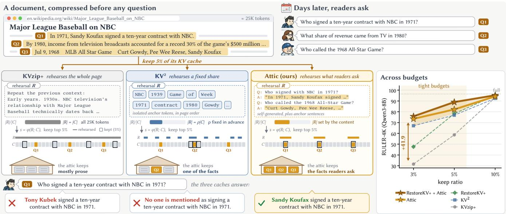
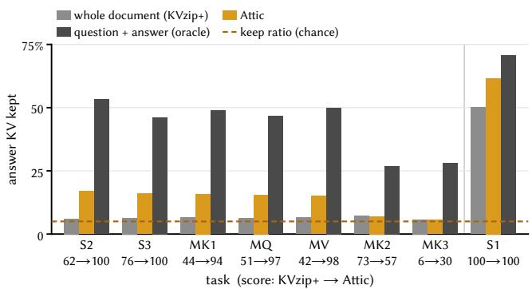
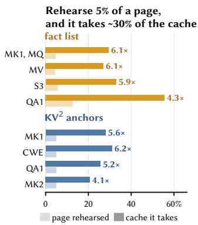
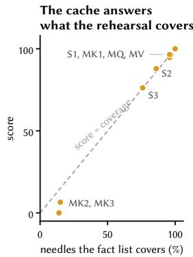
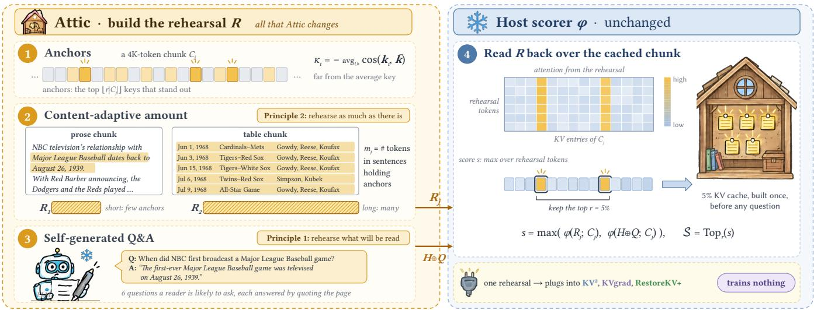
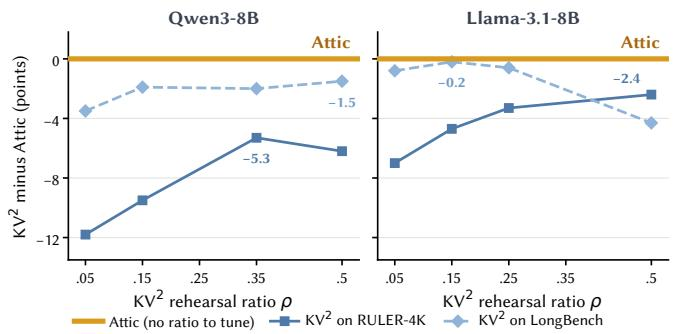

# Rehearse Everything, Remember Nothing: Atic-KV Rehearses What Will Be Read

Zhiyun Shi Nanyang Technological University Singapore ZHIYUN004@e.ntu.edu.sg

  
Figure 1: Rehearse everything, remember nothing. A document, here a Wikipedia page, is compressed once, to 5% of its KV cache, before any question arrives. Each method feeds a rehearsal � after the page and keeps the 5% of entries that � attends to most, so a compressed cache, like a small attic, keeps what it rehearses. KVzip+ rehearses the whole page and keeps mostly prose; KV2 rehearses a fixed share of isolated anchors and keeps only some facts; Attic rehearses self-generated question–answer pairs and anchor sentences, as much as the page holds, and keeps the facts readers later ask about. Answers are verbatim outputs of Qwen3-8B on this LooGLE page. (Right) RULER-4K score versus keep ratio on Qwen3-8B: the gap opens at tight budgets and reaches 41.9 points over KVzip+ at 3%.

## Abstract

Many key–value (KV) caches are compressed before anyone knows what will be asked of them: a document cached for retrieval, a prompt prefix shared across requests, the memory of a long con- versation. The prevailing approach scores KV entries by rehearsal: the model rereads the context and keeps the entries it attends to, assuming that the more completely a cache rehearses its context, the better it remembers it. We show that under tight budgets this assumption backfires: rehearse everything, remember nothing. At a 3% keep ratio, rereading the whole context keeps 31.5 of 96.5 points on RULER, and on LongBench’s natural-text tasks it falls below methods that rehearse nothing at all. The cause is that a cache keeps what it rehearses: rereading spreads the budget across the whole context, so the answer’s own entries survive at little more than chance. Like a student before an exam, a cache remembers more by testing itself than by rereading. Two principles follow: rehearse what will be read, and rehearse as much as there is. We instantiate them as Attic-KV (Attic for short), a training-free rehearsal in which the model quizzes itself with question–answer pairs that quote the context, alongside anchor tokens in a content- adaptive amount. Changing only the rehearsal lifts three hosts that score it in three diferent ways: Attic alone is the best training-free method in all eight settings we test on RULER and LongBench’s natural-text tasks, and plugged into the gradient-based KVgrad and the trained RestoreKV+, it raises them by up to 17.1 and 28.1 points. Its advantage grows as the budget shrinks, reaching 41.9 points over full rereading at a 3% keep ratio, and it compresses faster than rereading the whole context.

## Keywords

KV cache compression, query-agnostic compression, long-context LLMs, retrieval-augmented generation

## 1 Introduction

When Watson learns that Sherlock Holmes does not know that the Earth travels round the Sun, Holmes explains that a man’s brain is like a little empty attic [7]. A fool stocks it with every sort of lumber he comes across, until the knowledge that might be useful is crowded out; a skilful workman takes in nothing but the tools that may help him in his work, and of those he keeps a large assortment. For, as Holmes warns, “it is a mistake to think that that little room has elastic walls.” A compressed key–value (KV) cache is such an attic: it holds a small, fixed fraction of a context’s keys and values, and what it holds decides which questions the model can still answer.

  
Figure 2: Rehearse everything, remember nothing. Share of each answer’s KV entries, over all layers and heads, that the cache keeps (Qwen3-8B, RULER-4K development split, the eight needle tasks, keep ratio 5%). Whole-document rehearsal keeps the answer no more often than any other token (dashed line); Attic keeps it on the tasks it answers, and an oracle that rehearses the gold answer shows how much a 5% cache can hold. Below each task: its score with whole-document rehearsal → with Attic.

Many KV caches are filled before the questions are known. Retrieval-augmented and search systems precompute the caches of documents and reuse them across requests [12, 18, 34, 51]; serving systems share the cache of a long prompt prefix across users; assis- tants keep the cache of a long conversation for turns that have not happened yet. Each such cache is compressed once and then serves many queries that are unknown when it is compressed [23, 43]. Compression must therefore be query-agnostic and one-shot, and because memory grows with the number of caches, it pays of only when it is extreme: a 5% keep ratio fits 20 times as many caches in the same memory, a 30% ratio only about 3 times (Section 2).

The prevailing paradigm for this setting is rehearsal scoring, introduced by KVzip [20]. Before any question arrives, the model rehearses the context, rereading it while attending to the cache; each KV entry is scored by the attention it receives, and the top- scoring entries are kept. Its successors refine the scorer (KVzip+ and KVzap [17], Fast KVzip [19], EchoPress [29], KVgrad [22]) or what a retained subset can express (RestoreKV [1]), yet all of them rehearse the same target: the entire context. KVzip argues explicitly for full-context rehearsal [20], and the whole line shares its default assumption: the more completely a cache rehearses its context, the more faithfully it preserves it. $\mathrm { K V ^ { 2 } }$ [47] rehearses only a fixed fraction of the context, its anchor tokens; but like every rehearsal before $\operatorname { i t } ,$ what it rehearses is a copy of the context.

We show that this assumption fails exactly where compres- sion matters: rehearse everything, remember nothing. On

RULER-4K [15], Qwen3-8B scores 96.5 without compression, but full-context rehearsal (KVzip+) at a 3% keep ratio keeps only 31.5; on the natural-text tasks of LongBench it falls below methods that rehearse nothing at all (28.6 vs. up to 36.5). Where does the budget go? For each question, we measure how much of its answer’s KV survives compression: at a 5% keep ratio, full-context rehearsal keeps 5.7–7.1% of it on seven of eight needle tasks, no more than of any other token (Figure 2). The cause is that a cache keeps what it rehearses (Section 3): rehearsed positions cover about 5% of the context yet draw a fifth to a third of the retained budget, and when the model rehearses only a list of facts, its score on each task tracks the coverage of that list. Capacity is not the bottleneck: a 5% cache scored by rehearsing the answer loses almost nothing (93.5 vs. 94.7 uncompressed). A full-context rehearsal spends the budget on fluent prose that no query reads and crowds out the few facts that every query reads, and the tighter the budget, the harder the crowding.

The failure has a familiar shape. A student preparing for an exam can reread the chapter, reread only what they highlighted, or test themselves on it. A large review of study techniques rates the first two of low utility and the third of high utility [8]: practice that produces answers beats seeing the material again [42]. Existing rehearsals are the first two strategies: full-context rehearsal rereads the whole context, and $\mathrm { K V ^ { 2 } }$ rereads its highlights. Neither rehearses what a reader will read out of the context, and a compressed cache, like a student, remembers what it practises. What counts as practice is specific: rehearsing a question without its answer keeps a cache that scores 47.0, against 93.5 when the answer is rehearsed with it, because attention lands on the answer only while the answer is produced (Section 4.1). Query-agnostic compression is thus first a question of how a cache should study: on Qwen3-8B RULER-4K, replacing the KVzip+ scorer with KVgrad’s gradient attribution adds 13.4 points at a 5% keep ratio and 22.0 at 3%, while replacing its rehearsal with ours adds 23.5 and 41.9.

Two principles follow. Rehearse what will be read: a cache should rehearse what future queries will read out, not the whole context; rehearsing only the facts that can be asked already solves the fact-sparse tasks that full-context rehearsal fails (Section 4.1). Rehearse as much as there is: the amount of rehearsal should follow how much readable content a context holds, not a fraction fixed in advance; at an equal average amount, a content-adaptive amount beats a fixed fraction (78.0 vs. 74.6; Section 4.2). Under these principles, prior methods become special cases rather than rivals: both fix the amount before reading the context, KVzip at the whole ofit and $\mathrm { K V ^ { 2 } }$ at a fraction $\rho ,$ and a content-adaptive rehearsal approaches KVzip as the budget loosens.

Guided by these principles, we propose Attic-KV (Attic for short), named after Holmes’s brain-attic. Attic builds the rehearsal from three parts: self-generated QA rehearsal, in which the model writes the questions it expects to be asked and answers them by quoting the context; anchors [39], which decide what else to rehearse; and the length of the sentences that contain them, which decides how much (content-adaptive amount). Attic is training- free and changes only the rehearsal, so it plugs into any rehearsal- scoring host method without altering its scoring (“+ Attic”), and it accepts the released restore tokens of RestoreKV without re- training. Changing only the rehearsal lifts three hosts that score it in three diferent ways: by attention, by gradient attribution, and with trained restore tokens. Alone, Attic is the best training-free method in all eight settings we test (RULER, and the 14 naturaltext tasks of LongBench), and at a 3% keep ratio on RULER-4K it scores 73.4, 6.4 points above $\mathrm { K V ^ { 2 } }$ and 41.9 above KVzip+, a lead that grows as the budget shrinks (Figure 1, right). Plugged into KVgrad, it raises the host by up to 17.1 points, and KVgrad + Attic beats every existing training-free method in all eight settings; plugged into RestoreKV+, it raises the host by up to 28.1 points and beats every existing method in all six settings where restore tokens ex ist (Table 1). It is also cheaper: because it rehearses a fraction of each context rather than all of it, compressing a LooGLE document and answering all of its questions takes 126.0 s against 154.8 s for KVzip+. We make three contributions:

• Paradigm Reformulation: We identify full-context rehearsal, the shared default of rehearsal scoring, as the cause of its failure under tight budgets; we show that a cache keeps what it rehearses, so that what a cache remembers depends more on what it rehearses than on how it scores the rehearsal; we observe that every existing rehearsal, the whole context or its anchors, rereads the context instead of practising what will be read out of it; and we recast query agnostic compression as deciding what and how much to rehearse under two principles, rehearse what will be read and rehearse as much as there is, with KVzip and $\mathrm { K V ^ { 2 } }$ as fixed-amount special cases.

• Practical Solution: We propose Attic, a training-free rehearsal built from self-generated QA, anchors and a contentadaptive amount, which serves alone or as a plug-in to existing hosts and composes with released restore tokens.

• Experimental Evaluation: On RULER with four LLMs and the natural-text tasks of LongBench with two, Attic is the best training-free method, every host it enters beats every existing method that trains as little as it does, and the margin widens as the budget tightens; on LooGLE, where each document is compressed once and answers all of its questions, Attic with restore tokens leads on both short- and long-dependency questions (Section 5).

## 2 Problem Setting

Compress once, answer many. Many KV caches are built before anyone knows what will be asked ofthem. A retrieval-augmented or search system prefills each document of its corpus once and stores the cache for every later request that retrieves it [12, 18, 34, 51]; a serving system shares the cache of a long system prompt or few-shot prefix across users; an assistant keeps the cache of a long conversation or a tool output for turns that have not happened yet. Two properties are common to all of them. (I) One compression, many unknown queries. A cache is compressed once and then serves every future query on its context, none of which is known when the cache is compressed. (II) Memory grows with the number of caches. At keep ratio �, a fixed memory holds 1/� times as many caches as it holds full ones: 20 times at $r = 5 \% ,$ , but only about 3 times at $r = 3 0 \%$ . Compression pays of at a few percent, and 3–5% is the regime we target.

  
Figure 3: A cache keeps what it rehearses (Qwen3-8B, RULER-4K development split, keep ratio 5%). $( L e f t )$ Share of the docu- ment that a rehearsal covers (light) and share of the kept KV entries, over all layers and heads, that fall on those positions (dark), for a semantic rehearsal (fact list) and a geometric one $( \mathbf { K V } ^ { 2 }$ anchors). (Right) Rehearsing only the fact list: needle coverage of the list against the score. MK/MQ/MV: multikey/-query/-value needles; S: single needle; CWE: common words; QA: question answering.

Query-agnostic, one-shot compression. Let $C = \left( c _ { 1 } , \ldots \ldots , c _ { n } \right)$ be a document of � tokens. Prefilling � yields, at every layer $l \in [ L ]$ and KV head $h \in [ H ] ,$ a key–value pair $( \mathbf { k } _ { i } ^ { l , h } , \mathbf { v } _ { i } ^ { l , h } )$ for each position $i \in [ n ]$ . We call each pair an entry $e = ( l , h , i )$ and write E for the set of all ��� entries. A compressor keeps a subset $s \subseteq \varepsilon$ of size $r | \mathcal { E } |$ , ranked jointly across layers and heads, and the model � then answers every query from the retained cache $\mathrm { K V } _ { \mathcal { S } }$ . The goal is

$$
\operatorname* { m a x } _ { \substack { S \subseteq \mathcal { E } , | S | = r | \mathcal { E } | } } \ \mathbb { E } _ { ( q , a ) \sim Q _ { C } } \bigg [ U \big ( f ( q \mid \mathrm { K V } _ { S } ) , a \big ) \bigg ] ,\tag{1}
$$

where $Q _ { C }$ is the distribution of future questions � about � with answers �, and � is the task metric. The compression is query- agnostic: $Q _ { C }$ is unknown, so S must be computed from � alone. It is one-shot: a single S serves every draw from $Q _ { C }$

The rehearsal-scoring paradigm. The prevailing answer to Eq. (1), introduced by KVzip [20], replaces the unknown queries with a rehearsal. A rehearsal text $R = ( u _ { 1 } , \ldots , u _ { m } ) $ is prefilled after � on the full cache, and each entry is scored by the strongest attention it receives from �:

$$
s _ { R } ( l , h , i ) \ = \ \operatorname* { m a x } _ { t \in [ m ] } \ \operatorname* { m a x } _ { g \in \mathcal { G } ( h ) } \ \tilde { a } _ { t , i } ^ { l , g } ,\tag{2}
$$

where ${ \mathcal { G } } ( h )$ is the set of query heads that share KV head ℎ, and $\tilde { a } _ { t , i } ^ { l , g }$ is the attention weight from rehearsal token �� to context position � after the KVzip+ normalization $[ 1 7 ] _ { : }$ , which rescales it by the size of the entry’s output contribution $\| \boldsymbol { W _ { O } } \mathbf { v } _ { i } ^ { l , h } \|$ relative to the hidden state of $u _ { t }$ . The kept set is $S = \mathrm { T o p } _ { r } ( s _ { R } )$ , the �|E | highest-scoring entries. Several rehearsals combine entry-wise: $s _ { R _ { 1 } \oplus R _ { 2 } } = \operatorname* { m a x } ( s _ { R _ { 1 } } , s _ { R _ { 2 } } )$

Within this paradigm, a method is defined by its rehearsal, and a rehearsal by two choices: its content and its amount $| R | / n$ . KVzip and its successors rehearse the whole document, $R = C ,$ behind a short repeat instruction and chunk by chunk for long documents [1, 17, 20, 22]; their amount is always 1. $\mathrm { K V ^ { 2 } }$ [47] rehearses anchors,

  
Fi ure 4: Overview of Attic. (Left) Attic builds the rehearsal � the onl art of com ression it chan es: ❶ the ke s that stand out from the chunk’s average key are the anchors; ❷ the anchors are expanded to � tokens, the length of the sentences that hold them, so a rose chunk is rehearsed briefl and a table of facts at len th (Princi le 2); ❸ the model writes the uestions a reader is likely to ask and answers them by quoting the page (Principle 1). (Right) The host’s scorer � reads the rehearsal back over the cached chunk, scores every KV entry by the attention it receives (heat map illustrative), and keeps the top �. Text is from the LooGLE age of Figure 1; the Q&A air is the first one the model wrote for it. The same rehearsal lugs into $\mathbf { K V } ^ { 2 }$ KVgrad and RestoreKV+, and nothing is trained.

$R = C [ \mathcal { A } _ { \rho } ]$ , where ${ \mathcal { A } } _ { \rho }$ holds the $\rho n$ positions with the highest KeyDif score [39] in document order, and the fraction $\rho$ is fixed in advance (by default, $\rho = r )$ . Both methods thus fix how much to rehearse before reading the document.

## 3 A Cache Keeps What It Rehearses

In Eq. (2), the rehearsal � stands in for every future query: whatever � contains is all the scorer knows about what will be asked. We show that � does more than inform the ranking; it decides where the budget goes. All diagnostics in this section use the development split of RULER-4K [15] with Qwen3-8B at � = 5% (13 tasks, 650 questions), disjoint from every test split in Section 5.

Evidence I: rehearsed positions are enriched in the kept budget. For a rehearsal $R ,$ let $P _ { R } \subseteq [ n ]$ be the document positions that � reproduces. We compare the share of the document that � covers, $| P _ { R } | / n$ , with the share of the kept entries whose position lies in $P _ { R } .$ If the rehearsal merely informed the ranking, the two shares would be close; Figure 3 shows them far apart. We test two rehearsals that share nothing but the scorer. The fact list is semantic: with the full cache, the model copies every sentence that states a specific fact, and only this list is rehearsed (its positions are matched back to the document by 4-gram overlap). The $\mathbf { K V } ^ { 2 }$ anchors are geometric: the tokens whose keys deviate most from the average key, chosen with no notion of a fact. For both, on fact-sparse tasks, positions covering 4.4–5.6% of the document attract 20.6–32.9% of the kept budget, an enrichment of 4.1–6.2× and about 6× on most tasks. A rehearsal that covers more takes more: a fact list covering 12.8% of a QA document draws 55.6% of the budget. Whichever way the rehearsal is chosen, the budget flows to what is rehearsed.

Evidence II: a cache remembers what its rehearsal covers. If the budget follows the rehearsal, a cache should answer exactly the questions that its rehearsal covers. Rehearsing only the fact list makes this testable, since we can count which needle sentences the list contains. The score follows the coverage task by task. The list covers 96–97% of the needles on MK1, MQ, and MV, and the cache scores 94.7–96.5; it covers 86% on S2 and scores 87.9, and 76% on S3 and scores 76.2. Where it misses most needles (14–15% on MK2 and MK3), it collapses to 0.0 and 6.5.

Is the loss then a matter of capacity, a 5% subset too small to hold what a question needs? An answer-aware oracle settles this. When the rehearsal is the question followed by its gold answer, attention scoring keeps a 5% subset that scores 93.5, against 94.7 without compression. The subset has room. Rehearsing the whole document instead, with the same scorer and budget, scores 37.8, and 58.9 even with the KVzip+ normalization of Eq. (2): the loss comes from what is rehearsed, not from how much is kept.

Evidence III: the answer is kept only where the rehearsal sends the bud et. If the bud et follows the rehearsal, it should reach the answer itself only when the rehearsal leads it there. For each of the 425 questions on the eight needle tasks (Figure 2), we measure the share of the answer’s KV entries, over all layers and heads, that the cache keeps; at $r = 5 \%$ , a cache that singles nothing out keeps about 5%. Whole-document rehearsal keeps 5.7–7.1% on seven of the eight tasks: the budget lands on the answer no more often than on any other token. The exception, S1, hides its needle in one sentence repeated over and over; a rereading model predicts the haystack and needs to read back only the needle, which keeps 50.1%. In a natural-text haystack nearly every token is unpredictable, so a

Table 1: Main results on the test splits at a 5% keep ratio $( \mathbf { R } \mathbf { - } 4 \mathbf { K } ^ { 3 \% }$ : 3%). R: RULER; LB: LongBench (14 natural-text tasks). Reh.: rehearsal length, including QA pairs, as a fraction of the context (Qwen3-8B, RULER-4K test). Attic alone uses $\mathbf { K V } ^ { 2 } \mathbf { \hat { s } }$ scorer; a shaded row below a host adds Attic’s rehearsal to $\mathbf { i t } ; _ { \uparrow \mathrm { x } } \colon$ gain over $\mathbf { K V } ^ { 2 }$ or the host. $\mathbf { K V } ^ { 2 }$ uses the � selected on the development split of each model, benchmark and keep ratio; Attic uses one configuration throughout. †Restore tokens released by the RestoreKV authors (none for Qwen3-4B/14B); all other rows are training-free. Bold: above ever baseline; underlined: the strongest baseline. Avg. Rank: mean rank over the columns each row has.
<table><tr><td rowspan="2"></td><td rowspan="2">Method</td><td rowspan="2">R-4K</td><td colspan="4">Qwen3-8B</td><td colspan="2">Llama-3.1-8B</td><td rowspan="2"> $\overline { { \mathbf { Q _ { w e n 3 - 4 B } } } }$  R-4K</td><td rowspan="2">Qwen3-14B R-4K</td><td rowspan="2">Avg. Rank↓</td></tr><tr><td>Reh.</td><td>R-16K</td><td> $\mathbf { R } { - } 4 \mathbf { K } ^ { 3 \% }$ </td><td>LB</td><td>R-4K</td><td>LB</td></tr><tr><td>Group</td><td>Full cache (reference)</td><td></td><td>96.5</td><td>93.5</td><td>96.5</td><td>47.1</td><td>95.8</td><td>45.1</td><td>94.6</td><td>96.8</td><td></td></tr><tr><td rowspan="6">(a) Score, no rehearsal</td><td>StreamingLLM [48]</td><td>0.00</td><td>11.4</td><td>12.9</td><td>6.1</td><td>28.1</td><td>15.2</td><td>29.3</td><td>10.4</td><td>20.8</td><td>10.62</td></tr><tr><td>SnapKV [26]</td><td>0.00</td><td>14.9</td><td>17.8</td><td>8.9</td><td>32.2</td><td>15.2</td><td>29.0</td><td>13.9</td><td>19.1</td><td>9.88</td></tr><tr><td>TOVA [37]</td><td>0.00</td><td>6.9</td><td>28.8</td><td>3.4</td><td>31.6</td><td>14.3</td><td>28.7</td><td>4.8</td><td>10.5</td><td>11.75</td></tr><tr><td>Expected Attention [6]</td><td>0.00</td><td>9.2</td><td>8.6</td><td>7.8</td><td>36.5</td><td>17.1</td><td>31.8</td><td>10.0</td><td>12.8</td><td>10.00</td></tr><tr><td>KeyDiff [39]</td><td>0.00</td><td>23.4</td><td>32.2</td><td>14.1</td><td>19.1</td><td>49.0</td><td>28.8</td><td>20.6</td><td>33.4</td><td>9.38</td></tr><tr><td>Compactor [5]</td><td>0.00</td><td>35.3</td><td>49.5</td><td>25.5</td><td>35.6</td><td>50.8</td><td>35.1</td><td>30.3</td><td>34.9</td><td>7.25</td></tr><tr><td>(b) Rehearse everything</td><td>KVzip+ [17]</td><td>1.00</td><td>58.6</td><td>60.1</td><td>31.5</td><td>28.6</td><td>66.2</td><td>29.6</td><td>56.5</td><td>77.4</td><td>7.25</td></tr><tr><td>(c) Rehearse a fixed share</td><td>KV2 [47]</td><td>0.35</td><td>76.8</td><td>74.5</td><td>67.0</td><td>39.1</td><td>74.8</td><td>39.1</td><td>74.1</td><td>81.0</td><td>4.38</td></tr><tr><td>Ours</td><td>ATTIC</td><td>0.42</td><td>82.1↑5.3</td><td>75.1↑0.6</td><td> $\underline { { 7 3 . 4 _ { \uparrow 6 . 4 } } }$ </td><td> $\underline { { 4 0 . 6 _ { \uparrow 1 . 5 } } }$ </td><td> $\underline { { 7 7 . 2 } } _ { \uparrow 2 . 4 }$ </td><td>39.3↑0.2</td><td> $\underline { { 7 6 . 5 } } _ { \uparrow 2 . 4 }$ </td><td> $\underline { { 8 7 . 6 } } _ { \mathrm { [ 6 . 6 } }$ </td><td>2.62</td></tr><tr><td rowspan="2">(d) Gradient scoring</td><td>KVgrad [22]</td><td>1.00</td><td>72.0</td><td>74.7</td><td>53.5</td><td>40.3</td><td>77.1</td><td>37.9</td><td> $7 2 . 1$ </td><td>79.5</td><td>4.62</td></tr><tr><td>+ ATTIC</td><td>0.42</td><td> $8 3 . 7 _ { \uparrow 1 . 7 }$ </td><td> ${ \bf 8 0 . 6 } _ { \uparrow 5 . 9 }$ </td><td> ${ 7 0 . 6 } _ { \uparrow 1 7 . 1 }$ </td><td> $\mathbf { 4 1 . 9 } _ { \uparrow 1 . 6 }$ </td><td> $8 0 . 3 _ { \uparrow 3 . 2 }$ </td><td> $3 9 . 3 _ { \uparrow 1 . 4 }$ </td><td> ${ \bf 8 1 . 4 } _ { \uparrow 9 . 3 }$ </td><td> ${ \bf 8 8 . 2 } _ { \uparrow 8 . 7 }$ </td><td>1.88</td></tr><tr><td rowspan="2">(e) Trained tokens</td><td>RestoreKV+ [1]†</td><td>1.00</td><td>78.2</td><td>73.3</td><td>47.6</td><td>33.1</td><td>85.6</td><td> $3 7 . 6$ </td><td></td><td></td><td>5.33</td></tr><tr><td> $+ ~ { \mathrm { A T T I C } }$ </td><td>0.42</td><td> $\mathbf { 8 8 . 9 } _ { \uparrow 1 0 . 7 }$ </td><td> ${ \bf 8 0 . 6 } _ { \uparrow 7 . 3 }$ </td><td> $7 5 . 7 _ { \uparrow 2 8 . 1 }$ </td><td> $4 2 . 4 _ { \uparrow 9 . 3 }$ </td><td> $8 6 . 4 _ { \uparrow 0 . 8 }$ </td><td> $\mathbf { 4 1 . 6 } _ { \uparrow 4 . 0 }$ </td><td></td><td></td><td>1.00</td></tr></table>

Rehearse everything, remember nothing. The three pieces of evidence identify the cause behind our headline: a cache keeps what it rehearses. A full-document rehearsal singles out nothing, so it spreads the budget over the whole document, and most of a docu- ment is fluent prose. Under a tight budget, that prose crowds out the few facts that will be asked. The crowding sharpens as the budget shrinks, so the gap between full and targeted rehearsal must widen as � falls; Section 5.3 confirms this prediction.

## 4 Two Principles and Attic

Section 3 reduces query-agnostic compression to the design of the rehearsal �, which has two degrees of freedom: what it contains, and how much of it there is. We state one principle for each, ground each in controlled experiments, and build Attic from the two.

## 4.1 Principle 1: Rehearse What Will Be Read

A future query reads out a few spans of a document: the value bound to a key, the date of an event, the name in a claim. The rehearsal should reproduce these spans as they would be read out, not the document. Three experiments support this principle.

(I) Rehearsing only what is read is nearly lossless. On the needle tasks of RULER-4K, rehearsing only the needle sentences, i.e., every fact that can be asked, under the same budget as KVzip+ scores 98.5–100 on every fact-sparse task at both $r = 5 \%$ and $r =$ full reread reads them all back and spreads the budget evenly. The answer-aware oracle keeps 48.4% on average. Attic, the rehearsal we build in Section 4, keeps 15.0–17.0% on the five tasks that it lifts to 94–100 points, and stays at the 5% share on MK2 and MK3, the two tasks it leaves unsolved. Attic solves the tasks where it draws the budget to the answer, and only those. At a 3% keep ratio, whole- document rehearsal stays near chance (3.5–5.0%), while Attic still keeps 13.2–14.7% of the answer on the same five tasks, now 4.5 times chance: a targeted rehearsal protects the answer as the budget shrinks, so the gap widens (Sec. 5.3).

Table 2: Compress once, answer many on LooGLE (Qwen3- 8B, keep ratio 5%): each document is compressed once, then answers all of its questions (ROUGE-L / METEOR, ×100). The shaded row below RestoreKV+ adds Attic’s rehearsal to $\mathbf { i t } ; _ { \uparrow \mathrm { x } } / _ { \downarrow \mathrm { x } } \mathbf { : }$ change over $\mathbf { K V } ^ { 2 }$ or the host. †Released restore tokens. Bold: above every baseline; underlined: the strongest baseline.
<table><tr><td></td><td colspan="2">Short dependency</td><td colspan="2">Long dependency</td></tr><tr><td>Method</td><td>ROUGE-L</td><td>METEOR</td><td>ROUGE-L</td><td>METEOR</td></tr><tr><td>Full cache</td><td>65.7</td><td>34.2</td><td>31.9</td><td>12.3</td></tr><tr><td>KVzip+</td><td>28.1</td><td>14.0</td><td>19.6</td><td>6.4</td></tr><tr><td>KV2</td><td>34.3</td><td>17.2</td><td>23.6</td><td>7.8</td></tr><tr><td>ATTIC</td><td> $3 6 . 2 _ { \uparrow 1 . 9 }$ </td><td> $\underline { { 1 8 . 6 _ { \uparrow 1 . 4 } } }$ </td><td> $2 2 . 9 _ { \downarrow 0 . 7 }$ </td><td>7.8</td></tr><tr><td>RestoreKV+†</td><td>39.0</td><td>19.3</td><td>25.3</td><td>7.2</td></tr><tr><td> $+ ~ { \mathrm { A T T I C } }$ </td><td> ${ \bf 4 0 . 9 } _ { \uparrow 1 . 9 }$ </td><td> $\mathbf { 2 0 . 7 } _ { \uparrow 1 . 4 }$ </td><td> ${ \bf 2 6 . 1 } _ { \uparrow 0 . 8 }$ </td><td> $9 . 2 _ { \uparrow 2 . 0 }$ </td></tr></table>

3.125%; its lead over KVzip+ grows from 24–58 to 74–83 points(on MK1, KVzip+ falls from 44.4 to 18.5).

(II) Reading the question is not reading the answer. Rehearsing the question alone, without its answer, scores 47.0, against 93.5 with the answer under the same scorer. While reading a ques- tion, attention lands on the key it names; only while producing the answer does it land on the value. A rehearsal must therefore reproduce the read-out, not the request.

(III) Self-generated read-outs carry over to natural text. On LongBench [2], an answer-aware rehearsal keeps a 5% subset that matches the uncompressed model (44.9 vs. 44.4), so on natural text, too, the loss lies in what is rehearsed. A deployable rehearsal cannot see the questions, but the model can anticipate them: asked to write the questions a reader is likely to ask and to answer each by quoting the document, it produces read-outs of the spans it expects to be asked. Adding this self-generated QA rehearsal to an anchor rehearsal raises the LongBench development average from 38.2 to 39.6; Section 5.6 shows the same gain on every RULER test setting.

## 4.2 Principle 2: Rehearse As Much As There Is

Documents difer in how much of them can be asked. A narrative may hide one fact in a page of prose, while a table or a list of records is facts from top to bottom. The amount of rehearsal should follow this content instead of being fixed before the document is read.

(I) A content-adaptive amount beats a fixed one at equal average. On the RULER-4K development split with Qwen3-8B, we compare two anchor rehearsals that rehearse about 35% of the context on average. $\mathrm { K V ^ { 2 } }$ with $\rho \ : = \ : 0 . 3 5$ rehearses 35% of every document and scores 74.6; the content-adaptive amount of Attic (Section 4.3) rehearses 11–100% per document, 34% on average, and scores 78.0. The gain comes where the content is dense: on MK2 and MK3, whose contexts are lists of key–value statements, the score rises from 27.0 to 54.0 and from 4.3 to 28.3. The amount tracks the content: over the needle-task contexts it correlates with the number of fact statements (Spearman correlation 0.59, $n = 4 2 5 )$ and contexts with ten or more facts are rehearsed in full (median 100%), while those with at most one are rehearsed at a median of 28%. On Llama-3.1-8B [14], it scores 76.1, against 73.9 for the best $\rho .$

(II) No fixed fraction is right. Tuning $\rho$ cannot close this gap: $\rho \in \{ 0 . 2 5 , 0 . 3 5 , 0 . 5 \}$ gives 74.0, 74.6, and 73.9, all below 78.0. The best � drifts with the benchmark (Section 5.5) and with the budget, as $\mathrm { K V ^ { 2 } }$ itself observes [47]: on Qwen3-8B it is 0.25 at $r = 3 \% , 0 . 3 5$ at 5%, and 0.9 from 10% to 30%. A fraction fixed in advance is right for some documents, benchmarks, and budgets, and wrong for the rest.

(III) KVzip and $\mathbf { K V } ^ { 2 }$ are fixed-amount special cases. KVzip rehearses everything and $\mathrm { K V } ^ { 2 }$ a fixed fraction, whatever the docu- ment holds; both fix the amount, and difer only in where. In Attic, the number of anchors equals the keep ratio, so its rehearsal grows as the budget loosens and approaches the full document: KVzip is the loose-budget limit of Principle 2, not its opposite, and at loose budgets all methods meet (Section 5.3).

## 4.3 Attic

Attic builds the rehearsal of $\operatorname { E q } .$ (2) from the two principles: an-chors decide what to rehearse, a content-adaptive amount de- cides how much, and a self-generated QA rehearsal adds the read-outs the model expects. It changes only the rehearsal; the scorer and the selection Top stay untouched. Figure 4 illustrates it, and Algorithm 1 (Appendix G) states it in full.

❶ Anchors (what). As in $\mathrm { K V ^ { 2 } }$ , we split � into chunks of 4,096 tokens. Each position � receives the KeyDif score [39] $\begin{array} { r } { \kappa _ { i } = - \frac { 1 } { H } \sum _ { l , h } \cos ( { \bf k } _ { i } ^ { l , h } , \bar { { \bf k } } ^ { l , h } ) } \end{array}$ , where $\bar { \mathbf { k } } ^ { l , h }$ is the mean normalized key of the document, so that tokens whose keys stand out from the average key score high. The anchors ${ \mathcal { A } } _ { j }$ of chunk $C _ { j }$ are its $\lfloor r \vert C _ { j } \vert \rfloor$ highest-scoring positions. The anchor ratio equals the keep ratio, so Attic adds no ratio to tune.

❷ Content-adaptive amount (how much). We segment $C _ { j }$ into sentences, ending a sentence at any token that contains a period, question mark, exclamation mark, or line break, and let $m _ { j }$ be the number of tokens in the sentences that contain at least one anchor. The anchor rehearsal $R _ { j }$ consists of the $m _ { j }$ highest- scoring positions of $C _ { j }$ under $\kappa ,$ in document order: the anchors, expanded to $m _ { j }$ tokens. A fact-dense chunk spreads its anchors over many sentences and receives a large $m _ { j } ;$ a chunk of prose concentrates them in a few and receives a small one. Sentences are a measuring stick, not the unit of rehearsal. Rehearsing the sentences themselves instead adds only 0.6 points on Qwen3-8B (78.6 vs. 78.0) and costs 4.4 on Llama-3.1-8B (71.7 vs. 76.1): the gain comes from the amount, not from the unit. The positions are rehearsed in a single pass in document order, which lets the rehearsal continue itself from local context, so that it reads back from the document mainly what it cannot predict, the needles, entities and numbers that queries ask for. Rehearsing the same positions as interleaved sparse passes drops the RULER-4K development score from 81.8 to 69.8 (Appendix C).

❸ Self-generated QA rehearsal (read-outs). Before compres-sion, the model reads the document with its full cache and gener- ates at most 256 tokens: 6 questions a reader is likely to ask, each answered by quoting the exact words of the text (prompt in Appendix F). The output � is rehearsed behind a one-line header H against every chunk. Because the answers quote the document, rehearsing them reproduces the read-out of the quoted spans (Section 4.1, II). Writing $\phi ( R ; C _ { j } )$ for the scores that a rehearsal � gives to the en- tries of chunk $C _ { j }$ , the final score on that chunk is the entry-wise maximum � = max $\textstyle ( \phi ( R _ { j } ; C _ { j } )$ , � (H ⊕ $Q ; C _ { j } ) )$ , and $S = \mathrm { T o p } _ { r } ( s )$

❹ Restore tokens (optional). RestoreKV [1] acts on the ca-pacity side: 8 learned restore tokens and a LoRA adapter help the model read from a sparse cache, and the selection is left untouched. Since Attic acts on the selection side, the two compose directly: we attach the oficially released restore weights, trained on KVzip+ selections, to the cache that Attic selects, and train nothing.

Attic as a plug-in. A rehearsal-scoring host method is a pair of a rehearsal and a scoring rule $\phi ,$ where Eq. (2) is one choice of ${ \bf \dot { \varphi } } _ { \phi . }$ “Host $+ \mathrm { \ A T T I C } ^ { \mathrm { \mathfrak { w } } }$ keeps the host’s � and replaces its rehearsal with that of Attic. Attic itself is $\mathrm { K V ^ { 2 } \ . }$ + Attic: the same KeyDif anchors and scorer, with the content and amount of the rehearsal set by the two principles. KVgrad + Attic keeps the gradient attribution of KVgrad [22] (attention weight × output-contribution norm × a gradient norm computed on the rehearsal, originally the full document in 256-token pieces) and applies it to $R _ { j }$ and H ⊕ � in pieces of at most 256 tokens, combined by the entry-wise maximum.

## 5 Experiments

We evaluate Attic through four research questions. RQ1: Does Attic outperform existing query-agnostic methods, both on its own and when plugged into their host methods? RQ2: How does its advantage change with the keep ratio? RQ3: Does it carry over to compress-once, answer-many caching, where a document is com-pressed once and then answers all of its questions, and what does the compression cost? RQ4: Can a fixed rehearsal ratio, however well tuned, catch up with Attic? We close with an ablation and a per-category view of LongBench.

## 5.1 Experimental Setup

Models and benchmarks. We use four open LLMs from two families: Qwen3-8B, Qwen3-4B and Qwen3-14B [49], and Llama-3.1- 8B-Instruct [14]. We evaluate on three long-context benchmarks: (1) RULER [15] at 4K and 16K context, whose 13 subtasks cover needle retrieval, multi-hop tracing, aggregation and question answering; (2) LongBench [2], whose English tasks include multi-hop QA over Wikipedia pages, QA over scientific papers, and summarization of news and reports; we report the average over its 14 natural- text tasks1; and (3) LooGLE [25], long Wikipedia pages and arXiv papers, each paired with many questions, which we use for RQ3. The main keep ratio is 5%; we add 3% on Qwen3-8B RULER-4K and sweep 3–30% in RQ2. All choices are made on development splits of RULER and LongBench, and all reported numbers come from disjoint test splits (Appendix F); LooGLE is used only for testing.

  
Figure 5: Tuning a fixed rehearsal ratio, even on the test split, cannot catch up with Attic (keep ratio 5%). Each line is $\mathbf { K V } ^ { 2 } \mathbf { \hat { s } }$ score minus Attic’s on the same benchmark, so Attic is the zero line. Every point lies below it: no single � gets close to Attic on both benchmarks at once.

Baselines. We compare against five families of query-agnostic methods, grouped as in Table 1. (a) Scoring without rehearsal: StreamingLLM [48], SnapKV [26], TOVA [37], Expected Attention [6], KeyDif [39] and Compactor [5]; kvpress compresses the context before the question is appended, so each of them runs query-agnostic by construction. For rehearsal scoring we take the strongest representative of each line: (b) rehearse everything, KVzip+ [17]; (c) rehearse a fixed share, KV2 [47]; (d) gradient scoring, KVgrad [22], which scores the same full rehearsal by gradient attribution; and (e) trained tokens, RestoreKV+ [1], which adds restore tokens trained by its authors to the KVzip+ selection. We run every method ourselves in kvpress [36], with the same models, splits and prompts. For $\mathrm { K V ^ { 2 } }$ , � is selected on the development split of each model, benchmark and keep ratio (Appendix D).

Configurations ofAttic. Attic uses one configuration for all models, benchmarks and budgets: the anchor ratio equals the keep ratio, and the model writes 6 question–answer pairs of at most 256 tokens. These constants were fixed once on the development splits with Qwen3-8B and are never re-selected. “+ Attic” rows follow Section 4.3; restore tokens exist only for Qwen3-8B and Llama.

## 5.2 Main Results (RQ1)

Table 1 covers seven model–benchmark pairs and a 3% budget.

Obs.❶ Rehearsing nothing and rehearsing everything both collapse at tight budgets; Attic is the best training-free method in all eight settings. Scoring without rehearsal fails first: the six heuristics score 3.4–50.8 on RULER. KeyDif, whose score picks Attic’s anchors, keeps 23.4 on Qwen3-8B RULER-4K; rehearsing those anchors instead of keeping them reaches 82.1. Rehearsing everything is no cure: KVzip+ keeps 58.6 of the 96.5 uncompressed score on Qwen3-8B RULER-4K and only 31.5 at 3%, and on Qwen3-8B LongBench four of the six heuristics, which rehearse nothing, score above it (31.6–36.5 vs. 28.6). Attic scores 82.1 and 73.4 in the two RULER settings, 5.3 and 6.4 points above the strongest training-free baseline, $\mathrm { K V ^ { 2 } }$ with a dev-tuned �, and on Qwen3-8B at 5% it also exceeds the trained RestoreKV+ (78.2). It leads every training-free baseline across context length, model size and natural text, by up to 6.6 points (87.6 vs. 81.0 on Qwen3-14B). Where a baseline comes close, it is a host that Attic improves: KVgrad is the nearest on RULER-16K, Qwen3-8B LongBench and Llama RULER-4K, and Attic plugged into it adds 5.9, 1.6 and 3.2 points there (Obs.❷). On Llama LongBench, $\mathrm { K V ^ { 2 } }$ , the host of Attic itself, comes within 0.2 points, but only by switching to the ratio selected for Lon Bench (0.15 instead of RULER’s 0.5); Attic gets there, as everywhere, with one configuration that transfers unchanged across models, benchmarks and budgets.

Obs.❷ Plugged into a host, Attic lifts it above every existing method that trains as little as it does. Plugged into KVgrad, the gradient-based host, Attic raises it by 11.7 points on Qwen3-8B RULER-4K, 17.1 at the 3% keep ratio, 3.2 on Llama, 9.3 on Qwen3- 4B and 8.7 on Qwen3-14B; KVgrad + Attic beats every existing training-free method in all eight settings, and on Qwen3-4B and Qwen3-14B (81.4 and 88.2) it is the best method overall. Plugged into RestoreKV+, the trained host, it raises it in every setting, from 0.8 points on Llama RULER-4K to 28.1 at the 3% keep ratio, and RestoreKV+ + Attic beats every existing method in all six settings where restore tokens exist, with an average rank of 1.00. The two hosts difer in how they score a rehearsal (attention vs. gradient attribution) and in whether anything is trained, yet both improve once they rehearse what will be read, as much as there is. Full- context rehearsal fails by its target, not by its scorer or capacity.

## 5.3 Efect of the Budget (RQ2)

Our mechanism makes a quantitative prediction: if prose crowds facts out of a full-context rehearsal, the crowding, and with it our advantage, must grow as the budget shrinks and vanish once the budget holds everything rehearsed. Figure 1 (right) sweeps the keep ratio on Qwen3-8B RULER-4K; Table 16 extends the sweep to 30%.

Obs.❸ The advantage follows a dose–response curve: the tighter the budget, the wider the gap. The gap between Attic and KVzip+ is 1.1 points at a 10% keep ratio, 23.5 at 5% and 41.9 at 3%; with restore tokens, the gap to RestoreKV+ grows from 0.3 to 10.7 to 28.1 over the same ratios. At 10% both of our rows still lead their lines (94.1 vs. 93.0 for KVzip+ and 92.3 for $\mathrm { K V ^ { 2 } ; }$ 95.2 vs. 94.9 for RestoreKV+). At 20% and 30%, every method lies within 0.7 points of the uncompressed 96.5, the loose-budget limit of Section 4.2. The regime where compression matters most, 3–5%, is exactly where the gap is largest.

## 5.4 Compress Once, Answer Many (RQ3)

LooGLE reproduces this setting directly: each long document is compressed once, before any question, and then answers all of its questions, 1951 over 105 documents in the short-dependency set and 459 over 60 in the long-dependency set.

Obs.❹ Compressed once per page, RestoreKV+ + Attic serves all of the page’s questions best, and Attic’s rehearsal costs less to build. RestoreKV+ + Attic is the best compressed method on both sets and both metrics (Table 2), above RestoreKV+ by 1.9 and 0.8 ROUGE-L and by 1.4 and 2.0 METEOR on the short-and long-dependency sets. On the short-dependency set, Attic alone leads all training-free methods, 1.9 ROUGE-L above $\mathrm { K V ^ { 2 } }$ and 8.1 above KVzip+. Full-context rehearsal again loses most: KVzip+ keeps 28.1 ofthe uncompressed 65.7 ROUGE-L on short-dependency questions.

Compression cost. Attic is cheaper to build than the full- rehearsal methods it replaces. Measured alone on one GPU over ten LooGLE documents (about 20 questions each), compressing a page and answering all of its questions takes 126.0 s with Attic against 154.8 s with KVzip+, and 142.5 s with RestoreKV+ + Attic against 154.6 s with RestoreKV+. Writing the 6 question–answer pairs takes about 11 s, less than rehearsing a fraction of the page saves, and all of it happens once per page, of the query path.

## 5.5 Can a Tuned Ratio Catch Up? (RQ4)

$\mathrm { K V } ^ { 2 }$ rehearses a fixed fraction $\rho$ of each context; Attic lets the content decide. If, as rehearse as much as there is states, the right amount depends on the content, the ratio $\mathrm { K V ^ { 2 } }$ needs should move with it, and no single $\rho$ should match Attic everywhere.

Obs.❺ The ratio $\mathbf { K V } ^ { 2 }$ needs is a property of the content; Attic reads it of the document. Selected on each development split, $\mathrm { K V } ^ { 2 } s$ ratio for Llama is 0.5 on RULER-4K and 0.15 on Long- Bench (Qwen3-8B: 0.35 and 0.5). A query-agnostic cache that holds both kinds of documents would have to know in advance which kind each one is; the content-adaptive amount reads this of each document. Figure 5 scans � on the test splits, which gives $\mathrm { K V ^ { 2 } }$ its best ratio in hindsight. On Llama, the best ratio for RULER-4K (0.5, 74.8) is the worst for LongBench (35.0), and no ratio comes within a point of Attic on both (77.2 and 39.3); on Qwen3-8B, the best ratios reach 76.8 and 39.1, against 82.1 and 40.6. The amount alone, without the QA rehearsal, already does what no ratio does: it beats every � on RULER-4K (78.8 vs. at most 76.8 on Qwen3-8B, 75.6 vs. 74.8 on Llama; Table 15), and every $\rho$ that edges it on LongBench, by at most 0.8 points, falls 1.7–6.2 points behind it on RULER-4K.

## 5.6 Ablation and Task Categories

Obs.❻ The content-adaptive amount replaces a tuned ratio, and self-generated QA adds most where the budget is tightest. Table 3 builds Attic one step at a time from two baselines. Replacing $\mathrm { K V } ^ { 2 } s$ dev-tuned ratio with the content-adaptive amount gains up to 2.0 points and loses at most 1.5, with nothing tuned; replacing the full rehearsal of RestoreKV+ with it gains up to 23.0 points under the same restore tokens. Adding self-generated QA rehearsal raises every setting, by 1.6 to 5.6 points, with the largest gain at the 3% keep ratio. The QA gain survives on top of the restore tokens (1.1 to 5.1 points), which themselves add 2.3 to 9.2 to Attic: the two act on diferent sides of compression, what is selected and how much a selected subset can express.

Table 3: Ablation on RULER test splits (keep ratio 5% unless marked). Each block starts from a baseline and changes one thing per row; $\uparrow \mathbf { x } ^ { \prime } \downarrow \mathbf { x } \colon$ change from the row above. $^ { 6 6 } - \mathit { \Omega } ^ { 5 } :$ no released restore tokens.
<table><tr><td rowspan="2">Rehearsal</td><td colspan="3">Qwen3-8B</td><td rowspan="2">Llama 4K</td><td rowspan="2">Qwen3-4B 4K</td></tr><tr><td>4K</td><td>16K</td><td> $4 \mathbf { K } ^ { 3 \% }$ </td></tr><tr><td>Native KV pairs</td><td></td><td></td><td></td><td></td><td></td></tr><tr><td>KV2: anchors, tuned fixed ρ 76.8</td><td></td><td>74.5</td><td>67.0</td><td>74.8</td><td>74.1</td></tr><tr><td>adaptive amount</td><td> $7 8 . 8 _ { \uparrow 2 . 0 }$ </td><td> $7 3 . 0 _ { \downarrow 1 . 5 }$ </td><td> $6 7 . 8 \ L _ { \uparrow 0 . 8 }$ </td><td> $7 5 . 6 _ { \uparrow 0 . 8 }$ </td><td> $7 3 . 8 _ { \downarrow 0 . 3 }$ </td></tr><tr><td>+ self-gen. QA (= ATTIc)</td><td> $8 2 . 1 \substack { \uparrow 3 . 3 }$ </td><td> $7 5 . 1 \ L _ { \uparrow 2 . 1 }$ </td><td></td><td>73.4↑5.6 77.2↑1.6</td><td> $7 6 . 5 \substack { \uparrow 2 . 7 }$ </td></tr><tr><td>With released restore tokens</td><td></td><td></td><td></td><td></td><td></td></tr><tr><td>RestoreKV+: full rehearsal</td><td>78.2</td><td>73.3</td><td>47.6</td><td>85.6</td><td></td></tr><tr><td>anchors, adaptive amount</td><td> $8 5 . 9 _ { \uparrow 7 . 7 }$ </td><td> $7 8 . 8 _ { \uparrow 5 . 5 }$ </td><td> $7 0 . 6 _ { \uparrow 2 3 . 0 }$ </td><td> $8 5 . 3 _ { \perp 0 . 3 }$ </td><td></td></tr><tr><td>+ self-gen. QA</td><td> $8 8 . 9 _ { \uparrow 3 . 0 }$ </td><td> $8 0 . 6 _ { \uparrow 1 . 8 }$ </td><td> $7 5 . 7 _ { \uparrow 5 . 1 }$ </td><td> $8 6 . 4 _ { \uparrow 1 . 1 }$ </td><td></td></tr></table>

Table 4: LongBench test results by oficial category (keep ratio 5%). SD/MD: single-/multi-document ${ \bf Q } { \bf A } ;$ Sum.: sum-marization; FS: few-shot; Avg.: the 14 natural-text tasks, as in Table 1. Shaded rows below a host add Attic’s rehearsal to it. †Released restore tokens. Per model, bold: above every baseline; underlined: the strongest baseline.
<table><tr><td>Method</td><td>SD</td><td>MD</td><td>Sum.</td><td>FS</td><td>Code</td><td>Avg.</td></tr><tr><td>Qwen3-8B</td><td colspan="6">(full cache: avg. 47.1)</td></tr><tr><td>KVzip+</td><td>23.8</td><td>16.3</td><td>18.5</td><td>46.3</td><td>42.9</td><td>28.6</td></tr><tr><td>KV2</td><td>35.4</td><td>35.1</td><td>22.7</td><td>55.6</td><td>50.5</td><td>39.1</td></tr><tr><td>ATTIC</td><td>37.2</td><td>39.4</td><td>23.3</td><td>54.6</td><td>52.3</td><td>40.6</td></tr><tr><td>KVgrad</td><td>31.0</td><td>41.7</td><td>22.0</td><td>57.6</td><td>53.4</td><td>40.3</td></tr><tr><td>+ ATTIC</td><td>32.1</td><td>41.5</td><td>24.0</td><td>60.4</td><td>56.4</td><td>41.9</td></tr><tr><td>RestoreKV+†</td><td>27.0</td><td>19.2</td><td>23.4</td><td>51.7</td><td>49.8</td><td>33.1</td></tr><tr><td>+ ATTIC</td><td>38.3</td><td>39.1</td><td>25.0</td><td>57.9</td><td>56.2</td><td>42.4</td></tr><tr><td>Llama-3.1-8B</td><td colspan="6">(full cache: avg. 45.1)</td></tr><tr><td>KVzip+</td><td>29.0</td><td>21.0</td><td>17.2</td><td>43.1</td><td>41.5</td><td>29.6</td></tr><tr><td>KV2 ATTIC</td><td>37.2 38.1</td><td>38.1 40.0</td><td>24.8</td><td>52.4</td><td>45.1</td><td>39.1</td></tr><tr><td></td><td></td><td></td><td>24.7</td><td>50.6</td><td>44.9</td><td>39.3</td></tr><tr><td>KVgrad</td><td>33.2</td><td>34.2</td><td>23.7</td><td>56.7</td><td>43.8</td><td>37.9</td></tr><tr><td>+ ATTIC</td><td>39.0</td><td>36.9</td><td>25.1</td><td>53.9</td><td>43.0</td><td>39.3</td></tr><tr><td>RestoreKV+†</td><td>37.2</td><td>34.7</td><td>25.4</td><td>52.6</td><td>38.4</td><td>37.6</td></tr><tr><td>+ ATTIC</td><td>43.0</td><td>43.6</td><td>26.3</td><td>54.8</td><td>39.8</td><td>41.6</td></tr></table>

Obs.❼ Attic wins on the categories that questions about a document resemble: single-document QA and summarization. Table 4 breaks LongBench into its oficial categories. On single-document QA and summarization, which ask about the content of Wikipedia pages, papers and reports, the best result for both models is a shaded row (e.g., 43.0 vs. 37.2 for RestoreKV+ on Llama single-doc. QA). Inside KVgrad, Attic lifts few-shot and code by 2.8 and 3.0 on Qwen3-8B and keeps multi-document QA (41.5 vs. 41.7).

## 6 Related Work

Query-aware KV compression. H2O [52] keeps heavy hitters of accumulated attention, StreamingLLM [48] keeps attention sinks and a recent window, SnapKV [26] and PyramidKV [4] vote with an observation window at the end of the prompt, ChunkKV [30] keeps semantic chunks rather than single tokens, Ada-KV [10] adapts the budget across heads, and DapQ [45] places pseudo queries at the positions of the first generated tokens. All were designed to read the question or the queries seen so far; run before it, as a compress-once cache must, they collapse (Table 1).

Query-agnostic rehearsal scoring. KVzip [20] introduced scoring by rehearsal and argues explicitly that the whole context must be repeated. Its successors keep this target and improve the scorer or its cost: the KVzap paper [17] introduces KVzip+, which normalizes by the value contribution, and KVzap, Fast KVzip [19] and EchoPress [29] approximate the full-rehearsal score cheaply, and KVgrad [22] replaces attention with a gradient attribution. All are instances of the rehearse-everything default, and their scorers compose with our rehearsal. KV2 [47] rehearses KeyDif anchors [39] at a fixed ratio �; it is the fixed-ratio special case of rehearse as much as there is, and like full-context rehearsal it re- hearses a copy of the context, and its own observation that the best � drifts with the budget is what the principle predicts. InfiniPot [21] scores the cache with a short fixed “catalyst” prompt, and Task- Press [40] replaces the rehearsal with a two-to-three-sentence task description written by an LLM; that the TaskPress probe already beats full-context rehearsal at 50–75% eviction is consistent with rehearse what will be read, though both probes are fixed in advance rather than drawn from the document.

Capacity-side and learned caches. RestoreKV [1] enlarges what a kept subset can express with restore tokens trained on KVzip+ selections, rather than choosing the subset. Cartridges [9] distill a document into a trained cache via self-study, Cartridges++ [23] guards it against of-context derailment, Attention Matching [53] fits compact keys and values to reference queries, ARC-KV [43] amortizes the anchor search of such com-paction, and PatchKV [24] compensates eviction in weight space. These methods share our compress-once, query-many setting; Attention Matching and ARC-KV draw most of their reference queries from a verbatim repeat of the context, another instance of the rehearse-everything default; Attention Matching adds a few self-study passes in which the model asks and answers its own questions, the closest relative of our question–answer rehearsal. Attic keeps native KV and trains nothing.

Study strategies for language models. Retrieval practice, an swering one’s own questions, is among the most efective ways for people to learn, and rereading among the least [8, 42]. Language models that must learn documents into their weights benefit from the same contrast: Cartridges [9] find that training on the raw cor-pus memorizes the text but does not generalize, while self-study conversations do, and Active Reading [28] lets the model generate its own study strategies, including active recall. Predicting the questions a document will be asked also has a precedent in retrieval, where doc2query [35] expands documents with them. Attic brings the contrast to a setting where nothing is trained: the rehearsal selects which KV entries stay, and the model quizzes itself instead of rereading.

KV cache reuse for retrieval and serving. Prompt Cache [12], CacheBlend [51], RAGCache [18] and TurboRAG [34] precompute document KV caches and reuse them across requests, LMCache [31] and Mooncake [41] store them across GPU, CPU and disk tiers, solving fusion and latency for full-size caches whose storage grows with the corpus; SCBench [27] shows that compression conditioned on one request degrades when the same cache serves later ones, which is why such caches must be compressed query-agnostically; CacheGen [32] encodes stored caches into compact bitstreams, and since encoding shrinks each kept entry and eviction how many are kept, the two multiply; Attic is the eviction that lets them scale to large corpora.

Other importance signals. Expected Attention [6] and CapKV [50] model future queries statistically, as a Gaussian over hidden states or an information-capacity objective. Behavior-Preserving KV compression [16] also questions the reconstruction target of KVzip, replacing it with a next-token KL score at available query positions, LORE-KV [3], Lookahead Q-Cache [46] and SpecKV [11] draft the response to a known request and score entries by the attention the draft pays them; that response-side queries beat prompt-side ones is the query-aware counterpart of rehearse what will be read. Judge Q [33] trains soft query tokens whose attention imitates that of generated responses, and GVote [44] sam-ples synthetic queries from hidden-state statistics. Compactor [5] scores entries without a rehearsal, by key leverage and non-causal attention, and calibrates the keep ratio to each context. Back from the Future [13] evicts entries that later tokens predict well, by a counter-causal pass over the cache. LLMLingua-2 [38] compresses the text itself before prefill. Attic keeps rehearsal scoring and changes what, and how much, is rehearsed.

## 7 Conclusion

A KV cache that is compressed before its questions are known must decide, from the context alone, what to remember. The rehearsal- scoring paradigm decides by rereading: it rehearses everything and remembers nothing, because a cache keeps what it rehearses, and a whole-context rehearsal fills the budget with prose that no query reads. Two principles turn this failure into a design rule, rehearse what will be read and rehearse as much as there is, and Attic realizes them without training, by letting the model quiz itself on the context. Alone, Attic is the best training-free method; inside KVgrad and RestoreKV+, it lifts each above every existing method that trains as little; and its lead grows as the budget shrinks. Since what a cache remembers depends more on what it rehearses than on how it scores, the same principles suggest how to choose the proxy queries of any compressor that stands in for unknown questions, from token eviction to learned compaction. Holmes’s attic has no elastic walls, and neither does a compressed cache. The skilful workman does not carry in everything he comes across; he carries in the tools the work will need, and as many as the work needs.

## References

[1] Changwoo Baek, Seungjun Shin, and Kyeongbo Kong. 2026. RestoreKV: Recovering Full-Cache Behavior Under Aggressive Query-Agnostic KV Cache Eviction. arXiv preprint arXiv:2608.01247 (2026).

[2] Yushi Bai, Xin Lv, Jiajie Zhang, Hongchang Lyu, Jiankai Tang, Zhidian Huang, Zhengxiao Du, Xiao Liu, Aohan Zeng, Lei Hou, Yuxiao Dong, Jie Tang, and Juanzi Li. 2024. LongBench: A Bilingual, Multitask Benchmark for Long Context Understanding. In Proceedings ofthe 62nd Annual Meeting ofthe Association for Computational Linguistics (ACL). arXiv:2308.14508.

[3] Ahsan Bilal, Muhammad Ahmed Mohsin, Muhammad Umer, Wajih Hassan Raza, Atta Ul Asad, Young D. Kwon, Michal Valko, and Dean F. Hougen. 2026. Monte Carlo Estimation for KV Cache Eviction. arXiv preprint arXiv:2610.07643 (2026).

[4] Zefan Cai, Yichi Zhang, Bofei Gao, Yuliang Liu, Yucheng Li, Tianyu Liu, Keming Lu, Wayne Xiong, Yue Dong, Junjie Hu, and Wen Xiao. 2024. PyramidKV: Dynamic KV Cache Compression based on Pyramidal Information Funneling. arXiv preprint arXiv:2406.02069 (2024)

[5] Vivek Chari and Benjamin Van Durme. 2025. Compactor: Calibrated Query-Agnostic KV Cache Compression with Approximate Leverage Scores. arXiv preprint arXiv:2507.08143 (2025).

[6] Alessio Devoto, Maximilian Jeblick, and Simon Jégou. 2025. Expected Attention: KV Cache Compression by Estimating Attention from Future Queries Distribu tion. arXiv preprint arXiv:2510.00636 (2025).

[7] Arthur Conan Doyle. 1887. A Study in Scarlet. Ward Lock & Co, London.

[8] John Dunlosky, Katherine A. Rawson, Elizabeth J. Marsh, Mitchell J. Nathan, and Daniel T. Willingham. 2013. Improving Students’ Learning With Efective Learning Techniques: Promising Directions From Cognitive and Educational Psychology. Psychological Science in the Public Interest 14, 1 (2013), 4–58.

[9] Sabri Eyuboglu, Ryan Ehrlich, Simran Arora, Neel Guha, Dylan Zinsley, Emily Liu, Will Tennien, Atri Rudra, James Zou, Azalia Mirhoseini, and Christopher Ré. 2025. Cartridges: Lightweight and General-Purpose Long Context Representations via Self-Study. arXiv preprint arXiv:2506.06266 (2025).

[10] Yuan Feng, Junlin Lv, Yukun Cao, Xike Xie, and S. Kevin Zhou. 2025. Ada-KV: Optimizing KV Cache Eviction by Adaptive Budget Allocation for Eficient LLM Inference. In Advances in Neural Information Processing Systems (NeurIPS).

[11] Kevin Galim, Ethan Ewer, Wonjun Kang, Minjae Lee, Hyung Il Koo, and Kang-wook Lee. 2025. Draft-based Approximate Inference for LLMs. arXiv preprint arXiv:2506.08373 (2025).

[12] In Gim, Guojun Chen, Seung-seob Lee, Nikhil Sarda, Anurag Khandelwal, and Lin Zhong. 2024. Prompt Cache: Modular Attention Reuse for Low-Latency Inference. In Proceedings ofMachine Learning and Systems (MLSys). arXiv:2311.04934.

[13] Stephen Gould and Anton van den Hengel. 2026. Back from the Future: Key-Value Cache Management by Counter-Causal Surprise. arXiv preprint arXiv:2607.27600 (2026).

[14] Aaron Grattafiori, Abhimanyu Dubey, Abhinav Jauhri, Abhinav Pandey, Abhishek Kadian, Ahmad Al-Dahle, Aiesha Letman, Akhil Mathur, Alan Schel ten, Alex Vaughan, et al. 2024. The Llama 3 Herd of Models. arXiv preprint arXiv:2407.21783 (2024).

[15] Cheng-Ping Hsieh, Simeng Sun, Samuel Kriman, Shantanu Acharya, Dima Rekesh, Fei Jia, Yang Zhang, and Boris Ginsburg. 2024. RULER: What’s the Real Context Size of Your Long-Context Language Models?. In Conference on Language Modeling (COLM). arXiv:2404.06654.

[16] Doo Hwan Hwang, Junyoung Jang, Junho Na, Hosung Lim, and Kee-Eung Kim. 2026. Behavior-Preserving KV Cache Compression. In Proceedings of the Conference on Empirical Methods in Natural Language Processing (EMNLP). arXiv:2610.06479.

[17] Simon Jégou and Maximilian Jeblick. 2026. KVzap: Fast, Adaptive, and Faithful KV Cache Pruning. arXiv preprint arXiv:2601.07891 (2026).

[18] Chao Jin, Zili Zhang, Xuanlin Jiang, Fangyue Liu, Xin Liu, Xuanzhe Liu, and Xin Jin. 2024. RAGCache: Eficient Knowledge Caching for Retrieval-Augmented Generation. arXiv preprint arXiv:2404.12457 (2024).

[19] Jang-Hyun Kim, Dongyoon Han, and Sangdoo Yun. 2026. Fast KVzip: Efi cient and Accurate LLM Inference with Gated KV Eviction. arXiv preprint arXiv:2601.17668 (2026).

[20] Jang-Hyun Kim, Jinuk Kim, Sangwoo Kwon, Jae W. Lee, Sangdoo Yun, and Hyun Oh Song. 2025. KVzip: Query-Agnostic KV Cache Compression with Context Reconstruction. In Advances in Neural Information Processing Systems (NeurIPS). arXiv:2505.23416.

[21] Minsoo Kim, Kyuhong Shim, Jungwook Choi, and Simyung Chang. 2024. InfiniPot: Infinite Context Processing on Memory-Constrained LLMs. In Proceedings ofthe 2024 Conference on Empirical Methods in Natural Language Processing (EMNLP).

[22] Jihwan Kwak, SunghwanJoo,Jung Yoon Hwang,Jaeseok Byun, and Taesup Moon. 2026. KVgrad: Query-Agnostic KV Cache Eviction via Gradient-based Global Importance Scoring. In ICML 2026 Workshop on Resource-Adaptive Foundation Model Inference (AdaptFM). https://openreview.net/forum?id=cg1wTCJjjk

[23] Sonia Laguna, Joao Monteiro, Marco Cuturi, Pierre Ablin, and Eleonora Gualdoni. 2026. Cartridges++: KV Cache Compression without Of-Context Derailment. arXiv preprint arXiv:2609.35621 (2026).

[24] Chanryeol Lee, Chanhyuk Lee, Yeonwoo Choi, Donggyun Kim, and Seunghoon Hong. 2026. PatchKV: Weight-Space Compensation of KV Cache. In Advances in Neural Information Processing Systems (NeurIPS). arXiv:2609.39329.

[25] Jiaqi Li, Mengmeng Wang, Zilong Zheng, and Muhan Zhang. 2024. LooGLE: Can Long-Context Language Models Understand Long Contexts?. In Proceedings of the 62nd Annual Meeting of the Association for Computational Linguistics (ACL). arXiv:2311.04939.

[26] Yuhong Li, Yingbing Huang, Bowen Yang, Bharat Venkitesh, Acyr Locatelli, Hanchen Ye, Tianle Cai, Patrick Lewis, and Deming Chen. 2024. SnapKV: LLM Knows What You are Looking for Before Generation. In Advances in Neural Information Processing Systems (NeurIPS). arXiv:2404.14469.

[27] Yucheng Li, Huiqiang Jiang, Qianhui Wu, Xufang Luo, Surin Ahn, Chengruidong Zhan , Amir H. Abdi, Don shen Li, Jianfen Gao, Yu in Yan , and Lili Qiu. 2025. SCBench: A KV Cache-Centric Analysis of Long-Context Methods. In International Conference on Learning Representations (ICLR)

[28] Jessy Lin, Vincent-Pierre Berges, Xilun Chen, Wen-tau Yih, Gargi Ghosh, and Barlas Oğuz. 2025. Learning Facts at Scale with Active Reading. arXiv preprint arXiv:2508.09494 (2025).

[29] Jiawei Lin, Saibo Geng, and Thomas Bourgeat. 2026. EchoPress: Query- Agnostic KV Cache Pruning via Virtual Context Reconstruction. arXiv preprint arXiv:2610.00412 (2026).

[30] Xiang Liu, Zhenheng Tang, Peijie Dong, Zeyu Li, Yue Liu, Bo Li, Xuming Hu, and Xiaowen Chu. 2025. ChunkKV: Semantic-Preserving KV Cache Compression for Eficient Long-Context LLM Inference. In Advances in Neural Information Processing Systems (NeurIPS). arXiv:2502.00299.

[31] Yuhan Liu, Yihua Cheng, Jiayi Yao, Yuwei An, Xiaokun Chen, Shaoting Feng, Yuyang Huang, Samuel Shen, Rui Zhang, Kuntai Du, and Junchen Jiang. 2025. LMCache: An Eficient KV Cache Layer for Enterprise-Scale LLM Inference. arXiv preprint arXiv:2510.09665 (2025).

[32] Yuhan Liu, Hanchen Li, Yihua Cheng, Siddhant Ray, Yuyang Huang, Qizheng Zhang, Kuntai Du, Jiayi Yao, Shan Lu, Ganesh Ananthanarayanan, Michael Maire, Henry Hofmann, Ari Holtzman, and Junchen Jiang. 2024. CacheGen: KV Cache Compression and Streaming for Fast Large Language Model Serving. In Proceedings ofthe ACM SIGCOMM 2024 Conference.

[33] Yijun Liu, Yixuan Wang, Yuzhuang Xu, Shiyu Ji, Yang Xu, Qingfu Zhu, and Wanxian Che. 2026. Jud e Q: Trainable Queries for O timized Information Retention in KV Cache Eviction. In Proceedings ofthe AAAI Conference on Artificial Intelligence.

[34] Songshuo Lu, Hua Wang, Yutian Rong, Zhi Chen, and Yaohua Tang. 2024. TurboRAG: Accelerating Retrieval-Augmented Generation with Precomputed KV Caches for Chunked Text. arXiv preprint arXiv:2410.07590 (2024).

[35] Rodrigo Nogueira, Wei Yang, Jimmy Lin, and Kyunghyun Cho. 2019. Document Expansion by Query Prediction. arXiv preprint arXiv:1904.08375 (2019).

[36] NVIDIA. 2024. KVPress: KV Cache Compression Library. https://github.com/ NVIDIA/kvpress. GitHub repository, accessed October 2026.

[37] Matanel Oren, Michael Hassid, Nir Yarden, Yossi Adi, and Roy Schwartz. 2024. Transformers are Multi-State RNNs. In Proceedings of the 2024 Conference on Empirical Methods in Natural Language Processing.

[38] Zhuoshi Pan, Qianhui Wu, Huiqiang Jiang, Menglin Xia, Xufang Luo, Jue Zhang, Qingwei Lin, Victor Rühle, Yuqing Yang, Chin-Yew Lin, H. Vicky Zhao, Lili Qiu, and Dongmei Zhang. 2024. LLMLingua-2: Data Distillation for Eficient and Faithful Task-Agnostic Prompt Compression. In Findings of the Association for Computational Linguistics: ACL 2024.

[39] Junyoung Park, Dalton Jones, Matthew J. Morse, Raghavv Goel, Mingu Lee, and Chris Lott. 2025. KeyDif: Key Similarity-Based KV Cache Eviction for Long Context LLM Inference in Resource-Constrained Environments. In Advances in Neural Information Processing Systems (NeurIPS). arXiv:2504.15364.

[40] Wonpyo Park and Seung-won Hwang. 2026. TaskPress: Query-Agnostic KV Cache Compression via Task-Guided Pruning. arXiv preprint arXiv:2608.03276 (2026).

[41] Ruoyu Qin, Zheming Li, Weiran He, Mingxing Zhang, Yongwei Wu, Weimin Zheng, and Xinran Xu. 2025. Mooncake: A KVCache-centric Disaggregated Architecture for LLM Serving. In 23rd USENIX Conference on File and Storage Technologies (FAST). arXiv:2407.00079.

[42] Henry L. Roediger and Jefrey D. Karpicke. 2006. Test-Enhanced Learning: Taking Memory Tests Improves Long-Term Retention. Psychological Science 17, 3 (2006), 249–255.

[43] Zheyu Shen, Guanhua Wang, Dezhan Tu, Mengchi Zhang, Yanjia Li, Adnan Aziz, Chunqiang Tang, and Ang Li. 2026. ARC-KV: Amortizing Anchor Search for Reconstruction-Based KV Cache Compaction. arXiv preprint arXiv:2609.36835 (2026).

[44] Chenxia Tang, Jianchun Liu, Hongli Xu, and Liusheng Huang. 2025. Adap- tive KV-Cache Compression without Manually Setting Budget. arXiv preprint arXiv:2509.03136 (2025).

[45] Zhenxu Tian, Yi Su, Juntao Li, and Min Zhang. 2026. Where Matters More Than What: Decoding-aligned KV Cache Compression via Position-aware Pseudo Queries. arXiv preprint arXiv:2603.11564 (2026).

[46] Yixuan Wang, Shiyu Ji, Yijun Liu, Yuzhuang Xu, Yang Xu, Qingfu Zhu, and Wanxiang Che. 2025. Lookahead Q-Cache: Achieving More Consistent KV Cache Eviction via Pseudo Query. arXiv preprint arXiv:2505.20334 (2025).

[47] Johannes Wesch, Danni Liu, and Jan Niehues. 2026. KV2: A Self-Refining KV Cache. arXiv preprint arXiv:2610.03198 (2026).

[48] Guangxuan Xiao, Yuandong Tian, Beidi Chen, Song Han, and Mike Lewis. 2024. Eficient Streamin Lan ua e Models with Attention Sinks. In International Conference on Learning Representations (ICLR). arXiv:2309.17453.

[49] An Yang, Anfeng Li, Baosong Yang, Beichen Zhang, Binyuan Hui, Bo Zheng, Bowen Yu, Chang Gao, Chengen Huang, Chenxu Lv, et al. 2025. Qwen3 Technical Report. arXiv preprint arXiv:2505.09388 (2025).

[50] Jiaming Yang, Chenwei Tang, Liangli Zhen, and Jiancheng Lv. 2026. Rethinking KV Cache Eviction via a Unified Information-Theoretic Objective. In International Conference on Machine Learning (ICML). arXiv:2604.25975.

[51] Jiayi Yao, Hanchen Li, Yuhan Liu, Siddhant Ray, Yihua Cheng, Qizheng Zhang, Kuntai Du, Shan Lu, and Junchen Jiang. 2025. CacheBlend: Fast Large Language Model Serving for RAG with Cached Knowledge Fusion. In Proceedings of the European Conference on Computer Systems (EuroSys). arXiv:2405.16444.

[52] Zhenyu Zhang, Ying Sheng, Tianyi Zhou, Tianlong Chen, Lianmin Zheng, Ruisi Cai, Zhao Song, Yuandong Tian, Christopher Ré, Clark Barrett, Zhangyang Wang, and Beidi Chen. 2023. H2O: Heavy-Hitter Oracle for Eficient Generative Inference ofLarge Language Models. In Advances in Neural Information Processing Systems (NeurIPS). arXiv:2306.14048.

[53] Adam Zweiger, Xinghong Fu, Han Guo, and Yoon Kim. 2026. Fast KV Compaction via Attention Matching. arXiv preprint arXiv:2602.16284 (2026).

## A Per-Subtask RULER Results

Tables 5–10 break each RULER setting of Table 1 down into its 13 subtasks; the Avg. column is the number reported there. $\mathrm { K V ^ { 2 } }$ at its default ratio (�=0.05) appears in Table 15.

## B Per-Task LongBench Results

The main text reports the average over the 14 natural-text tasks of LongBench. Table 11 and Table 12 give the per-task scores together with that average $( \mathrm { A v g } _ { 1 4 } )$ and the average over all 16 English tasks $( \mathrm { A v g } _ { 1 6 } )$ , which adds the two synthetic tasks (passage\_count and passage\_retrieval\_en); Appendix C shows why coherent rehearsal reads the content of a passage rather than its label.

## C What Coherent Rehearsal Reads

A cache keeps what it rehearses; this appendix asks what, within a rehearsal, the model actually reads, and why Attic rehearses its positions as one coherent stream (Section 4.3).

Coherent rehearsal reads only what it cannot predict. A rehearsal score is the attention that rehearsed tokens pay back to the context. When the rehearsal is coherent text, as Attic’s anchor rehearsal and self-generated QA pairs are, the model continues the stream from its own local context and looks back into the document only for tokens it cannot guess: needle values, entities, numbers. These are exactly the tokens that questions about a document ask for, and they are kept. Structure that is predictable but must be read meets the opposite fate: sequentially numbered passage labels (“Paragraph 7”) and the labels of in-context examples are produced from the stream itself, draw no attention back to the document, and are lost.

Table 13(a) shows this on LongBench passage retrieval, whose answer is a “Paragraph $N ^ { \ast }$ label. Because every sentence of a Wikipedia passage is an askable fact, the content-adaptive amount rehearses about half of the context on this task. As rehearsal grows from isolated anchors $( \mathrm { K V ^ { 2 } }$ , 5%) into coherent text, the kept fraction of label tokens falls from about 5× the 5% base rate to the base rate itself, and the score falls with it $\mathrm { ( Q w e n 3 - 8 B : 7 7  4 0 ; }$ Llama-3.1-8B: $1 0 0  3 0 )$ .

Coherence, not amount, decides which tokens survive. To isolate coherence, we keep Attic’s rehearsed positions fixed and only break the stream: the positions of each chunk are split by a stride into interleaved sparse passes, each rehearsed separately, with the per-token score taken as the maximum over passes. The rehearsed token count is unchanged, but no pass can be continued from local context, so every rehearsed token has to be read back. Table 13(b) shows both sides of the trade. Labels return: passage retrieval on Qwen3-8B rises from 59 to 78.7, level with $\mathrm { K V } ^ { 2 }$ at its default ratio on the same split (79). Needles leave: RULER drops from 81.8 to 69.8, with multi-key-2 falling from 57 to 5 and multi- value from 98 to 59. Under a tight budget the two kinds of tokens compete for the same slots: coherent rehearsal spends the budget on what the model cannot predict, while sparse rehearsal spreads it over everything rehearsed and crowds the needles out.

A cache keeps what its rehearsal reads. The finding refines our mechanism from “a cache keeps what it rehearses” to a cache keeps what its rehearsal reads. Questions about a document tar-get facts, entities and numbers, which is what coherent rehearsal reads; it is the reading mode Attic uses. The passage labels of LongBench’s two synthetic tasks (Tables 11–12) are predictable structure, which coherent rehearsal does not read.

Table 13: What coherent rehearsal reads (development split, keep ratio 5%). (a) Passage retrieval, first 10 questions: as rehearsal grows into coherent text, the kept fraction of “Para- graph $N ^ { \dprime }$ label tokens falls to the 5% base rate and the score follows. (b) Qwen3-8B: breaking the same rehearsal into sparse passes recovers labels but loses RULER needles. Amt.: rehearsal amount (fraction of context); Label: kept fraction of label tokens; content-adaptive: Attic’s amount without QA rehearsal. PR: passage retrieval; MK2/MK3: multi-key 2/3; MV: multi-value.

<table><tr><td></td><td colspan="3">Qwen3-8B</td><td colspan="3">Llama-3.1-8B</td></tr><tr><td>(a) Rehearsal</td><td>Amt. Label Score</td><td></td><td></td><td></td><td>Amt. Label Score</td><td></td></tr><tr><td>KV2 (default)</td><td>5%</td><td>~25%</td><td>77</td><td>5%</td><td>~20%</td><td>100</td></tr><tr><td> $\mathrm { K V } ^ { 2 } \ ( \rho { = } 0 . 3 5 )$ </td><td>35%</td><td>~7%</td><td>50</td><td>35%</td><td>~4.5%</td><td>70</td></tr><tr><td>Content-adaptive</td><td>53%</td><td>~5%</td><td>40</td><td>40%</td><td>~4%</td><td>30</td></tr><tr><td>(b) Qwen3-8B</td><td>PR</td><td>RULER</td><td></td><td>MK2</td><td>MK3</td><td>MV</td></tr><tr><td>Coherent (ATTIC)</td><td>59</td><td>81.8</td><td></td><td>57</td><td>30</td><td>98</td></tr><tr><td>Sparse multi-pass</td><td>78.7</td><td>69.8</td><td></td><td>5</td><td>7</td><td>59</td></tr></table>

## D Selecting � for $\mathbf { K V } ^ { 2 }$

KV2 rehearses a fixed fraction � of anchor tokens per chunk. Its authors set $\rho$ to the keep ratio by default; since this default is far from optimal on our development splits, we give $\mathrm { K V ^ { 2 } }$ a tuned ratio in the main table. For each model we evaluate a grid of $\rho$ on the RULER-4K development split and use the best value on RULER; on LongBench, $\rho$ is selected in the same way on the LongBench development split, and LooGLE, which has no development split, uses the RULER choice; at the 3% keep ratio and in the budget sweep, $\rho$ is re-selected for each keep ratio (Table 14). The selected ratios are 0.35 for Qwen3-8B, 0.5 for Llama-3.1-8B and 0.5 for Qwen3-4B at a 5% keep ratio, 0.25 for Qwen3-8B at 3%, and 0.9 at 10%, 20% and 30%; on LongBench, 0.15 for Llama-3.1-8B and 0.5 for Qwen3-8B. For Qwen3-14B, � is chosen from {0.25, 0.35, 0.5} in the same way, and $\rho { = } 0 . 5$ is selected. Attic uses no such search: its anchor ratio is the keep ratio in every setting. Table 15 lists the test-split $\rho$ scan plotted in Figure 5; it is used only for that analysis and not for selecting �.

Table 5: Per-subtask results, Qwen3-8B, RULER-4K (test split).
<table><tr><td>Method</td><td>S1</td><td>S2</td><td>S3</td><td>MK1</td><td>MK2</td><td>MK3</td><td>MV</td><td>MQ</td><td>VT</td><td>CWE</td><td>FWE</td><td>QA1</td><td>QA2</td><td>Avg.</td></tr><tr><td>Full cache</td><td>100.0</td><td>100.0</td><td>100.0</td><td>100.0</td><td>100.0</td><td>100.0</td><td>100.0</td><td>100.0</td><td>100.0</td><td>99.2</td><td>96.8</td><td>84.0</td><td>75.0</td><td>96.5</td></tr><tr><td>KVzip+</td><td>100.0</td><td>63.8</td><td>61.4</td><td>42.0</td><td>60.5</td><td>9.4</td><td>42.1</td><td>56.3</td><td>100.0</td><td>58.1</td><td>68.8</td><td>48.0</td><td>51.9</td><td>58.6</td></tr><tr><td>KV2</td><td>100.0</td><td>95.7</td><td>100.0</td><td>94.0</td><td>34.9</td><td>1.9</td><td>95.8</td><td>96.6</td><td>100.0</td><td>85.2</td><td>91.4</td><td>58.0</td><td>44.2</td><td>76.8</td></tr><tr><td>ATTIC</td><td>100.0</td><td>100.0</td><td>100.0</td><td>98.0</td><td>51.2</td><td>32.1</td><td>97.1</td><td>98.9</td><td>100.0</td><td>92.9</td><td>93.0</td><td>58.0</td><td>46.2</td><td>82.1</td></tr><tr><td>KVgrad</td><td>100.0</td><td>85.1</td><td>95.5</td><td>74.0</td><td>41.9</td><td>20.8</td><td>90.0</td><td>85.2</td><td>99.3</td><td>81.3</td><td>74.7</td><td>34.0</td><td>53.9</td><td>72.0</td></tr><tr><td>+ ATTIC</td><td>100.0</td><td>100.0</td><td>100.0</td><td>100.0</td><td>74.4</td><td>54.7</td><td>98.3</td><td>98.9</td><td>100.0</td><td>79.4</td><td>89.8</td><td>46.0</td><td>46.2</td><td>83.7</td></tr><tr><td>RestoreKV+†</td><td>100.0</td><td>74.5</td><td>77.3</td><td>68.0</td><td>93.0</td><td>83.0</td><td>72.5</td><td>92.6</td><td>100.0</td><td>62.5</td><td>74.7</td><td>64.0</td><td>53.9</td><td>78.2</td></tr><tr><td>+ ATTIC</td><td>100.0</td><td>100.0</td><td>100.0</td><td>100.0</td><td>72.1</td><td>81.1</td><td>99.2</td><td>98.9</td><td>100.0</td><td>95.8</td><td>94.1</td><td>62.0</td><td>51.9</td><td>88.9</td></tr></table>

Table 6: Per-subtask results, Qwen3-8B, RULER-16K (test split).
<table><tr><td>Method</td><td>S1</td><td>S2</td><td>S3</td><td>MK1</td><td>MK2</td><td>MK3</td><td>MV</td><td>MQ</td><td>VT</td><td>CWE</td><td>FWE</td><td>QA1</td><td>QA2</td><td>Avg.</td></tr><tr><td>Full cache</td><td>100.0</td><td>100.0</td><td>100.0</td><td>98.0</td><td>100.0</td><td>100.0</td><td>100.0</td><td>100.0</td><td>100.0</td><td>84.2</td><td>92.5</td><td>72.0</td><td>69.2</td><td>93.5</td></tr><tr><td>KVzip+</td><td>100.0</td><td>80.9</td><td>88.6</td><td>46.0</td><td>23.3</td><td>7.6</td><td>57.9</td><td>69.9</td><td>100.0</td><td>20.6</td><td>89.3</td><td>42.0</td><td>55.8</td><td>60.1</td></tr><tr><td>KV2</td><td>100.0</td><td>100.0</td><td>100.0</td><td>90.0</td><td>34.9</td><td>9.4</td><td>94.6</td><td>98.9</td><td>100.0</td><td>50.0</td><td>93.0</td><td>42.0</td><td>55.8</td><td>74.5</td></tr><tr><td>ATTIC</td><td>100.0</td><td>100.0</td><td>100.0</td><td>96.0</td><td>27.9</td><td>7.6</td><td>96.3</td><td>99.4</td><td>100.0</td><td>67.9</td><td>91.4</td><td>38.0</td><td>51.9</td><td>75.1</td></tr><tr><td>KVgrad</td><td>100.0</td><td>91.5</td><td>97.7</td><td>96.0</td><td>51.2</td><td>20.8</td><td>87.5</td><td>93.8</td><td>100.0</td><td>55.2</td><td>88.2</td><td>38.0</td><td>51.9</td><td>74.7</td></tr><tr><td>+ ATTIC</td><td>100.0</td><td>100.0</td><td>100.0</td><td>100.0</td><td>65.1</td><td>34.0</td><td>95.4</td><td>100.0</td><td>100.0</td><td>77.3</td><td>90.3</td><td>32.0</td><td>53.9</td><td>80.6</td></tr><tr><td>RestoreKV+†</td><td>100.0</td><td>95.7</td><td>95.5</td><td>56.0</td><td>55.8</td><td>50.9</td><td>74.2</td><td>91.5</td><td>100.0</td><td>21.9</td><td>90.3</td><td>56.0</td><td>65.4</td><td>73.3</td></tr><tr><td>+ ATTIC</td><td>100.0</td><td>100.0</td><td>100.0</td><td>98.0</td><td>53.5</td><td>47.2</td><td>97.5</td><td>99.4</td><td>100.0</td><td>66.3</td><td>93.6</td><td>40.0</td><td>51.9</td><td>80.6</td></tr></table>

Table 7: Per-subtask results, Qwen3-8B, RULER-4K, keep ratio 3% (test split).
<table><tr><td>Method</td><td>S1</td><td>S2</td><td>S3</td><td>MK1</td><td>MK2</td><td>MK3</td><td>MV</td><td>MQ</td><td>VT</td><td>CWE</td><td>FWE</td><td>QA1</td><td>QA2</td><td>Avg.</td></tr><tr><td>Full cache</td><td>100.0</td><td>100.0</td><td>100.0</td><td>100.0</td><td>100.0</td><td>100.0</td><td>100.0</td><td>100.0</td><td>100.0</td><td>99.2</td><td>96.8</td><td>84.0</td><td>75.0</td><td>96.5</td></tr><tr><td>KVzip+</td><td>100.0</td><td>31.9</td><td>25.0</td><td>6.0</td><td>7.0</td><td>0.0</td><td>23.8</td><td>11.4</td><td>100.0</td><td>6.3</td><td>19.4</td><td>38.0</td><td>40.4</td><td>31.5</td></tr><tr><td>KV2</td><td>100.0</td><td>83.0</td><td>100.0</td><td>82.0</td><td>14.0</td><td>0.0</td><td>90.0</td><td>88.1</td><td>100.0</td><td>59.4</td><td>82.3</td><td>38.0</td><td>34.6</td><td>67.0</td></tr><tr><td>ATTIC</td><td>100.0</td><td>100.0</td><td>100.0</td><td>94.0</td><td>14.0</td><td>1.9</td><td>92.9</td><td>96.0</td><td>100.0</td><td>86.7</td><td>87.6</td><td>44.0</td><td>36.5</td><td>73.4</td></tr><tr><td>KVgrad</td><td>100.0</td><td>48.9</td><td>54.6</td><td>64.0</td><td>18.6</td><td>3.8</td><td>66.7</td><td>59.1</td><td>97.0</td><td>57.5</td><td>53.2</td><td>28.0</td><td>44.2</td><td>53.5</td></tr><tr><td>+ ATTIC</td><td>100.0</td><td>100.0</td><td>100.0</td><td>94.0</td><td>18.6</td><td>0.0</td><td>94.6</td><td>97.2</td><td>99.6</td><td>54.2</td><td>85.5</td><td>38.0</td><td>36.5</td><td>70.6</td></tr><tr><td>RestoreKV+†</td><td>100.0</td><td>53.2</td><td>25.0</td><td>32.0</td><td>41.9</td><td>11.3</td><td>55.4</td><td>46.0</td><td>100.0</td><td>20.4</td><td>53.8</td><td>36.0</td><td>44.2</td><td>47.6</td></tr><tr><td>+ ATTIC</td><td>100.0</td><td>100.0</td><td>100.0</td><td>98.0</td><td>18.6</td><td>17.0</td><td>96.3</td><td>98.3</td><td>100.0</td><td>85.8</td><td>89.8</td><td>42.0</td><td>38.5</td><td>75.7</td></tr></table>

Table 8: Per-subtask results, Llama-3.1-8B, RULER-4K (test split).
<table><tr><td>Method</td><td>S1</td><td>S2</td><td>S3</td><td>MK1</td><td>MK2</td><td>MK3</td><td>MV</td><td>MQ</td><td>VT</td><td>CWE</td><td>FWE</td><td>QA1</td><td>QA2</td><td>Avg.</td></tr><tr><td>Full cache</td><td>100.0</td><td>100.0</td><td>100.0</td><td>100.0</td><td>100.0</td><td>100.0</td><td>100.0</td><td>100.0</td><td>99.3</td><td>99.6</td><td>96.8</td><td>84.0</td><td>65.4</td><td>95.8</td></tr><tr><td>KVzip+</td><td>100.0</td><td>93.6</td><td>72.7</td><td>76.0</td><td>93.0</td><td>11.3</td><td>57.5</td><td>83.5</td><td>97.0</td><td>8.1</td><td>76.3</td><td>40.0</td><td>51.9</td><td>66.2</td></tr><tr><td>KV2</td><td>100.0</td><td>97.9</td><td>100.0</td><td>98.0</td><td>76.7</td><td>5.7</td><td>80.0</td><td>93.2</td><td>98.1</td><td>29.8</td><td>89.3</td><td>54.0</td><td>50.0</td><td>74.8</td></tr><tr><td>ATTIC</td><td>100.0</td><td>100.0</td><td>97.7</td><td>98.0</td><td>51.2</td><td>9.4</td><td>90.4</td><td>98.9</td><td>98.5</td><td>68.1</td><td>94.6</td><td>50.0</td><td>46.2</td><td>77.2</td></tr><tr><td>KVgrad</td><td>100.0</td><td>95.7</td><td>93.2</td><td>98.0</td><td>97.7</td><td>54.7</td><td>85.8</td><td>94.9</td><td>98.9</td><td>29.4</td><td>87.1</td><td>24.0</td><td>42.3</td><td>77.1</td></tr><tr><td>+ ATTIC</td><td>100.0</td><td>100.0</td><td>100.0</td><td>100.0</td><td>60.5</td><td>56.6</td><td>99.2</td><td>100.0</td><td>98.9</td><td>44.2</td><td>88.2</td><td>48.0</td><td>48.1</td><td>80.3</td></tr><tr><td>RestoreKV+†</td><td>100.0</td><td>100.0</td><td>95.5</td><td>94.0</td><td>100.0</td><td>92.5</td><td>89.2</td><td>97.7</td><td>99.6</td><td>18.5</td><td>84.4</td><td>78.0</td><td>63.5</td><td>85.6</td></tr><tr><td>+ ATTIC</td><td>100.0</td><td>100.0</td><td>97.7</td><td>100.0</td><td>65.1</td><td>81.1</td><td>97.5</td><td>100.0</td><td>99.6</td><td>72.7</td><td>93.6</td><td>58.0</td><td>57.7</td><td>86.4</td></tr></table>

Table 14: $\mathbf { K V } ^ { 2 }$ development results for each candidate $\rho$ (RULER-4K development split; LB: LongBench development split, 14 natural-text tasks); the selected value is in bold.
<table><tr><td>Setting</td><td>ρ: development score</td></tr><tr><td>Qwen3-8B, 5%</td><td>0.05: 68.0; 0.25: 74.0; 0.35: 74.6; 0.5: 73.9</td></tr><tr><td>Llama-3.1-8B, 5%</td><td>0.05: 68.1; 0.1: 70.6; 0.25: 73.7; 0.35: 73.0; 0.5: 73.9</td></tr><tr><td>Llama-3.1-8B, LB</td><td>0.05: 37.2; 0.15: 39.7; 0.5: 37.1</td></tr><tr><td>Qwen3-8B, LB</td><td>0.05: 37.9; 0.15: 38.5; 0.35: 38.0; 0.5: 38.6</td></tr><tr><td>Qwen3-4B, 5%</td><td>0.25: 70.85; 0.35: 70.34; 0.5: 70.87</td></tr><tr><td>Qwen3-14B, 5%</td><td>0.25: 76.5; 0.35: 79.4; 0.5: 80.1</td></tr><tr><td>Qwen3-8B, 3%</td><td>0.15: 64.71; 0.25: 65.33; 0.35: 62.41</td></tr><tr><td>Qwen3-8B, 10%</td><td>0.1: 75.5; 0.35: 83.6; 0.5: 86.0; 0.7: 88.7; 0.9: 91.0</td></tr><tr><td>Qwen3-8B, 20%</td><td>0.2: 86.9; 0.5: 91.4; 0.7: 92.9; 0.9: 93.2</td></tr><tr><td>Qwen3-8B, 30%</td><td>0.5: 94.0; 0.7: 94.5; 0.9: 94.6</td></tr></table>

Table 15: $\mathbf { K V } ^ { 2 }$ � scan on the test splits (keep ratio 5%; Long-Bench: 14 natural-text tasks), the data of Figure 5. Amount: Attic’s content-adaptive amount without the QA rehearsal. $^ { \mathfrak { a } } - { } ^ { \mathfrak { s } } \colon$ not run.
<table><tr><td colspan="7"></td></tr><tr><td>Setting</td><td>0.05</td><td> $\mathbf { \overline { { K V } } } ^ { 2 } , \rho =$  0.15</td><td>0.25</td><td>0.35</td><td>0.5</td><td>Amount</td><td>ATTIC</td></tr><tr><td>Qwen3-8B R-4K</td><td>70.3</td><td>72.6</td><td>-</td><td>76.8</td><td>75.9</td><td>78.8</td><td>82.1</td></tr><tr><td>Qwen3-8B LB</td><td>37.1</td><td>38.7</td><td>=</td><td>38.6</td><td>39.1</td><td>38.6</td><td>40.6</td></tr><tr><td>Llama R-4K</td><td>70.2</td><td>72.5</td><td>73.9</td><td>一</td><td>74.8</td><td>75.6</td><td>77.2</td></tr><tr><td>Llama LB</td><td>38.5</td><td>39.1</td><td>38.7</td><td>一</td><td>35.0</td><td>38.3</td><td>39.3</td></tr></table>

## E Budget Sweep

Table 16 gives the numbers behind Figure 1 (Qwen3-8B, RULER-4K test split). The 3% and 5% columns are those of Table 1; KV2 uses the ratio selected on the development split at each keep ratio (Table 14).

Table 9: Per-subtask results, Qwen3-4B, RULER-4K (test split).
<table><tr><td>Method</td><td>S1</td><td>S2</td><td>S3</td><td>MK1</td><td>MK2</td><td>MK3</td><td>MV</td><td>MQ</td><td>VT</td><td>CWE</td><td>FWE</td><td>QA1</td><td>QA2</td><td>Avg.</td></tr><tr><td>Full cache</td><td>100.0</td><td>100.0</td><td>100.0</td><td>100.0</td><td>100.0</td><td>100.0</td><td>100.0</td><td>100.0</td><td>100.0</td><td>94.0</td><td>88.2</td><td>76.0</td><td>71.2</td><td>94.6</td></tr><tr><td>KVzip+</td><td>100.0</td><td>72.3</td><td>65.9</td><td>42.0</td><td>72.1</td><td>5.7</td><td>32.1</td><td>51.1</td><td>100.0</td><td>36.7</td><td>68.8</td><td>46.0</td><td>42.3</td><td>56.5</td></tr><tr><td>KV2</td><td>100.0</td><td>97.9</td><td>100.0</td><td>94.0</td><td>58.1</td><td>13.2</td><td>84.2</td><td>78.4</td><td>100.0</td><td>56.0</td><td>78.0</td><td>50.0</td><td>53.9</td><td>74.1</td></tr><tr><td>ATTIC</td><td>100.0</td><td>100.0</td><td>100.0</td><td>100.0</td><td>55.8</td><td>7.6</td><td>97.1</td><td>84.1</td><td>100.0</td><td>74.4</td><td>81.2</td><td>48.0</td><td>46.2</td><td>76.5</td></tr><tr><td>KVgrad</td><td>100.0</td><td>87.2</td><td>100.0</td><td>78.0</td><td>55.8</td><td>34.0</td><td>72.9</td><td>71.6</td><td>99.6</td><td>75.4</td><td>72.6</td><td>32.0</td><td>57.7</td><td>72.1</td></tr><tr><td>+ ATTIC</td><td>100.0</td><td>100.0</td><td>100.0</td><td>100.0</td><td>83.7</td><td>45.3</td><td>95.0</td><td>94.3</td><td>100.0</td><td>72.7</td><td>79.6</td><td>42.0</td><td>46.2</td><td>81.4</td></tr></table>

Table 10: Per-subtask results, Qwen3-14B, RULER-4K (test split).
<table><tr><td>Method</td><td>S1</td><td>S2</td><td>S3</td><td>MK1</td><td>MK2</td><td>MK3</td><td>MV</td><td>MQ</td><td>VT</td><td>CWE</td><td>FWE</td><td>QA1</td><td>QA2</td><td>Avg.</td></tr><tr><td>Full cache</td><td>100.0</td><td>100.0</td><td>100.0</td><td>100.0</td><td>100.0</td><td>100.0</td><td>100.0</td><td>100.0</td><td>100.0</td><td>99.6</td><td>96.2</td><td>92.0</td><td>71.2</td><td>96.8</td></tr><tr><td>KVzip+</td><td>100.0</td><td>87.2</td><td>88.6</td><td>86.0</td><td>95.4</td><td>34.0</td><td>64.2</td><td>86.4</td><td>99.6</td><td>60.6</td><td>81.2</td><td>66.0</td><td>57.7</td><td>77.4</td></tr><tr><td>KV2</td><td>100.0</td><td>91.5</td><td>100.0</td><td>96.0</td><td>76.7</td><td>9.4</td><td>95.8</td><td>99.4</td><td>100.0</td><td>84.2</td><td>91.9</td><td>66.0</td><td>42.3</td><td>81.0</td></tr><tr><td>ATTIC</td><td>100.0</td><td>100.0</td><td>100.0</td><td>100.0</td><td>79.1</td><td>62.3</td><td>100.0</td><td>100.0</td><td>100.0</td><td>87.9</td><td>91.9</td><td>68.0</td><td>50.0</td><td>87.6</td></tr><tr><td>KVgrad</td><td>100.0</td><td>95.7</td><td>97.7</td><td>88.0</td><td>74.4</td><td>45.3</td><td>92.1</td><td>77.8</td><td>100.0</td><td>90.4</td><td>80.1</td><td>34.0</td><td>57.7</td><td>79.5</td></tr><tr><td>+ ATTIC</td><td>100.0</td><td>100.0</td><td>100.0</td><td>98.0</td><td>83.7</td><td>77.4</td><td>100.0</td><td>100.0</td><td>100.0</td><td>91.7</td><td>90.3</td><td>48.0</td><td>57.7</td><td>88.2</td></tr></table>

Table 11: Per-task LongBench results, Qwen3-8B (test split, keep ratio 5%). Avg14: the 14 natural-text tasks used in Table 1; Avg16: all 16 tasks.
<table><tr><td>Method</td><td>NQA</td><td>Qsp</td><td>MFQA</td><td>HQA</td><td>2WQA</td><td>Musq</td><td>GovR</td><td>QMS</td><td>MNews</td><td>TREC</td><td>TQA</td><td>SSum</td><td>LCC</td><td>RB-P</td><td>PCnt</td><td>PRet</td><td>Avg14</td><td>Avg16</td></tr><tr><td>Full cache</td><td>31.9</td><td>45.6</td><td>54.7</td><td>68.1</td><td>56.2</td><td>34.6</td><td>32.6</td><td>24.5</td><td>26.4</td><td>38.7</td><td>85.5</td><td>39.9</td><td>63.9</td><td>57.8</td><td>9.3</td><td>94.6</td><td>47.1</td><td>47.7</td></tr><tr><td>KVzip+</td><td>21.3</td><td>17.2</td><td>33.0</td><td>25.8</td><td>13.7</td><td>9.4</td><td>22.3</td><td>20.5</td><td>12.7</td><td>24.0</td><td>79.9</td><td>35.1</td><td>23.4</td><td>62.4</td><td>2.7</td><td>32.0</td><td>28.6</td><td>27.2</td></tr><tr><td>KV2</td><td>33.0</td><td>32.8</td><td>40.5</td><td>52.9</td><td>35.8</td><td>16.7</td><td>26.7</td><td>21.2</td><td>20.3</td><td>45.3</td><td>85.2</td><td>36.2</td><td>37.5</td><td>63.6</td><td>4.0</td><td>50.0</td><td>39.1</td><td>37.6</td></tr><tr><td>ATTIC</td><td>27.7</td><td>35.5</td><td>48.5</td><td>56.4</td><td>41.9</td><td>19.7</td><td>28.7</td><td>21.8</td><td>19.6</td><td>42.7</td><td>85.8</td><td>35.4</td><td>44.1</td><td>60.4</td><td>2.7</td><td>45.8</td><td>40.6</td><td>38.5</td></tr><tr><td>KVgrad</td><td>24.9</td><td>29.5</td><td>38.6</td><td>55.8</td><td>45.8</td><td>23.5</td><td>25.5</td><td>21.2</td><td>19.3</td><td>50.7</td><td>85.3</td><td>36.8</td><td>48.3</td><td>58.6</td><td>9.3</td><td>94.1</td><td>40.3</td><td>41.7</td></tr><tr><td>+ ATTIC</td><td>24.1</td><td>26.9</td><td>45.4</td><td>57.2</td><td>43.1</td><td>24.2</td><td>27.9</td><td>22.2</td><td>22.0</td><td>59.3</td><td>84.5</td><td>37.3</td><td>56.0</td><td>56.7</td><td>2.7</td><td>79.3</td><td>41.9</td><td>41.8</td></tr><tr><td>RestoreKV+†</td><td>19.2</td><td>26.9</td><td>34.8</td><td>27.3</td><td>20.1</td><td>10.4</td><td>26.0</td><td>22.6</td><td>21.5</td><td>40.0</td><td>78.7</td><td>36.5</td><td>38.5</td><td>61.2</td><td>2.7</td><td>39.1</td><td>33.1</td><td>31.6</td></tr><tr><td>+ ATTIC</td><td>30.0</td><td>35.5</td><td>49.5</td><td>53.3</td><td>41.8</td><td>22.2</td><td>28.5</td><td>23.6</td><td>23.0</td><td>50.7</td><td>86.7</td><td>36.2</td><td>53.0</td><td>59.5</td><td>4.0</td><td>44.7</td><td>42.4</td><td>40.1</td></tr></table>

Table 12: Per-task LongBench results, Llama-3.1-8B (test split, keep ratio 5%). $\mathbf { A v g } _ { 1 4 } \mathbf { : }$ the 14 natural-text tasks used in Table 1; $\mathbf { A v g } _ { 1 6 } { \mathrm { : } }$ all 16 tasks.
<table><tr><td>Method</td><td>NQA</td><td>Qsp</td><td>MFQA</td><td>HQA</td><td>2WQA</td><td>Musq</td><td>GovR</td><td>QMS</td><td>MNews</td><td>TREC</td><td>TQA</td><td>SSum</td><td>LCC</td><td>RB-P</td><td>PCnt</td><td>PRet</td><td>Avg14</td><td>Avg16</td></tr><tr><td>Full cache</td><td>40.5</td><td>49.4</td><td>57.6</td><td>56.7</td><td>59.0</td><td>32.3</td><td>33.4</td><td>24.8</td><td>27.6</td><td>30.0</td><td>88.3</td><td>40.9</td><td>49.5</td><td>41.7</td><td>10.0</td><td>100.0</td><td>45.1</td><td>46.4</td></tr><tr><td>KVzip+</td><td>33.8</td><td>19.4</td><td>33.8</td><td>25.2</td><td>26.5</td><td>11.3</td><td>17.9</td><td>20.3</td><td>13.5</td><td>10.0</td><td>86.2</td><td>33.2</td><td>27.5</td><td>55.5</td><td>0.0</td><td>34.0</td><td>29.6</td><td>28.0</td></tr><tr><td>KV2</td><td>31.5</td><td>36.0</td><td>44.2</td><td>46.6</td><td>43.7</td><td>24.1</td><td>28.4</td><td>22.5</td><td>23.6</td><td>31.0</td><td>86.3</td><td>39.9</td><td>35.4</td><td>54.8</td><td>6.0</td><td>88.0</td><td>39.1</td><td>40.1</td></tr><tr><td>ATTIC</td><td>33.3</td><td>35.3</td><td>45.8</td><td>45.5</td><td>49.2</td><td>25.4</td><td>27.7</td><td>22.4</td><td>23.9</td><td>26.0</td><td>86.9</td><td>39.0</td><td>36.0</td><td>53.7</td><td>2.0</td><td>50.0</td><td>39.3</td><td>37.6</td></tr><tr><td>KVgrad</td><td>32.0</td><td>32.4</td><td>35.1</td><td>39.4</td><td>38.0</td><td>25.3</td><td>25.9</td><td>22.5</td><td>22.8</td><td>44.0</td><td>85.3</td><td>40.9</td><td>40.8</td><td>46.8</td><td>8.0</td><td>98.0</td><td>37.9</td><td>39.8</td></tr><tr><td>+ ATTIC</td><td>29.6</td><td>39.3</td><td>48.1</td><td>47.7</td><td>42.4</td><td>20.5</td><td>27.4</td><td>23.1</td><td>24.7</td><td>38.0</td><td>82.9</td><td>40.7</td><td>40.2</td><td>45.7</td><td>10.0</td><td>82.0</td><td>39.3</td><td>40.1</td></tr><tr><td>RestoreKV+†</td><td>30.7</td><td>31.2</td><td>49.8</td><td>38.9</td><td>46.6</td><td>18.5</td><td>27.5</td><td>22.9</td><td>25.8</td><td>52.0</td><td>89.2</td><td>16.5</td><td>29.0</td><td>47.8</td><td>0.0</td><td>46.0</td><td>37.6</td><td>35.8</td></tr><tr><td>+ ATTIC</td><td>33.9</td><td>43.2</td><td>51.9</td><td>49.8</td><td>54.6</td><td>26.5</td><td>28.7</td><td>23.3</td><td>26.8</td><td>42.0</td><td>85.9</td><td>36.5</td><td>29.1</td><td>50.4</td><td>4.0</td><td>58.0</td><td>41.6</td><td>40.3</td></tr></table>

Table 16: RULER-4K test score of Qwen3-8B across keep ratios. †Uses released restore tokens. Shaded rows use At- tic’s rehearsal. Bold: above every baseline; underlined: the strongest baseline.
<table><tr><td>Method</td><td>3%</td><td>5%</td><td>10%</td><td>20%</td><td>30%</td></tr><tr><td>Full cache</td><td>96.5</td><td>96.5</td><td>96.5</td><td>96.5</td><td>96.5</td></tr><tr><td>KVzip+</td><td>31.5</td><td>58.6</td><td>93.0</td><td>96.0</td><td>96.2</td></tr><tr><td>KV (dev-tuned ρ)</td><td>67.0</td><td>76.8</td><td>92.3</td><td>95.9</td><td>95.8</td></tr><tr><td>RestoreKV+†</td><td>47.6</td><td>78.2</td><td>94.9</td><td>96.5</td><td>96.4</td></tr><tr><td>ATTIC</td><td>73.4</td><td>82.1</td><td>94.1</td><td>96.1</td><td>96.0</td></tr><tr><td> $\mathrm { R e s t o r e K V + + A T T I C } ^ { \dag }$ </td><td>75.7</td><td>88.9</td><td>95.2</td><td>96.4</td><td>96.2</td></tr></table>

## F Implementation Details

Framework. All methods run in kvpress [36] on the same models, prompts and splits. Context is truncated to 32K tokens on Long- Bench and LooGLE. KVgrad, KVzip+ and RestoreKV+ use their kvpress implementations; KV2 is implemented in the same scoring and eviction code as KVzip+. Fixed-block retention in the style of ChunkKV [30], applied to KVzip+ scores, reaches only 22.5 on Qwen3-8B RULER-4K, so we leave it out of the tables.

Development and test splits. On RULER, the development split is a random 10% of each context length (seed 42), and the test split draws the same number of questions from the remainder (seed 7). On LongBench, each task is shufled (seed 42); the first 25 questions form the development split and the next 75 (Qwen) or 50 (Llama) form the test split.

Rehearsal scoring and anchors. Every rehearsal-based method shares the KVzip+ scoring and eviction of Eq. (2), combining the scores of several rehearsed texts by an element-wise maximum. Anchors and the content-adaptive amount follow Section 4.3, with chunks of 4096 tokens rehearsed and scored separately.

Self-generated QA rehearsal. The QA pairs are decoded greed ily from the prompt below, appended to the context after two new- lines and the same for all models and benchmarks:

Write 6 questions a reader is likely to ask   
about the text above. After each question,   
answer it by quoting the exact words from the   
text that contain the answer. Format each as:   
Q: ...   
A: ...

The header H is “Questions a reader may ask about the previous context, with answers quoted from it:”.

Host methods. RestoreKV+ + Attic adds the restore tokens and LoRA adapter that the RestoreKV authors released for Qwen3- 8B and Llama-3.1-8B, unchanged, to Attic’s selection. They were trained on KVzip+ selections; retraining them on ours for 1000 steps does not help (83.6 vs. 84.3, Qwen3-8B RULER-4K development split).

## G The Attic Algorithm

Algorithm 1 Attic: query-agnostic, one-shot compression of a   
document’s KV cache   
Require: document �; model �; keep ratio �; host scoring rule � (default:   
$\operatorname { E q . }$ (2)); optional restore tokens $\mathcal { T }$   
Ensure: retained cache $\mathrm { K V } _ { S }$   
1: Prefill � to obtain the entries E and KeyDif scores �   
2: � ← � (� ⊕ QAPrompt) ⊲ 6 quoted QA pairs   
3: � ← 0   
4: for each chunk $C _ { j }$ of� do   
5: A� ← top-⌊� |�� | ⌋ positions of $C _ { j }$ by � ⊲ what   
6: �� ← #tokens of the sentences that contain $\mathcal { A } _ { j }$ ⊲ how much   
7: $R _ { j }$ ← top-�� positions of $C _ { j }$ by �, in order   
8: � ← max �, $\phi ( R _ { j } ; C _ { j } ) _ { : }$ � (H ⊕ �; �� )    
9: end for   
10: S ← Top (� ) over all layers and heads   
11: return $\mathrm { K V } _ { S } ,$ with T attached if given