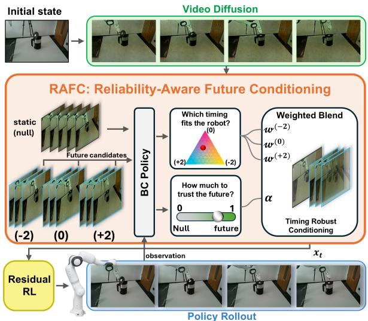
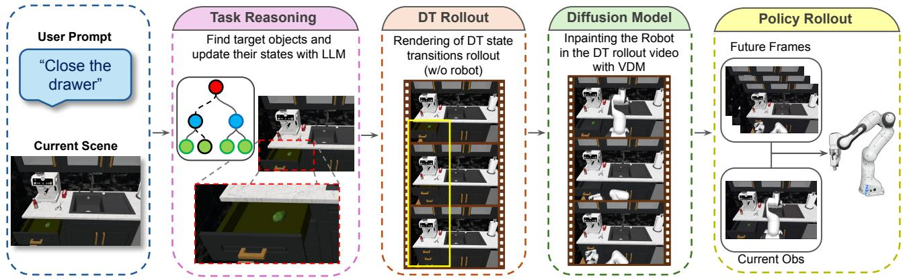
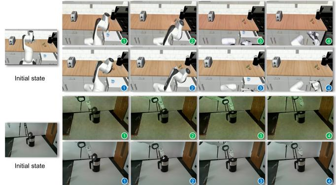
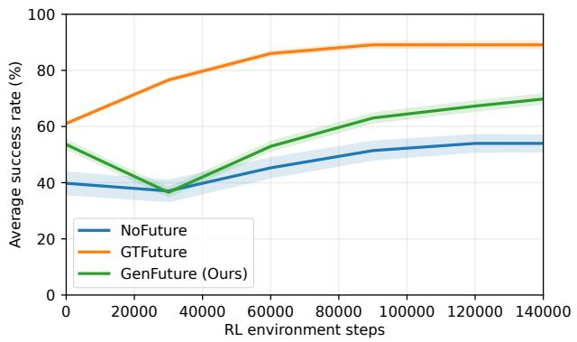

# Reliability-Aware Future Conditioning for Temporally Robust Robot Manipulation

Mohammad Khoshnazar1,∗, Mohammad Dehghani Tezerjani2, Zhiyuan Gao1, Deyuan Qu3, Max Gandyra1, Yanxiang Zhan1, Mehreen Naeem1, Andrew Melnik1, Jeroen Schafer¨ 1, Qing Yang2, Michael Beetz1

Abstract— A generated video of a task the robot is about to perform is useful guidance only if it depicts the phase the robot is actually in. We show that temporal misalignment can turn a task-consistent generated future into actively harmful guidance. On CALVIN, a five-frame early shift nearly erases the benefit of generated futures, reducing success from 81.3% to 54.8% against 54.0% without futures; imposed timing shifts reduce it even further to 34.2%, 19.8 points below the futurefree policy. We introduce Reliability-Aware Future Conditioning (RAFC), which treats this as a control problem rather than a generation problem. At every step, RAFC estimates how far to trust the received clip and which nearby temporal hypothesis to prefer, falling back toward a static branch when neither fits, and it learns both from task reward alone without shift labels or alignment supervision. RAFC sits on top of Future-Experience Conditioning (FEC), which builds the clip once from task grounding, a robot-free digital-twin rollout, and maskfree video diffusion. Under deliberately off-grid phase shifts and rate mismatch, RAFC substantially improves success under temporal mismatch. Candidate ensembling accounts for most of the recovery near alignment, while learned reliability adds a further 7.0 percentage points over uniform averaging of the identical candidate bank under off-grid shifts. The gain holds on the evaluated task sets and survives on a Franka under natural timing mismatch nobody imposed, where aggregate success rises from 26.7% to 56.7%. All resources will be made publicly available. future-condition.github.io.

## I. INTRODUCTION

Future-conditioned manipulation gives a robot policy a short video of how the task should unfold, in addition to its current observation. Such a clip exposes what the current frame may not reveal, including the target state, motion, upcoming contacts, and how the scene will evolve. Recent methods use generated futures as visual subgoals [1], exploration targets [2], [3], or replanning feedback [4].

The key challenge is that the future signal seen during training is taken from demonstrations and is aligned with the demonstrated motion by construction, whereas at test time it is generated and may be temporally misaligned. At deployment, the future is generated once at task initialization at a fixed frame rate, whereas the robot’s progress depends on its own dynamics and is unknown when the clip is produced. A video can therefore show the right drawer, the right direction, and the right final state, yet run several frames ahead of or behind the robot. Unlike a wrong object or goal, this error leaves the content plausible and changes only when it applies. It can make a generated future worse than none.

  
Fig. 1. RAFC blends a static fallback and three temporal hypotheses using learned trust and phase weights, then applies residual control.

Solving this mismatch is difficult for three reasons. First, the robot’s phase relative to the generated video is not observed at deployment, so no alignment label is available. Second, regenerating the future at every step is impractical, since synthesizing one 16-frame clip takes 40–45 s on an NVIDIA A40. Third, the mismatch varies in size and can exceed any fixed correction range, so the controller must also recognize when the clip should not be trusted. Existing methods do not address these requirements. Methods that condition on generated goals or videos target content errors and assume that the conditioning signal is temporally compatible with execution [3], [1]. CLOVER [4] uses embedding-space distances to reject unreachable plans and advance between achieved subgoals, while ORCA [5] addresses temporal misalignment in a single demonstration used for reward shaping rather than in a future that conditions the policy at every step.

We introduce a framework that combines Future-Experience Conditioning (FEC) with Reliability-Aware Future Conditioning (RAFC). FEC constructs the future once through language grounding, a robot-free digital-twin rollout, and mask-free video diffusion, then encodes it for closedloop BC and RL. RAFC uses the frozen BC policy as a compatibility probe by evaluating a static fallback and several time-shifted versions of the future. A learned gate determines how strongly to trust the dynamic future and which temporal candidate to prefer, then blends their features, latents, and base actions before residual RL. The gate and residual actor learn jointly from task reward without shift labels or alignment supervision.

The contributions follow in the order of the gaps above.

• Temporal-failure characterization. Controlled phase shifts, distinct-frame source windows, and temporalrate warps show that even task-consistent generated futures can become actively harmful when temporally misaligned, with severe degradation under both early and late phase errors.

• Reliability-aware future conditioning. RAFC learns at every step how strongly to rely on dynamic future information and which nearby temporal hypothesis to prefer. Its gate and residual actor are trained jointly from task reward without shift labels or alignment supervision.

• Controlled and physical evidence. Ablations show that learned weighting adds to shift augmentation, candidate ensembling, and a fixed learned mixture. Gate diagnostics, an online timing intervention, CALVIN learning curves, CALVIN and RoboCasa benchmark comparisons, and a three-task Franka study provide controlled and physical evidence.

Section V tests three hypotheses. H1: Temporal misalignment reduces the value of task-consistent futures, and RAFC recovers most of the resulting loss. H2: learned reliability provides additional recovery beyond training-time augmentation, uniform candidate ensembling, and a fixed learned mixture, without requiring exact candidate matching. H3: RAFC improves over plain FEC on hardware under natural, unmeasured timing variation.

## II. RELATED WORK

Generated futures and temporal reliability. Visual anticipation predicts observations for planning [6], while world models learn compact dynamics for imagined control [7], [8], [9]. Closer to our setting, UniPi [10] and AVDC [11] generate video plans and recover actions from them, SuSIE [1] uses image-editing subgoals, V2A [3] grounds generated videos through exploration, and FEC [2] uses generated futures as horizon-aware exploration hypotheses. These methods do not explicitly estimate whether a fixed generated future remains temporally compatible with ongoing execution. CLOVER [4] replans after embedding-space error accumulates, while ORCA [5] aligns a single demonstration for reward shaping. RAFC instead estimates temporal trust before each action for a future that continuously conditions the policy.

Temporal alignment and progress. Temporal Cycle Consistency (TCC) learns frame correspondences across videos [12], while XIRL and VIP convert temporally structured visual embeddings into progress-based rewards [13], [14]. ORCA [5] aligns a learner rollout with a single misaligned demonstration for reward shaping, whereas

CLOVER [4] uses embedding-space distances for replanning and subgoal advancement. These methods use temporal structure to define rewards or correct mismatch after it affects execution. RAFC instead resolves timing inside the controller before each action, without alignment supervision or an explicit progress reward, and reduces reliance on the dynamic future when no nearby phase fits.

Generative video, language grounding, and digital twins. Our generator builds on diffusion, video modeling, and inpainting [15], [16], [17], specifically CogVideoX [18] and VideoPainter [19]. It is also related to systems using language reasoning or imagined goals for rearrangement and affordance grounding [20], [21]. The generator is an enabling component, while our study focuses on how a controller should consume an imperfectly timed future.

Imitation learning and RL fine-tuning. Our controller combines a frozen BC policy with TD3-style residual RL [22], [23], [24]. Residual RL learns corrective actions on top of an existing controller [25], and ResiP applies this idea to frozen BC policies for precise manipulation [26]. RAFC retains this residual structure but also learns how the frozen BC policy should consume its future input. The training is related to demonstration-initialized and offline-toonline RL [27], [28], and we additionally evaluate futureconditioned Streaming Flow Policy [29].

## III. RELIABILITY-AWARE FUTURE CONDITIONING

At control step t, the robot receives observation history $O t - K { : } t$ and task command c, and outputs a continuous 7- D action, a 6-DoF end-effector pose delta and a gripper command. RAFC sits between a frozen future-conditioned BC policy and residual RL, as illustrated in Fig. 1. From the received future, it forms a static fallback and three nearby temporal hypotheses, evaluates all four with the same BC policy, and learns both how much dynamic future information to trust and which temporal hypothesis to prefer. The resulting weights blend the BC representations and base action before residual control.

## A. FEC Base Interface

Let $v _ { t , 1 : T _ { f } } ^ { \mathrm { f u t } }$ denote the future clip available at step t. The BC backbone and transformer process the observation history, task command, action-query tokens, and future tokens:

$$
\begin{array} { r } { \big ( f _ { t } , z _ { t , 1 : T _ { f } } ^ { \mathrm { f u t } } \big ) = H _ { \phi } \big ( o _ { t - K : t } , v _ { t , 1 : T _ { f } } ^ { \mathrm { f u t } } , c \big ) , } \end{array}\tag{1}
$$

where $f _ { t }$ is the action-token policy feature and $z _ { t , 1 : T _ { f } } ^ { \mathrm { f u t } }$ are the future-token representations. We preserve coarse temporal structure by pooling the future tokens into $B = 4$ bins and projecting their concatenation:

$$
u _ { t , 1 : B } = \mathrm { P o o l } _ { B } ( z _ { t , 1 : T _ { f } } ^ { \mathrm { f u t } } ) , \qquad g _ { t } = P ( [ u _ { t , 1 } ; \ldots ; u _ { t , B } ] ) .\tag{2}
$$

The BC head predicts $a _ { t } ^ { \mathrm { B C } } = \pi _ { \phi } ^ { \mathrm { B C } } ( f _ { t } , g _ { t } )$ and is trained from demonstration tuples $\left( o _ { t - K : t } , v _ { t , 1 : T _ { f } } ^ { \mathrm { f u t } } , c , a _ { t } ^ { \star } \right)$ with

$$
\mathcal { L } _ { \mathrm { B C } } ( \phi ) = \mathbb { E } \left[ \left. \pi _ { \phi } ^ { \mathrm { B C } } ( f _ { t } , g _ { t } ) - a _ { t } ^ { \star } \right. _ { 2 } ^ { 2 } \right] .\tag{3}
$$

BC uses demonstration futures during training and generated futures at inference. For each candidate future, its frozen

interface exposes the policy feature $f _ { t } ,$ pooled future latent $g _ { t }$ , and BC base action $a _ { t } ^ { \mathrm { B \bar { C } } }$

## B. Reliability-Aware Future Conditioning

RAFC uses an ordered bank with one static null clip and three dynamic candidates obtained by local temporal offsets $ { \mathcal { S } } ~ = ~ \{ - 2 , 0 , + 2 \}$ of the received future, where $s \ = \ 0$ reproduces the received clip unchanged. The null branch repeats the first frame,

$$
v _ { t , i } ^ { \mathrm { n u l l } } = v _ { t , 1 } ^ { \mathrm { f u t } } , \qquad i = 1 , \dots , T _ { f } ,\tag{4}
$$

retaining scene and task appearance while removing temporal evolution. It is therefore a static fallback, not NoFuture, which removes future guidance entirely. The dynamic candidates apply these offsets to the received future,

$$
v _ { t , i } ^ { ( s ) } = v _ { t , \mathrm { c l i p } ( i + s , 1 , T _ { f } ) } ^ { \mathrm { f u t } } , \qquad s \in \mathcal { S } ,\tag{5}
$$

with boundary frames repeated only when a local index falls outside the clip.

All four candidates are present at every RAFC training transition; their local offsets are fixed and never provided as labels. Larger global perturbations are used only for evaluation and are never supplied to RAFC as inputs or labels. The frozen BC policy produces $( f _ { t . } ^ { \mathrm { n u l l } } , g _ { t } ^ { \mathrm { n u l l } } , a _ { t } ^ { \dot { \mathrm { B C } } , \mathrm { n u l l } } )$ for the static branch and $( \dot { f } _ { t } ^ { ( s ) } , g _ { t } ^ { ( s ) } , a _ { t } ^ { \mathrm { B C } , ( s ) } )$ for $s \in S$

The gate receives only the fixed-order BC policy features,

$$
h _ { t } = \operatorname { c o n c a t } \left( f _ { t } ^ { \mathrm { n u l l } } , f _ { t } ^ { ( - 2 ) } , f _ { t } ^ { ( 0 ) } , f _ { t } ^ { ( + 2 ) } \right) \in \mathbb { R } ^ { 4 d _ { f } } ,\tag{6}
$$

where $d _ { f } = \dim ( f _ { t } )$ . It outputs one trust logit and three phase logits,

$$
( \ell _ { t } ^ { \alpha } , \ell _ { t } ^ { - 2 } , \ell _ { t } ^ { 0 } , \ell _ { t } ^ { + 2 } ) = G _ { \psi } ( h _ { t } ) ,
$$

which define

$$
\alpha _ { t } = \sigma ( \ell _ { t } ^ { \alpha } ) ,\tag{7}
$$

$$
w _ { t , s } = \frac { \exp ( \ell _ { t } ^ { s } ) } { \sum _ { s ^ { \prime } \in \mathcal { S } } \exp ( \ell _ { t } ^ { s ^ { \prime } } ) } , \qquad s \in \mathcal { S } .\tag{8}
$$

Here $\alpha _ { t }$ assigns mass between the static fallback and dynamic future, while $w _ { t , s }$ distributes the dynamic mass among candidate phases.

The same coefficients blend all three BC outputs:

$$
f _ { t } ^ { \mathrm { g a t e } } = ( 1 - \alpha _ { t } ) f _ { t } ^ { \mathrm { n u l l } } + \alpha _ { t } \sum _ { s \in S } w _ { t , s } f _ { t } ^ { ( s ) } ,\tag{9}
$$

$$
g _ { t } ^ { \mathrm { g a t e } } = ( 1 - \alpha _ { t } ) g _ { t } ^ { \mathrm { n u l l } } + \alpha _ { t } \sum _ { s \in \mathcal { S } } w _ { t , s } g _ { t } ^ { ( s ) } ,\tag{10}
$$

$$
a _ { t } ^ { \mathrm { B C , g a t e } } = ( 1 - \alpha _ { t } ) a _ { t } ^ { \mathrm { B C , n u l l } } + \alpha _ { t } \sum _ { s \in \mathcal { S } } w _ { t , s } a _ { t } ^ { \mathrm { B C } , ( s ) } .\tag{11}
$$

Thus $\alpha _ { t }$ answers whether dynamic future information should be trusted, whereas $w _ { t , s }$ selects the most compatible nearby temporal hypothesis.

The gate receives neither the applied global shift nor a temporal-alignment target. Candidate identity is represented only by fixed position in $h _ { t }$ . Because all branches share the task and scene, compatibility with the current observation must be inferred from frozen-BC features. The gate is learned jointly with the residual actor from the actor objective of Eq. (13) alone.

## C. RAFC Training with Residual RL

Training has three stages. We first train the video diffusion model on paired twin/robot clips with first-frame anchoring, then train the future-conditioned BC policy with Eq. (3) on demonstration futures. RAFC is absent from both stages. We then freeze BC and optimize only the RAFC gate, bounded residual actor, and twin critics during off-policy RL finetuning.

The residual actor and executed action are

$$
\begin{array} { r } { \Delta a _ { t } = \pi _ { \theta } ( f _ { t } ^ { \mathrm { g a t e } } , g _ { t } ^ { \mathrm { g a t e } } , a _ { t } ^ { \mathrm { B C , g a t e } } ) , \quad a _ { t } = a _ { t } ^ { \mathrm { B C , g a t e } } + \Delta a _ { t } . } \end{array}\tag{12}
$$

The critics use $x _ { t } ~ = ~ ( f _ { t } ^ { \mathrm { g a t e } } , g _ { t } ^ { \mathrm { g a t e } } , a _ { t } ^ { \mathrm { B C , g a t e } } )$ . On delayed policy updates, the actor objective trains both the residual actor and the gate:

$$
\begin{array} { r } { \mathcal { L } _ { \pi } ( \theta , \psi ) = - \mathbb { E } \left[ Q _ { \omega _ { 1 } } \left( x _ { t } , \pi _ { \theta } ( f _ { t } ^ { \mathrm { g a t e } } , g _ { t } ^ { \mathrm { g a t e } } , a _ { t } ^ { \mathrm { B C , g a t e } } ) \right) \right] . } \end{array}\tag{13}
$$

The RL reward contains only a step cost, residual-action penalty, and sparse terminal outcomes:

$$
\rho _ { t } = r _ { \mathrm { s t e p } } - \lambda _ { \Delta } \| \Delta a _ { t } ^ { \mathrm { a r m } } \| _ { 2 } ^ { 2 } + r _ { \mathrm { t e r m i n a l } } ,\tag{14}
$$

$$
r _ { t } = \mathrm { c l i p } ( \rho _ { t } , - 5 0 , 1 5 0 ) .\tag{15}
$$

We set $r _ { \mathrm { s t e p } } ~ = ~ - 0 . 0 0 5$ and $\lambda _ { \Delta } ~ = ~ 0 . 0 2$ , with terminal rewards $+ 1 2 0 / - 2 5 / - 2 0$ for success, timeout, and broken steps. No shift label, alignment score, reference trajectory, or simulator-state distance is used. At evaluation, the critics are discarded; only frozen BC, the RAFC gate, and the residual actor remain.

Algorithm 1 RAFC TD3-style residual fine-tuning   
Require: Frozen BC policy, RAFC gate $G _ { \psi } ,$ residual actor $\pi _ { \theta } ,$ critics $Q _ { \omega _ { 1 } } , Q _ { \omega _ { 2 } }$   
Require: Replay buffer $^ { B , }$ shifts $\pmb { S } = \{ - 2 , 0 , + 2 \}$   
1: for each environment step t do   
2: Construct the null and $\mathbf { \dot { \{ - 2 , 0 , + 2 \} } }$ future candidates and run each through   
the frozen BC policy   
3: Concatenate candidate policy features into $h _ { t }$ and compute $\alpha _ { t }$ and $w _ { t , s }$   
with $G _ { \psi } ( h _ { t } )$   
4: Blend candidate policy features, future latents, and BC actions using $\alpha _ { t }$ and   
$w _ { t , s }$   
5: Compute $\Delta a _ { t } = \pi _ { \theta } ( \cdot ) + \epsilon _ { t }$ and execute $a _ { t } = a _ { t } ^ { \mathrm { B C , g a t e } } + \Delta a _ { t }$   
6: Observe the next transition and store it in B   
7: for each gradient update do   
8: Sample a minibatch; compute target gated representations and target   
residual actions   
9: Update twin critics with the TD3 clipped double-Q objective   
10: if delayed policy update then   
11: Update the residual actor and RAFC gate by minimizing ${ \mathcal { L } } _ { \pi }$   
12: Update target networks by exponential moving average   
13: end if   
14: end for; end for

## D. Future-Generation Testbed

Given command c and scene state once at task initialization, an ontology-guided LLM (GPT-4o) returns the manipulated object, interaction part, desired state transition, and rollout constraints in a fixed JSON schema. The digital twin resolves that object to a simulator body and articulation joint. For articulated tasks, it linearly interpolates the corresponding joint coordinate between its observed and commanded limits; for planar object-motion tasks, it interpolates the object pose toward the task-defined goal region. Rendering these states produces a robot-free rollout $\tilde { v } _ { 1 : T } \ ( \mathrm { F i g } . \ 2 )$ .

Omitting the robot separates the desired scene transition from embodiment-specific motion, so the twin need not synthesize a dynamically valid robot trajectory while object motion stays explicit. A mask-free video diffusion model then reconstructs a robot-containing future $v _ { 1 : T }$ from the initial robot image and transparent rollout, using a CogVideoX backbone with a VideoPainter-style conditioning branch [18], [19]. The future is constructed once at initialization, so grounding cost is not paid per control step.

## IV. EXPERIMENTS

## A. Benchmarks and Tasks

We evaluate eight CALVIN [30] tasks and five Robo-Casa [31] tasks. We select state-changing tasks with observable target articulation or object displacement, covering prismatic, revolute, toggle, and planar interactions while admitting a deterministic digital-twin specification. Simulation permits future source and temporal alignment to change while task state remains fixed. The two benchmarks play different roles. CALVIN carries the temporal-robustness analysis, since its eight tasks support the controlled phase, window, and rate interventions of Sec. IV-B; RoboCasa tests whether the system-level gain transfers to a different scene distribution and task suite under unperturbed futures.

## B. Temporal-Misalignment Protocol

To evaluate temporal robustness without changing task identity or initialization, we perturb the received future only at evaluation. For a T-frame clip, a global phase shift s is applied before future-token pooling:

$$
v _ { i } ^ { ( s ) } = v _ { \mathrm { c l i p } ( i + s , 1 , T ) } ,\tag{16}
$$

where out-of-range indices repeat the boundary frame. We evaluate deliberately off-grid shifts $s \in \{ - 5 , - 3 , - 1 , 0 , + 1 , + 3 , + 5 \}$ , so no nonzero evaluation perturbation coincides with a local RAFC candidate in $S = \{ - 2 , 0 , + 2 \}$ . This intervention preserves task identity and motion direction while changing the interaction phase represented by the future. For RAFC, the local candidate bank of Eq. (5) is constructed after this global perturbation; the applied global shift is never given to the gate.

Because large shifts in Eq. (16) can reduce temporal diversity through boundary repetition, we also use an independently generated distinct-frame protocol. For each evaluation instance, we produce a separate 28-frame source rollout $\bar { v } _ { 1 }$ :28 and extract a contiguous 16-frame window,

$$
v _ { i } ^ { \mathrm { w i n } ( s ) } = \bar { v } _ { i + 6 + s } , \qquad i = 1 , \ldots , 1 6 ,\tag{17}
$$

using the same off-grid evaluation set. ${ \mathrm { A t ~ } } s = \pm 5$ , every window contains 16 distinct frames, spanning frames 2–17 through 12–27. The windowed source, including its $s = 0$ window, is independent of the original 16-frame clip used in the imposed-shift protocol; no result is reused between the two protocols. This isolates phase mismatch from clipping, padding, and repeated boundary frames in the imposed global perturbation. We additionally retain $s ~ = ~ \pm 6$ only as an extreme stress test for the failure magnitude; these two conditions are excluded from the off-grid averages and candidate-matching analysis.

We separately test rate mismatch by time-warping the same source rollout with $j _ { i } = \mathrm { r o u n d } ( 1 + \rho ( i - 1 ) ) ,$ ), $\rho \in$ {0.75, 1.25}, using enough source frames to avoid padding. Here the phase error grows with horizon. These global phase shifts, distinct-frame windows, and rate warps are evaluationonly and unknown to RAFC.

For the online intervention, episodes start at $s = 0$ and switch without warning at step 40 to $s \in \{ - 5 , - 3 , + 3 , + 5 \}$ applied to the original clip and held to termination; all network weights remain frozen and the offset is hidden.

## C. Conditions, Controllers, and Training

NoFuture removes guidance, GTFuture provides an oracle demonstration clip, and GenFuture uses the generated clip. We compare BC-only, BC+RL, and future-conditioned SFP [29]. ShiftAug samples a fixed per-episode offset from $\{ - 2 , 0 , + 2 \}$ during RL, using the same frozen BC policy and budget, no offset label, and a single future without RAFC or a null branch. Temporal-rate warps are evaluation-only.

The online-change study compares full RAFC with two matched-budget controls: ConstantGate, which learns one observation-independent α and three temporal weights jointly with its own residual actor, and Uniform averaging over the same four branches. Initial states and disturbances are matched across methods and seeds 42, 43, and 44.

We additionally evaluate against Diffusion Policy [32], SuSIE [1], CLOVER [4], and V2A [3], using the official implementations released by the respective authors. In the standard baseline comparisons of Tables III and IV, all four methods, including CLOVER, are evaluated under unshifted conditions. Table I is a separate temporal-robustness experiment in which, among these four baselines, only CLOVER is additionally evaluated under the same imposed shifts as our method. We do not report shifted results for Diffusion Policy, SuSIE, or V2A because Diffusion Policy has no futureconditioning signal, SuSIE uses a single image subgoal, and V2A couples video generation with action grounding inside its own pipeline, making the same frame-level intervention inapplicable.

Each future contains $T = 1 6$ frames and is compressed into $B \ : = \ : 4$ temporal bins. BC and BC+RL use ResNet-18 visual encoding followed by a transformer. Standard RL fine-tuning uses batch size 256, discount $\gamma = 0 . 9 9$ , target update $\tau = 0 . 0 0 5$ , policy delay 2, actor/critic learning rates $5 \times 1 0 ^ { - 5 }$ , target policy noise 0.05, noise clip 0.08, and 140k environment steps. We train three independent seeds (42, 43, 44) for each controller and condition and evaluate 500 simulation episodes per task and seed; episodes last at most 200 steps. We report means and standard deviations across the three seed-level success rates and use task-balanced benchmark aggregates.

## D. Future Construction and Reproducibility

At task initialization, GPT-4o maps the command and initial scene state to the fixed grounding schema specifying the manipulated object, interaction part, desired state change, and rollout constraints. The digital twin then renders the corresponding robot-free object motion. Together with the initial robot observation, this rollout conditions the VDM to synthesize the 16-frame robot-containing future supplied to the controller. GPT-4o does not generate low-level actions and is never queried during closed-loop execution.

  
Fig. 2. Future-generation testbed used by FEC and RAFC. An ontology-guided LLM specifies the target object, interaction part, desired state transition, and rollout constraints. A robot-free digital-twin rollout makes the intended scene change explicit, and mask-free video diffusion reconstructs the robotcontaining future supplied to the policy.

For VDM training, simulation provides robot-free clips directly from the renderer. For real-world data, we use ProPainter [33] to remove the robot arm and gripper from recorded demonstrations and reconstruct the occluded back ground, yielding robot-free videos. ProPainter is used only for offline data preparation and is not part of the deployment pipeline. Training uses fixed windows and first-frame anchoring, and GenFuture never falls back to a demonstration clip. On one NVIDIA A40, a 16-frame clip with 20 denoising steps takes 40–45 s in bf16, once at initialization. Online RAFC inference takes 120 ms per control step (8.3 Hz).

## V. RESULTS

## A. H1: Timing Mismatch Can Make Generated Futures Actively Harmful

Table I establishes the failure mode and the recovery. A task-consistent generated future is worth 15.8 points at s = 0, but the same clip drops GenFuture to 34.2 at s = −5 and 41.6 at s = +5, below the future-free NoFuture reference of 54.0. An additional extreme stress test at s = −6/ + 6 gives 25.7/42.6, so temporal misalignment can cost up to 28.3 points relative to using no future at all.

GTFuture is also sensitive to timing: its shifted average falls from 89.1% at zero shift to 75.2%, a loss of 13.9 percentage points, and its largest loss is 27.0 points at s = −5. However, GTFuture remains above NoFuture at every evaluated off-grid offset, whereas GenFuture falls below NoFuture at both s = ±5 and s = ±3.

RAFC raises the off-grid shifted average from 51.8% to 73.7% and improves every shifted condition without seeing the applied offset. It exceeds NoFuture at s = −5, −3, −1, 0, +1, +3, +5; at ±5, the ±2 candidate range leaves a residual three-frame mismatch, requiring reduced dynamic-future trust. Consistently, RAFC’s 61.7%/65.2% at global ±5 lies near or above GenFuture’s 52.9%/51.9% at ±3.

Independent distinct-frame source windows reproduce the pattern (69.7% to 75.6%), so the gain is not an artifact of boundary repetition or reuse of the original s = 0 clip. Under rate warps, GenFuture reaches 57.1%/60.1% at 0.75×/1.25× while RAFC reaches 70.9%/75.4% (58.6%/73.2% average, Table VIII), against a shift-invariant NoFuture of 54.0%.

## B. Unshifted Futures Establish the Base Case

Table II shows that future conditioning helps BC-only and BC+RL on CALVIN. Under BC+RL, GenFuture improves over NoFuture by 15.8 points (69.8 vs. 54.0). GTFuture reaches 89.1%, exceeding GenFuture by 19.3 points; this gap reflects differences in future content and temporal compatibility. RL fine-tuning achieves the highest success under every future source.

## C. Comparison with Prior Methods

Tables III and IV report the CALVIN and RoboCasa comparisons. The full FEC+RAFC system achieves the highest non-oracle average on both evaluated task sets, reaching 82.3% on CALVIN and 76.6% on RoboCasa, while CLOVER remains best on close-drawer and slider in CALVIN and TurnOnMicrowave in RoboCasa.

## D. H2: Learned Reliability Adds Beyond Ensembling

Table VI separates the mechanism from its ingredients. Training-time augmentation over the same local offsets (ShiftAug) reaches 65.1, uniform averaging over the same candidate bank reaches 66.7, learned weighting without the null branch reaches 71.3, and full RAFC reaches 73.7. Candidate ensembling therefore accounts for part of the effect, while learned weighting and the static fallback add 7.0 points beyond uniform averaging on the off-grid evaluation set.

Table V shows the two gate levels behaving independently, dynamic-future trust decreases as mismatch grows, while candidate weighting moves in the compensating direction even though none of the evaluated nonzero offsets exactly matches a local candidate.

TABLE II  
TABLE I  
OFF-GRID CALVIN TEMPORAL PERTURBATION, MEAN ± S.D. SUCCESS (%) OVER THREE SEEDS. NO NONZERO SHIFT MATCHES THE RAFC BANK {−2, 0, +2}; WINDOWED ROWS USE INDEPENDENT SOURCES. AVG. SHIFTED EXCLUDES ZERO SHIFT; BOLD HIGHLIGHTS THE RAFC ROWS.
<table><tr><td colspan="9"></td></tr><tr><td>Future source / Method</td><td>-5</td><td>-3</td><td>-1</td><td>0</td><td>+1</td><td> $^ { + 3 }$ </td><td>+5</td><td>shifted</td></tr><tr><td>CLOVER [4]</td><td> $4 2 . 8 \pm 5 . 0$ </td><td> $6 6 . 1 \pm 4 . 2$ </td><td> $7 4 . 3 \pm 2 . 9$ </td><td> $7 1 . 9 \pm 2 . 4$ </td><td> $7 4 . 0 \pm 3 . 1$ </td><td> $6 6 . 7 \pm 4 . 4$ </td><td> $4 3 . 9 \pm 5 . 2$ </td><td>61.3</td></tr><tr><td>NoFuture</td><td> $5 4 . 0 \pm 3 . 2$ </td><td> $5 4 . 0 \pm 3 . 2$ </td><td> $5 4 . 0 \pm 3 . 2$ </td><td> $5 4 . 0 \pm 3 . 2$ </td><td> $5 4 . 0 \pm 3 . 2$ </td><td> $5 4 . 0 \pm 3 . 2$ </td><td> $5 4 . 0 \pm 3 . 2$ </td><td>54.0</td></tr><tr><td>GenFuture</td><td> $3 4 . 2 \pm 4 . 7$ </td><td> $5 2 . 9 \pm 3 . 5$ </td><td> $6 4 . 6 \pm 2 . 6$ </td><td> $6 9 . 8 \pm 2 . 1 $ </td><td> $6 5 . 3 \pm 2 . 9$ </td><td> $5 1 . 9 \pm 3 . 6$ </td><td> $4 1 . 6 \pm 5 . 1$ </td><td>51.8</td></tr><tr><td>GenFuture+RAFC</td><td> ${ \bf 6 1 . 7 \pm 4 . 9 }$ </td><td> ${ \bf 7 6 . 8 \pm 3 . 7 }$ </td><td> ${ \bf 8 1 . 2 \pm 2 . 4 }$ </td><td> ${ \bf 8 2 . 3 \pm 1 . 6 }$ </td><td> ${ \bf 8 1 . 5 \pm 2 . 6 }$ </td><td> ${ \bf 7 6 . 0 \pm 4 . 1 }$ </td><td> ${ \bf 6 5 . 2 \pm 5 . 0 }$ </td><td>73.7</td></tr><tr><td>GenFuture (windowed)</td><td> $5 4 . 8 \pm 4 . 5$ </td><td> $7 2 . 9 \pm 3 . 9$ </td><td> $7 9 . 4 \pm 2 . 8$ </td><td> $8 1 . 3 \pm 2 . 6$ </td><td> $7 9 . 8 \pm 3 . 1$ </td><td> $7 2 . 4 \pm 3 . 7$ </td><td> $5 8 . 9 \pm 5 . 2$ </td><td>69.7</td></tr><tr><td>GenFuture+RAFC (windowed)</td><td> ${ \bf 6 4 . 9 \pm 4 . 6 }$ </td><td> ${ \bf 7 7 . 6 \pm 3 . 2 }$ </td><td> ${ \bf 8 2 . 1 \pm 2 . 7 }$ </td><td> ${ \bf 8 3 . 7 \pm 2 . 0 }$ </td><td> ${ \bf 8 2 . 0 \pm 3 . 0 }$ </td><td> ${ \bf 7 8 . 0 \pm 3 . 9 }$ </td><td> ${ \bf 6 9 . 1 \pm 4 . 7 }$ </td><td>75.6</td></tr><tr><td>GTFuture (oracle)</td><td> $6 2 . 1 \pm 3 . 9$ </td><td> $7 8 . 4 \pm 2 . 8$ </td><td> $8 5 . 3 \pm 1 . 9$ </td><td> $8 9 . 1 \pm 1 . 6 $ </td><td> $8 4 . 3 \pm 2 . 1$ </td><td> $7 6 . 8 \pm 3 . 4$ </td><td> $6 4 . 1 \pm 4 . 2$ </td><td>75.2</td></tr></table>

CALVIN TASK-BALANCED SUCCESS (%), MEAN ± S.D. OVER THREE

## F. Qualitative Future/Execution Consistency

<table><tr><td>Controller</td><td>GT</td><td>Gen</td><td>NoF</td><td>∆ Gen-NoF</td></tr><tr><td>SFP</td><td> $2 4 . 3 { \pm } 4 . 7$ </td><td> $1 7 . 8 \pm 2 . 9$ </td><td> $6 . 1 \pm 4 . 1$ </td><td> $+ 1 1 . 7$ </td></tr><tr><td>BC-only</td><td> $6 1 . 1 \pm 0 . 8$ </td><td> $5 3 . 6 \pm 1 . 9$ </td><td> $3 9 . 8 \pm 4 . 3$ </td><td> $+ 1 3 . 8$ </td></tr><tr><td>BC+RL</td><td> ${ \bf 8 9 . 1 \pm 1 . 6 }$ </td><td> ${ \bf 6 9 . 8 \pm 2 . 1 }$ </td><td> ${ \bf 5 4 . 0 \pm 3 . 2 }$ </td><td> ${ \bf + 1 5 . 8 }$ </td></tr></table>

We evaluate opening a kettle, closing a kettle, and closing a microwave door on a Franka under variable physical execution, where temporal mismatch may arise naturally but is not measured. For each task, we collect 50–100 teleoperated demonstrations and train the future-conditioned BC policy. We then train the residual actor and, for FEC+RAFC, the RAFC gate offline using the same dataset. Both conditions use identical demonstrations, offline training budgets, and generated futures; they differ in whether RAFC is present. Plain FEC and FEC+RAFC are evaluated with matched observations, initial conditions, horizons, and success criteria over 20 trials per task. Aggregate success rises from 16/60 (26.7%) for plain FEC to 34/60 (56.7%) for FEC+RAFC (Table IX).

## E. H3: Natural Timing Mismatch on Hardware

Full RAFC averages 75.4% success versus 68.9% for ConstantGate and 65.7% for uniform averaging. Its step-40 response compensates through temporal reweighting under ±3, while ±5 additionally produces a marked reduction in α, shifting mass toward the static fallback.

Figure 3 pairs generated conditioning futures with closedloop execution in simulation and hardware; futures specify the target interaction rather than a reference trajectory.

## G. RL Fine-Tuning Efficiency

In Figure 4, GTFuture reaches 70% after approximately 17,260 steps; GenFuture reaches 60% after approximately

Online timing intervention. Table VII records $\alpha _ { t } ,$ effective correction $\begin{array} { r } { \bar { s } _ { t } = \sum _ { s } w _ { t , s } s , } \end{array}$ which is a convex combination over S and therefore bounded by two frames, and matched success after unannounced off-grid step-40 changes. The ±3 conditions require compensation without an exact candidate match, while ±5 additionally probe trust reduction outside the local correction range.

  
Fig. 3. Generated futures (green) and Policy (blue), read left to right. Top: RoboCasa drawer closing. Bottom: Franka kettle closing. Futures guide interaction, not exact trajectories.

80,955 steps and 69.8% at 140k steps following an early dip, while NoFuture reaches neither threshold within 140k steps. Final reported success is 89.1% with GTFuture, 69.8% with GenFuture, and 54.0% with NoFuture.

  
Fig. 4. Average BC+RL learning curves across eight CALVIN tasks; step 0 is the corresponding BC-only policy.

## VI. DISCUSSION

Learned reliability provides gain beyond ensembling. On the off-grid shifts, ShiftAug recovers 13.3 points over GenFuture, uniform averaging over the identical candidate bank recovers 14.9, and full RAFC recovers 21.9. Thus, candidate diversity alone provides a strong recovery, but learned reliability contributes a further 7.0 points with the same candidate bank and RL budget. This additional gain cannot be explained by exact candidate matching, since every nonzero evaluation shift is deliberately off-grid. The gate diagnostics and step-40 intervention show the corresponding mechanism: weights move in the compensating direction, while large residual mismatch also reduces α.

TABLE III  
COMPARISON ON THE EVALUATED CALVIN TASK SET: SUCCESS RATE (%), REPORTED AS MEAN ± STANDARD DEVIATION. BOLD INDICATES THE BEST NON-ORACLE METHOD FOR EACH TASK. †V2A USES SELF-EXPLORATION RATHER THAN DEMONSTRATION-INITIALIZED BC+RL.
<table><tr><td></td><td>Open drawer</td><td>Close drawer</td><td>Bulb on</td><td>Bulb off</td><td>LED on</td><td>LED off</td><td></td><td>Slider</td><td> $\operatorname { A v g } .$ </td></tr><tr><td>Method</td><td></td><td></td><td></td><td></td><td></td><td></td><td>Push</td><td></td><td></td></tr><tr><td>Diffusion Policy [32]</td><td> $4 3 . 1 \pm 1 . 4$ </td><td> $4 4 . 4 \pm 2 . 1$   $5 7 . 7 { \pm 2 . 2 }$ </td><td> $3 8 . 9 \pm 0 . 9$ </td><td> $3 1 . 2 \pm 1 . 2$   $5 8 . 4 \pm 2 . 6 $ </td><td> $4 0 . 8 \pm 2 . 1$ </td><td> $3 2 . 1 \pm 0 . 9$   $7 6 . 8 \pm 2 . 4$ </td><td> $1 7 . 1 \pm 1 . 2$   $3 . 6 \pm 1 . 3$ </td><td> $2 5 . 0 { \pm } 1 . 6 $   $5 . 1 \pm 0 . 4$ </td><td> $3 4 . 1 \pm 1 . 2$   $4 9 . 7 \pm 1 . 9$ </td></tr><tr><td>SuSIE [1] V2A† [3]</td><td> $5 2 . 1 \pm 3 . 7$ </td><td> $6 1 . 4 \pm 1 . 7$ </td><td> $7 2 . 5 { \pm } 1 . 4 $   $6 9 . 3 { \pm } 1 . 6 $ </td><td> $6 3 . 4 \pm 3 . 1 $ </td><td> $7 1 . 4 \pm 5 . 8$   $6 6 . 4 \pm 2 . 8$ </td><td> $7 3 . 1 \pm 3 . 2$ </td><td> $1 9 . 2 \pm 0 . 3$ </td><td> $1 4 . 5 { \pm } 1 . 3 $ </td><td> $5 4 . 4 \pm 1 . 5$ </td></tr><tr><td>CLOVER [4]</td><td> $6 7 . 6 \pm 1 . 3$   $8 9 . 6 \pm 2 . 3$ </td><td> ${ \bf 9 1 . 2 \pm 0 . 7 }$ </td><td> $7 1 . 9 \pm 5 . 2$ </td><td> $7 5 . 1 \pm 3 . 3$ </td><td> $8 7 . 4 \pm 1 . 2$ </td><td> $8 9 . 9 \pm 3 . 1 $ </td><td> $2 3 . 1 \pm 1 . 1$ </td><td> ${ \bf 4 6 . 9 } { \bf \pm 2 . 1 }$ </td><td> $7 1 . 9 { \pm 2 . 4 }$ </td></tr><tr><td>FEC+RAFC</td><td></td><td></td><td></td><td></td><td></td><td></td><td></td><td></td><td></td></tr><tr><td>(GenFuture)</td><td> ${ \bf 9 8 . 5 \pm 0 . 9 }$ </td><td> $9 0 . 2 \pm 1 . 1$ </td><td> $\mathbf { 9 4 . 8 \pm 2 . 2 }$ </td><td> ${ \bf 9 5 . 4 \pm 0 . 9 }$ </td><td> ${ \bf 9 2 . 0 { \pm } 2 . 1 }$ </td><td> ${ \bf 9 3 . 7 \pm 2 . 1 }$ </td><td> ${ \bf 5 1 . 5 \pm 1 . 2 }$ </td><td> $4 2 . 6 \pm 2 . 1$ </td><td> ${ \bf 8 2 . 3 \pm 1 . 6 }$ </td></tr></table>

TABLE IV

ROBOCASA TASK SUCCESS (%), $\mathbf { M E A N \pm s . D } .$ . OVER THREE SEEDS. AVG. AVERAGES TASK MEANS; BOLD MARKS THE BEST NON-ORACLE METHOD; †V2A USES SELF-EXPLORATION.
<table><tr><td>Method</td><td></td><td></td><td></td><td></td><td>CloseDrawer OpenSingleDoor OpenDrawer TurnOnMicrowave PickPlaceSinkToCounter</td><td> $\operatorname { A v g } .$ </td></tr><tr><td>Diffusion Policy [32]</td><td> $3 9 . 1 \pm 2 . 9$ </td><td> $4 2 . 1 \pm 1 . 8$ </td><td> $3 7 . 8 \pm 1 . 2$ </td><td> $5 4 . 8 \pm 4 . 1$ </td><td> $2 2 . 6 { \pm } 2 . 8 $ </td><td>39.3</td></tr><tr><td>SuSIE [1]</td><td> $6 2 . 7 { \pm } 3 . 1 $ </td><td> $5 7 . 4 \pm 3 . 6 $ </td><td> $6 8 . 9 \pm 3 . 9$ </td><td> $7 1 . 8 \pm 1 . 9$ </td><td> $5 6 . 7 \pm 2 . 1$ </td><td>63.5</td></tr><tr><td>V2A† [3]</td><td> $6 8 . 9 \pm 2 . 6 $ </td><td> $6 3 . 5 { \pm } 3 . 0 \ $ </td><td> $6 1 . 8 { \pm } 2 . 4 $ </td><td> $6 9 . 1 \pm 4 . 1$ </td><td> $5 0 . 7 { \pm } 2 . 8 $ </td><td>62.8</td></tr><tr><td>CLOVER [4]</td><td> $7 2 . 1 \pm 3 . 2$ </td><td> $6 9 . 6 \pm 3 . 2 $ </td><td> $6 5 . 9 \pm 1 . 3$ </td><td> ${ \bf 8 4 . 0 \pm 3 . 2 }$ </td><td> $7 1 . 3 { \pm } 1 . 9 $ </td><td>72.6</td></tr><tr><td>FEC+RAFC, GenFuture</td><td> ${ \bf 8 0 . 1 \pm 2 . 3 }$ </td><td> ${ \bf 7 4 . 3 \pm 2 . 8 }$ </td><td> ${ \bf 7 7 . 1 \pm 2 . 6 }$ </td><td> $7 8 . 2 \pm 1 . 1$ </td><td> ${ \bf 7 3 . 1 \pm 3 . 1 }$ </td><td>76.6</td></tr></table>

TABLE V

RAFC GATE DIAGNOSTICS UNDER OFF-GRID TEMPORAL SHIFTS (MEAN ± S.D. OVER THREE SEED-LEVEL AVERAGES).
<table><tr><td>Condition</td><td>α</td><td> $w - 2$ </td><td>w0</td><td> $_ { w + 2 }$ </td></tr><tr><td>Unshifted .79±.08</td><td></td><td> $. 1 8 \pm . 0 5$ </td><td> $. 5 9 \pm . 1 0$ </td><td> $. 2 3 \pm . 0 7$ </td></tr><tr><td> $\mathrm { S h i f t } - 3$ </td><td> $. 6 1 \pm . 1 1$ </td><td> $. 1 4 \pm . 0 5$ </td><td> $. 3 4 \pm . 1 0$ </td><td> $. 5 2 \pm . 1 1$ </td></tr><tr><td> $\mathrm { S h i f t } + 3$ </td><td>.64±.10</td><td> $. 5 4 \pm . 1 2$ </td><td>.32±.09</td><td> $. 1 4 \pm . 0 5$ </td></tr><tr><td> $\mathrm { S h i f t } - 5$ </td><td> $. 4 1 \pm . 1 2$ </td><td> $. 1 1 \pm . 0 4$ </td><td>.25±.09</td><td> $. 6 4 \pm . 1 3$ </td></tr><tr><td> $\mathrm { S h i f t } + 5$ </td><td>.45±.11</td><td> $. 6 2 \pm . 1 2$ </td><td>.27±.08</td><td> $. 1 1 \pm . 0 4$ </td></tr></table>

Generation and reliability are separable concerns. The robot-free twin specifies object articulation while video diffusion restores robot appearance, separating object-state generation from embodiment-specific motion. RAFC then operates entirely downstream of that pipeline, on frozen-BC features, which is why it transfers unchanged to hardware, where success rises from 16/60 (26.7%) to 34/60 (56.7%) under mismatch nobody imposed. A better generator and a better reliability mechanism are complementary, and the present results quantify the second while holding the first fixed.

## VII. LIMITATIONS

RAFC composes corrections from $\mathcal { S } = \{ - 2 , 0 , + 2 \}$ , so phase errors beyond that span cannot be fully realigned; at the largest off-grid shifts ±5 and in the additional ±6 stress test, the gate reduces trust and falls back rather than fully recovering. The coefficient $\alpha _ { t }$ is a learned allocation, not a calibrated probability that the future is correct nor an estimate of the applied shift. Controlled shifts and rate warps are confined to simulation, and the rate test covers monotone speed mismatch rather than nonstationary warps; the physical study contains natural mismatch but does not measure its episode-specific magnitude, making it evidence of improvement over plain FEC rather than of mechanism isolation. Distinct-frame windows remove boundary repetition from the imposed global shift, while RAFC’s internal local candidates may still repeat boundary frames. The experiments establish substantial sensitivity to phase errors in both directions but do not isolate direction-specific failure mechanisms. We fix the local candidate bank to $\mathcal { S } = \{ - 2 , 0 , + 2 \}$ and temporal pooling to $B \ = \ 4 ;$ sensitivity to candidate-bank size and pooling granularity remains for future study. BC is trained on demonstration futures; direct BC training on generated futures remains untested. Finally, task grounding assumes a calibrated task-relevant object model, and RAFC addresses temporal reliability only, so it cannot repair an incorrect goal or object, or a weak base policy.

## VIII. CONCLUSION

A generated future that shows the right task at the wrong moment can be substantially worse than no future at all. RAFC treats that as a control problem rather than a generation problem. It learns, from task reward alone, how strongly to trust a future, which nearby temporal hypothesis to prefer, and when to fall back toward a static one. Off-grid shifts, independent distinct-frame windows, rate warps, ablations, gate diagnostics, the online timing intervention, and a threetask Franka study converge on the same conclusion. Futureconditioned control needs an explicit mechanism for temporal reliability, and estimating that reliability before acting recovers most of what timing mismatch takes away.

## IX. ACKNOWLEDGMENT

AI tools (ChatGPT) was used to assist in creating the small robotic arm graphic in figure 1, and 2, and drafting code scripts for the data visualization in Figure 4. All final outputs were reviewed and verified by the authors.

ROBUSTNESS TO TEMPORAL-RATE MISMATCH ON CALVIN $( \mathbf { M E A N } \pm$

TABLE VI  
TRAINING-TIME AUGMENTATION AND RAFC ABLATION UNDER OFF-GRID TEMPORAL SHIFTS ON CALVIN. MEAN ± S.D. OVER THREE SEEDS; BOLDINDICATES THE HIGHEST MEAN IN EACH COLUMN.
<table><tr><td>Method</td><td>-5</td><td>-3</td><td>-1</td><td>0</td><td>+1</td><td>+3</td><td> $^ { + 5 }$ </td><td>Avg. shifted</td></tr><tr><td>Forced GenFuture</td><td> $3 4 . 2 \pm 4 . 7$ </td><td> $5 2 . 9 \pm 3 . 5$ </td><td> $6 4 . 6 \pm 2 . 6$ </td><td> $6 9 . 8 \pm 2 . 1 $ </td><td> $6 5 . 3 { \pm } 2 . 9$ </td><td> $5 1 . 9 { \pm } 3 . 6 $ </td><td> $4 1 . 6 \pm 5 . 1$ </td><td>51.8</td></tr><tr><td>GenFuture+ShiftAug</td><td> $4 6 . 7 \pm 3 . 0$ </td><td> $6 7 . 4 \pm 2 . 5$ </td><td> $7 8 . 0 \pm 1 . 7$ </td><td> $8 0 . 5 { \pm } 2 . 6 $ </td><td> $7 8 . 6 \pm 3 . 2$ </td><td> $6 7 . 0 { \pm } 3 . 0 \ $ </td><td> $5 3 . 0 { \pm } 2 . 2 $ </td><td>65.1</td></tr><tr><td>Uniform avg.</td><td> $4 9 . 6 \pm 1 . 5$ </td><td> $6 8 . 9 \pm 2 . 8$ </td><td> $7 8 . 4 \pm 0 . 8$ </td><td> $7 9 . 4 \pm 1 . 8$ </td><td> $7 9 . 0 \pm 1 . 0$ </td><td> $6 8 . 8 \pm 2 . 1$ </td><td> $5 5 . 5 { \pm 2 . 4 }$ </td><td>66.7</td></tr><tr><td>RAFC w/o null</td><td> $5 7 . 4 \pm 2 . 1$ </td><td> $7 4 . 0 \pm 3 . 3$ </td><td> $8 0 . 3 \pm 1 . 9$ </td><td> $8 1 . 1 { \pm } 0 . 8 $ </td><td> $8 0 . 6 \pm 1 . 3$ </td><td> $7 3 . 6 \pm 2 . 7$ </td><td> $6 1 . 8 \pm 2 . 2$ </td><td>71.3</td></tr><tr><td>Full RAFC</td><td> ${ \bf 6 1 . 7 \pm 4 . 9 }$ </td><td> ${ \bf 7 6 . 8 \pm 3 . 7 }$ </td><td> ${ \bf 8 1 . 2 \pm 2 . 4 }$ </td><td> ${ \bf 8 2 . 3 \pm 1 . 6 }$ </td><td> ${ \bf 8 1 . 5 \pm 2 . 6 }$ </td><td> ${ \bf 7 6 . 0 \pm 4 . 1 }$ </td><td> ${ \bf 6 5 . 2 \pm 5 . 0 }$ </td><td>73.7</td></tr></table>

TABLE VII

STEP-40 OFF-GRID TIMING INTERVENTION ON CALVIN. RAFC MEANSARE BEFORE→AFTER; U/C/R ARE UNIFORM/CONSTANTGATE/RAFCSUCCESS (%).
<table><tr><td>Change</td><td>α</td><td>s</td><td>U</td><td>C</td><td>R</td></tr><tr><td> $0  - 3$ </td><td> $. 7 9 \to . 6 3$ </td><td> $. 1 2  + . 9 2$ </td><td> $7 2 . 8 \pm 2 . 7$ </td><td> $7 5 . 1 \pm 2 . 5$ </td><td>80.3±2.0</td></tr><tr><td> $0  + 3$ </td><td> $. 7 9 \to . 6 5$ </td><td> $. 1 2  - . 8 8$ </td><td> $7 2 . 1 \pm 2 . 6$ </td><td> $7 4 . 6 \pm 2 . 9$ </td><td>79.7±2.3</td></tr><tr><td> $0  - 5$ </td><td> $. 7 8 \to . 4 3$ </td><td> $. 1 1  + 1 . 1 9$ </td><td> $5 6 . 2 \pm 4 . 0$ </td><td>61.0±3.8</td><td>69.4±3.7</td></tr><tr><td> $0  + 5$ </td><td> $. 8 0 \to . 4 6$ </td><td> $. 1 3  - 1 . 1 3$ </td><td>61.5±3.7</td><td>64.8±4.1</td><td>72.0±3.5</td></tr><tr><td>Avg. success</td><td>一</td><td>一</td><td>65.7</td><td>68.9</td><td>75.4</td></tr></table>

<table><tr><td>Method</td><td> $0 . 7 5 \times$ </td><td> $_ { 1 . 2 5 \times }$ </td><td> $\operatorname { A v g } .$  warp</td></tr><tr><td>NoFuture</td><td> $5 4 . 0 { \pm } 3 . 2 $ </td><td> $5 4 . 0 { \pm } 3 . 2 $ </td><td>54.0</td></tr><tr><td>GenFuture</td><td> $5 7 . 1 \pm 3 . 2$ </td><td> $6 0 . 1 \pm 4 . 1$ </td><td>58.6</td></tr><tr><td>Gen+RAFC</td><td> ${ \bf 7 0 . 9 \pm 2 . 6 }$ </td><td> ${ \bf 7 5 . 4 \pm 1 . 9 }$ </td><td>73.2</td></tr></table>

[11] P.-C. Ko, J. Mao, Y. Du, S.-H. Sun, and J. B. Tenenbaum, “Learning to act from actionless videos through dense correspondences,” in International Conference on Learning Representations, 2024.

TABLE IX  
REAL-ROBOT $\mathrm { B C } + \mathrm { R L }$ EVALUATION OVER 20 TRIALS PER TASK.
<table><tr><td>Task</td><td>Plain FEC</td><td>FEC+RAFC</td></tr><tr><td>Open kettle</td><td>3/20 (15%)</td><td>9/20 (45%)</td></tr><tr><td>Close kettle</td><td>5/20 (25%)</td><td>11/20 (55%)</td></tr><tr><td>Close microwave door</td><td>8/20 (40%)</td><td>14/20 (70%)</td></tr><tr><td>Aggregate</td><td>16/60 (26.7%)</td><td>34/60 (56.7%)</td></tr></table>

## REFERENCES

[1] K. Black, M. Nakamoto, P. Atreya, H. Walke, C. Finn, A. Kumar, and S. Levine, “Zero-shot robotic manipulation with pretrained imageediting diffusion models,” arXiv preprint arXiv:2310.10639, 2023.

[2] M. Khoshnazar, A. Melnik, and M. Beetz, “LLM-guided future hypotheses for horizon-aware exploration in multi-step robot manipulation,” arXiv preprint arXiv:2605.29864, 2026.

[3] Y. Luo and Y. Du, “Grounding video models to actions through goalconditioned exploration,” in International Conference on Learning Representations (ICLR), 2025.

[4] Q. Bu, J. Zeng, L. Chen, Y. Yang, G. Zhou, J. Yan, P. Luo, H. Cui, Y. Ma, and H. Li, “Closed-loop visuomotor control with generative expectation for robotic manipulation (CLOVER),” in Advances in Neural Information Processing Systems, 2024.

[5] W. Huey, H. Wang, A. Wu, Y. Artzi, and S. Choudhury, “Imitation learning from a single temporally misaligned video,” in International Conference on Machine Learning (ICML), 2025.

[6] C. Finn and S. Levine, “Deep visual foresight for planning robot motion,” in Proc. IEEE International Conference on Robotics and Automation (ICRA), 2017.

[7] D. Ha and J. Schmidhuber, “World models,” arXiv preprint arXiv:1803.10122, 2018.

[8] D. Hafner, T. Lillicrap, I. Fischer, R. Villegas, D. Ha, H. Lee, and J. Davidson, “Learning latent dynamics for planning from pixels,” arXiv preprint arXiv:1811.04551, 2019.

[9] D. Hafner, T. Lillicrap, J. Ba, and M. Norouzi, “Dream to control: Learning behaviors by latent imagination,” arXiv preprint arXiv:1912.01603, 2019.

[10] Y. Du, S. Yang, B. Dai, H. Dai, O. Nachum, J. B. Tenenbaum, D. Schuurmans, and P. Abbeel, “Learning universal policies via text-guided video generation,” in Advances in Neural Information Processing Systems, vol. 36, 2023.

[12] D. Dwibedi, Y. Aytar, J. Tompson, P. Sermanet, and A. Zisserman, “Temporal cycle-consistency learning,” in Proc. IEEE/CVF Conference on Computer Vision and Pattern Recognition (CVPR), 2019, pp. 1801–1810.

[13] K. Zakka, A. Zeng, P. Florence, J. Tompson, J. Bohg, and D. Dwibedi, “XIRL: Cross-embodiment inverse reinforcement learning,” in Conference on Robot Learning (CoRL), 2022.

[14] Y. J. Ma, S. Sodhani, D. Jayaraman, O. Bastani, V. Kumar, and A. Zhang, “VIP: Towards universal visual reward and representation via value-implicit pre-training,” in International Conference on Learning Representations (ICLR), 2023.

[15] J. Ho, A. Jain, and P. Abbeel, “Denoising diffusion probabilistic models,” in Advances in Neural Information Processing Systems, 2020.

[16] J. Ho, T. Salimans, A. Gritsenko, W. Chan, M. Norouzi, and D. J. Fleet, “Video diffusion models,” in Advances in Neural Information Processing Systems, 2022.

[17] A. Lugmayr, M. Danelljan, A. Romero, F. Yu, R. Timofte, and L. Van Gool, “RePaint: Inpainting using denoising diffusion probabilistic models,” in Proc. IEEE/CVF Conference on Computer Vision and Pattern Recognition (CVPR), 2022.

[18] Z. Yang et al., “CogVideoX: Text-to-video diffusion models with an expert transformer,” arXiv preprint arXiv:2408.06072, 2024.

[19] Y. Bian, Z. Zhang, X. Ju, M. Cao, L. Xie, Y. Shan, and Q. Xu, “VideoPainter: Any-length video inpainting and editing with plug-andplay context control,” arXiv preprint arXiv:2503.05639, 2025.

[20] I. Kapelyukh, Y. Ren, I. Alzugaray, and E. Johns, “Dream2Real: Zeroshot 3d object rearrangement with vision-language models,” in Proc. IEEE International Conference on Robotics and Automation (ICRA), 2024, pp. 4796–4803.

[21] M. Ahn et al., “Do as i can, not as i say: Grounding language in robotic affordances,” arXiv preprint arXiv:2204.01691, 2022.

[22] A. Mandlekar et al., “What matters in learning from offline human demonstrations for robot manipulation,” in Conference on Robot Learning (CoRL), 2022.

[23] M. D. Tezerjani, M. Khoshnazar, M. Tangestanizadeh, A. Kiani, and Q. Yang, “A survey on reinforcement learning applications in SLAM,” arXiv preprint arXiv:2408.14518, 2024.

[24] S. Fujimoto, H. Hoof, and D. Meger, “Addressing function approximation error in actor-critic methods,” in International Conference on Machine Learning (ICML), 2018.

[25] T. Johannink, S. Bahl, A. Nair, J. Luo, A. Kumar, M. Loskyll, J. A. Ojea, E. Solowjow, and S. Levine, “Residual reinforcement learning for robot control,” in Proc. IEEE International Conference on Robotics and Automation (ICRA), 2019, pp. 6023–6029.

[26] L. Ankile, A. Simeonov, I. Shenfeld, M. Torne, and P. Agrawal, “From imitation to refinement: Residual RL for precise assembly,” arXiv preprint arXiv:2407.16677, 2024.

[27] A. Nair, A. Gupta, M. Dalal, and S. Levine, “AWAC: Accelerating online reinforcement learning with offline datasets,” arXiv preprint arXiv:2006.09359, 2020.

[28] S. Lee, Y. Seo, K. Lee, P. Abbeel, and J. Shin, “Offline-to-online reinforcement learning via balanced replay and pessimistic Q-ensemble,” in Conference on Robot Learning (CoRL), 2022.

[29] S. Jiang, X. Fang, N. Roy, T. Lozano-Perez, L. P. Kaelbling, and S. Ancha, “Streaming flow policy: Simplifying diffusion/flow-matching policies by treating action trajectories as flow trajectories,” arXiv preprint arXiv:2505.21851, 2025.

[30] O. Mees, L. Hermann, E. Rosete-Beas, and W. Burgard, “CALVIN: A benchmark for language-conditioned policy learning for long-horizon robot manipulation tasks,” IEEE Robotics and Automation Letters, vol. 7, no. 3, pp. 7327–7334, 2022.

[31] S. Nasiriany, A. Maddukuri, L. Zhang, A. Parikh, A. Lo, A. Joshi, A. Mandlekar, and Y. Zhu, “RoboCasa: Large-scale simulation of everyday tasks for generalist robots,” in Robotics: Science and Systems (RSS), 2024.

[32] C. Chi, Z. Xu, S. Feng, E. Cousineau, Y. Du, B. Burchfiel, R. Tedrake, and S. Song, “Diffusion policy: Visuomotor policy learning via action

[33] S. Zhou, C. Li, K. C. K. Chan, and C. C. Loy, “ProPainter: Improving propagation and transformer for video inpainting,” in Proc. IEEE/CVF International Conference on Computer Vision (ICCV), 2023, pp. 10 477–10 486.

diffusion,” in Robotics: Science and Systems (RSS), 2023.