# Revisiting Identity and Spectra Dispersion in Media-Bridged Time Series Forecasting: Linking Multivariate Signals and Narrative Flows

Jierui Lei, Wenjian Zhang, Qingyi Yang, Yuyang Hong, Fangzheng Chen, Zhengbo Zhang, Haina Tang, Shiming Xiang

Abstract—Media-bridged time series forecasting is expanding to encompass traditional "multivariate" and emerging "multimodal" (e.g., through textual assistance). Existing Time Series Forecasting (TSF) models still rely on paradigm-specific relation, fusion, and temporal modules, hindering a common forecasting backbone across numerical and pre-aligned narrative-flow settings. To explore this, we propose the Multimedia Identity-Aware Prism Network (MIDAPN), a unified spatiotemporal forecasting backbone based on media-general graph adaptation and automatic temporal learning: (1) Following media prealignment, our Multimedia Identity-Aware Graph (MIDAG) revisits identity through static essence, dynamic behavior, and latent commonality, inducing affinities that extend variablespecific dependencies across media. Contextual Identity Modulation (CIM) further refines discriminative aggregation. (2) We develop Spectral Prism Convolution (SPConv) to automatically perform hierarchical temporal analysis, balancing coarse trends and fine-grained details. Meanwhile, its Adaptive Search Guidance configures a scale-efficient architecture for temporaldimension reconstruction. These decoupled yet synergistic components jointly address media identity disentanglement and temporal-scale mismatch. Comprehensive evaluations involving 16 SOTA TSF models across 13 "multivariate" and 12 "multimodal" datasets, alongside targeted long-context comparisons against 14 time series foundation models and fused pretrained language models, demonstrate MIDAPN’s consistent superiority and broad shared backbone compatibility. The code is available at https://github.com/MIDAPN.

Index Terms—Media-bridged time series forecasting, general graph structure learning, scale-adaptive temporal modeling

## I. INTRODUCTION

W ITH rapid development of sensing [1], [2], [3] and mul-timodal applications [4], [5], [6] in Web-enabled IoT ecosystems, real-world temporal representations are increasingly enriched by diverse auxiliary media [7], [8]. In essence, this media-bridged view of time series analysis spans two representative paradigms: horizontal "multivariate" association [8], [9] for homogeneous numerical temporal variables [10], [1] and vertical heterogeneous "multimodal" [7], [11], [12] for semantic enhancement within external modalities. Since multidomain perceptual datasets (e.g., images, audio) remain scarce [13], [14], aligning time series with cognitive text currently serves as a broadly adopted "multimodal" setting [7], [15] (i.e., "narrative-flow"). However, current TSF backbones are typically tailored to either multivariate or multimodal forecasting, with few architectures jointly addressing spatiotemporal dependencies and modality heterogeneity [8], [5].

To overcome the above question, we seek from a forecasting perspective: multivariate backbone models dependencies among numerical variates, whereas narrative-flow multimodal backbone augments temporal observations with aligned textual semantics. Despite this difference in conditioning information, both aim to predict future numerical states. Existing taskspecific architectures nevertheless hard-code source differences into customized relation, fusion, and temporal modules [16], [17], [11], [18], limiting shared post-alignment. Fortunately, current pre-alignment casts numerical channels and PLM-derived text representations as time-aligned variates, making a unified forecasting backbone feasible [15]. However, input-level alignment does not imply modeling-level unification: heterogeneous variates still differ in what they represent and how they evolve. Therefore, a media-general backbone should move beyond input-level and address two key modeling challenges in spatiotemporal decoupling: how to distinguish & relate media units, and how to organize temporal scales.

(1) Media-General Identity Entanglement (distinguish & relate): From the data-driven perspective, potential yet true spatio-temporal correlations [1] should be accomplished during training. Hence the data-driven adaptive graph [19], [10], [20] captures multivariate relationships via pairwise affinities among trainable variable embeddings. For instance, causal relationships in changes of air pressure and temperature, and mutual influences of electricity consumption among residents in different regions [21]. Despite the absence of explicit topological priors in heterogeneous time series, leveraging adaptive graphs [19], [22], [23], [24], [17], [25], [26] to learn variable relationships in data-driven form, and pruning redundant correlations within clustering or masked learning strategies [27], [28], [16], [29] to distinguish spatio-temporal "hallucinations" have become increasingly prevalent approaches. However, these approaches commonly rely on monolithic, entangled variate representations, weakening identity distinctiveness across heterogeneous sources. Conceptually, variate identity is not merely a categorical identifier; it denotes what it is, how it manifests, and where it belongs. In view of this, we rethink Multimedia Identity Graph (MIDAG) adaptation via "essence", "behavior", and "commonality" decomposition. Furthermore, we introduce Contextual Identity Modulation to preserve distinctiveness during graph-conditional aggregation.

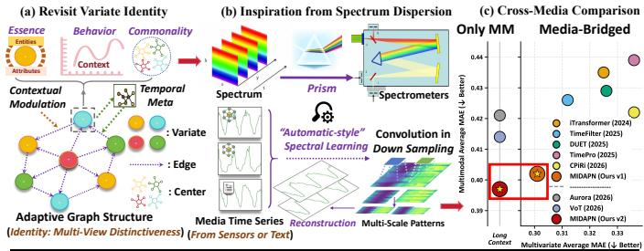

<table><tr><td colspan="6">(d) MIDAPN&#x27;s Controlled Replacement (MIDAG &amp; SPConv) Multivariate+Text</td></tr><tr><td>Media-Bridged Task Replacement (↑ Error, %)</td><td colspan="2">Multivariate Electricity</td><td colspan="2">Multimodal (Time-MMD) Traffic Energy</td></tr><tr><td>MIDAG → Adp-Graph</td><td></td><td>Weather</td><td></td><td>LEU</td></tr><tr><td>SPConv → Conv/Freq-Conv</td><td>+4.63</td><td>+0.76</td><td>+5.52 +2.82</td><td>+13.06</td></tr><tr><td></td><td>+14.23/+3.81</td><td>+5.62/+2.79</td><td>+1.27/+4.16 +4.37/+2.76</td><td>+3.50/+3.74</td></tr></table>

Fig. 1. Motivations from identity awareness and temporal capturing (spatiotemporal learning). MIDAPN achieves cross-media compatibility across multivariate and multimodal forecasting, while controlled replacements of MIDAG or SPConv with generic counterparts consistently increase errors

(2) Temporal Scale Mismatch & Automatic Adaptation (organize): To efficiently mine temporal patterns, frequencydomain analysis [30], [31] decomposes complex signals for band-specific learning, while Temporal Convolutional Networks (TCNs) exploit local connectivity and weight sharing for parameter-efficient modeling. Generally, current improvements to TCN primarily focus on expanding receptive fields [32], [33], incorporating inter-variable dependencies [34], multi-period learning [35], and stacking convolutions in the frequency domain [36] to achieve multi-level representation fusion. However, these incremental modifications have failed to transform TCNs into efficient "automatic-style" architectures, as fixed convolutional hierarchies may not adapt well to varying spectral resolutions. We therefore investigate whether convolutional hierarchies can be flexibly tailored based on temporal scales. Inspired by spectrum dispersion as a conceptual analogy [37], we propose Spectral Prism Convolution (SPConv) with an automatic “search-by-construction”. Analogous to decomposing composite spectra, Fourier transforms separate interwoven temporal representations into frequency components for hierarchical modeling preparation. To achieve scale-efficient architecture configuration [38], [39], an "Adaptive Search Guidance Module" (ASGM) determines the layer depth and channel expansion strategies, enabling targeted temporal reconstruction. Finally, a hierarchical "compressiongeneration" structure is implemented, functioning as a scaleadaptive "spectrometer" across the spectrum.

In summary, we focus on broadly transferable multivariate and text-assisted forecasting in media-bridged time series, and propose the Multimedia Identity-Aware Prism Network (MIDAPN), a spatiotemporally decoupled singlebackbone model trained separately for each task, realizing architecture-level generality without task-specific redesign. As shown in Fig. 1(a, b), the core spatiotemporal motivations are driven by identity exploration within adaptive graphs and automated temporal learning based on convolutional composition. Consequently, Fig. 1(c) demonstrates its compatibility across 13 multivariate and 7 multimodal representative benchmarks. Notably, under multimodal-only settings, it consistently outperforms the multimodal time series foundation model Aurora [40], and multi-level fusion alignment VoT [41]. Moreover, Fig. 1(d) shows that replacing MIDAG or SPConv with generic counterparts consistently increases errors, validating their complementary roles in identity-aware relation modeling and scale-adaptive temporal modeling. Our contributions are: • We formulate media-bridged time series forecasting as an underexplored unified task spanning "multivariate" and narrative-flow "multimodal", proposing MIDAPN from mediageneral variate adaptation and temporal learning.

• For multimedia correlation learning, we introduce an Identity-Aware Graph to address identity entanglement by revisiting “variate identity” through essence, behavior, and commonality, thereby preserving multi-view distinctiveness for spatiotemporal correlations and modality heterogeneity. • For automatic temporal learning, we propose Spectral Prism Convolution with hierarchical compression-generation and an Adaptive Search Guidance Module, enabling multi-scale modeling and "search-by-construction" architecture configuration to address scale mismatch across varying forecasting horizons. • MIDAPN achieves superior results with empirical comparison on 25 real-world "multivariate" and "multimodal" datasets.

## II. RELATED WORK

## A. Multivariate Time Series Forecasting

Multivariate Time Series Forecasting aims to provide comprehensive, multi-channel forecasts across diverse application domains. Within this field, deep learning-based techniques have become the mainstream paradigm as they significantly outperform in terms of predictability and parallelization efficiency. Early deep learning models, typified by RNNs, saw improvements such as SegRNN [48] and P-sLSTM [49], which accelerated RNN iterations through segmental recursion and parallel multi-step prediction; TCN-based architectures [32], [35], [36], [34], [33] have primarily concentrated on expanding the receptive field, incorporating inter-variable dependencies, and leveraging multi-period learning in the frequency domain for more comprehensive multi-scale adaptability.

Concurrently, Transformer- and MLP-based architectures have emerged as popular candidates in the time series community. Initial Transformer-based methods sought to enhance the encoder-decoder’s ability to capture diverse temporal dependencies through various strategies, including frequencydomain transforms [50] and channel-independent patching [51]. Current SOTA methods [52], [24], [16], however, center more on integrating inter-variable interactions into the Transformer to enhance its ability to learn inter-series correlations. The proliferation of Transformer-based methods has paved the way for fine-tuning Pre-trained Large Language Models [53], [11] or universal Time Series Foundation Models (TSFM) [54], [55]. At the same time, MLP-based architectures have achieved surprising results by leveraging their simplicity and efficiency, directly integrating various strategies for modeling periodicity (e.g., decomposition [56], frequency filtering [31], multi-scale mixing [57]) and variable relationships (e.g., channel-independent and mixing [58]). Furthermore, a few studies are exploring the multi-order Kolmogorov-Arnold Networks [59] or the Mamba architecture [60] to reconstruct state spaces for variable-specific information and temporal patterns.

TABLE I  
COMPARISON WITH REPRESENTATIVE MULTIVARIATE AND MULTIMODAL MODELS.“+TATS” DENOTES ITS TATS-BASED MULTIMODAL EXTENSION.
<table><tr><td>Method</td><td>Year</td><td>External Paired Modality</td><td>Pretrained PLM/TSFM</td><td>Explicit Cross- Variate Relation</td><td>Modal Interaction</td><td>Intermediate Cross- Identity/Group-Aware Frequency-Domain Explicit Multi-Resolution Search-Guided Hierarchical Relation Modeling</td><td>Modeling</td><td>Temporal Modeling</td><td>Reconstruction</td></tr><tr><td>Native multivariate models and their TaTS-based extensions</td><td></td><td></td><td></td><td></td><td></td><td></td><td></td><td></td><td></td></tr><tr><td>MSGNet [17]</td><td>2024</td><td>x</td><td>x</td><td>√</td><td>x</td><td>x</td><td>√</td><td>√</td><td>x</td></tr><tr><td>+ TaTS [15]</td><td>2026</td><td>√</td><td>√</td><td>√</td><td>√</td><td>x</td><td>√</td><td>√</td><td>x</td></tr><tr><td>TimeFilter [29]</td><td>2025</td><td>x</td><td>x</td><td>√</td><td>x</td><td>x</td><td>x</td><td>x</td><td>x</td></tr><tr><td>+ TaTS [15]</td><td>2026</td><td>√</td><td>√</td><td>√</td><td>√</td><td>x</td><td>x</td><td>x</td><td>x</td></tr><tr><td>DUET [16]</td><td>2025</td><td>x</td><td>x</td><td>√</td><td>x</td><td>√</td><td>√</td><td>x</td><td>x</td></tr><tr><td>+ TaTS [15]</td><td>2026</td><td>√</td><td>√</td><td>√</td><td>√</td><td>√</td><td>√</td><td>x</td><td>x</td></tr><tr><td></td><td>2026</td><td></td><td>x</td><td></td><td>x</td><td></td><td></td><td></td><td></td></tr><tr><td>VPNet [42] + TaTS [15]</td><td>2026</td><td>x √</td><td>√</td><td>√ √</td><td>√</td><td>x x</td><td>x x</td><td>x x</td><td>x x</td></tr><tr><td>CrossLinear [43]</td><td>2025</td><td>x</td><td>x</td><td></td><td>x</td><td></td><td></td><td></td><td></td></tr><tr><td>+ TaTS [15]</td><td>2026</td><td>√</td><td>√</td><td>√ √</td><td>√</td><td>x x</td><td>x x</td><td>x x</td><td>x x</td></tr><tr><td>CPiRi [44]</td><td>2026</td><td>x</td><td>√</td><td>√</td><td>x</td><td>x</td><td></td><td></td><td></td></tr><tr><td>+ TaTS [15]</td><td>2026</td><td>√</td><td>√</td><td>√</td><td>√</td><td>x</td><td>x x</td><td>x x</td><td>x x</td></tr><tr><td>Multimodal and PLM/TSFM-based forecasting methods</td><td></td><td></td><td></td><td></td><td></td><td></td><td></td><td></td><td></td></tr><tr><td>MM-TSFlib [7]</td><td>2024</td><td></td><td></td><td></td><td></td><td></td><td></td><td></td><td></td></tr><tr><td>GPT4MTS [45]</td><td>2024</td><td>√</td><td>√</td><td>x</td><td>x</td><td>x x</td><td>x</td><td>x</td><td>x</td></tr><tr><td>CALF [18]</td><td>2025</td><td>√ x</td><td>√ √</td><td>x x</td><td>√ √</td><td>x</td><td>x</td><td>x</td><td>x</td></tr><tr><td>Time-VLM [11]</td><td>2025</td><td>x</td><td>√</td><td>x</td><td>V</td><td>x</td><td>x x</td><td>x x</td><td>x</td></tr><tr><td>ChatTime [46]</td><td>2025</td><td>√</td><td>√</td><td>x</td><td>√</td><td>x</td><td>x</td><td>x</td><td>x x</td></tr><tr><td>TaTS [15]</td><td>2026</td><td>√</td><td>√</td><td>x</td><td>V</td><td>x</td><td>x</td><td>x</td><td>x</td></tr><tr><td>Aurora [40]</td><td>2026</td><td>√</td><td>√</td><td>x</td><td>√</td><td>x</td><td>x</td><td>x</td><td>x</td></tr><tr><td>SE-LLM [47]</td><td>2026</td><td>x</td><td>√</td><td>√</td><td>√</td><td>x</td><td>x</td><td>x</td><td>x</td></tr><tr><td>VoT [41]</td><td>2026</td><td>√</td><td>√</td><td>x</td><td>√</td><td>x</td><td>√</td><td>x</td><td>x</td></tr><tr><td>MIDAPN</td><td>(Ours)</td><td>√</td><td>√</td><td>√</td><td>√</td><td>√</td><td>√</td><td>√</td><td>√</td></tr></table>

## B. Multimodal Time Series Forecasting

Multimodal Time Series Forecasting aims to improve forecasting accuracy across diverse domains by integrating timestamp-aligned auxiliary information with time series [5], [11], typically through joint or coordinated representations [4], [6]. Given the broad availability and semantic richness of textual narratives, recent studies increasingly use text as an auxiliary modality, aligning natural-language semantics with temporal signals to support “understanding time series with natural language” [45], [11]. To facilitate research on multidomain multimodal forecasting, several representative benchmarks and frameworks have emerged. Time-MMD [7] spans nine application domains and introduces MM-TSFlib, which integrates the two modalities through weighted dual-branch alignment. In parallel, TaTS (Texts as Time Series) [15] revisits the Platonic representation hypothesis by casting paired text as auxiliary variates, thereby transforming heterogeneous multimodal inputs into a structured multivariate form.

However, recent TSF models still rarely use the same backbone to handle both “multivariate” and “multimodal” forecasting [5], [12]. Even most TSFMs mainly pursue generalpurpose forecasting [61], [62], while multimodal generalization remains less common, with Aurora representing a recent step in this direction [40]. Table I illustrates the difference. With TaTS [15], native multivariate backbones can readily accommodate text-derived variates, but their relational and temporal modeling largely follow the original design, with limited adaptation to heterogeneous sources after prealignment. Meanwhile, multimodal and PLM-based methods focus more on semantic alignment and fusion [7], [18], [11], [41]. MIDAPN targets this post-alignment stage by jointly modeling which heterogeneous variates interact (MIDAG) and how their relations evolve across temporal scales (SPConv).

## III. PRELIMINARIES AND MEDIA PRE-ALIGNMENT

We formulate the media-bridged time series forecasting by considering its "multivariate" and "multimodal" pre-alignment. Task 1: Multivariate Time Series Forecasting. Given a Look-back window of multivariate time series $\begin{array} { r l } { \mathbf { X } _ { i n } } & { { } = } \end{array}$ $\{ \boldsymbol { x } _ { h i s } ^ { 1 } , \boldsymbol { x } _ { h i s } ^ { 2 } , . . . , \boldsymbol { x } _ { h i s } ^ { C } \} \ \in \ \mathbb { R } ^ { C \times T _ { h } }$ , where $T _ { h }$ represents the length of Look-back window, and C denotes the number of variables (Note: the inherent time-related features, e.g. [month, day, week, hour] of timestamp variables can also be flexibly incorporated as covariates $T _ { \mathrm { m a r k } } \in \mathbb { R } ^ { 4 } \ [ 5 2 ] )$ . For a time series forecasting model $\mathcal { F } _ { \{ \theta _ { \mathrm { T S F } } \} } ( \cdot )$ , the objective is to predict the future $\mathbf { X } _ { o u t } \in \mathbb { R } ^ { C \times T _ { f } }$ over a horizon step $T _ { f }$ through ${ \bf { X } } _ { i n }$ Task 2: Multimodal Time Series Forecasting (TaTS). Given paired ${ \mathcal { D } } \ = \ \{ \bf X  , { \bf S } \}$ , where $\mathbf { S } _ { i n } ~ = ~ \left\{ s _ { 1 } , s _ { 2 } , . . . , s _ { T _ { h } } \right\}$ represents the input auxiliary text modality and each text input $s _ { t }$ is subsequently encoded using a frozen Pre-trained Language Model (PLM). The resulting tokens are then aggregated via average pooling to obtain textual representation $\mathbf { \bar { V } } _ { i n } = \{ v _ { 1 } , v _ { 2 } , . . . , \mathbf { \bar { v } } _ { T _ { h } } \} \in \bar { \mathbb { R } } ^ { d _ { \mathrm { t e x t } } \times T _ { h } }$ . Furthermore, MLP(·) is utilized for dimensionality reduction on $\mathbf { V } _ { i n }$ . This projection serves to balance the different modality representations and obtain ${ \bf Z } _ { i n } ~ = ~ \{ z _ { 1 } , z _ { 2 } , . . . , z _ { T _ { h } } \} ~ \in ~ \mathbb { R } ^ { d _ { \mathrm { t p r o j } } \times T _ { h } }$ . Here, $\mathbf { Z } _ { i n }$ are treated as auxiliary variables. Concretely, $\mathbf { Z } _ { i n }$ is concatenated with the temporal modality ${ \bf { X } } _ { i n }$ to form a unified multimodal sequence $\mathbf { U } _ { i n } ~ = ~ \mathrm { C o n c a t } [ \mathbf { X } _ { i n } ~ \mathbf { \mathbf { \mu } } \| ~ \mathbf { Z } _ { i n } ] ~ \in ~ \mathbb { R } ^ { { ( d _ { \mathrm { t p r o j } } + C _ { t s } ) } \times T _ { h } }$ in multivariate structure $( C = d _ { \mathrm { t p r o j } } + C _ { t s } )$ . In this way, the "resonance" characteristics are mined between textual periodicity and temporal dynamics. Following TaTS [15], whose external text-dropping/-shuffling have established its utility, we use the same pre-aligned $\mathbf { U } _ { i n }$ for all DL TSF backbones (Table IV), focusing on intermediate fusion to predict $\mathbf { X } _ { o u t } \in \mathbb { R } ^ { C _ { t s } \times T _ { f } }$

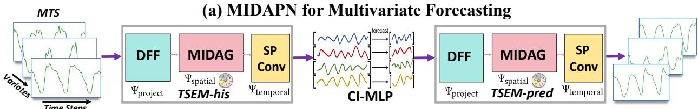

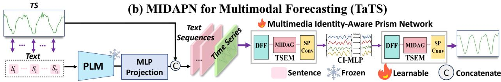  
Fig. 2. MIDAPN architecture. (a) Workflow for "multivariate" scenarios. (b) Workflow for TaTS-style "multimodal" scenarios. In both settings, TSEM-his first extracts spatiotemporal representations through Decoupled Frequency Fusion, Multimedia Identity-Aware Graph, and Spectral Prism Convolution from historical windows, then a channel-independent MLP maps the history to the future, followed by TSEM-pred for forecast refinement (details in Sec.IV-E)

By utilizing a unified forecast backbone $\mathcal { F } _ { \{ \theta _ { \mathrm { T S F } } \} } ( \cdot )$ , our goal is to achieve superior media-bridged performance rather than relying on meticulously designed modal-assisted alignments.

## IV. METHODOLOGY

## A. Overall Architecture and Theoretical Analysis

Fig. 2 illustrates MIDAPN’s "encode–project–refine" architecture for media-bridged forecasting following Sec. III, where PLM supports multimodal pre-alignment. Specifically, the Time Series Embedding Module (TSEM) integrates three components for spatiotemporal decoupling: Decoupled Frequency Fusion (DFF), Multimedia Identity-Aware Graph (MIDAG) and Adaptive Search-Guided Spectral Prism Convolution (SPConv). DFF provides feature projection, while MIDAG and SPConv perform relation learning and temporal scaling, respectively. $\mathrm { T S E M _ { h i s } }$ first extracts past representations, a Channels-Independent MLP (CI-MLP) projects them to the future horizon, and $\mathrm { T S E M _ { p r e d } }$ refines the forecast. To interpret TSEM from an ST-manifold operator perspective:

$$
\begin{array} { r } { \left( \Psi _ { \mathrm { s p a t i a l } } \circ \Psi _ { \mathrm { p r o j e c t } } \right) ( X ) = \mathrm { M I D A G } ( \mathrm { D F F } ( X ) ) , } \\ { \Psi _ { \mathrm { t e m p o r a l } } ( X ; X _ { \mathrm { M I D } } ) = \mathrm { S P C o n v } ( X , X _ { \mathrm { M I D } } ) . } \end{array}\tag{1}
$$

DFF(·) achieves flexible projection $\Psi _ { \mathrm { p r o j e c t } }$ , followed by MIDAG(·) performing spatial discovery on the variable manifold $\Psi _ { \mathrm { s p a t i a l } }$ , then SPConv(·) reorganizing topologyconditioned extracting on the temporal manifold $\Psi _ { \mathrm { t e m p o r a l } } .$

This manifold decomposition motivates deeper evaluation of relational and temporal parts. Let $\mathcal { R } ( f ) = \bar { \mathbb { E } } [ \| Y - f ( X ) \| _ { F } ^ { 2 } ]$ and $f ^ { \star } ( X ) = \mathbb { E } [ Y \mid X ]$ denote the forecasting risk and Bayes predictor. We consider the full MIDAPN with its variants: $f _ { \mathrm { T } }$ removes MIDAG-based relation modeling, $f _ { \mathrm { S } }$ removes explicit SPConv temporal modeling, and $f _ { \mathrm { S T } }$ retains both:

$$
\begin{array} { r l } & { X _ { \mathrm { M I D } } = \mathrm { M I D A G } ( \mathrm { D F F } ( X ) ) , \quad f _ { \mathrm { T } } ( X ) = \mathrm { S P C o n v } ( X , X ) , } \\ & { f _ { \mathrm { S } } ( X ) = \mathrm { M L P } ( X _ { \mathrm { M I D } } ) , \quad f _ { \mathrm { S T } } ( X ) = \mathrm { S P C o n v } ( X , X _ { \mathrm { M I D } } ) . } \end{array}\tag{2}
$$

Proposition 1 (Conditional necessity of MIDAG). Define the spatial approximation gap as

$$
\Delta _ { \mathrm { s } } = \operatorname* { i n f } _ { f \in \mathcal { F } _ { \mathrm { T } } } \mathcal { R } ( f ) - \mathcal { R } ( f ^ { \star } ) .\tag{3}
$$

If the target contains non-trivial cross-variate or cross-media dependencies that cannot be approximated arbitrarily well by $\mathcal { F } _ { \mathrm { T } } ,$ , then $\Delta _ { \mathrm { s } } > 0$ . Consequently, any temporal-only predictor incurs

$$
\begin{array} { r } { \mathcal { R } ( f ) - \mathcal { R } ( f ^ { \star } ) \geq \Delta _ { \mathrm { s } } , \qquad f \in \mathcal { F } _ { \mathrm { T } } , } \end{array}\tag{4}
$$

which establishes the necessity of MIDAG.

Proposition 2 (Conditional necessity of SPConv). Define the temporal approximation gap as

$$
\Delta _ { \mathrm { t } } = \operatorname* { i n f } _ { f \in \mathcal { F } _ { \mathrm { S } } } \mathcal { R } ( f ) - \mathcal { R } ( f ^ { \star } ) .\tag{5}
$$

Ifthe target contains multi-scale temporal dynamics that cannot be recovered solely from $\mathcal { F } _ { \mathrm { S } }$ , then $\Delta _ { \mathrm { t } } > 0$ . Consequently,

$$
\mathcal { R } ( f ) - \mathcal { R } ( f ^ { \star } ) \geq \Delta _ { \mathrm { t } } , \qquad f \in \mathcal { F } _ { \mathrm { S } } ,\tag{6}
$$

which establishes the necessity of SPConv after MIDAG. which establishes the necessity of SPConv after MIDAG.

Corollary 1 (Conditional MIDAG–SPConv complementarity). Assume that removing MIDAG or SPConv induces approximation gaps $\Delta _ { \mathrm { s } } \ > \ 0$ and $\Delta _ { \mathrm { t } } \ > \ 0 .$ , respectively. Let ${ f _ { \mathrm { S T } } ^ { \star } ( X ) \ = \ \mathrm { S P C o n v } ( X , S ^ { \star } ( X ) ) }$ denote the predictor conditioned on the ideal topology representation $S ^ { \star } ( X )$ and define the topology-induced and temporal residuals as $r _ { \mathrm { s } } ( X ) = f _ { \mathrm { S T } } ( X ) - f _ { \mathrm { S T } } ^ { \star } ( X ) , r _ { \mathrm { t } } ( X ) = f _ { \mathrm { S T } } ^ { \star } ( X ) - f ^ { \star } ( X )$ Let $\epsilon _ { \mathrm { s } } ~ = ~ { \mathbb { E } } \| X _ { \mathrm { M I D } } - S ^ { \star } ( X ) \| _ { F } ^ { 2 }$ and $\epsilon _ { \mathrm { t } } ~ = ~ \mathbb { E } \| r _ { \mathrm { t } } ( X ) \| _ { F } ^ { 2 }$ . If SPConv is L-Lipschitz in its topology-conditioned input, then E $\| r _ { \mathrm { s } } ( X ) \| _ { F } ^ { 2 } \leq L ^ { 2 } \epsilon _ { \mathrm { s } }$ . Using the Bayes-risk decomposition and $\begin{array} { r } { \| a + b \| _ { F } ^ { 2 } \leq 2 \| a \| _ { F } ^ { 2 } + 2 \| b \| _ { F } ^ { 2 } } \end{array}$ , we obtain

$$
\begin{array} { r l } & { \mathcal { R } ( f _ { \mathrm { S T } } ) - \mathcal { R } ( f ^ { \star } ) = \mathbb { E } \| r _ { \mathrm { s } } ( X ) + r _ { \mathrm { t } } ( X ) \| _ { F } ^ { 2 } } \\ & { \quad \quad \quad \leq 2 \mathbb { E } \| r _ { \mathrm { s } } ( X ) \| _ { F } ^ { 2 } + 2 \mathbb { E } \| r _ { \mathrm { t } } ( X ) \| _ { F } ^ { 2 } } \\ & { \quad \quad \quad \leq 2 L ^ { 2 } \epsilon _ { \mathrm { s } } + 2 \epsilon _ { \mathrm { t } } . } \end{array}\tag{7}
$$

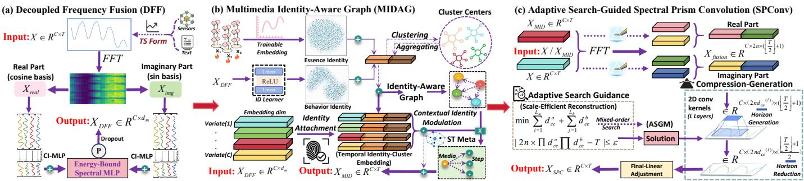  
Fig. 3. Core TSEM modules: (a) Decoupled Frequency Fusion (DFF); (b) Multimedia Identity-Aware Graph (MIDAG); and (c) Spectral Prism Convolutio (SPConv), whose architecture is configured by Adaptive Search Guidance (ASGM). Here, C and T denote the numbers of aligned variates and temporal steps, respectively. MIDAPN learns multivariate dependencies and multimodal heterogeneity within a unified backbone for Spatiotemporal decoupling

Consequently, whenever $2 L ^ { 2 } \epsilon _ { \mathrm { s } } + 2 \epsilon _ { \mathrm { t } } < \mathrm { m i n } \{ \Delta _ { \mathrm { s } } , \Delta _ { \mathrm { t } } \}$ , fST outperforms either ablated class. MIDAG identifies which variables interact, whereas SPConv models how these interactions evolve across temporal scales. Thus, they are axis-decoupled but conditionally complementary for spatiotemporal learning.

## B. $\Psi _ { p r o j e c t } .$ Decoupled Frequency Fusion

To harness identity-bearing media signals in sliding windows, we leverage the representation power of orthogonal bases [50], [31], [63] in the frequency domain. As shown in Fig. 3 (a), we first employ the Fast Fourier Transform (FFT) to map the input signal $\mathbf { \bar { \boldsymbol { X } } } \in \mathbb { R } ^ { C \times T }$ into the frequency domain, and then we decompose the spectrum into its orthogonal real and imaginary components, denoted as $\chi _ { \mathrm { r e a l } } ( f )$ and $\mathcal { X } _ { \mathrm { i m a g } } ( f ) \in \mathbb { R } ^ { C \times ( \overline { { \lfloor \frac { T } { 2 } \rfloor } } + \overline { { 1 } } ) }$ [64], which are governed by cosine and sine basis functions respectively. Subsequently, we adopt a Channels-Independent MLP [56], [51] to prevent the crossvariable noise interference, ensuring their unique temporal distributions are represented as $\bar { \mathcal { Z } } _ { \mathrm { r e a l } } \bar { ( } f ) , \bar { \mathcal { Z } } _ { \mathrm { i m a g } } \bar { ( } f \bar { ) } \in \mathbb { R } ^ { C \bar { \times } T }$

$$
\begin{array} { r } { \mathcal { Z } [ C , T _ { \mathrm { o u t } } ] = \sum _ { T _ { \mathrm { i n } } } \chi [ C , T _ { \mathrm { i n } } ] \cdot \mathcal { W } _ { \mathrm { C I } } [ C , T _ { \mathrm { i n } } , T _ { \mathrm { o u t } } ] + b _ { \mathrm { C I } } [ C , T _ { \mathrm { o u t } } ] , } \end{array}\tag{8}
$$

$$
\mathcal { Z } _ { \mathrm { r e a l } } ( f ) , \mathcal { Z } _ { \mathrm { i m a g } } ( f ) = \mathrm { C I \mathrm { - } M L P } _ { \mathrm { r e a l } } ( \mathcal { X } _ { \mathrm { r e a l } } ( f ) ) , \mathrm { C I \mathrm { - } M L P } _ { \mathrm { i m a g } } ( \mathcal { X } _ { \mathrm { i m a g } } ( f ) ) ,\tag{9}
$$

where $\mathbf { C I - M L P ( \cdot ) }$ contains independent weights and biases $\mathcal { W } _ { \mathrm { C I } } ~ \in ~ \mathbb { R } ^ { C \times ( \lfloor \frac { T } { 2 } \rfloor + 1 ) \times T } , ~ b _ { \mathrm { C I } } ~ \in ~ \mathbb { R } ^ { C \times T }$ for each of the $C$ variates. This sequence-token embedding approach could better address intricate situations in real-world scenarios (e.g., temporal delays and distribution shifts) [52]. Furthermore, we design a straightforward yet effective Energy-Bounded Spectral MLP for additive fusion, which leverages Tanh for saturation damping and dropout for random inhibition:

$$
X _ { \mathrm { { D F F } } } = \mathrm { { D r o p } } ( \phi _ { \mathrm { T a n h } } ( \mathrm { L i n e a r } _ { \mathrm { D F F } } ( \mathcal { Z } _ { \mathrm { r e a l } } ( f ) + \mathcal { Z } _ { \mathrm { i m a g } } ( f ) ) ) ) .\tag{10}
$$

Note that LinearDFF(·) layer is applied along the temporal dimension, mapping the input from $\bar { \mathbb { R } } ^ { C \times T }$ to $\bar { X } _ { \mathrm { D F F } } \in \mathbb { R } ^ { \bar { C } \times d _ { m } }$ here $d _ { m }$ denotes model dimension for representation capacity.

## C. $\Psi _ { s p a t i a l } .$ Multimedia Identity-Aware Graph

1) Design Rationale: To overcome indistinguishability [8] in media-general graph learning, we revisit "identity" from three core aspects: the intrinsic properties of variates (Essence Identity $\mathcal { E } _ { \bf { i d } } \mathbf { : }$ what it is [19], [10]), context-dependent dynamics (Behavior Identity $\it { B } _ { \mathrm { i d } } \it { : }$ how it manifests [22], [23], [17]), and shared commonalities (Group-Level Identity $\mathcal { V } _ { \mathbf { g r o u p } } \colon$ where it belongs [16], [28], [27]). Given the observations {O} in a mini-batch, we adopt a conceptual probabilistic factorization: how interdependent identities jointly induce varied $\mathcal { G } _ { \mathrm { a w a r e } } ^ { ( \mathrm { i d } ) } \in \mathbb { R } ^ { C \times C }$ in sample-adaptive disentanglement

$$
\begin{array} { r } { P \Big ( \mathcal { G } _ { \mathrm { a w a r e } } ^ { ( \mathrm { i d } ) } \in \mathcal { A } \Big ) = \sum _ { { X , \mathcal { E } _ { \mathrm { i d } } , \mathcal { B } _ { \mathrm { i d } } } , \mathcal { V } _ { \mathrm { g r o u p } } } P ( X ) P ( \mathcal { E } _ { \mathrm { i d } } \mid X ) P ( \mathcal { B } _ { \mathrm { i d } } \mid X ) } \\ { P ( \mathcal { V } _ { \mathrm { g r o u p } } \mid \mathcal { E } _ { \mathrm { i d } } , \mathcal { B } _ { \mathrm { i d } } ) P \Big ( \mathcal { G } _ { \mathrm { a w a r e } } ^ { ( \mathrm { i d } ) } \in \mathcal { A } \mid \mathcal { E } _ { \mathrm { i d } } , \mathcal { B } _ { \mathrm { i d } } , \mathcal { V } _ { \mathrm { g r o u p } } \Big ) . } \end{array}\tag{11}
$$

where A is optimal set. $\mathcal { E } _ { \mathrm { i d } } \in \mathbb { R } ^ { C \times d _ { \mathrm { i d } } } , { B } _ { \mathrm { i d } } \in \mathbb { R } ^ { C \times d _ { \mathrm { i d } } }$ , and $\nu _ { \mathrm { g r o u p } }$ $\mathbf { \Sigma } \in \mathbb { R } ^ { C \times d _ { \mathrm { c l u s t e r } } }$ , where $d _ { \mathrm { i d } } , d _ { \mathrm { c l u s t e r } }$ signify identity embedding and latent cluster centers dimension respectively. Meanwhile, we design contextual identity modulation to refine graph aggregation without explicitly estimating conditional mutual information (CMI) [65]. Next, we will progressively derive Individual & Group-Level Identity, Graph Construction, and Implicit Contextual Identity Modulation in MIDAG.

2) Individual Identity Learning: To encode the persistent properties of pre-aligned variates, we learn a trainable embedding $\mathcal { E } _ { \mathrm { i d } } ~ \in ~ \mathbb { R } ^ { C \times d _ { \mathrm { i d } } }$ [19], [10]. During training [66], $\mathcal { E } _ { \mathrm { i d } }$ essentially provides an observation-invariant anchor for distinction (i.e., sensor or TaTS-derived variates). For the behavior identity, we crafted a parameter-friendly "Dynamic ID learner", which is created to extract instantaneous dynamics:

$$
\mathcal { B } _ { \mathrm { i d } } = \mathcal { W } _ { d _ { \mathrm { i d } } } \cdot \phi _ { \mathrm { R e L U } } ( \mathcal { W } _ { d _ { \mathrm { m } } } X _ { \mathrm { D F F } } + b _ { d _ { \mathrm { m } } } ) + b _ { d _ { \mathrm { i d } } } ,\tag{12}
$$

where "Dynamic ID learner" is implemented based on the low-rank hypothesis prevalent in robust learning [9]. Instead of a direct linear mapping from $\mathbb { R } ^ { d _ { m } }  \mathbb { R } ^ { d _ { \mathrm { i d } } }$ , we factorize this transformation into two consecutive linear layers with weights $\mathcal { W } _ { d _ { m } } \in \mathbb { R } ^ { d _ { m } \times r } , \mathcal { W } _ { d _ { \mathrm { i d } } } \in \mathbb { R } ^ { r \times d _ { \mathrm { i d } } }$ and bias $b _ { d _ { \mathrm { m } } } \in \mathbb { R } ^ { r }$ $b _ { d _ { \mathrm { i d } } } \in \mathbb { R } ^ { d _ { \mathrm { i d } } }$ . Afterward, we set the rank to a reduced rate r of $\frac { d _ { m } } { 2 }$ to ensure parameter efficiency while preserving adequate representational capacity. Next, we sum the static and dynamic Identities to obtain the individual variate identity $\mathcal { V } _ { \mathrm { i d } } \in \mathbb { R } ^ { C \times d _ { \mathrm { i d } } } ;$

$$
\mathcal { V } _ { \mathrm { i d } } ( X ) = \mathcal { E } _ { \mathrm { i d } } ^ { \star } ( \mathcal { O } ) + \mathcal { B } _ { \mathrm { i d } } ( X ; \mathcal { O } ) ,\tag{13}
$$

where $\mathcal { E } _ { \mathrm { i d } }$ shows prior expectation, while $B _ { \mathrm { i d } }$ refers to posterior update. Hence "residual-like" identity learning improves existing knowledge incrementally through dynamic feedback.

3) Group-Level Identity Clustering: Cluster centers summarize group commonalities [27]. We initialize latent centers $\mathcal { V } _ { \mathrm { c l u s t e r } } \ \in \ \bar { \mathbb { R } } ^ { M \times d _ { \mathrm { c l u s t e r } } }$ , where M is the number of groups, and introduce a learnable projection $\mathcal { W } _ { \mathrm { i 2 c } } ~ \in ~ \mathbb { R } ^ { d _ { \mathrm { i d } } \times d _ { \mathrm { c l u s t e r } } }$ to align $\nu _ { \mathrm { i d } }$ with $\vartheta _ { \mathrm { c l u s t e r } }$ in a shared semantic space. Under an isotropic-covariance Gaussian-mixture interpretation, the soft-clustered identity is the posterior expectation $\phi ( \gamma _ { \mathrm { i d } } ) =$ $\begin{array} { r } { \sum _ { m = 1 } ^ { M } P ( \mathrm { l a b e l } _ { m } } \end{array} | \begin{array} { l } { \dot { \mathcal { V } } _ { \mathrm { i d } } ) \vartheta _ { \mathrm { c l u s t e r } } ^ { m } } \end{array}$ . Accordingly, we treat projected identities as Queries and cluster centers as Keys, and approximate posterior assignments by their dot-product similarities $\mathcal { W } _ { \mathrm { c l u s t e r } } \ \in \ \mathbb { R } ^ { C \times M }$ . This soft assignment allows each variate to retain graded membership across multiple latent groups, rather than being restricted to a single cluster. Moreover, we compute the $\bar { \mathcal { V } } _ { \mathrm { g r o u p } } ~ \in ~ \mathbb { R } ^ { C \times d _ { \mathrm { c l u s t e r } } }$ for $\nu _ { \mathrm { i d } }$ by performing a superposition of all latent cluster centers:

$$
\mathcal { V } _ { \mathrm { g r o u p } } = \mathrm { S o f t m a x } ( \mathcal { V } _ { \mathrm { i d } } \mathcal { W } _ { \mathrm { i 2 c } } \vartheta _ { \mathrm { c l u s t e r } } ^ { T } ) \vartheta _ { \mathrm { c l u s t e r } } .\tag{14}
$$

Finally, by concatenating $\mathcal { V } _ { \mathrm { i d } } , \ \mathcal { V } _ { \mathrm { g r o u p } }$ at feature axis, we form the Identity-Cluster Embedding $\mathcal { Z } _ { \mathrm { i d - c l u s t e r } } \in \mathbb { R } ^ { C \times ( d _ { \mathrm { i d } } + d _ { \mathrm { c l u s t e r } } ) }$

4) Multimedia Identity-Aware Graph Construction: Conceptually, $\mathcal { Z } _ { \mathrm { i d - c l u s t e r } }$ can be interpreted as a semantic decomposition of the monolithic node embeddings found in adaptive graph structure, where each segment is endowed with a distinct semantic meaning (i.e., individual & group identity) [29], enabling branch-wise attribution [50]. By partitioning $\mathcal { W } _ { \mathrm { g p r o j } } = [ \mathcal { W } _ { \mathrm { I } } ^ { \top } , \mathcal { W } _ { \mathrm { G } } ^ { \top } ] ^ { \top }$ , we have graph base $\mathcal { Z } _ { \mathrm { g r a p h } } \in \mathbb { R } ^ { C \times d _ { \mathrm { g r a p h } } } ;$

$$
\begin{array} { r l } & { \mathcal { Z } _ { \mathrm { g r a p h } } = \mathcal { V } _ { \mathrm { i d } } \mathcal { W } _ { \mathrm { I } } + \mathcal { V } _ { \mathrm { g r o u p } } \mathcal { W } _ { \mathrm { G } } , } \\ & { \nabla _ { \mathcal { W } _ { s } } \mathcal { L } = \mathcal { V } _ { s } ^ { \top } ( \nabla \mathcal { Z } _ { \mathrm { g r a p h } } \mathcal { L } ) _ { s } , s \in \{ \mathrm { I } , \mathrm { G } \} . } \end{array}\tag{15}
$$

Thus, each branch receives a dedicated gradient, mitigating cross-semantic interference (Sec. VI-A1). To retain positive inter-variate affinities and exclude self-loops, we apply ReLU and a diagonal mask $\mathcal { D } _ { \mathrm { m a s k } } \in \mathbb { R } ^ { C \times C }$ . Finally, Softmax yields $\mathcal { G } _ { \mathrm { a w a r e } } ^ { ( \mathrm { i d } ) } \in \bar { \mathbb { R } } ^ { C \times C }$ with row-wise probability distributions:

$$
\mathcal { G } _ { \mathrm { a w a r e } } ^ { ( \mathrm { i d } ) } = \mathrm { S o f t m a x } _ { \mathrm { r o w } } \left( \phi _ { \mathrm { R e L U } } \left( \mathcal { Z } _ { \mathrm { g r a p h } } \mathcal { Z } _ { \mathrm { g r a p h } } ^ { \top } \right) + \mathcal { D } _ { \mathrm { m a s k } } \right)\tag{16}
$$

Here Identity-induced affinity edge aligns individual & group traits, enabling variate discrimination and cross-media linking:

$$
\begin{array} { r l } & { e _ { i j } ^ { \mathrm { ( i d ) } } = \left( [ \mathcal { V } _ { \mathrm { i d } , i } \Vert \mathcal { V } _ { \mathrm { g r o u p } , i } ] W _ { \mathrm { g p r o j } } \right) \left( [ \mathcal { V } _ { \mathrm { i d } , j } \Vert \mathcal { V } _ { \mathrm { g r o u p } , j } ] W _ { \mathrm { g p r o j } } \right) ^ { \top } } \\ & { \qquad = \mathcal { V } _ { \mathrm { i d } , i } M _ { \mathrm { I I } } \mathcal { V } _ { \mathrm { i d } , j } ^ { \top } + \mathcal { V } _ { \mathrm { i d } , i } M _ { \mathrm { I G } } \mathcal { V } _ { \mathrm { g r o u p } , j } ^ { \top } } \\ & { \qquad + \mathcal { V } _ { \mathrm { g r o u p } , i } M _ { \mathrm { G I } } \mathcal { V } _ { \mathrm { i d } , j } ^ { \top } + \mathcal { V } _ { \mathrm { g r o u p } , i } M _ { \mathrm { G G } } \mathcal { V } _ { \mathrm { g r o u p } , j } ^ { \top } , } \end{array}\tag{17}
$$

As C contains TS variates in multivariate but also projectedtext variates under TaTS, the same kernel could capture TS– TS, TS–text, and text–text relations. For affinity decomposition, $M _ { \mathrm { I I } }$ and $M _ { \mathrm { G G } }$ preserve individual specificity and group commonality, while $M _ { \mathrm { I G / G I } }$ bridge them, allowing edges to serve variable-specific and cross-media relations (Sec. VI-A3).

5) Contextual Identity Modulation (CIM): We implicitly realize identity-aware aggregation modulation via temporal context transferring and residual refinement. For preparation, similar to ST-identity attachment [67], we combine the DFF output ${ \bf X } _ { \mathrm { D F F } }$ with individual- and group-level to propagate both identity cues and temporal information. In this way, we get Temporal-Identity-Cluster Embedding $\mathcal { Z } _ { \mathrm { t - i d - c l u s t e r } } \in$ $\mathbb { R } ^ { C \times \breve { ( } d _ { m } + d _ { \mathrm { i d } } + \breve { d } _ { \mathrm { c l u s t e r } } ) }$ in Fig. 3(b):

$$
\mathcal { Z } _ { \mathrm { t - i d - c l u s t e r } } = [ X _ { \mathrm { D F F } } \mid \mid \mathcal { V } _ { \mathrm { i d } } \mid \mid \mathcal { V } _ { \mathrm { g r o u p } } ] .\tag{18}
$$

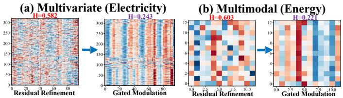  
Fig. 4. Normalized SVD-energy entropy of CIM refinement $( C \times T ) ;$ Lower entropy values indicate stronger spectral mode concentration.

The next stage aims to dynamically infuse multimedia dependencies from the $G _ { \mathrm { a w a r e } } ^ { \mathrm { ( i d ) } }$ into the temporal context. For this purpose, we introduce a contextual meta-parameter $\mathcal { W } _ { \mathrm { c o n t e x t } } \in$ $\tilde { \mathbb { R } } ^ { C \times D } \left( D = d _ { m } + d _ { \mathrm { i d } } + d _ { \mathrm { c l u s t e r } } \right)$ , which acts as a learnable prototype library [22], storing contextual information to fully leverage the indivisible spatio-temporal heterogeneity [66]. For infusion, we first perform the discrete Identity-Aware topology transformation of $\mathcal { Z } _ { \mathrm { t - i d - c l u s t e r } }$ over $G _ { \mathrm { a w a r e } } ^ { \mathrm { ( i d ) } }$ to approximate probabilistic integration $\textstyle { \int _ { \mathcal { G } } } { \mathcal { Z } } d P ( \mathcal { G } )$ , obtaining an aggregated representation $\mathcal { Z } _ { \mathrm { a g g } } \in \mathbb { R } ^ { \check { C } \check { \times } D }$ . Next, a Query-Key computation is utilized for interaction between $\mathcal { Z } _ { \mathrm { a g g } }$ and $\mathcal { W } _ { \mathrm { c o n t e x t } } \mathrm { : }$

$$
{ \mathcal Z } _ { \mathrm { a g g } } = G _ { \mathrm { a w a r e } } ^ { \mathrm { ( i d ) } } { \mathcal Z } _ { \mathrm { t - i d - c l u s t e r } } , \quad { \mathcal W } _ { \mathrm { a w a r e } } ^ { \mathrm { ( i d ) } } = \phi _ { \mathrm { T a n h } } \big ( { \mathcal Z } _ { \mathrm { a g g } } ^ { \mathrm { T } } { \mathcal W } _ { \mathrm { c o n t e x t } } \big ) .\tag{19}
$$

$\mathcal { Z } _ { \mathrm { t - i d - c l u s t e r } }$ is used as a query to perform a self-gated modulation against the $\mathcal { W } _ { \mathrm { a w a r e } } ^ { ( \mathrm { i d } ) } \in \mathbf { \bar { \mathbb { R } } } ^ { D \times D }$ for identity-awareness. Finally, token mixing and residual refinement are integrated using $I _ { D } \colon$

$$
{ \chi } _ { \mathrm { M I D } } = \mathrm { L i n e a r } _ { \mathrm { M I D } } \left( \mathcal { Z } _ { \mathrm { t - i d - c l u s t e r } } \left[ \mathrm { D r o p o u t } \left( \mathcal { W } _ { \mathrm { a w a r e } } ^ { ( \mathrm { i d } ) } \right) + \mathbb { Z } _ { D } \right] \right)\tag{20}
$$

Interpretation from CMI: Rather than using biased auxiliary graph losses [68], we interpret the joint modulation under the aggregated context $\begin{array} { r l } { \mathcal { C } } & { { } \triangleq \mathcal { Z } _ { \mathrm { a g g } } . } \end{array}$ Let $\begin{array} { r l } { \mathcal { R } } & { { } \triangleq \mathcal { Z } I _ { D } } \end{array}$ and $\mathcal { M } \triangleq \mathcal { Z } \mathcal { W } _ { \mathrm { a w a r e } } ^ { ( \mathrm { i d } ) }$ denote the ST-residual and gated responses:

$$
I ( X _ { \mathrm { M D } } ; \mathcal { V } \mid \mathcal { C } ) \le I ( [ \mathcal { R } , \mathcal { M } ] ; \mathcal { V } \mid \mathcal { C } ) = I ( \mathcal { R } ; \mathcal { V } \mid \mathcal { C } ) + I ( \mathcal { M } ; \mathcal { V } \mid \mathcal { R } , \mathcal { C } ) .\tag{21}
$$

The CMI chain rule decomposes the information flow into two distinct pathways: (1) ST-identity cues retained via residual refinement, and (2) graph-conditioned responses modulated by identity-aware gating. Although M varies across samples due to the input-dependent context C, it is deterministically governed by R and C under fixed parameters. Consequently, Eq. (21) characterizes the architectural processing mechanism rather than the injection of additional conditional information. Empirically, as visualized via SVD-energy entropy in Figure 4, residual refinement preserves a broader spectrum of ST modes, whereas gating sharply concentrates on dominant modes. Coupled with the “w/o CIM” ablation in Sec. V-C, these findings firmly substantiate the efficacy of context-guided refinement.

## D. $\Psi _ { t e m p o r a l } .$ "Search-Guided" Spectral Prism

1) Spectrum Capturing: Informed by Parseval’s theorem [30] on global time-frequency energy equivalence, we adopt the working hypothesis that potentially salient temporal patterns can be revealed through compact, localized spectral responses. The energy within a spectral interval $[ j + 1 , j + S ]$ can be characterized by summing the squared spectral magni tudes $\{ | A _ { k } | ^ { 2 } \}$ . Rather than explicitly constructing the power spectrum, we apply a learnable convolutional kernel to extract local responses from the spectral coefficients:

$$
\begin{array} { r } { E _ { j } = \sum _ { k = j + 1 } ^ { j + S } | A _ { k } | ^ { 2 } , \quad \widehat { R } _ { j } = \sigma \left( \sum _ { i = 1 } ^ { S } W _ { i } ^ { ( \mathrm { c o n v } ) } A _ { j + i - 1 } + \mathrm { b i a s } \right) . } \end{array}\tag{22}
$$

Following this spectral analogy [37], multi-source signals $\boldsymbol { X } , \boldsymbol { X _ { \mathrm { M I D } } } ^ { - } \in \mathbb { R } ^ { C \times T }$ are mapped into frequency bases, split into real & imaginary part and concatenated as $X _ { \mathrm { f u s i o n } } \ \in$ $\mathbb { R } ^ { C \times 2 n \times ( \lfloor T / 2 \rfloor + 1 \bar { ) } } ( n \stackrel { \cdot } { = } 2 )$ . Since spectral resolution varies with $T ,$ a fixed architecture may not adapt gracefully across horizons. This scale mismatch naturally needs automatic configuration to balance trends and details.

2) Hierarchical Spectral Scaling: Instead of separate encoders and decoders for multiscale modeling [69], [33], [70], we couple compression-generation hierarchically via average pooling and channel-expanded convolution: across layers, spectral positions contract as $T ^ { ( l ) } \approx k _ { \mathrm { p o o l } } ^ { - l } T ^ { ( 0 ) }$ , while channel width grows as $\begin{array} { r } { D ^ { ( l ) } = 2 n \prod _ { r = 1 } ^ { l } d _ { \mathrm { c e } } ^ { ( \hat { r } ) } } \end{array}$ . Hence, $D ^ { ( l ) } T ^ { ( l ) }$ ≈ $\rho ^ { ( l ) } D ^ { ( l - 1 ) } T ^ { ( l - 1 ) } , \rho ^ { ( l ) } = d _ { \mathrm { c e } } ^ { ( l ) } \big / k _ { \mathrm { p o o l } }$ characterizes the balance between coarse-trend abstraction and fine-detail preservation:

$$
\begin{array} { r } { X _ { \mathrm { { f u s i o n } } } ^ { ( l ) } = \mathrm { { A v g P o o l } } ( \sum _ { 2 n \cdot \prod _ { l = 1 } d _ { \mathrm { c e } } ^ { ( l - 1 ) } } \sum _ { k } W _ { \mathrm { { c o n v 2 d } } } ^ { ( l ) } ( { \mathrm { P a d } } ( X _ { \mathrm { { f u s i o n } } } ^ { ( l - 1 ) } ) ) ) . } \end{array}\tag{23}
$$

where $\begin{array} { r } { W _ { \mathrm { c o n v 2 d } } ^ { ( l ) } \in \mathbb { R } ^ { 2 n \cdot \prod _ { r = 1 } ^ { l - 1 } d _ { \mathrm { c e } } ^ { ( r ) } \times 2 n \cdot \prod _ { r = 1 } ^ { l } d _ { \mathrm { c e } } ^ { ( r ) } \times 1 \times k } } \end{array}$ uses $d _ { \mathrm { c e } } ^ { ( l ) }$ to offset pooling compression. With $k _ { \mathrm { p o o l } } = 2 , k = 3 , p _ { d } = 2$ convolution preserves length pre-pooling, yielding $\begin{array} { r l } { T ^ { ( l ) } } & { { } = } \end{array}$ $\big | \mathcal { G } ( T ^ { ( l - 1 ) } ) / \bar { k } _ { \mathrm { p o o l } } \big | , \mathcal { G } ( T ) \bar { = } T + p _ { d } - k + \bar { 1 }$ . From hierarchical scaling, the decreasing $T ^ { ( l ) } ~ ( \approx ~ 2 ^ { - l } )$ and expanding $D ^ { ( l ) }$ unfold multi-scale frequencies along the new axis for reconstruction. In layer L, LinearSPC(·) adjusts the T dimension and fuses $X _ { \mathrm { f u s i o n } } ^ { ( L ) } , \dot { X } , X _ { \mathrm { M I D } }$ for $X _ { \mathrm { S P C } } \in \mathbb { R } ^ { C \times T }$ . Each layer therefore trades spectral resolution for channel capacity, turning temporal scale into an explicit architectural progression.

3) "Adaptive Search-Guided" Architecture Configuration: ASGM is not Neural Architecture Search (NAS), it involves no "search-then-train" candidate evaluation [71], [72]. Instead, it deterministically instantiates a single architecture at initialization, allocating layer-wise expansion factors to meet the reconstruction target, termed "search-by-construction".

For input horizon $T _ { \mathrm { i n } } , \mathrm { A S G M }$ determines core parameters:

(1) Network Depth L: The hierarchical convolutionpooling for layer is : $: L = \lfloor \frac { \log ( \lfloor \frac { T _ { \mathrm { i n } } } { 2 } \rfloor + 1 ) } { \log ( k _ { \mathrm { p o o l } } ) } \rfloor$ ⌋, which compresses the input temporal resolutions through multiple downsampling.

(2) Expansion Factor $d _ { \mathbf { c } \mathbf { e } } \mathbf { : }$ The unique channel expansion factor $d _ { \mathrm { c e } } ^ { ( l ) }$ is devised to progressively reconstruct multimedia representations via the newly created multi-sources dimension.

Regarding optimization strategies for expansion factors, fundamental approaches include maximization, minimization, and random selection. However, maximization tends to result in extreme factor distributions $( \mathrm { e . g . }$ , multiple layers initially set to 1 but eventually converging to T), while random selection from the candidate pool $\mathcal { Q } ~ = ~ \{ d _ { \mathrm { c e } } ^ { ( 1 ) } , d _ { \mathrm { c e } } ^ { ( 2 ) } , . . . , d _ { \mathrm { c e } } ^ { ( L ) } \}$ cannot guarantee optimal architecture or robustness.

For scale-efficient optimization, selecting an expansion strategy is formulated as a constrained integer program [38]. We seek an integer allocation $\mathcal { Q } = ( d _ { \mathrm { c e } } ^ { ( 1 ) } , \dots , d _ { \mathrm { c e } } ^ { ( L ) } )$ that minimizes the reconstruction-capacity cost $\mathcal { C } ( \mathcal { Q } )$ . These factors determine the channel dimensions of each mapping $K ^ { ( l ) } \ \in$ R2n $\begin{array} { r } { \cdot \prod _ { r = 1 } ^ { l - 1 } d _ { \mathrm { c e } } ^ { ( r ) } \times 2 n \prod _ { r = 1 } ^ { l } d _ { \mathrm { c e } } ^ { ( r ) } } \end{array}$ , and hence bound its attainable rank capacity [63]. Since the learned effective ranks are unavailable before training [73], C(Q) serves as a structural proxy that promotes balanced capacity growth. Meanwhile, the scaled cumulative expansion $\begin{array} { r } { 2 n \dot { \prod } _ { l = 1 } ^ { L } d _ { \mathrm { c e } } ^ { ( l ) } } \end{array}$ should ideally match the reconstructed temporal dimension $T _ { \mathrm { r e c } } ,$ ensuring sufficient reconstruction capacity without redundant channel inflation:

Algorithm 1 Greedy Search for Mixed-order Strategy   
Input: $T _ { \mathrm { i n } } , T _ { \mathrm { r e c } } \geq 8 , d _ { \mathrm { c e } } ^ { a } , L ,$ 2n   
Output: $\mathcal { Q } _ { \mathrm { b e s } } ^ { \ast }$ st ▷ Selected expansion strategy   
1: $( \mathcal { Q } _ { \mathrm { b e s t } } ^ { * } , c ^ { * } ) \gets ( [ d _ { \mathrm { c e } } ^ { a } ] ^ { \times L } , \infty )$ ▷ Basic initialization   
2: for $i = 1 , \ldots , L - 1$ do $\begin{array} { r } { \triangleright L = \Big | \frac { \log ( \lfloor { T _ { \mathrm { i n } } / 2 } \rfloor + 1 ) } { \log ( k _ { \mathrm { p o o l } } ) } } \end{array}$   
3: $\begin{array} { r } { j  L - i , \quad A _ { i }  \frac { T _ { \mathrm { r e c } } } { 2 n ( d _ { \mathrm { c e } } ^ { a } ) ^ { i } } , \quad d _ { \mathrm { c e } } ^ { b }  \bar { \lfloor { A _ { i } ^ { 1 / j } } \rfloor } , \quad c _ { i }  } \end{array}$   
$i d _ { \mathrm { c e } } ^ { a } + j d _ { \mathrm { c e } } ^ { b }$ ▷ Candidate and expansion cost   
4: $\mathsf { i f } \ c _ { i } < c ^ { * } \wedge d _ { \mathrm { c e } } ^ { b } > 1 \wedge ( d _ { \mathrm { c e } } ^ { b } ) ^ { j } \leq A _ { i } < ( d _ { \mathrm { c e } } ^ { b } ) ^ { j + 1 }$ then   
5: $( \mathcal { Q } _ { \mathrm { b e s t } } ^ { * } , c ^ { * } ) \gets ( \mathcal { Q } ( i , d _ { \mathrm { c e } } ^ { b } ) , c _ { i } )$ ▷ Lowest-cost   
6: end if   
7: end for   
8: $\mathcal { Q } _ { \mathrm { b e s t } } ^ { \ast }  \mathrm { I n t e r l e a v e } ( \mathcal { Q } _ { \mathrm { b e s t } } ^ { \ast } )$

$$
\begin{array} { r } { \mathcal { C } ( \boldsymbol { \mathcal { Q } } ) = \sum _ { l = 1 } ^ { L } d _ { \mathrm { c e } } ^ { ( l ) } , \qquad \mathrm { s . t . } \quad \left| 2 n \cdot \prod _ { l = 1 } ^ { L } d _ { \mathrm { c e } } ^ { ( l ) } - T _ { \mathrm { r e c } } \right| \leq \varepsilon , } \end{array}\tag{24}
$$

where $\varepsilon$ is an idealized tolerance. Leveraging the Arithmetic-Geometric Mean Inequality $\begin{array} { r l r } { \frac { \sum _ { l = 1 } ^ { L } d _ { \mathrm { c e } } ^ { ( l ) } } { L } } & { { } \ge } & { \left( \prod _ { l = 1 } ^ { L } d _ { \mathrm { c e } } ^ { ( l ) } \right) ^ { \frac { 1 } { L } } } \end{array}$ , a balanced reference is $\begin{array} { r } { d _ { \mathrm { c e } } ^ { ( l ) } = \left( \frac { T _ { \mathrm { r e c } } } { 2 n } \right) ^ { \frac { 1 } { L } } } \end{array}$ . However, this uniform expansion restricts layer-wise capacity flexibility, while strict capacity matching may also be infeasible under integer constraints. We thus adopt a capacity-guided mixed-order search.

4) Mixed-order Allocations: Given candidate expansion factors $\mathcal { Q } _ { d } \subset \mathbb { Z } ^ { + }$ , exhaustive L-layer search incurs $\mathcal { O } ( | \mathcal { Q } _ { d } | ^ { L } )$ complexity. We thus restrict allocations to at most two distinct factors. With $d _ { \mathrm { c e } } ^ { a } = \lfloor ( T _ { \mathrm { r e c } } / ( 2 n ) ) ^ { 1 / L } \rfloor$ , each split m $\in$ $\{ 1 , \ldots , L - 1 \}$ defines $\mathcal { Q } ( \bar { m } , d _ { \mathrm { c e } } ^ { b } ) = [ ( d _ { \mathrm { c e } } ^ { a } ) ^ { \bar { \times } m } , ( d _ { \mathrm { c e } } ^ { b } ) ^ { \bar { \times } ( L - m ) } ] \mathrm { : }$

$$
\begin{array} { r l } { \mathbf { M i n } _ { m } } & { { } \mathcal { C } ( m , d _ { \mathrm { c e } } ^ { b } ) = m d _ { \mathrm { c e } } ^ { a } + ( L - m ) d _ { \mathrm { c e } } ^ { b } , } \end{array}
$$

$$
2 n ( d _ { \mathrm { c e } } ^ { a } ) ^ { m } ( d _ { \mathrm { c e } } ^ { b } ) ^ { L - m } \leq T _ { \mathrm { r e c } } < 2 n ( d _ { \mathrm { c e } } ^ { a } ) ^ { m } ( d _ { \mathrm { c e } } ^ { b } ) ^ { L - m + 1 } .\tag{25}
$$

For each fixed m, let $j = L - m$ and $A _ { m } = T _ { \mathrm { r e c } } / [ 2 n ( d _ { \mathrm { c e } } ^ { a } ) ^ { m } ]$ The capacity-bracketing condition requires $( d _ { \mathrm { c e } } ^ { b } ) ^ { j } \ \leq \ A _ { m } \ <$ $( d _ { \mathrm { c e } } ^ { b } ) ^ { j + 1 }$ . Accordingly, we retain $d _ { \mathrm { c e } } ^ { b } = \lfloor A _ { m } ^ { 1 / j } \rfloor$ if feasible. The corresponding cost $\mathcal { C } _ { m } ( d ) = m d _ { \mathrm { c e } } ^ { a } + ( L - m ) d$ satisfies

$$
\mathcal { C } _ { m } ( d + 1 ) - \mathcal { C } _ { m } ( d ) = L - m > 0 .\tag{26}
$$

Although $\mathcal { C } _ { m } ( d )$ increases with $d ,$ the floor-based construction selects the largest integer $d _ { \mathrm { c } \epsilon } ^ { b }$ that does not overshoot the target for each m. We compare the valid candidates across splits, selecting the one with the lowest total expansion cost. This is a greedy choice among constructed solutions (Algorithm 1).

For computational analysis, each split m only evaluates one floor-based candidate $d _ { \mathrm { c e } } ^ { b }$ in $\mathcal { Q } _ { d } .$ . Since there are $L - 1$ possible values of m, the search complexity is $\mathcal { O } ( L ) ~ = ~ \mathcal { O } ( \log T )$ and remains efficient. Finally, the two selected factors are interleaved across SPConv for balanced distribution, avoiding the adjacent layers’ drastic fluctuation.

Overall, in SPConv, L expands abstraction, while $\mathcal { Q } _ { \mathrm { b e s t } } ^ { \ast }$ allocates capacity efficiently. Table II demonstrates that this minimum proxy outperforms alternatives by preventing the representational redundancy of unbalanced allocations in longhorizon forecasting $( \mathrm { e } . \mathrm { g } . , T = 7 2 0 )$ .

TABLE II  
FORECASTING COMPARISON OF DIFFERENT EXPANSION-FACTOR STRATEGIES. THE BEST RESULTS ARE HIGHLIGHTED IN BOLD.
<table><tr><td rowspan="2">Dataset</td><td rowspan="2">Horizon</td><td colspan="2">Max-Sum</td><td colspan="2">Random</td><td colspan="2">Min-Sum</td></tr><tr><td>MSE</td><td>MAE</td><td>MSE</td><td>MAE</td><td>MSE</td><td>MAE</td></tr><tr><td>Flight</td><td>96</td><td>0.144</td><td>0.248</td><td>0.145</td><td>0.249</td><td>0.144</td><td>0.248</td></tr><tr><td>Weather</td><td>96</td><td>0.147</td><td>0.188</td><td>0.145</td><td>0.186</td><td>0.145</td><td>0.185</td></tr><tr><td>ETTm2</td><td>96</td><td>0.171</td><td>0.252</td><td>0.172</td><td>0.253</td><td>0.168</td><td>0.249</td></tr><tr><td>Flight</td><td>720</td><td>0.197</td><td>0.294</td><td>0.196</td><td>0.292</td><td>0.193</td><td>0.290</td></tr><tr><td>ETTm2</td><td>720</td><td>0.396</td><td>0.396</td><td>0.394</td><td>0.393</td><td>0.393</td><td>0.391</td></tr><tr><td>Electricity</td><td>720</td><td>0.202</td><td>0.292</td><td>0.201</td><td>0.293</td><td>0.194</td><td>0.287</td></tr></table>

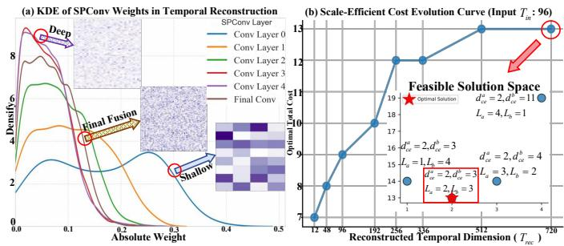  
Fig. 5. "Adaptive Search-Guided" SPConv configuration (Left: multi-scale distributions; Right: $d _ { \mathrm { c e } }$ search, cost evolution, and selected low-cost solutions), illustrating scale progression and compact architecture configuration

5) Patterns Distribution and Scale-Efficient Architecture Searching: From Fig. 5 subplots (a), the adoption of mixedorder expansion reveals the internal multi-scales from shallow to deep layers. For temporal reconstruction, with increasing dimensions in Fig. 5 subplots (b), ASGM cost rises stepwise while remaining within a controllable horizon range. This indicates ASGM can robustly identify a compact architecture under cost minimization. Within the feasible space, a more balanced and less redundant reconstruction path was selected.

## E. MIDAPN Formulation and Forward Propagation

1) Instance Normalization and Predict Residuals: To balance the stationarity and smoothness of forecasted multimedia time series, we optionally or jointly employ the Reversible Instance Normalization (RevIN) [74] and Predict Residuals Regularization (PRReg) [9] based on domain-specific nature.

2) Historical Time Series Embedding: learning historical spatio-temporal correlations and variations for $\boldsymbol { X _ { \mathrm { h i s } } } ^ { - } \in \mathbb { R } ^ { C \times T _ { h } }$

$$
X _ { \mathrm { h i s } } = \mathrm { T S E M } _ { \mathrm { h i s } } \ : \mathrm { ( R e v I N } _ { \mathrm { f o r w a r d } } ( X _ { 1 : T _ { h } } - X _ { T _ { h } } ) \ : ) ,\tag{27}
$$

3) Prediction: The historical embedding $X _ { \mathrm { h i s } }$ is projected to the future horizons through Channels-Independent MLP:

$$
Y = \mathrm { C I - M L P } \left( X _ { \mathrm { h i s } } \right) , \quad Y \in \mathbb { R } ^ { C \times T _ { f } } .\tag{28}
$$

4) Future Time Series Refinement: The initial prediction $\textbf { \textit { Y } } \in \mathbb { R } ^ { C \times T _ { f } }$ undergoes the parameter-independent TSEM

architecture to produce the final forecasted $Y _ { \mathrm { p r e d } } \in \mathbb { R } ^ { C \times T _ { f } }$

$$
Y _ { \mathrm { p r e d } } = \mathrm { R e v I N } _ { \mathrm { r e v e r s e } } ( \mathrm { T S E M } _ { \mathrm { p r e d } } ( Y ) + X _ { T _ { h } } ) .\tag{29}
$$

5) Operator-Level Interpretation: Essentially, the forward computation process of MIDAPN aligns with the principles of classical embedding theory [75]. The $\Psi _ { \mathrm { T S E M _ { \mathrm { h i s } } } } ( \cdot )$ module first estimates the dynamical state of the system from observation set {O}, then the $\mathcal { F } _ { \mathrm { C I - M L P } } ( \cdot )$ directly evolves it into the predicted state, and the $\Psi _ { \mathrm { T S E M } _ { \mathrm { p r e d } } } ( \cdot )$ ensures the embedding validity. Thereby, the prediction task can be reformulated as:

$$
Y _ { \mathrm { p r e d } } = \Psi _ { \mathrm { T S E M _ { \mathrm { p r e d } } } } \circ \mathcal { F } _ { \mathrm { C I - M L P } } \circ \Psi _ { \mathrm { T S E M _ { \mathrm { h i s } } } } ( X ) .\tag{30}
$$

6) Tailored Training Loss: We use robust MAE for multivariate forecasting to stabilize fitting across many variates, whereas MSE is adopted for multimodal forecasting to place greater emphasis on pointwise deviations and local temporal changes. Let $z \in \{ 0 , 1 \}$ denote the fixed task indicator:

$$
\mathcal { L } = ( 1 - z ) \mathcal { L } _ { \mathrm { M A E } } + z \mathcal { L } _ { \mathrm { M S E } } + \beta \| \theta \| _ { 2 } ^ { 2 } ,\tag{31}
$$

where z=0 is multivariate, and z=1 is multimodal. $\begin{array} { r } { \mathcal { L } _ { \mathrm { M A E } } { = } \frac { 1 } { c \times t } \sum _ { c } \sum _ { t } | Y _ { \mathrm { p r e d } } { - } Y _ { \mathrm { t r u e } } | } \end{array}$ and $\begin{array} { r } { \mathcal { L } _ { \mathrm { M S E } } { = } \frac { 1 } { c \times t } \sum _ { c } \sum _ { t } | Y _ { \mathrm { p r e d } } - \frac { } { } } \end{array}$ $Y _ { \mathrm { t r u e } } | ^ { 2 }$ , where $Y _ { \mathrm { t r u e } }$ is the ground truth of predicted time series. $\beta$ is the optional weight decay coefficient for non-overfitting.

TABLE III  
STATISTICS OF DATASETS AND THE ACTUAL USE OF REVIN/PRREG FOR MIDAPN. ALL TIME SERIES ARE STANDARDIZED
<table><tr><td>Datasets</td><td>Variates</td><td>RevIN</td><td>PRReg</td><td>Timestamps</td><td>Frequency</td></tr><tr><td>ETTm2</td><td>7</td><td>×</td><td>√</td><td>69680</td><td>15mins</td></tr><tr><td>ETTh2</td><td>7</td><td>×</td><td>√</td><td>17420</td><td>1h</td></tr><tr><td>Flight</td><td>7</td><td>√</td><td>×</td><td>26304</td><td>1h</td></tr><tr><td>Weather</td><td>21</td><td>√</td><td>X</td><td>52696</td><td>10mins</td></tr><tr><td>Traffic</td><td>862</td><td>√</td><td>X</td><td>17544</td><td>1h</td></tr><tr><td>Electricity</td><td>321</td><td>√</td><td>X</td><td>26304</td><td>1h</td></tr><tr><td>Solar</td><td>137</td><td>X</td><td>X</td><td>35040</td><td>15mins</td></tr><tr><td>PEMS03</td><td>358</td><td>×</td><td>X</td><td>26208</td><td>5mins</td></tr><tr><td>PEMS04</td><td>307</td><td>×</td><td>X</td><td>16992</td><td>5mins</td></tr><tr><td>PEMS07</td><td>883</td><td>×</td><td>X</td><td>28224</td><td>5mins</td></tr><tr><td>PEMS08</td><td>170</td><td>×</td><td>X</td><td>17856</td><td>5mins</td></tr><tr><td>ILI</td><td>7</td><td>√</td><td>√</td><td>966</td><td>1week</td></tr><tr><td>NASDAQ</td><td>12</td><td>√</td><td>√</td><td>3914</td><td>1day</td></tr><tr><td>Agriculture Climate</td><td></td><td>√</td><td>√</td><td>496</td><td>Monthly</td></tr><tr><td>Economy</td><td></td><td>√</td><td>√</td><td>496</td><td>Monthly</td></tr><tr><td>Energy</td><td></td><td>×</td><td>√</td><td>423</td><td>Monthly</td></tr><tr><td></td><td>1 (time series)</td><td>√</td><td>X</td><td>1479</td><td>Weekly</td></tr><tr><td>Environment</td><td>+12 (text dim)</td><td>√</td><td>√</td><td>11102</td><td>Daily</td></tr><tr><td>Health</td><td></td><td>×</td><td>√</td><td>1389</td><td>Weekly</td></tr><tr><td>Security</td><td></td><td>√</td><td>X</td><td>297</td><td>Monthly</td></tr><tr><td>SocialGood</td><td></td><td>×</td><td>√</td><td>900</td><td>Monthly</td></tr><tr><td>Traffic</td><td></td><td>√</td><td>√</td><td>531</td><td>Monthly</td></tr><tr><td>MSPG</td><td>27 (time series) +12 (text dim)</td><td>×</td><td>√</td><td>37536</td><td>15mins</td></tr><tr><td>LEU</td><td>16 (time series) +12 (text dim)</td><td>×</td><td>√</td><td>34848</td><td>30mins</td></tr><tr><td>PTF</td><td>32 (time series) +12 (text dim)</td><td>X</td><td>√</td><td>8640</td><td>1h</td></tr></table>

## V. EXPERIMENTS

## A. Experimental Settings

1) Datasets: We have summarized 25 public datasets from both "multivariate" and "multimodal" scenarios in Table VII:

• Multivariate: ETT{m2, h2}: Records temperature and power load characteristics of electricity transformers at minute-level and hour-level granularity. Flight: Flight data variations from seven major European airports during the COVID-19 pandemic. Weather: Meteorological indicators from German weather stations. Traffic: Road occupancy rates measured on San Francisco Bay Area freeways. Electricity:

TABLE IV  
AVERAGED COMPARISON ACROSS 25 “MULTIVARIATE” AND “MULTIMODAL” DATASETS IN MULTIPLE FUTURE HORIZONS. RED INDICATES BEST, WHILE BLUE INDICATES SECOND. PREFIXES: [MV] MULTIVARIATE, [MM] MULTIMODAL. FOR FAIRNESS: (1) IN MULTIVARIATE, 96 PREDICT {12, 24, 48, 96} LENGTH FOR PEMS, 36 PREDICT {24, 36, 48, 60} LENGTH FOR ILI AND NASDAQ, OTHER DATASETS USE 96 PREDICT {96, 192, 336, 720} IN LONG-TERMS. (2) IN MULTIMODAL, WE USE 8 PREDICT {8, 10, 12} LENGTH FOR UNIFIED-GRANULARITY EVALUATION WITHIN TATS [15]
<table><tr><td>Models (Years)</td><td>MIDAPN (Ours)</td><td>TimeFilter (ICML&#x27;25)</td><td>VPNet (ICLR&#x27;26)</td><td></td><td>CPiRi (ICLR&#x27;26)</td><td>SEMixer (WWW&#x27;26)</td><td>DUET (KDD&#x27;25)</td><td>(ICLR&#x27;25)</td><td>TimeKAN</td><td>FilterTS (AAAI&#x27;25)</td><td>TimePro (ICML&#x27;25)</td><td></td><td>P-sLSTM (AAAI&#x27;25)</td><td>ModernTCN (ICLR&#x27;24)</td><td></td><td>TimeMixer (ICLR&#x27;24)</td><td>iTransformer (ICLR&#x27;24)</td><td></td><td>Time-LLM (ICLR&#x27;24)</td><td>MSGNet (AAAI&#x27;24)</td><td></td><td>PatchTST (ICLR&#x27;23)</td><td>TimesNet (ICLR&#x27;23)</td></tr><tr><td>Metric</td><td>MSE MAE</td><td>MSE</td><td>MAE MSE</td><td>MAE</td><td>MAE</td><td>MSE MAE</td><td>MSE</td><td>MAE MSE</td><td>MAE</td><td>MSE MAE</td><td>MSE</td><td>MAE</td><td>MSE</td><td>MSE</td><td>MAE</td><td>MSE MAE</td><td>MSE</td><td>MAE</td><td>MSE MAE</td><td>MSE</td><td>MAE</td><td>MSE</td><td>MAE MSE</td><td>MAE</td></tr><tr><td>ETT (Avg)</td><td>0.318 0.353</td><td>0.318</td><td>0.359 0.334</td><td>0.365</td><td>0.367</td><td>0.318 0.363</td><td>0.326</td><td>0.361</td><td>0.364</td><td>0.324</td><td>0.359 0.329</td><td>0.365</td><td>0.336</td><td>MAE 0.371 0.329</td><td>0.361</td><td>0.329</td><td>0.365 0.336</td><td>0.369</td><td>0.332</td><td>0.366</td><td>0.342 0.373</td><td>0.334</td><td>0.366</td><td>0.352 0.380</td></tr><tr><td>Flight</td><td>0.161 0.262 0.235 0.259</td><td>0.161</td><td>0.268 0.161 0.269</td><td>0.269</td><td>0.160 0.268 0.276</td><td>0.160</td><td>0.163</td><td>0.271</td><td>0.179 0.289</td><td>0.165</td><td>0.269 0.164</td><td>0.272</td><td>0.171</td><td>0.281 0.172</td><td>0.282</td><td>0.172</td><td>0.274 0.180 0.275</td><td>0.292</td><td>0.179</td><td>0.291 0.208</td><td>0.321</td><td>0.163</td><td>0.275 0.281</td><td>0.191 0.304</td></tr><tr><td>Weather Traffic</td><td>0.461 0.276</td><td>0.239 0.409</td><td>0.246 0.269 0.448</td><td>0.275 0.291</td><td>0.253 0.450 0.306</td><td>0.256 0.505</td><td>0.251 0.451</td><td>0.273 0.269</td><td>0.243 0.272 0.601 0.363</td><td>0.244 0.471</td><td>0.274 0.251 0.315 0.440</td><td>0.276 0.286</td><td>0.261 0.453</td><td>0.283 0.245 0.286 0.490</td><td>0.273 0.326</td><td>0.245 0.484</td><td>0.258 0.297 0.428</td><td>0.278 0.282</td><td>0.263 0.541</td><td>0.284 0.249 0.358 0.660</td><td>0.278 0.381</td><td>0.259 0.481</td><td>0.259 0.304 0.620</td><td>0.287 0.336</td></tr><tr><td>Electricity</td><td>0.166 0.258</td><td>0.169</td><td>0.262 0.181</td><td>0.271</td><td>0.174 0.266</td><td>0.192</td><td>0.278 0.170</td><td>0.261</td><td>0.197 0.286 0.250</td><td>0.180</td><td>0.271 0.169</td><td>0.262</td><td>0.187</td><td>0.274 0.182</td><td>0.280</td><td>0.189</td><td>0.278 0.179</td><td>0.269</td><td>0.209</td><td>0.289 0.194</td><td>0.300</td><td>0.187</td><td>0.290 0.193</td><td>0.295</td></tr><tr><td>Solar PEMS (Avg)</td><td>0.200 0.231 0.100 0.190</td><td>0.213 0.102</td><td>0.261 0.210 0.206 0.128</td><td>0.244 0.206 0.233 0.123</td><td>0.264 0.231</td><td>0.204 0.260 0.179 0.280</td><td>0.237 0.107</td><td>0.233 0.209</td><td>0.297 0.229 0.314</td><td>0.232 0.278 0.150 0.241</td><td>0.232 0.134</td><td>0.266 0.236</td><td>0.238 0.162</td><td>0.275 0.227 0.249 0.135</td><td>0.260 0.237</td><td>0.216 0.189</td><td>0.280 0.233 0.119</td><td>0.262 0.218</td><td>0.224 0.201</td><td>0.268 0.269 0.290 0.150</td><td>0.300 0.251</td><td>0.270 0.216</td><td>0.307 0.261 0.311 0.149</td><td>0.302 0.246</td></tr><tr><td>ILI</td><td>1.934 0.852</td><td>2.098</td><td>0.871 2.247 0.198</td><td>0.897 2.386</td><td>0.950</td><td>2.441 1.023 0.285</td><td>2.449</td><td>0.988 2.621</td><td>0.996</td><td>2.186 0.926</td><td>2.303</td><td>0.940</td><td>2.250</td><td>0.926 2.112</td><td>0.899</td><td>0.279 2.020 0.878</td><td>1.993</td><td>0.888</td><td>2.147</td><td>0.891 2.492</td><td>0.914</td><td>2.208</td><td>0.910 2.403</td><td>0.982</td></tr><tr><td>NASDAQ</td><td>0.180 0.271</td><td>0.198</td><td>0.288</td><td>0.288</td><td>0.197 0.287</td><td>0.194</td><td>0.195</td><td>0.286</td><td>0.209 0.299</td><td>0.203</td><td>0.293 0.187</td><td>0.277</td><td>0.197</td><td>0.287 0.199</td><td>0.289</td><td>0.186 0.282</td><td>0.207</td><td>0.297</td><td>0.205</td><td>0.295 0.252</td><td>0.341</td><td>0.198</td><td>0.287 0.254</td><td>0.343</td></tr></table>

<table><tr><td rowspan=1 colspan=1></td></tr><tr><td rowspan=1 colspan=1></td></tr></table>

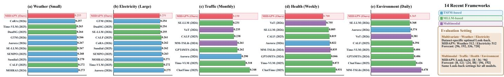  
Fig. 6. TSFMs, fused-PLMs and multimodal frameworks comparison (sorted by averaged MAE from low to high). MIDAPN consistently achieves the lowest MAE across the selected benchmarks, highlighting its accuracy advantage over pretrained forecasting approaches under extended look-back settings

Records of customer electricity kWh consumption. Solar: Data from photovoltaic power plants in Alabama State. PEMS{03, 04, 07, 08}: Highway traffic flow from California. ILI: Trends in the number of influenza patients in the United States. NASDAQ: Daily Nasdaq index and key economic indicators.

• Multimodal (Time-MMD): Agriculture: Composite retail broiler chicken data. Climate: Climate trends and impact on environmental policies. Economy (corrected order [41]): United States international trade in goods and services. Energy: Gasoline prices variation in the energy market. Environment: New York air quality data. Health: Influenza-like illness statistics. Security: Billion-dollar disasters and emergency declarations. SocialGood: Employment trends across different racial groups. Traffic: Vehicle miles traveled on highways.

• Multivariate + Multimodal (ChatTime): MSPG records 13 months of solar generation from 27 photovoltaic sites in Melbourne , LEU contains 24 months of electricity usage from 16 London households, and PTF includes 12 months of traffic flow from 32 Paris detectors. Note that LEU, MSPG, and PTF originally consist of dispersed time-series–text pairs. We reorganize and convert them into the TaTS-compatible format.

2) Baselines: We initially selected 16 SOTA native deep TSF models. (1) Transformer-based: PatchTST [51], iTransformer [52], DUET [16]; (2) MLP-based: SEMixer [76], TimeMixer [57], FilterTS [31], CrossLinear + CPiRi (plug-in) [44], [43]; (3) TCN-based: TimesNet [35], ModernTCN [34], VPNet [42]; (4) LLM-based: Time-LLM [53]; (5) RNN-based: P-sLSTM [49]; (6) GCN-based: MSGNet [17], TimeFilter [29]; (7) KAN-based: TimeKAN [59]; (8) Mamba-based: TimePro [60]. Furthermore, 14 latest TSFMs & fused-PLMs are also included. (1) TSFM: Aurora [40], GTM [62], CoRA (plug-in) [77], Sundial [55], SEMPO [78], MOIRAI [54]; (2) PLM-fused: SE-LLM [47], Time-VLM [11], CALF [18], DualSG [79], GPT4MTS [45], ChatTime [46]; (3) Modality Fused Strategy: VoT [41], MM-TSLib [7].

3) Implementation Details: Experiments were trained on NVIDIA GeForce RTX 4090 GPUs. For "multivariate", we conformed the Time-series Library [35]; To equip deep TSF models with "multimodal" capabilities, we applied the TaTS framework [15] to provide modal pre-alignment (numerical & PLM-text projection) for baselines in time series form, making it straightforward to assess the scaling potential. For train/valid/test sets division, the ETT{m2, h2} and PEMS{03, 04, 07, 08} were 6:2:2 ratio, while the others were 7:1:2 ratio. For metrics, Mean Absolute Error (MAE) and Mean Squared Error (MSE) metrics are used to assess robustness and sensitivity. Table IV provides comparison under the same Look-back window for prediction limits. As TSFMs and PLMfused models are inherently designed for longer contexts, Fig. 6 supports this by reporting optimal long-context results.

## B. Experimental Results

(1) "Multivariate": From Table IV, MIDAPN achieves consistent and competitive improvements of (11.6%, 14.2%) in (MAE, MSE), ranking first in (15 / 18) metrics. In contrast to the redundancy-pruning approach (TimeFilter) of spatiotemporal graph adaptation, MIDAPN enhances structural semantics of variable identity, realizing SOTA improvement of (3.88%, 3.56%) in (MAE, MSE). (2) "Multimodal": MIDAPN exhibits remarkable performance, ranking first in (23 / 24) metrics. Although VPNet’s local sufficiency hypothesis [42] partially eliminates redundant inter-modal correlations, MIDAPN essentially treats temporal-textual patterns as identity-bearing media signals (Sec. VI-A1), indicating gains from genuine post-alignment. Particularly on the PTF, LEU, and MSPG datasets, MIDAPN effectively bridges textual backgrounds with multivariate. (3) "Long Context vs TSFM & PLM": We conducted a definitive assessment across datasets with diverse multivariate scales and multimodal temporal granularities, extended Look-back window is allowed to leverage the temporal context. Fig. 6 suggests that MIDAPN remains competitive with recent TSFM- and PLM-based methods, indicating that its effectiveness extends beyond lightweight forecasters. (4) "Overall Performance": MIDAPN achieves outstanding results in 25 real-world datasets, ranking first in (38 / 42) and top two in (40 / 42) metrics. Fig. 7 visualizes its multi-domain performance. These findings validate our STextension—a unified backbone elegantly disentangles identities and weaves temporal scales for media-general modeling.

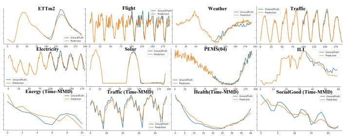  
Fig. 7. Forecasting across media-bridged domains with periodic, volatile, and trend-dominated patterns. MIDAPN generally tracks major trends and recurring oscillations, with localized deviations around abrupt changes

## C. Ablation and Replacement Results

We conducted MIDAPN ablation (component mechanisms and temporal/text validation) in multimedia context. To clarify the notation, "w/o" "(DFF/MIDAG/SPConv)" signify removing its components while "w/o-w" represent replacement.

From Table V: (1) For overall ablation, removing any core components of MIDAPN incurs a substantial penalty. Especially in context-guided multivariate analysis, MIDAG demonstrates its indispensable media-bridged role, we then provide its detailed analysis. Moreover, ablating the Decoupled Frequency Fusion module results in an incomplete and impoverished representation; while removing the Spectral Prism Convolution discards the hierarchical strategy within automatic multi-scale temporal extraction. (2) For architecture ablation, removing either $\mathrm { T S E M _ { h i s } }$ or $\mathrm { T S E M _ { p r e d } }$ compromises embedding validity. Concurrently, eliminating all TSEM modules inevitably undermines the integrity of the hierarchical spatiotemporal manifold. Actually $\mathrm { T S E M _ { \mathrm { h i s } } }$ for historical spatiotemporal manifold tends to be more pronounced. (3) For module replace, substituting proposed modules with basic alternatives also degrades performance (i.e., MIDAG to Adaptive Graph, SPConv to Conv or Freq-Conv), which demonstrates the advantages of MIDAG and SPConv for media-aware correlations and temporal dependencies. (4) MIDAG ablations, ablating the essence identity eliminates prior knowledge of multivariate relationships, which obscures the conceptual distinction [66] between variates; Conversely, removing the behavior identity renders it insensitive to dynamic patterns; Meanwhile, the latent cluster centers missing disrupts MI-DAPN to assign group commonalities modeling in heterogeneous media characterization. In addition, omitting contextual identity modulation allows noise to propagate and ignores underlying ST-structure patterns. In summary, the absence of any MIDAG modules leads to impoverished Identity-Aware Graph. (5) Mechanistic evidence shows that reversing MIDAPN’s $\Psi _ { \mathrm { s p a t i a l } }$ $\Psi _ { \mathrm { t e m p o r a l } }$ order hurts performance, while its sensitivity to narrative flow shuffling highlights robustness.

TABLE V  
ABLATION STUDIES (FOR AVERAGED HORIZONS, MULTIVARIATE: {96, 192, 336, 720}, MULTIMODAL: {8, 10, 12}). THE "DROP" IS THE ERROR PERCENTAGE INCREASE IN AVERAGE OF MAE AND MSE
<table><tr><td rowspan="3">Task Types Datasets</td><td colspan="4">Multivariate</td><td colspan="4">Multimodal</td><td colspan="2">Multivariate + Text</td></tr><tr><td colspan="2">Electricity</td><td colspan="2">Weather</td><td colspan="2">Traffic</td><td colspan="2">Energy</td><td colspan="2">LEU</td></tr><tr><td>Avg</td><td>Drop</td><td>Avg</td><td>Drop</td><td>Avg</td><td>Drop</td><td>Avg</td><td>Drop</td><td>Avg</td><td>Drop</td></tr><tr><td>MIDAPN</td><td>0.2135</td><td>一</td><td>0.2468</td><td>一</td><td>0.1963</td><td>一</td><td>0.2478</td><td>一</td><td>0.5665</td><td>一</td></tr><tr><td>w/o DFF</td><td>0.2389</td><td>11.89%</td><td>0.2541</td><td>2.99%</td><td>0.2122</td><td>8.06%</td><td>0.2560</td><td>3.30%</td><td>0.6233</td><td>10.03%</td></tr><tr><td>w/o MIDAG</td><td>0.2384</td><td>11.65%</td><td>0.2526</td><td>2.38%</td><td>0.2113</td><td>7.64%</td><td>0.2555</td><td>3.09%</td><td>0.7015</td><td>23.83%</td></tr><tr><td>w/o SPConv</td><td>0.2428</td><td>13.70%</td><td>0.2546</td><td>3.19%</td><td>0.2117</td><td>7.81%</td><td>0.2508</td><td>1.21%</td><td>0.5792</td><td>2.24%</td></tr><tr><td>w/o TSEM-his</td><td>0.2188</td><td>2.46%</td><td>0.2486</td><td>0.76%</td><td>0.2100</td><td>6.96%</td><td>0.2495</td><td>0.67%</td><td>0.5983</td><td>5.62%</td></tr><tr><td>w/o TSEM-pred</td><td>0.2170</td><td>1.64%</td><td>0.2486</td><td>0.76%</td><td>0.2130</td><td>8.49%</td><td>0.2487</td><td>0.34%</td><td>0.5855</td><td>3.35%</td></tr><tr><td>w/o all</td><td>0.2455</td><td>14.99%</td><td>0.2551</td><td>3.39%</td><td>0.2250</td><td>14.60%</td><td>0.2795</td><td>12.77%</td><td>0.7162</td><td>26.42%</td></tr><tr><td>w/o-w ADP</td><td>0.2234</td><td>4.63%</td><td>0.2486</td><td>0.76%</td><td>0.2072</td><td>5.52%</td><td>0.2548</td><td>2.82%</td><td>0.6405</td><td>13.06%</td></tr><tr><td>w/o-w Conv</td><td>0.2439</td><td>14.23%</td><td>0.2606</td><td>5.62%</td><td>0.1988</td><td>1.27%</td><td>0.2587</td><td>4.37%</td><td>0.5863</td><td>3.50%</td></tr><tr><td>w/o-w Freq-Conv</td><td>0.2216</td><td>3.81%</td><td>0.2536</td><td>2.79%</td><td>0.2045</td><td>4.16%</td><td>0.2547</td><td>2.76%</td><td>0.5877</td><td>3.74%</td></tr><tr><td>w/o MIDAG-EID</td><td>0.2159</td><td>1.11%</td><td>0.2539</td><td>2.89%</td><td>0.2077</td><td>5.77%</td><td>0.2497</td><td>0.74%</td><td>0.5735</td><td>1.24%</td></tr><tr><td>w/o MIDAG-BID</td><td>0.2180</td><td>2.11%</td><td>0.2580</td><td>4.56%</td><td>0.2120</td><td>7.98%</td><td>0.2545</td><td>2.69%</td><td>0.6217</td><td>9.74%</td></tr><tr><td>w/o MIDAG-Cluster</td><td>0.2163 0.2168</td><td>1.29%</td><td>0.2508</td><td>1.62%</td><td>0.2117</td><td>7.81%</td><td>0.2523</td><td>1.82%</td><td>0.5747</td><td>1.44%</td></tr><tr><td>w/o MIDAG-CIM</td><td></td><td>1.52%</td><td>0.2478</td><td>0.41%</td><td>0.2067</td><td>5.26%</td><td>0.2557</td><td>3.16%</td><td>0.5802</td><td>2.41%</td></tr><tr><td>SPConv-MIDAG</td><td>0.2400</td><td>12.41%</td><td>0.2558</td><td>3.65%</td><td>0.2087</td><td>6.28%</td><td>0.2505</td><td>1.08%</td><td>0.5767</td><td>1.79%</td></tr><tr><td>Temporal/Text Shuffling</td><td>0.8353</td><td>291.22%</td><td>0.2951</td><td>16.13%</td><td>0.2222</td><td>13.16%</td><td>0.3007</td><td>21.32%</td><td>0.6623</td><td>16.92%</td></tr></table>

## VI. DISCUSSION

## A. Interpretability and Generality Study

1) Identity-Aware Graph Adaptation: Rather than adaptivegraph variants only fit unimodal TSF, MIDAG is generated in media-bridged space. From the 2D t-SNE visualization: (1) For "multivariate" in Fig. 8 (a): The essence identities are distributed in a relatively loose and uniform manner, reflecting the intrinsic variate properties. In contrast, the behavior identities are conditioned upon the immediate Look-back window, hence they exhibit clear convergence. In addition, overlapping cluster centers typically indicate a similarity structure. (2) For "multimodal" in Fig. 8 (b,c): The essence identities reveal the natural separation between time-series and textual auxiliary variates, which stems from modality heterogeneity, while the behavior identities narrow the inter-modal distance. Overall, this joint adaptation covers property & heterogeneity $( { \mathcal { E } } _ { \mathrm { i d } } ) .$ , and dynamism & aggregation $( B _ { \mathrm { i d } } )$ knowledge.

2) Clustering Analysis: In the Fig. 8 (d), we select 10 latent cluster centers from the sensors subset in a local region of the multivariate Traffic dataset. As depicted, time-series variates within the same cluster (e.g., variate 3, 7, 155, and 158 in the purple circle) exhibit highly similar evolutionary patterns within their Look-back windows. In contrast, distant clusters such as the brown and blue circles correspond to variate (2 and 96) with distinctly different temporal characteristics, respectively showcasing periodic cycles versus abrupt patterns. This phenomenon reflects that the latent cluster centers can perform implicit group clustering [27].

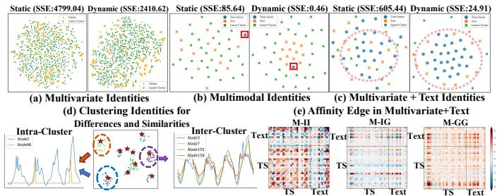  
Fig. 8. Identity-Aware Graph Adaptation (multivariate: Traffic, multimodal: Climate, multivariate + text: MSPG). (a, b, c): Variate identity visualizations; (d): Clustering visualization; (e): Cross-level Affinity Decomposition

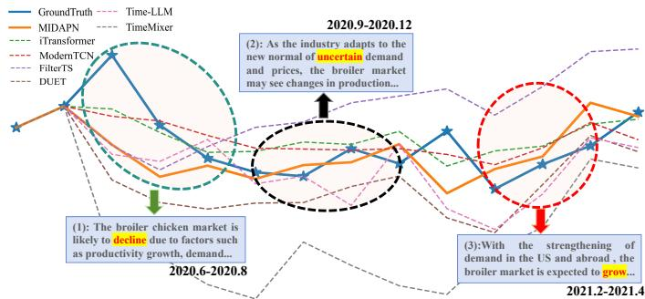  
Fig. 9. “Narrative-Flow” forecasting on the Agriculture dataset across declining, uncertain, and rising narrative-guided market periods

3) Affinity Decomposition: Based on MSPG, we decompose affinity into individual $( M _ { \mathrm { I I } } )$ , cross-level $( \phantom { } M _ { \mathrm { I G / G I } } )$ and group $( M _ { \mathrm { G G } } )$ interactions. Fig. 8(e) reveals: $M _ { \mathrm { I I } }$ reinforces TS–TS dependencies, prioritizes forecast-relevant factors within compressed sentence embeddings. $M _ { \mathrm { G G } }$ establishes shared intra-media structure, $M _ { \mathrm { I G / G I } }$ suppresses redundant affinities for selective TS–TS/Text alignment.

4) "Narrative-Flow" Case Study: We focus time series-text pairs (April 2020 to May 2021) on: (1) Declining: Jun–Aug 2020; (2) Uncertain: Sep–Dec 2020; (3) Rising: Feb–Apr 2021. Fig. 9 shows MIDAPN’s best forecast approximation.

5) "Graph-Informed" Generality: Table VI demonstrates MIDAG’s consistent plug-and-play capacity across mainstream TSF architectures. Crucially, PTF inherently suffers from redundancy due to identical "clone nodes". MIDAG’s explicit identity awareness effectively improves this anomaly.

TABLE VI  
MIDAG GENERALIZATION IN "MULTIVARIATE" (INPUT-96-PREDICT-96) AND "MULTIMODAL" (INPUT-8-PREDICT-12) SCENARIOS
<table><tr><td rowspan="3">Task Types</td><td colspan="4">Multivariate</td><td colspan="4">Multimodal</td><td colspan="2">Multivariate + Text</td></tr><tr><td colspan="2">Solar</td><td colspan="2">Weather</td><td colspan="2">Climate</td><td colspan="2">Agriculture</td><td colspan="2">PTF</td></tr><tr><td>MAE</td><td>MSE</td><td>MAE</td><td>MSE</td><td>MAE</td><td>MSE</td><td>MAE</td><td>MSE</td><td>MAE</td><td>MSE</td></tr><tr><td>SageFormer [24] (Transformer)+MIDAG</td><td>0.259 0.235</td><td>0.197 0.189</td><td>0.206 0.198</td><td>0.162 0.161</td><td>0.766 0.762</td><td>0.912 0.909</td><td>0.242 0.240</td><td>0.136 0.131</td><td>0.595 0.548</td><td>0.674 0.635</td></tr><tr><td>DLinear [56] (Linear)+MIDAG</td><td>0.236 0.229</td><td>0.312 0.190</td><td>0.255 0.218</td><td>0.196 0.164</td><td>0.765 0.748</td><td>0.920 0.902</td><td>0.304 0.286</td><td>0.194 0.152</td><td>0.953 0.568</td><td>1.454 0.628</td></tr><tr><td>Time-LLM [53] (LLM)+MIDAG</td><td>0.249 0.224</td><td>0.196 0.191</td><td>0.219 0.204</td><td>0.178 0.164</td><td>0.774 0.764</td><td>0.933 0.915</td><td>0.240 0.238</td><td>0.137 0.135</td><td>0.780 0.757</td><td>1.068 1.038</td></tr><tr><td>UniCA (Chronos-Bolt) [80] (TSFM)+MIDAG</td><td>0.280 0.275</td><td>0.241 0.237</td><td>0.299 0.243</td><td>0.239 0.191</td><td>0.763 0.753</td><td>0.912 0.912</td><td>0.260 0.259</td><td>0.141 0.124</td><td>0.512 0.258</td><td>0.523 0.340</td></tr><tr><td>TimeKAN [59] (KAN)+MIDAG</td><td>0.275 0.220</td><td>0.215 0.194</td><td>0.208 0.198</td><td>0.162 0.162</td><td>0.765 0.764</td><td>0.916 0.908</td><td>0.261 0.251</td><td>0.154 0.145</td><td>0.825 0.759</td><td>1.193 0.957</td></tr><tr><td>TimePro [60] (Mamba)+MIDAG</td><td>0.237 0.204</td><td>0.196 0.178</td><td>0.207 0.195</td><td>0.166 0.159</td><td>0.799 0.788</td><td>0.975 0.958</td><td>0.241 0.238</td><td>0.133 0.133</td><td>0.521 0.498</td><td>0.544 0.519</td></tr></table>

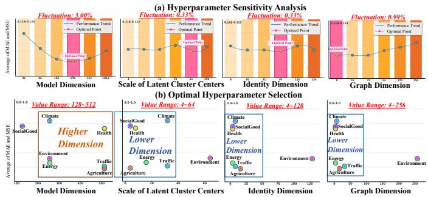  
Fig. 10. Hyperparameter analysis. (a): Sensitivity analysis (PEMS04, Input-96-predict-12); (b): Optimal Selection (Multimodal, Input-8-predict-12)

## B. Hyperparameter Analysis

We analyze MIDAPN hyperparameters using two settings: "multivariate" PEMS04 (Input-96-predict-12) for stable sensitivity evaluation under rich temporal context, and "multimodal" datasets for grid-search optimality analysis (Input-8- predict-12) due to coarse timestamps and sample sparsity.

1) Sensitivity Analysis: Based on Fig. 10(a), the optimal hyperparameter configurations (red boxes) are distinctly different. Furthermore, continuously increasing a hyperparameter’s value (e.g., Model Dimension or Graph Dimension) does not always lead to performance gains, suggesting that an optimal balance point must be found experimentally. Meanwhile, the performance (blue curve) does not fluctuate drastically.

2) Optimal Selection in Multi-Domain: From observations in Fig. 10(b), Model Dimension exhibits larger value generally, which may require greater model capacity to mine effective representations. In contrast, adopting more lightweight core dimensions for Identity and Graph helps suppress cross-modal noise. However, scaling the dimensionality can amplify capacity during extensive time steps conditions (e.g., Environment).

3) Text Encoder Analysis: Despite our experimental setup employing efficient BERT-style PLMs [81], a comprehensive comparison of text encoders remains necessary. Therefore, we switch to typical LLM backbones (i.e., GPT2 [82], LLaMA [83], [84], Qwen [85], [86] and Deepseek-distil-Qwen2 [87]). Observations from the Fig. 11 in "multimodal" scenario indicate that smaller BERT and GPT2 maintain the robustest performance in both predictable and challenging domains. This finding can be attributed to lower embedding dimension for fine-tuning effective projection within limited data [7], while the prompt capabilities of Qwen and distilled reasoning of DeepSeek-R1 only translate to alignment paradigm partially. Moreover, the minimal variation [15] (0.5% ∼ 0.7%) among different PLMs for textual encoding highlights MIDAPN’s robustness in media-aware pre-alignment setting.

## C. Efficiency Analysis

We report the MSE and per-iteration training time of each TSF model. As shown in Fig. 12, (1) MIDAPN achieves the lowest error while remaining the third- or fourth-fastest in both "multivariate" and "multimodal" settings. Although iTransformer and FilterTS are faster, MIDAPN offers better accuracy. In fact, small identity and graph dimensions keep D manageable in MIDAG’s $O ( C ^ { 2 } D )$ complexity, while SPConv uses lightweight TCN-style operations (i.e., localized connections & parameter sharing) with spectral transforms complexity in $O ( C T \log T )$ ). Notably, the ASGM search is completed at initialization with negligible $O ( L )$ overhead, adding no training burden. Thus, MIDAPN balances accuracy and efficiency well. (2) Moreover, removing $\mathrm { T S E M _ { h i s } }$ or $\mathrm { T S E M _ { p r e d } }$ gives MIDAPN a clear speed advantage, enabling faster training than SOTA TSF models with only marginal performance loss. (3) For a TSEM block of length $T ,$ DFF $\Psi _ { \mathrm { p r o j e c t } } ,$ MIDAG $\Psi _ { \mathrm { s p a t i a l } } ,$ and SPConv $\Psi _ { \mathrm { t e m p o r a l } }$ contribute $O ( C T ^ { 2 } )$ , $O ( C ^ { 2 } D )$ , and $O ( C k \sum _ { l = 1 } ^ { L } F _ { l - 1 } \dot { D ^ { ( l - 1 ) } } D ^ { ( l ) } + C F _ { L } \dot { D ^ { ( L ) } } \dot { T } )$ , where $F _ { l }$ and $D ^ { ( l ) }$ denote spectral length and expanded channel width. Thus, MIDAPN costs $\mathcal { C } _ { \mathrm { T S E M } } ( T _ { \mathrm { i n } } ) + O ( C T _ { \mathrm { i n } } T _ { \mathrm { r e c } } ) + \mathcal { C } _ { \mathrm { T S E M } } ( T _ { \mathrm { r e c } } )$ while ASGM adds only O(L) initialization overhead.

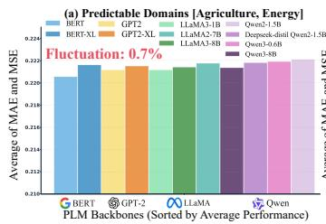

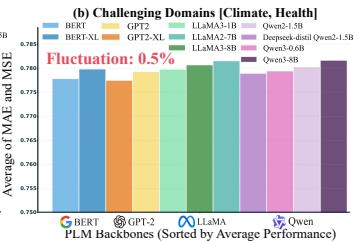  
Fig. 11. Text encoder evaluation. (a): Easily predictable domains; (b): Challenging domains. (Embedding dimension: [BERT:768, BERT-XL:1024, GPT2:768, GPT2-XL:1600, LLaMA3.2-1B:2048, LLaMA2-7B/LLaMA3- 8B:4096, Qwen3-0.6B:1024, Qwen2/Deepseek-distil-1.5B:1536, Qwen3- 8B:4096], Input-8-predict-12). The contribution of PLMs remains inconclusive

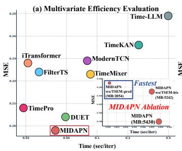

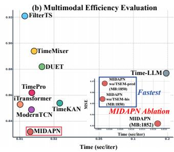  
Fig. 12. Performance, efficiency and memory footprint comparison. (a): Input-96-predict-720 for Electricity; (b): Input-8-predict-12 for Health. $\boldsymbol { \mathrm { B y } }$ selectively ablating $\mathrm { T S E M _ { h i s } }$ and $\begin{array} { r } { \dot { \mathrm { T S E M } } _ { \mathrm { p r e d } } , } \end{array}$ MIDAPN can achieve the most expeditious training speed compared to other SOTA TSF models

## VII. CONCLUSION

In this paper, we propose MIDAPN to realize a unified spatiotemporal backbone for media-bridged time series forecasting, which collaboratively comprises two innovative components based on media-general graph structure and automatic temporal learning: (1) Guided by contextual modulation, the Multimedia Identity-Aware Graph captures intrinsic spatiotemporal state evolution, while bridging the heterogeneity gap across multimedia through a dual mechanism of individual identity learning and group-level identity clustering; (2) “Adaptive Search-Guided” Spectral Prism Convolution automatically constructs a hierarchical compression-generation architecture via scale-efficient optimization, effectively capturing multi-scale dynamism in the frequency domain. Experiments in 25 real-world datasets demonstrate MIDAPN outperforms

SOTA deep TSF, TSFM, and PLM-fused methods, providing a new perspective linking "multivariate" and narrative-flow "multimodal" for spatio-temporal dependencies and modality heterogeneity solving. For future research, we may extend to integrate perceptual modalities (e.g., images, audio and video).

## REFERENCES

[1] M. Jin, H. Y. Koh, Q. Wen et al., “A survey on graph neural networks for time series: Forecasting, classification, imputation, and anomaly detection,” IEEE Trans. Pattern Anal. Mach. Intell., vol. 46, no. 12, pp. 10 466–10 485, 2024.

[2] H. He, Q. Zhang, K. Yi et al., “Robust multivariate time series forecasting against intraseries and interseries transitional shift,” IEEE Trans. Neural Netw. Learn. Syst., pp. 1–14, 2025.

[3] H. Zhang, P. Nie, L. Sun, and B. Boulet, “Nearest neighbor multivariate time series forecasting,” IEEE Trans. Neural Netw. Learn. Syst., vol. 36, no. 7, pp. 12 606–12 618, 2025.

[4] T. Baltrušaitis, C. Ahuja, and L.-P. Morency, “Multimodal machine learning: A survey and taxonomy,” IEEE Trans. Pattern Anal. Mach. Intell., vol. 41, no. 2, pp. 423–443, 2018.

[5] Y. Jiang, K. Ning, Z. Pan et al., “Multi-modal time series analysis: A tutorial and survey,” in Proc. 31st ACM SIGKDD Conf. Knowl. Discov. Data Mining, 2025, pp. 6043–6053.

[6] H. K. Lee, J. Lee, and S. B. Kim, “Boundary-focused generative adversarial networks for imbalanced and multimodal time series,” IEEE Trans. Knowl. Data Eng., vol. 34, no. 9, pp. 4102–4118, 2022.

[7] H. Liu, S. Xu, Z. Zhao et al., “Time-mmd: Multi-domain multimodal dataset for time series analysis,” in Proc. Adv. Neural Inf. Process. Syst., vol. 37, 2024, pp. 77 888–77 933.

[8] Z. Shao, F. Wang, Y. Xu, W. Wei, C. Yu, Z. Zhang, D. Yao, T. Sun, G. Jin, X. Cao et al., “Exploring progress in multivariate time series forecasting: Comprehensive benchmarking and heterogeneity analysis,” IEEE Trans. Knowl. Data Eng., vol. 37, no. 1, pp. 291–305, 2024.

[9] L. Han, H.-J. Ye, and D.-C. Zhan, “The capacity and robustness tradeoff: Revisiting the channel independent strategy for multivariate time series forecasting,” IEEE Trans. Knowl. Data Eng., vol. 36, no. 11, p. 7129–7142, 2024.

[10] Z. Wu, S. Pan, G. Long et al., “Connecting the dots: Multivariate time series forecasting with graph neural networks,” in Proc. 26th ACM SIGKDD Int. Conf. Knowl. Discov. Data Mining, 2020, pp. 753–763.

[11] S. Zhong, W. Ruan, M. Jin et al., “Time-vlm: Exploring multimodal vision-language models for augmented time series forecasting,” in $P r o c .$ 42nd Int. Conf. Mach. Learn., vol. 267, 2025, pp. 78 478–78 497.

[12] C. Liu, S. Zhou, Q. Xu et al., “Towards cross-modality modeling for time series analytics: A survey in the llm era,” in Proc. 34th Int. Joint Conf. Artif. Intell., 2025, pp. 10 564–10 572.

[13] V. Ekambaram, K. Manglik, S. Mukherjee et al., “Attention based multimodal new product sales time-series forecasting,” in Proc. 26th ACM SIGKDD Int. Conf. Knowl. Discov. Data Mining, 2020, pp. 3110–3118.

[14] W. Chen, X. Hao, Y. Wu, and Y. Liang, “Terra: A multimodal spatiotemporal dataset spanning the earth,” in Proc. Adv. Neural Inf. Process. Syst., vol. 37, 2024, pp. 66 329–66 356.

[15] Z. Li, X. Lin, Z. Liu et al., “Language in the flow of time: Time-seriespaired texts weaved into a unified temporal narrative,” in Proc. Int. Conf. Learn. Representations, 2026, pp. 1–48.

[16] X. Qiu, X. Wu, Y. Lin, C. Guo, J. Hu, and B. Yang, “Duet: Dual clustering enhanced multivariate time series forecasting,” in Proc. 31st ACM SIGKDD Conf. Knowl. Discov. Data Mining, 2025, p. 1185–1196.

[17] W. Cai, Y. Liang, X. Liu, J. Feng, and Y. Wu, “Msgnet: Learning multiscale inter-series correlations for multivariate time series forecasting,” in Proc. AAAI Conf. Artif. Intell., vol. 38, no. 10, 2024, pp. 11 141–11 149.

[18] P. Liu, H. Guo, T. Dai et al., “Calf: Aligning llms for time series forecasting via cross-modal fine-tuning,” in Proc. AAAI Conf. Artif. Intell., vol. 39, no. 18, 2025, pp. 18 915–18 923.

[19] Z. Wu, S. Pan, G. Long et al., “Graph wavenet for deep spatial-temporal graph modeling,” in Proc. 28th Int. Joint Conf. Artif. Intell., 2019, pp. 1907–1913.

[20] M. Li et al., “Guest editorial: Deep neural networks for graphs: Theory, models, algorithms, and applications,” IEEE Trans. Neural Netw. Learn. Syst., vol. 35, no. 4, pp. 4367–4372, 2024.

[21] G. Liang, P. Tiwari, S. Nowaczyk, S. Byttner, and F. Alonso-Fernandez, “Dynamic causal explanation based diffusion-variational graph neural network for spatiotemporal forecasting,” IEEE Trans. Neural Netw. Learn. Syst., vol. 36, no. 5, pp. 9524–9537, 2025.

[22] R. Jiang, Z. Wang, J. Yong et al., “Spatio-temporal meta-graph learning for traffic forecasting,” in Proc. AAAI Conf. Artif. Intell., vol. 37, no. 7, 2023, pp. 8078–8086.

[23] Q. Huang, L. Shen, R. Zhang et al., “Crossgnn: Confronting noisy multivariate time series via cross interaction refinement,” in Proc. Adv. Neural Inf. Process. Syst., vol. 36, 2023, pp. 46 885–46 902.

[24] Z. Zhang, L. Meng, and Y. Gu, “Sageformer: Series-aware framework for long-term multivariate time-series forecasting,” IEEE Internet Things J., vol. 11, no. 10, pp. 18 435–18 448, 2024.

[25] J. Lei, F. Chen, and H. Tang, “Agga-mvfln: Multivariate time series forecasting via adaptive generalized graph accompanied with multi-view learning in frequency domain,” in Proc. ACM Int. Conf. Multimedia Retrieval, 2025, p. 653–661.

[26] J. Lei, P. Peng, H. Tang et al., “Collaborative multivariate time series forecasting via variable-tailored inter-temporal graph and adaptivesmooth frequency fusion,” Mach. Learn., vol. 115, 2026.

[27] Y. Wang, Z. Shao, T. Sun et al., “Clustering-property matters: A clusteraware network for large scale multivariate time series forecasting,” in Proc. 32nd ACM Int. Conf. Inf. Knowl. Manag., 2023, p. 4340–4344.

[28] H. Gao, R. Jiang, Z. Dong, J. Deng, Y. Ma, and X. Song, “Spatialtemporal-decoupled masked pre-training for spatiotemporal forecasting,” in Proc. 33rd Int. Joint Conf. Artif. Intell., 2024, pp. 3998–4006.

[29] Y. Hu, G. Zhang, P. Liu et al., “Timefilter: Patch-specific spatialtemporal graph filtration for time series forecasting,” in Proc. 42nd Int. Conf. Mach. Learn., vol. 267, 2025, pp. 24 893–24 911.

[30] K. Yi, Q. Zhang, W. Fan et al., “Frequency-domain mlps are more effective learners in time series forecasting,” in Proc. Adv. Neural Inf. Process. Syst., vol. 36, 2023, pp. 76 656–76 679.

[31] Y. Wang, Y. Liu, X. Duan, and K. Wang, “Filterts: Comprehensive frequency filtering for multivariate time series forecasting,” in Proc. AAAI Conf. Artif. Intell., vol. 39, no. 20, 2025, pp. 21 375–21 383.

[32] H. Wang, J. Peng, F. Huang et al., “MICN: Multi-scale local and global context modeling for long-term series forecasting,” in Proc. 11th Int. Conf. Learn. Representations, 2023, pp. 1–22.

[33] Z. Zhang, W. Wang, X. Zhou et al., “A data-driven scale-adaptive time-frequency convolutional network for long sequence time-series forecasting,” IEEE Trans. Knowl. Data Eng., vol. 37, no. 12, pp. 6750– 6764, 2025.

[34] D. Luo and X. Wang, “Moderntcn: A modern pure convolution structure for general time series analysis,” in Proc. Int. Conf. Learn. Representations, 2024, pp. 31 728–31 770.

[35] H. Wu, T. Hu, Y. Liu, H. Zhou, J. Wang, and M. Long, “Timesnet: Temporal 2d-variation modeling for general time series analysis,” in Proc. 11th Int. Conf. Learn. Representations, 2023, pp. 1–23.

[36] W. Fan, K. Yi, H. Ye, Z. Ning, Q. Zhang, and N. An, “Deep frequency derivative learning for non-stationary time series forecasting,” in Proc. 33rd Int. Joint Conf. Artif. Intell., 2024, pp. 3944–3952.

[37] Y. Xia, R. Yu, Y. Liang et al., “Through the dual-prism: A spectral perspective on graph data augmentation for graph classifications,” in Proc. AAAI Conf. Artif. Intell., vol. 39, no. 20, 2025, pp. 21 635–21 643.

[38] C. Shengkai, W. Yu, R. Savitha, and C. W. Sze Yin, “Hierarchical optimization for operationally-constrained resource planning,” in Proc. IEEE Conf. Artif. Intell. (CAI), 2024., 2024, pp. 674–679.

[39] M. Risso, A. Burrello, F. Conti et al., “Lightweight neural architecture search for temporal convolutional networks at the edge,” IEEE Trans. Comput., vol. 72, no. 3, pp. 744–758, 2022.

[40] X. Wu, J. Jin, W. Qiu et al., “Aurora: Towards universal generative multimodal time series forecasting,” in Proc. Int. Conf. Learn. Representations, 2026, pp. 1–24.

[41] S. Wang, P. Chen, Y. Wang et al., “Unlocking the value of text: Eventdriven reasoning and multi-level alignment for time series forecasting,” in Proc. Int. Conf. Learn. Representations, 2026, pp. 1–29.

[42] K. Liu, R. Jia, R. Yang et al., “Are global dependencies necessary? scalable time series forecasting via local cross-variate modeling,” in Proc. Int. Conf. Learn. Representations, 2026, pp. 102 794–102 817.

[43] P. Zhou, Y. Liu, J. Liang, Q. Song, and X. Li, “Crosslinear: Plugand-play cross-correlation embedding for time series forecasting with exogenous variables,” in Proc. 31st ACM SIGKDD Int. Conf. Knowl. Discov. Data Mining V.2, 2025, p. 4120–4131.

[44] J. Xu, W. Zhang, X. Jing et al., “Cpiri: Channel permutation-invariant relational interaction for multivariate time series forecasting,” in Proc. Int. Conf. Learn. Representations, 2026, pp. 145 879–145 900.

[45] F. Jia, K. Wang, Y. Zheng, D. Cao, and Y. Liu, “Gpt4mts: Prompt-based large language model for multimodal time-series forecasting,” in Proc. AAAI Conf. Artif. Intell., vol. 38, no. 21, 2024, pp. 23 343–23 351.

[46] C. Wang, Q. Qi, J. Wang et al., “Chattime: A unified multimodal time series foundation model bridging numerical and textual data,” in Proc. AAAI Conf. Artif. Intell., vol. 39, no. 12, 2025, pp. 12 694–12 702.

[47] H. Liu, C. Yang, Z. xiaoxing, and X. Zhu, “Semantic-enhanced timeseries forecasting via large language models,” in Proc. Int. Conf. Learn Representations, 2026, pp. 101 404–101 425.

[48] S. Lin, W. Lin, W. Wu et al., “Segrnn: Segment recurrent neural network for long-term time series forecasting,” IEEE Internet Things J., vol. 13, no. 5, pp. 9861–9871, 2026.

[49] Y. Kong, Z. Wang, Y. Nie et al., “Unlocking the power of lstm for long term time series forecasting,” in Proc. AAAI Conf. Artif. Intell., vol. 39, no. 11, 2025, pp. 11 968–11 976.

[50] W. Yue, Y. Liu, X. Ying et al., “Freeformer: Frequency enhanced transformer for multivariate time series forecasting,” in Proc. 34th Int. Joint Conf. Artif. Intell., 2025, pp. 3606–3614.

[51] Y. Nie, N. H. Nguyen, P. Sinthong, and J. Kalagnanam, “A time series is worth 64 words: Long-term forecasting with transformers,” in Proc. Int. Conf. Learn. Representations, 2023, pp. 1–24.

[52] Y. Liu, T. Hu, H. Zhang, H. Wu, S. Wang, L. Ma, and M. Long, “itransformer: Inverted transformers are effective for time series forecasting,” in Proc. Int. Conf. Learn. Representations, 2024, pp. 11 116–11 140.

[53] M. Jin, S. Wang, L. Ma et al., “Time-llm: Time series forecasting by reprogramming large language models,” in Proc. Int. Conf. Learn. Representations, 2024, pp. 23 857–23 880.

[54] G. Woo, C. Liu, A. Kumar, C. Xiong, S. Savarese, and D. Sahoo, “Unified training of universal time series forecasting transformers,” in Proc. 42nd Int. Conf. Mach. Learn., vol. 235, 2024, pp. 53 140–53 164.

[55] Y. Liu, G. Qin, Z. Shi et al., “Sundial: A family of highly capable time series foundation models,” in Proc. 42nd Int. Conf. Mach. Learn., vol. 267, 2025, pp. 39 295–39 317.

[56] A. Zeng, M. Chen, L. Zhang et al., “Are transformers effective for time series forecasting?” in Proc. AAAI Conf. Artif. Intell., vol. 37, no. 9, 2023, pp. 11 121–11 128.

[57] S. Wang, H. Wu, X. Shi et al., “Timemixer: Decomposable multiscale mixing for time series forecasting,” in Proc. Int. Conf. Learn. Representations, 2024, pp. 38 626–38 652.

[58] L. Han, X.-Y. Chen, H.-J. Ye, and D.-C. Zhan, “Softs: Efficient multivariate time series forecasting with series-core fusion,” in Proc. Adv. Neural Inf. Process. Syst., vol. 37, 2024, pp. 64 145–64 175.

[59] S. Huang, Z. Zhao, C. Li et al., “Timekan: Kan-based frequency decomposition learning architecture for long-term time series forecasting,” in Proc. Int. Conf. Learn. Representations, 2025, pp. 28 514–28 529.

[60] X. Ma, Z.-L. Ni, S. Xiao et al., “Timepro: Efficient multivariate longterm time series forecasting with variable- and time-aware hyper-state,” in Proc. 42nd Int. Conf. Mach. Learn., vol. 267, 2025, pp. 42 096– 42 111.

[61] Z. Shao, Y. Li, F. Wang et al., “Blast: Balanced sampling time series corpus for universal forecasting models,” in Proc. 31st ACM SIGKDD Int. Conf. Knowl. Discov. Data Mining V.2, 2025, p. 2502–2513.

[62] C. HE, X. Huang, G. Jiang, Z. Li, D. Lian, H. Xie, E. Chen, xijie liang, Zhengzengrong, and P. Lee, “GTM: A general time-series model for enhanced representation learning of time-series data,” in Proc. Int. Conf. Learn. Representations, 2026, pp. 7280–7309.

[63] Q. Huang, Z. Zhou, K. Yang et al., “TimeBase: The power of minimalism in efficient long-term time series forecasting,” in Proc. 42nd Int. Conf. Mach. Learn., vol. 267, 2025, pp. 26 227–26 246.

[64] X. Wu, X. Qiu, Z. Li et al., “CATCH: Channel-aware multivariate time series anomaly detection via frequency patching,” in Proc. 13th Int. Conf. Learn. Representations, 2025, pp. 17 017–17 045.

[65] J. Tang, L. Xia, and C. Huang, “Explainable spatio-temporal graph neural networks,” in Proc. 32nd ACM Conf. Inf. Knowl. Manag., 2023, p. 2432–2441.

[66] Z. Dong, R. Jiang, H. Gao, H. Liu, J. Deng, Q. Wen, and X. Song, “Heterogeneity-informed meta-parameter learning for spatiotemporal time series forecasting,” in Proc. 30th ACM SIGKDD Int. Conf. Knowl. Discov. Data Mining, 2024, pp. 631—-641.

[67] Z. Shao, Z. Zhang, F. Wang et al., “Spatial-temporal identity: A simple yet effective baseline for multivariate time series forecasting,” in Proc. 31st ACM Int. Conf. Inf. Knowl. Manag., 2022, p. 4454–4458.

[68] J. B. Hansen, A. Cini, and F. M. Bianchi, “On time series clustering with graph neural networks,” Trans. Mach. Learn. Res, pp. 1–26, 2025.

[69] X. Ma, X. Li, L. Fang et al., “U-mixer: An unet-mixer architecture with stationarity correction for time series forecasting,” in Proc. AAAI Conf. Artif. Intell., vol. 38, no. 13, 2024, pp. 14 255–14 262.

[70] S. Jia, B. Song, C. Ye, and C. Yuan, “M3time: Llm-enhanced multimodal, multi-scale, and multi-frequency multivariate time series fore-

casting,” in Proc. AAAI Conf. Artif. Intell., vol. 40, no. 27, 2026, pp. 22 265–22 273.

[71] D. Chen, L. Chen, Z. Shang, Y. Zhang, B. Wen, and C. Yang, “Scaleaware neural architecture search for multivariate time series forecasting,” ACM Trans. Knowl. Discov. Data, vol. 19, no. 1, pp. 1–23, 2024.

[72] H. Jia, “Strans: Spontaneous architecture evolution for adaptive time series forecasting,” in Proc. AAAI Conf. Artif. Intell., vol. 40, no. 27, 2026, pp. 22 238–22 246.

[73] V. Saragadam, R. Balestriero, A. Veeraraghavan et al., “Deeptensor: Low-rank tensor decomposition with deep network priors,” IEEE Trans. Pattern Anal. Mach. Intell., vol. 46, no. 12, pp. 10 337–10 348, 2024.

[74] T. Kim, J. Kim, Y. Tae et al., “Reversible instance normalization for accurate time-series forecasting against distribution shift,” in Proc. Int. Conf. Learn. Representations, 2022, pp. 1–25.

[75] T. Nie, W. Ma, J. Sun, Y. Yang, and J. Cao, “Collaborative imputation of urban time series through cross-city meta-learning,” IEEE Trans. Knowl. Data Eng., pp. 1–16, 2025.

[76] X. Zhang, Q. Wang, P. Wang, and W. Wang, “SEMixer: Semantics enhanced mlp-mixer for multiscale mixing and long-term time series forecasting,” in Proc. ACM Web Conf., 2026, pp. 5636–5647.

[77] H. Cheng, X. Wu, Y. Shu et al., “CoRA: Boosting time series foundation models for multivariate forecasting through correlation-aware adapter,” in Proc. Int. Conf. Learn. Representations, 2026, pp. 106 657–106 680.

[78] H. He, K. Yi, Y. Ma et al., “SEMPO: Lightweight foundation models for time series forecasting,” in Proc. Adv. Neural Inf. Process. Syst., 2025, pp. 1–34.

[79] K. Ding, F. Fan, Y. Wang et al., “Dualsg: A dual-stream explicit semantic-guided multivariate time series forecasting framework,” in Proc. 33rd ACM Int. Conf. Multimedia, 2025, p. 508–517.

[80] L. Han, Y. Liu, L. Li et al., “UniCA: Unified covariate adaptation for time series foundation model,” in Proc. Int. Conf. Learn. Representations, 2026, pp. 6403–6443.

[81] J. Devlin, M.-W. Chang, K. Lee, and K. Toutanova, “Bert: Pre-training of deep bidirectional transformers for language understanding,” in Proc. NAACL-HLT, 2019., 2019, pp. 4171–4186.

[82] A. Radford, J. Wu, R. Child et al., “Language models are unsupervised multitask learners,” OpenAI blog, vol. 1, no. 8, pp. 1–24, 2019.

[83] H. Touvron, L. Martin, K. Stone et al., “Llama 2: Open foundation and fine-tuned chat models,” arXiv:2307.09288, pp. 1–77, 2023.

[84] A. Grattafiori, A. Dubey, A. Jauhri et al., “The llama 3 herd of models,” arXiv:2407.21783, pp. 1–92, 2024.

[85] Q. Team et al., “Qwen2 technical report,” arXiv:2407.10671, vol. 2, no. 3, pp. 1–35, 2024.

[86] A. Yang, A. Li, B. Yang et al., “Qwen3 technical report,” arXiv:2505.09388, pp. 1–35, 2025.

[87] D. Guo, D. Yang, H. Zhang et al., “Deepseek-r1 incentivizes reasoning in llms through reinforcement learning,” Nature, pp. 633–638, 2025.

## APPENDIX

VIII. JOINT CONDITIONAL-INFORMATION VIEW OF CIM

Let R and M denote the residual and gated responses in CIM, respectively, and let ${ \mathcal { C } } \ { \triangleq } \ { \mathcal { Z } } _ { \mathrm { a g g } }$ denote the graphaggregated context. Here, $[ \mathcal { R } , \mathcal { M } ]$ denotes their joint observation rather than additive fusion. By the definition of conditional mutual information,

$$
\begin{array} { r l } & { \quad I ( \left[ \mathcal { R } , \mathcal { M } \right] ; \mathcal { V } \mid \mathcal { C } ) } \\ & { = H ( \mathcal { V } \mid \mathcal { C } ) - H ( \mathcal { V } \mid \mathcal { R } , \mathcal { M } , \mathcal { C } ) . } \end{array}\tag{32}
$$

Here, $H ( \cdot \ | \ \cdot )$ denotes conditional entropy. Adding and subtracting $H ( \mathcal { Y } \mid \mathcal { R } , \mathcal { C } )$ gives

$$
\begin{array} { r l } & { \quad I ( [ \mathcal { R } , \mathcal { M } ] ; \mathcal { V } \mid \mathcal { C } ) } \\ & { = \underbrace { H ( \mathcal { V } \mid \mathcal { C } ) - H ( \mathcal { V } \mid \mathcal { R } , \mathcal { C } ) } _ { I ( \mathcal { R } ; \mathcal { V } | \mathcal { C } ) } } \\ & { \quad + \underbrace { H ( \mathcal { V } \mid \mathcal { R } , \mathcal { C } ) - H ( \mathcal { V } \mid \mathcal { R } , \mathcal { M } , \mathcal { C } ) } _ { I ( \mathcal { M } ; \mathcal { V } | \mathcal { R } , \mathcal { C } ) } . } \end{array}\tag{33}
$$

Therefore,

$$
\begin{array} { r } { I ( \left[ \mathcal { R } , \mathcal { M } \right] ; \mathcal { V } \mid \mathcal { C } ) = I ( \mathcal { R } ; \mathcal { V } \mid \mathcal { C } ) \ ~ } \\ { + I ( \mathcal { M } ; \mathcal { V } \mid \mathcal { R } , \mathcal { C } ) . } \end{array}\tag{34}
$$

Conditioned on C, this induces the Markov relation

$$
\mathcal { V } \longrightarrow [ \mathcal { R } , \mathcal { M } ] \longrightarrow X _ { \mathrm { M I D } } .\tag{35}
$$

The conditional data-processing inequality consequently yields

$$
I ( X _ { \mathrm { M I D } } ; \mathcal { V } | \mathcal { C } ) \leq I ( [ \mathcal { R } , \mathcal { M } ] ; \mathcal { y } | \mathcal { C } ) .\tag{36}
$$

Thus, the decomposition in Eq. (34) provides an interpretation of the two CIM paths before fusion.

## IX. DATASETS DESCRIPTION

We have summarized 25 public datasets from both "multivariate" and "multimodal" scenarios in Table VII.

Note that LEU, MSPG, and PTF originally consist of dispersed time-series–text pairs. We use Gemini 3.1 Pro to organize and convert them into the TaTS-compatible format.

## X. BASELINES

## A. Basic TSF Models

(1) Transformer-based: PatchTST (2023) learns patterns from patched subsequences within a channel-independent strategy; iTransformer (2024) enhances variable interaction by inverting the self-attention dimension; DUET (2025) boosts forecasting via masked spatio-temporal clustering in frequency domain.

(2) MLP-based: TimeMixer (2024) fuses multi-scale patterns from decomposed and down-sampled time series; FilterTS (2025) synergistically learns stationary and dynamic frequency components; CrossLinear (2025) captures timeinvariant and direct variable dependencies through lightweight cross-correlation embedding; SEMixer (2026) fuses multiscale patterns from Random Attention Mechanism and Progressive Mixing Chain, while CPiRi (2026) serves as a plug-in for channel permutation invariant regularization.

(3) TCN-based: TimesNet (2023) reshapes 1D series into a 2D representation for intra- and inter-period dynamics learning; ModernTCN (2024) uses depthwise and grouped pointwise convolutions to learn cross-variable and temporal dependencies. VPNet (2026) builds on the local sufficiency hypothesis and introduces variate–patch field and TCNBlock to balance accuracy and efficiency in high-dimensional settings.

(4) RNN-based: P-sLSTM (2025) integrates exponential gating, memory mixing, patching-channel independence.

(5) GCN-based: MSGNet (2024) constructs multiple graph structures within and between key frequency-domain scales to self-learn inter-series correlations. TimeFilter (2025) employs graph neural network and dynamic routing mechanism based on the Mixture of Experts to preserve the most critical spatiotemporal correlations.

(6) LLM-based: Time-LLM (2024) fine-tunes the PLM to align the natural language semantics with temporal patterns.

(7) KAN-based: TimeKAN (2025) represents different frequencies by multi-order Kolmogorov-Arnold Networks.

(8) Mamba-based: TimePro (2025) reconstructs variate and temporal hyper-states through the Mamba architecture.

TABLE VII  
STATISTICS OF DATASETS AND THE ACTUAL USE OF REVIN/PRREG FOR MIDAPN
<table><tr><td>Datasets</td><td>Variates</td><td>RevIN</td><td>PRReg</td><td>Timestamps</td><td>Frequency</td><td>Properties</td><td>Date</td></tr><tr><td>ETTm2</td><td>7</td><td>X</td><td>√</td><td>69680</td><td>15mins</td><td>Volatility &amp; Periodicity</td><td>2016.7.1-2018.6.26</td></tr><tr><td>ETTh2</td><td>7</td><td>X</td><td>√</td><td>17420</td><td>1h</td><td>Volatility &amp; Periodicity</td><td>2016.7.1-2018.6.26</td></tr><tr><td>Flight</td><td>7</td><td>√</td><td>×</td><td>26304</td><td>1h</td><td>Volatility</td><td>2019.1.1-2021.12.31</td></tr><tr><td>Weather</td><td>21</td><td>√</td><td>×</td><td>52696</td><td>10mins</td><td>Fluctuation</td><td>2020.1.1-2021.1.1</td></tr><tr><td>Traffic</td><td>862</td><td>√</td><td>×</td><td>17544</td><td>1h</td><td>Stable Periodicity</td><td>2016.7.1-2018.7.2</td></tr><tr><td>Electricity</td><td>321</td><td>√</td><td>X</td><td>26304</td><td>1h</td><td>Stable Periodicity</td><td>2016.7.1-2019.7.2</td></tr><tr><td>Solar</td><td>137</td><td>X</td><td>×</td><td>35040</td><td>15mins</td><td>Stable Periodicity</td><td>2006.1.1-2006.12.31</td></tr><tr><td>PEMS03</td><td>358</td><td>X</td><td>X</td><td>26208</td><td>5mins</td><td>Unstable Periodicity</td><td>2018.9.1 - 2018.11.30</td></tr><tr><td>PEMS04</td><td>307</td><td>X</td><td>X</td><td>16992</td><td>5mins</td><td>Unstable Periodicity</td><td>2018.1.1-2018.2.28</td></tr><tr><td>PEMS07</td><td>883</td><td>X</td><td>X</td><td>28224</td><td>5mins</td><td>Unstable Periodicity</td><td>2017.5.1-2017.8.31</td></tr><tr><td>PEMS08</td><td>170</td><td>X</td><td>×</td><td>17856</td><td>5mins</td><td>Unstable Periodicity</td><td>2016.7.1-2016.8.31</td></tr><tr><td>ILI</td><td>7</td><td>√</td><td>√</td><td>966</td><td>1week</td><td>Transition &amp; Periodicity</td><td>2002.1.1-2020.6.30</td></tr><tr><td>NASDAQ</td><td>12</td><td>√</td><td>√</td><td>3914</td><td>1day</td><td>Volatility</td><td>2010.1.4-2024.10.25</td></tr><tr><td>Agriculture</td><td></td><td>√</td><td>√</td><td>496</td><td>Monthly</td><td>Trend &amp; Transition</td><td>1983.1.1-2024.4.30</td></tr><tr><td>Climate</td><td></td><td>√</td><td>√</td><td>496</td><td>Monthly</td><td>Volatility &amp; Periodicity</td><td>1983.1.1-2024.4.30</td></tr><tr><td>Economy</td><td></td><td>X</td><td>√</td><td>423</td><td>Monthly</td><td>Volatility &amp; Transition</td><td>1989.1.1-2024.4.30</td></tr><tr><td>Energy</td><td>1 (time series)</td><td>√</td><td>×</td><td>1479</td><td>Weekly</td><td>Trend &amp; Transition</td><td>1996.1.1-2024.5.5</td></tr><tr><td>Environment</td><td>+12 (text)</td><td>√</td><td>√</td><td>11102</td><td>Daily</td><td>Volatility &amp; Periodicity</td><td>1982.1.1-2023.9.30</td></tr><tr><td>Health</td><td></td><td>X</td><td>√</td><td>1389</td><td>Weekly</td><td>Volatility &amp; Periodicity</td><td>1997.9.29-2024.5.12</td></tr><tr><td>Security</td><td></td><td>√</td><td>×</td><td>297</td><td>Monthly</td><td>Mutant &amp; Fluctuation</td><td>1999.9.1-2024.5.31</td></tr><tr><td>SocialGood</td><td></td><td>X</td><td>√</td><td>900</td><td>Monthly</td><td>Transition &amp; Periodicity</td><td>1950.1.1-2024.12.31</td></tr><tr><td>Traffic</td><td></td><td>√</td><td>√</td><td>531</td><td>Monthly</td><td>Trend &amp; Periodicity</td><td>1980.1.1-2024.3.31</td></tr><tr><td>MSPG</td><td>27 (time series) +12 (text)</td><td>X</td><td>√</td><td>37536</td><td>15mins</td><td>Stable Periodicity</td><td>2021.3.6-2022.3.31</td></tr><tr><td>LEU</td><td>16 (time series) +12 (text)</td><td>X</td><td>√</td><td>34848</td><td>30mins</td><td>Trend &amp; Transition</td><td>2012.1.6-2013.12.31</td></tr><tr><td>PTF</td><td>32 (time series) +12 (text)</td><td>X</td><td>√</td><td>8640</td><td>1h</td><td>Trend &amp; Transition</td><td>2022.1.6-2022.12.31</td></tr></table>

## B. TSFM & Multimodal PLM Frameworks

14 latest TSFM and Multimodal PLM Frameworks for driving the general-purpose multimedia temporal modeling: (1) TSFM-based. Aurora (2026): The first generative multimedia TSFM on both multivariate and multimodal scenarios. GTM (2026): GTM integrates frequency-domain attention and hybrid masking into a task-agnostic generative framework for universal time series analysis. CoRA (2026): A correlationaware adapter that requires only fine-tuning of the TSFM to capture relationships across different types. Sundial (2025): Introducing flow-matching idea into auto-regressive time series generation, enabling the base model to learn any complex distribution on continuous value domain. SEMPO (2025): A novel lightweight foundational model that integrates an energy-aware spectral decomposition module and a prompt hybridization Transformer to learn heterogeneous temporal patterns. MOIRAI (2024): A universal time series forecasting Transformer based on mask encoder.

(2) MLLM-based. SE-LLM (2026): SE-LLM aligns temporal embeddings with LLM semantic spaces to separate anomalous and denormalized semantics, thereby enhancing the freezing effect of large language models through cross-modal temporal semantic alignment. Time-VLM (2025): A multimodal framework that enhances prediction capabilities by integrating visual and textual representations of time series data with pretrained visual-linguistic models. CALF (2025): By employing dual-branch cross-modal contrastive learning with temporal and text sources, it reduces the distribution differences between text and temporal data. DualSG (2025): The dualstream architecture employs LLMs as semantic guides to refine traditional predictions, thereby avoiding the complex implicit alignment of latent spaces. ChatTime (2025): An outof-the-box multimodal time series foundation model, which innovatively characterizes time series as a foreign language for LLM adaptation. GPT4MTS (2024): This model is a prompt-based LLM framework that enables multimodal time series prediction by simultaneously utilizing numerical data and textual information.

(3) Multimodal Framework. VoT (2026) employs event-driven reasoning and multi-level alignment to leverage rich information from exogenous texts. MM-TSLib (2024): A framework based on weighted alignment of dual-modality branches.

## C. Implementation Details

1) Settings: All experiments were executed on NVIDIA GeForce RTX 4090 and A100-SXM4 GPUs. For the multivariate scenario, we conformed the Time-series Library . Within the multimodal scenario that employs the TaTS framework , we used classic bert-base-uncased as text encoder. This choice reflects the trade-off between performance gain and computational cost (i.e., Occam’s Razor principle for simplicity and effectiveness), making it straightforward to assess the true capability of TSF models. Meanwhile the textual dimension dtproj was empirically set to 12 to maintain consistency . The training, validation, and test sets were split according to standards in previous research. Specifically, the ETT{m2, h2} and PEMS{03, 04, 07, 08} datasets were 6:2:2 ratio, while the others were 7:1:2 ratio. To ensure a uniform comparison, we cited results from the reports of prior work . For any missing results or inconsistent settings , we reran them within moderately optimized configuration, while the resilient L1 loss serves as an optional guide for training under highly volatile conditions (i.e. QPS/ILI/PEMS). To mitigate sample indistinguishability , we optionally use the normalization or predict residuals method for baselines based on performance. For example, in some scenarios with frequent transitions (i.e., Health and Social), adopting PRReg instead of RevIN enables backtracking to the nearest known history for improvements.

2) Model Configuration: The default hyperparameters for MIDAPN were set as: 2 Multimedia Identity-Aware Graph layers, 2 Spectral Prism Convolution layers, 512 model dimension $d _ { m } ,$ 32 latent cluster centers M, 32 graph dimension $d _ { \mathrm { g r a p h } } ,$ and 8 embedding dimension for both identity and latent cluster centers $d _ { \mathrm { i d } } , d _ { \mathrm { c l u s t e r } } . \mathrm { ~ A ~ }$ limited search was also conducted for key training parameters in "multivariate", including a learning rate in $1 e ^ { - \bar { 4 } } \sim 1 e ^ { - 2 }$ with adaptive schedules {exponential decay, cosine annealing} for Adam optimizer, a batch size in $\{ 4 , 8 ,$ 16, 32}, and training epoch in 10 ∼ 100. To ensure equitable exploration of "multimodal", we unify the initial learning rate in $3 e ^ { - 4 }$ within exponential decay, training epochs in 10 for all models. In addition, the historical timestamps $T _ { \mathrm { m a r k } }$ were added as covariates for MIDAPN in QPS (multivariate) and Agriculture/Traffic/SocialGood (multimodal) scenes.

3) Forecasting Configuration: For "multivariate" sub-task, the long-term prediction horizons were {96, 192, 336, 720}, while the short-term horizons were {12, 24, 48, 96} for PEMS{03, 04, 07, 08} and {24, 36, 48, 60} for ILI and NASDQ; For "multimodal" sub-task, the future horizons were {8, 10, 12}. This setting is only in accordance with relative time steps and real-world timestamp granularity is disregarded.

## XI. DISCUSSION OF AUXILIARY TRAINING OBJECTIVES FOR MULTIMEDIA SCENARIOS

To explain why we do not introduce an auxiliary training objective for the multimedia identity-aware graph in the main model, we examine an assignment-sharpening objective commonly considered in graph optimization: $\mathcal { L } _ { \mathrm { a s s i g n } } =$ $\begin{array} { r } { - \frac { 1 } { C } \sum _ { i = 1 } ^ { C } \sum _ { j = 1 } ^ { \bar { M } } \vartheta _ { i , j } ^ { \mathrm { c l u s t e r } } \log \left( \vartheta _ { i , j } ^ { \mathrm { { c l u s t e r } } } + \epsilon \right) } \end{array}$ , where $\vartheta _ { i , j } ^ { \mathrm { c l u s t e r } } \ \mathrm { d e } .$ notes the probability of assigning the i-th variable to the j-th representative cluster. When this auxiliary objective is included, the total training objective becomes $\mathcal { L } _ { \mathrm { t o t a l } } = \mathcal { L } _ { \mathrm { t a s k } } +$ $\lambda { \mathcal { L } } _ { \mathrm { a s s i g n } } .$ , where λ controls the auxiliary objective.

Minimizing $\mathcal { L } _ { \mathrm { a s s i g n } }$ reduces the entropy of the assignment distribution and encourages a sharp, nearly one-hot assignment. However, such an explicit assignment constraint may weaken the overlapping effects of different representative clusters. For example, in multimodal scenarios, temporal sequences and their textual descriptions may provide complementary information. Similarly, in multi-domain scenarios, an anomalous sensor may simultaneously affect multiple sensor regions. We consequently omit this auxiliary constraint from the main model and learn the multimedia identity-aware graph directly through task supervision. Importantly, Gaware remains sample-dependent and is dynamically updated end-toend through $\mathcal { L } _ { \mathrm { t a s k } }$ throughout training. Table VIII compares the model without the auxiliary objective against its variants using $\lambda = 0 . 0 0 1$ and $\lambda = 0 . 0 1$ . The assignment-sharpening objective provides no consistent improvement, supporting our choice to learn the identity-aware graph using task supervision.

TABLE VIII  
PERFORMANCE COMPARISON WITH THE AUXILIARY ASSIGNMENT. RED/BLUE INDICATE 1ST/2ND
<table><tr><td rowspan="2">Dataset</td><td colspan="2">MIDAPN-nonloss</td><td colspan="2">MIDAPN-loss-0.001</td><td colspan="2">MIDAPN-1oss-0.01</td></tr><tr><td>MSE</td><td>MAE</td><td>MSE</td><td>MAE</td><td>MSE</td><td>MAE</td></tr><tr><td>Agriculture</td><td>0.1314</td><td>0.2317</td><td>0.1315</td><td>0.2320</td><td>0.1323</td><td>0.2334</td></tr><tr><td>Climate</td><td>0.9061</td><td>0.7618</td><td>0.9059</td><td>0.7617</td><td>0.9116</td><td>0.7638</td></tr><tr><td>Energy</td><td>0.1834</td><td>0.3359</td><td>0.1968</td><td>0.3436</td><td>0.1877</td><td>0.3407</td></tr><tr><td>Environment</td><td>0.2691</td><td>0.3677</td><td>0.2694</td><td>0.3719</td><td>0.2691</td><td>0.3682</td></tr><tr><td>Health</td><td>0.8322</td><td>0.6260</td><td>0.8365</td><td>0.6287</td><td>0.8716</td><td>0.6423</td></tr><tr><td>ETTm2</td><td>0.2733</td><td>0.3160</td><td>0.2763</td><td>0.3180</td><td>0.2731</td><td>0.3172</td></tr><tr><td>Flight</td><td>0.1620</td><td>0.2630</td><td>0.1625</td><td>0.2648</td><td>0.1630</td><td>0.2645</td></tr><tr><td>Illness</td><td>1.9335</td><td>0.8515</td><td>2.0906</td><td>0.8787</td><td>2.0394</td><td>0.8660</td></tr><tr><td>Electricity</td><td>0.1673</td><td>0.2598</td><td>0.1685</td><td>0.2604</td><td>0.1704</td><td>0.2628</td></tr></table>

TABLE IX  
FORECASTING RESULTS OVER FIVE RANDOM SEEDS
<table><tr><td>Dataset</td><td>Model</td><td>MSE</td><td>MAE</td></tr><tr><td colspan="4">Multivariate datasets</td></tr><tr><td>ETTh2 ETTm2</td><td>MIDAPN MIDAPN</td><td> $0 . 3 6 8 \pm 0 . 0 0 3$   $0 . 2 7 1 \pm 0 . 0 0 1$ </td><td> $0 . 3 9 2 \pm 0 . 0 0 2$   $0 . 3 1 6 \pm 0 . 0 0 1$ </td></tr><tr><td>Flight Weather PEMS03</td><td>MIDAPN MIDAPN MIDAPN</td><td> $0 . 1 6 1 \pm 0 . 0 0 0$   $0 . 2 3 6 \pm 0 . 0 0 1$   $0 . 0 9 6 \pm 0 . 0 0 1$ </td><td> $0 . 2 6 2 \pm 0 . 0 0 0$   $0 . 2 6 0 \pm 0 . 0 0 1$   $0 . 2 0 1 \pm 0 . 0 0 1$ </td></tr><tr><td colspan="4">PEMS04 MIDAPN  $0 . 0 8 6 \pm 0 . 0 0 1$ </td></tr><tr><td>Multimodal datasets Agriculture</td><td>MIDAPN</td><td> $0 . 1 0 6 \pm 0 . 0 0 1$   $\underline { { 0 . 1 0 7 \pm 0 . 0 0 1 } }$ </td><td> $0 . 2 1 2 \pm 0 . 0 0 3$ </td></tr><tr><td>Climate</td><td>VPNet MIDAPN VPNet</td><td> $0 . 9 0 5 \pm 0 . 0 0 9$   $0 . 9 1 7 \pm 0 . 0 0 4$ </td><td> $\underline { { 0 . 2 1 6 \pm 0 . 0 0 3 } }$   $0 . 7 6 4 \pm 0 . 0 0 5$   $0 . 7 6 9 \pm 0 . 0 0 2$ </td></tr><tr><td>Energy</td><td>MIDAPN VPNet</td><td> $0 . 1 7 7 \pm 0 . 0 0 3$   $\underline { { 0 . 1 7 9 \pm 0 . 0 0 2 } }$ </td><td> $0 . 3 2 7 \pm 0 . 0 0 2$   $\underline { { 0 . 3 3 0 \pm 0 . 0 0 1 } }$ </td></tr></table>

## XII. RESULT ROBUSTNESS

To assess robustness across multimodal and multivariate settings, we report the mean and standard deviation over five random seeds in Table IX. For the multimodal datasets, we additionally compare MIDAPN with VPNet, and each seed’s results are averaged over prediction horizons {8, 10, 12} (without searching the best hyperparameter setting for each seed, unlike comparison). These results improve transparency and quantify performance variability. Meanwhile, we also search the TaTS’s optimal textual embedding in Table X, which suggests that a moderate embedding dimension provides a favorable representation capacity for modal alignment.

## XIII. FULL RESULTS

please see Table XI (long-term, multivariate), Table XII (short-term, multivariate), Table XIII (multimodal), Table XIV (TSFM & PLM: multivariate), Table XV (TSFM & PLM: multimodal) for details.

download this file. Check that its computer is connected and try again

## XIV. CLARIFICATIONS FOR MEDIA SCOPE

We define “media” in this context not as unrestricted multimedia inputs, but as heterogeneous information carriers structured as temporally aligned variables. Our framework processes both native numerical variates and text-derived pseudovariates, which are encoded using a frozen PLM and synchronized with the temporal data. This structured representation allows us to deploy a unified forecasting architecture across a wide range of domains, including energy, transportation, weather, healthcare, finance, social systems, and agriculture. Extending this framework to raw images, audio, and video as auxiliary information remains future work and requires more comprehensive, temporally aligned multimodal datasets spanning diverse application domains, together with suitable modality encoders and alignment mechanisms.

TABLE X  
PERFORMANCE UNDER DIFFERENT TEXTUAL DIMENSIONS
<table><tr><td rowspan="2">Dataset</td><td rowspan="2">Metric</td><td colspan="6">Text-Embedding Dimension</td></tr><tr><td>4</td><td>8</td><td>12</td><td>24</td><td>48</td><td>96</td></tr><tr><td rowspan="2">Climate</td><td>MSE</td><td>0.910</td><td>0.910</td><td>0.890</td><td>0.905</td><td>0.906</td><td>0.907</td></tr><tr><td>MAE</td><td>0.766</td><td>0.765</td><td>0.757</td><td>0.763</td><td>0.763</td><td>0.764</td></tr><tr><td rowspan="2">Energy</td><td>MSE</td><td>0.182</td><td>0.176</td><td>0.172</td><td>0.178</td><td>0.178</td><td>0.177</td></tr><tr><td>MAE</td><td>0.330</td><td>0.327</td><td>0.324</td><td>0.327</td><td>0.328</td><td>0.327</td></tr><tr><td rowspan="2">Environment</td><td>MSE</td><td>0.269</td><td>0.268</td><td>0.267</td><td>0.268</td><td>0.270</td><td>0.270</td></tr><tr><td>MAE</td><td>0.369</td><td>0.369</td><td>0.366</td><td>0.368</td><td>0.368</td><td>0.370</td></tr><tr><td rowspan="2">Traffic</td><td>MSE</td><td>0.167</td><td>0.178</td><td>0.163</td><td>0.176</td><td>0.177</td><td>0.176</td></tr><tr><td>MAE</td><td>0.237</td><td>0.244</td><td>0.229</td><td>0.250</td><td>0.252</td><td>0.256</td></tr><tr><td rowspan="2">Health</td><td>MSE</td><td>0.788</td><td>0.774</td><td>0.732</td><td>0.789</td><td>0.791</td><td>0.846</td></tr><tr><td>MAE</td><td>0.593</td><td>0.588</td><td>0.573</td><td>0.590</td><td>0.595</td><td>0.614</td></tr></table>

## XV. ETHICAL CONSIDERATIONS

All experiments use publicly available and aggregated benchmark datasets. The forecasts are intended for methodological evaluation and should not be directly used for high-stakes medical, financial, or security decisions without domain-specific validation.

## XVI. GENAI USAGE DISCLOSURE

GenAI was used solely for lightly language editing.

COMPREHENSIVE PERFORMANCE COMPARISON IN LONG-TERM FORECASTING. RESULTS ARE HIGHLIGHTED STRICTLY FOLLOWING THE DENSERANKING PRINCIPLE. RED/BLUE INDICATE 1ST/2ND  
TABLE XI
<table><tr><td rowspan="2"></td><td rowspan="2"></td><td rowspan="2"></td><td rowspan="2"></td><td rowspan="2"></td><td rowspan="2"></td><td rowspan="2"></td><td rowspan="2"></td><td rowspan="2"></td><td rowspan="2"></td><td rowspan="2"></td><td rowspan="2"></td><td rowspan="2"></td><td rowspan="2"></td><td rowspan="2"></td><td rowspan="2"></td><td rowspan="2"></td><td rowspan="2"></td><td rowspan="2"></td><td rowspan="2"></td><td rowspan="2"></td></tr><tr><td></td></tr><tr><td rowspan="2"></td><td></td><td></td><td></td><td></td><td></td><td></td><td></td><td></td><td></td><td></td><td></td><td></td><td></td><td></td><td></td><td></td><td></td><td></td><td></td><td></td></tr><tr><td></td><td></td><td></td><td></td><td></td><td></td><td></td><td></td><td></td><td></td><td></td><td></td><td></td><td></td><td></td><td></td><td></td><td></td><td></td><td></td></tr><tr><td rowspan="2"></td><td></td><td>0.404</td><td>0.402</td><td>0.425</td><td></td><td>0.427</td><td>0.422</td><td>0.423</td><td>0.406</td><td>0.419</td><td>0.431</td><td>0.430</td><td>0.420</td><td></td><td></td><td></td><td>0.435</td><td></td><td></td><td></td></tr><tr><td>720 0.410 Avg 0.364</td><td>0.415 0.431 0.407 0.389 0.364 0.249 0.145</td><td>0.424 0.433 0.409 0.397 0.374 0.148</td><td>0.420 0.433 0.431 0.400 0.381 0.259 0.144</td><td>0.436 0.448 0.407</td><td>0.404 0.425 0.449 0.353 0.390</td><td>0.411 0.412 0.372</td><td>0.434 0.443 0.398 0.383 0.256</td><td>0.435 0.449 0.418 0.404 0.372</td><td>0.420 0.437 0.396</td><td>0.427 0.445 0.377 0.403 0.145</td><td>0.419 0.426 0.444 0.380 0.405</td><td>0.407 0.414 0.434 0.379 0.401</td><td>0.416 0.440 0.381</td><td>0.430 0.428 0.452 0.427 0.406 0.383</td><td>0.432 0.418 0.445 0.426 0.407 0.379</td><td>0.429 0.444 0.417 0.402 0.396</td><td>0.443 0.441 0.417</td><td>0.426 0.433 0.431 0.446 0.387 0.407</td><td>0.452 0.452 0.462 0.468 0.414 0.427</td></tr><tr><td>Flight</td><td>96 0.145 192 0.147 336 0.157 720 0.194 Avg 0.161</td><td>0.250 0.147 0.260 0.160 0.290 0.192 0.262 0.161</td><td>0.254 0.253 0.150 0.267 0.156 0.297 0.189 0.268 0.161</td><td>0.259 0.264 0.155 0.293 0.269 0.160</td><td>0.254 0.146 0.255 0.263 0.194 0.298 0.268</td><td>0.147 0.256 0.146 0.254 0.156 0.263 0.191 0.294 0.160 0.267</td><td>0.146 0.146 0.254 0.159 0.266 0.202 0.307 0.163 0.271</td><td>0.165 0.165 0.172 0.212 0.179</td><td>0.278 0.151 0.277 0.151 0.282 0.160 0.317 0.199 0.289 0.165</td><td>0.258 0.256 0.264 0.298 0.269</td><td>0.255 0.147 0.255 0.164 0.273 0.198 0.303 0.164 0.272</td><td>0.158 0.270 0.158 0.269 0.167 0.277 0.202 0.308 0.171 0.281</td><td>0.153 0.259 0.160 0.274 0.169 0.282 0.204 0.311 0.172 0.282</td><td>0.156 0.156 0.167 0.210 0.172</td><td>0.259 0.159 0.257 0.163 0.269 0.177 0.311 0.222 0.274 0.180</td><td>0.271 0.164 0.276 0.165 0.291 0.170 0.331 0.218 0.292 0.179</td><td>0.277 0.278 0.283 0.324 0.291</td><td>0.183 0.301 0.189 0.306 0.206 0.320 0.253 0.358 0.208 0.321</td><td>0.148 0.263 0.147 0.260 0.158 0.271 0.197 0.305 0.281</td><td>0.237 0.350 0.224 0.337 0.289 0.394 0.310 0.408</td></tr><tr><td>Weather</td><td>96 0.146 192 0.196 336 0.255 720 0.342 Avg 0.235</td><td>0.185 0.153 0.235 0.202 0.279 0.260 0.336 0.342 0.259 0.239</td><td>0.199 0.162 0.246 0.209 0.289 0.266 0.341 0.346 0.269 0.246</td><td>0.206 0.172 0.251 0.216 0.294 0.272 0.347 0.350 0.275</td><td>0.211 0.252 0.295 0.345</td><td>0.175 0.219 0.222 0.260 0.276 0.299 0.351 0.347</td><td>0.163 0.202 0.218 0.252 0.274 0.294 0.349 0.343 0.251</td><td>0.162 0.207 0.263 0.338</td><td>0.208 0.162 0.249 0.209 0.290 0.263 0.340 0.344 0.272</td><td>0.207 0.166 0.252 0.292 0.273 0.344 0.351 0.274</td><td>0.207 0.216 0.254 0.296 0.346</td><td>0.180 0.222 0.226 0.261 0.280 0.300 0.356 0.349</td><td>0.158 0.203 0.208 0.250 0.266 0.294 0.346 0.346</td><td>0.166 0.209 0.251 0.264 0.342</td><td>0.213 0.174 0.221 0.293 0.278 0.343 0.358</td><td>0.214 0.178 0.254 0.229 0.296 0.286 0.349 0.358</td><td>0.219 0.163 0.262 0.212 0.303 0.272 0.350 0.350</td><td>0.212 0.254 0.299 0.348</td><td>0.326 0.177 0.218 0.225 0.259 0.278 0.297 0.354 0.348</td><td>0.265 0.372 0.172 0.220 0.219 0.261 0.280 0.306 0.365 0.359</td></tr><tr><td rowspan="3">Traffic</td><td>96 0.431 192 0.444 336 720</td><td>0.257 0.375 0.251 0.268 0.396</td><td>0.420 0.279 0.436 0.284 0.452</td><td>0.253 0.415</td><td>0.276 0.256 0.288 0.489 0.298 0.307</td><td>0.281 0.321 0.407 0.316</td><td>0.273 0.252 0.262</td><td>0.243 0.629 0.354 0.364</td><td>0.244 0.448</td><td>0.251 0.309 0.408 0.424</td><td>0.276 0.261 0.269 0.428 0.441</td><td>0.283 0.245 0.275 0.474 0.478</td><td>0.273 0.245 0.318 0.462 0.473</td><td>0.275 0.285 0.296</td><td>0.258 0.278 0.395 0.268 0.417</td><td>0.263 0.536 0.530</td><td>0.284 0.249 0.359 0.621 0.354 0.636</td><td>0.278 0.339 0.374</td><td>0.259 0.281 0.462 0.295 0.296</td><td>0.259 0.287 0.593 0.321</td></tr><tr><td>0.463 0.278 0.504 0.302</td><td>0.262 0.415 0.271 0.449 0.291</td><td>0.292 0.310</td><td>0.438 0.456 0.491</td><td>0.490 0.503 0.536</td><td>0.431 0.320 0.456 0.338</td><td>0.269 0.292</td><td>0.566 0.587 0.620</td><td>0.455 0.358 0.472 0.508</td><td>0.307 0.313 0.444 0.332</td><td>0.276 0.287 0.455 0.311</td><td>0.279 0.286 0.489 0.305</td><td>0.321 0.325 0.340</td><td>0.498 0.296</td><td>0.276 0.433 0.283 0.467</td><td>0.530 0.349 0.569</td><td>0.663</td><td>0.466 0.390 0.482</td><td>0.617 0.336 0.304 0.629 0.336</td></tr><tr><td>0.163 96</td><td>0.181 0.228 0.237</td><td>0.181 0.233 0.152 0.245</td><td>0.177 0.147</td><td>0.227 0.184 0.167</td><td>0.236</td><td>0.234 0.233</td><td>0.186</td><td>0.177</td><td>0.246</td><td>0.222 0.161</td><td>0.224</td><td>0.228 0.484</td><td>0.297</td><td>0.178</td><td>0.230 0.262</td><td></td><td>0.514 0.174</td><td>0.640 0.198 0.248</td></tr><tr><td rowspan="3">Electricity</td><td>Avg</td><td>0.229 0.231</td><td>0.484</td><td></td><td>0.329</td><td>0.509 0.170</td><td></td><td>0.375 0.253 0.266</td><td></td><td>0.483 0.177 0.139</td><td>0.489 0.178</td><td>0.520 0.177 0.152</td><td>0.506 0.157</td><td>0.313</td><td>0.302 0.225</td><td>0.371 0.180</td><td>0.721 0.185</td><td>0.420 0.242</td><td>0.322 0.222</td><td>0.350</td></tr><tr><td>0.138 192 0.159 0.172</td><td>0.143 0.250 0.158 0.249</td><td>0.166 0.183</td><td>0.257 0.162</td><td>0.239 0.254 0.176 0.269 0.193</td><td>0.256 0.264 0.280</td><td>0.144 0.160 0.173</td><td>0.174 0.182 0.197</td><td>0.151 0.273 0.163 0.286 0.180</td><td>0.245 0.256 0.274</td><td>0.234 0.249 0.267</td><td>0.249 0.258 0.277</td><td>0.254 0.269 0.288</td><td>0.250 0.263</td><td>0.148 0.240 0.162 0.253</td><td>0.182 0.194</td><td>0.165 0.275 0.184</td><td>0.274 0.159 0.292 0.177</td><td>0.268 0.168 0.278</td><td>0.272 0.289</td></tr><tr><td>0.194</td><td>0.265</td><td></td><td>0.212 0.174</td><td>0.233 0.192</td><td></td><td>0.291 0.261</td><td>0.215</td><td></td><td></td><td></td><td></td><td></td><td></td><td></td><td>0.323</td><td></td><td>0.187</td><td></td></tr><tr><td rowspan="3"></td><td>336 720</td><td>0.265 0.171 0.287 0.258</td><td>0.274</td><td>0.176</td><td></td><td></td><td>0.248 0.270</td><td></td><td></td><td>0.156 0.172 0.209 0.169</td><td>0.171 0.188 0.228 0.187</td><td>0.171 0.189 0.214 0.182</td><td>0.177 0.189 0.233 0.189</td><td>0.282</td><td>0.178 0.269 0.312</td><td>0.211 0.294 0.249</td><td>0.195 0.231</td><td>0.302 0.332</td><td>0.195 0.296 0.215</td><td>0.184 0.198 0.300</td></tr><tr><td>Avg 0.166</td><td>0.203 0.296 0.169 0.262</td><td>0.221 0.181</td><td>0.306 0.271</td><td>0.302 0.266</td><td>0.313 0.278</td><td>0.204 0.170</td><td>0.236 0.197</td><td>0.320 0.224 0.286 0.180 0.201</td><td>0.311 0.271</td><td>0.299 0.262</td><td>0.310 0.274</td><td>0.310 0.280</td><td>0.316 0.278</td><td>0.228 0.179 0.269</td><td>0.209 0.289</td><td>0.194</td><td>0.300</td><td>0.317 0.220 0.290</td><td>0.320 0.193 0.295</td></tr><tr><td>0.221 0.233 0.208 0.233</td><td>0.198 0.209 0.221</td><td></td><td>0.190 0.205 0.216 0.212</td><td>0.188 0.204 0.210 0.215</td><td>0.254 0.261 0.264 0.262</td><td>0.207 0.233 0.244 0.249</td><td>0.252 0.267 0.265</td><td></td><td>0.196 0.231 0.250 0.253</td><td>0.200 0.240 0.253 0.259</td><td>0.250 0.198 0.230 0.239 0.242</td><td>0.244 0.189 0.268</td><td>0.259 0.283</td><td>0.237 0.261 0.273</td><td>0.196 0.225 0.238</td><td>0.224 0.279 0.294</td><td>0.234 0.267</td><td>0.224 0.264</td></tr><tr><td></td><td></td><td>0.236</td><td>0.244 0.258 0.269 0.272</td><td>0.229 0.244 0.249 0.252</td><td>0.250</td><td></td><td>0.200 0.228 0.262 0.258</td><td></td><td>0.275 0.297 0.308 0.307</td><td>0.251</td><td>0.237</td><td></td><td></td><td></td><td>0.203</td><td></td><td>0.249 0.279</td><td>0.262</td><td>0.286</td><td>0.264</td></tr><tr><td>Solar</td><td>96 0.173 0.198</td><td>0.224</td><td>0.193 0.209 0.214 0.222</td><td></td><td>0.263 0.274 0.267</td><td></td><td></td><td></td><td>0.237 0.241 0.250</td><td>0.282 0.287 0.292</td><td>0.263 0.281 0.285</td><td>0.277 0.285 0.288</td><td></td><td></td><td>0.233</td><td></td><td>0.266 0.278 0.280 0.268 0.269</td><td>0.301 0.311 0.325 0.300 0.270</td><td>0.310 0.290 0.315 0.289 0.317</td><td>0.310 0.287 0.327 0.267 0.305</td></tr><tr><td>1st Count</td><td>192 336 720 0.221</td><td>0.231 0.213</td><td>0.261 0.210</td><td>0.244 0.206</td><td>0.264</td><td>0.204 0.260</td><td>0.237 0.233</td><td>0.250</td><td>0.297 0.232</td><td>0.278 0.232</td><td>0.266 0.238</td><td>0.275</td><td>0.258 0.270 0.227 0.260</td><td>0.222 0.231 0.292 0.223 0.285 0.216 0.280</td><td>0.248 0.249 0.233</td><td>0.275 0.238 0.262 0.224</td></table>

TABLE XII  
COMPREHENSIVE PERFORMANCE COMPARISON IN SHORT-TERM FORECASTING. RESULTS ARE HIGHLIGHTED STRICTLY FOLLOWING THE DENSE RANKING PRINCIPLE. RED/BLUE INDICATE 1ST/2ND
<table><tr><td rowspan=1 colspan=32>480.1030.2110.1260.2360.1380.2520.1400.2530.1950.3020.1140.2220.2360.3370.1600.2650.1370.2480.1630.2700.1410.2500.1910.2920.1250.2360.1980.3020.1780.2720.2110.3190.1550.260960.1430.2480.1730.2830.2010.3110.1740.2890.2550.3540.1750.2830.3060.3990.2080.3070.1840.2920.2090.3090.2080.3060.2880.3630.1640.2750.2430.3420.2380.3280.2690.3700.2280.317Avg0.0960.2000.1130.2200.1240.2340.1220.2360.1630.2710.1090.2140.1980.3030.1440.2490.1250.2330.1400.2450.1280.2330.1670.2670.1130.2220.1680.2750.1510.2510.1800.2910.1470.248</td></tr><tr><td rowspan=1 colspan=4>120.0680.1670.0690.1690.077240.0770.1790.0830.1880.098</td><td></td><td></td><td></td><td></td><td></td><td></td><td></td><td></td><td></td><td></td><td></td><td></td><td></td><td></td><td></td><td></td><td></td><td></td><td></td><td></td><td></td><td></td><td></td><td></td><td></td><td></td><td></td><td></td></tr><tr><td rowspan=1 colspan=8>Avg0.0850.1890.1060.2120.1310.2440.1230.2380.175</td><td rowspan=1 colspan=2>0.2840.110</td><td rowspan=1 colspan=1>0.218</td><td rowspan=1 colspan=7>0.2170.3140.1290.2390.1200.2330.1580.258</td><td rowspan=1 colspan=2>0.1160.229</td><td rowspan=1 colspan=2>0.1850.287</td><td rowspan=1 colspan=2>0.1110.221</td><td rowspan=1 colspan=1>0.188</td><td rowspan=1 colspan=2>0.2900.122</td><td rowspan=1 colspan=5>0.2390.1950.3070.1290.241</td></tr><tr><td rowspan=1 colspan=3>120.0530.1440.055240.0660.1590.069</td><td></td><td></td><td></td><td></td><td></td><td></td><td></td><td></td><td></td><td></td><td></td><td></td><td></td><td></td><td></td><td></td><td></td><td></td><td></td><td></td><td></td><td></td><td></td><td></td><td></td><td></td><td></td><td></td><td></td></tr><tr><td rowspan=1 colspan=3>Pems0780.0920.1810.0970.1320.2040.133</td><td></td><td></td><td></td><td></td><td></td><td></td><td></td><td></td><td></td><td></td><td></td><td></td><td></td><td></td><td></td><td></td><td></td><td></td><td></td><td></td><td></td><td></td><td></td><td></td><td></td><td></td><td></td><td></td><td></td></tr><tr><td rowspan=1 colspan=10>Avg0.0860.1720.0890.1890.1130.2200.0980.2070.1770.2770.090</td><td rowspan=1 colspan=10>0.1920.2390.3170.1420.2230.1220.2230.1580.2390.1180.218</td><td rowspan=1 colspan=2>0.1770.261</td><td rowspan=1 colspan=3>0.1010.2040.202</td><td rowspan=1 colspan=2>0.2890.123</td><td rowspan=1 colspan=2>0.2270.211</td><td rowspan=1 colspan=3>0.3260.1250.226</td></tr><tr><td rowspan=2 colspan=4>240.0960.1830.0780.1810.100Pems08 480.1280.2110.1050.2120.155960.2210.2360.1470.2590.239</td><td></td><td></td><td></td><td></td><td></td><td></td><td></td><td></td><td></td><td></td><td></td><td></td><td></td><td></td><td></td><td></td><td></td><td></td><td></td><td></td><td></td><td></td><td></td><td></td><td></td><td></td><td></td><td></td></tr><tr><td rowspan=1 colspan=1>0.313</td><td rowspan=1 colspan=1>0.231</td><td rowspan=1 colspan=1>0.310</td><td rowspan=1 colspan=1>0.335</td><td rowspan=1 colspan=1>0.390</td><td rowspan=1 colspan=1>0.193</td><td rowspan=1 colspan=1>0.281</td><td rowspan=1 colspan=1>0.452</td><td rowspan=1 colspan=1>0.431</td><td rowspan=1 colspan=1>0.286</td><td rowspan=1 colspan=1>0.306</td><td rowspan=1 colspan=2>0.3060.350</td><td></td><td></td><td></td><td></td><td></td><td></td><td></td><td></td><td></td><td></td><td></td><td></td><td></td><td></td><td></td></tr><tr><td rowspan=1 colspan=4>Avg0.1310.1990.0980.2040.142</td><td rowspan=1 colspan=1>0.236</td><td rowspan=1 colspan=1>0.150</td><td rowspan=1 colspan=1>0.244</td><td rowspan=1 colspan=1>0.201</td><td rowspan=1 colspan=1>0.289</td><td rowspan=1 colspan=1>0.120</td><td rowspan=1 colspan=1>0.214</td><td rowspan=1 colspan=1>0.261</td><td rowspan=1 colspan=1>0.323</td><td rowspan=1 colspan=1>0.185</td><td rowspan=1 colspan=1>0.252</td><td rowspan=1 colspan=2>0.1700.254</td><td rowspan=1 colspan=1>0.1930.253</td><td rowspan=1 colspan=1>0.179</td><td rowspan=1 colspan=1>0.267</td><td rowspan=1 colspan=1>0.226</td><td rowspan=1 colspan=1>0.299</td><td rowspan=1 colspan=1>0.150</td><td rowspan=1 colspan=1>0.226</td><td rowspan=1 colspan=1>0.247</td><td rowspan=1 colspan=1>0.306</td><td rowspan=1 colspan=1>0.205</td><td rowspan=1 colspan=2>0.2850.280</td><td rowspan=1 colspan=1>0.321</td><td rowspan=1 colspan=1>0.193</td><td rowspan=1 colspan=1>0.271</td></tr><tr><td rowspan=1 colspan=2>2361.8331.884</td><td></td><td></td><td></td><td></td><td></td><td></td><td></td><td></td><td></td><td></td><td></td><td></td><td></td><td></td><td></td><td></td><td></td><td></td><td></td><td></td><td></td><td></td><td></td><td></td><td></td><td></td><td></td><td></td><td></td><td></td></tr><tr><td rowspan=1 colspan=1></td><td rowspan=1 colspan=1>Avg1.934</td><td rowspan=1 colspan=1>0.8522.098</td><td rowspan=1 colspan=1>0.8712.247</td><td rowspan=1 colspan=1>0.897</td><td rowspan=1 colspan=1>2.386</td><td rowspan=1 colspan=1>0.950</td><td rowspan=1 colspan=1>2.441</td><td rowspan=1 colspan=1>1.023</td><td rowspan=1 colspan=1>2.449</td><td rowspan=1 colspan=1>0.988</td><td rowspan=1 colspan=1>2.621</td><td rowspan=1 colspan=1>0.996</td><td rowspan=1 colspan=1>2.186</td><td rowspan=1 colspan=1>0.926</td><td rowspan=1 colspan=2>2.3030.940</td><td rowspan=1 colspan=1>2.2500.926</td><td rowspan=1 colspan=1>2.112</td><td rowspan=1 colspan=1>0.899</td><td rowspan=1 colspan=1>2.020</td><td rowspan=1 colspan=1>0.878</td><td rowspan=1 colspan=1>1.993</td><td rowspan=1 colspan=1>0.888</td><td rowspan=1 colspan=1>2.147</td><td rowspan=1 colspan=1>0.891</td><td rowspan=1 colspan=1>2.492</td><td rowspan=1 colspan=1>0.914</td><td rowspan=1 colspan=1>2.208</td><td rowspan=1 colspan=1>0.910</td><td rowspan=1 colspan=1>2.403</td><td rowspan=1 colspan=1>0.982</td></tr><tr><td rowspan=1 colspan=1>NASDAQ</td><td rowspan=1 colspan=1>240.11936 0.159</td><td rowspan=1 colspan=1>0.2110.1290.2550.176</td><td rowspan=1 colspan=1>0.2270.1280.2730.177</td><td rowspan=1 colspan=1>0.2270.273</td><td rowspan=1 colspan=1>0.1310.176</td><td rowspan=1 colspan=1>0.2290.271</td><td rowspan=1 colspan=1>0.1270.168</td><td rowspan=1 colspan=1>0.2250.266</td><td rowspan=1 colspan=1>0.1270.167</td><td rowspan=1 colspan=1>0.2240.266</td><td rowspan=1 colspan=1>0.1410.187</td><td rowspan=1 colspan=1>0.2440.283</td><td rowspan=1 colspan=1>0.1290.186</td><td rowspan=1 colspan=1>0.2270.284</td><td rowspan=1 colspan=2>0.1190.2160.1650.262</td><td rowspan=1 colspan=1>0.1300.2290.1720.270</td><td rowspan=1 colspan=1>0.1290.179</td><td rowspan=1 colspan=1>0.2270.275</td><td rowspan=1 colspan=1>0.1220.183</td><td rowspan=1 colspan=1>0.2210.279</td><td rowspan=1 colspan=1>0.1370.184</td><td rowspan=1 colspan=1>0.2370.280</td><td rowspan=1 colspan=1>0.1330.176</td><td></td><td></td><td></td><td></td><td></td><td></td><td></td></tr><tr><td rowspan=2 colspan=1></td><td></td><td></td><td></td><td></td><td></td><td></td><td></td><td></td><td></td><td></td><td></td><td></td><td></td><td></td><td></td><td></td><td></td><td></td><td rowspan=1 colspan=1>0.343</td><td rowspan=1 colspan=1>0.238</td><td rowspan=1 colspan=1>0.328</td><td rowspan=1 colspan=1>0.279</td><td rowspan=1 colspan=1>0.352</td><td rowspan=1 colspan=1>0.277</td><td rowspan=1 colspan=1>0.350</td><td rowspan=1 colspan=1>0.315</td><td rowspan=1 colspan=1>0.385</td><td rowspan=1 colspan=1>0.265</td><td rowspan=1 colspan=1>0.339</td><td rowspan=1 colspan=1>0.327</td><td rowspan=1 colspan=1>0.394</td></tr><tr><td rowspan=1 colspan=1>Avg0.180</td><td rowspan=1 colspan=1>0.2710.198</td><td rowspan=1 colspan=1>0.2880.198</td><td rowspan=1 colspan=1>0.288</td><td rowspan=1 colspan=1>0.197</td><td rowspan=1 colspan=1>0.287</td><td rowspan=1 colspan=1>0.194</td><td rowspan=1 colspan=1>0.285</td><td rowspan=1 colspan=1>0.195</td><td rowspan=1 colspan=1>0.286</td><td rowspan=1 colspan=1>0.209</td><td rowspan=1 colspan=1>0.299</td><td rowspan=1 colspan=1>0.203</td><td rowspan=1 colspan=1>0.293</td><td rowspan=1 colspan=1>0.1</td><td rowspan=1 colspan=1>870.277</td><td rowspan=1 colspan=1>0.1970.287</td><td rowspan=1 colspan=1>0.199</td><td rowspan=1 colspan=1>0.289</td><td rowspan=1 colspan=1>0.186</td><td rowspan=1 colspan=1>0.282</td><td rowspan=1 colspan=1>0.207</td><td rowspan=1 colspan=1>0.297</td><td rowspan=1 colspan=1>0.205</td><td rowspan=1 colspan=1>0.295</td><td rowspan=1 colspan=1>0.252</td><td rowspan=1 colspan=1>0.341</td><td rowspan=1 colspan=1>0.198</td><td rowspan=1 colspan=1>0.287</td><td rowspan=1 colspan=1>0.254</td><td rowspan=1 colspan=1>0.343</td></tr><tr><td rowspan=1 colspan=1>1st Count</td><td rowspan=1 colspan=1>4</td><td rowspan=1 colspan=1>8</td><td rowspan=1 colspan=1></td><td rowspan=1 colspan=1></td><td rowspan=1 colspan=1></td><td rowspan=1 colspan=1></td><td rowspan=1 colspan=1></td><td rowspan=1 colspan=1></td><td rowspan=1 colspan=1></td><td rowspan=1 colspan=1></td><td rowspan=1 colspan=1></td><td rowspan=1 colspan=1></td><td rowspan=1 colspan=1></td><td rowspan=1 colspan=1>0</td><td rowspan=1 colspan=1></td><td rowspan=1 colspan=1></td><td rowspan=1 colspan=1>0</td><td rowspan=1 colspan=1></td><td rowspan=1 colspan=1></td><td rowspan=1 colspan=1>3</td><td rowspan=1 colspan=1></td><td rowspan=1 colspan=1></td><td rowspan=1 colspan=1></td><td rowspan=1 colspan=1></td><td rowspan=1 colspan=1></td><td rowspan=1 colspan=1></td><td rowspan=1 colspan=1></td><td rowspan=1 colspan=1></td><td rowspan=1 colspan=1></td><td rowspan=1 colspan=1></td><td rowspan=1 colspan=1></td></tr></table>

COMPREHENSIVE PERFORMANCE COMPARISON ACROSS “MULTIMODAL SCENARIOS FOR DIFFERENT PREDICTION HORIZONS (8, 10, 12). RESULTS ARE HIGHLIGHTED STRICTLY FOLLOWING THE DENSE RANKING PRINCIPLE. RED/BLUE INDICATE 1ST/2ND  
TABLE XIII
<table><tr><td></td><td></td><td></td><td></td><td></td><td></td><td></td><td></td><td></td><td></td><td></td><td></td><td></td><td></td><td></td><td></td><td></td><td></td><td></td><td></td><td></td><td></td><td></td></tr><tr><td></td><td></td><td></td><td></td><td></td><td></td><td></td><td></td><td></td><td></td><td></td><td></td><td></td><td></td><td></td><td></td><td></td><td></td><td></td><td></td><td></td><td></td><td></td></tr><tr><td></td><td></td><td></td><td></td><td></td><td></td><td></td><td></td><td></td><td></td><td></td><td></td><td></td><td></td><td></td><td></td><td></td><td></td><td></td><td></td><td></td><td></td><td></td></tr><tr><td></td><td></td><td></td><td></td><td></td><td></td><td></td><td></td><td></td><td></td><td></td><td></td><td></td><td></td><td></td><td></td><td></td><td></td><td></td><td></td><td></td><td></td><td></td></tr><tr><td></td><td></td><td></td><td></td><td></td><td></td><td></td><td></td><td></td><td></td><td></td><td></td><td></td><td></td><td></td><td></td><td></td><td></td><td></td><td></td><td></td><td></td><td></td></tr><tr><td></td><td></td><td></td><td></td><td></td><td></td><td></td><td></td><td></td><td></td><td></td><td></td><td></td><td></td><td></td><td></td><td></td><td></td><td></td><td></td><td></td><td></td><td></td></tr><tr><td></td><td></td><td></td><td></td><td></td><td></td><td></td><td></td><td></td><td></td><td></td><td></td><td></td><td></td><td></td><td></td><td></td><td></td><td></td><td></td><td></td><td></td><td></td></tr><tr><td>Health</td><td>8 12</td><td>0.624 0.518 0.741 0.574</td><td>0.651 0.789</td><td>0.534 0.649 0.586 0.736</td><td>0.529 0.581</td><td>0.626 0.529 0.783 0.587</td><td>0.644 0.748</td><td>0.532 0.642 0.590 0.808</td><td>0.525 0.604</td><td>0.664 0.542 0.758 0.586</td><td>0.680 0.550 0.824 0.611</td><td>0.659 0.526 0.761</td><td>0.640</td><td>0.524</td><td>0.371 0.667 0.539</td><td>0.268 0.371 0.623 0.524</td><td>0.270 0.666</td><td>0.370 0.532 0.606</td><td>0.372 0.525</td><td>0.268 0.370</td><td>0.269 0.368</td><td>0.269</td></tr><tr><td>Security</td><td>Average</td><td>0.832 0.625 0.732 0.572 72.907 3.761 74.867 3.862</td><td>0.861 0.767 74.604</td><td>0.628 0.842 0.583 0.742 3.896 73.436</td><td>0.629 0.580 3.794</td><td>0.852 0.625 0.754 0.580 74.098 3.943</td><td>0.875 0.756 76.199</td><td>0.636 0.882 0.586 0.777 3.998 73.443</td><td>0.632 0.587 3.807</td><td>0.854 0.633 0.759 0.587 73.741 3.774</td><td>0.921 0.663 0.808 0.608 75.613 3.968</td><td>0.581 0.862 0.631 0.761 0.579 77.155 4.155</td><td>0.752 0.862 0.751 76.063</td><td>0.580 0.631 0.578 4.027</td><td>0.782 0.585 0.849 0.632 0.766 0.585 3.907</td><td>0.786 0.591 0.894 0.636 0.768 0.584</td><td>0.756 0.853 0.758</td><td>0.567 0.811 0.623 0.877 0.574 0.765</td><td>0.587 0.642 0.585</td><td>0.645 0.528 0.740 0.570 0.864 0.634 0.750 0.577</td><td>0.653 0.535 0.782 0.590 0.845 0.626 0.760 0.584</td><td>0.697 0.543 0.836 0.616 0.861 0.628 0.798 0.596</td></tr><tr><td>SocialGood</td><td>810 12 Average 8</td><td>75.674 3.890 74.483 3.838 0.859 0.478</td><td>75.372 75.952 3.962 75.309 0.890 0.515</td><td>3.944 74.910 75.662 3.934 74.669 0.866</td><td>3.854 3.893 3.847 0.482</td><td>75.773 3.963 75.695 3.955 75.189 3.954 0.874 0.455</td><td>75.957 76.425 76.194 0.946</td><td>3.950 76.350 3.972 76.713 3.973 75.502 0.485 0.880</td><td>3.963 3.968 3.913 0.476</td><td>74.979 3.851 76.535 3.948 75.085 3.858 0.891 0.496</td><td>76.590 4.079 77.603 4.147 76.602 4.065 0.873 0.487</td><td>76.737 4.048 79.106 4.246 77.666 4.150 0.880</td><td>76.137 76.510 76.237</td><td>75.273 3.963 75.394 3.993 76.387 3.994 75.685</td><td>3.907 3.960 3.925</td><td>73.874 3.790 75.431 4.000 76.446 3.940 75.250 3.910</td><td>75.266 76.958 76.979 76.401</td><td>3.947 77.614 4.068 76.768 4.045 76.266 4.020 76.883</td><td>4.172 4.118 3.997 4.096 75.602</td><td>74.523 3.893 76.175 3.969 76.109 3.923 3.928</td><td>75.016 3.874 75.671 3.936 76.715 3.994 75.801</td><td>75.108 3.946 75.203 3.930 75.498 3.942</td></tr><tr><td></td><td>12 Average</td><td>0.890 0.459 0.918 0.490 0.889 0.476 0.157 0.224</td><td>0.947 1.034 0.554 0.957 0.527 0.173 0.224</td><td>0.511 0.949 0.974 0.930</td><td>0.555 0.552 0.530</td><td>0.933 0.519 0.97 0.503 0.926 0.492</td><td>0.976 1.025 0.982</td><td>0.544 0.928 0.567 0.957 0.532 0.922</td><td>0.526 0.499 0.500</td><td>0.941 0.517 1.006 0.541 0.946 0.518</td><td>0.928 0.515 0.975 0.530 0.925 0.511</td><td>0.492 0.938 0.538 0.969 0.517 0.929 0.516</td><td>0.887 0.935 0.982 0.935</td><td>0.497 0.983 0.528 1.035 0.542 1.070 0.522 1.029</td><td>0.536 0.554 0.581 0.557</td><td>1.021 0.566 0.981 0.547 1.025 0.571 1.009 0.561</td><td>0.892 0.913 0.995 0.933</td><td>0.467 0.885 0.497 0.929 0.556 1.006 0.507 0.940</td><td>0.497 0.890 0.480 0.957 0.554 0.994 0.510</td><td>0.476 0.515 0.534</td><td>3.935 0.911 0.552 0.961 0.572 0.997 0.566</td><td>75.270 3.939 0.902 0.486 0.969 0.554 1.001 0.546</td></tr><tr><td>Traffic</td><td>81012 Average</td><td>8.157 0.22366 0.176 0.163 0.229</td><td>0.174 0.221 0.196 0.239 0.181 0.228</td><td>0.178 0.179 0.186 0.181</td><td>0.228 0.232 0.238 0.233</td><td>0.172 0.225 0.169 0.216 0.191 0.239 0.177 0.227</td><td>0.179 0.179 0.194 0.184</td><td>0.234 0.163 0. 222 0.166 0.182 0.236 0.170</td><td>0.234 0.225 0.242 0.234</td><td>0.183 0.249 0.178 0.249 0.198 0.261 0.186 0.253</td><td>0.170 0.240 0.1 0.242 0.255 0.177 0.246</td><td>0.167 0.216 0. 100 0.217 0.233 0.177 0.222</td><td>0.172 0.171 0.191 0.178</td><td>0.221 0.17 0.218 0.172 0.234 0.190 0.224 0.177</td><td>0.225 0.222 0.238 0.228</td><td>0.179 0.241 0.176 0.241 0.195 0.254 0.245</td><td>0.170 0.172 0.193</td><td>0.219 0.171 0.220 0.171 0.237 0.198</td><td>0.947 0.226 0.178 0.222 0.182 0.242 0.195</td><td>0.508 0.238 0.238 0.251</td><td>0.956 0.563 0.159 0.214 0.173 0.219 0.19 0.233</td><td>0.957 0.529 0.195 0.245 0.0022 0. 249</td></tr><tr><td>PTF</td><td>8 12 Average</td><td>0.239 0.328 0.248 0.333 0.282 0.358 0.256 0.340</td><td>0.357 0.372 0.439 0.354 0.417 0.361 0.424</td><td>0.417 0.356 0.391 0.414 0.387</td><td>0.413 0.439 0.452 0.435</td><td>0.328 0.395 0.352 0.412 0.388 0.438 0.356 0.415</td><td>0.629 0.723 0.707 0.686</td><td>0.555 0.384 0.607 0.432 0.596 0.446 0.586 0.421</td><td>0.425 0.460 0.475 0.453</td><td>0.994 0.746 1.125 0.805 1.193 0.825 1.104 0.792</td><td>0.666 0.587 0.747 0.628 0.779 0.653 0.731 0.623</td><td>0.482 0.475 0.477 0.472 0.544 0.521 0.501</td><td>0.813 0.882 0.930 0.875</td><td>0.657 0.454 0.687 0.494 0.707 0.494 0.684</td><td>0.442 0.470 0.486</td><td>0.183 0.973 0.736 1.041 0.763 1.114 0.799</td><td>0.178 0.539 0.594 0.621</td><td>0.225 0.180 0.512 0.947 0.550 1.018 0.563 1.068</td><td>0.230 0.728 0.396 0.757 0.437 0.780 0.460</td><td>0.185 0.242 0.440 0.474 0.486</td><td>0.174 0.222 0.830 0.670 0.935 0.725 0.971 0.735</td><td>0.198 0.248 0.385 0.427 0.423 0.441</td></tr><tr><td>LEU</td><td>8 12</td><td>0.649 0.462 0.660 0.470 0.679 0.479</td><td>0.759 0.501 0.790 0.531 0.844 0.535</td><td>0.738 0.765 0.793</td><td>0.493 0.514 0.539</td><td>0.754 0.505 0.812 0.518 0.825 0.527 0.797</td><td>0.794 0.842 0.865</td><td>0.521 0.817 0.523 0.844 0.555 0.866 0.533</td><td>0.482 0.863 0.506 0.912 0.508 0.948</td><td>0.502 0.520 0.536</td><td>0.840 0.495 0.886 0.512 0.916 0.526 0.881</td><td>0.489 0.871 0.497 0.914 0.519 0.955 0.540 0.913</td><td>0.862 0.910 0.948</td><td>0.481 0.497 0.820 0.516 0.819 0.534 0.837</td><td>0.466 0.488 0.494 0.505</td><td>1.043 0.766 0.855 0.495 0.902 0.513 0.939 0.528</td><td>0.585 0.814 0.843 0.877</td><td>0.542 1.011 0.485 0.877 0.499 0.923 0.509 0.958</td><td>0.755 0.431 0.509 0.771 0.526 0.799</td><td>0.467 0.480 0.494</td><td>0.912 0.710 0.868 0.498 0.913 0.522</td><td>0.439 0.448 0.416 0.439 0.777 0.483 0.798 0.492</td></tr><tr><td></td><td>Average</td><td>0.663 0.470 0.333 0.299</td><td>0.798 0.522 0.372 0.319</td><td>0.765</td><td>0.515</td><td>0.517</td><td>0.834</td><td>0.842</td><td>0.499 0.908</td><td>0.519</td><td>0.511</td><td>0.519 0.369 0.445 0.464</td><td>0.907</td><td>0.516 0.825 0.420 0.51 0.566</td><td>0.496</td><td>0.899 0.512 0.369 0.405</td><td>0.845</td><td>0.498 0.919</td><td>0.540 0.827 0.525 0.799</td><td>0.510 0.495</td><td>0.950 0.535 0.910 0.518 0.349</td><td>0.825 0.507 0.800 0.494 0.354</td></tr><tr><td>18t Count</td><td>10 Average</td><td>0.361 0.326</td><td>0.420</td><td>0.353 0.418</td><td>0.348</td><td>0.475 0.422</td><td></td><td>0.325 0.370 0.399 0.365</td><td></td><td></td><td>0.463 0.552 0.668 0.561 2</td><td>0.489 0.650 0.73 0.623 3</td><td>2</td><td>0.343 0.392</td><td>0.331 0.371</td><td>0.485 0.561 0.690 0.579 0.411</td><td>0.527</td><td>0.336 0.380 0.602</td><td>0.423 0.534</td><td>0.647 0.439 0.390</td><td>0.409 0.672 0.456</td><td>0.408 0.632 0.440</td></tr><tr><td>MSPG</td><td>8</td><td>0.364 0.338 0.387 0.341</td><td>0.414 0.360 0.475 0.380</td><td>0.363 0.410 0.481</td><td>0.311 0.373 0.346 0.418 0.387</td><td>0.311 0.338 0.406 0.352</td><td>0.392 0.448 0.508 0.449</td><td>0.421 0.496 0.585 0.501</td><td>0.333 0.533 0.381 0.608 0.424 0.710 0.379 0.617</td><td>0.388 0.425 0.472 0.428</td><td>0.353 0.400 0.447 0.400</td><td>0.426</td><td>0.448 0.529 0.637 0.538</td><td>0.390 0.444 0.499</td><td>0.375 0.406</td><td>0.458</td><td>0.442 0.524 0.614</td><td>0.504 0.385 0.599 0.420 0.704</td><td>0.382 0.413 0.473</td><td>0.459 0.358 0.495 0.372</td><td>0.467 0.569</td><td>0.463 0.579</td></tr></table>

TABLE XIV  
COMPREHENSIVE PERFORMANCE COMPARISON ON WEATHER AND ELECTRICITY DATASETS FOR DIFFERENT PREDICTION HORIZONS (96, 192, 336, 720). RESULTS ARE HIGHLIGHTED STRICTLY FOLLOWING THE DENSE RANKING PRINCIPLE. RED/BLUE INDICATE 1ST/2ND
<table><tr><td rowspan="2">Models (Years)</td><td colspan="2"></td><td colspan="2">MIDAPN (Ours)</td><td colspan="2">GTM (2026)</td><td colspan="2">SE-LLM (2026)</td><td colspan="2">CORA (2026)</td><td colspan="2">Aurora (2026)</td><td colspan="2">DualSG Time-VLM (2025)</td><td colspan="2">SEMPO (2025)</td><td colspan="2">Sundial (2025)</td><td colspan="2">CALF (2025)</td><td colspan="2">MOIRAI (2024)</td></tr><tr><td>Metric</td><td>MSE</td><td>MAE</td><td>MSE</td><td>MAE</td><td>MSE</td><td>MAE</td><td>MSE</td><td>MAE</td><td>MSE</td><td>MAE</td><td>(2025) MSE</td><td>MAE</td><td>MSE MAE</td><td></td><td>MSE</td><td>MAE</td><td>MSE MAE</td><td>MSE</td><td>MAE</td><td>MSE</td><td>MAE</td></tr><tr><td rowspan="7">Weather</td><td>96 192</td><td>0.140</td><td>0.179 0.147</td><td></td><td>0.197 0.150</td><td>0.200</td><td>0.149</td><td>0.194</td><td>0.160</td><td>0.207</td><td>0.156</td><td>0.201</td><td>0.148</td><td>0.200</td><td>0.154</td><td>0.205</td><td>0.157 0.205</td><td>0.205</td><td>0.160</td><td>0.208</td><td>0.199 0.246</td><td>0.211</td></tr><tr><td></td><td>0.190 0.228</td><td>0.192</td><td></td><td>0.241 0.194</td><td>0.243</td><td>0.193</td><td>0.237</td><td>0.202</td><td>0.247</td><td>0.196</td><td>0.239</td><td>0.193</td><td>0.240</td><td>0.198</td><td>0.246</td><td></td><td>0.251</td><td>0.205</td><td></td><td>0.252</td><td>0.251</td></tr><tr><td>336</td><td>0.245</td><td>0.275 0.250</td><td></td><td>0.291 0.247</td><td>0.285</td><td>0.240</td><td>0.274</td><td>0.252</td><td>0.288</td><td>0.248</td><td>0.280</td><td>0.243</td><td>0.281</td><td>0.249</td><td>0.285</td><td>0.253</td><td>0.289</td><td>0.253</td><td>0.288</td><td>0.274</td><td>0.291</td></tr><tr><td>720</td><td>0.316</td><td>0.328 0.310</td><td></td><td>0.334 0.323</td><td>0.339</td><td>0.313</td><td>0.322</td><td>0.307</td><td>0.327</td><td>0.323</td><td>0.334</td><td>0.312</td><td>0.332</td><td>0.321</td><td>0.337</td><td>0.320</td><td>0.336</td><td>0.329</td><td>0.341</td><td>0.337</td><td>0.340</td></tr><tr><td>Average</td><td>0.223</td><td>0.253 0.225</td><td></td><td>0.266 0.229</td><td>0.267</td><td>0.224</td><td>0.257</td><td>0.230</td><td>0.267</td><td>0.231</td><td>0.264</td><td>0.224</td><td>0.263</td><td>0.231</td><td>0.268</td><td>0.234</td><td>0.270</td><td>0.237</td><td>0.272</td><td>0.264</td><td>0.273</td></tr><tr><td></td><td>0.132</td><td>0.224 0.131</td><td></td><td>0.225 0.130</td><td>0.225</td><td>0.139</td><td>0.236</td><td>0.134</td><td>0.234</td><td>0.131</td><td>0.222</td><td>0.142</td><td>0.245</td><td>0.136</td><td>0.234</td><td>0.130</td><td>0.227</td><td>0.134</td><td>0.231</td><td>0.153</td><td>0.241</td></tr><tr><td>96 192</td><td>0.152</td><td>0.242</td><td>0.149</td><td>0.243</td><td>0.148 0.242</td><td>0.152</td><td>0.248</td><td>0.161</td><td>0.258</td><td>0.151</td><td>0.240</td><td>0.157</td><td>0.260</td><td>0.153</td><td>0.249</td><td>0.150</td><td>0.247</td><td>0.153</td><td>0.250</td><td>0.169</td><td>0.255</td></tr><tr><td>Electricity 336</td><td>0.164</td><td>0.255</td><td>0.166</td><td>0.259</td><td>0.164</td><td>0.259</td><td>0.169</td><td>0.263</td><td>0.193</td><td>0.287</td><td>0.162</td><td>0.256</td><td>0.174 0.276</td><td>0.168</td><td></td><td>0.267</td><td>0.170 0.268</td><td>0.170</td><td></td><td>0.268</td><td>0.187 0.273</td></tr><tr><td>720</td><td>0.191</td><td>0.279</td><td>0.201</td><td>0.292</td><td>0.203</td><td>0.293</td><td>0.214</td><td>0.299</td><td>0.224</td><td>0.320</td><td>0.208</td><td>0.296</td><td>0.214</td><td>0.308</td><td>0.205</td><td>0.303</td><td>0.214</td><td>0.307</td><td>0.200</td><td>0.295</td><td>0.237</td><td>0.313</td></tr><tr><td></td><td>Average</td><td>0.160 0.250</td><td>0.161</td><td>0</td><td>0.254 0.161</td><td>0.255</td><td>0.169</td><td>0.262</td><td>0.178</td><td>0.275</td><td>0.163</td><td>0.254</td><td>0.172</td><td>0.272</td><td>0.166</td><td>0.263</td><td>0.166</td><td>0.262</td><td>0.164</td><td>0.261</td><td>0.187</td><td>0.271</td></tr><tr><td>1st Count</td><td></td><td>11</td><td colspan="2"></td><td></td><td>2</td><td></td><td>3</td><td></td><td>1</td><td></td><td>3</td><td></td><td>0</td><td></td><td>0</td><td></td><td>1</td><td></td><td>0</td><td></td><td>0</td></tr></table>

TABLE XV  
PERFORMANCE COMPARISON ON TRAFFIC, HEALTH, AND ENVIRONMENT DATASETS. RESULTS ARE HIGHLIGHTED STRICTLY FOLLOWING THE DENSE RANKING PRINCIPLE. RED/BLUE INDICATE 1ST/2ND
<table><tr><td rowspan="2" colspan="2">Models (Years)</td><td colspan="2">MIDAPN (Ours)</td><td colspan="2">Aurora (2026)</td><td colspan="2">SE-LLM (2026)</td><td colspan="2">VoT (2026)</td><td colspan="2">Time-VLM (2025)</td><td colspan="2">CALF (2025)</td><td colspan="2">ChatTime (2025)</td><td colspan="2">GPT4MTS (2024)</td><td colspan="2">MM-TSFLib (2024)</td></tr><tr><td>MSE</td><td></td><td>MAE</td><td>MSE</td><td>MAE</td><td>MSE</td><td>MAE</td><td>MSE</td><td>MAE MSE</td><td>MAE</td><td></td><td>MSE MAE</td><td>MSE</td><td>MAE</td><td></td><td>MSE MAE</td><td>MSE</td><td>MAE</td></tr><tr><td rowspan="4">Traffic</td><td>8 12</td><td>0.157</td><td>0.224</td><td>0.158</td><td>0.286</td><td>0.172</td><td>0.229</td><td>0.167</td><td>0.231</td><td>0.212</td><td>0.313</td><td>0.176</td><td>0.232</td><td>0.257</td><td>0.347</td><td>0.195</td><td>0.256</td><td>0.195</td><td>0.250</td></tr><tr><td></td><td>0.176</td><td>0.236</td><td>0.168</td><td>0.294</td><td>0.191</td><td>0.232</td><td>0.181</td><td>0.239</td><td>0.222</td><td>0.322</td><td>0.193</td><td>0.243</td><td>0.261</td><td>0.349</td><td>0.218</td><td>0.268</td><td>0.261</td><td>0.272</td></tr><tr><td>Average</td><td>0.167</td><td>0.230</td><td>0.163</td><td>0.290</td><td>0.182</td><td>0.231</td><td>0.174</td><td>0.235</td><td>0.217</td><td>0.318</td><td>0.185</td><td>0.238</td><td>0.259</td><td>0.348</td><td>0.207</td><td>0.262</td><td>0.228</td><td>0.261</td></tr><tr><td>24</td><td>0.958</td><td>0.648</td><td>1.332</td><td>0.796</td><td>1.232</td><td>0.774</td><td>1.210</td><td>0.707</td><td>1.491</td><td>0.839</td><td>1.451</td><td>0.749</td><td>1.758</td><td>0.888</td><td>1.513</td><td>0.802</td><td>1.562</td><td>0.768</td></tr><tr><td rowspan="4">Health</td><td>48</td><td>1.238</td><td>0.752</td><td>1.579</td><td>0.847</td><td>1.452</td><td>0.836</td><td>1.429</td><td>0.802</td><td>1.702</td><td>0.907</td><td>1.836</td><td>0.889</td><td>1.930</td><td>0.973</td><td>1.757</td><td>0.889</td><td>1.997</td><td>0.902</td></tr><tr><td>Average</td><td>1.098</td><td>0.700</td><td>1.456</td><td>0.822</td><td>1.342</td><td>0.805</td><td>1.320</td><td>0.755</td><td>1.597</td><td>0.873</td><td>1.644</td><td>0.819</td><td>1.844</td><td>0.931</td><td>1.635</td><td>0.846</td><td>1.780</td><td>0.835</td></tr><tr><td>96</td><td>0.278</td><td>0.367</td><td>0.271</td><td>0.373</td><td>0.285</td><td>0.373</td><td>0.270</td><td>0.378</td><td>0.327</td><td>0.405</td><td>0.335</td><td>0.394</td><td>0.351</td><td>0.428</td><td>0.340</td><td>0.401</td><td>0.411</td><td>0.474</td></tr><tr><td>192</td><td>0.268</td><td>0.363</td><td>0.269</td><td>0.374</td><td>0.274</td><td>0.363</td><td>0.273</td><td>0.384</td><td>0.328</td><td>0.403</td><td>0.341</td><td>0.394</td><td>0.345</td><td>0.423</td><td>0.336</td><td>0.411</td><td>0.423</td><td>0.482</td></tr><tr><td rowspan="2">1st Count</td><td>Average</td><td>0.273</td><td>0.365</td><td>0.270</td><td>0.374</td><td>0.280</td><td>0.368</td><td>0.272</td><td>0.381</td><td>0.328</td><td>0.404</td><td>0.338</td><td>0.394</td><td>0.348</td><td>0.426</td><td>0.338</td><td>0.406</td><td>0.417</td><td>0.478</td></tr><tr><td></td><td></td><td>13</td><td></td><td>3</td><td></td><td>2</td><td></td><td>1</td><td></td><td>0</td><td></td><td>0</td><td></td><td>0</td><td></td><td>0</td><td>0</td><td></td></tr></table>