# RideBench: A Large-Scale Exogenous-Aware Benchmark for Ride-Hailing Time Series Forecasting

Shengsheng Lin∗† South China University of Technology, China

Zichun Cao Didi Chuxing, China

Jing Hu∗† South China University of Technology, China

Siwei Sun Didi Chuxing, China

Dongdong Li South China University of Technology, China

Zhengyang Hu† South China University of Technology, China

Zhichao Zou Didi Chuxing, China

Xinyi Hu The University of Hong Kong, China

Jiazheng Sun South China University of Technology, China

Enyun Yu Didi Chuxing, China

Weiwei Lin‡ South China University of Technology, China

õ Dataset: outreach.didichuxing.com/opendata/datasets § Code: github.com/ACAT-SCUT/ridebench

## ABSTRACT

We release Ride-Hailing, a large-scale ride-hailing time series dataset synthesized from DiDi’s marketplace data across 200 spatial areas. Ride-Hailing spans four consecutive years at half-hourly granularity and covers three representative exogenous scenarios: Weather Disturbance, Holiday Efect, and Large-scale Event Impact. Built upon Ride-Hailing, we introduce RideBench, a comprehensive benchmark for exogenous-aware ride-hailing forecasting, covering both regular week-ahead forecasting and long-horizon 8- week-ahead forecasting with up to 2,688 prediction steps. RideBench evaluates over 30 representative forecasting methods, including endogenous-only models, exogenous-aware models, and time series foundation models. Our results show that future-known exogenous variables provide clear benefits in regular week-ahead forecast ing, especially under weather, holiday, and large-scale event (e.g., major sporting events and concerts) scenarios. However, current exogenous-aware models still struggle to fully capture disturbanceinduced pattern changes under complex external contexts. For longhorizon forecasting, existing models cannot simultaneously achieve low pointwise errors, accurate broad trends, and reliable near-term forecasts. These findings reveal a clear mismatch between existing forecasting models and real-world ride-hailing requirements, highlighting the need for models that can better exploit futureknown exogenous information, scale across heterogeneous areas, and support long-horizon planning. By introducing Ride-Hailing and RideBench, we aim to encourage the community to study these practical challenges in real-world ride-hailing forecasting.

## 1 INTRODUCTION

Ride-hailing platforms have become an essential component ofmodern urban mobility systems [4, 12]. Their eficient operation relies heavily on accurate forecasting of marketplace time series, which supports a wide range of platform decisions, including supplydemand balancing, driver incentive planning, resource allocation, and event-specific operations [17, 77]. Over the past decade, time series forecasting has made substantial progress [5, 7, 31, 37, 50, 75, 85], driven by deep learning architectures [15, 19, 22, 29, 69], large-scale datasets [43, 52, 76], and standardized benchmarking protocols [58, 73]. However, much of this progress has been driven by general-purpose forecasting settings, where benchmarks emphasize endogenous temporal patterns, long-range dependencies, and multivariate correlations more systematically than domain-specific operational requirements.

Ride-hailing forecasting difers from these settings in several important ways. Unlike many standard forecasting settings [34, 48, 78, 87], ride-hailing systems are marketplace-driven, spatially heterogeneous, and highly sensitive to external disturbances. These properties make forecasts depend not only on endogenous histories, but also on future-known exogenous signals [8, 33, 35, 61], crossarea variation, and longer-term planning needs. We summarize these requirements into three key challenges, illustrated in Figure 1, that a practical benchmark for this domain should capture.

Complex exogenous efects. Ride-hailing time series are shaped not only by endogenous temporal dynamics, such as daily and weekly mobility patterns, but also by complex interactions with external factors. Weather conditions may suddenly alter travel demand and available supply; holidays can reshape commuting routines and leisure travel patterns; and large-scale events (such as major sporting events or concerts) may trigger localized demand surges through crowd movement, road control, or temporary supply-demand imbalance. Many of these factors are known or can be estimated in advance from external sources, making them valu able for practical forecasting. Nevertheless, existing benchmarks remain primarily endogenous, providing limited support for futureknown exogenous variables, especially categorical external signals such as holidays and large-scale events [1, 14, 62].

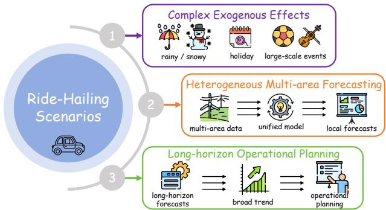  
Figure 1: Three key challenges of real-world ride-hailing time series forecasting.

Heterogeneous multi-area forecasting. Ride-hailing platforms operate across heterogeneous spatial areas, where time series patterns vary with commuting structure, weather sensitivity, event exposure, and local supply-demand conditions [17, 77]. In practice, training a separate model for each area is costly and statistically ineficient, especially when many areas have limited observations under rare external disturbances. A more practical solution is to train global models across multiple areas, but such models must learn shared temporal and exogenous regularities while preserving area-specific demand patterns. Existing benchmarks, however, often contain either a limited number of series or lack an evaluation setting designed around representative spatial areas, leaving the scalability and transferability of forecasting models underexplored [64, 73, 81].

Long-horizon operational planning. While short-term and medium-term forecasts, e.g., week-ahead ones, are important for operational dispatching, ride-hailing platforms also require forecasts over much longer horizons for strategic planning, holiday preparation, supply scheduling, and large-scale event management. In such settings, forecasting is no longer only about minimizing point-wise errors. A useful model should also capture macro-level temporal trends, including whether the target series will rise or fall and whether the predicted trajectory follows the correct long-term shape. However, existing benchmarks typically focus on relatively short evaluation horizons and standard error metrics, providing limited evidence about model behavior under long-horizon forecasting [57, 76].

To bridge these gaps, we introduce Ride-Hailing, a large-scale ride-hailing time series dataset synthesized from DiDi’s marketplace data. Ride-Hailing contains four consecutive years of halfhourly observations across 200 representative spatial areas, resulting in over 14 million time-stamped records. Each record includes multiple marketplace target variables together with rich futureknown exogenous signals covering three representative scenarios: Weather Disturbance, Holiday Efect, and Large-scale Event Impact. These scenarios reflect common yet challenging sources of variation in real-world ride-hailing systems, and enable systematic evaluation of exogenous-aware forecasting models.

Table 1: Overview of existing benchmarks and RideBench.
<table><tr><td>Benchmark</td><td>Future Exo. Con./Dis.</td><td>Scenario Eval.</td><td>Multi-Area Modeling</td><td>Max Eval. Horizon</td></tr><tr><td>Monash [14]</td><td>x/X</td><td>x</td><td>x</td><td>168</td></tr><tr><td>TSlib [73]</td><td>X/X</td><td>x</td><td>x</td><td>720</td></tr><tr><td>BasicTS+ [62]</td><td>X/X</td><td>x</td><td>x</td><td>720</td></tr><tr><td>TFB [58]</td><td>√IX</td><td>x</td><td>x</td><td>720</td></tr><tr><td>ProbTS [81]</td><td>X/X</td><td>x</td><td>x</td><td>720</td></tr><tr><td>GIFT-Eval [1]</td><td>x/x</td><td>x</td><td>x</td><td>900</td></tr><tr><td>fev-bench [64]</td><td>√1√</td><td>x</td><td>x</td><td>168</td></tr><tr><td>QuitoBench [76]</td><td>X/X</td><td>x</td><td>x</td><td>512</td></tr><tr><td>TIME [57]</td><td>x/X</td><td>x</td><td>x</td><td>864</td></tr><tr><td>RideBench</td><td>√1√</td><td>√</td><td>√</td><td>2688</td></tr></table>

Building upon Ride-Hailing, we further introduce RideBench, a comprehensive benchmark for exogenous-aware ride-hailing time series forecasting. It is organized around two complementary forecasting tasks. The first is regular week-ahead forecasting, which evaluates both overall accuracy and scenario-specific robustness under weather, holiday, and large-scale event impacts. The second is long-horizon 8-week-ahead forecasting, involving up to 2,688 prediction steps at half-hourly granularity. Beyond standard pointwise errors, the long-horizon setting further includes day-aggregated trend metrics and first-week accuracy, enabling evaluation of broad trend modeling and near-term precision preservation.

Table 1 compares RideBench with existing forecasting bench marks, highlighting several distinctive advantages. First, it supports both future-known continuous and discrete exogenous variables, enabling evaluation under realistic exogenously driven scenarios. Second, it provides explicit scenario-specific evaluation for Weather Disturbance, Holiday Efect, and Large-scale Event Impact, allowing a more fine-grained assessment of model robustness to external perturbations. Third, it is designed for forecasting across multiple representative spatial areas, making it possible to examine model generalization and transferability under heterogeneous urban contexts. Finally, RideBench substantially extends the maximum evaluation horizon to 2,688 prediction steps, thereby supporting more challenging long-horizon forecasting studies.

We conduct a comprehensive empirical study on RideBench using over 30 representative forecasting methods, including endogenousonly models [21, 36, 39, 53, 71], exogenous-aware models [6, 8, 74, 86], and time series foundation models [2, 9, 45]. The evaluation examines not only overall forecasting accuracy, but also exogenous utilization, multi-area generalization, and long-horizon temporal modeling. The results show that current forecasting methods have made clear progress in regular ride-hailing forecasting, but still reveal two key limitations for real-world deployment.

First, although future-known exogenous variables provide clear benefits in regular week-ahead forecasting, current exogenousaware models still struggle to capture disturbance-induced pattern changes, especially under categorical holidays, sparse large-scale events, and area-dependent exogenous responses. Second, long horizon forecasting remains substantially challenging, as existing models cannot simultaneously maintain pointwise accuracy, broad trend quality, and near-term reliability, all of which are important for practical deployment.

These findings show that existing models remain insuficient for the complexity of real-world ride-hailing forecasting. By providing large-scale data, future-known exogenous variables, and comprehensive evaluation protocols, RideBench serves as a testbed for studying these open challenges.

In summary, our contributions are as follows:

• We release Ride-Hailing, a large-scale synthesized ridehailing time series dataset built upon DiDi’s marketplace data, spanning four years at half-hourly granularity across 200 representative spatial areas, with rich future-known exogenous variables covering weather, holidays, and largescale events.

• We introduce RideBench, an exogenous-aware ride-hailing forecasting benchmark covering both regular week-ahead forecasting and long-horizon 8-week-ahead forecasting, with overall, scenario-specific, multi-area, and trend-level evaluations.

• We systematically evaluate over 30 representative forecasting methods under unified protocols, providing a comprehensive empirical comparison for real-world ride-hailing forecasting.

• We reveal key limitations of existing models in exploiting future-known exogenous signals and maintaining reliable long-horizon forecasts.

## 2 RELATED WORK

Time series forecasting benchmarks. Benchmarks are essential for time series forecasting because they provide unified datasets, data splits, evaluation metrics, and experimental protocols for comparing diferent models [64, 76]. Early benchmarks mainly focused on dataset curation and standardized evaluation for common forecasting domains, such as electricity [11, 82], trafic [56, 78, 84], weather [34, 72], and retail demand [10, 65]. Recent eforts further improve benchmarking quality by examining fairness factors in preprocessing, training pipelines, and metric computation, or by extending evaluation to multiple tasks such as forecasting, imputation, classification, and anomaly detection [58, 73]. With the rise of time series foundation models, benchmarks such as GIFT-Eval [1] and TIME [57] further emphasize zero-shot forecasting and scalable evaluation protocols.

Despite these advances, existing benchmarks still provide limited support for evaluating exogenous-aware forecasting. Most of them are not designed around marketplace-driven demand, heterogeneous spatial areas, future-known categorical exogenous variables, or long-horizon operational planning. RideBench complements existing benchmarks by focusing on these practical requirements in a large-scale ride-hailing setting that includes real-world exogenous factors.

<table><tr><td rowspan=1 colspan=3>E Dataset&#x27;s Statistics</td></tr><tr><td rowspan=1 colspan=3>Time Span: 4 years                Spatial Areas: 200 areasGranularity: 30-min interval          Total Records: 14,025,600</td></tr><tr><td rowspan=1 colspan=3>Dataset&#x27;s Variablese</td></tr><tr><td rowspan=1 colspan=1>Endogenous Target</td><td rowspan=1 colspan=1>Exogenous Variables</td><td rowspan=1 colspan=1>Calendar Covariates</td></tr><tr><td rowspan=4 colspan=1>9 variables</td><td rowspan=1 colspan=1>weather: weather impact factors</td><td rowspan=1 colspan=1>hour of day</td></tr><tr><td rowspan=1 colspan=1>holiday: 3 holiday types</td><td></td></tr><tr><td rowspan=2 colspan=1>large-scale event: 2 event types</td><td></td></tr><tr><td rowspan=1 colspan=1>day of week</td></tr></table>

Figure 2: Statistics and variable information of Ride-Hailing.

Time series forecasting models. These benchmarks have driven rapid progress in time series forecasting, where methods have evolved from traditional statistical models [3, 18, 26, 51, 67] to deep learning architectures [24, 36, 40, 53, 80, 85] and, more recently, foundation models [20, 28, 30, 42]. Deep forecasting models can be broadly grouped into channel-independent models [25, 39, 53, 63, 80], multivariate models [21, 23, 24, 36, 83], and exogenous-aware models [6, 8, 47, 61, 74]. Channel-independent models improve robustness by modeling each target variable separately, multivariate models capture cross-variable dependencies, and exogenous-aware models incorporate external covariates for context-aware forecasting. Time series foundation models are pretrained on large-scale cross-domain datasets to improve transferability, generalization, and zero-shot forecasting [2, 45, 66].

However, existing forecasting models are still not fully aligned with the requirements of ride-hailing forecasting. Many exogenousaware models mainly focus on historical or continuous covariates [6, 61, 74, 86], whereas ride-hailing forecasting requires efective use of future-known categorical signals, such as holiday types and large-scale event indicators. Moreover, models need to capture area-dependent exogenous responses under heterogeneous urban contexts, where the same external factor may induce diferent demand patterns across areas. Existing models also tend to emphasize pointwise accuracy [33, 37, 74, 86], while long-horizon operational planning further requires trend quality and near-term reliability. These limitations motivate RideBench to jointly evaluate exogenous utilization, multi-area generalization, and long-horizon planning capability.

## 3 DATASET

## 3.1 Dataset Construction

Data sources and scope. As shown in Figure 2, Ride-Hailing is synthesized from DiDi’s ride-hailing marketplace data collected across 200 representative spatial areas. It covers a continuous four-year period at a 30-minute granularity, yielding 14,025,600 time-stamped observations in total. Each observation is indexed by region identifier and timestamp, and includes both historical marketplace variables and exogenous contextual features.

Privacy-preserving data processing. Ride-Hailing is built upon operational records from DiDi’s ride-hailing marketplace and is released as a synthesized dataset to address privacy protection and business security requirements. To this end, we apply a series of anonymization and transformation procedures to avoid exposing sensitive business information while retaining the core temporal signals needed for forecasting research. These procedures include, but are not limited to, anonymizing area and variable identifiers, processing endogenous target variables, aggregating weather disturbances, and representing large-scale events with coarse-grained impact categories rather than raw event descriptions. In this way, Ride-Hailing preserves, to the greatest extent possible, the temporal characteristics, exogenous relationships, and cross-area structures of real-world ride-hailing systems, supporting academic research without disclosing sensitive operational details.

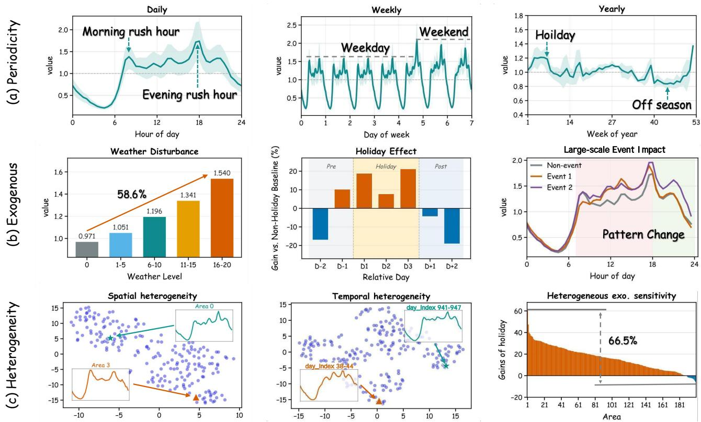  
Figure 3: Illustration of the key characteristics of Ride-Hailing. (a) Multi-scale periodicity at daily, weekly, and yearly levels. (b) Exogenous efects under weather disturbance, holiday efect, and large-scale event impact. (c) Heterogeneous patterns across diferent areas, time periods and exogenous variables, where t-SNE [68] is used to visualize spatial and temporal heterogeneity.

Endogenous forecasting targets. Ride-Hailing provides 9 platformlevel endogenous variables, anonymized as endo-1 to endo-9. These variables may interact through marketplace mechanisms such as disturbance, substitution, and co-movement, and serve as the forecasting targets in RideBench.

Exogenous variables. To support exogenous-aware forecasting, Ride-Hailing incorporates future-known variables covering three scenarios: Weather Disturbance, Holiday Efect, and Large-scale Event Impact. Weather is represented by an impact factor, holidays by categorical variables covering public holidays, traditional festivals, and Western festivals, and large-scale events by two event-impact variables capturing diferent mobility changes. Calendar covariates, including hour-of-day and day-of-week indicators, are also included to model regular temporal patterns.

## 3.2 Dataset Characteristics

As marketplace-driven urban mobility data, ride-hailing time series exhibit strong periodicity, sensitivity to exogenous disturbances, and substantial heterogeneity across areas, time periods, and exogenous conditions.

3.2.1 Multi-scale Periodicity. Ride-hailing time series exhibit clear multi-scale periodic structures at daily, weekly, and yearly scales, as shown in Figure 3(a). These coupled periodic patterns reflect the regular rhythms of urban activities and human mobility.

Daily periodicity. At the daily scale, ride-hailing demand changes substantially within a day, following human mobility routines such as commuting and daily activities. Demand usually remains low during late-night hours when city activities are limited, and reaches major peaks during morning or evening rush hours due to intensive commuting demand.

Weekly periodicity. At the weekly scale, demand patterns difer markedly between weekdays and weekends. Weekdays typically exhibit commuting-related morning peaks, whereas weekends show weaker commuting regularity and more leisure-oriented demand. Friday, although still a weekday, often presents particularly strong evening demand because it is close to the weekend.

Yearly periodicity. At the yearly scale, ride-hailing demand also shows evident seasonal variation, although the pattern becomes smoother after weekly aggregation. Seasonal changes, public holi days, vacations, and large-scale travel periods can alter the overall demand level and reshape long-term temporal trends.

These multi-scale patterns require models to capture both shortterm routines and long-term seasonal evolution, which is especially important for the long-horizon 8-week-ahead forecasting task.

3.2.2 Exogenous Efects. Ride-Hailing contains rich future-known exogenous variables, allowing us to examine how external factors are associated with changes in ride-hailing dynamics. Figure 3(b) presents representative patterns under weather disturbance, holiday periods, and large-scale events.

Weather Disturbance. Weather changes can reshape ride-hailing dynamics by altering mobility choices and transport convenience. As weather disturbance becomes stronger, the average endogenous value increases substantially, indicating higher dependence on ridehailing services under adverse weather. Beyond such level-driven efects, extreme weather may also introduce delayed impacts, making the forecasting problem more challenging.

Holiday Efect. Holidays introduce structured but non-uniform deviations from regular patterns, as ride-hailing demand does not simply increase or decrease throughout the holiday period. Instead, demand often exhibits stage-dependent changes: distinct demand shifts may emerge before the oficial holiday starts, fluctuate across in-holiday stages, and rebound during post-holiday return flows. Moreover, days farther before or after the holiday may experience reduced regular demand, potentially because mobility demand is shifted toward or absorbed by the holiday period. These stagedependent efects make holidays more challenging than simple binary calendar indicators.

Large-scale Event Impact. Large-scale events can cause local ized and time-dependent pattern changes. Diferent event types may also afect demand in diferent ways. In Ride-Hailing, largescale events are collected and represented using two coarse-grained event-impact categories: one mainly changes daytime mobility, while the other may afect both daytime and evening demand. This provides a challenging test of whether models can exploit eventtype information and learn event-specific temporal responses.

3.2.3 Heterogeneity. Beyond periodicity and exogenous efects, Ride-Hailing also exhibits strong heterogeneity, as shown in Figure 3(c). This is particularly important in RideBench, where a global model is trained across multiple areas but must generate reliable forecasts for each individual area. Therefore, efective models need to learn shared regularities while preserving area-specific temporal patterns.

Spatial heterogeneity. Diferent areas have distinct mobility structures. Some areas show clear morning and evening commuting peaks, while others are dominated by evening activities. Such diferences may reflect land use, commuting function, commercial activity, residential density, and local supply-demand conditions.

Temporal heterogeneity. The temporal pattern of the same system can also evolve over years. For instance, the daily curve of an area may change from a multi-peak pattern to a more concentrated evening-peak pattern. Models need to adapt to latent temporal shifts caused by urban development, behavioral changes, and evolving platform operations.

Heterogeneous exogenous sensitivity. The impact of the same exogenous factor can also vary across areas. For example, although holidays generally stimulate ride-hailing demand, the magnitude of the response difers substantially across areas. Some areas may even show negative changes, suggesting that holiday mobility can shift demand away from certain areas or interact with other area-specific factors. Similarly, weather disturbances and large-scale events may produce markedly diferent efects across areas.

In summary, Ride-Hailing provides a realistic testbed where models must jointly handle endogenous temporal dynamics, futureknown exogenous variables, and heterogeneous multi-area patterns. These characteristics make Ride-Hailing a challenging benchmark foundation for evaluating whether forecasting models can generalize under marketplace dynamics.

## 4 BENCHMARK

Built upon Ride-Hailing, we introduce RideBench, a unified benchmark for evaluating exogenous-aware ride-hailing time series forecasting. As shown in Figure 4, RideBench consists of three core components: standardized data processing, representative forecasting methods, and comprehensive evaluation protocols.

## 4.1 Data Processing

Dataset splitting. RideBench first constructs forecasting samples using a sliding-window strategy and then assigns them to diferent splits according to fixed chronological boundaries. Specifically, the first three years of observations are used for training, the following six months for validation, and the final six months for testing. For each generated sample, the split assignment is determined by its prediction window: a sample is included in a split only when its full target range falls within the corresponding time period. The input window is allowed to extend to earlier observations, so that validation and test samples can use realistic historical context without leaking future target values across splits.

Global multi-area training. For each temporal window, every area is treated as an independent forecasting sample, and samples from all 200 areas are pooled to train a shared global model. This protocol better reflects practical deployment, where maintaining a separate model for every area is costly and less scalable. It also poses a stronger modeling challenge, since models must learn transferable temporal structures while preserving area-specific characteristics under substantial spatial heterogeneity.

Normalization. RideBench standardizes endogenous variables and continuous exogenous variables using statistics fitted only on the training time range, while keeping discrete exogenous variables as integer identifiers. During evaluation, the predicted endogenous variables are inverse-transformed back to the original scale using the same training statistics, so that forecasting metrics are computed on realistic value scales.

## 4.2 Forecasting Methods

RideBench comprehensively evaluates more than 30 representative forecasting methods spanning five major methodological paradigms.

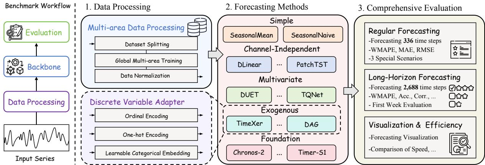  
Figure 4: Overall architecture of RideBench. The left illustrates the general benchmark workflow, and the right demonstrates the detailed implementation details.

Simple Statistical Baselines include SeasonalNaive [27] and SeasonalMean. SeasonalNaive directly repeats values from the previous seasonal cycle, while SeasonalMean forecasts each future step using the average of historical observations at the same seasonal position within the input window. These two methods capture recurring daily and weekly patterns without model training, provid ing simple references for assessing the gains of learned forecasting models.

Channel-Independent Forecasting Models include DLinear [80], PatchTST [53], PETformer [39], STID [63], RMLP [32], SegRNN [40], SparseTSF [38], PhaseFormer [54], TimeBase [25], and TimeMixer [71]. These models are evaluated on all endogenous forecasting targets, but adopt a channel-independent modeling strategy, where each endogenous variable is modeled based on its own temporal evolution. This group allows us to examine how much predictive power can be obtained from individual temporal dynamics alone, without explicitly modeling dependencies among endogenous variables in the multi-target ride-hailing forecasting task.

Multivariate Forecasting Models include Crossformer [83], CrossGNN [24], DUET [60], Leddam [79], ModernTCN [49], PMD former [21], SOFTS [16], TimeFilter [23], TQNet [36], and iTransformer [44]. These models also forecast all endogenous targets, but further capture joint structures among variables through crosschannel dependencies or shared multivariate representations. This group allows us to evaluate whether interactions among diferent marketplace signals provide additional benefits beyond independent temporal modeling.

Exogenous-Aware Forecasting Models include CATS [47], CrossLinear [86], DAG [61], TiDE [8], TimeXer [74], and XLinear [6]. These models are closely aligned with the ride-hailing forecasting scenario considered in RideBench, where future-known external factors such as weather, holidays, and large-scale events may substantially afect marketplace dynamics. However, most existing exogenous-aware models are primarily designed for continuous covariates, whereas RideBench contains both continuous and discrete exogenous variables. To make these methods appli cable to our setting, we adapt discrete exogenous variables using three encoding strategies: ordinal encoding, one-hot encoding, and learnable categorical embeddings. For models that do not originally expose future covariates to the prediction horizon, we further modify their input interfaces so that future-known exogenous variables can be incorporated during forecasting.

Time Series Foundation Models include Chronos-2 [2], Moirai 2.0 [41], TimesFM 2.5 [9], and Timer-S1 [45]. These models can be directly applied to downstream forecasting tasks in a zero-shot manner without task-specific training. Most of them follow a univariate forecasting paradigm, while Chronos-2 is the only one that explicitly supports multivariate endogenous interactions and futureknown covariates, including both continuous and discrete exogenous variables. We include these models in RideBench to examine how current time series foundation models perform in realistic, fine-grained, and exogenous-driven ride-hailing scenarios.

## 4.3 Comprehensive Evaluation

4.3.1 Forecasting Setings. RideBench provides two forecasting settings at half-hourly granularity. The first is week-ahead forecasting, where models predict the next 336 steps, corresponding to one week, using 1,344 historical steps, corresponding to four weeks. This setting matches operational needs [17] such as demand monitoring, supply-demand balancing, resource allocation, and event-specific operations under external disturbances.

The second is 8-week-ahead forecasting, where models predict the next 2,688 steps, corresponding to eight weeks, using 4,704 historical steps, corresponding to fourteen weeks. This setting substantially extends the forecasting horizon from short-term fluctuation modeling to long-term temporal evolution modeling. It is designed to examine whether forecasting models can capture macro-level demand trends over multiple weeks, which is critical for strategic planning, holiday operations, and large-scale resource scheduling.

4.3.2 Evaluation Protocol. RideBench evaluates forecasting models from three complementary perspectives: overall forecasting accuracy, scenario-specific robustness, and long-horizon trend quality.

Overall forecasting accuracy. We evaluate point forecasting accuracy using three standard metrics: Weighted Mean Absolute

Percentage Error (WMAPE), Mean Absolute Error (MAE), and Root Mean Squared Error (RMSE). WMAPE measures scale-normalized absolute error, MAE measures average absolute error, and RMSE emphasizes large deviations. Formally,

$$
\mathrm { W M A P E } = \frac { \sum _ { i = 1 } ^ { n } \left| y _ { i } - \hat { y } _ { i } \right| } { \sum _ { i = 1 } ^ { n } \left| y _ { i } \right| } ,\tag{1}
$$

$$
\mathrm { M A E } = \frac { 1 } { n } \sum _ { i = 1 } ^ { n } | y _ { i } - \hat { y } _ { i } | ,\tag{2}
$$

$$
\mathrm { R M S E } = \sqrt { \frac { 1 } { n } \sum _ { i = 1 } ^ { n } ( y _ { i } - \hat { y } _ { i } ) ^ { 2 } } ,\tag{3}
$$

where $y _ { i }$ and �ˆ� denote the ground-truth and predicted values of the �-th evaluated point, and � is the total number of evaluated points.

Scenario-specific evaluation. To examine whether models can handle external disturbances, RideBench further reports forecasting performance under three representative scenarios: Weather Disturbance, Holiday Efect, and Large-scale Event Impact. For each scenario, we use the corresponding future-known exogenous indi cators to select test periods afected by weather disturbances, holidays, or large-scale events, and compute metrics on these scenariospecific subsets. This protocol tests whether a model can exploit future-known external information, rather than only fitting regular daily or weekly periodicity.

Long-horizon trend evaluation. For the 8-week-ahead setting, pointwise errors alone are insuficient to assess whether a model captures the correct long-term trajectory. Therefore, RideBench additionally evaluates day-level trend quality using Directional Accuracy of Day (Acc.) and Correlation of Day (Corr.).

We first aggregate half-hourly predictions into daily values by averaging every 48 time steps. Let �� and $\hat { Y } _ { i }$ denote the ground-truth and predicted daily values on day �, respectively. Acc. is defined as

$$
\mathrm { A c c . } = \frac { 1 } { | \Omega | } \sum _ { i \in \Omega } \mathbb { I } \left[ \mathrm { s i g n } ( Y _ { i } - Y _ { i - 1 } ) = \mathrm { s i g n } ( \hat { Y } _ { i } - \hat { Y } _ { i - 1 } ) \right] ,\tag{4}
$$

where $\Omega = \{ i : | Y _ { i } - Y _ { i - 1 } | > 1 0 ^ { - 6 } \}$ denotes the set of days with nonnegligible ground-truth changes. This metric measures whether the model predicts the correct direction of day-to-day demand changes. Corr. is defined as

$$
\mathrm { C o r r . } = \frac { \sum _ { i = 1 } ^ { m } ( Y _ { i } - \mu ) ( \hat { Y } _ { i } - \hat { \mu } ) } { \sqrt { \sum _ { i = 1 } ^ { m } ( Y _ { i } - \mu ) ^ { 2 } } \sqrt { \sum _ { i = 1 } ^ { m } ( \hat { Y } _ { i } - \hat { \mu } ) ^ { 2 } } } ,\tag{5}
$$

where � is the number of evaluated days, and � and $\hat { \mu }$ are the means of the ground-truth and predicted daily sequences, respectively. Corr. measures whether the predicted daily trajectory follows the overall shape ofthe ground truth. Together, Acc. and Corr. provide a macro-level view of long-horizon forecasting quality beyond pointwise errors.

## 4.4 Implementation Details

All experiments are implemented in Python 3.11 with PyTorch [55] and conducted on a cluster ofeight NVIDIA RTX A6000 GPUs. Forecasting samples are generated with task-specific sliding-window strides: 48 steps, i.e., one day, for week-ahead forecasting, and 336 steps, i.e., one week, for 8-week-ahead forecasting.

Models are trained using the MAE loss and optimized with AdamW [46] under a unified hyperparameter search protocol. For each method, we search the learning rate from $\{ 3 \times 1 0 ^ { - 5 } , 1 \times 1 0 ^ { - 4 } ,$ , 3× $1 0 ^ { - 4 } , 1 \times 1 0 ^ { - 3 } , 3 \times 1 0 ^ { - 3 } \}$ and report the results under the best configuration. Unless otherwise specified, we use a batch size of 128 and reduce it when out-of-memory issues occur. Early stopping is applied if the validation performance does not improve for three consecutive epochs.

For models that support exogenous inputs, future-known exogenous variables are provided through their model-specific interfaces; otherwise, only historical endogenous variables are used.

## 5 EXPERIMENTS

## 5.1 Benchmark Results

5.1.1 Regular Forecasting. Table 2 reports the results of regular week-ahead forecasting. Overall, exogenous-aware models achieve the strongest performance across both overall evaluation and the three scenario-specific evaluations: Weather Disturbance, Holiday Efect, and Large-scale Event Impact. Among them, TiDE [8] achieves consistently strong performance across diferent metrics and exogenous scenarios, highlighting the importance of efectively using future-known covariates for modeling demand deviations caused by external disturbances.

Some endogenous-only models, including channel-independent models (e.g., PETformer [39]) and multivariate models (e.g., PMDformer [21]), remain competitive in overall WMAPE and MAE. This reflects the strong daily and weekly periodicity of regular ride-hailing demand, which can be captured from historical target values alone. However, without access to future-known exogenous variables, these models are less efective under exogenous scenarios and also show less favorable overall RMSE. This indicates that historical endogenous patterns alone are insuficient for modeling high-magnitude or abrupt demand changes.

Time series foundation models also show promising zero-shot transferability. For example, Chronos-2 [2] achieves performance comparable to several task-specific trained models, suggesting the potential of large-scale pretrained forecasting models. Nevertheless, they still lag behind specialized exogenous-aware models, especially under exogenous scenarios where future-known external information is important.

In summary, these results show that future-known exogenous variables are valuable for regular week-ahead forecasting, improving both overall accuracy and scenario-specific performance under weather, holiday, and large-scale event impacts.

5.1.2 Long-Horizon Forecasting. Table 3 presents the results of long-horizon 8-week-ahead forecasting. Diferent from week-ahead forecasting, this setting evaluates long-horizon pointwise accuracy, day-level trend quality, and first-week accuracy, reflecting finegrained numerical precision, macro-level trajectory modeling, and near-term accuracy preservation, respectively.

The results show that exogenous-aware models do not maintain the clear advantage observed in regular week-ahead forecasting. Instead, several endogenous-only models achieve stronger overall accuracy. This suggests that long-horizon ride-hailing forecasting relies heavily on stable temporal structures, such as weekly seasonality and long-term demand evolution. It also indicates that simply adding exogenous inputs does not guarantee better long-horizon performance, and that current exogenous-aware architectures may not fully exploit such information over extended horizons.

Table 2: Regular week-ahead forecasting performance under the overall evaluation and the three exogenous scenarios. Darker shading indicates better performance. Average rank is obtained via arithmetic mean of ranks across all evaluation metrics.
<table><tr><td rowspan=1 colspan=1></td><td rowspan=1 colspan=1>Scenarios</td><td rowspan=1 colspan=3>Overall</td><td rowspan=1 colspan=3>Weather Disturbance</td><td rowspan=1 colspan=2>Holiday Effect</td><td rowspan=1 colspan=3>Large-scale Event Impact</td><td rowspan=1 colspan=1>Rank</td></tr><tr><td rowspan=1 colspan=1></td><td rowspan=1 colspan=1>Metrics</td><td rowspan=1 colspan=3>WMAPEMAERMSE</td><td rowspan=1 colspan=3>WMAPEMAERMSE</td><td rowspan=1 colspan=2>WMAPEMAERMSE</td><td rowspan=1 colspan=3>WMAPE MAERMSE</td><td rowspan=1 colspan=1>Average</td></tr><tr><td rowspan=2 colspan=1>S&#x27;im.</td><td rowspan=1 colspan=1>SeasonalMean</td><td rowspan=1 colspan=3>0.1285 4.916 14.37</td><td rowspan=1 colspan=3>0.1509 6.311 20.90</td><td rowspan=1 colspan=2>0.1701  7.052 20.85</td><td rowspan=1 colspan=2>0.1224 5.395</td><td rowspan=1 colspan=1>16.32</td><td rowspan=1 colspan=1>29</td></tr><tr><td rowspan=1 colspan=1>SeasonalNaive</td><td rowspan=1 colspan=2>0.1490 5.693</td><td rowspan=1 colspan=1>17.75</td><td rowspan=1 colspan=3>0.1755 7.338 24.41</td><td rowspan=1 colspan=2>0.1981  8.203 24.57</td><td rowspan=1 colspan=2>0.1422 6.261</td><td rowspan=1 colspan=1>19.10</td><td rowspan=1 colspan=1>32</td></tr><tr><td rowspan=1 colspan=1></td><td rowspan=1 colspan=1>PatchTST</td><td rowspan=1 colspan=2>0.1079  4.132</td><td rowspan=1 colspan=1>13.38</td><td rowspan=1 colspan=3>0.1391 5.821 20.84</td><td rowspan=1 colspan=2>0.1507  6.249 20.37</td><td rowspan=1 colspan=2>0.1130  4.983</td><td rowspan=1 colspan=1>16.56</td><td rowspan=1 colspan=1>10</td></tr><tr><td rowspan=5 colspan=1>Chan-dent</td><td rowspan=1 colspan=1>PETformer</td><td rowspan=1 colspan=2>0.1078  4.124</td><td rowspan=1 colspan=1>13.35</td><td rowspan=1 colspan=2>0.1396 5.839</td><td rowspan=1 colspan=1>20.86</td><td rowspan=1 colspan=1>0.1520 6.303</td><td rowspan=1 colspan=1>20.42</td><td rowspan=1 colspan=2>0.1130  4.982</td><td rowspan=1 colspan=1>16.48</td><td rowspan=1 colspan=1>11</td></tr><tr><td rowspan=1 colspan=1>TimeMixer</td><td rowspan=1 colspan=2>0.1113  4.261</td><td rowspan=1 colspan=1>13.47</td><td rowspan=1 colspan=2>0.1411 5.902</td><td rowspan=1 colspan=1>20.90</td><td rowspan=1 colspan=1>0.1548 6.420</td><td rowspan=1 colspan=1>20.42</td><td rowspan=1 colspan=2>0.1159  5.113</td><td rowspan=1 colspan=1>16.73</td><td rowspan=1 colspan=1>19</td></tr><tr><td rowspan=1 colspan=1>STID</td><td rowspan=1 colspan=2>0.1122  4.299</td><td rowspan=1 colspan=1>13.48</td><td rowspan=1 colspan=2>0.1419 5.941</td><td rowspan=1 colspan=1>20.92</td><td rowspan=1 colspan=1>0.1542 6.397</td><td rowspan=1 colspan=1>20.22</td><td rowspan=1 colspan=2>0.1166 5.149</td><td rowspan=1 colspan=1>16.74</td><td rowspan=1 colspan=1>20</td></tr><tr><td rowspan=1 colspan=1>DLinear</td><td rowspan=1 colspan=2>0.1171 4.483</td><td rowspan=1 colspan=1>13.48</td><td rowspan=1 colspan=2>0.1441 6.029</td><td rowspan=1 colspan=1>20.64</td><td rowspan=1 colspan=1>0.1545 6.403</td><td rowspan=1 colspan=1>19.78</td><td rowspan=1 colspan=2>0.1186 5.234</td><td rowspan=1 colspan=1>16.29</td><td rowspan=1 colspan=1>21</td></tr><tr><td rowspan=1 colspan=1>TimeBase</td><td rowspan=1 colspan=2>0.1222  4.674</td><td rowspan=1 colspan=1>13.68</td><td rowspan=1 colspan=2>0.1437 6.008</td><td rowspan=1 colspan=1>20.38</td><td rowspan=1 colspan=1>0.1553 6.437</td><td rowspan=1 colspan=1>19.67</td><td rowspan=1 colspan=2>0.1209 5.342</td><td rowspan=1 colspan=1>16.19</td><td rowspan=1 colspan=1>22</td></tr><tr><td rowspan=4 colspan=1></td><td rowspan=1 colspan=1>SegRNN</td><td rowspan=1 colspan=2>0.1116  4.275</td><td rowspan=1 colspan=1>13.60</td><td rowspan=1 colspan=2>0.1418 5.932</td><td rowspan=1 colspan=1>20.98</td><td rowspan=1 colspan=1>0.1533 6.360</td><td rowspan=1 colspan=1>20.48</td><td rowspan=1 colspan=2>0.1196 5.280</td><td rowspan=1 colspan=1>17.03</td><td rowspan=1 colspan=1>23</td></tr><tr><td rowspan=1 colspan=1>RMLP</td><td rowspan=1 colspan=1>0.1135</td><td rowspan=1 colspan=1>4.344</td><td rowspan=1 colspan=1>13.51</td><td rowspan=1 colspan=2>0.1431  5.986</td><td rowspan=1 colspan=1>20.91</td><td rowspan=1 colspan=1>0.1562 6.476</td><td rowspan=1 colspan=1>20.39</td><td rowspan=1 colspan=2>0.1176 5.185</td><td rowspan=1 colspan=1>16.67</td><td rowspan=1 colspan=1>25</td></tr><tr><td rowspan=1 colspan=1>SparseTSF</td><td rowspan=1 colspan=1>0.1134</td><td rowspan=1 colspan=1>4.342</td><td rowspan=1 colspan=1>13.60</td><td rowspan=1 colspan=2>0.1420 5.941</td><td rowspan=1 colspan=1>20.99</td><td rowspan=1 colspan=1>0.1553 6.442</td><td rowspan=1 colspan=1>20.53</td><td rowspan=1 colspan=2>0.1176 5.193</td><td rowspan=1 colspan=1>16.75</td><td rowspan=1 colspan=1>27</td></tr><tr><td rowspan=1 colspan=1>PhaseFormer</td><td rowspan=1 colspan=1>0.1151</td><td rowspan=1 colspan=1>4.411</td><td rowspan=1 colspan=1>13.69</td><td rowspan=1 colspan=2>0.1432 5.993</td><td rowspan=1 colspan=1>21.03</td><td rowspan=1 colspan=1>0.1529 6.339</td><td rowspan=1 colspan=1>20.26</td><td rowspan=1 colspan=2>0.1226 5.423</td><td rowspan=1 colspan=1>17.07</td><td rowspan=1 colspan=1>28</td></tr><tr><td rowspan=1 colspan=1></td><td rowspan=1 colspan=1>PMDformer</td><td rowspan=1 colspan=1>0.1077</td><td rowspan=1 colspan=1>4.122</td><td rowspan=1 colspan=1>13.28</td><td rowspan=1 colspan=2>0.1384 5.790</td><td rowspan=1 colspan=1>20.70</td><td rowspan=1 colspan=1>0.1486  6.157</td><td rowspan=1 colspan=1>20.01</td><td rowspan=1 colspan=2>0.1125 4.962</td><td rowspan=1 colspan=1>16.39</td><td rowspan=1 colspan=1>4</td></tr><tr><td rowspan=1 colspan=1></td><td rowspan=1 colspan=1>TimeFilter</td><td rowspan=1 colspan=1>0.1099</td><td rowspan=1 colspan=1>4.206</td><td rowspan=1 colspan=1>13.30</td><td rowspan=1 colspan=2>0.1390  5.812</td><td rowspan=1 colspan=1>20.67</td><td rowspan=1 colspan=1>0.1494  6.187</td><td rowspan=1 colspan=1>20.00</td><td rowspan=1 colspan=2>0.1137  5.012</td><td rowspan=1 colspan=1>16.42</td><td rowspan=1 colspan=1>7</td></tr><tr><td rowspan=1 colspan=1></td><td rowspan=1 colspan=1>Crossformer</td><td rowspan=1 colspan=1>0.1096</td><td rowspan=1 colspan=1>4.199</td><td rowspan=1 colspan=1>13.42</td><td rowspan=1 colspan=1>0.1390</td><td rowspan=1 colspan=1>5.816</td><td rowspan=1 colspan=1>20.76</td><td rowspan=1 colspan=1>0.1533 6.355</td><td rowspan=1 colspan=1>20.46</td><td rowspan=1 colspan=2>0.1141  5.039</td><td rowspan=1 colspan=1>16.59</td><td rowspan=1 colspan=1>12</td></tr><tr><td rowspan=2 colspan=1></td><td rowspan=1 colspan=1>SOFTS</td><td rowspan=1 colspan=1>0.1111</td><td rowspan=1 colspan=1>4.252</td><td rowspan=1 colspan=1>13.45</td><td rowspan=1 colspan=1>0.1408</td><td rowspan=1 colspan=1>5.888</td><td rowspan=1 colspan=1>20.84</td><td rowspan=1 colspan=1>0.1533  6.354</td><td rowspan=1 colspan=1>20.29</td><td rowspan=1 colspan=2>0.1159 5.112</td><td rowspan=1 colspan=1>16.76</td><td rowspan=1 colspan=1>13</td></tr><tr><td rowspan=1 colspan=1>ModernTCN</td><td rowspan=1 colspan=1>0.1117</td><td rowspan=1 colspan=1>4.279</td><td rowspan=1 colspan=1>13.42</td><td rowspan=1 colspan=1>0.1416</td><td rowspan=1 colspan=1>5.925</td><td rowspan=1 colspan=1>20.86</td><td rowspan=1 colspan=1>0.1512 6.269</td><td rowspan=1 colspan=1>20.11</td><td rowspan=1 colspan=2>0.1171 5.171</td><td rowspan=1 colspan=1>16.78</td><td rowspan=1 colspan=1>14</td></tr><tr><td rowspan=4 colspan=1></td><td rowspan=1 colspan=1>TQNet</td><td rowspan=1 colspan=1>0.1117</td><td rowspan=1 colspan=1>4.277</td><td rowspan=1 colspan=1>13.44</td><td rowspan=1 colspan=1>0.1413</td><td rowspan=1 colspan=1>5.910</td><td rowspan=1 colspan=1>20.83</td><td rowspan=1 colspan=1>0.1537  6.373</td><td rowspan=1 colspan=1>20.25</td><td rowspan=1 colspan=2>0.1161 5.121</td><td rowspan=1 colspan=1>16.66</td><td rowspan=1 colspan=1>14</td></tr><tr><td rowspan=1 colspan=1>iTransformer</td><td rowspan=1 colspan=1>0.1117</td><td rowspan=1 colspan=1>4.276</td><td rowspan=1 colspan=1>13.47</td><td rowspan=1 colspan=1>0.1410</td><td rowspan=1 colspan=1>5.899</td><td rowspan=1 colspan=1>20.88</td><td rowspan=1 colspan=1>0.1518  6.290</td><td rowspan=1 colspan=1>20.16</td><td rowspan=1 colspan=2>0.1169 5.159</td><td rowspan=1 colspan=1>16.79</td><td rowspan=1 colspan=1>16</td></tr><tr><td rowspan=1 colspan=1>Leddam</td><td rowspan=1 colspan=1>0.1117</td><td rowspan=1 colspan=1>4.280</td><td rowspan=1 colspan=1>13.47</td><td rowspan=1 colspan=1>0.1417</td><td rowspan=1 colspan=1>5.928</td><td rowspan=1 colspan=1>20.87</td><td rowspan=1 colspan=1>0.1534 6.361</td><td rowspan=1 colspan=1>20.30</td><td rowspan=1 colspan=1>0.1163</td><td rowspan=1 colspan=1>5.133</td><td rowspan=1 colspan=1>16.68</td><td rowspan=1 colspan=1>18</td></tr><tr><td rowspan=1 colspan=1>CrossGNN</td><td rowspan=1 colspan=1>0.1125</td><td rowspan=1 colspan=1>4.309</td><td rowspan=1 colspan=1>13.59</td><td rowspan=1 colspan=1>0.1417</td><td rowspan=1 colspan=1>5.926</td><td rowspan=1 colspan=1>21.00</td><td rowspan=1 colspan=1>0.1542 6.392</td><td rowspan=1 colspan=1>20.45</td><td rowspan=1 colspan=1>0.1170</td><td rowspan=1 colspan=1>5.162</td><td rowspan=1 colspan=1>16.81</td><td rowspan=1 colspan=1>24</td></tr><tr><td rowspan=1 colspan=1></td><td rowspan=1 colspan=1>DUET</td><td rowspan=1 colspan=1>0.1147</td><td rowspan=1 colspan=1>4.397</td><td rowspan=1 colspan=1>13.57</td><td rowspan=1 colspan=1>0.1437</td><td rowspan=1 colspan=1>6.011</td><td rowspan=1 colspan=1>20.97</td><td rowspan=1 colspan=1>0.1539 6.379</td><td rowspan=1 colspan=1>20.23</td><td rowspan=1 colspan=2>0.1193 5.267</td><td rowspan=1 colspan=1>16.86</td><td rowspan=1 colspan=1>26</td></tr><tr><td rowspan=1 colspan=1></td><td rowspan=1 colspan=1>TiDE</td><td rowspan=1 colspan=1>0.1043</td><td rowspan=1 colspan=1>3.996</td><td rowspan=1 colspan=1>12.43</td><td rowspan=1 colspan=2>0.1293  5.397</td><td rowspan=1 colspan=1>18.96</td><td rowspan=1 colspan=1>0.1282 5.305</td><td rowspan=1 colspan=1>17.29</td><td rowspan=1 colspan=2>0.1104  4.866</td><td rowspan=1 colspan=1>15.81</td><td rowspan=1 colspan=1>1</td></tr><tr><td rowspan=4 colspan=1>Eoous</td><td rowspan=1 colspan=1>CrossLinear</td><td rowspan=1 colspan=1>0.1051</td><td rowspan=1 colspan=1>4.032</td><td rowspan=1 colspan=1>12.65</td><td rowspan=1 colspan=2>0.1269 5.296</td><td rowspan=1 colspan=1>18.74</td><td rowspan=1 colspan=1>0.1328  5.505</td><td rowspan=1 colspan=1>18.43</td><td rowspan=1 colspan=2>0.1100  4.854</td><td rowspan=1 colspan=1>15.87</td><td rowspan=1 colspan=1>2</td></tr><tr><td rowspan=1 colspan=1>XLinear</td><td rowspan=1 colspan=1>0.1075</td><td rowspan=1 colspan=1>4.124</td><td rowspan=1 colspan=1>12.86</td><td rowspan=1 colspan=2>0.1300 5.431</td><td rowspan=1 colspan=1>19.42</td><td rowspan=1 colspan=1>0.1326  5.493</td><td rowspan=1 colspan=1>18.52</td><td rowspan=1 colspan=2>0.1144 5.055</td><td rowspan=1 colspan=1>16.30</td><td rowspan=1 colspan=1>3</td></tr><tr><td rowspan=1 colspan=1>CATS</td><td rowspan=1 colspan=1>0.1103</td><td rowspan=1 colspan=1>4.225</td><td rowspan=1 colspan=1>12.95</td><td rowspan=1 colspan=2>0.1321  5.510</td><td rowspan=1 colspan=1>19.53</td><td rowspan=1 colspan=1>0.1379  5.703</td><td rowspan=1 colspan=1>18.76</td><td rowspan=1 colspan=2>0.1159  5.106</td><td rowspan=1 colspan=1>16.13</td><td rowspan=1 colspan=1>5</td></tr><tr><td rowspan=1 colspan=1>DAG</td><td rowspan=1 colspan=1>0.1090</td><td rowspan=1 colspan=1>4.174</td><td rowspan=1 colspan=1>13.30</td><td rowspan=1 colspan=2>0.1388  5.803</td><td rowspan=1 colspan=1>20.64</td><td rowspan=1 colspan=1>0.1476  6.115</td><td rowspan=1 colspan=1>19.91</td><td rowspan=1 colspan=2>0.1141  5.033</td><td rowspan=1 colspan=1>16.55</td><td rowspan=1 colspan=1>6</td></tr><tr><td rowspan=1 colspan=1></td><td rowspan=1 colspan=1>TimeXer</td><td rowspan=1 colspan=1>0.1093</td><td rowspan=1 colspan=1>4.207</td><td rowspan=1 colspan=1>12.93</td><td rowspan=1 colspan=2>0.1388  5.804</td><td rowspan=1 colspan=1>20.14</td><td rowspan=1 colspan=1>0.1371  5.687</td><td rowspan=1 colspan=1>18.42</td><td rowspan=1 colspan=2>0.1172 5.177</td><td rowspan=1 colspan=1>16.40</td><td rowspan=1 colspan=1>8</td></tr><tr><td rowspan=1 colspan=1>m</td><td rowspan=1 colspan=1>Chronos-2</td><td rowspan=1 colspan=2>0.1089  4.174</td><td rowspan=1 colspan=1>13.24</td><td rowspan=1 colspan=3>0.1363  5.703 20.08</td><td rowspan=1 colspan=2>0.1523  6.319 20.32</td><td rowspan=1 colspan=2>0.1155  5.101</td><td rowspan=1 colspan=1>16.34</td><td rowspan=1 colspan=1>9</td></tr><tr><td rowspan=3 colspan=1>onnaton</td><td rowspan=1 colspan=1>Timer-S1</td><td rowspan=1 colspan=2>0.1121  4.295</td><td rowspan=1 colspan=1>13.48</td><td rowspan=1 colspan=3>0.1417  5.927 20.86</td><td rowspan=1 colspan=1>0.1539  6.384</td><td rowspan=1 colspan=1>20.37</td><td rowspan=1 colspan=2>0.1153  5.090</td><td rowspan=1 colspan=1>16.54</td><td rowspan=1 colspan=1>17</td></tr><tr><td rowspan=1 colspan=1>TimesFM 2.5</td><td rowspan=1 colspan=2>0.1160  4.457</td><td rowspan=1 colspan=1>13.69</td><td rowspan=1 colspan=3>0.1448 6.062 21.04</td><td rowspan=1 colspan=1>0.1585 6.581</td><td rowspan=1 colspan=1>20.58</td><td rowspan=1 colspan=2>0.1208 5.341</td><td rowspan=1 colspan=1>16.88</td><td rowspan=1 colspan=1>30</td></tr><tr><td rowspan=1 colspan=1>Moirai 2.0</td><td rowspan=1 colspan=3>0.1218  4.678 13.80</td><td rowspan=1 colspan=3>0.1466  6.130 20.92</td><td rowspan=1 colspan=2>0.1589  6.593 20.38</td><td rowspan=1 colspan=2>0.1260  5.572</td><td rowspan=1 colspan=1>17.06</td><td rowspan=1 colspan=1>31</td></tr></table>

Another important observation is that pointwise accuracy and trend quality are not strictly aligned. Models with lower WMAPE, MAE, or RMSE do not necessarily achieve the best Acc. or Corr. This indicates that local numerical precision and macro-level trajectory modeling capture distinct forecasting capabilities, and that existing models still struggle to achieve both simultaneously. For long-horizon operational planning, an efective model should go beyond minimizing pointwise errors and reliably capture the direction and overall shape of future demand changes.

Moreover, several channel-independent models and foundation models achieve strong first-week accuracy. This suggests that models with strong temporal pattern modeling can preserve near-term precision even when evaluated under an 8-week horizon. By con trast, the advantages of modeling cross-variable dependencies or exogenous interactions in week-ahead forecasting do not necessarily transfer to the long-horizon setting.

In summary, no existing model dominates all dimensions of long-horizon forecasting. This reveals an open challenge: future long-horizon ride-hailing forecasting models should balance longhorizon pointwise accuracy, trend quality, and first-week accuracy.

5.1.3 Accuracy–Eficiency Trade-of. While Tables 2 and 3 focus on overall forecasting performance, computational eficiency is also critical for practical deployment. Ride-hailing forecasting is typically performed over large-scale areas, multiple target variables, and repeated rolling prediction windows. Thus, models with excessive inference latency may be dificult to deploy even if they achieve competitive accuracy. To examine this trade-of, Figure 5 compares the forecasting accuracy and inference cost of representative models.

Figure 5 shows that task-specific deep models generally provide a more favorable accuracy–eficiency balance. Their architectures are usually lightweight enough for eficient batched inference under the same benchmark protocol. In contrast, time series foundation models tend to incur substantially higher inference cost due to their larger model scale and, in many cases, prediction paradigms that decompose the original multi-target task into multiple sub-tasks, such as independent univariate forecasts.

Table 3: Eight-week-ahead forecasting performance, reporting long-horizon point-wise errors, day-level trend quality (i.e., directional accuracy of day and correlation of day), and first-week accuracy. Rank is calculated as the arithmetic mean of metric ranks across all experimental settings.
<table><tr><td rowspan=1 colspan=1></td><td rowspan=1 colspan=1>Setting</td><td rowspan=1 colspan=3>Overall</td><td rowspan=1 colspan=3>Trend</td><td rowspan=1 colspan=3>First Week</td></tr><tr><td rowspan=1 colspan=1></td><td rowspan=1 colspan=1>Metrics</td><td rowspan=1 colspan=2>WMAPE MAERMSE</td><td rowspan=1 colspan=1>Rank</td><td rowspan=1 colspan=2>Acc.(↑) Corr.(↑)</td><td rowspan=1 colspan=1>Rank</td><td rowspan=1 colspan=2>WMAPE MAE RMSE</td><td rowspan=1 colspan=1>Rank</td></tr><tr><td rowspan=2 colspan=1>Sm.</td><td rowspan=1 colspan=1>SeasonalMean</td><td rowspan=1 colspan=2>0.1485  5.661 14.94</td><td rowspan=1 colspan=1>28</td><td rowspan=1 colspan=2>0.5875 0.2059</td><td rowspan=1 colspan=1>28</td><td rowspan=1 colspan=1>0.1391  5.349</td><td rowspan=1 colspan=1>14.86</td><td rowspan=1 colspan=1>31</td></tr><tr><td rowspan=1 colspan=1>SeasonalNaive</td><td rowspan=1 colspan=2>0.1731  6.582 19.63</td><td rowspan=1 colspan=1>31</td><td rowspan=1 colspan=2>0.5518  0.1246</td><td rowspan=1 colspan=1>30</td><td rowspan=1 colspan=1>0.1613  6.182</td><td rowspan=1 colspan=1>19.36</td><td rowspan=1 colspan=1>32</td></tr><tr><td rowspan=1 colspan=1></td><td rowspan=1 colspan=1>PETformer</td><td rowspan=1 colspan=1>0.1278  4.879</td><td rowspan=1 colspan=1>14.58</td><td rowspan=1 colspan=1>2</td><td rowspan=1 colspan=1>0.6046</td><td rowspan=1 colspan=1>0.2549</td><td rowspan=1 colspan=1>12</td><td rowspan=1 colspan=1>0.1162  4.463</td><td rowspan=1 colspan=1>14.33</td><td rowspan=1 colspan=1>2</td></tr><tr><td rowspan=3 colspan=1></td><td rowspan=3 colspan=1>TimeMixerSegRNNPatchTST</td><td rowspan=1 colspan=1>0.1294  4.940</td><td rowspan=1 colspan=1>14.57</td><td rowspan=1 colspan=1>3</td><td rowspan=1 colspan=1>0.6061</td><td rowspan=1 colspan=1>0.2679</td><td rowspan=1 colspan=1>9</td><td rowspan=1 colspan=1>0.1182  4.542</td><td rowspan=1 colspan=1>14.43</td><td rowspan=1 colspan=1>3</td></tr><tr><td rowspan=1 colspan=1>0.1273  4.862</td><td rowspan=1 colspan=1>14.66</td><td rowspan=1 colspan=1>4</td><td rowspan=1 colspan=1>0.6059</td><td rowspan=1 colspan=1>0.2470</td><td rowspan=1 colspan=1>13</td><td rowspan=1 colspan=1>0.1173  4.508</td><td rowspan=1 colspan=1>14.48</td><td rowspan=1 colspan=1>6</td></tr><tr><td rowspan=1 colspan=1>0.1299  4.957</td><td rowspan=1 colspan=1>14.58</td><td rowspan=1 colspan=1>7</td><td rowspan=1 colspan=1>0.6001</td><td rowspan=1 colspan=1>0.2457</td><td rowspan=1 colspan=1>14</td><td rowspan=1 colspan=1>0.1188  4.562</td><td rowspan=1 colspan=1>14.42</td><td rowspan=1 colspan=1>3</td></tr><tr><td rowspan=1 colspan=1>e</td><td rowspan=1 colspan=1>PhaseFormer</td><td rowspan=1 colspan=1>0.1309  4.998</td><td rowspan=1 colspan=1>14.72</td><td rowspan=1 colspan=1>14</td><td rowspan=1 colspan=1>0.5983</td><td rowspan=1 colspan=1>0.2370</td><td rowspan=1 colspan=1>19</td><td rowspan=1 colspan=1>0.1190  4.568</td><td rowspan=1 colspan=1>14.50</td><td rowspan=1 colspan=1>10</td></tr><tr><td rowspan=5 colspan=1>Cha-ddent</td><td rowspan=1 colspan=1>SparseTSF</td><td rowspan=1 colspan=1>0.1338  5.106</td><td rowspan=1 colspan=1>14.92</td><td rowspan=1 colspan=1>19</td><td rowspan=1 colspan=1>0.5956</td><td rowspan=1 colspan=1>0.2121</td><td rowspan=1 colspan=1>24</td><td rowspan=1 colspan=1>0.1191  4.572</td><td rowspan=1 colspan=1>14.54</td><td rowspan=1 colspan=1>11</td></tr><tr><td rowspan=4 colspan=1>STIDTimeBaseRMLPDLinear</td><td rowspan=1 colspan=1>0.1370  5.233</td><td rowspan=1 colspan=1>14.97</td><td rowspan=1 colspan=1>23</td><td rowspan=1 colspan=1>0.6026</td><td rowspan=1 colspan=1>0.2343</td><td rowspan=1 colspan=1>17</td><td rowspan=1 colspan=1>0.1254  4.818</td><td rowspan=1 colspan=1>14.73</td><td rowspan=1 colspan=1>27</td></tr><tr><td rowspan=1 colspan=1>0.1385  5.279</td><td rowspan=1 colspan=1>14.74</td><td rowspan=1 colspan=1>22</td><td rowspan=1 colspan=1>0.5895</td><td rowspan=1 colspan=1>0.1949</td><td rowspan=1 colspan=1>26</td><td rowspan=1 colspan=1>0.1239  4.752</td><td rowspan=1 colspan=1>14.54</td><td rowspan=1 colspan=1>25</td></tr><tr><td rowspan=1 colspan=1>0.1398  5.322</td><td rowspan=1 colspan=1>14.99</td><td rowspan=1 colspan=1>28</td><td rowspan=1 colspan=1>0.5919</td><td rowspan=1 colspan=1>0.2346</td><td rowspan=1 colspan=1>21</td><td rowspan=1 colspan=1>0.1266  4.856</td><td rowspan=1 colspan=1>14.65</td><td rowspan=1 colspan=1>27</td></tr><tr><td rowspan=1 colspan=1>0.1396  5.318</td><td rowspan=1 colspan=1>14.84</td><td rowspan=1 colspan=1>25</td><td rowspan=1 colspan=1>0.5889</td><td rowspan=1 colspan=1>0.2282</td><td rowspan=1 colspan=1>25</td><td rowspan=1 colspan=1>0.1272  4.876</td><td rowspan=1 colspan=1>14.67</td><td rowspan=1 colspan=1>29</td></tr><tr><td rowspan=1 colspan=1></td><td rowspan=1 colspan=1>ModernTCN</td><td rowspan=1 colspan=1>0.1262  4.816</td><td rowspan=1 colspan=1>14.34</td><td rowspan=1 colspan=1>1</td><td rowspan=1 colspan=1>0.6089</td><td rowspan=1 colspan=1>0.3273</td><td rowspan=1 colspan=1>3</td><td rowspan=1 colspan=1>0.1193  4.587</td><td rowspan=1 colspan=1>14.28</td><td rowspan=1 colspan=1>8</td></tr><tr><td rowspan=1 colspan=1></td><td rowspan=1 colspan=1>Leddam</td><td rowspan=1 colspan=1>0.1295  4.945</td><td rowspan=1 colspan=1>14.54</td><td rowspan=1 colspan=1>4</td><td rowspan=1 colspan=1>0.6110</td><td rowspan=1 colspan=1>0.2837</td><td rowspan=1 colspan=1>2</td><td rowspan=1 colspan=1>0.1194  4.586</td><td rowspan=1 colspan=1>14.38</td><td rowspan=1 colspan=1>9</td></tr><tr><td rowspan=3 colspan=1></td><td rowspan=1 colspan=1>SOFTS</td><td rowspan=1 colspan=1>0.1280  4.886</td><td rowspan=1 colspan=1>14.64</td><td rowspan=1 colspan=1>6</td><td rowspan=1 colspan=1>0.6078</td><td rowspan=1 colspan=1>0.2783</td><td rowspan=1 colspan=1>4</td><td rowspan=1 colspan=1>0.1190  4.572</td><td rowspan=1 colspan=1>14.59</td><td rowspan=1 colspan=1>13</td></tr><tr><td rowspan=1 colspan=1>iTransformer</td><td rowspan=1 colspan=1>0.1302  4.972</td><td rowspan=1 colspan=1>14.70</td><td rowspan=1 colspan=1>11</td><td rowspan=1 colspan=1>0.6094</td><td rowspan=1 colspan=1>0.2527</td><td rowspan=1 colspan=1>5</td><td rowspan=1 colspan=1>0.1207  4.637</td><td rowspan=1 colspan=1>14.56</td><td rowspan=1 colspan=1>20</td></tr><tr><td rowspan=1 colspan=1>PMDformer</td><td rowspan=1 colspan=1>0.1316  5.022</td><td rowspan=1 colspan=1>14.63</td><td rowspan=1 colspan=1>11</td><td rowspan=1 colspan=1>0.5959</td><td rowspan=1 colspan=1>0.2402</td><td rowspan=1 colspan=1>20</td><td rowspan=1 colspan=1>0.1202  4.613</td><td rowspan=1 colspan=1>14.40</td><td rowspan=1 colspan=1>11</td></tr><tr><td rowspan=5 colspan=1></td><td rowspan=1 colspan=1>CrossGNN</td><td rowspan=1 colspan=1>0.1323  5.054</td><td rowspan=1 colspan=1>14.70</td><td rowspan=1 colspan=1>15</td><td rowspan=1 colspan=1>0.5952</td><td rowspan=1 colspan=1>0.2222</td><td rowspan=1 colspan=1>23</td><td rowspan=1 colspan=1>0.1200  4.610</td><td rowspan=1 colspan=1>14.46</td><td rowspan=1 colspan=1>15</td></tr><tr><td rowspan=1 colspan=1>TQNet</td><td rowspan=1 colspan=1>0.1328  5.075</td><td rowspan=1 colspan=1>14.74</td><td rowspan=1 colspan=1>17</td><td rowspan=1 colspan=1>0.6019</td><td rowspan=1 colspan=1>0.2367</td><td rowspan=1 colspan=1>16</td><td rowspan=1 colspan=1>0.1213  4.659</td><td rowspan=1 colspan=1>14.53</td><td rowspan=1 colspan=1>20</td></tr><tr><td rowspan=1 colspan=1>TimeFilter</td><td rowspan=1 colspan=1>0.1340  5.112</td><td rowspan=1 colspan=1>14.66</td><td rowspan=1 colspan=1>17</td><td rowspan=1 colspan=1>0.5992</td><td rowspan=1 colspan=1>0.2439</td><td rowspan=1 colspan=1>15</td><td rowspan=1 colspan=1>0.1227  4.708</td><td rowspan=1 colspan=1>14.51</td><td rowspan=1 colspan=1>22</td></tr><tr><td rowspan=1 colspan=1>DUET</td><td rowspan=1 colspan=1>0.1338  5.122</td><td rowspan=1 colspan=1>14.89</td><td rowspan=1 colspan=1>20</td><td rowspan=1 colspan=1>0.6106</td><td rowspan=1 colspan=1>0.2476</td><td rowspan=1 colspan=1>6</td><td rowspan=1 colspan=1>0.1235  4.756</td><td rowspan=1 colspan=1>14.69</td><td rowspan=1 colspan=1>26</td></tr><tr><td rowspan=1 colspan=1>Crossformer</td><td rowspan=1 colspan=1>0.1348  5.187</td><td rowspan=1 colspan=1>15.21</td><td rowspan=1 colspan=1>24</td><td rowspan=1 colspan=1>0.6094</td><td rowspan=1 colspan=1>0.2476</td><td rowspan=1 colspan=1>7</td><td rowspan=1 colspan=1>0.1210  4.663</td><td rowspan=1 colspan=1>14.75</td><td rowspan=1 colspan=1>23</td></tr><tr><td rowspan=1 colspan=1></td><td rowspan=1 colspan=1>TiDE</td><td rowspan=1 colspan=1>0.1328  5.069</td><td rowspan=1 colspan=1>14.32</td><td rowspan=1 colspan=1>10</td><td rowspan=1 colspan=1>0.6137</td><td rowspan=1 colspan=1>0.3715</td><td rowspan=1 colspan=1>1</td><td rowspan=1 colspan=1>0.1194  4.582</td><td rowspan=1 colspan=1>13.99</td><td rowspan=1 colspan=1>7</td></tr><tr><td rowspan=1 colspan=1></td><td rowspan=1 colspan=1>CrossLinear</td><td rowspan=1 colspan=1>0.1293  4.941</td><td rowspan=1 colspan=1>14.66</td><td rowspan=1 colspan=1>7</td><td rowspan=1 colspan=1>0.6077</td><td rowspan=1 colspan=1>0.2671</td><td rowspan=1 colspan=1>7</td><td rowspan=1 colspan=1>0.1194  4.590</td><td rowspan=1 colspan=1>14.49</td><td rowspan=1 colspan=1>14</td></tr><tr><td rowspan=1 colspan=1>no</td><td rowspan=1 colspan=1>TimeXer</td><td rowspan=1 colspan=1>0.1317  5.040</td><td rowspan=1 colspan=1>14.56</td><td rowspan=1 colspan=1>9</td><td rowspan=1 colspan=1>0.6058</td><td rowspan=1 colspan=1>0.2707</td><td rowspan=1 colspan=1>10</td><td rowspan=1 colspan=1>0.1218  4.690</td><td rowspan=1 colspan=1>14.42</td><td rowspan=1 colspan=1>17</td></tr><tr><td rowspan=1 colspan=1>g</td><td rowspan=1 colspan=1>XLinear</td><td rowspan=1 colspan=1>0.1303  4.975</td><td rowspan=1 colspan=1>14.73</td><td rowspan=1 colspan=1>13</td><td rowspan=1 colspan=1>0.6072</td><td rowspan=1 colspan=1>0.2492</td><td rowspan=1 colspan=1>11</td><td rowspan=1 colspan=1>0.1211  4.658</td><td rowspan=1 colspan=1>14.53</td><td rowspan=1 colspan=1>19</td></tr><tr><td rowspan=2 colspan=1></td><td rowspan=2 colspan=1>DAGCATS</td><td rowspan=1 colspan=1>0.1335  5.099</td><td rowspan=1 colspan=1>14.63</td><td rowspan=1 colspan=1>15</td><td rowspan=1 colspan=1>0.5975</td><td rowspan=1 colspan=1>0.2428</td><td rowspan=1 colspan=1>17</td><td rowspan=1 colspan=1>0.1222  4.695</td><td rowspan=1 colspan=1>14.45</td><td rowspan=1 colspan=1>18</td></tr><tr><td rowspan=1 colspan=1>0.1349  5.155</td><td rowspan=1 colspan=1>14.85</td><td rowspan=1 colspan=1>21</td><td rowspan=1 colspan=1>0.5961</td><td rowspan=1 colspan=1>0.2200</td><td rowspan=1 colspan=1>21</td><td rowspan=1 colspan=1>0.1230  4.726</td><td rowspan=1 colspan=1>14.56</td><td rowspan=1 colspan=1>24</td></tr><tr><td rowspan=4 colspan=1>Fonndaton</td><td rowspan=2 colspan=1>Chronos-2Timer-S1</td><td rowspan=1 colspan=1>0.1374  5.270</td><td rowspan=1 colspan=1>15.07</td><td rowspan=1 colspan=1>26</td><td rowspan=1 colspan=1>0.5905</td><td rowspan=1 colspan=1>0.1702</td><td rowspan=1 colspan=1>26</td><td rowspan=1 colspan=1>0.1140  4.382</td><td rowspan=1 colspan=1>14.27</td><td rowspan=1 colspan=1>1</td></tr><tr><td rowspan=1 colspan=1>0.1379  5.288</td><td rowspan=1 colspan=1>15.11</td><td rowspan=1 colspan=1>27</td><td rowspan=1 colspan=1>0.5583</td><td rowspan=1 colspan=1>0.0910</td><td rowspan=1 colspan=1>31</td><td rowspan=1 colspan=1>0.1168  4.487</td><td rowspan=1 colspan=1>14.49</td><td rowspan=1 colspan=1>3</td></tr><tr><td rowspan=1 colspan=1>TimesFM 2.5</td><td rowspan=1 colspan=1>0.1564  6.026</td><td rowspan=1 colspan=1>15.66</td><td rowspan=1 colspan=1>30</td><td rowspan=1 colspan=1>0.5737</td><td rowspan=1 colspan=1>0.1128</td><td rowspan=1 colspan=1>29</td><td rowspan=1 colspan=1>0.1193  4.589</td><td rowspan=1 colspan=1>14.59</td><td rowspan=1 colspan=1>16</td></tr><tr><td rowspan=1 colspan=1>Moirai 2.0</td><td rowspan=1 colspan=2>0.2039  7.925 18.48</td><td rowspan=1 colspan=1>32</td><td rowspan=1 colspan=1>0.5405</td><td rowspan=1 colspan=1>0.0582</td><td rowspan=1 colspan=1>32</td><td rowspan=1 colspan=1>0.1263  4.864</td><td rowspan=1 colspan=1>14.79</td><td rowspan=1 colspan=1>30</td></tr></table>

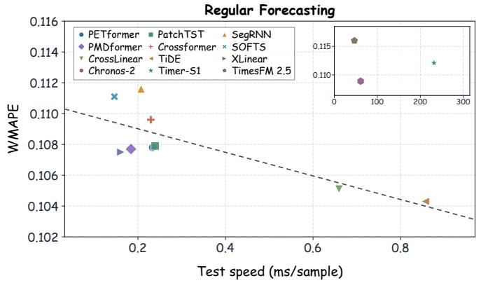

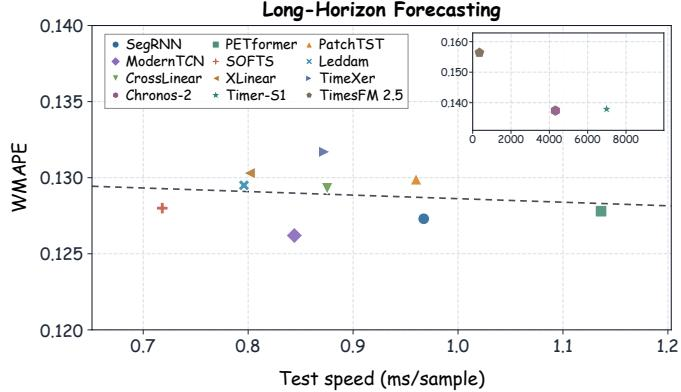  
Figure 5: Eficiency of representative forecasting models under regular and long-horizon settings.

The trade-of also difers between regular and long-horizon forecasting. In regular week-ahead forecasting, higher computational cost is more likely to bring accuracy gains, suggesting that larger capacity and better exogenous feature utilization can still be beneficial. However, in 8-week-ahead forecasting, this relationship becomes much weaker. This suggests that long-horizon performance is not simply constrained by model capacity, but also by the dificulty of capturing stable long-term trajectories.

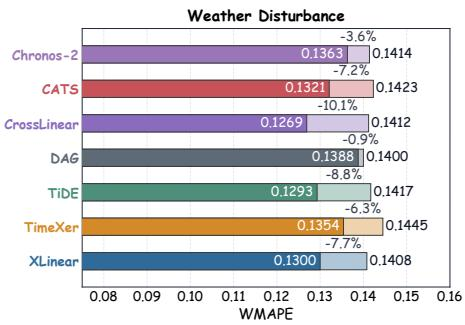

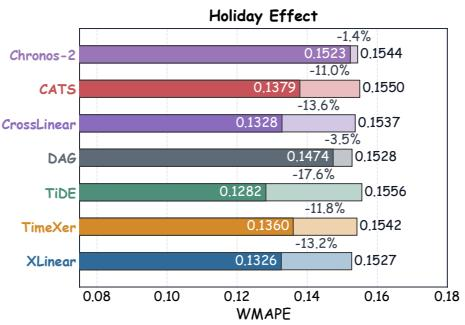

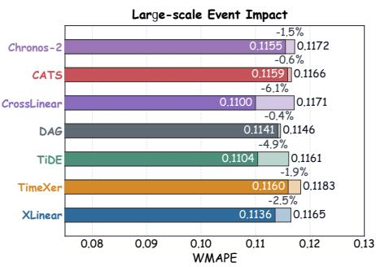  
Figure 6: Efect of incorporating exogenous variables under three scenario-specific evaluations.

These results suggest diferent research priorities for the two forecasting settings. For regular week-ahead forecasting, improving pointwise accuracy remains valuable, as larger capacity and stronger exogenous-aware architectures may further improve the use of future-known covariates. For long-horizon forecasting, however, simply increasing model complexity to reduce pointwise errors may be less efective. Future work should place more emphasis on trend-aware modeling, including the accurate prediction of de mand directions, trajectory shapes, and stable long-term temporal structures.

## 5.2 Ablation and Analysis

To better understand how diferent design factors afect forecasting performance, we conduct additional analyses under the regular week-ahead forecasting setting.

5.2.1 Exogenous Variable Utilization. To further examine whether current models can benefit from future-known external information, we compare their performance with and without exogenous variables in Figure 6. The comparison is conducted under three scenario-specific evaluations. Although Chronos-2 [2] is a zero-shot foundation model, it is also included because it natively supports exogenous inputs.

Figure 6 shows that most exogenous-aware models obtain clear improvements after incorporating external variables. This suggests that the provided exogenous features contain useful predictive sig nals and that existing models can exploit them to varying degrees. Among these methods, TiDE [8] achieves the largest average improvement, with a relative gain of 10.4%.

Chronos-2 also benefits from exogenous inputs under the zeroshot setting, suggesting that foundation models can exploit additional covariates to some extent. However, its gains are smaller for categorical scenarios such as Holiday Efect than for continuous disturbance scenarios such as Weather Disturbance, since pretrained time series foundation models may not capture the downstream semantic mappings of discrete encodings [2].

The improvement under the Large-scale Event Impact scenario is generally smaller than that under weather and holiday scenarios. This reflects the dificulty of modeling sparse and heterogeneous event efects. Unlike weather and holidays, large-scale events with explicit semantic meanings are often sparse across both areas and time, and exhaustive event collection is dificult in practice. As a result, available event samples are limited, making it harder for models to learn reliable event-specific response patterns.

In summary, future-known exogenous variables provide clear benefits for ride-hailing forecasting, but their usefulness depends on variable type and scenario complexity. Continuous disturbance signals such as weather are relatively easier to exploit, while categorical holidays and sparse large-scale events remain more challenging. We further discuss these challenges in Section 6.

5.2.2 Area Scaling Study. Ride-Hailing contains parallel time series from 200 spatial areas, providing a natural setting to study whether forecasting models can benefit from larger-scale multi-area training. This study focuses on a key question for global ride-hailing forecasting: when the target areas remain fixed, can adding more training areas help models learn transferable structures and improve area-specific forecasts?

To answer this question, we fix 10 target areas for evaluation and gradually increase the number of training areas from 10 to 200. The 10-area setting represents a limited-data regime where models can only learn from the target areas themselves, while larger settings introduce additional heterogeneous areas into training. We evaluate representative top-performing models from each model family, and include zero-shot time series foundation models as reference baselines.

As shown in Figure 7(a), Chronos-2 [2] performs strongly when only 10 training areas are available, highlighting the advantage of pretrained foundation models under limited task-specific data. However, as more areas are included in training, task-specific models continue to improve. This indicates that the additional areas do not merely introduce heterogeneity or noise; instead, they provide useful transferable information that can improve forecasting on the fixed target areas.

This finding supports the global multi-area training design of RideBench. Although diferent areas exhibit distinct demand patterns, they still share common temporal and exogenous structures, such as daily mobility cycles, weekly seasonality, and recurring responses to external factors. A strong ride-hailing forecasting model should therefore learn from large-scale heterogeneous areas while producing reliable forecasts for each individual area.

The comparison with foundation models further reveals a datascaling efect. Zero-shot foundation models are competitive when task-specific data are scarce, but their advantage becomes less pronounced as more high-quality domain data are available for training. This suggests that large-scale domain-specific data remain a key resource for building strong ride-hailing forecasting models, which is precisely the value of Ride-Hailing.

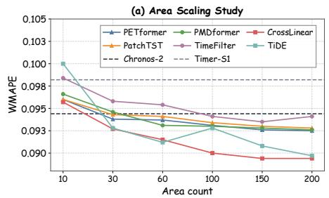

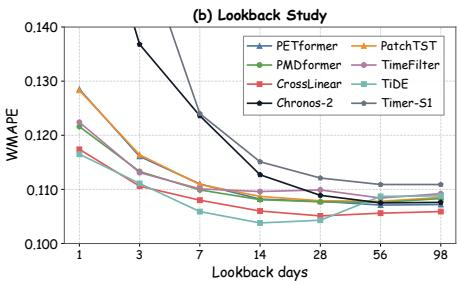

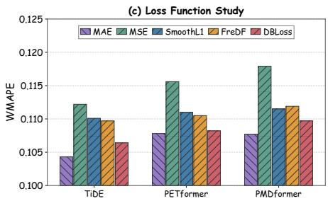  
Figure 7: Studies on key benchmark design factors. (a) Efect of increasing the number of training areas while keeping the 10 target areas fixed. (b) Efect of varying the input lookback length. (c) Impact of diferent training losses.

5.2.3 Lookback Study. The input lookback window determines how much historical context is available to the model, making it a key hyperparameter in time series forecasting [36]. We vary the input length to examine whether current models can benefit from longer temporal context.

As shown in Figure 7(b), most models improve as the lookback window increases. This confirms that longer historical context provides useful information for ride-hailing forecasting, where daily, weekly, and longer-term patterns coexist. It also suggests that well-designed forecasting models can exploit extended context to learn more robust temporal dependencies.

However, the benefit of longer lookback windows is not unlimited. When the input length is extended to 98 days, several taskspecific trained models show slight performance degradation. This may be caused by two factors: excessively long contexts can introduce irrelevant or outdated information, and longer input windows reduce the number of available sliding-window training samples. Thus, increasing the lookback length does not always lead to better forecasting.

Based on this trade-of, RideBench adopts a 28-day lookback window as the default setting. This provides suficient historical information to cover multiple weekly cycles, while keeping computational cost moderate and preserving enough training samples.

An additional observation is that time series foundation models are more sensitive to insuficient lookback length. When the input window is short, their performance is noticeably weaker; only when the lookback reaches around 28 days do they approach the performance of task-specific trained models. This is because zero-shot foundation models are not optimized on Ride-Hailing and must infer task-relevant temporal structures directly from the input context. Therefore, adequate historical context is particularly important when applying foundation models to fine-grained ride-hailing forecasting.

5.2.4 Loss Function Study. The training loss determines the opti mization preference of forecasting models. We compare commonly used objectives, including MSE, MAE, and Smooth L1 [13], as well as two time-series-specific losses, FreDF [70] and DBloss [59]. FreDF emphasizes frequency-domain discrepancies, while DBloss considers decomposed temporal components such as periodicity and trend. These objectives are relevant to ride-hailing forecasting because the data exhibit strong daily and weekly periodicity.

As shown in Figure 7(c), MAE achieves the best overall performance. This is consistent with the characteristics of ride-hailing demand. Although the series contain regular periodic patterns, they are also afected by exogenous disturbances that can introduce abrupt peaks and large deviations. In such settings, MSE may over-penalize a small number of large-error points and become overly sensitive to disturbance-induced outliers. By contrast, MAE provides a more robust optimization objective under heavy-tailed forecasting errors.

FreDF and DBloss also show competitive performance compared with MSE and Smooth L1, suggesting that frequency- and decomposition-aware objectives can help capture periodic temporal structures. However, they still underperform MAE in our setting. This indicates that, for ride-hailing forecasting, robustness to exogenous disturbances is more critical than emphasizing periodic structures alone. Therefore, we use MAE as the default training loss in RideBench.

## 6 DISCUSSION

By benchmarking representative deep learning forecasting methods developed in recent years, RideBench demonstrates the encouraging progress achieved by current models. However, it also shows that existing methods still fall short of the requirements of ride-hailing systems. We summarize two key gaps below.

Exogenous-driven pattern modeling remains insuficient. Although exogenous-aware models generally benefit from futureknown external variables, they still cannot fully capture how external factors reshape ride-hailing dynamics. As shown in Figure 8, even the best-performing exogenous-aware model, TiDE [8], only partially follows the ground-truth trajectory under strong external perturbations. This suggests that current models can use exogenous variables as auxiliary signals, but still lack suficient capability to model disturbance-induced pattern changes. This limitation arises from both data side and model side.

On the data side, exogenous efects in ride-hailing systems are highly heterogeneous and temporally structured. Weather impacts can be nonlinear or delayed; holidays involve pre-holiday, in-holiday, and post-holiday phases; and large-scale events are sparse, irregular, and temporally diverse. Moreover, the same external factor may trigger diferent demand responses across areas due to diferences in land use, commuting structure, supply-demand conditions, and event exposure.

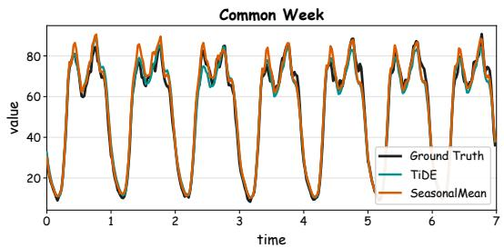

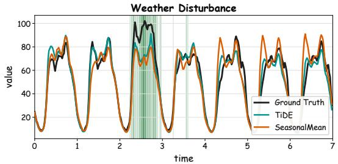

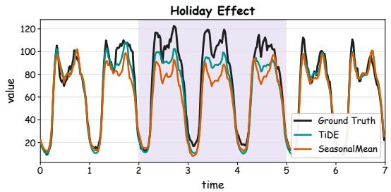

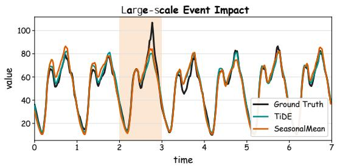  
Figure 8: Forecasting visualization under diferent evaluation scenarios.

On the model side, many existing exogenous-aware methods are not natively designed for the type of future-known categorical covariates considered in RideBench. Models such as CrossLinear [86] and TimeXer [74] mainly focus on numerical covariates or histori cal contextual variables, whereas ride-hailing forecasting requires efective use of categorical holiday semantics, event types, and other future-known external indicators. To make these methods applicable to RideBench, we extend their input interfaces to the prediction horizon and introduce categorical adapters such as onehot encoding or learnable embeddings. However, these adaptations are pragmatic compromises rather than principled solutions. They allow models to access categorical variables, but do not necessarily enable them to understand their semantic structure or heterogeneous efects across areas.

Long-horizon forecasting requires better multi-objective balance. RideBench further shows that no existing model dominates all aspects of 8-week-ahead forecasting, highlighting the dificulty of balancing multiple forecasting objectives. As shown in Table 3, models with strong pointwise accuracy do not necessarily achieve the best trend quality, while models that preserve near-term accuracy may still fail to capture long-term trajectory changes.

However, this trade-of is important for practical ride-hailing deployment. A desirable forecasting model should support both short-term operations and long-term planning: it should provide accurate near-term forecasts for operational decisions, reliable longterm trends for supply and resource planning, and stable performance over extended horizons. Such a model would reduce the need to maintain separate forecasting systems for short-term dispatching and long-term planning. However, existing benchmarks rarely evaluate these requirements jointly, which may partly explain why current models pay limited attention to this multi-objective balance.

Overall, RideBench suggests that ride-hailing forecasting requires models that can jointly handle future-known exogenous variables, categorical event semantics, spatial heterogeneity, and long-horizon planning requirements. We hope Ride-Hailing and RideBench can help the community develop more exogenous-aware, scalable, and deployment-oriented forecasting models.

## 7 CONCLUSION

In this paper, we introduced Ride-Hailing, a synthesized ridehailing time series dataset, and built RideBench upon it as a unified benchmark for exogenous-aware ride-hailing forecasting under regular week-ahead and long-horizon 8-week-ahead settings, with standardized processing, global multi-area training, scenariospecific evaluation, and long-horizon trend evaluation. Through evaluating more than 30 representative methods, we find that recent deep learning models have made encouraging progress, and that future-known exogenous variables bring clear benefits in regular week-ahead forecasting, especially under external disturbance scenarios. Further analyses show the value of scalable multi-area training, suficient historical context, and robust training objectives. RideBench also highlights two remaining gaps for real-world deployment: current exogenous-aware models still have limited ability to capture disturbance-induced pattern changes, and longhorizon forecasting requires a better balance among pointwise accuracy, broad trend quality, and near-term reliability. By providing a privacy-preserving synthesized dataset and unified evaluation protocols, we believe that RideBench can facilitate research on exogenous-aware, scalable, and deployment-oriented forecasting models for ride-hailing systems.

## ACKNOWLEDGMENTS

This work was supported by the CCF-DiDi GAIA Collaborative Research Funds (No. 202534) and the Shandong Provincial Natural Science Foundation Project (ZR2024LZH012).

## REFERENCES

[1] Taha Aksu, Gerald Woo, Juncheng Liu, Xu Liu, Chenghao Liu, Silvio Savarese, Caiming Xiong, and Doyen Sahoo. 2024. Gift-eval: A benchmark for general time series forecasting model evaluation. arXiv preprint arXiv:2410.10393 (2024).

[2] Abdul Fatir Ansari, Oleksandr Shchur, Jaris Küken, Andreas Auer, Boran Han, Pedro Mercado, Syama Sundar Rangapuram, Huibin Shen, Lorenzo Stella, Xiyuan Zhang, et al. 2025. Chronos-2: From univariate to universal forecasting. arXiv preprint arXiv:2510.15821 (2025).

[3] George EP Box and David A Pierce. 1970. Distribution of residual autocorrelations in autoregressive-integrated moving average time series models. Journal ofthe American statistical Association 65, 332 (1970), 1509–1526.

[4] Long Chen, Piyushimita Thakuriah, and Konstantinos Ampountolas. 2021. Shortterm prediction of demand for ride-hailing services: A deep learning approach. Journal ofBig Data Analytics in Transportation 3, 2 (2021), 175–195.

[5] Wei Chen and Yuxuan Liang. 2025. Learning with Calibration: Exploring Test-Time Computing of Spatio-Temporal Forecasting. In The Thirty-ninth Annual Conference on Neural Information Processing Systems.

[6] Xinyang Chen, Huidong Jin, Yu Huang, and Zaiwen Feng. 2026. XLinear: A Lightweight and Accurate MLP-Based Model for Long-Term Time Series Forecasting with Exogenous Inputs. In Proceedings ofthe AAAIConference on Artificial Intelligence.

[7] Tao Dai, Beiliang Wu, Peiyuan Liu, Naiqi Li, Jigang Bao, Yong Jiang, and Shu-Tao Xia. 2024. Periodicity decoupling framework for long-term series forecasting. In The twelfth international conference on learning representations.

[8] Abhimanyu Das, Weihao Kong, Andrew Leach, Shaan Mathur, Rajat Sen, and Rose Yu. 2023. Long-term forecasting with tide: Time-series dense encoder. arXiv preprint arXiv:2304.08424 (2023).

[9] Abhimanyu Das, Weihao Kong, Rajat Sen, and Yichen Zhou. 2023. A decoder-only foundation model for time-series forecasting. arXiv preprint arXiv:2310.10688 (2023).

[10] Robert Fildes, Shaohui Ma, and Stephan Kolassa. 2022. Retail forecasting: Research and practice. International Journal ofForecasting 38, 4 (2022), 1283–1318.

[11] Jean-Baptiste Fiot and Francesco Dinuzzo. 2016. Electricity demand forecasting by multi-task learning. IEEE Transactions on Smart Grid 9, 2 (2016), 544–551.

[12] Xu Geng, Yaguang Li, Leye Wang, Lingyu Zhang, Qiang Yang, Jieping Ye, and Yan Liu. 2019. Spatiotemporal multi-graph convolution network for ride-hailing demand forecasting. In Proceedings of the AAAI conference on artificial intelligence, Vol. 33. 3656–3663.

[13] Ross Girshick. 2015. Fast r-cnn. In Proceedings of the IEEE international conference on computer vision. 1440–1448.

[14] Rakshitha Wathsadini Godahewa, Christoph Bergmeir, Geofrey I Webb, Rob Hyndman, and Pablo Montero-Manso. 2021. Monash Time Series Forecasting Archive. In Thirty-fifth Conference on Neural Information Processing Systems Datasets and Benchmarks Track (Round 2).

[15] Albert Gu and Tri Dao. 2023. Mamba: Linear-time sequence modeling with selective state spaces. arXiv preprint arXiv:2312.00752 (2023).

[16] Lu Han, Xu-Yang Chen, Han-Jia Ye, and De-Chuan Zhan. 2024. Softs: Eficient multivariate time series forecasting with series-core fusion. Advances in Neural Information Processing Systems 37 (2024), 64145–64175.

[17] Xixuan Hao, Guicheng Li, Daiqiang Wu, Xusen Guo, Yumeng Zhu, Zhichao Zou, Peng Zhen, Yao Yao, and Yuxuan Liang. 2026. Enhancing Ride-Hailing Forecasting at DiDi with Multi-View Geospatial Representation Learning from the Web. In Proceedings ofthe ACM Web Conference 2026. 8200–8211.

[18] Andrew C Harvey and Andrew Harvey. 1990. Forecasting, structural time series models and the Kalman filter. (1990).

[19] Kaiming He, Xiangyu Zhang, Shaoqing Ren, and Jian Sun. 2016. Deep residual learning for image recognition. In Proceedings ofthe IEEE conference on computer vision and pattern recognition. 770–778.

[20] Shi Bin Hoo, Samuel Müller, David Salinas, and Frank Hutter. 2025. From Tables to Time: Extending TabPFN-v2 to Time Series Forecasting. arXiv preprint arXiv:2501.02945 (2025).

[21] Ao Hu, Liangjian Wen, Jiang Duan, Yong Dai, YAN HE, Dongkai Wang, Jun Wang, Yukun Zhang, Ruoxi Jiang, and Zenglin Xu. 2026. PMDformer: Patch Mean Decoupling Information Transformer for Long-term Forecasting. In The Fourteenth International Conference on Learning Representations.

[22] Jing Hu, Min Meng, Jigang Liu, Jun Yu, and Jigang Wu. 2026. DKGZSL: Leveraging Dynamic Visual-Semantic Knowledge for Generative Zero-Shot Learning. IEEE Transactions on Circuits and Systems for Video Technology (2026).

[23] Yifan Hu, Guibin Zhang, Peiyuan Liu, Disen Lan, Naiqi Li, Dawei Cheng, Tao Dai, Shu-Tao Xia, and Shirui Pan. 2025. TimeFilter: Patch-Specific Spatial-Temporal Graph Filtration for Time Series Forecasting. In International Conference on Machine Learning. PMLR, 24893–24911.

[24] Qihe Huang, Lei Shen, Ruixin Zhang, Shouhong Ding, Binwu Wang, Zhengyang Zhou, and Yang Wang. 2023. Crossgnn: Confronting noisy multivariate time series via cross interaction refinement. Advances in Neural Information Processing Systems 36 (2023), 46885–46902.

[25] Qihe Huang, Zhengyang Zhou, Kuo Yang, Zhongchao Yi, Xu Wang, and Yang Wang. 2025. TimeBase: The Power of Minimalism in Eficient Long-term Time Series Forecasting. In Proceedings ofthe 42nd International Conference on Machine Learning. 26227–26246.

[26] Rob Hyndman, Anne Koehler, Keith Ord, and Ralph Snyder. 2008. Forecasting with exponential smoothing: the state space approach. Springer.

[27] Rob J Hyndman and George Athanasopoulos. 2018. Forecasting: principles and practice. OTexts.

[28] Yue Jiang, Yile Chen, Xiucheng Li, Qin Chao, Shuai Liu, and Gao Cong. 2025. Fstllm: Spatio-temporal llm for few shot time series forecasting. In Forty-second International Conference on Machine Learning.

[29] Ming Jin, Huan Yee Koh, Qingsong Wen, Daniele Zambon, Cesare Alippi, Geofrey I Webb, Irwin King, and Shirui Pan. 2024. A survey on graph neural networks for time series: Forecasting, classification, imputation, and anomaly detection. IEEE transactions on pattern analysis and machine intelligence 46, 12 (2024), 10466–10485.

[30] Ming Jin, Shiyu Wang, Lintao Ma, Zhixuan Chu, James Zhang, Xiaoming Shi, Pin-Yu Chen, Yuxuan Liang, Yuan-Fang Li, Shirui Pan, et al. 2024. Time-llm: Time series forecasting by reprogramming large language models. In International conference on learning representations, Vol. 2024. 23857–23880.

[31] Boyuan Li, Yicheng Luo, Zhen Liu, Junhao Zheng, Jianming Lv, and Qianli Ma. 2025. Hyperimts: Hypergraph neural network for irregular multivariate time series forecasting. arXiv preprint arXiv:2505.17431 (2025).

[32] Zhe Li, Shiyi Qi, Yiduo Li, and Zenglin Xu. 2023. Revisiting long-term time series forecasting: An investigation on linear mapping. arXiv preprint arXiv:2305.10721 (2023).

[33] Zhengyu Li, Xiangfei Qiu, Yuhan Zhu, Xingjian Wu, Jilin Hu, Chenjuan Guo, and Bin Yang. 2026. Gcgnet: Graph-consistent generative network for time series forecasting with exogenous variables. arXiv preprint arXiv:2603.08032 (2026).

[34] Yuxuan Liang, Yutong Xia, Songyu Ke, Yiwei Wang, Qingsong Wen, Junbo Zhang, Yu Zheng, and Roger Zimmermann. 2023. Airformer: Predicting nationwide air quality in china with transformers. In Proceedings ofthe AAAI conference on artificial intelligence, Vol. 37. 14329–14337.

[35] Bryan Lim, Sercan Ö Arık, Nicolas Loef, and Tomas Pfister. 2021. Temporal fusion transformers for interpretable multi-horizon time series forecasting. International journal of forecasting 37, 4 (2021), 1748–1764.

[36] Shengsheng Lin, Haojun Chen, Haijie Wu, Chunyun Qiu, and Weiwei Lin. 2025. Temporal Query Network for Eficient Multivariate Time Series Forecasting. In Forty-second International Conference on Machine Learning.

[37] Shengsheng Lin, Weiwei Lin, Xinyi Hu, Wentai Wu, Ruichao Mo, and Haocheng Zhong. 2024. Cyclenet: Enhancing time series forecasting through modeling periodic patterns. Advances in Neural Information Processing Systems 37 (2024), 106315–106345.

[38] Shengsheng Lin, Weiwei Lin, Wentai Wu, Haojun Chen, and Junjie Yang. 2024. SparseTSF: modeling long-term time series forecasting with 1k parameters. In Proceedings ofthe 41st International Conference on Machine Learning. 30211– 30226.

[39] Shengsheng Lin, Weiwei Lin, Wentai Wu, Songbo Wang, and Yongxiang Wang. 2024. Petformer: Long-term time series forecasting via placeholder-enhanced transformer. IEEE Transactions on Emerging Topics in Computational Intelligence (2024).

[40] Shengsheng Lin, Weiwei Lin, Wentai Wu, Feiyu Zhao, Ruichao Mo, and Haotong Zhang. 2025. Segrnn: Segment recurrent neural network for long-term time series forecasting. IEEE Internet ofThings Journal (2025).

[41] Chenghao Liu, Taha Aksu, Juncheng Liu, Xu Liu, Hanshu Yan, Quang Pham, Silvio Savarese, Doyen Sahoo, Caiming Xiong, and Junnan Li. 2025. Moirai 2.0: When less is more for time series forecasting. arXiv preprint arXiv:2511.11698 (2025).

[42] Chenxi Liu, Qianxiong Xu, Hao Miao, Sun Yang, Lingzheng Zhang, Cheng Long, Ziyue Li, and Rui Zhao. 2025. Timecma: Towards llm-empowered multivariate time series forecasting via cross-modality alignment. In Proceedings ofthe AAAI Conference on Artificial Intelligence, Vol. 39. 18780–18788.

[43] Xu Liu, Yutong Xia, Yuxuan Liang, Junfeng Hu, Yiwei Wang, Lei Bai, Chao Huang, Zhenguang Liu, Bryan Hooi, and Roger Zimmermann. 2023. Largest: A benchmark dataset for large-scale trafic forecasting. Advances in Neural Information Processing Systems 36 (2023), 75354–75371.

[44] Yong Liu, Tengge Hu, Haoran Zhang, Haixu Wu, Shiyu Wang, Lintao Ma, and Mingsheng Long. 2024. itransformer: Inverted transformers are efective for time series forecasting. In International conference on learning representations, Vol. 2024. 11116–11140.

[45] Yong Liu, Xingjian Su, Shiyu Wang, Haoran Zhang, Haixuan Liu, Yuxuan Wang, Zhou Ye, Yang Xiang, Jianmin Wang, and Mingsheng Long. 2026. Timer-S1: A Billion-Scale Time Series Foundation Model with Serial Scaling. arXiv preprint arXiv:2603.04791 (2026).

[46] Ilya Loshchilov and Frank Hutter. 2019. Decoupled Weight Decay Regularization. In International Conference on Learning Representations.

[47] Jiecheng Lu, Xu Han, Yan Sun, and Shihao Yang. 2024. CATS: Enhancing Multivariate Time Series Forecasting by Constructing Auxiliary Time Series as

Exogenous Variables. In Forty-first International Conference on Machine Learning.

[48] Kuan Lu, Menghao Huo, Yuxiao Li, Qiang Zhu, and Zhenrui Chen. 2025. Ctpatchtst: Channel-time patch time-series transformer for long-term renewable energy forecasting. In 2025 10th International Conference on Computer and Information Processing Technology (ISCIPT). IEEE, 86–95.

[49] Donghao Luo and Xue Wang. 2024. ModernTCN: A Modern Pure Convolu tion Structure for General Time Series Analysis.. In International Conference on Machine Learning.

[50] Yicheng Luo, Bowen Zhang, Zhen Liu, and Qianli Ma. 2025. Hi-patch: Hierarchi cal patch gnn for irregular multivariate time series. In Forty-second International Conference on Machine Learning.

[51] Francisco Martínez, María Pilar Frías, María Dolores Pérez, and Antonio Jesús Rivera. 2019. A methodology for applying k-nearest neighbor to time series forecasting. Artificial Intelligence Review 52, 3 (2019), 2019–2037.

[52] Soukayna Mouatadid, Paulo Orenstein, Genevieve Flaspohler, Miruna Oprescu, Judah Cohen, Franklyn Wang, Sean Knight, Maria Geogdzhayeva, Sam Levang, Ernest Fraenkel, et al. 2023. SubseasonalclimateUSA: A dataset for subseasonal forecasting and benchmarking. Advances in Neural Information Processing Systems 36 (2023), 7960–7992.

[53] Yuqi Nie, Nam H. Nguyen, Phanwadee Sinthong, and Jayant Kalagnanam. 2023. A Time Series is Worth 64 Words: Long-term Forecasting with Transformers. In The Eleventh International Conference on Learning Representations.

[54] Yiming Niu, Jinliang Deng, and Yongxin Tong. 2026. PhaseFormer: From Patches to Phases for Eficient and Efective Time Series Forecasting. In International Conference on Learning Representations.

[55] Adam Paszke, Sam Gross, Francisco Massa, Adam Lerer, James Bradbury, Gregory Chanan, Trevor Killeen, Zeming Lin, Natalia Gimelshein, Luca Antiga, et al. 2019. Pytorch: An imperative style, high-performance deep learning library. Advances in neural information processing systems 32 (2019).

[56] Mayur Patil, Qadeer Ahmed, and Shawn Midlam-Mohler. 2025. Travel Time and Weather-Aware Trafic Forecasting in a Conformal Graph Neural Network Framework. IEEE Transactions on Intelligent Transportation Systems (2025).

[57] Zhongzheng Qiao, Sheng Pan, Anni Wang, Viktoriya Zhukova, Yong Liu, Xudong Jiang, Qingsong Wen, Mingsheng Long, Ming Jin, and Chenghao Liu. 2026. It’s TIME: Towards the Next Generation of Time Series Forecasting Benchmarks. arXiv preprint arXiv:2602.12147 (2026).

[58] Xiangfei Qiu, Jilin Hu, Lekui Zhou, Xingjian Wu, Junyang Du, Buang Zhang, Chenjuan Guo, Aoying Zhou, Christian S Jensen, Zhenli Sheng, et al. 2024. TFB: Towards Comprehensive and Fair Benchmarking of Time Series Forecasting Methods. Proceedings of the VLDB Endowment 17, 9 (2024), 2363–2377.

[59] Xiangfei Qiu, Xingjian Wu, Hanyin Cheng, Xvyuan Liu, Chenjuan Guo, Jilin Hu, and Bin Yang. 2026. Dbloss: Decomposition-based loss function for time series forecasting. Advances in Neural Information Processing Systems 38 (2026), 27741–27768.

[60] Xiangfei Qiu, Xingjian Wu, Yan Lin, Chenjuan Guo, Jilin Hu, and Bin Yang. 2025. Duet: Dual clustering enhanced multivariate time series forecasting. In Proceedings of the 31st ACM SIGKDD Conference on Knowledge Discovery and Data Mining V. 1. 1185–1196.

[61] Xiangfei Qiu, Yuhan Zhu, Zhengyu Li, Xingjian Wu, Bin Yang, and Jilin Hu. 2026. DAG: A Dual Correlation Network for Time Series Forecasting with Exogenous Variables. In International Conference on Machine Learning.

[62] Zezhi Shao, Fei Wang, Yongjun Xu, Wei Wei, Chengqing Yu, Zhao Zhang, Di Yao, Tao Sun, Guangyin Jin, Xin Cao, et al. 2024. Exploring progress in multi variate time series forecasting: Comprehensive benchmarking and heterogeneity analysis. IEEE Transactions on Knowledge and Data Engineering 37, 1 (2024), 291–305.

[63] Zezhi Shao, Zhao Zhang, Fei Wang, Wei Wei, and Yongjun Xu. 2022. Spatial temporal identity: A simple yet efective baseline for multivariate time series forecasting. In Proceedings ofthe 31st ACM international conference on information & knowledge management. 4454–4458.

[64] Oleksandr Shchur, Abdul Fatir Ansari, Caner Turkmen, Lorenzo Stella, Nick Erickson, Pablo Guerron, Michael Bohlke-Schneider, and Yuyang Wang. 2025. fev-bench: A realistic benchmark for time series forecasting. arXiv preprint arXiv:2509.26468 (2025).

[65] Arunesh Kumar Singh, S Khatoon Ibraheem, Md Muazzam, and DK Chaturvedi. 2013. An overview of electricity demand forecasting techniques. Network and complex systems 3, 3 (2013), 38–48.

[66] Zhong Siru, Ruan Weilin, Ming Jin, Li Huan, Wen Qingsong, and Liang Yuxuan. 2025. Time-VLM: Exploring Multimodal Vision-Language Models for Augmented Time Series Forecasting. In Forty-Second International Conference on Machine Learning (ICML 2025). Proceedings of Machine Learning Research.

[67] Hiro Y Toda and Peter CB Phillips. 1994. Vector autoregression and causality: a theoretical overview and simulation study. Econometric reviews 13, 2 (1994), 259–285.

[68] Laurens Van der Maaten and Geofrey Hinton. 2008. Visualizing data using t-SNE. Journal ofmachine learning research 9, 11 (2008).

[69] Ashish Vaswani, Noam Shazeer, Niki Parmar, Jakob Uszkoreit, Llion Jones, Aidan N Gomez, Łukasz Kaiser, and Illia Polosukhin. 2017. Attention is all you need. Advances in neural information processing systems 30 (2017).

[70] Hao Wang, Lichen Pan, Yuan Shen, Zhichao Chen, Degui Yang, Yifei Yang, Sen Zhang, Xinggao Liu, Haoxuan Li, and Dacheng Tao. 2025. Fredf: Learning to forecast in the frequency domain. In International Conference on Learning Representations, Vol. 2025. 6893–6922.

[71] S Wang, H Wu, X Shi, T Hu, H Luo, L Ma, JY Zhang, and J Zhou. [n.d.]. Timemixer: Decomposable multiscale mixing for time series forecasting. arXiv preprint arXiv:2405.14616 ([n. d.]).

[72] Xing Wang, Zhendong Wang, Kexin Yang, Junlan Feng, Zhiyan Song, Chao Deng, et al. 2023. MPPN: multi-resolution periodic pattern network for long-term time series forecasting. arXiv preprint arXiv:2306.06895 (2023).

[73] Yuxuan Wang, Haixu Wu, Jiaxiang Dong, Yong Liu, Mingsheng Long, and Jianmin Wang. 2024. Deep Time Series Models: A Comprehensive Survey and Benchmark. arXiv preprint arXiv:2407.13278 (2024).

[74] Yuxuan Wang, Haixu Wu, Jiaxiang Dong, Guo Qin, Haoran Zhang, Yong Liu, Yunzhong Qiu, Jianmin Wang, and Mingsheng Long. 2024. Timexer: Empowering transformers for time series forecasting with exogenous variables. Advances in Neural Information Processing Systems 37 (2024), 469–498.

[75] Haixu Wu, Tengge Hu, Yong Liu, Hang Zhou, Jianmin Wang, and Mingsheng Long. 2022. Timesnet: Temporal 2d-variation modeling for general time series analysis. arXiv preprint arXiv:2210.02186 (2022).

[76] Siqiao Xue, Zhaoyang Zhu, Wei Zhang, Rongyao Cai, Rui Wang, Yixiang Mu, Fan Zhou, Jianguo Li, Peng Di, and Hang Yu. 2026. QuitoBench: A High-Quality Open Time Series Forecasting Benchmark. arXiv preprint arXiv:2603.26017 (2026).

[77] Huaxiu Yao, Fei Wu, Jintao Ke, Xianfeng Tang, Yitian Jia, Siyu Lu, Pinghua Gong, Jieping Ye, and Zhenhui Li. 2018. Deep multi-view spatial-temporal network for taxi demand prediction. In Proceedings ofthe AAAI conference on artificial intelligence, Vol. 32.

[78] Bing Yu, Haoteng Yin, and Zhanxing Zhu. 2018. Spatio-temporal graph convolu tional networks: a deep learning framework for trafic forecasting. In Proceedings of the 27th International Joint Conference on Artificial Intelligence. 3634–3640.

[79] Guoqi Yu, Jing Zou, Xiaowei Hu, Angelica I Aviles-Rivero, Jing Qin, and Shujun Wang. 2024. Revitalizing Multivariate Time Series Forecasting: Learnable Decom position with Inter-Series Dependencies and Intra-Series Variations Modeling. In International Conference on Machine Learning. PMLR, 57818–57841.

[80] Ailing Zeng, Muxi Chen, Lei Zhang, and Qiang Xu. 2023. Are Transformers Efective for Time Series Forecasting?. In Proceedings of the AAAI Conference on Artificial Intelligence.

[81] Jiawen Zhang, Xumeng Wen, Zhenwei Zhang, Shun Zheng, Jia Li, and Jiang Bian. 2024. ProbTS: Benchmarking point and distributional forecasting across diverse prediction horizons. Advances in Neural Information Processing Systems 37 (2024), 48045–48082.

[82] Yang Zhang, Lingbo Liu, Xinyu Xiong, Guanbin Li, Guoli Wang, and Liang Lin. 2023. Long-term wind power forecasting with hierarchical spatial-temporal transformer. In Proceedings of the Thirty-Second International Joint Conference on Artificial Intelligence. 6308–6316.

[83] Yunhao Zhang and Junchi Yan. 2023. Crossformer: Transformer utilizing crossdimension dependency for multivariate time series forecasting. In The eleventh international conference on learning representations.

[84] Chuanpan Zheng, Xiaoliang Fan, Cheng Wang, and Jianzhong Qi. 2020. Gman: A graph multi-attention network for trafic prediction. In Proceedings ofthe AAAI conference on artificial intelligence, Vol. 34. 1234–1241.

[85] Haoyi Zhou, Shanghang Zhang, Jieqi Peng, Shuai Zhang, Jianxin Li, Hui Xiong, and Wancai Zhang. 2021. Informer: Beyond eficient transformer for long sequence time-series forecasting. In Proceedings ofthe AAAI conference on artificial intelligence, Vol. 35. 11106–11115.

[86] Pengfei Zhou, Yunlong Liu, Junli Liang, Qi Song, and Xiangyang Li. 2025. CrossLinear: Plug-and-play cross-correlation embedding for time series forecasting with exogenous variables. In Proceedings ofthe 31st ACM SIGKDD Conference on Knowledge Discovery and Data Mining V. 2. 4120–4131.

[87] Zhuohang Zhu, Haodong Chen, Qiang Qu, and Vera Chung. 2025. FinCast: A Foundation Model for Financial Time-Series Forecasting. In Proceedings of the 34th ACM International Conference on Information and Knowledge Management. 4539–4549.