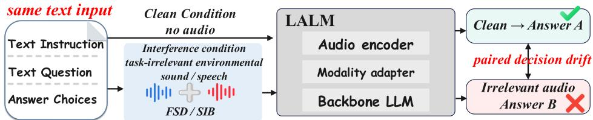
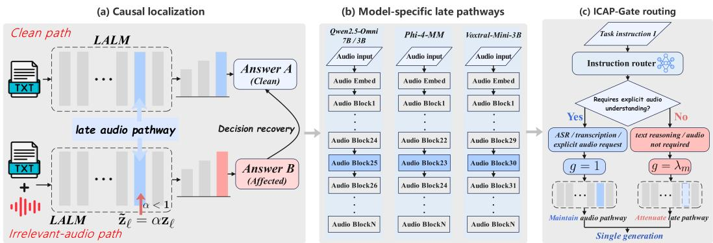
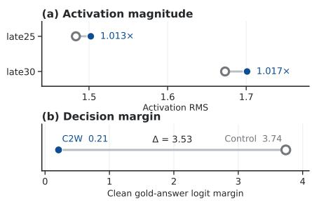
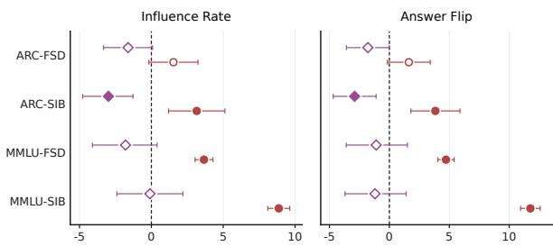
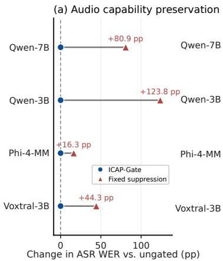
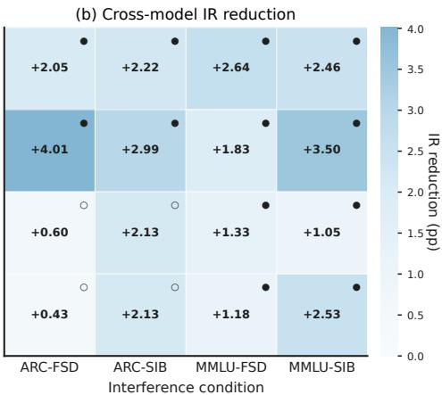

# SELECTIVE LISTENING: MECHANISM-GUIDED CON-TROL OF AUDIO INFLUENCE IN LARGE AUDIO-LANGUAGE MODELS

Yulin Sun1,2, Kele Xu1,2∗, Yong Dou1,2

1College of Computer Science and Technology, National University of Defense Technology 2State Key Laboratory of Complex & Critical Software Environment

## ABSTRACT

Large audio-language models (LALMs) exploit multimodal evidence, yet taskirrelevant audio can alter text-reasoning decisions when listening is unnecessary. Aggregate Accuracy can hide this paired drift because audio-induced repairs and damages may cancel. Paired drift analysis and targeted interventions identify architecture-specific, intervention-sensitive late audio pathways as actionable control points. We introduce ICAP-Gate, which applies mechanism-guided, taskconditioned control to each model’s pathway. Across four LALMs, two reasoning benchmarks, and environmental-sound and natural-speech interference, ICAP-Gate has lower point estimates for Influence Rate and Answer Flip than ungated inference in all 16 full-split model–condition evaluations. Fixed suppression degrades automatic speech recognition (ASR) across all four models, whereas ICAP-Gate matches ungated ASR performance by preserving the pathway for explicit audio-demand instructions. ICAP-Gate has lower paired-drift point estimates than mitigation prompting in all four evaluated settings and provides competitive stabilization relative to eight-sample Self-Consistency while using one generation per query; in controlled ARC measurements, Self-Consistency incurs 7.0–9.2× ungated latency. These results establish selective modality influence control as a design principle for robust multimodal reasoning.

## 1 INTRODUCTION

Large audio-language models (LALMs) combine listening with language reasoning, but modal ity availability does not imply task relevance. In text-reasoning settings, environmental sounds or speech may provide no evidence for the answer yet change the model’s decision. Robust multimodal inference therefore requires control over when audio influences computation. Figure 1 illustrates this paired decision drift.

Recent work shows that irrelevant audio can degrade text reasoning and increase output volatility in LALMs (Li et al., 2026a). Aggregate task scores can conceal that instability when repairs and damages cancel. We therefore measure paired decision drift: whether the same text question reaches a different decision with task-irrelevant audio.

Behavioral drift does not reveal where irrelevant audio acquires consequential influence inside the model or identify a control point that can be modulated according to task demand. Because the audio pathway must remain available for explicit audio-demand instructions and the evaluated audiorelevant tasks, the mechanistic question is: where does irrelevant audio become actionable in reasoning, and can its influence be selectively controlled while preserving useful audio processing?

We trace unwanted modality influence from behavior through mechanism to control. Paired clean/interference evaluation and targeted internal interventions identify intervention-sensitive late audio pathways through which irrelevant audio affects downstream decisions. Qwen2.5-Omni provides the highest-resolution causal localization, while actionable late-path control points recur in

  
Figure 1: Paired decision drift under task-irrelevant audio. The same text input is evaluated with and without task-irrelevant environmental sound or speech; the downstream decision may change.

Phi-4-MM and Voxtral-Mini-3B. This pattern motivates selective modality influence control, instantiated by ICAP-Gate: it modulates each model’s pathway according to task demand with one generation per query, stabilizing reasoning across architectures and interference types while preserving performance on the evaluated ASR task. Figure 2 summarizes this mechanism-guided control.

Our contributions are threefold:

• Paired drift exposes the hidden failure mode. Paired decision analysis reveals reasoning drift hidden by aggregate Accuracy, while targeted interventions causally localize an intervention-sensitive late audio pathway in Qwen2.5-Omni.

• Late audio pathways provide actionable control points. We formulate selective modality influence control and instantiate it with ICAP-Gate, which conditions architecture-adapted pathway modulation on task demand so that audio influence is attenuated when unnecessary and preserved for explicit audio-demand instructions. Corresponding actionable sites recur across heterogeneous audio architectures.

• Task-conditioned control stabilizes reasoning while preserving evaluated ASR. Across four LALMs, two reasoning benchmarks, and both environmental and controlled naturalspeech interference, ICAP-Gate has lower Influence Rate and Answer Flip point estimates than ungated inference in all 16 full-split evaluations while matching ungated WER on the evaluated ASR task.

## 2 RELATED WORK

## 2.1 LARGE AUDIO-LANGUAGE MODELS AND MULTIMODAL REASONING

Audio-language models extend language reasoning to audio understanding and spoken interaction. Early systems linked pretrained language models to audio and speech representations, while later systems broadened audio instruction tuning, long-context reasoning, and end-to-end speech interaction (Deshmukh et al., 2023; Gong et al., 2024; Zhang et al., 2023; Rubenstein et al., 2023; Tang et al., 2024; Ghosh et al., 2025; Defossez et al., 2024; Huang et al., 2025; Li et al., 2025).´

Recent systems expose distinct audio–language interfaces, including Qwen2.5-Omni, Phi-4- Multimodal, and Voxtral (Xu et al., 2025; Abouelenin et al., 2025; Liu et al., 2025; Chu et al., 2023; 2024). This architectural diversity sharpens the control question: how should an LALM regulate audio influence when listening is unnecessary?

## 2.2 ROBUSTNESS TO IRRELEVANT OR DISTRACTING MODALITIES

Irrelevant textual, retrieved, visual, and multimodal contexts can disrupt reasoning across language and multimodal models (Shi et al., 2023; Yoran et al., 2024; Yang et al., 2025; Sharma et al., 2024; Yang et al., 2026; Cai et al., 2025; Liu et al., 2024; Tian et al., 2026). Multimodal capability alone therefore does not ensure selective use of available inputs.

For audio-language models, Li et al. (2026a) showed that task-irrelevant silence, synthetic noise, and environmental sounds perturb text reasoning across multiple LALMs, and evaluated prompting and Self-Consistency as inference-time mitigations. We identify where irrelevant audio becomes consequential and control that pathway according to task demand.

  
Figure 2: Mechanism-guided selective control of irrelevant-audio influence in LALMs. (a) Pathway scaling identifies a late audio pathway through which irrelevant audio changes Qwen2.5- Omni decisions. (b) The actionable control site is architecture-adapted across Qwen2.5-Omni, Phi-4-MM, and Voxtral-Mini-3B. (c) Instruction-conditioned routing keeps the pathway open for explicit audio-demand requests $( g = 1 )$ and attenuates it otherwise $( g = \lambda _ { m } )$ , followed by one generation.

## 2.3 MECHANISTIC INTERVENTION AND CONDITIONAL MODALITY CONTROL

Mechanistic interventions—including causal mediation and tracing, activation patching, circuit discovery, and representation patching—localize behaviorally consequential computation (Vig et al., 2020; Meng et al., 2022; Conmy et al., 2023; Zhang & Nanda, 2024; Ghandeharioun et al., 2024). Multimodal studies apply related interventions to vision–language representations and information flow (Palit et al., 2023; Li et al., 2026b; Kim et al., 2026), establishing internal pathways as actionable objects for explanation and control.

Conditional computation regulates information flow through gating, feature-wise conditioning, cross-attention, and expert routing (Arevalo et al., 2017; Perez et al., 2018; Alayrac et al., 2022; Shazeer et al., 2017; Fedus et al., 2022); multimodal routing extends this principle across modalities (Wu et al., 2024; Lin et al., 2026). We connect intervention-based pathway localization with task-conditioned control: ICAP-Gate modulates the architecture-specific pathway through which irrelevant audio affects reasoning, realizing selective modality influence control.

## 3 METHODOLOGY

## 3.1 PROBLEM FORMULATION AND REASONING DRIFT

We study unwanted modality influence in large audio-language models: audio should affect a prediction when it provides task-relevant evidence, but its presence alone should not alter a decision when the task can be solved from text. Let $\mathcal { D } = \{ ( x _ { i } , y _ { i } ) \} _ { i = 1 } ^ { N }$ denote a text-reasoning dataset, where $x _ { i }$ is the reasoning input and $y _ { i }$ is the gold answer. Each example is evaluated under three aligned conditions: clean text-only inference, ungated inference with task-irrelevant audio $a _ { i } .$ , and pathwaycontrolled inference. For the interference conditions considered, $y _ { i }$ is determined by $x _ { i }$ , while $a _ { i }$ provides no answer-bearing information. We instantiate $a _ { i }$ with structured environmental audio (FSD) and natural speech (SIB), covering non-linguistic and linguistically structured interference.

For a model $f _ { \theta }$ and answer extractor $E ,$ the corresponding predictions are

$$
\hat { y } _ { i } ^ { c } = E \bigl ( f _ { \theta } ( x _ { i } ) \bigr ) , \qquad \hat { y } _ { i } ^ { u } = E \bigl ( f _ { \theta } ( x _ { i } , a _ { i } ) \bigr ) , \qquad \hat { y } _ { i } ^ { g } = E \bigl ( f _ { \theta , G } ( x _ { i } , a _ { i } ) \bigr ) ,\tag{1}
$$

where $c , u ,$ and $g$ denote clean, ungated, and pathway-controlled inference, respectively, and $G$ denotes the pathway-control intervention. Clean inference provides the paired reference for isolating audio-induced change, while correctness is tracked independently against the gold answer. We operationalize reasoning drift as a sample-level change in either correctness state or extracted answer identity relative to this clean reference.

For $k \in \{ c , u , g \}$ , define correctness and accuracy as

$$
s _ { i } ^ { k } = \mathbf { 1 } \big [ \hat { y } _ { i } ^ { k } = y _ { i } \big ] , \qquad \mathrm { A c c } ( k ) = \frac { 1 } { N } \sum _ { i = 1 } ^ { N } s _ { i } ^ { k } .\tag{2}
$$

We measure paired drift using Influence Rate (IR) for correctness-state changes and Answer Flip for any answer change, including switches between incorrect answers:

$$
\mathrm { I R } ( k ) = \frac { 1 } { N } \sum _ { i = 1 } ^ { N } { \bf 1 } \left[ s _ { i } ^ { k } \neq s _ { i } ^ { c } \right] , \qquad \mathrm { F l i p } ( k ) = \frac { 1 } { N } \sum _ { i = 1 } ^ { N } { \bf 1 } \left[ \hat { y } _ { i } ^ { k } \neq \hat { y } _ { i } ^ { c } \right] .\tag{3}
$$

The distinction from aggregate accuracy is exact. Let $n _ { \mathrm { c w } } ^ { ( k ) }$ and $n _ { \mathrm { w c } } ^ { ( k ) }$ denote clean-correct→wrong and clean-wrong→correct transitions under condition k. Then

$$
\mathrm { I R } ( k ) = \frac { n _ { \mathrm { c w } } ^ { ( k ) } + n _ { \mathrm { w c } } ^ { ( k ) } } { N } , \qquad \mathrm { A c c } ( k ) - \mathrm { A c c } ( c ) = \frac { n _ { \mathrm { w c } } ^ { ( k ) } - n _ { \mathrm { c w } } ^ { ( k ) } } { N } .\tag{4}
$$

Accuracy can therefore remain nearly unchanged even when many individual predictions move, because opposing transitions cancel in aggregate. We consequently report accuracy together with paired drift rather than treating aggregate score as a complete measure of robustness.

Finally, we resolve the direction of a pathway intervention with two paired transition measures:

$$
\mathrm { N e t C 2 W } \qquad = \sum _ { i = 1 } ^ { N } \mathbf { 1 } [ s _ { i } ^ { c } = 1 , s _ { i } ^ { u } = 0 , s _ { i } ^ { g } = 1 ] - \sum _ { i = 1 } ^ { N } \mathbf { 1 } [ s _ { i } ^ { c } = 1 , s _ { i } ^ { u } = 1 , s _ { i } ^ { g } = 0 ] ,\tag{5}
$$

$$
\begin{array} { r l } { \mathrm { { N e t A n s w e r } } } & { { } = \displaystyle \sum _ { i = 1 } ^ { N } \mathbf { 1 } [ \hat { y } _ { i } ^ { c } \neq \hat { y } _ { i } ^ { u } , \hat { y } _ { i } ^ { c } = \hat { y } _ { i } ^ { g } ] - \sum _ { i = 1 } ^ { N } \mathbf { 1 } [ \hat { y } _ { i } ^ { c } = \hat { y } _ { i } ^ { u } , \hat { y } _ { i } ^ { c } \neq \hat { y } _ { i } ^ { g } ] . } \end{array}\tag{6}
$$

NetC2W measures net recovery of clean-correct cases, while NetAnswer measures net restoration of the clean decision. Together with IR and Answer Flip, these paired quantities expose whether pathway control reverses the specific prediction changes introduced by irrelevant audio.

## 3.2 LATE AUDIO PATHWAYS PROVIDE ACTIONABLE CONTROL POINTS

The paired drift measures establish when irrelevant audio changes a reasoning decision; we next ask where that influence becomes actionable. Paired traces and teacher-forced answer analysis identify where executions separate, while targeted interventions test whether the pathway controls the resulting transitions. Figure $2 ( \mathrm { a } )$ summarizes this localization, which is defined by its effect on paired reasoning transitions rather than activation magnitude alone.

For an audio-pathway module at depth ℓ with output ${ \bf z } _ { \ell } ,$ we intervene using

$$
\begin{array} { r } { \widetilde { \mathbf { z } } _ { \ell } = \alpha \mathbf { z } _ { \ell } , \qquad 0 \leq \alpha \leq 1 , } \end{array}\tag{7}
$$

where $\alpha = 0$ corresponds to ablation and $0 < \alpha < 1$ to soft attenuation. We quantify intervention sensitivity with Influence Rate, Answer Flip, Net C2W, Net Answer, and the gold-answer margin, identifying pathway sites whose modulation changes downstream reasoning.

In Qwen2.5-Omni, complementary diagnostics and interventions identify a late audio pathway as an actionable control point. Intervening at this pathway reverses audio-induced answer changes and restores clean decisions, showing that it controls paired reasoning transitions. Figure 3 shows that clean-correct-to-wrong and clean-stable cases have similar audio-activation RMS at representative late sites, while their clean gold-answer margins differ sharply. Together with the targeted interventions, this contrast points to decision-relevant influence through the late audio pathway rather than a simple increase in activation magnitude.

The same intervention logic recurs across heterogeneous LALM architectures. Phi-4-MM and Voxtral-Mini-3B expose model-specific late audio pathways with the same actionable control role, as summarized in Figure 2(b). The module and attenuation scale are architecture-specific, while the higher-level pattern is consistent: unwanted audio influence remains controllable through late audio processing. Detailed Qwen localization evidence is provided in Appendix C.

This localization turns mitigation into internal control of audio influence, rather than removal of the audio input.

The localization shows that the audio pathway can carry unwanted influence when audio is irrelevant yet remains important for explicit audio-demand instructions and the evaluated ASR task. We therefore use selective modality influence control: Figure 2(c) instantiates this principle as ICAP-Gate (Instruction-Conditioned Audio Pathway Gating), which modulates the intervention-sensitive pathway identified for each architecture.

For model $m ,$ , let $\ell _ { m }$ denote the selected audio pathway and $\lambda _ { m } \in [ 0 , 1 )$ its calibrated attenuation scale. Given task instruction I, we define an explicit audio-demand indicator $r ( I ) \in \{ 0 , 1 \}$ and apply

  
Figure 3: Activation magnitude and decision margin (Qwen2.5-Omni, FSD). (a) Activation RMS at two late audio sites for clean-correct-to-wrong (C2W) and clean-stable controls; labels show C2W/control ratios. (b) Shared clean gold-answer logit margins for groups. Filled blue/hollow gray markers denote C2W/control aggregates.

$$
g _ { m } ( I ) = \left\{ \begin{array} { l l } { 1 , \quad } & { r ( I ) = 1 , } \\ { \lambda _ { m } , } & { r ( I ) = 0 , } \end{array} \right. \quad \widetilde { \mathbf { z } } _ { \ell _ { m } } = g _ { m } ( I ) \mathbf { z } _ { \ell _ { m } } .\tag{8}
$$

When the instruction explicitly asks for audio understanding, ICAP-Gate leaves the pathway unchanged; otherwise, it applies the model-specific attenuation. The rule is therefore architecture-adapted rather than tied to a particular layer index.

ICAP-Gate routes on the task instruction, whose explicit audio-demand cue determines $r ( I )$ , rather than on incidental words in the question body. The cue inventory and routing audit are provided in Appendix $\operatorname { F } ;$ instruction-scoped routing keeps the decision transparent and auditable.

We obtain $( \ell _ { m } , \lambda _ { m } )$ offline from the intervention analysis and report the selected pathway and fullsplit confirmation scope in Table 4. Online inference requires one instruction routing decision and one temporary pathway modulation, preserving single-generation inference without a cleanreference pass or auxiliary relevance model. The complete procedure is given in Appendix A.8, Algorithm 1.

## 4 EXPERIMENTS

## 4.1 EXPERIMENTAL SETUP

Models and reasoning tasks. We evaluate four LALMs—Qwen2.5-Omni-7B, Qwen2.5-Omni-3B, Phi-4-MM, and Voxtral-Mini-3B—on the full ARC-Challenge and MMLU test sets. Each benchmark is paired with FSD and SIB, yielding four full-split settings per model. Table 4 reports the architecture-specific intervention configurations; the control rule is shared across models.

Irrelevant-audio conditions. FSD pairs each reasoning example with a real-world environmental clip drawn from FSD50K (Fonseca et al., 2022). SIB complements this non-linguistic interference with independently paired natural speech from LibriSpeech dev-clean (Panayotov et al., 2015), while the gold answer remains determined by the text. This tests whether unwanted modality influence persists when the irrelevant stream carries coherent linguistic content; construction and transcript validity are detailed in Section 4.5 and Appendix H.

Inference and evaluation protocol. For every model and example, clean, ungated-audio, and ICAP-Gate predictions use the same text input, paired interference audio, and model-specific decoding configuration. Detailed response handling and source-level alignment are provided in Appendix A.

Statistics and audio-relevant evaluation. We report Accuracy, Influence Rate, Answer Flip, NetC2W, and NetAnswer as defined in Section 3.1; statistical checks and implementation details are provided in Appendices A and A.9. Selective preservation is evaluated with ungated, fixedattenuation, and ICAP-Gate inference on 400 LibriSpeech dev-clean ASR utterances per model using word error rate (WER).

Table 1: Main results across four LALMs. Accuracy is reported as clean/ungated/ICAP (C/U/I); IR and Flip show ungated→ICAP. ∆IR and ∆Flip denote absolute reductions in percentage points. Net C2W and Net Ans report directional recovery toward the clean decision. Asterisks mark paired 95% CIs that exclude zero.
<table><tr><td>Setting</td><td>Acc. C/U/I</td><td>IR U→I</td><td>∆IR↑</td><td>Flip U→I</td><td>∆Flip↑</td><td>Net C2W</td><td>Net Ans</td></tr><tr><td colspan="8">Qwen2.5-Omni-7B</td></tr><tr><td>ARC-FSD</td><td>84.56/83.53/84.90</td><td>8.19→6.14</td><td>2.05*</td><td>9.04→7.00</td><td>2.04*</td><td>+20</td><td>+24</td></tr><tr><td>ARC-SIB</td><td>84.56/82.85/85.07</td><td>9.39→7.17</td><td>2.22*</td><td>11.09→8.28</td><td>2.81*</td><td>+26</td><td>+33</td></tr><tr><td>MMLU-FSD</td><td>67.42/67.58/67.55</td><td>11.80→9.16</td><td>2.64*</td><td>16.06→12.60</td><td>3.46*</td><td>+183</td><td>+486</td></tr><tr><td>MMLU-SIB</td><td>67.42/66.00/67.68</td><td>13.65→11.19</td><td>2.46*</td><td>18.89→15.58</td><td>3.31*</td><td>+291</td><td>+465</td></tr><tr><td colspan="2">Qwen2.5-Omni-3B</td><td></td><td></td><td></td><td></td><td></td><td></td></tr><tr><td>ARC-FSD</td><td>77.39/77.56/77.13</td><td>11.77→7.76</td><td>4.01*</td><td>13.82→9.73</td><td>4.09*</td><td>+21</td><td>+48</td></tr><tr><td>ARC-SIB</td><td>77.39/76.54/76.62</td><td>13.82→10.84</td><td>2.98*</td><td>16.13→12.63</td><td>3.50*</td><td>+18</td><td>+41</td></tr><tr><td>MMLU-FSD</td><td>60.36/59.76/60.25</td><td>15.24→13.41</td><td>1.83*</td><td>21.61→19.40</td><td>2.21*</td><td>+163</td><td>+310</td></tr><tr><td>MMLU-SIB</td><td>60.36/58.97/59.78</td><td>17.79→14.29</td><td>3.50*</td><td>25.17→20.65</td><td>4.52*</td><td>+303</td><td>+635</td></tr><tr><td>Phi-4-MM (5.6B)</td><td></td><td></td><td></td><td></td><td></td><td></td><td></td></tr><tr><td colspan="8"></td></tr><tr><td>ARC-FSD</td><td>81.66/75.51/75.77</td><td>22.53→21.93</td><td>0.60</td><td>25.00→24.66</td><td>0.34</td><td>+5</td><td>+4</td></tr><tr><td>ARC-SIB</td><td>81.66/73.21/75.51</td><td>23.46→21.33</td><td>2.13</td><td>26.54→24.66</td><td>1.88</td><td>+26</td><td>+22</td></tr><tr><td>MMLU-FSD</td><td>63.99/57.28/58.98</td><td>29.38→28.04</td><td>1.34*</td><td>39.56→38.04</td><td>1.52*</td><td>+213</td><td>+214</td></tr><tr><td>MMLU-SIB</td><td>63.99/57.25/57.51</td><td>30.00→28.96</td><td>1.04*</td><td>40.51→38.73</td><td>1.78*</td><td>+92</td><td>+249</td></tr><tr><td colspan="8">Voxtral-Mini-3B</td></tr><tr><td>ARC-FSD</td><td>75.77/73.38/71.76</td><td>21.33→20.90</td><td>0.43</td><td>26.02→25.85</td><td>0.17</td><td>-7</td><td>+2</td></tr><tr><td>ARC-SIB</td><td>75.77/69.88/73.38</td><td>25.17→23.04</td><td>2.13</td><td>30.20→27.22</td><td>2.98*</td><td>+33</td><td>+35</td></tr><tr><td>MMLU-FSD</td><td>57.79/58.00/58.21</td><td>27.44→26.26</td><td>1.18*</td><td>37.53→36.00</td><td>1.53*</td><td>+98</td><td>+215</td></tr><tr><td>MMLU-SIB</td><td>57.79/56.62/58.76</td><td>28.41→25.88</td><td>2.53*</td><td>39.52→36.28</td><td>3.24*</td><td>+328</td><td>+454</td></tr></table>

Table 2: Measured test-time cost. Statistics aggregate 200 measured queries and three sequential repeats after 20 warm-up queries on one NVIDIA A800 80GB GPU (bfloat16; model loading excluded). VRAM is peak allocated memory. Green marks ICAP-Gate; red marks Self-Consistency.
<table><tr><td>Dataset</td><td>Method</td><td></td><td></td><td>Gen./q. Mean (s) Median (s)</td><td>Rel.</td><td>VRAM (GiB)</td><td>Tok./q.</td></tr><tr><td rowspan="4">ARC-FSD</td><td>Ungated</td><td>1</td><td>6.8881</td><td>6.4671</td><td>1.000</td><td>17.03</td><td>85.8</td></tr><tr><td>Prompting</td><td>1</td><td>6.6079</td><td>5.8928</td><td>0.959</td><td>17.04</td><td>81.2</td></tr><tr><td>ICAP-Gate</td><td>1</td><td>7.2840</td><td>6.6174</td><td>1.057</td><td>17.03</td><td>94.3</td></tr><tr><td>Self-Consistency</td><td>8</td><td>63.4709</td><td>57.7551</td><td>9.215</td><td>17.03</td><td>819.4</td></tr><tr><td rowspan="4">ARC-SIB</td><td>Ungated</td><td>1</td><td>8.8734</td><td>8.0748</td><td>1.000</td><td>16.85</td><td>88.8</td></tr><tr><td>Prompting</td><td>1</td><td>7.9270</td><td>7.1944</td><td>0.893</td><td>16.85</td><td>81.6</td></tr><tr><td>ICAP-Gate</td><td>1</td><td>7.9317</td><td>7.4159</td><td>0.894</td><td>16.85</td><td>90.2</td></tr><tr><td>Self-Consistency</td><td>8</td><td>62.3897</td><td>53.6749</td><td>7.031</td><td>16.85</td><td>817.8</td></tr></table>

## 4.2 ICAP-GATE LOWERS PAIRED-DRIFT POINT ESTIMATES ACROSS FOUR LALMS

ICAP-Gate has lower point estimates of both paired drift measures than ungated inference in all 16 full-split model–condition evaluations. Table 1 reports the complete matrix, while Figure 5(b) summarizes the corresponding IR reductions as a cross-model heatmap. The exact intervention pathway is architecture-specific, yet selective control of that pathway repeatedly makes text reasoning less sensitive to an audio stream that is unnecessary for solving the task.

Paired metrics reveal the effect beyond aggregate Accuracy. On Qwen2.5-Omni-7B MMLU-FSD, Accuracy remains essentially unchanged (67.58%→67.55%), while IR drops from 11.80% to 9.16% and Answer Flip from 16.06% to 12.60%. Across the four LALMs, the point estimates for IR and Answer Flip are lower than under ungated inference in all 16 settings. The natural-speech conditions show the same point-estimate direction across architectures, extending the stabilization result beyond environmental sounds.

## 4.3 ICAP-GATE PROVIDES COMPETITIVE STABILITY WITHIN THE SINGLE-GENERATION REGIME

We compare mechanism-guided pathway control with two inference-time strategies from prior irrelevant-audio studies (Li et al., 2026a): input-level prompting and eight-sample Self-Consistency decoding. Prompting operates at the input level, Self-Consistency aggregates outputs, and ICAP-Gate scales the late audio pathway identified by the mechanistic analysis. Prompting and ICAP-Gate use one generation per query, whereas Self-Consistency aggregates eight responses.

  
Figure 4: Matched drift relative to ICAP-Gate. Circles and diamonds denote Prompting and Self-Consistency, respectively. Values are comparator minus ICAP-Gate in percentage points: positive values indicate lower drift under ICAP-Gate, whereas negative values indicate lower drift under the comparator. Error bars are paired 95% confidence intervals, with filled markers denoting intervals excluding zero.

All pairwise comparisons use the same Qwen2.5-Omni-7B checkpoint and aligned source examples within each comparison. Because mitigation strategies can change clean predictions, Influence Rate and Answer Flip are computed relative to each method’s own clean reference. Matched-split sizes and p

rotocol details are provided in Appendix B.4.

The mitigation prompt had higher IR and Answer Flip point estimates than ICAP-Gate in all four evaluated settings; on MMLU-SIB, the differences were +8.87 and +11.76 percentage points, with paired intervals excluding zero. Input-level guidance therefore does not directly control the identified pathway or reproduce the paired stability obtained through pathway control (Table 3; Figure 4).

Self-Consistency had lower IR and Answer Flip point estimates than ICAP-Gate in all four matched comparisons, with its clearest paired advantage on ARC-SIB (Table 3; Appendix B.4). It used eight generations per query. ICAP-Gate therefore pro-

Table 3: Matched drift relative to ICAP-Gate (percentage points). Values are comparator minus ICAP-Gate: positive values favor ICAP-Gate, whereas negative values favor the comparator. Bold entries denote paired differences whose 95% confidence intervals exclude zero (20,000 paired bootstrap resamples; seed 0), irrespective of which method is favored.
<table><tr><td rowspan="2">Setting</td><td colspan="2">Prompt-ICAP (1 vs. 1 gen.)</td><td colspan="2">SCS-ICAP (8 vs. 1 gen.)</td></tr><tr><td>∆IR</td><td>∆Flip</td><td>∆IR</td><td>∆Flip</td></tr><tr><td>ARC-FSD</td><td>+1.54</td><td>+1.62</td><td>-1.62</td><td>-1.79</td></tr><tr><td>ARC-SIB</td><td>+3.16</td><td>+3.84</td><td>-2.99</td><td>-2.90</td></tr><tr><td>MMLU-FSD</td><td>+3.66</td><td>+4.72</td><td>-1.80</td><td>-1.10</td></tr><tr><td>MMLU-SIB</td><td>+8.87</td><td>+11.76</td><td>-0.10</td><td>-1.20</td></tr></table>

vides competitive decision stability within the single-generation regime.

We further quantified the test-time cost of each inference path under a fixed single-GPU protocol. ICAP-Gate uses one generation per query and requires 0.894–1.057× the Ungated latency across ARC-FSD and ARC-SIB. Self-Consistency uses eight generations and requires 7.031–9.215× the Ungated latency. Detailed timing, token, and VRAM statistics are reported in Table 2.

Together, the comparisons place ICAP-Gate’s advantage in mechanism-guided stability at singlegeneration cost: it directly controls the identified pathway, whereas prompting acts at the input and Self-Consistency uses repeated decoding. This reduces unwanted modality influence while preserving audio processing for explicit audio-demand instructions and the evaluated ASR task.

## 4.4 PATHWAY CONTROL PRESERVES EVALUATED ASR CAPABILITY

Selective control preserves the pathway for explicit audio-demand instructions while attenuating it for text-only instructions; Figure 5(a) and Table 6 test these two requirements.

Table 4: Architecture-adapted ICAP-Gate configurations. The table reports each selected pathway $( \ell _ { m } )$ , normalized depth, attenuation scale $\left( \lambda _ { m } \right)$ , and full-split confirmation scope.
<table><tr><td>Model</td><td>Pathway  $\ell _ { m }$ </td><td>Depth (block/total)</td><td> $\lambda _ { m }$ </td><td>Full-split confirmation</td></tr><tr><td>Qwen2.5-Omni-7B</td><td>audio_tower.layers.25</td><td>0.81 (26/32)</td><td>0.25</td><td>ARC/MMLU × FSD/SIB</td></tr><tr><td>Qwen2.5-Omni-3B</td><td>audio_tower.layers.25</td><td>0.81 (26/32)</td><td>0.25</td><td>ARC/MMLU × FSD/SIB</td></tr><tr><td>Phi-4-MM</td><td>audio_embed.encoder. encoders.23</td><td>1.00 (24/24)</td><td>0.10</td><td>ARC/MMLU × FSD/SIB</td></tr><tr><td>Voxtral-Mini-3B</td><td>audio_tower.layers.30</td><td>0.97 (31/32)</td><td>0.25</td><td>ARC/MMLU × FSD/SIB</td></tr></table>

Fixed pathway suppression increases WER across all four architectures, whereas ICAP-Gate matches ungated WER on the evaluated ASR task for every model (Figure 5(a); Table 6(a)). This demonstrates the conditional utility of the localized late audio pathway: attenuating its influence is beneficial when audio is irrelevant, while preserving it supports the evaluated ASR task.

Table 6(b) verifies the evaluated routing scope: instruction-scoped routing preserves explicit audio requests and avoids false positives on question-content hard negatives, unlike full-query matching. Routing on the task instruction therefore aligns pathway control with modality demand rather than incidental lexical content; the complete audit and ASR diagnostics are provided in Appendices F and G.

## 4.5 TRANSCRIPT AUDIT SUPPORTS TASK-IRRELEVANT SPEECH CONSTRUCTION

SIB tests irrelevant audio with coherent linguistic structure. All MMLU-SIB transcripts were screened for IDF overlap; none of the 28 manually reviewed candidates was potentially relevant or answer-bearing, supporting the task-irrelevant construction of this condition (Table 5). Full construction and audit details are reported in Appendix H.

## 5 ANALYSIS AND IMPLICATIONS

## 5.1 FROM ROBUSTNESS TO SELECTIVE MODALITY INFLUENCE

Paired Influence Rate, Answer Flip, and transition measures show why aggregate Accuracy is insufficient: irrelevant audio can change individual decisions while leaving the net score nearly unchanged. In these evaluations, reasoning stability is therefore characterized through modality influence alongside final task score. The late pathway is conditionally useful: attenuating it reduces drift when audio is irrelevant, whereas preserving it maintains evaluated ASR capability. ICAP-Gate treats modality influence as a task-conditioned control

Table 5: MMLU-SIB construction and transcript audit. All 14,042 transcripts were recovered; 28 IDF-overlap candidates were manually reviewed, and none was potentially relevant or answer-bearing. Details are in Appendix H.
<table><tr><td>Audit item</td><td>Result</td></tr><tr><td>MMLU-SIB pairs</td><td>14,042</td></tr><tr><td>Unique source utterances</td><td>2,694</td></tr><tr><td>Speaker/chapter coverage</td><td>40/97</td></tr><tr><td>Mean/max utterance reuse</td><td>5.212/14</td></tr><tr><td>Transcripts recovered</td><td>14,042/14,042</td></tr><tr><td>IDF-overlap candidates</td><td>28 (0.20%)</td></tr><tr><td>Potentially relevant screened candidates</td><td>0/28</td></tr><tr><td>Answer-bearing speech</td><td>0/28</td></tr></table>

property, yielding the principle that modality availability should not imply modality influence.

## 5.2 CROSS-MODEL EVIDENCE SUPPORTS A SHARED COMPUTATIONAL ROLE

Figure 5(b) and Table 4 show that the cross-model evidence supports a shared computational role rather than a shared layer identity. Qwen2.5-Omni, Phi-4-MM, and Voxtral-Mini-3B use distinct audio stacks, yet actionable sites recur in each model’s late audio pathway. With model-specific pathway and attenuation parameters, the point estimates for Influence Rate and Answer Flip are lower than under ungated inference in all 16 full-split model–condition evaluations, supporting a shared task-conditioned rule with architecture-specific realizations. The corresponding modelspecific analyses are summarized in Appendices D and E. Within the evaluated environmental-sound and natural-speech conditions, modality demand is specified at the instruction level and the shared rule uses architecture-adapted pathway and attenuation parameters.

  
Figure 5: Selective control preserves evaluated ASR while reducing reasoning drift across architectures. (a) Change in ASR WER relative to ungated inference on 400 LibriSpeech dev-clean utterances per model. Blue circles denote ICAP-Gate, red triangles fixed suppression, and the dashed line the ungated reference. (b) Full-split IR reduction (ungated minus ICAP-Gate); positive values indicate lower drift under ICAP-Gate. In Panel (b), filled and hollow circles indicate whether the paired 95% confidence interval excludes or overlaps zero, respectively. Phi-4-MM uses the canonical s = 0.10 condition.

Table $_ { 6 ; }$ Selectivity of ICAP-Gate. (a) ASR WER (%, ↓) and recovery from fixed attenuation. (b) Instruction-scoped routing on selected categories from the $n = 2 4 0$ hard-case audit; FP denotes false positives.  
(a) Audio-relevant preservation
<table><tr><td>Model</td><td></td><td></td><td>Ungated Fixed ICAP Recovery↑</td><td></td></tr><tr><td>Qwen2.5-Omni-7B</td><td>17.74</td><td>98.60</td><td>17.74</td><td>80.86</td></tr><tr><td>Qwen2.5-Omni-3B</td><td>60.82</td><td>184.58</td><td>60.82</td><td>123.76</td></tr><tr><td>Phi-4-MM (5.6B)</td><td>2.45</td><td>18.73</td><td>2.45</td><td>16.28</td></tr><tr><td>Voxtral-Mini-3B</td><td>16.72</td><td>61.05</td><td>16.72</td><td>44.33</td></tr></table>

(b) Instruction-scoped routing
<table><tr><td>Category</td><td>Target</td><td>Instr.</td><td>Full query</td></tr><tr><td>Explicit audio req.</td><td>High</td><td>40/40</td><td>40/40</td></tr><tr><td>Ordinary text instr. Question-content</td><td>Low</td><td>40/40</td><td>40/40</td></tr><tr><td>hard negatives</td><td>Low</td><td>0/40 FP</td><td>40/40 FP</td></tr></table>

## 6 CONCLUSION

We identify intervention-sensitive late audio pathways as a source of irrelevant-audio drift in large audio-language models. ICAP-Gate conditionally modulates each model’s pathway according to task demand, reducing paired reasoning drift while matching ungated performance on the evaluated ASR task. Across four heterogeneous LALMs, two reasoning benchmarks, and environmentalsound and natural-speech interference, its point estimates for Influence Rate and Answer Flip are lower than under ungated inference in all 16 full-split model–condition evaluations. It has lower paired-drift point estimates than mitigation prompting across the four evaluated settings and provides competitive stability relative to eight-sample Self-Consistency while using one generation per query. These findings establish selective modality influence control as a mechanism-guided principle for robust multimodal reasoning.

## AI USE STATEMENT

In this work, generative AI tools were used only to improve the grammar, clarity, and readability of the manuscript. They were not used to generate data, formulate mathematical claims, design or implement the method, design or analyze experiments, process datasets, or interpret experimental results. All AI-assisted language edits were reviewed and revised by the authors. The authors take full responsibility for the final text, claims, analyses, code, figures, and other artifacts in this work.

## REPRODUCIBILITY STATEMENT

The main paper specifies the paired evaluation protocol, reasoning-drift metrics, intervention rule, ICAP-Gate formulation, model-specific pathways, and full-split experimental settings. The appendices provide the online inference procedure, decoding and response settings, dataset construction and transcript audits, statistical checks, mechanistic localization analyses, matched mitigation comparisons, routing audits, and ASR safety evaluations. We welcome independent reproduction and follow-up work.

## REFERENCES

Abdelrahman Abouelenin, Atabak Ashfaq, Adam Atkinson, Hany Awadalla, Nguyen Bach, Jianmin Bao, Alon Benhaim, Martin Cai, Vishrav Chaudhary, Congcong Chen, et al. Phi-4-mini technical report: Compact yet powerful multimodal language models via mixture-of-loras. arXiv preprint arXiv:2503.01743, 2025.

Jean-Baptiste Alayrac, Jeff Donahue, Pauline Luc, Antoine Miech, Iain Barr, Yana Hasson, Karel Lenc, Arthur Mensch, Katherine Millican, Malcolm Reynolds, et al. Flamingo: a visual language model for few-shot learning. Advances in neural information processing systems, 35:23716– 23736, 2022.

John Arevalo, Thamar Solorio, Manuel Montes-y Gomez, and Fabio A. Gonz´ alez. Gated multimodal´ units for information fusion. In International Conference on Learning Representations, 2017.

Rui Cai, Bangzheng Li, Xiaofei Wen, Muhao Chen, and Zhe Zhao. Diagnosing and mitigating modality interference in multimodal large language models. arXiv preprint arXiv:2505.19616, 2025.

Yunfei Chu, Jin Xu, Xiaohuan Zhou, Qian Yang, Shiliang Zhang, Zhijie Yan, Chang Zhou, and Jingren Zhou. Qwen-Audio: Advancing universal audio understanding via unified large-scale audio-language models. arXiv preprint arXiv:2311.07919, 2023.

Yunfei Chu, Jin Xu, Qian Yang, Haojie Wei, Xipin Wei, Zhifang Guo, Yichong Leng, Yuanjun Lv, Jinzheng He, Junyang Lin, et al. Qwen2-Audio technical report. arXiv preprint arXiv:2407.10759, 2024.

Arthur Conmy, Augustine Mavor-Parker, Aengus Lynch, Stefan Heimersheim, and Adria Garriga-\` Alonso. Towards automated circuit discovery for mechanistic interpretability. Advances in Neural Information Processing Systems, 36:16318–16352, 2023.

Alexandre Defossez, Laurent Mazar´ e, Manu Orsini, Am´ elie Royer, Patrick P´ erez, Herv´ e J´ egou,´ Edouard Grave, and Neil Zeghidour. Moshi: a speech-text foundation model for real-time dialogue. arXiv preprint arXiv:2410.00037, 2024.

Soham Deshmukh, Benjamin Elizalde, Rita Singh, and Huaming Wang. Pengi: An audio language model for audio tasks. In Advances in Neural Information Processing Systems, volume 36, pp. 18090–18108, 2023.

William Fedus, Barret Zoph, and Noam Shazeer. Switch transformers: Scaling to trillion parameter models with simple and efficient sparsity. Journal of Machine Learning Research, 23(120):1–39, 2022.

Eduardo Fonseca, Xavier Favory, Jordi Pons, Frederic Font, and Xavier Serra. FSD50K: An open dataset of human-labeled sound events. IEEE/ACM Transactions on Audio, Speech, and Language Processing, 30:829–852, 2022.

Asma Ghandeharioun, Avi Caciularu, Adam Pearce, Lucas Dixon, and Mor Geva. Patchscopes: A unifying framework for inspecting hidden representations of language models. In Proceedings of the 41st International Conference on Machine Learning, volume 235 of Proceedings ofMachine Learning Research, pp. 15466–15490. PMLR, 2024.

Sreyan Ghosh, Zhifeng Kong, Sonal Kumar, S Sakshi, Jaehyeon Kim, Wei Ping, Rafael Valle, Dinesh Manocha, and Bryan Catanzaro. Audio Flamingo 2: An audio-language model with longaudio understanding and expert reasoning abilities. In Proceedings of the 42nd International Conference on Machine Learning, volume 267 of Proceedings of Machine Learning Research, pp. 19358–19405. PMLR, 2025.

Yuan Gong, Hongyin Luo, Alexander H. Liu, Leonid Karlinsky, and James R. Glass. Listen, think, and understand. In International Conference on Learning Representations, 2024.

Ailin Huang, Boyong Wu, Bruce Wang, Chao Yan, Chen Hu, Chengli Feng, Fei Tian, Feiyu Shen, Jingbei Li, Mingrui Chen, et al. Step-audio: Unified understanding and generation in intelligent speech interaction. arXiv preprint arXiv:2502.11946, 2025.

Minji Kim, Taekyung Kim, and Bohyung Han. Map the flow: Revealing hidden pathways of infor mation in VideoLLMs. In International Conference on Learning Representations, 2026.

Chen-An Li, Tzu-Han Lin, and Hung-yi Lee. When silence matters: The impact of irrelevant audio on text reasoning in large audio-language models. In ICASSP 2026-2026 IEEE International Conference on Acoustics, Speech and Signal Processing (ICASSP), pp. 17757–17761. IEEE, 2026a.

Qiming Li, Zekai Ye, Xiaocheng Feng, Weihong Zhong, Weitao Ma, and Xiachong Feng. Causal tracing of object representations in large vision language models: Mechanistic interpretability and hallucination mitigation. In Proceedings of the AAAI Conference on Artificial Intelligence, volume 40, pp. 31645–31653, 2026b.

Yadong Li, Jun Liu, Tao Zhang, Song Chen, Tianpeng Li, Zehuan Li, Lijun Liu, Lingfeng Ming, Guosheng Dong, Da Pan, et al. Baichuan-omni-1.5 technical report. arXiv preprint arXiv:2501.15368, 2025.

Bin Lin, Zhenyu Tang, Yang Ye, Jinfa Huang, Junwu Zhang, Yatian Pang, Peng Jin, Munan Ning, Jiebo Luo, and Li Yuan. MoE-LLaVA: Mixture of experts for large vision-language models. IEEE Transactions on Multimedia, 28:4408–4419, 2026.

Alexander H Liu, Andy Ehrenberg, Andy Lo, Clement Denoix, Corentin Barreau, Guillaume Lam-´ ple, Jean-Malo Delignon, Khyathi Raghavi Chandu, Patrick von Platen, Pavankumar Reddy Muddireddy, et al. Voxtral. arXiv preprint arXiv:2507.13264, 2025.

Xiaoyuan Liu, Wenxuan Wang, Youliang Yuan, Jen-tse Huang, Qiuzhi Liu, Pinjia He, and Zhaopeng Tu. Insight over sight: Exploring the vision-knowledge conflicts in multimodal llms. arXiv preprint arXiv:2410.08145, 2024.

Kevin Meng, David Bau, Alex Andonian, and Yonatan Belinkov. Locating and editing factual associations in gpt. Advances in neural information processing systems, 35:17359–17372, 2022.

Vedant Palit, Rohan Pandey, Aryaman Arora, and Paul Pu Liang. Towards vision-language mechanistic interpretability: A causal tracing tool for BLIP. In Proceedings of the IEEE/CVF Interna tional Conference on Computer Vision Workshops, pp. 2856–2861, 2023.

Vassil Panayotov, Guoguo Chen, Daniel Povey, and Sanjeev Khudanpur. LibriSpeech: An ASR corpus based on public domain audio books. In 2015 IEEE International Conference on Acoustics, Speech and Signal Processing (ICASSP), pp. 5206–5210. IEEE, 2015.

Ethan Perez, Florian Strub, Harm De Vries, Vincent Dumoulin, and Aaron Courville. Film: Visual reasoning with a general conditioning layer. In Proceedings of the AAAI conference on artificial intelligence, volume 32, 2018.

Paul K Rubenstein, Chulayuth Asawaroengchai, Duc Dung Nguyen, Ankur Bapna, Zalan Borsos,´ Felix de Chaumont Quitry, Peter Chen, Dalia El Badawy, Wei Han, Eugene Kharitonov, et al.´ AudioPaLM: A large language model that can speak and listen. arXiv preprint arXiv:2306.12925, 2023.

Aditya Sharma, Michael Saxon, and William Yang Wang. Losing visual needles in image haystacks: Vision language models are easily distracted in short and long contexts. In Findings of the Association for Computational Linguistics: EMNLP 2024, pp. 5429–5451, 2024.

Noam Shazeer, Azalia Mirhoseini, Krzysztof Maziarz, Andy Davis, Quoc Le, Geoffrey Hinton, and Jeff Dean. Outrageously large neural networks: The sparsely-gated mixture-of-experts layer. In International Conference on Learning Representations, 2017.

Freda Shi, Xinyun Chen, Kanishka Misra, Nathan Scales, David Dohan, Ed H Chi, Nathanael Scharli, and Denny Zhou. Large language models can be easily distracted by irrelevant context.¨ In International conference on machine learning, pp. 31210–31227. PMLR, 2023.

Changli Tang, Wenyi Yu, Guangzhi Sun, Xianzhao Chen, Tian Tan, Wei Li, Lu Lu, Zejun Ma, and Chao Zhang. SALMONN: Towards generic hearing abilities for large language models. In International Conference on Learning Representations, 2024.

Baoliang Tian, Yuxuan Si, Jilong Wang, LingYao Li, Zhongyuan Bao, Zineng Zhou, Tao Wang, Sixu Li, Ziyao Xu, Mingze Wang, et al. Crosscheck-bench: Diagnosing compositional failures in multimodal conflict resolution. In Proceedings ofthe AAAI Conference on Artificial Intelligence, volume 40, pp. 25887–25895, 2026.

Jesse Vig, Sebastian Gehrmann, Yonatan Belinkov, Sharon Qian, Daniel Nevo, Yaron Singer, and Stuart Shieber. Investigating gender bias in language models using causal mediation analysis. Advances in neural information processing systems, 33:12388–12401, 2020.

Jialin Wu, Xia Hu, Yaqing Wang, Bo Pang, and Radu Soricut. Omni-smola: Boosting generalist multimodal models with soft mixture of low-rank experts. In 2024 IEEE/CVF Conference on Computer Vision and Pattern Recognition (CVPR), pp. 14205–14215. IEEE, 2024.

Jin Xu, Zhifang Guo, Jinzheng He, Hangrui Hu, Ting He, Shuai Bai, Keqin Chen, Jialin Wang, Yang Fan, Kai Dang, Bin Zhang, Xiong Wang, Yunfei Chu, and Junyang Lin. Qwen2.5-omni technical report. arXiv preprint arXiv:2503.20215, 2025.

Jinhui Yang, Ming Jiang, and Qi Zhao. Defying distractions in multimodal tasks: A novel benchmark for large vision-language models. IEEE Transactions on Pattern Analysis and Machine Intelligence, 2026.

Minglai Yang, Ethan Huang, Liang Zhang, Mihai Surdeanu, William Yang Wang, and Liangming Pan. How is llm reasoning distracted by irrelevant context? an analysis using a controlled benchmark. In Proceedings of the 2025 Conference on Empirical Methods in Natural Language Processing, pp. 13340–13358, 2025.

Ori Yoran, Tomer Wolfson, Ori Ram, and Jonathan Berant. Making retrieval-augmented language models robust to irrelevant context. In International Conference on Learning Representations, volume 2024, pp. 29862–29883, 2024.

Dong Zhang, Shimin Li, Xin Zhang, Jun Zhan, Pengyu Wang, Yaqian Zhou, and Xipeng Qiu. Speechgpt: Empowering large language models with intrinsic cross-modal conversational abilities. In Findings of the Association for Computational Linguistics: EMNLP 2023, pp. 15757– 15773, 2023.

Fred Zhang and Neel Nanda. Towards best practices of activation patching in language models: Metrics and methods. In International Conference on Learning Representations, 2024.

## APPENDIX

## A REPRODUCIBILITY AND EVALUATION PROTOCOL

This appendix provides the implementation and validation details for the evaluation protocol defined in Section 3, including dataset configurations, paired-record requirements, answer extraction, uncertainty estimation, and integrity checks.

## A.1 DECODING AND RESPONSE SETTINGS

Qwen2.5-Omni runs use deterministic decoding. Voxtral-Mini-3B uses nucleus sampling with temperature $T = 0 . 2 , p = 0 . 9 5$ , and max new tokens=1024. The same model-specific decoding configuration is used for clean, ungated-audio, and ICAP-Gate conditions. Full-MMLU outputs follow the first-response truncation protocol before answer extraction.

## A.2 EVALUATION SCOPE

The evaluation spans four LALMs and the four full-split conditions summarized in Table 7. Mechanistic localization is most detailed for Qwen2.5-Omni-7B, while all four architectures contribute full-split behavioral evidence for architecture-adapted pathway control across model scale and architecture.

The audio input is not required by the answer specification of the ARC and MMLU reasoning tasks. The clean condition therefore removes the audio input, whereas the ungated condition provides the audio input to the model through its native multimodal pathway. The gated condition uses the same audio input as the ungated condition but applies a pathway intervention selected by the evaluated gating policy.

## A.3 PAIRED INFERENCE CONDITIONS

The clean, ungated, and gated conditions follow Equation 1. Records are aligned by sample identifier, source index, question, choices, and gold answer before any paired metric is computed. Each output retains the generated response, extracted answer, gate decision, applied scale, matched modules, and available run metadata. Clean inference defines audio-induced change, while correctness is evaluated against the gold answer.

## A.4 DATASET CONSTRUCTION

FSD interference. FSD conditions pair the reasoning examples with unrelated environmental recordings from FSD50K. Aligned clean, ungated, and gated conditions preserve the question set across interventions.

SIB interference. SIB uses five-second, 16-kHz mono LibriSpeech dev-clean segments paired independently of question content. ARC-SIB samples without replacement, whereas MMLU-SIB samples with replacement. Appendix H reports construction, reuse, and transcript-level validity checks.

ASR side-effect evaluation. We evaluate 400 LibriSpeech dev-clean utterances under ungated inference, fixed suppression at s = 0.25, and ICAP-Gate. WER against the reference transcription measures preservation on an explicitly audio-dependent task.

Each model uses an architecture-adapted late audio pathway and a model-specific attenuation scale;   
the selected configurations are summarized in the main-text pathway table.

## A.5 ANSWER EXTRACTION AND RESPONSE HANDLING

The reasoning tasks require the model to provide a multiple-choice answer. The inference protocol uses the task-specific prompt format and records the complete generated response. The evaluated answer is extracted from the response using the corresponding answer parser, which maps the first matching answer marker to a normalized choice or returns an invalid parse for validation. Responses follow the configured stop strings and the paper’s primary response truncation mode. A stricter firstanswer-line analysis applies the same parser after truncating each response to its first answer line; it is used as a robustness check rather than as a second metric definition. The parser implementation, stop strings, and extraction settings are included in the anonymous supplementary code archive.

Table 7: Evaluation matrix used in the main full-split experiments. The table records the task, interference source, and number of paired examples.
<table><tr><td>Task</td><td>Reasoning dataset</td><td>Interference source</td><td>Examples</td></tr><tr><td>ARC-FSD</td><td>ARC-Challenge</td><td>FSD50K environmental sound</td><td>1,172</td></tr><tr><td>ARC-SIB</td><td>ARC-Challenge</td><td>LibriSpeech dev-clean speech</td><td>1,172</td></tr><tr><td>MMLU-FSD</td><td>MMLU</td><td>FSD50K environmental sound</td><td>14,042</td></tr><tr><td>MMLU-SIB</td><td>MMLU</td><td>LibriSpeech dev-clean speech</td><td>14,042</td></tr></table>

The primary evaluation preserves the first-human response boundary defined by the run configuration. The post-hoc first-answer-line analysis recomputes the same metrics after truncating each response to its first answer line. This check separates answer-decision changes from responsecontinuation effects.

The clean, ungated, and gated records are required to have matching sample identity and compatible task metadata before paired metrics are computed. Validation scripts report and exclude records with mismatched source indices, missing answers, or incompatible task fields.

## A.6 METRICS

Accuracy, IR, Answer Flip, NetC2W, and NetAnswer follow Equations 2–6. The implementation computes every metric from the same aligned records. IR operates on correctness states, while Answer Flip operates on answer identity; NetC2W summarizes correctness repair minus damage, and NetAnswer summarizes clean-answer restoration minus break. This distinction is retained in all tables and case extractions.

## A.7 INSTRUCTION-CONDITIONED ROUTING

ICAP-Gate applies the model-specific low scale to text-reasoning instructions and s = 1.0 to explicit ASR or transcription requests. Each record stores the decision scope, matched cues, scales, and modules. The production rule parses only the instruction, preventing question-content terms from triggering the open pathway. Appendix F evaluates this decision rule on 240 manually curated hard cases.

## A.8 ONLINE ICAP-GATE INFERENCE PROCEDURE

The online procedure applies the calibrated architecture-specific control point without a cleanreference pass or a second generation. The router reads only the task instruction: explicit audiodemand instructions keep the pathway open, while other instructions use the model-specific attenuation scale. The pathway hook is temporary and is removed immediately after generation, so the same model remains available for subsequent requests.

Algorithm 1 summarizes this single-generation online procedure.

Here REQUIRESAUDIO() implements the deterministic instruction-scope cue rule described above. The scale is applied to the selected pathway representation, $\widetilde { \mathbf { z } } _ { \ell _ { m } } = g \mathbf { z } _ { \ell _ { m } }$ , only during the current generation. Thus g = 1 preserves the audio pathway for explicit audio-demand instructions, whereas $g = \lambda _ { m }$ attenuates its downstream influence for text-reasoning instructions whose answers do not require audio.

Algorithm 1 Online ICAP-Gate inference   
Require: Model fm, query Q, audio A, calibrated $( \ell _ { m } , \lambda _ { m } )$   
Ensure: Generated response yb   
1: I ← EXTRACTINSTRUCTION(Q)   
2: r ← REQUIRESAUDIO(I)   
3: g ← 1 if r = 1, else λm   
4: H ← ATTACHTEMPORARYSCALE(fm, ℓm, g)   
5: yb ← GENERATEONCE(fm, Q, A)   
6: REMOVE(H)   
7: return yb

## A.9 STATISTICAL ANALYSIS

All primary reasoning comparisons are paired at the example level. Accuracy, Influence Rate, Answer Flip, and transition counts are computed from aligned clean, ungated, and gated records. Where raw paired outputs are available, uncertainty is estimated with paired bootstrap resampling over examples. Sign tests are used for selected transition analyses to test whether repair and damage directions are symmetric among discordant paired cases.

The reported confidence intervals quantify uncertainty over the evaluated examples. They do not quantify variation across model checkpoints, inference backends, or independent stochastic decoding seeds. This distinction is especially relevant for external models with task- and scale-dependent behavior.

The routing audit uses nominal Wilson intervals for its binary scope-level summaries. The audit contains matched scenario families and repeated templates, so these intervals describe the controlled audit and should not be interpreted as population-generalization intervals.

Self-Consistency audit. Across 8,688 clean and interference records, 328 ties occurred (3.78%).   
The implementation deterministically selected the tied option appearing first in generation order.   
Unparseable generations, all-abstention cases, and final prediction extraction failures were all zero.

## A.10 PAIRED BOOTSTRAP INPUT AUDIT

The paired bootstrap analysis used 20,000 percentile-bootstrap replicates with seed 0 and samplealigned records. Query, sample-identifier, gold-answer, and MMLU-subject mismatches were zero, and the largest point-estimate discrepancy after recomputation was 0.009 percentage points.

For MMLU, subject-stratified resampling was used as a robustness check while preserving the observed subject sample sizes; its directional conclusions agree with the IID bootstrap.

These checks establish the alignment and numerical reproducibility of the reported paired estimates without listing the underlying artifact inventory.

## A.11 PROTOCOL SCOPE

The protocol covers multiple-choice ARC and MMLU reasoning under FSD and randomly paired speech, with LibriSpeech ASR as the audio-relevant safety task. Paths and scales are model-specific. The SIB scope comprises random five-second speech segments; semantically similar, conversational, multi-speaker, and adversarial speech remain future evaluation settings.

## B BASELINE REPRODUCTION

This appendix reports the paired clean and ungated baselines used to quantify native audio-induced instability before pathway intervention.

Table 8: Clean and ungated baseline results for the sixteen full-split model–task combinations. Accuracy is reported as clean/ungated, while IR and Answer Flip are measured relative to clean inference. All values are percentages.
<table><tr><td>Model</td><td>Condition</td><td>Clean Acc.</td><td>Ungated Acc.</td><td>Ungated IR</td><td>Ungated Flip</td></tr><tr><td>Qwen2.5-Omni-7B</td><td>ARC-FSD</td><td>84.56</td><td>83.53</td><td>8.19</td><td>9.04</td></tr><tr><td>Qwen2.5-Omni-7B</td><td>ARC-SIB</td><td>84.56</td><td>82.85</td><td>9.39</td><td>11.09</td></tr><tr><td>Qwen2.5-Omni-7B</td><td>MMLU-FSD</td><td>67.42</td><td>67.58</td><td>11.80</td><td>16.06</td></tr><tr><td>Qwen2.5-Omni-7B</td><td>MMLU-SIB</td><td>67.42</td><td>66.00</td><td>13.65</td><td>18.89</td></tr><tr><td>Qwen2.5-Omni-3B</td><td>ARC-FSD</td><td>77.39</td><td>77.56</td><td>11.77</td><td>13.82</td></tr><tr><td>Qwen2.5-Omni-3B</td><td>ARC-SIB</td><td>77.39</td><td>76.54</td><td>13.82</td><td>16.13</td></tr><tr><td>Qwen2.5-Omni-3B</td><td>MMLU-FSD</td><td>60.36</td><td>59.76</td><td>15.24</td><td>21.61</td></tr><tr><td>Qwen2.5-Omni-3B</td><td>MMLU-SIB</td><td>60.36</td><td>58.97</td><td>17.79</td><td>25.17</td></tr><tr><td>Phi-4-MM</td><td>ARC-FSD</td><td>81.66</td><td>75.51</td><td>22.53</td><td>25.00</td></tr><tr><td>Phi-4-MM</td><td>ARC-SIB</td><td>81.66</td><td>73.21</td><td>23.46</td><td>26.54</td></tr><tr><td>Phi-4-MM</td><td>MMLU-FSD</td><td>63.99</td><td>57.28</td><td>29.38</td><td>39.56</td></tr><tr><td>Phi-4-MM</td><td>MMLU-SIB</td><td>63.99</td><td>57.25</td><td>30.00</td><td>40.51</td></tr><tr><td>Voxtral-Mini-3B</td><td>ARC-FSD</td><td>75.77</td><td>73.38</td><td>21.33</td><td>26.02</td></tr><tr><td>Voxtral-Mini-3B</td><td>ARC-SIB</td><td>75.77</td><td>69.88</td><td>25.17</td><td>30.20</td></tr><tr><td>Voxtral-Mini-3B</td><td>MMLU-FSD</td><td>57.79</td><td>58.00</td><td>27.44</td><td>37.53</td></tr><tr><td>Voxtral-Mini-3B</td><td>MMLU-SIB</td><td>57.79</td><td>56.62</td><td>28.41</td><td>39.52</td></tr></table>

Table 9: Representative Qwen transition examples under task-irrelevant audio. The examples illustrate paired transition categories used by the analysis and are not an additional statistical evaluation.
<table><tr><td>Model</td><td>Condition</td><td>Subject</td><td>Index</td><td>Gold</td><td>Clean</td><td>Ungated</td><td>ICAP-Gate</td></tr><tr><td>Qwen2.5-Omni-7B</td><td>MMLU-FSD</td><td>abstract_algebra</td><td>0</td><td>B</td><td>B</td><td>A</td><td>B</td></tr><tr><td>Qwen2.5-Omni-7B</td><td>MMLU-SIB</td><td>anatomy</td><td>100</td><td>A</td><td>A</td><td>D</td><td>A</td></tr><tr><td>Qwen2.5-Omni-3B</td><td>MMLU-FSD</td><td>clinical_knowledge</td><td>502</td><td>C</td><td>C</td><td>A</td><td>C</td></tr><tr><td>Qwen2.5-Omni-3B</td><td>MMLU-SIB</td><td>astronomy</td><td>243</td><td>D</td><td>D</td><td>B</td><td>D</td></tr><tr><td>Qwen2.5-Omni-7B</td><td>MMLU-FSD</td><td>college_physics</td><td>1373</td><td>B</td><td>A</td><td>D</td><td>A</td></tr><tr><td>Qwen2.5-Omni-3B</td><td>MMLU-SIB</td><td>college_medicine</td><td>1204</td><td>A</td><td>A</td><td>B</td><td>A</td></tr></table>

## B.1 RELATION TO THE ORIGINAL PHENOMENON STUDY

## B.2 CLEAN AND UNGATED FULL-SPLIT COMPARISONS

Table 8 reports clean Accuracy and ungated Accuracy, IR, and Answer Flip for all sixteen full-split model–task combinations.

Audio changes decisions across every model and both interference families, with larger drift in several Phi-4-MM and Voxtral conditions. This heterogeneity motivates model-specific pathway selection.

## B.3 REPRESENTATIVE TRANSITION EXAMPLES

Table 9 lists representative Qwen transitions that make the paired repair and restoration categories concrete. The examples are selected by transition category and are qualitative rather than an additional statistical evaluation.

The baseline protocol follows the same phenomenon-level question as the original irrelevant-audio study: can an audio-language model change its text answer when the audio is not required? The present evaluation extends that comparison in three ways. First, it uses paired IR and Answer Flip measurements in addition to aggregate Accuracy. Second, it evaluates both structured environmental sound and random speech interference. Third, it preserves sample-aligned records for later pathway intervention and repair–damage analysis.

Table 10: Self-Consistency tie audit for the matched mitigation comparisons. Tie rates are computed over the corresponding clean or interference records.
<table><tr><td>Setting</td><td>Clean ties</td><td>Interference ties</td><td>Clean tie rate</td><td>Interference tie rate</td></tr><tr><td>ARC-FSD</td><td>25</td><td>26</td><td>2.13%</td><td>2.22%</td></tr><tr><td>ARC-SIB</td><td>25</td><td>23</td><td>2.13%</td><td>1.96%</td></tr><tr><td>MMLU-FSD (n = 1,000)</td><td>57</td><td>59</td><td>5.70%</td><td>5.90%</td></tr><tr><td>MMLU-SIB (n = 1,000)</td><td>57</td><td>56</td><td>5.70%</td><td>5.60%</td></tr></table>

The baseline results establish the behavioral phenomenon and define the reference condition for ICAP-Gate. They motivate sample-level stability analysis and pathway intervention across models.

## B.4 MATCHED MITIGATION COMPARISON

The matched mitigation analysis compares the Prompting, Self-Consistency, and ICAP-Gate inference paths against each method’s own clean reference. Table 11 reports the complete matchedmethod comparison. Prompting and ICAP-Gate use the full ARC and MMLU splits; Self-Consistency uses the full ARC splits and fixed matched MMLU subsets with $n = 1 , 0 0 0$ . Prompting is applied once before generation, whereas Self-Consistency generates eight responses under the same task prompt with temperature 0.5 and $p ~ = ~ 1 . 0$ , then selects the modal extracted answer; ties are resolved by the first generation in order, as audited in Table 10. The exact prompt template and generation arguments are included in the anonymous supplementary code archive. All records passed source-ID alignment checks, and final extraction failures, all-abstention cases, and unparseable Self-Consistency generations were zero.

The paired differences show that Prompting has higher drift point estimates than ICAP-Gate in all four settings, with confidence intervals excluding zero on ARC-SIB and both full MMLU comparisons. Self-Consistency has lower drift point estimates in all four matched comparisons, with a statistically resolved advantage on ARC-SIB and no clear difference in the other three comparisons. These results support the paper-facing distinction between input-level guidance, output-level aggregation, and mechanism-guided pathway control.

## C QWEN MECHANISTIC LOCALIZATION

This appendix summarizes the intervention evidence supporting the Qwen2.5-Omni late audio pathway and its confirmation on the locked full-split conditions.

## C.1 DIAGNOSTIC TRACES AND THE LOCALIZATION QUESTION

We compare clean text-only inputs with paired audio conditions while recording intermediate representations and answer-token logits. Teacher-forced traces and progressive condition comparisons show that the audio condition changes both internal trajectories and the relative logits of answer options. These traces establish that the behavioral effect is accompanied by multimodal computation changes before the final extracted answer. They do not, by themselves, identify a unique intervention site.

Direct residual-state patching provides a complementary intervention test. Patching a single residual state does not consistently reproduce the full behavioral effect, indicating that the relevant disturbance is distributed beyond one isolated hidden-state substitution. We therefore use module-leve ablation and output scaling to identify an intervention that is both behaviorally effective and operationally stable. The selected gate is thus a module-level control point supported by intervention evidence.

## C.2 OFFLINE PATHWAY CALIBRATION

The Qwen pathway and attenuation scale were calibrated offline on the prescribed selection split and then evaluated on the locked full-split conditions. Candidate late audio modules and attenua tion scales were compared with the same paired-drift and transition-recovery criteria used to define an actionable control point; the selected configuration was fixed before any full-split evaluation. No full-split result was used to choose the pathway or scale. This separation keeps calibration provenance distinct from the confirmatory Qwen estimates reported below; the external architecture sections describe their corresponding candidate-intervention validation.

Table 11: Matched mitigation comparison. Panel (a) reports method-relative clean/interference outcomes; Panel (b) reports comparator-minus-ICAP-Gate paired differences in IR and Answer Flip with 95% paired percentile-bootstrap confidence intervals from 20,000 resamples (seed 0). Positive differences in Panel (b) indicate lower drift under ICAP-Gate. (a) Method-relative outcomes.
<table><tr><td>Setting</td><td>Method</td><td>Sample</td><td>Clean Acc.</td><td>Interference Acc.</td><td>Δ Acc.</td><td>IR</td><td>Answer Flip</td><td>Repair /Damage /Net</td></tr><tr><td>ARC-FSD</td><td>ICAP-Gate</td><td>Full</td><td>84.56%</td><td>84.90%</td><td>+0.34</td><td>6.14%</td><td>7.00%</td><td>38/34/+4</td></tr><tr><td>ARC-FSD</td><td>Prompting</td><td>Full</td><td>84.98%</td><td>83.96%</td><td>-1.02</td><td>7.68%</td><td>8.62%</td><td>39/51/-12</td></tr><tr><td>ARC-FSD</td><td>Self-Consistency</td><td>Full</td><td>87.37%</td><td>87.80%</td><td>+0.43</td><td>4.52%</td><td>5.20%</td><td>29/24/+5</td></tr><tr><td>ARC-SIB</td><td>ICAP-Gate</td><td>Full</td><td>84.56%</td><td>85.07%</td><td>+0.51</td><td>7.17%</td><td>8.28%</td><td>45/39/+6</td></tr><tr><td>ARC-SIB</td><td>Prompting</td><td>Full</td><td>84.98%</td><td>81.31%</td><td>-3.67</td><td>10.32%</td><td>12.12%</td><td>39/82/-43</td></tr><tr><td>ARC-SIB</td><td>Self-Consistency</td><td>Full</td><td>87.37%</td><td>87.12%</td><td>-0.26</td><td>4.18%</td><td>5.38%</td><td>23/26/-3</td></tr><tr><td>MMLU-FSD</td><td>ICAP-Gate</td><td>Full</td><td>67.42%</td><td>67.55%</td><td>+0.13</td><td>9.16%</td><td>12.60%</td><td>652/634/+18</td></tr><tr><td>MMLU-FSD</td><td>Prompting</td><td>Full</td><td>67.28%</td><td>66.86%</td><td>-0.41</td><td>12.82%</td><td>17.32%</td><td>871/929/-58</td></tr><tr><td>MMLU-FSD</td><td>ICAP-Gate</td><td>Matched n = 1,000</td><td>66.90%</td><td>68.30%</td><td>+1.40</td><td>9.60%</td><td>12.80%</td><td>55/41/+14</td></tr><tr><td>MMLU-FSD</td><td>Self-Consistency</td><td>Matched n = 1,000</td><td>69.10%</td><td>68.30%</td><td>-0.80</td><td>7.80%</td><td>11.70%</td><td>35/43/-8</td></tr><tr><td>MMLU-SIB</td><td>ICAP-Gate</td><td>Full</td><td>67.42%</td><td>67.68%</td><td>+0.26</td><td>11.19%</td><td>15.58%</td><td>804/767/+37</td></tr><tr><td>MMLU-SIB</td><td>Prompting</td><td>Full</td><td>67.28%</td><td>60.55%</td><td>-6.72</td><td>20.05%</td><td>27.35%</td><td>936/1880/-944</td></tr><tr><td>MMLU-SIB</td><td>ICAP-Gate</td><td>Matched n = 1,000 66.90%</td><td></td><td>67.80%</td><td>+0.90</td><td>10.70%</td><td>15.90%</td><td>58/49/+9</td></tr><tr><td>MMLU-SIB</td><td>Self-Consistency</td><td>Matched n = 1,000</td><td>69.10%</td><td>67.30%</td><td>-1.80</td><td>10.60%</td><td>14.70%</td><td>44/62/-18</td></tr></table>

(b) Paired differences relative to ICAP-Gate.
<table><tr><td>Setting</td><td>Comparison</td><td>ΔIR</td><td>95% CI</td><td>∆Flip</td><td>95% CI</td></tr><tr><td>ARC-FSD</td><td>Prompt-ICAP</td><td>+1.54</td><td>[−0.17, +3.24]</td><td>+1.62</td><td>[−0.17, +3.41]</td></tr><tr><td>ARC-FSD</td><td>SCS-ICAP</td><td>-1.62</td><td>[-3.33, +0.09]</td><td>-1.79</td><td>[-3.58,0.00]</td></tr><tr><td>ARC-SIB</td><td>Prompt-ICAP</td><td>+3.16</td><td>[+1.19,+5.12]</td><td>+3.84</td><td>[+1.79,+5.89]</td></tr><tr><td>ARC-SIB</td><td>SCS-ICAP</td><td>-2.99</td><td>[-4.78, -1.28]</td><td>-2.90</td><td>[-4.69, -1.11]</td></tr><tr><td>MMLU-FSD</td><td>Prompt–ICAP, full</td><td>+3.66</td><td>[+3.04,+4.29]</td><td>+4.72</td><td>[+4.04,+5.41]</td></tr><tr><td>MMLU-FSD</td><td>SCS–ICAP, n = 1,000</td><td>-1.80</td><td>[−4.10, +0.40]</td><td>-1.10</td><td>[-3.60, +1.50]</td></tr><tr><td>MMLU-SIB</td><td>Prompt–ICAP, full</td><td>+8.87</td><td>[+8.10,+9.63]</td><td>+11.76</td><td>[+10.95,+12.58]</td></tr><tr><td>MMLU-SIB</td><td>SCS–ICAP, n = 1,000</td><td>-0.10</td><td>[-2.40,+2.20]</td><td>-1.20</td><td>[-3.70, +1.40]</td></tr></table>

## C.3 ACTIVATION STATISTICS AND THE DIRECTIONAL INTERPRETATION

To test whether the interference is explained simply by larger audio activations, we compare activation RMS and the clean gold-answer logit margin for clean-correct-to-wrong (C2W) cases and control cases. Table 12 shows that the activation RMS changes little between the two groups, whereas the gold-answer margin differs substantially. The corresponding ratios are close to one at both late25 and late30. This pattern is consistent with a directional or fusion-related change in the representation-to-logit map rather than a generic increase in activation magnitude. The table reports the exact aggregate values visualized in Figure 3.

The activation statistics show why raw magnitude is insufficient as a selection criterion. We therefore evaluate pathway direction and answer-logit stability together.

Table 12: Qwen2.5-Omni FSD activation statistics for C2W and control cases. RMS is the activation root-mean-square at the indicated late audio-tower site; the margin is the clean gold-answer logit margin.
<table><tr><td>Site</td><td>C2W RMS</td><td>Control RMS</td><td>RMS ratio</td><td>C2W margin</td><td>Control margin</td></tr><tr><td>late25</td><td>1.5023</td><td>1.4833</td><td>1.0128</td><td>0.2098</td><td>3.7383</td></tr><tr><td>late30</td><td>1.7011</td><td>1.6731</td><td>1.0168</td><td>0.2098</td><td>3.7383</td></tr></table>

Table 13: Phi-4-MM full-split external validation. Accuracy is clean/ungated/gated; IR and Answer Flip are ungated → gated. Net C2W and Net Answer are paired transition summaries.
<table><tr><td>Condition</td><td>Acc. C/U/G</td><td>IR U→G</td><td>Flip U→G</td><td>Net C2W</td><td>Net Answer</td><td>Interpretation</td></tr><tr><td>ARC-FSD</td><td>81.66/75.51/75.77</td><td> $2 2 . 5 3 \substack {  2 1 . 9 3 }$ </td><td> $2 5 . 0 0 {  } 2 4 . 6 6$ </td><td>+5</td><td>+4</td><td>Small drift reduction</td></tr><tr><td>ARC-SIB</td><td>81.66/73.21/75.51</td><td> $2 3 . 4 6 {  } 2 1 . 3 3$ </td><td> $2 6 . 5 4 \substack {  2 4 . 6 6 }$ </td><td>+26</td><td>+22</td><td>Positive speech transfer</td></tr><tr><td>MMLU-FSD</td><td>63.99/57.28/58.98</td><td>29.38→28.04</td><td> $3 9 . 5 6 \substack {  3 8 . 0 4 }$ </td><td>+213</td><td>+214</td><td>Best full Phi setting</td></tr><tr><td>MMLU-SIB</td><td>63.99/57.25/57.51</td><td>30.00→28.96</td><td> $4 0 . 5 1 \substack {  3 8 . 7 3 }$ </td><td>+92</td><td>+249</td><td>Near-neutral accuracy</td></tr></table>

## C.4 MECHANISTIC INTERPRETATION AND SCOPE

Taken together, the drift traces, intervention evidence, and activation statistics identify audio tower.layers.25 as a stable actionable site for Qwen2.5-Omni under the evaluated protocol. Qwen2.5-Omni-7B provides higher-resolution localization evidence, while the full-split results across all four models provide behavioral confirmation for architecture-adapted control. Qwen2.5-Omni-3B tests same-family transfer, and Phi-4-MM and Voxtral-Mini-3B are evaluated with model-specific late pathways and suppression strengths.

The mechanistic conclusion is specific to the evaluated Qwen pathway: intervention evidence identifies late audio-tower computation as a behaviorally actionable site for irrelevant-audio drift, and selective attenuation at a stable late site reduces decision drift. This result motivates model-specific pathway selection and instruction-conditioned control.

## D PHI-4-MM EXTERNAL VALIDATION

Phi-4-MM provides an external architecture check after the Qwen2.5-Omni mechanism study. It audio stack differs from Qwen’s, so the intervention targets the late speech/audio encoder path audio embed.encoder.encoders.23. This analysis tests transfer across architectures and characterizes task- and scale-dependent responses. The results concern this selected late pathway and are reported separately from the primary Qwen intervention.

## D.1 FULL ARC AND MMLU RESULTS

Table 13 reports the four full-split reasoning conditions. The clean/ungated/gated Accuracy values are accompanied by IR, Answer Flip, and paired transition summaries. The evaluated full Phi configuration uses encoder layer 23 with low scale $s = 0 . 1 0$ . All full reasoning rows contain 1,172 ARC examples or 14,042 MMLU examples, with source-index alignment preserved within each comparison.

The Phi full-split results provide external behavioral evidence for architecture-adapted late-pathway control: IR and Answer Flip have lower point estimates than under ungated inference in all four conditions, while the transition summaries quantify the associated correctness changes.

## D.2 SCALE-DEPENDENT MMLU RESPONSE

Table 14 reports the two evaluated Phi-4-MM full-split scales. The comparison shows architectureand task-dependent scale behavior; the reported full-split results use the selected scale for each condition.

Table 14: Phi-4-MM full MMLU scale comparison. All rows use encoder layer 23 and 14,042 examples. Net Overall denotes repair minus damage over correctness transitions; positive values favor gating.
<table><tr><td>Dataset</td><td>Scale</td><td>Gated Acc.</td><td>Gated IR</td><td>Gated Flip Net C2W</td><td></td><td>Net Overall / Net Answer</td></tr><tr><td>MMLU-FSD</td><td>0.10</td><td>58.98</td><td>28.04</td><td>38.04</td><td>+213</td><td> $+ 2 3 9 / + 2 1 4$ </td></tr><tr><td>MMLU-FSD</td><td>0.25</td><td>58.21</td><td>28.66</td><td>38.83</td><td>+116</td><td> $+ 1 3 1 / + 1 0 2$ </td></tr><tr><td>MMLU-SIB</td><td>0.10</td><td>57.51</td><td>28.96</td><td>38.73</td><td>+92</td><td> $+ 3 7 / + 2 4 9$ </td></tr><tr><td>MMLU-SIB</td><td>0.25</td><td>56.38</td><td>29.43</td><td>39.74</td><td>-21</td><td> $- 1 2 2 / + 1 0 8$ </td></tr></table>

Table 15: Unified transition significance for Phi-4-MM and Voxtral-Mini-3B. Each value is a twosided exact sign-test p-value over discordant paired cases within the listed model–condition.
<table><tr><td>Model</td><td>Condition</td><td></td><td>C2W Configuration repair/damage repair/damage restore/break</td><td>Overall</td><td>Answer</td></tr><tr><td>Phi-4-MM</td><td>MMLU-FSD</td><td> $s = 0 . 1 0$ </td><td> $4 . 3 1 \times 1 0 ^ { - 7 }$ </td><td> $6 . 3 6 \times 1 0 ^ { - 6 }$ </td><td> $9 . 1 3 \times 1 0 ^ { - 5 }$ </td></tr><tr><td>Phi-4-MM</td><td>MMLU-FSD</td><td> $s = 0 . 2 5$ </td><td>0.00321</td><td> $0 . 0 0 8 6 6$ </td><td> $0 . 0 4 8 1$ </td></tr><tr><td>Phi-4-MM</td><td>MMLU-SIB</td><td> $s = 0 . 1 0$ </td><td>0.0378</td><td>0.515</td><td> $1 . 3 5 \times 1 0 ^ { - 5 }$ </td></tr><tr><td>Phi-4-MM</td><td>MMLU-SIB</td><td>s = 0.25</td><td>0.642</td><td>0.0235</td><td>0.0527</td></tr><tr><td>Voxtral-Mini-3B</td><td>ARC-FSD</td><td>s = 0.25</td><td>0.646</td><td>0.250</td><td>0.951</td></tr><tr><td>Voxtral-Mini-3B</td><td>ARC-SIB</td><td>s = 0.25</td><td>0.0296</td><td>0.0206</td><td>0.0498</td></tr><tr><td>Voxtral-Mini-3B</td><td>MMLU-FSD</td><td>s = 0.25</td><td>0.0217</td><td>0.619</td><td> $0 . 0 0 0 3 9 2$ </td></tr><tr><td>Voxtral-Mini-3B</td><td>MMLU-SIB</td><td> $s = 0 . 2 5$ </td><td> $3 . 5 4 \times 1 0 ^ { - 1 4 }$ </td><td> $4 . 3 8 \times 1 0 ^ { - 7 }$ </td><td> $2 . 5 4 \times 1 0 ^ { - 1 3 }$ </td></tr></table>

The evaluated scales produce different transition profiles across the two MMLU conditions. This result supports selecting the attenuation scale together with the architecture-adapted pathway rather than treating a single scale as universal.

## D.3 CROSS-MODEL TRANSITION SIGNIFICANCE

Table 15 reports two-sided exact sign-test p-values over discordant paired transitions. The columns retain the transition definitions used by each full-split analysis; they do not represent bootstrap intervals.

## E VOXTRAL-MINI-3B CROSS-MODEL VALIDATION

Voxtral-Mini-3B provides a second external architecture check with a distinct audio stack. The intervention targets audio tower.layers.30 at low scale $s = 0 . 2 5$ . The full-split results test model-specific late-pathway control across the four evaluated conditions.

## E.1 FULL-SPLIT TRANSFER RESULTS

Table 16 expands the Voxtral rows in the main table. ARC contains 1,172 examples and MMLU con tains 14,042 examples. Accuracy is shown for clean, ungated-interference, and gated-interference conditions; IR and Answer Flip are reported as ungated → gated. The full-split rows report the model-specific stability pattern across environmental sound and speech interference; aggregate Ac curacy and drift are interpreted as separate outcomes.

The full matrix shows model-specific stabilization across environmental sound and speech interference. The table is an aggregate full-split validation and is interpreted through drift reduction and transition counts rather than subject-level case inventories.

Table 16: Voxtral-Mini-3B full-split transfer results. Accuracy is clean/ungated/gated; IR and Answer Flip are ungated → gated. Net C2W and Net Answer are paired transition summaries.
<table><tr><td>Condition</td><td>Acc. C/U/G</td><td>IR U→G</td><td>Flip U→G</td><td>Net C2W</td><td>Net Answer</td><td>Interpretation</td></tr><tr><td>ARC-FSD</td><td>75.77/73.38/71.76</td><td>21.33→20.90</td><td>26.02→25.85</td><td>-7</td><td>+2</td><td>Accuracy trade-off</td></tr><tr><td>ARC-SIB</td><td>75.77/69.88/73.38</td><td>25.17→23.04</td><td>30.20→27.22</td><td>+33</td><td>+35</td><td>Positive speech transfer</td></tr><tr><td>MMLU-FSD</td><td>57.79/58.00/58.21</td><td>27.44→26.26</td><td>37.53→36.00</td><td>+98</td><td>+215</td><td>Positive stability transfer</td></tr><tr><td>MMLU-SIB</td><td>57.79/56.62/58.76</td><td>28.41→25.88</td><td>39.52→36.28</td><td>+328</td><td>+454</td><td>Strongest full transfer</td></tr></table>

Table 17: Instruction-scoped routing audit over 240 manually curated cases. Panel (a) reports scopelevel counts and nominal Wilson intervals; Panel (b) reports category-level TP/TN/FP/FN counts. The audit characterizes the deployed instruction-scoped rule and is not a general semantic audiorelevance benchmark.  
(a) Scope-level results.
<table><tr><td>Scope</td><td>TP</td><td>TN</td><td>FP</td><td>FN</td><td>Accuracy (95% CI)</td><td>Precision</td><td>Recall</td><td>FPR</td><td>FNR</td><td>High-scale rate</td></tr><tr><td>Instruction</td><td>40</td><td>80</td><td>40</td><td>80</td><td>50.00% [43.72, 56.28]</td><td>50.00%</td><td>33.33%</td><td>33.33%</td><td>66.67%</td><td>33.33%</td></tr><tr><td>Full query</td><td>40</td><td>40</td><td>80</td><td>80</td><td>33.33% [27.67, 39.52]</td><td>33.33%</td><td>33.33%</td><td>66.67%</td><td>66.67%</td><td>50.00%</td></tr></table>

(b) Category-level counts.
<table><tr><td>Category</td><td>Reference class</td><td></td><td>Instruction result Full-query result Interpretation</td><td></td></tr><tr><td>explicit_positive</td><td>Positive</td><td>40/0/0/0</td><td>40/0/0/0</td><td>Explicit cue coverage is complete.</td></tr><tr><td>implicit_positive</td><td>Positive</td><td>0/0/0/40</td><td>0/0/0/40</td><td>Implicit audio dependence is missed.</td></tr><tr><td>paraphrase_positive</td><td>Positive</td><td>0/0/0/40</td><td>0/0/0/40</td><td>Cue-free paraphrases are missed.</td></tr><tr><td>instruction_keyword_negative</td><td>Negative</td><td>0/0/40/0</td><td>0/0/40/0</td><td>Negated audio keywords trigger high scale.</td></tr><tr><td>keyword_hard_negative</td><td>Negative</td><td>0/40/0/0</td><td>0/0/40/0</td><td>Full-query scope adds question-content false positives.</td></tr><tr><td>ordinary_text_negative</td><td>Negative</td><td>0/40/0/0</td><td>0/40/0/0</td><td>Ordinary text remains low scale.</td></tr></table>

## F INSTRUCTION-ROUTING HARD-CASE AUDIT

This appendix characterizes the operating range of the instruction-conditioned router independently of model generation. It asks whether the cue rule preserves the pathway for audio requests and avoids misleading lexical triggers in text-only instructions.

## F.1 OPERATING RULE

The audit contains 240 manually curated instruction cases from 40 matched scenario families, balanced between 120 audio-required and 120 audio-irrelevant cases. Label one preserves the audio pathway and label zero permits attenuation. Six categories contain 40 cases each: explicit requests, implicit dependence, cue-free paraphrases, negated keywords, question-content hard negatives, and ordinary text negatives.

The same cases are evaluated under two scopes. The deployed policy inspects the instruction before the first blank line; the full-query condition also exposes the question and answer choices, testing scope contamination. Both runs process all 240 cases.

## F.2 ROUTING COVERAGE

Table 17 summarizes the instruction-scoped routing audit over the evaluated categories. The table reports the operating range of the deployed rule and the effect of exposing question content to the router.

Instruction scope prevents question-content keywords from changing decisions on the tested hard negatives. The category rows distinguish explicit requests, ordinary text, keyword hard negatives, and implicit or cue-free dependence.

Table 18: ASR safety and uncertainty on 400 LibriSpeech dev-clean utterances per model. Panel (a) reports point estimates for all four models; Panel (b) reports paired bootstrap intervals for the modelcondition pairs with matched utterance-level summaries. WER differences are measured relative to ungated inference.  
(a) Four-model point estimates.
<table><tr><td>Model</td><td>Selected path</td><td>Ungated WER</td><td>Fixed WER</td><td>ICAP-Gate WER</td><td>Fixed ∆</td><td>ICAP Δ</td><td>High-scale routing</td></tr><tr><td>Qwen2.5-Omni-7B</td><td>layers.25</td><td>17.74</td><td>98.60</td><td>17.74</td><td>+80.86</td><td>0.00</td><td>400/400</td></tr><tr><td>Qwen2.5-Omni-3B</td><td>layers.25</td><td>60.82</td><td>184.58</td><td>60.82</td><td>+123.76</td><td>0.00</td><td>400/400</td></tr><tr><td>Phi-4-MM</td><td>encoders.23</td><td>2.45</td><td>18.73</td><td>2.45</td><td>+16.28</td><td>0.00</td><td>400/400</td></tr><tr><td>Voxtral-Mini-3B</td><td>layers.30</td><td>16.72</td><td>61.05</td><td>16.72</td><td>+44.33</td><td>0.00</td><td>400/400</td></tr></table>

(b) Paired bootstrap intervals.
<table><tr><td>Model</td><td>Fixed ∆ WER (95% CI)</td><td>ICAP ∆ WER (95% CI)</td></tr><tr><td>Qwen2.5-Omni-7B</td><td>+80.86 [73.72, 88.53]</td><td>0.00 [0.00, 0.00]</td></tr><tr><td>Phi-4-MM</td><td>+16.28 [12.71, 20.23]</td><td>0.00 [0.00, 0.00]</td></tr></table>

## F.3 IMPLICATION

The audit bounds the claim to instruction-scoped routing over the evaluated categories; it is not a general semantic audio-relevance evaluation.

## G AUDIO-RELEVANT SAFETY AND ASR SIDE EFFECTS

This appendix provides the complete LibriSpeech ASR side-effect evaluation for an explicitly audiodependent task. Each model is compared with its own ungated WER to measure functional preservation.

## G.1 PROTOCOL

We evaluate 400 utterances from LibriSpeech dev-clean under three aligned conditions: ungated inference, fixed suppression with low scale s = 0.25, and ICAP-Gate. The fixed condition applies the selected model-specific intervention to every utterance. ICAP-Gate uses the same low scale for non-audio instructions but restores the selected pathway to s = 1.0 when the instruction explicitly requests speech recognition or transcription. The selected paths are audio tower.layers.25 for both Qwen2.5-Omni models, audio embed.encoder.encoders.23 for Phi-4-MM, and audio tower.layers.30 for Voxtral-Mini-3B.

Word Error Rate (WER) is computed against the reference transcription, with lower values indicating better recognition. Because WER includes insertion errors, it can exceed 100% and should not be interpreted as the fraction of incorrectly transcribed utterances. All conditions use the same utterance set and the same answer-extraction/evaluation protocol.

## G.2 ASR INTEGRATION

Phi-4-MM contributes both a late-audio-encoder transfer result and an ASR safety result. Fixed suppression at encoder layer 23 increases WER, whereas ICAP-Gate routes explicit ASR instructions to the open pathway and matches ungated WER. Together with the full MMLU analyses, these results support instruction-conditioned preservation across an external architecture.

## G.3 FIXED SUPPRESSION AND INSTRUCTION-CONDITIONED PRESERVATION

Table 18 shows the safety contrast: fixed suppression raises WER in every architecture, whereas ICAP-Gate matches ungated WER by routing every ASR instruction to the open pathway.

Fixed-gate WER increases range from 16.28 to 123.76 points. Absolute ungated WER varies with the model and inference pipeline, so the comparison is within model.

Table 19: SIB source coverage and pairing statistics. Source rows describe the common LibriSpeech pool; pairing rows describe the two reasoning conditions. Processed duration counts paired clips and therefore includes repeated use of an utterance in MMLU-SIB.
<table><tr><td>Statistic</td><td>ARC-SIB</td><td>MMLU-SIB</td></tr><tr><td>Source speakers</td><td>40</td><td>40</td></tr><tr><td>Source chapters</td><td>97</td><td>97</td></tr><tr><td>Source duration</td><td>5.39 h</td><td>5.39 h</td></tr><tr><td>Text-speech pairs</td><td>1,172</td><td>14,042</td></tr><tr><td>Unique speech utterances</td><td>1,172</td><td>2,694</td></tr><tr><td>Mean utterance reuse</td><td>1.000</td><td>5.212</td></tr><tr><td>Median / p90 / p95 reuse</td><td>1/1/1</td><td>5/8/9</td></tr><tr><td>Maximum utterance reuse</td><td>1</td><td>14</td></tr><tr><td>Processed duration per pair</td><td>5 s</td><td>5 s</td></tr><tr><td>Total processed paired duration</td><td>1.63 h</td><td>19.50 h</td></tr></table>

## G.4 PAIRED UNCERTAINTY AND ROUTING AUDIT

For the two models with matched utterance-level summaries, Table 18 reports paired WER intervals; the ICAP-Gate difference is exactly zero in these audited runs because ASR instructions use the open scale.

All 400 ASR instructions for each model are marked audio-relevant and assigned the high scale, directly linking the routing decision to functional preservation. Appendix F evaluates implicit and cue-free requests separately.

## G.5 ASR PRESERVATION

Fixed suppression remains useful for causal intervention under known irrelevant audio, whereas ICAP-Gate adds the instruction-level control required for explicit ASR tasks. Broader audiounderstanding safety remains outside this evaluation.

## H SPEECH INTERFERENCE BENCHMARK CONSTRUCTION AND VALIDITY

This appendix documents SIB construction, source coverage, reuse, and transcript-level validity. Each text question is paired with a natural speech segment selected independently of the question and answer.

## H.1 SOURCE CORPUS

The speech pool is LibriSpeech dev-clean with 40 speakers, 97 chapters, and approximately 5.39 hours of source speech. All retained SIB clips are processed as 16-kHz mono segments with a fixed five-second duration.

## H.2 PAIRING AND REUSE STATISTICS

ARC-SIB contains 1,172 ARC-Challenge text–speech pairs sampled without replacement, so every paired utterance is unique within ARC-SIB. MMLU-SIB contains 14,042 MMLU text–speech pairs sampled with replacement because the question set is larger than the available speech pool. MMLU-SIB uses 2,694 unique utterances, with mean reuse 5.212, median reuse 5, 95th-percentile reuse 9, and maximum reuse 14. Table 19 reports the complete paired-dataset statistics.

The two tasks draw from a common speech pool. A total of 1,170 utterances are shared across ARC-SIB and MMLU-SIB, and their union contains 2,696 unique utterances. Thus, 99.83% of ARC-SIB utterances also occur in MMLU-SIB. The two conditions evaluate different text tasks under related speech pairings.

Table 20: MMLU-SIB transcript-level validity audit. The audit checks the constructed speech– question pairings and is not part of the ICAP-Gate routing rule.
<table><tr><td>Audit item</td><td>Count or rate</td></tr><tr><td>MMLU-SIB pairs</td><td>14,042</td></tr><tr><td>Pairs with recovered transcript</td><td>14,042</td></tr><tr><td>Missing transcripts</td><td>0</td></tr><tr><td>IDF candidates above threshold</td><td>28 (0.20%)</td></tr><tr><td>Lexical false positives among candidates</td><td>22</td></tr><tr><td>Weakly topical among candidates Potentially relevant among candidates</td><td>6</td></tr><tr><td>Answer-bearing speech among candidates</td><td>0</td></tr></table>

## H.3 CONSTRUCTION PROTOCOL

The construction scripts use fixed-duration five-second clips. Long utterances are randomly cropped and short utterances are zero-padded. ARC-SIB samples without replacement, whereas MMLU-SIB samples with replacement. The recorded construction defaults to seed zero and omits RMS normalization. The dataset files and construction scripts support recovery of speaker, chapter, and utterance identifiers from standard LibriSpeech paths. Unrecorded command-line overrides and original crop-offset distributions are excluded from the reported claims.

## H.4 TRANSCRIPT-LEVEL VALIDITY AUDIT

To test whether random speech pairings accidentally contain question-related or answer-bearing content, we recover transcripts for all 14,042 MMLU-SIB pairs and apply the existing IDF overlap screen. The screen flags 28 pairs, corresponding to 0.20% of the benchmark. Manual review classifies 22 flagged pairs as lexical false positives and six as weakly topical; none is judged potentially relevant to the answer and none contains answer-bearing speech. Table 20 summarizes this audit.

The audit supports speech random as an irrelevant-speech condition for MMLU-SIB. The condition targets random single-speaker speech; conversational, multi-speaker, semantically conflicting, language-controlled, and signal-to-noise-controlled interference remain outside this evaluation.

## H.5 SPEECH-PAIRING SUMMARY

The pairing is traceable to a defined LibriSpeech pool, and the full MMLU-SIB audit finds no answer-bearing speech among screened candidates. MMLU-SIB reuses utterances from the same pool as ARC-SIB, allowing the two conditions to evaluate different text tasks under related speech pairings. The recorded source indices support the quantitative analyses reported for both conditions.