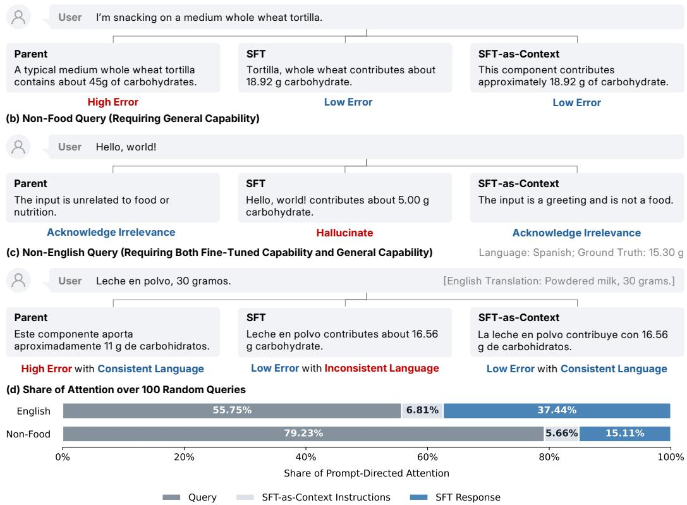
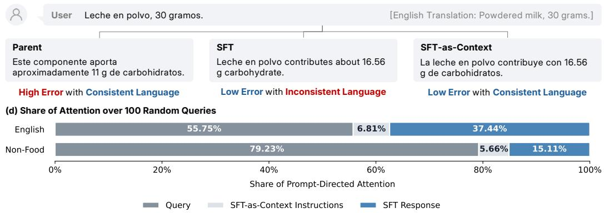
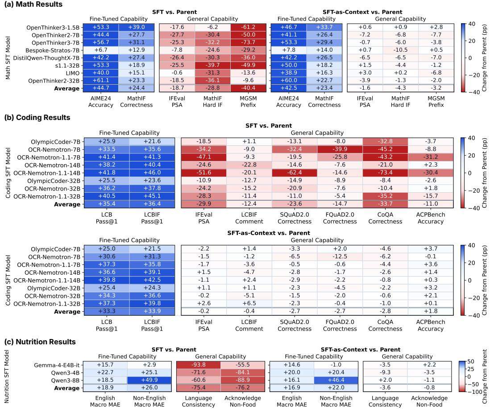
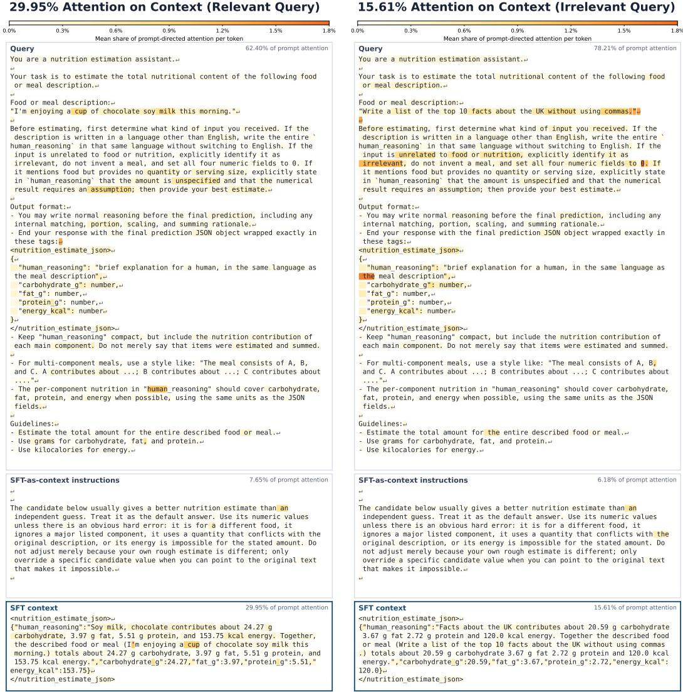

# SFT-AS-CONTEXT MITIGATES FORGETTINGIN SUPERVISED FINE-TUNING

Kenan Tang<sup>∗</sup>, Andong Hua<sup>∗</sup>, Chengxuan Qian, Saket Tiwari, Yao Qin

University of California, Santa Barbara

{kenantang, dongx1997, chengxuanqian, saket, yaoqin}@ucsb.edu

## ABSTRACT

Supervised fine-tuning (SFT) equips large language models (LLMs) with specialized capabilities, but often comes at the cost of forgetting the general capabilities of their parent models (i.e., the pretrained models before fine-tuning). This trade-off is especially limiting for queries that require both specialized and general capabilities. We introduce SFT-as-context, a training-free method in which the parent model uses the SFT model’s response as context to answer the query. This allows the parent model to acquire fine-tuned capabilities from the SFT response through in-context learning while preserving its own general capabilities. Across 19 parent-SFT model pairs and 11 benchmarks, SFT-as-context remains close to the SFT models on fine-tuned capabilities, with gaps of only 2.2 and 2.1 percentage points on AIME 2024 and LiveCodeBench and 2.0 macro MAE on NutriBench-English, while staying within 2.2 percentage points of the parent models on general capabilities on average. Remarkably, it can solve queries requiring both fine-tuned and general capabilities, even when neither the parent nor SFT model succeeds alone. This approach also extends beyond parent-SFT pairs: responses from a small open-source SFT model can improve a strong closedsource LLM, outperforming either model alone. Furthermore, we use a Bayesian framework to derive theoretical guarantees that bound the error of SFT-as-context relative to the SFT model on fine-tuned capabilities and to the parent model on general capabilities. In addition, we visualize the attention weights and find that the parent model attends more to useful SFT responses and less to irrelevant ones, suggesting that selective attention helps the parent model use the SFT response through in-context learning.

## 1 INTRODUCTION

Supervised fine-tuning (SFT) is widely used to adapt general-purpose large language models (LLMs) to specialized tasks and domains for practical deployment (Chung et al., 2024; Zeng et al., 2024; Guo et al., 2025). However, SFT models suffer from forgetting, where fine-tuned models lose general capabilities that their parent models (i.e., the pretrained models before fine-tuning) already possess (Kirkpatrick et al., 2017; Liu et al., 2024b; Vu et al., 2022). For example, Figure 1(a) shows that a model fine-tuned for nutrition estimation on English meal-description queries achieves higher accuracy than the parent model, but it follows the fine-tuning output format and thus incorrectly assigns a carbohydrate value even when the input is a non-food query such as “Hello, world!”, as shown in Figure 1(b). In contrast, the parent model correctly recognizes that the input is unrelated to food or nutrition. This strongly indicates that the SFT model forgets a general language-understanding capability, which is how to respond appropriately to non-food queries.

This forgetting problem suffered by SFT models becomes particularly severe when a single query requires both the fine-tuned capabilities gained through fine-tuning and the general capabilities. For example, as shown in Figure 1(c), when the meal-description query is in a language different from the fine-tuned language, the model must accurately estimate nutrition using its fine-tuned capability while responding in the same language as the input using its general multilingual capability, so that the user can understand the response. The SFT model significantly improves accuracy over its parent but, unlike the parent model, fails to respond in the user’s language. This practical setting demonstrates that neither the SFT model nor the parent model alone satisfies both requirements.

(a) English Query Requiring Fine-Tuned Capability)  


  
Figure 1: SFT-as-context recovers both fine-tuned and general capabilities. The task is to predict the nutritional values (carbohydrates, fat, protein, and energy) from a meal description, in the same language as the given query. Only the carbohydrate value is shown here as an example. Subfigure (a) shows that an SFT model trained on English data excels in fine-tuned capability. However, subfigures (b) and (c) show that it fails at acknowledging non-food queries and responding in the same language as the query. When a query requires both fine-tuned nutrition estimation capability and general multilingual capability, only SFT-as-context satisfies both requirements. Subfigure (d) shows that the parent model attends more to useful English SFT responses than to hallucinated SFT responses to non-food queries, suggesting that selective attention helps the parent model use the SFT response through in-context learning. We discuss details of the attention analysis in Section 4.2.

Most existing approaches seek to mitigate forgetting through changes to training, including regular ization (Li & Hoiem, 2017; Chen et al., 2020), replay (Sun et al., 2020; He et al., 2024), constraints on parameter updates (Lopez-Paz & Ranzato, 2017; Lin et al., 2026), and the choice of training method (Chen et al., 2026; Biderman et al., 2024). However, these approaches require modifying the fine-tuning process and thus cannot be directly applied, without further training, to existing ready-to-use checkpoints on platforms such as Hugging Face.<sup>1</sup>

Instead, we propose a training-free method, SFT-as-context, which leverages the in-context learning capability of language models by providing a fine-tuned model’s response as context to its parent model and prompting the parent model to generate the final answer. Despite its simplicity, SFTas-context preserves fine-tuning gains while mitigating forgetting across all 19 evaluated parentfine-tuned model pairs and 11 benchmarks, spanning mathematical reasoning, coding, nutrition estimation, and general capabilities. To quantify performance recovery, we define the recovery rate for each capability as the fraction of the performance gap between the parent and SFT models that SFT-as-context recovers (Equation 2). A recovery rate of 100% means SFT-as-context matches the better model. Using SFT checkpoints collected from Hugging Face, SFT-as-context achieves 95.0% and 94.1% recovery rates of the fine-tuning gains on AIME 2024 and LiveCodeBench (Jain et al., 2025), respectively. At the same time, it achieves an average recovery rate of 94.2% for general capabilities across instruction-following, multilingual tasks, question answering, and planning. Additionally, SFT-as-context combines fine-tuned and general capabilities within the same response, going beyond what either model can achieve alone. For example, on NutriBench-Non-English (Dhaliwal et al., 2025), as shown in Figure 1(c), SFT-as-context achieves recovery rates of 84.6% for nutrition estimation and 95.2% for language consistency.

More importantly, SFT-as-context requires only standard text input-output interfaces, making it applicable to closed-source models without access to their parameters. This flexibility allows responses from a small open-source SFT model to serve as context for a stronger closed-source model, even when the latter is not the parent of the SFT model. Notably, this holds for a strong proprietary model: providing responses from a fine-tuned Qwen3-4B as context to Gemini 3.5 Flash reduces macro MAE from 17.44 to 14.08 on NutriBench-English, outperforming either model alone.

Going deeper, we study how SFT-as-context works from two perspectives. First, we use a Bayesian framework for in-context learning (Xie et al., 2022; Hu et al., 2024) to provide theoretical guarantees that bound the differences in error between parent models, SFT models, and SFT-as-context. Second, we visualize the attention weights that the parent model assigns to the SFT output in the prompt. We find that the parent model selectively attends to the SFT output based on its effectiveness. For example, as shown in Figure 1(d), the parent model allocates substantially more attention to the SFT response for nutrition queries than for unrelated queries (37.44% versus 15.11%). Taken together, these analyses suggest a single underlying principle of SFT-as-context: the parent model leverages in-context learning to selectively acquire fine-tuned capabilities from the SFT responses while preserving its own general capabilities.

## 2 SFT MODELS FORGET GENERAL CAPABILITIES

In this section, we describe our experimental setup and then present the results showing that SFT improves fine-tuned capabilities while degrading general capabilities.

## 2.1 EXPERIMENT SETUP

We evaluate models fine-tuned for three domains: mathematical reasoning, coding, and nutrition estimation. We refer to the capabilities that SFT improves as fine-tuned capabilities, and the capabilities that the parent model already possessed as general capabilities. For example, in NutriBench, the fine-tuned capability is nutrition estimation, and general capabilities include multilingual under standing and instruction-following.

We evaluate 19 parent-SFT pairs, including 8 SFT models fine-tuned on English mathematical reasoning traces and 8 fine-tuned on coding tasks, all of which are popular models from Hugging Face (Appendix A.2). We also train 3 SFT models for nutrition estimation on NutriBench (Appendix A.3).

We first evaluate fine-tuned capabilities and general capabilities separately. For fine-tuned capabilities, we evaluate them on held-out data from the same distribution as the SFT training data: AIME 2024 for mathematics, LiveCodeBench (Jain et al., 2025) for coding, and NutriBench-English, the English subset of NutriBench (Dhaliwal et al., 2025), for nutrition estimation. To evaluate general capabilities, we use IFEval (Zhou et al., 2023) and MGSM (Shi et al., 2023) for math models, and IFEval, SQuAD2.0 (Rajpurkar et al., 2018), FQuAD2.0 (Heinrich et al., 2022), CoQA (Reddy et al., 2019), and ACPBench (Kokel et al., 2025) for coding models. For nutrition models, we use IFEval as a proxy for non-food queries, and we refer to this as NutriBench-Non-Food.

In addition, we evaluate tasks that require both fine-tuned and general capabilities in the same query:

• MathIF (Fu et al., 2026): Queries combine mathematical problem solving with formatting requirements, such as writing the response in lowercase or using at least two highlighted sections.

• LiveCodeBenchIF: We construct this benchmark by appending a formatting instruction to each question from LiveCodeBench (Jain et al., 2025), which asks for exactly 3 comment lines.

• NutriBench-Non-English: The query is a non-English meal description (Figure 1), and an English prompt template asks for an answer in the same language as the query.

Table 1: SFT-as-context successfully mitigates the forgetting of general capabilities and maintains high fine-tuned capabilities compared to SFT across all benchmarks. Higher is better except for NutriBench macro MAE, where lower is better. For IFEval, we report prompt-level strict accuracy (PSA). <sup>†</sup> denotes joint-capability settings, where the same queries require both fine-tuned and general capabilities. The performance recovery rate (R) is defined in Equation 2 and reported as a percentage. The metric results are averaged over 8 parent-SFT model pairs for mathematics, 8 for coding, and 3 for nutrition. Best results are bolded and second-best results are underlined.
<table><tr><td>Benchmark</td><td>Metric</td><td>Parent</td><td>SFT</td><td>SFT-as-Context</td><td>R (↑)</td></tr><tr><td colspan="6">Mathematics</td></tr><tr><td colspan="6">Fine-Tuned Capabilities</td></tr><tr><td>AIME 2024</td><td>Accuracy</td><td>11.3</td><td>56.0</td><td>53.8</td><td>95.0</td></tr><tr><td>MathIF†</td><td>Math Correctness</td><td>40.6</td><td>65.0</td><td>64.0</td><td>95.9</td></tr><tr><td colspan="6">General Capabilities</td></tr><tr><td>IFEval</td><td>PSA</td><td>71.3</td><td>52.7</td><td>69.8</td><td>91.6</td></tr><tr><td>MathIF†</td><td>Hard IF</td><td>50.1</td><td>21.3</td><td>45.8</td><td>85.1</td></tr><tr><td>MGSM</td><td>Answer-Prefix Accuracy</td><td>90.6</td><td>50.2</td><td>87.5</td><td>92.2</td></tr><tr><td colspan="6">Coding</td></tr><tr><td colspan="6">Fine-Tuned Capabilities</td></tr><tr><td>LiveCodeBench</td><td>Pass@1</td><td>20.1</td><td>55.5</td><td>53.4</td><td>94.1</td></tr><tr><td>LiveCodeBenchIF†</td><td>Pass@1</td><td>17.3</td><td>53.8</td><td>51.2</td><td>92.9</td></tr><tr><td colspan="6">General Capabilities</td></tr><tr><td>IFEval</td><td>PSA</td><td>75.0</td><td>45.1</td><td>74.8</td><td>99.4</td></tr><tr><td>LiveCodeBenchIF†</td><td>Exactly 3 Comment Lines</td><td>31.5</td><td>19.1</td><td>31.1</td><td>96.6</td></tr><tr><td>SQuAD2.0</td><td>Correctness</td><td>86.1</td><td>62.5</td><td>83.3</td><td>88.3</td></tr><tr><td>FQuAD2.0</td><td>Correctness</td><td>81.0</td><td>66.2</td><td>78.2</td><td>81.3</td></tr><tr><td>CoQA</td><td>Correctness</td><td>95.9</td><td>62.2</td><td>93.1</td><td>91.7</td></tr><tr><td>ACPBench</td><td>Overall Accuracy</td><td>77.0</td><td>65.9</td><td>78.8</td><td>116.2</td></tr><tr><td colspan="6">Nutrition</td></tr><tr><td colspan="6"></td></tr><tr><td>Fine-Tuned Capabilities NutriBench-English</td><td>Macro MAE↓</td><td>35.3</td><td>16.4</td><td>18.4</td><td>89.2</td></tr><tr><td>NutriBench-Non-English†</td><td>Macro MAE↓</td><td>85.6</td><td>59.6</td><td>63.6</td><td>84.6</td></tr><tr><td colspan="6">General Capabilities</td></tr><tr><td>NutriBench-Non-English†</td><td></td><td></td><td></td><td></td><td></td></tr><tr><td>NutriBench-Non-Food</td><td>Language Consistency Acknowledge Non-Food</td><td>77.3 98.8</td><td>1.9 22.6</td><td>73.7 98.0</td><td>95.2 98.9</td></tr></table>

We provide details of all benchmarks and evaluation metrics in Appendix A.

## 2.2 SFT CAUSES FORGETTING

Consistent with prior observations of forgetting after SFT (Chen et al., 2026; Huan et al., 2026), we find that the improvement of fine-tuned capabilities comes at the expense of general capabilities. As shown in Table 1, SFT causes substantial forgetting of general capabilities, reducing general capability scores by 33.2 percentage points on average. For example, among the three nutrition SFT models, Qwen3-8B shows the largest drop in acknowledging non-food queries, from 99.6% to 10.7%, catastrophically forgetting the instruction-following capability of its parent model.

This forgetting phenomenon becomes more problematic when a single query requires both finetuned and general capabilities, as the loss of either can cause the entire response to fail. For example, each query in MathIF requires both the fine-tuned capability of solving the math problem correctly and the general capability of following additional response constraints, such as using only lowercase letters. The SFT model significantly improves math correctness, from 40.6% to 65.0%, but fails to follow the format constraints. As a result, the hard instruction-following (Hard IF) score falls from 50.1% to 21.3%. In one example of a polynomial-remainder problem (Appendix C), the SFT model answers correctly but uses the uppercase symbol R, violating the lowercase requirement. Similar problems occur on LiveCodeBenchIF and NutriBench-Non-English.

  
Figure 2: Across individual model pairs, SFT-as-context maintains fine-tuned capabilities and mitigates forgetting of general capabilities. In each heatmap, the first group of columns shows fine-tuned capabilities, and the second group of columns shows general capabilities. Each domain has two heatmaps: one showing the performance difference between the SFT model and the parent model (SFT vs. Parent), and the other showing the difference between SFT-as-context and the parent model (SFT-as-context vs. Parent). Darker blue indicates a larger improvement over the parent model, whereas darker red indicates more severe forgetting relative to the parent model. Color ranges are clamped to prevent large outliers from dominating the colors. For NutriBench macro MAE, the values are reversed to consistently show greater improvement in darker blue.

Taken together, fine-tuning substantially improves performance on the task the model is fine-tuned on, but at the expense of forgetting general capabilities that the parent model already possesses, e.g., instruction-following and multilingual understanding.

## 3 SFT-AS-CONTEXT SUCCESSFULLY MITIGATES FORGETTING

Method. To mitigate forgetting in SFT models, we propose SFT-as-context, which leverages the in-context learning ability of the parent model by providing the SFT model’s response as context when generating the final response. Specifically, during inference, SFT-as-context answers each query through two sequential passes. In the first pass, the SFT model generates a response to the query. In the second pass, we construct the parent model’s prompt from three parts: the original query, the SFT response from the first pass, and the SFT-as-context instructions. These instructions ask the parent model to treat the SFT response as a helpful answer unless there are concrete errors.

Formally, let $x$ denote the input query, $f _ { \mathrm { S F T } }$ the SFT model, and $f _ { \mathrm { p a r e n t } }$ its parent model. The SFT model first generates: $y _ { \mathrm { S F T } } = f _ { \mathrm { S F T } } ( x )$ . We then construct the input to the parent model as [x, y<sub>SFT</sub>, I], where I denotes the SFT-as-context instructions. The SFT-as-context instructions are fixed for each domain (math, coding, or nutrition), agnostic to models and different fine-tuned or general capability benchmarks (Appendix B.2). The parent model generates the final response as:

$$
y _ { \mathrm { S A C } } = f _ { \mathrm { p a r e n t } } ( x , y _ { \mathrm { S F T } } , I ) .\tag{1}
$$

Thus, SFT-as-context provides the SFT model’s response as context to the parent model, which then generates the final answer. Crucially, SFT-as-context is a novel, training-free approach to mitigating forgetting that requires neither access to model weights nor the fine-tuning process. It operates entirely through text input-output interfaces, making it applicable even to closed-source models.

Evaluation Metric. We define the performance recovery rate to quantify how much of the performance gap between the parent and SFT models is recovered by SFT-as-context for a given capability. Let s<sub>parent</sub>, s<sub>SFT</sub>, and $s _ { \mathrm { S A C } }$ denote the parent, SFT, and SFT-as-context scores (e.g., accuracy or MAE), respectively. For metrics where higher is better, the recovery rate R is defined as

$$
R = [ s _ { \mathrm { { S A C } } } - \operatorname* { m i n } ( s _ { \mathrm { { p a r e n t } } } , s _ { \mathrm { { S F T } } } ) ] / | s _ { \mathrm { { p a r e n t } } } - s _ { \mathrm { { S F T } } } | \times 1 0 0 \%\tag{2}
$$

A recovery rate of 0% indicates that SFT-as-context matches the worse-performing model, while 100% indicates that it matches the better-performing model. The recovery rate can exceed 100% when SFT-as-context outperforms both models. For metrics where lower is better, such as MAE, the recovery rate is alternatively defined as $1 0 0 \% - R$

SFT-as-Context Combines the Strengths of Parent and SFT Models. Despite its simplicity, SFT-as-context achieves performance close to the parent model on general capabilities while remaining close to the SFT model on fine-tuned capabilities, effectively combining the strengths of SFT and parent models, as shown in Table 1. Across 19 parent-fine-tuned model pairs and 11 benchmarks, SFT-as-context preserves 92.0% of the fine-tuning gains on average, while recovering 94.2% of the general-capability performance gap between parent and SFT models. More importantly, SFT-as-context can combine fine-tuned and general capabilities within the same response, which neither the parent nor the SFT model can achieve alone. We evaluate this setting on MathIF, LiveCodeBenchIF, and NutriBench-Non-English, where each query requires both fine-tuned and general capabilities, and we report the performance on both for each dataset in Table 1. For the same MathIF example discussed in Section 2.2, the SFT model provides a correct answer but uses uppercase letters, whereas the SFT-as-context response preserves the correct answer while satisfying the lowercase formatting constraint (Appendix C.1).

Figure 2 shows that these trends extend across individual model pairs, including those with severe forgetting. For OCR-Nemotron-1.1-14B, SFT reduces CoQA performance by 73.4 percentage points relative to the parent model, indicating severe forgetting in conversational question answering. SFT-as-context brings this performance back to near the parent model’s level, with a gap of only 0.8 percentage points, while preserving most of the gains on LiveCodeBench (39.8 out of 41.8 percentage points). This highlights that SFT-as-context can mitigate severe forgetting while preserving substantial fine-tuning gains.

To understand the remaining performance gap, we zoom into MathIF, which shows the largest gap on the Hard IF metric (Figure 2). The dominant failure mode is that the small parent model, Qwen2.5- 7B-Instruct (the shared parent of all 7B math SFT models), often returns only a boxed answer and thus violates formatting requirements of using specific words or sections (Appendix C.2). This is effectively mitigated by a larger parent: the 32B parent exhibits this failure far less often, yielding a smaller remaining gap for the 32B models than for the 7B ones (an average gap of −1.8 versu −7.5).

## 4 UNDERSTANDING THE MECHANISMS OF SFT-AS-CONTEXT

To understand why SFT-as-context can mitigate forgetting while preserving the fine-tuned capabilities, we first analyze how LLMs combine capabilities from a theoretical perspective (Section 4.1). Then, by analyzing attention patterns, we empirically show that in SFT-as-context, a parent LLM attends more to useful SFT responses and less to hallucinated context, suggesting a possible mech anism for recovering general capabilities while preserving fine-tuned capabilities (Section 4.2).

## 4.1 THEORETICAL EXPLANATION

We explain the effectiveness of SFT-as-context using a Bayesian framework for in-context learning (Xie et al., 2022; Hu et al., 2024), building on earlier Bayesian models (Baum & Petrie, 1966; Blei et al., 2003). Following Xie et al. (2022), we model response generation as conditioned on a domain variable θ, with output distribution $\operatorname* { P r } ( Y \mid x , \theta )$ . Each such variable θ corresponds to a domain such as nutrition estimation, math, instruction-following, and multilinguality.

The parent model is trained using a large dataset across many different domains and therefore has many capabilities. Let $\Theta _ { \mathrm { p a r e n t } }$ denote the parent model’s domain set. We assume that the SFT model is fine-tuned on a single domain $\theta _ { \mathrm { S F T } }$ and denote its query set by $D _ { \mathrm { S F T } }$ . Our analysis explains how SFT-as-context combines SFT expertise with the parent model’s general capabilities.

For a query x, let $\operatorname* { P r } _ { \mathrm { p a r e n t } } ( \cdot \mid x )$ and $\operatorname* { P r } _ { \operatorname { S F T } } ( \cdot \mid x )$ denote the parent and SFT response distributions, respectively, and define $\operatorname { P r } _ { \mathrm { S A C } } ( \cdot \mid x ) : = \operatorname { P r } _ { \mathrm { p a r e n t } } ( \cdot \mid x , y _ { \mathrm { S F T } } , \bar { I } )$ , where y is the SFT response and I denotes the SFT-as-context instructions. All variables are discrete. For each domain, assume an optimal domain variable $\theta ^ { * }$ inducing the optimal response law $\operatorname* { P r } _ { * } ( \cdot \mid x ) : = \operatorname* { P r } ( \cdot \mid x , \theta ^ { * } )$ . For $\bar { m } \in \{ \mathrm { p a r e n t } , \mathrm { S F T } , \mathrm { S A C } \} .$ , define the corresponding errors $\mathcal { E } _ { m } : = \mathrm { K L } ( \operatorname* { P r } _ { * } ( \cdot \mid x ) \parallel \operatorname* { P r } _ { m } ( \cdot \mid x ) )$ ) . We model the parent and SFT-as-context distributions as mixtures:

$$
\begin{array} { r l } & { \operatorname* { P r } _ { \mathrm { p a r e n t } } ( y \mid x ) = \displaystyle \sum _ { \theta \in \Theta _ { \mathrm { p a r e n t } } } \operatorname* { P r } _ { \mathrm { p a r e n t } } ( y \mid x , \theta ) \operatorname* { P r } _ { \mathrm { p a r e n t } } ( \theta \mid x ) , } \\ & { \operatorname* { P r } _ { \mathrm { S A C } } ( y \mid x ) = \displaystyle \sum _ { \theta \in \Theta _ { \mathrm { p a r e n t } } } \operatorname* { P r } _ { \mathrm { p a r e n t } } ( y \mid x , \theta ) \operatorname* { P r } _ { \mathrm { S A C } } ( \theta \mid x , y _ { \mathrm { S F T } } , I ) . } \end{array}
$$

Thus, conditioning on the SFT response and instructions changes the domain posterior while preserving the per-domain conditional output laws. We refer to Pr (θ|x) as the posterior probability, which under the Bayesian framework is the probability of the domain variable conditioned on the query. Intuitively, we model the LLM’s generation process as predicting a domain based on the query with some probability and then generating the response conditioned on the domain variable (Xie et al., 2022). We make the following assumptions for all x where all logarithms are natural, and the total variation is defined as $\begin{array} { r } { \mathrm { T V } ( \breve { P } , Q ) : = \frac { { \bf \dot { \sigma } } } { 2 } \sum _ { y } | P ( y ) - Q ( y ) } \end{array}$ |. We present assumptions intuitively followed by the formalism.

1. The posterior probability of the SFT domain variable is low for the parent model. Formally, $0 < \bar { a } _ { x } : = \mathrm { P r } _ { \mathrm { p a r e n t } } ^ { - } ( \theta _ { \mathrm { S F T } } ^ { } \mid x ) \le \epsilon$ for the input x that belongs to the SFT domain, where $\theta _ { \mathrm { S F T } }$ is the optimal domain variable for the SFT domain.

2. The posterior probability of the SFT domain variable given the SFT response is ϵ<sup>′</sup>-close to 1. Formally, under the parent model, the SFT response y<sub>SFT</sub> satisfies $\mathrm { P r } _ { \mathrm { S A C } } ( \theta _ { \mathrm { S F T } } \mid x , I , y _ { \mathrm { S F T } } ) \ge$ $1 - \epsilon ^ { \prime } ,$ , meaning that the posterior probability assigned to the optimal domain variable $\theta _ { \mathrm { S F T } } ~ \mathrm { i s }$ within $\epsilon ^ { \prime }$ of 1.

3. The optimal response distribution is separated from that of the parent model by some margin (Xie et al., 2022). Let $Q _ { \mathrm { p a r e n t } }$ denote the parent model’s response distribution conditioned on a non-SFT domain: $Q _ { \mathrm { p a r e n t } } ( y \mid x ) : = \mathrm { P r } _ { \mathrm { p a r e n t } } ( y \mid x , \theta \neq \theta _ { \mathrm { S F T } } )$ . There exists $\epsilon ^ { \prime \prime } > 0$ such that, for every $x \in D _ { \mathrm { S F T } } \colon \mathrm { T } \dot { \mathrm { V } } ( \operatorname* { P r } _ { * } ( \cdot  { \mid } x ) , Q _ { \mathrm { p a r e n t } } ( \cdot  { \mid } x ) ) \geq \epsilon ^ { \prime \prime }$

4. The SFT model is an expert on the one domain it was fine-tuned on. Formally, the SFT domain variable $\theta _ { \mathrm { S F T } }$ is such that $\operatorname* { P r } _ { \mathrm { S F T } } ( y \mid \theta _ { \mathrm { S F T } } , x ) = \operatorname* { P r } _ { * } ( y \mid x )$ . Furthermore, there exists $0 \leq \eta < 1$ such that, for every $x \in D _ { \mathrm { S F T } } , c _ { x } : = \mathrm { P r } _ { \mathrm { S F T } } ( \theta _ { \mathrm { S F T } } \mid x ) \ge 1 - \eta$

5. The SFT-as-context domain posterior retains a minimum fraction of the corresponding parent posterior. Formally, there exists $0 ~ \le ~ \rho _ { o } ~ < ~ 1$ such that, for every out-of-domain query and realized context under consideration,

$$
\operatorname* { P r } _ { \operatorname { S A C } } ( \theta \mid x , I , y _ { \operatorname { S F T } } ) \geq ( 1 - \rho _ { o } ) \operatorname* { P r } _ { \operatorname { p a r e n t } } ( \theta \mid x ) , \qquad \forall \theta \in \Theta _ { \operatorname { p a r e n t } } .
$$

Under these assumptions, we have the following results for x that is in domain for the SFT dataset: Theorem 1 (Error guarantees for in-domain queries). Suppose that the shared conditional-output model and in-domain realizability condition hold (Appendix K.3). Let Assumptions 1–4 hold with

$0 < \epsilon < 1 , 0 \leq \epsilon ^ { \prime } < 1 , 0 < \epsilon ^ { \prime \prime } \leq 1$ , and $0 \leq \eta < 1$ . For every in-domain query $x \in D _ { S F T }$ and the realized context $( y _ { S F T } , I )$ satisfying these assumptions, the following are true:

$$
I m p r o \nu e m e n t o \nu e r t h e p a r e n t : \mathcal { E } _ { p a r e n t } - \mathcal { E } _ { S A C } \geq 2 ( 1 - \epsilon ) ^ { 2 } ( \epsilon ^ { \prime \prime } ) ^ { 2 } + \log ( 1 - \epsilon ^ { \prime } ) .\tag{3}
$$

$$
C l o s e n e s s t o S F T \colon \log ( 1 - \epsilon ^ { \prime } ) \le \mathcal { E } _ { S F T } - \mathcal { E } _ { S A C } \le - \log ( 1 - \eta ) .\tag{4}
$$

The theorem identifies sufficient conditions under which SFT-as-context improves in-domain performance compared to the parent model while limiting degradation compared to the SFT model. Intuitively, Equation 3 shows that the error of the parent for in-domain queries is greater than the error of SFT-as-context under the Bayesian model of text generation. Equation 4 means that the errors of SFT and SFT-as-context are close to one another. The proof can be found in Appendix K. While these results support how SFT-as-context maintains fine-tuned capabilities (Figure 2), we also show how under this Bayesian framework it maintains general capabilities with the following theorem.

Theorem 2 (Error guarantees for out-of-domain queries). Suppose that the shared conditionaloutput model and out-of-domain realizability condition hold (Appendix K.5). For any out-of-domain query $\boldsymbol { x } \in D _ { o } ,$ where $\theta _ { o } \in \Theta _ { p a r e n t }$ and $\theta _ { o } \neq \theta _ { S F T } ,$ suppose that Assumption 5 holds with $0 \leq \rho _ { o } < 1$ and that $\mathcal { E } _ { p a r e n t } < \infty ,$ , with errors measured relative to the optimal output law on $D _ { o } .$ . Then,for every realized context satisfying this assumption: $\mathcal { E } _ { S A C } - \mathcal { E } _ { p a r e n t } \overset { \cdot } { \leq } - \log ( 1 - \rho _ { o } )$

The inequality above shows that for out-of-domain queries the SFT-as-context method performs similarly to the parent model by upper bounding the difference in error. We have thus shown the conditions under which the errors of SFT-as-context are bounded relative to the SFT model on indomain queries and relative to the parent model on out-of-domain queries. Our theoretical results bolster our empirical claims: SFT-as-context remains close to the SFT model on fine-tuned capabil ities while staying close to the parent model on general capabilities (Table 1 and Figure 2).

## 4.2 ATTENTION ANALYSIS

SFT-as-context places the SFT model’s response in the parent model’s context. However, these responses can provide useful task-specific information or contain misleading hallucinations, as illustrated in Figure 1. How does the parent model use these responses in SFT-as-context?

We investigate how the parent model uses SFT responses by analyzing attention weights, which characterize how strongly it attends to different prompt tokens during generation (Clark et al., 2019). We compare two settings: nutrition queries from NutriBench-English, for which SFT responses provide useful context, and non-food queries from NutriBench-Non-Food, for which SFT responses may contain hallucinated nutrition estimates. The model pair is Gemma-4-E4B-it and its SFT version. We randomly sample 100 queries from each category and measure the attention allocated to the SFT responses, averaging over response tokens, layers, and attention heads (Appendix D).

Figure 1(d) shows that the parent model attends more to useful SFT responses than hallucinated ones, with a 22.33 percentage point difference in the average share of attention allocated to the SFT responses. This selective attention suggests that the parent model can use useful information from SFT responses through in-context learning while limiting the influence of irrelevant context, providing a possible explanation for how SFT-as-context mitigates forgetting while preserving finetuned capabilities.

## 5 DISCUSSION

Here, we extend SFT-as-context to a strong proprietary model, showing that responses from opensource SFT models can further improve its performance with only text input-output access (Section 5.1). We also provide ablation studies to show that the recovery of both fine-tuned and general capabilities does not arise solely from the SFT-as-context instructions (Section 5.2).

## 5.1 SFT-AS-CONTEXT FURTHER IMPROVES PROPRIETARY MODELS

Beyond combining the strengths of the parent and SFT models, SFT-as-context can further improve fine-tuned capabilities when the final response is generated by a stronger model rather than the original parent model. To be more specific, we fine-tune an open-source model such as Qwen3 and use its response as context for Gemini, which further improves Gemini’s performance. This flexibility is unique to SFT-as-context because it requires only standard text input-output access, without access to model weights or the fine-tuning process.

Table 2: A strong proprietary model can use context from open-source SFT models to further improve fine-tuned capabilities. On NutriBench-English, using the context from Qwen3-4B achieves the best macro MAE. Best results are bolded and second-best results are underlined.
<table><tr><td></td><td>Proprietary Model</td><td colspan="3">Open-Source SFT Models</td><td colspan="3">SFT-as-Context</td></tr><tr><td>Metric</td><td>Gemini 3.5 Flash</td><td>Gemma-4-E4B-it</td><td>Qwen3-4B</td><td>Qwen3-8B</td><td>Gemma-4-E4B-it</td><td>Qwen3-4B</td><td>Qwen3-8B</td></tr><tr><td>Macro MAE↓</td><td>17.44</td><td>16.64</td><td>16.46</td><td>16.05</td><td>14.13</td><td>14.08</td><td>14.41</td></tr></table>

Table 3: SFT-as-context achieves the best balance between fine-tuned and general capabilities. Parent with parent context fails to achieve low English and non-English macro MAE, and SFT with SFT context still fails on language consistency and acknowledging non-food queries. Best results are bolded and second-best results are underlined.
<table><tr><td></td><td colspan="2">Fine-Tuned Capabilities</td><td colspan="2">General Capabilities</td></tr><tr><td>Inference Setting</td><td>English MAE ↓</td><td>Non-English MAE ↓</td><td>Language Consistency (%) ↑</td><td>Acknowledge Non-Food (%) ↑</td></tr><tr><td>Parent</td><td>35.3</td><td>85.6</td><td>77.3</td><td>98.8</td></tr><tr><td>Parent with Parent Context</td><td>36.6</td><td>77.4</td><td>83.4</td><td>99.7</td></tr><tr><td>SFT</td><td>16.4</td><td>59.6</td><td>1.9</td><td>22.6</td></tr><tr><td>SFT with SFT Context</td><td>17.3</td><td>64.4</td><td>1.3</td><td>17.9</td></tr><tr><td>SFT-as-Context</td><td>18.4</td><td>63.6</td><td>73.7</td><td>98.0</td></tr></table>

As shown in Table 2, using responses from open-source SFT models as context consistently improves the performance of a strong proprietary model on NutriBench-English, achieving lower MAE than either model alone. This result also shows that the proprietary model does not merely copy the SFT response during inference. Instead, it can combine task-specific information from the SFT response with its own capabilities to produce a more accurate final answer.

## 5.2 ABLATION STUDIES

To test whether the gains of SFT-as-context come simply from the SFT-as-context instructions (I) and an additional inference pass, we evaluate two control settings on NutriBench: the parent model using its own response as context and the SFT model using its own response as context.

As shown in Table 3, the parent model with its own context preserves strong general capabilities, but its English and non-English macro MAE remain at 36.6 and 77.4, compared with 18.4 and 63.6 for SFT-as-context. Conversely, the SFT model with its own context retains most of its nutrition estimation gains but fails to recover general capabilities. Language consistency and acknowledgment of non-food queries are only 1.3% and 17.9%, compared with 73.7% and 98.0% for SFT-as-context. These results suggest that the gains of SFT-as-context cannot be explained solely by the SFT-as context instructions or an additional inference pass.

## 6 RELATED WORK

Forgetting and Mitigation. Prior work mitigates forgetting during fine-tuning through regularization toward pretrained behavior or parameters, as in Learning without Forgetting (Li & Hoiem, 2017) and RecAdam (Chen et al., 2020), replay-based methods such as LAMOL (Sun et al., 2020), constraints on parameter updates (Lopez-Paz & Ranzato, 2017; Lin et al., 2026), or the choice of adaptation algorithm (Biderman et al., 2024; Chen et al., 2026). Recent work finds that on-policy reinforcement learning preserves parent capabilities better than SFT (Chen et al., 2026); we therefore focus on SFT-induced forgetting, where forgetting is typically more severe. In principle, the same inference-time approach could be applied to a model fine-tuned with reinforcement learning (RLFT) by providing its response as context to the parent model.

Inference-Time Model Combination. A line of work related to our setting explores combining pretrained and fine-tuned models at inference time. Emulated Fine-Tuning (EFT) (Mitchell et al., 2024) and Proxy-Tuning (Liu et al., 2024a) combine model predictions through token-level probabilities or logits. They require access to output distributions during decoding and do not specifically target forgetting.

More recently, concurrent work CPR (Ki et al., 2026) mitigates forgetting by training a router to select between parent and fine-tuned models during decoding. In contrast, SFT-as-context requires only text input-output access, using the fine-tuned model’s response as context for the parent model.

## 7 CONCLUSION

In this paper, we propose SFT-as-context, a training-free method that leverages the in-context learning ability of LLMs to mitigate the forgetting of general capabilities in SFT models while preserving their fine-tuned capabilities. Comprehensive experiments across domains, tasks, and model sizes demonstrate the effectiveness of SFT-as-context. We further analyze its underlying mechanism through a Bayesian view of in-context learning and attention analysis, showing that useful SFT responses can steer the parent model toward the fine-tuned domain while having less influence on unrelated queries, thereby preserving general capabilities. Since the same framework could natu rally extend beyond SFT to other post-training methods, such as reinforcement learning, we leave this as a promising future direction to combine capabilities acquired through post-training with the broad capabilities of pretrained models.

## AI USE STATEMENT

In this work, we used generative AI tools for generating synthetic datasets, implementing methods, assisting with translation, cleaning and reformatting datasets, supporting qualitative and thematic data analysis, and interpreting results. We have not used generative AI tools for helping develop theoretical models or conceptual frameworks, formulating mathematical claims, providing critical ingredients for proving mathematical claims, assisting in the writing of proofs, proposing or refining hypotheses, and designing or providing feedback on research methodology or experiments. Additionally, we used generative AI tools for creating or modifying scientific figures or images, creating or editing software code, summarizing or analyzing existing literature, editing a research paper to improve readability, and identifying relevant literature.

We have reviewed all AI-assisted work. We manually verify synthetically generated meal descriptions for NutriBench. We compare with officially released metric values for public models to ensure LLM-generated code correctly implements dataset formatting, inference, and scoring. We use AI agents to speed up the identification of failure patterns in the forgetting of general capabilities, and we then manually conduct qualitative and thematic data analysis. We read through each of the suggested papers returned from AI-assisted literature review.

We take responsibility for the final content of this work, including text, claims or artifacts produced with the aid of generative AI.

## REPRODUCIBILITY STATEMENT

Most of our results rely on publicly available model checkpoints and benchmarks, with the following three exceptions. First, we train our own models for nutrition estimation (Appendix A.3). Second, we add multilingual queries to the NutriBench dataset for testing fine-tuned and general capabilities (Appendix A.1). Third, the proposed method requires manually written SFT-as-context instructions, which we include in Appendix B.2. Hence, we have provided sufficient details to allow full reproduction of the results. For theoretical results and proofs, we include more details in Appendix K.

## REFERENCES

Wasi Uddin Ahmad, Sean Narenthiran, Somshubra Majumdar, Aleksander Ficek, Siddhartha Jain, Jocelyn Huang, Vahid Noroozi, and Boris Ginsburg. OpenCodeReasoning: Advancing data dis

tillation for competitive coding. In Second Conference on Language Modeling, 2025. URL https://openreview.net/forum?id=aykM7KUVJZ.

Chenxin An, Zhihui Xie, Xiaonan Li, Lei Li, Jun Zhang, Shansan Gong, Ming Zhong, Jingjing Xu, Xipeng Qiu, Mingxuan Wang, and Lingpeng Kong. POLARIS: A post-training recipe for scaling reinforcement learning on advanced reasoning models, 2025. URL https://hkunlp.git hub.io/blog/2025/Polaris.

Andy Arditi, Oscar Obeso, Aaquib Syed, Daniel Paleka, Nina Panickssery, Wes Gurnee, and Neel Nanda. Refusal in language models is mediated by a single direction. In A. Globerson, L. Mackey, D. Belgrave, A. Fan, U. Paquet, J. Tomczak, and C. Zhang (eds.), Advances in Neural Information Processing Systems, volume 37, pp. 136037–136083. Curran Associates, Inc., 2024. doi: 10.522 02/079017-4322. URL https://proceedings.neurips.cc/paper\_files/paper /2024/file/f545448535dfde4f9786555403ab7c49-Paper-Conference.pd f.

Leonard E Baum and Ted Petrie. Statistical inference for probabilistic functions of finite state Markov chains. The Annals ofMathematical Statistics, 37(6):1554–1563, 1966.

Bespoke Labs. Bespoke-Stratos-7B. Hugging Face, 2025. URL https://huggingface.co /bespokelabs/Bespoke-Stratos-7B. Accessed: 2026-08-01.

Dan Biderman, Jacob Portes, Jose Javier Gonzalez Ortiz, Mansheej Paul, Philip Greengard, Connor Jennings, Daniel King, Sam Havens, Vitaliy Chiley, Jonathan Frankle, Cody Blakeney, and John Patrick Cunningham. LoRA learns less and forgets less. Transactions on Machine Learning Research, 2024. ISSN 2835-8856. URL https://openreview.net/forum?id=aloE ru2qCG. Featured Certification.

David M Blei, Andrew Y Ng, and Michael I Jordan. Latent Dirichlet allocation. Journal ofMachine Learning Research, 3(Jan):993–1022, 2003.

Wenrui Cai, Chengyu Wang, Junbing Yan, Jun Huang, and Xiangzhong Fang. Reasoning with OmniThought: A large CoT dataset with verbosity and cognitive difficulty annotations. In Maria Liakata, Viviane P. Moreira, Jiajun Zhang, and David Jurgens (eds.), Proceedings of the 64th Annual Meeting of the Association for Computational Linguistics (Volume 1: Long Papers), pp. 8431–8450, San Diego, California, United States, July 2026. Association for Computational Linguistics. ISBN 979-8-89176-390-6. doi: 10.18653/v1/2026.acl-long.382. URL https://aclanthology.org/2026.acl-long.382/.

Howard Chen, Noam Razin, Karthik R Narasimhan, and Danqi Chen. Retaining by doing: The role of on-policy data in mitigating forgetting. In Forty-third International Conference on Machine Learning, 2026. URL https://openreview.net/forum?id=ODTM64azGa.

Sanyuan Chen, Yutai Hou, Yiming Cui, Wanxiang Che, Ting Liu, and Xiangzhan Yu. Recall and learn: Fine-tuning deep pretrained language models with less forgetting. In Proceedings of the 2020 Conference on Empirical Methods in Natural Language Processing (EMNLP), pp. 7870– 7881, 2020.

Zhipeng Chen, Yingqian Min, Beichen Zhang, Jie Chen, Jinhao Jiang, Daixuan Cheng, Wayne Xin Zhao, Zheng Liu, Xu Miao, Yang Lu, et al. An empirical study on eliciting and improving R1-like reasoning models. arXiv preprint arXiv:2503.04548, 2025.

Hyung Won Chung, Le Hou, Shayne Longpre, Barret Zoph, Yi Tay, William Fedus, Yunxuan Li, Xuezhi Wang, Mostafa Dehghani, Siddhartha Brahma, et al. Scaling instruction-finetuned language models. Journal ofMachine Learning Research, 25(70):1–53, 2024.

Kevin Clark, Urvashi Khandelwal, Omer Levy, and Christopher D. Manning. What does BERT look at? An analysis of BERT’s attention. In Tal Linzen, Grzegorz Chrupała, Yonatan Belinkov, and Dieuwke Hupkes (eds.), Proceedings of the 2019 ACL Workshop BlackboxNLP: Analyzing and Interpreting Neural Networks for NLP, pp. 276–286, Florence, Italy, August 2019. Association for Computational Linguistics. doi: 10.18653/v1/W19-4828. URL https://aclantholo gy.org/W19-4828/.

Karl Cobbe, Vineet Kosaraju, Mohammad Bavarian, Mark Chen, Heewoo Jun, Lukasz Kaiser, Matthias Plappert, Jerry Tworek, Jacob Hilton, Reiichiro Nakano, et al. Training verifiers to solve math word problems. arXiv preprint arXiv:2110.14168, 2021.

Mehak Dhaliwal, Andong Hua, Laya Pullela, Ryan Burke, and Yao Qin. NutriBench: A dataset for evaluating large language models in nutrition estimation from meal descriptions. In International Conference on Learning Representations, volume 2025, pp. 95927–95950, 2025.

Tingchen Fu, Yafu Li, Jiawei Gu, Xiaoye Qu, and Yu Cheng. Scaling reasoning, losing control: Evaluating instruction following in large reasoning models. In Maria Liakata, Viviane P. Moreira, Jiajun Zhang, and David Jurgens (eds.), Proceedings of the 64th Annual Meeting of the Association for Computational Linguistics (Volume 1: Long Papers), pp. 40445–40463, San Diego, California, United States, July 2026. Association for Computational Linguistics. ISBN 979-8- 89176-390-6. doi: 10.18653/v1/2026.acl-long.1878. URL https://aclanthology.org /2026.acl-long.1878/.

Wei Fu, Jiaxuan Gao, Xujie Shen, Chen Zhu, Zhiyu Mei, Chuyi He, Shusheng Xu, Guo Wei, Jun Mei, Jiashu Wang, Tongkai Yang, Binhang Yuan, and Yi Wu. AReaL: A large-scale asynchronous reinforcement learning system for language reasoning. In The Thirty-ninth Annual Conference on Neural Information Processing Systems, 2025. URL https://openreview.net/forum ?id=X9diEuva9R.

Leo Gao, Jonathan Tow, Baber Abbasi, Stella Biderman, Sid Black, Anthony DiPofi, Charles Foster, Laurence Golding, Jeffrey Hsu, Alain Le Noac’h, Haonan Li, Kyle McDonell, Niklas Muennighoff, Chris Ociepa, Jason Phang, Laria Reynolds, Hailey Schoelkopf, Aviya Skowron, Lintang Sutawika, Eric Tang, Anish Thite, Ben Wang, Kevin Wang, and Andy Zou. The language mode evaluation harness, July 2024. URL https://zenodo.org/records/12608602.

Gemma Team. Gemma 4 technical report. arXiv preprint arXiv:2607.02770, 2026.

Etash Kumar Guha, Ryan Marten, Sedrick Keh, Negin Raoof, Georgios Smyrnis, Hritik Bansal, Marianna Nezhurina, Jean Mercat, Trung Vu, Zayne Rea Sprague, Ashima Suvarna, Benjamin Feuer, Leon Liangyu Chen, Zaid Khan, Eric Frankel, Sachin Grover, Caroline Choi, Niklas Muennighoff, Shiye Su, Wanjia Zhao, John Yang, Shreyas Pimpalgaonkar, Kartik Sharma, Charlie Cheng-Jie Ji, Yichuan Deng, Sarah M Pratt, Vivek Ramanujan, Jon Saad-Falcon, Stutee Acharya, Jeffrey Li, Achal Dave, Alon Albalak, Kushal Arora, Blake Wulfe, Chinmay Hegde, Greg Durrett, Sewoong Oh, Mohit Bansal, Saadia Gabriel, Aditya Grover, Kai-Wei Chang, Vaishaal Shankar, Aaron Gokaslan, Mike A Merrill, Tatsunori Hashimoto, Yejin Choi, Jenia Jitsev, Reinhard Heckel, Maheswaran Sathiamoorthy, Alex Dimakis, and Ludwig Schmidt. OpenThoughts: Data recipes for reasoning models. In The Fourteenth International Conference on Learning Representations, 2026. URL https://openreview.net/forum?id=7xjoTuaNmN.

Daya Guo, Dejian Yang, Haowei Zhang, Junxiao Song, Peiyi Wang, Qihao Zhu, Runxin Xu, Ruoyu Zhang, Shirong Ma, Xiao Bi, et al. DeepSeek-R1: Incentivizing reasoning capability in LLMs via reinforcement learning. arXiv preprint arXiv:2501.12948, 2025.

Jinghan He, Haiyun Guo, Kuan Zhu, Zihan Zhao, Ming Tang, and Jinqiao Wang. SEEKR: Selective attention-guided knowledge retention for continual learning of large language models. In Yaser Al-Onaizan, Mohit Bansal, and Yun-Nung Chen (eds.), Proceedings of the 2024 Conference on Empirical Methods in Natural Language Processing, pp. 3254–3266, Miami, Florida, USA, November 2024. Association for Computational Linguistics. doi: 10.18653/v1/2024.emn lp-main.190. URL https://aclanthology.org/2024.emnlp-main.190/.

Jujie He, Jiacai Liu, Chris Yuhao Liu, Rui Yan, Chaojie Wang, Peng Cheng, Xiaoyu Zhang, Fuxiang Zhang, Jiacheng Xu, Wei Shen, et al. Skywork Open Reasoner 1 technical report. arXiv preprint arXiv:2505.22312, 2025.

Zhiwei He, Tian Liang, Jiahao Xu, Qiuzhi Liu, Xingyu Chen, Yue Wang, Linfeng Song, Dian Yu, Zhenwen Liang, Wenxuan Wang, et al. DeepMath-103K: A large-scale, challenging, decontaminated, and verifiable mathematical dataset for advancing reasoning. In International Conference on Learning Representations, volume 2026, pp. 138306–138322, 2026.

Quentin Heinrich, Gautier Viaud, and Wacim Belblidia. FQuAD2.0: French question answering and learning when you don’t know. In Nicoletta Calzolari, Fred´ eric B´ echet, Philippe Blache,´ Khalid Choukri, Christopher Cieri, Thierry Declerck, Sara Goggi, Hitoshi Isahara, Bente Maegaard, Joseph Mariani, Hel´ ene Mazo, Jan Odijk, and Stelios Piperidis (eds.), \` Proceedings of the Thirteenth Language Resources and Evaluation Conference, pp. 2205–2214, Marseille, France, June 2022. European Language Resources Association. URL https://aclanthology.o rg/2022.lrec-1.237/.

Xinyang Hu, Fengzhuo Zhang, Siyu Chen, and Zhuoran Yang. Unveiling the statistical foundations of chain-of-thought prompting methods. arXiv preprint arXiv:2408.14511, 2024.

Andong Hua, Kenan Tang, Chenhe Gu, Jindong Gu, Eric Wong, and Yao Qin. Flaw or artifact? Rethinking prompt sensitivity in evaluating LLMs. In Christos Christodoulopoulos, Tanmoy Chakraborty, Carolyn Rose, and Violet Peng (eds.), Proceedings of the 2025 Conference on Empirical Methods in Natural Language Processing, pp. 19889–19899, Suzhou, China, November 2025. Association for Computational Linguistics. ISBN 979-8-89176-332-6. doi: 10.18653/v1/2025.emnlp-main.1006. URL https://aclanthology.org/2025.emnl p-main.1006/.

Maggie Ziyu Huan, Yuetai Li, Tianyu Zheng, Xiaoyu Xu, Seungone Kim, Minxin Du, Radha Poovendran, Graham Neubig, and Xiang Yue. Does math reasoning improve general LLM capabilities? Understanding transferability of LLM reasoning. In Forty-third International Conference on Machine Learning, 2026. URL https://openreview.net/forum?id=GbOD25IA 88.

Naman Jain, King Han, Alex Gu, Wen-Ding Li, Fanjia Yan, Tianjun Zhang, Sida Wang, Armando Solar-Lezama, Koushik Sen, and Ion Stoica. LiveCodeBench: Holistic and contamination free evaluation of large language models for code. In Y. Yue, A. Garg, N. Peng, F. Sha, and R. Yu (eds.), International Conference on Learning Representations, volume 2025, pp. 58791–58831, 2025. URL https://proceedings.iclr.cc/paper\_files/paper/2025/file/ 94074dd5a072d28ff75a76dabed43767-Paper-Conference.pdf.

Kwangmin Ki, Yunhun Nam, Jongheon Jeong, and Jaehyung Kim. CPR for LLMs: Critical-point routing against catastrophic forgetting in domain adaptation. arXiv preprint arXiv:2608.30158, 2026.

James Kirkpatrick, Razvan Pascanu, Neil Rabinowitz, Joel Veness, Guillaume Desjardins, Andrei A Rusu, Kieran Milan, John Quan, Tiago Ramalho, Agnieszka Grabska-Barwinska, et al. Overcom ing catastrophic forgetting in neural networks. Proceedings of the National Academy of Sciences, 114(13):3521–3526, 2017.

Harsha Kokel, Michael Katz, Kavitha Srinivas, and Shirin Sohrabi. ACPBench: Reasoning about action, change, and planning. In Proceedings of the AAAI Conference on Artificial Intelligence, volume 39, pp. 26559–26568, 2025.

Xiang Lisa Li, Ari Holtzman, Daniel Fried, Percy Liang, Jason Eisner, Tatsunori Hashimoto, Luke Zettlemoyer, and Mike Lewis. Contrastive decoding: Open-ended text generation as optimization. In Anna Rogers, Jordan Boyd-Graber, and Naoaki Okazaki (eds.), Proceedings of the 61st Annual Meeting of the Association for Computational Linguistics (Volume 1: Long Papers), pp. 12286– 12312, Toronto, Canada, July 2023. Association for Computational Linguistics. doi: 10.18653/v 1/2023.acl-long.687. URL https://aclanthology.org/2023.acl-long.687/.

Zhizhong Li and Derek Hoiem. Learning without forgetting. IEEE Transactions on Pattern Analysis and Machine Intelligence, 40(12):2935–2947, 2017.

Jiacheng Lin, Zhongruo Wang, Kun Qian, Tian Wang, Arvind Srinivasan, Hansi Zeng, Ruochen Jiao, Xie Zhou, Jiri Gesi, Dakuo Wang, Yufan Guo, Kai Zhong, Weiqi Zhang, Sujay Sanghavi, Changyou Chen, Hyokun Yun, and Lihong Li. SFT doesn’t always hurt general capabilities: Revisiting domain-specific fine-tuning in LLMs. In C. Vondrick, B. Hariharan, C. Raffel, L. Pinto, D. Yang, and A. Faust (eds.), International Conference on Learning Representations, volume 2026, pp. 46954–46992, 2026. URL https://proceedings.iclr.cc/paper\_files/ paper/2026/file/4e447acb68f57e29234bc0eb19896f11-Paper-Conferenc e.pdf.

Alisa Liu, Xiaochuang Han, Yizhong Wang, Yulia Tsvetkov, Yejin Choi, and Noah A. Smith. Tuning language models by proxy. In First Conference on Language Modeling, 2024a. URL https: //openreview.net/forum?id=dribhnhm1i.

Chengyuan Liu, Yangyang Kang, Shihang Wang, Lizhi Qing, Fubang Zhao, Chao Wu, Changlong Sun, Kun Kuang, and Fei Wu. More than catastrophic forgetting: Integrating general capabilities for domain-specific LLMs. In Yaser Al-Onaizan, Mohit Bansal, and Yun-Nung Chen (eds.), Proceedings of the 2024 Conference on Empirical Methods in Natural Language Processing, pp. 7531–7548, Miami, Florida, USA, November 2024b. Association for Computational Linguistics. doi: 10.18653/v1/2024.emnlp-main.429. URL https://aclanthology.org/2024.em nlp-main.429/.

Zihan Liu, Yang Chen, Mohammad Shoeybi, Bryan Catanzaro, and Wei Ping. AceMath: Advancing frontier math reasoning with post-training and reward modeling. In Wanxiang Che, Joyce Nabende, Ekaterina Shutova, and Mohammad Taher Pilehvar (eds.), Findings of the Association for Computational Linguistics: ACL 2025, pp. 3993–4015, Vienna, Austria, July 2025. Association for Computational Linguistics. ISBN 979-8-89176-256-5. doi: 10.18653/v1/2025.finding s-acl.206. URL https://aclanthology.org/2025.findings-acl.206/.

David Lopez-Paz and Marc’Aurelio Ranzato. Gradient episodic memory for continual learning. In Advances in Neural Information Processing Systems, volume 30, 2017.

Michael Luo, Sijun Tan, Justin Wong, Xiaoxiang Shi, William Y. Tang, Manan Roongta, Colin Cai, Jeffrey Luo, Li Erran Li, Raluca Ada Popa, and Ion Stoica. DeepScaleR: Surpassing o1-preview with a 1.5B model by scaling RL. https://pretty-radio-b75.notion.site/Dee pScaleR-Surpassing-O1-Preview-with-a-1-5B-Model-by-Scaling-RL-1 9681902c1468005bed8ca303013a4e2, 2025. Notion Blog.

Mantas Mazeika, Long Phan, Xuwang Yin, Andy Zou, Zifan Wang, Norman Mu, Elham Sakhaee, Nathaniel Li, Steven Basart, Bo Li, David Forsyth, and Dan Hendrycks. HarmBench: A standardized evaluation framework for automated red teaming and robust refusal. In Ruslan Salakhutdinov, Zico Kolter, Katherine Heller, Adrian Weller, Nuria Oliver, Jonathan Scarlett, and Felix Berkenkamp (eds.), Proceedings ofthe 41st International Conference on Machine Learning, volume 235 of Proceedings of Machine Learning Research, pp. 35181–35224. PMLR, 21–27 Jul 2024. URL https://proceedings.mlr.press/v235/mazeika24a.html.

Eric Mitchell, Rafael Rafailov, Archit Sharma, Chelsea Finn, and Christopher D Manning. An emulator for fine-tuning large language models using small language models. In The Twelfth International Conference on Learning Representations, 2024. URL https://openreview .net/forum?id=Eo7kv0sllr.

Niklas Muennighoff, Zitong Yang, Weijia Shi, Xiang Lisa Li, Li Fei-Fei, Hannaneh Hajishirzi, Luke Zettlemoyer, Percy Liang, Emmanuel Candes, and Tatsunori Hashimoto. s1: Simple test-\` time scaling. In Christos Christodoulopoulos, Tanmoy Chakraborty, Carolyn Rose, and Violet Peng (eds.), Proceedings of the 2025 Conference on Empirical Methods in Natural Language Processing, pp. 20275–20321, Suzhou, China, November 2025. Association for Computational Linguistics. ISBN 979-8-89176-332-6. doi: 10.18653/v1/2025.emnlp-main.1025. URL https://aclanthology.org/2025.emnlp-main.1025/.

Guilherme Penedo, Anton Lozhkov, Hynek Kydl´ıcek, Loubna Ben Allal, Edward Beeching,ˇ Agust´ın Piqueres Lajar´ın, Quentin Gallouedec, Nathan Habib, Lewis Tunstall, and Leandro von´ Werra. OlympicCoder. https://huggingface.co/open-r1/OlympicCoder-7B, 2025.

Qwen Team. Qwen2.5-Coder technical report. arXiv preprint arXiv:2409.12186, 2024a.

Qwen Team. Qwen2.5 technical report. arXiv preprint arXiv:2412.15115, 2024b.

Qwen Team. Qwen3 technical report. arXiv preprint arXiv:2505.09388, 2025.

Pranav Rajpurkar, Robin Jia, and Percy Liang. Know what you don’t know: Unanswerable questions for SQuAD. In Iryna Gurevych and Yusuke Miyao (eds.), Proceedings of the 56th Annual Meeting of the Association for Computational Linguistics (Volume 2: Short Papers), pp.

784–789, Melbourne, Australia, July 2018. Association for Computational Linguistics. doi: 10.18653/v1/P18-2124. URL https://aclanthology.org/P18-2124/.

Siva Reddy, Danqi Chen, and Christopher D Manning. CoQA: A conversational question answering challenge. Transactions ofthe Associationfor Computational Linguistics, 7:249–266, 2019.

Freda Shi, Mirac Suzgun, Markus Freitag, Xuezhi Wang, Suraj Srivats, Soroush Vosoughi, Hyung Won Chung, Yi Tay, Sebastian Ruder, Denny Zhou, Dipanjan Das, and Jason Wei. Language models are multilingual chain-of-thought reasoners. In The Eleventh International Conference on Learning Representations, 2023. URL https://openreview.net/forum?id= fR3wGCk-IXp.

Mingyang Song, Mao Zheng, Zheng Li, Wenjie Yang, and Xuan Luo. FastCuRL: Curriculum reinforcement learning with stage-wise context scaling for efficient training R1-like reasoning models. In Christos Christodoulopoulos, Tanmoy Chakraborty, Carolyn Rose, and Violet Peng (eds.), Findings of the Association for Computational Linguistics: EMNLP 2025, pp. 8856–8866, Suzhou, China, November 2025. Association for Computational Linguistics. ISBN 979-8-89176- 335-7. doi: 10.18653/v1/2025.findings-emnlp.470. URL https://aclanthology.org/2 025.findings-emnlp.470/.

Fan-Keng Sun, Cheng-Hao Ho, and Hung-Yi Lee. LAMOL: Language modeling for lifelong language learning. In International Conference on Learning Representations, 2020. URL https://openreview.net/forum?id=Skgxcn4YDS.

Tu Vu, Aditya Barua, Brian Lester, Daniel Cer, Mohit Iyyer, and Noah Constant. Overcoming catastrophic forgetting in zero-shot cross-lingual generation. In Yoav Goldberg, Zornitsa Kozareva, and Yue Zhang (eds.), Proceedings of the 2022 Conference on Empirical Methods in Natural Language Processing, pp. 9279–9300, Abu Dhabi, United Arab Emirates, December 2022. Association for Computational Linguistics. doi: 10.18653/v1/2022.emnlp-main.630. URL https://aclanthology.org/2022.emnlp-main.630/.

Sang Michael Xie, Aditi Raghunathan, Percy Liang, and Tengyu Ma. An explanation of in-context learning as implicit Bayesian inference. In International Conference on Learning Representations, 2022. URL https://openreview.net/forum?id=RdJVFCHjUMI.

Yixin Ye, Zhen Huang, Yang Xiao, Ethan Chern, Shijie Xia, and Pengfei Liu. LIMO: Less is more for reasoning. In Second Conference on Language Modeling, 2025. URL https://openre view.net/forum?id=T2TZ0RY4Zk.

Chao Yu, Yuanqing Wang, Zhen Guo, Hao Lin, Si Xu, Hongzhi Zang, Quanlu Zhang, Yongji Wu, Chunyang Zhu, Junhao Hu, Zixiao Huang, Mingjie Wei, Yuqing Xie, Ke Yang, Bo Dai, Zhexuan Xu, Jiakun Du, Xiangyuan Wang, Xu Fu, Letong Shi, Zhihao Liu, Kang Chen, Weilin Liu, Gang Liu, Boxun Li, Jianlei Yang, Zhi Yang, Guohao Dai, and Yu Wang. RLinf: Flexible and efficient large-scale reinforcement learning via macro-to-micro flow transformation. In 20th USENIX Symposium on Operating Systems Design and Implementation (OSDI 26), pp. 829–846, Seattle, WA, July 2026. USENIX Association. ISBN 978-1-939133-55-7. URL https://www.usenix.org/conference/osdi26/presentation/yu-chao.

Aohan Zeng, Mingdao Liu, Rui Lu, Bowen Wang, Xiao Liu, Yuxiao Dong, and Jie Tang. Agent-Tuning: Enabling generalized agent abilities for LLMs. In Lun-Wei Ku, Andre Martins, and Vivek Srikumar (eds.), Findings of the Association for Computational Linguistics: ACL 2024, pp. 3053–3077, Bangkok, Thailand, August 2024. Association for Computational Linguistics. doi: 10.18653/v1/2024.findings-acl.181. URL https://aclanthology.org/2024.findin gs-acl.181/.

Jeffrey Zhou, Tianjian Lu, Swaroop Mishra, Siddhartha Brahma, Sujoy Basu, Yi Luan, Denny Zhou, and Le Hou. Instruction-following evaluation for large language models. arXiv preprint arXiv:2311.07911, 2023.

## APPENDIX

A Experiment Details 16   
A.1 Benchmarks 16   
A.2 List of SFT Models 17   
A.3 Nutrition Estimation Model Training 18   
A.4 Inference Settings 18   
A.5 Metrics 19   
B Prompts 19   
B.1 Task Prompts . 19   
B.2 SFT-as-Context Prompts 20   
C More Examples of Forgetting and Mitigation 21   
C.1 MathIF and LiveCodeBenchIF General Failures 22   
C.2 SFT-as-Context Failure Mode: Boxed Answer Only 25   
D Attention Visualization 27   
E RL Models Forget Less 28   
F A Case Study on Safety 29   
G Forgetting Cannot Be Mitigated by Oracle Routing 30   
H Token-Level Manipulation Fails to Mitigate Forgetting for NutriBench 31   
I SFT-as-Context Incurs Modest Overhead Compared to SFT 31   
J Additional Ablation Studies 32   
K Theoretical Results and Proofs 32   
K.1 Additional Intuition for the Bayesian Framework . 32   
K.2 Defining the Errors . 33   
K.3 SFT-as-Context In-Domain Error 34   
K.4 In-Domain Closeness of SFT-as-Context to SFT 35   
K.5 SFT-as-Context Out-of-Domain Error 36

## A EXPERIMENT DETAILS

We provide more experiment details in this section.

## A.1 BENCHMARKS

In this work, we use the following benchmarks:

American Invitational Mathematics Examination 2024 (AIME 2024) contains 30 math questions. Each question requires multi-step reasoning to solve. The answer to each question is an integer from 000 to 999.

MathIF (Fu et al., 2026) is a benchmark for evaluating the instruction-following capability of reasoning models. It consists of 420 questions drawn from various math datasets, and each instruction contains Python-verifiable constraints from four categories (length, lexical, format, affix).

IFEval (Zhou et al., 2023) is a benchmark that evaluates the instruction-following capability of language models. The benchmark contains explicit, verifiable instructions, such as constraints on formatting, length, keywords, and response structure.

MGSM (Shi et al., 2023) is a multilingual math benchmark that contains translated versions of the 250 grade-school math problems from the GSM8K dataset (Cobbe et al., 2021) in 10 languages.

LiveCodeBench (Jain et al., 2025) is a coding benchmark that uses continuously updated questions to evaluate coding models. In this work, we use the v4 v5 subset of LiveCodeBench, containing 268 questions. This choice is consistent with the version originally used by the OlympicCoder-7B and OlympicCoder-32B model series (Penedo et al., 2025).

LiveCodeBenchIF is a benchmark we constructed, in a similar fashion to MathIF, where we append a short formatting requirement to the end of the original questions from LiveCodeBench. To use a Python-verifiable constraint and to minimize the impact of the formatting instruction on the code structure, we only specify the number of comment lines to be 3 in the formatting instruction (Appendix B.1).

SQuAD2.0 (Rajpurkar et al., 2018) is a reading comprehension benchmark. The answer to every question is a segment of text from the corresponding reading passage, or the question might be unanswerable. We use a random sample of 1,187 (10% of the total size) questions from the validation set. Of the 1,187 questions, 594 are answerable, and 593 are unanswerable.

FQuAD2.0 (Heinrich et al., 2022) is a French-native reading comprehension benchmark, similar to SQuAD2.0. The benchmark contains 800 questions in its test set, with 400 answerable and 400 unanswerable questions.

CoQA (Reddy et al., 2019) is a benchmark designed to evaluate a model’s ability to answer questions in the context of an ongoing conversation. We use the 500 questions in the public validation dataset. Following the implementation of the Language Model Evaluation Harness (Gao et al., 2024), we evaluate the answer of the last dialogue turn.

ACPBench (Kokel et al., 2025) is a benchmark designed to evaluate the reasoning capabilities of large language models across action, change, and planning. The benchmark consists of 7 reasoning tasks over 13 domains, requiring both single-step and multi-step reasoning capabilities. We evaluate on the officially released version where the answer is a boolean value.

We construct three evaluation subsets based on NutriBench (Dhaliwal et al., 2025).

• NutriBench-English is sampled directly from the original English NutriBench data. We randomly sample 2,000 English queries.

• NutriBench-Non-English is constructed using GPT-4o translations based on food items from the WHO source used in NutriBench. We sample 2,018 non-English queries to maximize language coverage, randomly sampling up to 200 queries per language and including all available queries for languages with fewer than 200 queries.

• NutriBench-Non-Food uses IFEval queries as a proxy for non-food inputs. To simulate deployment scenarios where users may provide non-food queries, we insert IFEval queries into the nutrition prediction template.

## A.2 LIST OF SFT MODELS

Table 4 shows the pairs of parent and SFT models we use for our experiments. For math and coding, the parent models are instruction-tuned versions from the Qwen2.5 family (Qwen Team, 2024b) and Qwen2.5-Coder family (Qwen Team, 2024a). More details for nutrition estimation model pairs are provided in Appendix A.3.

As a conceptual shorthand, we use “pretrained model” throughout our discussion to refer to the off-the-shelf instruction-tuned model that serves as the starting point for the task-specific supervised fine-tuning. We note that this differs from the stricter usage of pretrained to denote a base model prior to instruction tuning.

Table 4: Parent and SFT model pairs used in math, coding, and nutrition experiments. All parent models are instruction-tuned. Models are listed in the order of increasing number of parameters. We use the abbreviation OCR for OpenCodeReasoning in the main paper, consistent with the choice of the original paper.
<table><tr><td>Parent Model</td><td>SFT Model</td></tr><tr><td>Mathematics</td><td></td></tr><tr><td>Qwen2.5-1.5B-Instruct</td><td>OpenThinker3-1.5B (Guha et al., 2026)</td></tr><tr><td>Qwen2.5-7B-Instruct</td><td>OpenThinker2-7B (Guha et al., 2026)</td></tr><tr><td>Qwen2.5-7B-Instruct</td><td>OpenThinker3-7B (Guha et al., 2026)</td></tr><tr><td>Qwen2.5-7B-Instruct Qwen2.5-7B-Instruct</td><td>Bespoke-Stratos-7B (Bespoke Labs, 2025)</td></tr><tr><td>Qwen2.5-32B-Instruct</td><td>DistilQwen-ThoughtX-7B (Cai et al., 2026)</td></tr><tr><td>Qwen2.5-32B-Instruct</td><td>s1.1-32B (Muennighoff et al., 2025)</td></tr><tr><td>Qwen2.5-32B-Instruct</td><td>LIMO (Ye et al., 2025)</td></tr><tr><td>Coding</td><td>OpenThinker2-32B (Guha et al., 2026)</td></tr><tr><td colspan="2"></td></tr><tr><td>Qwen2.5-Coder-7B-Instruct</td><td>OlympicCoder-7B (Penedo et al., 2025)</td></tr><tr><td>Qwen2.5-7B-Instruct</td><td>OpenCodeReasoning-Nemotron-7B (Ahmad et al., 2025)</td></tr><tr><td>Qwen2.5-7B-Instruct Qwen2.5-14B-Instruct</td><td>OpenCodeReasoning-Nemotron-1.1-7B (Ahmad et al., 2025)</td></tr><tr><td>Qwen2.5-14B-Instruct</td><td>OpenCodeReasoning-Nemotron-14B (Ahmad et al., 2025)</td></tr><tr><td>Qwen2.5-Coder-32B-Instruct</td><td>OpenCodeReasoning-Nemotron-1.1-14B (Ahmad et al., 2025)</td></tr><tr><td>Qwen2.5-32B-Instruct</td><td>OlympicCoder-32B (Penedo et al., 2025)</td></tr><tr><td>Qwen2.5-32B-Instruct</td><td>OpenCodeReasoning-Nemotron-32B (Ahmad et al., 2025)</td></tr><tr><td></td><td>OpenCodeReasoning-Nemotron-1.1-32B (Ahmad et al., 2025)</td></tr><tr><td colspan="2"></td></tr><tr><td>Gemma-4-E4B-it</td><td>Nutrition Ours (Appendix A.3)</td></tr><tr><td>Qwen3-4B</td><td>Ours (Appendix A.3)</td></tr><tr><td>Qwen3-8B</td><td>Ours (Appendix A.3)</td></tr></table>

## A.3 NUTRITION ESTIMATION MODEL TRAINING

Models. We fine-tune three open-weight instruction-tuned models with full-parameter SFT (no LoRA or other adapters): gemma-4-E4B-it (Gemma Team, 2026), Qwen3-4B, and Qwen3-8B (Qwen Team, 2025).

Training data. All runs use the same data from NutriBench (Dhaliwal et al., 2025). We sampled 40,000 English-only meal descriptions for training and 1,000 development examples.

Optimization. We train in bfloat16 with gradient checkpointing on 8×NVIDIA A100 80 GB GPUs using FSDP. The per-device batch size is 2 with 16 gradient-accumulation steps (effective batch 256), and we use AdamW with a learning rate of 1 × 10<sup>−5</sup>, no weight decay, a linear schedule, a warmup ratio of 0.03, and 10 epochs, i.e., 1,570 optimizer steps.

## A.4 INFERENCE SETTINGS

For all benchmarks, we use a permissive decoding budget to leave the models sufficient room to generate complete responses. We set the maximum total sequence length, including both the prompt and response, to 32,768 tokens, substantially higher than the typical generation limits used for the selected benchmarks. We adopt this large budget because the math and coding SFT models are predominantly fine-tuned on long reasoning traces. For NutriBench only, we additionally cap the maximum number of response tokens at 8,192.

For each benchmark, we use the same decoding parameters across all models to ensure a fair comparison. We use greedy decoding for most benchmarks. For benchmarks where sampling is commonly used, we follow the officially recommended sampling parameters. For these non-greedy benchmarks, we report performance averaged over three random seeds. For SFT-as-context, each of the three inference runs uses a different context generated by the SFT model.

## A.5 METRICS

For most of the benchmarks, we use the official evaluation setup. For IFEval, we report the promptlevel strict accuracy according to the official evaluation. For MathIF, we report Hard IF according to the official evaluation.

For SQuAD2.0, FQuAD2.0, and CoQA, we use LLM-as-a-judge to avoid the unknown biases introduced by logit-based evaluation (Hua et al., 2025). We use the LLM-as-a-judge prompt recommended by Hua et al. (2025) and Gemini 3.5 Flash as the judge.

For MGSM, we check for the rate of using the answer prefix in the correct language. The prefix is the word for “answer” in each non-English language.

For NutriBench, macro MAE is defined as the mean absolute error (MAE) averaged across carbohydrates, fat, protein, and energy. For language consistency and acknowledgment of non-food queries, we heuristically check the presence of phrases such as “contribute about” and “contributes about” in the response, which indicates an English response and a hallucinated response for these two categories, respectively.

## B PROMPTS

We provide the task prompts and SFT-as-context prompts in this section.

## B.1 TASK PROMPTS

Other than LiveCodeBenchIF and NutriBench, we use the official prompt template for evaluation of each benchmark. The custom prompt for LiveCodeBenchIF is shown below, where the only addition other than the original task prompt is a simple sentence asking for 3 lines of comments.

LiveCodeBenchIF Prompt Template

{original task prompt}

Use exactly three lines of comments in your code.

The prompt template for NutriBench is shown below. The meal description is inserted at {meal description}. In real deployment, non-food queries may be inserted at {meal description} as well, and the model is expected to respond with a human reasoning field that acknowledges that there is no food in the query. The prompt template explicitly asks for language consistency and the acknowledgment of non-food queries. However, with this prompt for training and inference, SFT models fail to preserve these general capabilities.

## NutriBench Prompt Template

You are a nutrition estimation assistant.

Your task is to estimate the total nutritional content of the following food or meal description.

Food or meal description:

“{meal description}”

Before estimating, first determine what kind of input you received. If the description is written in a language other than English, write the entire \`human reasoning\` in that same language without switching to English. If the input is unrelated to food or nutrition, explicitly identify it as irrelevant, do not invent a meal, and set all four numeric fields

NutriBench SFT-as-Context Prompt Template   
{task prompt}   
The candidate below usually gives a better nutrition estimate than an independent   
guess. Treat it as the default answer. Use its numeric values unless there is an obvious hard   
error: it is for a different food, it ignores a major listed component, it uses a quantity that   
conflicts with the original description, or its energy is impossible for the stated amount. Do   
not adjust merely because your own rough estimate is different; only override a specific   
candidate value when you can point to the original text that makes it impossible.   
{nutrition estimate json}

```markdown
to 0. If it mentions food but provides no quantity or serving size, explicitly state in
`human reasoning` that the amount is unspecified and that the numerical result requires an
assumption; then provide your best estimate.
Output format:
- You may write normal reasoning before the final prediction, including any internal
matching, portion, scaling, and summing rationale.
- End your response with the final prediction JSON object wrapped exactly in these tags:
<nutrition estimate json>
{
“human reasoning”: “brief explanation for a human, in the same language as the meal
description”,
“carbohydrate g”: number,
“fat g”: number,
“protein g”: number,
“energy kcal”: number
}
</nutrition estimate json>
- Keep “human reasoning” compact, but include the nutrition contribution of each main
component. Do not merely say that items were estimated and summed.
- For multi-component meals, use a style like: “The meal consists of A, B, and C. A
contributes about ...; B contributes about ...; C contributes about ....”
- The per-component nutrition in “human reasoning” should cover carbohydrate, fat,
protein, and energy when possible, using the same units as the JSON fields.
Guidelines:
- Estimate the total amount for the entire described food or meal.
- Use grams for carbohydrate, fat, and protein.
- Use kilocalories for energy.
```

## B.2 SFT-AS-CONTEXT PROMPTS

For SFT-as-context, we use two versions of prompts, one for NutriBench, another for math and coding models. In these prompts, the {task prompt} is the original query in the benchmarks. The nutrition estimation JSON replaces {nutrition estimate json}. The model response after stripping the thinking block replaces {sft response thinking stripped}.

For math and coding, the original task prompt is repeated at the end of the SFT-as-context instructions. This design choice is justified by an additional ablation study in Appendix J.

Math and Coding SFT-as-Context Prompt Template   
Produce a response that fully satisfies the original task.   
<task>   
{task prompt}   
</task>   
<reference>   
{sft response thinking stripped}   
</reference>   
Treat the original task as the authoritative specification. Treat the reference as a candidate   
final answer, not as a draft that needs improvement.   
If the reference already satisfies the original task, return it unchanged. Only change it when   
you identify a concrete correctness error or a violation of an explicit requirement in the   
original task. In that case, make the smallest necessary correction and preserve everything   
else.   
Preserve the reference’s scope, granularity, format, and working approach. Do not add   
optional material, rewrite for style, broaden the answer, or replace a working solution   
merely because another solution seems preferable.   
The final response must be self-contained and must follow every requirement of the original   
task. Return only that response without mentioning the reference or this process.   
Again, the original task is:   
<task>   
{task prompt}   
</task>   
Use the reference unchanged unless a specific error or explicit requirement violation requires   
a minimal correction. Return only the final response.

Additionally, to prevent degenerate or excessively long SFT responses from exhausting the parent model’s available context window, we omit the SFT response if any of the following conditions holds:

1. The SFT model exhausts its allocated token budget without producing a final answer.

2. The SFT response exhibits pathological repetition of token sequences.

3. The combined length of the query, SFT response, and prompt template leaves no generation budget for the parent model.

In these cases, we fall back to generating a response from the parent model using the original query alone. The fallback rate is generally low under the permissive token budget. For example, the fallback rate of MathIF is only 3.73%, corresponding to 376 of 10,080 responses, across eight model pairs and seeds 0, 1, and 2. The gaps on fine-tuned and general capabilities are over 20 percentage points, much larger than 3.73%. Hence, the improved capabilities of SFT-as-context cannot be attributed to the fallback conditions.

## C MORE EXAMPLES OF FORGETTING AND MITIGATION

In this section, we first provide example queries and responses to demonstrate forgetting of SFT models and the mitigation by SFT-as-context (Appendix C.1). Following the discussion in Section 3, we also provide examples from a case study of the largest remaining gap of general capability, which is from the MathIF benchmark (Appendix C.2).

## C.1 MATHIF AND LIVECODEBENCHIF GENERAL FAILURES

Here, we provide two examples, one from MathIF and one from LiveCodeBenchIF. Each example contains four parts: the query, the parent model response, the SFT model response, and the SFT-as-context response. In both examples, the parent models are weaker on fine-tuned capabilities, providing incorrect answers. The SFT models are weaker on general capabilities, ignoring the explicit formatting instructions. The SFT-as-context method generates a response with the correct answer and formatting, outperforming both parent and SFT models.

The MathIF example query, parent model response, SFT model response, and SFT-as-context response are shown below. The parent model is Qwen2.5-32B-Instruct, and the SFT model is OpenThinker2-32B. The parent uses the correct remainder-theorem strategy but incorrectly computes $f ( 1 ) = - 5$ and $f ( \bar { - } 1 ) = 1 1$ , leading to a wrong answer of $- 8 x + { \bar { 3 } } .$ . Its response is lowercase, satisfying the formatting constraint. The SFT model correctly computes the answer but uses uppercase letters both in prose and notations (using the uppercase R for remainder). SFT-as-context preserves the correct derivation and result, while using lowercase prose and notation r.

## MathIF Example Query

$$
\operatorname { L e t } f ( x ) = x ^ { 1 0 } + 5 x ^ { 9 } - 8 x ^ { 8 } + 7 x ^ { 7 } - x ^ { 6 } - 1 2 x ^ { 5 } + 4 x ^ { 4 } - 8 x ^ { 3 } + 1 2 x ^ { 2 } - 5 x - 5 .
$$

Without using long division (which would be horribly nasty!), find the remainder when $f ( x )$ is divided by $\overline { { x ^ { 2 } } } - 1$ . Let’s think step by step and output the final answer within \boxed{}. Your entire response should be in English, and in all lowercase letters. No capital letters are allowed.

## Parent Response

we start by recognizing that when we divide a polynomial $f ( x )$ by $x ^ { 2 } - 1$ , the remainder $r ( x )$ will be a polynomial of degree less than 2. thus, we can express $r ( x )$ as $a x + b ,$ where a and b are constants to be determined.   
since $f ( x ) = ( x ^ { 2 } - 1 ) q ( x ) + r ( x )$ for some quotient $q ( x )$ and remainder $r ( x ) = a x + b ,$ we can substitute $x = 1$ and $x = - 1$ into $f ( x )$ to solve for a and b. this is because $x ^ { 2 } - 1$ becomes 0 when $x = 1 \mathrm { o r } x = - 1$ , simplifying the equation to just r(x).   
substituting $x = 1$

$$
\begin{array} { c } { f ( 1 ) = ( 1 ) ^ { 1 0 } + 5 ( 1 ) ^ { 9 } - 8 ( 1 ) ^ { 8 } + 7 ( 1 ) ^ { 7 } - ( 1 ) ^ { 6 } } \\ { - 1 2 ( 1 ) ^ { 5 } + 4 ( 1 ) ^ { 4 } - 8 ( 1 ) ^ { 3 } + 1 2 ( 1 ) ^ { 2 } - 5 ( 1 ) - 5 = a ( 1 ) + b } \end{array}
$$

$$
f ( 1 ) = 1 + 5 - 8 + 7 - 1 - 1 2 + 4 - 8 + 1 2 - 5 - 5 = a + b
$$

$$
f ( 1 ) = - 5 = a + b
$$

substituting $x = - 1$

$$
\begin{array} { l } { f ( - 1 ) = ( - 1 ) ^ { 1 0 } + 5 ( - 1 ) ^ { 9 } - 8 ( - 1 ) ^ { 8 } + 7 ( - 1 ) ^ { 7 } - ( - 1 ) ^ { 6 } - 1 2 ( - 1 ) ^ { 5 } } \\ { \qquad + 4 ( - 1 ) ^ { 4 } - 8 ( - 1 ) ^ { 3 } + 1 2 ( - 1 ) ^ { 2 } - 5 ( - 1 ) - 5 = a ( - 1 ) + b } \end{array}
$$

$$
f ( - 1 ) = 1 - 5 - 8 - 7 - 1 + 1 2 + 4 + 8 + 1 2 + 5 - 5 = - a + b
$$

$$
f ( - 1 ) = 1 1 = - a + b
$$

now we have a system of equations:

$$
a + b = - 5
$$

$$
- a + b = 1 1
$$

adding these equations:

$$
( a + b ) + ( - a + b ) = - 5 + 1 1
$$

$$
2 b = 6
$$

$$
b = 3
$$

substituting $b = 3$ into one of the original equations:

$$
a + 3 = - 5
$$

$$
a = - 8
$$

thus, the remainder when $f ( x )$ is divided by $x ^ { 2 } - 1 \mathrm { i s } - 8 x + 3 .$

$$
\frac { - 8 x + 3 } { - 8 x + 3 }
$$

## SFT Response

To find the remainder when $f ( x )$ is divided by $x ^ { 2 } - 1$ , we use the Remainder Theorem for quadratic divisors. The remainder will be a linear polynomial $R ( x ) = a x + b .$ . Evaluating $f ( x )$ at the roots of ${ x ^ { 2 } } - 1$ (which are $x = 1$ and $x = - 1 )$ gives us:

$$
\left\{ \begin{array} { l l } { f ( 1 ) = a ( 1 ) + b = a + b = - 1 0 } \\ { f ( - 1 ) = a ( - 1 ) + b = - a + b = 1 6 } \end{array} \right.
$$

Solving this system:

1. Subtract the second equation from the first:

$$
( a + b ) - ( - a + b ) = - 1 0 - 1 6 \implies 2 a = - 2 6 \implies a = - 1 3
$$

2. Substitute $a = - 1 3$ into $a + b = - 1 0$

$$
- 1 3 + b = - 1 0 \implies b = 3
$$

Thus, the remainder is $R ( x ) = - 1 3 x + 3 .$

$$
\boxed { - 1 3 x + 3 }
$$

## SFT-as-Context Response

to find the remainder when $f ( x )$ is divided by $x ^ { 2 } - 1$ , we use the remainder theorem for quadratic divisors. the remainder will be a linear polynomial $r ( x ) = a x + b .$ . evaluating $f ( x )$ at the roots of $x ^ { 2 } - 1$ (which are $x = 1$ and $x = - 1 )$ gives us:

$$
\left\{ \begin{array} { l l } { f ( 1 ) = a ( 1 ) + b = a + b = - 1 0 } \\ { f ( - 1 ) = a ( - 1 ) + b = - a + b = 1 6 } \end{array} \right.
$$

solving this system:

1. subtract the second equation from the first:

$$
( a + b ) - ( - a + b ) = - 1 0 - 1 6 \implies 2 a = - 2 6 \implies a = - 1 3
$$

2. substitute $a = - 1 3$ into $a + b = - 1 0 :$

$$
- 1 3 + b = - 1 0 \implies b = 3
$$

thus, the remainder is $r ( x ) = - 1 3 x + 3 .$

$$
\boxed { - 1 3 x + 3 }
$$

The LiveCodeBenchIF example query, parent model response, SFT model response, and SFTas-context response are shown below. The parent model is Qwen2.5-32B-Instruct, and the SFT model is OpenCodeReasoning-Nemotron-32B. In the example query, the last sentence specifying the number of comments is the only addition from us to the original problem description (Ap pendix A.1). The parent response has three comment lines but sorts integers descending with nums.sort(reverse=True). For [1,2,3], this gives 11|10|1 = 11101 (29), while the correct maximum is 11|1|10 = 11110 (30). The SFT response is correct but fully ignores the instruction of using 3 comments. The SFT-as-context response keeps the same executable Python structure from the SFT context and adds exactly three comment lines.

LiveCodeBenchIF Example Query   
You will be given a question (problem specification) and will generate a correct Python   
program that matches the specification and passes all tests.   
Question: You are given an array of integers nums of size 3.   
Return the maximum possible number whose binary representation can be formed by   
concatenating the binary representation of all elements in nums in some order.   
Note that the binary representation of any number does not contain leading zeros.   
Example 1:   
Input: nums = [1,2,3]   
Output: 30   
Explanation:   
Concatenate the numbers in the order [3, 1, 2] to get the result “11110”, which is the binary   
representation of 30.   
Example 2:   
Input: nums = [2,8,16]   
Output: 1296   
Explanation:   
Concatenate the numbers in the order [2, 8, 16] to get the result “10100010000”, which is   
the binary representation of 1296.   
Constraints:   
nums.length == 3   
1 <= nums[i] <= 127   
You will use the following starter code to write the solution to the problem and enclose your   
code within delimiters.   
\`python   
class Solution:   
def maxGoodNumber(self, nums: List[int]) -> int:   
Use exactly three lines of comments in your code.

```python
Parent Response
from typing import List
class Solution:
def maxGoodNumber(self, nums: List[int]) -> int:
# Sort the numbers in descending order to maximize the binary concatenation
nums.sort(reverse=True)
# Concatenate the binary representations of the numbers
binary_concat = ''.join(format(num, 'b') for num in nums)
# Convert the concatenated binary string back to an integer and return it
return int(binary_concat, 2)
```

```python
SFT Response
rom itertools import permutations
lass Solution:
def maxGoodNumber(self, nums: List[int]) -> int:
max_val = 0
for perm in permutations(nums):
binary_str = ''.join(bin(num)[2:] for num in perm)
current = int(binary_str, 2)
if current > max_val:
max_val = current
return max_val
```

```python
SFT-as-Context Response
from itertools import permutations
class Solution:
def maxGoodNumber(self, nums: List[int]) -> int:
# Generate all permutations of the input list
# Convert each permutation to a binary string and then to an integer
# Track the maximum value found
max_val = 0
for perm in permutations(nums):
binary_str = ''.join(bin(num)[2:] for num in perm)
current = int(binary_str, 2)
if current > max_val:
max_val = current
return max_val
```

## C.2 SFT-AS-CONTEXT FAILURE MODE: BOXED ANSWER ONLY

We provide two examples where Qwen2.5-7B-Instruct fails to follow the original task instructions during SFT-as-context and only outputs a boxed answer.

In the first example below, only outputting the boxed answer violates the requirement of using the word “number.”

## Example Query 1

Zeke’s baseball team has 7 more players than Carlton’s. If Carlton’s team has 13 players, how many players are there in both teams combined? Let’s think step by step and output the final answer after “####”. Let’s think step by step and output the final answer within \boxed{}. In your response, the word “number” should appear at least 1 times. In your entire response, refrain from the use of any commas.

## Parent Response

Carlton’s team number 13 players; Zeke’s has 7 more making it 13+7=20 players; Combined both teams have 13+20=33 players #### 33

## SFT Response

First find Zeke’s team’s number of players:13+7=20. Then add both teams:20+13=33.#### 33 ####

SFT-as-Context Response

33 ####

In the second example below, only outputting the boxed answer violates the requirement of highlighting at least two sections.

## Example Query 2

A pet store currently has 5 dogs, 2 cats, and 10 birds. How many legs in total do the pets in the store have? Let’s think step by step and output the final answer after “####”. Let’s think step by step and output the final answer within \boxed{}. Highlight at least 2 sections in your answer with markdown, i.e. \*highlighted section\*.

## Parent Response

Sure, let’s break this down step by step.

First, we need to determine the number of legs each type of pet has:

\- Dogs have 4 legs each.

\- Cats have 4 legs each.

\- Birds have 2 legs each.

Next, we calculate the total number of legs for each type of pet:

\- \*For the dogs\*: There are 5 dogs, and each dog has 4 legs. Therefore, the total number of legs for the dogs is 5 × 4 = 20.

\- \*For the cats\*: There are 2 cats, and each cat has 4 legs. Therefore, the total number of legs for the cats is 2 × 4 = 8.

\- \*For the birds\*: There are 10 birds, and each bird has 2 legs. Therefore, the total number of legs for the birds is 10 × 2 = 20.

Finally, we sum the total number of legs from all the pets:

\- The total number of legs is 20 + 8 + 20 = 48.

Therefore, the total number of legs the pets in the store have is 48 .

## SFT Response

The pet store has three types of pets: dogs, cats, and birds.   
\*\*1. Calculating legs for dogs:\*\*   
There are 5 dogs, each with 4 legs.   
5 dogs × 4 legs/dog = 20 legs   
\*\*2. Calculating legs for cats:\*\*   
There are 2 cats, each with 4 legs.   
2 cats × 4 legs/cat = 8 legs   
\*\*3. Calculating legs for birds:\*\*   
There are 10 birds, each with 2 legs.   
10 birds × 2 legs/bird = 20 legs   
\*\*Total legs:\*\*   
20 (dogs) + 8 (cats) + 20 (birds) = 48 legs   
\*\*Final Answer:\*\*   
48

SFT-as-Context Response

####

48

## D ATTENTION VISUALIZATION

To investigate how strongly the model attends to the provided context, we analyze the attention weights assigned to prompt tokens during response generation. For each response token, we extract its attention weights over all prompt tokens (which we refer to as “prompt-directed attention”), excluding attention to preceding response tokens. We then normalize these weights over the prompt tokens so that they sum to 100%, with each prompt token’s share proportional to its attention weight. Finally, we average the normalized prompt-directed attention over response tokens, attention heads, and transformer layers. Chat wrappers and special tokens are excluded from the calculation.

Formally, the share of prompt-directed attention is calculated as follows.

For each example $e ,$ the prompt is split into three regions: the query $Q ,$ the SFT-as-context instructions $I ,$ and the SFT context C. Let $A _ { e , \ell , h , i , j }$ denote the attention weight assigned to prompt token i by head h in layer ℓ, for generating response token j. Let $w _ { e , i , R } \in \{ 0 , 1 \}$ be a weight that indicates which region $\check { R } \in \{ Q , I , C \}$ a prompt token i belongs to. This weight is 1 for a token inside R and 0 for a token outside R.

We first sum the attention assigned to each region:

$$
m _ { e , \ell , h , j } ( R ) = \sum _ { i } w _ { e , i , R } A _ { e , \ell , h , i , j } , \qquad R \in \{ Q , I , C \} .
$$

The total attention directed to the prompt is then

$$
d _ { e , \ell , h , j } = m _ { e , \ell , h , j } ( Q ) + m _ { e , \ell , h , j } ( I ) + m _ { e , \ell , h , j } ( C ) .
$$

The share of the attention weight for each prompt region, for each layer, head, and response token j is then:

$$
s _ { e , \ell , h , j } ( R ) = \frac { m _ { e , \ell , h , j } ( R ) } { d _ { e , \ell , h , j } } .
$$

Table 5: RL-trained models do not show forgetting of instruction-following capability compared to their parent, as measured by IFEval. All RL models in this table share DeepSeek-R1- Distill-Qwen of the corresponding size (1.5B or 7B) as their parent model. The metric is promptlevel strict accuracy (PSA) of IFEval. ∆ is RL minus parent in percentage points.
<table><tr><td>RL Model</td><td>Parent PSA</td><td>RL PSA</td><td>∆(pp)</td></tr><tr><td>DeepScaleR-1.5B-Preview (Luo et al., 2025)</td><td>36.78</td><td>39.00</td><td>+2.22</td></tr><tr><td>FastCuRL-1.5B-Preview (Song et al., 2025)</td><td>36.78</td><td>33.27</td><td>-3.51</td></tr><tr><td>FastCuRL-1.5B-V2 (Song et al., 2025)</td><td>36.78</td><td>36.04</td><td>-0.74</td></tr><tr><td>FastCuRL-1.5B-V3 (Song et al., 2025)</td><td>36.78</td><td>35.86</td><td>-0.92</td></tr><tr><td>DeepMath-1.5B (He et al., 2026)</td><td>36.78</td><td>37.52</td><td>+0.74</td></tr><tr><td>AReaL-1.5B-Preview-Stage-3 (Fu et al., 2025)</td><td>36.78</td><td>37.34</td><td>+0.55</td></tr><tr><td>STILL-3-1.5B-preview (Chen et al., 2025)</td><td>36.78</td><td>36.78</td><td>0.00</td></tr><tr><td>RLinf-math-1.5B (Yu et al., 2026)</td><td>36.78</td><td>43.25</td><td>+6.47</td></tr><tr><td>AceMath-RL-Nemotron-7B (Liu et al., 2025)</td><td>58.78</td><td>56.75</td><td>-2.03</td></tr><tr><td>Skywork-OR1-Math-7B (He et al., 2025)</td><td>58.78</td><td>55.64</td><td>-3.14</td></tr><tr><td>Polaris-7B-Preview (An et al., 2025)</td><td>58.78</td><td>56.75</td><td>-2.03</td></tr><tr><td>Average (11 pairs)</td><td>42.78</td><td>42.56</td><td>-0.22</td></tr></table>

Next, let L be the included attention layers, H the number of attention heads per layer, and J the set of response tokens. The percentage share for each region R in one example e is

$$
S _ { e } ( R ) = \frac { 1 0 0 } { \left| \mathcal { L } \right| H \left| J \right| } \sum _ { \ell \in \mathcal { L } } \sum _ { h = 1 } ^ { H } \sum _ { j \in J } s _ { e , \ell , h , j } ( R ) .
$$

We use all generated non-special tokens, all eight heads $( H = 8 )$ , and the seven full-attention layers $\mathcal { L } = \{ 6 , 1 2 , 1 8 , 2 4 , 3 0 , 3 6 , \hat { 4 } 2 \}$ in Gemma-4-E4B-it.

Finally, for a category containing N examples, we average the per-example percentages to obtain the final share of prompt-directed attention for each region:

$$
S _ { \mathrm { c a t e g o r y } } ( R ) = \frac { 1 } { N } \sum _ { e = 1 } ^ { N } S _ { e } ( R ) .
$$

Here, the category is relevant or irrelevant, and the number of queries we sample for each category is $N = 1 0 0$

Figure 3 shows the token-level distribution of prompt-directed attention. For token-level visualization, we treat each prompt token as an individual region, while keeping the calculation the same. The parent model places greater attention on tokens in the original instruction specifying that nonfood queries should be flagged as irrelevant. This observation provides a possible explanation for why SFT-as-context recovers general instruction-following capabilities even when the context is generated by an SFT model that has lost these capabilities.

## E RL MODELS FORGET LESS

We have evaluated SFT-as-context in a controlled setting where the model providing the context is obtained through standard SFT. Since SFT-as-context is agnostic to the post-training method used to obtain the context-providing model, we would like to further investigate whether it generalizes to model pairs produced using alternative post-training methods. Specifically, we consider the model pairs in Table 5, where the parent models belong to the DeepSeek-R1-Distill-Qwen family (Guo et al., 2025) and the child models are further trained with reinforcement learning (RL). However, consistent with prior work (Chen et al., 2026), we find that RL post-training induces negligible forgetting of instruction-following capabilities, as measured by IFEval. Hence, we do not apply SFT-as-context (or RL-as-context in this case) to close the gaps that are already small.

  
Figure 3: The parent model attends less to the SFT context when the context is hallucinated for non-food queries. These two examples show that the mean share of prompt-directed attention is higher for useful context (29.95%) than for hallucinated context (15.61%). Words like “unrelated” and “irrelevant” are more attended to when the query does not contain a food, demonstrating that the parent model is not distracted by hallucinated context and adheres to the original task instructions.

## F A CASE STUDY ON SAFETY

An LLM could be adversarially fine-tuned to remove safety guardrails. Here, the fine-tuned capability directly conflicts with its general capabilities. This setting differs from the other experiments in this paper, where fine-tuned and general capabilities are orthogonal.

To examine whether SFT-as-context favors fine-tuned or general capabilities under such a conflict, we use the widely used series of jailbroken models released by Huihui AI on Hugging Face.<sup>2</sup> Although these models use an abliteration process that is not SFT (Arditi et al., 2024), we nevertheless simulate a setting where an SFT model provides harmful responses. We test the parent and ablit erated models on HarmBench (Mazeika et al., 2024). Table 6 shows that SFT-as-context largely preserves the harmful responses produced by the abliterated model. In other words, when fine-tuned and general capabilities conflict, the parent model follows the fine-tuned capability under SFT-as context. One possible explanation is that our SFT-as-context instruction does not explicitly impose safety requirements. Consequently, the parent model may focus on verifying whether the response satisfies the task requirements without first determining whether those requirements are safe to fulfill. Future work could investigate how SFT-as-context instructions can be optimized to prioritize the recovery of specific general capabilities.

Table 6: SFT-as-context fails to recover the safety capability of the parent model when the context is adversarial. Abliterated models show far higher attack success rates (ASR) on HarmBench than their parent models. SFT-as-context largely preserves the harmfulness in the context, with an average recovery rate of only 16.44%. The average recovery rate is calculated from the averaged scores.
<table><tr><td>Parent Model</td><td>Parent</td><td>Abliterated</td><td>SFT-as-Context</td><td>Recovery</td></tr><tr><td>Qwen2.5-7B-Instruct</td><td>19.00</td><td>63.25</td><td>60.50</td><td>6.21</td></tr><tr><td>Qwen2.5-32B-Instruct</td><td>14.50</td><td>72.50</td><td>62.00</td><td>18.10</td></tr><tr><td>Qwen3-4B</td><td>28.00</td><td>66.25</td><td>65.75</td><td>1.31</td></tr><tr><td>Qwen3-8B</td><td>24.25</td><td>71.00</td><td>67.00</td><td>8.56</td></tr><tr><td>Gemma-4-E4B-it</td><td>9.50</td><td>72.75</td><td>71.75</td><td>1.58</td></tr><tr><td>Gemma-4-12B-it</td><td>8.75</td><td>70.75</td><td>46.75</td><td>38.71</td></tr><tr><td>Gemma-4-31B-it</td><td>18.00</td><td>81.00</td><td>62.00</td><td>30.16</td></tr><tr><td>Average (7 pairs)</td><td>17.43</td><td>71.07</td><td>62.25</td><td>16.44</td></tr></table>

Table 7: MathIF joint-success rates show that SFT-as-context outperforms the oracle router. A response counts as a joint success when the answer is correct and Hard IF is satisfied. Improvement is defined as SFT-as-context performance minus oracle performance. Best results are bolded and second-best results are underlined.
<table><tr><td>SFT Model</td><td>Parent</td><td>SFT</td><td>Oracle</td><td>SFT-as-Context</td><td>Improvement</td></tr><tr><td>OpenThinker3-1.5B</td><td>3.6</td><td>6.7</td><td>8.3</td><td>10.2</td><td>+1.9</td></tr><tr><td>OpenThinker2-7B</td><td>17.4</td><td>13.3</td><td>22.6</td><td>28.3</td><td>+5.7</td></tr><tr><td>OpenThinker3-7B</td><td>17.4</td><td>13.6</td><td>23.3</td><td>30.0</td><td>+6.7</td></tr><tr><td>Bespoke-Stratos-7B</td><td>17.4</td><td>13.6</td><td>22.4</td><td>22.4</td><td>0.0</td></tr><tr><td>DistilQwen-ThoughtX-7B</td><td>17.4</td><td>13.1</td><td>22.4</td><td>27.6</td><td>+5.2</td></tr><tr><td>s1.1-32B</td><td>31.9</td><td>17.6</td><td>38.6</td><td>41.4</td><td>+2.9</td></tr><tr><td>LIMO</td><td>31.9</td><td>22.9</td><td>41.0</td><td>43.8</td><td>+2.9</td></tr><tr><td>OpenThinker2-32B</td><td>31.9</td><td>20.2</td><td>38.8</td><td>41.7</td><td>+2.9</td></tr><tr><td>Average (8 pairs)</td><td>21.1</td><td>15.1</td><td>27.2</td><td>30.7</td><td>+3.5</td></tr></table>

## G FORGETTING CANNOT BE MITIGATED BY ORACLE ROUTING

Given a pair of parent and SFT models, queries can be routed at inference time. Queries requiring fine-tuned capabilities can be answered by the SFT model, while those requiring general capabilities can be answered by the parent model. However, real-world queries often require both fine-tuned and general capabilities simultaneously. In such cases, routing between the two models may be insufficient, since each query is ultimately answered by only one model.

To demonstrate this limitation, we compare SFT-as-context with an oracle router that selects the better of the responses generated by the parent and SFT models. We evaluate performance using the joint success rate, which requires a response to satisfy both the fine-tuned and general capabilities. For MathIF, joint success requires both a correct answer and compliance with all constraints (hard instruction-following). For LiveCodeBenchIF, it requires both Pass@1 and exactly three comment lines. As shown in Tables 7 and 8, SFT-as-context outperforms even the oracle router. These results highlight a fundamental limitation of routing. Even with oracle selection between the parent and SFT models, neither model alone can reliably satisfy requirements that depend on both sets of capabilities. In contrast, SFT-as-context enables the two capabilities to be combined within a single response.

Table 8: LiveCodeBenchIF joint-success rates show that SFT-as-context outperforms the or acle router. A response counts as a joint success when the answer is correct and the number of comments is exactly three. Improvement is defined as SFT-as-context performance minus oracle performance. The only exception where the improvement is negative is OlympicCoder-7B. Best results are bolded and second-best results are underlined.
<table><tr><td>SFT Model</td><td>Parent</td><td>SFT</td><td>Oracle</td><td>SFT-as-Context</td><td>Improvement</td></tr><tr><td>OlympicCoder-7B</td><td>3.4</td><td>9.3</td><td>11.2</td><td>9.3</td><td>-1.9</td></tr><tr><td>OpenCodeReasoning-Nemotron-7B</td><td>2.2</td><td>7.1</td><td>8.6</td><td>10.8</td><td>+2.2</td></tr><tr><td>OpenCodeReasoning-Nemotron-1.1-7B</td><td>2.2</td><td>9.0</td><td>10.1</td><td>10.8</td><td>+0.7</td></tr><tr><td>OpenCodeReasoning-Nemotron-14B</td><td>5.2</td><td>16.8</td><td>20.1</td><td>25.7</td><td>+5.6</td></tr><tr><td>OpenCodeReasoning-Nemotron-1.1-14B</td><td>5.2</td><td>17.2</td><td>19.8</td><td>26.1</td><td>+6.3</td></tr><tr><td>OlympicCoder-32B</td><td>13.4</td><td>16.0</td><td>23.9</td><td>23.9</td><td>0.0</td></tr><tr><td>OpenCodeReasoning-Nemotron-32B</td><td>9.7</td><td>21.6</td><td>26.1</td><td>27.2</td><td>+1.1</td></tr><tr><td>OpenCodeReasoning-Nemotron-1.1-32B</td><td>9.7</td><td>24.6</td><td>29.9</td><td>31.7</td><td>+1.9</td></tr><tr><td>Average (8 pairs)</td><td>6.4</td><td>15.2</td><td>18.7</td><td>20.7</td><td>+2.0</td></tr></table>

## H TOKEN-LEVEL MANIPULATION FAILS TO MITIGATE FORGETTING FOR NUTRIBENCH

Concurrent work has shown that token-level manipulation methods, such as ensembling and contrastive decoding, can mitigate forgetting on certain benchmarks (Ki et al., 2026). However, we identify a failure case for these methods. Following the implementation of Ki et al. (2026), we use ensembling and contrastive decoding as two strong baselines. For ensembling, we average the token probabilities of the parent and SFT models with equal weights. For contrastive decoding, we treat the SFT model as the expert model and the parent model as the amateur model (Li et al., 2023). From NutriBench, we sample 100 English queries, 100 non-English queries, and 100 non-food queries, and compare these baseline methods with SFT-as-context across all three nutrition model pairs.

Table 9 shows that, although both token-level baselines sometimes outperform SFT-as-context on fine-tuned capabilities, neither successfully mitigates forgetting of general capabilities. This finding contrasts with prior results on other benchmarks (Ki et al., 2026), where both baselines can often fully mitigate forgetting. We attribute this failure to the specific failure patterns exhibited by the SFT models. For non-English queries, the SFT model has a strong tendency to generate the English word “contributes” after the name of a food item. The disproportionately high probability assigned to this token makes it more likely to be selected under both ensembling and contrastive decoding, resulting in poor language consistency. Similarly, for non-food queries, “contributes” tends to dominate the token distribution, leading the model to continue to generate hallucinated, non-zero nutritional values. These results suggest that SFT-as-context can address certain shifts in token probability distributions that are difficult to correct through token-level manipulation.

## I SFT-AS-CONTEXT INCURS MODEST OVERHEAD COMPARED TO SFT

Since SFT-as-context requires two inference passes, we examine the additional generation overhead introduced by the second pass, averaged across all responses for each benchmark. Table 10 shows that, for all math and coding model pairs, the second pass incurs only modest overhead relative to the typically long responses generated by the SFT model in the first pass. Specifically, the ratio of second-pass to first-pass response tokens is at most 13.0%.

For the nutrition estimation task, however, the parent model generates relatively longer responses during the second pass, as it performs additional reasoning to compare the SFT-generated reference with its own estimate. Nevertheless, the absolute number of generated tokens remains comparable to that of the other tasks, ranging from a few hundred to slightly over one thousand tokens. Overall, these results suggest that the additional generation overhead introduced by SFT-as-context is modest.

Table 9: Token-level baselines (ensemble and contrastive decoding) fail to recover general capabilities. The results for each inference setting are based on 100 English, 100 non-English, and 100 non-food queries randomly sampled from NutriBench. Best results are bolded and second-best results are underlined.
<table><tr><td rowspan="2">Inference Setting</td><td colspan="2">Fine-Tuned Capabilities</td><td colspan="2">General Capabilities</td></tr><tr><td>English Macro MAE↓</td><td>Non-English Macro MAE↓</td><td>Language Consistency (%) ↑</td><td>Acknowledge Non-Food (%) ↑</td></tr><tr><td colspan="5">Gemma-4-E4B-it</td></tr><tr><td>Parent</td><td>35.6</td><td>75.4</td><td>96</td><td>97</td></tr><tr><td>SFT</td><td>14.9</td><td>54.3</td><td>4</td><td>37</td></tr><tr><td>Ensemble</td><td>16.1</td><td>64.4</td><td>11</td><td>44</td></tr><tr><td>Contrastive Decoding</td><td>17.3</td><td>63.0</td><td>1</td><td>24</td></tr><tr><td>SFT-as-Context</td><td>16.4</td><td>60.6</td><td>96</td><td>100</td></tr><tr><td colspan="5">Qwen3-4B</td></tr><tr><td>Parent</td><td>39.5</td><td>99.7</td><td>74</td><td>99</td></tr><tr><td>SFT</td><td>15.5</td><td>79.0</td><td>0</td><td>18</td></tr><tr><td>Ensemble</td><td>56.5</td><td>155.7</td><td>23</td><td>26</td></tr><tr><td>Contrastive Decoding</td><td>17.5</td><td>57.1</td><td>0</td><td>8</td></tr><tr><td>SFT-as-Context</td><td>19.4</td><td>80.3</td><td>66</td><td>97</td></tr><tr><td colspan="5">Qwen3-8B</td></tr><tr><td>Parent</td><td>35.7</td><td>81.5</td><td>66</td><td>100</td></tr><tr><td>SFT</td><td>15.6</td><td>57.1</td><td>6</td><td>8</td></tr><tr><td>Ensemble</td><td>28.4</td><td>92.1</td><td>36</td><td>11</td></tr><tr><td>Contrastive Decoding</td><td>17.5</td><td>60.7</td><td>0</td><td>6</td></tr><tr><td>SFT-as-Context</td><td>20.0</td><td>54.2</td><td>67</td><td>96</td></tr></table>

## J ADDITIONAL ABLATION STUDIES

Repeating task instruction helps SFT-as-context. For math and coding models, we repeat the original task instruction in the SFT-as-context prompt. On MathIF, we perform an ablation study by removing the repeated instructions (from “Again, the original task is” to the end of the SFT-ascontext instructions). Table 11 shows that repeating the original task instructions significantly helps instruction-following, while barely affecting the fine-tuned math capability.

## K THEORETICAL RESULTS AND PROOFS

Given the above model of sequential generation in Section 4.1, we characterize the errors for both in-domain and out-of-domain queries. We first describe the optimal response distributions under the optimal domain variable using a variable: $\theta ^ { \ast } \in \Theta$ , where Θ is discrete. As above, the parent model is assumed to be more general-purpose, meaning it has a set of domain expertise $\Theta _ { \mathrm { p a r e n t } }$ . Let the optimal output, denoted by Y , be generated given the prompt in some domain with the domain expertise vector $\theta ^ { * }$

$$
Y \sim \operatorname* { P r } ( Y | x , \theta ^ { * } ) .\tag{5}
$$

We denote by Pr<sub>∗</sub> the above output distribution under optimal domain variable.

## K.1 ADDITIONAL INTUITION FOR THE BAYESIAN FRAMEWORK

The domain variable θ captures differences in the query-response distributions across domains. For example, nutrition estimation and mathematical reasoning involve different response distributions, modeled through $\operatorname* { P r } ( Y \mid x , \theta )$ . A parent model trained across multiple domains can represent several such capabilities; for example, Qwen2.5-1.5B-Instruct supports mathematical reasoning, multilingual understanding, and code generation. Fine-tuning on query-response pairs from a single domain $\theta _ { \mathrm { S F T } }$ aims to improve the corresponding domain-specific capability.

Table 10: SFT-as-context incurs modest overhead compared with SFT. Under each of the 3 domains, we list benchmarks for testing both fine-tuned and general capabilities. Ratio is the number of SFT-as-context response tokens divided by the number of SFT response tokens, reported as percentages. Although SFT-as-context adds a second inference pass after the first inference pass of the SFT model, only a small number of additional tokens is generated in the second pass for most benchmarks. Nutrition estimation is an outlier, where SFT-as-context generates more response tokens to compare the reference with its own estimation.
<table><tr><td>Benchmark</td><td>SFT Response Tokens</td><td>SFT-as-Context Response Tokens</td><td>Ratio (%)</td></tr><tr><td colspan="4">Mathematics</td></tr><tr><td>AIME 2024</td><td>13,814</td><td>698</td><td>5.1</td></tr><tr><td>MathIF</td><td>6,833</td><td>342</td><td>5.0</td></tr><tr><td>IFEval</td><td>7,469</td><td>972</td><td>13.0</td></tr><tr><td>MGSM</td><td>5,851</td><td>396</td><td>6.8</td></tr><tr><td colspan="4">Coding</td></tr><tr><td>LiveCodeBench</td><td>14,347</td><td>350</td><td>2.4</td></tr><tr><td>LiveCodeBenchIF</td><td>14,885</td><td>387</td><td>2.6</td></tr><tr><td>IFEval</td><td>10,816</td><td>523</td><td>4.8</td></tr><tr><td>SQuAD2.0</td><td>10,799</td><td>8</td><td>0.1</td></tr><tr><td>FQuAD2.0</td><td>7,174</td><td>39</td><td>0.6</td></tr><tr><td>CoQA</td><td>13,021</td><td>41</td><td>0.3</td></tr><tr><td>ACPBench</td><td>10,618</td><td>196</td><td>1.8</td></tr><tr><td colspan="4">Nutrition</td></tr><tr><td>NutriBench-English</td><td>415</td><td>823</td><td>198.1</td></tr><tr><td>NutriBench-Non-English</td><td>870</td><td>1,252</td><td>143.9</td></tr><tr><td>NutriBench-Non-Food</td><td>1,000</td><td>300</td><td>30.0</td></tr></table>

Table 11: Repeating the original task prompt in the SFT-as-context instructions helps instruction-following. For the benchmark MathIF, repeating the instruction significantly helps the instruction-following (Hard IF and Soft IF) accuracies of SFT-as-context. All results are percentages, averaged over 8 math model pairs. $\Delta$ is SFT-as-context without repeating original task minus SFT-as-context, in percentage points.
<table><tr><td>MathIF Metric</td><td>Parent</td><td>SFT</td><td>SFT-as-Context</td><td>SFT-as-Context w/o Repeat</td><td>∆(pp)</td></tr><tr><td>Math Correctness</td><td>40.6</td><td>65.0</td><td>64.0</td><td>64.2</td><td>+0.2</td></tr><tr><td>Hard IF</td><td>50.1</td><td>21.3</td><td>45.8</td><td>36.1</td><td>-9.7</td></tr><tr><td>Soft IF</td><td>67.8</td><td>41.5</td><td>65.4</td><td>56.6</td><td>-8.8</td></tr></table>

Under the Bayesian interpretation (Xie et al., 2022; Hu et al., 2024), the response distribution is obtained by marginalizing over the domain variable. Conceptually, generation first selects a domain according to its posterior probability and then generates a response from the corresponding conditional output distribution. This is a probabilistic interpretation rather than a claim that the model explicitly performs these two steps. SFT-as-context supplies the SFT response $y _ { \mathrm { S F T } }$ and instructions I as additional evidence for domain inference. Under our shared conditional-output model, this evidence changes the domain posterior while leaving the conditional response distributions fixed. Thus, the modeled improvement arises from assigning greater probability to an existing domain capability.

## K.2 DEFINING THE ERRORS

Error of Parent Model: The parent model has plenty of domains $( \Theta _ { \mathrm { p a r e n t } } )$ in its set of capabilities and it need not always generate output dependent on the optimal domain D. Its own output is therefore:

$$
Y _ { \mathrm { p a r e n t } } \sim \operatorname* { P r } _ { \mathrm { p a r e n t } } ( Y | x ) ,
$$

and therefore the output distribution is obtained by marginalizing over all the domains:

$$
\operatorname* { P r } _ { \mathrm { p a r e n t } } ( y | x ) = \sum _ { \theta \in \Theta _ { \mathrm { p a r e n t } } } \operatorname* { P r } _ { \mathrm { p a r e n t } } ( y | \theta , x ) \operatorname* { P r } _ { \mathrm { p a r e n t } } ( \theta | x ) .
$$

Therefore, the error for the parent model is the KL divergence between the optimal output distribution under the optimal reasoning law and the parent distribution:

$$
\mathcal { E } _ { \mathrm { p a r e n t } } = K L ( \mathrm { P r } _ { * } ( y | x ) | | \mathrm { P r } _ { \mathrm { p a r e n t } } ( y | x ) ) .
$$

Error of SFT Model: We assume that the SFT model has expertise in one domain specifically $D _ { \mathrm { S F T } }$ with domain variable $\theta _ { \mathrm { S F T } } .$ . As discussed previously, due to forgetting, the model has a reduced set of domains, denoted by $\Theta _ { \mathrm { S F T } }$ . Therefore, the output of the SFT model is:

$$
\operatorname* { P r } _ { \mathrm { S F T } } ( y | x ) = \sum _ { \theta \in \Theta _ { \mathrm { S F T } } } \operatorname* { P r } _ { \mathrm { S F T } } ( y | \theta , x ) \operatorname* { P r } _ { \mathrm { S F T } } ( \theta | x ) .
$$

The associated error for the SFT model is as follows:

$$
\begin{array} { r } { \mathcal { E } _ { \mathrm { S F T } } = K L ( \mathrm { P r } _ { * } ( y | x ) | | \mathrm { P r } _ { \mathrm { S F T } } ( y | x ) ) . } \end{array}
$$

Error of SFT-as-Context: Similarly, we define the latent trajectory under SFT-as-context (abbreviated as $\operatorname { s A C } ;$ similar to Equation 5).

$$
Y _ { \mathrm { S A C } } \sim \mathrm { P r } _ { \mathrm { S A C } } ( Y | x , I , y _ { \mathrm { S F T } } ) .
$$

The output distribution is therefore obtained by marginalizing over all domains D under the SAC distribution:

$$
\mathrm { P r } _ { \mathrm { S A C } } ( y | x , I , y _ { \mathrm { S F T } } ) = \sum _ { \theta \in \Theta _ { \mathrm { p a r e n t } } } \mathrm { P r } _ { \mathrm { p a r e n t } } ( y | \theta , x ) \mathrm { P r } _ { \mathrm { S A C } } ( \theta | x , I , y _ { \mathrm { S F T } } ) .
$$

Therefore, the error here is:

$$
\mathcal { E } _ { \mathrm { S A C } } = K L ( \mathrm { P r } _ { * } ( y | x ) | | \mathrm { P r } _ { \mathrm { S A C } } ( y | x , I , y _ { \mathrm { S F T } } ) ) .
$$

Using these error formulations, we split Theorem 1 into two theorems and their corresponding proofs, and finally present Theorem 2 and its proof. Each following subsection corresponds to one theorem and its proof.

## K.3 SFT-AS-CONTEXT IN-DOMAIN ERROR

Suppose the SFT model is fine-tuned on data from the SFT domain with optimal domain variable $\theta _ { \mathrm { S F T } }$ . For an in-domain query $x \in D _ { \mathrm { S F T } }$ , assume that $\theta _ { \mathrm { S F T } } \in \Theta _ { \mathrm { p a r e n t } }$ and that the optimal output law is realizable:

$$
\operatorname* { P r } _ { \operatorname { p a r e n t } } ( y \mid \theta _ { \mathrm { S F T } } , x ) = \operatorname* { P r } _ { * } ( y \mid x ) .\tag{6}
$$

Thus, the parent model can represent the optimal output law, but may assign little probability to it domain. All logarithms below are natural.

Assumption K.1 (Domain posterior bounds). There exist $0 < \epsilon < 1$ and $0 \leq \epsilon ^ { \prime } < 1$ such that, for each query and realized context under consideration,

$$
0 < a _ { x } : = \operatorname* { P r } _ { p a r e n t } ( \theta _ { S F T } \mid x ) \le \epsilon ,\tag{7}
$$

$$
b _ { x } : = \mathrm { P r } _ { S A C } ( \theta _ { S F T } \mid x , I , y _ { S F T } ) \geq 1 - \epsilon ^ { \prime } .\tag{8}
$$

This assumption corresponds to Assumptions 1 and 2 in Section 4.1, which we present together formally for ease of exposition in the proof below.

Assumption K.2 (Output separability). Define the parent model’s normalized output mixture over the remaining domains $b y$

$$
Q _ { p a r e n t } ( y \mid x ) : = \frac { \sum _ { \theta \in \Theta _ { p a r e n t } } \operatorname* { P r } _ { p a r e n t } ( y \mid \theta , x ) \operatorname* { P r } _ { p a r e n t } ( \theta \mid x ) } { 1 - a _ { x } } .\tag{9}
$$

There exists $\epsilon ^ { \prime \prime } > 0$ such that, for every $x \in D _ { S F T }$

$$
\mathrm { T V } ( \operatorname* { P r } _ { * } ( \cdot \mid x ) , Q _ { p a r e n t } ( \cdot \mid x ) ) \geq \epsilon ^ { \prime \prime } ,\tag{10}
$$

where $\begin{array} { r } { \mathrm { T V } ( P , Q ) : = \frac { 1 } { 2 } \sum _ { y } | P ( y ) - Q ( y ) | } \end{array}$

This assumption is Assumption 3 in Section 4.1. Separability is required for the mixture over the remaining domains (Xie et al., 2022). This gives us our first result.

Theorem 3 (In-domain error reduction). Under Equation 6 and Assumptions K.1–K.2, for each query and context satisfying these conditions,

$$
\mathcal { E } _ { p a r e n t } - \mathcal { E } _ { S A C } \geq 2 ( 1 - \epsilon ) ^ { 2 } ( \epsilon ^ { \prime \prime } ) ^ { 2 } + \log ( 1 - \epsilon ^ { \prime } ) .\tag{11}
$$

In particular, $\mathcal { E } _ { S A C } < \mathcal { E } _ { p a r e n t }$ whenever

$$
2 ( 1 - \epsilon ) ^ { 2 } ( \epsilon ^ { \prime \prime } ) ^ { 2 } > - \log ( 1 - \epsilon ^ { \prime } ) .
$$

Proof. Fix x and the realized context $( I , y \mathrm { s F T } )$ . By realizability and the definition of $Q _ { \mathrm { p a r e n t } }$

$$
\operatorname* { P r } _ { \operatorname { p a r e n t } } ( y \mid x ) = a _ { x } \operatorname* { P r } _ { * } ( y \mid x ) + ( 1 - a _ { x } ) Q _ { \mathrm { p a r e n t } } ( y \mid x ) .
$$

Consequently (using Assumption K.2),

$$
\begin{array} { r l } & { \mathrm { T V } ( \mathrm { P r } _ { * } ( \cdot \mid x ) , \mathrm { P r } _ { \mathrm { p a r e n t } } ( \cdot \mid x ) ) = ( 1 - a _ { x } ) \mathrm { T V } ( \mathrm { P r } _ { * } ( \cdot \mid x ) , Q _ { \mathrm { p a r e n t } } ( \cdot \mid x ) ) } \\ & { \qquad \ge ( 1 - \epsilon ) \epsilon ^ { \prime \prime } . } \end{array}
$$

The standard Pinsker’s inequality therefore gives

$$
\mathcal { E } _ { \mathrm { p a r e n t } } \geq 2 ( 1 - \epsilon ) ^ { 2 } ( \epsilon ^ { \prime \prime } ) ^ { 2 } .\tag{12}
$$

For SFT-as-context, retaining the optimal-domain term in its nonnegative mixture gives

$$
\operatorname* { P r } _ { \mathrm { S A C } } ( y \mid x , I , y _ { \mathrm { S F T } } ) \ge b _ { x } \operatorname* { P r } _ { * } ( y \mid x ) .
$$

Hence,

$$
\begin{array} { r l r } {  { \mathcal { E } _ { \mathrm { S A C } } = \mathbb { E } _ { Y \sim \mathrm { P r } _ { * } ( \cdot \vert x ) } [ \log \frac { \mathrm { P r } _ { * } ( Y \mid x ) } { \mathrm { P r } _ { \mathrm { S A C } } ( Y \mid x , I , y _ { \mathrm { S F T } } ) } ] } } \\ & { } & { \leq - \log b _ { x } \leq - \log ( 1 - \epsilon ^ { \prime } ) . } \end{array}\tag{13}
$$

Subtracting this upper bound from the lower bound on $\mathcal { E } _ { \mathrm { p a r e n t } }$ (Equation 12) gives us the result.

## K.4 IN-DOMAIN CLOSENESS OF SFT-AS-CONTEXT TO SFT

We recall that the error for the SFT model’s response distribution is defined as:

$$
\displaystyle \mathcal E _ { \mathrm { S F T } } : = D _ { \mathrm { K L } } ( \operatorname* { P r } _ { * } ( \cdot \mid x ) \parallel \operatorname* { P r } _ { \mathrm { S F T } } ( \cdot \mid x ) ) .
$$

Assumption K.3 (In-domain SFT realizability and concentration). The optimal domain $\theta _ { S F T }$ belongs to $\Theta _ { S F T }$ , and

$$
\operatorname* { P r } _ { S F T } ( y \mid \theta _ { S F T } , x ) = \operatorname* { P r } _ { * } ( y \mid x ) .\tag{14}
$$

Furthermore, there exists $0 \leq \eta < 1$ such that,for every $x \in D _ { S F T } ,$

$$
c _ { x } : = \operatorname* { P r } _ { S F T } ( \theta _ { S F T } \mid x ) \ge 1 - \eta .\tag{15}
$$

Theorem 4 (Closeness to SFT). Under the preceding SAC realizability and posterior concentration assumptions, and Assumption K.3, we have

$$
\begin{array} { r } { \log ( 1 - \epsilon ^ { \prime } ) \leq \mathcal { E } _ { S F T } - \mathcal { E } _ { S A C } \leq - \log ( 1 - \eta ) . } \end{array}\tag{16}
$$

Consequently,

$$
\begin{array} { r } { | \mathcal { E } _ { S F T } - \mathcal { E } _ { S A C } | \leq \operatorname* { m a x } \left\{ - \log ( 1 - \eta ) , - \log ( 1 - \epsilon ^ { \prime } ) \right\} . } \end{array}\tag{17}
$$

Proof. Once again, fix an in-domain query $x \in D _ { \mathrm { S F T } }$ and a realized context $( I , y _ { \mathrm { S F T } } )$ satisfying the assumptions. Since the optimal domain $\theta _ { \mathrm { S F T } }$ is in the SFT model’s capabilities $\Theta _ { \mathrm { S F T } }$ , we have:

$$
\begin{array} { r l } & { \operatorname* { P r } _ { \mathrm { S F T } } ( y \mid x ) \ge c _ { x } \operatorname* { P r } _ { \mathrm { S F T } } ( y \mid \theta _ { \mathrm { S F T } } , x ) } \\ & { \qquad = c _ { x } \operatorname* { P r } _ { * } ( y \mid x ) . } \end{array}
$$

By nonnegativity of KL divergence and this inequality,

$$
\begin{array} { r l r } {  { 0 \leq \mathcal { E } _ { \mathrm { S F T } } = \mathbb { E } _ { Y \sim \mathrm { P r } _ { * } ( \cdot | x ) } [ \log \frac { \mathrm { P r } _ { * } ( Y \mid x ) } { \mathrm { P r } _ { \mathrm { S F T } } ( Y \mid x ) } ] } } \\ & { } & { \leq - \log c _ { x } \leq - \log ( 1 - \eta ) . } \end{array}
$$

Similarly, the preceding SFT-as-context proof (Equation 13) gives us:

$$
0 \leq \mathcal { E } _ { \mathrm { S A C } } \leq - \log ( 1 - \epsilon ^ { \prime } ) .
$$

Combining these two intervals yields

$$
\begin{array} { r } { \log ( 1 - \epsilon ^ { \prime } ) \leq \mathcal { E } _ { \mathrm { S F T } } - \mathcal { E } _ { \mathrm { S A C } } \leq - \log ( 1 - \eta ) , } \end{array}
$$

which leads to the absolute-error bound.

Unlike the improvement guarantee over the parent model, this closeness guarantee does not require output separability. Together, Theorems 3 and 4 are presented as Theorem 1 in Section 4.1.

## K.5 SFT-AS-CONTEXT OUT-OF-DOMAIN ERROR

Consider a domain $D _ { o }$ with domain variable $\theta _ { o } \in \Theta _ { \mathrm { p a r e n t } }$ , where $\theta _ { o } \neq \theta _ { \mathrm { S F T } }$ . For queries $x \in D _ { o }$ ， assume that the optimal output distribution is realizable in the parent model:

$$
\operatorname* { P r } _ { \mathrm { p a r e n t } } ( y \mid \theta _ { o } , x ) = \operatorname* { P r } _ { * } ( y \mid x ) ,\tag{18}
$$

$$
\operatorname* { P r } _ { \mathrm { p a r e n t } } ( \theta _ { o } \mid x ) > 0 .\tag{19}
$$

In simpler terms, this means that the model has a non-zero probability of outputting the optimal response via the optimal task domain posterior probability distribution. This is referred to as outof-domain realizability. Both $\mathcal { E } _ { \mathrm { p a r e n t } }$ and ${ \mathcal { E } } _ { \mathrm { S A C } }$ are measured relative to this optimal out-of-domain law.

Assumption K.4 (Out-of-domain posterior retention). There exists $0 \leq \rho _ { o } < 1$ such that, for every out-of-domain query and realized context under consideration,

$$
\operatorname* { P r } _ { S A C } ( \theta \mid x , I , y _ { S F T } ) \geq ( 1 - \rho _ { o } ) \operatorname* { P r } _ { p a r e n t } ( \theta \mid x ) , \qquad \forall \theta \in \Theta _ { p a r e n t } .\tag{20}
$$

This assumption limits how much the SFT context can suppress the parent model’s existing domain probabilities and corresponds to Assumption 5 in Section 4.1. It is an additional condition; membership of $\theta _ { o }$ in $\Theta _ { \mathrm { p a r e n t } }$ alone need not imply it.

Theorem $^ { 5 }$ (Error guarantees for out-of-domain queries). Under Equation 18, Assumption K.4, and the conditional-output model described above,

$$
\mathcal { E } _ { S A C } - \mathcal { E } _ { p a r e n t } \leq - \log ( 1 - \rho _ { o } ) .\tag{21}
$$

Proof. Fix $x \in D _ { o }$ and a realized context $( I , y \mathrm { s F T } )$ that satisfies the assumption. Using posterior retention in the SAC mixture,

$$
\begin{array} { r l } & { \mathrm { P r } _ { \mathrm { S A C } } ( y \mid x , I , y _ { \mathrm { S F T } } ) } \\ & { \quad = \displaystyle \sum _ { \theta \in \Theta _ { \mathrm { p a r e n t } } } \mathrm { P r } _ { \mathrm { p a r e n t } } ( y \mid \theta , x ) \mathrm { P r } _ { \mathrm { S A C } } ( \theta \mid x , I , y _ { \mathrm { S F T } } ) } \\ & { \quad \ge ( 1 - \rho _ { o } ) \displaystyle \sum _ { \theta \in \Theta _ { \mathrm { p a r e n t } } } \mathrm { P r } _ { \mathrm { p a r e n t } } ( y \mid \theta , x ) \mathrm { P r } _ { \mathrm { p a r e n t } } ( \theta \mid x ) } \\ & { \quad = ( 1 - \rho _ { o } ) \mathrm { P r } _ { \mathrm { p a r e n t } } ( y \mid x ) . } \end{array}
$$

The realizability assumption and the positive posterior of $\theta _ { o }$ ensure that both errors are finite. Therefore,

$$
\begin{array} { r l } & { \mathcal { E } _ { \mathrm { S A C } } = \mathbb { E } _ { Y \sim \mathrm { P r } _ { * } ( \cdot \vert x ) } \left[ \log \frac { \mathrm { P r } _ { * } \left( Y \mid x \right) } { \mathrm { P r } _ { \mathrm { S A C } } \left( Y \mid x , I , y _ { \mathrm { S F T } } \right) } \right] } \\ & { \qquad \leq \mathbb { E } _ { Y \sim \mathrm { P r } _ { * } ( \cdot \vert x ) } \left[ \log \frac { \mathrm { P r } _ { * } \left( Y \mid x \right) } { \left( 1 - \rho _ { o } \right) \mathrm { P r } _ { \mathrm { p a r e n t } } \left( Y \mid x \right) } \right] } \\ & { \qquad = \mathcal { E } _ { \mathrm { p a r e n t } } - \log ( 1 - \rho _ { o } ) . } \end{array}
$$

Rearranging proves the result.

Thus, when the SFT context only weakly suppresses the parent posterior, the additional out-ofdomain error is small: $- \log ( 1 - \bar { \rho _ { o } } ) = \bar { \rho _ { o } } + \bar { O ( \bar { \rho _ { o } } ^ { 2 } ) } \mathrm { a s } \rho _ { o } \to \bar { 0 }$ . This proves Theorem 2 from Section 4.1 above.