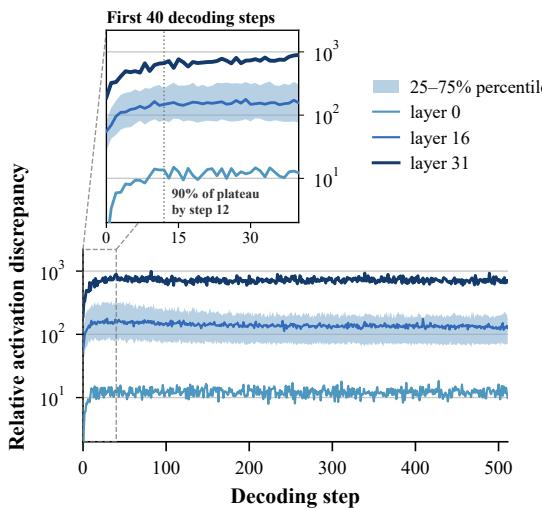
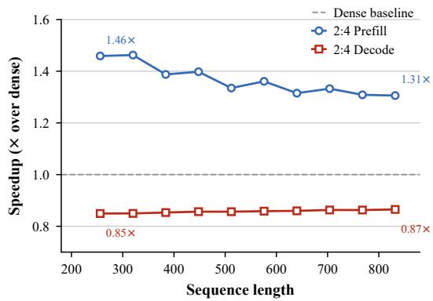
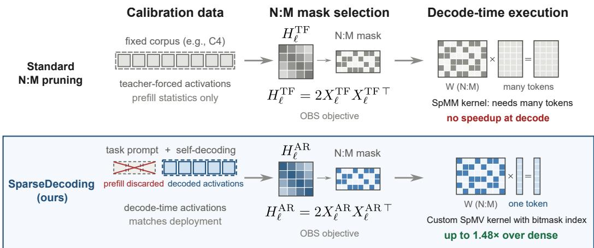

# SPARSEDECODING: DECODING-AWARE PRUNING FOR ACCURATE AND EFFICIENT LLM INFERENCE

Qitong Wang1∗ Xinwei Niu1∗ Mingluo Su1 Shanwei Zhao2 Shiai Zhu2 Huan Wang1B

1Westlake University 2Ant Group

https://wang-qitong.github.io/SparseDecoding

## ABSTRACT

The memory-bound nature of the decoding stage of large language model (LLM) inference incurs significant latency. Layer-wise training-free network pruning approaches guided by the Hessian have been a prominent solution to this problem, as pruning reduces the number of nonzero parameters read from memory during decoding. Nevertheless, typical methods in this line compute the Hessian using precollected natural sequences, whereas the model is fed self-generated tokens during decoding, creating a distribution shift between the two sequences. The Hessian calculated on the natural sequence is different from that calculated on the generated sequence. We observe that this discrepancy causes the activation distribution during generation to deviate from that used for pruning, further hurting the pruned model performance. Moreover, most existing LLM pruning methods that bring actual speedup primarily target the sparse matrix-matrix (SpMM) multiplication, providing limited support for the sparse matrix-vector (SpMV) operations, which dominate decoding. To solve these problems, we introduce SparseDecoding, a principled decoding-aware pruning framework tailored for accurate and efficient LLM decoding. Specifically, at the algorithmic axis, SparseDecoding constructs calibration matrices from layer-wise activations collected during the dense-model autoregressive generation, excluding prefill, thereby aligning the pruning objective with the decoding activations. At the system axis, we develop an optimized N:M sparse matrix-vector kernel with bitmask indexing and fixed-step traversal. Substantial empirical results on representative LLMs (Llama-3.1-8B, Llama-3.3-70B, Qwen3-14B / 32B) demonstrate that our method consistently outperforms standard fixed-text calibration on the long-form generation benchmarks while achieving up to 1.48× end-to-end wall-clock decoding speedup on A100 GPUs.

## 1 INTRODUCTION

Large language models (LLMs) are increasingly used for long-output applications such as document drafting, long-form content generation, and code generation (Bai et al., 2025; Wu et al., 2025; Chen et al., 2021; Jain et al., 2025). The autoregressive decoding process of LLMs is memory-bound and typically dominates end-to-end inference latency (Kim et al., 2025; Fu et al., 2024). Generating such long outputs incurs substantial latency, making inference efficiency a practical concern for deployment. Weight pruning addresses the inference cost problem of neural networks by zeroing out insignificant weights (Han et al., 2015). In terms of LLMs, due to the compute cost and data restrictions, training-free methods are the dominant ones (Frantar & Alistarh, 2023; Su & Wang, 2026) for sparsifying LLMs, especially those based on the OBS framework (Hassibi & Stork, 1992).

Existing training-free pruning methods (Frantar & Alistarh, 2023; Su & Wang, 2026) typically rely on a small calibration set to estimate or compensate for the output reconstruction error. Conse quently, calibration data play a critical role in determining the quality of the pruned model. Existing methods usually collect calibration activations by running fixed sequences from the calibration set under teacher forcing. This protocol is appropriate for static-input inference settings, where the model inputs remain unchanged by its own predictions. However, autoregressive decoding continu ously extends the input context with previously generated tokens. Pruning errors at early decoding steps may therefore alter subsequent predictions and contexts, causing the resulting activation distribution to progressively deviate from that observed during teacher-forced calibration. As shown in Figure 1a, the relative activation discrepancy increases rapidly during the early stage of autoregressive decoding, with all layers reaching at least 90% of their eventual plateau within the first 12 decoding steps. After this initial increase, the discrepancy remains largely stable throughout the subsequent decoding process, even as generation continues for hundreds of additional steps. This behavior suggests that the activation distribution during decoding differs from that observed under fixed teacher-forced calibration, motivating us to construct the calibration objective directly from decode-time activations.

  
(a) Activation discrepancy during decoding.

  
(b) Prefill and decoding speedup.  
Figure 1: Motivating observations for decoding-aware sparse inference. (a) The relative activation discrepancy between the dense and pruned models grows rapidly during the first few decoding steps before settling into a plateau. The shaded region shows the interquartile range across transformer layers, while the curves correspond to the first (layer 0), middle (layer 16), and last (layer 31) layers. All layers reach 90% of their plateau by decoding step 12, after which the activation discrepancy remains largely unchanged. (b) Speedup of the 2:4 sparse Tensor Core path over dense execution. Existing sparse kernels provide 1.31 to 1.46× speedups during the prefill stage, but achieve only 0.85 to 0.87× of dense performance during autoregressive decoding. Results are obtained on Llama-3.1- 8B with 2:4 sparsity on an NVIDIA A100 GPU.

Meanwhile, reducing the theoretical computational cost of pruning alone does not necessarily translate into lower latency, and achieving practical speedups requires efficient sparse-kernel implementations. We consider N:M semi-structured sparsity as a case study, since it offers hardware-friendly regularity while retaining flexibility in selecting weights (Fang et al., 2024). Existing 2:4 Sparse Tensor Core libraries, such as cuSPARSELt (NVIDIA Corporation, 2021) are optimized primarily for Sparse Matrix-Matrix Multiplication (SpMM) (Lin et al., 2023). By contrast, operations during decoding are dominated by Sparse Matrix-Vector Multiplication (SpMV) (Hong et al., 2024), rather than SpMM, and thus cannot be accelerated by cuSPARSELt implementations.

In this paper, we introduce SparseDecoding (Figure 2) to address these two issues. On the algorithmic side, we build the calibration matrices from layer-wise input activations collected as the dense model generates tokens autoregressively. We keep only the activations from decoding and discard those from prefill. This decoding-aware calibration can be used directly with existing pruning methods such as SparseGPT (Frantar & Alistarh, 2023). On the system side, inspired by nmSPARSE (Lin et al., 2023), a GPU library for general N:M sparse computation, we design a customized N:M SpMV kernel for efficient autoregressive decoding. Instead of storing a separate 32-bit column index for each nonzero, we represent the sparsity pattern with bitmasks, using one bit per input column and packing every 32 consecutive bits into a 32-bit mask. For the 50% N:M patterns with $M \leq 3 2$ considered in our kernel design, each aligned 32-bit mask word contains exactly 16 set bits. This allows every output row to traverse its bitmask in the same number of steps, keeping the workload uniform across GPU threads. Together, decoding-aware calibration and the optimized N:M SpMV kernel preserve generation quality while providing practical end-to-end decoding speedups.

  
Figure 2: Overview of SparseDecoding. Unlike standard pruning methods collecting calibration activations from fixed corpora, SparseDecoding calibrates on the model-generated tokens from task prompts while discarding the prefill activations. Meanwhile, existing N:M sparse Tensor Core kernels accelerate prefill but often underperform dense execution during autoregressive decoding. SparseDecoding instead introduces a decoding-oriented sparse execution pipeline that converts pruned weights into an efficient N:M representation and employs an optimized sparse decoding kernel, achieving up to 1.48× decoding speedup under the experimental setup described in Sec. 4.

In summary, this paper makes three contributions:

1. We propose a decoding-aware pruning method that aligns the pruning objective with the activations encountered during autoregressive decoding.

2. We further develop an optimized N:M SpMV kernel for efficient sparse decoding, using bitmask indexing and fixed-step traversal to reduce metadata and indexing overhead.

3. Extensive experiments across multiple LLMs show that SparseDecoding improves longform generation quality over existing pruning baselines while achieving up to 1.48× endto-end decoding speedup on A100 GPUs.

## 2 RELATED WORK

## 2.1 ONE-SHOT PRUNING

Network pruning reduces the size and inference cost of pretrained models by removing redundant weights (LeCun et al., 1989; Han et al., 2015; 2016; Hoefler et al., 2021). Existing methods can be broadly classified into three categories based on pruning granularity: structured (Ma et al., 2023; Wang et al., 2023), unstructured (Han et al., 2015; Singh & Alistarh, 2020), and semi-structured pruning (Fang et al., 2024; Mishra et al., 2021; Zhang et al., 2022). Structured pruning eliminates entire parameter groups, such as filters or channels (He et al., 2017; Ma et al., 2023), while preserving regular computation that dense hardware and software kernels can handle efficiently (Mishra et al., 2021), but offering less flexibility in selecting individual weights (Hoefler et al., 2021). Un structured pruning provides greater flexibility, but its irregular nonzero locations introduce indirect memory access, limited parallelism, and scheduling overhead (Han et al., 2015; Wen et al., 2016). Semi-structured pruning lies between these two extremes. A representative example is N:M sparsity (Pool & Yu, 2021), which retains N nonzero weights in every group of M, balancing hardware efficiency with flexible weight selection.

## 2.2 CALIBRATION DATA FOR PRUNING

One-shot pruning methods (e.g., SparseGPT (Frantar & Alistarh, 2023), Wanda (Sun et al., 2024), ROSE (Su & Wang, 2026)) typically use a small calibration set, such as C4 (Raffel et al., 2020) or WikiText (Merity et al., 2017), to estimate weight importance. Recent studies have shown that the choice of calibration data can substantially affect pruning quality. By comparing multiple pretraining and downstream datasets, Bandari et al. (2024) show that C4 is often not the best calibration source across tasks. Ji et al. (2025) further show that self-generated calibration data better aligned with the model’s distribution can improve pruning performance. These studies focus on which calibration corpus to use, whereas SparseDecoding changes how calibration activations are collected specifically from the autoregressive decoding generations. More closely related to our setting, RAC (Lucas et al., 2026) uses both input activations and activations from the model’s on-policy chain-of-thought trajectory for layer-wise reconstruction, while RESP (Wang et al., 2025) uses self-generated reasoning traces with a decode-only gradient objective to estimate importance for structured pruning. Both methods incorporate decode-time information into pruning, while we focus on how the calibration objective differs from the actual decode-time reconstruction objective. SparseDecoding builds the calibration matrix from task-conditioned decode-step activations, excluding prefill, and uses it to define the layer-wise reconstruction objective. Theorem A.1 measures the exact worst-case relative discrepancy between the calibration and decode-time reconstruction objectives.

## 2.3 SPARSE GPU KERNELS AND EFFICIENT DECODING

Whether a sparse model is faster in practice depends on how the sparse pattern is executed on GPUs. General sparse kernels such as Sputnik (Gale et al., 2020) show that locality and load balancing can improve sparse matrix computation in deep learning, but irregular sparsity also introduces metadata, indirect memory access, and scheduling overhead. NVIDIA cuSPARSELt (NVIDIA Corporation, 2021) targets structured sparse matrix-matrix computation and is more suitable for prefill or larger batch GEMM/SpMM. In autoregressive decoding, however, the core linear layers at batch one or small batches are closer to GEMV/SpMV, so Tensor-Core-oriented 2:4 paths do not directly cover our target setting. Lin et al. (2023) provide a general execution path for N:M sparse weights by supporting both SpMV and SpMM. We therefore develop an N:M SpMV execution path specialized for sparse decoding, using bitmask indexing and fixed-step traversal. Our implementation achieves up to a 1.48× end-to-end decoding speedup on A100 GPUs.

## 3 PROPOSED METHOD: SPARSEDECODING

SparseDecoding is a pruning framework for layer-wise post-training pruning and can be combined with OBS-based solvers such as SparseGPT (Frantar & Alistarh, 2023). We first introduce the preliminaries on OBS and the relevant works (Sec. 3.1), and then elaborate on our proposed method (Sec. 3.2). Of note, the method is not only for more accurate pruning. We also propose a kernel design (Sec. 3.3) to achieve actual wall-clock speedup on hardware.

## 3.1 PRELIMINARY

Layer-wise post-training pruning. Directly optimizing the entire model for post-training pruning is computationally prohibitive due to the large number of parameters. Therefore, a widely adopted strategy is to decompose the global compression problem into a sequence of layer-wise reconstruction problems (Frantar & Alistarh, 2022; Dong et al., 2017). For layer $\ell ,$ given the layer-wise calibration activations $X _ { \ell }$ and a layer-wise target sparsity $S _ { \ell } .$ , the goal is to find a sparse weight matrix $\widehat { W } _ { \ell }$ that changes the layer output as little as possible on $X _ { \ell }$ :

$$
\widehat { W } _ { \ell } = \mathop { \mathrm { a r g m i n } } _ { \widetilde { W } _ { \ell } } \left\| \left( W _ { \ell } - \widetilde { W } _ { \ell } \right) X _ { \ell } \right\| _ { F } ^ { 2 } \quad \mathrm { s . t . } \quad \mathrm { s p a r s i t y } \left( \widetilde { W } _ { \ell } \right) = S _ { \ell } ,\tag{1}
$$

where $\widetilde { W _ { \ell } }$ ranges over all weight matrices that satisfy the layer-wise sparsity constraint $S _ { \ell } , \widehat { W } _ { \ell }$ denotes the sparse weight matrix that minimizes the objective, and $\left\| \cdot \right\| _ { F } ^ { 2 }$ denotes the squared Frobenius norm. Solving this problem for each layer sequentially and applying the layer-wise sparse weights yields the final pruned network.

Optimal Brain Surgeon for layer-wise pruning. The Optimal Brain Surgeon (OBS) framework (Hassibi & Stork, 1992) efficiently addresses the layer-wise pruning problem in Eq. (1). Since the objective is based on the squared $\ell _ { 2 }$ norm, it decomposes across the rows of $W _ { \ell }$ into independent subproblems. Within each row, OBS uses a second-order Taylor approximation of the reconstruction error, with Hessian $H = 2 X _ { \ell } X _ { \ell } ^ { \top }$ , shared across rows as it depends only on the calibration activations. This approximation admits a closed form for (1) identifying the least salient weight $w _ { q }$ in the row, whose removal induces the smallest increase in reconstruction error; (2) computing the optimal update δw to the row’s surviving weights that compensates for removing it. The saliency $\mathcal { L } _ { q }$ and the update δw are given by

$$
\mathcal { L } _ { q } = \frac { w _ { q } ^ { 2 } } { 2 [ H ^ { - 1 } ] _ { q q } } , \quad \delta w = - \frac { w _ { q } } { [ H ^ { - 1 } ] _ { q q } } H _ { : , q } ^ { - 1 } .\tag{2}
$$

Here, $[ H ^ { - 1 } ] _ { q q }$ denotes the $q \mathrm { . }$ -th diagonal entry of the inverse Hessian, and $H _ { : , q } ^ { - 1 }$ denotes its q-th column. The procedure is applied iteratively, one weight at a time, until the target sparsity $S _ { \ell }$ is reached. At each pruning step, removing a weight requires the corresponding inverse Hessian information to be updated. Performing a full matrix re-inversion after every removal is computationally prohibitive. SparseGPT (Frantar & Alistarh, 2023) addresses these challenges by fixing the pruning order in advance, enabling efficient, stable maintenance of the required inverse Hessian information.

## 3.2 PROPOSED METHOD: SPARSEDECODING

SparseDecoding is a decoding-aware pruning framework that aligns post-training pruning with the autoregressive states encountered during generation. In OBS (Hassibi & Stork, 1992), the calibration data affect which weights are removed and how the remaining weights are updated through the Hessian $H = 2 X _ { \ell } X _ { \ell } ^ { \top }$ . Standard calibration collects $X _ { \ell } ^ { \mathrm { T F } }$ from fixed text such as C4 (Raffel et al., 2020), where every token in the context is given in advance. Consequently, the Hessian summarizes activations under fixed contexts rather than the model-generated contexts.

However, autoregressive decoding differs from calibration on fixed text because later model states depend on the tokens generated at earlier steps. Errors introduced by pruning at early decoding steps can therefore affect subsequent token predictions and the contexts conditioned on by the model, with these effects accumulating over generation. As a result, the decode-time activation distribution can gradually diverge from that observed under fixed-text calibration. Thus, we first let $\mathcal { C } = \{ q _ { m } \} _ { m = 1 } ^ { K }$ be a set of calibration prompts drawn from the target task. Rather than running fixed text through the model, we let the dense model produce its own continuation of each prompt,

$$
y _ { t } ^ { ( m ) } \sim P _ { \theta } \bigl ( \cdot \mid q _ { m } , y _ { < t } ^ { ( m ) } \bigr ) , \qquad t = 1 , \ldots , T _ { m } ,\tag{3}
$$

so that the context at every step is induced by the model’s own previously generated outputs. For prompt $q _ { m }$ , we write $\mathcal { P } _ { m }$ for the prompt positions consumed during prefill and $\mathcal { D } _ { m }$ for the $T _ { m }$ positions emitted during decoding. For a linear layer ℓ with weights $W _ { \ell } \in \mathbb { R } ^ { d _ { \mathrm { o u t } } \times d _ { \mathrm { i n } } }$ , let $x _ { \ell , t } ^ { ( m ) } \in \mathbb { R } ^ { d _ { \mathrm { i n } } }$ denote its input activation at step t. We record $x _ { \ell , t } ^ { ( m ) }$ for every prunable linear layer and keep only the steps $t \in \mathcal { D } _ { m }$ , discarding the activations produced while processing $\mathcal { P } _ { m }$ . We discard prefill positions because our calibration objective specifically targets the token-by-token, self-conditioned decoding regime. As shown in Figure 1a, the activation discrepancy grows rapidly during the early decoding steps, motivating our calibration on decode-time activations. Then we collect every retained activation to construct a matrix, with each activation being a column of the matrix,

$$
X _ { \ell } ^ { \mathrm { A R } } = \big [ x _ { \ell , t } ^ { ( m ) } \big ] _ { m = 1 , \dots , K ; \ell \in \mathcal { D } _ { m } } \in \mathbb { R } ^ { d _ { \mathrm { i n } } \times N _ { \mathrm { D } } } , \quad N _ { \mathrm { D } } = \sum _ { m = 1 } ^ { K } | \mathcal { D } _ { m } | ,\tag{4}
$$

where $N _ { \mathrm { D } }$ denotes the total number of decoding steps across the K prompts. During the model pruning phase, we therefore find the sparse weights $\widehat { W } _ { \ell }$ that follow the minimization objective in Eq. (1) to minimize the influence on the layer output based on these activations. Written out, our specific autoregressive layer-wise pruning reconstruction objective is defined as:

$$
\begin{array} { r l r } {  { \mathcal { L } _ { \ell } ^ { \mathrm { A R } } = \big \| \big ( W _ { \ell } - \widehat { W _ { \ell } } \big ) X _ { \ell } ^ { \mathrm { A R } } \big \| _ { F } ^ { 2 } } } \\ & { } & { = \displaystyle \sum _ { m = 1 } ^ { K } \sum _ { t \in \mathcal { D } _ { m } } \big \| \big ( W _ { \ell } - \widehat { W _ { \ell } } \big ) x _ { \ell , t } ^ { ( m ) } \big \| _ { 2 } ^ { 2 } , \qquad } \end{array}\tag{5}
$$

so the loss ranges over all $N _ { \mathrm { D } }$ generated tokens. While fixed-text calibration on C4 (Raffel et al., 2020) or reference text constructs $X _ { \ell } ^ { \mathrm { T F } }$ from teacher-forced activations, our method instead constructs $X _ { \ell } ^ { \mathrm { A R } }$ from autoregressive decode-time activations. The pruning solver itself remains unchanged, but the resulting reconstruction objective is defined over activations that more closely reflect those encountered during generation, without requiring additional training or a new optimizer.

## 3.3 N:M SPMV KERNEL DESIGN

We first instantiate the framework under N:M semi-structured sparsity for our method. The N:M pattern alone does not determine decoding efficiency. However, as shown in Figure 1b, existing 2:4 Sparse Tensor Core kernels reach 1.31-1.46× speedup during prefilling but only achieve 0.85- 0.87× of dense throughput during decoding. In this subsection, we explain why the same sparse weights accelerate the prefilling yet remain inefficient during decoding, and describe the decodetime specialized kernel we develop to address this.

Decoding is dominated by SpMV operations. In batch-one or small-batch autoregressive decoding, each linear layer processes only the hidden state of the current token, so its computation is closer to General Matrix-Vector Multiplication (GEMV) than large-batch General Matrix-Matrix Multiplication (GEMM). After pruning, the corresponding operation becomes N:M SpMV. We therefore develop a decoding-specialized N:M SpMV kernel inspired by nmSPARSE (Lin et al., 2023). Our kernel takes advantage of the regular N:M sparsity pattern to reduce the metadata needed to locate nonzero weights and to make indices be extracted efficiently:

(1) Bitmask indexing. We first represent the sparsity pattern of each row with a bitmask, where each bit indicates whether the weight at the corresponding column is retained. Because the nonzero weights are stored in increasing column order, the set bits in the mask correspond to the stored weights in the same order, thus removing the need to store a separate column index or local offset for every nonzero. At 50% sparsity, this representation uses only 2 bits of metadata per nonzero, compared with 32 bits for the int32 indices used by nmSPARSE and 8 bits for a uint8 offset representation. The metadata size is therefore reduced by 16× and 4×, respectively, which is especially useful during batch-one decoding, where SpMV is largely memory-bound.

(2) Fixed-step bitmask traversal. For a general sparse matrix, different rows may contain different numbers of nonzeros, so traversing their bitmasks requires different numbers of steps. With 50% N:M sparsity and $M \leq 3 2 .$ each aligned 32-bit mask contains exactly 16 set bits. The number of traversal steps is therefore fixed for every row and known at compile time. We process each bitmask with a fixed-length loop that the compiler can unroll. At each step, a bit-scan operation finds the least significant set bit, which gives the column of the next nonzero, and that bit is then cleared before continuing. Because each row requires the same number of traversal steps, the workload remains uniform across GPU threads, which allows the N:M bitmask representation to be traversed efficiently during SpMV. We provide further implementation details in Appendix C.

## 4 EXPERIMENTS

We evaluate SparseDecoding by addressing three questions: (1) whether autoregressive calibration preserves quality on long writing tasks; (2) whether the same calibration procedure generalizes to code generation; and (3) whether the optimized SpMV kernel reduces decoding latency. Together, these experiments cover the quality and efficiency goals introduced in Sec. 3.

## 4.1 EXPERIMENTAL SETUP

Models. We evaluate four open-weight instruction-tuned language models from two model families at two parameter scales: Llama-3.1-8B, Llama-3.3-70B (Grattafiori et al., 2024), and Qwen3- 14B/32B (Yang et al., 2025). We prune only linear layers supported by the pruning backend, leaving all other components unchanged. The corresponding dense model serves as the quality reference throughout our experiments. We conduct all of our experiments on NVIDIA A100 80 GB GPUs.

Benchmarks. Our method is specifically designed for long decoding scenarios. Thus, here we employ two representative benchmarks, WritingBench (Wu et al., 2025) and ClassEval (Du et al., 2023), to evaluate our method against others:

WritingBench for writing. WritingBench (Wu et al., 2025) contains 1,000 writing prompts belonging to 100 subdomains within 6 domain categories, which are Academic & Engineering (D1), Finance & Business (D2), Politics & Law (D3), Literature & Arts (D4), Education (D5), and Advertising & Marketing (D6). Each prompt also introduces three extra requirements as the evaluation criteria: style, format, and length. Following the original setup, we decode at the temperature of 0.7, top-k value of 20, and top-p value of 0.8, with maximum generation lengths of 16,000 tokens.

Table 1: Results on the WritingBench benchmark under 50% and 2:4 sparsity. SparseDecoding (ours) calibrates on autoregressive generations conditioned on LongWriter prompts; C4 uses fixed C4 sequences. Dense is the unpruned reference. Columns report the overall score, the six domain scores, and the three requirement scores for style (R1), format (R2), and length (R3); “C” indicates the corresponding category-specific score. The six domains are Academic & Engineering (D1), Finance & Business (D2), Politics & Law (D3), Literature & Arts (D4), Education (D5), and Advertising & Marketing (D6). All scores are on a scale of 1-10. Bold marks the better overall score between SparseDecoding and C4 within each sparsity setting, based on unrounded values.
<table><tr><td rowspan="2">Model</td><td rowspan="2">Sparsity</td><td rowspan="2">Method</td><td rowspan="2">Overall</td><td colspan="6">Domains</td><td colspan="6">Requirements</td></tr><tr><td>D1</td><td>D2</td><td></td><td>D3</td><td>D4</td><td>D5</td><td>D6</td><td>R1</td><td>C</td><td>R2</td><td>C</td><td>R3 C</td></tr><tr><td rowspan="5">Llama-3.1-8B</td><td>0%</td><td>Dense</td><td>3.70</td><td>3.7</td><td>3.6</td><td>3.5</td><td>3.3</td><td>4.1</td><td>4.3</td><td>3.8</td><td>3.9</td><td></td><td>3.7 4.3</td><td></td><td>3.83.6</td></tr><tr><td>50%</td><td>C4</td><td>2.25</td><td></td><td>2.4 2.2 2.1</td><td></td><td></td><td></td><td></td><td></td><td></td><td></td><td></td><td>1 1.9 2.4 2.6 2.2 2.2 2.2 2.5 2.2 2.1</td><td></td></tr><tr><td rowspan="2"></td><td>SparseDecoding</td><td>2.54</td><td></td><td></td><td>2.7 2.5 2.5</td><td></td><td></td><td>2.0 2.7 3.0 2.5 2.5 2.5 2.9 2.5 2.4</td><td></td><td></td><td></td><td></td><td></td><td></td></tr><tr><td>C4</td><td>1.34</td><td>1.5</td><td>1.3</td><td>1.3</td><td>1.1</td><td>1.4</td><td>1.6</td><td>1.3</td><td>1.3</td><td>1.3</td><td>1.4</td><td>1.3 1.2</td><td></td></tr><tr><td rowspan="5">Llama-3.3-70B</td><td>2:4</td><td>SparseDecoding</td><td>1.52</td><td>1.7</td><td>1.6</td><td>1.5</td><td>1.3</td><td>1.5</td><td>1.6</td><td>1.5</td><td>1.5</td><td>1.5</td><td>1.5</td><td></td><td>1.4 1.4</td></tr><tr><td>0%</td><td>Dense</td><td>4.65</td><td>4.6</td><td>4.5</td><td>4.5</td><td>4.5</td><td>5.1</td><td>5.2</td><td>4.7</td><td>4.9</td><td>4.6</td><td>5.2</td><td></td><td>4.84.5</td></tr><tr><td>50%</td><td>C4</td><td>3.82</td><td>3.7</td><td>3.8</td><td>3.7</td><td>3.5</td><td>4.1</td><td>4.3</td><td></td><td>3.84.0</td><td></td><td>3.84.3</td><td></td><td>3.8 3.7</td></tr><tr><td></td><td>SparseDecoding</td><td>4.01</td><td></td><td></td><td></td><td></td><td></td><td></td><td></td><td></td><td></td><td></td><td>4.0 3.9 3.8 3.8 4.4 4.5 4.0 4.2 4.0 4.5 4.1 3.8</td><td></td></tr><tr><td rowspan="2">2:4</td><td>C4</td><td>3.10 3.29</td><td></td><td></td><td></td><td></td><td></td><td></td><td></td><td></td><td></td><td></td><td></td><td>3.1 3.2 3.0 2.6 3.3 3.5 3.1 3.0 3.1 3.6 3.0 2.8</td></tr><tr><td>SparseDecoding</td><td></td><td></td><td>3.2</td><td>3.3</td><td>3.0</td><td>3.1</td><td>3.7</td><td>3.8</td><td>3.3</td><td>3.4 3.2</td><td>3.6</td><td></td><td>3.3 2.9</td></tr><tr><td rowspan="5">Qwen3-14B</td><td>0%</td><td>Dense</td><td>5.97</td><td></td><td>6.05.8</td><td>6.1</td><td>5.7</td><td>6.3</td><td>6.1</td><td>6.1</td><td>6.4</td><td></td><td>6.06.8</td><td>6.06.3</td><td></td></tr><tr><td>50%</td><td>C4</td><td>4.62</td><td></td><td></td><td></td><td></td><td></td><td></td><td></td><td></td><td></td><td></td><td>4.6 4.4 4.6 4.0 5.4 5.2 4.8 5.0 4.6 5.2 4.5 4.6</td><td></td></tr><tr><td></td><td>SparseDecoding</td><td>5.35</td><td></td><td></td><td></td><td></td><td></td><td></td><td></td><td></td><td></td><td></td><td>5.3 5.3 5.4 4.9 5.9 5.6 5.5 5.8 5.4 6.2 5.4 5.6</td><td></td></tr><tr><td>2:4</td><td>C4</td><td>1.85</td><td></td><td>2.0 1.8</td><td>1.7</td><td>1.6</td><td></td><td>2.0 2.3</td><td>1.9</td><td>1.9</td><td>1.8</td><td>1.7</td><td>1.91.7</td><td></td></tr><tr><td rowspan="2">0%</td><td>SparseDecoding</td><td>4.18</td><td>4.2</td><td>4.3</td><td>4.3</td><td>3.3</td><td>4.8</td><td>4.6</td><td>4.2</td><td></td><td>4.4</td><td>4.2</td><td>4.9</td><td>4.1 4.2</td></tr><tr><td></td><td>Dense</td><td>6.48</td><td>6.5</td><td>6.4</td><td>6.5</td><td>6.3</td><td>6.7</td><td>6.6</td><td>6.6</td><td>6.8</td><td>6.5 7.2</td><td></td><td>6.66.8</td></tr><tr><td rowspan="4">Qwen3-32B</td><td>50%</td><td>C4</td><td>5.34</td><td>5.2</td><td>5.2</td><td>5.4</td><td>4.9</td><td>5.9</td><td>5.8</td><td>5.5</td><td>5.7</td><td></td><td>5.3</td><td>6.05.3 5.4</td><td></td></tr><tr><td></td><td>SparseDecoding</td><td>6.09</td><td>6.0</td><td></td><td></td><td></td><td>6.0 6.1 5.8 6.5</td><td>6.3</td><td></td><td>6.2 6.5</td><td>6.1</td><td></td><td>6.8 6.1 6.4</td><td></td></tr><tr><td>2:4</td><td>C4</td><td>2.99</td><td></td><td></td><td></td><td></td><td></td><td></td><td></td><td></td><td></td><td>3.0 2.9 2.9 2.3 3.5 3.9 3.0 3.1 3.0 3.3 2.9 2.8</td><td></td><td></td></tr><tr><td></td><td>SparseDecoding</td><td>5.31</td><td></td><td></td><td></td><td></td><td></td><td></td><td></td><td></td><td>5.2 5.3 5.4 4.7 5.8 5.7 5.4 5.6 5.3 6</td><td></td><td>6.0 5.3 5.5</td><td></td></tr></table>

As the benchmark requires an additional LLM as the evaluation judge, we select DeepSeek-V4- Flash (DeepSeek-AI, 2026) as the judge. All reported scores are on a scale of 1-10, with higher scores indicating better performance.

ClassEval for coding. ClassEval (Du et al., 2023) contains 100 hand-written Python class generation tasks covering 410 methods, averaging 33.1 tests per class. Given a class skeleton and natural language description, the model generates the entire class in a single pass. We report class-level Pass@1, the fraction of tasks for which the model’s greedy generation passes its class-level tests.

Pruning configurations. We evaluate 2:4 and 8:16 N:M sparsity, as well as 50% unstructured sparsity. All configurations retain 50% of the weights, which holds the nominal sparsity constant across the three patterns. The two N:M settings differ only in the grouping constraint; for instance, a 2:4 mask selects two weights from each group of four, while an 8:16 mask selects eight weights from each group of sixteen. Unstructured pruning provides a reference without the local N:M constraint. All models we use in our experiments are pruned only once after calibration.

Calibration configurations. The C4 configuration follows the common post-training pruning pipeline. It collects layer inputs from fixed C4 text (Raffel et al., 2020). SparseDecoding collects layer inputs from decode steps produced by the dense model. The prompts come from Long-Writer (Bai et al., 2025) for the writing experiments and from LiveCodeBench problem statements (Jain et al., 2025) for the code experiments without solutions or reasoning traces. Each dense model generates its own continuation, so the activations we collect are conditioned on the model’s own output rather than on reference text. Both C4 and SparseDecoding use 1M calibration tokens, with only decode-step tokens counted for SparseDecoding. All of the models operate in non-thinking mode during both calibration and evaluation. Both configurations pass their activations to the same SparseGPT backend. Comparisons within one specified sparsity pattern therefore fix the model, pruning backend, and retained weight fraction. We repeat this comparison under both unstructured 50% and semi-structured 2:4 sparsity on Qwen3 models in Sec. 4.5.

## 4.2 MAIN RESULTS: WRITINGBENCH

Table 1 reports WritingBench scores for the dense checkpoints alongside models pruned with C4 calibration and with SparseDecoding calibration on LongWriter (Bai et al., 2025) prompts.

Effect of decoding-aware calibration. SparseDecoding improves the overall WritingBench score across all models and sparsity settings. Under 50% unstructured sparsity, the gains range from 0.19 to 0.75 points across the four models. Under 2:4 sparsity, the improvements remain modest for the two Llama models, increasing from 1.34 to 1.52 for Llama-3.1-8B and from 3.10 to 3.29 for Llama-3.3-70B. In contrast, the gains are substantially larger for the Qwen models, with the overall score increasing from 1.85 to 4.18 for Qwen3-14B and from 2.99 to 5.31 for Qwen3-32B.

We also observe similar improvements across most writing domains and the requirement scores. Since each comparison fixes the model, pruning backend, retained weight fraction, and sparsity pattern, the results suggest that calibration activations play an important role in preserving generation quality after pruning.

## 4.3 MAIN RESULTS: CLASSEVAL

Table 2 reports class-level Pass@1 for the dense checkpoints alongside models pruned with C4 calibration and SparseDecoding calibration on LiveCodeBench (Jain et al., 2025) problem statements.

Comparisons over calibration methods. SparseDecoding is ahead across all eight model-sparsity pairs by 4 to 15 points. Comparing with C4 under 2:4 sparsity, Pass@1 rises from 9.0 to 24.0% on Qwen3- 32B, from 0.0 to 6.0% on Qwen3-14B, from 11.0 to 15.0% on Llama-3.3-70B, and from 0.0 to 4.0% on Llama-3.1-8B. Notably, under 2:4 sparsity, C4 calibration yields 0.0 on both Llama-3.1-8B and Qwen3-14B, whereas SparseDecoding recovers nonzero scores.

Table 2: Results on the ClassEval benchmark under 50% and 2:4 sparsity.
<table><tr><td>Model</td><td>Sparsity</td><td>Method</td><td>Pass@1 (%) ↑</td></tr><tr><td rowspan="5">Llama-3.1-8B</td><td>0%</td><td>Dense</td><td>24.0</td></tr><tr><td rowspan="2">50%</td><td>C4</td><td>2.0</td></tr><tr><td>SparseDecoding</td><td>10.0</td></tr><tr><td rowspan="2">2:4</td><td>C4</td><td>0.0</td></tr><tr><td>SparseDecoding</td><td>4.0</td></tr><tr><td rowspan="5">Llama-3.3-70B</td><td>0%</td><td>Dense</td><td>33.0</td></tr><tr><td rowspan="2">50%</td><td>C4</td><td>22.0</td></tr><tr><td>SparseDecoding</td><td>28.0</td></tr><tr><td rowspan="2">2:4</td><td>C4</td><td>11.0</td></tr><tr><td>SparseDecoding</td><td>15.0</td></tr><tr><td rowspan="5">Qwen3-14B</td><td>0%</td><td>Dense</td><td>36.0</td></tr><tr><td rowspan="2">50%</td><td>C4</td><td>22.0</td></tr><tr><td>SparseDecoding</td><td>27.0</td></tr><tr><td rowspan="2">2:4</td><td>C4</td><td>0.0</td></tr><tr><td>SparseDecoding</td><td>6.0</td></tr><tr><td rowspan="5">Qwen3-32B</td><td>0%</td><td>Dense</td><td>34.0</td></tr><tr><td rowspan="2">50%</td><td>C4</td><td>25.0</td></tr><tr><td>SparseDecoding</td><td>30.0</td></tr><tr><td rowspan="2">2:4</td><td>C4</td><td>9.0</td></tr><tr><td>SparseDecoding</td><td>24.0</td></tr></table>

## 4.4 EMPIRICAL DECODING SPEEDUP

Table 3 reports decoding throughput and speedup relative to the dense model across N:M patterns from 2:4 to 16:32. All measurements use NVIDIA A100 GPUs and the GPT-Fast framework (Py-Torch, 2023). On each model, all four patterns achieve nearly identical throughput, with speedups of 1.42× on Llama-3.1-8B, 1.48× on Llama-3.3-70B, 1.35× on Qwen3-14B, and 1.45× on Qwen3- 32B. This is expected from our kernel design. Since all patterns retain 50% of the weights and use the same bitmask metadata, they incur identical memory traffic per row. In contrast to the 2:4 Sparse Tensor Core path in Figure 1b, which runs slower than dense execution during decoding, our kernel turns every evaluated N:M pattern into a practical decoding speedup.

Table 3: End-to-end decoding throughput and speedup over the dense baseline. All of the N:M patterns retain 50% of the weights, so differences reflect kernel efficiency rather than compression. Every evaluated pattern decodes faster than the dense baseline, with speedups ranging from 1.34 to 1.48×. Measurements use a context length of 512 and report the median after 50 warmup and 50 measured iterations on NVIDIA A100 GPUs with GPT-Fast.
<table><tr><td rowspan="2">N:M</td><td colspan="2">Llama-3.1-8B</td><td colspan="2">Llama-3.3-70B</td><td colspan="2">Qwen3-14B</td><td colspan="2">Qwen3-32B</td></tr><tr><td>Token/s</td><td>Speedup</td><td>Token/s</td><td>Speedup</td><td>Token/s</td><td>Speedup</td><td>Token/s</td><td>Speedup</td></tr><tr><td>Dense</td><td>96.26</td><td>1.00×</td><td>21.67</td><td>1.00×</td><td>39.76</td><td>1.00×</td><td>19.15</td><td>1.00×</td></tr><tr><td>2:4</td><td>136.30</td><td>1.42×</td><td>30.17</td><td>1.39×</td><td>53.18</td><td>1.34×</td><td>27.69</td><td>1.45×</td></tr><tr><td>4:8</td><td>136.43</td><td>1.42×</td><td>31.64</td><td>1.46×</td><td>53.86</td><td>1.35×</td><td>27.83</td><td>1.45×</td></tr><tr><td>8:16</td><td>136.89</td><td>1.42×</td><td>29.90</td><td>1.38×</td><td>53.42</td><td>1.34×</td><td>27.77</td><td>1.45×</td></tr><tr><td>16:32</td><td>136.89</td><td>1.42×</td><td>32.13</td><td>1.48×</td><td>53.73</td><td>1.35×</td><td>27.81</td><td>1.45×</td></tr></table>

## 4.5 ABLATION STUDY

Ablation over calibration context source (Table 4). We examine whether calibration tokens must come from the model being pruned (self-generated) or can be produced by a different model (cross-model). Specifically, we compare calibrating the 14B model on its own tokens with using tokens generated by the larger 32B model when pruning the 14B model. Selfgenerated calibration performs better in both settings, achieving 4.18 vs. 4.13 under 2:4 sparsity and 5.35 vs. 5.23 under 50% unstructured sparsity. This suggests that generating calibration tokens with the model being pruned is a contributing factor, and using sequences generated by a different model introduces a distributional discrepancy in the calibration data.

Varying the pruning backend (Table 5). All preceding experiments use SparseGPT (Frantar & Alistarh, 2023) as the pruning backend when contrasting C4 with SparseDecoding, so the reported gains could in principle be specific to the solver. To verify the improvements are robust to the choice of pruning backend, we present the comparison with Wanda (Sun et al., 2024) in Table 5. SparseDecoding remains consistently ahead of C4 under both sparsity settings, indicating that improvements come from the calibration activations themselves rather than from the pruning backend.

Table 4: Results on the WritingBench benchmark under self-generated and cross-model calibration. Qwen3-14B is pruned using activations from its own generations (self-generated) or from Qwen3-32B generations (cross-model).
<table><tr><td>Model</td><td>Sparsity</td><td>Calibration</td><td>Overall</td></tr><tr><td rowspan="4">Qwen3-14B</td><td rowspan="2">50%</td><td>Cross-model (32B)</td><td>5.23</td></tr><tr><td>Self-generated (14B)</td><td>5.35</td></tr><tr><td rowspan="2">2:4</td><td>Cross-model (32B)</td><td>4.13</td></tr><tr><td>Self-generated (14B)</td><td>4.18</td></tr></table>

Table 5: Results on the WritingBench benchmark under 50% and 2:4 sparsity with Wanda on the Qwen3 model family.
<table><tr><td rowspan="2">Model</td><td rowspan="2">Sparsity</td><td rowspan="2">Method</td><td rowspan="2">Overall</td></tr><tr><td></td></tr><tr><td rowspan="3">Qwen3-14B</td><td>50%</td><td>C4</td><td>4.94</td></tr><tr><td></td><td>SparseDecoding</td><td>5.23</td></tr><tr><td>2:4</td><td>C4</td><td>2.41</td></tr><tr><td rowspan="4">Qwen3-32B</td><td></td><td>SparseDecoding C4</td><td>3.30 5.52</td></tr><tr><td>50%</td><td></td><td></td></tr><tr><td rowspan="2">2:4</td><td>SparseDecoding</td><td>5.71</td></tr><tr><td>C4 SparseDecoding</td><td>3.34 4.39</td></tr></table>

## 5 CONCLUSION

This work presents SparseDecoding, a decoding-aware pruning framework for LLMs that bridges the gap between pruning calibration objectives and downstream decoding behavior. By incorporat ing autoregressive outputs into calibration, SparseDecoding improves generation quality without additional training. Additionally, a N:M SpMV kernel is introduced to achieve practical speedup with the weight sparsity. Extensive experiments across multiple LLMs and sparsity patterns demonstrate that SparseDecoding consistently outperforms conventional calibration approaches, highlighting the importance of decoding-aware calibration for training-free LLM pruning. On top of the method, our N:M SpMV kernel achieves up to 1.48× end-to-end decoding speedup on NVIDIA A100 GPUs.

## REFERENCES

Yushi Bai, Jiajie Zhang, Xin Lv, Linzhi Zheng, Siqi Zhu, Lei Hou, Yuxiao Dong, Jie Tang, and Juanzi Li. Longwriter: Unleashing 10,000+ word generation from long context llms. In ICLR, 2025.

Abhinav Bandari, Lu Yin, Cheng-Yu Hsieh, Ajay Kumar Jaiswal, Tianlong Chen, Li Shen, Ranjay Krishna, and Shiwei Liu. Is c4 dataset optimal for pruning? an investigation of calibration data for LLM pruning. In EMNLP, 2024.

Mark Chen, Jerry Tworek, Heewoo Jun, Qiming Yuan, Henrique Ponde de Oliveira Pinto, Jared Kaplan, Harri Edwards, Yuri Burda, Nicholas Joseph, Greg Brockman, Alex Ray, Raul Puri, Gretchen Krueger, Michael Petrov, Heidy Khlaaf, Girish Sastry, Pamela Mishkin, Brooke Chan, Scott Gray, Nick Ryder, Mikhail Pavlov, Alethea Power, Lukasz Kaiser, Mohammad Bavarian, Clemens Winter, Philippe Tillet, Felipe Petroski Such, Dave Cummings, Matthias Plappert, Fotios Chantzis, Elizabeth Barnes, Ariel Herbert-Voss, William Hebgen Guss, Alex Nichol, Alex Paino, Nikolas Tezak, Jie Tang, Igor Babuschkin, Suchir Balaji, Shantanu Jain, William Saunders, Christopher Hesse, Andrew N. Carr, Jan Leike, Josh Achiam, Vedant Misra, Evan Morikawa, Alec Radford, Matthew Knight, Miles Brundage, Mira Murati, Katie Mayer, Peter Welinder, Bob Mc-Grew, Dario Amodei, Sam McCandlish, Ilya Sutskever, and Wojciech Zaremba. Evaluating large language models trained on code. arXiv preprint arXiv:2107.03374, 2021.

DeepSeek-AI. Deepseek-v4: Towards highly efficient million-token context intelligence, 2026.

Xin Dong, Shangyu Chen, and Sinno Jialin Pan. Learning to prune deep neural networks via layerwise optimal brain surgeon. In NeurIPS, 2017.

Xueying Du, Mingwei Liu, Kaixin Wang, Hanlin Wang, Junwei Liu, Yixuan Chen, Jiayi Feng, Chaofeng Sha, Xin Peng, and Yiling Lou. Classeval: A manually-crafted benchmark for evaluating llms on class-level code generation. arXiv preprint arXiv:2308.01861, 2023.

Gongfan Fang, Hongxu Yin, Saurav Muralidharan, Greg Heinrich, Jeff Pool, Jan Kautz, Pavlo Molchanov, and Xinchao Wang. MaskLLM: Learnable semi-structured sparsity for large language models. In NeurIPS, 2024.

Elias Frantar and Dan Alistarh. Optimal brain compression: A framework for accurate post-training quantization and pruning. In NeurIPS, 2022.

Elias Frantar and Dan Alistarh. SparseGPT: Massive language models can be accurately pruned in one-shot. In ICML, 2023.

Yichao Fu, Peter Bailis, Ion Stoica, and Hao Zhang. Break the sequential dependency of llm inference using lookahead decoding. In ICML, 2024.

Trevor Gale, Matei Zaharia, Cliff Young, and Erich Elsen. Sparse GPU kernels for deep learning. In Proceedings of the International Conference for High Performance Computing, Networking, Storage and Analysis, 2020.

Leo Gao, Stella Biderman, Sid Black, Laurence Golding, Travis Hoppe, Charles Foster, Jason Phang, Horace He, Anish Thite, Noa Nabeshima, et al. The Pile: An 800GB dataset of diverse text for language modeling. arXiv preprint arXiv:2101.00027, 2020.

Aaron Grattafiori et al. The llama 3 herd of models. arXiv preprint arXiv:2407.21783, 2024.

Song Han, Jeff Pool, John Tran, and William J. Dally. Learning both weights and connections for efficient neural networks. In NeurIPS, 2015.

Song Han, Huizi Mao, and William J. Dally. Deep compression: Compressing deep neural network with pruning, trained quantization and huffman coding. In ICLR, 2016.

Babak Hassibi and David Stork. Second order derivatives for network pruning: Optimal brain surgeon. In NeurIPS, 1992.

Yihui He, Xiangyu Zhang, and Jian Sun. Channel pruning for accelerating very deep neural networks. In ICCV, 2017.

Torsten Hoefler, Dan Alistarh, Tal Ben-Nun, Nikoli Dryden, and Alexandra Peste. Sparsity in deep learning: pruning and growth for efficient inference and training in neural networks. JMLR, 22 (241):1–124, 2021.

Ke Hong, Guohao Dai, Jiaming Xu, Qiuli Mao, Xiuhong Li, Jun Liu, Kangdi Chen, Yuhan Dong, and Yu Wang. Flashdecoding++: Faster large language model inference on gpus. In MLSys, 2024.

Naman Jain, King Han, Alex Gu, Wen-Ding Li, Fanjia Yan, Tianjun Zhang, Sida Wang, Armando Solar-Lezama, Koushik Sen, and Ion Stoica. Livecodebench: Holistic and contamination free evaluation of large language models for code. In ICLR, 2025.

Yixin Ji, Yang Xiang, Juntao Li, Qingrong Xia, Ping Li, Xinyu Duan, Zhefeng Wang, and Min Zhang. Beware of calibration data for pruning large language models. In ICLR, 2025.

Woojeong Kim, Junxiong Wang, Jing Nathan Yan, Mohamed Abdelfattah, and Alexander M. Rush. Overfill: Two-stage models for efficient language model decoding. In COLM, 2025.

Yann LeCun, John Denker, and Sara Solla. Optimal brain damage. In NeurIPS, 1989.

Bin Lin, Ningxin Zheng, Lei Wang, Shijie Cao, Lingxiao Ma, Quanlu Zhang, Yi Zhu, Ting Cao, Jilong Xue, Yuqing Yang, and Fan Yang. Efficient gpu kernels for n:m-sparse weights in deep learning. In MLSys, 2023.

Ryan Lucas, Kayhan Behdin, Zhipeng Wang, Qingquan Song, Shao Tang, and Rahul Mazumder. Reasoning models can be accurately pruned via chain-of-thought reconstruction. In ICLR, 2026.

Xinyin Ma, Gongfan Fang, and Xinchao Wang. Llm-pruner: On the structural pruning of large language models. In NeurIPS, 2023.

Stephen Merity, Caiming Xiong, James Bradbury, and Richard Socher. Pointer sentinel mixture models. In ICLR, 2017.

Asit Mishra, Jorge Albericio Latorre, Jeff Pool, Darko Stosic, Dusan Stosic, Ganesh Venkatesh, Chong Yu, and Paulius Micikevicius. Accelerating sparse deep neural networks. arXiv preprint arXiv:2104.08378, 2021.

NVIDIA Corporation. cuSPARSELt: A High-Performance CUDA Library for Sparse Matrix-Matrix Multiplication. NVIDIA Technical Documentation, 2021.

Jeff Pool and Chong Yu. Channel permutations for n:m sparsity. In NeurIPS, 2021.

PyTorch. Gpt-fast: Simple and efficient pytorch-native transformer text generation. GitHub repository, 2023.

Colin Raffel, Noam Shazeer, Adam Roberts, Katherine Lee, Sharan Narang, Michael Matena, Yanqi Zhou, Wei Li, and Peter J. Liu. Exploring the limits of transfer learning with a unified text-to-text transformer. JMLR, 2020.

Sidak Pal Singh and Dan Alistarh. Woodfisher: Efficient second-order approximation for neural network compression. In NeurIPS, 2020.

Mingluo Su and Huan Wang. Rose: Reordered sparsegpt for more accurate one-shot large language models pruning. In Conference on Parsimony and Learning, 2026.

Mingjie Sun, Zhuang Liu, Anna Bair, and J. Zico Kolter. A simple and effective pruning approach for large language models. In ICLR, 2024.

Philippe Tillet, H. T. Kung, and David Cox. Triton: an intermediate language and compiler for tiled neural network computations. In MAPL, 2019.

Huan Wang, Yulun Zhang, Can Qin, Luc Van Gool, and Yun Fu. Global aligned structured sparsity learning for efficient image super-resolution. TPAMI, 45(9):10974–10989, 2023.

Ziyan Wang, Enmao Diao, Qi Le, Pu Wang, Guanchu Wang, Minwoo Lee, Shu ping Yeh, and Li Yang. Think before you prune: Self-reflective structured pruning for reasoning language models. arXiv preprint arXiv:2512.02185, 2025.

Maurice Weber, Daniel Fu, Quentin Anthony, Yonatan Oren, Shane Adams, Anton Alexandrov, Xiaozhong Lyu, Huu Nguyen, Xiaozhe Yao, Virginia Adams, Ben Athiwaratkun, Rahul Chalamala, Kezhen Chen, Max Ryabinin, Tri Dao, Percy Liang, Christopher Re, Irina Rish, and Ce Zhang.´ Redpajama: an open dataset for training large language models, 2024.

Wei Wen, Chunpeng Wu, Yandan Wang, Yiran Chen, and Hai Li. Learning structured sparsity in deep neural networks. In NeurIPS, 2016.

Yuning Wu, Jiahao Mei, Ming Yan, Chenliang Li, Shaopeng Lai, Yuran Ren, Zijia Wang, Ji Zhang, Mengyue Wu, Qin Jin, and Fei Huang. Writingbench: A comprehensive benchmark for generative writing. In NeurIPS, 2025.

An Yang, Anfeng Li, Baosong Yang, Beichen Zhang, Binyuan Hui, Bo Zheng, Bowen Yu, Chang Gao, Chengen Huang, Chenxu Lv, Chujie Zheng, Dayiheng Liu, Fan Zhou, Fei Huang, Feng Hu, Hao Ge, Haoran Wei, Huan Lin, Jialong Tang, Jian Yang, Jianhong Tu, Jianwei Zhang, Jianxin Yang, Jiaxi Yang, Jing Zhou, Jingren Zhou, Junyang Lin, Kai Dang, Keqin Bao, Kexin Yang, Le Yu, Lianghao Deng, Mei Li, Mingfeng Xue, Mingze Li, Pei Zhang, Peng Wang, Qin Zhu, Rui Men, Ruize Gao, Shixuan Liu, Shuang Luo, Tianhao Li, Tianyi Tang, Wenbiao Yin, Xingzhang Ren, Xinyu Wang, Xinyu Zhang, Xuancheng Ren, Yang Fan, Yang Su, Yichang Zhang, Yinger Zhang, Yu Wan, Yuqiong Liu, Zekun Wang, Zeyu Cui, Zhenru Zhang, Zhipeng Zhou, and Zihan Qiu. Qwen3 technical report. arXiv preprint arXiv:2505.09388, 2025.

Yuxin Zhang, Mingbao Lin, ZhiHang Lin, Yiting Luo, Ke Li, Fei Chao, Yongjian Wu, and Rongrong Ji. Learning best combination for efficient n:m sparsity. In NeurIPS, 2022.

## A ANALYSIS OF OUR METHOD

In this section, we theoretically characterize the discrepancy between a calibration objective and the decode-time reconstruction objective, and empirically compare this discrepancy for autoregressive and fixed-text calibration.

## A.1 THEORETICAL ANALYSIS

Setup. We follow the notation introduced in Sec. 3, and recall that $\Delta W _ { \ell } : = W _ { \ell } - \widehat { W } _ { \ell }$ denotes the weight difference between the dense weights and the sparsified weights of layer ℓ. For an activation source $R \in \{ \mathrm { D e c } , \mathrm { A R } , \mathrm { T F } \}$ , Dec denotes decode-step activations produced by the dense model during autoregressive generation on held-out target-task prompts, AR denotes decode-step activations produced by the dense model on the calibration prompts used by SparseDecoding, and TF denotes activations obtained from fixed calibration sequences. We let $\dot { x } _ { \ell } ^ { R } \in \mathbb { R } ^ { d _ { \ell , \mathrm { i n } } }$ denote a random input activation of layer ℓ drawn from source $R ,$ and define the associated population Hessian as

$$
H _ { \ell } ^ { R } : = 2 \mathbb { E } \left[ x _ { \ell } ^ { R } ( x _ { \ell } ^ { R } ) ^ { \top } \right] \in \mathbb { R } ^ { d _ { \ell , \mathrm { i n } } \times d _ { \ell , \mathrm { i n } } }\tag{6}
$$

Since $H _ { \ell } ^ { \mathrm { D e c } }$ is symmetric positive semidefinite, let $\{ u _ { \ell , i } \} _ { i = 1 } ^ { d _ { \ell , \mathrm { i n } } }$ be an orthonormal eigenbasis satisfying

$$
H _ { \ell } ^ { \mathrm { D e c } } u _ { \ell , i } = \lambda _ { \ell , i } u _ { \ell , i } , \qquad \lambda _ { \ell , 1 } \geq \cdot \cdot \cdot \geq \lambda _ { \ell , d _ { \ell , \mathrm { i n } } } \geq 0 .\tag{7}
$$

For any k such that $\lambda _ { \ell , k } > 0$ , we define

$$
\begin{array} { r } { U _ { \ell , k } : = [ u _ { \ell , 1 } , \dotsc , u _ { \ell , k } ] , \quad \Lambda _ { \ell , k } : = \mathrm { d i a g } ( \lambda _ { \ell , 1 } , \dotsc , \lambda _ { \ell , k } ) , \quad P _ { \ell , k } : = U _ { \ell , k } U _ { \ell , k } ^ { \top } . } \end{array}\tag{8}
$$

Here, $U _ { \ell , k } \in \mathbb { R } ^ { d _ { \ell , \mathrm { i n } } \times k }$ contains the top-k eigenvectors of $H _ { \ell } ^ { \mathrm { D e c } } , \Lambda _ { \ell , k } \in \mathbb { R } ^ { k \times k }$ contains their corresponding eigenvalues, and $P _ { \ell , k } \in \mathbb { R } ^ { d _ { \ell , \mathrm { i n } } \times d _ { \ell , \mathrm { i n } } }$ is the orthogonal projector onto the span of the eigenvectors.

Definition A.1. (Normalized decode-time calibration discrepancy). For a calibration activation source $C \in \{ \mathrm { A R } , \mathrm { T F } \}$ , we define

$$
\widetilde { H } _ { \ell , C } ^ { ( k ) } : = \Lambda _ { \ell , k } ^ { - 1 / 2 } U _ { \ell , k } ^ { \top } H _ { \ell } ^ { C } U _ { \ell , k } \Lambda _ { \ell , k } ^ { - 1 / 2 } \in \mathbb { R } ^ { k \times k } ,\tag{9}
$$

and

$$
\epsilon _ { \ell , C } ^ { ( k ) } : = \left\| \widetilde { H } _ { \ell , C } ^ { ( k ) } - I _ { k } \right\| _ { \mathrm { o p } } .\tag{10}
$$

where ${ \widetilde { \cal H } } _ { \ell , C } ^ { ( k ) }$ is the calibration Hessian $H _ { \ell } ^ { C }$ restricted to the top-k decode-time eigenvectors and rescaled by the corresponding decode-time eigenvalues. The scalar $\epsilon _ { \ell , C } ^ { ( k ) }$ is the operator (spectral) norm ofthe difference between the normalized calibration Hessian and the identity matrix $I _ { k }$

Remark A.1. We remark that the identity matrix $I _ { k }$ is the normalized form of the decode-time Hessian, since

$$
\Lambda _ { \ell , k } ^ { - 1 / 2 } U _ { \ell , k } ^ { \top } H _ { \ell } ^ { \mathrm { D e c } } U _ { \ell , k } \Lambda _ { \ell , k } ^ { - 1 / 2 } = I _ { k } .\tag{11}
$$

Thus, $\epsilon _ { \ell , C } ^ { ( k ) } = 0$ indicates that the calibration Hessian exactly matches the decode-time Hessian after projection onto the top-k decode-time eigenvectors and normalization by the corresponding decodetime eigenvalues. More generally, a smaller $\epsilon _ { \ell , C } ^ { ( k ) }$ indicates a smaller worst-case relative discrepancy between the calibration and decode-time reconstruction objectives over these directions.

Definition A.2. (Projected reconstruction loss). For $R \in \{ \mathrm { D e c } , \mathrm { A R } , \mathrm { T F } \}$ , we define the layerwise reconstruction loss over the top-k eigenvectors ofthe decode-time Hessian as

$$
\begin{array} { r l } & { \mathcal { L } _ { \ell , R } ^ { ( k ) } ( \Delta W _ { \ell } ) : = \mathbb { E } \left[ \left\| \Delta W _ { \ell } P _ { \ell , k } x _ { \ell } ^ { R } \right\| _ { 2 } ^ { 2 } \right] } \\ & { \qquad = \displaystyle \frac { 1 } { 2 } \operatorname { t r } \left( \Delta W _ { \ell } P _ { \ell , k } H _ { \ell } ^ { R } P _ { \ell , k } \Delta W _ { \ell } ^ { \top } \right) . } \end{array}\tag{12}
$$

Theorem A.1. (Calibration reconstruction-loss discrepancy). For every $C \in \{ \mathrm { A R } , \mathrm { T F } \}$ ,

$$
\epsilon _ { \ell , C } ^ { ( k ) } = \operatorname* { m a x } _ { \Delta W _ { \ell } : \mathcal { L } _ { \ell , \mathrm { D e c } } ^ { ( k ) } ( \Delta W _ { \ell } ) > 0 } \frac { \left| \mathcal { L } _ { \ell , C } ^ { ( k ) } ( \Delta W _ { \ell } ) - \mathcal { L } _ { \ell , \mathrm { D e c } } ^ { ( k ) } ( \Delta W _ { \ell } ) \right| } { \mathcal { L } _ { \ell , \mathrm { D e c } } ^ { ( k ) } ( \Delta W _ { \ell } ) } .\tag{13}
$$

Proof. We first fix $C \in \{ \mathrm { A R , T F } \}$ , and then define $Z : = \Delta W _ { \ell } U _ { \ell , k } \Lambda _ { \ell , k } ^ { 1 / 2 }$ and $M _ { C } : = \widetilde { H } _ { \ell , C } ^ { ( k ) } - I _ { k }$ to simplify the notation in the remainder of the proof. We first begin our proof by subtracting the two losses

$$
\begin{array} { r l r } { \mathcal { L } _ { \ell , C } ^ { ( k ) } ( \Delta W _ { \ell } ) - \mathcal { L } _ { \ell , \mathrm { D e c } } ^ { ( k ) } ( \Delta W _ { \ell } ) = \displaystyle \frac { 1 } { 2 } \mathrm { t r } \left( Z \widetilde { H } _ { \ell , C } ^ { ( k ) } Z ^ { \top } \right) - \frac { 1 } { 2 } \mathrm { t r } \left( Z Z ^ { \top } \right) } & { ( \mathrm { D e f i n i t i o n s ~ o f ~ t w o ~ l o s s e s ~ a n d ~ } Z } \\ & { = \displaystyle \frac { 1 } { 2 } \mathrm { t r } \left( Z \widetilde { H } _ { \ell , C } ^ { ( k ) } Z ^ { \top } - Z Z ^ { \top } \right) } & { ( \mathrm { l i n e a r i t y ~ o f ~ t r a c e } ) } & { ( 1 4 ) } \\ & { = \displaystyle \frac { 1 } { 2 } \mathrm { t r } \left( Z \left( \widetilde { H } _ { \ell , C } ^ { ( k ) } - I _ { k } \right) Z ^ { \top } \right) } \\ & { = \displaystyle \frac { 1 } { 2 } \mathrm { t r } \left( Z M _ { C } Z ^ { \top } \right) } & { ( \mathrm { D e f i n i t i o n ~ o f ~ } M _ { C } ) } \end{array}
$$

Since $M _ { C }$ is symmetric,

$$
\left| \mathcal { L } _ { \ell , C } ^ { ( k ) } ( \Delta W _ { \ell } ) - \mathcal { L } _ { \ell , \mathrm { D e c } } ^ { ( k ) } ( \Delta W _ { \ell } ) \right| = \frac { 1 } { 2 } \left| \mathrm { t r } ( Z M _ { C } Z ^ { \top } ) \right| \qquad ( \mathrm { E q . ~ 1 5 } )
$$

$$
= { \frac { 1 } { 2 } } \left| \langle Z , Z M _ { C } \rangle _ { F } \right| \qquad { \mathrm { ( D e f i n i t i o n ~ o f ~ } } \langle \cdot , \cdot \rangle _ { F } { \mathrm { ) } }
$$

$$
\leq { \frac { 1 } { 2 } } \left\| Z \right\| _ { F } \left\| Z M _ { C } \right\| _ { F } \qquad { \mathrm { ( C a u c h y - S c h w a r z i n e q u a l i t y ) } }\tag{16}
$$

(17)

$$
\begin{array} { r l } { \quad } & { \leq \displaystyle \frac { 1 } { 2 } \left\| Z \right\| _ { F } ^ { 2 } \left\| M _ { C } \right\| _ { \mathrm { o p } } } \\ & { = \epsilon _ { \ell , C } ^ { ( k ) } \mathcal { L } _ { \ell , \mathrm { D e c } } ^ { ( k ) } ( \Delta W _ { \ell } ) . \qquad ( \mathrm { D e f n i t i o n s ~ o f ~ } Z , M _ { C } , \mathrm { E q s . ~ } 1 0 , 1 2 ) } \end{array}\tag{18}
$$

where $\langle \cdot , \cdot \rangle _ { F }$ denotes the Frobenius inner product, which proves the upper bound in Eq. (13) by dividing by $\mathcal { L } _ { \ell , \mathrm { D e c } } ^ { ( k ) } ( \Delta W _ { \ell } )$

To show that the bound in Eq. (18) is tight, we construct a specific $\Delta W _ { \ell }$ that attains the upper bound. Since $M _ { C }$ is symmetric, it admits an eigendecomposition with real eigenvalues and orthonormal eigenvectors. We let $v \in \mathbb { R } ^ { k }$ be an eigenvector of $\bar { M } _ { C }$ whose eigenvalue $\lambda ^ { * }$ has the largest absolute value so that $| \lambda ^ { * } | = \| M _ { C } \| _ { \mathrm { o p } }$ . Then we let $Z ^ { * } \in \mathbb { R } ^ { d _ { \ell , \mathrm { o u t } } \times k }$ be the rank-one matrix in which the first row is set to $v ^ { \top }$ , while the remaining rows are zero. Then the following conditions hold:

$$
\begin{array} { r } { \| Z ^ { * } \| _ { F } ^ { 2 } = \| v \| _ { 2 } ^ { 2 } = 1 , \quad \left| \operatorname { t r } ( Z ^ { * } M _ { C } Z ^ { * \top } ) \right| = \left| v ^ { \top } M _ { C } v \right| = | \lambda ^ { * } | = \| M _ { C } \| _ { \mathrm { o p } } } \end{array}\tag{19}
$$

As the top-k eigenvectors are orthonormal, then the conditions $\lambda _ { \ell , k } > 0$ and $U _ { \ell , k } ^ { \top } U _ { \ell , k } = I _ { k }$ hold, we therefore define $\Delta W _ { \ell } ^ { * } : = Z ^ { * } \Lambda _ { \ell , k } ^ { - 1 / 2 } U _ { \ell , k } ^ { \top }$ which recovers $Z ^ { \ast }$ under the substitution used throughout the proof by $\Delta W _ { \ell } ^ { * } U _ { \ell , k } \Lambda _ { \ell , k } ^ { 1 / 2 } = Z ^ { * } \Lambda _ { \ell , k } ^ { - 1 / 2 } U _ { \ell , k } ^ { \top } U _ { \ell , k } \Lambda _ { \ell , k } ^ { 1 / 2 } = Z ^ { * }$ . In particular, we can derive the reconstruction objective

$$
\mathcal { L } _ { \ell , \mathrm { D e c } } ^ { ( k ) } ( \Delta W _ { \ell } ^ { * } ) = \frac { 1 } { 2 } \| Z ^ { * } \| _ { F } ^ { 2 } = \frac { 1 } { 2 } > 0 ,
$$

hence $\Delta W _ { \ell } ^ { * }$ belongs to the feasible set of the maximization in Eq. (13). Substituting into Eq. (19) gives

$$
\frac { \left| \mathcal { L } _ { \ell , C } ^ { ( k ) } ( \Delta W _ { \ell } ^ { * } ) - \mathcal { L } _ { \ell , \mathrm { D e c } } ^ { ( k ) } ( \Delta W _ { \ell } ^ { * } ) \right| } { \mathcal { L } _ { \ell , \mathrm { D e c } } ^ { ( k ) } ( \Delta W _ { \ell } ^ { * } ) } = \frac { \frac { 1 } { 2 } \left| \mathrm { t r } ( Z ^ { * } M _ { C } { Z ^ { * } } ^ { \top } ) \right| } { \frac { 1 } { 2 } \| Z ^ { * } \| _ { F } ^ { 2 } } = \| M _ { C } \| _ { \mathrm { o p } } = \epsilon _ { \ell , C } ^ { ( k ) } ,
$$

so the upper bound is achieved exactly at $\Delta W _ { \ell } ^ { * }$ , completing the proof of Eq. (13).

Remark A.2. We remark that by Theorem A.1, for a layer ℓ and retained dimension $k , { \mathrm { i f } }$

$$
\epsilon _ { \ell , \mathrm { A R } } ^ { ( k ) } < \epsilon _ { \ell , \mathrm { T F } } ^ { ( k ) } ,
$$

then AR calibration has a smaller worst-case relative reconstruction-loss discrepancy with respect to the decode-time objective than TF calibration at layer ℓ.

## A.2 EMPIRICAL FINDINGS

In this section, we use prompts from LongWriter (Bai et al., 2025) to generate the autoregressive calibration activations. We instantiate the fixed calibration source TF using the C4 dataset (Raffel et al., 2020), hence, we denote the fixed calibration source as C4 within this section. We compute the finite-sample version of the calibration discrepancy in Eq. (10) for Qwen3-14B and 32B (Yang et al., 2025). For each retained fraction $\rho \in \{ 0 . 0 \dot { 1 } , 0 . 0 2 , 0 . 0 5 , 0 . 1 0 , 0 . 2 0 , 0 . 5 0 \}$ , we set $k _ { \ell } ( \rho ) = \mathrm { m a x } \{ 1 , \lceil \rho d _ { \ell , \mathrm { i n } } \rceil \}$ as the number of top-k eigenvectors to retain. Let $\widehat { H } _ { \ell } ^ { C }$ and $\widehat { H } _ { \ell } ^ { \mathrm { { D e c } } }$ denote the empirical Hessians constructed from collected activation matrices. More generally, for $R \in \{ \mathrm { D e c } , \mathrm { A \bar { R } , T F } \}$ , we let $X _ { \ell } ^ { R } = [ x _ { \ell , 1 } ^ { R } , \dots , x _ { \ell , N _ { R } } ^ { R } ] \in \mathbb { R } ^ { d _ { \ell , \mathrm { i n } } \times N _ { R } }$ denote the collected activation matrix where $N _ { R }$ denotes the number of collected activation samples from the source R. We therefore estimate the corresponding population Hessian $H _ { \ell } ^ { R }$ by

$$
\widehat { H } _ { \ell } ^ { R } : = \frac { 2 } { N _ { R } } X _ { \ell } ^ { R } ( X _ { \ell } ^ { R } ) ^ { \top } = \frac { 2 } { N _ { R } } \sum _ { i = 1 } ^ { N _ { R } } x _ { \ell , i } ^ { R } ( x _ { \ell , i } ^ { R } ) ^ { \top } .\tag{20}
$$

We therefore obtain $\widehat { U } _ { \ell , k }$ and $\widehat { \Lambda } _ { \ell , k }$ from $\widehat { H } _ { \ell } ^ { \mathrm { D e c } }$ by Eq. (8), and define

$$
\widehat { \epsilon } _ { \ell , C } ^ { ( k ) } : = \left. \widehat { \Lambda } _ { \ell , k } ^ { - 1 / 2 } \widehat { U } _ { \ell , k } ^ { \top } \widehat { H } _ { \ell } ^ { C } \widehat { U } _ { \ell , k } \widehat { \Lambda } _ { \ell , k } ^ { - 1 / 2 } - I _ { k } \right. _ { \mathrm { o p } }\tag{21}
$$

as the finite-sample estimate of $\epsilon _ { \ell , C } ^ { ( k ) }$ in Eq. (10), obtained by substituting empirical Hessians for the population Hessians. By Theorem A.1, its population counterpart $\epsilon _ { \ell , C } ^ { ( k ) }$ equals the worst-case relative reconstruction loss discrepancy. We therefore use $\hat { \epsilon } _ { \ell , C } ^ { ( k ) }$ as an empirical estimate of this quantity. By Remark A.2, a smaller value indicates a smaller empirical worst-case reconstructionloss discrepancy. The median ratio of the estimates is reported as $\hat { \epsilon } _ { \mathrm { C 4 } } / \hat { \epsilon } _ { \mathrm { A R } }$ , where $\hat { \epsilon } _ { \mathrm { C 4 } } / \hat { \epsilon } _ { \mathrm { A R } } > 1$ indicates that AR has a smaller calibration discrepancy than C4. Table 6 and 7 report the empirical statistics of Qwen3-14B and 32B, respectively. Across both models and all retained fractions, AR calibration yields a smaller discrepancy in at least 87% of the prunable modules, with median ratios $\hat { \epsilon } _ { \mathrm { C 4 } } / \hat { \epsilon } _ { \mathrm { A R } }$ between 1.81 and 3.26, indicating that decode-time calibration consistently aligns more closely with the decode-time reconstruction objective than fixed-text calibration.

Table 6: Empirical comparison of AR and C4 calibration discrepancy on Qwen3 14B. For each retained eigenvector fraction, we report the number and percentage of prunable modules (out of 280) where $\hat { \epsilon } _ { \ell , \mathrm { A R } } ^ { ( k ) } < \hat { \epsilon } _ { \ell , \mathrm { C 4 } } ^ { ( k ) }$ , together with the median of the discrepancy ratio $\hat { \epsilon } _ { \mathrm { C 4 } } / \hat { \epsilon } _ { \mathrm { A R } }$
<table><tr><td>Retained eigenvectors</td><td>Modules with  $\hat { \epsilon } _ { \mathrm { A R } } < \hat { \epsilon } _ { \mathrm { C 4 } }$ </td><td>Percentage</td><td>Median ratio  $\hat { \epsilon } _ { \mathrm { C 4 } } / \hat { \epsilon } _ { \mathrm { A R } }$ </td></tr><tr><td>1%</td><td>274</td><td>97.9%</td><td>2.30</td></tr><tr><td>2%</td><td>271</td><td>96.8%</td><td>2.39</td></tr><tr><td>5%</td><td>266</td><td>95.0%</td><td>2.65</td></tr><tr><td>10%</td><td>264</td><td>94.3%</td><td>2.83</td></tr><tr><td>20%</td><td>261</td><td>93.2%</td><td>3.06</td></tr><tr><td>50%</td><td>248</td><td>88.6%</td><td>3.26</td></tr></table>

Table 7: Empirical comparison of AR and C4 calibration discrepancy on Qwen3 32B. For each retained eigenvector fraction, we report the number and percentage of prunable modules (out of 448) where $\hat { \epsilon } _ { \ell , \mathrm { A R } } ^ { ( k ) } < \hat { \epsilon } _ { \ell , \mathrm { C 4 } } ^ { ( k ) } ,$ , together with the median of the discrepancy ratio $\hat { \epsilon } _ { \mathrm { C 4 } } / \hat { \epsilon } _ { \mathrm { A R } }$
<table><tr><td>Retained eigenvectors</td><td>Modules with  $\hat { \epsilon } _ { \mathrm { A R } } < \hat { \epsilon } _ { \mathrm { C 4 } }$ </td><td>Percentage</td><td>Median ratio  $\hat { \epsilon } _ { \mathrm { C 4 } } / \hat { \epsilon } _ { \mathrm { A R } }$ </td></tr><tr><td>1%</td><td>390</td><td>87.1%</td><td>1.81</td></tr><tr><td>2%</td><td>419</td><td>93.5%</td><td>1.92</td></tr><tr><td>5%</td><td>440</td><td>98.2%</td><td>2.08</td></tr><tr><td>10%</td><td>439</td><td>98.0%</td><td>2.16</td></tr><tr><td>20%</td><td>444</td><td>99.1%</td><td>2.17</td></tr><tr><td>50%</td><td>442</td><td>98.7%</td><td>2.19</td></tr></table>

## B ADDITIONAL EXPERIMENTAL RESULTS

SparseDecoding for 8:16 sparsity (Table 8). We additionally evaluate SparseDecoding under the 8:16 sparsity setting. Compared with C4 calibration, SparseDecoding consistently improves generation quality across the evaluated models. These results show that the benefit of decodingaware calibration is not limited to 2:4 sparsity, but also extends to the 8:16 pattern.

Ablation over calibration datasets (Table 9). We extend our comparison to two additional widely used calibration datasets, the Pile (Gao et al., 2020) and RedPajama (Weber et al., 2024), evaluating Qwen3-14B and Qwen3-32B under 50% unstructured and 2:4 semi-structured sparsity. SparseDecoding consistently achieves higher overall WritingBench scores than calibration with either corpus across both models and sparsity settings.

## C KERNEL IMPLEMENTATION DETAILS

Implementation. Our N:M SpMV kernel is implemented in Triton (Tillet et al., 2019) and optimized for batch-one autoregressive decoding. We avoid explicitly staging the input vector in shared memory, where input-vector loads use the .ca cache policy1, so that activations reused across output rows can benefit from both L1 and L2 caching, while sparse weights and bitmask metadata use the .cg policy and are streamed primarily through L2 since they are primarily streamed and have limited temporal reuse. We compile a separate kernel for each N:M pattern, fixing N and M at compile time. This fixes the number of nonzeros per group and the bitmask-decoding loop bounds at compile time, allowing the compiler to fully unroll the corresponding loops. Each nonzero position is recovered using a bit-scan operation that locates the least significant set bit. We also autotune the output tile size, number of warps, pipeline stages, and reduction strategy for each matrix shape and sparsity pattern. For configurations that benefit from additional parallelism, we split the reduction across multiple programs and combine the partial sums with atomicAdd.

Table 8: Results on WritingBench for Qwen3-14B and Qwen3-32B under unstructured 50% and semi-structured 8:16 sparsity. SparseDecoding (ours) calibrates on autoregressive generations conditioned on LongWriter prompts; C4 uses fixed C4 sequences. Dense is the unpruned reference. “C” indicates the corresponding category-specific score. Bold marks the best overall score within each sparsity setting.
<table><tr><td rowspan="2">Model</td><td rowspan="2">Sparsity</td><td rowspan="2">Method</td><td rowspan="2">Overall</td><td colspan="6">Domains</td><td colspan="6">Requirements</td></tr><tr><td></td><td>D1</td><td>D2</td><td>D3</td><td>D4</td><td>D5</td><td>D6</td><td>R1</td><td>C</td><td>R2</td><td>C</td><td>R3 C</td></tr><tr><td rowspan="5">Qwen3-14B</td><td>0%</td><td>Dense</td><td>5.97</td><td>6.0</td><td>5.8</td><td>6.1</td><td>5.7</td><td>6.3</td><td></td><td>6.1</td><td>6.1</td><td>6.4</td><td>6.0</td><td>6.8</td><td>6.0 6.3</td></tr><tr><td>50%</td><td>C4</td><td>4.62</td><td></td><td>4.6 4.4</td><td>4.6</td><td>4.0</td><td>5.4</td><td>5.2</td><td>4.8</td><td>5.0</td><td></td><td>4.6 5.2</td><td></td><td>4.5 4.6</td></tr><tr><td rowspan="2">8:16</td><td>SparseDecoding</td><td>5.35</td><td></td><td>5.3 5.3</td><td>5.4</td><td>4.9</td><td>5.9</td><td></td><td>5.6</td><td>5.5</td><td>5.8</td><td>5.4</td><td>6.2 5.4 5.6</td><td></td></tr><tr><td></td><td>4.50</td><td></td><td></td><td></td><td></td><td></td><td></td><td></td><td></td><td></td><td></td><td>4.5 4.4 4.5 3.8 5.0 5.2 4.6 4.8 4.5 5.0 4.3 4.2</td><td></td></tr><tr><td rowspan="4"></td><td></td><td>SparseDecoding</td><td>5.31</td><td></td><td>5.2 5.3 </td><td>5.3</td><td>4.7</td><td></td><td>5.9 5.7</td><td></td><td>5.4 5.6</td><td></td><td>5.4</td><td>6.1 5.2 5.4</td><td></td></tr><tr><td>0%</td><td>Dense</td><td>6.48</td><td></td><td>6.5 6.4</td><td>6.5</td><td>6.3</td><td>6.7</td><td>6.6</td><td>6.6</td><td>6.8</td><td>6.5</td><td></td><td>7.2 6.6 6.8</td><td></td></tr><tr><td>50%</td><td>C4</td><td>5.34</td><td></td><td>5.2 5.2</td><td></td><td>5.4 4.9</td><td></td><td></td><td>5.9 5.8 5.5</td><td></td><td></td><td></td><td>5.7 5.3 6.0 5.3 5.4</td><td></td></tr><tr><td rowspan="2">Qwen3-32B</td><td>SparseDecoding</td><td>6.09</td><td></td><td>6.0 6.0 6.1 5.8 6</td><td></td><td></td><td></td><td></td><td>6.5 6.3</td><td></td><td></td><td></td><td></td><td>6.2 6.5 6.1 6.8 6.1 6.4</td></tr><tr><td rowspan="2">8:16</td><td>C4</td><td>5.20</td><td></td><td>5.8 5.9 5.9 5.5</td><td></td><td></td><td></td><td></td><td></td><td></td><td></td><td></td><td></td><td>5.2 5.1 5.3 4.5 5.6 5.7 5.3 5.5 5.2 5.8 5.1 5.2</td></tr><tr><td></td><td>SparseDecoding</td><td>5.91</td><td></td><td></td><td></td><td></td><td></td><td>6.3 6.3</td><td></td><td></td><td></td><td></td><td>6.0 6.3 5.9 6.7 6.0 6.1</td></tr></table>

Table 9: Results on WritingBench benchmark under 50% and 2:4 sparsity with different calibration data for the Qwen3 model family. Pile and RedPajama use fixed pretraining-corpus sequences; SparseDecoding calibrates on autoregressive generations conditioned on LongWriter prompts.
<table><tr><td rowspan="2">Model</td><td rowspan="2">Sparsity</td><td rowspan="2">Calibration</td><td rowspan="2">Overall</td><td colspan="6">Domains</td><td colspan="6">Requirements</td></tr><tr><td>D1</td><td>D2</td><td>D3</td><td>D4</td><td>D5</td><td>D6</td><td>R1</td><td>C</td><td>R2</td><td>C</td><td>R3</td><td>C</td></tr><tr><td rowspan="8">Qwen3-14B</td><td>0%</td><td>Dense</td><td>5.97</td><td>6.05.8</td><td></td><td>6.1</td><td>5.7</td><td>6.3</td><td>6.1</td><td>6.1</td><td>6.4</td><td>6.0</td><td>6.8</td><td>6.0</td><td>6.3</td></tr><tr><td></td><td>Pile</td><td>5.00</td><td>5.2</td><td>5.1</td><td>5.1</td><td>4.0</td><td>5.7</td><td>5.3</td><td>5.0</td><td>5.2</td><td>5.0</td><td>5.6</td><td>4.8</td><td>5.0</td></tr><tr><td>50%</td><td>RedPajama</td><td>5.04</td><td>5.05.0</td><td></td><td>5.1</td><td>4.4</td><td>5.6</td><td>5.6</td><td>5.2</td><td>5.4</td><td>5.1</td><td>5.7</td><td>4.9</td><td>5.0</td></tr><tr><td></td><td>SparseDecoding</td><td>5.35</td><td>5.3 5.35</td><td></td><td>5.4 4.9</td><td></td><td></td><td></td><td>5.9 5.6 5.5 5.8</td><td></td><td></td><td></td><td>8 5.4 6.2 5.4 5.6</td><td></td></tr><tr><td></td><td>Pile</td><td>2.68</td><td></td><td>3.0 2.7 2.6</td><td></td><td>1.9</td><td></td><td>3.0 3.12</td><td>2.7</td><td></td><td></td><td></td><td>2.7 2.7 2.9 2.4 2.2</td><td></td></tr><tr><td>2:4</td><td>RedPajama</td><td>2.62</td><td>2.8 2.6</td><td></td><td>2.5</td><td>2.1</td><td>2.7</td><td>3.3</td><td>2.7</td><td>2.7</td><td>2.6</td><td></td><td>2.7 2.4 2.2</td><td></td></tr><tr><td></td><td>SparseDecoding</td><td>4.18</td><td>4.2 4.3</td><td></td><td>4.3</td><td>3.3 </td><td>4.8</td><td>34.6</td><td>4.2</td><td>4.4</td><td>4.2</td><td>4.9</td><td>4.1 4.2</td><td></td></tr><tr><td>0%</td><td>Dense</td><td>6.48</td><td></td><td>6.5 6.4</td><td>6.5</td><td>6.3</td><td>6.7</td><td>6.6</td><td>6.6</td><td>6.8</td><td>6.5</td><td></td><td>7.2 6.6 6.8</td><td></td></tr><tr><td rowspan="6">Qwen3-32B</td><td></td><td>Pile</td><td>5.80</td><td>5.8 5.8</td><td></td><td>5.8</td><td>5.3</td><td>6.2</td><td>6.2</td><td>5.9</td><td>6.1</td><td>5.8</td><td>6.5</td><td>5.8</td><td>6.0</td></tr><tr><td>50%</td><td>RedPajama</td><td>5.72</td><td>5.7 5.7</td><td></td><td>5.8</td><td>5.3</td><td>6.1</td><td>6.1</td><td>5.8</td><td>6.1</td><td>5.7</td><td>6.4</td><td>5.7</td><td>5.7</td></tr><tr><td></td><td>SparseDecoding</td><td>6.09</td><td>6.06.06.1 5.8</td><td></td><td></td><td></td><td></td><td>6.5 6.3</td><td>6.2</td><td></td><td>6.5 6.1</td><td></td><td>6.8 6.1 6.4</td><td></td></tr><tr><td></td><td>Pile</td><td>3.32</td><td></td><td>3.6 3.3</td><td>3.3</td><td>2.6</td><td>3.6 </td><td>3.9</td><td></td><td></td><td></td><td></td><td>3.4 3.4 3.3 3.6 3.2 3.2</td><td></td></tr><tr><td>2:4</td><td>RedPajama</td><td>3.74</td><td>3.8 3.73</td><td></td><td>3.7</td><td>3.0</td><td>4.2 </td><td>4.5</td><td>3.8</td><td>3.9</td><td>3.8</td><td>4.3</td><td>3.7</td><td>3.5</td></tr><tr><td></td><td>SparseDecoding</td><td>5.31</td><td>5.2 5.3</td><td></td><td>5.4</td><td>4.7</td><td>5.8</td><td>5.7</td><td>5.4</td><td>5.6</td><td>5.3</td><td>6.0</td><td>5.3</td><td>5.5</td></tr></table>