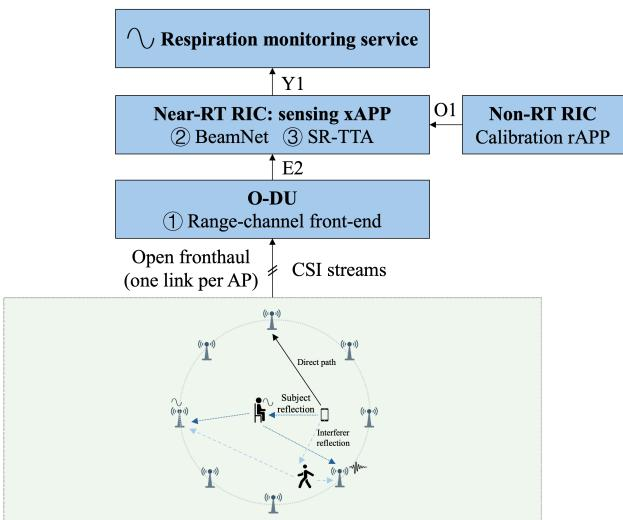
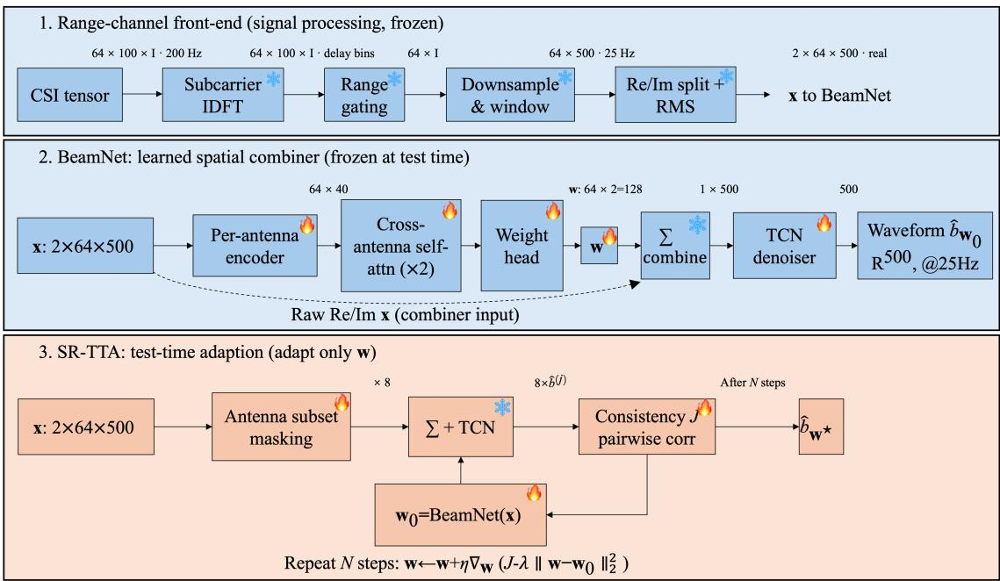
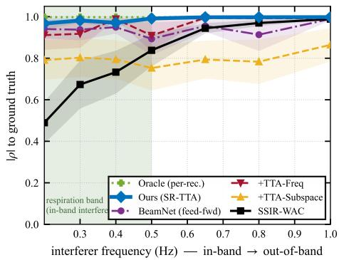
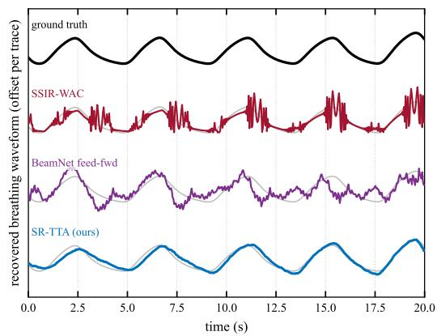
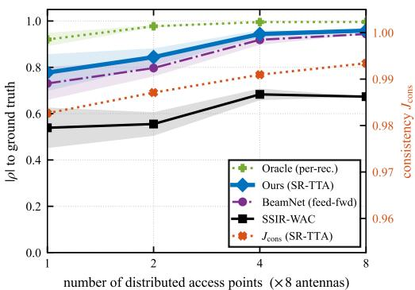

# SR-TTA: Spatial-Redundancy Test-Time Adaptation for Interference-Robust Respiration Sensing

Jingyuan Liu∗†, Zheng Chang∗, Haoqiu Xiong†, Zhuangzhuang Cui†, and Sofie Pollin†

∗School of Computer Science and Engineering, University of Electronic Science and Technology of China, Chengdu, China †WaveCoRe, Department of Electrical Engineering (ESAT), KU Leuven, 3001 Leuven, Belgium

Abstract—Future 6G networks aim to expose sensing as a native service by reusing communication infrastructure. We study respiration sensing on a cell-free massive multiple-input multiple-output (MIMO) base station, where a 64-antenna channel must be fused into a breathing waveform. The state-of-theart hand-crafted fusion is near-optimal in benign conditions. It collapses, however, under strong in-band motion interference, whose frequency falls inside the respiration band. We show that a learned complex-weight beamformer recovers respiration by spatial nulling, and that the remaining gap to a per-recording oracle can be closed at deployment by label-free test-time adaptation. Crucially, we identify which label-free signal makes this work. Frequency- and variance-based criteria cannot separate an in-band interferer from breathing. Our spatial-redundancy testtime adaptation (SR-TTA), which maximizes consistency across random antenna subsets under an out-of-band spectral veto, preserves benign performance in our tests. The respiration-rate error drops from 5.8 to 0.8 breaths per minute (bpm) under simulated in-band interference, and the pipeline maps onto the Open Radio Access Network (O-RAN) architecture as O-RAN distributed-unit (O-DU) range-gating, an adaptation xApp, and a calibration rApp. On real testbed recordings, a one-time crosssubject calibration plus SR-TTA reduces failures from 47% to 7%, drawing level with the hand-crafted combiner using labelfree test-time adaptation.

Index Terms—integrated sensing and communication, sensingnative RAN, O-RAN, cell-free massive MIMO, respiration sensing, test-time adaptation, beamforming.

## I. INTRODUCTION

Future 6G systems aim to provide environmental awareness as a native network capability [1]. Passive respiration sensing can reuse cell-free massive multiple-input multiple-output (MIMO) channel state information (CSI) without additional spectrum or hardware [2], [3]. Open RAN (O-RAN) offers a potential deployment substrate: its RAN Intelligent Controllers (RICs) host learned xApps for radio-unit energy saving [4] and cell-free resource orchestration [5].

The sensing chain reduces the high-dimensional CSI to a one-dimensional breathing waveform through a fusion frontend. State-of-the-art front-ends rely on hand-crafted physical signal processing: a range transform, weighted antenna combining (WAC) by breathing-to-noise ratio [2], and a frequencyseparation rule based on the sensing-signal-to-interference ratio (SSIR) to reject interference (SSIR-WAC) [3]. These methods are near-optimal for a single, static subject. Real deployments, however, contain motion interference from a person turning over, walking slowly, or a moving pet. Such co-occurring activity is a recognized failure mode in wireless human sensing [6]. When the motion is slow, its frequency falls inside the respiration band (0.1–0.5 Hz); when it is also strong, both signal-to-noise weighting and frequency separation break down, because the interferer is indistinguishable from breathing by power or by frequency.

A natural response is to learn the fusion front-end. Deep models operating directly on CSI have become the workhorse of wireless sensing, from cross-domain gesture recognition [7] to CSI recovery and prediction [8]. Their known weakness is domain shift, as accuracy degrades on unseen subjects, geometries, and environments [7]. Test-time adaptation (TTA) offers a remedy by adapting the model at deployment without labels [9], [10], but its standard objectives are designed for classification, not waveform recovery.

Our approach exploits the spatial diversity of distributed antennas. BeamNet learns complex weights that can null interference through phase cancellation, unlike nonnegative scalar fusion. Label-free test-time adaptation refines these weights for each recording. The key question is which adaptation criterion distinguishes breathing from an in-band interferer: we use agreement across antenna subsets, rather than spectral concentration or dominant variance.

The main contributions of this paper are summarized as follows:

• We study respiration sensing on a cell-free massive-MIMO base station with eight distributed access points (APs), where strong in-band motion interference defeats hand-crafted fusion. The sensing pipeline maps onto standard O-RAN components, with range-gating at the O-RAN distributed unit (O-DU), adaptation as a nearreal-time (near-RT) RIC xApp, and one-time calibration as a non-real-time (non-RT) rApp.

• We combine supervised BeamNet training with label-free SR-TTA. SR-TTA adapts the combiner per recording by maximizing consistency across random antenna subsets under an out-of-band spectral veto, without ground truth or an interferer detector, and we explain why frequency and subspace criteria cannot match it.

• Experiments show that the proposed front-end recovers respiration where SSIR-WAC collapses (absolute Pearson correlation |ρ| from 0.67 to 0.95, respiration-rate error from 5.8 to 0.8 bpm), repairs severe cross-domain shift on real recordings (failures 47% → 7%), and improves with the number of distributed APs while the frequency

  
Coverage area: distributed access points (APs) acting as O-RUs  
Fig. 1. Considered scenario and proposed O-RAN embedding. Bottom: eight distributed APs surround a seated subject, and a second moving body adds an in-band interferer. Top: the pipeline mapped onto O-RAN, with range-gating (1) at the O-DU, BeamNet (2) and SR-TTA (3) as a near-RT RIC xApp, and one-time calibration as a non-RT rApp feeding the exposed respiration service.

baseline plateaus.

## II. SYSTEM MODEL AND PROBLEM

Fig. 1 summarizes the considered scenario. A cell-free massive-MIMO base station with distributed APs (mapped to O-RAN radio units, O-RUs) serves a user equipment whose uplink pilots illuminate the scene. Each AP receives the direct path, the breathing-modulated chest reflection of a seated subject, and the reflection of a second moving body, which acts as the in-band interferer formalized below.

## A. Cell-Free MIMO Uplink Sensing

We reuse a communication cell-free massive-MIMO orthogonal frequency-division multiplexing (OFDM) base station for passive sensing [2]. A single-antenna user equipment transmits uplink pilots, from which the base station estimates the CSI over the full band at rate $f _ { \mathrm { c s i } } .$ , yielding the complex tensor

$$
\mathbf { H } \in \mathbb { C } ^ { M \times K \times I } ,\tag{1}
$$

with M distributed antennas grouped into uniform linear arrays at the APs, K subcarriers spanning a bandwidth B at carrier $f _ { c } ,$ over I frames. A subject seated near the user equipment modulates the channel: the channel frequency response at antenna m, subcarrier $k ,$ frame i is a sum over L propagation paths [2],

$$
h _ { m k } [ i ] = \sum _ { l = 1 } ^ { L } \alpha _ { m k l } [ i ] e ^ { - j 2 \pi ( f _ { c } + k \Delta f ) \tau _ { m l } [ i ] } ,\tag{2}
$$

where for the chest path the delay carries the chest displacement $b [ i ] , \tau _ { m l } [ i ] = ( \dot { d } _ { m l } + \zeta _ { m l } b [ i ] ) / c$ , with $\dot { d } _ { m l }$ the static path length and $\zeta _ { m l }$ a geometry projection factor. Breathing thus appears as a slow, geometry-dependent phase rotation of the target component.

## B. Range-Channel Extraction

The path-length resolution $c / B \approx 1 6 . 7  { \mathrm { m } }$ is too coarse to separate chest, direct, and interferer paths in this scene. An inverse discrete Fourier transform (DFT) across subcarriers retains one range bin per antenna for data reduction, not source separation. Static-component removal (Sec. III-A) suppresses the static background. This produces one complex rangechannel per antenna and (downsampled) frame,

$$
\boldsymbol { r } _ { m } [ t ] \in \mathbb { C } , \quad \mathbf { S } = [ \boldsymbol { r } _ { 1 } ; \ldots ; \boldsymbol { r } _ { M } ] \in \mathbb { C } ^ { M \times T } ,\tag{3}
$$

$t = 1 , \dots , T$ at a decimated waveform rate $f _ { s } ~ \ll ~ f _ { \mathrm { c s i } }$ Breathing traces a small arc of a circle in the complex plane of $r _ { m } [ t ]$ . Which real or imaginary projection is informative varies per antenna with geometry [11], and many antennas are individually unreliable.

## C. In-Band Interference

A second moving body, such as a person turning over, a person walking slowly, or a pet, adds its own moving scatterer. Each range-channel then superposes breathing, interferer, and noise,

$$
r _ { m } [ t ] = r _ { m } ^ { \mathrm { b r } } [ t ] + r _ { m } ^ { \mathrm { i n t } } [ t ] + n _ { m } [ t ] , \qquad r _ { m } ^ { \mathrm { i n t } } [ t ] \approx c [ t ] e ^ { j \psi _ { m } } ,\tag{4}
$$

where $c [ t ]$ is the interferer’s shared temporal signature and $\psi _ { m }$ its antenna-dependent phase set by geometry. We call the interference in-band when its motion spectrum overlaps the respiration band B = [0.1, 0.5] Hz.

## D. Problem Statement

Given H (equivalently the range-channels $\{ r _ { m } [ t ] \} )$ , recover the one-dimensional breathing waveform b[t] up to sign and scale, robust to in-band interference and without perdeployment ground truth.

## III. INTERFERENCE-ROBUST SENSING FRONT-END

We treat respiration extraction as learning a per-recording spatial combiner that maps the M-antenna range-channel to a single breathing waveform (Fig. 2).

## A. Range-Channel and the Combiner Function Class

We remove the static (line-of-sight) component of each $r _ { m }$ and scale each antenna to unit root-mean-square (RMS) amplitude, and write the real and imaginary parts as a 2Mdimensional feature per frame,

$$
\mathbf { f } [ t ] = \left[ \mathbf { x } ^ { \mathrm { { r e } } } [ t ] ; \mathbf { x } ^ { \mathrm { { i m } } } [ t ] \right] \in \mathbb { R } ^ { 2 M } ,\tag{5}
$$

where $x _ { m } ^ { \mathrm { r e } } , x _ { m } ^ { \mathrm { i m } }$ are the normalized real/imaginary parts of $r _ { m }$ A combiner assigns each antenna a complex weight $\mathbf { w } _ { m } =$ $( a _ { m } , b _ { m } )$ , with $a _ { m } , b _ { m }$ its real and imaginary parts, and applies it linearly,

$$
\hat { u } _ { \bf w } [ t ] = \sum _ { m = 1 } ^ { M } \left( a _ { m } x _ { m } ^ { \mathrm { r e } } [ t ] + b _ { m } x _ { m } ^ { \mathrm { i m } } [ t ] \right) = { \bf w } ^ { \top } { \bf f } [ t ] ,\tag{6}
$$

where $\mathbf { w } ~ = ~ ( \mathbf { a } , \mathbf { b } )$ collects the 2M weights (a $. , \mathbf { b } \in \mathbb { R } ^ { M } ) ;$ these are exactly the quantities that SR-TTA later adapts.

learnablefrozen  
  
Fig. 2. Proposed pipeline. (1) A frozen front-end reduces the raw CSI to the per-antenna range-channel $\mathbf { x } \in \mathbb { R } ^ { 2 \times M \times T }$ . (2) BeamNet emits M complex combiner weights (2M reals) via per-antenna encoding and cross-antenna self-attention, and the combined trace is denoised by a temporal convolutional network (TCN) into the breathing waveform (trained on ground truth, frozen at test time). (3) SR-TTA adapts only the 2M weights per recording, label-free, by maximizing agreement across random antenna subsets.

Equation (6) is exactly the function class of the per-recording supervised oracle, which recovers the waveform almost perfectly under interference when fit to a recording’s own ground truth. The information needed for robust sensing is therefore present in f and linearly recoverable, and the open question is how to find w without ground truth.

The complex weights are what separate this function class from scalar combining. Under the interferer model (4), a complex combiner cancels the interferer whenever

$$
\sum _ { m = 1 } ^ { M } w _ { m } ^ { * } e ^ { j \psi _ { m } } = 0 .\tag{7}
$$

This cross-antenna phase condition is unreachable by nonnegative scalar weighting, which can down-weight a corrupted antenna but cannot place a spatial null. It matters precisely under strong in-band interference, where frequency-based fusion collapses.

## B. BeamNet: Learned Spatial Filtering

BeamNet predicts the combiner from the input alone, $\mathbf { w } _ { 0 } \ = \ h _ { \theta } ( \mathbf { f } ) \ \in \ \mathbb { R } ^ { M \times 2 }$ . A shared 1D-convolutional encoder maps each antenna’s normalized range-channel to a descriptor $\mathbf { d } _ { m } = \mathrm { E n c } _ { \theta } ( \mathbf { x } _ { m } ) \in \mathbb { R } ^ { D }$ . A learned positional embedding is then added, a self-attention encoder mixes information across the M antennas, and a linear head emits $\mathbf { w } _ { 0 , m }$ . The combined trace $\hat { u } _ { \mathbf { w } _ { 0 } }$ from (6) is then denoised by a temporal convolutional network (TCN) $g _ { \phi }$ to yield the breathing estimate $\hat { b } _ { \mathbf { w } _ { 0 } } = g _ { \phi } ( \hat { u } _ { \mathbf { w } _ { 0 } } )$ . BeamNet is trained by maximizing waveform correlation,

$$
\operatorname* { m i n } _ { \theta , \phi } \mathbb { E } \Big [ 1 - \rho _ { \mathrm { c o r r } } \big ( \hat { b } _ { \mathbf { w } _ { 0 } } , b ^ { \mathrm { G T } } \big ) \Big ] ,\tag{8}
$$

where $\rho _ { \mathrm { c o r r } } ( \cdot , \cdot )$ is the temporal correlation of zero-mean, unit-norm signals and $b ^ { \mathrm { G T } }$ the ground-truth (GT) waveform. BeamNet is pretrained on synthetic recordings with a physicsbased in-band interferer. When installed on a new site, it is calibrated once, with the same loss, on clean recordings of subjects other than those to be monitored, so the monitored subject and the interference are never seen in training. This one-time deployment-domain calibration anchors the learned prior to the deployment channel, and every adaptation beyond it is label-free. A single feed-forward beam, however, does not reach the per-recording oracle, because it must generalize to unseen subjects and interferer geometries in one shot.

## C. Adaptation Criteria and Proposed SR-TTA

At deployment there is no ground truth, yet the oracle gap is per-recording. We therefore treat the combiner as a free perrecording variable, initialize it at the network’s beam $\mathbf { w } _ { 0 } =$ $h _ { \theta } ( \mathbf { f } )$ , freeze the TCN $g _ { \phi }$ , and refine w for $N _ { \mathrm { s t e p } }$ steps to maximize a label-free surrogate J within a trust region around $\mathbf { w } _ { 0 } .$

$$
\mathbf { w } ^ { \star } = \arg \operatorname* { m a x } _ { \mathbf { w } } ~ J \big ( \hat { b } _ { \mathbf { w } } \big ) ~ - ~ \lambda \| \mathbf { w } - \mathbf { w } _ { 0 } \| _ { 2 } ^ { 2 } .\tag{9}
$$

The choice of J is the crux: it must distinguish breathing from an in-band interferer without labels.

1) Frequency Criteria Fail in Band: A spectral band signal-to-noise-ratio (band-SNR) surrogate $\begin{array} { r l r } { J _ { \mathrm { f r e q } } } & { = } & { \log \bigl ( \sum _ { f \in \mathcal { B } } P _ { \hat { b } } ( f ) / \sum _ { f \notin \mathcal { B } } P _ { \hat { b } } ( f ) \bigr ) } \end{array}$ , or a withinband peakiness (spectral-entropy) surrogate, rewards energy concentrated in the respiration band B. But the in-band interferer lives inside $B ,$ so maximizing $J _ { \mathrm { f r e q } }$ can lock onto the interferer, the same structural failure as SSIR-WAC. Empirically these surrogates degrade the beam. The failure is specific to frequency used as an attractor, and frequency re-enters safely as an out-of-band veto below.

2) Subspace Nulling Fails under Overlap: One can estimate the interferer subspace as the top-k eigenvectors ${ \bf U } _ { k }$ of the spatial covariance $\mathbf { \bar { R } } = \textstyle \frac { 1 } { T } \mathbf { F } \mathbf { F } ^ { \top } \mathbf { \Sigma } ( \bar { \mathbf { F } } = [ \mathbf { f } [ \bar { 1 } ] , \dots , \mathbf { f } [ T ] ] )$ and null it, $\mathbf { w } \ = \ ( \mathbf { I } - \mathbf { U } _ { k } \mathbf { U } _ { k } ^ { \top } ) \bar { \mathbf { w } } _ { 0 }$ . This approach assumes that the dominant-variance directions belong to the interferer alone. In our setting, however, the breathing and interferer subspaces overlap, so the projection removes breathing energy together with the interference, and performance degrades monotonically as k grows.

3) Proposed Spatial-Redundancy Consistency: Neither spectrum nor dominant variance can thus separate an in-band interferer from breathing. Our method, SR-TTA, uses a different, discriminative signal, namely spatial redundancy. Breathing modulates many of the M distributed antennas, whereas a localized interferer dominates only a few. A beam that “rides” the interferer therefore relies on a small antenna set and is fragile to antenna dropout, while a breathing beam is robust. We draw S random keep-masks $\mathbf { m } ^ { ( j ) } \sim \bar { \mathrm { B e r n o u l l i } } ( p _ { \mathrm { k e e p } } ) ^ { M }$ with keep probability $p _ { \mathrm { k e e p } }$ , form the subset outputs

$$
\begin{array} { r } { \hat { b } _ { \bf w } ^ { ( j ) } = g _ { \phi } \Big ( \sum _ { m } m _ { m } ^ { ( j ) } \big ( a _ { m } x _ { m } ^ { \mathrm { r e } } + b _ { m } x _ { m } ^ { \mathrm { i m } } \big ) \Big ) , } \end{array}\tag{10}
$$

and maximize their pairwise agreement,

$$
J _ { \mathrm { c o n s } } ( \mathbf { w } ) = \frac { 2 } { S ( S - 1 ) } \sum _ { j < l } \rho _ { \mathrm { c o r r } } \big ( \hat { b } _ { \mathbf { w } } ^ { ( j ) } , \hat { b } _ { \mathbf { w } } ^ { ( l ) } \big ) .\tag{11}
$$

Maximizing (11) pushes the beam onto the spatially-redundant (breathing) component, information that neither the output spectrum nor the dominant-variance subspace exposes.

4) Out-of-Band Spectral Veto: Spatial redundancy has one remaining blind spot, the mirror image of SSIR-WAC’s. Corruption seen coherently by all APs, such as the subject’s own non-respiratory motion or global channel fluctuation, is itself spatially redundant, so $J _ { \mathrm { { c o n s } } }$ cannot reject it. Such corruption is, however, broadband or out-of-band in frequency. We therefore add a spectral term only where it is trustworthy: a penalty on output energy outside the service band $ { B _ { \mathrm { s v } } } \ ( 5 -$ 50 bpm). The adaptation objective becomes

$$
J _ { \mathrm { S F } } ( \mathbf { w } ) = J _ { \mathrm { c o n s } } ( \mathbf { w } ) - \beta \Omega ( \mathbf { w } ) , \qquad \Omega = \frac { \sum _ { f \notin B _ { \mathrm { s v } } } P _ { \hat { b } _ { \mathbf { w } } } ( f ) } { \sum _ { f } P _ { \hat { b } _ { \mathbf { w } } } ( f ) } .\tag{12}
$$

The veto penalizes out-of-band energy without rewarding a particular in-band peak. Spatial consistency distinguishes the sources within the band; the veto suppresses broadband leakage. Neither term guarantees rejection of an interferer that is both spatially redundant and in-band.

In summary, SR-TTA initializes w at the network beam $\mathbf { w } _ { 0 } ,$ runs $N _ { \mathrm { s t e p } }$ Adam steps on (9) with $J = J _ { \mathrm { S F } }$ , redrawing the S masks at every step, and returns the full-array output under the adapted weights. The procedure is label-free, needs no interferer detector, and refines the beam within a trust region. Pretraining and one-time calibration use labels; this test-time update does not.

## D. Complexity and O-RAN Placement

We propose the following O-RAN mapping [5]: rangechannel extraction at the O-DU, BeamNet and SR-TTA as a near-RT RIC xApp, and offline calibration as a non-RT $\mathrm { { r A p p } }$ . Retaining one complex sample per antenna at $f _ { s }$ reduces the stream by $K f _ { \mathrm { c s i } } / f _ { s } ~ = ~ 8 0 0$ relative to the full subcarrier grid. Adaptation updates only 2M weights, with computation scaling as $N _ { \mathrm { s t e p } } S$ TCN forward/backward passes per window. The weights $\beta$ and λ could be exposed as policy parameters. This is an architectural proposal: O-RAN stack integration, interface traffic, and end-to-end latency have not been benchmarked. The 20 s observation window is distinct from adaptation runtime.

## IV. EXPERIMENTS

## A. Setup

1) Data: We study a controlled in-band interference setting on the cell-free massive-MIMO channel. A physics-based simulator renders each recording on the distributed array model of the KU Leuven testbed: $M = 6 4$ antennas in eight APs (uniform linear arrays of eight), each 3 m from the transmitter and spread in azimuth, with $K = 1 0 0$ subcarriers over B =18 MHz at $f _ { c } = 3 . 5 1 \mathrm { G H z }$ and CSI at $f _ { \mathrm { c s i } } = 2 0 0 \mathrm { H z }$ . It injects one moving scatterer (real multipath and Doppler, not additive noise) with randomized reflectivity, position, and amplitude (0.8–2.0 m displacement), whose frequency is drawn inside the respiration band (0.2–0.45 Hz). Each 40 s recording carries an independently drawn ground truth (normal breathing or Kussmaul, 12–40 bpm), is decimated to $f _ { s } = 2 5 \mathrm { { H z } }$ , and is cut into 20 s windows at a 10 s hop. Training and testing use separately simulated recordings: 360 for training (1,080 windows) and 24 disjoint recordings (72 windows) for reporting, with breathing, geometry, and interferer parameters freshly drawn. For the mechanism study we additionally sweep the interferer frequency from out-of-band (1.0 Hz) into the band (0.2 Hz) with all 64 antennas, fixed 1 m displacement amplitude and reflectivity 5 (12 recordings per frequency). In contrast, Fig. 5 and the strong-interference row of Table I use randomized in-band scenes (reflectivity 2–8), so their averages differ from this fixed-amplitude sweep. We also use 240 clean synthetic windows and 44 real single-person recordings from the KU Leuven testbed [2], with 200 Hz CSI and 150 Hz motion-capture (MoCap) respiration ground truth, resampled to 25 Hz. Synthetic GT is the simulator’s chest-displacement waveform. The real+int. regimes inject the same moving scatterer into the real recordings at a mild strength (21 dB below the total channel power), in-band only or mixed. All

GT waveforms are band-passed to 5–50 bpm. All interfering motion is simulated; the real recordings contain no second moving body.

2) Metrics: We report the absolute Pearson correlation $| \rho |$ to ground truth, the failure rate (windows with $| \rho | < 0 . 7 )$ , and the respiration-rate mean absolute error (MAE) in bpm. Rates are spectral peaks of the estimate and GT on full recordings, using the same zero-padded Kaiser-window periodogram (approximately 0.09 bpm grid). MAEs are rounded to 0.1 bpm and describe agreement with GT-derived rates, not sensor resolution. Figure bands are ±one standard error of the mean (SEM).

3) Baselines and Ceiling: SSIR-WAC [2], [3] is the training-free physics baseline, BeamNet without adaptation is the feed-forward ablation, and SR-TTA is our proposed method. The oracle is a ridge-regularized per-recording linear combiner (6) fit to a recording’s own ground truth. It provides a supervised reference for linear fusion.

4) Implementation: BeamNet uses a width-40 per-antenna encoder, a two-layer self-attention mixer over the 64 antennas, and a dilated TCN ({1, 2, 4, 8}), trained with the correlation loss (8) (AdamW). SR-TTA uses $N _ { \mathrm { s t e p } } { = } 4 0$ Adam steps (rate 0.05), anchor $\lambda = 0 . 3$ , keep probability $p _ { \mathrm { k e e p } } = 0 . 5 , ~ S = 8$ antenna subsets, and veto weight $\beta = 0 . 5$ (any $\beta \in [ 0 . 5 , 2 ]$ performs similarly). The same configuration is used in every regime (no per-regime tuning, no interferer detector). The deployment-domain calibration of Sec. III-B is instantiated on the real testbed leave-one-group-out: the model evaluated on a subject is fine-tuned (50 epochs, AdamW, $3 \times 1 0 ^ { - 4 }$ , noise and antenna-dropout augmentation) only on other subjects’ clean real recordings and reused unchanged at every interference level. Synthetic regimes use the pretrained model without calibration.

B. Mechanism: Which Adaptation Criterion Survives In-Band?

Fig. 3 sweeps the interferer across the band boundary. Out of band $( \ge 0 . 6 5 \mathrm { H z } )$ every method is near-perfect. The picture inverts as the interferer enters the band. SSIR-WAC collapses monotonically from 0.99 to 0.49 at 0.2 Hz, because its frequency-based weighting cannot separate two signals that share the band. The two “obvious” label-free adaptations also fall short in band. Frequency TTA (band-SNR and peakiness, T1/T2) cannot exceed the beam it starts from and stays below SR-TTA (0.91 vs. 0.97 at 0.2 Hz). Dominant-variance subspace nulling (T3) never helps (0.75–0.86), because the interferer and breathing subspaces overlap. Only the spatialredundancy criterion, SR-TTA, stays flat at 0.97–1.00 across the entire sweep, tracking the per-recording oracle. The mechanism is spatial rather than spectral. An in-band interferer is still spatially localized, so a beam that rides it is fragile to antenna dropout. This is the signal that SR-TTA exploits and that the frequency and subspace criteria cannot access. Fig. 4 makes this concrete on a single in-band recording.

Fig. 3. Adaptation criteria vs. interferer frequency (shaded = respiration band). SSIR-WAC collapses and frequency/subspace TTA fall short as the interferer enters the band, while only SR-TTA tracks the oracle throughout (±SEM bands).  
  
Fig. 4. The in-band recording where adaptation helps most (20 s, estimates offset over the ground truth): SSIR-WAC rides the interferer’s bursts, the feedforward beam drifts off breathing, and SR-TTA re-locks onto the true rhythm label-free (traces sign-aligned, unit-normalized).

## C. Spatial-Redundancy Scaling Law

If the mechanism is spatial redundancy, service quality should grow with the number of distributed APs. Fig. 5 repeats the strong in-band experiment with # $\mathrm { A P } \in \{ 1 , 2 , 4 , 8 \}$ of eight antennas each $( M \in \{ 8 , 1 6 , 3 2 , 6 4 \}$ , averaged over AP subsets). SSIR-WAC barely improves $( 0 . 5 4  0 . 6 7 )$ , since scalar weighting cannot convert extra antennas into the crossantenna phase degrees of freedom needed for nulling. SR-TTA instead climbs from 0.78 to 0.96, closely tracking the oracle ceiling, which itself rises from 0.92 to 1.00: a larger array offers more recoverable headroom, and it is the learned front-end that converts this headroom into service quality. Throughout the sweep, the achieved consistency $J _ { \mathrm { { c o n s } } }$ stays near-saturated (≥0.98), confirming the premise that breathing is seen redundantly by the added APs.

## D. Cross-Domain Service Quality

Finally, Table I evaluates the same front-end across regimes and connects fidelity to the exposed respiration-rate service. Under strong in-band interference SR-TTA holds waveform fidelity where the physics baseline breaks down (0.95 vs.

  
Fig. 5. Scaling under in-band interference: |ρ| vs. number of distributed APs (eight antennas each, ±SEM over AP subsets), with the oracle ceiling and (right axis) SR-TTA’s achieved consistency $J _ { \mathrm { c o n s } } .$ SSIR-WAC plateaus; SR-TTA scales.

0.67), and the respiration-rate error falls from SSIR-WAC’s 5.8 bpm to 0.8 bpm. Crucially, the front-end does no harm offdesign: on clean synthetic data all front-ends stay near-perfect $( \mathrm { f a i l u r e s } \leq 2 \% )$

On the real testbed both methods are adapted to the deployment domain, so the comparison is fair: SSIR-WAC was designed on this very testbed [2], [3], BeamNet receives the one-time calibration of Sec. III-B, and neither sees the test subject or labeled interference. The synthetic-pretrained beam reaches $| \rho | = 0 . 5 0$ (70% failures), and calibration lifts it to just 0.64 (47%). SR-TTA closes the remaining gap: at 0.90 and 7% failures, it draws level with the hand-crafted combiner (0.89, 8%) on its home ground. Without calibration, SR-TTA reaches 0.89 at 5–9% failures, suggesting that the veto mitigates part of the domain shift. In the milder real+int. regimes, where the injected scatterer stays below the collapse threshold, SSIR-WAC degrades (failures $8 \%  2 7 \% )$ and the adapted front-end now edges it out on every metric (failures 24% vs. 27% and 14% vs. 19%), while the calibrated feed-forward beam alone still fails half its windows. A single label-free front-end thus covers clean, interfered, and real operation with no detector or baseline switching.

## V. CONCLUSION

SR-TTA adapts a learned spatial combiner using labelfree agreement across antenna subsets and an out-of-band veto. Under simulated in-band interference, respiration-rate MAE falls from 5.8 to 0.8 bpm relative to SSIR-WAC. After supervised calibration, adaptation reduces real-data failures from 47% to 7%, matching the hand-crafted baseline. Real moving-interferer experiments and an implemented O-RAN control loop remain future work.

## ACKNOWLEDGMENT

This work is partly supported by the Fundamental and Interdisciplinary Disciplines Breakthrough Plan of the Ministry of Education of China under Grant No. JYB2025XDXM116, and NSF of Sichuan under Grant No. 2026YFHZ0312. This work is partly supported by the MultiX project under the European Union’s Horizon Europe research and innovation programme (Grant No. 101192521). The work of Zhuangzhuang Cui is supported by the Research Foundation – Flanders (FWO), Senior Postdoctoral Fellowship under Grant No. 12AFN26N.

TABLE I  
CROSS-REGIME SERVICE QUALITY: |ρ| TO GT, FAILURE RATE $( | \rho | < 0 . 7 )$ PER 20 S WINDOW, AND RESPIRATION-RATE MAE [BPM]; BEST IN BOLD. OURS = BEAMNET+SR-TTA; REAL+INT. = REAL CSI WITH SIMULATED INTERFERENCE.
<table><tr><td>Regime</td><td>Metric</td><td>SSIR-WAC BeamNet Ours</td><td></td><td></td></tr><tr><td rowspan="3">in-band interf. (strong)</td><td></td><td>0.67</td><td>0.94</td><td>0.95</td></tr><tr><td> $\stackrel { \left| \rho \right| } { \operatorname { f a i l } } < 0 . 7$ </td><td>36%</td><td>4%</td><td>4%</td></tr><tr><td>BPM MAE</td><td>5.8</td><td>0.6</td><td>0.8</td></tr><tr><td rowspan="3">clean synthetic</td><td>|ρ|</td><td>0.99</td><td>0.99</td><td>1.00</td></tr><tr><td> $\mathrm { f a i l } { < } 0 . 7$ </td><td>0%</td><td>2%</td><td>0%</td></tr><tr><td>BPM MAE</td><td>0.0</td><td>0.3</td><td>0.0</td></tr><tr><td rowspan="3">real (44 rec.)</td><td>|ρ|</td><td>0.89</td><td>0.64</td><td>0.90</td></tr><tr><td> $\mathrm { f a i l } { < } 0 . 7$ </td><td>8%</td><td>47%</td><td>7%</td></tr><tr><td>BPM MAE</td><td>0.1</td><td>1.8</td><td>0.1</td></tr><tr><td rowspan="3">real+int. (in-band)</td><td>|ρ|</td><td>0.79</td><td>0.55</td><td>0.81</td></tr><tr><td> $\mathrm { f a i l } { < } 0 . 7$ </td><td>27%</td><td>53%</td><td>24%</td></tr><tr><td> $\mathrm { B P M \ M A E }$ </td><td>0.7</td><td>2.7</td><td>0.6</td></tr><tr><td rowspan="3">real+int. (in+out)</td><td>|ρ|</td><td>0.83</td><td>0.60</td><td>0.84</td></tr><tr><td> $\mathrm { f a i l } { < } 0 . 7$ </td><td>19%</td><td>49%</td><td>14%</td></tr><tr><td>BPM MAE</td><td>0.6</td><td>2.9</td><td>0.5</td></tr></table>

## REFERENCES

[1] F. Liu et al., “Integrated sensing and communications: Toward dualfunctional wireless networks for 6G and beyond,” IEEE J. Sel. Areas Commun., vol. 40, no. 6, pp. 1728–1767, 2022.

[2] H. Xiong et al., “BS-Breath: Respiration sensing with cell-free massive MIMO,” in Proc. IEEE ICASSP, Hyderabad, India, 2025, pp. 1–5.

[3] H. Xiong et al., “Fundamentals and experiments of robust respiration sensing via cell-free massive MIMO,” IEEE J. Sel. Areas Commun., vol. 44, pp. 959–974, 2026.

[4] J. Lu, P. Yan, and H. Zeng, “EExApp: GNN-based reinforcement learning for radio unit energy optimization in 5G O-RAN,” in Proc. IEEE INFOCOM, Tokyo, Japan, 2026, pp. 1–10.

[5] O. T. Demir ¨ et al., “Cell-free massive MIMO in O-RAN: Energy-aware joint orchestration of cloud, fronthaul, and radio resources,” IEEE J. Sel. Areas Commun., vol. 42, no. 2, pp. 356–372, 2024.

[6] Y. Xiao et al., “Fall-attention: An attention-based fall detection method for adjoint activities,” IEEE Trans. Mobile Comput., vol. 23, no. 7, pp. 7895–7909, 2024.

[7] Y. Zhang et al., “Widar3.0: Zero-effort cross-domain gesture recognition with Wi-Fi,” IEEE Trans. Pattern Anal. Mach. Intell., vol. 44, no. 11, pp. 8671–8688, 2022.

[8] Z. Zhao et al., “CSI-BERT2: A BERT-inspired framework for efficient CSI prediction and classification in wireless communication and sensing,” IEEE Trans. Mobile Comput., vol. 25, no. 5, pp. 7241–7257, 2026.

[9] D. Wang et al., “Tent: Fully test-time adaptation by entropy minimization,” in Proc. ICLR, 2021.

[10] Y. Sun et al., “Test-time training with self-supervision for generalization under distribution shifts,” in Proc. ICML, vol. 119, 2020, pp. 9229–9248.

[11] Y. Zeng et al., “FarSense: Pushing the range limit of WiFi-based respiration sensing with CSI ratio of two antennas,” Proc. ACM IMWUT, vol. 3, no. 3, Art. no. 121, 2019.