# Sample-Eficient Generative Conformal Prediction

Minxing Zheng Carnegie Mellon University

## Abstract

Generative conformal prediction builds uncertainty sets from samples of a conditional generator, which are eficient only when the samples represent the response distribution well. This can require many samples, each of which can be costly, as in large difusion models and scientific simulators, so the sampling budget must be used eficiently. Existing methods draw the same number of samples at every input, wasting samples where the response distribution is simple and undersampling where it is complex, which inflates sets and leaves those inputs under-covered. We propose CASA (Conformal Adaptive Sample Allocation), which characterizes the marginal value of an additional sample and allocates samples across inputs to minimize the expected set size subject to marginal coverage and an average sampling budget. Theoretical analysis shows that adaptive allocation yields smaller sets than a fixed count at the same budget: a missed mode forces a radius that spans the gap between modes, and even oracle radius cannot compensate for it. On synthetic and real tasks, CASA produces substantially smaller sets at the same budget, often improves conditional coverage, and complements existing radius-adaptive methods.

## 1 INTRODUCTION

Conformal prediction provides distribution-free uncertainty sets for arbitrary predictive models under exchangeability (Vovk et al., 2005; Angelopoulos and Bates, 2023). This model-agnostic guarantee is especially useful for black-box generators, including difusion models, large language models, and scientific simulators. Rather than conformalizing a single point prediction, generative conformal methods construct sets from multiple model samples, allowing the set to reflect complex or multimodal predictive distributions

Shixiang Zhu Carnegie Mellon University

(Wang et al., 2023b). Probabilistic conformal prediction (PCP), for example, places calibrated balls around generated samples; unlike a connected region, their union can cover separated modes without filling the low-density regions between them.

This eficiency, however, depends on drawing enough samples to represent the predictive distribution. In many applications, each draw is itself costly: difusion models require repeated network evaluations, language models decode outputs sequentially, and scientific sim ulators may require large-scale computing (Ho et al., 2020; Brown et al., 2020). Climate modeling provides a particularly stark example: a high-resolution Community Earth System Model (CESM) run used 23,404 processor cores, advanced by only about two simulated years per day, and consumed approximately 250,000 processor-hours for each simulated year (Small et al., 2014). Thus, a single 100-year ensemble member re quired roughly 50 days of wall-clock time on more than 23,000 cores—about 25 million processor-hours. Even at coarser resolution, the CESM Large Ensemble project required more than 17 million core-hours across its simulations (Kay et al., 2015). When each sample is a decades- or centuries-long climate trajectory, drawing a large, fixed number of samples for every initial condition or forcing scenario is computationally prohibitive.

Applying conformal prediction to such models therefore requires using a limited sampling budget eficiently. Existing methods treat the sample count as a fixed hyperparameter and use the same number of draws for every input, despite substantial heterogeneity in their value. A few draws may adequately represent a concentrated distribution, whereas the same count may miss an entire mode of a more complex distribution. Uniform sampling consequently wastes computation on simple inputs while undersampling the dificult inputs that drive prediction-set size and conditional-coverage imbalance. This raises our central question: how should a limited sampling budget be allocated across inputs to construct small conformal sets while mitigating conditional-coverage imbalance?

To this end, we propose CASA (Conformal Adaptive

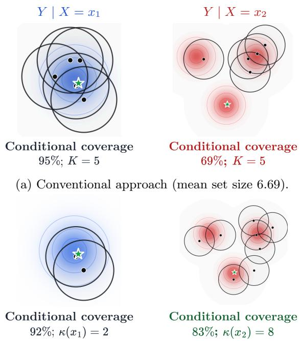  
(b) Sample-eficient approach (mean set size 6.24).

Figure 1: Motivation for adaptive sampling. Moving three draws from $x _ { 1 }$ to $x _ { 2 }$ improves mode representation and balances conditional coverage at the same average budget.

Sample Allocation), which learns an input-dependent sample count under an average sampling budget. Its guiding principle is simple: allocate additional draws where they are likely to recover response mass missed by the current samples, and stop sampling where further draws mainly add set volume. In the example of Figure 1, this means moving samples from a concentrated input, where two draws sufice, to a multimodal input, where additional draws can reveal a missing mode. Better mode representation can sharply reduce the calibrated radius, shrinking prediction sets even at inputs that receive fewer samples.

The key insight is that the marginal coverage benefit and set-size cost of an additional draw are both characterized by the same inclusion probability, which can be estimated unbiasedly from generator samples. We use these estimates to formulate sample allocation as a constrained optimization problem that minimizes expected set size subject to coverage and samplingbudget constraints. Its two-multiplier dual admits a near-linear-time solution and a natural shadow-price interpretation: an input receives another draw when its marginal coverage benefit ofsets its volume and sampling costs. Independent conformal calibration preserves finite-sample marginal coverage, and the allocation can be combined with radius-adaptive meth ods such as RCP and $\mathrm { C P ^ { 2 } }$ (Plassier et al., 2025a,b).

Our analysis explains why adapting the sample count can reduce prediction-set size. When too few samples are drawn from a multimodal distribution, an entire mode may be missed, forcing calibration to use a large radius that spans the gap between modes. Allocating more samples to such inputs makes it more likely that every relevant mode is represented, allowing a much smaller radius. This benefit remains even when the radius is optimally adapted to each input, showing that sample allocation provides gains that radius adaptation alone cannot achieve.

Empirically, across various synthetic benchmarks, CASA reduces mean set size by approximately 12% relative to fixed-count PCP. Both maintain marginal coverage and reduce conditional-coverage error. On Porto taxi trajectories, CASA allocates more draws near junctions and fewer along straight roads, reducing mean set area by approximately 37% with five draws per input on average. These gains persist at matched sampling costs and extend to several existing generative conformal methods.

The main contributions are summarized as follows: (i) We formulate adaptive sampling for generative conformal prediction as a resource-allocation problem. (ii) We derive an exact, near-linear-time algorithm and characterize eficiency gains beyond radius adaptation. (iii) Across synthetic and real tasks, we show that CASA reduces set size at comparable sampling costs, improves conditional-coverage balance, and complements existing generative conformal methods.

Related work. Conformal prediction provides uncertainty sets with finite-sample, distribution-free coverage under exchangeability (Vovk et al., 2005; Shafer and Vovk, 2008). Split conformal methods enable eficient calibration of modern predictors (Lei et al., 2018; Romano et al., 2019), with extensions addressing distribution shift (Tibshirani et al., 2019; Barber et al., 2023) and general risk control (Bates et al., 2021; Angelopoulos et al., 2024; Zhou and Zhu, 2026). Its scope now covers time series (Gibbs and Cand\`es, 2021; Xu and Xie, 2021; Zafran et al., 2022; Xu et al., 2024), functional outputs and operator models (Lei et al., 2015; Diquigiovanni et al., 2022; Harris and Liu, 2025), and noisy, counterfactual, or latent targets (Einbinder et al., 2024; Alaa et al., 2023; Javanmardi et al., 2023; Zheng et al., 2026). Other work moves beyond sets to calibrated predictive distributions, such as conformal flows (Harris, 2026). Exact conditional coverage is unattainable without further assumptions (Barber et al., 2021), which motivates locally adaptive scores (Lei et al., 2018; Romano et al., 2019) and groupconditional relaxations (Gibbs et al., 2025).

Conformal sets can also be built from estimates of the conditional distribution, such as CDFs (Chernozhukov et al., 2021), densities (Izbicki et al., 2022), or generated samples. Among sample-based methods, PCP forms a union of balls around generated samples (Wang et al., 2023b). Later work refines its score to improve conditional coverage, either by rescaling it with an input-dependent radius, as in RCP and $\mathrm { C P ^ { 2 } }$ (Plassier et al., 2025a,b), or by mapping it through an estimated conditional distribution function, as in C-PCP (Dheur et al., 2025). Others adapt the set’s geometry to the structure of the samples, through clustering in CP4Gen (Yang et al., 2026) or ranked generated regions (Zheng and Zhu, 2024). All of these methods draw the same number of samples at every input. For discrete outputs such as text, related methods adapt the number of samples to the input (Quach et al., 2024; Shahrokhi et al., 2025; Noorani et al., 2025); we address continuous responses, where sets are geometric and an additional sample changes both their coverage and their size.

The adaptive allocation of a sampling budget is a classical problem in statistics. Neyman allocation distributes samples across strata in proportion to their variability (Neyman, 1934), adaptive importance sampling concentrates draws where they most reduce estimator variance (Bugallo et al., 2017), and best-arm identification allocates a fixed budget of pulls across arms (Audibert et al., 2010). In machine learning, adaptive computation methods assign more computation to harder inputs, from learned halting in recurrent networks (Graves, 2016) to test-time compute in language models, where repeated sampling improves accuracy and its optimal amount depends on problem dificulty (Wang et al., 2023a; Snell et al., 2025) and can be allocated per query (Damani et al., 2025; Zuo and Zhu, 2026). These methods target estimator variance, accuracy, or task reward, whereas CASA allocates generator samples to shrink calibrated uncertainty sets under a coverage constraint.

## 2 SETUP AND PRELIMINARIES

Consider $( X , Y ) \sim { \mathcal { P } }$ , where $X \in { \mathcal { X } }$ and $Y \in \mathcal { V } \subseteq \mathbb { R } ^ { d }$ and let ${ \mathcal P } _ { x }$ denote the conditional distribution of $Y$ given $X = x$ . Let $\widehat { f }$ be a fixed predictive model, and let $S : \mathcal { X } \times \mathcal { Y }  \mathbb { R }$ be a nonconformity score measuring the discrepancy between a candidate response y and the model prediction at $x , e . g . , S ( x , y ) = \| y - \widehat { f } ( x ) \| _ { 2 } .$

Given a calibration set $\mathcal { D } _ { n } = \{ ( X _ { i } , Y _ { i } ) \} _ { i = 1 } ^ { n }$ , split conformal prediction computes $S _ { i } = S ( X _ { i } , Y _ { i } )$ and, for a target miscoverage level $\alpha \in ( 0 , 1 )$ , constructs

$$
{ \widehat { \mathcal { C } } } _ { \alpha } ( x ) = \{ y \in \mathcal { V } : S ( x , y ) \leq { \widehat { q } } \} ,\tag{1}
$$

where

$$
\widehat { q } = Q \left( S _ { 1 : n } ; \frac { \lceil ( n + 1 ) ( 1 - \alpha ) \rceil } { n } \right) ,
$$

and $Q ( S _ { 1 : n } ; \tau )$ denotes the empirical τ -quantile of $S _ { 1 } , \ldots , S _ { n }$ , with the convention $Q ( S _ { 1 : n } ; \tau ) ~ = ~ \infty$ for $\tau > 1$ . If the calibration observations and the test pair $( X _ { \mathrm { t e s t } } , Y _ { \mathrm { t e s t } } )$ are exchangeable, then

$$
\mathbb { P } \left\{ Y _ { \mathrm { t e s t } } \in \widehat { \mathcal { C } } _ { \alpha } ( X _ { \mathrm { t e s t } } ) \right\} \geq 1 - \alpha ,\tag{2}
$$

where the probability is taken jointly over the calibration data and the test observation.

The guarantee in (2) holds for any choice of nonconformity score, while the score determines the informativeness of the resulting prediction sets. We focus on two properties: First is the eficiency, measured by the expected set size $v : = \mathbb { E } | \widehat { \mathcal { C } } _ { \alpha } ( X ) |$ , where $| \cdot |$ denotes an appropriate notion of size, such as Lebesgue measure for continuous outcomes or cardinality for discrete outcomes; and second is the conditional coverage, given by $c ( x ) : = \mathbb { P } \{ Y \in { \widehat { \mathcal { C } } } _ { \alpha } ( x ) | X = x \}$ . The former rules out trivially valid but uninformative sets such as $\widehat { \mathcal { C } } _ { \alpha } ( x ) = \mathcal { y }$ , while the latter captures heterogeneity in coverage across covariate values or subpopulations that is not controlled by the marginal guarantee in (2) (Barber et al., 2021).

Recently, Wang et al. (2023b) has introduced probabilistic conformal prediction (PCP), which can substantially improve the eficiency of prediction sets. Specifically, suppose that $\widehat { f }$ is a conditional generative model from which, for any input x, we can draw independent samples $\widehat { Y } _ { 1 } , \ldots , \widehat { Y } _ { K } \stackrel { \mathrm { i i d } } { \sim } \widehat { f } ( x )$ . The PCP measures the nonconformity of a candidate response y by its distance to the nearest generated sample,

$$
S ( x , y ) = \frac { \operatorname* { m i n } _ { j \leq K } \| y - \widehat { Y } _ { j } \| _ { 2 } } { r ( x ) } ,\tag{3}
$$

leading to the prediction set

$$
\widehat { \mathcal { C } } _ { \alpha } ( x ) = \bigcup _ { j = 1 } ^ { K } { \cal B } \Big ( \widehat { Y } _ { j } , \widehat { q } r ( x ) \Big ) ,\tag{4}
$$

where $B ( y , r )$ denotes the Euclidean ball of radius $r$ centered at $y ,$ and $r ( x ) > 0$ is an input-dependent scaling function that adapts the conformal radius. For example, PCP sets $r ( x ) \equiv 1$ (Wang et al., 2023b), whereas subsequent adaptive-radius approaches learn $r ( x )$ from the input (Plassier et al., 2025a,b).

However, the eficiency of these constructions depends on having a suficiently large number of samples K at each input, which can become a computational bottleneck when sample generation is expensive. When K is small, three limitations arise. (i) Increasing the conformal radius cannot compensate for missing support: if ${ \mathcal P } _ { x }$ is multimodal and all K samples miss the mode containing the realized response, then $S ( x , Y )$ is governed by the separation between modes, and any ball large enough to cover the response must also span the intervening low-density region, regardless of $r ( x )$ (ii) Such misses propagate through calibration. Because $\widehat { q }$ is a global quantile of scores pooled across inputs, frequent misses inflate $\widehat { q }$ and enlarge prediction sets broadly, whereas rare misses can leave specific inputs under-covered, with $c ( x ) < 1 - \alpha$ , compensated by over-coverage elsewhere. (iii) A uniform sampling budget can be ineficient: when ${ \mathcal P } _ { x }$ is highly concentrated, a few samples may already sufice to make $S ( x , Y )$ small, so additional samples yield limited benefit relative to their computational cost. This suggests allocating samples adaptively across inputs, using fewer samples where ${ \mathcal P } _ { x }$ is concentrated and more where it is complex or multimodal. We formalize this allocation problem next.

## 3 METHODOLOGY

## 3.1 Resource Allocation Representation

The goal is to design an input-dependent sampling rule that allocates the sampling budget adaptively across inputs. Let $\kappa ( { \boldsymbol { x } } ) \in \mathbb { N }$ denote the number of samples allocated to input x. We formulate the design of $\kappa$ as a resource-allocation problem that minimizes the expected prediction-set size subject to marginal coverage and an average sampling-budget constraint. Formally,

$$
\begin{array} { r l } { \underset { \kappa ( \cdot ) } { \mathrm { m i n } } } & { \mathbb { E } \left| \mathcal { C } _ { \kappa } ( \boldsymbol { X } ) \right| : = \mathbb { E } \left| \bigcup _ { j = 1 } ^ { \kappa ( \boldsymbol { X } ) } \mathcal { B } \Big ( \widehat { Y } _ { j } \Big ) \right| } \\ { \mathrm { s . t . } } & { \mathbb { P } \{ Y \in \mathcal { C } _ { \kappa } ( \boldsymbol { X } ) \} \geq 1 - \alpha , } \\ & { \mathbb { E } [ \kappa ( \boldsymbol { X } ) ] \leq B , } \end{array}\tag{5}
$$

where ${ \widehat { Y } } _ { 1 } , { \widehat { Y } } _ { 2 } , \ldots \ { \overset { \mathrm { i i d } } { \sim } } \ { \widehat { f } } ( X )$ , and B denotes the average sampling budget. Here, $B ( y )$ denotes a ball centered at y, whose radius may be either a global parameter r or an input-dependent function $r ( x )$ . In principle, the radius and the sampling rule κ can be jointly optimized. For clarity, we focus on optimizing sample allocation κ and treat the radius specification separately.

For a given input x, define

$$
m ( x ; y ) = \mathbb { P } _ { \widehat { Y } \sim \widehat { f } ( x ) } \left\{ \widehat { Y } \notin B ( y ) \right\} ,
$$

the probability that a single draw from the conditional generative model does not fall within the ball $B ( y )$ With k independent draws, the probability that at least one draw falls within $B ( y )$ , termed as inclusion probability, is

$$
h _ { k } ( x ; y ) = 1 - m ( x ; y ) ^ { k } .\tag{6}
$$

Algorithm 1 CASA   
Input: model ${ \widehat { f } } ,$ data $\mathcal { D } _ { m } , \mathcal { D } _ { n }$ , candidate counts $\kappa ,$   
budget $B ,$ level $\alpha ,$ pool size N, radius $r ( \cdot )$ (optional)   
1: for $( X _ { i } , Y _ { i } ) \in \mathcal { D } _ { m }$ do // Step 1   
2: Draw $\widehat { Y } _ { i , 1 } , \ldots , \widehat { Y } _ { i , N } \sim \widehat { f } ( X _ { i } )$   
3: Compute $\widehat { c } _ { k } ( X _ { i } )$ and ${ \widehat { v } } _ { k } ( X _ { i } ) , k \in { \mathcal { K } } ,$ by (8)   
4: Regress ${ \widehat { c } } _ { k } ( X _ { i } ) , { \widehat { v } } _ { k } ( X _ { i } )$ on $X _ { i }$ to obtain $\widehat { c } _ { k } , \widehat { v } _ { k }$   
5: Solve dual optimization in (9) // Step 2   
6: Set $\widehat { \kappa } ( x ) \in \arg \operatorname* { m i n } _ { k \in \mathcal { K } } g _ { k } ( x )$   
7: for $( X _ { i } , Y _ { i } ) \in \mathcal { D } _ { n }$ do // Step 3   
8: Draw $\widehat { Y } _ { i , 1 , \cdots } , \widehat { Y } _ { i , \widehat { \kappa } ( X _ { i } ) } \sim \widehat { f } ( X _ { i } )$   
9: Compute $S _ { i }$ by (3) with $K = \widehat { \kappa } ( X _ { i } )$   
10: Compute $\widehat { q }$ by (1)   
Output: $\begin{array} { r } { \widehat { \mathcal { C } } _ { \alpha } ( X _ { \mathrm { t e s t } } ) = \bigcup _ { j = 1 } ^ { \widehat { \kappa } ( X _ { \mathrm { t e s t } } ) } \mathcal { B } \big ( \widehat { Y } _ { j } , \widehat { q } r ( X _ { \mathrm { t e s t } } ) \big ) } \end{array}$

Accordingly, define the conditional coverage probabil ity and expected prediction-set size at input x as

$$
c _ { k } ( x ) = \int h _ { k } ( x ; y ) \mathrm { d } \mathcal { P } _ { x } ( y ) , \quad v _ { k } ( x ) = \int h _ { k } ( x ; y ) \mathrm { d } y ,
$$

where the second integral is taken with respect to the underlying reference measure on the response space. Thus, the marginal coverage and expected set size in (5) can be written as $\mathbb { E } [ c _ { \kappa ( X ) } ( X ) ]$ and $\mathbb { E } [ v _ { \kappa ( X ) } ( X ) ]$

A key observation is that the marginal increase in inclusion probability from one additional draw is $\Delta h _ { k } =$ $h _ { k + 1 } - h _ { k }$ . Integrating this increment yields the corresponding marginal gain in coverage and marginal increase in expected set size. An additional draw is therefore valuable when it captures substantial response mass that is likely to be missed by the existing draws, for example, an underrepresented mode. Both marginal efects decrease with $k ,$ reflecting diminishing returns to additional sampling (Appendix A).

## 3.2 Proposed Algorithm

We develop CASA (Algorithm 1) that solves problem (5) in three steps: (i) Estimate $c _ { k }$ and $v _ { k }$ for each candidate count k from generated samples; (ii) Plug the empirical estimates into (5) and solve its dual form; and (iii) Calibrate the resulting uncertainty sets to guarantee finite-sample marginal coverage.

Step 1: Estimate coverage and size. Given an independent dataset $\mathcal { D } _ { m } ,$ , for each $( X _ { i } , Y _ { i } ) \in \mathcal { D } _ { m }$ , we first draw $N \geq k$ predictions

$$
{ \widehat { Y } } _ { i , 1 } , \ldots , { \widehat { Y } } _ { i , N } \stackrel { \mathrm { i i d } } { \sim } { \widehat { f } } ( X _ { i } ) .
$$

These N predictions are generated only once during the ofline estimation stage and can be reused to eval-

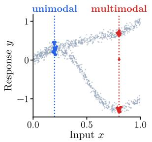  
(a) Distribution $Y \mid X$

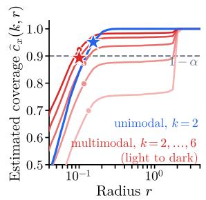  
(b) Count–radius tradeof

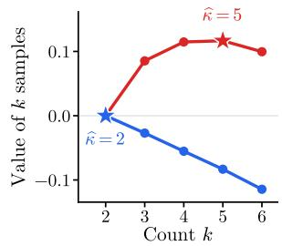

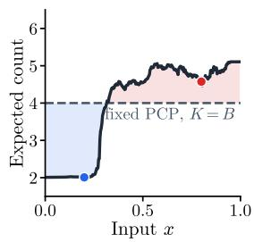  
(c) Marginal value of count  
(d) Resulting allocation  
Figure 2: Mechanism of CASA with average budget $B = 4$ on a conditional distribution whose modes separate as x grows. (b) Dots mark the radius minimizing the priced cost g in Theorem 1 for each count, and stars mark the selected count–radius pair. (c) The value of k samples $\mathrm { i s } \ - \operatorname* { m i n } _ { r } g _ { k } ( x ; r )$ relative to $k = 2 ;$ each input takes the count of highest value. (d) CASA moves samples from unimodal to multimodal inputs while keeping the same average budget as fixed PCP.

uate all candidate values of $k ,$ so this step incurs no additional sampling cost at testing phase.

Next we consider drawing k samples uniformly without replacement from these N predictions. Let

$$
H ( X _ { i } ; y ) = \sum _ { j = 1 } ^ { N } \mathbb { 1 } \left\{ \| { \widehat { Y } } _ { i , j } - y \| _ { 2 } \leq r \right\}
$$

denote the number of predictions whose radius-r balls contain y. Since the number of such predictions selected among the k draws follows a hypergeometric distribution, the inclusion probability in (6) admits the following unbiased estimator

$$
\widehat { h } _ { k } ( X _ { i } ; y ) = 1 - \binom { N - H ( X _ { i } ; y ) } { k } \Big / \binom { N } { k } .\tag{7}
$$

See Proposition 6 in Appendix A for details.

Lastly, we estimate the conditional coverage and set size at each $X _ { i }$ by

$$
\widehat { c } _ { k } ( X _ { i } ) = \widehat { h } _ { k } ( X _ { i } ; Y _ { i } ) , \quad \widehat { v } _ { k } ( X _ { i } ) = \int \widehat { h } _ { k } ( X _ { i } ; y ) \mathrm { d } y .\tag{8}
$$

To predict these two quantities at a new input $X _ { \mathrm { t e s t } }$ we fit regression models for $c _ { k } ( x )$ and $v _ { k } ( x )$ using $\{ ( X _ { i } , { \widehat { c } } _ { k } ( X _ { i } ) , { \widehat { v } } _ { k } ( X _ { i } ) ) \} _ { i = 1 } ^ { m }$ . The fitted models can then be evaluated at $X _ { \mathrm { t e s t } }$ to obtain the corresponding coverage and size estimates. Appendix B.1 provides implementation details and extensions to more radius adaptive constructions.

Step 2: Reformulation. Replacing $c _ { k }$ and $v _ { k }$ in (5) by $\widehat { c } _ { k }$ and $\widehat { v } _ { k }$ and expectations by averages over ${ \mathcal { D } } _ { m } ,$ and restricting the counts to a finite candidate set $\kappa \subseteq \mathbb { N }$ , gives its empirical representation, which can be expressed as a linear program (Appendix A.2). The empirical problem has $m | \mathcal { K } |$ variables, and interiorpoint methods solve it in $\dot { O ( ( m | K | ) ^ { 3 . 5 } ) }$ in the worst case (Karmarkar, 1984), so its cost grows polynomially and quickly. Empirically, with $m \ : = \ : 5 , 0 0 0$ and $| \mathcal { K } | = 1 0$ , a standard solver takes about 11 seconds on a single CPU core, and about 43 seconds at $m = 1 0 , 0 0 0$ This motivates a more eficient solution based on the following exact dual of the empirical problem.

Theorem 1 (Dual reformulation). Suppose the empirical problem, over randomized rules $\kappa ,$ is feasible. Then it is equivalent to

$$
\begin{array} { r } { \underset { \mu , \lambda \geq 0 , \ u \in \mathbb { R } ^ { m } } { \operatorname* { m a x } } \ \mu ( 1 - \alpha ) - \lambda B + \displaystyle \frac { 1 } { m } \sum _ { i = 1 } ^ { m } u _ { i } } \\ { \mathrm { s . t . } \ u _ { i } \leq g _ { k } ( X _ { i } ) , \quad i = 1 , \ldots , m , \ k \in \mathcal { K } , } \end{array}\tag{9}
$$

where $g _ { k } ( x ) = { \widehat { v } } _ { k } ( x ) - \mu { \widehat { c } } _ { k } ( x ) + \lambda k , \mu , \lambda \geq 0$ are the dual variables for the constraints, and $\kappa \subseteq \mathbb { N }$ is a finite set of candidate counts, $\mathrm { e . g . , ~ } \{ 1 , \ldots , 2 B \}$

## The proof is deferred to Appendix A.2.

The dual is cheaper to solve because it decouples the inputs. The primal couples all m inputs through the coverage and budget constraints, whereas for fixed dual variables $( \mu , \lambda )$ the dual problem separates into m independent subproblems, $\mathrm { m i n } _ { k \in \mathcal { K } } g _ { k } ( X _ { i } )$ . Solving the dual therefore reduces to a search over two dual variables. Theoretically, for a fixed $\mu ,$ the dual is solved in $O \big ( m | \mathcal { K } | \log ( m | \mathcal { K } | ) \big )$ , which is near-linear, compared with $O \big ( ( m | \kappa | ) ^ { 3 . 5 } \big )$ for the primal. Empirically, in the same setting, the dual takes about 0.17 seconds at $m = 5 { , } 0 0 0$ and 0.4 seconds at $m = 1 0 , 0 0 0$ , compared with 11 and 43 seconds for the primal.

Step 3: Calibration. Finally, we calibrate the learned allocation rule $\widehat { \kappa }$ on $\mathcal { D } _ { n } .$ . For each $( X _ { i } , Y _ { i } ) \in$ $\mathcal { D } _ { n } .$ , we draw $\widehat { \kappa } ( X _ { i } )$ samples from the generator and compute the score in (3) using $K = \widehat { \kappa } ( X _ { i } )$ . We then obtain the conformal quantile $\widehat { q }$ from (1). At a test input x, we draw $\widehat { \kappa } ( \boldsymbol { x } )$ samples and return the set (4).

Theorem 2 (Finite-sample marginal coverage). Suppose that the generator $\hat { \boldsymbol f }$ and the learned κb are independent of $\mathcal { D } _ { n }$ and the test pair, and that $D _ { n }$ and test pair are exchangeable. Then

$$
\mathbb { P } \{ Y _ { \mathrm { t e s t } } \in \widehat { \mathcal { C } } _ { \alpha } ( X _ { \mathrm { t e s t } } ) \} \geq 1 - \alpha .
$$

The proof is deferred to Appendix A.

## 3.3 Theoretical Analysis

We next characterize when adaptive allocation improves over uniform allocation under well-separated modes (Assumption 1). This setting isolates the effect of missed modes and makes the marginal value of each additional sample explicit; Appendix A.2 gives a distribution-free characterization of the gain. All proofs are deferred to Appendix A.3.

Assumption 1 (Separated modes). There exist $\epsilon > 0$ and $R > 1$ such that, for $x \in \mathcal { X }$ , both ${ \mathcal P } _ { x }$ and ${ \widehat { f } } ( x )$ are supported on $\textstyle \bigcup _ { j = 1 } ^ { J ( x ) } B ( z _ { j } ( x ) , \epsilon )$ , whose centers satisfy

$$
\operatorname* { m i n } _ { i \neq j } \| z _ { i } ( x ) - z _ { j } ( x ) \| _ { 2 } \geq 2 ( R + 1 ) \epsilon .
$$

Assumption 1 states that ${ \mathcal P } _ { x }$ has $J ( x )$ modes, each covered by a ball of radius ϵ, with mode width at most $2 \epsilon .$ Each mode is separated from the others by gaps of at least 2Rϵ. Here R can be understood as the ratio of the gap 2Rϵ to the mode width 2ϵ.

We do not require ${ \widehat { f } } ( x )$ to be consistent with $\mathcal { P } _ { x } \mathrm { : }$ : the generator only needs to be supported on the same balls, and may weight them diferently or even miss some modes of ${ \mathcal P } _ { x }$ . Let

$$
p _ { j } ( x ) = \mathcal { P } _ { x } \{ \mathcal { B } ( z _ { j } ( x ) , \epsilon ) \} , \quad \widehat { p } _ { j } ( x ) = \widehat { f } ( x ) \{ \mathcal { B } ( z _ { j } ( x ) , \epsilon ) \}
$$

denote the probabilities of the j-th ball under ${ \mathcal P } _ { x }$ and ${ \widehat { f } } ( x )$ , respectively. Then for any radius $r \in [ 2 \epsilon , 2 R \epsilon )$ ， the conditional coverage does not depend on r $( \mathrm { A p - }$ pendix A.3):

$$
c _ { k } ( x ) = 1 - \sum _ { j = 1 } ^ { J ( x ) } p _ { j } ( x ) \{ 1 - \widehat { p } _ { j } ( x ) \} ^ { k } .\tag{10}
$$

Theorem 3 (Eficiency gain at equal budget). Under Assumption 1, let every count rule use the smallest constant radius attaining marginal coverage $1 - \alpha$ . For any budget $B \in { \mathcal { K } }$ satisfying

$$
\mathbb { E } [ c _ { B } ( X ) ] < 1 - \alpha \leq \operatorname* { m a x } _ { \mathbb { E } [ \kappa ( X ) ] \leq B } \mathbb { E } [ c _ { \kappa ( X ) } ( X ) ] ,
$$

the expected set sizes $V _ { A }$ and $V _ { F }$ of the adaptive and uniform allocation, respectively, satisfy

$$
\frac { V _ { A } } { V _ { F } } \leq \frac { B } { R ^ { d } } .
$$

Theorem 3 shows that, at the same budget, moving samples from easy to hard inputs can shrink prediction sets by a factor of at least $R ^ { d } / B$ . Intuitively, a missed mode can be covered in two ways: by drawing more samples, or by enlarging the radius until it bridges the gap. Uniform allocation is forced into the latter at hard inputs, and since the radius is shared, every input pays for it. Adaptive allocation instead spends the samples saved at easy inputs, $e . g .$ , unimodal ones covered by a single sample, on the modes of hard inputs, so every input keeps a ball of the mode’s size. The gain is therefore largest when modes are well separated and inputs difer in how many samples they need.

Adaptive allocation also saves samples for conditional coverage. For a constant radius $r \in { }$ [2ϵ, 2Rϵ), let $k _ { \alpha } ( x ) = \operatorname* { m i n } \{ k \in \mathcal { K } : c _ { k } ( x ) \geq 1 - \alpha \}$ be the number of samples that input x needs.

Corollary 4 (Sampling savings for conditional coverage). Under Assumption $^ { 1 , }$ to attain conditional coverage $1 - \alpha$ at every input, adaptive allocation saves, relative to uniform allocation, the following number of samples per input:

$$
\operatorname* { s u p } _ { x } k _ { \alpha } ( x ) - \mathbb { E } [ k _ { \alpha } ( X ) ] .
$$

Corollary 4 shows that conditional coverage costs uniform allocation the worst-case number of samples, but adaptive allocation only the average. Intuitively, each mode costs about log(1/α) samples to cover, so uniform allocation spends the budget of the most multimodal input everywhere. The next result shows that even input-dependent radii cannot close this gap.

Proposition 5 (Eficiency beyond oracle radii). Under Assumption $^ { 1 , }$ let each input use the smallest radius attaining conditional coverage $1 - \alpha$ . For any budget $B \in { \mathcal { K } }$ with $\begin{array} { r } { \mathbb { E } [ k _ { \alpha } ( X ) ] \leq B < \operatorname* { s u p } _ { x } k _ { \alpha } ( x ) } \end{array}$ , the expected set sizes $V _ { A }$ and $V _ { F }$ of the adaptive and uniform allocation, respectively, satisfy

$$
\frac { V _ { A } } { V _ { F } } \leq \frac { B } { \mathbb { P } \{ k _ { \alpha } ( X ) > B \} R ^ { d } } .
$$

Proposition 5 shows that a radius cannot replace a sample. Below $k _ { \alpha } ( x )$ samples, even the best radius at input x must bridge a gap, so uniform allocation pays a ball of radius at least 2Rϵ at every input with $k _ { \alpha } ( x ) >$ B, whereas adaptive allocation avoids it. Thus, radius adaptation and count allocation are complementary. Once every mode is covered, the remaining gain is of order $1 / B$ (Appendix A.4).

$$
\begin{array} { r l r l r } { - \bullet - \mathrm { f i x e d ~ P C P } } & { { } } & { \neg \bullet \mathrm { - \ C A S A } } & { } & { \ - - \bullet \mathrm { - \ C A S A ~ ( j o i n t ) } } \end{array}
$$

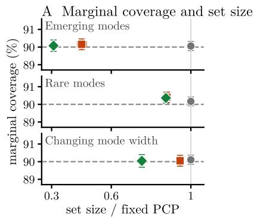

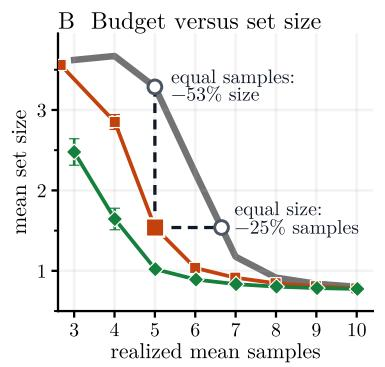

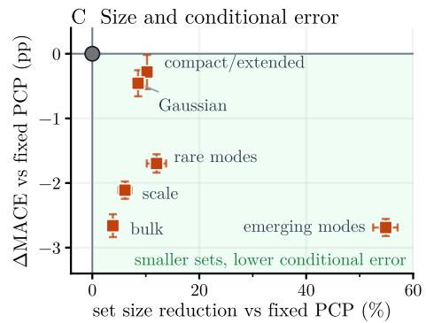  
Figure 3: Synthetic results on a subset of DGPs with a 90% coverage target. (A) Marginal coverage and set size relative to fixed PCP at $B = 5 .$ . (B) Set size against realized mean samples with $B = 3 , \ldots , 1$ 0 on the emerging-modes DGP; open circles mark fixed PCP at equal samples and at equal size. (C) Size reduction and MACE change of CASA at $B = 5 .$ . Error bars show 95% intervals across 100 independent runs.

## 4 EXPERIMENTS

Baselines and metrics. We evaluate CASA on synthetic data-generating processes (DGPs) and on realworld datasets. We compare with PCP (Wang et al., 2023b) using $K = B$ samples and one calibrated radius (fixed PCP), and consider two variants of CASA: CASA adapts only the count, and CASA (joint) adapts both the count and the radius. We also apply the count allocation of CASA to other generative conformal methods that adapt the radius or shape of the set: CP2 (Plassier et al., 2025b), RCP (Plassier et al., 2025a), CP4Gen (Yang et al., 2026), and C-PCP (Dheur et al., 2025). All methods use the same generator and the same labeled data $\mathcal { D } _ { m } \cup \mathcal { D } _ { n } ;$ : CASA uses $\mathcal { D } _ { m }$ for allocation and $\mathcal { D } _ { n }$ for calibration, whereas fixed PCP calibrates on both. We report marginal coverage, mean uncertainty set size, realized mean number of samples, and conditional coverage error, measured as the mean absolute deviation of coverage from 1 − α over input cells (MACE). The target coverage is 90%. Implementation details and further comparisons are in Appendix B.

Synthetic benchmark. In Figure 3, we first compare CASA with fixed PCP on synthetic DGPs that isolate multimodality, heavy tails, and compact-to-extended responses. Against fixed PCP, both variants of CASA maintain marginal validity, produce smaller sets on most DGPs, and lower conditional coverage error on most DGPs without raising it on any. Panel B shows that the gain holds in two directions on the emergingmodes DGP: at a fixed budget, CASA produces sets about 53% smaller, and at the same set size, it uses about 25% fewer samples. Figure 4 shows the calibrated sets on this DGP: fixed PCP’s sets bridge the gaps between modes, whereas those of CASA stay at the scale of a mode, as Theorem 3 predicts.

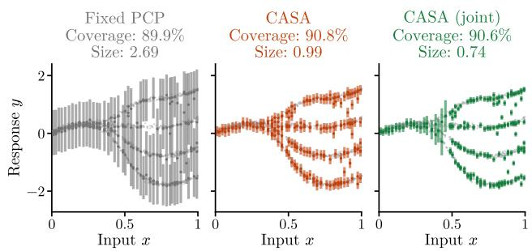  
Figure 4: Calibrated prediction sets on a synthetic DGP with $B = 5 .$ Gray points are test pairs; at each displayed input, colored segments are the set and dots the generated samples.

Table 1 compares other generative conformal prediction methods with and without the count allocation of CASA on a subset of DGPs. CASA shrinks most of their sets and lowers conditional coverage error where the construction’s radius does not already target it, consistent with Proposition 5. This reduction is not guaranteed: because CASA allocates counts to reduce size, it need not further reduce conditional coverage error when the construction’s radius already targets it, as for CP2.

Real data: taxi routes. We present one real task here, taxi trajectory prediction on the Porto dataset (UCI Machine Learning Repository, 2015): from a taxi’s recent GPS positions, we predict its position 300 m further along its route. The future is mul timodal: a straight road leaves one likely position, whereas a junction leaves one per exit. The generator samples futures from similar training trips (Appendix B.4). CASA allocates samples along the street geometry (Figure 5): taxis on through-roads receive two samples and those near junctions up to eight, and the extra samples cover exits that fixed PCP misses. The shared calibrated radius then falls, so sets shrink even on straight roads. At the same budget, CASA keeps the target coverage with sets about 37% smaller than fixed PCP, and the gain persists at equal realized samples, under a time split, and with a learned generator. We also consider two further real tasks with diferent response types (Appendices B.5 and B.6). For protein backbone angles, CASA reduces set area by about 13% at the same budget and 24% at equal samples. For visual question answering with a vision-language model, where each response is a discrete answer, it matches fixed sampling’s answer-set size with about 28% fewer samples at an 80% target.

Table 1: CASA combined with other generative conformal methods at $B = 5$ and a 90% coverage target. Arrows compare each method’s fixed count with CASA count allocation. Size: mean set size; $\Delta { : }$ paired geometric-mean size change; MACE in percentage points. $\mathrm { B o l d } / { \dagger } \mathrm { . }$ significant improvement/deterioration (paired 95% interval). ‡C-PCP uses 20 extra auxiliary draws. Details are in Appendix B.2.
<table><tr><td></td><td colspan="3">Rare modes</td><td colspan="3">Emerging modes</td><td colspan="3">Compact to extended</td></tr><tr><td>Method</td><td>Size</td><td>∆(%)</td><td>MACE</td><td> $\mathrm { S i z e }$ </td><td> $\Delta ( \% )$ </td><td>MACE</td><td>Size</td><td>∆(%)</td><td>MACE</td></tr><tr><td>PCP</td><td>1.31→1.15</td><td>-12.0</td><td>14.6→12.9</td><td>3.29→1.54</td><td>-54.9</td><td>10.0→7.4</td><td>2.73→2.45</td><td>-10.2</td><td>9.6→9.3</td></tr><tr><td> $\mathrm { C P ^ { 2 } }$ </td><td>2.97→2.63</td><td>-11.5</td><td>1.6→2.3†</td><td>4.90→4.13</td><td>-16.2</td><td>2.9→3.9†</td><td>3.68→3.41</td><td>-7.6</td><td>1.5→2.1†</td></tr><tr><td>RCP</td><td>2.00→1.86</td><td>-7.2</td><td>3.2→2.3</td><td>2.80→2.49</td><td>-11.9</td><td>3.9→2.5</td><td>2.59→2.46</td><td>-5.1</td><td>3.2→2.4</td></tr><tr><td>CP4Gen</td><td>1.36→1.18</td><td>-13.0</td><td>14.3→13.2</td><td>2.55→2.60</td><td>+1.5</td><td>4.8→4.9</td><td>2.38→2.43</td><td> $+ 2 . 3 ^ { \dagger }$ </td><td>5.3→5.5†</td></tr><tr><td>C-PCP</td><td>2.08→1.99</td><td>-4.3</td><td>2.6→2.8</td><td>2.55→1.96</td><td>-23.2</td><td>3.1→2.9</td><td>2.62→2.57</td><td>-2.0</td><td>3.0→3.3</td></tr></table>

A City allocation  
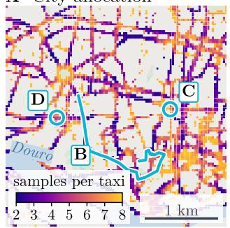  
C Junction

B One trip  
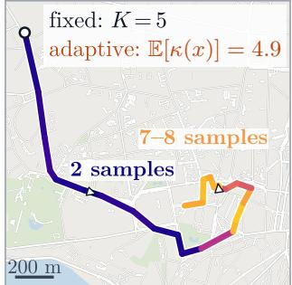

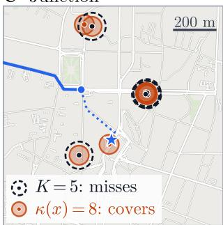

D Straight road  
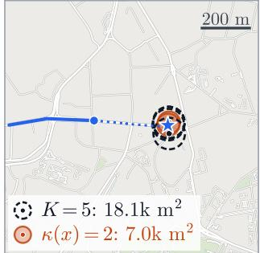  
Figure 5: Porto taxi routes at B = 5. (A) Mean allocated samples. (B) Samples along one trip. (C–D) More samples at a junction, fewer on a straight road. Stars mark true positions; dashed and filled circles are fixed PCP and CASA sets.

Ablation and sensitivity. A natural question is whether the gain comes from matching counts to inputs or merely from letting the count vary over a wider range. To separate the two, we compare CASA with input-blind counts drawn uniformly from the same candidate set at the same budget with $B \ = \ 5$ on the synthetic DGPs. Fixed PCP attains 90.0% coverage with a MACE of 8.9 percentage points. Random counts enlarge PCP uncertainty sets by 6% and leave MACE nearly unchanged, whereas CASA shrinks the set size by 12% and lowers MACE to 7.8, with valid marginal coverage. Varying the count without regard to the input therefore does not reproduce the gain; it comes from giving samples where they are worth most.

Step 1 is also robust to the regression model that estimates $\widehat { c } _ { k }$ and $\widehat { v } _ { k } \colon$ changing its number of neighbors or replacing it with a fixed partition of the input space keeps CASA valid and changes its mean set size by less than 1%, preserving the reduction over fixed PCP (Appendix B.1).

## 5 CONCLUSION

We proposed CASA, which allocates generator samples across inputs to minimize set size under an average sampling budget while preserving finite-sample marginal coverage; theory and experiments show that reallocation pays of when a fixed count misses modes. Several limitations suggest extensions. First, the count is chosen from the input before any sample is drawn; letting it adapt to the samples already drawn could detect missed modes directly. Second, the theory assumes separated modes, and extending it to smooth or heavy-tailed distributions would clarify when allocation helps beyond representation. Third, allocation cannot repair a generator that never samples a relevant mode. Fourth, estimating coverage and size requires a one-time pilot pool, costly for expensive generators. Finally, CASA targets set size, so conditional coverage improves only as a by-product; targeting it directly, or extending to discrete outputs, is a natural next step.

## Acknowledgments

This work was supported by the National Science Foundation under Grant No. CAIG-2425888.

## References

Ahmed M. Alaa, Zaid Ahmad, and Mark van der Laan. Conformal meta-learners for predictive inference of individual treatment efects. In Advances in Neural Information Processing Systems, volume 36, pages 47682–47703, 2023.

Anastasios N. Angelopoulos and Stephen Bates. Conformal prediction: A gentle introduction. Foundations and Trends in Machine Learning, 16(4):494– 591, 2023. doi: 10.1561/2200000101.

Anastasios N Angelopoulos, Stephen Bates, Adam Fisch, Lihua Lei, and Tal Schuster. Conformal risk control. In International Conference on Learning Representations, 2024.

Jean-Yves Audibert, S´ebastien Bubeck, and R´emi Munos. Best arm identification in multi-armed bandits. In Conference on Learning Theory, pages 41– 53, 2010.

Shuai Bai, Keqin Chen, Xuejing Liu, Jialin Wang, Wenbin Ge, Sibo Song, Kai Dang, Peng Wang, Shijie Wang, Jun Tang, et al. Qwen2.5-VL technical report. arXiv preprint arXiv:2502.13923, 2025.

Rina Foygel Barber, Emmanuel J. Cand\`es, Aaditya Ramdas, and Ryan J. Tibshirani. The limits of distribution-free conditional predictive inference. Information and Inference, 10(2):455–482, 2021.

Rina Foygel Barber, Emmanuel J Cand\`es, Aaditya Ramdas, and Ryan J Tibshirani. Conformal prediction beyond exchangeability. The Annals of Statistics, 51(2):816–845, 2023.

Stephen Bates, Anastasios N Angelopoulos, Lihua Lei, Jitendra Malik, and Michael I Jordan. Distribution free, risk-controlling prediction sets. Journal of the ACM, 68(6):1–34, 2021.

Tom B. Brown, Benjamin Mann, Nick Ryder, Melanie Subbiah, Jared Kaplan, Prafulla Dhariwal, et al. Language models are few-shot learners. In Advances in Neural Information Processing Systems, volume 33, pages 1877–1901, 2020.

M´onica F. Bugallo, V´ıctor Elvira, Luca Martino, David Luengo, Joaqu´ın M´ıguez, and Petar M. Djuri´c. Adaptive importance sampling: The past, the present, and the future. IEEE Signal Processing Magazine, 34(4):60–79, 2017.

Victor Chernozhukov, Kaspar W¨uthrich, and Yinchu Zhu. Distributional conformal prediction. Proceedings of the National Academy of Sciences, 118(48):

e2107794118, 2021. URL https://arxiv.org/abs/ 1909.07889.

Mehul Damani, Idan Shenfeld, Andi Peng, Andreea Bobu, and Jacob Andreas. Learning how hard to think: Input-adaptive allocation of LM computation. In International Conference on Learning Representations, 2025.

Victor Dheur, Matteo Fontana, Yorick Estievenart, Naomi Desobry, and Souhaib Ben Taieb. A unified comparative study with generalized conformity scores for multi-output conformal regression. In Proceedings of the 42nd International Conference on Machine Learning, volume 267 of Proceedings of Machine Learning Research, pages 13444–13485. PMLR, 2025. URL https://proceedings.mlr. press/v267/dheur25a.html.

Jacopo Diquigiovanni, Matteo Fontana, and Simone Vantini. Conformal prediction bands for multivariate functional data. Journal of Multivariate Analysis, 189:104879, 2022. doi: 10.1016/j.jmva.2021. 104879.

Bat-Sheva Einbinder, Shai Feldman, Stephen Bates, Anastasios N. Angelopoulos, Asaf Gendler, and Yaniv Romano. Label noise robustness of conformal prediction. Journal of Machine Learning Research, 25(328):1–66, 2024. URL https://jmlr. org/papers/v25/23-1549.html.

Isaac Gibbs and Emmanuel Cand\`es. Adaptive conformal inference under distribution shift. In Advances in Neural Information Processing Systems, volume 34, pages 1660–1672, 2021.

Isaac Gibbs, John J. Cherian, and Emmanuel J. Cand\`es. Conformal prediction with conditional guarantees. Journal of the Royal Statistical Society Series B: Statistical Methodology, 2025.

Alex Graves. Adaptive computation time for recurrent neural networks. arXiv preprint arXiv:1603.08983, 2016. URL https://arxiv.org/abs/1603.08983.

Trevor Harris. Flow-based conformal predictive distributions. arXiv preprint arXiv:2602.07633, 2026. URL https://arxiv.org/abs/2602.07633.

Trevor Harris and Yan Liu. Locally adaptive conformal inference for operator models. arXiv preprint arXiv:2507.20975, 2025.

Jonathan Ho, Ajay Jain, and Pieter Abbeel. Denoising difusion probabilistic models. In Advances in Neural Information Processing Systems, volume 33, pages 6840–6851, 2020.

John Ingraham, Vikas K. Garg, Regina Barzilay, and Tommi Jaakkola. Generative models for graphbased protein design. In Advances in Neural Information Processing Systems, 2019.

Rafael Izbicki, Gilson Shimizu, and Rafael B Stern. CD-split and HPD-split: Eficient conformal regions in high dimensions. Journal of Machine Learning Research, 23(87):1–32, 2022.

Alireza Javanmardi, Yusuf Sale, Paul Hofman, and Eyke H¨ullermeier. Conformal prediction with partially labeled data. In Proceedings of the Twelfth Symposium on Conformal and Probabilistic Prediction with Applications, volume 204 of Proceedings of Machine Learning Research, pages 251–266. PMLR, 2023. URL https://proceedings.mlr. press/v204/javanmardi23a.html.

Narendra Karmarkar. A new polynomial-time algorithm for linear programming. Combinatorica, 4(4): 373–395, 1984.

Jennifer E Kay, Clara Deser, A Phillips, Angeline Mai, Cecile Hannay, Gary Strand, Julie Michelle Arblaster, Susan C Bates, Gokhan Danabasoglu, James Edwards, et al. The community earth system model (cesm) large ensemble project: A community resource for studying climate change in the presence of internal climate variability. Bulletin of the American Meteorological Society, 96(8):1333–1349, 2015.

Jing Lei, Alessandro Rinaldo, and Larry Wasserman. A conformal prediction approach to explore functional data. Annals of Mathematics and Artificial Intelligence, 74(1–2):29–43, 2015. doi: 10.1007/ s10472-013-9366-6.

Jing Lei, Max G’Sell, Alessandro Rinaldo, Ryan J. Tibshirani, and Larry Wasserman. Distribution-free predictive inference for regression. Journal of the American Statistical Association, 113(523):1094– 1111, 2018. doi: 10.1080/01621459.2017.1307116.

Zeming Lin, Halil Akin, Roshan Rao, Brian Hie, Zhongkai Zhu, Wenting Lu, Nikita Smetanin, Robert Verkuil, Ori Kabeli, Yaniv Shmueli, et al. Evolutionary-scale prediction of atomic-level protein structure with a language model. Science, 379 (6637):1123–1130, 2023.

Kenneth Marino, Mohammad Rastegari, Ali Farhadi, and Roozbeh Mottaghi. OK-VQA: A visual question answering benchmark requiring external knowledge. In Proceedings of the IEEE/CVF Conference on Computer Vision and Pattern Recognition, 2019.

Jerzy Neyman. On the two diferent aspects of the representative method: The method of stratified sampling and the method of purposive selection. Journal of the Royal Statistical Society, 97(4):558–625, 1934.

Sima Noorani, Shayan Kiyani, George Pappas, and Hamed Hassani. Conformal prediction beyond the seen: A missing mass perspective for uncertainty quantification in generative models. In Advances in Neural Information Processing Systems, 2025.

Vincent Plassier, Alexander Fishkov, Victor Dheur, Mohsen Guizani, Souhaib Ben Taieb, Maxim Panov, and Eric Moulines. Rectifying conformity scores for better conditional coverage. In Proceedings of the 42nd International Conference on Machine Learning, 2025a. URL https://arxiv.org/abs/2502. 16336.

Vincent Plassier, Alexander Fishkov, Mohsen Guizani, Maxim Panov, and Eric Moulines. Probabilistic conformal prediction with approximate conditional validity. In International Conference on Learning Representations, 2025b.

Victor Quach, Adam Fisch, Tal Schuster, Adam Yala, Jae Ho Sohn, Tommi Jaakkola, and Regina Barzilay. Conformal language modeling. In International Conference on Learning Representations, 2024.

Yaniv Romano, Evan Patterson, and Emmanuel Cand\`es. Conformalized quantile regression. In Advances in Neural Information Processing Systems, volume 32, 2019.

Glenn Shafer and Vladimir Vovk. A tutorial on conformal prediction. Journal of Machine Learning Research, 9:371–421, 2008.

Hooman Shahrokhi, Devjeet Raj Roy, Yan Yan, Venera Arnaoudova, and Jana Doppa. Conformal prediction sets for deep generative models via reduction to conformal regression. In Proceedings of the Forty-First Conference on Uncertainty in Artificial Intelligence, volume 286 of Proceedings of Machine Learning Research, pages 3718–3748. PMLR, 2025. URL https://proceedings.mlr. press/v286/shahrokhi25a.html.

Amanpreet Singh, Vivek Natarajan, Meet Shah, Yu Jiang, Xinlei Chen, Dhruv Batra, Devi Parikh, and Marcus Rohrbach. Towards VQA models that can read. In Proceedings of the IEEE/CVF Conference on Computer Vision and Pattern Recognition, 2019.

R Justin Small, Julio Bacmeister, David Bailey, Allison Baker, Stuart Bishop, Frank Bryan, Julie Caron, John Dennis, Peter Gent, Hsiao-ming Hsu, et al. A new synoptic scale resolving global climate simulation using the community earth system model. Journal of Advances in Modeling Earth Systems, 6 (4):1065–1094, 2014.

Charlie Snell, Jaehoon Lee, Kelvin Xu, and Aviral Kumar. Scaling LLM test-time compute optimally can be more efective than scaling parameters for reasoning. In International Conference on Learning Representations, 2025. URL https://arxiv.org/abs/ 2408.03314.

Jiayuan Su, Jing Luo, Hongwei Wang, and Lu Cheng. API is enough: Conformal prediction for large lan-

guage models without logit-access. In Findings of the Association for Computational Linguistics: EMNLP, 2024.

Ryan J Tibshirani, Rina Foygel Barber, Emmanuel J Cand\`es, and Aaditya Ramdas. Conformal prediction under covariate shift. In Advances in Neural Information Processing Systems, volume 32, pages 2526–2536, 2019.

UCI Machine Learning Repository. Taxi service trajectory – prediction challenge, ecml pkdd 2015. UCI Machine Learning Repository, 2015. URL https: //doi.org/10.24432/C55W25.

Vladimir Vovk, Alexander Gammerman, and Glenn Shafer. Algorithmic Learning in a Random World. Springer, New York, 2005. doi: 10.1007/b106715.

Xuezhi Wang, Jason Wei, Dale Schuurmans, Quoc Le, Ed Chi, Sharan Narang, Aakanksha Chowdhery, and Denny Zhou. Self-consistency improves chain of thought reasoning in language models. In International Conference on Learning Representations, 2023a. URL https://arxiv.org/abs/2203.11171.

Zhendong Wang, Ruijiang Gao, Mingzhang Yin, Mingyuan Zhou, and David Blei. Probabilistic conformal prediction using conditional random samples. In Proceedings of the 26th International Conference on Artificial Intelligence and Statistics, volume 206, pages 8814–8836. PMLR, 2023b. URL https: //proceedings.mlr.press/v206/wang23n.html.

Chen Xu and Yao Xie. Conformal prediction interval for dynamic time-series. In International Conference on Machine Learning, pages 11559–11569, 2021.

Chen Xu, Hanyang Jiang, and Yao Xie. Conformal prediction for multi-dimensional time series by ellipsoidal sets. In Proceedings of the 41st International Conference on Machine Learning, volume 235 of Proceedings of Machine Learning Research, pages 55076–55099. PMLR, 2024. URL https: //proceedings.mlr.press/v235/xu24m.html.

Qidong Yang, Qianyu Julie Zhu, Jonathan Giezendanner, Youssef Marzouk, Stephen Bates, and Sherrie Wang. Conformal prediction for generative models via adaptive cluster-based density estimation. arXiv preprint arXiv:2601.22298, 2026. URL https:// arxiv.org/abs/2601.22298.

Margaux Zafran, Olivier F´eron, Yannig Goude, Julie Josse, and Aymeric Dieuleveut. Adaptive conformal predictions for time series. In Proceedings of the 39th International Conference on Machine Learning, volume 162 of Proceedings of Machine Learning Research, pages 25834–25866. PMLR, 2022. URL https://proceedings.mlr.press/ v162/zaffran22a.html.

Minxing Zheng and Shixiang Zhu. Generative conformal prediction with vectorized non-conformity scores. arXiv preprint arXiv:2410.13735, 2024. doi: 10.48550/arXiv.2410.13735. URL https://arxiv. org/abs/2410.13735.

Minxing Zheng, Wenbin Zhou, and Shixiang Zhu. Beyond prediction: Conformal inference for latent distributional parameters. arXiv preprint arXiv:2608.03607, 2026. URL https://arxiv. org/abs/2608.03607.

Wenbin Zhou and Shixiang Zhu. Calibrating decision robustness via inverse conformal risk control. In Forty-third International Conference on Machine Learning, 2026. URL https://openreview.net/ forum?id=lV4tqcVIyx.

Bowen Zuo and Yinglun Zhu. Strategic scaling of testtime compute: A bandit learning approach. In International Conference on Learning Representations, 2026.

## A PROOFS AND THEORETICAL RESULTS

## A.1 Estimation and Coverage

Throughout this appendix, the radius rule $r ( \cdot )$ is fixed, $B ( y )$ is the ball of that radius around y, and $m ( x ; y )$ $h _ { k } ( x ; y ) , c _ { k } ( x )$ , and $v _ { k } ( x )$ are as in Section 3.1. When the radius r also varies, as in the joint variant, we add it as an argument, writing $m ( x ; y ; r ) , h _ { k } ( x ; y ; r ) , c _ { k } ( x ; r )$ , and $v _ { k } ( x ; r )$

Diminishing sampling increments. Define $\Delta c _ { k } ( x ) = c _ { k + 1 } ( x ) - c _ { k } ( x )$ and $\Delta v _ { k } ( x ) = v _ { k + 1 } ( x ) - v _ { k } ( x )$ . Then

$$
\begin{array} { l } { \displaystyle \Delta c _ { k } ( x ) = \int m ( x ; y ) ^ { k } \{ 1 - m ( x ; y ) \} \mathrm { d } \mathcal { P } _ { x } ( y ) , } \\ { \displaystyle \Delta v _ { k } ( x ) = \int m ( x ; y ) ^ { k } \{ 1 - m ( x ; y ) \} \mathrm { d } y . } \end{array}\tag{11}
$$

To prove this, and that both increments are nonnegative and nonincreasing in $k ,$ fix $x$ and $y$ and write $m =$ $m ( x ; y ) \in [ 0 , 1 ]$ . By $( 6 ) , \Delta h _ { k } ( x ; y ) = h _ { k + 1 } ( x ; y ) - h _ { k } ( x ; y ) = m ^ { k } ( 1 - m )$ , the probability that the first k draws miss $B ( y )$ and the next one falls in it. This is nonnegative and nonincreasing in $k .$ Integrating against ${ \mathcal P } _ { x }$ and against volume proves the identities and the two shape properties; volume calculations use Tonelli’s theorem, and finite expected volume ensures that the diferences are defined. □

## Rao–Blackwell estimation.

Proposition 6 (Unbiasedness and variance reduction). For fixed $( X _ { i } , Y _ { i } )$ and $k \leq N$ , the estimator $\widehat { h } _ { k } ( X _ { i } ; y )$ in (7) is unbiased over the pool $f o r h _ { k } ( X _ { i } ; y )$ . Consequently, $\widehat { c } _ { k } ( X _ { i } )$ in (8) is unbiased for $h _ { k } ( X _ { i } ; Y _ { i } )$ , whose average over $Y _ { i } \sim \mathcal { P } _ { X _ { i } }$ is $c _ { k } ( X _ { i } )$ , and $\widehat { v } _ { k } ( X _ { i } )$ is unbiased for $v _ { k } ( X _ { i } )$ when it is finite. Both are conditional expectations, given the pool, of the coverage indicator and the volume of a uniformly selected k-subset, and therefore have no larger variance than those statistics. Their curves in $k ,$ and their regressions in Step 1 with nonnegative weights, are nondecreasing and discretely concave.

Proof. Condition on $( X _ { i } , Y _ { i } )$ and on the unordered pool, and choose a uniformly random k-subset A of it. Exactly $\binom { N - H ( X _ { i } ; y ) } { k }$ of the $\binom { N } { k }$ subsets contain no sample within radius r of $y ,$ so $\widehat { h } _ { k } ( X _ { i } ; y )$ is the conditional probability that A covers $y .$ Taking $y = Y _ { i }$ gives the statement for $\widehat { c } _ { k } ( X _ { i } )$ , and integrating over y gives it for $\widehat { v } _ { k } ( X _ { i } )$ . Before conditioning on the pool, the selected samples are k independent draws from ${ \widehat { f } } ( X _ { i } )$ , which gives unbiasedness, and the law of total variance gives the variance comparison whenever second moments exist. For the shape property, fix a value $H \geq 1$ of the count and let $a ( k ) = \hat { 1 } - \binom { N - H } { k } / \binom { N } { k }$ ; if $H = 0$ , then $a ( k ) = 0$ for all k. For $0 \leq k < N$

$$
a ( k + 1 ) - a ( k ) = \frac { \binom { N - H } { k } } { \binom { N } { k } } \frac { H } { N - k } \geq 0 ,
$$

and successive positive increments have ratio $( N - H - k ) / ( N - k - 1 ) \le 1$ , with all increments zero once the miss probability vanishes. So $a ( k )$ is nondecreasing and discretely concave, and integration and nonnegative regression weights preserve both properties. □

Finite-sample coverage. Proof of Theorem 2. Condition on the generator’s training data, on $\mathcal { D } _ { m } .$ , and on all quantities fitted from them, including κ. Augment each calibration pair and the test pair with an independen random seed that determines its count ${ \widehat { \kappa } } ( X )$ , if the rule is randomized, and its generated samples. These augmented observations are exchangeable. The frozen procedure that draws ${ \widehat { \kappa } } ( X )$ samples $\widehat { Y } _ { 1 } , \ldots , \widehat { Y } _ { \widehat { \kappa } ( X ) }$ and computes $\begin{array} { r } { S = \operatorname* { m i n } _ { j \leq { \widehat { \kappa } } ( X ) } \| Y - { \widehat { Y } } _ { j } \| _ { 2 } / r ( X ) } \end{array}$ is the same measurable map for every observation, so the scores are exchangeable, and the conformal order-statistic argument gives ${ \mathbb P } \{ S _ { \mathrm { t e s t } } \le \widehat { q } \} \ge 1 - \alpha$ . This event is exactly $Y _ { \mathrm { t e s t } } ~ \in ~ { \widehat { \mathcal { C } } } _ { \alpha } ( X _ { \mathrm { t e s t } } )$ , the set (4) with $K = { \widehat { \kappa } } ( X _ { \mathrm { t e s t } } )$ . Averaging over the conditioning information proves the theorem. The same argument applies to the joint variant with the learned radius ${ \widehat { r } } ( x )$ in place of $r ( x )$ □

## A.2 Optimization

Throughout this subsection, write $t = 1 - \alpha$ . We state the results for the joint variant, in which each input chooses a count $k \in \mathcal { K }$ and a radius r from a finite grid $\mathcal { R } ;$ count-only CASA is the special case of a single radius,

$| \mathcal { R } | = 1$ . Abbreviate a pair as $\boldsymbol { a } \ = \ ( \boldsymbol { k } , \boldsymbol { r } )$ , with $k ( a )$ its count and $\mathcal { A } = \mathcal { K } \times \mathcal { R }$ the set of pairs, and write $\widehat { c } _ { i } ( a ) = \widehat { c } _ { k } ( X _ { i } ; r ) , \widehat { v } _ { i } ( a ) = \widehat { v } _ { k } ( X _ { i } ; r )$ , and $g _ { i } ( a ) = { \widehat { v } } _ { i } ( a ) - \mu { \widehat { c } } _ { i } ( a ) + \lambda k ( a )$ for the tables and priced costs, so that $g _ { i } ( a ) = g _ { k } ( X _ { i } )$ in the count-only case. The allocation set has m observations.

The empirical allocation problem. Let $\pi _ { i } ( k , r ) = \pi ( k , r \mid X _ { i } )$ be a distribution over the finite candidate pairs at input $X _ { i } .$ . The estimated counterpart of (5) is

$$
\begin{array} { r l } { \underset { \pi _ { 1 } , \ldots , \pi _ { m } } { \operatorname* { m i n } } } & { \displaystyle \frac { 1 } { m } \sum _ { i , a } \pi _ { i } ( a ) \widehat { v } _ { i } ( a ) } \\ { \mathrm { s . t . } } & { \displaystyle \frac { 1 } { m } \sum _ { i , a } \pi _ { i } ( a ) \widehat { c } _ { i } ( a ) \geq 1 - \alpha , } \\ & { \displaystyle \frac { 1 } { m } \sum _ { i , a } \pi _ { i } ( a ) k ( a ) \leq B , } \end{array}\tag{12}
$$

where the sums run over $k \in \mathcal { K }$ and $r \in \mathcal { R }$ , with $\pi _ { i } ( k , r ) \geq 0$ and $\begin{array} { r } { \sum _ { k , r } \pi _ { i } ( k , r ) = 1 } \end{array}$ for each i. Write ${ \widehat { V } } ^ { * }$ for its optimal value and $\widehat { V } ( \pi ) , \widehat { C } ( \pi )$ , and $\widehat K ( \pi )$ for its mean estimated volume, coverage, and count. Only the coverage and budget constraints couple the inputs. The dual prices these constraints and minimizes over each input’s distribution separately. When minimizers tie, mixing them at no more than two inputs gives a feasible optimal policy (Proposition 8).

Gain over fixed PCP. The dual multipliers also characterize the improvement over a fixed allocation in the empirical program.

Proposition 7 (Gain over fixed PCP). Suppose (12) is feasible, with optimal value ${ \widehat { V } } ^ { * }$ , and write $\pi _ { i } ( k , r ) =$ $\pi ( k , r \mid X _ { i } )$ . There exist optimal dual multipliers $\mu , \lambda \geq 0$ such that every policy satisfies

$$
\begin{array} { l } { { \displaystyle \widehat { V } ( \pi ) - \widehat { V } ^ { * } = \frac { 1 } { m } \sum _ { i , a } \pi _ { i } ( a ) \Big \{ g _ { i } ( a ) - \operatorname* { m i n } _ { a ^ { \prime } } g _ { i } ( a ^ { \prime } ) \Big \} } } \\ { { + \mu \big \{ \widehat { C } ( \pi ) - ( 1 - \alpha ) \big \} } } \\ { { + \lambda \big \{ B - \widehat { K } ( \pi ) \big \} , } } \end{array}\tag{13}
$$

where ${ \widehat { V } } ( \pi ) , { \widehat { C } } ( \pi )$ , and $\widehat K ( \pi )$ are the mean estimated volume, coverage, and count $o f \pi$ over $\mathcal { D } _ { m } ; f o r  { a }$ feasible policy all three terms are nonnegative. In particular, fixed $P C P ,$ which uses count B and one radius r at every input, with r meeting the coverage target exactly, exceeds ${ \widehat { V } } ^ { * }$ by its priced regret $\widehat { R } _ { F } = m ^ { - 1 } \sum _ { i } \{ g _ { i } ( B , r ) -$ m $\begin{array} { r } { \operatorname* { i n } _ { k ^ { \prime } , r ^ { \prime } } g _ { i } ( k ^ { \prime } , r ^ { \prime } ) \} } \end{array}$ }, which is zero $i f$ and only $i f \left( B , r \right)$ is the cheapest choice at every input.

For a fixed comparator meeting both constraints with equality, the gain equals its average excess local Lagrangian cost. The same identity holds with population tables when optimal multipliers exist. The regret also converts into computation: the allocation matches fixed PCP’s volume with $\Delta$ fewer draws per prediction whenever $\Delta \lambda ( B - \Delta ) \leq \widehat { R } _ { F }$ , with $\lambda ( B ^ { \prime } )$ the price at budget $B ^ { \prime }$ . The identity concerns the estimated program before calibration.

The two prices. The prices of Proposition 7 solve the dual of (12), which makes the program cheap to solve and gives the prices a meaning.

Proposition 8 (Exact two-price dual). Let $\begin{array} { r } { D ( \mu , \lambda ) = \mu ( 1 - \alpha ) - \lambda B + m ^ { - 1 } \sum _ { i = 1 } ^ { m } \operatorname* { m i n } _ { k , r } g _ { i } ( k , r ) } \end{array}$ , and suppose (12) is feasible. (i) D is concave and piecewise linear, $\widehat V ^ { * } = \mathrm { m a x } _ { \mu , \lambda \geq 0 } D ( \mu , \lambda )$ with the maximum attained, and a feasible policy is optimal $i f$ and only if each $\pi _ { i }$ is supported on minimizers of $g _ { i } ,$ the coverage constraint binds when $\mu > 0$ , and the budget binds when $\lambda > 0 ;$ some optimal policy is deterministic at all but at most two learning inputs. (ii) For fixed $\mu ,$ minimizing $\widehat V ( \pi ) - \mu \widehat C ( \pi )$ under the budget alone is solved exactly by water-filling: take at each input the best radius for every count, start every input at the smallest count, and add draws across inputs in decreasing order of the reduction in priced cost per draw, along the lower convex hull of each input’s cost in the count, until the budget is spent or no further reduction is possible; $\lambda ( \mu )$ is the reduction at the last draw added when the budget binds and zero otherwise. The coverage of this solution is nondecreasing in $\mu ,$ so bisection on $\mu$ over a bracket [0, M] returns a feasible policy with volume at most $\widehat { V } ^ { \ast } + \alpha \epsilon$ after ${ \cal O } ( \log ( M / \epsilon ) )$ passes of $O ( m | K | | \mathcal { R } | + m | K | \log ( m | K | ) )$ ) operations each.

For CASA, which allocates counts only, part (i) is Theorem 1: introducing $\begin{array} { r } { u _ { i } ~ = ~ \operatorname* { m i n } _ { k \in \mathcal { K } } g _ { k } ( X _ { i } ) } \end{array}$ turns $\operatorname* { m a x } _ { \mu , \lambda \geq 0 } D ( \mu , \lambda )$ into the linear program (9), and its optimality condition says that an optimal allocation uses at each input only counts minimizing $g _ { k } ( X _ { i } )$ , which defines the rule κ. Any exact method must read the $m | { \cal K } | | { \cal R } |$ table entries, so the solver is optimal up to the logarithmic factor. Randomization is not what makes the allocation work: the optimal rule is deterministic except where mixing two choices meets a constraint exactly. The computation price is the marginal value of a draw: ${ \widehat { V } } ^ { * } ( B )$ is convex and nonincreasing in the budget with $- \lambda$ as a subgradient, so one more call per prediction saves at most λ in estimated volume, and $\lambda = 0$ when the budget goes unspent, as under CASA when the shared radius already covers the generator’s mass at every input.

Proof of Propositions 7 and 8(i). The Lagrangian of (12) with multipliers $\mu , \lambda \geq 0$ is

$$
\mu t - \lambda B + \frac { 1 } { m } \sum _ { i = 1 } ^ { m } \sum _ { a \in \mathcal { A } } \pi _ { i } ( a ) g _ { i } ( a ) .
$$

Minimizing over each probability simplex places mass on minimizers of $g _ { i }$ and gives the dual objective $D ( \mu , \lambda )$ Concavity and duality. Each min ${ \sb { a } } g _ { i } ( a )$ is a minimum of finitely many afine functions of $( \mu , \lambda )$ , so $D$ is concave and piecewise linear. The feasible set of (12) is a nonempty polytope, so linear-programming strong duality gives equal optimal values and a dual maximizer. Optimality. For any $\mu , \lambda \geq 0$ and any policy, substituting ${ \widehat { v } } _ { i } ( a ) = g _ { i } ( a ) + \mu { \widehat { c } } _ { i } ( a ) - \lambda k ( a )$ and $\textstyle \sum _ { a } \pi _ { i } ( a ) = 1$ gives

$$
\begin{array} { l } { { \displaystyle \widehat { V } ( \pi ) - D ( \mu , \lambda ) = \frac { 1 } { m } \sum _ { i , a } \pi _ { i } ( a ) \Big \{ g _ { i } ( a ) - \operatorname* { m i n } _ { a ^ { \prime } } g _ { i } ( a ^ { \prime } ) \Big \} } } \\ { { \displaystyle ~ + \mu \big \{ \widehat { C } ( \pi ) - t \big \} } } \\ { { \displaystyle ~ + \lambda \big \{ B - \widehat { K } ( \pi ) \big \} . } } \end{array}
$$

At a dual maximizer $D ( \mu , \lambda ) = \widehat { V } ^ { * } \mathrm { ~ b y ~ ( i ) }$ , which is (13). For a feasible policy the three terms are nonnegative, so it is optimal exactly when all three vanish, which is the stated condition, and the identity at the maximizer is Proposition 7. For the deterministic-policy claim, adding a slack variable to each of the two inequality constraints puts (12) in standard form with $m { + 2 }$ equality constraints. A bounded feasible linear program attains its optimum at a basic feasible solution, which has at most $m + 2$ positive variables. Each simplex needs at least one positive $\pi _ { i } ( a )$ , which leaves at most two further positive entries: either two inputs mix two actions or one input mixes three. Monotonicity in the prices. Let a minimize $g _ { i }$ at $( \mu , \lambda )$ and $a ^ { \prime }$ at $( \mu ^ { \prime } , \lambda )$ with $\mu ^ { \prime } > \mu .$ . Adding the two optimality inequalities cancels the volume and count terms and leaves $( \mu ^ { \prime } - \mu ) \{ { \widehat c _ { i } } ( a ^ { \prime } ) - { \widehat c _ { i } } ( a ) \} \geq 0$ . The same argument in λ at fixed $\mu$ gives $( \lambda ^ { \prime } - \lambda ) \{ k ( a ^ { \prime } ) - k ( a ) \} \leq 0$ □

Proof of Proposition 8(ii). Fix $\mu \geq 0$ , write $w _ { i } ( a ) = \widehat { v } _ { i } ( a ) - \mu \widehat { c } _ { i } ( a )$ , and let $q ( \mu ) = \operatorname* { m i n } \{ \widehat { V } ( \pi ) - \mu ( \widehat { C } ( \pi ) - t )$ ${ \widehat K } ( \pi ) ~ \le ~ B \}$ , the Lagrangian of (12) with only the coverage constraint priced. Its minimizers are those of the problem in the proposition. Radius. Replacing each action $( k , r )$ at input i by $\left( k , r _ { i } ( k ) \right)$ , where $r _ { i } ( k )$ minimizes $w _ { i } ( k , \cdot )$ , keeps every count and does not increase the objective, so it sufices to work with $M _ { i } ( k ) =$ minr $w _ { i } ( k , r )$ , computed in one pass over the tables. Counts. A distribution over counts at input i with mean κ costs at least $\breve { M } _ { i } ( \kappa )$ , the lower convex envelope of $k \mapsto M _ { i } ( k )$ over the menu, and attains it by mixing the two hull vertices adjacent to $\kappa .$ . The problem is therefore min $\begin{array} { r } { m ^ { - 1 } \sum _ { i } \breve { M } _ { i } ( \kappa _ { i } ) } \end{array}$ subject to $m ^ { - 1 } \textstyle \sum _ { i } \kappa _ { i } \leq B$ and $\kappa _ { i } \in [ k _ { \operatorname* { m i n } } , k _ { \operatorname* { m a x } } ]$ , a separable convex allocation of one resource. Starting every $\kappa _ { i }$ at $k _ { \mathrm { m i n } }$ and raising the $\kappa _ { i }$ along the segments of the $\breve { M } _ { i }$ in increasing order of slope, until the budget is spent or no segment has negative slope, satisfies its optimality conditions with multiplier $\lambda ( \mu )$ equal to minus the slope of the last segment used: every segment used has slope at most $- \lambda ( \mu )$ , every segment not used has slope at least $- \lambda ( \mu )$ , and convexity makes each input’s segments come in order. At most one segment is used partially, so at most one input mixes two counts. The hulls take $O ( m | K | )$ operations, since the counts are sorted, and ordering the at most $m ( | \mathcal { K } | - 1 )$ segments takes $O ( m | K | \log ( m | K | ) )$ . Bisection. Let $\pi _ { \mu }$ be the water-filling solution. For every $\mu ^ { \prime } ,$ $q ( \mu ^ { \prime } ) \leq \widehat { V } ( \pi _ { \mu } ) - \mu ^ { \prime } \lbrace \widehat { C } ( \pi _ { \mu } ) - t \rbrace = q ( \mu ) + ( \mu ^ { \prime } - \mu ) \lbrace t - \widehat { C } ( \pi _ { \mu } ) \rbrace$ , so $t - \widehat { C } ( \pi _ { \mu } )$ is a supergradient of the concave function q. Supergradients of a concave function are nonincreasing, so $\widehat C ( \pi _ { \mu } )$ is nondecreasing in $\mu ,$ and linearprogramming duality gives $\operatorname* { m a x } _ { \mu \geq 0 } q ( \mu ) = { \widehat { V } } ^ { * }$ . If ${ \widehat { C } } ( \pi _ { 0 } ) \geq t .$ , then $\pi _ { 0 }$ is feasible with $\widehat V ( \pi _ { 0 } ) = q ( 0 ) \le \widehat V ^ { * }$ and is optimal. Otherwise, because (12) is feasible, beyond the last breakpoint of $\mu \mapsto \pi _ { \mu }$ the solution maximizes coverage under the budget, so ${ \widehat { C } } ( \pi _ { M } ) \geq t$ for a finite $M$ , which doubling finds. Bisection keeps $\mu _ { \mathrm { l o } } < \mu _ { \mathrm { h i } }$ with $\widehat C ( \pi _ { \mu _ { \mathrm { l o } } } ) < t \leq \widehat C ( \pi _ { \mu _ { \mathrm { h i } } } )$ until $\mu _ { \mathrm { h i } } - \mu _ { \mathrm { l o } } \leq \epsilon$ . Choose $\theta \in [ 0 , 1 ]$ with $\theta \widehat { C } ( \pi _ { \mu _ { \mathrm { l o } } } ) + ( 1 - \theta ) \widehat { C } ( \pi _ { \mu _ { \mathrm { h i } } } ) = t ;$ the mixture ¯π meets both constraints. With $\Delta = ( 1 - \theta ) \{ \widehat { C } ( \pi _ { \mu _ { \mathrm { h i } } } ) - t \} \in [ 0 , \alpha ]$ ,

$$
\widehat { V } ( \bar { \pi } ) = \theta q ( \mu _ { \mathrm { l o } } ) + ( 1 - \theta ) q ( \mu _ { \mathrm { h i } } ) + ( \mu _ { \mathrm { h i } } - \mu _ { \mathrm { l o } } ) \Delta \leq \widehat { V } ^ { * } + \alpha \epsilon .
$$

Once the bracket contains no breakpoint of $\mu \mapsto \pi _ { \mu }$ other than a maximizer $\mu ^ { * }$ of $q ,$ both bracket solutions minimize the priced objective at $\mu ^ { * }$ , so $\bar { \pi }$ does too, meets the coverage target with equality, and is exactly optimal. The number of steps is ${ \cal O } ( \log ( M / \epsilon ) )$ ), and each costs $O ( m | A | + m | K | \log ( m | K | ) )$ . Conversely, changing a single entry of the tables can change the optimal value, so in the worst case every exact method reads all $m | { \cal { A } } |$ entries. □

The budget path. Let ${ \widehat { V } } ^ { * } ( B )$ be the optimal value of (12) at budget B for a fixed action set. It is nonincreasing because the feasible sets are nested. It is convex because a mixture ${ \bar { \theta } } \pi ^ { 0 } + ( 1 - \theta ) \pi ^ { 1 }$ of optimal policies at budgets $B _ { 0 } , B _ { 1 }$ is feasible at $\theta B _ { 0 } + ( 1 - \theta ) B _ { 1 }$ , the constraints being linear, and has the mixed volume. Let $( \mu , \lambda )$ be optimal prices at $B$ and $\pi ^ { \prime }$ an optimal policy at $B ^ { \prime }$ . Applying (13) at B to $\pi ^ { \prime }$ , whose regret and coverage terms are nonnegative and whose mean count is at most $B ^ { \prime }$ , gives $\widehat { V } ^ { * } ( B ^ { \prime } ) - \widehat { V } ^ { * } ( B ) \geq \lambda ( B - B ^ { \prime } ) , \operatorname { s o } - \lambda$ is a subgradient. For each $\lambda \geq 0$ , the minimizing rule at $( \mu ( \lambda ) , \lambda )$ , mixed to meet the coverage target, satisfies the optimality conditions of Proposition 8 at the budget equal to its own mean count. By the identity above its volume equals $D ( \mu , \lambda )$ , so by weak duality it is optimal at that budget and $( \mu , \lambda )$ are optimal prices there. That budget is nonincreasing in λ because subgradients of a convex function are monotone, and at the finitely many values of λ where it jumps, mixing tied actions fills in the budgets between. One sweep of λ therefore traces ${ \widehat { V } } ^ { * }$ between the smallest feasible budget and the budget at which λ reaches zero.

The gain over fixed PCP, and the draws it saves. If fixed PCP meets the coverage target exactly and spends the budget, the last two terms of (13) vanish, so $\widehat V ( \mathrm { f i x e d } ) - \widehat V ^ { * } ( B ) = \widehat R _ { F }$ , its priced regret; by Proposition 8 this is zero exactly when $( B , r )$ minimizes every $g _ { i }$ . The derivation of (13) uses only linearity in the policy and the two coupling constraints, so the same identity holds for the population program (5) over a finite menu, with ${ \mathcal { P } } _ { X }$ in place of the empirical input distribution and population tables, whenever optimal population prices exist, as under Slater’s condition. For the draws saved, let $\lambda ( B - \Delta )$ be an optimal price at budget $B - \Delta$ . The subgradient inequality of the budget path at $B - \Delta$ gives

$$
\begin{array} { r l } & { \widehat { V } ^ { * } ( B - \Delta ) \leq \widehat { V } ^ { * } ( B ) + \Delta \lambda ( B - \Delta ) } \\ & { \qquad = \widehat { V } ( \mathrm { f i x e d } ) - \widehat { R } _ { F } + \Delta \lambda ( B - \Delta ) , } \end{array}
$$

so the allocation at budget $B - \Delta$ is no larger than fixed PCP at budget B whenever $\Delta \lambda ( B - \Delta ) \leq \widehat { R } _ { F }$ . When prices vary little over this range, the saving is about $\widehat { R } _ { F } / \lambda$ draws per prediction: the regret measured in units of the value of a draw.

## A.3 Proofs for Section 3.3

Write $\omega _ { d }$ for the volume of the unit ball in $\mathbb { R } ^ { d }$ . Throughout, the radius is constant and $r ( x ) \equiv 1$ , so the score of k samples is $\begin{array} { r } { S = \operatorname* { m i n } _ { j \leq k } \| Y - \widehat { Y } _ { j } \| _ { 2 } } \end{array}$ and a sample’s ball of radius r contains y exactly when $\| y - { \widehat { Y } } _ { j } \| _ { 2 } \leq r .$

Coverage under separated modes. Under Assumption 1, if some sample lies in the ball containing Y, both lie in one ball of radius $\epsilon ,$ so $S \leq 2 \epsilon$ . Otherwise every sample lies in another ball, because the generator is supported on the union of the balls, and every point of another ball is at distance at least $2 ( R + 1 ) \epsilon - 2 \epsilon = 2 R \epsilon$ from ${ \cal Y } ,$ so $S \geq 2 R e$ . Given $X = x$ , the response lies in ball $j$ with probability $p _ { j } ( x )$ , and each independent sample misses that ball with probability $1 - { \widehat { p } } _ { j } ( x )$ . Hence, with $c _ { k } ( x )$ as in (10),

$$
\mathbb { P } ( S \le r \mid X = x ) = c _ { k } ( x ) \mathrm { ~ f o r ~ } r \in [ 2 \epsilon , 2 R \epsilon ) , \qquad \mathbb { P } ( S \le r \mid X = x ) \le c _ { k } ( x ) \mathrm { ~ f o r ~ } r < 2 R \epsilon ,\tag{14}
$$

which proves (10) and shows that $c _ { k } ( x )$ is nondecreasing in k.

Proof of Theorem 3. For a count rule $\kappa ,$ averaging (14) over X and $\kappa ( X )$ shows that the population score distribution $F _ { \kappa }$ equals $\mathbb { E } [ c _ { \kappa ( X ) } ( X ) ]$ on $[ 2 \epsilon , 2 R \epsilon )$ and is at most this value below $2 R \epsilon$ . The calibrated radius inf $\{ r : F _ { \kappa } ( r ) \geq 1 - \alpha \}$ is therefore at most 2ϵ if $\mathbb { E } [ c _ { \kappa ( X ) } ( X ) ] \geq 1 - \alpha$ , and at least 2Rϵ otherwise. For uniform allocation, $\mathbb { E } [ c _ { B } ( X ) ] < 1 - \alpha$ by the condition, so its radius is at least 2Rϵ; every set contains a ball of that radius, and $\dot { V } _ { F } \geq \dot { \omega _ { d } } ( 2 R \epsilon ) ^ { d }$ . By the condition, some count rule κ with $\mathbb { E } [ \kappa ( X ) ] \leq B$ has $\mathbb { E } \{ c _ { \kappa ( X ) } ( X ) \} \geq 1 - \alpha ,$ so its radius is at most 2ϵ and each set is a union of $\kappa ( x )$ balls of radius at most 2ϵ, with expected volume at most $\mathbb { E } [ \kappa ( X ) ] \omega _ { d } ( 2 \epsilon ) ^ { d } \leq B \omega _ { d } ( 2 \epsilon ) ^ { d }$ . The optimal allocation is no larger, so $V _ { A } \le B \omega _ { d } ( 2 \epsilon ) ^ { d }$ , and dividing the two bounds gives $V _ { A } / V _ { F } \leq B / R ^ { d }$

Finite calibration. With n i.i.d. calibration points and $\psi = \mathbb { E } [ c _ { \kappa ( X ) } ( X ) ]$ , the number of calibration scores at most 2ϵ is $\mathrm { B i n } ( n , \psi )$ by (14), and the calibrated radius is at most 2ϵ if this number is at least $\lceil ( n + 1 ) ( 1 - \alpha ) \rceil$ and at least 2Rϵ otherwise. Hence ${ \mathbb P } \{ \hat { r } > 2 \epsilon \} = { \mathbb P } \{ \hat { r } \geq 2 R \epsilon \} = { \mathbb P } \{ \mathrm { B i n } ( n , \psi ) < \lceil ( n + 1 ) ( 1 - \alpha ) \rceil \}$ , which tends to zero when $\psi > 1 - \alpha$ and to one when $\psi < 1 - \alpha$ □

Proof of Corollary 4. At a constant radius $r \in [ 2 \epsilon , 2 R \epsilon )$ , (14) gives input x with k samples conditional coverage $c _ { k } ( x )$ , which is nondecreasing in k. Input x therefore attains conditional coverage $1 - \alpha$ exactly when $\kappa ( x ) \geq k _ { \alpha } ( x )$ . Uniform allocation attains it at almost every input exactly when $B \geq \operatorname* { s u p } _ { x } k _ { \alpha } ( x )$ , where suprema over inputs are essential suprema, and the smallest mean count of a deterministic rule attaining it is $\mathbb { E } [ k _ { \alpha } ( X ) ]$ attained by $\kappa = k _ { \alpha } ;$ the diference is the saving. With a correct generator and $J ( x )$ equally weighted modes, $c _ { k } ( x ) = 1 - \{ 1 - 1 / J ( x ) \} ^ { k }$ , so $k _ { \alpha } ( x ) = \operatorname* { m a x } \{ k _ { \mathrm { m i n } } , \lceil \log ( 1 / \alpha ) / \log \{ J / ( J - 1 ) \} \rceil \}$ with $J = J ( x )$ and $k _ { \mathrm { m i n } } = \operatorname* { m i n } \mathcal { K } .$ and $1 / J \le \log \{ J / ( J - 1 ) \} \le 1 / ( J - 1 )$ gives $( J - 1 ) \log ( 1 / \alpha ) \leq k _ { \alpha } ( x ) \leq J \log ( 1 / \alpha ) + 1$ whenever $k _ { \alpha } ( x ) > k _ { \mathrm { m i n } }$ □

Proof of Proposition 5. $\mathrm { I f } k < k _ { \alpha } ( x )$ , then $c _ { k } ( x ) < 1 - \alpha .$ , and by (14) every radius below 2Rϵ gives conditional coverage below $1 - \alpha ;$ the smallest radius attaining the target is at least $2 R \epsilon$ , and the set contains a ball of that radius. Under uniform allocation with B samples, the inputs with $k _ { \alpha } ( X ) > B$ therefore have sets of volume at least $\omega _ { d } ( 2 R \epsilon ) ^ { d }$ , so $V _ { F } \ge \mathbb { P } \{ k _ { \alpha } ( X ) > B \} \omega _ { d } ( 2 \bar { R } \epsilon ) ^ { d }$ . If $k \geq k _ { \alpha } ( x )$ , (14) gives conditional coverage $c _ { k } ( x ) \geq 1 - \alpha$ at radius 2ϵ, so the smallest such radius is at most 2ϵ and the union of k balls has volume at most $k \omega _ { d } ( 2 \epsilon ) ^ { d }$ The allocation $\kappa = k _ { \alpha }$ has mean count $\mathbb { E } [ k _ { \alpha } ( X ) ] \leq B$ and expected size at most $\begin{array} { r } { \mathbb { E } [ k _ { \alpha } ( X ) ] \omega _ { d } ( 2 \epsilon ) ^ { d } \leq B \omega _ { d } ( 2 \epsilon ) ^ { d } ; } \end{array}$ which bounds the optimal allocation; dividing gives the ratio. □

## A.4 Oracle Radii in the Interval Model

The next result isolates a benefit that remains when every input already has the smallest radius attaining the target conditional coverage.

Proposition 9 (Allocation with oracle radii). Suppose $\mathcal { P } _ { x } = \widehat { f } ( x )$ is uniform on an interval of length $s ( x )$ , with $0 < s _ { \mathrm { m i n } } \le s ( x ) \le s _ { \mathrm { m a x } }$ . For each input and count, choose the smallest radius attaining conditional coverage 1 − α. With inactive count caps, allocate counts by randomized rounding of

$$
\kappa ^ { * } ( x ) = { \frac { B \sqrt { s ( x ) } } { \mathbb { E } \sqrt { s ( X ) } } }
$$

to adjacent integers, preserving its conditional mean. As integer $B  \infty$ , the expected lengths under fixed counts and this allocation satisfy

$$
V _ { F } ( B ) - V _ { \mathrm { s q r t } } ( B ) = \frac { A _ { \alpha } } { B } \mathrm { V a r } \{ \sqrt { s ( X ) } \} + { \cal O } ( B ^ { - 2 } ) ,
$$

where $A _ { \alpha } = \log ( 1 / \alpha ) - 2 + 2 { \sqrt { \alpha } } > 0 .$

Both rules have the same conditional coverage and average count. The leading gain is proportional to $\operatorname { V a r } \{ { \sqrt { s ( X ) } } \}$ , quantifying the role of scale heterogeneity. Together with Theorem 3, it distinguishes large gains from crossing a representation threshold and smooth $1 / B$ gains from reducing residual excess volume after local radius adaptation.

Proof of Proposition 9. For the oracle radius at input x and count $k ,$ we first establish the expansion

$$
v _ { k } ( x ; r _ { k } ( x ) ) = s ( x ) \{ 1 - \alpha + A _ { \alpha } / k + O ( k ^ { - 2 } ) \} .
$$

The remainder is uniform over the bounded scale family in the proposition. Minimizing the leading excess term under $\mathbb { E } K ( X ) = B$ gives the square-root allocation.

Normalize the support to [0, 1]. Integrating the probability that all k centers miss a radius-t neighborhood gives, for $0 \leq t \leq 1$ ,

$$
1 - c ( k , t ) = \frac { 2 ( 1 - t ) ^ { k + 1 } + ( k - 1 ) ( 1 - 2 t ) _ { + } ^ { k + 1 } } { k + 1 } .
$$

The expected covered length inside the support equals $c ( k , t )$ because the density is one, and each end contributes expected length $t - \{ 1 - ( \bar { 1 } - t ) ^ { k + 1 } \} / ( k + 1 )$ ) outside it, from integrating $1 - ( 1 - u ) ^ { k }$ over $u \in [ 0 , t ]$ . Setting $t = z / k$ gives $1 - c ( k , z / k ) = e ^ { - 2 z } + O ( 1 / k )$ uniformly on compact z-intervals, with derivative in z bounded away from zero near $\begin{array} { r } { z = \frac { 1 } { 2 } \log ( 1 / \alpha ) } \end{array}$ , so $t _ { k } = \log ( 1 / \alpha ) / ( 2 k ) + O ( k ^ { - 2 } )$ ; substituting into the outside length gives $A _ { \alpha }$ , and $A _ { \alpha } =$ $2 ( z - 1 - \log z ) > 0$ with $z = \sqrt { \alpha }$ . By the Cauchy–Schwarz inequality, $\mathbb { E } \{ s ( X ) / K ( X ) \} \mathbb { E } K ( X ) \geq \{ \mathbb { E } \sqrt { s ( X ) } \} ^ { 2 }$ with equality for $K ^ { * }$ . Bounded scales keep $K ^ { * }$ proportional to $B _ { ; }$ and randomized rounding preserves the mean count and changes $\mathbb { E } \{ 1 / K \mid X \}$ by $O ( B ^ { - 3 } )$ . The leading excess is $A _ { \alpha } \{ \mathbb { E } \sqrt { s } \} ^ { 2 } / B$ for $K ^ { * }$ against $A _ { \alpha } \mathbb { E } s / B$ for $K \equiv B$ , and their diference is the claim. □

## B EXPERIMENTAL DETAILS

## B.1 Implementation

Data and generators. The synthetic study uses a conditional quantile network with two hidden layers of 64 ReLU units, which outputs the quantiles at levels $0 . 0 1 , \ldots , 0 . 9 9$ and is trained with the pinball loss once per DGP on 2,000 observations; a sample interpolates its quantile curve at a uniform level. Each seed draws 500 observations for $\mathcal { D } _ { m } .$ , 500 for ${ \mathcal { D } } _ { n } ,$ 1,000 for testing, and 4,000 for the conditional-coverage audit. Every method uses the same 1,000 labeled observations: methods without a learned component calibrate on $\mathcal { D } _ { m } \cup \mathcal { D } _ { n } .$ , and the others learn on $\mathcal { D } _ { m }$ and calibrate on $\mathcal { D } _ { n }$

Conditional regression. We estimate $c _ { k }$ and $v _ { k }$ at a new input by nonparametric nearest-neighbor regression. After standardizing the features, ${ \widehat { c } } _ { k } ( x )$ and $\widehat { v } _ { k } ( x )$ average the per-input estimates of the 60 nearest points of $\mathcal { D } _ { m } .$ with the same weights for every count and radius, which preserves the monotone and concave shape of the estimated curves in k (Proposition 6). The features are the input coordinates for the synthetic studies and sample-free summaries of the generator for the real data. For a nearest-neighbor generator, these are the log mean distance of the neighbors’ responses to their coordinatewise median, the fractions within 0.05 and 0.2 standardized units of it, and the log of the 90th percentile of those distances; for a mixture density network, they are the log total variance, the entropy and maximum of the mixture weights, and the log mean component scale. They are fixed functions of the input, so Theorem 2 applies unchanged. In a sensitivity analysis on the synthetic DGPs at $B = 5$ , using 30 or 120 neighbors instead of 60, or averaging within a fixed partition of the input space, changes the mean set size by less than 1%.

Volume estimation. The estimator (7) needs only the observed response and the sample pool, not the generator density. In one dimension, $\widehat { h } _ { k } ( X _ { i } ; y )$ is constant between consecutive endpoints ${ \widehat { Y } } _ { i , j } \pm r ,$ so $\widehat { v } _ { k } ( X _ { i } )$ is computed exactly by summing segment lengths weighted by $\widehat { h } _ { k }$ . In two dimensions, we draw integration points by choosing a pool center uniformly and then a point uniformly in its radius-r disk. This proposal has density $\bar { H } ( X _ { i } ; y ) / ( \bar { N } \pi r ^ { 2 } )$ on the union of the disks, so

$$
\widehat { v } _ { k } ( X _ { i } ) = N \pi r ^ { 2 } \mathbb { E } _ { U } \left[ \frac { \widehat { h } _ { k } ( X _ { i } ; U ) } { H ( X _ { i } ; U ) } \bigg | \widehat { Y } _ { i , 1 : N } \right] ,
$$

estimated for all counts from one set of 256 points. Test-set areas are computed exactly by disk-union boundary integration.

Sampling, optimization, and budget. Each input in $\mathcal { D } _ { m }$ has a pool of $N = 1 0 0$ samples, the candidate counts are $\{ 2 , \ldots , 2 B - 2 \}$ , and the radius grid has 80 geometrically spaced values chosen from $\mathcal { D } _ { m }$ and its pool. The allocation is computed by the exact dual of Theorem 1 (Appendix A.2). Calibration and test inputs use fresh samples. The budget caps the mean number of prediction-time generator samples per input, including auxiliary samples; the ofline pool on $\mathcal { D } _ { m }$ is not counted in B. Because the allocation enforces the budget as an average over $\mathcal { D } _ { m } ,$ we report the realized mean number of samples on test inputs.

Hardware. Experiments ran on three machines: a MacBook Pro with an Apple M2 Pro chip (12 CPU cores, 32 GB memory), a MacBook Air with an Apple M4 chip (10 CPU cores, 16 GB memory), and a desktop workstation with an NVIDIA GeForce RTX 5070 Ti GPU. The synthetic and real-data sweeps run on CPU and were divided across the three machines by random seed; GPU computation, such as training the mixture density network for the taxi data and sampling answers from the vision-language model, used the workstation.

Evaluation metrics. Marginal coverage and mean set size are computed on the test observations, and cost is the realized mean number of generator samples per test input. For conditional coverage, let $B _ { j }$ be input cells, with audit count $n _ { j }$ , audit coverage ${ \widehat { c } } _ { j }$ , and weight $\omega _ { j } = n _ { j } / n _ { \mathrm { a u d i t } }$ . We report

$$
\mathrm { M A C E } = \sum _ { j } \omega _ { j } | \widehat { c } _ { j } - ( 1 - \alpha ) | ,
$$

which averages over cells and is distinct from pointwise conditional coverage. The cells are input-only recursive median partitions fitted on $\mathcal { D } _ { m } .$ with 10 cells for scalar inputs and 16 for two-dimensional inputs. Intervals are 95% intervals across seeds.

## B.2 Compared Methods

The PCP family difers only in which decisions vary (Section 3.1): fixed $\mathrm { P C P }$ uses $K \equiv B$ and $r ( x ) \equiv 1$ ; CASA lets the count vary with one shared radius: it solves the allocation at each radius of the grid R and keeps the radius whose solution has the smallest estimated mean set size on $\mathcal { D } _ { m }$ . CASA (joint) lets each input choose both its count and its radius from $\mathcal { R } .$ by the same exact dual over count–radius pairs (Appendix A.2), with the budget applying to the counts. Input-independent allocation draws every count from one distribution that does not depend on the input, under the same budget cap and with a shared radius; in the ablation of Section 4, the counts are uniform on $\{ 2 , \ldots , 8 \}$ with one calibrated radius. In that ablation, size is the geometric mean over DGPs of the ratio to fixed PCP, and coverage and MACE are means over DGPs.

The external constructions follow their published definitions and use the same generator and the conformal rank $\lceil ( m + 1 ) ( 1 - \alpha ) \rceil$ , with an unbounded set when the rank exceeds m. Let $\widehat { Y } _ { 1 } , \ldots , \widehat { Y } _ { K } \sim G _ { x }$ be the centers at input x and $V ( x , y ) = \mathrm { m i n } _ { k } \left\| y - { \widehat { Y } } _ { k } \right\|$ the PCP score.

$\mathbf { C P ^ { 2 } }$ (Plassier et al., 2025b), linear adjustment. An independent auxiliary sample $\widetilde { Y } _ { 1 } , \dots , \widetilde { Y } _ { A } \sim G _ { x }$ defines ${ \widehat { \sigma } } ( x )$ as the $\lceil A ( 1 - \alpha ) \rceil$ -th smallest of $V ( x , \widetilde { Y } _ { j } ) , j \le A$ . The score is $V ( x , y ) / { \widehat { \sigma } } ( x )$ , and the set is $\begin{array} { r } { \bigcup _ { k } B ( \widehat { Y } _ { k } , \widehat { q } \widehat { \sigma } ( x ) ) } \end{array}$ . Because $\widehat { \sigma }$ is recomputed from the realized centers, it adapts to any count. The auxiliary size $A = \lfloor B / 2 \rfloor$ is the same at every input and counted toward the budget, so fixed $\mathrm { { C P ^ { 2 } } }$ uses $B - A$ centers and its count-allocated version satisfies $\mathbb { E } [ K ( X ) ] \le B - A$

• RCP (Plassier et al., 2025a), linear adjustment as in its PCP experiments. A quantile regression fitted on $\mathcal { D } _ { m }$ estimates ${ \widehat { \sigma } } ( x )$ , the conditional (1 − α)-quantile of $V ( X , Y )$ given $X = x ;$ the score and set are as for $\mathrm { C P ^ { 2 } }$ . Since the nearest-center distance decreases with the count, the count-allocated version estimates $\widehat { \sigma } ( x , k )$ with the count as an additional regressor.

• CP4Gen (Yang et al., 2026). k-means clustering of the centers into L groups (solved exactly by dynamic programming for scalar responses) gives weights $w _ { \ell }$ (cluster proportions), means $\mu _ { \ell } ,$ , and sample covariances $\Sigma _ { \ell }$ (zero for singletons). The score is − log max $\mathrm { \Lambda } _ { \ell } w _ { \ell } \mathcal { N } ( y ; \mu _ { \ell } , \Sigma _ { \ell } + \beta ^ { 2 } I )$ with $\beta ^ { 2 } = 1 0 ^ { - 6 }$ , and the set is a union of ellipsoids. The number of clusters is chosen on $\mathcal { D } _ { m }$ at $K = B$ to minimize mean volume over the grid of the oficial implementation, whose largest value $L = B$ makes every sample its own cluster. In the count-allocated version an input with k samples uses min $( L , k )$ clusters, and the choice $L = B$ carries over as one cluster per sample.

• C-PCP (Dheur et al., 2025). The score is the empirical distribution function, over A auxiliary draws, of the nearest-center distance, $\begin{array} { r } { \widehat { F } _ { x } ( V ( x , y ) ) = A ^ { - 1 } \sum _ { i } \mathbb { 1 } \{ V ( x , \widetilde { Y } _ { j } ) \leq V ( x , y ) \} } \end{array}$ , and the set is the union of balls whose radius is the corresponding auxiliary order statistic. The score takes only $A + 1$ values, so with $A = \lfloor B / 2 \rfloor$ at the budgets studied here the 90% threshold reaches one and every set is the whole space. We therefore give $\mathrm { C } { \cdot } \mathrm { P C P ~ } A = 2 0$ auxiliary draws beyond the budget, identical for its fixed and count-allocated versions, so that the comparison isolates the allocation of centers.

Fixed count vs count-only allocation on rare modes (B = 3 10; titles: mean paired size change)  
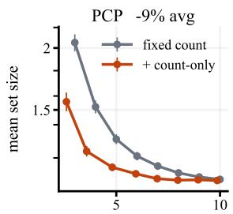  
realized calls (incl. aux.)

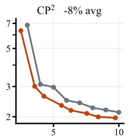  
realized calls (incl. aux.)

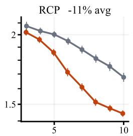  
realized calls (incl. aux.)

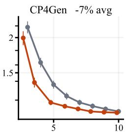  
realized calls (incl. aux.)

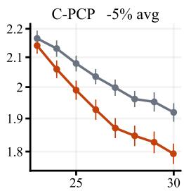  
realized calls (incl. aux.)  
Figure 6: Fixed count versus CASA on rare modes for $B = 3 , \ldots , 1 0 .$ with 95% intervals over 100 seeds. The horizontal axis counts realized samples, auxiliary draws included; panel titles give the mean size change.

The Rao–Blackwell tables of Proposition 6 assume balls with a common radius, so for the external constructions the coverage and volume of each count are estimated by direct Monte Carlo over collections of pool samples; the allocation and calibration steps are unchanged.

Budget curves. Figure 6 compares each construction with and without CASA on rare modes over budgets $B = 3 , \ldots , 1 0$ . Budgets are matched within each construction; $\mathrm { C P ^ { 2 } }$ spends $\lfloor B / 2 \rfloor$ of its budget on auxiliary draws and C-PCP uses 20 auxiliary draws beyond it, so the horizontal axis counts realized calls, auxiliary draws included. Marginal coverage stays within [89.6, 90.5]% for every construction except C-PCP (91.5–93.2%), whose discrete score is conservative.

## B.3 Synthetic DGPs

DGPs. Each DGP draws $X \sim \mathrm { U n i f } ( 0 , 1 )$ and $Y = 0 . 3 \sin ( 2 \pi X ) + Z$ , where the noise Z changes with the input as follows, with $\varepsilon \sim \mathcal { N } ( 0 , 1 ) , U \sim \mathrm { U n i f } ( - 1 , 1 )$ , M uniform on $\{ - 1 . 5 , - 0 . 5 , 0 . 5 , 1 . 5 \} , T \sim t _ { 5 } ,$ the logistic function $\ell ( t ) = 1 / ( 1 + e ^ { - t } )$ , and all variables independent.

<table><tr><td>DGP</td><td>Noise Z</td></tr><tr><td>Compact to extended</td><td> $a ( X ) U + 0 . 0 2 \varepsilon , \quad a ( X ) = 0 . 0 8 { \mathrm { ~ i f ~ } } X < 0 . 5 ,$  else 1 else 1</td></tr><tr><td>Uniform bulk</td><td> $a ( X ) U + 0 . 0 2 \varepsilon , ~ a ( X ) = 0 . 2 5 { \mathrm { ~ i f ~ } } X < 0 . 5 ,$ </td></tr><tr><td>Gaussian scale</td><td> $s ( X ) \varepsilon , s ( X ) = 0 . 1 2 \mathrm { ~ i f ~ } X < 0 . 5 , \mathrm { ~ e l s e ~ } 0 . 8$ </td></tr><tr><td>Sharp scale</td><td> $s ( X ) \varepsilon , s ( X ) = 0 . 0 6 \mathrm { ~ i f ~ } X < 0 . 7 5 ,$  else 0.45</td></tr><tr><td>Emerging modes</td><td> $\{ \dot { 0 . 0 2 } + 0 . 9 \dot { 8 } \ell ( 1 6 ( X - 0 . 5 ) ) \} M + 0 . 0 4 \varepsilon$ </td></tr><tr><td>Separating modes</td><td> $\dot { \pm } \{ 0 . 0 2 + 0 . 9 8 \ell ( \dot { 1 } 2 ( X - 0 . 5 \dot { ) } ) \} + 0 . 0 6 \varepsilon ,$  each sign equally likely</td></tr><tr><td>Rare modes</td><td> $\mathbb { 1 } \{ \mathbf { \dot { X } } \ge 0 . 8 \} M + 0 . 0 6 \varepsilon$ </td></tr><tr><td>Mode width</td><td> $\tilde { M } + s ( X ) \stackrel { \circ } { \varepsilon } , \quad s ( X ) = 0 . 0 2 5 \mathrm { ~ i f ~ } X < 0 . 5 ,$  else 0.15</td></tr><tr><td>Heavy tail</td><td>0.35 T with probability  $0 . 0 2 + 0 . 2 8 \ell ( 1 2 ( X - 0 . 6 ) )$  , else 0.06 ε</td></tr></table>

The learner observes only X and the labeled data.

Protocol. We use budgets $B = 3 , \ldots , 1 5$ with 100 seeds each and target coverage 90%. Each input in $\mathcal { D } _ { m }$ has a pool of $N = 1 0 0$ samples, and both variants use the same grid R of 80 radius values.

Uncertainty-set geometry. Figure 7 visualizes the calibrated uncertainty sets of fixed PCP, CASA, and CASA (joint) in one replication on two scalar and two vector DGPs. These individual realizations illustrate the geometry of the sets; aggregate comparisons are in Figure 3 and Table 1.

## B.4 Taxi Routes

Data and task. The Porto taxi data (UCI Machine Learning Repository, 2015), released for the ECML/PKDD 2015 trajectory-prediction challenge, record 1.7 million trips with one GPS fix every 15 s. We use the first 300,000 trips, drop trips with missing data or a jump of more than 500 m between fixes, and keep windows in an 8 × 6 km box around the city centre in which the taxi is moving. From a taxi’s current position and its displacements

## Fixed PCP

Joint allocation

Count allocation  
a) Emerging modes (1D response, B = 5)  
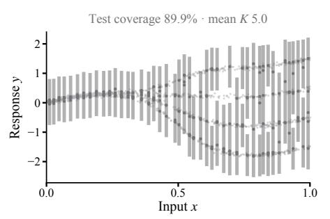

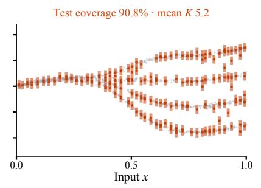  
b) Changing mode width (1D response, B = 5)

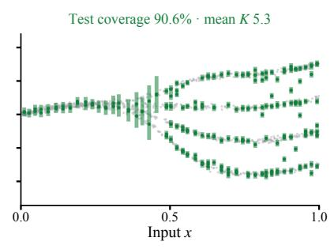

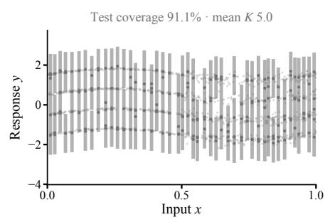

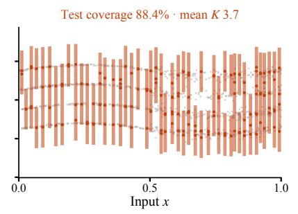  
c) Four clusters (2D response, B = 5, x = 0.85)

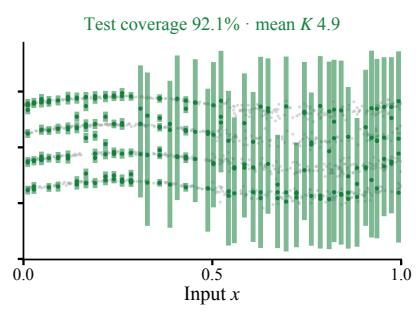

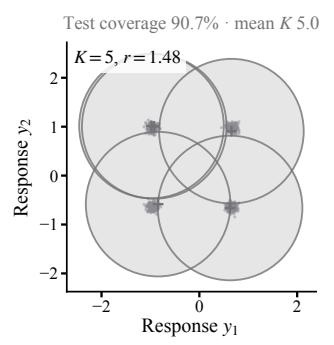

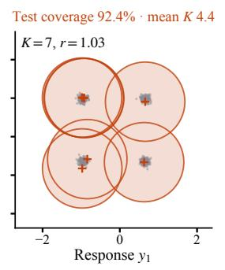

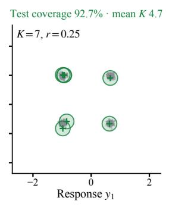

d) Compact to ring (2D response, B = 10, x = 0.85)  
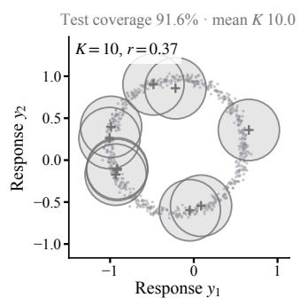

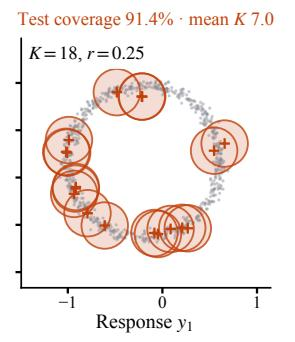

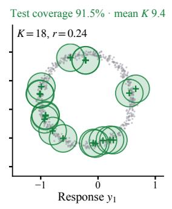  
Figure 7: Calibrated uncertainty sets on four synthetic DGPs for fixed PCP, CASA, and CASA (joint). (a–b) Gray points are test pairs, and colored segments are the sets. (c–d) Gray points are responses at one input, crosses are samples, and circles outline the sets. Headings give marginal coverage and mean samples.

Table 2: Taxi routes, all configurations: mean set area relative to fixed PCP over ten splits, at the same budget and at equal realized samples. Bold: paired t-test $p < 0 . 0 5$ . Last column: CASA’s mean samples at $B = 3 , 5 , 1 0 .$
<table><tr><td rowspan="2">Configuration</td><td colspan="3">CASA, same cap</td><td colspan="2">Equal samples</td><td colspan="3">CASA (joint), same cap</td><td rowspan="2">Mean K</td></tr><tr><td>B=3</td><td>5</td><td>10</td><td>5</td><td>10</td><td>3</td><td>5</td><td>10</td></tr><tr><td>20-NN, 300 m (main)</td><td>0.68</td><td>0.63</td><td>0.88</td><td>0.60</td><td>0.80</td><td>0.58</td><td>0.56</td><td>0.85</td><td>3.0/4.9/9.7</td></tr><tr><td>10-NN, 300 m</td><td>0.69</td><td>0.63</td><td>0.90</td><td>0.60</td><td>0.78</td><td>0.56</td><td>0.52</td><td>0.91</td><td>3.0/4.9/9.5</td></tr><tr><td>40-NN, 300 m</td><td>0.67</td><td>0.62</td><td>0.86</td><td>0.57</td><td>0.77</td><td>0.54</td><td>0.55</td><td>0.85</td><td>3.0/4.8/9.7</td></tr><tr><td>20-NN, 300 m, time split</td><td>0.67</td><td>0.64</td><td>0.90</td><td>0.60</td><td>0.84</td><td>0.51</td><td>0.54</td><td>0.85</td><td>2.9/4.9/9.5</td></tr><tr><td>20-NN, 200 m</td><td>0.62</td><td>0.73</td><td>0.94</td><td>0.66</td><td>0.84</td><td>0.52</td><td>0.66</td><td>0.89</td><td>2.9/4.8/8.7</td></tr><tr><td>20-NN, 500 m</td><td>0.90</td><td>0.66</td><td>0.76</td><td>0.66</td><td>0.73</td><td>0.73</td><td>0.59</td><td>0.77</td><td>2.9/5.0/9.9</td></tr><tr><td>MDN, 300 m</td><td>0.76</td><td>0.70</td><td>1.00</td><td>0.69</td><td>0.94</td><td>0.59</td><td>0.61</td><td>0.93</td><td>3.0/5.0/9.6</td></tr></table>

over the last 15 s and 60 s, we predict its displacement to the point 300 m further along its route. Measuring the horizon in distance rather than time removes speed and leaves route choice: on a straight road the answer is nearly a single point, while at a junction it splits into one point per exit. Splits are by trip, and each evaluation trip contributes one random window: 2,000 trips for $\mathcal { D } _ { m } .$ , 2,000 for ${ \mathcal { D } } _ { n } ,$ 3,000 for testing, and 3,000 for the conditional-coverage audit; the remaining trips supply two million generator windows. Set size is area in square metres.

Generator. The main generator is a trajectory library: a sample is the 300 m displacement of one of the 20 training windows nearest in position and recent motion, with Gaussian jitter of about 4 m. As a learned alternative, a mixture density network maps random Fourier features of the position and the recent displacements to a 20-component Gaussian mixture, trained by maximum likelihood on each split’s generator windows.

Results. Over ten splits, CASA keeps coverage at 90.3–90.4% (fixed PCP 90.1–90.2%) and reduces mean set area to 0.68, 0.63, and 0.88 of fixed PCP’s at budgets 3, 5, and 10, and to 0.60 and 0.80 at equal realized samples at budgets 5 and 10 (Table 2); CASA (joint) gives 0.58, 0.56, and 0.85. Taxis on through-roads receive two samples and taxis near junctions up to eight (Figure 5). The extra samples cover exits that fixed PCP misses and lower the shared calibrated radius, from 63 to 44 m on one split, so sets shrink at every sample level. The gain holds with 10 or 40 neighbours, for route distances of 200 and 500 m, under a time split in which the generator sees only earlier trips, and with the mixture density network.

## B.5 Protein Backbone Angles

Data and task. We predict a residue’s backbone dihedral angles $( \phi , \psi )$ , its position on the Ramachandran plot, from the sequence of its chain. We use the CATH 4.2 chains of Ingraham et al. (2019), split by CATH topology so that no test chain has a homologous chain in training, and compute the angles from the backbone coordinates of $\mathrm { N } , \mathrm { C } _ { \alpha } .$ , and C, with ψ shifted to $[ - 1 1 0 ^ { \circ } , 2 5 0 ^ { \circ } )$ so that the helical and extended regions are contiguous. Evaluation residues are drawn at random from the test chains, 3,000 each for $\mathcal { D } _ { m } , \mathcal { D } _ { n }$ , testing, and the conditional-coverage audit. Set size is area in square degrees.

Generator. Each residue is represented by the last-layer embedding of ESM-2 with 35 million parameters (Lin et al., 2023), which sees the whole chain, projected onto 64 principal components. A library holds the 1.3 million residues of 6,000 random training chains, and a sample is the (ϕ, ψ) of one of the 20 library residues closest in embedding.

Results. Over ten splits, CASA reduces mean set area to 0.76, 0.87, and 0.94 of fixed PCP’s at budgets 3, 5, and 10, and to 0.76 and 0.86 at equal realized samples (Table 3), and lowers MACE from 2.85 to 2.58 points at $B = 5$ . It assigns 3.8 samples on average to residues in the helical region, 4.8 to the extended region, and 5.8 to residues with $\phi > 0$ , against five for fixed PCP (Figure 8). The gain holds for 10 and 40 neighbours and for the ESM-2 model with 150 million parameters.

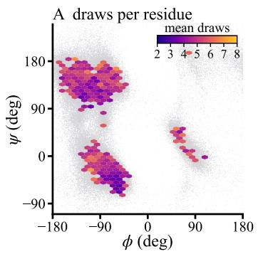

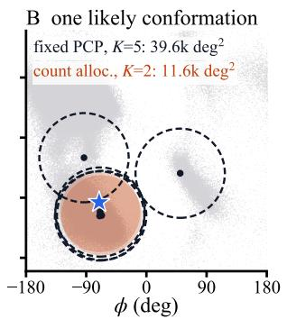

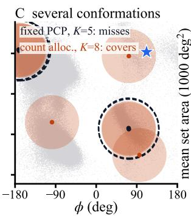

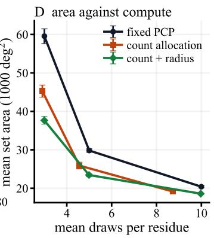  
Figure 8: Protein backbone angles at B = 5. (A) Mean samples CASA assigns, by position on the Ramachandran plane. (B) A helical residue: fewer samples give a smaller set. (C) A rare conformation that fixed PCP’s samples miss. (D) Set area against mean samples over ten splits.

Table 3: Protein backbone angles, all configurations: mean set area relative to fixed PCP over ten splits, at the same budget and at equal realized samples. Bold: paired t-test $p < 0 . 0 5$ . Last column: CASA’s mean samples at B = 3, 5, 10.
<table><tr><td></td><td colspan="3">CASA, same cap</td><td colspan="2">Equal samples</td><td colspan="3">CASA (joint), same cap</td><td></td></tr><tr><td>Configuration</td><td>B=3</td><td>5</td><td>10</td><td>5</td><td>10</td><td>3</td><td>5</td><td>10</td><td>Mean K</td></tr><tr><td>20-NN, ESM-2 35M (main)</td><td>0.76</td><td>0.87</td><td>0.94</td><td>0.76</td><td>0.86</td><td>0.63</td><td>0.79</td><td>0.91</td><td>2.9/4.6/8.7</td></tr><tr><td>10-NN</td><td>0.71</td><td>0.88</td><td>0.97</td><td>0.80</td><td>0.89</td><td>0.62</td><td>0.81</td><td>0.94</td><td>3.0/4.7/8.7</td></tr><tr><td>40-NN</td><td>0.81</td><td>0.86</td><td>0.94</td><td>0.80</td><td>0.87</td><td>0.69</td><td>0.81</td><td>0.90</td><td>2.9/4.7/8.8</td></tr><tr><td>20-NN, ESM-2 150M</td><td>0.80 </td><td>0.89</td><td>0.92</td><td>0.79</td><td>0.88</td><td></td><td>0.68 0.81</td><td>0.92</td><td>2.9/4.5/9.2</td></tr></table>

A where count allocation spends draws

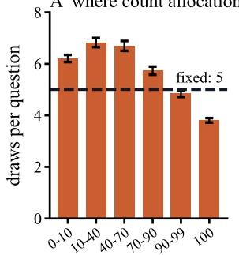  
accuracy of one sampled answer (%)

  
fixed, 5 draws: {black, white}, covers count alloc., 2 draws: {white}, covers

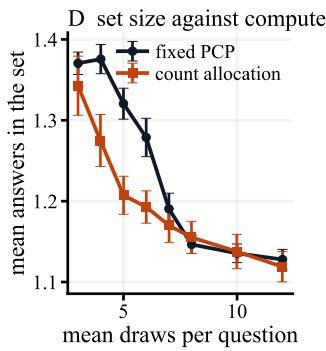  
Figure 9: TextVQA with Qwen2.5-VL-3B at an 80% target and B = 5. (A) Mean samples CASA assigns, by question accuracy. (B) An ambiguous question: CASA’s extra samples find the answer. (C) A clear question: two samples sufice. (D) Answers per set against mean samples over ten splits.

## B.6 Answer Sets for a Vision-Language Model

Data and task. TextVQA (Singh et al., 2019) asks about text in photographs, and OK-VQA (Marino et al., 2019) requires outside knowledge; both have ten human answers per question, and an answer counts as correct if at least three annotators gave it (TextVQA) or at least one did (OK-VQA). Each task is split at random into 1,500 questions each for $\mathcal { D } _ { m } , \mathcal { D } _ { n }$ , and testing, with the rest for the conditional-coverage audit. The model limits which targets are reachable: an acceptable answer appears among 24 samples for about 88% of TextVQA and 85% of OK-VQA questions, so we target 80% and 75% coverage.

Model and sets. We use Qwen2.5-VL-3B (Bai et al., 2025), prompted to answer with a single word or phrase, drawing 24 answers per question at temperature 0.7. A ball around a discrete answer contains only that answer, so we use the sampling-only construction of Su et al. (2024): draw K answers and return every distinct answer whose frequency among them is at least a calibrated threshold. The allocation is unchanged, with exact coverage and size tables from the hypergeometric count of each answer in a random K-subset of the pool, the analogue of (7). The regression features summarize one greedy decode: its token log-probabilities, entropies, and length.

Results. On TextVQA, CASA matches fixed sampling’s set size with 44%, 29%, and 28% fewer samples at $B = 3 .$ , 4, and 5, giving the questions the model finds hardest about 1.5 times the samples of those it always answers correctly (Figure 9); at $B = 3 ,$ fixed sampling misses the target in three of ten splits, while CASA reaches it in all. On $\mathrm { O K \mathrm { - } V Q A }$ , sets are 11–15% smaller at $B = 5 { - } 8$