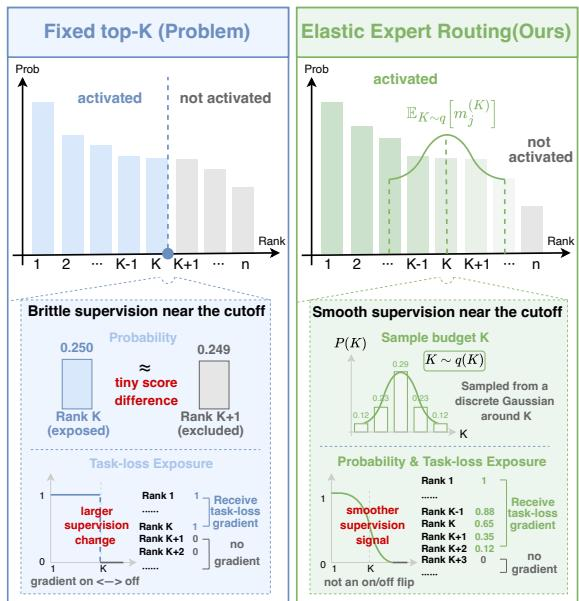
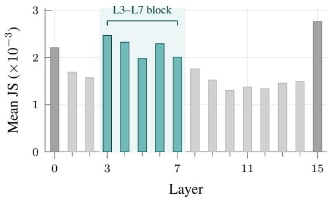
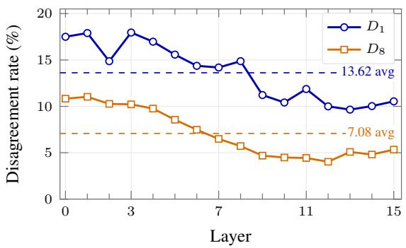
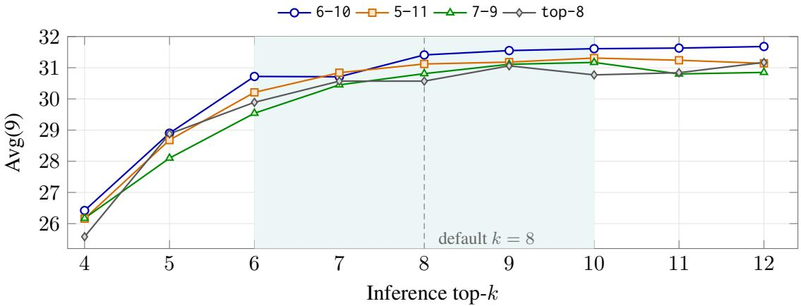

# Smoothing the Top-k Exposure Boundary for Sparse Mixture-of-Experts

Yunkai Chai1,2, Tong Zhu1, Xiaoye Qu1, Xuyang Hu1 Guanjie Chen1, Qipeng Guo1, Yu Cheng3 1Shanghai AI Laboratory, Shanghai, China 2Shanghai Jiao Tong University, Shanghai, China 3Nanyang Technological University, Singapore

## Abstract

Sparse Mixture-of-Experts models scale parameter capacity efficiently while maintaining a fixed compute budget per token. However, traditional training paradigms enforce a static choice of top-k experts, which converts a continuous routing distribution into a rigid step function. This constraint introduces a brittle boundary where highly competitive experts are arbitrarily separated into full-supervision and zero-feedback zones based on minor score fluctuations. To address this issue, we propose Elastic Expert Routing, which stochastically samples the active expert budget from a localized discrete distribution centered at k. Over multiple training iterations, this mechanism softens the sharp threshold into a gradual probability distribution. Because the sampling neighborhood remains symmetric, this approach matches the expected computational cost of deterministic training, while preserving the inference budget. Extensive experiments demonstrate the efficacy of our method on both supervised fine-tuning and from-scratch pretraining settings. During supervised fine-tuning, elastic routing improves downstream macro-averages on OLMoE-1B-7B and Qwen3-30B-A3B by +0.84 and +2.02 points, respectively. In addition, in from-scratch pretraining, it outperforms the static top-k baseline by 1.6 points on average across downstream tasks.

## 1 Introduction

Sparse Mixture-of-Experts (MoE) could scale model capacity efficiently by enlarging the number of total experts while conditionally activating a restricted subset of parameters per token (Jiang et al., 2024; Dai et al., 2024; Du et al., 2022). In the common top-k architecture, a routing network ranks the experts for each incoming token and dispatches that token to the first k candidates (Shazeer et al., 2017; Fedus et al., 2022). Since the choice of k directly serves as a static computational hyperparameter that dictates per-token costs, this design provides an intuitive mechanism for controlling computational requirements, where the compute would stay almost the same while the total model capacity scales (Tian et al., 2025; Krajewski et al., 2024). Consequently, a common practice would enforce a uniform value of k throughout both the training and deployment phases.

  
Figure 1: Routing boundaries of static top-k and Elastic Expert Routing.

However, this fixed threshold converts a continuous routing distribution into a rigid step function at the selection threshold (Wang et al., 2025). This constraint introduces a harsh boundary that restricts model optimization. As shown in Figure 1, highly competitive experts with virtually identical routing scores are arbitrarily separated into full-supervision and zero-feedback zones based on minor score fluctuations. Consequently, an expert ranked precisely inside the cutoff receives full gradient supervision, whereas an adjacent competitor ranked just outside receives zero task-loss feedback. Because traditional top-k training repeatedly presents the routing network with this rigid boundary, optimization near the cutoff becomes highly brittle.

One intuitive approach to mitigate boundary rigidity is dynamic routing. Existing adaptive methods vary the number of activated experts dynamically by allocating more capacity to difficult inputs (Guo et al., 2025) or sampling token-specific budgets from routing signals (Yue et al., 2024). While this strategy removes the top-k threshold, it may change the deployment budget (Wang et al., 2025; Huang et al., 2024), alter the model structure (Zeng et al., 2024; Jin et al., 2025; Team et al., 2025), or lead to suboptimal task performance for extreme efficiency (Lv et al., 2026), which is hard to be applied on model serving infrastructures.

To address this issue, we propose Elastic Expert Routing. Our framework preserves the standard fixed-budget inference constraints but softens the sharp threshold during training. Specifically, our method stochastically samples the active expert budget from a localized discrete distribution centered at k. As illustrated in Figure 1 (right), over multiple training iterations, this mechanism statistically transforms the sharp selection threshold into a smooth selection probability distribution. Consequently, competitive near-boundary experts can be optimized during training. Because the sampling neighborhood remains symmetric around k, this approach matches the expected computational cost of vanilla static top-k training. Furthermore, the model preserves the standard static top-k routing rule at inference time with zero structural modification or latency overhead.

We evaluate the efficacy of elastic routing across fine-tuning and pretraining settings. In supervised fine-tuning experiments, we test our method using OLMoE-1B-7B (Muennighoff et al., 2025) and Qwen3-30B-A3B backbones (Yang et al., 2025). Our approach consistently improves downstream task performance over static top-k baselines, yielding improvements of +0.84 and +2.02 points, respectively. We further validate the foundational utility of budget elasticity during from-scratch pretraining under strict compute-matched and tokenmatched conditions. In this setting, elastic routing outperforms the static top-k baseline by 1.6 points on average across downstream tasks. Subsequent internal diagnostics confirm that boundary smoothing refines expert prioritization rankings and alters routing distribution behaviors within the foundational middle layers of the network.

Our contributions are summarized below:

• We formulate static top-k MoE training as a hard rank-exposure boundary and introduce Elastic Expert Routing to soften it into a gradual selection probability distribution without modifying inference mechanics.

• We demonstrate consistent performance gains during supervised fine-tuning on OLMoE-1B-7B and Qwen3-30B-A3B backbones, as well as during from-scratch pretraining under fair settings.

• We provide routing diagnostics and routerswap interventions showing that the gains are associated with middle-layer routing changes and improved expert prioritization.

## 2 Preliminary and Related Work

Sparse MoE routing. Sparse MoE models replace dense feed-forward blocks with sparsely activated expert modules (Shazeer et al., 2017; Lepikhin et al., 2020; Fedus et al., 2022; Du et al., 2022; Zoph et al., 2022; Jiang et al., 2024). For a token state $h _ { i } ,$ the router computes routing logits

$$
z _ { i } = W _ { \mathrm { g a t e } } h _ { i } , \qquad p _ { i } = \mathrm { s o f t m a x } ( z _ { i } ) ,\tag{1}
$$

and under static top-k routing selects

$$
S _ { i } ^ { ( k ) } = \mathrm { T o p K } ( p _ { i } , k ) , \qquad y _ { i } = \sum _ { e \in S _ { i } ^ { ( k ) } } \alpha _ { i , e } E _ { e } ( h _ { i } ) .\tag{2}
$$

This mechanism scales model capacity while maintaining sparse per-token computation. Existing sparse MoE designs typically keep the expert budget k fixed throughout both training and inference. However, from the training perspective, this choice imposes a sharp top-k exposure boundary where experts within the selected prefix receive task-loss exposure, while nearby experts just outside the cutoff do not. Therefore, we reinterpret the fixed budget k not merely as a compute constraint, but as a choice that shapes the training exposure distribution.

Routing regularization. MoE training commonly relies on auxiliary objectives, capacity constraints, and routing regularization to prevent expert collapse and improve expert utilization (Shazeer et al., 2017; Fedus et al., 2022; Zoph et al., 2022). Other work revisits token–expert assignment by changing the assignment rule itself, for example allowing experts to select tokens rather than assigning a fixed number of experts per token (Zhou et al., 2022), or introducing alternative selection mechanisms based on BASE layers (Lewis et al., 2021) and differentiable sorting and ranking (Wang et al., 2025; Hazimeh et al., 2021) strategies. In contrast, our approach preserves the routing architecture and assignment mechanism, and instead changes the training distribution over the active expert budget.

Dynamic expert routing. Recent work relaxes static top-k routing by allowing the number of activated experts to vary across tokens. Existing approaches mainly differ in how dynamic budgets are determined, including threshold-based routing such as cumulative, trainable, and non-linear thresholding (Huang et al., 2024; Guo et al., 2025; Wang et al., 2025), auxiliary proposer modules for predicting token-specific budgets (Yue et al., 2024), and architectural designs based on low- or zerocomputation experts (Zeng et al., 2024; Jin et al., 2025; Team et al., 2025). However, these methods either require model structure modification or complex training techniques, which are not friendly for model deployment and stable training. Unlike these adaptive computation methods, we preserve a static top-k inference rule and vary the budget only during training to smooth task-loss exposure around the deployment cutoff.

## 3 Elastic Expert Routing

## 3.1 Budget-Neighborhood Training

We first describe elastic routing as a change to the training objective. Let D denote the training distribution and $g ( \hat { y } , y )$ denote the task loss. For an input x, let $f _ { \boldsymbol { \theta } } ( \boldsymbol { x } ; \kappa )$ denote the MoE forward pass under a budget schedule $\kappa ,$ where $\kappa _ { i , \ell }$ denotes the number of experts used by token i in MoE layer $\ell .$ The fixed-budget baseline uses the constant schedule $ { \boldsymbol { k } } _ { 0 }$ , with every entry equal to the target budget $k _ { 0 }$ , and optimizes

$$
\begin{array} { r l } & { \mathcal { L } _ { \mathrm { f i x e d } } ( \theta ) = \mathbb { E } _ { ( x , y ) \sim \mathcal { D } } \left[ g ( f _ { \theta } ( x ; \pmb { k } _ { 0 } ) , y ) \right] , } \\ & { \quad \quad \quad \quad \quad \quad \quad \quad \quad \quad \quad \quad \quad k _ { 0 } \equiv ( k _ { 0 } , \dots , k _ { 0 } ) . } \end{array}\tag{3}
$$

This objective trains at a single budget configuration. Elastic routing instead samples a schedule κ from a distribution $Q$ centered at the target budget and optimizes

$$
\begin{array} { r } { \mathcal { L } _ { \mathrm { e l a s t i c } } ( \theta ) = \mathbb { E } _ { ( x , y ) \sim \mathcal { D } } \mathbb { E } _ { \kappa \sim Q } \left[ g ( f _ { \theta } ( x ; \kappa ) , y ) \right] } \end{array}\tag{4}
$$

The fixed-budget objective is recovered when $Q$ degenerates to a point mass at $ { \boldsymbol { k } } _ { 0 }$ . In the remainder of this section, $Q$ is local around $k _ { 0 }$ and centered in expectation, $\mathbb { E } _ { \kappa \sim Q } [ \kappa _ { i , \ell } ] = k _ { 0 }$ for each token and layer, so elastic routing changes the training-time budget distribution while preserving the expected active-expert count. Section 3.3 formalizes the resulting rank-neighborhood smoothing.

## 3.2 Instantiating the Budget Neighborhood

We now specify the budget distribution used for elastic routing. An $a { - } b$ schedule restricts the sampled budget to $K _ { a : b } = \{ a , \ldots , b \}$ and assigns probability

$$
\begin{array} { l } { \displaystyle q _ { a : b } ( \boldsymbol { r } ) = \frac { 1 } { Z _ { a : b } } \exp \left( - \frac { ( r - k _ { 0 } ) ^ { 2 } } { 2 \sigma ^ { 2 } } \right) , \quad \boldsymbol { r } \in \mathcal { K } _ { a : b } , } \\ { \displaystyle Z _ { a : b } = \sum _ { s = a } ^ { b } \exp \left( - \frac { ( s - k _ { 0 } ) ^ { 2 } } { 2 \sigma ^ { 2 } } \right) . } \end{array}\tag{5}
$$

Here $r$ denotes a candidate active-expert budget, $k _ { 0 }$ is the center, and $\sigma$ controls the neighborhood width. Unless otherwise stated, all elastic schedules in our experiments use $\sigma = 1 . 5$ . For each token i and MoE layer $\ell ,$ we sample $\kappa _ { i , \ell } \sim \ q _ { a : b }$ and dispatch the token to the top- $\ - \kappa _ { i , \ell }$ experts under the current router ranking. Experts outside the sampled prefix are masked out, and load-balancing statistics are computed over the realized dispatched assignments.

## 3.3 Rank-Neighborhood Smoothing

We formalize boundary smoothing through rankexposure accounting. Conditioned on the current router order for representation $h ,$ let $\pi _ { j } ( h )$ denote the expert at rank j and define the top-r prefix mask

$$
m _ { j } ^ { ( r ) } = { \bf 1 } [ j \leq r ] .\tag{6}
$$

For a scalar budget distribution $q ,$ the task-loss exposure probability of rank $j$ is

$$
\begin{array} { l } { { \displaystyle a _ { q } ( j ) = \mathbb { E } _ { K \sim q } \Big [ m _ { j } ^ { ( K ) } \Big ] } } \\ { { \displaystyle \quad = \operatorname* { P r } ( K \geq j ) = \sum _ { r = j } ^ { K _ { \operatorname* { m a x } } } q ( r ) } . } \end{array}\tag{7}
$$

Static top-k0 training corresponds to the point-mass case $a _ { \delta _ { k _ { 0 } } } ( j ) = 1 [ j \leq k _ { 0 } ]$ , whereas elastic routing replaces this step mask with the survival function of $q .$

The budget distribution is the discrete derivative of the exposure curve:

$$
a _ { q } ( j ) - a _ { q } ( j + 1 ) = q ( j ) , \qquad a _ { q } ( M + 1 ) = 0 .\tag{8}
$$

Thus the smoothing effect is local in router rank space, not a differentiable relaxation of top-K selection. If $\mathrm { s u p p } ( q ) = [ K _ { \operatorname* { m i n } } , K _ { \operatorname* { m a x } } ]$ , then ranks $j ~ \le ~ K _ { \operatorname* { m i n } }$ are always exposed, ranks $K _ { \mathrm { m i n } } ~ <$ $j ~ \le ~ K _ { \operatorname* { m a x } }$ have fractional exposure, and ranks $j > K _ { \operatorname* { m a x } }$ are never exposed.

The same accounting yields expected exposure conservation:

$$
\sum _ { j = 1 } ^ { M } a _ { q } ( j ) = \sum _ { j = 1 } ^ { M } \operatorname* { P r } ( K \geq j ) = \mathbb { E } [ K ] .\tag{9}
$$

When q is exactly centered at the deployment budget, $\mathbb { E } [ K ] = k _ { 0 }$ , elastic routing preserves the expected active-expert count while changing which boundary ranks enter the task-loss path. Moreover,

$$
\sum _ { j > k _ { 0 } } a _ { q } ( j ) = \sum _ { j \leq k _ { 0 } } \bigl ( 1 - a _ { q } ( j ) \bigr ) = \frac { 1 } { 2 } \mathbb { E } | K - k _ { 0 } | ,\tag{10}
$$

so the exposure above the cutoff is balanced by exposure from ranks at or below it.

The schedule width controls how much conserved exposure shifts across the deployment cutoff: narrow neighborhoods transfer little exposure, while wider neighborhoods shrink the always-on core and include lower-ranked candidates.

## 4 Experiments

## 4.1 Setup

Models and data. We evaluate elastic routing in two supervised fine-tuning (SFT) settings and one from-scratch pretraining setting. For SFT, we finetune OLMoE-1B-7B-0924 on Dolci-Instruct-SFT (Olmo et al., 2026) and Qwen3-30B-A3B-Base on Infinity-Instruct 7M Core (Li et al., 2025). For pretraining experiments, we train 1.42B-A365M MoE models with 6e19 FLOPs budget. The model structure, optimal learning rate, and global batch size are guided by the scaling laws of Tian et al. (2025) and Hoffmann et al. (2022). The model has 128 experts per layer and is trained on FineWeb-Edu (Penedo et al., 2024) for 26.25B tokens.

Routing conditions. Each setting compares static top-8 training with token-level elastic schedules 7–9, 6–10, and 5–11. Elastic budgets are sampled from the discrete Gaussian neighborhood in

Section 3.1, with $\sigma = 1 . 5$ and center $k _ { 0 } = 8 .$ . Since the schedules are centered at top-8, they match the baseline in expected active-expert count and expected expert-side training FLOPs. All main evaluations use static top-8 inference; wall-clock cost and memory are reported in Appendix A.2.

Evaluation. For SFT, we report Avg(9) over a nine-task suite covering Knowledge: MMLU (Hendrycks et al., 2021a), AGIEval (En) (Zhong et al., 2023), GPQA (Main) (Rein et al., 2023), Reasoning: BBH (Suzgun et al., 2022), Mathematics: GSM8K (Cobbe et al., 2021), MATH (Hendrycks et al., 2021b), Coding: MBPP (Austin et al., 2021), and Instruction Following & Alignment: IFEval (Zhou et al., 2023), TruthfulQA (Lin et al., 2022). For pretraining, we report averaged results on LAMBADA (Paperno et al., 2016); HellaSwag (Zellers et al., 2019), PIQA (Bisk et al., 2019), WinoGrande (Sakaguchi et al., 2019),CommonsenseQA (Talmor et al., 2019), SciQ (Welbl et al., 2017), OpenBookQA (Mihaylov et al., 2018), ARC (Clark et al., 2018), MMLU (Hendrycks et al., 2021a), and LogiQA (Liu et al., 2020). We use standard task metrics through lm-evaluation-harness (Gao et al., 2024). See Appendix A for details.

## 4.2 Supervised Fine-Tuning Results

Table 1 reports the SFT results under static top-8 inference. Comparisons are made within each backbone: every elastic checkpoint shares the same data, optimizer, evaluation protocol, and decoding setup as its static top-8 counterpart, and differs only in the training-time routing schedule.

Elastic routing improves static top-8 SFT. On OLMoE, all three elastic schedules outperform the static top-8 baseline, with 6–10 increasing Avg(9) from 30.57 to 31.41. On Qwen3-30B-A3B, 6–10 raises Avg(9) from 56.42 to 58.44, and the other elastic schedules also remain above the baseline. The improvement is broad: an elastic schedule obtains the best score on all nine OLMoE tasks and on eight of nine Qwen3 tasks.

Moderate interval gives the strongest aggregate result. The 6–10 schedule gives the best Avg(9) for both backbones, whereas the narrower 7–9 and wider 5–11 schedules are beneficial but not consistently strongest. This pattern agrees with the rankexposure view in Section 3.3 that useful smoothing should expose experts near the cutoff threshold without allocating excessive routing probability to low-ranked, irrelevant candidates.

<table><tr><td rowspan="2">Task</td><td rowspan="2">Metric</td><td colspan="4">OLMoE-1B-7B</td><td colspan="4">Qwen3-30B-A3B</td></tr><tr><td>6-10</td><td>5-11</td><td>7-9</td><td>top-8</td><td>6-10</td><td>5-11</td><td>7-9</td><td>top-8</td></tr><tr><td>MMLU</td><td>Accuracy</td><td>51.25</td><td>50.91</td><td>50.14</td><td>50.47</td><td>78.49</td><td>78.40</td><td>78.17</td><td>78.24</td></tr><tr><td>AGIEval (En)</td><td>Accuracy</td><td>23.96</td><td>23.44</td><td>22.48</td><td>23.29</td><td>52.28</td><td>51.90</td><td>52.44</td><td>51.74</td></tr><tr><td>GPQA (Main)</td><td>Accuracy</td><td>26.34</td><td>26.79</td><td>26.12</td><td>25.00</td><td>39.06</td><td>38.39</td><td>37.28</td><td>37.72</td></tr><tr><td>BBH</td><td>Exact Match</td><td>35.28</td><td>36.05</td><td>34.54</td><td>34.86</td><td>63.29</td><td>57.69</td><td>55.68</td><td>49.29</td></tr><tr><td>GSM8K</td><td>Exact Match</td><td>21.46</td><td>21.38</td><td>19.86</td><td>20.09</td><td>82.03</td><td>82.94</td><td>82.71</td><td>81.43</td></tr><tr><td>MATH</td><td>Exact Match</td><td>6.44</td><td>6.42</td><td>6.52</td><td>6.40</td><td>42.36</td><td>37.78</td><td>42.18</td><td>41.24</td></tr><tr><td>MBPP</td><td>Pass@1</td><td>25.40</td><td>25.00</td><td>25.60</td><td>24.20</td><td>74.00</td><td>76.00</td><td>73.40</td><td>73.80</td></tr><tr><td>IFEval</td><td>Accuracy</td><td>51.02</td><td>48.98</td><td>50.46</td><td>50.46</td><td>42.51</td><td>43.44</td><td>40.48</td><td>41.22</td></tr><tr><td>TruthfulQA</td><td>MC2 Accuracy</td><td>41.58</td><td>41.15</td><td>41.60</td><td>40.32</td><td>51.93</td><td>52.65</td><td>52.28</td><td>53.14</td></tr><tr><td colspan="2">Average</td><td>31.41</td><td>31.12</td><td>30.81</td><td>30.57</td><td>58.44</td><td>57.69</td><td>57.18</td><td>56.42</td></tr></table>

Table 1: Main benchmark results across two sparse MoE backbones. Avg(9) is the unweighted average over the nine reported tasks. Bold marks the best method within each backbone. All elastic checkpoints are evaluated with the same static top-8 inference rule as their corresponding top-8 baseline.

<table><tr><td>Dataset</td><td>top-8</td><td>6-10</td><td>7-9</td><td>5-11</td></tr><tr><td>LAMBADA PPL ↓</td><td>54.2</td><td>42.7</td><td>44.9</td><td>48.7</td></tr><tr><td>LAMBADA</td><td>31.3</td><td>33.1</td><td>32.2</td><td>31.7</td></tr><tr><td>HellaSwag</td><td>41.9</td><td>43.7</td><td>43.5</td><td>42.2</td></tr><tr><td>PIQA</td><td>68.4</td><td>68.6</td><td>68.3</td><td>66.9</td></tr><tr><td>WinoGrande</td><td>49.3</td><td>52.6</td><td>53.0</td><td>53.4</td></tr><tr><td>CommonsenseQA</td><td>19.4</td><td>20.1</td><td>19.8</td><td>20.2</td></tr><tr><td>SciQ</td><td>81.4</td><td>82.0</td><td>82.2</td><td>81.9</td></tr><tr><td>OpenBookQA</td><td>31.0</td><td>33.8</td><td>35.2</td><td>34.0</td></tr><tr><td>ARC-Easy</td><td>53.7</td><td>55.1</td><td>55.3</td><td>55.6</td></tr><tr><td>ARC-Challenge</td><td>28.5</td><td>29.9</td><td>31.1</td><td>29.7</td></tr><tr><td>MMLU</td><td>23.1</td><td>26.1</td><td>24.1</td><td>23.3</td></tr><tr><td>LogiQA</td><td>26.3</td><td>27.2</td><td>26.3</td><td>26.9</td></tr><tr><td>Average (excl. PPL)</td><td>41.3</td><td>42.9</td><td>42.8</td><td>42.4</td></tr></table>

Table 2: From-scratch pretraining validation under matched architecture, data, token budget, and expected active expert count. PPL denotes perplexity, where lower is better. All metrics except LAMBADA perplex ity are percentages; Avg excludes perplexity.

## 4.3 From-Scratch Pretraining Validation

To test whether the effect could be generalized to pretraining, we conduct experiments to train four MoE baselines from scratch. The downstream task results are listed in Table 2.

Elastic routing improves from-scratch pretraining under matched compute. All three elastic schedules improve the average validation score over static top-8: 6–10 raises the average from 41.3 to 42.9, while 7–9 and 5–11 reach 42.8 and 42.4, also significantly beyond baseline.

Moderate interval remains strongest in pretraining. The 6–10 schedule gives both the best average score and the lowest LAMBADA perplexity, reducing perplexity from 54.2 to 42.7. This is consistent with the SFT results, supporting elastic routing as a training-time improvement for static top-8 MoE models. Its repeated advantage across SFT and pretraining suggests that this neighborhood size captures a robust local smoothing regime rather than a setting-specific fluctuation.

## 4.4 Depth-Localized Routing Changes

The benchmark results show that local budgetneighborhood training improves static top-8 inference. We further investigate the model vertically and check layer behaviors. This subsection examines where elastic training changes the router across depth and whether the depth-local changes are useful under static top-8 evaluation.

Elastic routing changes the router most strongly in the middle layers. Layerwise variants are used as diagnostic controls rather than as standalone methods. They address whether the routing changes induced by 6–10 are spread uniformly over depth or concentrated in a smaller set of layers. A concentrated pattern would suggest that the benefit of budget smoothing may depend on depth. We compare 6–10 and static top-8 under the same static top-8 evaluation rule. For each task and layer, we compute the Jensen–Shannon (JS) divergence between the two routers’ per-token expert probability distributions. JS divergence quantifies where the two trained routers assign different probability mass over experts. Figure 2 summarizes the mean layerwise divergence and marks the internal L3–L7 block used in the depth-restricted diagnostic below. The largest non-boundary divergence forms a contiguous L3–L7 block rather than a pattern spread uniformly across depth. Although L0 and L15 also exhibit elevated divergence, we exclude these boundary layers from the diagnostic block because they are tied to input adaptation and final representation readout. Including them could conflate routing elasticity with boundary-layer effects. The resulting L3–L7 block keeps the intervention interpretable as a depth-local diagnostic rather than as isolated single-layer edits. The layerwise variants below test whether this middle-layer routing divergence is useful without treating the chosen block as an optimized design.

  
Figure 2: Layerwise diagnostic comparing 6–10 against static top-8. We plot mean pairwise JS divergence across tasks. The shaded region marks the internal block L3–L7 used by the layerwise variants.

The depth-restricted diagnostic supports the middle-layer interpretation. The L3–L7 variant applies the 6–10 elastic rule only in the diagnostic middle block, while every other layer remains static top-8. As a coarse depth control, we also evaluate a later-layer variant in which only L8–L12 use 6–10. Table 3 shows the task-level depth-region ablation. Applying elasticity to all layers improves over static top-8, and the exploratory L3–L7 restriction is slightly better than global 6–10. Moving the same elastic rule to L8–L12 still improves over top-8, but the gain is smaller. This pattern identifies L3–L7 as a beneficial diagnostic region, without establishing it as the optimal layer subset.

## 4.5 Expert-Selection Diagnostics and Router Intervention

We examine how elastic training changes discrete expert selection, and whether the learned routing policy contributes to the observed gain. The first diagnostic experiment compares selected experts under static top-8 evaluation, and the second one uses an evaluation-time router swap to intervene on the routing policy while holding the target model otherwise fixed.

  
Figure 3: Per-layer expert-selection disagreement between 6–10 and static top-8. Top-1 disagreement exceeds normalized top-8 set disagreement, indicating changes in expert priority and primary assignment within a largely preserved candidate set.

Expert Selection Disagreement. We measure the structural divergence in routing behavior between the 6–10 elastic schedule and the static top-8 baseline by evaluating their decisions across network layers and downstream tasks. Specifically, we sample 100 evaluation instances from each of our 9 downstream benchmarks to form a representative validation token set $t \in \{ 1 , 2 , \ldots , T \}$ . For a given layer ℓ and token t, let $e _ { \ell , t } ^ { \mathrm { e l a s t i c } }$ and $e _ { \ell , t } ^ { \mathrm { s t a t i c } }$ denote the top-1 expert chosen by each configuration, respectively. Similarly, let $S _ { \ell , t } ^ { \mathrm { e l a s t i c } }$ and $S _ { \ell , t } ^ { \mathrm { s t a t i c } }$ represent their respective active top-8 expert sets. To obtain an aggregate metric across the entire model architecture, we define two layer-averaged disagreement ratios, $D _ { 1 }$ and $D _ { 8 }$ , as follows:

$$
D _ { 1 } = \frac { 1 } { L \cdot T } \sum _ { \ell = 1 } ^ { L } \sum _ { t = 1 } ^ { T } \mathbf { 1 } \left[ e _ { \ell , t } ^ { \mathrm { e l a s t i c } } \neq e _ { \ell , t } ^ { \mathrm { s t a t i c } } \right] ,\tag{11}
$$

$$
D _ { 8 } = \frac { 1 } { L \cdot T } \sum _ { \ell = 1 } ^ { L } \sum _ { t = 1 } ^ { T } \left( 1 - \frac { \left| S _ { \ell , t } ^ { \mathrm { e l a s t i c } } \cap S _ { \ell , t } ^ { \mathrm { s t a t i c } } \right| } { 8 } \right)\tag{12}
$$

where L denotes the total number of layers. The metric $D _ { 1 } \in [ 0 , 1 ]$ reflects the average proportion of routing choices where the primary expert allocation switches. Similarly, $D _ { 8 } \in [ 0 , 1 ]$ represents the average fraction of the top-8 expert capacity that differs between the two routing strategies across all layers and evaluation tokens.

<table><tr><td>Variant</td><td>MMLU</td><td>AGI</td><td>GPQA</td><td>BBH</td><td>GSM</td><td>Min</td><td>MBPP</td><td>IFE</td><td>TQA</td><td>Avg</td><td>Δ</td></tr><tr><td>top-8</td><td>50.47</td><td>23.29</td><td>25.00</td><td>34.86</td><td>20.09</td><td>6.40</td><td>24.20</td><td>50.46</td><td>40.32</td><td>30.57</td><td></td></tr><tr><td>6-10</td><td>51.25</td><td>23.96</td><td>26.34</td><td>35.28</td><td>21.46</td><td>6.44</td><td>25.40</td><td>51.02</td><td>41.58</td><td>31.41</td><td>+0.84</td></tr><tr><td>L3-L7</td><td>50.56</td><td>24.17</td><td>27.68</td><td>35.11</td><td>21.91</td><td>6.16</td><td>26.00</td><td>50.09</td><td>41.81</td><td>31.50</td><td>+0.93</td></tr><tr><td>L8-L12</td><td>50.90</td><td>23.39</td><td>28.12</td><td>34.77</td><td>18.65</td><td>6.26</td><td>25.60</td><td>49.72</td><td>41.00</td><td>30.94</td><td>+0.37</td></tr></table>

Table 3: Task-level depth-region ablation on OLMoE. All methods are evaluated with static top-8 inference. L3–L7 corresponds to an exploratory diagnostic-motivated variant. Only the middle diagnostic region uses the 6–10 training neighborhood, while all other layers remain static at top-8. L8–L12 applies the same elastic rule to a later block as a depth-control experiment. Bold marks the best value in each task or summary column.

Based on the empirical results in Figure 3, we demonstrate that elastic routing primarily refines expert rankings rather than altering the global composition of the active expert pool. Aggregated across the nine benchmark tasks, Figure 3 shows that 6–10 changes the top-1 routed expert for 13.62% of tokens on average, while only 7.08% of the selected top-8 set differs, about 0.57 experts out of 8. Thus elastic training primarily changes expert priority within a highly overlapping expert set, rather than replacing the selected expert pool.

Router-Swap Intervention. To isolate whether the modified routing policy directly accounts for downstream performance improvements, we execute an inference-time router network exchange.

Table 4 shows that optimal performance gains require the mutual alignment through joint router–expert co-adaptation. Replacing the static top-8 router with the 6–10 router improves the static checkpoint, while replacing the elastic router with the static router reduces the elastic checkpoint. Since the swapped models do not recover the full 6–10 performance, the router-swap results suggest that the gain cannot be attributed to the router alone, but also to router–expert co-adaptation during training.

## 4.6 Performance Under Different Top-k Values

Since the main results focus on eight active experts, we further examine whether the gains persist when the number of active experts changes. Elastic routing is designed to expose training to a local range of expert-count configurations, allowing the model to learn multiple nearby patterns of expert cooperation instead of only one static top-8 composition. If this diversity is useful, its effect should not be limited to the exact eight-expert setting used in the main evaluation; it should also appear when inference uses other expert counts.

<table><tr><td>Condition</td><td>Source</td><td>Target</td><td>Avg.</td></tr><tr><td>Target model: 6-10</td><td></td><td></td><td></td></tr><tr><td>Original</td><td>6-10</td><td>6-10</td><td>31.41</td></tr><tr><td>Swapped</td><td>top-8</td><td>6-10</td><td>31.29</td></tr><tr><td>Target model: top-8</td><td></td><td></td><td></td></tr><tr><td>Original</td><td>top-8</td><td>top-8</td><td>30.57</td></tr><tr><td>Swapped</td><td>6-10</td><td>top-8</td><td>30.86</td></tr></table>

Table 4: Router-swap intervention with the remaining target model parameters fixed and only the router replaced.

Elastic routing improves performance beyond the eight-expert setting. Figure 4 shows that 6–10 is the strongest schedule at the default k = 8 point and remains above the static top-8 baseline throughout the scanned range. The narrower 7–9 and wider 5–11 schedules also improve some parts of the curve, but neither gives the same consistently strong profile. This supports the view that training over a moderate range of expert counts helps the model learn more robust expert cooperation patterns under several nearby settings, rather than only optimizing the single eight-expert setting.

## 4.7 Ablations and Budget Controls

The preceding analyses characterize where elastic routing changes routing and how the learned ordering behaves around the deployment cutoff. We further isolate the effect of budget design by varying the probability shape within a fixed local neighborhood and comparing against simpler alternatives that increase active experts without smoothing the top-8 boundary.

  
Figure 4: OLMoE SFT results at different inference top-k values.

<table><tr><td>Training schedule</td><td>σ</td><td>Avg(9)</td></tr><tr><td>6-10</td><td>1.0</td><td>31.30</td></tr><tr><td>6-10</td><td>1.5</td><td>31.41</td></tr><tr><td>6-10</td><td>3.0</td><td>30.66</td></tr></table>

Table 5: Distribution shape ablation on OLMoE SFT.

Default boundary-smoothing shape performs best. The main experiments use $\sigma ~ = ~ 1 . 5$ for all elastic schedules. To isolate the shape of the training-time budget distribution, we keep the same 6–10 support and vary only σ: a smaller value concentrates probability around the target cutoff, while a larger value flattens the distribution across the interval. Table 5 holds the support fixed at 6–10 and varies only σ, which changes the probability shape inside the same top-8 boundary neighborhood. The default $\sigma = 1 . 5$ outperforms both σ = 1.0 and $\sigma = 3 . 0$ . Thus, the smoothing distribution should be neither too concentrated near a single cutoff nor too flat across ranks 6–10.

Alternative Budget Controls. We compare with controls that increase expert-side computation without smoothing the top-8 boundary. Fixed top-9 and top-10 activate more experts per token during training. The top-p control uses a routing probability threshold of $p = 0 . 4$ and activates 13 experts per token on average, making it the most computationally expensive control. All checkpoints use static top-8 inference unless explicitly stated.

Table 6 shows that static top-9, static top-10, and top-p all remain below 6–10, despite using more expert computation. This suggests that the gain cannot be explained solely by activating more experts, but by smoothing task-loss exposure across ranks that straddle the deployment cutoff.

<table><tr><td>Training rule</td><td>Evaluation rule</td><td>Avg(9)</td></tr><tr><td>top-p</td><td>static top-8</td><td>29.72</td></tr><tr><td>top-p</td><td>top-p</td><td>29.70</td></tr><tr><td>top-9</td><td>static top-8</td><td>30.71</td></tr><tr><td>top-10</td><td>static top-8</td><td>30.81</td></tr><tr><td>6-10, σ = 1.5</td><td>static top-8</td><td>31.41</td></tr></table>

Table 6: Alternative budget controls on OLMoE SFT. The final row is the default elastic expert routing strategy from Table 1.

## 5 Conclusion

In this work, we address the rigid rank-exposure boundary that severely restricts model optimization near the selection threshold under traditional static top-k routing. We introduce Elastic Expert Routing, which smooths this selection boundary by stochastically sampling from a discrete budget distribution during training while preserving the static top-k inference rule. We conduct experiments on both supervised fine-tuning and fromscratch pretraining, and the results demonstrate that this simple training-time modification consistently improves MoE performance without increasing inference cost. Empirical analyses show that elastic training primarily alters the learned routing policy within the foundational middle layers of the network while simultaneously refining expert prioritization rankings near the deployment cutoff. These cumulative findings validate boundary smoothing as a practical, drop-in training strategy that successfully enhances the modeling capacity of fixed-budget sparse MoE architectures.

## Limitations

The main limitation of this study is the scale of from-scratch pretraining. Our supervised finetuning experiments are conducted on established sparse MoE backbones with substantially larger parameter budgets: OLMoE-1B-7B has 7B total parameters with 1B active per token, and Qwen3- 30B-A3B has 30.5B total parameters with 3.3B activated. In contrast, our from-scratch pretraining experiments use a 1.427B-parameter MoE with 0.365B active parameters, reflecting the computational cost of training larger MoE models from initialization under available GPU resources. Therefore, the pretraining results should be interpreted as a controlled validation of the proposed training objective at a moderate scale, while validating the approach under large-scale from-scratch pretraining remains an important direction for future work.

## References

Jacob Austin, Augustus Odena, Maxwell Nye, Maarten Bosma, Henryk Michalewski, David Dohan, Ellen Jiang, Carrie Cai, Michael Terry, Quoc Le, and Charles Sutton. 2021. Program synthesis with large language models. Preprint, arXiv:2108.07732.

Yonatan Bisk, Rowan Zellers, Ronan Le Bras, Jianfeng Gao, and Yejin Choi. 2019. Piqa: Reasoning about physical commonsense in natural language. Preprint, arXiv:1911.11641.

Peter Clark, Isaac Cowhey, Oren Etzioni, Tushar Khot, Ashish Sabharwal, Carissa Schoenick, and Oyvind Tafjord. 2018. Think you have solved question answering? try arc, the ai2 reasoning challenge. Preprint, arXiv:1803.05457.

Karl Cobbe, Vineet Kosaraju, Mohammad Bavarian, Mark Chen, Heewoo Jun, Lukasz Kaiser, Matthias Plappert, Jerry Tworek, Jacob Hilton, Reiichiro Nakano, Christopher Hesse, and John Schulman. 2021. Training verifiers to solve math word problems. Preprint, arXiv:2110.14168.

Damai Dai, Chengqi Deng, Chenggang Zhao, RX Xu, Huazuo Gao, Deli Chen, Jiashi Li, Wangding Zeng, Xingkai Yu, Yu Wu, and 1 others. 2024. Deepseekmoe: Towards ultimate expert specialization in mixture-of-experts language models. In Proceedings of the 62nd Annual Meeting of the Association for Computational Linguistics (Volume 1: Long Papers), pages 1280–1297.

Nan Du, Yanping Huang, Andrew M. Dai, Simon Tong, Dmitry Lepikhin, Yuanzhong Xu, Maxim Krikun, Yanqi Zhou, Adams Wei Yu, Orhan Firat, Barret Zoph, Liam Fedus, Maarten Bosma, Zongwei Zhou, Tao Wang, Yu Emma Wang, Kellie Webster, Marie

Pellat, Kevin Robinson, and 8 others. 2022. Glam: Efficient scaling of language models with mixture-ofexperts. Preprint, arXiv:2112.06905.

William Fedus, Barret Zoph, and Noam Shazeer. 2022. Switch transformers: Scaling to trillion parameter models with simple and efficient sparsity. Preprint, arXiv:2101.03961.

Leo Gao, Jonathan Tow, Baber Abbasi, Stella Biderman, Sid Black, Anthony DiPofi, Charles Foster, Laurence Golding, Jeffrey Hsu, Alain Le Noac’h, Haonan Li, Kyle McDonell, Niklas Muennighoff, Chris Ociepa, Jason Phang, Laria Reynolds, Hailey Schoelkopf, Aviya Skowron, Lintang Sutawika, and 5 others. 2024. The language model evaluation harness.

Yongxin Guo, Zhenglin Cheng, Xiaoying Tang, Zhaopeng Tu, and Tao Lin. 2025. Dynamic mixture of experts: An auto-tuning approach for efficient transformer models. Preprint, arXiv:2405.14297.

Hussein Hazimeh, Zhe Zhao, Aakanksha Chowdhery, Maheswaran Sathiamoorthy, Yihua Chen, Rahul Mazumder, Lichan Hong, and Ed H. Chi. 2021. Dselect-k: Differentiable selection in the mixture of experts with applications to multi-task learning. Preprint, arXiv:2106.03760.

Dan Hendrycks, Collin Burns, Steven Basart, Andy Zou, Mantas Mazeika, Dawn Song, and Jacob Steinhardt. 2021a. Measuring massive multitask language understanding. Preprint, arXiv:2009.03300.

Dan Hendrycks, Collin Burns, Saurav Kadavath, Akul Arora, Steven Basart, Eric Tang, Dawn Song, and Jacob Steinhardt. 2021b. Measuring mathematical problem solving with the math dataset. Advances in neural information processing systems.

Jordan Hoffmann, Sebastian Borgeaud, Arthur Mensch, Elena Buchatskaya, Trevor Cai, Eliza Rutherford, DDL Casas, Lisa Anne Hendricks, Johannes Welbl, Aidan Clark, and 1 others. 2022. Training compute-optimal large language models. arXiv preprint arXiv:2203.15556, 10.

Quzhe Huang, Zhenwei An, Nan Zhuang, Mingxu Tao, Chen Zhang, Yang Jin, Kun Xu, Kun Xu, Liwei Chen, Songfang Huang, and Yansong Feng. 2024. Harder tasks need more experts: Dynamic routing in moe models. Preprint, arXiv:2403.07652.

Albert Q. Jiang, Alexandre Sablayrolles, Antoine Roux, Arthur Mensch, Blanche Savary, Chris Bamford, Devendra Singh Chaplot, Diego de las Casas, Emma Bou Hanna, Florian Bressand, Gianna Lengyel, Guillaume Bour, Guillaume Lample, Lélio Renard Lavaud, Lucile Saulnier, Marie-Anne Lachaux, Pierre Stock, Sandeep Subramanian, Sophia Yang, and 7 others. 2024. Mixtral of experts. Preprint, arXiv:2401.04088.

Peng Jin, Bo Zhu, Yuan Li, and Shuicheng Yan. 2025. Moe++: Accelerating mixture-of-experts methods

with zero-computation experts. In International Conference on Learning Representations, volume 2025, pages 50832–50856.

Jakub Krajewski, Jan Ludziejewski, Kamil Adamczewski, Maciej Pióro, Michał Krutul, Szymon Antoniak, Kamil Ciebiera, Krystian Król, Tomasz Odrzygó´zd´z, Piotr Sankowski, and 1 others. 2024. Scaling laws for fine-grained mixture of experts. arXiv preprint arXiv:2402.07871.

Dmitry Lepikhin, HyoukJoong Lee, Yuanzhong Xu, Dehao Chen, Orhan Firat, Yanping Huang, Maxim Krikun, Noam Shazeer, and Zhifeng Chen. 2020. Gshard: Scaling giant models with conditional computation and automatic sharding. Preprint, arXiv:2006.16668.

Mike Lewis, Shruti Bhosale, Tim Dettmers, Naman Goyal, and Luke Zettlemoyer. 2021. Base layers: Simplifying training of large, sparse models. Preprint, arXiv:2103.16716.

Jijie Li, Li Du, Hanyu Zhao, Bo wen Zhang, Liangdong Wang, Boyan Gao, Guang Liu, and Yonghua Lin. 2025. Infinity instruct: Scaling instruction selection and synthesis to enhance language models. Preprint, arXiv:2506.11116.

Stephanie Lin, Jacob Hilton, and Owain Evans. 2022. Truthfulqa: Measuring how models mimic human falsehoods. Preprint, arXiv:2109.07958.

Jian Liu, Leyang Cui, Hanmeng Liu, Dandan Huang, Yile Wang, and Yue Zhang. 2020. Logiqa: A challenge dataset for machine reading comprehension with logical reasoning. Preprint, arXiv:2007.08124.

Xingtai Lv, Li Sheng, Kaiyan Zhang, Yichen You, Siyan Gao, Xueheng Luo, Yuxin Zuo, Yuchen Fan, Junlin Yang, Ganqu Cui, and 1 others. 2026. Post-trained moe can skip half experts via self-distillation. arXiv preprint arXiv:2605.18643.

Todor Mihaylov, Peter Clark, Tushar Khot, and Ashish Sabharwal. 2018. Can a suit of armor conduct electricity? a new dataset for open book question answering. Preprint, arXiv:1809.02789.

Niklas Muennighoff, Luca Soldaini, Dirk Groeneveld, Kyle Lo, Jacob Morrison, Sewon Min, Weijia Shi, Pete Walsh, Oyvind Tafjord, Nathan Lambert, Yuling Gu, Shane Arora, Akshita Bhagia, Dustin Schwenk, David Wadden, Alexander Wettig, Binyuan Hui, Tim Dettmers, Douwe Kiela, and 5 others. 2025. Olmoe: Open mixture-of-experts language models. Preprint, arXiv:2409.02060.

Team Olmo, Allyson Ettinger, Amanda Bertsch, Bailey Kuehl, David Graham, David Heineman, Dirk Groeneveld, Faeze Brahman, Finbarr Timbers, Hamish Ivison, Jacob Morrison, Jake Poznanski, Kyle Lo, Luca Soldaini, Matt Jordan, Mayee Chen, Michael Noukhovitch, Nathan Lambert, Pete Walsh, and 49 others. 2026. Olmo 3. Preprint, arXiv:2512.13961.

Denis Paperno, Germán Kruszewski, Angeliki Lazaridou, Quan Ngoc Pham, Raffaella Bernardi, Sandro Pezzelle, Marco Baroni, Gemma Boleda, and Raquel Fernández. 2016. The lambada dataset: Word prediction requiring a broad discourse context. Preprint, arXiv:1606.06031.

Guilherme Penedo, Hynek Kydlícek, Loubna Ben al-ˇ lal, Anton Lozhkov, Margaret Mitchell, Colin Raffel, Leandro Von Werra, and Thomas Wolf. 2024. The fineweb datasets: Decanting the web for the finest text data at scale. Preprint, arXiv:2406.17557.

David Rein, Betty Li Hou, Asa Cooper Stickland, Jackson Petty, Richard Yuanzhe Pang, Julien Dirani, Julian Michael, and Samuel R. Bowman. 2023. Gpqa: A graduate-level google-proof q&a benchmark. Preprint, arXiv:2311.12022.

Keisuke Sakaguchi, Ronan Le Bras, Chandra Bhagavatula, and Yejin Choi. 2019. Winogrande: An adversarial winograd schema challenge at scale. Preprint, arXiv:1907.10641.

Noam Shazeer, Azalia Mirhoseini, Krzysztof Maziarz, Andy Davis, Quoc Le, Geoffrey Hinton, and Jeff Dean. 2017. Outrageously large neural networks: The sparsely-gated mixture-of-experts layer. Preprint, arXiv:1701.06538.

Mohammad Shoeybi, Mostofa Patwary, Raul Puri, Patrick LeGresley, Jared Casper, and Bryan Catanzaro. 2020. Megatron-lm: Training multi-billion parameter language models using model parallelism. Preprint, arXiv:1909.08053.

Mirac Suzgun, Nathan Scales, Nathanael Schärli, Sebastian Gehrmann, Yi Tay, Hyung Won Chung, Aakanksha Chowdhery, Quoc V. Le, Ed H. Chi, Denny Zhou, and Jason Wei. 2022. Challenging big-bench tasks and whether chain-of-thought can solve them. Preprint, arXiv:2210.09261.

Alon Talmor, Jonathan Herzig, Nicholas Lourie, and Jonathan Berant. 2019. Commonsenseqa: A question answering challenge targeting commonsense knowledge. Preprint, arXiv:1811.00937.

Meituan LongCat Team, Bei Li, Bingye Lei, Bo Wang, Bolin Rong, Chao Wang, Chao Zhang, Chen Gao, Chen Zhang, Cheng Sun, and 1 others. 2025. Longcat-flash technical report. arXiv preprint arXiv:2509.01322.

Changxin Tian, Kunlong Chen, Jia Liu, Ziqi Liu, Zhiqiang Zhang, and Jun Zhou. 2025. Towards greater leverage: Scaling laws for efficient mixture-of-experts language models. Preprint, arXiv:2507.17702.

Ziteng Wang, Jun Zhu, and Jianfei Chen. 2025. Remoe: Fully differentiable mixture-of-experts with relu routing. In International Conference on Learning Representations, volume 2025, pages 59486–59507.

Johannes Welbl, Nelson F. Liu, and Matt Gardner. 2017. Crowdsourcing multiple choice science questions. Preprint, arXiv:1707.06209.

An Yang, Anfeng Li, Baosong Yang, Beichen Zhang, Binyuan Hui, Bo Zheng, Bowen Yu, Chang Gao, Chengen Huang, Chenxu Lv, Chujie Zheng, Dayiheng Liu, Fan Zhou, Fei Huang, Feng Hu, Hao Ge, Haoran Wei, Huan Lin, Jialong Tang, and 41 others. 2025. Qwen3 technical report. Preprint, arXiv:2505.09388.

Tongtian Yue, Longteng Guo, Jie Cheng, Xuange Gao, Hua Huang, and Jing Liu. 2024. Ada-k routing: Boosting the efficiency of moe-based llms. In The Thirteenth International Conference on Learning Representations.

Rowan Zellers, Ari Holtzman, Yonatan Bisk, Ali Farhadi, and Yejin Choi. 2019. Hellaswag: Can a machine really finish your sentence? Preprint, arXiv:1905.07830.

Zihao Zeng, Yibo Miao, Hongcheng Gao, Hao Zhang, and Zhijie Deng. 2024. Adamoe: Token-adaptive routing with null experts for mixture-of-experts language models. In Findings of the Association for Computational Linguistics: EMNLP 2024, pages 6223–6235.

Yuze Zhao, Jintao Huang, Jinghan Hu, Xingjun Wang, Yunlin Mao, Daoze Zhang, Hong Zhang, Zeyinzi Jiang, Zhikai Wu, Baole Ai, Ang Wang, Wenmeng Zhou, and Yingda Chen. 2025. Swift:a scalable lightweight infrastructure for fine-tuning. Preprint, arXiv:2408.05517.

Wanjun Zhong, Ruixiang Cui, Yiduo Guo, Yaobo Liang, Shuai Lu, Yanlin Wang, Amin Saied, Weizhu Chen, and Nan Duan. 2023. Agieval: A humancentric benchmark for evaluating foundation models. Preprint, arXiv:2304.06364.

Jeffrey Zhou, Tianjian Lu, Swaroop Mishra, Siddhartha Brahma, Sujoy Basu, Yi Luan, Denny Zhou, and Le Hou. 2023. Instruction-following evaluation for large language models. Preprint, arXiv:2311.07911.

Yanqi Zhou, Tao Lei, Hanxiao Liu, Nan Du, Yanping Huang, Vincent Zhao, Andrew Dai, Zhifeng Chen, Quoc Le, and James Laudon. 2022. Mixtureof-experts with expert choice routing. Preprint, arXiv:2202.09368.

Barret Zoph, Irwan Bello, Sameer Kumar, Nan Du, Yanping Huang, Jeff Dean, Noam Shazeer, and William Fedus. 2022. St-moe: Designing stable and transferable sparse expert models. Preprint, arXiv:2202.08906.

## A Experimental Details

This appendix records the experimental controls behind the main results. The important design choice is that, within each setting, all routing schedules

<table><tr><td>Item</td><td>Protocol</td></tr><tr><td>Schedules</td><td>Static top-8, 7-9, 6-10, and 5-11. Layer-restricted OLMoE variants apply the dynamic rule only in the specified</td></tr><tr><td>Compute matching</td><td>layer block. Elastic schedules are centered at eight experts, preserving the expected active-expert count during training. All main evaluations use static top-8</td></tr><tr><td>Main Avg(9)</td><td>inference. MMLU, AGIEval (En), GPQA (Main), BBH, GSM8K, MATH, MBPP, IFEval,</td></tr><tr><td>Decoding</td><td>and TruthfulQA. Generation settings follow the task-level lm-evaluation-harness configs.</td></tr></table>

Table A.1: Shared evaluation and routing conventions.

share the same model, tokenizer, data, optimizer, evaluation harness, and decoding protocol. Only the training-time routing schedule changes.

## A.1 Shared Protocol

Table A.1 defines the common evaluation surface for the supervised fine-tuning experiments. Avg(9) is computed over the nine reported benchmark tasks listed below.

## A.2 Measured Training Cost

Table A.2 reports measured training cost for each routing condition. These measurements complement the expected expert-side FLOP matching used in the main experiments: elastic schedules are centered at eight experts, while measured wall-clock behavior also depends on dispatcher, communication, padding, and memory-allocation details.

## A.3 Supervised Fine-Tuning

The two supervised fine-tuning settings use different infrastructure because they start from different sparse MoE backbones. The comparison is therefore within-backbone: each elastic schedule is compared only with the static top-8 baseline trained under the same recipe.

OLMoE. The OLMoE experiments start from OLMoE-1B-7B-0924 and use a standard Hugging Face supervised fine-tuning pipeline. We train on Dolci-Instruct-SFT for four epochs. The optimizer is AdamW-family with peak learning rate $2 \times 1 0 ^ { - 5 }$ linear decay, warmup ratio 0.03, weight decay 0.0, and bf16 precision. The global batch size is 256, the sequence length is 4096, and the runs use 16 GPUs. Router auxiliary and balance coefficients are both 0.01; router z-loss coefficient is 0.0; capacity factor is not overridden. Dynamic budget sampling uses $\sigma = 1 . 5$

<table><tr><td>Setting</td><td>Method sec/iter</td><td>Rel. Max alloc. MB</td></tr><tr><td>OLMoE SFT OLMoE  $\tan = 8$  OLMoE 6-10 OLMoE 7-9 OLMoE 5-11</td><td>3.297 1.00x 3.3941.03x 3.328 1.01x 3.356 61.02x</td><td>91067.81 91045.26 91044.89 91025.12</td></tr><tr><td>Qwen3-30B-A3B SFT Qwen3  $\tan = 8$  Qwen3 6-10 Qwen3 7-9 Qwen3 5-11 2.155</td><td>2.059 1.00x 2.167 1.05x 2.122 1.03x 1.05x</td><td>38729.26 38729.28 38729.28 38729.28</td></tr><tr><td colspan="3">1.42B MoE Pretraining Pretrain top-8 2.386 1.00x 45042.56 Pretrain 6-10 2.242 0.94x 43682.31 Pretrain 7-9 2.3360.98x 43216.47</td></tr></table>

Table A.2: Measured training cost from the completed training runs. Qwen3-SFT runs use global batch size 16, micro batch size 1, sequence length 8192, all-to-all token dispatch, no explicit expert capacity factor, no padding to expert capacity, and static top-8 inference for all reported evaluations. Pretraining runs use global batch size 256, micro batch size 4, sequence length 4096, and 25,034 training iterations. Memory is reported as maximum allocated CUDA memory when available.

Qwen3. The Qwen3 experiments start from Qwen3-30B-A3B-Base and use ms-swift (Zhao et al., 2025) with Megatron-LM (Shoeybi et al., 2020). We train on Infinity-Instruct 7M Core parquet for three epochs. Optimization uses AdamW semantics with $\beta _ { 1 } { = } 0 . 9 , \beta _ { 2 } { = } 0 . 9 5 , \epsilon { = } 1 0 ^ { - 8 }$ , weight decay 0.1, peak learning rate $1 0 ^ { - 5 }$ , minimum learning rate $1 0 ^ { - 6 }$ , warmup fraction 0.05, and bf16 precision. The global batch size is 16 with micro batch 1, sequence length 8192, PP=2, EP=8, and 16 GPUs. Dynamic budget sampling uses $\sigma = 1 . 5 ;$ the MoE auxiliary loss coefficient is $1 0 ^ { - 3 } ;$ capacity factor is not explicitly overridden.

Evaluation. Both SFT settings are evaluated through a ListenEval wrapper over lm-evaluationharness, using the shared Avg(9) suite in Table A.1.

## A.4 From-Scratch Pretraining

The pretraining experiment tests whether the same budget-neighborhood effect appears without supervised fine-tuning. Table A.3 summarizes the architecture and data configuration.

<table><tr><td>Item</td><td>Value</td></tr><tr><td>Total parameters</td><td>1.42B</td></tr><tr><td>Active parameters / token</td><td>0.36B</td></tr><tr><td>Transformer layers</td><td>20</td></tr><tr><td>Hidden size</td><td>768</td></tr><tr><td>Attention heads</td><td>24</td></tr><tr><td>GQA groups</td><td>6</td></tr><tr><td>MoE experts / layer</td><td>128</td></tr><tr><td>Activated experts / token</td><td>8</td></tr><tr><td>MoE FFN hidden size</td><td>192</td></tr><tr><td>Training corpus</td><td>FineWeb-Edu</td></tr><tr><td>Training tokens</td><td>26.25B</td></tr><tr><td>Validation split</td><td>100M tokens</td></tr><tr><td>Sequence length</td><td>4096</td></tr><tr><td>Training steps</td><td>25,034</td></tr></table>

Table A.3: Architecture and data configuration for the from-scratch MoE pretraining experiment.

We set the learning rate and global batch size using the MoE hyperparameter scaling laws of Tian et al. (2025). Let M denote the non-embedding forward FLOPs per token and D the number of training tokens, so the compute budget is $C =$ M · D. For our pretraining setting, this gives $C \approx 6 . 0 { \times } 1 0 ^ { 1 9 }$ . Applying the MoE hyperparameter scaling laws from Tian et al. (2025),

$$
\begin{array} { c } { \eta _ { \mathrm { o p t } } = 1 . 1 5 7 6 C ^ { - 0 . 1 5 2 9 } , } \\ { B _ { \mathrm { o p t } } = 0 . 0 6 9 4 C ^ { 0 . 3 6 4 4 } . } \end{array}
$$

gives $\begin{array} { r l r } { \eta _ { \mathrm { o p t } } } & { { } \approx } & { 1 . 1 0 { \times } 1 0 ^ { - 3 } } \end{array}$ and $B _ { \mathrm { o p t } }$ ≈ 1.12M tokens. We therefore use learning rate $1 . 0 9 5 1 6 { \times } 1 0 ^ { - 3 }$ and global batch size 256 with sequence length 4096, corresponding to 1.05M tokens per update.

All variants use Megatron Adam with a constant learning-rate schedule, 251 warmup steps, weight decay 0.01, micro batch size 4, and bf16 precision. The routing conditions are static top-8 and the elastic schedules 7–9, 6–10, and 5–11; dynamic budget sampling uses σ = 1.5. System settings are TP=1, PP=1, EP=4 with an all-to-all dispatcher on 16 GPUs. Evaluation uses ListenEval\_pretrain on the frozen validation split and the validation suite in Table 2.

## A.5 Full Task-Level Ablation Results

Tables A.4 and A.5 provide the full task-level breakdowns for the ablations summarized in Section 4.7. They use the same evaluation suite and averaging protocol as the corresponding main-text tables.

<table><tr><td>Task</td><td> $\pmb { \sigma } = \mathbf { 1 . 0 }$ </td><td> $\pmb { \sigma } = \mathbf { 1 . 5 }$ </td><td> $\pmb { \sigma = 3 . 0 }$ </td></tr><tr><td>MMLU</td><td>50.65</td><td>51.25</td><td>50.65</td></tr><tr><td>AGIEval</td><td>23.62</td><td>23.96</td><td>23.31</td></tr><tr><td>GPQA</td><td>27.90</td><td>26.34</td><td>27.68</td></tr><tr><td>BBH</td><td>35.68</td><td>35.28</td><td>35.23</td></tr><tr><td>GSM8K</td><td>19.79</td><td>21.46</td><td>19.26</td></tr><tr><td>MATH</td><td>6.30</td><td>6.44</td><td>5.70</td></tr><tr><td>MBPP</td><td>27.60</td><td>25.40</td><td>25.00</td></tr><tr><td>IFEval</td><td>49.35</td><td>51.02</td><td>47.69</td></tr><tr><td>TruthfulQA</td><td>40.85</td><td>41.58</td><td>41.41</td></tr><tr><td>Avg(9)</td><td>31.30</td><td>31.41</td><td>30.66</td></tr></table>

Table A.4: Full task-level results for the distributionshape ablation in Table 5. All rows use the same 6–10 budget support and static top-8 evaluation; only the Gaussian scale σ changes.

<table><tr><td>Task</td><td>top-p/8</td><td>top-p/top-p</td><td>top-9</td><td>top-10</td><td>6-10</td></tr><tr><td>MMLU</td><td>50.06</td><td>50.06</td><td>50.66</td><td>50.25</td><td>51.25</td></tr><tr><td>AGIEval</td><td>23.44</td><td>23.44</td><td>23.36</td><td>23.29</td><td>23.96</td></tr><tr><td>GPQA</td><td>27.90</td><td>27.90</td><td>26.34</td><td>26.12</td><td>26.34</td></tr><tr><td>BBH</td><td>34.00</td><td>34.00</td><td>33.71</td><td>35.16</td><td>35.28</td></tr><tr><td>GSM8K</td><td>17.29</td><td>17.29</td><td>19.33</td><td>20.32</td><td>21.46</td></tr><tr><td>MATH</td><td>4.72</td><td>4.72</td><td>6.22</td><td>7.04</td><td>6.44</td></tr><tr><td>MBPP</td><td>24.80</td><td>24.80</td><td>25.00</td><td>25.40</td><td>25.40</td></tr><tr><td>IFEval</td><td>45.10</td><td>44.92</td><td>50.28</td><td>49.54</td><td>51.02</td></tr><tr><td>TruthfulQA</td><td>40.21</td><td>40.21</td><td>41.46</td><td>40.19</td><td>41.58</td></tr><tr><td>Avg(9)</td><td>29.72</td><td>29.70</td><td>30.71</td><td>30.81</td><td>31.41</td></tr></table>

Table A.5: Full task-level results for the alternative budget controls in Table 6. All models use static top-8 evaluation unless otherwise stated; top-p/8 denotes topp training with static top-8 evaluation.