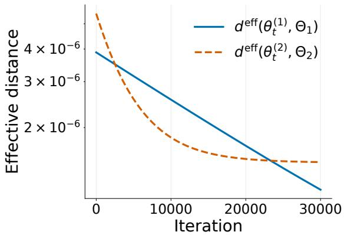
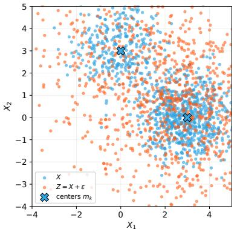
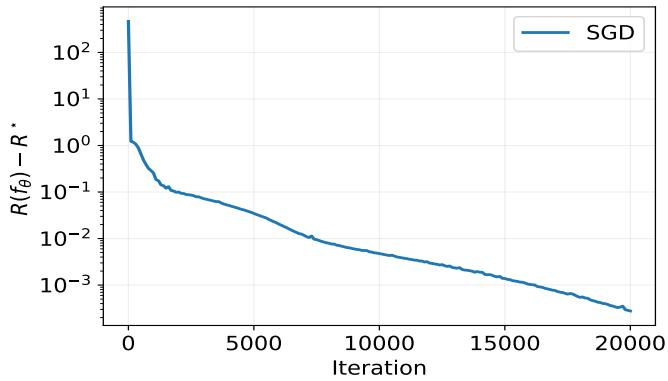
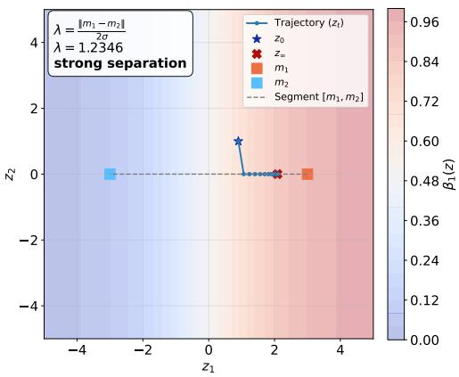
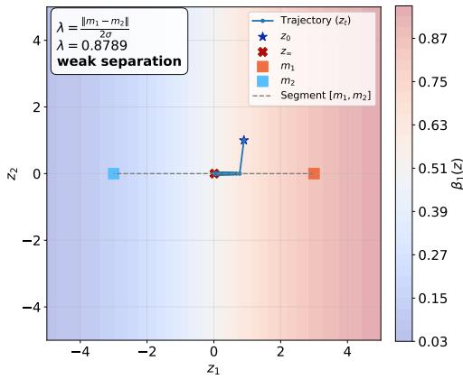
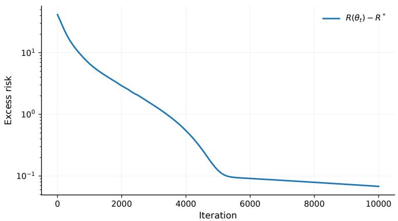
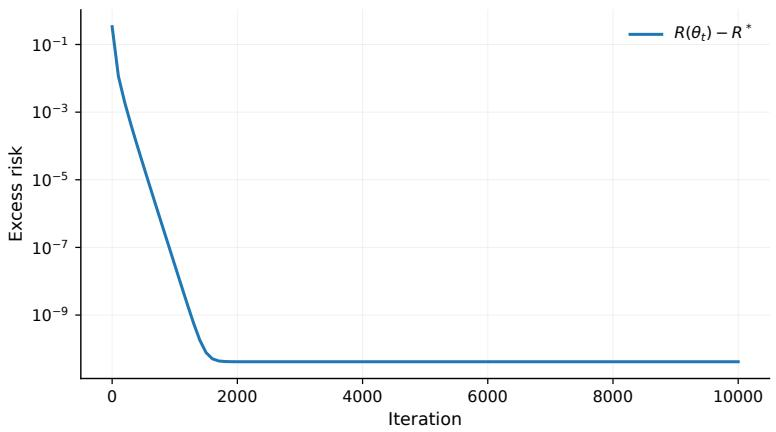

PREPRINT

October 2026

# Softmax Attention on Gaussian Mixtures

Linear When It Can, Selective When It Must

Simon Gabet1 Etienne Boursier1 Claire Boyer1,2

1Universit´e Paris-Saclay, CNRS, Inria, Laboratoire de math´ematiques d’Orsay, 91405 Orsay, France 2Institut Universitaire de France

## ABSTRACT

Softmax attention, at the heart of Transformers, has demonstrated remarkable capabilities. Yet its underlying mechanisms remain only partially understood. Recent theoretical work studies Gaussian prompts, where the infinite-prompt limit reduces softmax attention to a linear map, but also removes the query-dependent selection that distinguishes it from linear attention. This work studies the infinite-prompt limit of softmax attention on Gaussian mixtures, which retain the tractability of Gaussian data while introducing latent structure, multimodality, and nonlinear dependencies. We show that softmax attention can represent and learn, via gradient-based methods, optimal solutions to a range of statistical tasks, including supervised classification and denoising. Our results highlight two complementary capabilities of softmax attention: it can recover linear tasks as efectively as its simpler linear counterpart, while also exploiting query-dependent context selection to solve nonlinear tasks beyond the reach of linear attention.

Keywords softmax attention · Gaussian mixtures · large-prompt limit · optimization landscape · denoising · in-context learning

## 1 Introduction

Softmax attention lies at the core of modern Transformer models. Yet, despite its remarkable empirical success, its theoretical behavior remains poorly understood, even in highly simplified settings. Theoretical accounts of attention often replace softmax by a linear kernel or study distributions for which the population softmax operator itself becomes linear. These reductions lead to precise learning-dynamics results, but they remove the very mechanism that makes attention selective: which part of the prompt is relevant may depend on the query.

We study attention in the large-prompt regime. In this work, a prompt of length L is a sequence of L tokens drawn independently from a distribution µ on Rd. Softmax attention over these tokens depends on them only through their empirical measure, and converges, as L → ∞, to an operator acting directly on µ (Section 2). In this large-prompt limit, an attention layer becomes a map that takes a probability measure, the prompt, and returns a function of the query. This viewpoint removes finite-sample fluctuations and exposes the geometry of the operator itself; concentration results relate it to its finite-prompt counterpart for sub-Gaussian tokens (Vuckovic et al., 2020; Boursier and Boyer, 2026; Bohbot et al., 2026).

The choice of µ then determines what can be observed. When µ is Gaussian (Castin et al., 2025; Boursier and Boyer, 2026), the limiting operator is an afine function of the query: the analysis is tractable, but selection has disappeared. Gaussian mixtures are the natural next step. They retain closed-form computations while introducing latent structure, multimodality and, crucially, a reason for a query to attend to one part of the context rather than another. They thus ofer a setting in which one can ask precisely what the softmax nonlinearity brings.

Contributions. We answer this question through one structural identity and two statistical tasks that play complementary roles.

• Softmax attention as a gated mixture of experts. On any Gaussian mixture, a softmax head acts as a query-dependent combination of afine experts; with shared covariances, it splits exactly into a global linear map and a softmax gate that selects, for each query, the relevant components (Proposition 2.1). Linear attention, by contrast, weighs the components by fixed proportions, blind to the query. This identity is the lens of the paper: it tells us when the gate is superfluous, and when it does the essential work.

• When the gate is redundant: learning LDA. In linear discriminant analysis (LDA), the optimal classifier is linear, and a single head can represent it exactly. The question is then one of optimization: does a redundant, nonconvex parameterization remain trainable? In efective (reparameterized) coordinates, the logistic risk has no spurious critical points (Theorem 3.1); in the original attention parameters, every nonoptimal critical point is a strict saddle as soon as the class means are not symmetric (Theorem 3.3). The landscape is benign but not coercive: near-optimal directions escape to infinity (Proposition 3.4). We therefore turn to the dynamics, and prove exponential convergence of gradient flow near the regular manifold of optimal parameters (Theorem 3.5) and, in the symmetric balanced case, global convergence on a Krylov-structured invariant subspace (Theorem 3.6).

• When the gate is essential: denoising. Optimal denoising of a Gaussian mixture requires two operations at once: shrinking the observation, and deciding which cluster it comes from. The optimal denoiser is therefore itself a gated afine map. Two softmax heads reproduce it exactly; a single head generally cannot, and no linear-attention predictor, whatever its number of heads, comes close to the optimal error (Theorem 4.1). Iterating the same map changes its meaning: below a sharp separation threshold, it collapses every input to the midpoint between the component centers; above it, it clusters (Proposition 4.3). Finally, with residual connections, a single set of parameters denoises optimally in context, for any cluster locations and proportions (Proposition 4.4): the weights store what is shared across tasks, while attention infers from the prompt what is specific to each one.

Related work. The measure formulation of attention was developed by Vuckovic et al. (2020) and used to study deep attention dynamics and clustering (Sander et al., 2022; Geshkovski et al., 2023; Castin et al., 2025). Recent work analyzes training in the large-prompt Gaussian regime (Boursier and Boyer, 2026; Maulen-Soto and Boyer, 2026; Goel et al., 2026); our mixture identity is the first step beyond the linear operator resulting from Gaussian prompt. Transformer classification has been studied through linear attention and algorithm emulation (Frei and Vardi, 2025; Shen et al., 2025; Zhang and Cao, 2026). Our result instead learns the Bayes boundary directly with a single softmax layer and exposes the geometry of its population risk in the attention parameters. For denoising, Smart et al. (2025) connect one-layer attention to associative-memory retrieval when the context is clean; Rosu et al. (2025) and Li et al. (2026) study attention-based denoising for difusion. We treat noisy contexts and nondegenerate mixtures with standard dot-product softmax, give exact Bayes constructions, and prove a strict separation from linear attention. Concurrent work studies a more general two-stage empirical-Bayes viewpoint using RBF attention (Smart et al., 2026). A complementary statistical separation between softmax and linear attention appears in Duranthon et al. (2026).

## 2 Population Attention on Mixtures

Attention as an operator on measures. We represent a prompt by a probability measure $\mu$ on $\mathbb { R } ^ { d }$ absorb the query and key matrices into a single interaction matrix $U \in \mathbb { R } ^ { d \times d }$ , and denote by $V \in \mathbb { R } ^ { d \times d }$ the value matrix. For a query $z \in \mathbb { R } ^ { d }$ , the attention operator reads

$$
T _ { U , V } [ \mu ] ( z ) = \frac { \int e ^ { ( z ^ { \prime } ) ^ { \top } U z } V z ^ { \prime } \mathrm { d } \mu ( z ^ { \prime } ) } { \int e ^ { ( z ^ { \prime } ) ^ { \top } U z } \mathrm { d } \mu ( z ^ { \prime } ) } .\tag{1}
$$

For a finite prompt $z _ { 1 } , \dots , z _ { L }$ with empirical measure $\begin{array} { r } { \widehat { \mu } _ { L } = L ^ { - 1 } \sum _ { i = 1 } ^ { L } \delta _ { z _ { i } } } \end{array}$ , the quantity $T _ { U , V } [ \widehat { \mu } _ { L } ] ( z )$ is exactly softmax dot-product attention over the tokens. When the tokens are drawn i.i.d. from a sub-Gaussian measure $\mu _ { ; }$ the law of large numbers, applied to the numerator and the denominator, gives $T _ { U , V } [ \widehat { \mu } _ { L } ] ( z ) \to T _ { U , V } [ \mu ] ( z )$ almost surely for every query z; quantitative versions are given in Boursier and Boyer (2026); Bohbot et al. (2026). All our results concern the limiting operator $T _ { U , V } [ \mu ]$

From a Gaussian to a mixture. If $\mu$ is Gaussian, centered at m and of covariance matrix Γ, the attention operator is

$$
T _ { U , V } [ \mu ] ( z ) = V ( m + \Gamma U z ) ,
$$

an afine function of the query, in which the softmax leaves no trace. On a mixture, the same computation applies component by component, and the components then compete through the normalization. Throughout, Gaussian covariances are positive definite unless a degenerate case is stated explicitly.

Proposition 2.1 (Softmax-gated afine experts). Consider a mixture $\begin{array} { r } { \mu = \sum _ { k = 1 } ^ { M } \pi _ { k } \mathcal { N } ( m _ { k } , \Gamma _ { k } ) } \end{array}$ of M Gaussian components. The infinite-prompt attention layer parameterized by U and V gives for any $z \in \mathbb { R } ^ { d }$ 2

$$
T _ { U , V } [ \mu ] ( z ) = V \sum _ { k = 1 } ^ { M } \alpha _ { k } ( z ) ( m _ { k } + \Gamma _ { k } U z ) ,\tag{2}
$$

with

$$
\begin{array} { r } { \alpha _ { k } ( z ) = \mathrm { s o f t m a x } _ { k } \left( \log \pi _ { k } + m _ { k } ^ { \top } U z + \frac { 1 } { 2 } ( U z ) ^ { \top } \Gamma _ { k } U z \right) . } \end{array}
$$

$I f \Gamma _ { k } = \Gamma$ for all k, the common quadratic ofsets in the softmax function cancels and

$$
T _ { U , V } [ \mu ] ( z ) = V \Gamma U z + V \sum _ { k } \alpha _ { k } ( z ) m _ { k } ,\tag{3}
$$

with $\alpha _ { k } ( z ) = { \mathrm { s o f t m a x } } _ { k } ( \log \pi _ { k } + m _ { k } ^ { \top } U z )$

The proof of Proposition 2.1 is given in Appendix A.1. Equation (3) is the organizing principle of the paper: the first term performs global linear prediction; the second selects components and returns a query-dependent barycenter.

Attention with generalized scores. More generally, attention on any mixture $\sum _ { k } \pi _ { k } \mu _ { k }$ is a querydependent convex combination of the component-wise attention maps, with gates proportional to the alignment to the query (see the supplement). Indeed, for $\begin{array} { r } { T _ { a } [ \mu ] ( z ) : = \int a ( z , { \bar { z } ^ { \prime } } ) z ^ { \prime } \mathrm { d } \mu ( { \bar { z ^ { \prime } } } ) / \int a ( z , z ^ { \prime } ) \mathrm { d } \mu ( z ^ { \prime } ) } \end{array}$ , we have

$$
T _ { a } [ \mu ] ( z ) = \sum _ { k = 1 } ^ { M } r _ { k } ( z ) T _ { a } [ \mu _ { k } ] ( z )
$$

with $\begin{array} { r } { r _ { k } ( z ) : = \pi _ { k } \int _ { \mathbb { R } ^ { d } } a ( z , z ^ { \prime } ) \mathrm { d } \mu _ { k } ( z ^ { \prime } ) / \int _ { \mathbb { R } ^ { d } } a ( z , z ^ { \prime } ) \mathrm { d } \mu ( z ^ { \prime } ) } \end{array}$ and $a > 0$ an arbitrary alignment function $( \mathrm { e . g . }$ exponential dot product for softmax scores), see Appendix $\mathrm { A . 2 }$ for details. Normalized attention, such as softmax attention, can therefore perform context selection: in regions where $r _ { k } ( z )$ is close to one, the operator essentially selects the context $\mu _ { k } ;$ allowing to adaptively select which cluster is relevant to a given query. This behavior contrasts with classical linear attention, defined by $\begin{array} { r } { T _ { \mathrm { l i n } } [ \mu ] ( z ) : = \int _ { \mathbb { R } ^ { d } } \langle U z , z ^ { \prime } \rangle V z ^ { \prime } \mathrm { d } \mu ( z ^ { \prime } ) } \end{array}$ Indeed, $\begin{array} { r } { T _ { \mathrm { l i n } } [ \mu ] ( z ) = \sum _ { k } \pi _ { k } T _ { \mathrm { l i n } } [ \mu _ { k } ] ( z ) } \end{array}$ , so linear attention combines the diferent contexts with fixed mixture proportions $\pi _ { k }$ , independently of the query, and cannot separate the contribution of the diferent clusters.

## 3 Attention-based Linear Discriminant Analysis

We now turn to classification. Under linear discriminant analysis (LDA), the Bayes score is afine, and hence does not require the nonlinear selection mechanism of softmax attention. The question is instead whether a single softmax head can represent this score and whether gradient-based training can recover it despite this redundant and nonconvex parameterization.

## 3.1 From attention to an afine–sigmoid predictor

Let $Y \in \{ - 1 , 1 \}$ with $\mathbb { P } ( Y = 1 ) = \pi _ { + }$ , and assume the classical LDA model, with input features $X \in \mathbb { R } ^ { d }$ such that

$$
X \mid Y = c \sim { \mathcal { N } } ( m _ { c } , \Gamma ) , \qquad c \in \{ - 1 , 1 \} ,\tag{4}
$$

where the two classes have diferent means and share a positive-definite covariance matrix. The Bayes classifier is sign $( f ^ { \star } )$ , where the Bayes score $f ^ { \star } ( x ) = w ^ { \star \top } x + b ^ { \star }$ is afine, with

$$
\begin{array} { l } { { w ^ { \star } = \Gamma ^ { - 1 } ( m _ { 1 } - m _ { - 1 } ) , } } \\ { { b ^ { \star } = - { \frac { 1 } { 2 } } \bigl ( m _ { 1 } ^ { \top } \Gamma ^ { - 1 } m _ { 1 } - m _ { - 1 } ^ { \top } \Gamma ^ { - 1 } m _ { - 1 } \bigr ) + \log { \frac { \pi _ { + } } { 1 - \pi _ { + } } } . } } \end{array}\tag{5}
$$

We feed augmented context tokens $( X , Y ) \in \mathbb { R } ^ { d + 1 }$ to one attention head and query it at $( x , 0 )$ ; only the last output coordinate is therefore used to store the prediction $f _ { \boldsymbol { \theta } } ( \boldsymbol { x } )$ . Writing the relevant blocks of $U , V$ interacting with X or $Y$ (see Appendix B.1) as $\theta = ( U _ { 1 1 } , u _ { 1 2 } , v _ { 2 1 } , v _ { 2 2 } )$ , Proposition 2.1 yields for $\mu$ the Gaussian mixture described in (4):

$$
\begin{array} { r l } & { T _ { U , V } [ \mu ] ( ( x , 0 ) ) _ { d + 1 } = f _ { \theta } ( x ) } \\ & { \qquad : = w ^ { \top } x + b + r \sigma ( s _ { 0 } + s ^ { \top } x ) , } \end{array}\tag{6}
$$

where $\sigma ( t ) = ( 1 + e ^ { - t } ) ^ { - 1 }$ and

$$
\begin{array} { l } { w = U _ { 1 1 } \Gamma v _ { 2 1 } , \qquad b = v _ { 2 1 } ^ { \top } m _ { - 1 } - v _ { 2 2 } , } \\ { r = v _ { 2 1 } ^ { \top } ( m _ { 1 } - m _ { - 1 } ) + 2 v _ { 2 2 } , } \\ { s = 2 u _ { 1 2 } + U _ { 1 1 } ( m _ { 1 } - m _ { - 1 } ) , } \\ { s _ { 0 } = \log \cfrac { \pi _ { + } } { 1 - \pi _ { + } } . } \end{array}\tag{7}
$$

The exact derivation is given in Appendix B.1. Thus a softmax head reduces, in efective coordinates, to an afine predictor plus a single sigmoidal correction. In particular, one head can realize the Bayes score exactly; an explicit construction is given in Appendix B.2. At the efective level, this happens through two distinct mechanisms: either $r = 0$ suppresses the nonlinear term, or $s = 0$ makes it constant and absorbable into the bias b. Their preimages in the original attention parameters need not have the same geometry—and, depending on the class means and priors, both mechanisms need not be simultaneously available. This distinction is central to the optimization analysis below.

## 3.2 A benign but noncoercive optimization landscape

We train the score with the population logistic risk1

$$
\begin{array} { r } { \mathcal { R } ( \theta ) : = \mathbb { E } \left[ \log ( 1 + e ^ { - Y f _ { \theta } ( X ) } ) \right] } \\ { = \mathcal { \widetilde { R } } ( \Phi ( \theta ) ) , ~ } \end{array}\tag{8}
$$

where $\Phi ( \theta ) = ( w , b , r , s )$ is defined in (7), and

$$
\begin{array} { r } { \mathcal { \widetilde R } ( w , b , r , s ) : = \mathbb { E } \left[ \log ( 1 + e ^ { - Y g _ { w , b , r , s } ( X ) } ) \right] , } \end{array}
$$

with $g _ { w , b , r , s } ( x ) : = w ^ { \top } x + b + r \sigma ( s _ { 0 } + s ^ { \top } x ) .$

Thus $\mathcal { R }$ is the risk in the original attention parameters, whereas $\widetilde { \mathcal { R } }$ is expressed in efective coordinates. The logistic loss is important here: its unique population minimizer over measurable scores is the Bayes score $f ^ { \star }$ Since the attention model realizes this score, the unrestricted optimum is attained in both parameterizations; we denote its value by $\mathcal { R } ^ { \star }$

The efective landscape. The reduced model is not jointly convex in $( w , b , r , s )$ . However, fixing s leaves a convex problem in $( w , b , r )$ that still contains the Bayes predictor, through the choice $( w , b , r ) = ( w ^ { \star } , b ^ { \star } , 0 )$ This simple observation explains why stationarity is enough to guarantee optimality.

Theorem 3.1 (Efective landscape). All critical points of $\widetilde { \mathcal { R } }$ are global minimizers, and

$$
\begin{array} { r l } & { \mathcal { E } ^ { \star } : = \arg \operatorname* { m i n } \widetilde { \mathcal { R } } = \mathrm { C r i t } ( \widetilde { \mathcal { R } } ) = \mathcal { E } _ { 1 } \cup \mathcal { E } _ { 2 } , } \\ & { \qquad \mathcal { E } _ { 1 } = \{ ( w ^ { \star } , b ^ { \star } , 0 , s ) : s \in \mathbb { R } ^ { d } \} , } \\ & { \qquad \mathcal { E } _ { 2 } = \{ ( w ^ { \star } , b ^ { \star } - r \sigma ( s _ { 0 } ) , r , 0 ) : r \in \mathbb { R } \} . } \end{array}
$$

These two afine spaces recover the representation mechanisms identified above: $\mathcal { E } _ { 1 }$ removes the sigmoid, while ${ \mathcal { E } } _ { 2 }$ makes it constant and absorbs its contribution into the bias. They represent the same predictor but leave diferent efective parameters unconstrained.

Returning to attention parameters. Does this favorable landscape survive the return to the attention parameters? The chain rule

$$
\nabla \mathcal { R } ( \theta ) = D \Phi ( \theta ) ^ { * } \nabla \widetilde { \mathcal { R } } ( \Phi ( \theta ) )
$$

shows the possible obstruction: a singular diferential can annihilate a nonzero efective gradient. The following result identifies exactly where this obstruction is avoided.

Lemma 3.2 (Regularity of the reparameterization). For any $\theta \in \mathbb { R } ^ { d \times d } \times \mathbb { R } ^ { d } \times \mathbb { R } ^ { d } \times \mathbb { R }$ , the adjoint $D \Phi ( \theta ) ^ { * }$ is injective if and only $i f m _ { 1 } \ne - m _ { - 1 }$ and $v _ { 2 1 } \neq \mathbf { 0 }$

Consequently, under asymmetric means, every critical point with $v _ { 2 1 } \neq \mathbf { 0 }$ is globally optimal. The exceptional set $\{ v _ { 2 1 } = \mathbf { 0 } \}$ requires a separate curvature argument: its nonoptimal critical points admit a negative-curvature direction. Together, these facts yield the following characterization.

Theorem 3.3 (Landscape in attention parameters). The minimizer set of R is $\Theta ^ { \star } = \Theta _ { 1 } \cup \Theta _ { 2 }$ , where

$$
\begin{array} { r } { \Theta _ { 1 } = \Phi ^ { - 1 } ( \mathcal { E } _ { 1 } ) , \qquad \Theta _ { 2 } = \Phi ^ { - 1 } ( \mathcal { E } _ { 2 } ) . } \end{array}
$$

$I f m _ { 1 } \ne - m _ { - 1 }$ , every critical point of R is either a global minimizer or a strict saddle. In particular, all local minima are $g l o b a l .$

Why this does not establish global convergence. The preceding theorem controls finite critical points, but not parameter escape. In fact, the efective risk admits diverging minimizing sequences, as shown by the following construction.

Proposition 3.4 (Minimizing sequences at infinity). For every $c \in \mathbb { R } ^ { d }$ , the sequence

$$
\zeta _ { R } = ( w ^ { \star } - \sigma ^ { \prime } ( s _ { 0 } ) c , b ^ { \star } - \sigma ( s _ { 0 } ) R , R , c / R )
$$

satisfies $g _ { \zeta _ { R } }  f ^ { \star }$ in $L ^ { 1 } ( \mu _ { X } )$ and $\widetilde { \mathcal { R } } ( \zeta _ { R } ) \to \mathcal { R } ^ { \star }$ as $R \to \infty$ , where $g _ { w , b , r , s } ( x )$ is defined in (8) and $\mu _ { X }$ is the query distribution.

As the sigmoid amplitude grows and its direction shrinks, its constant and linear contributions are canceled by the afine part. The predictor approaches Bayes optimality while the parameters diverge. This does not prove divergence of gradient flow, but shows why the landscape alone cannot supply a boundedness argument. Proofs of the landscape and noncompactness results are given in Appendix B.5.

## 3.3 Gradient-flow convergence

We now study the gradient flow $\dot { \theta } _ { t } = - \nabla \mathcal { R } ( \theta _ { t } )$ . The two Bayes families $\Theta _ { 1 }$ and $\Theta _ { 2 }$ have diferent local geometries, so their common optimality does not imply the same convergence behavior.

Local convergence near the regular component. Assume first that $m _ { 1 } \neq - m _ { - 1 }$ , and define $\Theta _ { 1 } ^ { \mathrm { r e g } } =$ $\{ \theta \in \Theta _ { 1 } : s ( \theta ) \neq \mathbf { 0 } \}$ . At every ${ \boldsymbol { \theta } } ^ { \star } \in \Theta _ { 1 } ^ { \mathrm { r e g } }$ , the Hessian satisfies

$$
\ker \nabla ^ { 2 } { \mathcal { R } } ( \theta ^ { \star } ) = T _ { \theta ^ { \star } } \Theta _ { 1 } ^ { \mathrm { r e g } } .
$$

Thus the only flat directions are tangent to the minimizer manifold; the risk has strictly positive curvature in the normal directions. This Morse–Bott structure provides the local stability needed for the following convergence result.

Theorem 3.5 (Local convergence to the regular Bayes manifold). Assume m $\neq - m _ { - 1 }$ and let $\theta ^ { \star } \in \Theta _ { 1 }$ satisfy $s ( \theta ^ { \star } ) \neq 0$ . If initialized suficiently close to $\theta ^ { \star }$ , gradient flow exists for all $t \geq 0$ , remains in a neighborhood of $\Theta _ { 1 }$ , and converges exponentially to a point $\theta _ { \infty } \in \Theta _ { 1 }$ . In particular, $f _ { \theta _ { \infty } } = f ^ { \star }$ almost surely.

The proof (see Appendix B.7) controls both the decay normal to the manifold and the displacement along it, giving convergence to an optimal parameter.

Why the constant-gate component is diferent. For every $\theta ^ { \star }$ in $\Theta _ { 2 }$ with $r ( \theta ^ { \star } ) \neq 0$ perturbing the gate direction can be compensated to first order by changing the afine coeficient. Under the same asymmetry assumption, the resulting Hessian kernel has d extra dimensions:

$$
\dim \ker \nabla ^ { 2 } \mathcal { R } ( \theta ^ { \star } ) - \dim T _ { \theta ^ { \star } } \Theta _ { 2 } = d .
$$

These are flat directions that are transverse to the local minimizer manifold. Thus the preceding Morse–Bott argument does not extend to $\Theta _ { 2 }$ . The calculation is given in Appendix B.8. This degeneracy alone determines neither convergence nor its rate. The slower decay in Figure 1 is an empirical observation consistent with the previous discussion (see Appendix B.13 for a description of the numerical protocol).

Global convergence on a symmetric invariant subspace. The centrally symmetric case $m _ { 1 } = - m _ { - 1 }$ falls outside the regularity argument for Φ. When the classes are also balanced, symmetry instead allows us to construct an invariant subspace on which the predictor remains linear throughout training. Assume $m _ { 1 } = - m _ { - 1 } = : m$ and $\pi _ { + } = 1 / 2$ , and define the Krylov space

$$
K = \operatorname { s p a n } \{ m , \Gamma m , \dots , \Gamma ^ { d - 1 } m \} .
$$

With $P _ { K }$ the orthogonal projector onto $K$ , let

$$
\mathcal { T } _ { K } = \{ u _ { 1 2 } = \mathbf { 0 } , \ v _ { 2 2 } = 0 , \ v _ { 2 1 } \in K ^ { \perp } , \ U _ { 1 1 } P _ { K } = \mathbf { 0 } \} .
$$

Orthogonality of $v _ { 2 1 }$ to m alone is not generally preserved by the flow, which repeatedly applies Γ. The Krylov space ensures that $K ^ { \perp }$ is Γ-invariant, so these constraints close under the dynamics.

Theorem 3.6 (Global convergence on the invariant subspace). The subspace $\mathcal { T } _ { K }$ is invariant under gradient flow. $I f U _ { 1 1 } ( 0 ) = \mathbf { 0 } , u _ { 1 2 } ( 0 ) = \mathbf { 0 } , v _ { 2 2 } ( 0 ) = 0$ and $v _ { 2 1 } ( 0 ) \in K ^ { \bot } \setminus \{ { \bf 0 } \}$ , then $\theta _ { t }$ converges exponentially to a limit $\theta _ { \infty } \in \mathcal { T } _ { K }$ satisfying $f _ { \theta _ { \infty } } = f ^ { \star }$

On $\mathcal { T } _ { K }$ , the bias and sigmoid term vanish, leaving $f _ { \theta _ { t } } ( x ) = \langle U _ { 1 1 } ( t ) \Gamma v _ { 2 1 } ( t ) , x \rangle$ . The proof combines coercivity of the linear logistic risk with the conserved balance

$$
\| U _ { 1 1 } ( t ) \| _ { F } ^ { 2 } - \| v _ { 2 1 } ( t ) \| ^ { 2 } = - \| v _ { 2 1 } ( 0 ) \| ^ { 2 } .
$$

The former bounds the efective predictor; the latter prevents its induced gradient dynamics from degenerating.   
Further estimates control the factors and yield their exponential convergence; see Appendix B.12.

From the initialization point of view, setting $U _ { 1 1 } ( 0 ) = \mathbf { 0 } , u _ { 1 2 } ( 0 ) = \mathbf { 0 }$ , and $v _ { 2 2 } ( 0 ) = 0$ does not raise any dificulty. The only non-trivial condition is to choose $v _ { 2 1 } ( 0 ) \in K ^ { \bot } \setminus \{ { \bf 0 } \}$ , requiring the knowledge of Γ and m. However, from a practical perspective, this assumption is mild in high-dimensional settings when dim $K \ll d ,$ since an isotropic random initialization typically has only a fraction of order dim $( K ) / d$ of its mass in K. In particular, when $\Gamma = \gamma ^ { 2 }  { \mathrm { I } _ { d } }$ , one has dim $K = 1$ and $\mathrm { d } ( v _ { 2 1 } ( 0 ) / \lVert v _ { 2 1 } ( 0 ) \rVert , K ^ { \perp } ) = O _ { \mathbb { P } } ( \frac { \mathrm { ~ i ~ } } { \sqrt { d } } )$ . Our experiments in dimension $d = 2 0$ show rapid convergence to near-Bayes risk without knowledge of m nor Γ (Appendix B.13, Figure 5).

  
Figure 1: Population gradient descent near the two Bayes manifolds (see table 3 for initialization details). The efective distance (euclidean distance between the efective parameters and ${ \mathcal { E } } _ { 1 }$ or $\mathcal { E } _ { 2 } )$ to the regular component $\Theta _ { 1 }$ is linear on a log scale, while convergence toward the flatter component $\Theta _ { 2 }$ is markedly slower, matching the Morse–Bott characterization.

## 4 Denoising: Selection Becomes Essential

Classification used only the afine part of the mixture-attention decomposition. Denoising reveals the role of its nonlinear part. Denoising a sample from a Gaussian mixture requires both shrinking the observation within each component and inferring which component generated it. The latter is a genuinely query-dependent selection problem, and it is precisely where softmax attention difers from linear attention.

## 4.1 The Bayes denoiser as a gated afine map

Let $\begin{array} { r } { X \sim \sum _ { k = 1 } ^ { M } \pi _ { k } \mathcal { N } ( m _ { k } , \Gamma ) } \end{array}$ , consider a noisy version of it

$$
Z = X + \varepsilon , \qquad \varepsilon \sim { \mathcal { N } } ( 0 , \xi ^ { 2 } I _ { d } ) ,\tag{9}
$$

where the noise $\varepsilon$ is independent of $X$ , and set $S = \Gamma + \xi ^ { 2 } I _ { d }$ . Under squared loss $\mathcal { R } _ { \mathrm { s q } } ( f ) : = \mathbb { E } [ \| X - f ( Z ) \| ^ { 2 } ]$ with a slight abuse, $f ^ { \star }$ now denotes the optimal reconstruction of $X$ from $Z$ (see Appendix C.1):

$$
f ^ { \star } ( z ) = \mathbb { E } [ X \mid Z = z ] = \Gamma S ^ { - 1 } z + \xi ^ { 2 } S ^ { - 1 } \sum _ { k } \beta _ { k } ( z ) m _ { k } ,\tag{10}
$$

where

$$
\begin{array} { r } { \beta _ { k } ( z ) = \mathrm { s o f t m a x } _ { k } \left( \log \pi _ { k } +  { m _ { k } ^ { \top } } S ^ { - 1 } z - \frac { 1 } { 2 }  { m _ { k } ^ { \top } } S ^ { - 1 }  { m _ { k } } \right) . } \end{array}
$$

Equivalently, if C denotes the latent component label, then $\beta _ { k } ( z ) = \mathbb { P } ( C = k \mid Z = z )$ . Thus the first term in (10) performs within-component Gaussian shrinkage, while the second returns the posterior barycenter of the component means. In the high-noise regime the latter approaches the prior mean $\sum _ { k } \pi _ { k } m _ { k } ;$ in the low-noise regime the full denoiser approaches the identity.

Denoting by $\mu _ { Z }$ the distribution of $Z$ defined by (9), this decomposition is strikingly close to the sharedcovariance attention formula (3):

$$
\begin{array} { r l } & { T _ { U , V } [ \mu _ { Z } ] ( z ) = { V S U z } + { V \sum _ { k } \alpha _ { k } ( z ) m _ { k } } , } \\ & { } \\ & { \mathrm { w i t h } \quad \alpha _ { k } ( z ) = \mathrm { s o f t m a x } _ { k } ( \log \pi _ { k } + m _ { k } ^ { \top } U z ) . } \end{array}
$$

Both maps combine a linear transform of the observation with a softmax-weighted barycenter. Two obstructions remain, however. First, the posterior weights $\beta _ { k }$ contain the ofsets $- { \textstyle \frac { 1 } { 2 } } m _ { k } ^ { \top } { \cal \breve { S } } ^ { - 1 } m _ { k }$ , which standard dot-product attention cannot encode. Second, within a single attention head, the same matrices $( U , V )$ govern both the linear and gated terms.

  
Figure 2: Learning the two-head Bayes denoiser in $d = 2$ . Left: clean samples X and noisy observations $Z = X + \varepsilon$ for $m _ { 1 } = ( 3 , 0 )$ ， $m _ { 2 } = ( 0 , 3 )$ $\gamma = 1$ , and $\xi = 2$ . Right: excess population risk along stochastic gradient descent with step size $2 \times 1 0 ^ { - 3 }$

To isolate the second obstruction, we henceforth consider a mixture of 2 components in dimension $d \geq 2$ , with $\Gamma = \gamma ^ { 2 } I _ { d }$ , distinct means satisfying $\| m _ { 1 } \| = \| m _ { 2 } \|$ , and arbitrary positive mixture weights. The equal-norm assumption cancels out the ofsets in the barycenter coeficients, giving

$$
f ^ { \star } ( z ) = \frac { \gamma ^ { 2 } } { \gamma ^ { 2 } + \xi ^ { 2 } } z + \frac { \xi ^ { 2 } } { \gamma ^ { 2 } + \xi ^ { 2 } } \sum _ { k = 1 } ^ { 2 } \beta _ { k } ( z ) m _ { k } ,\tag{11}
$$

with $\begin{array} { r } { \beta _ { k } ( z ) = \mathrm { s o f t m a x } _ { k } \left( \log \pi _ { k } + \frac { m _ { k } ^ { \top } z } { \gamma ^ { 2 } + \xi ^ { 2 } } \right) } \end{array}$

## 4.2 Two heads are suficient, and softmax is necessary

Although Equation (11) has exactly the form of an attention map, one head is generally unable to match its two terms simultaneously.

Theorem 4.1 (Exact representation and a softmax separation). Assume γ > 0 $\gamma > 0$ . Two softmax heads realize the Bayes denoiser, $i . e . _ { \cdot }$ , there exist $( U _ { h } , V _ { h } ) _ { h = 1 , 2 }$ such that for all $z ,$

$$
T _ { U _ { 1 } , V _ { 1 } } [ \mu _ { Z } ] ( z ) + T _ { U _ { 2 } , V _ { 2 } } [ \mu _ { Z } ] ( z ) = f ^ { \star } ( z ) .
$$

A single head sufices if and only $i f \gamma ^ { 2 } = \xi ^ { 2 }$

Moreover, writing $\mathcal { F } _ { \mathrm { s m } }$ and $\mathcal { F } _ { \mathrm { l i n } }$ for finite multi-head softmax-attention and multi-layer linear-attention predictors, respectively,

$$
\begin{array} { r } { \underset { f \in \mathcal { F } _ { \mathrm { s m } } } { \operatorname* { i n f } } \left\{ \mathcal { R } _ { \mathrm { s q } } ( f ) - \mathcal { R } _ { \mathrm { s q } } ( f ^ { \star } ) \right\} = 0 , } \\ { \underset { f \in \mathcal { F } _ { \mathrm { l i n } } } { \operatorname* { i n f } } \left\{ \mathcal { R } _ { \mathrm { s q } } ( f ) - \mathcal { R } _ { \mathrm { s q } } ( f ^ { \star } ) \right\} > 0 . } \end{array}
$$

A single head couples the two terms of $f ^ { \star }$ through the same value matrix. To see this, take $U = S ^ { - 1 }$ ， which already reproduces the gate exactly $( \alpha _ { k } = \beta _ { k } )$ . The head then reads

$$
T _ { U , V } [ \mu _ { Z } ] ( z ) = V z + V \sum _ { k = 1 } ^ { 2 } \beta _ { k } ( z ) m _ { k } ,
$$

whereas $f ^ { \star }$ multiplies z by $\gamma ^ { 2 } / ( \gamma ^ { 2 } + \xi ^ { 2 } )$ and the barycenter by $\xi ^ { 2 } / ( \gamma ^ { 2 } + \xi ^ { 2 } )$ . The same matrix V would have to apply both factors, which is possible only when they coincide, that is, when $\gamma ^ { 2 } = \xi ^ { 2 } ;$ then $\begin{array} { r } { V = \frac { 1 } { 2 } I _ { d } } \end{array}$ gives $f ^ { \star }$ exactly. The proof shows that this tension persists for every choice of U (Appendix C.5).

An extra attention head path decouples the two factors. For non-collinear means, each value matrix keeps one mean and cancels the other, while the two linear parts add up to the required shrinkage; opposite means admit a similar construction (Appendix C.6).

  
Figure 3: Trajectories of the exact denoiser under strong separation (left) and weak separation (right). The background shows the conditional probability of belonging to cluster $1 ;$ blue dots trace the iterates and the red cross marks their limit. Here $m _ { 1 } = - m _ { 2 } = ( 0 , 3 )$ and $\gamma = 0$

Remark 4.2 (Degenerate mixtures). When $\gamma = 0 _ { ; }$ , the clean distribution consists of two point masses, and $f ^ { \star }$ reduces to their posterior barycenter. Two heads still sufice, and the strict separation from linear attention persists. The single-head obstruction, however, depends on the geometry: it holds for non-collinear means in dimension two, whereas opposite means admit a single-head realization. We keep these complementary cases in Appendix C.3. They will also help isolate the clustering dynamics of repeated denoising below.

Linear vs. softmax attention. Theorem 4.1 tells us that no network composed of linear attention layers can approximate the Bayes risk. Although the setting and task considered difer, this result aligns with the findings of Duranthon et al. (2026), providing another example where softmax attention is provably more expressive than its linear counterpart. The key reason is that the Bayes-optimal denoiser is inherently nonlinear: it maps each input z to an adaptive average of the mixture centroids $m _ { 1 }$ and $m _ { 2 }$

Can the exact denoiser be learned? Unlike in LDA, the sigmoidal term cannot be suppressed without losing the target itself, so the optimization problem remains genuinely nonlinear and nonconvex. We therefore examine it numerically at the population level. In dimension $d = 2$ , we optimize the excess risk $\mathbb { E } _ { Z \sim \mu _ { Z } } \| f ( Z ) - f ^ { \star } ( Z ) \| ^ { 2 }$ using online stochastic gradient descent, with gradient norm clipped at (10) to prevent numerical instabilities during the first optimization steps. Throughout training, we follow the evolution of the excess risk, estimated by Gauss–Hermite quadrature within each Gaussian component (Figure 2). The excess risk decreases close to zero in the reported experiment, suggesting that the Bayes predictor can be approached by direct optimization. This is numerical evidence for learnability.

## 4.3 Iterating the denoiser produces a clustering transition

While a single denoising step aims at recovering a clean estimate from a corrupted query, repeatedly applying the same denoiser defines a dynamical system whose long-term behavior can reveal the geometry encoded by the data distribution. In particular, Smart et al. (2025) show that a denoising step can be interpreted as a gradient descent step associated with a dense associative memory network making the study of its iterates natural from a dynamical perspective. Consider the degenerate balanced mixture $X \in \{ m _ { 1 } , m _ { 2 } \}$ , so that X emanates from a mixture of Dirac masses, with $\gamma = 0$ and $\pi _ { 1 } = \pi _ { 2 } = 1 / 2$ , and consider the dynamics $z _ { n + 1 } = f ^ { \star } ( z _ { n } )$ . One attention layer encoding $f ^ { \star }$ is obviously Bayes optimal, but iteration progressively erases information about the initial query. We show that this loss of information has a precise interpretation: depending on the separation of the mixture, the denoiser either collapses all inputs to their common midpoint or partitions the space into two basins of attraction.

Let $\lambda = \| m _ { 1 } - m _ { 2 } \| / ( 2 \xi )$ so that $\lambda ^ { 2 }$ can be interpreted as a signal-to-noise ratio. After projecting onto the line joining the means, the fixed-point equation reduces to $u = \operatorname { t a n h } ( \lambda ^ { 2 } u )$ , yielding a transition at $\lambda = 1$

Proposition 4.3 (Denoising-to-clustering transition). $I f \lambda \leq 1$ (referred to as weak separation), the iterated optimal denoiser dynamics $z _ { n + 1 } = f ^ { \star } ( z _ { n } )$ converges to

$$
z _ { n } \xrightarrow [ n \to + \infty ] { } ( m _ { 1 } + m _ { 2 } ) / 2 .
$$

If $\lambda > 1$ (referred to as strong separation), almost every initialization converges to one of two stable fixed points $m _ { \lambda , 1 } , m _ { \lambda , 2 }$ , being such that $m _ { \lambda , k } \to m _ { k }$ as $\lambda \to \infty$

The proof is given in Appendix C.4. Figure 3 displays the two regimes described by Proposition 4.3. Under weak separation the dynamic cannot distinguish the components and every trajectory collapses to the midpoint. Above the threshold, two stable attractors emerge and approach the component means as the separation grows. Repeated passages through the same layer therefore changes the statistical role of the same map: a one-step estimator becomes, under recurrence, a clustering mechanism.

## 4.4 Residual attention denoises in-context

The previous analyses considered denoising for a fixed mixture, with optimal attention parameters tailored to the mixture means. In-context denoising asks for a single architecture that adapts to diferent mixtures using only a prompt of noisy observations.

A task is therefore now specified by $\tau = ( m _ { 1 } , m _ { 2 } , \pi _ { 1 } )$ , with clean and noisy distributions

$$
\begin{array} { r l } & { \mu _ { X } ^ { \tau } = \pi _ { 1 } { \mathcal N } ( m _ { 1 } , \gamma ^ { 2 } I _ { d } ) + ( 1 - \pi _ { 1 } ) { \mathcal N } ( m _ { 2 } , \gamma ^ { 2 } I _ { d } ) , } \\ & { \mu _ { Z } ^ { \tau } = \pi _ { 1 } { \mathcal N } ( m _ { 1 } , S ) + ( 1 - \pi _ { 1 } ) { \mathcal N } ( m _ { 2 } , S ) , } \end{array}
$$

where $S = ( \gamma ^ { 2 } + \xi ^ { 2 } ) I _ { d }$ . The means and mixture weights vary across tasks, while $\gamma ^ { 2 }$ and $\xi ^ { 2 }$ remain fixed. For each task, a new parameter τ is sampled according to an admissible distribution $( \mathrm { i . e . } ,$ , with $m _ { 1 } \neq m _ { 2 }$ $\| m _ { 1 } \| = \| m _ { 2 } \|$ , and $\pi _ { 1 } \in ( 0 , 1 )$ almost surely). The layer receives an infinite prompt $Z _ { 1 } , \dots , Z _ { L } , \dots$ . drawn independently from $\mu _ { Z } ^ { \tau }$ and an independent noisy query $Z = X + \varepsilon$ from the same task. Its goal is to reconstruct the query’s clean counterpart X. The predictor is evaluated through the in-context risk

$$
\mathcal { R } _ { \mathrm { I C L } } ( f ) = \mathbb { E } _ { \tau } \mathbb { E } \left[ \Vert X - f [ \mu _ { Z } ^ { \tau } ] ( Z ) \Vert ^ { 2 } \right] .
$$

The attention weights are shared across tasks; adaptation occurs through the context argument $\mu _ { Z } ^ { \tau }$ . We therefore seek one set of weights satisfying $\hat { f } [ \mu _ { Z } ^ { \tau } ] ( z ) = \mathbb { E } [ X \mid Z = z , \tau ]$ for every admissible task $\tau _ { : }$ , without retraining when its means or proportions change.

To solve this problem, the attention mechanism must infer from the context both the barycentric combination of the component centroids and the linear contraction required to reproduce the Bayes-optimal denoiser $f ^ { \star }$ in (10). Unlike in the previous setting, however, the attention weights can no longer depend on the task parameters $( m _ { 1 } , m _ { 2 } , \pi _ { 1 } )$ , as these vary across tasks. We therefore add a residual connection allowing the network to adjust the linear term and the barycentric mean separately. We define $T _ { U , V } ^ { \mathrm { r e s } } [ \mu ] ( z ) = z + T _ { U , V } [ \mu ] ( z )$ and combine two such residual heads through a linear output map.

Proposition 4.4 (Exact in-context adaptation). For every admissible prompt law (such that $m _ { 1 } \neq m _ { 2 }$ $\| m _ { 1 } \| = \| m _ { 2 } \|$ , and $\pi _ { 1 } \in ( 0 , 1 )$ almost surely), the architecture

$$
\widehat { f } [ \mu ] ( z ) = W _ { \mathrm { o u t } } \left( { T } _ { U _ { 1 } , V _ { 1 } } ^ { \mathrm { r e s } } [ \mu ] ( z ) \right)
$$

equals its Bayes denoiser with the task-independent parameters

$$
\begin{array} { l c r } { { U _ { 1 } = S ^ { - 1 } , ~ } } & { { ~ V _ { 1 } = \displaystyle \frac { \xi ^ { 2 } } { \gamma ^ { 2 } + \xi ^ { 2 } } I _ { d } , } } \\ { { { } } } & { { { } } } \\ { { U _ { 2 } = V _ { 2 } = 0 , ~ } } & { { ~ W _ { \mathrm { o u t } } = \displaystyle \left( I _ { d } , - \displaystyle \frac { 2 \xi ^ { 2 } } { \gamma ^ { 2 } + \xi ^ { 2 } } I _ { d } \right) . } } \end{array}
$$

The proof is given in Appendix C.8. The task-dependent means and weights never enter the layer parameters. The first head reads them through the context distribution and returns their weighted barycenter; the second head provide copies of the query, allowing the output map to adjust the linear shrinkage independently. In fact, the parameters encode invariants shared across tasks, while attention extracts the latent structure specific to the current prompt. This proposal shows that a single-layer softmax attention architecture with residual connections can perform in-context denoising. Interestingly, it also highlights how residual connections can enhance the expressivity of attention-based architectures; in contrast to neural networks, where their primary role is to facilitate optimization.

## 5 Conclusion

Gaussian mixtures provide a tractable setting in which context selection has a concrete statistical role. For classification, the Bayes score is afine, yet the nonlinear attention parameterization creates a rich optimization geometry. For denoising, query-dependent selection becomes essential, and residual connections allow the same parameters to serve diferent mixture distributions. Together, these results connect specific features of attention architectures to the statistical operations they perform. Extending this understanding to finite prompts and explaining how training discovers such adaptive solutions are natural next steps.

## AI use statement

In this work, we used generative AI for the following tasks: literature review, including identifying articles relevant to our research; idea exploration, through prompts aimed at investigating some of our initial leads and assessing their potential relevance; calculation and proof assistance; programming assistance; and language polishing. All AI-assisted work was reviewed and verified by the authors. In particular, we independently reviewed the cited articles, further investigated the ideas we found relevant, and checked AI-assisted calculations and proofs ourselves. The problem studied and our research strategies were developed through discussions among the authors, rather than generated by AI. We take full responsibility for the final content of this work, including all text, claims, calculations, and other artifacts produced with the assistance of generative AI.

## Acknowledgment

This work was supported by the French Ministry of Higher Education, Research and Space (MESRE) through an AMX doctoral fellowship awarded by Ecole Polytechnique.´

## References

Augustin Banyaga and David E. Hurtubise. A proof of the morse–bott lemma. Expositiones Mathematicae, 22(4):365–373, 2004.

L´ea Bohbot, Cyril Letrouit, Gabriel Peyr´e, and Fran¸cois-Xavier Vialard. Token sample complexity of attention. In Forty-third International Conference on Machine Learning, 2026.

Etienne Boursier and Claire Boyer. Softmax as linear attention in the large-prompt regime: a measure-based perspective. In Forty-third International Conference on Machine Learning, 2026.

Val\`ere Castin, Pierre Ablin, Jos´e A. Carrillo, and Gabriel Peyr´e. A unified perspective on the dynamics of deep transformers. Foundations of Computational Mathematics, 2025.

Odilon Duranthon, Pierre Marion, Claire Boyer, Bruno Loureiro, and Lenka Zdeborov´a. Statistical advantage of softmax attention: Insights from single-location regression. In International Conference on Learning Representations, 2026.

Spencer Frei and Gal Vardi. Trained transformer classifiers generalize and exhibit benign overfitting in-context. In International Conference on Learning Representations, 2025.

Borjan Geshkovski, Cyril Letrouit, Yury Polyanskiy, and Philippe Rigollet. The emergence of clusters in selfattention dynamics. In Advances in Neural Information Processing Systems, volume 36, pages 57026–57037, 2023.

Gautam Goel, Mahdi Soltanolkotabi, and Peter Bartlett. Training dynamics of softmax self-attention: Fast global convergence via preconditioning. arXiv preprint arXiv:2603.01514, 2026.

Victor Guillemin and Alan Pollack. Diferential Topology. Prentice-Hall, 1974.

Trevor Hastie, Robert Tibshirani, Jerome H Friedman, and Jerome H Friedman. The elements of statistical learning: data mining, inference, and prediction, volume 2. Springer, 2009.

Hongkang Li, Hancheng Min, and Rene Vidal. Transformers learn the optimal DDPM denoiser for multi-token GMMs, 2026.

Rodrigo Maulen-Soto and Claire Boyer. Attention-based PCA, 2026.

Carl Edward Rasmussen and Christopher K. I. Williams. Gaussian Processes for Machine Learning. MIT Press, 2006.

Quentin Rebjock and Nicolas Boumal. Fast convergence to non-isolated minima: Four equivalent conditions for C2 functions. Mathematical Programming, 213(1):151–199, 2025.

Paul Rosu, Lawrence Carin, and Xiang Cheng. From softmax to score: Transformers can efectively implement in-context denoising steps. In Advances in Neural Information Processing Systems, volume 38, 2025.

Michael E. Sander, Pierre Ablin, Mathieu Blondel, and Gabriel Peyr´e. Sinkformers: Transformers with doubly stochastic attention. In Proceedings of the 25th International Conference on Artificial Intelligence and Statistics, volume 151, pages 3515–3530. PMLR, 2022.

Wei Shen, Ruida Zhou, Jing Yang, and Cong Shen. On the training convergence of transformers for in-context classification of gaussian mixtures. In Proceedings of the 42nd International Conference on Machine Learning, volume 267, pages 54732–54771. PMLR, 2025.

Matthew Smart, Alberto Bietti, and Anirvan M. Sengupta. In-context denoising with one-layer transformers: Connections between attention and associative memory retrieval. In Proceedings of the 42nd International Conference on Machine Learning, volume 267, pages 55950–55971. PMLR, 2025.

Matthew Smart, Soumya Ganguly, Nilava Metya, Alexandre V. Morozov, and Anirvan M. Sengupta. Attention as in-context empirical bayes: A two-stage view via particle dynamics, 2026.

James Vuckovic, Aristide Baratin, and Remi Tachet des Combes. A mathematical theory of attention, 2020.

Chenyang Zhang and Yuan Cao. Transformers eficiently perform in-context logistic regression via normalized gradient descent. In Forty-third International Conference on Machine Learning, 2026.

## Appendix

## Table of Contents

A Proofs and Complements for Section 2 14   
A.1 Gaussian-mixture attention (proof of Proposition 2.1) 14   
A.2 General mixtures (extension of Proposition 2.1) 14   
B Proofs and Complements for Section 3 14   
B.1 Efective LDA predictor (derivation of Equations (6)–(7)) 15   
B.2 Bayes realizability (preparation for Theorems 3.1 and 3.3) 16   
B.3 Population logistic-risk minimizer (preparation for Theorem 3.1) 17   
B.4 Diferential identities (tools for the LDA landscape and convergence proofs) 18   
B.5 Optimization landscape (proofs of Theorems 3.1 and 3.3, Lemma 3.2, and Proposition 3.4) . 24   
B.6 Normal curvature (preparation for Theorem 3.5) 30   
B.7 Local gradient-flow convergence (proof of Theorem 3.5) 33   
B.8 Constant-gate geometry (complement to Theorem 3.5) 37   
B.9 Reduced-risk estimates and conserved balance (preparation for Theorem 3.6) 38   
B.10 Feasibility of the Krylov initialization (complement to Theorem 3.6) 40   
B.11 Invariance of the Krylov subspace (preparation for Theorem 3.6) 42   
B.12 Global convergence on the invariant subspace (proof of Theorem 3.6) 43   
B.13 LDA experiments (illustrations of Theorems 3.5 and 3.6) 45   
C Proofs and Complements for Section 4 47   
C.1 Bayes denoiser (derivation of Equation (10)) . 47   
C.2 Expressivity and risk separation (complete proof of Theorem 4.1) 48   
C.3 Degenerate mixtures (complement to Theorem 4.1) 48   
C.4 Denoising-to-clustering transition (proof of Proposition 4.3) 49   
C.5 Single-head necessity (Theorem 4.1, single-head claim) 50   
C.6 Two-head construction (Theorem 4.1, exact representation) 51   
C.7 Strict risk gap (Theorem 4.1, separation claim) 53   
C.8 Residual in-context denoising (proof of Proposition 4.4) 54

Where to find each main-text proof. The table below locates every numbered result in the main text. Titles distinguish complete proofs, preparatory arguments, and complements. For results assembled from several lemmas, the indicated location contains an explicitly named proof that identifies the ingredients.

Main-text result Proof location   
Proposition 2.1 Appendix A.1.   
Theorem 3.1 Appendix B.5.2, using the minimizers identified in Appendix B.5.1.   
Lemma 3.2 Appendix B.5.3.   
Theorem 3.3 Appendix B.5.4, using the minimizer preimage in Appendix B.5.1.   
Proposition 3.4 Appendix B.5.5.   
Theorem 3.5 Appendix B.7.   
Theorem 3.6 Appendix B.12.   
Theorem 4.1 Appendix C.2; detailed arguments in Appendices C.5, C.6, and C.7.   
Proposition 4.3 Appendix C.4.   
Proposition 4.4 Appendix C.8.

## A Proofs and Complements for Section 2

## A.1 Gaussian-mixture attention (proof of Proposition 2.1)

Proof. Set $u : = U z$ . Then

$$
T _ { U , V } [ \mu ] ( z ) = V \frac { \mathbb { E } \left[ X e ^ { \langle u , X \rangle } \right] } { \mathbb { E } \left[ e ^ { \langle u , X \rangle } \right] } .
$$

It is well known that the moment-generating function of a Gaussian vector is given by $\mathbb { E } \left[ e ^ { \langle u , X \rangle } \right] =$ exp $\begin{array} { r } { \left( \langle u , m \rangle + \frac { 1 } { 2 } u ^ { \top } \Gamma u \right) } \end{array}$ . By diferentiation, we obtain E $\begin{array} { r } { \left[ X e ^ { \langle u , X \rangle } \right] = ( m + \Gamma u ) \exp { \left( \langle u , m \rangle + \frac { 1 } { 2 } u ^ { \top } \Gamma \tilde { u } \right) } } \end{array}$ Thus, for a Gaussian mixture $\begin{array} { r } { X \sim \mu = \sum \pi _ { k } \mu _ { k } } \end{array}$ , one has

$$
\mathbb { E } \left[ e ^ { \langle u , X \rangle } \right] = \sum _ { k = 1 } ^ { M } \pi _ { k } \exp \left( \langle u , m _ { k } \rangle + \frac { 1 } { 2 } u ^ { \top } \Gamma _ { k } u \right) ,
$$

and

$$
\mathbb { E } \left[ X e ^ { \langle u , X \rangle } \right] = \sum _ { k = 1 } ^ { M } { \pi } _ { k } \left( m _ { k } + \Gamma _ { k } u \right) \exp \left( \langle u , m _ { k } \rangle + \frac { 1 } { 2 } u ^ { \top } \Gamma _ { k } u \right) .
$$

Therefore,

$$
T _ { U , V } [ \mu ] ( z ) = V \sum _ { k = 1 } ^ { M } \alpha _ { k } ( z ) \left( m _ { k } + \Gamma _ { k } u \right) ,
$$

where $\alpha _ { k } ( z ) = \frac { \pi _ { k } \exp \bigg ( \langle u , m _ { k } \rangle + \frac { 1 } { 2 } u ^ { \top } \Gamma _ { k } u \bigg ) } { \displaystyle \sum _ { \ell = 1 } ^ { M } \pi _ { \ell } \exp \bigg ( \langle u , m _ { \ell } \rangle + \frac { 1 } { 2 } u ^ { \top } \Gamma _ { \ell } u \bigg ) }$ which concludes the proof.

## A.2 General mixtures (extension of Proposition 2.1)

For a positive alignment function a, define the normalized attention map

$$
T _ { a } [ \mu ] ( z ) = \frac { \int a ( z , z ^ { \prime } ) z ^ { \prime } \mathop { } \mathrm { d } \mu ( z ^ { \prime } ) } { \int a ( z , z ^ { \prime } ) \mathop { } \mathrm { d } \mu ( z ^ { \prime } ) } .
$$

Proposition A.1 (Attention on a general mixture). Let $\begin{array} { r } { \mu = \sum _ { k = 1 } ^ { M } \pi _ { k } \mu _ { k } } \end{array}$ . Then, for every $z \in \mathbb { R } ^ { d }$

$$
T _ { a } [ \mu ] ( z ) = \sum _ { k = 1 } ^ { M } r _ { k } ( z ) T _ { a } [ \mu _ { k } ] ( z ) , \qquad r _ { k } ( z ) = \pi _ { k } { \frac { \int a ( z , z ^ { \prime } ) \mathrm { d } \mu _ { k } ( z ^ { \prime } ) } { \int a ( z , z ^ { \prime } ) \mathrm { d } \mu ( z ^ { \prime } ) } } .
$$

Proof. This proposition follows directly from the fact that

$$
\int f \mathrm { d } \mu = \int f \sum _ { k } \pi _ { k } \mathrm { d } \mu _ { k } .
$$

## B Proofs and Complements for Section 3

This appendix develops the representation, landscape, and convergence arguments underlying Section 3. We first derive the attention predictor and identify the population target of logistic training. We then separate two questions: which parameters minimize the risk, and whether gradient flow approaches such parameters. The distinction matters because a favorable finite critical-point structure does not control trajectories at infinity.

The landscape argument is developed in Appendix B.5; the subsequent analysis establishes local convergence near the regular Bayes manifold and global convergence for a prescribed initialization in a symmetric invariant subspace. The auxiliary calculations are collected before the arguments that use them. Throughout, Re denotes the efective LDA risk and $\mathcal { R } = \widetilde { \mathcal { R } } \circ \Phi$ its expression in attention parameters.

## B.1 Efective LDA predictor (derivation of Equations $( 6 ) \mathrm { - } ( 7 ) )$

For parameter matrices $U , V \in \mathbb { R } ^ { ( d + 1 ) \times ( d + 1 ) }$ , we consider the block structure:

$$
\boldsymbol { U } ^ { \top } = \left[ \frac { U _ { 1 1 } ~ \middle | ~ u _ { 1 2 } ~ } { u _ { 2 1 } ^ { \top } ~ \middle | ~ u _ { 2 2 } ~ } \right] , \qquad \boldsymbol { V } = \left[ \frac { V _ { 1 1 } ~ \middle | ~ v _ { 1 2 } ~ } { v _ { 2 1 } ^ { \top } ~ \middle | ~ v _ { 2 2 } ~ } \right] ,\tag{12}
$$

where $U _ { 1 1 } , V _ { 1 1 } \in \mathbb { R } ^ { d \times d } , u _ { 1 2 } , u _ { 2 1 } , v _ { 1 2 } , v _ { 2 1 } \in \mathbb { R } ^ { d }$ are $U _ { 2 2 } , v _ { 2 2 } \in \mathbb { R }$

Equation (6) is a direct consequence of the following lemma.

Lemma B.1. Let $\mu _ { \mathrm { L D A } }$ denote the joint law defined by Equation (4). For every $( x , y ) \in \mathbb { R } ^ { d } \times \{ - 1 , 0 , 1 \}$ , one has

$$
\begin{array} { r } { T _ { U , V } [ \mu _ { \mathrm { L D A } } ] ( x , y ) = V \left( ^ { \Gamma \left( U _ { 1 1 } ^ { \top } x + y u _ { 2 1 } \right) + \left( 1 - \alpha ( x , y ) \right) m _ { - 1 } + \alpha ( x , y ) m _ { 1 } } \right) , } \\ { 2 \alpha ( x , y ) - 1 } \end{array}
$$

where

$$
\alpha ( x , y ) = \sigma \Big ( \log \frac { \pi _ { + } } { 1 - \pi _ { + } } + 2 \big ( u _ { 1 2 } ^ { \top } x + y u _ { 2 2 } \big ) + \big < U _ { 1 1 } ^ { \top } x + y u _ { 2 1 } , m _ { 1 } - m _ { - 1 } \big > \Big ) ,
$$

with $\textstyle \sigma ( t ) : = { \frac { 1 } { 1 + e ^ { - t } } }$ the sigmoid function.

Proof. For $z = ( x , y )$ and $z ^ { \prime } = ( x ^ { \prime } , y ^ { \prime } )$ , we then have

$$
z ^ { \top } U ^ { \top } z ^ { \prime } = x ^ { \top } U _ { 1 1 } x ^ { \prime } + x ^ { \top } u _ { 1 2 } y ^ { \prime } + y u _ { 2 1 } ^ { \top } x ^ { \prime } + y u _ { 2 2 } y ^ { \prime } .
$$

Hence,

$$
z ^ { \top } U ^ { \top } z ^ { \prime } = \langle s ( x , y ) , x ^ { \prime } \rangle + t ( x , y ) y ^ { \prime } ,
$$

where the linear quantities are explicitly given by

$$
s ( x , y ) : = U _ { 1 1 } ^ { \top } x + y u _ { 2 1 } \in \mathbb { R } ^ { d } , \qquad t ( x , y ) : = u _ { 1 2 } ^ { \top } x + y u _ { 2 2 } \in \mathbb { R } .
$$

Denominator. For any $s \in \mathbb { R } ^ { d }$ and any $c \in \{ - 1 , 1 \}$ , the moment-generating function of a Gaussian vector gives

$$
\mathbb { E } { \left[ e ^ { \langle s , X \rangle } \mid Y = c \right] } = \exp \left( \langle s , m _ { c } \rangle + \frac { 1 } { 2 } s ^ { \top } \Gamma s \right) .
$$

Therefore,

$$
\begin{array} { r l } {  { \int \exp \bigl ( z ^ { \top } U ^ { \top } z \bigr ) \mathrm { d } \mu _ { \mathrm { L D A } } \bigl ( z ^ { \prime } \bigr ) = \operatorname { \mathbb { E } } _ { ( X , Y ) \sim \mu _ { \mathrm { L D A } } } \bigl [ \exp \bigl ( \langle s ( x , y ) , X \rangle + t ( x , y ) Y \bigr ) \bigr ] } \quad } & { } \\ & { = \sum _ { \stackrel { c \in \{ - 1 , 1 \} } { c \in \{ - 1 , 1 \} } } \pi _ { c } \exp \bigl ( c t ( x , y ) \bigr ) \operatorname { \mathbb { E } } \Bigl [ e ^ { \langle s ( x , y ) , X \rangle } \mid Y = c \Bigr ] } \\ & { = \exp \biggl ( \frac { 1 } { 2 } s ( x , y ) ^ { \top } \Gamma s ( x , y ) \biggr ) \Bigl ( ( 1 - \pi _ { + } ) \exp \bigl ( - t ( x , y ) + \langle s ( x , y ) , m _ { - 1 } \rangle \bigr ) } \\ & { \qquad + \pi _ { + } \exp \bigl ( t ( x , y ) + \langle s ( x , y ) , m _ { 1 } \rangle \bigr ) \Bigr ) . } \end{array}
$$

Numerator. Similarly, for any $c \in \{ - 1 , 1 \}$ ,

$$
\mathbb { E } \left[ X e ^ { \langle s , X \rangle } \mid Y = c \right] = \left( m _ { c } + \Gamma s \right) \exp \left( \langle s , m _ { c } \rangle + \frac { 1 } { 2 } s ^ { \top } \Gamma s \right) .
$$

Therefore,

$$
\begin{array} { r l } & { \displaystyle \int \exp \left( z ^ { \top } U ^ { \top } z ^ { \prime } \right) z ^ { \prime } \mathrm { d } \mu _ { \mathrm { L D A } } ( z ^ { \prime } ) = \displaystyle \sum _ { c \in \{ - 1 , 1 \} } \pi _ { c } \exp \left( c t ( x , y ) \right) \mathbb { E } \bigg [ \left( \begin{array} { l } { X } \\ { c } \end{array} \right) e ^ { \left. s ( x , y ) , X \right. } \mid Y = c \bigg ] } \\ & { \quad \quad \quad = \exp \bigg ( \displaystyle \frac { 1 } { 2 } s ^ { \top } \Gamma s \bigg ) \left[ ( 1 - \pi _ { + } ) \exp \big ( - t + \langle s , m _ { - 1 } \rangle \big ) \left( \begin{array} { l l } { m _ { - 1 } + \Gamma s } \\ { - 1 } \end{array} \right) \right. } \\ & { \quad \quad \quad \quad \quad \left. + \pi _ { + } \exp \big ( t + \langle s , m _ { 1 } \rangle \big ) \left( \begin{array} { l } { m _ { 1 } + \Gamma s } \\ { 1 } \end{array} \right) \right] , } \end{array}
$$

where we wrote $s = s ( x , y )$ and $t = t ( x , y )$ in the last inequality. Dividing numerator and denominator, we obtain

$$
\frac { \displaystyle \int \exp \bigl ( \langle U z , z ^ { \prime } \rangle \bigr ) z ^ { \prime } \mathrm { d } \mu ( z ^ { \prime } ) } { \displaystyle \int \exp \bigl ( \langle U z , z ^ { \prime } \rangle \bigr ) \mathrm { d } \mu ( z ^ { \prime } ) } = \binom { \Gamma s ( x , y ) + ( 1 - \alpha ( x , y ) ) m _ { - 1 } + \alpha ( x , y ) m _ { 1 } } { 2 \alpha ( x , y ) - 1 } ,
$$

where

$$
\alpha ( x , y ) : = \frac { \pi _ { + } \exp \bigl ( t ( x , y ) + \langle s ( x , y ) , m _ { 1 } \rangle \bigr ) } { \bigl ( 1 - \pi _ { + } \bigr ) \exp \bigl ( - t ( x , y ) + \langle s ( x , y ) , m _ { - 1 } \rangle \bigr ) + \pi _ { + } \exp \bigl ( t ( x , y ) + \langle s ( x , y ) , m _ { 1 } \rangle \bigr ) } .
$$

Equivalently,

$$
\alpha ( x , y ) = \sigma \left( \log \frac { \pi _ { + } } { 1 - \pi _ { + } } + 2 t ( x , y ) + \langle s ( x , y ) , m _ { 1 } - m _ { - 1 } \rangle \right) ,
$$

which allows to conclude by plugging the values of $s ( x , y )$ and $t ( x , y )$

## B.2 Bayes realizability (preparation for Theorems 3.1 and 3.3)

We recall the form of the optimal preidctor in the LDA model, which is a classical result in statistical learning theory, see $\mathrm { e . g . }$ , Hastie et al. (2009).

Proposition B.2 (Bayes classifier in the LDA model). Under the model (4), the Bayes classifier is $g ^ { \star } ( x ) =$ $\mathrm { s i g n } ( f ^ { \star } ( x ) )$ , where

$$
f ^ { \star } ( x ) = \langle w ^ { \star } , x \rangle + b ^ { \star } , \qquad w ^ { \star } = \Gamma ^ { - 1 } ( m _ { 1 } - m _ { - 1 } ) ,
$$

and

$$
b ^ { \star } = - \frac { 1 } { 2 } \left( m _ { 1 } ^ { \top } \Gamma ^ { - 1 } m _ { 1 } - m _ { - 1 } ^ { \top } \Gamma ^ { - 1 } m _ { - 1 } \right) + \log \frac { \pi _ { + } } { 1 - \pi _ { + } } .
$$

Lemma B.3 (Existence of Bayes-realizing attention parameters). There exists an attention parameter $\theta ^ { \star }$ such that $f _ { \theta ^ { \star } } ( x ) = f ^ { \star } ( x )$ for every $x \in \mathbb { R } ^ { d }$ . Consequently, the attention class attains the Bayes logistic risk.

Proof of Lemma B.3. We recall that, in the LDA model, the Bayes score is afine and can be written as

$$
f ^ { \star } ( x ) = \langle w ^ { \star } , x \rangle + b ^ { \star } .
$$

Equation (6) gives $f _ { \theta }$ in terms of the efective parameters:

$$
f _ { \theta } ( x ) = \underbrace { v _ { 2 1 } ^ { \top } \Gamma U _ { 1 1 } ^ { \top } x + v _ { 2 1 } ^ { \top } m _ { - 1 } - v _ { 2 2 } } _ { \mathrm { l i n e a r ~ p a r t } } + \underbrace { \alpha ( x ) \Big ( v _ { 2 1 } ^ { \top } ( m _ { 1 } - m _ { - 1 } ) + 2 v _ { 2 2 } \Big ) } _ { \mathrm { n o n l i n e a r ~ p a r t } } ,
$$

where

$$
\alpha ( x ) = \sigma \left( \log \frac { \pi _ { + } } { 1 - \pi _ { + } } + \left( 2 u _ { 1 2 } + U _ { 1 1 } ( m _ { 1 } - m _ { - 1 } ) \right) ^ { \top } x \right) .
$$

We start by imposing the constraint

$$
2 u _ { 1 2 } + U _ { 1 1 } ( m _ { 1 } - m _ { - 1 } ) = 0 , \qquad \mathrm { t h a t \ i s , } \qquad u _ { 1 2 } = - \frac { 1 } { 2 } U _ { 1 1 } ( m _ { 1 } - m _ { - 1 } ) .\tag{C}
$$

With this choice, the argument of the sigmoid no longer depends on $x ,$ and therefore

$$
\alpha ( x ) = \sigma \left( \log { \frac { \pi _ { + } } { 1 - \pi _ { + } } } + \left( 2 u _ { 1 2 } + U _ { 1 1 } ( m _ { 1 } - m _ { - 1 } ) \right) ^ { \top } x \right) = \sigma \left( \log { \frac { \pi _ { + } } { 1 - \pi _ { + } } } \right) = \pi _ { + } .
$$

Hence $f _ { \theta }$ becomes afine:

$$
f _ { \theta } ( x ) = v _ { 2 1 } ^ { \top } \Gamma U _ { 1 1 } ^ { \top } x + v _ { 2 1 } ^ { \top } \bar { m } _ { \pi _ { + } } + \left( 2 \pi _ { + } - 1 \right) v _ { 2 2 } , \qquad \bar { m } _ { \pi _ { + } } : = ( 1 - \pi _ { + } ) m _ { - 1 } + \pi _ { + } m _ { 1 } .
$$

Case 1. Assume first that $\pi _ { + } \neq \frac { 1 } { 2 }$ . Then, the coeficient of $v _ { 2 2 }$ is nonzero, so the intercept can be adjusted freely. More precisely, given any $\boldsymbol { w } ^ { \star } \in \mathbb { R } ^ { d }$ and $b ^ { \star } \in \mathbb { R }$ , one may choose

$$
U _ { 1 1 } = I _ { d } , \qquad u _ { 1 2 } = - \frac { 1 } { 2 } ( m _ { 1 } - m _ { - 1 } ) , \qquad v _ { 2 1 } = \Gamma ^ { - 1 } w ^ { \star } ,
$$

and then define

$$
v _ { 2 2 } = \frac { b ^ { \star } - ( \Gamma ^ { - 1 } w ^ { \star } ) ^ { \top } \bar { m } _ { \pi _ { + } } } { 2 \pi _ { + } - 1 } .
$$

With this choice, we obtain

$$
f _ { \boldsymbol { \theta } } ( x ) = \langle \boldsymbol { w } ^ { \star } , \boldsymbol { x } \rangle + \boldsymbol { b } ^ { \star } .
$$

Case 2. Assume now that $\textstyle \pi _ { + } = { \frac { 1 } { 2 } }$ . In that case, still under constraint (C)

$$
\alpha ( x ) \equiv { \frac { 1 } { 2 } } , \qquad \bar { m } _ { \pi _ { + } } = { \frac { m _ { - 1 } + m _ { 1 } } { 2 } } ,
$$

and the term involving v22 disappears:

$$
f _ { \theta } ( x ) = v _ { 2 1 } ^ { \top } \Gamma U _ { 1 1 } ^ { \top } x + v _ { 2 1 } ^ { \top } \frac { m _ { - 1 } + m _ { 1 } } { 2 } .
$$

Case $\mathbf { 2 ( a ) }$ . If $m _ { 1 } \neq - m _ { - 1 }$ , that is, if $\begin{array} { r } { \bar { m } : = \frac { m _ { - 1 } + m _ { 1 } } { 2 } \neq 0 } \end{array}$ , one may choose $v _ { 2 1 } \neq 0$ so that $v _ { 2 1 } ^ { \top } \bar { m } = b ^ { \star }$ and then choose $U _ { 1 1 }$ so that $U _ { 1 1 } \Gamma v _ { 2 1 } = w ^ { \star }$ . For instance, say $\begin{array} { r } { \gamma _ { 2 1 } = \frac { \boldsymbol { b } ^ { \star } } { \| \bar { \boldsymbol { m } } \| ^ { 2 } } \bar { m } } \end{array}$ (if $b ^ { \star } = 0$ , one may choose any $v _ { 2 1 } \in \mathrm { S p a n } ( \bar { m } ) ^ { \perp } \backslash \{ 0 \} )$ , and define $a : = \Gamma v _ { 2 1 } \neq 0 .$ . One may take $\begin{array} { r } { U _ { 1 1 } = \frac { w ^ { \star } a ^ { \top } } { \| a \| ^ { 2 } } } \end{array}$ so that we have

$$
f _ { \boldsymbol { \theta } } ( x ) = \langle \boldsymbol { w } ^ { \star } , \boldsymbol { x } \rangle + b ^ { \star } .
$$

Case 2(b). Finally, if $\textstyle \pi _ { + } = { \frac { 1 } { 2 } }$ and $m _ { 1 } = - m _ { - 1 }$ , then $\bar { m } = 0$ and

$$
f _ { \theta } ( x ) = v _ { 2 1 } ^ { \top } \Gamma U _ { 1 1 } ^ { \top } x .
$$

In the symmetric balanced case considered here, the target intercept is

$$
b ^ { \star } = - \frac { 1 } { 2 } \biggl ( m _ { 1 } ^ { \top } \Gamma ^ { - 1 } m _ { 1 } - m _ { - 1 } ^ { \top } \Gamma ^ { - 1 } m _ { - 1 } \biggr ) + \log \frac { \pi _ { + } } { 1 - \pi _ { + } } = 0 ,
$$

so there is no obstruction: it is enough to choose

$$
U _ { 1 1 } \Gamma v _ { 2 1 } = w ^ { \star } ,
$$

for instance $U _ { 1 1 } = I _ { d }$ and $v _ { 2 1 } = \Gamma ^ { - 1 } w ^ { \star }$

Remark. This choice of parameters is not unique. Another possible strategy, when $m _ { 1 } \neq - m _ { - 1 }$ , is to first cancel the amplitude in front of the sigmoid term and then adjust the remaining coeficients accordingly.

## B.3 Population logistic-risk minimizer (preparation for Theorem 3.1)

Before studying critical points in parameter space, we identify the predictor that training seeks to recover. The logistic loss is particularly well suited to this purpose: its unrestricted population minimizer is the Bayes predictor, which the attention model can represent exactly. Thus the optimal risk is the same in the efective model, in the original attention model, and over all measurable scores.

Lemma B.4. Over all measurable scores, the population logistic risk is uniquely minimized almost surely by the Bayes predictor f⋆ defined in Equation (5).

Proof. We want to minimize $\mathcal { R } _ { \mathrm { L D A } } ( f )$ over the set of measurable functions.

$$
\mathcal { R } _ { \mathrm { L D A } } ( f ) = \mathbb { E } _ { ( X , Y ) \sim \mu _ { \mathrm { L D A } } } \left[ \ell _ { \mathrm { l o g } } ( Y , f ( X ) ) \right] = \mathbb { E } _ { X } \left[ \ell _ { \mathrm { l o g } } ( 1 , f ( X ) ) \eta ( X ) + \ell _ { \mathrm { l o g } } ( - 1 , f ( X ) ) ( 1 - \eta ( X ) ) \right]
$$

We now define $g _ { X } ( t ) : = \ell _ { \log } ( 1 , t ) \eta ( X ) + \ell _ { \log } ( - 1 , t ) ( 1 - \eta ( X ) )$ . Using that $\textstyle \ell ^ { \prime } ( y , t ) = - { \frac { y } { 1 + e ^ { y t } } }$ , we obtain $g _ { X } ^ { \prime } ( t ) = \sigma ( t ) - \eta ( X )$ . Using the strict convexity and coercivity of $g _ { X }$ (as long as $\eta ( X ) \notin \{ 0 , 1 \}$ which is almost sure), we obtain by diferentiation that :

$$
t ( X ) \in \arg \operatorname* { m i n } g _ { X } \quad \Longleftrightarrow \quad t ( X ) = \log \left( { \frac { \eta ( X ) } { 1 - \eta ( X ) } } \right)
$$

Finally :

$$
\mathcal { R } _ { \mathrm { L D A } } ( f ) = \mathbb { E } _ { X } \left[ g _ { X } ( f ( X ) ) \right] \geq \mathbb { E } _ { X } ( g _ { X } ( t ( X ) ) ) = \mathcal { R } _ { \mathrm { L D A } } ( f ^ { \star } )
$$

where the inequality is an equality if and only if

$$
f ( X ) = \log \left( { \frac { \eta ( X ) } { 1 - \eta ( X ) } } \right) \quad { \mathrm { a . s . } }
$$

Moreover, this quantity is well-defined since $0 < \eta ( X ) < 1$ almost surely in the LDA setting. □

Remark B.5. This property is specific to the logistic loss in the present setting. Indeed, if one considers instead the quadratic loss, the corresponding population minimizer is

$$
f _ { \mathrm { s q } } ( x ) = \mathbb { E } [ Y \mid X = x ] = 2 \eta ( x ) - 1 .
$$

Although $f _ { \mathrm { s q } }$ yields the same Bayes classifier after thresholding at 0, there is in general no reason for $f _ { \mathrm { s q } }$ to belong to the class ${ \mathcal { F } } : = \{ f _ { \theta } , \theta \in \Theta \}$ . In other words, even $i f \mathcal { F }$ contains the logistic target $f _ { \log } ,$ , it does not necessarily contain the quadratic target $f _ { \mathrm { s q } }$ . Hence, minimizing the quadratic risk over $\mathcal { F }$ does not in general allow one to recover the global minimizer of the quadratic loss, thus the optimal classifier.

## B.4 Diferential identities (tools for the LDA landscape and convergence proofs)

The arguments below use three kinds of calculations: derivatives of the logistic risk, the Hessian at a Bayes realization, and the diferential of the map Φ. We collect them here to keep the subsequent landscape argument focused on their geometric consequences. Readers interested first in the structure of the critical set may proceed to Appendix B.5 and return to these identities as needed.

The first Gaussian identity will also be used to prove coercivity of the linear risk in the symmetric setting. It quantifies the contribution of observations on the wrong side of a candidate linear decision boundary.

Lemma B.6 (Positive part of a Gaussian). Let $X \sim { \mathcal { N } } ( \mu , \sigma ^ { 2 } )$ with $\sigma > 0$ , and let $X _ { + } : = \operatorname* { m a x } ( X , 0 ) . ~ I f \varphi$ and Φ denote respectively the density and distribution function of a standard normal random variable, then

$$
\mathbb { E } [ X _ { + } ] = \mu \Phi \Big ( \frac { \mu } { \sigma } \Big ) + \sigma \varphi \Big ( \frac { \mu } { \sigma } \Big ) .
$$

Proof. Let $c = - \mu / \sigma$ and $Z = ( X - \mu ) / \sigma \sim { \mathcal { N } } ( 0 , 1 )$

$$
\begin{array} { l } { \displaystyle \mathbb { E } [ X _ { + } ] = \int _ { 0 } ^ { \infty } x \frac { 1 } { \sigma } \varphi \Bigg ( \frac { x - \mu } { \sigma } \Bigg ) \ d x } \\ { \displaystyle \qquad = \int _ { c } ^ { \infty } ( \mu + \sigma z ) \varphi ( z ) d z } \\ { \displaystyle \qquad = \mu \int _ { c } ^ { \infty } \varphi ( z ) d z + \sigma \int _ { c } ^ { \infty } z \varphi ( z ) d z } \\ { \displaystyle \qquad = \mu ( 1 - \Phi ( c ) ) + \sigma [ - \varphi ( z ) ] _ { c } ^ { \infty } , \qquad \mathrm { s i n c e ~ } \varphi ^ { \prime } ( z ) = - z \varphi ( z ) , } \\ { \displaystyle \qquad = \mu \Phi \big ( \frac { \mu } { \sigma } \big ) + \sigma \varphi \Big ( \frac { \mu } { \sigma } \Big ) , } \end{array}
$$

using $1 - \Phi ( - u ) = \Phi ( u ) { \mathrm { ~ a n d ~ } } \varphi ( - u ) = \varphi ( u )$

From prediction error to risk derivatives. Conditioning on the query turns the derivative of the logistic loss into the discrepancy between the model probability $\sigma ( f _ { \theta } ( X ) )$ and the true posterior $\eta ( X )$ . This identity is the common starting point for the gradient and Hessian calculations.

Lemma B.7 (A useful identity for logistic loss). For the logistic loss, conditioning on X gives

$$
\operatorname { \mathbb { E } } \left[ \ell ^ { \prime } { \bigl ( } Y , f _ { \theta } ( X ) { \bigr ) } \mid X \right] = \sigma ( f _ { \theta } ( X ) ) - \eta ( X )
$$

Proof. For the logistic loss we have $\textstyle \ell ^ { \prime } ( y , t ) = - { \frac { y } { 1 + e ^ { y t } } }$ . Since $Y \in \{ - 1 , 1 \}$ and $\eta ( X ) \ = \ \mathbb { P } ( Y \ = \ 1 \ | \ X )$ 2 conditioning on $X$ yields

$$
\begin{array} { r l } {  { \mathbb { E } [ \ell ^ { \prime } \big ( Y , f _ { \theta } ( X ) \big ) \mid X ] = - \eta ( X ) \frac { 1 } { 1 + e ^ { f _ { \theta } ( X ) } } + ( 1 - \eta ( X ) ) \frac { 1 } { 1 + e ^ { - f _ { \theta } ( X ) } } } } \\ & { \quad = - \eta ( X ) \big ( 1 - \sigma ( f _ { \theta } ( X ) ) \big ) + ( 1 - \eta ( X ) ) \sigma ( f _ { \theta } ( X ) ) } \\ & { \quad = \sigma ( f _ { \theta } ( X ) ) - \eta ( X ) . } \end{array}
$$

□

Lemma B.8 (First and second variations of the model). Set

$$
\Delta m : = m _ { 1 } - m _ { - 1 } , \qquad z _ { \theta } ( x ) : = s _ { 0 } + s ( \theta ) ^ { \top } x = s _ { 0 } + ( 2 u _ { 1 2 } + U _ { 1 1 } \Delta m ) ^ { \top } x .
$$

Recall that

$$
\begin{array} { r } { f _ { \theta } ( x ) = v _ { 2 1 } ^ { \top } \Gamma U _ { 1 1 } ^ { \top } x + v _ { 2 1 } ^ { \top } m _ { - 1 } - v _ { 2 2 } + \left( v _ { 2 1 } ^ { \top } \Delta m + 2 v _ { 2 2 } \right) \sigma \big ( z _ { \theta } ( x ) \big ) . } \end{array}
$$

Let

$$
h = ( \delta v _ { 2 1 } , \delta v _ { 2 2 } , \delta U _ { 1 1 } , \delta u _ { 1 2 } ) .
$$

Then

$$
\begin{array} { r l } & { D f _ { \theta } ( x ) [ h ] = \delta v _ { 2 1 } ^ { \top } \Gamma U _ { 1 1 } ^ { \top } x + v _ { 2 1 } ^ { \top } \Gamma \delta U _ { 1 1 } ^ { \top } x + \delta v _ { 2 1 } ^ { \top } m _ { - 1 } - \delta v _ { 2 2 } } \\ & { \phantom { \frac { 1 } { 1 } } + \bigl ( \delta v _ { 2 1 } ^ { \top } \Delta m + 2 \delta v _ { 2 2 } \bigr ) \sigma \bigl ( z _ { \theta } ( x ) \bigr ) } \\ & { \phantom { \frac { 1 } { 1 } } + \bigl ( v _ { 2 1 } ^ { \top } \Delta m + 2 v _ { 2 2 } \bigr ) \sigma ^ { \prime } ( z _ { \theta } ( x ) ) \bigl ( 2 \delta u _ { 1 2 } + \delta U _ { 1 1 } \Delta m \bigr ) ^ { \top } x . } \end{array}
$$

Moreover,

$$
\begin{array} { r l } & { D ^ { 2 } f _ { \theta } ( x ) [ h , h ] = 2 \delta v _ { 2 1 } ^ { \top } \Gamma \delta U _ { 1 1 } ^ { \top } x } \\ & { \qquad + \left( \delta v _ { 2 1 } ^ { \top } \Delta m + 2 \delta v _ { 2 2 } \right) \sigma ^ { \prime } ( z _ { \theta } ( x ) ) \left( 2 \delta u _ { 1 2 } + \delta U _ { 1 1 } \Delta m \right) ^ { \top } x } \\ & { \qquad + \left( v _ { 2 1 } ^ { \top } \Delta m + 2 v _ { 2 2 } \right) \sigma ^ { \prime \prime } ( z _ { \theta } ( x ) ) \Big [ \big ( 2 \delta u _ { 1 2 } + \delta U _ { 1 1 } \Delta m \big ) ^ { \top } x \Big ] ^ { 2 } . } \end{array}
$$

Proof. Direct computations

Lemma B.9. For every $( w , b , r , s ) \in \mathbb { R } ^ { d } \times \mathbb { R } \times \mathbb { R } \times \mathbb { R } ^ { d }$ , the function $\widetilde { \mathcal { R } }$ is diferentiable and its gradients are given by

$$
\left\{ \begin{array} { l l } { \nabla _ { w } \widetilde { \mathcal { R } } ( w , b , r , s ) = \mathbb { E } \Big [ \big ( \sigma ( g _ { w , b , r , s } ( X ) ) - \eta ( X ) \big ) X \Big ] , } \\ { \partial _ { b } \widetilde { \mathcal { R } } ( w , b , r , s ) = \mathbb { E } \Big [ \sigma ( g _ { w , b , r , s } ( X ) ) - \eta ( X ) \Big ] , } \\ { \partial _ { r } \widetilde { \mathcal { R } } ( w , b , r , s ) = \mathbb { E } \Big [ \big ( \sigma ( g _ { w , b , r , s } ( X ) ) - \eta ( X ) \big ) \sigma ( s _ { 0 } + s ^ { \top } X ) \Big ] , } \\ { \nabla _ { s } \widetilde { \mathcal { R } } ( w , b , r , s ) = r \mathbb { E } \Big [ \big ( \sigma ( g _ { w , b , r , s } ( X ) ) - \eta ( X ) \big ) \sigma ( s _ { 0 } + s ^ { \top } X ) \big ( 1 - \sigma ( s _ { 0 } + s ^ { \top } X ) \big ) X \Big ] . } \end{array} \right.
$$

This can also be written as

$$
\nabla _ { \zeta } \widetilde { \mathcal { R } } ( \zeta ) = \mathbb { E } \Big [ \big ( \sigma ( g _ { \zeta } ( X ) ) - \eta ( X ) \big ) \nabla g _ { \zeta } ( X ) \Big ] , \qquad \zeta = ( w , b , r , s ) .
$$

Proof. Let $g ( X ) = g _ { w , b , r , s } ( X ) = w ^ { \top } x + b + r \sigma \left( s _ { 0 } + s ^ { \top } x \right)$ . One has,

$$
\nabla \widetilde { \mathcal { R } } ( w , b , r , s ) = \mathbb { E } \Big [ \ell ^ { \prime } ( Y , g ( X ) ) \nabla g ( X ) \Big ] ,
$$

Using Lemma B.7,

$$
\nabla \widetilde { \mathcal { R } } ( w , b , r , s ) = \mathbb { E } \Big [ \big ( \sigma ( g ( X ) ) - \eta ( X ) \big ) \nabla g ( X ) \Big ] .
$$

The formulas for the partial gradients then follow by diferentiating $g _ { w , b , r , s }$ with respect to $( w , b , r , s )$ (where we use the fact that $\sigma ^ { \prime } = \sigma ( 1 - \sigma )$ for the gradient with respect to s). □

Lemma B.10 (Explicit gradients of $\mathcal { R } )$ . The gradients of R are given by

$$
\left\{ \begin{array} { l l } { \nabla _ { U _ { 1 } } \mathcal { R } ( \theta ) = \mathbb { E } \left[ \left( \sigma ( f _ { \theta } ( X ) ) - \eta ( X ) \right) \left( X ( \Gamma ^ { \top } v _ { 2 1 } ) ^ { \top } + ( v _ { 2 1 } ^ { \top } \Delta m + 2 v _ { 2 2 } ) \sigma ^ { \prime } \langle s _ { 0 } + ( 2 u _ { 1 2 } + U _ { 1 1 } \Delta m ) ^ { \top } X \rangle X \Delta m ^ { \top } \right) \right] , } \\ { \nabla _ { u _ { 1 2 } } \mathcal { R } ( \theta ) = 2 \left( v _ { 2 1 } ^ { \top } \Delta m + 2 v _ { 2 2 } \right) \mathbb { E } \left[ \left( \sigma ( f _ { \theta } ( X ) ) - \eta ( X ) \right) \sigma ^ { \prime } \left( s _ { 0 } + ( 2 u _ { 1 2 } + U _ { 1 1 } \Delta m ) ^ { \top } X \right) X \right] , } \\ { \nabla _ { v _ { 2 1 } } \mathcal { R } ( \theta ) = \mathbb { E } \left[ \left( \sigma ( f _ { \theta } ( X ) ) - \eta ( X ) \right) \left( \Gamma U _ { 1 1 } ^ { \top } X + m _ { - 1 } + \Delta m \sigma \left( s _ { 0 } + ( 2 u _ { 1 2 } + U _ { 1 1 } \Delta m ) ^ { \top } X \right) \right) \right] , } \\ { \partial _ { v _ { 2 2 } } \mathcal { R } ( \theta ) = \mathbb { E } \left[ \left( \sigma ( f _ { \theta } ( X ) ) - \eta ( X ) \right) \left( - 1 + 2 \sigma \left( s _ { 0 } + ( 2 u _ { 1 2 } + U _ { 1 1 } \Delta m ) ^ { \top } X \right) \right) \right] . } \end{array} \right.
$$

This can be written as

$$
\left\{ \begin{array} { l l } { \nabla _ { U _ { 1 1 } } \mathcal { R } ( \theta ) = \nabla _ { w } \widetilde { R } ( \zeta ) ( \Gamma ^ { \top } v _ { 2 1 } ) ^ { \top } + \nabla _ { s } \widetilde { R } ( \zeta ) \Delta m ^ { \top } , } \\ { \nabla _ { u _ { 1 2 } } \mathcal { R } ( \theta ) = 2 \nabla _ { s } \widetilde { R } ( \zeta ) , } \\ { \nabla _ { v _ { 2 1 } } \mathcal { R } ( \theta ) = \Gamma U _ { 1 1 } ^ { \top } \nabla _ { w } \widetilde { R } ( \zeta ) + \nabla _ { b } \widetilde { R } ( \zeta ) m _ { - 1 } + \nabla _ { r } \widetilde { R } ( \zeta ) \Delta m , } \\ { \partial _ { v _ { 2 2 } } \mathcal { R } ( \theta ) = - \nabla _ { b } \widetilde { R } ( \zeta ) + 2 \nabla _ { r } \widetilde { R } ( \zeta ) . } \end{array} \right.
$$

Proof. For the logistic loss, Lemma B.7 gives

$$
\operatorname { \mathbb { E } } \left[ \ell ^ { \prime } { \bigl ( } Y , f _ { \theta } ( X ) { \bigr ) } \mid X \right] = \sigma ( f _ { \theta } ( X ) ) - \eta ( X )
$$

Hence, for any parameter component $\alpha _ { \mathrm { { ; } } }$

$$
\nabla _ { \alpha } \mathcal { R } ( \theta ) = \mathbb { E } \left[ \big ( \sigma ( f _ { \theta } ( X ) ) - \eta ( X ) \big ) \nabla _ { \alpha } f _ { \theta } ( X ) \right] .
$$

The derivatives of $f _ { \theta }$ are

$$
\begin{array} { r l } & { \nabla _ { U _ { 1 1 } } f _ { \theta } ( x ) = x ( \Gamma ^ { \top } v _ { 2 1 } ) ^ { \top } + \big ( v _ { 2 1 } ^ { \top } \Delta m + 2 v _ { 2 2 } \big ) \sigma ^ { \prime } \big ( s _ { 0 } + ( 2 u _ { 1 2 } + U _ { 1 1 } \Delta m ) ^ { \top } x \big ) x \Delta m ^ { \top } , } \\ & { \qquad \nabla _ { u _ { 1 2 } } f _ { \theta } ( x ) = 2 \big ( v _ { 2 1 } ^ { \top } \Delta m + 2 v _ { 2 2 } \big ) \sigma ^ { \prime } \big ( s _ { 0 } + ( 2 u _ { 1 2 } + U _ { 1 1 } \Delta m ) ^ { \top } x \big ) x , } \\ & { \qquad \nabla _ { v _ { 2 1 } } f _ { \theta } ( x ) = \Gamma U _ { 1 1 } ^ { \top } x + m _ { - 1 } + \Delta m \sigma \big ( s _ { 0 } + ( 2 u _ { 1 2 } + U _ { 1 1 } \Delta m ) ^ { \top } x \big ) , } \end{array}
$$

and

$$
\begin{array} { r } { \partial _ { v _ { 2 2 } } f _ { \theta } ( x ) = - 1 + 2 \sigma \big ( s _ { 0 } + ( 2 u _ { 1 2 } + U _ { 1 1 } \Delta m ) ^ { \top } x \big ) . } \end{array}
$$

Plugging these identities into the previous formula gives the result.

Lemma B.11 (Second-order expansion of the risk). Let

$$
\mathcal { R } ( \theta ) = \mathbb { E } \big [ \ell ( Y , f _ { \theta } ( X ) ) \big ] ,
$$

where $\ell$ is the logistic loss, and recall that $\eta ( x ) = \mathbb { P } ( Y = 1 \mid X = x )$ . Then, for any direction h, one has

$$
D ^ { 2 } \mathcal { R } ( \theta ) [ h , h ] = \mathbb { E } \Big [ \sigma ( f _ { \theta } ( X ) ) ( 1 - \sigma ( f _ { \theta } ( X ) ) ) \big ( D f _ { \theta } ( X ) [ h ] \big ) ^ { 2 } + \big ( \sigma ( f _ { \theta } ( X ) ) - \eta ( X ) \big ) D ^ { 2 } f _ { \theta } ( X ) [ h , h ] \Big ] .
$$

Proof. The first and second variations of R are given by the chain rule:

$$
D \mathcal { R } ( \theta ) [ h ] = \mathbb { E } \Big [ \ell ^ { \prime } \big ( Y , f _ { \theta } ( X ) \big ) D f _ { \theta } ( X ) [ h ] \Big ] ,
$$

and

$$
D ^ { 2 } \mathcal { R } ( \theta ) [ h , h ] = \mathbb { E } \Big [ \ell ^ { \prime \prime } \big ( Y , f _ { \theta } ( X ) \big ) \big ( D f _ { \theta } ( X ) [ h ] \big ) ^ { 2 } + \ell ^ { \prime } \big ( Y , f _ { \theta } ( X ) \big ) D ^ { 2 } f _ { \theta } ( X ) [ h , h ] \Big ] .
$$

Lemma B.7 gives

$$
\operatorname { \mathbb { E } } \left[ \ell ^ { \prime } ( Y , f _ { \theta } ( X ) ) \mid X \right] = \sigma ( f _ { \theta } ( X ) ) - \eta ( X ) ,
$$

so

$$
\mathbb { E } \left[ \ell ^ { \prime \prime } ( Y , f _ { \theta } ( X ) ) \mid X \right] = \sigma ( f _ { \theta } ( X ) ) ( 1 - \sigma ( f _ { \theta } ( X ) ) ) .
$$

Substituting these identities in the previous expression gives the result.

Curvature at a Bayes realization. At an optimal predictor, the probability discrepancy vanishes. The Hessian therefore reduces to a weighted second moment of the first variation of the predictor. On $\mathcal { E } _ { 1 }$ , this reveals exactly which perturbations are invisible to second order and explains why the condition $s \neq 0$ is needed for the local convergence argument.

Proposition B.12. Let $\mathcal { E } _ { 1 }$ be as defined in Lemma B.17, and let

$$
\begin{array} { r } { \zeta ^ { \star } = ( w ^ { \star } , b ^ { \star } , 0 , s ^ { \star } ) \in \mathcal { E } _ { 1 } , \qquad s ^ { \star } \in \mathbb { R } ^ { d } , } \end{array}
$$

where $w ^ { \star }$ and $b ^ { \star }$ are the coeficients of the Bayes score $f ^ { \star } ( x ) = \langle w ^ { \star } , x \rangle + b ^ { \star }$ . Then the Hessian of $\widetilde { \mathcal { R } }$ at $\zeta ^ { \star }$ is given by

$$
\nabla ^ { 2 } \widetilde { \mathcal { R } } ( \zeta ^ { \star } ) = \mathbb { E } \Big [ \eta ( X ) \big ( 1 - \eta ( X ) \big ) \nabla g _ { \zeta ^ { \star } } ( X ) \nabla g _ { \zeta ^ { \star } } ( X ) ^ { \top } \Big ] ,
$$

where

$$
\nabla g _ { \zeta ^ { \star } } ( X ) = \left( \begin{array} { c } { { X } } \\ { { 1 } } \\ { { \sigma ( s _ { 0 } + s ^ { \star \top } X ) } } \\ { { 0 } } \end{array} \right) .
$$

Equivalently, for every

$$
\begin{array} { r } { \delta \zeta = ( \delta w , \delta b , \delta r , \delta s ) , \qquad \delta \zeta ^ { \prime } = ( \delta w ^ { \prime } , \delta b ^ { \prime } , \delta r ^ { \prime } , \delta s ^ { \prime } ) , } \end{array}
$$

one has

$$
D ^ { 2 } \widetilde { \mathcal { R } } ( \zeta ^ { \star } ) ( \delta \zeta , \delta \zeta ^ { \prime } ) = \mathbb { E } \Big [ \eta ( X ) \big ( 1 - \eta ( X ) \big ) \big ( \delta w ^ { \top } X + \delta b + \delta r \sigma ( s _ { 0 } + s ^ { \star \top } X ) \big ) \big ( \delta w ^ { \top \top } X + \delta b ^ { \prime } + \delta r ^ { \prime } \sigma ( s _ { 0 } + s ^ { \star \top } X ) \big ) \Big ] .
$$

In particular, the Hessian does not depend on the components δs and $\delta { s } ^ { \prime }$

Proof. Let $\zeta ^ { \star } = ( w ^ { \star } , b ^ { \star } , 0 , s ^ { \star } ) \in \mathcal { E } _ { 1 }$ and write $g _ { \zeta } ( X ) = g _ { w , b , r , s } ( X )$ . By diferentiation under the expectation and the chain rule,

$$
\nabla ^ { 2 } \widetilde { \mathcal { R } } ( \zeta ) = \mathbb { E } \Big [ \ell ^ { \prime \prime } ( Y , g _ { \zeta } ( X ) ) \nabla g _ { \zeta } ( X ) \nabla g _ { \zeta } ( X ) ^ { \top } + \ell ^ { \prime } ( Y , g _ { \zeta } ( X ) ) \nabla ^ { 2 } g _ { \zeta } ( X ) \Big ] .
$$

By Lemma B.7,

$$
\operatorname { \mathbb { E } } { \big [ } \ell ^ { \prime } ( Y , g _ { \zeta } ( X ) ) \mid X { \big ] } = \sigma ( g _ { \zeta } ( X ) ) - \eta ( X ) .
$$

Since $\zeta ^ { \star } \in \mathcal { E } _ { 1 }$ , we have $g _ { \zeta ^ { \star } } ( X ) = f ^ { \star } ( X )$ and hence $\sigma ( g _ { \zeta ^ { \star } } ( X ) ) = \sigma ( f ^ { \star } ( X ) ) = \eta ( X )$ . Therefore, $\mathbb { E } [ \ell ^ { \prime } ( Y , g _ { \zeta ^ { \star } } ( X ) ) \ | $ $X ] = 0$ , and the second term vanishes:

$$
\mathbb { E } \left[ \ell ^ { \prime } ( Y , g _ { \zeta ^ { \star } } ( X ) ) \nabla ^ { 2 } g _ { \zeta ^ { \star } } ( X ) \right] = 0 .
$$

Next, as in Lemma B.11, we get

$$
\operatorname { \mathbb { E } } \left[ \ell ^ { \prime \prime } ( Y , g _ { \zeta } ( X ) ) \mid X \right] = \sigma ( g _ { \zeta } ( X ) ) ( 1 - \sigma ( g _ { \zeta } ( X ) ) ) .
$$

Thus, since $g _ { \zeta ^ { \star } } ( X ) = f ^ { \star } ( X )$ and $\sigma ( f ^ { \star } ( X ) ) = \eta ( X )$ , we get

$$
\ell ^ { \prime \prime } ( Y , g _ { \zeta ^ { \star } } ( X ) ) = \eta ( X ) { \big ( } 1 - \eta ( X ) { \big ) } .
$$

Hence

$$
\nabla ^ { 2 } \widetilde { \mathcal { R } } ( \zeta ^ { \star } ) = \mathbb { E } \Big [ \eta ( X ) \big ( 1 - \eta ( X ) \big ) \nabla g _ { \zeta ^ { \star } } ( X ) \nabla g _ { \zeta ^ { \star } } ( X ) ^ { \top } \Big ] .
$$

Finally, since $\zeta ^ { \star } \in \mathcal { E } _ { 1 }$ , we have $r ^ { \star } = 0 .$ , so

$$
\nabla _ { s } g _ { \zeta ^ { \star } } ( X ) = r ^ { \star } \sigma ( s _ { 0 } + s ^ { \star \top } X ) \big ( 1 - \sigma ( s _ { 0 } + s ^ { \star \top } X ) \big ) X = 0 .
$$

Therefore,

$$
\nabla g _ { \zeta ^ { \star } } ( X ) = \left( \begin{array} { c } { { X } } \\ { { 1 } } \\ { { \sigma ( s _ { 0 } + s ^ { \star \top } X ) } } \\ { { 0 } } \end{array} \right) ,
$$

Lemma B.13. Let

$$
\zeta ^ { \star } = ( w ^ { \star } , b ^ { \star } , 0 , s ^ { \star } ) \in \mathcal { E } _ { 1 } .
$$

Then

$$
\ker \nabla ^ { 2 } \widetilde { \mathcal { R } } ( \zeta ^ { \star } ) = \left\{ \begin{array} { l l } { \{ ( 0 , 0 , 0 , \delta s ) : ~ \delta s \in \mathbb { R } ^ { d } \} , } & { i f ~ s ^ { \star } \neq 0 , } \\ { \{ ( 0 , - \delta r \sigma ( s _ { 0 } ) , \delta r , \delta s ) : ~ ( \delta r , \delta s ) \in \mathbb { R } \times \mathbb { R } ^ { d } \} , } & { i f ~ s ^ { \star } = 0 . } \end{array} \right.
$$

Proof. Recall that for every $\delta \zeta = ( \delta w , \delta b , \delta r , \delta s )$ and $\delta \zeta ^ { \prime } = ( \delta w ^ { \prime } , \delta b ^ { \prime } , \delta r ^ { \prime } , \delta s ^ { \prime } )$ , we have

$$
\begin{array} { r } { D ^ { 2 } \widetilde { \mathcal { R } } ( \zeta ^ { \star } ) ( \delta \zeta , \delta \zeta ^ { \prime } ) = \mathbb { E } \Big [ \eta ( X ) \big ( 1 - \eta ( X ) \big ) \left( \delta w ^ { \top } X + \delta b + \delta r \sigma ( s _ { 0 } + s ^ { \star \top } X ) \right) \big ( \delta w ^ { \top \top } X + \delta b ^ { \prime } + \delta r ^ { \prime } \sigma ( s _ { 0 } + s ^ { \star \top } X ) \big ) \Big ] . } \end{array}
$$

Hence, if $\delta \zeta \in$ ker $\nabla ^ { 2 } \mathcal { \widetilde { R } } ( \zeta ^ { \star } )$ , then

$$
D ^ { 2 } \widetilde { \mathcal { R } } ( \zeta ^ { \star } ) ( \delta \zeta , \delta \zeta ) = 0 ,
$$

so that

$$
\begin{array} { r } { \mathbb { E } \Big [ \eta ( X ) \big ( 1 - \eta ( X ) \big ) \left( \delta w ^ { \top } X + \delta b + \delta r \sigma ( s _ { 0 } + s ^ { \star \top } X ) \right) ^ { 2 } \Big ] = 0 . } \end{array}
$$

Since $\eta ( X ) ( 1 - \eta ( X ) ) > 0$ almost surely, this implies

$$
\delta w ^ { \mathsf { T } } X + \delta b + \delta r \sigma ( s _ { 0 } + s ^ { \star \top } X ) = 0 \qquad { \mathrm { a . s . } }
$$

If $s ^ { \star } \neq 0$ , since X is a non-degenerate Gaussian mixture, and $x \mapsto \sigma ( s _ { 0 } + s ^ { \star \top } x )$ is not afine when $s ^ { \star } \neq 0$ this forces

$$
\delta w = 0 , \qquad \delta b = 0 , \qquad \delta r = 0 .
$$

Conversely, every vector of the form $( 0 , 0 , 0 , \delta s )$ clearly belongs to the kernel, since the Hessian does not depend on δs. Therefore

$$
\ker \nabla ^ { 2 } { \widetilde { \mathcal { R } } } ( \zeta ^ { \star } ) = \{ ( 0 , 0 , 0 , \delta s ) : \ \delta s \in \mathbb { R } ^ { d } \} .
$$

If $s ^ { \star } = 0$ , then

$$
\begin{array} { r } { \sigma ( s _ { 0 } + s ^ { \star \top } x ) = \sigma ( s _ { 0 } ) , } \end{array}
$$

and the condition becomes $\delta w ^ { \top } X + \delta b + \delta r \sigma ( s _ { 0 } ) = 0$ almost surely. Thus, we obtain

$$
\delta w = 0 , \qquad \delta b = - \delta r \sigma ( s _ { 0 } ) .
$$

Conversely, every vector of the form

$$
( 0 , - \delta r \sigma ( s _ { 0 } ) , \delta r , \delta s )
$$

belongs to the kernel. This proves the second case.

Returning to attention parameters. The efective coordinates expose the predictor, but training evolves the original matrix and vector parameters. The diferential of Φ connects these two descriptions. In particular, the chain rule below identifies the rank condition needed to transfer stationarity from the original risk to the efective risk.

Lemma B.14. Let

$$
\begin{array} { r } { \theta = ( U _ { 1 1 } , u _ { 1 2 } , v _ { 2 1 } , v _ { 2 2 } ) \in \Theta , \qquad \delta \theta = ( \delta U _ { 1 1 } , \delta u _ { 1 2 } , \delta v _ { 2 1 } , \delta v _ { 2 2 } ) \in \Theta . } \end{array}
$$

Recall that

$$
\Phi : \Theta \to \mathbb { R } ^ { d } \times \mathbb { R } \times \mathbb { R } \times \mathbb { R } ^ { d } , \qquad \Phi ( \theta ) = \big ( w ( \theta ) , b ( \theta ) , r ( \theta ) , s ( \theta ) \big ) ,
$$

with

$$
w = U _ { 1 1 } \Gamma v _ { 2 1 } , \qquad b = v _ { 2 1 } ^ { \top } m _ { - 1 } - v _ { 2 2 } , \qquad r = v _ { 2 1 } ^ { \top } ( m _ { 1 } - m _ { - 1 } ) + 2 v _ { 2 2 } , \qquad s = 2 u _ { 1 2 } + U _ { 1 1 } ( m _ { 1 } - m _ { - 1 } ) .
$$

Then

$$
D \Phi ( \theta ) [ \delta \theta ] = \bigl ( \delta w , \delta b , \delta r , \delta s \bigr ) ,
$$

where

$$
\delta w = \delta U _ { 1 1 } \Gamma v _ { 2 1 } + U _ { 1 1 } \Gamma \delta v _ { 2 1 } ,
$$

$$
\delta \boldsymbol { b } = \delta \boldsymbol { v } _ { 2 1 } ^ { \top } \boldsymbol { m } _ { - 1 } - \delta \boldsymbol { v } _ { 2 2 } ,
$$

$$
\delta r = \delta v _ { 2 1 } ^ { \top } ( m _ { 1 } - m _ { - 1 } ) + 2 \delta v _ { 2 2 } ,
$$

and

$$
\delta s = 2 \delta u _ { 1 2 } + \delta U _ { 1 1 } ( m _ { 1 } - m _ { - 1 } ) .
$$

Proof. Direct computation.

Lemma B.15.

$$
\nabla \mathcal { R } ( \theta ) = D \Phi ( \theta ) ^ { * } \bigl ( \nabla \mathcal { \widetilde { R } } ( \Phi ( \theta ) ) \bigr ) .
$$

The singular set. When $v _ { 2 1 } = 0$ , the diferential of Φ loses rank, so stationarity of the original risk need not imply stationarity of the efective risk. The next lemma identifies an efective descent direction that survives at these exceptional critical points. It is the key input to the strict-saddle construction in Appendix B.5.

Lemma B.16 (Non-vanishing of the reduced w-gradient). Let $\theta _ { \mathrm { s p } } \in \mathrm { C r i t } ( \mathcal { R } ) \cap \{ v _ { 2 1 } = 0 \}$ . Assume that $m _ { 1 } + m _ { - 1 } \neq 0$ . Then

$$
\nabla _ { \boldsymbol { w } } \widetilde { \mathcal { R } } \big ( \Phi ( \boldsymbol { \theta } _ { \mathrm { s p } } ) \big ) \neq 0 .
$$

Proof. We argue by contradiction, assume that $\nabla _ { \boldsymbol { w } } \widetilde { \mathcal { R } } \big ( \Phi ( \boldsymbol { \theta } _ { \mathrm { s p } } ) \big ) = 0 .$

Since $\theta _ { \mathrm { s p } }$ is a critical point of $\mathcal { R } _ { : }$ , using the expression of ∇R in terms of $\nabla \widetilde R$ in lemma B.10 the criticality identities give

$$
2 \partial _ { r } \widetilde { \mathcal { R } } \big ( \Phi ( \theta _ { \mathrm { s p } } ) \big ) - \partial _ { b } \widetilde { \mathcal { R } } \big ( \Phi ( \theta _ { \mathrm { s p } } ) \big ) = 0 ,
$$

and

$$
\Gamma U _ { 1 1 } ^ { \top } \nabla _ { w } \widetilde { \mathcal { R } } \big ( \Phi ( \theta _ { \mathrm { s p } } ) \big ) + m _ { - 1 } \partial _ { b } \widetilde { \mathcal { R } } \big ( \Phi ( \theta _ { \mathrm { s p } } ) \big ) + \Delta m \partial _ { r } \widetilde { \mathcal { R } } \big ( \Phi ( \theta _ { \mathrm { s p } } ) \big ) = 0 .
$$

Using $\nabla _ { \boldsymbol { w } } \widetilde { \mathcal { R } } \big ( \Phi ( \boldsymbol { \theta } _ { \mathrm { s p } } ) \big ) = 0$ , we obtain

$$
2 m _ { - 1 } \partial _ { r } \widetilde { \mathcal { R } } \big ( \Phi ( \theta _ { \mathrm { s p } } ) \big ) + \Delta m \partial _ { r } \widetilde { \mathcal { R } } \big ( \Phi ( \theta _ { \mathrm { s p } } ) \big ) = 0 .
$$

This becomes

$$
( m _ { 1 } + m _ { - 1 } ) \partial _ { r } \widetilde { \mathcal { R } } \big ( \Phi ( \theta _ { \mathrm { s p } } ) \big ) = 0 .
$$

By the assumption $m _ { 1 } + m _ { - 1 } \neq 0$ , we get $\partial _ { r } \mathcal { \widetilde R } \big ( \Phi ( \theta _ { \mathrm { s p } } ) \big ) = 0$ . Therefore,

$$
\partial _ { b } \widetilde { \mathcal { R } } \big ( \Phi ( \theta _ { \mathrm { s p } } ) \big ) = 0 .
$$

Now, since $v _ { 2 1 } = 0$ at $\theta _ { \mathrm { s p } }$ , we have

$$
f _ { \theta _ { \mathrm { s p } } } ( x ) = - v _ { 2 2 } + 2 v _ { 2 2 } \sigma ( s _ { 0 } + s ( \theta _ { \mathrm { s p } } ) ^ { \top } x ) .
$$

Hence

$$
\begin{array} { r l } & { \mathbb { E } \Big [ \big ( \sigma \big ( f _ { \theta _ { \mathrm { s p } } } ( X ) \big ) - \eta ( X ) \big ) f _ { \theta _ { \mathrm { s p } } } ( X ) \Big ] = - v _ { 2 2 } \mathbb { E } \Big [ \sigma \big ( f _ { \theta _ { \mathrm { s p } } } ( X ) \big ) - \eta ( X ) \Big ] } \\ & { \phantom { = } + 2 v _ { 2 2 } \mathbb { E } \Big [ \big ( \sigma \big ( f _ { \theta _ { \mathrm { s p } } } ( X ) \big ) - \eta ( X ) \big ) } \\ & { \phantom { = } \cdot \sigma \big ( s _ { 0 } + s ( \theta _ { \mathrm { s p } } ) ^ { \top } X \big ) \Big ] } \\ & { = v _ { 2 2 } \big ( - \partial _ { b } \widetilde { \mathcal { R } } \big ( \Phi ( \theta _ { \mathrm { s p } } ) \big ) + 2 \partial _ { r } \widetilde { \mathcal { R } } \big ( \Phi ( \theta _ { \mathrm { s p } } ) \big ) \big ) } \\ & { = 0 . } \end{array}
$$

Moreover, since

$$
f ^ { \star } ( x ) = w ^ { \star \top } x + b ^ { \star } ,
$$

we also have

$$
\begin{array} { r } { \mathbb { E } \Big [ \big ( \sigma \big ( f _ { \theta _ { \mathrm { s p } } } ( X ) \big ) - \eta ( X ) \big ) f ^ { \star } ( X ) \Big ] = w ^ { \star \top } \nabla _ { w } \widetilde { \mathcal { R } } \big ( \Phi ( \theta _ { \mathrm { s p } } ) \big ) + b ^ { \star } \partial _ { b } \widetilde { \mathcal { R } } \big ( \Phi ( \theta _ { \mathrm { s p } } ) \big ) = 0 . } \end{array}
$$

Using $\eta ( x ) = \sigma ( f ^ { \star } ( x ) )$ , we obtain

$$
\begin{array} { r } { \mathbb { E } \Big [ \big ( \sigma ( f _ { \theta _ { \mathrm { s p } } } ( X ) ) - \sigma ( f ^ { \star } ( X ) ) \big ) \big ( f _ { \theta _ { \mathrm { s p } } } ( X ) - f ^ { \star } ( X ) \big ) \Big ] = 0 . } \end{array}
$$

Since $\sigma$ is strictly increasing, the integrand is nonnegative and vanishes if and only if

$$
f _ { \theta _ { \mathrm { s p } } } ( X ) = f ^ { \star } ( X ) \quad \mathrm { a . s . }
$$

Moreover no function of the form $x \longmapsto c _ { 1 } + c _ { 2 } \sigma ( s _ { 0 } + s ^ { \top } x )$ coincides almost surely with $f ^ { \star }$ so that last equality is impossible. Thus, our assumption must be false and

$$
\nabla _ { \boldsymbol { w } } \widetilde { \mathcal { R } } \big ( \Phi ( \boldsymbol { \theta } _ { \mathrm { s p } } ) \big ) \neq 0 .
$$

## B.5 Optimization landscape (proofs of Theorems 3.1 and 3.3, Lemma 3.2, and Proposition 3.4)

We now prove Theorems 3.1 and 3.3, Lemma 3.2, and Proposition 3.4. The argument proceeds from the predictor to its parameterization: we identify all efective Bayes realizations, show that every efective stationary point is optimal, and determine what changes under the attention factorization. We then address a separate issue—loss of compactness—which explains why these landscape results alone do not establish global convergence.

Each main-text result has an explicitly identified proof below. The proof of Theorem 3.1 combines the characterization of the efective minimizers with efective stationarity. The proof of Theorem 3.3 combines the preimage description with the regular-point and strict-saddle lemmas. The proofs of Lemma 3.2 and Proposition 3.4 are given directly, after restating their claims for use elsewhere in the appendix.

Recall that $g _ { w , b , r , s } ( x ) = w ^ { \top } x + b + r \sigma ( s _ { 0 } + s ^ { \top } x )$ and $\mathcal { R } = \widetilde { \mathcal { R } } \circ \Phi$ . The coordinates (w, b) describe the afine part, while $r$ and s control the amplitude and direction of the sigmoid. This decomposition makes the two ways of representing an afine Bayes score transparent.

## B.5.1 Bayes minimizers (Theorems 3.1 and 3.3, minimizer claims)

Two mechanisms for attaining the Bayes risk. By Lemma B.4, a parameter is optimal exactly when its predictor equals $f ^ { \star }$ . This can happen by setting $r = 0$ , which removes the sigmoid, or by setting $s = 0$ which makes it constant and allows its contribution to be absorbed into the bias. The following lemma shows that these mechanisms exhaust the efective minimizers.

Lemma B.17 (Efective minimizers). The minimizer set of $\widetilde { \mathcal { R } }$ is

$$
\begin{array} { r l } & { \mathcal { E } ^ { \star } = \mathcal { E } _ { 1 } \cup \mathcal { E } _ { 2 } , \quad \mathcal { E } _ { 1 } = \{ ( w ^ { \star } , b ^ { \star } , 0 , s ) : s \in \mathbb { R } ^ { d } \} , } \\ & { \qquad \mathcal { E } _ { 2 } = \{ ( w ^ { \star } , b ^ { \star } - r \sigma ( s _ { 0 } ) , r , 0 ) : r \in \mathbb { R } \} . } \end{array}
$$

Proof of Lemma B.17. By Lemma B.4, the set of minimizers of $\widetilde { \mathcal { R } }$ is given by

$$
\mathcal { E } ^ { \star } = \Big \{ \big ( w , b , r , s \big ) \in \mathbb { R } ^ { d } \times \mathbb { R } \times \mathbb { R } \times \mathbb { R } ^ { d } \ : \ w ^ { \top } x + b + r \sigma \big ( s _ { 0 } + s ^ { \top } x \big ) = f ^ { \star } ( x ) \quad \mathrm { a . s . } \Big \} ,
$$

where the Bayes score is $f ^ { \star } ( x ) = w ^ { \star \top } x + b ^ { \star } , \qquad w ^ { \star } = \Gamma ^ { - 1 } ( m _ { 1 } - m _ { - 1 } )$ . Therefore, if $( w , b , r , s ) \in { \mathcal { E } } ^ { \star }$ , then

$$
\boldsymbol { w } ^ { \top } \boldsymbol { x } + b + r \sigma ( s _ { 0 } + s ^ { \top } \boldsymbol { x } ) = \boldsymbol { w } ^ { * \top } \boldsymbol { x } + b ^ { \star } \qquad \mathrm { a . s . }
$$

This is equivalent to saying that one of the following two situations occurs:

• either

$$
w = w ^ { \star } , \qquad s = 0 , \qquad b + r \sigma ( s _ { 0 } ) = b ^ { \star } ,
$$

that is,

$$
w = w ^ { \star } , \qquad s = 0 , \qquad b = b ^ { \star } - r \sigma ( s _ { 0 } ) .
$$

We denote this set by

$$
\mathcal { E } _ { 2 } = \Big \{ ( w ^ { \star } , b ^ { \star } - r \sigma ( s _ { 0 } ) , r , 0 ) \ : \ r \in \mathbb { R } \Big \} .
$$

• or

$$
w = w ^ { \star } , \qquad b = b ^ { \star } , \qquad r = 0 , \qquad s \in \mathbb { R } ^ { d } \mathrm { ~ a r b i t r a r y } .
$$

We denote this set by

$$
\mathcal { E } _ { 1 } = \Big \{ ( w ^ { \star } , b ^ { \star } , 0 , s ) : s \in \mathbb { R } ^ { d } \Big \} .
$$

Hence,

$$
\mathcal { E } ^ { \star } = \mathcal { E } _ { 1 } \cup \mathcal { E } _ { 2 } = \Big \{ ( w ^ { \star } , b ^ { \star } , 0 , s ) \ : \ s \in \mathbb { R } ^ { d } \Big \} \cup \Big \{ ( w ^ { \star } , b ^ { \star } - r \sigma ( s _ { 0 } ) , r , 0 ) \ : \ r \in \mathbb { R } \Big \} .
$$

The corresponding attention minimizers are obtained by taking preimages under Φ. This step describes the optimal set without assuming that every efective parameter is attainable. In particular, the existence of a branch in efective coordinates does not by itself guarantee that its preimage is nonempty; the realizability discussion in Appendix B.2 addresses this distinction.

Corollary B.18 (Minimizers in attention coordinates). The minimizers of R satisfy $\Theta ^ { \star } = \Theta _ { 1 } \cup \Theta _ { 2 }$ , where $\Theta _ { i } = \Phi ^ { - 1 } ( \mathcal { E } _ { i } )$

Proof of Corollary B.18. Since $\mathcal { R } = \widetilde { \mathcal { R } } \circ \Phi$ , we have

$$
\theta \in \operatorname { a r g m i n } \mathcal { R } \quad \Longleftrightarrow \quad \widetilde { \mathcal { R } } ( \Phi ( \theta ) ) = \operatorname* { m i n } \mathcal { R } .
$$

Using min R = min $\widetilde { \mathcal { R } }$ , this is equivalent to

$$
\Phi ( \theta ) \in \operatorname { a r g m i n } \widetilde { \mathcal { R } } = \mathcal { E } ^ { \star } .
$$

Hence

$$
\arcsin \mathcal { R } = \Phi ^ { - 1 } ( \mathcal { E } ^ { \star } ) = \underbrace { \Phi ^ { - 1 } ( \mathcal { E } _ { 1 } ) } _ { \Theta _ { 1 } } \cup \underbrace { \Phi ^ { - 1 } ( \mathcal { E } _ { 2 } ) } _ { \Theta _ { 2 } } .
$$

Why efective stationarity implies optimality. The reduced risk is not jointly convex in $( w , b , r , s )$ Nevertheless, fixing s leaves a convex problem in $( w , b , r )$ , and this restricted problem still contains the Bayes predictor through the choice $r = 0$ . Thus stationarity in the afine coeficients and sigmoid amplitude already forces the risk to attain its global minimum.

## B.5.2 Efective stationary points (completion of Theorem 3.1)

Lemma B.19 (No spurious efective critical points). $\mathrm { C r i t } ( \widetilde { \mathcal { R } } ) = \arcsin \widetilde { \mathcal { R } }$

Proof of Lemma B.19. For each fixed $s \in \mathbb { R } ^ { d }$ , we define the partial risk

$$
\begin{array} { r } { \widetilde { \mathcal { R } } _ { s } ( w , b , r ) : = \mathcal { \widetilde { R } } ( w , b , r , s ) = \mathbb { E } \Big [ \ell _ { \log } \big ( Y , w ^ { \top } X + b + r \sigma ( s _ { 0 } + s ^ { \top } X ) \big ) \Big ] . } \end{array}
$$

Then, $\mathcal { \widetilde { R } } _ { s }$ is convex as a function of $( w , b , r ) \in \mathbb { R } ^ { d } \times \mathbb { R } \times \mathbb { R }$ (as the expectation of a convex function). So its critical points coincide with its global minimizers. Moreover, min $\cdot ( w ^ { \prime } , b ^ { \prime } , r ^ { \prime } ) \widetilde { \mathcal { R } } _ { s } ( w ^ { \prime } , b ^ { \prime } , r ^ { \prime } ) \ge \mathcal { R } ^ { \star }$ and the choice $( w , b , r ) = ( w ^ { \star } , b ^ { \star } , 0 )$ yields $\mathcal { R } _ { s } ( w , b , r ) = \mathcal { R } ^ { \star }$ . This leads to

$$
\operatorname* { m i n } _ { ( w ^ { \prime } , b ^ { \prime } , r ^ { \prime } ) } \widetilde { \mathcal { R } } _ { s } ( w ^ { \prime } , b ^ { \prime } , r ^ { \prime } ) = \mathcal { R } ^ { \star } .
$$

Let now $( w , b , r , s ) \in \operatorname { C r i t } ( \widetilde { \mathcal { R } } )$ . Then, in particular,

$$
\nabla _ { \boldsymbol { w } } \widetilde { \mathcal { R } } ( \boldsymbol { w } , \boldsymbol { b } , \boldsymbol { r } , \boldsymbol { s } ) = 0 , \qquad \partial _ { \boldsymbol { b } } \widetilde { \mathcal { R } } ( \boldsymbol { w } , \boldsymbol { b } , \boldsymbol { r } , \boldsymbol { s } ) = 0 , \qquad \partial _ { \boldsymbol { r } } \widetilde { \mathcal { R } } ( \boldsymbol { w } , \boldsymbol { b } , \boldsymbol { r } , \boldsymbol { s } ) = 0 .
$$

Equivalently,

$$
\nabla _ { ( w , b , r ) } \widetilde { \mathcal { R } } _ { s } ( w , b , r ) = 0 .
$$

Hence $( w , b , r )$ is a critical point of the convex function $\mathcal { \widetilde { R } } _ { s }$ , and therefore a global minimizer of $\mathcal { \widetilde { R } } _ { s }$ . It follows that

$$
\widetilde { \mathcal { R } } ( w , b , r , s ) = \widetilde { \mathcal { R } } _ { s } ( w , b , r ) = \operatorname* { m i n } _ { ( w ^ { \prime } , b ^ { \prime } , r ^ { \prime } ) } \widetilde { \mathcal { R } } _ { s } ( w ^ { \prime } , b ^ { \prime } , r ^ { \prime } ) = \mathcal { R } ^ { \star } .
$$

which shows that

$$
\operatorname { C r i t } ( { \widetilde { \mathscr { R } } } ) \subset \operatorname { a r g m i n } { \widetilde { \mathscr { R } } } .
$$

The reverse inclusion is immediate: since $\widetilde { \mathcal { R } }$ is diferentiable on an open set, every global minimizer is a critical point. We conclude that

$$
\mathrm { C r i t } ( \widetilde { \mathscr R } ) = \mathrm { a r g m i n } \widetilde { \mathscr R } .
$$

Proof of Theorem 3.1. Lemma B.17 identifies the minimizer set as ${ \mathcal { E } } _ { 1 } \cup { \mathcal { E } } _ { 2 }$ , and Lemma B.19 shows that it coincides with $\mathrm { C r i t } (  { \widetilde { \mathcal { R } } } )$ . Together, these give both claims of the theorem. □

From efective to attention parameters. The favorable efective landscape does not automatically transfer to the attention parameters. The chain rule gives $\nabla \mathcal { R } ( \theta ) = D \Phi ( \theta ) ^ { * } \nabla \widetilde { \mathcal { R } } ( \Phi ( \theta ) )$ : a singular diferential may annihilate a nonzero efective gradient. The next result identifies precisely where this obstruction is absent. Here, asymmetry means $m _ { 1 } \neq - m _ { - 1 }$ , rather than merely distinct class means.

## B.5.3 Regularity of the parameter map (proof of Lemma 3.2)

Lemma B.20 (Regularity of the reparametrization). The adjoint $D \Phi ( \theta ) ^ { * }$ is injective if and only $i f m _ { 1 } \ne - m _ { - 1 }$ and $v _ { 2 1 } \neq 0$

Proof of Lemma 3.2. This is the statement restated in Lemma B.20. Let

$$
\delta \theta = ( \delta U _ { 1 1 } , \delta u _ { 1 2 } , \delta v _ { 2 1 } , \delta v _ { 2 2 } ) \in \Theta ,
$$

and let

$$
( \delta w , \delta b , \delta r , \delta s ) = D \Phi ( \theta ) [ \delta \theta ] .
$$

$\mathrm { B y }$ Lemma B.14, this means that

$$
\delta w = \delta U _ { 1 1 } \Gamma v _ { 2 1 } + U _ { 1 1 } \Gamma \delta v _ { 2 1 } ,
$$

$$
\delta b = \delta v _ { 2 1 } ^ { \top } m _ { - 1 } - \delta v _ { 2 2 } ,\tag{13}
$$

(14)

$$
\delta r = \delta v _ { 2 1 } ^ { \top } ( m _ { 1 } - m _ { - 1 } ) + 2 \delta v _ { 2 2 } ,\tag{15}
$$

$$
\delta s = 2 \delta u _ { 1 2 } + \delta U _ { 1 1 } ( m _ { 1 } - m _ { - 1 } ) .\tag{16}
$$

Proof of the necessary conditions. Assume first that $m _ { 1 } = - m _ { - 1 }$ . Then $m _ { 1 } - m _ { - 1 } = - 2 m _ { - 1 }$ , and combining (14) and (15) yields

$$
\delta \boldsymbol { r } = - 2 \delta \boldsymbol { v } _ { 2 1 } ^ { \top } \boldsymbol { m } _ { - 1 } + 2 \delta \boldsymbol { v } _ { 2 2 } = - 2 \delta \boldsymbol { b } .
$$

Hence every vector in the image of $D \Phi ( \theta )$ satisfies

$$
2 \delta b + \delta r = 0 ,
$$

so $D \Phi ( \theta )$ cannot be surjective.

Assume now that $v _ { 2 1 } = 0$ . Then (13) becomes

$$
\delta w = U _ { 1 1 } \Gamma \delta v _ { 2 1 } .
$$

Therefore $( \delta w , \delta b , \delta r )$ depend only on $( \delta v _ { 2 1 } , \delta v _ { 2 2 } )$ through a linear map

$$
h : \mathbb { R } ^ { d + 1 }  \mathbb { R } ^ { d + 2 } .
$$

Since dim $\mathsf { \Omega } _ { 1 } ( \mathbb { R } ^ { d + 1 } ) < \dim ( \mathbb { R } ^ { d + 2 } )$ , the map h cannot be surjective, and neither can $D \Phi ( \theta )$

This proves the necessity of the two conditions.

Proof of the suficient conditions. Conversely, assume that

$$
m _ { 1 } \neq - m _ { - 1 } \qquad \mathrm { a n d } \qquad v _ { 2 1 } \neq 0 .
$$

Let us fix

$$
( \delta w , \delta b , \delta r , \delta s ) \in \mathbb { R } ^ { d } \times \mathbb { R } \times \mathbb { R } \times \mathbb { R } ^ { d }
$$

be arbitrary. We show that the system (13) - (16) can be solved.

First, using (14) and (15), we want to choose $\delta v _ { 2 1 }$ and $\delta v _ { 2 2 }$ so that

$$
\delta \boldsymbol { b } = \delta \boldsymbol { v } _ { 2 1 } ^ { \top } \boldsymbol { m } _ { - 1 } - \delta \boldsymbol { v } _ { 2 2 } , \qquad \delta \boldsymbol { r } = \delta \boldsymbol { v } _ { 2 1 } ^ { \top } ( \boldsymbol { m } _ { 1 } - \boldsymbol { m } _ { - 1 } ) + 2 \delta \boldsymbol { v } _ { 2 2 } .
$$

Adding the second equation to twice the first one gives

$$
\delta \boldsymbol { v } _ { 2 1 } ^ { \top } ( m _ { 1 } + m _ { - 1 } ) = \delta \boldsymbol { r } + 2 \delta \boldsymbol { b } .
$$

Since $m _ { 1 } + m _ { - 1 } \neq 0$ , one can choose $\delta v _ { 2 1 } \in \mathbb { R } ^ { d }$ such that

$$
\delta v _ { 2 1 } ^ { \top } ( m _ { 1 } + m _ { - 1 } ) = \delta r + 2 \delta b .
$$

Then define

$$
\delta v _ { 2 2 } : = \delta v _ { 2 1 } ^ { \top } m _ { - 1 } - \delta b .
$$

With this choice, both (14) and (15) are satisfied.

Next, we solve (13). Since $v _ { 2 1 } \neq 0$ and Γ is invertible, we have $\Gamma v _ { 2 1 } \neq 0$ . So there exists a matrix $\delta U _ { 1 1 } \in \mathbb { R } ^ { d \times d }$ such that

$$
\delta U _ { 1 1 } \Gamma v _ { 2 1 } = \delta w - U _ { 1 1 } \Gamma \delta v _ { 2 1 } .
$$

With this choice, (13) holds.

Finally, once $\delta U _ { 1 1 }$ is fixed, we define

$$
\delta u _ { 1 2 } = \frac { 1 } { 2 } \Big ( \delta s - \delta U _ { 1 1 } ( m _ { 1 } - m _ { - 1 } ) \Big ) ,
$$

which ensures (16).

This proves that every $( \delta w , \delta b , \delta r , \delta s )$ belongs to the image of $D \Phi ( \theta )$ , so $D \Phi ( \theta )$ is surjective.

Away from the singular set $\{ v _ { 2 1 } = 0 \}$ , injectivity of the adjoint diferential transfers stationarity to the efective risk. The preceding characterization then rules out any nonoptimal critical point in this regular region.

## B.5.4 Critical points and strict saddles (completion of Theorem 3.3)

Lemma B.21 (Critical points away from the singular set). $I f m _ { 1 } \ne - m _ { - 1 }$ , then every critical point of R with $v _ { 2 1 } \neq 0$ is globally minimizing.

Proof of Lemma B.21. We assume that $m _ { 1 } \neq - m _ { - 1 }$ . Let $\theta \in \operatorname { C r i t } ( \mathcal { R } )$ and assume that $v _ { 2 1 } \neq 0$ . Since

$$
\nabla \mathcal { R } ( \theta ) = D \Phi ( \theta ) ^ { \star } \nabla \widetilde { \mathcal { R } } ( \Phi ( \theta ) ) ,
$$

we obtain

$$
D \Phi ( \theta ) ^ { \star } \nabla \widetilde { \mathcal { R } } ( \Phi ( \theta ) ) = 0 .
$$

By Lemma B.20, $D \Phi ( \theta )$ is surjective so $D \Phi ( \theta ) ^ { \star }$ is injective, and then

$$
\nabla \widetilde { \mathcal { R } } ( \Phi ( \theta ) ) = 0 .
$$

By Lemma B.19, this implies that

$$
\Phi ( \theta ) \in \operatorname { a r g m i n } \widetilde { \mathcal { R } } ,
$$

Since $\mathcal { R } ( \theta ) = \mathcal { \widetilde { R } } ( \Phi ( \theta ) )$ , we get

$$
\mathcal { R } ( \theta ) = R ^ { \star } ,
$$

so that $\theta \in \operatorname { a r g m i n } \mathcal { R }$

This shows that every critical point θ with $v _ { 2 1 } \neq 0$ is a global minimizer of R. Equivalently,

$$
\operatorname { C r i t } ( { \mathcal { R } } ) \subset \operatorname { a r g m i n } { \mathcal { R } } \sqcup \left( \operatorname { C r i t } ( { \mathcal { R } } ) \cap \{ \theta \in \Theta : \ v _ { 2 1 } = 0 \} \right) .
$$

The reverse inclusion is immediate, which concludes the proof.

The exceptional critical points are strict saddles. It remains to examine $\{ v _ { 2 1 } = 0 \}$ , where the transfer argument fails. Lemma B.16 supplies a nonzero efective w-gradient at these points. By coupling variations of the two factors while keeping the gate fixed to first order, the proof turns this gradient into directions of opposite curvature. The attention parameterization therefore introduces saddles, but no additional local minima.

Lemma B.22 (Strict-saddle property). Assume $m _ { 1 } \neq - m _ { - 1 }$ . Every nonoptimal critical point of R admits both a positive- and a negative-curvature direction. In particular, every critical point is either a global minimizer or a strict saddle

Proof of Lemma B.22. Let $\theta _ { \mathrm { s p } } \in \operatorname { C r i t } \mathcal { R } \cap \left\{ v _ { 2 1 } = 0 \right\}$ . Then

$$
f _ { \theta _ { \mathrm { s p } } } ( \boldsymbol { x } ) = - v _ { 2 2 } + 2 v _ { 2 2 } \sigma \big ( s _ { 0 } + s ( \theta _ { \mathrm { s p } } ) ^ { \top } \boldsymbol { x } \big ) .
$$

We choose a direction h such that

$$
\delta u _ { 1 2 } = - \frac 1 2 \delta U _ { 1 1 } \Delta m , \qquad \delta v _ { 2 2 } = 0 .
$$

So that, at $\theta _ { \mathrm { s p } }$ , we get (using Lemma B.8)

$$
\begin{array} { r } { D f _ { \theta _ { \mathrm { s p } } } ( x ) [ h ] = \delta v _ { 2 1 } ^ { \top } \Big ( \Gamma U _ { 1 1 } ^ { \top } x + m _ { - 1 } + \Delta m \sigma ( s _ { 0 } + s ( \theta _ { \mathrm { s p } } ) ^ { \top } x ) \Big ) , } \end{array}
$$

and

$$
D ^ { 2 } f _ { \theta _ { \mathrm { s p } } } ( x ) [ h , h ] = 2 \delta v _ { 2 1 } ^ { \top } \Gamma \delta U _ { 1 1 } ^ { \top } x .
$$

By Lemma B.11 (and Lemma B.9), we can deduce that

$$
\begin{array} { r l } & { D ^ { 2 } \mathcal { R } ( \theta _ { \mathrm { s p } } ) [ h , h ] = \mathbb { E } \Big [ \sigma ( f _ { \theta } ( X ) ) \big ( 1 - \sigma ( f _ { \theta } ( X ) ) \big ) \big ( D f _ { \theta } ( X ) [ h ] \big ) ^ { 2 } + \big ( \sigma ( f _ { \theta } ( X ) ) - \eta ( X ) \big ) D ^ { 2 } f _ { \theta } ( X ) [ h , h ] \Big ] } \\ & { \qquad = C + 2 \delta v _ { 2 1 } ^ { \top } \Gamma \delta U _ { 1 1 } ^ { \top } \nabla _ { w } \widetilde { \mathcal { R } } \big ( \Phi ( \theta _ { \mathrm { s p } } ) \big ) } \end{array}
$$

where $C$ does not depend on $\delta U _ { 1 1 }$

Using Lemma B.16, we know that $\nabla _ { \boldsymbol { w } } \widetilde { \mathcal { R } } \big ( \Phi ( \boldsymbol { \theta } _ { \mathrm { s p } } ) \big ) \neq 0$ . We can thus choose a fixed $\delta v _ { 2 1 }$ such that $\Gamma \delta v _ { 2 1 } \neq 0$ and set

$$
\delta U _ { 1 1 } ^ { ( t ) } = - t \nabla _ { w } \widetilde { \mathcal { R } } \big ( \Phi ( \theta _ { \mathrm { s p } } ) \big ) ( \Gamma \delta v _ { 2 1 } ) ^ { \top } , \qquad t > 0 .
$$

Then

$$
\begin{array} { r } { \delta v _ { 2 1 } ^ { \top } \Gamma \big ( \delta U _ { 1 1 } ^ { ( t ) } \big ) ^ { \top } \nabla _ { w } \widetilde { \mathcal { R } } \big ( \Phi ( \theta _ { \mathrm { s p } } ) \big ) = - t \left\| \nabla _ { w } \widetilde { \mathcal { R } } \big ( \Phi ( \theta _ { \mathrm { s p } } ) \big ) \right\| ^ { 2 } \left\| \Gamma \delta v _ { 2 1 } \right\| ^ { 2 } . } \end{array}
$$

Thus

$$
D ^ { 2 } \mathcal { R } ( \theta _ { \mathrm { s p } } ) [ h _ { t } , h _ { t } ] = C - 2 t \left\| \nabla _ { w } \widetilde { \mathcal { R } } \big ( \Phi ( \theta _ { \mathrm { s p } } ) \big ) \right\| ^ { 2 } \left\| \Gamma \delta v _ { 2 1 } \right\| ^ { 2 } .
$$

For t large enough,

$$
D ^ { 2 } \mathcal { R } ( \theta _ { \mathrm { s p } } ) [ h _ { t } , h _ { t } ] < 0 .
$$

Taking

$$
\delta U _ { 1 1 } ^ { ( t ) } = + t \nabla _ { w } \widetilde { \mathcal { R } } \big ( \Phi ( \theta _ { \mathrm { s p } } ) \big ) ( \Gamma \delta v _ { 2 1 } ) ^ { \top } , \qquad t > 0 .
$$

leads to

$$
D ^ { 2 } \mathcal { R } ( \theta _ { \mathrm { s p } } ) [ h _ { t } , h _ { t } ] > 0 .
$$

for t large enough. Hence $\theta _ { \mathrm { s p } }$ is a strict saddle point.

Proof of Theorem 3.3. Corollary B.18 gives $\Theta ^ { \star } = \Theta _ { 1 } \cup \Theta _ { 2 }$ . Under $m _ { 1 } \neq - m _ { - 1 }$ , Lemma B.21 shows that every critical point outside $\{ v _ { 2 1 } = 0 \}$ is globally optimal, while Lemma B.22 supplies a negative-curvature direction at every nonoptimal critical point. Such a point cannot be a local minimum. Hence every critical point is either globally minimizing or a strict saddle, and all local minima are global. □

Why a benign landscape is not a global convergence theorem. We have classified finite critical points, but this does not bound a gradient-flow trajectory. The next construction exhibits noncompact near-optimal directions: as the sigmoid amplitude grows and its direction shrinks, its constant and linear contributions are canceled by the afine part. The predictor approaches $f ^ { \star }$ even though the efective parameters diverge.

## B.5.5 Minimizing sequences at infinity (proof of Proposition 3.4)

Proposition B.23 (Minimizers at infinity). $F o r \ : c \in \mathbb { R } ^ { d }$ and $R > 0$ , let

$$
\zeta _ { R } = ( w ^ { \star } - \sigma ^ { \prime } ( s _ { 0 } ) c , b ^ { \star } - \sigma ( s _ { 0 } ) R , R , c / R ) .
$$

Then $g _ { \zeta _ { R } }  f ^ { \star }$ in $L ^ { 1 } ( \mu _ { X } )$ and $\widetilde { \mathcal { R } } ( \zeta _ { R } ) \to \mathcal { R } ^ { \star }$ as $R \to \infty$

Proof of Proposition 3.4. This is the statement restated in Proposition B.23. Let $c \in \mathbb { R } ^ { d }$ , and for $r > 0$ define

$$
\zeta _ { R } = \Big ( w ^ { \star } - \sigma ^ { \prime } ( s _ { 0 } ) c , b ^ { \star } - \sigma ( s _ { 0 } ) R , R , \frac { c } { R } \Big ) .
$$

For $\boldsymbol { x } \in \mathbb { R } ^ { d }$ , we have

$$
g _ { \zeta _ { R } } ( x ) = ( w ^ { \star } - \sigma ^ { \prime } ( s _ { 0 } ) c ) ^ { \top } x + b ^ { \star } - \sigma ( s _ { 0 } ) R + R \sigma \left( s _ { 0 } + \frac { c ^ { \top } x } { R } \right) .
$$

Therefore

$$
g _ { \zeta _ { r } } ( x ) - f ^ { \star } ( x ) = R \left[ \sigma \left( s _ { 0 } + \frac { c ^ { \top } x } { R } \right) - \sigma ( s _ { 0 } ) - \sigma ^ { \prime } ( s _ { 0 } ) \frac { c ^ { \top } x } { R } \right] .
$$

Using Taylor expansion at order 2 around $s _ { 0 }$ for fixed x, as $R \to + \infty$ , we get

$$
\sigma \left( s _ { 0 } + \frac { c ^ { \top } x } { R } \right) = \sigma ( s _ { 0 } ) + \sigma ^ { \prime } ( s _ { 0 } ) \frac { c ^ { \top } x } { R } + \frac { 1 } { 2 } \sigma ^ { \prime \prime } ( s _ { 0 } ) \frac { ( c ^ { \top } x ) ^ { 2 } } { R ^ { 2 } } + o \left( \frac { 1 } { R ^ { 2 } } \right) .
$$

Hence

$$
g _ { \zeta _ { R } } ( x ) - f ^ { \star } ( x ) = \frac { 1 } { 2 } \sigma ^ { \prime \prime } ( s _ { 0 } ) \frac { ( c ^ { \top } x ) ^ { 2 } } { R } + o \left( \frac { 1 } { R } \right) .
$$

In particular,

$$
g _ { \zeta _ { R } } ( x ) \longrightarrow f ^ { \star } ( x ) \qquad \mathrm { f o r ~ e v e r y ~ } x \in \mathbb { R } ^ { d } .
$$

We now justify convergence in $L ^ { 1 } ( \mu _ { X } )$ . Since the sigmoid is smooth and $\sigma ^ { \prime \prime }$ is bounded, Taylor’s formula with integral remainder gives a constant $C > 0$ such that, for every $R \geq 1$ and every x,

$$
| g _ { \zeta _ { R } } ( x ) - f ^ { \star } ( x ) | \leq \frac { C } { R } ( c ^ { \top } x ) ^ { 2 } \leq C ( c ^ { \top } x ) ^ { 2 }
$$

Since X is a mixture of non-degenerate Gaussian distributions, it has finite moments of all orders. In particular, $\mathbb { E } [ ( c ^ { \top } X ) ^ { 2 } ] < + \infty$ . By dominated convergence, we obtain

$$
\| g _ { \zeta _ { R } } - f ^ { \star } \| _ { L ^ { 1 } ( \mu _ { X } ) } \longrightarrow 0 .
$$

It remains to pass to the risk. The log-exp function is 1-Lipschitz. Hence

$$
\Bigl | \tilde { \mathcal { R } } ( \zeta _ { R } ) - \mathcal { R } ^ { \star } \Bigr | = \bigl | \mathbb { E } \left[ \log \bigl ( 1 + \exp ( - Y g _ { \zeta _ { R } } ( X ) ) \bigr ) - \log \bigl ( 1 + \exp ( - Y f ^ { \star } ( X ) ) \bigr ) \right] \bigr | \le \mathbb { E } \left[ \lvert g _ { \zeta _ { R } } ( X ) - f ^ { \star } ( X ) \rvert \right] .
$$

Since the right-hand side converges to 0, we obtain

$$
\begin{array} { r } { \widetilde { \mathcal { R } } ( \zeta _ { R } ) \longrightarrow \mathcal { R } ^ { \star } . } \end{array}
$$

This proves the claim.

The preceding results establish Theorems 3.1 and 3.3, Lemma 3.2, and Proposition 3.4. Their dynamical implication is deliberately limited: the absence of nonoptimal local minima does not supply the boundedness needed for a global convergence argument. Conversely, the escaping sequence above is not itself a gradient-flow trajectory and does not prove that such trajectories diverge. We therefore turn to regimes where the dynamics can be controlled: a neighborhood of the regular component $\Theta _ { 1 }$ , and an invariant subspace in the balanced symmetric setting.

## B.6 Normal curvature (preparation for Theorem 3.5)

Throughout this subsection, assume $m _ { 1 } \neq - m _ { - 1 }$ . We now move from the classification of critical points to the geometry needed for local convergence. Since optimal parameters are not isolated, positive definiteness of the full Hessian is neither available nor desirable: directions tangent to a manifold of equivalent Bayes realizations must be flat. The relevant question is whether these are the only flat directions.

We apply the Morse–Bott lemma at a point

$$
\theta ^ { \star } \in \Theta _ { 1 } ^ { \mathrm { r e g } } : = \big \{ \theta \in \Theta _ { 1 } : \ s ( \theta ) \neq 0 \big \} ,
$$

in order to study the local convergence of the gradient flow near this critical manifold.

The key point is that $\Theta _ { 1 } ^ { \mathrm { r e g } }$ is a Morse-Bott critical manifold for the risk R. In other words, at every point $\theta ^ { \star } \in \Theta _ { 1 } ^ { \mathrm { r e g } }$ , the tangent space to the manifold coincides with the kernel of the Hessian:

$$
T _ { \theta ^ { \star } } \Theta _ { 1 } ^ { \mathrm { r e g } } = \ker \nabla ^ { 2 } \mathcal { R } ( \theta ^ { \star } ) .
$$

Equivalently, the Hessian is positive definite in the directions normal to the critical manifold. This means that, although the risk is flat along the manifold of minimizers, it has a quadratic behavior transversally to it.

The Morse–Bott lemma, recalled in Lemma B.25, then formalizes that, up to a local difeomorphism, the risk R is locally equivalent to a quadratic function in the normal directions to $\Theta _ { 1 } ^ { \mathrm { r e g } }$ . This normal form is the main ingredient in the proof of local convergence of the gradient flow toward the manifold of global minimizers (Theorem 3.5).

We first state the geometric criterion and its local normal form, adapted from Rebjock and Boumal (2025) and Banyaga and Hurtubise (2004) to our local setting.

Definition B.24 (Morse–Bott property at a point from Rebjock and Boumal 2025). Let $f : M \to \mathbb { R }$ be a $\mathcal { C } ^ { 2 }$ function on a smooth manifold M, and let $\bar { x } \in M$ be a local minimum of f. Let

$$
S : = \{ x \in M : \ \nabla f ( x ) = 0 , \ f ( x ) = f ( \bar { x } ) \}
$$

denote the associated critical set. We say that f satisfies the Morse–Bott property at ${ \bar { x } } \ i f ,$ in a neighborhood of x¯, the set S is a ${ \mathcal { C } } ^ { 1 }$ submanifold and

$$
\ker \nabla ^ { 2 } f ( { \bar { x } } ) = T _ { \bar { x } } S .
$$

In other words, the Hessian is non-degenerate in the normal directions to the local critical submanifold.

Lemma B.25 (Morse–Bott lemma, local version adapted from Banyaga and Hurtubise 2004). Let M be a smooth manifold of dimension m, let $f : M \to \mathbb { R }$ be a smooth function, and let $p \in M$ be a critical point of f. Assume that f satisfies the Morse–Bott property at p. Let C be the local critical submanifold through $p ,$ and let $n : = \dim C$ . Then there exist an open neighborhood U of p in M and a smooth chart

$$
\psi : U  \mathbb { R } ^ { n } \times \mathbb { R } ^ { m - n }
$$

such that:

(a) $\psi ( p ) = 0$

(b) $\psi ( U \cap C ) = \{ ( x , y ) \in \mathbb { R } ^ { n } \times \mathbb { R } ^ { m - n } : \ y = 0 \} ;$

(c) there exists an integer $k \leq m - n$ such that

$$
( f \circ \psi ^ { - 1 } ) ( x , y ) = f ( p ) - y _ { 1 } ^ { 2 } - \cdot \cdot \cdot - y _ { k } ^ { 2 } + y _ { k + 1 } ^ { 2 } + \cdot \cdot \cdot + y _ { m - n } ^ { 2 } .
$$

Here k is the index of the Hessian of f at p restricted to the normal directions to $C .$

Proof. The proof can be found in Banyaga and Hurtubise (2004). The version we enounced can be deduced by considering the function $f$ restricted to the neighborhood where it satisfies the Morse-Bott property.

We recall the following definitions :

$$
\begin{array} { r } { \Theta _ { 1 } : = \Phi ^ { - 1 } ( \mathcal { E } _ { 1 } ) , \qquad \Theta _ { 2 } : = \Phi ^ { - 1 } ( \mathcal { E } _ { 2 } ) . } \end{array}
$$

$$
\Theta _ { 1 } ^ { \mathrm { r e g } } : = \{ \theta \in \Theta _ { 1 } : \ s ( \theta ) \neq 0 \} .
$$

Here, the condition $s ( \theta ) \neq 0$ will play an important role in the sequel, as it ensures the non-degeneracy of the Hessian at the point under consideration.

Lemma B.26. Let $\theta ^ { \star } \in \Theta _ { 1 } ^ { \mathrm { r e g } }$ , and let S denote the connected component of $\Theta _ { 1 } ^ { \mathrm { r e g } }$ containing $\theta ^ { \star }$ . Then R satisfies the Morse–Bott property at $\theta ^ { \star }$ . More precisely:

(i) S is a $\cdot \mathcal { C } ^ { 1 }$ submanifold in a neighborhood of $\theta ^ { \star }$

$$
\ker \nabla ^ { 2 } \mathcal { R } ( \theta ^ { \star } ) = T _ { \theta ^ { \star } } S .\tag{ii}
$$

The proof has two parts. The preimage theorem first identifies $\Theta _ { 1 } ^ { \mathrm { r e g } }$ as a smooth constraint manifold and computes its tangent space. The Hessian identities from Appendix B.4 then show that precisely these tangent directions have zero curvature. We recall the diferential-topological statement needed for the first step.

Definition B.27. Let X and Y be smooth manifolds, and let $f : X \to Y$ be a smooth map. We say that a point $y \in Y$ is a regular value of f if for every $x \in f ^ { - 1 } ( y )$ , the diferential $d f _ { x } : T _ { x } X \to T _ { y } Y$ is surjective.

Lemma B.28 (Preimage theorem). Let X and Y be smooth manifolds, let $f : X \to Y$ be a smooth map, and let $y \in Y$ be a regular value of f. Then the preimage $f ^ { - 1 } ( y )$ is a smooth submanifold of X. If moreover $y \in \operatorname { I m } ( f )$ , then the codimension of $f ^ { - 1 } ( y )$ in X is equal to dim Y. Furthermore, for every $x \in f ^ { - 1 } ( y )$ , the tangent space satisfies

$$
T _ { x } \big ( f ^ { - 1 } ( y ) \big ) = \ker ( d f _ { x } ) .
$$

Proof of Lemma B.26. We first show that the connected component S of $\Theta _ { 1 } ^ { \mathrm { r e g } }$ containing $\theta ^ { \star }$ is a smooth submanifold. Let $\mathcal { O } : = \{ \theta \in \Theta : \ s ( \theta ) \neq 0 \}$ . Since $s : \Theta \to \mathbb { R } ^ { d }$ is continuous and ${ \bf \dot { \mathbb R } } ^ { d } \setminus \{ 0 \}$ is open, we have that $\mathcal { O } = s ^ { - 1 } ( \mathbb { R } ^ { d } \setminus \{ 0 \} )$ is an open subset of Θ (and thus a smooth manifold).

Next, define

$$
C : \Theta \to \mathbb { R } ^ { d } \times \mathbb { R } \times \mathbb { R } , \qquad C ( \theta ) = \big ( w ( \theta ) - w ^ { \star } , ~ b ( \theta ) - b ^ { \star } , ~ r ( \theta ) \big ) .
$$

By definition of $\Theta _ { 1 }$ , we have

$$
\begin{array} { r } { \Theta _ { 1 } = \{ \theta \in \Theta : \ w ( \theta ) = w ^ { \star } , \ b ( \theta ) = b ^ { \star } , \ r ( \theta ) = 0 \} = C ^ { - 1 } ( 0 ) . } \end{array}
$$

Therefore,

$$
\Theta _ { 1 } ^ { \mathrm { r e g } } = \Theta _ { 1 } \cap \mathcal { O } = C ^ { - 1 } ( 0 ) \cap \mathcal { O } = \left( C _ { \mid \mathcal { O } } \right) ^ { - 1 } ( 0 ) ,
$$

where $C _ { \vert O }$ denotes the restriction of $C$ to the smooth open submanifold O.

Let now $\theta \in \Theta _ { 1 } ^ { \mathrm { r e g } } = \left( C _ { | \mathcal { O } } \right) ^ { - 1 } ( 0 )$ . Since O is open, we have $D ( C _ { \lvert \mathcal { O } } ) ( \theta ) = D C ( \theta )$ . Moreover, $D C ( \theta )$ is surjective. Indeed, C is obtained by keeping only the $( w , b , r$ )-components of Φ, so $D C ( \theta )$ is the composition of $D \Phi ( \theta )$ with the canonical projection onto $\mathbb { R } ^ { d } \times \mathbb { R } \times \mathbb { R }$ . By Lemma B.20, $D \Phi ( \theta )$ is surjective (because $m _ { 1 } \neq - m _ { - 1 }$ by assumption and $v _ { 2 1 } \neq 0$ since $U _ { 1 1 } \Gamma v _ { 2 1 } = w = w ^ { \star } \neq 0 )$ . Therefore $D C ( \theta )$ is surjective as well. Thus, 0 is a regular value of $C _ { \vert O }$

By the preimage theorem B.28 we can then deduce that $\Theta _ { 1 } ^ { \mathrm { r e g } } = \left( C _ { | \mathcal { O } } \right) ^ { - 1 } ( 0 )$ is a smooth submanifold of ${ \mathcal { O } } ,$ hence of Θ. Its codimension is dim $( \mathbb { R } ^ { d } \times \mathbb { R } \times \mathbb { R } ) = d + 2$ . In particular, for every $\theta \in \Theta _ { 1 } ^ { \mathrm { r e g } }$

$$
T _ { \theta } \Theta _ { 1 } ^ { \mathrm { r e g } } = \ker D C ( \theta ) .
$$

Finally, since $s$ is a connected component of the smooth manifold $\Theta _ { 1 } ^ { \mathrm { r e g } }$ , it is itself a smooth submanifold in a neighborhood of $\theta ^ { \star }$ . In particular, codim $\textstyle S = d + 2$ and for every $\theta \in S$

$$
T _ { \theta } S = \ker D C ( \theta ) .
$$

It remains to prove that

$$
\ker \nabla ^ { 2 } \mathcal { R } ( \theta ^ { \star } ) = T _ { \theta ^ { \star } } \mathcal { S } .
$$

We already know that $T _ { \theta ^ { \star } } S = \ker D C ( \theta ^ { \star } )$ , thus it is enough to show that

$$
\ker \nabla ^ { 2 } \mathcal { R } ( \theta ^ { \star } ) = \ker D C ( \theta ^ { \star } ) .
$$

Set $\zeta ^ { \star } : = \Phi ( \theta ^ { \star } ) \in \mathcal { E } _ { 1 }$ . Since $\mathcal { R } = \widetilde { \mathcal { R } } \circ \Phi$ , the chain rule yields that for every h, $, h ^ { \prime } \in \Theta$ ，

$$
D ^ { 2 } \mathcal { R } ( \theta ^ { \star } ) ( h , h ^ { \prime } ) = D ^ { 2 } \widetilde { \mathcal { R } } ( \zeta ^ { \star } ) \big ( D \Phi ( \theta ^ { \star } ) h , D \Phi ( \theta ^ { \star } ) h ^ { \prime } \big ) + D \widetilde { \mathcal { R } } ( \zeta ^ { \star } ) \big ( D ^ { 2 } \Phi ( \theta ^ { \star } ) ( h , h ^ { \prime } ) \big ) .
$$

Now $\zeta ^ { \star } = \Phi ( \theta ^ { \star } ) \in \mathcal { E } ^ { \star }$ = argmin ${ \mathcal { R } } .$ , we have $D \widetilde { \mathcal { R } } ( \zeta ^ { \star } ) = 0$ and therefore,

$$
D ^ { 2 } \mathcal { R } ( \theta ^ { \star } ) ( h , h ^ { \prime } ) = D ^ { 2 } \widetilde { \mathcal { R } } ( \zeta ^ { \star } ) \big ( D \Phi ( \theta ^ { \star } ) h , D \Phi ( \theta ^ { \star } ) h ^ { \prime } \big ) .
$$

We now prove the first inclusion

$$
\ker D C ( \theta ^ { \star } ) \subset \ker \nabla ^ { 2 } \mathcal { R } ( \theta ^ { \star } ) .
$$

Let $h \in \ker D C ( \theta ^ { \star } )$ . The condition $D C ( \theta ^ { \star } ) h = 0$ means that the first three components of $D \Phi ( \theta ^ { \star } ) h$ vanish. Hence

$$
D \Phi ( \theta ^ { \star } ) h = ( 0 , 0 , 0 , \delta s )
$$

for some $\delta s \in \mathbb { R } ^ { d }$ . By Lemma B.13, since $\theta ^ { \star } \in \Theta _ { 1 } ^ { \mathrm { r e g } }$ and thus $s ( \theta ^ { \star } ) \neq 0$ , we have $( 0 , 0 , 0 , \delta s ) \in \ker \nabla ^ { 2 } \widetilde { \mathcal { R } } ( \zeta ^ { \star } )$ Therefore,

$$
D ^ { 2 } \mathcal { R } ( \theta ^ { \star } ) ( h , h ) = D ^ { 2 } \widetilde { \mathcal { R } } ( \zeta ^ { \star } ) \big ( D \Phi ( \theta ^ { \star } ) h , D \Phi ( \theta ^ { \star } ) h \big ) = 0 ,
$$

so $h \in$ ker $\nabla ^ { 2 } \mathcal { R } ( \theta ^ { \star } )$ . This proves

$$
\ker D C ( \theta ^ { \star } ) \subset \ker \nabla ^ { 2 } \mathcal { R } ( \theta ^ { \star } ) .
$$

Conversely, let

$$
h \in \ker \nabla ^ { 2 } \mathcal { R } ( \theta ^ { \star } ) .
$$

Then

$$
0 = D ^ { 2 } \mathcal { R } ( \theta ^ { \star } ) ( h , h ) = D ^ { 2 } \widetilde { \mathcal { R } } ( \zeta ^ { \star } ) \big ( D \Phi ( \theta ^ { \star } ) h , D \Phi ( \theta ^ { \star } ) h \big ) .
$$

Since $\zeta ^ { \star } \in \mathcal { E } _ { 1 }$ with $s ( \theta ^ { \star } ) \neq 0$ , Lemma B.13 implies that

$$
D \Phi ( \theta ^ { \star } ) h = ( 0 , 0 , 0 , \delta s ^ { \prime } )
$$

for some $\delta s ^ { \prime } \in \mathbb { R } ^ { d }$ . Hence the first three components vanish, that is,

$$
{ \cal D } C ( \theta ^ { \star } ) h = 0 .
$$

Thus $h \in$ ker $D C ( \theta ^ { \star } )$ and we obtain

$$
\ker \nabla ^ { 2 } \mathcal { R } ( \theta ^ { \star } ) \subset \ker D C ( \theta ^ { \star } ) .
$$

We conclude that

$$
\ker \nabla ^ { 2 } \mathcal { R } ( \theta ^ { \star } ) = \ker D C ( \theta ^ { \star } ) = T _ { \theta ^ { \star } } \mathcal { S } .
$$

## B.7 Local gradient-flow convergence (proof of Theorem 3.5)

The Morse–Bott structure provides local coordinates in which the excess risk is quadratic in the normal variables and independent of the tangential variables. To obtain convergence of the original Euclidean gradient flow, however, we must also account for the metric induced by this coordinate change. The argument below shows exponential decay in the normal directions, controls the total tangential displacement, and chooses an initial neighborhood from which the trajectory cannot leave the coordinate chart. This yields convergence to a single Bayes-optimal parameter, not merely approach to the set of minimizers.

The following statement makes the neighborhoods and the normal decay estimate in Theorem 3.5 explicit.

Notation. We recall the parameterization and the regular component used in the local argument.

$$
\begin{array} { r } { \theta = ( U _ { 1 1 } , u _ { 1 2 } , v _ { 2 1 } , v _ { 2 2 } ) \in \mathbb R ^ { d \times d } \times \mathbb R ^ { d } \times \mathbb R ^ { d } \times \mathbb R , \quad \quad \Delta m : = m _ { 1 } - m _ { - 1 } , } \end{array}
$$

and define

$$
w ( \theta ) : = U _ { 1 1 } \Gamma v _ { 2 1 } , \qquad b ( \theta ) : = v _ { 2 1 } ^ { \top } m _ { - 1 } - v _ { 2 2 } ,
$$

$$
r ( \theta ) : = v _ { 2 1 } ^ { \top } \Delta m + 2 v _ { 2 2 } , \qquad s ( \theta ) : = 2 u _ { 1 2 } + U _ { 1 1 } \Delta m .
$$

We consider the population risk

$$
\mathcal { R } ( \theta ) = \mathcal { \widetilde { R } } \big ( w ( \theta ) , b ( \theta ) , r ( \theta ) , s ( \theta ) \big ) .
$$

We also consider

$$
\Theta _ { 1 } : = \Big \{ \theta : ~ w ( \theta ) = w ^ { \star } , ~ b ( \theta ) = b ^ { \star } , ~ r ( \theta ) = 0 \Big \} ,
$$

and its regular part

$$
\Theta _ { 1 } ^ { \mathrm { r e g } } : = \Big \{ \theta \in \Theta _ { 1 } : ~ s ( \theta ) \neq 0 \Big \} .
$$

For a fixed point $\theta ^ { \star } \in \Theta _ { 1 } ^ { \mathrm { r e g } }$ , we denote by S the connected component of $\Theta _ { 1 } ^ { \mathrm { r e g } }$ containing $\theta ^ { * }$

Theorem B.29 (Local convergence of the gradient flow near a regular critical component). Assume that $m _ { 1 } \neq - m _ { - 1 } , \theta ^ { \star } \in \Theta _ { 1 } ^ { \mathrm { r e g } }$ . Let S be the connected component of $\Theta _ { 1 } ^ { \mathrm { r e g } }$ containing $\theta ^ { \star }$ . Then there exist:

• an open neighborhood U of θ⋆ in the parameter space,

• an open neighborhood $V \subset \mathbb { R } ^ { n } \times \mathbb { R } ^ { d + 2 }$ of 0, where $n = \dim S = d ^ { 2 } + d - 1$ ，

• a smooth difeomorphism

$$
\psi : U \longrightarrow V , \qquad \psi ( \theta ^ { \star } ) = 0 ,
$$

such that

$$
\psi ( U \cap { \mathcal { S } } ) = V \cap \{ ( x , y ) \in \mathbb { R } ^ { n } \times \mathbb { R } ^ { d + 2 } : y = 0 \} ,
$$

and

$$
( \mathcal { R } \circ \psi ^ { - 1 } ) ( x , y ) = \mathcal { R } ( \mathcal { S } ) + | y | ^ { 2 } \qquad f o r \ a l l \ ( x , y ) \in V .
$$

Moreover, there exists an open neighborhood $U _ { 0 } \subset U$ of $\theta ^ { \star }$ such that, for every initial condition $\theta _ { 0 } \in U _ { 0 }$ the Euclidean gradient flow

$$
\begin{array} { r } { \dot { \theta } _ { t } = - \nabla \mathcal { R } ( \theta _ { t } ) , \qquad \theta _ { t = 0 } = \theta _ { 0 } , } \end{array}
$$

is defined for all $t \geq 0 ,$ , remains in $U ,$ and converges to a point $\theta _ { \infty } \in S$

More precisely, $i f$ we write

$$
z _ { t } : = ( x _ { t } , y _ { t } ) : = \psi ( \theta _ { t } ) ,
$$

then $z _ { t } \in V$ for all $t \geq 0 , x _ { t }$ converges in $\mathbb { R } ^ { n }$ , and there exists a constant $c > 0$ such that

$$
| y _ { t } | \leq e ^ { - c t } | y _ { 0 } | \qquad f o r \ a l l \ t \geq 0 .
$$

In particular,

$$
\mathrm { d i s t } ( \theta _ { t } , S ) \longrightarrow 0 \qquad a n d \qquad \theta _ { t } \longrightarrow \theta _ { \infty } \in S \quad a s t  + \infty .
$$

where the convergence rates are exponentials.

Proof of Theorem 3.5. We prove the detailed version stated in Theorem B.29, which implies the main-text result. The argument is divided into the following steps.

Step 1: Rewriting the flow in Morse–Bott coordinates. By Lemma B.26, we can use the Morse–Bott theorem (Lemma B.25) Let

$$
\psi : U  V \subset \mathbb { R } ^ { n } \times \mathbb { R } ^ { d + 2 }
$$

be the local difeomorphism given by the Morse–Bott lemma at $\theta ^ { * }$ , and define

$$
F : = \mathcal { R } \circ \psi ^ { - 1 } .
$$

$\mathrm { B y }$ construction, $F$ is the expression of the risk in local coordinates adapted to the critical manifold S: the variable

$$
\boldsymbol { z } = ( x , y ) \in \mathbb { R } ^ { n } \times \mathbb { R } ^ { d + 2 }
$$

splits into tangent coordinates x along $s$ and normal coordinates $y ,$ along which the risk has a quadratic structure.

Now let $( \theta _ { t } ) _ { t \geq 0 }$ be a solution of the Euclidean gradient flow

$$
\begin{array} { r } { \dot { \theta } _ { t } = - \nabla \mathcal { R } ( \theta _ { t } ) , \qquad \theta _ { t = 0 } = \theta _ { 0 } , } \end{array}
$$

as long as $\theta _ { t } \in U$ , and define

$$
z _ { t } : = \psi ( \theta _ { t } ) .
$$

Diferentiating the identity $z _ { t } = \psi ( \theta _ { t } )$ , we obtain

$$
\dot { z } _ { t } = D \psi ( \theta _ { t } ) \dot { \theta } _ { t } = - D \psi ( \theta _ { t } ) \nabla \mathcal { R } ( \theta _ { t } ) .
$$

Set

$$
J ( z ) : = D \psi ( \psi ^ { - 1 } ( z ) ) , \qquad K ( z ) : = D \psi ^ { - 1 } ( z ) = J ( z ) ^ { - 1 } .
$$

Next, by the chain rule, we have that

$$
\nabla \mathcal { R } ( \psi ^ { - 1 } ( z ) ) = \nabla ( F \circ \psi ) ( \psi ^ { - 1 } ( z ) ) = D \psi ( \psi ^ { - 1 } ( z ) ) ^ { \top } \nabla F ( z ) .
$$

Substituting this into the previous identity gives

$$
\dot { z } _ { t } = - J ( z _ { t } ) J ( z _ { t } ) ^ { \top } \nabla F ( z _ { t } ) .
$$

Therefore, defining $G ( z ) : = J ( z ) J ( z ) ^ { \top }$ , the flow in the z-coordinates takes the form

$$
\dot { z } _ { t } = - G ( z _ { t } ) \nabla F ( z _ { t } ) .
$$

Finally, the map $G$ is continuous on $V ,$ and for every $z \in V .$ , the matrix $G ( z )$ is symmetric positive definite, with inverse

$$
G ( z ) ^ { - 1 } = K ( z ) ^ { \top } K ( z ) = D \psi ^ { - 1 } ( z ) ^ { \top } D \psi ^ { - 1 } ( z ) .
$$

This shows that the original Euclidean gradient flow for $\mathcal { R }$ is equivalent, in the coordinates given by $\psi ,$ to a gradient-type flow for $F$ in the tangent/normal splitting.

Step 2: Writing the flow in the $( x , y )$ -coordinates and preliminary estimates.

By the Morse–Bott normal form, for every $( x , y ) \in V \subset \mathbb { R } ^ { n } \times \mathbb { R } ^ { d + 2 }$ , we have

$$
F ( x , y ) = \mathcal { R } ( \mathcal { S } ) + \vert y \vert ^ { 2 } ,
$$

hence

$$
\nabla F ( x , y ) = { \binom { 0 } { 2 y } } .
$$

From Step 1, the flow in the z-coordinates satisfies

$$
\dot { z } _ { t } = - G ( z _ { t } ) \nabla F ( z _ { t } ) , \qquad z _ { t } = ( x _ { t } , y _ { t } ) .
$$

We write the symmetric positive definite matrix $G ( x , y )$ in block form as

$$
G ( x , y ) = \left( { A ( x , y ) } \quad B ( x , y ) \right) ,
$$

where

$$
A ( x , y ) \in \mathbb { R } ^ { n \times n } , \qquad B ( x , y ) \in \mathbb { R } ^ { n \times ( d + 2 ) } , \qquad C ( x , y ) \in \mathbb { R } ^ { ( d + 2 ) \times ( d + 2 ) } .
$$

Therefore,

$$
\binom { \dot { x } _ { t } } { \dot { y } _ { t } } = - \left( \begin{array} { c c } { A ( x _ { t } , y _ { t } ) } & { B ( x _ { t } , y _ { t } ) } \\ { B ( x _ { t } , y _ { t } ) ^ { \top } } & { C ( x _ { t } , y _ { t } ) } \end{array} \right) \binom { 0 } { 2 y _ { t } } ,
$$

that is,

$$
\dot { x } _ { t } = - 2 B ( x _ { t } , y _ { t } ) y _ { t } , \qquad \dot { y } _ { t } = - 2 C ( x _ { t } , y _ { t } ) y _ { t } .
$$

We now fix a compact set $K : = \overline { { B } } _ { \mathbb { R } ^ { n } } ( 0 , \rho _ { x } ) \times \overline { { B } } _ { \mathbb { R } ^ { d + 2 } } ( 0 , \rho _ { y } ) \subset V$ . Our goal will be to show that, on the compact set K, the eigenvalues of B and C are bounded below, which will allow us to use Gr¨onwall’s lemma to obtain exponential convergence on this compact set, and then to adjust the size of the permitted initialization perimeter to ensure that convergence occurs before leaving the compact set.

Since C is continuous on V and takes values in the set of symmetric positive definite matrices, and since the map $M \longmapsto \lambda _ { \operatorname* { m i n } } ( M )$ is continuous on the space of symmetric matrices, the function $z \longmapsto \lambda _ { \operatorname* { m i n } } ( C ( z ) )$ is continuous on K. Moreover, it is strictly positive on K. Hence we may define

$$
\lambda : = \operatorname* { m i n } _ { z \in K } \lambda _ { \operatorname* { m i n } } ( C ( z ) ) > 0 .
$$

We also set

$$
M : = \operatorname* { s u p } _ { z \in K } \| B ( z ) \| _ { \mathrm { o p } } < + \infty .
$$

For the remainder of the proof, we choose $\varepsilon _ { x } , \varepsilon _ { y } > 0$ such that

$$
\varepsilon _ { x } + \frac { M } { \lambda } \varepsilon _ { y } < \rho _ { x } / 2 , \qquad \varepsilon _ { y } < \rho _ { y } / 2 ,
$$

and we consider an initial condition $\theta _ { t = 0 } = \theta _ { 0 } = \psi ^ { - 1 } ( x _ { 0 } , y _ { 0 } )$ such that

$$
| x _ { 0 } | < \varepsilon _ { x } , \qquad | y _ { 0 } | \le \varepsilon _ { y } .
$$

Finally, we define

$$
T ^ { * } : = \operatorname* { s u p } \Bigl \{ T > 0 : \ z _ { t } \in \operatorname { i n t } ( K ) \ \mathrm { f o r ~ a l l } \ t \in [ 0 , T ] \Bigr \} .
$$

We will show below that $T ^ { * } = + \infty$

Step 3: Control in the normal directions.

For $t \in [ 0 , T ^ { * } )$ , we have

$$
\dot { y } _ { t } = - 2 C ( x _ { t } , y _ { t } ) y _ { t } .
$$

Define $V ( y ) : = \| y \| ^ { 2 }$ so that

$$
\frac { d } { d t } V ( y _ { t } ) = 2 \langle y _ { t } , \dot { y } _ { t } \rangle = - 4 \langle y _ { t } , C ( x _ { t } , y _ { t } ) y _ { t } \rangle .
$$

Since $z _ { t } = ( x _ { t } , y _ { t } ) \in \operatorname { i n t } ( K ) \subset K$ for every $t < T ^ { * }$ , and by definition of λ,

$$
\langle y , C ( z ) y \rangle \geq \lambda \| y \| ^ { 2 } \qquad { \mathrm { f o r ~ a l l ~ } } z \in K , \ y \in \mathbb { R } ^ { d + 2 } ,
$$

we obtain

$$
\frac { d } { d t } V ( y _ { t } ) \leq - 4 \lambda V ( y _ { t } ) .
$$

By Gr¨onwall’s lemma,

$$
V ( y _ { t } ) \leq e ^ { - 4 \lambda t } V ( y _ { 0 } ) \qquad { \mathrm { f o r ~ a l l ~ } } t < T ^ { * } .
$$

Equivalently,

$$
\| y _ { t } \| \leq e ^ { - 2 \lambda t } \| y _ { 0 } \| \qquad { \mathrm { ~ f o r ~ a l l ~ } } t < T ^ { * } .
$$

Step 4: Control in the tangent directions.

For $t \in [ 0 , T ^ { * } )$ , we also have

$$
\dot { x } _ { t } = - 2 B ( x _ { t } , y _ { t } ) y _ { t } .
$$

Hence, using the definition of $M ,$

$$
\lVert \dot { x } _ { t } \rVert \leq 2 \left. B ( x _ { t } , y _ { t } ) \right. _ { \mathrm { o p } } \left. y _ { t } \right. \leq 2 M \lVert y _ { t } \rVert .
$$

Combining this with the estimate from Step 3 gives

$$
\| \dot { x } _ { t } \| \leq 2 M e ^ { - 2 \lambda t } \| y _ { 0 } \| .
$$

Integrating on $[ 0 , t ] \subset [ 0 , T ^ { * } )$ , we obtain

$$
\| x _ { t } \| \leq \| x _ { 0 } \| + \int _ { 0 } ^ { t } \| { \dot { x } } _ { s } \| d s \leq \| x _ { 0 } \| + 2 M \| y _ { 0 } \| \int _ { 0 } ^ { t } e ^ { - 2 \lambda s } d s .
$$

Therefore,

$$
\| x _ { t } \| \leq \| x _ { 0 } \| + { \frac { M } { \lambda } } { \bigl ( } 1 - e ^ { - 2 \lambda t } { \bigr ) } \| y _ { 0 } \| \leq \| x _ { 0 } \| + { \frac { M } { \lambda } } \| y _ { 0 } \| \qquad { \mathrm { f o r ~ a l l ~ } } t < T ^ { * } .
$$

In particular,

$$
\| x _ { t } \| < \varepsilon _ { x } + \frac { M } { \lambda } \varepsilon _ { y } \leq \rho _ { x } / 2 ,
$$

and from Step 3,

$$
\| y _ { t } \| \leq \| y _ { 0 } \| \leq \varepsilon _ { y } \leq \rho _ { y } / 2 .
$$

Thus $\boldsymbol { z } _ { t } = ( x _ { t } , y _ { t } )$ cannot reach the boundary of K on $[ 0 , T ^ { * } )$ . By continuity and the definition of $T ^ { * }$ , this implies

$$
T ^ { * } = + \infty .
$$

Conclusion. By Step 3, we have

$$
\| y _ { t } \| \leq e ^ { - 2 \lambda t } \| y _ { 0 } \| \qquad { \mathrm { f o r ~ a l l ~ } } t \geq 0 ,
$$

hence

$$
y _ { t } \longrightarrow 0 \qquad \mathrm { a s } ~ t \to + \infty .
$$

Moreover, by Step 4,

$$
\| x _ { t } \| \leq \| x _ { 0 } \| + { \frac { M } { \lambda } } \| y _ { 0 } \| < \rho _ { x } \qquad { \mathrm { f o r ~ a l l ~ } } t \geq 0 ,
$$

so $\left( { x _ { t } } \right)$ remains in the compact ball $\overline { { B } } ( 0 , \rho _ { x } )$ . Since

$$
\int _ { 0 } ^ { + \infty } \| \dot { x } _ { t } \| d t \leq 2 M \| y _ { 0 } \| \int _ { 0 } ^ { + \infty } e ^ { - 2 \lambda t } d t < + \infty ,
$$

the curve $\left( { x _ { t } } \right)$ has finite length and therefore converges to some point

$$
x _ { \infty } \in { \overline { { B } } } ( 0 , \rho _ { x } ) .
$$

Consequently,

$$
z _ { t } = ( x _ { t } , y _ { t } ) \longrightarrow ( x _ { \infty } , 0 ) \qquad \mathrm { a s ~ } t  + \infty .
$$

Since ψ is a difeomorphism, it follows that

$$
\begin{array} { r } { \theta _ { t } = \psi ^ { - 1 } ( z _ { t } ) \longrightarrow \theta _ { \infty } : = \psi ^ { - 1 } ( x _ { \infty } , 0 ) . } \end{array}
$$

Finally, because

$$
( x _ { \infty } , 0 ) \in V \cap \{ ( x , y ) : y = 0 \} = \psi ( U \cap { \mathcal { S } } ) ,
$$

we obtain

$$
\theta _ { \infty } \in S \cap U .
$$

The exponential convergence in the original coordinate $\theta _ { t }$ can be deduced from the fact that $\psi$ is a locally lipschitz, hence $\| \theta _ { t } - \theta _ { \infty } \| \leq L \| z _ { t } - z _ { \infty } \|$ . This concludes the proof. □

## B.8 Constant-gate geometry (complement to Theorem 3.5)

The two Bayes representation mechanisms need not yield the same local geometry. On the regular part of $\Theta _ { 1 } .$ a nonconstant gate has zero amplitude, and the preceding argument identifies all flat directions with motion along the minimizer manifold. On $\mathcal { E } _ { 2 } .$ , the gate is constant: a perturbation of its direction can be compensated to first order by a change in the afine coeficient. The following calculation identifies the resulting additional Hessian kernel.

Proposition B.30 (Failure of the Morse–Bott property). Let $\zeta ^ { \star } = ( w ^ { \star } , b ^ { \star } - r ^ { \star } \sigma ( s _ { 0 } ) , r ^ { \star } , 0 ) \in \mathcal { E } _ { 2 }$ such that $r ^ { \star } \neq 0$ . Then

$$
\ker \nabla ^ { 2 } \widetilde { \mathcal { R } } ( \zeta ^ { \star } ) = T _ { \zeta ^ { \star } } \mathcal { E } _ { 2 } \oplus E _ { \mathrm { f l a t } } ,
$$

where

$$
E _ { \mathrm { H a t } } = \{ ( - r ^ { \star } \sigma ^ { \prime } ( s _ { 0 } ) \delta s , 0 , 0 , \delta s ) : \delta s \in \mathbb { R } ^ { d } \} .
$$

In particular, the Hessian kernel has dimension $d + 1$ , whereas $T _ { \zeta ^ { \star } } \mathcal { E } _ { 2 }$ has dimension one.

Corollary B.31 (Failure of the Morse–Bott property in attention coordinates). Assume $m _ { 1 } \neq - m _ { - 1 }$ and let $\theta ^ { \star } \in \Theta _ { 2 }$ such that $r ( \theta ^ { \star } ) \neq 0$ . Then

$$
\dim \ker \nabla ^ { 2 } \mathcal { R } ( \theta ^ { \star } ) - \dim T _ { \theta ^ { \star } } \Theta _ { 2 } = d > 0 .
$$

Thus the constant-gate component $\Theta _ { 2 }$ is not Morse–Bott.

Proof of Proposition B.30 and Corollary B.31. Let $r ^ { \star } \in \mathbb { R } \setminus \{ 0 \}$ , and

$$
\zeta ^ { \star } = ( w ^ { \star } , b ^ { \star } - r ^ { \star } \sigma ( s _ { 0 } ) , r ^ { \star } , 0 ) \in \mathcal { E } _ { 2 }
$$

A direct computation gives:

$$
T _ { \zeta ^ { \star } } \mathcal { E } _ { 2 } = \left\{ ( 0 , - \sigma ( s _ { 0 } ) \delta r , \delta r , 0 ) : \delta r \in \mathbb { R } \right\} .
$$

. Moreover, the same computation as Proposition B.12 gives :

$$
\begin{array} { r } { \nabla ^ { 2 } \widetilde { \mathcal { R } } ( \zeta ^ { \star } ) = \mathbb { E } \Big [ \eta ( X ) \big ( 1 - \eta ( X ) \big ) \nabla g _ { \zeta ^ { \star } } ( X ) \nabla g _ { \zeta ^ { \star } } ( X ) ^ { \top } \Big ] , } \end{array}
$$

Since $g _ { \zeta } ( x ) = w ^ { \top } x + b + r \sigma ( s _ { 0 } + s ^ { \top } x )$ , we obtain:

$$
\nabla g _ { \zeta ^ { \star } } ( X ) = \left( \begin{array} { c } { { X } } \\ { { 1 } } \\ { { \sigma ( s _ { 0 } ) } } \\ { { r ^ { \star } \sigma ^ { \prime } ( s _ { 0 } ) X } } \end{array} \right) .
$$

One can deduce :

$$
D ^ { 2 } \widetilde { \mathcal { R } } ( \zeta ^ { \star } ) [ \delta \zeta , \delta \zeta ] = E \Big [ \eta ( X ) \big ( 1 - \eta ( X ) \big ) \big ( ( \delta w + r ^ { \star } \sigma ^ { \prime } ( s _ { 0 } ) \delta s ) ^ { \top } X + \delta b + \sigma ( s _ { 0 } ) \delta r \big ) ^ { 2 } \Big ]
$$

Hence,

$$
\ker \nabla ^ { 2 } { \widetilde { \mathcal { R } } } ( \zeta ^ { \star } ) = \left\{ ( - r ^ { \star } \sigma ^ { \prime } ( s _ { 0 } ) \delta s , - \sigma ( s _ { 0 } ) \delta r , \delta r , \delta s ) : \delta r \in \mathbb { R } , \delta s \in \mathbb { R } ^ { d } \right\}
$$

This proves the proposition.

For the corollary, Lemma B.20 combined with the fact that $v _ { 2 1 } ( \theta ^ { \star } ) \not = 0$ shows that $D \Phi ( \theta ^ { \star } )$ is surjective. We have $\nabla ^ { 2 } \mathcal { R } ( \theta ^ { \star } ) = D \Phi ( \theta ^ { \star } ) ^ { \top } \nabla ^ { 2 } \widetilde { \mathcal { R } } ( \zeta ^ { \star } ) D \Phi ( \theta ^ { \star } )$ , so ker $\nabla ^ { 2 } \mathcal { R } ( \theta ^ { \star } ) = D \Phi ( \theta ^ { \star } ) ^ { - 1 } \ker \nabla ^ { 2 } \widetilde { \mathcal { R } } ( \zeta ^ { \star } )$ . Moreover, because $D \Phi ( \theta ^ { \star } )$ is surjective, we have $T _ { \theta ^ { \star } } \Theta _ { 2 } = { \cal D } \Phi ( \theta ^ { \star } ) ^ { - 1 } T _ { \zeta ^ { \star } } \mathcal { E } _ { 2 }$ (see Guillemin and Pollack $( 1 9 7 4 ) \ \mathrm { C h a p . ~ 1 ~ \ S 5 }$ exercise 5) . We can conclude using Rank-nullity theorem. Indeed, for any subspace $V \subset \mathbb { R } ^ { 2 d + 2 } = \operatorname { I m } D \Phi ( \theta ^ { \star } )$

$$
\dim D \Phi ( \theta ^ { \star } ) ^ { - 1 } ( V ) = \dim \ker D \Phi ( \theta ^ { \star } ) + \dim V
$$

Thus

$$
\dim \ker \nabla ^ { 2 } { \mathcal { R } } ( \theta ^ { \star } ) - \dim T _ { \theta ^ { \star } } \Theta _ { 2 } = \dim \ker \nabla ^ { 2 } { \widetilde { \mathcal { R } } } ( \zeta ^ { \star } ) - \dim T _ { \zeta ^ { \star } } \mathcal { E } _ { 2 } = d
$$

These extra directions distinguish the constant-gate branch from the regular zero-amplitude branch. At points of ${ \mathcal { E } } _ { 2 }$ with $r ^ { \star } \neq 0$ , the local minimizer set is the constant-gate branch, yet the Hessian kernel is strictly larger than its tangent space. At $r ^ { \star } = 0$ , the two efective branches meet, so the regular-manifold picture also requires separate care. Under the asymmetry assumption of the corollary, the same excess of flat directions transfers to attention coordinates.

This calculation explains why the preceding Morse–Bott argument cannot be reused near $\Theta _ { 2 } .$ It does not, by itself, rule out convergence there or determine a slower rate: those questions require control beyond the Hessian. The diagnostics in Figure 1 illustrate the contrast between the two branches without supplying such a convergence theorem.

## B.9 Reduced-risk estimates and conserved balance (preparation for Theorem 3.6)

We now assume $m _ { 1 } = - m _ { - 1 } = : m$ and $\pi _ { + } = 1 / 2$ . The regularity argument based on DΦ no longer applies, but symmetry ofers another route: on $\mathcal { T } _ { K }$ , the bias and the sigmoid contribution vanish, and the risk reduces to the linear logistic objective $L ( w )$ with $w = U _ { 1 1 } \Gamma v _ { 2 1 }$

Convexity in w alone is not enough, because training still evolves two factors. The lemmas below supply the additional controls: coercivity bounds the efective predictor, positive curvature on the resulting compact region gives a uniform convexity constant, and a conserved balance between the factors prevents the efective dynamics from stalling under the prescribed initialization. These ingredients are assembled in Appendix B.12.

Lemma B.32 (Coercivity of the reduced linear risk). Let

$$
\begin{array} { r } { L ( w ) : = \mathcal { \widetilde { R } } ( w , 0 , 0 , 0 ) = \mathbb { E } \big [ \ell _ { \log } ( Y , w ^ { \top } X ) \big ] . } \end{array}
$$

Then L is coercive, with a linear lower bound. More precisely, there exists a constant $C _ { 1 } > 0$ such that, for every $w \in \mathbb { R } ^ { d }$ 2

$$
L ( w ) \geq C _ { 1 } \| w \| .
$$

In particular,

$$
L ( w ) \longrightarrow + \infty \qquad a s \| w \| \to + \infty .
$$

Proof. Since $m _ { - 1 } = - m _ { 1 }$ , we first observe that $Y X \sim { \mathcal { N } } ( m _ { 1 } , \Gamma )$ . For every $( y , t ) \in \{ - 1 , 1 \} \times \mathbb { R }$ , the logistic loss satisfies

$$
\ell _ { \log } ( y , t ) = \log ( 1 + \exp ( - y t ) ) \geq ( - y t ) _ { + } .
$$

Therefore, for every $w \in \mathbb { R } ^ { d }$

$$
L ( w ) = \mathbb { E } \big [ \ell _ { \log } ( Y , w ^ { \top } X ) \big ] \geq \mathbb { E } \big [ ( - w ^ { \top } Y X ) _ { + } \big ] .
$$

Set

$$
Z _ { w } \sim { \mathcal { N } } ( \mu _ { w } , \sigma _ { w } ^ { 2 } ) , \qquad \mu _ { w } : = - w ^ { \top } m _ { 1 } , \qquad \sigma _ { w } ^ { 2 } : = w ^ { \top } \Gamma w .
$$

Thus, for $w \ne 0 .$ , using Lemma B.6,

$$
\mathbb { E } \big [ ( - w ^ { \top } Y X ) _ { + } \big ] = \mathbb { E } [ ( Z _ { w } ) _ { + } ] = \mu _ { w } \Phi \Bigg ( \frac { \mu _ { w } } { \sigma _ { w } } \Bigg ) + \sigma _ { w } \varphi \Bigg ( \frac { \mu _ { w } } { \sigma _ { w } } \Bigg ) .
$$

So

$$
\mathbb { E } [ ( Z _ { w } ) _ { + } ] = \sigma _ { w } \left[ q _ { w } \Phi ( q _ { w } ) + \varphi ( q _ { w } ) \right] , \qquad q _ { w } : = \frac { \mu _ { w } } { \sigma _ { w } } .
$$

We show that the term in brackets is bounded from below by a positive constant. Since Γ is symmetric positive definite, by Cauchy Schwarz inequality we get

$$
\begin{array} { r } { \vert w ^ { \top } m _ { 1 } \vert = \left. \Gamma ^ { 1 / 2 } w , \Gamma ^ { - 1 / 2 } m _ { 1 } \right. \leq ( w ^ { \top } \Gamma w ) ^ { 1 / 2 } ( m _ { 1 } ^ { \top } \Gamma ^ { - 1 } m _ { 1 } ) ^ { 1 / 2 } . } \end{array}
$$

Hence

$$
\vert q _ { w } \vert \leq M , \qquad M : = ( m _ { 1 } ^ { \top } \Gamma ^ { - 1 } m _ { 1 } ) ^ { 1 / 2 } .
$$

Let $g ( t ) : = t \Phi ( t ) + \varphi ( t )$ , the function g is continuous and strictly positive on R, since (still by Lemma B.6)

$$
g ( t ) = \mathbb { E } [ G _ { + } ] , \qquad G \sim { \mathcal { N } } ( t , 1 ) .
$$

Therefore, we can define

$$
c _ { 0 } : = \operatorname* { i n f } _ { w \neq 0 } q _ { w } \Phi ( q _ { w } ) + \varphi ( q _ { w } ) = \operatorname* { m i n } _ { t \in [ - M , M ] } g ( t ) > 0 .
$$

It follows that, for every w $\neq 0$

$$
\mathbb { E } [ ( Z _ { w } ) _ { + } ] \geq c _ { 0 } \sigma _ { w } .
$$

Moreover, since Γ is symmetric positive definite,

$$
\sigma _ { w } = ( w ^ { \top } \Gamma w ) ^ { 1 / 2 } \geq \sqrt { \lambda _ { \operatorname* { m i n } } ( \Gamma ) } \| w \| .
$$

Consequently,

$$
L ( w ) \geq \mathbb { E } [ ( Z _ { w } ) _ { + } ] \geq c _ { 0 } \sqrt { \lambda _ { \operatorname* { m i n } } ( \Gamma ) } \left. w \right. .
$$

Thus the desired inequality holds with

$$
C _ { 1 } : = c _ { 0 } \sqrt { \lambda _ { \operatorname* { m i n } } ( \Gamma ) } > 0
$$

The case $w = 0$ is immediate since $L ( 0 ) = \log 2 \geq 0 .$

Lemma B.33 (Local strong convexity along the efective trajectory). Let $( \theta _ { t } ) _ { t \geq 0 }$ be a gradient-flow trajectory initialized at $\theta _ { 0 } \in \mathcal { T } _ { K }$ , and let

$$
w _ { t } = U _ { 1 1 } ( t ) \Gamma v _ { 2 1 } ( t ) .
$$

Define

$$
\mathcal { C } _ { \theta _ { 0 } } : = \overline { { \operatorname { C o n v } \left( \{ w _ { t } : t \geq 0 \} \cup \{ w ^ { \star } \} \right) } } .
$$

Then there exists a constant $\mu _ { 0 } = \mu _ { 0 } ( \theta _ { 0 } ) > 0$ such that L is $\mu _ { 0 }$ -strongly convex on $\mathcal { C } _ { \theta _ { 0 } }$ . In other words, for every w, $w ^ { \prime } \in \mathcal { C } _ { \theta _ { 0 } }$ 2

$$
L ( w ^ { \prime } ) \geq L ( w ) + \langle \nabla L ( w ) , w ^ { \prime } - w \rangle + \frac { \mu _ { 0 } } { 2 } \| w ^ { \prime } - w \| ^ { 2 } .
$$

Proof. Since the trajectory remains in $\mathcal { T } _ { K }$ , one has

$$
\begin{array} { r } { \mathcal { R } ( \theta _ { t } ) = L ( w _ { t } ) \qquad \mathrm { f o r ~ e v e r y ~ } t \geq 0 . } \end{array}
$$

Moreover, R is non-increasing along the gradient flow. Hence

$$
L ( w _ { t } ) = \mathcal { R } ( \theta _ { t } ) \leq \mathcal { R } ( \theta _ { 0 } ) = L ( w _ { 0 } ) \qquad \mathrm { f o r ~ e v e r y ~ } t \geq 0 .
$$

This implies that $( w _ { t } ) _ { t \geq 0 }$ is bounded. Indeed, if

$$
\operatorname* { l i m } _ { t \to + \infty } \| w _ { t } \| = + \infty ,
$$

then, by Lemma B.32, one would have

$$
\operatorname* { l i m } _ { t \to + \infty } L ( w _ { t } ) = + \infty ,
$$

which contradicts the uniform bound

$$
L ( w _ { t } ) \leq L ( w _ { 0 } ) .
$$

Thus $( w _ { t } ) _ { t \geq 0 }$ is bounded. It follows that $\{ w _ { t } : t \geq 0 \} \cup \{ w ^ { \star } \}$ is bounded, and therefore, because we work in finite dimension, $\mathcal { C } _ { \theta _ { 0 } } = \overline { { \mathrm { C o n v } \left( \{ w _ { t } : t \geq 0 \} \cup \{ w ^ { \star } \} \right) } }$ is compact.

Now L is the population logistic risk restricted to linear scores,

$$
L ( w ) = \mathbb { E } \left[ \ell _ { \log } ( Y , w ^ { \top } X ) \right] .
$$

Its Hessian is

$$
\nabla ^ { 2 } L ( w ) = \mathbb { E } \left[ \sigma ^ { \prime } ( w ^ { \top } X ) X X ^ { \top } \right] .
$$

Under the non-degeneracy of the LDA distribution, this Hessian is positive definite for every $w \in \mathbb { R } ^ { d }$ . Since $\nabla ^ { 2 } L$ is continuous and $\mathcal { C } _ { \theta _ { 0 } }$ is compact, the map

$$
w \mapsto \lambda _ { \operatorname* { m i n } } \big ( \nabla ^ { 2 } L ( w ) \big )
$$

attains a positive minimum on $\mathcal { C } _ { \theta _ { 0 } }$ . We define

$$
\mu _ { 0 } : = \operatorname* { m i n } _ { w \in \mathcal { C } _ { \theta _ { 0 } } } \lambda _ { \operatorname* { m i n } } \big ( \nabla ^ { 2 } L ( w ) \big ) > 0 .
$$

Therefore,

$$
\nabla ^ { 2 } L ( w ) \succeq \mu _ { 0 } I \qquad \mathrm { f o r ~ e v e r y ~ } w \in \mathcal C _ { \theta _ { 0 } } .
$$

This is exactly the $\mu _ { 0 } .$ -strong convexity of L on $\mathcal { C } _ { \theta _ { 0 } }$

Lemma B.34 (Conservation of the balance on $\mathcal { T } _ { K } )$ . Let

$$
\theta _ { t } = ( U _ { 1 1 } ( t ) , u _ { 1 2 } ( t ) , v _ { 2 1 } ( t ) , v _ { 2 2 } ( t ) )
$$

be a gradient-flow trajectory such that

$$
\theta _ { t } \in \mathcal { T } _ { K } \qquad f o r \ e v e r y \ t \geq 0 .
$$

Then

$$
\| U _ { 1 1 } ( t ) \| _ { F } ^ { 2 } - \| v _ { 2 1 } ( t ) \| ^ { 2 } = \| U _ { 1 1 } ( 0 ) \| _ { F } ^ { 2 } - \| v _ { 2 1 } ( 0 ) \| ^ { 2 } \qquad f o r \ e v e r y \ t \geq 0 .
$$

Proof. On $\mathcal { T } _ { K }$ , the flow reduces to

$$
\dot { U } _ { 1 1 } ( t ) = - G _ { w _ { t } } ( \Gamma v _ { 2 1 } ( t ) ) ^ { \top } , \qquad \dot { v } _ { 2 1 } ( t ) = - \Gamma U _ { 1 1 } ( t ) ^ { \top } G _ { w _ { t } } ,
$$

where

$$
G _ { w _ { t } } : = \mathbb { E } \left[ \left( \sigma ( w ^ { \top } X ) - \eta ( X ) \right) X \right] = \nabla L ( w _ { t } ) , \qquad w _ { t } = U _ { 1 1 } ( t ) \Gamma v _ { 2 1 } ( t ) .
$$

(see proof of Lemma B.37 for more details)

Set

$$
\begin{array} { r } { F ( t ) : = \| U _ { 1 1 } ( t ) \| _ { F } ^ { 2 } - \| v _ { 2 1 } ( t ) \| ^ { 2 } . } \end{array}
$$

Then, using $\Gamma = \Gamma ^ { \top }$

$$
\begin{array} { r l } & { F ^ { \prime } ( t ) = 2 \langle U _ { 1 1 } ( t ) , \dot { U } _ { 1 1 } ( t ) \rangle _ { F } - 2 \langle v _ { 2 1 } ( t ) , \dot { v } _ { 2 1 } ( t ) \rangle } \\ & { \qquad = - 2 G _ { w _ { t } } ^ { \top } U _ { 1 1 } ( t ) \Gamma v _ { 2 1 } ( t ) + 2 v _ { 2 1 } ( t ) ^ { \top } \Gamma U _ { 1 1 } ( t ) ^ { \top } G _ { w _ { t } } } \\ & { \qquad = - 2 G _ { w _ { t } } ^ { \top } w _ { t } + 2 G _ { w _ { t } } ^ { \top } w _ { t } } \\ & { \qquad = 0 . } \end{array}
$$

Thus $F ( t )$ is constant along the flow, which proves the claim.

## B.10 Feasibility of the Krylov initialization (complement to Theorem 3.6)

The convergence theorem requires a nonzero initialization in $K ^ { \perp }$ , so it is useful to determine when this space is available. The answer is spectral: successive applications of Γ to m separate the distinct eigenvalues represented in m, but cannot generate every direction inside a repeated eigenspace. The following proposition states the resulting criterion.

Proposition B.35. For symmetric positive-definite Γ, the Krylov space $K = \operatorname { s p a n } \{ m , \Gamma m , \dots , \Gamma ^ { d - 1 } m \}$ equals $\mathbb { R } ^ { d } \ i f$ and only if Γ has d distinct eigenvalues and the projection of m onto every eigenspace of Γ is nonzero.

Proof. Since Γ is symmetric, there exists an orthonormal basis $( e _ { 1 } , \ldots , e _ { d } )$ of $\mathbb { R } ^ { d }$ made of eigenvectors of Γ. We write

$$
\Gamma e _ { i } = \lambda _ { i } e _ { i } , \qquad i = 1 , \ldots , d ,
$$

and

$$
m = \sum _ { i = 1 } ^ { d } m _ { i } e _ { i } .
$$

We first prove the direct implication by contraposition. Assume first that Γ does not have d distinct eigenvalues. Without loss of generality, suppose that $\lambda _ { 1 } = \lambda _ { 2 }$ . Let $P$ be the orthogonal projection onto $E : = \operatorname { s p a n } ( e _ { 1 } , e _ { 2 } )$ . Then, for every $k \geq 0$

$$
P \Gamma ^ { k } m = \lambda _ { 1 } ^ { k } ( m _ { 1 } e _ { 1 } + m _ { 2 } e _ { 2 } ) .
$$

Therefore,

$$
{ \cal P K } = \mathrm { s p a n } \{ { \cal P } \Gamma ^ { k } m : k = 0 , \ldots , d - 1 \} \subset \mathrm { s p a n } \{ m _ { 1 } e _ { 1 } + m _ { 2 } e _ { 2 } \} .
$$

Hence dim $( P K ) \leq 1$ , whereas dim $( E ) = 2 .$ . Thus K cannot be equal to $\mathbb { R } ^ { d }$

Assume now that the component of m in one eigenspace is zero. For instance, suppose that the projection of $\Delta m$ onto the eigenspace associated with $\lambda _ { 1 }$ is zero, which means $m _ { 1 } = 0$ . Let $P _ { 1 }$ be the orthogonal projection onto that eigenspace. We have for every $k \geq 0$ ，

$$
P _ { 1 } \Gamma ^ { k } m = \Gamma ^ { k } P _ { 1 } m = 0 .
$$

Therefore,

$$
P _ { 1 } K = \{ 0 \} ,
$$

so $K$ cannot be equal to $\mathbb { R } ^ { d }$ . This proves that if $K = \mathbb { R } ^ { d }$ , then Γ has d distinct eigenvalues and m has a nonzero component in each eigenspace of Γ.

Conversely, assume that Γ has d distinct eigenvalues $\lambda _ { 1 } , \ldots , \lambda _ { d }$ and that the components of $m$ in the corresponding eigendirections are all nonzero (which means $m _ { i } \neq 0$ for $i = 1 , \ldots , d )$

We prove that the family

$$
m , \Gamma m , \dots , \Gamma ^ { d - 1 } m
$$

is linearly independent. Let $a _ { 1 } , \dots , a _ { d } \in \mathbb { R }$ be such that

$$
\sum _ { \ell = 1 } ^ { d } a _ { \ell } \Gamma ^ { \ell - 1 } m = 0 .
$$

We have

$$
\Gamma ^ { \ell - 1 } m = \sum _ { i = 1 } ^ { d } m _ { i } \lambda _ { i } ^ { \ell - 1 } e _ { i } .
$$

Therefore,

$$
0 = \sum _ { \ell = 1 } ^ { d } a _ { \ell } \Gamma ^ { \ell - 1 } m = \sum _ { i = 1 } ^ { d } m _ { i } \left( \sum _ { \ell = 1 } ^ { d } a _ { \ell } \lambda _ { i } ^ { \ell - 1 } \right) e _ { i } .
$$

Since $( e _ { 1 } , \ldots , e _ { d } )$ is a basis, it follows that for every $i = 1 , \ldots , d ,$

$$
m _ { i } \left( \sum _ { \ell = 1 } ^ { d } a _ { \ell } \lambda _ { i } ^ { \ell - 1 } \right) = 0 .
$$

Since $m _ { i } \neq 0 .$ , we obtain

$$
\sum _ { \ell = 1 } ^ { d } a _ { \ell } \lambda _ { i } ^ { \ell - 1 } = 0 , \qquad i = 1 , \dots , d .
$$

Now define the polynomial

$$
P ( X ) : = \sum _ { \ell = 1 } ^ { d } a _ { \ell } X ^ { \ell - 1 } .
$$

Then

$$
P ( \lambda _ { i } ) = 0 , \qquad i = 1 , \ldots , d .
$$

Hence $P$ is a polynomial of degree at most $d - 1$ having d distinct roots. Therefore $P$ is identically zero. Consequently,

$$
a _ { 1 } = \cdots = a _ { d } = 0 .
$$

Thus the family

$$
m , \Gamma m , \dots , \Gamma ^ { d - 1 } m
$$

is linearly independent. Since it contains d vectors in $\mathbb { R } ^ { d }$ , it is a basis of $\mathbb { R } ^ { d }$ . This proves $K = \mathbb { R } ^ { d }$

Remark B.36 (Initialization and the codimension of the Krylov space). The only nontrivial initialization constraint is $v _ { 2 1 } ( 0 ) \in K ^ { \bot } \setminus \{ 0 \}$ . When dim $K \ll d ,$ an isotropic random initialization has only a fraction of order dim $( K ) / d$ of its energy in $K$ . In particular, $i f \Gamma = \gamma ^ { 2 } I _ { d . }$ , then $K = \operatorname { s p a n } ( m )$ , so a normalized Gaussian initialization lies at distance $O _ { \mathbb { P } } ( d ^ { - 1 / 2 } )$ from $K ^ { \perp }$

The proximity of a random initialization to $K ^ { \perp }$ should not be confused with exact membership: the convergence theorem below assumes the latter. When $K \neq \mathbb { R } ^ { d }$ , this constraint can be enforced by choosing a nonzero vector in $K ^ { \perp }$

## B.11 Invariance of the Krylov subspace (preparation for Theorem 3.6)

The Krylov constraint is designed to be preserved by the flow. Orthogonality to m alone would not sufice, since the factor dynamics also involve multiplication by Γ. By construction, K and $K ^ { \perp }$ are Γ-invariant. Together with $U _ { 1 1 } P _ { K } = 0$ , this closes the dynamics on $\mathcal { T } _ { K }$ and keeps the predictor linear throughout training.

Lemma B.37. In the symmetric balanced setting, if $\theta _ { 0 } \in \mathcal { T } _ { K }$ , then the gradient-flow trajectory remains in $\mathcal { T } _ { K }$ for every $t \geq 0$

Proof. Let $\theta ^ { K } = ( U _ { 1 1 } , u _ { 1 2 } , v _ { 2 1 } , v _ { 2 2 } ) \in \mathcal { T } _ { K }$ . By definition of $\mathcal { T } _ { K }$ , one has

$$
u _ { 1 2 } = 0 , \qquad v _ { 2 2 } = 0 , \qquad v _ { 2 1 } \in K ^ { \perp } , \qquad U _ { 1 1 } P _ { K } = 0 .
$$

Since $\Delta m \in K$ , this implies $v _ { 2 1 } ^ { \top } \Delta m = 0$ and $U _ { 1 1 } \Delta m = 0$ . Therefore, on $\mathcal { T } _ { K }$

$$
b ( { \boldsymbol { \theta } } ^ { K } ) = 0 , \qquad r ( { \boldsymbol { \theta } } ^ { K } ) = 0 , \qquad s ( { \boldsymbol { \theta } } ^ { K } ) = 0 .
$$

We now set $G _ { w } : = \mathbb { E } \left\lceil \left( \sigma ( w ^ { \top } X ) - \eta ( X ) \right) X \right\rceil$ . Using Lemma B.10 (and the fact that $s _ { 0 } = 0$ in the symmetric setting), we immediately obtain

$$
\nabla _ { u _ { 1 2 } } \mathcal { R } ( \theta ^ { K } ) = 0 , \qquad \nabla _ { v _ { 2 2 } } \mathcal { R } ( \theta ^ { K } ) = 0 , \qquad \nabla _ { U _ { 1 1 } } \mathcal { R } ( \theta ^ { K } ) = G _ { w } ( \Gamma v _ { 2 1 } ) ^ { \top } , \qquad \nabla _ { v _ { 2 1 } } \mathcal { R } ( \theta ^ { K } ) = \Gamma U _ { 1 1 } ^ { \top } G _ { w } .
$$

We now show that the vector field of the gradient flow stays in $\mathcal { T } _ { K }$ . We already know that at $\theta ^ { K } \in \mathcal { T } _ { K }$ $\dot { u } _ { 1 2 } = 0$ and $\dot { v } _ { 2 2 } = 0$ . Let $x _ { K } \in K$ . Since $v _ { 2 1 } \in K ^ { \perp }$ and $K ^ { \perp }$ is stable under Γ, one has $\Gamma v _ { 2 1 } \in K ^ { \perp }$ . Therefore

$$
\begin{array} { r } { \dot { U } _ { 1 1 } x _ { K } = - \nabla _ { U _ { 1 1 } } \mathcal { R } ( \boldsymbol { \theta } ^ { K } ) x _ { K } = - G _ { w } ( \Gamma v _ { 2 1 } ) ^ { \top } x _ { K } = 0 . } \end{array}
$$

Since this holds for every $x _ { K } \in K$ , we obtain $\dot { U } _ { 1 1 } P _ { K } = 0 .$

It remains to check the constraint on $v _ { 2 1 }$ . Since $U _ { 1 1 } P _ { K } = 0$ , one has $\operatorname { I m } ( U _ { 1 1 } ^ { \top } ) \subset K ^ { \bot }$ and thus $U _ { 1 1 } ^ { \top } G _ { w } \in K ^ { \bot }$ Because $K ^ { \perp }$ is stable under Γ, it follows that

$$
\dot { \boldsymbol { v } } _ { 2 1 } = - \nabla _ { \boldsymbol { v } _ { 2 1 } } \mathcal { R } ( { \boldsymbol { \theta } } ^ { K } ) = - \Gamma U _ { 1 1 } ^ { \top } \boldsymbol { G } _ { w } \in K ^ { \perp } .
$$

We have therefore shown that, whenever $\theta _ { t } \in \mathcal { T } _ { K }$ ,

$$
\dot { u } _ { 1 2 } ( t ) = 0 , \qquad \dot { v } _ { 2 2 } ( t ) = 0 , \qquad \dot { U } _ { 1 1 } ( t ) P _ { K } = 0 , \qquad \dot { v } _ { 2 1 } ( t ) \in K ^ { \perp } .
$$

Equivalently,

$$
\dot { \theta } _ { t } \in \mathcal { I } _ { K }
$$

It follows that if $\theta _ { 0 } \in \mathcal { T } _ { K }$ , then the whole trajectory remains in $\mathcal { T } _ { K }$

## B.12 Global convergence on the invariant subspace (proof of Theorem 3.6)

We now combine invariance with the controls established above. The proof first derives a preconditioned gradient flow for $w _ { t } = U _ { 1 1 } ( t ) \Gamma v _ { 2 1 } ( t )$ . The conserved balance and nonzero initialization provide a uniform lower bound on its preconditioner, while coercivity keeps $w _ { t }$ in a region of uniform positive curvature. These facts yield exponential convergence of the risk and efective predictor. A final estimate then bounds the factors and makes their velocities integrable, establishing convergence in the original attention parameters as well.

Proof of Theorem 3.6. Let $\theta _ { 0 } = ( U _ { 1 1 } ( 0 ) , u _ { 1 2 } ( 0 ) , v _ { 2 1 } ( 0 ) , v _ { 2 2 } ( 0 ) )$ satisfy the initialization assumptions of the theorem, namely

$$
U _ { 1 1 } ( 0 ) = 0 , \qquad u _ { 1 2 } ( 0 ) = 0 , \qquad v _ { 2 2 } ( 0 ) = 0 , \qquad v _ { 2 1 } ( 0 ) \in K ^ { \perp } \setminus \{ 0 \} .
$$

Then $\theta _ { 0 } \in \mathcal { T } _ { K } . \ \mathrm { B y }$ Lemma B.37, the whole trajectory remains in $\mathcal { T } _ { K }$ . In particular,

$$
u _ { 1 2 } ( t ) = 0 , \qquad v _ { 2 2 } ( t ) = 0 , \qquad b _ { t } = r _ { t } = s _ { t } = 0 .
$$

We first prove the convergence of the efective variable $w _ { t } : = U _ { 1 1 } ( t ) \Gamma v _ { 2 1 } ( t )$ . Set

$$
L ( w ) : = \widetilde { \mathcal { R } } ( w , 0 , 0 , 0 ) .
$$

On $\mathcal { T } _ { K }$ , one has $\mathcal { R } ( \theta _ { t } ) = L ( w _ { t } )$ . Moreover, the gradient flow reduces to

$$
\dot { U } _ { 1 1 } ( t ) = - \nabla L ( w _ { t } ) ( \Gamma v _ { 2 1 } ( t ) ) ^ { \top } , \qquad \dot { v } _ { 2 1 } ( t ) = - \Gamma U _ { 1 1 } ( t ) ^ { \top } \nabla L ( w _ { t } ) .
$$

Therefore,

$$
\begin{array} { r l } & { \dot { \boldsymbol { w } } _ { t } = \dot { U } _ { 1 1 } ( t ) \Gamma \boldsymbol { v } _ { 2 1 } ( t ) + U _ { 1 1 } ( t ) \Gamma \dot { \boldsymbol { v } } _ { 2 1 } ( t ) } \\ & { \quad = - \| \Gamma \boldsymbol { v } _ { 2 1 } ( t ) \| ^ { 2 } \nabla L ( \boldsymbol { w } _ { t } ) - U _ { 1 1 } ( t ) \Gamma ^ { 2 } U _ { 1 1 } ( t ) ^ { \top } \nabla L ( \boldsymbol { w } _ { t } ) . } \end{array}
$$

Thus the efective dynamics can be written as

$$
\dot { w } _ { t } = - G _ { t } \nabla L ( w _ { t } ) ,
$$

where

$$
G _ { t } : = \| \Gamma v _ { 2 1 } ( t ) \| ^ { 2 } I _ { d } + U _ { 1 1 } ( t ) \Gamma ^ { 2 } U _ { 1 1 } ( t ) ^ { \top } .
$$

By Lemma B.34,

$$
\begin{array} { r } { \| U _ { 1 1 } ( t ) \| _ { F } ^ { 2 } - \| v _ { 2 1 } ( t ) \| ^ { 2 } = \| U _ { 1 1 } ( 0 ) \| _ { F } ^ { 2 } - \| v _ { 2 1 } ( 0 ) \| ^ { 2 } = - \| v _ { 2 1 } ( 0 ) \| ^ { 2 } = : C _ { 0 } < 0 } \end{array}
$$

Hence, for every $t \geq 0$

$$
\| v _ { 2 1 } ( t ) \| ^ { 2 } = \| U _ { 1 1 } ( t ) \| _ { F } ^ { 2 } - C _ { 0 } \geq - C _ { 0 } .
$$

We set $\nu : = \sqrt { - C _ { 0 } } > 0$ so that

$$
\| v _ { 2 1 } ( t ) \| \geq \nu \qquad \mathrm { f o r ~ e v e r y ~ } t \geq 0 .
$$

Since $\Gamma = \Gamma ^ { \top } \succ 0$

$$
\| \Gamma v _ { 2 1 } ( t ) \| \geq \lambda _ { \operatorname* { m i n } } ( \Gamma ) \| v _ { 2 1 } ( t ) \| \geq \lambda _ { \operatorname* { m i n } } ( \Gamma ) \nu .
$$

Moreover, $U _ { 1 1 } ( t ) \Gamma ^ { 2 } U _ { 1 1 } ( t ) ^ { \top }$ is positive semidefinite. Hence

$$
G _ { t } \succeq \| \Gamma v _ { 2 1 } ( t ) \| ^ { 2 } I _ { d } \succeq \alpha I _ { d } ,
$$

where $\alpha : = \lambda _ { \operatorname* { m i n } } ( \Gamma ) ^ { 2 } \nu ^ { 2 } > 0 .$

By Lemma B.33, L is µ0-strongly convex on

$$
\mathcal { C } _ { \theta _ { 0 } } = \overline { { \mathrm { C o n v } \left( \{ w _ { t } : t \geq 0 \} \cup \{ w ^ { \star } \} \right) } } .
$$

Thus, for every $t \geq 0$

$$
\begin{array} { r } { \| \nabla L ( w _ { t } ) \| ^ { 2 } \geq 2 \mu _ { 0 } \big ( L ( w _ { t } ) - L ( w ^ { \star } ) \big ) . } \end{array}
$$

Using the efective dynamics, we get

$$
\begin{array} { r l } & { \displaystyle \frac { d } { d t } \big ( L ( w _ { t } ) - L ( w ^ { \star } ) \big ) = \langle \nabla L ( w _ { t } ) , \dot { w } _ { t } \rangle } \\ & { \quad \quad \quad = - \langle \nabla L ( w _ { t } ) , G _ { t } \nabla L ( w _ { t } ) \rangle } \\ & { \quad \quad \quad \le - \alpha \| \nabla L ( w _ { t } ) \| ^ { 2 } } \\ & { \quad \quad \le - 2 \alpha \mu _ { 0 } \big ( L ( w _ { t } ) - L ( w ^ { \star } ) \big ) . } \end{array}
$$

By Gr¨onwall’s inequality,

$$
L ( w _ { t } ) - L ( w ^ { \star } ) \leq e ^ { - 2 \alpha \mu _ { 0 } t } \bigl ( L ( w _ { 0 } ) - L ( w ^ { \star } ) \bigr ) .
$$

In particular, the risk converges exponentially:

$$
\mathcal { R } ( \theta _ { t } ) - \mathcal { R } ^ { \star } = L ( w _ { t } ) - L ( w ^ { \star } ) \lesssim e ^ { - 2 \alpha \mu _ { 0 } t } .
$$

Since $L$ is µ0-strongly convex on $\mathcal { C } _ { \theta _ { 0 } }$ , we also have

$$
L ( w _ { t } ) - L ( w ^ { \star } ) \geq \frac { \mu _ { 0 } } { 2 } \| w _ { t } - w ^ { \star } \| ^ { 2 } .
$$

Therefore

$$
\lVert w _ { t } - w ^ { \star } \rVert \lesssim e ^ { - \alpha \mu _ { 0 } t } .
$$

We finally prove the convergence of the factors $U _ { 1 1 } ( t )$ and $v _ { 2 1 } ( t )$ . We first show that they are bounded. The function L is smooth. Indeed,

$$
\nabla ^ { 2 } L ( w ) = \mathbb { E } \left[ \sigma ^ { \prime } ( w ^ { \top } X ) X X ^ { \top } \right] ,
$$

and since $0 \leq \sigma ^ { \prime } \leq 1 / 4$ , one has

$$
\nabla ^ { 2 } L ( w ) \preceq \frac { 1 } { 4 } \mathbb { E } [ X X ^ { \top } ] .
$$

Thus L is M-smooth with $\begin{array} { r } { M : = { \frac { 1 } { 4 } } \left\| \mathbb { E } [ X X ^ { \top } ] \right\| _ { \mathrm { o p } } } \end{array}$ . In particular,

$$
\| \nabla L ( w _ { t } ) \| = \| \nabla L ( w _ { t } ) - \nabla L ( w ^ { \star } ) \| \leq M \| w _ { t } - w ^ { \star } \| \lesssim e ^ { - \alpha \mu _ { 0 } t } .
$$

Set

$$
S ( t ) : = \| U _ { 1 1 } ( t ) \| _ { F } ^ { 2 } + \| v _ { 2 1 } ( t ) \| ^ { 2 } .
$$

Using the reduced dynamics on $\mathcal { T } _ { K }$ , we get

$$
\begin{array} { r l } & { S ^ { \prime } ( t ) = 2 \langle { U _ { 1 1 } ( t ) } , \dot { U } _ { 1 1 } ( t ) \rangle _ { F } + 2 \langle { v _ { 2 1 } ( t ) } , \dot { v } _ { 2 1 } ( t ) \rangle } \\ & { \qquad = - 2 \langle { U _ { 1 1 } ( t ) } , \nabla L ( w _ { t } ) ( \Gamma v _ { 2 1 } ( t ) ) ^ { \top } \rangle _ { F } - 2 \langle { v _ { 2 1 } ( t ) } , \Gamma { U _ { 1 1 } ( t ) } ^ { \top } \nabla L ( w _ { t } ) \rangle } \\ & { \qquad = - 4 \langle w _ { t } , \nabla L ( w _ { t } ) \rangle . } \end{array}
$$

Hence

$$
| S ^ { \prime } ( t ) | \leq 4 \| w _ { t } \| \| \nabla L ( w _ { t } ) \| \lesssim e ^ { - \alpha \mu _ { 0 } t } ,
$$

because $( w _ { t } ) _ { t \geq 0 }$ is bounded. Therefore $S ^ { \prime } \in L ^ { 1 } ( \mathbb { R } _ { + } )$ , and

$$
S ( t ) = S ( 0 ) + \int _ { 0 } ^ { t } S ^ { \prime } ( \tau ) d \tau
$$

converges to a finite limit as $t \to + \infty$ . In particular,

$$
\operatorname* { s u p } _ { t \geq 0 } \| U _ { 1 1 } ( t ) \| _ { F } < + \infty , \qquad \operatorname* { s u p } _ { t \geq 0 } \| v _ { 2 1 } ( t ) \| < + \infty .
$$

We now prove convergence of the factors. Since

$$
\begin{array} { r } { \dot { v } _ { 2 1 } ( t ) = - \Gamma U _ { 1 1 } ( t ) ^ { \top } \nabla L ( w _ { t } ) , } \end{array}
$$

we have

$$
\begin{array} { r } { \| \dot { \boldsymbol { v } } _ { 2 1 } ( t ) \| \le \| \boldsymbol { \Gamma } \| _ { \mathrm { o p } } \| \boldsymbol { U } _ { 1 1 } ( t ) \| _ { \mathrm { o p } } \| \nabla L ( \boldsymbol { w } _ { t } ) \| \lesssim e ^ { - \alpha \mu _ { 0 } t } . } \end{array}
$$

Thus $\dot { v } _ { 2 1 } \in L ^ { 1 } ( \mathbb { R } _ { + } )$ , and $v _ { 2 1 } ( t )$ converges. More precisely, there exists $v _ { \infty } \in \mathbb { R } ^ { d }$ such that

$$
v _ { 2 1 } ( t ) \to v _ { \infty } ,
$$

and

$$
\| v _ { 2 1 } ( t ) - v _ { \infty } \| \le \int _ { t } ^ { + \infty } \| \dot { v } _ { 2 1 } ( s ) \| d s \lesssim e ^ { - \alpha \mu _ { 0 } t } .
$$

Similarly,

$$
\dot { U } _ { 1 1 } ( t ) = - \nabla L ( w _ { t } ) ( \Gamma v _ { 2 1 } ( t ) ) ^ { \top } ,
$$

so

$$
\begin{array} { r } { \| \dot { U } _ { 1 1 } ( t ) \| _ { F } \le \| \nabla L ( w _ { t } ) \| \left\| \Gamma \right\| _ { \mathrm { o p } } \| v _ { 2 1 } ( t ) \| \lesssim e ^ { - \alpha \mu _ { 0 } t } . } \end{array}
$$

Hence $\dot { U } _ { 1 1 } \in L ^ { 1 } ( \mathbb { R } _ { + } )$ , and there exists $U _ { \infty } \in \mathbb { R } ^ { d \times d }$ such that

$$
U _ { 1 1 } ( t ) \to U _ { \infty } ,
$$

with

$$
\| U _ { 1 1 } ( t ) - U _ { \infty } \| _ { F } \le \int _ { t } ^ { + \infty } \| \dot { U } _ { 1 1 } ( s ) \| _ { F } d s \lesssim e ^ { - \alpha \mu _ { 0 } t } .
$$

Finally, we obtain

$$
w ^ { \star } = \operatorname* { l i m } _ { t  + \infty } w _ { t } = \operatorname* { l i m } _ { t  + \infty } U _ { 1 1 } ( t ) \Gamma v _ { 2 1 } ( t ) = U _ { \infty } \Gamma v _ { \infty } .
$$

## B.13 LDA experiments (illustrations of Theorems 3.5 and 3.6)

<table><tr><td>Configuration</td><td>dimension</td><td> $m _ { 1 }$ </td><td> $m _ { - 1 }$ </td><td> $\Gamma$ </td><td> $\pi _ { + }$ </td></tr><tr><td>C1</td><td> $\overline { { d = 2 } }$ </td><td> $\overline { { ( 1 , 0 ) ^ { \top } } }$ </td><td> $\overline { { ( 0 , 1 ) ^ { \top } } }$ </td><td> $\overline { { I _ { 2 } } }$ </td><td>0.6</td></tr><tr><td>C2</td><td> $d = 2 0$ </td><td> $e _ { 1 }$ </td><td> $- e _ { 1 }$ </td><td> $I _ { 2 0 }$ </td><td>0.5</td></tr></table>

Table 1: LDA configurations used in the numerical experiments.

<table><tr><td>Figure</td><td>Problem</td><td>Dimension</td><td>Numerical method</td></tr><tr><td>Fig. 1</td><td>Config. C1</td><td> $d = 2$ </td><td> $\mathrm { G H } , \mathrm { s t e p . s i z e } = 1 0 ^ { - 4 }$ </td></tr><tr><td>Fig. 4</td><td>Config. C2</td><td> $d = 2 0$ </td><td> $\mathrm { S G D , \ s t e p { \_ } s i z e = 1 0 ^ { - 2 } }$ </td></tr><tr><td>Fig. 5</td><td>Config. C2</td><td> $d = 2 0$ </td><td>SGD, step_size  $= 1 0 ^ { - 2 }$ </td></tr></table>

Table 2: Technical details of the numerical experiments associated with each figure.

Initialization in the balanced symmetric setting. We compare two initialization strategies for stochastic gradient descent in dimension $d = 2 0 ,$ , with balanced classes and opposite means. With Gaussian initialization of all parameters, Figure 4 illustrates the dificulty of approaching the Bayes risk in the displayed runs. By contrast, setting $U _ { 1 1 } ( 0 ) = 0 , u _ { 1 2 } ( 0 ) = 0$ , and $v _ { 2 2 } ( 0 ) = 0$ , while sampling $v _ { 2 1 } ( 0 ) \sim \mathcal { N } ( 0 , I _ { d } )$ , leads to a rapid, approximately exponential decrease toward a small excess risk (Figure 5). This initialization requires no knowledge of m or Γ. Although it does not enforce the exact constraint $v _ { 2 1 } ( 0 ) \in K ^ { \perp }$ required by Theorem 3.6, these experiments suggest that the favorable behavior can persist beyond the invariant subspace.

  
Figure 4: Risk evolution under stochastic gradient descent in the balanced symmetric setting with $d = 2 0$ . All parameter entries are initialized from a standard Gaussian distribution.

  
Figure 5: Risk evolution under stochastic gradient descent in the balanced symmetric setting with $d = 2 0$ Initialization: $U _ { 1 1 } ( 0 ) = 0 , u _ { 1 2 } ( 0 ) = 0 , v _ { 2 2 } ( 0 ) = 0 ,$ , and $v _ { 2 1 } ( 0 ) \sim \mathcal { N } ( 0 , I _ { d } )$

<table><tr><td>Figure</td><td> $\mathbf { U } _ { 1 1 }$ </td><td> $\mathbf { u } _ { 1 2 }$ </td><td> $\mathbf { v } _ { 2 1 }$ </td><td> $v _ { 2 2 }$ </td><td>Noise</td></tr><tr><td>Fig. 1  $( \theta _ { t } ^ { \breve { ( 1 ) } } )$ </td><td> $\left( \begin{array} { l l } { \displaystyle 1 } & { \displaystyle 0 } \\ { \displaystyle 2 b _ { \star } } & { } \end{array} \right)$ </td><td>10 10</td><td>2b 0</td><td> $-  { b _ { \star } }$ </td><td> $\varepsilon = 1 0 ^ { - 6 }$ </td></tr><tr><td> $\begin{array} { l } { \displaystyle \mathrm { F i g . ~ 1 } } \\ { \displaystyle ( \theta _ { t } ^ { ( 2 ) } ) } \end{array}$ </td><td>1 0 0 1</td><td>1-2 112</td><td>1 -1</td><td> $\underline { { v _ { 2 1 } ^ { \top } m _ { - 1 } - b _ { \star } + \pi _ { + } v _ { 2 1 } ^ { \top } ( m _ { 1 } - m _ { - 1 } ) } }$  1 − 2π+</td><td> $\varepsilon = 1 0 ^ { - 6 }$ </td></tr></table>

Table 3: Specific initializations used in numerical experiments.

## C Proofs and Complements for Section 4

## C.1 Bayes denoiser (derivation of Equation (10))

Proposition C.1 (Bayes denoiser for a Gaussian mixture). Let $\begin{array} { r } { X \sim \sum _ { k = 1 } ^ { M } \pi _ { k } \mathcal { N } ( m _ { k } , \Gamma ) , Z = X + \varepsilon } \end{array}$ with $\varepsilon \sim \mathcal { N } ( 0 , \xi ^ { 2 } I _ { d } )$ independent of X, and $S = \Gamma + \xi ^ { 2 } I _ { d }$ . Then

$$
\mathbb { E } [ X \mid Z = z ] = \Gamma S ^ { - 1 } z + \xi ^ { 2 } S ^ { - 1 } \sum _ { k = 1 } ^ { M } \beta _ { k } ( z ) m _ { k } ,
$$

where

$$
\beta _ { k } ( z ) = \frac { \pi _ { k } \mathcal { N } ( z ; m _ { k } , S ) } { \sum _ { \ell = 1 } ^ { M } \pi _ { \ell } \mathcal { N } ( z ; m _ { \ell } , S ) } .
$$

Proof. Recalling that the conditional expectation is the minimizer of the mean squared error, the function $f ^ { \star } : z \mapsto \mathbb { E } [ X \mid Z = z ]$ is an optimal denoiser. It remains to compute this conditional expectation explicitly. Let C denote the latent cluster variable, so that $\mathbb { P } ( C = k ) = \pi _ { k }$ and $X \mid C = k \sim { \mathcal { N } } ( m _ { k } , \Gamma )$ ). By Bayes formula,

$$
\mathbb { P } ( C = k \mid Z = z ) = \frac { \pi _ { k } \mathcal { N } ( z ; m _ { k } , S ) } { \sum _ { \ell = 1 } ^ { M } \pi _ { \ell } \mathcal { N } ( z ; m _ { \ell } , S ) } = : \beta _ { k } ( z ) .
$$

Using the law of total expectation with respect to the latent variable C, we obtain

$$
\mathbb { E } [ X \mid Z = z ] = \sum _ { k = 1 } ^ { M } \mathbb { E } [ X \mid Z = z , C = k ] \mathbb { P } ( C = k \mid Z = z ) .
$$

It remains to compute $\operatorname { \mathbb { E } } [ X \mid Z = z , C = k ]$ . Conditionally on $C = k ,$ , the pair $( X , Z )$ is jointly Gaussian. Moreover, Cov $( X , Z \mid C = \dot { k } ) = \operatorname { C o v } ( X , X + \dot { \varepsilon } \mid C = k ) = \Gamma$ . The Gaussian conditioning formula (e.g. see Rasmussen and Williams (2006)) therefore gives

$$
\mathbb { E } [ X \mid Z = z , C = k ] = m _ { k } + \Gamma S ^ { - 1 } ( z - m _ { k } ) .
$$

Equivalently,

$$
\mathbb { E } [ X \mid Z = z , C = k ] = \Gamma S ^ { - 1 } z + \xi ^ { 2 } S ^ { - 1 } m _ { k } .
$$

Indeed,

$$
I _ { d } - \Gamma S ^ { - 1 } = ( S - \Gamma ) S ^ { - 1 } = \xi ^ { 2 } S ^ { - 1 } ,
$$

which explains the noise-variance coeficient $\xi ^ { 2 }$ . Plugging this expression into the previous decomposition and using that $\begin{array} { r } { \sum _ { k = 1 } ^ { M } \beta _ { k } ( z ) = 1 } \end{array}$ , we finally obtain

$$
\mathbb { E } [ X \mid Z = z ] = \Gamma S ^ { - 1 } z + \sum _ { k = 1 } ^ { M } \beta _ { k } ( z ) \xi ^ { 2 } S ^ { - 1 } m _ { k } .
$$

This proves the result.

It is worth noting that this result could also be derived from a multivariate version of Tweedie’s formula, which states that

$$
\operatorname { \mathbb { E } } [ X \mid Z = z ] = z + \xi ^ { 2 } \nabla _ { z } \log p _ { Z } ( z ) .
$$

Remark C.2 (High- and low-noise limits). For fixed $z ,$ means, and covariance, as $\xi  \infty$ the posterior weights $\beta _ { k } ( z )$ converge to the constant priors $\pi _ { k } \ , \ \Gamma S ^ { - 1 } \to 0 .$ , and $\xi ^ { 2 } S ^ { - 1 } \to I _ { d }$ . Hence $\begin{array} { r } { f ^ { \star } ( z )  \sum _ { k } \pi _ { k } m _ { k } } \end{array}$ . If Γ is positive definite, then as $\xi \downarrow 0 , \Gamma S ^ { - 1 }  I _ { d }$ and $\xi ^ { 2 } S ^ { - 1 } \to 0$ , so $f ^ { \star } ( z )  z$ . The latter assertion does not apply to the degenerate clean mixture $\Gamma = 0$

## C.2 Expressivity and risk separation (complete proof of Theorem 4.1)

Proof of Theorem $4 . 1 .$ . Proposition C.5 below constructs the two heads, including the case of opposite means. Proposition C.4 proves that a single head requires $\gamma ^ { 2 } = \xi ^ { 2 }$ . Conversely, at this balance $S = 2 \xi ^ { 2 } I _ { d }$ , and choosing $U = S ^ { - 1 } , V = I _ { d } / 2$ gives

$$
T _ { U , V } [ \mu _ { Z } ] ( z ) = \textstyle { \frac { 1 } { 2 } } z + \textstyle { \frac { 1 } { 2 } } \sum _ { k } \beta _ { k } ( z ) m _ { k } = f ^ { \star } ( z ) .
$$

Finally, Proposition C.6 proves the strict excess-risk ${ \mathrm { g a p } } ,$ not merely failure of exact linear representation. Together these results establish all claims of the theorem. The degenerate complement stated after the theorem follows from Proposition C.3 and the same gap argument. □

## C.3 Degenerate mixtures (complement to Theorem 4.1)

Proposition C.3 (Degenerate mixture: two heads are suficient). Assume $d \ge 2 , \xi > 0 , \Gamma = 0 , M = 2$ positive mixture weights, and distinct means with $\| m _ { 1 } \| = \| m _ { 2 } \|$ . Then a two-head softmax-attention predictor realizes the Bayes denoiser exactly. If, in addition, $d = 2$ and $m _ { 1 } , m _ { 2 }$ are linearly independent, no single head realizes it.

Proof. We first prove the single-head obstruction. Since $\Gamma = 0$ , the Bayes denoiser is the bounded posterior barycenter $f ^ { \star } ( z ) = \beta _ { 1 } ( z ) m _ { 1 } + \beta _ { 2 } ( z ) m _ { 2 }$ . If one head represented ${ \mathrm { i t } } ,$ comparison with

$$
T _ { U , V } [ \mu _ { Z } ] ( z ) = \xi ^ { 2 } V U z + V \big ( \alpha _ { 1 } ( z ) m _ { 1 } + \alpha _ { 2 } ( z ) m _ { 2 } \big )
$$

would force $V U = 0 ,$ since the first term is linear and the target is bounded. Matching the two barycenters gives, up to exchanging the components, $V m _ { i } = m _ { i }$ for $i = 1 , 2$ , while matching the posterior weights gives $U ^ { \top } ( m _ { 1 } - m _ { 2 } ) = \xi ^ { - 2 } ( m _ { 1 } - m _ { 2 } )$ . In dimension two, linear independence of $m _ { 1 } , m _ { 2 }$ implies $V = I _ { 2 }$ in the first orientation. In the exchanged orientation, V swaps the two basis vectors and is also invertible. Thus, in either case $V U = 0$ forces $U = 0$ , making the attention weights constant, a contradiction.

We now construct two heads. We begin with the case where $m _ { 1 }$ and $m _ { 2 }$ are linearly independent. The idea is to let each head be responsible for one cluster. More precisely, we want the first head to recover the contribution of $m _ { 1 }$ and the second head to recover the contribution of $m _ { 2 }$

Let $\Delta { m } : = m _ { 1 } - m _ { 2 }$ . We choose two value matrices $V _ { 1 } , V _ { 2 }$ such that

$$
V _ { 1 } m _ { 1 } = m _ { 1 } , \qquad V _ { 1 } m _ { 2 } = 0 ,
$$

and

$$
V _ { 2 } m _ { 1 } = 0 , \qquad V _ { 2 } m _ { 2 } = m _ { 2 } .
$$

In other words, $V _ { 1 }$ extracts the contribution of the first cluster, while $V _ { 2 }$ extracts the contribution of the second cluster.

We then choose $U _ { 1 }$ and $U _ { 2 }$ so that their images are killed by the corresponding value matrices, while their attention scores still reproduce the optimal posterior weights. For instance, one may take

$$
U _ { 1 } = \frac { 1 } { \xi ^ { 2 } } \frac { m _ { 2 } { \Delta m } ^ { \top } } { \langle m _ { 2 } , \Delta m \rangle } , \qquad U _ { 2 } = \frac { 1 } { \xi ^ { 2 } } \frac { m _ { 1 } { \Delta m } ^ { \top } } { \langle m _ { 1 } , \Delta m \rangle } .
$$

Since $\| m _ { 1 } \| = \| m _ { 2 } \|$ and $m _ { 1 } \neq m _ { 2 }$ , the denominators are nonzero.

With this choice, we have

$$
\mathrm { I m } ( U _ { 1 } ) \subset \mathrm { s p a n } ( m _ { 2 } ) , \qquad \mathrm { I m } ( U _ { 2 } ) \subset \mathrm { s p a n } ( m _ { 1 } ) ,
$$

and therefore

$$
V _ { 1 } U _ { 1 } = 0 , \qquad V _ { 2 } U _ { 2 } = 0 .
$$

Thus, the linear parts of both attention heads vanish. Moreover,

$$
U _ { 1 } ^ { \top } \Delta m = \frac { 1 } { \xi ^ { 2 } } \Delta m , \qquad U _ { 2 } ^ { \top } \Delta m = \frac { 1 } { \xi ^ { 2 } } \Delta m .
$$

Hence both heads produce the same posterior weight $\beta _ { 1 } ( z )$ as the optimal denoiser.

We now address the case $m _ { 1 } = - m _ { 2 } = : m$ . Here, a single head is suficient. Let $n \neq 0$ satisfy $\langle n , m \rangle = 0$ which is possible because $d \geq 2$ . One can choose $\begin{array} { r } { U = \frac { ( m + n ) m ^ { \top } } { \xi ^ { 2 } \| m \| ^ { 2 } } } \end{array}$ and $\begin{array} { r } { V = m \left( \frac { m ^ { \top } } { \| m \| ^ { 2 } } - \frac { n ^ { \top } } { \| n \| ^ { 2 } } \right) } \end{array}$ . Indeed, $V m = m$ $V n = - m$ , and hence $V U = 0$ , while $U ^ { \top } m = \xi ^ { - 2 } m$ . This gives the optimal denoiser. Setting a second head to zero also gives the asserted two-head representation □

## C.4 Denoising-to-clustering transition (proof of Proposition 4.3)

Proof of Proposition 4.3. Let $c = ( m _ { 1 } + m _ { 2 } ) / 2 , \delta = ( m _ { 1 } - m _ { 2 } ) / 2$ , and $\lambda = \| \delta \| / \xi$ . Equal norms between $m _ { 1 }$ and $m _ { 2 }$ imply $\langle c , \delta \rangle = 0$ . Since the mixture is balanced and $\gamma = 0 , f ^ { \star } ( z ) = m _ { 2 } + \Delta m \cdot \sigma ( \langle z , \Delta m \rangle / \xi ^ { 2 } )$ . Using $2 \sigma ( 2 t ) - 1 = \operatorname { t a n h } ( t )$ gives

$$
f ^ { \star } ( z ) = c + \delta \operatorname { t a n h } \left( \frac { \langle z - c , \delta \rangle } { \xi ^ { 2 } } \right) .
$$

In particula $^ { \mathrm { { r , } } }$ one step maps every query into the open segment joining the means. More precisely, for every $n \geq 1$ , there exists $u _ { n } \in ( - 1 , 1 )$ such that $z _ { n } = c + u _ { n } \delta .$ . Set $u _ { 0 } = \langle z _ { 0 } - c , \delta \rangle / \| \delta \| ^ { 2 }$ and $F ( u ) = \operatorname { t a n h } ( \lambda ^ { 2 } u )$ . We can rewrite the dynamic $z _ { n + 1 } = f ^ { \star } ( z _ { n } )$ in term of $u _ { n }$ as follows :

$$
u _ { n + 1 } = F ( u _ { n } ) , \qquad z _ { n } = c + u _ { n } \delta \quad ( n \geq 1 ) ,
$$

and $| u _ { n } | < 1$ for $n \geq 1$ . The map F is odd, strictly increasing, and strictly concave on $( 0 , \infty )$

Weak separation, including the threshold. $\mathrm { I f } \lambda \leq 1$ , then for every $u > 0 , 0 < F ( u ) = \operatorname { t a n h } ( \lambda ^ { 2 } u ) <$ $\lambda ^ { 2 } u \leq u .$ . Thus a positive trajectory decreases and remains bounded below by zero. Its limit is a fixed point by continuity, and the same strict inequality shows that zero is the only nonnegative fixed point. Oddness gives the same conclusion for negative initial values. Therefore $u _ { n } \to 0$ and $z _ { n } \to c ,$ , including when $\lambda = 1$ Boundedness alone would not sufice here; monotonicity supplies the convergence argument.

Strong separation and the basins of attraction. If $\lambda > 1$ , let $H ( u ) = F ( u ) - u$ . We have $H ( 0 ) = 0$ $H ^ { \prime } ( 0 ) = \lambda ^ { 2 } - 1 > 0$ , and $H ( 1 ) < 0$ . Strict concavity on $( 0 , \infty )$ implies that H has exactly one positive zero $u _ { \lambda } \in ( 0 , 1 )$ , with $H > 0$ on $( 0 , u _ { \lambda } )$ and $H < 0$ on $( u _ { \lambda } , \infty )$ . For $0 < u < u _ { \lambda }$ , monotonicity of $F$ gives $u < F ( u ) < u _ { \lambda } ;$ for $u > u _ { \lambda } ,$ , it gives $u _ { \lambda } < F ( u ) < u$ . Every positive trajectory is therefore monotone, bounded, and converges to $u _ { \lambda } . ~ \mathrm { B y }$ oddness, every negative trajectory converges $\mathrm { t o } \ - u _ { \lambda }$ . The initial value zero remains zero. Consequently the two limiting points are

$$
\begin{array} { r } { m _ { \lambda , 1 } = c + u _ { \lambda } \delta , \qquad m _ { \lambda , 2 } = c - u _ { \lambda } \delta . } \end{array}
$$

Their basins are respectively $\{ z : \langle z - c , \delta \rangle > 0 \}$ and $\{ z : \langle z - c , \delta \rangle < 0 \}$ . The separating hyperplane maps directly to c and has Lebesgue measure zero. Moreover, strict concavity yields $F ^ { \prime } ( u _ { \lambda } ) < F ( u _ { \lambda } ) / u _ { \lambda } = 1$ , while $F ^ { \prime } > 0$ . The two outer fixed points are stable; the midpoint is unstable along the line of the means because $F ^ { \prime } ( 0 ) = \lambda ^ { 2 } > 1$

Limit of large separation. For any $r \in ( 0 , 1 )$ , $F ( r ) = \operatorname { t a n h } ( \lambda ^ { 2 } r ) \to 1$ as $\lambda \to \infty$ . Hence eventually $H ( r ) > 0 ;$ , so $u _ { \lambda } > r$ . Since $u _ { \lambda } < 1$ , it follows that $u _ { \lambda } \to 1$ . For fixed means and $\xi \downarrow 0 ,$ , this proves $m _ { \lambda , 1 } \to m _ { 1 }$ and $m _ { \lambda , 2 } \to m _ { 2 }$ □

## C.5 Single-head necessity (Theorem 4.1, single-head claim)

Proposition C.4 (A single head is generically insuficient). Assume $\Gamma = \gamma ^ { 2 } I _ { d }$ with $\gamma > 0$ , and retain the two-component equal-norm setting of Section $\not { q } . \ I f \ \gamma ^ { 2 } \not = \xi ^ { 2 }$ , there is no pair (U, V) such that $T _ { U , V } [ \mu _ { Z } ] = f ^ { \star }$

Proof. A single attention head takes the form

$$
T _ { U , V } [ \mu _ { Z } ] ( z ) = ( \gamma ^ { 2 } + \xi ^ { 2 } ) V U z + V \left( \alpha _ { 1 } ( z ) m _ { 1 } + \left( 1 - \alpha _ { 1 } ( z ) \right) m _ { 2 } \right) \quad { \mathrm { w i t h } } \quad \alpha _ { 1 } ( z ) = \sigma \left( \log { \frac { \pi _ { 1 } } { \pi _ { 2 } } } + \langle U z , m _ { 1 } - m _ { 2 } \rangle \right)
$$

If we try to impose

$$
T _ { U , V } [ \mu _ { Z } ] ( z ) = f ^ { \star } ( z ) \qquad { \mathrm { f o r ~ a l l ~ } } z \in \mathbb { R } ^ { d } ,
$$

then boundedness of the gated terms first forces equality of the linear parts (take $z = t x$ and divide by t). Put $\Delta m = m _ { 1 } - m _ { 2 }$ and $\bar { a } = \xi ^ { 2 } / ( \gamma ^ { 2 } + \xi ^ { 2 } )$ . The remaining identity is between two nonconstant sigmoid maps. Their level hyperplanes coincide, so their score vectors are parallel. Taking the two limits along $\Delta m$ identifies the endpoint values as $a m _ { 1 }$ and am2, possibly exchanged. In the same orientation, strict monotonicity of the sigmoid then identifies the linear argument within the sigmoid exactly. Thus the parameters must satisfy the following three conditions2.

(1) Matching of the linear part:

$$
( \gamma ^ { 2 } + \xi ^ { 2 } ) V U = \frac { \gamma ^ { 2 } } { \gamma ^ { 2 } + \xi ^ { 2 } } I _ { d } ,
$$

(2) Matching of the attention scores with the posterior weights:

$$
U ^ { \top } ( m _ { 1 } - m _ { 2 } ) = \frac { 1 } { \gamma ^ { 2 } + \xi ^ { 2 } } ( m _ { 1 } - m _ { 2 } ) .
$$

(3) Preservation of the barycentric part with the correct scaling:

$$
V m _ { 1 } = \frac { \xi ^ { 2 } } { \gamma ^ { 2 } + \xi ^ { 2 } } m _ { 1 } , \qquad V m _ { 2 } = \frac { \xi ^ { 2 } } { \gamma ^ { 2 } + \xi ^ { 2 } } m _ { 2 } .
$$

Since $\gamma ^ { 2 } > 0 .$ , the first condition now implies that both U and V are invertible.

From condition (1), we have

$$
V = \frac { \gamma ^ { 2 } } { ( \gamma ^ { 2 } + \xi ^ { 2 } ) ^ { 2 } } U ^ { - 1 } .
$$

Using condition (3), we get, for $i = 1 , 2$

$$
U m _ { i } = \frac { \gamma ^ { 2 } } { \xi ^ { 2 } ( \gamma ^ { 2 } + \xi ^ { 2 } ) } m _ { i } , \qquad i = 1 , 2 .
$$

Thus $m _ { 1 }$ and $m _ { 2 }$ are eigenvectors of U associated with the same eigenvalue. Hence, we also have $U \Delta m =$ $\frac { \gamma ^ { 2 } } { \xi ^ { 2 } ( \gamma ^ { 2 } + \xi ^ { 2 } ) } \Delta m$ . Therefore,

$$
\Delta m ^ { \top } \boldsymbol { U } ^ { \top } \Delta m = ( \boldsymbol { U } \Delta m ) ^ { \top } \Delta m = \frac { \gamma ^ { 2 } } { \xi ^ { 2 } ( \gamma ^ { 2 } + \xi ^ { 2 } ) } \| \Delta m \| ^ { 2 } .
$$

On the other hand, condition (2) gives $\begin{array} { r } { U ^ { \top } \Delta m = \frac { 1 } { \gamma ^ { 2 } + \xi ^ { 2 } } \Delta m } \end{array}$ . Taking the scalar product with $\Delta m$ , we obtain

$$
\Delta m ^ { \top } U ^ { \top } \Delta m = \frac { 1 } { \gamma ^ { 2 } + \xi ^ { 2 } } \| \Delta m \| ^ { 2 } .
$$

Since $m _ { 1 } \neq m _ { 2 }$ , comparing the two expressions yields

$$
\frac { \gamma ^ { 2 } } { \xi ^ { 2 } ( \gamma ^ { 2 } + \xi ^ { 2 } ) } = \frac { 1 } { \gamma ^ { 2 } + \xi ^ { 2 } } ,
$$

which is equivalent to $\gamma ^ { 2 } = \xi ^ { 2 } .$ . For completeness, exchanging the endpoints instead gives $V m _ { 1 } = a m _ { 2 }$ $V m _ { 2 } = a m _ { 1 }$ and $U ^ { \top } \Delta m = - ( \gamma ^ { 2 } + \xi ^ { 2 } ) ^ { - 1 } \Delta m$ . The intercepts then require $\pi _ { 1 } = \pi _ { 2 }$ . Writing $q = \gamma ^ { 2 } / ( \gamma ^ { 2 } + \xi ^ { 2 } ) ^ { 2 }$ the relation $V U = q I _ { d }$ implies $U \Delta m = - ( q / a ) \Delta m$ . Taking the scalar product with ∆m again gives $q / a = ( \gamma ^ { 2 } + \xi ^ { 2 } ) ^ { - 1 }$ , hence the same necessary equality $\gamma ^ { 2 } = \xi ^ { 2 }$ . Consequently, if $\gamma ^ { 2 } \neq \xi ^ { 2 }$ , no single attention head can satisfy the three constraints simultaneously. □

## C.6 Two-head construction (Theorem 4.1, exact representation)

Proposition C.5 (Exact two-head representation in the nondegenerate case). Assume d $: \ge 2 , \xi > 0 , \Gamma = \gamma ^ { 2 } I _ { d }$ with $\gamma > 0 , M = 2$ , positive mixture weights, and distinct means with $\| m _ { 1 } \| = \| m _ { 2 } \|$ . Then there exist two heads $( U _ { h } , V _ { h } ) _ { h = 1 } ^ { 2 }$ such that

$$
T _ { U _ { 1 } , V _ { 1 } } [ \mu _ { Z } ] ( z ) + T _ { U _ { 2 } , V _ { 2 } } [ \mu _ { Z } ] ( z ) = f ^ { \star } ( z ) \qquad f o r \ e v e r y \ z \in \mathbb { R } ^ { d } .
$$

Proof. Let $\Delta m = m _ { 1 } - m _ { 2 }$ . We begin with the case $m _ { 1 } \neq - m _ { 2 }$ . We look for parameters $( U _ { 1 } , V _ { 1 } )$ and $( U _ { 2 } , V _ { 2 } )$ satisfying the following three conditions. First, both heads must reproduce the posterior weights:

$$
U _ { i } ^ { \top } \Delta m = \frac { 1 } { \gamma ^ { 2 } + \xi ^ { 2 } } \Delta m , \qquad i = 1 , 2 .\tag{C1}
$$

Second, each value matrix must select one cluster contribution, with the correct scaling:

$$
V _ { i } m _ { i } = \frac { \xi ^ { 2 } } { \gamma ^ { 2 } + \xi ^ { 2 } } m _ { i } , \qquad V _ { i } m _ { j } = 0 , \qquad ( i , j ) = ( 1 , 2 ) , ( 2 , 1 )\tag{C2}
$$

Third, the sum of the linear parts must reproduce the linear term of the optimal denoiser:

$$
( \gamma ^ { 2 } + \xi ^ { 2 } ) ( V _ { 1 } U _ { 1 } + V _ { 2 } U _ { 2 } ) = \frac { \gamma ^ { 2 } } { \gamma ^ { 2 } + \xi ^ { 2 } } I _ { d } .\tag{C3}
$$

These conditions are suficient to exactly represent the optimal denoiser.

Since $m _ { 1 }$ and $m _ { 2 }$ are non-collinear, they span a two-dimensional subspace $E : = \operatorname { s p a n } ( m _ { 1 } , m _ { 2 } )$ . We fix a complementary subspace $E ^ { \perp }$ and define $V _ { 1 } , V _ { 2 }$ as follows. On $E ,$ we impose

$$
V _ { 1 } m _ { 1 } = \frac { \xi ^ { 2 } } { \gamma ^ { 2 } + \xi ^ { 2 } } m _ { 1 } , \qquad V _ { 1 } m _ { 2 } = 0 ,
$$

and

$$
V _ { 2 } m _ { 1 } = 0 , \qquad V _ { 2 } m _ { 2 } = \frac { \xi ^ { 2 } } { \gamma ^ { 2 } + \xi ^ { 2 } } m _ { 2 } .
$$

On the complementary subspace $E ^ { \perp }$ , we set

$$
V _ { 1 } x = V _ { 2 } x = \frac { \xi ^ { 2 } } { 2 ( \gamma ^ { 2 } + \xi ^ { 2 } ) } x , \qquad x \in E ^ { \perp } .
$$

With this definition, condition (C2) is satisfied. Moreover,

$$
V _ { 1 } + V _ { 2 } = \frac { \xi ^ { 2 } } { \gamma ^ { 2 } + \xi ^ { 2 } } I _ { d } .
$$

We now set

$$
U _ { 1 } = \frac { \gamma ^ { 2 } } { \xi ^ { 2 } ( \gamma ^ { 2 } + \xi ^ { 2 } ) } I _ { d } + \frac { \xi ^ { 2 } - \gamma ^ { 2 } } { \xi ^ { 2 } ( \gamma ^ { 2 } + \xi ^ { 2 } ) } \frac { m _ { 2 } \Delta m ^ { \top } } { \langle m _ { 2 } , \Delta m \rangle } ,
$$

and

$$
U _ { 2 } = \frac { \gamma ^ { 2 } } { \xi ^ { 2 } ( \gamma ^ { 2 } + \xi ^ { 2 } ) } I _ { d } + \frac { \xi ^ { 2 } - \gamma ^ { 2 } } { \xi ^ { 2 } ( \gamma ^ { 2 } + \xi ^ { 2 } ) } \frac { m _ { 1 } \Delta m ^ { \top } } { \langle m _ { 1 } , \Delta m \rangle } .
$$

We first check condition (C1). For $U _ { 1 }$ , we have

$$
U _ { 1 } ^ { \top } \Delta m = \frac { \gamma ^ { 2 } } { \xi ^ { 2 } ( \gamma ^ { 2 } + \xi ^ { 2 } ) } \Delta m + \frac { \xi ^ { 2 } - \gamma ^ { 2 } } { \xi ^ { 2 } ( \gamma ^ { 2 } + \xi ^ { 2 } ) } \frac { \Delta m \left. m _ { 2 } , \Delta m \right. } { \left. m _ { 2 } , \Delta m \right. } .
$$

Hence $\begin{array} { r } { U _ { 1 } ^ { \top } \Delta m = \frac 1 { \gamma ^ { 2 } + \xi ^ { 2 } } \Delta m } \end{array}$ . The same computation gives $\begin{array} { r } { U _ { 2 } ^ { \top } \Delta m = \frac 1 { \gamma ^ { 2 } + \xi ^ { 2 } } \Delta m } \end{array}$ . Thus condition (C1) is verified. It remains to verify condition (C3). By construction,

$$
V _ { 1 } m _ { 2 } = 0 , \qquad V _ { 2 } m _ { 1 } = 0 .
$$

Therefore, using the definitions of $U _ { 1 }$ and $U _ { 2 }$

$$
V _ { 1 } U _ { 1 } = \frac { \gamma ^ { 2 } } { \xi ^ { 2 } ( \gamma ^ { 2 } + \xi ^ { 2 } ) } V _ { 1 } , \qquad V _ { 2 } U _ { 2 } = \frac { \gamma ^ { 2 } } { \xi ^ { 2 } ( \gamma ^ { 2 } + \xi ^ { 2 } ) } V _ { 2 } .
$$

Consequently,

$$
V _ { 1 } U _ { 1 } + V _ { 2 } U _ { 2 } = \frac { \gamma ^ { 2 } } { \xi ^ { 2 } ( \gamma ^ { 2 } + \xi ^ { 2 } ) } ( V _ { 1 } + V _ { 2 } ) = \frac { \gamma ^ { 2 } } { ( \gamma ^ { 2 } + \xi ^ { 2 } ) ^ { 2 } } I _ { d } .
$$

We obtain

$$
( \gamma ^ { 2 } + \xi ^ { 2 } ) ( V _ { 1 } U _ { 1 } + V _ { 2 } U _ { 2 } ) = \frac { \gamma ^ { 2 } } { \gamma ^ { 2 } + \xi ^ { 2 } } I _ { d } ,
$$

which is precisely condition (C3).

Thus conditions (C1), (C2) and (C3) all hold, so the associated two-head predictor satisfies

$$
\widehat { f } ( z ) = f ^ { \star } ( z ) , \qquad \mathrm { f o r ~ a l l ~ } z \in \mathbb { R } ^ { d } .
$$

This concludes the proof.

For the case $m _ { 1 } = - m _ { 2 } = : m$ , the construction is similar. We replace condition (C2) by the following condition, which splits the contribution between the two heads:

$$
V _ { i } m = \frac { \xi ^ { 2 } } { 2 ( \gamma ^ { 2 } + \xi ^ { 2 } ) } m , \qquad i \in \{ 1 , 2 \}\tag{C2’}
$$

Let $n \in \mathbb { R } ^ { d }$ be a unit vector such that $\langle m , n \rangle = 0$ . We define

$$
U _ { 1 } = \frac { 1 } { \gamma ^ { 2 } + \xi ^ { 2 } } \left( I _ { d } + \frac { n m ^ { \top } } { \| m \| } \right) , \qquad U _ { 2 } = \frac { 1 } { \gamma ^ { 2 } + \xi ^ { 2 } } \left( I _ { d } - \frac { n m ^ { \top } } { \| m \| } \right) ,
$$

and

$$
V _ { 1 } = \frac { \xi ^ { 2 } } { 2 ( \gamma ^ { 2 } + \xi ^ { 2 } ) } \frac { m m ^ { \top } } { \| m \| ^ { 2 } } + \frac { \gamma ^ { 2 } } { 2 ( \gamma ^ { 2 } + \xi ^ { 2 } ) } \left( I _ { d } - \frac { m m ^ { \top } } { \| m \| ^ { 2 } } \right) + \frac { \gamma ^ { 2 } - \xi ^ { 2 } } { 2 ( \gamma ^ { 2 } + \xi ^ { 2 } ) } \frac { m n ^ { \top } } { \| m \| } ,
$$

$$
V _ { 2 } = \frac { \xi ^ { 2 } } { 2 ( \gamma ^ { 2 } + \xi ^ { 2 } ) } \frac { m m ^ { \top } } { \| m \| ^ { 2 } } + \frac { \gamma ^ { 2 } } { 2 ( \gamma ^ { 2 } + \xi ^ { 2 } ) } \left( I _ { d } - \frac { m m ^ { \top } } { \| m \| ^ { 2 } } \right) - \frac { \gamma ^ { 2 } - \xi ^ { 2 } } { 2 ( \gamma ^ { 2 } + \xi ^ { 2 } ) } \frac { m n ^ { \top } } { \| m \| } .
$$

Here is the verification. Write $s = \gamma ^ { 2 } + \xi ^ { 2 } , e = m / \| m \| , P = e e ^ { \top } , Q = I _ { d } - P$ , and

$$
A = \frac { \xi ^ { 2 } } { 2 s } { \cal P } + \frac { \gamma ^ { 2 } } { 2 s } { \cal Q } , \qquad B = \frac { \gamma ^ { 2 } - \xi ^ { 2 } } { 2 s } e n ^ { \top } .
$$

Then $U _ { 1 , 2 } = s ^ { - 1 } ( I _ { d } \pm n e ^ { \top } )$ and $V _ { 1 , 2 } = A \pm B$ . Since $n \perp e , U _ { i } ^ { \top } m = s ^ { - 1 } m$ and $V _ { i } m = \xi ^ { 2 } m / ( 2 s )$ , proving (C1) and (C2’). Finally,

$$
\begin{array} { c } { { V _ { 1 } U _ { 1 } + V _ { 2 } U _ { 2 } = \displaystyle \frac { 2 } { s } ( A + B n e ^ { \top } ) } } \\ { { = \displaystyle \frac { 1 } { s ^ { 2 } } \big ( \xi ^ { 2 } P + \gamma ^ { 2 } Q + ( \gamma ^ { 2 } - \xi ^ { 2 } ) P \big ) = \displaystyle \frac { \gamma ^ { 2 } } { s ^ { 2 } } I _ { d } . } } \end{array}
$$

This is (C3), completing the opposite-means construction.

## C.7 Strict risk gap (Theorem 4.1, separation claim)

Proposition C.6 (Softmax attention strictly outperforms linear attention). Let $\mathcal { F } _ { \mathrm { s m } }$ and $\mathcal { F } _ { \mathrm { l i n } }$ denote the classes represented by finite multi-head softmax- and linear-attention networks, respectively. In the nontrivial two-component setting considered above,

$$
\operatorname* { i n f } _ { f \in \mathcal { F } _ { \mathrm { s m } } } \bigl ( R ( f ) - R ( f ^ { \star } ) \bigr ) = 0 , \qquad \operatorname* { i n f } _ { f \in \mathcal { F } _ { \mathrm { l i n } } } \bigl ( R ( f ) - R ( f ^ { \star } ) \bigr ) > 0 .
$$

Lemma C.7. Let $f _ { \mathrm { l i n } }$ be a network composed of linear attention layers, with an arbitrary number of heads.   
Then $f _ { \mathrm { l i n } }$ is a linear function of z.

Proof of Lemma C.7. As with softmax attention, linear attention can be represented as an operator acting on probability measures. Let $\widehat { \mu } _ { L }$ be the empirical measure associated with the i.i.d. samples $Z _ { 1 } , \dots , Z _ { L }$ drawn from $\mu .$ Then

$$
T _ { \mathrm { l i n } } [ \widehat { \mu } _ { L } ] ( z ) : = \frac { 1 } { L } \sum _ { k = 1 } ^ { L } ( Z _ { k } ^ { \top } U z ) V Z _ { k } \xrightarrow { L  \infty } V ( \int z ^ { \prime } z ^ { \prime \top } \mathrm { d } \mu ( z ^ { \prime } ) ) U z = T _ { \mathrm { l i n } } [ \mu ] ( z )
$$

Suppose now that $\mu = \mu _ { Z }$ is the distribution of a Gaussian mixture, $\mu _ { Z } = \pi _ { 1 } { \mathcal { N } } ( m _ { 1 } , S ) + \pi _ { 2 } { \mathcal { N } } ( m _ { 2 } , S )$ . Then,

$$
\begin{array} { r l } & { T _ { \mathrm { l i n } } [ \mu _ { Z } ] ( z ) = V \left( \pi _ { 1 } \mathbb { E } _ { Z _ { 1 } \sim \mathcal { N } ( m _ { 1 } , S ) } \left[ Z _ { 1 } Z _ { 1 } ^ { \top } \right] + \pi _ { 2 } \mathbb { E } _ { Z _ { 2 } \sim \mathcal { N } ( m _ { 2 } , S ) } \left[ Z _ { 2 } Z _ { 2 } ^ { \top } \right] \right) U z } \\ & { \phantom { a a a a a a a a a a a a a a a a a a a a a a a a a a a a a a a a a a a a a a a a a a a a a a a a a a } } \\ & { \phantom { a a a a a a a a a a a a a a a a a a a a a a a a a a a a a a a } = V \left( \pi _ { 1 } m _ { 1 } m _ { 1 } ^ { \top } + \pi _ { 2 } m _ { 2 } m _ { 2 } ^ { \top } + S \right) U z , } \end{array}
$$

Therefore, $T _ { \mathrm { l i n } } [ \mu _ { Z } ] ( z )$ is linear in $z .$ Since linear combinations and compositions of linear maps remain linear, any network composed of multi-head linear attention layers is also linear in z. This concludes the proof.

Proof of Proposition C.6. We have already shown that a single-layer softmax attention network with two heads can attain the Bayes risk. It remains to prove that linear attention cannot achieve the same risk.

Let $f _ { \mathrm { l i n } } \in \mathcal { F } _ { \mathrm { l i n } }$ . By Lemma C.7, there exists a matrix A such that $f _ { \mathrm { l i n } } ( z ) = A z$ . Moreover, there exists a matrix $A ^ { \star }$ minimizing the risk over all linear functions of z, namely

$$
R ( A ^ { \star } ) = \operatorname* { i n f } _ { A \in \mathbb { R } ^ { d \times d } } R ( A ) .
$$

Indeed, we have

$$
\begin{array} { r l } & { { R } ( A ) = { \mathbb { E } } \left[ \| X - A Z \| ^ { 2 } \right] } \\ & { \quad \quad = { \mathbb { E } } \left[ \| ( I _ { d } - A ) X - A \varepsilon \| ^ { 2 } \right] } \\ & { \quad \quad = { \mathbb { E } } \left[ \| ( I _ { d } - A ) X \| ^ { 2 } \right] + { \mathbb { E } } \left[ \| A \varepsilon \| ^ { 2 } \right] } \\ & { \quad \quad = { \mathbb { E } } \left[ \| ( I _ { d } - A ) X \| ^ { 2 } \right] + \xi ^ { 2 } | A | _ { \mathrm { F } } ^ { 2 } . } \end{array}
$$

Thus, the risk is coercive and continuous as a function of A, and therefore admits a minimizer $A ^ { \star }$ . Since $f ^ { \star } ( z ) = \mathbb { E } [ X \mid Z = z ]$ is the Bayes estimator for the squared loss, the excess-risk can be written for every measurable predictor $g$ as

$$
R ( g ) - R ( f ^ { \star } ) = \operatorname { \mathbb { E } } \left[ \| g ( Z ) - f ^ { \star } ( Z ) \| ^ { 2 } \right]
$$

Consequently,

$$
\begin{array} { r l } & { R ( f _ { \mathrm { l i n } } ) - R ( f ^ { \star } ) \geq R ( A ^ { \star } ) - R ( f ^ { \star } ) } \\ & { \qquad = \operatorname { \mathbb { E } } \left[ \| A ^ { \star } Z - f ^ { \star } ( Z ) \| ^ { 2 } \right] . } \end{array}
$$

Using the expression of the optimal denoiser we obtain

$$
R ( A ^ { \star } ) - R ( f ^ { \star } ) = \operatorname { \mathbb { E } } \left[ \| \left( A ^ { \star } - \Gamma S ^ { - 1 } \right) Z - h ( Z ) \| ^ { 2 } \right] .
$$

where $\begin{array} { r } { h ( z ) = \xi ^ { 2 } S ^ { - 1 } \sum _ { k } \beta _ { k } ( z ) m _ { k } } \end{array}$ . Assume, for contradiction, that this excess risk is equal to zero. It follows that

$$
\left( A ^ { \star } - \Gamma S ^ { - 1 } \right) z = h ( z )
$$

first $\mu _ { Z ^ { - } }$ almost everywhere, and then for every $z \in \mathbb { R } ^ { d } \colon$ : both sides are continuous and $\mu _ { Z }$ has an everywhere positive density because $\xi > 0$ . The function h is bounded so it forces

$$
A ^ { \star } - \Gamma S ^ { - 1 } = 0 \qquad \mathrm { a n d } \qquad h = 0 .
$$

This is impossible : along the two directions $z = \pm t ( m _ { 1 } - m _ { 2 } )$ , the $h ( z )$ converge to the two diferent endpoints, so $h$ is nonconstant. Therefore,

$$
R ( A ^ { \star } ) - R ( f ^ { \star } ) > 0 ,
$$

and thus

$$
\operatorname* { i n f } _ { f \in \mathcal { F } _ { \mathrm { l i n } } } \left( R ( f ) - R ( f ^ { \star } ) \right) > 0 .
$$

This concludes the proof.

## C.8 Residual in-context denoising (proof of Proposition 4.4)

Proof of Proposition $4 . 4$ Let $S = ( \gamma ^ { 2 } + \xi ^ { 2 } ) I _ { d }$ and set

$$
a = \frac { \xi ^ { 2 } } { \gamma ^ { 2 } + \xi ^ { 2 } } , \qquad U _ { 1 } = S ^ { - 1 } , \quad V _ { 1 } = a I _ { d } , \quad U _ { 2 } = V _ { 2 } = 0 .
$$

For any admissible noisy mixture $\mu _ { Z }$ , Proposition 2.1 and the equal-norm assumption give

$$
T _ { U _ { 1 } , V _ { 1 } } [ \mu _ { Z } ] ( z ) = a z + a \sum _ { k = 1 } ^ { 2 } \beta _ { k } ( z ) m _ { k } , \qquad T _ { U _ { 2 } , V _ { 2 } } [ \mu _ { Z } ] ( z ) = 0 ,
$$

where the $\beta _ { k } ( z )$ are the posterior component probabilities. Hence, with $W _ { \mathrm { o u t } } = \left( I _ { d } , - 2 a I _ { d } \right)$

$$
\begin{array} { l } { { \displaystyle { \cal W } _ { \mathrm { o u t } } \left( T _ { U _ { 1 } , V _ { 1 } } ^ { \mathrm { r e s } } [ \mu _ { Z } ] ( z ) \right) = ( 1 + a ) z + a \sum _ { k } \beta _ { k } ( z ) m _ { k } - 2 a z } } \\ { ~ } \\ { { \displaystyle ~ = ( 1 - a ) z + a \sum _ { k } \beta _ { k } ( z ) m _ { k } } } \\ { { \displaystyle ~ = \mathbb E [ X \mid Z = z ] . } } \end{array}
$$

The matrices depend only on the shared variances $\gamma ^ { 2 }$ and $\xi ^ { 2 }$ ; the prompt-specific means and weights enter solely through the attention operator. In addition, conditional expectation gives, for every task,

$$
R _ { \mu _ { Z } } ( f ) - R _ { \mu _ { Z } } ( f ^ { \star } ) = \mathbb { E } \bigl [ \| f [ \mu _ { Z } ] ( Z ) - f ^ { \star } [ \mu _ { Z } ] ( Z ) \| ^ { 2 } \mid \mu _ { Z } \bigr ] .
$$

Integrating this nonnegative identity over any task distribution with finite risk proves optimality for the in-context objective, since the constructed predictor makes the right-hand side zero for every task. This proves Proposition 4.4. □