# SpatialOPSD: Self-Distilling Spatial Intelligence from Verified Coding Agent Traces

Rongxue Li<sup>∗</sup> Alibaba Group

Meng Yang<sup>∗</sup> Alibaba Group

Yiru Mao Alibaba Group

Yongliang Tao Alibaba Group

Lulu Hu Alibaba Group

Bin Yang Alibaba Group

Zhao Xu Alibaba Group

Weihua Luo Alibaba Group

Bowen Xu<sup>†</sup> Alibaba Group

## Abstract

Spatial coding agents significantly improve spatial reasoning in Multimodal Large Language Models (MLLMs) by using external tools to generate verified execution traces. However, this paradigm inherently suffers from prohibitive inference-time overhead and external dependencies. In this paper, we explore whether an MLLM can internalize this agentic capability to operate entirely tool-free. We begin with a simple observation: prompting an MLLM with summarized execution traces of a spatial coding agent naturally unlocks the model’s internal spatial Chainof-Thought (CoT). Motivated by this, we introduce SpatialOPSD, an on-policy self-distillation framework that internalizes spatial reasoning into a standalone MLLM by formulating verified agent traces as privileged information. To mitigate privileged-information leakage during distillation, we introduce Repetition-Aware Distillation, which combines repetition masking with unlikelihood regularization. Experiments across multiple benchmarks demonstrate that self-distilling SpatialOPSD achieves higher average accuracy than SFT and GRPO on both spatial and OOD datasets, exhibiting superior performance and generalization.

## 1 Introduction

Spatial reasoning requires inferring latent 3D properties from 2D observations [Yang et al., 2025], posing a fundamental challenge for multimodal large language models (MLLMs) [Singh et al., 2025, Qwen Team, 2026a]. While final answers may be verifiable, the intermediate geometric inferences are difficult to annotate or validate automatically. This unverifiability bottlenecks standard training paradigms. Answer-level supervised fine-tuning (SFT) forces spatial understanding to remain implicit and brittle [Daxberger et al., 2025, Cai et al., 2026b, Gao et al., 2026, Liu et al., 2026, Wu et al., 2026a], while explicit Chain-of-Thought (CoT) supervision is prohibitively expensive to scale [Wei et al., 2022, Cai et al., 2026b]. Although Reinforcement Learning (e.g., GRPO) [Shao et al., 2024] could bypass this annotation bottleneck via exploration, its application to spatial reasoning remains inefficient. Lacking verifiable intermediate steps, current RL pipelines are forced to rely on costly cold-start data and sparse outcome rewards [Sarch et al., 2026, Sun et al., 2025, Li et al., 2026b].

Motivated by the widespread success of coding agents, recent methods cast spatial reasoning as an agentic task [Luo et al., 2026, Cho et al., 2026]. By equipping MLLMs with a code-execution interface and external geometry tools [Lin et al., 2025, Carion et al., 2026], this paradigm elegantly resolve the aforementioned verifiability bottleneck. Yet, this solution merely shifts the burden to inference time. The iterative loop of decoding and tool execution introduces high latency and infrastructure overhead. This motivates a simple question: Can an MLLM internalize spatial reasoningfrom these verified agent traces, operating entirely tool-free at inference time?

To this end, we introduce SpatialOPSD, a framework that transfers tool-based spatial reasoning to MLLMs through on-policy self-distillation (OPSD) [Zhao et al., 2026a], without requiring tools at inference time (Figure 1). Our starting observation is that conditioning an MLLM on spatial coding agent traces elicits higher-quality CoT reasoning on spatial tasks. SpatialOPSD converts this inferencetime benefit into training supervision by summarizing verified agent traces into privileged information for OPSD. To isolate spatial reasoning from tool-specific artifacts inherently coupled in execution traces, we pair this traceprivileged setup with Repetition-Aware Distillation, which penalizes verbatim copying of privileged content and self-repetition. Empirical results on Mind-Cube [Yin et al., 2025] and ViewSpatial [Li et al., 2026a] demonstrate that SpatialOPSD substantially surpasses standard SFT and RL baselines. It approaches the performance of tool-using spatial agents while operating entirely tool-free. It largely preserves performance on out-of-distribution (OOD) benchmarks and yields gains across the evaluated model sizes, demonstrating its broad applicability. Finally, relying on self-generated traces, this paradigm establishes a self-distillation loop for geometric reasoning.

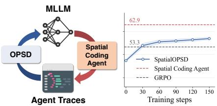  
Figure 1: MindCube-Tiny test accuracy. OPSD from spatial agents effectively boosts spatial reasoning.

Our contributions are threefold:

• We show that spatial coding-agent traces effectively elicit multimodal spatial reasoning.

• We propose SpatialOPSD, which distills tool-augmented spatial reasoning into multimodal models.

• We introduce Repetition-Aware Distillation to reduce privileged-information leakage during OPSD.

## 2 Preliminary

Spatial Coding Agent. A spatial coding agent [Cho et al., 2026] operates over a persistent Python kernel equipped with perception modules and scientific libraries [Lin et al., 2025, Carion et al., 2026]. Given an input x, the agent iteratively writes and executes code to produce a T-step trace:

$$
\tau = ( r _ { 0 } , a _ { 0 } , o _ { 0 } \ldots r _ { t } , a _ { t } , o _ { t } \ldots , y _ { A } ) ,\tag{1}
$$

where $r _ { t }$ is a natural-language reasoning step, $a _ { t }$ is an executable code snippet, $o _ { t }$ is the execution output, and $y _ { A }$ is the agent’s final answer. At each step $t ,$ an MLLM policy $\pi _ { \theta }$ generates the reasoning and code conditioned on the context history: $( r _ { t } , a _ { t } ) \sim \pi _ { \theta } ( . | x , \tau _ { < t } )$ . The kernel then executes $a _ { t }$ to yield $o _ { t }$ , while maintaining the state variables in Python kernel across turns for subsequent steps.

On-Policy Self-Distillation. On-policy self-distillation (OPSD) [Zhao et al., 2026a] uses a copy of the student’s initial model, conditioned on privileged information I, as its teacher. Let $p _ { \theta }$ denote the trainable student and $p _ { \phi }$ the frozen teacher, both initialized from the same checkpoint. For a student-generated trajectory y, the iteration-specific training objective is

$$
\ell _ { \mathrm { O P S D } } ( y ) \triangleq \frac { 1 } { | y | } \sum _ { t = 1 } ^ { | y | } D _ { \mathrm { K L } } \left( \underbrace { p _ { \theta } ( \cdot  { | } x , y _ { < t } ) } _ { \mathrm { s t u d e n t } }  { \lVert } \underbrace { p _ { \phi } ( \cdot  { | } x , \mathbf { I } , y _ { < t } ) } _ { \mathrm { t e a c h e r } } \right) .\tag{2}
$$

Averaging over on-policy student rollouts yields the training loss:

$$
{ \mathcal { L } } _ { \mathrm { O P S D } } = \mathbb { E } _ { y \sim p _ { \bar { \theta } } ( \cdot \vert x ) } \left[ \ell _ { \mathrm { O P S D } } ( y ) \right] , \qquad { \bar { \theta } } = \mathrm { s g } ( \theta ) ,\tag{3}
$$

where $\mathrm { s g }$ denotes stop-gradient. Rollouts are sampled with detached parameters $\bar { \theta }$ and held fixed during optimization; gradients flow only through the student branch. OPSD provides dense supervision on the student’s own trajectories, but introduces two risks: self-reinforcing repetition, where the teacher endorses repetitive continuations [Holtzman et al., 2019, Fang et al., 2026]; and privileged-information leakage, where the teacher’s context-copying bias may encourage the student to reproduce details from privileged information that will be unavailable at inference time, rather than learn task-relevant reasoning [Yang et al., 2026a].

Chain-of-Thought. CoT introduces an intermediate rationale z to expand test-time computation [Wei et al., 2022]. It factorizes the prediction for input x and answer y as

$$
p ( y , z \mid x ) = p ( y \mid x , z ) \cdot p ( z \mid x ) .\tag{4}
$$

Despite its success in general reasoning tasks, text-based CoT has shown mixed effects on spatial reasoning in MLLMs, improving accuracy for some models and tasks while degrading it for others [Yang et al., 2026d, Yin et al., 2025, Yang et al., 2025]. Generating an intermediate rationale alone is therefore not sufficient to ensure effective spatial reasoning.

## 3 Spatial Reasoning via OPSD

## 3.1 Motivation

We ask whether execution-grounded guidance can elicit more effective spatial reasoning than a generic chain-of-thought prompt. To investigate this question, we compare four inference settings on shared spatial reasoning benchmarks [Yin et al., 2025, Zhang et al., 2026a] using Qwen3.5-9B [Qwen Team, 2026a]. We compare four settings on the same benchmarks: Direct QA answers without a rationale; Prompted CoT elicits step-by-step reasoning; Spatial Coding Agent iteratively generates and executes code; and Agent-Trace-Conditioned CoT uses the agent’s execution trace to produce a rationale and answer without further tool calls. Figure 2a reveals an intriguing phenomenon: while deploying a coding agent significantly outperforms generic CoT prompting, merely conditioning CoT on observed agent traces matches the spatial reasoning capabilities of the full agent. As shown in Figure 2b, these traces ground the generated rationales in concrete spatial analysis, significantly increasing references to 3D perception (1.8×) and counterfactual motion (1.6×) concepts.

However, this paradigm still fundamentally relies on externally generated traces during inference. This motivates our core objective: can we internalize these trace-conditioned benefits to enablefully tool-free spatial reasoning? We address this by formulating agent traces as privileged information during training. By distilling a teacher model conditioned on these traces into a student conditioned solely on the raw input, we compel the model to internalize the underlying geometric logic, rather than merely memorizing trace-s

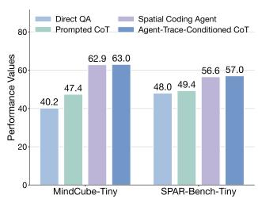  
(a) Prompting strategies

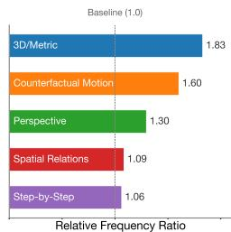  
(b) Frequency changes  
Figure 2: (a) Effects of prompting strategies on spatial reasoning. (b) Agent-trace-conditioned CoT increases spatial concept frequency.

## 3.2 SpatialOPSD

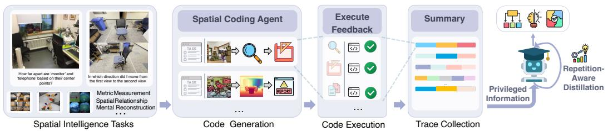  
Figure 3: Overview of SpatialOPSD. Verified spatial-agent traces are summarized into privileged information, which guides Repetition-Aware Distillation for spatial reasoning.

We present SpatialOPSD, an OPSD framework that learns from privileged execution traces. Our setup is simple: a single MLLM serves as both teacher and student, with asymmetric access to information. The teacher uses verified traces to provide token-level supervision; the student observes only the raw input x. To instantiate this framework, our first step is to acquire the privileged training context.

Trace Collection. We deploy a spatial coding agent A (e.g., SpatialClaw) as an oracle that solves each training query x through a multi-turn code-execution loop. At turn $t ,$ A emits a reasoning step $r _ { t } ,$ generates a code cell $a _ { t } .$ , and receives a verified observation $o _ { t } = \operatorname { e x e c } ( a _ { t } , s _ { t } )$ from a persistent Python kernel equipped with geometric primitives (depth, segmentation, camera pose). A trace is the full interaction record $\tau = ( r _ { 0 } , a _ { 0 } , o _ { 0 } , \ldots , r _ { T - 1 } , a _ { T - 1 } , o _ { T - 1 } , y _ { A } )$ , retained only when the final prediction $y . a$ passes deterministic verification against the ground truth. This yields a corpus $\mathcal { D } _ { \tau } \overset { \cdot } { = } \{ ( x _ { i } , \tau _ { i } , y _ { i } ) \}$ of verified, load-bearing reasoning traces, without any human annotation.

Privileged Information Construction. Given a verified trace τ and answer $y ,$ we construct privileged information $\mathbf { I } = \Phi ( \tau , y )$ to condition the teacher. We consider four variants:

$$
\Phi ( \tau , y ) = \left\{ \begin{array} { l l } { \tau , } & { \mathrm { F U L L - T R A C E } , } \\ { \mathrm { s c r u b } _ { y } ( g ( \tau ; \rho _ { \mathrm { s u m } } ) ) , } & { \mathrm { S U M M A R Y } , } \\ { g ( \tau ; \rho _ { \mathrm { f a c t } } ) \parallel \alpha ( y ) , } & { \mathrm { F A C T } , } \\ { \psi ( g ( \tau ; \rho _ { \mathrm { i n t } } ) ) , } & { \mathrm { I N T E N T } . } \end{array} \right.\tag{5}
$$

Here, $g ( \tau ; \rho _ { k } )$ rewrites $\tau$ under instruction $\rho _ { k }$ . FULL-TRACE retains τ verbatim. SUMMARY condenses $\left( \boldsymbol { r } _ { t } , \boldsymbol { a } _ { t } , \boldsymbol { o } _ { t } \right)$ , with scrub removing explicit answer references. FACT extracts factual findings without inferential steps and appends the formatted answer $\alpha ( y )$ via concatenation ∥. INTENT extracts the strategy underlying $( r _ { t } , a _ { t } )$ , with ψ removing tool-specific details. Figure 6 shows that SUMMARY performs best with a moderate teacher–student entropy gap, while other strategies exhibit high uncertainty or excessive entropy gaps; prompts and implementation details are provided in Appendix A.1.

Repetition-Aware Distillation. Given the privileged information I, we distill the teacher’s reasoning into the student policy $p _ { \theta } ( \cdot \mid x )$ via OPSD on studentgenerated rollouts. However, standard distillation in this setting suffers from two degenerate copying behaviors. First, the teacher tends to reinforce, rather than correct, the student’s self-repetitive loops [Fang et al., 2026]. Second, the teacher often favors verbatim transcriptions of I, which is intrinsically harmful since the student cannot access I at inference. To address this, we propose Repetition-Aware Distillation. We explicitly detect spans that either repeat earlier rollout content or transcribe I. For these flagged tokens, we mask the standard distillation supervision and instead apply an unlikelihood penalty.

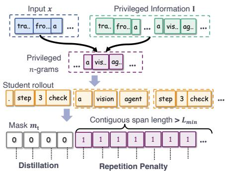  
Figure 4: Illustration of Repetition-Aware Distillation.

Detecting Repetition and Transcription. We use token n-gram matching to detect both selfrepetition and privileged-information transcription. Let $\textstyle { \mathcal { N } } _ { n } ( \cdot )$ denote the set of token n-grams. We define privileged n-grams as those appearing in the I but not in the input x:

$$
\mathcal { G } _ { \mathrm { p r i v } } = \mathcal { N } _ { n } ( x , \mathbf { I } ) \setminus \mathcal { N } _ { n } ( x ) .\tag{6}
$$

An n-gram in the student rollout y is flagged if it belongs to $\mathcal { G } _ { \mathrm { p r i v } }$ or has appeared earlier in y. To ignore accidental short overlaps, we filter these flagged tokens by length. The final binary mask $m _ { t }$ is defined as:

$$
m _ { t } = { \left\{ \begin{array} { l l } { 1 , } & { { \mathrm { i f ~ t o k e n ~ } } t { \mathrm { ~ b e l o n g s ~ t o ~ a ~ c o n t i g u o u s ~ f l a g g e d ~ s p a n ~ o f ~ l e n g t h ~ } } \geq L { \mathrm { m i n } } , } \\ { 0 , } & { { \mathrm { o t h e r w i s e } } . } \end{array} \right. }\tag{7}
$$

Masked Distillation. We use mask $m _ { t }$ in Eq. (7) to exclude flagged tokens from OPSD in Eq. (2), replacing its uniform token average with an average over unmasked tokens:

$$
\ell _ { \mathrm { d i s t i l } } ( y ) \triangleq \frac { 1 } { \operatorname* { m a x } ( 1 , N _ { y } ) } \sum _ { t = 1 } ^ { | y | } ( 1 - m _ { t } ) D _ { \mathrm { K L } } \big ( p _ { \theta } ( \cdot  { | } x , y _ { < t } )  { \left\| \right)} p _ { \phi } ( \cdot  { | } x ,  { \mathbf { I } } , y _ { < t } )  ,\tag{8}
$$

where $\begin{array} { r } { N _ { y } \triangleq \sum _ { t = 1 } ^ { | y | } ( 1 - m _ { t } ) } \end{array}$ is the number of unmasked tokens. This changes only the token-level aggregation in OPSD: rollout sampling and teacher stop-gradient remain unchanged. Trajectories and masks are held fixed during optimization. When $m _ { t } = 0$ for all t, the objective reduces to Eq. (3); fully masked trajectories contribute zero loss.

Algorithm 1 SpatialOPSD   
Input: Training set $\mathcal { D } ;$ model $p _ { \theta } ;$ teacher $p _ { \phi } ;$ spatial agent $\mathcal { A }$ with kernel K and tools $\tau ;$ privileged  
information constructor Φ $\overline { { ( \operatorname { E q . } ( 5 ) ) } }$   
Input: Training steps $U ;$ rollout limit $L _ { \mathrm { m a x } } ;$ learning rate $\eta ; n = 4 ; L _ { \mathrm { m i n } } = 3 2 ; \lambda _ { \mathrm { r e p } } = 0 . 1 ;$   
$\epsilon = 1 0 ^ { - 6 }$   
Output: Trained model $p _ { \theta }$   
Phase I: Verified Trace Summarization   
1: $\mathcal { D } _ { I }  \emptyset$   
2: for each $( x , y ^ { \star } ) \in { \mathcal { D } }$ do   
3: $( \tau , y _ { A } ) \stackrel {  } {  } \mathrm { R u n A g e n t } ( A , x ; \mathcal { K } , \mathcal { T } )$   
4: if Verify $\boldsymbol { \mathsf { \Pi } } ^ { r } ( y _ { A } , y ^ { \star } )$ then   
5: $\mathcal { D } _ { I }  \mathcal { D } _ { I } \cup \{ ( x , \Phi ( \tau , y ^ { \star } ) ) \}$ ▷ Construct privileged info from verified trace and label   
(Eq. (5))   
6: end if   
7: end for   
Phase II: Repetition-Aware Distillation   
8: for $u = 1 , \ldots , U$ do   
9: Sample a minibatch $B \subseteq D _ { I }$   
10: ${ \bar { \theta } } \gets \operatorname { s g } ( \theta )$   
11: for each $( x , \mathbf { I } ) \in B$ do   
12: Sample $y \sim p _ { \bar { \theta } } ( \cdot \mid x )$ until eos or $L _ { \mathrm { m a x } }$ tokens   
13: Build privileged n-gram set $\mathcal { G } _ { \mathrm { p r i v } }$ from (x, I) using Eq. (6)   
14: Compute mask m using Eq. $( \hat { 7 } )$ ▷ Flags self-repetition and transcription of I   
15: Evaluate student p<sub>θ</sub> and teacher $p _ { \phi }$ on prefixes $y _ { < t }$   
16: Compute $\ell _ { \mathrm { d i s t i l l } } ( y )$ and $\ell _ { \mathrm { r e p } } ( y )$ using Eqs. (8) and (9)   
17: end for   
18: Average trajectory losses over $\boldsymbol { B }$ to obtain ${ \widehat { \mathcal { L } } } _ { \mathrm { r e p - } }$ distill   
19: $\theta  \theta - \eta \nabla _ { \theta } \big ( \widehat { \mathcal { L } } _ { \mathrm { r e p - d i s t i l l } } \big )$ ▷ Hold rollouts and masks fixed   
20: end for   
21: return $p _ { \theta }$

Unlikelihood Penalty. Masking removes distillation supervision at flagged positions, but does not explicitly discourage the flagged tokens. We therefore apply an unlikelihood penalty [Welleck et al., 2019]. Let $p _ { t } = p _ { \theta } ( y _ { t } \mid x , y _ { < t } )$ be the student’s probability of the sampled token. The trajectory-level penalty is

$$
\ell _ { \mathrm { r e p } } ( y ) \triangleq \frac { 1 } { \operatorname* { m a x } ( 1 , M _ { y } ) } \sum _ { t = 1 } ^ { | y | } m _ { t } \left[ - \log \big ( \operatorname* { m a x } ( 1 - p _ { t } , \epsilon ) \big ) \right] ,\tag{9}
$$

Here, $\epsilon > 0$ is a small floor ensuring numerical stability. This clamping is essential: because degenerate repetition loops often occur with extremely high model confidence $p _ { t } \to 1$ , the raw term $- \log ( 1 - p _ { t } )$ and its gradients would otherwise diverge. This term is zero when no flagged span is detected. The final objective is

$$
\mathcal { L } _ { \mathrm { r e p - d i s t i l l } } = \mathbb { E } _ { y \sim p _ { \bar { \theta } } ( \cdot \vert x ) } \left[ \ell _ { \mathrm { d i s t i l l } } ( y ) + \lambda _ { \mathrm { r e p } } \ell _ { \mathrm { r e p } } ( y ) \right] , \qquad \bar { \theta } = \mathrm { s g } ( \theta ) .\tag{10}
$$

The two terms play complementary roles: masked distillation preserves supervision outside detected repetitions and transcriptions, while unlikelihood discourages the flagged continuations. Unless otherwise stated, we use $n = 4 , L _ { \mathrm { m i n } } = 3 2 , \lambda _ { \mathrm { r e p } } = 0 . 1 , \mathrm { a n d } \overline { { \epsilon } } = 1 0 ^ { - 6 }$

## 4 Experiments

## 4.1 Training Data Construction and Baseline Setup

We construct the training sets from the 10,000-instance MindCube training split. For SpatialOPSD and GRPO, we use the same 5,008 instances on which SpatialClaw-Qwen3.5-9B produces a correct, ground-truth-verified answer. SpatialOPSD’s privileged records are derived exclusively from the verified agent traces for these instances. For SFT, Qwen3.7-plus [Qwen Team, 2026c] can not produce correct CoT solution for all of the same 5,008 instances. We therefore generate tool-free rationales with Qwen3.7-plus for the full 10,000-instance training split and retain 4,459 instances with a correct rationale for SFT. All three methods use the same student-visible input format and evaluation protocol. Full data construction, formatting, and training details are provided in A.2.

Table 1: Comparison of the accuracy on spatial reasoning benchmarks. The best results are bolded. CP-RD: Camera perspective relative direction. CP-OVO: Camera perspective object view Orientation. PP-OVO: Person perspective object view orientation. PP-RD: Person perspective relative direction. PP-SS-RD: Person perspective scene simulation relative direction.
<table><tr><td></td><td>Average</td><td colspan="4">MindCube-Tiny</td><td colspan="6">ViewSpatial</td></tr><tr><td></td><td>Avg.</td><td>Among</td><td>Around Rotation</td><td></td><td>Overall</td><td>CP- RD</td><td>CP- OVO</td><td>PP- OVO</td><td>PP- RD</td><td>PP- SS-RD</td><td>Overall</td></tr><tr><td></td><td colspan="9">Proprietary Model</td><td></td></tr><tr><td>GPT-5</td><td>51.0</td><td>38.2</td><td>68.4</td><td>94.5</td><td>56.3</td><td>60.2</td><td>27.9</td><td>41.0</td><td>48.5</td><td>40.1</td><td>45.6</td></tr><tr><td>Gemini-3-Pro</td><td>60.7</td><td>60.7</td><td>77.2</td><td>93.0</td><td>70.9</td><td>61.9</td><td>31.6</td><td>41.1</td><td>74.3</td><td>38.9</td><td>50.4</td></tr><tr><td colspan="10">Open-Source Model</td></tr><tr><td>Qwen3-VL-8B-Instruct [Bai et al., 2025]</td><td>35.8</td><td>28.6</td><td>31.2</td><td>29.5</td><td>29.4</td><td>54.2</td><td>29.7</td><td>47.3</td><td>40.3</td><td>31.1</td><td>42.2</td></tr><tr><td>Cambrian-S-7B [Yang et al., 2026c]</td><td>39.5</td><td>39.0</td><td>39.2</td><td>33.0</td><td>37.9</td><td>50.4</td><td>22.7</td><td>45.0</td><td>38.8</td><td>41.9</td><td>41.3</td></tr><tr><td>InternVL3.5-8B [Wang et al., 2025]</td><td>40.1</td><td>38.2</td><td>44.4</td><td>34.5</td><td>40.2</td><td>49.8</td><td>24.7</td><td>50.3</td><td>34.6</td><td>32.9</td><td>40.0</td></tr><tr><td>VST-7B-SFT [Yang et al., 2026b]</td><td>45.1</td><td>35.9</td><td>50.8</td><td>37.0</td><td>39.7</td><td>52.7</td><td>29.6</td><td>51.9</td><td>50.7</td><td>64.5</td><td>50.5</td></tr><tr><td>Qwen3.5-9B-CoT [Qwen Team, 2026a]</td><td>45.9</td><td>34.5</td><td>57.0</td><td>77.9</td><td>48.3</td><td>51.2</td><td>34.4</td><td>42.3</td><td>50.1</td><td>34.8</td><td>43.4</td></tr><tr><td></td><td colspan="9">Spatial Coding Agent</td><td></td></tr><tr><td>SpatialClawQwen3.5-9B [Cho et al., 2026]</td><td>57.3</td><td>57.7</td><td>76.4</td><td>61.5</td><td>62.9</td><td>60.3</td><td>36.7</td><td>50.7</td><td>63.5</td><td>42.6</td><td>51.6</td></tr><tr><td colspan="10">Custom-Trained Model</td></tr><tr><td>Qwen3.5-9BSFT</td><td>47.6</td><td>50.4</td><td>60.6</td><td>77.7</td><td>58.1</td><td>44.3</td><td>30.7</td><td>38.1</td><td>37.8</td><td>29.3</td><td>37.0</td></tr><tr><td>Qwen3.5-9BGRPO</td><td>48.2</td><td>51.2</td><td>68.0</td><td>41.2</td><td>53.3</td><td>54.3</td><td>31.1</td><td>46.1</td><td>47.6</td><td>29.6</td><td>43.1</td></tr><tr><td>SpatialOPSD-9B (ours)</td><td>51.9</td><td>46.2</td><td>63.4</td><td>80.5</td><td>56.9</td><td>56.4</td><td>35.7</td><td>48.9</td><td>50.6</td><td>36.6</td><td>46.8</td></tr><tr><td>∆ from Qwen3.5-9B-CoT</td><td>+6.0</td><td>+11.7</td><td>+6.4</td><td>+2.6</td><td>+8.6</td><td>+5.2</td><td>+1.3</td><td>+6.6</td><td>+0.5</td><td>+1.8</td><td>+3.4</td></tr></table>

## 4.2 Evaluation Benchmarks

We evaluate SpatialOPSD on two complementary spatial reasoning benchmarks. MindCube [Yin et al., 2025] tests scene reconstruction and viewpoint simulation from partial observations, while ViewSpatial-Bench [Li et al., 2026a] evaluates localization across egocentric and allocentric viewpoints. We report accuracy and the privileged-information leakage rate defined in Appendix A.3.

## 4.3 Main Results

Table 1 compares Spatial coding against proprietary models, open-source MLLMs, and tuning baselines on MindCube-Tiny and ViewSpatial. SpatialOPSD improves the Qwen3.5-9B baseline from 45.9 to 51.9, with specific efficacy in allocentric transformations (e.g., Among +11.7). By utilizing on-policy dense supervision from agent traces, it yields higher accuracy than standard SFT (47.6) and GRPO (48.2), effectively mitigating SFT’s distribution shift and GRPO’s sparse-reward limitations. Notably, in a single tool-free forward pass, SpatialOPSD retains 91% of the performance of its iterative, tool-dependent teacher, SpatialClaw (51.9 vs. 57.3). Despite its 9B size, the model achieves results competitive with larger proprietary systems—surpassing GPT-5 [Singh et al., 2025] and narrowing the gap to Gemini-3-Pro. These results suggest that internalizing complex agent trajectories provides a viable axis for capability enhancement alongside parameter scaling.

## 4.4 Training Dynamics

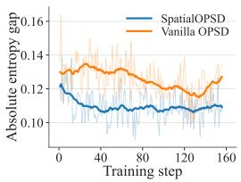  
(a) Entropy gap.

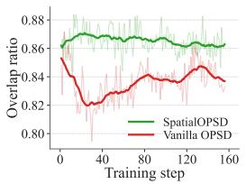  
(b) Overlap ratio.

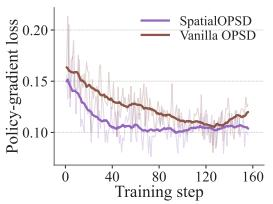  
(c) Policy-gradient Loss.

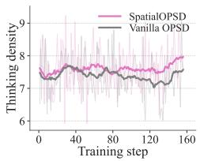  
(d) Thinking density.  
Figure 5: Training dynamics of SpatialOPSD-9B and vanilla OPSD, both using Qwen3.5-9B as the backbone.

We report the training dynamics of SpatialOPSD and vanilla OPSD method using the original objective in Eq. (3) instead of Eq. (10), labeled “SpatialOPSD” and “Vanilla OPSD” in the Figure 5, respectively. Figures 5a and 5b show that SpatialOPSD achieves a smaller teacher–student entropy gap and greater overlap between their top-100 token sets, indicating closer distributional alignment. Figure 5c further shows faster and more stable loss convergence. Finally, Figure 5d reports a higher frequency of predefined spatial-reasoning terms in student rollouts, suggesting that SpatialOPSD more effectively elicits spatially relevant reasoning during training.

Table 2: Accuracy (%) on out-ofdistribution (OOD) benchmarks. Bold indicates the best result in each row.
<table><tr><td rowspan="2">Benchmark</td><td colspan="4">Qwen3.5-9B</td></tr><tr><td>CoT</td><td>SFT</td><td>GRPO</td><td>SpatialOPSD</td></tr><tr><td>OmniSpatial</td><td>53.7</td><td>39.8</td><td>50.6</td><td>54.2</td></tr><tr><td>BLINK</td><td>67.8</td><td>47.4</td><td>66.6</td><td>68.9</td></tr><tr><td>MMStar</td><td>67.5</td><td>34.0</td><td>68.1</td><td>66.9</td></tr><tr><td>VideoMME</td><td>68.7</td><td>32.3</td><td>68.4</td><td>68.6</td></tr><tr><td>Average</td><td>64.4</td><td>38.4</td><td>63.4</td><td>64.7</td></tr></table>

Table 3: OPSD component ablation on masked distillation (Mask) and unlikelihood penalty (UL), reporting accuracy and privileged-information (PI) leakage.
<table><tr><td>Method</td><td>Mask</td><td>UL</td><td>MindCube- Tiny Overall (%)</td><td>View Spatial Overall (%)</td><td>Avg. (%)</td><td>PI leakage (%) ↓</td></tr><tr><td>Qwen3.5-9B-CoT</td><td>=</td><td></td><td>48.3</td><td>43.4</td><td>45.9</td><td>一</td></tr><tr><td>Vanilla OPSD</td><td>x</td><td>x</td><td>55.4 (+7.1)</td><td>46.0 (+2.6)</td><td>50.7 (+4.8)</td><td>82.7</td></tr><tr><td>Vanilla OPSD</td><td>√</td><td>x</td><td>60.0 (+11.7)</td><td>45.9 (+2.5)</td><td>53.0 (+7.1)</td><td>73.6</td></tr><tr><td>Vanilla OPSD</td><td>x</td><td>√</td><td>55.6 (+7.3)</td><td>47.3 (+3.9)</td><td>51.5 (+5.6)</td><td>6.7</td></tr><tr><td>SpatialOPSD</td><td>√</td><td>√</td><td>56.9 (+8.6)</td><td>46.8 (+3.4)</td><td>51.9 (+6.0)</td><td>9.1</td></tr></table>

## 4.5 Out-of-domain Evaluation

We evaluate SpatialOPSD on four held-out benchmarks unseen during training: BLINK [Fu et al., 2024] and OmniSpatial [Jia et al., 2026] for spatial reasoning, and MMStar [Chen et al., 2024b] and Video-MME [Fu et al., 2025] for general multimodal capabilities. As shown in Table 2, SpatialOPSD achieves the highest average accuracy across the four benchmarks (64.7%), outperforming both SFT and GRPO and slightly exceeding the CoT baseline (64.4%). Its results on the spatial benchmarks, together with its competitive performance on MMStar and Video-MME, suggest that spatial reasoning gains do not substantially compromise performance on the evaluated general multimodal benchmarks.

## 4.6 Ablations

Impact of Repetition-Aware Distillation. Table 3 ablates masked distillation (Mask) and unlikelihood regularization (UL). Mask alone yields the highest average accuracy, while UL alone provides greater leakage reduction. Combining both substantially reduces PI leakage relative to vanilla OPSD, while trading some accuracy relative to Mask alone. These results suggest complementary roles for Mask and UL in balancing knowledge transfer and leakage suppression. The privileged information leakage rate is defined in A.3.

Impact of Hyperparameter. We ablate the repetition penalty weight $\lambda _ { \mathrm { { r e p } } }$ and minimum repeated-span length $L _ { \mathrm { m i n } }$ on MindCube-Tiny and ViewSpatial. A moderate penalty suppresses PI leakage while improving accuracy; a stronger penalty reduces leakage further at the expense of accuracy. Varying $L _ { \mathrm { m i n } }$ has little effect on accuracy but substantially affects leakage. We therefore use $\lambda _ { \mathrm { r e p } } = 0 . 1 0$ and $L _ { \operatorname* { m i n } } = 3 2$ to balance leakage suppression and accuracy (Table 4).

Model Scale. We evaluate SpatialOPSD with Qwen3.5- 2B, Qwen3.5-4B, and Qwen3.6-27B [Qwen Team, 2026b] students. Given the smaller models’ limited coding-agent and tool-use capabilities, the 2B and 4B students train on data derived from verified SpatialClaw-Qwen3.5-9B traces, while the 27B student uses verified SpatialClaw-Qwen3.6-

Table 4: Effect of $L _ { \mathrm { m i n } }$ and $\lambda _ { r e p }$ on accuracy and privileged information (PI) leakage rate.
<table><tr><td>Value</td><td>MindCube-Tiny Overall (%) ↑</td><td>ViewSpatial Overall (%) ↑</td><td>PI Leakage (%) ↓</td></tr><tr><td>Baseline</td><td>55.4</td><td>46.0</td><td>82.7</td></tr><tr><td></td><td>Varying  $\lambda _ { \mathrm { { r e p } } }$ </td><td> $( L _ { \operatorname* { m i n } } = 3 2 )$ </td><td></td></tr><tr><td>0.00</td><td>60.0 (+4.6)</td><td>45.9 (-0.1)</td><td>73.6 (-9.1)</td></tr><tr><td>0.05</td><td>57.7 (+2.3)</td><td>47.0 (+1.0)</td><td>36.0 (-46.7)</td></tr><tr><td>0.10</td><td>56.9 (+1.5)</td><td>46.8 (+0.8)</td><td>9.1 (-73.6)</td></tr><tr><td>0.15</td><td>55.1 (-0.3)</td><td>46.0 (+0.0)</td><td>0.8 (-81.9)</td></tr><tr><td></td><td>Varying  $L _ { \mathrm { m i n } }$ </td><td> $( \lambda _ { \mathrm { r e p } } = 0 . 1 )$ </td><td></td></tr><tr><td></td><td>56.0 (+0.6)</td><td>46.9 (+0.9)</td><td>75.9 (-6.8)</td></tr><tr><td>48</td><td>57.0 (+1.6)</td><td> $4 7 . 0 \ : ( + 1 . 0 ) $ </td><td>49.5 (-33.2)</td></tr><tr><td>16</td><td>56.4 (+1.0)</td><td> $4 7 . 0 \ : ( + 1 . 0 ) $ </td><td>24.0 (-58.7)</td></tr><tr><td>32</td><td>56.9 (+1.5)</td><td>46.8 (+0.8)</td><td>9.1 (-73.6)</td></tr><tr><td>64</td><td>56.9 (+1.5)</td><td>46.7 (+0.7)</td><td>59.3 (-23.4)</td></tr></table>

27B traces. As shown in Table 5, SpatialOPSD improves accuracy on both benchmarks at all three student scales. Average accuracy (the unweighted mean across benchmarks) increases from 40.6% to 42.8% at 2B, from 46.4% to 50.2% at 4B, and from 50.6% to 54.2% at 27B, corresponding to gains of 2.2, 3.8, and 3.6 percentage points, respectively.

Privileged Information Types. We also evaluate how different strategies for constructing privileged information affect SpatialOPSD. The results in Table 6 show that SUMMARY achieves the best performance. Specifically, in Figure 6, we find that SUMMARY maintains a moderate entropy gap between the student and teacher. Although INTENT yields a smaller gap, both models exhibit high entropy. In contrast, FULL-TRACE induces a large entropy gap that hinders optimization, while FACT exhibits a growing gap in the later stages of training, likewise compromising optimization outcomes.

Table 5: Performance Comparison of SpatialOPSD across different model sizes.
<table><tr><td>Model</td><td>MindCube-Tiny Overall (%)</td><td>ViewSpatial Overall (%)</td><td>Avg. (%)</td></tr><tr><td>Qwen3.5-2B</td><td>41.4</td><td>39.8</td><td>40.6</td></tr><tr><td>SpatialOPSD-2B</td><td>43.5 (+2.1)</td><td>42.1 (+2.3)</td><td>42.8 (+2.2)</td></tr><tr><td>Qwen3.5-4B</td><td>47.7</td><td>45.1</td><td>46.4</td></tr><tr><td>SpatialOPSD-4B</td><td>53.8 (+6.1)</td><td>46.6 (+1.5)</td><td>50.2 (+3.8)</td></tr><tr><td>Qwen3.6-27B</td><td>54.1</td><td>47.1</td><td>50.6</td></tr><tr><td>SpatialOPSD-27B</td><td>58.8 (+4.7)</td><td>49.6 (+2.5)</td><td>54.2 (+3.6)</td></tr></table>

Table 6: Effect of privileged information types.
<table><tr><td>Method / PI Type</td><td>MindCube-Tiny Overall (%)</td><td>ViewSpatial Overall (%)</td><td>Avg. (%)</td></tr><tr><td>Qwen3.5-9B-CoT</td><td>48.3</td><td>43.4</td><td>45.9</td></tr><tr><td colspan="4">SpatialOPSD with different PI types</td></tr><tr><td>INTENT</td><td>53.3 (+5.0)</td><td>47.4 (+4.0)</td><td>50.4 (+4.5)</td></tr><tr><td>FULL-TRACE</td><td>54.5 (+6.2)</td><td>45.8 (+2.4)</td><td>50.2 (+4.3)</td></tr><tr><td>FACT</td><td>55.2 (+6.9)</td><td>45.4 (+2.0)</td><td>50.3 (+4.4)</td></tr><tr><td>SUMMARY</td><td>56.9 (+8.6)</td><td>46.8 (+3.4)</td><td>51.9 (+6.0)</td></tr></table>

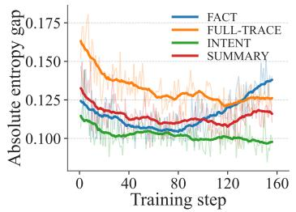  
(a) Entropy difference.

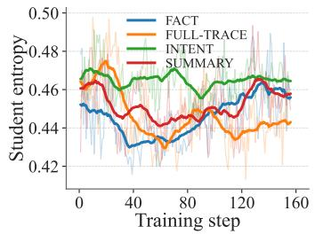  
(b) Student entropy.

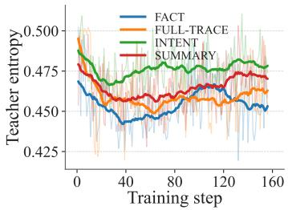  
(c) Teacher entropy.  
Figure 6: Training dynamics under different PI variants. We compare FULL-TRACE, SUMMARY, FACT, and INTENT in terms of (a) absolute entropy gap, (b) student entropy, and (c) teacher entropy.

Effect of verification. As shown in Table 7, training without verification uses agent traces from all 10,000 MindCube training samples, whereas verification retains only the 5,008 traces whose final answers match the ground truth. Despite using fewer traces, the verified subset improves performance by 4.9 points on MindCube-Tiny and 0.5 points on ViewSpatial, highlighting the importance of trace quality over quantity.

Scalability across coding agents. Table 8 shows that SpatialOPSD generalizes across different coding agents. Traces generated by both SpatialClaw [Cho et al., 2026] and pySpatial [Luo et al., 2026] consistently improve the base model, while pySpatial achieves comparable or slightly better performance, demonstrating the agent-agnostic scalability of our framework.

Table 7: Effect of verification using agent execution results and ground-truth answers.  
Table 8: Performance of SpatialOPSD trained on different coding agent traces.
<table><tr><td>Model</td><td>Verification</td><td>MindCube-Tiny Overall</td><td>ViewSpatial Overall</td><td>Avg</td></tr><tr><td>Qwen3.5-9B-CoT</td><td>-</td><td>48.3</td><td>43.4</td><td>45.9</td></tr><tr><td>SpatialOPSD-9B</td><td>x</td><td>52.0</td><td>46.3</td><td>49.2</td></tr><tr><td>SpatialOPSD-9B</td><td>√</td><td>56.9</td><td>46.8</td><td>51.9</td></tr></table>

<table><tr><td>Model</td><td>Coding Agent</td><td>MindCube-Tiny Overall</td><td>ViewSpatial Overall</td><td>Avg</td></tr><tr><td>Qwen3.5-9B-CoT</td><td></td><td>48.3</td><td>43.4</td><td>45.9</td></tr><tr><td>SpatialOPSD-9B</td><td>SpatialClaw</td><td>56.9</td><td>46.8</td><td>51.9</td></tr><tr><td>SpatialOPSD-9B</td><td>pyspatial</td><td>57.0</td><td>47.1</td><td>52.0</td></tr></table>

## 5 Analysis

Quantitative Analysis. To examine how training changes outputs, we analyze reasoning traces on 1,040 MindCube-tiny samples. Evaluated by lexical marker frequency and rollout coverage, training consistently increases all eight target categories. The model adopts a more structured reasoning style: Step Numbering exhibits the largest coverage gain (+53.0 points), followed by Verification (+43.9) and Scene Context (+33.8). While these metrics capture organizational changes in the generated traces, they measure articulation style rather than intrinsic reasoning ability (details in A.4).

Qualitative Analysis. Figures 7 and 8 illustrate the behavioral advantages of SpatialOPSD-9B. First, unlike Qwen3.5-9B-GRPO which conflates viewpoint shifts with simple 1D motion (purely rightward), our model correctly disentangles multi-axis trajectories. Second, vanilla OPSD suffers from shortcut learning, hallucinating unavailable tool traces to justify errors. In contrast, SpatialOPSD grounds its inference strictly in observable visual cues, such as depth and relative positions. These cases demonstrate that our method enables true viewpoint-aware reasoning while effectively mitigating spurious reliance on privileged training artifacts.

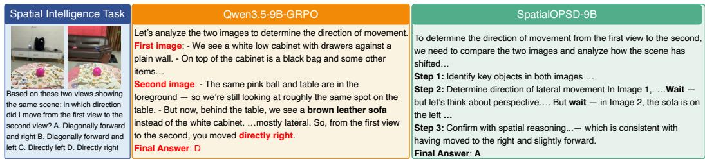  
Figure 7: Performance comparison of Qwen3.5-9B-GRPO and SpatialOPSD-9B on MindCube-Tiny.

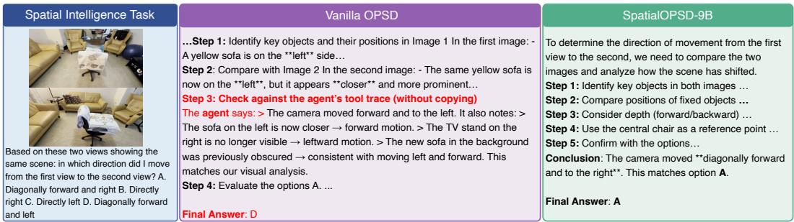  
Figure 8: Privileged information leakage. The baseline generates unexecutable agent-like traces, whereas SpatialOPSD-9B produces grounded spatial reasoning.

## 6 Related Work

Spatial Intelligence in Multimodal LLMs. Recent spatial MLLMs generally follow three paradigms. (i) Supervised fine-tuning on QA pairs [Chen et al., 2024a, Daxberger et al., 2025, Cai et al., 2026b, Gao et al., 2026, Liu et al., 2026, Wu et al., 2026a] generalizes poorly beyond training data and leaves spatial reasoning implicit. (ii) RL-optimized Chain-of-Thought [Yin et al., 2025, Sarch et al., 2026, Sun et al., 2025, Li et al., 2026b] provides explicit logic, but involves a complex pipeline bottlenecked by the high cost of curating cold-start trajectories. (iii) Tool augmentation [Mou et al., 2026, Dai et al., 2026, Zhang et al., 2026b, Luo et al., 2026, Cho et al., 2026] avoids training, yet suffers from heavy inference overhead and compounding cascading errors. In this paper, we propose a self-distillation approach that leverages agent traces to elicit and internalize spatial CoT reasoning.

On-Policy Self-Distillation. On-policy self-distillation (OPSD) trains a student via a teacher conditioned on privileged information(e.g., reference solutions [Zhao et al., 2026a], environment feedback [Hübotter et al., 2026], or—in multimodal extensions—high-resolution visual crops [Yuan et al., 2026, Cai et al., 2026a, Zhu et al., 2026] and reasoning rationales [Li et al., 2026c, Cheng et al., 2026]). A fundamental bottleneck is privilege leakage [Yang et al., 2026a]: the student hallucinates unobserved references at inference [Wu et al., 2026b]). To mitigate this, prior solutions typically modify the teacher’s supervision by making the privilege input-recoverable [Tian et al., 2026, Zhao et al., 2026b], temporally localized [Wang et al., 2026], or analytically isolated [Wu et al., 2026b]. In SpatialOPSD, rather than redesigning the teacher’s supervision, we leave the privilege intact and simply penalize student tokens that reproduce trace-exclusive content.

## 7 Conclusion

We introduced SpatialOPSD, which distills verified spatial coding agent traces into MLLMs as privileged information for on-policy self-distillation. To separate spatial reasoning from tool-specific artifacts, Repetition-Aware Distillation penalizes copying privileged content and self-repetition. On

MindCube and ViewSpatial, SpatialOPSD outperforms SFT and RL baselines and approaches toolusing agents without inference-time tools. By using training data generated by the same MLLM, SpatialOPSD forms a self-distillation learning loop, offering a practical route from tool-assisted data generation to stronger standalone spatial reasoning.

## References

Shuai Bai, Yuxuan Cai, Ruizhe Chen, Keqin Chen, Xionghui Chen, Zesen Cheng, Lianghao Deng, Wei Ding, Chang Gao, Chunjiang Ge, et al. Qwen3-vl technical report. arXiv preprint arXiv:2511.21631, 2025.

Yishuo Cai, Jiahui Liu, Yuanxin Liu, Haobo Deng, Linli Yao, Yuhao Zheng, Kun Ouyang, Zhimo Li, Ziyue Wang, Xu Sun, et al. Thinking without images: Internalizing visual manipulation with on-policy self-distillation. arXiv preprint arXiv:2606.08719, 2026a.

Zhongang Cai, Ruisi Wang, Chenyang Gu, Fanyi Pu, Junxiang Xu, Yubo Wang, Wanqi Yin, Zhitao Yang, Chen Wei, Tongxi Zhou, et al. Scaling spatial intelligence with multimodal foundation models. In Proceedings of the IEEE/CVF Conference on Computer Vision and Pattern Recognition, pages 7879–7890, 2026b.

Nicolas Carion, Laura Gustafson, Yuan-Ting Hu, Shoubhik Debnath, Ronghang Hu, Didac Suris Coll-Vinent, Chaitanya Ryali, Kalyan Vasudev Alwala, Haitham Khedr, Andrew Huang, et al. Sam 3: Segment anything with concepts. In International conference on learning representations, volume 2026, pages 138846–138923, 2026.

Boyuan Chen, Zhuo Xu, Sean Kirmani, Brain Ichter, Dorsa Sadigh, Leonidas Guibas, and Fei Xia. Spatialvlm: Endowing vision-language models with spatial reasoning capabilities. In Proceedings of the IEEE/CVF conference on computer vision and pattern recognition, pages 14455–14465, 2024a.

Lin Chen, Jinsong Li, Xiaoyi Dong, Pan Zhang, Yuhang Zang, Zehui Chen, Haodong Duan, Jiaqi Wang, Yu Qiao, Dahua Lin, et al. Are we on the right way for evaluating large vision-language models? Advances in Neural Information Processing Systems, 37:27056–27087, 2024b.

Zebang Cheng, Shuimu Chen, Boxue Yang, Yuanshen Guan, Jingyi Chen, Zheng Lian, Xiaojiang Peng, Fei Ma, LaiZhong Cui, and Qi Tian. Omniopsd: Rationale-privileged on-policy selfdistillation for affective computing. arXiv preprint arXiv:2606.15920, 2026.

Seokju Cho, Ryo Hachiuma, Abhishek Badki, Hang Su, Byung-Kwan Lee, Chan Hee Song, Sifei Liu, Subhashree Radhakrishnan, Seungryong Kim, Yu-Chiang Frank Wang, et al. Spatialclaw: Rethinking action interface for agentic spatial reasoning. arXiv preprint arXiv:2606.13673, 2026.

Yalun Dai, Hao Li, Shulin Tian, Runmao Yao, Yuhao Dong, Fangzhou Hong, Zhaoxi Chen, Fangfu Liu, Baoliang Tian, Dingwen Zhang, et al. S-agent: Spatial tool-use elicits reasoning for spatial intelligence. arXiv preprint arXiv:2606.20515, 2026.

Erik Daxberger, Nina Wenzel, David Griffiths, Haiming Gang, Justin Lazarow, Gefen Kohavi, Kai Kang, Marcin Eichner, Yinfei Yang, Afshin Dehghan, et al. Mm-spatial: Exploring 3d spatial understanding in multimodal llms. In 2025 IEEE/CVF International Conference on Computer Vision (ICCV), pages 7395–7408. IEEE, 2025.

Lizhe Fang, Weizhou Shen, Tianyi Tang, and Yisen Wang. Copy less, ground more: Overcoming repetitive copying in long-context reasoning via evidence-aware reinforcement learning. arXiv preprint arXiv:2607.19345, 2026.

Chaoyou Fu, Yuhan Dai, Yongdong Luo, Lei Li, Shuhuai Ren, Renrui Zhang, Zihan Wang, Chenyu Zhou, Yunhang Shen, Mengdan Zhang, et al. Video-mme: The first-ever comprehensive evaluation benchmark of multi-modal llms in video analysis. In 2025 IEEE/CVF Conference on Computer Vision and Pattern Recognition (CVPR), pages 24108–24118. IEEE, 2025.

Xingyu Fu, Yushi Hu, Bangzheng Li, Yu Feng, Haoyu Wang, Xudong Lin, Dan Roth, Noah A Smith, Wei-Chiu Ma, and Ranjay Krishna. Blink: Multimodal large language models can see but not perceive. In European Conference on Computer Vision, pages 148–166. Springer, 2024.

Yuanyuan Gao, Hao Li, Yifei Liu, Xinhao Ji, Yuning Gong, Yuanjun Liao, Fangfu Liu, Manyuan Zhang, Yuchen Yang, Dan Xu, et al. Holi-spatial: Evolving video streams into holistic 3d spatial intelligence. arXiv preprint arXiv:2603.07660, 2026.

Ari Holtzman, Jan Buys, Li Du, Maxwell Forbes, and Yejin Choi. The curious case of neural text degeneration. arXiv preprint arXiv:1904.09751, 2019.

Jonas Hübotter, Frederike Lübeck, Lejs Behric, Anton Baumann, Marco Bagatella, Daniel Marta, Ido Hakimi, Idan Shenfeld, Thomas Kleine Buening, Carlos Guestrin, et al. Reinforcement learning via self-distillation. arXiv preprint arXiv:2601.20802, 2026.

Mengdi Jia, Zekun Qi, Shaochen Zhang, Wenyao Zhang, Xinqiang Yu, Jiawei He, He Wang, and Li Yi. Omnispatial: Towards comprehensive spatial reasoning benchmark for vision language models. In International Conference on Learning Representations, volume 2026, pages 35634–35670, 2026.

Dingming Li, Hongxing Li, Zixuan Wang, Yuchen Yan, Hang Zhang, Siqi Chen, Guiyang Hou, Shengpei Jiang, Wenqi Zhang, Yongliang Shen, et al. Viewspatial-bench: Evaluating multiperspective spatial localization in vision-language models. In European Conference on Computer Vision, pages 95–111. Springer, 2026a.

Jiangyang Li, Cong Wan, Changjie Wu, Songlin Dong, Lingjun Zhang, Linzhe Shi, Xu Wang, Zhiheng Ma, Hang Zhang, Mu Xu, et al. Prosr: Process-shaped spatial reasoning for reliable chain-of-thought in vlms. arXiv preprint arXiv:2605.25524, 2026b.

Pengyu Li, Zhitao Gao, Lingling Zhang, Muye Huang, Yuanming Li, Zesheng Yang, Fangzhi Xu, and Jun Liu. Visual-opsd: Cross-modal on-policy self-distillation for efficient unified multimodal reasoning. arXiv preprint arXiv:2606.18974, 2026c.

Haotong Lin, Sili Chen, Junhao Liew, Donny Y Chen, Zhenyu Li, Guang Shi, Jiashi Feng, and Bingyi Kang. Depth anything 3: Recovering the visual space from any views. arXiv preprint arXiv:2511.10647, 2025.

Jianhui Liu, Haoze Sun, Wenbo Li, Yanbing Zhang, Rui Yang, Zhiliang Zhu, Yijun Yang, Shenghe Zheng, Nan Jiang, Jiaxiu Jiang, et al. Openspatial: A principled data engine for empowering spatial intelligence. arXiv preprint arXiv:2604.07296, 2026.

Zhanpeng Luo, Ce Zhang, Silong Yong, Cunxi Dai, Qianwei Wang, Haoxi Ran, Guanya Shi, Katia Sycara, and Yaqi Xie. pyspatial: Generating 3d visual programs for zero-shot spatial reasoning. arXiv preprint arXiv:2603.00905, 2026.

Tingshu Mou, Jiabo He, Renying Wang, Ce Liu, Hao Yang, Tiehua Zhang, Jingjing Chen, and Xingjun Ma. Visra: A video-based spatial reasoning agent for multi-modal large language models. arXiv preprint arXiv:2605.10106, 2026.

Qwen Team. Qwen3.5: Towards native multimodal agents, February 2026a. URL https://qwen. ai/blog?id=qwen3.5.

Qwen Team. Qwen3.6-27B: Flagship-level coding in a 27B dense model, April 2026b. URL https://qwen.ai/blog?id=qwen3.6-27b.

Qwen Team. Qwen3.7-Plus: Multimodal agent intelligence, May 2026c. URL https://qwen.ai/ blog?id=qwen3.7-plus.

Gabriel Sarch, Snigdha Saha, Naitik Khandelwal, Ayush Jain, Michael Tarr, Aviral Kumar, and Katerina Fragkiadaki. Grounded reinforcement learning for visual reasoning. Advances in Neural Information Processing Systems, 38:150977–151013, 2026.

Zhihong Shao, Peiyi Wang, Qihao Zhu, Runxin Xu, Junxiao Song, Xiao Bi, Haowei Zhang, Mingchuan Zhang, YK Li, Yang Wu, et al. Deepseekmath: Pushing the limits of mathematical reasoning in open language models. arXiv preprint arXiv:2402.03300, 2024.

Aaditya Singh, Adam Fry, Adam Perelman, Adam Tart, Adi Ganesh, Ahmed El-Kishky, Aidan McLaughlin, Aiden Low, AJ Ostrow, Akhila Ananthram, et al. Openai gpt-5 system card. arXiv preprint arXiv:2601.03267, 2025.

Peiwen Sun, Shiqiang Lang, Dongming Wu, Yi Ding, Kaituo Feng, Huadai Liu, Zhen Ye, Rui Liu, Yun-Hui Liu, Jianan Wang, et al. Spacevista: All-scale visual spatial reasoning from mm to km. arXiv preprint arXiv:2510.09606, 2025.

Kanghui Tian, Siyuan Liu, Ziang Yan, Sheng Xia, Shuai Dong, and Yi Wang. Vicur: Visual cues as recoverable privilege for multimodal on-policy distillation. arXiv preprint arXiv:2606.05718, 2026.

Sihan Wang, Xiyao Liu, Lianqing Liu, and Zhi Han. Seeing before reasoning: Decoupling perception and reasoning for shortcut-resilient multimodal on-policy self-distillation. arXiv preprint arXiv:2606.19120, 2026.

Weiyun Wang, Zhangwei Gao, Lixin Gu, Hengjun Pu, Long Cui, Xingguang Wei, Zhaoyang Liu, Linglin Jing, Shenglong Ye, Jie Shao, et al. Internvl3. 5: Advancing open-source multimodal models in versatility, reasoning, and efficiency. arXiv preprint arXiv:2508.18265, 2025.

Jason Wei, Xuezhi Wang, Dale Schuurmans, Maarten Bosma, Fei Xia, Ed Chi, Quoc V Le, Denny Zhou, et al. Chain-of-thought prompting elicits reasoning in large language models. Advances in neural information processing systems, 35:24824–24837, 2022.

Sean Welleck, Ilia Kulikov, Stephen Roller, Emily Dinan, Kyunghyun Cho, and Jason Weston. Neural text generation with unlikelihood training. arXiv preprint arXiv:1908.04319, 2019.

Haoning Wu, Xiao Huang, Yaohui Chen, Ya Zhang, Yanfeng Wang, and Weidi Xie. Spatialscore: Towards comprehensive evaluation for spatial intelligence. In Proceedings of the IEEE/CVF Conference on Computer Vision and Pattern Recognition, pages 31029–31041, 2026a.

Jianyu Wu, Yizhou Wang, Encheng Su, Chen Tang, and Shixiang Tang. Dapd: Dual-anchored policy distillation. arXiv preprint arXiv:2608.01735, 2026b.

Chenxu Yang, Chuanyu Qin, Qingyi Si, Minghui Chen, Naibin Gu, Dingyu Yao, Zheng Lin, Weiping Wang, Jiaqi Wang, and Nan Duan. Self-distilled rlvr. arXiv preprint arXiv:2604.03128, 2026a.

Jihan Yang, Shusheng Yang, Anjali W Gupta, Rilyn Han, Li Fei-Fei, and Saining Xie. Thinking in space: How multimodal large language models see, remember, and recall spaces. In 2025 IEEE/CVF Conference on Computer Vision and Pattern Recognition (CVPR), pages 10632–10643. IEEE, 2025.

Rui Yang, Ziyu Zhu, Yanwei Li, Jingjia Huang, Shen Yan, Siyuan Zhou, Zhe Liu, Xiangtai Li, Shuangye Li, Wenqian Wang, et al. Visual spatial tuning. In European Conference on Computer Vision, pages 192–211. Springer, 2026b.

Shusheng Yang, Jihan Yang, Pinzhi Huang, Ellis Brown, Zihao Yang, Yue Yu, Shengbang Tong, Zihan Zheng, Yifan Xu, Muhan Wang, et al. Cambrian-s: Towards spatial supersensing in video. In International Conference on Learning Representations, volume 2026, pages 78185–78225, 2026c.

Sihan Yang, Runsen Xu, Yiman Xie, Sizhe Yang, Mo Li, Jingli Lin, Chenming Zhu, Xiaochen Chen, Haodong Duan, Xiangyu Yue, et al. Mmsi-bench: A benchmark for multi-image spatial intelligence. In International Conference on Learning Representations, volume 2026, pages 157051–157088, 2026d.

Baiqiao Yin, Qineng Wang, Pingyue Zhang, Jianshu Zhang, Kangrui Wang, Zihan Wang, Jieyu Zhang, Keshigeyan Chandrasegaran, Han Liu, Ranjay Krishna, et al. Spatial mental modeling from limited views. In Structural Priors for Vision Workshop at ICCV’25, 2025.

Qianhao Yuan, Jie Lou, Xing Yu, Hongyu Lin, Le Sun, Xianpei Han, and Yaojie Lu. Vision-opd: Learning to see fine details for multimodal llms via on-policy self-distillation. arXiv preprint arXiv:2605.18740, 2026.

Jiahui Zhang, Yurui Chen, Yueming Xu, Ze Huang, Jilin Mei, Chunhui Chen, Yanpeng Zhou, Yu-Jie Yuan, Xinyue Cai, Guowei Huang, et al. From flatland to space: Teaching vision-language models to perceive and reason in 3d. Advances in Neural Information Processing Systems, 38, 2026a.

Zaibin Zhang, Yuhan Wu, Lianjie Jia, Yifan Wang, Zhongbo Zhang, Yijiang Li, Binghao Ran, Fuxi Zhang, Zhuohan Sun, Yizhuang Peng, et al. Think3d: Thinking with space for spatial reasoning. arXiv preprint arXiv:2601.13029, 2026b.

Siyan Zhao, Zhihui Xie, Mengchen Liu, Jing Huang, Guan Pang, Feiyu Chen, and Aditya Grover. Self-distilled reasoner: On-policy self-distillation for large language models. arXiv preprint arXiv:2601.18734, 2026a.

Xuyang Zhao, Liting Zhang, Zichen Xu, Zhihu Wang, Xu Caiyue, Shiwan Zhao, and Qicheng Li. Is more privileged information better? from solution traces to problem-solving structure in self-distilled reasoning. arXiv preprint arXiv:2608.01589, 2026b.

Qihui Zhu, Yuchen Wang, Zijian Wen, Tao Zhang, Mengjie Zhang, Yang Liu, Shuangwu Chen, Siying Wu, Jian Yang, and Xiaofeng Jiang. Rp-opsd: Resolution-privileged on-policy self-distillation for multimodal large language models. arXiv preprint arXiv:2607.24447, 2026.

## A Appendix

## A.1 Construction Details of Privileged Information

Overview. Privileged information is harvested from successful rollouts of SpatialClaw, a tool-using spatial-reasoning agent whose backbone is the same Qwen3.5-9B model that we later train. The pipeline has four stages.

Stage 1 (rollout and filtering). We run SpatialClaw on the MindCube training split (10,000 multi-view spatial questions; settings among/around/rotation = 8,056/1,080/864). For reference we also run the same backbone as a tool-free chain-of-thought (CoT) baseline on the identical split under identical decoding settings. The agent answers 5,008 questions correctly (50.08%) versus 4,384 (43.84%) for the tool-free baseline, and is correct on 2,088 questions that the tool-free baseline gets wrong. We retain the 5,008 agent-correct sessions; every privileged variant in this paper is built from exactly this set, so all variants are matched sample-for-sample.

Stage 2 (raw privileged context). Each retained session log is parsed into a raw privileged context: the original question and input frames, the agent’s execution plan, every tool-using step (purpose, reasoning, next goal, code, and execution output), every show() visualization the agent actually viewed, and a final-answer section carrying both the agent’s answer and the ground-truth label. The per-session Agent System Prompt (tool API documentation) is byte-identical across samples and carries no instance-specific signal, so it is removed at this stage.

Stage 3 (variant construction). From this shared raw context we derive four variants of privileged information, summarized in Table 9. Full-trace is assembled deterministically and calls no LLM. Summary, Fact, and Intent are produced by prompting Qwen3.5-9B once per sample as an annotator, followed by deterministic post-processing:

• Answer scrubbing (Summary, Fact, Intent). A line-level filter removes any residual answer declaration (a line starting with “final answer”, “answer:”, or “the answer”) that the annotator emitted despite the no-leak instruction.

• Citation tokenization (Summary, Fact). Every file path the annotator cited verbatim is assigned a stable index in order of first citation. Its first occurrence is rewritten to a real image token <image> (image N), and every later reference to the same path becomes the handle (image N). The cited paths, in citation order, become that sample’s privileged image list. Because an annotator may cite an original input frame in order to redirect attention to it, the teacher can receive a frame twice: once at full training resolution at the top of the prompt, and once inline as a cited thumbnail. A separate pass downscales any re-cited full-resolution original to a 400 px thumbnail so that re-citation costs few tokens.

• Strategy sanitization (Intent). Any accidentally cited original-frame path is rewritten to “image k”, and any line referencing an agent visualization is dropped in whole. The Intent privileged body therefore carries no image token at all, and the teacher sees exactly the student’s frames.

• Final-answer append (Fact). The trace’s final-answer section is appended back onto the distilled body, byte-identically to the Full-trace formatting. This is a deterministic postprocess rather than a relaxation of the annotation prompt, which keeps the distilled body identical to the audited version and makes the answer section comparable across Fact and Full-trace.

Stage 4 (OPSD record packing). Each variant is packed into On-Policy Privileged Distillation (OPSD) training records with a shared student prompt and a variant-specific teacher prompt:

• Student prompt (identical across all four variants): one <image> token per original frame, then the question and options with all dataset-specific direct-answer instructions stripped, then the chain-of-thought suffix “Please reason step by step, and put your final answer (the option’s letter) within \boxed{}.”. Stripping the MindCube direct-answer rule is required and not merely cosmetic: its worked example quotes option letters (’A. above’ from ’A. above B. under C. front D. behind.’) that would otherwise contaminate the option list.

Table 9: The four privileged-information variants, all constructed from the same 5,008 agent-correct SpatialClaw traces. “Teacher images” counts what the teacher receives in addition to the original input frames that the student also sees.
<table><tr><td>Variant</td><td>Constructor</td><td>Privileged body</td><td>Answer stated Teacher images</td><td></td></tr><tr><td>Full-trace</td><td>Deterministic</td><td>Raw execution log</td><td>Yes</td><td>Agent show() frames</td></tr><tr><td>Summary</td><td>Qwen3.5-9B, style=ful1</td><td>Key reasoning points</td><td>No</td><td>Cited images</td></tr><tr><td>Fact</td><td>Qwen3.5-9B, style=facts</td><td>Tool-measured facts</td><td>Appended</td><td>Cited images</td></tr><tr><td>Intent</td><td>Qwen3.5-9B, style=intent</td><td>Tool-free strategy</td><td>No</td><td>None</td></tr></table>

• Teacher prompt: the same question core, then a variant-specific wrapper that introduces the privileged block, then the same chain-of-thought suffix. The teacher additionally receives whatever privileged images the variant retains.

Original frames are resized to a maximum long edge of 2048 px, matching the resolution protocol used by all of our training and evaluation runs. Every record is checked against three invariants before it is written: the number of <image> tokens equals the number of images on both the student and the teacher side, the question core is a prefix of the teacher prompt, and the ground-truth label i non-empty.

At training time, a flat prompt string is split on <image> and interleaved with the corresponding images into a single user turn, which the Qwen3.5 chat template renders as <|im\_start|>user . . . <|im\_end|> followed by the assistant generation prompt; under our nothinking configuration the template additionally emits an empty <think></think> block. Each <image> becomes <|vision\_start|><|image\_pad|><|vision\_end|>, which the processor expands into image-patch tokens. The listings below report the user-message content that is inserted into this wrapper, which is the only part that differs across variants.

The remainder of this section gives, for each variant, the complete construction prompt (or the deterministic procedure, for Full-trace) followed by one fully instantiated OPSD example. All four examples use the same MindCube training instance, among\_group542\_q3\_1\_1: a two-view camera-motion question whose SpatialClaw trace calls a 3D reconstruction tool, reads out metric camera poses, and renders a bird’s-eye-view (BEV) ego trajectory. Because the student prompt is variant-independent, Listings 4, 7, 10 and 15 are identical; only the teacher-side privileged block changes.

```tcl
## Question
2 { question }
3
4 ## Ground - truth answer
5 { ground_truth_answer }
6
7 ## Agent outcome
8 The agent ’ s final answer was CORRECT .
9
10 ## Original input frames ( cite any of these by their EXACT path to focus
attention on that frame )
11 [1] { absolute_path_of_original_frame_1 }
12 [2] { absolute_path_of_original_frame_2 }
13
14
15 ## Privileged agent reasoning trace
16 ( Visualization images appear inline as << VIS IMAGE file =... > >.)
17
18 { raw privileged context , with the k - th < image > token replaced by
19 <<VIS IMAGE file ={ show_images [k]} > >}
```

Algorithm 1: Qwen3.5-9B user message, shared by the Summary and Fact variants. Placeholders in braces are filled per sample. Because every retained trace is agent-correct, the “Agent outcome” field is always CORRECT on this dataset and the wrong-answer branch of the system prompts is never exercised.

## A.1.1 Version of Full-trace

The Full-trace variant does not query Qwen3.5-9B. Starting from the raw privileged context we delete only the byte-identical Agent System Prompt span and keep everything else verbatim: the execution plan (task analysis, information needs, computation plan, verification checklist, fallbacks), every step including failed ones, every show() visualization in the order the agent viewed it, and the final-answer section. This variant is therefore the upper bound on privileged content: it is the only variant whose body retains code, tool-call mechanics, exploratory detours, and the ground-truth label as produced by the agent.

Input : raw privileged context C parsed from an agent - correct SpatialClaw   
session   
2 Output : Full - trace privileged body P   
3   
4 1. Locate the span "\n\n## Agent System Prompt \n" + safe ( system\_prompt ) where   
system\_prompt is the session ’s init - event system prompt and safe (.)   
rewrites literal "< image >" / " < video >" tokens inside it to "[ image ]" / "[   
video ]" so they are never counted as vision placeholders .   
5 2. Delete that span . Everything else in C is kept verbatim :   
6 - the header " Privileged Agent Reasoning Trace ( SpatialClaw )"   
7 - "## Execution Plan "   
8 - "## Step -by - step Execution " ( every step , including failed ones )   
9 - every show () visualization , in the order the agent viewed it   
10 - "## Final Answer " ( agent final answer + ground - truth answer )   
11 3. P <- the remaining text . Teacher images <- original frames ++ show ()   
frames .

Algorithm 2: Deterministic construction of the Full-trace privileged body. No LLM is involved.

{ question core , i.e. <image > tokens + question + options }   
2   
3 Here is an execution trace from a vision - tool - augmented agent that analyzed   
the same input images with perception tools :   
4 === Agent Tool - Trace Begin ===   
5 { privileged body }   
6 === Agent Tool - Trace End ===   
7   
8 After reading the agent ’s tool - trace above , make sure you truly understand   
what each measured fact looks like in the images --- do not copy or cite   
the trace itself . Now , verify the facts against the original images with   
your own eyes and , using your own words and independent reasoning , derive   
the answer to the question above . Think step by step , explore different   
interpretations , and don ’t be afraid to backtrack or re - examine the images   
if something doesn ’t work out .   
9   
10 Please reason step by step , and put your final answer ( the option ’ s letter )   
within \ boxed {}.

Algorithm 3: Teacher-side wrapper for the tool-trace variants (Full-trace, Summary, Fact).   
Reproduced verbatim.

OPSD example. Instance among\_group542\_q3\_1\_1; ground truth A. The student receives 2 images, the teacher 3.

1 < image >   
2 < image >   
Based on these two views showing the same scene : in which direction did I   
move from the first view to the second view ? A. Diagonally forward and   
left B . Diagonally forward and right C. Directly right D. Directly left   
4   
5 Please reason step by step , and put your final answer ( the option ’ s letter )   
within \ boxed {}.

Algorithm 4: Full-trace student prompt. Identical across all four variants.

< image >   
2 < image >

```markdown
Based on these two views showing the same scene : in which direction did I
move from the first view to the second view ? A. Diagonally forward and
left B. Diagonally forward and right C. Directly right D. Directly left
Here is an execution trace from a vision -tool - augmented agent that analyzed
the same input images with perception tools :
6 === Agent Tool - Trace Begin ===
# Privileged Agent Reasoning Trace ( SpatialClaw )
8 Below is the COMPLETE internal context of a tool - using spatial - reasoning
agent ( same base model ) that solved THIS question correctly by writing &
running Python in a Jupyter kernel with 3D - reconstruction / segmentation
tools . Use it as privileged guidance .
10 ## Execution Plan
11 ### Task Analysis
12 This is a camera motion estimation problem requiring determination of ego -
vehicle direction from two static frames . The implicit coordinate system
is world - space ( gravity - aligned ) , where +X= right , +Y =up , and camera
forward =-Z direction . Target variable is movement direction vector between
frames . Answer format is single selection from four directional options .
13
14 ### Information Needs
15 1. 3D camera positions in world coordinates for both frames
16 2. Movement vector components (X for left /right , Z for forward / backward )
17 3. Visual confirmation of trajectory direction
18
19 ### Computation Plan
20 1. ** Reconstruct 3D scene ** using both frames :
21 CCC
22 recon = tools . Reconstruct . Reconstruct ( InputImages [:2])
23 C C C
24 2. ** Extract camera poses ** ( world coordinates ):
25
26 pos0 = recon . extrinsics [0][:3 , 3]
27 pos1 = recon . extrinsics [1][:3 , 3]
28
29 3. ** Compute movement vector **:
30 CCC
31 mv = pos1 - pos0 # (dx , dy , dz )
32
33 4. ** Determine direction ** by analyzing components :
34 - If dx > 0 and dz < 0 -> B ( forward + right )
35 - If dx < 0 and dz < 0 -> A ( forward + left )
36 - If dx > 0 and | dz | < 0.1 -> C ( right )
37 - If dx < 0 and | dz | < 0.1 -> D ( left )
38 5. ** Visual verification ** via BEV rendering :
39
40 recon . render_bev ( ego_trajectory = True )
41
42 6. ** Cross - validate ** vector analysis with BEV trajectory direction
43
44 ### Verification Checklist
45 ‘‘‘ json
46 [
47 {" priority ": " HIGH ", " description ": " Verify reconstruction succeeded (
extrinsics non -NaN , valid poses )"},
48 {" priority ": " HIGH " , " description ": " Confirm movement vector components
have correct signs (dx for left /right , dz for forward )"},
49 {" priority ": " MEDIUM ", " description ": " Check BEV ego trajectory direction
matches vector - based conclusion "} ,
50 {" priority ": " MEDIUM ", " description ": " Validate threshold for ’straight ’ vs
’diagonal ’ movement (| dz| < 0.1m)"},
51 {" priority ": " LOW ", " description ": " Sanity - check movement magnitude (
pedestrian ~1 -2 m /s , car ~10 -30 m /s) "} ,
52 {" priority ": " LOW ", " description ": " Verify reconstruction quality via depth
map visualization "}
53 ]
54
```

55   
### Fallbacks   
57 If reconstruction fails : Use SAM3 to segment stationary objects , compute   
pixel shifts , then convert to 3D using depth from Reconstruct   
58 If BEV trajectory unclear : Reconstruct with additional frames if available   
59 If vector ambiguity : Compare with VLM - based object motion analysis across   
frames   
60   
61 ## Step -by - step Execution   
62   
63 ### Step 0   
64   
65 \*\* Purpose \*\*: Reconstruct 3D scene geometry from the two input frames to   
obtain camera poses in world coordinates .   
66   
67 \*\* Reasoning \*\*: To determine the direction of movement , I need the 3D camera   
positions in world space . The Reconstruct tool will provide extrinsics (   
camera poses ) for each frame , which I can use to compute the displacement   
vector between frame 0 and frame 1.   
68   
69 \*\* Next Goal \*\*: Extract camera positions from the reconstruction and compute   
the movement vector .   
70   
71 \*\* Code \*\*:   
72 ‘‘‘ python   
73 recon = tools . Reconstruct . Reconstruct ( InputImages [:2])   
74   
75 pos0 = recon . extrinsics [0][:3 , 3]   
76 pos1 = recon . extrinsics [1][:3 , 3]   
77   
78 mv = pos1 - pos0   
79 print ( f" Frame 0 pos : { pos0 }")   
80 print (f" Frame 1 pos : { pos1 }")   
81 print ( f" Movement vector ( dx , dy , dz ): { mv }")   
82   
83   
84 \*\* Execution Output \*\*:   
85 CCC   
86 Frame 0 pos : [ -6.67632621e -05 2.14540948e -01 1.16388564e -04]   
87 Frame 1 pos : [ -0.37664266 0.3066202 -0.42744154]   
88 Movement vector (dx , dy , dz): [ -0.3765759 0.09207925 -0.42755793]   
89   
90   
91 ### Step 1   
92   
93 \*\* Purpose \*\*: Analyze the movement vector components to determine the camera   
direction and visualize the trajectory for confirmation .   
94   
95 \*\* Reasoning \*\*: From the movement vector (dx = -0.38 , dy =0.09 , dz = -0.43) : dx < 0   
means moving LEFT , dz < 0 means moving FORWARD ( since forward is -Z in   
world coordinates ). This indicates diagonal movement forward and left . I’   
ll verify this with the BEV ego trajectory visualization .   
96   
97 \*\* Next Goal \*\*: Render BEV with ego trajectory to visually confirm the   
movement direction , then submit the final answer .   
98   
99 \*\* Code \*\*:   
100 ‘‘‘ python   
101 # Visual verification with ego trajectory   
102 bev = recon . render\_bev ( ego\_trajectory = True )   
103 show ( bev )   
104   
105 # Final direction determination   
106 dx = mv [0] # left / right   
107 dz = mv [2] # forward / backward ( negative = forward )   
108   
109 print (f"dx ( left / right ): {dx :.3 f }")   
110 print (f"dz ( forward ): {dz :.3f }")

111   
112 # Determine direction   
113 if dx < 0 and dz < 0:   
114 answer = "A. Diagonally forward and left "   
115 elif dx > 0 and dz < 0:   
116 answer = "B. Diagonally forward and right "   
117 elif dx > 0 and abs(dz) < 0.1:   
118 answer = "C. Directly right "   
119 elif dx < 0 and abs(dz) < 0.1:   
120 answer = "D. Directly left "   
121   
122 print (f" Answer : { answer }")   
123 ReturnAnswer ( answer )   
124 ccc   
125   
126 \*\* Execution Output \*\*:   
127 CCC   
128 [ show () visualization -> see image (s ) below ]   
129 dx ( left / right ): -0.377   
130 dz ( forward ): -0.428   
131 Answer : A. Diagonally forward and left   
132 [ ReturnAnswer ] Answer submitted : A. Diagonally forward and left   
133 CCC   
134   
135 \*\* show () visualization \*\* ( show ()):   
136   
137 < image >   
138   
139 ## Final Answer   
140 Agent final answer : A . Diagonally forward and left   
141 Ground - truth answer : A   
142 === Agent Tool - Trace End ===   
143   
144 After reading the agent ’s tool - trace above , make sure you truly understand   
what each measured fact looks like in the images --- do not copy or cite   
the trace itself . Now , verify the facts against the original images with   
your own eyes and , using your own words and independent reasoning , derive   
the answer to the question above . Think step by step , explore different   
interpretations , and don ’t be afraid to backtrack or re - examine the images   
if something doesn ’t work out .   
145   
146 Please reason step by step , and put your final answer ( the option ’ s letter )   
within \ boxed {}.

Algorithm 5: Full-trace teacher prompt. The two leading image tokens are the original frames; the third is the agent’s BEV ego-trajectory render.

## A.1.2 Version of Summary

The Summary variant asks Qwen3.5-9B to distill the raw trace into a compact set of key reasoning points plus decisive evidence. Four rules define this protocol: keep only the final effective path, so failed or superseded tool calls and their images are dropped and no exploration is narrated; quote every tool-returned value verbatim, since the tool-free student can never recompute a metric readout; anchor every visual claim to the exact file path of the image that carries it, including agent-generated derived visualizations, which are the privileged artifacts the student cannot reproduce; and never state the answer, name a winning option, or pair a candidate with the words match/correct/answer. The teacher wrapper is the shared tool-trace wrapper of Listing 3, and the annotator user message is Listing 1.

1 # Role   
2 You are an expert annotator . Your job is to distill the trace of a tool - using   
spatial - reasoning agent into a COMPACT set of " privileged hints " for one   
sample .   
3   
4 # Background   
5 A visual - spatial question ( often multiple - choice ) was attempted by an agent   
that writes Python and calls vision tools ( e.g. Reconstruct , SAM3 , vlm .

locate , vlm . ask\_with\_thinking , show , Geometry ) over several steps ,   
observing each tool ’s output . In most cases the agent produced the CORRECT   
answer ; the user message tells you explicitly when its final answer was   
WRONG .   
You are given (as TEXT ): the question , the ground - truth answer , the list of   
the original input frames ( already visible to the student ) , and the agent   
’s privileged reasoning trace . Inside the trace , every agent - produced   
visualization image is written inline as a marker of the form ‘<<VIS IMAGE   
file =/ abs/ path .png >>‘ at the exact point where the agent saw it.   
Your output becomes PRIVILEGED CONTEXT used to train another model that   
will see ONLY the question + the original input frames . So keep exactly   
the information that would most help solve THIS specific question , and   
drop everything that is generic or not decisive .   
9 # IGNORE ( these are NOT key information )   
10 Any agent system prompt , tool documentation , API usage rules , coordinate -   
system tutorials , and generic " Execution Plan " boilerplate . They are   
identical across samples and carry no per - sample signal .   
11 Restatements of the question , response - format reminders , step / show () budget   
lines .   
12 Code mechanics ( imports , variable names , print scaffolding ) --- keep only   
the RESULTS the code produced .   
13   
14 # DISTILL THE TRACE TO ITS FINAL EFFECTIVE PATH ( read carefully )   
15 The trace is a raw exploration log and often contains detours . Before   
extracting anything , mentally reconstruct only the path that actually   
produced the correct answer , and DISCARD the rest . Specifically :   
16 If a tool call FAILED (error , empty mask , " Not visible ", " Cannot determine   
17 NaN , implausible value ) and the agent retried or switched tools , KEEP ONLY   
the later successful attempt . Drop the failed attempt entirely .   
If the agent tried tool / approach A, found it unsatisfactory , and moved to   
tool / approach B whose result it actually used , KEEP ONLY B. Do not   
mention A.   
19 If the agent repeated similar work to refine a result , keep ONLY the final ,   
most reliable result --- not the intermediate tries .   
20 Do NOT narrate the exploration (" first tried X, it failed , then did Y").   
Present only the clean , effective evidence as if the agent had gone   
straight to it.   
2 The ONLY exception : keep a one - line note about a discarded approach ONLY IF   
its failure is itself the decisive insight for the answer (e.g. " object X   
is not present in any frame " is the actual reason for the answer ).   
Otherwise omit it.   
22   
# KEEP ( the key information ) --- as bullet points   
24 1. Tool observations ( final effective path only ): the RESULTS that mattered   
e.g. the textual conclusion from vlm. ask\_with\_thinking , coordinates   
from vlm. locate , segmentation instance counts / mask areas , reconstruction   
- derived quantities ( distances in meters , angles in degrees , left / right /   
front / behind dot - product outcomes , motion / trajectory findings ). Preserve   
all numeric values and units VERBATIM . See " PRESERVE TOOL - RETURNED VALUES "   
below --- this is REQUIRED .   
25 2. Visual evidence : the specific image (s) that carry the visual evidence the   
reasoning relies on --- both agent visualizations (BEV renders , mask   
overlays , depth maps , annotated frames ) AND the original input frames the   
agent actually reasoned about . See " ANCHOR EVIDENCE TO IMAGES " below --   
citing these is REQUIRED , not optional .   
26 3. Reasoning chain : the minimal sequence of inferences and the verification   
method the agent used , presented as a clean straight line (no detours )   
but stopping SHORT of declaring the final choice ( see the no - leak rule   
below ).   
27   
28 # ANCHOR EVIDENCE TO IMAGES ( required )   
29 A core purpose of this hint is to DIRECT THE STUDENT ’S ATTENTION to the right   
image . Therefore :   
30 Whenever a reasoning point depends on something seen in an image , you MUST   
anchor it to that specific image by citing its EXACT file path inline ,   
then describing what to look at in it . Never describe visual evidence in

the abstract (" the scene shows a kettle ") without pointing to WHICH image   
shows it.   
31 Cite an agent visualization by copying its path verbatim from its ‘<<VIS   
IMAGE file =... > > ‘ marker in the trace .   
32 Cite an original input frame by copying its exact path verbatim from the "   
Original input frames " list given in the user message ( this re - shows that   
frame to focus attention on it).   
33 Prefer pointing to the actual image over only paraphrasing it . If several   
frames are compared , cite EACH frame you reference . Do NOT collapse the   
visual evidence into pure prose .   
34 Cite an image only when it genuinely carries evidence the reasoning uses ;   
do not pad with images that play no role . You MAY refer back to an image   
you already cited (e.g. when first listing frames together , then   
describing each one) --- just reference it again by its exact path and it   
will reuse the same image handle .   
35   
36 # PRESERVE TOOL - RETURNED VALUES ( required )   
37 A key part of the privileged signal is the QUANTITATIVE / TEXTUAL data that   
tools computed and fed back to the VLM brain in their " Execution Output "   
--- the student , which has no tools , can never recompute these . Whenever   
reasoning point relies on such a returned value , you MUST quote it   
VERBATIM ( number + unit + what it refers to).   
38 Examples of values to keep :   
39 camera / object positions and coordinates (e.g. " frames 0 ,1: X \~= -0.6 to   
-0.8 ( camera moving ) ; frames 2 -5: X \~= 0 ( stationary ) ") , trajectory /   
ordering results ;   
40 distances in meters , heights , angles in degrees , depth values ;   
41 left / right / front / behind or above / below outcomes and the dot - product / sign   
behind them ; counts ( instances , masks ); areas ; sizes ; ratios ;   
42 any explicit threshold , comparison , or numeric conclusion the agent acted   
on.   
43 Do NOT paraphrase these into vague words (" the camera was roughly stable ")   
when the trace gives concrete numbers --- keep the numbers . Attribute each   
value to the tool step that produced it only briefly ( no code ). Never   
invent values not in the trace .   
44   
45 # AGENT - GENERATED VISUALIZATIONS ARE HIGH - VALUE ( always cite )   
46   
47 Some images in the trace are agent - generated DERIVED visualizations --- BEV (   
bird ’s-eye - view ) renders from render\_bev , segmentation / mask overlays from   
seg . visualize , depth maps , annotated frames from draw\_ \*, or plots from   
tools . Graph . These are privileged artifacts the student CANNOT reproduce ,   
so they are especially valuable .   
48 You MUST cite EVERY derived visualization the agent generated and viewed (   
by its exact ‘<<VIS IMAGE file =... > > ‘ path ) and briefly say what it shows   
--- EVEN IF the agent ’s final textual conclusion leaned on the raw input   
frames instead . Do NOT drop a BEV / mask / depth / plot just because the   
decisive text reasoning used the original frames .   
49 Recognize a derived visualization from the code that produced it (   
render\_bev , . visualize (, draw\_bbox / point /line , depth , plot , tools . Graph ).   
A plain show ( InputImages ) that only re - displays the original frames is NOT   
derived --- those are echoes of the input frames , cite them only when an   
input frame is itself the decisive evidence .   
50   
51 # DROP   
52 All failed , abandoned , or superseded tool calls and the rework they caused ,   
INCLUDING any image produced by such a discarded step .   
53 Duplicated evidence --- keep only the strongest / final instance . (   
Referring back to the same image more than once is fine and reuses its   
handle ; this is about not keeping redundant SEPARATE observations .)   
54   
55 # IF THE AGENT ’S FINAL ANSWER WAS WRONG ( the user message will say so   
explicitly )   
56   
57 Some traces end in a WRONG final answer . For those samples :   
58 The ground - truth answer given in the user message is the ONLY reliable   
target ; the agent ’s final choice and the reasoning specific to that choice   
are noise .

59 Reconstruct the subset of tool observations that are CONSISTENT with the   
ground - truth answer ( tool measurements are often valid even when the agent   
’s final reading of them is not ) and present those as the key reasoning   
points , as if the agent had followed the correct path .   
60 DROP the agent ’s erroneous conclusions , its final - answer declaration , and   
any inference step that only makes sense for the wrong answer .   
61 If a tool result itself contradicts the ground truth (e.g. a mismeasured   
direction ), DROP that result too --- never include evidence that would   
lead the student toward the wrong answer .   
62 All other rules (no -leak , image anchoring , verbatim values ) apply unchanged   
63   
64 # DO NOT LEAK THE ANSWER ( hard rule )   
65 The ground - truth answer is given to you ONLY so you can identify the   
effective reasoning path . Your output is a HINT , not the solution --- the   
student must still derive the answer itself . Therefore :   
66 NEVER state the final answer in any form : no option letter (A/B/C/D), no   
number , no free - form answer value , no " Final Answer ", no "the answer is   
II   
67 NEVER declare which candidate / option / image is the correct one (e.g. do NOT   
write " Option D matches ", " Image 5 is the answer ", "B is the correct view   
"). Do not pair a candidate with the word match / correct / answer .   
68 Instead , describe the DISTINGUISHING EVIDENCE and the features to compare (   
e.g. " the egocentric frame that shows a black tool cart with red rags , a   
silver tripod on the background left , and the bike wheel on the right is   
the one consistent with the exocentric layout ") , phrased so the reader   
must still perform the final matching / decision themselves .   
69 Refer to images by neutral descriptors or their file path , NOT by their   
answer label . It is fine to describe what each candidate shows ; it is NOT   
fine to say which candidate wins .   
70   
71 # IMAGE / VIDEO PATH FIDELITY ( hard rule )   
72 Whenever your output references a visualization image , you MUST copy its   
file path EXACTLY as it appears inside the ‘<<VIS IMAGE file =... > > ‘ marker   
--- character for character ( full path , including directories and   
extension ).   
73 NEVER rename , shorten , paraphrase , reformat , change extension , renumber , or   
otherwise alter any path . Do not invent paths . Only cite paths that   
actually appear in the trace .   
74   
75 # Output format ( output ONLY this , no preamble , no markdown headers )   
76 Key reasoning points :   
77 - <one self - contained fact / observation per bullet , in the order it becomes   
relevant ; anchor every visual claim by citing the exact file path of the   
image that shows it ( visualization or original input frame )>   
78   
79 Decisive evidence :   
80 <the 1-2 cues that distinguish the correct interpretation , each anchored to   
the exact image path that shows it , WITHOUT stating the final answer or   
naming the winning option / candidate >   
81   
82 # Constraints   
83 - Be faithful : do NOT invent evidence that is not in the trace .   
84 Do NOT include any generic tool / usage knowledge .   
85 Do NOT leak the answer ( see the no - leak rule above ): no answer value , no   
winning option letter , no " this candidate is the match ".   
86 ALWAYS anchor visual evidence to a specific image path ( see " ANCHOR   
EVIDENCE TO IMAGES "); do not reduce the hint to pure prose .   
87 Be concise : the smallest set of bullets that fully captures the evidence   
and the method that make the answer derivable . Preserve numbers / units AND   
file paths exactly .   
Algorithm 6: Qwen3.5-9B system prompt for the Summary variant (style=full). Reproduced   
verbatim.

OPSD example. Same instance as Listing 4. The annotator cited three images, in this order: original frame 1, original frame 2, and the BEV render. Citation tokenization therefore turns the two leading citations into the handles (image 1) and (image 2) and the BEV into (image 3). The student receives 2 images; the teacher receives 5, namely the two original frames at training resolution followed by the three cited images, the first two of which are 400 px thumbnails of the same two frames.

< image >   
2 <image >   
3 Based on these two views showing the same scene : in which direction did I   
move from the first view to the second view ? A. Diagonally forward and   
left B. Diagonally forward and right C. Directly right D. Directly left   
4   
5 Please reason step by step , and put your final answer (the option ’s letter )   
within \ boxed {}.

Algorithm 7: Summary student prompt.

< image >   
2 < image >   
3 Based on these two views showing the same scene : in which direction did I   
move from the first view to the second view ? A. Diagonally forward and   
left B. Diagonally forward and right C. Directly right D. Directly left   
4   
5 Here is an execution trace from a vision -tool - augmented agent that analyzed   
the same input images with perception tools :   
6 === Agent Tool - Trace Begin ===   
7 Key reasoning points :   
8 - 3D reconstruction of the two input frames (‘<image > ( image 1) ‘ and ‘<image >   
( image 2) ‘) yields camera positions : Frame 0 at approximately (0, 0.21 ,   
0) and Frame 1 at approximately ( -0.38 , 0.31 , -0.43) .   
9 The computed movement vector between the frames is (dx , dy , dz) = ( -0.377 ,   
0.092 , -0.428) .   
10 In the world coordinate system where +X is right and -Z is forward , the   
negative dx ( -0.377) indicates movement to the left , and the negative dz   
( -0.428) indicates movement forward .   
11 The bird ’s-eye - view ( BEV ) render with the ego trajectory visually confirms   
the trajectory direction corresponding to these negative dx and dz   
components .   
12   
13 Decisive evidence :   
14 The movement vector components dx = -0.377 ( left ) and dz = -0.428 ( forward )   
derived from the 3D reconstruction of the two frames .   
15 The BEV visualization ( ‘< image > ( image 3) ‘) showing the ego trajectory   
moving in the direction indicated by the negative dx and dz components .   
16 === Agent Tool - Trace End ===   
17   
18 After reading the agent ’s tool - trace above , make sure you truly understand   
what each measured fact looks like in the images --- do not copy or cite   
the trace itself . Now , verify the facts against the original images with   
your own eyes and , using your own words and independent reasoning , derive   
the answer to the question above . Think step by step , explore different   
interpretations , and don ’t be afraid to backtrack or re - examine the images   
if something doesn ’t work out .   
19   
20 Please reason step by step , and put your final answer (the option ’s letter )   
within \ boxed {}.

Algorithm 8: Summary teacher prompt. The privileged body preserves the metric readouts verbatim and names no option letter.

## A.1.3 Version of Fact

The Fact variant isolates the perceptual content of the trace from its inferential content. Its governing rule is a recoverable-privilege criterion: effective privilege should be a visual cue whose source is fully contained in the input frames, i.e. something a perfect observer could re-derive by inspecting the images alone, so that the student can learn to see it rather than to memorize it. Answer-side content — the final choice, the spatial relation the question asks about, a matching or ordering verdict, or the solving idea — is not recoverable from the images by definition of the task, and supervising on it trains shortcut imitation. Concretely, raw pose numbers and axis conventions are kept verbatim while their verbalization into direction words is dropped; per-frame content observations are kept while cross-frame verdicts and temporal orderings are dropped; and every bullet is stated declaratively in perception order, with no inference connectives and no ranking of facts as decisive. The teacher wrapper is again Listing 3 and the annotator user message is Listing 1.

1 # Role   
You are an expert annotator . Your job is to extract from the trace of a tool -   
using spatial - reasoning agent ONLY the tool - measured PERCEPTUAL FACTS for   
one sample --- NOT the agent ’s reasoning or conclusions .   
# Background   
A visual - spatial question ( multiple - choice ) was attempted by an agent that   
writes Python and calls vision tools (e.g. Reconstruct , SAM3 , vlm. locate ,   
vlm. ask\_with\_thinking , show , Geometry ) over several steps . In most cases   
it produced the CORRECT answer ; the user message tells you explicitly when   
its final answer was WRONG .   
You are given (as TEXT ): the question , the ground - truth answer , the list of   
the original input frames ( already visible to the student ), and the agent   
’s privileged reasoning trace . Inside the trace , every agent - produced   
visualization image is written inline as a marker of the form ‘<<VIS IMAGE   
file =/ abs/ path .png >>‘ at the exact point where the agent saw it.   
Your output becomes PRIVILEGED CONTEXT for training another model that sees   
ONLY the question + the original input frames .   
8   
# RECOVERABLE - PRIVILEGE CRITERION ( the one rule everything follows from )   
Effective privilege must be a VISUAL CUE : a description of question -   
relevant evidence whose SOURCE is fully contained in the input frames   
i.e. something a perfect observer could re - derive by inspecting the images   
alone (S = f( images , question )). Such content adds no information beyond   
the student ’s own input , so the student can learn to " see " it instead of   
memorizing it. Answer - side content (the final choice , the spatial relation   
the question asks about , a matching or ordering verdict , the solving idea   
) is NOT recoverable from the images by definition of the task ---   
supervising on it trains shortcut imitation . Test every bullet you write   
against this criterion :   
10 " cam1 at [0.82 , 0.03 , -0.41] in cam0 frame (x=right , y=up , z= forward )" ---   
a measurement OF the images . KEEP .   
11 " therefore camera 1 is to the left - rear " --- the question ’s answer restated   
in words . DROP ( keep the numbers it came from ).   
12 " the diagram shows two intersecting chords with segments x, 8, 4, 6"   
visual structure . KEEP . / " apply the intersecting - chords theorem "   
solving idea . DROP .   
13   
14 # KEEP --- tool - measured perceptual facts ONLY ( quote values VERBATIM )   
15 1. Reconstruction outputs : camera positions / orientations / pose matrices   
and coordinates (e.g. " cam0 at origin , cam1 at [0.82 , 0.03 , -0.41] in cam0   
frame , axes : x= right , y= up , z= forward ") , translation / displacement vectors   
, per - frame trajectory coordinates , distances in meters , angles in degrees   
, depth values . KEEP THE RAW NUMBERS AND AXIS CONVENTIONS --- they are   
measurements , not conclusions . Do NOT verbalize them into direction words .   
16 2. Correspondence / matching measurements : which object / feature / landmark is   
visible in which frame and where ( pixel boxes / points from vlm. locate , SAM3   
instance counts , mask areas ) , relative depth or apparent - size readings of   
the SAME object across frames .   
17 3. Per - frame content observations from tools ( vlm. ask\_with\_thinking / vlm.   
locate textual outputs describing what IS visible in a single frame :   
objects , states , attributes , layout WITHIN that frame ).   
18 4. Agent - generated derived visualizations ( BEV renders , mask overlays , depth   
maps , annotated frames , plots ): cite EVERY one by its exact ‘<<VIS IMAGE   
file =... > > ‘ path and describe ONLY what it depicts (e.g. "top - down BEV of   
the two camera frusta and the sofa point cloud ") --- without reading a   
direction / answer off it.   
19 5. Original input frames that carry decisive visual evidence : cite by their   
exact path from the " Original input frames " list .   
20   
21 # DROP everything conclusion - shaped ( this is the core rule )

22 ALL directional conclusions about cameras / viewpoints : any sentence like   
therefore /so/ this means / indicating the camera (1/2) is to the LEFT - REAR   
moved RIGHT - FORWARD / is behind ...". The raw pose / displacement NUMBERS   
are kept ( see KEEP -1) ; their verbalization into left / right / front / back   
words is NOT .   
23 Any statement pairing a candidate frame / option with match / correctness /   
answer (" frame B shows the same cart ", " the exo view corresponds to   
candidate 2") . Per - frame content facts are fine ; the cross - frame VERDICT   
is not .   
24 Any temporal - order conclusion (" the order is D-A-C-B", " frame 2 comes first   
"). Per - frame state measurements ( door half -open , object moved to pixel X)   
are fine .   
25 The agent ’s reasoning chain , justifications , comparisons that resolve the   
question , verification narration , and " decisive evidence " style hints .   
26 All failed / abandoned / superseded tool calls and their outputs or images ;   
keep only the final effective measurement when the agent retried or   
refined .   
27 Agent system prompt , tool docs , plans , restatements of the question , code   
mechanics . Only the RESULTS tools returned matter .   
28   
# IF THE AGENT ’S FINAL ANSWER WAS WRONG ( the user message will say so   
explicitly ) Some traces end in a WRONG final answer . For those samples :   
30 The ground - truth answer given in the user message is the ONLY reliable   
target ; the agent ’s final choice is noise .   
31 Keep only the tool measurements that are CONSISTENT with the ground - truth   
answer . A measurement that itself contradicts the ground truth (e.g. a   
mismeasured pose or a wrong per - frame observation that drove the agent ’s   
error ) must be DROPPED --- never include facts that would lead a student   
reasoning correctly over them toward the wrong answer .   
32 All other rules ( recoverable - privilege criterion , no -leak , neutrality ,   
verbatim values , path fidelity ) apply unchanged .   
33   
34 # DO NOT LEAK THE ANSWER ( hard rule , strengthened )   
35 The ground - truth answer is given ONLY so you can identify which measurements   
were actually load - bearing . Your output must NOT contain :   
36 the final answer in any form ( no option letter A /B/C /D , no answer phrase );   
37 any direction word ( left / right / forward / backward / front / back / behind , or their   
combinations ) used as a CONCLUSION about camera / viewpoint relations or   
motion ;   
38 any "X matches / corresponds to / is the correct ..." verdict about a   
candidate ;   
39 any stated ordering of frames for ordering questions . If a tool ’s textual   
output itself contains such a conclusion sentence (e .g. a vlm . ask answer   
saying " the camera moved left ") , DROP that sentence ; keep only the   
measurement parts around it . Direction words are allowed ONLY inside axis   
conventions ("x= right ") or within - frame object layout (" the sink is left   
of the stove in frame 1") , NEVER for the camera -to - camera / frame -to - frame   
relation the question asks about .   
40   
41 # IMAGE / VIDEO PATH FIDELITY ( hard rule )   
42 Copy every cited file path EXACTLY as it appears ( inside ‘<< VIS IMAGE file   
=... > > ‘ or the original - frames list ) --- character for character .   
43 NEVER rename , shorten , reformat , renumber , or invent paths .   
44   
45 # PRESENT FACTS NEUTRALLY (no argument structure )   
46 State every bullet DECLARATIVELY , in perception order ( frame by frame /   
tool by tool ) , NOT arranged as an argument building to a conclusion .   
47 No inference connectives : never " therefore / thus / so / hence / this means   
/ which indicates / confirming that ".   
48 No instructions or strategy hints : never " compare X with Y", " check whether   
", "to determine the answer , ..." , " note that this distinguishes ...".   
49 Do not rank or highlight facts as " decisive / key / critical " --- list them   
flat .   
50   
51 # QUALITY CHECKLIST ( all three must hold )   
52 1. COMPLETE : every measurement the agent ’s successful path actually relied on   
is present ( missing question - relevant evidence makes the privilege   
useless ).

53 2. VISUAL - ONLY : nothing answer - side slipped in ( no verdict , no direction   
conclusion , no ordering , no strategy ) and nothing non - visual was added .   
54 3. UNAMBIGUOUS : every fact is anchored to its exact image path and quotes   
exact numbers / units --- no vague paraphrases (" roughly stable " , " quite   
close ").   
55   
56 # Output format ( output ONLY this , no preamble , no markdown headers )   
57 Tool - measured perceptual facts :   
58 <one measurement / observation per bullet , numbers + units + axis conventions   
verbatim , each visual claim anchored to the exact file path of the image   
that shows it >   
59   
60 Derived visualizations :   
61 < exact path > --- < what this visualization depicts , perceptual description   
only >   
62   
63 # Constraints   
64 Be faithful : do NOT invent measurements not present in the trace .   
65 Every bullet must be a FACT ( measurement / observation ) , never an inference   
that resolves the question . When in doubt , keep the numbers , drop the   
words .   
66 Be concise : the smallest set of facts that makes the answer derivable by a   
student who reasons over them ; preserve numbers / units AND file paths   
exactly .

Algorithm 9: Qwen3.5-9B system prompt for the Fact variant (style=facts). Reproduced verbatim.

OPSD example. Same instance. The annotator cited a single image, the BEV render, so the teacher receives 3 images. The ## Final Answer section is the deterministic post-hoc append described in the overview, not annotator output; the fact list itself contains no directional conclusion.

< image >   
2 <image >   
3 Based on these two views showing the same scene : in which direction did I   
move from the first view to the second view ? A. Diagonally forward and   
left B. Diagonally forward and right C. Directly right D. Directly left   
4   
5 Please reason step by step , and put your final answer (the option ’s letter )   
within \ boxed {}.

## Algorithm 10: Fact student prompt.

< image >   
2 < image >   
3 Based on these two views showing the same scene : in which direction did I   
move from the first view to the second view ? A. Diagonally forward and   
left B. Diagonally forward and right C. Directly right D. Directly left   
4   
5 Here is an execution trace from a vision -tool - augmented agent that analyzed   
the same input images with perception tools :   
6 === Agent Tool - Trace Begin ===   
7 Tool - measured perceptual facts :   
8 World - space coordinate system convention : +X=right , +Y=up , camera forward =-   
Z direction   
9 Frame 0 camera position in world coordinates : [ -6.67632621 e -05 , 2.14540948 e   
-01 , 1.16388564e -04]   
10 Frame 1 camera position in world coordinates : [ -0.37664266 , 0.3066202 ,   
-0.42744154]   
11 Movement vector from Frame 0 to Frame 1 ( dx , dy , dz ) : [ -0.3765759 ,   
0.09207925 , -0.42755793]   
12   
13 Derived visualizations :   
14 < image > ( image 1) --- BEV rendering with ego trajectory   
15   
16 ## Final Answer   
17 Agent final answer : A. Diagonally forward and left   
18 Ground - truth answer : A

19 === Agent Tool - Trace End ===   
20   
21 After reading the agent ’s tool - trace above , make sure you truly understand   
what each measured fact looks like in the images --- do not copy or cite   
the trace itself . Now , verify the facts against the original images with   
your own eyes and , using your own words and independent reasoning , derive   
the answer to the question above . Think step by step , explore different   
interpretations , and don ’t be afraid to backtrack or re - examine the images   
if something doesn ’t work out .   
22   
23 Please reason step by step , and put your final answer (the option ’s letter )   
within \ boxed {}.

Algorithm 11: Fact teacher prompt. Pose and displacement numbers are quoted verbatim; the axis convention is retained, while “left” and “forward” as camera-motion conclusions are absent.

## A.1.4 Version of Intent

The Intent variant recovers, for each effective tool call, the reason the agent made that call — the one piece of visual information it needed to advance — and rewrites it as a tool-free instruction a reader can execute by looking at the images. A call such as Reconstruct() -> cam1 at [0.82, 0.03, -0.41] relative to cam0 becomes “judge how the viewpoint shifted between image 1 and image 2 by tracking how fixed landmarks move across the two frames”. The privileged body is thus a transferable skill rather than a worked solution: it states what to do, never the result of doing it, and it may state generic visual-reasoning principles (for instance, that static objects appear to shift left in the frame when the camera translates right), which are exactly the transferable part. Tool names, tool-returned values, file paths, and any statement of the answer are banned. Frames are referred to only as “image 1” . . . “image N”. Because the sanitizer removes any surviving path or visualization reference, the teacher sees exactly the student’s frames and no extra image, which makes Intent the variant with the narrowest privilege channel: the teacher’s advantage is purely procedural.

# Role   
You are an expert annotator . Your job is to distill the trace of a tool - using   
spatial - reasoning agent into a compact , TOOL - FREE REASONING STRATEGY ---   
a transferable " skill " for one sample : the way of looking at and thinking   
about the input images that leads to the answer of THIS question ,   
executable with eyes alone .   
3   
4 # Background   
A visual - spatial question ( usually multiple - choice ) was attempted by an   
agent that writes Python and calls vision tools (3 D reconstruction ,   
segmentation , VLM queries , visualization ) over several steps , observing   
each tool ’s output . The user message tells you explicitly whether its   
final answer was CORRECT or WRONG .   
6 You are given ( as TEXT ): the question , the ground - truth answer , the ordered   
list of the original input frames ( the only images the student will see ),   
and the agent ’s full step -by - step trace . Inside the trace , agent - produced   
visualization images appear inline as ‘<<VIS IMAGE file =... > > ‘ markers   
--- they are the agent ’s private tool artifacts and must never surface in   
your output .   
Your output becomes PRIVILEGED CONTEXT used to train another model that   
sees ONLY the question + the original input frames and has NO tools . It   
will be introduced to that model as "a reasoning strategy distilled from   
the trace of a tool - using agent ", so write it as direct , fluent guidance   
to the reader (" First , ..." , " Then , compare ...") --- never as a report   
about what some agent did .   
8   
9 # CORE TRANSFORMATION : from tool calls to intents   
10 The trace is a sequence of tool calls . Each effective tool call was made for   
a REASON : the agent needed one specific piece of visual information to   
advance its reasoning . Recover that chain of intents and rewrite each one   
as a visual - reasoning instruction that a tool - less reader can carry out by   
looking at the images :   
11 trace : " vlm . locate ( ’ kettle ’ , frame 2) -> bbox [412 , 88 , ...]" strategy : "   
Locate the kettle in image 2 and note which side of the counter it sits on

12 trace : " Reconstruct () -> cam1 at [0.82 , 0.03 , -0.41] relative to cam0 "   
strategy : " Judge how the viewpoint shifted between image 1 and image 2 by   
tracking how fixed landmarks ( the counter edge , the window ) move across   
the two frames ."   
13 trace : " SAM3 (’chair ’) -> 6 instances " strategy : " Count the chairs around   
the table , including partially occluded ones ."   
14 Keep the INSTRUCTION ( what to look at , what to compare , what to infer , and   
why this step helps ); drop the tool , the mechanics , and the returned value   
15   
16 # HARD BAN : no tools , no tool results   
17 The strategy must read as if written by an expert who solved the question by   
careful looking and thinking alone . Therefore NEVER mention :   
18 tools , code , Python , function or tool names , " the agent ", " the trace ",   
reconstruction , segmentation , masks , bounding boxes , pixel coordinates ,   
depth maps , BEV / bird ’s - eye - view renders , plots , or any other tool   
artifact ;   
19 any tool - returned VALUE : no 3D coordinates , no distances in meters , no   
angles in degrees , no pixel positions , no instance counts , no areas , no   
numeric thresholds read off a tool output ;   
20 any ‘<<VIS IMAGE ...>>‘ marker or file path . State WHAT TO DO (" estimate   
the relative distance of the sofa in both views by comparing its apparent   
size ") , never the RESULT of doing it (" the sofa is closer in the second   
view "). Observations and conclusions belong to the reader . Generic visual   
reasoning principles (e. g. " when the camera translates right , static   
objects appear to shift left in the frame ") are allowed and encouraged   
where they underpin a step --- they are exactly the transferable part of   
the skill .   
21   
22 # DISTILL THE FINAL EFFECTIVE PATH ONLY   
23 The trace is a raw exploration log and often contains detours . Reconstruct   
only the path that actually produced (or , for wrong - answer traces , would   
have produced ) the   
24 correct answer :   
25 Drop failed , abandoned , or superseded attempts entirely ; do not narrate the   
exploration (" first X was tried , then ...") .   
26 Merge repeated refinements of the same measurement into the single step   
they amount to.   
27 Exception : if a failure IS the decisive insight (e.g. the object the   
question asks about is absent from every frame ), turn it into a positive   
checking step (" scan each frame for X and note whether it appears at all ")   
28   
29 # IF THE AGENT ’S FINAL ANSWER WAS WRONG ( the user message says so explicitly )   
The ground - truth answer ( given to you) defines which path counts as "   
effective ". Keep the intents of steps that gather evidence consistent with   
the ground truth ; DROP steps whose only purpose was to support the wrong   
conclusion , and steps the agent executed in a misleading way.   
31 If the agent went wrong because it overlooked or misread something , ADD a   
caution step at the right place : what to examine extra carefully and which   
mistake to avoid --- phrased generically , without revealing the correct   
conclusion .   
32   
33 # DO NOT LEAK THE ANSWER ( hard rule )   
34 The ground - truth answer is given to you ONLY so you can identify the   
effective path .   
35 The strategy must make the answer DERIVABLE , never SPELLED OUT:   
36 NEVER state the final answer in any form : no option letter (A/B/C/D), no   
answer phrase , no " the correct option / order / direction is ...".   
37 NEVER state as a fact the very relation / quantity / ordering the question asks   
about ( for " which direction are you moving ?" do NOT write " the camera   
moves forward - left " --- write HOW to determine the direction from the   
images ).   
38 NEVER pair a candidate / option / frame with words like " correct ", " matches ",   
the answer ". Describing what distinguishes the candidates is fine ; naming   
the winner is not .   
39   
40 # FRAME REFERENCES

41 Refer to the input frames ONLY as " image 1" " image N" (or " the first   
image ", "the second image ") , following the numbering of the " Original   
input frames " list in the user message . Never use file paths . Naming   
concrete objects and landmarks visible in the images (" the red sofa " , " the   
kitchen island ") is encouraged --- it directs attention without leaking   
results .   
42   
43 # Output format ( output ONLY this , no preamble , no markdown headers )   
44 Reasoning strategy :   
45 1. < one step per intent , in execution order : what to look at / compare /   
infer , and what this step establishes for the reasoning >   
46 2. ... Decision criterion :   
47 <how the accumulated observations discriminate between the candidate   
answers --- the distinguishing evidence to weigh , WITHOUT stating which   
candidate wins >   
48   
49 # Constraints   
50 Faithful : the strategy must follow the approach actually present in the   
trace ( with ground -truth - guided corrections for wrong - answer traces ); do   
not invent a different method .   
51 Self - contained and fluent : direct imperative guidance ; no meta - talk about   
agents , tools , traces , or annotation .   
52 Concise : the smallest number of steps that fully transfers the approach ---   
typically 3-8 steps .

Algorithm 12: Qwen3.5-9B system prompt for the Intent variant (style=intent). Reproduced verbatim.

## Question   
2 { question }   
3   
4 ## Ground - truth answer   
5 { ground\_truth\_answer }   
6   
## Agent outcome   
8 The agent ’s final answer was CORRECT .   
9   
10 ## Original input frames ( refer to them ONLY as " image 1" ... " image N" in   
this order ; NEVER by file path )   
11 image 1 = { absolute\_path\_of\_original\_frame\_1 }   
12 image 2 = { absolute\_path\_of\_original\_frame\_2 }   
13   
14   
15 ## Privileged agent reasoning trace   
16 ( Visualization images appear inline as << VIS IMAGE file =... > > --- they are   
the agent ’s private tool artifacts ; NEVER cite or mention them in your   
output .)   
17   
18 { raw privileged context , with the k - th < image > token replaced by << VIS IMAGE   
file ={ show\_images [k]}> >}

Algorithm 13: Qwen3.5-9B user message for the Intent variant. The frame list is numbered so that the annotator can only refer to frames as “image k”, never by path.

2 Below is a reasoning strategy for this question . It is experience distilled   
from the execution trace of a vision -tool - augmented agent that analyzed   
the same input images with perception tools : each step condenses the   
intent behind one of the agent ’s tool calls into a step of pure visual   
reasoning , so the whole strategy can be carried out just by looking at the   
images --- no tools required :   
3 === Distilled Reasoning Strategy Begin ===   
4 { privileged body }   
5 === Distilled Reasoning Strategy End ===   
6   
7 The strategy above tells you what to look for and how to reason --- it is not   
a worked - out solution , and it deliberately contains no measurements or   
conclusions . Follow its steps with your own eyes on the original images

above : make every observation yourself , and combine what you actually see   
into your own chain of reasoning to derive the answer to the question .   
Think step by step , explore different interpretations , and don ’t be afraid   
to backtrack or re - examine the images if something doesn ’t work out .   
8   
9 Please reason step by step , and put your final answer ( the option ’ s letter )   
within \ boxed {}.

Algorithm 14: Teacher-side wrapper for the Intent variant. Reproduced verbatim.

OPSD example. Same instance. Student and teacher each receive the same 2 images. Note how the metric displacement of the original trace has been replaced by the parallax and apparent-size cues that produce the same judgement from the pixels alone, and how the decision criterion states the discriminating cues without naming the winning option.

<image >   
2 <image >   
3 Based on these two views showing the same scene : in which direction did I   
move from the first view to the second view ? A. Diagonally forward and   
left B. Diagonally forward and right C. Directly right D. Directly left   
4   
5 Please reason step by step , and put your final answer ( the option ’ s letter )   
within \ boxed {}.

## Algorithm 15: Intent student prompt.

< image >   
2 <image >   
3 Based on these two views showing the same scene : in which direction did I   
move from the first view to the second view ? A. Diagonally forward and   
left B. Diagonally forward and right C. Directly right D. Directly left   
4   
5 Below is a reasoning strategy for this question . It is experience distilled   
from the execution trace of a vision -tool - augmented agent that analyzed   
the same input images with perception tools : each step condenses the   
intent behind one of the agent ’s tool calls into a step of pure visual   
reasoning , so the whole strategy can be carried out just by looking at the   
images --- no tools required :   
6 === Distilled Reasoning Strategy Begin ===   
7 Reasoning strategy :   
8 1. Identify several distinct , stationary landmarks or objects at varying   
depths (e. g., foreground and background ) in image 1.   
9 2. Determine the forward / backward component by comparing the apparent size   
and depth of these landmarks in image 2. If the objects appear larger and   
the viewpoint has advanced deeper into the scene , the movement has a   
forward component .   
10 3. Determine the left / right component by observing the lateral parallax and   
the visible faces of the objects . If the scene appears to shift rightward   
relative to the frame , and you can see more of the right sides of objects   
while their left sides become more occluded , the movement has a leftward   
component .   
11 Synthesize the depth and lateral observations to determine whether the   
movement is purely along one axis or diagonal , and in which specific   
direction .   
12   
13 Decision criterion :   
14 A forward component is established by objects appearing larger and closer   
in the second image . A leftward component is established by objects   
shifting rightward in the frame and revealing more of their right sides .   
The combination of these two visual cues identifies the specific diagonal   
direction , distinguishing it from purely lateral or other diagonal   
movements .   
15 == Distilled Reasoning Strategy End ===   
16   
17 The strategy above tells you what to look for and how to reason --- it is not   
a worked - out solution , and it deliberately contains no measurements or   
conclusions . Follow its steps with your own eyes on the original images

above : make every observation yourself , and combine what you actually see   
into your own chain of reasoning to derive the answer to the question .   
Think step by step , explore different interpretations , and don ’t be afraid   
to backtrack or re - examine the images if something doesn ’t work out .   
18   
19 Please reason step by step , and put your final answer ( the option ’ s letter )   
within \ boxed {}.  
Algorithm 16: Intent teacher prompt. No privileged image, no metric readout, and no stated answer.

## A.2 Training data construction and baseline setup

We run SpatialClaw with a Qwen3.5-9B backbone on the full MindCube training split of 10,000 multi-view spatial questions. The agent answers 5,008 questions correctly (50.08%), and these ground truth-verified instances form the shared training set for SpatialOPSD and GRPO. SpatialOPSD’s privileged-information records are constructed from the corresponding verified agent traces, and all privileged-information variants use the same 5,008 instances. The SFT dataset is constructed separately: Qwen3.7-plus generates one tool-free rationale for each of the 10,000 training instances, and we retain the 4,459 instances whose final answers match the ground-truth labels. Thus, the SFT training set is not matched sample-for-sample with the SpatialOPSD and GRPO training set. Appendix A.2 details the construction of the privileged-information records.

Shared input format. For every instance, all methods receive byte-identical student inputs: the original frames resized to a maximum long edge of 2,048 px, the question and options with all dataset-specific direct-answer instructions stripped, and the chain-of-thought suffix "Please reason step by step, and put your final answer (the option’s letter) within \boxed{}" (full construction in Appendix A.2, Stage 4). All methods are trained to emit the final answer in the same \boxed{} format, and all methods are evaluated under identical decoding settings.

SFT baseline. We fine-tune Qwen3.5-9B for one epoch on the 4,459 retained MindCube instances using supervised next-token cross-entropy. The global batch size is 16 questions, with one target response per question. We use AdamW with a peak learning rate of $1 \times 1 0 ^ { - 5 } .$ , a cosine schedule decaying to zero, and 9 warmup steps. Training uses eight GPUs with FSDP2, bf16 mixed precision, gradient checkpointing, and gradient accumulation over two steps. The loss is averaged over supervised assistant tokens.

GRPO baseline. Starting from Qwen3.5-9B, we run GRPO for one epoch over 5,008 spatialreasoning questions, which gives 156 update steps. Each step samples a group of $G = 8$ responses per question for a batch size of 32 questions $( 3 2 \times 8 = 2 5 6$ sequences per step); the whole batch forms a single mini-batch, so exactly one gradient update is taken per rollout batch and training stays strictly on-policy. Responses are capped at a maximum length of 4,096 tokens and prompts at 14,336 tokens, with at most 12 frames per sample (long edge ≤ 2048 px), sampled at temperature 1.0 and top- $- p = 0 . 9$ . We optimise with AdamW $( \beta _ { 1 } { = } 0 . \bar { 9 } , \bar { \beta _ { 2 } } { = } 0 . 9 9 9$ , weight decay 0.01, gradient clipping 1.0) at a learning rate of $1 \times 1 0 ^ { - 6 }$ , warmed up over 10 steps and then annealed by a cosine schedule to 10% of its peak value. The reward is the binary correctness of the extracted multiple-choice answer, advantages are the group-relative rewards normalised by the group standard deviation, and the policy-gradient ratio is clipped at ϵ = 0.2; we use no KL penalty to a reference policy and no entropy bonus. Training runs on a single node of 8 GPUs with FSDP (parameter and optimizer CPU offloading), Ulysses sequence parallelism of degree 4, gradient checkpointing, bf16 mixed precision, and vLLM for generation, and the rollout–training probability mismatch is corrected with token-level truncated importance sampling (clip 2.0).

SpatialOPSD. OPSD is trained from the same Qwen3.5-9B initialisation, on the same 5,008 questions for one epoch (156 update steps), and on the same 8-GPU FSDP/vLLM stack with the same importance-sampling correction, so the only differences are in the objective and the quantities it requires. It needs no reward, advantage, or value model: each step draws a single response per question $( G = 1 )$ at temperature 1.0 and top $\begin{array} { r } { - p = 0 . 9 , } \end{array}$ , giving 32 sequences for a batch size of 32 questions, again in one mini-batch and hence one on-policy update per step. Responses are capped at a maximum length of 2,048 tokens and the student prompt at 14,336 tokens, while the teacher additionally reads the privileged context within an 18,432-token budget. The loss is a token-level reverse KL (α = 1) to that frozen teacher, truncated to the student’s top-100 support plus one tail bucket, together with a repetition control term (4-grams, minimum run 32, unlikelihood coefficient 0.1) that suppresses verbatim transcription of the privileged block. The learning rate is a constant $1 \times 1 0 ^ { - 6 }$ after 5 warmup steps, with the same AdamW settings, no KL penalty to a reference policy, and no entropy bonus.

## A.3 Privileged Information Leakage Measurement

We quantify privileged information leakage using a deliberately loose, keyword-based criterion. The criterion detects whether a generated response contains at least one standalone occurrence of any of three predefined leakage keywords: agent, trace, or tool. This metric is intended to measure surface-form disclosure under a reproducible lexical rule; it does not attempt to infer the semantic intent of a matched occurrence.

## A.3.1 Keyword Matching Rule

For each keyword w ∈ {agent, trace, tool}, matching is performed with the following caseinsensitive regular expression:

$$
\setminus { \mathsf { b } } \{ { \mathsf { w } } \} { \mathsf { s } } ? ( ? : \lbrack { \mathsf { \Omega } } ^ { \prime } \setminus { \mathsf { u } } 2 0 1 9 ] { \mathsf { s } } ) ? \setminus { \mathsf { b } }
$$

Equivalently, the combined expression used to determine whether any leakage keyword is present is:

```javascript
\b(?:agent|trace|tool)s?(?:[’\u2019]s)?\b
```

Here, \b requires a transition between a word character and a non-word character on both sides of the matched form; s? permits an optional plural suffix; and (?:[’\u2019]s)? permits an optional apostrophe-plus-s possessive suffix written with either a straight apostrophe (’) or a typographic apostrophe (’). Matching is case-insensitive.

Consequently, the detector recognizes singular, plural, and possessive forms such as agent, agents, agent’s, trace, traces, tool, tools, and tool’s, regardless of capitalization. A plural possessive such as agents’ is also classified as a hit because the substring agents forms a complete match before the trailing apostrophe. A keyword embedded within a longer alphanumeric word is not matched. Thus, terms such as toolkit, toolbar, toolbox, traceable, traced, tracing, agency, agenda, and reagent are excluded. By contrast, a hyphen or similar non-word character adjacent to a target form creates the required boundary, so constructions such as tool-trace and tool-augmented produce matches.

The criterion is lexical rather than semantic. A standalone keyword is counted even when used in an ordinary, non-privileged sense. For example, tool cabinet, cleaning agent, and trace the path are treated as matches. Because the plural and apostrophe-plus-s suffixes are independently optional, the implementation may also match unusual strings such as agents’s; this edge case does not alter the stated sample-level aggregation rule. Overall, the loose criterion provides a conservative surface-form leakage measure and is distinct from stricter semantic filtering procedures.

## A.3.2 Sample-Level Leakage Indicator

Let $x _ { i }$ denote the generated response for evaluation sample i, and let $c _ { i , w }$ be the number of regex matches for keyword w in that response. The per-keyword occurrence count is

$$
c _ { i , w } = \left| \mathrm { R e g e x F i n d A l l } ( x _ { i } , r _ { w } ) \right| ,\tag{11}
$$

where $r _ { w }$ is the keyword-specific expression defined above. These counts may be retained for diagnostic analysis, including separate reporting of the numbers of agent, trace, and tool occurrences.

For the leakage-rate calculation, however, each response contributes only a binary outcome. We define

$$
L _ { i } = \mathcal { Y } \left[ \sum _ { w \in \{ \mathrm { a g e n t } , \mathrm { t r a c e } , \mathrm { t o o l } \} } c _ { i , w } > 0 \right] .\tag{12}
$$

Accordingly, $L _ { i } = 1$ if the response contains at least one qualifying occurrence of any target keyword, and $L _ { i } = 0$ otherwise. Multiple occurrences of one keyword, or simultaneous occurrences of several keywords, do not increase the contribution of that response beyond one.

## A.3.3 Dataset-Level Leakage Rate

Given N evaluated samples, the privileged information leakage rate is computed as

$$
{ \mathrm { P I L R } } = { \frac { 1 } { N } } \sum _ { i = 1 } ^ { N } L _ { i } = { \frac { \# \{ i : L _ { i } = 1 \} } { N } } .\tag{13}
$$

The denominator is the total number of evaluated samples, while the numerator is the number of responses containing at least one qualifying match. For example, a response containing both agent and tool several times contributes one leaked sample to the numerator, not multiple leaked samples. The metric may be multiplied by 100 when reported as a percentage.

## A.3.4 Reference Implementation

import re

```python
LOOSE_LEAK_WORDS = {
word: re.compile(rf"\b{word}s?(?:[’\u2019]s)?\b", re.I)
for word in ("agent", "trace", "tool")
}
ANY_LOOSE_WORD = re.compile(
r"\b(?:agent|trace|tool)s?(?:[’\u2019]s)?\b",
re.I,
)
def keyword_counts(text: str) -> dict[str, int]:
return {
name: len(pattern.findall(text))
for name, pattern in LOOSE_LEAK_WORDS.items()
}
def sample_has_leakage(text: str) -> bool:
return ANY_LOOSE_WORD.search(text) is not None
def privileged_information_leakage_rate(
responses: list[str],
) -> float:
return (
sum(sample_has_leakage(text) for text in responses)
/ len(responses)
)
```

## A.4 What does SpatialOPSD learn?

We compare the reasoning rollouts produced by the base model and the spatial-reasoning-trained model on the same 1,040 MindCube-tiny examples. The categories below are defined by explicit lexical markers. Within each category, the markers are non-overlapping, and the category count is the sum of its marker counts. To control for differences in response length, we report occurrences per 1,000 words. We additionally report rollout coverage, defined as the percentage of examples whose corresponding rollout contains at least one marker from the category:

$$
\operatorname { C o v e r a g e } ( c ) = { \frac { \# \{ i : { \mathrm { r o l l o u t ~ } } i { \mathrm { ~ c o n t a i n s ~ a t ~ l e a s t ~ o n e ~ m a r k e r ~ i n ~ } } c \} } { 1 0 4 0 } } \times 1 0 0 \%\tag{14}
$$

Table 10: Lexical markers used to define each reasoning category.
<table><tr><td>Category</td><td>Lexical markers</td></tr><tr><td>Step Numbering</td><td>step 1, step 2, step 3</td></tr><tr><td>Multi-Image Comparison</td><td>compare, both images, using the three</td></tr><tr><td>Initial State Reference</td><td>original, initial</td></tr><tr><td>Verification and Conclusion</td><td>understand, verify, conclusion</td></tr><tr><td>Scene Context Analysis Predictive Simulation</td><td>scene, context, situation</td></tr><tr><td></td><td>if the camera, into view, would bring, would make, will bring, would move, brings you closer, would shift, would appear</td></tr><tr><td>Camera Movement Tracking</td><td>forward, camera moved, trace</td></tr><tr><td>Object Location Reasoning</td><td>position, located</td></tr></table>

Figures 9 and 10 compare the category-level lexical frequency and rollout coverage, respectively, before and after spatial-reasoning training. All eight categories become more prevalent after training under both measures. Camera Movement Tracking has the highest normalized frequency, increasing from 3.518 to 5.611 occurrences per 1,000 words. Step Numbering shows the largest relative frequency increase, from 0.138 to 1.376. In terms of coverage, the largest absolute increases occur for Step Numbering (+53.0 percentage points), Verification and Conclusion (+43.9 points), and Scene Context Analysis (+33.8 points). These measurements are descriptive lexical indicators of changes in the model’s reasoning traces; by themselves, they should not be interpreted as causal evidence of improved reasoning. Table 10 lists the exact lexical markers used to define each category and compute its frequency and rollout coverage.

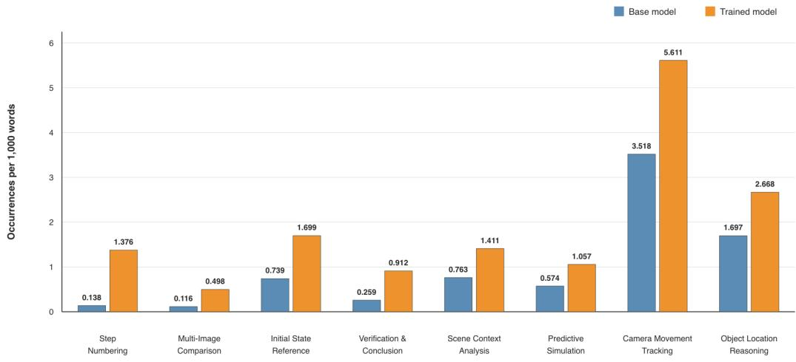  
Figure 9: Category-level lexical frequency before and after spatial-reasoning training. Frequencies are normalized by rollout length and reported as occurrences per 1,000 words. The value above each bar gives the exact plotted frequency.

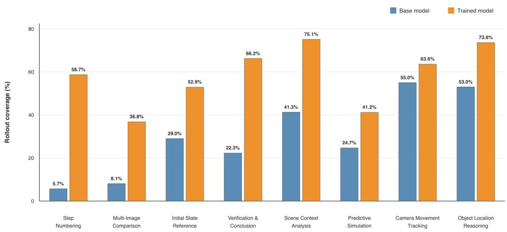  
Figure 10: Rollout coverage before and after spatial-reasoning training. Coverage is the percentage of the 1,040 examples whose rollout contains at least one marker from the corresponding category. The value above each bar gives the exact plotted percentage.