# Spectral Weight Decay: Inducing Low-Rank Structure in Neural Network Weights

Dmitrii Andriianov1, Andrey Veprikov1,2, Aleksandr Beznosikov1,3

1Basic Research of Artificial Intelligence Laboratory (BRAIn Lab)

2SB AI Lab

3Innopolis University

Standard weight decay treats each weight matrix as a vector and ignores its spectral structure. We introduce spectral weight decay, a post-step decoupled nuclear-norm update that applies additive rather than multiplicative spectral shrinkage. We connect the update to approximate proximal descent and show that its sensitivity to update order can exceed that of conventional $\ell _ { 2 }$ weight decay near rank deficiency. Across LLaMA models with 124M to 500M parameters, spectral weight decay lowers efective rank and improves SVD-LLM compression at matched validation loss. At 500M and a 4% distortion budget, it reaches 1.89× compression and 1.18× GPU inference speedup, compared with 1.14× and 1.01× after standard weight decay. Under fixed-horizon training with 60% label noise, it also improves final mean clean-test accuracy over matched $\ell _ { 2 }$ regularization by up to 17.8 points on MNIST and 4.6 points across four BERT-base tasks. Code is available at https://github.com/brain-lab-research/SpectralWD.

## 1 Introduction

Optimization is central to deep learning because it governs training stability, eficiency, and the properties of the learned solution. AdamW has become the standard optimizer in modern training recipes [Loshchilov and Hutter, 2019]. At the same time, matrix-aware optimizers such as Shampoo, SOAP, and Muon have begun to exploit the geometry of neural-network weight matrices instead of treating each layer as a flat parameter vector [Gupta et al., 2018; Vyas et al., 2024; Jordan et al., 2024]. Although their update rules difer, all retain conventional weight decay as a core component.

Weight decay remains part of these training recipes because it improves generalization [Loshchilov and Hutter, 2019], preserves downstream plasticity [Han et al., 2026], and stabilizes training [D’Angelo et al., 2024]. AdamW decouples weight shrinkage from adaptive preconditioning, so coordinatewise scaling of the loss gradient does not also reshape the decay term. The regularizer itself remains matrix-agnostic: its squared Frobenius penalty depends on the sum of squared singular values without explicitly favoring the removal of small ones.

To make the regularizer matrix-aware, we begin with the proximal interpretation of decoupled weight decay. To first order, its update is a proximal gradient step for the squared Frobenius penalty [Parikh and Boyd, 2014; Zhuang et al., 2022]. We replace this penalty with the nuclear norm, a convex surrogate for rank whose proximal operator soft-thresholds singular values [Recht et al., 2010; Cai et al., 2010]. This construction is the matrix analogue of replacing ridge shrinkage with coeficient selection by the lasso [Hoerl and Kennard, 1970; Tibshirani, 1996]. Given the loss-only optimizer direction $\Delta ,$ , let $Z = W ^ { \bar { ( } k ) } - \eta \Delta = \dot { U } _ { Z } \Sigma _ { Z } V _ { Z } ^ { \top }$ . Spectral weight decay applies the post-step correction

$$
W ^ { ( k + 1 ) } = Z - \eta \lambda U _ { Z } V _ { Z } ^ { \top } ,\tag{1}
$$

where η is the learning rate and λ the regularization coeficient. This correction acts additively in the singula basis of Z, whereas conventional weight decay scales the spectrum uniformly.

SLORR-Nuc also approximates the nuclear-norm polar factor [Gonz´alez-Mart´ınez and Liu, 2026]. Its decoupled extension would use the pre-step correction $Z - \eta \lambda U _ { W } V _ { W } ^ { \top }$ for $W ^ { ( k ) } = U _ { W } \Sigma _ { W } V _ { W } ^ { \top }$ , rather than (1). The additive shrinkage acts more strongly on smaller singular values and concentrates the spectrum. The resulting low-efective-rank weights admit eficient truncated SVD compression. Replacing a dense $m \times n$ matrix with rank-r factors reduces its parameter count and multiplication cost from mn to $r ( m + n )$ . This factorization lowers storage and inference memory and can reduce latency when the retained rank is suficiently small. Beyond compression, we test whether the same low-rank bias limits memorization under label noise. We evaluate spectral weight decay in LLaMA [Touvron et al., 2023] pretraining, post-training compression, and fixed-horizon noisy-label classification. Across models with 124M to 500M parameters, it lowers efective rank [Roy and Vetterli, 2007] and improves compression and inference speed at matched validation loss. At 500M and a 4% distortion budget, it reaches 1.89× compression and a $1 . 1 8 \times \mathrm { G P U }$ inference speedup. At 60% label noise, mean clean-test accuracy gains over matched $\ell _ { 2 }$ regularization reach 17.78 points on MNIST and 4.59 points on four BERT-base tasks.

## Contributions

• We formulate spectral weight decay as decoupled nuclear-norm regularization, derive its additive singular-value shrinkage, and connect the update to approximate proximal descent.

• Across LLaMA models with 124M to 500M parameters, spectral weight decay improves low-rank compression and inference speed over standard weight decay at matched validation loss. It also outperforms Cuttlefish and Prehab in matched compression comparisons.

• On image and text classification tasks, spectral weight decay improves fixed-horizon robustness to label noise over matched $\ell _ { 2 }$ regularization.

## 2 Related Work

Weight decay. Early work explains weight decay as a regularizer that improves generalization by suppressing irrelevant parameter directions and sensitivity to target noise [Krogh and Hertz, 1991]. For SGD, weight decay is equivalent to an $\ell _ { 2 }$ penalty up to rescaling the coeficient. This equivalence breaks under adaptive preconditioning, motivating the decoupled update used by AdamW [Loshchilov and Hutter, 2019]. Analyses show that its efect depends on the optimizer, architecture, learning rate, and training horizon. The benefit can arise through changes in efective learning rate and optimization dynamics rather than norm contro alone [Zhang et al., 2019; Lewkowycz and Gur-Ari, 2020; D’Angelo et al., 2024]. Weight decay interacts with matrix structure. In factorized attention layers, $\ell _ { 2 }$ regularization of the factors is linked to nuclear-norm regularization of their product and can induce low-rank key-query and value-projection maps [Kobayashi et al., 2024]. This is an instance of a general equivalence: minimizing the $\ell _ { 2 }$ penalties of two factors over all factorizations $W = U V ^ { \top }$ is equivalent to penalizing the nuclear norm of W [Srebro et al., 2004]. As a convex rank surrogate [Recht et al., 2010], the nuclear norm can instead regularize each weight matrix directly.

Nuclear-norm regularization. Direct nuclear-norm penalties act on the learned weight matrices without fixing a rank in advance, but exact gradients and proximal updates require spectral decompositions. Alvarez and´ Salzmann [2017] use periodic singular-value thresholding to prepare networks for post-training SVD compression. SLORR regularizes dense weight matrices using approximations of the polar factor [Gonz´alez-Mart´ınez and Liu, 2026]. Its variants use either the Hoyer penalty or the nuclear norm. SLORR-Nuc applies the penalty through the loss. The paper also describes a decoupled pre-step rule, but evaluates it only for SLORR-Hoyer, not SLORR-Nuc. This rule computes the polar factor at W, while our post-step update (1) uses that of Z. SLORR develops eficient low-rank regularization. We replace the squared Frobenius penalty of standard weight decay with the nuclear norm and analyze the post-step update as approximate proximal descent. NuMuon instead acts on the optimizer update rather than the weights. It constrains the nuclear norm of Muon’s update direction to promote low-rank updates [Dolatabadi et al., 2026].

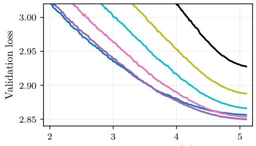  
Training tokens (B)

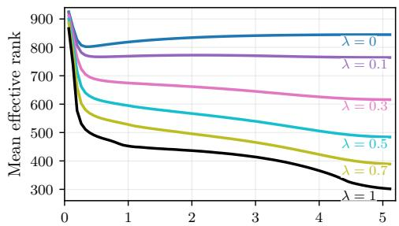  
Training tokens (B)  
Figure 1: Validation loss (left) and mean efective rank of the weight matrices (right) during training of a 257M-parameter LLaMA on FineWeb-Edu with Adam and spectral weight decay.

Low-rank training. Another line of work imposes explicit low-rank structure during training. Cuttlefish begins with dense training, waits for the stable ranks of the layers to converge, and then switches to a factorized model at the corresponding ranks [Wang et al., 2023]. TRP periodically replaces weight matrices with truncated-SVD approximations, selects the retained rank using a spectral-energy criterion, and continues gradient updates in the original parameterization [Xu et al., 2020]. These projections can be combined with nuclear-norm regularization. Spectral weight decay instead retains dense weight matrices throughout training and does not select a hard rank until compression. Appendix B.3 compares spectral weight decay with Cuttlefish.

Post-training low-rank compression. SliceGPT removes rows and columns after a principal-component transformation [Ashkboos et al., 2024]. ASVD [Yuan et al., 2023] and SVD-LLM [Wang et al., 2024] use activation statistics to improve the factorization. Dobi-SVD learns layerwise truncation and reconstructs weights from truncated activations [Wang et al., 2025]. Prehab fine-tunes a trained model for SVD compression [Qin et al., 2025]. Appendix B.2 compares spectral weight decay with Prehab in this setting. Our main experiments apply it throughout pretraining and evaluate compression and inference with SVD-LLM. Appendix B.4 compares post-training compression methods. Section 3 shows the resulting compression and inference gains.

## 3 Why Low-Rank Structure Matters

Algorithm 1 shows how spectral weight decay modifies Adam by replacing standard pre-step $\ell _ { 2 }$ decay with the post-step correction in (1). Bias correction is omitted for clarity. The analogy with $\ell _ { 1 }$ regularization in linear regression suggests that this additive spectral shrinkage should promote low-rank structure. We show that it reduces the efective rank of learned weight matrices and evaluate the resulting benefits for compression, inference, and robustness to label noise under fixed-horizon training. Section 4 develops the update in detail.

Algorithm 1: Adam with spectral WD   
M0 ← 0, V0 ← 0   
for t = 1, . . . , T do   
Gt ← ∇WL(Wt 1)   
Mt ← β1Mt 1 + (1 − β1)Gt   
Vt ← β2Vt 1 + (1 − β2)Gt ⊙ Gt   
Zt ← Wt 1 − ηMt/( Vt + ε)   
+ Wt ← Zt − ηλ NS5(Zt) ▷ NS5 ≈ UZ V ⊤Z   
Wt ← Zt − ηλWt 1 ▷ ℓ2 WD → spectral WD   
end for

## 3.1 Efective rank and why it matters

We measure spectral concentration with the entropy-based efective rank [Roy and Vetterli, 2007]. For singular values $\sigma _ { 1 } \geq \cdot \cdot \cdot \geq \sigma _ { r }$ and $p _ { i } = { \sigma } _ { i } / \sum _ { j } { \sigma } _ { j }$ , it is

$$
\operatorname { e r a n k } ( W ) = \exp { \big ( } H ( p ) { \big ) } = \exp { \Big ( } - \sum _ { i } p _ { i } \log p _ { i } { \Big ) } .\tag{2}
$$

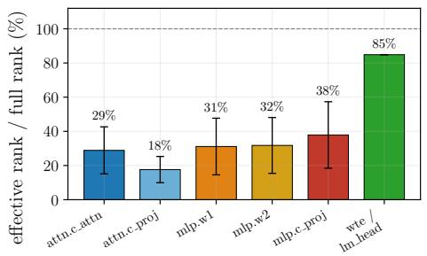

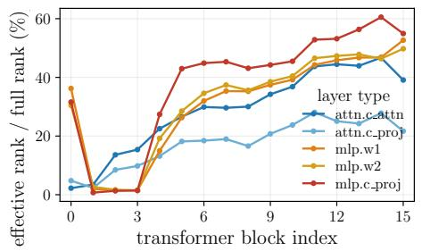

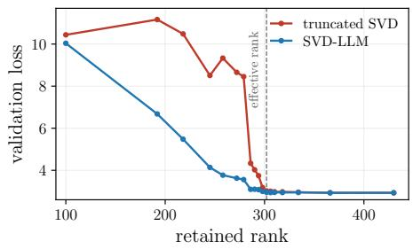  
Figure 2: Efective-rank profiles and compression of the $\lambda = 1$ model. Left: efective rank as a percentage of full rank, grouped by layer type. Middle: the same ratio across transformer blocks. Right: validation loss after truncated SVD and SVD-LLM at diferent retained ranks. The vertical line marks the mean efective rank.

Efective rank ranges from 1 for a rank-one matrix to $r = \operatorname* { m i n } ( m , n )$ for a flat spectrum and decreases as the spectrum becomes more concentrated. We report a weighted mean across weight matrices, with weights min $( m _ { l } , n _ { l } )$ , excluding token embeddings and the output head.

Figure 1 shows validation loss and mean efective rank during training of a 257M-parameter LLaMA [Touvron et al., 2023] on FineWeb-Edu [Penedo et al., 2024] with Adam and spectral weight decay. Appendix B.1 summarizes the pretraining configurations. Larger λ lowers efective rank, with a corresponding validation-loss trade-of. At the end of training, $\lambda = 0 . 7$ reduces mean efective rank by a factor of 2.17 relative to $\lambda = 0$ , with a 1.10% increase in validation loss.

We use efective rank instead of stable rank, $\| W \| _ { F } ^ { 2 } / \| W \| _ { 2 } ^ { 2 }$ , because it predicts a practical compression threshold. Truncating to $\lceil \mathrm { e r a n k } ( W ) \rceil$ preserves model quality, while lower ranks degrade it sharply (Figure 2, right). Stable rank can remain near one when a single singular value dominates many active directions, so it does not capture this threshold.

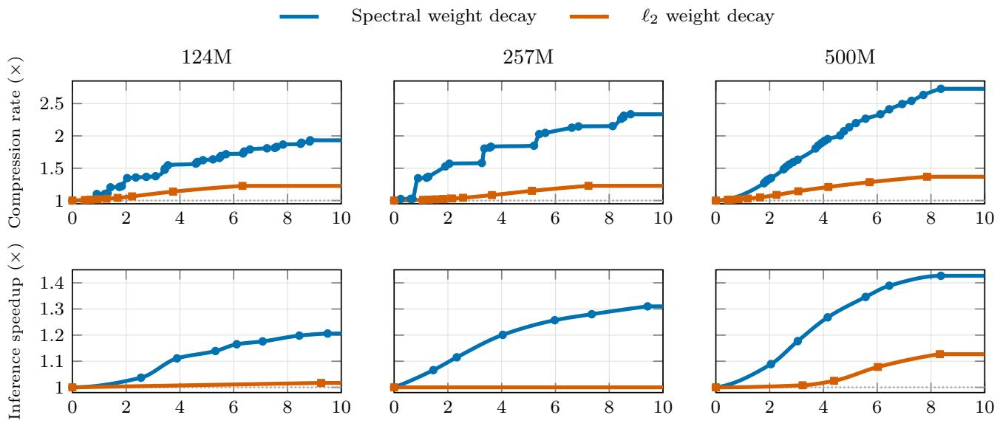  
Validation-loss distortion budget (%)  
Figure 3: Compression and inference frontiers under validation-loss distortion budgets. Top: maximum compression rate relative to the best dense checkpoint at each scale. Bottom: maximum inference speedup.

## 3.2 Compression and inference

Spectral weight decay lowers the efective rank of weight matrices, making them amenable to low-rank compression. We use SVD-LLM [Wang et al., 2024], which gives the lowest validation loss in our matched comparison. We compress each weight matrix to its own efective rank, which varies substantially across layers (Figure 2, middle). We leave the token embeddings and output head uncompressed because their ranks respond little to spectral weight decay, and compressing them even to their efective ranks sharply degrades model quality. The comparison and compression procedure are described in Appendix B.4. Figure 3 (top) reports the maximum compression rate supported by each validation-loss distortion budget. Spectral weight decay substantially shifts this frontier upward at all three model scales. For the 500M model and a 4% distortion budget, it supports 1.89× compression, compared with 1.14× after standard weight decay.

The same factorization reduces the FLOPs of a linear layer when $r ( m + n ) < m n$ . This reduction does not translate directly into lower latency because the factorized forward pass evaluates $( U _ { r } \Sigma _ { r } ) ( V _ { r } ^ { \top } X )$ with two GEMMs instead of the single GEMM WX. The additional kernel launch and intermediate activation can ofset the reduction in FLOPs. To improve tensor-core utilization, we round the efective rank down to the nearest multiple of 16,

$$
r _ { l } = \operatorname* { m a x } \left( 1 6 , 1 6 \left\lfloor \frac { \mathrm { e r a n k } ( W _ { l } ) } { 1 6 } \right\rfloor \right) ,\tag{3}
$$

Adjusting an aligned rank by one step, ±16, has negligible efect on validation loss. We therefore use this rank-aligned compression scheme throughout. The factorized models outperform their dense counterparts only at large batch sizes, so we measure forward-pass latency with a batch size of 256 on a single GPU. For the 500M model, spectral weight decay yields a 1.09× speedup near a 2% distortion budget and reaches 1.18× at 4%, compared with 1.01× under standard weight decay (Figure 3, bottom).

## 3.3 Robustness to noisy labels

Standard $\ell _ { 2 }$ weight decay limits overfitting [Loshchilov and Hutter, 2019]. We ask whether the low-rank bias of spectral weight decay provides stronger protection against unreliable labels, which are common in applied machine learning [Song et al., 2022]. We replace 10%, 25%, 40%, or 60% of the training labels uniformly at random and evaluate the final checkpoint after a fixed training horizon. We assume that no clean validation set is available, as is often the case in practice, so checkpoint selection cannot rely on clean-validation early stopping. This protocol exposes memorization of corrupted labels after the model has learned the clean signal.

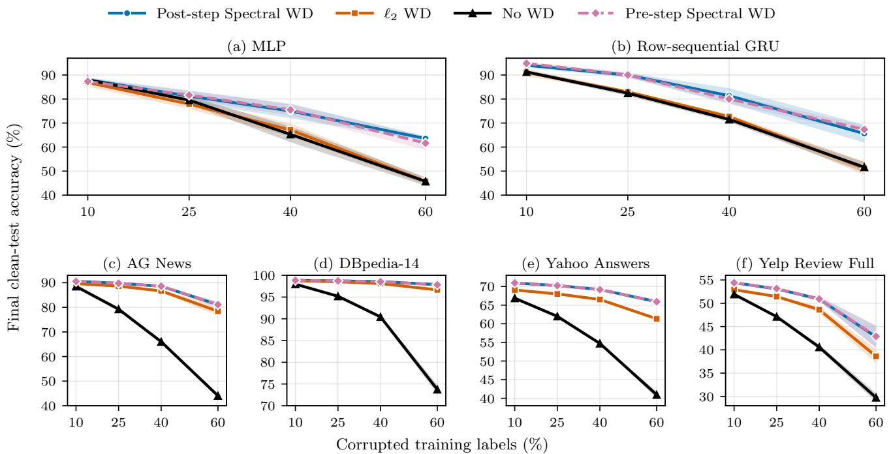  
Figure 4: Final-checkpoint clean-test accuracy under label noise for MNIST (top) and BERT-base (bottom). Curves show means over five label-corruption seeds. Shaded bands show ± one sample standard deviation. Model initialization, data splits, and regularization coeficients are fixed.

We train a 15M-parameter MLP and row-sequential GRU [Cho et al., 2014] for 60 epochs on 3,000 MNIST examples [Lecun et al., 1998]. We also fine-tune a 110M-parameter BERT-base model [Devlin et al., 2019] for 25 epochs on AG News, DBpedia-14, Yahoo Answers, and Yelp Review Full [Zhang et al., 2015]. On MNIST, spectral and decoupled $\ell _ { 2 }$ weight decay act on the same matrices. For BERT, both methods regularize the displacement $\Delta W = W - W _ { 0 }$ from pretrained weights: spectral weight decay penalizes its nuclear norm, while $\ell _ { 2 } { \mathrm { - S P } }$ [Li et al., 2018] penalizes its squared Frobenius norm. Figure 4 shows final-checkpoint clean-test accuracy as the mean ± one sample standard deviation over five label-corruption seeds.

On MNIST, the advantage of post-step spectral weight decay over $\ell _ { 2 }$ grows with label noise, reaching 17.78 percentage points at 60% noise. These gains coincide with less memorization of corrupted labels. On BERT, post-step spectral weight decay yields higher mean accuracy than $\ell _ { 2 } { \mathrm { - S P } }$ on every dataset and noise level, with gains of up to 4.59 points at the highest noise level. Pre- and post-step spectral weight decay nearly coincide on BERT, while neither order is consistently better on MNIST. Appendix B.5 provides the architectures and coeficient-selection protocol, together with detailed pre/post-step and baseline results in Tables 3, 4, and 5. These results suggest a capacity-control efect: by reducing the efective rank of weights, or their fine-tuning displacements, spectral weight decay limits the model’s ability to memorize corrupted labels.

## 4 From Weight Decay to Spectral Shrinkage

We now examine the update underlying the low-rank behavior observed in Section 3. Starting from decoupled weight decay, we derive spectral shrinkage and contrast it with conventional $\ell _ { 2 }$ decay. We then analyze how update order afects the spectral correction and explain our choice of post-step regularization. We consider training with a matrix regularizer h,

$$
\operatorname* { m i n } _ { W } { \big ( } { \mathcal { L } } ( W ) + \lambda h ( W ) { \big ) } ,\tag{4}
$$

where $W \in \mathbb { R } ^ { m \times n }$ is a weight matrix, L is the training loss, and λ controls the regularization strength. When h is diferentiable, a gradient step with learning rate η has the form

$$
\begin{array} { r } { W ^ { ( k + 1 ) } = W ^ { ( k ) } - \eta \nabla \mathcal { L } \Big ( W ^ { ( k ) } \Big ) - \eta \lambda \nabla h \Big ( W ^ { ( k ) } \Big ) . } \end{array}\tag{5}
$$

AdamW instead decouples regularization from the update on the training loss [Loshchilov and Hutter, 2019]. Let $Z ^ { ( k ) } = W ^ { ( k ) } - \eta \Delta ^ { ( \bar { k } ) }$ be the candidate produced using only the loss, where $\bar { \Delta } ^ { ( k ) }$ is the optimizer direction. For a diferentiable regularizer, its gradient can be evaluated before or after the optimizer step:

$$
\begin{array} { r } { W _ { \mathrm { p r e } } ^ { ( k + 1 ) } = Z ^ { ( k ) } - \eta \lambda \nabla h \Big ( W ^ { ( k ) } \Big ) , \qquad W _ { \mathrm { p o s t } } ^ { ( k + 1 ) } = Z ^ { ( k ) } - \eta \lambda \nabla h \Big ( Z ^ { ( k ) } \Big ) . } \end{array}\tag{6}
$$

Standard AdamW uses the pre-step form for the squared Frobenius penalty, whose gradient at $W ^ { ( k ) }$ is $W ^ { ( k ) }$ For spectral weight decay, we use the post-step form. It regularizes the candidate $Z ^ { ( k ) }$ , which is the argument of the proximal operator in proximal-gradient descent (Appendix A.2).

## 4.1 The spectral update

Spectral weight decay uses the nuclear norm $\begin{array} { r } { h ( W ) = \| W \| _ { * } = \sum _ { i } \sigma _ { i } ( W ) } \end{array}$ as its matrix penalty. For a compact SVD $Z ^ { ( k ) } = U _ { Z } \mathrm { d i a g } ( \sigma _ { i } ) V _ { Z } ^ { \top }$ , we use the polar factor $U _ { Z } V _ { Z } ^ { \top }$ in place of $\nabla h ( Z ^ { ( k ) } )$ in the post-step rule (6). This gives (1) at iteration k. The polar factor $U _ { Z } V _ { Z } ^ { \top }$ is a minimum-Frobenius-norm subgradient of $\| Z ^ { ( k ) } \|$ ∗ [Recht et al., 2010]. We approximate $U _ { Z } V _ { Z } ^ { \top }$ without an SVD using Newton-Schulz iterations, using the same five-step polynomial iteration as Muon [Jordan et al., 2024].

Comparison with $\ell _ { 2 }$ weight decay. Ordinary weight decay follows from the squared Frobenius penalty $\begin{array} { r } { h _ { F } ( W ) = \frac { 1 } { 2 } \| W \| _ { F } ^ { 2 } } \end{array}$ , whose gradient is W. Fix the current weights $W = W ^ { ( k ) }$ and the loss-only optimizer direction $\Delta = \Delta ^ { ( k ) }$ , and set $Z = W - \eta \Delta$ and $\tau = \eta \lambda$ . Let $W = U _ { W } \Sigma _ { W } V _ { W } ^ { \top }$ and $Z = U _ { Z } \Sigma _ { Z } V _ { Z } ^ { \top }$ be compact SVDs. The resulting weights are

$$
\begin{array} { r } { W _ { \ell _ { 2 } } ^ { \mathrm { p r e } } = Z - \tau W , \qquad W _ { \ell _ { 2 } } ^ { \mathrm { p o s t } } = ( 1 - \tau ) Z , \qquad W _ { \mathrm { s p e c } } ^ { \mathrm { p r e } } = Z - \tau U _ { W } V _ { W } ^ { \top } , \qquad W _ { \mathrm { s p e c } } ^ { \mathrm { p o s t } } = Z - \tau U _ { Z } V _ { Z } ^ { \top } . } \end{array}\tag{7}
$$

The pre- and post-step $\ell _ { 2 }$ updates difer by $W _ { \ell _ { 2 } } ^ { \mathrm { p r e } } - W _ { \ell _ { 2 } } ^ { \mathrm { p o s t } } = - \eta ^ { 2 } \lambda \Delta$ . For a bounded optimizer direction, this is ${ \cal O } ( \eta ^ { 2 } \lambda )$ for a single step. For spectral WD, the order dependence is less straightforward because the task update can change the polar factor that determines the decay direction. The following result quantifies the diference.

## Proposition 1 (Sensitivity to update order)

Let W, $Z = W - \eta \Delta \in \mathbb { R } ^ { m \times n }$ have full rank, and denote their smallest singular values by $\sigma _ { \mathrm { m i n } } ( W )$ and $\sigma _ { \mathrm { m i n } } ( Z )$ . Then

$$
\bigl \| \boldsymbol W _ { \mathrm { s p e c } } ^ { \mathrm { p o s t } } - \boldsymbol W _ { \mathrm { s p e c } } ^ { \mathrm { p r e } } \bigr \| _ { F } \leq \frac { 2 \eta ^ { 2 } \lambda \bigl \| \boldsymbol \Delta \bigr \| _ { F } } { \sigma _ { \mathrm { m i n } } ( W ) + \sigma _ { \mathrm { m i n } } ( Z ) } , \qquad \bigl \| \boldsymbol W _ { \mathrm { s p e c } } ^ { \mathrm { p o s t } } - \boldsymbol W _ { \mathrm { s p e c } } ^ { \mathrm { p r e } } \bigr \| _ { 2 } \leq 2 \eta \lambda .\tag{8}
$$

If both smallest singular values are at least $\gamma > 0$ and $\| \Delta \| _ { F } = O ( 1 )$ , the discrepancy is $O ( \eta ^ { 2 } \lambda / \gamma )$ . The 2ηλ spectral-norm bound is attained near rank deficiency.

The Frobenius bound follows from the polar-factor perturbation estimate of Li et al. [2026, Proposition 2, Appendix A.4]. Appendix A.1 gives a proof and the quadratic example. Post-step decay uses the singular directions of the updated weights. Pre-step decay uses those of $W$ , which can mix the current directions when the polar factor changes. Proposition 1 shows that this diference can be larger than the corresponding pre/post diference under $\ell _ { 2 }$ weight decay. Appendix A.3 compares the two orders empirically.

The two post-step rules then difer in how they shrink the spectrum of $Z .$ $\ell _ { 2 }$ decay multiplies each singular value by $1 - \tau$ , while spectral decay subtracts $\tau$ from each coeficient in the same singular basis. Above $\tau _ { \mathrm { { i } } }$ the relative reduction $\tau / \sigma _ { i }$ is greater for smaller singular values. Below $\tau ,$ , the spectral step lets the signed coeficient cross zero. The exact nuclear-norm proximal update instead sets it to zero (Appendix A.2). This additive shrinkage should favor low-rank weights by driving small singular values toward zero, analogous to the sparsity induced by $\ell _ { 1 }$ regularization in linear regression [Tibshirani, 1996]. The approximate spectral step need not produce exact zeros in a single iteration.

The interpretation of post-step spectral weight decay as an approximate nuclear-norm proximal step further motivates its use over the pre-step form. Appendix A.2 develops this interpretation.

## 5 Limitations and Future Work

## 5.1 Fine-tuning for low-rank compression

Pretraining is expensive, motivating methods that prepare existing checkpoints for compression during a short fine-tuning stage. Substantial rank reduction without loss of model quality remains dificult.

We compare spectral weight decay during pretraining with its use after pretraining from a standard $\ell _ { 2 }$ weight decay checkpoint. The 124Mparameter model is pretrained for one Chinchilla-optimal training budget [Hofmann et al., 2022], then fine-tuned on 32.8M tokens. Figure 5 plots the final validation loss against mean efective rank as the spectral coeficient varies. Within the observed overlap, fine-tuning incurs substantially more loss at the same rank. Fine-tuning also requires a much larger λ before rank changes appreciably. The sweeps in Figure 5 use λ values from 0 to 7 for pretraining and from 4 to

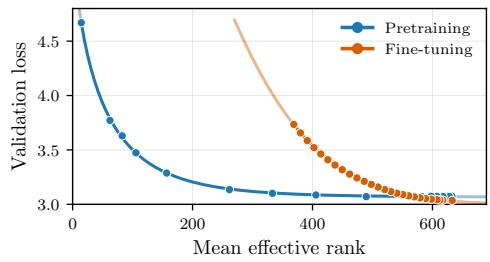  
Figure 5: Validation loss versus mean efective rank for 124M spectral weight decay pretraining and 32.8M-token finetuning from an $\ell _ { 2 }$ WD checkpoint.

250 for fine-tuning. Preparing an existing checkpoint for low-rank compression without a substantial loss increase remains open. SLORR also reports dificulties in fine-tuning LLMs with low-rank regularization while preserving their general capabilities [Gonz´alez-Mart´ınez and Liu, 2026]. Appendix B.2 compares spectral weight decay with the fine-tuning method Prehab [Qin et al., 2025].

## 5.2 Spectral regularization with matrix-aware optimizers

The main experiments use Adam-family optimizers. Conventional $\ell _ { 2 }$ weight decay is routinely used across optimizer families, so we also examine whether spectral weight decay transfers beyond Adam. Its decoupled correction can be applied to the candidate weights produced by any optimizer, but the resulting loss and rank dynamics depend on the optimizer.

(a) Optimizers: loss  
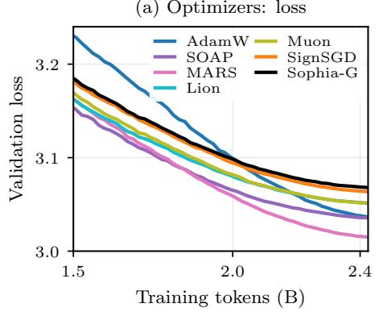

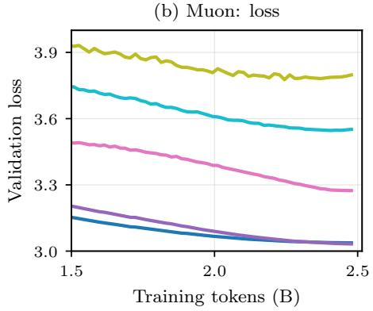

(c) Lion: loss  
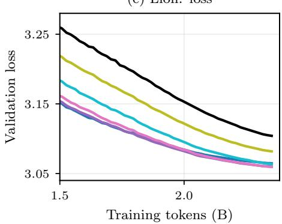  
(f) Lion: efective rank

(d) Optimizers: efective rank  
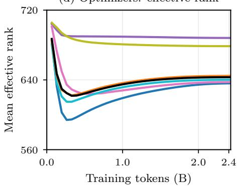

(e) Muon: efective rank  
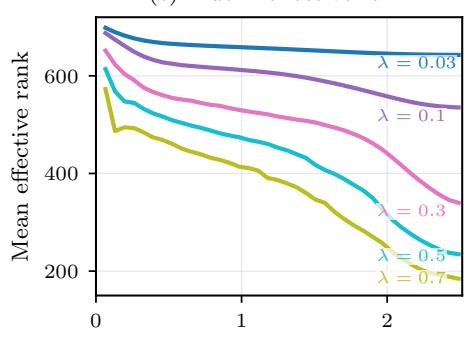  
Training tokens (B)

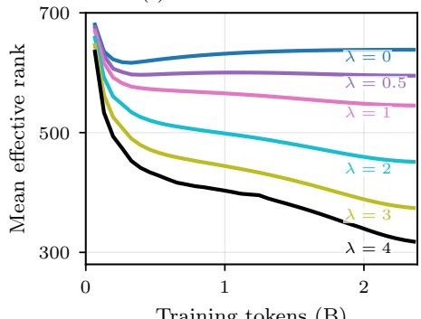  
Training tokens (B)  
Figure 6: Optimizer-dependent loss and rank dynamics. The top row shows validation loss, and the bottom row shows mean efective rank. The columns compare $\ell _ { 2 }$ weight decay with coeficient 0.1 across optimizers, spectral regularization with Muon, and spectral regularization with Lion. Colors match between the loss and rank panels.

Figure $\mathrm { 6 ( a , d ) }$ compares optimizers with the same $\ell _ { 2 }$ weight decay coeficient of 0.1. Muon [Jordan et al., 2024] and SOAP [Vyas et al., 2024] produce higher efective ranks than the other optimizers, whose final ranks cluster in a narrow range. This suggests that their optimization dynamics may oppose the spectral concentration encouraged by spectral weight decay. The Muon sweep in Figure $^ \mathrm { 6 ( b , e ) }$ shows that substantial rank reduction comes with a steep validation-loss increase, limiting the practical appeal of this combination. By contrast, Lion exhibits a more favorable trade-of between loss and rank in Figure $\mathrm { 6 ( c , f ) }$ , qualitatively similar to Adam.

The required regularization scale also varies across optimizers. A mean efective rank of about 300 requires $\lambda = 0 . 8$ for Adam, $\lambda = 0 . 4$ for Muon, and $\lambda = 4$ for Lion. Although the $\ell _ { 2 }$ baselines use a common coeficient, spectral weight decay requires optimizer-specific calibration for the desired rank and validation-loss budget. The strong training results reported for Muon motivate adapting the techniques studied here to Muon and related matrix-aware optimizers. Understanding how to combine their optimization benefits with efective spectral regularization remains a direction for future work.

## 6 Conclusion

We introduced spectral weight decay by replacing the squared Frobenius penalty of conventional $\ell _ { 2 }$ weight decay with the nuclear norm. Its decoupled post-step correction shrinks the spectrum of the updated weights additively, with a stronger relative efect on smaller singular values. The connection to approximate proximal descent supports this choice of update order. Our analysis also shows that pre- and post-step spectral updates can difer more substantially than their $\ell _ { 2 }$ counterparts near rank deficiency.

Across 124M to 500M LLaMA models trained with Adam-family optimizers, the resulting low-efective-rank structure improves post-training compression under matched validation-loss budgets. At 500M and a 4% distortion budget, we obtain 1.89× compression and 1.18× GPU inference speedup. The benefits extend beyond compression. Under fixed-horizon training with noisy labels, spectral regularization reduces memorization and improves clean-test accuracy on image and text classification tasks. These observations are consistent with the view that concentrating the weight spectrum limits the capacity available to fit corrupted labels.

The benefits depend on when and how spectral regularization is applied. Short fine-tuning from a conventionalweight-decay checkpoint incurs a larger loss penalty for rank reduction than regularization during pretraining. Optimizer choice also matters: Adam and Lion exhibit a favorable trade-of between loss and rank, whereas the Muon runs show a steeper loss increase as rank decreases. Adapting spectral regularization to matrix-aware optimizers and reducing the cost of preparing existing checkpoints for low-rank compression remain open problems.

## References

Ilya Loshchilov and Frank Hutter. Decoupled weight decay regularization. In International Conference on Learning Representations (ICLR), 2019.

Vineet Gupta, Tomer Koren, and Yoram Singer. Shampoo: Preconditioned stochastic tensor optimization. In Proceedings of the 35th International Conference on Machine Learning, volume 80 of Proceedings of Machine Learning Research, pages 1842–1850. PMLR, 2018. URL https://proceedings.mlr.press/v80/gupta18a. html.

Nikhil Vyas, Depen Morwani, Rosie Zhao, Mujin Kwun, Itai Shapira, David Brandfonbrener, Lucas Janson, and Sham M. Kakade. SOAP: Improving and stabilizing Shampoo using Adam, 2024. URL https: //arxiv.org/abs/2409.11321.

Keller Jordan, Yuchen Jin, Vlado Boza, Jiacheng You, Franz Cesista, Laker Newhouse, and Jeremy Bernstein. Muon: An optimizer for hidden layers in neural networks. https://kellerjordan.github.io/posts/muon/, 2024.

Tessa Han, Sebastian Bordt, Hanlin Zhang, and Sham Kakade. Weight decay improves language model plasticity, 2026. URL https://arxiv.org/abs/2602.11137.

Francesco D’Angelo, Maksym Andriushchenko, Aditya Vardhan Varre, and Nicolas Flammarion. Why do we need weight decay in modern deep learning? In Advances in Neural Information Processing Systems 37: Annual Conference on Neural Information Processing Systems 2024, NeurIPS 2024, Vancouver, BC, Canada, December 10 - 15, 2024, 2024. URL http://papers.nips.cc/paper\_files/paper/2024/hash/ 29496c942ed6e08ecc469f4521ebfff0-Abstract-Conference.html.

Neal Parikh and Stephen Boyd. Proximal algorithms. Foundations and Trends in Optimization, 1(3):127–239, 2014. doi: 10.1561/2400000003.

Zhenxun Zhuang, Mingrui Liu, Ashok Cutkosky, and Francesco Orabona. Understanding AdamW through proximal methods and scale-freeness. Transactions on Machine Learning Research, 2022. URL https: //openreview.net/forum?id=IKhEPWGdwK.

Benjamin Recht, Maryam Fazel, and Pablo A. Parrilo. Guaranteed minimum-rank solutions of linear matrix equations via nuclear norm minimization. SIAM Review, 52(3):471–501, 2010. doi: 10.1137/070697835.

Jian-Feng Cai, Emmanuel J. Cand\`es, and Zuowei Shen. A singular value thresholding algorithm for matrix completion. SIAM Journal on Optimization, 20(4):1956–1982, 2010. doi: 10.1137/080738970.

Arthur E. Hoerl and Robert W. Kennard. Ridge regression: Biased estimation for nonorthogonal problems. Technometrics, 12(1):55–67, 1970. doi: 10.1080/00401706.1970.10488634.

Robert Tibshirani. Regression shrinkage and selection via the lasso. Journal of the Royal Statistical Society: Series B (Methodological), 58(1):267–288, 1996. doi: 10.1111/j.2517-6161.1996.tb02080.x.

David Gonz´alez-Mart´ınez and Shiwei Liu. SLORR: Simple and eficient in-training low-rank regularization, 2026. URL https://arxiv.org/abs/2607.08754.

Hugo Touvron, Thibaut Lavril, Gautier Izacard, Xavier Martinet, Marie-Anne Lachaux, Timoth´ee Lacroix, Baptiste Rozi\`ere, Naman Goyal, Eric Hambro, Faisal Azhar, Aurelien Rodriguez, Armand Joulin, Edouard Grave, and Guillaume Lample. LLaMA: Open and eficient foundation language models, 2023. URL https://arxiv.org/abs/2302.13971.

Olivier Roy and Martin Vetterli. The efective rank: A measure of efective dimensionality. In 15th European Signal Processing Conference (EUSIPCO), pages 606–610, 2007.

Anders Krogh and John A. Hertz. A simple weight decay can improve generalization. In J. Moody, S. Hanson, and R. P. Lippmann, editors, Advances in Neural Information Processing Systems, volume 4. Morgan-Kaufmann, 1991. URL https://proceedings.neurips.cc/paper/1991/hash/ 8eefcfdf5990e441f0fb6f3fad709e21-Abstract.html.

Guodong Zhang, Chaoqi Wang, Bowen Xu, and Roger Grosse. Three mechanisms of weight decay regularization. In International Conference on Learning Representations, 2019. URL https://openreview.net/forum?id= B1lz-3Rct7.

Aitor Lewkowycz and Guy Gur-Ari. On the training dynamics of deep networks with L regularization. In H. Larochelle, M. Ranzato, R. Hadsell, M. F. Balcan, and H. Lin, editors, Advances in Neural Information Processing Systems, volume 33, pages 4790–4799. Curran Associates, Inc., 2020. URL https://proceedings. neurips.cc/paper/2020/hash/32fcc8cfe1fa4c77b5c58dafd36d1a98-Abstract.html.

Seijin Kobayashi, Yassir Akram, and Johannes von Oswald. Weight decay induces low-rank attention layers. In A. Globerson, L. Mackey, D. Belgrave, A. Fan, U. Paquet, J. Tomczak, and C. Zhang, editors, Advances in Neural Information Processing Systems, volume 37, pages 4481–4510. Curran Associates, Inc., 2024. doi: 10.52202/079017-0146. URL https://proceedings.neurips.cc/paper\_files/paper/2024/ hash/084a67fb91826028f555e288f3adc9a4-Abstract-Conference.html.

Nathan Srebro, Jason Rennie, and Tommi S. Jaakkola. Maximum-margin matrix factorization. In Lawrence Saul, Yair Weiss, and L´eon Bottou, editors, Advances in Neural Information Processing Systems, volume 17. MIT Press, 2004. URL https://proceedings.neurips.cc/paper\_files/paper/2004/hash/ e0688d13958a19e087e123148555e4b4-Abstract.html.

Jos´e M. Alvarez and Mathieu Salzmann. Compression-aware training of deep networks. In ´ Advances in Neural Information Processing Systems 30: Annual Conference on Neural Information Processing Systems 2017, December 4-9, 2017, Long Beach, CA, USA, pages 856–867, 2017. URL https://proceedings.neurips. cc/paper/2017/hash/db85e2590b6109813dafa101ceb2faeb-Abstract.html.

Hadi Mohaghegh Dolatabadi, Thalaiyasingam Ajanthan, Sameera Ramasinghe, Chamin P Hewa Koneputugodage, Shamane Siriwardhana, Violetta Shevchenko, Karol Pajak, James Snewin, Gil Avraham, and

Alexander Long. NuMuon: Nuclear-norm-constrained Muon for compressible LLM training, 2026. URL https://arxiv.org/abs/2603.03597.

Hongyi Wang, Saurabh Agarwal, Pongsakorn U-chupala, Yoshiki Tanaka, Eric P. Xing, and Dimitris S. Papailiopoulos. Cuttlefish: Low-rank model training without all the tuning, 2023. URL https://arxiv. org/abs/2305.02538.

Yuhui Xu, Yuxi Li, Shuai Zhang, Wei Wen, Botao Wang, Yingyong Qi, Yiran Chen, Weiyao Lin, and Hongkai Xiong. TRP: Trained rank pruning for eficient deep neural networks. In Christian Bessiere, editor, Proceedings of the Twenty-Ninth International Joint Conference on Artificial Intelligence, IJCAI-20, pages 977–983. International Joint Conferences on Artificial Intelligence Organization, 7 2020. doi: 10.24963/ijcai.2020/136. URL https://doi.org/10.24963/ijcai.2020/136. Main track.

Saleh Ashkboos, Maximilian L. Croci, Marcelo Gennari do Nascimento, Torsten Hoefler, and James Hensman. SliceGPT: Compress large language models by deleting rows and columns, 2024.

Zhihang Yuan, Yuzhang Shang, Yue Song, Dawei Yang, Qiang Wu, Yan Yan, and Guangyu Sun. ASVD: Activation-aware singular value decomposition for compressing large language models, 2023.

Xin Wang, Yu Zheng, Zhongwei Wan, and Mi Zhang. SVD-LLM: Truncation-aware singular value decomposition for large language model compression, 2024.

Qinsi Wang, Jinghan Ke, Masayoshi Tomizuka, Yiran Chen, Kurt Keutzer, and Chenfeng Xu. Dobi-SVD: Diferentiable SVD for LLM compression and some new perspectives, 2025. URL https://arxiv.org/abs/ 2502.02723.

Haoran Qin, Shansita D. Sharma, Ali Abbasi, Chayne Thrash, and Soheil Kolouri. Low-rank Prehab: Preparing neural networks for SVD compression, 2025. URL https://arxiv.org/abs/2512.01980.

Guilherme Penedo, Hynek Kydl´ıˇcek, Loubna Ben allal, Anton Lozhkov, Margaret Mitchell, Colin Rafel, Leandro Von Werra, and Thomas Wolf. The FineWeb datasets: Decanting the web for the finest text data at scale, 2024. URL https://arxiv.org/abs/2406.17557.

Hwanjun Song, Minseok Kim, Dongmin Park, Yooju Shin, and Jae-Gil Lee. Learning from noisy labels with deep neural networks: A survey, 2022. URL https://arxiv.org/abs/2007.08199.

Kyunghyun Cho, Bart van Merrienboer, Caglar Gulcehre, Dzmitry Bahdanau, Fethi Bougares, Holger Schwenk, and Yoshua Bengio. Learning phrase representations using RNN encoder–decoder for statistical machine translation. In Proceedings of the 2014 Conference on Empirical Methods in Natural Language Processing (EMNLP), page 1724–1734. Association for Computational Linguistics, 2014. doi: 10.3115/v1/d14-1179. URL http://dx.doi.org/10.3115/v1/D14-1179.

Y. Lecun, L. Bottou, Y. Bengio, and P. Hafner. Gradient-based learning applied to document recognition. Proceedings of the IEEE, 86(11):2278–2324, 1998. ISSN 0018-9219. doi: 10.1109/5.726791. URL http: //dx.doi.org/10.1109/5.726791.

Jacob Devlin, Ming-Wei Chang, Kenton Lee, and Kristina Toutanova. BERT: Pre-training of deep bidirectional transformers for language understanding. In Proceedings of the 2019 Conference of the North American Chapter of the Association for Computational Linguistics: Human Language Technologies, Volume 1 (Long and Short Papers), page 4171–4186. Association for Computational Linguistics, 2019. doi: 10.18653/v1/n19-1423. URL http://dx.doi.org/10.18653/v1/N19-1423.

Xiang Zhang, Junbo Zhao, and Yann LeCun. Character-level convolutional networks for text classification. In Advances in Neural Information Processing Systems, volume 28. Curran Associates, Inc., 2015. URL https://arxiv.org/abs/1509.01626.

Xuhong Li, Yves Grandvalet, and Franck Davoine. Explicit inductive bias for transfer learning with convolutional networks. In Proceedings of the 35th International Conference on Machine Learning, ICML 2018, Stockholmsm¨assan, Stockholm, Sweden, July 10-15, 2018, volume 80 of Proceedings of Machine Learning Research, pages 2825–2834. PMLR, 2018. URL http://proceedings.mlr.press/v80/li18a.html.

Chenghao Li, Xiao Han, Xinxin Huang, Wei Liu, Boyang Li, Bing Xiao, Heran Zhang, Juanma Perez Rua, Ke Xu, Kangning Liu, Linjun Kuang, Na Li, Tan Wang, Tian Xie, Wei Peng, Yang Pei, Yifan Xu, Yuanhao Zhai, Yuwei Lin, Zhe Wang, Zihao He, Daniel Li, Junbiao Tang, Ziyang Jiang, and Dake Chen. Scaling Muon for difusion transformers, 2026. URL https://arxiv.org/abs/2608.20818.

Jordan Hofmann, Sebastian Borgeaud, Arthur Mensch, Elena Buchatskaya, Trevor Cai, Eliza Rutherford, Diego de Las Casas, Lisa Anne Hendricks, Johannes Welbl, Aidan Clark, Thomas Hennigan, Eric Noland, Katherine Millican, George van den Driessche, Bogdan Damoc, Aurelia Guy, Simon Osindero, Kar´en Simonyan, Erich Elsen, Oriol Vinyals, Jack Rae, and Laurent Sifre. An empirical analysis of compute-optimal large language model training. In Advances in Neural Information Processing Systems, volume 35, pages 30016–30030. Curran Associates, Inc., 2022. doi: 10.52202/068431-2176. URL https://proceedings.neurips.cc/paper\_ files/paper/2022/file/c1e2faff6f588870935f114ebe04a3e5-Paper-Conference.pdf.

Diederik P. Kingma and Jimmy Ba. Adam: A method for stochastic optimization, 2015. URL https: //arxiv.org/abs/1412.6980.

Huizhuo Yuan, Yifeng Liu, Shuang Wu, Xun Zhou, and Quanquan Gu. MARS: Unleashing the power of variance reduction for training large models. In Proceedings of the 42nd International Conference on Machine Learning, volume 267 of Proceedings of Machine Learning Research, pages 73553–73587. PMLR, 2025. URL https://proceedings.mlr.press/v267/yuan25f.html.

Xiangning Chen, Chen Liang, Da Huang, Esteban Real, Kaiyuan Wang, Hieu Pham, Xuanyi Dong, Thang Luong, Cho-Jui Hsieh, Yifeng Lu, and Quoc V. Le. Symbolic discovery of optimization algorithms. In Advances in Neural Information Processing Systems, volume 36, pages 49205–49233. Curran Associates, Inc., 2023. doi: 10.52202/075280-2140. URL https://proceedings.neurips.cc/paper\_files/paper/2023/ file/9a39b4925e35cf447ccba8757137d84f-Paper-Conference.pdf.

Jeremy Bernstein, Yu-Xiang Wang, Kamyar Azizzadenesheli, and Animashree Anandkumar. signSGD: Compressed optimisation for non-convex problems. In Proceedings of the 35th International Conference on Machine Learning, volume 80 of Proceedings of Machine Learning Research, pages 560–569. PMLR, 2018. URL https://proceedings.mlr.press/v80/bernstein18a.html.

Hong Liu, Zhiyuan Li, David Hall, Percy Liang, and Tengyu Ma. Sophia: A scalable stochastic secondorder optimizer for language model pre-training. In International Conference on Learning Representations, pages 1621–1650, 2024. URL https://proceedings.iclr.cc/paper\_files/paper/2024/file/ 06960915ba8674c7a898ec0b472b80ff-Paper-Conference.pdf.

Peter Clark, Isaac Cowhey, Oren Etzioni, Tushar Khot, Ashish Sabharwal, Carissa Schoenick, and Oyvind Tafjord. Think you have solved question answering? try ARC, the AI2 reasoning challenge, 2018. URL https://arxiv.org/abs/1803.05457.

Rowan Zellers, Ari Holtzman, Yonatan Bisk, Ali Farhadi, and Yejin Choi. HellaSwag: Can a machine really finish your sentence?, 2019. URL https://arxiv.org/abs/1905.07830.

Yonatan Bisk, Rowan Zellers, Ronan Le Bras, Jianfeng Gao, and Yejin Choi. PIQA: Reasoning about physical commonsense in natural language. Proceedings of the AAAI Conference on Artificial Intelligence, 34(05): 7432–7439, 2020. doi: 10.1609/aaai.v34i05.6239. URL https://ojs.aaai.org/index.php/AAAI/article/ view/6239.

## Appendix

Supplementary Materials for Spectral Weight Decay: Inducing Low-Rank Structure in Neural Network Weights

## A Theoretical details

## A.1 Proof of the spectral update-order bound

For a full-rank matrix $A = U _ { A } \Sigma _ { A } V _ { A } ^ { \top }$ , write $Q ( A ) = U _ { A } V _ { A } ^ { \top }$ for its polar factor. We first bound changes in this factor. The bound holds for rectangular matrices and does not require gaps between their nonzero singular values. It is proved by Li et al. [2026, Proposition 2, Appendix $\mathrm { A . 4 } ]$ for full-row-rank matrices. The full-column-rank case follows by transposition.

Lemma 1 (Polar-factor perturbation)

For full-rank $A , B \in \mathbb { R } ^ { m \times n }$ ,

$$
\| Q ( A ) - Q ( B ) \| _ { F } \leq \frac { 2 \| A - B \| _ { F } } { \sigma _ { \operatorname* { m i n } } ( A ) + \sigma _ { \operatorname* { m i n } } ( B ) } .\tag{9}
$$

Proof of Proposition 1. By the definitions of the two spectral updates,

$$
W _ { \mathrm { s p e c } } ^ { \mathrm { p o s t } } - W _ { \mathrm { s p e c } } ^ { \mathrm { p r e } } = \eta \lambda \big ( Q ( W ) - Q ( Z ) \big ) .\tag{10}
$$

Applying Lemma 1 with $Z = W - \eta \Delta$ gives

$$
\bigl \| W _ { \mathrm { s p e c } } ^ { \mathrm { p o s t } } - W _ { \mathrm { s p e c } } ^ { \mathrm { p r e } } \bigr \| _ { F } \leq \frac { 2 \eta \lambda \| W - Z \| _ { F } } { \sigma _ { \operatorname* { m i n } } ( W ) + \sigma _ { \operatorname* { m i n } } ( Z ) } = \frac { 2 \eta ^ { 2 } \lambda \| \Delta \| _ { F } } { \sigma _ { \operatorname* { m i n } } ( W ) + \sigma _ { \operatorname* { m i n } } ( Z ) } .
$$

Since a full-rank polar factor has spectral norm one, the triangle inequality also gives

$$
\big \| { \cal W } _ { \mathrm { s p e c } } ^ { \mathrm { p o s t } } - { \cal W } _ { \mathrm { s p e c } } ^ { \mathrm { p r e } } \big \| _ { 2 } = \eta \lambda \| Q ( W ) - Q ( Z ) \| _ { 2 } \leq \eta \lambda \big ( \| Q ( W ) \| _ { 2 } + \| Q ( Z ) \| _ { 2 } \big ) = 2 \eta \lambda .
$$

To show that the latter bound is attained near rank deficiency, consider the fixed loss $f ( X ) \ = \ { \textstyle { \frac { 1 } { 2 } } } \| X \ -$ di $\arg ( 1 , - 1 ) \| _ { F } ^ { 2 }$ . It is 1-smooth and 1-strongly convex. For $0 < \eta < 1$ , choose

$$
W _ { \eta } = \left( { 1 0 \atop 0 } \eta / 2 \right) , \qquad D _ { \eta } = \nabla f ( W _ { \eta } ) = \left( { 1 0 \atop 0 } \ \eta / 2 \right) - \left( { 1 0 \atop - 1 } \right) = \left( { 0 \atop 0 } \ 1 + \eta / 2 \right) .\tag{11}
$$

The loss-only step with direction $D _ { \eta }$ gives $Z _ { \eta } = W _ { \eta } - \eta D _ { \eta } = \mathrm { d i a g } ( 1 , - \eta ( 1 + \eta ) / 2 )$ . Both matrices have full rank, so their polar factors are unique and Lemma 1 applies. Their smallest singular values are $\eta / 2$ and $\eta ( 1 + \eta ) / 2$ , respectively. Thus, they approach rank deficiency as $\eta  0$ , while the task direction remains bounded: $\| D _ { \eta } \| _ { F } \le 3 / 2$ . The task update therefore vanishes with $\eta ,$ but it changes the sign of the second diagonal entry. For a diagonal matrix with nonzero entries, the polar factor replaces each diagonal entry by its sign. Consequently, $Q ( W _ { \eta } ) = I$ and $Q ( Z _ { \eta } ) = \mathrm { d i a g } ( 1 , - 1 )$ difer by a fixed amount even as the weights become arbitrarily close. Thus, a small task update does not guarantee a small diference between pre- and post-step spectral weight decay relative to the decay step itself. Equation (10) therefore gives

$$
W _ { \mathrm { s p e c } } ^ { \mathrm { p o s t } } - W _ { \mathrm { s p e c } } ^ { \mathrm { p r e } } = \eta \lambda \big ( Q ( W _ { \eta } ) - Q ( Z _ { \eta } ) \big ) = \eta \lambda \left( 0 \begin{array} { l l } { 0 } & { 0 } \\ { 0 } & { 2 } \end{array} \right) .
$$

This matrix has a single nonzero singular value, $2 \eta \lambda$ . Its spectral norm and Frobenius norm therefore coincide:

$$
\left. W _ { \mathrm { s p e c } } ^ { \mathrm { p o s t } } - W _ { \mathrm { s p e c } } ^ { \mathrm { p r e } } \right. _ { 2 } = \left. W _ { \mathrm { s p e c } } ^ { \mathrm { p o s t } } - W _ { \mathrm { s p e c } } ^ { \mathrm { p r e } } \right. _ { F } = 2 \eta \lambda .\tag{12}
$$

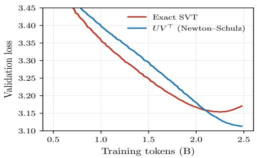

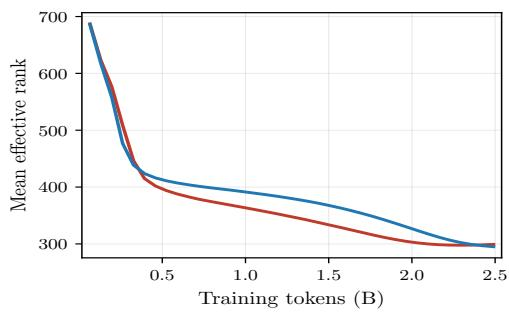  
Figure 7: Exact singular-value thresholding and its Newton–Schulz $U V ^ { \top }$ approximation at a matched spectral coeficient on a 124M-parameter LLaMA model. Left: validation loss. Right: mean efective rank of the weight matrices. Both updates reach similar efective rank, while the exact update ends with higher validation loss.

## A.2 Proximal interpretation

Proximal-gradient descent gives a complementary interpretation of the post-step rule. It first follows the gradient of the training loss, then regularizes the resulting candidate. For a regularizer h and $\tau > 0$ , its proximal operator is [Parikh and Boyd, 2014]

$$
\mathrm { p r o x } _ { \tau , h } ( Z ) = \underset { X } { \arg \operatorname* { m i n } } \left( h ( X ) + \frac { 1 } { 2 \tau } \| X - Z \| _ { F } ^ { 2 } \right) .\tag{13}
$$

With $Z = W ^ { ( k ) } - \eta \nabla \mathcal { L } ( W ^ { ( k ) } )$ and $\tau = \eta \lambda$ , proximal gradient descent applies

$$
\begin{array} { r } { W ^ { ( k + 1 ) } = \operatorname { p r o x } _ { \tau , h } \Big ( W ^ { ( k ) } - \eta \nabla \mathcal { L } \Big ( W ^ { ( k ) } \Big ) \Big ) . } \end{array}\tag{14}
$$

For the squared Frobenius penalty $\begin{array} { r } { h _ { F } ( W ) = \frac { 1 } { 2 } \| W \| _ { F } ^ { 2 } } \end{array}$ , the exact proximal map is $\mathrm { p r o x } _ { \tau , h _ { F } } ( Z ) = Z / ( 1 + \tau )$ Post-step $\ell _ { 2 }$ shrinkage, $( 1 - \tau ) Z$ , is its first-order expansion. Pre-step AdamW is also first-order accurate. Zhuang et al. [2022] proved this for vector-valued parameters, and vectorization gives the matrix statement.

Proposition 2

Let $h = h _ { F } , \tau = \eta \lambda .$ , and $Z ^ { ( k ) } = W ^ { ( k ) } - \eta \nabla \mathcal { L } ( W ^ { ( k ) } )$ . For fixed λ and bounded $W ^ { ( k ) }$ and $\nabla \mathcal { L } ( W ^ { ( k ) } )$ , the pre-step update $W _ { \ell _ { 2 } } ^ { \mathrm { p r e } }$ in (7) difers from the proximal iteration (14) by ${ \cal O } ( \eta ^ { 2 } \lambda )$ as $\eta  0 .$

For the nuclear norm, the proximal map instead performs singular-value soft-thresholding [Cai et al., 2010]. Given $Z = U \mathrm { d i a g } ( \sigma _ { i } ) V ^ { \top }$ •

$$
\begin{array} { r } { \operatorname { p r o x } _ { \tau , \lVert \cdot \rVert _ { * } } ( Z ) = U \mathrm { d i a g } \big ( \operatorname* { m a x } ( \sigma _ { i } - \tau , 0 ) \big ) V ^ { \top } . } \end{array}\tag{15}
$$

Equivalently,

$$
\begin{array} { r } { \operatorname { p r o x } _ { \tau , \| \cdot \| _ { * } } ( Z ) = Z - U \mathrm { d i a g } ( \gamma _ { i } ) V ^ { \top } , } \end{array}
$$

$$
\gamma _ { i } = \left\{ { \tau , \sigma _ { i } \geq \tau } , \right.\tag{16}
$$

The post-step spectral update (1) uses $\tau U V ^ { \top }$ for every active singular direction. It matches the proximal correction when $\sigma _ { i } \geq \tau$ . For $0 < \sigma _ { i } < \tau$ , the exact update instead subtracts only $\sigma _ { i }$ and sets that direction to zero. With an exact polar factor, spectral weight decay is thus an approximate nuclear-norm proximal step whose discrepancy is confined to the sub-threshold tail.

To assess how this diference in the sub-threshold tail afects training, Figure $7$ compares exact nuclear-norm proximal updates with post-step spectral weight decay on a 124M-parameter LLaMA trained on FineWeb-Edu with $\lambda = 1$ . In this comparison, spectral weight decay approximates the polar factor using Newton–Schulz iterations, while the exact proximal update computes singular-value thresholding from a full SVD at every step.

Both updates follow nearly identical efective-rank trajectories, but exact thresholding does not improve validation loss. Its loss initially follows the Newton–Schulz update, then rises late in training and ends higher. Applying the exact update once every s steps $( s = 1 0$ to 50) leaves these results unchanged. We therefore use the less expensive Newton–Schulz update in the main text.

## A.3 Empirical comparison of pre- and post-step spectral weight decay

Proposition 1 establishes that the diference between pre- and post-step spectral weight decay can exceed that of $\ell _ { 2 }$ weight decay. We examine the practical consequences of update order through controlled low-rank recovery problems and language-model pretraining at increasing learning rates.

Both synthetic tasks recover a rank-16 matrix $W _ { \star } \in \mathbb { R } ^ { 1 2 8 \times 1 2 8 }$ without imposing a rank constraint on the learned matrix. Their convex data-fitting objectives and known recovery targets allow us to evaluate update order without the nonconvexity of neural-network training. We use 1,000 full-batch gradient steps. We compare the exact partial polar factor with its five-iteration Newton–Schulz approximation $\left( \mathrm { N S } _ { 5 } \right)$ , both computed in double precision. At each noise level, we select λ independently for each variant and implementation on one tuning instance with separate noisy validation data. We evaluate the final iterate using $e _ { s } = \lVert W _ { T , s } - W _ { \star , s } \rVert _ { F } ^ { 2 } / \lVert W _ { \star , s } \rVert _ { F } ^ { 2 }$ and plot the mean error and percentage gain. We include separately tuned pre- and post-step $\ell _ { 2 }$ weight decay as a baseline. Shaded bands show one sample standard deviation of the gain across the five evaluation seeds.

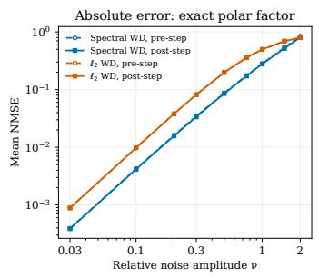

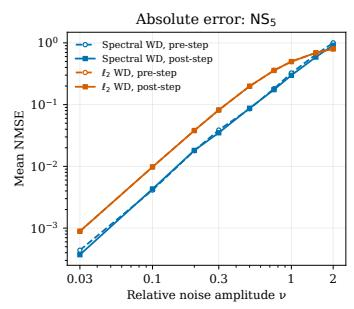

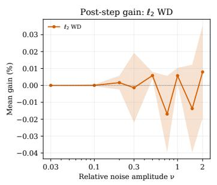

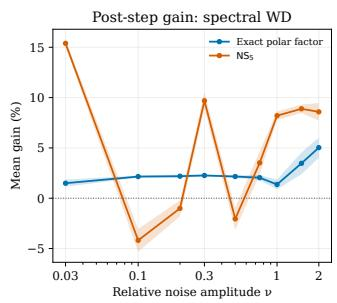  
Figure 8: Pre/post-step weight decay in matrix denoising. From left to right: mean NMSE with the exact polar factor, mean NMSE with $\mathrm { N S _ { 5 } }$ , post-step gain for $\ell _ { 2 }$ weight decay, and post-step gain for spectral weight decay. Absolute errors are averaged over five seeds. Dashed curves denote pre-step and solid curves post-step in the first two panels. Gain bands show ± one standard deviation. Positive gains favor post-step.

Low-rank recovery by matrix denoising. We first study recovery when all matrix entries are observed with noise, minimizing $\begin{array} { r } { \frac { 1 } { 2 } \| W - Y \| _ { F } ^ { 2 } } \end{array}$ for $Y = W _ { \star } + \nu \| W _ { \star } \| _ { F } E / 1 2 8$ , with $E _ { i j } \sim \mathcal { N } ( 0 , 1 )$ . The nonzero teacher singular values decrease geometrically with a smallest-to-largest ratio of 0.15, testing whether regularization preserves weak signal directions while suppressing noise. Figure 8 shows that exact post-step decay reduces mean reconstruction error at all displayed noise levels, with gains from 1.4% to 5.0%. With $\mathrm { N S } _ { 5 } .$ , post-step also performs better on average, although its gains fluctuate more across noise levels. The pre/post-step diference for $\ell _ { 2 }$ weight decay remains below 0.02%, negligible compared with the percentage-level gains under spectral weight decay.

Low-rank recovery from linear measurements. We next replace full noisy observations with 7,680 Gaussian linear measurements, twice the degrees of freedom of a rank-16 matrix, $y _ { i } = \langle A _ { i } , W _ { \star } \rangle + \xi _ { i }$ , where $( A _ { i } ) _ { j k } \sim { \mathcal { N } } ( 0 , 1 )$ and $\xi _ { i } \sim \mathcal { N } ( 0 , \nu ^ { 2 } \lVert W _ { \star } \rVert _ { F } ^ { 2 } )$ . We minimize the least-squares measurement loss using a flatter teacher spectrum, with sixteen nonzero singular values ranging linearly from 1 to 0.6. All signal directions are therefore relatively strong, unlike in the denoising task. Figure 9 shows that post-step achieves lower mean reconstruction error at every displayed noise level with both the exact polar factor and $\mathrm { N S _ { 5 } }$ , with $\mathrm { N S _ { 5 } }$ gains ranging from 1.2% to 6.1%. The $\ell _ { 2 }$ baseline again difers only by tiny fractions of a percent between the two update orders.

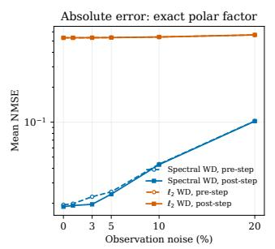

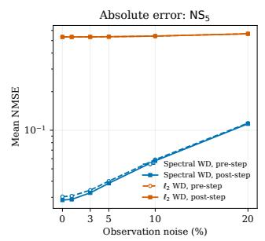

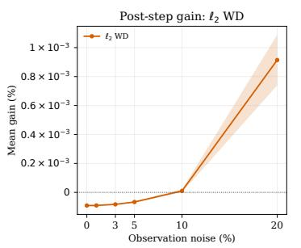

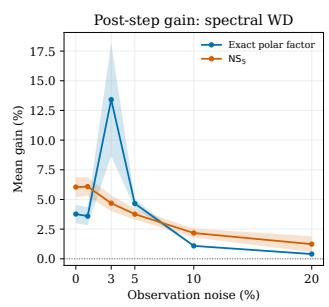  
Figure 9: Pre/post-step weight decay in matrix sensing. Panels show mean NMSE with the exact polar factor, mean NMSE with ${ \mathrm { N S } } _ { 5 } ,$ post-step gain for $\ell _ { 2 }$ weight decay, and post-step gain for spectral weight decay. Absolute errors are averaged over five seeds. Dashed curves denote pre-step and solid curves post-step in the first two panels. Gain bands show ± one sample standard deviation. Positive gains favor post-step.

Update-order sensitivity in language-model pretraining. We next examine whether the two variants produce diferent training dynamics with Adam on a 124M-parameter LLaMA trained on FineWeb-Edu at fixed $\lambda = 1$ as the learning rate increases. Figure 10 shows that at $\eta = 0 . 0 0 5$ , the trajectories nearly coincide, whereas at $\eta = 0 . 0 1 0$ they separate more clearly. Post-step reaches a lower efective rank but a higher final validation loss at the largest learning rate. This sweep therefore exposes sensitivity to update order, but the accompanying change in rank prevents a clear preference between the variants.

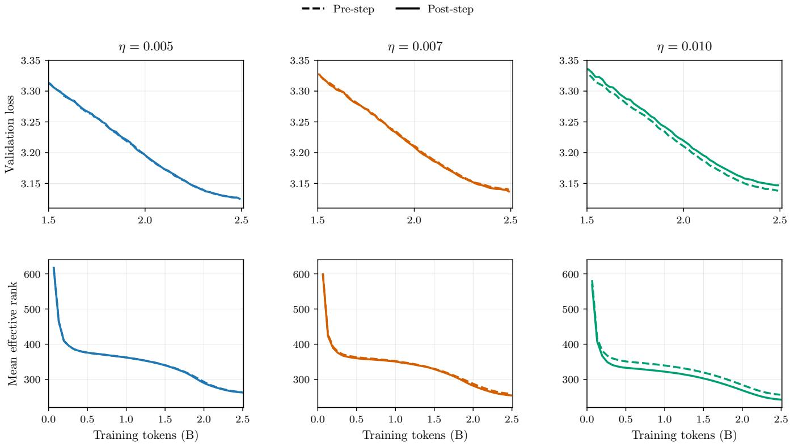  
Figure 10: Pre/post-step spectral weight decay with Adam on a 124M-parameter LLaMA trained on FineWeb-Edu at fixed $\lambda = 1$ . The top row shows validation loss after 1.5B tokens, and the bottom row shows mean efective rank from the start of training. Dashed curves denote pre-step and solid curves post-step.

Our LLM pretraining experiments show little diference between the two update orders at small learning rates. The synthetic recovery tasks favor post-step on average, with generally modest gains. Both schemes have the same computational requirements, so we adopt post-step and recommend it as the default.

## B Experimental Details and Additional Results

## B.1 Language-model pretraining setup

Table 1 summarizes the main LLaMA pretraining configurations. We train on FineWeb-Edu using GPT-2 tokenization, rotary position embeddings, RMSNorm, and SwiGLU feed-forward layers. Input embeddings and the output head share weights. All runs use sequences of 1,024 tokens, an efective batch of 128 sequences, cosine learning-rate decay with 2,000 warmup steps, Adam betas (0.9, 0.95), gradient clipping at 0.5, and no dropout. Spectral decay acts on two-dimensional weight matrices using five Newton-Schulz iterations, as in Muon. The higher-learning-rate comparison in Appendix A.3 varies the learning rate while retaining the 124M architecture and training horizon.

Table 1: LLaMA architectures and reference pretraining configurations. Token budgets are rounded.
<table><tr><td>Setting</td><td>124M</td><td>257M</td><td>500M</td></tr><tr><td>Transformer blocks</td><td>12</td><td>16</td><td>22</td></tr><tr><td>Hidden dimension</td><td>768</td><td>1,024</td><td>1,280</td></tr><tr><td>Attention heads</td><td>12</td><td>16</td><td>20</td></tr><tr><td>Feed-forward dimension</td><td>2,048</td><td>2,816</td><td>3,584</td></tr><tr><td>Embedding vocabulary size</td><td>50,304</td><td>50,304</td><td>50,304</td></tr><tr><td>Training steps</td><td>19,000</td><td>39,000</td><td>76,294</td></tr><tr><td>Training tokens (B)</td><td>2.49</td><td>5.11</td><td>10.00</td></tr></table>

## B.2 Comparison with Prehab

Prehab [Qin et al., 2025] adds a smooth rank surrogate over activation-whitened weights to the task loss. We initialize both methods from the same 124M-parameter checkpoint, pretrained with standard $\ell _ { 2 }$ weight decay for one Chinchilla-optimal training budget [Hofmann et al., 2022]. We apply spectral weight decay without modification and tune only λ. After 1,000 steps, it reduces mean efective rank by 15.9% with a 2.46% relative increase in validation loss. At comparable validation loss, the rank reduction is much larger than with Prehab (Figure 11), although the loss cost is still too high for practical compression.

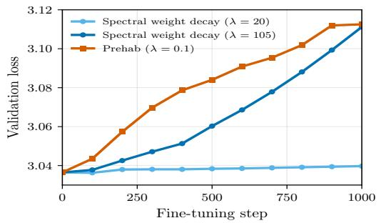

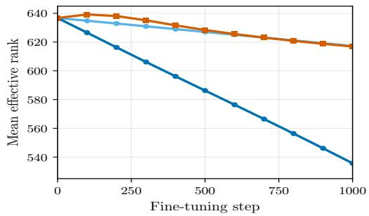  
Figure 11: Fine-tuning trajectories from the same 124M-parameter LLaMA checkpoint. At comparable validation loss, spectral weight decay reduces efective rank more than Prehab.

## B.3 Comparison with Cuttlefish

Cuttlefish [Wang et al., 2023] is a direct training-time alternative based on a simple idea: it starts with full-rank training, waits for the stable ranks of the layers to converge, then factorizes each layer at the corresponding rank and continues training the low-rank factors. Like spectral weight decay, it modifies the model during

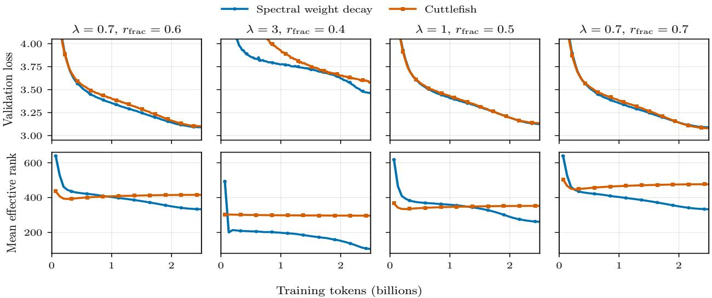  
Figure 12: Training trajectories for spectral weight decay and Cuttlefish on 124M-parameter LLaMA models trained on FineWeb-Edu. Each column compares the spectral coeficient λ with the indicated Cuttlefish rank fraction rfrac.

training rather than compressing a fixed checkpoint. Across all four matched settings in Figure 12, spectral weight decay reaches a substantially lower final efective rank at comparable validation loss.

## B.4 Compression method and procedure

The compression results in Section 3 use SVD-LLM. We compare five singular-value-based compression methods on one checkpoint to select this method. Table 2 applies truncated SVD, SliceGPT [Ashkboos et al., 2024], ASVD [Yuan et al., 2023], SVD-LLM [Wang et al., 2024], and Dobi-SVD [Wang et al., 2025] to a 124M-parameter spectral-weight-decay model with coeficient 1. We also report accuracy on ARC-Easy [Clark et al., 2018], HellaSwag [Zellers et al., 2019], and PIQA [Bisk et al., 2020] after compression.

Truncated SVD reaches 1.43× compression with a +0.0359 validation-loss increase. SliceGPT produces a larger loss increase at a lower compression rate. ASVD and SVD-LLM preserve validation loss better at comparable compression, with increases of +0.0286 and +0.0196, respectively. Dobi-SVD reaches a similar +0.0207 increase at 1.21× compression. SVD-LLM gives the lowest validation loss among the compressed models, so we use it throughout.

Table 2: Five compression methods applied to the 124M spectral-weight-decay model (λ = 1). Lower losses are better. Higher compression rates and downstream accuracies are better. Bold marks the best compressed value in each column.
<table><tr><td>Method</td><td>Compression val loss</td><td></td><td>∆val loss</td><td>ARC-E</td><td>HellaSwag</td><td>PIQA</td></tr><tr><td>baseline (uncompressed)</td><td></td><td>3.1129</td><td></td><td>0.4947</td><td>0.3004</td><td>0.6088</td></tr><tr><td>truncated SVD</td><td>1.43×</td><td>3.1488</td><td>+0.0359</td><td>0.4947</td><td>0.2999</td><td>0.6099</td></tr><tr><td>SliceGPT</td><td>1.22×</td><td>4.6347</td><td>+1.5218</td><td>0.4140</td><td>0.2815</td><td>0.5680</td></tr><tr><td>ASVD</td><td>1.45×</td><td>3.1416</td><td>+0.0286</td><td>0.4877</td><td>0.2998</td><td>0.6121</td></tr><tr><td>SVD-LLM</td><td>1.42×</td><td>3.1325</td><td>+0.0196</td><td>0.4982</td><td>0.2991</td><td>0.6088</td></tr><tr><td>Dobi-SVD</td><td>1.21×</td><td>3.1336</td><td>+0.0207</td><td>0.4912</td><td>0.3005</td><td>0.6110</td></tr></table>

We leave the token embeddings and output head uncompressed because truncating them sharply degrades model quality. Spectral weight decay also has little efect on their ranks (Figure 2, left). We choose a separate truncation rank for each remaining weight matrix because efective rank varies substantially across transformer blocks (Figure 2, middle). After folding the singular values into one factor, a rank-r approximation of $W \in \mathbb { R } ^ { m \times n }$ stores $r ( m + n )$ parameters instead of mn. Decreasing r therefore saves parameter memory at the cost of higher validation loss.

## B.5 Noisy-label robustness results

Tables 3, 4, and 5 report final-checkpoint clean-test accuracy as the mean ± one sample standard deviation, in percentage points, over five label-corruption seeds. Model initialization, training order, data splits, and regularization coeficients are fixed. Standard deviations quantify variability from label corruption, not from model initialization or data splitting.

The MNIST MLP flattens each $2 8 \times 2 8$ image and applies four hidden layers of width 2,048 with ReLU activations, followed by a ten-class linear head. The row-sequential GRU reads the image as 28 vectors of dimension 28, uses two recurrent layers with hidden dimension 1,280, and applies a ten-class linear head to the final hidden state of the top layer.

Table 3: MNIST MLP: final clean-test accuracy, mean $\pm$ one sample standard deviation.
<table><tr><td>Method</td><td>10% noise</td><td>25% noise</td><td>40% noise</td><td>60% noise</td></tr><tr><td>No WD</td><td> $8 7 . 9 9 \pm 0 . 9 3$ </td><td> $7 9 . 5 2 \pm 1 . 6 7$ </td><td> $6 5 . 2 9 \pm 3 . 2 7$ </td><td> $4 5 . 7 1 \pm 1 . 7 9$ </td></tr><tr><td> $\ell _ { 2 } ~ \mathrm { W D }$ </td><td> $8 6 . 8 9 \pm 1 . 7 0$ </td><td> $7 7 . 9 0 \pm 2 . 0 0$ </td><td> $6 7 . 1 2 \pm 2 . 7 1$ </td><td> $4 5 . 7 8 \pm 1 . 2 9$ </td></tr><tr><td>Spectral WD (post-step)</td><td> $8 7 . 9 9 \pm 0 . 9 3$ </td><td> $8 1 . 2 2 \pm 2 . 3 6$ </td><td> $7 5 . 0 1 \pm 3 . 0 1$ </td><td> $6 3 . 5 6 \pm 1 . 0 4$ </td></tr><tr><td>Spectral WD (pre-step)</td><td> $8 7 . 3 1 \pm 1 . 1 3$ </td><td> $8 1 . 6 3 \pm 1 . 7 7$ </td><td> $7 5 . 5 2 \pm 2 . 3 5$ </td><td> $6 1 . 6 3 \pm 2 . 7 4$ </td></tr></table>

Table 4: MNIST GRU: final clean-test accuracy, mean $\pm$ one sample standard deviation.
<table><tr><td>Method</td><td>10% noise</td><td>25% noise</td><td>40% noise</td><td>60% noise</td></tr><tr><td>No WD</td><td> $9 1 . 2 9 \pm 0 . 6 4$ </td><td> $8 2 . 4 2 \pm 1 . 1 8$ </td><td> $7 1 . 5 0 \pm 1 . 1 3$ </td><td> $5 1 . 6 5 \pm 2 . 1 2$ </td></tr><tr><td> $\ell _ { 2 }$  WD</td><td> $9 1 . 0 7 \pm 1 . 5 5$ </td><td> $8 2 . 9 8 \pm 0 . 5 4$ </td><td> $7 2 . 6 9 \pm 0 . 8 4$ </td><td> $5 1 . 2 0 \pm 2 . 7 8$ </td></tr><tr><td>Spectral WD (post-step)</td><td> $9 4 . 0 6 \pm 1 . 0 3$ </td><td> $8 9 . 9 6 \pm 0 . 9 7$ </td><td> $8 1 . 3 8 \pm 3 . 1 5$ </td><td> $6 5 . 6 0 \pm 3 . 7 0$ </td></tr><tr><td>Spectral WD (pre-step)</td><td> $9 4 . 8 3 \pm 0 . 6 2 $ </td><td> $9 0 . 0 0 \pm 1 . 1 7$ </td><td> $8 0 . 0 2 \pm 2 . 0 3$ </td><td> $6 7 . 3 3 \pm 1 . 5 2$ </td></tr></table>

We use BERT-base-uncased [Devlin et al., 2019], initialized from the google-bert/bert-base-uncased checkpoint. The encoder has 12 transformer blocks, each with 12 attention heads, hidden dimension 768, and feed-forward dimension 3072 with GELU activations. Its WordPiece vocabulary contains 30,522 tokens. The checkpoint supports 512 positions, but our inputs are truncated to 128 tokens. Attention and hidden-layer dropout probabilities are both 0.1. A linear classifier maps the pooled [CLS] representation to 4, 14, 10, or 5 classes for AG News, DBpedia-14, Yahoo Answers, and Yelp Review Full, respectively.

The model has approximately 110M parameters, of which 29M are trainable. We freeze the embeddings and encoder blocks 1 through 8, and train blocks 9 through 12, the pooler, and the classifier. Both regularizers act on the displacements from the pretrained checkpoint of the attention and feed-forward weight matrices in the trainable blocks and the pooler weight matrix. The classifier, biases, and LayerNorm parameters are not regularized.

Regularization coeficients are calibrated in separate tuning runs using final clean-validation accuracy, independently at each noise level for MNIST and at 60% noise for BERT. The selected BERT coeficients are then fixed across noise levels. All coeficients are frozen before the five new label-corruption replications. Clean validation is not used to select checkpoints, and the replication test results are not used to tune coeficients. Each reported checkpoint is taken at the fixed training horizon.

Table 5: BERT-base: final clean-test accuracy, mean ± one sample standard deviation.
<table><tr><td>Dataset</td><td>Noise</td><td>No WD</td><td> $\ell _ { 2 } { \mathrm { - S P } }$ </td><td> $\left( { \mathrm { p o s t - s t e p } } \right)$ </td><td>Spectral WD Spectral WD  $\left( \mathrm { p r e - s t e p } \right)$ </td></tr><tr><td rowspan="4">AG News</td><td>10%</td><td> $8 8 . 4 9 \pm 0 . 1 0$ </td><td> $8 9 . 6 3 \pm 0 . 0 3$ </td><td> $9 0 . 5 7 \pm 0 . 1 0$ </td><td> $9 0 . 5 5 \pm 0 . 1 1$ </td></tr><tr><td>25%</td><td> $7 9 . 2 3 \pm 0 . 4 7$ </td><td> $8 8 . 6 0 \pm 0 . 2 1$ </td><td> $8 9 . 7 7 \pm 0 . 1 1$ </td><td> $8 9 . 7 6 \pm 0 . 1 3$ </td></tr><tr><td>40%</td><td> $6 6 . 0 2 \pm 0 . 5 0$ </td><td> $8 6 . 6 5 \pm 0 . 5 5$ </td><td> $8 8 . 5 6 \pm 0 . 3 3$ </td><td> $8 8 . 6 1 \pm 0 . 3 1$ </td></tr><tr><td>60%</td><td> $4 4 . 0 5 \pm 0 . 8 5$ </td><td> $7 8 . 4 0 \pm 1 . 9 1$ </td><td> $8 1 . 0 7 \pm 1 . 1 4$ </td><td> $8 1 . 0 8 \pm 1 . 1 0 $ </td></tr><tr><td rowspan="4">DBpedia-14</td><td>10%</td><td> $9 7 . 9 7 \pm 0 . 1 1$ </td><td> $9 8 . 7 2 \pm 0 . 0 1$ </td><td> $9 8 . 8 6 \pm 0 . 0 3$ </td><td> $9 8 . 8 5 \pm 0 . 0 4$ </td></tr><tr><td>25%</td><td> $9 5 . 1 9 \pm 0 . 1 8$ </td><td> $9 8 . 5 2 \pm 0 . 1 3$ </td><td> $9 8 . 7 2 \pm 0 . 1 0$ </td><td> $9 8 . 7 2 \pm 0 . 1 0$ </td></tr><tr><td>40%</td><td> $9 0 . 4 3 \pm 0 . 3 8$ </td><td> $9 8 . 1 0 \pm 0 . 2 5$ </td><td> $9 8 . 5 5 \pm 0 . 2 1$ </td><td> $9 8 . 5 3 \pm 0 . 2 0$ </td></tr><tr><td>60%</td><td> $7 3 . 7 4 \pm 1 . 0 5$ </td><td> $9 6 . 6 5 \pm 0 . 3 6$ </td><td> $9 7 . 8 8 \pm 0 . 3 4$ </td><td> $9 7 . 8 3 \pm 0 . 3 0$ </td></tr><tr><td rowspan="4">Yahoo Answers</td><td>10%</td><td> $6 6 . 8 6 \pm 0 . 2 3$ </td><td> $6 9 . 0 6 \pm 0 . 1 4$ </td><td> $7 0 . 9 4 \pm 0 . 0 9$ </td><td> $7 0 . 9 5 \pm 0 . 1 2$ </td></tr><tr><td>25%</td><td> $6 1 . 9 9 \pm 0 . 1 7$ </td><td> $6 8 . 0 1 \pm 0 . 1 2$ </td><td> $7 0 . 2 5 \pm 0 . 1 4$ </td><td> $7 0 . 2 4 \pm 0 . 1 3$ </td></tr><tr><td>40%</td><td> $5 4 . 7 1 \pm 0 . 1 5$ </td><td> $6 6 . 5 2 \pm 0 . 3 3$ </td><td> $6 9 . 1 8 \pm 0 . 2 2$ </td><td> $6 9 . 1 7 \pm 0 . 1 9$ </td></tr><tr><td>60%</td><td> $4 0 . 9 5 \pm 0 . 8 8$ </td><td> $6 1 . 3 4 \pm 0 . 3 7$ </td><td> $6 5 . 9 3 \pm 0 . 5 3$ </td><td> $6 5 . 9 2 \pm 0 . 5 2$ </td></tr><tr><td rowspan="4">Yelp Review Full</td><td>10%</td><td> $5 1 . 9 3 \pm 0 . 1 0$ </td><td> $5 2 . 9 2 \pm 0 . 1 4$ </td><td> $5 4 . 4 2 \pm 0 . 1 2$ </td><td> $5 4 . 4 1 \pm 0 . 1 5$ </td></tr><tr><td>25%</td><td> $4 7 . 1 2 \pm 0 . 1 6$ </td><td> $5 1 . 4 4 \pm 0 . 1 1$ </td><td> $5 3 . 0 8 \pm 0 . 2 0$ </td><td> $5 3 . 1 5 \pm 0 . 2 5$ </td></tr><tr><td>40%</td><td> $4 0 . 5 8 \pm 0 . 4 8$ </td><td> $4 8 . 6 2 \pm 0 . 7 0$ </td><td> $5 0 . 9 1 \pm 0 . 4 6$ </td><td> $5 0 . 9 2 \pm 0 . 5 1$ </td></tr><tr><td>60%</td><td> $2 9 . 7 6 \pm 0 . 9 7$ </td><td> $3 8 . 6 2 \pm 1 . 5 0$ </td><td> $4 2 . 7 8 \pm 2 . 3 9$ </td><td> $4 2 . 8 9 \pm 2 . 3 7$ </td></tr></table>